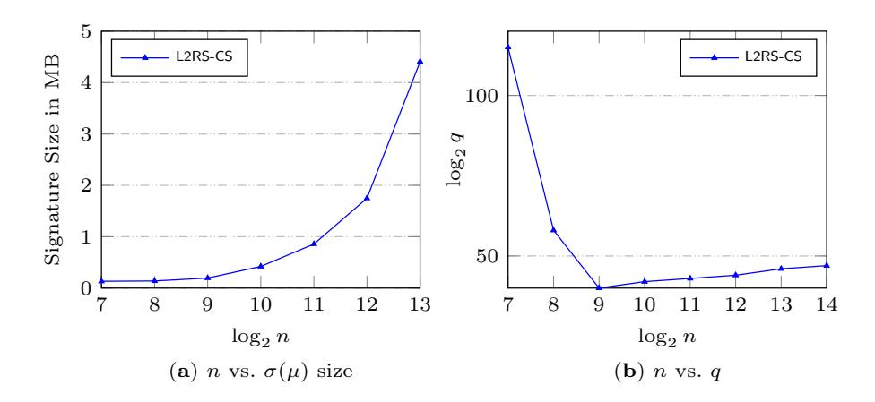
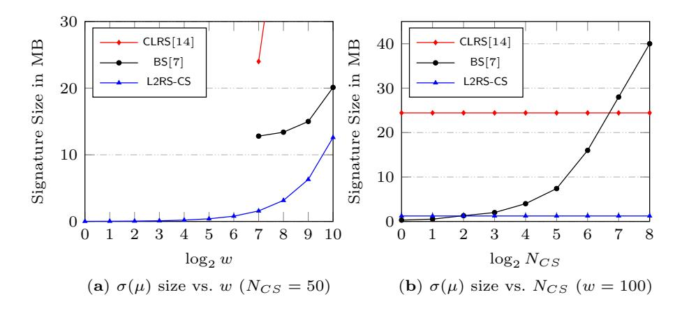

# Post-Quantum Linkable Ring Signature Enabling Distributed Authorised Ring Confidential Transactions in Blockchain

Wilson Alberto Torres (), Ron Steinfeld, Amin Sakzad, Veronika Kuchta

Faculty of Information Technology, Monash University Melbourne, Australia {Wilson.Torres,Ron.Steinfeld, Amin.Sakzad,Veronika.Kuchta}@monash.edu

Abstract. When electronic wallets are transferred by more than one party, the level of security can be enhanced by decentralising the distribution of authorisation amongst those parties. Threshold signature schemes enable this functionality by allowing multiple cosigners to cooperate in order to create a joint signature. These cosigners interact to sign a transaction which then confirms that a wallet has been transferred. However, in the event of a post-quantum attack, existing threshold signature schemes that support such an authorisation technique in privacypreserving cryptocurrency protocols - like Ring Confidential Transaction (RingCT) - would not provide adequate security.

In this paper, we present a new post-quantum cryptographic mechanism, called Lattice-based Linkable Ring Signature with Co-Signing (L2RS-CS), which offers a distributed authorisation feature to protect electronic wallets. A novel security model for L2RS-CS is also formalised to capture the security and privacy requirements to protect transactions in applications to blockchain cryptocurrency protocols, such as the RingCT. To address key-generation security concerns, and to support compression of keys and signatures, the L2RS-CS incorporates a distributed key generation along with a solid public-key aggregation. Finally, we prove the security of our constructed L2RS-CS in the random oracle model and the standard lattice-based Module-SIS hardness assumption.

Keywords: Lattice-Based Cryptography, Post-Quantum Cryptography, Privacy-Preserving Protocols, Cryptocurrencies, Threshold Signatures, RingCT

## 1 Introduction

The notion of (t,n)-Threshold Signature (TS) schemes was initially conceptualised by Desmedt and Frankel in [18]. They defined TS as a cryptographic protocol where a subset of size t out of n cosigners collaborates to jointly sign a given message m. Contrary to standard digital signatures, TS splits the secret key (sk) into multiple shares distributed across n participants. Later, an interactive protocol is performed with at least the threshold number of cosigners (t out of n) to produce a signature. TS constructions contain several benefits including reliability and security. For instance, TS is employed to augment the confidentiality of secret keys, increase the resilience against secret key exposure, and enable decentralisation of trust [10]. Furthermore, metering applications [17] utilise TS to measure the interaction between servers and clients so e-business can charge fees for advertisements. Similarly, blockchain technology, particularly cryptocurrencies [27], incorporates TS schemes to provide an extra, more restrictive layer of security. More specifically, this involves the authorisation in digital currencies where a certain number of parties collaborates to approve electronic payments.

Securing the cryptographic keys is always crucial to attaining a respectable level of reliability in any secure cryptocurrency application. Since the digital wallets can be spent with their sk's, this would be a single point of vulnerability. For instance, if such sk's are stolen or lost, the owners of the corresponding wallets would be unable to access their funds. Consequently, TS protocols enable this authorisation property to segregate the ownership of digital wallets. Besides TS schemes increasing the difficulty for adversaries to mount an attack (as multiple cosigners need to be compromised), they also offer redundancy, which might protect sk's from being lost [21]. In addition, there are other mechanisms that help to secure the generation of cryptographic keys in digital currencies. The Distributed Key Generation (DKG) protocol guarantees that nobody learns about the sk during the execution of the protocol [26, 44]. DKG also operates in a complete decentralised distribution of the trust among the parties, so it requires no trusted party. The public-key aggregation is another mechanism that allows the public verifier to only see the aggregate public-key rather than the cosigners' public-keys, providing more favourable privacy and performance results [4, 9, 35]. The integration of these controls would prevent the well-known rogue key (or key cancellation) attacks where a dishonest actor is capable of signing transactions on behalf of honest cosigners [4, 28, 44].

The security concept of most cryptographic primitives and protocols is changing due to the foreseeable presence of a sufficiently powerful quantum computer. The security assumptions of public-key cryptography that are based on the classical number theory would be efficiently broken in the event of large-scale quantum computers becoming practical [39]. Nowadays, post-quantum cryptographers are devising new algorithms in anticipation of quantum attacks. Among the several approaches proposed to address this concern, lattice-based cryptography appears to be a practical alternative to both classical cryptography and this quantum computing threat. Many lattice-based schemes and protocols have shown optimal performance, simplicity, and reliable security proofs based on the worst-case hardness assumptions, meaning that at least one instance of the lattice problem is hard to solve. Moreover, lattice-based cryptosystems even allow powerful new classes of cryptographic mechanisms, such as fully homomorphic encryption and functional encryption [2, 12, 13, 45].

The Ring Confidential Transaction (RingCT) [37] is a cryptographic protocol that is widely employed by Monero, one of the most popular cryptocurrencies to date. The RingCT performs e-commerce operations in a decentralised network while maintaining complete-anonymity for the parties involved and also preventing double spending coins [16]. These security properties are achieved by employing Linkable Ring Signature (LRS) schemes [31]. In the RingCT framework, complete-anonymity provides a remarkable advantage since other cryptocurrencies, such as Bitcoin, are only pseudo-anonymous [29]. Further improvements were proposed in RingCT 2.0 [43] and RingCT 3.0 [50]. These presented formal definitions for both the cryptocurrency protocol and the corresponding security model. Moreover, certain variants of RingCT incorporate an authorisation feature for distributed and co-signing digital wallets by adapting a combination of TS and Ring Signature (RS) schemes [4, 28]. However, this authorisation model has been constructed with number theory assumptions and thus it would be insecure against quantum attacks. In the post-quantum setting, the first Lattice-based RingCT (LRCT) was devised in [1, 3]. The LRCT uses the Bimodal Lattice-based Signature Scheme (BLISS) [19], a demonstrated, practical and secure lattice-based digital signature [19, 20], as an underlying building block. In a recent study, an efficient, scalable and practical lattice-based RingCT protocol was devised in [22]. Nonetheless, these post-quantum approaches did not incorporate an authorisation model in their design which, as discussed above, can be achieved by using TS schemes.

Related Works. Several TS schemes have been proposed after its introduction in [18]. Most of the existing TS schemes [8, 23–25, 40] and Threshold Ring Signature (TRS) schemes [11, 30, 32, 38, 46, 48, 49] have been designed with the classical cryptographic assumptions, and only a few constructions are lattice-based. The first lattice-based TRS [14] was devised based on an identification scheme and the standard lattice-based Short Integer Solution (SIS) hardness problem. The signature size of this scheme was around 25 MB with t = 50 and n = 100. Later, a new study [7] proposed an enhanced version of [14]. The authors modified this model for the anonymity property, which brought improvements to the signature size (around 13 MB with same ring and threshold sizes as [14]). In [47], an ID-Based TRS from lattices was designed in the random oracle model. The security properties therein relied on a non-standard lattice-based assumption that they defined as a general Graded Computational Diffie-Hellman Problem (gCDHP). Another scheme was constructed in [15] to be applied in a message block sharing application; however, its analysis disregarded the evaluation of the best known lattice attacks, and overlooked a security reduction in the standard lattice-based Ring-SIS problem seemingly used in this work. However, since DKG protocols are not utilised in their designs, in all likelihood these lattice-based proposals will find themselves vulnerable to rogue key attacks. In addition, they are incompatible with the linkability technique.

### 1.1 Contributions

– We construct the first post-quantum Lattice-based Linkable Ring Signature with Co-Signing (L2RS-CS) scheme which can be adapted to a post-quantum

### 4 W. Alberto Torres et al.

- cryptocurrency protocol such as the LRCT [1]. The L2RS-CS offers completeanonymity, and can support Multiple Input wallets to be transferred to Multiple Output wallets (MIMO). The L2RS-CS is built on top of the postquantum LRS from [3] and integrates a DKG together with a solid public-key aggregation (in the post-quantum settings) which bring a high level of security and compression for the cosigners' keys.
- Additionally, we formalise another new security model, called Linkable Ring Signature with Co-Signing (LRS-CS), having a special combination of two constructions, the (NCS-out-of-NCS)-TS and (1-out-of-w)-LRS schemes (which are used in Monero [4, 28]). Although TRS can be seen as a combination of TS and RS schemes, it is a different type of primitive to our proposed LRS-CS. Namely, in TRS any subset of t out of n signers can cooperate to generate a signature while hiding the signers' subset. In contrast, under our LRS-CS model, there are w groups of NCS cosigners, so that all the NCS signing keys within the signing group cooperate to produce the signature while hiding the signers among the w groups. Furthermore, in LRS-CS the NCS cosigners interactively generate and share a single public-key, whereas in TRS each cosigner has an individual public-key generated with a noninteractive key-generation algorithm. Therefore, LRS-CS can be viewed as a more specialised primitive than TRS; however, one that suffices for RingCT authorisation and can also be implemented with much shorter signatures than existing lattice-based TRS schemes, as we demonstrate in the evaluation of our scheme.
- The security of our proposed L2RS-CS scheme is proven in the classical random oracle model where the properties of unforgeability, linkability and nonslanderability are demonstrated to be computationally secure from the standard lattice-based Module-SIS hardness assumption. In terms of anonymity, we show that this construction is unconditionally secure under the Leftover Hash Lemma (LHL) [19]. Table 1 illustrates a comparison of the existing lattice-based TRS schemes, including our L2RS-CS construction.

|  |  |  | Table 1. Lattice-based Threshold Ring Signatures with t = 50 and n = 100. |
|--|--|--|---------------------------------------------------------------------------|
|--|--|--|---------------------------------------------------------------------------|

| Proposals           |   |   | Linkability DKG Aggregate pk Lattice-based | Assumption | Signature<br>Size |
|---------------------|---|---|--------------------------------------------|------------|-------------------|
| Cayrel et al. [14]  | ✗ | ✗ | ✗                                          | SIS        | 25 MB             |
| Bettaieb et al. [7] | ✗ | ✗ | ✗                                          | ISIS       | 13 MB             |
| Wei et al. [47]     | ✗ | ✗ | ✗                                          | gGCDHP1    | NP2               |
| This work (L2RS-CS) | X | X | X                                          | Module-SIS | 1.2 MB            |

<sup>1</sup> general Graded Computational Diffie-Hellman Problem

The remaining paper is structured as follows. In Section 2, we introduce notations and definitions that are used throughout the paper. Following that,

<sup>2</sup> Parameter values and signature sizes were not provided

in Section 3, our proposed LRS-CS is defined, and its security model is then explained in Section 4. Next, the construction of the L2RS-CS scheme is described in Section 5. The security and performance analyses are shown in Section 6 and Section 7, respectively.

### 2 Preliminaries

We use a polynomial ring  $\mathcal{R}=\mathbb{Z}[x]/f(x)$ , where  $f(x)=x^n+1$  with n being a power of 2. The ring  $\mathcal{R}_q$  is then defined to be the quotient ring  $\mathcal{R}_q=\mathcal{R}/(q\mathcal{R})=\mathbb{Z}_q[x]/f(x)$ , where  $\mathbb{Z}_q$  denotes the set of all positive integers modulo q (a prime number  $q=1 \mod 2n$ ) in the interval  $\left[\lfloor \frac{-q}{2} \rfloor, \lfloor \frac{q}{2} \rfloor \right]$ . The challenge space  $\mathcal{S}_{n,\kappa}$ , is the set of all binary vectors of length n and Hamming weight  $\kappa$ . Hash functions are modeled as Random Oracle Model (ROM),  $H_0:\to \{0,1\}^l$ ,  $H_1$  with range  $\mathcal{S}_{n,\kappa}\subseteq\mathcal{R}_{2q}$ , and similarly  $H_2$  with range  $\mathcal{S}_{n,\kappa_2}\subseteq\mathcal{R}_{2q}$ . When we write  $x\leftarrow D$ , for a distribution D, it means that if D is a set then x is chosen uniformly at random from D. The discrete Gaussian distribution over  $\mathbb{Z}^m$  with standard deviation  $\sigma\in\mathbb{R}$  and center at zero, is defined by  $D_{\sigma}^m(x)=\rho_{\sigma}(x)/\rho_{\sigma}(\mathbb{Z}^m)$ , where  $\rho_{\sigma}$  is the m-dimensional Gaussian function  $\rho_{\sigma}(x)=\exp(-\|x\|^2/(2\sigma^2))$  for  $x\in\mathbb{Z}^m$ . Vector transposition is denoted by  $\mathbf{v}^T$ . We say that a function neg(n) is negligible in n if  $neg(n)<\frac{1}{2^n}$ , and a function f(n) is overwhelming if 1-f(n) is negligible.

**Definition 1 (MSIS**<sub> $q,m,k,\beta$ </sub> **problem).** Let  $\mathcal{K}$  be some uniform distribution over the ring  $\mathcal{R}_q^{k\times m}$ . Given a random matrix  $\mathbf{A} \in \mathcal{R}_q^{k\times m}$  sampled from  $\mathcal{K}$ , find a non-zero vector  $\mathbf{v} \in \mathcal{R}_q^{m\times 1}$  such that  $\mathbf{A}\mathbf{v} = \mathbf{0}$  and  $\|\mathbf{v}\|_2 \leq \beta$ , where  $\|\cdot\|_2$  denotes the Euclidean norm.

**Lemma 1 (Rejection Sampling).** ([19], Lemma 2.1). Let V be an arbitrary set, and  $h: V \to \mathbb{R}$  and  $f: \mathbb{Z}^m \to R$  be probability distributions. If  $g_v: \mathbb{Z}^m \to R$  is a family of probability distributions indexed by  $v \in V$  with the property that there exists a  $M \in \mathbb{R}$  such that  $\forall v \in V, \forall \mathbf{v} \in \mathbb{Z}^m, M \cdot g_v(\mathbf{z}) \geq f(\mathbf{z})$ . Then the output distributions of the following two algorithms are identical: 1)  $v \leftarrow h, \mathbf{z} \leftarrow g_v$ , output( $\mathbf{z}, v$ ) with probability  $f(\mathbf{z})/(M \cdot g_v(\mathbf{z}))$ . 2)  $v \leftarrow h, \mathbf{z} \leftarrow f$ , output( $\mathbf{z}, v$ ) with probability 1/M.

**Lemma 2.** ([6]) Let  $\mathcal{R} = \mathbb{Z}[x]/(x^n+1)$  where n>1 is a power of 2 and 0 < i, j < 2n-1. Then all the coefficients of  $2(x^i-x^j)^{-1} \in \mathcal{R}$  are in  $\{-1,0,1\}$ . This implies that  $\|2(x^i-x^j)^{-1}\| \le \sqrt{n}$ .

**Lemma 3.** For  $a, b \in \mathcal{R}_q$ , the following relations hold  $||a|| \le \sqrt{n} ||a||_{\infty}$ ,  $||a \cdot b|| \le \sqrt{n} ||a||_{\infty} \cdot ||b||_{\infty}$ ,  $||a \cdot b||_{\infty} \le ||a|| \cdot ||b||$ .

**Lemma 4 (Leftover Hash Lemma (LHL)).** ([19], Lemma B.1). Let  $\mathcal{H}$  be a universal hash family of hash functions from X to Y. If  $h \leftarrow \mathcal{H}$  and  $x \leftarrow X$  are chosen uniformly and independently, then the statistical distance between (h,h(x)) and the uniform distribution on  $\mathcal{H} \times Y$  is at most  $\frac{1}{2}\sqrt{|Y|/|X|}$ .

Remark 1. We use this lemma for a SIS family of hash function H(S) = A · S ∈ Rq, with S ∈ DomS, where each function is indexed by A ∈ R<sup>1</sup>×(m−1) q and Dom<sup>S</sup> ⊆ R<sup>1</sup>×(m−1) <sup>q</sup> consists of vectors of R<sup>q</sup> elements with coefficients in Γ , (−2 γ , 2 γ ). This is a universal hash family since for all S 6= S 0 , we have Pr -A · S = A · S 0 = |Rq| . This is a universal hash family if there exists 1 ≤ i ≤ m−1 such that s<sup>i</sup> −s 0 i is invertible in R<sup>q</sup> with s<sup>i</sup> , s<sup>0</sup> <sup>i</sup> ∈ Γ. This can be guaranteed by appropriate choice of q, e.g. as shown in ([34], Corollary 1.2), it is sufficient to use q such that f(x) = x <sup>n</sup> + 1 factors into k irreducible factors modulo q and 2 <sup>γ</sup> < <sup>√</sup> 1 k · q <sup>1</sup>/k where n < k ≤ 1 are powers of 2. We assume that R<sup>q</sup> is chosen to satisfy this condition.

## 3 Definition of a Linkable Ring Signature with Co-Signing

In this section, we present the definition of our proposed model, the Linkable Ring Signature with Co-Signing (LRS-CS), which offers an authorisation feature. Under this model, any group of NCS cosigners among w groups has the ability to participate in a protocol that produces the signature, whilst hiding the identity of the signing group. The model also includes a linking tag, making it capable of detecting whether two signatures have been signed by same group of cosigners. Despite this authorisation functionality being implicitly used by Monero [4, 28], it was not formalised; therefore, we have proposed this new model. The LRS-CS consists of a five-tuple scheme, with (Setup, KeyGen, SigGen, SigVer, SigLink), which we define as follows:

- PP ← Setup(1<sup>λ</sup> ): a Probabilistic Polynomial Time (PPT) algorithm that takes the security parameter λ and produces the Public Parameters (PP).
- (pk, SK) ← KeyGen(PP): a PPT interactive protocol among a number of cosigners (NCS) that by taking the PP, it produces a pair of keys: the aggregate shared public-key pk and the set of cosigner' secret-keys SK = {sk1, . . . , skNCS }.
- σ(µ) ← SigGen(SK, µ, L, PP): a PPT interactive protocol that receives the PP, a message µ, the list L as in (1) to be the list of public keys with w users in the ring, and Nin inputs (i.e this represents the number of input wallets of each user in a cryptocurrency application). The cosigners owning the secret keys in the set SK = {sk(k) i,1 , . . . , sk(k) i,NCS } interact to produce the signature σ(µ).

L = n pk(k) i o i∈[w],k∈[Nin] (1)

- (Accept/Reject) ← SigVer(σ(µ), µ, L, PP): a deterministic algorithm that takes PP, a signature σ(µ), the list L, and the message µ and checks σ(µ) is a correct signature. If the signature is valid, it outputs Accept, otherwise Reject.
- (Linked/Unlinked) ← SigLink(σ(µ)1, σ(µ)2): a deterministic algorithm that verifies if two signatures σ(µ)<sup>1</sup> and σ(µ)<sup>2</sup> were produced by the same signer while hiding the identity of such signer. Thus, this algorithm outputs Linked if such condition is met, otherwise outputs Unlinked.

The LRS-CS scheme satisfies the SigGen Correctness where valid signatures are produced by honest signers, and it is then accepted by a public verifier with overwhelming probability. We said that the LRS-CS scheme is correct if for any PP  $\leftarrow$  Setup(1 $^{\lambda}$ ), a honest user  $\pi$  runs the protocols ( $\mathbf{pk}_{\pi}, \mathcal{SK}_{\pi}$ )  $\leftarrow$  KeyGen(PP), and  $\sigma(\mu) \leftarrow \mathsf{SigGen}(\mathcal{SK}_{\pi}, \mu, L, \mathsf{PP})$ , it holds that  $\mathsf{Pr}[\mathsf{Accept} \leftarrow \mathsf{SigVer}(\sigma(\mu), \mu, L, \mathsf{PP})] = 1 - neg(\lambda)$ .

The scheme also achieves SigLink Correctness. Such property guarantees that two valid signatures  $\sigma(\mu)_1$  and  $\sigma(\mu)_2$  are signed and linked by an honest signer with overwhelming probability. We show that the LRS-CS scheme satisfies SigLink Correctness property if for any PP  $\leftarrow$  Setup( $1^{\lambda}$ ) with a honest user  $\pi$  runs the protocols ( $\mathbf{pk}_{\pi}, \mathcal{SK}_{\pi}$ )  $\leftarrow$  KeyGen(PP), and  $\sigma(\mu)_1 \leftarrow \text{SigGen}(\mathcal{SK}_{\pi}, \mu, L, \text{PP}), \ \sigma(\mu)_2 \leftarrow \text{SigGen}(\mathcal{SK}_{\pi}, \mu, L, \text{PP}), \ \text{it holds that}$   $\Pr[\text{Linked} \leftarrow \text{SigLink}(\sigma(\mu)_1, \sigma(\mu)_2)] = 1 - neg(\lambda).$ 

The communication model assumes that the parties involve in our computational model are connected by a network of point-to-point and broadcast channels.

### 4 Security Model for LRS-CS

Our security model is motivated by [3,7] where the adversary corrupts and controls the behaviour of  $(N_{CS}-1)$  cosigners, so forging LRS-CS is as hard as solving the underlying hardness problem. This model also captures anonymity, linkability and non-slanderability as principal properties to secure LRS-CS schemes. We begin by defining the oracles that can be accessed by the adversary.

#### 4.1 Oracles for adversaries

The following oracles are available to any adversary who tries to break the security of the L2RS-CS scheme  $\forall k \in [N_{in}]$ :

 $-\mathbf{pk}_{i}^{(k)} \leftarrow \mathcal{KO}(\bot)$ . The KeyGen Oracle, on request, adds new user(s) to the system. It runs the KeyGen interactive protocol between the challenger (who controls one cosigner) and the adversary (who controls  $(N_{CS}-1)$  cosigners). This oracle returns the aggregate shared public-key  $\mathbf{pk}_{i}^{(k)}$ .

Remark 2. The challenger  $\mathcal{C}$  generates with the KeyGen algorithm, the aggregate shared public-key  $\mathbf{pk}_{\pi}^{(k)}$  and its pair-keys  $(\mathbf{pk}_{\pi,1}^{(k)\dagger}, \mathbf{sk}_{\pi,1}^{(k)\dagger})$ , where  $L^{sh} = \{\mathbf{pk}_{\pi,1}^{(k)\dagger}, \dots, \mathbf{pk}_{\pi,N_{CS}}^{(k)}\}$ . Without loss of generality, we define the  $\mathcal{C}$ 's public-key  $(\mathbf{pk}_{\pi,1}^{(k)\dagger})$  to occur at least once, and to be in the first position of the  $L^{sh}$ . On the other hand, the adversary  $\mathcal{A}$  arbitrarily chooses its public-key for  $(N_{CS}-1)$  cosigners, so it can control  $\{\mathbf{pk}_{\pi,2}^{(k)}, \dots, \mathbf{pk}_{\pi,N_{CS}}^{(k)}\}$  from  $L^{sh}$ . Then,  $\mathcal{A}$  can also compute its aggregate shared public-key  $\mathbf{pk}_{\pi}^{(k)}$  by calling the  $\mathcal{KO}$  oracle. This means that  $\mathcal{A}$  can play the role of all cosigners, except for  $\mathbf{pk}_{\pi,1}^{(k)\dagger}$ .

 $-\sigma(\mu) \leftarrow \mathcal{SO}(L, \mu, \mathbf{pk}_{\pi}^{(k)})$ . The *Signing Oracle*, on input a group size w, a set L as in (1), the signer's  $\mathbf{pk}_{\pi}^{(k)}$ , and a message  $\mu$ . This oracle returns a valid signature  $\sigma(\mu)$ .

#### 4.2 One-Time Unforgeability

We point out that forging LRS-CS is infeasible assuming that the adversary is able to corrupt  $(N_{CS}-1)$  cosigners. Consequently, the LRS-CS scheme is secure against any existentially unforgeable PPT adversary  $\mathcal{A}$  under chosen-message attacks if no  $\mathcal{A}$  has a non-negligible advantage. One-time unforgeability property is then defined in the following interactive game between the challenger  $\mathcal{C}$  and an existential adversary  $\mathcal{A}$  who has access to the oracles in Section 4.1:

- $-\mathcal{C}$  runs  $\mathsf{PP} \leftarrow \mathsf{Setup}(1^{\lambda})$  and gives it to  $\mathcal{A}$ .
- $\mathcal{A}$  queries the  $\mathcal{KO}$  oracle  $Q_k$  times.
- $\mathcal{A}$  queries the  $\mathcal{SO}$  oracle  $Q_s$  times on input  $(\mu, L, \mathbf{pk}_{\pi}^{(k)})$  for a message  $\mu$ ,  $L = \{\mathbf{pk}_1^{(k)}, \dots, \mathbf{pk}_{\pi}^{(k)}, \dots, \mathbf{pk}_w^{(k)}\}$  (with w-1 decoyed users in the ring) as in (1), which contains the aggregate shared public-key  $(\mathbf{pk}_{\pi}^{(k)})^{sh}$ .
- $\mathcal{A}$  finishes this simulation and outputs a forgery  $(L^*, \mu^*, \sigma(\mu^*)^*)$  for a new message  $\mu^*$ , where  $L^* = \left\{\mathbf{pk}_i^{*(k)}\right\}_{i \in [w], k \in [N_{in}]}$ .

 $\mathcal{A}$  wins the game if:

- 1. SigVer $(L^*, \mu^*, \sigma(\mu^*)^*)$  outputs Accept.
- 2. SO was queried at most once.
- 3.  $(L^*, \mu^*, \sigma(\mu^*)^*)$  is not an output of  $\mathcal{SO}$ .
- 4. For all  $i \in [w]$ , there exists  $k \in [N_{in}]$  such that  $\mathbf{pk}_i^{*(k)} \in L^*$  was generated by the  $\mathcal{KO}$  oracle.
- 5. Every  $\mathbf{pk}_{i}^{*(k)}$  was used to query  $\mathcal{SO}$  as a signing key rather than a decoy at most once.

The advantage of the adversary  $\mathcal{A}$  in breaking the LRS-CS scheme is defined as the probability that  $\mathcal{A}$  wins the above game. We say that  $\mathcal{A}$  breaks this game with  $(\tau, Q_s, Q_k, \epsilon_{uf})$  if  $\mathcal{A}$  runs in time at most  $\tau$  and with negligible probability  $\epsilon_{uf}$  after having made at most  $Q_s$  signing queries,  $Q_k$  queries to  $\mathcal{KO}$ , and  $(N_{CS} - 1)$  corrupt cosigners. Thus, we denote this property as  $\mathbf{Advantage}_{\mathcal{A}}^{\mathsf{ot-unf}}(\lambda) = \Pr[\mathcal{A} \text{ wins the game}].$ 

**Definition 2 (One-Time Unforgeability).** The LRS-CS scheme is said to be one-time unforgeable if no adversary with  $(\tau, Q_s, Q_k, \epsilon_{uf})$  is able to break the scheme.

#### 4.3 Unconditional Anonymity

This property requires that any powerful adversaries are incapable of saying which member of the ring created a particular signature. We define that it should be infeasible for an adversary  $\mathcal{A}$  to distinguish a signer's  $\mathbf{pk}_{\pi}^{(k)}$  with non-negligible advantage, even if the adversary has unlimited computing resources and time. This property for LRS-CS schemes is defined in the following game between a simulator  $\mathcal{S}$  and an unbounded adversary  $\mathcal{A}$ .

- $-\mathcal{A}$  may query  $\mathcal{KO}$  oracle according to any adaptive strategy.
- $\mathcal{A}$  may query  $\mathcal{K}\mathcal{C}$  oracle scales  $\mathcal{S}$  the  $L = \left\{\mathbf{pk}_{i_0}^{(k)}, \mathbf{pk}_{i_1}^{(k)}\right\}_{k \in [N_{in}]}$ , where  $i_0, i_1 \in [w]$  which is the output of the  $\mathcal{KO}$  oracle, and a message  $\mu$ .
- $-\mathcal{S}$  flips a coin  $b = \{0,1\}$ , then  $\mathcal{S}$  computes the signature  $\sigma(\mu)_b =$ SigGen $(L, \mathbf{sk}_{i_b}^{(k)}, \mu, \mathsf{PP})$ . This signature is given to  $\mathcal{A}$ .
- $-\mathcal{A}$  outputs a bit b'.
- The output of this experiment is defined to be 1 if b = b', otherwise 0.

 $\mathcal{A}$  wins the game if:

- 1.  $\mathbf{pk}_{i_0}^{(k)}$ ,  $\mathbf{pk}_{i_1}^{(k)}$ , and  $\mathbf{sk}^{(k)} \notin \{\mathbf{sk}_{i_0}^{(k)}, \mathbf{sk}_{i_1}^{(k)}\}$  cannot be used by  $\mathcal{SO}$ . 2. Outputs 1, where b = b'.

The unconditional anonymity advantage of the LRS-CS scheme is denoted by Advantage<sub>A</sub><sup>Anon</sup>( $\lambda$ ) =  $\left| \Pr[b = b'] - \frac{1}{2} \right|$ .

Definition 3 (Unconditional Anonymity). The LRS-CS scheme is unconditional anonymous if for any unbounded adversary A,  $Advantage_A^{Anon}(\lambda)$  is negligible.

#### 4.4 Linkability

It should be infeasible for an adversary  $\mathcal{A}$  to generate (with same  $\mathbf{sk}_{\pi}$ ) two valid LRS-CS signatures which are Unlinked. To describe this, we use the interaction between a simulator S and A:

- The  $\mathcal{A}$  queries the  $\mathcal{KO}$  oracle multiple times.
- The  $\mathcal{A}$  outputs two signatures  $\sigma(\mu)$  and  $\sigma(\mu)'$  and two lists L as in (1) and  $L' = \left\{ \mathbf{pk}_i^{\prime(k)} \right\}_{i \in [w], k \in [N_{in}]}.$

 $\mathcal{A}$  wins the game if:

- 1. By calling SigVer on input  $\sigma(\mu)$  and  $\sigma(\mu)'$ , it outputs Accept on both inputs.
- 2. The  $\mathbf{pk}^{(k)}$ 's in L and L' are outputs of  $\mathcal{KO}$  oracle.
- 3. Finally, it gets Unlinked, when calling SigLink on input  $\sigma(\mu)$  and  $\sigma(\mu)'$ .

Thus the advantage of the linkability in the LRS-CS scheme is denoted by  $\mathbf{Advantage}_{\mathcal{A}}^{\mathsf{Link}}(\lambda) = \Pr[\mathcal{A} \text{ wins the game}].$ 

Definition 4 (Linkability). The LRS-CS scheme is linkable if for all PPT adversary  $\mathcal{A}$ ,  $\mathbf{Advantage}_{\mathcal{A}}^{\mathsf{Link}}(\lambda)$  is negligible in  $\lambda$ .

#### Non-Slanderability

It should be infeasible for an adversary A to output linked for two valid LRS-CS signatures which were correctly generated with different  $\mathbf{sk}^{(k)}$ 's. This means that an adversary can frame an honest user for signing a valid signature so the adversary can produce another valid signature such that the SigLink algorithm outputs Linked. To describe this, we use the interaction between a simulator  $\mathcal S$ and an adversary A:

- $-\mathcal{S}$  generates and gives the list L to  $\mathcal{A}$ .
- $\mathcal{A}$  queries the  $\mathcal{KO}$  oracle to obtain  $(\mathbf{pk}_{\pi}^{(k)}, \mathbf{sk}_{\pi}^{(k)})$ , and gives them to  $\mathcal{S}$ .
- S calls the SO with  $\mathbf{sk}_{\pi}^{(k)}$  and outputs a valid signature  $\sigma(\mu)$ , which is then given to A.
- $\mathcal{A}$  uses the remaining (w-1) keys of the ring signature to create a second signature  $\sigma(\mu)'$  by calling the  $\mathcal{SO}$  algorithm.

 $\mathcal{A}$  wins the game if:

- 1. The SigVer, on input  $\sigma(\mu)$  and  $\sigma(\mu)'$ , outputs Accept.
- 2.  $(\mathbf{pk}_{\pi}^{(k)}, \mathbf{sk}_{\pi}^{(k)})$  were not used to generated the second signature  $\sigma(\mu)'$ .
- 3. When calling the SigLink on input  $\sigma(\mu)$  and  $\sigma(\mu)'$ , it outputs linked.

Thus the advantage of the non-slanderability in the LRS-CS scheme is denoted by  $\mathbf{Advantage}_{A}^{\mathsf{NS}}(\lambda) = \Pr[\mathcal{A} \text{ wins the game}].$ 

**Definition 5 (Non-Slanderability).** The LRS-CS scheme is non-slanderable if for all PPT adversary A, Advantage  $_{A}^{NS}(\lambda)$  is negligible in  $\lambda$ .

### 5 A Lattice-based Construction of the LRS-CS

This section describes technically the Lattice-based Linkable Ring Signature with Co-Signing (MIMO.L2RS-CS) scheme. This construction comprises the following algorithms, Setup, KeyGen, SigGen SigVer, and SigLink.

#### 5.1 Setup

By receiving the security parameter  $\lambda$ , this Setup defines  $\mathbf{A} = [\mathbf{A}' \| \mathbf{I}] \in \mathcal{R}_q^{2 \times (m-1)}$  and  $\mathbf{H} = [\mathbf{H}' \| \mathbf{I}] \in \mathcal{R}_q^{2 \times (m-1)}$  (as Lemma 5), where  $\mathbf{A}' \leftarrow \mathcal{R}_q^{2 \times (m-3)}$ ,  $\mathbf{H}' \leftarrow \mathcal{R}_q^{2 \times (m-3)}$  are chosen uniformly and randomly, and  $\mathbf{I}$  denotes the identity. This algorithm outputs the public parameters (PP):  $\mathbf{A}$  and  $\mathbf{H}$ .

**Lemma 5.** If  $q \geq 4n$ , then solving the MSIS-HNF problem with a matrix  $\mathbf{A} = [\mathbf{A}' \| \mathbf{I}] \in \mathcal{R}_q^{2 \times (m-1)}$ , in the Hermite Normal Form (HNF), is as hard as solving the  $\mathbf{MSIS}_{q,m,k,\beta}^{\mathcal{K}}$  problem with  $\mathbf{A} = [\mathbf{A}' \| \mathbf{A}''] \in \mathcal{R}_q^{2 \times (m-1)}$  uniformly random.

*Proof.* Given the MSIS instance  $\mathbf{A} = [\mathbf{A}' || \mathbf{A}''] \in \mathcal{R}_q^{2 \times (m-1)}$ , if  $\mathbf{A}''^{-1}$  exists, then we can reduce it to MSIS-HNF instance, which is of the form  $\bar{\mathbf{A}} = \mathbf{A}_{1,1}^{m-1} \times \mathbf{A}$ . Therefore, this reduction works with probability equal to the probability that  $\mathbf{A}_{1,1}^{m-1}$  exists; then, it remains to show that this probability is non-negligible.

We denote the entries of  $\mathbf{A}'' = \begin{bmatrix} \mathbf{A}''_{1,1} \ \mathbf{A}''_{1,2} \\ \mathbf{A}''_{2,1} \ \mathbf{A}''_{2,2} \end{bmatrix} \in \mathcal{R}_q^{2 \times 2}$ , so the inverse matrix

$$\mathbf{A}''^{-1} = \frac{1}{\det(\mathbf{A}'')} \cdot \begin{bmatrix} \mathbf{A}''_{2,2} & -\mathbf{A}''_{1,2} \\ -\mathbf{A}''_{2,1} & \mathbf{A}''_{1,1} \end{bmatrix}, \text{ with } \det(\mathbf{A}'')^{-1} = (\mathbf{A}''_{1,1}\mathbf{A}''_{2,2} - \mathbf{A}''_{1,2}\mathbf{A}''_{2,1})^{-1} \in$$

 $\mathcal{R}_q$  if the inverse exists. Then, we have that  $\mathbf{A}''$  is invertible if and only if  $\frac{1}{\det(\mathbf{A}'')}$  exists in  $\mathcal{R}_q$ . Let's define the events  $S_0 = \left\{\mathbf{A}''^{-1} \text{does not exist}\right\}$ , and  $S_1 = \left\{\det(\mathbf{A}'')^{-1} \text{ does not exist in } \mathcal{R}_q\right\}$ . We said that  $\Pr_{\mathbf{A}'' \leftarrow \mathcal{R}_q^{2 \times 2}} \left[S_0\right] = \left\{\det(\mathbf{A}'')^{-1} \right\}$ 

 $\Pr\left[S_1\right] = P_1 + P_2$ , where  $P_1 = \Pr\left[S_1 \mid \mathbf{A}_{2,2}^{\prime\prime-1} \text{ exists}\right] \times \Pr\left[\mathbf{A}_{2,2}^{\prime\prime-1} \text{ exists}\right]$ , and  $P_2 = \Pr\left[S_1 \mid \mathbf{A}_{2,2}^{\prime\prime-1} \text{ does not exist}\right] \times \Pr\left[\mathbf{A}_{2,2}^{\prime\prime-1} \text{ does not exist}\right]$ . We consider that if  $\mathbf{A}_{1,1}^{\prime\prime} \leftarrow \mathcal{R}_q$  and  $\mathbf{A}_{2,2}^{\prime\prime-1}$  exists in  $\mathcal{R}_q$ , then  $\mathbf{A}_{1,1}^{\prime\prime} \times \mathbf{A}_{2,2}^{\prime\prime}$  is uniform in  $\mathcal{R}_q$ , i.e.  $\forall \bar{\mathbf{A}} \in \mathcal{R}_q$ :

$$\Pr_{\mathbf{A}_{1,1}'' \leftarrow \mathcal{R}_q} \left[ \mathbf{A}_{1,1}'' \times \mathbf{A}_{2,2}'' = \bar{\mathbf{A}} \right] = \Pr_{\mathbf{A}_{1,1}'' \leftarrow \mathcal{R}_q} \left[ \mathbf{A}_{1,1}'' = \bar{\mathbf{A}} \times \mathbf{A}_{2,2}''^{-1} \right] = \frac{1}{|\mathcal{R}_q|}$$
(2)

Let  $S_2$  be the event where a uniform element in  $\mathcal{R}_q$  is not invertible in  $\mathcal{R}_q$ . We observe that  $\Pr\left[S_2\right] \leq \frac{n}{q}$  as in [42]. Then by using (2), we have that  $P_1 \leq \Pr\left[S_2\right]$  and  $P_2 \leq \Pr\left[\mathbf{A}_{2,2}^{"-1}\right]$  does not exist in  $\mathcal{R}_q$ , which is equivalent to  $\Pr\left[S_2\right]$ , since  $\mathbf{A}_{2,2}^{"}$  is uniformly random element in  $\mathcal{R}_q$ . Therefore, we argue that  $\Pr\left[S_1\right] \leq P_1 + P_2 \leq 2 \times \Pr\left[S_2\right] \leq \frac{2n}{q}$ . Subsequently, we want to show that  $1 - \Pr\left[S_2\right] \geq \text{non-negligible}$  and this is implied by  $q \geq 4n$ . These conditions lead to the probability that  $\det(\mathbf{A}'')^{-1}$  exist in  $\mathcal{R}_q$  is:  $1 - \Pr\left[S_1\right] = \Pr\left[\det(\mathbf{A}'')^{-1}\right]$  exist in  $\mathcal{R}_q \geq \frac{2n}{q} \geq \frac{1}{2}$ .

Remark 3. Setup incorporates a trapdoor in  $\mathbf{A}$  or  $\mathbf{H}$ , in practice Setup would generate  $\mathbf{A}$  and  $\mathbf{H}$  based on the cryptographic Hash function  $H_2$  evaluated at two distinct and fixed constants.

**Definition 6 (Function Lift).** This function maps  $\mathcal{R}_q^2$  to  $\mathcal{R}_{2q}$  with respect to a public parameter  $\mathbf{A} \in \mathcal{R}_q^{2 \times (m-1)}$ . Given  $\mathbf{a} \in \mathcal{R}_q^2$ , we let  $\mathsf{Lift}(\mathbf{A}, \mathbf{a}) \triangleq (2 \cdot \mathbf{A}, -2 \cdot \mathbf{a} + \mathbf{q}) \in \mathcal{R}_{2q}^{2 \times m}$  with  $\mathbf{q} = \mathbf{q} \cdot (1, 1)^T$ .

#### 5.2 Key Generation (KeyGen)

The KeyGen (Algorithm 1) is an interactive protocol where  $N_{CS}$  cosigners collaborate to produce a pair of keys. We define the public-key to be  $\mathbf{a} \triangleq \mathbf{pk}$ , and the secret-key as  $\mathbf{S} \triangleq \mathbf{sk}$ . Once receiving the public parameters PP, each cosigner creates the corresponding secret-key  $\bar{\mathbf{S}}_p^T$  and public-key  $\bar{\mathbf{a}}_p$  (steps 2-4). After the cosigners interact to verify their public-keys, the aggregate shared public-key  $\mathbf{a}^{sh}$  is jointly computed by each cosigner (step 14). The cosigners also calculate their corresponding secret-key  $\mathbf{S}_p^T$  using the list of cosigners (step 16). This solid aggregate shared public-key enables this scheme to be secure against rogue key attacks [4, 28, 44].

#### 5.3 Signature Generation (SigGen)

The SigGen (Algorithm 2) is an interactive protocol, among  $N_{CS}$  cosigners, which outputs the signature  $\sigma(\mu)$ . This protocol receives a message  $\mu$ , the public parameters, the list L that contains the public-keys of w users in the ring, and a set with the consigners' secret keys,  $\mathcal{SK} = \left\{\mathbf{S}_{\pi,1}^{(k)}, \ldots, \mathbf{S}_{\pi,p}^{(k)}, \ldots, \mathbf{S}_{\pi,N_{CS}}^{(k)}\right\}_{k \in [N_{in}]}$  with  $N_{in}$  number of input wallets. The SigGen extends the L2RS [3] which follows the Fiat-Shamir transformation and uses the rejection sampling technique (step 40) that hides the secret key from the signature.

#### Algorithm 1 Key Generation

```
Input: PP: \mathbf{A} \in \mathcal{R}_a^{2 \times (m-1)}
Output: (\mathbf{a}^{sh}, \mathcal{SK}), with \mathcal{SK} = \{\mathbf{S}_1^T, \dots, \mathbf{S}_{N_{CS}}^T\} being the shared public-key and cosigner's
       secret-key, respectively.
      procedure KEYGEN(A)
 2:
             Each cosigner p \in \{1, \ldots, N_{CS}\}:
            Selects \bar{\mathbf{S}}_p^T = (\bar{\mathbf{s}}_{p,1}, \dots, \bar{\mathbf{s}}_{p,m-1}) \in \mathcal{R}_q^{1 \times (m-1)}, where \bar{\mathbf{s}}_{p,i} \leftarrow (-2^{\gamma}, 2^{\gamma})^n, for 1 \le i \le m-1 Calculates \bar{\mathbf{a}}_p = (\bar{\mathbf{a}}_1, \bar{\mathbf{a}}_2)^T = \mathbf{A} \cdot \bar{\mathbf{S}}_p \bmod q \in \mathcal{R}_q^2.
 3:
 4:
6:
7:
             Broadcasts \mathbf{o}_p to other cosigners p' \in [N_{CS}]
            Receives \mathbf{o}_{p'} with p' \neq p, then "p" sends \bar{\mathbf{a}}_p to the cosigners
             Receives \bar{\mathbf{a}}_{p'} with p' \neq p
9:
             Each cosigner verifies:
              for (1 \le p' \le N_{CS}) do
\nif \mathbf{o}_{p'} = H_0(\bar{\mathbf{a}}_{p'}) then Accept
10:
11:
12:
                    else Abort protocol
13:
              Each cosigner computes the shared public-key as:
              \mathbf{a}^{sh} = \sum_{p'}^{NCS} H_2(\bar{\mathbf{a}}_{p'}, L^{sh}) \cdot \bar{\mathbf{a}}_{p'} \text{ with } L^{sh} = \left\{\bar{\mathbf{a}}_1, \dots, \bar{\mathbf{a}}_{NCS}\right\}
14:
15:
              Each cosigner calculates its corresponding secret-key as:
              \mathbf{S}_{p}^{T} = H_{2}(\bar{\mathbf{a}}_{p}, L^{sh}) \cdot \bar{\mathbf{S}}_{p}^{T}
16:
              return (\mathbf{a}^{sh}, \mathcal{SK}), without loss of generality, each cosigner only outputs and holds its cor-
       responding secret-key \mathbf{S}_{n'}^T.
```

### 5.4 Signature Verification (SigVer)

The SigVer (Algorithm 3) verifies the generated signature by receiving  $(\mu, L, \sigma(\mu), PP)$  and outputing Accept or Reject. Additionally, Theorem 1 shows the bound of  $\beta_v$  that is used in this algorithm.

**Theorem 1.** Let  $\beta_v = \eta \sigma \sqrt{nm}$ ,  $q/4 > \sigma \sqrt{2(\lambda+1) \ln 2 + 2 \ln (nm)}$ , and  $\sigma(\mu) = \left(\mathbf{c}_1, \left\{\mathbf{t}_1^{(k)}, \ldots, \mathbf{t}_w^{(k)}\right\}_{k \in [N_{in}]}, \left\{\mathbf{h}_{\pi}^{(k)}\right\}_{k \in [N_{in}]}\right)$  be generated based on Algorithm 2. Then the output of Algorithm 3 on input  $\sigma(\mu)$  is accepted with probability  $1-2^{-\lambda}$ .

Proof. For a desired expected rejection and repetition M, if we take the definition of  $\alpha$  where  $M=e^{\frac{1}{2\alpha^2}}$ , then  $\mathbf{t}_{\pi}^{(k)}$  will be indistinguishable from  $D_{\sigma}$  if  $\sigma \geq \alpha \cdot \|\mathbf{S}_{2q,\pi,p}^{(k)} \cdot \mathbf{c}_{\pi}\|$  [Section 3.2 in [19]]. We also use [lemma 4.4, parts 1 and 3, in [33]]. The part 3 of this lemma shows that the bound on Euclidean norm  $\beta_v = \eta \sigma \sqrt{nm}$ , for a given  $\eta > 1$ , has a probability  $\Pr\left[\|\mathbf{t}_i^{(k)}\|_2 > \eta \sigma \sqrt{nm}\right] \geq 1-2^{-\lambda}$ . In addition, the bound on infinity norm  $(\|\mathbf{t}_i\|_{\infty} < q/4)$  is analysed in part 1 of this lemma where its union bound is also considered. It turns out that  $\eta$  is required such  $q/4 > \eta \sigma > \sigma \sqrt{2(\lambda+1)\ln 2+2\ln (nm)}$ , except with probability  $2^{-\lambda}$ .

#### 5.5 Signature Linkability (SigLink)

The SigLink (Algorithm 4) checks whether two signatures were correctly produced by the same signer, but it does not reveal the identify of such signer. The correctness proof of this algorithm is described in Appendix A.2.

### Algorithm 2 Signature Generation

```
as in (1), and PP.
                   procedure SigGen(\mathcal{SK}, \mu, L, PP)
                                        for (1 \le k \le N_{in}) do
    3:
                                                         Each cosigner "\pi, p":
                                                         Computes the linking tag \mathbf{h}_{\pi,p}^{(k)} = \mathbf{H} \cdot \mathbf{S}_{\pi,p}^{(k)} \in \mathcal{R}_q^2
    4:
                                                         \begin{split} \bar{\mathbf{o}}_{\pi,p}^{(k)} &= H_0 \big( \mathbf{h}_{\pi,p}^{(k)} \big) \\ \text{Broadcasts } \bar{\mathbf{o}}_{\pi,p}^{(k)} \text{ to other cosigners } p' \in [N_{CS}] \end{split}
    5:
    6:
                                                        Receives \mathbf{\bar{o}}_{\pi,p'}^{(k)} with p' \neq p, then "\pi,p" securely sends \mathbf{h}_{\pi,p}^{(k)} to the cosigners Receives \mathbf{h}_{\pi,p'}^{(k)} with p' \neq p
    7:
    8:
                                                            "\pi, p" verifies:
    9:
                                                            for (1 \le p' \le N_{CS}) do
\nif \mathbf{o}_{\pi,p'}^{(k)} = H_0\left(\mathbf{h}_{\pi,p'}^{(k)}\right) then Accept
 10:
 11:
 12:
                                                                               else Abort protocol
                                                            Computes the shared linking tag \mathbf{h}_{\pi}^{(k)} = \sum_{p'}^{NCS} \mathbf{h}_{\pi,p'}^{(k)}
Calls Lift(\mathbf{H}, \mathbf{h}_{\pi}^{(k)}) to obtain \mathbf{H}_{2q,\pi}^{(k)} = (2 \cdot \mathbf{H}, -2 \cdot \mathbf{h}_{\pi}^{(k)} + \mathbf{q}) \in \mathcal{R}_{2q}^{2 \times m}.
Calls Lift(\mathbf{A}, \mathbf{a}_{\pi}^{(k)}) to obtain \mathbf{A}_{2q,\pi}^{(k)} = (2 \cdot \mathbf{A}, -2 \cdot \mathbf{a}_{\pi}^{(k)} + \mathbf{q}) \in \mathcal{R}_{2q}^{2 \times m}.
 13:
 14:
 15:
                                                             Chooses \mathbf{u}_{\pi,p}^{(k)} = (u_{\pi,p,1}, \dots, u_{\pi,p,m})^T, where u_{\pi,p,i} \leftarrow D_{\sigma}^n, for 1 \le i \le m.
Computes \mathbf{r}_{\pi,p}^{(k)} = \mathbf{A}_{2q,\pi}^{(k)} \cdot \mathbf{u}_{\pi,p}^{(k)} and \mathbf{z}_{\pi,p}^{(k)} = \mathbf{H}_{2q,\pi}^{(k)} \cdot \mathbf{u}_{\pi,p}^{(k)}
 16:
 17:
                                                             \mathbf{o}_{\pi,p}^{(k)} = H_0\left(\mathbf{r}_{\pi,p}^{(k)}, \mathbf{z}_{\pi,p}^{(k)}\right)
 18:
                                                              Broadcasts \mathbf{o}_{\pi,p}^{(k)} to other cosigners p' \in [N_{CS}]
 19:
                                                          Receives \mathbf{o}_{\pi,p'}^{(k)} with p' \neq p, then "\pi,p" securely sends \mathbf{r}_{\pi,p}^{(k)} and \mathbf{z}_{\pi,p}^{(k)} to the cosigners Receives \mathbf{r}_{\pi,p'}^{(k)} and \mathbf{z}_{\pi,p'}^{(k)} with p' \neq p "\pi,p" verifies:
 20:
 21:
 22:
                                                            for (1 \le p' \le N_{CS}) do\nif \mathbf{o}_{n,p'}^{(k)} = H_0\left(\mathbf{r}_{n,p'}^{(k)}, \mathbf{z}_{n,p'}^{(k)}\right) then Accept
 23:
 24:
                                           else Abort protocol "\pi, p" computes \mathbf{r}_{\pi}^{(k)} = \sum_{p'=1}^{N_{CS}} \mathbf{r}_{\pi,p'}^{(k)} and \mathbf{z}_{\pi}^{(k)} = \sum_{p'=1}^{N_{CS}} \mathbf{z}_{\pi,p'}^{(k)} "\pi, p" performs \forall k \in [N_{in}], \ \mathbf{c}_{\pi+1} = H_1\left(L, \mathbf{H}_{2q,\pi}^{(k)}, \mu, \mathbf{r}_{\pi}^{(k)}, \mathbf{z}_{\pi}^{(k)}\right).
 25:
 26:
 27:
                                          for (i = \pi + 1, \pi + 2, \dots, w, 1, 2, \dots, \pi - 1) do for (1 \le k \le N_{in}) do
 28:
 29:
 30:
                                                                               Each cosigner "\pi, p":
                                                                               Selects \mathbf{t}_{i,p}^{(\widetilde{k})} = (t_{i,p,1}, \dots, t_{i,p,m})^T, where t_{i,p,j} \leftarrow D_{\sigma}^n, for 1 \leq j \leq m.
Sends \mathbf{t}_{i,p}^{(k)} to other cosigners p' \in [N_{CS}] securely
 31:
 32:
                                                          Receives \mathbf{t}_{i,p}^{(k)} with p' \neq p from other cosigners 

Computes \mathbf{t}_{i}^{(k)} = \sum_{p'=1}^{NCS} \mathbf{t}_{i,p'}^{(k)} with p' \neq p from other cosigners 

Computes \mathbf{t}_{i}^{(k)} = \sum_{p'=1}^{NCS} \mathbf{t}_{i,p'}^{(k)} where \mathbf{t}_{i}^{(k)} = \sum_{p'=1}^{NCS} \mathbf{t}_{i,p'}^{(k)} where \mathbf{t}_{i}^{(k)} = \sum_{p'=1}^{NCS} \mathbf{t}_{i,p'}^{(k)} and \mathbf{t}_{i}^{(k)} = \mathbf{t}_{i}^{(k)} + \mathbf{t}_{i}^{(k)} + \mathbf{t}_{i}^{(k)} + \mathbf{t}_{i}^{(k)} + \mathbf{t}_{i}^{(k)} + \mathbf{t}_{i}^{(k)} + \mathbf{t}_{i}^{(k)} + \mathbf{t}_{i}^{(k)} + \mathbf{t}_{i}^{(k)} + \mathbf{t}_{i}^{(k)} + \mathbf{t}_{i}^{(k)} + \mathbf{t}_{i}^{(k)} + \mathbf{t}_{i}^{(k)} + \mathbf{t}_{i}^{(k)} + \mathbf{t}_{i}^{(k)} + \mathbf{t}_{i}^{(k)} + \mathbf{t}_{i}^{(k)} + \mathbf{t}_{i}^{(k)} + \mathbf{t}_{i}^{(k)} + \mathbf{t}_{i}^{(k)} + \mathbf{t}_{i}^{(k)} + \mathbf{t}_{i}^{(k)} + \mathbf{t}_{i}^{(k)} + \mathbf{t}_{i}^{(k)} + \mathbf{t}_{i}^{(k)} + \mathbf{t}_{i}^{(k)} + \mathbf{t}_{i}^{(k)} + \mathbf{t}_{i}^{(k)} + \mathbf{t}_{i}^{(k)} + \mathbf{t}_{i}^{(k)} + \mathbf{t}_{i}^{(k)} + \mathbf{t}_{i}^{(k)} + \mathbf{t}_{i}^{(k)} + \mathbf{t}_{i}^{(k)} + \mathbf{t}_{i}^{(k)} + \mathbf{t}_{i}^{(k)} + \mathbf{t}_{i}^{(k)} + \mathbf{t}_{i}^{(k)} + \mathbf{t}_{i}^{(k)} + \mathbf{t}_{i}^{(k)} + \mathbf{t}_{i}^{(k)} + \mathbf{t}_{i}^{(k)} + \mathbf{t}_{i}^{(k)} + \mathbf{t}_{i}^{(k)} + \mathbf{t}_{i}^{(k)} + \mathbf{t}_{i}^{(k)} + \mathbf{t}_{i}^{(k)} + \mathbf{t}_{i}^{(k)} + \mathbf{t}_{i}^{(k)} + \mathbf{t}_{i}^{(k)} + \mathbf{t}_{i}^{(k)} + \mathbf{t}_{i}^{(k)} + \mathbf{t}_{i}^{(k)} + \mathbf{t}_{i}^{(k)} + \mathbf{t}_{i}^{(k)} + \mathbf{t}_{i}^{(k)} + \mathbf{t}_{i}^{(k)} + \mathbf{t}_{i}^{(k)} + \mathbf{t}_{i}^{(k)} + \mathbf{t}_{i}^{(k)} + \mathbf{t}_{i}^{(k)} + \mathbf{t}_{i}^{(k)} + \mathbf{t}_{i}^{(k)} + \mathbf{t}_{i}^{(k)} + \mathbf{t}_{i}^{(k)} + \mathbf{t}_{i}^{(k)} + \mathbf{t}_{i}^{(k)} + \mathbf{t}_{i}^{(k)} + \mathbf{t}_{i}^{(k)} + \mathbf{t}_{i}^{(k)} + \mathbf{t}_{i}^{(k)} + \mathbf{t}_{i}^{(k)} + \mathbf{t}_{i}^{(k)} + \mathbf{t}_{i}^{(k)} + \mathbf{t}_{i}^{(k)} + \mathbf{t}_{i}^{(k)} + \mathbf{t}_{i}^{(k)} + \mathbf{t}_{i}^{(k)} + \mathbf{t}_{i}^{(k)} + \mathbf{t}_{i}^{(k)} + \mathbf{t}_{i}^{(k)} + \mathbf{t}_{i}^{(k)} + \mathbf{t}_{i}^{(k)} + \mathbf{t}_{i}^{(k)} + \mathbf{t}_{i}^{(k)} + \mathbf{t}_{i}^{(k)} + \mathbf{t}_{i}^{(k)} + \mathbf{t}_{i}^{(k)} + \mathbf{t}_{i}^{(k)} + \mathbf{t}_{i}^{(k)} + \mathbf{t}_{i}^{(k)} + \mathbf{t}_{i}^{(k)} + \mathbf{t}_{i}^{(k)} + \mathbf{t}_{i}^{(k)} + \mathbf{t}_{i}^{(k)} + \mathbf{t}_{i}^{(k)} + \mathbf{t}_{i}^{(k)} + \mathbf{t}_{i}^{(k)} + \mathbf{t}_{i}^{(k)} + 
 33:
 34:
 35:
 36:
 37:
                                          for (1 \le k \le N_{in}) do
                                                             Choose b^{(k)} \leftarrow \{0,1\}
 38:
                                                            "\[ \begin{align*} \left( \mathbf{t}, \mathbf{f}, \\ \mathbf{t}, \mathbf{p} \end{align*} & \text{u}_{\pi,p}^{(k)} = \mathbf{u}_{\pi,p}^{(k)} + \mathbf{S}_{2q,\pi,p}^{(k)} \cdot \mathbf{c}_{\pi} \cdot \left( -1)^{b^{(k)}}, \text{ where } \mathbf{S}_{2q,\pi,p}^{(k)} = [(\mathbf{S}_{\pi,p}^{(k)})^T, 1]^T. \]

Continue with prob. \[ \left( M \ext{ exp} \left( -\frac{\pi \mathbf{S}_{2q,\pi,p}^{(k)} \cdot \mathbf{c}_{\pi} \cdot \frac{\pi \mathbf{S}_{2q,\pi,p}^{(k)} \cdot \mathbf{c}_{\pi}}{\sigma^2} \right) \cdot \sigma^{-1} \text{ otherwise} \]

The continue with prob. \[ \left( M \ext{ exp} \left( -\frac{\pi \mathbf{S}_{2q,\pi,p}^{(k)} \cdot \mathbf{c}_{\pi} \cdot \frac{\pi \mathbf{T}_{\pi,p}^{(k)} \mathbf{S}_{2q,\pi,p}^{(k)} \cdot \mathbf{c}_{\pi} \right) \]

The continue with prob. \[ \left( M \ext{ exp} \left( -\frac{\pi \mathbf{S}_{2q,\pi,p}^{(k)} \cdot \mathbf{C}_{\pi} \right) \]

The continue with problem of the continue with problem of the continue with problem of the continue with problem of the continue with problem of the continue with problem of the continue with problem of the continue with problem of the continue with problem of the continue with problem of the continue with problem of the continue with problem of the continue with problem of the continue with problem of the continue with problem of the continue with problem of the continue with problem of the continue with problem of the continue with problem of the continue with problem of the continue with problem of the continue with problem of the continue with problem of the continue with problem of the continue with problem of the continue with problem of the continue with problem of the continue with problem of the continue with problem of the continue with problem of the continue with problem of the continue with problem of the continue with problem of the continue with problem of the continue with problem of the continue with problem of the continue with problem of the continue with problem of the continue with problem of the continue with pr
 39:
 40:
                       erwise Restart.
 41:
                                                                "\pi, p" broadcasts \mathbf{t}_{\pi, p}^{(k)} to other cosigners
                                                              "\pi, p" receives \mathbf{t}_{\pi,p'}^{(k)} with p' \neq p and computes \mathbf{t}_{\pi}^{(k)} = \sum_{p'=1}^{N_{CS}} \mathbf{t}_{\pi,p'}^{(k)}
 42:
                                          \mathbf{return}\ \sigma(\mu) = \Big(\mathbf{c}_1, \big\{\mathbf{t}_1^{(k)}, \dots, \mathbf{t}_w^{(k)}\big\}_{k \in [N_{in}]}, \big\{\mathbf{h}_\pi^{(k)}\big\}_{k \in [N_{in}]}\Big).
 43:
```

### Algorithm 3 Signature Verification

```
Input: \sigma(\mu), \mu, PP, and L = \left\{\mathbf{a}_i^{(k)}\right\}_{i \in [w], k \in [N_{in}]}.
Output: Accept or Reject
  1: procedure SigVer(\sigma(\mu), \mu, L, PP)
                     Computes \mathbf{H}_{2q}^{(k)} = (2 \cdot \mathbf{H}, -2 \cdot \mathbf{h}^{(k)} + \mathbf{q}) \in \mathcal{R}_{2q}^{2 \times m}
                     for (i = 1, ..., w) do
for (1 \le k \le N_{in}) do
 3:
 4:
                                          (\mathbf{1} \leq k \leq N_{in}) \text{ do } \mathbf{A}_{2q,i}^{(k)} = (2 \cdot \mathbf{A}, -2 \cdot \mathbf{a}_{i}^{(k)} + \mathbf{q}) \in \mathcal{R}_{2q}^{2 \times m}.
(\mathbf{m}, p) \text{ calls Lift}(\mathbf{A}, \mathbf{a}_{i}^{(k)}) \text{ to obtain } \mathbf{A}_{2q,i}^{(k)} = (2 \cdot \mathbf{A}, -2 \cdot \mathbf{a}_{i}^{(k)} + \mathbf{q}) \in \mathcal{R}_{2q}^{2 \times m}.
(\mathbf{A}_{2q,i}^{(k)}, \mathbf{t}_{i}^{(k)} + \mathbf{q} \cdot \mathbf{c}_{i}) \cdot \left\{ \mathbf{H}_{2q}^{(k)}, \mathbf{t}_{i}^{(k)} + \mathbf{q} \cdot \mathbf{c}_{i} \right\} \cdot \left\{ \mathbf{H}_{2q}^{(k)}, \mathbf{t}_{i}^{(k)} + \mathbf{q} \cdot \mathbf{c}_{i} \right\}
 5:
 6:
                                          Check \|\mathbf{t}_{i,p'}^{(k)}\|_2 \leq \beta_v (see Theorem 1)
 7:
                                          Check \|\mathbf{t}_{i,p'}^{(k)}\|_{\infty} < q/4
 8:
                                          \text{if } \mathbf{c}_1 = H_1 \Big( L, \mathbf{H}_{2q}^{(k)}, \mu, \Big\{ \mathbf{A}_{2q,w}^{(k)} \cdot \mathbf{t}_w^{(k)} + \mathbf{q} \cdot \mathbf{c}_w \Big\}, \Big\{ \mathbf{H}_{2q}^{(k)} \cdot \mathbf{t}_w^{(k)} + \mathbf{q} \cdot \mathbf{c}_w \Big\} \Big) \text{ then Accept}
 9:
10:
                                            else Reject
11:
                       return Accept or Reject
```

#### Algorithm 4 Signature Linkability

```
Input: \sigma(\mu)_1 and \sigma(\mu)_2
Output: Linked or Unlinked
1: procedure SigLink(\sigma(\mu)_1, \sigma(\mu)_2)
2: if \left(\text{SigVer}(\sigma(\mu)_1, *) = \text{Accept and SigVer}(\sigma(\mu)_2, *)\right) = \text{Accept}\right) then Continue [
3: else if \mathbf{h}_{\mu_1}^{(k)} = \mathbf{h}_{\mu_2}^{(k)} then Linked
4: else Unlinked ]
5: return Linked or Unlinked
```

## 6 Security Analysis

This section presents the results of our security evaluation. It demonstrates that the L2RS-CS is computationally secure in terms of *unforgeability*, *linkability* and *non-slanderability* from the Module-SIS lattice assumption, and it is unconditionally secure for *anonymity* under the Leftover Hash Lemma (LHL).

**Theorem 2 (One-Time Unforgeability).** If there is a PPT algorithm against one-time unforgeability of L2RS-CS that makes  $Q_{uf}$  queries to the random oracles  $H_0$ , SO and KO, with non-negligible probability  $\delta$ ; then, there exist a PPT algorithm that can extract a solution to the  $\mathbf{MSIS}_{a,m,k,\beta}^{K}$  problem, where

a PPT algorithm that can extract a solution to the 
$$\mathbf{MSIS}_{q,m,k,\beta}^{\mathcal{K}}$$
 problem, where  $\beta = 2\beta_v$  and with non-negligible probability  $\left(\delta - \epsilon_{uf} - \frac{1}{|\mathcal{S}_{n,\kappa}|}\right) \cdot \left(\frac{\delta - \epsilon_{uf} - \frac{1}{|\mathcal{S}_{n,\kappa}|}}{Q_s + Q_1} - \frac{1}{|\mathcal{S}_{n,\kappa}|}\right)$ . The  $\epsilon_{uf}$  is  $neg(n)$  if the following conditions hold:

1. 
$$\frac{2 \cdot N_{in} \cdot N_{CS}(2 \cdot Q_{uf} + 1)^2}{2^{n+1}} \le neg(n)$$
, with  $Q_{uf} = max(Q_0, Q_s, Q_k)$ ,  
2.  $\frac{1}{|S_{n,\kappa}|} \le neg(n)$ ,  
3.  $\frac{1}{\sqrt{k}} \cdot q^{1/k} \le neg(n)$ .

*Proof.* The proof is given in Appendix B.

**Theorem 3 (Anonymity).** Suppose that the quantities:  $\frac{N_{in} \cdot N_{CS}}{2}$   $\cdot \sqrt{\frac{q^{4n}}{2^{(\gamma+1) \cdot (m-1) \cdot n}}}$  and  $\frac{2 \cdot Q_{anon} \cdot (2 \cdot Q_{anon} + 2 \cdot Q_{anon} \cdot N_{CS} + 1)}{2^n}$  are negligible in n with  $Q_{anon} = max(Q_0, Q_1, Q_s)$ . Then, the L2RS-CS scheme provides unconditionally anonymity against any adversary who makes  $Q_{anon}$  queries to the random oracles  $H_0, H_1$ , and SO.

*Proof.* The proof is given in Appendix C.

**Theorem 4 (Linkability).** The L2RS-CS scheme is linkable in the random oracle model if the  $\mathbf{MSIS}_{q,m,k,\beta}^{\mathcal{K}}$  problem is hard with  $\beta \leq 2\beta_v(1+\sqrt{n}N_{in}2^{\gamma})$ .

*Proof.* The proof is given in Appendix D.

**Theorem 5 (Non-Slanderability).** For any linkable ring signature, if it satisfies unforgeability and linkability, then it satisfies non-slanderability.

*Proof.* The proof is given in Appendix E.

Corollary 1 (Non-Slanderability). The L2RS-CS scheme is non-slanderable under the assumptions of Theorem 2 and Theorem 4.

### 7 Performance Analysis

After consolidating the conditions from the correctness and security analyses, which were discussed in earlier sections, we chose the optimal parameters of our L2RS-CS with Hermite factor  $\delta = 1.0045$  and security parameter  $\lambda = 128$ bits. This evaluation follows the analysis of the attack on SIS from [36] that we use to estimate secure values for the parameters. In our experiment, we then set the polynomial ring degree  $n=2^8$  instead of  $n=2^7$  since it yields a shorter signature size and a optimal value for  $log_2(q) = 58$ , as illustrated in Figures 1.a and 1.b, respectively. Consequently, we selected the number of ring elements of the matrices of the PP to be m=23. This also allowed us to determine the Hamming weight of each challenge vector ( $\kappa = 23$ ), the Gaussian standard deviation ( $\sigma = 188416$ ), and the log  $\beta = 38.9$  (which also solves the lattice assumption). With these results, we attained a signature size of 1.26 MB with the cosigner's pair of keys (sk=10 KB, pk=3.6 KB). This evaluation was restricted to ring size w = 100,  $N_{in} = 1$  and  $N_{out} = 1$ , which was compared with existing lattice-based TRS schemes [7,14], as shown in Table 1. In a different experiment, we analysed how the signature size grows with the ring size and  $N_{CS}$  cosigners while comparing our L2RS-CS with [7, 14]. Despite all approaches growing linearly with the ring size w, our L2RS-CS scheme generated shorter signature sizes than previous constructions (Figure 2.a). In terms of the  $N_{CS}$ cosigners (Figure 2.b), our proposed scheme achieved constant time and provided better signature sizes than other lattice-based TRS, in particular when  $N_{CS}$  $2^{2}$ .

Finally, we also explored how the signature size grows when selecting regular values for  $N_{in}$  and  $N_{out}$ . We also set w = 11 since it currently offers secure



Fig. 1. Analysis of signature size and q versus n with fixed w = 11.



Fig. 2. Analysis of signature size versus w and NCS.

anonymity, according to Monero's blockchain<sup>1</sup> . The outcome of this evaluation is presented in Table 2. This reveals that the signature size grows linearly with the Nin for any NCS > 2.

Table 2. Size estimation for L2RS-CS for any NCS ≥ 2

| L2RS-CS                 |            | (Nin, Nout) = (1, 2) (Nin, Nout) = (2, 2) (Nin, Nout) = (3, 2) |            |
|-------------------------|------------|----------------------------------------------------------------|------------|
| Signature size (w = 11) | ≈ 138.8 KB | ≈ 289.8 KB                                                     | ≈ 452.9 KB |
| Private-key size        | ≈ 10.6 KB  | ≈ 11.1 KB                                                      | ≈ 11.6 KB  |
| Public-key size         | ≈ 3.6 KB   | ≈ 3.8 KB                                                       | ≈ 4 KB     |

<sup>1</sup> https://moneroblocks.info/

## References

- 1. W. Alberto Torres, V. Kuchta, R. Steinfeld, A. Sakzad, J. K. Liu, and J. Cheng. Lattice RingCT v2.0 with Multiple Input and Output Wallets. In ACISP, pages 156–175. Springer, 2019.
- 2. W. A. Alberto Torres, N. Bhattacharjee, and B. Srinivasan. Privacy-preserving biometrics authentication systems using fully homomorphic encryption. International Journal of Pervasive Computing and Communications, 11(2):151–168, 6 2015.
- 3. W. A. Alberto Torres, R. Steinfeld, A. Sakzad, J. K. Liu, V. Kuchta, N. Bhattacharjee, M. H. Au, and J. Cheng. Post-Quantum One-Time Linkable Ring Signature and Application to Ring Confidential Transactions in Blockchain (Lattice RingCT v1.0). In ACISP, pages 558–576. Springer, 2018.
- 4. K. Alonso. Zero to Monero: Multisig Chapter. https://github.com/SarangNoether/zero-to-monero/blob/master/multisig chapter-1-0.pdf, 2018.
- 5. M. Bellare and G. Neven. Multi-signatures in the plain public-key model and a general forking lemma. In CCS, page 390. ACM, 2006.
- 6. F. Benhamouda, J. Camenisch, S. Krenn, V. Lyubashevsky, and G. Neven. Better Zero-Knowledge Proofs for Lattice Encryption and Their Application to Group Signatures. In ASIACRYPT, pages 551–572. Springer, 2014.
- 7. S. Bettaieb and J. Schrek. Improved Lattice-Based Threshold Ring Signature Scheme. In PQCRYPTO, pages 34–51. Springer, 2013.
- 8. A. Boldyreva. Threshold Signatures, Multisignatures and Blind Signatures Based on the Gap-Diffie-Hellman-Group Signature Scheme. In PKC, pages 31–46. Springer, 2003.
- 9. D. Boneh, M. Drijvers, and G. Neven. Compact Multi-signatures for Smaller Blockchains. In ASIACRYPT, pages 435–464. Springer, 12 2018.
- 10. L. T. A. N. Brand˜ao. Towards Standardization of Threshold Schemes at NIST. In Proceedings of ACM Workshop on Theory of Implementation Security Workshop, pages 29–29, New York, 2019. ACM Press.
- 11. E. Bresson, J. Stern, and M. Szydlo. Threshold Ring Signatures and Applications to Ad-hoc Groups. In CRYPTO, pages 465–480. Springer, 2002.
- 12. J. Buchmann, K. Lauter, and M. Mosca. Postquantum Cryptography State-of-the-Art. IEEE Symposium on Security and Privacy, 15(4):12–13, 2017.
- 13. J. Buchmann, K. Lauter, and M. Mosca. Postquantum Cryptography, Part 2. IEEE Symposium on Security and Privacy, 16(5):12–13, 9 2018.
- 14. P.-L. Cayrel, R. Lindner, M. R¨uckert, and R. Silva. A Lattice-Based Threshold Ring Signature Scheme. In LATINCRYPT, pages 255–272. Springer, 2010.
- 15. J. Chen, Y. Hu, W. Gao, and H. Liang. Lattice-based Threshold Ring Signature with Message Block Sharing. TIIS, 13(2):1003–1019, 2019.
- 16. M. Conti, S. K. E, C. Lal, and S. Ruj. A Survey on Security and Privacy Issues of Bitcoin. IEEE Communications Surveys and Tutorials, 20(4):3416 – 3452, 2018.
- 17. V. Daza, J. Herranz, and G. Saez. Some protocols useful on the Internet from threshold signature schemes. In 14th International Workshop on Database and Expert Systems Applications, pages 359–363. IEEE, 2003.
- 18. Y. Desmedt and Y. Frankel. Threshold cryptosystems. In CRYPTO, pages 307– 315. Springer, 1989.
- 19. L. Ducas, A. Durmus, T. Lepoint, and V. Lyubashevsky. Lattice signatures and bimodal gaussians. In CRYPTO, pages 40–56. Springer, 2013.

- 20. L. Ducas, T. Lepoint, V. Lyubashevsky, P. Schwabe, G. Seiler, and D. Stehl´e. CRYSTALS – Dilithium: Digital Signatures from Module Lattices. In IACR Transactions on Symmetric Cryptology, pages 238–268, 2018.
- 21. R. El Bansarkhani and J. Sturm. An Efficient Lattice-Based Multisignature Scheme with Applications to Bitcoins. In CANS, pages 140–155. Springer, 2016.
- 22. M. F. Esgin, R. K. Zhao, R. Steinfeld, J. K. Liu, and D. Liu. MatRiCT: Efficient, Scalable and Post-Quantum Blockchain Confidential Transactions Protocol. In CCS, pages 567–584. ACM Press, 2019.
- 23. R. Gennaro, S. Goldfeder, and A. Narayanan. Threshold-Optimal DSA/ECDSA Signatures and an Application to Bitcoin Wallet Security. In ACNS, pages 156– 174. Springer, 2016.
- 24. R. Gennaro, S. Jarecki, H. Krawczyk, and T. Rabin. Robust Threshold DSS Signatures. In EUROCRYPT, pages 354–371. Springer, 1996.
- 25. R. Gennaro, S. Jarecki, H. Krawczyk, and T. Rabin. Secure Applications of Pedersen's Distributed Key Generation Protocol. In CT-RSA, pages 373–390. Springer, 2003.
- 26. R. Gennaro, S. Jarecki, H. Krawczyk, and T. Rabin. Secure Distributed Key Generation for Discrete-Log Based Cryptosystems. Journal of Cryptology, 20(1):51–83, 1 2007.
- 27. S. Goldfeder, J. Bonneau, R. Gennaro, and A. Narayanan. Escrow Protocols for Cryptocurrencies: How to Buy Physical Goods Using Bitcoin. In Financial Cryptography, pages 321–339. Springer, 2017.
- 28. B. Goodell and S. Noether. Thring Signatures and their Applications to Spender-Ambiguous Digital Currencies. In Cryptology ePrint Archive: Report 2018/774, 2018.
- 29. P. Koshy, D. Koshy, and P. McDaniel. An Analysis of Anonymity in Bitcoin Using P2P Network Traffic. In Financial Cryptography, pages 469–485. Springer, 2014.
- 30. J. K. Liu, V. K. Wei, and D. S. Wong. A Separable Threshold Ring Signature Scheme. In ICISC, pages 12–26. Springer, 2004.
- 31. J. K. Liu, V. K. Wei, and D. S. Wong. Linkable spontaneous anonymous group signature for ad hoc groups. In ACISP, pages 325–335. Springer, 2004.
- 32. J. K. Liu and D. S. Wong. On the Security Models of (Threshold) Ring Signature Schemes. In ICISC, pages 204–217. Springer, 2005.
- 33. V. Lyubashevsky. Lattice Signatures without Trapdoors. In EUROCRYPT. Springer, 2012.
- 34. V. Lyubashevsky and G. Seiler. Short, Invertible Elements in Partially Splitting Cyclotomic Rings and Applications to Lattice-Based Zero-Knowledge Proofs. In EUROCRYPT, pages 204–224. Springer, 2018.
- 35. G. Maxwell, A. Poelstra, Y. Seurin, and P. Wuille. Simple Schnorr multi-signatures with applications to Bitcoin. Designs, Codes and Cryptography, 87(9):2139–2164, 9 2019.
- 36. D. Micciancio and O. Regev. Lattice-based cryptography. In Post-quantum cryptography, pages 147–191. Springer, 2009.
- 37. S. Noether. Ring Signature Confidential Transactions for Monero. In Cryptology ePrint Archive: Report 2015/1098, 2015.
- 38. T. Okamoto, R. Tso, M. Yamaguchi, and E. Okamoto. A k-out-of-n Ring Signature with Flexible Participation for Signers. In Cryptology ePrint Archive: Report 2018/728, 2018.
- 39. P. W. Shor. Polynomial-time algorithms for prime factorization and discrete logarithms on a quantum computer. SIAM review, 41(2):303–332, 1999.

- 40. V. Shoup. Practical Threshold Signatures. In EUROCRYPT, pages 207–220. Springer, 2000.
- 41. V. Shoup. Sequences of games: a tool for taming complexity in security proofs. In Cryptology ePrint Archive: Report 2004/332, 2004.
- 42. D. Stehl´e, R. Steinfeld, K. Tanaka, and K. Xagawa. Efficient Public Key Encryption Based on Ideal Lattices. In ASIACRYPT, pages 617–635. Springer, 2009.
- 43. S.-F. Sun, M. H. Au, J. K. Liu, and T. H. Yuen. RingCT 2.0: A Compact Accumulator-Based (Linkable Ring Signature) Protocol for Blockchain Cryptocurrency Monero. In ESORICS, pages 456–474. Springer, 2017.
- 44. A. Tomescu, R. Chen, Y. Zheng, I. Abraham, B. Pinkas, G. Golan, and S. Devadas. Towards Scalable Threshold Cryptosystems. In IEEE Symposium on Security and Privacy, 2020.
- 45. W. A. A. Torres, N. Bhattacharjee, and B. Srinivasan. Effectiveness of Fully Homomorphic Encryption to Preserve the Privacy of Biometric Data. In Proceedings of the 16th International Conference on Information Integration and Web-based Applications & Services - iiWAS '14, pages 152–158, New York, New York, USA, 2014. ACM Press.
- 46. P. P. Tsang, V. K. Wei, T. K. Chan, M. H. Au, J. K. Liu, and D. S. Wong. Separable Linkable Threshold Ring Signatures. In INDOCRYPT, pages 384–398. Springer, 2004.
- 47. B. Wei, Y. Du, H. Zhang, F. Zhang, H. Tian, and C. Gao. Identity Based Threshold Ring Signature from Lattices. In NSS, pages 233–245. Springer, 2014.
- 48. D. S. Wong, K. Fung, J. K. Liu, and V. K. Wei. On the RS-Code Construction of Ring Signature Schemes and a Threshold Setting of RST. In ICICS, pages 34–46. Springer, 2003.
- 49. T. H. Yuen, J. K. Liu, M. H. Au, W. Susilo, and J. Zhou. Threshold ring signature without random oracles. In ASIACCS, page 261. ACM Press, 2011.
- 50. T. H. Yuen, S.-f. Sun, J. K. Liu, M. H. Au, M. F. Esgin, Q. Zhang, and D. Gu. RingCT 3.0 for Blockchain Confidential Transaction: Shorter Size and Stronger Security. In Cryptology ePrint Archive. Report 2019/508, 2019.

## A Correctness of MIMO.L2RS-CS

#### A.1 Correctness of SigGen

We show in the following proof that valid signatures are signed by honest signers, such that σ(µ) = c1, t (k) 1 , . . . , t (k) w k∈[Nin] , h (k) π k∈[Nin] is the output of the SigGen algorithm on input (µ, L, S (k) π,p, PP). Then, on input (µ, L, σ(µ), PP), the SigVer algorithm outputs Accept with overwhelming probability.

We demonstrate that when SigVer (step 9) computes ∀k, ∈ [Nin], H<sup>1</sup> L, H (k) 2q , µ, n A (k) <sup>2</sup>q,w · t (k) <sup>w</sup> + q · c<sup>w</sup> o , n H (k) 2q · t (k) <sup>w</sup> + q · c<sup>w</sup> o, this result should be equal to c1. The SigVer also verifies ∀k, w ∈ [Nin], [w] that H<sup>1</sup> L, H (k) 2q , µ, n A (k) <sup>2</sup>q,i ·t (k) <sup>i</sup> +q·c<sup>i</sup> o , n H (k) 2q ·t (k) <sup>i</sup> +q·c<sup>i</sup> o <sup>=</sup> <sup>c</sup>i+1. This evaluation considers two scenarios:

– When i 6= π, ∀k ∈ [Nin], SigGen evaluates ci+1 = H<sup>1</sup> L, H (k) 2q , µ, n A (k) <sup>2</sup>q,i · t (k) <sup>i</sup> + q · c<sup>i</sup> o , n H (k) 2q · t (k) <sup>i</sup> + q · c<sup>i</sup> o, while SigVer computes <sup>c</sup>i+1 <sup>=</sup> H<sup>1</sup> L, H (k) 2q , µ, n A (k) <sup>2</sup>q,i · t (k) <sup>i</sup> + q · c<sup>i</sup> o , n H (k) 2q · t (k) <sup>i</sup> + q · c<sup>i</sup> o. These are equal since A (k) <sup>2</sup>q,i · t (k) i · q · c<sup>i</sup> (in SigGen) = A (k) <sup>2</sup>q,i · t (k) i · q · c<sup>i</sup> (in SigVer); and H (k) 2q · t (k) <sup>i</sup> + q · c<sup>i</sup> (in SigGen) = H (k) 2q · t (k) <sup>i</sup> + q · c<sup>i</sup> (in SigVer).

– When i = π, ∀k ∈ [Nin], SigGen checks cπ+1 = H<sup>1</sup> L, H (k) <sup>2</sup>q,π, µ, r (k) <sup>π</sup> , z (k) π , whereas SigVer calculates cπ+1 = H<sup>1</sup> L, H (k) <sup>2</sup>q,π, µ, A (k) <sup>2</sup>q,π · t (k) <sup>π</sup> · q · cπ, H (k) <sup>2</sup>q,π · t (k) <sup>π</sup> + q · c<sup>π</sup> . In this case, we need to show that cπ+1 (in SigGen) = cπ+1 (in SigVer). In doing so, we evaluate two equalities one related to the public key r (k) <sup>π</sup> = A (k) <sup>2</sup>q,π · t (k) <sup>π</sup> + q · cπ, and the other associated to the linking tag z (k) π,p<sup>0</sup> = H (k) <sup>2</sup>q,π,p<sup>0</sup> · t (k) π,p<sup>0</sup> + q · cπ. These equalities are analysed as follows:

+

1. The first equality is compared with ∀(k, p<sup>0</sup> ) ∈ [Nin] × [NCS]:

$$\begin{split} \mathbf{r}_{\pi}^{(k)} &= \mathbf{A}_{2q,\pi}^{(k)} \cdot \mathbf{t}_{\pi}^{(k)} + \mathbf{q} \cdot \mathbf{c}_{\pi} \iff \\ \sum_{p'=1}^{N_{CS}} \mathbf{r}_{\pi,p'}^{(k)} &= \left\{ \mathbf{A}_{2q,\pi}^{(k)} \cdot \sum_{p'=1}^{N_{CS}} \mathbf{t}_{\pi,p'}^{(k)} \right\} + \mathbf{q} \cdot \mathbf{c}_{\pi} \iff \\ \sum_{p'=1}^{N_{CS}} \mathbf{A}_{2q,\pi}^{(k)} \cdot \mathbf{u}_{\pi,p'}^{(k)} &= \left\{ \mathbf{A}_{2q,\pi}^{(k)} \cdot \sum_{p'=1}^{N_{CS}} \left( \mathbf{u}_{\pi,p'}^{(k)} + \mathbf{S}_{2q,\pi,p'}^{(k)} \cdot \mathbf{c}_{\pi} \cdot (-1)^{b^{(k)}} \right) \right\} + \\ \mathbf{q} \cdot \mathbf{c}_{\pi} \iff \\ \sum_{p'=1}^{N_{CS}} \mathbf{A}_{2q,\pi}^{(k)} \cdot \mathbf{u}_{\pi,p'}^{(k)} &= \sum_{p'=1}^{N_{CS}} \mathbf{A}_{2q,\pi}^{(k)} \cdot \mathbf{u}_{\pi,p'}^{(k)} + \sum_{p'=1}^{N_{CS}} \left\{ \mathbf{A}_{2q,\pi}^{(k)} \cdot \mathbf{S}_{2q,\pi,p'}^{(k)} \cdot \mathbf{c}_{\pi} \cdot (-1)^{b^{(k)}} \right\} + \\ \mathbf{q} \cdot \mathbf{c}_{\pi} \iff \\ 0 &= \sum_{p'=1}^{N_{CS}} \left\{ \mathbf{A}_{2q,\pi}^{(k)} \cdot \mathbf{S}_{2q,\pi,p'}^{(k)} \cdot \mathbf{c}_{\pi} \cdot (-1)^{b^{(k)}} \right\} + \mathbf{q} \cdot \mathbf{c}_{\pi} \iff \\ 0 &= \sum_{p'=1}^{N_{CS}} \left\{ (2 \cdot \mathbf{A}, -2 \cdot \mathbf{a}_{\pi}^{(k)} + \mathbf{q}) \cdot [\mathbf{S}_{\pi,p'}^{(k)}, 1]^T \cdot \mathbf{c}_{\pi} \cdot (-1)^{b^{(k)}} \right\} + \mathbf{q} \cdot \mathbf{c}_{\pi} \iff \\ 0 &= \left\{ 2 \cdot \mathbf{A}, -2 \cdot \sum_{p'}^{N_{CS}} H(\bar{\mathbf{a}}_{\pi,p'}^{(k)}, L^{sh}) \cdot \bar{\mathbf{a}}_{\pi,p'}^{(k)}, L^{sh} \right\} \cdot \bar{\mathbf{a}}_{\pi,p'}^{(k)} + \mathbf{q} \right\} \cdot \\ \left\{ \sum_{p'}^{N_{CS}} H(\bar{\mathbf{a}}_{\pi,p'}^{(k)}, L^{sh}) \cdot [\bar{\mathbf{S}}_{\pi,p'}^{(k)}, 1] \right\}^T \cdot \mathbf{c}_{\pi} \cdot (-1)^{b^{(k)}} + \mathbf{q} \cdot \mathbf{c}_{\pi} \iff \\ 0 &= \left\{ 2 \cdot \mathbf{A} \cdot \sum_{p'}^{N_{CS}} H(\bar{\mathbf{a}}_{\pi,p'}^{(k)}, L^{sh}) \cdot \bar{\mathbf{a}}_{\pi,p'}^{(k)}, -2 \cdot \sum_{p'}^{N_{CS}} H(\bar{\mathbf{a}}_{\pi,p'}^{(k)}, L^{sh}) \cdot \bar{\mathbf{a}}_{\pi,p'}^{(k)} + \mathbf{q} \right\} \cdot \\ \mathbf{c}_{\pi} \cdot (-1)^{b^{(k)}} + \mathbf{q} \cdot \mathbf{c}_{\pi} \iff \\ 0 &= \mathbf{q} \cdot \mathbf{c}_{\pi} \cdot (-1)^{b^{(k)}} + \mathbf{q} \cdot \mathbf{c}_{\pi} \iff \\ -\mathbf{q} \cdot \mathbf{c}_{\pi} \cdot (-1)^{b^{(k)}} = \mathbf{q} \cdot \mathbf{c}_{\pi} \iff \\ -\mathbf{q} \cdot \mathbf{c}_{\pi} \cdot (-1)^{b^{(k)}} = \mathbf{q} \cdot \mathbf{c}_{\pi} \iff \\ -\mathbf{q} \cdot \mathbf{c}_{\pi} \cdot (-1)^{b^{(k)}} = \mathbf{q} \cdot \mathbf{c}_{\pi} \iff \\ -\mathbf{q} \cdot \mathbf{c}_{\pi} \cdot (-1)^{b^{(k)}} = \mathbf{q} \cdot \mathbf{c}_{\pi} \iff \\ -\mathbf{q} \cdot \mathbf{c}_{\pi} \cdot (-1)^{b^{(k)}} = \mathbf{q} \cdot \mathbf{c}_{\pi} \iff \\ -\mathbf{q} \cdot \mathbf{c}_{\pi} \cdot (-1)^{b^{(k)}} = \mathbf{q} \cdot \mathbf{c}_{\pi} \iff \\ -\mathbf{q} \cdot \mathbf{c}_{\pi} \cdot (-1)^{b^{(k)}} = \mathbf{q} \cdot \mathbf{c}_{\pi} \iff \\ -\mathbf{q} \cdot \mathbf{c}_{\pi} \cdot (-1)^{b^{(k)}} + \mathbf{q} \cdot \mathbf{c}_{\pi} \iff \\ -\mathbf{q} \cdot \mathbf{c}_{\pi} \cdot (-1)^{b^{(k)}} + \mathbf{q} \cdot \mathbf{c}_{\pi} \iff \\ -\mathbf{q} \cdot \mathbf{c}_{\pi} \cdot (-1)^{b^{(k)}} + \mathbf{q} \cdot \mathbf{c}_{\pi} \iff \\ -\mathbf{q} \cdot \mathbf{c}_{\pi} \cdot$$

We distinguish two cases for b:

- When b = 0, we verify that −q · c<sup>π</sup> = q · c<sup>π</sup> mod 2q.
- When b = 1, we have q · c<sup>π</sup> = q · c<sup>π</sup> mod 2q.

2. Consequently, the second equality is also examined with ∀(k, p<sup>0</sup> ) ∈ [Nin] × [NCS]:

$$\mathbf{z}_{\pi}^{(k)} = \mathbf{H}_{2q,\pi}^{(k)} \cdot \mathbf{t}_{\pi}^{(k)} + \mathbf{q} \cdot \mathbf{c}_{\pi} \iff \sum_{p'=1}^{N_{CS}} \mathbf{z}_{\pi,p'}^{(k)} = \left\{ \mathbf{H}_{2q,\pi}^{(k)} \cdot \sum_{p'=1}^{N_{CS}} \mathbf{t}_{\pi,p'}^{(k)} \right\} + \mathbf{q} \cdot \mathbf{c}_{\pi} \iff \sum_{p'=1}^{N_{CS}} \mathbf{H}_{2q,\pi}^{(k)} \cdot \mathbf{u}_{\pi,p'}^{(k)} = \left\{ \mathbf{H}_{2q,\pi}^{(k)} \cdot \sum_{p'=1}^{N_{CS}} \left( \mathbf{u}_{\pi,p'}^{(k)} + \mathbf{S}_{2q,\pi,p'}^{(k)} \cdot \mathbf{c}_{\pi} \cdot (-1)^{b^{(k)}} \right) \right\} + \mathbf{q} \cdot \mathbf{c}_{\pi} \iff \mathbf{q} \cdot \mathbf{c}_{\pi} \iff \mathbf{q} \cdot \mathbf{c}_{\pi} \iff \mathbf{q} \cdot \mathbf{c}_{\pi} \iff \mathbf{q} \cdot \mathbf{c}_{\pi} \iff \mathbf{q} \cdot \mathbf{c}_{\pi} \iff \mathbf{q} \cdot \mathbf{c}_{\pi} \iff \mathbf{q} \cdot \mathbf{c}_{\pi} \iff \mathbf{q} \cdot \mathbf{c}_{\pi} \iff \mathbf{q} \cdot \mathbf{c}_{\pi} \iff \mathbf{q} \cdot \mathbf{c}_{\pi} \iff \mathbf{q} \cdot \mathbf{c}_{\pi} \iff \mathbf{q} \cdot \mathbf{c}_{\pi} \iff \mathbf{q} \cdot \mathbf{c}_{\pi} \iff \mathbf{q} \cdot \mathbf{c}_{\pi} \iff \mathbf{q} \cdot \mathbf{c}_{\pi} \iff \mathbf{q} \cdot \mathbf{c}_{\pi} \iff \mathbf{q} \cdot \mathbf{c}_{\pi} \iff \mathbf{q} \cdot \mathbf{c}_{\pi} \iff \mathbf{q} \cdot \mathbf{c}_{\pi} \iff \mathbf{q} \cdot \mathbf{c}_{\pi} \iff \mathbf{q} \cdot \mathbf{c}_{\pi} \iff \mathbf{q} \cdot \mathbf{c}_{\pi} \iff \mathbf{q} \cdot \mathbf{c}_{\pi} \iff \mathbf{q} \cdot \mathbf{c}_{\pi} \iff \mathbf{q} \cdot \mathbf{c}_{\pi} \iff \mathbf{q} \cdot \mathbf{c}_{\pi} \iff \mathbf{q} \cdot \mathbf{c}_{\pi} \iff \mathbf{q} \cdot \mathbf{c}_{\pi} \iff \mathbf{q} \cdot \mathbf{c}_{\pi} \iff \mathbf{q} \cdot \mathbf{c}_{\pi} \iff \mathbf{q} \cdot \mathbf{c}_{\pi} \iff \mathbf{q} \cdot \mathbf{c}_{\pi} \iff \mathbf{q} \cdot \mathbf{c}_{\pi} \iff \mathbf{q} \cdot \mathbf{c}_{\pi} \iff \mathbf{q} \cdot \mathbf{c}_{\pi} \iff \mathbf{q} \cdot \mathbf{c}_{\pi} \iff \mathbf{q} \cdot \mathbf{c}_{\pi} \iff \mathbf{q} \cdot \mathbf{c}_{\pi} \iff \mathbf{q} \cdot \mathbf{c}_{\pi} \iff \mathbf{q} \cdot \mathbf{c}_{\pi} \iff \mathbf{q} \cdot \mathbf{c}_{\pi} \iff \mathbf{q} \cdot \mathbf{c}_{\pi} \iff \mathbf{q} \cdot \mathbf{c}_{\pi} \iff \mathbf{q} \cdot \mathbf{c}_{\pi} \iff \mathbf{q} \cdot \mathbf{c}_{\pi} \iff \mathbf{q} \cdot \mathbf{c}_{\pi} \iff \mathbf{q} \cdot \mathbf{c}_{\pi} \iff \mathbf{q} \cdot \mathbf{c}_{\pi} \iff \mathbf{q} \cdot \mathbf{c}_{\pi} \iff \mathbf{q} \cdot \mathbf{c}_{\pi} \iff \mathbf{q} \cdot \mathbf{c}_{\pi} \iff \mathbf{q} \cdot \mathbf{c}_{\pi} \iff \mathbf{q} \cdot \mathbf{c}_{\pi} \iff \mathbf{q} \cdot \mathbf{c}_{\pi} \iff \mathbf{q} \cdot \mathbf{c}_{\pi} \iff \mathbf{q} \cdot \mathbf{c}_{\pi} \iff \mathbf{q} \cdot \mathbf{c}_{\pi} \iff \mathbf{q} \cdot \mathbf{c}_{\pi} \iff \mathbf{q} \cdot \mathbf{c}_{\pi} \iff \mathbf{q} \cdot \mathbf{c}_{\pi} \iff \mathbf{q} \cdot \mathbf{c}_{\pi} \iff \mathbf{q} \cdot \mathbf{c}_{\pi} \iff \mathbf{q} \cdot \mathbf{c}_{\pi} \iff \mathbf{q} \cdot \mathbf{c}_{\pi} \iff \mathbf{q} \cdot \mathbf{c}_{\pi} \iff \mathbf{q} \cdot \mathbf{c}_{\pi} \iff \mathbf{q} \cdot \mathbf{c}_{\pi} \iff \mathbf{q} \cdot \mathbf{c}_{\pi} \iff \mathbf{q} \cdot \mathbf{c}_{\pi} \iff \mathbf{q} \cdot \mathbf{c}_{\pi} \iff \mathbf{q} \cdot \mathbf{c}_{\pi} \iff \mathbf{q} \cdot \mathbf{c}_{\pi} \iff \mathbf{q} \cdot \mathbf{c}_{\pi} \iff \mathbf{q} \cdot \mathbf{c}_{\pi} \iff \mathbf{q} \cdot \mathbf{c}_{\pi} \iff \mathbf{q} \cdot \mathbf{c}_{\pi} \iff \mathbf{q} \cdot \mathbf{c}_{\pi} \iff \mathbf{q} \cdot \mathbf{c}_{\pi} \iff \mathbf{q} \cdot \mathbf{c}_{\pi} \iff \mathbf{q} \cdot \mathbf{c}_{\pi} \iff \mathbf{q} \cdot \mathbf{c}_{\pi} \iff \mathbf{q} \cdot \mathbf{c}_{\pi} \iff \mathbf{q} \cdot \mathbf{c}_{\pi} \iff \mathbf{q} \cdot \mathbf{c}_{\pi} \iff \mathbf{q} \cdot \mathbf{c}_{\pi} \iff \mathbf{q} \cdot \mathbf{c}_{\pi} \iff \mathbf{q} \cdot \mathbf{c}_{\pi} \iff \mathbf{q} \cdot \mathbf{c}_{\pi} \iff \mathbf{q} \cdot \mathbf{c}_{\pi} \iff \mathbf{q} \cdot \mathbf{c}_{\pi} \iff \mathbf{q} \cdot \mathbf{c}_{\pi} \iff \mathbf{q} \cdot \mathbf{c}_{\pi} \iff$$

We distinguish between two cases:

• When b = 0, it is verified that −q · c<sup>π</sup> = q · c<sup>π</sup> mod 2q.

• When b = 1, we have  $\mathbf{q} \cdot \mathbf{c}_{\pi} = \mathbf{q} \cdot \mathbf{c}_{\pi} \mod 2q$ .

#### A.2 Correctness of SigLink

We show that an honest user  $\pi$  who signs two messages  $\mu_1$  and  $\mu_2$  in the MIMO.L2RS-CS scheme with the list of public-keys L, obtains a Linked output from SigLink algorithm with overwhelming probability. As shown in Algorithm 4, two signatures  $\sigma(\mu)_1$  and  $\sigma(\mu)_2$  were created, and then successfully verified by SigVer. Therefore, the linkability tags  $\mathbf{h}_{\mu_1}^{(k)}$  and  $\mathbf{h}_{\mu_2}^{(k)}$   $\forall k \in [N_{in}]$  must be equal. To prove this, we show that:

$$\begin{aligned} \mathbf{H}_{2q,\mu_{1}}^{(k)} &= \left(2 \cdot \mathbf{H}, -2 \cdot \mathbf{h}_{\mu_{1}}^{(k)} + \mathbf{q}\right) \in \mathcal{R}_{2q}^{2 \times m}, \text{where} \\ \mathbf{H} &= \mathsf{PP} \text{ and } \mathbf{h}_{\mu_{1}}^{(k)} &= \left(\mathbf{H} \cdot \mathbf{S}_{\pi}^{(k)} + \mathbf{q}\right) \in \mathcal{R}_{q}^{2} \\ \mathbf{H}_{2q,\mu_{2}}^{(k)} &= \left(2 \cdot \mathbf{H}, -2 \cdot \mathbf{h}_{\mu_{2}}^{(k)} + \mathbf{q}\right) \in \mathcal{R}_{2q}^{2 \times m}, \text{where} \\ \mathbf{H} &= \mathsf{PP} \text{ and } \mathbf{h}_{\mu_{2}}^{(k)} &= \left(\mathbf{H} \cdot \mathbf{S}_{\pi}^{(k)} + \mathbf{q}\right) \in \mathcal{R}_{q}^{2} \end{aligned}$$

The first parts of the linkability tag in both MIMO.L2RS-CS signatures have same equality with following probability:

$$Pr[2 \cdot \mathbf{H} = 2 \cdot \mathbf{H}] = 1.$$

Ultimately, the second part uses the honest user's secret-key  $\mathbf{S}_{\pi}^{(k)}$  is used, so we conclude that:

$$Pr[-2 \cdot \mathbf{h}_{\mu_1}^{(k)} + \mathbf{q} + 2 \cdot \mathbf{h}_{\mu_2}^{(k)} - \mathbf{q} = 0] = 1.$$

### B MIMO.L2RS-CS - One-Time Unforgeability

*Proof.* The MIMO.L2RS-CS scheme relies on the  $\mathbf{MSIS}_{q,m,k,\beta}^{\mathcal{K}}$  problem to be secure against any existential forger. This means that a forgery algorithm succeeds with a negligible probability. We conclude that under this probability, the attacker will also find a solution to the  $\mathbf{MSIS}_{q,m,k,\beta}^{\mathcal{K}}$  problem. We consider the sequence of games in this proof where a PPT  $\mathcal{A}$  is the adversary against the MIMO.L2RS-CS scheme.

Game 0 - Real Game: This is defined as the original attack game where the challenger  $\mathcal{C}$  and the adversary  $\mathcal{A}$  interact to produce a forgery. We know that  $\mathbf{a} \triangleq \mathbf{pk}$  and  $\mathbf{S} \triangleq \mathbf{sk}$ ; then, the real Game starts with the challenger  $\mathcal{C}$  who calls  $\mathsf{PP} \leftarrow \mathsf{Setup}(1^\lambda)$  and gives  $\mathsf{PP}$  to  $\mathcal{A}$ .  $\mathcal{C}$  runs KeyGen (Algorithm 1), where  $\mathcal{C}$  starts computing  $\bar{\mathbf{a}}_1^\dagger$  and  $\bar{\mathbf{S}}_1^\dagger$ . When the adversary  $\mathcal{A}$  sends  $\bar{\mathbf{a}}_{p'}$  with  $p' \in [2, N_{CS}]$ ,  $\mathcal{C}$  returns  $\bar{\mathbf{a}}_1^\dagger$  to  $\mathcal{A}$ . After that,  $\mathcal{C}$  performs the aggregate shared public-key as  $\mathbf{a}_\pi^{sh} = \sum_{p'}^{N_{CS}} H_2(\bar{\mathbf{a}}_{p'}, L^{sh}) \cdot \bar{\mathbf{a}}_{p'}$  with  $L^{sh} = \{\bar{\mathbf{a}}_1, \dots, \bar{\mathbf{a}}_{N_{CS}}\}$ .  $\mathcal{C}$  outputs  $(\mathbf{a}_\pi^{sh}, \mathbf{S}_1^T)$ 

with its secret-key computed as  $\mathbf{S}_1^T = H_2(\bar{\mathbf{a}}_1, L^{sh}) \cdot \bar{\mathbf{S}}_1^T$ .  $\mathcal{A}$  queries the  $\mathcal{KO}$  oracle  $Q_k$  times.

The challenger  $\mathcal{C}$  and the adversary  $\mathcal{A}$  interact to generate a signature  $\sigma(\mu)^t$  on  $(L^t, \mu^t)$  with  $L^t = \left\{\mathbf{a}_1^{(k)}, \dots, (\mathbf{a}_{\pi}^{(k)})^{sh}, \dots, \mathbf{a}_w^{(k)}\right\} \ \forall k \in [N_{in}]$  and for any  $t \in [1, Q_s]$ . We assume that  $(\mathbf{a}_{\pi}^{(k)})^{sh}$  was generated following the KeyGen algorithm and from which the challenger  $\mathcal{C}$ 's public-key  $(\bar{\mathbf{a}}_1^{\dagger})$  occurs once. Whenever  $\mathcal{A}$  sends interactive queries  $Q_s$  with  $(L^t, \mu^t)$  to  $\mathcal{C}$  who behaves as in Algorithm 5 and ultimately returns  $\sigma(\mu)^t$  to  $\mathcal{A}$ .

The adversary  $\mathcal{A}$  completes the simulation and outputs a forgery  $(L^*, \mu^*, \sigma(\mu)^*)$ .  $\mathcal{A}$  wins the game if this forgery satisfies the following conditions:

- 1. SigVer $(L^*, \mu^*, \sigma(\mu^*)^*)$  outputs Accept.
- 2. SO was queried at most once.
- 3.  $(L^*, \mu^*, \sigma(\mu^*)^*)$  is not an output of  $\mathcal{SO}$ .
- 4. For all  $i \in [w]$ , there exists  $k \in [N_{in}]$  such that  $\mathbf{pk}_i^{*(k)} \in L^*$  was generated by the  $\mathcal{KO}$  oracle.
- 5. Every  $\mathbf{pk}_{i}^{*(k)}$  was used to query  $\mathcal{SO}$  as a signing key rather than a decoy at most once.

If we define the event  $S_0$  where the adversary  $\mathcal{A}$  wins **Game 0**, then we argued that  $\mathcal{A}$ 's advantage is negligible:

$$\Pr[S_0] \le \epsilon_0. \tag{3}$$

**Game 1**: This game is similar to **Game 0**, but this time the challenger  $\mathcal{C}$  behaves different in the random oracle  $H_0$  as illustrated in Algorithm 6 (step 15). On a y-th query  $\mathbf{r}_y^{(k)}$  and  $\mathbf{z}_y^{(k)}$  from the adversary  $\mathcal{A}$ , then  $\mathcal{C}$  proceeds as follows:

- 1. C returns  $H_0(\mathbf{r}_y^{(k)}, \mathbf{z}_y^{(k)})$  if this is already defined.
- 2. C chooses at random  $\mathbf{o}_{y}^{(k)} \leftarrow \mathcal{S}_{n,\kappa}$ , otherwise.
- 3. C verifies if there exists  $p' \in [1, y 1]$  such that  $\mathbf{o}_y^{(k)} = H_0(\mathbf{r}_{\pi, p'}^{(k)}, \mathbf{z}_{\pi, p'}^{(k)})$  for previous queries of  $\mathbf{r}_{\pi, p'}^{(k)}$  and  $\mathbf{z}_{\pi, p'}^{(k)}$ . In the case where p' exists, the game is aborted, otherwise:
- 4. C sets  $\mathbf{o}_y^{(k)} = H_0(\mathbf{r}_{\pi,p'}^{(k)}, \mathbf{z}_{\pi,p'}^{(k)})$  and returns  $\mathbf{o}_y^{(k)}$  to A.

The difference between the **Game 0** and **Game 1** is that the challenger  $\mathcal{C}$  aborts when he tries to set a same hash value  $H_0$  for two different inputs. This game evaluates the probability that  $\mathcal{C}$  aborts the game under this situation. The total number of queries  $Q_0$  to  $H_0$  oracle is at most  $Q_0 + Q_s$ . Then the probability that  $\mathcal{C}$  aborts **Game 1** is

### Algorithm 5 SigGen - Game 0

```
\overline{\text{Input: } \mathcal{SK} = \left\{\mathbf{S}_{\pi,p'}^{(k)}\right\}_{p' \in [N_{CS}], k \in [N_{in}]}, \mu, L = \left\{\mathbf{a}_i^{(k)}\right\}_{i \in [w], k \in [N_{in}]}
                                                                                                                                                                                                                                                                                                                               as in (1), and PP.
\textbf{Output: } \sigma(\mu) = \left(\mathbf{c}_1, \left\{\mathbf{t}_1^{(k)}, \dots, \mathbf{t}_w^{(k)}\right\}_{k \in [N_{in}]}, \left\{\mathbf{h}_\pi^{(k)}\right\}_{k \in [N_{in}]}\right)
   1: procedure SigGen(\mathcal{SK}, \mu, L, PP)
                                 for (1 \le k \le N_{in}) do
                                                The challenger C computes the linking tag \mathbf{h}_{\pi,p}^{(k)} = \mathbf{H} \cdot \mathbf{S}_{\pi,p}^{(k)} \in \mathcal{R}_q^2
  3:
  4:
                                                \mathcal{C} sets \bar{\mathbf{o}}_{\pi,p}^{(k)} = H_0(\mathbf{h}_{\pi,p}^{(k)})
                                                When \mathcal{A} sends \bar{\mathbf{o}}_{\pi,p'}^{(k)} with p' \in [2, N_{CS}], \mathcal{C} returns \bar{\mathbf{o}}_{\pi,p}^{(k)} to \mathcal{A}.
When \mathcal{A} sends \mathbf{h}_{\pi,p'}^{(k)} with p' \in [2, N_{CS}], \mathcal{C} sends \mathbf{h}_{\pi,p}^{(k)} to \mathcal{A}. Then, \mathcal{C} computes as follows:
  5:
  6:
                                               for (2 \le p' \le N_{CS}) do if \bar{\mathbf{o}}_{\pi,p'}^{(k)} = H_0\left(\mathbf{h}_{\pi,p'}^{(k)}\right) then Accept
  7:
  8:
  9:
                                                                 else Abort protocol
                                                else Abort protocol  \mathcal{C} \text{ computes the shared linking tag } \mathbf{h}_{\pi}^{(k)} = \sum_{p'}^{N_{C}S} \mathbf{h}_{\pi,p'}^{(k)}   \mathcal{C} \text{ calls Lift}(\mathbf{H}, \mathbf{h}_{\pi}^{(k)}) \text{ to obtain } \mathbf{H}_{2q,\pi}^{(k)} = (2 \cdot \mathbf{H}, -2 \cdot \mathbf{h}_{\pi}^{(k)} + \mathbf{q}) \in \mathcal{R}_{2q}^{2 \times m}.   \mathcal{C} \text{ calls Lift}(\mathbf{A}, \mathbf{a}_{\pi}^{(k)}) \text{ to obtain } \mathbf{A}_{2q,\pi}^{(k)} = (2 \cdot \mathbf{A}, -2 \cdot \mathbf{a}_{\pi}^{(k)} + \mathbf{q}) \in \mathcal{R}_{2q}^{2 \times m}.   \mathcal{C} \text{ chooses } \mathbf{u}_{\pi,p}^{(k)} = (u_{\pi,p,1}, \dots, u_{\pi,p,m})^{T}, \text{ where } u_{\pi,p,i} \leftarrow D_{\sigma}^{n}, \text{ for } 1 \leq i \leq m.   \mathcal{C} \text{ computes } \mathbf{r}_{\pi,p}^{(k)} = \mathbf{A}_{2q,\pi}^{(k)} \cdot \mathbf{u}_{\pi,p}^{(k)} \text{ and } \mathbf{z}_{\pi,p}^{(k)} = \mathbf{H}_{2q,\pi}^{(k)} \cdot \mathbf{u}_{\pi,p}^{(k)}   \mathcal{C} \text{ sets } \mathbf{o}_{\pi,p}^{(k)} = H_{0}(\mathbf{r}_{\pi,p}^{(k)}, \mathbf{z}_{\pi,p}^{(k)})   \text{When } A \text{ sends } \mathbf{o}_{\pi,p}^{(k)} \cdot \mathbf{w} \text{ if } \mathbf{n}' \in [2, N_{-1}], \mathcal{C} \text{ returns } \mathbf{o}_{\pi,p}^{(k)} \in A_{1}^{(k)}, \mathbf{n}' \in [2, N_{-1}], \mathcal{C} \text{ returns } \mathbf{o}_{\pi,p}^{(k)} \in A_{1}^{(k)}, \mathbf{n}' \in [2, N_{-1}], \mathcal{C} \text{ returns } \mathbf{o}_{\pi,p}^{(k)} \in A_{1}^{(k)}, \mathbf{n}' \in [2, N_{-1}], \mathcal{C} \text{ returns } \mathbf{o}_{\pi,p}^{(k)} \in A_{1}^{(k)}, \mathbf{n}' \in [2, N_{-1}], \mathcal{C} \text{ returns } \mathbf{o}_{\pi,p}^{(k)} \in A_{1}^{(k)}, \mathbf{n}' \in A_{2}^{(k)}, \mathbf{n}' \in A_{2}^{(k)}, \mathbf{n}' \in A_{2}^{(k)}, \mathbf{n}' \in A_{2}^{(k)}, \mathbf{n}' \in A_{2}^{(k)}, \mathbf{n}' \in A_{2}^{(k)}, \mathbf{n}' \in A_{2}^{(k)}, \mathbf{n}' \in A_{2}^{(k)}, \mathbf{n}' \in A_{2}^{(k)}, \mathbf{n}' \in A_{2}^{(k)}, \mathbf{n}' \in A_{2}^{(k)}, \mathbf{n}' \in A_{2}^{(k)}, \mathbf{n}' \in A_{2}^{(k)}, \mathbf{n}' \in A_{2}^{(k)}, \mathbf{n}' \in A_{2}^{(k)}, \mathbf{n}' \in A_{2}^{(k)}, \mathbf{n}' \in A_{2}^{(k)}, \mathbf{n}' \in A_{2}^{(k)}, \mathbf{n}' \in A_{2}^{(k)}, \mathbf{n}' \in A_{2}^{(k)}, \mathbf{n}' \in A_{2}^{(k)}, \mathbf{n}' \in A_{2}^{(k)}, \mathbf{n}' \in A_{2}^{(k)}, \mathbf{n}' \in A_{2}^{(k)}, \mathbf{n}' \in A_{2}^{(k)}, \mathbf{n}' \in A_{2}^{(k)}, \mathbf{n}' \in A_{2}^{(k)}, \mathbf{n}' \in A_{2}^{(k)}, \mathbf{n}' \in A_{2}^{(k)}, \mathbf{n}' \in A_{2}^{(k)}, \mathbf{n}' \in A_{2}^{(k)}, \mathbf{n}' \in A_{2}^{(k)}, \mathbf{n}' \in A_{2}^{(k)}, \mathbf{n}' \in A_{2}^{(k)}, \mathbf{n}' \in A_{2}^{(k)}, \mathbf{n}' \in A_{2}^{(k)}, \mathbf{n}' \in A_{2}^{(k)}, \mathbf{n}' \in A_{2}^{(k)}, \mathbf{n}' \in A_{2}^{(k)}, \mathbf{n}' \in A_{2}^{(k)}, \mathbf{n}' \in A_{2}^{(k)}, \mathbf{n}' \in A_{2}^{(k)}, \mathbf{n
10:
11:
12:
13:
14:
15:
                                                  When \mathcal{A} sends \mathbf{o}_{\pi,p'}^{(k)} with p' \in [2, N_{CS}], \mathcal{C} returns \mathbf{o}_{\pi,p}^{(k)} to \mathcal{A}.

When \mathcal{A} sends \mathbf{r}_{\pi,p'}^{(k)} and \mathbf{z}_{\pi,p'}^{(k)} with p' \in [2, N_{CS}], \mathcal{C} sends \mathbf{r}_{\pi,p}^{(k)} and \mathbf{z}_{\pi,p}^{(k)} to \mathcal{A}. Then, \mathcal{C}
16:
17:
                  computes as follows:
                                                  for (2 \le p' \le N_{CS}) do
\nif \mathbf{o}_{\pi,p'}^{(k)} = H_0\left(\mathbf{r}_{\pi,p'}^{(k)}, \mathbf{z}_{\pi,p'}^{(k)}\right) then Accept
18:
19:
                                 else Abort protocol
\mathcal{C} \text{ computes } \mathbf{r}_{\pi}^{(k)} = \sum_{p'=1}^{N_{CS}} \mathbf{r}_{\pi,p'}^{(k)} \text{ and } \mathbf{z}_{\pi}^{(k)} = \sum_{p'=1}^{N_{CS}} \mathbf{z}_{\pi,p'}^{(k)}
\mathcal{C} \text{ performs } \forall k \in [N_{in}], \ \mathbf{c}_{\pi+1} = H_1\left(L, \mathbf{H}_{2q,\pi}^{(k)}, \mu, \mathbf{r}_{\pi}^{(k)}, \mathbf{z}_{\pi}^{(k)}\right).
20:
21:
22:
                                   for (i = \pi + 1, \pi + 2, \dots, w, 1, 2, \dots, \pi - 1) do for (1 \le k \le N_{in}) do
23:
24:
                                                                   \mathcal{C} selects \mathbf{t}_{i,p}^{(k)} = (t_{i,p,1}, \dots, t_{i,p,m})^T, where t_{i,p,j} \leftarrow D_{\sigma}^n, for 1 \le j \le m.
25:
                                                                   When \mathcal{A} sends \mathbf{t}_{i,p'}^{(k)} with p' \in [2, N_{CS}], \mathcal{C} returns \mathbf{t}_{i,p}^{(k)} to \mathcal{A}.
26:
                                                                   \mathcal{C} computes \mathbf{t}_i^{(k)} = \sum_{p'=1}^{N_{CS}} \mathbf{t}_{i,p'}^{(k)}
27:
                                                                    \begin{array}{ccc} -p &=& 1 & 1, p \\ \mathcal{C} \text{ calls Lift}(\mathbf{A}, \mathbf{a}_i^{(k)}) \text{ to obtain } \mathbf{A}_{2q,i}^{(k)} &= (2 \cdot \mathbf{A}, -2 \cdot \mathbf{a}_i^{(k)} + \mathbf{q}) \in \mathcal{R}_{2q}^{2 \times m}. \end{array} 
28:
                                                  \mathcal{C} \text{ runs } \forall k \in [N_{in}] \mathbf{c}_{i+1} = H_1\Big(L, \mathbf{H}_{2q,\pi}^{(k)}, \mu, \Big\{\mathbf{A}_{2q,i}^{(k)} \cdot \mathbf{t}_i^{(k)} + \mathbf{q} \cdot \mathbf{c}_i\Big\}, \Big\{\mathbf{H}_{2q,\pi} \cdot \mathbf{t}_i^{(k)} + \mathbf{q} \cdot \mathbf{c}_i\Big\}\Big).
29:
30:
                                   for (1 \le k \le N_{in}) do
                                                   \mathcal{C} chooses b^{(k)} \leftarrow \{0, 1\}.
31:
                                                  \mathcal{C} \text{ computes } \mathbf{t}_{\pi,p}^{(k)} = \mathbf{u}_{\pi,p}^{(k)} + \mathbf{S}_{2q,\pi,p}^{(k)} \cdot \mathbf{c}_{\pi} \cdot (-1)^{b^{(k)}}, \text{ where } \mathbf{S}_{2q,\pi,p}^{(k)} = [(\mathbf{S}_{\pi,p}^{(k)})^T, 1]^T.
\mathbf{Continue} \text{ with prob. } \left(M \exp\left(-\frac{\|\mathbf{S}_{2q,\pi,p}^{(k)} \cdot \mathbf{c}_{\pi}\|^2}{2\sigma^2}\right) \cosh\left(\frac{\langle \mathbf{t}_{\pi,p}^{(k)}, \mathbf{S}_{2q,\pi,p}^{(k)} \cdot \mathbf{c}_{\pi}\rangle}{\sigma^2}\right)\right)^{-1} \text{ oth-}
32:
33:
                  erwise Restart.
                                                  When \mathcal{A} sends \mathbf{t}_{\pi,p'}^{(k)} with p' \in [2, N_{CS}], \mathcal{C} returns \mathbf{t}_{\pi,p}^{(k)} to \mathcal{A}
34:
                                                  \mathcal{C} computes \mathbf{t}_{\pi}^{(k)} = \sum_{p'=1}^{N_{CS}} \mathbf{t}_{\pi,p}^{(k)}
35:
                                   \mathbf{return}\ \sigma(\mu) = \left(\mathbf{c}_1, \left\{\mathbf{t}_1^{(k)}, \dots, \mathbf{t}_w^{(k)}\right\}_{k \in [N_{in}]}, \left\{\mathbf{h}_\pi^{(k)}\right\}_{k \in [N_{in}]}\right).
36:
```

$$\sum_{y=1}^{Q_0 + Q_s} \Pr\left[ \left( \mathbf{r}_{\pi,p'}^{(k)}, \mathbf{z}_{\pi,p'}^{(k)} \right) \in \left\{ \mathbf{r}_{y'}^{(k)}, \mathbf{z}_{y'}^{(k)} \right\}_{y' < y} \right] \le$$

$$\sum_{y=1}^{Q_0 + Q_s} \sum_{y'=1}^{y-1} \Pr_{\mathbf{u}_{\pi,p'}^{(k)} \leftarrow D_{\sigma}^n} \left[ \mathbf{r}_{\pi,p'}^{(k)} = \mathbf{r}_{y'}^{(k)} \right] \le$$

$$\sum_{y=1}^{Q_0 + Q_s} \frac{y-1}{2^n} \le \frac{(Q_0 + Q_s)(Q_0 + Q_s + 1)}{2^n}$$

Let  $S_1$  be the event where the  $\mathcal{A}$  wins this Game with negligible probability  $\frac{(Q_0+Q_s)(Q_0+Q_s+1)}{2n} \leq \epsilon_1$ . Then we argue that:

$$|\Pr[S_0] - \Pr[S_1]| \le \epsilon_1. \tag{4}$$

Game 2: This game is identical to Game 1 except that the SigGen algorithm is still modified by the challenger  $\mathcal{C}$ . When  $\mathcal{A}$  sends interactive queries  $Q_s$  with  $(L^t, \mu^t)$  to  $\mathcal{C}$  for signing using the SigGen algorithm, then  $\mathcal{C}$  behaves as shown in Algorithm 7.

The C chooses  $\mathbf{c}_{\pi+1}$  at random from  $S_{n,\kappa} \subseteq \mathcal{R}_{2q}$ , Algorithm 7 (step 22), after that C programs the answer of the random oracle  $H_1 \ \forall k \in [N_{in}]$  as:

$$\begin{split} H_1\Big(L, \mathbf{H}_{2q,\pi}^{(k)}, \mu, \mathbf{r}_{\pi}^{(k)}, \mathbf{z}_{\pi}^{(k)}\Big) &= H_1\Big(L, \mathbf{H}_{2q,\pi}^{(k)}, \mu, \mathbf{A}_{2q,\pi}^{(k)} \cdot \mathbf{t}_{\pi}^{(k)} \cdot \mathbf{q} \cdot \mathbf{c}_{\pi}, \\ \mathbf{H}_{2q,\pi}^{(k)} \cdot \mathbf{t}_{\pi}^{(k)} + \mathbf{q} \cdot \mathbf{c}_{\pi}\Big\}\Big), \end{split}$$

without verifying if the values of  $\mathbf{r}_{\pi}^{(k)} = \sum_{p'=1}^{N_{CS}} \mathbf{A}_{2q,\pi}^{(k)} \cdot \mathbf{u}_{\pi,p'}^{(k)}$  and  $\mathbf{z}_{\pi}^{(k)} = \sum_{p'=1}^{N_{CS}} \mathbf{H}_{2q,\pi}^{(k)} \cdot \mathbf{u}_{\pi,p'}^{(k)} \cdot \mathbf{v}_{\pi,p'}^{(k)}$  were already set. Every time Algorithm 7 is called by  $\mathcal{A}$ , the probability of generating  $\mathbf{u}_{\pi,p'}^{(k)}$ , such that  $\mathbf{r}_{\pi}^{(k)}$  and  $\mathbf{z}_{\pi}^{(k)}$  are equal to one of the previous values that were queried is at most  $2^{-n+1}$ . Therefore, if the SigGen in Game 2 and  $H_1$  are queried  $Q_s$  and  $Q_1$  times, respectively, then the probability of getting one collision each time is at most  $N_{in} \cdot N_{CS} \cdot (Q_s + Q_1) \cdot 2^{-n+1}$ . Additionally, the probability that a collision happens after  $Q_s$  queries is at most  $N_{in} \cdot N_{CS} \cdot Q_s \cdot (Q_s + Q_1) \cdot 2^{-n+1}$ , which is negligible (Based on [19], Lemma 3.4).

Let  $S_2$  be the event where the  $\mathcal{A}$  wins **Game 2** with negligible probability  $N_{in} \cdot N_{CS} \cdot Q_s \cdot (Q_s + Q_1) \cdot 2^{-n+1} \leq \epsilon_2$ . Then we claim that:

$$|\Pr[S_1] - \Pr[S_2]| \le \epsilon_2. \tag{5}$$

#### Algorithm 6 SigGen - Game 1

```
\mathbf{Input:} \ \overline{\mathcal{SK} = \left\{\mathbf{S}_{\pi,p'}^{(k)}\right\}_{p' \in [N_{CS}], k \in [N_{in}]}}, \mu, L = \left\{\mathbf{a}_i^{(k)}\right\}_{i \in [w], k \in [N_{in}]}
\textbf{Output: } \sigma(\mu) = \left(\mathbf{c}_{1}, \left\{\mathbf{t}_{1}^{(k)}, \ldots, \mathbf{t}_{w}^{(k)}\right\}_{k \in [N_{in}]}, \left\{\mathbf{h}_{\pi}^{(k)}\right\}_{k \in [N_{in}]}\right)
  1: procedure \widehat{SIGGEN}(\mathcal{SK}, \mu, L, PP)
                           for (1 \le k \le N_{in}) do
                                        The challenger \mathcal{C} computes the linking tag \mathbf{h}_{\pi,p}^{(k)} = \mathbf{H} \cdot \mathbf{S}_{\pi,p}^{(k)} \in \mathcal{R}_q^2
  3:
                                        \mathcal{C} sets \bar{\mathbf{o}}_{\pi,p}^{(k)} = H_0(\mathbf{h}_{\pi,p}^{(k)})
  4:
                                       When \mathcal{A} sends \mathbf{\bar{o}}_{\pi,p'}^{(k)} with p' \in [2, N_{CS}], \mathcal{C} returns \mathbf{\bar{o}}_{\pi,p}^{(k)} to \mathcal{A}.
When \mathcal{A} sends \mathbf{h}_{\pi,p'}^{(k)} with p' \in [2, N_{CS}], \mathcal{C} sends \mathbf{h}_{\pi,p}^{(k)} to \mathcal{A}. Then, \mathcal{C} computes as follows:
  5:
  6:
                                        for (2 \le p' \le N_{CS}) do
if \bar{\mathbf{o}}_{\pi,p'}^{(k)} = H_0\left(\mathbf{h}_{\pi,p'}^{(k)}\right) then Accept
  7:
  8:
  9:
                                                      else Abort protocol
                                          \begin{array}{l} \mathcal{C} \text{ computes the shared linking tag } \mathbf{h}_{\pi}^{(k)} = \sum_{p'}^{NCS} \mathbf{h}_{\pi,p'}^{(k)} \\ \mathcal{C} \text{ calls Lift}(\mathbf{H},\mathbf{h}_{\pi}^{(k)}) \text{ to obtain } \mathbf{H}_{2q,\pi}^{(k)} = (2 \cdot \mathbf{H}, -2 \cdot \mathbf{h}_{\pi}^{(k)} + \mathbf{q}) \in \mathcal{R}_{2q}^{2 \times m}. \\ \mathcal{C} \text{ calls Lift}(\mathbf{A},\mathbf{a}_{\pi}^{(k)}) \text{ to obtain } \mathbf{A}_{2q,\pi}^{(k)} = (2 \cdot \mathbf{A}, -2 \cdot \mathbf{a}_{\pi}^{(k)} + \mathbf{q}) \in \mathcal{R}_{2q}^{2 \times m}. \\ \mathcal{C} \text{ shows a } \mathbf{r}_{\pi}^{(k)} = (2 \cdot \mathbf{A}, -2 \cdot \mathbf{a}_{\pi}^{(k)} + \mathbf{q}) \in \mathcal{R}_{2q}^{2 \times m}. \end{array} 
10:
11:
12:
                                           \begin{array}{l} \mathcal{C} \text{ chooses } \mathbf{u}_{\pi,p}^{(k)} = (u_{\pi,p,1}, \dots, u_{\pi,p,m})^T, \text{ where } u_{\pi,p,i} \leftarrow D_{\sigma}^n, \text{ for } 1 \leq i \leq m. \\ \mathcal{C} \text{ computes } \mathbf{r}_{\pi,p}^{(k)} = \mathbf{A}_{2q,\pi}^{(k)} \cdot \mathbf{u}_{\pi,p}^{(k)} \text{ and } \mathbf{z}_{\pi,p}^{(k)} = \mathbf{H}_{2q,\pi}^{(k)} \cdot \mathbf{u}_{\pi,p}^{(k)} \\ \end{array} 
13:
14:
                                                 \mathcal{C} chooses at random \mathbf{o}_{\pi,n}^{(k)} \leftarrow \mathcal{S}_{n,\kappa}
15:
                                           When \mathcal{A} sends \mathbf{o}_{\pi,p'}^{(k)} with p' \in [2, N_{CS}], \mathcal{C} returns \mathbf{o}_{\pi,p}^{(k)} to \mathcal{A}.
When \mathcal{A} sends \mathbf{r}_{\pi,p'}^{(k)} and \mathbf{z}_{\pi,p'}^{(k)} with p' \in [2, N_{CS}], \mathcal{C} sends \mathbf{r}_{\pi,p}^{(k)} and \mathbf{z}_{\pi,p}^{(k)} to \mathcal{A}. Then, \mathcal{C}
16:
17:
                                          \begin{array}{l} \textbf{for } (2 \leq p' \leq N_{CS}) \textbf{ do} \\ \textbf{if } \mathbf{o}_{\pi,p'}^{(k)} = H_0 \Big( \mathbf{r}_{\pi,p'}^{(k)}, \mathbf{z}_{\pi,p'}^{(k)} \Big) \textbf{ then Accept} \end{array}
18:
19:
                             else Abort protocol \mathcal{C} \text{ computes } \mathbf{r}_{\pi}^{(k)} = \sum_{p'=1}^{NCS} \mathbf{r}_{\pi,p'}^{(k)} \text{ and } \mathbf{z}_{\pi}^{(k)} = \sum_{p'=1}^{NCS} \mathbf{z}_{\pi,p'}^{(k)}
\mathcal{C} \text{ performs } \forall k \in [N_{in}], \ \mathbf{c}_{\pi+1} = H_1\left(L, \mathbf{H}_{2q,\pi}^{(k)}, \mu, \mathbf{r}_{\pi}^{(k)}, \mathbf{z}_{\pi}^{(k)}\right).
20:
21:
22:
23:
24:
                             for (i=\pi+1,\pi+2,\ldots,w,1,2,\ldots,\pi-1) do for (1\leq k\leq N_{in}) do
                                                       \mathcal{C} \text{ selects } \mathbf{t}_{i,p}^{(k)} = (t_{i,p,1}, \dots, t_{i,p,m})^T, \text{ where } t_{i,p,j} \leftarrow D_{\sigma}^n, \text{ for } 1 \leq j \leq m.
When \mathcal{A} \text{ sends } \mathbf{t}_{i,p'}^{(k)} \text{ with } p' \in [2, N_{CS}], \mathcal{C} \text{ returns } \mathbf{t}_{i,p}^{(k)} \text{ to } \mathcal{A}.
25:
26:
                                                        \mathcal{C} computes \mathbf{t}_{i}^{(k)} = \sum_{p'=1}^{N_{CS}} \mathbf{t}_{i,p'}^{(k)}
27:
                                           \begin{split} & \mathcal{C} \text{ calls Lift}(\mathbf{A}, \mathbf{a}_i^{(k)}) \text{ to obtain } \mathbf{A}_{2q,i}^{(k)} = (2 \cdot \mathbf{A}, -2 \cdot \mathbf{a}_i^{(k)} + \mathbf{q}) \in \mathcal{R}_{2q}^{2 \times m}. \\ & \mathcal{C} \text{ runs } \forall k \in [N_{in}] \ \mathbf{c}_{i+1} = H_1\Big(L, \mathbf{H}_{2q,\pi}^{(k)}, \mu, \Big\{\mathbf{A}_{2q,i}^{(k)} \cdot \mathbf{t}_i^{(k)} + \mathbf{q} \cdot \mathbf{c}_i\Big\}, \Big\{\mathbf{H}_{2q,\pi} \cdot \mathbf{t}_i^{(k)} + \mathbf{q} \cdot \mathbf{c}_i\Big\}\Big). \end{split} 
28:
29:
                             for (1 \le k \le N_{in}) do \mathcal{C} chooses b^{(k)} \leftarrow \{0, 1\}.
30:
31:
                                          \mathcal{C} \text{ computes } \mathbf{t}_{\pi,p}^{(k)} = \mathbf{u}_{\pi,p}^{(k)} + \mathbf{S}_{2q,\pi,p}^{(k)} \cdot \mathbf{c}_{\pi} \cdot (-1)^{b^{(k)}}, \text{ where } \mathbf{S}_{2q,\pi,p}^{(k)} = [(\mathbf{S}_{\pi,p}^{(k)})^T, 1]^T.
\mathbf{Continue} \text{ with prob. } \left(M \exp\left(-\frac{\|\mathbf{S}_{2q,\pi,p}^{(k)} \cdot \mathbf{c}_{\pi}\|^2}{2\sigma^2}\right) \cosh\left(\frac{\langle \mathbf{t}_{\pi,p}^{(k)}, \mathbf{S}_{2q,\pi,p}^{(k)} \cdot \mathbf{c}_{\pi}\rangle}{\sigma^2}\right)\right)^{-1} \text{ oth-}
32:
33:
                                           When \mathcal{A} sends \mathbf{t}_{\pi,p'}^{(k)} with p' \in [2, N_{CS}], \mathcal{C} returns \mathbf{t}_{\pi,p}^{(k)} to \mathcal{A}
34:
                                           \mathcal{C} computes \mathbf{t}_{\pi}^{(k)} = \sum_{n'=1}^{N_{CS}} \mathbf{t}_{\pi,n}^{(k)}
35:
                             \mathbf{return}\ \sigma(\mu) = \left(\mathbf{c}_1, \left\{\mathbf{t}_1^{(k)}, \dots, \mathbf{t}_w^{(k)}\right\}_{k \in [N_{in}]}, \left\{\mathbf{h}_\pi^{(k)}\right\}_{k \in [N_{in}]}\right)
36:
```

#### Algorithm 7 SigGen - Game 2

```
\overline{\text{Input: } \mathcal{SK} = \left\{\mathbf{S}_{\pi,p'}^{(k)}\right\}_{p' \in [N_{CS}], k \in [N_{in}]}, \mu, L = \left\{\mathbf{a}_i^{(k)}\right\}_{i \in [w], k \in [N_{in}]}
                                                                                                                                                                                                                                                                  as in (1), and PP.
\textbf{Output: } \sigma(\mu) = \left(\mathbf{c}_1, \left\{\mathbf{t}_1^{(k)}, \dots, \mathbf{t}_w^{(k)}\right\}_{k \in [N_{in}]}, \left\{\mathbf{h}_{\pi}^{(k)}\right\}_{k \in [N_{in}]}\right)
  1: procedure SigGen(\mathcal{SK}, \mu, L, PP)
                          for (1 \le k \le N_{in}) do
                                       The challenger \mathcal{C} computes the linking tag \mathbf{h}_{\pi,p}^{(k)} = \mathbf{H} \cdot \mathbf{S}_{\pi,p}^{(k)} \in \mathcal{R}_{q}^{2}
 3:
  4:
                                       \mathcal{C} sets \bar{\mathbf{o}}_{\pi,p}^{(k)} = H_0(\mathbf{h}_{\pi,p}^{(k)})
                                       When \mathcal{A} sends \bar{\mathbf{o}}_{\pi,p'}^{(k)} with p' \in [2, N_{CS}], \mathcal{C} returns \bar{\mathbf{o}}_{\pi,p}^{(k)} to \mathcal{A}.
When \mathcal{A} sends \mathbf{h}_{\pi,p'}^{(k)} with p' \in [2, N_{CS}], \mathcal{C} sends \mathbf{h}_{\pi,p}^{(k)} to \mathcal{A}. Then, \mathcal{C} computes as follows:
  5:
  6:
  7:
                                       for (2 \leq p' \leq N_{CS}) do
                                                   if \bar{\mathbf{o}}_{\pi,p'}^{(k)} = H_0\left(\mathbf{h}_{\pi,p'}^{(k)}\right) then Accept
  8:
  9:
                                                    else Abort protocol
                                       else Abort protocol  \mathcal{C} \text{ computes the shared linking tag } \mathbf{h}_{\pi}^{(k)} = \sum_{p'}^{NCS} \mathbf{h}_{\pi,p'}^{(k)},   \mathcal{C} \text{ calls Lift}(\mathbf{H}, \mathbf{h}_{\pi}^{(k)}) \text{ to obtain } \mathbf{H}_{2q,\pi}^{(k)} = (2 \cdot \mathbf{H}, -2 \cdot \mathbf{h}_{\pi}^{(k)} + \mathbf{q}) \in \mathcal{R}_{2q}^{2 \times m}.   \mathcal{C} \text{ calls Lift}(\mathbf{A}, \mathbf{a}_{\pi}^{(k)}) \text{ to obtain } \mathbf{A}_{2q,\pi}^{(k)} = (2 \cdot \mathbf{A}, -2 \cdot \mathbf{a}_{\pi}^{(k)} + \mathbf{q}) \in \mathcal{R}_{2q}^{2 \times m}.   \mathcal{C} \text{ chooses } \mathbf{u}_{\pi,p}^{(k)} = (u_{\pi,p,1}, \dots, u_{\pi,p,m})^T, \text{ where } u_{\pi,p,i} \leftarrow D_{\sigma}^n, \text{ for } 1 \leq i \leq m.   \mathcal{C} \text{ computes } \mathbf{r}_{\pi,p}^{(k)} = \mathbf{A}_{2q,\pi}^{(k)} \cdot \mathbf{u}_{\pi,p}^{(k)} \text{ and } \mathbf{z}_{\pi,p}^{(k)} = \mathbf{H}_{2q,\pi}^{(k)} \cdot \mathbf{u}_{\pi,p}^{(k)}   \mathcal{C} \text{ chooses at random } \mathbf{o}_{\pi,p}^{(k)} \leftarrow \mathcal{S}_{n,\kappa}.  When \mathcal{A} \text{ sends } \mathbf{o}_{\pi,p}^{(k)} with \mathbf{n}' \in [2,N_{\pi-1}] \mathcal{C} \text{ returns } \mathbf{o}_{\pi,p}^{(k)} \leftarrow \mathcal{S}_{n,k}. 
10:
11:
12:
13:
14:
15:
                                        When \mathcal{A} sends \mathbf{o}_{\pi,p'}^{(k)} with p' \in [2, N_{CS}], \mathcal{C} returns \mathbf{o}_{\pi,p}^{(k)} to \mathcal{A}.
When \mathcal{A} sends \mathbf{r}_{\pi,p'}^{(k)} and \mathbf{z}_{\pi,p'}^{(k)} with p' \in [2, N_{CS}], \mathcal{C} sends \mathbf{r}_{\pi,p}^{(k)} and \mathbf{z}_{\pi,p}^{(k)} to \mathcal{A}. Then, \mathcal{C}
16:
17:
               computes as follows:
                                       tes as follows:  \begin{aligned} &\text{for } (2 \leq p' \leq N_{CS}) \text{ do} \\ &\text{ if } \mathbf{o}_{\pi,p'}^{(k)} = H_0 \Big( \mathbf{r}_{\pi,p'}^{(k)}, \mathbf{z}_{\pi,p'}^{(k)} \Big) \text{ then Accept} \\ &\text{ else Abort protocol} \\ &\mathcal{C} \text{ computes } \mathbf{r}_{\pi}^{(k)} = \sum_{p'=1}^{N_{CS}} \mathbf{r}_{\pi,p'}^{(k)} \text{ and } \mathbf{z}_{\pi}^{(k)} = \sum_{p'=1}^{N_{CS}} \mathbf{z}_{\pi,p'}^{(k)}  \end{aligned} 
18:
19:
20:
21:
22:
                                 \mathcal{C} chooses at random \mathbf{c}_{\pi+1} \leftarrow \mathcal{S}_{n,\kappa}
23:
24:
                            for (i = \pi + 1, \pi + 2, \dots, w, 1, 2, \dots, \pi - 1) do for (1 \le k \le N_{in}) do
                                                      \mathcal{C} selects \mathbf{t}_{i,p}^{(k)} = (t_{i,p,1}, \dots, t_{i,p,m})^T, where t_{i,p,j} \leftarrow D_{\sigma}^n, for 1 \leq j \leq m.
25:
                                                      When \mathcal{A} sends \mathbf{t}_{i,p'}^{(k)} with p' \in [2, N_{CS}], \mathcal{C} returns \mathbf{t}_{i,p}^{(k)} to \mathcal{A}.
26:
                                                     \mathcal{C} computes \mathbf{t}_i^{(k)} = \sum_{p'=1}^{N_{CS}} \mathbf{t}_{i,p'}^{(k)}
27:
                                         \begin{array}{l} \mathcal{L} = p = 1 \quad i, p \\ \mathcal{C} \text{ calls Lift}(\mathbf{A}, \mathbf{a}_i^{(k)}) \text{ to obtain } \mathbf{A}_{2q,i}^{(k)} = (2 \cdot \mathbf{A}, -2 \cdot \mathbf{a}_i^{(k)} + \mathbf{q}) \in \mathcal{R}_{2q}^{2 \times m}. \\ \mathcal{C} \text{ runs } \forall k \in [N_{in}] \ \mathbf{c}_{i+1} = H_1\Big(L, \mathbf{H}_{2q,\pi}^{(k)}, \mu, \Big\{\mathbf{A}_{2q,i}^{(k)} \cdot \mathbf{t}_i^{(k)} + \mathbf{q} \cdot \mathbf{c}_i\Big\}, \Big\{\mathbf{H}_{2q,\pi} \cdot \mathbf{t}_i^{(k)} + \mathbf{q} \cdot \mathbf{c}_i\Big\}\Big). \end{array} 
28:
29:
30:
                            for (1 \le k \le N_{in}) do
                                         \mathcal{C} chooses b^{(k)} \leftarrow \{0, 1\}.
31:
                                        \mathcal{C} \text{ computes } \mathbf{t}_{\pi,p}^{(k)} = \mathbf{u}_{\pi,p}^{(k)} + \mathbf{S}_{2q,\pi,p}^{(k)} \cdot \mathbf{c}_{\pi} \cdot (-1)^{b^{(k)}}, \text{ where } \mathbf{S}_{2q,\pi,p}^{(k)} = [(\mathbf{S}_{\pi,p}^{(k)})^T, 1]^T.
\mathbf{Continue} \text{ with prob. } \left(M \exp\left(-\frac{\|\mathbf{S}_{2q,\pi,p}^{(k)} \cdot \mathbf{c}_{\pi}\|^2}{2\sigma^2}\right) \cosh\left(\frac{\langle \mathbf{t}_{\pi,p}^{(k)}, \mathbf{S}_{2q,\pi,p}^{(k)} \cdot \mathbf{c}_{\pi}\rangle}{\sigma^2}\right)\right)^{-1} \text{ oth-}
32:
33:
               erwise Restart.
                                         When \mathcal{A} sends \mathbf{t}_{\pi,p'}^{(k)} with p' \in [2, N_{CS}], \mathcal{C} returns \mathbf{t}_{\pi,p}^{(k)} to \mathcal{A}
34:
                                        \mathcal{C} computes \mathbf{t}_{\pi}^{(k)} = \sum_{p'=1}^{N_{CS}} \mathbf{t}_{\pi,p}^{(k)}
35:
                            \mathbf{return}\ \sigma(\mu) = \Big(\mathbf{c}_1, \big\{\mathbf{t}_1^{(k)}, \dots, \mathbf{t}_w^{(k)}\big\}_{k \in [N_{in}]}, \big\{\mathbf{h}_\pi^{(k)}\big\}_{k \in [N_{in}]}\Big).
36:
```

**Game 3**: In this game the adversary  $\mathcal{A}$  queries the random oracle  $H_0$  as in Algorithm 8 (step 5), and stores the answers in  $Q_{H_0}$ . The game aborts as in (step 11) if the  $\bar{\mathbf{a}}_p$ 's are not in the set  $Q_{H_0}$ . The successful acceptance of  $\bar{\mathbf{a}}_p$  is equal to guess a preimage for the the given  $\mathbf{o}_p$  that is committed in (step 5). As a result, the success probability is at most  $\frac{1}{|S_{n,\kappa}|}$ .

Let  $S_3$  be the event where the  $\mathcal{A}$  wins **Game 3** with negligible probability over  $\mathcal{R}_q^2$  which is at most  $\frac{1}{|\mathcal{S}_{n,\kappa}|} \leq \epsilon_3$ . Then we claim that:

$$|\Pr[S_2] - \Pr[S_3]| \le \epsilon_3. \tag{6}$$

#### Algorithm 8 KeyGen - Game 3 and Game 4

```
Input: PP: \mathbf{A} \in \mathcal{R}_{q}^{2 \times (m-1)}.
\textbf{Output:} \ \left(\mathbf{a}^{sh}, \left\{\hat{\mathbf{S}}_1^T, \dots, \mathbf{S}_{N_{CS}}^T\right\}\right), \text{ being the shared public-key and cosigner's secret-key, respectively.}
        tively.
               Each cosigner p \in \{1, \dots, N_{CS}\}:
Selects \bar{\mathbf{S}}_p^T = (\bar{\mathbf{s}}_{p,1}, \dots, \bar{\mathbf{s}}_{p,m-1}) \in \mathcal{R}_q^{1 \times (m-1)}, where \bar{\mathbf{s}}_{p,i} \leftarrow (-2^{\gamma}, 2^{\gamma})^n, for 1 \leq i \leq m-1
Calculates \bar{\mathbf{a}}_p = (\bar{\mathbf{a}}_1, \bar{\mathbf{a}}_2)^T = \mathbf{A} \cdot \bar{\mathbf{S}}_p \mod q \in \mathcal{R}_q^2.
 3:
 4:
 5:
                Broadcasts \mathbf{o}_p to other cosigners p' \in [N_{CS}]
Receives \mathbf{o}_{p'} with p' \neq p, then "p" sends \bar{\mathbf{a}}_p to the cosigners
6:
7:
                Receives \bar{\mathbf{a}}_{p'} with p' \neq p
 8:
9:
                Each cosigner verifies:
                 for (1 \le p' \le N_{CS}) do
\nif \mathbf{o}_{p'} = H_0(\bar{\mathbf{a}}_{p'}) then Accept
10:
11:
                          else Abort protocol
12:
13:
                 Each cosigner computes the shared public-key as:
                 \mathbf{a}^{sh} = \sum_{p'}^{NCS} H_2(\bar{\mathbf{a}}_{p'}, L^{sh}) \cdot \bar{\mathbf{a}}_{p'} with L^{sh} = \{\bar{\mathbf{a}}_1, \dots, \bar{\mathbf{a}}_{NCS}\} Each cosigner calculates its corresponding secret-key as:
14:
                 \mathbf{S}_p^T = H_2(\bar{\mathbf{a}}_p, L^{sh}) \cdot \bar{\mathbf{S}}_p^T
16:
                 return \left(\mathbf{a}^{sh}, \left\{\mathbf{S}_{1}^{T}, \dots, \mathbf{S}_{N_{CS}}^{T}\right\}\right), without loss of generality, each cosigner only outputs and
        holds its corresponding secret-key \mathbf{S}_{n'}^T
```

Game 4: In this game the adversary  $\mathcal{A}$  queries the random oracle  $H_2$  as in Algorithm 8 (step 16), and stores the answers in  $Q_{H_2}$ . The game aborts if the  $\bar{\mathbf{a}}_p, L^{sh}$ 's are in the set  $Q_{H_2}$ . We upper bound the probability of this abort in this game at most  $\frac{Q_{H_2}}{2P}$  where P is the min-entropy of  $\bar{\mathbf{a}}_p$ . We use the Leftover Hash Lemma (LHL) argument to show that the distribution of  $\bar{\mathbf{a}}_{p'}$  is closed to uniform just by itself. The statistical distance between the distribution  $D(\bar{\mathbf{a}}_{p'})$  and the uniform distribution  $\mathcal{R}_q^2$  is at most  $\epsilon_{LHL}$ , where the min-entropy of  $\mathcal{R}_q^2 = 2 \cdot n \log q$ . Likewise, we argue the min-entropy of  $D(\bar{\mathbf{a}}_p) \leq \frac{1}{2^n}$ . This proves that if this is not aborting, the output of  $H_2$  and  $\bar{\mathbf{a}}_p$  are completely independent of any adversary view.

Let  $S_4$  be the event where the  $\mathcal{A}$  wins **Game 4** with negligible probability over  $\mathcal{R}_q^2$  which is at most  $\frac{Q_{H_2}}{2^n} \leq \epsilon_4$ . Then we claim that:

$$|\Pr[S_3] - \Pr[S_4]| \le \epsilon_4. \tag{7}$$

Game 5 : This Game now modify the KeyGen in algorithm 9 (step 4), and SigGen, Algorithm 10 (step 3), where the linking tag is computed. We recall that public-key as  $\bar{\mathbf{a}}_{\pi,p}^{(k)} = \mathbf{A} \cdot \bar{\mathbf{S}}_{\pi,p}^{(k)} \mod q \in \mathcal{R}_q^2$ . We now choose  $\bar{\mathbf{a}}_{\pi,p'}^{(k)} \forall (k,p') \in [N_{CS}] \times [N_{in}]$  uniformly and randomly such  $\bar{\mathbf{a}}_{\pi,p'}^{(k)} \leftarrow \mathcal{R}_q^2$ . Moreover, we now choose  $\mathbf{h}_{\pi,p'}^{(k)} \forall (k,p') \in [N_{CS}] \times [N_{in}]$  uniformly and randomly such  $\mathbf{h}_{\pi,p'}^{(k)} \leftarrow \mathcal{R}_q^2$ , rather than computing the linking tag as  $\mathbf{h}_{\pi,p}^{(k)} = \mathbf{H} \cdot \mathbf{S}_{\pi,p}^{(k)} \in \mathcal{R}_q^2$ . We recall that  $\mathbf{S}_{\pi,p}^{(k)} = H_2(\bar{\mathbf{a}}_p, L^{sh}) \cdot \bar{\mathbf{S}}_p^T$  (as KeyGen Algorithm 1) where  $\bar{\mathbf{S}}_{\pi,p}^{(k)}$  is chosen small and with coefficients in  $(-2^{\gamma}, 2^{\gamma})$ . We redefine  $\mathbf{h}_{\pi,p}^{(k)} = \mathbf{H} \cdot H_2(\bar{\mathbf{a}}_p, L^{sh}) \cdot \bar{\mathbf{S}}_p^T$ . Then, we now define a new random matrix  $\mathbf{H}_{new} = \mathbf{H} \cdot H_2(\bar{\mathbf{a}}_p, L^{sh})$ .

We know that the public parameter **A** and  $\mathbf{H}_{new}$  are uniform and  $\mathbf{\bar{S}}_{\pi,p}^{(k)}$  is chosen small and with coefficients in  $(-2^{\gamma}, 2^{\gamma})$ . Then, multiplying these **A** and  $\mathbf{H}_{new}$  by the secret key  $\mathbf{\bar{S}}_{\pi,p}^{(k)}$ , it results in  $\mathbf{a}_{\pi}^{(k)}$  that is close to uniform over  $\mathcal{R}_{a}^{2}$ .

 $\mathbf{H}_{new}$  by the secret key  $\bar{\mathbf{S}}_{\pi,p}^{(k)}$ , it results in  $\mathbf{a}_{\pi}^{(k)}$  that is close to uniform over  $\mathcal{R}_q^2$ . By the Leftover Hash Lemma (LHL) argument (Lemma 4), we show that the statistical distance between the distribution of  $\mathbf{a}^{(k)} \mod q$  and the uniform distribution on  $\mathcal{R}_q^2$  is at most  $N_{in} \cdot N_{CS} \cdot \frac{1}{2} \cdot \sqrt{\frac{q^{4n}}{2^{(\gamma+1)\cdot(m-1)\cdot n}}}$ , which is negligible in n.

Let  $S_5$  be the event where the  $\mathcal{A}$  wins **Game 5** with negligible probability  $\mathcal{R}_q^2$  is at most  $N_{in} \cdot N_{CS} \cdot \frac{1}{2} \cdot \sqrt{\frac{q^{4n}}{2^{(\gamma+1)\cdot(m-1)\cdot n}}} \leq \epsilon_5$ . Then we claim that:

$$|\Pr[S_4] - \Pr[S_5]| < \epsilon_5. \tag{8}$$

**Game 6:** The challenger  $\mathcal{C}$  behaves different in the random oracle  $H_0$  as illustrated in Algorithm 11 (step 11). On a y-th query  $\bar{\mathbf{a}}_{p'}$ , from the adversary  $\mathcal{A}$ , then  $\mathcal{C}$  proceeds as follows:

- 1. C returns  $H_0(\bar{\mathbf{a}}_y)$  if this is already defined.
- 2. C chooses at random  $\mathbf{o}_y \leftarrow \mathcal{S}_{n,\kappa}$ , otherwise.
- 3. C verifies if there exists  $p' \in [1, y 1]$  such that  $\mathbf{o}_y^{(k)} = H_0(\bar{\mathbf{a}}_{p'})$  for previous queries of  $\bar{\mathbf{a}}_{p'}$ . In the case where p' exists, the game is aborted, otherwise:
- 4. C sets  $\mathbf{o}_y^{(k)} = H_0(\bar{\mathbf{a}}_{p'})$  and returns  $\mathbf{o}_y^{(k)}$  to  $\mathcal{A}$ .

The difference between the **Game 5** and **Game 6** is that the challenger  $\mathcal{C}$  aborts when he tries to set a same hash value  $H_0$  for two different inputs. This game evaluates the probability that  $\mathcal{C}$  aborts the game under this situation. The total number of queries  $Q_0$  to  $H_0$  oracle is at most  $Q_0 + Q_k$  where  $Q_k$  is the number of queries to the  $\mathcal{KO}$  oracle. Then the probability that  $\mathcal{C}$  aborts **Game 6** is

### Algorithm 9 KeyGen - Game 5

```
Input: PP: \mathbf{A} \in \mathcal{R}_a^{2 \times (m-1)}
Output: \left(\mathbf{a}^{sh}, \left\{\mathbf{S}_{1}^{T}, \dots, \mathbf{S}_{N_{CS}}^{T}\right\}\right), being the shared public-key and cosigner's secret-key, respectively.
       procedure KEYGEN(A)
              Each cosigner p \in \{1, ..., N_{CS}\}:

Selects \bar{\mathbf{S}}_p^T = (\bar{\mathbf{s}}_{p,1}, ..., \bar{\mathbf{s}}_{p,m-1}) \in \mathcal{R}_q^{1 \times (m-1)}, where \bar{\mathbf{s}}_{p,i} \leftarrow (-2^{\gamma}, 2^{\gamma})^n, for 1 \le i \le m-1

Choose \bar{\mathbf{a}}_p \leftarrow \mathcal{R}_q^2
 2:
 3:
 4:
              Broadcasts \mathbf{o}_p to other cosigners p' \in [N_{CS}]
Receives \mathbf{o}_{p'} with p' \neq p, then "p" sends \bar{\mathbf{a}}_p to the cosigners Receives \bar{\mathbf{a}}_{p'} with p' \neq p
6:
7:
 8:
               Each cosigner verifies:

for (1 \le p' \le N_{CS}) do
\nif \mathbf{o}_{p'} = H_0(\bar{\mathbf{a}}_{p'}) then Accept
10:
11:
12:
                        else Abort protocol
                 Each cosigner computes the shared public-key as:
13:
                \mathbf{a}^{sh} = \sum_{p'}^{N_{CS}} H_2(\bar{\mathbf{a}}_{p'}, L^{sh}) \cdot \bar{\mathbf{a}}_{p'} \text{ with } L^{sh} = \left\{\bar{\mathbf{a}}_1, \dots, \bar{\mathbf{a}}_{N_{CS}}\right\}
14:
                Each cosigner calculates its corresponding secret-key as: \mathbf{S}_p^T = H_2(\bar{\mathbf{a}}_p, L^{sh}) \cdot \bar{\mathbf{S}}_p^T
15:
16:
                return \left(\mathbf{a}^{sh}, \left\{\mathbf{S}_{1}^{T}, \dots, \mathbf{S}_{N_{CS}}^{T}\right\}\right), without loss of generality, each cosigner only outputs and
17:
       holds its corresponding secret-key \mathbf{S}_{n'}^T.
```

$$\sum_{y=1}^{Q_0 + Q_k} \Pr\left[ \left( \bar{\mathbf{a}}_{p'} \right) \in \left\{ \bar{\mathbf{a}}_{y'} \right\}_{y' < y} \right] \le \sum_{y=1}^{Q_0 + Q_k} \sum_{y'=1}^{y-1} \Pr_{\mathbf{A} \leftarrow \mathcal{R}_q^{2 \times (m-1)}} \left[ \bar{\mathbf{a}}_{p'} = \bar{\mathbf{a}}_{y'} \right] \le \sum_{y=1}^{Q_0 + Q_k} \frac{y - 1}{2^n} \le \frac{(Q_0 + Q_k)(Q_0 + Q_k + 1)}{2^n}$$

Let  $S_6$  be the event where the  $\mathcal{A}$  wins this Game with negligible probability  $\frac{(Q_0+Q_k)(Q_0+Q_k+1)}{2^n} \leq \epsilon_6$ . Then we argue that:

$$|\Pr[S_5] - \Pr[S_6]| < \epsilon_6. \tag{9}$$

Game 7: This Game performs similar to Game 6 but we now modify (for the signer  $\pi$ ) the KeyGen Algorithm 12 (step 14). The aggregate public-key as  $\mathbf{a}_{\pi}^{sh(k)} = \sum_{p'}^{N_{CS}} H_2(\bar{\mathbf{a}}_{\pi,p'}^{(k)}, L^{sh}) \cdot \bar{\mathbf{a}}_{\pi,p'}^{(k)}$ . We now choose  $\mathbf{a}_{\pi}^{sh(k)} \ \forall (k) \in [N_{in}]$  uniformly and randomly such  $\mathbf{a}_{\pi}^{sh(k)} \leftarrow \mathcal{R}_q^2$ . As in Game 1, it shows that  $\bar{\mathbf{a}}_{\pi,p'}^{(k)}$  is uniformly random. We assume that  $\forall h \leftarrow \mathcal{S}_{n,\kappa}$  where h is the output of the hash function  $H_2$ . We said that h needs to be invertible in  $\mathcal{R}_q^2$ , then to achieve this condition, we choose  $\mathcal{S}_{n,\kappa}$  such that  $\|h\|_{\infty} < \frac{1}{\sqrt{k}} \cdot q^{1/k}$  as shown in ([34], Corollary 1.2), with probability 1.

#### Algorithm 10 SigGen - Game 5

```
\left. \right\}_{p' \in [N_{CS}], k \in [N_{in}]}, \mu, \, L = \left\{ \mathbf{a}_i^{(k)} \right\}_{i \in [w], k \in [N_{in}]}
                                                                                                                                                                                                                                                   as in (1), and PP.
\textbf{Output: } \sigma(\mu) = \left(\mathbf{c}_{1}, \left\{\mathbf{t}_{1}^{(k)}, \dots, \mathbf{t}_{w}^{(k)}\right\}_{k \in [N_{in}]}, \left\{\mathbf{h}_{\pi}^{(k)}\right\}_{k \in [N_{in}]}\right)
   1: procedure \widehat{SIGGEN}(\mathcal{SK}, \mu, L, PP)
                          for (1 \le k \le N_{in}) do
   3:
                                             The linking tag is chosen at random \mathbf{h}_{\pi,p}^{(k)} \leftarrow \mathcal{R}_q^2
   4:
                                     \mathcal{C} sets \bar{\mathbf{o}}_{\pi,p}^{(k)} = H_0(\mathbf{h}_{\pi,p}^{(k)})
                                     When \mathcal{A} sends \bar{\mathbf{o}}_{\pi,p'}^{(k)} with p' \in [2, N_{CS}], \mathcal{C} returns \bar{\mathbf{o}}_{\pi,p}^{(k)} to \mathcal{A}.
When \mathcal{A} sends \mathbf{h}_{\pi,p'}^{(k)} with p' \in [2, N_{CS}], \mathcal{C} sends \mathbf{h}_{\pi,p}^{(k)} to \mathcal{A}. Then, \mathcal{C} computes as follows:
   5:
   6:
                                    for (2 \le p' \le N_{CS}) do if \bar{\mathbf{o}}_{\pi,p'}^{(k)} = H_0\left(\mathbf{h}_{\pi,p'}^{(k)}\right) then Accept
   7:
   8:
   9:
                                                  else Abort protocol
                                       \begin{array}{l} \mathcal{C} \text{ computes the shared linking tag } \mathbf{h}_{\pi}^{(k)} = \sum_{p'}^{N_{CS}} \mathbf{h}_{\pi,p'}^{(k)} \\ \mathcal{C} \text{ calls Lift}(\mathbf{H}, \mathbf{h}_{\pi}^{(k)}) \text{ to obtain } \mathbf{H}_{2q,\pi}^{(k)} = (2 \cdot \mathbf{H}, -2 \cdot \mathbf{h}_{\pi}^{(k)} + \mathbf{q}) \in \mathcal{R}_{2q}^{2 \times m}. \\ \mathcal{C} \text{ calls Lift}(\mathbf{A}, \mathbf{a}_{\pi}^{(k)}) \text{ to obtain } \mathbf{A}_{2q,\pi}^{(k)} = (2 \cdot \mathbf{A}, -2 \cdot \mathbf{a}_{\pi}^{(k)} + \mathbf{q}) \in \mathcal{R}_{2q}^{2 \times m}. \\ \mathcal{C} \text{ shows a } \mathbf{r}_{\pi}^{(k)} = (2 \cdot \mathbf{A}, -2 \cdot \mathbf{a}_{\pi}^{(k)} + \mathbf{q}) \in \mathcal{R}_{2q}^{2 \times m}. \end{array} 
10:
11:
12:
                                       \mathcal{C} chooses \mathbf{u}_{\pi,p}^{(k)} = (u_{\pi,p,1}, \dots, u_{\pi,p,m})^T, where u_{\pi,p,i} \leftarrow D_{\sigma}^n, for 1 \leq i \leq m.
13:
                                        \mathcal{C} \text{ computes } \mathbf{r}_{\pi,p}^{(k)} = \mathbf{A}_{2q,\pi}^{(k)} \cdot \mathbf{u}_{\pi,p}^{(k)} \text{ and } \mathbf{z}_{\pi,p}^{(k)} = \mathbf{H}_{2q,\pi}^{(k)} \cdot \mathbf{u}_{\pi,p}^{(k)} 
 \mathcal{C} \text{ chooses at random } \mathbf{o}_{\pi,p}^{(k)} \leftarrow \mathcal{S}_{n,\kappa}. 
14:
15:
                                       When \mathcal{A} sends \mathbf{o}_{\pi,p'}^{(k)} with p' \in [2, N_{CS}], \mathcal{C} returns \mathbf{o}_{\pi,p}^{(k)} to \mathcal{A}.
When \mathcal{A} sends \mathbf{r}_{\pi,p'}^{(k)} and \mathbf{z}_{\pi,p'}^{(k)} with p' \in [2, N_{CS}], \mathcal{C} sends \mathbf{r}_{\pi,p}^{(k)} and \mathbf{z}_{\pi,p}^{(k)} to \mathcal{A}. Then, \mathcal{C}
16:
17:
              computes as follows:
18:
                                       for (2 \le p' \le N_{CS}) do
                                                  if \mathbf{o}_{\pi,p'}^{(k)} = H_0\left(\mathbf{r}_{\pi,p'}^{(k)}, \mathbf{z}_{\pi,p'}^{(k)}\right) then Accept
19:
                                       else Abort protocol \mathcal{C} computes \mathbf{r}_{\pi}^{(k)} = \sum_{p'=1}^{N_{CS}} \mathbf{r}_{\pi,p'}^{(k)} and \mathbf{z}_{\pi}^{(k)} = \sum_{p'=1}^{N_{CS}} \mathbf{z}_{\pi,p'}^{(k)}
20:
21:
                           \mathcal{C} chooses at random \mathbf{c}_{\pi+1} \leftarrow \mathcal{S}_{n,\kappa}.
22:
                           For (i = \pi + 1, \pi + 2, \dots, w, 1, 2, \dots, \pi - 1) do for (1 \le k \le N_{in}) do \mathcal{C} selects \mathbf{t}_{i,p}^{(k)} = (t_{i,p,1}, \dots, t_{i,p,m})^T, where t_{i,p,j} \leftarrow D_{\sigma}^n, for 1 \le j \le m.

When \mathcal{A} sends \mathbf{t}_{i,p}^{(k)} with p' \in [2, N_{CS}], \mathcal{C} returns \mathbf{t}_{i,p}^{(k)} to \mathcal{A}.
23:
24:
25:
26:
                                                   \mathcal{C} computes \mathbf{t}_{i}^{(k)} = \sum_{p'=1}^{N_{CS}} \mathbf{t}_{i,p'}^{(k)}
27:
                                        \begin{array}{c} \mathcal{L}_{p'=1} \quad _{i,p'} \\ \mathcal{C} \text{ calls Lift}(\mathbf{A},\mathbf{a}_i^{(k)}) \text{ to obtain } \mathbf{A}_{2q,i}^{(k)} = (2 \cdot \mathbf{A}, -2 \cdot \mathbf{a}_i^{(k)} + \mathbf{q}) \in \mathcal{R}_{2q}^{2 \times m}. \\ \mathcal{C} \text{ runs } \forall k \in [N_{in}] \ \mathbf{c}_{i+1} = H_1\Big(L, \mathbf{H}_{2q,\pi}^{(k)}, \mu, \Big\{\mathbf{A}_{2q,i}^{(k)} \cdot \mathbf{t}_i^{(k)} + \mathbf{q} \cdot \mathbf{c}_i\Big\}, \Big\{\mathbf{H}_{2q,\pi} \cdot \mathbf{t}_i^{(k)} + \mathbf{q} \cdot \mathbf{c}_i\Big\}\Big). \end{array} 
28:
29:
30:
                           for (1 \le k \le N_{in}) do
                                       \mathcal{C} chooses b^{(k)} \leftarrow \{0, 1\}.
31:
                                       \mathcal{C} \text{ computes } \mathbf{t}_{\pi,p}^{(k)} = \mathbf{u}_{\pi,p}^{(k)} + \mathbf{S}_{2q,\pi,p}^{(k)} \cdot \mathbf{c}_{\pi} \cdot (-1)^{b^{(k)}}, \text{ where } \mathbf{S}_{2q,\pi,p}^{(k)} = [(\mathbf{S}_{\pi,p}^{(k)})^T, 1]^T.
\mathbf{Continue} \text{ with prob. } \left(M \exp\left(-\frac{\|\mathbf{S}_{2q,\pi,p}^{(k)} \cdot \mathbf{c}_{\pi}\|^2}{2\sigma^2}\right) \cosh\left(\frac{\langle \mathbf{t}_{\pi,p}^{(k)}, \mathbf{S}_{2q,\pi,p}^{(k)} \cdot \mathbf{c}_{\pi}\rangle}{\sigma^2}\right)\right)^{-1} \text{ oth-}
32:
33:
                                       When \mathcal{A} sends \mathbf{t}_{\pi,p'}^{(k)} with p' \in [2, N_{CS}], \mathcal{C} returns \mathbf{t}_{\pi,p}^{(k)} to \mathcal{A}
34:
                                       \mathcal{C} computes \mathbf{t}_{\pi}^{(k)} = \sum_{p'=1}^{N_{CS}} \mathbf{t}_{\pi,p}^{(k)}
35:
                           \mathbf{return}\ \sigma(\mu) = \left(\mathbf{c}_1, \left\{\mathbf{t}_1^{(k)}, \dots, \mathbf{t}_w^{(k)}\right\}_{k \in [N_{in}]}, \left\{\mathbf{h}_\pi^{(k)}\right\}_{k \in [N_{in}]}\right)
36:
```

#### **Algorithm 11** KeyGen - Game 6

```
Input: PP: \mathbf{A} \in \mathcal{R}_{q}^{2 \times (m-1)}.
Output: \left(\mathbf{a}^{sh}, \left\{\hat{\mathbf{S}}_{1}^{T}, \dots, \hat{\mathbf{S}}_{N_{CS}}^{T}\right\}\right), being the shared public-key and cosigner's secret-key, respec-
       tively.
      procedure KEYGEN(A)
              Each cosigner p \in \{1, \ldots, N_{CS}\}:
             Selects \bar{\mathbf{S}}_{p}^{T} = (\bar{\mathbf{s}}_{p,1}, \dots, \bar{\mathbf{s}}_{p,m-1}) \in \mathcal{R}_{q}^{1 \times (m-1)}, where \bar{\mathbf{s}}_{p,i} \leftarrow (-2^{\gamma}, 2^{\gamma})^{n}, for 1 \leq i \leq m-1 Choose \bar{\mathbf{a}}_{p} \leftarrow \mathcal{R}_{q}^{2}
 3:
 4:
              \mathbf{o}_p = H_0(\mathbf{\bar{a}}_p)
 5:
             Products \mathbf{o}_p to other cosigners p' \in [N_{CS}]
Receives \mathbf{o}_{p'} with p' \neq p, then "p" sends \bar{\mathbf{a}}_p to the cosigners
6:
7:
              Receives \bar{\mathbf{a}}_{p'} with p' \neq p
 8:
9:
              Each cosigner verifies:
10:
               for (1 \le p' \le N_{CS}) do
                      if Choose \mathbf{o}_{p'} \leftarrow \mathcal{R}_q^2
11:
12:
                      else Abort protocol
13:
               Each cosigner computes the shared public-key as:
               \mathbf{a}^{sh} = \sum_{p'}^{N_{CS}} H_2(\bar{\mathbf{a}}_{p'}, L^{sh}) \cdot \bar{\mathbf{a}}_{p'} with L^{sh} = \{\bar{\mathbf{a}}_1, \dots, \bar{\mathbf{a}}_{N_{CS}}\} Each cosigner calculates its corresponding secret-key as:
14:
15:
               \mathbf{S}_p^T = H_2(\bar{\mathbf{a}}_p, L^{sh}) \cdot \bar{\mathbf{S}}_p^T
16:
               return \left(\mathbf{a}^{sh}, \left\{\mathbf{S}_{1}^{T}, \ldots, \mathbf{S}_{N_{CS}}^{T}\right\}\right), without loss of generality, each cosigner only outputs and
17:
       holds its corresponding secret-key \mathbf{S}_{n'}^T
```

#### Algorithm 12 KeyGen - Game 7

```
Input: PP: \mathbf{A} \in \mathcal{R}_q^{2 \times (m-1)}.
Output: \left(\mathbf{a}^{sh}, \left\{\mathbf{S}_1^T, \dots, \mathbf{S}_{N_{CS}}^T\right\}\right), being the shared public-key and cosigner's secret-key, respectively.
 1: procedure KeyGen(A)
            Each cosigner p \in \{1, \ldots, N_{CS}\}:
Selects \bar{\mathbf{S}}_p^T = (\bar{\mathbf{s}}_{p,1}, \ldots, \bar{\mathbf{s}}_{p,m-1}) \in \mathcal{R}_q^{1 \times (m-1)}, where \bar{\mathbf{s}}_{p,i} \leftarrow (-2^{\gamma}, 2^{\gamma})^n, for 1 \le i \le m-1
Choose \bar{\mathbf{a}}_p \leftarrow \mathcal{R}_q^2
 2:
 3:
 4:
6:
7:
             Broadcasts \mathbf{o}_p to other cosigners p' \in [N_{CS}]
             Receives \mathbf{o}_{p'} with p' \neq p, then "p" sends \bar{\mathbf{a}}_p to the cosigners
             Receives \bar{\mathbf{a}}_{p'} with p' \neq p
 8:
             Each cosigner verifies:

for (1 \le p' \le N_{CS}) do
\nif \mathbf{o}_{p'} = H_0(\bar{\mathbf{a}}_{p'}) then Accept
10:
11:
12:
                    {\bf else}~{\bf Abort}~{\bf protocol}
              Each cosigner computes the shared public-key as:
13:
               Choose \mathbf{a}^{sh} \leftarrow \mathcal{R}_q^2
14:
15:
              Each cosigner calculates its corresponding secret-key as:
              \mathbf{S}_p^T = \bar{H_2(\mathbf{\bar{a}}_p, L^{sh})} \cdot \bar{\mathbf{S}}_p^T
16:
              return \left(\mathbf{a}^{sh}, \left\{\mathbf{S}_{1}^{T}, \dots, \mathbf{S}_{N_{CS}}^{T}\right\}\right), without loss of generality, each cosigner only outputs and
17:
      holds its corresponding secret-key \mathbf{S}_{p'}^T.
```

Let  $S_7$  be the event where the  $\mathcal{A}$  wins Game 7 with negligible probability, that is  $1 \leq \epsilon_7$ . Then we claim that:

$$|\Pr[S_6] - \Pr[S_7]| \le \epsilon_7. \tag{10}$$

 ${\bf Game~8}: {\bf This~Game~now~changes~are~made~on~the~} {\bf t}_1^{(k)},\ldots,{\bf t}_w^{(k)}~{\bf from~the~SigGen}$ algorithm. When  $\mathcal{A}$  sends interactive queries  $Q_s$  with  $(L^t, \mu^t)$  to  $\mathcal{C}$  for signing using the SigGen algorithm, then  $\mathcal{C}$  behaves as in Algorithm 13. This time, the  $\mathcal{C}$  chooses  $\mathbf{t}_{\pi,p}^{(k)}$  at random from  $D_{\sigma}^{n\times m}$  as in Algorithm 13 (step 33) instead of computing it as  $\mathbf{t}_{\pi,p}^{(k)} = \mathbf{u}_{\pi,p}^{(k)} + \mathbf{S}_{2q,\pi,p}^{(k)} \cdot \mathbf{c}_{\pi} \cdot (-1)^{b^{(k)}}$  (Based on [19], Lemma 3.5). We claim that this Game is forgeable when  $\mathcal{A}$  finds a PPT algorithm  $\mathcal{F}$  to solve the  $\mathbf{MSIS}_{q,m,k,\beta}^{\mathcal{K}}$  problem. This attack performs as follows:

- 1. Random coins are selected for the forger  $\phi$  and signer  $\psi$ .
- 2. The random oracle  $H_1$  is called to generate the responses of the users in the SigGen scheme,  $(\mathbf{c}_1, \dots, \mathbf{c}_w) \leftarrow \mathcal{S}_{n,\kappa}$ .
- 3. These create a SubRoutine that takes as input  $(\mathbf{A}_{2q,\pi}^{(k)}, \phi, \psi, \mathbf{c}_1, \dots, \mathbf{c}_w)$ .
- 4.  $\mathcal{F}$  is initialized and run by providing the  $\mathbf{A}_{2q,\pi}^{(k)}$  and forger's random coins  $\phi$ . 5. The SubRoutine signs the message  $\mu$  using the signer's coins  $\psi$  in the Algorithm 13, this produces a signature  $\sigma_L(\mu)$ .
- 6. During the signing process,  $\mathcal{F}$  calls the oracle  $H_1$  and answers are placed in the list  $(\mathbf{c}_1, \dots, \mathbf{c}_w)$ , the queries are kept in a table in the event that same queries are used in this oracle.
- 7.  $\mathcal{F}$  is stops this simulation and outputs a forgery  $\sigma(\mu)^*$  $\left(\mathbf{c}_{1}^{*}, \left\{\mathbf{t}_{1}^{*(k)}, \ldots, \mathbf{t}_{w}^{*(k)}\right\}, \mathbf{h}_{\pi}^{*(k)}\right)$ , with negligible probability. This output has to be successfully accepted by the SigVer algorithm.

If the random oracle was not called using some input  $\mathbf{A}_{2q,i}^{(k)} \cdot \mathbf{t}_i^{*(k)} \cdot \mathbf{q} \cdot \mathbf{c}_i^*, \mathbf{H}_{2q}^{(k)}$  $\mathbf{t}_{i}^{*(k)} + \mathbf{q} \cdot \mathbf{c}_{i}^{*} \ (\forall i, k \in [w] \times [N_{in}]), \text{ then } \mathcal{F} \text{ has } 1/|\mathcal{S}_{n,\kappa}| \text{ chances of producing a } \mathbf{c}_{i+1}^{*} \text{ such that } \mathbf{c}_{i+1}^{*} = H_{1}\left(L^{*}, \mathbf{H}_{2q}^{(k)}, \mu^{*}, \mathbf{A}_{2q,i}^{(k)} \cdot \mathbf{t}_{i}^{*(k)} \cdot \mathbf{q} \cdot \mathbf{c}_{i}^{*}, \mathbf{H}_{2q}^{(k)} \cdot \mathbf{t}_{i}^{*(k)} + \mathbf{q} \cdot \mathbf{c}_{i}^{*}\right).$ We claim that  $\epsilon_7 - 1/|\mathcal{S}_{n,\kappa}|$  is the probability that  $\mathbf{c}_{i+1}^* = \mathbf{c}_{j+1}$  for some j. In this analysis, we now consider two types of forgeries:

Forgery 1. We consider that  $\mathbf{c}_{j+1}$  is the result after using  $\mathcal{F}$  which is  $\mathbf{c}_{j+1} =$  $H_1\left(L', \mathbf{H}_{2q}^{(k)}, \mu', \mathbf{A}_{2q,j}^{(k)} \cdot \mathbf{t}_j'^{(k)} \cdot \mathbf{q} \cdot \mathbf{c}_j, \mathbf{H}_{2q}^{(k)} \cdot \mathbf{t}_j'^{(k)} + \mathbf{q} \cdot \mathbf{c}_j\right)$ . Then we have  $\forall k \in [N_{in}]$ :

$$\begin{split} H_1\Big(L^*, \mathbf{H}_{2q}^{(k)}, \mu^*, \mathbf{A}_{2q,j}^{(k)} \cdot \mathbf{t}_j^{*(k)} \cdot \mathbf{q} \cdot \mathbf{c}_j, \mathbf{H}_{2q}^{(k)} \cdot \mathbf{t}_j^{*(k)} + \mathbf{q} \cdot \mathbf{c}_j\Big) = \\ H_1\Big(L', \mathbf{H}_{2q}^{(k)}, \mu', \mathbf{A}_{2q,j}^{(k)} \cdot \mathbf{t}_j'^{(k)} \cdot \mathbf{q} \cdot \mathbf{c}_j, \mathbf{H}_{2q}^{(k)} \cdot \mathbf{t}_j'^{(k)} + \mathbf{q} \cdot \mathbf{c}_j\Big), \end{split}$$

 $\mathcal{F}$  finds a preimage of  $\mathbf{c}_{j+1}$  if  $\mu^* \neq \mu'$  or  $\mathbf{A}_{2a,j}^{(k)} \cdot \mathbf{t}_i^{*(k)} \cdot \mathbf{q} \cdot \mathbf{c}_j \neq \mathbf{A}_{2a,j}^{(k)} \cdot \mathbf{t}_i^{*(k)} \cdot \mathbf{q} \cdot \mathbf{c}_j$ or  $\mathbf{H}_{2q}^{(k)} \cdot \mathbf{t}_{j}^{*(k)} + \mathbf{q} \cdot \mathbf{c}_{j} \neq \mathbf{H}_{2q}^{(k)} \cdot \mathbf{t}_{j}^{\prime(k)} + \mathbf{q} \cdot \mathbf{c}_{j}$ . Then, we have with overwhelming probability that  $\mu^* = \mu'$  or  $\mathbf{A}_{2q,j}^{(k)} \cdot \mathbf{t}_j^{*(k)} \cdot \mathbf{q} \cdot \mathbf{c}_j = \mathbf{A}_{2q,j}^{(k)} \cdot \mathbf{t}_j'^{(k)} \cdot \mathbf{q} \cdot \mathbf{c}_j$ 

#### Algorithm 13 SigGen - Game 8

```
\textbf{Input: } \mathcal{SK} = \left\{\mathbf{S}_{\pi,p'}^{(k)}\right\}_{p' \in [N_{CS}], k \in [N_{in}]}, \mu, \, L = \left\{\mathbf{a}_i^{(k)}\right\}_{i \in [w], k \in [N_{in}]}
\textbf{Output: } \sigma(\mu) = \left(\mathbf{c}_{1}, \left\{\mathbf{t}_{1}^{(k)}, \ldots, \mathbf{t}_{w}^{(k)}\right\}_{k \in [N_{in}]}, \left\{\mathbf{h}_{\pi}^{(k)}\right\}_{k \in [N_{in}]}\right)
 \begin{array}{ll} 1: \ \mathbf{procedure} \ \widetilde{\mathrm{SigGen}}(\mathcal{SK}, \mu, L, \mathsf{PP}) \\ 2: \ \mathbf{for} \ (1 \leq k \leq N_{in}) \ \mathbf{do} \end{array}
                                    The linking tag is chosen at random \mathbf{h}_{\pi,p}^{(k)} \leftarrow \mathcal{R}_q^2
 3:
                                    \mathcal{C} sets \bar{\mathbf{o}}_{\pi,p}^{(k)} = H_0(\mathbf{h}_{\pi,p}^{(k)})
  4:
                                   When \mathcal{A} sends \mathbf{o}_{\pi,p'}^{(k)} with p' \in [2, N_{CS}], \mathcal{C} returns \bar{\mathbf{o}}_{\pi,p}^{(k)} to \mathcal{A}.
When \mathcal{A} sends \mathbf{h}_{\pi,p'}^{(k)} with p' \in [2, N_{CS}], \mathcal{C} sends \mathbf{h}_{\pi,p}^{(k)} to \mathcal{A}. Then, \mathcal{C} computes as follows:
  5:
  6:
                                    for (2 \le p' \le N_{CS}) do
\nif \bar{\mathbf{o}}_{\pi,p'}^{(k)} = H_0\left(\mathbf{h}_{\pi,p'}^{(k)}\right) then Accept
  7:
  8:
                                    else Abort protocol
\mathcal{C} \text{ computes the shared linking tag } \mathbf{h}_{\pi}^{(k)} = \sum_{p'}^{NCS} \mathbf{h}_{\pi,p'}^{(k)}
\mathcal{C} \text{ calls Lift}(\mathbf{H}, \mathbf{h}_{\pi}^{(k)}) \text{ to obtain } \mathbf{H}_{2q,\pi}^{(k)} = (2 \cdot \mathbf{H}, -2 \cdot \mathbf{h}_{\pi}^{(k)} + \mathbf{q}) \in \mathcal{R}_{2q}^{2 \times m}.
\mathcal{C} \text{ calls Lift}(\mathbf{A}, \mathbf{a}_{\pi}^{(k)}) \text{ to obtain } \mathbf{A}_{2q,\pi}^{(k)} = (2 \cdot \mathbf{A}, -2 \cdot \mathbf{a}_{\pi}^{(k)} + \mathbf{q}) \in \mathcal{R}_{2q}^{2 \times m}.
  9:
10:
11:
12:
                                      \mathcal{C} \text{ chooses } \mathbf{u}_{\pi,p}^{(k)} = (u_{\pi,p,1}, \dots, u_{\pi,p,m})^T, \text{ where } u_{\pi,p,i} \leftarrow D_{\sigma}^n, \text{ for } 1 \leq i \leq m.
\mathcal{C} \text{ computes } \mathbf{r}_{\pi,p}^{(k)} = \mathbf{A}_{2q,\pi}^{(k)} \cdot \mathbf{u}_{\pi,p}^{(k)} \text{ and } \mathbf{z}_{\pi,p}^{(k)} = \mathbf{H}_{2q,\pi}^{(k)} \cdot \mathbf{u}_{\pi,p}^{(k)}
\mathcal{C} \text{ chooses at random } \mathbf{o}_{\pi,p}^{(k)} \leftarrow \mathcal{S}_{n,\kappa}.
13:
14:
15:
                                      When \mathcal{A} sends \mathbf{o}_{\pi,p'}^{(k)} with p' \in [2, N_{CS}], \mathcal{C} returns \mathbf{o}_{\pi,p}^{(k)} to \mathcal{A}.
When \mathcal{A} sends \mathbf{r}_{\pi,p'}^{(k)} and \mathbf{z}_{\pi,p'}^{(k)} with p' \in [2, N_{CS}], \mathcal{C} sends \mathbf{r}_{\pi,p}^{(k)} and \mathbf{z}_{\pi,p}^{(k)} to \mathcal{A}. Then, \mathcal{C}
16:
17.
              computes as follows:
                                     tes as follows: for (2 \le p' \le N_{CS}) do\nif \mathbf{o}_{\pi,p'}^{(k)} = H_0\left(\mathbf{r}_{\pi,p'}^{(k)}, \mathbf{z}_{\pi,p'}^{(k)}\right) then Accept\nelse Abort protocol
\mathcal{C} computes \mathbf{r}_{\pi}^{(k)} = \sum_{p'=1}^{N_{CS}} \mathbf{r}_{\pi,p'}^{(k)} and \mathbf{z}_{\pi}^{(k)} = \sum_{p'=1}^{N_{CS}} \mathbf{z}_{\pi,p'}^{(k)}
18:
19:
20:
21:
                          \mathcal{C} chooses at random \mathbf{c}_{\pi+1} \leftarrow \mathcal{S}_{n,\kappa}.
for (i = \pi + 1, \pi + 2, \dots, w, 1, 2, \dots, \pi - 1) do
22.
23:
24:
                                       for (1 \le k \le N_{in}) do
                                                  \mathcal{C} selects \mathbf{t}_{i,p}^{(k)} = (t_{i,p,1}, \dots, t_{i,p,m})^T, where t_{i,p,j} \leftarrow D_{\sigma}^n, for 1 \leq j \leq m.
25:
                                                  When \mathcal{A} sends \mathbf{t}_{i,p'}^{(k)} with p' \in [2, N_{CS}], \mathcal{C} returns \mathbf{t}_{i,p}^{(k)} to \mathcal{A}.
26:
                                                  \mathcal{C} computes \mathbf{t}_i^{(k)} = \sum_{p'=1}^{N_{CS}} \mathbf{t}_{i,p'}^{(k)}
27:
                                       \begin{array}{l} \mathcal{L} = p = 1 \quad i, p \\ \mathcal{C} \text{ calls Lift}(\mathbf{A}, \mathbf{a}_i^{(k)}) \text{ to obtain } \mathbf{A}_{2q,i}^{(k)} = (2 \cdot \mathbf{A}, -2 \cdot \mathbf{a}_i^{(k)} + \mathbf{q}) \in \mathcal{R}_{2q}^{2 \times m}. \\ \mathcal{C} \text{ runs } \forall k \in [N_{in}] \ \mathbf{c}_{i+1} = H_1\Big(L, \mathbf{H}_{2q,\pi}^{(k)}, \mu, \Big\{\mathbf{A}_{2q,i}^{(k)} \cdot \mathbf{t}_i^{(k)} + \mathbf{q} \cdot \mathbf{c}_i\Big\}, \Big\{\mathbf{H}_{2q,\pi} \cdot \mathbf{t}_i^{(k)} + \mathbf{q} \cdot \mathbf{c}_i\Big\}\Big). \end{array} 
28:
29:
                          for (1 \le k \le N_{in}) do
30:
                                      \mathcal{C} chooses b^{(k)} \leftarrow \{0, 1\}.
31:
32:
33:
                                      Continue with prob. \left(M \exp\left(-\frac{\|\mathbf{S}_{2q,\pi,p}^{(k)} \cdot \mathbf{c}_{\pi}\|^{2}}{2\sigma^{2}}\right) \cosh\left(\frac{\langle \mathbf{t}_{\pi,p}^{(k)}, \mathbf{S}_{2q,\pi,p}^{(k)} \cdot \mathbf{c}_{\pi}\rangle}{\sigma^{2}}\right)\right)^{-1} oth-
34:
             erwise Restart. When \mathcal{A} sends \mathbf{t}_{\pi,p'}^{(k)} with p' \in [2, N_{CS}], \mathcal{C} returns \mathbf{t}_{\pi,p}^{(k)} to \mathcal{A}
35:
                                      \mathcal{C} computes \mathbf{t}_{\pi}^{(k)} = \sum_{n'=1}^{N_{CS}} \mathbf{t}_{\pi,n}^{(k)}
36:
                          \mathbf{return}\ \sigma(\mu) = \left(\mathbf{c}_1, \left\{\mathbf{t}_1^{(k)}, \dots, \mathbf{t}_w^{(k)}\right\}_{k \in [N_{in}]}, \left\{\mathbf{h}_\pi^{(k)}\right\}_{k \in [N_{in}]}\right).
37:
```

or  $\mathbf{H}_{2q}^{(k)} \cdot \mathbf{t}_{j}^{*(k)} + \mathbf{q} \cdot \mathbf{c}_{j} = \mathbf{H}_{2q}^{(k)} \cdot \mathbf{t}_{j}^{\prime(k)} + \mathbf{q} \cdot \mathbf{c}_{j}$ . These equalities will result in:  $\mathbf{A}_{2q,j}^{(k)}(\mathbf{t}_{j}^{*(k)} - \mathbf{t}_{j}^{\prime(k)}) = 0 \mod q$  and  $\mathbf{H}_{2q}^{(k)}(\mathbf{t}_{j}^{*(k)} - \mathbf{t}_{j}^{\prime(k)}) = 0 \mod q$ . We assume that both  $\mathbf{t}_{j}^{*(k)}$  and  $\mathbf{t}_{j}^{\prime(k)}$  are different and they met the SigVer Algorithm conditions, so it results in  $\mathbf{t}_{j}^{*(k)} - \mathbf{t}_{j}^{\prime(k)} \neq 0 \mod q$ , and  $\|\mathbf{t}_{j}^{*(k)} - \mathbf{t}_{j}^{\prime(k)}\| \leq 2\beta_{v}$ .

Forgery 2. We assume that  $\mathbf{c}_{j+1}$  was a response to a random oracle  $H_1$  query made by  $\mathcal{A}$  and it records the  $\mathbf{c}_{j+1}$  and the signature  $\sigma(\mu)$  on message  $\mu$ . Then, fresh random elements are generated as  $(\mathbf{c}'_j, \ldots, \mathbf{c}'_w) \leftarrow \mathcal{S}_{n,\kappa}$ . We use the forking lemma [5] to show the probability of  $\mathbf{c}_{j+1} \neq \mathbf{c}'_{j+1}$  and the forger uses an oracle response  $\mathbf{c}'_{j+1}$  is at least:

$$\left(\Pr[S_7] - \frac{1}{|\mathcal{S}_{n,\kappa}|}\right) \cdot \left(\frac{\Pr[S_7] - \frac{1}{|\mathcal{S}_{n,\kappa}|}}{Q_s + Q_1} - \frac{1}{|\mathcal{S}_{n,\kappa}|}\right),$$

which is negligible. Therefore, with this probability,  $\mathcal{A}$  creates a signature  $\sigma(\mu)' = \left(\mathbf{c}_1', \left\{\mathbf{t}_1'^{(k)}, \dots, \mathbf{t}_w'^{(k)}\right\}, \mathbf{h}_\pi'^{(k)}\right)$  where  $\mathbf{A}_{2q,j}^{(k)} \cdot \mathbf{t}_j^{*(k)} \cdot \mathbf{q} \cdot \mathbf{c}_j = \mathbf{A}_{2q,j}^{(k)} \cdot \mathbf{t}_j'^{(k)} \cdot \mathbf{q} \cdot \mathbf{c}_j'$  and  $\mathbf{H}_{2q}^{(k)} \cdot \mathbf{t}_j'^{(k)} + \mathbf{q} \cdot \mathbf{c}_j'$ . We now obtain  $\mathbf{A}_{2q,j}^{(k)} \cdot (\mathbf{t}_j^{*(k)} - \mathbf{t}_j'^{(k)}) = \mathbf{q}(\mathbf{c}_j - \mathbf{c}_j')$  mod 2q and  $\mathbf{H}_{2q}^{(k)} (\mathbf{t}_j^{*(k)} - \mathbf{t}_j'^{(k)}) = \mathbf{q}(\mathbf{c}_j - \mathbf{c}_j')$  mod 2q. Since  $\mathbf{c}_j - \mathbf{c}_j' \neq 0$  mod 2, so in both equations, we have  $\mathbf{t}_j^{*(k)} - \mathbf{t}_j'^{(k)} \neq 0$  mod 2q where  $\|\mathbf{t}_j^{*(k)} - \mathbf{t}_j'^{(k)}\|_{\infty} < q/2$ . By applying modq reduction, we find a small non-zero vector  $\mathbf{v}^{(k)} = \mathbf{t}_j^{*(k)} - \mathbf{t}_j'^{(k)} \neq 0$  mod q. This  $\mathbf{v}^{(k)}$  will compute  $\mathbf{A}_{2q,j}^{(k)} \cdot \mathbf{v}^{(k)} = \mathbf{0}$  mod q and  $\mathbf{H}_{2q}^{(k)} \cdot \mathbf{v}^{(k)} = \mathbf{0}$  mod q with  $\|\mathbf{v}^{(k)}\| \leq 2\beta_v$ . Since  $\mathbf{v}^{(k)}$  is same for both  $\mathbf{A}_{2q,j}^{(k)}$  and  $\mathbf{H}_{2q}^{(k)}$ , we only use the former to continue this analysis. We say that  $\mathbf{A}_{2q,j}^{(k)}$  mod  $q = 2(\mathbf{A}, -\mathbf{a}^{(k)})$  mod q, then  $2(\mathbf{A}, -\mathbf{a}^{(k)})\mathbf{v}^{(k)} = \mathbf{0}$  mod q, this implies that  $(\mathbf{A}, -\mathbf{a}^{(k)})\mathbf{v}^{(k)} = \mathbf{0}$  mod q, since q is odd. Therefore, this vector  $\mathbf{v}$  will be a solution to the  $\mathbf{MSIS}_{q,m,k,\beta}^{\mathcal{K}}$  problem, where  $\beta = 2\beta_v$ , with non-negligible probability and with respect to  $(\mathbf{A}, -\mathbf{a}^{(k)})$  over  $\mathcal{R}_q^2$ .

Let  $S_8$  be the event where the  $\mathcal{A}$  wins **Game 8** with negligible probability  $\left(\Pr[S_7] - \frac{1}{|S_{n,\kappa}|}\right) \cdot \left(\frac{\Pr[S_7] - \frac{1}{|S_{n,\kappa}|}}{Q_s + Q_1} - \frac{1}{|S_{n,\kappa}|}\right)$  to solve the  $\mathbf{MSIS}_{q,m,k,\beta}^{\mathcal{K}}$  problem. Combining the results of the above Games (3), (4), (5), (6), (7), (8), (9), and (10) we obtain:

$$\left| \left( \Pr[S_7] - \frac{1}{|S_{n,\kappa}|} \right) \cdot \left( \frac{\Pr[S_7] - \frac{1}{|S_{n,\kappa}|}}{Q_s + Q_1} - \frac{1}{|S_{n,\kappa}|} \right) \right| \le \Pr[\text{Solve } \mathbf{MSIS}],$$

Since  $\Pr[S_7] \ge \Pr[S_0] - \epsilon_{uf}$  with  $\epsilon_{uf} = \sum_{i=1}^7 \epsilon_i$ , and we let  $\delta = \Pr[S_0]$  then

$$\left| \left( \delta - \epsilon_{uf} - \frac{1}{|\mathcal{S}_{n,\kappa}|} \right) \cdot \left( \frac{\delta - \epsilon_{uf} - \frac{1}{|\mathcal{S}_{n,\kappa}|}}{Q_s + Q_1} - \frac{1}{|\mathcal{S}_{n,\kappa}|} \right) \right| \le \Pr[\text{Solve MSIS}]$$

#### $\mathbf{C}$ MIMO.L2RS-CS - Anonymity

Proof. We prove the anonymity property of the MIMO.L2RS-CS scheme by using the sequence-of-games approach [41]:

Game 0 - Real Game: This Game follows the definition of unconditional anonymity in Section 4. We assume that an adversary A, by using the  $\mathcal{KO}$ , creates a list of  $\mathbf{pk}^{(k)}$ 's  $L = (\mathbf{pk}_{i_0}^{(k)}, \mathbf{pk}_{i_1}^{(k)}) \ \forall k \in [N_{in}] \ \text{and} \ \forall i_0, i_1 \in [w]. \ \mathcal{A}$  gives the L and a message  $\mu$  to the challenger. The challenger then flips a coin  $b \leftarrow \{0,1\}$ , then creates a signature  $\sigma(\mu)_b = \mathsf{SigGen}(\mathbf{S}_{i_b}^{(k)}, \mu, L, \mathsf{PP})$  and gives  $\sigma(\mu)_b$  to  $\mathcal{A}$ . The adversary  $\mathcal{A}$  outputs a guess b'.  $\mathcal{A}$  wins this game if the following conditions are achieved:

- 1.  $\mathbf{pk}_{i_0}^{(k)}$  and  $\mathbf{pk}_{i_1}^{(k)}$  must not be used by  $\mathcal{CO}$  and  $\mathcal{SO}$ . 2. Outputs 1 such that b=b', with  $\Pr=1/2$ .

If we define the event  $S_0$  where the adversary  $\mathcal{A}$  wins **Game 0**, then we claim that  $A_2$ 's advantage is  $\frac{1}{2} + \epsilon_0$ .

$$|\Pr[S_0] - \frac{1}{2}| \le \epsilon_0. \tag{11}$$

Game 1: In this game, we analyse the KeyGen Algorithm 1 in order to show that  $\bar{\mathbf{a}}_{\pi,p}^{(k)}$  is independent to  $\bar{\mathbf{a}}_{\pi,p'}^{(k)}$ . In the step 11 of this protocol, the challenger verifies that  $\mathbf{o}_{\pi,p'} = H_0(\bar{\mathbf{a}}_{\pi,p'})$ . Then, there are two cases to be considered:

- Case 1:  $\bar{\mathbf{a}}_{\pi,p'}$  was queried by  $\mathcal{A}$  to the random oracle  $H_0$  before  $\bar{\mathbf{a}}_{\pi,p}$  was sent. We define the event  $E_1$  where the adversary  $\mathcal{A}$  queries the  $H_0$  up to revealing  $\bar{\mathbf{a}}_{\pi,p}$ .  $E_2$  to be the event when  $\mathcal{A}$  guesses  $\bar{\mathbf{a}}_{\pi,p}$ , with no information of  $\bar{\mathbf{a}}_{\pi,p'}$ . Then, we state that with the following probability  $\bar{\mathbf{a}}_{\pi,p'}$  is independent of  $\bar{\mathbf{a}}_{\pi,p}$ :

$$\Pr[E_1] = \Pr[E_2] \le \frac{1}{2^n}$$

- , where  $2^n$  is the min-entropy of  $\bar{\mathbf{a}}_{\pi,p}$ .
- Case 2:  $\bar{\mathbf{a}}_{\pi,p'}$  was not queried, which means that the chance to satisfy the following condition is negligible:

$$\Pr[\mathbf{o}_{\pi,p'} = H_0(\bar{\mathbf{a}}_{\pi,p'})] \le \frac{1}{2^{|H_0|}}$$

Let  $S_1$  be the event where the  $\mathcal{A}$  wins **Game 1** with negligible probability  $\mathcal{R}_q^2$  is at most  $\frac{1}{2^n} \leq \epsilon_1$ . Then we claim that:

$$|\Pr[S_0] - \Pr[S_1]| \le \epsilon_1. \tag{12}$$

Game 2: This Game now modifies the KeyGen Algorithm 1 (step 4), and SigGen Algorithm 2 (step 3), where the linking tag is computed. We know that the public-key is computed as  $\bar{\mathbf{a}}_{\pi,p}^{(k)} = \mathbf{A} \cdot \bar{\mathbf{S}}_{\pi,p}^{(k)} \mod q \in \mathcal{R}_q^2$ . Then, we choose  $\bar{\mathbf{a}}_{\pi,p'}^{(k)} \, \forall (k,p') \in [N_{CS}] \times [N_{in}]$  uniformly and randomly such  $\bar{\mathbf{a}}_{\pi,p'}^{(k)} \leftarrow \mathcal{R}_q^2$ . Moreover, we select  $\mathbf{h}_{\pi,p'}^{(k)} \, \forall (k,p') \in [N_{CS}] \times [N_{in}]$  uniformly and randomly such  $\mathbf{h}_{\pi,p'}^{(k)} \leftarrow \mathcal{R}_q^2$ , rather than computing the linking tag as  $\mathbf{h}_{\pi,p}^{(k)} = \mathbf{H} \cdot \mathbf{S}_{\pi,p}^{(k)} \in \mathcal{R}_q^2$ . We recall that  $\mathbf{S}_{\pi,p}^{(k)} = H_2(\bar{\mathbf{a}}_p, L^{sh}) \cdot \bar{\mathbf{S}}_p^T$  (as KeyGen Algorithm 1) where  $\bar{\mathbf{S}}_{\pi,p}^{(k)}$  is chosen small and with coefficients in  $(-2^{\gamma}, 2^{\gamma})$ . We redefine  $\mathbf{h}_{\pi,p}^{(k)} = \mathbf{H} \cdot H_2(\bar{\mathbf{a}}_{\pi,p}^{(k)}, L^{sh}) \cdot \bar{\mathbf{S}}_p^T$ , where a new random matrix  $\mathbf{H}_{new} = \mathbf{H} \cdot H_2(\bar{\mathbf{a}}_{\pi,p}^{(k)}, L^{sh})$ .

Since the public parameter  $\mathbf{A}$  and  $\mathbf{H}_{new}$  are uniform and  $\bar{\mathbf{S}}_{\pi,p}^{(k)}$  is chosen small and with coefficients in  $(-2^{\gamma}, 2^{\gamma})$ , then multiplying these  $\mathbf{A}$  and  $\mathbf{H}_{new}$  by the secret key  $\bar{\mathbf{S}}_{\pi,p}^{(k)}$ , it results in  $\bar{\mathbf{a}}_{\pi,p}^{(k)}$  and  $\mathbf{h}_{\pi,p}^{(k)}$  that are close to uniform over  $\mathcal{R}_q^2$ . By the Leftover Hash Lemma (LHL) argument (Lemma 4), we show that the statistical distance between the distribution of  $\mathbf{a}^{(k)} \mod q$  and the uniform distribution on  $\mathcal{R}_q^2$  is at most  $N_{in} \cdot N_{CS} \cdot \frac{1}{2} \cdot \sqrt{\frac{q^{4n}}{2^{(\gamma+1) \cdot (m-1) \cdot n}}}$ , which is negligible in n

Let  $S_2$  be the event where the  $\mathcal{A}$  wins **Game 2** with negligible probability  $\mathcal{R}_q^2$  is at most  $N_{in} \cdot N_{CS} \cdot \frac{1}{2} \cdot \sqrt{\frac{q^{4n}}{2^{(\gamma+1)\cdot (m-1)\cdot n}}} \leq \epsilon_2$ . Then we claim that:

$$|\Pr[S_1] - \Pr[S_2]| \le \epsilon_2. \tag{13}$$

**Game 3:** Rather that computing  $\bar{\mathbf{o}}_{\pi,p}^{(k)} = H_0(\mathbf{h}_{\pi,p}^{(k)})$ ,  $\bar{\mathbf{o}}_{\pi,p}^{(k)}$  is now chosen at random as seen in Algorithm 14, in step 5. On a *y*-th query  $\mathbf{h}_y^{(k)}$  from the adversary  $\mathcal{A}$ , then  $\mathcal{C}$  proceeds as follows:

- 1. C returns  $H_0(\mathbf{h}_y^{(k)})$  if this is already defined.
- 2. C chooses at random  $\bar{\mathbf{o}}_y^{(k)} \leftarrow \mathcal{S}_{n,\kappa}$ , otherwise.
- 3. C verifies if there exists  $p' \in [1, y-1]$  such that  $\bar{\mathbf{o}}_y^{(k)} = H_0(\mathbf{h}_{\pi, p'}^{(k)})$  for previous queries of  $\mathbf{h}_{\pi, p'}^{(k)}$ . In the case where p' exists, the game is aborted, otherwise:
- 4. C sets  $\bar{\mathbf{o}}_y^{(k)} = H_0(\mathbf{h}_{\pi,p'}^{(k)})$  and returns  $\bar{\mathbf{o}}_y^{(k)}$  to A.

The difference between the **Game 2** and **Game 3** is that the challenger  $\mathcal{C}$  aborts when he tries to set a same hash value  $H_0$  for two different inputs. This game evaluates the probability that  $\mathcal{C}$  aborts the game under this situation. The total number of queries  $Q_0$  to  $H_0$  oracle is at most  $Q_0 + Q_s$ . Then the probability that  $\mathcal{C}$  aborts **Game 3** is

$$\sum_{y=1}^{Q_0+Q_s} \Pr\left[\left(\mathbf{h}_{\pi,p'}^{(k)}\right) \in \left\{\mathbf{h}_{y'}^{(k)}\right\}_{y' < y}\right] \le \sum_{y=1}^{Q_0+Q_s} \sum_{y'=1}^{y-1} \bar{\mathbf{o}}_y^{(k)} \underset{\leftarrow}{\leftarrow} \mathcal{S}_{n,\kappa} \left[\mathbf{h}_{\pi,p'}^{(k)} = \mathbf{h}_{y'}^{(k)}\right] \le \sum_{y=1}^{Q_0+Q_s} \frac{y-1}{2^n} \le \frac{(Q_0 + Q_s)(Q_0 + Q_s + 1)}{2^n}$$

Let  $S_3$  be the event where the  $\mathcal{A}$  wins this Game with negligible probability  $\frac{(Q_0+Q_s)(Q_0+Q_s+1)}{2^n} \leq \epsilon_3$ . Then we argue that:

$$|\Pr[S_2] - \Pr[S_3]| \le \epsilon_3. \tag{14}$$

Game 4: This Game performs similar to Game 3 but we now modify (for the signer  $\pi$ ) the KeyGen, Algorithm 1 (step 14). The aggregate public-key as  $\mathbf{a}_{\pi}^{(k)} = \sum_{p'}^{N_{CS}} H_2(\bar{\mathbf{a}}_{\pi,p'}^{(k)}, L^{sh}) \cdot \bar{\mathbf{a}}_{\pi,p'}^{(k)}$ . We now choose  $\bar{\mathbf{a}}_{\pi}^{(k)} \ \forall (k) \in [N_{in}]$  uniformly and randomly such  $\mathbf{a}_{\pi}^{(k)} \leftarrow \mathcal{R}_q^2$ . As in Game 1, it shows that  $\bar{\mathbf{a}}_{\pi,p'}^{(k)}$  is uniformly random. We assume that  $\forall h \leftarrow \mathcal{S}_{n,\kappa}$  where h is the output of the hash function  $H_2$ . we said that h needs to be invertible in  $\mathcal{R}_q^2$ , then to achieve this condition, we choose  $\mathcal{S}_{n,\kappa}$  such that  $\|h\|_{\infty} < \frac{1}{\sqrt{k}} \cdot q^{1/k}$  as shown in ([34], Corollary 1.2), with probability 1.

Let  $S_4$  be the event where the  $\mathcal{A}$  wins **Game 4** with negligible probability, that is  $1 \leq \epsilon_4$ . Then we claim that:

$$|\Pr[S_3] - \Pr[S_4]| \le \epsilon_4. \tag{15}$$

Game 5: Changes on this game are made in the remaining public-keys  $\mathbf{a}_i^{(k)}$  ( $1 \le i \le w, i \ne \pi$ ),  $\forall k \in [N_{in}]$  which are in the list of the ring L. We know that  $\mathbf{a}_i^{(k)} = \sum_{p'}^{N_{CS}} H(\bar{\mathbf{a}}_{i,p'}^{(k)}, L^{sh}) \cdot \bar{\mathbf{a}}_{i,p'}^{(k)}$  and secret-key  $\mathbf{S}_i^{(k)} = \sum_{p'}^{N_{CS}} H(\bar{\mathbf{a}}_{i,p'}^{(k)}, L^{sh}) \cdot \bar{\mathbf{S}}_{i,p'}^{(k)}$ , where  $\bar{\mathbf{a}}_{i,p'}^{(k)} = \mathbf{A} \cdot \bar{\mathbf{S}}_{i,p'}^{(k)} \ \forall (k,p') \in [N_{CS}] \times [N_{in}]$ . We now choose uniformly random  $\bar{\mathbf{a}}_{i,p'}^{(k)}$ , and all  $\bar{\mathbf{S}}_{i,p'}^{(k)}$ 's are chosen small with coefficients in  $(-2^{\gamma}, 2^{\gamma})$ . When the  $\bar{\mathbf{S}}_{i,p'}^{(k)}$ 's are multiplied by the public parameter  $\mathbf{A}$ , it gives  $(\bar{\mathbf{a}}_{i,p'}^{(k)})$ 's that are close to uniform over  $\mathcal{R}_q^2$ .

By the Leftover Hash Lemma (LHL) argument (Lemma 4), we show that the statistical distance between the distribution of the  $(\mathbf{A} \cdot \mathbf{S}_i^{(k)} \mod q)$ 's and the uniform distribution on  $\mathcal{R}_q^2 \times \mathcal{R}_q^2$  is at most  $N_{in} \cdot N_{CS} \cdot \frac{1}{2} \cdot \sqrt{\frac{q^{4n}}{2(\gamma+1) \cdot (m-1) \cdot n}} \cdot (w-1)$ .

uniform distribution on  $\mathcal{R}^2_q \times \mathcal{R}^2_q$  is at most  $N_{in} \cdot N_{CS} \cdot \frac{1}{2} \cdot \sqrt{\frac{q^{4n}}{2^{(\gamma+1)\cdot(m-1)\cdot n}}} \cdot (w-1)$ . We define the event  $S_5$  where  $\mathcal{A}$  wins **Game 5** with negligible probability  $N_{in} \cdot N_{CS} \cdot \frac{1}{2} \cdot \sqrt{\frac{q^{4n}}{2^{(\gamma+1)\cdot(m-1)\cdot n}}} \cdot (w-1) \leq \epsilon_5$ .

$$|\Pr[S_4] - \Pr[S_5]| < \epsilon_5. \tag{16}$$

### Algorithm 14 SigGen - Game 3

```
 \overline{\text{Input: } \mathcal{SK} = \left\{\mathbf{S}_{\pi,p'}^{(k)}\right\}_{p' \in [N_{CS}], k \in [N_{in}]}, \mu, L = \left\{\mathbf{a}_i^{(k)}\right\}_{i \in [w], k \in [N_{in}]} }
                                                                                                                                                                                                                                      as in (1), and PP.
\textbf{Output: } \sigma(\mu) = \left(\mathbf{c}_1, \left\{\mathbf{t}_1^{(k)}, \dots, \mathbf{t}_w^{(k)}\right\}_{k \in [N_{in}]}, \left\{\mathbf{h}_\pi^{(k)}\right\}_{k \in [N_{in}]}\right)
  1: procedure \widehat{SIGGEN}(\mathcal{SK}, \mu, L, PP)
                        for (1 \le k \le N_{in}) do
  3:
                                   The challenger \mathcal{C} computes the linking tag \mathbf{h}_{\pi,p}^{(k)} = \mathbf{H} \cdot \mathbf{S}_{\pi,p}^{(k)} \in \mathcal{R}_{q}^{2}
  4:
                                   \mathcal{C} sets \bar{\mathbf{o}}_{\pi,n}^{(k)} = H_0(\mathbf{h}_{\pi,n}^{(k)})
                                        \mathcal{C} chooses at random \bar{\mathbf{o}}_{\pi,p}^{(k)} \leftarrow \mathcal{S}_{n,\kappa}
  5:
                                   When \mathcal{A} sends \bar{\mathbf{o}}_{\pi,p'}^{(k)} with p' \in [2, N_{CS}], \mathcal{C} returns \bar{\mathbf{o}}_{\pi,p}^{(k)} to \mathcal{A}.
  6:
                                   When \mathcal{A} sends \mathbf{h}_{\pi,p'}^{(k)} with p' \in [2, N_{CS}], \mathcal{C} sends \mathbf{h}_{\pi,p}^{(k)} to \mathcal{A}. Then, \mathcal{C} computes as follows:
  7:
  8:
                                   for (2 \le p' \le N_{CS}) do
                                             if \bar{\mathbf{o}}_{\pi,p'}^{(k)} = H_0\left(\mathbf{h}_{\pi,p'}^{(k)}\right)
  9:
                                                                                                                        then Accept
10:
                                                else Abort protocol
                                   C computes the shared linking tag \mathbf{h}_{\pi}^{(k)} = \sum_{p'}^{NCS} \mathbf{h}_{\pi,p'}^{(k)} \mathcal{C} calls Lift(\mathbf{H}, \mathbf{h}_{\pi}^{(k)}) to obtain \mathbf{H}_{2q,\pi}^{(k)} = (2 \cdot \mathbf{H}, -2 \cdot \mathbf{h}_{\pi}^{(k)} + \mathbf{q}) \in \mathcal{R}_{2q}^{2 \times m}. \mathcal{C} calls Lift(\mathbf{A}, \mathbf{a}_{\pi}^{(k)}) to obtain \mathbf{A}_{2q,\pi}^{(k)} = (2 \cdot \mathbf{A}, -2 \cdot \mathbf{a}_{\pi}^{(k)} + \mathbf{q}) \in \mathcal{R}_{2q}^{2 \times m}.
11:
12:
13:
                                     \mathcal{C} chooses \mathbf{u}_{\pi,p}^{(k)} = (u_{\pi,p,1}, \dots, u_{\pi,p,m})^T, where u_{\pi,p,i} \leftarrow D_{\sigma}^n, for 1 \leq i \leq m.
14:
                                     \begin{array}{l} \mathcal{C} \text{ computes } \mathbf{r}_{\pi,p}^{(k)} = \mathbf{A}_{2q,\pi}^{(k)} \cdot \mathbf{u}_{\pi,p}^{(k)} \text{ and } \mathbf{z}_{\pi,p}^{(k)} = \mathbf{H}_{2q,\pi}^{(k)} \cdot \mathbf{u}_{\pi,p}^{(k)} \\ \mathcal{C} \text{ sets } \mathbf{o}_{\pi,p}^{(k)} = H_0(\mathbf{r}_{\pi,p}^{(k)}, \mathbf{z}_{\pi,p}^{(k)}) \end{array} 
15:
16:
                                    When \mathcal{A} sends \mathbf{r}_{\pi,p'}^{(k)} with p' \in [2, N_{CS}], \mathcal{C} returns \mathbf{o}_{\pi,p}^{(k)} to \mathcal{A}.

When \mathcal{A} sends \mathbf{r}_{\pi,p'}^{(k)} and \mathbf{z}_{\pi,p'}^{(k)} with p' \in [2, N_{CS}], \mathcal{C} sends \mathbf{r}_{\pi,p}^{(k)} and \mathbf{z}_{\pi,p}^{(k)} to \mathcal{A}. Then, \mathcal{C}
17:
18:
19:
                                     for (2 \le p' \le N_{CS}) do
                        for (2 \leq p \leq N_{CS}) do
\nif \mathbf{o}_{\pi,p'}^{(k)} = H_0\left(\mathbf{r}_{\pi,p'}^{(k)}, \mathbf{z}_{\pi,p'}^{(k)}\right) then Accept
\nelse Abort protocol

\mathcal{C} computes \mathbf{r}_{\pi}^{(k)} = \sum_{p'=1}^{N_{CS}} \mathbf{r}_{\pi,p'}^{(k)} and \mathbf{z}_{\pi}^{(k)} = \sum_{p'=1}^{N_{CS}} \mathbf{z}_{\pi,p'}^{(k)}

\mathcal{C} performs \forall k \in [N_{in}], \ \mathbf{c}_{\pi+1} = H_1\left(L, \mathbf{H}_{2q,\pi}^{(k)}, \mu, \mathbf{r}_{\pi}^{(k)}, \mathbf{z}_{\pi}^{(k)}\right).
20:
21:
22:
23:
                         for (i = \pi + 1, \pi + 2, \dots, w, 1, 2, \dots, \pi - 1) do for (1 \le k \le N_{in}) do
24:
25:
                                               When \mathcal{A} sends \mathbf{t}_{i,p}^{(k)} = (t_{i,p,1}, \dots, t_{i,p,m})^T, where t_{i,p,j} \leftarrow D_{\sigma}^n, for 1 \leq j \leq m.

When \mathcal{A} sends \mathbf{t}_{i,p'}^{(k)} with p' \in [2, N_{CS}], \mathcal{C} returns \mathbf{t}_{i,p}^{(k)} to \mathcal{A}.
26:
27:
                                               \mathcal{C} computes \mathbf{t}_i^{(k)} = \sum_{p'=1}^{N_{CS}} \mathbf{t}_{i,p'}^{(k)}
28:
                                     \begin{array}{l} -p=1 \quad i,p \\ \mathcal{C} \text{ calls Lift}(\mathbf{A},\mathbf{a}_i^{(k)}) \text{ to obtain } \mathbf{A}_{2q,i}^{(k)} = (2 \cdot \mathbf{A}, -2 \cdot \mathbf{a}_i^{(k)} + \mathbf{q}) \in \mathcal{R}_{2q}^{2 \times m}. \\ \mathcal{C} \text{ runs } \forall k \in [N_{in}] \ \mathbf{c}_{i+1} = H_1\Big(L, \mathbf{H}_{2q,\pi}^{(k)}, \mu, \Big\{\mathbf{A}_{2q,i}^{(k)} \cdot \mathbf{t}_i^{(k)} + \mathbf{q} \cdot \mathbf{c}_i\Big\}, \Big\{\mathbf{H}_{2q,\pi} \cdot \mathbf{t}_i^{(k)} + \mathbf{q} \cdot \mathbf{c}_i\Big\}\Big). \end{array} 
29:
30:
31:
                         for (1 \le k \le N_{in}) do
                                     \mathcal{C} chooses b^{(k)} \leftarrow \{0, 1\}.
32:
                                     \mathcal{C} \text{ computes } \mathbf{t}_{\pi,p}^{(k)} = \mathbf{u}_{\pi,p}^{(k)} + \mathbf{S}_{2q,\pi,p}^{(k)} \cdot \mathbf{c}_{\pi} \cdot (-1)^{b^{(k)}}, \text{ where } \mathbf{S}_{2q,\pi,p}^{(k)} = [(\mathbf{S}_{\pi,p}^{(k)})^T, 1]^T.   \mathbf{Continue} \text{ with prob. } \left( M \exp\left( -\frac{\|\mathbf{S}_{2q,\pi,p}^{(k)} \cdot \mathbf{c}_{\pi}\|^2}{2\sigma^2} \right) \cosh\left( \frac{\langle \mathbf{t}_{\pi,p}^{(k)}, \mathbf{S}_{2q,\pi,p}^{(k)} \cdot \mathbf{c}_{\pi} \rangle}{\sigma^2} \right) \right)^{-1} \text{ oth-} 
33:
34:
                                     When \mathcal{A} sends \mathbf{t}_{\pi,p'}^{(k)} with p' \in [2, N_{CS}], \mathcal{C} returns \mathbf{t}_{\pi,p}^{(k)} to \mathcal{A}
35:
                                    C computes \mathbf{t}_{\pi}^{(k)} = \sum_{p'=1}^{N_{CS}} \mathbf{t}_{\pi,p}^{(k)}
36:
                         \mathbf{return}\ \sigma(\mu) = \left(\mathbf{c}_1, \left\{\mathbf{t}_1^{(k)}, \dots, \mathbf{t}_w^{(k)}\right\}_{k \in [N_{in}]}, \left\{\mathbf{h}_\pi^{(k)}\right\}_{k \in [N_{in}]}\right)
37:
```

**Game 6:** It changes the behaviour of the random oracle  $H_1$  in the SigGen, Algorithm 2 (step 21). The challenger chooses  $\mathbf{c}_{\pi+1}$  at random from  $\mathcal{S}_{n,\kappa} \subseteq \mathcal{R}_{2q}$ , after that, the answer of the random oracle is programmed  $H_1 \ \forall k \in [N_{in}]$  as:

$$H_1\left(L, \mathbf{H}_{2q,\pi}^{(k)}, \mu, \mathbf{r}_{\pi}^{(k)}, \mathbf{z}_{\pi}^{(k)}\right) = H_1\left(L, \mathbf{H}_{2q,\pi}^{(k)}, \mu, \mathbf{A}_{2q,\pi}^{(k)} \cdot \mathbf{t}_{\pi}^{(k)} + \mathbf{q} \cdot \mathbf{c}_{\pi}, \mathbf{H}_{2q,\pi}^{(k)} \cdot \mathbf{t}_{\pi}^{(k)} + \mathbf{q} \cdot \mathbf{c}_{\pi}\right)$$

without verifying if the values of  $\mathbf{r}_{\pi}^{(k)} = \sum_{p'=1}^{N_{CS}} \mathbf{A}_{2q,\pi}^{(k)} \cdot \mathbf{u}_{\pi,p'}^{(k)}$  and  $\mathbf{z}_{\pi}^{(k)} = \sum_{p'=1}^{N_{CS}} \mathbf{H}_{2q,\pi}^{(k)} \cdot \mathbf{u}_{\pi,p'}^{(k)}$  were already set  $\forall p' \in [N_{CS}]$ . We argue that the probability of  $\mathcal{A}$  generating  $\mathbf{u}_{\pi,p'}^{(k)}$ , such that  $\mathbf{r}_{\pi}^{(k)}$  and  $\mathbf{z}_{\pi}^{(k)}$  are equal to one of previous queries is at most  $2^{-n+1}$ . Therefore, if the SigGen (in this Game 3) and  $H_1$  are queried  $Q_s$  and  $Q_1$  times, respectively, then the probability of getting one collision each time is at most  $N_{CS} \cdot (Q_s + Q_1)2^{-n+1}$ . Additionally, the probability that a collision happens after  $Q_s$  queries is at most  $N_{CS} \cdot Q_s \cdot (Q_s + Q_1)2^{-n+1}$ , which is negligible (Based on [19], Lemma 3.4).

Let  $S_6$  be the event where the  $\mathcal{A}$  wins **Game 6** with negligible probability  $N_{CS} \cdot Q_s \cdot (Q_s + Q_1)2^{-n+1} \leq \epsilon_6$ . Then we claim that:

$$|\Pr[S_5] - \Pr[S_6]| \le \epsilon_6. \tag{17}$$

Game 7: Changes in this game are made on the  $\mathbf{t}_1^{(k)},\ldots,\mathbf{t}_w^{(k)}$  from the SigGen, Algorithm 2 (step 39). This time, the challenger chooses  $\forall p'$ ,  $\mathbf{t}_{\pi,p'}^{(k)}$  now directly from the Gaussian distribution  $D_{\sigma}^{n\times m}$ , instead of computing it as  $\mathbf{t}_{\pi}^{(k)} = \sum_{p'=1}^{N_{CS}} \mathbf{t}_{\pi,p'}^{(k)}$  with  $\mathbf{t}_{\pi,p'}^{(k)} = \mathbf{u}_{\pi,p'}^{(k)} + \mathbf{S}_{2q,\pi,p'}^{(k)} \cdot \mathbf{c}_{\pi} \cdot (-1)^{b^{(k)}}$  (Based on [19], Lemma 3.5). Since  $\mathbf{t}_{\pi,p'}^{(k)}$  is computed using rejection sampling (as Lemma 1), thus it is always sample from the Gaussian distribution  $D_{\sigma}^{n}(\mu)$ . This means that any adversary will have no advantage in breaking the anonymity property in this Game due to both cases have same distribution.

Let  $S_7$  be the event where the  $\mathcal{A}$  wins **Game 7** with zero probability  $0 = \epsilon_7$ . Then we claim that:

In this game, the view of the adversary A is independent of b; therefore,

$$\Pr[S_7] = \Pr[b' = b] = \frac{1}{2}.$$
 (18)

The results of the Games are combined from (11), (12), (13), (14), (15), (16), (17), and (18) we obtain

$$\Pr[S_0] = \Pr[S_7] + \sum_{i=1}^6 \epsilon_i,$$

by replacing (18) in the  $Pr[S_0]$ , we have

$$\Pr[S_0] = \frac{1}{2} + \sum_{i=1}^{6} \epsilon_i,$$

and this is negligible.

## D MIMO.L2RS-CS - Linkability

*Proof.* We construct a challenger C and an adversary A to solve the  $\mathbf{MSIS}_{q,m,k,\beta}^{K}$  problem. They run the linkability attack game (Def. 4)  $\forall k \in [N_{in}]$ , namely:

- 1.  $\mathcal{C}$  generates using the KeyGen (Algorithm 1) all secret-keys  $\mathbf{S}_{i}^{(k)}$ ,'s with the corresponding public-keys  $\mathbf{a}_{i}^{(k)}$ 's, then  $\mathcal{C}$  gives  $\mathbf{S}_{\pi}^{(k)} = \sum_{p'}^{N_{CS}} \mathbf{S}_{\pi,p'}^{(k)}$  to the adversary  $\mathcal{A}$ .
- 2.  $\mathcal{A}$  outputs two signatures  $\sigma(\mu_1)$  and  $\sigma'(\mu'_1)$  along with their corresponding lists L and L', respectively. These signatures are successfully verified by SigVer (Algorithm 3) with their linkability tags different such that  $\mathbf{h}_{\mu_1}^{(k)} \neq \mathbf{h}_{\mu'}^{(k)}$ .
- 3. C computes the linking tags as  $\mathbf{h}_{\pi}^{(k)} = \mathbf{H} \cdot \mathbf{S}_{\pi,p}^{(k)} \mod q$ , where " $\pi$ " is the legitimate signer. This  $\mathbf{h}_{\pi}^{(k)}$  can then be compared with the linkability tags  $\mathbf{h}_{\mu_1}^{(k)}$  and  $\mathbf{h}_{\mu'}^{(k)}$  that were outputted by  $\mathcal{A}$  (in step 2) and one of them would be different.
- 4. Without loss of generality, suppose  $\mathbf{h}_{\mu_1}^{(k)} \neq \mathbf{h}_{\pi}^{(k)} \mod q$ . Using the forking lemma [5],  $\mathcal{C}$  rewinds the attacker  $\mathcal{A}$  to the random oracle " $H_1$ " query that corresponds to the SigVer of the signature  $\sigma_L(\mu_1)$ .  $\mathcal{C}$  reruns  $\mathcal{A}$  with a different response of  $H_1$  and obtains two signatures:  $\sigma(\mu_2)$  and  $\sigma'(\mu'_2)$ . Then, we use this signature  $\sigma(\mu_1)$  and  $\sigma(\mu_2)$  to extract a solution to the  $\mathbf{MSIS}_{q,m,k,\beta}^{\mathcal{K}}$  problem if the adversary  $\mathcal{A}$  finds an efficient algorithm to unlink these signatures (as further shown in step 7).
- 5. The adversary  $\mathcal{A}$  matches the challenge message of both signatures where  $\mathbf{H}_{2q,\mu_1}^{(k)}, \mathbf{A}_{2q,w,\mu_1}^{(k)}$  and  $\mathbf{q}$  are fixed. Subsequently, we obtain the following relations:

$$\mathbf{A}_{2q,w,\mu_{1}}^{(k)} \cdot \mathbf{t}_{w,\mu_{1}}^{(k)} + \mathbf{q} \cdot \mathbf{c}_{w,\mu_{1}} = \mathbf{A}_{2q,w,\mu_{1}}^{(k)} \cdot \mathbf{t}_{w,\mu_{2}}^{(k)} + \mathbf{q} \cdot \mathbf{c}_{w,\mu_{2}} 
\mathbf{H}_{2q,\mu_{1}}^{(k)} \cdot \mathbf{t}_{w,\mu_{1}}^{(k)} + \mathbf{q} \cdot \mathbf{c}_{w,\mu_{1}} = \mathbf{H}_{2q,\mu_{1}}^{(k)} \cdot \mathbf{t}_{w,\mu_{2}}^{(k)} + \mathbf{q} \cdot \mathbf{c}_{w,\mu_{2}}$$
(19)

These expressions can be represented as:

$$\mathbf{A}_{2q,w,\mu_{1}}^{(k)} \cdot (\mathbf{t}_{w,\mu_{1}}^{(k)} - \mathbf{t}_{w,\mu_{2}}^{(k)}) = \mathbf{q} \cdot (\mathbf{c}_{w,\mu_{2}} - \mathbf{c}_{w,\mu_{1}}) \mathbf{H}_{2q,\mu_{1}}^{(k)} \cdot (\mathbf{t}_{w,\mu_{1}}^{(k)} - \mathbf{t}_{w,\mu_{2}}^{(k)}) = \mathbf{q} \cdot (\mathbf{c}_{w,\mu_{2}} - \mathbf{c}_{w,\mu_{1}})$$
(20)

Reducing (20) mod q with  $(\mathbf{c}_{w,\mu_2} - \mathbf{c}_{w,\mu_1}) \neq \mathbf{0}$  mod 2, it results in:

$$\mathbf{A}_{2q,w,\mu_{1}}^{(k)} \cdot (\mathbf{t}_{w,\mu_{1}}^{(k)} - \mathbf{t}_{w,\mu_{2}}^{(k)}) = \mathbf{0} \bmod q$$

$$\mathbf{H}_{2q,\mu_{1}}^{(k)} \cdot (\mathbf{t}_{w,\mu_{1}}^{(k)} - \mathbf{t}_{w,\mu_{2}}^{(k)}) = \mathbf{0} \bmod q$$
(21)

We recall the definition of  $\mathbf{H}_{2q,\mu_1}^{(k)}$  and  $\mathbf{A}_{2q,w,\mu_1}^{(k)}$  in SigGen, Algorithm 2 (steps 8 and 9), respectively, then we have:

$$(2 \cdot \mathbf{A}, -2 \cdot \mathbf{a}_{\mu_1}^{(k)} + \mathbf{q}) \cdot (\mathbf{t}_{w,\mu_1}^{(k)} - \mathbf{t}_{w,\mu_2}^{(k)}) = \mathbf{0} \bmod q$$

$$(2 \cdot \mathbf{H}, -2 \cdot \mathbf{h}_{\mu_1}^{(k)} + \mathbf{q}) \cdot (\mathbf{t}_{w,\mu_1}^{(k)} - \mathbf{t}_{w,\mu_2}^{(k)}) = \mathbf{0} \bmod q$$

$$(22)$$

Afterwards, if we define  $(\mathbf{t}_{w,\mu_1}^{(k)} - \mathbf{t}_{w,\mu_2}^{(k)})$  as:

$$\mathbf{t}_{w,\mu_1}^{(k)} - \mathbf{t}_{w,\mu_2}^{(k)} = \begin{pmatrix} \mathbf{t}_{w,\mu_1}^{\prime(k)} - \mathbf{t}_{w,\mu_2}^{\prime(k)} \\ \mathbf{t}_{w,\mu_1}^{\prime\prime(k)} - \mathbf{t}_{w,\mu_2}^{\prime\prime(k)} \end{pmatrix} \in \mathcal{R}_q^m$$
 (23)

Then, by replacing (22) in (23), it results in:

$$(2 \cdot \mathbf{A}, -2 \cdot \mathbf{a}_{\mu_{1}}^{(k)} + \mathbf{q}) \cdot \begin{pmatrix} \mathbf{t}_{w,\mu_{1}}^{\prime(k)} - \mathbf{t}_{w,\mu_{2}}^{\prime(k)} \\ \mathbf{t}_{w,\mu_{1}}^{\prime\prime(k)} - \mathbf{t}_{w,\mu_{2}}^{\prime\prime(k)} \end{pmatrix} = \mathbf{0} \mod q$$

$$(2 \cdot \mathbf{H}, -2 \cdot \mathbf{h}_{\mu_{1}}^{(k)} + \mathbf{q}) \cdot \begin{pmatrix} \mathbf{t}_{w,\mu_{1}}^{\prime(k)} - \mathbf{t}_{w,\mu_{2}}^{\prime\prime(k)} \\ \mathbf{t}_{w,\mu_{1}}^{\prime\prime(k)} - \mathbf{t}_{w,\mu_{2}}^{\prime\prime(k)} \end{pmatrix} = \mathbf{0} \mod q$$

$$(24)$$

Since we reduce (24) to mod q, q is odd, and  $\mathbf{H} \cdot (\mathbf{t}''^{(k)}_{w,\mu_1} - \mathbf{t}''^{(k)}_{w,\mu_2}) = \mathbf{h}^{(k)}_{\mu_1} \cdot (\mathbf{t}'''^{(k)}_{w,\mu_1} - \mathbf{t}''^{(k)}_{w,\mu_2})$  mod q. We claim that  $(\mathbf{t}''^{(k)}_{w,\mu_1} - \mathbf{t}''^{(k)}_{w,\mu_2}) \neq \mathbf{0}$  is invertible in  $\mathcal{R}_q$ . To show this, we have  $(\mathbf{c}_{w,\mu_2} - \mathbf{c}_{w,\mu_1}) \neq \mathbf{0}$  mod 2. Therefore, using (20), we conclude  $(\mathbf{t}^{(k)}_{w,\mu_1} - \mathbf{t}^{(k)}_{w,\mu_2}) \neq \mathbf{0}$  mod 2, and  $(\mathbf{t}^{(k)}_{w,\mu_1} - \mathbf{t}^{(k)}_{w,\mu_2}) \neq \mathbf{0}$  mod 2q. Additionally, we know that  $\|\mathbf{t}^{(k)}_{w,\mu_1} - \mathbf{t}^{(k)}_{w,\mu_2}\|_{\infty} < q/2$  and  $\|\mathbf{t}^{(k)}_{w,\mu_1} - \mathbf{t}^{(k)}_{w,\mu_2}\|_2 < 2\beta_v$  as SigVer, Algorithm 3, which implies that  $(\mathbf{t}''^{(k)}_{w,\mu_1} - \mathbf{t}''^{(k)}_{w,\mu_2}) \neq \mathbf{0}$  mod q. Furthermore, since  $2\beta_v < \frac{1}{\sqrt{k}} \cdot q^{1/k}$  as in ([34], Corollary 1.2), then  $(\mathbf{t}''^{(k)}_{w,\mu_1} - \mathbf{t}''^{(k)}_{w,\mu_2})$  is invertible in  $\mathcal{R}_q$ . After that, we establish  $\mathbf{h}^{(k)}_{\mu_1}$  as:

$$\mathbf{h}_{\mu_1}^{(k)} = \mathbf{H} \cdot \frac{(\mathbf{t}_{w,\mu_1}^{\prime(k)} - \mathbf{t}_{w,\mu_2}^{\prime(k)})}{(\mathbf{t}_{w,\mu_1}^{\prime\prime(k)} - \mathbf{t}_{w,\mu_2}^{\prime\prime(k)})} \bmod q$$
 (25)

6. Then,  $\bar{\mathbf{S}}_{\mu_1}^{(k)}$  is well-defined since  $(\mathbf{t}_{w,\mu_1}^{\prime\prime(k)} - \mathbf{t}_{w,\mu_2}^{\prime\prime(k)})$  is invertible in  $\mathcal{R}_q$ , then we said that:

$$\bar{\mathbf{S}}_{\mu_1}^{(k)} \triangleq \frac{(\mathbf{t}_{w,\mu_1}^{\prime(k)} - \mathbf{t}_{w,\mu_2}^{\prime(k)})}{(\mathbf{t}_{w,\mu_1}^{\prime\prime(k)} - \mathbf{t}_{w,\mu_2}^{\prime\prime(k)})} \bmod q \tag{26}$$

- 7. By using  $\mathbf{S}_{\pi}^{(k)}$  from (step 3), we consider two cases, when  $\bar{\mathbf{S}}_{\mu_1}^{(k)} = \mathbf{S}_{\pi}^{(k)} \mod q$  and  $\bar{\mathbf{S}}_{\mu_1}^{(k)} \neq \mathbf{S}_{\pi}^{(k)} \mod q$ . These cases are analysed as follows:
  - (a) Case 1: If  $\bar{\mathbf{S}}_{\mu_1}^{(k)} = \mathbf{S}_{\pi}^{(k)} \mod q$ , we show that  $\mathbf{h}_{\mu_1}^{(k)} = -2 \cdot \mathbf{H} \cdot \bar{\mathbf{S}}_{\mu_1}^{(k)} = -2 \cdot \mathbf{H} \cdot \bar{\mathbf{S}}_{\mu_1}^{(k)} = -2 \cdot \mathbf{H} \cdot \mathbf{h}_{\pi}^{(k)} \mod q$ , which is a contradiction with respect to the above assumption (step 4), where  $\mathbf{h}_{\mu_1}^{(k)} \neq \mathbf{h}_{\pi}^{(k)} \mod q$ .

(b) Case 2: When  $\bar{\mathbf{S}}_{\mu_1}^{(k)} \neq \mathbf{S}_{\pi}^{(k)} \mod q$ , we have  $\mathbf{a}_{\mu_1}^{(k)} = \mathbf{A} \cdot \bar{\mathbf{S}}_{\mu_1}^{(k)} = \mathbf{A} \cdot \mathbf{S}_{\pi}^{(k)} = \mathbf{a}_{\pi}^{(k)} \mod q$ , then using (26) we have:

$$\mathbf{A} \cdot \frac{(\mathbf{t}'_{w,\mu_{1}}^{(k)} - \mathbf{t}'_{w,\mu_{2}}^{(k)})}{(\mathbf{t}''_{w,\mu_{1}}^{(k)} - \mathbf{t}''_{w,\mu_{2}}^{(k)})} = \mathbf{A} \cdot \mathbf{S}_{\pi}^{(k)} \mod q \iff$$

$$\mathbf{A} \cdot (\mathbf{t}'_{w,\mu_{1}}^{(k)} - \mathbf{t}'_{w,\mu_{2}}^{(k)}) = \mathbf{A} \cdot \mathbf{S}_{\pi}^{(k)} \cdot (\mathbf{t}''_{w,\mu_{1}}^{(k)} - \mathbf{t}''_{w,\mu_{2}}^{(k)}) \mod q \iff$$

$$\mathbf{A} \cdot \left( (\mathbf{t}'_{w,\mu_{1}}^{(k)} - \mathbf{t}'_{w,\mu_{2}}^{(k)}) - \mathbf{S}_{\pi}^{(k)} \cdot (\mathbf{t}''_{w,\mu_{1}}^{(k)} - \mathbf{t}''_{w,\mu_{2}}^{(k)}) \right) = 0 \mod q$$

then we let this small non-zero vector  $\mathbf{v} \triangleq \left( (\mathbf{t}'_{w,\mu_1}^{(k)} - \mathbf{t}'_{w,\mu_2}^{(k)}) - \mathbf{S}_{\pi}^{(k)} \cdot (\mathbf{t}''_{w,\mu_1}^{(k)} - \mathbf{t}''_{w,\mu_2}^{(k)}) \right)$  be the output of the adversary  $\mathcal{A}$ , and this vector is a solution to the  $\mathbf{MSIS}_{q,m,k,\beta}^{\mathcal{K}}$  problem with respect to the public parameter  $\mathbf{A} \in \mathcal{R}_q^{2 \times (m-1)}$ , where  $\beta = \|\mathbf{v}\|$  and  $\|\mathbf{v}\| \leq 2\beta_v (1 + \sqrt{n}N_{in}2^{\gamma})$ .

## E MIMO.L2RS-CS - Non-Slanderability

Proof. Let's suppose there is a non-slanderability adversary  $\mathcal{A}_{Sland}$  who is given  $\mathbf{pk}_i, \mathbf{sk}_i, i \neq \pi$ , and  $i \in \{1, \dots w\}$ , and he produces a valid signature  $\sigma'(\mu)$  with linkability tag  $\mathbf{h}_{\sigma'(\mu)}$  which is equal to  $\mathbf{h}_{\sigma(\mu)}, \sigma(\mu)$  being the legitimate signature generated with respect to  $\mathbf{sk}_{\pi}$ . This means that  $\mathcal{A}_{Sland}$  can create a signature with the linkability tag  $\mathbf{h}_{\sigma(\mu)}$  without knowing  $\mathbf{sk}_{\pi}$ . The adversary can also compute a valid  $\sigma''(\mu)$  with  $\mathbf{sk}_i, i \neq \pi$ , and  $i \in \{1, \dots w\}$  for which  $\mathbf{h}_{\sigma''(\mu)} \neq \mathbf{h}_{\sigma'(\mu)}$ . We give  $(\sigma''(\mu), \sigma'(\mu))$  to the forger, which can turn it to an  $\mathbf{MSIS}_{q,m,k,\beta}^{\mathcal{K}}$  solution. In particular, it will be computationally secure when two valid signatures created by different users are unlinked using the L2RS-CS algorithms. An adversary  $\mathcal{A}$  will break these properties with negligible probability as demonstrated in Theorems (2 and 4), and with these probabilities the  $\mathcal{A}$  will find a  $\mathbf{MSIS}_{q,m,k,\beta}^{\mathcal{K}}$  solution. Therefore, non-slanderability is implied by the definitions of the unforgeability (Def. 2) and linkability (Def. 4), and security analysis, in Appendix B) and Appendix D, respectively.

# F Conditions for the performance analysis

 ${\bf Table~3.~List~conditions~for~MIMO.L2RS-CS's~performance~analysis}$ 

| Order | Condition                                                                            | Description                                                                   |
|-------|--------------------------------------------------------------------------------------|-------------------------------------------------------------------------------|
| 1     | $S_{n,\kappa} = \binom{n}{\kappa} \cdot 2^{\kappa} > 2^{\lambda}$                    | The challenge space                                                           |
| 2     | $\gamma \ge \log(nk)$                                                                | n/a                                                                           |
| 3     | $  Sc   \le \sqrt{mnk} 2^{\gamma}$                                                   | Rejection sampling                                                            |
| 4     | $\sigma \geq \alpha \ Sc\ $                                                          | Rejection sampling from BLISS, $\alpha = \{0.5, 0.55, 0.7, 1\}$               |
| 5     | $\beta_v = \eta \sigma \sqrt{nm}$                                                    | SigVer and Correctness, with $(\eta = 1.1)$                                   |
| 6     | $N_{in}N_{CS}\frac{1}{2}\sqrt{\frac{q^{4n}}{2^{(\gamma+1)(m-1)n}}} \le 2^{-\lambda}$ | Left Over Hash Lemma, with security parameter ( $\lambda = 128$ )             |
| 7     | $\beta \le 2\beta_v + 2\beta_v \sqrt{n} 2^{\gamma}$                                  | $\beta$ from the linkability analysis                                         |
| 8     | $\min\left(q, 2^{2\sqrt{2n\log(q)\log(\delta)}}\right) > \beta$                      | Shortest vector length ([36]-P156), with Hermite factor ( $\delta = 1.0045$ ) |