{0}------------------------------------------------

# The Velvet Path to Superlight Blockchain Clients

Aggelos Kiayias1,<sup>3</sup> , Andrianna Polydouri<sup>2</sup> , and Dionysis Zindros<sup>2</sup>

> <sup>1</sup> University of Edinburgh <sup>2</sup> University of Athens 3 IOHK

> > January 2, 2022

Abstract. Superlight blockchain clients learn facts about the blockchain state while requiring merely polylogarithmic communication in the total number of blocks. For proof-of-work blockchains, two known constructions exist: Superblock and FlyClient. Unfortunately, none of them can be easily deployed to existing blockchains, as they require consensus changes and at least a soft fork to implement.

In this paper, we investigate how a blockchain can be upgraded to support superblock clients without a soft fork. We show that it is possible to implement the needed changes without modifying the consensus protocol and by requiring only a minority of miners to upgrade, a process termed a "velvet fork" in the literature. While previous work conjectured that superblock clients can be safely deployed using velvet forks as-is, we show that previous constructions are insecure, and that using velvet techniques to interlink a blockchain can pose insidious security risks. We describe a novel class of attacks, called "chain-sewing", which arise in the velvet fork setting: an adversary can cut-and-paste portions of various chains from independent temporary forks, sewing them together to fool a superlight client into accepting a false claim. We show how previous velvet fork constructions can be attacked via chain-sewing. Next, we put forth the first provably secure velvet superblock client construction which we show secure against adversaries that are bounded by 1/3 of the upgraded honest miner population. Like non-velvet superlight clients, our approach allows proving generic predicates about chains using infix proofs and as such can be adopted in practice for fast synchronization of transactions and accounts.

# 1 Introduction

Blockchain systems such as Bitcoin [\[35\]](#page-31-0) and Ethereum [\[4,](#page-30-0)[42\]](#page-31-1) have a predetermined expected rate of block production and maintain chains of blocks that are growing linearly with time. A node synchronizing with the rest of the blockchain network for the first time therefore has to download and validate the whole chain, if it does not wish to rely on a trusted third party [\[20\]](#page-31-2). While a lightweight node (SPV) can avoid downloading and validating transactions beyond their interest, 

{1}------------------------------------------------

it must still download the block headers that contain the proof-of-work [\[12\]](#page-30-1) of each block in order to determine which chain contains the most work. The block headers, while smaller by a significant constant factor, still grow linearly with time. An Ethereum node synchronizing for the first time must download more than 5 GB of block header data for the purpose of proof-of-work verification, even if it does not download any transactions. This has become a central problem to the usability of blockchain systems, especially for vendors who use mobile phones to accept payments and sit behind limited internet bandwidth. They are forced to make a difficult choice between decentralization and the ability to start accepting payments in a timely manner.

Towards the goal of alleviating the burden of this download for SPV clients, a number of superlight clients has emerged. These protocols give rise to Non-Interactive Proofs of Proof-of-Work (NIPoPoW) [\[27\]](#page-31-3), which are short strings that "compress" the proof-of-work information of the underlying chain by sending a carefully selected sample of block headers. The necessary security property of such proofs is that a minority adversary can only convince a NIPoPoW client that a certain transaction is confirmed, only if they can convince an SPV client, too.

There are two general directions for superlight client implementations: In the superblock [\[27](#page-31-3)[,21\]](#page-31-4) approach, the client relies on superblocks, blocks that have achieved much better proof-of-work than required for block validity. In the FlyClient [\[2\]](#page-30-2) approach, blocks are sampled and committed at random as in a Σ-protocol (e.g., Schnorr's discrete-log protocol [\[39\]](#page-31-5)) and then, using the Fiat–Shamir heuristic [\[14\]](#page-30-3), a non-interactive proof is calculated. The number of block headers that need to be sent then grows only logarithmically with time. The NIPoPoW client, which is the proof verifier in this context, still relies on a connection to full nodes, who, acting as provers, perform the sampling of blocks from the full blockchain. No trust assumptions are made for these provers, as the verifier can check the veracity of their claims. As long as the verifier is connected to at least one honest prover (a standard and necessary assumption in the analysis of all blockchain protocols [\[18,](#page-30-4)[43](#page-32-0)[,16,](#page-30-5)[15,](#page-30-6)[17\]](#page-30-7)), they can arrive at the correct claim.

In both approaches, the verifier must check that the blocks sampled one way or another were generated in the same order as presented by the prover. As such, each block in the proof must contain a pointer to the previous block in the proof. As blocks in these proofs are far apart in the underlying blockchain, the legacy previous block pointer, which typically appears within block headers, does not suffice. Both approaches require modifications to the consensus layer of the underlying blockchain to work. In the case of superblock NIPoPoWs, the block header must be modified to include, in addition to a pointer to the previous block, pointers to a small amount of recent high-proof-of-work blocks. In the case of FlyClient, each block must additionally contain pointers to all previous blocks in the chain. Both of these modifications can be made efficiently by organizing these pointers into Merkle Trees [\[34\]](#page-31-6) or Merkle Mountain Ranges [\[31,](#page-31-7)[40\]](#page-31-8) whose 

{2}------------------------------------------------

root is stored in the block header. The inclusion of extra pointers within blocks is termed interlinking the chain [\[25\]](#page-31-9).

The modified block format, which includes the extra pointers, must be respected and validated by full nodes and thus requires a hard or soft fork. However, even soft forks require the approval of a majority of miners, and new features that are considered non-essential by the community have taken years to receive approval e.g.,[\[32\]](#page-31-10). Towards the goal of implementing superlight clients sooner, we study the question of whether it is possible to deploy superlight clients without a soft fork. We propose a series of modifications to blocks that are helpful but untrusted. These modifications mandate that some extra data is included in each block. The extra data is placed inside the block by upgraded miners only, while the rest of the network does not include the additional data into the blocks and does not verify its inclusion, treating them merely as comments. To maintain backwards compatibility, contrary to a soft fork, upgraded miners must accept blocks that do not contain this extra data that have been produced by unupgraded miners, or even blocks that contain invalid or malicious such extra data produced by a mining adversary. This acceptance is necessary in order to avoid causing a chain split with the unupgraded part of the network. Such a modification to the consensus layer is termed a velvet fork [\[27](#page-31-3)[,45\]](#page-32-1). A summary of our contributions in this paper is as follows:

- 1. We illustrate that, contrary to claims of previous work, superlight clients designed to work in a soft fork cannot be readily plugged into a velvet fork and expected to work. We present a novel and insidious attack termed the chain-sewing attack which thwarts the defenses of previous proposals and allows even a minority adversary to cause catastrophic failures.
- 2. Informed by the attack, we propose the first backwards-compatible superlight client. We put forth an interlinking mechanism implementable through a velvet fork. We then construct a superblock NIPoPoW protocol on top of the velvet forked chain and show it allows to build superlight clients for various statements regarding the blockchain state via both "suffix" and "infix" proofs.
- 3. We prove our construction secure in the synchronous static difficulty model against adversaries bounded to 1/3 of the mining power of the honest upgraded nodes. As such, our protocol works even if a constant minority of miners adopts it.

Previous work. Proofs of Proof-of-Work have been proposed in the context of superlight clients [\[27,](#page-31-3)[2\]](#page-30-2), cross-chain communication [\[28,](#page-31-11)[22,](#page-31-12)[44\]](#page-32-2), mining [\[26\]](#page-31-13), as well as local data consumption by smart contracts [\[23\]](#page-31-14). Chain interlinking has been proposed for both chains and DAGs [\[21](#page-31-4)[,36\]](#page-31-15), has been deployed in production both since genesis [\[10,](#page-30-8)[6\]](#page-30-9) and using hard forks [\[41\]](#page-31-16), and relevant verifiers have been implemented [\[7,](#page-30-10)[8\]](#page-30-11). Deployability using soft forks has also been explored [\[47\]](#page-32-3). They have been conjectured to work in velvet fork conditions [\[27\]](#page-31-3) (we show here that these conjectures are ill-informed in the light of our chain-sewing attack). Velvet forks [\[45\]](#page-32-1) have been studied for a variety of other applications and have been deployed in practice [\[19\]](#page-30-12). In this work, we focus on consensus state 

{3}------------------------------------------------

compression. Such compression has been explored in the hard-fork setting using zk-SNARKS [\[33\]](#page-31-17) as well as in the Proof-of-Stake setting [\[24\]](#page-31-18). Complementary to consensus state compression (i.e., the compression of block headers and their ancestry) is compression of application state, namely the State Trie, the UTXO, or transaction history. There is a series of works complementary and composable with ours that discusses the compression of application state [\[5,](#page-30-13)[29,](#page-31-19)[37\]](#page-31-20).

Organization. The structure of the paper is as follows. In Section [2,](#page-3-0) we give a brief overview of the backbone model and its notation; as we heavily leverage the machinery of the model, the section is a necessary prerequisite to follow the analysis. The rest of the paper is structured in the form of a proof and refutation [\[30\]](#page-31-21). We believe this form is more digestible. In Section [3,](#page-8-0) we discuss the velvet model and some initial definitions, and we present a first attempt towards a velvet NIPoPoW scheme which was presented in previous work. We discuss the informal argument of why it seems to be secure, which we refute with an attack explored in Section [4](#page-10-0) (we give simulation results and concrete parameters for our attack in Section [5\)](#page-13-0). In Section [6,](#page-14-0) we patch the scheme and put forth our more elaborate and novel Velvet NIPoPoW construction. We analyze it and formally prove it secure in Section [7](#page-18-0) (this technical section can be omitted without loss of continuity). Our scheme at this point allows verifiers to decide which blocks form a suffix of the longest blockchain and thus the protocol supports suffix proofs. We extend our scheme to allow any block of interest within the blockchain to be demonstrated to a prover in a straightforward manner in Section [8,](#page-25-0) giving a full infix proof protocol. The latter protocol can be used in practice and can be deployed today in real blockchains, including Bitcoin, to confirm payments achieving both decentralization and timeliness, solving a major outstanding dilemma in contemporary blockchain systems.

# <span id="page-3-0"></span>2 Preliminaries

In our setting the chain network consists of two node types: The first, full nodes, are responsible for the verifying the chain and mining new blocks. The second, verifiers, connect to full nodes and wish to learn facts about the blockchain without downloading it, such as whether a particular transaction is confirmed. Full nodes therefore also function as provers for the verifiers. A verifier connects to multiple provers, at least one of which is assumed honest.

We model full nodes according to the Backbone model [\[16\]](#page-30-5). There are n full nodes, of which t are adversarial and n − t honest. All adversarial parties are controlled by one colluding adversary A. The parties have access to a hash function H modelled as a Random Oracle [\[1\]](#page-30-14). To each novel query, the random oracle outputs κ bits of fresh randomness. Time is split into distinct rounds numbered 1, 2, · · · . Our treatment is in the synchronous model, so we assume messages diffused ("unreliable" broadcast) by an honest party at the end of a round are received by all honest parties at the beginning of the next. This is equivalent to a network connectivity assumption in which the round duration is taken to be the known time needed for a message to cross the diameter of the 

{4}------------------------------------------------

network. The adversary can inject messages, reorder them, sybil attack [\[11\]](#page-30-15) by creating multiple messages, but not suppress messages.

Each honest full node locally maintains a chain C, a sequence of blocks. As we are developing an improvement on top of SPV, we use the term block to mean a block header. Each block contains the Merkle Tree root [\[34\]](#page-31-6) of transaction data[4](#page-4-0) x, the hash s of the previous block in the chain known as the previd, and a nonce ctr. Each block b = s k x k ctr must satisfy the proof-of-work [\[12\]](#page-30-1) equation H(b) ≤ T where T is a constant target, a small value signifying the difficulty of proof-of-work. We assume T is constant throughout the execution[5](#page-4-1) . H(b) is known as the block id.

Blockchains are finite block sequences obeying the blockchain property: that in every block in the chain there exists a pointer to its previous block. A chain is anchored if its first block is genesis, denoted G, a special block known to all parties. This is the only node the verifier knows about when it boots up. For chain addressing we use Python brackets C[·]. A zero-based positive index indicates the indexed block. A negative index indicates a block from the end, e.g., C[−1] is the chain tip. A range C[i:j] is a subarray starting from i (inclusive) to j (exclusive). Given chains C1, C<sup>2</sup> and blocks A, Z we concatenate them as C1C<sup>2</sup> or C1A (if clarity mandates it, we use k to signify concatenation). Here, C2[0] must point to C1[−1] and A must point to C1[−1]. We denote C{A:Z} the subarray of the chain from block A (inclusive) to block Z (exclusive). We can omit blocks or indices from either side of the range to take the chain to the beginning or end respectively. As long as the blockchain property is maintained, we freely use the set operators ∪, ∩ and ⊆ to denote operations between chains, implying that the appropriate blocks are selected and then placed in chronological order.

At every round, every honest party attempts to mine a block on top of its chain. Each party is given q queries to the random oracle which it uses in attempting to mine. The adversary has tq queries per round while the honest parties have (n − t)q queries per round. When an honest party discovers a new block, they extend their chain and broadcast it. Upon receiving a new chain C 0 from the network, an honest party compares its length |C 0 | against its currently adopted chain length |C| and adopts the new chain if it is longer. The honest parties control the majority of the computational power. This honest majority assumption states that there is some 0 < δ < 1 such that t < (1 − δ)(n − t). The protocol ensures consensus among honest parties: There is a constant k, the Common Prefix parameter, such that, at any round, chains belonging to honest parties share a common prefix; the chains differ only up to k blocks at the end [\[16\]](#page-30-5). Concretely, if at some round two honest parties have C<sup>1</sup> and C<sup>2</sup> respectively, then C1[:−k] is a prefix of C<sup>2</sup> or vice versa.

<span id="page-4-0"></span><sup>4</sup> The compression of x is beyond the scope of our work. Vendors verifying a small number of transactions benefit exponentially from a superlight client even without compressing x.

<span id="page-4-1"></span><sup>5</sup> A treatment of variable difficulty NIPoPoWs has been explored in the soft fork case [\[46\]](#page-32-4), but we leave the treatment of velvet fork NIPoPoWs in the variable difficulty model for future work.

{5}------------------------------------------------

Some valid blocks satisfy the proof-of-work equation better than required. If a block b satisfies H(b) ≤ 2 <sup>−</sup>µT for some µ ∈ N we say that b is a µ-superblock or a block of level µ. The probability of a new valid block achieving level µ is 2 <sup>−</sup>µ. The number of levels in the chain will be log |C| with high probability [\[25\]](#page-31-9). Given chain C, we denote C↑ <sup>µ</sup> the subset of µ-superblocks of C.

Non-Interactive Proofs of Proof-of-Work (NIPoPoW) protocols allow verifiers to learn the most recent k blocks of the blockchain adopted by an honest full node without downloading the whole chain. The challenge lies in building a verifier who can find the suffix of the longest chain between claims of both honest and adversarial provers, while not downloading all block headers. Towards that goal, the superblock approach uses superblocks as proof-of-work samples. The prover sends superblocks to the verifier to convince them that proof-ofwork has taken place without actually presenting all this work. The protocol is parametrized by a constant security parameter m. The parameter determines how many superblocks will be sent by the prover to the verifier and security is proven with overwhelming probability in m.

The prover selects various levels µ and for each such level sends a carefully chosen portion of its µ-level superchain C↑ <sup>µ</sup> to the verifier. In standard chain protocols, each block C[i + 1] in C points to its previous block C[i], but each µ-superblock C↑ <sup>µ</sup> [i+ 1] does not point to its previous µ-superblock C↑ <sup>µ</sup> [i]. It is imperative that an adversarial prover does not reorder the blocks within a superchain, but the verifier cannot verify this unless each µ-superblock points to its most recently preceding µ-superblock. The proposal is therefore to interlink the chain by having each µ-superblock include an extra pointer to its most recently preceding µ-superblock. To ensure integrity, this pointer must be included in the block header and verified by proof-of-work. However, the miner does not know which level a candidate block will attain prior to mining it. Therefore, each block is proposed to include a pointer to the most recently preceding µ-superblock, for every µ, as illustrated in Figure [1.](#page-5-0) As these levels are log |C|, this only adds log |C| extra pointers to each block header.

<span id="page-5-0"></span>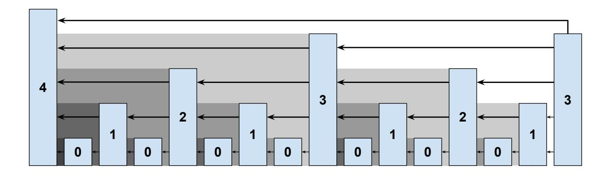

Fig. 1. The interlinked blockchain. Each superblock is drawn taller according to its achieved level. Each block links to all the blocks that are not being overshadowed by their descendants. The most recent (right-most) block links to the four blocks it has direct line-of-sight to.

{6}------------------------------------------------

The exact NIPoPoW protocol works like this: The prover holds a full chain C. When the verifier requests a proof, the prover sends the last k blocks of their chain, the suffix χ = C[−k:], in full. From the larger prefix C[:−k], the prover constructs a proof π by sampling superblocks as representatives of the underlying proof-of-work. The blocks are picked as follows. The prover selects the highest level µ <sup>∗</sup> with at least m blocks and includes all these blocks in their proof (if no such level exists, the chain is small and can be sent in full). The prover then iterates from level µ = µ <sup>∗</sup> − 1 down to 0. For every level µ + 1, it pinpoints the mth most recent (µ + 1)-superblock. It includes all µ-superblocks after it, as illustrated in Algorithm [1.](#page-6-0) Because the density of blocks roughly doubles as levels are descended, the proof contains in expectation 2m blocks for each level below µ ∗ . As such, the total proof size πχ, called a suffix proof, will be Θ(m log |C| + k). Such proofs polylogarithmic in the chain size constitute an exponential improvement over SPV clients and are called succinct.

Algorithm 1 The Prove algorithm for the NIPoPoW protocol in a soft fork

```
1: function Provem,k(C)
2: B ← C[0] . Genesis
3: for µ = |C[−k − 1].interlink| down to 0 do
4: α ← C[:−k]{B:}↑µ
5: π ← π ∪ α
6: if m < |α| then
7: B ← α[−m]
8: end if
9: end for
10: χ ← C[−k:]
11: return πχ
12: end function
```

Algorithm 2 The implementation of the ≥<sup>m</sup> operator to compare two NIPoPoW proofs parameterized with security parameter m. Returns true if the underlying chain of party A is deemed longer than the underlying chain of party B.

```
1: function best-argm(π, b)
2: M ← {µ: |π↑
            µ
              {b:}| ≥ m} ∪ {0} . Valid levels
3: return maxµ∈M{2
                µ
                 |π↑
                   µ
                     {b:}|} . Score for level
4: end function
5: operator πA ≥m πB
6: b ← (πA ∩ πB)[−1] . LCA block
7: return best-argm(πA, b) ≥ best-argm(πB, b)
8: end operator
```

{7}------------------------------------------------

Upon receiving two proofs  $\pi_1\chi_1$ ,  $\pi_2\chi_2$  of this form, the NIPoPoW verifier first checks that  $|\chi_1| = |\chi_2| = k$  and that  $\pi_1\chi_1$  and  $\pi_2\chi_2$  form valid chains. To check that they are valid chains, the verifier ensures every block in the proof contains a pointer to its previous block inside the proof through either the *previd* pointer in the block header, or in the interlink vector. If any of these checks fail, the proof is rejected. It then compares  $\pi_1$  against  $\pi_2$  using the  $\leq_m$  operator, which works as follows. It finds the lowest common ancestor (LCA) block  $b = (\pi_1 \cap \pi_2)[-1]$ ; that is, b is the most recent block shared among the two proofs. Subsequently, it chooses the level  $\mu_1$  for  $\pi_1$  such that  $|\pi_1\{b:\}\uparrow^{\mu_1}| \geq m$  (i.e.,  $\pi_1$  has at least m superblocks of level  $\mu_1$  following block b) and the value  $2^{\mu_1}|\pi_1\{b:\}\uparrow^{\mu_1}|$  is maximized. It chooses a level  $\mu_2$  for  $\pi_2$  in the same fashion. The two proofs are compared by checking whether  $2^{\mu_1}|\pi_1\{b:\}\uparrow^{\mu_1}| \geq 2^{\mu_2}|\pi_2\{b:\}\uparrow^{\mu_2}|$  and the proof with the largest score is deemed the winner. The comparison is illustrated in Algorithm 2.

Blockchain protocols can be upgraded using hard or soft forks [3]. In a hard fork, blocks produced by upgraded miners are not accepted by unupgraded miners. It is simplest to introduce interlinks using a hard fork by mandating that interlink pointers are included in the block header. Unupgraded miners will not recognize these fields and will be unable to parse upgraded blocks. To ensure the block header is of constant size, instead of including all these superblock pointers in the block header individually, they are organized into a Merkle Tree of interlink pointers and only the root of the Merkle Tree is included in the block header. In this case, the NIPoPoW prover that wishes to show a block b in their proof is connected to its more recently preceding  $\mu$ -superblock b', also includes a Merkle Tree proof proving that H(b') is a leaf in the interlink Merkle Tree root included in the block header of b. The verifier must additionally verify these Merkle proofs.

In a soft fork, blocks created by unupgraded miners are not accepted by upgraded miners, but blocks created by upgraded miners are accepted by unupgraded miners. Any additional data introduced by the upgrade must be included in a field that is treated like a comment by an unupgraded miner. To interlink the chain via a soft fork, the interlink Merkle Tree root is placed in the coinbase transaction instead of the block header. Upgraded miners include the correct interlink Merkle Tree root in their coinbase and validate the Merkle Tree root of incoming blocks. This root is easily validated because it is calculated deterministically from the previous blocks in the chain. Unupgraded miners ignore this data and accept the block regardless. The fork is successful if the majority of miners upgrade. Whenever the prover wishes to show that a block b in the proof contains a pointer to its most recently preceding  $\mu$ -superblock b', it must accompany the block header of  $b = s \parallel \overline{x} \parallel ctr$  with the coinbase transaction tx<sub>cb</sub> of b as well as two Merkle Tree proofs: One proving tx<sub>cb</sub> is in  $\overline{x}$ , and one proving H(b') is in the interlink Merkle Tree whose root is committed in tx<sub>cb</sub>.

{8}------------------------------------------------

# <span id="page-8-0"></span>3 Velvet Interlinks

Velvet forks, introduced by Kiayias et al. [\[27\]](#page-31-3), were explored in depth by Zamyatin et al. [\[45\]](#page-32-1). In a velvet fork, blocks created by upgraded miners (called velvet blocks) are accepted by unupgraded miners as in a soft fork. Additionally, blocks created by unupgraded miners are also accepted by upgraded miners. This allows the protocol to upgrade even if only a minority of miners upgrade. To maintain backwards compatibility and avoid causing a permanent fork, the additional data included in a block is advisory and must be accepted whether it exists or not. Even if the additional data is invalid or malicious, upgraded nodes (called velvet nodes) are forced to accept the blocks. It has been posited [\[27,](#page-31-3)[2\]](#page-30-2) that, among other protocols, superlight client interlinking can be deployed using a velvet fork. The na¨ıve approach to interlink the chain with a velvet fork is to have upgraded miners include the interlink pointer in the coinbase of the blocks they produce, but accept blocks with missing or incorrect interlinks (this approach was conjectured secure prior to this work [\[27](#page-31-3)[,2\]](#page-30-2)). As we show in this work, the approach is susceptible to unexpected attacks. A surgical change in the way velvet blocks are produced is necessary to achieve security.

In a velvet fork, only a minority of honest parties needs to support the protocol changes. We refer to this percentage as the "velvet parameter".

Definition 1 (Velvet Parameter). The velvet parameter g is defined as the percentage of honest parties that have upgraded to the new protocol. The absolute number of honest upgraded parties is denoted n<sup>h</sup> and it holds that n<sup>h</sup> = g(n−t).

Unupgraded honest nodes will produce blocks containing no interlink, while upgraded honest nodes will produce blocks containing truthful interlinks. Therefore, any block with invalid interlinks is adversarial. However, such blocks cannot be rejected by the upgraded nodes, as this gives the adversary an opportunity to cause a permanent fork. A block generated by the adversary can thus contain arbitrary interlinks and yet become honestly adopted. Because the honest prover is an upgraded full node, it determines what the correct interlink pointers are by examining the whole previous chain, and can deduce whether a block contains invalid interlinks. In that case, the prover can simply treat such blocks as unupgraded. In the context of the attack presented in the following section, we examine the case where the adversary includes false interlink pointers. We distinguish blocks based on whether they follow the velvet protocol rules or they deviate from them.

Definition 2 (Smooth and Thorny blocks). A block in a velvet upgrade is called smooth if it contains auxiliary data corresponding to the honest upgraded protocol. A block is called thorny if it contains auxiliary data, but the data differs from the honest upgraded protocol. A block is neither smooth nor thorny if it contains no auxiliary data, while any upgraded block is either smooth or thorny.

In the case of velvet forks for interlinking, the auxiliary data consists of the interlink Merkle Tree root.

{9}------------------------------------------------

A na¨ıve velvet scheme. In previous work [\[27\]](#page-31-3), it was conjectured that superblock NIPoPoWs remain secure under a velvet fork. We call this scheme the Na¨ıve Velvet NIPoPoW protocol. It is similar to the NIPoPoW protocol in the soft fork case. The na¨ıve velvet NIPoPoW protocol works as follows. Each upgraded honest miner attempts to mine a block b that includes interlink pointers in the form of a Merkle Tree included in its coinbase transaction. For each level µ, the interlink contains a pointer to the most recent among all the ancestors of b that have achieved at least level µ, regardless of whether the referenced block is upgraded or not and regardless of whether its interlinks are valid. Unupgraded honest nodes will keep mining blocks on the chain as usual; because the status of a block as superblock does not require it to be mined by an upgraded miner, the unupgraded miners contribute mining power to the creation of superblocks.

The honest prover in the na¨ıve velvet NIPoPoWs constructs the proof πχ as in Algorithm [2.](#page-6-1) The outstanding issue is that π does not form a chain because some of its blocks may not be upgraded and they may not contain any pointers (or may contain invalid pointers). Suppose π[i] is the most recent µ-superblock preceding π[i+1]. The prover must provide a connection between π[i+1] and π[i]. The block π[i+ 1] is a superblock and exists at some position j in the underlying chain C, i.e., π[i + 1] = C[j]. If C[j] is smooth, then the interlink pointer at level µ within it can be used. Otherwise, the prover uses the previd pointer of π[i+1] = C[j] to repeatedly reach the parents of C[j], namely C[j−1], C[j−2], · · · until a smooth block b between π[i] and π[i+ 1] is found, or until π[i] is reached. The block b contains a pointer to π[i], as π[i] is also the most recent µ-superblock ancestor of b. The blocks C[j − 1], C[j − 2], · · · , b are then included in the proof to illustrate that π[i] is an ancestor of π[i + 1].

The (flawed) security argument why the above scheme works is as follows. An honest party includes in their proof as many blocks as in a soft forked NIPoPoW, albeit by using an indirect connection. The crucial feature is that it is not missing any superblocks. Even if the adversary creates interlinks that skip over some honest superblocks, the honest prover will not utilize these interlinks, but will use the "slow route" of level 0 instead. The adversarial prover, on the other hand, can only use honest interlinks as before, but may also use false interlinks in blocks mined by the adversary. However, these false interlinks cannot point to blocks of incorrect level. The reason is that the verifier looks at each block hash to verify its level and therefore cannot be cheated. The only problem a fake interlink can cause is that it can point to a µ-superblock which is not the most recent ancestor, but some older µ-superblock ancestor in the same chain, as illustrated in Figure [2.](#page-10-1) However, the adversarial prover can only harm herself by using such pointers, as the result will be a shorter superchain.

We conclude that the honest verifier comparing the honest superchain against the adversarial superchain will reach the same conclusion in a velvet fork as he would have reached in a soft fork: Because the honest superchain in the velvet case contains the same amount of blocks as the honest superchain in the soft fork case, but the adversarial superchain in the velvet case contains fewer blocks

{10}------------------------------------------------

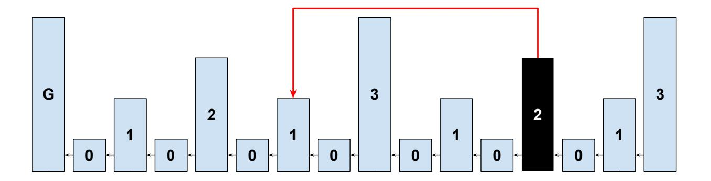

Fig. 2. A thorny pointer of an adversarial block, colored black, in an honest party's chain. The thorny block points to a 1-superblock which is an ancestor 1-superblock, but not the most recent ancestor 1-superblock.

<span id="page-10-1"></span>than in the soft fork case, the comparison will remain in favor of the honest party. As we will see next, this conclusion is incorrect.

<span id="page-10-2"></span>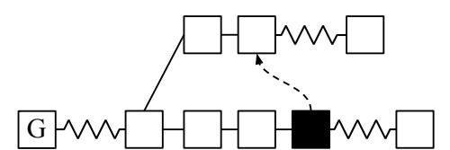

Fig. 3. A thorny block, colored black, in an honest party's chain, uses its interlink to point to a fork chain.

# <span id="page-10-0"></span>4 The Chainsewing Attack

We now make the critical observation that a thorny block can include interlink pointers to blocks that are not its own ancestors in the 0-level chain. Because it must contain a pointer to the hash of the block it points to, they must be older blocks, but they may belong to a different 0-level chain. This is shown in Figure [3.](#page-10-2) In fact, as the interlink vector contains multiple pointers, each pointer may belong to a different fork. This is illustrated in Figure [4.](#page-11-0) The interlink pointing to arbitrary directions resembles a thorny bush.

We now present the chainsewing attack against the na¨ıve velvet NIPoPoW protocol. The attack leverages thorny blocks in order to enable the adversary to usurp blocks belonging to a different chain and claim them as her own. Taking advantage of thorny blocks, the adversary produces suffix proofs containing an arbitrary number of blocks belonging to several fork chains. The attack works as follows.

Let C<sup>B</sup> be a chain adopted by an honest party B and CA, a fork of C<sup>B</sup> at some point, maintained by the adversary. After the fork point b = (C<sup>B</sup> ∩CA)[−1], the honest party produces a block extending b in C<sup>B</sup> containing a transaction

{11}------------------------------------------------

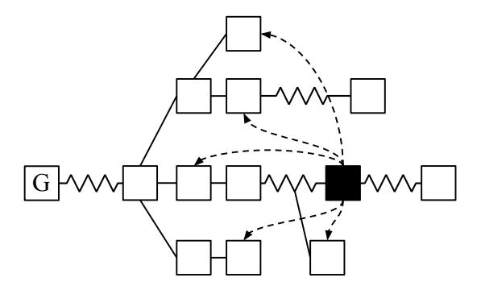

Fig. 4. A thorny block appended to an honest party's chain. The dashed arrows are interlink pointers.

<span id="page-11-0"></span>tx. The adversary includes a conflicting (double spending) transaction tx<sup>0</sup> in a block extending b in CA. The adversary produces a suffix proof to convince the verifier that C<sup>A</sup> is longer (even in the case C<sup>A</sup> is not). In order to achieve this, the adversary needs to include a greater amount of total proof-of-work in her suffix proof, πA, in comparison to that included in the honest party's proof, πB, so as to achieve π<sup>A</sup> ≥<sup>m</sup> πB. Towards this purpose, she mines intermittently on both C<sup>B</sup> and CA. She produces some thorny blocks in both chains C<sup>A</sup> and C<sup>B</sup> which will allow her to usurp selected blocks of C<sup>B</sup> and present them to the light client as if they belonged to C<sup>A</sup> in her suffix proof.

The general form of this attack for an adversary sewing blocks to one forked chain is illustrated in Figure [5.](#page-11-1) Dashed arrows represent interlink pointers of some level µA. Starting from a thorny block in the adversary's forked chain and following the interlink pointers, jumping between C<sup>A</sup> and CB, a chain of blocks crossing forks is formed, which the adversary claims as part of her suffix proof. Blocks of both chains are included in this proof and a verifier cannot distinguish the adversarial pointers participating in this proof chain and, as a result, considers it a valid proof. Importantly, the adversary must ensure that any blocks usurped from the honest chain are not included in the honest NIPoPoW to force the NIPoPoW verifier to consider an earlier LCA block b; otherwise, the adversary will compete after a later fork point, negating any sewing benefits.

<span id="page-11-1"></span>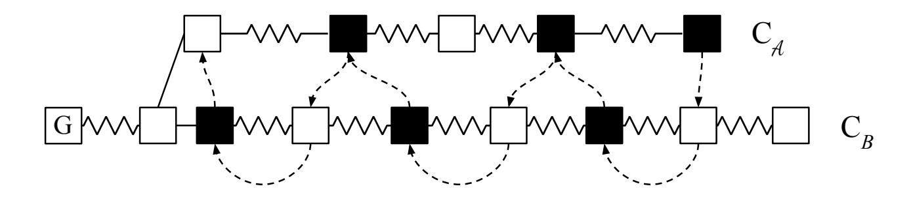

Fig. 5. Generic Chainsewing Attack. C<sup>B</sup> is the chain of an honest party and C<sup>A</sup> is the adversary's chain. Thorny blocks are colored black. Dashed arrows represent interlink pointers included in the adversary's suffix proof. Wavy lines imply one or more blocks.

{12}------------------------------------------------

This generic attack is made concrete as follows. The adversary chooses to attack at some level  $\mu_A \in \mathbb{N}$ . Ideally, the adversary chooses  $\mu_A$  to be as low as possible. As shown in Figure 6, she first generates a block b' in her forked chain  $C_A$  containing the double spend, and a block a' in the honest chain  $C_B$ which thorny-points to b'. Block a' will be accepted as valid in the honest chain  $\mathsf{C}_B$  despite the invalid interlink pointers. The adversary also chooses a desired superblock level  $\mu_B \in \mathbb{N}$  that she wishes the honest party to attain. Subsequently, the adversary waits for the honest party to mine and sews any blocks mined on the honest chain that are of level below  $\mu_B$ . However, she must bypass blocks that she thinks the honest party will include in their final NIPoPoW, which are of level  $\mu_B$  (the blue block designated c in Figure 6). To bypass a block, the adversary mines her own thorny block d on top of the current honest tip (which could be equal to the block to be bypassed, or have progressed further), containing a thorny pointer to the block preceding the block to be bypassed and hoping d will not exceed level  $\mu_B$  (if it exceeds that level, she discards her d block). Once m blocks of level  $\mu_B$  have been bypassed in this manner, the adversary starts bypassing blocks of level  $\mu_B - 1$ , because the honest NIPoPoW will start including lower-level blocks. The adversary continues descending in levels until a sufficiently low level min  $\mu_B$  has been reached at which point it becomes uneconomical for the adversary to continue bypassing blocks (typically for a 1/4 adversary, min  $\mu_B = 2$ ). At this point, the adversary forks off of the last sewed honest block. This last honest block will be used as the last block of the adversarial  $\pi$  part of the NIPoPoW proof. She then independently mines a k-long suffix for the  $\chi$  portion and creates her NIPoPoW  $\pi\chi$ . Lastly, she waits for enough time to pass so that the honest party's chain progresses sufficiently to make the previous bypassing guesses correct and so that no blocks in the honest NIPoPoWs coincide with blocks that have not been bypassed. This requires to wait for the following blocks to appear in the honest chain: 2m blocks of level  $\mu_B$ ; after the  $m^{\rm th}$   $\mu_B$ -level block, a further 2m blocks of level  $\mu_B - 1$ ; after the  $m^{\rm th}$  such block, a further 2m blocks of the level  $\mu_B - 2$ , and so on until level 0 is reached.

<span id="page-12-0"></span>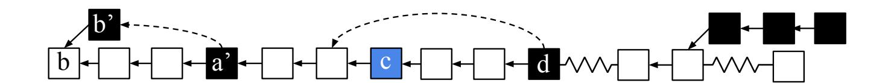

**Fig. 6.** A portion of the concrete Chainsewing Attack. The adversary's blocks are shown in black, while the honestly generated blocks are shown in white. Block b' contains a double spend, while block a' sews it in place. The blue block c is a block included in the honest NIPoPoW, but it is bypassed by the adversary by introducing block d which, while part of the honest chain, points to c's parent. After a point, the adversary forks off and creates k = 3 of their own blocks.

{13}------------------------------------------------

In this attack the adversary uses thorny blocks to "sew" portions of the honestly adopted chain to her own forked chain. This justifies the name given to the attack. In order to make this attack successful, the adversary needs only to produce few superblocks, while she can arrogate a large number of honestly produced blocks.

The attack described against superblock NIPoPoWs generalizes to other superlight protocols. We give an overview of the chainsewing attack against velvet FlyClient [\[2\]](#page-30-2) in Section [9.](#page-26-0)

# <span id="page-13-0"></span>5 Chainsewing Attack Simulation

To measure the success rate of the chainsewing attack against the na¨ıve NIPoPoW construction described in Section [4,](#page-10-0) we implemented a simulation to estimate the probability of the adversary generating a winning NIPoPoW against the honest party[6](#page-13-1) . Our experimental setting is as follows. We fix µ<sup>A</sup> = 0 (in case the verifier checks previd pointer consistency, we can set µ<sup>A</sup> = 1) and µ<sup>B</sup> = 10 as well as the required length of the suffix k = 15. We fix the adversarial mining power to t = 1 and n = 5 which gives a 20% adversary. We vary the NIPoPoW security parameter for the π portion from m = 3 to m = 30. We then run 100 Monte Carlo simulations and measure whether the adversary was successful in generating a competing NIPoPoW which compares favourably against the adversarial NIPoPoW.

For performance reasons, our model for the simulation slightly deviates from the Backbone model on which the theoretical analysis of Section [7](#page-18-0) is based and instead follows the simpler model of Ren [\[38\]](#page-31-22). This model favours the honest parties, and so provides a lower bound for probability of adversarial success, which implies that our attack efficacy is in reality better than estimated here. In this model, block arrival is modelled as a Poisson process and blocks are deemed to belong to the adversary with probability t/n, while they are deemed to belong to the honest parties with probability (n − t)/n. Block propagation is assumed instant and every party learns about a block as soon as it is mined. As such, the honest parties are assumed to work on one common chain and the problem of non-uniquely successful rounds does not occur.

We consistently find a success rate of approximately 0.26 which remains more or less constant independent of the security parameter, as expected. We plot our results with 95% confidence intervals in Figure [7.](#page-14-1) This is in contrast with the best previously known attack in which, for all examined values of the security parameter, the probability of success remains below 1%.

<span id="page-13-1"></span><sup>6</sup> The simulation implementation is available for reproduction purposes under an MIT license at [https://github.com/decrypto-org/nipopow-velvet/tree/](https://github.com/decrypto-org/nipopow-velvet/tree/master/chainsew) [master/chainsew](https://github.com/decrypto-org/nipopow-velvet/tree/master/chainsew)

{14}------------------------------------------------

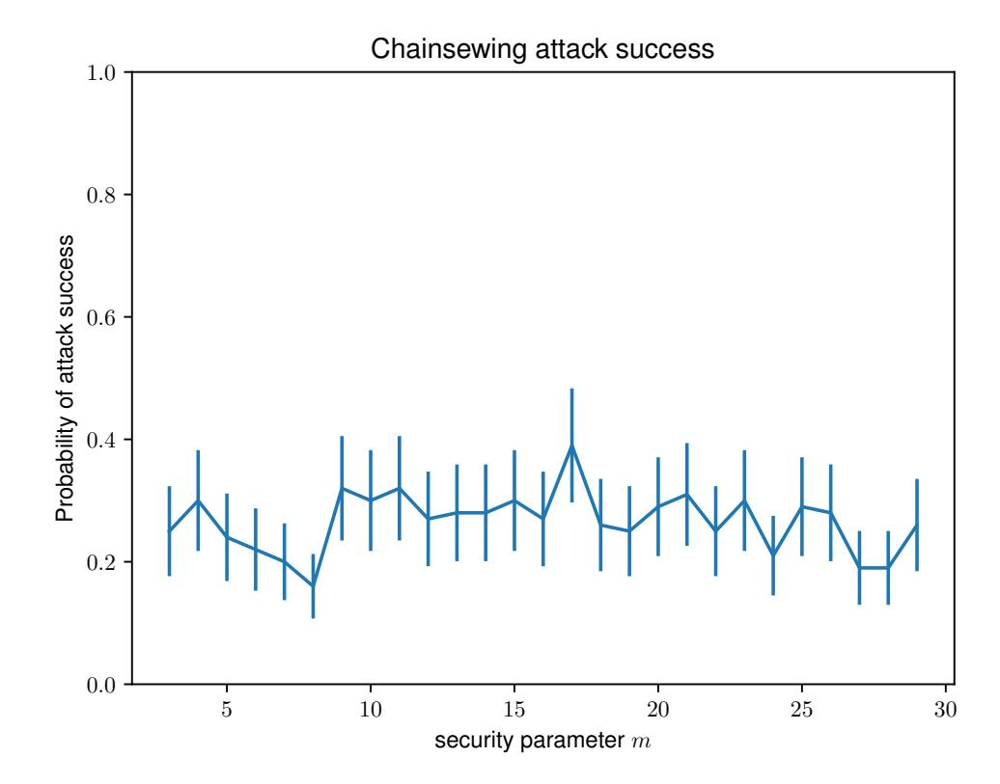

<span id="page-14-1"></span>**Fig. 7.** The measured probability of success of the Chainsewing attack mounted under our parameters for varying values of the security parameter m. Confidence intervals at 95%.

### <span id="page-14-0"></span>6 Velvet NIPoPoWs

In order to eliminate the Chainsewing Attack we propose an update to the velvet NIPoPoW protocol. The core problem is that, in her suffix proof, the adversary was able to claim not only blocks of shorter forked chains, but also arbitrarily long parts of the chain generated by an honest party. Since thorny blocks are accepted as valid, the verifier cannot distinguish blocks that actually belong in a chain from blocks that only *seem* to belong in the same chain because they are pointed to from a thorny block.

The idea for a secure protocol is to distinguish the smooth from the thorny blocks, so that smooth blocks can never point to thorny blocks. In this way we can make sure that thorny blocks acting as passing points to fork chains, as block a' does in Figure 6, cannot be pointed to by honestly generated blocks. Therefore, the adversary cannot utilize honest mining power to construct a stronger suffix proof for her fork chain. Our velvet construction mandates that honest miners create blocks that contain interlink pointers pointing only to previous smooth blocks. As such, newly created smooth blocks can only point to previously created smooth blocks and not thorny blocks. Following the terminology of Section 3, the smoothness of a block in this new construction is a stricter notion than smoothness in the naïve construction.

In order to formally describe the suggested protocol patch, we define smooth blocks in our patched protocol recursively by introducing the notion of a smooth interlink pointer. 

{15}------------------------------------------------

Definition 3 (Smooth Pointer). A smooth pointer of a block b for a specific level µ is the interlink pointer to the most recent µ-level smooth ancestor of b.

We describe a protocol patch that operates as follows. The superblock NIPoPoW protocol works as usual but each honest miner constructs smooth blocks whose interlink contains only smooth pointers; thus it is constructed excluding thorny blocks. In this way, although thorny blocks are accepted in the chain, they are not taken into consideration when updating the interlink structure for the next block to be mined. No honest block could now point to a thorny superblock that may act as a passage to the fork chain in an adversarial suffix proof. Thus, after this protocol update, the adversary is only able to inject adversarially generated blocks from an honestly adopted chain to her own fork. At the same time, thorny blocks cannot participate in an honestly generated suffix proof except for some blocks in the proof's suffix (χ). Consequently, as far as the blocks included in a suffix proof are concerned, we can think of thorny blocks as belonging in the adversary's fork chain for the π part of the proof, which is the critical part for proof comparison. Figure [8](#page-15-0) illustrates this remark. The velvet NIPoPoW verifier is also modified to only follow interlink pointers, and never previd pointers (which could be pointing to thorny blocks, even if honestly generated).

<span id="page-15-0"></span>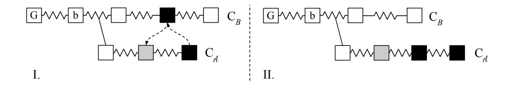

Fig. 8. Adversarial fork chain C<sup>A</sup> and chain C<sup>B</sup> of an honest party. Thorny blocks are colored black. Dashed arrows represent interlink pointers. After the protocol update when an adversarially generated block is sewed from C<sup>B</sup> into the adversary's suffix proof the verifier perceives C<sup>A</sup> as longer and C<sup>B</sup> as shorter. I: The real picture of the chains. II: Equivalent picture from the verifier's perspective considering the suffix proof for each chain.

{16}------------------------------------------------

### Algorithm 3 Smooth chain for suffix proofs

```
1: function smoothChain(C)
2: CS ← {G}
3: k ← 1
4: while C[−k] 6= G do
5: if isSmoothBlock(C[−k]) then
6: CS ← CS ∪ C[−k]
7: end if
8: k ← k + 1
9: end while
10: return CS
11: end function
12: function isSmoothBlock(B)
13: if B = G then
14: return true
15: end if
16: for p ∈ B.interlink do
17: if ¬isSmoothPointer(B, p) then
18: return false
19: end if
20: end for
21: return true
22: end function
23: function isSmoothPointer(B, p)
24: b ← Block(B.prevId)
25: while b 6= p do
26: if level(b) ≥ level(p) ∧ isSmoothBlock(b) then
27: return false
28: end if
29: if b = G then
30: return false
31: end if
32: b ← Block(b.prevId)
33: end while
34: return isSmoothBlock(b)
35: end function
```

<span id="page-16-1"></span>With this protocol patch we conclude that the adversary cannot usurp honest mining power for use in her fork chain. This change has an undesired side effect: the honest prover cannot utilize thorny blocks belonging in the honest chain. Thus, contrary to the na¨ıve protocol, the honest prover can only depend on honestly mined blocks in the honestly adopted chain. Due to this fact, to ensure security in the velvet model, we introduce the assumption that the adversary is bound by 1/3 of the honest upgraded mining power.

{17}------------------------------------------------

**Definition 4 (Velvet Honest Majority).** Let  $n_h$  be the number of upgraded honest miners. Then t out of total n parties are corrupted such that  $\frac{t}{n_h} < \frac{1 - \delta_v}{3}$ , for some  $\delta_v > 0$ .

#### Algorithm 4 Velvet updateInterlink

```
1: function updateInterlinkVelvet(C_S)
2: B' \leftarrow C_S[-1]
3: interlink \leftarrow B'.interlink
4: for \mu = 0 to level(B') do
5: interlink[\mu] \leftarrow id(B')
6: end for
7: return interlink
8: end function
```

#### Algorithm 5 Velvet Suffix Prover

```
1: function ProveVelvet_{m,k}(\mathsf{C}_S)
 2:
           B \leftarrow \mathsf{C}_S[0]
           for \mu = |C_S[-k].interlink down to 0 do
 3:
                \alpha \leftarrow \mathsf{C}_S[:-k]\{B:\}\uparrow^{\mu}
 4:
                \pi \leftarrow \pi \cup \alpha
 5:
                 B \leftarrow \alpha[-m]
 6:
 7:
           end for
           \chi \leftarrow \mathsf{C}_S[-k:]
 8:
 9:
           return \pi \chi
10: end function
```

The following Lemmas come as immediate results from the suggested protocol update.

**Lemma 1.** A velvet suffix proof constructed by an honest party cannot contain any thorny block.

The following lemma discusses the structure of valid adversarial proofs, i.e., adversarial proofs that pass the honest verifier validation process. The structure is illustrated in Figure 9.

<span id="page-17-2"></span>**Lemma 2.** Any valid adversarial proof  $\mathcal{P}_{\mathcal{A}} = (\pi_{\mathcal{A}}, \chi_{\mathcal{A}})$  containing both smooth and thorny blocks consists of a prefix smooth subchain followed by a suffix thorny subchain.

*Proof.* Suppose for contradiction that there was a thorny block immediately preceding a smooth block. Then the smooth block would contain a pointer to a thorny block, contradicting the definition of smoothness.  $\Box$ 

{18}------------------------------------------------

<span id="page-18-1"></span>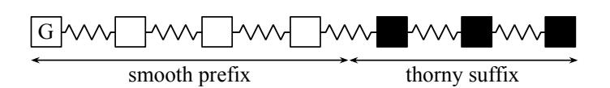

Fig. 9. After the protocol update the adversarial velvet suffix proof consists of an initial part of smooth blocks possibly followed by thorny blocks.

We now describe the algorithms needed by the upgraded miner, prover and verifier. In order to construct an interlink containing only the smooth blocks, the miner keeps a copy of the "smooth chain" (CS) which consists of the smooth blocks in his adopted chain C. The algorithm for extracting the smooth chain out of C is given in Algorithm [3.](#page-16-0) Function isSmoothBlock(B) checks whether a block B is smooth by calling isSmoothPointer(B, p) for every pointer p in B's interlink. Function isSmoothPointer(B, p) returns true if p is a valid pointer, i.e., a pointer to the most recent smooth block for the level denoted by the pointer itself. The updateInterlink algorithm is given in Algorithm [4.](#page-17-0) It is the same as in the case of a soft fork, but works on the smooth chain C<sup>S</sup> instead of C.

The construction of the velvet suffix prover is given in Algorithm [5.](#page-17-1) Again it deviates from the soft fork case by working on the smooth chain C<sup>S</sup> instead of C. Lastly, the Verify algorithm for the NIPoPoW suffix protocol remains the same as in the case of a hard or soft fork, keeping in mind that no previd links can be followed when verifying the ancestry of the chain to avoid hitting any thorny blocks.

# <span id="page-18-0"></span>7 Analysis

In this section, we prove the security of our scheme. Before we delve in detail into the formal details of the proof, let us first observe why the 1/4 bound is necessary through a combined attack on our construction.

After the suggested protocol update the honest prover cannot include any thorny blocks in his suffix NIPoPoW even if these blocks are part of his chain CB. The adversary may exploit this fact as follows. She tries to suppress high-level honestly generated blocks in CB, in order to reduce the blocks that can represent the honest chain in a proof. This can be done by mining a suppressive block on the parent of an honest superblock on the honest chain and hoping that she will be faster than the honest parties. In parallel, while she mines suppressive thorny blocks on C<sup>B</sup> she can still use her blocks in her NIPoPoW proofs, by chainsewing them. Consequently, even if a suppression attempt does not succeed, in case for example a second honestly generated block is published soon enough, she does not lose the mining power spent but can still utilize it by including the block in her proof.

In more detail, consider the adversary who wishes to attack a specific block level µ<sup>B</sup> and generates a NIPoPoW proof containing a block b of a fork chain 

{19}------------------------------------------------

which contains a double spending transaction. Then she acts as follows. She mines on her fork chain  $C_A$  but when she observes a  $\mu_B$ -level block in  $C_B$  she tries to mine a thorny block on  $C_B$  in order to suppress this  $\mu_B$  block. This thorny block contains an interlink pointer which jumps onto her fork chain, but a previd pointer to the honest chain. If the suppression succeeds she has managed to damage the distribution of  $\mu_B$ -superblocks within the honest chain, at the same time, to mine a block that she can afterwards use in her proof. If the suppression does not succeed she can still use the thorny block in her proof. The above are illustrated in Figure 10.

<span id="page-19-0"></span>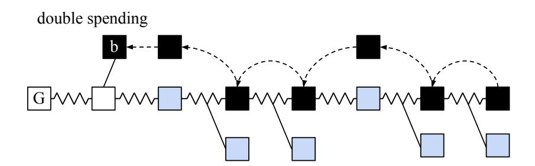

**Fig. 10.** The adversary suppresses honestly generated blocks and chainsews thorny blocks in  $C_B$ . Blue blocks are honestly generated blocks of some level of attack. The adversary tries to suppress them. If the suppression is not successful, the adversary can still use the block she mined in her proof.

The described attack is a combined attack which combines both superblock suppression (initially described in [27], a variant of selfish mining [13]) and chain-sewing (introduced in this work). This combined attack forces us to consider the Velvet Honest Majority Assumption of (1/4)-bounded adversary, so as to guarantee that the unsuppressed blocks in  $C_B$  suffice for constructing winning NIPoPoW proofs against the adversarial ones.

For the analysis, we use the techniques developed in the Backbone line of work [16]. We follow their definitions and call a round successful if at least one honest party made a successful random oracle query during the round, i.e., a query b such that  $H(b) \leq T$ . A round in which exactly one honest party made a successful query is called uniquely successful (the adversary could have also made successful queries during a uniquely successful round). Let  $X_r \in \{0,1\}$  and  $Y_r \in \{0,1\}$  denote the indicator random variables signifying that r was a successful or uniquely successful round respectively, and let  $Z_r \in \mathbb{N}$  be the random variable counting the number of successful queries of the adversary during round r. For a set of consecutive rounds U, we define  $Y(U) = \sum_{r \in U} Y_r$  and similarly define X and Z. We denote  $f = \mathbb{E}[X_r] < 0.3$  the probability that a round is successful.

Let  $\lambda$  denote the security parameter (the output size  $\kappa$  of the random oracle is taken to be some polynomial of  $\lambda$ ). We make use of the following known [16] results. It holds that  $pq(n-t) < \frac{f}{1-f}$ . For the Common Prefix parameter, it holds that  $k \geq 2\lambda f$ . Additionally, for any set of consecutive rounds U, it holds

{20}------------------------------------------------

that  $\mathbb{E}[Z(U)] < \frac{t}{n-t} \cdot \frac{f}{1-f}|U|$ ,  $\mathbb{E}[X(U)] < pq(n-t)|U|$ ,  $\mathbb{E}[Y(U)] > f(1-f)|U|$ . An execution is called typical if the random variables X,Y,Z do not deviate significantly (more than some error term  $\epsilon < 0.3$ ) from their expectations. It is known that executions are typical with overwhelming probability in  $\lambda$ . Typicality ensures that for any set of consecutive rounds U with  $|U| > \lambda$  it holds that  $Z(U) < \mathbb{E}[Z(U)] - \epsilon \mathbb{E}[X(U)]$  and  $Y(U) > (1-\epsilon)\mathbb{E}[Y(U)]$ . From the above we can conclude to  $Y(U) > (1-\epsilon)f(1-f)|U|$  and  $Z(U) < \frac{t}{n-t} \cdot \frac{f}{1-f}|U| + \epsilon f|U|$  which will be used in our proofs. We consider  $f < \frac{1}{20}$  a typical bound for parameter f. This is because in our (1/4)-bounded adversary assumption we need to reach about 75% of the network, which requires about 20 seconds [9]. Considering also that in Bitcoin the block generation time is in expectation 600

seconds, we conclude to an estimate  $f = \frac{18}{600}$  or f = 0.03. The following definition and lemma are known [46] results and will allow us to argue that some smooth superblocks will survive in all honestly adopted chains. With foresight, we remark that we will take Q to be the property of a block being both smooth and having attained some superblock level  $\mu \in \mathbb{N}$ .

**Definition 5** (Q-block). A block property is a predicate Q defined on a hash output  $h \in \{0,1\}^{\kappa}$ . Given a block property Q, a valid block with hash h is called a Q-block if Q(h) holds.

**Lemma 3 (Unsuppressibility).** Consider a collection of polynomially many block properties Q. In a typical execution every set of consecutive rounds U has a subset S of uniquely successful rounds such that

- $|S| \ge Y(U) 2Z(U) 2\lambda f(\frac{t}{n-t} \cdot \frac{1}{1-f} + \epsilon)$
- for any  $Q \in \mathcal{Q}$ , Q-blocks generated during S follow the distribution as in an unsuppressed chain
- after the last round in S the blocks corresponding to S belong to the chain of any honest party.

We now apply the above lemma to our construction. The following result lies at the heart of our security proof and allows us to argue that an honestly adopted chain will have a better superblock score than an adversarially generated chain.

<span id="page-20-0"></span>**Lemma 4.** Consider Algorithm 4 under velvet fork with parameter g and (1/4)-bounded velvet honest majority. Let U be a set of consecutive rounds  $r_1 \cdots r_2$  and C the chain of an honest party at round  $r_2$  of a typical execution. Let  $C_U^S = \{b \in C : b \text{ is smooth } \land b \text{ was generated during } U\}$ . Let  $\mu, \mu' \in \mathbb{N}$ . Let C' be a  $\mu'$  superchain containing only adversarial blocks generated during U and suppose  $|C_U^S \uparrow^{\mu}| > k$ . Then for any  $\delta_3 \leq \frac{3\lambda f}{5}$  it holds that  $2^{\mu'} |C'| < 2^{\mu} (|C_U^S \uparrow^{\mu}| + \delta_3)$ .

*Proof.* From the Unsuppressibility Lemma we have that there is a set of uniquely successful rounds  $S \subseteq U$ , such that  $|S| \geq Y(U) - 2Z(U) - \delta'$ , where  $\delta' =$ 

{21}------------------------------------------------

 $2\lambda f(\frac{t}{n-t}\cdot\frac{1}{1-f}+\epsilon)$ . We also know that Q-blocks generated during S are distributed as in an unsuppressed chain. Therefore considering the property Q for blocks of level  $\mu$  that contain smooth interlinks we have that  $|\mathsf{C}_U^S\uparrow^{\mu}| \geq (1-\epsilon)g2^{-\mu}|S|$ . We also know that for the total number of  $\mu'$ -blocks the adversary generated during U that  $|\mathsf{C}'| \leq (1+\epsilon)2^{-\mu'}Z(U)$ . Then we have to show that  $(1-\epsilon)g(Y(U)-2Z(U)-\delta') > (1+\epsilon)Z(U)$  or  $((1+\epsilon)+2g(1-\epsilon))Z(U) < g(1-\epsilon)(Y(U)+\delta')$ . But it holds that  $(1+\epsilon)+2g(1-\epsilon)<3$ , therefore it suffices to show that  $3Z(U) < g(1-\epsilon)(Y(U)+\delta')-2^{\mu}\delta_3$ .

Substituting the bounds of X, Y, Z discussed above, it suffices to show that

$$3\left[\frac{t}{n-t} \cdot \frac{f}{1-f}|U| + \epsilon f|U|\right] < (1-\epsilon)g[(1-\epsilon)f(1-f)|U| - \delta'] - 2^{\mu}\delta_3$$

or 
$$\frac{t}{n-t} < \frac{(1-\epsilon)g[(1-\epsilon)f(1-f) - \frac{\delta'}{|U|}] - 3\epsilon f - \frac{2^{\mu}\delta_3}{|U|}}{3\frac{f}{1-f}}.$$

But  $\epsilon(1-f) \ll 1$  thus we have to show that

<span id="page-21-0"></span>
$$\frac{t}{n-t} < \frac{g}{3} \cdot \frac{(1-\epsilon)^2 f(1-f) - \frac{(1-\epsilon)\delta'}{|U|} - \frac{2^{\mu} \delta_3}{|U|}}{\frac{f}{1-f}} - \epsilon' \tag{1}$$

In order to show Equation 1 we use  $f \leq \frac{1}{20}$  which is a typical bound for our setting as discussed above. Because all blocks in C were generated during U and |C| > k, |U| follows negative binomial distribution with probability  $2^{-\mu}pq(n-t)$  and number of successes k. Applying a Chernoff bound we have that  $|U| > (1-\epsilon)\frac{k}{2^{-\mu}pq(n-t)}$ . Using the inequalities  $k \geq 2\lambda f$  and  $pq(n-t) < \frac{f}{1-f}$ , we deduce that  $|U| > (1-\epsilon)2^{\mu}2\lambda(1-f)$ . So we have that  $\frac{\delta'}{|U|} < \frac{2\lambda f(\frac{t}{n-t}\frac{1}{1-f}+\epsilon)}{(1-\epsilon)2^{\mu}2\lambda(1-f)}$  or  $\frac{\delta'}{|U|} < \frac{t}{n-t} \cdot \frac{f}{(1-\epsilon)(1-f)^2} + \epsilon < 0.01 + \epsilon$ . We also know that  $\delta_3 \leq \frac{3\lambda f}{5}$ , so  $\frac{2^{\mu}\delta_3}{|U|} < \frac{2^{\mu}\delta_3}{2^{\mu}2\lambda(1-f)}$  or  $\frac{2^{\mu}\delta_3}{|U|} < \frac{3f}{10(1-f)} < 0.01 + \epsilon$ . By substituting the above and the typical f parameter bound in Equation (1) we conclude that it suffices to show that  $\frac{t}{n-t} < \frac{1-\epsilon''}{3}g$  which is equivalent to  $\frac{t}{n-t} < \frac{1-\delta_v}{3}g$  for  $\epsilon'' = \delta_v$ , which is the (1/4) velvet honest majority assumption, so the claim is proven.

<span id="page-21-1"></span>**Lemma 5.** Consider Algorithm 4 under velvet fork with parameter g and (1/4)-bounded velvet honest majority. Consider the property Q for blocks of level  $\mu$ . Let

{22}------------------------------------------------

U be a set of consecutive rounds and C the chain of an honest party at the end of U of a typical execution and  $C_U = \{b \in C : b \text{ was generated during } U\}$ . Suppose that no block in  $C_U$  is of level  $\mu$ . Then  $|U| \leq \delta_1$  where  $\delta_1 = \frac{(2+\epsilon)2^{\mu} + \delta'}{(1-\epsilon)f(1-f) - 2\frac{t}{n-t}\frac{f}{1-f} - 3\epsilon f}$ .

Proof. The statement results immediately form the Unsuppressibility Lemma. Suppose for contradiction that  $|U| > \delta_1$ . Then from the Unsuppressibility Lemma we have that there is a subset of consecutive rounds S of U for which it holds that  $|S| \geq Y(U) - 2Z(U) - \delta'$  where  $\delta' = 2\lambda f(\frac{t}{n-t} \cdot \frac{1}{1-f} + \epsilon)$ . By substituting  $Y(U) > (1-\epsilon)f(1-f)|U|$  and  $Z(U) < \frac{t}{n-t}\frac{f}{1-f} + \epsilon f|U|$  we have that  $|S| > (2+\epsilon)2^{\mu}$  but Q-blocks generated during S follow the distribution as in a chain where no suppression attacks occur. Therefore at least one block of level  $\mu$  would appear in  $C_U$ , thus we have reached a contradiction and the statement is proven.

Theorem 1 (Suffix Proofs Security under velvet fork). Assuming honest majority under velvet fork conditions (4) such that  $t \leq (1 - \delta_v) \frac{n_h}{3}$  where  $n_h$  the number of upgraded honest parties, the Non-Interactive Proofs of Proof-of-Work construction for computable k-stable monotonic suffix-sensitive predicates under velvet fork conditions in a typical execution is secure.

Proof. By contradiction. Let Q be a k-stable monotonic suffix-sensitive chain predicate. Assume for contradiction that NIPoPoWs under velvet fork on Q is insecure. Then, during an execution at some round  $r_3$ , Q(C) is defined and the verifier V disagrees with some honest participant. V communicates with adversary A and honest prover B. The verifier receives proofs  $\pi_A, \pi_B$  which are of valid structure. Because B is honest,  $\pi_B$  is a proof constructed based on underlying blockchain  $C_B$  (with  $\pi_B \subseteq C_B$ ), which B has adopted during round  $r_3$  at which  $\pi_B$  was generated. Consider  $\widetilde{C}_A$  the set of blocks defined as  $\widetilde{C}_A = \pi_A \cup \{\bigcup\{C_h^r\{:b_A\}: b_A \in \pi_A, \exists h, r: b_A \in C_h^r\}\}$  where  $C_h^r$  the chain that the honest party h has at round r. Consider also  $C_B^s$  the set of smooth blocks of honest chain  $C_B$ . We apply security parameter

$$m = 2k + \frac{2 + \epsilon + \delta'}{\frac{t}{n-t} \frac{f}{1-f} [f(1-f) - \frac{2}{3} \frac{f}{1-f}]}$$

Suppose for contradiction that the verifier outputs  $\neg Q(\mathsf{C}_B)$ . Thus it is necessary that  $\pi_A \geq_m \pi_B$ . We show that  $\pi_A \geq_m \pi_B$  is a negligible event. Let the levels of comparison decided by the verifier be  $\mu_A$  and  $\mu_B$  respectively. Let  $b_0 = LCA(\pi_A, \pi_B)$ . Call  $\alpha_A = \pi_A \uparrow^{\mu_A} \{b_0:\}, \alpha_B = \pi_B \uparrow^{\mu_B} \{b_0:\}.$ 

From Lemma 2 we have that the adversarial proof consists of a smooth interlink subchain followed by a thorny interlink subchain. We refer to the smooth part of  $\alpha_{\mathcal{A}}$  as  $\alpha_{\mathcal{A}}^{\mathcal{S}}$  and to the thorny part as  $\alpha_{\mathcal{A}}^{\mathcal{T}}$ .

Our proof construction is based on the following intuition: we consider that  $\alpha_{\mathcal{A}}$  consists of three distinct parts  $\alpha_{\mathcal{A}}^1, \alpha_{\mathcal{A}}^2, \alpha_{\mathcal{A}}^3$  with the following properties.

{23}------------------------------------------------

Block  $b_0 = LCA(\pi_A, \pi_B)$  is the fork point between  $\pi_A \uparrow^{\mu_A}, \pi_B \uparrow^{\mu_B}$ . Let block  $b_1 = LCA(\alpha_A^S, \mathsf{C}_B^S)$  be the fork point between  $\pi_A^S \uparrow^{\mu_A}, \mathsf{C}_B$  as an honest prover could observe. Part  $\alpha_A^1$  contains the blocks between  $b_0$  exclusive and  $b_1$  inclusive generated during the set of consecutive rounds  $\mathcal{S}_1$  and  $|\alpha_A^1| = k_1$ . Consider  $b_2$  the last block in  $\alpha_A$  generated by an honest party. Part  $\alpha_A^2$  contains the blocks between  $b_1$  exclusive and  $b_2$  inclusive generated during the set of consecutive rounds  $\mathcal{S}_2$  and  $|\alpha_A^2| = k_2$ . Consider  $b_3$  the next block of  $b_2$  in  $\alpha_A$ . Then  $\alpha_A^3 = \alpha_A[b_3:]$  and  $|\alpha_A^3| = k_3$  consisting of adversarial blocks generated during the set of consecutive rounds  $\mathcal{S}_3$ . Therefore  $|\alpha_A| = k_1 + k_2 + k_3$  and we will show that  $|\alpha_A| < |\alpha_B|$ .

The above are illustrated, among other, in Parts I, II of Figure 11.

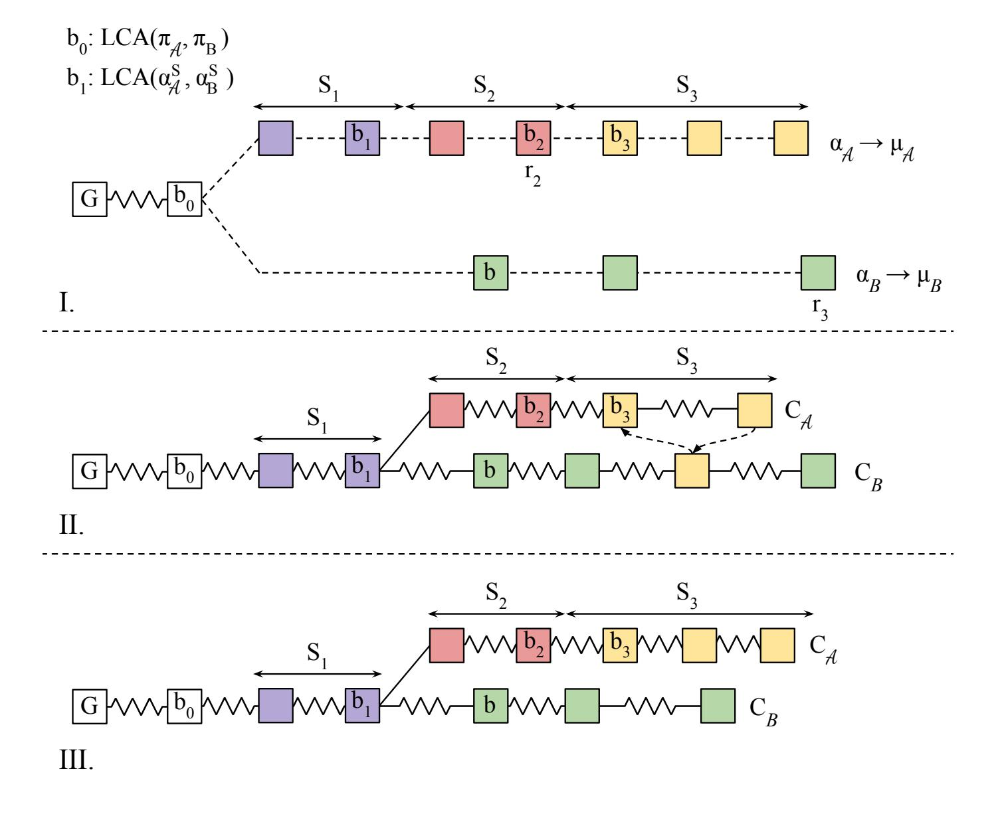

<span id="page-23-0"></span>**Fig. 11.** I. the three round sets in two competing proofs at different levels, II. the corresponding 0-level blocks implied by the two proofs, III: blocks in  $C_B$  and block set  $\widetilde{C}_A$  from the verifier's perspective.

{24}------------------------------------------------

We now show three successive claims: First that  $\alpha_{\mathcal{A}}^1$  contains few blocks. Second,  $\alpha_{\mathcal{A}}^2$  contains few blocks. And third, the adversary can produce a winning  $a_{\mathcal{A}}$  with negligible probability.

Claim 1:  $\alpha_{\mathcal{A}}^1 = (\alpha_{\mathcal{A}}\{b_0 : b_1\} \cup b_1)$  contains only a few blocks. Let  $|\alpha_{\mathcal{A}}^1| = k_1$ . We have defined the blocks  $b_0 = LCA(\pi_{\mathcal{A}}, \pi_B)$  and  $b_1 = LCA(\alpha_{\mathcal{A}}^{\mathcal{S}}, \mathsf{C}_B^{\mathcal{S}})$ . First observe that because of the Lemma 2 there are no thorny blocks in  $\alpha_{\mathcal{A}}^1$  since  $\alpha_{\mathcal{A}}^1[-1] = b_1$  is a smooth block. This means that if  $b_1$  was generated at round  $r_{b_1}$  and  $\alpha_{\mathcal{A}}^{\mathcal{S}}[-1]$  in round r then  $r \geq r_{b_1}$ . Therefore,  $\alpha_{\mathcal{A}}^1$  contains smooth blocks of  $\mathsf{C}_B$ . We show the claim by considering the two possible cases for the relation of  $\mu_{\mathcal{A}}, \mu_B$ .

Claim 1a: If  $\mu_B \leq \mu_A$  then  $k_1 = 0$ . In order to see this, first observe that every block in  $\alpha_A$  would also be of lower level  $\mu_B$ . Subsequently, any block in  $\alpha_A\{b_0:\}$  would also be included in proof  $\alpha_B$  but this contradicts the minimality of block  $b_0$ .

Claim 1b: If 
$$\mu_B > \mu_A$$
 then  $k_1 \leq \frac{\delta_1 2^{-\mu_A}}{(1+\epsilon)\frac{t}{n-t}\frac{f}{1-f}}$ . In order to show this

we consider block b the first block in  $\alpha_B$ . Now suppose for contradiction that  $k_1 > \frac{\delta_1 2^{-\mu_A}}{(1+\epsilon)\frac{t}{n-t}\frac{f}{1-f}}$ . Then from lemma 5 we have that block b is generated

during  $S_1$ . But b is of lower level  $\mu_{\mathcal{A}}$  and  $\alpha_{\mathcal{A}}^1$  contains smooth blocks of  $C_B$ . Therefore b is also included in  $\alpha_{\mathcal{A}}^1$ , which contradicts the minimality of block  $b_0$ .

Consequently, there are at least  $|\alpha_{\mathcal{A}}| - k_1$  blocks in  $\alpha_{\mathcal{A}}$  which are not honestly generated blocks existing in  $C_B$ . In other words, these are blocks which are either thorny blocks existing in  $C_B$  either don't belong in  $C_B$ .

Claim 2. Part  $\alpha_{\mathcal{A}}^2 = (\alpha_{\mathcal{A}}\{b_1 : b_2\} \cup b_2)$  consists of only a few blocks. Let  $|\alpha_{\mathcal{A}}^2| = k_2$ . We have defined  $b_2 = \alpha_{\mathcal{A}}^2[-1]$  to be the last block generated by an honest party in  $\alpha_{\mathcal{A}}$ . Consequently no thorny block exists in  $\alpha_{\mathcal{A}}^2$ , so all blocks in this part belong in a proper zero-level chain  $\mathsf{C}_{\mathcal{A}}^2$ . Let  $r_{b_1}$  be the round at which  $b_1$  was generated. Since  $b_1$  is the last block in  $\alpha_{\mathcal{A}}$  which belongs in  $\mathsf{C}_B$ , then  $\mathsf{C}_{\mathcal{A}}^2$  is a fork chain to  $\mathsf{C}_B$  at some block b' generated at round  $r' \geq r_{b_1}$ . Let  $r_2$  be the round when  $b_2$  was generated by an honest party. Because an honest party has adopted chain  $\mathsf{C}_B$  at a later round  $r_3$  when the proof  $\pi_B$  is constructed and because of the Common Prefix property on parameter  $k_2$ , we conclude that  $k_2 \leq 2^{-\mu_{\mathcal{A}}}k$ .

Claim 3. The adversary may submit a suffix proof such that  $|\alpha_{\mathcal{A}}| \geq |\alpha_{\mathcal{B}}|$  with negligible probability. Let  $|\alpha_{\mathcal{A}}^3| = k_3$ . As explained earlier part  $\alpha_{\mathcal{A}}^3$  consists only of adversarially generated blocks. Let  $S_3$  be the set of consecutive rounds  $r_2...r_3$ . Then all  $k_3$  blocks of this part of the proof are generated during  $S_3$ . Let  $\alpha_{\mathcal{B}}^3$  be the last part of the honest proof containing the interlinked  $\mu_{\mathcal{B}}$  superblocks generated during  $S_3$ . Then by applying lemma  $4\frac{m}{k}$  times we

have that  $2^{\mu_A}|\alpha_A^3| < 2^{\mu_B}(|\alpha_B^{S_3}\uparrow^{\mu_B}| + \frac{m\delta_3}{k})$ . By substituting the values from all the above Claims and because every block of level  $\mu_B$  in  $a\alpha_B$  is of equal

{25}------------------------------------------------

hashing power to  $2^{\mu_B-\mu_A}$  blocks of level  $\mu_A$  in the adversary's proof we have that:  $2^{\mu_B}|\alpha_B^3| - 2^{\mu_A}|\alpha_A^3| > 2^{\mu_A}(k_1 + k_2)$  or  $2^{\mu_B}|\alpha_B^3| > 2^{\mu_A}|\alpha_A^1 + \alpha_A^2 + \alpha_A^3|$  or  $2^{\mu_B}|\alpha_B| > 2^{\mu_A}|\alpha_A|$  Therefore we have proven that  $2^{\mu_B}|\pi_B^{\dagger\mu_B}| > 2^{\mu_A}|\pi_A^{\mu_A}|$ .

#### <span id="page-25-0"></span>8 Infix Proofs

NIPoPoW infix proofs answer any predicate which depends on blocks appearing anywhere in the chain, except for the k suffix for stability reasons. For example, consider the case where a client has received a transaction inclusion proof for a block b and requests an infix proof so as to verify that b is included in the current chain. Because of the described protocol update for secure NIPoPoW suffix proofs, the infix proofs construction has to be altered as well. In order to construct secure infix proofs under velvet fork conditions, we suggest the following additional protocol patch: each upgraded miner constructs and updates an authenticated data structure for all the blocks in the chain. We suggest Merkle Mountain Ranges (MMR) for this structure. Now a velvet block's header additionally includes the root of this MMR.

After this additional protocol change the notion of a smooth block changes as well. Smooth blocks are now considered the blocks that contain truthful interlinks and valid MMR root too. A valid MMR root denotes the MMR that contains all the blocks in the chain of an honest full node. Note that a valid MMR contains all the blocks of the longest valid chain, meaning both smooth and thorny. An invalid MMR constructed by the adversary may contain a block of a fork chain. Consequently an upgraded prover has to maintain a local copy of this MMR locally, in order to construct correct proofs. This is crucial for the security of infix proofs, since keeping the notion of a smooth block as before would allow an adversary to produce a block b in an honest party's chain, with b containing a smooth interlink but invalid MMR, so she could succeed in providing an infix proof about a block of a fork chain.

#### **Algorithm 6** Function is Smooth Block'() for infix proof support

```
1: function isSmoothBlock'(B)
       if B = \mathcal{G} then
2:
 3:
           return true
 4:
       end if
 5:
       for p \in B.interlink do
          if \neg isSmoothPointer(B, p) then
6:
7:
              return false
8:
           end if
9:
       end for
       return containsValidMMR(B)
10:
11: end function
```

{26}------------------------------------------------

### Algorithm 7 Velvet Infix Prover

```
1: function ProveInfixVelvet(CS, b)
2: (π, χ) ← ProveVelvet(CS)
3: tip ← π[−1]
4: πb ← MMRinclusionProof(tip, b)
5: return (πb,(π, χ))
6: end function
```

### Algorithm 8 Velvet Infix Verifier

```
1: function VerifyInfixVelvet(b,(πb,(π, χ)))
2: tip ← π[−1]
3: return VerifyInclProof(tip.rootMMR, πb, b)
4: end function
```

Considering this addtional patch we can now define the final algorithms for the honest miner, infix and suffix prover, as well as for the infix verifier. Because of the new notion of smooth block, the function isSmoothBlock() of Algorithm [3](#page-16-0) needs to be updated, so that the validity of the included MMR root is also checked. The updated function is given in Algorithm [6.](#page-25-1) Considering that input C<sup>S</sup> is computed using Algorithm [3](#page-16-0) with the updated isSmoothBlock'() function, Velvet updateInterlink and Velvet Suffix Prover algorithms remain the same as described in Algorithms [4,](#page-17-0) [5](#page-17-1) repsectively. The velvet infix prover and infix verifier algorithms are given in Algorithms [7,](#page-26-1) [8](#page-26-2) respectively. Details about the construction and verification of an MMR and the respective inclusion proofs can be found in [\[31\]](#page-31-7). Note that equivalent solution could be formed by using any authenticated data structure that provides inclusion proofs of size logarithmic to the length of the chain. We suggest MMRs because of they come with efficient update operations.

# <span id="page-26-0"></span>9 Velvet FlyClient

We now describe an explicit attack against the FlyClient protocol under velvet fork deployment. This is a variation of our Chainsewing Attack of Section [4.](#page-10-0) For the FlyClient protocol upgraded miners additionally include an MMR root in each block's header. The claim made in the paper is that an honest prover could produce proofs by utilizing only the upgraded blocks and that the velvet proofs remain secure even if only a small fraction of miners upgrade. Due to the velvet conditions, an adversary may append blocks in C that contain invalid MMR information. As an example, consider an invalid MMR that omits blocks existing in C or contains blocks which belong in temporary forks of C. We will use the same terminology as in velvet superblocks and refer to a block that contains an invalid MMR as thorny, while to one with valid MMR as smooth. Any upgraded block can be thorny or smooth.

{27}------------------------------------------------

Consider the security impact of thorny blocks in the FlyClient protocol. Due to the velvet FlyClient description being only partial, we make a couple of assumptions considering how thorny blocks are treated by the velvet version of the protocol. First, when constructing a new block's MMR, the honest miner should treat thorny blocks as unupgraded, i.e., ignore invalid MMRs and build on top of the MMR of the most recent smooth block. This rule is of great importance and, to our opinion, inevitable, since if miners do not verify the validity of previous blocks' MMRs, the adversary could trivially attack the protocol by mining a thorny block in C and have all subsequent upgraded blocks commit to an invalid chain history.

A FlyClient proof contains the chain tip C[-1], which must be an upgraded block because of its vital importance in the protocol with respect to MMR consistency checks of the sampled blocks. Upon receiving a proof the verifier interrogates the prover. During the interrogation, each sampled block b may be upgraded or not. In case b does not contain an MMR (i.e., b is an unupgraded block), the verifier cannot check MMR consistency between b and C[-1], so the verifier checks MMR validity between C[-1] and the closest upgraded descendant of b. Since both smooth and thorny blocks may exist in C this MMR validity check could fail, as one of the blocks may be smooth while the other one thorny. In this case the verifier will search for the next closest upgraded descendant of b and repeat the procedure until a consistent descendant is found or reject the proof. Because of the velvet conditions, the verifier must accept that some consistency checks between b and C[-1] will fail. On the other hand, and this denotes the second assumption, the verifier cannot allow any number of inconsinstencies freely. To see why, consider the following attack. Let the honest chain have three consecutive blocks  $b_i$ ,  $b_{i+1}$ ,  $b_{i+2}$  at heights i, i+1, i+2 respectively. The attacker produces a thorny block  $b'_{i+1}$  on top of  $b_i$  containing a double spend transaction in conflict with  $b_{i+1}$ . Whenever she wants to convince the verifier that the honest chain contains  $b'_{i+1}$  she produces another thorny block  $b_j$  on top of the current chain's tip and sends her proof. Note that  $b_j$  is a thorny block that contains an MMR that includes  $b'_{i+1}$ . The adversary claims that  $b'_{i+1}$  and  $b_i$  are the only smooth blocks in the chain, contrary to reality, where all other upgraded blocks are non-thorny. More specifically  $b_j$  will appear in the proof as it is the tip of the chain, while  $b_{i+1}$  will be in the proof only if it is selected by the random sampler. Her proof will only be found invalid if the random sampler queries both blocks at heights i+1, i+2, so that the invalid prevId pointer shows up. The attacker can decrease this probability by letting the chain grow enough before attempting to construct a proof, as the random sampler chooses older blocks with lower probability (the probability of this sampling occurring is negligible if the proof size is logarithmic). When the verifier receives two valid proofs of the same length, one from the attacker and one from an honest node, the verifier cannot tell which proof is the correct one. One mechanism to avoid

<span id="page-27-0"></span><sup>&</sup>lt;sup>7</sup> In reality it is prover's responsibility to construct a proof so that the verifier can immediately select the first valid upgraded descendant. We continue with this description as it is equivalent and more intuitive.

{28}------------------------------------------------

this attack is to have the verifier count how many of the MMR verifications are successful. In the case of the above attack, most upgraded blocks will appear inconsistent with the claimed (thorny) tip. Intuitively, under an appropriate velvet honest majority assumption, and for sufficiently long underlying chains, the honest proof (ending in a smooth block) will pass more consistency checks among the samples performed by the verifier, as compared to the adversarial proof (ending in a thorny block). We conclude that an appropriately designed velvet variant of the FlyClient protocol must compare proofs depending on how many consistency checks pass or, put in another way, compare the upgraded hashing power included in the proofs.

Now, considering this favourable version of the FlyClient protocol, we give a sketch of a more sophisticated attack which works even when the adversary is bounded to 1/2 of the upgraded mining power. The adversary acts as follows. She initially creates a transaction in an honest block b. She subsequently forks from the parent of b to create a block b 0 containing a double spend. Afterwards she mines block a 0 in the honest chain, CB, which includes an MMR root containing b 0 instead of b. Next she keeps mining blocks on top of the honest chain, ensuring that they contain MMR commitments to a 0 , b <sup>0</sup> and the whole other honest chain, excluding b. Additionally, during this period when she mines on C<sup>B</sup> she tries to suppress any honest upgraded block in C<sup>B</sup> by mining selfishly. When an honest upgraded block C[i] appears she mines on top of block C[i−1]. Even if she mines a block and the suppression fails she can still use her fresh block in her proof by continuing to construct consistent MMRs in the coming blocks as described before. Figure [12](#page-28-0) illustrates an example of the underlying suppression attack. At some point, the adversary produces her proof. From the verifier's perspective the black colored blocks form a valid chain, since the tip contains consistent MMR commitments with all these blocks.

In conclusion, FlyClient is not secure as-is under velvet conditions. We believe it can be made secure through the construction we propose, but further analysis regarding its security assumptions, i.e. a velvet honest majority assumption, is required.

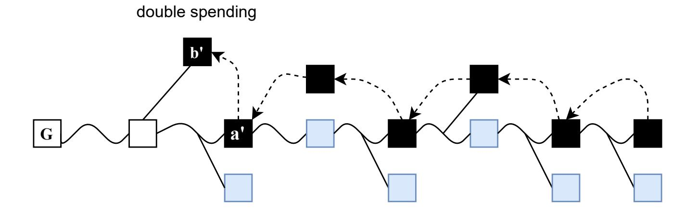

<span id="page-28-0"></span>Fig. 12. The chainsewing attack. Here, dashed arrows are thorny MMR commitments.

{29}------------------------------------------------

# 10 Acknowledgements

The authors wish to thank Kostis Karantias for his valuable contributions with respect to the design of the protocol that uses Merkle Mountain Ranges to build infix proofs on top of velvet suffix proofs.

We also thank Tristan Nemoz and Alexei Zamyatin for fruitful discussions pertaining to the interplay of velvet forks and FlyClient. After the first version of this paper was published [?], where we introduced chainsewing attacks against NIPoPoWs, they observed that similar attacks might apply to FlyClient too. An in depth exploration of these attacks and potential mitigations is put forth in their follow up work [?]. Concurrently, we extended the present paper to include our combined attack involving both suppression and chainsewing, which amounts to a more fundamental attack against FlyClient, as its analysis highlights the necessity for stricter adversarial bounds and the fact that some of the recommended mitigations are insufficient.

{30}------------------------------------------------

# References

- <span id="page-30-14"></span>1. M. Bellare and P. Rogaway. Random oracles are practical: A paradigm for designing efficient protocols. In Proceedings of the 1st ACM conference on Computer and communications security, pages 62–73. ACM, 1993.
- <span id="page-30-2"></span>2. B. B¨unz, L. Kiffer, L. Luu, and M. Zamani. Flyclient: Super-light clients for cryptocurrencies. In 2020 IEEE Symposium on Security and Privacy (SP). IEEE, 2020.
- <span id="page-30-16"></span>3. V. Buterin. Hard forks, soft forks, defaults and coercion. Available at: [https:](https://vitalik.ca/general/2017/03/14/forks_and_markets.html) [//vitalik.ca/general/2017/03/14/forks\\_and\\_markets.html](https://vitalik.ca/general/2017/03/14/forks_and_markets.html), 2017.
- <span id="page-30-0"></span>4. V. Buterin et al. A next-generation smart contract and decentralized application platform. Available at: [https://blockchainlab.com/pdf/Ethereum\\_white\\_](https://blockchainlab.com/pdf/Ethereum_white_paper-a_next_generation_smart_contract_and_decentralized_application_platform-vitalik-buterin.pdf) [paper-a\\_next\\_generation\\_smart\\_contract\\_and\\_decentralized\\_application\\_](https://blockchainlab.com/pdf/Ethereum_white_paper-a_next_generation_smart_contract_and_decentralized_application_platform-vitalik-buterin.pdf) [platform-vitalik-buterin.pdf](https://blockchainlab.com/pdf/Ethereum_white_paper-a_next_generation_smart_contract_and_decentralized_application_platform-vitalik-buterin.pdf), 2014.
- <span id="page-30-13"></span>5. A. Chepurnoy, C. Papamanthou, and Y. Zhang. Edrax: A cryptocurrency with stateless transaction validation. IACR Cryptology ePrint Archive, 2018:968, 2018.
- <span id="page-30-9"></span>6. E. Chin, P. von Styp-Rekowsky, and R. Linus. Nimiq. Available at: [https://](https://nimiq.com) [nimiq.com](https://nimiq.com), 2018.
- <span id="page-30-10"></span>7. G. Christoglou. Enabling crosschain transactions using nipopows. Master's thesis, Imperial College London, 2018.
- <span id="page-30-11"></span>8. S. Daveas, K. Karantias, A. Kiayias, and Z. Dionysis. A Gas-Efficient Superlight Bitcoin Client in Solidity. IACR Cryptology ePrint Archive, 2020:927, 2020.
- <span id="page-30-18"></span>9. C. Decker and R. Wattenhofer. Information propagation in the bitcoin network. In IEEE P2P 2013 Proceedings, pages 1–10, 2013.
- <span id="page-30-8"></span>10. E. Developers. Ergo: A Resilient Platform For Contractual Money, 2019. [https:](https://ergoplatform.org/docs/whitepaper.pdf) [//ergoplatform.org/docs/whitepaper.pdf](https://ergoplatform.org/docs/whitepaper.pdf).
- <span id="page-30-15"></span>11. J. R. Douceur. The sybil attack. In International Workshop on Peer-to-Peer Systems, pages 251–260. Springer, 2002.
- <span id="page-30-1"></span>12. C. Dwork and M. Naor. Pricing via processing or combatting junk mail. In Annual International Cryptology Conference, pages 139–147. Springer, 1992.
- <span id="page-30-17"></span>13. I. Eyal and E. G. Sirer. Majority is not enough: Bitcoin mining is vulnerable. In International conference on financial cryptography and data security, pages 436– 454. Springer, 2014.
- <span id="page-30-3"></span>14. A. Fiat and A. Shamir. How to prove yourself: Practical solutions to identification and signature problems. In Conference on the theory and application of cryptographic techniques, pages 186–194. Springer, 1986.
- <span id="page-30-6"></span>15. J. Garay, A. Kiayias, and N. Leonardos. The bitcoin backbone protocol: Analysis and applications (revised 2019). Cryptology ePrint Archive, Report 2014/765, 2014. <https://eprint.iacr.org/2014/765>.
- <span id="page-30-5"></span>16. J. Garay, A. Kiayias, and N. Leonardos. The bitcoin backbone protocol: Analysis and applications. Annual International Conference on the Theory and Applications of Cryptographic Techniques, pages 281–310, 2015.
- <span id="page-30-7"></span>17. J. A. Garay, A. Kiayias, and N. Leonardos. The bitcoin backbone protocol with chains of variable difficulty. In J. Katz and H. Shacham, editors, Annual International Cryptology Conference, volume 10401 of LNCS, pages 291–323. Springer, Aug 2017.
- <span id="page-30-4"></span>18. E. Heilman, A. Kendler, A. Zohar, and S. Goldberg. Eclipse attacks on bitcoin's peer-to-peer network. In USENIX Security Symposium, pages 129–144, 2015.
- <span id="page-30-12"></span>19. K. Karantias. Enabling NIPoPoW Applications on Bitcoin Cash. Master's thesis, University of Ioannina, Ioannina, Greece, 2019.

{31}------------------------------------------------

- <span id="page-31-2"></span>20. K. Karantias. SoK: A Taxonomy of Cryptocurrency Wallets. IACR Cryptology ePrint Archive, 2020:868, 2020.
- <span id="page-31-4"></span>21. K. Karantias, A. Kiayias, and D. Zindros. Compact storage of superblocks for nipopow applications. In The 1st International Conference on Mathematical Research for Blockchain Economy. Springer Nature, 2019.
- <span id="page-31-12"></span>22. K. Karantias, A. Kiayias, and D. Zindros. Proof-of-burn. In International Conference on Financial Cryptography and Data Security, 2019.
- <span id="page-31-14"></span>23. K. Karantias, A. Kiayias, and D. Zindros. Smart contract derivatives. In International Conference on Mathematical Research for Blockchain Economy. Imperial College London, Springer, 2020.
- <span id="page-31-18"></span>24. A. Kiayias, P. Gaˇzi, and D. Zindros. Proof-of-stake sidechains. In IEEE Symposium on Security and Privacy. IEEE, IEEE, 2019.
- <span id="page-31-9"></span>25. A. Kiayias, N. Lamprou, and A.-P. Stouka. Proofs of proofs of work with sublinear complexity. In International Conference on Financial Cryptography and Data Security, pages 61–78. Springer, 2016.
- <span id="page-31-13"></span>26. A. Kiayias, N. Leonardos, and D. Zindros. Mining in Logarithmic Space. Unpublished Manuscript, 2020.
- <span id="page-31-3"></span>27. A. Kiayias, A. Miller, and D. Zindros. Non-Interactive Proofs of Proof-of-Work. In International Conference on Financial Cryptography and Data Security. Springer, 2020.
- <span id="page-31-11"></span>28. A. Kiayias and D. Zindros. Proof-of-work sidechains. In International Conference on Financial Cryptography and Data Security. Springer, Springer, 2019.
- <span id="page-31-19"></span>29. J.-Y. Kim, J.-M. Lee, Y.-J. Koo, S.-H. Park, and S.-M. Moon. Ethanos: Lightweight bootstrapping for ethereum. arXiv preprint arXiv:1911.05953, 2019.
- <span id="page-31-21"></span>30. I. Lakatos. Proofs and refutations: The logic of mathematical discovery. Cambridge University Press, 2015.
- <span id="page-31-7"></span>31. B. Laurie, A. Langley, and E. Kasper. Rfc6962: Certificate transparency. Request for Comments. IETF, 2013.
- <span id="page-31-10"></span>32. E. Lombrozo, J. Lau, and P. Wuille. BIP 0141: Segregated witness (consensus layer). Available at: [https://github.com/bitcoin/bips/blob/master/](https://github.com/bitcoin/bips/blob/master/bip-0141.mediawiki) [bip-0141.mediawiki](https://github.com/bitcoin/bips/blob/master/bip-0141.mediawiki), 2015.
- <span id="page-31-17"></span>33. I. Meckler and E. Shapiro. CODA: Decentralized Cryptocurrency at Scale. 2018.
- <span id="page-31-6"></span>34. R. C. Merkle. A digital signature based on a conventional encryption function. In Conference on the Theory and Application of Cryptographic Techniques, pages 369–378. Springer, 1987.
- <span id="page-31-0"></span>35. S. Nakamoto. Bitcoin: A peer-to-peer electronic cash system, 2009.
- <span id="page-31-15"></span>36. O. Newman and Y. Sompolinsky. Flydag, May 2021. [https://github.com/](https://github.com/kaspanet/research/issues/3) [kaspanet/research/issues/3](https://github.com/kaspanet/research/issues/3).
- <span id="page-31-20"></span>37. A. Poelstra. Mimblewimble. 2016.
- <span id="page-31-22"></span>38. L. Ren. Analysis of Nakamoto consensus. IACR Cryptology ePrint Archive, 2019:943, 2019.
- <span id="page-31-5"></span>39. C.-P. Schnorr. Efficient identification and signatures for smart cards. In Conference on the Theory and Application of Cryptology, pages 239–252. Springer, 1989.
- <span id="page-31-8"></span>40. P. Todd. Merkle mountain ranges, October 2012. [https://](https://github.com/opentimestamps/opentimestamps-server/blob/master/doc/merkle-mountain-range.md) [github.com/opentimestamps/opentimestamps-server/blob/master/doc/](https://github.com/opentimestamps/opentimestamps-server/blob/master/doc/merkle-mountain-range.md) [merkle-mountain-range.md](https://github.com/opentimestamps/opentimestamps-server/blob/master/doc/merkle-mountain-range.md).
- <span id="page-31-16"></span>41. Y. Tong Lai, J. Prestwich, and G. Konstantopoulos. Flyclient - consensus-layer changes. Available at: <https://zips.z.cash/zip-0221>, Mar 2019.
- <span id="page-31-1"></span>42. G. Wood. Ethereum: A secure decentralised generalised transaction ledger. Ethereum Project Yellow Paper, 151:1–32, 2014.

{32}------------------------------------------------

- <span id="page-32-0"></span>43. K. W¨ust and A. Gervais. Ethereum eclipse attacks. Technical report, ETH Zurich, 2016.
- <span id="page-32-2"></span>44. A. Zamyatin, M. Al-Bassam, D. Zindros, E. Kokoris-Kogias, P. Moreno-Sanchez, A. Kiayias, and W. J. Knottenbelt. SoK: Communication across distributed ledgers, 2019.
- <span id="page-32-1"></span>45. A. Zamyatin, N. Stifter, A. Judmayer, P. Schindler, E. Weippl, W. Knottenbelt, and A. Zamyatin. A wild velvet fork appears! inclusive blockchain protocol changes in practice. In International Conference on Financial Cryptography and Data Security. Springer, 2018.
- <span id="page-32-4"></span>46. D. Zindros. Decentralized Blockchain Interoperability. PhD thesis, Apr 2020.
- <span id="page-32-3"></span>47. D. Zindros. Soft Power: Upgrading Chain Macroeconomic Policy Through Soft Forks. In International Conference on Financial Cryptography and Data Security. Springer, Springer, 2021.