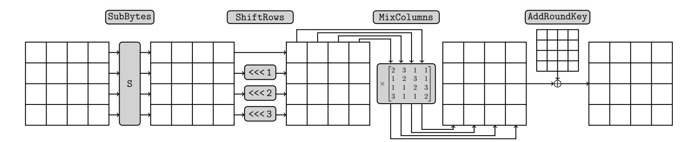
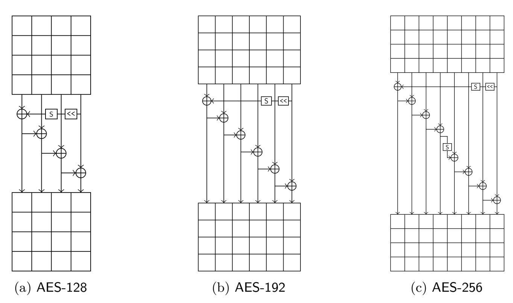
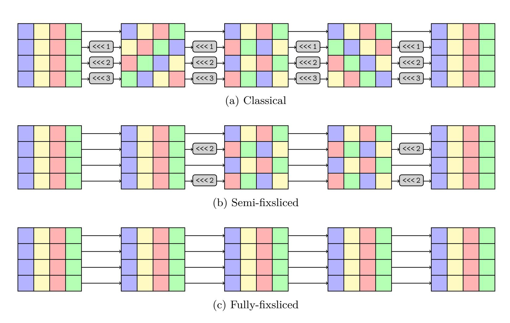
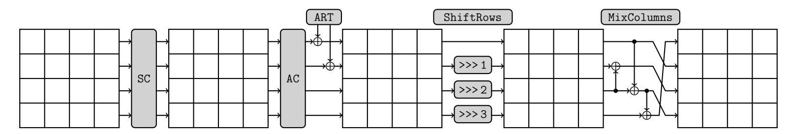
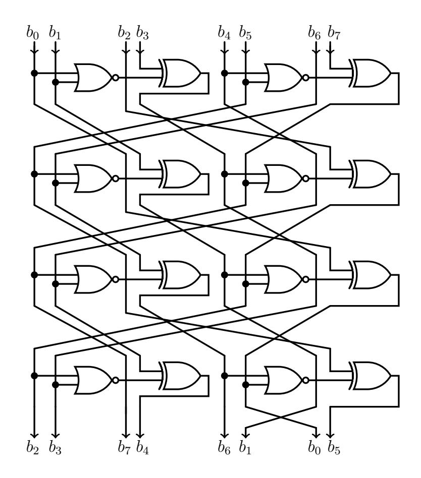

{0}------------------------------------------------

# **Fixslicing AES-like Ciphers**

### **New bitsliced AES speed records on ARM-Cortex M and RISC-V**

Alexandre Adomnicai and Thomas Peyrin

Nanyang Technological University, Singapore Temasek Laboratories, Singapore

[firstname.lastname@ntu.edu.sg](mailto:firstname.lastname@ntu.edu.sg)

**Abstract.** The fixslicing implementation strategy was originally introduced as a new representation for the hardware-oriented GIFT block cipher to achieve very efficient software constant-time implementations. In this article, we show that the fundamental idea underlying the fixslicing technique is not of interest only for GIFT, but can be applied to other ciphers as well. Especially, we study the benefits of fixslicing in the case of AES and show that it allows to reduce by 52% the amount of operations required by the linear layer when compared to the current fastest bitsliced implementation on 32-bit platforms. Overall, we report that fixsliced AES-128 allows to reach 80 and 87 cycles per byte on ARM Cortex-M and E31 RISC-V processors respectively (assuming pre-computed round keys), improving the previous records on those platforms by 21% and 30%. In order to highlight that our work also directly improves masked implementations that rely on bitslicing, we report implementation results when integrating first-order masking that outperform by 12% the fastest results reported in the literature on ARM Cortex-M4. Finally, we demonstrate the genericity of the fixslicing technique for AES-like designs by applying it to the Skinny-128 tweakable block ciphers.

**Keywords:** AES · ARM · RISC-V · Implementation · Bitslicing · Fixslicing

## **1 Introduction**

Since the selection of the Rijndael block cipher as the Advanced Encryption Standard (AES) [\[DR02\]](#page-20-0) in 2001, optimized implementations of this algorithm attracted a lot of interest over the past two decades. If AES can be efficiently implemented using look-up tables, the table accesses being key and data-dependent lead to cache-timing attacks [\[Ber05,](#page-19-0) [BM06\]](#page-19-1). With these vulnerabilities in mind, cryptographers came up with constanttime implementations by taking advantage of vector permute instructions [\[Ham09\]](#page-20-1) or bitslicing [\[MN07,](#page-20-2) [Kön08,](#page-20-3) [KS09\]](#page-20-4). To meet the need for efficient and secure implementations, Intel and AMD added the set of x86 instructions AES-NI [\[Gue08\]](#page-20-5) to implement AES using dedicated hardware circuits. However, because such dedicated instructions are not necessarily available on a given platform, the study of efficient constant-time AES implementations is still an active research topic, especially on microprocessors used in lowend embedded devices because of their limited computational resources. Although there are undergoing initiatives that intend to provide lightweight alternatives to AES for such platforms (e.g. the NIST LWC project [\[MBTM17\]](#page-20-6)), it will probably still be widely deployed in the near future for security guarantees and compliance reasons. To date, the fastest constant-time AES implementation on 32-bit reduced instruction set computer (RISC) is is the one from Schwabe and Stoffelen [\[SS16\]](#page-20-7) that runs at 101 cycles per byte (cpb) on ARM Cortex-M3 by processing 2 blocks in parallel. It was also ported to the 32-bit RISC-V architecture and results in 124 cpb on this platform [\[Sto19\]](#page-20-8). This implementation, which

{1}------------------------------------------------

relies on bitslicing, also serves as a basis for some of the current best results reported in the literature when integrating countermeasures against power/electromagnetic side-channel attacks [\[GSDM](#page-20-9)<sup>+</sup>19]. One notable feature of this implementation is that about 40% and 55% of the cycles are spent for the linear layer on ARM Cortex-M and RISC-V, respectively. Clever optimizations of software linear layer implementations have already been addressed for some ciphers. In [\[RAL17\]](#page-20-10), the authors introduce an alternative representation of the PRESENT block cipher [\[BKL](#page-19-2)<sup>+</sup>07] over 2 rounds that allows to speed up the performance by a factor 8 on ARM Cortex-M. More recently, a similar approach named *fixslicing* [\[ANP20\]](#page-19-3) has been applied to the GIFT family of block ciphers [\[BPP](#page-19-4)<sup>+</sup>17], enhancing the performance by a factor 7 on ARM Cortex-M when compared to naive bitslicing. Those works highlight that the performance of a bitsliced implementation not only depends on the way the bits are packed within registers, but also on possible alternative representations of the cipher. Because such optimizations have only been applied to Substitution-bitPermutation Network (SbPN) such as GIFT and PRESENT to date, it remains unclear if it would be of interest for other designs. However, the generic aspect of fixslicing tends to indicate that this concept might be more widely applicable.

**Our contributions.** In this article, we intend to enhance the current best speed results for constant-time implementations of AES on embedded 32-bit platforms. By analyzing the performance of the current fastest implementation, we note that more of 30% of the instructions are dedicated to the ShiftRows layer. As a first step to minimize the cost of this operation, we push bitsliced implementations of AES to their limit on 32-bit platforms by introducing a new bitsliced representation that we call *barrel-shiftrows*. The advantage of this representation is the ability to compute the ShiftRows simply using 32-bit rotations while not impacting the MixColumns efficiency. On the other hand, it requires to process 8 blocks in parallel which might not be well suited to handle efficiently a small amount of data, as it is often the case for embedded devices. Therefore, instead of focusing on a new way to pack the bits within registers, we investigate the benefits of fixslicing in the case of AES. We show that the fundamental idea underlying this concept is not only of interest for SbPN designs, but can be applied to other ciphers as well. Indeed, fixslicing allows to reduce by 52% the amount of operations required by the linear layer when compared to the current fastest bitsliced implementation on 32-bit platforms. All in all, we report that fixsliced AES-128 reaches 80 and 87 cpb on ARM Cortex-M and E31 RISC-V processors respectively (assuming pre-computed round keys), improving the previous records on those platforms by 21% and 30%. Those results require the ability to process two blocks simultaneously and therefore apply to all parallelizable modes of operation (e.g. CTR, GCM). Our work directly improves the prior reported results for first-order masked AES on ARM Cortex-M4 by 12%, with 187 cpb. Finally, we highlight that the fixsliced approach can be applied to other AES-like designs by illustrating an application to the Skinny-128 tweakable block ciphers. All our implementations are available in the public domain at <https://github.com/aadomn/aes>.

## <span id="page-1-0"></span>**2 Preliminaries**

### **2.1 AES overview**

AES is a 128-bit block cipher that can be instantiated using three different key lengths: 128, 192 or 256 bits, resulting in three corresponding versions: AES-128, AES-192 and AES-256. All versions rely on the same round function, which is applied 10, 12 and 14 times for AES-128, AES-192 and AES-256, respectively. The round function, which operates on the internal state viewed as a 4 × 4 matrix of elements in the finite field defined by the irreducible polynomial *x* <sup>8</sup> + *x* <sup>4</sup> + *x* <sup>3</sup> + *x* + 1 over GF(2), consists in the following four

{2}------------------------------------------------

operations:

- SubBytes: applies the same 8-bit S-box to each byte of the internal state
- ShiftRows: shifts the i-th row left by i bytes
- MixColumns: multiplies each column with a diffusion matrix over  $GF(2^8)$
- AddRoundKey: adds a 128-bit round key to the internal state.

<span id="page-2-0"></span>

Figure 1: The AES round function.

The AES round function is illustrated in Figure 1. Note that an additional AddRoundKey is performed at the very beginning of the first round, and that the MixColumns operation is omitted during the last round. The encryption key is expanded into round keys using a key schedule algorithm, whose round function is depicted in Figure 2 for each AES version. Note that a round constant is also incorporated in each round keys, we refer to [DR02] for more details.

<span id="page-2-1"></span>

Figure 2: Key schedule round functions for each AES version, from [Jea16].

### <span id="page-2-2"></span>2.2 Bitslicing the AES

Bitslicing is a software implementation technique where the computation of a function is reduced to logic gates (e.g. AND, XOR, OR, NOT), allowing to execute as many instances in parallel as the CPU's register width. It was originally introduced as an efficient way to implement the DES block cipher [Bih97, Kwa00] before being considered as a generic technique to achieve fast constant-time implementations. Many bitsliced AES implementations followed [RSD06, MN07, Kön08] where the fastest of them was introduced by Käsper and Schwabe [KS09] allowing to reach 6.9 cpb for AES-128 on Intel Core i7 processors by processing 8 blocks in parallel as depicted in Figure 3.

{3}------------------------------------------------

<span id="page-3-0"></span>

|       |              |  |              | row 3 | 3             |  |               |                 |       |             | row | 0            |       |               |
|-------|--------------|--|--------------|-------|---------------|--|---------------|-----------------|-------|-------------|-----|--------------|-------|---------------|
|       | column 0     |  |              |       | column 3      |  |               | <br>co          | olumn | 0           |     | column 3     |       | 3             |
|       | block 0      |  | block 7      |       | block 0       |  | block 7       | <br>block 0     |       | block 7     |     | block 0      |       | block 7       |
| $R_0$ | $b_{24}^{0}$ |  | $b_{24}^{7}$ |       | $b_{120}^0$   |  | $b_{120}^{7}$ | <br>$b_0^0$     |       | $b_0^7$     |     | $b_{96}^{0}$ |       | $b_{96}^{7}$  |
| $R_1$ | $b_{25}^{0}$ |  | $b_{25}^{7}$ |       | $b_{121}^0$   |  | $b_{121}^{7}$ | <br>$b_1^0$     |       | $b_1^7$     |     | $b_{97}^{0}$ |       | $b_{97}^{7}$  |
| $R_2$ | $b_{26}^{0}$ |  | $b_{26}^{7}$ |       | $b_{122}^0$   |  | $b_{122}^{7}$ | <br>$b_2^0$     |       | $b_{2}^{7}$ |     | $b_{98}^{0}$ |       | $b_{98}^{7}$  |
| $R_3$ | $b_{27}^{0}$ |  | $b_{27}^{7}$ |       | $b_{123}^0$   |  | $b_{123}^{7}$ | <br>$b_{3}^{0}$ |       | $b_3^7$     |     | $b_{99}^{0}$ |       | $b_{99}^{7}$  |
| $R_4$ | $b_{28}^{0}$ |  | $b_{28}^{7}$ |       | $b_{124}^0$   |  | $b_{124}^{7}$ | <br>$b_4^0$     |       | $b_4^7$     |     | $b_{100}^0$  |       | $b_{100}^{7}$ |
| $R_5$ | $b_{29}^{0}$ |  | $b_{29}^{7}$ |       | $b_{125}^{0}$ |  | $b_{125}^{7}$ | <br>$b_5^0$     |       | $b_{5}^{7}$ |     | $b_{101}^0$  |       | $b_{101}^{7}$ |
| $R_6$ | $b_{30}^{0}$ |  | $b_{30}^{7}$ |       | $b_{126}^{0}$ |  | $b_{126}^{7}$ | <br>$b_{6}^{0}$ |       | $b_{6}^{7}$ |     | $b_{102}^0$  |       | $b_{102}^{7}$ |
| $R_7$ | $b_{31}^{0}$ |  | $b_{31}^{7}$ |       | $b_{127}^0$   |  | $b_{127}^{7}$ | <br>$b_{7}^{0}$ |       | $b_{7}^{7}$ |     | $b_{103}^0$  | • • • | $b_{103}^{7}$ |

Figure 3: Bitsliced representation from [KS09] using 8 128-bit registers  $R_0, \dots, R_7$  to process 8 blocks  $b^0, \dots, b^7$  in parallel where  $b^i_j$  refers to the j-th bit of the i-th block.

While bitsliced AES implementations aroused less interest on high-end processors since the deployment of the AES-NI instruction set, it still attracts a lot of attention for platforms that do not enjoy AES hardware acceleration, such as low-end microprocessors. Although the most constrained microprocessors do not necessarily have any internal cache memory (e.g. ARM Cortex-M3), it is possible for a system on chip design to integrate a system level cache, making cache-timing attacks a threat. Moreover, because embedded platforms are typical targets for side-channel attacks such as differential power/electromagnetic analysis, relying on an implementation that works at the gate level facilitates the integration of Boolean masking as a countermeasure.

On 32-bit platforms, the most efficient bitsliced AES implementation reported in the literature is the one from Schwabe and Stoffelen [SS16] allowing to reach 101 cpb on ARM Cortex-M3. It was also ported to the 32-bit RISC-V architecture and results in 124 cpb on E31 processors [Sto19]. Their implementation heavily relies on [KS09] by adapting it to 32-bit registers instead of 128-bit ones as depicted in Figure 4.

<span id="page-3-1"></span>

|       |              |              |              | ro           | w 3          |              |             |             | <br>row 0       |             |              |              |              |              |               |              |
|-------|--------------|--------------|--------------|--------------|--------------|--------------|-------------|-------------|-----------------|-------------|--------------|--------------|--------------|--------------|---------------|--------------|
|       | column 0     |              | column 1     |              | column 2     |              | column 3    |             | <br>column 0    |             | column 1     |              | column 2     |              | column 3      |              |
|       | block 0      | block 1      | block 0      | block 1      | block 0      | block 1      | block 0     | block 1     | <br>block 0     | block 1     | block 0      | block 1      | block 0      | block 1      | block 0       | block 1      |
| $R_0$ | $b_{24}^{0}$ | $b_{24}^{1}$ | $b_{56}^{0}$ | $b_{56}^{1}$ | $b_{88}^{0}$ | $b_{88}^1$   | $b_{120}^0$ | $b_{120}^1$ | <br>$b_0^0$     | $b_0^1$     | $b_{32}^{0}$ | $b_{32}^{1}$ | $b_{64}^{0}$ | $b_{64}^{1}$ | $b_{96}^{0}$  | $b_{96}^{1}$ |
| :     |              | :            | :            | :            | :            | •            | :           | :           | <br>:           | •           | :            | :            | :            | :            | :             | :            |
| $R_7$ | $b_{31}^{0}$ | $b_{31}^{1}$ | $b_{63}^{0}$ | $b_{63}^{1}$ | $b_{95}^{0}$ | $b_{95}^{1}$ | $b_{127}^0$ | $b_{127}^1$ | <br>$b_{7}^{0}$ | $b_{7}^{1}$ | $b_{39}^{0}$ | $b_{39}^{1}$ | $b_{71}^{0}$ | $b_{71}^{1}$ | $b_{103}^{0}$ | $b_{103}^1$  |

Figure 4: Bitsliced representation from [SS16] using 8 32-bit registers  $R_0, \dots, R_7$  to process 2 blocks  $b^0, b^1$  in parallel where  $b^i_j$  refers to the *j*-th bit of the *i*-th block.

The advantage of this representation is the ability to compute the MixColumns operation using only 27 exclusive-ORs and 16 rotations. Indeed, because each byte in the internal state is an element of  $GF(2)/x^8 + x^4 + x^3 + x + 1$ , multiplication by 2 is achieved by a left

{4}------------------------------------------------

shift and conditional masking with  $(00011011)_2$  whenever the most significant bit (MSB) equals 1. Since  $R_0$  contains the MSB of each byte, one has simply to add it to the four corresponding registers. Moreover, because the bitsliced representation of the internal state is row-wise, adding an adjacent element in the column simply corresponds to an exclusive-OR combined with a rotation. Therefore, the entire MixColumns computation can be achieved in the following way:

<span id="page-4-2"></span>
$$R'_{0} = (R_{1} \oplus R_{1}^{\gg 8}) \oplus R_{0}^{\gg 8} \oplus (R_{0} \oplus R_{0}^{\gg 8})^{\gg 16}$$

$$R'_{1} = (R_{2} \oplus R_{2}^{\gg 8}) \oplus R_{1}^{\gg 8} \oplus (R_{1} \oplus R_{1}^{\gg 8})^{\gg 16}$$

$$R'_{2} = (R_{3} \oplus R_{3}^{\gg 8}) \oplus R_{2}^{\gg 8} \oplus (R_{2} \oplus R_{2}^{\gg 8})^{\gg 16}$$

$$R'_{3} = (R_{4} \oplus R_{4}^{\gg 8}) \oplus R_{3}^{\gg 8} \oplus (R_{3} \oplus R_{3}^{\gg 8})^{\gg 16} \oplus (R_{0} \oplus R_{0}^{\gg 8})$$

$$R'_{4} = (R_{5} \oplus R_{5}^{\gg 8}) \oplus R_{4}^{\gg 8} \oplus (R_{4} \oplus R_{4}^{\gg 8})^{\gg 16} \oplus (R_{0} \oplus R_{0}^{\gg 8})$$

$$R'_{5} = (R_{6} \oplus R_{6}^{\gg 8}) \oplus R_{5}^{\gg 8} \oplus (R_{5} \oplus R_{5}^{\gg 8})^{\gg 16}$$

$$R'_{6} = (R_{7} \oplus R_{7}^{\gg 8}) \oplus R_{6}^{\gg 8} \oplus (R_{6} \oplus R_{6}^{\gg 8})^{\gg 16} \oplus (R_{0} \oplus R_{0}^{\gg 8})$$

$$R'_{7} = (R_{0} \oplus R_{0}^{\gg 8}) \oplus R_{7}^{\gg 8} \oplus (R_{7} \oplus R_{7}^{\gg 8})^{\gg 16}$$

$$(1)$$

where  $R_i^{\gg j}$  refers to a rotation of  $R_i$  by j bits to the right. Note that on ARM, thanks to the inline barrel shifter, the rotations can be computed for free resulting in only 27 1-cycle instructions in total.

While the row-wise bitsliced representation allows an efficient MixColumns implementation, it is less suited regarding the ShiftRows operation. When considering 8 blocks using 128-bit registers, the ShiftRows corresponds to a byte-level permutation on each register, which can be efficiently computed on Intel using the SSSE3 byte shuffle instruction pshufb. However for the 32-bit version, according to the representation depicted in Figure 4, the ShiftRows requires to compute byte-wise rotations. This can be achieved by means of 6 OR instructions, 7 AND instructions and 6 logical shifts are required per register as shown in Listing 1. Note that [SS16] uses bitfield extract instructions for their ARM implementation but it does not achieve better performance anyway.

```
t = (r \gg 6) \& 0x00000300;
                                     // shifts the second row
           (r \& 0x00003f00) \ll 2;
                                     // shifts the second row
         (r \gg 4) \& 0x000f0000;
                                     // shifts the third row
3
4
   t = t | (r \& 0x000f0000) \ll 4;
                                     // shifts the third row
     = t | (r » 2) & 0x3f000000;
5
                                     // shifts the fourth row
   t = t \mid (r \& 0x03000000) \ll 6;
6
                                     // shifts the fourth row
  | r = t | (r & 0x000000ff);
                                     // the first row is not shifted
```

Listing 1: C code to apply the ShiftRows on a slice r according to the bitsliced representation in Figure 4.

On ARM, thanks to the inline barrel shifter, it results in  $(6+7) \times 8 = 104$  1-cycle instructions per ShiftRows, leading to  $(104 \times 10)/32 = 32.5$  cpb which is 32% of the overall AES-128 performance reported on ARM Cortex-M. On RISC-V it corresponds to  $19 \times 8 = 152$  1-cycle instructions per ShiftRows, leading to  $152 \times 10/32 = 47.5$  cpb which is 38% of the overall AES-128 performance reported on E31 RISC-V processors. However, note that this is not optimal: after having uploaded a preliminary version of our work online, Dettman highlighted that it can be done more efficiently 1 as detailed in Listing 2. Because the implementations have not been patched yet at the time of writing, we do not

<span id="page-4-1"></span><sup>&</sup>lt;sup>1</sup>Improved aes128ctrbs shift row suggestion

{5}------------------------------------------------

consider this optimization for our benchmarks since there is no practical results available. Instead we briefly discuss some estimates in Section [5.3.](#page-14-0)

```
1 SWAPMOVE(r, r, 0x030f0c00, 4);
2 SWAPMOVE(r, r, 0x33003300, 2);
```

Listing 2: Optimized ShiftRows computation on a slice r according to the bitsliced representation in Figure [4,](#page-3-1) where SWAPMOVE is defined in Appendix [A.](#page-21-0)

## **3 A new ShiftRows-friendly representation**

A straightforward way to reduce the cost of the ShiftRows operation is to keep a row-wise bitsliced representation and to isolate each row in distinct registers, so that byte-wise rotations are replaced by word-wise rotations. However on 32-bit platforms, it requires 32 registers to store the internal state by processing 8 blocks in parallel as illustrated in Figure [5.](#page-6-0) We refer to this representation as *barrel-shiftrows* since it allows to compute the ShiftRows using only 24 32-bit rotation. On ARM, it means that the ShiftRows can be actually computed for free by using the inline barrel shifter. However as there are only 14 general-purpose registers available, one would have to deal with numerous memory accesses throughout the AES processing. At first glance, it is not clear how it would perform when compared to [\[SS16\]](#page-20-7). On the other hand, the barrel-shiftrows representation could be more valuable on platforms that embed more registers and that do not come with any rotation instruction (e.g. RV32I). Indeed, the MixColumns no longer requires rotations but only exclusive-ORs since the different bytes within a column are now stored in distinct registers. Therefore, instead of computing a rotation to ensure that all bytes within the column are properly aligned, one has just to perform an exclusive-OR with the corresponding registers as detailed in Equation [2:](#page-5-1)

<span id="page-5-1"></span>
$$R'_{i} = R_{i+1} \oplus R_{i+9} \oplus R_{i+8} \oplus R_{i+16} \oplus R_{i+24}$$

$$R'_{i+1} = R_{i+2} \oplus R_{i+10} \oplus R_{i+9} \oplus R_{i+17} \oplus R_{i+25}$$

$$R'_{i+2} = R_{i+3} \oplus R_{i+11} \oplus R_{i+10} \oplus R_{i+18} \oplus R_{i+26}$$

$$R'_{i+3} = R_{i+4} \oplus R_{i+12} \oplus R_{i+11} \oplus R_{i+19} \oplus R_{i+27} \oplus (R_i \oplus R_{i+8})$$

$$R'_{i+4} = R_{i+5} \oplus R_{i+13} \oplus R_{i+12} \oplus R_{i+20} \oplus R_{i+28} \oplus (R_i \oplus R_{i+8})$$

$$R'_{i+5} = R_{i+6} \oplus R_{i+14} \oplus R_{i+13} \oplus R_{i+21} \oplus R_{i+29}$$

$$R'_{i+6} = R_{i+7} \oplus R_{i+15} \oplus R_{i+14} \oplus R_{i+22} \oplus R_{i+30} \oplus (R_i \oplus R_{i+8})$$

$$R'_{i+7} = (R_i \oplus R_{i+8}) \oplus R_{i+15} \oplus R_{i+23} \oplus R_{i+31}$$

$$(2)$$

for *i* ∈ {0*,* 8*,* 16*,* 24} and where all subscripts are to be considered modulo 32.

Using the barrel-shiftrows representation, the MixColumns requires 27 × 4 = 108 exclusive-ORs by processing 8 blocks in parallel, while the bitsliced representation requires 16 × 4 = 64 additional rotations. While this is not of particular interest on ARM, this is beneficial to platforms without rotate instruction. On 32-bit platforms, the barrelshiftrows representation might be the most efficient way to compute the ShiftRows operation. However it requires to process 8 blocks in parallel which can be inappropriate for communication protocols used in embedded systems that are designed to transmit small amount of data. In the next section, we look at optimizing the representation that processes only 2 blocks at a time.

{6}------------------------------------------------

<span id="page-6-0"></span>

|         |             |       |             | row ( | 0            |       |               |   |            |              |           |              | row 2 | 2             |       |               |
|---------|-------------|-------|-------------|-------|--------------|-------|---------------|---|------------|--------------|-----------|--------------|-------|---------------|-------|---------------|
|         | co          | olumn | 0           |       | cc           | olumn | 3             |   |            | co           | olumn     | 0            |       | cc            | 3     |               |
|         | block 0     |       | block 7     |       | block 0      |       | block 7       |   |            | block 0      |           | block 7      |       | block 0       |       | block 7       |
| $R_0$   | $b_0^0$     |       | $b_0^7$     |       | $b_{96}^{0}$ |       | $b_{96}^{7}$  | ١ | $R_{16}$   | $b_{16}^{0}$ |           | $b_{16}^{7}$ |       | $b_{112}^0$   |       | $b_{112}^{7}$ |
| :       | :           |       | :           |       | •            |       | :             |   | :          |              |           | •••          |       | •••           |       | :             |
| $R_7$   | $b_{7}^{0}$ |       | $b_{7}^{7}$ |       | $b_{103}^0$  |       | $b_{103}^{7}$ | ي | $R_{23}$   | $b_{23}^{0}$ |           | $b_{23}^{7}$ |       | $b_{119}^{0}$ |       | $b_{119}^{7}$ |
|         |             |       |             |       |              |       |               |   |            |              |           |              |       |               |       |               |
|         |             |       |             |       |              |       |               |   |            |              |           |              |       |               |       |               |
|         |             |       |             | row   | 1            |       |               |   |            |              |           |              | row   | 3             |       |               |
|         | CO          | olumn | 0           | row   |              | olumn | 1 3           |   |            | CO           | olumn     | 0            | row   | 1             | olumn | 3             |
|         | block 0     | olumn | block 7     |       |              | olumn | block 7       |   |            | block 0      | olumn<br> | block 7      |       | 1             | olumn | 3 Plock 7     |
| $R_8$   |             |       |             | • • • | Co           |       |               |   | $R_{24}$   | _            |           | 2            | • • • | C             |       |               |
| $R_8$ : | block 0     |       | block 7     |       | block 0      |       | block 7       |   | $R_{24}$ : | block 0      |           | block 7      |       | block 0       |       | block 7       |

Figure 5: Barrel-shiftrows representation using 32 32-bit registers  $R_0, \dots, R_{31}$  to process 8 blocks  $b^0, \dots, b^7$  in parallel where  $b^i_j$  refers to the *i*-th bit of the *j*-th block.

## 4 Fixslicing the AES

Instead of looking for a new way to pack the bits within the registers, another interesting and promising approach is to investigate whether it would be advantageous to not follow the classical cipher representation for a few rounds. By following this strategy, it was possible to greatly enhance the performances of the GIFT block cipher in software [ANP20]. To put it in a nutshell, the authors proposed an alternative representation of the cipher over several rounds to minimize the cost of the linear layer. They call their implementation technique fixslicing as it mainly consists in fixing the bits within a register (or slice) to never move and to adjust the other slices accordingly so that the proper bits are involved in the SubBytes operation. At first glance, it seems that the fixslicing technique as originally specified is only of interest for SbPN designs which have the special property that each bit located in a slice remains in this same slice through the permutation. However, the main idea underlying the fixslicing technique, which is to rely on an alternative representation of the cipher for a few rounds while ensuring that the bits are correctly aligned for the SubBytes computation, is actually generic and might be of interest for numerous designs. In this section, we study the relevance of fixslicing with regards to the AES on 32-bit platforms.

#### 4.1 Application to the round function

In the case of SbPN ciphers where the permutation layer simply consists of a bit permutation, the only requirements when considering an alternative representation of the cipher over several rounds are to adapt the round keys accordingly and to ensure that the bits are correctly aligned for the non-linear layer. However, for AES-like ciphers the permutation layer comprises two linear operations, namely ShiftRows as a byte permutation and MixColumns as a matrix multiplication. Therefore, it is not sufficient to just ensure that

{7}------------------------------------------------

the bits are properly aligned with regards to the SubBytes operations, it has to be done for the exclusive-ORs in the MixColumns as well. According to the bitsliced representation detailed in Figure [4,](#page-3-1) fixing one of the slices (or registers) to never move means to simply omit the ShiftRows operation throughout the entire algorithm execution. Note that to have the bits correctly aligned to perform the SubBytes in a bitsliced manner, all slices have to remain fixed. Therefore, the main issue raised by the omission of the ShiftRows permutation is to adapt the MixColumns accordingly.

Before entering the MixColumns during the first round, it is trivial that *F* = SR−<sup>1</sup> (*S*) where *F*, *S* refer to the internal state in the fixsliced and classical representations respectively, and SR refers to the ShiftRows permutation. Thus, to ensure the correctness of the MixColumns operation, one has to compute the ShiftRows (i.e. the corresponding bytewise rotations) on some temporary registers, so that the proper bits are exclusive-ORed together. The calculations are detailed in Figure [6.](#page-7-0)

<span id="page-7-0"></span>
$$R'_{0} = \left(R_{1} \oplus (R_{1}^{\gg 8} \underset{8}^{\gg 6})\right) \oplus (R_{0}^{\gg 8} \underset{8}^{\gg 6}) \oplus (R_{0}^{\gg 16} \underset{8}^{\gg 4}) \oplus (R_{0}^{\gg 24} \underset{8}^{\gg 2})$$

$$R'_{1} = \left(R_{2} \oplus (R_{2}^{\gg 8} \underset{8}^{\gg 6})\right) \oplus (R_{1}^{\gg 8} \underset{8}^{\gg 6}) \oplus (R_{1}^{\gg 16} \underset{8}^{\gg 4}) \oplus (R_{1}^{\gg 24} \underset{8}^{\gg 2})$$

$$R'_{2} = \left(R_{3} \oplus (R_{3}^{\gg 8} \underset{8}^{\gg 6})\right) \oplus (R_{2}^{\gg 8} \underset{8}^{\gg 6}) \oplus (R_{2}^{\gg 16} \underset{8}^{\gg 4}) \oplus (R_{2}^{\gg 24} \underset{8}^{\gg 2})$$

$$R'_{3} = \left(R_{4} \oplus (R_{4}^{\gg 8} \underset{8}^{\gg 6})\right) \oplus (R_{3}^{\gg 8} \underset{8}^{\gg 6}) \oplus (R_{3}^{\gg 16} \underset{8}^{\gg 4}) \oplus (R_{3}^{\gg 24} \underset{8}^{\gg 2}) \oplus \left(R_{0} \oplus (R_{0}^{\gg 8} \underset{8}^{\gg 6})\right)$$

$$R'_{4} = \left(R_{5} \oplus (R_{5}^{\gg 8} \underset{8}^{\gg 6})\right) \oplus (R_{4}^{\gg 8} \underset{8}^{\gg 6}) \oplus (R_{4}^{\gg 16} \underset{8}^{\gg 4}) \oplus (R_{4}^{\gg 24} \underset{8}^{\gg 2}) \oplus \left(R_{0} \oplus (R_{0}^{\gg 8} \underset{8}^{\gg 6})\right)$$

$$R'_{5} = \left(R_{6} \oplus (R_{6}^{\gg 8} \underset{8}^{\gg 6})\right) \oplus (R_{5}^{\gg 8} \underset{8}^{\gg 6}) \oplus (R_{5}^{\gg 16} \underset{8}^{\gg 4}) \oplus (R_{5}^{\gg 24} \underset{8}^{\gg 24}) \oplus \left(R_{0} \oplus (R_{0}^{\gg 8} \underset{8}^{\gg 6})\right)$$

$$R'_{6} = \left(R_{7} \oplus (R_{7}^{\gg 8} \underset{8}^{\gg 6})\right) \oplus (R_{7}^{\gg 8} \underset{8}^{\gg 6}) \oplus (R_{7}^{\gg 16} \underset{8}^{\gg 4}) \oplus (R_{7}^{\gg 24} \underset{8}^{\gg 2}) \oplus \left(R_{0} \oplus (R_{0}^{\gg 8} \underset{8}^{\gg 6})\right)$$

$$R'_{7} = \left(R_{0} \oplus (R_{0}^{\gg 8} \underset{8}^{\gg 6})\right) \oplus (R_{7}^{\gg 8} \underset{8}^{\gg 6}) \oplus (R_{7}^{\gg 16} \underset{8}^{\gg 4}) \oplus (R_{7}^{\gg 24} \underset{8}^{\gg 2})$$

Figure 6: Equations to compute the MixColumns during the first fixsliced round where *<sup>R</sup><sup>i</sup>* <sup>≫</sup><sup>8</sup> *j* refers to a byte-wise rotation of *j* bits to the right, for all bytes within *R<sup>i</sup>* .

Since (*R*<sup>≫</sup><sup>16</sup> *<sup>i</sup>* <sup>≫</sup><sup>8</sup> 4) ⊕ (*R*<sup>≫</sup><sup>24</sup> *<sup>i</sup>* <sup>≫</sup><sup>8</sup> 2) = *R<sup>i</sup>* ⊕ (*R*<sup>≫</sup><sup>8</sup> *<sup>i</sup>* <sup>≫</sup><sup>8</sup> 6)<sup>≫</sup><sup>16</sup> <sup>≫</sup>8 4, the fixsliced MixColumns detailed in Figure [6](#page-7-0) can be computed using 27 exclusive-ORs, 16 word-wise rotations and 16 byte-wise rotations. All in all, it corresponds to 27 XOR, 32 AND and 16 OR instructions on top of 16 circular and 32 logical shifts[2](#page-7-1) . When compared to the classical bitsliced representation it saves 72 instructions for the entire linear layer, namely 32 OR, 24 AND and 16 logical shifts. As detailed in the rest of this section, the benefits of the fixslicing implementation strategy are even more significant during the next rounds.

Before entering the MixColumns during the second round, we now have *F* = SR<sup>−</sup><sup>2</sup> (*S*) which implies that the first and third rows are aligned with the classical representation, whereas the second and fourth ones are shifted by two bytes. This is especially beneficial to the fixsliced representation as it means that just a single byte-wise rotation per register is needed as described in Figure [7.](#page-8-0) Indeed, during the first round, each row in the fixsliced internal state is delayed by one byte shift to the left in comparison to its adjacent rows. In other words, one has to shift by one position to the left the row *i* to be aligned with the row *i* + 1 mod 4. However, the row *i* has to be shifted by 2 (resp. 3) positions to the left to match the row *i* + 2 mod 4 (resp. *i* + 3 mod 4) alignment. This is why 3 byte-wise rotations with 3 different rotation values (i.e. 6, 4 and 2) are required for each register in Figure [6.](#page-7-0) During the second round, because each row is either aligned or shifted by 2 positions compared to all other rows, only a single byte-wise rotation by 4 bits is required per register. Therefore, the fixsliced MixColumns in the second round requires 27 XOR, 16 AND and 8 OR instructions on top of 16 circular and 16 logical shifts.

<span id="page-7-1"></span><sup>2</sup> [Improved AES fixslice MixColumns algorithm\(s\)](https://github.com/RustCrypto/block-ciphers/pull/184)

{8}------------------------------------------------

<span id="page-8-0"></span>
$$R'_{0} = \left(R_{1} \oplus (R_{1}^{\gg 8} \underset{s}{\gg} 4)\right) \oplus \left(R_{0}^{\gg 8} \underset{s}{\gg} 4\right) \oplus \left(R_{0} \oplus (R_{0}^{\gg 8} \underset{s}{\gg} 4)\right)^{\gg 16}$$

$$R'_{1} = \left(R_{2} \oplus (R_{2}^{\gg 8} \underset{s}{\gg} 4)\right) \oplus \left(R_{1}^{\gg 8} \underset{s}{\gg} 4\right) \oplus \left(R_{1} \oplus (R_{1}^{\gg 8} \underset{s}{\gg} 4)\right)^{\gg 16}$$

$$R'_{2} = \left(R_{3} \oplus (R_{3}^{\gg 8} \underset{s}{\gg} 4)\right) \oplus \left(R_{2}^{\gg 8} \underset{s}{\gg} 4\right) \oplus \left(R_{2} \oplus (R_{2}^{\gg 8} \underset{s}{\gg} 4)\right)^{\gg 16}$$

$$R'_{3} = \left(R_{4} \oplus (R_{4}^{\gg 8} \underset{s}{\gg} 4)\right) \oplus \left(R_{3}^{\gg 8} \underset{s}{\gg} 4\right) \oplus \left(R_{3} \oplus (R_{3}^{\gg 8} \underset{s}{\gg} 4)\right)^{\gg 16} \oplus \left(R_{0} \oplus (R_{0}^{\gg 8} \underset{s}{\gg} 4)\right)$$

$$R'_{4} = \left(R_{5} \oplus (R_{5}^{\gg 8} \underset{s}{\gg} 4)\right) \oplus \left(R_{4}^{\gg 8} \underset{s}{\gg} 4\right) \oplus \left(R_{4} \oplus (R_{4}^{\gg 8} \underset{s}{\gg} 4)\right)^{\gg 16} \oplus \left(R_{0} \oplus (R_{0}^{\gg 8} \underset{s}{\gg} 4)\right)$$

$$R'_{5} = \left(R_{6} \oplus (R_{6}^{\gg 8} \underset{s}{\gg} 4)\right) \oplus \left(R_{5}^{\gg 8} \underset{s}{\gg} 4\right) \oplus \left(R_{5} \oplus (R_{5}^{\gg 8} \underset{s}{\gg} 4)\right)^{\gg 16}$$

$$R'_{6} = \left(R_{7} \oplus (R_{7}^{\gg 8} \underset{s}{\gg} 4)\right) \oplus \left(R_{6}^{\gg 8} \underset{s}{\gg} 4\right) \oplus \left(R_{6} \oplus (R_{6}^{\gg 8} \underset{s}{\gg} 4)\right)^{\gg 16} \oplus \left(R_{0} \oplus (R_{0}^{\gg 8} \underset{s}{\gg} 4)\right)$$

$$R'_{7} = \left(R_{0} \oplus (R_{0}^{\gg 8} \underset{s}{\gg} 4)\right) \oplus \left(R_{7}^{\gg 8} \underset{s}{\gg} 4\right) \oplus \left(R_{7} \oplus (R_{7}^{\gg 8} \underset{s}{\gg} 4)\right)^{\gg 16}$$

Figure 7: Equations to compute the MixColumns during the second fixsliced round where *<sup>R</sup><sup>i</sup>* <sup>≫</sup><sup>8</sup> *j* refers to a byte-wise rotation of *j* bits to the right, for all bytes within *R<sup>i</sup>* .

Due to the ShiftRows transformation, the third round configuration will be similar to the first one except that each row will be delayed by one byte shift to the right (instead of left) in comparison to its adjacent rows. Therefore the computation of the fixsliced MixColumns in the third round is the same as in the first round, with a slight modification: byte-wise rotation values have to be reversed. For instance, the update of *R*<sup>0</sup> is defined by:

$$R'_0 = \left(R_1 \oplus (R_1^{\gg 8} \underset{*}{\gg} 2)\right) \oplus \left(R_0^{\gg 8} \underset{*}{\gg} 2\right) \oplus \left(R_0^{\gg 16} \underset{*}{\gg} 4\right) \oplus \left(R_0^{\gg 24} \underset{*}{\gg} 6\right). \tag{3}$$

Therefore, the third round requires exactly the same number of operations as the first one. In the fourth round, the fixsliced representation will be finally synchronized with the classical one for the MixColumns since SR<sup>4</sup> = *Id*. As a result, one can simply compute the permutation layer using 27 XOR instructions and 16 circular shifts as detailed in Figure [1.](#page-4-2)

Consequently, our fixsliced AES description relies on a quadruple round routine where each round only differs by its implementation of the linear layer. Since only one AES version has a number of rounds which is a multiple of 4, namely AES-192, it means that an additional transformation should be applied at the end of AES-128 and AES-256 to ensure that the internal state is synchronized with the classical representation. Because AES-128 and AES-256 are composed of 10 and 14 rounds respectively, *F* = SR<sup>2</sup> (*F*) should be computed to ensure the correctness of the result. This is can be achieved by means of 1 AND and 3 OR instructions plus 2 logical shifts per register, as detailed in Listing [3.](#page-8-1)

```
1 SWAPMOVE(r, r, 0x0f000f00, 4);
```

Listing 3: C code to apply SR<sup>2</sup> on a slice r according to the representation in Figure [4.](#page-3-1)

One disadvantage of fixslicing compared to the classical representation is to require four different implementations of the linear layer. While this is not an issue when considering an unrolled implementation, it will increase the code size in a loop-based setting. To mitigate this concern, an interesting tradeoff is to compute SR<sup>2</sup> every two rounds so that only two different MixColumns implementations are required. We refer to this version as *semi-fixsliced* whereas *fully-fixsliced* refers to a total omission of the ShiftRows. A visual representation is provided in Figure [8.](#page-9-0)

The Table [1](#page-9-1) summarizes the number of operations required for the AES linear layer over 4 rounds, for the fully/semi-fixsliced representations. When considering the overall AES-128 algorithm, the linear layer (by processing 2 blocks at a time) requires 1907 and 915 operations for the classical bitsliced and fixsliced representations, respectively. While this corresponds to

{9}------------------------------------------------

an improvement of 52%, the gain might even be more important on some platforms since both representations respectively include 1283 and 563 logical operations, which means an improvement of 56% for this kind of instructions (which are the ones that really matter on ARM). Practical implementation results on ARM Cortex-M and E31 RISC-V processors are reported in the next section.

<span id="page-9-1"></span>Table 1: Number of operations required to compute the AES linear layer over 4 rounds when processing 2 blocks in parallel, for different representations. LOP, LSH and ROT refer to logical operations, logical shifts and rotations, respectively.

|                     | Ref    | Number of operations per linear layer |     |     |     |         |     |     |         |     |     |         |     |     |     |                     |     |
|---------------------|--------|---------------------------------------|-----|-----|-----|---------|-----|-----|---------|-----|-----|---------|-----|-----|-----|---------------------|-----|
| Representation      |        | Round 0                               |     |     |     | Round 1 |     |     | Round 2 |     |     | Round 3 |     |     |     | Total over 4 rounds |     |
|                     |        | LOP                                   | LSH | ROT | LOP | LSH     | ROT | LOP | LSH     | ROT | LOP | LSH     | ROT | LOP | LSH | ROT                 | P   |
| Classical bitsliced | [SS16] | 131                                   | 48  | 16  | 131 | 48      | 16  | 131 | 48      | 16  | 131 | 48      | 16  | 524 | 192 | 64                  | 780 |
| Fully-fixsliced     | Ours   | 75                                    | 32  | 16  | 51  | 16      | 16  | 75  | 32      | 16  | 27  | 0       | 16  | 228 | 80  | 64                  | 372 |
| Semi-fixsliced      |        | 75                                    | 32  | 16  | 59  | 16      | 16  | 75  | 32      | 16  | 59  | 16      | 16  | 268 | 96  | 64                  | 428 |

<span id="page-9-0"></span>

Figure 8: Overview of the AES internal state over 4 rounds according to different representations.

### **4.2 Application to the key expansion**

As previously mentioned, another requirement of the fixslicing technique is to adapt the round keys so that the bits are properly aligned to ensure the correctness of the AddRoundKey operation. Therefore, the key expansion of the fixsliced AES will inevitably bear the cost of some additional

{10}------------------------------------------------

computations. To the best of our knowledge, there is no result reported in the literature for a 32-bit implementation of the AES key schedule in a truly bitsliced manner. Actually, the results reported in [\[SS16,](#page-20-7) [Sto19\]](#page-20-8) are obtained by computing the AES key schedule using a lookup table (LUT) for the SubBytes before packing the round keys to match the bitsliced representation, resulting in key-dependent memory accesses. However, mounting a cache-timing attack against the key schedule seems unpractical since it is often computed only once per key and such attacks require the key-related index to interact with known variable data over multiple samples. On the other hand, when considering power side-channel attacks, countermeasures should not be only integrated to the round function but also to the key schedule as it constitutes another attack vector. This was actually highlighted by the CHES 2018 side-channel contest, where a masked AES implementation was defeated due to a lack of masking in the key schedule [\[GJS19\]](#page-20-14). As a result, we consider two variants: (1) LUT-based to provide a fast key schedule implementation when power side-channel attacks are not a concern and to compare with previous works, (2) truly bitsliced implementation that packs the master key at the beginning before operating on the bitsliced representation through the entire key expansion. The main advantage of the second variant will be to make the integration of Boolean masking easier.

For the LUT-based key schedule, the overhead introduced by fixslicing will be low since it allows to compute SR<sup>−</sup>*<sup>i</sup>* for *i* ∈ {1*,* 2*,* 3} on the round keys in a non-bitsliced fashion. It is indeed way more efficient as highlighted by Listing [4.](#page-10-0) Overall, fixslicing introduces on overhead of 8 logical operations per SR<sup>−</sup><sup>2</sup> computation and 28 logical operations per SR<sup>−</sup>*<sup>i</sup>* computations for *i* ∈ {1*,* 3}, which corresponds to 28 × 2 + 8 = 64 and 28 × 2 = 56 additional operations per quadruple round for the fully-fixsliced and semi-fixsliced representations, respectively. On the other hand, for a truly bitsliced key expansion, one has to pay an extra cost of 64 logical operations on top of 32 logical shifts per SR<sup>−</sup>*<sup>i</sup>* computations for *i* ∈ {1*,* 3} and 32 logical operations plus 16 logical shifts per SR<sup>−</sup><sup>2</sup> computations, as previously discussed.

```
1 /* rk[i] refers to the i-th column of the internal state */
2 t = (rk[0] ˆ rk[2]) & 0xff00ff00;
3 rk[0] = rk[0] ˆ t;
4 rk[2] = rk[2] ˆ t;
5 t = (rk[1] ˆ rk[3]) & 0xff00ff00;
6 rk[1] = rk[1] ˆ t;
7 rk[3] = rk[3] ˆ t;
```

Listing 4: C code to apply SR<sup>2</sup> on a round key rk in a non-bitsliced fashion.

## **5 Implementation results**

While the previous section has shown that fixsliced AES should outperform the current best results on 32-bit platforms, practical implementations are necessary to support our claim. Although the number of operations in the linear layer are reduced by 52% in theory, it may not lead to the same result when put into practice. For instance, the number of general-purpose registers on a given platform might be too small to contain all the working variables without paying extra memory accesses, or additional cycles might be required to load the bitmasks used in the byte-wise rotations. This section reports implementation results on ARM Cortex-M and E31 RISC-V processors for all the new representations introduced above, in order to practically assess the relevance of fixslicing the AES. All implementations come in two variants: (1) fully unrolled to achieve the best speed results and to compare with previous works, (2) non-unrolled with limited impact on code size. Note that the second variant does not intend to achieve the smallest possible implementation results, but to provide an efficient tradeoff which is more realistic with practical deployments in mind. For our benchmarks, we simply measure the clock cycles spent by one function call. Note that our AES encryption routines process two blocks in parallel without any mode of operation. This choice was mainly motivated to make our implementations malleable in the sense that they can be easily adapted to match any mode of operation. On the other hand, the results reported in [\[SS16,](#page-20-7) [Sto19\]](#page-20-8) that we use for comparative purposes were obtained by averaging on the processing of 4 096 bytes in CTR mode. While our benchmarks do not measure the small

{11}------------------------------------------------

overhead due to the CTR mode (which consists in loading the plaintext, performing an XOR with the keystream and storing the result back), the average over 256 blocks cancels the function call overhead (which includes the cycles required to store/restore the context at the beginning and the end of the function) because their AES implementation is fully inlined in the CTR encryption function. All in all, we believe our comparison is fair and might even be slightly in favor of previous works. Our implementations are publicly available at: <https://github.com/aadomn/aes>.

### **5.1 ARM Cortex-M**

The ARM Cortex-M family refers to 32-bit ARM processors with different computational capabilities. They are all composed of 16 32-bit registers from which two of them (i.e. the program counter and the stack pointer) cannot be freely used, leaving 14 registers available for general use. Bitwise and arithmetic operations (e.g. XOR, AND, OR) require 1 cycle while memory accesses require *n* + 1 cycles, where *n* is the number of registers to load/store. A very appreciable feature of ARM processors is the inline barrel shifter, which allows combining a logical or circular shift with an arithmetic or bitwise operation at zero cost. Our AES assembly implementations have been benchmarked on Cortex-M3 and Cortex-M4 processors using the STM32L100C and STM32F407VG development boards. Regarding the non-linear layer, the smallest known circuit of the AES S-box consists of 113 gates [\[BP10,](#page-19-6) [Cal16\]](#page-19-7). However, because it uses numerous temporary variables, it is not possible to directly implement it using 113 instructions on ARM. Thanks to an ARM-specific instruction scheduler [\[Sto16\]](#page-20-15), Schwabe and Stoffelen were able to achieve a bitsliced implementation of the SubBytes using 32 additional memory accesses (16 loads and 16 stores) [\[SS16\]](#page-20-7). As we did not manage to improve this result, our ARM implementations use the exact same code for this part of the algorithm. When it comes to fixsliced MixColumns, one has to manipulate bitmasks at some point in order to compute the byte-wise rotations. On ARM, by combining the barrel shifter with the BIC instruction, which corresponds to an AND where a NOT is applied to the second operand, it is possible to implement all four fixsliced MixColumns with a single mask and without any memory access. Therefore, the only overhead is the setting of the appropriate mask value in a register, which can be done in 2 cycles on ARM using the MOVW and MOVT instructions. Results are reported in Table [2,](#page-12-0) where emboldened and italic fonts refer to unrolled and non-unrolled variants, respectively. Note that for the non-unrolled bitsliced implementations of the key schedule, we do not include the code size of the SubBytes and the packing routine, as it is already included in the AES encryption benchmark.

### **5.2 RV32I**

RISC-V is an open source standard instruction set architecture (ISA) free to use by anyone for any application. The base ISA refers to the minimal set of capabilities any RISC-V core has to implement. The base ISA for 32-bit and 64-bit architectures, namely RV32I and RV64I, are now finalized while a 128-bit and a smaller 32-bit variants are still under development. Among the 32 32-bit registers in RV32I, up to 31 of them are available for general use. This can be a significant advantage over the ARM architecture for algorithms that require many temporary variables. On the other hand, the base ISA is smaller with 21 arithmetic/logic instructions. Note that while logical shifts are available, there is no rotate instruction. However it will be possible to implement it thanks to the BitManip extension [\[Wol20\]](#page-20-16), which is still under development at time of writing. Indeed, the base ISA can be extended by means of standard extensions, but it comes at a cost in terms of manufacturing and engineering. Cryptographic instruction set extensions for RISC-V actually constitute an active research topic, especially for the AES block cipher [\[Saa20,](#page-20-17) [MNP](#page-20-18)<sup>+</sup>20]. Our RISC-V implementations rely on the RV32I base ISA, without the use of any extension. For our benchmark, we used the HiFive1 Rev B development board which includes a 32-bit E31 RISC-V core. Bear in mind that the base ISA does not specify the cycles required for each instruction as it depends on the CPU design, therefore the results may vary across RISC-V boards. Our benchmark results are reported in Table [3.](#page-13-0) Note that for some fully unrolled implementations, the results are omitted because the code size was too large to fit the 2-way instruction cache of 16KiB, resulting in inconsistent measurements.

{12}------------------------------------------------

<span id="page-12-0"></span>Table 2: Implementation results on ARM Cortex-M3 and M4 for various bitsliced representations of AES. For encryption routines, speed is expressed in cycles per block and the RAM requirements for the round keys are enclosed in parentheses. Emboldened and italic fonts refer to unrolled and non-unrolled implementations, respectively.

|                | Ref | Parallel  |    | Speed (cycles) | ROM (bytes) |      | RAM (bytes) |       |  |
|----------------|-----|-----------|----|----------------|-------------|------|-------------|-------|--|
| Representation |     | Instances | M3 | M4             | Code        | Data | In/Output   | Stack |  |

#### **AES-128 key expansion (LUT-based)**

| Bitsliced        | [SS16] | 1 | 1 028 | 1 034 | 3 384 | 1 036 | 368   | 188 |
|------------------|--------|---|-------|-------|-------|-------|-------|-----|
| Semi-fixsliced   |        | 1 | 1 158 | 1 235 | 3 768 | 1 024 | 368   | 196 |
|                  |        |   | 1 461 | 1 538 | 784   | 256   | 368   | 212 |
| Fully-fixsliced  | Ours   | 1 | 1 178 | 1 255 | 3 848 | 1 024 | 368   | 196 |
|                  |        |   | 1 481 | 1 561 | 936   | 256   | 368   | 212 |
| Barrel-shiftrows |        | 1 | 2 406 | 2 479 | 7 476 | 1 024 | 1 424 | 216 |
|                  |        |   | 2 877 | 2 956 | 684   | 256   | 1 424 | 216 |

#### **AES-128 key expansion (fully bitsliced)**

| Semi-fixsliced          | 2 | 3 425<br>3 714 | 3 430<br>3 745 | 12 560<br>1028 | 0<br>0 | 368<br>368 | 112<br>112 |
|-------------------------|---|----------------|----------------|----------------|--------|------------|------------|
| Ours<br>Fully-fixsliced | 2 | 3 533          | 3 538          | 12 928         | 0      | 368        | 112        |
|                         |   | 3 896          | 3 939          | 1164           | 0      | 368        | 112        |

### **AES-128 encryption**

| Bitsliced        | [SS16] | 2 | 1 617 | 1 618 | 12 120 | 12 | 32 (+352)               | 108 |
|------------------|--------|---|-------|-------|--------|----|-------------------------|-----|
| Semi-fixsliced   |        | 2 | 1 312 | 1 314 | 9 504  | 0  | 32 (+352)               | 112 |
|                  |        |   | 1 394 | 1 415 | 1 820  | 0  | 32 (+352 )              | 116 |
| Fully-fixsliced  | Ours   | 2 | 1 273 | 1 275 | 9 184  | 0  | 32 (+352)<br>32 (+352 ) | 112 |
|                  |        |   | 1 348 | 1 369 | 2 360  | 0  |                         | 116 |
| Barrel-shiftrows |        | 8 | 1 289 | 1 289 | 37 064 | 0  | 128 (+1 408)            | 236 |
|                  |        |   | 1 517 | 1 524 | 2 532  | 0  | 128 (+1 408 )           | 244 |

#### **AES-256 encryption**

| Semi-fixsliced          |  | 2 | 1 804                         | 1 806     | 13 136 | 0 | 32 (+480)     | 112 |
|-------------------------|--|---|-------------------------------|-----------|--------|---|---------------|-----|
|                         |  |   | 1 918                         | 1 945     | 1 860  | 0 | 32 (+480 )    | 116 |
| Fully-fixsliced<br>Ours |  |   | 1 745<br>1 747<br>12 656<br>0 | 32 (+480) | 112    |   |               |     |
|                         |  | 2 | 1 849                         | 1 874     | 2 392  | 0 | 32 (+480 )    | 116 |
|                         |  |   | 1 677                         | 1 677     | 47 960 | 0 | 128 (+1 920)  | 236 |
| Barrel-shiftrows        |  | 8 | 2 047                         | 2 055     | 2 532  | 0 | 128 (+1 920 ) | 244 |

{13}------------------------------------------------

<span id="page-13-0"></span>Table 3: Implementation results on E31 RISC-V processor for various bitsliced representations of AES. For encryption routines, speed is expressed in cycles per block and the RAM requirements for the round keys are enclosed in parentheses. Emboldened and italic fonts refer to unrolled and non-unrolled implementations, respectively.

| Representation | Ref | Parallel  | Speed<br>ROM (bytes) | RAM (bytes) |      |           |       |
|----------------|-----|-----------|----------------------|-------------|------|-----------|-------|
|                |     | Instances | (cycles)             | Code        | Data | In/Output | Stack |

#### **AES-128 key expansion (LUT-based)**

| Bitsliced        | [Sto19] | 1 | 1 239 | 4 736 | 1024 | 368   | 20 |
|------------------|---------|---|-------|-------|------|-------|----|
| Semi-fixsliced   |         | 1 | 1 435 | 5 024 | 1024 | 368   | 48 |
|                  |         |   | 1 738 | 972   | 296  | 368   | 56 |
| Fully-fixsliced  | Ours    | 1 | 1 464 | 5 136 | 1024 | 368   | 48 |
|                  |         |   | 1 750 | 1508  | 296  | 368   | 64 |
| Barrel-shiftrows |         | 1 | •     | •     | •    | •     | •  |
|                  |         |   | 3 880 | 1 996 | 296  | 1 424 | 64 |

#### **AES-128 key expansion (fully bitsliced)**

| Semi-fixsliced  |      | 2 | •<br>3 598 | •<br>1 956 | •<br>0 | •<br>368 | •<br>64 |
|-----------------|------|---|------------|------------|--------|----------|---------|
| Fully-fixsliced | Ours | 2 | •<br>3 697 | •<br>2 488 | •<br>0 | •<br>368 | •<br>64 |

#### **AES-128 encryption**

| Bitsliced        | [Sto19] | 2 | 1 990 | 13 208 | 0 | 32 (+352)     | 64  |
|------------------|---------|---|-------|--------|---|---------------|-----|
| Semi-fixsliced   |         | 2 | 1 447 | 11 012 | 0 | 32 (+352)     | 72  |
|                  |         |   | 1 494 | 2 346  | 0 | 32 (+352)     | 72  |
| Fully-fixsliced  | Ours    | 2 | 1 398 | 10 652 | 0 | 32 (+352)     | 72  |
|                  |         |   | 1 429 | 2 792  | 0 | 32 (+352 )    | 72  |
|                  |         |   | •     | •      | • | •             | •   |
| Barrel-shiftrows |         | 8 | 1 263 | 2 800  | 0 | 128 (+1 408 ) | 192 |

#### **AES-256 encryption**

| Semi-fixsliced   |      | 2 | •<br>2 054 | •<br>2 458 | •<br>0 | •<br>32 (+480)     | •<br>72  |
|------------------|------|---|------------|------------|--------|--------------------|----------|
| Fully-fixsliced  | Ours | 2 | •<br>1 959 | •<br>2 872 | •<br>0 | •<br>32 (+480 )    | •<br>72  |
| Barrel-shiftrows |      | 8 | •<br>1 691 | •<br>2 800 | •<br>0 | •<br>128 (+1 920 ) | •<br>192 |

{14}------------------------------------------------

### <span id="page-14-0"></span>**5.3 Interpretation and discussions**

While the barrel-shiftrows representation is not relevant on ARM due to the limited number of general-purpose registers available, it fits very well the RV32I architecture, improving the previous results reported on this platform by 36% with 79 cpb. Note that among the 79 cpb, about 8 are spent to pack/unpack the data into the bitsliced representation. Indeed, the packing routine introduces a significant overhead since there are 8×128 = 1 024 bits to rearrange in order to match the barrel-shiftrows representation. Therefore, results can be further improved by considering a version of AES that considers that the input data is directly coming is the appropriate format. Since this is basically a matter of perspective, it does not affect the security and this approach was actually adopted to enhance the software performance of the GIFT-COFB authenticated encryption scheme [\[BCI](#page-19-8)<sup>+</sup>20]. Although the barrel-shiftrows representation has considerable RAM requirements, it might be of interest on RV32I platforms for use-cases that have to deal with a large amount of data (e.g. a firmware update). However, it is not well suited for ARM and the fixslicing technique is more relevant on this architecture with 80 cpb in the unrolled setting, which is 21% faster than the classical bitsliced approach. The results are also convincing on E31 with an improvement of 30%. Still, as already mentionned in Section [2.2,](#page-2-2) the results previously reported that we are comparing to are not optimal since their ShiftRows implementations can be further optimized. In order to fairly evaluate the advantages of fixslicing over naive bitslicing in the case of AES, we give hereafter estimates on how naive bitsliced AES implementations would benefit from the optimization described in Listing [2.](#page-5-0) Since the SWAPMOVE technique can be implemented using 1 AND, 3 XOR and 2 shifts instructions, it means that the entire ShiftRows can be computed using 64 1-cycle instructions on ARM on top of 4 cycles to load the two corresponding masks, which is an improvement of 104 − 68 = 36 cycles per round. All in all, we expect optimized naive bitsliced AES-128 to run around 92 cpb which means that the fully-fixsliced variant would be still faster by 13% on ARM Cortex-M. Regarding the RV32I architecture, the ShiftRows optimization is more valuable since it allows to save (19 − 12) × 8 = 56 cycles per round. Therefore, we expect optimized naive bitsliced AES-128 to run at 106 cpb on E31 processors, which decreases the gain of the fully-fixsliced variant from 30% to 18% on this platform.

Regarding the key schedule, as expected, our LUT-based implementations are all slower than the one previously reported on both platforms. However, we think that it does not call into question the relevance of our results. First, it may be possible to compute the key schedule only once per key before storing all the round keys in (non-volatile) memory if there is enough space available. Second, for each of our implementations, the encryption efficiency takes precedence over the key expansion overhead even when considering only the minimum number of blocks to process. Although there is no previous work of fully bitsliced key schedules on those platforms, we do not think the classical bitsliced representation would be significantly advantaged since the AES key expansion is intrinsically not well suited for bitslicing. Indeed, as reported in Tables [2](#page-12-0) and [3,](#page-13-0) one can observe an overhead factor of about 3 in terms of performance when compared to the LUT-based implementations. On the other hand, note that it allows us to expand two different keys at the same time which means that the number of cycles is divided by a factor of 2 in this case. The ineffectiveness of the bitsliced key schedule is mainly due to the fact that, as illustrated in Figure [2,](#page-2-1) the S-box is only applied to a single column which means that in a bitsliced setting, the other three columns are updated for nothing. This is the reason why we do not report results for a fully bitsliced key schedule to match the barrel-shiftrows representation, as the overhead would have been too important. Therefore, it implies that when power side-channel attacks constitute a threat, the barrel-shiftrows representation should not fit the needs since the key schedule will be very costly, without even mentioning the RAM requirements.

### **5.4 Taking first-order masking into consideration**

Since the introduction of Boolean masking as a generic countermeasure against power side-channel attacks [\[CJRR99\]](#page-19-9), many works have been undertaken to assess its impact when applied to the AES. The basic principle is to split each intermediate variable *x* into *d*+1 random shares, where *d* is called the masking order, such that their sum equals the protected value (i.e. *x* = *x*<sup>0</sup> ⊕ *x*<sup>1</sup> ⊕ · · · ⊕ *xd*). The higher the masking order, the more difficult it is to practically defeat a cryptographic implementation. In this section, we only focus on first-order masking schemes.

{15}------------------------------------------------

Regarding software implementations on ARM, the best results reported in the literature shows that one should expect a penalty factor of around 5 in terms of performance [\[BGRV15,](#page-19-10) [SS16\]](#page-20-7). Note that this includes the generation of randomness, which is highly platform dependant and can constitute a real burden for the most resource-constrained devices. To tackle this issue, a first-order masking scheme that requires only two random bits per block has recently been published [\[GSDM](#page-20-9)<sup>+</sup>19]. Their masking scheme requires that all bytes within the internal state are masked by the following random value

$$m_1 || m_0 \oplus m_1 || m_0 \oplus m_1 || m_0 || m_0 || m_1 || m_0 || m_1$$
 (4)

where *m*0, *m*<sup>1</sup> refer to the two random bits and || refers to bit concatenation. On top of reducing the amount of randomness to generate, this scheme allows to achieve very competitive performance. Usually, first-order masked implementations slow down the runtime of the linear layer by a factor 2 since it has to be computed on both shares. In this scheme however, because the mask remains the same through the entire AES encryption, one has just to remask some variables to ensure that no values with the same mask get combined. Moreover the SubBytes can be efficiently implemented using a dedicated AND gate. All in all, their implementation runs at 212 cpb, which is the fastest first-order AES implementation reported on ARM Cortex-M4 at the time of writing. Because this result was achieved using the classical bitsliced representation detailed in Figure [4,](#page-3-1) we can easily adapt their implementation to match the fixsliced representation. We run our benchmark on the ARM Cortex-M4 only as this is the only one that embeds a random number generator among our three development boards. Note that this is the same board as the one used in [\[GSDM](#page-20-9)<sup>+</sup>19]. Our benchmark results are reported in Table [4.](#page-15-0)

<span id="page-15-0"></span>Table 4: First-order masked implementation results on ARM-Cortex M4 for various bitsliced representations of AES-128. For encryption routines, speed is expressed in cycles per block and the RAM requirements for the round keys are enclosed in parentheses.

| Representation                          | Ref | Parallel  | Random | Speed    | ROM (bytes) | RAM (bytes) |       |  |  |
|-----------------------------------------|-----|-----------|--------|----------|-------------|-------------|-------|--|--|
|                                         |     | Instances | (bits) | (cycles) | Code        | I/O         | Stack |  |  |
| AES-128 key expansion (fully bitsliced) |     |           |        |          |             |             |       |  |  |
|                                         |     |           |        |          |             |             |       |  |  |

| Semi-fixsliced  | 2<br>44<br>7 355<br>2<br>44 | 7 178 | 26 576 | 401 | 200 |
|-----------------|-----------------------------|-------|--------|-----|-----|
|                 |                             | 2 144 | 401    | 200 |     |
|                 |                             | 7 317 | 27 448 | 401 | 200 |
| Fully-fixsliced |                             | 7 511 | 4 032  | 401 | 200 |

#### **AES-128 encryption**

| Bitsliced       | [GSDM+19] | 2 | 2 | 3 388 | 25 200 | 32 (+352) | 188 |
|-----------------|-----------|---|---|-------|--------|-----------|-----|
| Semi-fixsliced  |           |   |   | 3 055 | 23 754 | 32 (+401) | 188 |
|                 |           | 2 | 2 | 3 189 | 3 444  | 32 (+401) | 192 |
| Fully-fixsliced | Ours      |   |   | 2 989 | 22 086 | 32 (+401) | 188 |
|                 |           | 2 | 2 | 3 132 | 4 176  | 32 (+401) | 192 |

Because 2 blocks are processed in parallel, 4 random bits are generated per encryption routine. More precisely, the 3 32-bit masks *M*0*, M*1*, M*<sup>2</sup> are defined in the following way:

$$M_{0} = m_{0} || m'_{0} || \cdots || m_{0} || m'_{0}$$

$$M_{1} = m_{1} || m'_{1} || \cdots || m_{1} || m'_{1}$$

$$M_{2} = m_{0} \oplus m_{1} || m'_{0} \oplus m'_{1} || \cdots || m_{0} \oplus m_{1} || m'_{0} \oplus m'_{1}$$

$$(5)$$

such that 2 different random bits are used for every block. For our masked key expansion, because our implementations allow to pass two different keys as parameters, 4 random bits would be sufficient as well. However, because our benchmarking platform generates 32-bit random words, we decided to mask each round key with a different mask since it only requires to generate an additional 32-bit random word. Therefore, our masked AES-128 key schedule requires 44 random

{16}------------------------------------------------

bits in total. Once again, the performance results for the key expansion are given by considering that the same key is used to encrypt both blocks, and the results can be halved if two different keys are used. Regarding encryption routines, we observe a performance gain of up to 12% thanks to the fixslicing technique. Note however that since the round keys use different masks, we are able to save some XOR instructions to do some remasking in the AddRoundKey. The fact that the improvement is less significant for the first-order masked implementations is mainly due to the masking scheme. Indeed, since each byte is masked using the same bits, the ShiftRows is only computed once since there is no need to adjust the masks accordingly. Moreover the MixColumns only bears the cost of some additional XOR instructions for remasking purposes. Therefore, we expect our fixsliced representations to be even more of interest for other masking schemes that do not rely on the same masks for all bytes and requires to compute the linear layer on both shares.

However, because the practical security of an implementation depends on numerous factors, other first-order masked AES-128 implementation results reported in the literature may offer a better security guarantee at the cost of a lower throughput. Therefore, benchmarks of masked implementations should be considered with caution since security parameters have to be taken into account. In the case of [\[GSDM](#page-20-9)<sup>+</sup>19], as pointed out by the authors, it is very likely that the reuse of randomness in their masking scheme may introduce some weaknesses (e.g. an increase of the signal-to-noise ratio) that could facilitate an attack in practice. We emphasize that our goal was mainly to highlight that fixslicing allows us to improve the fastest masked AES-128 implementation reported at the time writing, even though the corresponding masking scheme has a low impact on the linear layer.

## **6 Application to another AES-like design: Skinny**

The lightweight family of tweakable block ciphers Skinny [\[BJK](#page-19-11)<sup>+</sup>16] has two block versions: 64-bit and 128-bit. Hereafter, we only consider the case of Skinny-128 for consistency with our work on AES described above. Like AES, the internal state of Skinny-128 consists of a 4 × 4 square array of bytes. One encryption round is composed of five operations in the following order: SubBytes, AddConstants, AddRoundTweakey, ShiftRows and MixColumns as illustrated in Figure [9.](#page-16-0) While Skinny shows outstanding results when implemented in hardware, the picture is more mixed when it comes to software. Although its original publication reports bitsliced implementations of Skinny-128-128 that reach 3.78 and 3.43 cpb on Haswell and Skylake architectures respectively, they rely on the Intel AVX2 instruction set and require to process 64 blocks in parallel. To date, it is not very clear how Skinny performs on 32-bit microcontrollers since the only dedicated implementations publicly available are the ones from Weatherley [\[Wea17\]](#page-20-19). His implementations are byte-sliced in the sense that each row of the internal state is represented by a 32-bit word. Therefore, the ShiftRows and the MixColumns simply consist of 3 32-bit rotations and 3 exclusive-ORs, respectively. On the downside, this representation requires to apply many masks and shifts to compute the SubBytes in a constant-time manner. More precisely, it requires 28 logical operations and 20 logical shifts per word. In the following, we consider a bitsliced approach and detail the benefits of fixslicing in the case of Skinny-128.

<span id="page-16-0"></span>

Figure 9: The Skinny round function (from [\[Jea16\]](#page-20-11))

Although the matrix used in the MixColumns is more lightweight than the one used in AES, it does not particularly perform better when considering a bitsliced representation on 32-bit platforms. For a representation similar to the one presented in Figure [4,](#page-3-1) each row will be spread over 8 slices which means that the MixColumns will require 8 × 3 = 24 XOR instructions. Moreover, each XOR requires a mask to be applied in order to ensure that the other rows are not involved in the computation, and an additional circular shift is also needed to ensure proper alignment of

{17}------------------------------------------------

the operands. Overall, each MixColumns requires 48 logical operations and 24 circular shifts, no matter if the bitsliced representation is row-wise or column-wise. Apart from the fact that the rows are shifted to the right in Skinny, the ShiftRows is similar to the one defined in the AES and remains the most expensive part of the linear layer as detailed in Section 2. In order to apply the fixslicing technique, we fix all the slices through the entire algorithm by completely omitting the ShiftRows as well as the row permutation at the end of the MixColumns. By relying on the column-wise representation detailed in Figure 10, we are able to adjust the different MixColumns implementations by simply adding some rotations and adjusting the masks. The Listing 6 shows how to compute the MixColumns when the state is synchronized with the classical representation (i.e. F = S), whereas the Listing 5 considers that  $F = SR^{-1}(S)$ . For the two other functions, the same principle applies and the only differences lie in the masks and the rotation values.

<span id="page-17-0"></span>

|                 | column 3 |           |                                                |           |          |           |           |            |             | column 0 |        |          |           |          |           |           |            |
|-----------------|----------|-----------|------------------------------------------------|-----------|----------|-----------|-----------|------------|-------------|----------|--------|----------|-----------|----------|-----------|-----------|------------|
|                 | row 0    |           | $row 0 \qquad row 1 \qquad row 2 \qquad row 3$ |           |          | row 0     |           | row 1      |             | row 2    |        | rov      | v 3       |          |           |           |            |
|                 | ck 0     | ck 1      | ck 0                                           | ck 1      | ck 0     | ck 1      | ck 0      | ck 1       |             | ck 0     | ck 1   | ck 0     | ck 1      | ck 0     | ck 1      | ck 0      | k 1        |
|                 | bloc     | bloc      | bloc                                           | bloc      | bloc     | bloc      | bloc      | bloc       | • • • • • • | bloc     | bloc   | bloc     | bloc      | bloc     | ploc      | bloc      | block      |
| $\mathcal{R}_0$ | $b_{24}$ | $b'_{24}$ | $b_{56}$                                       | $b'_{56}$ | $b_{88}$ | $b'_{88}$ | $b_{120}$ | $b'_{120}$ |             | $b_0$    | $b'_0$ | $b_{32}$ | $b'_{32}$ | $b_{64}$ | $b'_{64}$ | $b_{96}$  | $b_{96}'$  |
| ÷               |          |           |                                                | :         | :        | :         | :         | :          |             | :        | :      |          |           |          | :         |           | :          |
| $\mathcal{R}_7$ | $b_{31}$ | $b'_{31}$ | $b_{63}$                                       | $b'_{63}$ | $b_{95}$ | $b_{95}'$ | $b_{127}$ | $b'_{127}$ |             | $b_7$    | $b_7'$ | $b_{39}$ | $b'_{39}$ | $b_{71}$ | $b'_{71}$ | $b_{103}$ | $b'_{103}$ |

Figure 10: Bitsliced representation for Skinny-128 using 8 32-bit registers  $R_0, \dots, R_7$  to process 2 blocks  $b^0, b^1$  in parallel where  $b_j^i$  refers to the *i*-th bit of the *j*-th block.

```
t = ROR(r, 24) & 0x0c0c0c0c;
       r & 0x03030303;
1
2
         ^ ROR(t, 30);
                                             2
                                                 r = r ^ROR(t, 30);
       r
                                                 t = ROR(r, 16) & 0xc0c0c0c0;
3
   t = r \& 0x30303030;
                                             3
                                                 r = r ^ROR(t, 4);
4
   r =
       r ^ROR(t, 4);
                                             4
                                                 t = ROR(r, 8) & 0x0c0c0c0c;
       r & 0x03030303;
                                             5
5
   t
                                              6
6
     = r ^ ROR(t, 26);
                                                 r = r ^ROR(t, 2);
   r
```

Listing 5: C code to compute the Skinny-128 MixColumns on a slice r according to the representation in Figure 10 when F = S.

<span id="page-17-1"></span>Listing 6: C code to compute the Skinny-128 MixColumns on a slice r according to the representation in Figure 10 when  $F = SR^{-1}(S)$ .

Therefore, the overhead on the MixColumns introduced by fixslicing is less important in the case of Skinny with only 17 circular shifts over 4 rounds. On ARM, no extra cycles are spent for the rotations and therefore the gain directly corresponds to the cost of the ShiftRows, namely 104 cycles per round. Note that unlike for the AES, a full resynchronization of state occurs every 8 rounds instead of 4, since we also omit the row permutation in the MixColumns. While this is not an issue for the linear layer, it requires 8 different SubBytes implementations to avoid slice renaming. Instead of relying on octuple rounds which would consume a considerable amount of code size, we suggest to rename the slices every four rounds. After 4 rounds, one has simply to swap slices 0 with 1, 2 with 3, 4 with 7, and finally 5 with 6. This can be done using 12 cycles, resulting in an overhead of 3 cycles per round. Our implementations are based on quadruple rounds thanks to this tradeoff. Results for fully-fixsliced implementations of the Skinny-128 family of tweakable block ciphers on ARM-Cortex-M3/4 are reported in Table 5.

Note that we report two implementation versions for each algorithm: one that operates on a single block at a time and another one that processes 2 blocks in parallel. The first variant is possible thanks to some symmetry in the Skinny-128 S-box which allows an efficient computation in a bitsliced manner using only 4 slices instead of 8. More details are given in Appendix A. For comparison purposes, we benchmark the byte-sliced implementations of Skinny-128 that are publicly available. Note however that they are written in C while ours are written in assembly. One can see that our fully-bitsliced implementations are up to 4 and 2.5 times faster when processing 2 and 1 block at a time, respectively. Still, the bitsliced approach increases considerably the amount of RAM to store all the round tweakeys. This could be addressed by computing the tweakey schedule on the fly, at the expense of performance degradation.

{18}------------------------------------------------

<span id="page-18-0"></span>Table 5: Implementation results on ARM Cortex-M3 and M4 for fully-fixsliced implementations of the Skinny-128 family of tweakable block ciphers. Speed is expressed in cycles per block and the RAM requirements for the round keys are enclosed in parentheses.

| Representation | Ref | Parallel | Speed (cycles) |    | Code size | RAM (bytes) |       |
|----------------|-----|----------|----------------|----|-----------|-------------|-------|
|                |     | Blocks   | M3             | M4 | (bytes)   | I/O         | Stack |

#### **Skinny-128-128 encryption**

| Byte-sliced     | [Wea17] | 1 | 8 187 | 8 237 | 820   | 16 (+320)    | 36 |
|-----------------|---------|---|-------|-------|-------|--------------|----|
| Fully-fixsliced | Ours    | 1 | 3 055 | 3 066 | 1 504 | 16 (+640 )   | 60 |
| Fully-fixsliced |         | 2 | 1 862 | 1 872 | 1 620 | 32 (+1 280 ) | 60 |

#### **Skinny-128-256 encryption**

| Byte-sliced     | [Wea17] | 1 | 9 809 | 9 867 | 820   | 16 (+384)    | 36 |
|-----------------|---------|---|-------|-------|-------|--------------|----|
| Fully-fixsliced | Ours    | 1 | 3 639 | 3 654 | 1 520 | 16 (+768 )   | 60 |
| Fully-fixsliced |         | 2 | 2 214 | 2 224 | 1 628 | 32 (+1 536 ) | 60 |

#### **Skinny-128-384 encryption**

| Byte-sliced     | [Wea17] | 1 | 11 433 | 11 499 | 820   | 16 (+448)    | 36 |
|-----------------|---------|---|--------|--------|-------|--------------|----|
| Fully-fixsliced | Ours    | 1 | 4 223  | 4 238  | 1 536 | 16 (+896 )   | 60 |
| Fully-fixsliced |         | 2 | 2 566  | 2 579  | 1 636 | 32 (+1 792 ) | 60 |

## **7 Conclusion**

In this article, we pushed bitsliced AES to its limits on 32-bit platforms by minimizing the cost of the ShiftRows operation. To do so, we first proposed a new bitsliced representation called barrelshiftrows that allows to compute the ShiftRows using only 32-bit rotations without impacting the efficiency of the MixColumns. Thanks to this representation, we report that it is possible to reach 81 and 79 cpb for AES-128 (by assuming pre-computed round keys) on ARM Cortex-M and E31 RISC-V processors respectively, improving the previous results on those platforms by 20% and 36%. On the downside, this representation requires to process 8 blocks in parallel and 1408 bytes to store all the AES-128 pre-computed round keys. In order to come up with an implementation that is more appropriate to resource-constrained devices, we applied the concept of fixslicing to the AES and shown that a total omission of the ShiftRows allows to reduce the number of operations spent by the linear layer over 4 rounds by 52%. Because completely omitting the ShiftRows requires 4 different implementations of the MixColumns, we proposed the semi-fixsliced variant that computes the ShiftRows every 2 rounds, allowing many implementation tradeoffs. Our 32-bit fixsliced AES implementations operate on 2 blocks at a time and require 352 bytes to store all the pre-computed round keys. Overall, we reported that fixsliced AES allows to reach 80 and 87 cpb on ARM Cortex-M and E31 respectively, improving the previous results on those platforms by 21% and 30%. We also applied fixslicing to the fastest first-order masked AES implementation reported in the literature on ARM Cortex-M4 and improved its performance by 12%. As future work, it would be interesting to investigate the benefits of fixsliced AES for other masking schemes, especially at higher orders.

Finally, we demonstrated the genericity of fixslicing in the case of AES-like ciphers by illustrating its use on the Skinny-128 family of tweakable block ciphers, enhancing the performance up to a factor of 4 when compared to the previous implementations reported on 32-bit microcontrollers. More generally, it is very likely that the fixslicing technique might be of interest for other constructions. While this work only focused on 32-bit platforms, fixslicing might lead to improvements on other architectures as well. For instance, even for CPUs featuring particular vector shuffle instructions

{19}------------------------------------------------

(e.g. Intel's SSSE3 pshufb or ARM's NEON vtbl), adopting a fixsliced approach by using those instructions on temporary variables only (so that the slices remain fixed) could allow saving some instructions as soon as a resynchronization occurs.

## **Acknowledgements**

The authors would like to thank the anonymous reviewers for their helpful comments. The authors are supported by a Temasek Labs grant (DSOCL16194) and a joint WASP/NTU grant.

## **References**

- <span id="page-19-3"></span>[ANP20] Alexandre Adomnicai, Zakaria Najm, and Thomas Peyrin. Fixslicing: A New GIFT Representation: Fast Constant-Time Implementations of GIFT and GIFT-COFB on ARM Cortex-M. *IACR Transactions on Cryptographic Hardware and Embedded Systems*, 2020(3):402–427, Jun. 2020.
- <span id="page-19-8"></span>[BCI<sup>+</sup>20] Subhadeep Banik, Avik Chakraborti, Tetsu Iwata, Kazuhiko Minematsu, Mridul Nandi, Thomas Peyrin, Yu Sasaki, Siang Meng Sim, and Yosuke Todo. GIFT-COFB. Cryptology ePrint Archive, Report 2020/738, 2020. [https://eprint.iacr.org/](https://eprint.iacr.org/2020/738) [2020/738](https://eprint.iacr.org/2020/738).
- <span id="page-19-0"></span>[Ber05] Daniel J. Bernstein. Cache-timing attacks on AES. Technical report, 2005.
- <span id="page-19-10"></span>[BGRV15] Josep Balasch, Benedikt Gierlichs, Oscar Reparaz, and Ingrid Verbauwhede. DPA, Bitslicing and Masking at 1 GHz. In Tim Güneysu and Helena Handschuh, editors, *Cryptographic Hardware and Embedded Systems – CHES 2015*, pages 599–619, Berlin, Heidelberg, 2015. Springer Berlin Heidelberg.
- <span id="page-19-5"></span>[Bih97] Eli Biham. A Fast New DES Implementation in Software. In Eli Biham, editor, *Fast Software Encryption*, pages 260–272, Berlin, Heidelberg, 1997. Springer Berlin Heidelberg.
- <span id="page-19-11"></span>[BJK<sup>+</sup>16] Christof Beierle, Jérémy Jean, Stefan Kölbl, Gregor Leander, Amir Moradi, Thomas Peyrin, Yu Sasaki, Pascal Sasdrich, and Siang Meng Sim. The SKINNY Family of Block Ciphers and Its Low-Latency Variant MANTIS. In *CRYPTO (2)*, volume 9815 of *Lecture Notes in Computer Science*, pages 123–153. Springer, 2016.
- <span id="page-19-2"></span>[BKL<sup>+</sup>07] Andrey Bogdanov, Lars R. Knudsen, Gregor Leander, Christof Paar, Axel Poschmann, Matthew J. B. Robshaw, Yannick Seurin, and C. Vikkelsoe. PRESENT: An Ultra-Lightweight Block Cipher. In *Cryptographic Hardware and Embedded Systems - CHES 2007, 9th International Workshop, Vienna, Austria, September 10-13, 2007, Proceedings*, pages 450–466, 2007.
- <span id="page-19-1"></span>[BM06] Joseph Bonneau and Ilya Mironov. Cache-Collision Timing Attacks Against AES. In Louis Goubin and Mitsuru Matsui, editors, *Cryptographic Hardware and Embedded Systems - CHES 2006*, pages 201–215, Berlin, Heidelberg, 2006. Springer Berlin Heidelberg.
- <span id="page-19-6"></span>[BP10] Joan Boyar and René Peralta. A New Combinational Logic Minimization Technique with Applications to Cryptology. In Paola Festa, editor, *Experimental Algorithms*, pages 178–189, Berlin, Heidelberg, 2010. Springer Berlin Heidelberg.
- <span id="page-19-4"></span>[BPP<sup>+</sup>17] Subhadeep Banik, Sumit Kumar Pandey, Thomas Peyrin, Yu Sasaki, Siang Meng Sim, and Yosuke Todo. GIFT: A Small Present. In Wieland Fischer and Naofumi Homma, editors, *Cryptographic Hardware and Embedded Systems – CHES 2017*, pages 321–345, Cham, 2017. Springer International Publishing.
- <span id="page-19-7"></span>[Cal16] Cagdas Calik. CMT: Circuit Minimization Team. [http://www.cs.yale.edu/homes/](http://www.cs.yale.edu/homes/peralta/CircuitStuff/CMT.html) [peralta/CircuitStuff/CMT.html](http://www.cs.yale.edu/homes/peralta/CircuitStuff/CMT.html), 2016. Accessed: 2020-07-15.
- <span id="page-19-9"></span>[CJRR99] Suresh Chari, Charanjit S. Jutla, Josyula R. Rao, and Pankaj Rohatgi. Towards Sound Approaches to Counteract Power-Analysis Attacks. In Michael Wiener, editor, *Advances in Cryptology — CRYPTO' 99*, pages 398–412, Berlin, Heidelberg, 1999. Springer Berlin Heidelberg.

{20}------------------------------------------------

- <span id="page-20-0"></span>[DR02] Joan Daemen and Vincent Rijmen. *The Design of Rijndael: AES - The Advanced Encryption Standard*. Information Security and Cryptography. Springer, 2002.
- <span id="page-20-14"></span>[GJS19] Aron Gohr, Sven Jacob, and Werner Schindler. CHES 2018 Side Channel Contest CTF - Solution of the AES Challenges. Cryptology ePrint Archive, Report 2019/094, 2019. <https://eprint.iacr.org/2019/094>.
- <span id="page-20-9"></span>[GSDM<sup>+</sup>19] Hannes Gross, Ko Stoffelen, Lauren De Meyer, Martin Krenn, and Stefan Mangard. First-Order Masking with Only Two Random Bits. In *Proceedings of ACM Workshop on Theory of Implementation Security Workshop*, TIS'19, page 10–23, New York, NY, USA, 2019. Association for Computing Machinery.
- <span id="page-20-5"></span>[Gue08] Shay Gueron. Intel Advanced Encryption Standard (AES) New Instructions Set. Technical report, 2008.
- <span id="page-20-1"></span>[Ham09] Mike Hamburg. Accelerating AES with Vector Permute Instructions. In Christophe Clavier and Kris Gaj, editors, *Cryptographic Hardware and Embedded Systems - CHES 2009*, pages 18–32, Berlin, Heidelberg, 2009. Springer Berlin Heidelberg.
- <span id="page-20-11"></span>[Jea16] Jérémy Jean. TikZ for Cryptographers. <https://www.iacr.org/authors/tikz/>, 2016.
- <span id="page-20-3"></span>[Kön08] Robert Könighofer. A Fast and Cache-Timing Resistant Implementation of the AES. In Tal Malkin, editor, *Topics in Cryptology – CT-RSA 2008*, pages 187–202, Berlin, Heidelberg, 2008. Springer Berlin Heidelberg.
- <span id="page-20-4"></span>[KS09] Emilia Käsper and Peter Schwabe. Faster and Timing-Attack Resistant AES-GCM. In Christophe Clavier and Kris Gaj, editors, *Cryptographic Hardware and Embedded Systems - CHES 2009*, pages 1–17, Berlin, Heidelberg, 2009. Springer Berlin Heidelberg.
- <span id="page-20-12"></span>[Kwa00] Matthew Kwan. Reducing the Gate Count of Bitslice DES. Cryptology ePrint Archive, Report 2000/051, 2000. <https://eprint.iacr.org/2000/051>.
- <span id="page-20-6"></span>[MBTM17] Kerry A. McKay, Lawrence E. Bassham, Meltem Sönmez Turan, and Nicky Mouha. NISTIR 8114 - Report on Lightweight Cryptography, 2017.
- <span id="page-20-2"></span>[MN07] Mitsuru Matsui and Junko Nakajima. On the Power of Bitslice Implementation on Intel Core2 Processor. In Pascal Paillier and Ingrid Verbauwhede, editors, *Cryptographic Hardware and Embedded Systems - CHES 2007*, pages 121–134, Berlin, Heidelberg, 2007. Springer Berlin Heidelberg.
- <span id="page-20-18"></span>[MNP<sup>+</sup>20] Ben Marshall, G. Richard Newell, Dan Page, Markku-Juhani O. Saarinen, and Claire Wolf. The design of scalar AES Instruction Set Extensions for RISC-V. Cryptology ePrint Archive, Report 2020/930, 2020. <https://eprint.iacr.org/2020/930>.
- <span id="page-20-10"></span>[RAL17] Tiago B. S. Reis, Diego F. Aranha, and Julio López. PRESENT Runs Fast - Efficient and Secure Implementation in Software. In *Cryptographic Hardware and Embedded Systems - CHES 2017 - 19th International Conference, Taipei, Taiwan, September 25-28, 2017, Proceedings*, pages 644–664, 2017.
- <span id="page-20-13"></span>[RSD06] Chester Rebeiro, David Selvakumar, and A. S. L. Devi. Bitslice Implementation of AES. In David Pointcheval, Yi Mu, and Kefei Chen, editors, *Cryptology and Network Security*, pages 203–212, Berlin, Heidelberg, 2006. Springer Berlin Heidelberg.
- <span id="page-20-17"></span>[Saa20] Markku-Juhani O. Saarinen. A Lightweight ISA Extension for AES and SM4, 2020.
- <span id="page-20-7"></span>[SS16] Peter Schwabe and Ko Stoffelen. All the AES You Need on Cortex-M3 and M4. In *Selected Areas in Cryptography - SAC 2016*, pages 180–194, 2016.
- <span id="page-20-15"></span>[Sto16] Ko Stoffelen. Instruction scheduling and register allocation on arm cortex-m. In *Software Performance Enhancement for Encryption and Decryption, and Benchmarking – SPEED-B*, 2016.
- <span id="page-20-8"></span>[Sto19] Ko Stoffelen. Efficient Cryptography on the RISC-V Architecture. In Peter Schwabe and Nicolas Thériault, editors, *Progress in Cryptology – LATINCRYPT 2019*, pages 323–340, Cham, 2019. Springer International Publishing.
- <span id="page-20-19"></span>[Wea17] Rhys Weatherley. SKINNY tweakable block cipher. [https://github.com/rweather/](https://github.com/rweather/skinny-c) [skinny-c](https://github.com/rweather/skinny-c), 2017.
- <span id="page-20-16"></span>[Wol20] Claire Wolf. RISC-V Bitmanip Extension, 2020.

{21}------------------------------------------------

## <span id="page-21-0"></span>**A Fixslicing a single block for Skinny-128**

Since the 8-bit S-box used in Skinny-128 is built from the composition of two 4-bit Sboxes, one can remark some symmetry in its definition. For instance, as illustrated in Figure [11,](#page-21-1) the first four gates can be split in two groups that can be computed in parallel (i.e. ¬(*b*<sup>0</sup> ∧ *b*1) and *b*<sup>2</sup> ⊕ *b*<sup>3</sup> on one hand, and ¬(*b*<sup>4</sup> ∧ *b*5) and *b*<sup>6</sup> ⊕ *b*<sup>7</sup> on the other hand). From an implementation point of view, it means that we can compute two gates instead of four by dividing each byte in two nibbles and to rearrange them in a column-wise manner within the slices. However, some bit permutations are required between the different layers. The Figure [12](#page-21-2) illustrates a way to compute the permutations according to the new representation, so that the bits are always correctly arranged within the nibbles to compute the gates in parallel. Note that one does not need to implement the last permutation as it simply consists in swapping the slices, which is free from a bitslicing point of view.

<span id="page-21-1"></span>

Figure 11: The 8-bit Sbox used in Skinny-128 (from [\[Jea16\]](#page-20-11))

<span id="page-21-2"></span>1st layer 2nd layer 3rd layer 4th layer last permutation output 
$$\begin{array}{cccccccccccccccccccccccccccccccccccc$$

Figure 12: The bit permutations during the nibble-wise S-box computation.

According to our representation, the bit permutations can be simply implemented by means of bit swaps between the nibbles, which can be efficiently computed thanks to the SWAPMOVE routine defined in Listing [7.](#page-22-0) As a result, implementing the Sbox in a nibble-wise bitsliced manner allow to divide the number of gates by a factor 2, excluding the cost of 6 calls to the SWAPMOVE routine, which is about 6 × 4 = 24 cycles on ARM. While it does not seem really worth it at a first glance, when consdering an entire 128-bit input block, our new representation now fits into 4 32-bit words instead of 8 compared to the above mentioned bitsliced implementation. This allows to compute twice faster the addition of the round tweakeys and the MixColumns, saving 4 exclusive-OR (plus 4 load from memory) and 6 × 4 = 24 operations per round, respectively. All in all, the extra cost from the SWAPMOVE is cancelled by the save on the MixColumns, resulting in a twice less expensive

{22}------------------------------------------------

S-box and AddRoundTweakey operations. Moreover, note that our trick is of great interest when considering countermeasures against power side-channel attacks as it reduces by half the number of non-linear gates, which are costly to secure.

```
1 /* swaps the bits masked by m in b with the bits masked by m « n in a */
2 t = (b ˆ (a » n)) & m;
3 b = b ˆ t;
4 a = a ˆ (t « n);
```

Listing 7: C code for the SWAPMOVE routine.