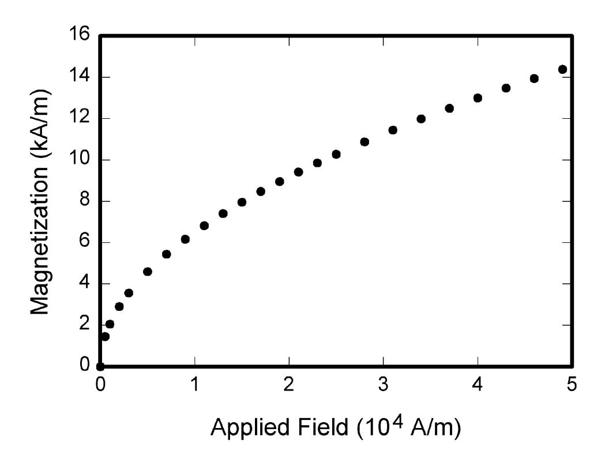

{0}------------------------------------------------

Date of publication xxxx 00, 0000, date of current version xxxx 00, 0000.

Digital Object Identifier 10.1109/ACCESS.2017.DOI

# Optimized Voronoi-based algorithms for parallel shortest vector computation

# ARTUR MARIANO1, FILIPE CABELEIRA2, GABRIEL FALCAO2(Senior Member, IEEE), LUIS PAULO SANTOS3

1CSIG, INESC TEC, Portugal (e-mail: artur.miguel@gmail.com)

2Instituto de Telecomunicações, Dept. of Electrical and Computer Engineering, University of Coimbra, Portugal (e-mail: gff@co.it.pt)

Corresponding author: Artur Mariano (e-mail: artur.miguel@gmail.com).

This work was supported by Instituto de Telecomunicações and Fundação para a Ciência e a Tecnologia (FCT) under Project UID/EEA/50008/2019 and PTDC/EEI-HAC/30485/2017. Artur Mariano is funded by the Deutsche Forschungsgemeinschaft (DFG, German Research Foundation) - Projektnummer 382285730. This work was also financed by National Funds through the Portuguese funding agency, FCT âĂŞ FundaÃǧÃčo para a CiÃłncia e a Tecnologia âĂŞ within project: UID/EEA/50014/2019.

ABSTRACT In this paper, we improve and accelerate Voronoi cell-based algorithms used to solve the Shortest Vector Problem (SVP), a fundamental challenge in lattice-based cryptanalysis. In particular, we optimize the "Relevant Vectors" algorithms by [1] using various norm-based optimizations, which capitalize on the previous states of the algorithm to infer information and speedup the processing. We also use other concepts from generic knowledge on lattice theory and other algorithms/attacks, such as the concept of pruning-i.e., avoiding specific computations that are likely not going to improve the solution—which delivered additional speedup. The optimization that requires additional memory is based on computing all target vectors upfront, sort them by increasing norm and apply the previous optimizations. Our improvements render the algorithm significantly faster, producing a speedup factor of almost  $69 \times$  compared to the original algorithm if no additional memory is explored, and about  $77 \times$  if additional memory is used. We also show that the algorithm is highly suitable for parallelization on both CPUs and GPUs. Our parallel multi-core version of this algorithm also scales linearly on CPUs (in our tests up to 28 threads) compared to the baseline, original Voronoi-cell based SVP-solver by Agrell et al. and can take advantage of Simultaneous Multi-threading (SMT) in tests up to 56 threads. We show that a parallel GPU implementation is competitive with a highly ranked CPU, although the CPU outperforms the GPU if we run the algorithm using 56 threads. We expect the GPU implementation to surpass the CPU for higher lattice dimensions, a scenario that will be possible as soon as memory (currently the limiting factor) increases in size on the GPU side.

INDEX TERMS Cryptanalysis, Lattices, Parallel Processing

#### I. UNITS

Use either SI (MKS) or CGS as primary units. (SI units are strongly encouraged.) English units may be used as secondary units (in parentheses). This applies to papers in data storage. For example, write "15 Gb/cm² (100 Gb/in²)." An exception is when English units are used as identifiers in trade, such as "3½-in disk drive." Avoid combining SI and CGS units, such as current in amperes and magnetic field in oersteds. This often leads to confusion because equations do not balance dimensionally. If you must use mixed units, clearly state the units for each quantity in an equation.

The SI unit for magnetic field strength H is A/m. However, if you wish to use units of T, either refer to magnetic flux

density B or magnetic field strength symbolized as  $\mu_0 H$ . Use the center dot to separate compound units, e.g., "A·m2."

# **II. SOME COMMON MISTAKES**

The word "data" is plural, not singular. The subscript for the permeability of vacuum  $\mu_0$  is zero, not a lowercase letter "o." The term for residual magnetization is "remanence"; the adjective is "remanent"; do not write "remnance" or "remnant." Use the word "micrometer" instead of "micron." A graph within a graph is an "inset," not an "insert." The word "alternatively" is preferred to the word "alternately" (unless you really mean something that alternates). Use the word "whereas" instead of "while" (unless you are referring to simultaneous events). Do not use the word "essentially" to

VOLUME 4, 2016 1

&lt;sup>3Dept. of Informatics, Universidade do Minho & CSIG, INESC TEC, Portugal (e-mail: psantos@di.uminho.pt)

{1}------------------------------------------------

mean "approximately" or "effectively." Do not use the word "issue" as a euphemism for "problem." When compositions are not specified, separate chemical symbols by en-dashes; for example, "NiMn" indicates the intermetallic compound  $Ni_{0.5}Mn_{0.5}$  whereas "Ni–Mn" indicates an alloy of some composition  $Ni_xMn_{1-x}$ .

Be aware of the different meanings of the homophones "affect" (usually a verb) and "effect" (usually a noun), "complement" and "compliment," "discreet" and "discrete," "principal" (e.g., "principal investigator") and "principle" (e.g., "principle of measurement"). Do not confuse "imply" and "infer."

Prefixes such as "non," "sub," "micro," "multi," and "ultra" are not independent words; they should be joined to the words they modify, usually without a hyphen. There is no period after the "et" in the Latin abbreviation "et al." (it is also italicized). The abbreviation "i.e.," means "that is," and the abbreviation "e.g.," means "for example" (these abbreviations are not italicized).

A general IEEE styleguide is available at <a href="http://www.ieee.org/">http://www.ieee.org/</a> authortools.

# III. GUIDELINES FOR GRAPHICS PREPARATION AND SUBMISSION

#### A. TYPES OF GRAPHICS

The following list outlines the different types of graphics published in IEEE journals. They are categorized based on their construction, and use of color/shades of gray:

# 1) Color/Grayscale figures

Figures that are meant to appear in color, or shades of black/gray. Such figures may include photographs, illustrations, multicolor graphs, and flowcharts.

#### 2) Line Art figures

Figures that are composed of only black lines and shapes. These figures should have no shades or half-tones of gray, only black and white.

# 3) Author photos

Head and shoulders shots of authors that appear at the end of our papers.

#### 4) Tables

Data charts which are typically black and white, but sometimes include color.

#### B. MULTIPART FIGURES

Figures compiled of more than one sub-figure presented sideby-side, or stacked. If a multipart figure is made up of multiple figure types (one part is lineart, and another is grayscale or color) the figure should meet the stricter guidelines.

#### C. FILE FORMATS FOR GRAPHICS

Format and save your graphics using a suitable graphics processing program that will allow you to create the im-

**TABLE 1.** Units for Magnetic Properties

| Symbol          | Quantity                | Conversion from Gaussian and                                                     |
|-----------------|-------------------------|----------------------------------------------------------------------------------|
| Symbol          | Quantity                | CGS EMU to SI a                                                       |
| - A             | i. d                    |                                                                                  |
| Φ               | magnetic flux           | $1 \text{ Mx} \rightarrow 10^{-8} \text{ Wb} = 10^{-8} \text{ V} \cdot \text{s}$ |
| $\mid B \mid$   | magnetic flux density,  | $1 \text{ G} \rightarrow 10^{-4} \text{ T} = 10^{-4} \text{ Wb/m}^2$             |
|                 | magnetic induction      |                                                                                  |
| H               | magnetic field strength | $1 \text{ Oe} \rightarrow 10^3/(4\pi) \text{ A/m}$                               |
| $\mid m \mid$   | magnetic moment         | $1 \operatorname{erg/G} = 1 \operatorname{emu}$                                  |
|                 |                         | $\rightarrow 10^{-3} \text{ A} \cdot \text{m}^2 = 10^{-3} \text{ J/T}$           |
| M               | magnetization           | $1 \operatorname{erg/(G \cdot cm^3)} = 1 \operatorname{emu/cm^3}$                |
|                 |                         | $\rightharpoonup 10^3 \text{ A/m}$                                               |
| $4\pi M$        | magnetization           | $1~\mathrm{G} \rightarrow 10^3/(4\pi)~\mathrm{A/m}$                              |
| $\sigma$        | specific magnetization  | $1 \operatorname{erg/(G \cdot g)} = 1 \operatorname{emu/g} \rightarrow 1$        |
|                 |                         | $A \cdot m^2/kg$                                                                 |
| $\mid j \mid$   | magnetic dipole         | $1 \operatorname{erg/G} = 1 \operatorname{emu}$                                  |
|                 | moment                  | $\rightarrow 4\pi \times 10^{-10} \text{ Wb} \cdot \text{m}$                     |
| J               | magnetic polarization   | $1 \operatorname{erg}/(G \cdot \operatorname{cm}^3) = 1 \operatorname{emu/cm}^3$ |
|                 |                         | $\rightarrow 4\pi \times 10^{-4} \text{ T}$                                      |
| $\chi, \kappa$  | susceptibility          | $1 \rightarrow 4\pi$                                                             |
| $\chi_{\rho}$   | mass susceptibility     | $1~\mathrm{cm^3/g} \rightarrow 4\pi \times 10^{-3}~\mathrm{m^3/kg}$              |
| $\mid \mu \mid$ | permeability            | $1 \rightarrow 4\pi \times 10^{-7} \text{ H/m}$                                  |
|                 | -                       | $=4\pi \times 10^{-7} \text{ Wb/(A·m)}$                                          |
| $\mu_r$         | relative permeability   | $\mu \rightarrow \mu_r$                                                          |
| w, W            | energy density          | $1 \operatorname{erg/cm}^3 \to 10^{-1} \operatorname{J/m}^3$                     |
| N, D            | demagnetizing factor    | $1 \rightarrow 1/(4\pi)$                                                         |

Vertical lines are optional in tables. Statements that serve as captions for the entire table do not need footnote letters.

ages as PostScript (PS), Encapsulated PostScript (.EPS), Tagged Image File Format (.TIFF), Portable Document Format (.PDF), Portable Network Graphics (.PNG), or Metapost (.MPS), sizes them, and adjusts the resolution settings. When submitting your final paper, your graphics should all be submitted individually in one of these formats along with the manuscript.

#### D. SIZING OF GRAPHICS

Most charts, graphs, and tables are one column wide (3.5 inches/88 millimeters/21 picas) or page wide (7.16 inches/181 millimeters/43 picas). The maximum depth a graphic can be is 8.5 inches (216 millimeters/54 picas). When choosing the depth of a graphic, please allow space for a caption. Figures can be sized between column and page widths if the author chooses, however it is recommended that figures are not sized less than column width unless when necessary.

There is currently one publication with column measurements that do not coincide with those listed above. Proceedings of the IEEE has a column measurement of 3.25 inches (82.5 millimeters/19.5 picas).

The final printed size of author photographs is exactly 1 inch wide by 1.25 inches tall (25.4 millimeters  $\times$  31.75 millimeters/6 picas  $\times$  7.5 picas). Author photos printed in editorials measure 1.59 inches wide by 2 inches tall (40 millimeters  $\times$  50 millimeters/9.5 picas  $\times$  12 picas).

2 VOLUME 4, 2016

&lt;sup>aGaussian units are the same as cg emu for magnetostatics; Mx = maxwell, G = gauss, Oe = oersted; Wb = weber, V = volt, s = second, T = tesla, m = meter, A = ampere, J = joule, kg = kilogram, H = henry.

{2}------------------------------------------------

**FIGURE 1.** Magnetization as a function of applied field. It is good practice to explain the significance of the figure in the caption.

#### *E. RESOLUTION*

The proper resolution of your figures will depend on the type of figure it is as defined in the "Types of Figures" section. Author photographs, color, and grayscale figures should be at least 300dpi. Line art, including tables should be a minimum of 600dpi.

#### *F. VECTOR ART*

In order to preserve the figures' integrity across multiple computer platforms, we accept files in the following formats: .EPS/.PDF/.PS. All fonts must be embedded or text converted to outlines in order to achieve the best-quality results.

# *G. COLOR SPACE*

The term color space refers to the entire sum of colors that can be represented within the said medium. For our purposes, the three main color spaces are Grayscale, RGB (red/green/blue) and CMYK (cyan/magenta/yellow/black). RGB is generally used with on-screen graphics, whereas CMYK is used for printing purposes.

All color figures should be generated in RGB or CMYK color space. Grayscale images should be submitted in Grayscale color space. Line art may be provided in grayscale OR bitmap colorspace. Note that "bitmap colorspace" and "bitmap file format" are not the same thing. When bitmap color space is selected, .TIF/.TIFF/.PNG are the recommended file formats.

#### *H. ACCEPTED FONTS WITHIN FIGURES*

When preparing your graphics IEEE suggests that you use of one of the following Open Type fonts: Times New Roman, Helvetica, Arial, Cambria, and Symbol. If you are supplying EPS, PS, or PDF files all fonts must be embedded. Some fonts may only be native to your operating system; without the fonts embedded, parts of the graphic may be distorted or missing.

A safe option when finalizing your figures is to strip out the fonts before you save the files, creating "outline" type. This converts fonts to artwork what will appear uniformly on any screen.

# *I. USING LABELS WITHIN FIGURES*

#### 1) Figure Axis labels

Figure axis labels are often a source of confusion. Use words rather than symbols. As an example, write the quantity "Magnetization," or "Magnetization M," not just "M." Put units in parentheses. Do not label axes only with units. As in Fig. 1, for example, write "Magnetization (A/m)" or "Magnetization (A·m−1 )," not just "A/m." Do not label axes with a ratio of quantities and units. For example, write "Temperature (K)," not "Temperature/K."

Multipliers can be especially confusing. Write "Magnetization (kA/m)" or "Magnetization (103 A/m)." Do not write "Magnetization (A/m) × 1000" because the reader would not know whether the top axis label in Fig. 1 meant 16000 A/m or 0.016 A/m. Figure labels should be legible, approximately 8 to 10 point type.

#### 2) Subfigure Labels in Multipart Figures and Tables

Multipart figures should be combined and labeled before final submission. Labels should appear centered below each subfigure in 8 point Times New Roman font in the format of (a) (b) (c).

# *J. FILE NAMING*

Figures (line artwork or photographs) should be named starting with the first 5 letters of the author's last name. The next characters in the filename should be the number that represents the sequential location of this image in your article. For example, in author "Anderson's" paper, the first three figures would be named ander1.tif, ander2.tif, and ander3.ps.

VOLUME 4, 2016 3

{3}------------------------------------------------

Tables should contain only the body of the table (not the caption) and should be named similarly to figures, except that '.t' is inserted in-between the author's name and the table number. For example, author Anderson's first three tables would be named ander.t1.tif, ander.t2.ps, ander.t3.eps.

Author photographs should be named using the first five characters of the pictured author's last name. For example, four author photographs for a paper may be named: oppen.ps, moshc.tif, chen.eps, and duran.pdf.

If two authors or more have the same last name, their first initial(s) can be substituted for the fifth, fourth, third. . . letters of their surname until the degree where there is differentiation. For example, two authors Michael and Monica Oppenheimer's photos would be named oppmi.tif, and oppmo.eps.

# *K. REFERENCING A FIGURE OR TABLE WITHIN YOUR PAPER*

When referencing your figures and tables within your paper, use the abbreviation "Fig." even at the beginning of a sentence. Do not abbreviate "Table." Tables should be numbered with Roman Numerals.

# *L. CHECKING YOUR FIGURES: THE IEEE GRAPHICS ANALYZER*

The IEEE Graphics Analyzer enables authors to prescreen their graphics for compliance with IEEE Access standards before submission. The online tool, located at http://graphicsqc.ieee.org/, allows authors to upload their graphics in order to check that each file is the correct file format, resolution, size and colorspace; that no fonts are missing or corrupt; that figures are not compiled in layers or have transparency, and that they are named according to the IEEE Access naming convention. At the end of this automated process, authors are provided with a detailed report on each graphic within the web applet, as well as by email.

For more information on using the Graphics Analyzer or any other graphics related topic, contact the IEEE Graphics Help Desk by e-mail at graphics@ieee.org.

# *M. SUBMITTING YOUR GRAPHICS*

Because IEEE will do the final formatting of your paper, you do not need to position figures and tables at the top and bottom of each column. In fact, all figures, figure captions, and tables can be placed at the end of your paper. In addition to, or even in lieu of submitting figures within your final manuscript, figures should be submitted individually, separate from the manuscript in one of the file formats listed above in Section III-C. Place figure captions below the figures; place table titles above the tables. Please do not include captions as part of the figures, or put them in "text boxes" linked to the figures. Also, do not place borders around the outside of your figures.

# *N. COLOR PROCESSING/PRINTING IN IEEE JOURNALS* All IEEE Transactions, Journals, and Letters allow an author to publish color figures on IEEE Xplore® at no charge, and

automatically convert them to grayscale for print versions. In most journals, figures and tables may alternatively be printed in color if an author chooses to do so. Please note that this service comes at an extra expense to the author. If you intend to have print color graphics, include a note with your final paper indicating which figures or tables you would like to be handled that way, and stating that you are willing to pay the additional fee.

# **IV. CONCLUSION**

A conclusion section is not required. Although a conclusion may review the main points of the paper, do not replicate the abstract as the conclusion. A conclusion might elaborate on the importance of the work or suggest applications and extensions.

. Appendixes, if needed, appear before the acknowledgment.

#### **ACKNOWLEDGMENT**

The preferred spelling of the word "acknowledgment" in American English is without an "e" after the "g." Use the singular heading even if you have many acknowledgments. Avoid expressions such as "One of us (S.B.A.) would like to thank . . . ." Instead, write "F. A. Author thanks . . . ." In most cases, sponsor and financial support acknowledgments are placed in the unnumbered footnote on the first page, not here.

## **REFERENCES AND FOOTNOTES**

#### *A. FOOTNOTES*

Number footnotes separately in superscript numbers.1 Place the actual footnote at the bottom of the column in which it is cited; do not put footnotes in the reference list (endnotes). Use letters for table footnotes (see Table 1).

# **APPENDIX A SUBMITTING YOUR PAPER FOR REVIEW** *A. FINAL STAGE*

When you submit your final version (after your paper has been accepted), print it in two-column format, including figures and tables. You must also send your final manuscript on a disk, via e-mail, or through a Web manuscript submission system as directed by the society contact. You may use Zip for large files, or compress files using Compress, Pkzip, Stuffit, or Gzip.

Also, send a sheet of paper or PDF with complete contact information for all authors. Include full mailing addresses, telephone numbers, fax numbers, and e-mail addresses. This information will be used to send each author a complimentary copy of the journal in which the paper appears. In addition, designate one author as the "corresponding author." This is the author to whom proofs of the paper will be sent. Proofs are sent to the corresponding author only.

4 VOLUME 4, 2016

1 It is recommended that footnotes be avoided (except for the unnumbered footnote with the receipt date on the first page). Instead, try to integrate the footnote information into the text.

{4}------------------------------------------------

# *B. REVIEW STAGE USING SCHOLARONE® MANUSCRIPTS*

Contributions to the Transactions, Journals, and Letters may be submitted electronically on IEEE's online manuscript submission and peer-review system, ScholarOne® Manuscripts. You can get a listing of the publications that participate in ScholarOne at http://www.ieee.org/publications\_standards/publications/ authors/authors\_submission.html. First check if you have an existing account. If there is none, please create a new account. After logging in, go to your Author Center and click "Submit First Draft of a New Manuscript."

Along with other information, you will be asked to select the subject from a pull-down list. Depending on the journal, there are various steps to the submission process; you must complete all steps for a complete submission. At the end of each step you must click "Save and Continue"; just uploading the paper is not sufficient. After the last step, you should see a confirmation that the submission is complete. You should also receive an e-mail confirmation. For inquiries regarding the submission of your paper on ScholarOne Manuscripts, please contact oprs-support@ieee.org or call +1 732 465 5861.

ScholarOne Manuscripts will accept files for review in various formats. Please check the guidelines of the specific journal for which you plan to submit.

You will be asked to file an electronic copyright form immediately upon completing the submission process (authors are responsible for obtaining any security clearances). Failure to submit the electronic copyright could result in publishing delays later. You will also have the opportunity to designate your article as "open access" if you agree to pay the IEEE open access fee.

# *C. FINAL STAGE USING SCHOLARONE MANUSCRIPTS*

Upon acceptance, you will receive an email with specific instructions regarding the submission of your final files. To avoid any delays in publication, please be sure to follow these instructions. Most journals require that final submissions be uploaded through ScholarOne Manuscripts, although some may still accept final submissions via email. Final submissions should include source files of your accepted manuscript, high quality graphic files, and a formatted pdf file. If you have any questions regarding the final submission process, please contact the administrative contact for the journal.

In addition to this, upload a file with complete contact information for all authors. Include full mailing addresses, telephone numbers, fax numbers, and e-mail addresses. Designate the author who submitted the manuscript on ScholarOne Manuscripts as the "corresponding author." This is the only author to whom proofs of the paper will be sent.

# *D. COPYRIGHT FORM*

Authors must submit an electronic IEEE Copyright Form (eCF) upon submitting their final manuscript files. You can access the eCF system through your manuscript submission system or through the Author Gateway. You are responsible for obtaining any necessary approvals and/or security clearances. For additional information on intellectual property rights, visit the IEEE Intellectual Property Rights department web page at http://www.ieee.org/publications\_standards/publications/ rights/index.html.

## **APPENDIX B IEEE PUBLISHING POLICY**

The general IEEE policy requires that authors should only submit original work that has neither appeared elsewhere for publication, nor is under review for another refereed publication. The submitting author must disclose all prior publication(s) and current submissions when submitting a manuscript. Do not publish "preliminary" data or results. The submitting author is responsible for obtaining agreement of all coauthors and any consent required from employers or sponsors before submitting an article. The IEEE Access Department strongly discourages courtesy authorship; it is the obligation of the authors to cite only relevant prior work.

The IEEE Access Department does not publish conference records or proceedings, but can publish articles related to conferences that have undergone rigorous peer review. Minimally, two reviews are required for every article submitted for peer review.

# **APPENDIX C PUBLICATION PRINCIPLES**

The two types of contents of that are published are; 1) peerreviewed and 2) archival. The Access Department publishes scholarly articles of archival value as well as tutorial expositions and critical reviews of classical subjects and topics of current interest.

Authors should consider the following points:

- 1) Technical papers submitted for publication must advance the state of knowledge and must cite relevant prior work.
- 2) The length of a submitted paper should be commensurate with the importance, or appropriate to the complexity, of the work. For example, an obvious extension of previously published work might not be appropriate for publication or might be adequately treated in just a few pages.
- 3) Authors must convince both peer reviewers and the editors of the scientific and technical merit of a paper; the standards of proof are higher when extraordinary or unexpected results are reported.
- 4) Because replication is required for scientific progress, papers submitted for publication must provide sufficient information to allow readers to perform similar experiments or calculations and use the reported results. Although not everything need be disclosed, a paper must contain new, useable, and fully described information. For example, a specimen's chemical composition need not be reported if the main purpose of a paper is to introduce a new measurement technique.

VOLUME 4, 2016 5

{5}------------------------------------------------

Authors should expect to be challenged by reviewers if the results are not supported by adequate data and critical details.

5) Papers that describe ongoing work or announce the latest technical achievement, which are suitable for presentation at a professional conference, may not be appropriate for publication.

FIRST A. AUTHOR (M'76–SM'81–F'87) and all authors may include biographies. Biographies are often not included in conference-related papers. This author became a Member (M) of IEEE in 1976, a Senior Member (SM) in 1981, and a Fellow (F) in 1987. The first paragraph may contain a place and/or date of birth (list place, then date). Next, the author's educational background is listed. The degrees should be listed with type of degree in what field, which institution, city, state,

and country, and year the degree was earned. The author's major field of study should be lower-cased.

The second paragraph uses the pronoun of the person (he or she) and not the author's last name. It lists military and work experience, including summer and fellowship jobs. Job titles are capitalized. The current job must have a location; previous positions may be listed without one. Information concerning previous publications may be included. Try not to list more than three books or published articles. The format for listing publishers of a book within the biography is: title of book (publisher name, year) similar to a reference. Current and previous research interests end the paragraph. The third paragraph begins with the author's title and last name (e.g., Dr. Smith, Prof. Jones, Mr. Kajor, Ms. Hunter). List any memberships in professional societies other than the IEEE. Finally, list any awards and work for IEEE committees and publications. If a photograph is provided, it should be of good quality, and professional-looking. Following are two examples of an author's biography.

SECOND B. AUTHOR was born in Greenwich Village, New York, NY, USA in 1977. He received the B.S. and M.S. degrees in aerospace engineering from the University of Virginia, Charlottesville, in 2001 and the Ph.D. degree in mechanical engineering from Drexel University, Philadelphia, PA, in 2008.

From 2001 to 2004, he was a Research Assistant with the Princeton Plasma Physics Laboratory. Since 2009, he has been an Assistant Professor

with the Mechanical Engineering Department, Texas A&M University, College Station. He is the author of three books, more than 150 articles, and more than 70 inventions. His research interests include high-pressure and high-density nonthermal plasma discharge processes and applications, microscale plasma discharges, discharges in liquids, spectroscopic diagnostics, plasma propulsion, and innovation plasma applications. He is an Associate Editor of the journal Earth, Moon, Planets, and holds two patents.

Dr. Author was a recipient of the International Association of Geomagnetism and Aeronomy Young Scientist Award for Excellence in 2008, and the IEEE Electromagnetic Compatibility Society Best Symposium Paper Award in 2011.

THIRD C. AUTHOR, JR. (M'87) received the B.S. degree in mechanical engineering from National Chung Cheng University, Chiayi, Taiwan, in 2004 and the M.S. degree in mechanical engineering from National Tsing Hua University, Hsinchu, Taiwan, in 2006. He is currently pursuing the Ph.D. degree in mechanical engineering at Texas A&M University, College Station, TX, USA.

From 2008 to 2009, he was a Research Assistant with the Institute of Physics, Academia Sinica,

Tapei, Taiwan. His research interest includes the development of surface processing and biological/medical treatment techniques using nonthermal atmospheric pressure plasmas, fundamental study of plasma sources, and fabrication of micro- or nanostructured surfaces.

Mr. Author's awards and honors include the Frew Fellowship (Australian Academy of Science), the I. I. Rabi Prize (APS), the European Frequency and Time Forum Award, the Carl Zeiss Research Award, the William F. Meggers Award and the Adolph Lomb Medal (OSA).

#### **REFERENCES**

[1] E. Agrell, T. Eriksson, A. Vardy, and K. Zeger, "Closest point search in lattices," IEEE Transactions on Information Theory, vol. 48, pp. 2201–2214, Aug 2002.

6 VOLUME 4, 2016