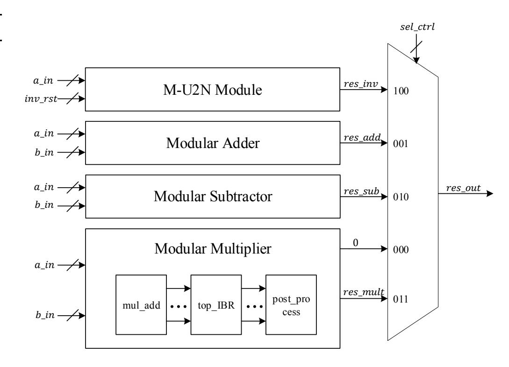
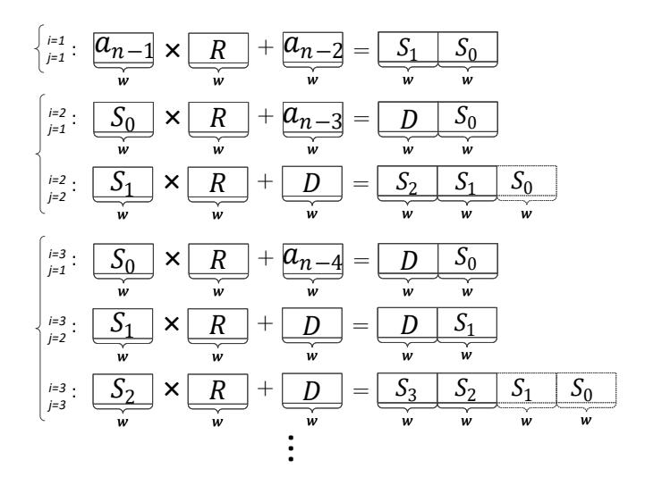
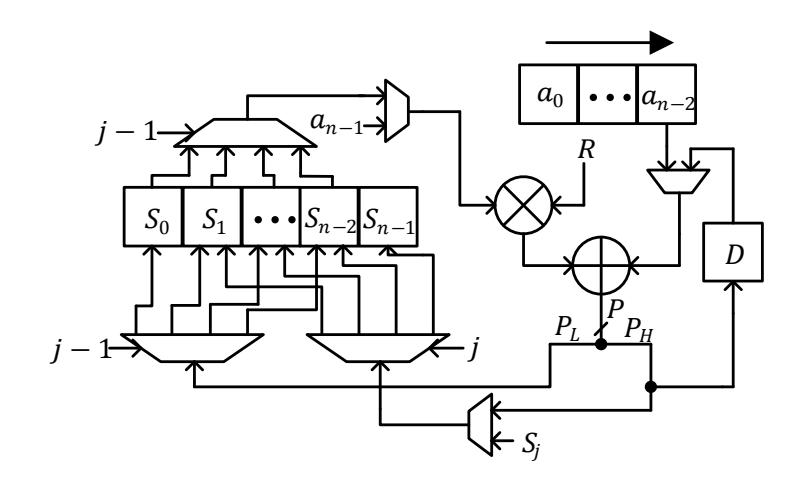
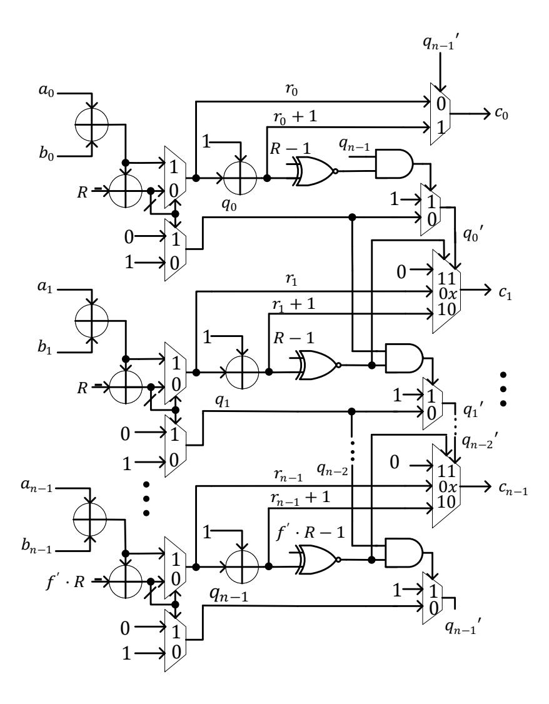
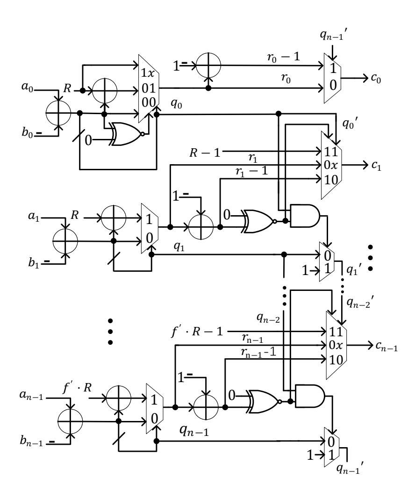
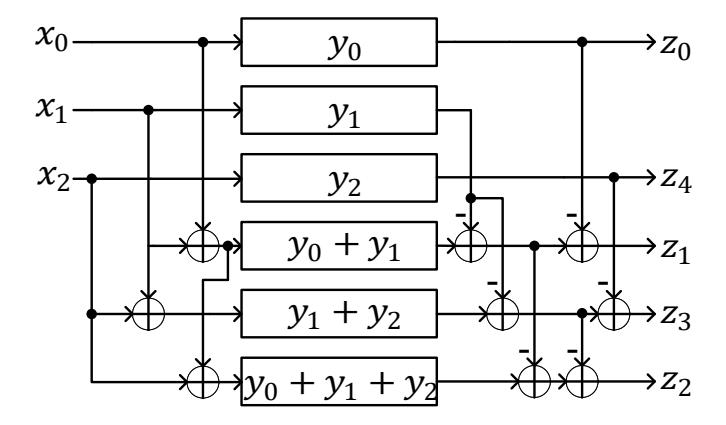
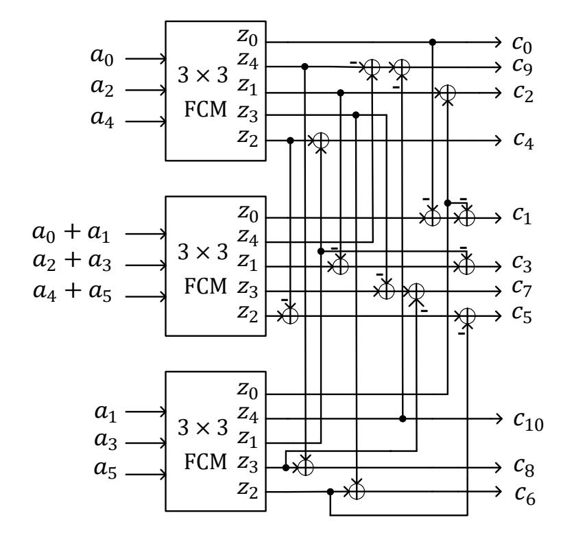
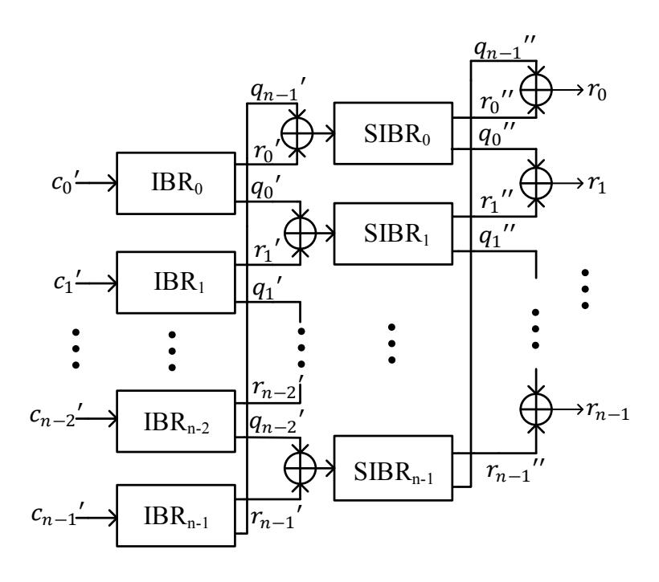
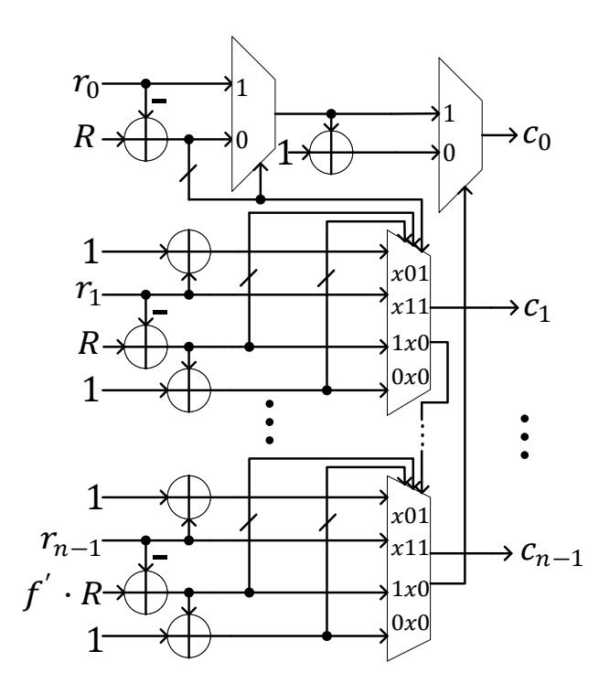
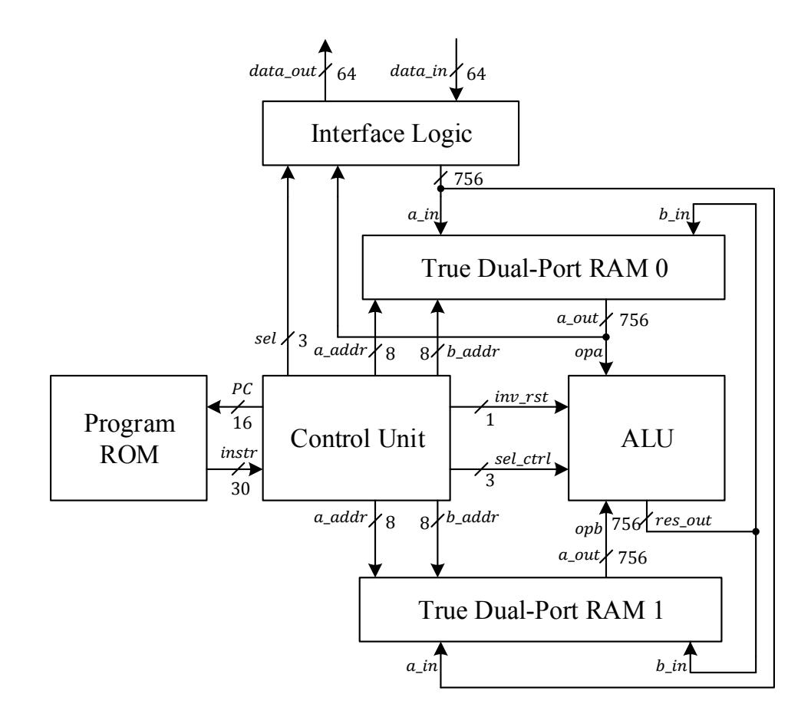

{0}------------------------------------------------

# High-Speed FPGA Implementation of SIKE Based on An Ultra-Low-Latency Modular Multiplier

Jing Tian, Bo Wu, and Zhongfeng Wang, *Fellow, IEEE*

*Abstract*—The supersingular isogeny key encapsulation (SIKE) protocol, as one of the post-quantum protocol candidates, is widely regarded as the best alternative for curve-based cryptography. However, the long latency, caused by the serial large-degree isogeny computation which is dominated by modular multiplications, has made it less competitive than most popular post-quantum candidates. In this paper, we propose a high-speed and lowlatency architecture for our recently presented optimized SIKE algorithm. Firstly, we design a new field arithmetic logic unit (FALU) with many algorithmic transformations and architectural optimizations. Especially, for the FALU, an extremely low-latency modular multiplier is devised based on a modified algorithm by fully parallelizing and highly optimizing the small-size multipliers and the reduction submodules. Secondly, we develop a compact control logic and update the instructions based on the benchmark provided in the newest SIKE library, fitting well with our design. Thirdly, an efficient memory access method is proposed by scheduling the input and output of the arithmetic logic unit (ALU) in two identical RAMs, which can significantly reduce the latency. Finally, we code the proposed architectures using the Verilog language and integrate them into the SIKE library. The implementation results on a Xilinx Virtex-7 FPGA show that for SIKEp751, our design only costs 9.3 ms with a frequency of 155.8 MHz, about 2x faster than the state-of-the-art, and achieves the best area efficiency among existing works. Particularly, the modular multiplier merely needs 16 clock cycles, reducing the delay by nearly one order of magnitude with a small factor of increase in hardware resource.

*Index Terms*—Modular multiplication, supersingular isogeny key encapsulation (SIKE), elliptic curve cryptography (ECC), post-quantum cryptography (PQC), hardware implementation, FPGA.

### I. INTRODUCTION

I N recent years, much progress has been made in quantum computers [1]–[3]. Many cryptography systems are threatened by quantum computers. Notably, the commonly used public-key cryptographic algorithms such as Rivest-Shamir-Adleman (RSA) [4] and elliptic curve cryptography (ECC) [5] which are protected by the difficulty to factor extremely large integers and to perform elliptic curve discrete logarithms, respectively, could be easily solved by using the Shor's algorithm [6] with a powerful quantum computer. Although it is unclear when such computers will be invented, these achievements have indeed promoted the development

This work was supported in part by the National Natural Science Foundation of China under Grant 61774082, in part by the Fundamental Research Funds for the Central Universities under Grant 2021300341, and in part by the Key Research Plan of Jiangsu Province of China under Grant BE2019003- 4. The first two authors contributed equally to this work. (Corresponding authors: Zhongfeng Wang.) The authors all are with the School of Electronic Science and Engineering, Nanjing University, Nanjing 210023, China (E-mail: tianjing@nju.edu.cn, qaqwubo@foxmail.com, zfwang@nju.edu.cn)

of post-quantum cryptography (PQC) which are resistant to classical and quantum computers' attacks. From 2017, the National Insititute of Standards and Technology (NIST) [7] has hosted three rounds of PQC standardization process and the supersingular isogeny key encapsulation (SIKE) protocol [8] still exists in the latest announced alternative candidates.

The SIKE protocol is developed from the Supersingular Isogeny Diffie-Hellman (SIDH) key exchange protocol that was proposed by Jao and De Feo in 2011. SIDH is based on a supersingular elliptic curve to resist the quantum attack based on the difficulty to find isogenies between supersingular elliptic curves [9]. This protocol has the characteristics of ECC's small key sizes and the advantages of perfect forward secrecy. Nevertheless, several works have reported that SIDH is threatened by some side-channel attacks [10]–[12]. As an improved version of SIDH, the SIKE protocol is proposed to provide reliable security not only in the post-quantum era but also in the current environment. Usually, large-degree isogeny computations are needed to meet the security requirement, and their considerable serial field computations lead to the long latency. Compared with other post-quantum candidates, the main practical limitation of SIKE lies in its performance.

In order to alleviate this problem, many researches have worked on accelerating the SIDH/SIKE protocol based on software platforms [13]–[22] and hardware platforms [23]– [30]. On the software side, the first version of software implementation for SIDH was done by Jao using the GMP library in 2011 [13]. The latest version provided in [19] is recognized as the fastest software implementation. On the hardware side, many improvements have been made based on FPGA. Koziel *et al.* have done much progress for the SIDH and SIKE protocols using the high-radix Montgomery multiplication algorithm [31]. In 2016, they proposed the first architecture of the SIDH protocol in [25]. In 2020, their latest version in [32] dropped the time of SIKE from 33.4 ms to 25.5 ms for the SIKEp751 parameter (NIST security level 5) based on a Virtex-7 FPGA platform. The implementation result over a Kintex UtraScale+ FPGA achieves 1.63x better performance than the fastest software implementation. Recently, Farzam *et al.* [33] further improved the modular multiplier and obtained a speedup of about 1.4x for SIKEp751 compared to [32]. However, it is still far slower than some popular lattice- and code-based alternatives.

It should be noted that in general cases, the Montgomery reduction algorithm [34] has better performance than others and its variants are widely used in the SIDH/SIKE protocol. In fact, the special form of the supersingular elliptic curve can be utilized for accelerating the modular multiplication. 

{1}------------------------------------------------

The first of such work was proposed by Karmarkar *et al.* in [35], in which an efficient modular multiplication (EFFM) algorithm using an unconventional radix is presented with the modulus form of p = 2 · 2 <sup>e</sup><sup>A</sup> b <sup>e</sup><sup>B</sup> − 1 where e<sup>A</sup> and e<sup>B</sup> are even integers. Based on the EFFM, many studies [23], [36]– [39] have been made to extend the limitation of the form and simplify the field multiplication algorithm. In our latest work [39], the limitation for the prime form is removed and a fast modular multiplication algorithm is provided based on a universal unconventional-radix polynomial data representation. Especially, for the parameters of SIKE provided in the specification [19], the proposed modular multiplication performs faster than the best Montgomery one. Similar conclusions are also drawn in other field arithmetic operations. Notably, these new algorithms are very easily to be processed in parallel over an FPGA platform. The software implementations for SIKE were also provided based on the new algorithms and successfully demonstrated the effectiveness of the methods in [39].

Our contributions: In this paper, we firstly review and conclude the promising field arithmetic algorithms based on the unconventional-radix polynomial representation provided in [39]. Then, according to these algorithms, we present a SIKE design with the shortest latency, the fastest speed, and the best area efficiency among existing designs. The main contributions are summarized as follows:

- 1) We propose a new constant-time field arithmetic logic unit (FALU), which is the core design of the SIKE architecture. FALU includes a modular multiplier, a modular adder, a modular subtractor, and an inverse domain conversion module, all of which are elaborately designed.
  - a) The modular multiplier is devised with ultra-low latency. It is a feed-forward architecture and can be extensively pipelined, which greatly simplifies the control logic. The integer multiplication part and the reduction part both are fully optimized and highly parallelized with many novel ideas.
  - b) For the inverse domain conversion module, we propose a hardware-friendly algorithm called M-U2N and devise the corresponding architecture with a very small area.
  - c) We present a carry/borrow-select-like modular adder/subtractor for FALU, either of which can be implemented in one or two cycles with a pleasant frequency.
- 2) We develop a compact control logic and update the instructions based on the benchmark provided in the newest SIKE library.
- 3) We provide an efficient memory access method by scheduling the input and output of the arithmetic logic unit (ALU) in two identical RAMs, which can theoretically reduce the total latency by half.
- 4) We propose a new SIKE design by integrating the proposed compact control logic, RAM module, and FALU module into the generally used SIKE framework [19].

We code the new FALU in Verilog language, generate the consistent instruction for the control logic in MATLAB scripts, and apply them to the SIKE library provided online [19]. The correctness is verified by using the testbench and testing over the Xilinx Vivado 2018.2 EDA platform. The implementation results on a Xilinx Virtex-7 FPGA show that for SIKEp751, our SIKE design only needs 9.3 ms with a frequency of 155.8 MHz, about 2x faster than the state-of-the-art work in [33]. Particularly, the modular multiplier merely costs 16 clock cycles, reducing the latency by close to one order of magnitude in that case.

The rest of the paper is organized as follows. Section II firstly gives a brief introduction of the SIDH and SIKE protocols. Subsequently, the basic field arithmetic operations are summarized based on a polynomial data representation, where the modular addition, modular subtraction, modular multiplication, and inverse domain conversion algorithms are detailed. Section III shows the proposed hardware architectures for those algorithms. The used top-level architecture and the modified instruction scheduling are presented in Section IV. In Section V, the FPGA implementation results are provided and compared with previous works. Finally, Section VI concludes this paper.

#### II. PRELIMINARIES

In this section, we will firstly review the SIDH and SIKE protocols, and then detail the basic arithmetic operations over field F<sup>p</sup> based on a polynomial data representation.

*A. Supersingular Isogeny Diffie-Hellman*

#### Algorithm 1: SIDH Key-Exchange Protocol [9]

Input: Public parameters: E/Fp<sup>2</sup> , PA, QA, PB, and QB.

1: Key Generation: Bob generates his secret key and public key and sends the public key to Alice. sk<sup>B</sup> = random{0, 1, ..., 2 blog<sup>2</sup> 3 eB <sup>c</sup> − 1} pk<sup>B</sup> = isogenB(skB)

2: Encryption: Alice encrypts the plaintext with the shared key and sends her public key and ciphertext to Bob.

```
skA = random{0, 1, ..., 2
                       eA − 1}
pkA = isogenA(skA)
j = isoexB(pkB, skA)
ss = H(j, M)
cA = ss ⊕ mA, where mA ∈ {0, 1}M
```

3: Decryption: Bob decrypts the ciphertext with the shared key.

```
j = isoexB(pkA, skB)
ss = H(j, M)
mA = ss ⊕ cA
```

Output: Bob's received message mA.

The SIDH protocol [9] is designed for two parties (saying, Alice and Bob), who want to communicate with each other secretly over a public communication environment. Alice and Bob both obtain their shared key by using their own secret key and the other party's public key. The shared key is the j-invariant of two isomorphic supersingular elliptic curves generated based on a public supersingular elliptic curve E. 

{2}------------------------------------------------

Such curve is usually set as the Montgomery curve with the form of  $E/\mathbb{F}_{p^2}: Dy^2 = x^3 + Cx^2 + x$ , where  $C, D \in \mathbb{F}_{p^2}$ ,  $D(C^2-4) \neq 0$ , and the prime  $p = f \cdot a^{e_A}b^{e_B} \pm 1$ .

The main process of SIDH is shown in Algorithm 1. Assume that Bob receives messages from Alice.  $\{P_A, Q_A\}$ and  $\{P_B, Q_B\}$  are two independent points on the public curve  $E/\mathbb{F}_{p^2}$ , and satisfy  $\langle P_A, Q_A \rangle = E[a^{e_A}]$  and  $\langle P_B, Q_B \rangle =$  $E|a^{e_B}|$ . Firstly, Bob generates his secret key and public key with the corresponding parameters. Bob's secret key  $sk_B$  is chosen from the keyspace  $\{0, 1, ..., 2^{\lfloor \log_2 3^{e_B} \rfloor} - 1\}$  and his public key is gotten by using the  $isogen_B$  function which can be referred to in the documentation of [19]. And then Bob sends his public key to Alice. Secondly, Alice generates her secret key and public key in the same way as Bob. With her own secret key  $sk_A$  and Bob's public key  $pk_B$ , she can calculate their shared key j by function  $isoex_A$ . Assuming the dimension of the plaintext space is M, the j-invariant is encrypted by the Hash function with a bit width of M. The plaintext  $m_A$  is encrypted as  $c_A$  by using the output of the Hash function. Finally, to decrypt the  $c_A$ , Bob gets their shared key j with the  $isoex_B$  function. After encrypting j by the Hash function, he obtains the plaintext  $m_A$  by using ss.

#### B. Supersingular Isogeny Key Encapsulation

We know that SIDH can defend from the quantum computer's attack. However, this protocol is proved unable to resist some side-channel attacks [10]–[12]. The SIKE protocol is just proposed to make up this flaw, by using the encapsulation mechanism.

#### **Algorithm 2:** SIKE Protocol [19]

**Input:** Public parameters:  $E/\mathbb{F}_{p^2}$ ,  $P_A$ ,  $Q_A$ ,  $P_B$ , and  $Q_B$ .

- 1: **Key Generation**: Bob generates his secret key and public key and sends the public key to Alice.  $sk_B = random\{0, 1, ..., 2^{\lfloor \log_2 3^{e_B} \rfloor} 1\}$   $pk_B = isogen_B(sk_B)$
- 2: **Encapsulation**:Alice encrypts her plaintext as  $c_A$  and em. And em becomes another shared key.

```
sk_A = H(\{m_A, pk_B\}, e_A)

pk_A = isogen_A(sk_A)

j = isoex_A(pk_B, sk_A)

ss = H(j, M)

c_A = ss \oplus m_A, where m_A \in \{0, 1\}^M

em = H(\{m_A, pk_A, c_A\}, K)
```

3: **Decapsulation**: Bob decrypts the ciphertext and judges whether the message is em or em'.

```
j = isoex_B(pk_A, sk_B)
ss = H(j, M)
m'_A = ss \oplus c_A
sk'_A = H(\{m'_A, pk_B\}, e_A)
pk'_A = isogen_B(sk'_A)
fm_B \in \{0, 1\}^M
em_A = \begin{cases} H(\{m'_A, pk_A, c_A\}, K) & (pk'_A = pk_A) \\ H(\{fm_B, pk_A, c_A\}, K) & (pk'_A \neq pk_A) \end{cases}
Output: Bob's calculated message em_A.
```

Similar to SIDH, we divide the SIKE protocol into three steps: key generation, encapsulation, and decapsulation, shown in Algorithm 2. In the first step, Bob generates his secret key and public key by using the function  $isogen_B$ . Next he sends out the public key  $pk_B$  to Alice. In the encapsulation step, Alice gets her secret key  $sk_A$  by hashing her plaintext cascaded with Bob's public key. Her public key and shared key are computed in the same way as those in SIDH. Then she sends to Bob her public key and her ciphertexts  $c_A$ . At the same time, she computes a new shared key as em with a bit width of K which corresponds to the number of bits of classical security. In the decapsulation step, Bob computes the original shared key and then calculates the plaintext  $m'_A$ . With the computed plaintext and his public key, Bob can recover Alice's secret key and public key. Meanwhile, he generates a random fake message of  $fm_B$ . Finally, he chooses the output by judging whether  $pk'_A$  is equal to  $pk_A$ .

In the SIKE library, four sets of parameters have been provided, namely, SIKEp434, SIKEp503, SIKEp610, and SIKEp751. The corresponding NIST security levels are 1 (AES128), 2 (SHA256), 3 (AES192), and 5 (AES256), respectively, which are the newest judgments corrected by Costello *et al.* in [40]. All of those primes have the form of  $p = 2^{e_A}3^{e_B} - 1$  with  $e_A \approx e_B$ , which is considered in our field arithmetic computing for SIKE in this paper. Note that the field arithmetic architectures proposed in this paper can also be applied to other supersingular isogeny-based ECCs directly or with slight modification.

C. Field Arithmetic Operations for SIKE Based on a New Polynomial Data Representation

By breaking down the computations of the SIKE protocol, we can find that the five large-degree isogeny operations, including the isogen and isoex functions, dominate the total computation. According to the Vélu's formula [41], in practical computing, a large-degree isogeny is required to be divided into many data-dependent small-degree isogenies which are made up of finite-field arithmetic operations. A supersingular isogeny elliptic curve is usually considered over a quadratic finite field  $\mathbb{F}_{p^2}$ . The arithmetic operations over  $\mathbb{F}_p$  can be decomposed into operations over  $\mathbb{F}_p$ , including the modular addition, modular subtraction, modular negation, modular multiplication, modular division, and modular inversion.

As analyzed in [39], the proposed field arithmetic algorithms over an unconventional-radix polynomial representation are more efficient than the most popular used field algorithm for SIKE in many cases. Moreover, they can be easily parallelized in hardware implementation. In order to make SIKE more practical, we will design low-latency architectures based on them in the next section. Before that, we will briefly summarize some of them in the following.

The key idea of the field algorithms in [39] is to replace a large modulus p with a small modulus R, which can greatly benefit the modular multiplication. The prime p of SIKE is

{3}------------------------------------------------

rewritten as:

$$p = 2^{e_A} 3^{e_B} - 1$$

$$= 2^{-\alpha} 3^{-\beta} 2^{e_A + \alpha} 3^{e_B + \beta} - 1$$

$$= f' \cdot R^n - 1,$$
(1)

where  $f'=2^{-\alpha}3^{-\beta}$ ,  $R=2^{\frac{e_A+\alpha}{n}}3^{\frac{e_B+\beta}{n}}$ , and the parameters  $\alpha$  and  $\beta$  are used to make  $e^A+\alpha$  and  $e_B+\beta$  divisible by a relatively large n. With this form, a field number, saying  $A\in\mathbb{F}_p$ , can be directly represented as:

$$A = \sum_{i=0}^{n-1} a^i \cdot R^i, \tag{2}$$

where  $a_i \in [0, R-1]$  for  $0 \le i < n-1$  and  $a_{n-1} \in [0, f'R-1]$ .

Generally, the basic field arithmetic operations can be completed by three operations, namely, the modular addition, subtraction, and multiplication. We will briefly review them in the following. The inverse domain conversion algorithm named U2N in [39] will also be presented.

1) Modular Addition and Subtraction: Consider two field operands  $A, B \in \mathbb{F}_p$  represented as in Eq. (2). The modular addition and subtraction algorithms are merged and summarized in Algorithm 3, where the different conditions or operations are jointly expressed as /,  $\pm$  or  $\mp$ . The computing process is split into two steps.

For the modular addition, in the first step, the coefficients  $a_i$  and  $b_i$  for  $0 \le i < n$  are added as  $c_i = a_i + b_i$ . In this way, one N-bit addition is converted into n w-bit additions, where N is the bit width of p, w is the bit width of R, and  $w = \lceil N/n \rceil$ . Since there are no carries in the adjacent terms, the n additions can be computed in parallel, which can reduce the critical path and improve the parallelism in hardware. The second step is to make the coefficients  $c_i$  in the standard range as shown in Steps 2-12. If  $c_i$  for  $0 \le i < n-1$  are larger than R-1, they will be reduced by R and  $c_{i+1}$  will be added by one. If  $c_{n-1} > f'R - 1$ , it will be reduced by f'R and  $c_0$ is added by one. Clearly, this step is computed in serial. We have proposed a carry-select-like method to reduce the latency, which will be shown in the next section. It should be noted that a lazy reduction is used for  $c_0$  to simplify the reduction, where  $c_0$  ranges in [0, R].

For the modular subtraction, similar to the modular addition, the first step directly uses n w-bit subtractions for coefficients. The second step is to make  $c_0, ..., c_{n-1}$  lie in the standard ranges and the output  $c_0$  is also applied with the lazy reduction.

2) Modular Multiplication: Assume two field operands  $A, B \in \mathbb{F}_p$  represented as in Eq. (2). According to [39], the modular multiplication can be summarized in Algorithm 4, which is also divided into two steps: integer multiplication and modular reduction.

In the integer multiplication step, the original  $N \times N$  multiplication is replaced by  $n^2$   $a_i \cdot b_j$  where  $i, j \in 0, ..., n-1$ . It should be noted that the parameter  $2^{\alpha}3^{\beta}$  equals 1/f'. Since there are no carries in the adjacent orders, the  $n^2$  small multiplications can be computed in parallel and the fast convolution optimization can be easily applied to the

#### Algorithm 3: Modular Addition/Subtraction [39]

Input: 
$$A = \sum_{i=0}^{n-1} a_i \cdot R^i$$
,  $B = \sum_{i=0}^{n-1} b_i \cdot R^i$ , where  $a_i, b_i \in [0, R-1]$  for  $i = 0, ..., n-2$  and  $a_{n-1}, b_{n-1} \in [0, f'R-1]$ ;  $p = f'R^n - 1$ .

Step 1: Integer addition/subtraction.

1:  $C = A \pm B = \sum_{i=0}^{n-1} (a_i \pm b_i) \cdot R^i = \sum_{i=0}^{n-1} c_i \cdot R^i$ 

Step 2: Modular reduction.

2: if  $c_0 \ge R / c_0 \le 0$  then

3:  $c_0 = c_0 \mp R$ ,  $c_1 = c_1 \pm 1$ 

4: end if

5: for  $i = 1 \rightarrow n-2$  do

6: if  $c_i \ge R / c_i < 0$  then

7:  $c_i = c_i \mp R$ ,  $c_{i+1} = c_{i+1} \pm 1$ 

8: end if

9: end for

10: if  $c_{n-1} \ge f'R / c_{n-1} < 0$  then

11:  $c_{n-1} = c_{n-1} \mp f'R$ ,  $c_0 = c_0 \pm 1$ 

12: end if

Output:  $C = \sum_{i=0}^{n-1} c_i \cdot R^i \equiv A \pm B \mod p$ .

coefficient multiplication combinations, both of which are very friendly in fast hardware implementation.

The modular reduction step is to make the raw coefficients into standard ranges. According to [39], n+1 improved Barrett reduction (IBR) (proposed in Algorithm 6 of [39]) functions are needed with a modulus of R or f'R. The quotient q and remainder r can be obtained with about  $1.75 \ w \times w$  multiplications, where w approximates half of the input data width. The quotient is added to the next-order coefficient. After using n+1 IBR functions, the final coefficients are obtained by using some additions and subtractions, which can be referred to as the second step of the modular addition. Note that  $c_0$  is also applied with the lazy reduction.

3) From Unconventional Radix Back to Normal (U2N): Since in the hardware design, the input data are transformed into the new representation in advance and the coefficients are saved in the storage, there is no need to design a forward converter. Therefore, we only provide the inverse domain conversion algorithm here, named U2N as shown in Algorithm 5.

The number  $A = \sum_{i=0}^{n-1} a_i \cdot R^i$  with standard ranges (except  $a_0$  which has a lazy reduction) is the output from a field algorithm aforementioned. In the U2N algorithm, recursive multiplication and addition operations from higher orders to lower orders are adopted to calculate the output. The final result is adjusted in terms of the used lazy reduction.

#### III. PROPOSED FIELD ARITHMETIC LOGIC UNIT

The proposed field arithmetic logic unit (FALU) is shown in Fig. 1, including four submodules: M-U2N Module (MU2NM), Modular Adder (MA), Modular Subtractor (MS), and Modular Multiplier (MM). A multiplexer in the right is to select the output from one of the four submodules in

{4}------------------------------------------------

#### Algorithm 4: Modular Multiplication [39]

Input: 
$$A = \sum_{i=0}^{n-1} a_i \cdot R^i, \ B = \sum_{i=0}^{n-1} b_i \cdot R^i, \ \text{where}$$
 $a_i, b_i \in [0, R-1] \ \text{for } i=1,\dots,n-2 \ \text{and}$ 
 $a_{n-1}, b_{n-1} \in [0, f'R-1]; \ p=f'R^n-1.$ 
Step 1: Integer multiplication.

1: for  $i=1 \to n-1$  do

2:  $c_i = \sum_{j=0}^{i} a_j b_{i-j} + \sum_{j=i+1}^{n-1} a_j b_{i-j+n} \cdot 2^{\alpha} 3^{\beta}$ 

3: end for
Step 2: Modular reduction.

4:  $q_{-1} = 0$ 
5: for  $i=0 \to n-2$  do
6:  $(q_i, r_i) = \text{IBR}(c_i + q_{i-1}, R)$ 
7: end for
8:  $(q_{n-1}, r_{n-1}) = \text{IBR}(c_{n-1} + q_{n-2}, f'R)$ 
9:  $(q_0, r_0) = \text{IBR}(r_0 + q_{n-1}, R)$ 
10:  $c_0 = r_0, \ r_1 = r_1 + q_0$ 
11: for  $i=1 \to n-2$  do
12:  $c_i = r_i$ 
13: if  $r_i > R-1$  then
14:  $c_i = r_i - R, r_{i+1} = r_{i+1} + 1$ 
15: end if
16: end for
17:  $c_{n-1} = r_{n-1}$ 
18: if  $r_{n-1} > f'R - 1$  then
19:  $c_{n-1} = r_{n-1} - f'R, c_0 = c_0 + 1$ 
20: end if
Output:  $C = \sum_{i=0}^{n-1} c_i \cdot R^i \equiv A \times B \mod p$ .

## **Algorithm 5:** From Unconventional Radix Back to Normal (U2N) [39]

```
Input: An operand A = \sum_{j=0}^{n-1} a_j \cdot R^j, the radix R, and the modulus p = f'R^n - 1.

1: C = a_{n-1}

2: for j \leftarrow n - 2 to 0 do

3: C \leftarrow C \cdot R + a_j

4: end for

5: If C = p, set C to 0.

6: If C = p + 1, set C to 1.

Output: The result C \in \mathbb{F}_p = A \mod p.
```

different conditions controlled by the signal  $sel\_strl$ . More details about these submodules are shown below.

#### A. Modified U2N Module

The U2N algorithm is to convert the data from the polynomial format back to the original format (i.e., the field elements), which is usually used for a Hash input after an isogeny computation. We have theoretically analyzed and experimentally examined Algorithms 3 and 4 for modular addition, subtraction, and multiplication and found that the case of output equal to p+1 never occurs though a lazy



Fig. 1. Proposed FALU architecture.

reduction is applied to  $a_0$ . It means that the operand A of Algorithm 5 always ranges in [0, p]. Hence, we have removed the judgment in Step 6 of Algorithms 5 in our modified version.

## **Algorithm 6:** Modified U2N (M-U2N) Algorithm for Hardware Efficiency

Input: An operand 
$$A = \sum_{i=0}^{n-1} a_i \cdot R^i$$
, where  $0 \le a_0 \le R$ ,  $0 \le a_1, ..., a_{n-2} < R$ , and  $0 \le a_{n-1} < f'R$ ;  $p = f'R^n - 1$ .

1:  $S_0 = a_{n-1}$ ,  $f_1 = \begin{cases} 1, & (a_{n-1} = f'R - 1) \\ 0, & (a_{n-1} \ne f'R - 1) \end{cases}$ 

2: for  $i = 1 \rightarrow n - 1$  do

3: for  $j = 1 \rightarrow i$  do

4: if  $j == 1$  then

5:  $t = a_{n-1-i}$ 

6: else

7:  $t = D$ 

8: end if

9:  $P = S_{j-1} \times R + t$ ,  $S_{j-1} = P \mod 2^w$ ,  $D = P / 2^w$ 

10: if  $j == i$  then

11:  $S_j = D$ 

12: end if

13: end for

14:  $f_2 = \begin{cases} 1, & (a_{n-1-i} = R - 1) \\ 0, & (a_{n-1-i} \ne R - 1) \end{cases}$ ,  $f_1 = f_1 \& f_2$ 

15: end for

16:  $C = \begin{cases} \{S_{n-1}, S_{n-2}, ..., S_0\}, & (f_1 = 0) \\ 0, & (f_1 = 1) \end{cases}$ 

Output: Field element  $C \in \mathbb{F}_p$ .

In fact, the original U2N algorithm is unfriendly to hardware design because the data width is increasing with the iterative computations. Therefore, we propose a modified U2N algorithm abbreviated as M-U2N for hardware efficiency, as shown in Algorithm 6. The key idea of this algorithm is to save the lower bits in memory  $S_{j-1}$  dynamically and only use the higher

{5}------------------------------------------------

TABLE I A Numerical Example for Algorithm 6 with Parameters n=5 and w=32, and Random Values  $a_0=80A0691D$ ,  $a_1=B6852D35$ ,  $a_2=6B1C90E2$ ,  $a_3=7E53F454$ ,  $a_4=23DD7$ , and R=EB324F68

|       |     | $S_4$ | $S_3$    | $S_2$    | $S_1$    | $S_0$    | D        | P                |
|-------|-----|-------|----------|----------|----------|----------|----------|------------------|
| i=1   | j=1 | 0     | 0        | 0        | 20F35    | A1506CAC | 20F35    | 20F35A1506CAC    |
|       | j=1 | 0     | 0        | 0        | 20F35    | E2E9CAC2 | 94348780 | 94348780E2E9CAC2 |
| i=2   | j=2 | 0     | 0        | 1E45D    | D7161008 | E2E9CAC2 | 1E45D    | 1E45DD7161008    |
|       | j=1 | 0     | 0        | 1E45D    | D7161008 | BAF56A05 | D079352C | D079352CBAF56A05 |
|       | j=2 | 0     | 0        | 1E45D    | 79F2306C | BAF56A05 | C59B85BE | C59B85BE79F2306C |
| i=3   | j=3 | 0     | 1BD01    | 5502FE86 | 79F2306C | BAF56A05 | 1BD01    | 1BD015502FE86    |
|       | j=1 | 0     | 1BD01    | 5502FE86 | 79F2306C | 7C050625 | ABC4063F | ABC4063F7C050625 |
|       | j=2 | 0     | 1BD01    | 5502FE86 | 8C31061F | 7C050625 | 70094994 | 700949948C31061F |
| i=4   | j=3 | 0     | 1BD01    | 9DF80A04 | 8C31061F | 7C050625 | 4E1A7499 | 4E1A74999DF80A04 |
| ι – 4 | j=4 | 198D7 | AD548C01 | 9DF80A04 | 8C31061F | 7C050625 | 198D7    | 198D7AD548C01    |



Fig. 2. Step-by-step illustration for M-U2N.

bits to compute in each iteration. Two loops are adopted to keep the sizes of multiplication and addition small. The outer loop is to shift from the high-order to low-order coefficients and the inner loop is to refine the multiplication and addition. To make it clearer, a step-by-step illustration for M-U2N is shown in Fig. 2. We can see that this algorithm costs  $\frac{n(n-1)}{2}$   $w \times w$  multiplications and 2w+w additions, where the sizes of multiplication and addition operations both are fixed. It should be noted that since the upper bound of  $a_{n-1}$  is the smallest among the coefficients and the output C is smaller than  $2^{nw}$ , the data width of these variables is kept within w. Meanwhile, the flag signals  $f_1$  and  $f_2$  are used to record whether the result equals the modulus p or not. If yes, the output will be set to zero.

For a more intuitive understanding of Algorithm 6, we give a numerical example in the following. Take n=5 and w=32, and randomly generate 6 values for  $a_0,...,a_4$ , and R as  $a_0=80A0691D$ ,  $a_1=B6852D35$ ,  $a_2=6B1C90E2$ ,  $a_3=7E53F454$ ,  $a_4=23DD7$ , and R=EB324F68. The intermediate data  $S_0,...,S_4$ , D, and P in each iteration are shown in Table I. It takes 10 clock cycles to get the final result shown in the last row of  $\{S_4,S_3,S_2,S_1,S_0\}$  in the table.

The corresponding hardware architecture of Algorithm 6 is shown in Fig. 3, where the judgment logic for equal to p is omitted for brevity. The input coefficients  $a_0,...,a_{n-2}$ , intermediate variables  $S_0,...,S_{n-1}$  and D, are saved in 2n w-bit registers. Due to the constraint  $e_A \approx e_B$  for the prime of SIKE, about w/2 lowest bits of R are zeros. So, we can use one  $w/2 \times w$  multiplier and one 3w/2 + w/2 adder for the calculation. In each outer iteration, the register group of



Fig. 3. Proposed MU2NM architecture.

the input coefficients shifts w bits to the right. The registers for the intermediate variables are updated in each cycle. At the beginning, the input coefficient  $a_{n-1}$  is selected and put into the multiplier. After added by  $a_{n-2}$ , the 2w-bit sum P is divided into two parts: w-bit  $P_L$  and w-bit  $P_H$ .  $P_L$  is saved back to  $S_j$  with a demux.  $P_H$  is saved back to  $S_j$  with another demux only when j=i. Meanwhile,  $P_H$  is also sent to register D. In the following iterations, the input of the multiplier is selected from the registers  $S_0, ..., S_{n-1}$  and that of the adder is selected from the register D and the rightmost register of the coefficients. After  $\frac{n(n-1)}{2}$  iterations, the output is obtained as  $\{S_{n-1}, S_{n-2}, ..., S_0\}$ . When k levels of the pipeline are inserted in the iteration, this module needs  $\frac{n(n-1)(k+1)}{2}$  clock cycles. In our following implementation, k is set to 1.

### B. Modular Adder

The architecture for the modular addition of Algorithm 3 is shown in Fig. 4, where the symbol "-" above a line means that the associated operation nearby is a subtractor. The adders for the coefficients are computed in parallel. According to the reduction step of Algorithm 3, serial computations are needed, which will cause long latency. In order to deal with this problem, we have investigated this algorithm carefully and found that the candidate data can be computed in advance and selected by some control logic, which looks like a carry-select adder in the normal domain. As shown in Fig. 4, the sums are subtracted by R or f'R in parallel and the leftmost column of multiplexers are used to select the remainders  $r_0, ..., r_{n-2} \in [0, R-1], r_{n-1} \in [0, f'R-1],$  and the quotients  $q_0, ..., q_{n-1} \in \{0, 1\}$ , controlled by the sign bit of the subtractors' outputs. The following step is to deal with

{6}------------------------------------------------



Fig. 4. Proposed modular adder architecture.

the quotients. Since the quotients are whether 0 or 1, the final outputs of  $c_i$  for 0 < i < n are equal to  $r_i$ ,  $r_i + 1$ , or 0. And that for  $c_0$  only equals  $r_0$  or  $r_0 + 1$  because of the lazy reduction. We prepare those candidates in parallel and only update the 1-bit quotients using simple logics deduced by listing the truth table based on their dependency, which can largely reduce the latency.

#### C. Modular Subtractor

Similar to the modular adder, the modular subtractor is also devised with a high degree of parallelism, as shown in Fig. 5. After the subtractors for the coefficients, the differences are added by R or f'R in parallel. The leftmost column of multiplexers are used to select the remainders  $r_0 \in [0,R]$ ,  $r_1,...,r_{n-2} \in [0,R-1]$ , and  $r_{n-1} \in [0,f'R-1]$ , controlled by the sign bit of the subtractors' outputs. The quotients  $q_0,...,q_{n-1} \in \{0,1\}$  are directly set as these sign bits. The candidates of  $c_i$  for 0 < i < n-1 are  $r_i, r_i-1$ , and R-1; those of  $c_{n-1}$  are  $r_{n-1}, r_{n-1}-1$ , and f'R-1; and those of  $c_0$  only are  $r_0$  and  $r_0-1$  because of the lazy reduction. The candidates are computed in parallel and the final 1-bit quotients are calculated in terms of the dependency between the adjacent orders. The outputs are selected from the candidates controlled by the updated quotients.

#### D. Modular Multiplier

The modular multiplier is used to compute the product  $C \equiv A \times B \mod p$ , where  $A, B, C \in \mathbb{F}_p$ . Since the modular multiplication takes up a large proportion of the computations in the SIKE protocol, accelerating this operation can efficiently speed up the entire protocol. As shown in Fig. 1, the proposed



Fig. 5. Proposed modular subtractor architecture.

modular multiplier has three submodules: 1) *mul\_add*; 2) *top\_IBR*; and 3) *post\_process*. They will be detailed in the following.

mul\_add: This module is used to calculate the integer multiplication, as shown in Step 1 of Algorithm 4. To reduce the latency and save resources, we propose a cascaded fast-convolution-like optimization method that is inspired from the iterated fast convolution method for FIR in Chapters 8 and 9 of [42], to reduce the number of coefficient multipliers and to relieve the wire congestion issue. This method is introduced as follows.

We need to decide two things: the cascaded order and the fast sub-convolution modules. An example is provided to show the method in the following. Assume the cascaded order is 2, and a  $2 \times 2$  and a  $3 \times 3$  fast-convolution-like submodules are used. Therefore, the number of inputs is 6. The architectures are shown in Figs. 6 and 7, where the box of Fig. 6 denotes a multiplier with operands x and y as an FIR filter used. We can see from Fig. 6 that the delay units used by the FIR are removed and replaced by the partial sum products, and that every input is connected to only two instead of three multipliers which can effectively relieve the wire congestion issue. With this method, the number of coefficient multipliers is reduced from 36 to 18 with an increase of adders consumption. It should be noted that the final output of the mul\_add module requires to be further reduced by using the formula of  $c_i = c_i + c_{i+n} \cdot 2^{\alpha} 3^{\beta}$ , i = 0, ..., n-2 with shifters and adders.

For SIKEp751, since n=12, we can design the  $mul\_add$  module in high parallel by directly using four copies of Fig. 7 or further cascading it with a  $2 \times 2$  FCM. In order to reduce the complexity of adders, we have adopted the former method in our following implementation. Additionally, in every coefficient multiplier, the Karatsuba optimization

{7}------------------------------------------------



Fig. 6.  $3 \times 3$  fast-convolution-like module (FCM).



Fig. 7.  $2 \times 2$  and  $3 \times 3$  cascaded fast-convolution-like architecture.

method [43] is used to reduce the resources. To achieve a high clock frequency, several stages of the pipeline are needed, the number of which depends on the data width of the input and the parameter n.

top\_IBR: This module is used to compute the main opera-

### **Algorithm 7:** Modified Modular Reduction for Low-Latency Design

```
Input: The raw coefficients c'_0, c'_1, ..., c'_{n-1}.
  1: for i = 0 \to n - 2 do
         (q_i', r_i') = IBR(c_i', R)
  2:
  3: end for
  4: (q'_{n-1}, r'_{n-1}) = IBR(c'_{n-1}, f'R)
  5: q'_{-1} = q'_{n-1}
  6: for i = 0 \to n - 2 do
        (q_i'', r_i'') = SIBR(r_i' + q_{i-1}', R)
  7:
  8: end for
  9: (q_{n-1}'', r_{n-1}'') = SIBR(r_{n-1}' + q_{n-1}', f'R)
 10: for i = 1 \to n - 1 do
 11: r_i = r_i'' + q_{i-1}''
 12: end for
13: r_0 = r_0'' + q_{n-1}''
14: (c_0, c_1, ..., c_{n-1}) = \text{post\_process}(r_0, r_1, ..., r_{n-1})

Output: C = \sum_{i=0}^{n-1} c_i \cdot R^i \equiv A \times B \mod p.
```

tions of the reduction. Our goal is still to reduce the latency.

If we directly use the reduction scheme of Algorithm 4, the IBR function has to be serially used to reduce the coefficient plus the adjacent quotient, which will cause a long latency. In order to deal with this problem, we modify the processing scheme of that step as shown in Algorithm 7, to make the reduction process able to parallelize as much as possible.



Fig. 8. Proposed top\_IBR architecture.

Thanks to the complexity of IBR function being strongly correlated with the maximum input data width, we can design different sizes of IBR architectures to speed up the reduction process and meanwhile maintain a low complexity. Therefore, we propose a two-level reduction architecture with two sizes of IBR modules as shown in Fig. 8. The IBR architecture is referred to in our previous work [37]. The first level composed of *n IBR* modules is to reduce the raw coefficients  $c'_0,...,c'_{n-1}$  (corresponding to Steps 1-4 of Algorithm 7). The outputs of IBR<sub>i</sub> are  $q'_i$  and  $r'_i$ . The size of those IBR modules is determined by the maximum of the raw coefficients. As presented in [39], the maximum data width equals about  $\log_2\lceil((n-1)2^{\alpha}3^{\beta}+1)\rceil+2\cdot\log_2\lceil(R-1)\rceil$ . Since  $r_i'$  is smaller than R or f'R, the data with of  $q'_i$  can reach about  $\log_2\lceil((n-1)2^{\alpha}3^{\beta}+1)\rceil + \log_2\lceil(R-1)\rceil$ . Though the first term is usually very small relative to the second term, it is not convenient to directly reduce those quotients with some subtractors yet. For instance, for SIKEp751, if n = 12,  $\alpha = 0$ , and  $\beta = 1$ , the first and second terms will equal 6 and 63, respectively. Thus, we use n adders to compute  $q'_{i-1} + r'_i$  for 0 < i < n and  $q'_{n-1} + r'_0$ , and then send their sums into the n small IBR (SIBR) modules as the second reduction level (corresponding to Steps 5-9 of Algorithm 7). The input data width is almost equal to the maximum size of the quotients. The outputs of SIBR<sub>i</sub> are  $q_i''$  and  $r_i''$ . Similarly, these quotients and remainders are added up respectively as outputs  $r_0, ..., r_{n-1}$ , whose upper bounds are larger than Rbut far smaller than 2R (corresponding to Steps 10-13 of Algorithm 7). They are reduced with some subtractors in the *post\_process* module introduced in the following.

**post\_process:** This module is to meet the constraints  $c_0 \in [0, R], c_1, ..., c_{n-2} \in [0, R-1]$  and  $c_{n-1} \in [0, f \cdot R-1]$ . As the outputs of  $top\_IBR$   $r_0, ..., r_{n-1}$  are in the standard ranges or a little bigger than the upper bound, only one R or f'R should be subtracted to make them in the right range. If  $R \le 1$ 

{8}------------------------------------------------



Fig. 9. Proposed post\_process architecture.

 $r_i (i \in \{0,...,n-2\})$ ,  $r_i$  will be needed to be subtracted by R and  $r_{i+1}$  will be required to be added by 1. If  $f'R \leq r_{n-1}$ ,  $r_{n-1}$  will be subtracted by f'R and  $r_0$  will be added by 1. Based on this analysis, the coefficients need to be processed one after another, which causes a long latency. Similar to the modular adder or subtractor introduced above, we propose a parallel architecture for this module as shown in Fig. 9. All the candidates are computed in parallel in advance and selected by the control logic made up of the sign bits. In this way, the critical path covers two adders and four multiplexers.

## IV. TOP-LEVEL ARCHITECTURE AND INSTRUCTION SCHEDULING

#### A. Top-Level Architecture

According to the open VHDL source code provided in the SIKE library [19], the design coded by Koziel *et al.* is divided into five parts: the control unit, ROM, ALU, RAM, and interface logic. The state transition instruction is generated by other scripts and saved in ROM for the control logic which is used to schedule the whole design. The ALU includes the Keccak Hash unit and FALU. The former is referred to as the work of the Keccak team [44] and the latter is designed by Koziel *et al.* The dual-port RAM is used to store the intermediate data or to cache the output. The interface logic is to make the data standard for exchanging with the outside hardware. The interactive relationship of those five parts for SIDH with 512-bit prime is illustrated in Fig. 4 of [24] by Koziel *et al.* 

Figure 10 is the proposed top-level architecture of SIKE, where the bit widths of the data flow for SIKEp751 are marked. The basic framework is similar to Koziel's. In order to reduce the latency caused by the read and write operations, we adopt two identical dual-port RAMs to cache the data. Port As of the two RAMs are always set as read after the initialization process and their Port Bs are always set as write. During the calculation process, the two operands *opa* and *opb* of ALU are separately received from Port As of the two RAMs with two different addresses, and the output is simultaneously sent into their Port Bs with the same address. It means that



Fig. 10. Top-level architecture of SIKE.

we can read from and write to the memory at the same time. Theoretically, when data are read and written in every clock cycle, this new memory access method can reduce the latency by half at the cost of memory consumption. Nevertheless, this reduction ratio in latency cannot be reached by SIKE due to the limitation of data dependency. In our following implementation for SIKEp751, this method reduces the total latency by about 25%.

Since the fully parallelizing scheme is adopted in FALU, the control logic unit to regulate ALU can be much simpler than those in previous works [24], [26], [29]. Hence, the bit width of the control signals for the field arithmetic computing is reduced from 12 bits to 4 bits. It should be noted that the bit width of the instruction is increased from 26 bits to 30 bits because we adopt three instead of two addresses in our design.

The 30 bits of an instruction are allocated as follows. The first bit is used for starting the inversion unit. The second bit is the reset signal of MU2NM. Bits 3-5 are used to select the result of FALU. As shown in Fig. 1, five combinations of the three bits correspond to the five outputs from the four arithmetic modules. Bit 6 indicates whether data should be written to Port Bs. Bits 7-14 are the address of Port Bs. Bits 15-22 are the address of Port A of RAM 0 and bits 23-30 are that of RAM 1.

#### B. Instruction Scheduling

Good scheduling can increase the throughput of a design. We have analyzed some of the instructions saved in ROM provided by the SIKE library and we found that the scheduling flow is fully optimized. In this work, we refer to this flow to schedule our design and modify the start and end time to fit our FALU and RAM modules. In the following, we provide an example to show the method.

Take the operating flow of  $A \times B$  in  $\mathbb{F}_{p^2}$  as an example, where SIKEp751 is considered. An element A in  $\mathbb{F}_{p^2}$  is

{9}------------------------------------------------

|                      | Step 1 | Step 2 | Step 3 | Step 4 | Step 5              | Step 6           | Step 7        | Step 8                                                 |          |
|----------------------|--------|--------|--------|--------|---------------------|------------------|---------------|--------------------------------------------------------|----------|
|                      | A0+A1  | B0+B1  | A0×B0  | A1×B1  | (A0+A1)<br>×(B0+B1) | C0=A0B0<br>-A1B1 | A0B0+<br>A1B1 | C1=(A0+A1)<br>×(B0+B1)-<br>A0B0-A1B1                   |          |
| Koziel's             | (1-9)  | (2-10) |        |        |                     |                  |               | (3-152) (4-153) (11-160) (154-162) (155-163) (164-172) |          |
| Ours                 | (1-5)  | (2-6)  | (3-20) | (4-21) | (7-24)              | (24-28)          | (25-29)       | (30-34)                                                |          |
| A0<br>A1<br>B0<br>B1 |        |        |        |        |                     |                  |               |                                                        | C0<br>C1 |

Fig. 11. Step-by-step illustration example for the operating flow of <sup>A</sup>×<sup>B</sup> over <sup>F</sup>p<sup>2</sup> , where the symbols <sup>⊕</sup>, , and <sup>⊗</sup> denote the modular addition, subtraction, and multiplication operations, respectively. The adder, subtractor, and multiplier all are processed in a systolic way. The read-write CCs are also considered. The latencies of Koziel's [19] modular adder/subtractor and multiplier are 7 CCs and 148 CCs for SIKEp751, and those of ours are 3 CCs and 16 CCs, respectively.

TABLE II <sup>C</sup>OMPARISON OF <sup>I</sup>NSTRUCTION <sup>S</sup>CHEDULING <sup>B</sup>ETWEEN <sup>K</sup>OZIEL'S AND <sup>O</sup>URS TO <sup>C</sup>ALCULATE <sup>A</sup> <sup>×</sup> <sup>B</sup> OVER <sup>F</sup>p<sup>2</sup>

|          | Koziel's Instruction Scheduling |                    |         |          |          |          |          |         |          |          |
|----------|---------------------------------|--------------------|---------|----------|----------|----------|----------|---------|----------|----------|
| cycle    | 1                               | 2                  | 3       | 4        |          | 9        | 10       | 11      |          | 152      |
| instr    | in1 add                         | in2 add            | in3 mul | in4 mul  | nop      | out1 add | out2 add | in5 mul | nop      | out3 mul |
| 153      | 154                             | 155                |         | 160      | 161      | 162      | 163      | 164     |          | 172      |
| out4 mul | in6 sub                         | in7 add            | nop     | out5 mul | nop      | out6 sub | out7 add | in8 sub | nop      | out8 sub |
|          | Our Instruction Scheduling      |                    |         |          |          |          |          |         |          |          |
| cycle    | 1                               | 2                  | 3       | 4        | 5        | 6        | 7        |         | 20       | 21       |
| instr    | in1 add                         | in2 add            | in3 mul | in4 mul  | out1 add | out2 add | in5 mul  | nop     | out3 mul | out4 mul |
|          | 24                              |                    | 25      |          | 28       | 29       | 30       | 31      |          | 34       |
| nop      |                                 | out5 mul & in6 sub | in7 add | nop      | out6 sub | out7 add | in8 sub  | nop     | nop      | out8 sub |

represented as A = A<sup>0</sup> + A1i, where A0, A<sup>1</sup> ∈ Fp. The optimized formula to compute A × B over Fp<sup>2</sup> is:

A × B = (A0B<sup>0</sup> − A1B1) + (3) ((A<sup>0</sup> + A1)(B<sup>1</sup> + B0) − A0B<sup>0</sup> − A1B1)i.

A step-by-step illustration for the operating flow of A × B over Fp<sup>2</sup> is shown in Fig. 11, where the processing clock cycles (CCs) in [19] and ours are also listed for a clear comparison. We can see that our design only needs 3 CCs for the modular addition/subtraction and 16 CCs for the modular multiplication, while the design in [19] requires 7 CCs and 148 CCs, respectively. Eight steps are required to compute this operation, *i.e.*, sixteen active instructions are needed to deploy the 8 groups of inputs and outputs. A detailed instruction scheduling comparison is shown in Table II. The notations, like "in1 add" and "out1 add", denote the instructions to permit an input or output of the adder/subtractor/multiplier in the corresponding cycles and "nop" means no input or output in that cycle. The omitted cycles all are "nops". Clearly, the latency in CCs of our design is reduced by more than 80% in this example compared with the work in [19]. It should be noted that in the 24th cycle of our instruction scheduling, "out5 mul" and "in6 sub" are processed in one cycle due to the proposed memory access method. Such case would frequently appear in SIKE as it contains a vast number of operations.

## V. IMPLEMENTATION RESULTS AND COMPARISON

#### *A. Hardware Implementation for SIKEp751*

To compare with conventional SIKE designs, we implement the proposed architecture in hardware for SIKEp751 targeting at NIST security level 5. According to [39], the prime of this parameter is reformulated as p = 2<sup>372</sup>3 <sup>239</sup> − 1 = 1/3 · (2<sup>31</sup>3 <sup>20</sup>) <sup>12</sup> − 1. So, the used parameters are f <sup>0</sup> = 3, R = 2<sup>31</sup>3 <sup>20</sup>, and n = 12.

The design and test process is divided as three parts: (1) the FALU module, (2) the instructions, and (3) the entire SIKE design. For part (1), we code the proposed FALU architecture in Verilog language and meanwhile the computing process in C++ language, where the latter is used as the benchmark. The submodules and the top-level design of FALU are separately tested by many pairs of random inputs. For part (2), we analyze the rules of instructions by choosing several sub-functions of SIKE provided online [19], such as the 3/4-isogeny computing/evaluating and differential ladder computing. The control bits are adjusted to our proposed FALU and RAM by using MATLAB scripts. The correctness is verified in the selected sub-functions. For part (3), based on the hardware project of SIKE online, we insert the generated complete instructions into 

{10}------------------------------------------------

the ROM, replace the original FALU and RAM files with ours, and modify the control signals in the logic control file. We then transfer the input data of the testbench file into the new polynomial data representation and run the simulation over the Xilinx Vivado 2018.2 EDA platform. The original SIKE design online is set as our benchmark. The entire SIKE design is tested jointly and checked step by step. The implementation results are shown in the following, where the FPGA board is a Xilinx Virtex-7 with a core of xc7vx690tffg1157-3 which is widely used in previous works [19], [24]–[26], [29], [32], [33].

TABLE III TIMING COMPARISONS OF THE MODULAR MULTIPLIER FOR SIKEP751 OVER A VIRTEX-7 FPGA

| Work      | #<br>Mults | fclk<br>(MHz) | Latency /<br>Interleaved<br>(cc) | Normalized<br>Latency/<br>Interleaved |
|-----------|------------|---------------|----------------------------------|---------------------------------------|
| [26]      | 8          | 193           | 148 / 101                        | 9.25 / 101                            |
| [29]      | 8          | 167.4         | 100 / 69                         | 6.25 / 69                             |
| [32]      | 8          | 294           | 138 / 90                         | 8.63 / 90                             |
| [33]      | 6          | 182.3         | 77 / 54                          | 6.42 / 54                             |
| this work | 1          | 155.8         | 16 / 1                           | 1.00 / 1                              |

#### *B. Implementation Results and Comparison*

Table III shows the timing comparisons of modular multiplier for SIKEp751 over the Virtex-7 FPGA between ours and previous works [26], [29], [32], [33]. It can be seen that the proposed MM achieves the shortest latency and interleaved latency among the state-of-the-arts thanks to the fully interleaving scheme and the adopted optimized algorithm. Our design has two overwhelming advantages in the SIKE implementation. The first advantage is that for the dependentdata computations, our MM can greatly help accelerate such computations because of the ultra-low latency. The second advantage is that for the independent-data computations, we can only use one multiplier to satisfy any degrees of parallelism because the proposed MM can be utmostly interleaved with only one cycle, nearly two orders of magnitude compared to other popular designs used in SIKE. However, obtaining a high degree of parallelism in these previous works must parallelize the multipliers. For example, eight or six multipliers are used in those implementations as listed in Table III. Since the resources of this module are not available in the previous literatures, the area comparisons are not provided here. They can be implicitly reflected in the following comparisons of the whole SIKE implementation results.

TABLE IV ROUND COMPUTATIONS OF SIKEP751 OVER A VIRTEX-7 FPGA

|                 | Alice R1 | Bob R1  | Alice R2 | Bob R2  | Total     |
|-----------------|----------|---------|----------|---------|-----------|
| Latency<br>(cc) | 364,434  | 399,475 | 321,191  | 358,584 | 1,443,684 |
| Time<br>(ms)    | 2.34     | 2.56    | 2.06     | 2.30    | 9.27      |

MM costs 16 CCs, MA and MS takes 3 CCs, and MU2NM expends 135 CCs.

fclk = 155.8 MHz.

The round computations for SIKEp751 are shown in Table IV. The latency is computed through simulation, using the ending time minus the starting time and then dividing the interval time. It can be seen that the proposed SIKE costs 1.44 million clock cycles in total. The time is calculated by using the latency dividing the frequency. As the frequency is 155.8 MHz, the design only costs 9.27 ms.

TABLE V RESOURCE UTILIZATIONS OF MAJOR COMPONENTS FOR SIKEP751 OVER A VIRTEX-7 FPGA

| Component     | # FFs   | # LUTs  | # DSPs | # BRAMs | # Slices |
|---------------|---------|---------|--------|---------|----------|
| FALU          | 62,797  | 83,613  | 834    | 0       | 25,136   |
| MM            | 58,163  | 77,906  | 828    | 0       | 23,311   |
| MA            | 1,524   | 2,469   | 0      | 0       | 1,009    |
| MS            | 1,525   | 2,195   | 0      | 0       | 677      |
| MU2NM         | 1,585   | 1,043   | 6      | 0       | 667      |
| Keccak-1088   | 2,703   | 4,704   | 0      | 0       | 1,510    |
| Register File | 0       | 0       | 0      | 42      | 0        |
| Control Unit  | 266     | 1,704   | 0      | 31.5    | 874      |
|               | 68,895/ | 90,940/ | 834/   | 73.5/   | 27,286/  |
| Total         | 866,400 | 433,200 | 3,600  | 1,470   | 108,300  |
|               | 7.95%   | 20.99%  | 23.17% | 5.00%   | 25.19%   |

The resource utilizations of the new SIKE implementation is shown in Table V, where the numbers of FFs, LUTs, DSPs, BRAMs and Slices are counted. It should be noted that the MM module takes up more than 80% resources of SIKE in terms of the slice.

We compare our SIKE results with those in the literature [19], [25]–[29], [32], [33] in Table VI, including the area and timing comparisons. In order to take the DSPs and BRAMs into consideration for the area efficiency, we use the slice equivalent cost (SEC) as a new metric for area with the same approximation method used in [29], *i.e.*, #SEC = #BRAMs × 100 + #DSPs ×100 + #Slices. The area efficiency computed by SEC×Time is denoted as ST product, which is calculated and listed in the table. It can be seen that our design achieves the shortest latency, the fastest speed, and the best area efficiency among existing works. Especially, the latency, which is usually the bottleneck because of the inevitable data dependency, is drastically reduced compared to the prior arts thanks to our proposed ultra-low-latency field arithmetic modules and efficient memory access method. In our test, we have found that the latency can be reduced by about 1/4 for SIKEp751 by using the proposed memory access method.

## VI. CONCLUSION

In this paper, we presented a fast FPGA implementation for the SIKE protocol based on the proposed ultra-low-latency field multiplier, adder, and subtractor. The experimental results show that the proposed field arithmetic modules achieve very low latency with acceptable resource consumption. Since those modules are totally feed-forward, a more compact control logic is devised. In order to further reduce the latency, an efficient memory access method is proposed. A new SIKE design is obtained by integrating the proposed FALU, RAM, and control logic into the original one. The implementation results demonstrate that the proposed SIKE design significantly outperform the prior arts, in terms of latency, speed, and area efficiency. We hope that these achievements would greatly contribute to the SIKE's competitiveness over other PQC candidates.

{11}------------------------------------------------

| Work                  | # Mults | # FFs  | # LUTs | # DSPs | # BRAMs | # Slices | Frequency (MHz) | Latency $(cc \times 10^6)$ / Normalized | Total Time (ms) | ST Product $(\#SEC^3 \times s)$ |
|-----------------------|---------|--------|--------|--------|---------|----------|-----------------|-----------------------------------------|-----------------|---------------------------------|
| Koziel et al. [25]    | 8       | 46,857 | 32,726 | 376    | 45.5    | 15,224   | 182.1           | 7.74 / 5.4                              | 42.5            | 2,438                           |
| Koziel et al. [26]    | 8       | 48,688 | 34,742 | 384    | 58.5    | 14,447   | 203.7           | 6.86 / 4.8                              | 33.7            | 1,978                           |
| Jao et al. [19]       | 8       | 51,914 | 44,822 | 376    | 56.5    | 16,756   | 198             | 6.60 / 4.6                              | 33.4            | 2,004                           |
| Massolino et al. [27] | 11      | 13,657 | 21,210 | 162    | 38.0    | 7,408    | 142.2           | 8.60 / 6.0                              | 60.8            | 1,666                           |
| Roy et al. [28]       | $3^2$   | 62,124 | 49,099 | 294    | 22.5    | 18,711   | 225.7           | 7.12 / 4.9                              | 31.6            | 1,591                           |
| Koziel et al. [29]    | 8       | 50,079 | 39,953 | 512    | 43.5    | 15,834   | 163.1           | 4.55 / 3.2                              | 27.8            | 1,984                           |
| Elkhatib et al. [32]  | 8       | 39,339 | 20,207 | 452    | 41.5    | 11,136   | 232.7           | 5.93 / 4.1                              | 25.5            | 1,542                           |
| Farzam et al. [33]    | 6       | 54,121 | 37,502 | 456    | 54      | 15,246   | 182.3           | 3.31 / 2.3                              | 18.2            | 1,206                           |
| This Work             | 1       | 68,895 | 90,940 | 834    | 73.5    | 27,286   | 155.8           | 1.44 / 1.0                              | 9.3             | 1,098                           |

TABLE VI
OVERALL COMPARISONS OF SIKEP751/SIDHP751 FOR FPGA DEVICE

- <sup>1</sup> A scalable multiplier called Carmela256.
- <sup>2</sup> One multiplier includes three or four parallel modular multiplications.
- $^3$  #SEC = #BRAMs  $\times$  100 + #DSPs  $\times$ 100 + #Slices.

#### REFERENCES

- [1] R. F. Mandelbaum, "This could be the best quantum computer yet," 2018, https://gizmodo.com/this-could-be-the-best-quantum-computer-yet-1831085617.
- [2] F. Lardinois, "IBM unveils its first commercial quantum computer," 2019, https://techcrunch.com/2019/01/08/ibm-unveils-its-first-commercial-quantum-computer/.
- [3] H.-S. Zhong, H. Wang, Y.-H. Deng, M.-C. Chen, L.-C. Peng, Y.-H. Luo, J. Qin, D. Wu, X. Ding, Y. Hu *et al.*, "Quantum computational advantage using photons," *Science*, vol. 370, no. 6523, pp. 1460–1463, 2020.
- [4] R. L. Rivest, A. Shamir, and L. M. Adleman, "A method for obtaining digital signatures and public-key cryptosystems," *Communications of The ACM*, vol. 21, no. 2, pp. 120–126, 1978.
- [5] V. S. Miller, "Use of elliptic curves in cryptography," in Advances in Cryptology CRYPTO '85, Santa Barbara, California, USA, August 18-22, 1985, Proceedings, 1985.
- [6] P. W. Shor, "Algorithms for quantum computation: discrete logarithms and factoring," in *Proceedings 35th Annual Symposium on Foundations of Computer Science*, Nov 1994, pp. 124–134.
- [7] L. Chen, L. Chen, S. Jordan, Y.-K. Liu, D. Moody, R. Peralta, R. Perlner, and D. Smith-Tone, *Report on post-quantum cryptography*. US Department of Commerce, National Institute of Standards and Technology, 2016, vol. 12.
- [8] R. Azarderakhsh, M. Campagna, L. Costello, B. Feo, A. Hess, D. Jao, B. Koziel, and P. Longa, "Supersingular isogeny key encapsulation," Submission to the NIST Post-Quantum Standardization project: http-s://sike.org/, 2019.
- [9] D. Jao and L. De Feo, "Towards quantum-resistant cryptosystems from supersingular elliptic curve isogenies," in *International Workshop on Post-Quantum Cryptography*. Springer, Berlin, Heidelberg, 2011, pp. 19–34.
- [10] B. T. Yan, "On the security of supersingular isogeny cryptosystems," in *International Conference on the Theory and Application of Cryptology and Information Security*, 2016.
- [11] A. Gélin and B. Wesolowski, "Loop-abort faults on supersingular isogeny cryptosystems," in *International Workshop on Post-Quantum Cryptography*. Springer, Cham, 2017, pp. 93–106.
- [12] Y. B. Ti, "Fault attack on supersingular isogeny cryptosystems," in *Post-Quantum Cryptography*, T. Lange and T. Takagi, Eds. Cham: Springer International Publishing, 2017, pp. 107–122.
- [13] D. Jao, "Software for "towards quantum-resistant cryptosystems from supersingular elliptic curve isogenies"," 2011, https://github.com/defeo/ss-isogeny-software.
- [14] R. Azarderakhsh, D. Jao, K. Kalach, B. Koziel, and C. Leonardi, "Key compression for isogeny-based cryptosystems," in *Proceedings of the 3rd ACM International Workshop on ASIA Public-Key Cryptography*, 2016, pp. 1–10.
- [15] R. Azarderakhsh, D. Fishbein, and D. Jao, "Efficient implementations of a quantum-resistant key-exchange protocol on embedded systems," *Citeseer*, 2014.
- [16] C. Costello, P. Longa, and M. Naehrig, "Efficient algorithms for super-singular isogeny Diffie-Hellman," in *Advances in Cryptology CRYPTO 2016*, M. Robshaw and J. Katz, Eds. Berlin, Heidelberg: Springer Berlin Heidelberg, 2016, pp. 572–601.

- [17] A. Faz-Hernndez, J. Lpez, E. Ochoa-Jimnez, and F. Rodrguez-Henrquez, "A faster software implementation of the supersingular isogeny Diffie-Hellman key exchange protocol," *IEEE Transactions on Computers*, vol. 67, no. 11, pp. 1622–1636, 2018.
- [18] G. H. M. Zanon, M. A. Simplicio, G. C. C. F. Pereira, J. Doliskani, and P. S. L. M. Barreto, "Faster key compression for isogeny-based cryptosystems," *IEEE Transactions on Computers*, vol. 68, no. 5, pp. 688–701, 2019.
- [19] D. Jao, R. Azarderakhsh, M. Campagna, C. Costello, L. De Feo, B. Hess, A. Jalali, B. Koziel, B. LaMacchia, P. Longa, M. Naehrig, G. Pereira, J. Renes, V. Soukharev, and D. Urbanik, "PQCrypto-SIDH," submission to the NIST Post-Quantum Standardization Project, 2020, [Online] https://github.com/Microsoft/PQCrypto-SIDH.
- [20] H. Seo, Z. Liu, P. Longa, and Z. Hu, "SIDH on ARM: faster modular multiplications for faster post-quantum supersingular isogeny key exchange," *IACR Transactions on Cryptographic Hardware and Embedded Systems*, pp. 1–20, 2018.
- [21] A. Jalali, R. Azarderakhsh, and M. M. Kermani, "NEON SIKE: supersingular isogeny key encapsulation on ARMv7," in *International Conference on Security, Privacy, and Applied Cryptography Engineering*. Springer, Cham, 2018, pp. 37–51.
- [22] A. Jalali, R. Azarderakhsh, M. M. Kermani, and D. Jao, "Towards optimized and constant-time CSIDH on embedded devices," in *International Workshop on Constructive Side-Channel Analysis and Secure Design*. Springer, Cham, 2019, pp. 215–231.
- [23] W. Liu, J. Ni, Z. Liu, C. Liu, and M. ONeill, "Optimized modular multiplication for supersingular isogeny Diffie-Hellman," *IEEE Transactions on Computers*, vol. 68, no. 8, pp. 1249–1255, 2019.
- [24] B. Koziel, R. Azarderakhsh, M. M. Kermani, and D. Jao, "Post-quantum cryptography on FPGA based on isogenies on elliptic curves," *IEEE Transactions on Circuits and Systems I-regular Papers*, vol. 64, no. 1, pp. 86–99, 2017.
- [25] B. Koziel, R. Azarderakhsh, and M. Mozaffari-Kermani, "Fast hardware architectures for supersingular isogeny Diffie-Hellman key exchange on FPGA," in *International Conference on Cryptology in India*. Springer, Cham, 2016, pp. 191–206.
- [26] B. Koziel, R. Azarderakhsh, and M. M. Kermani, "A high-performance and scalable hardware architecture for isogeny-based cryptography," *IEEE Transactions on Computers*, vol. 67, no. 11, pp. 1594–1609, 2018.
- [27] P. M. C. Massolino, P. Longa, J. Renes, and L. Batina, "A compact and scalable hardware/software co-design of SIKE," *IACR Transactions on Cryptographic Hardware and Embedded Systems*, pp. 245–271, 2020.
- [28] D. B. Roy and D. Mukhopadhyay, "Post quantum ECC on FPGA platform," *IACR Cryptol. ePrint Arch.*, vol. 2019, p. 568, 2019.
- [29] B. Koziel, A. Ackie, R. El Khatib, R. Azarderakhsh, and M. M. Kermani, "SIKE'd up: Fast hardware architectures for supersingular isogeny key encapsulation," *IEEE Transactions on Circuits and Systems I: Regular Papers*, pp. 1–13, 2020.
- [30] J. Tian, J. Lin, and Z. Wang, "Fast modular multipliers for supersingular isogeny-based post-quantum cryptography," *IEEE Transactions on Very Large Scale Integration (VLSI) Systems*, pp. 1–13, 2020.
- [31] T. Blum and C. Paar, "High-radix montgomery modular exponentiation on reconfigurable hardware," *IEEE Transactions on Computers*, vol. 50, no. 7, pp. 759–764, 2001.

{12}------------------------------------------------

- [32] R. Elkhatib, R. Azarderakhsh, and M. Mozaffari-Kermani, "Highly optimized montgomery multiplier for SIKE primes on FPGA," in *2020 IEEE 27th Symposium on Computer Arithmetic (ARITH)*, 2020, pp. 64– 71.
- [33] M. H. Farzam, S. Bayat-Sarmadi, H. Mosanaei-Boorani, and A. Alivand, "Hardware architecture for supersingular isogeny Diffie-Hellman and key encapsulation using a fast montgomery multiplier," *IEEE Transactions on Circuits and Systems I: Regular Papers*, pp. 1–9, 2021.
- [34] Montgomery and L. Peter, "Modular multiplication without trial division," *Mathematics of Computation*, vol. 44, no. 170, pp. 519–519, 1985.
- [35] A. Karmakar, S. S. Roy, F. Vercauteren, and I. Verbauwhede, "Efficient finite field multiplication for isogeny based post quantum cryptography," *International Workshop on the Arithmetic of Finite Fields*, pp. 193–207, 2016.
- [36] J. Bos and S. Friedberger, "Arithmetic considerations for isogeny based cryptography," *IEEE Transactions on Computers*, pp. 1–1, 2018.
- [37] J. Tian, J. Lin, and Z. Wang, "Ultra-fast modular multiplication implementation for isogeny-based post-quantum cryptography," in *2019 IEEE International Workshop on Signal Processing Systems (SiPS)*. IEEE, 2019, pp. 97–102.
- [38] B. Wu, J. Tian, X. Hu, and Z. Wang, "A novel modular multiplier for isogeny-based post-quantum cryptography," in *2020 IEEE Computer Society Annual Symposium on VLSI (ISVLSI)*, 2020, pp. 334–339.
- [39] J. Tian, P. Wang, Z. Liu, J. Lin, Z. Wang, and J. Großschadl, "Efficient ¨ software implementation of the sike protocol using new data representation," *IEEE Transactions on Computers*, pp. 1–1, 2021.
- [40] C. Costello, P. Longa, M. Naehrig, J. Renes, and F. Virdia, "Improved classical cryptanalysis of the computational supersingular isogeny problem," *IACR Cryptology ePrint Archive*, vol. 2019, p. 298, 2019. [Online]. Available: https://eprint.iacr.org/2019/298
- [41] J. Velu, "Isog ´ enies entre courbes elliptiques," ´ *CR Acad. Sci. Paris, Series ´ A*, vol. 273, pp. 305–347, 1971.
- [42] K. K. Parhi, *VLSI digital signal processing systems: design and implementation*. John Wiley & Sons, 2007.
- [43] A. Karatsuba, "Multiplication of multidigit numbers on automata," *Soviet physics. Doklady*, vol. 7, pp. 595–596, 1963.
- [44] M. P. G. V. A. G. Bertoni, J. Daemen and R. V. Keer, "Keccak implementation overview," May 2012, https://keccak.team/files/ Keccak-implementation-3.2.pdf.


Zhongfeng Wang received both the B.E. and M.S. degrees in the Dept. of Automation at Tsinghua University, Beijing, China, in 1988 and 1990, respectively. He obtained the Ph.D. degree from the University of Minnesota, Minneapolis, in 2000. He has been working for Nanjing University, China, as a Distinguished Professor since 2016. Previously he worked for Broadcom Corporation, California, from 2007 to 2016 as a leading VLSI architect. Before that, he worked for Oregon State University and National Semiconductor Corporation, California, USA.

Dr. Wang is a world-recognized expert on Low-Power High-Speed VLSI Design for Signal Processing Systems. He has published over 200 technical papers with multiple best paper awards received from the IEEE technical societies, among which is the VLSI Transactions Best Paper Award of 2007. He has edited one book VLSI and held more than 20 U.S. and China patents. In the current record, he has had many papers ranking among top 25 most (annually) downloaded manuscripts in IEEE Trans. on VLSI Systems. In the past, he has served as Associate Editor for IEEE Trans. on TCAS-I, T-CAS-II, and T-VLSI for many terms. He has also served as TPC member and various chairs for tens of international conferences. Moreover, he has contributed significantly to the industrial standards. So far, his technical proposals have been adopted by more than fifteen international networking standards. In 2015, he was elevated to the Fellow of IEEE for contributions to VLSI design and implementation of forward error correction coding. His current research interests are in the area of Optimized VLSI Design for Digital Communications and Deep Learning.


Jing Tian received her B.S. degree in microelectronics and Ph.D. degree in information and communication engineering from Nanjing University, Nanjing, China, in 2015 and 2020, respectively. She is now an associate research fellow in Nanjing University. She has published over 20 technical papers. Her research interests include VLSI design for digital signal processing and cryptographic engineering.


Bo Wu received his B.S. degree in microelectronics from Nanjing University, Nanjing, China, in 2020. He is currently working toward the M.S. integrated circuit engineering from Nanjing University. His research interest includes VLSI design for postquantum cryptography.