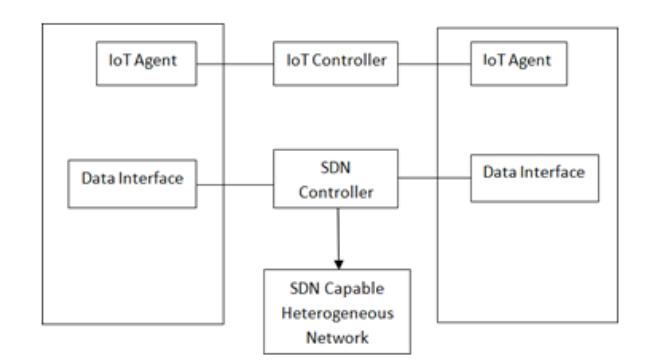
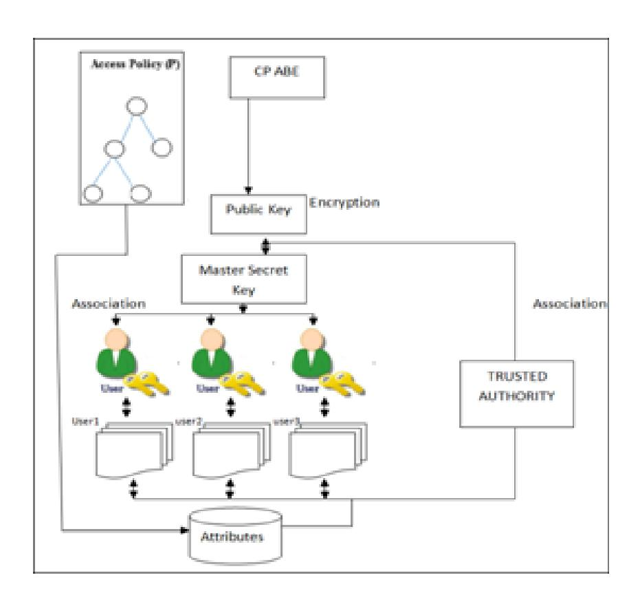
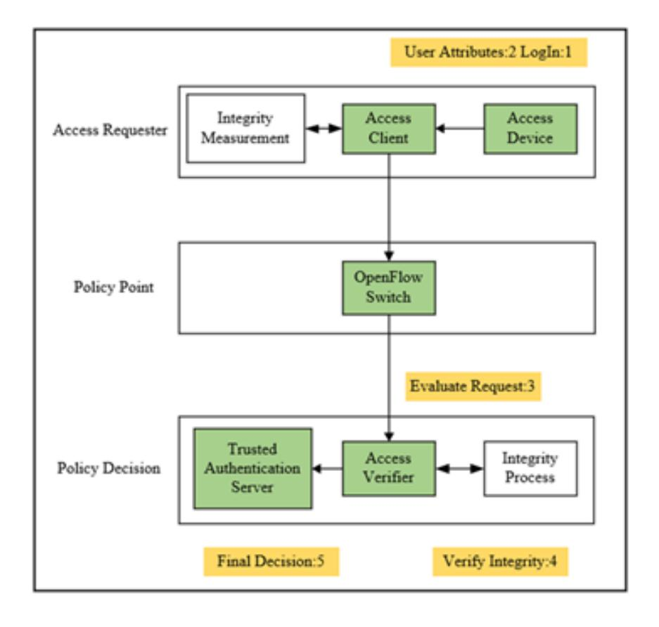
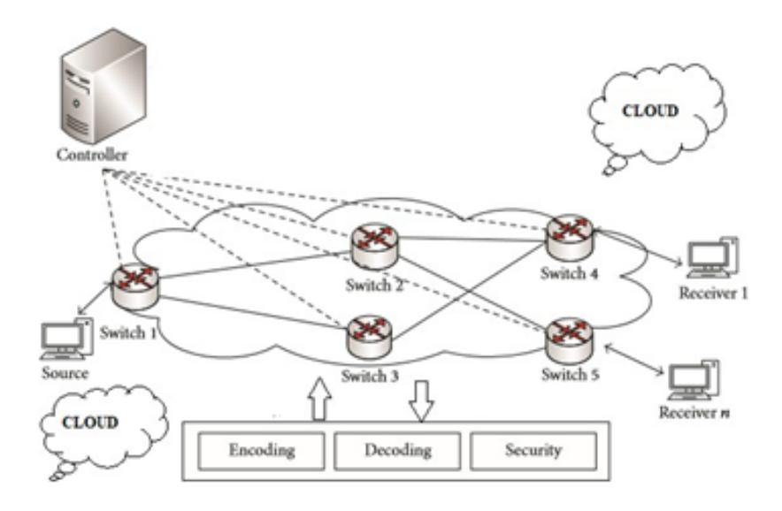
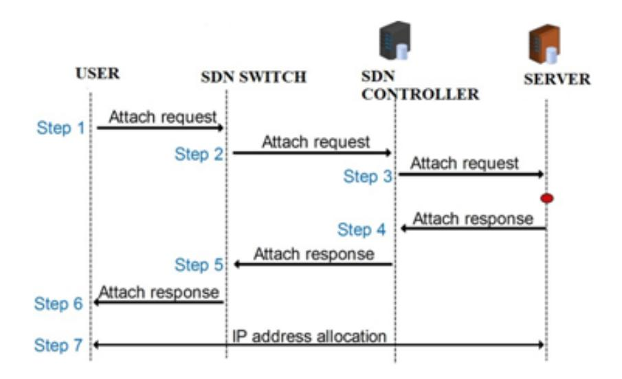
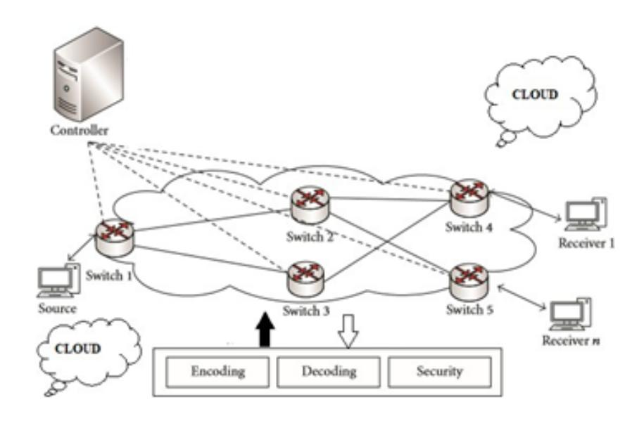
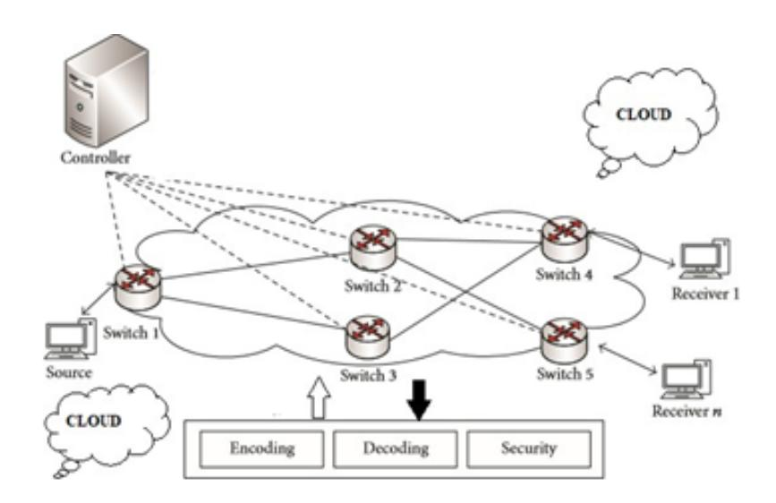
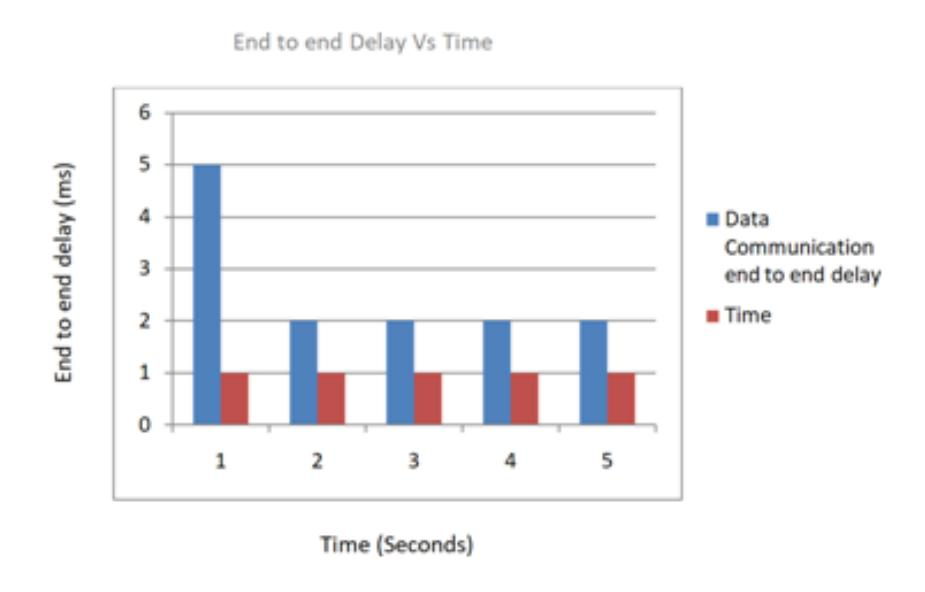
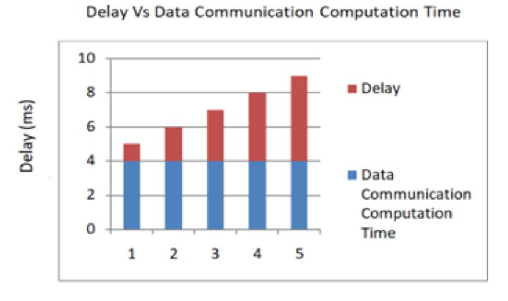

{0}------------------------------------------------

# A Secure Software Defined Networking based Framework for IoT Networks

Ambili K N, Jimmy Jose

National Institute of Technology Calicut, Kerala, India

## Abstract

The world is being connected with the help of IoT (Internet of Things) devices. To this end, a large amount of data needs to be stored and retrieved securely, but the IoT devices have a small amount of memory and computation time. Consequently, a storage area with a large amount of secured storage space is needed. Software-defined Networking (SDN) is an emerging network technology which implements a new paradigm of insecure applications and IoT services. To build a heterogeneous secure network, we introduced SDN controller broadcast encryption using the Open Network Operating System integrated with network switches and SDN Controllers. Inthispaper,we propose a secured data sharing system in IoT devices in which the IoT devices are connected to an SDN controller and data from the IoT device is encrypted. Only the corresponding authorized switch receives the data and knows the exact key to decrypt the ciphertext, so the data is stored and retrieved securely. In this system, we use Wheatstone algorithm to encrypt the data from the IoT devices. The algorithm helps to avoid botnet attacks and other types of attacks on the data. The proposed system established new forwarding paths through controller and it communicated with authorized switches for secure data transmissions.We analyzed the performance of our proposed algorithm using OMNeT++ to simulate our entire scenario and confirmed that the algorithm is efficient and secure in IoT applications. This extends the security features of IoT applications.

Keywords: SDN, IoT network, authentication, Wheatstone algorithm

{1}------------------------------------------------

## 1. Introduction

IoT is an emerging technology that connects various devices internally for wireless sensor network access. All these devices are connected with the help of the Internet. These devices are also connected by a number of sensors. The sensors in the devices sense the environment and send the information to other devices using the Internet. One of the drawbacks to these sensors is that the memory storage of these devices is small. However, the devices need to store a large amount of data. Many organizations now utilize the benefits of IoT, which also exposes them to security attacks on the devices. Consequently, it is essential to establish security within the communication that occurs between the IoT devices.

IoT devices play vital roles in both industrial and commercial activities. IoT devices are classified as home automation devices, industrial application devices and domestic application devices.

These devices are mainly used in humidity sensing, network switches, temperature sensing, movement checking, and other operations. Typical domestic application devices are CCTV cameras (surveillance cameras), smart T.V.s, and cars. In the home automation category,IoT devices are used in smart home management, controlling lighting systems, and monitoring levels of moisture around the home[6]. The IoT devices also include smart devices such as watches and mobile phones.In terms of industrial use, IoT devices feature in many automation systems. Manufacturers that use IoT devices to automate their production systems are called smart factories. The machine sensors in the factory utilized for data communication each other machines which makes environmentally sustainable operations possible. Since the involvement of humans in the process is decreased, the productivity of the system increases.

Owing to our increasing reliance upon IoT, the issue of cyber security has become increasingly important. For this reason, the kinds of possible attacks that may occur must be considered. Accordingly, a security analyst must perform the following steps to safeguard the IoT system: analyze the IoT environment, test the SDN controller, report the trust-based network connections and design a secure cryptography system.

The security analyst needs to know the weaknesses and strengths of the system so that they can design high quality and highly secured IoT system. In SDN network any form of suspicious activity intimated to controller that will control the data communication with security issues. Whenever a suspicious 

{2}------------------------------------------------

activity is detected, it issues alerts. IDS's are used to detect various security attacks. In identifying the attack vectors, the designer needs to know the data flow of the IoT devices. The data path and the network play a vital role in the IoT system. If there are any existing physical vulnerabilities, then there are many possible ways for the attackers to attack the system. In the worst-case scenario, botnet attacks are possible.

In this paper, we use the cloud as a data storage system and the trustbased network connection (TBNC) SDN network to support the security of the cloud, as shown in Fig. 1. This means that the data sensed by the IoT device is encrypted and stored in the cloud, and only the required receiver has the key to decrypt the text. In this way, the security of the system is maintained.

Figure 1: SDN based IoT architecture

The Internet of Things connected with the objected and SDN provides the network management with controlling control plane and data plane. The SDN provides network flexibility for heterogeneous communication.

## 2. Literature Review

In the paper by Wang et al. [1], the authors discussed communication between machines by means of radio-frequency identification and the automatic recognition of the static or dynamic attributes of objects. In this case, the machine is connected to the IoT device, which, in turn, is connected to the internet. This paper mainly concentrated on machine-to-machine communication, sensors, and security.

Alam et al. [2] proposed a layered architecture for an IoT-framework. The system focused upon security reasoning and its challenges. In this scenario, different types of applications are structured with IoT. An IoT network is designed using amulti-layered concept, which would help secure the network. 

{3}------------------------------------------------

Suo et al. [3] discussed the sequence of IoT applications and their associations with each other. The concepts examined were network security, encryption and decryption, and developing sensor networking.

In [4], Chen mainly concentrated upon identity-based encryption and its layers. There are three layers in this concept: the middle layer, the perception layer.It also used a radio- frequency identification system. Finally, Chen concluded with an elliptic curve cryptosystem and identity-based encryption, which are both used in public-key cryptography.

Poslad et al. [5] discussed different IoT applications and their security concerns. The authors also discussed different low power IoT devices with minimal security applications and user-managed security threats in this paper.

Razzaq et al. [6] considered the number of people connected through the internet and the increasing number of people connected to the network who are using IoT applications on a daily basis and utilizing th ebenefits.However,most IoT devices are susceptible to attack, and security issues are present within the entire network.The network system needs to be secured where the security system protects the network so that only authorized persons can gain access to the network.

Tahir et al. [7] discussed mobiles,tablets,computers and internet connections.These are the devices that connect to the internet through Wi-Fi, Bluetooth and other methods.This paper presented an overview of the enabling technologies,applications and security issues surrounding IoT.

In [8], Suchitra and Vandana, "Internet of Things and Security Issues," discussed various IoT devices and the security challenges of different applications and also defined the integration of devices with secure communications.

In [9], Kai et al. discussed IoT in WBAN networks and its integration with smart healthcare and smart hospitals.The smart hospital is integrated through IoT devices with the patient's body and tracks the patient's conditions stage by stage. In this system, the patient's level of health can be easily identified.

Quang Huy Nguyen [10] presented "Development of a QoS Provisioning Capable Cost-Effective SDN-based Switch for IoT Communication". In this paper,the authors described the market predictions regarding IoT utilization released by different institutions. Moreover, it was decided that in the near future, the implementation of a more substantial number of IoT devices will occur as is forecast. For instance, QoS Provision, Intel, and the United Nations estimate that in the near future, the volume of IoT devices in use 

{4}------------------------------------------------

will increase by 200 billion. To meet this high expectation, continuous efforts are being made by a number of industries to invest in and implement IoT technologies and platforms. In addition, with the continuous efforts being undertaken by the academic research community, IoT has become the most prominent and recommended research topic in the field of computer science. IoT has also been used in other domains such as production, transportation, manufacturing, social science, and environmental domains.

In the case of a standard IoT ecosystem, the data are obtained from a vast network of sensors with the assistance of a transport network of switches. In addition, typical IoT deployments can work vertically. This means they support infrastructure that is generated by wireless sensor networks (WSNs), and ultimately the collected data are stored in the data centre. The fact is, in this case, the service provider is allowed complete control of the devices. However, this results inoperational complexity and increased costs.

Jichiang Tsai etal. [11] proposed that WSNs are an essential and significant part of IoT and improve network communications. The fact is a typical IoT service deployment comprises an integrated network of sensors and switches. With the intention to control and supervise heterogeneous network infrastructures, the usage of SDN technologies is always welcomed. In fact, in the case of the existing SDN technologies, only isolated networks could be taken into consideration. There was no concrete solution that treated the entire network in a united way.

With the assistance of ONOS or the Open Network Operating System (who are currently responsible for supporting OpenFlow networks only), a possible solution is to leverage SDN-WISE to combine WSNs to accomplish a unified system representation along with treatments. All of the network devices will follow the same instructions from the SDN controller, which will make simpler and more cost-effective. The OpenFlow system is a standard communication interface between the SDN controller and the network devices such as switches and routers.

The SDN controller will allow access to the switches and routers. The core function of the OpenFlow SDN switch will function in connection with the SDN OpenFlow protocol. All the network switches have one or more flow or group tables that maintain the forward flow of the data packets. The SDN controller has to control additions to the flow, update the flow and delete entries from the flow or group table.

The routing system provides additional buffers and physical channels and encapsulates the flow of packets. Each packet has its own control method. 

{5}------------------------------------------------

The flits move through the buffers and channels and have the structure of ahead, body (containing the actual data) and tail. The first flit in the packet has the header information, and the rest of the flits follow the same route as the header flit. At the end of the process, the receiver re-encapsulates the packet from the sender. The final flit delivery contains the tail flit which disconnects the path between the sender and receiver. The routing process functions through a physical channel.

Chavi Kapoor's 2019 paper [12], addressed the fragmentation of the IoT landscape, which is producing inefficiency rather than an exceptional paradigm. It also presents interoperability constraints regardless of integration efforts. With the massive network segments that comprise the standard IoT ecosystem, it is sustained compared to the previous application-level integration solutions. This same barrier arose in the initial use of SDN for fixed networks. Within its use, many controllers existed where everyone was optimized fora distinct scenario. To overcome this barrier, traditional SDN controllers were used to inducing NOSs to utilize the high-level of network abstraction for the different heterogeneous protocols and devices to supervise even large networks effectively and seamlessly.

IoT is deployed in various applications,which are monitored and collect the data from network devices with the assistance of the ONOS. The collected data is examined and utilized to understand the performance of various realtime applications. To this end, lost or irrelevant data for various time series is not helpful with regard to preparing a proper analysis. There are various reasons for lost data, and some of them may be physical device damage, software corruption, or wormhole attacks. In Kapoor's proposal, the routing table management is based upon the dynamic information method, which helps the network to process routing around connectivity holes. The process starts with plotting the network topology with the number of nodes, running the neighbour discovery model to localize the nodes, synchronize the network, and elect the cluster heads. Following this, the path between the source and destination nodes is finalized, and the physical availability of the node is verified. If the node availability flag is recognized, the process will be approved.

The attackers create a wormhole tunnel that forms a direct link between two rogue nodes, and whenever one attacker receives the packet, it is passed to another attacker through the tunnel. The attacker sets the shortest path for the communication of each packet and takes control of the network, sending the packet to another controller as the SDN control protocol sends the 

{6}------------------------------------------------

packet to the destination. However, the physical damage to the data centre will affect communication, and whenever there is physical damage and software corruption, the wormhole attacker can take control. The SDN control is designed with a flow table, so if there is a fault in the SDN network,a packet drop will occur in the network.

[13] provides a survey of network coding attacks. [14], [15], [16] and [17] describes various types of defenses against network coding attacks. The different types of encryption algorithms used for data security is explained in [21]. The different authentication methods in SDN using ciphertext policy attribute based encryption is explained in [22].

## 3. Design and Methodology

We designed a TBNC based on SDN architecture. The SDN architecture represented by TBNC allows clients to access enabled networks. The TBNC system is constructed with ciphertext-policy attribute-based encryption which provides access to an authentication service. Overall, the system depends upon the ciphertext policy, which can be adopted as SDN OpenFlow controllers as well as data plane OpenFlow switches. The main function of the TBNC architecture is to work between users and switches. It performs the access verification process for a user's uniqueness and accesses the platform on the network. The SDN controller manages the decision to admit the users through an access verification service and restricts unauthorized users. We utilized a secure methodology, which is basically that of ciphertext-policy attribute-based encryption [22]. The SDN controller process maintains the TBNC method and verifies the access verification service. Following this, every request received by the SDN IoT access device is validated and allowed access as per policy. The validation policy is encrypted using an SDN controller public key to restrict unauthorized users. Whenever a user enters into the architecture, it will verify the access platform and user uniqueness.

An output with the public key and related private key. The trusted authority system implements the publish and distribution systems. The published system is connected to the public key, and the distribution system is connected to the master secret key. Figure 2 indicates the authentication method. The access policy is embedded in the authentication method,which experiences the user's authorization in terms of network platform and uniqueness. The authentication method along with the encrypted access policy maintain a subset of the attributes.

{7}------------------------------------------------

Figure 2: TBNC based IoT architecture

The core of the authorization method receives a request from the IoT access device and sends it to the SDN switches. In existing work, the state of art when the SDN switch doesn't maintain the security or quality of services the SDN switch removed form the SDN network .In this case our proposed system SDN controller produce new multicast path and enhance security to multicast ,the controller generated the keys which will be broadcast to switches.In the sequence of the process controller should be authorized and authenticated to switch at the primary step.So the Controller established new forwarding paths between source and destination where as the traditional system its difficult to identify the path.The authorized switches are placed on the paths during the data transmissions due to which data effectively secured from the attacks.The wheatstone algorithm, as shown in Fig. 3 encrypts the user data and only the authorized switches can access it and is readable after decrypting the data, as shown in Fig. 4 the data. Then the received user information is evaluated with the access policy, which has also been tested with encryption by the public key concept adopted in the authentication method.

The final step of the access policy is to process the information and decrypt it with the secret key and verify the user uniqueness and network platform attributes.

The verification method is built over the controller to provide the flow

{8}------------------------------------------------

Figure 3: Encryption Algorithm

Figure 4: Decryption Algorithm

{9}------------------------------------------------

table. Multi-access is maintained for clients who can successfully complete the authentication method. It will also follow the network platform attributes and client uniqueness.

Figure 5: Secure Authentication Method in TBNC-based SDN Network

This is a much-improved concept when compared with previous methods. The proposed method will provide more flexibility and lower costs. The authentication method will ensure secure data communication with an authorization access policy in TBNC-based SDNs. The performance of the system is presented in Sections 4 and 5 ,in which the simulation is described along with the simulation environments and graphs that demonstrate the improvements offered by the system.

Multipoint access was integrated for client access, which helps users to accomplish the multi-client authentication requirement process. The authentication cryptography concept was also completed successfully. This is a key feature of our proposed method, as many network services are not able to provide this feature, which makes the availability of both aspects of authentication and authorization. Figure 3 presents the authentication procedure for the TBNC-based SDN network. The SDN network was tested with cryptanalysis attacks as the controller has the facility to restrict actions that contravene the SDN network security. The proposed method was tested with OMNeT++ testbed. In that way, we were able to trace the performance and

{10}------------------------------------------------

Figure 6: Authorized switch method in SDN Network

verify the improvement.

## 4. Network Performance Analysis

We conducted the test using an OMNeT++ simulation. We began the evaluation using an experimental network. The execution of the multicasting module depends upon the controller in the SDN network. The construction of a secure path was integrated with reliable switches that decided the transmission path for multicasting. The trust establishment mechanism between the switches and controllers is extremely important. The controller is the position responsible for sending the trust establishment details of the devices that build the multipath. Any abnormal activity by the switches will be identified through the trust establishment mechanism, which will help to isolate the switches and improve the quality of the multicast path. The network communication overhead is combined with the encoding and decoding of the vector. The expensive computation process maintains secure switches. The controller will address the trusted switches and start the communication according to the network requirements. By default, the switches obtain the session key using the broadcast encryption. The controller distributes the keys towards the network, which are generated within the network. The 

{11}------------------------------------------------

switches act as a storage point that is not connected to the receiver.

The storage point will maintain the session key and controller public key. The particular session key is distributed by one trusted group. The secure network communication then begins between the trusted group and the controller. The controller public key is distributed to all the switches by the SDN controller. The session key is distributed to each switch, and the controller stores the pair key for every session key. Based upon the acceptance of the key, the secure communication transfers the data.

Figure 7: Heterogenous Network Integration with SDN

The Fig. 7 illustrates that the heterogeneous network presented with IoT devices and controller. The architecture clearly describes the connectivity of the heterogeneous network.

Figure 8: Secure SDN Authentication Method

Fig. 8 describes the data flow process from one end to another end. The

{12}------------------------------------------------

encryption and decryption process in the network are shown in Fig. 9 and Fig. 10 respectively.

Figure 9: Message Encryption

Figure 10: Message Decryption

While using IoT applications, the routing path is most important. Hence, the device encrypts the message. The controller code maintains the secure path and distributes the keys with the entire network that reduces the cost.

Above table 1 represents the simulation parameters in terms of playground width and height. Meanwhile the transmission range and speed has been mentioned in the above table.

In the simulation setup, each switch was connected to the device. Another controller was connected to all the SDN switches. The number of control messages will increase the SDN switches in the multicast path. The receiver accepts the data packets, and the switch decrypts the message using the

{13}------------------------------------------------

| Parameters          | Value   |
|---------------------|---------|
| numNodes            | 14      |
| playgroundLatitude  | -25.39  |
| playgroundLongitude | 131.05  |
| playgroundWidth     | 2 KM    |
| playgroundHeight    | 2 KM    |
| trailLength         | 400m    |
| txRange             | 200bps  |
| node speed          | 10 Mbps |

Table 1: Simulation Parameters

Wheatstone algorithm, which completes the secure communication. The performance impact is analyzed for secure TBNC authentication method on SD network, we compared our results with two issues communication delay and computation time. We measured the data communication delay in terms of switch failures in SDN network. The data communication delay measured in source and destination with new path establishment and it is compared with previous analysis' he data communication delay decreased within the acceptable range. The data computation time is increased with respect to the time.

While implementing the proposed system the delay has occurred in highlevel at the initial time when compare with series of time schedule Fig. 11.

Figure 11: End to end delay vs. Time

{14}------------------------------------------------

Figure 12: Data Communication Computation Time vs. Delay

The Data Communication computation time has been increasing against delay time. Fig. 12 shows that the performance of the data computation is increased in terms of delay.

{15}------------------------------------------------

## 5. Conclusion

This paper presented an SDN broadcast encryption scheme for multipoint access in an enhanced protected IoT-based SDN network. The proposed system will provide secure authentication access within a TBNC-based SDN network. The multi-client authentication access requests encounter with a cryptography authentication system. The authentication policy classified an authenticated and an unauthenticated platform. The process followed by the unauthenticated system maintains the CPU usage compared to the adopted TNC-based SDN architecture. An equal number of client access policies were arranged for the authenticated and unauthenticated platforms. In our proposed scheme, IoT multicast secure transmission controls the routers for broadcasting the keys parallel to the SDN switches which ensures the data security during the transmission. The results demonstrate that multi-access latency and computation capacity increase when all the IoT devices were encountered within the infrastructure.

## References

- [1] K. Wang, J. Bao, M. Wu, and W. Lu, "Research on security management for Internet of Things," 2010 International Conference on Computer Application and System Modeling(ICCASM2010),pp.15–133,2010.
- [2] S.Alam,M.M.R.Chowdhury,andJ.Noll,"Interoperability of Security- Enabled Internet of Things,"Wireless Personal Communications,vol.61, no. 3, pp. 567–586, 2011. [Online]. Available: 10.1007/s11277-011- 0384- 6;https://dx.doi.org/10.1007/s11277-011-0384-6
- [3] H. Suo, J. Wan, C. Zou, and J. Liu, "Security in the Internet of Things: A Review," in 2012 International Conference on Computer Science and Electronics Engineering, 2012, pp.648–651.
- [4] W. Chen, "An IBE-based security scheme on Internet of Things," in 2012 IEEE 2nd International Conference on Cloud Computing and Intelligence Systems, 2012, pp.1046–1049.
- [5] S. Poslad, M. Hamdi, and H. Abie, "Adaptive security and privacy management for the internet of things (ASPI 2013)," in Proceedings of the 2013

{16}------------------------------------------------

- ACM conference on Pervasive and ubiquitous computing adjunct publication (UbiComp '13 Adjunct).Association for Computing Machinery, 2013, pp.373–378.
- [6] M.Abdur, S.Habib, M.Ali and S.Ullah,"SecurityIssuesinthe Internet of Things (IoT): A Comprehensive Study," International Journal of AdvancedComputerScienceandApplications,vol.8,no. 6, 2017. [Online]. Available:10.14569/ijacsa.2017.080650;https: //dx.doi.org/10.14569/ijacsa.2017.080650
- [7] H. Tahir, A. Kanwer, and M. Junaid, "Internet of Things (IoT): An Overview of Applications and Security Issues Regarding Implementation," International Journal of Multidisciplinary Sciences and Engineering,vol.7,no.1,pp.14–22,2016
- [8] S. C and V. C.P, "Internet of Things and Security Issues," International Journal of Computer Science and Mobile Computing, vol. 5, no. 1, pp. 133–139,2016
- [9] K. KANG, Z. boPANG, and C. WANG, "Security and privacy mechanism for health internet of things," pp. 64–68, 2013. [Online]. Available: 10.1016/s1005-8885(13)60219-8;https://dx.doi.org/10.1016/ s1005- 8885(13)60219-8
- [10] Q. H. Nguyen, N. H. Do, and H. Le, "Development of a QoS ProvisioningCapableCost-EffectiveSDNbasedSwitchforIoTCommunication," in 2018 International Conference on Advanced Technologies for Communications (ATC), 2018, pp.220–225.
- [11] J. Tsai, Y. Zhang, and J. Deng, "An SDN-based fault-tolerant routing protocol with one wormhole routing technique," in 3rd International Conference on Informative and Cybernetics for Computational Social Systems (ICCSS), 2016, pp.325–330.
- [12] Kapoor, "Routing Table Management using Dynamic Information with Routing Around Connectivity Holes (RACH) for IoT Networks,"in2019 International Conference on Automation, Computational and Technology Management (ICACTM), 2019, pp.174–177.
- [13] S. Yao, J. Chen, R. Du, L. Deng and C. Wang, "A Survey of Security Network Coding toward Various Attacks," 2014 IEEE 13th International

{17}------------------------------------------------

- Conference on Trust, Security and Privacy in Computing and Communications, Beijing, 2014, pp. 252-259, doi: 10.1109/TrustCom.2014.35.
- [14] X. Wu, Y. Xu, C. Yuen and L. Xiang, "A Tag Encoding Scheme against Pollution Attack to Linear Network Coding," in IEEE Transactions on Parallel and Distributed Systems, vol. 25, no. 1, pp. 33-42, Jan. 2014, doi: 10.1109/TPDS.2013.24.
- [15] S. Agrawal, D. Boneh, X. Boyen, and D. M. Freeman, "Preventing pollution attacks in multi-source network coding," in Public Key Cryptography — PKC2010, vol.6056 of Lecture Notes in Computer Science, pp. 161–176, Springer, Berlin, Germany, 2010.
- [16] J. Dong, R. Curtmola, and C. Nita-Rotaru, "Practical defenses against pollution attacks in intra-flow network coding for wireless mesh networks,"in Proceedings of the 2nd ACM Conference on Wireless Network Security (WiSec '09), pp. 111–122, ACM, March2009.
- [17] Z.Yu, Y.Wei, B.Ramkumar and Y.Guan,"An efficient scheme for securing XOR network coding against pollution attacks,"in Proceedings of the IEEE INOCOM, pp.406–414, IEEE, Riode Janeiro, Brazil, April 2009.
- [18] Zong, W.; Chow, Y.W.; Susilo, W. A Two-Stage Classifier Approach for Network Intrusion Detection. In Information Security Practice and Experience;Su,C.,Kikuchi,H.,Eds.;Springer:Cham,Switzerland,2018.
- [19] Tavallaee, M.; Bagheri, E.; Lu, W.; Ghorbani, A.A detailed analysis of the KDD CUP 99 dataset. In Proceedings of the Second IEEE Symposium on Computational Intelligence for Security and Defence Applications, Ottawa, ON, Canada, 8–10 July 2009.
- [20] Drapper-Gil, G.; Lashkari, A.H.; Mamun, M.; Ghorbani, A.A. Characterization of Encrypted and VPN Traffic Using Time-Related Features. In Proceedings of the 2nd International Conference on Information Systems Security and Privacy(ICISSP 2016), Rome, Italy, 19–21 February 2016; pp. 407–414.
- [21] Qingzhang Chen, Zhongzhe Tang, Yidong LI, Yibo NIU. Jianhua MO published by Journal Of Computer Information Systems. Research on Encryption Algorithm Of data Security 2016.

{18}------------------------------------------------

[22] Ali Alshahrani, Khaled Suwais and Basil Alkasasbeh ,Authentication method in software –Defined Network based on Ciphertext –Policy Attributes Encryption.,International Journal of Innovative Computing, Information and Control, 2018.