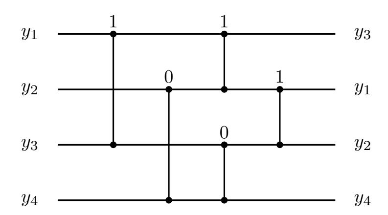
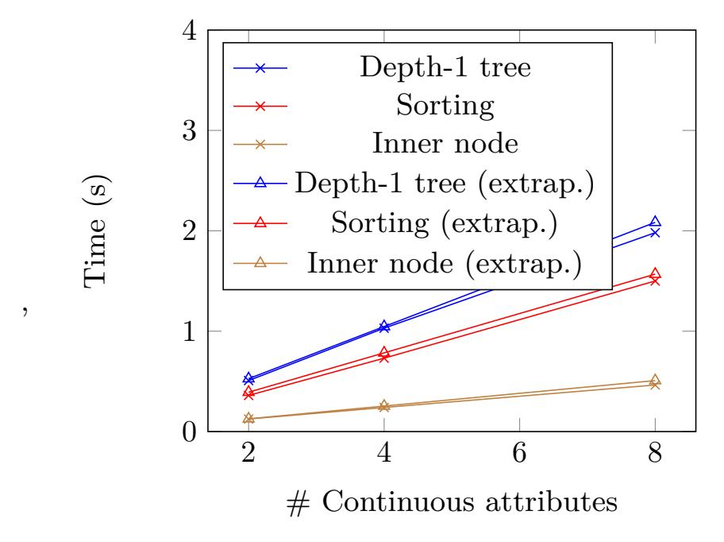
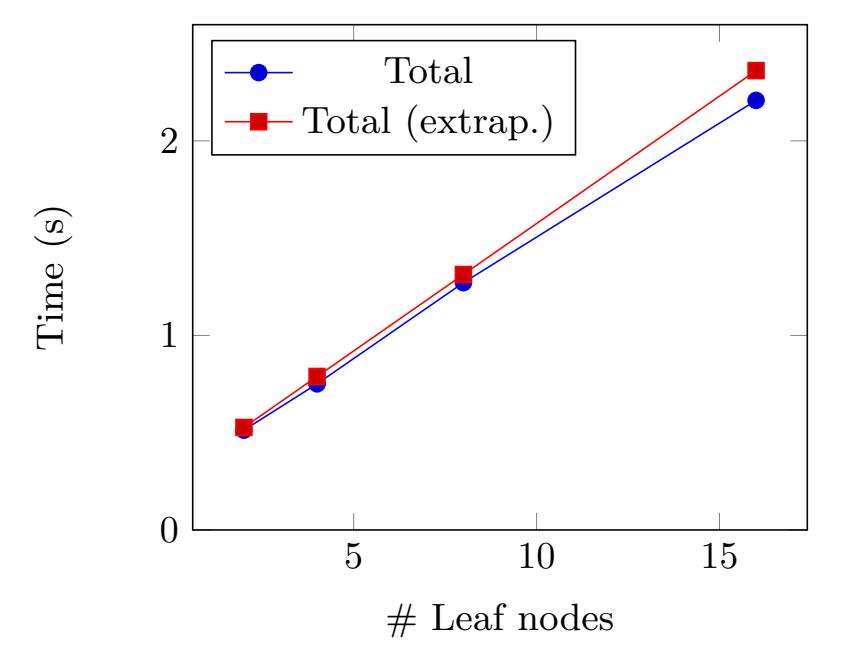
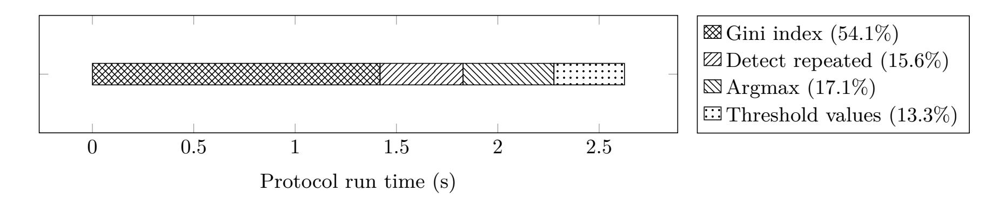
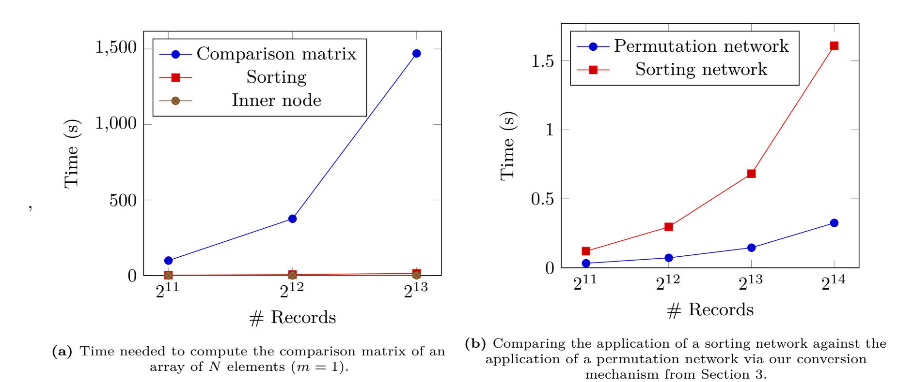
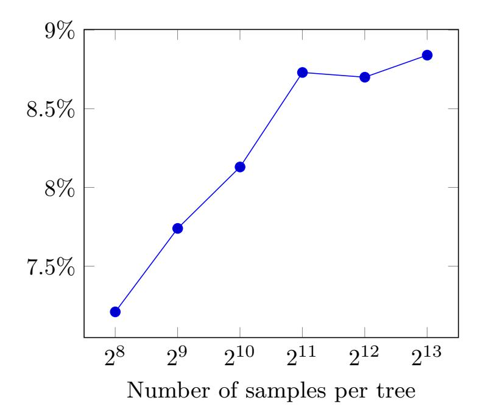
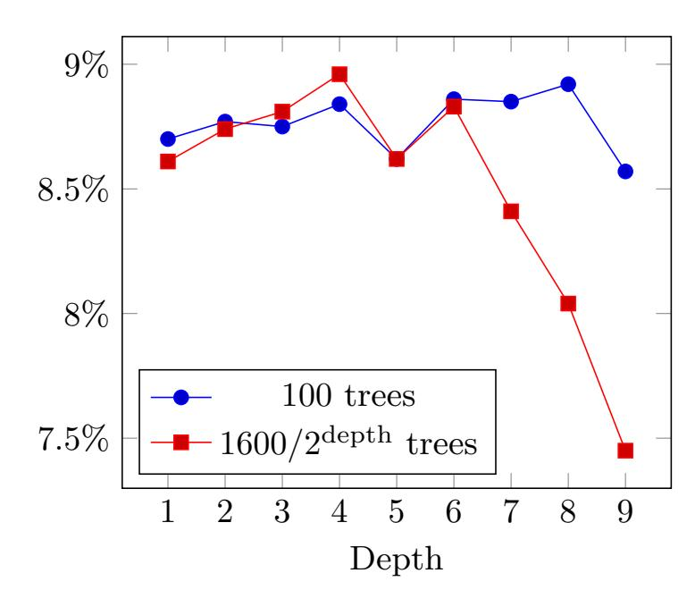

{0}------------------------------------------------

<span id="page-0-0"></span>

Mark Abspoel, Daniel Escudero, and Nikolaj Volgushev

## **Secure training of decision trees with continuous attributes**

**Abstract:** We apply multiparty computation (MPC) techniques to show, given a database that is secret-shared among multiple mutually distrustful parties, how the parties may obliviously construct a decision tree based on the secret data. We consider data with continuous attributes (i.e., coming from a large domain), and develop a secure version of a learning algorithm similar to the C4.5 or CART algorithms. Previous MPC-based work only focused on decision tree learning with discrete attributes (De Hoogh et al. 2014). Our starting point is to apply an existing generic MPC protocol to a standard decision tree learning algorithm, which we then optimize in several ways. We exploit the fact that even if we allow the data to have continuous values, which a priori might require fixed or floating point representations, the output of the tree learning algorithm only depends on the relative ordering of the data. By obliviously sorting the data we reduce the number of comparisons needed per node to *O*(*N* log<sup>2</sup> *N*) from the naive *O*(*N*<sup>2</sup> ), where *N* is the number of training records in the dataset, thus making the algorithm feasible for larger datasets. This does however introduce a problem when duplicate values occur in the dataset, but we manage to overcome this problem with a relatively cheap subprotocol. We show a procedure to convert a sorting network into a permutation network of smaller complexity, resulting in a round complexity of *O*(log *N*) per layer in the tree. We implement our algorithm in the MP-SPDZ framework and benchmark our implementation for both passive and active three-party computation using arithmetic modulo 2 <sup>64</sup>. We apply our implementation to a large scale medical dataset of ≈ 290 000 rows using random forests, and thus demonstrate practical feasibility of using MPC for privacy-preserving machine learning based on decision trees for large datasets.

**Keywords:** decision trees, multiparty computation, privacy-preserving machine learning

**Mark Abspoel:** CWI, abspoel@cwi.nl. Work done while also partially at Philips Research.

**Daniel Escudero:** Aarhus University, escudero@cs.au.dk **Nikolaj Volgushev:** Pleo Technologies ApS, nikolaj.volgushev@gmail.com. Work done while at the Alexandra Institute.

### **1 Introduction**

Machine learning has proven to be an important tool in our day-to-day lives, enabling new technologies ranging from recommender systems and image detection, to weather prediction and much more. In supervised learning, the task is to predict an output variable given an input variable (e.g., classification or regression), based on an existing known database of input-output pairs. Many different types of predictive models have been developed throughout the years, and suitability and accuracy generally depend on the application domain.

In this work we study *decision trees*, which are conceptually simple models with several attractive features. Decision trees can be used for both classification (discrete output variable) and regression (continuous output variable). Despite their simplicity, decision trees have seen a recent surge of interest due to their effectiveness in ensemble methods, such as boosted trees (e.g., XG-Boost) or random forests, rivaling accuracies of deep neural networks in some applications. Advantages of decision trees include robustness and scale invariance, being relatively simple to compute, and compatibility with both continuous and discrete variables.

Decision trees (and other models in the supervised learning setting) are constructed using a training database of input variables together with known output labels, and can subsequently be used to perform predictions on input data where the output is unknown. However, despite the potential applications of such a trained model, direct access to training data might be heavily restricted due to privacy concerns. Consider for example a decision tree for credit approval that is trained using data from many customers of a consortium of banks. The decision of whether or not some credit is approved can depend on many factors, such as monthly income and the customer's transaction history. All of this data must be provided to the entity that constructs the model, which raises a number of potential concerns. For example this entity might be a third party, external to the banks. Also, the data that is needed may come from

{1}------------------------------------------------

many different sources which are not willing to share their data (e.g., data across several banks). Regulations such as the recent General Data Protection Regulation (GDPR) may also play an important role in restricting access to personal data.

Privacy-preserving technologies such as multiparty computation (MPC) offer a technological solution to this problem. Using MPC, there no longer needs to be a central entity that collects all data, but instead data can remain distributed and the model can be constructed using an interactive protocol. The privacy guarantees of MPC are absolute — either unconditional or based on a cryptographic assumption — and this is a strong advantage over competing approaches such as anonymization, or trusted computing (e.g., Intel SGX). However, the associated computational overhead is typically several orders of magnitude, which is mostly due to the communication required between the parties. Fortunately, the state of the art of generic MPC is ever improving, putting even computationally intensive machine learning tasks within reach, as we demonstrate in this work.

### **1.1 Our contributions**

We present a protocol for training decision trees that preserves the privacy of the underlying training data. We roughly follow the blueprint of the CART and C4.5 learning algorithms, and allow for the simultaneous usage of continuous and discrete attributes. We build on top of general primitives (secret sharing, secure multiplication, secure randomness, etc.) that existing MPC protocols implement, and thus allow for maximum flexibility with respect to number of parties, the desired security guarantees, and performance.

Our protocol is developed in the client-server model, where the data owners secret-share their data towards a given set of servers, of which a certain number is assumed to be honest (i.e., they behave correctly and do not leak data). These servers will run the actual computation. The client-server model provides several benefits compared to the traditional model in which each input provider is in charge of executing the protocol as well:

- Nothing is assumed about the initial partitioning of the data. In particular, we support both horizontally or vertically partitioned data, and any mixture thereof.
- Clients do not execute the protocol directly, so they can be low-end devices. Heavy computation and

- communication is delegated to more powerful servers, and clients do not need to be online during this phase.
- The number of clients is independent of the number of servers. In particular, arbitrarily many clients can provide input without sacrificing the performance of the final training.
- The client-server model is strictly more general than the traditional model, since the latter can be emulated by the input providers also acting as both client and server.

Furthermore, the output of the protocol (the resulting decision tree) is also secret-shared among the servers,[1](#page-0-0) which allows the training algorithm to be used in a fully oblivious pipeline—for example, the secretshared output might subsequently be used to provide secure inference to other clients.

The number of secure multiplications, which is the most indicative metric for the computational and communication complexity of our protocol, is *O*(*mN*(log *N*)(2<sup>∆</sup> +log *N*)+*nN*), where *N* is the number of samples in the dataset, ∆ is the desired depth, *m* is the number of continuous attributes and *n* is the number of discrete attributes.

Since we build on top of generic primitives, we are able to target both passive and active security, as well as allow for an arbitrary number of corrupted parties, by a suitable choice of underlying protocols that instantiate the primitives. We implement our protocols using the MP-SPDZ framework for MPC [\[12\]](#page-15-0), and report thorough experimental results and analyses for an instantiation based on 3-party honest-majority MPC using replicated secret sharing, for both passive and active security.

To illustrate the performance of our techniques in terms of both efficiency and accuracy, we consider a reallife classification task on a large-scale medical dataset with ≈ 290 000 records, where we incorporate our protocol into a random forest ensemble. Extrapolating from our experimental results, we estimate that we can obtain a random forest based secret-shared model within 28 hours that performs only slightly worse than a model trained in the clear using state of the art gradient boosted trees.

Finally, we stress that our approach uses generic secret-sharing based MPC primitives, which enables the optimization of the whole pipeline by simply optimizing

**<sup>1</sup>** In our most general setting, we train a *complete* decision tree up to a given pre-defined depth.

{2}------------------------------------------------

the underlying primitives. It also allows for different threat models, and in particular it leads to the first protocol in the literature, to the best of our knowledge, for securely training a decision tree with *active security*, for which we run benchmarks in Section [5.](#page-9-0)

### **1.2 Overview of our techniques**

Our basic (non-secure) algorithm for training decision trees (as detailed in Figure [1\)](#page-4-0) is a modified and stripped down version of the C4.5 algorithm [\[22\]](#page-16-0). Where the original algorithm does pruning of the output decision tree to optimize computational resources, since we are computing obliviously and therefore have no direct access to the data, we instead compute a full tree up to a public depth parameter ∆.

For each node of the decision tree, the algorithm selects an attribute and a splitting value that jointly best partition the data with respect to the output variable, according to some *splitting criterion*. As a criterion we choose to minimize the Gini index, as also used in the CART algorithm, since it only requires a few secure multiplications to compute.[2](#page-0-0)

For discrete attributes, we follow [\[13\]](#page-15-1) and compute the Gini index by securely counting the number of elements in the dataset that satisfy certain equations using an indicator-vector representation, as described in Section [4.](#page-7-0) For continuous attributes, the situation is more complicated since the equations are not based on equality (=), but rather a less-than-or-equal (≤) predicate. We leave the details to Section [4.1,](#page-7-1) but essentially we need to count the number of dataset points whose attribute under consideration lies below all possible thresholds appearing in the dataset. For example, if the attribute is "age" and there are five data points with ages (34*,* 20*,* 16*,* 25*,* 60), then we need to securely determine that there are 3 ages below 34, 1 age below 20, 0 ages below 16, 2 ages below 25 and 4 ages below 60.

Naively, we could do this by securely comparing each pair of data points. However, secure comparisons are rather expensive in MPC[3](#page-0-0) , and this approach would require *O*(*N*<sup>2</sup> ) comparisons, which becomes prohibitive for reasonably-sized datasets. Instead, we present a novel protocol in Figure [4](#page-8-0) to compute the Gini indices by sorting the data, with respect to each attribute, incurring only a quasilinear number of comparisons.

To permute the data into sorted order we make use of a *sorting network*, so that we can obliviously sort a secret-shared array and subsequently also apply resulting permutation to the other columns of the dataset. This will allow us to sort the data on each attribute just once for the entire tree, irrespective of the depth of the tree.

Relying on sorted values does introduce a problem in the case of duplicate values. We overcome this in Section [4.2](#page-7-2) with a novel protocol that computes a binary "mask vector" that indicates whether an element of a sorted vector is the last element with that value *in a subsequence* of the vector. Here, the subsequence corresponds to the elements that are under consideration for a node (represented by an indicator vector), which is a strict subset of the dataset for all nodes except for the root of the tree. This protocol can be seen as a bottom-up recursive algorithm that merges two adjacent blocks by performing a single binary equality check, and keeping track of the left-most value of the block that is in the subsequence. The running cost is *O*(*N* log *N*) secure multiplications in *O*(log *N*) rounds.

While theoretically efficient sorting networks of depth *O*(log *N*) exist based on expander graphs, practical constructions like bitonic or odd-even merge sort [\[3\]](#page-15-2) require depth *O*(log<sup>2</sup> *N*). This would result in *O*(*N* log<sup>2</sup> *N*) comparisons for our protocol, which is already a great improvement over the naive cost *O*(*N*<sup>2</sup> ). However, using the sorting network also means we need *O*(log<sup>2</sup> *N*) rounds of interaction to *apply* the permutation, and this needs to be done for every node in the tree.

We reduce the number of rounds with a novel optimization that converts the permutation obtained from a sorting network into a more efficient representation using a *permutation network*. Using known efficient constructions of permutation networks, we reduce the round complexity of applying the permutation to *O*(log *N*). While the reduction of a log *N* factor may seem small, for large datasets this quickly becomes significant, since each round requires an additional round-trip across the network. This optimization naturally also reduces communication; we experimentally demonstrate its effects in Section [5.](#page-9-0)

We present the conversion procedure more detail in Section [3.2.](#page-6-0) Essentially it works by "masking" the intended sorting network by a *random* secret permutation, "opening" the resulting network, and defining the new permutation to be a combination of the opened with the secret one. At a high level, this can be seen as

**<sup>2</sup>** C4.5 uses information gain which requires logarithms, which are hard to compute in MPC. This was also observed in the work of [\[13\]](#page-15-1).

**<sup>3</sup>** A secure less-than-or-equal comparison typically requires a number of secure multiplications that is at least linear in the bit length of the ring or field over which values are represented.

{3}------------------------------------------------

an application of the traditional "mask-open-unmask" trick to convert between two representations, used for example to convert from degree 2*t*-sharings to *t*-sharings in the MPC protocol from [\[10\]](#page-15-3), applied to the group of permutations.

### **1.3 Related work**

Secure training of decision trees was considered in one of the earliest works in privacy-preserving machine learning [\[19\]](#page-16-1). In that work, the authors develop a protocol for secure training using the ID3 algorithm, that at the time of writing was more efficient than what generic MPC solutions would provide. Several subsequent works improved the efficiency of this protocol [\[14,](#page-16-2) [20,](#page-16-3) [24,](#page-16-4) [25,](#page-16-5) [27,](#page-16-6) [28\]](#page-16-7), although they each work for a specific distribution of the input data, which limits the range of potential applications.

This issue was addressed in [\[13\]](#page-15-1), where an extension of ID3 to the secure setting was given using Shamir secret-sharing and allowing arbitrary initial partitioning of the data. However, their protocol does not allow for continuous attributes, which is an important feature of decision trees with respect to other machine learning models.

A simple, yet less accurate approach for training a decision tree with continuous attributes is to discretize the values to a small domain, and then use a protocol like the one from [\[13\]](#page-15-1) for secure decision tree training on discrete attributes. Indeed, very recently, the concurrent and independent work of [\[1\]](#page-15-4) explores exactly this approach, as well as others, for training decision tree ensembles with continuous attributes with semi-honest security. Their results are complementary to ours: they avoid most of the heavy secure comparisons in the online phase by not relying on the C4.5 algorithm, as we do here, but using instead other approaches for training the tree like discretization or by using so-called extremely randomized trees, which leads to simpler and more efficient protocols at the expense of a potential drop in accuracy.

Other solutions have aimed at training decision trees with continuous attributes using differential privacy [\[6,](#page-15-5) [17,](#page-16-8) [29\]](#page-16-9). However, such techniques are considered orthogonal to MPC, since they aim to "mask" the data so that no particular records can be inferred from it, whereas our goal is to hide the data completely (even with information-theoretic security, for some MPC engines) and keep the tree secret.

Secure inference of decision trees using MPC has been explored in various works (e.g., [\[8,](#page-15-6) [11\]](#page-15-7)), and we briefly discuss this in Appendix [A.5.3.](#page-20-0)

### **1.4 Outline of the paper**

We discuss preliminaries and the basic non-secure training algorithm in Section [2,](#page-3-0) and then we present some of our building blocks regarding sorting networks and permutations in Section [3.](#page-4-1) Our main protocol appears in Section [4,](#page-6-1) and its implementation and benchmarks are discussed thoroughly in Section [5.](#page-9-0) In Section [6](#page-12-0) we show our applications to a large-scale medical dataset and finally we conclude in Section [7.](#page-14-0) In the appendix we provide some more background information about our construction, and go into detail on some of the subprotocols.

### <span id="page-3-0"></span>**2 Basic training algorithm**

Z*<sup>n</sup>* denotes the set of integers {0*, . . . , n*−1} and we write [*n*] for the set {1*,* 2*, . . . , n*}. We denote by **e***<sup>m</sup> i* the vector in Z*<sup>m</sup>* <sup>2</sup> whose all entries are 0, except for the *i*-th one which equals 1.

We wish to build a model that predicts an output variable *Y* , given a number of input variables. We assume we have *m* continuous input variables named *C*1*, . . . , Cm*, and *n* discrete input variables *D*1*, . . . , Dn*, where we assume dom(*D*1) = · · · = dom(*Dn*) = Z<sup>2</sup> to simplify our presentation. Let D be a database consisting of *N* samples (**c***k,* **d***k, yk*) for *k* = 1*, . . . , N*. Here **c***<sup>k</sup>* = (*ck*1*, . . . , ckm*) and **d***<sup>k</sup>* = (*dk*1*, . . . , dkn*) are realizations of the variables *C*1×· · ·×*C<sup>m</sup>* and *D*1×· · ·×*Dn*, respectively, for each *k* = 1*, . . . , N*. For a sample *ω<sup>k</sup>* = (**c***k,* **d***k, yk*) we write *Ci*(*ωk*) = *cki*, and *D<sup>j</sup>* (*ωk*) = *dkj* .

In theory the domain of the continuous variables *C*1*, . . . , C<sup>m</sup>* is the real numbers R, but in practice these are either fixed-point or floating-point numbers. The overhead of secure computation for arithmetic on these representations is larger than for integers, since operations like truncation and rounding are expensive when done in MPC. Fortunately, for the case of decision trees for classification we do not need to perform arithmetic operations on the numbers, so we discretize them to an

{4}------------------------------------------------

#### <span id="page-4-0"></span>TrainDT( $\mathcal{T}$ ): Training on dataset $\mathcal{T}$

Input: A dataset  $\mathcal{T}$ .

Output: A decision tree T that fits this data.

- 1. Check if the *stopping criteria* has been met. If so output the leaf node whose tag is the most common one in  $\mathcal{T}$ .
- <span id="page-4-2"></span>2. Else, select the best attribute for the parent node as follows:
  - 1. Calculate  $G(\mathcal{T}|C_i \leq t)$  for all  $1 \leq i \leq m$  and  $t \in \{c_i : (\mathbf{c}, \mathbf{d}, y) \in \mathcal{T}\}.$
  - 2. Calculate  $G(\mathcal{T}|D_j)$  for all  $1 \leq j \leq n$ .
  - 3. Take the argmin of the computed values.
    - If the minimum is  $G(\mathcal{T}|C_i \leq t)$  then return the tree whose root is  $C_i \leq t$ , the left subtree is  $\mathsf{TrainDT}(\mathcal{T}_{C_i \leq t})$  and the right subtree is  $\mathsf{TrainDT}(\mathcal{T}_{C_i > t})$ .
    - If the minimum is  $G(\mathcal{T}|D_j)$  then return the tree whose root is  $D_j = 0$ , the left subtree is  $\mathsf{TrainDT}(\mathcal{T}_{D_i=0})$  and the right subtree is  $\mathsf{TrainDT}(\mathcal{T}_{D_i=1})$ .

Fig. 1. Basic algorithm for training decision trees with discrete and continuous attributes.

integer domain (arbitrarily, but preserving order) and assume  $dom(C_1) = \cdots = dom(C_m) = \mathbb{Z}_M$ .

A decision tree T is simply an (ordered) binary tree with some additional information. Internal nodes can be of two types, discrete or continuous. Continuous nodes are denoted  $C_i \leq s$  where  $i \in [m]$  and  $s \in \text{dom}(C_i)$ . Discrete nodes are denoted  $D_j = u$ , where  $j \in [n]$  and  $u \in \text{dom}(D_j)$ . Leaf nodes are represented by a value  $\hat{y} \in \text{dom}(Y)$ .

We now describe our basic training algorithm of Figure 1, which is a stripped down version of the C4.5 algorithm [22]. Let  $\mathcal{D}$  be a database consisting of N samples  $(\mathbf{c}_k, \mathbf{d}_k, y_k)$  for k = 1, ..., N. We shall assume  $dom(D_1) = \cdots = dom(D_n) = \mathbb{Z}_2$  to simplify our presentation, and we discuss in Appendix A.3 how handle the case in which the discrete variables have larger domains. Our algorithm first selects the best splitting attribute for the parent node, according to some criterion, and then recurses on each of the resulting subtrees. Rather than using information gain as the splitting criterion as in the C4.5 algorithm, we use the *Gini index*, as used in other training algorithms like CART [5], and that has

also been considered previously in the privacy-preserving decision trees literature [13] due to its simple integerarithmetic-friendly definition. In terms of accuracy, it only matters in 2% of the cases whether Gini index or information gain is used [23].

We begin by introducing some notation. Given  $1 \le i \le m$  and  $t \in \text{dom } C_i$ , we define

$$\mathcal{D}_{C_i \leq t} = \{ (\mathbf{c}, \mathbf{d}, y) \in \mathcal{D} : c_i \leq t \},$$
  
$$\mathcal{D}_{C_i > t} = \mathcal{D} \setminus \mathcal{D}_{C_i \leq t}.$$

Similarly, for  $1 \leq j \leq n$  and  $b \in \text{dom } D_j = \mathbb{Z}_2$  we define  $\mathcal{D}_{D_j=b} = \{(\mathbf{c}, \mathbf{d}, y) \in \mathcal{D} : d_j = b\}$ . Finally, we define  $\mathcal{D}_{Y=b} = \{(\mathbf{c}, \mathbf{d}, y) \in \mathcal{D} : y = b\}$ . We also apply this notation to subsets  $\mathcal{T} \subseteq \mathcal{D}$ , e.g. we write  $\mathcal{T}_{C_i \leq t}$  for  $\mathcal{T} \cap \mathcal{D}_{C_i \leq t}$ .

For a non-empty subset  $\mathcal{T}\subseteq\mathcal{D}$ , its Gini index is defined as

$$G(\mathcal{T}) = 1 - \left(\frac{|\mathcal{T}_{Y=0}|}{|\mathcal{T}|}\right)^2 - \left(\frac{|\mathcal{T}_{Y=1}|}{|\mathcal{T}|}\right)^2.$$

We also define  $G(\emptyset) = 1$ . The Gini index is a measure of the homogeneity of the output variable Y within  $\mathcal{T}$ . It is equal to 2p(1-p), where  $p = |\mathcal{T}_{Y=0}|/|\mathcal{T}|$ , and thus attains its minimal value 0 whenever  $p \in \{0,1\}$ , i.e., when all of the samples have the same output value.

We also define, for  $1 \leq i \leq m$ ,  $1 \leq j \leq n$  and  $t \in \mathbb{Z}_M$ , the quantities

$$G(\mathcal{T}|C_i \le t) = \frac{|\mathcal{T}_{C_i \le t}|}{|\mathcal{T}|} G(\mathcal{T}_{C_i \le t}) + \frac{|\mathcal{T}_{C_i > t}|}{|\mathcal{T}|} G(\mathcal{T}_{C_i > t}),$$

$$G(\mathcal{T}|D_j) = \frac{|\mathcal{T}_{D_j = 0}|}{|\mathcal{T}|} G(\mathcal{T}_{D_j = 0}) + \frac{|\mathcal{T}_{D_j = 1}|}{|\mathcal{T}|} G(\mathcal{T}_{D_j = 1}).$$

We describe the basic training algorithm  $\mathsf{TrainDT}(\mathcal{T})$  in Figure 1. The input is a dataset  $\mathcal{T} \subseteq \mathcal{D}$  and the output is a decision tree that models  $\mathcal{T}$ .

Decision tree learning algorithms usually terminate based on some stopping criterion, e.g., when all records associated with the node have an identical output variable. Our oblivious algorithm cannot terminate based on the data, since this would leak information. Therefore, we compute a complete tree up to a predefined depth, as discussed in more detail in Section 4.

# <span id="page-4-1"></span>3 Sorting and permutation networks

Let  $\llbracket \cdot \rrbracket$  be a linear secret-sharing scheme over  $\mathbb{Z}_M$ . We assume MPC protocols for secure multiplication and

<sup>4</sup> In general every bounded discrete set can be mapped to integers by choosing an appropriately large scale.

{5}------------------------------------------------

integer inequality/equality comparisons of  $\llbracket \cdot \rrbracket$ -shared data. Our implementation explicitly considers three-party honest-majority replicated secret sharing over the ring  $\mathbb{Z}_{2^{\ell}}$ , both for passive and active security, and we refer the reader to Appendix A.2 for a brief description of these protocols.

### <span id="page-5-1"></span>3.1 Sorting networks

Regard the input  $\mathcal{T}$  for a decision tree learning algorithm as a set of columns, one column per attribute. One key observation is that the output of TrainDT (and all common tree learning algorithms) only depends on the ordering of the values within each column, rather than the values themselves. The straightforward secure computation of the basic algorithm of Figure 1 requires N secure comparisons in step 2.1 to compute the cardinality  $|\mathcal{T}_{C_i \leq c_{ki}} \cap \mathcal{T}_{Y=b}|$  needed for the Gini index  $G(\mathcal{T}|C_i \leq t)$ . A priori, we cannot obliviously select  $t \in \{c_i : (\mathbf{c}, \mathbf{d}, y) \in \mathcal{T}\}$ , so we execute this step for all values  $c_{ki}$ , incurring a cost of  $N^2$  comparisons.

If the dataset is sorted with respect to the attribute  $C_i$  this becomes a lot easier. For example, assume we have ordered distinct values  $c_{1i} < c_{2i} < \cdots < c_{ki}$ . Then the cardinality  $|\mathcal{T}_{C_i \le c_{ki}}|$  equals the index k.

Oblivious sorting can be done in a quasilinear number of comparisons. While there are many ways to sort in MPC (see for example [4] for a recent survey), we use a sorting network, of which practical constructions exist with  $O(N \log^2 N)$  comparisons in  $O(\log^2 N)$  depth (e.g. bitonic sorting or odd-even merge sort [3]). A sorting network of size N is a composition of layers, each acting as an input-dependent permutation on vectors  $(y_1,\ldots,y_N)\mapsto (y_1',\ldots,y_N')$ . A layer has a set of pairwise disjoint comparator gates that are each represented a pair of indices  $\{i, j\}$  with  $i \neq j$ . The comparator gate will either swap or not swap the i-th and j-th inputs such that for the output it holds that  $y'_i < y'_i$ . If an index i is not present in a layer its value is untouched, i.e.  $y_i' = y_i$ . The output of the sorting network is a permutation of the input vector that is in sorted order. See Figure 2 for a simple example.

We implement a sorting network in MPC as follows. Let  $(\llbracket x_1 \rrbracket, \ldots, \llbracket x_N \rrbracket)$  denote a secret-shared input vector. For each comparator gate  $\{i, j\}$ , with i < j, that is present in the first layer, we compute the secret-shared bit  $\llbracket b \rrbracket = (\llbracket x_i \rrbracket \leq \llbracket x_j \rrbracket)$ . If b = 0 then we swap the i-th and j-th entries, and if b = 1 they are left untouched.

<span id="page-5-0"></span>

**Fig. 2.** Example of a sorting network of size 4 applied to an input vector. For each comparator gate, we indicate whether the gate swaps the inputs with a 1. Here we permute sequentially  $(y_1, y_2, y_3, y_4) \mapsto (y_3, y_2, y_1, y_4) \mapsto (y_3, y_2, y_1, y_4) \mapsto (y_3, y_2, y_1, y_4) \mapsto (y_3, y_1, y_2, y_4).$ 

This can be done obliviously by setting

$$\begin{pmatrix} \begin{bmatrix} x_i' \\ x_j' \end{bmatrix} \end{pmatrix} = \begin{bmatrix} b \end{bmatrix} \cdot \begin{pmatrix} \begin{bmatrix} x_i \\ x_j \end{bmatrix} \end{pmatrix} + (1 - \begin{bmatrix} b \end{bmatrix}) \cdot \begin{pmatrix} \begin{bmatrix} x_j \\ x_i \end{bmatrix} \end{pmatrix}.$$

This process is then repeated for the subsequent layers.

The essential advantage of using a sorting network is that, once computed for an input, it also acts as a switching network. A switching network does not consist of comparator gates, but rather it is made up of conditional swap gates  $g = \{i, j\}$  with  $i \neq j$ , together with an auxiliary input  $b_g$  for each gate. A conditional swap gate g swaps swaps the i-th and j-th entries if  $b_g = 1$ , and is the identity if  $b_g = 0$ . Figure 2 may therefore also be seen as a switching network, where the auxiliary inputs are indicated. As a result, we can store the bits  $\llbracket b \rrbracket$  computed above, and apply the permutation that sorts  $(x_1, \ldots, x_N)$  to any other array.

A crucial operation in our work is to apply a sorting network to the values belonging to a continuous attribute, storing the permutation that sorts the data, and then applying this permutation to the other parts of the data. This can be easily done as we sketched above. However, the sorting networks we consider in this work, and therefore the switching networks obtained from them, have  $O(N \log^2 N)$  switching gates distributed across  $O(\log^2 N)$  layers. In MPC this leads to a communication complexity of  $O(N \log^2 N)$  in  $O(\log^2 N)$  rounds.

In what follows we show a novel technique to reduce the cost of applying the sorting permutation so that both the communication complexity and the round count are reduced by a factor of  $\log N$ . Computing the sorting permutation still requires  $O(\log^2 N)$  rounds, but only needs to be done once (for each attribute), whereas applying the permutation is done for every node in the tree. Therefore for a tree of depth  $\Delta$ , this optimization shaves off a 

{6}------------------------------------------------

significant factor of  $2^{\Delta} \log N$  in terms of communication and  $\Delta \log N$  in terms of circuit depth, the latter being typically the bottleneck in distributed applications like MPC, especially in WAN settings. Recall that in our application N denotes the size of the database, so  $\log N$  can be a significant factor in this case.

### <span id="page-6-0"></span>3.2 Conversion to permutation networks

Our optimization is achieved via permutation networks. A permutation network is a particular switching network that can represent any permutation  $[N] \to [N]$  by varying the auxiliary input bits. Explicit constructions exist for permutation networks of  $O(N \log N)$  gates and  $O(\log N)$  depth (e.g. Waksman networks [26]), which are both a factor  $\log N$  better than sorting networks. Applying a sorting network to an input vector induces a permutation, that can be represented via a permutation network for better efficiency. We show a method to convert any switching network into a permutation network.

We begin by introducing some definitions. Abusing notation slightly, we identify a given switching network by the function  $\phi:[N] \to [N]$  it induces. Also, if each of the bits of the switching network  $\phi$  are secret-shared, we say that  $\phi$  is secret-shared and we denote this by  $\llbracket \phi \rrbracket$ . At a high level, our conversion mechanism proceeds as follows. First, the parties sample a uniformly random secret-shared permutation  $\llbracket \sigma \rrbracket$ , and then they open the permutation  $\sigma \circ \phi$ . Then, the parties define as output the secret-shared permutation  $\llbracket \sigma^{-1} \rrbracket \circ (\sigma \circ \phi)$ , which is equivalent to  $\phi$ , but has the improved complexity of  $\llbracket \sigma^{-1} \rrbracket$ .

We use the following tools and observations.

Random permutations. For the conversion, the parties need to obtain shares of a random permutation. As in [18], this is achieved by letting each party distribute shares of a randomly chosen permutation of  $O(N \log N)$  gates and  $O(\log N)$  layers, and distribute shares of it to the other parties. Then, the parties consider the permutation network obtained by composing these networks sequentially, which still has  $O(N \log N)$  gates and  $O(\log N)$  layers. For active security we only need to check that the comparator gates that are secret-shared by each party are either 0 or 1, which can be done using standard techniques [11].

Shares of inverse permutation. Given a secretshared permutation  $[\![\pi]\!]$ , shares of the inverse  $[\![\pi^{-1}]\!]$ 

#### <span id="page-6-2"></span>Switching network conversion

**Input:** A secret-shared switching network  $\llbracket \phi \rrbracket$ . **Output:** A secret-shared switching network  $\llbracket \psi \rrbracket$  of  $O(\log N)$  depth and  $O(N \log N)$  gates.

- 1. The parties sample a secret-shared random permutation  $\lceil \sigma \rceil$ .
- 2. The parties compute and open the permutation  $\llbracket \phi \rrbracket \circ \llbracket \sigma \rrbracket$ .
- 3. The parties output the network that first applies the network  $\llbracket \sigma^{-1} \rrbracket$ , followed by the *public* permutation  $\rho$ . This results in the permutation  $\rho \circ \sigma^{-1}$ , which is equivalent to  $\phi$ .

**Fig. 3.** Protocol to convert a secret-shared switching network to a permutation network.

can be computed locally by simply reversing the order of the layers.

Composing secret-shared networks. Given two secret-shared networks  $\llbracket \phi \rrbracket$  and  $\llbracket \psi \rrbracket$ , the parties can locally compute  $\llbracket \phi \circ \psi \rrbracket$  by simply concatenating the layers, which increases the depth and gate count by a factor of only 2.

**Opening a permutation.** Given a secret-shared network  $\llbracket \phi \rrbracket$ , the parties can open  $\phi$  without revealing the individual swapping gates by applying  $\llbracket \phi \rrbracket$  to the vector  $(1, \ldots, N)$  and opening the result.

Our conversion protocol is described in Figure 3. The security of our conversion protocol comes from that fact that the only potential leakage comes from the opening the permutation  $\phi \circ \sigma$ . Because the permutations  $[N] \to [N]$  form a group, we have that  $\rho = \phi \circ \sigma$  if and only if  $\sigma = \phi^{-1} \circ \rho$ , where  $\rho$  is an arbitrary permutation. But since  $\sigma$  was sampled uniformly at random, the probability that this equality holds is independent of the value of  $\phi$ , so we conclude that  $\phi \circ \sigma$  does not reveal anything about  $\phi$ .

### <span id="page-6-1"></span>4 Protocol

As the basis for our protocol, we assume generic MPC primitives such as arithmetic and comparisons. Let  $\llbracket \cdot \rrbracket$  be a linear secret-sharing scheme over  $\mathbb{Z}_M$ . Since the data may be signed, we think of  $\mathbb{Z}_M$  as the set [-M/2, M/2), and M is chosen large enough so that the (scaled) database can fit in this domain and so that no overflows

{7}------------------------------------------------

are produced during our protocol. Choosing  $M \ge (N/2)^5$  suffices, as argued in Appendix A.2.

Let  $\mathcal{D}$  be a database consisting of N samples  $(\mathbf{c}_k, \mathbf{d}_k, y_k)$  for k = 1, ..., N, which will be used for training. Recall that  $\mathbf{c}_k \in \mathbb{Z}_M^m$ ,  $\mathbf{d}_k \in \mathbb{Z}_2^n$  and  $y_k \in \{0, 1\}$ . We assume that each entry of  $\mathcal{D}$  is secret-shared among the parties. More precisely, the parties have shares  $\llbracket c_{k,i} \rrbracket$ ,  $\llbracket d_{k,j} \rrbracket$  and  $\llbracket y_k \rrbracket$  for all  $k \in [N], i \in [m], j \in [n]$ .

A crucial step in our secure training algorithm is to securely compute the Gini index of each potential splitting point for both continuous and discrete attributes. We now focus on continuous attributes; we describe discrete attributes in Appendix A.3, which follows previous work [13].

#### <span id="page-7-0"></span>Indicator vector representation.

We introduce the following notation. Given  $A \subset \mathcal{D}$ , we define the indicator function of A:

$$\chi_A(a) = \begin{cases} 1 & \text{if } a \in A, \\ 0 & \text{if } a \notin A. \end{cases}$$

Also, we define the indicator-vector  $\mathbf{v}_A \in \mathbb{Z}_2^N$  as the vector whose k-th entry is given by  $\chi_A((\mathbf{c}_k, \mathbf{d}_k, y_k))$ . We note that the inner product  $\langle \mathbf{v}_A, \mathbf{1} \rangle = |A|$ , where  $\mathbf{1} = (1, \ldots, 1)$  is the vector of length N with all entries equal to 1. Additionally, given  $A, B \subseteq \mathcal{D}$  it holds that  $\mathbf{v}_A \star \mathbf{v}_B = \mathbf{v}_{A \cap B}$ , where the  $\star$  operator denotes the component-wise product. Furthermore,  $\mathbf{v}_{\bar{A}} = \mathbf{1} - \mathbf{v}_A$ , where  $\bar{A} = \mathcal{D} \setminus A$  is the complement of A in  $\mathcal{D}$ .

Given a secret-shared indicator vector  $\llbracket \mathbf{v}_A \rrbracket$  of a set A, where each entry is secret-shared over  $\mathbb{Z}_M$ , we can easily compute the cardinality as  $\llbracket |A| \rrbracket = \sum_{i=1}^N \llbracket \mathbf{v}_{A_i} \rrbracket$ . Additionally given  $\llbracket \mathbf{v}_B \rrbracket$  for another subset  $B \subseteq \mathcal{D}$  we can compute  $\llbracket |A \cap B| \rrbracket = \langle \llbracket \mathbf{v}_{A,i} \rrbracket, \llbracket \mathbf{v}_{B,i} \rrbracket \rangle$ . In general this requires n secure multiplications, but for some secret-sharing schemes, like the ones we consider in this work, the inner product can be computed with the same communication cost as a single multiplication.

## <span id="page-7-1"></span>4.1 Computing the Gini index for continuous attributes

Let  $\mathcal{T} \subseteq \mathcal{D}$ , and assume the parties have shares  $[\![\mathbf{v}_{\mathcal{T}}]\!]$ . In this section we show how to compute shares of  $S_{i,k}(\mathcal{T}) =$ 

 $(P_{C_i \leq c_{k,i}}(\mathcal{T}), Q_{C_i \leq c_{k,i}}(\mathcal{T}))$  for each  $i \in [m]$  and  $k \in [N]$ . In fact, the parties obtain  $[S_{i,k'}]$ , where  $k' = \pi_i(k)$  is a permuted index of k = 1, ..., N according to the permutation  $\pi_i$  which is the permutation that puts the array  $(c_{1i}, ..., c_{Ni})$  in ascending order. For now, assume the values are distinct, so  $\pi_i$  is well-defined. As a result, the parties have shares of the Gini indices corresponding to each possible splitting point  $c_{ki}$ , but in a different unknown order. This is not a problem, however, since it is not intended for the parties to know which row achieves the best splitting point; the only information needed is the actual splitting point, which can still be retrieved as we show in Section 4.3.

The computation of  $S_{i,k'}$  has a "preprocessing" phase in which the parties do the following for each attribute i = 1, ..., m:

- 1. The parties apply a sorting network to the vector  $(\llbracket c_{1i} \rrbracket, \ldots, \llbracket c_{Ni} \rrbracket)$ , and obtain a switching network  $\llbracket \pi_i \rrbracket$  of the sorting permutation, as in Section 3.1.
- 2. Using techniques from Section 3.2 they convert  $\llbracket \pi_i \rrbracket$  into a more efficient representation based on permutation networks. Since it applies the same permutation, we overload notation and also denote this new secret-shared network by  $\llbracket \pi_i \rrbracket$ .
- 3. Finally, the parties apply the network  $\llbracket \pi_i \rrbracket$  to the array  $\llbracket \mathbf{v}_Y \rrbracket$ , obtaining  $\llbracket \mathbf{v}_Y' \rrbracket$ .

With this in hand, the parties compute the continuous Gini index using the protocol described in Figure 4. The protocol securely computes the Gini index following the formulas presented in Appendix A.1.1. To this end, several cardinalities have to be computed:  $|\mathcal{T}_{C_i \leq c_{ki}} \cap \mathcal{T}_{Y=b}|$ ,  $|\mathcal{T}_{C_i \leq c_{ki}}|$ ,  $|\mathcal{T}_{C_i > c_{ki}} \cap \mathcal{T}_{Y=b}|$  and  $|\mathcal{T}_{C_i > c_{ki}}|$ . This can be done easily if we assume the array  $(c_{ki})_k$  is sorted and contains distinct values, because then  $\mathbf{v}_{C_i \leq c_{ki}} = (1, \dots, 1, 0, \dots, 0)$ , where only the first k entries are 1. The only drawback of sorting the array  $(c_{ki})_k$  is that other arrays, that are only determined at each tree node during the training phase, must be shuffled as well according to this permutation. Fortunately, our preprocessed sorting permutation is much cheaper to apply than to compute, using our results from Section 3.2.

### <span id="page-7-2"></span>4.2 Duplicate values

If the array  $(c_{ki})_k$  does not contain distinct values, it no longer holds that the first k values of  $\mathbf{v}_{C_i \leq c_{ki}}$  are 1, and the remainder is 0. However, for each distinct value t the observation is still true for the highest index k such

**<sup>5</sup>** Notice that even the binary values are secret-shared over  $\mathbb{Z}_M$ . This may seem wasteful, but this will be useful for aggregating over these values, as shown in Section 4.1.

{8}------------------------------------------------

### <span id="page-8-0"></span> $\Pi_{\mathsf{SecGini}}^C(i, \llbracket \mathbf{v}_{\mathcal{T}} \rrbracket)$ : Computing the continuous Gini index

Input:  $i \in [m]$  and  $\llbracket \mathbf{v}_{\mathcal{T}} \rrbracket$ .

**Preprocessing:** A secret-shared permutation network  $\llbracket \pi_i \rrbracket$  and a permuted array  $\llbracket \mathbf{v}_Y' \rrbracket = \llbracket \pi_i \mathbf{v}_Y \rrbracket$ .

Output:  $[S_{i,\pi_i(k)}(\mathcal{T})]$  for each  $k \in [N]$ .

- 1. Let  $k' := \pi_i(k)$  for  $k \in [N]$ , and define  $\mathbf{v}'_{C_i \le c_{k'i}} = (1, \dots, 1, 0, \dots, 0)$  where the first k' entries are 1 and the remaining entries are 0.
- <span id="page-8-2"></span>2. The parties apply  $\llbracket \pi_i \rrbracket$  to  $\llbracket \mathbf{v}_{\mathcal{T}} \rrbracket$  to obtain  $\llbracket \mathbf{v}_{\mathcal{T}}' \rrbracket = \llbracket \pi_i \mathbf{v}_{\mathcal{T}} \rrbracket$ .
- 3. For  $k' \in [N]$  and  $b \in \mathbb{Z}_2$ , the parties compute:
  - 1.  $[\![\mathbf{x}_{k'b}]\!] = \mathbf{v}'_{C_i \leq c_{k'i}} \star [\![\mathbf{v}'_{\mathcal{T}}]\!] \star [\![\mathbf{v}'_{Y=b}]\!]$ . This is the permuted indicator vector of  $\mathcal{T}_{C_i \leq c_{k'i}} \cap \mathcal{T}_{Y=b}$ .
  - 2.  $\llbracket u_{k'b} \rrbracket = \langle \llbracket \mathbf{x}_{k'b}^{-} \rrbracket, \mathbf{1} \rangle$ , the sum of the entries of  $\mathbf{x}'_{k'b}$ .
  - 3.  $[\![\mathbf{x}_{k'}]\!] = [\![\mathbf{v}_{\mathcal{T}}'\!]\!] \star \mathbf{v}_{C_i \leq c_{k'i}}'$ . This is the permuted indicator vector of  $\mathcal{T}_{C_i \leq c_{k'i}}$ .
  - 4.  $\llbracket u_{k'} \rrbracket = \langle \llbracket \mathbf{x}_{k'} \rrbracket, \mathbf{1} \rangle$ .
  - 5. Similarly as the steps above, compute  $[\![\mathbf{z}_{k'b}]\!]$ , the permuted indicator vector of  $\mathcal{T}_{C_i > c_{k'i}} \cap \mathcal{T}_{Y=b}$ , and its sum  $[\![w_{k'b}]\!] = \langle [\![\mathbf{z}_{k'b}]\!], \mathbf{1} \rangle$ . Also  $[\![\mathbf{z}_{k'}]\!]$ , the permuted indicator of  $\mathcal{T}_{C_i > c_{k'i}}$ , and its sum of entries  $[\![w_{k'}]\!] = \langle [\![\mathbf{z}_{k'}]\!], \mathbf{1} \rangle$ .

6. 
$$[P_{C_i \le c_{k'i}}(\mathcal{T})] = [w_{k'}] \sum_{b \in \{0,1\}} [u_{k'b}]^2 + [u_{k'}] \sum_{b \in \{0,1\}} [w_{k'b}]^2.$$

- 7.  $\left[ Q_{C_i \leq c_{k'i}}(\mathcal{T}) \right] = \left[ u_{k'} \right] \cdot \left[ w_{k'} \right]$ .
- 4. Output  $[S_{i,\pi_i(k)}(\mathcal{T})] = ([P_{C_i \leq c_{k'i}}(\mathcal{T})], [Q_{C_i \leq c_{k'i}}(\mathcal{T})])$

Fig. 4. Computation of the Gini index for continuous attributes.

that  $c_{ki} = t$  and  $c_{ki}$  is in the dataset. Since we only need to compute Gini indices for each distinct splitting point t, we use the methods from the previous section, but disregard the values obtained for an index k there is a sample in the dataset with higher index k' > k with  $c_{ki} = c_{k'i}$ .

We temporarily abuse notation and write  $k \in \mathcal{T}$  if the k-th sample is in  $\mathcal{T}$ . We need an algorithm that computes (an indicator vector of) the following function:

$$\xi(k) = \begin{cases} 1 & \text{if for all } \ell > k \text{ it holds that } c_{\ell i} \neq c_{k i} \\ & \text{or } \ell \in \mathcal{T}, \\ 0 & \text{otherwise.} \end{cases}$$

When  $\mathcal{T} = \mathcal{D}$ , we have  $\xi(k) = \{c_{ki} \neq c_{(k+1)i}\}$ , i.e. for the k-th row we can look at its direct neighbor k+1. However, for smaller  $\mathcal{T}$  we need to look at the next active row. We solve this by create a new secret-shared array of values  $[\![(h_k)_k]\!]$  where  $h_k = c_{ki}$  if  $k \in \mathcal{T}$ , and  $h_k = c_{\ell i}$  for  $\ell \in \mathcal{T}$  such that  $\ell > k$  is minimal. Regarded differently, we copy values  $c_{ki}$  belonging to active rows to the left until we encounter another active row. Evidently, this can be done with a linear pass over the  $c_{ki}$ , starting from the rightmost element; but this leads to a prohibitive O(N) round complexity.

We give a cleaner algorithm that requires  $O(N \log N)$  multiplications in  $O(\log N)$  rounds in Figure 5. It uses the logical OR operator, which, for input bits [a] and [b],

can be computed securely as  $[a] \vee [b] = [a] + [b] - [a] \cdot [b]$ . After obtaining the array  $[h] = [h_k]_k$ , it holds that  $\xi(k) = h_k \cdot \{c_{ki} \neq c_{(k+1)i}\}$ .

Observe that the protocol only uses oblivious operations, hence its security follows completely from the underlying primitives.

#### <span id="page-8-1"></span>4.3 Secure decision tree training algorithm

In this section we combine the previously described ingredients and present our main protocol  $\Pi_{SecTrainDT}$  for secure training of decision trees in Figure 6. It closely follows the TrainDT algorithm from Figure 1, with some extra optimizations to make it more "MPC-friendly".

Following [13], we scale the denominators by a heuristic factor  $\alpha$  followed by addition with 1 to avoid denominators equal to zero. For relatively large  $\alpha$  (8 or 9 in practice, as observed in [13]) this only has the side effect of scaling the maximization problem, thus preserving its solution.

We make use of an argmax protocol, denoted by  $\Pi_{\mathsf{argmax}}$ , that takes as input a secret-shared array  $\{(\llbracket u_i \rrbracket, \llbracket v_i \rrbracket)\}_{i \in [L]}$ , along with a comparison rule  $u_i \leq u_j$ , and produces fresh shares  $(\llbracket u_{i^*} \rrbracket, \llbracket v_{i^*} \rrbracket)$ , where  $i^* \in [L]$  is such that  $u_{i^*} = \max_{i \in [L]} (u_i)$ . The full description of this protocol appears in Appendix A.4. This protocol works by splitting the input vector  $(\llbracket u_i \rrbracket)_{i \in [L]}$  into adjacent

{9}------------------------------------------------

<span id="page-9-1"></span> $\Pi_{\mathsf{Dup}}(\llbracket \mathbf{x} \rrbracket, \llbracket \mathbf{a} \rrbracket)$ : Copying inactive values to the left

**Input:**  $[\![\mathbf{x}]\!]$  is an array of attribute values;  $[\![\mathbf{a}]\!] = ([\![a_1]\!], \dots, [\![a_N]\!])$  is an array of "active" bits with  $a_k = 1$  iff  $k \in \mathcal{T}$ .

**Output:**  $[\![\mathbf{h}]\!]$  has values copied from the right;  $[\![\mathbf{d}]\!]$  has "active" bits copied from the right;  $[\![y]\!]$  is the left-most active value of  $\mathbf{h}$ ;  $[\![b]\!]$  is a bit indicating whether there is at least one active value.

If  $[\![x_k]\!]_k$  has length 1, return  $([\![x_k]\!], [\![a_k]\!], [\![a_k]\!], [\![a_k]\!])$ . Otherwise:

- 1. Split the input into a left and right part:  $[\![\mathbf{x}_L]\!] \parallel [\![\mathbf{x}_R]\!] = [\![\mathbf{x}]\!], [\![\mathbf{a}_L]\!] \parallel [\![\mathbf{a}_R]\!] = [\![\mathbf{a}]\!], \text{ where } \parallel \text{ denotes concatenation.}$
- 2. Call  $\Pi_{\mathsf{Dup}}$  recursively:  $(\llbracket \mathbf{h}_L \rrbracket, \llbracket \mathbf{d}_L \rrbracket, \llbracket y_L \rrbracket, \llbracket b_L \rrbracket) \leftarrow \Pi_{\mathsf{Dup}}(\llbracket \mathbf{x}_L \rrbracket, \llbracket \mathbf{a}_L \rrbracket), \\ (\llbracket \mathbf{h}_R \rrbracket, \llbracket \mathbf{d}_R \rrbracket, \llbracket y_R \rrbracket, \llbracket b_R \rrbracket) \leftarrow \Pi_{\mathsf{Dup}}(\llbracket \mathbf{x}_R \rrbracket, \llbracket \mathbf{a}_R \rrbracket).$
- 3. Merge arrays  $\llbracket \mathbf{h} \rrbracket := \llbracket \mathbf{h}_L \rrbracket \parallel \llbracket \mathbf{h}_R \rrbracket$ ,  $\llbracket \mathbf{d} \rrbracket := \llbracket \mathbf{d}_L \rrbracket \parallel \llbracket \mathbf{d}_R \rrbracket$ .
- 4. Copy  $y_R$  into the left part. For  $k \in L$ , do:
  - 1.  $[\![h_k]\!] \leftarrow [\![d_k]\!] \cdot [\![h_k]\!] + (1 [\![d_k]\!]) \cdot [\![y_R]\!]$
  - $2. \quad \llbracket d_k \rrbracket \leftarrow \llbracket d_k \rrbracket \vee \llbracket b_R \rrbracket$
- 5. Set  $[\![y]\!] \leftarrow [\![b_L]\!] \cdot [\![y_L]\!] + (1 [\![b_L]\!]) \cdot [\![y_R]\!].$
- 6. Set  $\llbracket b \rrbracket \leftarrow \llbracket b_L \rrbracket \vee \llbracket b_R \rrbracket$ .
- 7. Output  $(\llbracket \mathbf{h} \rrbracket, \llbracket \mathbf{d} \rrbracket, \llbracket y \rrbracket, \llbracket b \rrbracket)$ .

Fig. 5. The subprotocol that marks duplicate values.

pairs, comparing each pair of values securely, and obliviously selecting the one with the maximum value, thereby obtaining a vector of half the size, and iterating this procedure until one element is obtained. For the calls to this functionality in our main protocol, we use the relation  $(a,b) \leq (c,d) \Leftrightarrow a \cdot d \leq b \cdot c$ , which corresponds to the fractional comparison  $\frac{a}{b} \leq \frac{c}{d}$ .

The algorithm is called on the secret-shared input data, with additional inputs the tree depth  $\Delta$  and the meta-parameter  $\alpha$  used to scale the (altered) Gini index. Also, the algorithm takes as input a secret-shared indicator vector  $\llbracket \mathbf{v}_{\mathcal{T}} \rrbracket$ , which corresponds to the "active" records in the current subtree. For the initial iteration all the records are active, i.e.  $\mathcal{T} = \mathcal{D}$ , so this vector is  $(1,\ldots,1)$ . However, for subsequent iterations the information on which or how many records take which paths cannot be leaked, which explains why this indicator vector must be secret-shared.

We refer the reader to Appendix A.5 for a more detailed account on how the secure training algorithm works, together with complexity analysis, optimizations and extensions.

### <span id="page-9-0"></span>5 Implementation and benchmarks

### 5.1 Implementation

We implemented our protocol using the MP-SPDZ framework [12]. The framework provides a compiler that transforms a secure program written in a Python-based language to bytecode. The bytecode can then be executed by various C++-based engines that each implement a generic MPC protocol. This construction allows for easy benchmarking of the same program using different engines.

We used MPC over the ring  $\mathbb{Z}_{2^{64}}$ , which is large enough when  $N \leq 2^{13}$ . Since the bottleneck of our protocol is computing secure comparisons, computing over this ring is advantageous compared to computing over finite fields [11].

We used three servers of which one may be corrupted; further details on the underlying protocols can be found in Appendix A.2. We show the overall performance of our protocol with both passive and active security in Table 1. In the other figures we provide a more detailed view of the different parts of our protocol, and there we restrict ourselves to passive security.

We evaluated our experiments using three m5d.2xlarge EC2 instances. Each server has 32 GB RAM, which we needed to compile the programs for some of the larger benchmarks. The servers were connected via a LAN (10Gbps, 0.07ms latency) rather than a WAN. This is the most natural scenario for secret-sharing based MPC protocols, because they are not constant-round and therefore suffer a big penalty on high latency networks.

### 5.2 Benchmarks

Recall that N is the number of records in the database, and m is the number of continuous attributes, and  $\Delta$  denotes the depth of the decision tree. We run our learning algorithm on (dummy<sup>6</sup>) data for different choices of the parameters above. In our benchmarks, we set n=0, i.e., we do not consider discrete attributes, since the main focus of our work is on continuous attributes.

**<sup>6</sup>** Note that since our algorithm is oblivious, running time is guaranteed to be independent of data values provided as input.

{10}------------------------------------------------

### <span id="page-10-5"></span><span id="page-10-4"></span><span id="page-10-3"></span><span id="page-10-2"></span><span id="page-10-0"></span> $\Pi_{\mathsf{SecTrainDT}}(\llbracket c_{ki} \rrbracket, \llbracket d_{kj} \rrbracket, \llbracket y_k \rrbracket, \llbracket \mathbf{v}_{\mathcal{T}} \rrbracket, \Delta)$ : Secure TrainDT algorithm Input: $[c_{ki}]_{k\in[N],i\in[m]}$ in $\mathbb{Z}_M$ , $[d_{kj}]_{k\in[N],j\in[n]}$ , $[y_k]_{k\in[N]}$ , $[\mathbf{v}_{\mathcal{T}}]$ , $\Delta\in\mathbb{N}$ . Sorting phase: For $i \in [m]$ : - Compute secret-shared permutation network $[\![\pi_i]\!]$ . - Compute permuted arrays $\llbracket \mathbf{v}_Y' \rrbracket = \llbracket \pi_i \mathbf{v}_Y \rrbracket$ and $\left\{ \llbracket c_{\pi_i(k),i} \rrbracket \right\}_{k \in [N]}$ **Output:** A secret-shared decision tree of depth $\Delta$ . 1. If $\Delta = 0$ , compute $\llbracket u \rrbracket = \langle \llbracket \mathbf{v}_{\mathcal{T}} \rrbracket$ , $\llbracket \mathbf{v}_{Y} \rrbracket \rangle$ and $\llbracket v \rrbracket = \langle \llbracket \mathbf{v}_{\mathcal{T}} \rrbracket$ , $\mathbf{1} \rangle$ , and output the leaf $\llbracket u \rrbracket = \llbracket u \rrbracket = (2 \llbracket u \rrbracket \geq \llbracket v \rrbracket)$ . 2. Else, call $\Pi_{\mathsf{SecGini}}^C(i, \llbracket \mathbf{v}_{\mathcal{T}} \rrbracket) = \left\{ \llbracket S_{i,\pi_i(k)}(\mathcal{T}) \rrbracket \right\}_{k \in [N]} \text{ for } i \in [m] \text{ and } \Pi_{\mathsf{SecGini}}^D(j, \llbracket \mathbf{v}_{\mathcal{T}} \rrbracket) = \llbracket R_j(\mathcal{T}) \rrbracket \text{ for } j \in [n].$ 3. For every tuple $(P,Q) \in \left\{ \left[ S_{i,\pi_i(k)}(\mathcal{T}) \right] \right\}_{i \in [m], k \in [N]} \cup \left\{ \left[ R_j(\mathcal{T}) \right] \right\}_{j \in [n]}$ , apply the transformation $(P,Q) \leftarrow (P,\alpha \cdot Q + 1)$ 4. Find the optimal Gini index for the continuous attributes: 1. For each i = 1, ..., m, call $(\llbracket S_i \rrbracket, \llbracket \gamma_i \rrbracket) = \Pi_{\mathsf{argmax}} \left( \left\{ \llbracket S_{i, \pi_i(k)}(\mathcal{T}) \rrbracket, \llbracket c_{\pi_i(k), i} \rrbracket \right\}_{k \in [N]} \right)$ 2. Call $(\llbracket S_{i^*} \rrbracket, \llbracket \gamma_{i^*} \rrbracket, \llbracket \mathbf{e}_{i^*}^m \rrbracket) = \Pi_{\mathsf{argmax}} \left( \left\{ \llbracket S_i \rrbracket, \left( \llbracket \gamma_i \rrbracket, \mathbf{e}_i^m \right) \right\}_{i \in [m]} \right)$ 5. Find the optimal Gini index for the discrete attributes by calling $\left( \left[ \left[ R_{j^*} \right] \right], \left[ \left[ \mathbf{e}_{j^*}^n \right] \right) = \Pi_{\mathsf{argmax}} \left( \left\{ \left[ \left[ R_{j} \right] \right], \left[ \left[ \mathbf{e}_{j}^n \right] \right] \right\}_{i \in [n]} \right)$ . 6. Compute $\llbracket b \rrbracket = \left( \llbracket S_{i^*} \rrbracket \preceq \llbracket R_{j^*} \rrbracket \right)$ and store $\left[ \llbracket b \rrbracket, \llbracket \mathbf{e}_{j^*}^n \rrbracket, \{ \llbracket \mathbf{e}_{i^*}^m \rrbracket, \llbracket \gamma_{i^*} \rrbracket \} \right]$ as the root node. 7. Compute the subtrees recursively: 1. For $k \in [N]$ compute $[\gamma_{i*}] = \langle [\mathbf{e}_{i*}^m], [\mathbf{c}_k] \rangle$ , then compute $[u_k] = ([c_{k,i*}] \leq [\gamma_{i*}])$ , which is the k-th entry of $\mathbf{v}_{C_{i^*} \leq \gamma_{i^*}}$ . 2. For $k \in [N]$ compute $\llbracket d_{k,j^*} \rrbracket = \left\langle \llbracket \mathbf{e}_{j^*}^n \rrbracket, \llbracket \mathbf{d}_k \rrbracket \right\rangle$ , which is the k-th entry of $\llbracket \mathbf{v}_{D_{j^*=1}} \rrbracket$ . Let $\llbracket \mathbf{u} \rrbracket = \llbracket 1 - b \rrbracket$ . $\llbracket \mathbf{v}_{C_{i^*} \leq \gamma_{i^*}} \rrbracket + \llbracket b \rrbracket \cdot \llbracket \mathbf{v}_{D_{j^*=0}} \rrbracket.$

Fig. 6. Our protocol for obliviously training a decision tree.

right subtree is obtained by calling  $\Pi_{\mathsf{SecTrainDT}}(\cdot)$  with input  $\llbracket \mathbf{v}_{\mathcal{T}} \rrbracket \leftarrow \llbracket \mathbf{v}_{\mathcal{T}} \rrbracket \star (\mathbf{1}^N - \llbracket \mathbf{u} \rrbracket)$ .

<span id="page-10-10"></span><span id="page-10-9"></span><span id="page-10-8"></span><span id="page-10-7"></span><span id="page-10-6"></span><span id="page-10-1"></span>3. Set  $\Delta \leftarrow \Delta - 1$ . The left subtree is obtained by calling  $\Pi_{\mathsf{SecTrainDT}}(\cdot)$  with input  $[\![\mathbf{v}_{\mathcal{T}}]\!] \leftarrow [\![\mathbf{v}_{\mathcal{T}}]\!] \star [\![\mathbf{u}]\!]$ . Similarly, the

#### 5.2.1 Performance for different values of N

We first separately examine the run time to compute one single inner node of the tree, one single leaf node, and the sorting phase for the entire tree. We benchmark these procedures for  $N = 2^i$ , with i = 8, 9, 10, 11, 12, 13 with security against both passive and active adversaries. The results can be found in Table 1.

First, we observe that the passively secure version of our algorithm has good performance even for a large number of records like 8192, where run time is about half a minute.

Second, notice the ratio of the run times between active and passive security becomes slightly larger as N increases, up to about N=2048 after which the effect disappears. This is likely due to the fact that the actively secure version does not have O(1) dot products, although this operation is relatively insignificant with respect to the secure comparisons. We also see that computing the leaf nodes, which essentially amounts to one dot product, does not need more communication in

the passively secure setting as N grows, as opposed to in the actively secure variant.

We now regard the full protocol where we train a tree of depth  $\Delta$  on N records having m continuous attributes. Due to current limitations of the MP-SPDZ framework when compiling large programs, we extrapolate the performance for the general case from our micro-benchmarks. Let  $T(N, m, \Delta)$  denote the total time required for this task. Also, let S(N) denote the time complexity for the sorting phase with N records and m=2 attributes; and I(N) and L(N) denote the time complexity of computing one single inner node and one single leaf node, respectively. From Appendix A.5.2 we see that a good approximation of T is

$$T(N, m, \Delta) \approx m \cdot \left(S(N) + (2^{\Delta} - 1)I(N) + 2^{\Delta}L(N)\right),$$

and therefore, our estimations of S, I and L from above serve as a solid basis to estimate the general behavior of our algorithm.

To support this approach, we have included benchmarks in Figure 7 for training a tree of depth  $\Delta = 1, 2, 3, 4$  with a fixed N = 256 and m = 2, and for training a tree

{11}------------------------------------------------

<span id="page-11-0"></span>

| # Records | Phase      |              | Passive security   | Active security |                    |  |
|-----------|------------|--------------|--------------------|-----------------|--------------------|--|
|           |            | Run time (s) | Communication (MB) | Run time (s)    | Communication (MB) |  |
| 256       | Sorting    | 0.392        | 43.2               | 2.051           | 189.1              |  |
|           | Inner node | 0.127        | 7.1                | 0.433           | 31.0               |  |
|           | Leaf node  | 0.004        | 0.5                | 0.031           | 1.6                |  |
| 512       | Sorting    | 0.948        | 108.7              | 5.102           | 476.0              |  |
|           | Inner node | 0.249        | 13.9               | 0.807           | 60.8               |  |
|           | Leaf node  | 0.004        | 0.5                | 0.032           | 1.6                |  |
|           | Sorting    | 2.287        | 268.8              | 12.53           | 1176.0             |  |
| 1024      | Inner node | 0.493        | 27.7               | 1.577           | 120.8              |  |
|           | Leaf node  | 0.004        | 0.5                | 0.032           | 1.7                |  |
| 2048      | Sorting    | 5.409        | 650.9              | 30.48           | 2848.6             |  |
|           | Inner node | 0.934        | 55.7               | 3.128           | 243.0              |  |
|           | Leaf node  | 0.004        | 0.5                | 0.033           | 1.8                |  |
| 4096      | Sorting    | 12.88        | 1552.0             | 72.50           | 6790.0             |  |
|           | Inner node | 1.916        | 111.6              | 6.243           | 487.4              |  |
|           | Leaf node  | 0.005        | 0.5                | 0.034           | 2.0                |  |
| 8192      | Sorting    | 30.04        | 3648.7             | 169.0           | 15968.2            |  |
|           | Inner node | 4.011        | 224.1              | 13.08           | 979.0              |  |
|           | Leaf node  | 0.006        | 0.5                | 0.039           | 2.5                |  |

**Table 1.** Run time and total communication for training a decision tree of depth 1 on different numbers of records with *m* = 2 continuous attributes and *n* = 0 discrete attributes.

of depth ∆ = 1 with fixed small *N* = 256 and varying *m* = 2*,* 4*,* 8. We include in the graphs the run times obtained by running our complete protocol and the run times obtained by extrapolating from Table [1](#page-11-0) using the equation above. We see that our formula above matches these numbers quite closely, and at least it provides an upper bound. The gap between the extrapolated numbers and the experimental run times can be partially explained due to the fact that we extrapolate from the smallest benchmarks; it is expected that a small part of the run time is constant (e.g., due to establishing network connections), on top of the part that scales linearly with the parameters.

#### **5.2.2 Breakdown of the computation**

We now zoom in on both the sorting procedure and the procedure to compute a single inner node. Table [2](#page-12-2) presents the run times for the different steps[7](#page-0-0) of our training algorithm:

- *Sorting.* We sort the dataset on each attribute using a sorting network, and convert the permutation that sorts the data into a permutation network, as described in Section [4.1.](#page-7-1) This procedure is only executed once for the entire tree.
- *Gini index.* This corresponds to protocol Π*<sup>C</sup>* SecGini.
- *Detect repeated.* This corresponds to protocol ΠDup.
- *Argmax.* This accounts for the three calls to Πargmax in our main protocol ΠSecTrainDT from Figure [6.](#page-10-0)
- *Threshold values.* This corresponds to step [7.1](#page-10-1) in the main training protocol, which compares all values for the optimal continuous attribute against its threshold optimal value.

In Figure [8](#page-13-0) we show a graphical interpretation of these timings, as well as relative percentages, for a fixed value of *N*. The most expensive step (54*.*1%) is ΠSecGini, which involves *O*(*N* log *N*) multiplications when applying the permutation that puts values for a given attribute in sorted order. Even though argmax (17*.*1%) involves

**<sup>7</sup>** Some small steps are not included since their complexity is negligible with respect to the main steps we consider here.

{12}------------------------------------------------

<span id="page-12-1"></span>



- **(a)** Run time for computing an inner node and a leaf node with *N* = 256 and various values of *m*.
- **(b)** Run time for training a tree of different depths on *N* = 256 records with *m* = 2 continuous attributes.

**Fig. 7.** Different timings obtained both by running our training algorithm and by extrapolating from Table [1.](#page-11-0) The estimates are close, and provide an upper bound.

expensive comparisons, it only executes *O*(*N*) of them in logarithmic depth. The protocol for detecting duplicate values (15*.*6%) also needs a logarithmic depth. Determining the optimal threshold value, which is step [7.1](#page-10-1) in the protocol from Figure [6,](#page-10-0) is the cheapest step, because it is just composed of dot products. We remark that, as we mentioned at the beginning of Section [5,](#page-9-0) these benchmarks are set in the semi-honest setting where protocols with cheap dot products are used.

<span id="page-12-2"></span>

| Primitive       | 256   | 512   | 1024  | 2048  | 4096  | 8192   |
|-----------------|-------|-------|-------|-------|-------|--------|
| Sorting         | 0.178 | 0.450 | 1.088 | 2.608 | 6.263 | 14.756 |
| Gini indices    | 0.044 | 0.090 | 0.173 | 0.362 | 0.714 | 1.419  |
| Detect repeated | 0.014 | 0.027 | 0.051 | 0.103 | 0.200 | 0.409  |
| Argmax          | 0.018 | 0.032 | 0.058 | 0.115 | 0.221 | 0.449  |
| LT Threshold    | 0.013 | 0.025 | 0.045 | 0.090 | 0.173 | 0.348  |

**Table 2.** Run time (in seconds) of the different steps in our training algorithm. *m* = 1 was used for our experiments.

By using this approach we do not need to permute values, and furthermore, we only need to compute the matrix once for the entire tree. However, this requires *N*<sup>2</sup> comparisons, which scales very badly when compared with our *O*(*N* log<sup>2</sup> *N*) solution.

Figure [9a](#page-13-1) illustrates the complexity of computing the comparison matrix for secret-shared arrays of certain sizes. We see that this naive approach becomes prohibitive very quickly, even if this step is executed only once at the beginning of the training algorithm. We conclude that our approach of running a sorting algorithm coupled with detecting for duplicates, is needed to make securely training decision trees feasible for larger datasets.

In Figure [9b](#page-13-1) we demonstrate the benefits of converting a sorting network of depth *O*(log<sup>2</sup> *N*) into a permutation network of depth *O*(log *N*). We see that converting the sorting network to a permutation network already leads to a factor ≈ 3*.*6 speed-up for 2048 records, and this factor grows as *N* increases.

#### **5.2.3 Comparison against naive approaches**

The easiest way to compute the best splitting point is simply to compute the "comparison matrix" whose entries are all pairwise comparisons <sup>J</sup>*buv*<sup>K</sup> <sup>=</sup> q *cu,i*y ≤ q *cv,i*y for all *u, v* ∈ [*N*]. These comparisons yield shares of the vectors q **v***Ci*≤*ck,i*y for *k* ∈ [*N*], which can be plugged into the other steps of Protocol Π*<sup>C</sup>* SecGini (without applying any permutations) in order to compute the Gini indexes.

### <span id="page-12-0"></span>**6 Application**

We demonstrate the practicality of our methods in a real-world scenario by considering a large scale medical dataset. We estimate the running costs of our algorithm, and show how the accuracy of the resulting model compares to one that was obtained by state of the art learning algorithms with full access to the data. Since our protocol provides a faithful secure instantiation of existing decision tree training algorithms (modulo optimizations

{13}------------------------------------------------

<span id="page-13-0"></span>

**Fig. 8.** Breakdown of the subprotocols that are executed for each node of the tree, for a dataset with *N* = 8192 records. The timings are for *m* = 1 continuous attribute.

<span id="page-13-1"></span>

**Fig. 9.** Our optimizations in light of more naive approaches.

for speed such as pruning), we do not consider multiple datasets nor do we analyze the accuracy of models obtained from our protocol in much detail. Instead, we refer to the existing literature on ensemble methods for more details on various hyperparameters and its effects [\[15\]](#page-16-13).

In [\[21\]](#page-16-14), a predictive model was developed to predict the risk of emergency hospital transport of elderly patients within the next 30 days. Based on a dataset of ≈ 290 000 patients and 128 features (of which approximately half were binary) and a binary output variable (transport/no transport), a predictive model was constructed using extreme gradient boosted trees. This model was then verified using an independent test set of similar size, and accuracy numbers were obtained. Because the dataset is highly skewed towards no transport required (≈ 98% of cases), we present the accuracy of the method using precision and recall for three thresholds (90th, 95th and 99th percentile). We refer to [\[21\]](#page-16-14) for the details.

Using our secure decision tree algorithm, we implement a random forest-like ensemble for regression trees. Since the dataset has binary output variables, we can replace the binary leaf node values based on majority

vote with the fraction of positive samples, and then our node selection based on the Gini index coincides with the standard regression tree node selection based on the mean square error. While techniques such as bootstrap aggregation and limited size of the tree were mostly introduced to prevent overfitting, we also use them for performance reasons. Since *N* is very large in our case, we use subsampling rather than full-length bootstrap aggregated trees. This has been shown to lead to accuracy gains as well [\[15\]](#page-16-13), although our subsampling rate is relatively low.

We briefly demonstrate the effects of various hyperparameters, that we obtained using scikit-learn with local in-the-clear computation. We used a 0*.*8 fraction of our training set to train models using different hyperparameters, and used the remaining 0*.*2 fraction to evaluate precision values associated to the three recall values mentioned in the reference paper. For number of attributes (*m* = 11) we used the common heuristic of taking the square root of the total number of features, rounded down. We varied the number of samples and the depth per tree, and investigated various metrics for the resulting models. Our aim is to maximize the three

{14}------------------------------------------------

precision values corresponding to the recall values of 43.8%, 30.5% and 11.5% that are mentioned in the reference paper – in most cases, the precision associated to 43.8% recall was the poorest compared to the reference numbers, hence we show this value in our figures. For the number of samples per tree, we see in Section [6](#page-15-10) that higher numbers lead to better results, hence we settle on the largest number 8192 our implementation allows. For the depth, we note that increasing the depth may lead to better results, but it might also lead to overfitting. This can be partially mitigated by increasing the number of trees, but this leads to an increased computational cost. This is why we also investigated the best depth and number of trees if the "computational budget" is fixed (under the simplified assumption that computation scales linearly with the combined number of nodes of all trees), see Section [6.](#page-15-10) We settle on depth 4 and 200 trees.

We note that for securely tuning the depth, the number of trees, and the number of attributes we can set an upper bound on these parameters. The models corresponding to all parameters less than this bound are already obtained as partial results during the execution of our protocol, so they can be securely evaluated on a validation set to obtain accuracy numbers (see also Appendix [A.5.3\)](#page-20-0). This does not apply to the subsampling rate, i.e., the number of samples per tree, but from Section [6](#page-15-10) we see that accuracy mostly improves for larger numbers (perhaps until 0*.*4*N*, see [\[15\]](#page-16-13)).

For our implementation, we trained our trees in the clear to obtain the performance of our methods in terms of accuracy, and then extrapolated the timings from our previous tables. As we argued in Section [5,](#page-9-0) we do this due to the limitations of MP-SPDZ when compiling large-scale programs, and furthermore, the extrapolated data should represent reality faithfully.

We obtain the following precision values associated to different levels of recall. These correspond to the 90th, 95th and 99th percentile of the predicted probabilities, respectively. Precision (or: PPV, positive predictive value) represents the fraction of positive cases that are correctly identified by the algorithm. Of the cases that the algorithm labels as positive, recall (or: sensitivity) indicates the fraction that are true positives (rather than false negatives). As the following table shows, we obtain results that are only slightly worse than the reference model.

| Recall                      | 43.8% | 30.5% | 11.5% |
|-----------------------------|-------|-------|-------|
| Precision (our method)      | 8.8%  | 12.1% | 23.2% |
| Precision (reference model) | 9.6%  | 13.5% | 25.5% |

Using our benchmarks from Section [5,](#page-9-0) we calculate that training *each one* of the 200 trees with passive security would take

$$\frac{11}{2}$$
 × (30.04 + 15 × 4.011 + 16 × 0.006) = 496.6 s,

which amounts to slightly over 8 minutes. Training the full ensemble would require less than 28 hours. Also note that the computation is highly parallelizable, so more sets of servers can be added to speed up the computation time. Since training is generally done only once on datasets of such volume, the result shows that secure training of decision trees is practically feasible.

### <span id="page-14-0"></span>**7 Conclusion**

In this work we have introduced a protocol for obliviously training a decision tree that supports both discrete and continuous attributes. Our protocol scales quasi-linearly with the size of the dataset, which is a big improvement with respect to more naive approaches to this problem that would yield a square complexity. To this end, we introduced several novel optimizations for efficiently computing the Gini index, such as the conversion of sorting networks to permutation networks, which can be of independent interest.

Our experimental results show that our techniques are indeed practical: with passive security, computing a single node requires just 35 seconds of running time, even with more than 8000 samples. The overhead of active security is modest, increasing runtime to just over 3 minutes per node.

We have demonstrated the practicality of our approach, by applying our training protocol to a realistic application of privacy-preserving machine learning in the medical domain. By plugging our decision tree training algorithm into the random forest ensemble method, we may train a classifier on a large dataset and obtain accuracies similar to non-secure gradient boosted trees methods. Even so, the running time of the training can be contained to only 28 hours, reaching practical feasibility.

### **Acknowledgments**

We thank Irene Giacomelli for insightful discussions in the early stages of this research project. We thank Paul Koster for helpful discussions throughout the project and for providing us with a practical application to benchmark our results. We also thank Peter van Liesdonk

{15}------------------------------------------------

<span id="page-15-10"></span>



**(a)** We vary the number of samples per tree. Depth is fixed at 4, number of trees is 100.

**(b)** We vary the depth. For one graph, we fix the number of trees at 100. For the other graph, we fix the total number of nodes in all trees combined at 1600.

**Fig. 10.** Both graphs show precision for 43.8% recall (reference: 9.6%). We fix the number of attributes at 11. Models are trained on the training set (80%), and evaluated on the validation set (20%). Both are independent of the test set used for obtaining the final numbers.

and Berry Schoenmakers for helpful discussions, and Marcel Keller for his help with the MP-SPDZ framework. We thank the anonymous referees for their comments, especially regarding the expected performance of the argmax. This work has received funding from the European Union's Horizon 2020 research and innovation program under grant agreement No. 731583 (SODA), and the European Research Council (ERC) underthe European Union's Horizon 2020 research and innovation programme under grant agreement No 669255 (MPCPRO);

### **References**

- <span id="page-15-4"></span>[1] S. Adams, C. Choudhary, M. D. Cock, R. Dowsley, D. Melanson, A. Nascimento, D. Railsback, and J. Shen. Secure training of decision tree based models over continuous data. pre-print, 2020.
- <span id="page-15-11"></span>[2] T. Araki, J. Furukawa, Y. Lindell, A. Nof, and K. Ohara. High-throughput semi-honest secure three-party computation with an honest majority. In E. R. Weippl, S. Katzenbeisser, C. Kruegel, A. C. Myers, and S. Halevi, editors, ACM CCS 2016, pages 805–817. ACM Press, Oct. 2016.
- <span id="page-15-2"></span>[3] K. E. Batcher. Sorting networks and their applications. In Proceedings of the April 30–May 2, 1968, spring joint computer conference, pages 307–314. ACM, 1968.
- <span id="page-15-9"></span>[4] D. Bogdanov, S. Laur, and R. Talviste. A practical analysis of oblivious sorting algorithms for secure multi-party computation. In K. Bernsmed and S. Fischer-Hübner, editors, Secure IT Systems, pages 59–74, Cham, 2014. Springer International Publishing.
- <span id="page-15-8"></span>[5] L. Breiman, J. Friedman, R. Olshen, and C. Stone. Classification and regression trees. wadsworth int. Group, 37(15):237–

- 251, 1984.
- <span id="page-15-5"></span>[6] Q. Chen, X. Zhang, and R. Zhang. Privacy-preserving decision tree for epistasis detection. Cybersecurity, 2(1):7, 2019.
- <span id="page-15-12"></span>[7] K. Chida, D. Genkin, K. Hamada, D. Ikarashi, R. Kikuchi, Y. Lindell, and A. Nof. Fast large-scale honest-majority MPC for malicious adversaries. In H. Shacham and A. Boldyreva, editors, CRYPTO 2018, Part III, volume 10993 of LNCS, pages 34–64. Springer, Heidelberg, Aug. 2018.
- <span id="page-15-6"></span>[8] M. D. Cock, R. Dowsley, C. Horst, R. Katti, A. C. A. Nascimento, S. C. Newman, and W.-S. Poon. Efficient and private scoring of decision trees, support vector machines and logistic regression models based on precomputation. Cryptology ePrint Archive, Report 2016/736, 2016. [http://eprint.iacr.org/2016/736.](http://eprint.iacr.org/2016/736)
- <span id="page-15-13"></span>[9] R. Cramer, I. Damgård, D. Escudero, P. Scholl, and C. Xing. SPD <sup>Z</sup>2*<sup>k</sup>* : Efficient MPC mod <sup>2</sup> *<sup>k</sup>* for dishonest majority. In H. Shacham and A. Boldyreva, editors, CRYPTO 2018, Part II, volume 10992 of LNCS, pages 769–798. Springer, Heidelberg, Aug. 2018.
- <span id="page-15-3"></span>[10] I. Damgård and J. B. Nielsen. Scalable and unconditionally secure multiparty computation. In A. Menezes, editor, CRYPTO 2007, volume 4622 of LNCS, pages 572–590. Springer, Heidelberg, Aug. 2007.
- <span id="page-15-7"></span>[11] I. Damgård, D. Escudero, T. Frederiksen, M. Keller, P. Scholl, and N. Volgushev. New primitives for activelysecure mpc over rings with applications to private machine learning. In 2019 2019 IEEE Symposium on Security and Privacy (SP), pages 1325–1343, Los Alamitos, CA, USA, may 2019. IEEE Computer Society.
- <span id="page-15-0"></span>[12] Data61. MP-SPDZ - Versatile framework for multi-party computation. [https://github.com/data61/MP-SPDZ.](https://github.com/data61/MP-SPDZ)
- <span id="page-15-1"></span>[13] S. de Hoogh, B. Schoenmakers, P. Chen, and H. op den Akker. Practical secure decision tree learning in a teletreatment application. In N. Christin and R. Safavi-Naini, editors, FC 2014, volume 8437 of LNCS, pages 179–194. Springer, Heidelberg, Mar. 2014.

{16}------------------------------------------------

- <span id="page-16-2"></span>[14] W. Du and Z. Zhan. Building decision tree classifier on private data. In Proceedings of the IEEE international conference on Privacy, security and data mining-Volume 14, pages 1–8. Australian Computer Society, Inc., 2002.
- <span id="page-16-13"></span>[15] R. Duroux and E. Scornet. Impact of subsampling and pruning on random forests, 2016.
- <span id="page-16-15"></span>[16] H. Eerikson, M. Keller, C. Orlandi, P. Pullonen, J. Puura, and M. Simkin. Use your brain! arithmetic 3pc for any modulus with active security. Cryptology ePrint Archive, Report 2019/164, 2019. [https://eprint.iacr.org/2019/164.](https://eprint.iacr.org/2019/164)
- <span id="page-16-8"></span>[17] A. Friedman and A. Schuster. Data mining with differential privacy. In Proceedings of the 16th ACM SIGKDD international conference on Knowledge discovery and data mining, pages 493–502. ACM, 2010.
- <span id="page-16-12"></span>[18] S. Laur, J. Willemson, and B. Zhang. Round-efficient oblivious database manipulation. In International Conference on Information Security, pages 262–277. Springer, 2011.
- <span id="page-16-1"></span>[19] Y. Lindell and B. Pinkas. Privacy preserving data mining. In M. Bellare, editor, CRYPTO 2000, volume 1880 of LNCS, pages 36–54. Springer, Heidelberg, Aug. 2000.
- <span id="page-16-3"></span>[20] Q. Ma and P. Deng. Secure multi-party protocols for privacy preserving data mining. In International Conference on Wireless Algorithms, Systems, and Applications, pages 526– 537. Springer, 2008.
- <span id="page-16-14"></span>[21] J. op den Buijs, M. Simons, S. Golas, N. Fischer, J. Felsted, L. Schertzer, S. Agboola, J. Kvedar, and K. Jethwani. Predictive modeling of 30-day emergency hospital transport of patients using a personal emergency response system: Prognostic retrospective study. JMIR Med Inform, 6(4):e49, Nov 2018.
- <span id="page-16-0"></span>[22] J. R. Quinlan. C4.5: programs for machine learning. Elsevier, 2014.
- <span id="page-16-10"></span>[23] L. E. Raileanu and K. Stoffel. Theoretical comparison between the gini index and information gain criteria. Annals of Mathematics and Artificial Intelligence, 41(1):77–93, May 2004.
- <span id="page-16-4"></span>[24] S. Samet and A. Miri. Privacy preserving id3 using gini index over horizontally partitioned data. In 2008 IEEE/ACS International Conference on Computer Systems and Applications, pages 645–651. IEEE, 2008.
- <span id="page-16-5"></span>[25] J. Vaidya, C. Clifton, M. Kantarcioglu, and A. S. Patterson. Privacy-preserving decision trees over vertically partitioned data. ACM Transactions on Knowledge Discovery from Data (TKDD), 2(3):14, 2008.
- <span id="page-16-11"></span>[26] A. Waksman. A permutation network. Journal of the ACM (JACM), 15(1):159–163, 1968.
- <span id="page-16-6"></span>[27] K. Wang, Y. Xu, R. She, and P. S. Yu. Classification spanning private databases. In Proceedings of the National Conference on Artificial Intelligence, volume 21, page 293. Menlo Park, CA; Cambridge, MA; London; AAAI Press; MIT Press; 1999, 2006.
- <span id="page-16-7"></span>[28] M.-J. Xiao, L.-S. Huang, Y.-L. Luo, and H. Shen. Privacy preserving id3 algorithm over horizontally partitioned data. In Sixth International Conference on Parallel and Distributed Computing Applications and Technologies (PDCAT'05), pages 239–243. IEEE, 2005.
- <span id="page-16-9"></span>[29] T. Zhu, P. Xiong, Y. Xiang, and W. Zhou. An effective deferentially private data releasing algorithm for decision tree. In 2013 12th IEEE International Conference on Trust, Security and Privacy in Computing and Communications,

pages 388–395. IEEE, 2013.

### **A Appendix**

### **A.1 Decision trees for classification**

We wish to build a model that predicts an output variable *Y* , given a number of input variables. We assume we have *m* continuous input variables named *C*1*, . . . , Cm*, and *n* discrete input variables *D*1*, . . . , Dn*. Our training algorithm will take *N* samples (**c**1*,* **d**1*, y*1)*, . . . ,*(**c***<sup>N</sup> ,* **d***<sup>N</sup> , y<sup>N</sup>* ) and produce as output a tree-based classifier. Here **c***<sup>k</sup>* = (*ck*1*, . . . , ckm*) and **d***<sup>k</sup>* = (*dk*1*, . . . , dkn*) are realizations of the variables *C*1×· · ·×*C<sup>m</sup>* and *D*1×· · ·×*Dn*, respectively, for each *k* = 1*, . . . , N*. For a sample *ω<sup>k</sup>* = (**c***k,* **d***k, yk*) we write *Ci*(*ωk*) = *cki*, and *D<sup>j</sup>* (*ωk*) = *dkj* .

In theory the domain of the continuous variables *C*1*, . . . , C<sup>m</sup>* is the real numbers R, but in practice these are either fixed-point or floating-point numbers. Operating with these representations in secure computation is more costly that simple integer arithmetic since it involves performing expensive operations like truncation and rounding. Fortunately, for the case of decision trees for classification we do not need to perform arithmetic operations on the numbers, so we discretize them to an integer domain (arbitrarily, but preserving order) and assume dom(*C*1) = · · · = dom(*Cm*) = Z*M*. [8](#page-0-0) This works because in contrast to many other ML models, what matters in decision trees is not really the specific values of the continuous variables but rather the relative position among them. We leverage this simple but crucial observation to develop a protocol for secure training of decision trees with continuous attributes that does not involve expensive operations such as secure truncation, needed for the manipulation of fixed-point numbers.

A decision tree *T* is simply an (ordered) binary tree with some additional information. Internal nodes can be of two types, discrete or continuous. Continuous nodes are denoted *C<sup>i</sup>* ≤ *s* where *i* ∈ [*m*] and *s* ∈ dom(*Ci*). Discrete nodes are denoted *D<sup>j</sup>* = *u* , where *j* ∈ [*n*] and *u* ∈ dom(*D<sup>j</sup>* ). Leaf nodes are represented by a value *y*ˆ ∈ dom(*Y* ).

To evaluate a decision tree *T* on some untagged input data (*c*1*, . . . , cm, d*1*, . . . , dn*), the recursive algorithm in

**<sup>8</sup>** In general every bounded discrete set can be mapped to integers by choosing an appropriately large scale.

{17}------------------------------------------------

#### <span id="page-17-2"></span>Evaluating decision trees for classification

Input: A decision tree T and an untagged input  $(\mathbf{c}, \mathbf{d})$ . Output: The predicted tag for the input.

- 1. If there is only one node in the tree then return as the output the value associated to this (leaf) node.
- 2. If there is more than one node, the root has a left and a right subtree. If the root is continuous of the form  $C_i \leq s$ , evaluate  $c_i \leq s$ . If it is true, recursively evaluate the left subtree. If false, recursively evaluate the right subtree.
- 3. If the root is discrete of the form  $D_j = u$ , evaluate  $d_j = u$ . If true, recursively evaluate the left subtree. If false, recursively evaluate the right subtree.

Fig. 11. Evaluating a decision tree.

Figure 11 is executed. This is done by traversing the tree recursively starting from the root, and deciding on which path to take depending on the condition that the node contains and how it matches the given input.

#### <span id="page-17-1"></span>A.1.1 Alternative computation of the Gini index

Let  $\mathcal{T} \subseteq \mathcal{D}$ . We use an idea from [13] and represent the Gini index as a rational number, computing the numerator and denominator separately. From the definition of  $G(\mathcal{T})$  it follows that for  $i \in [m]$  and  $t \in \mathbb{Z}_M$  it holds that  $G(\mathcal{T}|C_i \leq t) = 1 - \frac{1}{|\mathcal{T}|} \frac{P_{C_i \leq t}(\mathcal{T})}{Q_{C_i \leq t}(\mathcal{T})}$  where:

$$P_{C_{i} \leq t}(\mathcal{T}) = |\mathcal{T}_{C_{i} > t}| \sum_{b \in \{0,1\}} |\mathcal{T}_{C_{i} \leq t} \cap \mathcal{T}_{Y=b}|^{2} + |\mathcal{T}_{C_{i} \leq t}| \sum_{b \in \{0,1\}} |\mathcal{T}_{C_{i} > t} \cap \mathcal{T}_{Y=b}|^{2},$$

$$Q_{C_{i} \leq t}(\mathcal{T}) = |\mathcal{T}_{C_{i} \leq t}| \cdot |\mathcal{T}_{C_{i} > t}|.$$

Similarly, if  $j \in [n]$  then  $G(\mathcal{T}, D_j) = 1 - \frac{P_{D_j}(\mathcal{T})}{Q_{D_j}(\mathcal{T})}$ , where

$$P_{D_{j}}(\mathcal{T}) = |\mathcal{T}_{D_{j}=1}| \sum_{b \in \{0,1\}} |\mathcal{T}_{D_{j}=0} \cap \mathcal{T}_{Y=b}|^{2} + |\mathcal{T}_{D_{j}=0}| \sum_{b \in \{0,1\}} |\mathcal{T}_{D_{j}=1} \cap \mathcal{T}_{Y=b}|^{2},$$

$$Q_{D_{j}}(\mathcal{T}) = |\mathcal{T}_{D_{j}=0}| \cdot |\mathcal{T}_{D_{j}=1}|.$$

Since there is an affine transformation between the fractions P/Q and the Gini index (flipping the sign), minimizing the Gini index is equivalent to maximizing the fraction P/Q. This way, we avoid expensive integer division, since we can compare two fractions directly: for non-negative a, b, c, d, we have that  $\frac{a}{b} \leq \frac{c}{d}$  if and only if  $a \cdot d \leq b \cdot c$ . For notational convenience, for  $i \in [m], j \in [n], k \in [N]$  and  $b \in \mathbb{Z}_2$ , we

denote  $S_{i,k}(\mathcal{T}) = (P_{C_i \leq c_{k,i}}(\mathcal{T}), Q_{C_i \leq c_{k,i}}(\mathcal{T}))$  and also  $R_i(\mathcal{T}) = (P_{D_i}(\mathcal{T}), Q_{D_i}(\mathcal{T})).$ 

### <span id="page-17-0"></span>A.2 MPC protocols

Our main training algorithm from Section 4 works with virtually any underlying secret-sharing scheme  $\llbracket \cdot \rrbracket$ , together with a multiplication protocol and some standard procedures for opening shares. However, in this work we focus on replicated secret sharing, which is set in the three party setting and withstands one single corruption. This setup is natural in the client-server since the number of computing parties does not need to be large, and three-parties with one corruption is the minimum setting where honest-majority can be achieved, which is considerably more efficient that the dishonest-majority scenario. Furthermore, for a small number of parties replicated secret sharing is the best option in the honest-majority case, compared to other approaches based for instance on Shamir secret-sharing.

Passive security. The protocol we consider for passive security is the protocol from [2], which, at a high level, operates as follows. A secret  $x \in \mathbb{Z}_{2^{\ell}}$  is shared among the three parties  $P_1, P_2, P_3$  by sampling random  $x_1, x_2, x_3 \in \mathbb{Z}_{2^{\ell}}$  such that  $x \equiv x_1 + x_2 + x_3 \mod 2^{\ell}$ , and letting party  $P_i$  have the share  $(x_i, x_{i+1})$ , where the indices wrap around modulo 3. For multiplying two secretshared values [x] and [y], we assume that each  $P_i$  has a random  $\alpha_i \in \mathbb{Z}_{2^{\ell}}$  such that  $0 \equiv \alpha_1 + \alpha_2 + \alpha_3 \mod 2^{\ell}$ , and then each  $P_i$  computes  $z_i = x_i y_i + x_{i+1} y_i + x_i y_{i+1} + \alpha_i$  and sends  $z_i$  to  $P_{i-1}$ . Then,  $P_j$ , upon receiving  $z_{j+1}$ , defines its share of  $[x \cdot y]$  as  $(z_j, z_{j+1})$ .

We notice that, as shown in [7], a dot product of replicated secret-shared vectors can be computed at the communication cost of one single multiplication. This allows us to save communication in our main training algorithm.

Active security. We consider the extensions to the protocol above presented in [16] for active security. These consists of producing multiplication triples using the passively secure protocol, which are then used in the online phase to compute products on the actual input data. The triples are then checked in a preprocessing phase, or in a postprocessing phase, using ideas from

**<sup>9</sup>** These can be preprocessed essentially without interaction via PRFs.

{18}------------------------------------------------

[9] to guarantee low cheating probability. We refer the reader to [16] for details on how this is done.

Unfortunately, the resulting protocol does not have the property that dot products can be computed with the same communication complexity than a single multiplication.

On the restrictions of the modulus. The interval [-M/2, M/2) must be large enough so that the scaled database can be accommodated. However, there are other aspects of our protocol that impose a lower bound on M.

First, M must be large enough to accommodate the numerators  $P_*$  and denominators  $Q_*$  from Section A.1.1. It can be shown that each numerator  $P_*$  is upper bounded by  $N^3/8$ , and each denominator  $Q_*$  is upper bounded by  $N^2/4$ . As we will see in Sections A.3 and 4.1, the modulus M has to be able to accommodate products of the form  $P_* \cdot Q_*$ , so it must hold that  $M \geq \frac{N^3}{2^3} \cdot \frac{N^2}{2^2}$ , so M must be at least  $5 \cdot (\log(N) - 1)$  bits long.

For example, if  $N = 2^{13}$ , then  $5 \cdot (\log(N) - 1) = 60$ , so a 64-bit integer, like  $2^{64}$ , would suffice.

## <span id="page-18-0"></span>A.3 Computing the Gini index for discrete attributes

Let  $\mathcal{T} \subseteq \mathcal{D}$ , and assume the parties have shares of the indicator vector  $\llbracket \mathbf{v}_{\mathcal{T}} \rrbracket$ . In this section we show how the parties can compute sharings of  $R_j(\mathcal{T}) = (P_{D_j}(\mathcal{T}), Q_{D_j}(\mathcal{T}))$  for  $j \in [n]$ , which are the numerator and denominator, respectively, of  $1 - G(\mathcal{T}|D_j)/|\mathcal{T}|$ .

We begin by noticing that the k-th entry of  $\mathbf{v}_{D_j=1}$  is equal to  $d_{k,j}$ , which is by assumption secret-shared already over  $\mathbb{Z}_M$ . In particular,  $\mathbf{v}_{D_j=1}$  is already secret-shared over  $\mathbb{Z}_M$ . A similar argument shows that the parties already have shares over  $\mathbb{Z}_M$  of  $\mathbf{v}_{Y=1}$ . Finally, we observe that  $[\![\mathbf{v}_{D_j=0}]\!] = \mathbf{1} - [\![\mathbf{v}_{D_j=1}]\!]$  and  $[\![\mathbf{v}_{Y=0}]\!] = \mathbf{1} - [\![\mathbf{v}_{Y=1}]\!]$  can be obtained with local operations only. These observations allow for the computation of the Gini index in a simple manner, as described in Figure 12.

We note that the analysis for obtaining  $[\![\mathbf{v}_{D_j=b}]\!]$  and  $[\![\mathbf{v}_{Y=b}]\!]$  in the general case in which the data may have more than two values per discrete attribute is similar as the one sketched in the next section for continuous attributes, but instead of a secure *inequality comparison*, a secure *equality check* is used. However, in our setting, since we are assuming that the discrete attributes only take the values 0 and 1, it is easy to see that the parties already have shares of each entry of  $\mathbf{v}_{D_j=1}$  and  $\mathbf{v}_{Y=1}$  and therefore of  $\mathbf{v}_{D_j=0}$  and  $\mathbf{v}_{Y=0}$  as well.

```
\Pi_{\mathsf{SecGini}}^{D}(j, \llbracket \mathbf{v}_{\mathcal{T}} \rrbracket): \text{ The discrete Gini index} \\
\mathbf{Input:} \ j \in [n], \ \llbracket \mathbf{v}_{\mathcal{T}} \rrbracket. \\
\mathbf{Output:} \ \llbracket R_{j}(\mathcal{T}) \rrbracket = (\llbracket P_{D_{j}}(\mathcal{T}) \rrbracket, \llbracket Q_{D_{j}}(\mathcal{T}) \rrbracket). \\
1. \ \text{ For } b, b' \in \mathbb{Z}_{2}, \text{ the parties compute:} \\
1. \ \llbracket \mathbf{x}_{b,b'} \rrbracket = \llbracket \mathbf{v}_{\mathcal{T}} \rrbracket \star \llbracket \mathbf{v}_{D_{j}=b} \rrbracket \star \llbracket \mathbf{v}_{Y=b'} \rrbracket. \\
2. \ \llbracket u_{b,b'} \rrbracket = \left\langle \llbracket \mathbf{x}_{b,b'} \rrbracket, \mathbf{1} \right\rangle. \\
3. \ \llbracket \mathbf{x}_{b} \rrbracket = \llbracket \mathbf{v}_{\mathcal{T}} \rrbracket \star \llbracket \mathbf{v}_{D_{j}=b} \rrbracket \\
4. \ \llbracket u_{b} \rrbracket = \left\langle \llbracket \mathbf{x}_{b} \rrbracket, \mathbf{1} \right\rangle. \\
\llbracket P_{D_{j}}(\mathcal{T}) \rrbracket = \llbracket u_{0} \rrbracket (\llbracket u_{0,0} \rrbracket^{2} + \llbracket u_{0,1} \rrbracket^{2}) \\
+ \llbracket u_{1} \rrbracket (\llbracket u_{1,0} \rrbracket^{2} + \llbracket u_{1,1} \rrbracket^{2}) \\
3. \ \llbracket Q_{D_{j}}(\mathcal{T}) \rrbracket = \llbracket u_{0} \rrbracket \cdot \llbracket u_{1} \rrbracket. \\
4. \ \text{Output } (\llbracket P_{D_{j}}(\mathcal{T}) \rrbracket, \llbracket Q_{D_{j}}(\mathcal{T}) \rrbracket).
```

Fig. 12. Computation of the Gini index for discrete attributes.

### <span id="page-18-1"></span>A.4 Argmax

In our main protocol in Section 4 we encounter several situations in which the parties, having a secret-shared array of values, need to compute shares of the maximum, along with shares of an index at which the maximum occurs. To this end, we make use of a very generic and flexible argmax protocol, which is described in Figure 13. The protocol takes as input a secret-shared array  $\{(\llbracket u_i \rrbracket, \llbracket v_i \rrbracket)\}_{i \in [L]}$ , along with a comparison rule  $u_i \leq u_j^{10}$  (or a protocol to compute such relation to be more precise) and produces fresh shares  $(\llbracket u_{i^*} \rrbracket, \llbracket v_{i^*} \rrbracket)$ , where  $i^* \in [L]$  is such that  $u_{i^*} = \max_{i \in [L]} (u_i)$ .

To see  $\Pi_{\mathsf{argmax}}$  is correct, we note that in step 2.2 we have

$$(\llbracket u_i' \rrbracket, \llbracket v_i' \rrbracket) = \begin{cases} (\llbracket u_{2i-1} \rrbracket, \llbracket v_{2i-1} \rrbracket) & \text{if } u_{2i} \leq u_{2i-1}, \\ (\llbracket u_{2i} \rrbracket, \llbracket v_{2i} \rrbracket) & \text{if } u_{2i-1} \leq u_{2i}. \end{cases}$$

Hence at each iteration of step 3 the input array  $\{([u_i'], [v_i]')\}_{i \in [L/2]}$  contains the argmax  $\max_{i \in [L]}(u_i)$ . Since the protocol only makes use of arithmetic operations and comparisons over the secret-shares, no information is leaked. We conclude the protocol is secure.

### <span id="page-18-2"></span>A.5 Some considerations

<sup>10</sup> The only requirement is that the relation must be transitive and that every pair of elements must be comparable.

{19}------------------------------------------------

```
\Pi_{\operatorname{argmax}} \left( \left\{ \left( \llbracket u_i \rrbracket, \llbracket v_i \rrbracket \right) \right\}_{i \in [L]}, \preceq \right)
```

**Input:** A secret-shared array  $\{(\llbracket u_i \rrbracket, \llbracket v_i \rrbracket)\}_{i \in [L]}$  and a comparison protocol  $\llbracket u_i \rrbracket \leq \llbracket u_j \rrbracket$ .

**Output:** Fresh shares ( $\llbracket u_i \rrbracket$ ,  $\llbracket v_i \rrbracket$ ), where  $i^* \in [L]$  is in the index such that  $u_{i^*} = \max_{i \in [L]} (u_i)$ .

We assume for simplicity that  $L=2^{\ell}$ . The parties proceed as follows.

- 1. If L = 1 then output  $(\llbracket u_1 \rrbracket, \llbracket v_1 \rrbracket)$ .
- 2. Else, do the following for  $i \in [L/2]$ :
  - 1. Compute  $[\![b]\!] = ([\![u_{2i-1}]\!] \leq [\![u_{2i}]\!]).$
  - 2. Let  $[\![u_i']\!] = [\![b]\!] \cdot [\![u_{2i}]\!] + (1 [\![b]\!]) \cdot [\![u_{2i-1}]\!]$  and  $[\![v_i']\!] = [\![b]\!] \cdot [\![v_{2i}]\!] + (1 [\![b]\!]) \cdot [\![v_{2i-1}]\!]$ .
- 3. Call  $\Pi_{\mathsf{argmax}} \left( \left\{ \left( \left[ \left[ u_i' \right] \right], \left[ \left[ v_i \right] \right]' \right) \right\}_{i \in [L/2]}, \preceq \right)$

Fig. 13. Computing the argmax of a secret-shared array.

#### A.5.1 Overview of our training algorithm

**Sorting phase.** Our main observation is that decision trees on continuous data rely mostly on the relation among the continuous values, and that the "computation" of this relation can be pushed mostly to a "preprocessing" stage whose complexity is independent of the desired depth. More precisely, in this phase, which we call the sorting phase, the parties compute the secret-shared sorting permutations  $[\pi_i]$  for each  $i \in [m]$ , as described in Section 4.1. These permutations capture the relations among the data, and, more importantly, they only need to be computed *once*, at this very first stage.

Once the secret-shared sorting permutations  $\llbracket \pi_i \rrbracket$  are computed, the continuous values  $\{\llbracket c_{ki} \rrbracket\}_{k \in [N]}$  must be permuted according to  $\pi_i$ , which is done by feeding this data through the permutation network  $\llbracket \pi_i \rrbracket$  (which, recall from Section 3.2, has depth  $\log N$ , instead of  $\log^2 N$ ).

Training phase. Once the ordering of the data has been captured in the preprocessed material above, the parties proceed to the computation of the tree, following a node-by-node, recursive approach as in Figure 1. Many aspects follow from the restriction that the computation must preserve the privacy of both the original dataset and the resulting tree. For instance, the shape of the tree cannot reveal anything about the underlying data it was trained on, so a complete tree must be trained. In particular, the stopping criterion is purely based on a fixed depth  $\Delta$ , rather than data-dependent criteria which leak other information. This is done in step 1 of the algorithm, where the parties determine that the current node is a leaf, and proceed to compute its corresponding

tag by determining the most common value among the current active records. This is done by computing [u], the number of active records with tag equal to 1, and comparing it with v/2, where v is the total amount of active records at the given node.

The next step is to compute the optimal node. To this end, first all the (altered) Gini indices are computed in step 2, using our subprotocols from Sections A.3 and 4.1. As we mentioned before, the denominators of these quantities must be scaled to avoid division by zero, which is handled in step 3. Then, for every continuous attribute  $i \in [m]$ , our general argmax protocol from Section A.4 is used in step 4.1 to compute the optimal splitting point  $\gamma_i \in \mathbb{Z}_M$  corresponding to this attribute. These are combined again in step 4.2 to compute the best continuous attribute  $i^*$ . Similarly, the best discrete attribute  $j^*$  is computed in step 5.

In step 6 we store the best continuous point and the best discrete splitting point, together with a bit  $\llbracket b \rrbracket$  of which one should be used. In step 7 we recursively apply the algorithm.

### <span id="page-19-0"></span>A.5.2 Complexity analysis

The sorting phase requires sorting m arrays of length N each, incurring in  $O(mN\log^2 N)$  bits of communication. The conversion of this sorting network to a permutation network only adds a complexity of  $O(mN\log N)$  bits. Finally, permuting the arrays  $\{c_{ki}\}_k$  for  $i \in [m]$  also adds a complexity of  $O(mN\log N)$  bits.

The training phase can be divided into two parts: the computation of a leaf node, in step 1, and the computation of an inner node, which corresponds to the other steps. The computation of a leaf node requires N multiplications and one comparison, so it has a complexity of O(N) bits (for the passively secure case this may be taken down to O(1) given the cheap dot-product property that our protocol enjoys). Since a tree of depth  $\Delta$  has  $2^{\Delta}$  leaf nodes, the total complexity of this step is  $2^{\Delta} \cdot O(N)$ .

For the computation of an inner node, we observe that the computation of one single continuous Gini index involves a communication of  $(N \log N)$  for step 2 in  $\Pi_{\mathsf{SecGini}}^C$ , and then a series of multiplications which amount to O(N) bits. The complexity of  $\Pi_{\mathsf{SecGini}}^D$  is dominated by O(N). Hence, step 2 in Figure 6 has a communication complexity of  $O(mN \log N + nN)$ . The calls to  $\Pi_{\mathsf{argmax}}$  in steps 4.1, 4.2 and 5 have a complexity of O(mN), O(m) and O(n), respectively.

{20}------------------------------------------------

Finally, step 7.1 has a communication complexity of O(mN) (which can be taken down to O(m) via cheap dot products), step 7.2 has a complexity of O(nN), and the final step has a complexity of O(N).

Recall that a tree of depth  $\Delta$  has  $2^{\Delta} - 1$  inner nodes. Hence, all in all, we conclude that training a tree of depth  $\Delta$  using Protocol  $\Pi_{\mathsf{SecTrainDT}}$  requires a total communication, in bits, of:

$$\underbrace{O(mN\log^2 N)}_{\text{sorting}} + (2^{\Delta} - 1) \underbrace{O(mN\log N + nN)}_{\text{one inner node}} + 2^{\Delta} \underbrace{O(N)}_{\text{one leaf node}}.$$
(1)

#### <span id="page-20-0"></span>A.5.3 Secure inference

One of the advantages of the client-server model we consider here is that the outputted secret-shared model can be used obliviously for inference. Decision tree evaluation was considered in [11] and [8] for active and passive security, respectively, and we closely follow their approaches. Further details can be found in these works.

Given the secret-shared model, and a secret-shared tuple  $[(\mathbf{c}, \mathbf{d})]$ , we essentially run the steps in the algorithm from Figure 11 using secure operations. Since we evaluate obliviously, the path taken along the tree cannot be leaked. As a result, all the nodes of the tree must be visited, giving as a result a secret-shared bit indicating whether the path to be taken is the left or right path. Finally, for each one of the leaves, one can compute whether or not this is the output leaf using the bits computed on the path from the leaf to the root.

Recall that a node is given by a tuple  $\llbracket b \rrbracket$ ,  $\llbracket \mathbf{e}_{j^*}^n \rrbracket$ ,  $\{\llbracket \mathbf{e}_{i^*}^m \rrbracket$ ,  $\{\llbracket \gamma_{i^*} \rrbracket\}$ . In order to evaluate this node on a secret-shared input, first  $\llbracket \mathbf{e}_{j^*}^n \rrbracket$  is used to extract the  $j^*$ -th discrete attribute of the input and  $\llbracket \mathbf{e}_{i^*}^m \rrbracket$  is used to extract the  $i^*$ -th continuous attribute of the input, which is then compared against  $\llbracket \gamma_{i^*} \rrbracket$ . Then, the bit  $\llbracket b \rrbracket$ , which indicates whether it is the continuous or the discrete attribute the one that must be taken into account, is used to obtain the secret-shared bit indicating which path should be taken.