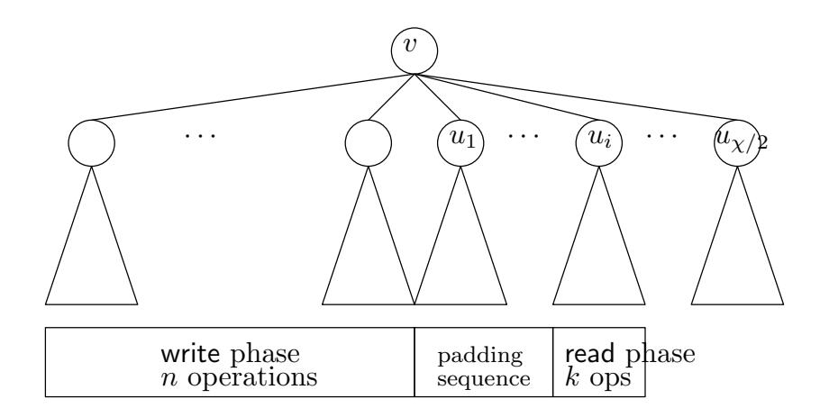
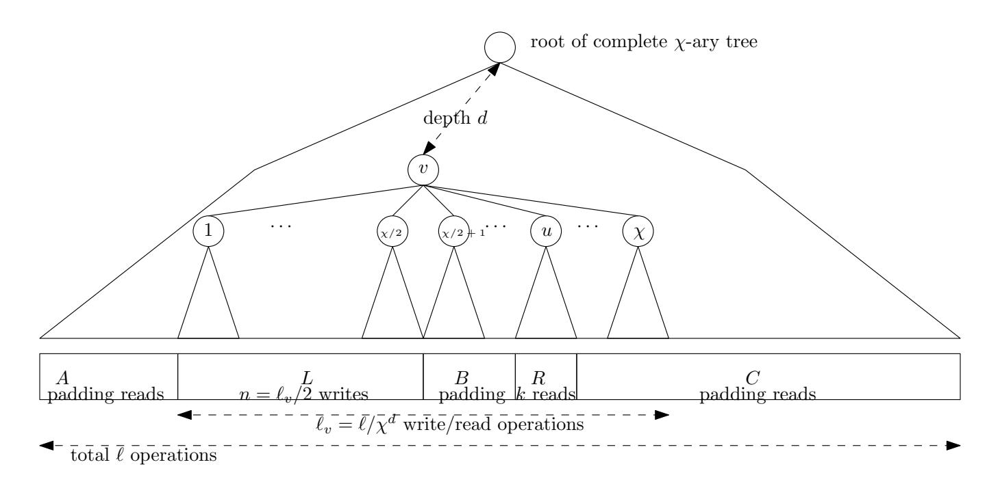

{0}------------------------------------------------

# A Logarithmic Lower Bound for Oblivious RAM (for all parameters)

Ilan Komargodski∗ Wei-Kai Lin†

June 13, 2021

#### Abstract

An Oblivious RAM (ORAM), introduced by Goldreich and Ostrovsky (J. ACM 1996), is a (probabilistic) RAM that hides its access pattern, i.e., for every input the observed locations accessed are similarly distributed. In recent years there has been great progress both in terms of upper bounds as well as in terms of lower bounds, essentially pinning down the smallest overhead possible in various settings of parameters.

We observe that there is a very natural setting of parameters in which no non-trivial lower bound is known, even not ones in restricted models of computation (like the so called balls and bins model). Let N and w be the number of cells and bit-size of cells, respectively, in the RAM that we wish to simulate obliviously. Denote by b the cell bit-size of the ORAM. All previous ORAM lower bounds have a multiplicative w/b factor which makes them trivial in many settings of parameters of interest.

In this work, we prove a new ORAM lower bound that captures this setting (and in all other settings it is at least as good as previous ones, quantitatively). We show that any ORAM must make (amortized)

$$\Omega\left(\log\left(\frac{N\boldsymbol{w}}{m}\right)/\log\left(\frac{\boldsymbol{b}}{\boldsymbol{w}}\right)\right)$$

memory probes for every logical operation. Here, m denotes the bit-size of the local storage of the ORAM. Our lower bound implies that logarithmic overhead in accesses is necessary, even if b w. Our lower bound is tight for all settings of parameters, up to the log(b/w) factor. Our bound also extends to the non-colluding multi-server setting.

As an application, we derive the first (unconditional) separation between the overhead needed for ORAMs in the online vs. offline models. Specifically, we show that when w = log N and b, m ∈ poly log N, there exists an offline ORAM that makes (on average) o(1) memory probes per logical operation while every online one must make Ω(log N/ log log N) memory probes per logical operation. No such previous separation was known for any setting of parameters, not even in the balls and bins model.

∗Hebrew University and NTT Research. Email: ilank@cs.huji.ac.il. Supported in part by an Alon Young Faculty Fellowship and by an ISF grant (No. 1774/20).

†Cornell University. Email: wklin@cs.cornell.edu. Work done partly at NTT Research, and supported in part by a DARPA Brandeis award.

{1}------------------------------------------------

## Contents

| 1 | Introduction 1.1 Our Results 1.2 Related Work                                                                                                                                        | 3 5 6          |
|---|--------------------------------------------------------------------------------------------------------------------------------------------------------------------------------------------------|----------------------|
| 2 | Technical Overview 2.1 The Model, Problem, and Recap of Larsen and Nielsen [LN18]  2.2 Our Hard Distribution and Information Transfer Tree  2.3 Our Compression Argument | 7 7 9 11    |
| 3 | The Model                                                                                                                                                                                        | 14                   |
| 4 | An ORAM Lower Bound                                                                                                                                                                              | 16                   |
| 5 | The Compression Argument 5.1 The Encoding and Decoding Procedures 5.2 Encoding Size Analysis 5.3 Proof of Lemma 5.3                                                         | 20 21 23 27 |
| 6 | Separating Offline and Online ORAM                                                                                                                                                               | 28                   |
|   | References                                                                                                                                                                                       | 33                   |
| A | The Balls and Bins Model and [GO96]'s Lower Bound                                                                                                                                                | 33                   |
| B | Warm-up for the Compression Argument                                                                                                                                                             | 35                   |
| C | A Multi-Server ORAM Lower Bound C.1 The Model  C.2 Proof of the Lower Bound                                                                                                       | 39 40 41       |

{2}------------------------------------------------

## 1 Introduction

An oblivious RAM (ORAM), introduced by Goldreich and Ostrovsky [\[GO96\]](#page-30-0), is a probabilistic RAM machine whose goal is to simulate an arbitrary RAM program while ensuring observable access patterns do not reveal information neither about the underlying data nor about the program being executed. This is obtained by making sure that any two sequences of logical operations on the memory (either reads or writes) translate into indistinguishable sequences of physical probes to the memory. ORAMs have become an indispensable tool in the design of cryptographic systems where it is necessary to make the observable access pattern independent of the underlying sensitive data. Somewhat surprisingly, this task comes up not only in the context of software protection, as originally suggested by [\[GO96\]](#page-30-0), but also in less directly related contexts such as the design of secure processor [\[FDD12,](#page-29-0) [FRK](#page-29-1)+15], secure multi-party computation [\[OS97,](#page-31-1) [LO13,](#page-31-2) [GKK](#page-30-1)+12, [GHRW14,](#page-30-2) [WHC](#page-32-1)+14, [BCP15\]](#page-28-1), and other central notions in computer science [\[DMN11,](#page-29-2) [SS13,](#page-32-2) [SSS12,](#page-32-3) [BNP](#page-28-2)+15, [RYF](#page-31-3)+13,[MLS](#page-31-4)+13,[GHJR15,](#page-30-3)[LWN](#page-31-5)+15,[BCP16,](#page-28-3)[ZWR](#page-32-4)+16,[WST12,](#page-32-5)[CKW17\]](#page-29-3).

A trivial way to construct an ORAM is to replace every logical access with a scan of the entire memory. While this solution is perfectly secure, it is highly inefficient and so the question is how efficient could an ORAM be compared to an insecure RAM. The primary efficiency metric of interest is:

I/O efficiency: The total number of physical probes to the memory of the ORAM amortized per logical operation.

Some previous works use bandwidth as the metric, but we chose to use I/O efficiency as our central metric since it is robust and well-defined in various ORAM settings. I/O efficiency can be translated into communication/bandwidth by multiplying by the ORAM cell size. See Remark [3.2.](#page-14-0)

Following Boyle and Naor [\[BN16\]](#page-28-4), we shall distinguish between two classes of ORAM schemes: offline and online. An ORAM scheme is online if it supports accesses arriving in an online manner, one by one. An ORAM scheme is offline if it requires all accesses to be specified at once in advance. Most known ORAM constructions (e.g., [\[GO96,](#page-30-0)[SCSL11,](#page-31-6)[KLO12,](#page-30-4)[GM11,](#page-30-5)[CGLS17,](#page-29-4)[SvDS](#page-32-6)+13[,WCS15,](#page-32-7) [PPRY18,](#page-31-7)[AKL](#page-28-5)+20]) work in the online setting as well with few exceptions (e.g., [\[BN16,](#page-28-4)[JLS,](#page-30-6)[Shi20\]](#page-31-8)). Also, most applications of ORAM schemes require that the scheme is online.

Existing lower bounds. Assume that the goal is to obliviously simulate a RAM of N cells each of size w bits on a RAM with N0 cells each of size b bits and using a local storage of size m bits. In the original work of Goldreich and Ostrovsky [\[GO96\]](#page-30-0) it was shown that any ORAM scheme (even offline ones) must have I/O efficiency[1](#page-2-1) [2](#page-2-2)

$$\Omega\left(\frac{\boldsymbol{w}}{\boldsymbol{b}}\cdot\frac{\log N}{1+\log(m/\boldsymbol{b})}\right).$$

In one sense, this lower bound is very powerful: (1) It is pretty robust to the choice of w and b as long as b = w, (2) it can be cast for few other efficiency metrics besides I/O (see [\[WCS15\]](#page-32-7) for details), and (3) it applies to schemes that have O(1) statistical failure probability. However, as observed by Boyle and Naor [\[BN16\]](#page-28-4) this lower bound only applies to schemes in the so called

1To the best of our knowledge, the lower bound technique of [\[GO96\]](#page-30-0) was never analyzed without assuming that b = w. For completeness, we add a proof in Appendix [A;](#page-32-0) see Theorem [A.2.](#page-33-0) The bound that we state here is a little bit simplified for presentation purposes.

2Throughout this paper, unless otherwise stated, log stands for log2 .

{3}------------------------------------------------

"balls and bins" model[3](#page-3-0) which do not use cryptographic assumptions, leaving the possibility of more efficient constructions outside of this model.

In a beautiful recent work, Larsen and Nielsen [\[LN18,](#page-31-0) Theorem 2] proved a lower bound that applies to any online ORAM scheme, even ones that are not in the balls and bins model and ones that use cryptographic assumptions. They prove that any online ORAM must have I/O efficiency

$$\Omega\left(\frac{\boldsymbol{w}}{\boldsymbol{b}} \cdot \log\left(\frac{N\boldsymbol{w}}{m}\right)\right).$$

Similarly to the lower bound of Goldreich and Ostrovsky [\[GO96\]](#page-30-0), this lower bound is also pretty robust to the choice of b and w as long as b = w.

Is sub-logarithmic efficiency possible? The above two lower bounds become completely trivial in the setting where, say, w = log N and b, m ∈ Θ(log2 N). In this case, both lower bounds simplify to Ω(1). This is by no means an esoteric setting of parameters. It is quite common and natural to consider RAM algorithms that take advantage of being able to place multiple elements in one cell and process all of them within a single memory access. Indeed, there is a long line of work in core algorithms literature designing efficient algorithms and studying tradeoffs in this setting (e.g., [\[Flo72,](#page-29-5)[AV88,](#page-28-6)[Vit01,](#page-32-8)[Goo11\]](#page-30-7)).

Focusing on oblivious sorting, one notable result is due to Goodrich [\[Goo11\]](#page-30-7) (see also a follow-up by Chan et al. [\[CGLS18\]](#page-29-6) [4](#page-3-1) ) who showed an oblivious sorting algorithm that sorts N elements each of size w bits with O((Nw/b) · logm/b (Nw/b)) memory probes on a RAM with cells of size b bits and local storage of size m bits. Setting w = log N and b, m ∈ O(log3 N) (see also Theorem [6.2](#page-27-1) for the parameterization), we obtain an oblivious sorting algorithm with O(N) memory probes. In contrast, when w = b we have existing Ω(N · log N) lower bounds on the number of memory probes, either in the balls and bins model [\[LSX19\]](#page-31-9) or assuming a well-known network coding conjecture [\[FHLS19\]](#page-29-7).

Oblivious sorting is one of the core building blocks in the design of many oblivious RAM constructions (for example, [\[GO96,](#page-30-0)[GM11,](#page-30-5)[KLO12,](#page-30-4)[CGLS17,](#page-29-4)[PPRY18,](#page-31-7)[AKL](#page-28-5)+20]), suggesting that it may be possible to use the algorithms of [\[Goo11,](#page-30-7)[CGLS18\]](#page-29-6) to get an ORAM construction with sublogarithmic I/O efficiency. This direction was pursued first by Goodrich and Mitzenmacher [\[Goo11,](#page-30-7) [GM11\]](#page-30-5) and then by Chan et al. [\[CGLS18\]](#page-29-6), but they were only able to construct an ORAM with O(log N) I/O efficiency,[5](#page-3-2) assuming that w = log N and b, m ∈ O(log3 N). By now, we already have an ORAM construction, due to Asharov et al. [\[AKL](#page-28-5)+20], with O(log N) I/O efficiency assuming only w = b and m ∈ O(b).

Given the state of affairs, it is an intriguing question whether more efficient ORAM constructions exist when b w:

> Is the linear dependence on w/b necessary? Alternatively, is it possible to break the logarithmic barrier for ORAM efficiency if b w?

3 In the balls and bins model, items are modeled as "balls", CPU registers and server-side data storage locations are modeled as "bins", and the set of allowed data operations consists only of moving balls between bins. See Appendix [A](#page-32-0) for the definition of the model.

4Chan et al. [\[CGLS18\]](#page-29-6)'s algorithm has the same asymptotic efficiency and it is additionally in the balls and bins model.

5Actually, these works [\[GM11,](#page-30-5) [CGLS18\]](#page-29-6) give ORAM constructions in a more general model called the external memory model, where there are three entities, a CPU, a cache, and a memory. The standard ORAM setting (which we consider here) is a special case of that model.

{4}------------------------------------------------

### 1.1 Our Results

In this work, we answer the above question negatively by showing that any online ORAM construction, including ones that are not in the balls and bins model and perhaps use cryptographic assumptions, cannot go below the logarithmic I/O efficiency barrier even if b w. Restricted to online schemes, for a wide ranges of parameters, our lower bound improves on the lower bound of Goldreich and Ostrovsky [\[GO96\]](#page-30-0) as well as the one of Larsen and Nielsen [\[LN18\]](#page-31-0). Specifically, we prove the following theorem.

Theorem 1.1 (Informal; See Theorem [4.1\)](#page-15-1). Consider a RAM with memory of N cells, each of size w bits. Any online ORAM that simulates such a RAM using cells of size b bits and local storage of size m bits, must have I/O efficiency

$$\Omega\left(\log\left(\frac{N\boldsymbol{w}}{m}\right)/\left(1+\log\left(\frac{\boldsymbol{b}}{\boldsymbol{w}}\right)\right)\right).$$

When b = w, our lower bound is identical to the one of Larsen and Nielsen [\[LN18\]](#page-31-0) and is at least as good as the one of Goldreich and Ostrovsky [\[GO96\]](#page-30-0). However, when b ∈ ω(w), our lower bound is already better than both. For example, when w = log N and b, m ∈ O(logc N) for any c ≥ 2, our lower bound is Ω(log N/ log log N) while the ones of Goldreich and Ostrovsky [\[GO96\]](#page-30-0) and Larsen and Nielsen [\[LN18\]](#page-31-0) are both only Ω(1). As in [\[LN18\]](#page-31-0)'s lower bound, our lower bound applies to ORAM schemes satisfying computational indistinguishability only with probability p and having δ failure probability in correctness for some fixed constants 0 < p, δ < 1. While this makes schemes somewhat weak, this only makes our lower bound stronger. Lastly, let us mention that our technique is pretty general and can be used to extend and improve other related lower bounds when b w (see Section [1.2](#page-5-0) for pointers). For example, in Appendix [C](#page-38-0) we extend our lower bound to apply to the non-colluding multi-server setting, improving the recent lower bound of Larsen et al. [\[LSY20\]](#page-31-10) whenever b w.

We remark that our lower bound in Theorem [1.1](#page-4-1) is tight for all settings of parameters up to the log(b/w) factor. This is due to the construction of Asharov et al. [\[AKL](#page-28-5)+20] who constructed an ORAM with O(log N) I/O efficiency for all values of w ≥ log N assuming only m ≥ b ≥ w (and assuming that one-way functions exist).[6](#page-4-2)

Separating offline and online ORAM. We use Theorem [1.1](#page-4-1) to obtain the first separation between offline and online ORAM schemes. Specifically, we show that when we want to obliviously simulate a RAM with N cells of logarithmic size using a RAM with cells and local storage of polylogarithmic size (in N), then there is an offline ORAM with o(1) I/O efficiency while every online ORAM must have Ω(log ˜ N) I/O efficiency. This separation is essentially optimal in terms of the gap between the cost of the offline and the online oblivious simulations.

Theorem 1.2 (Informal; See Theorem [6.1\)](#page-27-2). Consider the task of obliviously simulating a RAM with N cells each of size w = log N bits using an ORAM with cells of size b bits and using local storage of size m bits such that b, m ∈ poly log N. There exists an offline ORAM scheme with o(1) I/O efficiency, while every online ORAM scheme for this task must have Ω(log N/ log log N) I/O efficiency.

We emphasize that the separation is unconditional in the sense that it neither assumes that schemes are in the balls and bins model (for the lower bound), nor that one-way functions exist

6We believe that the log(b/w) factor is necessary in the lower bound, at least for some range of parameters. Specifically, when b, m ∈ N Θ(1) and w = log N, by re-parameterizing Path ORAM [\[SvDS](#page-32-6)+13], we obtain an ORAM with O(1) I/O efficiency.

{5}------------------------------------------------

(for the upper bound). Prior to this work, there was no such separation, even assuming either of these assumptions (and in any range of parameters).

### 1.2 Related Work

Passive Server. It is implicit in the standard definition of an ORAM that the server merely acts as a storage provider and does not perform any computation for the client. There are constructions where the server is actively performing computation (including memory I/O) for the client and this is not counted in the total I/O efficiency of the scheme (e.g., [\[SSS12,](#page-32-3) [GGH](#page-29-8)+13, [GHRW14,](#page-30-2) [RFK](#page-31-11)+15, [GHJR15,](#page-30-3) [DvDF](#page-29-9)+16, [AFN](#page-28-7)+17]). Many of these schemes achieve sub-logarithmic clientside I/O efficiency. Our lower bound shows that, in such cases, the server must have logarithmic I/O efficiency.

Related oblivious lower bounds. The beautiful result and technique of Larsen and Nielsen [\[LN18\]](#page-31-0) inspired a fruitful line of works [\[JLN19,](#page-30-8)[PY19,](#page-31-12) [HKKS19,](#page-30-9) [LSY20,](#page-31-10) [LMWY20,](#page-30-10)[PPY20\]](#page-31-13). Most related to the ORAM problem are [\[JLN19,](#page-30-8)[PY19,](#page-31-12) [HKKS19,](#page-30-9)[LSY20\]](#page-31-10) on which we briefly elaborate. Jacob et al. [\[JLN19\]](#page-30-8) showed that the lower bound technique of [\[LN18\]](#page-31-0) can be used to show logarithmic lower bounds on the overhead of oblivious simulation of various specific data structures like stacks, queues, and more. Persiano and Yeo [\[PY19\]](#page-31-12) showed that logarithmic overhead is necessary for RAM simulation even if the the security requirement is differential privacy, intuitively hiding only one access.[7](#page-5-1) Hub´aˇcek et al. [\[HKKS19\]](#page-30-9) extended [\[LN18\]](#page-31-0)'s logarithmic lower bound to the setting where the adversary does not see boundaries between queries. Larsen et al. [\[LSY20\]](#page-31-10) showed that logarithmic overhead in oblivious simulation is necessary even if data is allowed to be split over multiple servers, only one of which is controlled by an attacker.

All of the above papers give lower bounds that mostly apply to the symmetric setting where the cell size is identical in the given RAM and the simulated one since they suffer from a w/b factor loss. We believe that considering those problems and extending the lower bounds to the asymmetric setting (when possible) is intriguing, and we hope that our techniques in this paper will be helpful. In Appendix [C,](#page-38-0) we show that using our techniques it is possible to improve the lower bound of Larsen et al. [\[LSY20\]](#page-31-10) to not suffer from a loss of w/b multiplicative factor even in the multi-server setting. This lower bound generalized our main result (Theorem [1.1\)](#page-4-1) as it implies the latter when restricting to a single server. We refer to Appendix [C](#page-38-0) for the precise problem definition and statement of the result.

We believe that similarly, using our technique, one can improve the results in [\[HKKS19,](#page-30-9)[PPY20\]](#page-31-13) as they rely on a similar hard distribution to that of [\[LN18\]](#page-31-0). This is left for future work.

The cell probe model. Following Larsen and Nielsen [\[LN18\]](#page-31-0), our lower bound holds in an augmented version of the well known cell probe model (to capture the obliviousness requirement). Details about our model are given in Section [3;](#page-13-0) Here, we mention some classical and notable facts about the cell probe model. The cell probe model, introduced by Yao [\[Yao81\]](#page-32-9), is a model of computation similar to the RAM model, except that all computational operations are free of charge except memory access. This model is useful in the analysis of data structures, especially for proving lower bounds on the number of memory accesses needed to solve a given problem.

By now, there are few techniques for proving lower bounds in the cell probe model. The strongest technique [\[Lar12,](#page-30-11)[LWY18\]](#page-31-14) can prove super-logarithmic lower bounds and therefore should not be applicable as is to the ORAM setting where logarithmic upper bounds are known (unless

7The lower bound of Persiano and Yeo [\[PY19\]](#page-31-12) also looses the w/b factor, similarly to Larsen and Nielsen. Specifically, it is Ω((w/b)· log(N/m)) which is trivial if b w. It is an open problem to improve their lower bound in the setting where b w.

{6}------------------------------------------------

additional requirements are made). Another technique, due to Pătraşcu and Demaine [PD06], is the so called *information transfer method* which is used to prove logarithmic lower bounds in the cell probe model. Larsen and Nielsen [LN18] were able to use this technique to prove their lower bound on ORAM constructions. We also use this technique. Persiano and Yeo's [PY19] lower bound, mentioned above, were able to adapt the *chronogram* technique due to Fredman and Saks [FS89] which can also be used to prove logarithmic lower bounds.

Other related work. In the balls and bins model and where the server is passive (i.e., not performing any computation), Cash et al. [CDH20] proved that any one-round ORAM must have either  $\Omega(\sqrt{N})$  I/O efficiency or  $\Omega(\sqrt{N})$ -bit local storage.

Boyle and Naor [BN16] proved that an unconditional lower bounds for offline ORAMs would imply a non-trivial circuit lower bound which is a long standing open problem. This result is obtained by constructing an offline ORAM from any sorting circuit, where the efficiency of the resulting ORAM is proportional to the size of the circuit. In a followup work, Weiss and Wichs [WW18] showed that proving a lower bound for *online read-only* ORAM is at least as hard as either proving a non-trivial circuit lower bound or ruling out a very good locally decodable code.

As mentioned, some ORAM constructions have improved I/O efficiency at the cost of setting the cell size  $\boldsymbol{b}$  to be super-logarithmic in the memory size. These works include not only schemes based on oblivious sorting [Goo11, GM11, CGLS18, SSS12], but also several "tree-based" constructions [SCSL11, SvDS+13].

### 2 Technical Overview

This section gives a high level overview of our results. We first briefly recall the model and problem we want to solve. We proceed with explaining the beautiful technique of Larsen and Nielsen [LN18] and why it fails to give our desired lower bound. Lastly, building on the intuition we gained up to that point, we explain the main ideas in our proof and highlighting some of the technical challenges we are faced with.

### 2.1 The Model, Problem, and Recap of Larsen and Nielsen [LN18]

The model and problem. As observed by Larsen and Nielsen [LN18], it is convenient to state the ORAM problem as an oblivious data structure, as defined in [WNL+14], solving the array maintenance problem, where the goal is to maintain an array of N entries, each of size  $\boldsymbol{w}$  bits, while supporting two operations: (1) (write, a, x): set the content of entry  $a \in [N]$  to  $x \in \{0, 1\}^{\boldsymbol{w}}$  and (2) (read, a): return the content of entry  $a \in [N]$ . The lower bound that we prove, identical to [LN18], is on the cell probe complexity of any oblivious data structures solving the array maintenance problem. To get a lower bound on the I/O efficiency of ORAMs, it suffices to divide the number of probes by the number of operations.

Briefly, an oblivious data structure is a data structure that solves some given problem with an additional security guarantee which says that the (physical, observable) access patterns resulting from a sequence of logical data structure operations should reveal nothing on the latter sequence other than its length. For this purpose the oblivious data structure can use a small trusted/secure local storage ("cache") on which it can perform operations "for free" and without leaking any data. The oblivious data structure is therefore parametrized by N', b, m, its total number of cells, the bit-size of each cell, and the bit-size of its local storage, respectively. The efficiency metric of interest is the *number of probes* to the physical memory needed to answer one logical access. It is

{7}------------------------------------------------

typically assumed that m ≥ b ≥ log N0 so that the local storage can hold at least a single cell from the memory and that a single cell can hold a pointer to another cell.

Throughout most of this overview (except where we explicitly say otherwise), we consider the simpler setting where the oblivious data structure has perfect security and correctness. Perfect security means that for all sequence of logical operations of the same length, the observable sequence of physical memory probes is identically distributed. Perfect correctness means that the data structure never makes mistakes. With some additional technical work, these two assumptions can be relaxed.

Larsen and Nielsen's lower bound. The lower bound of Larsen and Nielsen [\[LN18\]](#page-31-0) adapts the information transfer technique of Pˇatra¸scu and Demaine [\[PD06\]](#page-31-15) to the oblivious setting. We give a high level overview next. Fix a given oblivious data structure for the array maintenance problem (i.e., an ORAM). For any sequence of N operations, we associate a complete binary tree with N leaves (we assume that N is a power of two for simplicity). The leaves are associated with the logical operations and their associated physical probes, in chronological order. That is, during the execution of the sequence, for each i, all cell addresses probed during the ith operation are associated with the ith leaf. Next, the leaf-level probes are partially assigned to internal nodes: for each probe to cell address q that is associated with leaf i, if chronologically the most recent probe to cell q happened during the jth operation (so that j < i), then the probe (i, q) is assigned to the lowest common ancestor of leaves i and j. Notice that the assignment is partial, i.e., some physical probes may not be assigned to any internal node, and thus it suffices to prove a lower bound on the total number of probes assigned to internal nodes.

For each fixed internal node v, Larsen and Nielsen [\[LN18\]](#page-31-0) used the information transfer technique [\[PD06\]](#page-31-15) to prove a lower bound on the number of associated physical probes with v by designing a hard distribution of sequences of operations. Let n be the number of leaves and thus operations in the subtree induced by v. In the hard distribution, all N −n operations that are not in the subtree of v are just dummy reads from a fixed address. In the subtree induced by v, the first n/2 operations are writes to addresses 1, 2, . . . , n/2 with uniformly random values x1, . . . , xn/2 ← {0, 1} w, and then the second n/2 operations are reads from addresses 1, 2, . . . , n/2. That is,

$$(write, 1, x_1), \dots, (write, n, x_{n/2}), (read, 1), \dots, (read, n/2).$$

To show that node v is associated with "many" probes when executing a sequence of operations from this distribution, the intuition is that in order to correctly answer the n/2 read operations, any data structure for the array maintenance problem (even non-oblivious ones!) must probe "many" cells that were also probed during the n/2 write operations. This intuition is formalized by a compression argument. Quantitatively, recalling that each cell in the array maintenance problem consists of w bits and each cell in the data structure consists of b bits, there must exist a set of Ω(n · w/b) cells from the data structure that are probed during the first as well as the second n/2 operations (here, we ignore the local storage of m bits for simplicity). By the definition of our binary tree, all of these Ω(n · w/b) probes are associated with node v.

The proof proceeds by using the security guarantee of the data structure (as the above argument relied solely on correctness). The main observation is that since the tree and the associated probes of each node are efficiently computable by the adversary who only sees physical probes, then by security, the number of associated probes of each node must be the same for all sequences of operations. Namely, if node v is associated with Ω(n · w/b) probes when executing the hard distribution, then node v must also be associated with Ω(n·w/b) probes when executing any other sequence of operations of the same length; otherwise, an adversary can easily distinguish the two. 

{8}------------------------------------------------

Since the tree is a complete binary tree with N leaves, by summation there are Ω(N ·(w/b)·log N) associated probes to internal nodes which implies their lower bound.

Losing the w/b term is inherent when using the hard distribution designed by Larsen and Nielsen [\[LN18\]](#page-31-0). Recall that in their distribution we first write random values to addresses 1, . . . , n/2 and then read those addresses in order. Indeed, using only correctness, each probe can carry information regarding b/w values and so the whole sequence of writes can be read using only O(n · w/b) probes. The fundamental reason for the loss is therefore that the sequence of addresses in the read phase is completely determined a priori and the data structure can use this information during the write phase to organize data cleverly.

### 2.2 Our Hard Distribution and Information Transfer Tree

We propose the following hard distribution of sequences of n + k ≤ N operations. The first n operations are writes to addresses 1, 2, . . . , n with uniformly random values x1, . . . , xn ← {0, 1} w (same as in [\[LN18\]](#page-31-0)). Then, in the last k operations, instead of sequentially reading from those addresses, we perform read from uniformly random words a1, a2, . . . , ak ← [n]. That is,

$$(\mathsf{write}, 1, x_1), \ldots, (\mathsf{write}, n, x_n), \quad (\mathsf{read}, a_1), \ldots, (\mathsf{read}, a_k).$$

Indeed, now the sequence of reads is not known during the write phase so we avoid the aforementioned optimization the construction can use. But is this the only optimization? We prove that it is. The intuition is that no matter how large the cell size b is, no matter how the data structure scheme processes the n write requests, in order to read from a uniformly random address ai ∈ [n] correctly, the construction must probe at least one cell (unless the construction got lucky and the corresponding value to address ai was accidentally in the local storage). That is true only because the address ai is chosen both randomly and online and therefore any pre-computation or pre-fetching that uses the fact that cells are moderately large is useless. In a high level, using a compression argument we show that for k ≤ n · w/b, the following holds:

Lemma: Any correct data structure solving the array maintenance problem when fed a length n + k sequence of requests sampled from our hard distribution, must probe Ω(k) cells during the read phase that were also probed during the write phase.

Whenever b ∈ ω(w), this lower bound is better than the Ω(k · w/b) lower bound obtained with Larsen and Nielsen's hard distribution. We note that we are only able to prove that the above statement holds with high-enough probability, smaller than 1 (which is enough to carry out the rest of the argument). Indeed, there will always be "easy" read sequences, like the one of Larsen and Nielsen, where the number of necessary probes will be smaller. Finally, we emphasize that in the above lemma, the read phase consists of only k operations (which differs from Larsen and Nielsen's hard distribution which has n reads). This is specially designed to work with the information transfer tree that we will introduce below.

This lemma is central to our proof and while it may seem intuitively correct, the actual proof turns out to require very delicate and non-trivial probability analysis. We will get back to this in Section [2.3,](#page-10-0) where we will explain the main challenges and describe our solutions. Meanwhile, we proceed to explain how the lemma is used to derive the final lower bound using a generalized version of the information transfer tree described above.

Revisiting the information transfer tree. Recall that in the partial assignment of Larsen and Nielsen [\[LN18\]](#page-31-0), a probe to a cell is assigned to a node v only if v is the lowest common ancestor between the probe and the most recent probe to the same cell. However, if a cell is probed 100 times 

{9}------------------------------------------------

during the read phase corresponding to v (i.e., v's right subtree), it will be counted and associated to v at most once! Working out the details, it turns out that even if we use our improved lemma from above in the binary tree approach, we would still lose the w/b factor. Therefore, we need to find a more fine-grained way to account for multiple probes to the same cell during the read phase.

Our solution is to consider a tree with larger arity so that we could count several probes to the same cell during the read phase of a given node (i.e., with multiplicity). We let  $\chi$ , the arity of the tree, be proportional to b/w and consider a complete  $\chi$ -ary tree with N leaves. Consider a node v that has an induced subtree of 2n leaves and consider an associated sequence of n writes followed by n reads. Divide the n read operations into  $\chi/2$  equal-size groups so that each group has  $k \triangleq n/(\chi/2)$  reads. For each such group we imagine a child node which is "in charge" of this group. Let the children of v that correspond to the read phase be  $u_1, \ldots, u_{\chi/2}$  so that each  $u_i$  is in charge of k disjoint read operations. Next in the partial assignment, we associate with v index-cell pairs of the form (i,q), where i is an index from  $[\chi/2]$  and q is a physical address of a probed cell. The index i tells us from which group the probe came and q tells us to which cell. Intuitively, this allows us to count probes to the same cell q with multiplicity, distinguishing them by the value of i. (In comparison, Larsen and Nielsen [LN18] only associated q's to nodes and so they do not distinguish multiple accesses to the same cell.) See Figure 1 for an illustration.

**Figure 1:** Hard distribution on  $\chi$ -ary tree.

Using our Lemma. Our lemma from above almost fits this framework. To prove that a group of k operations associated to node  $u_i$  introduces  $\Omega(k)$  accesses that are counted in v, we slightly modify the hard distribution to consist of a padding sequence of read operations (say from address 1) between the write phase and the reads that  $u_i$  is in charge of. Summing up over all  $u_i$ 's, the node v will be associated with  $\Omega(\chi \cdot k) = \Omega(n)$  index-cell pairs, which is our goal and the best one can hope for.

The last step, where we use the obliviousness of the data structure in order to argue that any sequence of operations behaves as "the hardest one", is similar to Larsen and Nielsen [LN18]. Recall that the tree is of depth  $\log_{\chi} N$ , the arity is  $\chi$ , and for each level d, there are  $\chi^d$  nodes at that level each has associated  $\Omega(N/\chi^d)$  probes. Therefore, we get a lower bound of  $\Omega(N \cdot \log N/\log(b/w))$  probes to perform N operations. This is essentially the lower bound claimed in Theorem 1.1, omitting the size of local storage m (which we ignored throughout this overview and only complicates the proof slightly).

Remark 2.1 (Relation to [PD06]). Pătrașcu and Demaine [PD06, Section 7] consider a related problem in a somewhat different context. There, they observe that the basic information transfer method suffers from the  $\mathbf{w}/\mathbf{b}$  factor loss. To remedy the situation they propose a new hard distribution, similar to ours, and also propose to consider an information transfer tree with higher arity, as we do. Essentially, our proof could be seen as an extension of their technique to the oblivious setting. The latter introduces many technical challenges, especially in the compression argument,

{10}------------------------------------------------

as we elaborate next.

### 2.3 Our Compression Argument

Recall that our hard sequence consists of n writes to fixed addresses 1, . . . , n of uniformly random values followed by k ≤ n · w/b reads from uniformly random addresses from [n].[8](#page-10-1) Our goal is to argue that during the read phase, Ω(k) distinct cells must be probed. Let us refer to the write sequence as L and the read sequence as R (for left- and right-side). Denote by Cells(L) the cells probed during the execution of the L sequence of accesses and by Cells(R) the cells probed during the execution of the R sequence (after executing the L sequence). Note that L, R, Cells(L), Cells(R) are all random variables. We want to prove that with high probability |Cells(L) ∩ Cells(R)| ∈ Ω(k). That is, for some constant < 1,

$$\Pr\left[|\mathsf{Cells}(L) \cap \mathsf{Cells}(R)| \ge \epsilon k\right] > 3/4,\tag{1}$$

where the probability is over the choice of L and R, and the randomness of the ORAM which influences Cells(L) and Cells(R).

The proof is done via a compression argument where we imagine two communication parties Alice and Bob. Alice gets as input x = x1, . . . , xn ← {0, 1} w (chosen uniformly at random) and she sends one message to Bob who is able to recover x. If the message sent by Alice contains < n · w bits, we get a contradiction. To this end, we assume that Inequality [\(1\)](#page-10-2) is false, namely that the read phase can be implemented with k probes for some small enough , and use that to get a too good to be true encoding scheme. This implies a contradiction, as needed. This proof is somewhat technical so we provide some intuition on how it works and refer to the technical section for full details.

Warmup: an expectation argument. It is insightful to first prove a weaker statement (which does not suffice for us) and then explain how to improve it. Here, we argue that

$$\mathbf{E}\left[\left|\mathsf{Cells}(L) \cap \mathsf{Cells}(R)\right|\right] \ge \epsilon k. \tag{2}$$

The proof is by contradiction, namely, we assume that Inequality [\(2\)](#page-10-3) is false and obtain an impossible compression scheme. To this end, Alice and Bob share a long string S that is chosen completely independent of the input to Alice. The string consists of (1) a sequence of k addresses a1, . . . , ak ← [n] that define the R, (2) a random tape ρ for the ORAM, and (3) an integer t ← [k] sampled uniformly at random. Note that even conditioned on the shared string S, the entropy in the input to Alice, namely x1, . . . , xn ← {0, 1} w, is still nw. Therefore, by Shannon's source coding theorem, the only way for Alice to correctly transmit them to Bob is by sending at least nw bits.

In a high level, Alice splits the indices [n] into two groups: easy and hard. An index i is easy if Bob can learn value xi without making a probe to Cells(L), that is, a probe to a cell that was written to during the write sequence. All other indices are hard. By our assumption, the set of hard indices cannot be too large. Alice sends those hard values explicitly to Bob. To learn the values corresponding to easy indices, we use the correctness of the data structure to transfer them. The challenging part is for Alice to determine which index is easy and which is hard. Alice does this by seeing how likely it is to make the probe in Cells(L) from a given index by "planting" that index in the random read operation given in S (while keeping the rest of the operations fixed). If any

8 In fact, as mentioned we will need to consider an augmented sequence that has a padding sequence of reads from some fixed address in between the write sequence and the read sequence mentioned above. This will complicate the argument slightly so for simplicity we ignore it here.

{11}------------------------------------------------

 $\mathsf{Cells}(L)$ -probe occurs, this index is considered hard, otherwise it is easy. A more precise description follows.

Alice's encoding on input  $n\boldsymbol{w}$  bits interpreted as  $x_1, \ldots, x_n \in \{0, 1\}^{\boldsymbol{w}}$ :

- 1. Using the ORAM, Alice executes the sequence of operations (L, R) prescribed by  $x_1, \ldots, x_n$  and  $a_1, \ldots, a_k$ . Then, Alice sends the contents of overlapping cells (yielded by the execution) to Bob, where the overlapping cells are defined as the cells probed during the write sequence L and then probed during the read sequence R (i.e.,  $Cells(L) \cap Cells(R)$ ).
- 2. For each  $i \in [n]$ , Alice replaces the tth read with operation (read, i) and (using the ORAM) executes the replaced sequence, that is, the sequence  $(L, \widehat{R}_{t,i})$  where

$$L := \underbrace{(\mathsf{write}, 1, x_1), \dots, (\mathsf{write}, n, x_n)}_{\mathsf{write \ phase}},$$
 
$$\widehat{R}_{t,i} := (\mathsf{read}, a_1), \dots, (\mathsf{read}, a_{t-1}), \underbrace{(\mathsf{read}, i)}_{\mathsf{planted \ read}}, (\mathsf{read}, a_{t+1}), \dots, (\mathsf{read}, a_k).$$

Depending on the probed locations induced by (read, i), do:

- (a) If (read, i) probes at least one cell that was written to during the write phase (i.e., in Cells(L)), then i is called hard. Alice sends value  $(i, x_i)$  directly to Bob.
- (b) Otherwise, (read, i) probes no cell in Cells(L) and i is called easy. Alice sends nothing to Bob as Bob can recover  $x_i$  by executing (read, i) himself.

On Bob's side, the hard  $x_i$ 's are received from Alice directly, while the easy  $x_i$ 's are recovered by executing (read, i) planted as the tth read operation, that is, after the prefix (read,  $a_1$ ), ..., (read,  $a_{t-1}$ ). Bob indeed recovers all easy  $x_i$ 's correctly: Bob received the content of the overlapping cells that suffice to execute the prefix read sequence.

Analyzing the size of the message from Alice to Bob is a bit more challenging. In a high level, Alice's message consists of just two parts, the contents of overlapping cells and the values of "hard" inputs. By assumption (Inequality (2) is false), the number of overlapping cells is  $\epsilon k$  and so the first part consists of at most  $\epsilon k b \leq \epsilon n w$  bits. For the second part, roughly speaking, we consider all possible samples of  $(a_1, a_2, \ldots, a_k, t) \in [n]^k \times [k]$  while fixing  $x_1, \ldots, x_n$ . By assumption, with probability at most  $\epsilon$ , (read,  $a_t$ ) is hard, which means that at most  $\epsilon$  fraction of all such samples are hard. Then, for any set of n distinct samples, on average, there are at most  $\epsilon n$  hard samples. Noticing that Alice's procedure is choosing a random set of n samples, we conclude that in expectation there are  $\epsilon n$  hard samples, which means  $\epsilon n$  hard  $x_i$ 's on average. It follows that the second part of Alice's message consumes  $\epsilon n w$  bits, and then the total message length is  $2\epsilon n w$  bits, which is a contradiction when  $\epsilon$  is small enough.

The high probability argument. Recall that in the last step of lower bound proof we need to move from a claim about the load of a node in the information transfer tree to the load of the same node under any other input sequence of operations. Since security only holds with constant probability, this step loses a constant factor and therefore we need our original compression argument to hold with high probability and not just in expectation.

This complicates the compression argument as follows. Now, Alice cannot just send the content of the overlapping cells directly to help Bob answer easy queries (for which it uses the correctness of the data structure), since there is no bound on the expected number of overlapping cells. Instead, we modify Alice's procedure to distinguish between two cases, either sending the overlapping cells

{12}------------------------------------------------

directly is too expensive or it is not. In the latter case, we need to analyze and bound the number of hard indices *i conditioned* on the event that the number of overlapping cells is small. This requires delicate conditional probability analysis on which we elaborate next. In the former case, there is no compression since Alice just sends all  $x_1, \ldots, x_n$  in the clear but we can show that this case does not happen too often due to the assumption (Inequality (1) is false).

Specifically, the most challenging is to prove that conditioned on the overlapping cells set being small, the expected size of the set of hard indices is bounded by a sufficiently small constant times n. Let  $\mathsf{Good}_{L,R}$  be the conditioned event. What we show is that if  $\beta < 3/4$  is a constant for which  $\mathsf{Pr}\left[|\mathsf{Cells}(L) \cap \mathsf{Cells}(R)| \ge \epsilon k\right] = \beta$  (our assumption, see Inequality (1)), then:

Lemma: 
$$\mathbf{E}[|H| \mid \mathsf{Good}_{L,R}] < (\beta + \epsilon/(1-\beta))n$$
.

We define  $\mathsf{Good}_{L,\widehat{R}_{t,i}}$  similarly as the event when the overlapping cells between  $(L,\widehat{R}_{t,i})$  is small. By linearity of expectation and the law of total probability:

$$\begin{split} \mathbf{E}\left[|H|\mid \mathsf{Good}_{L,R}\right] &= \sum_{i\in[n]} \mathbf{Pr}[i\in H\mid \mathsf{Good}_{L,R}] \\ &= \sum_{i\in[n]} \mathbf{Pr}[i\in H \land \neg \mathsf{Good}_{L,\widehat{R}_{t,i}}\mid \mathsf{Good}_{L,R}] + \\ &\sum_{i\in[n]} \mathbf{Pr}[i\in H \land \mathsf{Good}_{L,\widehat{R}_{t,i}}\mid \mathsf{Good}_{L,R}]. \end{split}$$

We now bound each of these terms separately. It is rather easy (though a bit technical) to bound the second term. Specifically, we show that  $\sum_{i \in [n]} \mathbf{Pr}[i \in H \land \mathsf{Good}_{L,\widehat{R}_{t,i}} \mid \mathsf{Good}_{L,R}] \leq \epsilon n/(1-\beta)$ . Indeed, for each  $i \in [n]$ ,  $\mathbf{Pr}[i \in H \land \mathsf{Good}_{L,\widehat{R}_{t,i}} \mid \mathsf{Good}_{L,R}] \leq \mathbf{Pr}[i \in H \land \mathsf{Good}_{L,\widehat{R}_{t,i}}]/\mathbf{Pr}[\mathsf{Good}_{L,R}]$ . So, the denominator is exactly  $1-\beta$ . The fact that the nominator is bounded by  $\epsilon$  follows from the definition of  $\mathsf{Good}_{L,\widehat{R}_{t,i}}$ .

The bound on the first term is much more interesting. In words, the event we are trying to bound corresponds to sampling the sequences L and R and then  $\widehat{R}_{t,i}$  and asking what is the probability that  $\mathsf{Good}_{L,\widehat{R}_{t,i}}$  occurs conditioned on  $\mathsf{Good}_{L,R}$  occurring (ignoring event  $i \in H$ ). To analyze this event, we recall that  $\widehat{R}_{t,i}$  is obtained by resampling the tth operation in R. So, what is the probability that by resampling only one read operation in R we suddenly do not satisfy the event  $\mathsf{Good}$ ? We prove a general lemma that  $partial\ resampling\ cannot\ reduce\ the\ probability$  beyond a certain point! Here is a simple variant of the lemma (we state and prove a more general version in Appendix 5.3):

Partial Resampling Lemma: Consider two independent random variables X and Y. Let  $Y^*$  be an independent random variable distributed identically to Y. Let f be an arbitrary Boolean function. Then,

$$\Pr[f(X, Y^*) = 1 \mid f(X, Y) = 1] \ge \Pr[f(X, Y) = 1].$$

This means that if the event  $\mathsf{Good}_{L,R}$  occurs, then it must also occur in  $\mathsf{Good}_{L,\widehat{R}_{t,i}}$  with good probability. Plugging in the assumption, we can bound the second term by  $\beta n$ .

Together, the two bounds imply that  $\mathbf{E}[|H| \mid \mathsf{Good}_{L,R}] < (\beta + \epsilon/(1-\beta))n$ , as needed.

{13}------------------------------------------------

### 3 The Model

This section introduces the model in which our lower bound is proven. As in previous works [LN18, JLN19, PY19], we start-off with the cell probe model, first described by Yao [Yao81]. Traditionally, this model is used to prove lower bounds for word-RAM data structures and is extremely powerful in the sense that it allows arbitrary computations and only charges for memory accesses.

In a high-level, the cell probe model models the interaction between a CPU and a memory. The memory is modeled as a word-RAM, that is, an array of cells such that each cell can contain at most b bits. The CPU can perform operations on the memory, namely, either reading the content of some cell or overwriting the content of some cell. An algorithm executed in this setting is charged one unit of cost on every operation it makes (read or write) and all computation based on the contents of probed cells is free of charge.

Whereas this model captures traditional data structures, it does not capture data structures that have privacy requirements for the stored data and/or the operations performed. Indeed, the latter are usually modeled in the client-server model, where a client wishes to outsource data to server while retaining the ability to perform computation over the data. At the same time, the client wishes to hide the performed operations as well as the contents of its data cells from the server who sees the entire memory and the memory accesses. To address this gap, Larsen and Nielsen [LN18] introduced the *Oblivious Cell Probe Model*, an augmented version of the cell probe model. We briefly introduce this model next, mostly following Larsen and Nielsen.

**Data structure problems.** A data structure problem in the oblivious cell probe model is defined by a tuple  $(\mathcal{U}, \mathcal{Q}, \mathcal{O}, f)$ , where  $\mathcal{U}$  is a universe of update operations,  $\mathcal{Q}$  is a universe of queries, and  $\mathcal{O}$  is an output domain. Furthermore, there is a query function  $f: \mathcal{U}^* \times \mathcal{Q} \to \mathcal{O}$ . For a sequence of updates  $u_1, \ldots, u_M \in \mathcal{U}$  and a query  $q \in \mathcal{Q}$ , we say that the answer to the query q after updates  $u_1, \ldots, u_M$  is  $f(u_1, \ldots, u_M, q)$ .

Oblivious Cell Probe Data Structures. An oblivious cell probe data structure for a given data structure problem  $\mathcal{P} = (\mathcal{U}, \mathcal{Q}, \mathcal{O}, f)$ , consists of a randomized algorithm implementing the update and query operations for  $\mathcal{P}$ . The data structure is parametrized by three integers m,  $\boldsymbol{b}$ , and N', denoting the client storage and cell size in bits, and the number of cells respectively. We follow the standard assumption  $\log N' \leq \boldsymbol{b}$  so that any cell can store the address of any other cell. We further assume that the data structure has access to a finite string of randomness  $\rho$  of length  $\ell$ . The parameter  $\ell$  can be arbitrary large and so  $\rho$  can contain a random oracle. Fixing  $\rho$ , the algorithm DS is deterministic. As such, the data structure can be described by a decision tree  $T_{op}$  for every operation op  $\in \mathcal{U} \cup \mathcal{Q}$ , i.e., it has one decision tree for every possible operation in the data structure problem. Each node in the decision tree is labelled by an index indicating the location to probe in the memory (held by the server). The decision of which path to continue to in the tree depends on the answer to the probe to the memory and small local information stored by the client.

More precisely, each node in the decision tree  $T_{op}$ , where  $op \in \mathcal{U} \cup \mathcal{Q}$ , is labeled by an address  $i \in [N']$  and it has one child for every triple of the form  $(m_0, c_0, \rho) \in \{0, 1\}^m \times \{0, 1\}^b \times \{0, 1\}^\ell$ . Each edge to a child is further labeled by  $(j, m_1, c_1) \in [N'] \times \{0, 1\}^m \times \{0, 1\}^b$ . To process an operation op, the oblivious cell probe data structure starts its execution at the root of the tree and traverses from root to leaf. When visiting a node v in this traversal, labelled with some address  $i_v \in [N']$ , it probes the memory cell  $i_v$ . If C denotes its content, M denotes the current contents of the client memory and  $\rho$  denotes the random bit-string, the process continues by descending to the child of v corresponding to the tuple  $(M, C, \rho)$ . If the edge to the child is labelled  $(j, m_1, c_1)$ , then the memory cell of address j has its contents updated to  $c_1$  and the client memory is updated to  $m_1$ . We say that memory cell j is probed. The execution stops when reaching a leaf. Each leaf

{14}------------------------------------------------

v of the decision tree Top, where op ∈ Q, is labeled with an element ansv in O (the answer to the query). We say that the oblivious cell probe data structure returns ansv as its answer to the query op.

I/O efficiency. The I/O efficiency of an oblivious data structure is related to the depth of the decision tree as each edge corresponds to a cell probe. Furthermore, our model assumes that the server is passive, i.e., it can only update or retrieve a cell for the client.

Definition 3.1 (Expected amortized I/O efficiency). An oblivious cell probe data structure has expected amortized I/O efficiency t(M) on a sequence y of M operations from U ∪ Q if the total number of memory probes is no more than t(M) · M in expectation. The expectation is taken over the random choice of the randomness ρ ∈ {0, 1} ` . An oblivious cell probe data structure has expected amortized I/O efficiency t(M) if it has expected amortized I/O efficiency t(M) on all sequences y of operations from U ∪ Q.

Remark 3.2 (Other efficiency notions). There are few other metrics of efficiency of interest in the context of ORAM constructions. It is common to consider the bandwidth efficiency of a construction, namely, the communication complexity consumed by the construction when processing a sequence of operations, amortized per operation. This is equal to b times the I/O efficiency. Vice versa, if the amortized bandwidth of a construction is t(·), then the I/O efficiency of that construction is t/b.

Thus, there is a Q = Q(N, b, w) lower bound on I/O efficiency if and only if there is a b · Q lower bound on bandwidth. For example, suppose that w = log N and b, m ∈ Θ(log2 N). Then, the previously known lower bound [\[LN18\]](#page-31-0) says that Ω(log2 N) amortized bandwidth is necessary (that is Ω(1) I/O efficiency), but our improved lower bound says that Ω(log3 N/ log log N) bandwidth is necessary (that is Ω(log N/ log log N) I/O efficiency).

It is also common to measure the complexity of an ORAM construction in the language of efficiency overhead (either I/O or bandwidth) where we compare the ratio between the efficiency of the ORAM and the efficiency of the insecure RAM. This makes complete sense when b = w, but when b ∈ ω(w) it is more confusing since the basic unit of cost (cell size) is different between the two settings. Therefore, we avoid using the term overhead.

Correctness and security. Let y = (op1 , . . . , opM) be a sequence of M operations to the given data structure problem, where each opi ∈ U ∩ Q. For an oblivious cell probe data structure, define the (possibly randomized) probe sequence on y as the tuple:

$$\mathsf{Access}(y) = (\mathsf{Access}(\mathsf{op}_1), \dots, \mathsf{Access}(\mathsf{op}_M)),$$

where Access(opi ) is the sequence of memory addresses probed while processing opi . More precisely, let Access(y; ρ) := (Access(op1 ; ρ), . . . , Access(opM; ρ)) be the deterministic sequence of operations when the random bit-string fixed to ρ and let Access(y) be the random variable describing Access(y; ρ) for a random ρ ∈ {0, 1} ` .

Definition 3.3 (Correctness and security). An oblivious cell probe data structure is said to be δ-correct and -secure if the following two properties hold:

• Security: For any two data request sequences y and z of the same length M, their probe sequences Access(y) and Access(z) cannot be distinguished with probability better than by an algorithm which is polynomial time in M + log |U| + log |Q| + b.

{15}------------------------------------------------

• Correctness: The oblivious cell probe data structure has failure probability at most δ, namely, for every sequence and any operation op in the sequence, the data structure answers op correctly with probability at least 1 − δ.

ORAM is array maintenance. As observed in previous work [\[LN18\]](#page-31-0), the definition of an online ORAM coincides with the definition of an oblivious data structure (see [\[WNL](#page-32-11)+14]) solving the array maintenance problem. In this problem, the goal is to maintain an array of N entries, each of size w bits, while allowing write and read operations, where (write, i, a) sets the content of the ith cell to the value a and (read, i) return the content of the ith cell (for i ∈ [N] and a ∈ {0, 1} w).

Therefore, in order to prove a lower bound on the I/O efficiency of an ORAM scheme, it suffices to prove a lower bound on the I/O efficiency of any correct and secure data structure for the array maintenance problem in the oblivious cell probe model.

Remark 3.4 (Operation boundaries). We follow Larsen and Nielsen [\[LN18\]](#page-31-0) and assume that the adversary sees which cell access belongs to which operation from y. Hub´aˇcek et al. [\[HKKS19\]](#page-30-9) were able to extend the lower bound of Larsen and Nielsen [\[LN18\]](#page-31-0) to account for this gap. We suspect that our techniques and lower bound could be extended to capture this stronger setting, as well. We leave this extension for future work.

## 4 An ORAM Lower Bound

This section is devoted to the proof of our lower bound on the I/O efficiency of oblivious cell probe data structures solving the array maintenance problem. As mentioned, such a lower bound directly implies an I/O efficiency lower bound for online ORAMs. Our main theorem is stated next.

Theorem 4.1 (Main theorem). Let DS be an oblivious cell probe data structure for the array maintenance problem on arrays of N entries, each of size w bits. Let N0 denote the number of cells in DS, b denote the cell size in bits, and m denote the number of bits of client memory. Assume that 16 ≤ w ≤ b and w ≤ m ≤ Nw.

If DS is (1/128)-correct and (1/4)-secure, then there is a sequence of ` ∈ (N/(2 db/we), N] operations such that the expected amortized I/O efficiency of DS on this sequence is

$$\Omega\left(\frac{\log(N\boldsymbol{w}/m)}{1+\log\lceil\boldsymbol{b}/\boldsymbol{w}\rceil}\right).$$

In particular, when w ≤ m ≤ N1− for > 0, b = logc N for c > 1, and w = log N, the I/O efficiency is Ω log N log log N . The rest of this section is devoted to the proof of Theorem [4.1.](#page-15-1)

Proof of Theorem [4.1.](#page-15-1) We start with the following definition.

Definition 4.2 (Set of probed cells). Given a length M sequence of operations, seq = (op1 , . . . , opM), define Cells(opi | op1 , . . . , opi−1 ) as the set of addresses of (physical) cells accessed by DS during its execution of operation opi after executing the sequence (op1 , . . . , opi−1 ). Similarly, given seq and i, j ∈ [M] such that i < j, Cells(opi , opi+1, . . . , opj | op1 , . . . , opi−1 ) is defined as the set of addresses of cells accessed by DS during its execution of operations (opi , . . . , opj ) after executing the sequence (op1 , . . . , opi−1 ).

Notice that we define Cells(opi | op1 , . . . , opi−1 ) as a set and so its cardinality does not account for multiplicities. Therefore, we will use the sum of cardinalities P i∈[M] Cells(opi | op1 , . . . , opi−1 ) as a lower bound on the total number of accesses made by DS.

{16}------------------------------------------------

Figure 2: The ditribution  $\mathcal{D}(v,u)$  of hard sequences for the parent-child pair (v,u) in the complete  $\chi$ -ary tree of  $\ell$  leaves. Each leaf is associated with a read or write operation, and the hard sequence is the operations from the left-most to the right-most leaves. Given the internal node v and its child u where u is in the right-side of the subtree induced by v, we focus on the operations in the left-side of the subtree of v, i.e., L (for left-side) part, and on the operations in the induced subtree induced by u, i.e., R (for right-side) part. The L part is  $n = \ell_v/2$  write operations to fixed locations with random contents (where  $\ell_v = \ell/\chi^d$  is the number of leaves in the subtree of v), and the R part is  $k = \ell_v/\chi$  read operations from random locations that were written in L part. The remaining parts A, B, C are all padding operations that just read the fixed location 1. The overall hard sequence is then (A, L, B, R, C).

We now construct the information transfer tree. Fix  $\ell$  to be a power of  $\chi := 2 \lceil b/w \rceil$  in the range  $(N/(2 \lceil b/w \rceil), N]$ . Let T be the complete  $\chi$ -ary tree consisting of  $\ell$  leaves (see Figure 2 for visualization). For any sequence of operations  $\mathsf{seq} = (\mathsf{op}_1, \ldots, \mathsf{op}_\ell)$ , for each  $i \in [\ell]$ , we associate  $\mathsf{op}_i$  to the ith leaf of T. Additionally,  $\mathsf{Cells}(\mathsf{op}_i \mid \mathsf{op}_1, \ldots, \mathsf{op}_{i-1})$  (i.e., the addresses of cells accessed by  $\mathcal{DS}$  during its execution of the ith operation in the sequence) are associated to the same ith leaf. For each accessed cell q that is associated with a leaf i, we map q to at most one internal node v of T, where v is an ancestor of i. This is described next.

First, for each internal  $v \in T$ , we define a set of index-cell pairs,  $P_v(\text{seq})$ , as follows. A pair of index-cell  $(i, q) \in [\ell] \times [N']$  is in  $P_v(\text{seq})$  if and only if

- i is a leaf in the subtree induced by v and  $q \in Cells(op_i \mid op_1, \dots, op_{i-1})$ ,
- There exists j < i such that  $q \in \mathsf{Cells}(\mathsf{op}_i \mid \mathsf{op}_1, \dots, \mathsf{op}_{i-1})$ ,
- For all  $j' \in \{j+1,\ldots,i-1\}$ , it holds that  $q \notin \mathsf{Cells}(\mathsf{op}_{j'} \mid \mathsf{op}_1,\ldots,\mathsf{op}_{j'-1})$ , and
- The lowest common ancestor of i and j is v.

Notice that each cell access  $q \in \mathsf{Cells}(\mathsf{op}_i \mid \mathsf{op}_1, \dots, \mathsf{op}_{i-1})$  during the execution of  $\mathsf{op}_i$  is assigned to at most one  $v \in \mathsf{T}$ . Hence, for any  $\mathsf{seq}$  and execution of  $\mathcal{DS}$ , we have that

$$\sum_{i \in [\ell]} \left| \mathsf{Cells}(\mathsf{op}_i \mid \mathsf{op}_1, \dots, \mathsf{op}_{i-1}) \right| \geq \sum_{v \in \mathsf{T}} \left| P_v(\mathsf{seq}) \right|.$$

We conclude the proof of the theorem using the following lemma whose proof is given below.

{17}------------------------------------------------

Lemma 4.3. Let := 1/128. Fix any sequence seq consisting of ` operations. Let v ∈ T be an internal node whose subtree consists of at least 2 · max{8, m/(w)} leaves. For any (1/4)-secure and (1/128)-correct DS against ` operations, it holds that

$$\mathbf{E}\left[|P_v(\mathsf{seq})|\right] \ge \epsilon \cdot \ell/(4\chi^{d(v)}),$$

where d(v) is the depth of v (i.e. the distance from v to the root).

Let us first explain why Lemma [4.3](#page-17-0) implies Theorem [4.1.](#page-15-1) Let d ∗ be the maximum depth for which Lemma [4.3](#page-17-0) applies. Summing over all nodes in T, by linearity of expectation, we have that

$$\mathbf{E}\left[\sum_{v\in\mathsf{T}}|P_v(\mathsf{seq})|\right] = \sum_{v\in\mathsf{T}}\mathbf{E}\left[|P_v(\mathsf{seq})|\right] \geq \sum_{v\in\mathsf{T},d(v)\in[0,d^*]}\mathbf{E}\left[|P_v(\mathsf{seq})|\right] \geq (d^*+1)\cdot\epsilon\ell/4,$$

where the last inequality follows by Lemma [4.3.](#page-17-0) Since Lemma [4.3](#page-17-0) applies to any node v that has at least 2 · max{8, m/(w)} leaves in its induced subtree, we have

$$d^* := \left\lfloor \log_{\chi} \left\lceil \frac{\ell}{2 \cdot \max\{8, m/(\epsilon \boldsymbol{w})\}} \right\rceil \right\rfloor \in \Omega \left( \frac{\log(N\boldsymbol{w}/m)}{1 + \log(\boldsymbol{b}/\boldsymbol{w})} \right)$$

for all m, b, w, N such that b ≥ w ≥ 16 and w ≤ m ≤ Nw (which ensure that the logs are nonnegative). Hence, for any seq of ` operations, the expected number of accesses is lower bounded by ` · Ω log(Nw/m) 1+log(b/w) , which concludes the proof of Theorem [4.1.](#page-15-1)

We conclude this section with the proof of Lemma [4.3.](#page-17-0) Note that this proof will rely on Theorem [5.1](#page-20-1) which is stated and proved in Section [5.](#page-19-0)

Proof of Lemma [4.3.](#page-17-0) Recall that Pv(seq) consists of pairs of index-cell pairs (i, q) such that during the ith operation DS accesses physical cell q and also the most recent access to q was made at some operation j < i such that j is a leaf in the induced subtree of v and v is the the lowest common ancestor of i and j. Denote Pv,u(seq) the subset of (i, q) in Pv(seq) that result from an operation i that happens in the subtree induced by u. It holds that

$$|P_v(\mathsf{seq})| = \sum_{u \text{ is a child of } v} |P_{v,u}(\mathsf{seq})|. \tag{3}$$

We therefore prove a lower bound on each |Pv,u(seq)|. To this end, for a given pair of parentchild, (v, u), in the tree, we design a distribution of access seqhard which causes |Pv,u(seqhard)| to be large with high probability. We then use the security guarantee of DS, ensuring that the access pattern resulting from executing any seq must be indistinguishable, and therefore the same large number of probes must occur on any input sequence. That is, |Pv,u(seq)| is large with high probability. We give the hard distribution next.

The hard distribution. To describe the distribution of hard sequences, we set up some notation. Specifically, we will explain how to "split" a given length ` sequence of operations w.r.t a given internal node v ∈ T.

- Let d := d(v) be the depth of the node v, and let l := l(v) ∈ χ d be the index of v in the dth level.
- Let `v := `/χd be the number of leaves in the subtree induced by v. Set n := `v/2, and k := `v/χ.

{18}------------------------------------------------

• Recall that v has χ children. Let U := {χ/2+ 1, χ/2+ 2, . . . , χ} be the set of indices of second half children of v (i.e., the right half of children). Given u ∈ U, we slightly abuse notation and say that the uth child of v is u.

Because our goal is to bound the number of probes during the subtree of u, we choose to perform n writes during the first n leaves of v, and then perform k reads during the k leaves of u ∈ U (Figure [2\)](#page-16-0). The remaining parts are just padding to ` operations. Formally, the distribution of hard sequence D(v, u), with induced parameters l, `v, n, k as above, is sampled as follow:

1. Let A be the sequence consisting of (l − 1) · `v dummy reads, i.e., repeating (read, 1) for (l − 1) · `v times.

$$A := \underbrace{(\mathsf{read}, 1), \dots, (\mathsf{read}, 1)}_{(l-1) \cdot \ell_v \text{ times}},$$

2. Let L (for left-side) be the sequence of n writes to fixed locations with random words, i.e.,

$$L := (write, 1, x_1), (write, 2, x_2), \dots, (write, n, x_n),$$

where x1, . . . , xn ← {0, 1} w are chosen independently uniformly at random.

3. Let B be the sequence consisting of k · (u − 1) − n dummy reads,

$$B := \underbrace{(\mathsf{read}, 1), \dots, (\mathsf{read}, 1)}_{k \cdot (u-1) - n \text{ times}},$$

4. Let R (for right-side) be the sequence of k reads from random addresses in [n], i.e.,

$$R := (\mathsf{read}, a_1), (\mathsf{read}, a_2), \dots, (\mathsf{read}, a_k),$$

where a1, . . . , ak ← [n] are chosen independently uniformly at random.

5. Let C be the sequence of dummy reads whose goal is to pad the whole sequence to length `,

$$C := \underbrace{(\mathsf{read}, 1), \dots, (\mathsf{read}, 1)}_{\ell - (l-1) \cdot \ell_v - u \cdot k \text{ times}},$$

\* Output the concatenated length ` sequence

$$seq_{hard} = A, L, B, R, C.$$

We are interested in the set of cells that are touched both during the L, B sequence and during the R sequence, i.e., the set Cells(L, B | A) ∩ Cells(R | A, L, B) (see Definition [4.2](#page-15-2) for Cells(. . .) notation). By definition, it holds that

$$|P_{v,u}(\mathsf{seq}_{\mathsf{hard}})| \ge |\mathsf{Cells}(L, B \mid A) \cap \mathsf{Cells}(R \mid A, L, B)|$$
.

In Theorem [5.1](#page-20-1) we prove the following.

Theorem 4.4 (See Theorem [5.1\)](#page-20-1). Let δ := 1/128 and := 1/128. If DS is δ-correct (for the array maintenance problem), then as long as n ∈ [max{8, m/(w)}, N] and k ≤ n · w/b, it holds that

$$\mathbf{Pr}\left[|\mathsf{Cells}(L, B \mid A) \cap \mathsf{Cells}(R \mid A, L, B)| \geq \epsilon k\right] > 3/4.$$

{19}------------------------------------------------

Indeed, observe that the conditions to apply this theorem are met since k ≤ nw/b as n = `v/2, k = `v/χ, and χ = 2 db/we. Also, since v is an internal node whose induced subtree consists of `v ≥ 2 · max{8, m/(w)} leaves, we also have n ∈ [max{8, m/(w)}, N]. Therefore,

$$\mathbf{Pr}\left[|P_{v,u}(\mathsf{seq}_{\mathsf{hard}})| \ge \epsilon k\right] > 3/4.$$

Due to the security guarantee of DS, we deduce that for any (equal-length) sequence seq the above should hold. Namely, denoting the randomness of the DS by ρ, we have

$$\Pr_{\mathsf{seq}_{\mathsf{hard}},\rho}[|P_{v,u}(\mathsf{seq}_{\mathsf{hard}})| \geq \epsilon k] - \Pr_{\rho}[|P_{v,u}(\mathsf{seq})| \geq \epsilon k] \leq 1/4.$$

Therefore, we obtain that

$$\Pr[|P_{v,u}(\mathsf{seq})| \ge \epsilon k] > 1/2$$
 and so  $\mathbf{E}[|P_{v,u}(\mathsf{seq})|] > \epsilon k/2$ .

Using Eq. [\(3\)](#page-17-1) and linearity of expectation we obtain that

$$\begin{split} \mathbf{E}[|P_v(\mathsf{seq})|] &= \mathbf{E}\left[\sum_{u \text{ is a child of } v} |P_{v,u}(\mathsf{seq})|\right] \\ &= \sum_{u \text{ is a child of } v} \mathbf{E}\left[|P_{v,u}(\mathsf{seq})|\right] \\ &> (\chi/2) \cdot (\epsilon k/2) = \epsilon \ell/(4\chi^d). \end{split}$$

## 5 The Compression Argument

Let DS be an oblivious cell probe data structure for the array maintenance problem on arrays of N entries, each of w bits. Let N0 denote the number of cells in DS, let b denote the bit-length of each cell, and let m denote the number of bits of client memory.

Consider the following distribution over sequences of operations given to DS. The distribution is denoted DA,B,n,k and it is parametrized by two sequences of operations A and B, and by two positive integers n, k ≤ N. The sequence A consist of arbitrary reads and writes (A is going to be a prefix sequence) and B consist of arbitrary reads but no writes (B is going to be a padding sequence). Each sequence of operations sampled from DA,B,n,k consists of 4 parts, A, L, B, R, in this order, where L (for left-side) is a sequence of n writes to fixed addresses 1, . . . , n with uniformly random data, and R (for right-side) is a sequence of k reads from uniformly random indices in [n]. The full sequence (A, L, B, R) looks as follows:

A : Fixed sequence of reads and writes;

L : (write, 1, x1),(write, 2, x2), . . . ,(write, n, xn), where x1, . . . , xn ← {0, 1} w, chosen uniformly at random;

B : Fixed sequence of reads;

R : (read, a1),(read, a2), . . . ,(read, ak), where a1, . . . , ak ← [n], chosen uniformly at random.

Recall that in Definition [4.2,](#page-15-2) given a sequence of operations (X, Y ) and randomness ρ, we let Cells(Y | X) be the set of addresses of (physical) cells probed by DS during its execution 

{20}------------------------------------------------

of the Y sequence after executing the X sequence.[9](#page-20-2) For example, in an instance of sequence (A, L, B, R) sampled from our distribution, (1) Cells(L, B | A) contains the (physical) addresses of cells probed by DS during the execution of the L and B parts after executing the A sequence, and (2) Cells(R | A, L, B) contains the (physical) addresses of cells probed by DS during the execution of the R sequence after executing the A, L, and B sequences. We prove the following theorem.

Theorem 5.1. Let δ := 1/128, := 1/128 and α := 3/4. Further, fix integers n ∈ [max{8, m/(w)}, N], w ≥ 16, and k ≤ n · w/b. Lastly, fix arbitrary sequences A and B as above. Then, if DS is δ-correct (for the array maintenance problem), then it holds that

$$\mathbf{Pr}\left[\left|\mathsf{Cells}(L, B \mid A) \cap \mathsf{Cells}(R \mid A, L, B)\right| \geq \epsilon k\right] > \alpha,$$

where the probability is taken over the choice of L and R (i.e., over the choice of (A, L, B, R) from DA,B,n,k), and over the internal randomness of DS.

In order to prove Theorem [5.1,](#page-20-1) we assume for contradiction that the statement is false, namely that there are A, B, n, k as in the theorem statement and a β ≤ α for which

$$\mathbf{Pr}\left[\left|\mathsf{Cells}(L, B \mid A) \cap \mathsf{Cells}(R \mid A, L, B)\right| \ge \epsilon k\right] = \beta. \tag{4}$$

To reach a contradiction, we construct a randomized compression scheme that encodes nw uniformly random bits into a message that is less than nw bits. Section [5.1](#page-20-0) describes the encoding and decoding procedure of such compression, and it also shows the compression is correct. We then in Section [5.2](#page-22-0) prove that the expected size of the encoding is less then nw bits, which is a contradiction to Shannon's source coding theorem and concludes the proof of Theorem [5.1.](#page-20-1)

The reader may find it helpful to first read Appendix [B](#page-34-0) where we prove a weaker version of Theorem [5.1.](#page-20-1) Specifically, we show that the expected size of the intersection of both sets from Theorem [5.1](#page-20-1) is Ω(k) (rather than that it holds with high probability).

### 5.1 The Encoding and Decoding Procedures

The encoder, Alice, gets as input the nw random bits interpreted as x1, . . . , xn ∈ {0, 1} w, and the decoder, Bob, aims to recover x1, . . . , xn. Our compression scheme uses a long string which is shared by Alice and Bob but is completely independent of x1, . . . , xn. This shared string consists of

- Fixed read/write sequence A and read-only sequence B;
- A sequence R of k reads where the indices are sampled uniformly at random (i.e., (read, a1), (read, a2), . . . ,(read, ak), where a1, . . . , ak ← [n]);
- An integer t ← [k] sampled uniformly at random; and
- A random tape ρ used by DS.

Since x1, . . . , xn are sampled independently and uniformly, their entropy conditioned on the shared string is nw. Therefore, by Shannon's source coding theorem, the only way for Alice to correctly transmit them to Bob is by sending at least nw bits.

#### Alice's encoding:

9Notice that Cells(Y | X) is a set of addresses, whereas Access(XkY ) is a sequence of addresses.

{21}------------------------------------------------

- Input: nw bits interpreted as x1, . . . , xn ∈ {0, 1} w.
- Procedure:
  - 1. Using ρ and DS, execute the sequence of requests

A, L, B, R,

where A, B, and R are taken from the shared string, and L := (write, 1, x1),(write, 2, x2), . . . , (write, n, xn). Define the following collections of cells' indices that are physically probed during the execution:

- C0 := Cells(L, B | A). That is, the cells probed during the execution of the L, B sequences.
- C := C0 ∩ Cells(R | A, L, B). That is, the cells probed during the execution of the L, B sequences which are also probed during the execution of the R sequence.

Right after executing A, L, B using ρ, let σ be the local state of DS, and let content(C) be the contents of the cells in C.

2. Define R[1 . . . t − 1] := (read, a1), . . . ,(read, at−1) to be the sequence of operations that consists of the first t − 1 reads from R. For each i ∈ [n], define Rbt,i to be a sequence of operations that consists of R[1 . . . t−1] and then, as its tth operation, it performs a read from index i. That is,

$$\widehat{R}_{t,i} := (\mathsf{read}, a_1), \dots, (\mathsf{read}, a_{t-1}), (\mathsf{read}, i).$$

3. For each i ∈ [n], using ρ and DS, execute the sequence of operations

$$A, L, B, \widehat{R}_{t,i}$$
.

– We say that i ∈ [n] (or Rbt,i correspondingly) is easy iff

$$Cells((read, i) \mid A, L, B, R[1 \dots t - 1]) \cap C_0 = \emptyset,$$

and hard otherwise. Let H ⊂ [n] be the set of hard i's and h := (xi)i∈H (written in increasing order w.r.t. i).

- For each i ∈ [n], add i into set H0 iff DS answers operation (read, i) incorrectly (after the execution of A, L, B, R[1 . . . t − 1]). That is, let i ∈ H0 iff the answer to (read, i) is not xi . Let h0 := (xi)i∈H0 (written in increasing order w.r.t. i).
- Output:
  - If |C| ≥ k, output a bit 0, followed by msg0 := (x1, . . . , xn).
  - Else (i.e., |C| < k), output a bit 1, followed by msg1 := (σ, C, content(C), H, h, H0, h0).

#### Bob's decoding:

- Input from Alice is either
  - the first bit is 0, followed by msg0 := (x 0 1 , . . . , x0 n ), or
  - the first bit is 1, followed by msg1 := (σ, C, content(C), H, h, H0, h0).

{22}------------------------------------------------

#### • Procedure:

- 1. If the first bit is 0, output the received  $x'_1, \ldots, x'_n$  directly. Otherwise, continue as follows.
- 2. For each hard  $i \in [n]$ , i.e.,  $i \in H$ , recover  $x'_i$  by reading it from h (recall that elements in h are ordered in increasing i).
- 3. For each incorrect index  $i \in H_0$ , recover  $x'_i$  by reading it from  $h_0$  (recall that elements in  $h_0$  are ordered in increasing i).
- 4. For each easy and correct  $i \in [n]$ , i.e.,  $i \notin H \cup H_0$ , recover  $x_i'$  using the following steps:
  - (a) Using  $\mathcal{DS}$  and randomness  $\rho$ , execute the sequence of operations A. Then, replace the content of cells in C with content(C) and replace the local state of  $\mathcal{DS}$  with  $\sigma$ .
  - (b) Using this configuration, randomness  $\rho$ , and  $\mathcal{DS}$ , execute  $\widehat{R}_{t,i}$  and let  $x'_i$  be the result of the tth operation in  $\widehat{R}_{t,i}$ , i.e., (read, i).
- Output:  $x'_1, \ldots, x'_n$ .

Correctness of compression. For correctness of the encoding scheme, we show that Bob always outputs values  $x'_1, \ldots, x'_n$  such that  $x'_i = x_i$  for all  $i \in [n]$ , where  $x_1, \ldots, x_n$  are the inputs of Alice. Whenever  $|C| \geq \epsilon k$ , correctness holds immediately since Alice just sends  $x_1, \ldots, x_n$  explicitly to Bob. We therefore consider the case where  $|C| < \epsilon k$ . For every hard  $i \in H$  or incorrect  $i \in H_0$ , we have  $x'_i = x_i$  by construction (since it is transmitted explicitly as part of h or  $h_0$ ). For each easy and correct  $i \in [n]$ , executing  $\widehat{R}_{t,i}$  (using  $\mathcal{DS}$ , local state  $\sigma$ , and random tape  $\rho$ ) needs only the contents of cells either in C or not in  $C_0$  (observe that  $R[1 \ldots t-1]$  needs both and then easy (read, i) needs only those not in  $C_0$ ). Bob can obtain the content of these cells not in  $C_0$  by executing the sequence of operations A. Hence, all the needed information can be obtained by Bob and it is identical to that of Alice. Recall that sequence B is read-only so the output is indeed  $x_i$  written by L. Therefore, by correctness of  $\mathcal{DS}$  (as writes to and reads from  $i \in [n] \subseteq [N]$  are valid operations), Bob indeed obtains  $x'_i = x_i$  for all  $i \in [n]$ .

#### 5.2 Encoding Size Analysis

We upper bound the expected size of the encoding outputted by Alice. We follow the conventions that i) |s| denotes the number of bits of s for any sequence s, and ii) |S| denotes the cardinality of S for any set S.

The encoding consists of a bit j and the message  $\mathsf{msg}_j$ , where j depends on whether  $|C| \geq \epsilon k$ . Let Good be the indicator for the event that  $|C| < \epsilon k$ . By the law of total expectation, the expected size is the sum of two cases,

$$\mathbf{E}\left[\left|j,\mathsf{msg}_{j}\right|\right] = 1 + \mathbf{E}\left[\left|\mathsf{msg}_{0}\right| \mid \neg\mathsf{Good}\right] \cdot \mathbf{Pr}\left[\neg\mathsf{Good}\right] + \mathbf{E}\left[\left|\mathsf{msg}_{1}\right| \mid \mathsf{Good}\right] \cdot \mathbf{Pr}\left[\mathsf{Good}\right].$$

By Eq. (4), we have

$$\mathbf{Pr}[\mathsf{Good}] = 1 - \beta \quad \text{and} \quad \mathbf{Pr}[\neg\mathsf{Good}] = \beta,$$
 (5)

and by construction,  $|\mathsf{msg}_0|$  is always  $n\boldsymbol{w}$  bits. We thus focus on proving an upper bound on the second conditional expectation, namely on  $\mathbf{E}[|\mathsf{msg}_1| \mid \mathsf{Good}]$ .

Recall that the encoding  $\mathsf{msg}_1$  consists of  $\sigma, C, \mathsf{content}(C), H, h, H_0, h_0$  and so by linearity of expectation, it suffices to bound the expected size of each component marginally. First, since the local state of  $\mathcal{DS}$  is m bits, we know that  $|\sigma| \leq m$ . Second, by the definition of the event  $\mathsf{Good}$ , we have that

$$\mathbf{E}[|C| \mid \mathsf{Good}] < \epsilon k \text{ and } \mathbf{E}[|\mathsf{content}(C)| \mid \mathsf{Good}] < \epsilon k \boldsymbol{b},$$

{23}------------------------------------------------

where the latter inequality follows since each cell consists of  $\boldsymbol{b}$  bits. Third, for  $H_0$  and  $h_0$ , we have  $\mathbf{E}[|H_0|] \leq \delta n$  by  $\delta$ -correctness of  $\mathcal{DS}$  and then linearity of expectation. Hence, we have  $\mathbf{E}[|h_0|] \leq \delta n\boldsymbol{w}$  without conditioning on Good. That is, it takes just  $\delta n\boldsymbol{w}$  bits even if Alice had always sent  $h_0$ .

We are therefore left with upper bounding the number of hard read requests  $\widehat{R}_{t,i}$ , namely, the cardinality of H. For this, we use the fact that the tth read request is online and is made after the previous t-1 requests are executed. That is, after executed t-1 requests where  $\mathcal{DS}$  reads cells in C, the set C is fixed. Then, when given the tth request,  $\mathcal{DS}$  must touch a new cell not in C (unless it got lucky and it was already in C). Intuitively, this means that  $\mathcal{DS}$  must spend probes in order to answer the tth random read request (no matter how many probes were spent on write requests and on previous read requests). Formalizing this intuition into a bound on |H| is done in the following Lemma.

Lemma 5.2. Assuming Eq. (4), then

$$\mathbf{E}[|H| \mid \mathsf{Good}] < (\beta + \epsilon/(1-\beta))n.$$

The proof of Lemma 5.2 uses the following key lemma whose proof is given in Section 5.3.

**Lemma 5.3** (Partial re-sampling). Let k be a natural positive integer and f be a binary function. Let X, Y be two independent and finite random variables and let  $Y_1, \ldots, Y_k, Y^*$  be independent random variables distributed identically to Y. Let I be a random variable which is distributed uniformly over the set [k]. Assume that  $\mathbf{Pr}[f(X, Y_1, \ldots, Y_k) = 1] > 0$ . Then, it holds that

$$\mathbf{Pr}[f(X, Y_1, \dots, Y_{I-1}, Y^*, Y_{I+1}, \dots, Y_k) = 1 \mid f(X, Y_1, \dots, Y_k) = 1]$$
  
  $\geq \mathbf{Pr}[f(X, Y_1, \dots, Y_k) = 1].$ 

*Proof of Lemma 5.2.* Define random variables  $X, Y, Z, Y_1, \ldots, Y_n$ , and  $Z_1, \ldots, Z_n$  that are induced by Alice's encoding procedure as follows:

**Definition 5.4** (Random variables induced by Alice). Alice's encoding procedure induces the following random variables:

- 1. Sample L, R (as per  $\mathcal{D}_{A,B,n,k}$ ) and  $t \leftarrow [k]$  uniformly at random. Split the operations in R into three parts:  $R[1 \dots t-1]$  is the sequence of first t-1 operations, the tth operation (read,  $a_t$ ), and  $R[t+1 \dots k]$  is the sequence of last k-t operations (so  $R=R[1 \dots t-1] \| (\text{read}, a_t) \| R[t+1 \dots k]$ ).
- 2. Execute the sequence of operations A, L, B, R using  $\mathcal{DS}$  and fresh randomness  $\rho$ . Define sets  $C_0, C$  as in Alice's procedure, that is  $C_0 := \mathsf{Cells}(L, B \mid A)$ , and  $C := C_0 \cap \mathsf{Cells}(R \mid A, L, B)$ .
- 3. Output X indicating the Good event,

$$X := \begin{cases} 1 & |C| < \epsilon k \\ 0 & otherwise. \end{cases}$$

4. For each  $i \in [n]$ , output an indicator  $Y_i$  indicating whether sequence  $(\widehat{R}_{t,i}, R[t+1...k])$  is "good". That is, executing (R[1...t-1], (read, i), R[t+1...k]) (using  $\mathcal{DS}$ ) probes less than  $\epsilon k$  cells in  $C_0$ :

$$Y_i := \begin{cases} 1 & \left| C_0 \cap \mathsf{Cells} \left( \widehat{R}_{t,i}, R[t+1 \dots k] \mid A, L, B \right) \right| < \epsilon k \\ 0 & otherwise. \end{cases}$$

{24}------------------------------------------------

5. For each i ∈ [n], output an indicator Zi indicating whether i is hard as in Alice's procedure. That is,

$$Z_i := \begin{cases} 1 & |C_0 \cap \mathsf{Cells}\left((\mathsf{read}, i) \mid A, L, B, R[1 \dots t - 1]\right)| \ge 1 \\ 0 & otherwise. \end{cases}$$

6. Sample I ← [n] uniformly at random. Output Y := YI and Z := ZI .

Observe that |H| = P i∈[n] Zi just by definition. By linearity of expectation and since Zi is an indicator,

$$\mathbf{E}[|H| \mid \mathsf{Good}] = \mathbf{E}\left[\sum_{i \in [n]} Z_i \mid \mathsf{Good}\right] = \sum_{i \in [n]} \mathbf{E}[Z_i \mid \mathsf{Good}] = \sum_{i \in [n]} \mathbf{Pr}[Z_i = 1 \mid \mathsf{Good}]$$

$$= \sum_{i \in [n]} \mathbf{Pr}[Z_i = 1 \land Y_i = 0 \mid \mathsf{Good}] + \sum_{i \in [n]} \mathbf{Pr}[Z_i = 1 \land Y_i = 1 \mid \mathsf{Good}]. \tag{6}$$

We bound each of the terms in Eq. [\(6\)](#page-24-0) separately in Lemmas [5.5](#page-24-1) and [5.6,](#page-25-0) respectively. Specifically, in Lemma [5.5](#page-24-1) we bound the first term by βn and in Lemma [5.6](#page-25-0) we bound the second term by (/(1 − β))n, and so these lemmas conclude the proof of Lemma [5.2.](#page-23-1)

Lemma 5.5. For the random variables {Yi , Zi}i∈[n] and the event Good, as defined above, it holds that

$$\sum_{i \in [n]} \mathbf{Pr} \left[ Z_i = 1 \land Y_i = 0 \mid \mathsf{Good} \right] \le \beta n.$$

Proof. Since the event Zi = 1 ∧ Yi = 0 holds whenever Yi = 0 holds, we have that

$$\begin{split} \sum_{i \in [n]} \mathbf{Pr} \left[ Z_i = 1 \land Y_i = 0 \mid \mathsf{Good} \right] &\leq \sum_{i \in [n]} \mathbf{Pr} \left[ Y_i = 0 \mid \mathsf{Good} \right] \\ &= \sum_{i \in [n]} \mathbf{Pr} \left[ Y_i = 0 \mid X = 1 \right] \\ &= n \cdot \sum_{i \in [n]} \mathbf{Pr} \left[ Y_i = 0 \mid X = 1 \right] \cdot \mathbf{Pr} \left[ I = i \right] \\ &= n \cdot \mathbf{Pr} \left[ Y = 0 \mid X = 1 \right], \end{split}$$

where the first equality holds by definition of Good which happens if and only if X = 1, the second equality follows since I and X are independent and I is uniform in [n], and the last equality follows since Y is chosen by first choosing I uniformly and then choosing Yi independently.

Observe that Y is obtained by re-sampling (only) the tth operation at in R. That is, in Definition [5.4,](#page-23-2) X = 1 means that the experiment succeeds when executing the sequence R, while Y = 1 means that the experiment succeeds when executing another sequence R0 , where R0 is obtained by re-sampling a uniform and independent coordinate in R. Therefore, by Lemma [5.3,](#page-23-0) it holds that

$$\Pr[Y = 1 \mid X = 1] \ge \Pr[X = 1] = 1 - \beta.$$

Plugging this back in, we get

$$\sum_{i \in [n]} \mathbf{Pr} \left[ Z_i = 1 \land Y_i = 0 \mid \mathsf{Good} \right] \le \beta n.$$

{25}------------------------------------------------

**Lemma 5.6.** For the random variables  $\{Y_i, Z_i\}_{i \in [n]}$  and the event Good, as defined above,

$$\sum_{i \in [n]} \mathbf{Pr}[Z_i = 1 \land Y_i = 1 \mid \mathsf{Good}] < \epsilon n/(1 - \beta).$$

*Proof.* For each i, it holds that

$$\mathbf{Pr}[Z_i = 1 \land Y_i = 1 \mid \mathsf{Good}] = \mathbf{Pr}[Z_i = 1 \land Y_i = 1 \land \mathsf{Good}] / \mathbf{Pr}[\mathsf{Good}]$$
  
 $\leq \mathbf{Pr}[Z_i = 1 \land Y_i = 1] / \mathbf{Pr}[\mathsf{Good}]$   
 $= \mathbf{Pr}[Z_i = 1 \land Y_i = 1] / (1 - \beta),$ 

where the last inequality follows by Eq. (5). It therefore suffices to prove that

$$\sum_{i \in [n]} \mathbf{Pr}[Z_i = 1 \land Y_i = 1] < \epsilon n.$$

By partition the event  $Z = 1 \wedge Y = 1$ , we get that

$$\mathbf{Pr}[Z = 1 \land Y = 1] = \sum_{i \in [n]} \mathbf{Pr}[Z = 1 \land Y = 1 \land I = i]$$

$$= \sum_{i \in [n]} \mathbf{Pr}[Z_i = 1 \land Y_i = 1] \cdot \mathbf{Pr}[I = i]$$

$$= (1/n) \cdot \sum_{i \in [n]} \mathbf{Pr}[Z_i = 1 \land Y_i = 1].$$

Therefore, it suffices to prove that

$$\Pr[Z = 1 \land Y = 1] < \epsilon.$$

Since  $\mathbf{Pr}[Z=1 \land Y=1] = \mathbf{Pr}[Z=1 \mid Y=1] \cdot \mathbf{Pr}[Y=1] = \mathbf{Pr}[Z=1 \mid Y=1] \cdot (1-\beta)$ , it suffices to prove that

$$\Pr[Z = 1 \mid Y = 1] < \epsilon/(1 - \beta).$$

To this end, we define the set Heavy as follows. Let  $\hat{R}$  be the sequence of operations relative to which Y and Z are defined. Namely,  $\hat{R} = (\mathsf{read}, a_1), \ldots, (\mathsf{read}, a_{t-1}), (\mathsf{read}, I), (\mathsf{read}, a_{t+1}), \ldots, (\mathsf{read}, a_k)$ , where t and I are uniformly and independently chosen. Define

$$\mathsf{Heavy} := \left\{ j \in [k] : \left| C_0 \cap \mathsf{Cells} \left( \hat{R}[j] \mid A, L, B, \hat{R}[1 \dots j-1] \right) \right| \geq 1 \right\}.$$

Observe that Z=1 holds if and only if  $t\in \mathsf{Heavy}$ . Additionally, Y=1 implies  $|\mathsf{Heavy}|<\epsilon k$ . Therefore,

$$\begin{aligned} \mathbf{Pr}\left[Z=1 \mid Y=1\right] &= \mathbf{Pr}\left[t \in \mathsf{Heavy} \mid Y=1\right] \\ &\leq \mathbf{Pr}\left[t \in \mathsf{Heavy} \mid \left|\mathsf{Heavy}\right| < \epsilon k\right] / \mathbf{Pr}[Y=1] < \epsilon/(1-\beta), \end{aligned}$$

where the first inequality follows as for all events  $(E_1, E_2, E_3)$  such that  $E_2$  implies  $E_3$ , it holds that  $\mathbf{Pr}[E_1 \mid E_2] \leq \mathbf{Pr}[E_1 \mid E_3]/\mathbf{Pr}[E_2]$ , and the last inequality holds since  $\hat{R}$  and t are independent. That is, even though the sampling process of  $\hat{R}$  depends on t, the marginal distribution of t given  $\hat{R}$  is completely uniform since given an instance of  $\hat{R}$ , the underlying value of t could be arbitrary with equal probability.

{26}------------------------------------------------

#### 5.3 Proof of Lemma 5.3

For ease of notation, let

- 1.  $\mathbf{Y} = (Y_1, \dots, Y_k)$  be a vector of random variables and
- 2.  $\mathbf{Y}_{I,\tilde{Y}} = (Y_1, \dots, Y_{I-1}, \tilde{Y}, Y_{I+1}, \dots, Y_k)$  be the vector  $\mathbf{Y}$  where we replace the Ith element with a random variable  $\tilde{Y}$ .

With this notation, we need to prove that

$$\Pr[f(X, \mathbf{Y}_{I,Y^*})) = 1 \mid f(X, \mathbf{Y}) = 1] \ge \Pr[f(X, \mathbf{Y}) = 1].$$

Let Y' be another random variable distributed identically to Y. Define a variant of the function f, called f', which gets two inputs  $Z, \tilde{Y}$ , where Z is parsed as  $(X, I, \mathbf{Y})$ . The function f' evaluates  $f(X, \mathbf{Y}_{I,\tilde{Y}})$  and outputs its output. We therefore need to prove that

$$\mathbf{Pr}[f'(Z,Y^*)) = 1 \mid f'(Z,Y') = 1] \ge \mathbf{Pr}[f'(Z,Y') = 1].$$

Multiplying both sides by  $\mathbf{Pr}[f(Z,Y')=1]$  and using the definition of conditional probability, it suffices to prove that

$$\mathbf{Pr}[f'(Z,Y^*) = 1 \land f'(Z,Y') = 1] \ge \left(\mathbf{Pr}[f'(Z,Y') = 1]\right)^2. \tag{7}$$

Let  $p_z := \mathbf{Pr}[Z = z]$ ,  $q_z := \mathbf{Pr}[f'(Z, Y') = 1 \mid Z = z]$ , and  $S := \{z : p_z > 0\}$  be the finite subset of the sample space of Z. We partition the event in the left-hand side of Eq. (7) into disjoint sets according to the finite values  $z \in S$ .

$$\mathbf{Pr}[f'(Z,Y^*) = 1 \land f'(Z,Y') = 1]$$

$$= \sum_{z \in S} \mathbf{Pr}[f'(Z,Y^*) = 1 \land f'(Z,Y') = 1 \land Z = z]$$

$$= \sum_{z \in S} \mathbf{Pr}[f'(Z,Y^*) = 1 \land f'(Z,Y') = 1 \mid Z = z] \cdot \mathbf{Pr}[Z = z]$$

$$= \sum_{z \in S} \mathbf{Pr}[f'(Z,Y^*) = 1 \mid Z = z] \cdot \mathbf{Pr}[f'(Z,Y') = 1 \mid Z = z] \cdot \mathbf{Pr}[Z = z]$$

$$= \sum_{z \in S} (q_z)^2 \cdot p_z.$$

In the above, the third equality holds since the events f'(z, Y') = 1 and  $f'(z, Y^*) = 1$  are independent whenever z is fixed. The right-hand side event of Eq. (7) is partitioned analogously as follows.

$$\mathbf{Pr}[f'(Z,Y')=1] = \sum_{z \in S} \mathbf{Pr}[f'(Z,Y')=1 \land Z=z]$$

$$= \sum_{z \in S} \mathbf{Pr}[f'(Z,Y')=1 \mid Z=z] \cdot \mathbf{Pr}[Z=z]$$

$$= \sum_{z \in S} p_z \cdot q_z.$$

Applying Jensen's inequality10 and using the fact that  $\sum_{z\in S} p_z = 1$  and the squaring function is convex, we get that  $\sum_{z\in S} (q_z)^2 \cdot p_z \ge \left(\sum_{z\in S} p_z \cdot q_z\right)^2$ , which completes the proof.

In Jensen's inequality states that for a real convex function  $\varphi$ , numbers  $q_1, \ldots, q_n$  in its domain, and positive reals  $p_1, \ldots, p_n$ , it holds that  $\frac{\sum p_i \cdot \varphi(q_i)}{\sum p_i} \ge \varphi\left(\frac{\sum p_i \cdot q_i}{\sum p_i}\right)$ .

{27}------------------------------------------------

Expected size of encoding. We now sum up the expected size of msg1 sent by Alice conditioned on the case Good. Recall that σ takes m bits, and C and content(C) consume together at most 2kb bits conditioned on Good. The set H can be described simply using a binary string of n bits, where the ith bit indicates whether i ∈ H or not. To describe h, by Lemma [5.2,](#page-23-1) h can be described with at most (β + /(1 − β))nw bits in expectation. The set H0 is described using n bits as well, but we defer h0 since its expectation is not conditional. So, the expected size conditioned on Good is

$$m + 2\epsilon k \boldsymbol{b} + n + (\beta + \epsilon/(1-\beta)) \cdot n\boldsymbol{w} + n \le$$

$$m + 2\epsilon n\boldsymbol{w} + n + (\beta + \epsilon/(1-\beta)) \cdot n\boldsymbol{w} + n \le$$

$$(3\epsilon + \epsilon/(1-\beta) + 1/8 + \beta) \cdot n\boldsymbol{w},$$

where the first inequality follows since k ≤ nw/b, and the second is since m ≤ nw and w ≥ 16. The total expected size is then

$$1 + \mathbf{E}[|h_0|] + \mathbf{E}[|\mathsf{msg}_0| \mid \neg \mathsf{Good}] \cdot \mathbf{Pr}[\neg \mathsf{Good}] + \mathbf{E}[|\mathsf{msg}_1| \mid \mathsf{Good}] \cdot \mathbf{Pr}[\mathsf{Good}]$$

$$\leq 1 + \delta n \boldsymbol{w} + n \boldsymbol{w} \cdot \mathbf{Pr}[\neg \mathsf{Good}] + (3\epsilon + \epsilon/(1-\beta) + 1/8 + \beta) \cdot n \boldsymbol{w} \cdot \mathbf{Pr}[\mathsf{Good}]$$

$$= 1 + \delta n \boldsymbol{w} + n \boldsymbol{w} \beta + (3\epsilon + \epsilon/(1-\beta) + 1/8 + \beta) \cdot (1-\beta) \cdot n \boldsymbol{w},$$

where the first term 1 is the bit indicating if the case is Good in Alice's encoding, and the last equality follows since Pr[Good] = 1 − β (Eq. [\(5\)](#page-22-1)). Plugging in δ = 1/128, = 1/128 and β ≤ α = 3/4, we obtain that the expected encoding size is strictly smaller than

$$1 + (1/128 + 3/4 + (1/4)(1/16 + 1/8 + 3/4)) \cdot n\mathbf{w} < n\mathbf{w}$$

in bits, where the inequality follows since n ≥ 8 and w ≥ 16. By Shannon's source coding theorem, we thus reached a contradiction which completes the proof of Theorem [5.1.](#page-20-1)

## 6 Separating Offline and Online ORAM

In this section we prove a separation between the offline and online ORAM models. Concretely, we prove the following result.

Theorem 6.1. Consider the task of obliviously simulating a RAM with N cells each of size w = log N bits using a RAM of N0 cells each of size b bits and using local memory of size m bits for b, m ∈ poly log N. There exists an offline ORAM scheme with N0 ∈ O(N) for this task with o(1) I/O efficiency, while every online ORAM scheme for this task must have Ω(log N/ log log N) I/O efficiency (no matter how large N0 is).

Proof. The lower bound follows directly from Theorem [4.1.](#page-15-1) Plugging in the values of w, b, m, we get that every online ORAM scheme for this task must have Ω(log N/ log log N) I/O efficiency. The upper bound follows from existing results [\[CGLS18,](#page-29-6)[BN16\]](#page-28-4), as we explain next.

We first state the parameters of the oblivious sort of Chan et al. [\[CGLS18\]](#page-29-6).

Theorem 6.2 (Corollary 4, 2nd bullet, in Chan et al. [\[CGLS18\]](#page-29-6)). Consider the task of obliviously sorting N elements each of size w bits. There exists an algorithm on a RAM with O(N) cells each of size b ≥ w log N bits and local memory m ≥ b 2 /w for this task whose total number of memory probes is

$$O\left((N\boldsymbol{w}/\boldsymbol{b}) \cdot \log_{m/\boldsymbol{b}}(N\boldsymbol{w}/\boldsymbol{b})\right).$$

The algorithm is statistically secure and has negligible probability of failure.

{28}------------------------------------------------

Plugging in, say, w = log N, b = log2 N, and m = log3 N, we get an oblivious sorting algorithm with o(N) total memory probes and negligible probability of error. We plug this oblivious sort algorithm into a construction of Boyle and Naor [\[BN16\]](#page-28-4) who showed that any oblivious sort algorithm (even a randomized one that has statistical error probability) implies an ORAM construction with comparable efficiency.

Theorem 6.3 (Proposition 3.10 in Boyle and Naor [\[BN16\]](#page-28-4)). Suppose there exists an oblivious sorting algorithm (perhaps randomized and with negligible statistical error) for sorting N words of size w ∈ Ω(log N) ∩ No(1) with total number of memory probes comp(N, w). Then, there exists an offline ORAM simulating programs that consist of t ≥ N operations with I/O efficiency O(comp(N+ t, 3w))/t.

Since our sorting algorithm requires o(N) memory probes, we obtain an offline ORAM with o(1) I/O efficiency when simulating programs of length t ≥ N (i.e., less than one physical memory probe per logical operation, on average).

### Acknowledgements

The first author thanks Paul Grubbs for a discussion that motivated him to look into the lower bound of [\[LN18\]](#page-31-0) more closely. We also thank Elaine Shi for useful discussions.

## References

- [AFN+17] Ittai Abraham, Christopher W. Fletcher, Kartik Nayak, Benny Pinkas, and Ling Ren. Asymptotically tight bounds for composing ORAM with PIR. In Public-Key Cryptography - PKC, pages 91–120, 2017.
- [AKL+20] Gilad Asharov, Ilan Komargodski, Wei-Kai Lin, Kartik Nayak, Enoch Peserico, and Elaine Shi. Optorama: Optimal oblivious RAM. In EUROCRYPT, 2020.
- [AV88] Alok Aggarwal and S. Vitter, Jeffrey. The Input/Output Complexity of Sorting and Related Problems. Commun. ACM, 31(9):1116–1127, September 1988.
- [BCP15] Elette Boyle, Kai-Min Chung, and Rafael Pass. Large-scale secure computation: Multiparty computation for (parallel) RAM programs. In CRYPTO, 2015.
- [BCP16] Elette Boyle, Kai-Min Chung, and Rafael Pass. Oblivious parallel RAM and applications. In Theory of Cryptography - 13th International Conference, TCC, pages 175–204, 2016.
- [BKKO20] Paul Bunn, Jonathan Katz, Eyal Kushilevitz, and Rafail Ostrovsky. Efficient 3-party distributed ORAM. In Security and Cryptography for Networks - 12th International Conference, SCN, pages 215–232, 2020.
- [BN16] Elette Boyle and Moni Naor. Is there an oblivious RAM lower bound? In Proceedings of the 7th ACM Conference on Innovations in Theoretical Computer Science, ITCS, pages 357–368, 2016.
- [BNP+15] Vincent Bindschaedler, Muhammad Naveed, Xiaorui Pan, XiaoFeng Wang, and Yan Huang. Practicing oblivious access on cloud storage: the gap, the fallacy, and the new way forward. In ACM CCS, pages 837–849, 2015.

{29}------------------------------------------------

- [CDH20] David Cash, Andrew Drucker, and Alexander Hoover. A lower bound for one-round oblivious RAM. In Theory of Cryptography - TCC, pages 457–485, 2020.
- [CGLS17] T.-H. Hubert Chan, Yue Guo, Wei-Kai Lin, and Elaine Shi. Oblivious hashing revisited, and applications to asymptotically efficient ORAM and OPRAM. In ASIACRYPT, 2017.
- [CGLS18] T.-H. Hubert Chan, Yue Guo, Wei-Kai Lin, and Elaine Shi. Cache-oblivious and data-oblivious sorting and applications. In SODA, pages 2201–2220, 2018.
- [CKN+18] T.-H. Hubert Chan, Jonathan Katz, Kartik Nayak, Antigoni Polychroniadou, and Elaine Shi. More is less: Perfectly secure oblivious algorithms in the multi-server setting. In ASIACRYPT, 2018.
- [CKW17] David Cash, Alptekin K¨up¸c¨u, and Daniel Wichs. Dynamic proofs of retrievability via oblivious RAM. J. Cryptology, 30(1):22–57, 2017.
- [DMN11] Ivan Damg˚ard, Sigurd Meldgaard, and Jesper Buus Nielsen. Perfectly secure oblivious RAM without random oracles. In Theory of Cryptography - 8th Theory of Cryptography Conference, TCC, pages 144–163, 2011.
- [DvDF+16] Srinivas Devadas, Marten van Dijk, Christopher W. Fletcher, Ling Ren, Elaine Shi, and Daniel Wichs. Onion ORAM: A constant bandwidth blowup oblivious RAM. In Theory of Cryptography - TCC, pages 145–174, 2016.
- [FDD12] Christopher W Fletcher, Marten van Dijk, and Srinivas Devadas. A secure processor architecture for encrypted computation on untrusted programs. In Proceedings of the seventh ACM workshop on Scalable trusted computing, pages 3–8. ACM, 2012.
- [FHLS19] Alireza Farhadi, MohammadTaghi Hajiaghayi, Kasper Green Larsen, and Elaine Shi. Lower bounds for external memory integer sorting via network coding. In STOC, 2019.
- [FJKW15] Sky Faber, Stanislaw Jarecki, Sotirios Kentros, and Boyang Wei. Three-party ORAM for secure computation. In ASIACRYPT, 2015.
- [Flo72] Robert W. Floyd. Permuting Information in Idealized Two-Level Storage. In Complexity of Computer Computations, The IBM Research Symposia Series, pages 105–109. Springer US, 1972.
- [FRK+15] Christopher W. Fletcher, Ling Ren, Albert Kwon, Marten van Dijk, and Srinivas Devadas. Freecursive ORAM: [nearly] free recursion and integrity verification for positionbased oblivious RAM. In Proceedings of the 20th International Conference on Architectural Support for Programming Languages and Operating Systems, ASPLOS, pages 103–116. ACM, 2015.
- [FS89] Michael L. Fredman and Michael E. Saks. The cell probe complexity of dynamic data structures. In STOC. ACM, 1989.
- [GGH+13] Craig Gentry, Kenny A. Goldman, Shai Halevi, Charanjit S. Jutla, Mariana Raykova, and Daniel Wichs. Optimizing ORAM and using it efficiently for secure computation. In Privacy Enhancing Technologies - 13th International Symposium, PETS, pages 1– 18, 2013.

{30}------------------------------------------------

- [GHJR15] Craig Gentry, Shai Halevi, Charanjit Jutla, and Mariana Raykova. Private database access with HE-over-ORAM architecture. In International Conference on Applied Cryptography and Network Security, pages 172–191. Springer, 2015.
- [GHRW14] Craig Gentry, Shai Halevi, Mariana Raykova, and Daniel Wichs. Outsourcing private RAM computation. In FOCS. IEEE Computer Society, 2014.
- [GKK+12] S. Dov Gordon, Jonathan Katz, Vladimir Kolesnikov, Fernando Krell, Tal Malkin, Mariana Raykova, and Yevgeniy Vahlis. Secure two-party computation in sublinear (amortized) time. In the ACM Conference on Computer and Communications Security, CCS, pages 513–524, 2012.
- [GKW18] S. Dov Gordon, Jonathan Katz, and Xiao Wang. Simple and efficient two-server ORAM. In ASIACRYPT, 2018.
- [GM11] Michael T. Goodrich and Michael Mitzenmacher. Privacy-preserving access of outsourced data via oblivious RAM simulation. In Automata, Languages and Programming - 38th International Colloquium, ICALP, pages 576–587, 2011.
- [GO96] Oded Goldreich and Rafail Ostrovsky. Software protection and simulation on oblivious RAMs. J. ACM, 1996.
- [Goo11] Michael T. Goodrich. Data-oblivious external-memory algorithms for the compaction, selection, and sorting of outsourced data. In Proceedings of the 23rd Annual ACM Symposium on Parallelism in Algorithms and Architectures, SPAA, pages 379–388, 2011.
- [HKKS19] Pavel Hub´acek, Michal Kouck´y, Karel Kr´al, and Veronika Sl´ıvov´a. Stronger lower bounds for online ORAM. In Theory of Cryptography - 17th International Conference, TCC, pages 264–284, 2019.
- [JLN19] Riko Jacob, Kasper Green Larsen, and Jesper Buus Nielsen. Lower bounds for oblivious data structures. In Proceedings of the Thirtieth Annual ACM-SIAM Symposium on Discrete Algorithms, SODA, pages 2439–2447, 2019.
- [JLS] Zahra Jafargholi, Kasper Green Larsen, and Mark Simkin. Optimal oblivious priority queues. In Proceedings of the 2021 ACM-SIAM Symposium on Discrete Algorithms (SODA), pages 2366–2383.
- [KLO12] Eyal Kushilevitz, Steve Lu, and Rafail Ostrovsky. On the (in)security of hash-based oblivious RAM and a new balancing scheme. In Proceedings of the Twenty-Third Annual ACM-SIAM Symposium on Discrete Algorithms, SODA, pages 143–156, 2012.
- [KM19] Eyal Kushilevitz and Tamer Mour. Sub-logarithmic distributed oblivious RAM with small block size. In Public-Key Cryptography - PKC, pages 3–33, 2019.
- [Lar12] Kasper Green Larsen. The cell probe complexity of dynamic range counting. In STOC, 2012.
- [LMWY20] Kasper Green Larsen, Tal Malkin, Omri Weinstein, and Kevin Yeo. Lower bounds for oblivious near-neighbor search. In Proceedings of the 31st Annual ACM-SIAM Symposium on Discrete Algorithms, SODA, page 1116–1134, 2020.

{31}------------------------------------------------

- [LN18] Kasper Green Larsen and Jesper Buus Nielsen. Yes, there is an oblivious RAM lower bound! In CRYPTO, 2018.
- [LO13] Steve Lu and Rafail Ostrovsky. Distributed oblivious RAM for secure two-party computation. In TCC, pages 377–396, 2013.
- [LSX19] Wei-Kai Lin, Elaine Shi, and Tiancheng Xie. Can we overcome the n log n barrier for oblivious sorting? In ACM-SIAM Symposium on Discrete Algorithms, SODA, pages 2419–2438, 2019.
- [LSY20] Kasper Green Larsen, Mark Simkin, and Kevin Yeo. Lower bounds for multi-server oblivious RAMs. In TCC, 2020.
- [LWN+15] Chang Liu, Xiao Shaun Wang, Kartik Nayak, Yan Huang, and Elaine Shi. ObliVM: A programming framework for secure computation. In IEEE S&P, 2015.
- [LWY18] Kasper Green Larsen, Omri Weinstein, and Huacheng Yu. Crossing the logarithmic barrier for dynamic boolean data structure lower bounds. In 2018 Information Theory and Applications Workshop, ITA, pages 1–40, 2018.
- [MLS+13] Martin Maas, Eric Love, Emil Stefanov, Mohit Tiwari, Elaine Shi, Krste Asanovic, John Kubiatowicz, and Dawn Song. PHANTOM: practical oblivious computation in a secure processor. In ACM CCS, pages 311–324, 2013.
- [OS97] Rafail Ostrovsky and Victor Shoup. Private information storage (extended abstract). In STOC, 1997.
- [PD06] Mihai Pˇatra¸scu and Erik D. Demaine. Logarithmic lower bounds in the cell-probe model. SIAM Journal on Computing, 35(4):932–963, 2006.
- [PPRY18] Sarvar Patel, Giuseppe Persiano, Mariana Raykova, and Kevin Yeo. PanORAMa: Oblivious RAM with logarithmic overhead. In FOCS, 2018.
- [PPY20] Sarvar Patel, Giuseppe Persiano, and Kevin Yeo. Lower bounds for encrypted multimaps and searchable encryption in the leakage cell probe model. In CRYPTO, 2020.
- [PY19] Giuseppe Persiano and Kevin Yeo. Lower bounds for differentially private RAMs. In EUROCRYPT, 2019.
- [RFK+15] Ling Ren, Christopher W. Fletcher, Albert Kwon, Emil Stefanov, Elaine Shi, Marten van Dijk, and Srinivas Devadas. Constants count: Practical improvements to oblivious RAM. In 24th USENIX Security Symposium, USENIX Security, pages 415–430, 2015.
- [RYF+13] Ling Ren, Xiangyao Yu, Christopher W. Fletcher, Marten van Dijk, and Srinivas Devadas. Design space exploration and optimization of path oblivious RAM in secure processors. In The 40th Annual International Symposium on Computer Architecture, ISCA, pages 571–582, 2013.
- [SCSL11] Elaine Shi, T.-H. Hubert Chan, Emil Stefanov, and Mingfei Li. Oblivious RAM with O((log N) 3 ) worst-case cost. In ASIACRYPT, 2011.
- [Shi20] Elaine Shi. Path oblivious heap: Optimal and practical oblivious priority queue. In 2020 IEEE Symposium on Security and Privacy, SP, pages 842–858, 2020.

{32}------------------------------------------------

- [SS13] Emil Stefanov and Elaine Shi. Oblivistore: High performance oblivious cloud storage. In IEEE S&P, pages 253–267, 2013.
- [SSS12] Emil Stefanov, Elaine Shi, and Dawn Xiaodong Song. Towards practical oblivious RAM. In 19th Annual Network and Distributed System Security Symposium, NDSS, 2012.
- [SvDS+13] Emil Stefanov, Marten van Dijk, Elaine Shi, Christopher W. Fletcher, Ling Ren, Xiangyao Yu, and Srinivas Devadas. Path ORAM: an extremely simple oblivious RAM protocol. In ACM SIGSAC Conference on Computer and Communications Security, CCS, pages 299–310, 2013.
- [Vit01] Jeffrey Scott Vitter. External Memory Algorithms and Data Structures: Dealing with Massive Data. ACM Comput. Surv., 33(2):209–271, June 2001.
- [WCS15] Xiao Wang, T.-H. Hubert Chan, and Elaine Shi. Circuit ORAM: on tightness of the goldreich-ostrovsky lower bound. In Proceedings of the 22nd ACM SIGSAC Conference on Computer and Communications Security, CCS, pages 850–861, 2015.
- [WHC+14] Xiao Shaun Wang, Yan Huang, T.-H. Hubert Chan, Abhi Shelat, and Elaine Shi. SCORAM: oblivious RAM for secure computation. In ACM CCS, pages 191–202, 2014.
- [WNL+14] Xiao Shaun Wang, Kartik Nayak, Chang Liu, T.-H. Hubert Chan, Elaine Shi, Emil Stefanov, and Yan Huang. Oblivious data structures. In Proceedings of the ACM SIGSAC Conference on Computer and Communications Security, CCS, pages 215– 226, 2014.
- [WST12] Peter Williams, Radu Sion, and Alin Tomescu. Privatefs: A parallel oblivious file system. In ACM CCS, 2012.
- [WW18] Mor Weiss and Daniel Wichs. Is there an oblivious ram lower bound for online reads? In Amos Beimel and Stefan Dziembowski, editors, Theory of Cryptography, pages 603– 635, Cham, 2018. Springer International Publishing.
- [Yao81] Andrew Chi-Chih Yao. Should tables be sorted? J. ACM, 28(3):615–628, 1981.
- [ZWR+16] Samee Zahur, Xiao Shaun Wang, Mariana Raykova, Adria Gasc´on, Jack Doerner, David Evans, and Jonathan Katz. Revisiting square-root ORAM: efficient random access in multi-party computation. In IEEE S&P, pages 218–234, 2016.

## A The Balls and Bins Model and [\[GO96\]](#page-30-0)'s Lower Bound

In this section, we recall the balls and bins model due to Boyle and Naor [\[BN16\]](#page-28-4) and then reprove a generalization of Goldreich's and Ostrovsky's lower bound [\[GO96\]](#page-30-0), taking into account the possibility that the cell size in the insecure RAM is different than the one in the oblivious one.

Our high level goal is to obliviously simulate a RAM of N cells each of size w bits on a RAM of N0 with cells of size b bits and using m bits of client storage. Since we deal here with the ball and bins model, we think of N0 as the number of bins in the memory, b as be the bit-size of bins, and w as the bit-size of balls. Denote r := bm/wc the number of registers in the local memory, namely, the number of balls from the original RAM the client can store.

{33}------------------------------------------------

Definition A.1 (Balls and bins model [\[BN16\]](#page-28-4)). A (probabilistic) RAM parametrized by N0 , w, b, m operates in the balls and bins model if CPU registers begin empty and the allowed CPU operations are:

- 1. Move bin to memory: Specify B ⊆ [r] registers such that |B| = bb/wc and a ∈ [N0 ], write the tuple (write, a, Regs(B)) to outgoing communication tape, where Regs(B) are the content of registers numbered with indices from B, and erase the content of registers in Regs(B).
- 2. Request bin: For an a ∈ [N0 ], write the tuple (read, a, ⊥) to outgoing communication tape.
- 3. Move bin to registers: For B ⊆ [r] of size bb/wc of empty registers, set their value to val where val is the value (of a bin) currently on incoming communication tape. Erase val from tape.

The CPU may have an unbounded "metadata" space , and it is allowed to perform unbounded computation on the metadata space, but it is only allowed to perform the above operations on registers and communication taps.

Revisiting Goldreich-Ostrovsky's lower bound. Following [\[BN16\]](#page-28-4), we present the lower bound of [\[GO96\]](#page-30-0) in the balls and bins model and for the case of offline simulation, where all requests are given to the ORAM upfront. The offline aspect of the lower bound corresponds to a stronger lower bound. Our lower bound is stated for possibly different values of w and b and the proof is given for completeness since we could not find such an explicit version of the lower bound in the literature. We remark that the lower bound we give is tight for essentially all ranges of parameters for offline ORAM schemes, as we explain in Remark [A.3](#page-34-1) (see also Section [6\)](#page-27-0).

Theorem A.2 (The lower bound of [\[GO96\]](#page-30-0), revisited). Fix N, w, b, m ∈ N such that m ≥ b ≥ w. Every offline oblivious simulation of a RAM of N cells each of size w bits using a RAM of size N0 cells each of size b bits and m bits of local storage in the balls and bins model must have I/O efficiency

$$\Omega\left(\frac{\log N}{1 + \log\left(\frac{m}{\boldsymbol{w}}\right) + \frac{\boldsymbol{b}}{\boldsymbol{w}} \cdot \log\left(\frac{m}{\boldsymbol{b}}\right)}\right).$$

Proof. The proof of the lower bound is done by a counting argument using the guaranteed correctness and security of the scheme. We assume for simplicity that the simulation is perfectly secure and perfectly correct. The proof can be extended if security (obliviousness) and correctness have constant probability of failure by a slightly more involved counting argument. Fix an arbitrary query sequence q = (q1, . . . , qt) of length t on the insecure RAM. Execute this sequence of operations on the simulated RAM and denote the physical (i.e., observable) access sequence by A(q). Let ` = |A(q)| be the number of accesses in A(q). The point is that the same access sequence must be equally likely to occur for any other access sequence q 0 of the same length.

Therefore, all we need is to count the total possible number of operations the simulated RAM can make and this should be at least as large as the total number of possible input sequences. Each visible operation of the simulated RAM is either "Move bin to memory" (write, a, B) or "Request bin" (read, a, ⊥). These operations have at most r b/w + 1 distinct hidden choices (a is not hidden). Between any two executions of "Move bin to memory" or "Request bin", the CPU has the option to execute once the operation "Move bin to register" which gives additional r b/w hidden choices. In total, this allows at most 2( r b/w + 1) possible hidden actions for each visible access, resulting in H = 2` · ( r b/w + 1)` possible complete hidden action sequences for any fixed visible.

{34}------------------------------------------------

It remains to count how many length-t sequences can be encoded inside each of the H hidden action sequences, given the visible sequence. Fix a visible-hidden sequence of actions act = (v1, h1), . . . ,(v` , h`) and we say that it satisfies a query sequence (q1, . . . , qt) if there are indices 1 ≤ j1 ≤ . . . ≤ jt ≤ ` such that for each i ∈ [t], after executing (v1, h1), . . . ,(vji , hji ), the ball corresponding to the ith queried data item qi currently resides in one of the registers of the client's memory. Clearly, a fixed sequence of actions act can satisfy at most r ` request sequences.

Combining the above, we see that any given length ` visible access sequence must satisfy at most 2` ·( r b/w + 1)` · r ` request sequences of length t. Thus, in order to satisfy all such sequences, it must be that

$$2^{\ell} \cdot \left( \binom{r}{\boldsymbol{b}/\boldsymbol{w}} + 1 \right)^{\ell} \cdot r^{\ell} \ge N^t$$

which implies that

$$\ell \ge \frac{t \cdot \log N}{\log (2r) + \log \left( \binom{r}{b/w} + 1 \right)}$$

$$\ge \frac{t \cdot \log N}{\log (2m/w) + \log \left( (m/b)^{b/w} + 1 \right)}$$

$$\in \Omega \left( \frac{t \cdot \log N}{1 + \log \left( \frac{m}{w} \right) + \frac{b}{w} \cdot \log \left( \frac{m}{b} \right)} \right).$$

Remark A.3 (Tightness of the lower bound). The lower bound is pretty tight for offline ORAM schemes in a wide range of parameters. When b w, there is an algorithm due to Chan et al. [\[CGLS18\]](#page-29-6) [11](#page-34-2) in the balls and bins model that sorts an array of N balls each of w bit-length on a RAM with O(N) bins each of b bit-length with I/O efficiency (amortized per element to sort)

$$O\left((\boldsymbol{w}/\boldsymbol{b}) \cdot \log_{m/\boldsymbol{b}}(N\boldsymbol{w}/\boldsymbol{b})\right) = O\left(\frac{\log N - \log\left(\frac{\boldsymbol{b}}{\boldsymbol{w}}\right)}{\frac{\boldsymbol{b}}{\boldsymbol{w}} \cdot \log\left(\frac{m}{\boldsymbol{b}}\right)}\right).$$

Due to a result of Boyle and Naor [\[BN16,](#page-28-4) Proposition 3.10] (see Theorem [6.3\)](#page-28-8), this implies an offline ORAM construction with the same asymptotic I/O efficiency.

## B Warm-up for the Compression Argument

In this section, we prove a weaker form of Theorem [5.1,](#page-20-1) where we show that the claim holds only in expectation. While the statement is strictly weaker, we believe that it serves as useful warm-up for the stronger high-probability counterpart, i.e., Theorem [5.1.](#page-20-1) We also assume here for simplicity that data structure DS is perfectly correct. For readability purposes, the definition of the sequence

11Chan et al. [\[CGLS18\]](#page-29-6) is a follow up on Goodrich [\[GM11\]](#page-30-5) whose algorithm had the same complexity but was not in the balls and bins model.

{35}------------------------------------------------

(A, L, B, R) is copied from Section [5:](#page-19-0)

A : Fixed sequence of reads and writes;

L : (write, 1, x1),(write, 2, x2), . . . ,(write, n, xn), where x1, . . . , xn ← {0, 1} w, chosen uniformly at random;

B : Fixed sequence of reads;

R : (read, a1),(read, a2), . . . ,(read, ak), where a1, . . . , ak ← [n], chosen uniformly at random.

Theorem B.1. Let := 1/128. Further, fix integers n ∈ [max{8, m/(w)}, N], w ≥ 16, and k ≤ n · w/b. Lastly, fix arbitrary sequences A and B as above. Then, if DS is perfectly correct (for the array maintenance problem), then it holds that

$$\mathbf{E}\left[\left|\mathsf{Cells}(L, B \mid A) \cap \mathsf{Cells}(R \mid A, L, B)\right|\right] \geq \epsilon k$$

where the probability is taken over the choice of L and R (i.e., over the choice of (A, L, B, R) from DA,B,n,k), and over the internal randomness of DS.

Proof. We assume for contradiction that the statement is false, namely that there are A, B, n, k as in the theorem statement for which

$$\mathbf{E}\left[\left|\mathsf{Cells}(L, B \mid A) \cap \mathsf{Cells}(R \mid A, L, B)\right|\right] < \epsilon k. \tag{8}$$

To reach a contradiction, we construct a randomized compression scheme that encodes nw uniformly random bits into a message that is less than nw bits. The encoder, Alice, gets as input the nw random bits interpreted as x1, . . . , xn ∈ {0, 1} w, and the decoder, Bob, aims to recover x1, . . . , xn. Our compression scheme uses a long string which is shared by Alice and Bob but is completely independent of x1, . . . , xn. This shared string consists of

- Fixed request sequences A and B;
- A sequence R of k reads where the indices are sampled uniformly at random (i.e., (read, a1), (read, a2), . . . ,(read, ak), where a1, . . . , ak ← [n]);
- An integer t ← [k] sampled uniformly at random; and
- A random tape ρ used by DS.

Since x1, . . . , xn are sampled independently and uniformly, their entropy, conditioned on the share string, is nw bits. Therefore, by Shannon's source coding theorem, the only way for Alice to correctly transmit them to Bob is by sending at least nw bits. The procedures of Alice and Bob are shown below. Compared to that of Section [5.1,](#page-20-0) there are only two differences: 1) there is no "bad case" of |C| ≥ k and Alice always sends C and content(C), and also 2) incorrect answers H0 and h0 disappear given that DS is perfectly correct.

#### Alice's encoding:

- Input: nw bits interpreted as x1, . . . , xn ∈ {0, 1} w.
- Procedure:

{36}------------------------------------------------

1. Using ρ and DS, execute the sequence of requests

A, L, B, R,

where A, B, and R are taken from the shared string, and L := (write, 1, x1),(write, 2, x2), . . . , (write, n, xn). Define the following collections of cells' indices that are physically probed during the execution:

- C0 := Cells(L, B | A). That is, the cells probed during the execution of the L, B sequences.
- C := C0 ∩ Cells(R | A, L, B). That is, the cells probed during the execution of the L, B sequences which are also probed during the execution of the R sequence.

Right after executing A, L, B using ρ, let σ be the local state of DS, and let content(C) be the contents of the cells in C.

2. Define R[1 . . . t − 1] := (read, a1), . . . ,(read, at−1) to be the sequence of operations that consists of the first t − 1 reads from R. For each i ∈ [n], define Rbt,i to be a sequence of operations that consists of R[1 . . . t−1] and then, as its tth operation, it performs a read from index i. That is,

$$\widehat{R}_{t,i} := (\mathsf{read}, a_1), \dots, (\mathsf{read}, a_{t-1}), (\mathsf{read}, i).$$

3. For each i ∈ [n], using ρ and DS, execute the sequence of operations

$$A, L, B, \widehat{R}_{t,i}$$
.

We say that i ∈ [n] (or Rbt,i correspondingly) is easy iff

$$\mathsf{Cells}((\mathsf{read},i) \mid A, L, B, R[1 \dots t-1]) \cap C_0 = \emptyset,$$

and hard otherwise. Let H ⊂ [n] be the set of hard i's and h := (xi)i∈H (written in increasing order w.r.t. i).

• Output: (σ, C, content(C), H, h).

#### Bob's decoding:

- Input from Alice: σ, C, content(C), H, h.
- Procedure:
  - 1. For each hard i ∈ [n], i.e., i ∈ H, recover x 0 i by reading it from h (recall that elements in h are ordered in increasing i).
  - 2. For each easy i ∈ [n], i.e., i /∈ H, recover x 0 i using the following steps:
    - (a) Using DS and ρ, first execute the sequence of requests A. Then, replace the cells in C with content(C), and replace the local state of DS with σ.
    - (b) Using this configuration, ρ, and DS, execute Rbt,i and let x 0 i be the result of the last request of Rbt,i, i.e., (read, i).
- Output: x 0 1 , . . . , x0 n .

{37}------------------------------------------------

Analysis. We start with the correctness of the compression argument, i.e., Bob always outputs values x 0 1 , . . . , x0 n such that x 0 i = xi , where x1, . . . , xn are the inputs of Alice. For every hard i ∈ H, we have x 0 i = xi immediately by construction (since it is transmitted explicitly as part of h). For each easy i ∈ [n], executing Rbt,i (using DS, local state σ, and random tape ρ) needs only the cell contents of C and the contents of cells not in C0. The former is given to Bob explicitly while the latter can be obtained by Bob by executing the sequence of accesses A. Hence, all the needed information can be obtained by Bob and it is identical to that of Alice. Therefore, Bob indeed obtains x 0 i = xi for each i ∈ [n] by correctness of DS.

We next upper bound the expected size of the encoding outputted by Alice assuming Eq. [\(8\)](#page-35-0). Recall that the encoding consists of σ, C, CellContent(C), h, H and so by linearity of expectation, it suffices to bound the expected size of each component marginally. First, since the local state of DS is m bits, we know that |σ| ≤ m. Second, by Eq. [\(8\)](#page-35-0) we directly have that

$$\mathbf{E}[|C|] \le \epsilon k \text{ and } \mathbf{E}[|\mathsf{content}(C)|] \le \epsilon k \boldsymbol{b},$$

where the latter inequality follows since each cell consists of b bits and is indexed by at most b bits. We are therefore left with upper bounding the number of hard read requests, namely, the cardinality of H. For this, we use the fact that the t-th read request is online and is made after the previous t − 1 requests are executed. That is, after executed t − 1 requests where DS reads cells in C, the set C is fixed. Then, when given the tth request, DS must touch a new cell not in C (unless it got lucky and it was already in C). Intuitively, this means that DS must spend time in order to answer the tth random read request (no matter how much time has spent on write requests). Formalizing this intuition into a bound on |H| is done next.

Lemma B.2. E[|H|] < n.

Proof. Recall our assumption:

$$\mathbf{E}\left[\left|\mathsf{Cells}(L, B \mid A) \cap \mathsf{Cells}(R \mid A, L, B)\right|\right] < \epsilon k,$$

where the randomness is over the choice of L, R (as per DA,B,n,k) and the internal randomness of DS. Define random variables Z 0 , Z1, . . . , Zn, Z that are sampled as follows:

- 1. Sample L, R (as per DA,B,n,k) and t ← [k] uniformly at random. Split the operations in R into three parts: R[1 . . . t − 1] is the sequence of first t − 1 operations, the tth operation (read, at), and R[t+ 1 . . . k] is the sequence of last k −t operations (so R = R[1 . . . t−1]k(read, at)kR[t+ 1 . . . k]).
- 2. Execute the sequence of operations A, L, B, R using DS and fresh randomness ρ. Define sets C0, C as in Alice's procedure, that is C0 := Cells(L, B | A), and C := C0 ∩ Cells(R | A, L, B).
- 3. Output

$$Z' := |C_0 \cap \mathsf{Cells}\left((\mathsf{read}, a_t) \mid A, L, B, R[1 \dots t - 1]\right)|.$$

That is, the number of cells that are accessed both during the execution of L, B and during the execution of the tth read request in R.

4. For each i ∈ [n], output an indicator Zi indicating whether i is hard. That is,

$$Z_i := \begin{cases} 1 & |C_0 \cap \mathsf{Cells}\left((\mathsf{read}, i) \mid A, L, B, R[1 \dots t - 1]\right)| \ge 1 \\ 0 & \text{otherwise.} \end{cases}$$

{38}------------------------------------------------

5. Sample I ← [n] uniformly at random. Output Z := ZI .

First, by our assumption and linearity of expectation, we have

$$\mathbf{E}[Z'] = (1/k) \cdot \mathbf{E}[|\mathsf{Cells}(L, B \mid A) \cap \mathsf{Cells}(R \mid A, L, B)|] < \epsilon k/k = \epsilon.$$

By Markov's inequality, it holds that

$$\Pr[Z' \ge 1] \le \mathbf{E}[Z'] < \epsilon.$$

That is, the marginal probability of the event that the execution of the tth read request touches any cell in C0 is at most , where the probability is taken over t, ρ, L, R.

Since Z is sampled by the same procedure as Z 0 , except that the former is rounded to 1 whenever it is bigger than 1, we have that

$$\Pr[Z=1] < \epsilon \text{ and } \mathbf{E}[Z] < \epsilon.$$

By the law of total expectation,

$$\epsilon > \mathbf{E}[Z] = \sum_{i \in [n]} \mathbf{E}[Z \mid I = i] \cdot \mathbf{Pr}[I = i] = \frac{1}{n} \cdot \sum_{i \in [n]} \mathbf{E}[Z \mid I = i].$$

Since Zi and the conditional random variable Z | I = i are identical for all i, we have

$$\epsilon n > n \mathbf{E}[Z] = \sum_{i \in [n]} \mathbf{E}[Z_i] = \mathbf{E}\left[\sum_{i \in [n]} Z_i\right] = \mathbf{E}[|H|].$$

We can now sum up the expected total size of the encoding sent by Alice. Recall that σ takes m bits, and C and content(C) consume together in expectation at most 2kb bits. The set H can be described by n bits. By the above Lemma [B.2,](#page-37-0) h can be described with at most nw bits. So, the total expected size is

$$m + 2\epsilon k \boldsymbol{b} + n + \epsilon n \boldsymbol{w} \le$$
  
 $m + 3\epsilon n \boldsymbol{w} + n \le$   
 $4\epsilon n \boldsymbol{w} + n < n \boldsymbol{w},$ 

where the first inequality follows by k ≤ nw/b, and the second is since m ≤ nr, and the last by w ≥ 16. By Shannon's source coding theorem, we thus reached a contradiction which completes the proof.

## C A Multi-Server ORAM Lower Bound

In this section we show how to extend and adapt our techniques to the non-colluding multi-server setting, strengthening the recent result of Larsen, Simkin, and Yeo [\[LSY20\]](#page-31-10). In a high level, in the multi-server setting, data may be stored on multiple servers and an access can be to some specific server. The adversary only controls and sees accesses to some fraction of the servers. This

{39}------------------------------------------------

relaxation not only makes the task of designing secure scheme presumably easier, but also makes existing (single-server) ORAM lower bounds inapplicable directly.

This motivated numerous attempts to construct sub-logarithmic overhead oblivious RAM schemes in the multiple-servers setting [LO13, FJKW15, GKW18, KM19, BKKO20, CKN+18]. Larsen et al.'s [LSY20] recent lower bound shows essentially that the same lower bound from [LN18] can be extended to the multi-server setting, even in the (weak) non-colluding adversarial model, making the lower bound stronger. Their lower bound implies that no multi-server scheme can go below logarithmic overhead (even in the presence of such weak adversaries). The extension of [LSY20] uses the same hard sequence from [LN18] and so it suffers from the same w/b multiplicative term. In this section we get rid of this term in their lower bound.

We start by describing the model and then proceed with the proof. Large portions of the text in this section (definitions, problem statement, and many parts of the proof) are borrowed as is from Larsen et al. [LSY20]. Apart from various calculations that change, the main differences are that we will apply our  $\chi$ -ary information transfer tree and improved compression argument (for our own distribution of operations), as in Section 4. This is done below in a modular fashion as much as possible.

#### C.1 The Model

We extend the oblivious cell probe model (Section 3) to the setting of k servers. In this model, there are k servers  $S_1, \ldots, S_k$ , each with a server memory that consists of N' cells each of size b bits. We assume  $k \cdot N' \leq 2^b$  so that any cell can store the pointer to another cell on any server. A data structure is equipped with a client storage of size m bits, which is free to access. The array maintenance problem is defined identically as in Section 3, i.e., there are N entries in the array and w bits per entry, and a data structure allows write and read operations. That is, update operations  $\mathcal{U} = \{(\text{write}, i, a) : i \in [N], a \in \{0, 1\}^w\}$  and query operations  $\mathcal{Q} = \{(\text{read}, i) : i \in [N]\}$ . We refer to the access to a memory cell on a server simply as probing it to distinguish accessing entries from read and write operations.

In the k-server setting, the allowed computation,  $\delta$ -correctness, and expected I/O efficiency are identically defined as in the single server setting (Section 3). We briefly recall them for completeness. In the model, data structures have access to an arbitrarily long random bit-string  $\rho$  which is drawn upfront and independently random, and is also referred to as the random tape. When executing read and write operations, data structures are allowed to probe the cells on k servers and overwrite the contents to cells in each step, where the cells and the contents is an arbitrary deterministic function of the client memory, random tape, the given operations, and contents of all other cells probed so far. The data structure is also allowed to update the client memory in each step, again setting the contents to an arbitrary deterministic function of the current memory, random tape and contents of cells probed so far. We say that a data structure is  $\delta$ -correct if for every sequence of M operations  $\operatorname{op}_1, \ldots, \operatorname{op}_M$ , and for every query  $\operatorname{op}_i$  in that sequence, the probability that  $\operatorname{op}_i$  is answered correctly is at least  $1 - \delta$ . The expected I/O efficiency is defined as the number of cells it probes per operation when executing a sequence of read and write operations (notice that the definition is amortized).

We also recall that the data structure is online, namely, it has to answer the current read operation before obtaining the next operation. Moreover, the adversary sees the induced cell probes of each operation as defined in the following definition.

**Security.** Let  $y = (\mathsf{op}_1, \dots, \mathsf{op}_M)$  be a sequence of M operations of the given data structure problem, where each  $\mathsf{op}_i \in \mathcal{U} \cup \mathcal{Q}$ . For an oblivious cell probe data structure, define the (possibly

{40}------------------------------------------------

randomized) probe sequence on y as the tuple:

$$Access(y) = (Access(op_1), \dots, Access(op_M)),$$

where  $\mathsf{Access}(\mathsf{op}_i)$  is the sequence of cells probed while executing  $\mathsf{op}_i$ . Notice that  $\mathsf{Access}(y)$  is a deterministic function of the random tape and the sequence y. Each probe in a list  $\mathsf{Access}(\mathsf{op}_i)$  is described by a tuple  $(s,a) \in [k] \times [N']$ , where s is the index of the server where the probe is made, and a is the address of the memory cell probed at the server. For a server  $S_i$ , we let  $\mathsf{Access}_{|S_i}(\mathsf{op}_j)$  denote the sub-list of  $\mathsf{Access}(\mathsf{op}_j)$  containing only the probes (s,a) with s=i. We similarly define  $\mathsf{Access}_{|S_i}(y) = \left(\mathsf{Access}_{|S_i}(\mathsf{op}_1), \ldots, \mathsf{Access}_{|S_i}(\mathsf{op}_M)\right)$  as the probes seen by server  $S_i$ . A multi-server data structure is secure if it satisfies the following security guarantee:

**Definition C.1** (Security of multi-server data structure). A multi-server data structure is  $\varepsilon$ -secure if the following indistinguishability holds:

• For any two sequences of operations y and z of the same length M and for any server  $S_i$ , their probe sequences  $\mathsf{Access}_{|S_i}(y)$  and  $\mathsf{Access}_{|S_i}(z)$  cannot be distinguished with probability better than  $\varepsilon$  by an algorithm which is polynomial time in N. Formally, if  $\mathsf{Access}_{|S_i,M}$  denotes the image of  $\mathsf{Access}_{|S_i}$  on sequences of length M and f:  $\mathsf{Access}_{|S_i,M} \to \{0,1\}$  denotes a polynomial time computable function, then it must be the case that

$$\left|\mathbf{Pr}\left[f(\mathsf{Access}_{|S_i}(y)) = 1\right] - \mathbf{Pr}\left[f(\mathsf{Access}_{|S_i}(z)) = 1\right]\right| \leq \varepsilon$$

for any two sequences y and z of length M. Here the probability is taken over the randomness  $\rho$  of the data structure.

#### C.2 Proof of the Lower Bound

In this section, we will follow the arguments of Larsen et al. [LSY20] together with our information transfer tree and hard distribution over operation sequences to prove the following theorem.

**Theorem C.2.** Let k be the number of servers, N' denote the number of cells,  $\mathbf{b}$  denote the cell size in bits, and m denote the number of bits of client memory. In the k-server model, let  $\mathcal{DS}$  be an oblivious cell probe data structure for the array maintenance problem on arrays of N entries, each of size  $\mathbf{w}$  bits. Assume that  $16 \leq \mathbf{w} \leq \mathbf{b}$  and  $\mathbf{w} \leq m \leq N\mathbf{w}$ .

If  $\mathcal{DS}$  is (1/128)-correct and (1/(4k))-secure, then there is a sequence of  $\ell \in (N/(2\lceil \boldsymbol{b}/\boldsymbol{w} \rceil), N]$  operations such that the expected amortized I/O efficiency of  $\mathcal{DS}$  on this sequence is

$$\Omega\left(\frac{\log(N\boldsymbol{w}/m)}{1+\log\lceil\boldsymbol{b}/\boldsymbol{w}\rceil}\right).$$

We note that k does not appear in the lower bound expression except for the required security of the given scheme. Indeed, for k = 1 we recover exactly Theorem 4.1.

Proof of Theorem C.2. Fix  $\ell$  to be a power of  $\chi := 2 \lceil \boldsymbol{b}/\boldsymbol{w} \rceil$  in the range  $(N/(2 \lceil \boldsymbol{b}/\boldsymbol{w} \rceil), N]$ . Given a length  $\ell$  sequence of operations,  $\mathsf{seq} = (\mathsf{op}_1, \ldots, \mathsf{op}_\ell)$ , define  $\mathsf{Cells}(\mathsf{op}_i \mid \mathsf{op}_1, \ldots, \mathsf{op}_{i-1})$  as the set of addresses of (physical) cells probed by  $\mathcal{DS}$  during its execution of operation  $\mathsf{op}_i$  after executing the sequence  $(\mathsf{op}_1, \ldots, \mathsf{op}_{i-1})$ . Thus, the sum of cardinalities  $\sum_{i \in [\ell]} |\mathsf{Cells}(\mathsf{op}_i \mid \mathsf{op}_1, \ldots, \mathsf{op}_{i-1})|$  is a lower bound on the total number of probes made by  $\mathcal{DS}$ .

Next we define the  $\chi$ -ary information transfer tree T, which is similar to the one we defined in Section 4 (recall that Larsen et al. [LSY20] constructed a binary tree). For any sequence of  $\ell$ 

{41}------------------------------------------------

operations seq = (op1 , . . . , op` ), we construct a complete χ-ary tree T with the operations as leaves. When executing operation opi , we assign the probes in Cells(opi | op1 , . . . , opi−1 ) to the nodes of T. For each probe p ∈ Cells(opi | op1 , . . . , opi−1 ), consider the last time the cell p was probed during op1 , . . . , opi−1 . If opj with j < i denotes the last operation in which the cell was probed, we assign p to the lowest common ancestor of opi and opj in T. If there is no such opj , we do not assign such p to any node of T. For each node v of T, any child u of v, we let P(seq, v, u) denote the set of probes that are assigned to v and are in the induced subtree of u while executing seq (note the P(seq, v, u) is a random variable due to the randomness ρ of DS). Observe that any probe is assigned to at most one pair of nodes (v, u) in T.

We now consider a fixed "dummy" sequence of ` operations:

$$y := \underbrace{(\mathsf{read}, 1), (\mathsf{read}, 1), (\mathsf{read}, 1), \dots, (\mathsf{read}, 1)}_{\ell \text{ times}},$$

which always just reads the first entry of the array. We say that the root of T has depth 0 and the leaves have depth logχ `. For a node v ∈ T, we denote d(v) its depth. We will prove the following:

Lemma C.3. Let DS be the data structure parameterized by N, w, k, b, m as per Theorem [C.2.](#page-40-1) Let d ∗ := logχ l ` 2·max{8,m/(w)} m , let node v ∈ T of depth d = d(v) ≤ d ∗ , and let u be child of v such that u is in the right half of the subtree induced by v. If DS is (1/128)-correct and (1/4k)-secure, it holds that Eρ[|P(y, v, u)|] = Ω `/χd+1 .

Lemma [C.3](#page-41-0) immediately gives our result, since by linearity of expectation, we get that the total number of probes T(y) made by DS satisfies:

$$\mathbf{E}[T(y)] \ge \sum_{v \in \mathsf{T}, \text{ child } u \text{ of } v} \mathbf{E}[|P(y, v, u)|]$$

$$\ge \sum_{d=0}^{d^*} \sum_{\substack{v \in \mathsf{T}, d(v) = d, \\ \text{right-half child } u \text{ of } v}} \mathbf{E}[|P(y, v, u)|]$$

$$\ge \sum_{d=0}^{d^*} \chi^d \cdot (\chi/2) \cdot \Omega\left(\ell/\chi^{d+1}\right)$$

$$= \Omega(d^* \cdot \ell).$$

Thus, it remains to prove Lemma [C.3.](#page-41-0) To do so, consider a pair of parent-child nodes (v, u) ∈ T of depth d(v) ≤ d ∗ . We consider distribution D(v, u) over sequences of ` operations op1 , . . . , op` , where D(v, u) is identical to that of Lemma [4.3](#page-17-0) (see also Figure [2\)](#page-16-0):

• For every opi that is in the left-half induced subtree of v, we let the operations be

$$(write, 1, x_1), \ldots, (write, n, x_n),$$

where n := `/2χ d is the number of leaves in the left-half induced subtree of v, and x1, . . . , xn ← {0, 1} w are chosen independently and uniformly at random.

• For every opi that is in the induced subtree of u, let the operations be the sequence of k := `/χd+1 reads from uniformly random addresses in [n], i.e.,

$$(\mathsf{read}, a_1), (\mathsf{read}, a_2), \ldots, (\mathsf{read}, a_k),$$

where a1, . . . , ak ← [n] are chosen independently and uniformly at random.

{42}------------------------------------------------

• Otherwise, let  $op_i = (read, 1)$ .

Next, we apply  $\mathcal{D}(v, u)$  as the hard distribution, which is the main difference compared to Larsen et al. [LSY20]. By Theorem 5.1, under distribution  $\mathcal{D}(v, u)$ , there must be many probes assigned to v with high probability:

**Corollary C.4.** Let v, u be the pair of nodes as per Lemma C.3, and let  $z \sim \mathcal{D}(v, u)$  be the sequence of  $\ell$  operations sampled as above. If  $\mathcal{DS}$  is 1/128-correct and has m-bit client memory, then

$$\Pr_{z,\rho}[|P(z,v,u)| \ge \epsilon \cdot \ell/\chi^{d+1}] \ge 3/4,$$

where  $\epsilon = 1/128$  as per Theorem 5.1.

We will now use the (1/(4k))-security of  $\mathcal{DS}$  and Corollary C.4 to prove Lemma C.3. To do so, start by partitioning the set  $P(\operatorname{seq}, v, u)$  into k sets  $P_{|S_1}(\operatorname{seq}, v, u), \ldots, P_{|S_k}(\operatorname{seq}, v, u)$  where  $P_{|S_i}(\operatorname{seq}, v, u)$  contains all probes to any cell at server  $S_i$  while executing a sequence of operations seq. Let  $z \sim \mathcal{D}(v, u)$ . Let  $J := \lfloor \log \left( (\epsilon/4) \cdot \ell/\chi^{d+1} \right) \rfloor$  for short. For each  $j \in \{0, \ldots, J\}$ , define  $q_{i,j}$  as

$$q_{i,j} := \begin{cases} \mathbf{Pr}_{z,\rho} \left[ \left| P_{|S_i}(z,v,u) \right| \in [2^j, 2^{j+1}) \right] & j < J, \\ \mathbf{Pr}_{z,\rho} \left[ \left| P_{|S_i}(z,v,u) \right| \ge 2^J \right] & j = J. \end{cases}$$

Similarly, define

$$\hat{q}_{i,j} := \begin{cases} \mathbf{Pr} \left[ \left| P_{|S_i}(y, v, u) \right| \in [2^j, 2^{j+1}) \right] & j < J, \\ \mathbf{Pr} \left[ \left| P_{|S_i}(y, v, u) \right| \ge 2^J \right] & j = J. \end{cases}$$

We first observe that for all  $i \in [k]$  and all  $j \in \{0, \ldots, J\}$ , we must have  $\hat{q}_{i,j} \geq q_{i,j} - 1/(4k)$ . To see this, observe that if  $\hat{q}_{i,j} < q_{i,j} - 1/(4k)$ , then for an  $x \in \{y, z\}$ , the server  $S_i$  can distinguish whether x = y or x = z with probability greater than 1/(4k) as follows: When seeing  $\mathsf{Access}_{|S_i}(x)$ , output 1 if  $|P_{|S_i}(x,v,u)| \in [2^j,2^{j+1})$  (or  $|P_{|S_i}(x,v,u)| \geq 2^J$  when j=J) and 0 otherwise. Notice that this information can be computed from  $\mathsf{Access}_{|S_i}(x)$ . A technical detail is that z is in fact random and not a fixed sequence as in the definition of the security guarantee. But if the adversary can distinguish the random z from y, then by averaging, there must exist a fixed sequence in the support of z which can also be distinguished from y with the same advantage. Hence  $\hat{q}_{i,j} \geq q_{i,j} - 1/(4k)$  for all i,j.

We now split the proof into two cases. Assume first that  $\sum_{i \in [k]} q_{i,J} \ge 1/2$ . In this case, we have  $\sum_{i \in [k]} \hat{q}_{i,J} \ge 1/2 - k/(4k) = 1/4$ . By linearity of expectation, this implies

$$\mathbf{E}[|P(y,v,u)|] \ge (1/4) \cdot 2^J = \Omega\left(\ell/\chi^{d+1}\right),$$

as claimed. Next, assume that  $\sum_{i \in [k]} q_{i,J} < 1/2$ . By Corollary C.4, we have

$$\Pr_{z,\rho}\left[|P(z,v,u)| \ge \epsilon \cdot \ell/\chi^{d+1}\right] \ge 3/4.$$

Now let E denote the event that for all  $i \in [k]$ , we have:

$$\left| P_{|S_i}(z, v, u) \right| < 2^J.$$

We then have:

$$\Pr_{z,\rho}\left[|P(z,v,u)| \ge \epsilon \cdot \ell/\chi^{d+1} \wedge E\right] \ge 3/4 - (1 - \Pr[E]) \ge \Pr[E] - 1/4.$$

{43}------------------------------------------------

Therefore,

$$\mathbf{Pr}_{z,\rho} \left[ |P(z,v,u)| \ge \epsilon \cdot \ell/\chi^{d+1} \mid E \right] = \mathbf{Pr}_{z,\rho} \left[ |P(z,v,u)| \ge \epsilon \cdot \ell/\chi^{d+1} \wedge E \right] / \mathbf{Pr}[E] \\
\ge (\mathbf{Pr}[E] - 1/4) / \mathbf{Pr}[E] \\
= 1 - 1/(4 \mathbf{Pr}[E]) \\
\ge 1/2,$$

where the last inequality follows since  $\mathbf{Pr}_{z,\rho}[E] \geq 1/2$  as  $\sum_{i \in [k]} q_{i,J} < 1/2$ . This implies that

$$\mathbf{E}_{z,\rho}[|P(z,v,u)| \mid E] \ge (\epsilon/2) \cdot \ell/\chi^{d+1}.$$

We will use (1/(4k))-security and show that this means that

$$\mathbf{E}[|P(y,v,u)|] = \Omega\left(\ell/\chi^{d+1}\right).$$

Consider what happens if we modify the definition of P(z, v, u) such that we set  $P(z, v, u) = \emptyset$  if there is at least one server  $S_i$  such that  $|P_{|S_i}(z, v, u)| \ge 2^J$ . Let  $P^*(z, v, u)$  denote this modified version of P(z, v, u) and let  $q_{i,j}^*$  denote the corresponding versions of the  $q_{i,j}$ 's. We clearly have  $q_{i,j}^* \le q_{i,j}$  for all i, j. Moreover, conditioned on E, we have  $P(z, v, u) = P^*(z, v, u)$ . It follows that

$$\mathop{\mathbf{E}}_{z,\rho}\left[|P^*(z,v,u)|\right] \geq \mathop{\mathbf{Pr}}_{z,\rho}[E] \cdot \mathop{\mathbf{E}}_{z,\rho}[|P(z,v,u)| \mid E] \geq (\epsilon/4) \cdot \ell/\chi^{d+1}.$$

At the same time, we also have

$$\mathbf{E}_{z,\rho}[|P^*(z,v,u)|] \le \sum_{i=1}^k \sum_{j=0}^{J-1} q_{i,j}^* \cdot 2^{j+1}.$$

Using that  $q_{i,j}^* \leq q_{i,j}$ , this means that

$$\sum_{i=1}^{k} \sum_{j=0}^{J-1} q_{i,j} \cdot 2^{j+1} \ge (\epsilon/4) \cdot \ell/\chi^{d+1}.$$

Now, since  $\hat{q}_{i,j} \geq q_{i,j} - 1/(4k)$ , we have that

$$\sum_{i=1}^{k} \sum_{j=0}^{J-1} \hat{q}_{i,j} \cdot 2^{j+1} \ge (\epsilon/4) \cdot \ell/\chi^{d+1} - \sum_{i=1}^{k} \sum_{j=0}^{J-1} 2^{j+1}/(4k)$$

$$\ge (\epsilon/4) \cdot \ell/\chi^{d+1} - \sum_{i=1}^{k} 2^{J+1}/(4k)$$

$$\ge (\epsilon/4) \cdot \ell/\chi^{d+1} - (\epsilon/8) \cdot \ell/\chi^{d+1}$$

$$= (\epsilon/8) \cdot \ell/\chi^{d+1}.$$

Then, it follows that

$$\mathbf{E}[|P(y, v, u)|] \ge \sum_{i=1}^{k} \sum_{j=1}^{J} \hat{q}_{i,j} \cdot 2^{j}$$

$$\ge (1/2) \sum_{i=1}^{k} \sum_{j=1}^{J-1} \hat{q}_{i,j} 2^{j+1}$$

$$= \Omega\left(\ell/\chi^{d+1}\right).$$

{44}------------------------------------------------

| This completes the proof of Lemma C.3 and thus Theorem C.2. |  |
|----------------------------------------------------------------------|--|
|                                                                      |  |
|                                                                      |  |