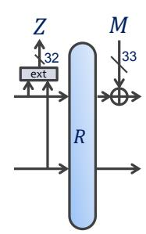
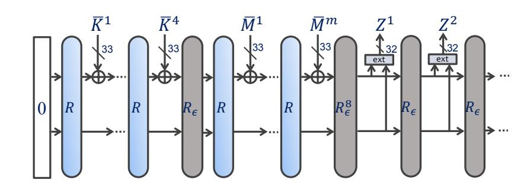
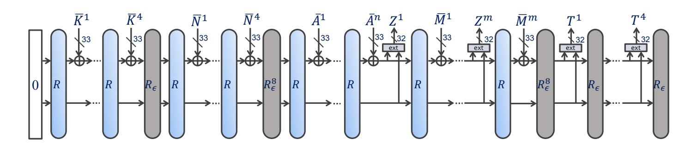
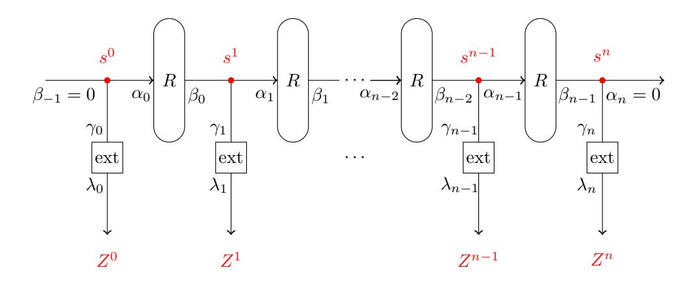
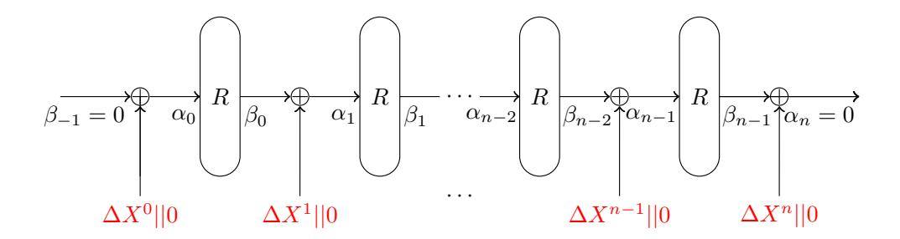
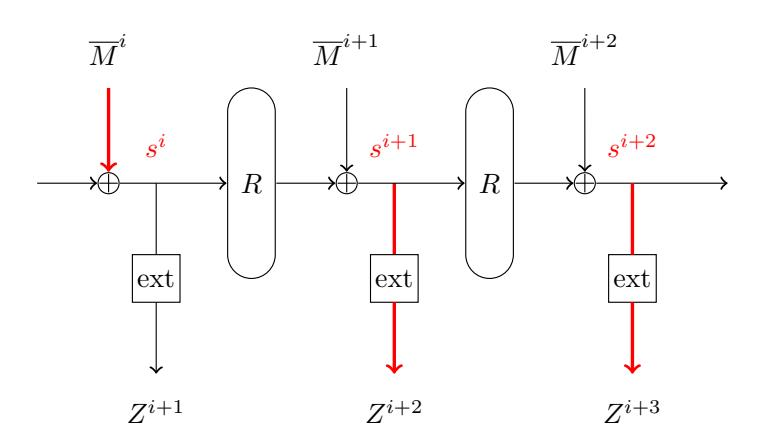
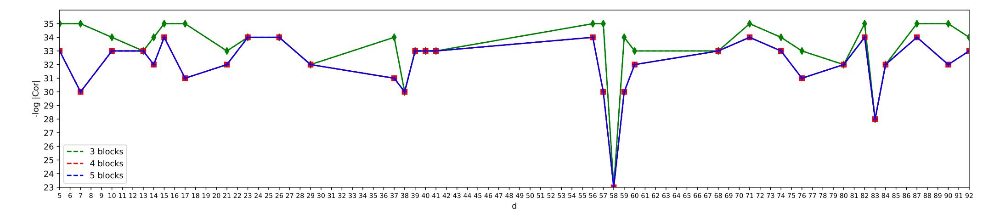
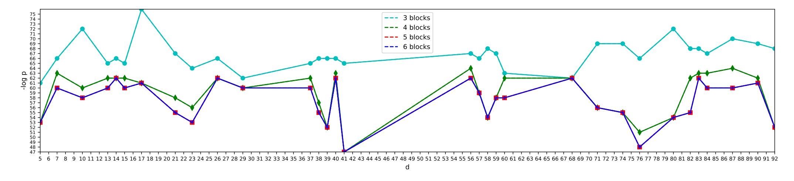

{0}------------------------------------------------

## **Security Analysis of Subterranean 2.0**

**Ling Song** *·* **Yi Tu** *·* **Danping Shi** *·* **Lei Hu**

Received: date / Accepted: date

**Abstract** Subterranean 2.0 is a cipher suite that can be used for hashing, authenticated encryption, MAC computation, etc. It was designed by Daemen, Massolino, Mehrdad, and Rotella, and has been selected as a candidate in the second round of NIST's lightweight cryptography standardization process. Subterranean 2.0 is a duplex-based construction and utilizes a single-round permutation in the duplex. It is the simplicity of the round function that makes it an attractive target of cryptanalysis.

In this paper, we examine the single-round permutation in various phases of Subterranean 2.0 and specify three related attack scenarios that deserve further investigation: keystream biases in the keyed squeezing phase, state collisions in the keyed absorbing phase, and one-round differential analysis in the nonce-misuse setting. To facilitate cryptanalysis in the first two scenarios, we novelly propose a set of size-reduced toy versions of Subterranean 2.0: Subterranean-m. Then we make an observation for the first time on the resemblance between the non-linear layer in the round function of Subterranean 2.0 and SIMON's round function. Inspired by the existing work on SIMON, we propose explicit formulas for computing the exact correlation of linear trails of Subterranean 2.0 and other ciphers utilizing similar nonlinear operations. We then construct our models for searching trails to be used in the keystream bias evaluation and state collision attacks. Our results show that most

Ling Song

Jinan University, Guangzhou, China E-mail: songling.qs@gmail.com

Tu Yi

Nanyang Technological University, Singapore

E-mail: tuyi0002@e.ntu.edu.sg

Danping Shi

State Key Laboratory of Information Security,

Institute of Information Engineering, Chinese Academy of Sciences, China

E-mail: shidanping@iie.ac.cn

Lei Hu

State Key Laboratory of Information Security,

Institute of Information Engineering, Chinese Academy of Sciences, China

E-mail: hulei@iie.ac.cn

{1}------------------------------------------------

instances of Subterranean-m are secure in the first two attack scenarios but there exist instances that are not. Further, we find a flaw in the designers' reasoning of Subterranean 2.0's linear bias but support the designers' claim that there is no linear bias measurable from at most 2 96 data blocks. Due to the time-consuming search, the security of Subterranean 2.0 against the state collision attack in keyed modes still remains an open question. Finally, we observe that one-round differentials allow to recover state bits in the nonce-misuse setting. By proposing nested one-round differentials, we obtain a sufficient number of state bits, leading to a practical state recovery with only 20 repetitions of the nonce and 88 blocks of data. It is noted that our work does not threaten the security of Subterranean 2.0.

**Keywords** Subterranean 2.0 *·* permutation-based crypto *·* keystream bias *·* state collision *·* state recovery

**Mathematics Subject Classification (2010)** 94A60

#### **1 Introduction**

The deployment of small computing devices such as RFID tags, microcontrollers, sensor nodes, and smart cards is becoming more and more common. Alongside this, the need for lightweight cryptography that aims to provide security solutions tailored for such resource-constrained devices is increasing. In 2013, the National Institute of Standards and Technology (NIST) initiated a public process to solicit, evaluate, and standardize lightweight authenticated encryption and hashing schemes that are suitable for use in constrained environments, *i.e.*, the so-called LWC competitions [16]. In 2018, a call for submissions was launched and 57 submissions were received in 2019, among which 56 and 32 submissions were selected in the first and second rounds respectively. At the current stage, public evaluations of the candidates are strongly encouraged.

Subterranean 2.0 [7, 8] is a cipher suite that can be used for hashing, authenticated encryption, MAC computation, and stream encryption, etc. It was designed by Daemen, Massolino, Mehrdad, and Rotella and has been selected by NIST as a candidate for the second round of LWC competition. Subterranean 2.0 shares features with its predece[ss](#page-22-0)[or](#page-22-1) Subterranean [6] which can be seen as a precursor to the Sponge construction [3]. The features of Subterranean 2.0 are summarized below.

**Prime-sized state.** Subterranean 2.0 operates on a state of 257 bits which is small but still supports both hashing and authenticated encryption. It offers a security strength of 128 bits in keyed modes and [1](#page-22-2)12 bits in unkeyed mode. In authenticated encryption where a [n](#page-21-0)once is used, the nonce should not repeat.

**Duplex-based construction** The duplex [4] plays a core role in Subterranean 2.0. On top of it, three functions were built, namely, Subterranean-XOF, Subterraneandeck, and Subterranean-SAE, where the latter two are keyed functions. The duplex absorbs/squeezes 32-bit blocks in keyed modes and 8-bit blocks in unkeyed mode.

**Single-round permutation.** In the duple[x,](#page-21-1) a lightweight single-round permutation is used. The round function operates at bit level and has algebraic degree 2. It has a minimum of substructures and ultimate weak alignment which prevents large classes of attacks.

**Blank rounds used.** Between different phases, 8 blank rounds are used to prevent measurable characteristics between the controllable input and output.

{2}------------------------------------------------

Efficient hardware implementation. Subterranean 2.0 is designed for hardware and offers a good option for environments that require lightweight crypto in hardware with high throughput requirements. Besides, it is very suitable for protection against differential power analysis such as masking and threshold implementations.

Due to the extremely simple round function, Subterranean 2.0 is an attractive target for cryptanalysis. In the design specification [8], the designers mainly investigated the security of state collisions in unkeyed absorbing and differential/linear properties of a multiple-round permutation. As a complement, Liu, Isobe and Meier [13] conducted cube-based cryptanalysis of Subterranean-SAE by exploiting the low algebraic degree of the round function. They showed that when the number of blank rounds is reduced to 4, one can mount a state recovery attack. Moreover, in the nonce-misuse setting the state recovery attack becomes practical using  $2^{13}$  blocks of data.

With respect to the simple single-round permutation of Subterranean 2.0, there are interesting attacks in different phases. Below, we list three related attacks in keyed modes that deserve further investigation.

- 1. Linear bias of output blocks in keyed squeezing phase. It is claimed in the specification [8] that there is probably no linear bias over four or less output blocks of Subterranean 2.0 and that there is no bias measurable from 296 data blocks or less. Any analytical results that approve or disapprove of these claims can help understand the security of Subterranean 2.0.
- 2. State collisions in keyed absorbing phase. In keyed modes, state collisions may lead to attacks like forgeries. However, security analysis of Subterranean 2.0 against such attacks is missing from the literature.
- 3. One-round differential analysis of Subterranean-SAE in the message processing phase. In the phase of processing the message, when a duplex call is invoked, an output block is squeezed and an input block absorbed before and after the single-round permutation, respectively. In the case where nonce repeats, one-round differentials can be observed over successive calls of duplex. It is not clear how far an attack can go by exploiting one-round differentials.

Our contribution. In this paper, we examine the security of Subterranean 2.0 in the above three attack scenarios regarding its single-round permutation. In order to investigate the bias of keystreams and the state collision attack, it requires to find useful linear and differential trails under certain constraints. When carrying out differential/linear analysis of Subterranean 2.0, we face two challenges. The first is that the permutation has only one round and thus cannot be scaled down through the most common way of reducing the number of rounds for facilitating the differential/linear analysis. The other is the "dependency" issue that cannot be avoided either in differential analysis or linear analysis. The round function of Subterranean 2.0 exploits logic AND of neighbouring bits in the non-linear layer. Namely, state bits  $s_{i-1}, s_i$  are fed into one AND operation and  $s_i, s_{i+1}$  into another. These AND operations are dependent as neighbouring AND operations share an input bit. Consequently, the AND operations cannot be treated independently in differential/linear analysis. Such dependency makes it difficult to precisely evaluate the security of Subterranean 2.0 against linear attacks and state collision attacks.

In this paper, we use the following techniques to tackle these two challenges.

{3}------------------------------------------------

**–** We novelly propose a set of toy versions of Subterranean 2.0 with reduced state size. At first glance, Subterranean 2.0 can be weakened by increasing the rate. However, it cannot be done without changing the extraction function. Therefore, a better way seems to reduce the state size. Concretely, we choose a smaller prime number 97, adapt other parameters accordingly, and let the factor *d* used in the round function (see Section 2.2) be all possible values. Then we have a set of toy versions: Subterranean-m(*d*) which have much smaller state size and key size but share the same design with the original cipher.

**–** For the first time in the literature, we observe that the non-linear layer of the round function of Subterran[ean](#page-4-0) 2.0 can be represented by a SIMON-like function. SIMON [2] is a family of lightweight block ciphers and has been extensively analysed since its publication, such as differential/linear analyses in [12]. Inspired by the existing work on SIMON, we propose explicit formulas for computing the exact correlation of linear trails of Subterranean 2.0 and other ciphers utilizing AND op[era](#page-21-2)tions. We then build our models for handling the dependency issue, as well as searching optimal differential/linear trails of Subterranea[n 2](#page-22-4).0.

Applying our models to Subterranean 2.0 and Subterranean-m, we obtain the following results.

- **–** For most values of *d*, Subterranean-m resists the linear attack and the state collision attack. However, there exist two instances of Subterranean-m(*d*) which do not resist the linear attack and the state collision attack respectively. This means different values of *d* are not equally good.
- **–** There does exist linear bias over four or three output blocks for Subterranean 2.0 and Subterranean-m. Our work helps to find a flaw in the designers' reasoning of Subterranean 2.0's linear biases.
- **–** Our experiments support the designers' claim that there is no bias measurable from 2 96 data blocks or less.

Due to the time-consuming search, the security of Subterranean 2.0 against the state collision attack in keyed modes still remains an open question.

Finally, we exploit the one-round differentials to recover the state in the noncemisuse setting. If the nonce repeats, one-round differentials observed in the message processing phase of Subterranean-SAE will leak some bits of the state due to the algebraic degree 2 of the round function. Further, we find out that ordinary oneround differentials can recover 41 bits at most. To enlarge the number of state bits that can be recovered, we propose *nested one-round differentials* where an one-round differential is prepended to another in a delicate way. As a result, a sufficient number of state bits can be recovered, which leads to a full state recovery and further a key recovery. The attack is practical and takes only 20 repetitions of the nonce and 88 blocks of data, which is much lower than the data complexity of the attack in [13] by Liu, Isobe and Meier. Our analysis shows that Subterranean-like constructions with a quadratic single-round permutation must be used carefully in practice since the security crashes without nonce uniqueness.

*Organization.* The rest of the paper is organized as follows. Basic notations, [the](#page-22-3) design of Subterranean 2.0 and a set of toy versions are introduced in Section 2. Section 3 highlights several properties of Subterranean 2.0 and the relation to three attack scenarios: keystream biases, state collisions, and state recovery in the noncemisuse setting. Linear attacks and state collisions in the keyed modes are investigated

{4}------------------------------------------------

in Section 4. Section 5 presents a state recovery attack utilizing one-round differentials in the nonce-misuse setting. Finally, we conclude the paper in Section 6.

## **2 Notatio[n](#page-10-0)s and S[pe](#page-17-0)cification of Subterranean 2.0**

In this section, we start by giving our notations and then briefly introd[uc](#page-20-0)e Subterranean 2.0, including its round function, the duplex object and two keyed members: Subterranean-deck and Subterranean-SAE. To facilitate cryptanalysis of Subterranean 2.0, we introduce a set of toy versions: Subterranean-m(*d*). For more details of Subterranean 2.0, we refer the interested reader to the official specification [8].

## 2.1 Notations

*b* The size of the state *d* The factor used in *π* of the round function *M* The string *M* padded to 33 bits with 10\* *∆X* The difference of *X* where *X* may be the state or the input/output block *∆Xt i* The difference of the *i*-th bit of *X* at time *t* ≫ Cyclic right shift ≪ Cyclic left shift *| · |* The length in bits *||* Concatenation of bit strings

#### 2.2 Round Function

The round function R operates on a *b*-bit state and consists of four bit-oriented steps: *R* = *π ◦ θ ◦ ι ◦χ*. Let *s* denote the state and *si* the *i*-th bit of *s*. Then for all 0 *≤ i < b*,

$$\chi: s_i \leftarrow s_i + (s_{i+1} + 1) \cdot s_{i+2},$$

$$\iota: s_0 \leftarrow s_0 + 1,$$

$$\theta: s_i \leftarrow s_i + s_{i+3} + s_{i+8},$$

$$\pi: s_i \leftarrow s_{d \times i}.$$

Here the addition and multiplication of state bits are in F2 and expressions in the indices are taken modulo *b*. In Subterranean 2.0, *b* = 257*, d* = 12.

## 2.3 Duplex Object and Two Keyed Functions

#### *2.3.1 Duplex Object*

The Subterranean 2.0 suite is built upon a duplex object which is displayed in Figure 1. The duplex uses a single-round permutation, *i.e.*, *R*, and has two functions: the duplex call and the output extraction, the latter of which is optional. The duplex call applies the round function R and absorbs a string *M* of at most 32 bits. Before

{5}------------------------------------------------

adding the string to the internal state, the string is padded to 33 bits with 10\*. The 33 bits are then injected into the state  $s_{12^{4i}}, 0 \le i < 33$ . Namely, the injection rate is 33 bits. Before the duplex call, one may extract 32 bits from the state, each of which is the sum of two state bits:

$$Z_i = s_{12^{4i}} + s_{-12^{4i}},$$

for all  $0 \le i < 32$ . The details of indices used for injection and extraction are shown in Table 1.

When the input is an empty string, the combination of the round function and the injection is denoted as  $R_{\epsilon}$  for convenience in the figures.

| i | $12^{4i}$ | $-12^{4i}$ | i  | $12^{4i}$ | $-12^{4i}$ | i  | $12^{4i}$ | $-12^{4i}$ | i  | $12^{4i}$ | $-12^{4i}$ |
|---|-----------|------------|----|-----------|------------|----|-----------|------------|----|-----------|------------|
| 0 | 1         | 256        | 8  | 64        | 193        | 16 | 241       | 16         | 24 | 4         | 253        |
| 1 | 176       | 81         | 9  | 213       | 44         | 17 | 11        | 246        | 25 | 190       | 67         |
| 2 | 136       | 121        | 10 | 223       | 34         | 18 | 137       | 120        | 26 | 30        | 227        |
| 3 | 35        | 222        | 11 | 184       | 73         | 19 | 211       | 46         | 27 | 140       | 117        |
| 4 | 249       | 8          | 12 | 2         | 255        | 20 | 128       | 129        | 28 | 225       | 32         |
| 5 | 134       | 123        | 13 | 95        | 162        | 21 | 169       | 88         | 29 | 22        | 235        |
| 6 | 197       | 60         | 14 | 15        | 242        | 22 | 189       | 68         | 30 | 17        | 240        |
| 7 | 234       | 23         | 15 | 70        | 187        | 23 | 111       | 146        | 31 | 165       | 92         |
|   |           |            |    |           |            |    |           |            | 32 | 256       |            |

Table 1: Indices used for injection and extraction

#### 2.3.2 Subterranean-deck and Subterranean-SAE

The Subterranean 2.0 suite has three functions: Subterranean-XOF, Subterranean-deck and Subterranean-SAE. Subterranean-XOF is designed to be used for unkeyed hashing, while Subterranean-deck and Subterranean-SAE are keyed functions. In this paper, we focus on the latter two.

Subterranean-deck takes as input an arbitrary-length key, typically of 128 bits, and a sequence of arbitrary-length strings and returns a bit string of arbitrary length, as shown in Figure 2. Hence, it can be used as a stream cipher, a MAC function or for key derivation. Subterranean-SAE, depicted in Figure 3, is designed for authenticated encryption. Below, a detailed description of Subterranean-SAE is given. With the description of Subterranean-SAE in mind, it requires little extra effort to follow the working procedures of Subterranean-deck.

Fig. 1: Duplex object

Fig. 2: Subterranean-deck

{6}------------------------------------------------

Fig. 3: Subterranean-SAE

The input of Subterranean-SAE contains a 128-bit key, a 128-bit nonce N, an associated data (AD) A which is optional, and a message M. The output is composed of the ciphertext and a 128-bit tag T.

Processing the key. At first, the state is initialized with 0. The 128-bit key is split into four 32-bit blocks  $K^1$ ,  $K^2$ ,  $K^3$ ,  $K^4$  and one empty block  $\epsilon$ , as the last block should be strictly shorter than 32 bits. Each block is padded with 10\* and the first four padded blocks are denoted by  $\overline{K}^1$ ,  $\overline{K}^2$ ,  $\overline{K}^3$ , and  $\overline{K}^4$ . The whole five blocks are then absorbed one by one through the duplex call.

Processing the nonce. The nonce is split into 32-bit blocks with the last block being shorter than 32 bits. Pad each block with 10\* and sequentially inject the padded blocks into the state in a series of duplex calls.

Processing the AD. Invoke the duplex eight times, each with an empty message  $\epsilon$  absorbed. Then absorb the AD in the same way as processing the nonce.

Processing the message. The message is split into 32-bit blocks with the last block being shorter than 32 bits. Pad each block with 10\*. Process message blocks one after another by the following steps: extract 32 output bits, invoke the duplex call to absorb a padded message block and XOR the message block with the extracted output to get the ciphertext block.

Finalization. Invoke the duplex eight times, each with an empty message  $\epsilon$  absorbed. Then invoke the duplex another four times, before each of which a 32-bit output is squeezed. Concatenate the four 32-bit output blocks to form the 128-bit tag.

#### 2.4 Toy Versions

To facilitate cryptanalysis, we scale down Subterranean 2.0 and define size-reduced versions. Subterranean 2.0 uses a prime-sized state to avoid the existence of exploitable symmetries. Therefore, the state size b of a toy cipher also needs to be prime but smaller than 257. Besides, the factor d used in the  $\pi$  step should have a large order in  $\mathbb{Z}_b^*$  and the order should be a multiple of 8 if the same extraction function  $Z_i = s_{d^{4i}} + s_{-d^{4i}}$  is used. With these in mind, we choose a prime  $97^1$  and let d be a generator of  $\mathbb{Z}_{97}^*$ . In total, there are 32 generators of  $\mathbb{Z}_{97}^*$ . In addition, the ratio of the extraction rate to the state size should remain close. As  $\frac{32}{257} \times 97 \approx 12$ , we set the extraction rate of the toy ciphers to 12. Then we have a set of toy ciphers: Subterranean-m(d) whose parameters are summarized in Table 2. It turns out that the algebraic properties of  $\theta$  step remain with the new size of state, as shown in Appendix A.

&lt;sup>1 One may choose other primes of the form 8k+1 where  $k \in \mathbb{Z}^+$  as well.

{7}------------------------------------------------

Table 2: Subterranean 2.0 and its toy versions

| Version                                                                                                                                | State size | Key size | d         | Extraction rate | Output $Z_i$                 |  |  |
|----------------------------------------------------------------------------------------------------------------------------------------|------------|----------|-----------|-----------------|------------------------------|--|--|
| Subterranean 2.0                                                                                                                       | 257        | 128      | 12        | 32              | $s_{12^{4i}} + s_{-12^{4i}}$ |  |  |
| Subterranean- $m(d)$                                                                                                                   | 97         | 48       | $d \in D$ | 12              | $s_{d^{4i}} + s_{-d^{4i}}$   |  |  |
| $D = \{5, 7, 10, 13, 14, 15, 17, 21, 23, 26, 29, 37, 38, 39, 40, 41, 56, 57, 58, 59, 60, 68, 71, 74, 76, 80, 82, 83, 84, 87, 90, 92\}$ |            |          |           |                 |                              |  |  |

#### 3 Properties of Subterranean 2.0 and Three Attack Scenarios

In this section, we highlight several important properties of Subterranean 2.0 and relate them to three attack scenarios.

Subterranean 2.0 is a duplex-based construction and uses bit-oriented operations that allow good performance in hardware implementation. Besides, the following properties are interesting in the attacker's point of view.

Property 1. Subterranean 2.0 employs an extremely simple permutation in the duplex call. The permutation has only one round and the round function has algebraic degree only 2. Additionally, the round function operates at bit level and allows a minimum of sub-structures by using a prime-sized state. That is to say, the round function is of weak alignment [9].

Property 2. Subterranean 2.0 squeezes output blocks in a way similar to a stream cipher. Specifically, it outputs 32 bits as the keystream iteratively before each duplex call. Note that the keystreams can be known in the known-message model.

Property 3. Subterranean-SAE processes the nonce with multiple duplex calls. Subterranean-SAE does not load the nonce into its initial state. Because of its small state size, Subterranean-SAE has to absorb the nonce with multiple duplex calls and the number of the duplex calls is 5.

Attack scenario 1: keystream biases. When considering Property 1 and Property 2 together, one may ask: are the keystreams truly random? One possible way to distinguish keystreams of a cipher from a random sequence is to utilize linear biases. Recently, exploitable biases using linear combinations of output bits were found in the authenticated encryption schemes MORUS [1,18] and AEGIS [15]. It is important to known if this will happen to Subterranean 2.0.

Fig. 4: Linear trails for keystream bias evaluation

{8}------------------------------------------------

To investigate the bias of keystreams, it is to find a sequence of linear masks  $(\lambda_0, \dots, \lambda_n)$  for the output blocks  $Z^i$ , as illustrated in Figure 4, such that

$$f = \sum_{i=0}^{n} \lambda_i Z^i$$

is biased, i.e., the bias

$$\epsilon = \Pr(f = 0) - \frac{1}{2},$$

or the correlation

$$Cor(f) = Pr(f = 0) - Pr(f = 1) = 2\epsilon$$

is different from zero. To detect a bias with given correlation C, one needs about  $C^{-2}$  data [14]. Therefore, if a sequence of masks can be found such that  $(Cor(f))^{-2}$  is smaller than the data limit, then the cipher can be distinguished from a random function. In order to find a good sequence of masks, the same tools for linear cryptanalysis of block ciphers can be applied with the beginning and the end being set inactive, i.e.,  $\beta_{-1} = 0$ ,  $\alpha_n = 0$  as shown in Figure 4. In the middle, the propagation of linear masks must be compatible with each operation. Summing all approximations:

$$\gamma_i s^i + \lambda_i Z^i, \quad 0 \le i \le n,$$
  
 $\alpha_i s^i + \beta_i s^{i+1}, \quad 0 \le i \le n-1,$ 

we will have  $\sum_{i=0}^{n} \lambda_i Z^i$ . For Subterranean 2.0, the correlation of keystreams  $\sum_{i=0}^{n} \lambda_i Z^i$  is the product of correlations of active ANDs in the involved round functions, as the extraction function is linear.

The designers kept the above attack in mind while designing Subterranean 2.0 and let the output Z be extracted from special state bits in order to prevent any bias in four consecutive output blocks. It is believed that using five or more output blocks eliminates measurable bias in Z. Any evidence that approves or disapproves of such a belief would be interesting to the community.

Attack scenario 2: state collisions. A similar cryptanalysis in the differential case would be state collision attacks. As illustrated in Figure 5, the difference of the internal state is introduced by an input difference  $\Delta X^0$  (through the nonce, AD or the message), and cancelled out by  $\Delta X^n$  after n rounds. Such an attack is called "LOCAL attack" which was proposed by Khovratovich and Rechberger [11] and independently found by Wu et al. [22] against ALE [5].

Fig. 5: Differential trails for state collisions

{9}------------------------------------------------

The state collision may cause forgery attacks. Suppose the internal difference is introduced by the associated data AD and there exists such a differential trail with high probability p. Then a forgery attack can be mounted in the following way.

Let N,  $A_0||\cdots||A_n$  and M be the nonce, AD and message to be forged, respectively. The attacker respects nonces and queries  $(N, A_0 \oplus \Delta X^0 || \cdots || A_n \oplus \Delta X^n, M)$  to the encryption oracle to get the 128-bit tag T. Then, T is a valid tag for  $(N, A_0 || \cdots || A_n, M)$  with probability p. The forgery attack succeeds if it beats the generic one. In the case of Subterranean 2.0, it means  $p > 2^{-128}$ .

As the nonce is processed in multiple duplex calls, it might be possible to find state collision during the nonce processing phase. If the state collision happens after absorbing nonce segments  $N_1$  and  $N'_1$  respectively (both are of the same length) and there are more bits of nonce to be absorbed, say  $N_2$ , then  $(N_1||N_2, A, M)$  and  $(N'_1||N_2, A, M)$  lead to a state collision and further to the same tag T. As a result, for any A' and M', the attacker can make forgeries by using a new  $N_2$  and keeping the same  $N_1$  and  $N'_1$ .

In spite of the importance of the security requirement for resisting state collision attacks, such a differential analysis is missing, either in the specification of Subterranean  $2.0^2$  or in the literature.

Attack scenario 3: state recovery in the nonce-misuse setting. Subterranean-SAE takes a nonce as input and strongly relies on nonce uniqueness for security. Even though no security claim was made in the nonce-misuse setting, it is believed by the designers in [7] that the state recovery attack is non-trivial.

In nonce-misuse scenarios or when unwrapping invalid cryptograms returns more information than a simple error, we make no security claims and an attacker may even be able to reconstruct the secret state. Nevertheless we believe that this would probably a non-trivial effort, both in attack complexity as in ingenuity.

Recall Property 1 that Subterranean 2.0 uses the single-round permutation with algebraic degree 2 in the duplex call. In the setting that a nonce can be used more than once, one may inject a difference  $\Delta \overline{M}^i$  at  $s^i$  in the message processing phase as shown in Figure 6, one will obtain some linear relations of the state difference  $\Delta s^{i+1}$  through the output difference  $\Delta Z^{i+2}$  as each output bit is the sum of two internal bits. More importantly,  $\Delta s^{i+1}$  is linear in bits of  $s^i$  due to Fact 1 for quadratic Boolean functions. Therefore,  $\Delta Z^{i+2}$  will be linear in  $s^i$  as well, and thus some bits of  $s^i$  will be leaked by observing such one-round differentials.

**Fact 1** Let  $f: \mathbb{F}_2^n \to \mathbb{F}_2$  be a Boolean function with algebraic degree 2. Given the input difference  $\Delta x$ , the derivative of f is  $\Delta f := f(x) + f(x + \Delta x)$  can be expressed linearly by the input bits.

**Example 1** Let  $f: \mathbb{F}_2^2 \to \mathbb{F}_2$  and  $f(x) = x_0 \cdot x_1$ . Suppose the input difference is given as  $\Delta x = (\Delta x_0, \Delta x_1)$ . Then  $\Delta f = f(x) + f(x + \Delta x) = x_0 \cdot x_1 + (x_0 + \Delta x_0) \cdot (x_1 + \Delta x_1) = \Delta x_1 \cdot x_0 + \Delta x_0 \cdot x_1 + \Delta x_0 \cdot \Delta x_1$ .

&lt;sup>2 The designers searched differential trails for the permutation with three rounds and provided bounds for the probability of differential trails with up to eight rounds. Such differential analysis is different from the differential analysis tailored for state collisions where there is a difference injection before each round.

{10}------------------------------------------------

Fig. 6: Notations for state recovery in the nonce-misuse setting

Even though Subterranean-SAE aims for use cases where nonce uniqueness can be guaranteed, it would be interesting to know what the complexity of state recovery would be when nonce uniqueness is lost.

In the following two sections, the three potential attacks pointed out here will be investigated. Section 4 looks into differential and linear cryptanalysis regarding keystream biases and state collisions respectively and Section 5 examines state recovery attack in the nonce-misuse setting.

# 4 Differential and Linear Analysis Tailored for Keystream Biases and State Collisions

In this section, we first specify the issue of dependency in the  $\chi$  operation of the round function of Subterranean 2.0. We then point out the resemblance between the  $\chi$  operation and the round function of the SIMON block cipher [2]. Inspired by the existing work on SIMON [12], we propose explicit formulas for computing the exact correlation of linear trails of Subterranean 2.0 and other ciphers utilizing similar non-linear operations. Finally, we construct our models for searching differential/linear trails of Subterranean 2.0 tailored for keystream biases and state collisions.

#### 4.1 Dependency of AND Operations

In the design of Subterranean 2.0, the non-linear layer  $\chi$  of the round function exploits AND operations. Specifically, state bits  $s_{i-1} + 1$ ,  $s_i$  are fed into one AND operation and  $s_i + 1$ ,  $s_{i+1}$  into another. Unlike S-box based ciphers where the number of active S-boxes determines the upper bound of differential/linear probability, the number of active AND operations provides not much information for Subterranean 2.0. The reason is the dependency between AND operations.

Let us explain a bit more with an example of two AND operations:  $y_0 = x_0 \cdot x_1$  and  $y_1 = x_1 \cdot x_2$ . Suppose the differentials of the two AND operations are  $(1,0) \to 1$  and  $(0,1) \to 0$ . According to the difference distribution table 3, the differential probability of the two AND operations is  $\frac{2}{4} \times \frac{2}{4} = 2^{-2}$  if the two AND operations are independent. However, the two AND operations share an input bit  $x_1$  and thus not independent. Check that the solutions for the two differentials  $(1,0) \to 1$  and

{11}------------------------------------------------

 $(0,1) \to 0$  are  $(x_0, x_1) \in \{(0,1), (1,1)\}$  and  $(x_1, x_2) \in \{(0,0), (0,1)\}$ , which means  $x_1 = 1$  and  $x_1 = 0$  should hold simultaneously. This is a contradiction. In the case where the differentials for the two AND operations are  $(1,0) \to 1$  and  $(0,1) \to 1$ , there is no such contradiction and the two differentials hold when  $x_1 = 0$ , meaning the probability is  $2^{-1}$  instead of  $2^{-2}$ .

Table 3: Difference distribution table (left) and linear approximation table (right) of the AND operation

| $\Delta x_0, \Delta x_1$ | 0 | 1 | $\Gamma x_0, \Gamma x_1$ | 0 | 1  |
|--------------------------|---|---|--------------------------|---|----|
| 0, 0                     | 4 | 0 | 0, 0                     | 2 | 1  |
| 0, 1                     | 2 | 2 | 0, 1                     | 0 | 1  |
| 1, 0                     | 2 | 2 | 1, 0                     | 0 | 1  |
| 1, 1                     | 2 | 2 | 1, 1                     | 0 | -1 |

The dependency between AND operations has a similar effect in linear analysis. Suppose the linear masks are  $(0,1) \to 1$  and  $(1,1) \to 1$  for the two AND operations. This means  $x_0 \cdot x_1$  and  $x_1 \cdot x_2$  are approximated with  $x_1$  and  $x_1 + x_2$  respectively. Treating them independently, we get correlation  $-2^{-1} \times 2^{-1} = -2^{-2}$  for the two AND operations according to the linear approximation table 3. While considering together,  $x_0 \cdot x_1 + x_1 \cdot x_2 = x_1(x_0 + x_2)$  is approximated with  $x_1 + x_2$ , resulting in a zero correlation. In the case where the linear masks are  $(0,1) \to 1$  and  $(1,0) \to 1$ ,  $x_0 \cdot x_1 + x_1 \cdot x_2 = x_1(x_0 + x_2)$  is approximated with  $x_1$ , leading to a correlation  $2^{-1}$  instead of  $2^{-2}$ . The case of two active AND operations is summarized in Example 2.

**Example 2** Let  $f(x_0, x_1, x_2) = x_0 \cdot x_1 + x_1 \cdot x_2 + L(x_0, x_1, x_2) = x_0 \cdot x_1 + x_1 \cdot x_2 + u \cdot x_0 + v \cdot x_1 + w \cdot x_2$  be a Boolean function and  $u, v, w \in \mathbb{F}_2$  are constants. If u + w = 0, then  $Cor(f) = 2^{-1}$ ; otherwise, Cor(f) = 0.

Besides Subterranean 2.0, chaining AND operations also make up the non-linear layer of the round function in authenticated encryption schemes like MORUS [20], TinyJAMBU [21] and block ciphers like SIMON [2], etc. Handling the dependency among the chaining AND operations is a challenging task. Taking all the dependency into account usually makes the search for differential/linear trails inefficient or even infeasible. In the case where there exist very sparse differential/linear trails such that there is no adjacent active AND operations, treating AND operations independently works well [18, 19]. Recently, effort has been made to construct models that partially handles the dependency of the AND operations [17]. However, the methods which do not fully tackle the dependency are not applicable to Subterranean 2.0 whose differential/linear trails for state collisions or keystream bias of Subterranean 2.0 are relatively dense. This is confirmed by experiments where the trails obtained with these methods are almost invalid. Moreover, inexact models are unable to provide reliable bounds of differential/linear probability. Consequently, the dependency must be taken into consideration for evaluation of Subterranean 2.0 against state collision attacks and keystream bias.

{12}------------------------------------------------

## 4.2 Represent $\chi$ as a SIMON-like Function

Subterranean 2.0 uses bit-wise operations. In particular, in the  $\chi$  step, for  $0 \le i < b$ ,

$$s_i \leftarrow s_i + s_{i+1} \cdot s_{i+2} + s_{i+2}$$
.

We observe that the  $\chi$  step bears a strong resemblance to SIMON's round function. SIMON [2] is a family of lightweight block ciphers and follows the Feistel construction. Its round function has the following form

$$(x \ll \alpha) \odot (x \ll \beta) \oplus (x \ll \gamma),$$

where  $x \ll i$  corresponds to a cyclic left shift of word x by i bits,  $\odot$  and  $\oplus$  denote the bit-wise AND and XOR operations respectively. We notice that  $\chi$  can be re-written as a SIMON-like function:

$$s \leftarrow s \oplus (s \gg 1) \odot (s \gg 2) \oplus (s \gg 2)$$
.

Therefore, the techniques and tools in [12] for searching differential/linear trails of SIMON serves as a good starting point for differential and linear cryptanalysis of Subterranean 2.0.

#### 4.3 Linear Analysis

In [12], the authors proved that the input mask  $\alpha$  and output mask  $\beta$  for the operation  $x \odot (x \ll 1)$  should satisfy that  $\alpha \in U_{\beta}^{\perp}$ , where  $U_{\beta} = \{y | \beta \odot (y \ll 1) \oplus (\beta \odot y) \gg 1\}$ . Inspired by this, we further propose explicit formulas for calculating the correlation of linear trails of Subterranean 2.0, which are also applicable to other ciphers that exploit chains of AND operations.

In linear cryptanalysis of such ciphers, there are blocks of chained active AND operations where the correlation can be calculated for each block independently. Depending on the number of active AND operations involved in a block, there are two cases which are covered by Lemma 1 and 2. For Subterranean 2.0, k in the two lemmas is 1. When the number n of active AND operations in a block is odd, i.e., n = 2t - 1, t > 0, any approximation is valid and the correlation is  $2^{-t}$ . When the number n of active ANDs is even, i.e., n = 2t, t > 0, the approximation should satisfy a condition cond as stated in Lemma 2. This is a one-bit condition and if it holds, the correlation is  $2^{-t}$ . In other words, given a random approximation for an even block, it is valid with probability  $\frac{1}{2}$ . In search of linear trails, it is the key point to make sure this condition holds for all even blocks. Without this condition being imposed, the obtained linear trail will be invalid with high chance when the trail is dense.

**Lemma 1** Let  $f(x) = x_0x_k + x_kx_{2k} + \cdots + x_{(2t-2)k}x_{(2t-1)k} + L(x_0, x_k, \cdots, x_{(2t-1)k})$  be a Boolean function where L is linear and t > 0. Then |Cor(f)| is  $2^{-t}$ .

*Proof* The quadratic part of f(x) can be re-written as

$$x_k(x_0+x_{2k})+x_{3k}(x_{2k}+x_{4k})+\cdots+x_{(2t-3)k}(x_{(2t-4)k}+x_{(2t-2)k})+x_{(2t-2)k}x_{(2t-1)k}.$$

{13}------------------------------------------------

Apply the following transformation:

$$y_{(2j-1)k} = x_{(2j-1)k}, 1 \le j \le t$$
  

$$y_{(2j)k} = x_{(2j)k} + x_{2(j+1)k}, 0 \le j \le t - 2$$
  

$$y_{(2t-2)k} = x_{(2t-2)k},$$

which is equivalent to the transformation x = Ay:

$$x_{(2j-1)k} = y_{(2j-1)k}, 1 \le j \le t$$
  
 $x_{(2j)k} = \sum_{i=j}^{t} y_{(2i)k}, 0 \le j \le t-1$ 

Then one can obtain

$$g(\mathbf{y}) = f(A\mathbf{y}) = y_0 y_k + y_{2k} y_{3k} + \dots + y_{2(t-1)k} y_{(2t-1)k} + L'(y_0, y_k, \dots, y_{(2t-1)k}).$$

Since the quadratic terms of g contains all  $y_{jk}, 0 \leq j \leq 2t - 1$ ,  $|Cor(g)| = 2^{-t}$ . Therefore,  $|Cor(f)| = 2^{-t}$ , as

$$Cor(g) = \frac{1}{2^{2t}} \sum_{\boldsymbol{y} \in \mathbb{F}_2^{2t}} (-1)^{g(\boldsymbol{y})} = \frac{1}{2^{2t}} \sum_{\boldsymbol{y} \in \mathbb{F}_2^{2t}} (-1)^{f(A\boldsymbol{y})} = \frac{1}{2^{2t}} \sum_{\boldsymbol{y} \in \mathbb{F}_2^{2t}} (-1)^{f(\boldsymbol{y})} = Cor(f).$$

**Lemma 2** Let  $f(x) = x_0 x_k + x_k x_{2k} + \dots + x_{(2t-2)k} x_{(2t-1)k} + x_{(2t-1)k} x_{2tk} + L_0(x_0, x_{2k})$  $\cdots, x_{2tk}$ )+  $L_1(x_k, x_{3k}, \cdots, x_{(2t-1)k})$  be a Boolean function where  $L_0, L_1$  are linear and t>0. Let **cond** be:  $L_0$  contains an even number of terms. Then |Cor(f)| is  $2^{-t}$ if **cond** holds and 0 otherwise.

*Proof* The quadratic part of f(x) can be re-written as

$$x_k(x_0+x_{2k})+x_{3k}(x_{2k}+x_{4k})+\cdots+x_{(2t-1)k}(x_{(2t-2)k}+x_{(2t)k})$$

Apply the following transformation:

$$y_{(2j-1)k} = x_{(2j-1)k}, 1 \le j \le t$$
  

$$y_{(2j)k} = x_{(2j)k} + x_{2(j+1)k}, 0 \le j \le t - 1$$
  

$$y_{(2t)k} = x_{(2t)k},$$

which is equivalent to the transformation x = Ay:

$$x_{(2j-1)k} = y_{(2j-1)k}, 1 \le j \le t - 1 (1)$$

$$x_{(2j-1)k} = y_{(2j-1)k}, 1 \le j \le t - 1 (1)$$

$$x_{(2j)k} = \sum_{i=j}^{t} y_{(2i)k}, 0 \le j \le t (2)$$

Then one can obtain

$$g(\mathbf{y}) = f(A\mathbf{y}) = y_0 y_k + y_{2k} y_{3k} + \dots + y_{2(t-1)k} y_{(2t-1)k} + L(y_0, y_k, \dots, y_{(2t)k}).$$

Obviously, Cor(g) = 0 if  $L(y_0, y_k, \dots, y_{(2t)k})$  contains the term  $y_{(2t)k}$ , otherwise  $|Cor(g)| = 2^{-t}$ . And  $L(y_0, y_k, \dots, y_{(2t)k})$  has the term  $y_{(2t)k}$  if and only if  $L_0(x_0, x_{2k})$  $\ldots, x_{(2t)k}$ ) contains an odd number of terms according to Eq. (2).

{14}------------------------------------------------

Technically, for an even block with 2*t, t >* 0 chained active AND operations, it requires *t*+ 1 iterations to check the condition *cond*. Hence, the longer an even block is, the more time-consuming for the checking. As the state size of Subterranean 2.0 is 257 which is relatively large when compared to block ciphers like SIMON, the length of even block can reach 256 theoretically. In order to speed up the search for linear trails of Subterranean 2.0, it would be useful to identify a tighter upper bound of block length *ℓ* for each round. This can be done as follows when the range of correlation or the target correlation is given.

- 1. For round *r*, set the target correlation C, time limit *D* and set the block length as state size, *i.e.*, *ℓ* = *b*
  - (a) For all possible positions for a block with *ℓ* chained ANDs:
    - i. Set the *ℓ* ANDs active. If a solution is found or the searching time exceeds *D*, exit.
  - (b) *ℓ* = *ℓ −* 1 and go to (a).

We then propose two models:

- 1. Set *ℓ* to a reasonable value for all rounds, *e.g.*, *ℓ* = 6. This model is used for searching linear trails with good correlations.
- 2. For each round, set *ℓ* to the upper bound found by the above procedure. This model is used for providing tighter lower bounds of correlation of linear trails.

We apply these two models to Subterranean 2.0 and Subterranean 2.0-m(*d*). The results in Table 4 are obtained. Note that, the search space of linear trails over *n* blocks covers the search space of linear trails over less blocks.

- **–** For Subterranean-m(*d*)
  - **–** The correlations of linear trails become stable when four blocks are involved, as shown [in](#page-15-0) Figure 7.
  - **–** When *d* = 58, there exists a linear trail over three output blocks with correlation 2 *−*23, as shown in Table 9. This means *d* = 58 is not a safe parameter for Subterranean-m.
- **–** For Subterranean 2.0
  - **–** There does not exis[t](#page-26-0) any linear trail over four blocks with correlation higher or equal to 2 *−*49 .

When *d* = 58, the curve in Figure 7 goes significantly low. We conjecture that it may come from the interplay between operations *π* and extraction/injection which depend on *d*, and other operations, *i.e.*, *χ*, *ι*, and *θ*. The indices used in *χ*, *ι*, and *θ* are computed through additions in Z. Conversely, the indices used in *π* and extraction/injection are computed thro[ug](#page-26-0)h multiplications in Z *∗* (except 0). When *d* varies, we have different combinations of these two parts and each combination is unique. It may be possible that there are good linear trails for certain combination. A similar conjecture could be made for the differential case that will be discussed subsequently.

## 4.4 Differential Analysis

In differential cryptanalysis of Subterranean 2.0, we adapt Theorem 1 from [12] and then apply it to Subterranean 2.0.

{15}------------------------------------------------

Table 4: Correlation of keystreams

| Version          | ( s , K )  | $ Z^i $ | $\#Z^i$  | $\min - \log_2(Cor)$ |
|------------------|------------|---------|----------|----------------------|
| Subterranean-SAE | (257, 128) | 32      | $\leq 4$ | (49, 90]             |
| Subterranean-m   | (97, 48)   | 12      | $\leq 5$ | <b>23</b> ∼ 34       |

**Theorem 1 ( [12])** *Let f*(*x*) = (*x* ≪ 1) *⊙ x be a Boolean function on* F *n* 2 *. The probability that difference α goes to difference β through f is*

$$\Pr(\alpha \xrightarrow{f} \beta) = \begin{cases} 2^{-n+1} & \alpha = \mathbf{1} \text{ and } wt(\beta) \equiv 0 \text{ mod } 2, \\ 2^{-wt(vb+db)} & \alpha \neq \mathbf{1} \text{ and } \beta \odot \overline{vb} = \mathbf{0} \text{ and } ((\beta \lll 1) \oplus \beta) \odot db = \mathbf{0}, \\ 0 & \text{otherwise,} \end{cases}$$

*where vb* = (*α* ≪ 1) *∨ α, db* = *α ⊙* (*α* ≪ 1) *⊙* (*α* ≪ 2) *and wt*(*x*) *is the Hamming weight of x.*

The original Theorem 1 considers bit vector *x* of an even number of bits. When the state size is odd, the condition for the first case should be adapted to *wt*(*β*) *≡* 1. Based on Theorem 1, the results in Table 5 are obtained. Also, the search space of differential trails using *n* blocks covers the search space of differential trails using less blocks.

- **–** For Subterranean-m(*d*)
  - **–** The probab[ili](#page-14-0)ties of differential tr[ai](#page-15-1)ls become stable when five blocks are involved, as shown in Figure 8.
  - **–** When *d* = 41, there exists a differential trail using four input blocks with probability 2 *−*47, as shown in Table 8. This means *d* = 41 is not a safe parameter for Subterranean-m.
- **–** For Subterranean 2.0
  - **–** There does not exist any differential trail over four blocks with probability higher or equal to 2 *−*108 .

Table 5: Result of searching differential trails for state collisions

| Table 5: Result of searching differential trails for state collisions |            |          |         |                 |
|-----------------------------------------------------------------------|------------|----------|---------|-----------------|
|                                                                       |            |          |         |                 |
| Version                                                               | ( s ,  K ) | i  ∆M | #∆M  | i min − log2 |

## 4.5 Impact on Subterranean-deck and Subterranean-SAE

As between extractions or injections, there is only one round, there is little clustering effect in the differential/linear analysis of Subterranean 2.03 . Thus the security of Subterranean 2.0 against the linear attack and the state collision attack can be almost deduced from optimal differential/linear trails.

3 If there are inactive output (resp. input) blocks in between, there is also clustering effect in linear (resp. differential) analysis. For example, in the linear trail [in](#page-15-2) Table 9, there are active bits in *Z*0 and *Z*2 but *Z*1. In this case, two solutions form a linear hull. However, the involved input or output blocks are continuously active in most cases.

{16}------------------------------------------------

**Bias of keystreams.** For both Subterranean-deck and Subterranean-SAE, the security is claimed against attackers that are limited to  $2^{96}$  data blocks. Thus a useful linear trail should have correlation higher than  $2^{-48}$ . In the specification of Subterranean 2.0 [8], there is a statement below.

This provides evidence that there is probably no bias for masks Z of less than 5 blocks and we believe there is no bias in Z measurable from output sequences of  $2^{96}$  blocks or less.

Our linear analysis is twofold: we find that the first half of the statement is not a reasonable conjecture and we support the second half of the statement with detailed experiments. Our results show that there exist linear trails over three or four blocks for both Subterranean 2.0 and Subterranean-m. Within four keystream blocks, linear trails with correlation higher than  $2^{-48}$  do not exist for Subterranean 2.0. The experiments on the toy cipher Subterranean-m show that there are no better linear trails when we increase the number of keystream blocks to five, which gives some confidence that there is no better linear trails as well for Subterranean 2.0 over more output blocks. In short, our results support the designers' claim on the security against linear cryptanalysis.

The designers' conclusion that there is probably no bias over less than five blocks lies in an analysis considering a single active output bit. Recall that the expression of the output block

$$Z_i^{t+1} = s_{12^{4i}}^{t+1} + s_{-12^{4i}}^{t+1}$$

and the round function

$$s_{i}^{t+1} = s_{i}^{t} + s_{i+3}^{t} + s_{i+8}^{t} + (s_{i+1}^{t} + 1) \cdot s_{i+2}^{t} + (s_{i+4}^{t} + 1) \cdot s_{i+5}^{t} + (s_{i+9}^{t} + 1) \cdot s_{i+10}^{t}$$

where i=12j. It can then be obtained that  $Z_i^{t+1}=s_{12^{4i+1}}^t+s_{-12^{4i+1}}^t+q(s^t)$ . Note that if there is an isolated term of degree 1 in the approximation, the correlation will be zero. As  $12^{4i+1}$  and  $-12^{4i+1}$  are not elements of the subgroup  $\left<12^4\right>$ , they cannot be cancelled out by  $Z_j^t$ . Based on this, the designers reached the conclusion about the length of linear trails of Subterranean 2.0. Nevertheless, state bits outside  $\left<12^4\right>$ , like  $s_{12^{4i+1}}^t$  and  $s_{-12^{4i+1}}^t$ , may be cancelled out when there are multiple active bits in the output block. Let us take the 3-block linear trail of Subterranean-m(58) (see Table 9) as an example. In this linear trail, both  $Z_0^2$  and  $Z_1^2$ , i.e., the first and the second bits of the third output block, are active. According to the expressions below, we can see that  $s_{-58}^1$  is cancelled out.

$$\begin{split} Z_0^2 &= s_{58^{4\cdot0}}^2 + s_{-58^{4\cdot0}}^2 \\ &= s_{58}^1 + s_{60}^1 + s_{61}^1 + s_{63}^1 + s_{66}^1 + s_{68}^1 + s_{-58}^1 + s_{41}^1 + s_{42}^1 + s_{44}^1 + s_{47}^1 + s_{49}^1 + q_1(s^1), \\ Z_1^2 &= s_{58^{4\cdot1}}^2 + s_{-58^{4\cdot1}}^2 \\ s_{58^5}^1 + s_{62}^1 + s_{63}^1 + s_{65}^1 + s_{68}^1 + s_{70}^1 + s_{-58^5}^1 + s_{-58}^1 + s_{40}^1 + s_{42}^1 + s_{45}^1 + s_{47}^1 + q_2(s^1). \end{split}$$

The full expression of the approximation can be found in Table 10. Consequently, treating the active bits globally, the invoked active bits located outside the group  $\langle 12^4 \rangle$  maybe cancelled out by each other. Thus, it does not necessarily take four rounds to make them fall back into  $\langle 12^4 \rangle$ . More importantly, concrete linear trails with three or four blocks are found for both Subterranean 2.04 and Subterranean-m.

 $^4$  As the obtained linear trails of Subterranean 2.0 have a very low correlation, the details of the linear trails are not included in the paper

{17}------------------------------------------------

State collisions. State collisions can be used for probabilistic forgeries as long as the differential probability  $p > 2^{-|K|}$  when the tag length is the same as the key length. That is, the forgery attack is not constrained by the data limit. Searching differential trails for Subterranean 2.0 is hard due to the large internal state. The experiments on the toy cipher Subterranean-m show that there is only one value for the parameter d such that the state collision attack is possible. When the injection rate of Subterranean-m is reduced to a smaller value, say 8, all values of d allow resistance against the state collision attack. It is very likely that these results of Subterranean-m reflect the security of Subterranean 2.0 against the state collision attack due to similar designs.

#### 5 Key Recovery of Subterranean-SAE in the Nonce-misuse Setting

In this section, it is shown that a practical state recovery attack can be mounted with only 88 32-bit blocks and 20 repetitions of nonce by one-round differential analysis.

#### 5.1 One-round Differential Analysis

In the duplex call of Subterranean 2.0, a single-round permutation is used. As the round function has algebraic degree only 2, the output difference of the round function will be linear in the input. So is the difference of the following keystream block. Let us explain the idea with an example as follows.

**Example 3** Suppose one bit difference is injected at position 1 of  $s^i$  (see Figure 6). After one round, the bits at positions [0, 64, 85, 107, 150, 171, 192, 214, 235] of  $s^{i+1}$  have difference  $[s_2^i, s_2^i, s_2^i, s_0^i + 1, 1, s_0^i + 1, s_0^i + 1, 1, 1]$  and there is no difference at other positions. From the extraction, we have  $\Delta Z_8^{i+2} = \Delta s_{64}^{i+1} + \Delta s_{193}^{i+1} = s_2^i$ . Thus obtain one state bit  $s_2^i$  by observing  $\Delta Z^{i+2}$ .

This means, in the message processing phase, if a difference is injected at  $s^i$ , some state bits of  $s^i$  can be recovered by observing the output difference after one round. We call this *one-round differential* of Subterranean 2.0. As can be seen that the recovered bits are among the neighbouring bits of the injected difference. For Subterranean-SAE, the number of bit positions for injection is 32. Further analysis shows that only 41 neighbouring bits can be recovered by one-round differentials.

#### 5.2 Nested One-round Differential Analysis

To enlarge the number of state bits that can be recovered, we propose a nested oneround differential analysis which exploits the output difference in two consecutive rounds. The core idea is that injecting difference at  $s^i$  will lead to differences of  $s^{i+1}$  at positions that may fall outside the set of 32 injection positions. Therefore, besides injecting difference through the input block, we can also utilize the difference generated by the previous round by treating the previous round as a difference injector.

It is known that the difference after two rounds is not linear in the input bits anymore. However, by our nested one-round differential analysis, some bits of the

{18}------------------------------------------------

internal state can still be recovered as long as the input difference to the second round is sparse. Next, we illustrate the nested one-round differential by Example 4.

**Example 4** Suppose one bit difference is injected at position 1 of  $s^i$  (see Figure 6). Treat the second round independently with input difference  $[s_2^i, s_2^i, s_2^i, s_0^i + 1, 1, s_0^i + 1, s_0^i + 1, 1, 1]$  at positions [0, 64, 85, 107, 150, 171, 192, 214, 235] based on Example 3. By observing the difference of the output block after the second round  $\Delta Z^{i+3}$ , retrieve relations between  $s^{i+1}$ ,  $s_0^i, s_2^i$  through  $\Delta Z^{i+3}$ , and select the linear ones which are:

$$\begin{split} \Delta Z_1^{i+3} &= s_2^0, \\ \Delta Z_3^{i+3} &= s_0^0 + 1, \\ \Delta Z_8^{i+3} &= s_2^0, \\ \Delta Z_{12}^{i+3} &= s_{234}^1 + 1, \\ \Delta Z_{13}^{i+3} &= s_{149}^1 + 1, \\ \Delta Z_{14}^{i+3} &= s_2^0, \\ \Delta Z_{16}^{i+3} &= s_0^0 + 1, \\ \Delta Z_{22}^{i+3} &= s_{213}^1 + 1, \\ \Delta Z_{23}^{i+3} &= s_{215}^1. \end{split}$$

Therefore, 6 bits:  $s_0^0, s_2^0, s_{149}^1, s_{213}^1, s_{215}^1, s_{234}^1$  can be recovered.

## 5.3 Key Recovery

In our attack, we utilize 9 types of difference injections No.  $1 \sim 9$  as listed in Table 6, each of which recovers a set of bits in  $s^i$ . Using 19 injections of difference in total, 131 bits information of  $s^1$  and 128 bits information of  $s^2$  can be known, as illustrated in Table 7. With this information, the full state  $s^1$  can be recovered as follows.

Guess another 26 bits of  $s^1$ , as listed in the last row of Table 7. Then all bits of  $s^2$  can be expressed in 257-131-26 = 100 unknowns and there remain 26 quadratic terms composed of these unknowns. When the 26 quadratic terms are treated as independent unknowns, there will be 100+26 unknown. As 128 bits of  $s^2$  are known, a system of 128 linear equations in 126 unknowns can be constructed and solved easily. There may be multiple solutions for  $s^1$ , most of which are not the actual one and can be discarded by exploiting unused output bits (without increasing the data complexity). The time complexity of recovering the full  $s^1$  is dominated by solving  $s^2$ 0 systems, each of which has 128 linear equations and 126 unknowns.

Recover the key Once the unique state  $s^1$  is identified, the 128-bit key can be recovered by a guess-and-determine procedure as in [13]. First, with  $s^1$ , the state after injecting  $K^4$  can be computed. As  $K^4$  is unknown, only 225 bits of the state before the injection are known. Then, guess 32 bits of  $K^1$  and 3 bits of  $K^2$  at positions [2,136,189] so that the state after injecting  $K^3$  are linear in the remaining 29 bits of  $K^2$  and the full 32 bits of  $K^3$ . Hence, the 225 known bits before injecting  $K^4$  are quadratic in these 61 key bits. A detailed analysis shows that the expressions of the 225 known bits contain at most 128 quadratic terms. Again if we treat these 128

{19}------------------------------------------------

Table 6: Difference injection and state recovery

| No. | Pos. of $s^i$ with difference                                                | Recovered bits                                                                                                                                                                                                                                                                                                                                                          | #Recovered bits                        |
|-----|------------------------------------------------------------------------------|-------------------------------------------------------------------------------------------------------------------------------------------------------------------------------------------------------------------------------------------------------------------------------------------------------------------------------------------------------------------------|----------------------------------------|
| 1   | 15, 213, 223, 211, 134, 128, 35, 234, 70, 190, 184, 111, 165, 169, 11, 4, 22 | $s_5^i, s_{12}^i, s_{16}^i, s_{21}^i, s_{34}^i, s_{69}^i, s_{71}^i, s_{110}^i, s_{112}^i, s_{133}^i, s_{129}^i, \\ s_{135}^i, s_{164}^i, s_{166}^i, s_{168}^i, s_{185}^i, s_{189}^i, s_{191}^i, s_{210}^i, s_{212}^i, \\ s_{214}^i, s_{224}^i, s_{233}^i, s_{235}^i, s_3^i + s_{10}^i, \text{ and 5 extra bits} \\ s_{241}^i, s_{223}^i, s_{128}^i, s_{68}^i, s_{22}^i$ | 30 bits of $s^i$                       |
| 2   | 137, 140, 30, 225, 197, 189, 95, 2, 256, 249                           | $s_1^i, s_3^i, s_{29}^i, s_{94}^i, s_{96}^i, s_{136}^i, s_{139}^i, s_{190}^i, s_{198}^i, s_{196}^i, s_{226}^i, \\ s_{250}^i, s_{255}^i, s_{169}^{i+1} + s_{172}^{i+1} \text{ and } 4 \text{ extra bits } s_{256}^i, s_{121}^i, \\ s_{67}^i, s_2^i$                                                                                                                      | 17 bits of $s^i$ , 1 bit of $s^{i+1}$  |
| 3   | 136, 176, 1                                                                  | $s_{177}^i, s_2^i, s_{137}^i, s_0^i, s_{175}^i, s_{234}^{i+1}, s_{181}^{i+1}, s_{215}^{i+1}, s_{213}^{i+1}, s_{160}^{i+1}, \\ s_{162}^{i+1}, s_{13}^{i+1} + s_{249}^{i+1} \text{ and } 3 \text{ extra bits } s_{23}^{i+1}, s_{44}^{i+1}, \\ s_{95}^{i+1}$                                                                                                               | 5 bits of $s^i$ , 10 bits of $s^{i+1}$ |
| 4   | 137, 64                                                                      | $s_{63}^{i}, s_{138}^{i}, s_{246}^{i+1}, s_{92}^{i+1}, s_{76}^{i+1}, s_{248}^{i+1}, s_{154}^{i+1}, s_{74}^{i+1}, s_{55}^{i+1}, \\ s_{156}^{i+1} \text{ and 2 extra bits } s_{11}^{i+1}, s_{165}^{i+1}$                                                                                                                                                                  | 2 bits of $s^i$ , 10 bits of $s^{i+1}$ |
| 5   | 4,22                                                                         | $s_{23}^i, s_{172}^{i+1}, s_{170}^{i+1}, s_{24}^{i+1}, s_{149}^{i+1}, s_{87}^{i+1}, s_{217}^{i+1}, s_{85}^{i+1}, \text{ and } 1$ extra bit $s_{234}^i$                                                                                                                                                                                                                  | 2 bits of $s^i$ , 7 bits of $s^{i+1}$  |
| 6   | 11, 140, 241                                                                 | $s^i_{242}, s^i_{240}, s^{i+1}_{171}, s^{i+1}_{192}, s^{i+1}_{107}, s^{i+1}_{194}, s^{i+1}_{254}, s^{i+1}_{182} \text{ and } 2$ extra bits $s^i_{15}, s^i_{17}$                                                                                                                                                                                                         | 4 bits of $s^i$ , 6 bits of $s^{i+1}$  |
| 7   | 17,70,35,165                                                                 | $s_{36}^{i}, s_{66}^{i+1}, s_{109}^{i+1}, s_{238}^{i+1}, s_{79}^{i+1}, s_{141}^{i+1}, s_{143}^{i+1}, s_{47}^{i+1} + s_{221}^{i+1}, \\ s_{49}^{i+1} + s_{219}^{i+1}$                                                                                                                                                                                                     | 1 bit of $s^i$ , 8 bits of $s^{i+1}$   |
| 8   | 211, 95, 169                                                                 | $s_{170}^i, s_{201}^{i+1}, s_{116}^{i+1}, s_{40}^{i+1}, s_{229}^{i+1}, s_{163}^{i+1}, s_{114}^{i+1}, s_{104}^{i+1}, s_{123}^{i+1}$ and 1 extra bit $s_{134}^{i+1}$                                                                                                                                                                                                      | 1 bit of $s^i$ , 9 bits of $s^{i+1}$   |
| 9   | 256,189, 223                                                                 | $s_{222}^i, s_{103}^{i+1}, s_{193}^{i+1}, s_{108}^{i+1}, s_{106}^{i+1}, s_{105}^{i+1}, s_{81}^{i+1}, s_0^i \cdot s_{43}^{i+1} + s_{39}^{i+1} \text{ and } 3 \text{ extra bits } s_{35}^i, s_{64}^{i+1}, s_{176}^{i+1}$                                                                                                                                                  | 2 bits of $s^i$ , 9 bits of $s^{i+1}$  |

quadratic terms as independent unknowns, then there will be a system of 61+128 unknowns and 225 linear equations. The solution of the system provides information of  $(K^1, K^2, K^3)$ . When  $(K^1, K^2, K^3)$  is obtained, recovering  $K^4$  is trivial. As a result, recovering the key from  $s^1$  requires to solve  $2^{35}$  systems, each of which has 225 linear equations in 189 unknowns. In summary, the key can be recovered practically if the same nonce repeats 20 times.

Relation to the extraction function. In the squeezing phase, Subterranean 2.0 outputs a block of 32 bits, each of which is the sum of two state bits:  $Z_i = s_{12^{4i}} + s_{-12^{4i}}$ , for  $0 \le i < 32$ . Instead of outputting state bits directly, this extraction function is meant to frustrate state recovery attacks [10] in the nonce respected setting. In our one-round differential analysis, this extraction function allows more state bits involved in the output block and thus more state bits can be recovered. For example, if we set  $Z_i = s_{12^{4i}}$ , for  $0 \le i < 32$ , type 1 injection of difference will lead to a recovery of 17 bits versus 30 bits under the original extraction and 20 state bits can be recovered with ordinary one-round differential analysis versus 41 state bits under the original extraction. Note that our one-round differential analysis requires a nonce-misuse setting.

Comparison to the work by Liu, Isobe and Meier In [13], Liu, Isobe and Meier presented a practical state-recovery attack in the nonce-misuse setting with  $2^{13}$  32-bit

{20}------------------------------------------------

Table 7: State recovery with 19 injections of difference under the nonce-misuse setting

|                                                                                                                                                                                                                                                                                                                                                                                                                                                                                                                                                                                                                                                                                                                                                                                                                                                                                                                                                                                                                                                                                                                                                                                                                                                                                                                                                                                                                                                                                                                                                                                                                                                                                                                                                                                                                                                                                                                                                                                                                                                                                                                                | Recovered bits of $s^1$                                                                                                                                                                                                                                                                                                                                                                                                                                                                                                                                                                                                                                                                                                                                                                                                         | Recovered bits of $s^2$                                                                                                                                                                                                                                                                                                                                                                                                                                                                                                                                                                                                                                                                                                                                                                                        |  |  |  |
|--------------------------------------------------------------------------------------------------------------------------------------------------------------------------------------------------------------------------------------------------------------------------------------------------------------------------------------------------------------------------------------------------------------------------------------------------------------------------------------------------------------------------------------------------------------------------------------------------------------------------------------------------------------------------------------------------------------------------------------------------------------------------------------------------------------------------------------------------------------------------------------------------------------------------------------------------------------------------------------------------------------------------------------------------------------------------------------------------------------------------------------------------------------------------------------------------------------------------------------------------------------------------------------------------------------------------------------------------------------------------------------------------------------------------------------------------------------------------------------------------------------------------------------------------------------------------------------------------------------------------------------------------------------------------------------------------------------------------------------------------------------------------------------------------------------------------------------------------------------------------------------------------------------------------------------------------------------------------------------------------------------------------------------------------------------------------------------------------------------------------------|---------------------------------------------------------------------------------------------------------------------------------------------------------------------------------------------------------------------------------------------------------------------------------------------------------------------------------------------------------------------------------------------------------------------------------------------------------------------------------------------------------------------------------------------------------------------------------------------------------------------------------------------------------------------------------------------------------------------------------------------------------------------------------------------------------------------------------|----------------------------------------------------------------------------------------------------------------------------------------------------------------------------------------------------------------------------------------------------------------------------------------------------------------------------------------------------------------------------------------------------------------------------------------------------------------------------------------------------------------------------------------------------------------------------------------------------------------------------------------------------------------------------------------------------------------------------------------------------------------------------------------------------------------|--|--|--|
| No. $3 \sim 9$ at $s^0$                                                                                                                                                                                                                                                                                                                                                                                                                                                                                                                                                                                                                                                                                                                                                                                                                                                                                                                                                                                                                                                                                                                                                                                                                                                                                                                                                                                                                                                                                                                                                                                                                                                                                                                                                                                                                                                                                                                                                                                                                                                                                                        | $\begin{array}{c} 59 \text{ bits: } s_{234}^1, s_{181}^1, s_{215}^1, s_{213}^1, s_{160}^1, s_{162}^1, \\ s_{13}^1 + s_{249}^1, s_{23}^1, s_{44}^1, s_{95}^1, s_{246}^1, s_{92}^1, s_{76}^1, s_{248}^1, \\ s_{154}^1, s_{74}^1, s_{55}^1, s_{156}^1, s_{11}^1, s_{165}^1, s_{172}^1, s_{170}^1, \\ s_{24}^1, s_{149}^1, s_{87}^1, s_{217}^1, s_{85}^1, s_{171}^1, s_{192}^1, s_{107}^1, \\ s_{194}^1, s_{254}^1, s_{182}^1, s_{66}^1, s_{109}^1, s_{238}^2, s_{79}^2, s_{141}^1, \\ s_{143}^1, s_{47}^1 + s_{221}^1, s_{49}^4 + s_{219}^1, s_{201}^1, s_{116}^1, s_{40}^1, \\ s_{129}^1, s_{163}^1, s_{114}^1, s_{104}^1, s_{123}^1, s_{134}^1, s_{103}^1, s_{193}^1, \\ s_{108}^1, s_{106}^1, s_{105}^1, s_{81}^1, s_{64}^1, s_{176}^1, s_0^i \cdot s_{43}^1 + s_{39}^1 \\ \text{(as } s_0^0 \text{ can be known)} \end{array}$ |                                                                                                                                                                                                                                                                                                                                                                                                                                                                                                                                                                                                                                                                                                                                                                                                                |  |  |  |
| No. $1 \sim 9$ at $s^1$                                                                                                                                                                                                                                                                                                                                                                                                                                                                                                                                                                                                                                                                                                                                                                                                                                                                                                                                                                                                                                                                                                                                                                                                                                                                                                                                                                                                                                                                                                                                                                                                                                                                                                                                                                                                                                                                                                                                                                                                                                                                                                        | $60 \text{ bits: } s_5^1, s_{12}^1, s_{16}^1, s_{21}^1, s_{34}^1, s_{69}^1, s_{71}^1, s_{110}^1, \\ s_{112}^1, s_{133}^1, s_{129}^1, s_{135}^1, s_{166}^1, s_{168}^1, s_{185}^1, s_{189}^1, \\ s_{191}^1, s_{210}^1, s_{212}^1, s_{214}^1, s_{224}^1, s_{233}^1, s_{235}^2, s_3^1 + \\ s_{10}^1, s_{241}^1, s_{223}^1, s_{128}^1, s_{68}^1, s_{22}^1, (s_{164}^1), s_1^1, s_3^1, \\ s_{29}^1, s_{94}^1, s_{96}^1, s_{136}^1, s_{139}^1, s_{190}^1, s_{198}^1, s_{196}^1, \\ s_{226}^1, s_{250}^1, s_{255}^1, s_{256}^1, s_{121}^1, s_{67}^1, s_{2}^1, s_{177}^1, s_2^1, \\ s_{137}^1, s_0^1, s_{175}^1, s_{63}^1, s_{138}^1(s_{234}^1), (s_{23}^1), s_{242}^1, \\ s_{240}^1, s_{15}^1, s_{17}^1, s_{36}^1, (s_{170}^1), s_{222}^1, s_{35}^1$                                                                                    | $\begin{array}{c} 60 \text{ bits: } s_{169}^2 + s_{172}^2, s_{234}^2, s_{181}^2, s_{215}^2, s_{213}^2, \\ s_{160}^2, s_{162}^2, s_{13}^2 + s_{249}^2, s_{23}^2, s_{44}^2, s_{95}^2, s_{246}^2, \\ s_{92}^2, s_{76}^2, s_{248}^2, s_{154}^2, s_{74}^2, s_{55}^2, s_{156}^2, s_{11}^2, s_{165}^2, \\ s_{172}^2, s_{170}^2, s_{24}^2, s_{149}^2, s_{87}^2, s_{217}^2, s_{85}^2, s_{171}^2, \\ s_{192}^2, s_{107}^2, s_{194}^2, s_{254}^2, s_{182}^2, s_{66}^2, s_{109}^2, s_{238}^2, \\ s_{79}^2, s_{141}^2, s_{143}^2, s_{47}^2 + s_{221}^2, s_{116}^2, s_{201}^2, s_{40}^2, \\ s_{49}^2 + s_{219}^2, s_{229}^2, s_{163}^2, s_{114}^2, s_{104}^2, s_{123}^2, s_{134}^2, \\ s_{103}^2, s_{193}^2, s_{108}^2, s_{106}^2, s_{105}^2, s_{81}^2, s_{64}^2, s_{176}^2, \\ s_0^1 \cdot s_{43}^2 + s_{39}^2 \end{array}$ |  |  |  |
| No. $1 \sim 3$ at $s^2$                                                                                                                                                                                                                                                                                                                                                                                                                                                                                                                                                                                                                                                                                                                                                                                                                                                                                                                                                                                                                                                                                                                                                                                                                                                                                                                                                                                                                                                                                                                                                                                                                                                                                                                                                                                                                                                                                                                                                                                                                                                                                                        |                                                                                                                                                                                                                                                                                                                                                                                                                                                                                                                                                                                                                                                                                                                                                                                                                                 | $\begin{array}{c} 52  \mathrm{bits:}  s_5^2, s_{12}^2, s_{16}^2, s_{21}^2, s_{34}^2, s_{69}^2, s_{71}^2, s_{110}^2, \\ s_{112}^2, s_{133}^2, s_{129}^2, s_{135}^2, s_{164}^2, s_{166}^2, s_{168}^2, s_{185}^2, \\ s_{189}^2, s_{191}^2, s_{210}^2, s_{212}^2, s_{214}^2, s_{224}^2, s_{233}^2, s_{235}^2, \\ s_{3}^2 + s_{10}^2, s_{241}^2, s_{223}^2, s_{128}^2, s_{68}^6, s_{22}^2, s_{1}^2, s_{3}^2, s_{29}^2, \\ s_{94}^2, s_{96}^2, s_{136}^2, s_{139}^2, s_{190}^2, s_{198}^2, s_{196}^2, s_{226}^2, \\ s_{250}^2, s_{255}^2, s_{256}^2, s_{121}^2, s_{67}^2, s_{2}^2, s_{177}^2, s_{2}^2, s_{137}^2, \\ s_{0}^2, s_{175}^2 \end{array}$                                                                                                                                                                 |  |  |  |
| In to- tal                                                                                                                                                                                                                                                                                                                                                                                                                                                                                                                                                                                                                                                                                                                                                                                                                                                                                                                                                                                                                                                                                                                                                                                                                                                                                                                                                                                                                                                                                                                                                                                                                                                                                                                                                                                                                                                                                                                                                                                                                                                                                                                  | 1 additional bit from No. 9 injection: $s_{31}^1 = s_{76}^2 + s_{201}^2 + s_{196}^2 + s_{94}^1 + s_{126}^1 * s_{189}^2 + s_{226}^1 + 1 + \Delta Z_5^2 + \Delta Z_{15}^2$ . Thus, 120 bits plus 11 remaining extraction equations                                                                                                                                                                                                                                                                                                                                                                                                                                                                                                                                                                                                | 112 bits plus 16 remaining extraction equations                                                                                                                                                                                                                                                                                                                                                                                                                                                                                                                                                                                                                                                                                                                                                                |  |  |  |
| Guess 26 bits: $s_{49}^1, s_{47}^1, s_8^1, s_{184}^1, s_{60}^1, s_{43}^1, s_{111}^1, s_{19}^1, s_{26}^1, s_{51}^1, s_{53}^1, s_{57}^1, s_{62}^1, s_{83}^1, s_{98}^1, s_{100}^1, s_{118}^1, s_{198}^1, s_{198}^1, s_{198}^1, s_{198}^1, s_{198}^1, s_{198}^1, s_{198}^1, s_{198}^1, s_{198}^1, s_{198}^1, s_{198}^1, s_{198}^1, s_{198}^1, s_{198}^1, s_{198}^1, s_{198}^1, s_{198}^1, s_{198}^1, s_{198}^1, s_{198}^1, s_{198}^1, s_{198}^1, s_{198}^1, s_{198}^1, s_{198}^1, s_{198}^1, s_{198}^1, s_{198}^1, s_{198}^1, s_{198}^1, s_{198}^1, s_{198}^1, s_{198}^1, s_{198}^1, s_{198}^1, s_{198}^1, s_{198}^1, s_{198}^1, s_{198}^1, s_{198}^1, s_{198}^1, s_{198}^1, s_{198}^1, s_{198}^1, s_{198}^1, s_{198}^1, s_{198}^1, s_{198}^1, s_{198}^1, s_{198}^1, s_{198}^1, s_{198}^1, s_{198}^1, s_{198}^1, s_{198}^1, s_{198}^1, s_{198}^1, s_{198}^1, s_{198}^1, s_{198}^1, s_{198}^1, s_{198}^1, s_{198}^1, s_{198}^1, s_{198}^1, s_{198}^1, s_{198}^1, s_{198}^1, s_{198}^1, s_{198}^1, s_{198}^1, s_{198}^1, s_{198}^1, s_{198}^1, s_{198}^1, s_{198}^1, s_{198}^1, s_{198}^1, s_{198}^1, s_{198}^1, s_{198}^1, s_{198}^1, s_{198}^1, s_{198}^1, s_{198}^1, s_{198}^1, s_{198}^1, s_{198}^1, s_{198}^1, s_{198}^1, s_{198}^1, s_{198}^1, s_{198}^1, s_{198}^1, s_{198}^1, s_{198}^1, s_{198}^1, s_{198}^1, s_{198}^1, s_{198}^1, s_{198}^1, s_{198}^1, s_{198}^1, s_{198}^1, s_{198}^1, s_{198}^1, s_{198}^1, s_{198}^1, s_{198}^1, s_{198}^1, s_{198}^1, s_{198}^1, s_{198}^1, s_{198}^1, s_{198}^1, s_{198}^1, s_{198}^1, s_{198}^1, s_{198}^1, s_{198}^1, s_{198}^1, s_{198}^1, s_{198}^1, s_{198}^1, s_{198}^1, s_{198}^1, s_{198}^1, s_{198}^1, s_{198}^1, s_{198}^1, s_{198}^1, s_{198}^1, s_{198}^1, s_{198}^1, s_{198}^1, s_{198}^1, s_{198}^1, s_{198}^1, s_{198}^1, s_{198}^1, s_{198}^1, s_{198}^1, s_{198}^1, s_{198}^1, s_{198}^1, s_{198}^1, s_{198}^1, s_{198}^1, s_{198}^1, s_{198}^1, s_{198}^1, s_{198}^1, s_{198}^1, s_{198}^1, s_{198}^1, s_{198}^1, s_{198}^1, s_{198}^1, s_{198}^1, s_{198}^1, s_{198}^1, s_{198}^1, s_{198}^1, s_{198}^1, s_{198}^1, s_{198}^1, s_{198}^1, s_{198}^1, s_{198}^1,$ |                                                                                                                                                                                                                                                                                                                                                                                                                                                                                                                                                                                                                                                                                                                                                                                                                                 |                                                                                                                                                                                                                                                                                                                                                                                                                                                                                                                                                                                                                                                                                                                                                                                                                |  |  |  |

Guess 26 bits:  $s_{49}^1$ ,  $s_{47}^1$ ,  $s_{8}^1$ ,  $s_{184}^1$ ,  $s_{60}^1$ ,  $s_{43}^1$ ,  $s_{111}^1$ ,  $s_{19}^1$ ,  $s_{26}^1$ ,  $s_{51}^1$ ,  $s_{53}^1$ ,  $s_{57}^1$ ,  $s_{62}^1$ ,  $s_{83}^1$ ,  $s_{98}^1$ ,  $s_{98}^1$ ,  $s_{100}^1$ ,  $s_{118}^1$ ,  $s_{125}^1$ ,  $s_{131}^1$ ,  $s_{152}^1$ ,  $s_{158}^1$ ,  $s_{179}^1$ ,  $s_{203}^1$ ,  $s_{205}^1$ ,  $s_{207}^1$ , and there remains only 26 quadratic terms in the expressions of  $s^2$ .

blocks based on conditional cube analysis. It was exploited that when the condition holds, the sum of over a set of outputs will be zero. They mainly utilized a 2-dimensional set to recover one bit, which means 4 repetitions of nonce are required for retrieving 1 state bit. On the contrary, as many as 30 state bits can be recovered with 2 repetitions of nonce by a one-round differential. Therefore, the data complexity is much lower in our one-round differential analysis.

## 6 Concluding Remarks

In this paper, we investigated the "single-round permutation" in various phases of Subterranean 2.0 and identified three related attack scenarios that deserve further analysis: keystream biases in the keyed squeezing phase, state collisions in the keyed absorbing phase, and one-round differentials in the message processing phase when a nonce is reused.

To carry out a study on the security in the first two attack scenarios, it is necessary to search for differential/linear trails under special constraints. First, we proposed a set of toy versions of Subterranean 2.0: Subterranean-m(d) to understand

{21}------------------------------------------------

Subterranean 2.0 with easier effort. Besides, we observed a resemblance between the non-linear layer of the round function of Subterranean 2.0 and SIMON's round function. Such resemblance offers a good starting point for differential/linear analysis of Subterranean 2.0. Inspired by the existing work on SIMON, we proposed explicit formulas for computing the correlation of linear trails of ciphers that exploit chaining AND operations like Subterranean 2.0, and built our own models for Subterranean 2.0. The experiments on Subterranean-m(*d*) show that for most choices of *d*, Subterranean-m is secure against linear attacks and state collision attacks, but Subterranean-m(58) (resp. Subterranean-m(41)) is vulnerable to linear attacks (resp. state collision attacks). It is very likely that these results of Subterranean-m reflect the security of Subterranean 2.0 due to similar designs. We also found a flaw in the designers' reasoning of Subterranean 2.0's linear bias but supported the designers' claim that there is no bias measurable from 2 96 data blocks or less. Due to the timeconsuming search for differential trails of Subterranean 2.0, its security against the state collision attack in keyed modes still remains an open question.

Finally, we observed that one-round differentials allow to recover state bits in the nonce-misuse setting. In order to recover a sufficient number of state bits, we further proposed nested one-round differentials where a one-round differential is prepended to another, acting as a difference injector. As a result, a practical state recovery attack can be achieved with only 20 repetitions of the nonce and 88 blocks of data. Our analysis shows that Subterranean-like constructions with quadratic single-round permutation must be used carefully in practice as the security crashes when nonce uniqueness is lost.

**Acknowledgements** The authors would like to thank anonymous reviewers for their helpful comments and suggestions. The work of this paper was supported by the National Natural Science Foundation of China (Grants 62022036, 61802399, 61802400, 61732021 and 61772519), the National Key Research and Development Program of China (Grant 2018YFA0704704), the Youth Innovation Promotion Association CAS, Nanyang Technological University in Singapore (Grant 04INS000397C230), and Singapore's Ministry of Education (Grants RG91/20 and MOE2019-T2-1-060).

## **References**

- 1. Ashur, T., Eichlseder, M., Lauridsen, M.M., Leurent, G., Minaud, B., Rotella, Y., Sasaki, Y., Viguier, B.: Cryptanalysis of MORUS. In: T. Peyrin, S.D. Galbraith (eds.) Advances in Cryptology - ASIACRYPT 2018 - 24th International Conference on the Theory and Application of Cryptology and Information Security, Brisbane, QLD, Australia, December 2-6, 2018, Proceedings, Part II, *Lecture Notes in Computer Science*, vol. 11273, pp. 35–64. Springer (2018). DOI 10.1007/978-3-030-03329-3\\_2. URL https://doi.org/10.1007/ 978-3-030-03329-3\_2
- 2. Beaulieu, R., Shors, D., Smith, J., Treatman-Clark, S., Weeks, B., Wingers, L.: The SIMON and SPECK Families of Lightweight Block Ciphers. Cryptology ePrint Archive, Report 2013/404 (2013)
- 3. Bertoni, G., Daemen, J., Peeters, M., Van Assche, G.: Cryptographic Sponge Functions. [Ecrypt Hash Worksho](https://doi.org/10.1007/978-3-030-03329-3_2)p 2007 (May 2007) (2007). URL http:[//www.csrc.nist.gov/pki/](https://doi.org/10.1007/978-3-030-03329-3_2) HashWorkshop/Public\_Comments/2007\_May.html
- 4. Bertoni, G., Daemen, J., Peeters, M., Van Assche, G.: Duplexing the Sponge: Single-Pass Authenticated Encryption and Other Applications. In: A. Miri, S. Vaudenay (eds.) SAC 2011, *LNCS*, vol. 7118, pp. 320–337. Springer (2011). DOI 10.1007/978-3-642-28496-0\_19. URL https://doi.org/10.1007/978-3-642-28496-0\_19
- 5. Bogdanov, A., Mendel, F., Regazzoni, F., Rijmen, V., [Tischhauser, E.: ALE: AES-Based](http://www.csrc.nist.gov/pki/HashWorkshop/Public_Comments/2007_May.html) [Lightweight Authenticated Encryption. In: S.](http://www.csrc.nist.gov/pki/HashWorkshop/Public_Comments/2007_May.html) Moriai (ed.) Fast Software Encryption -

{22}------------------------------------------------

- 20th International Workshop, FSE 2013, Singapore, March 11-13, 2013. Revised Selected Papers, *Lecture Notes in Computer Science*, vol. 8424, pp. 447–466. Springer (2013). DOI 10.1007/978-3-662-43933-3\\_23. URL https://doi.org/10.1007/978-3-662-43933-3\_ 23
- 6. Claesen, L.J.M., Daemen, J., Genoe, M., Peeters, G.: Subterranean: A 600 Mbit/Sec Cryptographic VLSI Chip. In: Proceedings 1993 International Conference on Computer Design: VLSI in Computers & Processors, ICCD '93, Cambridge, MA, USA, October 3-6, 1993, pp. 610–613. IEEE Computer Society [\(1993\). DOI 10.1109/ICCD.1993.393304. URL](https://doi.org/10.1007/978-3-662-43933-3_23) [ht](https://doi.org/10.1007/978-3-662-43933-3_23)tps://doi.org/10.1109/ICCD.1993.393304
- 7. Daemen, J., Massolino, P.M.C., Mehrdad, A., Rotella, Y.: The Subterranean 2.0 Cipher Suite. the NIST Lightweight Cryptography (LWC) Standardization project (A Round-2 Candidate) (2019). URL https://csrc.nist.gov/CSRC/ media/Projects/lightweight-cryptography/documents/round-2/spec-doc-rnd2/ [subterranean-spec-round2.pdf](https://doi.org/10.1109/ICCD.1993.393304)
- 8. Daemen, J., Massolino, P.M.C., Mehrdad, A., Rotella, Y.: The Subterranean 2.0 Cipher Suite. IACR Trans. Symmetric Cryptol. **2020**(S1), 262–294 (2020). DOI 10.13154/tosc. v2020.iS1.262-294. URL https://doi.org/10.13154/tosc[.v2020.iS1.262-294](https://csrc.nist.gov/CSRC/media/Projects/lightweight-cryptography/documents/round-2/spec-doc-rnd2/subterranean-spec-round2.pdf)
- 9. [Daemen, J., Rijmen, V.: The Design of Rijndael: AES The Advanced Encry](https://csrc.nist.gov/CSRC/media/Projects/lightweight-cryptography/documents/round-2/spec-doc-rnd2/subterranean-spec-round2.pdf)ption [Standard. Information Securit](https://csrc.nist.gov/CSRC/media/Projects/lightweight-cryptography/documents/round-2/spec-doc-rnd2/subterranean-spec-round2.pdf)y and Cryptography. Springer (2002). DOI 10.1007/ 978-3-662-04722-4. URL https://doi.org/10.1007/978-3-662-04722-4
- 10. Fuhr, T., Naya-Plasencia, M., Rotella, Y.: State-Recovery Attacks on Modified Ketje Jr. IACR Trans. Symmetric Cryptol. **2018**[\(1\), 29–56 \(2018\). DOI 10.13154/tos](https://doi.org/10.13154/tosc.v2020.iS1.262-294)c.v2018.i1. 29-56. URL https://doi.org/10.13154/tosc.v2018.i1.29-56
- 11. Khovratovich, D., Rechberger, C.: The LOCAL Attack: Cryptanalysis of the Authenticated Encryption Scheme ALE. [In: T. Lange, K.E. Lauter, P. Lisonek \(eds.\) S](https://doi.org/10.1007/978-3-662-04722-4)elected Areas in Cryptography - SAC 2013 - 20th International Conference, Burnaby, BC, Canada, August 14-16, 2013, Revised Selected Papers, *Lecture Notes in Computer Science*, vol. 8282, pp. 174–184. Sp[ringer \(2013\). DOI 10.1007/978-3-662-43414-7\\\_9](https://doi.org/10.13154/tosc.v2018.i1.29-56). URL https://doi.org/ 10.1007/978-3-662-43414-7\_9
- 12. Kölbl, S., Leander, G., Tiessen, T.: Observations on the SIMON Block Cipher Family. In: R. Gennaro, M. Robshaw (eds.) Advances in Cryptology - CRYPTO 2015 - 35th Annual Cryptology Conference, Santa Barbara, CA, USA, August 16-20, 2015, Proceedings, Part I, *Lecture Notes in Computer Science*, vol. 9215, pp. 161–185. Sprin[ger \(2015\). DOI](https://doi.org/10.1007/978-3-662-43414-7_9) [10.1007/978-3-662-47989-6\\\_8.](https://doi.org/10.1007/978-3-662-43414-7_9) URL https://doi.org/10.1007/978-3-662-47989-6\_8
- 13. Liu, F., Isobe, T., Meier, W.: Cube-Based Cryptanalysis of Subterranean-SAE. IACR Trans. Symmetric Cryptol. **2019**(4), 192–222 (2019). DOI 10.13154/tosc.v2019.i4.192-222. URL https://doi.org/10.13154/tosc.v2019.i4.192-222
- 14. Matsui, M.: Linear Cryptanalysis Method for DES Cipher. In: T. Helleseth (ed.) Advances in Cryptology - EUROCR[YPT '93, Workshop on the Theory and Applica](https://doi.org/10.1007/978-3-662-47989-6_8)tion of of Cryptographic Techniques, Lofthus, Norway, May 23-27, 1993, Proceedings, *Lecture Notes in Computer Science*, vol. 765, pp. 386–397. Springer (1993). DOI 10.10[07/3-540-48285-7\\\_33. URL](https://doi.org/10.13154/tosc.v2019.i4.192-222) https://doi.org/10.1007/3-540-48285-7\_33
- 15. Minaud, B.: Linear Biases in AEGIS Keystream. In: A. Joux, A.M. Youssef (eds.) Selected Areas in Cryptography - SAC 2014 - 21st International Conference, Montreal, QC, Canada, August 14-15, 2014, Revised Selected Papers, *Lecture Notes in Computer Science*, vol. 8781, pp. 290–305. Springer (2014). DOI 10.1007/978-3-319-13051-4\\_18. URL https: //doi.org/10.1007/978-3-319-13051-4\_18
- 16. National Institute of Standa[rds and Technology: Lightweight Crypt](https://doi.org/10.1007/3-540-48285-7_33)ography (LWC) Standardization Project (2019). https://csrc.nist.gov/projects/ lightweight-cryptography
- 17. Saha, D., Sasaki, Y., Shi, D., Sibleyras, F., Sun, S., Zhang, Y.: On the Security Ma[rgin of](https://doi.org/10.1007/978-3-319-13051-4_18) [TinyJAMBU with Refined Differential and L](https://doi.org/10.1007/978-3-319-13051-4_18)inear Cryptanalysis. IACR Trans. Symmetric Cryptol. **2020**(3), 152–174 (2020). DOI 10.13154/tosc.v2020.i3.152-174. URL https: //doi.org/10.13154/tosc.v2020.i3.152-174
- 18. [Shi, D., Sun, S., Sasaki, Y](https://csrc.nist.gov/projects/lightweight-cryptography)., Li, C., Hu, L.: Corre[lation of Quadratic Boolean Func](https://csrc.nist.gov/projects/lightweight-cryptography)tions: Cryptanalysis of All Versions of Full MORUS. In: A. Boldyreva, D. Micciancio (eds.) Advances in Cryptology - CRYPTO 2019 - 39th Annual International Cryptology Conference, Santa Barbara, CA, USA, August 18-22, 2019, Proceedings, [Part II,](https://doi.org/10.13154/tosc.v2020.i3.152-174) *[Lecture Notes in Computer Science](https://doi.org/10.13154/tosc.v2020.i3.152-174)*, vol. 11693, pp. 180–209. Springer (2019). DOI 10.1007/978-3-030-26951-7\\_7. URL https://doi.org/10.1007/978-3-030-26951-7\_7

{23}------------------------------------------------

19. Sun, S., Hu, L., Wang, P., Qiao, K., Ma, X., Song, L.: Automatic Security Evaluation and (Related-key) Differential Characteristic Search: Application to SIMON, PRESENT, LBlock, DES(L) and Other Bit-Oriented Block Ciphers. In: P. Sarkar, T. Iwata (eds.) Advances in Cryptology - ASIACRYPT 2014 - 20th International Conference on the Theory and Application of Cryptology and Information Security, Kaoshiung, Taiwan, R.O.C., December 7-11, 2014. Proceedings, Part I, Lecture Notes in Computer Science, vol. 8873, pp. 158–178. Springer (2014). DOI 10.1007/978-3-662-45611-8\\_9. URL https://doi.org/10.1007/978-3-662-45611-8\_9

- 20. Wu, H., Huang, T.: The authenticated cipher MORUS (v2). Submission to CAESAR: Competition for Authenticated Encryption. Security, Applicability, and Robustness (Round 3 and Finalist) (2016). URL https://competitions.cr.yp.to/round3/morusv2.pdf
- 21. Wu, H., Huang, T.: TinyJAMBU: A Family of Lightweight Authenticated Encryption Algorithms. the NIST Lightweight Cryptography (LWC) Standardization project (A Round-2 Candidate) (2019). URL https://csrc.nist.gov/CSRC/media/Projects/lightweight-cryptography/documents/round-2/spec-doc-rnd2/TinyJAMBU-spec-round2.pdf
- 22. Wu, S., Wu, H., Huang, T., Wang, M., Wu, W.: Leaked-State-Forgery Attack against the Authenticated Encryption Algorithm ALE. In: K. Sako, P. Sarkar (eds.) Advances in Cryptology - ASIACRYPT 2013 - 19th International Conference on the Theory and Application of Cryptology and Information Security, Bengaluru, India, December 1-5, 2013, Proceedings, Part I, Lecture Notes in Computer Science, vol. 8269, pp. 377–404. Springer (2013). DOI 10.1007/978-3-642-42033-7\\_20. URL https://doi.org/10.1007/978-3-642-42033-7\_20

#### A Algebraic Properties of $\theta$

For studying the algebraic properties of  $\theta$ , we treat the state s as a binary polynomial  $\sum_i s_i X^i$ , following the way in [8]. Then the  $\theta$  operation becomes a modular multiplication

$$\theta(s(X)) = s(X)(1 + X^3 + X^8) \mod (1 + X^b).$$

In particular, we consider b = 97. The modulus  $1 + X^{97}$  is the product of X + 1 and two irreducible polynomials of degree 48.

$$X^{48} + X^{43} + X^{41} + X^{40} + X^{38} + X^{36} + X^{32} + X^{29} + X^{24} + X^{19} + X^{16} + X^{12} + X^{10} + X^{8} + X^{7} + X^{5} + 1,$$

$$X^{48} + X^{47} + X^{46} + X^{45} + X^{44} + X^{41} + X^{36} + X^{35} + X^{33} + X^{32} + X^{30} + X^{29} + X^{25} + X^{24} + X^{23} + X^{19} + X^{18} + X^{16} + X^{15} + X^{13} + X^{12} + X^{7} + X^{4} + X^{3} + X^{2} + X + 1.$$

Let  $P(X) = 1 + X^3 + X^8$ . As P(X) is coprime with  $1 + X^{97}$ , the inverse of P(X) is

$$X^{92} + X^{91} + X^{87} + X^{86} + X^{84} + X^{83} + X^{82} + X^{81} + X^{77} + X^{75} + X^{74} + X^{73} + X^{72} + X^{70} + X^{68} + X^{66} + X^{64} + X^{63} + X^{62} + X^{61} + X^{60} + X^{59} + X^{57} + X^{53} + X^{51} + X^{49} + X^{48} + X^{46} + X^{45} + X^{44} + X^{39} + X^{38} + X^{37} + X^{36} + X^{34} + X^{33} + X^{32} + X^{30} + X^{27} + X^{26} + X^{24} + X^{21} + X^{18} + X^{10} + X^{5} + X^{2} + 1,$$

where there are 47 terms (versus 127 for b=257). Hence, the high diffusion in the backward direction still remains for b=97.

Also, the order of P(X) is sufficiently large. The order of 2 in  $(\mathbb{Z}/97\mathbb{Z}^*, \times)$  is 48. Therefore,

$$P^{2^{48}}(X) \mod (1+X^{97}) = P(X^{2^{48} \mod 97}) = P(X).$$

This means the order of P(X) divides  $2^{48} - 1 = 3^2 \cdot 5 \cdot 7 \cdot 13 \cdot 17 \cdot 97 \cdot 241 \cdot 257 \cdot 673$ . Through a computation on Sage, it shows that the order of P(X) is  $2^{48} - 1$  (versus  $2^{16} - 1$  for b = 257).

When b is set to another primes of the form 8k+1 < 257, for k = 2, 5, 9, 11, 12, 14, 17, 24, 29, 30, a similar analysis can be done for studying algebraic properties of  $\theta$ . It shows that in all cases  $\theta$  is invertible and its inverse is dense.

{24}------------------------------------------------

## **B Differential/Linear Trails**

This section presents two exact differential/linear trails of Subterranean-m in Table 8 and 9, based on which state collisions or linear bias can be detected. The approximation derived from the linear trail in Table 9 can be found in Table 10 and its correlation can be verified using Lemma 1 and 2. When *d* varies, the correlations (resp. probabilities) of linear (resp. differential) trails of Subterranean-m regarding keystream bias (resp. state collisions) are displayed in Figure 7 (resp. Figure 8).

Table 8[:](#page-12-0) Diff[er](#page-13-0)ential trail of Subterranean-m(41) using 4 blocks with probability 2 *−*47 for state collisions

|         |          |                             | − log2 (pi) |
|---------|----------|-----------------------------|----------------|
|         |          |                             |                |
| Round i |          | Difference                  |                |
|         | ∆Z       | 0x0000000000000000200000010 |                |
|         | α        | 0x0000000000000000200000010 |                |
| 0       | β        | 0x0000000000000000200000010 | 4              |
|         | π ◦ θ(β) | 0x0240000800000000020008080 |                |
|         | ∆Z       | 0x0010000000000000000400052 |                |
|         | α        | 0x02500008000000000204080D2 |                |
| 1       | β        | 0x125C00080000000002040C0DB | 19             |
|         | π ◦ θ(β) | 0x0D1215A000040801200404EAC |                |
|         | ∆Z       | 0x0010000000040801200400042 |                |
| 2       | α        | 0x0D0215A000000000000004EEE | 24             |
|         | β        | 0x1BC2908000000000000004965 |                |

Table 9: Linear trail of Subterranean-m(58) using 3 blocks with correlation 2 *−*23

| Round i |          | Difference                  | − log2 ( Cor ) |
|---------|----------|-----------------------------|-------------------|
|         | Z        | 0x1090000000000000000000242 |                   |
|         | α        | 0x1090000000000000000000242 |                   |
| 0       | β        | 0x109000000000000000015FF40 | 11                |
|         | π ◦ θ(β) | 0x0000000080200A02000000000 |                   |
|         | Z        | 0x0000000000000000000000000 | 12                |
| 1       | α        | 0x0000000080200A02000000000 |                   |
|         | β        | 0x00000001EEE01EEE000000000 |                   |
|         | π ◦ θ(β) | 0x1290000000000000000000252 |                   |

{25}------------------------------------------------

Table 10: Detailed approximation and the final approximation derived from Table 9

$$\begin{split} Z_0^0 &= s_1^0 + s_{96}^0, & Z_{10}^0 = s_{88}^0 + s_{9}^0, \\ Z_{10}^0 &= s_{91}^0 + s_{6}^0, & w_6^0 = s_6^0 + s_7^0 * s_8^0 + s_8^0, \\ w_8^0 &= s_8^0 + s_9^0 * s_{10}^0 + s_{10}^0, & w_9^0 = s_9^0 + s_{10}^0 * s_{11}^0 + s_{11}^0, \\ w_{10}^0 &= s_{10}^0 + s_{11}^0 * s_{12}^0 + s_{12}^0, & w_{11}^0 = s_{11}^0 + s_{12}^0 * s_{13}^0 + s_{13}^0, \\ w_{12}^0 &= s_{12}^0 * s_{13}^0 * s_{14}^0 + s_{14}^0, & w_{13}^0 = s_{13}^0 * s_{14}^0 * s_{15}^0 + s_{15}^0, \\ w_{14}^0 &= s_{14}^0 * s_{15}^0 * * s_{16}^0 + s_{16}^0, & w_{13}^0 = s_{13}^0 * s_{14}^0 * s_{15}^0 + s_{15}^0, \\ w_{16}^0 &= s_{16}^0 + s_{17}^0 * * s_{18}^0 * s_{18}^0, & w_{13}^0 = s_{15}^0 * s_{16}^0 * s_{17}^0 * s_{17}^0, \\ w_{20}^0 &= s_{20}^0 + s_{21}^0 * * s_{22}^0 + s_{22}^0, & w_{18}^0 = s_{18}^0 * s_{19}^0 * s_{20}^0 + s_{20}^0, \\ w_{20}^0 &= s_{20}^0 + s_{21}^0 * s_{22}^0 * s_{22}^0, & w_{18}^0 = s_{18}^0 * s_{19}^0 * s_{20}^0 + s_{20}^0, \\ w_{20}^0 &= s_{20}^0 + s_{21}^0 * s_{22}^0 * s_{22}^0, & w_{18}^0 = s_{18}^0 * s_{19}^0 * s_{20}^0 + s_{20}^0, \\ w_{20}^0 &= s_{20}^0 + s_{21}^0 * s_{22}^0 * s_{22}^0, & w_{18}^0 = s_{18}^0 * s_{19}^0 * s_{20}^0 + s_{20}^0, \\ w_{20}^0 &= s_{20}^0 + s_{21}^0 * s_{22}^0 * s_{22}^0, & w_{18}^0 = s_{18}^0 * s_{19}^0 * s_{20}^0 + s_{20}^0, \\ w_{21}^0 &= s_{11}^0 * s_{12}^0 * s_{22}^0 * s_{22}^0, & w_{18}^0 = s_{18}^0 * s_{19}^0 * s_{20}^0 * s_{20}^0, \\ w_{21}^0 &= s_{11}^0 * s_{12}^0 * s_{11}^0 * s_{11}^0, & s_{12}^1 * s_{11}^0 * s_{11}^0 * s_{11}^0 * s_{11}^0 * s_{11}^0, \\ s_{147}^1 &= w_{10}^0 * w_{13}^0 * w_{16}^0, & w_{13}^1 = s_{13}^1 * s_{14}^1 * s_{14}^1, \\ s_{147}^1 &= w_{10}^0 * w_{13}^0 * s_{14}^0 * s_{14}^0, & s_{17}^1 * s_{17}^1 * s_{10}^0, \\ s_{145}^1 &= w_{18}^0 * s_{11}^0 * s_{11}^1, \\ s_{147}^1 &= w_{10}^0 * w_{13}^0 * s_{14}^1 * s_{14}^1, \\ w_{141}^1 &= s_{14}^1 * s_{14}^1 * s_{14}^1, \\ w_{142}^1 &= s_{14}^1 * s_{14}^1 * s_{14}^1, \\ w_{143}^1 &= s_{14}^1 * s_{14}^1 * s_{14}^1, \\ w_{144}^1 &= s_{14}^1 * s_{14}^1 * s_{14}^1, \\ w_{145}^1 &= s_{15}^1 * s_{16}^1 * s_{15}^1, \\ w_{154}^1 &= s_{15}^1 *$$

$$\begin{split} Z_0^0 + Z_1^0 + Z_{10}^0 + Z_0^2 + Z_1^2 + Z_7^2 + Z_{10}^2 = \\ s_0^0 * s_1^0 + s_7^0 * s_8^0 + s_9^0 * s_{10}^0 + s_{10}^0 * s_{11}^0 + s_{11}^0 * s_{12}^0 + s_{12}^0 * s_{13}^0 + s_{13}^0 * s_{14}^0 + \\ s_{14}^0 * s_{15}^0 + s_{15}^0 * s_{16}^0 + s_{16}^0 * s_{17}^0 + s_{17}^0 * s_{18}^0 + s_{19}^0 * s_{20}^0 + s_{21}^0 * s_{22}^0 + s_{89}^0 * s_{90}^0 + \\ s_{92}^0 * s_{93}^0 + s_{38}^1 * s_{39}^1 + s_{39}^1 * s_{40}^1 + s_{40}^1 * s_{41}^1 + s_{42}^1 * s_{43}^1 + s_{43}^1 * s_{44}^1 + s_{44}^1 * s_{45}^1 + \\ s_{46}^1 * s_{47}^1 + s_{47}^1 * s_{48}^1 + s_{48}^1 * s_{49}^1 + s_{49}^1 * s_{50}^1 + s_{58}^1 * s_{59}^1 + s_{59}^1 * s_{60}^1 + s_{60}^1 * s_{61}^1 + \\ s_{62}^1 * s_{63}^1 + s_{63}^1 * s_{64}^1 + s_{64}^1 * s_{65}^1 + s_{66}^1 * s_{67}^1 + s_{67}^1 * s_{68}^1 + s_{68}^1 * s_{69}^1 + s_{69}^1 * s_{70}^1 + \\ s_{17}^0 + s_{22}^0 + s_{90}^0 + s_{93}^0 + s_{38}^1 + s_{40}^1 + s_{42}^1 + s_{44}^1 + s_{45}^1 + s_{46}^1 + s_{47}^1 + s_{49}^1 + s_{50}^1 + \\ s_{58}^1 + s_{60}^1 + s_{62}^1 + s_{64}^1 + s_{66}^1 + s_{67}^1 + s_{69}^1 + s_{70}^1 + s_{46}^1 + s_{47}^1 + s_{49}^1 + s_{50}^1 + s_{69}^1 + s_{69}^1 + s_{69}^1 + s_{69}^1 + s_{69}^1 + s_{69}^1 + s_{69}^1 + s_{69}^1 + s_{69}^1 + s_{69}^1 + s_{69}^1 + s_{69}^1 + s_{69}^1 + s_{69}^1 + s_{69}^1 + s_{69}^1 + s_{69}^1 + s_{69}^1 + s_{69}^1 + s_{69}^1 + s_{69}^1 + s_{69}^1 + s_{69}^1 + s_{69}^1 + s_{69}^1 + s_{69}^1 + s_{69}^1 + s_{69}^1 + s_{69}^1 + s_{69}^1 + s_{69}^1 + s_{69}^1 + s_{69}^1 + s_{69}^1 + s_{69}^1 + s_{69}^1 + s_{69}^1 + s_{69}^1 + s_{69}^1 + s_{69}^1 + s_{69}^1 + s_{69}^1 + s_{69}^1 + s_{69}^1 + s_{69}^1 + s_{69}^1 + s_{69}^1 + s_{69}^1 + s_{69}^1 + s_{69}^1 + s_{69}^1 + s_{69}^1 + s_{69}^1 + s_{69}^1 + s_{69}^1 + s_{69}^1 + s_{69}^1 + s_{69}^1 + s_{69}^1 + s_{69}^1 + s_{69}^1 + s_{69}^1 + s_{69}^1 + s_{69}^1 + s_{69}^1 + s_{69}^1 + s_{69}^1 + s_{69}^1 + s_{69}^1 + s_{69}^1 + s_{69}^1 + s_{69}^1 + s_{69}^1 + s_{69}^1 + s_{69}^1 + s_{69}^1 + s_{69}^1 + s_{69}^1 + s_{69}^1 + s_{69}^1 + s_{69}^1 + s_{69}^1 + s_{69}^1 + s_{69}^1 + s_{69}^1 + s$$

{26}------------------------------------------------

Fig. 7: Correlations of keystreams with 3  $\sim$  5 blocks for Subterranean-m

Fig. 8: Differential probabilities with 3  $\sim$  6 blocks for Subterranean-m