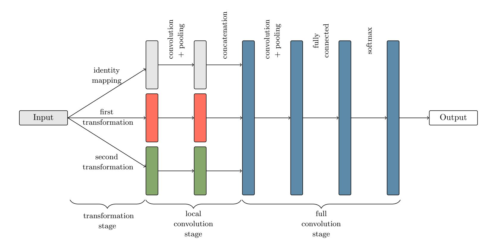
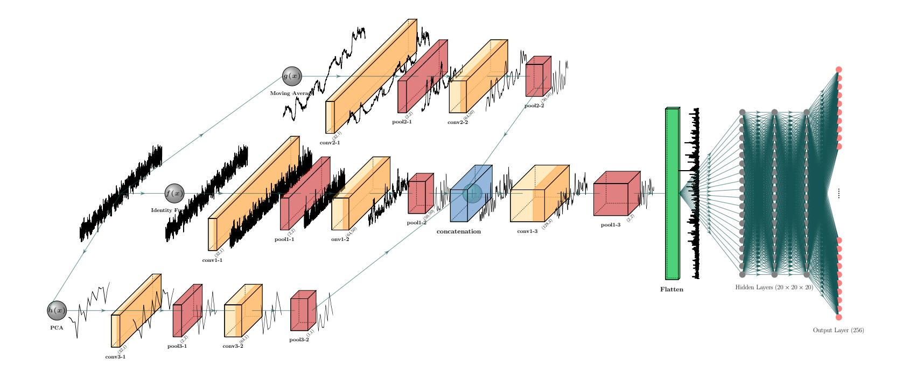
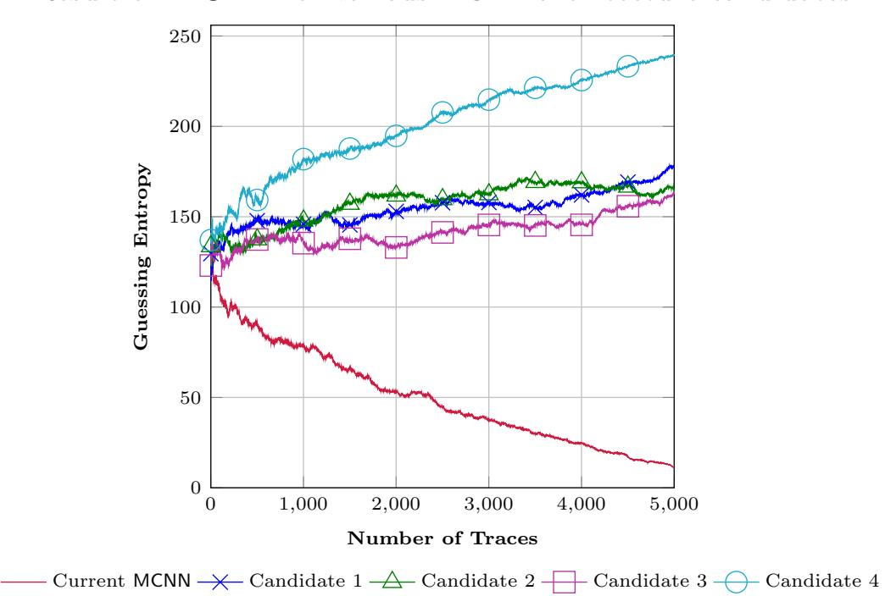
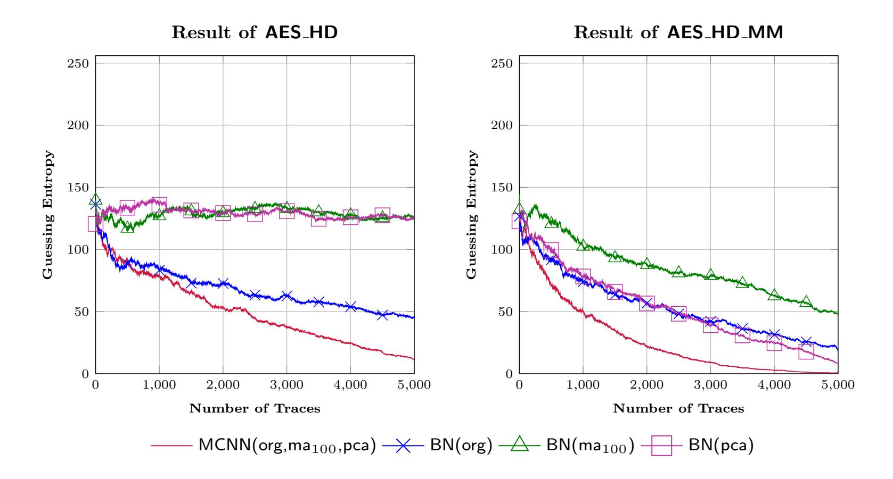
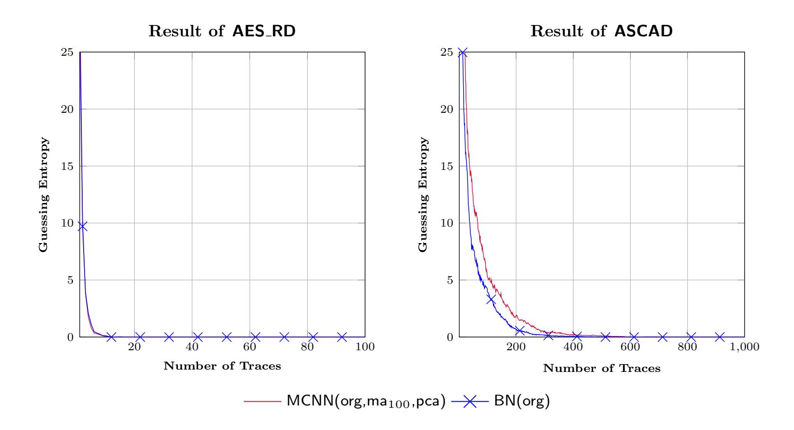
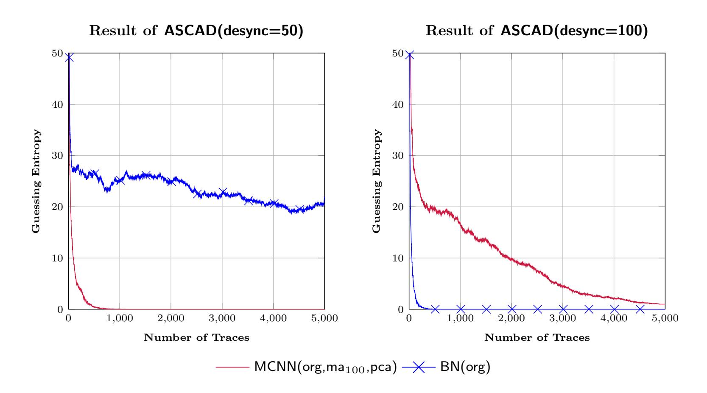
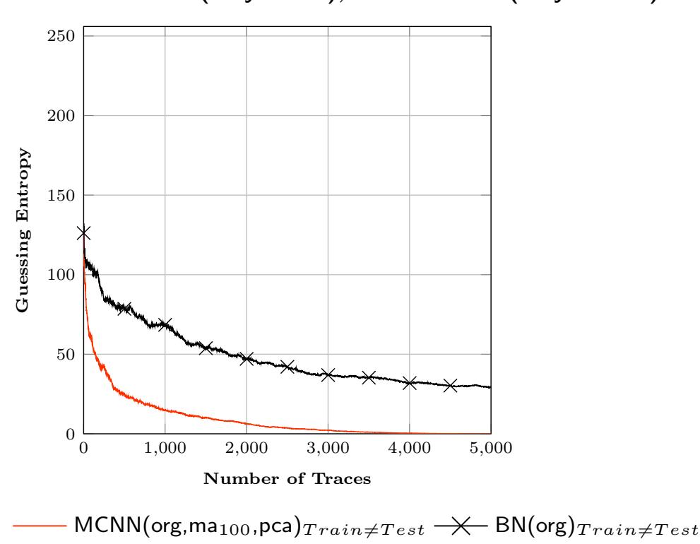
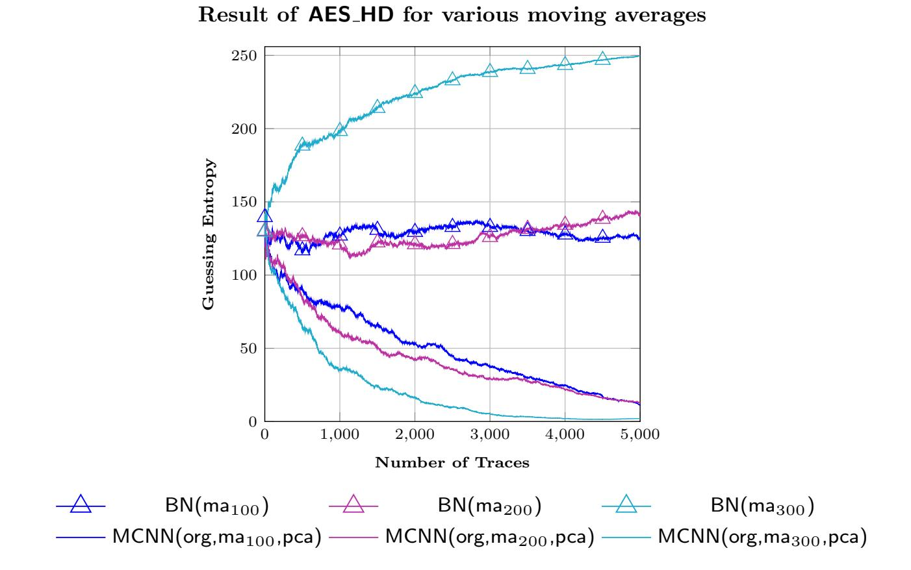
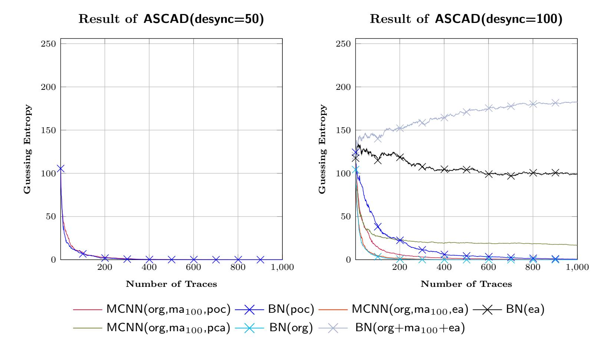
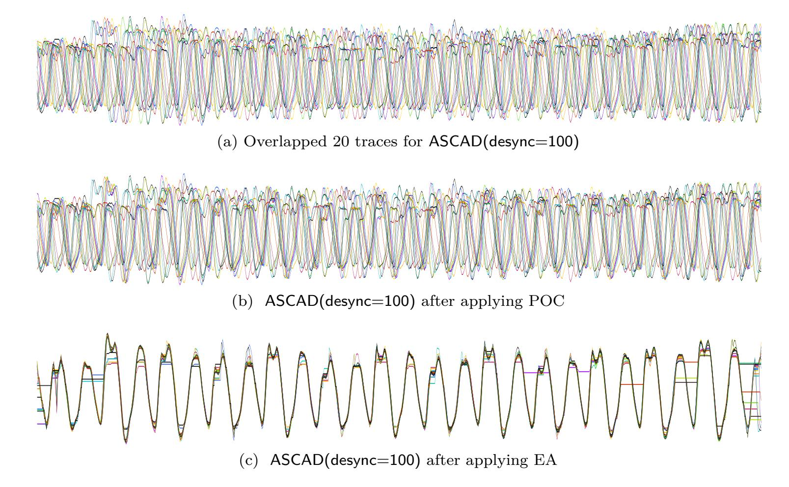

{0}------------------------------------------------

# **Back To The Basics: Seamless Integration of Side-Channel Pre-processing in Deep Neural Networks**

Yoo-Seung Won1 , Xiaolu Hou1 , Dirmanto Jap1 , Jakub Breier2 and Shivam Bhasin1

1 Physical Analysis and Cryptographic Engineering, Temasek Laboratories at Nanyang Technological University, Singapore

[yooseung.won,djap,sbhasin@ntu.edu.sg](mailto:yooseung.won, djap, sbhasin@ntu.edu.sg), [houxiaolu.email@gmail.com](mailto:houxiaolu.email@gmail.com) 2 Silicon Austria Labs, Graz, Austria [jbreier@jbreier.com](mailto:jbreier@jbreier.com)

**Abstract.** Deep learning approaches have become popular for Side-Channel Analysis (SCA) in the recent years. Especially Convolutional Neural Networks (CNN) due to their natural ability to overcome jitter-based as well as masking countermeasures. However, most efforts have focused on finding optimal architecture for a given dataset and bypass the need for trace pre-processing. However, trace pre-processing is a long studied topic and several proven techniques exist in the literature. There is no straightforward manner to integrate those techniques into deep learning based SCA. In this paper, we propose a generic framework which allows seamless integration of multiple, user defined pre-processing techniques into the neural network architecture. The framework is based on Multi-scale Convolutional Neural Networks (MCNN) that were originally proposed for time series analysis. MCNN are composed of multiple branches that can apply independent transformation to input data in each branch to extract the relevant features and allowing a better generalization of the model. In terms of SCA, these transformation can be used for integration of pre-processing techniques, such as phase-only correlation, principal component analysis, alignment methods *etc*. We present successful results on publicly available datasets. Our findings show that it is possible to design a network that can be used in a more general way to analyze side-channel leakage traces and perform well across datasets.

**Keywords:** Multi-scale convolutional neural networks · MCNN · Side-channel attacks · Deep learning

## **1 Introduction**

Deep neural networks (DNN) have gained popularity in the last decade due to advances in available computation resources. While image classification has benefited the most, the capability of DNN is also demonstrated in other domains like natural language processing, bioinformatics *etc*. Security evaluation of cryptography against classical and implementation level attacks has also seen rapid adoption of DNN. In particular, sidechannel attacks (SCA) have received the most attention as being a classification problem, DNN comes as a natural candidate. Various works in the literature have demonstrated the capability of DNN to break protected implementations, triggering a wave of research in understanding its limits and in turn design of strong countermeasures.

{1}------------------------------------------------

### **1.1 Related Works**

Maghrebi *et al.* [\[MPP16\]](#page-19-0) first demonstrated the power of Deep Learning (DL)-based SCA to break protected implementations, specially masking countermeasures. Further, Cagli *et al.* [\[CDP17\]](#page-18-0) showed the advantages of Convolutional Neural Networks (CNN) against jitter based countermeasures. Authors exploited the input in-variance property of CNN to perform SCA evaluation on misaligned traces without the need for trace realignment. On the other hand, Zhou *et al.* [\[ZS19\]](#page-20-0) showed that trace re-alignment can still be helpful for deep learning which is also clear by looking at the results of Cagli *et al.* when comparing ASCAD datasets with different misalignment. These works triggered further research into the usage of DL-based techniques for SCA. The methodology to determine suitable hyper-parameters for CNN and MLP was investigated by Prouff *et al.* [\[BPS](#page-17-0)+19]. An observation was later reported by Picek *et al.* [\[PHJ](#page-19-1)+19], which highlighted that accuracy, widely used metric in the machine learning field, is not an optimal metric in SCA context, instead propose to use guessing entropy. Further, Kim *et al.* [\[KPH](#page-19-2)+19] proposed a VGG-like network, inspired by the similarity of side-channel measurements to time series data like audio signals. The proposed VGG-like network, along with (enternally introduced) regularization due to added Gaussian noise, was shown to produce promising results against multiple datasets. In the context of metrics for side-channel, Masure *et al.* [\[MDP20\]](#page-19-3) theoretically showed that minimization of negative log-likelihood loss (NLL) corresponds to estimation of perceived information, a classical side-channel metric. Zaid *et al.* [\[ZBHV20a\]](#page-20-1) proposed a methodology to design efficient CNN for SCA context. The authors study different side-channel datasets and design an optimal CNN for each case, reporting promising results for each studied dataset. The difference between the approach of Kim *et al.* and Zaid *et al.* is that the latter optimizes CNN architecture to each use case, while the former uses the same CNN architecture to evaluate several datasets. Not to surprise, Zaid *et al.* present better results. Perin et al. [\[PCP19\]](#page-19-4) use ensemble models to focus on generalization but their focus lays in model generalization targeting one dataset at a time. Further, Won *et al.* [\[WJB20\]](#page-20-2) showed that results of Zaid *et al.* can be further boosted by applying data oversampling technique. Wouters *et al.* [\[WAGP20\]](#page-20-3) showed the importance of pre-processing for DL-based SCA evaluation to reduce network size. They also highlighted the need for study of networks which are optimal across datasets and indicated the existing literature on time-series classification as a direction. Golder *et al.* [\[GDD](#page-18-1)+19] showed DL-based SCA for cross-device attacks. They also showed that pre-processed traces with Dynamic Time Warping (DTW) and Principal Component Analysis (PCA)-based pre-processing outperforms stand alone MLP and CNN in terms of testing accuracy. As mentioned earlier, accuracy is not an optimal metric for evaluating the model performance with regards to SCA. The results in [\[GDD](#page-18-1)+19] were obtained by using traces collected from an 8-bit ChipWhisperer platform and the dataset was not made public.

### **1.2 Motivation**

Scanning through the series of previous works, we notice that the majority of the research has been done towards the direction of designing efficient network which can provide best attacks against a set of public trace datasets [\[KPH](#page-19-2)+19, [ZBHV20a,](#page-20-1) [WAGP20\]](#page-20-3) or on techniques to boost the results of existing networks like augmentation or oversampling [\[PHJ](#page-19-1)+19, [CDP17,](#page-18-0) [WJB20\]](#page-20-2). The general focus of these works has been to optimize CNN to defeat underlying countermeasures. Independently, the advantage of pre-processing training set for DL based SCA was shown in [\[ZS19,](#page-20-0) [GDD](#page-18-1)+19]. To the best of our knowledge, no work has investigated the possibility of strengthening DNN architecture with capability of integrating existing side-channel pre-processing or filtering technqiues. This forms the key motivation of this work, where we would like to propose a framework to

{2}------------------------------------------------

Figure 1: MCNN architecture proposed in [CCC16] for time series classification.

integrate previously developed and proven techniques for side-channel pre-processing into deep-learning based evaluation.

#### 1.3 Multi-Scale Convolutional Neural Networks

Multi-Scale Convolutional Neural Networks (MCNNs) were proposed for time series classification (TSC) in [CCC16]. The idea is to incorporate feature extraction and classification in a single framework by using a multi-branch model. Working principle of MCNN is to extract features at different scales and frequencies by transforming the original data and feeding the result to different branches of the model. One convolutional layer is capable of detecting local patterns, combing multiple convolutional layers can recognize more complex patterns. Later, the branches are concatenated and the computation follows a standard CNN architecture.

Overall architecture of MCNN is depicted in Figure 1. The MCNN framework from [CCC16] has three sequential stages:

- 1. Transformation stage: various transformation are applied on the input data. In the TSC domain, the proposed transformations were identity mapping, down-sampling in the time domain, and spectral transformation in the frequency domain. Each part is called a branch, and serves as an input to the CNN. Long-term features reflect overall trends and short-term features characterize small changes in local regions, while both of these can be important for the prediction.
- 2. Local convolution stage: several convolutional layers are used in each branch to extract the features. Convolutions for different branches are independent. Max pooling is also performed between the convolutions to prevent overfitting and improve computation efficiency.
- 3. Full convolution stage: extracted features are concatenated and several more convolutional layers are applied, followed by fully connected layers, and a softmax layer to generate the output.

MCNN was applied to 44 time series datasets in [CCC16], achieving better results than a standard CNN on 41 of them. These networks were also successfully used in the past for

{3}------------------------------------------------

predicting heart diseases [\[YZC17\]](#page-20-4) and for speech emotion recognition [\[SHKW17\]](#page-19-5) where they outperformed CNNs. Multi-scale recurrent CNNs were used for financial time series classification [\[GXR19\]](#page-18-2).

One of the advantages of the MCNN over the classical CNN is the ability to extract features at different time scales. Each branch can be specified to work on a different scale and frequency, and therefore, help to extract features that are relevant on such scale. As side-channel leakages come from various operations, working at different frequencies, MCNN naturally fit for this problem.

## **1.4 Contributions**

In this work, we propose a generic framework to integrate side-channel oriented preprocessing into deep learning architecture for side-channel evaluations. The framework is based on MCNN. Each branch of MCNN can be configured to perform a different transformation of the raw data. These transformations can be from time domain or frequency domain. Each convolution layer in an individual branch is expected to learn local patterns or features which when stacked with other layers result in a more complex learning. This makes the network more generic and consistent across datasets.

The main contributions of this work as follows:

- We propose a *generic framework* based on MCNN to enable seamless integration of side-channel oriented pre-processing techniques into deep learning based side-channel evaluations.
- By choosing a CNN architecture fine tuned for ASCAD(desync=100) as a building block from [\[ZBHV20a\]](#page-20-1), we show that the constructed MCNN performs better across a range of side-channel datasets as compared to the original network which performs only for optimised dataset or its trivial variants.
- We integrate well known methods from side-channel literature like Phase-Only Correlation (POC), Principal Component Analysis (PCA), Elastic Alignment (EA) into MCNN to boost its performance.
- We present a successful key recovery results for a masked FPGA implementation of AES-128.
- We also demonstrate that pre-processing alone is not always helpful. Indeed, it is the MCNN architecture which learns different features in each branch to result in a strong classifier.

### **1.5 Organization**

The rest of the paper is organised as follows. Section 2 recalls general background concepts used in the rest of the paper. Section 3 describes the adaption of MCNN for side-channel evaluation. Section 4 compares the performance of MCNN across public side-channel datasets against the state of art network. Section 5 demonstrates the capability of MCNN to seamlessly integrate well established side-channel pre-processing methods in the evaluation process. Finally, conclusions are drawn in Section 6.

## **2 Background**

This section highlights general background concepts used in the following sections.

{4}------------------------------------------------

## **2.1 Time Series**

A time series is a real-valued, high-dimensional vector that contains observations that are naturally ordered *w.r.t.* time. A time series often comes from recording time-varying measurements of an underlying process, *e.g.* stock market valuations, electronic health measurements, acoustic signals, *etc*. A *univariate* time series consists of sequentially collected observations of a single time-varying measurement and a *multivariate* time series consists of collected observations of two or more time-varying measurements. Given a collection of side-channel measurements, if the attacker focuses on exploiting one particular time sample (*e.g.* one sample during one XOR operation), the side-channel traces are considered as univariate times series. On the other hand, if the attacker exploits multiple points of interest in each trace, corresponding to one or more operations, we can view a single trace as a multivariate time series.

In time-series analysis, the main objective is to apply algorithms to analyze and extract previously unknown information in time series. In terms of SCA, this usually means recovery of information related to secret key used for encryption. As stated in [\[WAGP20\]](#page-20-3), analyzing network architectures built for time series classification and adopting them for SCA might be beneficial for the community.

### **2.2 Profiled Side-Channel Analysis**

Considering a strong adversary with an access to a clone device, profiled SCA [\[CRR02\]](#page-18-3) operates in two phases. In the profiling or training phase, the adversary acquires sidechannel measurements for known plaintext/ciphertext and known key pairs. This training set is used to characterize or model the device. The adversary then acquires few measurements from the target device, usually identical to the clone device, with known plaintext/ciphertext but the key is secret. These measurements from the target device are then tested against the characterized model from the clone device. For a well trained model, predicted labels corresponding to measurements from the target device reveal information on the secret key. First known profiled SCA used Gaussian templates [\[CRR02\]](#page-18-3). Later, machine learning [\[HGDM](#page-18-4)+11] and eventually deep learning [\[MPP16\]](#page-19-0) were shown to be better in practise when the traces are limited in number with intentional disturbance from countermeasures and measurement noise.

### **2.2.1 Performance Metrics**

To evaluate the performance of an applied SCA, one must choose a suitable metric. While accuracy is a common metric to evaluate performance of neural networks, it was shown that it is not optimal for side-channel based key recovery attacks [\[PHJ](#page-19-1)+19]. As a result, we use guessing entropy (GE), a metric commonly used for side-channel evaluations [\[SMY09\]](#page-19-6), even in deep-learning context. GE can be described as an average rank of the correct key after the attack, where GE = 0 indicates that the correct key is recovered by the attacks.

### **2.3 Pre-processing Techniques for SCA**

We recall four pre-processing techniques for SCA that are utilized in this paper.

**Moving Average (MA).** In the context of SCA, moving average technique is usually combined with the fundamental SCA techniques to resist the jitter-based countermeasure. For example, correlation [\[FW18,](#page-18-5) [GW15\]](#page-18-6), T-test [\[DCE16\]](#page-18-7) is combined with moving average for boosting the performance. The original proposal of MCNN uses moving average as one of the transformations to act as a low-frequency filter, reducing the variance of time series [\[CCC16\]](#page-17-1).

{5}------------------------------------------------

**Principal Component Analysis (PCA).** Template attacks exploit multivariate leakages by exploiting information in covariance matrix [\[APSQ06\]](#page-17-2). However, with the increase in number of samples in the trace, the size of co-variance matrix grows quickly beyond computation limits. Thus, PCA [\[BHvW12\]](#page-17-3) was proposed as a technique for dimensionality reduction. PCA finds linear transformation that projects high-dimensional data to a lower dimensional subspace while preserving the data variance. Several variants of template attacks had used PCA as a pre-processing tool [\[APSQ06,](#page-17-2) [CK13\]](#page-18-8).

**Phase-Only Correlation (POC).** POC is used for high-accuracy image matching problems [\[CDD94\]](#page-17-4). This technique was adopted as an alignment scheme by [\[HNI](#page-18-9)+06, [GW15\]](#page-18-6) in the context of side-channel analysis. POC is based on phase components in the discrete Fourier transform, and provides the shift value to properly match with the reference trace for alignment. In the case of EM signal with sharp shaped samples in numerical data, the alignment technique based on correlation might be useless, and requires many trial-and-error methods for searching proper parameters. Since the shift value for alignment is based on Peak-to-Sidelobe Ratio in POC, there is no need for parameter adjustments.

**Elastic Alignment (EA).** As desynchronization such as random jitters and random process interrupts are frequently employed to reduce the signal-to-noise ratio in the context of SCA, it is sometimes hard to align using the alignment technique based on correlation. One of the solutions overcoming this obstacle is EA [\[vWWB11\]](#page-19-7), which is based on dynamic time warping algorithm adopted from speech recognition [\[SC78\]](#page-19-8). As a result, the elastic alignment naturally concentrates on resynchronizing the traces. However, it might cause a loss of data leakage since it focuses the synchronization on traces shape and generates artificial samples.

## **3 Tailoring MCNN for SCA**

In SCA domain, the time series data normally comes from leakage measurements like power consumption or electromagnetic (EM) emanation during the execution of the cryptographic algorithm. Different types of SCA countermeasures are usually utilized to prevent the attacker from extracting the secret information from these measurements. It was shown that hiding countermeasures based on random delay insertion (RDI) can be defeated by data pre-processing techniques [\[MOP08\]](#page-19-9). These techniques aim at minimizing misalignment either by re-aligning the original traces according to a reference trace or by selecting points of interest that contribute to the information leakage. Therefore, if we aim at overcoming RDI-protected implementations, a natural way is to select MCNN branches that provide such feature.

### **3.1 Main Characteristics of the Framework**

In this part, we discuss the basic characteristics of the framework based on MCNN architecture. As shown in Figure [1,](#page-2-0) MCNN is composed of different branches. Each branch consist of convolutional and pooling layers applied on different transformation of the input data. The branches are then concatenated followed by full convolutional stage. Compared to a CNN, MCNN has one salient feature. This interesting feature is these transformation stages which in the following we call plug-in branch components (PBC). Moreover, concatenation is also an important part of MCNN followed by full convolutional layers, which enables the network to co-learn features from individual branches, together with the following layers. Combined, they strengthen MCNN to learn a more complex model. In the following we detail the PBC feature, model requirements, and data pre-processing.

{6}------------------------------------------------

#### **3.1.1 Plug-in Branch Components (PBC).**

As we focus on modular design for our MCNN SCA framework, we introduce a concept of *Plug-in Branch Components (PBC)*. The design of the original MCNN utilizes 3 PBCs, one of them taking the original data as an input, and the other two transformed data. In the context of SCA, we propose using transformations that were shown to be helpful when analyzing leakage traces, such as PCA, or moving average. Alignment techniques, such as elastic alignment, and signal processing and noise filtering techniques like Fast Fourier Transform can also be used as PBCs. As neural networks naturally select important features during the training phase, it is expected that the PBC providing more relevant features will be prioritized. This unburdens the user from trying out various pre-processing techniques to get the best result. The choice of PBC can also profit from attacker's expertise who can carefully choose PBC based on the underlying countermeasure. Linking these PBC based transformations to data pre-processing is what enables natural and seamless integration of widely used techniques to DL-based SCA.

**Data Pre-processing.** Pre-processing is a general practise in SCA. Most evaluation labs dealing with real products with countermeasures spend majority of effort in data preprocessing. If pre-processing is done correctly, the following process of key recovery is straightforward. Adopting MCNN structure for SCA allows us to feed the pre-processed traces into the neural network. Note that this is a salient feature of MCNN where as for other used architectures, such pre-processing is applied on training data. Being a time series data, side-channel traces contain both short term and long term features, while also exhibiting different frequency features. Processing only the transformed data can also lead to loss of information. With pre-processing, we can create training data with more distinct features when exploited together with the original data in another branch, thus increasing the learning power of the trained network. We have discussed several existing pre-processing techniques for SCA in Section [2.3.](#page-4-0) Moving averages are a simple and common type of smoothing used in time series analysis and time series forecasting. For SCA, it helps to remove noise and better expose the signal of the underlying operations within each averaged interval of the trace. Hence, moving average assists in capturing short term features and merging leakages spread over several neighbouring samples together. PCA projects high-dimensional data to a low-dimensional subspace and preserves the most important directions. It helps in identifying important features in different frequency domains. Similarly, POC analyzes the discrete Fourier transforms of waveforms, hence extracting features in various frequency domains. Elastic alignment aims to align the entire trace to counter jitter and random interrupts. The pre-processed traces will then contain enhanced long term features.

**Model Requirements.** We can summarize our requirements on the neural network model based on MCNN in following points:

- Perform well on multiple datasets without the need of hyperparameter tuning.
- Overcome side-channel countermeasures, specially commonly studied jitter-based and masking countermeasures for hardware and software implementations.
- Easy to replace a PBC with a different one, in case a better pre-processing method is available in the future.

{7}------------------------------------------------

Figure 2: Main Structure for MCNN.

## **3.2 MCNN Architecture for SCA**

For comparison, we use the state-of-the-art architecture from Zaid *et al.* [\[ZBHV20a\]](#page-20-1) [1](#page-7-0) . In [\[ZBHV20a\]](#page-20-1) the authors have proposed different CNN architecures for different datasets. For example, they fine-tuned the filter size based on jitter amount. However, in practice, one would expect the attacker to not be able to access this kind of knowledge. Since we aim to propose a generic architecture that can be utilized for any dataset, we choose one particular network structure from [\[ZBHV20b\]](#page-20-5) for comparison. We have chosen the CNN proposed for ASCAD(desync=100) as it has the most complicated structure and we expect it to perform reasonably well on other datasets as well. We will denote this CNN as Base Network (BN) throughout the rest of the paper. We note that as BN is not optimized for other datasets, we expect sub-optimal performances of BN on other datasets.

In line with the MCNN structure presented in Section [1.3,](#page-2-1) we consider three plugin branch components in the transformation stage, with one PBC being the identity. Therefore, the other two PBCs have to be chosen carefully to provide extraction of relevant features. Naturally, there are a lot of the candidates for PBC since many preprocessing techniques have been suggested in the context of side-channel analysis. As a representative example, we consider the moving average and PCA. The moving average techniques are widely combined with the fundamental side-channel analysis to boost the performance against jitter countermeasures. For example, the correlation based on sliding window is employed because the points of interest are normally spread over several points. Hence, moving average is used as one of PBCs in the transformation stage of our MCNN. For the second PBC, we can choose one of representative pre-processing techniques performing dimensionality reduction such as PCA. PCA has been used for years in the context of profiled SCA. Especially, this technique is used for noise reduction and overcoming of misalignment, and it has been recently applied to increase the performance of DL [\[GDD](#page-18-1)+19].

While for our basic MCNN structure, we use identity, moving average, and PCA as PBCs for the transformation stage, we propose MCNN as a generic framework where the PBCs can be user-defined and seamlessly integrated into the network structure. We therefore show a few examples for variations of the basic MCNN structure in Section [5.](#page-13-0)

1 In this work, we have put into consideration the issue raised by Wouters *et al.* [\[WAGP20\]](#page-20-3) and noted the follow up response from Zaid *et al.* [\[ZBHV20b\]](#page-20-5).

{8}------------------------------------------------

#### Result of AES HD for various MCNN architecture candidates

Figure 3: Results for AES\_HD for various MCNN architecture candidates.

## **3.3 MCNN Structure**

Structure of the MCNN used in this paper is depicted in Figure [2.](#page-7-1) It closely follows the original proposal from [\[CCC16\]](#page-17-1), using two convolutional layers in each branch, one convolutional layer after the merging of the branches, and dense layers at the end. As stated in [\[ZBHV20a\]](#page-20-1), three convolutional layers in a sequence can provide optimal feature extraction for SCA tasks.

To make sure the model architecture is well-fit for SCA, we experimented with a few different candidate models. We used the AES\_HD dataset to benchmark the models as it is more challenging compared to software datasets due to low SNR. Therefore, the performance difference can be clearly recognizable between good and bad options. Results of these experiments are stated in Figure [3.](#page-8-0) Differences of the candidate models over the main model are as follows:

- **Candidate 1:** One additional convolutional layer was added to each branch, making the total number of branch layers three.
- **Candidate 2:** Same as Candidate 1, but with removing the convolutional layer after the branch merging.
- **Candidate 3:** Same as Candidate 2, but with adding an extra batch normalization step after the branch merging.
- **Candidate 4:** One additional convolutional layer was added after the branch merging, making the total number of convolutional layers in the full convolutional stage two.

As can be seen from the figure, the chosen MCNN architecture performs the best among the five models. Number of convolutional blocks for this architecture is the same as in [\[ZBHV20a\]](#page-20-1), which is in line with their findings. While Candidate 2 also has the same number of convolutional blocks, the performance is degrading because of properties of MCNN architecture – a convolutional layer after the branch merging is beneficial to further extract the features. Different number of branches was explored in [\[GXR19\]](#page-18-2) (see Table 7) for analyzing financial time-series data, where authors tried 1-3 branches. From their results, 3 branches provide the best accuracy.

{9}------------------------------------------------

| Arch. | Transformation stage (PBC) | Local convolution stage |        |        | Full convolution stage |          |          | Multiperceptron          |
|-------|-------------------------------|-------------------------|--------|--------|------------------------|----------|----------|--------------------------|
|       |                               | filters                 | kernel | pool   | filters                | kernel   | pool     | layer                    |
|       |                               |                         | size   | size   |                        | size     | size     |                          |
| MCNN  | Original                      | (32,64)                 | (1,50) | (2,50) |                        |          |          |                          |
|       | Moving average                | (32,64)                 | (1,50) | (2,50) | 128                    | 3        | 2        | $20 \times 20 \times 20$ |
|       | PCA                           | (32,64)                 | (1,1)  | (2,1)  |                        |          |          |                          |
| MCNN  | Original                      | (32,64)                 | (1,50) | (2,50) |                        |          |          |                          |
|       | Moving average                | (32,64)                 | (1,50) | (2,50) | 128                    | 3        | 2        | $20 \times 20 \times 20$ |
|       | POC                           | (32,64)                 | (1,50) | (2,50) |                        |          |          |                          |
| MCNN  | Original                      | (32,64)                 | (1,50) | (2,50) |                        |          |          |                          |
|       | Moving average                | (32,64)                 | (1,50) | (2,50) | 128                    | 3        | 2        | $20 \times 20 \times 20$ |
|       | Elastic Alignment             | (32,64)                 | (1,50) | (2,50) |                        |          |          |                          |
| BN    | Original                      | -                       | -      | -      | (32,64,128)            | (1,50,3) | (2,50,2) | $20 \times 20 \times 20$ |
| BN    | Moving Average                | -                       | -      | -      | (32,64,128)            | (1,50,3) | (2,50,2) | $20 \times 20 \times 20$ |
| BN    | PCA                           | -                       | -      | -      | (32,64,128)            | (1,1,3)  | (2,1,2)  | $20 \times 20 \times 20$ |
| BN    | POC                           | -                       | -      | -      | (32,64,128)            | (1,50,3) | (2,50,2) | $20 \times 20 \times 20$ |
| BN    | Elastic Alignment             | -                       | -      | -      | (32,64,128)            | (1,50,3) | (2,50,2) | $20 \times 20 \times 20$ |
| BN    |                               | -                       | -      | -      | (32,64,128)            | ( , , ,  | ( / / /  |                          |

Table 1: Network Architecture for BN and MCNN

All hyperparameters for MCNN and BN are employed from [ZBHV20a].

Table 2: Number of train/test sets in all open datasets to perform BN and MCNN

| Dataset           | #Train | #Validation | #Test |  |
|-------------------|--------|-------------|-------|--|
| AES_HD            | 45,000 | 5,000       | 5,000 |  |
| AES_HD_MM         | 45,000 | 5,000       | 5,000 |  |
| AES_RD            | 20,000 | 5,000       | 5,000 |  |
| ASCAD             | 45,000 | 5,000       | 5,000 |  |
| ASCAD(desync=50)  | 45,000 | 5,000       | 5,000 |  |
| ASCAD(desync=100) | 45,000 | 5,000       | 5,000 |  |

For local convolution and full convolution stages, we follow the properties of the BN architecture. Since there are three convolution and pooling layers in BN, it can be split into two convolution and pooling layers for local convolution stage and last one convolution and pooling layers for full convolution stage in MCNN. Moreover, the convolution filters, convolution kernel size, pooling size, and pooling strides are also adopted from BN. For PCA, there are some modifications as the number of points is is different compared to other branches. In the second convolution block of local stage, the convolution kernel size and pooling size are set to 1. Similar to BN, batch normalization is applied to the next pooling layer. The architecture requires the batch normalization before concatenation as data of different dimensions are merged before the full convolution stage. We summarize our MCNN architectures and compare it to BN in Table 1. We use Original to indicate the branch with identity function in order to emphasis the traces are without pre-processing. For example, the loss function and optimizer are NLL and Adam, respectively.

## 4 Experimental Results

In this section, we evaluate the performance of the proposed MCNN architectures from Table 1 against BN. The comparison is performed on various publicly available datasets. While [ZBHV20a] recommend different architectures for different datasets with an objective of achieving best results for all datasets, our MCNN experiments do not aim at minimizing  $\bar{N}t_{GE}$ , but we aim at demonstrating that MCNN performs well across datasets in general. Therefore, the evaluation is performed with a fixed network architecture. The chosen BN as a baseline architecture is motivated as the most complex architecture of all the architectures proposed in [ZBHV20a] as it will learn different datasets with ease compared to smaller architectures.

#### 4.1 Target Dataset & Notations

For the experiments we consider the following 4 public datasets, which are freely available online, for reproducibility.

{10}------------------------------------------------

**ASCAD.** The dataset2 contains side-channel measurements of protected AES implementations running on an 8-bit AVR microcontroller. It was introduced by Benadjila *et al.* [BPS+19], as a public dataset for comparing the performance of deep-learning based side-channel attacks. The ASCAD database traces correspond to first order masking protected AES with artificially introduced random jitter. In particular, for the experiments, the introduced jitter (desynchronization) are set to range up to 50 and 100 sample points. We represent the desynchronization of 50 and 100 as ASCAD(desync=50) ASCAD(desync=100), respectively. The dataset consists of 60,000 traces, with 700 features each.

**AES\_RD.** The dataset3 is based on AES software implementation on an 8-bit AVR microcontroller. The implementation is protected with a random delay countermeasure [CK09] to cause misalignment in the traces, which in turn reduces the SNR. The dataset consists of 50,000 traces, with 3,500 features each.

**AES\_HD.** The dataset4 includes an unprotected AES hardware implementation on FPGA. Unlike software implementations, the last round is considered as a main target, in order to utilize the register update leakage from last round to output ciphertext. There are 50,000 traces with 1,250 points in the dataset.

**AES\_HD\_MM.** In all the previous works, DL based SCA have focused on countermeasures implemented for software targets. However, AES\_HD\_MM dataset5 is based on multiplicative masking countermeasure [AG01] implemented in hardware. The implementation performed masked AES on SASEBO-GII FPGA board [SAS]. According to [DZFL14], the success rate for this countermeasure is only 90%, even though they launched second-order attacks [DZFL14] with 500,000 traces. Dataset contains 5,600,000 traces with 3,125 points are provided in their open URL5. For attack, the leakage model is identical to AES\_HD dataset, which means second-order attack on a hardware countermeasure.

Notations and Parameters. BN(x) and  $MCNN(PBC_1(x),PBC_2(x),PBC_3(x))$  indicate the Base Network with original traces x and MCNN with PBCs ( $PBC_1$ ,  $PBC_2$ ,  $PBC_3$ ), respectively. For MCNN,  $PBC_1$  is an identity function (org),  $PBC_2$  is moving average (ma) and  $PBC_3$  as PCA (pca). For later experiments, we change  $PBC_3$  to POC (poc) and EA (ea). In the case of moving average technique, step size is a required parameter when merging from n points to single point. Hence, we represents it as  $ma_n$ . For example,  $BN(ma_{100})$  (instead of  $BN_{ma_{100}}(x)$  for simplicity) means Base Network having input as original traces applied moving average technique with merging 100 points to single point. The original traces are datasets such as  $AES_HD$ ,  $AES_HD_MM$ , ASCAD, ASCAD(desync=50), and ASCAD(desync=100).

Additionally, "+" notation which is used as the input for BN in order to fairly compare with the MCNN indicates merging of datasets. For instance, org+ma means that atraining dataset consists of original traces and the output of moving average applied to original traces. If the dimension is not matched, we use a zero padding scheme.

### 4.2 Comparing MCNN with BN

Performance of MCNN and BN is compared across datasets. All experiments in this section are done with  $MCNN(org, ma_{100}, pca)$ . Traces in each dataset were split for training, validation and testing. For fair comparison, we followed the similar split as in [ZBHV20a].

&lt;sup>2https://github.com/ANSSI-FR/ASCAD

&lt;sup>3https://github.com/ikizhvatov/randomdelays-traces

&lt;sup>4https://github.com/AESHD/AES\_HD\_Dataset

&lt;sup>5https://chest.coe.neu.edu/?current\_page=POWER\_TRACE\_LINK&software=ptmasked

{11}------------------------------------------------

Figure 4: Results for AES\_HD and AES\_HD\_MM.

We also use a similar dataset split ratio for AES\_HD\_MM. The ratio is listed in Table [2.](#page-9-1) The attack is repeated 100 times and GE is obtained by averaging the result over these 100 attacks.

In Figure [4,](#page-11-0) we first report the results for the attacks on AES hardware implementations. For the unprotected implementation, AES\_HD, we can see that the proposed model, MCNN, performs better than BN. Here BN only learns from the raw AES\_HD traces, MCNN also learns from the PBC branches obtained through moving average with step 100 and PCA. To have a better insight into the results, we repeat the experiments with BN by training it with transformed traces using moving average with step 100 and PCA in two independent experiments. In this case, the transformations are applied on training set directly. As shown in Figure [4,](#page-11-0) the transformation of the traces alone does not give good results as shown for BN(ma100) and BN(pca). This shows that it is an inherent property of MCNN which allows it to learn more features than BN alone and result in better attacks. Note that BN is not designed for AES\_HD and thus the results are worse than those reported in [\[ZBHV20a\]](#page-20-1), still we report significant improvements with MCNN. Next, we take a look into FPGA implementation of AES-128 protected with multiplicative masking in AES\_HD\_MM dataset. MCNN shows a significant faster convergence to GE 1 as compared to BN with original traces as well as two sets of transformed traces.

Next, we look into datasets for software implementation of AES. These include AES\_RD dataset and ASCAD dataset with different desynchronization. Figure [5](#page-12-0) shows the results ASCAD dataset with no desynchronization and AES\_RD. These two datasets are easy to break as shown in various previous works [\[ZBHV20a,](#page-20-1) [KPH](#page-19-2)+19]. Both MCNN and BN

Table 3: Overall performance of MCNN vs. BN on different datasets. Good indicates GE ≤ 10 at 5k traces, Average indicates GE declining steadily but not reaching GE ≤ 10 at 5k traces, and Bad means that it is not clear when the GE can converge.

| Arch. | ASCAD | ASCAD (desync=50) | ASCAD (desync=100) | AES_RD | AES_HD  | AES_HD_MM |
|-------|-------|----------------------|-----------------------|--------|---------|-----------|
| MCNN  | Good  | Good                 | Good                  | Good   | Good    | Good      |
| BN    | Good  | Bad                  | Good                  | Good   | Average | Average   |

{12}------------------------------------------------

Figure 5: Results for AES\_RD and ASCAD.

have no trouble in learning these dataset and perform very well.

We next move to test the ASCAD dataset with desynchronization. Here we have two cases, ASCAD(desync=50) and ASCAD(desync=100). Recall that BN as proposed in [\[ZBHV20a\]](#page-20-1) is optimised for ASCAD(desync=100) and indeed as shown in Figure [6,](#page-13-1) BN performs best. While MCNN performs fine in this case, it is not as good as BN. This reinstates the results of [\[ZBHV20a\]](#page-20-1) that networks optimised for a chosen dataset perform best. Figure [6](#page-13-1) shows the results for ASCAD(desync=50). ASCAD(desync=50) is a special case as it can be considered a subset of ASCAD(desync=100) where desynchronization is limited to 50 samples only. Intuitively, we expect BN to perform well in it, however, our results show that BN struggles with this dataset and MCNN performs best. This shows that BN is probably over-optimised for ASCAD(desync=100) dataset. BN(ma100) and BN(pca) GE results for ASCAD and AES\_RD did not converge as in previous cases.

Comparing Figure [5](#page-12-0) and Figure [6,](#page-13-1) we can see that MCNN performs well in all the datasets. Since BN is fine-tuned for ASCAD(desync=100), it performs the best on that particular dataset, but its performance on other datasets is not guaranteed.

Overall result across all the datasets are stated in Table [3.](#page-11-1) It shows that MCNN can scale to different datasets without the need of changing the network structure or even PBCs.

#### **4.2.1 Comparison on the Resistance of Reinforced Jitter-based Countermeasure**

To investigate the capability of MCNN in generalizing further, we conduct a special experiment. In this case, the training dataset is derived from ASCAD(desync=50), while the testing dataset is derived from ASCAD(desync=100). Note that ASCAD(desync=50) and ASCAD(desync=100) differ in the jitter offset range only, while everything else remains the same. Thus, we are testing the trained network with cases never seen by the training model. In other words, while the network learns to recognise jitter up to 50 samples in either direction, the testing data can have jitter up to 100 samples. The results are shown in Figure [7.](#page-14-0) It can be clearly seen that MCNN performs better thus being able to learn the underlying problem with more ease than BN.

{13}------------------------------------------------

Figure 6: Results for ASCAD(desync=50) and ASCAD(desync=100).

## **5 Integrating Proven SCA Pre-Processing Techniques in MCNN**

In the previous section, we show on public datasets that MCNN can achieve consistent performance even without modifying the network architecture. While the MCNN architecture used two well known pre-processing techniques, these pre-processing techniques were not chosen based on the dataset. Nevertheless, MCNN performed better across the datasets.

As discussed previously, we propose MCNN as a general framework where the PBCs can be exploited to integrate any pre-processing technique into the framework. Consider an evaluation lab conducting security evaluation of several products on a daily basis. Over the course of years, evaluators in these labs see various countermeasures and develop various pre-processing techniques to optimize the evaluation. The current state of deep learning research for SCA has majorly focused on optimizing architectures so as to bypass the pre-processing phase altogether. With PBC in the proposed MCNN architecture, MCNN provides the opportunity for an evaluator to integrate those tested and proven pre-processing techniques directly into deep learning based SCA evaluation. While the list of pre-processing techniques (including their parameter space) is non-exhaustive, we demonstrate this feature of the proposed MCNN framework by two distinct case studies. In the first case study, we focus on improving current MCNN architecture by optimizing transformation parameters. The second case study focuses on integrating other well known pre-processing techniques as PBCs to MCNN.

## **5.1 Case Study 1: Optimizing Transformation Parameters in Existing MCNN Architecture**

The choice of moving average as a PBC in MCNN was inspired by the original MCNN [\[CCC16\]](#page-17-1). However, in the previous experiments, we did not consider optimization of moving average parameters to suit dataset characteristics, while still showing good results across datasets. In this part, we experiment with moving average parameters to evaluate its effect on AES\_HD dataset. As mentioned earlier, AES\_HD implements an AES-128 parallel

{14}------------------------------------------------

#### Result of Train: ASCAD(desync=50), Test: ASCAD(desync=100)

Figure 7: Results for Train: ASCAD(desync=50) and Test: ASCAD(desync=100).

architecture to compute one round per clock. Here, different sub-components of the cipher leak in different parts of the clock cycle. By measuring on a high sampling rate oscilloscope, these leakages might be spread over different points but within a single clock cycle or to a neighbouring clock cycle in some cases. This is unlike software computation where sub-operations might be separated by several clock cycles. Thus, for hardware implementation, simple signal processing techniques like moving average allow combination of leakage, allowing an attacker to exploit contribution of several leakages spread over a number of points.

For AES\_HD, we investigated the effect of the parameters for moving average. We consider the parameters space with varying step size ∈ {100*,* 200*,* 300}, thus MCNN(*org, ma*100*, pca*), MCNN(*org, ma*200*, pca*) and MCNN(*org, ma*300*, pca*). Here step size refers to the width of the window used for calculating moving average while sliding through the trace. The results are shown in Figure [8.](#page-15-0) By choosing a bigger step size for the moving average, the result of MCNN can be largely improved as compared to previous result in Figure [4.](#page-11-0) On the other hand, playing with moving average parameters, does not improve the attack results for BN.

## **5.2 Case Study 2: Integrating New Pre-Processing Techniques In MCNN**

Finally, in this case study we investigate the effectiveness of MCNN by plugging in known pre-processing techniques in SCA to replace PCA used as PBC in the original architecture. We choose 2 known techniques. The first technique was proposed by Homma *et al.* [\[HNI](#page-18-9)+06] in CHES 2006 and is known as POC. The second technique investigated is EA [\[vWWB11\]](#page-19-7) which was proposed at CT-RSA 2011 and also available in few commercial tools for SCA evaluations. To perform the evaluations, we choose ASCAD(desync=50) and ASCAD(desync=100), as these datasets implement jitter or misalignment countermeasure. Both POC and EA are designed to overcome misalignment. It was also shown previously that pre-processing traces can improve efficiency of deep learning based evaluations [\[ZS19,](#page-20-0) [GDD](#page-18-1)+19]. MCNN is different from these previous works because, while previous works were modifying the training dataset altogether by pre-processing, MCNN applies these pre-processing on the fly in one of its branches through PBC, while the training set remains

{15}------------------------------------------------

Figure 8: Results for AES\_HD in various moving averages.

Figure 9: Results for ASCAD(desync=50) and ASCAD(desync=100) in various input/PBC types.

unchanged. Few sample traces from ASCAD(desync=100) before and after alignment are shown in Figure [10.](#page-16-0) It can be seen that EA works better than POC in this case. In essence, a good alignment method is converting these traces close to synchronised ASCAD database and one should expect similar results. The two modified MCNN used in the following experiments are MCNN(*org, ma*100*, poc*) and MCNN(*org, ma*100*, ea*).

The results are reported in Figure [9.](#page-15-1) From the figure, we can see that in the case of desynchronization = 50, all methods are working successfully, including BN, which is unsuccessful in recovering the key in the original experiments (see Figure [6\)](#page-13-1). Thus, we

{16}------------------------------------------------

Figure 10: Overlapped 20 traces ASCAD(desync=100) after pre-processing techniques.

confirm the results of [\[ZS19,](#page-20-0) [GDD](#page-18-1)+19] that pre-processing helps deep-learning based SCA evaluations.

Now, we look at a comparatively difficult case of ASCAD(desync=100) with higher desynchronization = 100. In this case, MCNN is performing slightly better than BN with POC pre-processing, where we can observe faster convergence and smaller number of traces required to recover the key, and much better than BN with other pre-processing methods. In general, for all the experiments conducted, we can observe that the performance of MCNN is consistent throughout different datasets and different parameter settings. WIth good choice of PBC, we were able to match the performance of BNorg with MCNN(*org, ma*100*, poc*), where BNorg is specifically designed to perform best for ASCAD(desync=100).

We note that even though visually EA results in better alignment compared to POC (see Figure [10\)](#page-16-0), BN(ea) performs worse than BN(poc). This demonstrates the importance of capturing features in different scales and frequencies. EA helps to enhance the long term features by aligning the traces, while POC analyzes the discrete Fourier transforms of waveforms and extracts features in various frequency domains. The observation further confirms the benefits of data prepossessing done in the PBCs.

Finally, we investigate if MCNN is not simply doing feature space augmentation. To check this, we augment the training dataset with feature transformed traces and see if BN can perform better. In other words, we take ASCAD(desync=100) dataset, transform it using moving average and EA to get two separate datasets, merge it with the original dataset to have an augmented dataset with 3× traces and use this augmented dataset to train and test BN. As shown in Figure [9,](#page-15-1) the result is much worse and confirms that MCNN is not simply augmenting the dataset but exploiting salient features from all the transformations to bring a more complex model.

## **6 Conclusions**

In this paper, we presented a neural network architecture for profiled side-channel attacks based on multi-scale convolutional neural networks (MCNN). We proposed a general 

{17}------------------------------------------------

framework that can be used for building MCNN models that can effectively perform SCA tasks on various datasets without fine-tuning of parameters. Our results show that MCNN has a great potential to serve as an architecture of choice when the details of the leakage traces are not available to the attacker while providing the power to the attacker to integrate pre-processing seamlessly into the architecture.

**Future directions.** Different architectures based on the idea of MCNN would be interesting to explore. For example, in [\[GXR19\]](#page-18-2), the authors use multi-scale recurrent CNN (RCNN) and report superior results on financial time series data compared to other models. They claim that using RCNN over CNN improves capturing of temporal dependencies in the data. In time series classification, long short-term memory (LSTM) models are a popular approach to solve tasks that would not be possible to solve with traditional feed-forward networks [\[GES02,](#page-18-12) [KMDC17\]](#page-19-11). Therefore, LSTM might offer additional ways to analyze SCA leakage traces.

Different PBCs could be explored to enhance the feature transformation step. Autoencoders, successfully used for SCA before [\[WP19,](#page-20-6) [KKH20\]](#page-19-12), could be plugged as a PBC to improve the performance of the model. Moreover, we only looked at non-profiled data pre-processing techniques in this work. it would be interesting to investigate methods to integrate profiled pre-processing (like linear discriminant analysis, autocencoders) into MCNN as a PBC.

Automated selection of PBCs with a usage of neural architecture search (NAS) [\[ZL16\]](#page-20-7) could be implemented. NAS approaches iterate over different architectures and try various hyperparameters to find the best model for the task. In terms of SCA, there could be a pool of different PBCs, and the branches would be chosen automatically by NAS based on their performance.

## **References**

- [AG01] Mehdi-Laurent Akkar and Christophe Giraud. An implementation of DES and AES, secure against some attacks. In *International Workshop on Cryptographic Hardware and Embedded Systems*, pages 309–318. Springer, 2001.
- [APSQ06] Cédric Archambeau, Eric Peeters, F-X Standaert, and J-J Quisquater. Template attacks in principal subspaces. In *International Workshop on Cryptographic Hardware and Embedded Systems*, pages 1–14. Springer, 2006.
- [BHvW12] Lejla Batina, Jip Hogenboom, and Jasper GJ van Woudenberg. Getting more from PCA: first results of using principal component analysis for extensive power analysis. In *Cryptographers' track at the RSA conference*, pages 383–397. Springer, 2012.
- [BPS+19] Ryad Benadjila, Emmanuel Prouff, Rémi Strullu, Eleonora Cagli, and Cécile Dumas. Deep learning for side-channel analysis and introduction to ASCAD database. *Journal of Cryptographic Engineering*, pages 1–26, 2019.
- [CCC16] Zhicheng Cui, Wenlin Chen, and Yixin Chen. Multi-Scale Convolutional Neural Networks for Time Series Classification. *arXiv preprint arXiv:1603.06995*, 2016.
- [CDD94] Qin-sheng Chen, Michel Defrise, and Frank Deconinck. Symmetric phaseonly matched filtering of fourier-mellin transforms for image registration and recognition. *IEEE Transactions on pattern analysis and machine intelligence*, 16(12):1156–1168, 1994.

{18}------------------------------------------------

- [CDP17] Eleonora Cagli, Cécile Dumas, and Emmanuel Prouff. Convolutional neural networks with data augmentation against jitter-based countermeasures. In *International Conference on Cryptographic Hardware and Embedded Systems*, pages 45–68. Springer, 2017.
- [CK09] Jean-Sébastien Coron and Ilya Kizhvatov. An Efficient Method for Random Delay Generation in Embedded Software. In Christophe Clavier and Kris Gaj, editors, *Cryptographic Hardware and Embedded Systems - CHES 2009, 11th International Workshop, Lausanne, Switzerland, September 6-9, 2009, Proceedings*, volume 5747 of *Lecture Notes in Computer Science*, pages 156– 170. Springer, 2009.
- [CK13] Omar Choudary and Markus G Kuhn. Efficient template attacks. In *International Conference on Smart Card Research and Advanced Applications*, pages 253–270. Springer, 2013.
- [CRR02] Suresh Chari, Josyula R Rao, and Pankaj Rohatgi. Template attacks. In *International Workshop on Cryptographic Hardware and Embedded Systems*, pages 13–28. Springer, 2002.
- [DCE16] A Adam Ding, Cong Chen, and Thomas Eisenbarth. Simpler, Faster, and More Robust T-test based Leakage Detection. In *International workshop on constructive side-channel analysis and secure design*, pages 163–183. Springer, 2016.
- [DZFL14] A Adam Ding, Liwei Zhang, Yunsi Fei, and Pei Luo. A statistical model for higher order DPA on masked devices. In *International Workshop on Cryptographic Hardware and Embedded Systems*, pages 147–169. Springer, 2014.
- [FW18] Dor Fledel and Avishai Wool. Sliding-Window Correlation Attacks against Encryption Devices with an Unstable Clock. In *International Conference on Selected Areas in Cryptography*, pages 193–215. Springer, 2018.
- [GDD+19] Anupam Golder, Debayan Das, Josef Danial, Santosh Ghosh, Shreyas Sen, and Arijit Raychowdhury. Practical approaches toward deep-learning-based cross-device power side-channel attack. *IEEE Transactions on Very Large Scale Integration (VLSI) Systems*, 27(12):2720–2733, 2019.
- [GES02] Felix A Gers, Douglas Eck, and Jürgen Schmidhuber. Applying LSTM to time series predictable through time-window approaches. In *Neural Nets WIRN Vietri-01*, pages 193–200. Springer, 2002.
- [GW15] Catherine H Gebotys and Brian A White. A Sliding Window Phase-Only Correlation Method for Side-Channel Alignment in a Smartphone. *ACM Transactions on Embedded Computing Systems (TECS)*, 14(4):1–22, 2015.
- [GXR19] Liu Guang, Wang Xiaojie, and Li Ruifan. Multi-Scale RCNN Model for Financial Time-series Classification. *arXiv preprint arXiv:1911.09359*, 2019.
- [HGDM+11] Gabriel Hospodar, Benedikt Gierlichs, Elke De Mulder, Ingrid Verbauwhede, and Joos Vandewalle. Machine learning in side-channel analysis: a first study. *Journal of Cryptographic Engineering*, 1(4):293, 2011.
- [HNI+06] Naofumi Homma, Sei Nagashima, Yuichi Imai, Takafumi Aoki, and Akashi Satoh. High-Resolution Side-Channel Attack using Phase-based Waveform Matching. In *International Workshop on Cryptographic Hardware and Embedded Systems*, pages 187–200. Springer, 2006.

{19}------------------------------------------------

- [KKH20] Donggeun Kwon, HeeSeok Kim, and Seokhie Hong. Improving Non-Profiled Side-Channel Attacks using Autoencoder based Preprocessing. *IACR Cryptol. ePrint Arch.*, 2020:396, 2020.
- [KMDC17] Fazle Karim, Somshubra Majumdar, Houshang Darabi, and Shun Chen. LSTM Fully Convolutional Networks for Time Series Classification. *IEEE access*, 6:1662–1669, 2017.
- [KPH+19] Jaehun Kim, Stjepan Picek, Annelie Heuser, Shivam Bhasin, and Alan Hanjalic. Make some noise. unleashing the power of convolutional neural networks for profiled side-channel analysis. *IACR Transactions on Cryptographic Hardware and Embedded Systems*, pages 148–179, 2019.
- [MDP20] Loïc Masure, Cécile Dumas, and Emmanuel Prouff. A comprehensive study of deep learning for side-channel analysis. *IACR Transactions on Cryptographic Hardware and Embedded Systems*, pages 348–375, 2020.
- [MOP08] Stefan Mangard, Elisabeth Oswald, and Thomas Popp. *Power analysis attacks: Revealing the secrets of smart cards*, volume 31. Springer Science & Business Media, 2008.
- [MPP16] Houssem Maghrebi, Thibault Portigliatti, and Emmanuel Prouff. Breaking cryptographic implementations using deep learning techniques. In *International Conference on Security, Privacy, and Applied Cryptography Engineering*, pages 3–26. Springer, 2016.
- [PCP19] Guilherme Perin, Lukasz Chmielewski, and Stjepan Picek. Strength in numbers: Improving generalization with ensembles in profiled side-channel analysis. Cryptology ePrint Archive, Report 2019/978, 2019. [https://](https://eprint.iacr.org/2019/978) [eprint.iacr.org/2019/978](https://eprint.iacr.org/2019/978).
- [PHJ+19] Stjepan Picek, Annelie Heuser, Alan Jovic, Shivam Bhasin, and Francesco Regazzoni. The curse of class imbalance and conflicting metrics with machine learning for side-channel evaluations. *IACR Transactions on Cryptographic Hardware and Embedded Systems*, 2019(1):1–29, 2019.
- [SAS] SASEBO. *Evaluation environment for side-channel attacks*.
- [SC78] Hiroaki Sakoe and Seibi Chiba. Dynamic programming algorithm optimization for spoken word recognition. *IEEE transactions on acoustics, speech, and signal processing*, 26(1):43–49, 1978.
- [SHKW17] Tatinati Sivanagaraja, Mun Kit Ho, Andy WH Khong, and Yubo Wang. Endto-end speech emotion recognition using Multi-Scale Convolution Networks. In *2017 Asia-Pacific Signal and Information Processing Association Annual Summit and Conference (APSIPA ASC)*, pages 189–192. IEEE, 2017.
- [SMY09] François-Xavier Standaert, Tal G Malkin, and Moti Yung. A unified framework for the analysis of side-channel key recovery attacks. In *Annual international conference on the theory and applications of cryptographic techniques*, pages 443–461. Springer, 2009.
- [vWWB11] Jasper GJ van Woudenberg, Marc F Witteman, and Bram Bakker. Improving differential power analysis by elastic alignment. In *Cryptographers' Track at the RSA Conference*, pages 104–119. Springer, 2011.

{20}------------------------------------------------

- [WAGP20] Lennert Wouters, Victor Arribas, Benedikt Gierlichs, and Bart Preneel. Revisiting a Methodology for Efficient CNN Architectures in Profiling Attacks. *IACR Transactions on Cryptographic Hardware and Embedded Systems*, 2020(3):147–168, Jun. 2020.
- [WJB20] Yoo-Seung Won, Dirmanto Jap, and Shivam Bhasin. Push For More: On Comparison of Data Augmentation and SMOTE With Optimised Deep Learning Architecture For Side-Channel. 2020. [https://eprint.iacr.org/](https://eprint.iacr.org/2020/655) [2020/655](https://eprint.iacr.org/2020/655).
- [WP19] Lichao Wu and Stjepan Picek. Remove Some Noise: On Pre-processing of Side-channel Measurements with Autoencoders. *IACR Cryptol. ePrint Arch.*, 2019:1474, 2019.
- [YZC17] Zhenjie Yao, Zhiyong Zhu, and Yixin Chen. Atrial Fibrillation Detection by Multi-Scale Convolutional Neural Networks. In *2017 20th International Conference on Information Fusion (Fusion)*, pages 1–6. IEEE, 2017.
- [ZBHV20a] Gabriel Zaid, Lilian Bossuet, Amaury Habrard, and Alexandre Venelli. Methodology for efficient CNN architectures in profiling attacks. *IACR Transactions on Cryptographic Hardware and Embedded Systems*, pages 1–36, 2020.
- [ZBHV20b] Gabriel Zaid, Lilian Bossuet, Amaury Habrard, and Alexandre Venelli. Understanding methodology for efficient CNN architectures in profiling attacks. *IACR Cryptol. ePrint Arch.*, 2020:757, 2020.
- [ZL16] Barret Zoph and Quoc V Le. Neural Architecture Search with Reinforcement Learning. *arXiv preprint arXiv:1611.01578*, 2016.
- [ZS19] Yuanyuan Zhou and François-Xavier Standaert. Deep learning mitigates but does not annihilate the need of aligned traces and a generalized resnet model for side-channel attacks. *Journal of Cryptographic Engineering*, pages 1–11, 2019.