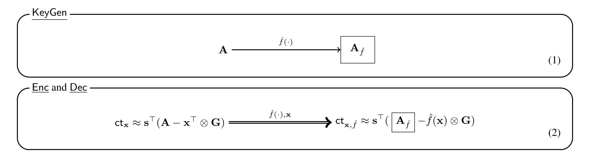
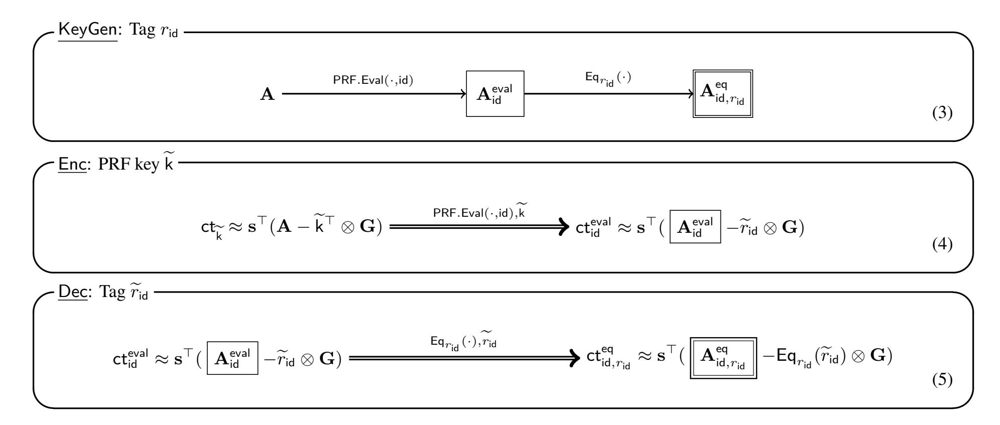
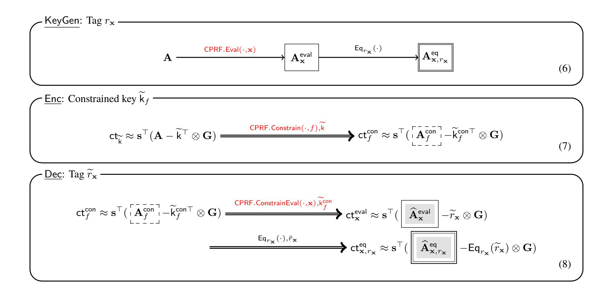
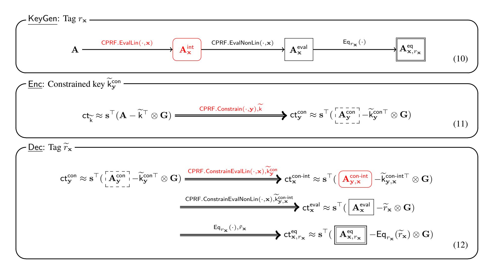

{0}------------------------------------------------

# Adaptively Secure Inner Product Encryption from LWE

Shuichi Katsumata1, Ryo Nishimaki2, Shota Yamada1, Takashi Yamakawa2

1National Institute of Advanced Industrial Science and Technology (AIST), Tokyo, Japan {shuichi.katsumata,yamada-shota}@aist.go.jp

2NTT Secure Platform Laboratories, Tokyo, Japan {ryo.nishimaki.zk,takashi.yamakawa.ga}@hco.ntt.co.jp

September 17, 2020

#### **Abstract**

Attribute-based encryption (ABE) is an advanced form of encryption scheme allowing for access policies to be embedded within the secret keys and ciphertexts. By now, we have ABEs supporting numerous types of policies based on hardness assumptions over bilinear maps and lattices. However, one of the distinguishing differences between ABEs based on these two breeds of assumptions is that the former can achieve *adaptive* security for quite expressible policies (e.g., inner-products, boolean formula) while the latter can not. Recently, two adaptively secure lattice-based ABEs have appeared and changed the state of affairs: a non-zero inner-product (NIPE) encryption by Katsumata and Yamada (PKC'19) and an ABE for *t*-CNF policies by Tsabary (CRYPTO'19). However, the policies supported by these ABEs are still quite limited and do not embrace the more interesting policies that have been studied in the literature. Notably, constructing an adaptively secure *inner-product encryption* (IPE) based on lattices still remains open.

In this work, we propose the first adaptively secure IPE based on the learning with errors (LWE) assumption with sub-exponential modulus size (without resorting to complexity leveraging). Concretely, our IPE supports inner-products over the integers  $\mathbb{Z}$  with polynomial sized entries and satisfies adaptively weakly-attribute-hiding security. We also show how to convert such an IPE to an IPE supporting inner-products over  $\mathbb{Z}_p$  for a polynomial-sized p and a fuzzy identity-based encryption (FIBE) for small and large universes. Our result builds on the ideas presented in Tsabary (CRYPTO'19), which uses constrained pseudorandom functions (CPRF) in a semi-generic way to achieve adaptively secure ABEs, and the recent lattice-based adaptively secure CPRF for inner-products by Davidson et al. (CRYPTO'20). Our main observation is realizing how to weaken the *conforming* CPRF property introduced in Tsabary (CRYPTO'19) by taking advantage of the specific linearity property enjoyed by the lattice evaluation algorithms by Boneh et al. (EUROCRYPT'14).

## 1 Introduction

An attribute-based encryption (ABE) [SW05] is an advanced form of public-key encryption (PKE) that allows the sender to specify in a more general way about who should be able to decrypt. In an ABE for predicate  $P: \mathcal{X} \times \mathcal{Y} \to \{0, 1\}$ , decryption of a ciphertext associated with an attribute  $\mathbf{y}$  is only possible by a secret key associated with an attribute  $\mathbf{x}$  such that  $P(\mathbf{x}, \mathbf{y}) = 1$ . For instance, identity-based encryption (IBE) [BF03, Coc01] is a special form of ABE where an equality predicate is considered.

Over the past decade and a half, we have seen exciting progress in the design and security analysis of ABEs. Each subsequent work provides improvements in various aspects including security, expressiveness of predicates, or underlying assumptions. While the earlier constructions were mainly based on bilinear maps, e.g., [BB11, SW05, GPSW06, BW07, SBC+07, KSW13], by now we have plenty of constructions based on lattices as well, e.g., [GPV08, ABB10a, CHKP12, AFV11, GVW15a, BGG+14]. Some of the types of ABEs that have attracted more attention than others in the literature include (but not limited to), fuzzy IBE [SW05, ABV+12], inner-product encryption (IPE) [LOS+10, AFV11, KSW13], ABE for boolean formulae [GPSW06, LOS+10], and ABE for P/poly circuits

{1}------------------------------------------------

[GVW15a, BGG+14]. Regarding the expressiveness of predicates, lattice-based ABEs seem to achieve stronger results than bilinear map-based ABEs since the former allows for predicates expressible by P/poly circuits, whereas the latter is restricted to boolean formulae.

Adaptive Security. While lattice-based ABEs have richer expressiveness, bilinear map-based ABEs can realize stronger security. Specifically, they can address *adaptive* security (in the standard model) for quite expressive predicates. Here, adaptive security states that, even if an adversary can obtain polynomially many secret keys for any attribute  $\mathbf{x}$  and adaptively query for a challenge ciphertext associated with an attribute  $\mathbf{y}^*$  such that  $P(\mathbf{x}, \mathbf{y}^*) = 0$ , it still cannot learn the message encrypted within the challenge ciphertext. This clearly captures the real-life scenario where an adversary can adaptively choose which attributes to attack. In some cases, we may consider the much weaker *selective* security, where an adversary must declare which attribute  $\mathbf{y}^*$  it will query as the challenge at the beginning of the security game. In general, we can convert a selectively secure scheme to an adaptively secure scheme by employing complexity leveraging, where the reduction algorithm simply guesses the challenge attribute at the outset of the game. However, this is often undesirable as such proofs incur an exponential security loss and necessitate in relying on exponentially hard assumptions. Using bilinear maps, we know how to directly construct adaptively secure fuzzy IBE [CGW15, Wee14], IPE [LOS+10, OT12, Wee14, CGW15], and even ABE for boolean formulae [LOS+10, OT19, Att14, Wee14, CGW15, Att16] from standard (polynomial) assumptions.

On the other hand, our knowledge of adaptively secure lattice-based ABEs is still quite limited. Notably, most of the lattice-based ABEs are only selectively secure. For almost a decade, the only adaptively secure scheme we knew how to construct from lattices was limited to the most simplistic form of ABE, an IBE [ABB10a, CHKP12]. Considering that we had a lattice-based selectively secure ABE for the powerful predicate class of P/poly circuits, this situation on adaptive security was unsatisfactory. Recently, the state of affairs changed: Katsumata and Yamada [KY19] proposed an adaptively secure non-zero IPE (NIPE), and Tsabary [Tsa19] proposed an adaptively secure ABE for t-CNF predicates. The latter predicate consists of formulas in conjunctive normal form where each clause depends on at most t bits of the input, for any constant t. The former work is based on a generic construction from adaptively secure functional encryption for inner-products [ALS16], whereas the latter work ingeniously extends the adaptively secure bilinear map-based IBE of Gentry [Gen06] to the lattice setting by utilizing a special type of constrained pseudorandom function (CPRF) [BW13, KPTZ13, BGI14]. Unfortunately, NIPE nor ABE for t-CNF is not expressive enough to capture the more interesting types of ABE such as fuzzy IBE or IPE, let alone ABE for boolean formulae or P/poly. Therefore, the gap between the bilinear map setting and the lattice setting regarding adaptive security still remains quite large and dissatisfying. Indeed, constructing an adaptively secure IPE based on lattices is widely regarded as one of the long-standing open problems in lattice-based ABE.

#### 1.1 Our Contribution

In this work, we propose the first lattice-based *adaptively* secure IPE over the integers  $\mathbb{Z}$ . In addition, we show several extensions of our main result to realize other types of ABEs such as fuzzy IBE. The results are summarized below and in Table 1. All of the following schemes are secure under the learning with errors (LWE) assumption with sub-exponential modulus size.

- We construct an adaptively secure IPE over the integers  $(\mathbb{Z})$  with polynomial sized entries. The predicate is defined as  $P: \mathbb{Z} \times \mathbb{Z} \to \{0,1\}$ , where  $\mathbb{Z}$  is a subset of  $\mathbb{Z}^{\ell}$  with bounded polynomial sized entries and  $P(\mathbf{x}, \mathbf{y}) = 1$  if and only if  $\langle \mathbf{x}, \mathbf{y} \rangle = 0$  over  $\mathbb{Z}$ .
- We construct an adaptively secure IPE over the ring  $\mathbb{Z}_p$  for  $p = \mathsf{poly}(\kappa)$ . The predicate  $\mathsf{P}_{\mathsf{mod}} : \mathbb{Z}_p^\ell \times \mathbb{Z}_p^\ell \to \{0,1\}$  is defined similarly to above, where now  $\mathsf{P}_{\mathsf{mod}}(\mathbf{x},\mathbf{y}) = 1$  if and only if  $\langle \mathbf{x},\mathbf{y} \rangle = 0 \mod p$ .
- We construct an adaptively secure fuzzy IBE for small and large universe with threshold T. Specifically, the predicate is defined as  $\mathsf{P}_{\mathsf{fuz}}: \mathcal{D}^n \times \mathcal{D}^n \to \{0,1\}$ , where  $\mathcal{D}$  is a set of either polynomial size (i.e., small universe) or exponential size (i.e., large universe) and  $\mathsf{P}_{\mathsf{fuz}}(\mathbf{x}, \mathbf{y}) = 1$  if and only if  $\mathsf{HD}(\mathbf{x}, \mathbf{y}) \leq n T$ . Here,  $\mathsf{HD}$  denotes the hamming distance. That is, if  $\mathbf{x}$  and  $\mathbf{y}$  are identical in more than T-positions, then  $\mathsf{P}_{\mathsf{fuz}}(\mathbf{x}, \mathbf{y}) = 1$ .

Though we mainly focus on proving payload-hiding for these constructions, we can generically upgrade payload-hiding ABE to be weakly-attribute-hiding by using lockable obfuscation, which is known to exist under the LWE

{2}------------------------------------------------

assumption with sub-exponential modulus size [GKW17, WZ17]. (See also Remark 2.9.) Therefore, we obtain adaptively weakly-attribute-hiding ABE for the above classes of predicates under the LWE assumption with sub-exponential modulus size. We note that this does not require an additional assumption since our payload-hiding constructions already rely on the same assumption.

The first construction is obtained by extending the recent result by Tsabary [Tsa19], while the second and third constructions are obtained by a generic transformation of the first construction.

| Reference                 | Type of Predicate                          | LWE Asmp. | Misc.                   |
|---------------------------|--------------------------------------------|-----------|-------------------------|
| [ABB10a, CHKP12]          | IBE                                        | poly      |                         |
|                           | $\mathbb Z$ w/ poly-size entries           | poly      |                         |
| [KY19]                    | NIPE over $\mathbb{Z}$ w/ exp-size entries | poly      |                         |
|                           | $\mathbb{Z}_p$ w/ poly and exp-size $p$    | subexp    | stateful key generation |
| [Tsa19]                   | (CP-)ABE for t-CNF                         | subexp    | t = O(1)                |
| Ours Section 5            | IPE over $\mathbb{Z}$ w/ poly-size entries | subexp    |                         |
| Ours Section 6.1          | IPE over $\mathbb{Z}_p$ w/ poly-size $p$   | subexp    |                         |
| Ours Sections 6.2 and 6.3 | Fuzzy IBE w/ small and large universe      | subexp    |                         |

Table 1: Existing adaptively secure lattice-based ABE.

#### 1.2 Technical Overview

We provide a detailed overview of our first (main) result regarding an adaptively secure IPE over the integers ( $\mathbb{Z}$ ) and provide some discussions on how to extend it to ABE with other types of useful predicates. For our first result, we first extend the framework of Tsabary [Tsa19] and exploit a specific linearity property of the lattice evaluation algorithms of Boneh et al. [BGG+14]. We then make a subtle (yet crucial) modification to the CPRF for inner-products over the integer by Davidson et al. [DKN+20] so as to be compatible with our extended framework for achieving adaptively secure ABEs.

Note. In the following, to make the presentation clearer, we treat ABE as either a ciphertext-policy (CP) ABE or a key-policy (KP) ABE interchangeably. In CP-ABE, an attribute associated to a ciphertext represents a policy  $f \in \mathcal{Y}$ , which is described as a circuit, and we define the predicate  $P(\mathbf{x}, f) := f(\mathbf{x})$ . That is, the predicate is satisfied if  $f(\mathbf{x}) = 1$ . KP-ABE is defined analogously. Note that IPE can be viewed as both a CP and KP-ABE since the roles of the attributes associated with the secret key and the ciphertext are symmetric.

Reviewing Previous Results. Due to the somewhat lattice-heavy nature of our result, we review the relevant known results. For those who are up-to-date with the result of Tsabary [Tsa19] may safely skip to "Our Results". We first provide some background on lattice evaluation algorithms [BGG $^+$ 14]. We then review the framework developed by Tsabary [Tsa19] for achieving adaptively secure ABEs (for t-CNF).

Selectively secure (KP-)ABE based on homomorphic evaluation. We recall the selectively secure ABE by Boneh et al. [BGG+14], which is the basic recipe for constructing lattice-based ABEs. Let  $\mathbf{A} \in \mathbb{Z}_q^{n \times \ell m}$  be a public matrix and  $\mathbf{G} \in \mathbb{Z}_q^{n \times m}$  be the so-called (public) gadget matrix whose trapdoor is known [MP12]. Then, there exists two deterministic efficiently computable lattice evaluation algorithms PubEval and CtEval such that for any  $f: \{0,1\}^{\ell} \to \{0,1\}$  and  $\mathbf{x} \in \{0,1\}^{\ell}$ , the following property holds.1

- PubEval $(f, \mathbf{A}) \to \mathbf{A}_f$ ,
- $\mathsf{CtEval}(f, \mathbf{x}, \mathbf{A}, \mathbf{s}^{\top}(\mathbf{A} \mathbf{x}^{\top} \otimes \mathbf{G}) + \mathsf{noise}) \to \mathbf{s}^{\top}(\mathbf{A}_f f(\mathbf{x}) \otimes \mathbf{G}) + \mathsf{noise},$

where noise denotes some term whose size is much smaller than q which we can ignore. In words, CtEval is an algorithm that allows to convert a ciphertext (or an encoding) of x w.r.t. matrix A into a ciphertext of f(x) w.r.t. matrix  $A_f$ , where  $A_f$  is the same matrix output by PubEval. In the following, we assume that the output of CtEval statistically hides the value x, which is possible by adding sufficiently large noise.

 $^{1}$ We note that f can also be represented as an arithmetic circuit.

{3}------------------------------------------------

$$\mathbf{A} \xrightarrow{f(\cdot)} \mathbf{A}_f \qquad \operatorname{ct}_{\mathbf{x}} \approx \mathbf{s}^\top (\mathbf{A} - \mathbf{x}^\top \otimes \mathbf{G}) \xrightarrow{f(\cdot), \mathbf{x}} \operatorname{ct}_{\mathbf{x}, f} \approx \mathbf{s}^\top (\boxed{\mathbf{A}_f} - f(\mathbf{x}) \otimes \mathbf{G})$$

Figure 1: PubEval and CtEval. In all figures, symbol  $\approx$  means that we hide (or ignore) the noise part in ciphertexts.

We provide an overview of how to construct a (KP-)ABE. The public parameters consist of a matrix  $\mathbf{A}$  and a vector  $\mathbf{u}$ . Let  $\hat{f}$  be a negation of the function f, that is,  $\hat{f}(\mathbf{x}) := 1 - f(\mathbf{x})$ . To generate a secret key for function f, the KeyGen algorithm first runs  $\mathbf{A}_{\hat{f}} \leftarrow \mathsf{PubEval}(\hat{f}, \mathbf{A})$  as in Equation (1) below. Then the secret key  $\mathsf{sk}_f$  is sampled as a short vector  $\mathbf{e}_f$  such that  $\mathbf{A}_{\hat{f}}\mathbf{e}_f = \mathbf{u}$ . To generate a ciphertext for attribute  $\mathbf{x}$  with message  $\mathsf{M} \in \{0,1\}$ , the Enc algorithm generates a LWE sample of the form  $\mathsf{ct}_0 := \mathbf{s}^\top \mathbf{u} + \mathsf{noise} + \mathsf{M} \cdot \lfloor q/2 \rfloor$  and  $\mathsf{ct}_{\mathbf{x}}$  as depicted on the l.h.s. of Equation (2). To decrypt with a secret key  $\mathsf{sk}_f$ , the Dec algorithm first runs  $\mathsf{CtEval}(\hat{f}, \mathbf{x}, \mathbf{A}, \mathsf{ct}_{\mathbf{x}})$  to generate  $\mathsf{ct}_{\mathbf{x},\hat{f}}$  as depicted on the r.h.s. of Equation (2). Here, notice that the ciphertext is converted into a ciphertext that encodes the matrix  $\mathbf{A}_{\hat{f}}$  used during KeyGen (both boxed in Equations (1) and (2)). Then, if the predicate is satisfied, i.e.,  $f(\mathbf{x}) = 1 \Leftrightarrow \hat{f}(\mathbf{x}) = 0$ , then  $\mathsf{ct}_{\mathbf{x},f} = \mathbf{s}^\top \mathbf{A}_{\hat{f}} + \mathsf{noise}$ . Therefore, using  $\mathbf{e}_f$ , the message can be recovered by computing  $\mathsf{ct}_0 - \langle \mathsf{ct}_{\mathbf{x},f}, \mathbf{e}_f \rangle$  and rounding appropriately.

Figure 2: Illustration of the selectively secure ABE by BGG+14. The thin (resp. thick) black arrow describes running algorithm PubEval (resp. CtEval). The items on top of the arrows denote the required input to run the respective algorithms. This is the same for all subsequent figures. In Equation (2), the l.h.s. and r.h.s. are generated by Enc and Dec, respectively.

Now, *selective* security follows by embedding the LWE problem in the challenge ciphertext. Specifically, the reduction algorithm is given an LWE instance ( $[\mathbf{u}|\mathbf{B}], [\mathbf{v}_0|\mathbf{v}]$ ), where  $[\mathbf{v}_0|\mathbf{v}]$  is either random or of the form  $[\mathbf{v}_0|\mathbf{v}] = \mathbf{s}^{\top}[\mathbf{u}|\mathbf{B}] + \text{noise}$ . It then implicitly sets  $\mathbf{A} := \mathbf{B}\mathbf{R} + \mathbf{x}^{*\top} \otimes \mathbf{G}$  where  $\mathbf{x}^*$  is the challenge attribute the adversary commits to at the outset of the security game and  $\mathbf{R}$  is a random matrix with small entries and sets the challenge ciphertext as  $(\mathsf{ct}_0 := \mathbf{v}_0 + \mathsf{M} \cdot \lfloor q/2 \rfloor, \mathsf{ct}_{\mathbf{x}^*} := \mathbf{v})$ . It can be checked that if  $[\mathbf{v}_0|\mathbf{v}]$  is a valid LWE instance, then the challenge is distributed as in the actual security game. Otherwise, the challenge ciphertext is uniformly random. Finally, we remark that simulating secret keys for policy f such that  $f(\mathbf{x}^*) = 0$  is possible since there exists a special lattice evaluation algorithm (only used during the security proof) that allows the reduction algorithm to convert  $\mathbf{A}_{\hat{f}}$  into  $\mathbf{B}\mathbf{R}_{\hat{f}} + \hat{f}(\mathbf{x}^*) \otimes \mathbf{G} = \mathbf{B}\mathbf{R}_{\hat{f}} + \mathbf{G}$ , where  $\mathbf{R}_{\hat{f}}$  is a matrix with short norm. We omit the details on what or how to use  $\mathbf{R}_{\hat{f}}$  as it is not important for this overview and refer the readers to  $[\mathbf{B}\mathbf{G}\mathbf{G}^+1\mathbf{4}]$ .

We end by emphasizing that the above reduction technique only works in the selective setting because the adversary commits to  $\mathbf{x}^*$  at the outset of the game; if it did not, then the reduction algorithm will not be able to set  $\mathbf{A}$  as  $\mathbf{B} + \mathbf{x}^{*\top} \otimes \mathbf{G}$  in the public parameter.

&lt;sup>2To be accurate, we require an extra matrix  $A_0$  for which we know a trapdoor in order to sample such a short vector. However, we simplify the exposition for the sake of clarity.

{4}------------------------------------------------

Adaptively secure IBE à la Gentry [Gen06] and Tsabary [Tsa19].3 Before getting into adaptively secure ABEs, we first consider the simpler adaptively secure IBEs. We overview the so-called "tagging" technique [Gen06, Tsa19]. In the real scheme, a secret key and a ciphertext for an identity id are associated with random "tags"  $r_{id}$ . The scheme is set up so that decryption only works if the tag value  $r_{id}$  of the secret key skid is different from the tag value  $\tilde{r}_{id}$  of the ciphertext for an identity id. In case the tags are sampled from an exponentially large space, such a scheme only has a negligible probability of a decryption failure. At a high level, the scheme will be tweaked so that the reduction algorithm assigns exactly one random tag  $r_{id}$  per identity id; a secret key and a challenge ciphertext for the same identity id are tagged by the same  $r_{id}$ . In addition, the reduction algorithm will only be able to simulate a secret key and a challenge ciphertext w.r.t. this unique tag  $r_{id}$ . Here, this tweak will remain unnoticed by the adversary since a valid adversary never asks for a secret key and a challenge ciphertext for the same identity id.

We briefly review how Tsabary [Tsa19] cleverly carried out this idea in the lattice-setting. The public parameter now includes a description of a pseudorandom function PRF, and the master secret key includes a seed k for the PRF. To generate a secret key for identity id, the KeyGen algorithm computes the random tag  $r_{id} \leftarrow PRF.Eval(k, id)$ . It then sequentially runs  $\mathbf{A}_{\mathsf{id}}^{\mathsf{eval}} \leftarrow \mathsf{PubEval}(\mathsf{PRF}.\mathsf{Eval}(\cdot,\mathsf{id}),\mathbf{A})$  and  $\mathbf{A}_{\mathsf{id},r_{\mathsf{id}}}^{\mathsf{eq}} \leftarrow \mathsf{PubEval}(\mathsf{Eq}_{r_{\mathsf{id}}}(\cdot),\mathbf{A}_{\mathsf{id}}^{\mathsf{eval}})$  as in Equation (3) below, where  $\mathsf{Eq}_{r_\mathsf{id}}(\tilde{r}_\mathsf{id}) = 1$  if and only if  $r_\mathsf{id} = \tilde{r}_\mathsf{id}$ . As before, it then samples a short vector  $\mathbf{e}_\mathsf{id}$  such that  $\mathbf{A}_{\mathsf{id},r_\mathsf{id}}^\mathsf{eq}\mathbf{e}_\mathsf{id} = \mathbf{u}$ . The final secret key is  $sk_{id} := (r_{id}, e_{id})$ . To generate a ciphertext for identity id with message M, the Enc algorithm first samples a random PRF key  $\widetilde{\mathsf{k}}$  and generates  $\mathsf{ct}_0 := \mathbf{s}^\top \mathbf{u} + \mathsf{noise} + \mathsf{M} \cdot \lfloor q/2 \rfloor$  as before. It then generates  $\mathsf{ct}_{\widetilde{\mathsf{k}}}$  as  $depicted in the l.h.s of Equation \textbf{(4)} and further executes <math>\mathsf{ct}_{\mathsf{id}}^{\mathsf{eval}} \leftarrow \mathsf{CtEval}(\mathsf{PRF}.\mathsf{Eval}(\cdot,\mathsf{id}),\widetilde{k},\mathbf{A},\mathsf{ct}_{\widetilde{k}}) \text{ as depicted in the l.h.s}$ r.h.s of Equation (4). The final ciphertext is  $\mathsf{ct} := (\widetilde{r}_\mathsf{id}, \mathsf{ct}_0, \mathsf{ct}_\mathsf{id}^\mathsf{eval})$ , where  $\widetilde{r}_\mathsf{id} \leftarrow \mathsf{PRF}.\mathsf{Eval}(\widetilde{\mathsf{k}}, \mathsf{id})$ . Effectively, the Enc algorithm has constructed a ciphertext that is bound to an identity id and a random tag  $\tilde{r}_{id}$ ; observe that  $\mathbf{A}_{id}^{eval}$  is the same matrix that appears during KeyGen (in a single-framed box). Here, we note that the noise term in ctid does not leak any information on the PRF key k by our assumption. Now, to decrypt, the Dec algorithm, with knowledge of both the random tag  $r_{\mathsf{id}}$  and  $\tilde{r}_{\mathsf{id}}$ , runs  $\mathsf{ct}_{\mathsf{id},r_{\mathsf{id}}}^{\mathsf{eq}} \leftarrow \mathsf{CtEval}(\mathsf{Eq}_{r_{\mathsf{id}}}(\cdot), \tilde{r}_{\mathsf{id}}, \mathbf{A}_{\mathsf{id}}^{\mathsf{eval}}, \mathsf{ct}_{\mathsf{id}}^{\mathsf{eval}})$  as depicted in the r.h.s. of Equation (5). At this point, the ciphertext is converted into a ciphertext that encodes the matrix  $\mathbf{A}_{\mathrm{id},r_{\mathrm{id}}}^{\mathrm{eq}}$  used during KeyGen (in a double-framed box), and we have  $\mathsf{Eq}_{r_{\mathsf{id}}}(\tilde{r}_{\mathsf{id}}) = 0$  since  $r_{\mathsf{id}} \neq \tilde{r}_{\mathsf{id}}$  with all but a negligible probability. Hence, since  $\mathsf{ct}^{\mathsf{eq}}_{\mathsf{id},r_{\mathsf{id}}} = \mathbf{s}^{\top} \mathbf{A}^{\mathsf{eq}}_{\mathsf{id},r_{\mathsf{id}}} + \mathsf{noise}$ , the Dec algorithm can decrypt the ciphertext using the short vector  $\mathbf{e}_{\mathsf{id}}$  included in the secret key following the same argument as before.

Figure 3: Illustration of the adaptively secure IBE by Tsabary.

The key observation is that a ciphertext for an identity id is generated from  $ct_{\widetilde{k}}$  that *only depends on the* PRF *key*. Notably, *adaptive* security can be achieved (informally) because the reduction algorithm no longer needs to guess the

&lt;sup>3One can also see this construction as an analogy of Waters' dual system framework [Wat09]

{5}------------------------------------------------

challenge identity id and by the *adaptive* pseudorandomness of the PRF. We provide a proof sketch to get a better intuition for the more complex subsequent ABE construction: We first modify the security game so that the challenger no longer needs to explicitly embed  $\tilde{k}$  in the ciphertext. Namely, the challenger simply computes  $\mathbf{A}_{id}$  using PubEval, which it can run without knowledge of  $\tilde{k}$ , and directly generates  $\mathsf{ct}_{id}^{eval}$  using  $\tilde{r}_{id}$ . This is statistically the same as in the real scheme since the noise term statistically hides  $\tilde{k}$  due to the assumption. Now, we can invoke the adaptive pseudorandomness of the PRF. The reduction algorithm generates the random tag associated with the challenge ciphertext by implicitly using the seed k included in the master secret key (by querying its own PRF challenger) instead of sampling a fresh  $\tilde{k}$ . Note that the random tag associated with the secret key and challenge ciphertext for the same id are identical now. We then switch back to the real scheme where the Enc algorithm first constructs  $\mathsf{ct}_k$ , where the only difference is that k is encoded rather than a random PRF seed  $\tilde{k}$ . At this point, we can rely on the same argument as the selective security of  $[\mathsf{BGG}^+14]$  since k is known at the outset of the game and the reduction algorithm (which is the LWE adversary) can set  $\mathbf{A} := \mathbf{B} + \mathbf{k}^\top \otimes \mathbf{G}$ . The challenge ciphertext for any id\* can be computed by simply running CtEval on  $\mathsf{ct}_k = \mathbf{v}$ , where  $\mathbf{v} = \mathbf{s}^\top \mathbf{B} + \mathsf{noise}$  for a valid LWE instance. In addition, a secret key for any id can be simulated as well since we have  $\mathbf{A}_{id,r_{id}}^{eq} = \mathbf{BR}_{id,r_{id}}^{eq} + \mathsf{Eq}_{r_{id}}(r_{id}) \otimes \mathbf{G} = \mathbf{BR}_{id,r_{id}}^{eq} + \mathbf{G}$  for a matrix  $\mathbf{R}_{id,r_{id}}^{eq}$  with low norm.

Adaptively secure (CP-)ABE using (conforming) constrained PRF. Tsabary [Tsa19] made the keen observation of using a *CPRF* instead of a standard PRF in the above idea to construct an ABE. A CPRF allows a user to learn constrained keys to evaluate the PRF only on inputs  $\mathbf{x}$  satisfied by a constraint f. Let  $\mathbf{k}$  be the secret key (i.e., seed) to the "base" PRF. Algorithm CPRF. Eval takes as an input  $\mathbf{k}$  and  $\mathbf{k}$  and outputs a random value  $r_{\mathbf{x}}$  as a standard PRF. Algorithm CPRF. Constrain takes as input  $\mathbf{k}$  and a constraint f, represented as a circuit, and outputs a constrained key  $\mathbf{k}_f^{\text{con}}$ . Then, algorithm CPRF. ConstrainEval takes as input  $\mathbf{k}_f^{\text{con}}$  and  $\mathbf{x}$  and outputs  $r_{\mathbf{x}}'$ , where  $r_{\mathbf{x}}' = r_{\mathbf{x}}$  if the input is satisfied by the constraint, i.e.,  $f(\mathbf{x}) = 1$ . Now, (adaptive) pseudorandomness of a CPRF stipulates that even if an adversary can adaptively query CPRF. Eval( $\mathbf{k}$ ,  $\cdot$ ) on any input of its choice and receive a constrained key  $\mathbf{k}_f^{\text{con}}$  for any constraint f, the value CPRF. Eval( $\mathbf{k}$ ,  $\mathbf{x}^*$ ) remains pseudorandom to the adversary as long as  $f(\mathbf{x}^*) = 0$ .

We now explain an initially flawed but informative approach of plugging in a CPRF in the above idea to construct a (CP-)ABE and explain how Tsabary [Tsa19] overcomes it. The master secret key for the ABE now includes the secret key k for the CPRF. To generate a secret key for an attribute  $\mathbf{x}$ , the KeyGen algorithm first computes a random tag  $r_{\mathbf{x}} \leftarrow \text{CPRF.Eval}(k, \mathbf{x})$ . It then sequentially runs  $\mathbf{A}_{\mathbf{x}}^{\text{eval}} \leftarrow \text{PubEval}(\text{CPRF.Eval}(\cdot, \mathbf{x}), \mathbf{A})$  and  $\mathbf{A}_{\mathbf{x},r_{\mathbf{x}}}^{\text{eq}} \leftarrow \text{PubEval}(\text{Eq}_{r_{\mathbf{x}}}(\cdot), \mathbf{A}_{\mathbf{x}}^{\text{eval}})$  as in Equation (6) below. Finally, a short vector  $\mathbf{e}_{\mathbf{x}}$  such that  $\mathbf{A}_{\mathbf{x},r_{\mathbf{x}}}^{\text{eq}} = \mathbf{u}$  is sampled. The final secret key is  $\mathbf{sk}_{\mathbf{x}} := (r_{\mathbf{x}}, \mathbf{e}_{\mathbf{x}})$ . To encrypt with respect to a policy f, the Enc algorithm prepares a constrained key for f, which will later be used to derive random tags for any  $\mathbf{x}$  during decryption. Specifically, it first samples a fresh secret key  $\widetilde{\mathbf{k}}$  for the CPRF and generates  $\mathbf{ct}_0 := \mathbf{s}^{\top}\mathbf{u} + \mathrm{noise} + \mathbf{M} \cdot \lfloor q/2 \rfloor$  as before. It then generates  $\mathbf{ct}_{\widetilde{\mathbf{k}}}$  and further executes  $\mathbf{ct}_f^{\text{con}} \leftarrow \mathrm{CtEval}(\mathrm{CPRF.Constrain}(\cdot, f), \widetilde{\mathbf{k}}, \mathbf{A}, \mathbf{ct}_{\widetilde{\mathbf{k}}})$  as depicted in Equation (7). The final ciphertext is  $\mathbf{ct} := (\widetilde{\mathbf{k}}_f^{\text{con}}, \mathsf{ct}_0, \mathsf{ct}_f^{\text{con}})$ , where  $\widetilde{\mathbf{k}}_f^{\text{con}} \leftarrow \mathrm{CPRF.Constrain}(\widetilde{\mathbf{k}}, f)$  is a constrained key and note that  $\mathbf{ct}_f^{\text{con}}$  statistically hides the information on  $\widetilde{\mathbf{k}}$ . Observe that the ciphertext encodes the policy f.

However, at this point, the problem becomes apparent: Decryption no longer works. What the decryptor in possession of secret key  $\mathsf{sk}_{\mathbf{x}}$  can do is to convert the ciphertext  $\mathsf{ct}_f^\mathsf{con}$  into  $\mathsf{ct}_{\mathbf{x}}^\mathsf{eval} \leftarrow \mathsf{CtEval}(\mathsf{CPRF}.\mathsf{ConstrainEval}(\cdot,\mathbf{x}), \widetilde{\mathsf{k}}_f^\mathsf{con}, \mathbf{A}_f^\mathsf{con}, \mathsf{ct}_f^\mathsf{con})$  as depicted in Equation (8). In addition, it can further convert it into  $\mathsf{ct}_{\mathbf{x},r_{\mathbf{x}}}^\mathsf{eq} \leftarrow \mathsf{CtEval}(\mathsf{Eq}_{r_{\mathbf{x}}}(\cdot), \widetilde{r}_{\mathbf{x}}, \widehat{\mathbf{A}}_{\mathbf{x}}^\mathsf{eval}, \mathsf{ct}_{\mathbf{x}}^\mathsf{eval})$ , where  $\widetilde{r}_{\mathbf{x}} = \mathsf{CPRF}.\mathsf{ConstrainEval}(\widetilde{\mathsf{k}}_f^\mathsf{con}, \mathbf{x})$ . However, the secret key  $\mathbf{e}_{\mathbf{x}}$  satisfying  $\mathbf{A}_{\mathbf{x},r_{\mathbf{x}}}^\mathsf{eq}\mathbf{e}_{\mathbf{x}} = \mathbf{u}$  is useless for decryption because the (intermediate) matrices  $\mathbf{A}_{\mathbf{x}}^\mathsf{eval}$  and  $\widehat{\mathbf{A}}_{\mathbf{x}}^\mathsf{eval}$  in the single-framed box and the shadowed single-framed box, respectively, are different. Therefore, the tagging via CPRFs idea even fails to provide a correct ABE.

The main idea of Tsabary [Tsa19] to overcome this issue was taking advantage of the particular composition property of the lattice evaluation algorithms [BGG+14]. Specifically, for any matrix  $\mathbf{A}$  and circuits h,  $g_1$ , and  $g_2$ , where h and  $g_2 \circ g_1$  are described identically as circuits, the following evaluated matrices  $\mathbf{A}_h$  and  $\mathbf{A}_{g_2 \circ g_1}$  are the same, that is,  $\mathbf{A}_h = \mathbf{A}_{g_2 \circ g_1}$ :

- 1.  $\mathbf{A}_h \leftarrow \mathsf{PubEval}(h, \mathbf{A}),$
- 2.  $\mathbf{A}_{g_2 \circ g_1} \leftarrow \mathsf{PubEval}(g_2, \mathsf{PubEval}(g_1, \mathbf{A})).$

{6}------------------------------------------------

Figure 4: Illustration of the high-level structure of the adaptively secure CP-ABE by Tsabary.

Then, due to the correctness of PubEval and CtEval, when  $\mathsf{ct} = \mathbf{s}^{\top}(\mathbf{A} - \mathbf{z} \otimes \mathbf{G}) + \mathsf{noise}$ , ciphertexts  $\mathsf{ct}_h$  and  $\mathsf{ct}_{g_2 \circ g_1}$  are both of the form  $\mathbf{s}^{\top}(\mathbf{A}_h - h(\mathbf{z}) \otimes \mathbf{G}) + \mathsf{noise}$ . To take advantage of this property in the above CPRF idea, Tsabary required that the following algorithms are represented as identical circuits in case  $f(\mathbf{x}) = 1$ :

$$\mathsf{CPRF}.\mathsf{Eval}(\cdot,\mathbf{x}) \equiv_{\mathsf{cir}} \mathsf{CPRF}.\mathsf{ConstrainEval}(\mathsf{CPRF}.\mathsf{Constrain}(\cdot,f),\mathbf{x}), \tag{9}$$

where  $C \equiv_{\text{cir}} C'$  denotes that circuits C and C' are identical.4 Here, this corresponds to setting  $h = \text{CPRF.Eval}(\cdot, \mathbf{x})$ ,  $g_1 = \text{CPRF.Constrain}(\cdot, f)$ ,  $g_2 = \text{CPRF.ConstrainEval}(\cdot, \mathbf{x})$ , and  $\mathbf{z} = \widetilde{\mathbf{k}}^{\top}$  in the above. Tsabary [Tsa19] coins CPRFs with such a property as *conforming* CPRFs. Effectively, matrices  $\mathbf{A}_{\mathbf{x}}^{\text{eval}}$  and  $\widehat{\mathbf{A}}_{\mathbf{x}}^{\text{eval}}$  in Equations (6) and (8) are identical if we use such a conforming CPRF. Consequently, we have  $\mathbf{A}_{\mathbf{x},r_{\mathbf{x}}}^{\text{eq}} = \widehat{\mathbf{A}}_{\mathbf{x},r_{\mathbf{x}}}^{\text{eq}}$ . Therefore, decryption is now well-defined since the short vector  $\mathbf{e}_{\mathbf{x}}$  can be used as expected.

The security proof of the scheme follows almost identically to the adaptive IBE setting: During the simulation, we first erase the information on  $\widetilde{k}$  from the challenge ciphertext and then apply adaptive pseudorandomness to replace  $\widetilde{k}_f^{\text{con}}$  with the real constrained key  $k_f^{\text{con}}$ . Then, we undo the change and encode k in the challenge ciphertext in place of  $\widetilde{k}$ . At this point, the reduction algorithm can embed its LWE problem in the challenge ciphertext. Note that we can swap  $\widetilde{k}_f^{\text{con}}$  with  $k_f^{\text{con}}$  because the ABE adversary can only obtain secret keys (that includes the output of CPRF.Eval $(k,\cdot)$ ) for attributes  $\mathbf{x}$  such that  $f(\mathbf{x}) = 0$ . In particular, the adversary cannot use  $k_f$  to check whether the random tag associated with the secret key is generated by k or not.

The final remaining issue is whether such an adaptively secure conforming CPRF exists or not. Fortunately, the CPRF for bit-fixing predicates by Davidson et al. [DKN $^+$ 20] (with a minor tweak) enjoyed such properties. Tsabary [Tsa19] further extended this CPRF to predicates expressed by t-CNF. Therefore, combining everything together, Tsabary obtained an adaptively secure (CP-)ABE for t-CNF policies.

<u>Our Results.</u> We are now prepared to explain our result. We first show why and how to weaken the conforming CPRF property required in the (semi-)generic construction of Tsabary [Tsa19]. We then present how to obtain such a CPRF for inner-products over  $\mathbb{Z}$  from LWE building on top of the recent CPRF proposal of Davidson et al. [DKN+20].

 $^4$ More precisely, Tsabary [Tsa19] required that the circuit representation of CPRF.Eval $(\cdot, \mathbf{x})$  and the effective *sub-circuit* of CPRF.ConstrainEval(CPRF.Constrain $(\cdot, f), \mathbf{x}$ ) are required to be the same.

{7}------------------------------------------------

By carefully combining them, we obtain the first lattice-based IPE over  $\mathbb{Z}$ . Finally, we briefly mention how to extend our IPE over  $\mathbb{Z}$  to other types of useful ABE.

Weakening the condition on conforming CPRF. Combining the discussion thus far, an adaptively secure conforming CPRF for a more expressive constraint class  $\mathcal{F}$  will immediately yield a (CP-)ABE for the policy class  $\mathcal{F}$  based on Tsabary's proof methodology. Put differently, the goal now is to construct an adaptively secure CPRF such that for all  $f \in \mathcal{F}$  and  $\mathbf{x}$  where  $f(\mathbf{x}) = 1$ , Equation (9) holds. However, this turns out to be an extremely strong requirement which we only know how to construct using the CPRF for t-CNF [DKN $^+$ 20, Tsa19]. This CPRF for t-CNF is based on a combinatoric approach using PRFs and differs significantly from all other (selectively secure) CPRFs for more expressive constraints that rely on algebraic tools such as bilinear-maps or lattices, e.g., [BV15, BTVW17, CC17, CVW18, AMN $^+$ 18, PS18]. That being said, there is one recent lattice-based CPRF for inner-products over  $\mathbb Z$  by Davidson et al. [DKN $^+$ 20] that comes somewhat close to what is required. Let us review their CPRF and explain how it fails short to fit in Tsabary's proof methodology.

A CPRF for inner-products over  $\mathbb{Z}$  is a CPRF where the inputs and constraints are provided by vectors  $\mathbf{x}, \mathbf{y} \in [-B, B]^{\ell}$  for some integer B. A constrained key  $\mathsf{k}^{\mathsf{con}}_{\mathbf{y}}$  for vector  $\mathbf{y}$  should allow to compute the same random value as the secret key  $\mathbf{k}$  (i.e., the "base" seed) for all inputs  $\mathbf{x}$  such that  $\langle \mathbf{x}, \mathbf{y} \rangle = 0$  over  $\mathbb{Z}$ . In Davidson et al.  $[\mathbf{DKN}^+20]$  the secret key  $\mathbf{k}$  is simply a random matrix-vector pair  $(\mathbf{S}, \mathbf{d})$  sampled uniformly random over  $[-\bar{\beta}, \bar{\beta}]^{n \times \ell} \times [-\beta, \beta]^n$  for some integers  $\bar{\beta}$  and  $\beta$ , where  $\bar{\beta}$  is sub-exponentially large. In addition, a matrix  $\mathbf{B} \overset{\$}{\leftarrow} \mathbb{Z}_{q'}^{n \times m}$  is provided as a public parameter. To evaluate on  $\mathbf{x}$  using the secret key  $\mathbf{k}$ , the CPRF. Eval algorithm first converts  $\mathbf{B}$  to a specific matrix  $\mathbf{B}_{\mathbf{x}}$  associated to  $\mathbf{x}$  (whose detail is irrelevant for this overview). Then, it computes a vector  $\mathbf{k}_{\mathbf{x}}^{\mathsf{int}} := \mathbf{S}\mathbf{x} \in \mathbb{Z}^n$  called an *intermediate key*, and finally outputs the random value  $r_{\mathbf{x}} = \lfloor \mathbf{k}_{\mathbf{x}}^{\mathsf{int} \top} \mathbf{B}_{\mathbf{x}} \rfloor_p \in \mathbb{Z}_p^m$ . Here,  $\lfloor a \rfloor_p$  denotes rounding of an element  $a \in \mathbb{Z}_{q'}$  to  $\mathbb{Z}_p$  by multiplying it by (p/q') and rounding the result. The constrained key  $\mathbf{k}_{\mathbf{y}}^{\mathsf{con}}$  is simply defined as  $\mathbf{k}_{\mathbf{y}}^{\mathsf{con}} := \mathbf{S} + \mathbf{d} \otimes \mathbf{y}^{\top} \in \mathbb{Z}^{n \times \ell}$ . To evaluate on  $\mathbf{x}$  using the constrained key  $\mathbf{k}_{\mathbf{y}}^{\mathsf{con}}$ , the CPRF. ConstrainEval algorithm first prepares  $\mathbf{B}_{\mathbf{x}}$  as done by CPRF. Eval and then computes the *constrained* intermediate key  $\mathbf{k}_{\mathbf{y},\mathbf{x}}^{\mathsf{con}-\mathsf{int}} := (\mathbf{S} + \mathbf{d} \otimes \mathbf{y}^{\top})\mathbf{x} \in \mathbb{Z}^{n \times \ell}$ , and finally outputs the random value  $r_{\mathbf{x}}' = \lfloor \mathbf{k}_{\mathbf{y},\mathbf{x}}^{\mathsf{con}-\mathsf{int}^{\top} \mathbf{B}_{\mathbf{x}} \rfloor_p \in \mathbb{Z}_p^m$ . Observe that if  $\langle \mathbf{x}, \mathbf{y} \rangle = 0$  over  $\mathbb{Z}$ , then  $\mathbf{k}_{\mathbf{x}}^{\mathsf{in}} = \mathbf{k}_{\mathbf{y},\mathbf{x}}^{\mathsf{con}-\mathsf{int}^{\top}}$ . Therefore, CPRF. Eval $(\mathbf{k}, \mathbf{x}) = \mathsf{CPRF}$ . ConstrainEval $(\mathbf{k}_{\mathbf{y}}, \mathbf{x})$  in case  $\langle \mathbf{x}, \mathbf{y} \rangle = 0$  as desired. Davidson et al.

On first glance this CPRF may seem to satisfy the conforming property (Equation (9)) since the secret key  $\mathbf{k} = \mathbf{S}$  and the constrained key  $\mathbf{k}_{\mathbf{y}}^{\mathsf{con}} = \mathbf{S} + \mathbf{d} \otimes \mathbf{y}^{\mathsf{T}}$  are both matrices over  $\mathbb{Z}^{n \times \ell}$ , and the intermediate keys  $\mathbf{k}_{\mathbf{x}}^{\mathsf{int}}$  and  $\mathbf{k}_{\mathbf{y},\mathbf{x}}^{\mathsf{con-int}}$  are equivalent in case  $\langle \mathbf{x}, \mathbf{y} \rangle = 0$  and are used identically (as a circuit) to compute  $r_{\mathbf{x}}$ . However, under closer inspection, it is clear that Equation (9) does not hold. Specifically, CPRF.Constrain( $\mathbf{k}, \mathbf{y}$ ) computes  $\mathbf{k}_{\mathbf{y}}^{\mathsf{con}} = (\mathbf{S} + \mathbf{d} \otimes \mathbf{y}^{\mathsf{T}})$ ; a computation that depends on the constraint vector  $\mathbf{y}$ , while CPRF.Eval( $\mathbf{k}, \mathbf{x}$ ) does not internally perform such computation. Therefore, CPRF.Eval( $\cdot, \mathbf{x}$ ) cannot be identical as a circuit as CPRF.ConstrainEval(CPRF.Constrain( $\cdot, \mathbf{y}$ ),  $\mathbf{x}$ ). In the context of ABE, this means that the KeyGen algorithm and Enc/Dec algorithms will not be able to agree on the same matrix, and hence, correctness no longer holds. Although both algorithms CPRF.Eval and CPRF.ConstrainEval share a striking resemblance, it seems one step short of satisfying the conforming property of Tsabary.

Our main idea to overcome this issue is weakening the conforming property required by Tsabary [Tsa19] by noticing another particular *linearity* property of the lattice evaluation algorithms of [BGG+14]. Specifically, for any matrix  $\mathbf{A}$  and *linear functions* h,  $g_1$ , and  $g_2$  such that h and  $g_2 \circ g_1$  are *functionally equivalent*, the matices  $\mathbf{A}_h$  and  $\mathbf{A}_{g_2 \circ g_1}$  evaluated using PubEval as in Items 1 and 2 are in fact equivalent (i.e.,  $\mathbf{A}_h = \mathbf{A}_{g_2 \circ g_1}$ ). By correctness of PubEval and CtEval, we then also have  $\mathsf{ct}_h = \mathsf{ct}_{g_2 \circ g_1}$ . Here, the main observation is that we no longer require the strong property of  $h \equiv_{\mathsf{cir}} g_2 \circ g_1$ , but only require a slightly milder property of h and h000 and h101 being functionally equivalent, that is, have the same input/output.

Let us see how this property can be used. Notice that the above CPRF of Davidson et al. [DKN+20] has the following structure. Algorithm CPRF.Eval(k,  $\mathbf{x}$ ) can be broken up in linear and non-linear algorithms: CPRF.EvalLin(k,  $\mathbf{x}$ )  $\rightarrow$   $k_{\mathbf{x}}^{int}$  and CPRF.EvalNonLin( $k_{\mathbf{x}}^{int}$ ,  $\mathbf{x}$ )  $\rightarrow$   $r_{\mathbf{x}}$ . Namely, we have

$$CPRF.Eval(k, \mathbf{x}) = CPRF.EvalNonLin(CPRF.EvalLin(k, \mathbf{x}), \mathbf{x}).$$

 $^{5}$ In their original scheme, **d** is not included in the secret key but generated when constraining the secret key. However, this modification is w.l.o.g and will be vital for our purpose.

&lt;sup>6Looking ahead, we note the moduli (q', p) used by the CPRF is different from the modulus q used by the ABE.

&lt;sup>7Concretely, the non-linear part does a rounding operation modulo a certain integer p followed by an evaluation of a hash function.

{8}------------------------------------------------

Similarly, CPRF.ConstrainEval( $k_{\mathbf{y}}, \mathbf{x}$ ) can be broken up in linear and non-linear algorithms: CPRF.ConstrainEvalLin( $k_{\mathbf{y}}^{\text{con}}, \mathbf{x}$ )  $\rightarrow k_{\mathbf{y},\mathbf{x}}^{\text{con-int}}$  and CPRF.ConstrainEvalNonLin( $k_{\mathbf{y},\mathbf{x}}^{\text{con-int}}, \mathbf{x}$ )  $\rightarrow r_{\mathbf{x}}$ . In addition, from above, we know that we have the following property:

- 1. if  $\langle \mathbf{x}, \mathbf{y} \rangle = 0$  over  $\mathbb{Z}$ , then CPRF.EvalLin $(\cdot, \mathbf{x})$  and CPRF.ConstrainEvalLin $(\mathsf{CPRF.Constrain}(\cdot, \mathbf{y}), \mathbf{x})$  are both linear functions that are functionally equivalent (in particular,  $\mathsf{k}^{\mathsf{int}}_{\mathbf{x}} = \mathsf{k}^{\mathsf{con-int}}_{\mathbf{y},\mathbf{x}}$ ), and
- 2. the non-linear algorithms satisfy CPRF.EvalNonLin $(\cdot, \mathbf{x}) \equiv_{cir} CPRF.ConstrainEvalNonLin}(\cdot, \mathbf{x})$ . Namely, they are *identical circuits*.

Importing these properties to the ABE setting, we get a transition of matrices and ciphertext for KeyGen, Enc, and Dec as in Figure 5.

Figure 5: Illustration of our adaptively secure IPE.

Notice the matrices in red ( $\mathbf{A}_{\mathbf{x}}^{\text{int}}$  and  $\mathbf{A}_{\mathbf{y},\mathbf{x}}^{\text{con-int}}$ ) are identical due to the property in Item 1 and the linearity property of PubEval and CtEval. Moreover, due to the property in Item 2, the subsequent evaluated ciphertexts  $\mathsf{ct}_{\mathbf{x}}^{\text{eval}}$  and  $\mathsf{ct}_{\mathbf{x},r_{\mathbf{x}}}^{\text{eq}}$  correctly encode the matrices  $\mathbf{A}_{\mathbf{x}}^{\text{eval}}$  and  $\mathbf{A}_{\mathbf{x},r_{\mathbf{x}}}^{\text{eq}}$ , respectively, which correspond to those computed during KeyGen. Combining all of these observations, it seems we have successfully weakened the conforming property required by Tsabary [Tsa19] and showed that the CPRF of Davidson et al. [DKN+20] suffices to instantiate the generic (CP-)ABE construction. However, we show that a problem still remains.

Bit decomposing and tweaking Davidson et al's CPRF [DKN+20]. To understand the problem, let us take a closer look at how the CtEval algorithm is used in Equations (11) and (12). First, observe that the output of the linear function CPRF.EvalLin(k, x), or equivalently, the output of CPRF.ConstrainEvalLin(CPRF.Constrain(k, y), x) is over  $\mathbb{Z}$  rather than over  $\{0,1\}$ . More specifically, the output  $k_{\mathbf{x}}^{\text{int}}(=k_{\mathbf{y},\mathbf{x}}^{\text{con-int}})$  is of the form  $\mathbf{S}\mathbf{x} \in [-\tilde{\beta},\tilde{\beta}]^n$ , where  $\tilde{\beta}$  is some sub-exponentially large integer. Therefore, the ciphertext  $\mathrm{ct}_{\mathbf{x}}^{\text{con-int}} \approx \mathbf{s}^{\top}(\mathbf{A}_{\mathbf{y},\mathbf{x}}^{\text{con-int}} - \tilde{k}_{\mathbf{y},\mathbf{x}}^{\text{con-int}}) \otimes \mathbf{G}$  computed within the Dec algorithm encodes  $\tilde{k}_{\mathbf{y},\mathbf{x}}^{\text{con-int}}$  as integers over  $[-\tilde{\beta},\tilde{\beta}]^n$ . Now, the Dec algorithm must further convert this ciphertext to  $\mathrm{ct}_{\mathbf{x}}^{\text{eval}} \approx \mathbf{s}^{\top}(\mathbf{A}_{\mathbf{x}}^{\text{eval}} - \tilde{r}_{\mathbf{x}} \otimes \mathbf{G})$ , where  $\tilde{r}_{\mathbf{x}} = \mathsf{CPRF}$ .ConstrainEvalNonLin( $k_{\mathbf{y},\mathbf{x}}^{\text{con-int}}, \mathbf{x}$ ) =  $\lfloor k_{\mathbf{x},\mathbf{y}}^{\text{con-int}} \top \mathbf{B}_{\mathbf{x}} \rfloor_p \in \mathbb{Z}_p^m$ . The

{9}------------------------------------------------

problem is: is this efficiently computable? Since  $\mathbf{B}_{\mathbf{x}}$  can be precomputed and  $k_{\mathbf{x},\mathbf{y}}^{\mathsf{con-int}\top}\mathbf{B}_{\mathbf{x}}$  is a linear function of  $k_{\mathbf{x},\mathbf{y}}^{\mathsf{con-int}}$ , the problem boils down to the following question:

Given  $x \in [-\tilde{\beta}, \tilde{\beta}]$  and  $\operatorname{ct} = \mathbf{s}^{\top}(\mathbf{A} + x \otimes \mathbf{G}) + \operatorname{noise} \pmod{q}$  as inputs, can we efficiently compute  $\operatorname{ct}_p \approx \mathbf{s}^{\top}(\mathbf{A}_p + \lfloor x \rfloor_p \cdot \mathbf{G})$ , where  $0 < \tilde{\beta} < p < q$  and  $\tilde{\beta}$  is sub-exponentially large and  $\mathbf{A}_p$  is some publicly computable matrix independent of the value x?

Unfortunately, this problem turns out to be quite difficult, and as far as our knowledge goes, we do not know how to achieve this. One of the main reason for the difficulty is that we cannot efficiently simulate arithmetic operations over the ring  $\mathbb{Z}_p$  by an arithmetic circuit over another ring  $\mathbb{Z}_q$  when the input is provided as a sub-exponentially large integer (and not as a bit-string).

To circumvent this seemingly difficult problem, we incorporate two additional ideas. First, we consider an easier problem compared to above where  $\tilde{\beta}$  is guaranteed to be only *polynomially* large. In this case, we show that the problem is indeed solvable. Notably, if |x| is only polynomially large, then we can efficiently compute the bit-decomposition of x by an arithmetic circuit over the ring  $\mathbb{Z}_q$  by using Lagrange interpolation. That is, there exists an efficiently computable degree- $2\tilde{\beta}$  polynomial  $p_i$  over  $\mathbb{Z}_q$  such that  $p_i(x)$  computes the i-th bit of the bit-decomposition of x. Therefore, given  $\operatorname{ct} \approx \mathbf{s}^{\top}(\mathbf{A} + x \otimes \mathbf{G})$  as input, we first compute  $\operatorname{ct}_{\mathrm{bd}} \approx \mathbf{s}^{\top}(\mathbf{A}_{\mathrm{bd}} + \mathrm{BitDecomp}(x) \otimes \mathbf{G})$  by using the polynomials  $(p_i)_i$ , where  $\mathbf{A}_{\mathrm{bd}} = \mathrm{PubEval}(\mathbf{A}, \mathrm{BitDecomp}(\cdot))$ . We then compute  $\operatorname{ct}_p \approx \mathbf{s}^{\top}(\mathbf{A}_p + \lfloor x \rfloor_p \otimes \mathbf{G})$ , where we use the fact that arithmetic operations over the ring  $\mathbb{Z}_p$  can be efficiently simulated with an arithmetic circuit over another ring  $\mathbb{Z}_q$  in case the input is provided as a bit-string.

The remaining problem is whether  $\tilde{\beta}$  in the CPRF of Davidson et al. [DKN+20] can be set to be polynomially large rather than sub-exponentially large. Very roughly, Davidson et al. required  $\tilde{\beta}$  to be sub-exponentially large to argue that with all but a negligible probability, the absolute value of *all the entries* in  $\mathbf{S} \in \mathbb{Z}^{n \times \ell}$  is smaller than some specified value. However, we notice that we can complete the same security proof by only requiring that the absolute value of *most of the entries* in  $\mathbf{S}$  is smaller than a specified value. This small change allows us to use a finer probabilistic argument on the entries of  $\mathbf{S}$ , which in return, allows us to set  $\tilde{\beta}$  only polynomially large. More details are provided in Section 4.

By combining all the pieces, we obtain the first lattice-based adaptively secure IPE over  $\mathbb{Z}$  with polynomial-sized entries. We note that our construction requires LWE with a sub-exponential modulus since the underlying CPRF of [DKN+20] requires it, and also, since we need to homomorphically compute the non-linear circuit CPRF.EvalNonLin.

Extending IPE over  $\mathbb{Z}$  to other ABEs. Finally, we also show how to extend our adaptively secure IPE over  $\mathbb{Z}$  with polynomial-sized entries to other useful ABE using generic conversions. That is, the ideas are not limited to our specific lattice-based construction. Specifically, we obtain the following three lattice-based adaptively secure ABEs for the first time: IPE over the ring  $\mathbb{Z}_p$  for  $p = \text{poly}(\kappa)$ , fuzzy IBE for small and large universes with threshold T. The first two generic conversions are almost folklore. To obtain fuzzy IBE for large universe, we use error correcting codes with a polynomial-sized alphabet (such as Reed-Solomon codes [RS60]) to encode an exponentially large element to a string of polynomially large elements with polynomial length. We then use the fuzzy IBE for small universe with an appropriate threshold to simulate the large universe.

#### 1.3 Related Works

Brakerski and Vaikuntanathan [BV16] constructed a lattice-based ABE for all circuits with a weaker adaptive security called the *semi-adaptive security*, where an adversary can declare the challenge attribute after seeing the public parameter but before making any key query. Subsequently, Goyal, Koppula and Waters [GKW16] showed that we can convert any selectively secure ABE into a semi-adaptively secure one.

Recently, Wang et al. [WWLG20] gave a framework to construct lattice-based adaptively secure ABE by extending the dual system framework [Wat09] into the lattice setting. However, their instantiation based on the LWE assumption only yields *bounded collusion-resistant* ABE where an adversary can obtain only bounded number of decryption keys that is fixed at the setup phase. We note that such an ABE trivially follows from the bounded collusion-resistant functional encryption scheme based on any PKE by Gorbunov, Vaikuntanathan, and Wee [GVW12].

&lt;sup>8We note that a solution to this question will directly give us the desired result.

{10}------------------------------------------------

## 2 Preliminaries

**Notations.** For a distribution or random variable X, we write  $x \overset{\$}{\leftarrow} X$  to denote the operation of sampling a random x according to X. For a set S, we write  $s \overset{\$}{\leftarrow} S$  to denote the operation of sampling a random s from the uniform distribution over S. Let U(S) denote the uniform distribution over the set S. For a prime q, we represent the elements in  $\mathbb{Z}_q$  by integers in the range [-(q-1)/2, (q-1)/2]. For  $2 \le p < q$  and  $x \in \mathbb{Z}_q$  (or  $\mathbb{Z}$ ), we define  $\lfloor x \rfloor_p := \lfloor (p/q) \cdot x \rfloor \in \mathbb{Z}_p$ . We will represent vectors by bold-face letters, and matrices by bold-face capital letters. Unless stated otherwise, we will assume that all vectors are column vectors. For a vector  $\mathbf{v}$  (resp. matrix  $\mathbf{R}$ ) with entries in  $\mathbb{Z}$ ,  $\|\mathbf{v}\|$  denotes the standard Euclidean norm and  $\|\mathbf{v}\|_{\infty}$  (resp.  $\|\mathbf{R}\|_{\infty}$ ) denotes the maximum absolute value of the entries of  $\mathbf{v}$  (resp.  $\mathbf{R}$ ).

#### 2.1 Lattices

**Distributions.** For an integer m > 0, let  $D_{\mathbb{Z}^m,\sigma}$  be the discrete Gaussian distribution over  $\mathbb{Z}^m$  with parameter  $\sigma > 0$ . We use the following lemmas regarding distributions.

**Lemma 2.1** ([Reg09], Lemma 2.5). We have  $\Pr[\|\mathbf{x}\| > \sigma \sqrt{m} : \mathbf{x} \leftarrow D_{\mathbb{Z}^m, \sigma}] < 2^{-2m}$ .

**Lemma 2.2.** Let  $\mathbf{x}_0 \in \mathbb{Z}^m$  be a (fixed) vector such that  $\|\mathbf{x}_0\|_{\infty} \leq \delta$  and let  $\mathbf{x} \in \mathbb{Z}^m$  be a random vector that is chosen as  $\mathbf{x} \stackrel{s}{\leftarrow} [-\Gamma, \Gamma]^m$ . Then, the distribution of  $\mathbf{x}_0 + \mathbf{x}$  is within statistical distance  $m\delta/\Gamma$  from the distribution of  $\mathbf{x}_0$ .

**Lemma 2.3 (Leftover Hash Lemma).** Let q > 2 be a prime, m, n, k be positive integers such that  $m > (n+1)\log q + \omega(\log n)$ ,  $k = \mathsf{poly}(n)$ . Then, if we sample  $\mathbf{A} \leftarrow \mathbb{Z}_q^{n \times m}$  and  $\mathbf{R} \xleftarrow{\$} \{-1, 0, 1\}^{m \times k}$ , then  $(\mathbf{A}, \mathbf{AR})$  is distributed negligibly close to  $U(\mathbb{Z}_q^{n \times m}) \times U(\mathbb{Z}_q^{n \times k})$ .

Below, we introduce the main hardness assumption we use in this work for completeness.

**Definition 2.4** ( [Reg09], Learning with Errors). For integers n, m, a prime q > 2, an error distribution  $\chi$  over  $\mathbb{Z}$ , and a PPT algorithm  $\mathcal{A}$ , the advantage for the learning with errors problem LWE $n,m,q,\chi$  of  $\mathcal{A}$  is defined as follows:

$$\mathsf{Adv}^{\mathsf{LWE}_{n,m,q,\chi}}_{\mathcal{A}} = \left| \Pr \left[ \mathcal{A} \big( \mathbf{A}, \mathbf{s}^{\top} \mathbf{A} + \mathbf{z}^{\top} \big) = 1 \right] - \Pr \left[ \mathcal{A} \big( \mathbf{A}, \mathbf{b}^{\top} \big) = 1 \right] \right|$$

where  $\mathbf{A} \leftarrow \mathbb{Z}_q^{n \times m}$ ,  $\mathbf{s} \leftarrow \mathbb{Z}_q^n$ ,  $\mathbf{b} \leftarrow \mathbb{Z}_q^m$ ,  $\mathbf{z} \leftarrow \chi^m$ . We say that the LWE assumption holds if  $\mathsf{Adv}_{\mathcal{A}}^{\mathsf{LWE}_{n,m,q,\chi}}$  is negligible for all PPT algorithm  $\mathcal{A}$ .

The (decisional) LWE $n,m,q,D_{\mathbb{Z},\alpha q}$  for  $\alpha q > 2\sqrt{n}$  has been shown by Regev [Reg09] via a quantum reduction to be as hard as approximating the worst-case SIVP and GapSVP problems to within  $\tilde{O}(n/\alpha)$  factors in the  $\ell_2$ -norm in the worst-case. In the subsequent works, (partial) dequantumization of the reduction were achieved [Pei09, BLP+13]. The worst-case problems are believed to be hard even for subexponential approximation factors, and in particular, the LWE problem with subexponential modulus size is believed to be hard. We note that this is different from assuming the subexponential LWE assumption where we allow for adversaries even with subexponentially small advantage.

**Gadget Matrix.** Let  $n, q \in \mathbb{Z}$  and  $m \ge n \lceil \log q \rceil$ . A gadget matrix  $\mathbf{G}$  is defined as  $\mathbf{I}_n \otimes (1, 2, ..., 2^{\lceil \log q \rceil - 1})$  padded with  $m - n \lceil \log q \rceil$  zero columns. For any t, there exists an efficient deterministic algorithm  $\mathbf{G}^{-1} : \mathbb{Z}_q^{n \times t} \to \{0, 1\}^{m \times t}$  that takes  $\mathbf{U} \in \mathbb{Z}_q^{n \times t}$  as input and outputs  $\mathbf{V} \in \{0, 1\}^{m \times t}$  such that  $\mathbf{G}\mathbf{V} = \mathbf{U}$ .

**Trapdoors.** We summarize properties of lattice trapdoors based on the presentation by Brakerski and Vaikuntanathan [BV16]. Let  $n, m, q \in \mathbb{N}$  and consider a matrix  $\mathbf{A} \in \mathbb{Z}_q^{n \times m}$ . For all  $\mathbf{V} \in \mathbb{Z}_q^{n \times m'}$ , we let  $\mathbf{A}_{\sigma}^{-1}(\mathbf{V})$  be a distribution that is a Gaussian  $(D_{\mathbb{Z}^m,\sigma})^{m'}$  conditioned on  $\mathbf{A} \cdot \mathbf{A}_{\sigma}^{-1}(\mathbf{V}) = \mathbf{V}$ . A  $\sigma$ -trapdoor for  $\mathbf{A}$  is a procedure that can sample from the distribution  $\mathbf{A}_{\sigma}^{-1}(\mathbf{V})$  in time poly $(n,m,m',\log q)$  for any  $\mathbf{V}$ . We slightly overload notation and denote a  $\sigma$ -trapdoor for  $\mathbf{A}$  by  $\mathbf{A}_{\sigma}^{-1}$ . We have the following:

Theorem 2.5 (Properties of trapdoors [Ajt96, GPV08, ABB10a, CHKP12, ABB10b, MP12]). Lattice trapdoors exhibit the following properties.

1. Given  $\mathbf{A}_{\sigma}^{-1}$ , one can obtain  $\mathbf{A}_{\sigma'}^{-1}$  for any  $\sigma' \geq \sigma$ .

{11}------------------------------------------------

- 2. Given  $\mathbf{A}_{\sigma}^{-1}$ , one can obtain  $[\mathbf{A}||\mathbf{B}]_{\sigma}^{-1}$  for any  $\mathbf{B}$ .
- 3. For all  $\mathbf{A} \in \mathbb{Z}_q^{n \times m}$  and  $\mathbf{R} \in \mathbb{Z}^{m \times N}$  with  $N > n \lceil \log q \rceil$ , one can obtain  $[\mathbf{A} || \mathbf{A} \mathbf{R} + \mathbf{G}]_{\sigma}^{-1}$  for  $\sigma = m \cdot ||\mathbf{R}||_{\infty} \cdot \omega(\sqrt{\log m})$ .
- 4. There exists an efficient procedure  $\mathsf{TrapGen}(1^n, 1^m, q)$  that outputs  $(\mathbf{A}, \mathbf{A}_{\sigma_0}^{-1})$  where  $\mathbf{A} \in \mathbb{Z}_q^{n \times m}$  for some  $m = O(n \log q)$  and is  $2^{-n}$ -close to uniform, where  $\sigma_0 = \omega(\sqrt{n \log q \log n})$ .
- 5. For  $\mathbf{A}_{\sigma}^{-1}$  and  $\mathbf{u} \in \mathbb{Z}_q^n$ , it follows  $\Pr[\|\mathbf{A}_{\sigma}^{-1}(\mathbf{u})\|_{\infty} > \sqrt{m}\sigma] = \operatorname{negl}(\kappa)$ .

### 2.2 Attribute-based Encryption

Here, we define attribute-based encryption (ABE). For simplicity, we focus on ABE with the message space  $\{0,1\}$  since we can easily extend the message space by running the scheme in parallel.

**Definition 2.6 (Attribute-based Encryption (syntax)).** *Let*  $P : \mathcal{X} \times \mathcal{Y} \to \{0,1\}$  *where*  $\mathcal{X}$  *and*  $\mathcal{Y}$  *are sets. An attribute-based encryption (ABE) scheme for* P *consists of PPT algorithms* (Setup, KeyGen, Enc, Dec).

Setup $(1^{\kappa}) \to (pp, msk)$ : The setup algorithm on input the security parameter  $1^{\lambda}$ , outputs a master secret key msk and a public parameter pp.

 $\mathsf{KeyGen}(\mathsf{pp},\mathsf{msk},x) \to \mathsf{sk}_x$ : The key generation algorithm on input a public parameter  $\mathsf{pp}$ , a master secret key  $\mathsf{msk}$ , and  $x \in \mathcal{X}$ , outputs a secret key  $\mathsf{sk}_x$ .

 $\mathsf{Enc}(\mathsf{pp},y,M) \to \mathsf{ct}_y$ : The encryption algorithm on input the public parameter  $\mathsf{pp}$ , an attribute  $y \in \mathcal{Y}$ , and a message  $M \in \{0,1\}$  and outputs a ciphertext  $\mathsf{ct}_y$ .

 $\mathsf{Dec}(\mathsf{pp},\mathsf{sk}_x,\mathsf{ct}_y) \to M \ or \perp$ : The decryption algorithm on input the public parameter  $\mathsf{pp}$ , a secret key  $\mathsf{sk}_x$ , and a ciphertext  $\mathsf{ct}_y$  and outputs either message M or  $\perp$  (indicating the ciphertext is valid).

An ABE scheme must satisfy the following requirement.

**Definition 2.7 ((Overwhelming) Correctness).** For all  $\kappa \in \mathbb{N}$ ,  $(pp, msk) \stackrel{\$}{\leftarrow} Setup(1^{\kappa})$ ,  $x \in \mathcal{X}$ ,  $y \in \mathcal{Y}$  such that P(x,y) = 1, message  $M \in \{0,1\}$ , and  $sk_x \stackrel{\$}{\leftarrow} KeyGen(pp, msk, x)$ , we have

$$\Pr[\mathsf{Dec}(\mathsf{pp},\mathsf{sk}_x,\mathsf{Enc}(\mathsf{pp},y,M))=M]=1-\mathsf{negl}(\kappa).$$

We consider the following notion of adaptively payload-hiding security for ABE.

**Definition 2.8** (Adaptively payload-hiding ABE). The security notion is defined by the following game between a challenger and an adversary A.

**Setup:** The challenger runs (pp, msk)  $\stackrel{\$}{\leftarrow}$  Setup(1 $\kappa$ ) and gives pp to  $\mathcal{A}$ . It also prepares an empty list  $\mathcal{Q}$ .

**Key Queries:**  $\mathcal{A}$  can adaptively make key queries unbounded polynomially many times throughout the game. When  $\mathcal{A}$  queries  $x \in \mathcal{X}$ , the challenger runs  $\mathsf{sk}_x \xleftarrow{\$} \mathsf{KeyGen}(\mathsf{pp}, \mathsf{msk}, x)$  and returns  $\mathsf{sk}_x$  to  $\mathcal{A}$ . Finally, the challenger updates  $\mathcal{Q} \leftarrow \mathcal{Q} \cup \{x\}$ .

**Challenge Phase:** At some point,  $\mathcal{A}$  specifies its target attribute  $y^*$  it would like to be challenged on. Then, the challenger flips a random coin  $coin \leftarrow \{0,1\}$ , encrypts the corresponding message  $ct^* \leftarrow Enc(pp, y^*, coin)$ , and returns  $ct^*$  to  $\mathcal{A}$ .

**Guess:** Eventually,  $\mathcal{A}$  outputs  $\widehat{\text{coin}}$  as its guess for  $\widehat{\text{coin}}$ . We say  $\mathcal{A}$  wins if  $\widehat{\text{coin}} = \widehat{\text{coin}}$ . Furthermore, we say that  $\mathcal{A}$  is admissible if  $P(x, y^*) = 0$  holds for all  $x \in \mathcal{Q}$  at the end of the game.

We say the ABE scheme is adaptively payload-hiding if it is correct and the winning probability for all admissible PPT adversaries A in the above game is  $negl(\kappa)$ , where the probability is taken over the randomness of all algorithms.

{12}------------------------------------------------

Remark 2.9. Predicate encryption (PE) is a generalization of ABE that also captures the notion of (weak/strong)-attribute-hiding security [KSW13, OT12]. Although our IPE is not attribute-hiding, we can generically upgrade payload-hiding ABE to weakly-attribute-hiding PE by using lockable obfuscation, which is known to exist under the LWE assumption with sub-exponential modulus size [GKW17, WZ17]. Here, the weak-attribute-hiding security ensures that the attribute associated with the challenge ciphertext is hidden from an adversary that is not given any decryptable keys. On the other hand, we do not know how to construct a lattice-based PE with the strong-attribute-hiding security, which ensures that the attribute is hidden even if an adversary obtains decryptable keys as long as they do not enable a trivial attack.

**Inner-product encryption.** In this study, we consider ABE schemes for the following predicate. Let P be the inner-product predicate with domain  $\mathcal{X} = \mathcal{Y} = \mathcal{Z}^n$  where  $\mathcal{Z}$  is a subset of  $\mathbb{Z}$ . That is, for  $\mathbf{x}, \mathbf{y} \in \mathcal{Z}^n$ ,  $\mathsf{P}(\mathbf{x}, \mathbf{y}) = 1$  if  $\langle \mathbf{x}, \mathbf{y} \rangle = 0$  and  $\mathsf{P}(\mathbf{x}, \mathbf{y}) = 0$  otherwise. We call this inner-production encryption (IPE) *over the integers* ( $\mathbb{Z}$ ).

We also consider a variant where the inner-product is taken over  $\mathbb{Z}_p$  for p a prime. Concretely, let  $\mathsf{P}_{\mathsf{mod}}$  be the inner-product predicate with domain  $\mathcal{X} = \mathcal{Y} = \mathbb{Z}_p^n$  such that for  $\mathbf{x}, \mathbf{y} \in \mathbb{Z}_p^n$ ,  $\mathsf{P}_{\mathsf{mod}}(\mathbf{x}, \mathbf{y}) = 1$  if  $\langle \mathbf{x}, \mathbf{y} \rangle = 0 \mod p$  and  $\mathsf{P}(\mathbf{x}, \mathbf{y}) = 0$  otherwise. We call this IPE over  $\mathbb{Z}_p$ .

Fuzzy identity-based encryption. We also consider the following predicate. Let  $P_{\text{fuz}}$  be the fuzzy predicate with domain  $\mathcal{X}^n = \mathcal{Y}^n = \mathcal{D}^n$  and threshold T(>0) such that for  $\mathbf{x}, \mathbf{y} \in \mathcal{D}^n$ ,  $P_{\text{fuz}}(\mathbf{x}, \mathbf{y}) = 1$  if  $HD(\mathbf{x}, \mathbf{y}) \leq n - T$  and  $P_{\text{fuz}}(\mathbf{x}, \mathbf{y}) = 0$  otherwise. Here,  $HD: \mathcal{D}^n \times \mathcal{D}^n \to [0, n]$  denotes the hamming distance. That is, if  $\mathbf{x}$  and  $\mathbf{y}$  are identical in more than T-positions, then  $P_{\text{fuz}}(\mathbf{x}, \mathbf{y}) = 1$ . We call this fuzzy identity-based encryption (IBE) for *small universe* when  $|\mathcal{D}| = \text{poly}(\kappa)$ , and fuzzy IBE for *large universe* when  $|\mathcal{D}| = \exp(\kappa)$ .

#### 2.3 Constrained Pseudorandom Functions

We define constrained pseudorandom functions (CPRFs). Let  $\mathcal{R} = \{\mathcal{R}_{\kappa}\}_{\kappa \in \mathbb{N}}$  and  $\mathcal{D} = \{\mathcal{D}_{\kappa}\}_{\kappa \in \mathbb{N}}$  be families of sets representing the range and domain of the PRF, respectively. Let  $\mathcal{K} = \{\mathcal{K}_{\kappa}\}_{\kappa \in \mathbb{N}}$  be a family of sets of the PRF keys. Finally, let  $\mathcal{C} = \{\mathcal{C}_{\kappa}\}_{\kappa \in \mathbb{N}}$  be a family of circuits, where  $\mathcal{C}_{\kappa}$  is a set of circuits with domain  $\mathcal{D}_{\kappa}$  and range  $\{0,1\}$  whose sizes are polynomially bounded. In the following we drop the subscript when it is clear.

**Definition 2.10 (Constrained PRF (syntax)).** A constrained pseudorandom function for  $(\mathcal{D}, \mathcal{R}, \mathcal{K}, \mathcal{C})$  is defined by the five PPT algorithms  $\Pi_{\mathsf{CPRF}} = (\mathsf{CPRF}.\mathsf{Setup}, \mathsf{CPRF}.\mathsf{Gen}, \mathsf{CPRF}.\mathsf{Eval}, \mathsf{CPRF}.\mathsf{Constrain}, \mathsf{CPRF}.\mathsf{Constrain}, \mathsf{Eval})$  where:

CPRF.Setup $(1^{\kappa}) \to pp$ : The setup algorithm takes as input the security parameter  $1^{\kappa}$  and outputs a public parameter pp.

CPRF.Gen(pp)  $\rightarrow$  K: The key generation algorithm takes as input a public parameter pp and outputs a master key  $K \in \mathcal{K}$ .

CPRF.Eval(pp, K, x)  $\rightarrow r$ : The evaluation algorithm takes as input a public parameter pp, a master key K, and input  $x \in \mathcal{D}$  and outputs  $r \in \mathcal{R}$ .

CPRF.Constrain(K, C)  $\to$  KconC: The constrained key generation algorithm takes as input a master key K and a circuit  $C \in \mathcal{C}$  specifying the constraint and outputs a constrained key KconC.

CPRF.ConstrainEval(pp,  $K_C^{con}$ , x): $\to r$ : The constrained evaluation algorithm takes as input a public parameter pp, a constrained key  $K_C^{con}$ , and an input  $x \in \mathcal{D}$  and outputs  $r \in \mathcal{R}$ .

We define the notion of *correctness* for CPRFs.

**Definition 2.11 (Correctness).** We say a CPRF  $\Pi_{\mathsf{CPRF}}$  is correct if for all  $\kappa \in \mathbb{N}$ ,  $C \in \mathcal{C}_{\kappa}$ , and  $x \in \mathcal{D}_{\kappa}$  such that C(x) = 1, we have

$$\Pr\left[\begin{array}{c|c} \mathsf{CPRF}.\mathsf{Eval}(\mathsf{pp},\mathsf{K},x) = \mathsf{CPRF}.\mathsf{ConstrainEval}(\mathsf{pp},\mathsf{K}^{\mathsf{con}}_{C},x) & \mathsf{pp} \overset{\$}{\leftarrow} \mathsf{CPRF}.\mathsf{Setup}(1^{\kappa}) \\ \mathsf{K} \overset{\$}{\leftarrow} \mathsf{CPRF}.\mathsf{Gen}(\mathsf{pp}) \\ \mathsf{K}^{\mathsf{con}}_{C} \overset{\$}{\leftarrow} \mathsf{CPRF}.\mathsf{Constrain}(\mathsf{K},C) \end{array}\right] \leq \mathsf{negl}(\kappa).$$

&lt;sup>9Here,  $\mathcal{D}_{\kappa}$  is not restricted to be a set over binary strings as we also consider arithmetic circuits.

{13}------------------------------------------------

We define the notion of (adaptive) *pseudorandomness on constrained points* for CPRFs. Informally, we require it infeasible to evaluate on a point when only given constrained keys that are constrained on that particular point.

**Definition 2.12 (Pseudorandomness on Constrained Points).** For any  $C: \mathcal{D} \to \{0,1\}$ , let ConPoint  $: \mathcal{C} \to \mathcal{D}$  be a function which outputs the set of all constrained points  $\{x \mid C(x) = 0\}$ . Here ConPoint is not necessarily required to be efficiently computable.

This security notion is defined by the following game between an adversary A and a challenger:

**Setup**: At the beginning of the game, the challenger prepares the public parameter  $pp \leftarrow CPRF.Setup(1^{\kappa})$ , master key  $K \leftarrow CPRF.Gen(pp)$  and two sets  $S_{eval}$ ,  $S_{con}$  initially set to be empty. It sends pp to A.

**Queries**: During the game, A can adaptively make the following two types of queries:

-Evaluation Queries: Upon a query  $x \in \mathcal{D}$ , the challenger evaluates  $r \stackrel{\$}{\leftarrow} \mathsf{CPRF}.\mathsf{Eval}(\mathsf{pp},\mathsf{K},x)$  and returns  $r \in \mathcal{R}$  to  $\mathcal{A}$ . It then updates  $S_{\mathsf{eval}} \leftarrow S_{\mathsf{eval}} \cup \{x\}$ .

-Constrained Key Queries: Upon a query  $C \in \mathcal{C}$ , the challenger runs  $K_C^{\mathsf{con}} \overset{\$}{\leftarrow} \mathsf{CPRF}.\mathsf{Constrain}(\mathsf{K},C)$  and returns  $K_C^{\mathsf{con}}$  to  $\mathcal{A}$ . It then updates  $S_{\mathsf{con}} \leftarrow S_{\mathsf{con}} \cup \{C\}$ .

Challenge Phase: At some point, A chooses its target input  $x^* \in \mathcal{D}$  such that  $x^* \notin S_{\text{eval}}$  and  $x^* \in \text{ConPoint}(C)$  for all  $C \in S_{\text{con}}$ . The challenger chooses a random bit coin  $\stackrel{\$}{\leftarrow} \{0,1\}$ . If coin = 0, it evaluates  $r^* \stackrel{\$}{\leftarrow} \text{CPRF.Eval}(pp, K, x^*)$ . If coin = 1, it samples a random value  $r^* \stackrel{\$}{\leftarrow} \mathcal{R}$ . Finally, it returns  $r^*$  to  $\mathcal{A}$ .

**Queries**: After the challenge phase, A may continue to make queries with the added restriction that it cannot query  $x^*$  as the evaluation query and cannot query any circuit C such that  $C(x^*) = 1$  as the constrained key query.

Guess: Eventually, A outputs coin as a guess for coin.

We say the adversary A wins the game if  $\widehat{coin} = coin$ .

A CPRF  $\Pi_{\mathsf{CPRF}}$  is said to be (adaptively) pseudorandom on constrained points if it is correct and for all PPT adversary  $\mathcal{A}$ ,  $|\Pr[\mathcal{A} \ wins] - 1/2| = \mathsf{negl}(\kappa)$  holds.

When the above is satisfied for all PPT adversary A that make exactly one constrained key query, then we say that  $\Pi_{CPRF}$  is (adaptively) single-key secure.

Remark 2.13. "Single-key security" often means security against adversaries that make *at most* one constrained key query instead of security against adversaries that make *exactly* one constrained key query as defined above. We define the single-key security in the latter way since we need not require a CPRF to satisfy security against adversaries that make no evaluation query for constructing our adaptively secure IPE. (Looking ahead, a constrained key query of CPRF corresponds to a challenge query of IPE, which can be made exactly once without loss of generality.) We note that we can generically add security against adversaries that make no evaluation query by simply xoring an evaluated value of a (standard) PRF, but we do not do so since this is not needed and makes a description of the CPRF scheme simpler.

## 3 Lattice Evaluations

In this section, we show various lattice evaluation algorithms that will be used in the description of our IPE scheme in Section 5. We start by recalling the following lemma, which is an abstraction of the evaluation algorithms developed in a long sequence of works [MP12, GSW13, BGG+14, GVW15b].

**Lemma 3.1** ([Tsa19, Theorem 2.5]). There exist efficient deterministic algorithms EvalF and EvalFX such that for all  $n,q,\ell\in\mathbb{N}$  and  $m\geq n\lceil\log q\rceil$ , for any depth d boolean circuit  $f:\{0,1\}^\ell\to\{0,1\}^k$ , input  $x\in\{0,1\}^\ell$ , and matrix  $\mathbf{A}\in\mathbb{Z}_q^{n\times m(\ell+1)}$ , the outputs  $\mathbf{H}:=\mathsf{EvalF}(f,\mathbf{A})$  and  $\widehat{\mathbf{H}}:=\mathsf{EvalFX}(f,x,\mathbf{A})$  are both in  $\mathbb{Z}^{m(\ell+1)\times m(k+1)}$  and it holds that  $\|\mathbf{H}\|_{\infty},\|\widehat{\mathbf{H}}\|_{\infty}\leq (2m)^d$ , and

$$[\mathbf{A} - (1, x) \otimes \mathbf{G}] \widehat{\mathbf{H}} = \mathbf{A} \mathbf{H} - (1, f(x)) \otimes \mathbf{G} \mod q.$$

{14}------------------------------------------------

Moreover, for any pair of circuits  $f:\{0,1\}^\ell \to \{0,1\}^k$ ,  $g:\{0,1\}^k \to \{0,1\}^t$  and for any matrix  $\mathbf{A} \in \mathbb{Z}_q^{n \times m(\ell+1)}$ , the outputs  $\mathbf{H}_f:=\mathsf{EvalF}(f,\mathbf{A})$ ,  $\mathbf{H}_g:=\mathsf{EvalF}(g,\mathbf{A}\mathbf{H}_f)$  and  $\mathbf{H}_{g\circ f}:=\mathsf{EvalF}(g\circ f,\mathbf{A})$  satisfy  $\mathbf{H}_f\mathbf{H}_g=\mathbf{H}_{g\circ f}$ .

Remark 3.2. The original theorem [Tsa19, Theorem 2.5] states that we have  $[\mathbf{A} - x \otimes \mathbf{G}] \widehat{\mathbf{H}} = \mathbf{A}\mathbf{H} - f(x) \otimes \mathbf{G} \mod q$  and does not incorporate the constant term 1. However, we found our minor modification would have been necessary to perform an addition or subtraction by a constant term in an evaluation. For example, we do not know how to perform an evaluation by the constant function that always returns 1 for all inputs (which can be implemented by a simple boolean circuit) without the additional constant entry 1. Therefore, we added the additional entry 1 in the statement of the above lemma to adjust the statement to our setting.  $^{10}$ 

In the following, we generalize the above lemma so that we can treat the case where x and f(x) are integer vectors rather than bit strings. We first consider the case where function f is a linear function over  $\mathbb{Z}^\ell$  in Section 3.1. The algorithm we give is essentially the same as that given in the previous work  $[BGG^+14]$ , but we will make a key observation that the evaluation results of two functions are the same as long as they are functionally equivalent *even if they are expressed as different (arithmetic) circuits*. In Section 3.2, we consider the case where f is a specific type of non-linear function taking a vector  $\mathbf{x} \in \mathbb{Z}^\ell$  as input; f initially computes a binary representation of the input  $\mathbf{x}$ , and then computes an arbitrary function represented by a boolean circuit over that binarized input. We note that an evaluation algorithm for arithmetic circuits over  $\mathbb{Z}$  in previous work  $[BGG^+14]$  is not enough for our purpose. This is because the binary representation of an integer may not be efficiently computable by an arithmetic circuit over  $\mathbb{Z}$  in case the integer is super-polynomially large.

#### 3.1 Linear Evaluation

Here, we deal with linear functions over  $\mathbb{Z}$  that are expressed by arithmetic circuits.

**Definition 3.3.** For a (homogeneous) linear function  $f: \mathbb{Z}^{\ell} \to \mathbb{Z}^{k}$ , we denote the unique matrix that represents f by  $\mathbf{M}_{f}$ . That is,  $\mathbf{M}_{f} = (m_{i,j})_{i \in [\ell], j \in [k]} \in \mathbb{Z}^{\ell \times k}$  is the matrix such that we have  $f(\mathbf{x})^{\top} = \mathbf{x}^{\top} \cdot \mathbf{M}_{f}$ . We denote  $||f||_{\infty}$  to mean  $||\mathbf{M}_{f}||_{\infty}$  and call  $||f||_{\infty}$  the norm of f.

The following lemma gives an evaluation algorithm for linear functions.

**Lemma 3.4.** There exist efficient deterministic algorithms EvalLin such that for all  $n, m, q, \ell \in \mathbb{N}$ , for any linear function  $f: \mathbb{Z}^{\ell} \to \mathbb{Z}^k$ , input  $\mathbf{x} \in \mathbb{Z}^{\ell}$ , and matrix  $\mathbf{A} \in \mathbb{Z}_q^{n \times m(\ell+1)}$ , the output  $\overline{\mathbf{M}}_f := \mathsf{EvalLin}(f)$  is in  $\mathbb{Z}^{m(\ell+1) \times m(k+1)}$  and it holds that  $\|\overline{\mathbf{M}}_f\|_{\infty} = \max\{1, \|f\|_{\infty}\}$ , and

$$[\mathbf{A} - (1, \mathbf{x}^{\top}) \otimes \mathbf{G}] \overline{\mathbf{M}}_f = \mathbf{A} \overline{\mathbf{M}}_f - (1, f(\mathbf{x})^{\top}) \otimes \mathbf{G} \mod q.$$

Moreover, for any tuple of linear functions  $f: \mathbb{Z}^\ell \to \mathbb{Z}^k$ ,  $g: \mathbb{Z}^k \to \mathbb{Z}^t$ , and  $h: \mathbb{Z}^\ell \to \mathbb{Z}^t$  such that  $g \circ f(\mathbf{x}) = h(\mathbf{x})$  for all  $\mathbf{x} \in \mathbb{Z}^\ell$ , the outputs  $\overline{\mathbf{M}}_f := \mathsf{EvalLin}(f)$ ,  $\overline{\mathbf{M}}_g := \mathsf{EvalLin}(g)$  and  $\overline{\mathbf{M}}_h := \mathsf{EvalLin}(h)$  satisfy  $\overline{\mathbf{M}}_f \overline{\mathbf{M}}_g = \overline{\mathbf{M}}_h$ .

*Proof.* EvalLin(f) is an algorithm that outputs  $\overline{\mathbf{M}}_f := \begin{pmatrix} \mathbf{I}_m \\ \mathbf{M}_f \otimes \mathbf{I}_m \end{pmatrix}$ . It is clear that we have  $\|\overline{\mathbf{M}}_f\|_{\infty} = \max\{1, \|\mathbf{M}_f\|_{\infty}\} = \max\{1, \|f\|_{\infty}\}$ . Let  $\mathbf{x} = (x_1, ..., x_\ell)^{\top}$ . Then we have

$$[\mathbf{A} - (1, \mathbf{x}^{\top}) \otimes \mathbf{G}] \overline{\mathbf{M}}_{f} = \mathbf{A} \overline{\mathbf{M}}_{f} - [\mathbf{G} | |x_{1}\mathbf{G}|| ... | |x_{\ell}\mathbf{G}] \begin{pmatrix} \mathbf{I}_{m} \\ \mathbf{M}_{f} \otimes \mathbf{I}_{m} \end{pmatrix}$$
$$= \mathbf{A} \overline{\mathbf{M}}_{f} - (1, (x_{1}, ..., x_{\ell}) \mathbf{M}_{f}) \otimes \mathbf{G} = \mathbf{A} \overline{\mathbf{M}}_{f} - (1, f(\mathbf{x})^{\top}) \otimes \mathbf{G} \mod q.$$

Since we have  $g \circ f(\mathbf{x}) = h(\mathbf{x})$  for all  $\mathbf{x} \in \mathbb{Z}_q^{\ell}$ , we have  $\mathbf{M}_f \mathbf{M}_g = \mathbf{M}_h$ . Therefore, we have

$$\overline{\mathbf{M}}_f \overline{\mathbf{M}}_g = \begin{pmatrix} \mathbf{I}_m & & \\ & \mathbf{M}_f \otimes \mathbf{I}_m \end{pmatrix} \cdot \begin{pmatrix} \mathbf{I}_m & & \\ & \mathbf{M}_g \otimes \mathbf{I}_m \end{pmatrix} = \begin{pmatrix} \mathbf{I}_m & & \\ & (\mathbf{M}_f \mathbf{M}_g) \otimes \mathbf{I}_m \end{pmatrix} = \begin{pmatrix} \mathbf{I}_m & & \\ & \mathbf{M}_h \otimes \mathbf{I}_m \end{pmatrix}$$

where the third equation follows from  $\mathbf{M}_f \mathbf{M}_g = \mathbf{M}_h$ .

&lt;sup>10Brakerski and Vaikuntanathan also implicitly assume that the first entry of an input vector x is 1 [BV15, Lemma 4.1]

{15}------------------------------------------------

Looking ahead, the latter part of the above lemma is a key property for our generalization of the Tsabary's framework [Tsa19] when constructing adaptively secure ABE. Note that in the general non-linear case, an analogue of this property only holds when  $g \circ f$  and h are expressed exactly as the same circuit (See Lemma 3.1).

### 3.2 Non-linear Evaluation

Next, we consider the non-linear case where f takes as input a vector  $\mathbf{x} \in \mathbb{Z}^{\ell}$ . Specifically, f first computes the binary decomposition of  $\mathbf{x}$ , and then performs an arbitrary computation represented by a boolean circuit. Since the latter part of the computation can be handled by Lemma 3.1, all we have to do is to give a homomorphic evaluation algorithm that handles the former part of the computation. The following lemma enables us to do this as long as  $\|\mathbf{x}\|_{\infty}$  is bounded by some polynomial in  $\kappa$ . In the statement below, we focus on the case of  $\ell = 1$ .

**Lemma 3.5.** There exist efficient deterministic algorithms EvalBD and EvalBDX such that for all  $n, m, M \in \mathbb{N}$ , prime q satisfying q > 2M + 1 and  $m \ge n\lceil \log q \rceil$ ,  $x \in [-M, M]$ , and for any matrix  $\mathbf{A} \in \mathbb{Z}_q^{n \times 2m}$ , the outputs  $\mathbf{H} := \mathsf{EvalBD}(1^M, \mathbf{A})$  and  $\widehat{\mathbf{H}} := \mathsf{EvalBDX}(1^M, x, \mathbf{A})$  are both in  $\mathbb{Z}^{2m \times m\lceil \log q \rceil}$  and it holds that  $\|\mathbf{H}\|_{\infty}, \|\widehat{\mathbf{H}}\|_{\infty} \le (2mM)^{2M+1}$ , and

$$[\mathbf{A} - (1, x) \otimes \mathbf{G}] \widehat{\mathbf{H}} = \mathbf{A} \mathbf{H} - \mathsf{BitDecomp}(x) \otimes \mathbf{G} \mod q \tag{13}$$

where  $BitDecomp(x) \in \{0,1\}^{\lceil \log q \rceil}$  denotes the bit decomposition of x.

*Proof.* Let  $k := \lceil \log q \rceil$  and D := 2M. By the Lagrange interpolation and from the condition that q is prime and q > 2M + 1, for each  $i \in [k]$ , there exists  $(c_{i,0}, c_{i,1}, ..., c_{i,D}) \in \mathbb{Z}_q^{D+1}$  such that we have

$$\sum_{j=0}^{D} c_{i,j} x^{j} = \mathsf{BitDecomp}_{i}(x) \mod q \tag{14}$$

for all  $x \in [-M, M]$ , where we define  $x^j = 1$  when x = 0 and j = 0 in the above. Moreover, we can compute  $(c_{i,0}, c_{i,1}, ..., c_{i,D})$  from i and M in time  $\mathsf{poly}(M, \log q)$ . Based on this observation, we construct EvalBD and EvalBDX as follows.

EvalBD( $1^M$ , **A**): It parses  $\mathbf{A} = [\mathbf{A}_0 || \mathbf{A}_1]$ . Then for each  $i \in [k]$ , it sets  $\mathbf{H}_{i,1} := \mathbf{I}_m$  and recursively computes  $\mathbf{H}_{i,2}, \dots, \mathbf{H}_{i,D}$  as follows:

$$\mathbf{H}_{i,j} := \mathbf{G}^{-1}(\mathbf{A}_1\mathbf{H}_{i,j-1}).$$

Then it computes

$$\mathbf{H}_{i} := \begin{bmatrix} \mathbf{G}^{-1}(c_{i,0}\mathbf{G}) \\ \sum_{i \in [D]} \mathbf{H}_{i,i}\mathbf{G}^{-1}(c_{i,i}\mathbf{G}) \end{bmatrix}$$
(15)

for  $i \in [k]$  and outputs  $\mathbf{H} = [\mathbf{H}_1 || \dots || \mathbf{H}_k]$ .

EvalBDX( $1^M, x, \mathbf{A}$ ): It parses  $\mathbf{A} = [\mathbf{A}_0 || \mathbf{A}_1]$ . Then, for each  $i \in [k]$ , it sets  $\widehat{\mathbf{H}}_{i,1} := [\mathbf{I}_m || \mathbf{I}_m]$  and recursively computes  $\widehat{\mathbf{H}}_{i,2}, \dots, \widehat{\mathbf{H}}_{i,D}$  as follows:

$$\widehat{\mathbf{H}}_{i,j} \coloneqq \widehat{\mathbf{H}}_{i,j-1} \begin{bmatrix} x \mathbf{I}_m & \mathbf{0}_m \\ \mathbf{G}^{-1} \left( \mathbf{A}_1 \mathbf{H}_{i,j-1} \right) & \mathbf{I}_m \end{bmatrix}$$

where  $\mathbf{H}_{i,j-1}$  is computed similarly as in EvalBD $(1^M, \mathbf{A})$ . Then it computes

$$\widehat{\mathbf{H}}_i := \begin{bmatrix} \mathbf{G}^{-1}(c_{i,0}\mathbf{G}) \\ \sum_{j \in [D]} \widehat{\mathbf{H}}_{i,j}[\mathbf{I}_m || \mathbf{0}_m]^\top \mathbf{G}^{-1}(c_{i,j}\mathbf{G}) \end{bmatrix}$$

for  $i \in [k]$  and outputs  $\widehat{\mathbf{H}} = [\widehat{\mathbf{H}}_1 || \dots || \widehat{\mathbf{H}}_k]$ .

{16}------------------------------------------------

This completes the descriptions of EvalBD and EvalBDX. First, we prove  $\|\mathbf{H}\|_{\infty}$ ,  $\|\widehat{\mathbf{H}}\|_{\infty} \leq (2mM)^{M+1}$ . We have

$$\|\mathbf{H}_{i}\|_{\infty} = \max \left\{ \left\| \sum_{j \in [D]} \mathbf{H}_{i,j} \mathbf{G}^{-1}(c_{i,j} \mathbf{G}) \right\|_{\infty}, \|\mathbf{G}^{-1}(c_{i,0} \mathbf{G})\|_{\infty} \right\}$$

$$\leq \sum_{j \in [D]} m \|\mathbf{H}_{i,j}\|_{\infty} \|\mathbf{G}^{-1}(c_{i,j} \mathbf{G})\|_{\infty}$$

$$< Dm = 2Mm < (2mM)^{2M+1}.$$

Thus, we have  $\|\mathbf{H}\|_{\infty} = \max_{i \in [k]} \|\mathbf{H}_i\|_{\infty} \le (2mM)^{2M+1}$ . We then bound  $\|\widehat{\mathbf{H}}\|_{\infty}$ . First, we have

$$\|\widehat{\mathbf{H}}_{i,j}\|_{\infty} = \|\widehat{\mathbf{H}}_{i,j-1} \begin{bmatrix} x\mathbf{I}_m & \mathbf{0}_m \\ \mathbf{G}^{-1}(\mathbf{A}_1\mathbf{H}_{i,j-1}) & \mathbf{I}_m \end{bmatrix} \|_{\infty}$$

$$\leq 2m\|\widehat{\mathbf{H}}_{i,j-1}\|_{\infty} \|\begin{bmatrix} x\mathbf{I}_m & \mathbf{0}_m \\ \mathbf{G}^{-1}(\mathbf{A}_1\mathbf{H}_{i,j-1}) & \mathbf{I}_m \end{bmatrix} \|_{\infty}$$

$$\leq 2mM\|\widehat{\mathbf{H}}_{i,j-1}\|_{\infty}.$$

Since we have  $\|\widehat{\mathbf{H}}_{i,1}\|_{\infty} = \|\mathbf{I}_m||\mathbf{I}_m\|_{\infty} = 1$ , we have

$$\|\widehat{\mathbf{H}}_{i,j}\|_{\infty} \le (2mM)^{j-1}$$

for each  $i \in [k]$  and  $j \in [D]$ . Then we have

$$\|\widehat{\mathbf{H}}_{i}\|_{\infty} = \max \left\{ \left\| \sum_{j=1}^{D} \widehat{\mathbf{H}}_{i,j} [\mathbf{I}_{m} || \mathbf{0}_{m}]^{\top} \mathbf{G}^{-1}(c_{i,j} \mathbf{G}) \right\|_{\infty}, \|\mathbf{G}^{-1}(c_{i,0} \mathbf{G})\|_{\infty} \right\}$$

$$\leq \sum_{j=1}^{D} 2m^{2} \|\widehat{\mathbf{H}}_{i,j}\|_{\infty} \|[\mathbf{I}_{m} || \mathbf{0}_{m}]^{\top}\|_{\infty} \|\mathbf{G}^{-1}(c_{i,j} \mathbf{G})\|_{\infty}$$

$$\leq 2Dm^{2} (2mM)^{D-1} \leq (2mM)^{2M+1}.$$

Therefore we have  $\|\widehat{\mathbf{H}}\|_{\infty} = \max_{i \in [k]} \|\widehat{\mathbf{H}}_i\|_{\infty} \le (2mM)^{2M+1}$ . What is left is to prove Equation (13). To do so, it suffices to prove

$$[\mathbf{A} - (1, x) \otimes \mathbf{G}] \widehat{\mathbf{H}}_i = \mathbf{A} \mathbf{H}_i - \mathsf{BitDecomp}_i(x) \otimes \mathbf{G} \mod q$$
 (16)

for  $i \in |k|$ . To prove the equation, we first show that we have

$$[\mathbf{A}_1 - x\mathbf{G}]\widehat{\mathbf{H}}_{i,j} = [\mathbf{A}_1\mathbf{H}_{i,j} - x^j\mathbf{G}||\mathbf{A}_1 - x\mathbf{G}] \mod q$$
(17)

for each  $i \in [k]$  and  $j \in [D]$  by induction. For each  $i \in [k]$ , if j = 1, the equation clearly holds given  $\hat{\mathbf{H}}_{i,1} = [\mathbf{I}_m || \mathbf{I}_m]$  and  $\mathbf{H}_{i,1} = \mathbf{I}_m$ . Suppose that the equation holds for i and j - 1. Then we have

$$\begin{aligned} [\mathbf{A}_1 - x\mathbf{G}] \widehat{\mathbf{H}}_{i,j} &= [\mathbf{A}_1 - x\mathbf{G}] \widehat{\mathbf{H}}_{i,j-1} \begin{bmatrix} x\mathbf{I}_m & \mathbf{0}_m \\ \mathbf{G}^{-1} \left( \mathbf{A}_1 \mathbf{H}_{i,j-1} \right) & \mathbf{I}_m \end{bmatrix} \\ &= [\mathbf{A}_1 \mathbf{H}_{i,j-1} - x^{j-1} \mathbf{G} || \mathbf{A}_1 - x\mathbf{G}] \begin{bmatrix} x\mathbf{I}_m & \mathbf{0}_m \\ \mathbf{G}^{-1} \left( \mathbf{A}_1 \mathbf{H}_{i,j-1} \right) & \mathbf{I}_m \end{bmatrix} \\ &= [x\mathbf{A}_1 \mathbf{H}_{i,j-1} - x^j \mathbf{G} + \mathbf{A}_1 \mathbf{G}^{-1} (\mathbf{A}_1 \mathbf{H}_{i,j-1}) - x\mathbf{A}_1 \mathbf{H}_{i,j-1} || \mathbf{A}_1 - x\mathbf{G}] \\ &= [\mathbf{A}_1 \mathbf{H}_{i,j} - x^j \mathbf{G} || \mathbf{A}_1 - x\mathbf{G}] \mod q. \end{aligned}$$

{17}------------------------------------------------

Thus Equation (17) holds for any  $i \in [k]$  and  $j \in [D]$ . Then for each  $i \in [k]$ , we have

$$\begin{split} [\mathbf{A} - (1, x) \otimes \mathbf{G}] \widehat{\mathbf{H}}_i &= [\mathbf{A}_0 - \mathbf{G}] \mathbf{G}^{-1}(c_{i,0}\mathbf{G}) + [\mathbf{A}_1 - x\mathbf{G}] \sum_{j=1}^D \widehat{\mathbf{H}}_{i,j} \begin{bmatrix} \mathbf{I}_m \\ \mathbf{0}_m \end{bmatrix} \mathbf{G}^{-1}(c_{i,j}\mathbf{G}) \\ &= [\mathbf{A}_0 - \mathbf{G}] \mathbf{G}^{-1}(c_{i,0}\mathbf{G}) + \sum_{j=1}^D [\mathbf{A}_1\mathbf{H}_{i,j} - x^j\mathbf{G}] |\mathbf{A}_1 - x\mathbf{G}] \begin{bmatrix} \mathbf{I}_m \\ \mathbf{0}_m \end{bmatrix} \mathbf{G}^{-1}(c_{i,j}\mathbf{G}) \\ &= \mathbf{A}_0 \mathbf{G}^{-1}(c_{i,0}\mathbf{G}) - c_{i,0}\mathbf{G} + \sum_{j=1}^D [\mathbf{A}_1\mathbf{H}_{i,j} - x^j\mathbf{G}] \mathbf{G}^{-1}(c_{i,j}\mathbf{G}) \\ &= \left( \mathbf{A}_0 \mathbf{G}^{-1}(c_{i,0}\mathbf{G}) + \mathbf{A}_1 \sum_{j=1}^D \mathbf{H}_{i,j}\mathbf{G}^{-1}(c_{i,j}\mathbf{G}) \right) - \left( \sum_{j=0}^D c_{i,j}x^j \right) \mathbf{G} \\ &= \mathbf{A}\mathbf{H}_i - \mathsf{BitDecomp}_i(x)\mathbf{G} \mod q, \end{split}$$

where the second equation follows from Equation (17) and the fifth from Equations (14) and (15). Therefore Equation (16) holds for all  $i \in [k]$ , which implies Equation (13).

Finally, we combine Lemmata 3.1 and 3.5, to obtain our desired lemma. Let q and M be integers such that q>2M+1. In the following lemma, we deal with function  $f:[-M,M]^\ell\to\{0,1\}^k$  that can be represented by a Boolean circuit  $\tilde{f}:\{0,1\}^{\ell\lceil\log q\rceil}\to\{0,1\}^k$  in the sense that we have

$$f(\mathbf{x}) = \tilde{f}(\mathsf{BitDecomp}(x_1), \dots, \mathsf{BitDecomp}(x_\ell))$$

for any  $\mathbf{x} \in [-M, M]^{\ell}$ .

**Lemma 3.6.** There exist efficient deterministic algorithms  $\operatorname{EvalF}^{\operatorname{bd}}$  and  $\operatorname{EvalFX}^{\operatorname{bd}}$  such that for all  $n,m,\ell,M\in\mathbb{N}$ , prime q satisfying q>2M+1 and  $m\geq n\lceil\log q\rceil$ , for any function  $f:[-M,M]^\ell\to\{0,1\}^k$  that can be expressed as an efficient depth d boolean circuit  $\widetilde{f}:\{0,1\}^{\ell\lceil\log q\rceil}\to\{0,1\}^k$ , for every  $\mathbf{x}\in[-M,M]^\ell$ , and for any matrix  $\mathbf{A}\in\mathbb{Z}_q^{n\times m(\ell+1)}$ , the outputs  $\mathbf{H}:=\operatorname{EvalF}^{\operatorname{bd}}(1^M,f,\mathbf{A})$  and  $\widehat{\mathbf{H}}:=\operatorname{EvalFX}^{\operatorname{bd}}(1^M,f,\mathbf{x},\mathbf{A})$  are both in  $\mathbb{Z}^{m(\ell+1)\times m(k+1)}$  and it holds that  $\|\mathbf{H}\|_{\infty}$ ,  $\|\widehat{\mathbf{H}}\|_{\infty}\leq \ell\lceil\log q\rceil(2mM)^{d+2M+2}$  and

$$[\mathbf{A} - (1, \mathbf{x}^{\top}) \otimes \mathbf{G}] \widehat{\mathbf{H}} = \mathbf{A} \mathbf{H} - (1, f(\mathbf{x})) \otimes \mathbf{G} \mod q.$$
 (18)

*Proof.* We construct EvalFbd (resp. EvalFXbd) based on EvalBD (resp. EvalBDX) in Lemma 3.5 and EvalF (resp. EvalFX) in Lemma 3.1 as follows:

 $\mathsf{EvalF}^{\mathsf{bd}}(1^M,f,\mathbf{A})\text{:} \ \mathsf{It} \ \mathsf{parses} \ [\mathbf{A}_0||\mathbf{A}_1||\cdots||\mathbf{A}_\ell] \leftarrow \mathbf{A}, \ \mathsf{computes} \ \mathbf{H}_{\mathsf{bd},i} := \mathsf{EvalBD}(1^M,[\mathbf{A}_0||\mathbf{A}_i]) \ \mathsf{and} \ \mathbf{A}_{\mathsf{bd},i} := [\mathbf{A}_0||\mathbf{A}_0||\mathbf{A}_i]\mathbf{H}_{\mathsf{bd},i} \ \mathsf{for} \ i \in [\ell], \ \mathsf{sets} \ \mathbf{A}_{\mathsf{bd}} := [\mathbf{A}_0||\mathbf{A}_{\mathsf{bd},1}||\cdots||\mathbf{A}_{\mathsf{bd},\ell}], \ \mathsf{and} \ \mathsf{computes} \ \mathbf{H}' := \mathsf{EvalF}(\tilde{f},\mathbf{A}_{\mathsf{bd}}). \ \mathsf{It} \ \mathsf{then}$ 

$$\text{parses } \mathbf{H}_{\mathsf{bd},i} \to \begin{bmatrix} \mathbf{J}_{\mathsf{bd},i} \\ \mathbf{K}_{\mathsf{bd},i} \end{bmatrix} \text{ for } i \in [\ell], \text{ where } \mathbf{J}_{\mathsf{bd},i}, \mathbf{K}_{\mathsf{bd},i} \in \mathbb{Z}^{m \times m}, \text{ sets } \mathbf{H}_{\mathsf{bd}} \coloneqq \begin{bmatrix} \mathbf{I}_m & \mathbf{J}_{\mathsf{bd},1} & & \mathbf{J}_{\mathsf{bd},\ell} \\ & \mathbf{K}_{\mathsf{bd},1} & & \\ & & \ddots & \\ & & & \mathbf{K}_{\mathsf{bd},\ell} \end{bmatrix}, \text{ and }$$

outputs  $\mathbf{H} := \mathbf{H}_{bd}\mathbf{H}'$ .

EvalFXbd $(1^M, f, \mathbf{x}, \mathbf{A})$  It parses  $(x_1, ..., x_\ell)^\top \leftarrow \mathbf{x}$  and  $[\mathbf{A}_0 || \mathbf{A}_1 || \cdots || \mathbf{A}_\ell] \leftarrow \mathbf{A}$ , and computes  $\widehat{\mathbf{H}}_{\mathsf{bd}, i} \coloneqq \mathsf{EvalBD}(1^M, x_i, [\mathbf{A}_0 || \mathbf{A}_i])$  for  $i \in [\ell]$  and  $\widehat{\mathbf{H}}' \coloneqq \mathsf{EvalF}(\widetilde{f}, (\mathsf{BitDecomp}(x_1), ..., \mathsf{BitDecomp}(x_\ell)), \mathbf{A}_{\mathsf{bd}})$  where  $\mathbf{A}_{\mathsf{bd}}$  is computed similarly

as in EvalFbd
$$(1^M, f, \mathbf{A})$$
. It then parses  $\widehat{\mathbf{H}}_{\mathsf{bd}, i} \to \begin{bmatrix} \widehat{\mathbf{J}}_{\mathsf{bd}, i} \\ \widehat{\mathbf{K}}_{\mathsf{bd}, i} \end{bmatrix}$  for  $i \in [\ell]$ , where  $\widehat{\mathbf{J}}_{\mathsf{bd}, i}, \widehat{\mathbf{K}}_{\mathsf{bd}, i} \in \mathbb{Z}^{m \times m}$ , sets

$$\widehat{\mathbf{H}}_{\mathsf{bd}} := \begin{bmatrix} \mathbf{I}_m & \widehat{\mathbf{J}}_{\mathsf{bd},1} & \widehat{\mathbf{J}}_{\mathsf{bd},\ell} \ & \widehat{\mathbf{K}}_{\mathsf{bd},1} & & & & \\ & & \ddots & & & & \\ & & & \widehat{\mathbf{K}}_{\mathsf{bd},\ell} \end{bmatrix}$$
, and outputs  $\widehat{\mathbf{H}} := \widehat{\mathbf{H}}_{\mathsf{bd}} \widehat{\mathbf{H}}'$ .

{18}------------------------------------------------

This completes the descriptions of EvalFbd and EvalFXbd. By Lemma 3.5, we have  $\|\mathbf{H}_{bd,i}\|$ ,  $\|\widehat{\mathbf{H}}_{bd,i}\| \leq (2mM)^{2M+1}$  for each  $i \in [\ell]$  and  $\|\mathbf{H}'\|_{\infty}$ ,  $\|\widehat{\mathbf{H}'}\|_{\infty} \leq (2m)^d$ . Therefore we have

$$\|\mathbf{H}\|_{\infty} \leq m(\ell+1)\lceil \log q \rceil \|\mathbf{H}_{\mathsf{bd}}\|_{\infty} \|\mathbf{H}'\|_{\infty}$$

$$\leq 2m\ell\lceil \log q \rceil (2mM)^{2M+1} (2m)^{d}$$

$$\leq \ell\lceil \log q \rceil (2mM)^{d+2M+2}.$$

We can also prove  $\|\widehat{\mathbf{H}}\|_{\infty} \le \ell \lceil \log q \rceil (2mM)^{d+2M+2}$  similarly. Next, we show that Equation (18) holds. By Lemma 3.5, we have

$$[\mathbf{A}_0 - \mathbf{G} || \mathbf{A}_i - x_i \mathbf{G}] \widehat{\mathbf{H}}_{\mathsf{bd},i} = [\mathbf{A}_0 || \mathbf{A}_i] \mathbf{H}_{\mathsf{bd},i} - \mathsf{BitDecomp}(x_i) \otimes \mathbf{G} \mod q \tag{19}$$

for each  $i \in [\ell]$  and by Lemma 3.1, we have

$$[\mathbf{A}_{\mathsf{bd}} - (1, \mathsf{BitDecomp}(x_1), \dots, \mathsf{BitDecomp}(x_\ell)) \otimes \mathbf{G}] \widehat{\mathbf{H}}'$$

$$= \mathbf{A}_{\mathsf{bd}} \mathbf{H}' - (1, \tilde{f}(\mathsf{BitDecomp}(x_1), \dots, \mathsf{BitDecomp}(x_\ell))) \otimes \mathbf{G}$$

$$= \mathbf{A}_{\mathsf{bd}} \mathbf{H}' - (1, f(\mathbf{x})) \otimes \mathbf{G} \mod q. \tag{20}$$

Then we have

$$\begin{split} [\mathbf{A} - (1, \mathbf{x}^{\top}) \otimes \mathbf{G}] \widehat{\mathbf{H}} &= [\mathbf{A}_0 - \mathbf{G} || \mathbf{A}_1 - x_1 \mathbf{G} || \cdots || \mathbf{A}_{\ell} - x_{\ell} \mathbf{G}] \widehat{\mathbf{H}}_{\mathsf{bd}} \widehat{\mathbf{H}}' \\ &= \left[ \mathbf{A}_0 - \mathbf{G} || [\mathbf{A}_0 - \mathbf{G} || \mathbf{A}_1 - x_1 \mathbf{G}] \cdot \widehat{\mathbf{H}}_{\mathsf{bd},1} || \cdots || [\mathbf{A}_0 - \mathbf{G} || \mathbf{A}_{\ell} - x_{\ell} \mathbf{G}] \cdot \widehat{\mathbf{H}}_{\mathsf{bd},\ell} \right] \widehat{\mathbf{H}}' \\ &= [\mathbf{A}_0 - \mathbf{G} || [\mathbf{A}_0 || \mathbf{A}_1] \mathbf{H}_{\mathsf{bd},1} - \mathsf{BitDecomp}(x_1) \otimes \mathbf{G} || \cdots || [\mathbf{A}_0 || \mathbf{A}_{\ell}] \mathbf{H}_{\mathsf{bd},\ell} - \mathsf{BitDecomp}(x_{\ell}) \otimes \mathbf{G} ] \widehat{\mathbf{H}}' \\ &= [\mathbf{A}_{\mathsf{bd}} - (1, \mathsf{BitDecomp}(x_1), \dots, \mathsf{BitDecomp}(x_{\ell})) \otimes \mathbf{G} ] \widehat{\mathbf{H}}' \\ &= \mathbf{A}_{\mathsf{bd}} \mathbf{H}' - (1, f(\mathbf{x})) \otimes \mathbf{G} \\ &= \mathbf{A} \mathbf{H}_{\mathsf{bd}} \mathbf{H}' - (1, f(\mathbf{x})) \otimes \mathbf{G} \\ &= \mathbf{A} \mathbf{H} - (1, f(\mathbf{x})) \otimes \mathbf{G} \mod q, \end{split}$$

where the second equation follows from the structure of  $\widehat{\mathbf{H}}_{bd}$ , the third from Equation (19), and the fifth from Equation (20). This completes a proof of Lemma 3.6.

# 4 IPE-Conforming CPRF

In this section, we introduce the notion of *IPE-conforming* CPRF and instantiate it from the LWE assumption. An IPE-conforming CPRF is the main building block for our adaptively secure IPE schemes. Although Tsabary presents how to achieve adaptively secure ABE by using *conforming* CPRFs, the requirements on conforming CPRFs are quite strong and it seems very difficult to achieve such conforming CPRFs for inner-products. To achieve adaptively secure IPE, we relax the requirements.

### 4.1 Definition

Here, we define an IPE-conforming CPRF.

**Definition 4.1.** A CPRF scheme  $\Pi_{\mathsf{CPRF}} = (\mathsf{CPRF}.\mathsf{Setup}, \mathsf{CPRF}.\mathsf{Eval}, \mathsf{CPRF}.\mathsf{Constrain}, \mathsf{CPRF}.\mathsf{ConstrainEval})$  that supports inner products over  $\mathcal{D} := [-B, B]^{\ell} \subset \mathbb{Z}^{\ell}$  is said to be IPE-conforming if it satisfies the following properties:

- Partial linear evaluation (Definition 4.2)
- *Key simulation (Definition 4.3)*

{19}------------------------------------------------

• *Uniformity (Definition 4.5)* 

The partial linear evaluation property is a relaxed variant of the gradual evaluation property for conforming CPRFs defined by Tsabary [Tsa19]. Recall that the gradual evaluation property of Tsabary [Tsa19] requires that (a sub-circuit of) the composition of CPRF. Constrain and CPRF. Constrain Eval is identical to CPRF. Eval *as a circuit*. On the other hand, we only require that they are identical as (arithmetic) circuits *excluding the linear computation*. The precise definition follows.

**Definition 4.2 (Partial linear evaluation).** The algorithm CPRF.Eval (resp. CPRF.ConstrainEval) can be divided into a linear part CPRF.EvalLin (resp. CPRF.ConstrainEvalLin) and a non-linear part CPRF.EvalNonLin (resp. CPRF. ConstrainEvalNonLin) with the following syntax:

- CPRF.EvalLin $(K, \mathbf{x}) \to K_{\mathbf{x}}^{int} \in \mathbb{Z}^{\xi}$ ,
- CPRF.EvalNonLin(pp,  $\mathsf{K}^\mathsf{int}_\mathbf{x}, \mathbf{x}) \to \mathsf{PRF}(\mathsf{K}, \mathbf{x})$ ,
- CPRF.ConstrainEvalLin(K\_{\bf y}^{con},{\bf x}) \to {\sf K}\_{{\bf y},{\bf x}}^{con\text{-}{\sf int}} \in \mathbb{Z}^{\xi}
- CPRF.ConstrainEvalNonLin(pp,  $K_{\mathbf{y},\mathbf{x}}^{\text{con-int}},\mathbf{x}) \to \mathsf{PRF}(\mathsf{K},\mathbf{x})$ ,

where the superscript int stands for "intermediate key" and  $K_{\mathbf{y}}^{\mathsf{con}}$  denotes the constrained key for the inner-product constraint for vector  $\mathbf{y}$ . Specifically, we have

$$\mathsf{CPRF}.\mathsf{EvalNonLin}(\mathsf{pp},\mathsf{CPRF}.\mathsf{EvalLin}(\mathsf{K},\mathbf{x}),\mathbf{x}) = \mathsf{CPRF}.\mathsf{Eval}(\mathsf{K},\mathbf{x})$$

and

CPRF.ConstrainEvalNonLin(pp, CPRF.ConstrainEvalLin(K,  $\mathbf{x}$ ),  $\mathbf{x}$ ) = CPRF.ConstrainEval(K,  $\mathbf{x}$ ).

We require the following:

- 1. CPRF.EvalNonLin and CPRF.ConstrainEvalNonLin are exactly the same algorithms. That is, they are expressed identically as circuits.
- 2. For any  $\mathbf{x}, \mathbf{y}$  such that  $\langle \mathbf{x}, \mathbf{y} \rangle = 0$  and  $\mathsf{K} \overset{\$}{\leftarrow} \mathsf{CPRF}.\mathsf{Setup}(\mathsf{pp})$  where  $\mathsf{pp} \overset{\$}{\leftarrow} \mathsf{CPRF}.\mathsf{Setup}(1^\kappa)$ , we have

$$CPRF.EvalLin(K, \mathbf{x}) = CPRF.ConstrainEvalLin(CPRF.Constrain(K, \mathbf{y}), \mathbf{x}).$$

*Or equivalently, we have*  $K_{\mathbf{x}}^{int} = K_{\mathbf{y},\mathbf{x}}^{con-int}$ .

- 3. K,  $K_{\mathbf{y}}^{\text{con}}$ ,  $K_{\mathbf{x}}^{\text{int}}$ , and  $K_{\mathbf{y},\mathbf{x}}^{\text{con-int}}$  are integer vectors. Also, for any  $\mathbf{x},\mathbf{y} \in \mathcal{D}$ , algorithms CPRF.Constrain $(\cdot,\mathbf{y})$ , CPRF.EvalLin $(\cdot,\mathbf{x})$  and CPRF.ConstrainEvalLin $(\cdot,\mathbf{x})$  are linear functions over  $\mathbb{Z}$ . Moreover, their norms are at most poly $(\kappa,\ell,B)$ . (See Definition 3.3 for the definition of a norm of a linear function.)
- 4. We have  $\|\mathsf{K}^{\mathsf{int}}_{\mathbf{x}}\|_{\infty} = \mathsf{poly}(\kappa, \ell, B)$  where  $\mathsf{pp} \overset{\hspace{0.1em}\mathsf{\scriptscriptstyle\$}}{\leftarrow} \mathsf{CPRF}.\mathsf{Setup}(1^{\kappa})$ ,  $\mathsf{K} \overset{\hspace{0.1em}\mathsf{\scriptscriptstyle\$}}{\leftarrow} \mathsf{CPRF}.\mathsf{Setup}(\mathsf{pp})$ , and  $\mathsf{K}^{\mathsf{int}}_{\mathbf{x}} := \mathsf{CPRF}.\mathsf{EvalLin}(\mathsf{K},\mathbf{x})$ .

We stress that, in the second item above, we *do not* require that CPRF.EvalLin( $K, \mathbf{x}$ ) and CPRF.ConstrainEvalLin(CPRF.Constrain( $K, \mathbf{y}$ ),  $\mathbf{x}$ ) to be identical as (arithmetic) circuits; they are only required to have the same input/output. This is a crucial difference from the notion of conforming CPRF by Tsabary [Tsa19].

The key simulation property is essentially the same as defined by Tsabary [Tsa19].

**Definition 4.3 (Key simulation).** The key simulation security is defined by the following game between an adversary A and a challenger:

**Setup**: At the beginning of the game, the challenger generates the public parameter  $pp \leftarrow {}^{\$} CPRF.Setup(1^{\kappa})$  and master key  $K \leftarrow {}^{\$} CPRF.Gen(pp)$ , and sends pp to A.

**Queries**: A can adaptively make unbounded number of evaluation queries. Upon a query  $\mathbf{x} \in \mathcal{D}$ , the challenger returns  $r \stackrel{\$}{\leftarrow} \mathsf{CPRF}.\mathsf{Eval}(\mathsf{pp},\mathsf{K},\mathbf{x})$ .

{20}------------------------------------------------

Challenge Phase: At some point, A makes a challenge query  $\mathbf{y}^* \in \mathcal{D}$ . Then the challenger uniformly picks  $\mathrm{coin} \overset{\$}{\leftarrow} \{0,1\}$ . If  $\mathrm{coin} = 0$ , then the challenger samples  $\widetilde{\mathsf{K}} \overset{\$}{\leftarrow} \mathsf{CPRF}.\mathsf{Gen}(\mathsf{pp})$  and returns  $\widetilde{\mathsf{K}}^{\mathsf{con}}_{\mathbf{y}^*} \overset{\$}{\leftarrow} \mathsf{CPRF}.\mathsf{Constrain}(\widetilde{\mathsf{K}},\mathbf{y}^*)$  and otherwise returns  $\mathsf{K}^{\mathsf{con}}_{\mathbf{y}^*} \overset{\$}{\leftarrow} \mathsf{CPRF}.\mathsf{Constrain}(\mathsf{K},\mathbf{y}^*)$ .

**Queries**: After the challenge phase,  $\mathcal{A}$  may continue to adaptively make unbounded number of evaluation queries. Upon a query  $\mathbf{x} \in \mathcal{D}$ , the challenger returns  $r \stackrel{s}{\leftarrow} \mathsf{CPRF}.\mathsf{Eval}(\mathsf{pp},\mathsf{K},\mathbf{x})$ .

Guess: Eventually, A outputs  $\widehat{coin}$  as a guess for coin.

We say the adversary  $\mathcal{A}$  wins the game if  $\widehat{\mathsf{coin}} = \mathsf{coin}$  and for any evaluation query  $\mathbf{x}$ , we have  $\langle \mathbf{x}, \mathbf{y}^* \rangle \neq 0$ . We require that for all PPT adversary  $\mathcal{A}$ ,  $|\Pr[\mathcal{A} \text{ wins}] - 1/2| = \mathsf{negl}(\kappa)$  holds.

We note that the key simulation property easily follows from the adaptive single-key security of a standard CPRF. We give a proof of the following lemma in Appendix A for completeness.

**Lemma 4.4 (Implicit in [Tsa19]).** *If*  $\Pi_{CPRF}$  *is adaptively single-key secure (Definition 2.12), then it also satisfies the key simulation property.* 

The uniformity requires that for any fixed input, the PRF value is uniform over the random choice of a key.

**Definition 4.5 (Uniformity).** *For all*  $x \in \mathcal{D}$  *and*  $r \in \mathcal{R}$ *, we have* 

$$\Pr[\mathsf{CPRF}.\mathsf{Eval}(\mathsf{K},\mathbf{x}) = r : \mathsf{pp} \overset{\hspace{0.1em}\mathsf{\checkmark}}{\leftarrow} \mathsf{CPRF}.\mathsf{Setup}(1^{\kappa}), \mathsf{K} \overset{\hspace{0.1em}\mathsf{\checkmark}}{\leftarrow} \mathsf{CPRF}.\mathsf{Setup}(\mathsf{pp})] = 1/|\mathcal{R}|.$$

We note that this is a very mild property, and we can generically add this property by applying a one-time pad. Namely, suppose that we include a uniform string  $R \in \mathcal{R}$  in K, and slightly modify the evaluation algorithm so that it outputs the XOR of the original output and R. Then it is clear that the resulting scheme satisfies the uniformity property. Moreover, it is easy to see that this conversion preserves the partial linear evaluation property and key simulation property. Combining this observation with Lemma 4.4, we obtain the following lemma.

**Lemma 4.6.** If there exists a CPRF for inner-products that satisfies the partial linear evaluation property and the adaptive single-key security, then there exists an IPE-conforming CPRF that satisfies the partial linear evaluation, key simulation, and uniformity properties.

Following [Tsa19], we use the following notations in Section 5:

- $U_{\mathbf{k} \to \mathbf{x}}^{\text{lin}}$ : A linear function computing CPRF.EvalLin $(\cdot, \mathbf{x})$ .
- $U_{\mathbf{k} \to \mathbf{y}}^{\text{lin}}$ : A linear function computing CPRF.Constrain $(\cdot, \mathbf{y})$ .
- $U_{\mathbf{y} \to \mathbf{x}}^{\text{lin}}$ : A linear function computing CPRF.ConstrainEvalLin $(\cdot, \mathbf{x})$ .

 $U_{\mathbf{x}}^{\mathsf{non-lin}} \text{: } A \text{ (not necessarily linear) function that computes CPRF. EvalNonLin} (\mathsf{pp}, \cdot, \mathbf{x}) \text{ (= CPRF. Constrain EvalNonLin} (\mathsf{pp}, \cdot, \mathbf{x}) \text{)}.$ 

Note that  $U_{\mathbf{k}\to\mathbf{x}}^{\text{lin}}$  and  $U_{\mathbf{y}\to\mathbf{x}}^{\text{lin}} \circ U_{\mathbf{k}\to\mathbf{y}}^{\text{lin}}$  are functionally equivalent for any  $\mathbf{x},\mathbf{y}\in\mathcal{D}$  such that  $\langle\mathbf{x},\mathbf{y}\rangle=0$  by Item 2 of Definition 4.2.

#### 4.2 Construction

We show that a variant of the LWE-based CPRF recently proposed by Davidson et al. [DKN+20] satisfies the required property. Since the scheme and security proof are largely the same as theirs, we give them in Appendix B. Then we obtain the following theorem.

**Theorem 4.7.** There exists an IPE-conforming CPRF assuming the LWE assumption with sub-exponential modulus size.

{21}------------------------------------------------

## 5 Adaptively Secure IPE

In this section, we give a construction of an adaptively secure IPE scheme. The scheme will deal with inner products over vectors  $\mathcal{D} := [-B,B]^\ell \subset \mathbb{Z}^\ell$  for any arbitrarily chosen  $B(\kappa) = \mathsf{poly}(\kappa)$  and  $\ell(\kappa) = \mathsf{poly}(\kappa)$ . The main ingredient of the construction is a CPRF scheme  $\Pi_{\mathsf{CPRF}} = (\mathsf{CPRF}.\mathsf{Setup}, \mathsf{CPRF}.\mathsf{Gen}, \mathsf{CPRF}.\mathsf{Eval}, \mathsf{CPRF}.\mathsf{Constrain}, \mathsf{CPRF}.\mathsf{ConstrainEval})$  for inner products over vectors in  $\mathcal{D} := [-B,B]^\ell \subset \mathbb{Z}^\ell$  with IPE conforming property (See Definition 4.1). We assume that the size of the range  $\mathcal{R}$  of the CPRF is super-polynomial in  $\kappa$ . We can instantiate such CPRF by the scheme in Appendix B. To describe our scheme, we introduce the following parameters.

- For simplicity of notation, we assume that K,  $K_{\mathbf{x}}^{\text{int}}$ , and  $K_{\mathbf{y}}^{\text{con}}$  are integer vectors with the same dimension  $s(\kappa)$ . This can be realized by choosing  $s(\kappa)$  to be the maximum length of these vectors and padding the vectors with smaller dimensions by zeros. It is easy to see that the partial linear evaluation property and the security of the CPRF are preserved with this modification. Furthermore, by the efficiency of the CPRF, we can set  $s(\kappa) = \text{poly}(B(\kappa), \ell(\kappa)) = \text{poly}(\kappa)$ .
- We let  $M(\kappa)$  be an upper bound on  $\|\mathsf{K}^{\mathsf{int}}_{\mathbf{x}}\|_{\infty}$  and the norms of  $U^{\mathsf{lin}}_{\mathbf{k} \to \mathbf{x}}$ ,  $U^{\mathsf{lin}}_{\mathbf{k} \to \mathbf{y}}$ , and  $U^{\mathsf{non-lin}}_{\mathbf{x}}$ , where we refer to Definition 3.3 for the definition of norm for linear functions. By Items 3 and 4 of Definition 4.2, these quantities are bounded by  $\mathsf{poly}(\kappa, \ell(\kappa), B(\kappa)) \leq \mathsf{poly}(\kappa)$ . We therefore can set  $M(\kappa) = \mathsf{poly}(\kappa)$ .
- We let  $\eta(\kappa)$  to be the length of the output of the CPRF represented as a binary string. Namely, we have  $\mathcal{R} \subseteq \{0,1\}^{\eta}$ , where  $\mathcal{R}$  is the range of the CPRF. We also assume  $1/|\mathcal{R}| = \mathsf{negl}(\kappa)$  without loss of generality. If the CPRF does not satisfy the property, we can satisfy this by running  $\omega(\kappa)$  number of the CPRF in parallel. We can easily see that this preserves the partial linear evaluation (Definition 4.2), key simulation security (Definition 4.3), and uniformity (Definition 4.5) properties.
- We let  $d(\kappa)$  be an upper bound on the depth of the circuits  $U_{\mathbf{x}}^{\text{non-lin}}$  and  $\mathsf{Eq}_r$ , where  $\mathsf{Eq}_r:\{0,1\}^\eta \to \{0,1\}$  is the circuit that on input  $\widetilde{r} \in \{0,1\}^\eta$  returns 1 if and only if  $r = \widetilde{r}$  for  $r \in \{0,1\}^\eta$ . We have that  $d(\kappa) = \mathsf{poly}(\kappa, \ell(\kappa), B(\kappa)) \le \mathsf{poly}(\kappa)$  by the efficiency of the CPRF.

Then our IPE scheme  $\Pi_{\mathsf{IPE}} = (\mathsf{IPE}.\mathsf{Setup}, \mathsf{IPE}.\mathsf{Enc}, \mathsf{IPE}.\mathsf{KeyGen}, \mathsf{IPE}.\mathsf{Dec})$  is described as follows. The lattice dimension  $n(\kappa)$  and  $m(\kappa)$ , LWE modulus  $q(\kappa)$ , LWE noise distribution  $\chi$ , Gaussian parameters  $\tau_0(\kappa)$  and  $\tau(\kappa)$ , and width of noise  $\Gamma(\kappa)$  in the scheme will be specified right after the description of the scheme.

- IPE.Setup $(1^{\kappa})$ : On input the security parameter  $1^{\kappa}$ , it generates  $\operatorname{pp}_{\mathsf{CPRF}} \overset{\$}{\leftarrow} \mathsf{CPRF}.\mathsf{Setup}(1^{\kappa})$ ,  $\mathbf{k} \overset{\$}{\leftarrow} \mathsf{CPRF}.\mathsf{Gen}(\mathsf{pp}_{\mathsf{CPRF}})$ , samples  $(\mathbf{B}, \mathbf{B}_{\tau_0}^{-1}) \overset{\$}{\leftarrow} \mathsf{TrapGen}(1^n, 1^m, q)$ ,  $\mathbf{A} \overset{\$}{\leftarrow} \mathbb{Z}_q^{n \times m(s+1)}$ , and  $\mathbf{v} \overset{\$}{\leftarrow} \mathbb{Z}_q^n$ , and outputs  $\mathsf{pp} \coloneqq (\mathbf{B}, \mathbf{A}, \mathbf{v}, \mathsf{pp}_{\mathsf{CPRF}})$  and  $\mathsf{msk} \coloneqq (\mathbf{B}_{\tau_0}^{-1}, \mathbf{k})$ .
- IPE.Enc(pp, y, M): On input the public parameter pp, a vector  $\mathbf{y} \in [-B, B]^{\ell}$ , and a message  $\mathbf{M} \in \{0, 1\}$ , it generates  $\widetilde{\mathbf{k}} \overset{\$}{\leftarrow} \mathsf{CPRF}.\mathsf{Gen}(\mathsf{pp}_{\mathsf{CPRF}})$  and samples  $\mathbf{s} \overset{\$}{\leftarrow} \mathbb{Z}_q^n$ ,  $\mathbf{e}_0 \overset{\$}{\leftarrow} \chi^m$ ,  $\mathbf{e}_1 \overset{\$}{\leftarrow} [-\Gamma, \Gamma]^{m(s+1)}$ , and  $e_2 \overset{\$}{\leftarrow} \chi$ . It then computes  $\widetilde{\mathbf{k}}_{\mathbf{v}}^{\mathsf{con}} \leftarrow \mathsf{CPRF}.\mathsf{Constrain}(\widetilde{\mathbf{k}}, C_{\mathbf{y}})$ , sets

$$\mathbf{c}_0 = \mathbf{s}^{\top} \mathbf{B} + \mathbf{e}_0^{\top}, \quad \mathbf{c}_1 = \mathbf{s}^{\top} [\mathbf{A}_{\mathbf{y}}^{\mathsf{con}} - (1, (\widetilde{\mathbf{k}}_{\mathbf{y}}^{\mathsf{con}})^{\top}) \otimes \mathbf{G}] + \mathbf{e}_1^{\top}, \quad c_2 = \mathbf{s}^{\top} \mathbf{v} + e_2 + \mathsf{M} \lfloor q/2 \rfloor$$

where  $\mathbf{A}^{\mathsf{con}}_{\mathbf{y}} = \mathbf{A}\overline{\mathbf{M}}_{\mathbf{k} \to \mathbf{y}}$  for  $\overline{\mathbf{M}}_{\mathbf{k} \to \mathbf{y}} \leftarrow \mathsf{EvalLin}(U^{\mathsf{lin}}_{\mathbf{k} \to \mathbf{y}})$ , and outputs  $\mathsf{ct} \coloneqq (\widetilde{\mathbf{k}}^{\mathsf{con}}_{\mathbf{y}}, \mathbf{c}_0, \mathbf{c}_1, c_2)$ .

IPE.KeyGen(pp, msk,  $\mathbf{x}$ ): On input the master secret key msk  $= (\mathbf{B}_{\tau_0}^{-1}, \mathbf{k})$  and a vector  $\mathbf{x} \in [-B, B]^{\ell}$ , it computes  $r := \mathsf{CPRF}.\mathsf{Eval}(\mathbf{k}, \mathbf{x}),$ 

$$\begin{split} \overline{\mathbf{M}}_{\mathbf{k} \to \mathbf{x}} &\leftarrow \mathsf{EvalLin}(U_{\mathbf{k} \to \mathbf{x}}^{\mathsf{lin}}), & \mathbf{A}_{\mathbf{x}}^{\mathsf{int}} \coloneqq \mathbf{A} \overline{\mathbf{M}}_{\mathbf{k} \to \mathbf{x}}, \\ \mathbf{H}_{\mathbf{x}} &\leftarrow \mathsf{EvalF}^{\mathsf{bd}}(1^{M}, U_{\mathbf{x}}^{\mathsf{non-lin}}, \mathbf{A}_{\mathbf{x}}^{\mathsf{int}}), & \mathbf{A}_{\mathbf{x}}^{\mathsf{eval}} \coloneqq \mathbf{A}_{\mathbf{x}}^{\mathsf{int}} \mathbf{H}_{\mathbf{x}} \\ \mathbf{H}_{r} &\leftarrow \mathsf{EvalF}(\mathsf{Eq}_{r}, \mathbf{A}_{\mathbf{x}}^{\mathsf{eval}}), & \mathbf{A}_{\mathbf{x}, r}^{\mathsf{eq}} \coloneqq \mathbf{A}_{\mathbf{x}}^{\mathsf{eval}} \mathbf{H}_{r}, \end{split}$$

 $^{11}$ We use  ${\bf k}$  instead of K to denote the master secret key of CPRF for making it clear that it is a vector.

{22}------------------------------------------------

It then parses

$$\mathbf{A}_{\mathbf{x},r}^{\mathsf{eq}} \to [\mathbf{A}_{\mathbf{x},r,0}^{\mathsf{eq}} || \mathbf{A}_{\mathbf{x},r,1}^{\mathsf{eq}}] \in \mathbb{Z}_q^{n \times m} \times \mathbb{Z}_q^{n \times m},$$

samples  $\mathbf{u} \stackrel{\$}{\leftarrow} [\mathbf{B} || \mathbf{A}_{\mathbf{x},r,1}^{\mathsf{eq}}]_{\tau}^{-1}(\mathbf{v})$  by using the trapdoor  $\mathbf{B}_{\tau_0}^{-1}$ , and outputs  $\mathsf{sk}_{\mathbf{x}} \coloneqq (r,\mathbf{u})$ .

IPE.Dec(pp, skx, ct, y, x): On input a secret key skx =  $(r, \mathbf{u})$ , a ciphertext ct =  $(\widetilde{\mathbf{k}}_{\mathbf{y}}^{\mathsf{con}}, \mathbf{c}_0, \mathbf{c}_1, c_2)$ , and vectors  $\mathbf{y} \in [-B, B]^{\ell}$  and  $\mathbf{x} \in [-B, B]^{\ell}$ , it computes  $\widetilde{\mathbf{k}}_{\mathbf{x}}^{\mathsf{int}} := U_{\mathbf{y} \to \mathbf{x}}^{\mathsf{lin}}(\widetilde{\mathbf{k}}_{\mathbf{y}}^{\mathsf{con}})$  and  $\widetilde{r} := U_{\mathbf{x}}^{\mathsf{non-lin}}(\widetilde{\mathbf{k}}_{\mathbf{x}}^{\mathsf{int}})$  and aborts if  $r = \widetilde{r}$ . Otherwise, it computes

$$\overline{\mathbf{M}}_{\mathbf{y} \to \mathbf{x}} \leftarrow \mathsf{EvalLin}(U^{\mathsf{lin}}_{\mathbf{y} \to \mathbf{x}}), \quad \widehat{\mathbf{H}}_{\mathbf{x}} \leftarrow \mathsf{EvalFX}^{\mathsf{bd}}(1^{M}, U^{\mathsf{non-lin}}_{\mathbf{x}}, \widehat{\mathbf{k}}^{\mathsf{int}}_{\mathbf{x}}, \mathbf{A}^{\mathsf{int}}_{\mathbf{x}}), \quad \widehat{\mathbf{H}}_{r} \leftarrow \mathsf{EvalFX}(\mathsf{Eq}_{r}, \widetilde{r}, \mathbf{A}^{\mathsf{eval}}_{\mathbf{x}})$$

where  $\mathbf{A}_{\mathbf{x}}^{\text{int}}$ , and  $\mathbf{A}_{\mathbf{x}}^{\text{eval}}$  are computed as in IPE. KeyGen. Then it computes  $u := c_2 - [\mathbf{c}_0 || \mathbf{c}_1 \overline{\mathbf{M}}_{\mathbf{y} \to \mathbf{x}} \widehat{\mathbf{H}}_{\mathbf{x}} \widehat{\mathbf{H}}_r [\mathbf{0}_m || \mathbf{I}_m]^{\top}] \mathbf{u}$ , and output 1 if  $|u| \ge q/4$  and 0 otherwise.

**Parameters.** Fix  $\ell = \ell(\kappa)$ ,  $B = B(\kappa)$ , where  $\ell$  and B define the constraint space (i.e., the set of vectors  $\mathcal{D}$ ). We recall that we deal with the case where  $\ell$  and B are polynomial in  $\kappa$ . These parameters define  $s(\kappa)$ ,  $M(\kappa)$ ,  $\eta(\kappa)$ , and  $d(\kappa)$ , which are also polynomial in  $\kappa$  by the efficiency of the underlying CPRF. We summarize the relation which our parameters must satisfy below.

- $m > (n+1)\log q + \omega(\log n)$  (For Lemma 5.4)
- $\chi=D_{\mathbb{Z},3\sqrt{n}}$  and  $q/\sqrt{n}<2^{n^{\epsilon}}$  for some  $0<\epsilon<1$  (For Lemma 5.8 and for the hardness of the LWE problem)
- $\tau > m^6(s+1)^4(\eta+1)M\left(\lceil \log q \rceil (2mM)^{d+2M+2}\right)^2\omega(\log n)$  (For Lemma 5.6)
- $\tau_0 = \omega(\sqrt{n \log q \log n})$  and  $\tau_0 \le \tau$  (For correctness where we use Theorem 2.5)
- $\Gamma > 3m^3(s+1)M \cdot \kappa^{\omega(1)}$  (For Lemma 5.5)
- $q > 12\tau\Gamma m^4(s+1)^3(\eta+1)^2(\lceil \log q \rceil)^2(2mM)^{2d+4M+5}$  (For correctness)

Let us define a function  $N(\kappa)$  as  $N(\kappa) := \max\{\kappa, s(\kappa), M(\kappa), \eta(\kappa), d(\kappa)\}$ . Then, one way to set the parameters would be as follows:

$$n = N^{2/\epsilon}, \qquad m = n^2, \qquad q = (2mN)^{15N}, \qquad \tau_0 = 2mN, \qquad \tau = (2mN)^{7N}, \qquad \Gamma = (2mN)^N,$$

We can see that the above parameter setting satisfies the above conditions noting that we have  $(2mN)^N = \kappa^{\omega(1)}$  and  $\log q = 15N \log 2mN < 15N^2$  for sufficiently large  $\kappa \in \mathbb{N}$ . Concretely, the security of the scheme is based on the LWE assumption with subexponential modulus size  $2^{n^{\epsilon}}$ .

#### Correctness.

**Theorem 5.1.** If  $\Pi_{CPRF}$  is IPE-conforming PRF, then  $\Pi_{IPE}$  satisfies (overwhelming) correctness.

*Proof.* Let  $\mathbf{x} \in \mathcal{D}$  and  $\mathbf{y} \in \mathcal{D}$  be any vectors such that  $\langle \mathbf{x}, \mathbf{y} \rangle = 0$ , and  $\mathsf{M} \in \{0,1\}$  be any message. Let  $(\mathsf{pp}, \mathsf{msk})$  be an honestly generated pair of public parameter and master secret key,  $\mathsf{ct} = (\widetilde{\mathbf{k}}_{\mathbf{y}}^{\mathsf{con}}, \mathbf{c}_0, \mathbf{c}_1, c_2)$  be an honestly generated ciphertext of the vector  $\mathbf{y} \in \mathcal{D}$  and message  $\mathsf{M}$ , and  $\mathsf{sk}_{\mathbf{x}} := (r, \mathbf{u})$  be an honestly generated secret key of the vector  $\mathbf{x}$ . We want to prove that  $\Pr[\mathsf{IPE}.\mathsf{Dec}(\mathsf{pp}, \mathsf{sk}_{\mathbf{x}}, \mathsf{ct}, \mathbf{y}, \mathbf{x})] = 1 - \mathsf{negl}(\kappa)$  (for any fixed  $\mathbf{x}, \mathbf{y}$ , and  $\mathsf{M}$ ).

First, we remark that  $\Pr[r \neq \widetilde{r}] = 1 - \text{negl}(\kappa)$  by the uniformity of  $\Pi_{\text{CPRF}}$  (Definition 4.5) and the assumption that  $1/|\mathcal{R}| = \text{negl}(\kappa)$ . In the following, we assume  $r \neq \widetilde{r}$ .

Since  $U_{\mathbf{k}\to\mathbf{x}}^{\text{lin}}$ ,  $U_{\mathbf{k}\to\mathbf{y}}^{\text{lin}}$ , and  $U_{\mathbf{y}\to\mathbf{x}}^{\text{lin}}$  are linear and we have  $U_{\mathbf{k}\to\mathbf{x}}^{\text{lin}} = U_{\mathbf{y}\to\mathbf{x}}^{\text{lin}} \circ U_{\mathbf{k}\to\mathbf{y}}^{\text{lin}}$  by the definition of IPE-conforming PRF. Then, by Lemma 3.4, we have

$$\overline{\mathbf{M}}_{\mathbf{k} \to \mathbf{x}} = \overline{\mathbf{M}}_{\mathbf{k} \to \mathbf{y}} \overline{\mathbf{M}}_{\mathbf{y} \to \mathbf{x}}$$

and

$$[\mathbf{A}_{\mathbf{y}}^{\mathsf{con}} - (1, (\widetilde{\mathbf{k}}_{\mathbf{y}}^{\mathsf{con}})^{\top}) \otimes \mathbf{G}] \overline{\mathbf{M}}_{\mathbf{y} \to \mathbf{x}} = \mathbf{A}_{\mathbf{y}}^{\mathsf{con}} \overline{\mathbf{M}}_{\mathbf{y} \to \mathbf{x}} - (1, U_{\mathbf{y} \to \mathbf{x}}^{\mathsf{lin}} (\widetilde{\mathbf{k}}_{\mathbf{y}}^{\mathsf{con}})^{\top}) \otimes \mathbf{G}$$

{23}------------------------------------------------

$$\begin{split} &= \mathbf{A}\overline{\mathbf{M}}_{\mathbf{k}\to\mathbf{y}}\overline{\mathbf{M}}_{\mathbf{y}\to\mathbf{x}} - (1,(\widetilde{\mathbf{k}}_{\mathbf{x}}^{\mathsf{int}})^{\top}) \otimes \mathbf{G} \\ &= \mathbf{A}\overline{\mathbf{M}}_{\mathbf{k}\to\mathbf{x}} - (1,(\widetilde{\mathbf{k}}_{\mathbf{x}}^{\mathsf{int}})^{\top}) \otimes \mathbf{G} \\ &= \mathbf{A}_{\mathbf{x}}^{\mathsf{int}} - (1,(\widetilde{\mathbf{k}}_{\mathbf{x}}^{\mathsf{int}})^{\top}) \otimes \mathbf{G}. \end{split}$$

Since  $\|\widetilde{\mathbf{k}}_{\mathbf{x}}^{\text{int}}\|_{\infty} \leq M$ , we have

$$[\mathbf{A}_{\mathbf{x}}^{\mathsf{int}} - (1, (\widetilde{\mathbf{k}}_{\mathbf{x}}^{\mathsf{int}})^{\top}) \otimes \mathbf{G}] \widehat{\mathbf{H}}_{\mathbf{x}} = \mathbf{A}_{\mathbf{x}}^{\mathsf{int}} \mathbf{H}_{\mathbf{x}} - (1, U_{\mathbf{x}}^{\mathsf{non-lin}}(\mathbf{k}_{\mathbf{x}}^{\mathsf{int}})) \otimes \mathbf{G} = \mathbf{A}_{\mathbf{x}}^{\mathsf{eval}} - (1, \widetilde{r}) \otimes \mathbf{G}$$

by Lemma 3.6. Furthermore, we have

$$[\mathbf{A}_{\mathbf{x}}^{\mathsf{eval}} - (1, \widetilde{r}) \otimes \mathbf{G}] \widehat{\mathbf{H}}_r = \mathbf{A}_{\mathbf{x}}^{\mathsf{eval}} \mathbf{H}_r - (1, \mathsf{Eq}_r(\widetilde{r})) \otimes \mathbf{G} = \mathbf{A}_{\mathbf{x},r}^{\mathsf{eq}} - [\mathbf{G} || \mathbf{0}_{n \times m}]$$

where we used  $r \neq \tilde{r}$  in the last equation. Combining them, we have

$$[\mathbf{A}_{\mathbf{y}}^{\mathsf{con}} - (1, (\widetilde{\mathbf{k}}_{\mathbf{y}}^{\mathsf{con}})^{\top}) \otimes \mathbf{G}] \overline{\mathbf{M}}_{\mathbf{y} \to \mathbf{x}} \widehat{\mathbf{H}}_{\mathbf{x}} \widehat{\mathbf{H}}_{r} \begin{bmatrix} \mathbf{0}_{m} \\ \mathbf{I}_{m} \end{bmatrix} = \mathbf{A}_{\mathbf{x}, r, 1}^{\mathsf{eq}}.$$

Therefore we have

$$\begin{split} u &= c_2 - [\mathbf{c}_0||\mathbf{c}_1\overline{\mathbf{M}}_{\mathbf{y}\to\mathbf{x}}\widehat{\mathbf{H}}_{\mathbf{x}}\widehat{\mathbf{H}}_r[\mathbf{0}_m||\mathbf{I}_m]^\top]\mathbf{u} \\ &= \mathbf{s}^\top\mathbf{v} + e_2 + \mathsf{M}\lfloor q/2 \rfloor - [\mathbf{s}^\top\mathbf{B} + \mathbf{e}_0^\top||(\mathbf{s}^\top[\mathbf{A}_{\mathbf{y}}^\mathsf{con} - (1, (\widetilde{\mathbf{k}}_{\mathbf{y}}^\mathsf{con})^\top) \otimes \mathbf{G}] + \mathbf{e}_1^\top)\overline{\mathbf{M}}_{\mathbf{y}\to\mathbf{x}}\widehat{\mathbf{H}}_{\mathbf{x}}\widehat{\mathbf{H}}_r[\mathbf{0}_m||\mathbf{I}_m]^\top]\mathbf{u} \\ &= \mathbf{s}^\top\mathbf{v} + e_2 + \mathsf{M}\lfloor q/2 \rfloor - [\mathbf{s}^\top\mathbf{B} + \mathbf{e}_0^\top||\mathbf{s}^\top\mathbf{A}_{\mathbf{x},r,1}^\mathsf{eq} + \mathbf{e}_1^\top\overline{\mathbf{M}}_{\mathbf{y}\to\mathbf{x}}\widehat{\mathbf{H}}_{\mathbf{x}}\widehat{\mathbf{H}}_r[\mathbf{0}_m||\mathbf{I}_m]^\top]\mathbf{u} \\ &= \mathbf{s}^\top\mathbf{v} + e_2 + \mathsf{M}\lfloor q/2 \rfloor - \mathbf{s}^\top[\mathbf{B}||\mathbf{A}_{\mathbf{x},r,1}^\mathsf{eq}]\mathbf{u} - [\mathbf{e}_0^\top||\mathbf{e}_1^\top\overline{\mathbf{M}}_{\mathbf{y}\to\mathbf{x}}\widehat{\mathbf{H}}_{\mathbf{x}}\widehat{\mathbf{H}}_r[\mathbf{0}_m||\mathbf{I}_m]^\top]\mathbf{u} \\ &= \mathsf{M}\lfloor q/2 \rfloor + e_2 - [\mathbf{e}_0^\top||\mathbf{e}_1^\top\overline{\mathbf{M}}_{\mathbf{y}\to\mathbf{x}}\widehat{\mathbf{H}}_{\mathbf{x}}\widehat{\mathbf{H}}_r[\mathbf{0}_m||\mathbf{I}_m]^\top]\mathbf{u}. \end{split}$$

Finally, since we have

$$||e_{2} - [\mathbf{e}_{0}^{\top}||\mathbf{e}_{1}^{\top}\overline{\mathbf{M}}_{\mathbf{y}\to\mathbf{x}}\widehat{\mathbf{H}}_{\mathbf{x}}\widehat{\mathbf{H}}_{r}[\mathbf{0}_{m}||\mathbf{I}_{m}]^{\top}]\mathbf{u}||_{\infty}$$

$$\leq ||e_{2}||_{\infty} + ||[\mathbf{e}_{0}^{\top}||\mathbf{e}_{1}^{\top}\overline{\mathbf{M}}_{\mathbf{y}\to\mathbf{x}}\widehat{\mathbf{H}}_{\mathbf{x}}\widehat{\mathbf{H}}_{r}[\mathbf{0}_{m}||\mathbf{I}_{m}]^{\top}]\mathbf{u}||_{\infty}$$

$$\leq ||e_{2}||_{\infty} + 2m^{4}(s+1)^{2}(\eta+1)||\mathbf{e}_{1}||_{\infty} \cdot ||\overline{\mathbf{M}}_{\mathbf{y}\to\mathbf{x}}||_{\infty} \cdot ||\widehat{\mathbf{H}}_{\mathbf{x}}||_{\infty} \cdot ||\widehat{\mathbf{H}}_{r}||_{\infty} \cdot ||\mathbf{u}||_{\infty}$$

$$\leq 3\tau\Gamma m^{4}(s+1)^{3}(\eta+1)^{2}(\lceil\log q\rceil)^{2}(2mM)^{2d+4M+5}$$

$$\leq q/4$$

with overwhelming probability, where we used Lemma 3.5 to bound  $\|\widehat{\mathbf{H}}_{\mathbf{x}}\|_{\infty}$  and  $\|\widehat{\mathbf{H}}_r\|_{\infty}$ , and Item 5 of Theorem 2.5 to bound  $\|\mathbf{u}\|_{\infty}$  by  $\tau m$  in the third inequality. Therefore, the decryption succeeds in recovering M.

#### Security.

**Theorem 5.2.** Under the hardness of the LWE $n,m,q,D_{\mathbb{Z},\chi}$  problem,  $\Pi_{\mathsf{IPE}}$  is adaptively payload-hiding if  $\Pi_{\mathsf{CPRF}}$  is IPE-conforming.

*Proof.* We consider the following sequence of games between a valid adversary A and a challenger. Below, let  $E_i$  denote the probability that  $\widehat{\text{coin}} = \text{coin holds in } \mathsf{Game}_i$ .

Game $_0$ : This is the original adaptive security game. Specifically the game proceeds as follows:

- The challenger generates  $\operatorname{pp}_{\operatorname{CPRF}} \stackrel{\hspace{0.1em}\mathsf{\scriptscriptstyle\$}}{\leftarrow} \operatorname{CPRF.Setup}(1^{\kappa}), \ \mathbf{k} \stackrel{\hspace{0.1em}\mathsf{\scriptscriptstyle\$}}{\leftarrow} \operatorname{CPRF.Gen}(\operatorname{pp}_{\operatorname{CPRF}}), \text{ samples } (\mathbf{B}, \mathbf{B}_{\tau_0}^{-1}) \stackrel{\hspace{0.1em}\mathsf{\scriptscriptstyle\$}}{\leftarrow} \operatorname{TrapGen}(1^n, 1^m, q), \ \mathbf{A} \stackrel{\hspace{0.1em}\mathsf{\scriptscriptstyle\$}}{\leftarrow} \mathbb{Z}_q^{n \times m(s+1)}, \text{ and } \mathbf{v} \stackrel{\hspace{0.1em}\mathsf{\scriptscriptstyle\$}}{\leftarrow} \mathbb{Z}_q^n, \text{ sets } \operatorname{pp} := (\mathbf{B}, \mathbf{A}, \mathbf{v}, \operatorname{pp}_{\operatorname{CPRF}}), \text{ and gives } \operatorname{pp } \operatorname{to} \mathcal{A}.$
- Given pp,  $\mathcal{A}$  makes unbounded number of key generation queries and one challenge query in arbitrary order.

{24}------------------------------------------------

**Key Generation:** When  $\mathcal{A}$  makes a key generation query  $\mathbf{x} \in [-B, B]^{\ell}$ , the challenger computes  $r := \mathsf{CPRF}.\mathsf{Eval}(\mathbf{k}, \mathbf{x})$ ,

$$\begin{split} \overline{\mathbf{M}}_{\mathbf{k} \to \mathbf{x}} \leftarrow \mathsf{EvalLin}(U_{\mathbf{k} \to \mathbf{x}}^{\mathsf{lin}}), & \mathbf{A}_{\mathbf{x}}^{\mathsf{int}} := \mathbf{A} \overline{\mathbf{M}}_{\mathbf{k} \to \mathbf{x}}, \\ \mathbf{H}_{\mathbf{x}} \leftarrow \mathsf{EvalF}^{\mathsf{bd}}(1^{M}, U_{\mathbf{x}}^{\mathsf{non-lin}}, \mathbf{A}_{\mathbf{x}}^{\mathsf{int}}), & \mathbf{A}_{\mathbf{x}}^{\mathsf{eval}} := \mathbf{A}_{\mathbf{x}}^{\mathsf{int}} \mathbf{H}_{\mathbf{x}} \\ \mathbf{H}_{r} \leftarrow \mathsf{EvalF}(\mathsf{Eq}_{r}, \mathbf{A}_{\mathbf{x}}^{\mathsf{eval}}), & \mathbf{A}_{\mathbf{x},r}^{\mathsf{eq}} := \mathbf{A}_{\mathbf{x}}^{\mathsf{eval}} \mathbf{H}_{r}, \\ \mathbf{A}_{\mathbf{x},r,1}^{\mathsf{eq}} := \mathbf{A}_{\mathbf{x},r}^{\mathsf{eq}}[\mathbf{0}_{m} || \mathbf{I}_{m}]^{\top}, \end{split}$$

samples  $\mathbf{u} \stackrel{\$}{\leftarrow} [\mathbf{B} || \mathbf{A}_{\mathbf{x},r,1}^{\mathsf{eq}}]_{\tau}^{-1}(\mathbf{v})$  by using the trapdoor  $\mathbf{B}_{\tau_0}^{-1}$ , and returns  $\mathsf{sk}_{\mathbf{x}} := (r,\mathbf{u})$  to  $\mathcal{A}$ .

**Challenge:** When  $\mathcal{A}$  makes a challenge query  $\mathbf{y}^*$ , the challenger randomly picks coin  $\stackrel{\$}{\leftarrow} \{0,1\}$ , generates  $\widetilde{\mathbf{k}} \stackrel{\$}{\leftarrow} \mathsf{CPRF}.\mathsf{Gen}(\mathsf{pp}_{\mathsf{CPRF}})$  and  $\widetilde{\mathbf{k}}_{\mathbf{y}^*}^{\mathsf{con}} \leftarrow \mathsf{CPRF}.\mathsf{Constrain}(\widetilde{\mathbf{k}}, C_{\mathbf{y}^*})$ , samples  $\mathbf{s} \stackrel{\$}{\leftarrow} \mathbb{Z}_q^n$ ,  $\mathbf{e}_0 \stackrel{\$}{\leftarrow} \chi^m$ ,  $\mathbf{e}_1 \stackrel{\$}{\leftarrow} [-\Gamma, \Gamma]^{m(s+1)}$ ,  $e_2 \stackrel{\$}{\leftarrow} \chi$ , and sets

$$\mathbf{c}_0 = \mathbf{s}^{\top} \mathbf{B} + \mathbf{e}_0^{\top}, \quad \mathbf{c}_1 = \mathbf{s}^{\top} [\mathbf{A}_{\mathbf{y}^*}^{\mathsf{con}} - (1, (\widetilde{\mathbf{k}}_{\mathbf{y}^*}^{\mathsf{con}})^{\top}) \otimes \mathbf{G}] + \mathbf{e}_1^{\top}, \quad c_2 = \mathbf{s}^{\top} \mathbf{v} + e_2 + \mathsf{coin} \lfloor q/2 \rfloor$$

where  $\mathbf{A}^{\mathsf{con}}_{\mathbf{y}^*} = \mathbf{A}\overline{\mathbf{M}}_{\mathbf{k} \to \mathbf{y}^*}$  for  $\overline{\mathbf{M}}_{\mathbf{k} \to \mathbf{y}^*} \leftarrow \mathsf{EvalLin}(U^{\mathsf{lin}}_{\mathbf{k} \to \mathbf{y}^*})$ , and returns  $\mathsf{ct}^* \coloneqq (\widetilde{\mathbf{k}}^{\mathsf{con}}_{\mathbf{y}^*}, \mathbf{c}_0, \mathbf{c}_1, c_2)$  to  $\mathcal{A}$ .

• Finally, A outputs its guess  $\widehat{\text{coin}}$ .

By the definition of  $E_0$ , the advantage of  $\mathcal{A}$  is  $|\Pr[E_0] - 1/2|$ .

Game1: This game is identical to the previous game except that  $\widetilde{\mathbf{k}}_{\mathbf{y}^*}^{\text{con}}$  used in the challenge ciphertext is replaced with  $\mathbf{k}_{\mathbf{y}^*}^{\text{con}} \overset{\hspace{0.1em}\mathsf{\scriptscriptstyle\$}}{\leftarrow} \mathsf{CPRF}.\mathsf{Constrain}(\mathbf{k},\mathbf{y}^*).$  As we will show in Lemma 5.3, we have  $|\Pr[\mathsf{E}_1] - \Pr[\mathsf{E}_0]| = \mathsf{negl}(\kappa).$ 

Game2: This game is identical to the previous game except that  $\mathbf{A}$  is generated as  $\mathbf{A} := \mathbf{B}\mathbf{R} + (1, \mathbf{k}^{\top}) \otimes \mathbf{G}$  where  $\mathbf{R} \stackrel{\$}{\leftarrow} \{-1, 0, 1\}^{m \times m(s+1)}$ . As we will show in Lemma 5.4, we have  $|\Pr[\mathsf{E}_2] - \Pr[\mathsf{E}_1]| = \mathsf{negl}(\kappa)$ .

Game3: This game is identical to the previous game except that  $\mathbf{c}_1$  is generated as  $\mathbf{c}_1 := \mathbf{c}_0 \mathbf{R} \overline{\mathbf{M}}_{\mathbf{k} \to \mathbf{y}^*} + \mathbf{e}_1^{\top}$ . As we will show in Lemma 5.5, we have  $|\Pr[\mathsf{E}_3] - \Pr[\mathsf{E}_2]| = \mathsf{negl}(\kappa)$ .

Game4: This game is identical to the previous game except that in each key generation,  $\mathbf{u}$  is generated as  $\mathbf{u} \stackrel{\$}{\leftarrow} [\mathbf{B} || \mathbf{B} \mathbf{R} \overline{\mathbf{M}}_{\mathbf{k} \to \mathbf{x}} \widehat{\mathbf{H}}_{\mathbf{x}} \widehat{\mathbf{H}}_r [\mathbf{0}_m || \mathbf{I}_m]^\top + \mathbf{G}]_{\tau}^{-1}(\mathbf{v})$  where  $\widehat{\mathbf{H}}_{\mathbf{x}} \leftarrow \mathsf{EvalFX}^\mathsf{bd}(1^M, U_{\mathbf{x}}^\mathsf{non-lin}, \mathbf{k}_{\mathbf{x}}^\mathsf{int}, \mathbf{A}_{\mathbf{x}}^\mathsf{int})$  and  $\widehat{\mathbf{H}}_r \stackrel{\$}{\leftarrow} \mathsf{EvalFX}(\mathsf{Eq}_r, r, \mathbf{A}_{\mathbf{x}}^\mathsf{eq})$ . We note that this can be done using  $\mathbf{R} \overline{\mathbf{M}}_{\mathbf{k} \to \mathbf{x}} \widehat{\mathbf{H}}_{\mathbf{x}} \widehat{\mathbf{H}}_r [\mathbf{0}_m || \mathbf{I}_m]^\top$  instead of using  $\mathbf{B}_{\tau_0}^{-1}$  (See Item 3 of Theorem 2.5). As we will prove in Lemma 5.6, we have  $|\Pr[\mathsf{E}_4] - \Pr[\mathsf{E}_3]| = \mathsf{negl}(\kappa)$ .

Game5: This game is identical to the previous game except that  $\mathbf{B}$  is generated as  $\mathbf{B} \stackrel{\$}{\leftarrow} \mathbb{Z}_q^{n \times m}$  instead of being generated with the trapdoor  $\mathbf{B}_{\tau_0}^{-1}$ . As we will prove in Lemma 5.7, we have  $|\Pr[\mathsf{E}_5] - \Pr[\mathsf{E}_4]| = \mathsf{negl}(\kappa)$ .

Game6: This game is identical to the previous game except that  $\mathbf{c}_0$  and  $c_2$  are generated as  $\mathbf{c}_0 \stackrel{\$}{\leftarrow} \mathbb{Z}_q^m$  and  $c_2 \stackrel{\$}{\leftarrow} \mathbb{Z}_q$ . As we will prove in Lemma 5.8, we have  $|\Pr[\mathsf{E}_6] - \Pr[\mathsf{E}_5]| = \mathsf{negl}(\kappa)$  assuming the hardness of the LWE assumption.

In the last game, we have  $\Pr[\mathsf{E}_6] = 1/2$  since no information of coin is given to  $\mathcal{A}$ . It remains to prove the following lemmata.

**Lemma 5.3.** We have  $|\Pr[\mathsf{E}_1] - \Pr[\mathsf{E}_0]| = \mathsf{negl}(\kappa)$  assuming key-simulatability of the CPRF.

*Proof.* We observe that the challenger only needs to know the value of  $r := \mathsf{CPRF}.\mathsf{Eval}(\mathbf{k}, \mathbf{x})$  for  $\mathbf{x}$  such that  $\langle \mathbf{x}, \mathbf{y}^* \rangle \neq 0$  to simulate the key queries since  $\mathcal{A}$  is a valid adversary against the adaptive security game of IPE. Furthermore, the challenge ciphertext can be simulated given the constrained key without knowing  $\mathbf{k}$  nor  $\widetilde{\mathbf{k}}$ . Therefore, we can use the key-simulatability of  $\Pi_{\mathsf{CPRF}}$  to show  $|\Pr[\mathsf{E}_1] - \Pr[\mathsf{E}_0]| = \mathsf{negl}(\kappa)$ .

**Lemma 5.4.** We have  $|\Pr[\mathsf{E}_2] - \Pr[\mathsf{E}_1]| = \mathsf{negl}(\kappa)$ .

{25}------------------------------------------------

*Proof.* By Lemma 2.3 and our choice of m, the statistical distance between the distribution of  $\mathbf{A}$  generated as  $\mathbf{A} = \mathbf{B}\mathbf{R} + (1, \mathbf{k}^{\top}) \otimes \mathbf{G}$  and uniform distribution is negligible. Therefore we have  $|\Pr[\mathsf{E}_2] - \Pr[\mathsf{E}_1]| = \mathsf{negl}(\kappa)$ .  $\square$ 

**Lemma 5.5.** *We have*  $|\Pr[E_3] - \Pr[E_2]| = \mathsf{negl}(\kappa)$ .

*Proof.* To prove the lemma, we first observe that we have

$$\mathbf{B}\mathbf{R}\overline{\mathbf{M}}_{\mathbf{k}\to\mathbf{y}^*} = [\mathbf{A} - (1,\mathbf{k}^\top)\otimes\mathbf{G}]\overline{\mathbf{M}}_{\mathbf{k}\to\mathbf{y}^*} = \mathbf{A}\overline{\mathbf{M}}_{\mathbf{k}\to\mathbf{y}^*} - (1,U_{\mathbf{k}\to\mathbf{v}^*}^{\mathsf{lin}}(\mathbf{k})^\top)\otimes\mathbf{G} = \mathbf{A}_{\mathbf{v}^*}^{\mathsf{con}} - (1,(\mathbf{k}_{\mathbf{v}^*}^{\mathsf{con}})^\top)\otimes\mathbf{G}.$$

by Lemma 3.4. Therefore we have

$$\begin{split} \mathbf{c}_0 \mathbf{R} \overline{\mathbf{M}}_{\mathbf{k} \to \mathbf{y}^*} + \mathbf{e}_1^\top \\ &= (\mathbf{s}^\top \mathbf{B} + \mathbf{e}_0^\top) \mathbf{R} \overline{\mathbf{M}}_{\mathbf{k} \to \mathbf{y}^*} + \mathbf{e}_1^\top \\ &= \mathbf{s}^\top [\mathbf{A}_{\mathbf{v}^*}^{\mathsf{con}} - (1, (\mathbf{k}_{\mathbf{v}^*}^{\mathsf{con}})^\top) \otimes \mathbf{G}] + \mathbf{e}_0^\top \mathbf{R} \overline{\mathbf{M}}_{\mathbf{k} \to \mathbf{v}^*} + \mathbf{e}_1^\top. \end{split}$$

To show that this only changes the view of the adversary negligibly, we show that the statistical distance between  $\mathbf{e}_0^{\top} \mathbf{R} \overline{\mathbf{M}}_{\mathbf{k} \to \mathbf{y}^*} + \mathbf{e}_1^{\top}$  and  $\mathbf{e}_1^{\top}$  is at most negligible. To do so, we bound  $\|\mathbf{e}_0^{\top} \mathbf{R} \overline{\mathbf{M}}_{\mathbf{k} \to \mathbf{y}^*}\|_{\infty}$  as

$$\|\mathbf{e}_0^{\top} \mathbf{R} \overline{\mathbf{M}}_{\mathbf{k} \to \mathbf{y}^*}\|_{\infty} \le m^2(s+1) \|\mathbf{e}_0\|_{\infty} \cdot \|\mathbf{R}\|_{\infty} \cdot \|\overline{\mathbf{M}}_{\mathbf{k} \to \mathbf{y}^*}\|_{\infty} \le 3m^3(s+1)M,$$

where we use  $\|\mathbf{e}_0\|_{\infty} \leq 3m$  in the last inequality which holds with all but negligible probability by Lemma 2.1. By our choice of  $\Gamma$  and Lemma 2.2, we have  $|\Pr[\mathsf{E}_3] - \Pr[\mathsf{E}_2]| = \mathsf{negl}(\kappa)$ .

**Lemma 5.6.** We have  $|\Pr[\mathsf{E}_4] - \Pr[\mathsf{E}_3]| = \mathsf{negl}(\kappa)$ .

*Proof.* We claim that the change introduced in Game4 alters the view of the adversary only negligibly. To show this, we observe that

$$\begin{aligned} \mathbf{B}\mathbf{R}\overline{\mathbf{M}}_{\mathbf{k}\to\mathbf{x}} &= [\mathbf{A} - (1,\mathbf{k}^{\top})\otimes\mathbf{G}]\overline{\mathbf{M}}_{\mathbf{k}\to\mathbf{x}} = \mathbf{A}\overline{\mathbf{M}}_{\mathbf{k}\to\mathbf{x}} - (1,U_{\mathbf{k}\to\mathbf{x}}^{\mathsf{lin}}(\mathbf{k})^{\top})\otimes\mathbf{G} = \mathbf{A}_{\mathbf{x}}^{\mathsf{int}} - (1,\mathbf{k}_{\mathbf{x}}^{\mathsf{int}}^{\top})\otimes\mathbf{G},\\ [\mathbf{A}_{\mathbf{x}}^{\mathsf{int}} - (1,\mathbf{k}_{\mathbf{x}}^{\mathsf{int}}^{\top})\otimes\mathbf{G}]\widehat{\mathbf{H}}_{\mathbf{x}} &= \mathbf{A}_{\mathbf{x}}^{\mathsf{int}}\mathbf{H}_{\mathbf{x}} - (1,U_{\mathbf{x}}^{\mathsf{non-lin}}(\mathbf{k}_{\mathbf{x}}^{\mathsf{int}}))\otimes\mathbf{G} = \mathbf{A}_{\mathbf{x}}^{\mathsf{eval}} - (1,r)\otimes\mathbf{G},\\ [\mathbf{A}_{\mathbf{x}}^{\mathsf{eval}} - (1,r)\otimes\mathbf{G}]\widehat{\mathbf{H}}_{r} &= \mathbf{A}_{\mathbf{x}}^{\mathsf{eval}}\mathbf{H}_{r} - (1,\mathsf{Eq}_{r}(r))\otimes\mathbf{G} = \mathbf{A}_{\mathbf{x},r}^{\mathsf{eq}} - (1,1)\otimes\mathbf{G}. \end{aligned}$$

where the equations follow from Lemmata 3.4 and 3.6. Combining them, we have

$$\mathbf{B}\mathbf{R}\overline{\mathbf{M}}_{\mathbf{k}\rightarrow\mathbf{x}}\widehat{\mathbf{H}}_{\mathbf{x}}\widehat{\mathbf{H}}_{r}\begin{bmatrix} \mathbf{0}_{m} \ \mathbf{I}_{m} \end{bmatrix} + \mathbf{G} = \mathbf{A}_{\mathbf{x},r,1}^{\mathsf{eq}}.$$

Furthermore, we have

$$\left\| \mathbf{R} \overline{\mathbf{M}}_{\mathbf{k} \to \mathbf{x}} \widehat{\mathbf{H}}_{\mathbf{x}} \widehat{\mathbf{H}}_{r} \begin{bmatrix} \mathbf{0}_{m} \\ \mathbf{I}_{m} \end{bmatrix} \right\|_{\infty} \leq m^{3} (s+1)^{2} (\eta+1) \|\mathbf{R}\|_{\infty} \cdot \|\overline{\mathbf{M}}_{\mathbf{k} \to \mathbf{x}}\|_{\infty} \cdot \|\widehat{\mathbf{H}}_{\mathbf{x}}\|_{\infty} \cdot \|\widehat{\mathbf{H}}_{r}\|$$
$$\leq m^{5} (s+1)^{4} (\eta+1) M \left( \lceil \log q \rceil (2mM)^{d+2M+2} \right)^{2}$$

by the same lemmata. Therefore, by Item 3 of Theorem 2.5 and our choice of  $\tau$ , the distribution of  $\mathbf{u}$  changes by at most negligible amount, so we can conclude  $|\Pr[\mathsf{E}_4] - \Pr[\mathsf{E}_3]| = \mathsf{negl}(\kappa)$ .

**Lemma 5.7.** We have  $|\Pr[\mathsf{E}_5] - \Pr[\mathsf{E}_4]| = \mathsf{negl}(\kappa)$ .

*Proof.* We note that  $\mathbf{B}_{\tau_0}^{-1}$  is no longer used due to the modification made in  $\mathsf{Game}_4$ . Therefore, Item 4 of Theorem 2.5 implies  $|\Pr[\mathsf{E}_5] - \Pr[\mathsf{E}_4]| = \mathsf{negl}(\kappa)$ .

**Lemma 5.8.** We have  $|\Pr[\mathsf{E}_6] - \Pr[\mathsf{E}_5]| = \mathsf{negl}(\kappa)$  assuming the hardness of the  $\mathsf{LWE}_{n,m,q,D_{\mathbb{Z},\chi}}$  problem.

*Proof.* We observe that the challenger does not need the trapdoor for  $\mathbf{B}$  anywhere in  $\mathsf{Game}_5$  and  $\mathsf{Game}_6$  due to the change introduced in  $\mathsf{Game}_4$ . Furthermore,  $\mathbf{c}_0$  and  $c_2$  are LWE samples with respect to  $[\mathbf{B} | \mathbf{v}]$  for uniformly random  $\mathbf{B}$  and  $\mathbf{v}$  in  $\mathsf{Game}_5$  whereas they are random vectors in  $\mathsf{Game}_6$ . We also observe that the challenge ciphertext can be generated from  $\mathbf{c}_0$  and  $c_2$  without knowing  $\mathbf{s}$  due to the change introduced in  $\mathsf{Game}_3$ . Therefore, we can show that any adversary who distinguishes the games can be used to break the LWE assumption. Hence, we have  $|\Pr[\mathsf{E}_6] - \Pr[\mathsf{E}_5]| = \mathsf{negl}(\kappa)$ .  $\square$ 

From the above lemmata, we obtain  $|\Pr[\mathsf{E}_0] - 1/2| = \mathsf{negl}(\kappa)$ , which concludes the proof of Theorem 5.2.

{26}------------------------------------------------

## **6 Extensions to Other Adaptively Secure Predicate Encryptions**

In this section, we show how to extend our IPE over the integers  $\mathbb{Z}$  from the previous section to other types of ABEs. Specifically, we provide the following type of adaptive ABEs: IPE over  $\mathbb{Z}_p$  for  $p = \mathsf{poly}(\kappa)$  and fuzzy IBE for small and large universe. We achieve these extensions by encoding the attributes for one predicate to attributes in another predicate. Thus, our transformations are simple and the security reductions are straightforward.

### **6.1 IPE** over $\mathbb{Z}_p$

We present a transformation from IPE over  $\mathbb{Z}$  for small entries to IPE over  $\mathbb{Z}_p$  for small p (i.e.,  $p = \mathsf{poly}(\kappa)$ ).

**Encoding.** We prepare the following encoding for the transformation.

We encode a vector  $\mathbf{y} \in \mathbb{Z}_p^n$  associated with a ciphertext into a vector  $\mathbf{y}' = (\mathbf{y}, 1)$  over  $\mathbb{Z}^{n+1}$  where n is the dimension. When we generate a secret key for a vector  $\mathbf{x} \in \mathbb{Z}_p^n$ , we generate secret keys for  $(\mathbf{x}, -p), (\mathbf{x}, -2p), \dots, (\mathbf{x}, -np^2) \in \mathbb{Z}^{n+1}$  of the underlying IPE over  $\mathbb{Z}$ . There exists  $\mathbf{x}_i' = (\mathbf{x}, -ip)$  for some  $i \in [np]$  such that  $\langle \mathbf{x}', \mathbf{y}' \rangle = 0$  if and only if  $\mathbf{x}$  and  $\mathbf{y}$  are orthogonal. The correctness immediately follows since  $\langle \mathbf{x}_i', \mathbf{y}' \rangle = \langle \mathbf{x}, \mathbf{y} \rangle - ip = 0$  if  $\langle \mathbf{x}, \mathbf{y} \rangle = 0$  mod p.

**Scheme.** Let  $\Pi_{\mathsf{IPE}} = (\mathsf{IPE}.\mathsf{Setup}, \mathsf{IPE}.\mathsf{Enc}, \mathsf{IPE}.\mathsf{KeyGen}, \mathsf{IPE}.\mathsf{Dec})$  be an  $\mathsf{IPE}$  scheme with domain  $[-B, B]^{n+1} \subset \mathbb{Z}^n$  (message space  $\mathcal{M}$ ). The  $\mathsf{IPE}$  scheme  $\Pi_{\mathsf{IPE}_{\mathsf{mod}}} = (\mathsf{IPE}.\mathsf{Setup}_{\mathsf{mod}}, \mathsf{IPE}.\mathsf{Enc}_{\mathsf{mod}}, \mathsf{IPE}.\mathsf{KeyGen}_{\mathsf{mod}}, \mathsf{IPE}.\mathsf{Dec}_{\mathsf{mod}})$  with domain  $\mathbb{Z}_p^n$  is described as follows.

- $\mathsf{IPE}.\mathsf{Setup}_{\mathsf{mod}}(1^\kappa) \text{:} \ \ \mathsf{On input the security parameter} \ 1^\kappa, \ \mathsf{it generates} \ (\mathsf{pp}, \mathsf{msk}) \xleftarrow{\$} \mathsf{IPE}.\mathsf{Setup}(1^\kappa) \ \mathsf{and outputs} \ \mathsf{pp}_{\mathsf{mod}} := \mathsf{pp} \ \mathsf{and} \ \mathsf{msk}_{\mathsf{mod}} := \mathsf{msk}.$
- IPE.Encmod(ppmod,  $\mathbf{y}$ ,  $\mathbf{M}$ ): On input the public parameter ppmod = pp, a vector  $\mathbf{y} \in \mathbb{Z}_p^n$ , and a message  $\mathbf{M} \in \mathcal{M}$ , it encodes  $\mathbf{y} \in \mathbb{Z}_p^n$  into a vector  $\mathbf{y}' = (\mathbf{y}, 1)$  where  $\mathbf{y} \in \mathbb{Z}^n$ , generates  $\mathsf{ct}_{\mathbf{y}} \stackrel{\$}{\leftarrow} \mathsf{IPE}.\mathsf{Enc}(\mathsf{pp}, \mathbf{y}', \mathsf{M})$ , and outputs  $\mathsf{ct}_{\mathbf{y}}$ .
- IPE.KeyGenmod(ppmod, mskmod,  $\mathbf{x}$ ): On input the master secret key mskmod = msk and a vector  $\mathbf{x} \in \mathbb{Z}_p^n$ , it encodes  $\mathbf{x} \in \mathbb{Z}_p^n$  into vectors  $\mathbf{x}_1' = (\mathbf{x}, -p), \mathbf{x}_2' = (\mathbf{x}, -2p), \dots, \mathbf{x}_{np}' = (\mathbf{x}, -np^2)$ , computes  $\mathsf{sk}_{\mathbf{x}_i'} \xleftarrow{\$}$  IPE.KeyGen(pp, msk,  $\mathbf{x}_i'$ ) for all  $i \in [np]$ , and outputs  $\mathsf{sk}_{\mathbf{x}} := (\mathsf{sk}_{\mathbf{x}_1'}, \dots, \mathsf{sk}_{\mathbf{x}_{np}'})$ .
- $\mathsf{IPE}.\mathsf{Dec}_{\mathsf{mod}}(\mathsf{pp},\mathsf{sk}_{\mathbf{x}},\mathsf{ct}_{\mathbf{y}},\mathbf{y},\mathbf{x}) \colon \mathsf{On}\,\mathsf{input}\,\mathsf{pp},\mathsf{sk}_{\mathbf{x}} = (\mathsf{sk}_{\mathbf{x}_1'},\ldots,\mathsf{sk}_{\mathbf{x}_{np}'}),\mathsf{ct}_{\mathbf{y}},\mathsf{it}\,\mathsf{computes}\,\mathsf{M}_i' \coloneqq \mathsf{IPE}.\mathsf{Dec}(\mathsf{pp},\mathsf{sk}_{\mathbf{x}_i'},\mathsf{ct}_{\mathbf{y}},\mathbf{y}',\mathbf{x}_i') \\ \mathsf{for}\,\mathsf{all}\,\,i \in [np]\,\,\mathsf{and}\,\,\mathsf{outputs}\,\,\mathsf{M}_i'\,\,\mathsf{such}\,\,\mathsf{that}\,\,\mathsf{M}_i' \neq \bot.$

**Theorem 6.1.** If  $\Pi_{\mathsf{IPE}}$  is an adaptively payload-hiding IPE scheme over  $[-B,B]^{n+1}$  such that  $B>np^2$  where  $p=\mathsf{poly}(\kappa)$ , then  $\Pi_{\mathsf{IPE}_{\mathsf{mod}}}$  is an adaptively payload-hiding IPE scheme over  $\mathbb{Z}_p^n$ .

This theorem immediately follows from Lemmata 6.2 and 6.3.

**Lemma 6.2.** If  $\Pi_{\mathsf{IPE}}$  is correct and  $B > np^2$ , then  $\Pi_{\mathsf{IPE}_{\mathsf{mod}}}$  is correct.

*Proof.* This immediately follows from the definition of the encoding.

**Lemma 6.3.** If  $\Pi_{\mathsf{IPE}}$  is adaptively payload-hiding, then  $\Pi_{\mathsf{IPE}_{\mathsf{mod}}}$  is adaptively payload-hiding.

*Proof.* This proof is easy. We construct an adversary  $\mathcal{A}$  for  $\Pi_{\mathsf{IPE}}$  by using an adversary  $\mathcal{A}_{\mathsf{mod}}$  for  $\Pi_{\mathsf{IPE}_{\mathsf{mod}}}$ .  $\mathcal{A}$  can simulate all key queries and target ciphertexts by using the encoding.

When  $\mathcal{A}$  receives the public parameter pp from its challenger, it passes  $\operatorname{pp}_{\operatorname{mod}} := \operatorname{pp}$  to  $\mathcal{A}_{\operatorname{mod}}$ . When  $\mathcal{A}_{\operatorname{mod}}$  sends a query  $\mathbf{x} \in \mathbb{Z}_p^n$  to the key generation oracle for  $\Pi_{\operatorname{IPE}_{\operatorname{mod}}}$ ,  $\mathcal{A}$  encodes  $\mathbf{x}$  into  $\mathbf{x}_1' = (\mathbf{x}, -p), \dots, \mathbf{x}_{np}' = (\mathbf{x}, -np)$  and sends np queries  $\mathbf{x}_1', \dots, \mathbf{x}_{np}'$  to its key generation oracle. Such a query is allowed since  $\Pi_{\operatorname{IPE}}$  is secure against unbounded polynomially many queries. When  $\mathcal{A}$  receivers keys  $\operatorname{sk}_{\mathbf{x}_i'}$  for  $i \in [np]$ , it sends  $\operatorname{sk}_{\mathbf{x}} := (\operatorname{sk}_{\mathbf{x}_1'}, \dots, \operatorname{sk}_{\mathbf{x}_{np}'})$  to  $\mathcal{A}_{\operatorname{mod}}$ . When  $\mathcal{A}_{\operatorname{mod}}$  sends  $(\mathbf{y}^*, m_0, m_1)$  as a challenge,  $\mathcal{A}$  encodes  $\mathbf{y}^*$  into  $(\mathbf{y}^*, 1)$  and sends  $((\mathbf{y}^*, 1), m_0, m_1)$  to its challenger. When  $\mathcal{A}$  receives ct\* from its challenger, it passes ct\* to  $\mathcal{A}_{\operatorname{mod}}$  as it is. Finally,  $\mathcal{A}$  outputs what  $\mathcal{A}_{\operatorname{mod}}$ .

It is clear that  $\mathcal{A}$  perfectly simulates the game for  $\mathcal{A}_{\mathsf{mod}}$ . Furthermore,  $\mathcal{A}$  is an admissible adversary against  $\Pi_{\mathsf{IPE}}$  if so is  $\mathcal{A}_{\mathsf{mod}}$  against  $\Pi_{\mathsf{IPE}_{\mathsf{mod}}}$ , since  $\langle \mathbf{x}_i', (\mathbf{y}^*, 1) \rangle \neq 0$  over  $\mathbb{Z}$  for all i if  $\langle \mathbf{x}, \mathbf{y}^* \rangle \neq 0 \mod p$ . Therefore,  $\mathcal{A}$  breaks  $\Pi_{\mathsf{IPE}}$  whenever  $\mathcal{A}_{\mathsf{mod}}$  breaks  $\Pi_{\mathsf{IPE}_{\mathsf{mod}}}$ . This completes the proof.

{27}------------------------------------------------

### **6.2** Fuzzy IBE for Small Universe

We present a transformation from an IPE over  $\mathbb{Z}_p$  where  $p = \mathsf{poly}(\kappa)$  into a FIBE with a small universe. Although Xagawa presents a sketch of the transformation [Xag13], a formal description nor statement was given. Thus, we formally describe it here for completeness.

Let  $\mathcal{D}$  be a set such that  $|\mathcal{D}| = \mathsf{poly}(\kappa)$ . We consider a FIBE where a secret key for a vector  $\mathbf{x} \in \mathcal{D}^L$  enables us to decrypt a ciphertext under a vector in  $\mathbf{y} \in \mathcal{D}^L$  if the number of  $i \in [L]$  such that  $\mathbf{x}[i] = \mathbf{y}[i] \in \mathcal{D}$  is greater than or equal to T.

**Encoding.** We define some notations and functions. Let  $\mathcal{D} := \{1, \dots, \ell\}$ ,  $\widehat{\mathbf{x}}[i] := (0, \dots, 0, 1, 0, \dots, 0) \in \{0, 1\}^{\ell}$  where  $j_i := \mathbf{x}[i]$  for all  $i \in [L]$ , and  $\widehat{\mathbf{x}} := (\widehat{\mathbf{x}}[1], \dots, \widehat{\mathbf{x}}[L]) \in \{0, 1\}^{\ell L}$ . That is, we encode  $j \in \mathcal{D}$  into a vector with 1 in the j-th entry and 0 everywhere else. We say that  $\widehat{\mathbf{x}}$  is an encoding of  $\mathbf{x} \in \mathcal{D}^L$ . We observe that  $\mathbf{x}[i] = \mathbf{y}[i]$  if and only if  $\langle \widehat{\mathbf{x}}[i], \widehat{\mathbf{y}}[i] \rangle = 1$ .

For vectors  $\mathbf{x}, \mathbf{y} \in \mathcal{D}^L$  and  $\widehat{\mathbf{x}}, \widehat{\mathbf{y}} \in \{0, 1\}^{\ell L}$ , we define the following functions:

- $HW(\widehat{\mathbf{x}})$  is a Hamming weight of  $\widehat{\mathbf{x}}$ . That is,  $HW(\widehat{\mathbf{x}})$  is the number of 1 in  $\widehat{\mathbf{x}}$ .
- $\hat{\mathbf{x}} \wedge \hat{\mathbf{y}}$  denotes a vector  $(\hat{x}_1 \wedge \hat{y}_1, \dots, \hat{x}_{\ell L} \wedge \hat{y}_{\ell L})$  (coordinate-wise logical AND)
- $\mathsf{Th}_{=K}(\mathbf{x},\mathbf{y})$  is the exact threshold function. That is,  $\mathsf{Th}_{=K}(\mathbf{x},\mathbf{y})$  outputs 1 if and only if  $\mathsf{HW}(\widehat{\mathbf{x}}\wedge\widehat{\mathbf{y}})=K$ .

By using a similar technique by Katz et al. [KSW13], we can embed  $\mathsf{Th}_{=K}$  into the IPE predicate as follows. Let p be an integer such that K < p. We first encode  $\mathbf{x}, \mathbf{y} \in \mathcal{D}^L$  into  $\widehat{\mathbf{x}}, \widehat{\mathbf{y}} \in \{0,1\}^{\ell L}$ , respectively as above. Then, we set

$$\widehat{\mathbf{x}}' = (\widehat{\mathbf{x}}, -K) \in \mathbb{Z}_p^{\ell L + 1}, \text{ and } \widehat{\mathbf{y}}' = (\widehat{\mathbf{y}}, 1) \in \mathbb{Z}_p^{\ell L + 1}.$$

It holds that  $\langle \widehat{\mathbf{x}}', \widehat{\mathbf{y}}' \rangle = 0$  if and only if  $\mathsf{HW}(\widehat{\mathbf{x}} \wedge \widehat{\mathbf{y}}) = K$  since

- $\langle \widehat{\mathbf{x}}', \widehat{\mathbf{y}}' \rangle = \langle \widehat{\mathbf{x}}, \widehat{\mathbf{y}} \rangle K$
- $\langle \widehat{\mathbf{x}}[i], \widehat{\mathbf{y}}[i] \rangle = 1$  if and only if  $\mathbf{x}[i] = \mathbf{y}[i]$ .

Finally, by running  $\mathsf{Th}_{=K}$  in parallel for K=T to L, we can simulate FIBE for threshold T using an IPE over  $\mathbb{Z}_p$ .

**Scheme.** Let  $p > L = \text{poly}(\kappa)$ . Let  $\Pi_{\mathsf{IPE}} = (\mathsf{IPE}.\mathsf{Setup}, \mathsf{IPE}.\mathsf{Enc}, \mathsf{IPE}.\mathsf{KeyGen}, \mathsf{IPE}.\mathsf{Dec})$  be an IPE scheme over  $\mathbb{Z}_p$  (message space  $\mathcal{M}$ ). The FIBE scheme  $\Pi_{\mathsf{FIBE}} = (\mathsf{FIBE}.\mathsf{Setup}, \mathsf{FIBE}.\mathsf{Enc}, \mathsf{FIBE}.\mathsf{KeyGen}, \mathsf{FIBE}.\mathsf{Dec})$  for  $\mathcal{D}^L$  with threshold T is described as follows.

- FIBE.Setup $(1^{\kappa})$ : On input the security parameter  $1^{\kappa}$ , it generates  $(pp, msk) \stackrel{\$}{\leftarrow} IPE.Setup(1^{\kappa})$  and outputs fibe.pp := pp and fibe.msk := msk.
- FIBE.Enc(fibe.pp,  $\mathbf{y}$ ,  $\mathbf{M}$ ): On input the public parameter fibe.pp = pp, a vector  $\mathbf{y} \in \mathcal{D}^L$ , and a message  $\mathbf{M} \in \mathcal{M}$ , it encodes  $\mathbf{y}$  into a binary vector  $\widehat{\mathbf{y}}' = (\widehat{\mathbf{y}}, 1) \in \{0, 1\}^{\ell L + 1}$  as described above, generates  $\mathsf{ct}_{\widehat{\mathbf{y}}'} \stackrel{\$}{\leftarrow} \mathsf{IPE}.\mathsf{Enc}(\mathsf{pp}, \widehat{\mathbf{y}}', \mathsf{M})$ , and outputs fibe.ct $_{\mathbf{y}} := \mathsf{ct}_{\widehat{\mathbf{y}}'}$ .
- FIBE.KeyGen(fibe.pp, fibe.msk,  $\mathbf{x}$ ): On input the master secret key fibe.msk = msk and a vector  $\mathbf{x} \in \mathcal{D}^L$ , it encodes  $\mathbf{x}$  into binary vectors  $\widehat{\mathbf{x}}_1' = (\widehat{\mathbf{x}}, -T), \widehat{\mathbf{x}}_2' = (\widehat{\mathbf{x}}, -(T+1)), \dots, \widehat{\mathbf{x}}_{L-T+1}' = (\widehat{\mathbf{x}}, -L)$ , computes  $\mathsf{sk}_{\widehat{\mathbf{x}}_i'} \overset{\$}{\leftarrow} \mathsf{IPE}.\mathsf{KeyGen}(\mathsf{pp}, \mathsf{msk}, \widehat{\mathbf{x}}_i')$  for all  $i \in [L-T+1]$ , and outputs fibe. $\mathsf{sk}_{\mathbf{x}} := (\mathsf{sk}_{\widehat{\mathbf{x}}_1'}, \dots, \mathsf{sk}_{\widehat{\mathbf{x}}_{L-t+1}'})$ .
- $\begin{aligned} \mathsf{FIBE.Dec}(\mathsf{fibe.pp}, \mathsf{fibe.sk}_{\mathbf{x}}, \mathsf{fibe.ct}_{\mathbf{y}}, \mathbf{x}, \mathbf{y}) \text{:} & \text{ On input fibe.pp} = \mathsf{pp}, \mathsf{fibe.sk}_{\mathbf{x}} = (\mathsf{sk}_{\widehat{\mathbf{x}}_1'}, \dots, \mathsf{sk}_{\widehat{\mathbf{x}}_{L-T+1}'}), \mathsf{fibe.ct}_{\mathbf{y}} = \mathsf{ct}_{\widehat{\mathbf{y}}'}, \\ & \text{it computes } \mathsf{M}_i' := \mathsf{IPE.Dec}(\mathsf{pp}, \mathsf{sk}_{\widehat{\mathbf{x}}_i'}, \mathsf{ct}_{\widehat{\mathbf{y}}'}, \widehat{\mathbf{y}}', \widehat{\mathbf{x}}_i') \text{ for all } i \in [L-T+1] \text{ and outputs } \mathsf{M}_i' \text{ such that } \mathsf{M}_i' \neq \bot. \end{aligned}$

&lt;sup>12The notation  $|\widehat{\mathbf{x}} \cap \widehat{\mathbf{y}}|$  is also used to denote  $HW(\widehat{\mathbf{x}} \wedge \widehat{\mathbf{y}})$  [SW05, ABV+12].

{28}------------------------------------------------

**Theorem 6.4.** If  $\Pi_{\mathsf{IPE}}$  is an adaptively payload-hiding IPE over  $\mathbb{Z}_p$ , then  $\Pi_{\mathsf{FIBE}}$  is an adaptively payload-hiding FIBE with threshold T and identity space  $\mathcal{D}^L$ , where  $\mathcal{D} = \{1, \ldots, \ell\}$  such that p > L.

This theorem immediately follows from Lemmata 6.5 and 6.6

**Lemma 6.5.** If  $\Pi_{\mathsf{IPE}}$  is correct and p > L, then  $\Pi_{\mathsf{FIBE}}$  is correct.

*Proof.* This immediately follows from the definition of encoding.

**Lemma 6.6.** If  $\Pi_{\mathsf{IPE}}$  is adaptively payload-hiding, then  $\Pi_{\mathsf{FIBE}}$  is adaptively payload-hiding.

*Proof.* This proof is easy and follows closely to the proof of Lemma 6.3.

#### **6.3** Fuzzy IBE for Large Universe

We present a transformation from FIBE for small universe to FIBE for large universe.

**Encoding.** First, we define some parameters and functions. Let  $D = \{0, 1\}^d$  be the alphabet domain of a FIBE for large universe where  $d = \mathsf{poly}(\kappa)$ . That is,  $\mathbf{a} = (\mathbf{a}_1, \dots, \mathbf{a}_L) \in D^L$  is a vector of identities in FIBE for large universe. Let T be the threshold that satisfies  $1 \le T \le L$ . For a set S, a positive integer k, and a vector  $\mathbf{x}, \mathbf{y} \in S^k$ , let  $\mathsf{HD}_{S^k}(\mathbf{x}, \mathbf{y})$  be the number of  $i \in [k]$  such that  $\mathbf{x}[i] \ne \mathbf{y}[i]$ .

We use an error correcting code (ECC) ECC :  $D \to G^n$  such that  $|G| = \operatorname{poly}(\kappa)$  and n > d. For simplicity, we use Reed-Solomon code [RS60]. More concretely, we consider  $a \in D$  as a polynomial  $p_a(X) := \sum_{i=1}^d a[i]X^{i-1}$  over  $G := \mathbb{F}_q$  where q is a prime such that  $n < q = \operatorname{poly}(\kappa)$  and a codeword is  $f(a) = (p_a(1), ..., p_a(n))$ . Then,  $\operatorname{HD}_{G^n}(f(a), f(b)) \geq n - d + 1$  holds for  $a \neq b \in D$ . We naturally extend the domain of f to  $D^L$ . That is, ECC :  $D^L \to (G^n)^L$ 

By the property of ECC, it holds that

$$0 \le \mathsf{HD}_{D^L}(\mathbf{a}, \mathbf{b}) \le L - T \Longrightarrow 0 \le \mathsf{HD}_{G^{nL}}(f(\mathbf{a}), f(\mathbf{b})) \le (L - T)n$$
$$L - T + 1 \le \mathsf{HD}_{D^L}(\mathbf{a}, \mathbf{b}) \le L \Longrightarrow (L - T + 1)(n - d + 1) \le \mathsf{HD}_{G^{nL}}(f(\mathbf{a}), f(\mathbf{b})) \le Ln$$

for two identities  $\mathbf{a} = (a_1, ..., a_L), \mathbf{b} = (b_1, ..., b_L) \in D^L$ . Therefore, for a fixed T, we will set (n, d) as

$$(L-T)n < (L-T+1)(n-d+1). (21)$$

This allows us to argue that a "gap" exists in the hamming distance defined over polynomially large domains if there is a "gap" in the hamming distance defined over exponentially large domains.

Notably, we can reduce a fuzzy predicate  $P_{\text{exp}}$  for exponentially large alphabet strings to a fuzzy predicate  $P_{\text{poly}}$  for polynomially large alphabet strings. That is, we first encode  $\mathbf{a} \in D^L$  into  $f(\mathbf{a}) \in G^{nL}$  by using an ECC. Then, if the threshold of  $P_{\text{exp}}$  is T, we set the threshold of  $P_{\text{poly}}$  to be Tn. Lastly, we set n > (d-1)(L-T+1) to satisfy Equation (21). Notice n is some polynomial in  $\kappa$  since  $d = \text{poly}(\kappa)$ ,  $L = \text{poly}(\kappa)$ , and  $0 \le T \le L$ .

**Scheme.** Let L and d be polynomials in  $\kappa$ . Let T be the threshold for our FIBE with large universe,  $n = \text{poly}(\kappa)$  and prime  $q = \text{poly}(\kappa)$  such that n > (d-1)(L-T+1) and q > n > d. Let  $\Pi'_{\mathsf{FIBE}} = (\mathsf{FIBE}.\mathsf{Setup'}, \mathsf{FIBE}.\mathsf{Enc'}, \mathsf{FIBE}.\mathsf{KeyGen'}, \mathsf{FIBE}.\mathsf{Dec'})$  be a FIBE scheme whose threshold is Tn and identity space is  $G^{nL}$  where  $G = \mathbb{F}_q$  (message space  $\mathcal{M}$ ). The FIBE scheme  $\Pi_{\mathsf{FIBE}} = (\mathsf{FIBE}.\mathsf{Setup}, \mathsf{FIBE}.\mathsf{Enc}, \mathsf{FIBE}.\mathsf{KeyGen}, \mathsf{FIBE}.\mathsf{Dec})$  whose threshold is T and identity space is  $\mathcal{D}^L$  where  $\mathcal{D} = \{0,1\}^d$  is described as follows.

FIBE.Setup $(1^{\kappa})$ : On input the security parameter  $1^{\kappa}$ , it generates (fibe.pp', fibe.msk')  $\stackrel{\$}{\leftarrow}$  FIBE.Setup' $(1^{\kappa})$  and outputs fibe.pp := fibe.pp' and fibe.msk := fibe.msk'.

FIBE.Enc(fibe.pp,  $\mathbf{b}$ ,  $\mathbf{M}$ ): On input the public parameter fibe.pp = fibe.pp', an identity  $\mathbf{b} \in \mathcal{D}^L$ , and a message  $\mathbf{M} \in \mathcal{M}$ , it encodes  $\mathbf{b} = (\mathbf{b}_1, \dots, \mathbf{b}_L)$  into a codeword  $\mathsf{ECC}(\mathbf{b}) = ((p_{\mathbf{b}_1}(1), \dots, p_{\mathbf{b}_1}(n)), \dots, (p_{\mathbf{b}_L}(1), \dots, p_{\mathbf{b}_L}(n))) \in (\mathbb{F}_q)^{nL}$ , and sets is as a vector  $\mathbf{y}$  to be used by  $\Pi'_{\mathsf{FIBE}}$ . Finally, it generates fibe.ct' $\mathbf{y}$   $\stackrel{\$}{\leftarrow}$  FIBE.Enc'(fibe.pp',  $\mathbf{y}$ ,  $\mathbf{M}$ ), and outputs fibe.ct' $\mathbf{y}$ .

{29}------------------------------------------------

- FIBE.KeyGen(fibe.pp, fibe.msk, a): On input the master secret key fibe.msk = fibe.msk' and an identity  $\mathbf{a} \in \mathcal{D}^L$ , it encodes  $\mathbf{a} = (\mathbf{a}_1, \dots, \mathbf{a}_L)$  into a codeword  $\mathsf{ECC}(\mathbf{a}) = ((p_{\mathbf{a}_1}(1), \dots, p_{\mathbf{a}_1}(n)), \dots, (p_{\mathbf{a}_L}(1), \dots, p_{\mathbf{a}_L}(n))) \in (\mathbb{F}_q)^{nL}$ , and sets is as a vector  $\mathbf{x}$  to be used by  $\Pi'_{\mathsf{FIBE}}$ . Finally, it computes fibe.sk' $_{\mathbf{x}} \stackrel{\$}{\leftarrow} \mathsf{FIBE}$ .KeyGen'(fibe.pp', fibe.msk',  $\mathbf{x}$ ), and outputs fibe.sk' $_{\mathbf{a}} := \mathsf{fibe.sk'}_{\mathbf{x}}$ .
- $\begin{aligned} \mathsf{FIBE.Dec}(\mathsf{fibe.pp}, \mathsf{fibe.sk_a}, \mathsf{fibe.ct_b}, \mathbf{a}, \mathbf{b}) \textbf{:} \ \ \mathsf{On} \ \mathsf{input} \ \mathsf{fibe.pp} &= \mathsf{fibe.pp'}, \ \mathsf{fibe.sk_a} &= \mathsf{fibe.sk_x'}, \ \mathsf{fibe.ct_b'} &= \mathsf{fibe.ct_y'}, \ \mathsf{it} \\ \mathsf{computes} \ \mathsf{and} \ \mathsf{outputs} \ \mathsf{M'} &:= \mathsf{FIBE.Dec'}(\mathsf{fibe.pp'}, \mathsf{fibe.sk_x'}, \mathsf{fibe.ct_y'}, \mathbf{x}, \mathbf{y}). \end{aligned}$

**Theorem 6.7.** If q > n > d, n > (d-1)(L-T+1) and  $\Pi'_{\mathsf{FIBE}}$  is an adaptively payload-hiding FIBE with threshold nT and identity space  $G^{nL}$  where  $G = \mathbb{F}_q$ , then  $\Pi_{\mathsf{FIBE}}$  is an adaptively payload-hiding FIBE with threshold T and identity space  $\mathcal{D}^L$  where  $\mathcal{D} = \{0,1\}^d$ .

This theorem immediately follows from Lemmata 6.8 and 6.9

**Lemma 6.8.** If  $\Pi_{\mathsf{IPE}}$  is correct, q > n > d, and n > (d-1)(L-T+1), then  $\Pi_{\mathsf{FIBE}}$  is correct.

*Proof.* This follows from the property of ECC explained in the paragraph of the encoding. If  $\mathbf{a}$  and  $\mathbf{b}$  match more than T, that is,  $0 \leq \mathsf{HD}_{D^L}(\mathbf{a}, \mathbf{b}) \leq L - T$ , then  $0 \leq \mathsf{HD}_{G^{nL}}(f(\mathbf{a}), f(\mathbf{b})) \leq (L - T)n$ , that is,  $f(\mathbf{a}), f(\mathbf{b}) \in G^{nL}$  match more than nT. Here,  $\Pi'_{\mathsf{FIBE}}$  is a fuzzy IBE scheme with threshold nT and identity space  $G^{nL}$ . Therefore, we can correctly decrypt fibe.ctb by the correctness of  $\Pi'_{\mathsf{FIBE}}$ .

**Lemma 6.9.** If  $\Pi'_{\mathsf{FIBE}}$  is adaptively payload-hiding, then  $\Pi_{\mathsf{FIBE}}$  is adaptively payload-hiding.

*Proof.* This proof is easy and follows closely the proof of Lemma 6.3. In the reduction, we use the property of ECC explained in the paragraph of the encoding. In particular, if  $\bf a$  and  $\bf b$  satisfies  $L-T+1 \leq {\sf HD}_{D^L}(\bf a, \bf b)$ , then  $(L-T+1)(n-d+1) \leq {\sf HD}_{G^{nL}}(f(\bf a),f(\bf b))$  holds. This implies  $(L-T)n < {\sf HD}_{G^{nL}}(f(\bf a),f(\bf b))$  by Equation (21), which in turn implies that the admissible adversary against  $\Pi_{\sf FIBE}$  can be transformed into another admissible adversary against  $\Pi'_{\sf FIBE}$ .

**Acknowledgement.** We thank anonymous reviewers for their helpful comments. The first and the third authors were supported by JST CREST Grant Number JPMJCR19F6 and JSPS KAKENHI Grant Number JP19H01109.

## References

- [ABB10a] Shweta Agrawal, Dan Boneh, and Xavier Boyen. Efficient lattice (H)IBE in the standard model. In Henri Gilbert, editor, *EUROCRYPT 2010*, volume 6110 of *LNCS*, pages 553–572. Springer, Heidelberg, May / June 2010. (Cited on page 1, 2, 3, 11.)
- [ABB10b] Shweta Agrawal, Dan Boneh, and Xavier Boyen. Lattice basis delegation in fixed dimension and shorter-ciphertext hierarchical IBE. In Tal Rabin, editor, *CRYPTO 2010*, volume 6223 of *LNCS*, pages 98–115. Springer, Heidelberg, August 2010. (Cited on page 11.)
- [ABV+12] Shweta Agrawal, Xavier Boyen, Vinod Vaikuntanathan, Panagiotis Voulgaris, and Hoeteck Wee. Functional encryption for threshold functions (or fuzzy ibe) from lattices. In Marc Fischlin, Johannes Buchmann, and Mark Manulis, editors, *PKC 2012*, volume 7293 of *LNCS*, pages 280–297. Springer, Heidelberg, May 2012. (Cited on page 1, 28.)
- [AFV11] Shweta Agrawal, David Mandell Freeman, and Vinod Vaikuntanathan. Functional encryption for inner product predicates from learning with errors. In Dong Hoon Lee and Xiaoyun Wang, editors, *ASIACRYPT 2011*, volume 7073 of *LNCS*, pages 21–40. Springer, Heidelberg, December 2011. (Cited on page 1.)
- [Ajt96] Miklós Ajtai. Generating hard instances of lattice problems (extended abstract). In 28th ACM STOC, pages 99–108. ACM Press, May 1996. (Cited on page 11.)

{30}------------------------------------------------

- [AKPW13] Joël Alwen, Stephan Krenn, Krzysztof Pietrzak, and Daniel Wichs. Learning with rounding, revisited new reduction, properties and applications. In Ran Canetti and Juan A. Garay, editors, *CRYPTO 2013, Part I*, volume 8042 of *LNCS*, pages 57–74. Springer, Heidelberg, August 2013. (Cited on page [35.](#page-34-1))
- [ALS16] Shweta Agrawal, Benoît Libert, and Damien Stehlé. Fully secure functional encryption for inner products, from standard assumptions. In Matthew Robshaw and Jonathan Katz, editors, *CRYPTO 2016, Part III*, volume 9816 of *LNCS*, pages 333–362. Springer, Heidelberg, August 2016. (Cited on page [2.](#page-1-0))
- [AMN+18] Nuttapong Attrapadung, Takahiro Matsuda, Ryo Nishimaki, Shota Yamada, and Takashi Yamakawa. Constrained PRFs for NC1 in traditional groups. In Hovav Shacham and Alexandra Boldyreva, editors, *CRYPTO 2018, Part II*, volume 10992 of *LNCS*, pages 543–574. Springer, Heidelberg, August 2018. (Cited on page [8.](#page-7-0))
- [Att14] Nuttapong Attrapadung. Dual system encryption via doubly selective security: Framework, fully secure functional encryption for regular languages, and more. In Phong Q. Nguyen and Elisabeth Oswald, editors, *EUROCRYPT 2014*, volume 8441 of *LNCS*, pages 557–577. Springer, Heidelberg, May 2014. (Cited on page [2.](#page-1-0))
- [Att16] Nuttapong Attrapadung. Dual system encryption framework in prime-order groups via computational pair encodings. In Jung Hee Cheon and Tsuyoshi Takagi, editors, *ASIACRYPT 2016, Part II*, volume 10032 of *LNCS*, pages 591–623. Springer, Heidelberg, December 2016. (Cited on page [2.](#page-1-0))
- [BB11] Dan Boneh and Xavier Boyen. Efficient selective identity-based encryption without random oracles. *Journal of Cryptology*, 24(4):659–693, October 2011. (Cited on page [1.](#page-0-1))
- [BF03] Dan Boneh and Matthew K. Franklin. Identity-based encryption from the weil pairing. *SIAM J. Comput.*, 32(3):586–615, 2003. (Cited on page [1.](#page-0-1))
- [BGG+14] Dan Boneh, Craig Gentry, Sergey Gorbunov, Shai Halevi, Valeria Nikolaenko, Gil Segev, Vinod Vaikuntanathan, and Dhinakaran Vinayagamurthy. Fully key-homomorphic encryption, arithmetic circuit ABE and compact garbled circuits. In Phong Q. Nguyen and Elisabeth Oswald, editors, *EUROCRYPT 2014*, volume 8441 of *LNCS*, pages 533–556. Springer, Heidelberg, May 2014. (Cited on page [1,](#page-0-1) [2,](#page-1-0) [3,](#page-2-1) [4,](#page-3-2) [6,](#page-5-2) [8,](#page-7-0) [14,](#page-13-2) [15,](#page-14-3) [36.](#page-35-0))
- [BGI14] Elette Boyle, Shafi Goldwasser, and Ioana Ivan. Functional signatures and pseudorandom functions. In Hugo Krawczyk, editor, *PKC 2014*, volume 8383 of *LNCS*, pages 501–519. Springer, Heidelberg, March 2014. (Cited on page [2.](#page-1-0))
- [BLP+13] Zvika Brakerski, Adeline Langlois, Chris Peikert, Oded Regev, and Damien Stehlé. Classical hardness of learning with errors. In Dan Boneh, Tim Roughgarden, and Joan Feigenbaum, editors, *45th ACM STOC*, pages 575–584. ACM Press, June 2013. (Cited on page [11.](#page-10-4))
- [BR09] Mihir Bellare and Thomas Ristenpart. Simulation without the artificial abort: Simplified proof and improved concrete security for Waters' IBE scheme. In Antoine Joux, editor, *EUROCRYPT 2009*, volume 5479 of *LNCS*, pages 407–424. Springer, Heidelberg, April 2009. (Cited on page [37.](#page-36-0))
- [BTVW17] Zvika Brakerski, Rotem Tsabary, Vinod Vaikuntanathan, and Hoeteck Wee. Private constrained PRFs (and more) from LWE. In Yael Kalai and Leonid Reyzin, editors, *TCC 2017, Part I*, volume 10677 of *LNCS*, pages 264–302. Springer, Heidelberg, November 2017. (Cited on page [8.](#page-7-0))
- [BV15] Zvika Brakerski and Vinod Vaikuntanathan. Constrained key-homomorphic PRFs from standard lattice assumptions - or: How to secretly embed a circuit in your PRF. In Yevgeniy Dodis and Jesper Buus Nielsen, editors, *TCC 2015, Part II*, volume 9015 of *LNCS*, pages 1–30. Springer, Heidelberg, March 2015. (Cited on page [8,](#page-7-0) [15.](#page-14-3))

{31}------------------------------------------------

- [BV16] Zvika Brakerski and Vinod Vaikuntanathan. Circuit-ABE from LWE: Unbounded attributes and semiadaptive security. In Matthew Robshaw and Jonathan Katz, editors, *CRYPTO 2016, Part III*, volume 9816 of *LNCS*, pages 363–384. Springer, Heidelberg, August 2016. (Cited on page [10,](#page-9-0) [11.](#page-10-4))
- [BW07] Dan Boneh and Brent Waters. Conjunctive, subset, and range queries on encrypted data. In Salil P. Vadhan, editor, *TCC 2007*, volume 4392 of *LNCS*, pages 535–554. Springer, Heidelberg, February 2007. (Cited on page [1.](#page-0-1))
- [BW13] Dan Boneh and Brent Waters. Constrained pseudorandom functions and their applications. In Kazue Sako and Palash Sarkar, editors, *ASIACRYPT 2013, Part II*, volume 8270 of *LNCS*, pages 280–300. Springer, Heidelberg, December 2013. (Cited on page [2.](#page-1-0))
- [CC17] Ran Canetti and Yilei Chen. Constraint-hiding constrained PRFs for NC1 from LWE. In Jean-Sébastien Coron and Jesper Buus Nielsen, editors, *EUROCRYPT 2017, Part I*, volume 10210 of *LNCS*, pages 446–476. Springer, Heidelberg, April / May 2017. (Cited on page [8.](#page-7-0))
- [CGW15] Jie Chen, Romain Gay, and Hoeteck Wee. Improved dual system ABE in prime-order groups via predicate encodings. In Elisabeth Oswald and Marc Fischlin, editors, *EUROCRYPT 2015, Part II*, volume 9057 of *LNCS*, pages 595–624. Springer, Heidelberg, April 2015. (Cited on page [2.](#page-1-0))
- [CHKP12] David Cash, Dennis Hofheinz, Eike Kiltz, and Chris Peikert. Bonsai trees, or how to delegate a lattice basis. *Journal of Cryptology*, 25(4):601–639, October 2012. (Cited on page [1,](#page-0-1) [2,](#page-1-0) [3,](#page-2-1) [11.](#page-10-4))
- [Coc01] Clifford Cocks. An identity based encryption scheme based on quadratic residues. In *IMA international conference on cryptography and coding*, pages 360–363. Springer, 2001. (Cited on page [1.](#page-0-1))
- [CVW18] Yilei Chen, Vinod Vaikuntanathan, and Hoeteck Wee. GGH15 beyond permutation branching programs: Proofs, attacks, and candidates. In Hovav Shacham and Alexandra Boldyreva, editors, *CRYPTO 2018, Part II*, volume 10992 of *LNCS*, pages 577–607. Springer, Heidelberg, August 2018. (Cited on page [8.](#page-7-0))
- [DKN+20] Alex Davidson, Shuichi Katsumata, Ryo Nishimaki, Shota Yamada, and Takashi Yamakawa. Adaptively secure constrained pseudorandom functions in the standard model. In *CRYPTO 2020*, 2020. To appear. (Cited on page [3,](#page-2-1) [7,](#page-6-4) [8,](#page-7-0) [9,](#page-8-5) [10,](#page-9-0) [21,](#page-20-2) [35,](#page-34-1) [37,](#page-36-0) [39,](#page-38-0) [42.](#page-41-0))
- [Dod00] Yevgeniy Dodis. *Exposure-resilient cryptography*. PhD thesis, Massachusetts Institute of Technology, Cambridge, MA, USA, 2000. (Cited on page [37.](#page-36-0))
- [Gen06] Craig Gentry. Practical identity-based encryption without random oracles. In Serge Vaudenay, editor, *EUROCRYPT 2006*, volume 4004 of *LNCS*, pages 445–464. Springer, Heidelberg, May / June 2006. (Cited on page [2,](#page-1-0) [5.](#page-4-3))
- [GKW16] Rishab Goyal, Venkata Koppula, and Brent Waters. Semi-adaptive security and bundling functionalities made generic and easy. In Martin Hirt and Adam D. Smith, editors, *TCC 2016-B, Part II*, volume 9986 of *LNCS*, pages 361–388. Springer, Heidelberg, October / November 2016. (Cited on page [10.](#page-9-0))
- [GKW17] Rishab Goyal, Venkata Koppula, and Brent Waters. Lockable obfuscation. In Chris Umans, editor, *58th FOCS*, pages 612–621. IEEE Computer Society Press, October 2017. (Cited on page [3,](#page-2-1) [13.](#page-12-0))
- [GPSW06] Vipul Goyal, Omkant Pandey, Amit Sahai, and Brent Waters. Attribute-based encryption for fine-grained access control of encrypted data. In Ari Juels, Rebecca N. Wright, and Sabrina De Capitani di Vimercati, editors, *ACM CCS 2006*, pages 89–98. ACM Press, October / November 2006. Available as Cryptology ePrint Archive Report 2006/309. (Cited on page [1.](#page-0-1))
- [GPV08] Craig Gentry, Chris Peikert, and Vinod Vaikuntanathan. Trapdoors for hard lattices and new cryptographic constructions. In Richard E. Ladner and Cynthia Dwork, editors, *40th ACM STOC*, pages 197–206. ACM Press, May 2008. (Cited on page [1,](#page-0-1) [11.](#page-10-4))

{32}------------------------------------------------

- [GSW13] Craig Gentry, Amit Sahai, and Brent Waters. Homomorphic encryption from learning with errors: Conceptually-simpler, asymptotically-faster, attribute-based. In Ran Canetti and Juan A. Garay, editors, *CRYPTO 2013, Part I*, volume 8042 of *LNCS*, pages 75–92. Springer, Heidelberg, August 2013. (Cited on page [14.](#page-13-2))
- [GVW12] Sergey Gorbunov, Vinod Vaikuntanathan, and Hoeteck Wee. Functional encryption with bounded collusions via multi-party computation. In Reihaneh Safavi-Naini and Ran Canetti, editors, *CRYPTO 2012*, volume 7417 of *LNCS*, pages 162–179. Springer, Heidelberg, August 2012. (Cited on page [10.](#page-9-0))
- [GVW15a] Sergey Gorbunov, Vinod Vaikuntanathan, and Hoeteck Wee. Attribute-based encryption for circuits. *Journal of the ACM*, 62(6):45:1–45:33, 2015. (Cited on page [1,](#page-0-1) [2.](#page-1-0))
- [GVW15b] Sergey Gorbunov, Vinod Vaikuntanathan, and Daniel Wichs. Leveled fully homomorphic signatures from standard lattices. In Rocco A. Servedio and Ronitt Rubinfeld, editors, *47th ACM STOC*, pages 469–477. ACM Press, June 2015. (Cited on page [14.](#page-13-2))
- [Jag15] Tibor Jager. Verifiable random functions from weaker assumptions. In Yevgeniy Dodis and Jesper Buus Nielsen, editors, *TCC 2015, Part II*, volume 9015 of *LNCS*, pages 121–143. Springer, Heidelberg, March 2015. (Cited on page [36,](#page-35-0) [37.](#page-36-0))
- [KPTZ13] Aggelos Kiayias, Stavros Papadopoulos, Nikos Triandopoulos, and Thomas Zacharias. Delegatable pseudorandom functions and applications. In Ahmad-Reza Sadeghi, Virgil D. Gligor, and Moti Yung, editors, *ACM CCS 2013*, pages 669–684. ACM Press, November 2013. (Cited on page [2.](#page-1-0))
- [KSW13] Jonathan Katz, Amit Sahai, and Brent Waters. Predicate encryption supporting disjunctions, polynomial equations, and inner products. *Journal of Cryptology*, 26(2):191–224, April 2013. (Cited on page [1,](#page-0-1) [13,](#page-12-0) [28.](#page-27-1))
- [KY16] Shuichi Katsumata and Shota Yamada. Partitioning via non-linear polynomial functions: More compact IBEs from ideal lattices and bilinear maps. In Jung Hee Cheon and Tsuyoshi Takagi, editors, *ASI-ACRYPT 2016, Part II*, volume 10032 of *LNCS*, pages 682–712. Springer, Heidelberg, December 2016. (Cited on page [37.](#page-36-0))
- [KY19] Shuichi Katsumata and Shota Yamada. Non-zero inner product encryption schemes from various assumptions: LWE, DDH and DCR. In Dongdai Lin and Kazue Sako, editors, *PKC 2019, Part II*, volume 11443 of *LNCS*, pages 158–188. Springer, Heidelberg, April 2019. (Cited on page [2,](#page-1-0) [3.](#page-2-1))
- [LOS+10] Allison B. Lewko, Tatsuaki Okamoto, Amit Sahai, Katsuyuki Takashima, and Brent Waters. Fully secure functional encryption: Attribute-based encryption and (hierarchical) inner product encryption. In Henri Gilbert, editor, *EUROCRYPT 2010*, volume 6110 of *LNCS*, pages 62–91. Springer, Heidelberg, May / June 2010. (Cited on page [1,](#page-0-1) [2.](#page-1-0))
- [LST18] Benoît Libert, Damien Stehlé, and Radu Titiu. Adaptively secure distributed PRFs from LWE. In Amos Beimel and Stefan Dziembowski, editors, *TCC 2018, Part II*, volume 11240 of *LNCS*, pages 391–421. Springer, Heidelberg, November 2018. (Cited on page [35,](#page-34-1) [36.](#page-35-0))
- [MP12] Daniele Micciancio and Chris Peikert. Trapdoors for lattices: Simpler, tighter, faster, smaller. In David Pointcheval and Thomas Johansson, editors, *EUROCRYPT 2012*, volume 7237 of *LNCS*, pages 700–718. Springer, Heidelberg, April 2012. (Cited on page [3,](#page-2-1) [11,](#page-10-4) [14,](#page-13-2) [44.](#page-43-0))
- [OT12] Tatsuaki Okamoto and Katsuyuki Takashima. Adaptively attribute-hiding (hierarchical) inner product encryption. In David Pointcheval and Thomas Johansson, editors, *EUROCRYPT 2012*, volume 7237 of *LNCS*, pages 591–608. Springer, Heidelberg, April 2012. (Cited on page [2,](#page-1-0) [13.](#page-12-0))
- [OT19] Tatsuaki Okamoto and Katsuyuki Takashima. Fully secure functional encryption with a large class of relations from the decisional linear assumption. *Journal of Cryptology*, 32(4):1491–1573, October 2019. (Cited on page [2.](#page-1-0))

{33}------------------------------------------------

- [Pei09] Chris Peikert. Public-key cryptosystems from the worst-case shortest vector problem: extended abstract. In Michael Mitzenmacher, editor, *41st ACM STOC*, pages 333–342. ACM Press, May / June 2009. (Cited on page [11.](#page-10-4))
- [PS18] Chris Peikert and Sina Shiehian. Privately constraining and programming PRFs, the LWE way. In Michel Abdalla and Ricardo Dahab, editors, *PKC 2018, Part II*, volume 10770 of *LNCS*, pages 675–701. Springer, Heidelberg, March 2018. (Cited on page [8.](#page-7-0))
- [Reg09] Oded Regev. On lattices, learning with errors, random linear codes, and cryptography. *Journal of the ACM*, 56(6):34:1–34:40, 2009. (Cited on page [11.](#page-10-4))
- [RS60] Irving S Reed and Gustave Solomon. Polynomial codes over certain finite fields. *SIAM J. Comput.*, 8(2):300–304, 1960. (Cited on page [10,](#page-9-0) [29.](#page-28-4))
- [SBC+07] Elaine Shi, John Bethencourt, Hubert T.-H. Chan, Dawn Xiaodong Song, and Adrian Perrig. Multidimensional range query over encrypted data. In *2007 IEEE Symposium on Security and Privacy*, pages 350–364. IEEE Computer Society Press, May 2007. (Cited on page [1.](#page-0-1))
- [SW05] Amit Sahai and Brent R. Waters. Fuzzy identity-based encryption. In Ronald Cramer, editor, *EURO-CRYPT 2005*, volume 3494 of *LNCS*, pages 457–473. Springer, Heidelberg, May 2005. (Cited on page [1,](#page-0-1) [28.](#page-27-1))
- [Tsa19] Rotem Tsabary. Fully secure attribute-based encryption for t-CNF from LWE. In Alexandra Boldyreva and Daniele Micciancio, editors, *CRYPTO 2019, Part I*, volume 11692 of *LNCS*, pages 62–85. Springer, Heidelberg, August 2019. (Cited on page [2,](#page-1-0) [3,](#page-2-1) [5,](#page-4-3) [6,](#page-5-2) [7,](#page-6-4) [8,](#page-7-0) [9,](#page-8-5) [14,](#page-13-2) [15,](#page-14-3) [16,](#page-15-5) [20,](#page-19-5) [21.](#page-20-2))
- [Wat09] Brent Waters. Dual system encryption: Realizing fully secure IBE and HIBE under simple assumptions. In Shai Halevi, editor, *CRYPTO 2009*, volume 5677 of *LNCS*, pages 619–636. Springer, Heidelberg, August 2009. (Cited on page [5,](#page-4-3) [10.](#page-9-0))
- [Wee14] Hoeteck Wee. Dual system encryption via predicate encodings. In Yehuda Lindell, editor, *TCC 2014*, volume 8349 of *LNCS*, pages 616–637. Springer, Heidelberg, February 2014. (Cited on page [2.](#page-1-0))
- [WWLG20] Geng Wang, Ming Wan, Zhen Liu, and Dawu Gu. Dual system in lattice: Fully secure abe from lwe assumption. *IACR Cryptology ePrint Archive*, 2020:64, 2020. (Cited on page [10.](#page-9-0))
- [WZ17] Daniel Wichs and Giorgos Zirdelis. Obfuscating compute-and-compare programs under LWE. In Chris Umans, editor, *58th FOCS*, pages 600–611. IEEE Computer Society Press, October 2017. (Cited on page [3,](#page-2-1) [13.](#page-12-0))
- [Xag13] Keita Xagawa. Improved (hierarchical) inner-product encryption from lattices. In Kaoru Kurosawa and Goichiro Hanaoka, editors, *PKC 2013*, volume 7778 of *LNCS*, pages 235–252. Springer, Heidelberg, February / March 2013. (Cited on page [28.](#page-27-1))
- [Yam17] Shota Yamada. Asymptotically compact adaptively secure lattice IBEs and verifiable random functions via generalized partitioning techniques. In Jonathan Katz and Hovav Shacham, editors, *CRYPTO 2017, Part III*, volume 10403 of *LNCS*, pages 161–193. Springer, Heidelberg, August 2017. (Cited on page [36,](#page-35-0) [37.](#page-36-0))

# **A Proof of Lemma [4.4](#page-20-1)**

Let ΠCPRF = (CPRF*.*Setup*,* CPRF*.*Gen*,* CPRF*.*Eval*,* CPRF*.*Constrain*,* CPRF*.*ConstrainEval) be a CPRF for IP over the domain D ∈ Z with range R that satisfies adaptive single-key security. We prove that ΠCPRF satisfies the key-simulation property.

We consider the following sequence of games between an adversary A and a challenger. In the following, E*i* denotes the event that A wins in Game*i* .

{34}------------------------------------------------

Game0: This is the original key-simulation game as described in Definition 4.3, which is copied below for reference:

**Setup**: At the beginning of the game, the challenger generates the public parameter  $pp_{CPRF} \stackrel{\$}{\leftarrow} CPRF.Setup(1^{\kappa})$  and master key K  $\stackrel{\$}{\leftarrow} CPRF.Gen(pp_{CPRF})$ , and sends  $pp_{CPRF}$  to  $\mathcal{A}$ .

**Queries**:  $\mathcal{A}$  can adaptively make unbounded number of evaluation queries. Upon a query  $\mathbf{x} \in \mathcal{D}$ , the challenger returns  $r \overset{\hspace{0.1em}\mathsf{\scriptscriptstyle\$}}{\leftarrow} \mathsf{CPRF}.\mathsf{Eval}(\mathsf{pp}_{\mathsf{CPRF}},\mathsf{K},\mathbf{x}).$ 

**Challenge Phase**: At some point,  $\mathcal{A}$  makes a challenge query  $\mathbf{y}^* \in \mathcal{D}$ . Then the challenger uniformly picks coin  $\stackrel{\$}{\leftarrow} \{0,1\}$ . If coin = 0, then the challenger samples  $\widetilde{\mathsf{K}} \stackrel{\$}{\leftarrow} \mathsf{CPRF}.\mathsf{Gen}(\mathsf{pp}_\mathsf{CPRF})$  and returns  $\widetilde{\mathsf{K}}_{\mathbf{y}^*} \stackrel{\$}{\leftarrow} \mathsf{CPRF}.\mathsf{Constrain}(\widetilde{\mathsf{K}},\mathbf{y}^*)$  and otherwise returns  $\mathsf{K}_{\mathbf{y}^*} \stackrel{\$}{\leftarrow} \mathsf{CPRF}.\mathsf{Constrain}(\mathsf{K},\mathbf{y}^*)$ .

**Queries**: After the challenge phase,  $\mathcal{A}$  may continue to adaptively make unbounded number of evaluation queries. Upon a query  $\mathbf{x} \in \mathcal{D}$ , the challenger returns  $r \stackrel{\$}{\leftarrow} \mathsf{CPRF}.\mathsf{Eval}(\mathsf{pp}_{\mathsf{CPRF}},\mathsf{K},\mathbf{x})$ .

**Guess**: Eventually, A outputs  $\widehat{\text{coin}}$  as a guess for  $\widehat{\text{coin}}$ .

We say the adversary  $\mathcal{A}$  wins the game if  $\widehat{\text{coin}} = \text{coin}$  and for any evaluation query  $\mathbf{x}$ , we have  $\langle \mathbf{x}, \mathbf{y}^* \rangle \neq 0$ . What we want to prove is that for all PPT adversary  $\mathcal{A}$ ,  $|\Pr[\mathsf{E}_0] - 1/2| = \mathsf{negl}(\kappa)$  holds.

Game1: This game is identical to the previous game except that all queries are responded by a random element of  $\mathcal{R}$ .

We can prove  $|\Pr[\mathsf{E}_0] - \Pr[\mathsf{E}_1]| = \mathsf{negl}(\kappa)$  by applying the adaptive single-key security to each query one by one. Moreover, in this game, K is not used at all except in the Challenge Phase, and the ways of generating the constrained key are exactly the same in the cases of  $\mathsf{coin} = 0$  and  $\mathsf{coin} = 1$ . Therefore  $\mathcal{A}$  cannot distinguish these two cases, i.e., we have  $|\Pr[\mathsf{E}_1] - 1/2| = 0$ . Combining the above two equations, we obtain  $|\Pr[\mathsf{E}_0] - 1/2| = \mathsf{negl}(\kappa)$  as desired.

## **B** Construction of IPE-Conforming CPRF

In this section, we give a construction of an IPE-conforming CPRF based on the LWE assumption. By Lemma 4.6, it suffices to construct a CPRF for inner products that satisfies partial linear evaluation property and adaptive single-key security. We note that the construction is a variant of the CPRF for inner products by Davidson et al. [DKN+20], and many parts of this section are taken verbatim from [DKN+20].

#### **B.1** Preliminaries

We start with preliminaries for our IPE-conforming CPRF. We first prepare some additional lemmas about lattices.

**Lemma B.1** ([LST18], Lemma 2.3). Let q be a prime and  $\mathcal{B}$  be a distribution over  $\mathbb{Z}_q^{n \times m}$  such that the statistical distance between  $\mathcal{B}$  and  $U(\mathbb{Z}_q^{n \times m})$  is less than  $\epsilon$ . Then, for any distribution  $\mathcal{V}$  over  $\mathbb{Z}_q^n$ , if we sample  $\mathbf{B} \stackrel{\$}{\leftarrow} \mathcal{B}$  and  $\mathbf{v} \stackrel{\$}{\leftarrow} \mathcal{V}$ , then  $\mathbf{v}^{\top}\mathbf{B}$  is distributed  $\epsilon + \alpha \cdot (1 - 1/q^m)$ -close to  $U(\mathbb{Z}_q^n)$  where  $\alpha := \Pr[\mathbf{v} = \mathbf{0}]$ .

**Lemma B.2** ([AKPW13], Lemma 2.7). Let p, q be positive integers such that p < q. Given positive integers  $\tau_1$  and  $\tau_2$ , the probability that there exists  $e_1 \in [-\tau_1, \tau_1]$  and  $e_2 \in [-\tau_2, \tau_2]$  such that  $\lfloor a + e_1 \rfloor_p \neq \lfloor a + e_2 \rfloor_p$  for  $a \stackrel{\$}{\leftarrow} \mathbb{Z}_q$  is smaller than  $\frac{2(\tau_1 + \tau_2)p}{q}$ .

We note that the above lemma is stated slightly different from the one in [AKPW13]. However, it is a direct consequence of the original proof.

Next, we give the definition of (balanced) admissible hash functions.

**Definition B.3.** Let  $\ell := \ell(\kappa)$  and  $n := n(\kappa)$  be integer valued polynomials. For  $K \in \{0, 1, \bot\}^{\ell}$ , we define the partitioning function  $P_K : \{0, 1\}^{\ell} \to \{0, 1\}$  as

$$P_K(z) = \begin{cases} 0, & \text{if } (K_i = \bot) \lor (K_i = z_i) \\ 1, & \text{otherwise} \end{cases}$$

{35}------------------------------------------------

where  $K_i$  and  $z_i$  denote the  $i^{th}$  bit of K and z, respectively. We say that an efficiently computable function  $\mathsf{H}_{\mathsf{adm}}: \{0,1\}^n \to \{0,1\}^\ell$  is a balanced admissible hash function, if there exists a PPT algorithm  $\mathsf{PrtSmp}(1^\kappa,Q(\kappa),\delta(\kappa))$ , which takes as input a polynomially bounded function  $Q:=Q(\kappa)$  where  $Q:\mathbb{N}\to\mathbb{N}$  and a noticeable function  $\delta:=\delta(\kappa)$  where  $\delta:\mathbb{N}\to(0,1]$ , and outputs  $K\in\{0,1,\bot\}^\ell$  such that:

1. There exists  $\kappa_0 \in \mathbb{N}$  such that

$$\Pr\left[K \xleftarrow{\$} \mathsf{PrtSmp}\big(1^\kappa, Q(\kappa), \delta(\kappa)\big) : K \in \{0, 1, \bot\}^\ell\right] = 1$$

for all  $\kappa > \kappa_0$ . Here  $\kappa_0$  may depend on the functions Q and  $\delta$ .

2. For  $\kappa > \kappa_0$ , there exists functions  $\gamma_{\max}(\kappa)$  and  $\gamma_{\min}(\kappa)$  that depend on functions Q and  $\delta$  such that for all  $x_1, \dots, x_{Q(\kappa)}, x^* \in \{0, 1\}^n$  with  $x^* \notin \{x_1, \dots, x_{Q(\kappa)}\}$ ,

$$\gamma_{\min}(\kappa) \leq \Pr\left[P_K(\mathsf{H}_{\mathsf{adm}}(x_1)) = \dots = P_K(\mathsf{H}_{\mathsf{adm}}(x_{Q(\kappa)})) = 1 \land P_K(\mathsf{H}_{\mathsf{adm}}(x^*)) = 0\right] \leq \gamma_{\max}(\kappa)$$

holds and the function  $\tau(\kappa)$  defined as

$$\tau(\kappa) := \gamma_{\min}(\kappa) \cdot \delta(\kappa) - \frac{\gamma_{\max}(\kappa) - \gamma_{\min}(\kappa)}{2}$$

is noticeable. The probability is taken over the choice of  $K \stackrel{\$}{\leftarrow} \mathsf{PrtSmp}(1^\kappa, Q(\kappa), \delta(\kappa))$ .

**Theorem B.4** ([Jag15], Theorem 1). Let  $n = \Theta(\kappa)$  and  $\ell = \Theta(\kappa)$ . If  $\mathsf{H}_{\mathsf{adm}} : \{0,1\}^n \to \{0,1\}^\ell$  is a code with minimal distance  $c \cdot \ell$  for a constant  $c \in (0,1/2]$ , then  $\mathsf{H}_{\mathsf{adm}}$  is a balanced admissible hash function. Specifically, there exists a PPT algorithm  $\mathsf{PrtSmp}(1^\kappa,Q,\delta)$  which takes as input  $Q \in \mathbb{N}$  and  $\delta \in (0,1]$  and outputs  $K \in \{0,1,\bot\}^\ell$  with  $\eta'$  components not equal to  $\bot$ , where

$$\eta' = \left\lfloor \frac{\log(2Q + Q/\delta)}{-\log(1 - c)} \right\rfloor \quad and \quad \gamma(\kappa) = 2^{-\eta' - 1} \cdot \delta.$$

In particular, when  $Q = \mathsf{poly}(\kappa)$  and  $\delta = 1/\mathsf{poly}(\kappa)$ , then  $\eta' = O(\log \kappa)$  and  $\gamma(\kappa) = 1/\mathsf{poly}(\kappa)$ .

The following is taken from [BGG+14] and [Yam17].

**Lemma B.5 (Compatible Algorithms with Partitioning Functions).** Let  $P_K : \{0,1\}^\ell \to \{0,1\}$  be a partitioning function where  $K \in \{0,1,\perp\}^\ell$  and assume that K has at most  $O(\log \kappa)$  entries in  $\{0,1\}$ . Then, there exist deterministic PPT algorithms (Encode, PubEval, TrapEval) with the following properties:

- Encode(K): on input K, it outputs  $\mu \in \{0,1\}^u$  where  $u = O(\log^2 \kappa)$ ,
- PubEval $(x, \mathbf{A})$ : on input  $x \in \{0, 1\}^{\ell}$  and  $\mathbf{A} \in \mathbb{Z}_q^{n \times mu}$ , it outputs  $\mathbf{A}_x \in \mathbb{Z}_q^{n \times m}$ ,
- TrapEval $(\mu, x, \mathbf{A}_0, \mathbf{R})$ : on input  $\mu \in \{0, 1\}^u$ ,  $x \in \{0, 1\}^\ell$ ,  $\mathbf{A}_0 \in \mathbb{Z}_q^{n \times m}$ , and  $\mathbf{R} \in \{-1, 0, 1\}^{m \times mu}$ , it outputs  $\mathbf{R}_x \in \mathbb{Z}^{m \times m}$ ,
- If  $\mathbf{A} := \mathbf{A}_0 \mathbf{R} + \mu \otimes \mathbf{G}$  and  $\mathbf{R} \in \{0,1\}^{m \times mu}$  where  $\mu$  is viewed as a row vector in  $\{0,1\}^u$ , then for  $\mathbf{A}_x = \mathsf{PubEval}(x,\mathbf{A})$  and  $\mathbf{R}_x = \mathsf{TrapEval}(\mu,x,\mathbf{A},\mathbf{R})$ , we have  $\mathbf{A}_x = \mathbf{A}_0 \mathbf{R}_x + (1-P_K(x)) \cdot \mathbf{G}$  and  $\|\mathbf{R}_x\|_{\infty} \leq m^3 u \ell$ .
- Moreover,  $\mathbf{R}_x$  can be expressed as  $\mathbf{R}_x = \mathbf{R}_0 + \mathbf{R}'_x$  where  $\mathbf{R}_0$  is the first m columns of  $\mathbf{R}$  and is distributed independently from  $\mathbf{R}'_x$ .

Remark B.6. The last item is non-standard, however, we note that it is without loss of generality. This is because we can always satisfy the last condition by constructing a new PubEval' which simply samples one extra random matrix  $\bar{\mathbf{R}}$  and adds  $\mathbf{A}_0\bar{\mathbf{R}}$  to  $\mathbf{A}_x = \mathsf{PubEval}(x,\mathbf{A})$ . This property is only required in our security proof of our CPRF for inner product predicates. More details can be found in [LST18], Section 4.3.

{36}------------------------------------------------

The following lemma is taken from [KY16], and is implicit in [BR09, Jag15, Yam17].

**Lemma B.7** ([KY16], Lemma 8). Let us consider a random variable coin  $\stackrel{s}{\leftarrow} \{0,1\}$  and a distribution  $\mathcal{D}$  that takes as input a bit  $b \in \{0,1\}$  and outputs  $(x,\widehat{\text{coin}})$  such that  $x \in \mathcal{X}$  and  $\widehat{\text{coin}} \in \{0,1\}$ , where  $\mathcal{X}$  is some domain. For  $\mathcal{D}$ , define  $\epsilon$  as

$$\epsilon := \left| \Pr \left[ \mathsf{coin} \xleftarrow{\$} \{0,1\}, (x, \widehat{\mathsf{coin}}) \xleftarrow{\$} \mathcal{D}(\mathsf{coin}) : \mathsf{coin} = \widehat{\mathsf{coin}} \right] - \frac{1}{2} \right|.$$

Let  $\gamma$  be a map that maps an element in  $\mathcal{X}$  to a value in [0,1]. Let us further consider a modified distribution  $\mathcal{D}'$  that takes as input a bit  $b \in \{0,1\}$  and outputs  $(x,\widehat{\mathsf{coin}})$ . To sample from  $\mathcal{D}'$ , we first sample  $(x,\widehat{\mathsf{coin}}) \overset{\$}{\leftarrow} \mathcal{D}(b)$ , and then with probability  $1 - \gamma(x)$ , we re-sample  $\widehat{\mathsf{coin}} \overset{\$}{\leftarrow} \{0,1\}$ . Finally,  $\mathcal{D}'$  outputs  $(x,\widehat{\mathsf{coin}})$ . Then, the following holds.

$$\left| \Pr \left[ \mathsf{coin} \xleftarrow{\$} \{0,1\}, (x, \widehat{\mathsf{coin}}) \xleftarrow{\$} \mathcal{D}'(\mathsf{coin}) : \mathsf{coin} = \widehat{\mathsf{coin}} \right] - \frac{1}{2} \right| \geq \gamma_{\min} \cdot \epsilon - \frac{\gamma_{\max} - \gamma_{\min}}{2}$$

where  $\gamma_{\min}$  (resp.  $\gamma_{\max}$ ) is the maximum (resp. minimum) of  $\gamma(x)$  taken over all possible  $x \in \mathcal{X}$ .

**Lemma B.8** ([Dod00], Corollary 3). Fix any integers  $\bar{n}$ , m, and M, any real  $\epsilon < 1$  and any collection  $\mathcal{X}$  of M distributions over  $\{0,1\}^m$  of min-entropy  $\bar{n}$  each. Define

$$\zeta = \bar{n} + \log M, \quad k = \bar{n} - \left(2\log\frac{1}{\epsilon} + \log\log M + \log\bar{n} + O(1)\right),$$

and let  $\mathcal{F}$  be any family of  $\zeta$ -wise independent functions from m bits to k bits. Then, with probability at least (1-1/M), for any distribution  $X \in \mathcal{X}$ , the statistical distance between the distributions f(X) for  $f \stackrel{\$}{\leftarrow} \mathcal{F}$  and  $U(\{0,1\}^k)$  are at most  $\epsilon$ . Namely, with probability at least (1-1/M), a random function f is a good deterministic extractor for the collection  $\mathcal{X}$ .

#### **B.2** Construction

We show that a variant of the LWE-based CPRF recently proposed by Davidson et al. [DKN+20] satisfies the partial linear evaluation property and adaptive single-key security, which suffice for constructing IPE-conforming CPRF by Lemma 4.6. Though the scheme and security proof are largely the same as theirs, we provide the full description for completeness. The main differences from their construction are highlighted by red underlines.

Fix a security parameter  $\kappa$  and define the following quantities:

- Let  $\mathcal{D} := [-B, B]^{\ell} \subset \mathbb{Z}^{\ell}$  where inner products between two vectors  $\mathbf{v}, \mathbf{w} \in \mathcal{D}$  are defined in the natural way over the integers. Let  $\mathcal{C}^{\mathsf{IP}} := \{C_{\mathbf{v}}\}_{\mathbf{v} \in \mathcal{D}}$  be the set of circuits where each  $C_{\mathbf{v}} : \mathcal{D} \to \mathbb{Z}$  is defined as  $C_{\mathbf{v}}(\mathbf{w}) = (\langle \mathbf{v}, \mathbf{w} \rangle \stackrel{?}{=} 0)$ , that is, if the inner product is zero then it outputs 1, and otherwise 0. We note that we set  $B = \mathsf{poly}(\kappa)$ .
- Let bin :  $\mathcal{D} \to \{0,1\}^{\hat{\ell}}$  be a one-to-one map which provides a binary representation of elements in  $\mathcal{D}$  where  $\hat{\ell} := \ell \cdot \lceil \log(2B+1) \rceil$ .
- Let  $\mathsf{H}_{\mathsf{adm}}: \{0,1\}^{\hat{\ell}} \to \{0,1\}^L$  be a balanced admissible hash function where  $L = \Theta(\kappa)$ .
- Let  $\mathcal{H}_{\mathsf{wise}} = \{\mathsf{H}_{\mathsf{wise}} : \mathbb{Z}_p^m \to \mathbb{Z}_p^k\}$  be a family of  $\zeta$ -wise independent hash functions.
- Let  $n, m, u, q, p, \beta, \bar{\beta}$  be additional parameters used within the CPRF scheme and let  $h, \alpha_{\text{LWE}}, \alpha_1, \alpha_2$  be parameters used within the security proof, where  $h, \alpha_{\text{LWE}}$  are LWE-related. The details on the parameters setting are provided after our construction below. Especially, we note that we can set parameters so that  $\beta = \text{poly}(\kappa, \ell, B)$  and  $\bar{\beta} = \text{poly}(\kappa, \ell, B)$ .

Our CPRF  $\Pi_{\text{CPRF}}$  for the constrained class of inner products over the integer  $\mathcal{C}^{\text{IP}}$  is provided below. Here, the domain, range, and key space of our CPRF are  $\mathcal{D}, \mathbb{Z}_p^k$ , and  $\mathbb{Z}^{n \times \ell}$ , respectively.

{37}------------------------------------------------

CPRF.Setup $(1^{\kappa})$ : On input the security parameter  $1^{\kappa}$ , it first samples a random matrix  $\mathbf{A} \stackrel{\$}{\leftarrow} \mathbb{Z}_q^{n \times mu}$ . It also samples a  $\zeta$ -wise independent hash function  $\mathsf{H}_{\mathsf{wise}} : \mathbb{Z}_p^m \to \mathbb{Z}_p^k$ .

$$\mathsf{pp}_{\mathsf{CPRF}} = \Big(\mathbf{A}, \mathsf{H}_{\mathsf{wise}}\Big).$$

CPRF.Gen(ppCPRF): On input the public parameter ppCPRF, it samples a matrix  $\mathbf{S} \stackrel{\$}{\leftarrow} [-\bar{\beta}, \bar{\beta}]^{n \times \ell} \subset \mathbb{Z}^{n \times \ell}$  and  $\mathbf{d} \stackrel{\$}{\leftarrow} [-\beta, \beta]^n$  and sets the master key as  $\mathsf{K} = (\mathbf{S}, \underline{\mathbf{d}})$ .

 $\mathsf{CPRF}.\mathsf{Eval}(\mathsf{K},\mathbf{x})$ : Runs the following algorithms in this order:

CPRF.EvalLin(K, x): On input  $K = (S, d) \in \mathbb{Z}^{n \times \ell} \times \mathbb{Z}^n$ , and input  $x \in \mathcal{D}$ , it computes  $s = Sx \in \mathbb{Z}^n$  and outputs  $K_{\mathbf{x}}^{\mathsf{int}} := s$ .

CPRF.EvalNonLin(ppCPRF, Kxint, x): On input the public parameter ppCPRF, Kxint = s  $\in \mathbb{Z}_n$ , and input x  $\in \mathcal{D}$ , it first computes  $x = \mathsf{H}_{\mathsf{adm}}(\mathsf{bin}(\mathbf{x})) \in \{0,1\}^L$ . It then computes

$$\mathbf{z} = \left[ \mathbf{s}^{\top} \mathbf{A}_x \right]_p \in \mathbb{Z}_p^m,$$

where  $\mathbf{A}_x = \mathsf{PubEval}(x, \mathbf{A})$ . Finally, it outputs  $\mathbf{v} = \mathsf{H}_{\mathsf{wise}}(\mathbf{z}) \in \mathbb{Z}_p^k$ .

CPRF.Constrain(K,  $C_{\mathbf{y}}$ ): On input the master key K = (S,  $\underline{\mathbf{d}}$ ) and constraint  $C_{\mathbf{y}} \in \mathcal{C}^{\mathsf{IP}}$ , it outputs constrained key  $\mathsf{K}^{\mathsf{con}}_{\mathbf{v}} \in \mathbb{Z}^{n \times \ell}$  defined as

$$K_{\mathbf{v}}^{\mathsf{con}} = \mathbf{S} + \mathbf{d} \otimes \mathbf{y}^{\top}.$$

CPRF.ConstrainEval( $pp_{CPRF}, K_{\mathbf{y}}^{con}, \mathbf{x}$ ): Runs the following algorithms in this order:

CPRF.ConstrainEvalLin( $K_{\mathbf{y}}^{\text{con}}, \mathbf{x}$ ): On input a constrained key  $K_{\mathbf{y}}^{\text{con}} = \mathbf{S}_{\mathbf{y}} \in \mathbb{Z}^{n \times \ell}$  and input  $\mathbf{x} \in \mathcal{D}$ , it computes  $\mathbf{s} = \mathbf{S}_{\mathbf{y}} \mathbf{x} \in \mathbb{Z}^n$  and outputs  $K_{\mathbf{x}}^{\text{int}} := \mathbf{s}$ .

 $\mathsf{CPRF}.\mathsf{ConstrainEvalNonLin}(\mathsf{pp}_{\mathsf{CPRF}},\mathsf{K}^{\mathsf{int}}_{\mathbf{x}},\mathbf{x}) \colon \ \mathsf{Exactly the same as } \ \mathsf{CPRF}.\mathsf{EvalNonLin}(\mathsf{pp}_{\mathsf{CPRF}},\mathsf{K}^{\mathsf{int}}_{\mathbf{x}},\mathbf{x}).$ 

This completes the description of the construction.

### **B.3** Correctness and Parameter Selection

We prove the correctness of our CPRF in this section and present our parameter selection. Let  $C_y$  be any inner-product predicate in  $\mathcal{C}^{\mathsf{IP}}$ .

**Theorem B.9.** The CPRF construction in Appendix **B** satisfies correctness.

*Proof.* By construction when we evaluate with a constrained key  $K_v$  on input x we have

$$\mathbf{z}_{\mathbf{y}} = \left[\mathbf{s}_{\mathbf{y}}^{\top} \mathbf{A}_x \right]_p = \left[\left(\left(\mathbf{S} + \mathbf{d} \otimes \mathbf{y}^{\top}\right) \mathbf{x}\right)^{\top} \mathbf{A}_x \right]_p = \left[\mathbf{s}^{\top} \mathbf{A}_x + \langle \mathbf{x}, \mathbf{y} \rangle \cdot \mathbf{d}^{\top} \mathbf{A}_x \right]_p,$$

where  $\mathbf{s} = \mathbf{S}\mathbf{x}$ . Therefore, if  $\langle \mathbf{x}, \mathbf{y} \rangle = 0$  over  $\mathbb{Z}$ , i.e., the input  $\mathbf{x}$  satisfies the constraint  $C_{\mathbf{y}}$ , then the right hand side will equal to  $\lfloor \mathbf{s}^{\top} \mathbf{A}_{x} \rfloor_{p}$ , which is exactly what is computed by algorithm CPRF. Eval using the master key K. Hence, the output value  $\mathbf{v} = \mathsf{H}_{\mathsf{wise}}(\mathbf{z})$  is the same for both values computed by the master key K and constrained key  $\mathsf{K}_{\mathbf{y}}^{\mathsf{con}}$ .

**Parameter Selection.** We summarize the relation which our parameters must satisfy below. Note that some parameters only show up during the security proof.

- $m > (n+1)\log q + \omega(\log n)$  (For Lemma B.14)
- $\alpha_{\mathsf{LWE}}q > 2\sqrt{h}$  (For Lemma B.15)

{38}------------------------------------------------

- •  $\|\mathbf{x}^{\top}\mathbf{S}^{\top}\mathbf{E}\mathbf{R}_{x}\|_{\infty} \leq \alpha_{1}$  for all  $\mathbf{x} \in \mathcal{D}$  (For Lemma B.16)
- $\|\ell B^2 \mathbf{d}^{\top} \mathbf{E} \mathbf{R}_x\|_{\infty} \leq \alpha_2$  for all  $\mathbf{x} \in \mathcal{D}$  (For Lemma B.16)
- $q = 2mp(2B+1)^{\ell} \cdot (\alpha_1 + \alpha_2) \cdot \kappa^{\omega(1)}$  for all  $\mathbf{x} \in \mathcal{D}$ , and  $q > \max\{(\ell B)^2, \beta^2\}$  (For Lemmata B.16 and B.18)
- $p \ge 4\sqrt{5}$  (For Lemma B.18)
- $\bar{\beta} \ge \beta B$  and  $\bar{\beta} = c'\ell\beta B$  where c' is a constant such that c' > 2,  $\zeta = \bar{n} + \ell \cdot \log B$  (For Lemma B.17)
- $\underline{\bar{n}}:=\frac{n}{2}\cdot\log(2\beta+1)-h\cdot\log q=\Omega(\kappa)$  (For Lemma B.18)

Fix  $\ell = \ell(\kappa)$ ,  $B = B(\kappa)$ ,  $h = h(\kappa)$ , and  $u = O(\log^2 \kappa)$ , where  $\ell$  and B defines the constraint space (i.e., the set of vectors  $\mathcal{D}$ ),  $h(\geq \kappa)$  define the lattice dimension for the underlying LWE problem, and u is the parameter for the admissible hash (see Appendix B.1). We assume without loss of generality that  $\ell$  and h are polynomial in  $\kappa$ . Then, one way to set the parameters would be as follows:

$$\begin{array}{ll} n = \ell h^{1.1}, & m = \ell^2 h^{1.2}, & \underline{q} = 2^\ell \ell^{13} h^{7.6} B^{\ell+2} \kappa^{2 \log \kappa}, \\ p = 10, & \alpha_{\mathrm{LWE}} = 2 \sqrt{h} \cdot q^{-1}, & \underline{\zeta} = \bar{n} + \ell \cdot \log B, \\ \underline{\alpha_1 = \alpha_2 = \ell^{11} h^{6.4} B^2 \kappa^{1.1}}, & \beta = 1, & \underline{\beta} = c' \ell B, \end{array}$$

where we set q to be the next largest prime. Above we use the simplifying argument that for any positive constant c, we have  $\kappa^{0.1} = \omega(\log^c \kappa)$  and  $\log \kappa = \omega(1)$  for sufficiently large  $\kappa \in \mathbb{N}$  and set  $\zeta$  according to Lemma B.8. The output space of our CPRF is  $\{0,1\}^{\bar{n}} = \{0,1\}^{\Theta(\kappa)}$ .

### **B.4** Security Proof

In this section, we prove that our CPRF satisfies the required properties for IPE-conforming CPRF.

**Theorem B.10.** The CPRF  $\Pi_{CPRF}$  satisfies the partial linear evaluation property.

*Proof.* We can check that the CPRF satisfies the 4 requirements in the partial linear evaluation property as follows.

- 1. This is easy to see by the descriptions of our CPRF. EvalNonLin and CPRF. Constrain EvalNonLin.
- 2. This follows from the correctness and the first property.
- 3. Though K and Kycon are matrices rather than vectors, we can consider them as vectors by vectorization. Then, it is clear from the construction that CPRF.Constrain( $\cdot$ ,  $\mathbf{y}$ ), CPRF.EvalLin( $\cdot$ ,  $\mathbf{x}$ ) and CPRF.ConstrainEvalLin( $\cdot$ ,  $\mathbf{x}$ ) are linear and their norms are at most  $B = \text{poly}(\kappa)$ .

4. It is easy to see that  $\|\mathsf{K}_{\mathbf{x}}^{\mathsf{int}}\|_{\infty} \leq \ell \bar{\beta} B = \mathsf{poly}(\kappa, \ell, B)$ .

Next, we show that the CPRF satisfies the adaptive single-key security.

**Theorem B.11.** The CPRF  $\Pi_{\mathsf{CPRF}}$  is adaptively single-key secure, assuming hardness of the  $\mathsf{LWE}_{h,m,q,D_{\mathbb{Z},\alpha_{\mathsf{IWE}}q}}$  problem.

By combining Lemma 4.6 and Theorems B.10 and B.11, we obtain Theorem 4.7.

The proof of this theorem is almost entirely taken from the proof by Davidson et al. [DKN+20] except for the part related to the size of the parameter B. We highlight the difference by red underlines. Below, we assume that the adversary always make exactly one constrained key query. Considering applications to IPE, this is without loss of generality since otherwise an adversary has no winning advantage. Recall that a constrained key query for CPRF amounts to a challenge ciphertext query for IPE. Moreover, as noted in [DKN+20], we can always add a PRF key in both master secret and constrained key to secure against such adversaries. We refer [DKN+20] for more detail.

{39}------------------------------------------------

Proof of Theorem B.11. Let  $\mathcal{A}$  be a PPT adversary that wins the (adaptive) CPRF pseudorandomness game. In addition, let  $\epsilon = \epsilon(\kappa)$  and  $Q = Q(\kappa)$  be its advantage and the upper bound on the number of evaluation queries, respectively. By assumption,  $Q(\kappa)$  is polynomially bounded and there exists a noticeable function  $\delta(\kappa)$  such that  $\epsilon(\kappa) \geq \delta(\kappa)$  holds for infinitely many  $\kappa \in \mathbb{N}$ . By the property of the balanced admissible hash (see Definition B.3, Item 1), we have  $\Pr[K \overset{\$}{\leftarrow} \Pr\mathsf{Smp}\big(1^\kappa, Q(\kappa), \delta(\kappa)\big) : K \in \{0, 1, \bot\}^\ell] = 1$  for all sufficiently large  $\kappa$ . Therefore, in the following, we assume that this condition always holds.

We show the security of the scheme via the following games. We will bound the differences in  $\mathcal{A}$ 's view of each adjacent game and prove that no (even computationally unbounded)  $\mathcal{A}$  has any winning advantage in the final game.

Game0: This is the real security game where the adversary  $\mathcal{A}$  outputs  $\widehat{\mathsf{coin}} \in \{0,1\}$ . Note that we assume without loss of generality that  $\mathcal{A}$  makes exactly one constrained key query.

Game1: In this game, we change  $\mathsf{Game}_0$  so that the challenger runs an additional procedure at the beginning of the game and performs an additional check at the end of the game. At the beginning of the game, the challenger samples  $K \leftarrow \mathsf{PrtSmp}(1^\kappa, Q, \delta)$ . After the adversary  $\mathcal A$  outputs its guess coin, the challenger checks whether the following condition is met:

$$P_K(\mathsf{H}_{\mathsf{adm}}(\mathbf{x}_1)) = 1 \wedge \dots \wedge P_K(\mathsf{H}_{\mathsf{adm}}(\mathbf{x}_Q)) = 1 \wedge P_K(\mathsf{H}_{\mathsf{adm}}(\mathbf{x}^*)) = 0, \tag{22}$$

where  $\mathbf{x}_1, \dots, \mathbf{x}_Q \in \mathcal{D}$  are inputs made by  $\mathcal{A}$  to the evaluation oracle and  $\mathbf{x}^*$  is the target input chosen at the challenge phase. If it does not hold, the challenger ignores the bit  $\widehat{\text{coin}}$  output by  $\mathcal{A}$  and replaces it with a fresh random  $\widehat{\text{coin}} \leftarrow \{0,1\}$ . In this case, we say the game *aborts*. We note that K, which is sampled at the beginning of the game, is not used until the end of the game.

Game2: In this game, we change how the challenger generates the matrix  $\mathbf{A}$  in the public parameters  $\mathsf{pp}_{\mathsf{CPRF}}$ . At the beginning of the game the challenger samples random matrices  $\mathbf{A}_0 \overset{\hspace{0.1em}\mathsf{\scriptscriptstyle\$}}{\leftarrow} \mathbb{Z}_q^{n\times m}$  and  $\mathbf{R} \overset{\hspace{0.1em}\mathsf{\scriptscriptstyle\$}}{\leftarrow} \{-1,0,1\}^{m\times mu}$ . It further samples  $K \leftarrow \mathsf{PrtSmp}(1^\kappa,Q,\delta)$  and computes  $\mu = \mathsf{Encode}(K)$  where  $\mu \in \{0,1\}^u$  (see Lemma B.5). Finally, the challenger sets  $\mathbf{A} = \mathbf{A}_0\mathbf{R} + \mu \otimes \mathbf{G} \in \mathbb{Z}_q^{n\times mu}$ . Otherwise the challenger is defined identically to the previous  $\mathsf{Game}_1$ .

Game3: Recall that in Game2, the challenger checked whether the non-abort condition (Equation (22)) holds or not at the end of the game. In this game, we modify the challenger so that it forces  $\mathcal{A}$  to output a random bit  $\widehat{\text{coin}}$  as soon as the non-abort condition becomes false, i.e., as soon as we know that Equation (22) cannot be satisfied.

Game4: In this game, we change how the challenger generates the matrix  $A_0$ . The only difference between the previous game is that the challenger samples  $A_0$  as

$$\mathbf{A}_0 = \bar{\mathbf{A}}\mathbf{F} + \mathbf{E} \in \mathbb{Z}_q^{n \times m},\tag{23}$$

where  $\bar{\mathbf{A}} \leftarrow \mathbb{Z}_q^{n \times h}$ ,  $\mathbf{F} \leftarrow \mathbb{Z}_q^{h \times m}$ , and  $\mathbf{E} \leftarrow D_{\mathbb{Z}^{n \times m}, \alpha_{\mathsf{LWE}}q}$ .

Game5: In this game, we change the challenger to further run an additional check at the end of the game. If the non-abort condition (Equation (22)) is met at the end of the game, the challenger further checks for all  $\mathbf{x} \in \{\mathbf{x}_1, \dots, \mathbf{x}_Q, \mathbf{x}^*\}$  that the following condition holds.

$$\left[ (\mathbf{S}\mathbf{x})^{\top} \mathbf{A}_{x} \right]_{p} = \left[ (\mathbf{S}\mathbf{x})^{\top} \mathbf{A}_{x} + \langle \mathbf{x}, \mathbf{y}^{*} \rangle \cdot \mathbf{d}^{\top} \mathbf{E} \mathbf{R}_{x} \right]_{p}$$
(24)

where  $\mathbf{y}^*$  is the vector corresponding to the constraint  $C_{\mathbf{y}^*}$  that  $\mathcal{A}$  queries as the (single) challenge constrained key query,  $\mathbf{A}_x = \mathsf{PubEval}(x, \mathbf{A})$ , and  $\mathbf{R}_x = \mathsf{TrapEval}(\mu, x, \mathbf{A}, \mathbf{R})$ . Here, note that the l.h.s. corresponds to what  $\mathcal{A}$  receives for its evaluation query and challenge query when  $\mathsf{coin} = 0$ . We denote  $\mathsf{BAD}_1$  as the event that there exists some  $\mathbf{x}$  such that the above condition does not hold. In case event  $\mathsf{BAD}_1$  occurs, the challenger ignores the bit  $\widehat{\mathsf{coin}}$  output by  $\mathcal{A}$  and replaces it with a fresh random  $\widehat{\mathsf{coin}} \overset{\$}{\leftarrow} \{0,1\}$ .

{40}------------------------------------------------

Game6: In this game, we add one last additional check at the end of the game for the challenger to run. If the non-abort condition (Equation (22)) is met and event BAD1 (Equation (24)) does not occur, the challenger further checks whether the constrained key  $K_{\mathbf{y}^*} = \mathbf{S}_{\mathbf{y}^*} \in \mathbb{Z}^{n \times \ell}$  satisfies the following: for at least n/2 fraction of  $i \in [n]$ , for all  $j \in [\ell]$ 

$$|\mathbf{S}_{\mathbf{y}^*}[i,j]| \le \bar{\beta} - \beta \cdot B,\tag{25}$$

where  $S_{\mathbf{y}^*}[i,j]$  is the (i,j)-th entry of the matrix  $S_{\mathbf{y}^*}$ . Here, we denote  $\mathsf{BAD}_2$  as the event that the above condition does not hold. In case event  $\mathsf{BAD}_2$  occurs, the challenger ignores the bit  $\widehat{\mathsf{coin}}$  output by  $\mathcal{A}$  and replaces it with a fresh random  $\widehat{\mathsf{coin}} \overset{\$}{\leftarrow} \{0,1\}$ .

 $\mathsf{Game}_7$ : In this game, we change the challenger so that it outputs to  $\mathcal{A}$  a random challenge  $\mathbf{v} \leftarrow \mathbb{Z}_p^k$  when  $\mathsf{coin} = 0$ .

Let  $E_i$  denote the event that  $Game_i$  returns 1 (i.e.,  $\widehat{coin} = coin$ ). We prove the following lemmas.

**Lemma B.12.** If  $H_{\mathsf{adm}}$  is a balanced admissible hash function and  $|\Pr[\mathsf{E}_0] - 1/2|$  is non-negligible, then  $|\Pr[\mathsf{E}_1] - 1/2|$  is non-negligible.

*Proof.* We apply Lemma B.7 to bound  $|\Pr[\mathsf{E}_1]-1/2|$ . To apply the lemma, we set the input of  $\mathcal{D}$  and  $\mathcal{D}'$  to be coin used in the two games, respectively. The output of  $\mathcal{D}(\mathsf{coin})$  and  $\mathcal{D}'(\mathsf{coin})$  is  $(X=(\mathbf{x}_1,\cdots,\mathbf{x}_Q,\mathbf{x}^*),\widehat{\mathsf{coin}})$  in  $\mathsf{Game}_0$  and  $\mathsf{Game}_1$ , respectively. In addition, let  $\gamma(X)$  be the probability that Equation (22) holds for  $X=(\mathbf{x}_1,\cdots,\mathbf{x}_Q,\mathbf{x}^*)$  where the probability is taken over the randomness used for sampling  $K\leftarrow\mathsf{PrtSmp}(1^\kappa,Q,\delta)$ . Then, by Lemma B.7, the following holds for infinitely many  $\kappa\in\mathbb{N}$  where  $\gamma_{\min}=\min_X\gamma(X)$  and  $\gamma_{\max}=\max_X\gamma(X)$ :

$$|\Pr[\mathsf{E}_1] - 1/2| \ge \gamma_{\min} \cdot \epsilon - \frac{\gamma_{\max} - \gamma_{\min}}{2} \ge \gamma_{\min} \cdot \delta - \frac{\gamma_{\max} - \gamma_{\min}}{2}$$

Finally, using the property of the balanced admissible hash function (see Definition B.3, Item 2), the r.h.s. is a noticeable function. Therefore, this implies that  $|\Pr[\mathsf{E}_1] - 1/2|$  is noticeable for infinitely many  $\kappa \in \mathbb{N}$ , and hence, non-negligible.

**Lemma B.13.** We have  $|\Pr[\mathsf{E}_1] - \Pr[\mathsf{E}_2]| = \mathsf{negl}(\kappa)$  due to the Leftover Hash Lemma.

*Proof.* The claim follows readily from a standard argument using the Leftover Hash Lemma (Lemma 2.3).

**Lemma B.14.** We have  $Pr[E_2] = Pr[E_3]$ .

*Proof.* Since the change is only conceptual, the lemma trivially follows.

**Lemma B.15.** We have  $|\Pr[\mathsf{E}_3] - \Pr[\mathsf{E}_4]| = \mathsf{negl}(\kappa)$  assuming the hardness of the  $\mathsf{LWE}_{h,m,q,D_{\mathbb{Z},\alpha_{\mathsf{IME}}q}}$  problem.

*Proof.* The proof is an immediate consequence of a hybrid argument. By viewing each row of  $\bar{\mathbf{A}} \in \mathbb{Z}_q^{n \times h}$  as the secret vector,  $\mathbf{F} \in \mathbb{Z}_q^{h \times m}$  as the public matrix, and each row of  $\mathbf{E} \in \mathbb{Z}^{n \times m}$  as the secret noise vector, we change each row of  $\mathbf{A}_0$  into a random vector in  $\mathbb{Z}_q^m$ . In particular, we have  $|\Pr[\mathsf{E}_3] - \Pr[\mathsf{E}_4]| \leq n \cdot \mathsf{Adv}_{\mathcal{B}}^{\mathsf{LWE}_{h,m,q,\chi}}$ , where  $\chi = D_{\mathbb{Z},\alpha_{\mathsf{LWE}}q}$  and  $\mathcal{B}$  is a PPT algorithm against the LWE problem that simulates the view to  $\mathcal{A}$  in the obvious way. Therefore, assuming the hardness of the LWE problem, we obtained the desired statement.

**Lemma B.16.** We have  $|\Pr[\mathsf{E}_4] - \Pr[\mathsf{E}_5]| \le \Pr[\mathsf{BAD}_1] = \mathsf{negl}(\kappa)$ .

*Proof.* As long as event BAD1 does not occur,  $\mathsf{Game}_4$  and  $\mathsf{Game}_5$  are identical. Hence, we have  $|\Pr[\mathsf{E}_4] - \Pr[\mathsf{E}_5]| \le \Pr[\mathsf{BAD}_1]$ . In the following, we upper bound  $\Pr[\mathsf{BAD}_1]$ . In fact, we show a stronger result that Equation (24) holds for all  $\mathbf{x} \in D$  with overwhelming probability. First, we rewrite the left hand side of Equation (24) as follows.

$$\begin{aligned} (\mathbf{S}\mathbf{x})^{\top} \mathbf{A}_{x} &= (\mathbf{S}\mathbf{x})^{\top} (\mathbf{A}_{0} \mathbf{R}_{x} + \underbrace{(1 - P_{K}(\mathsf{H}_{\mathsf{adm}}(\mathbf{x})))}_{=:b_{\mathbf{x}} \in \{0,1\}} \cdot \mathbf{G}) \\ &= (\mathbf{S}\mathbf{x})^{\top} (\bar{\mathbf{A}}\mathbf{F} + \mathbf{E}) \mathbf{R}_{x} + b_{\mathbf{x}} \cdot (\mathbf{S}\mathbf{x})^{\top} \mathbf{G} \end{aligned}$$

{41}------------------------------------------------

$$= \mathbf{x}^{\top} \mathbf{S}^{\top} \bar{\mathbf{A}} \mathbf{F} \mathbf{R}_{x} + \mathbf{x}^{\top} \mathbf{S}^{\top} \mathbf{E} \mathbf{R}_{x} + b_{\mathbf{x}} \cdot \mathbf{x}^{\top} \mathbf{S}^{\top} \mathbf{G}$$

$$= (\mathbf{x}^{\top} \mathbf{S}^{\top} \bar{\mathbf{A}}) (\mathbf{F} \mathbf{R}_{0}) + \mathbf{x}^{\top} \mathbf{S}^{\top} \bar{\mathbf{A}} \mathbf{F} \mathbf{R}_{x}' + b_{\mathbf{x}} \cdot \mathbf{x}^{\top} \mathbf{S}^{\top} \mathbf{G} + \mathbf{x}^{\top} \mathbf{S}^{\top} \mathbf{E} \mathbf{R}_{x},$$

$$=: \mathbf{v}_{\mathbf{x}}^{\top} = : \mathbf{v}_{\mathbf{x}, 2}^{\top}$$
(26)

where the first equality follows from Lemma B.5, Item 4 and the non-abort condition (Equation (22)), and the last equality follows from Lemma B.5, Item 5.

We now fix  $\mathbf{x} \in \mathcal{D}\setminus \{\mathbf{0}\} := [-B,B]^\ell\setminus \{\mathbf{0}\}$  and compute the probability such that Equation (24) holds. Looking ahead, in the end, we take the union bound on all possible  $\mathbf{x}$  and bound the probability of event  $\mathsf{BAD}_1$  happening. Here, note that excluding  $\mathbf{x} = \mathbf{0}$  is done without loss of generality as it never triggers event  $\mathsf{BAD}_1$ . Now, first of all, observe that  $\mathbf{B}$  in Equation (26) is distributed statistically close to  $U(\mathbb{Z}_q^{h\times m})$  since  $\mathbf{R}_0 \overset{\$}{\leftarrow} \{-1,0,1\}^{m\times m}$  conditioned on  $\mathbf{F} \overset{\$}{\leftarrow} \mathbb{Z}_q^{h\times m}$ . In addition, taking randomness over  $\mathbf{S} \overset{\$}{\leftarrow} \mathbb{Z}^{n\times \ell}$  and  $\bar{\mathbf{A}} \overset{\$}{\leftarrow} \mathbb{Z}^{n\times h}$ , we have  $\Pr[\mathbf{v_x} = \mathbf{0} \mod q] \leq q^{-h}$  for any  $\mathbf{x} \in \mathcal{D}\setminus \{\mathbf{0}\}$ . Then, using Lemma  $\mathbf{B}.1$ , we have that  $\mathbf{v_x}^\top \mathbf{B}$  is distributed statistically close to  $U(\mathbb{Z}_q^m)$ . Moreover, we can see that  $\mathbf{v_x}^\top \mathbf{B} + \mathbf{v_{x,1}}^\top$  is distributed statistically close to  $U(\mathbb{Z}_q^m)$  as well by noticing that  $\mathbf{R}_0$  is fresh randomness independent from  $\mathbf{R}_x'$  (see Lemma  $\mathbf{B}.5$ , Item 5). Therefore, for any  $\mathbf{e}_1 \in [-\alpha_1, \alpha_1]^m$  and  $\mathbf{e}_2 \in [-\alpha_2, \alpha_2]^m$ , due to Lemma  $\mathbf{B}.2$ , we have

$$\Pr\left[\left[\mathbf{v}_{\mathbf{x}}^{\top}\mathbf{B} + \mathbf{v}_{\mathbf{x},1}^{\top} + \mathbf{e}_{1}\right]_{p} \neq \left[\mathbf{v}_{\mathbf{x}}^{\top}\mathbf{B} + \mathbf{v}_{\mathbf{x},1}^{\top} + \mathbf{e}_{2}\right]_{p}\right] \leq m \cdot \frac{2(\alpha_{1} + \alpha_{2})p}{q}.$$

By taking the union bound over all possible  $\mathbf{x} \in \mathcal{D} \setminus \{\mathbf{0}\}$ , we have

$$\Pr\left[\forall \mathbf{x} \in \mathcal{D} \setminus \{\mathbf{0}\}, \ \left[\mathbf{v}_{\mathbf{x}}^{\top} \mathbf{B} + \mathbf{v}_{\mathbf{x},1}^{\top} + \mathbf{e}_{1}\right]_{p} \neq \left[\mathbf{v}_{\mathbf{x}}^{\top} \mathbf{B} + \mathbf{v}_{\mathbf{x},1}^{\top} + \mathbf{e}_{2}\right]_{p}\right] \leq (2B+1)^{\ell} \cdot m \cdot \frac{2(\alpha_{1} + \alpha_{2})p}{q}.$$
 (27)

Finally, since with overwhelming probability we have  $\|\mathbf{v}_{\mathbf{x},2}\|_{\infty} = \|\mathbf{x}^{\top}\mathbf{S}^{\top}\mathbf{E}\mathbf{R}_{x}\|_{\infty} \leq \alpha_{1}$  and  $\|\langle\mathbf{x},\mathbf{y}^{*}\rangle \cdot \mathbf{d}^{\top}\mathbf{E}\mathbf{R}_{x}\|_{\infty} \leq \alpha_{2}$  for all  $\mathbf{x} \in \mathcal{D}$  owing to our parameter selection, the above Equation (27) implies that Equation (24) does not occur with all but negligible probability as desired. Specifically, we have

$$\Pr[\mathsf{BAD}_1] \le (2B+1)^{\ell} \cdot m \cdot \frac{2(\alpha_1 + \alpha_2)p}{q} + \mathsf{negl}(\kappa) = \mathsf{negl}(\kappa), \tag{28}$$

where the r.h.s follows from our choice of parameters.

**Lemma B.17.** We have  $|\Pr[\mathsf{E}_5] - \Pr[\mathsf{E}_6]| \leq \Pr[\mathsf{BAD}_2] = \mathsf{negl}(\kappa)$ .

The proof of this lemma is different from that of Davidson et al. [DKN+20] since  $B = poly(\kappa)$  here.

*Proof.* As long as event BAD2 does not occur, Game5 and Game6 are identical. Hence, we have  $|\Pr[E_5] - \Pr[E_6]| \le \Pr[\mathsf{BAD}_2]$ . We compute the probability that event BAD2 occurs. Consider a random variable m sampled uniformly over  $[-\bar{\beta}, \bar{\beta}]$ . Then, for any  $a \in [-\beta \cdot B, \beta \cdot B]$ , we have

$$\Pr_{\substack{m \stackrel{\$}{\leftarrow} [-\bar{\beta}, \bar{\beta}]}} \left[ |m+a| \leq \bar{\beta} - \beta \cdot B \right] = \Pr_{\substack{m \stackrel{\$}{\leftarrow} [-\bar{\beta}, \bar{\beta}]}} \left[ -(\bar{\beta} - \beta \cdot B) - a \leq m \leq \bar{\beta} - \beta \cdot B - a \right] \\
= \frac{2(\bar{\beta} - \beta \cdot B) + 1}{2\bar{\beta} + 1} \\
\geq 1 - \frac{\beta \cdot B}{\bar{\beta}}.$$
(29)

Here, note that we implicitly rely on the fact that  $\bar{\beta} \geq \beta \cdot B$ . Next, let X be a random variable such that X=0 if for all  $j \in [\ell]$ ,  $|\mathbf{m}[j] + \mathbf{a}[j]| \leq \bar{\beta} - \beta \cdot B$  and X=1 if there exists  $j \in [\ell]$  such that  $|\mathbf{m}[j] + \mathbf{a}[j]| > \bar{\beta} - \beta \cdot B$  where  $\mathbf{m} \stackrel{\$}{\leftarrow} [-\bar{\beta}, \bar{\beta}]^{\ell}$ ,  $\mathbf{a} \in [-\beta \cdot B, \beta \cdot B]^{\ell}$ , and  $\mathbf{m}[i]$  is the i-th element in  $\mathbf{m}$ . By the probability analysis above, it holds that  $\Pr_{\mathbf{m} \stackrel{\$}{\leftarrow} [-\bar{\beta}, \bar{\beta}]^{\ell}} [X=0] > 1 - \frac{\ell \beta B}{\bar{\beta}}$  and  $\Pr_{\mathbf{m} \stackrel{\$}{\leftarrow} [-\bar{\beta}, \bar{\beta}]^{\ell}} [X=1] \leq \frac{\ell \beta B}{\bar{\beta}}$  since  $(1+x)^r \geq 1 + rx$  for integer  $r \geq 0$  and real

{42}------------------------------------------------

number  $x \ge -1$  (note that  $-\frac{\beta \cdot B}{\bar{\beta}} \ge -1$ ). Now, we let  $p := \frac{\ell \beta B}{\bar{\beta}}$  and consider sampling n times independently from  $[-\bar{\beta}, \bar{\beta}]^{\ell}$ . By the Hoeffding bound, for any  $\epsilon > 0$  it holds that

$$\Pr\left[\left|\frac{\sum_{i=1}^{n} X_i}{n} - \mu\right| > \epsilon\right] < 2e^{-\frac{\epsilon^2}{(1-0)^2}n},$$

where  $\mu := E[X_1] = \cdots = E[X_n] \le p$ . We can set  $\epsilon := \frac{1}{2} - \mu$  if  $\frac{\ell \beta B}{\bar{\beta}} < \frac{1}{2}$ .

Therefore, when  $\mathbf{M} \stackrel{\$}{\leftarrow} [-\bar{\beta}, \bar{\beta}]^{n \times \ell}$ , it holds that for at least  $\frac{1}{2}$  fraction of rows satisfies  $|\mathbf{M}[i,j] + \mathbf{A}[i,j]| \leq \bar{\beta} - \beta \cdot B$  for all  $j \in [\ell]$  with probability at least  $1 - e^{-cn}$  for some constant c where  $\mathbf{A} \in [-\beta \cdot B, \beta \cdot B]^{n \times \ell}$ . If n is sufficiently large, there exists  $S \subset [n]$  such that  $|S| \geq \frac{n}{2}$  and for any  $j \in [\ell]$  and  $i \in S$ , it holds that  $|\mathbf{M}[i,j] + \mathbf{A}[i,j]| \leq \bar{\beta} - \beta \cdot B$  except with negligible probability

Next, recall that  $K_{\mathbf{y}}^{\mathsf{con}} = \mathbf{S} + \mathbf{d} \otimes \mathbf{y}^{\top}$  where  $\mathbf{S} \leftarrow [\bar{\beta}, \bar{\beta}]^{n \times \ell}$  and  $\|\mathbf{d} \otimes \mathbf{y}^{\top}\|_{\infty} \leq \beta \cdot B$ . By fixing on  $\mathbf{D} = \mathbf{d} \otimes \mathbf{y}^{\top}$ , we get the following:

$$\Pr_{\mathbf{S} \overset{\$}{\leftarrow} [-\bar{\beta}, \bar{\beta}]^{n \times \ell}} [\exists S \subset [n] \text{ s.t. } |S| \geq \frac{n}{2} \ \forall j \in [\ell] \ \forall i \in S \ |\mathbf{S}[i,j] + \mathbf{D}[i,j]| \leq \bar{\beta} - \beta \cdot B] = 1 - \mathsf{negl}(\kappa).$$

Since this holds for any **D** such that  $\|\mathbf{D}\|_{\infty} \leq \beta \cdot B$ , we conclude

$$\Pr[\mathsf{BAD}_2] \le \mathsf{negl}(\kappa),\tag{30}$$

where the r.h.s follows from our choice of parameters.

**Lemma B.18.** We have  $|\Pr[\mathsf{E}_6] - \Pr[\mathsf{E}_7]| = \mathsf{negl}(\kappa)$  due to the deterministic randomness extractor.

*Proof.* We first show that d used to create the constrained key  $K_y^{con}$  retains sufficient entropy from the view of the adversary  $\mathcal{A}$  conditioned on the non-abort condition holding and event  $BAD_1$  and  $BAD_2$  not triggering. Then we use the deterministic randomness extractor, that is, the  $\zeta$ -wise independent hash function  $H_{wise}$ , to argue that the challenge  $H_{wise}(\mathbf{z}^*)$  is distributed uniformly random from the view of  $\mathcal{A}$  where  $\mathbf{z}^* = \lfloor \mathbf{s}^\top \mathbf{A}_{x^*} \rfloor_p$ . Note that in case if any of the above conditions does not hold, then the advantage of  $\mathcal{A}$  is exactly 1/2.

Let  $\mathbf{y}^*$  be the vector corresponding to the constraint  $C_{\mathbf{y}^*}$  that  $\mathcal{A}$  queries as the (single) challenge constrained key query, and let  $S = \{\mathbf{x}_1, \cdots, \mathbf{x}_Q, \mathbf{x}^*\}$  be the set of inputs which  $\mathcal{A}$  makes an evaluation query and a challenge query. Due to the modification made in  $\mathsf{Game}_4$ , if the non-abort condition (Equation (22)) is satisfied, then for every  $\mathbf{x} \in S$  the adversary obtains the following response from the challenger.

$$\mathbf{z} = \begin{bmatrix} \mathbf{s}^{\top} \mathbf{A}_{x} \end{bmatrix}_{p} \\
= \begin{bmatrix} \mathbf{s}^{\top} \mathbf{A}_{x} + \langle \mathbf{x}, \mathbf{y}^{*} \rangle \cdot \mathbf{d}^{\top} \mathbf{E} \mathbf{R}_{x} \end{bmatrix}_{p} \\
= \begin{bmatrix} (\mathbf{s}_{y^{*}} - \langle \mathbf{x}, \mathbf{y}^{*} \rangle \cdot \mathbf{d})^{\top} \mathbf{A}_{x} + \langle \mathbf{x}, \mathbf{y}^{*} \rangle \cdot \mathbf{d}^{\top} \mathbf{E} \mathbf{R}_{x} \end{bmatrix}_{p} \\
= \begin{bmatrix} \mathbf{s}_{y^{*}}^{\top} \mathbf{A}_{x} - \langle \mathbf{x}, \mathbf{y}^{*} \rangle \cdot \mathbf{d}^{\top} (\mathbf{A}_{0} \mathbf{R}_{x} + (1 - P_{K}(\mathsf{H}_{\mathsf{adm}}(\mathbf{x}))) \cdot \mathbf{G}) + \langle \mathbf{x}, \mathbf{y}^{*} \rangle \cdot \mathbf{d}^{\top} \mathbf{E} \mathbf{R}_{x} \end{bmatrix}_{p} \\
= \begin{bmatrix} \mathbf{x}^{\top} \mathbf{S}_{y^{*}}^{\top} \mathbf{A}_{x} - \langle \mathbf{x}, \mathbf{y}^{*} \rangle \cdot \mathbf{d}^{\top} \bar{\mathbf{A}} \mathbf{F} \mathbf{R}_{x} + (1 - P_{K}(\mathsf{H}_{\mathsf{adm}}(\mathbf{x}))) \cdot \langle \mathbf{x}, \mathbf{y}^{*} \rangle \cdot \mathbf{d}^{\top} \mathbf{G} \end{bmatrix}_{p} \\
= \begin{cases} \begin{bmatrix} \mathbf{x}^{\top} \mathbf{S}_{y^{*}}^{\top} \mathbf{A}_{x} - \langle \mathbf{x}, \mathbf{y}^{*} \rangle \cdot \mathbf{d}^{\top} \bar{\mathbf{A}} \mathbf{F} \mathbf{R}_{x} + \langle \mathbf{x}, \mathbf{y}^{*} \rangle \cdot \mathbf{d}^{\top} \mathbf{G} \end{bmatrix}_{p} & \text{if } \mathbf{x} = \mathbf{x}^{*} \\
 \begin{bmatrix} \mathbf{x}^{\top} \mathbf{S}_{y^{*}}^{\top} \mathbf{A}_{x} - \langle \mathbf{x}, \mathbf{y}^{*} \rangle \cdot \mathbf{d}^{\top} \bar{\mathbf{A}} \mathbf{F} \mathbf{R}_{x} \end{bmatrix}_{p} & \text{otherwise} \end{cases}, \tag{31}$$

where the second equality follows from event BAD1 not occurring; the third equality follows from the definition of  $\mathbf{s}_{\mathbf{y}^*}$ ; the fifth equality follows from  $\mathbf{A}_0 = \bar{\mathbf{A}}\mathbf{F} + \mathbf{E}$ ; and the last follows from the non-abort condition being satisfied. Then, for any  $\mathbf{x} \neq \mathbf{x}^*$ , it can be observed that  $\mathbf{z}$  is completely determined by the values  $\mathbf{x}, \mathbf{S}_{\mathbf{y}^*}, \mathbf{y}^*, \mathbf{d}^{\top}\bar{\mathbf{A}}, \mathbf{F}, \mathbf{R}$ . In other

{43}------------------------------------------------

words, since  $\mathbf{d}^{\top} \bar{\mathbf{A}} \in \mathbb{Z}_q^h$ , every evaluation query made by  $\mathcal{A}$  always reveals the same  $h \cdot \log q$  bits of information about  $\mathbf{d} \in \mathbb{Z}^n$ . On the other hand, in case  $\mathbf{x} = \mathbf{x}^*$ , we can further rewrite Equation (31) as follows:

$$\mathbf{z}^* = \underbrace{\left[\mathbf{x}^{*\top} \mathbf{S}_{\mathbf{y}^*}^{\top} \mathbf{A}_{x^*} - \langle \mathbf{x}^*, \mathbf{y}^* \rangle \cdot \mathbf{d}^{\top} \bar{\mathbf{A}} \mathbf{F} \mathbf{R}_{x^*} \right]_{p}}_{-\mathbf{v}^*} + \left[ \langle \mathbf{x}^*, \mathbf{y}^* \rangle \cdot \mathbf{d}^{\top} \mathbf{G} \right]_{p} + \mathbf{e}_{\mathbf{d}, \mathbf{x}^*}^{\top}, \tag{32}$$

for some  $e_{\mathbf{d},\mathbf{x}^*} \in \{-1,0,1\}^m$ . We now argue that given  $\mathbf{z}^*$  and  $\mathbf{v}^*$  and conditioned on  $\langle \mathbf{x}^*,\mathbf{y}^* \rangle \neq 0$ ,  $\mathbf{d}$  is uniquely defined. Indeed, we have

$$[\langle \mathbf{x}^*, \mathbf{y}^* \rangle \cdot \mathbf{d}^\top \mathbf{G}]_p + \mathbf{e}_{\mathbf{d}, \mathbf{x}^*}^\top = (p/q) \cdot \langle \mathbf{x}^*, \mathbf{y}^* \rangle \cdot \mathbf{d}^\top \mathbf{G} + \mathbf{e}_{\mathbf{d}, \mathbf{x}^*}^\top + \mathbf{t}_{\mathbf{d}, \mathbf{x}^*}^\top$$

for some  $\mathbf{t_{d,x^*}} \in (-1,1)^m$ , and hence,

$$\langle \mathbf{x}^*, \mathbf{y}^* \rangle \cdot \mathbf{d}^{\top} \mathbf{G} + \mathbf{e}_{\mathbf{d}, \mathbf{x}^*}^{\prime}^{\top} = (p/q) \cdot (\lfloor \langle \mathbf{x}^*, \mathbf{y}^* \rangle \cdot \mathbf{d}^{\top} \mathbf{G} \rfloor_p + \mathbf{e}_{\mathbf{d}, \mathbf{x}^*}^{\top})$$
  
=  $(p/q) \cdot (\mathbf{z}^* - \mathbf{v}^*)$ 

for some  $\mathbf{e}'_{\mathbf{d},\mathbf{x}^*} \in (-2 \cdot q/p,\ 2 \cdot q/p)^m$ , where the last equality follows from Equation (32). Finally, using standard facts on inverting LWE samples with  $\mathbf{G}$  (see [MP12], Section 4 for example), as long as  $2 \cdot (q/p) \le q/(2\sqrt{5})$ , the value  $\langle \mathbf{x}^*, \mathbf{y}^* \rangle \cdot \mathbf{d}$  is uniquely defined over  $\mathbb{Z}_q^n$ . Since  $\langle \mathbf{x}^*, \mathbf{y}^* \rangle$ ,  $\|\mathbf{d}\|_{\infty}$  are much smaller than  $\sqrt{q}$  and  $\langle \mathbf{x}^*, \mathbf{y}^* \rangle \neq 0$ , we conclude that  $\mathbf{d}$  is unique over  $\mathbb{Z}^n$  as well.

We are now ready to argue that conditioned on the view of A,  $\mathbf{z}^*$  still retains sufficient min-entropy. Denote  $\mathbf{z}_i$  as the intermediate evaluation on input  $\mathbf{x}_i$  that is fed into  $H_{\text{wise}}$ . Then, we have the following:

$$H_{\infty}(\mathbf{z}^{*} \mid \bar{\mathbf{A}}, \mathbf{F}, \mathbf{E}, \mathbf{R}, \mathbf{S}_{\mathbf{y}^{*}}, \mathbf{y}^{*}, S, (\mathbf{z}_{i})_{i \in [Q]}) = H_{\infty}(\mathbf{z}^{*} \mid \bar{\mathbf{A}}, \mathbf{F}, \mathbf{R}, \mathbf{S}_{\mathbf{y}^{*}}, \mathbf{y}^{*}, S, \mathbf{d}^{\top} \bar{\mathbf{A}})$$

$$= H_{\infty}(\mathbf{z}^{*} \mid \bar{\mathbf{A}}, \mathbf{F}, \mathbf{R}, \mathbf{S}_{\mathbf{y}^{*}}, \mathbf{y}^{*}, \mathbf{x}^{*}, \mathbf{d}^{\top} \bar{\mathbf{A}})$$

$$= H_{\infty}(\mathbf{z}^{*} - \mathbf{v}^{*} \mid \bar{\mathbf{A}}, \mathbf{F}, \mathbf{R}, \mathbf{S}_{\mathbf{y}^{*}}, \mathbf{y}^{*}, \mathbf{x}^{*}, \mathbf{d}^{\top} \bar{\mathbf{A}})$$

$$\geq H_{\infty}(\mathbf{d} \mid \bar{\mathbf{A}}, \mathbf{F}, \mathbf{R}, \mathbf{S}_{\mathbf{y}^{*}}, \mathbf{y}^{*}, \mathbf{x}^{*}, \mathbf{d}^{\top} \bar{\mathbf{A}})$$

$$= H_{\infty}(\mathbf{d} \mid \bar{\mathbf{A}}, \mathbf{S}_{\mathbf{y}^{*}}, \mathbf{y}^{*}, \mathbf{d}^{\top} \bar{\mathbf{A}})$$

$$\geq H_{\infty}(\mathbf{d} \mid \bar{\mathbf{S}}_{\mathbf{v}^{*}}, \mathbf{y}^{*}, \mathbf{d}^{\top} \bar{\mathbf{A}})$$

$$\geq H_{\infty}(\mathbf{d} \mid \mathbf{S}_{\mathbf{v}^{*}}, \mathbf{y}^{*}) - h \cdot \log q.$$

$$(35)$$

Here, the first equality follows from  $\mathbf{z}_i$  being uniquely determined by the values  $\mathbf{x}_i, \mathbf{S}_{\mathbf{y}^*}, \mathbf{y}^*, \mathbf{d}^{\top} \bar{\mathbf{A}}, \mathbf{F}, \mathbf{R}$ , the second equality follows since  $(\mathbf{x}_i)_{i \in [Q]}$  are now independent of  $\mathbf{z}^*$ , the forth inequality follows from  $(q/p) \cdot (\mathbf{z}^* - \mathbf{v}^*)$  uniquely determining  $\mathbf{d}$ , and the last inequality follows since  $|\mathbf{d}^{\top} \bar{\mathbf{A}}| = h \cdot \log q$ . Finally, conditioned on event BAD2 not occurring, n/2 fraction of  $\mathbf{d}$  and  $\mathbf{S}_{\mathbf{y}^*}$  are independent of each other. This is because fixing on  $\mathbf{y}^*$ , n/2 fractions of rows in  $\mathbf{S}_{\mathbf{y}^*}$  are distributed uniformly random over  $[-(\bar{\beta} - \beta \cdot B), \bar{\beta} - \beta \cdot B]^{\ell}$ , and in particular, independent of n/2 fractions of  $\mathbf{d}$ . Therefore, Equation (35) gives us

$$H_{\infty}(\mathbf{z}^* \mid \bar{\mathbf{A}}, \mathbf{F}, \mathbf{E}, \mathbf{R}, \mathbf{S}_{\mathbf{y}^*}, \mathbf{y}^*, S, (\mathbf{z}_i)_{i \in [Q]}) \ge \frac{n}{2} \cdot \log(2\beta + 1) - h \cdot \log q.$$

Finally, we finish the proof by arguing that we can extract statistically uniform bits from  $\mathbf{z}^*$  by hashing it with a  $\zeta$ -wise independent hash function  $\mathsf{H}_{\mathsf{wise}}$ . First of all, note that with all but negligible probability, the distribution of  $\mathbf{z}^*$  is independent of the choice of  $(\mathbf{x}_1, \cdots, \mathbf{x}_Q)$  (see Equations (33) and (34)). In particular, the source  $\mathbf{z}^*$  is taken from a distribution determined by  $\mathbf{x}^*$  and there are at most  $M := B^\ell$  possible choices for  $\mathbf{x}^*$ . Therefore, since  $\mathbf{z}^*$  is chosen from a collection of M distributions over  $\mathbb{Z}_p^m$  of min-entropy at least  $\frac{n}{2} \cdot \log(2\beta + 1) - h \cdot \log q$  each, we can apply Lemma B.8 with  $\epsilon = 2^{-\kappa}$  and our choice of  $\zeta$  to conclude that  $\mathsf{H}_{\mathsf{wise}}(\mathbf{z}^*)$  is negligibly close to  $U(\mathbb{Z}_p^k)$ . Hence,  $\mathsf{Game}_6$  is indistinguishable from  $\mathsf{Game}_7$ .

**Lemma B.19.** We have  $|\Pr[\mathsf{E}_7] - 1/2| = 0$ .

*Proof.* In this game, the challenge is distributed equivalently for both coin = 0 and 1. Therefore, no adversary has winning advantage in this game.

Combining all the lemmas from Lemma B.13, B.15, B.16, B.17, B.18 together, we have that  $|\Pr[E_7] - 1/2|$  is non-negligible. However, this contradicts Lemma B.19. Hence,  $\epsilon$  must be negligible and this concludes the proof.  $\square$ 

{44}------------------------------------------------

# **Contents**

| 1 | Introduction                                                | 1        |  |  |
|---|-------------------------------------------------------------|----------|--|--|
|   | 1.1 Our Contribution                                  | 2        |  |  |
|   | 1.2 Technical Overview                                | 3        |  |  |
|   | 1.3 Related Works                                        | 10       |  |  |
| 2 | Preliminaries                                               |          |  |  |
|   | 2.1 Lattices                                          | 11 11 |  |  |
|   | 2.2 Attribute-based Encryption                           | 12       |  |  |
|   | 2.3 Constrained Pseudorandom Functions                | 13       |  |  |
| 3 | Lattice Evaluations                                         |          |  |  |
|   | 3.1 Linear Evaluation                                    | 14 15 |  |  |
|   | 3.2 Non-linear Evaluation                                | 16       |  |  |
|   |                                                             |          |  |  |
| 4 | IPE-Conforming CPRF                                         | 19       |  |  |
|   | 4.1 Definition                                        | 19       |  |  |
|   | 4.2 Construction                                         | 21       |  |  |
| 5 | Adaptively Secure IPE                                       | 22       |  |  |
| 6 | Extensions to Other Adaptively Secure Predicate Encryptions | 27       |  |  |
|   | IPE over Zp 6.1                                       | 27       |  |  |
|   | 6.2 Fuzzy IBE for Small Universe                      | 28       |  |  |
|   | 6.3 Fuzzy IBE for Large Universe                      | 29       |  |  |
| A | Proof of Lemma 4.4                                          | 34       |  |  |
| B | Construction of IPE-Conforming CPRF                         | 35       |  |  |
|   | B.1 Preliminaries                                     | 35       |  |  |
|   | B.2 Construction                                         | 37       |  |  |
|   | B.3 Correctness and Parameter Selection                  | 38       |  |  |
|   | B.4 Security Proof                                       | 39       |  |  |