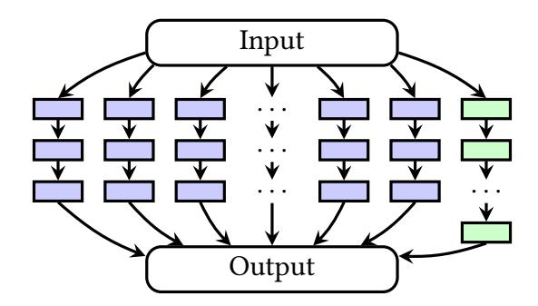

{0}------------------------------------------------

# MOTION – A Framework for Mixed-Protocol Multi-Party Computation

[LENNART BRAUN,](HTTPS://ORCID.ORG/0000-0001-9164-305X) Aarhus University, Denmark [DANIEL DEMMLER,](HTTPS://ORCID.ORG/0000-0001-6334-6277) Universität Hamburg, Germany [THOMAS SCHNEIDER,](HTTPS://ORCID.ORG/0000-0001-8090-1316) TU Darmstadt, Germany [OLEKSANDR TKACHENKO,](HTTPS://ORCID.ORG/0000-0001-9232-6902) TU Darmstadt, Germany

We present MOTION, an efficient and generic open-source framework for mixed-protocol secure multi-party computation (MPC). MOTION is built in a user-friendly, modular, and extensible way, intended to be used as a tool in MPC research and to increase adoption of MPC protocols in practice. Our framework incorporates several important engineering decisions such as full communication serialization, which enables MPC over arbitrary messaging interfaces and removes the need of owning network sockets. MOTION also incorporates several performance optimizations that improve the communication complexity and latency, e.g., 2× better online round complexity of precomputed correlated Oblivious Transfer (OT).

We instantiate our framework with protocols for parties and security against up to −1 passive corruptions: the MPC protocols of Goldreich-Micali-Wigderson (GMW) in its arithmetic and Boolean version and OT-based BMR (Ben-Efraim et al., CCS'16), as well as novel and highly efficient conversions between them, including a non-interactive conversion from BMR to arithmetic GMW.

MOTION is highly efficient, which we demonstrate in our experiments. Compared to secure evaluation of AES-128 with =3 parties in a high-latency network with OT-based BMR, we achieve a 16× better throughput of 16 AES evaluations per second using BMR. With this, we show that BMR is much more competitive than previously assumed. For =3 parties and full-threshold protocols in a LAN, MOTION is 10×–18× faster than the previous best passively secure implementation from the MP-SPDZ framework, and 190×–586× faster than the actively secure SCALE-MAMBA framework. Finally, we show that our framework is highly efficient for privacy-preserving neural network inference.

CCS Concepts: • Security and privacy → Privacy protections; Privacy-preserving protocols.

Additional Key Words and Phrases: secure multi-party computation, hybrid protocols, efficiency, outsourcing

# 1 INTRODUCTION

Secure Multi-Party Computation (MPC) allows multiple parties to jointly compute a public function on their private inputs without revealing anything but the function's output. This concept was first introduced in the 1980s by Yao [\[78\]](#page-32-0) and Goldreich-Micali-Wigderson [\[37\]](#page-30-0) and was initially considered of merely theoretical interest. The seminal work of Fairplay [\[57\]](#page-31-0) was the first to implement MPC protocols and showed that MPC can indeed be practical. A long line of research has followed since then and has shown MPC to be a viable solution for preserving privacy in applications such as auctions [\[15\]](#page-29-0), stable matching [\[33\]](#page-30-1), set intersection [\[45\]](#page-31-1), biometric matching [\[13,](#page-29-1) [58\]](#page-31-2), and machine learning [\[59,](#page-31-3) [81\]](#page-32-1).

This was facilitated by implementations of generic MPC frameworks that can be used for multiple applications. However, many MPC frameworks have a somewhat limited scope: they allow computations only for a fixed number of parties, e.g., two [\[21,](#page-29-2) [32,](#page-30-2) [43\]](#page-30-3) or three [\[14,](#page-29-3) [22,](#page-29-4) [60,](#page-31-4) [64,](#page-31-5) [66\]](#page-31-6) of which at most one can be corrupted, they only implement a single MPC protocol [\[57,](#page-31-0) [73\]](#page-32-2), or are custom-tailored towards a few use-cases [\[56\]](#page-31-7). Furthermore, most of the publicly available code of MPC frameworks as surveyed in [\[40\]](#page-30-4) is in a rather prototypical state as its main purpose is to

Authors' addresses: [Lennart Braun,](https://orcid.org/0000-0001-9164-305X) Aarhus University, Denmark, Aarhus, braun@cs.au.dk; [Daniel Demmler,](https://orcid.org/0000-0001-6334-6277) Universität Hamburg, Germany, Hamburg, demmler@informatik.uni-hamburg.de; [Thomas Schneider,](https://orcid.org/0000-0001-8090-1316) TU Darmstadt, Germany, Darmstadt, schneider@encrypto.cs.tu-darmstadt.de; [Oleksandr Tkachenko,](https://orcid.org/0000-0001-9232-6902) TU Darmstadt, Germany, Darmstadt, tkachenko@encrypto.cs.tu-darmstadt.de.

{1}------------------------------------------------

generate performance measurements. This is a big problem, as these implementations are often hard to use in practice and building on top of them in future research is often a tedious procedure that involves a significant amount of time and expertise in understanding poorly documented code, and fixing a multitude of existing problems and limitations.

In this work, we present MOTION, an MPC framework that overcomes these limitations and aims to be a piece of software of high quality and usability. MOTION is object-oriented, developerfriendly, and well-documented, 20% of its code base are unit and component tests, and it is designed in a modular and extensible way, serving as a powerful tool for future MPC research and implementations. MOTION is a generic solution for implementing mixed-protocol MPC with two or more parties. It guarantees full-threshold security, i.e., security against all but one passively corrupted (semi-honest) parties. Different from frameworks with active security, in our setting parties follow the protocol, but try to infer additional information about the other parties' inputs from the transcript. The term "mixed-protocol" denotes the support for the combination of multiple MPC protocols and the secure and efficient conversion between them in order to benefit from each protocol's strengths. Previous mixed-protocol MPC frameworks are either limited to two parties [\[32\]](#page-30-2), require an honest majority [\[14,](#page-29-3) [22,](#page-29-4) [60,](#page-31-4) [64,](#page-31-5) [66\]](#page-31-6), or are full-threshold but with stronger active security only and hence are less efficient [\[27\]](#page-30-5). The flexible architecture of MOTION allows to implement further MPC protocols also in different security models by implementing the (additional) required functionalities in C++. MOTION is asynchronous which allows to avoid complicated manual synchronization within the implemented functionality and with other functionalities.

Our motivation is to enable MPC protocols in practical application scenarios with an arbitrary number of parties and full-threshold security. By this, we increase the number of parties in order to strengthen the security guarantees of the protocols. The limitation to exactly two or three parties of previous works might be problematic for practical settings, where a larger number of participants wants to jointly compute on private data. Also, in outsourcing scenarios [\[49\]](#page-31-8), where a very large number of clients securely outsource computation to a smaller number of non-colluding computing parties, it might be desirable to increase the number of computing parties to achieve better security guarantees. In contrast, the goal of many previous works, e.g., [\[14,](#page-29-3) [22,](#page-29-4) [60,](#page-31-4) [64,](#page-31-5) [66\]](#page-31-6), was to improve performance by increasing the number of parties, while simultaneously effectively reducing the security guarantees because only a single party can be corrupted.

Our protocols include novel performance optimizations in order to enable privacy-preserving computations for large real-world applications. With AES and private inference using a convolutional neural network, we present examples of such applications. Biometric identification using the Euclidean distance, which we also demonstrate, is an example for a multi-party application where a client wants to privately check if a data point is included in a large data set that is provided by multiple data owners. One could imagine a security check where a fingerprint is tested against databases of known fingerprints supplied by different security agencies. This scenario also finds application in other domains, e.g., statistics or financial analysis.

We integrate MOTION with the HyCC compiler [\[19\]](#page-29-5) that generates optimized circuits for hybrid MPC protocols. In a nutshell, HyCC decomposes a program written in a subset of C into modules that get assigned different MPC protocols in order to compute them more efficiently than using only one MPC protocol for the whole program. This process is performed fully automatically and the user does not need to have expertise in MPC or circuit design. With this, MOTION can directly perform efficient MPC of functionalities that have been specified in the C programming language. Moreover, this enables developers with limited domain knowledge to use MPC for a large range of applications, by also making use of the existing codebase of HyCC.

We provide a detailed performance evaluation of both the low-level building blocks and protocol parts, as well as our full-scale applications on large data sets. Our performance results provide new 

{2}------------------------------------------------

insights into the performance differences of MPC protocols, such as better performance of BMR [8] compared to GMW [37] (often even in low-latency networks) for deep *natural* circuits, e.g., for integer division, which could be of independent interest for protocol designers.

# **Paper Organization and Our Contributions**

We summarize related work in §2 and provide preliminary information about notation, our setting, and security assumptions in §3. Our main contributions are the following:

The MOTION framework for mixed-protocol MPC. In §4, we describe the design rationales behind our MOTION framework. It is a well-engineered and modular framework for MPC, which is extensively tested and well-documented. We aim at high usability and have released our code<sup>1</sup> as open-source software under the permissive MIT license<sup>2</sup>. Our novel important features are the asynchronous evaluation of gates and oblivious transfers, which allows for a high level of abstraction in designing the protocols, and the full communication serialization that allows the use of MOTION in server and web applications. Moreover, our implementation can optionally interleave ('pipeline') the evaluation of the input-independent setup and the input-dependent online phase and allows to implement arbitrary circuit evaluation strategies in an abstract way.

Full-threshold hybrid MPC with passive security. We implement the existing full-threshold passively secure MPC protocols Boolean and arithmetic GMW [37], and BMR [8, 11] for multiple parties that guarantee a high level of security because all but one party can be corrupted (full-threshold). In §5, we describe the used MPC building blocks in detail, including an observation that leads to one instead of two communication rounds in correlated OTs (C-OTs). This is of independent interest and makes the direct use of precomputed C-OTs for AND gates in GMW even more efficient than the use of Multiplication Triples (MTs) [6], having slightly lower communication and takes 1 instead of 2 communication rounds in the input-independent setup phase. In §6, we introduce the MPC protocols, that we implement in MOTION. In §7, we provide efficient protocols for converting between all of the above mentioned MPC protocols. MOTION is the first framework that efficiently combines these protocols. We support direct processing of hybrid circuits generated using the HyCC compiler [19].

**Performance and Applications.** In §8, we evaluate the performance of MOTION and demonstrate its practical relevance by showing that securely computing real-world applications such as biometric identification, AES-128, SHA-256, and convolutional neural network inference with N parties and full-threshold security is highly efficient, especially with our protocol conversions. We compare MOTION's performance to other full-threshold frameworks. For biometric matching with N=3 parties, MOTION outperforms the passively secure implementations in MP-SPDZ [50] by  $10.4\times-17.6\times$ , and the actively secure implementation in SCALE-MAMBA [2] by more than two orders of magnitude.

#### <span id="page-2-0"></span>**2 RELATED WORK**

Practical MPC has been a very active field of research, especially in the past decade. Here, we provide an overview of the results most relevant to MOTION. Besides several theoretical foundations, we also discuss related implementations.

#### 2.1 Theoretical Foundations

Yao's garbled circuits [78] and the protocol by Goldreich, Micali and Wigderson (GMW) [37] were the seminal works that introduced MPC with two and multiple parties, respectively. The protocol

<span id="page-2-1"></span><sup>&</sup>lt;sup>1</sup>The code is available at https://encrypto.de/code/MOTION.

<span id="page-2-2"></span><sup>&</sup>lt;sup>2</sup>https://choosealicense.com/licenses/mit/

{3}------------------------------------------------

| Framework          | N        | t   | Security | Protocols        | License              |
|--------------------|----------|-----|----------|------------------|----------------------|
| ABY [32]           | 2        | 1   | •        | A/B/Y            | LGPL-3.0             |
| PrivC [43]         | 2        | 1   | 0        | A/Y              | _                    |
| TASTY [44]         | 2        | 1   | •        | A/Y              | no license           |
| EzPC [21]          | 2        | 1   | •        | A/Y              | MIT                  |
| OPA Mixing [48]    | 2        | 1   | •        | any 2 of $A/B/Y$ | MIT                  |
| $ABY^3$ [60]       | 3        | 1   | • or •   | A/B/Y            | MIT                  |
| Sharemind [14]     | 3        | 1   | • or •   | A/B              | payware <sup>3</sup> |
| ASTRA [22]         | 3        | 1   | • or •   | A/B              |                      |
| BLAZE [64]         | 3        | 1   | • or •   | A/B              | _                    |
| Trident [66]       | 4        | 1   | •        | A/B/Y            | _                    |
| SCALE-MAMBA [2]    | $\geq 2$ | N-1 | •        | A/Y              | MIT-like             |
| MP-SPDZ [50]       | $\geq 2$ | N-1 | • or •   | A/B or $Y$       | MIT-like             |
| MOTION (this work) | ≥ 2      | N-1 | 0        | A/B/Y            | MIT                  |

<span id="page-3-1"></span>Table 1. Related mixed-protocol MPC frameworks with N parties, threshold t, and active ( $\bullet$ ) or passive ( $\bullet$ ) security. We denote the license of unpublished source code as '-'.

of Beaver, Micali and Rogaway (BMR) [8] can be seen as a multi-party variant of Yao's protocol. We provide a more detailed overview of these protocols in  $\S 6$ . We denote Yao's protocol and BMR with Y, the GMW protocol using Boolean sharing with B and using arithmetic sharing with A.

# 2.2 MPC Implementations and Frameworks

A thorough overview and categorization of MPC implementations is given in [40]. In this section, we summarize *mixed-protocol* MPC implementations (that support multiple protocols) and compare them with MOTION in Tab. 1.

2-Party Solutions. Fairplay [57] was one of the first works that showed practical feasibility of MPC by providing an implementation of Yao's protocol. The TASTY framework [44] was the first mixed-protocol framework, and it combined Yao's GCs and Homomorphic Encryption (HE). The ABY framework [32] is a mixed-protocol framework for secure two-party computation based on Oblivious Transfer (OT) [4]. ABY showed that using OT yields better efficiency than using HE in the online phase. Researchers from Baidu have re-implemented two-party arithmetic and Yao sharing protocols from ABY in their product-level framework PrivC [43]. Patra et al. [63] improved the GMW protocol and conversions over ABY for a more efficient online phase and design hybrid circuits for machine learning tasks. The work of [23] partitions protocols into a part that is executed using classical MPC primitives and a part that is evaluated in an Intel SGX enclave.

3- and 4-Party Solutions. ABY<sup>3</sup> [60] is a mixed-protocol implementation with a focus on privacy-preserving machine learning with exactly 3 parties. BLAZE [64] and ASTRA [22] further improve upon the performance of ABY<sup>3</sup> in the same setting. Trident [66] proposes hybrid 4-party protocols. Sharemind [14] is a framework for both integer arithmetic and Boolean operations. All of these frameworks only allow up to a single corruption, whereas MOTION provides full-threshold security, which is stronger given the same adversary model (cf. §3.4). A comparison between different number of corruptions against non-matching adversary models (e.g., passively secure full-threshold vs. actively-secure honest-majority protocols) is non-trivial and out of scope of this work.

<span id="page-3-0"></span><sup>&</sup>lt;sup>3</sup>Only a Sharemind-*emulator* is available for free.

{4}------------------------------------------------

*N-Party Solutions.* FairplayMP [10] is an extension of Fairplay that implements the BMR protocol [8] with the setup phase computed using the honest-majority BGW protocol [12]. Choi et al. [24] provide an *N*-party passively secure Boolean GMW implementation. SDPZ [27] is an actively secure MPC protocol based on arithmetic sharing in prime fields. SPD $\mathbb{Z}_{2^k}$  [26] introduced integer computations modulo  $2^k$  for this approach. [28] gave an efficient implementation of SPD $\mathbb{Z}_{2^k}$  with applications to machine learning. Zaphod [3] allows to efficiently combine BMR [8, 42] with the SPDZ protocol, which is integrated in the SCALE-MAMBA implementation [2]. However, SCALE-MAMBA currently implements only actively secure MPC protocols, which have substantially higher overhead than passively secure ones. An alternative implementation of the SPDZ protocol is provided by MP-SPDZ [50] that also includes implementations of other protocols. MP-SPDZ has recently also included conversions between arithmetic and Boolean sharing. MPC protocols with a large number of parties were implemented in [76] as part of the EMP toolkit [74, 75], which contains also implementations of other MPC protocols. The BMR protocol was implemented in [11].

# 2.3 Compilers for MPC Protocols

Another line of research focuses on directly compiling existing code into an MPC protocol. The PCF compiler [53] processes C code and creates a compact intermediate circuit format that is evaluated by an interpreter for the actively secure Yao-based two-party protocol of [54]. Wysteria [67] is a multi-party framework that implements the GMW protocol and offers type-based security and correctness checks. Frigate [61] is a verified compiler for creation of circuits for MPC protocols that can be securely evaluated with MPC implementations. PICCO [80] is a source-to-source compiler for C programs that builds on arithmetic secret sharing using bit decomposition for bit operations. Obliv-C [79] compiles a special-purpose C-based language to plain C for evaluating it in Yao's garbled circuits. EzPC [21] is a secure 2-party computation framework that allows to generate an efficient partitioning for mixed computations based on Yao's garbled circuits and arithmetic sharing. The authors of [48] show efficient algorithms for computing an optimal partitioning for mixing any two MPC protocols. The HyCC compiler [19] allows compilation of C code into efficient mixed-protocol MPC. MOTION directly supports the evaluation of circuits generated by HyCC. A combination of private memory access using Oblivious RAM (ORAM) and Yao's garbled circuits is implemented in ObliVM [55] that compiles programs from a Java-like language.

#### <span id="page-4-0"></span>3 PRELIMINARIES

In this section, we provide background information about our setting, the adversary model, and define the notation.

#### 3.1 Notation

We abbreviate  $[i] = \{1, ..., i\}$ . We denote the number of parties as N and the parties themselves as  $P_1, ..., P_N$ . A value x that is shared between N parties, is denoted as tuple  $\langle x \rangle^S = (\langle x \rangle_1^S, ..., \langle x \rangle_N^S)$ , where the superscript  $S \in \{A, B, Y\}$  denotes the sharing type (cf. §6), and the subscript  $i \in [N]$  denotes the i-th share of x that is held by party  $P_i$ . We write  $\langle x \rangle^B$  or  $\langle x \rangle^Y$  in bold font for a vector of  $\ell$  shared bits, which we interpret as an  $\ell$ -bit unsigned integer or element of  $\mathbb{Z}_{2^\ell}$ . Given an  $\ell$ -bit vector x, we denote its entries with  $x_0, ..., x_{\ell-1}$ . Share  $x_i^S(x)$  denotes party  $x_i^S(x)$  denotes that all parties create a sharing of a public value  $x_i^S(x)$  in sharing  $x_i^S(x)$  denotes the reconstruction of a shared value  $x_i^S(x)$  such that only party  $x_i^S(x)$  denotes the reconstruction of a shared value  $x_i^S(x)$  such that all parties receive  $x_i^S(x)$  denotes the reconstruction of a shared value  $x_i^S(x)$  such that all parties receive  $x_i^S(x)$  denotes the reconstruction of a shared value  $x_i^S(x)$  such that all parties receive  $x_i^S(x)$  denotes the reconstruction of a shared value  $x_i^S(x)$  such that  $x_i^S(x)$  denotes the symmetric security parameter  $x_i^S(x)$  we denote that  $x_i^S(x)$  denotes the  $x_i^S(x)$  denotes the  $x_i^S(x)$  such that all parties receive  $x_i^S(x)$  denotes the reconstruction of a shared value  $x_i^S(x)$  such that all parties receive  $x_i^S(x)$  denotes the reconstruction of a shared value  $x_i^S(x)$  such that all parties receive  $x_i^S(x)$  denotes the reconstruction of a shared value  $x_i^S(x)$  such that all parties receive  $x_i^S(x)$  denotes the reconstruction of a shared value  $x_i^S(x)$  such that all parties receive  $x_i^S(x)$  denotes the reconstruction of a shared value  $x_i^S(x)$  such that  $x_i^S(x)$  denotes the reconstruction of a shared value  $x_i^S(x)$  such that  $x_i^S(x)$  denotes the reconstruction of a shared value  $x_i^S(x)$  such that  $x_i^S(x)$  denotes the reconstruction of a shared value

{5}------------------------------------------------

# <span id="page-5-3"></span>3.2 Secure Multi-Party Computation (MPC)

MPC protocols are run by N parties and typically divided into a *setup phase*, that is independent of the parties' inputs and can be precomputed, and an *online phase*, that starts when the parties supply their private inputs.

# <span id="page-5-2"></span>3.3 Outsourcing Scenario

Alternatively to running our protocols directly between the N parties, they can also be used in an outsourcing scenario in a natural way. As described in more detail in [49], in an outsourcing scenario an arbitrary number of input parties secret-share their private data to N non-colluding computing parties, who have no insight into that data. These computing parties evaluate our N-party MPC protocols and send the secret-shared output to a set of output parties, who can then reconstruct the plaintext output. Input and output parties can be (partially) identical or distinct. This allows for a large number of input/output parties without significantly increasing communication complexity of the protocols, since input sharing and output reconstruction are cheap 1-round operations and also provide security against actively corrupted input/output parties. The number of computing parties N can be chosen in accordance to performance and security requirements.

# <span id="page-5-1"></span>3.4 Adversary Model

The protocols we consider in this work are secure against passively corrupted (semi-honest) adversaries that follow the protocol specification but try to infer additional information about the other parties' private inputs by inspecting the protocol transcript. There also exist other security models such as active (malicious) security, where the adversary can arbitrarily deviate from the protocol but gets caught with overwhelming probability, and covert security, which is similar to malicious but the adversary gets caught with some fixed probability. This passive attacker model is useful in scenarios where the involved parties trust each other but are legally constrained to keep information confidential, e.g., when computing statistics on sensitive health records. In the outsourcing scenario (cf. §3.3), a prime use case for our protocols, the computing parties are trusted to not collude with each other and run in a secured network. Discovering active attacks would lead to an immense loss of reputation and would hurt the business model of offering privacy-preserving services. From a research perspective, advances in the passive security model often lead to advances in stronger adversary models and serve as a performance baseline to show general feasibility of MPC-based applications. Moreover, techniques like attestation and several protocol extensions can be used for ensuring security against stronger adversaries, which we leave as future work.

#### <span id="page-5-0"></span>4 ARCHITECTURE OF OUR MOTION FRAMEWORK

MOTION implements mixed-protocol MPC with an *arbitrary* number of  $N \ge 2$  parties with full-threshold security against passive adversaries. Since communication complexity inherently scales with N, the focus of this work is to achieve practical performance for relatively small N, e.g.,  $N \le 16$ , as also commonly used in an outsourcing setting (cf. §3.3). Our framework allows to implement MPC protocols in different security models by design, such as honest majority and/or actively secure protocols.

MOTION is implemented in C++ and uses many of the modern features introduced in the C++20 standard. In the first place, it is a library and can easily be used in external projects. Our implementation has only few dependencies, making it OS-independent and fully compatible with the very liberal MIT license. We developed and tested MOTION on Ubuntu and Arch Linux, compiled with g++ or Clang, on macOS, compiled with AppleClang, and on Windows with MinGW.

{6}------------------------------------------------

MOTION requires only the following third-party libraries: Boost[4](#page-6-0) (for network communication, logging, parsing command line arguments, fibers, and statistics), flatbuffers[5](#page-6-1) (for communication serialization), fmt[6](#page-6-2) (for string processing), optionally Google Test[7](#page-6-3) (for unit and component tests), and OpenSSL[8](#page-6-4) (for cryptographic primitives). MOTION does not depend on any third-party OT or MPC libraries. We took the software development process of our framework very seriously and designed the whole system with great care. Extensive component tests are included for all of the framework parts in order to ensure the correctness and security of our implementation. We routinely test MOTION for memory leaks using the valgrind[9](#page-6-5) framework and for other bugs using various sanitizers[10](#page-6-6), such as the undefined behavior and address sanitizer, enabling us to fix possible problems early on. Our code is available on GitHub[11](#page-6-7), and we will actively support and extend it in the future. Currently, our codebase consists of 179 source files, totaling in 36 000 lines of code, 20% of which are tests.

# 4.1 Novel Design Aspects

Besides designing MOTION with great care, we enhance its architecture by including several novel design aspects that improve its usability and facilitate new use cases. Although a few of our design aspects have at least partially been addressed in previous frameworks, their combination is novel. The extensibility of our framework paves the way to integrate also other optimizations such as different circuit evaluation strategies and new MPC protocols in the future.

<span id="page-6-10"></span>4.1.1 Communication Serialization. As mentioned by Shai Halevi in his keynote talk at ACM CCS'18 [\[39\]](#page-30-12), the requirement of MPC frameworks to own a TCP socket has in the past hindered their adoption, e.g., in server applications, which often run under constrained permissions or have a proprietary messaging interface. This restriction is solved in MOTION by using communication serialization. In MOTION, all the transferred messages are serialized and contain metadata sufficient to make messages recognizable without having to rely on an order preserving channel, e.g., a TCP socket. To the best of our knowledge, MOTION is the first MPC framework, whose communication is completely serialized. The most important benefit of the communication serialization is that our framework neither needs to own a separate TCP connection, nor does it rely on TCP (or similar protocols) as transport protocol, as it was the case for all previous MPC frameworks. Also, communication serialization allows for MPC to be based on low-latency network protocols (e.g., QUIC[12](#page-6-8)or RUDP[13](#page-6-9)), which can yield substantial performance improvements in MPC as shown in [\[18,](#page-29-14) [72\]](#page-32-8), and also facilitates the real-world MPC use in previously infeasible scenarios, such as MPC in many proprietary networks, Web Services, Remote Procedure Calls (RPCs), or even via peer-to-peer messengers without establishing separate connections for the MPC framework. In order to demonstrate and evaluate the functionality of our framework we use Boost for TCP connections between the parties, but we stress that exchanging the communication parts with a different networking protocol is intended by design and would only involve minimal code changes.

<span id="page-6-0"></span><sup>4</sup><https://www.boost.org>

<span id="page-6-1"></span><sup>5</sup><https://github.com/google/flatbuffers>

<span id="page-6-2"></span><sup>6</sup><https://github.com/fmtlib/fmt>

<span id="page-6-3"></span><sup>7</sup><https://github.com/google/googletest>

<span id="page-6-4"></span><sup>8</sup><https://www.openssl.org>

<span id="page-6-5"></span><sup>9</sup><https://valgrind.org>

<span id="page-6-6"></span><sup>10</sup><https://github.com/google/sanitizers/wiki>

<span id="page-6-7"></span><sup>11</sup><https://encrypto.de/code/MOTION>

<span id="page-6-8"></span><sup>12</sup><https://tools.ietf.org/html/draft-ietf-quic-transport-23>

<span id="page-6-9"></span><sup>13</sup><https://tools.ietf.org/html/draft-ietf-sigtran-reliable-udp-00>

{7}------------------------------------------------

Furthermore, we use flatbuffers' schema files to define how the serialized communication is structured in MOTION. The schema files are independent of the programming language and can be compiled to a variety of different programming languages such as Java, Go, JavaScript, Rust, and even Swift[14](#page-7-0). These schema files significantly reduce the overhead of implementing MOTION or parts of it in a different programming language, e.g., to enable MPC on iPhones, while still supporting the original messaging interface. This approach enables multi-party protocols communication between our original C++ framework and many heterogeneous devices, operating systems, and programming languages.

4.1.2 Provider-based use of MPC Primitives. In our framework, the developer does not need to know how the MPC primitives interact with the network stack. Instead of the synchronized use of different MPC primitives on a network interface directly, we provide convenient provider interfaces for Oblivious Transfer (OT), Multiplication Triples (MTs) [\[6\]](#page-29-8), Shared Bits (SBs), and Square Pairs (SPs), where the requirements for a program run can be registered, and are then automatically handled without any further action from the developer. The providers return pointers to the registered objects, which provide a separate interface to execute the desired protocol, e.g., set inputs to the OT functionality or wait for a batch of MTs to be computed.

Besides the convenient user interface, our providers enable the developer to easily replace the computation procedure of a primitive partially or completely, e.g., use a semi-trusted third party that generates correlated randomness (e.g., MTs) and distributes it among the computing parties instead of computing it using expensive crypto (cf. [\[68\]](#page-32-9)).

4.1.3 Multiple Layers of Abstraction. MOTION is both developer-friendly and function-rich. On the one hand, it provides a convenient way of developing MPC solutions without significant MPC knowledge using secure type classes, which provide overloaded C++ operators and can be used just as the classic C++ types. Moreover, all of our abstract APIs operate directly in C++. This simplifies error handling and omits the need for the developer to learn a new domain-specific language that is accepted by the framework. On the other hand, the developer can also use our API to get access to the low-level MPC primitives and analyze or modify the underlying routines, e.g., add new optimizations or even use the MPC primitives standalone. The latter allows for using our framework, e.g., to only compute base OTs or OT extension. When using our MPC protocols or the underlying primitives, developers do not require any knowledge about how the protocols or primitives work together or interact with the message passing interface. To the best of our knowledge, MOTION is the first MPC framework that provides such a high level of abstraction while allowing to use all primitives directly. The other MPC frameworks either translate a special-purpose language to circuits (e.g., [\[19\]](#page-29-5)), or low-level code (e.g., [\[79\]](#page-32-7)), or they process commands/circuits by a compiled interpreter (e.g., [\[2\]](#page-29-9)).

We give a small code snippet in List. [1](#page-8-0) to illustrate the simplicity of the code in MOTION. Note that the example depicted in List. [1](#page-8-0) is manually optimized for efficiency, and also a straightforward implementation would be fully functional but less efficient. For the convenient use of MOTION by non-experts in MPC, we recommend to utilize our HyCC adapter for efficiency reasons (cf. [§4.1.4\)](#page-7-1).

<span id="page-7-1"></span>4.1.4 HyCC Integration. If the use of an abstract language instead of the direct use of C++ classes is desired, e.g., if the developer has no expert knowledge in MPC and thus is not able to manually implement and optimize MPC protocols, the developer can import efficient hybrid circuits generated by the HyCC compiler [\[19\]](#page-29-5) from a subset of the C programming language using our HyCC adapter. Our implementation works by translating HyCC's internal representation for circuits into C++ source files that can be executed by MOTION. Our HyCC adapter is inspired by the HyCC adapter

<span id="page-7-0"></span><sup>14</sup><https://github.com/mzaks/FlatBuffersSwift>

{8}------------------------------------------------

<span id="page-8-0"></span>Listing 1. Code excerpt for efficiently computing minimum squared Euclidean distance in MOTION.

```
using namespace motion ;
using suint = SecureUnsignedInteger ;
using vec = std :: vector <suint >;
// variable a is an arithmetic GMW share
// variable v is a vector of arithmetic GMW shares
// computes squared Euclidean distance between
// a and each element in v
// returns BMR share of min. sqr. Euclidean distance
suint MinSqrEuclideanDistance ( suint & a , vec& v ) {
  vec res ( v . size () ) ; // result vector
  // automatic use of more efficient squaring
  auto a_sqr = a *a , two_a = 2* a ;
  // compute squared Euclidean distance
  // (a-v[i]) ^2 = a^2 + v[i]^2 - 2a*v[i]
  for ( unsigned int i = 0; i < res . size () ; ++ i )
    res [ i ] = a_sqr + v [ i ] * ( v [ i ] - two_a ) ;
  // convert each distance to BMR sharing
  for ( auto & e : res )
    e = e - > Convert < MpcProtocol :: kBmr >() ;
  // select initial minimum as 0 -th element
  auto min = res [0];
  // find the minimum distance
  for ( unsigned int i = 1; i < res . size () ; ++ i ) {
    auto smaller = res [ i ] < min ;
    // smaller ? res[i] : min
    min = smaller . Mux ( res [ i ] , min ) ;
  }
  return min ;
}
```

for the ABY framework [\[32\]](#page-30-2) [15](#page-8-1). MOTION fully supports the features of HyCC and follows its partitioning guidelines, which results in protocols that are tailored according to a user-specified optimization goal.

Previous works. HyCC was yet only integrated in the ABY framework [\[32\]](#page-30-2) for =2-party MPC.

4.1.5 Asynchronous Gate Evaluation. MOTION allows the secure evaluation of arbitrary circuits without additional information about their structure. Each gate depends on its parents, and some gates require network communication for their evaluation. Thus, we are faced with a complex dependency graph consisting of possibly millions of interdependent tasks, which need to be scheduled on the available CPU cores. Evaluation of each gate in a separate thread is clearly infeasible if not impossible due to constraints of the operating system. Our solution is to use fibers, i.e., threads implemented in userspace, which are run on a fixed number of worker threads. For this,

<span id="page-8-1"></span><sup>15</sup>[https://gitlab.com/securityengineering/HyCC/-/blob/bdfcf1f79e1ec92b32432fac1559bcb992adbf5d/aby-hycc/hycc\\_](https://gitlab.com/securityengineering/HyCC/-/blob/bdfcf1f79e1ec92b32432fac1559bcb992adbf5d/aby-hycc/hycc_adapter.cpp) [adapter.cpp](https://gitlab.com/securityengineering/HyCC/-/blob/bdfcf1f79e1ec92b32432fac1559bcb992adbf5d/aby-hycc/hycc_adapter.cpp)

{9}------------------------------------------------

we use the Boost.Fiber library[16](#page-9-0). When a fiber is blocked, e.g., because a message has not yet been received, the worker thread switches to a different fiber and continues to evaluate a different gate. Compared to the overhead of a context switch between threads on the operating system level, switching between fibers is lightweight and possible in less than 100 CPU cycles, which is typically about an order of magnitude less than for a context switch between threads. Another advantage is that fibers can be used in the same way as usual threads. Thus, the implementation of a protocol is straightforward since the developer has access to all common synchronization mechanisms. We adapted a work-stealing scheduling algorithm from Boost.Fiber to our own thread pool, which creates one worker thread per CPU core by default. Also, we designed and implemented a number of efficient synchronization primitives and asynchronous access mechanisms for fibers to handle interactions between gates and MPC primitives. Note that we do not put any constraints on the number of physical processor cores used by a party. Moreover, MOTION allows parties to run with a different number of threads, which is a common problem of synchronized MPC where the work is scheduled for a static number of threads and/or communication channels before the protocol evaluation, and an inconsistent number of threads either yields wrong results or causes a program crash, e.g., [\[32,](#page-30-2) [69\]](#page-32-10).

We evaluate all gates separately as soon as their parent gates become ready. In the following, we highlight two benefits of this approach. Firstly, the asynchronous gate evaluation decreases the online time for evaluating unbalanced circuits. Consider a scenario with high network latency and two major subcircuits, as shown in [Fig. 1:](#page-10-0) one consisting of only few data-dependent layers with many costly non-XOR gates (blue), and the other subcircuit containing much fewer non-XOR gates but consisting of a large number of interactive layers (green). If evaluated layer-wise (as it is done in many current MPC frameworks), the large subcircuit has a blocking effect on the deep circuit due to the longer evaluation time. In our framework, the default scheduler evaluates gates in first-come-first-served order. On the other hand, the possibility to replace the default scheduler by a custom one with a different evaluation strategy is intended by design. The goal of a custom scheduler can be to prioritize gates according to the maximum subcircuit depth (i.e., gates that lead to the deepest subcircuit are evaluated first) to minimize communication latency, or to synchronize the evaluation layer-wise to evaluate in a batch all gates in a layer to possibly save bandwidth.

This asynchrony is especially beneficial in networks with high latency, e.g., for trans-continental Internet connections. Also, we batch operations for all input wires and the contained SIMD values of each gate in order to reduce communication. Secondly, integration of new protocols into MOTION becomes easier, since gate evaluation is independent of other protocols by design (in contrast to most existing MPC frameworks). Thus, the developer does not need to know how the other parts of the framework work to integrate the new protocols.

Previous Works. Asynchronous gate evaluation was implemented in the no longer supported VIFF framework [\[29\]](#page-30-13) using callbacks in Python. The callbacks, however, made the code unnecessarily complicated. The more recent VIFF derivate MPyC[17](#page-9-1), uses native coroutines in Python. However, Python is a suboptimal choice for highly efficient MPC, because it is a scripting language and thus substantially less efficient than lower-level languages such as C and C++.

4.1.6 Code Vectorization. We design our code with vectorization of CPU instructions in mind to improve its efficiency. This goal is different from the MPC-level SIMD instructions (cf. [§4.1.7\)](#page-10-1) and affects the compiled code directly. Yet, explicit vectorization using architecture-specific instructions would limit the number of architectures MOTION supports. To achieve both better efficiency through (better) vectorization of CPU instructions and rich support for various architectures, most

<span id="page-9-0"></span><sup>16</sup>[https://www.boost.org/doc/libs/1\\_73\\_0/libs/fiber/](https://www.boost.org/doc/libs/1_73_0/libs/fiber/)

<span id="page-9-1"></span><sup>17</sup><https://github.com/lschoe/mpyc>

{10}------------------------------------------------

<span id="page-10-0"></span>

Fig. 1. Circuit with a large number of parallel gates (blue) and many data-dependent, sequential gates (green), that benefits from asynchronous gate evaluation.

of our code is optimized such that the compiler can vectorize it automatically using the native instructions of the underlying architecture. This is achieved by using multiple techniques such as eliminating loop dependencies and branching, enforcing buffer alignment that matches the cache line size, and giving the compiler various hints to produce better code, e.g., using the restrict type qualifier. The few SSE instructions we used are supported by many architectures, and for those that do not support them, we automatically provide a slightly slower pure C++ code drop-in replacement.

*Previous Works.* To the best of our knowledge, so far the only MPC frameworks implemented in a low-level programming language with the possibility of cross-platform compilation are ABY [32] and MP-SPDZ [50].

<span id="page-10-1"></span>4.1.7 Single Instruction Multiple Data (SIMD). We intentionally design the API of MOTION in a way that encourages the use of MPC-level Single Instruction Multiple Data (SIMD) instructions that process vectors of data instead of single data, e.g., vectors of bits instead of a single bit. This not only drastically reduces the memory footprint but also the required communication, since sending 1-bit values has significant overhead. This optimization results in a much better amortized efficiency and throughput, which we detail in §8. SIMD instructions are especially relevant for the outsourcing setting, where the outsourcing servers often simultaneously process data of many users. In our experiments, extensive use of SIMD instructions improved the throughput of MOTION by about an order of magnitude in both the LAN and WAN setting (cf. Tab. 7).

*Previous Works.* SIMD instructions have been used for  $N \in \{2,3\}$  parties in [14, 32, 71] and for  $N \ge 2$  parties in [2, 50].

4.1.8 Interleaved Setup and Online Phase. Circuit evaluation in MPC happens in one of two modes: sequential or interleaved ('pipelined'). The sequential mode runs the input-dependent online phase only after the input-independent setup has completed. This allows precise measurements of the setup and online phase communication and computation requirements, or full precomputation ahead of the online phase. Frameworks like ABY [32] support only this evaluation mode. The interleaved mode, on the other hand, runs parts of both phases in parallel and facilitates possibly more efficient evaluation of the circuit in terms of load balancing, since the gates that otherwise would have been waiting for the setup phase to finish can be evaluated faster, thus improving the protocol latency.

*Previous Works.* A similar approach is used in SCALE-MAMBA [2]. However, it often overproduces correlated randomness in the setup phase, which is disadvantageous for small applications. In contrast, MOTION produces exactly the required amount of correlated randomness. To the best of our knowledge, we are the first framework to offer both sequential and interleaved circuit evaluation, giving the user the freedom of choice according to the use case.

{11}------------------------------------------------

# 4.2 Implemented Building Blocks

To make MOTION easy to use and extend, we design it in a completely different way compared to prior work. We did not use any existing implementations of the cryptographic protocols, since they would often need to be significantly redesigned. However, we will provide detailed guidelines for integrating new protocols into MOTION to also encourage the developers of MPC tools to integrate the existing code from other frameworks into MOTION, which will reduce the required effort for implementing new MPC protocols and thus for also prototyping MPC applications in general. Below, we list the main components implemented in our framework that can also be of interest for other applications.

- OT\* by Hauck and Loss [41], which claims to fix security issues in the SimplestOT protocol [25] as the first implemented option for base OTs (cf. §5.1.1). MOTION provides abstract interfaces for base OTs, enabling drop-in replacement. We will add more protocols in the future.
- Providers for OT extension including Beaver's OT precomputation [7] and different OT flavors [5] (cf. §5.1.2): general, random (cf. §5.1.3), additively correlated, and XOR-correlated OTs (C-OTs) including our optimization of precomputed C-OT w.r.t. round complexity (cf. §5.1.3).
- Providers for Multiplication Triples (cf. §5.2), Squaring Pairs (cf. §5.3), and Shared Bits (cf. §5.4) using C-OTs.
- *N*-party full-threshold passively secure MPC protocols: Arithmetic GMW (cf. §6.1), Boolean GMW [37] (cf. §6.2), and BMR [8, 11] (cf. §6.3), and secure conversions between them (cf. §7).
- Plenty of utility classes, e.g., adapted Boost.Fiber for fibers, (aligned) bit vector, bit span, logger, run-time and communication statistics over multiple runs, function-encapsulating conditions, and reusable promises and futures.
- Unit and component tests for all of the implemented components and most of the utility classes.
- Application examples (cf. §8.2) that use MOTION as a library, e.g., MPC protocols for AES-128, SHA-256, minimum Euclidean distance, and Convolutional Neural Networks (CNNs).

#### <span id="page-11-0"></span>5 MPC BUILDING BLOCKS

In this section, we describe the primitives that our protocols rely on, as well as our improvements to them.

#### 5.1 Oblivious Transfer

Oblivious Transfer (OT) [65] is the basic building block for various generic and custom MPC protocols. It involves two parties, a sender S that inputs two messages  $(m_0, m_1)$ , and a receiver  $\mathcal{R}$  that inputs the choice bit  $c \in \{0, 1\}$ . The functionality outputs  $\perp$  to  $\mathcal{S}$  and only  $m_c$  to  $\mathcal{R}$ . It is guaranteed, that S does not learn c and that R does not learn  $m_{1-c}$ . This kind of OT is called 1-out-of-2 OT and it can be generalized to 1-out-of-n OT where S inputs  $(m_0, \ldots, m_{n-1})$ , R inputs  $c \in \{0, ..., n-1\}$ , and the functionality outputs  $(\bot, m_c)$ . Inherently, OT requires public-key cryptography [46], which is computationally expensive. However, the important OT extension technique proposed by Ishai et al. [47] requires only a small number of public-key-based "base OTs" and uses them as seeds to compute a much larger number of OTs using significantly faster symmetric cryptography. OT can also be precomputed [7], moving a significant part of computation and communication from the online phase to the input-independent setup phase (cf. §3.2). To precompute an OT,  $\mathcal{R}$  starts the OT extension protocol using a random  $r \in_{\mathcal{R}} \{0, 1\}$ . In the online phase,  $\mathcal{R}$  sends  $p := r \oplus c$  to  $\mathcal{S}$ , who swaps the messages if p = 1 and does nothing otherwise. Then, the parties proceed as in the original OT extension protocol. OT precomputation adds one sequential message to the OT extension protocol, thus increasing the number of communication rounds.

{12}------------------------------------------------

- <span id="page-12-0"></span>5.1.1 Base OTs. Abstractly speaking, the base OTs are computed as follows: for each  $j \in [\kappa]$  (where  $\kappa$  is the symmetric security parameter, e.g., 128 bit),  $\mathcal{S}$  inputs  $(s_{j,0}, s_{j,1}) \in_R \{0, 1\}^{2\kappa}$  and  $\mathcal{R}$  inputs  $c_j \in_R \{0, 1\}$ .  $\mathcal{R}$  obtains  $s_{j,c_j}$  for each  $j \in [\kappa]$ . In this work, we use the base OT protocol by Hauck and Loss [41] (denoted as OT\*). We use it in the random OT setting, i.e., (1) the choice bits of  $\mathcal{R}$  are random, and (2) we omit the last step for sending the messages to  $\mathcal{R}$ .
- <span id="page-12-1"></span>5.1.2 OT Extension. We use OT extension [47] with optimizations from [4, 5] and denote it as General OT (G-OT). The protocol is defined as follows: First, the parties run a base OT protocol with inverted roles. In the setup phase,  $\mathcal{R}$  uses the sent messages from the base OTs to generate  $T \in \{0,1\}^{m \times \kappa}$  with  $T[j] = \operatorname{PRG}(s_{j,0})$  for each  $j \in [\kappa]$  and sends  $u_j = \operatorname{PRG}(s_{j,1}) \oplus T[j] \oplus r$ , where m is the number of required OTs, r are  $\mathcal{R}$ 's real choices, and PRG is a pseudo-random generator. Then,  $\mathcal{S}$  creates  $V \in \{0,1\}^{m \times \kappa}$  with  $V[j] = c_j u_j \oplus \operatorname{PRG}(s_{j,c_j})$  for each  $j \in [\kappa]$ , where  $c_j$  is the choice bit in the j-th base OT. Finally, both parties transpose their matrices:  $\mathcal{S}$  sets  $V' = V^T$  and  $\mathcal{R}$  sets  $T' = T^T$ . In the online phase,  $\mathcal{S}$  sends to  $\mathcal{R}$   $y_{i,0} := x_{i,0} \oplus H(i,V'[i])$  and  $y_{i,1} := x_{i,0} \oplus H(i,V'[i] \oplus c)$  for each  $i \in [m]$ , where  $H(\cdot)$  is a one-way pseudo-random function.  $\mathcal{R}$  sets the output of the OT  $i \in [m]$  as  $x_{i,r_i} := y_{i,r_i} \oplus H(i,T'[i])$ . We instantiate both PRG and H using AES (cf. §5.6).
- 5.1.3 OT Flavors. In many cases, OT-based MPC protocols need to compute very specific functionalities using OT. Asharov et al. [4, 5] have first shown that OT extension can be done significantly more efficiently for specific tasks.

<span id="page-12-2"></span>*Random OT (R-OT).* Random OT can essentially be seen as a truncated OT extension protocol with no inputs. The parties run the same protocol steps as in OT extension, but omit the last step where S masks his messages and sends them to R. Instead, the parties only compute their masks and set them as the output of the protocol. Slightly more formally, S sets  $(H(i, V'[i]), H(i, V'[i] \oplus c))$  and R sets H(i, T'[i]) as his output. R-OT can be used to compute other OT functionalities such as G-OT and correlated OT (C-OT) or to compute MTs in 2PC [5].

<span id="page-12-3"></span>Correlated OT (C-OT). Correlated OT is a special OT flavor that is very well-suited for MPC. Its main use case is multiplication of a (secret-shared) bit or string by a (secret-shared) bit yielding a secret-shared multiplication result. The functionality of C-OT is as follows: S inputs bit-string x and R inputs bit r. The functionality outputs  $(x_0, x_0 \odot x)$  to S and  $x_0 \odot rx$  to R, where  $x_0$  is random and  $\odot$  is usually bit-wise XOR, which we denote as XOR-correlated C-OT (C $^{\oplus}$ -OT), or addition mod  $2^{\ell}$ , which we denote as additively correlated C-OT (C $^{+}$ -OT). The C $^{\oplus}$ -OT results in an XOR-sharing of the multiplication, and C $^{+}$ -OT is an additively shared multiplication. The difference to G-OT is that instead of sending two masked messages, S sends only one message  $y_i = x_{i,1} \odot H(i, V'[i] \oplus c) = x_{i,0} \odot x_i \odot H(i, V'[i] \oplus c) = H(i, V'[i]) \odot x_i \odot H(i, V'[i] \oplus c)$  and R sets  $x_{i,r_i} = r_i y_i \odot H(i, T'[i])$  for each  $i \in [m]$ .

**Optimization for precomputed C-OT.** In the following, we describe a factor two improvement of the online round complexity over the technique for precomputing OT by Beaver [7] for the special case of *Correlated* OT by Asharov et al. [4, 5], who considered only the online computation model, i.e., without precomputation. This improvement is based on a simple, but to the best of our knowledge yet unnoticed observation that although depending on the  $\mathcal{R}$ 's correction bit the  $\mathcal{S}$ 's online message is computed differently, the computation always yields the same result.

To simplify the description of the C-OT precomputation, we reuse the R-OT protocol. First, the parties compute an R-OT with the choice bit  $r \in_R \{0,1\}$ . In order to obtain the correct message mask for  $\mathcal{R}$ 's real choice c,  $\mathcal{R}$  sends p=0 if r=c and p=1 otherwise. After obtaining p,  $\mathcal{S}$  swaps the messages iff p=1, and proceeds with the original protocol. Our improvement is based on the observation that in C-OT (in contrast to G-OT) the message of  $\mathcal{S}$  is equal in both cases (p=0 and

{13}------------------------------------------------

p=1), i.e.,  $y_i:=H(i,V'[i])\odot x_i\odot H(i,V'[i]\oplus c)=H(i,V'[i]\oplus c)\odot x_i\odot H(i,V'[i])$ . However, p may change the *output* of S. This is why S sends  $y_i$  independent of the choice bit and waits for receiving p to determine his own correct output, whereas R sends p, waits for  $y_i$ , and unmasks it. The resulting precomputed C-OT protocol results in two messages that are sent *independently*, which improves the online phase latency by a factor of 2. Its latency is equal to the original C-OT protocol without precomputation.

5.1.4 Silent OT. Recently, a new technique, Silent OT (S-OT), was introduced that makes use of pseudorandom correlation generators to perform OT with communication that is sublinear in the output length [16, 17, 77]. In a nutshell, state-of-the-art S-OT trades off less communication for higher computation and may be more efficient in settings with limited bandwidth. Although S-OT is an exciting new building block that is applicable in multiple scenarios, we restrict the scope of this work to OT extension [47] and the *flexibility* of adding new building blocks, and we leave the integration of S-OT as future work.

# <span id="page-13-0"></span>5.2 Multiplication Triples

Multiplication triples (MTs), proposed by Beaver [6] allow to reduce the online complexity of MPC protocols by precomputing random triples of the form  $(\langle a \rangle^S, \langle b \rangle^S, \langle c \rangle^S)$  such that  $c = a \cdot b$ . Here,  $S \in \{A, B\}$  denotes additive secret sharing over  $\mathbb{Z}_{2^\ell}$  or  $\{0, 1\}$ , respectively. In the online phase, the triples can be used to privately compute multiplications with only linear operations and reconstructions while avoiding costly cryptographic operations (cf. §6.1, §6.2).

<span id="page-13-2"></span>5.2.1 Arithmetic MTs (A-MTs). For  $\ell$ -bit A-MTs (over the ring  $\mathbb{Z}_{2^\ell}$ ), we generalize the C<sup>+</sup>-OT-based A-MT generation protocol by Demmler et al. [32] from two to N parties. Namely, each party  $P_i$  locally generates two random shares  $\langle a \rangle_i^A \in_R \mathbb{Z}_{2^\ell}$  and  $\langle b \rangle_i^A \in_R \mathbb{Z}_{2^\ell}$ , and then the parties interactively compute  $\langle c \rangle^A \leftarrow \langle a \rangle^A \cdot \langle b \rangle^A$ . Note that the product can be written as  $a \cdot b = \left(\sum_i \langle a \rangle_i^A\right) \cdot \left(\sum_i \langle b \rangle_i^A\right) = \sum_i \left(\langle a \rangle_i^A \cdot \langle b \rangle_i^A\right) + \sum_{i,j\neq i} \left(\langle a \rangle_i^A \cdot \langle b \rangle_j^A\right)$  (mod  $2^\ell$ ). Each party  $P_i$  can compute  $\langle a \rangle_i^A \cdot \langle b \rangle_i^A$  locally, and to compute  $\langle a \rangle_i^A \cdot \langle b \rangle_j^A$  with  $i \neq j$  we run the following secure multiplication protocol between  $P_i$  and  $P_j$  such that each of the two parties obtains an additive share of the product.

To perform a secure multiplication the two parties  $P_i$  and  $P_j$ , owning the values  $x, y \in \mathbb{Z}_{2^\ell}$ , respectively, run  $\ell$  parallel C<sup>+</sup>-OTs. Here,  $P_i$  acts as the sender and inputs x as correlation to each C<sup>+</sup>-OT and obtains  $r_k \in \mathbb{Z}_{2^\ell}$  from the k-th C<sup>+</sup>-OT with  $k \in [\ell]$ .  $P_j$  acts as receiver and for each  $k \in [\ell]$  inputs the k-th bit of y (denoted by y[k]) to the k-th C<sup>+</sup>-OT, and obtains  $r_k + y[k] \cdot x$  as output. Finally,  $P_i$  sets  $z_i \leftarrow -\sum_{k=1}^{\ell} r_k 2^{k-1} \mod 2^{\ell}$  and  $P_j$  sets  $z_j \leftarrow \sum_{k=1}^{\ell} 2^{k-1} (r_k + y[k] \cdot x) \mod 2^{\ell}$  such that  $z_i + z_j = x \cdot y \pmod{2^{\ell}}$ . As observed in [32], the online communication for the C<sup>+</sup>-OTs can be halved by omitting the most significant bits of the values that will be cut off by multiplication with  $2^{k-1}$  modulo  $2^{\ell}$  in the subsequent computation. The total communication of  $\ell$ -bit A-MT generation with N parties and symmetric security parameter  $\kappa$  is  $\approx N(N-1)\ell(\kappa + \ell/2)$  bits, and requires two rounds (see also Tab. 4).

<span id="page-13-3"></span>5.2.2 Boolean MTs (B-MTs). In this work, we use  $C^{\oplus}$ -OT to compute B-MTs. The protocol is analogous to A-MT computation (cf. §5.2.1) with the difference that here we use  $C^{\oplus}$ -OT instead of  $C^+$ -OT, and the 2× communication reduction does not apply. The communication of B-MT generation is  $N(N-1)(\kappa+1)$  bits, and also needs 2 rounds (cf. Tab. 4).

# <span id="page-13-1"></span>5.3 Square Pairs

In addition to A-MTs, we also compute *square pairs* (SPs), introduced in [30], which are pairs of random secret-shared values  $(\langle a \rangle^A, \langle c \rangle^A)$  such that  $c = a^2$ . They can be generated analogously to A-MTs (cf. §5.2.1) but require only a single secure multiplication between each pair of parties

{14}------------------------------------------------

and, thus, only half the number of C<sup>+</sup>-OTs (and hence communication) compared to MTs in the same sharing. SPs are used to compute squaring operations more efficiently than using a normal multiplication (cf. §6.1) (see also Tab. 4).

#### <span id="page-14-1"></span>5.4 Shared Bits

Another form of precomputation are *shared bits* (SBs) [30], which are arithmetic sharings  $\langle b \rangle^A$  over  $\mathbb{Z}_{2^\ell}$  of random bits  $b \in \{0, 1\}$ . Note that, from a shared bit  $\langle b \rangle^A$  we can compute a Boolean sharing  $\langle b \rangle^B$  of the same bit with  $\langle b \rangle^B_i \leftarrow \langle b \rangle^A_i$  mod 2. We generate SBs with an adapted version of  $\Pi_{\text{RandBit}}$  from [28], and use square pairs (cf. §5.3) to compute the required squaring in  $\mathbb{Z}_{2^{\ell+2}}$  (cf. §6.1). Hence,  $N(N-1)(\ell+2)/2$  C<sup>+</sup>-OTs with additive correlation in the ring  $\mathbb{Z}_{2^{\ell+2}}$  are needed per shared bit over  $\mathbb{Z}_{2^\ell}$ . The concrete costs are given in Table 4. We use SBs to convert from Boolean to arithmetic secret sharing (cf. §7.4). In the context of actively secure MPC, shared bits  $(\langle b \rangle^B, \langle b \rangle^A)$  are often referred to as doubly authenticated bits (daBits) since they need authentication tags over two different domains [3, 70].

#### <span id="page-14-4"></span>5.5 Extended Shared Bits

The concept of shared bits can be extended to tuples of the form  $(\langle r \rangle^S, \langle r \rangle^A)$  with  $S \in \{B, Y\}$  such that  $r = \sum_{k=0}^{\ell-1} 2^k \cdot r_k$ . In context of actively secure MPC, these are commonly referred to as extended doubly-authenticated bits (edaBits) [34]. Since we do not use any authentication, we dub them *extended shared bits* (ESBs) instead. We use ESBs to optimize some of our conversion protocols (cf. §7). Since the efficient generation of ESBs makes non-trivial use of the generic MPC protocols presented in §6, we postpone the details of ESB generation to §7.3.

#### <span id="page-14-2"></span>5.6 Fixed-Key AES

The implemented OT extension protocol (cf. §5.1.2) and the garbling scheme in the BMR protocol (cf. §6.3) make extensive use of hash and pseudorandom functions. Thus, if instantiated inefficiently, these can become the main bottleneck of MPC. Modern CPUs have dedicated instruction sets for performing cryptographic operations such as AES in hardware (e.g., AES-NI on x86). As these instructions are substantially faster than a software implementation, it is natural to utilize these primitives to speed up higher level protocols. Since the AES key schedule is still quite inefficient, constructions using a fixed key have been used for garbling schemes [9]. In our framework, we instantiate hash and pseudorandom functions for OT extension and BMR garbling (cf. §6.3) with fixed-key AES following the approach of Guo et al. [38] and Ben-Efraim et al. [11].

#### <span id="page-14-3"></span>5.7 Bandwidth-Saving Broadcast

Broadcast is a common building block in many of the protocols implemented in MOTION (cf. §6,§7). Typically, each party sends some data of size  $\ell$  bit to every other party, whereupon the shares are accumulated, e.g., via XOR. Using point-to-point channels, this results in  $N(N-1)\ell$  bit of total communication. Since we consider the passive security setting, we can reduce this to  $2(N-1)\ell$  bit by letting everyone send its part to a designated party who performs the accumulation and broadcasts the result. Now the communication is no longer quadratic but instead linear in the number of parties. This comes at the cost of one additional round of communication.

#### <span id="page-14-0"></span>**6 MPC PROTOCOLS**

In this section, we describe the established passively secure full-threshold MPC base protocols Arithmetic sharing ( $\S6.1$ ), Boolean sharing with GMW ( $\S6.2$ ), and Yao sharing with BMR ( $\S6.3$ ). We indicate their use in protocols as A, B, and Y, respectively. We provide a detailed analysis of the

{15}------------------------------------------------

communication and computation cost, depending on the number of parties N and bit length  $\ell$  for primitive operations in MOTION in Tab. 2.

<span id="page-15-1"></span>Table 2. Total costs of primitive operations: number of symmetric cryptographic operations, number of bits sent by all parties, and number of communication rounds for one operation.

|                                                                   | Computation [# symm. crypt. ops] |        | Communication                  | # Ro               | # Rounds |        |
|-------------------------------------------------------------------|----------------------------------|--------|--------------------------------|--------------------|----------|--------|
|                                                                   | Setup                            | Online | Setup                          | Online             | Setup    | Online |
| $ADD^A$ , $XOR^B$ , $XOR^Y$                                       | 0                                | 0      | 0                              | 0                  | 0        | 0      |
| $\mathrm{MUL}^A$                                                  | $2\ell N(N-1)$                   | 0      | $\ell N(N-1)(\kappa + \ell/2)$ | $2\ell N(N-1)$     | 2        | 1      |
| $AND^B$                                                           | 2N(N-1)                          | 0      | $N(N-1)(\kappa+1)$             | 2N(N-1)            | 2        | 1      |
| $AND^{Y}$                                                         | 8N(N-1)                          | $N^2$  | $N(N-1)((N+1)4\kappa+1)$       | 0                  | 6        | 0      |
| Share <sup><math>A</math></sup> , Share <sup><math>B</math></sup> | 2(N-1)                           | 0      | 0                              | 0                  | 0        | 0      |
| Share <sup>Y</sup>                                                | 0                                | 0      | 0                              | $(N\kappa+1)(N-1)$ | 0        | 2      |
| $Rec^A$                                                           | 0                                | 0      | 0                              | $\ell N(N-1)$      | 0        | 1      |
| $Rec^B$                                                           | 0                                | 0      | 0                              | N(N-1)             | 0        | 1      |
| $Rec^Y$                                                           | 0                                | 0      | N(N-1)                         | 0                  | 1        | 0      |

# <span id="page-15-0"></span>6.1 Arithmetic Sharing (A)

As arithmetic sharing, we use a variant of the GMW protocol [37] over the ring  $\mathbb{Z}_{2^\ell}$  with support for evaluating arithmetic circuits consisting of addition and multiplication gates. The protocol uses additive secret sharing, i.e., a value  $x \in \mathbb{Z}_{2^\ell}$  is shared among the N parties as  $\langle x \rangle^A = \left( \langle x \rangle^A_1, \dots, \langle x \rangle^A_N \right) \in \mathbb{Z}^N_{2^\ell}$  such that  $x = \sum_{j=1}^N \langle x \rangle^A_j$  (mod  $2^\ell$ ) and party  $P_i$  holds share  $\langle x \rangle^A_i$ . In the following, we assume a fixed bit length  $\ell$ .

For input sharing Share  $_i^A(x)$ , party  $P_i$  samples  $\langle x \rangle_1^A, \ldots, \langle x \rangle_N^A \in_R \mathbb{Z}_{2^\ell}$  such that  $x = \sum_{j=1}^N \langle x \rangle_j^A$  (mod  $2^\ell$ ), and sends  $\langle x \rangle_j^A$  to party  $P_j$ . The communication can be avoided by sampling  $\langle x \rangle_j^A$  from the output of a PRG whose seed is known only to parties  $P_i$  and  $P_j$ . We instantiate the PRG for sharing functionalities in GMW with AES-128 in counter mode. For the output reconstruction  $\operatorname{Rec}_i^A(\langle x \rangle^A)$ , each party  $P_j$  sends  $\langle x \rangle_j^A$  to party  $P_i$  who computes  $x \leftarrow \sum_{j=1}^N \langle x \rangle_j^A$ . For  $\operatorname{Rec}_i^A(\langle x \rangle^A)$ , each party  $P_j$  broadcasts  $\langle x \rangle_j^A$  and computes  $x \leftarrow \sum_{j=1}^N \langle x \rangle_j^A$ . Alternatively, each  $P_j$  could send  $\langle x \rangle_j^A$  to  $P_i$ , who reconstructs  $x \leftarrow \sum_{j=1}^N \langle x \rangle_j^A$  and sends it back to all parties. This requires an additional round, but in total only  $O(N\ell)$  instead of  $O(N^2\ell)$  bits of communication, which can be used as a trade-off for low-latency networks with limited bandwidth.

Some linear operations can be computed locally, i.e., without communication. Addition/subtraction can be performed locally for both private and public values. For two private values, each Party  $P_i$  computes the sum of its shares locally as  $\langle x+y\rangle^A=\langle x\rangle^A+\langle y\rangle^A=\sum_{i=1}^N\langle x\rangle_i^A+\langle y\rangle_i^A$  and to add a public value to a private share, Party  $P_1$  adds it to its share as  $\langle x+a\rangle^A=\langle x\rangle^A+a=\langle x\rangle_1^A+a+\sum_{i=2}^N\langle x\rangle_i^A$ . The subtraction is computed analogously. Multiplication can be performed locally only for public values, i.e.,  $\langle x\cdot a\rangle^A=\langle x\rangle^A\cdot a=\sum_{i=1}^N\langle x\rangle_i^A\cdot a$ .

Multiplication of shared values can be computed using multiplication triples (MTs) (cf. §5.2.1): Let  $(\langle a \rangle^A, \langle b \rangle^A, \langle c \rangle^A)$  be an MT for  $\mathbb{Z}_{2^\ell}$  such that  $a \cdot b \equiv c \pmod{2^\ell}$ . For  $\langle z \rangle^A \leftarrow \langle x \rangle^A \cdot \langle y \rangle^A$ , the parties first reconstruct the input values masked with a and b from the MT as  $d \leftarrow \mathrm{Rec}^A(\langle x \rangle^A - \langle a \rangle^A)$ , and  $e \leftarrow \mathrm{Rec}^A(\langle y \rangle^A - \langle b \rangle^A)$ . Then, they jointly compute the result as the linear computation  $\langle z \rangle^A \leftarrow \langle c \rangle^A + e \cdot \langle x \rangle^A + d \cdot \langle y \rangle^A - d \cdot e$ . Multiplications can also be computed with less communication at cost of an additional communication round by applying the communication-saving reconstruction method described above to the computation of d and e. However, the total number of communication rounds and, therefore, also the online run-time of GMW depends linearly on the multiplicative

{16}------------------------------------------------

depth of the circuit. Thus, we see the communication-saving reconstruction as a more expensive option for a small number of parties in arithmetic GMW.

Squaring is computed more efficiently with square pairs (SPs) (cf. §5.3) [30] using only half of the communication compared to a normal multiplication: Let  $(\langle a \rangle^A, \langle c \rangle^A)$  be an SP for  $\mathbb{Z}_{2^\ell}$ . For  $\langle z \rangle^A \leftarrow \langle x \rangle^A \cdot \langle x \rangle^A$ , the parties compute  $d \leftarrow \text{Rec}^A(\langle x \rangle^A - \langle a \rangle^A)$  and  $\langle z \rangle^A \leftarrow \langle c \rangle^A + 2 \cdot d \cdot \langle x \rangle^A - d^2$ .

# <span id="page-16-0"></span>6.2 Boolean Sharing with GMW (B)

Boolean GMW [37] uses XOR-based secret sharing, which is equivalent to additive secret sharing in the ring  $\mathbb{Z}_2$ , where addition and multiplication correspond to XOR ( $\oplus$ ) and AND ( $\wedge$ ), respectively. Hence, this is a special case of the arithmetic sharing (cf. §6.1) with bit length  $\ell = 1$ , and allows the evaluation of Boolean circuits. A value  $x \in \{0,1\}$  is shared among the N parties as  $\langle x \rangle^B = (\langle x \rangle^B_1, \ldots, \langle x \rangle^B_N)$  such that  $x = \bigoplus_{i=1}^N \langle x \rangle^B_i$  where party  $P_i$  holds  $\langle x \rangle^B_i$ . All basic operations are computed analogously to those in arithmetic sharing. Inversion corresponds to addition of public value 1 to the share.

We write  $\langle \boldsymbol{x} \rangle^B$  for a vector of  $\ell$  shared bits interpreted as an  $\ell$ -bit integer or element of  $\mathbb{Z}_{2^\ell}$ . In this context,  $\langle \boldsymbol{x} \rangle^B + \langle \boldsymbol{y} \rangle^B$  denotes addition and  $\langle \boldsymbol{x} \rangle^B \cdot \langle \boldsymbol{y} \rangle^B$  denotes multiplication in  $\mathbb{Z}_{2^\ell}$ . Such basic operations are done using depth-optimized Boolean circuits [31, 71]. On the other hand,  $\langle \boldsymbol{x} \rangle^B \odot \langle \boldsymbol{y} \rangle^B$  corresponds to a bit-wise operation for  $\odot \in \{\land, \lor, \oplus\}$ .

Analogously to §6.1, we use direct broadcast for the reconstructions needed to compute AND operations using MTs. Significant effort was put into constructing low-depth circuits to achieve efficiency in GMW that is competitive with depth-independent Yao's garbled circuits [31, 71]. Therefore, doubling the latency due to the communication-saving reconstruction will likely be disadvantageous.

More efficient AND Gates without MTs. The use of Boolean Multiplication Triples (B-MTs) instead of direct secure bit multiplication is motivated by their very cheap online phase with exactly *one* communication round, low communication, and only cleartext operations. Computation of a B-MT requires a secure bit multiplication, which makes  $2\binom{N}{2}$  calls to precomputed C-OT (cf. §5.1.3) in the setup phase (cf. §5.2.2). To perform the actual multiplication, two reconstructions  $\operatorname{Rec}^B(\langle e \rangle^B, \langle d \rangle^B)$  are needed in the online phase (cf. arithmetic analogue in §6.1). The secure multiplication protocol using our optimized C-OT also requires only one round in the online phase (instead of two with non-optimized C-OT), but only *one* round in the setup phase (instead of two to compute a B-MT). Moreover, it also transfers exactly 4 bits in the online phase between each  $(P_i, P_j)$  with  $i \neq j$ , but compared to B-MTs 4 bits *less* in the setup phase. Also, this saves 2N+1 cleartext additions and multiplications in total, and (identical to using B-MTs) it needs only cleartext operations in the online phase.

# <span id="page-16-1"></span>6.3 Yao Sharing with BMR (Y)

The BMR protocol [8] is an extension of Yao's garbled circuits protocol [78] to the multi-party case. Instead of the garbled circuit being constructed by one party and evaluated by the other, it is garbled by all parties collaboratively and then evaluated by each party locally. During the setup phase, the parties engage in a garbling protocol such that no set of up to N-1 parties gains enough information to recover any intermediate values in the resulting garbled circuit. In the online phase, after the input values have been shared, the garbled circuit can be evaluated by each party without further communication. Therefore, the round complexity of the BMR protocol is independent of the circuit, whereas in GMW it is linear in the multiplicative depth of the circuit. In the following, we use the notation by [11]. Moreover, we implement the free-XOR technique for BMR introduced by [11],

{17}------------------------------------------------

which allows to evaluate XOR gates for free, i.e., without any communication or cryptographic operations during the setup or online phase.

In the setup phase, each party  $P_i$  generates a global key offset  $R^i \in_R \{0,1\}^K$ , and shares  $\lambda_w^i$  of random permutation bits  $\lambda_w := \bigoplus_{j=1}^N \lambda_w^j$  and pairs of keys  $k_{w,0}^i, k_{w,1}^i$  for each wire w in the circuit: If w is an input wire of the circuit such that party  $P_j$  provides that input, then  $\lambda_w^i \in_R \{0,1\}$  if i=j and  $\lambda_w^i = 0$  otherwise. If w is an input wire of the circuit such that all parties jointly provide a public input, then  $\lambda_w^i = 0$  for all  $i=1,\ldots,N$ . If w is not the output of an XOR gate, the share of the permutation bit  $\lambda_w^i \in_R \{0,1\}$  and the key  $k_{w,0}^i \in_R \{0,1\}^K$  are chosen randomly. If w is the output of an XOR gate with input wires a,b, then  $\lambda_w^i := \lambda_a^i \oplus \lambda_b^i$  and  $k_{w,0}^i := k_{a,0}^i \oplus k_{b,0}^i$ . The second key  $k_{w,1}^i$  is in both cases implicitly defined as  $k_{w,0}^i \oplus R^i$ . If w is an output wire of the circuit, then all  $\lambda_w^i$  are sent to the party (or the parties) collecting that output.

Furthermore, the parties invoke the following garbling functionality  $\mathcal{F}_{GC}$ : It takes  $R^i$  and  $\lambda_w^i, k_{w,0}^i, k_{w,1}^i$  for all wires w from each party  $P_i$  as inputs. Let  $F^2$  be a double-key PRF and let  $\circ$  denote concatenation in the following. We instantiate  $F^2$  with a fixed-key AES construction [11, 38] (cf. §5.6). The garbling functionality  $\mathcal{F}_{GC}$  computes for each AND gate g, and for all  $j \in [N]$  and  $\alpha, \beta \in \{0, 1\}$ :

$$\tilde{g}_{\alpha,\beta}^{j} \leftarrow \left( \bigoplus_{i=1}^{N} F_{k_{a,\alpha}^{i},k_{b,\beta}^{i}}^{2}(g \circ j) \right)$$

$$\oplus k_{w,0}^{j} \oplus \left( R^{j} \cdot ((\lambda_{a} \oplus \alpha)(\lambda_{b} \oplus \beta) \oplus \lambda_{w}) \right).$$

It outputs  $\tilde{g}_{\alpha,\beta}^1 \circ \cdots \circ \tilde{g}_{\alpha,\beta}^N$  for all g and  $\alpha,\beta \in \{0,1\}$ .

In our framework, we instantiate  $\mathcal{F}_{GC}$  with the OT-based protocol by [11] achieving a BMR instantiation with full corruption threshold. Their garbling protocol uses one bit  $C^{\oplus}$ -OT and three correlated  $C^{\oplus}$ -OTs of strings of length  $\kappa$  per pair of parties to generate the garbled tables of an AND gate with inputs a, b and output w:

First the parties securely compute  $\lambda_{ab} := \lambda_a \cdot \lambda_b$  such that each party  $P_j$  receives a random share  $\lambda_{ab}^j$  using two 1-bit  $C^\oplus$ -OTs per pair of parties. Then they locally compute  $\lambda_{a\overline{b}w} := \lambda_a \cdot \overline{\lambda_b} \oplus \lambda_w$ , by setting  $\lambda_{a\overline{b}w}^j := \lambda_{ab}^j \oplus \lambda_a^j \oplus \lambda_w^j$ , and analogously  $\lambda_{\overline{a}bw} := \overline{\lambda_a} \cdot \lambda_b \oplus \lambda_w$  and  $\lambda_{\overline{a}\overline{b}w} := \overline{\lambda_a} \cdot \overline{\lambda_b} \oplus \lambda_w$ . As a third step, the parties securely compute  $R^j \cdot ((\lambda_a \oplus \alpha) \cdot (\lambda_b \oplus \beta) \oplus \lambda_w)$  for all  $j = 1, \dots, N$  and  $\alpha, \beta \in \{0, 1\}$ . The multiplications can be done by eight  $\kappa$ -bit  $C^\oplus$ -OTs per pair of parties: For all parties  $P_j \neq P_i$ ,  $P_j$  inputs  $R^j$  as correlation and  $P_i \neq P_j$  inputs  $\lambda_{abw}$ ,  $\lambda_{\overline{a}bw}$ ,  $\lambda_{a\overline{b}w}$ , and  $\lambda_{\overline{a}\overline{b}w}$  as choice bits. Let  $\rho_{j,\alpha,\beta}^i$  denote the resulting share of  $P_i$  of the product, i.e., the output of the corresponding  $C^\oplus$ -OT. Finally the garbled tables  $\{\tilde{g}_{0,0}^j, \tilde{g}_{0,1}^j, \tilde{g}_{1,0}^j, \tilde{g}_{1,1}^j\}_{j=1}^N$  are computed as follows: For  $j = 1, \dots, N$ , and  $\alpha, \beta \in \{0, 1\}$ , party  $P_j$  broadcasts

$$F^2_{k^j_{a,\alpha},k^j_{b,\beta}}(g\circ j)\oplus k^j_{w,0}\oplus \rho^j_{j,\alpha,\beta}$$

and all other parties  $P_i$  broadcast

$$F_{k_{a,\alpha}^i,k_{b,\beta}^i}^2(g\circ j)\oplus \rho_{j,\alpha,\beta}^i.$$

The XOR of these messages yields the table entry  $\tilde{g}^{j}_{\alpha,\beta}$ . Ben-Efraim et al. [11] noticed that one of the  $\kappa$ -bit  $C^{\oplus}$ -OTs can be saved in the third step: Instead of computing and using  $\rho^{i}_{j,1,1}$  as described

{18}------------------------------------------------

above, the table entry  $\tilde{g}_{1,1}^{j}$  is computed as XOR of the values

$$F^2_{k^j_{a,\alpha},k^j_{b,\beta}}(g\circ j)\oplus k^j_{w,0}\oplus R^j\oplus \rho^j_{j,0,0}\oplus \rho^j_{j,0,1}\oplus \rho^j_{j,1,0}$$

from  $P_i$  and

$$F^2_{k^i_{a,\alpha},k^i_{b,\beta}}(g\circ j)\oplus \rho^i_{j,0,0}\oplus \rho^i_{j,0,1}\oplus \rho^i_{j,1,0}$$

from each other party  $P_i$ .

Hazay et al. [42] improve the aforementioned garbling protocol making use of the fact that  $R^j$  is fixed. They set the choice bits in the base OTs to  $R^j$  which allows to compute C-OTs directly instead of computing them from R-OTs [62] and reduces the communication by  $\kappa$  bits for each C-OT. This optimization results in 20/16/13/11% less communication for N=2/3/4/5 parties, respectively. Using the bandwidth-saving broadcast from §5.7, the improvement is 20% and independent of the number of parties.

As an alternative to [42], we present a *novel* garbling optimization that uses the OT extension as a black box, allowing arbitrary OT extension instantiations, and achieves the same amortized communication cost. For a circuit consisting of m AND gates, the garbling protocol in [11], as described above, uses  $3m \cdot N(N-1)$  C $^{\oplus}$ -OTs of  $\kappa$ -bit strings in total. Here, we show how to reduce this to  $\kappa \cdot N(N-1)$  C $^{\oplus}$ -OTs of 3m-bit strings. First, note that we can swap the inputs of the OTs and use  $\kappa$  C $^{\oplus}$ -OTs of 3-bit strings to compute the shares  $\rho^i_{j,\alpha,\beta}$ . Let  $\hat{\lambda}^i_g \in \{0,1\}^3$  be the triple  $(\lambda^i_{abw}, \lambda^i_{a\overline{b}w}, \lambda^i_{\overline{abw}})$  for the gate g. Then, we can use the bits of  $R^j$  as choice bits and  $\hat{\lambda}^i_g$  as correlation in the C $^{\oplus}$ -OT. By using the concatenation of all  $\hat{\lambda}^i_1, \ldots, \hat{\lambda}^i_m$  as correlation, we can use the same  $\kappa N(N-1)$  C $^{\oplus}$ -OT for all gates.

During the online phase, each party  $P_i$  holds for a wire w a public value  $\alpha_w = \lambda_w \oplus x$  (with permutation bit  $\lambda_w$  and real value x), keys  $k_{w,\alpha}^j$  for  $j=1,\ldots,N$  (and  $k_{w,1-\alpha}^i=k_{w,\alpha}^i\oplus R^i$ ), and an additive share  $\lambda_w^i$  of the permutation bit. We can write this in the form of a sharing as  $\langle x \rangle^Y = (\lambda_x^1,\ldots,\lambda_x^N;(\alpha,k_{x,\alpha}^1,\ldots,k_{x,\alpha}^N))$  where the part after the semicolon denotes public information.

Given the setup as described above, we now describe the basic operations of this sharing during the online phase: For Share  $_i^Y(x)$ , party  $P_i$  (holding  $\lambda$ ) broadcasts  $\alpha = x \oplus \lambda$ , and each party  $P_j$  broadcasts  $k_{\alpha}^j$ . For Share  $_i^Y(x)$  with a public value x, the first step can be omitted, since all parties know  $\lambda$ . For  $\operatorname{Rec}_i^Y(\langle x \rangle^Y)$ , party  $P_i$  (holding  $\lambda$ ) computes  $x \leftarrow \alpha \oplus \lambda$ . Let  $\langle x \rangle^Y = (\lambda_x^1, \ldots, \lambda_x^N; (\alpha, k_{x,\alpha}^1, \ldots, k_{x,\alpha}^N))$ , and  $\langle y \rangle^Y = (\lambda_y^1, \ldots, \lambda_y^N; (\beta, k_{y,\beta}^1, \ldots, k_{y,\beta}^N))$  be two shared values. The XOR of these  $\langle z \rangle^Y \leftarrow \langle x \rangle^Y \oplus \langle z \rangle^Y$  can be computed using a free-XOR technique: With  $\gamma \leftarrow \alpha \oplus \beta$ , and  $k_{z,\gamma}^j \leftarrow k_{x,\alpha}^j \oplus k_{y,\beta}^j$  for all  $j \in [N]$ , we get  $\langle z \rangle^Y = (\lambda_z^1, \ldots, \lambda_z^N; (\gamma, k_{z,\gamma}^1, \ldots, k_{z,\gamma}^N))$ . For an AND gate g, the corresponding garbled tables must be decrypted: For  $j \in [N]$ , the next key is computed as  $k_{z,\gamma}^j \leftarrow \tilde{g}_{\alpha,\beta}^j \oplus \bigoplus_{i=1}^N F_{k_{x,\alpha}^i,k_{y,\beta}^i}(g \circ j)$ . Then, each party  $P_i$  can deduce  $\gamma$  by checking whether  $k_{z,\gamma}^i = k_{z,0}^i$  or  $k_{z,\gamma}^i = k_{z,1}^i$  holds. Basic operations such as additions or multiplications of  $\ell$  bit integers can be done using size-optimized Boolean circuits [52, 73].

#### <span id="page-18-0"></span>7 MPC PROTOCOL CONVERSIONS

We present secure and efficient conversions between the three protocols (cf. §6) to enable passively secure hybrid MPC. This allows to use different protocols for certain parts of an application to exploit the respective advantages of each protocol: Additions and multiplications, for example, are typically more efficient in arithmetic GMW (A), whereas a Boolean circuit evaluated with Boolean GMW (B) or BMR (Y) is often the better choice for comparisons. We summarize the costs of all six conversions in Tab. 3.

{19}------------------------------------------------

<span id="page-19-1"></span>Table 3. Costs of conversion operations: number of symmetric cryptographic operations, number of bits sent by all parties, and number of communication rounds for one conversion. For those marked with "excl. ESB" the costs to generate ESBs needs to be added to optain the total cost in the setup phase. For those marked with "incl. ESB" we used as an example the variant with the optimized Brent-Kung (BKA) in B sharing combined with a B2Y conversion to generate the ESBs.

|                                                 | Computation [# symm. crypt. ops]       |                 | Communication [# bits]                                                         |                        | # Rounds                                                     |        |
|-------------------------------------------------|----------------------------------------|-----------------|--------------------------------------------------------------------------------|------------------------|--------------------------------------------------------------|--------|
|                                                 | Setup                                  | Online          | Setup                                                                          | Online                 | Setup                                                        | Online |
| Y2B                                             | 0                                      | 0               | 0                                                                              | 0                      | 0                                                            | 0      |
| B2Y                                             | 0                                      | 0               | 0                                                                              | $N(N-1)(\kappa+1)$     | 0                                                            | 2      |
| B2A (w/ SBs), Y2A (via B)                       | $\ell N(N-1)(\ell+2)$                  | 0               | $\ell N(N-1)(\ell+2)(\kappa+\ell/2+3)/2$                                       | $N(N-1)\ell$           | 3                                                            | 1      |
| Y2A (w/o online comm., excl. ESB <sup>Y</sup> ) | $2(4N\ell - 4N + 1)(N - 1)$            | $N^2(\ell - 1)$ | $N(N-1)(4N\kappa\ell-4N\kappa+4\kappa\ell-4\kappa+2\ell-1)$                    | 0                      | 7                                                            | 0      |
| $Y2A$ (w/o online comm., incl. ESB $^{Y}$ )     | $2(3N^2\ell + 5N\ell - 4N + 1)(N - 1)$ | $N^2(\ell - 1)$ | $(7N\kappa\ell - 4N\kappa + 9N\ell + 5\kappa\ell - 4\kappa + 3\ell - 1)(N-1)N$ | 0                      | $2\lceil \log_2 \ell \rceil - 1)\lceil \log_2 N \rceil + 11$ | 0      |
| A2Y, $A2B$ (via Y, excl. ESB <sup>Y</sup> )     | $8N(N-1)(\ell-1)$                      | $N^2(\ell - 1)$ | $(4N\kappa + 4\kappa + 1)(N-1)N(\ell-1)$                                       | $N(N-1)(\kappa+1)\ell$ | 6                                                            | 2      |
| A2Y, $A2B$ (via Y, incl. ESB <sup>Y</sup> )     | $2(3N\ell+5\ell-4)(N-1)N$              | $N^2(\ell - 1)$ | $(7N\kappa\ell - 4N\kappa + 9N\ell + 5\kappa\ell - 4\kappa + 2\ell - 1)(N-1)N$ | $N(N-1)(\kappa+1)\ell$ | $2\lceil\log_2\ell\rceil-1)\lceil\log_2N\rceil+10$           | 2      |

# <span id="page-19-2"></span>7.1 Boolean to Yao Sharing – B2Y

The straight-forward way to do the B2Y conversion of a shared value  $\langle x \rangle^B$  would be that each party  $P_i$  reshares its Boolean share  $\langle x \rangle_i^B$  in Yao sharing as  $\langle x_i \rangle^Y \leftarrow \operatorname{Share}_i^Y(\langle x \rangle_i^B)$  and the parties compute  $\langle x \rangle^Y \leftarrow \bigoplus_{j=1}^N \langle x_i \rangle^Y$ . The sharing requires two rounds of communication and has a total communication cost of  $N(N-1)(N\kappa+1)$  bits, which is in  $O(N^3\kappa)$ .

The properties of the BMR sharing allow the following natural optimization for the B2Y conversion (also implemented by [3]): Let w be the BMR wire that is supposed to obtain the value x. Note that party  $P_i$  holds (in addition to its Boolean share  $\langle x \rangle_i^B$ ) also a share  $\lambda_w^i$  of the random permutation bit  $\lambda_w = \bigoplus_{j=1}^N \lambda_w^j$ , and keys  $k_{w,0}^i, k_{w,1}^i = k_{w,0}^i \oplus R^i$ , which are generated during the BMR setup phase (cf. §6.3). For the conversion, each party  $P_i$  first broadcasts  $\alpha_i \leftarrow \langle x \rangle_i^B \oplus \lambda_w^i$ . Then, every party  $P_i$  computes  $\alpha \leftarrow \bigoplus_{j=1}^N \alpha_j$  and broadcasts  $k_{w,\alpha}^i$ . Then  $\langle x \rangle_i^Y := (\lambda_w^1, \dots, \lambda_w^N; (\alpha, k_{w,\alpha}^1, \dots, k_{w,\alpha}^N))$  is a valid Yao sharing of x since  $\alpha = \bigoplus_{j=1}^N \alpha_j = \bigoplus_{j=1}^N \langle x \rangle_i^B \oplus \lambda_w^j = x \oplus \lambda_w$ . This optimized conversion requires also two rounds but only  $N(N-1)(\kappa+1)$  bits of communication, which is in  $O(N^2\kappa)$ . This is an improvement by a factor of  $\frac{(N\kappa+1)}{(\kappa+1)} \approx N$  over the straight-forward solution.

#### <span id="page-19-3"></span>7.2 Yao to Boolean Sharing – Y2B

Let  $\langle x \rangle^Y = (\lambda_x^1, \dots, \lambda_x^N; (\alpha, k_{x,\alpha}^1, \dots, k_{x,\alpha}^N))$  be the Yao sharing of a value  $x \in \{0, 1\}$ . As described in §6.3, the public value  $\alpha$  is the real value x masked with the random permutation bit  $\lambda_x = \bigoplus_{j=1}^N \lambda_x^j$ , i.e.,  $\alpha = x \oplus \lambda_x$ . Hence, the shared permutation bit is already a Boolean sharing  $\langle \alpha \oplus x \rangle^B = (\lambda_x^1, \dots, \lambda_x^N)$ , and the parties compute  $\langle x \rangle^B \leftarrow \langle \alpha \oplus x \rangle^B \oplus \alpha$  (cf. §6.1 and §6.2), i.e., party  $P_1$  computes  $\langle x \rangle_1^B \leftarrow \lambda_1 \oplus \alpha$  and all other parties  $P_2, \dots, P_N$  set  $\langle x \rangle_j^B := \lambda_j$ . Then, we have obtained a Boolean sharing  $\langle x \rangle^B$  of x since  $\bigoplus_{j=1}^N \langle x \rangle_j^B = \alpha \oplus \lambda = x$ . Y2B can be computed locally and hence is for free.

#### <span id="page-19-0"></span>7.3 Generation of Extended Shared Bits

Here we describe methods to generate Extended Shared Bits (ESBs, cf. §5.5), which we will use in §7.5 and §7.7) to optimize some of our protocol conversions.

**Using Shared Bits.** Given  $\ell$  Shared Bits  $(\langle r_k \rangle^B, \langle r_k \rangle^A)$  for  $k = 0, \dots, \ell - 1$ , we can combine them into ESBs  $(\langle \boldsymbol{r} \rangle^B, \langle r \rangle^A)$  so that  $\langle \boldsymbol{r} \rangle^B = (\langle r_0 \rangle^B, \dots, \langle r_{\ell-1} \rangle^B)$  and  $r = \sum_{k=0}^{\ell-1} 2^k \cdot r_k$ : For this, each party  $P_i$  locally computes its own share as  $\langle r \rangle_i^A \leftarrow \sum_{k=0}^{\ell-1} 2^k \cdot \langle r_k \rangle_i^A$ . To obtain ESBs in the form  $(\langle \boldsymbol{r} \rangle^Y, \langle r \rangle^A)$ ,  $\langle r_i \rangle^B$  is converted to  $\langle r_i \rangle^Y$  using the B2Y conversion from §7.1. This requires the generation of  $\ell$  SBs as described in §5.4 (and possibly  $\ell$  B2Y conversions).

**Using Addition Circuits.** Escudero et al. [34] observed in the active security setting that extended doubly-authenticated bits (edaBits) can be more efficiently generated than doubly-authenticated

{20}------------------------------------------------

bits (daBits). Similarly, in our case when  $\ell$  is relatively large, we get a more efficient protocol with the following strategy: Every party  $P_i$  samples  $\langle r \rangle_i^A \in_R \mathbb{Z}_{2^\ell}$ , which result in an A sharing  $\langle r \rangle_i^A = \sum_{j=0}^N \langle r \rangle_j^A$  of a random  $r \in_R \mathbb{Z}_{2^\ell}$ . Then each party  $P_i$  shares their A share  $\langle r \rangle_i^A$  bit-wise using either B or Y, and then the parties jointly compute N-1 Boolean addition circuits to obtain  $\langle r \rangle^B$  or  $\langle r \rangle^Y$ . If necessary, then the other variant can be obtained by applying the respective conversion protocol, B2Y (§7.1) or Y2B (§7.2).

Costs. From the above methods and the possibilities to choose between protocols and addition circuits, we get a collection of ESB generation protocols with different properties. The exact formulae for the required computation, communication, and rounds are given in Tab. 4. For certain parameter sets, we give also the concrete costs in Tab. 5. To simplify the discussion, we discuss the asymptotic communication and round complexities in the following. With SBs we get constant round complexity, but communication complexity in  $O(N^2\ell^2(\kappa+\ell))$ . When using addition circuits in B, different circuits have different characteristics (we refer to Büscher et al. [20] for the details): Using a ripple-carry adder (RCA) results in  $O(\ell \log N)$  rounds and  $O(N^3 \kappa \ell)$  communication. With a parallel prefix adder, the round complexity can be reduced to  $O(\log N \cdot \log \ell)$  at the cost of an increased communication complexity. Using a Ladner-Fischer adder (LFA) and an optimized Sklansky adder (SA) results in communication complexity in  $O(N^3 \kappa \ell \log \ell)$ . An optimized Brent-Kung adder (BKA) shaves off a log \ell factor and gives us the same asymptotic communication complexity as the ripple-carry adder, i.e.  $O(N^3 \kappa \ell)$ , but with worse constants. Finally, computing the summation in *Y* results in a constant-round protocol with  $O(N^4 \kappa \ell)$  communication. None of the presented protocols is strictly better than the others in all use-cases. Hence, the choice how to generate ESBs depends on the number of parties N and the bit length  $\ell$ , and also on the network characteristics, i.e., whether the communication or the number of rounds should be minimized.

<span id="page-20-0"></span>Table 4. Total costs of the generation of different kinds of correlated randomness (defined in  $\S 5.2 - \S 5.5$ ) number of symmetric cryptographic operations, number of bits sent by all parties, and number of communication rounds. For ESBs we list the costs of generating them from SBs, and the costs using a summation circuit in either B or Y sharing, which is constructed from different kinds of adders: ripple-carry (RCA), Ladner-Fischer (LFA), optimized Brent-Kung (BKA), and optimized Sklansky (SA) [20].

|                           | Computation [# symm. crypt. ops]                      | Communication [# bits]                                                             | # Rounds                                                     |
|---------------------------|-------------------------------------------------------|------------------------------------------------------------------------------------|--------------------------------------------------------------|
| B-MT                      | 2N(N-1)                                               | $N(N-1)(\kappa+1)$                                                                 | 2                                                            |
| A-MT                      | $2N(N-1)\ell$                                         | $N(N-1)\ell(\kappa+\ell/2)$                                                        | 2                                                            |
| SP                        | $N(N-1)\ell$                                          | $N(N-1)\ell(\kappa+\ell/2)/2$                                                      | 2                                                            |
| SB                        | $N(N-1)(\ell+2)$                                      | $N(N-1)(\ell+2)(\kappa+\ell/2+3)/2$                                                | 3                                                            |
| ESB <sup>B</sup> from SBs | $N(N-1)\ell(\ell+2)$                                  | $N(N-1)\ell(\ell+2)(\kappa+\ell/2+3)/2$                                            | 3                                                            |
| $ESB^B$ w/ RCA in B       | $2(N\ell - N + \ell)(N - 1)N$                         | $(N-1)N^2(\kappa+3)(\ell-1)$                                                       | $(\ell-1)\lceil \log_2 N \rceil + 2$                         |
| $ESB^B$ w/ LFA in B       | $(\frac{5}{2}N\lceil\log_2\ell\rceil+2N+2)(N-1)N\ell$ | $(N-1)N^2(\kappa+3)\ell(\frac{5}{4}\lceil\log_2\ell\rceil+1)$                      | $(2\lceil \log_2 \ell \rceil + 1)\lceil \log_2 N \rceil + 2$ |
| $ESB^B$ w/ BKA in B       | $2(3N+1)(N-1)N\ell$                                   | $3(N-1)N^{2}(\kappa+3)\ell$                                                        | $(2\lceil \log_2 \ell \rceil - 1)\lceil \log_2 N \rceil + 2$ |
| $ESB^B$ w/ SA in B        | $2(N\lceil \log_2 \ell \rceil + 1)(N-1)N\ell$         | $(N-1)N^2(\kappa+3)\ell\lceil\log_2\ell\rceil$                                     | $(\lceil \log_2 \ell \rceil + 1) \lceil \log_2 N \rceil + 2$ |
| $ESB^Y$ w/ RCA in Y       | $(9N-8)N^2(\ell-1)$                                   | $(4N^2\kappa\ell - 4N^2\kappa + 5N\kappa\ell - 4N\kappa + N\ell - N + \ell)(N-1)N$ | 8                                                            |

# <span id="page-20-1"></span>7.4 Boolean to Arithmetic Sharing – B2A

For converting a Boolean sharing  $\langle x \rangle^B$  of  $\ell$  bits into an arithmetic sharing  $\langle x \rangle^A$  over  $\mathbb{Z}_{2^\ell}$  such that x equals x when interpreted as an element of  $\mathbb{Z}_{2^\ell}$ , we present two variants.

**Straightforward: Additive Masking.** As described in prior work [3, 32, 44] in different settings, the conversion can be computed as follows: A random mask is added to the input value in the Boolean sharing. The result is reconstructed and shared again in the arithmetic sharing where the mask is subtracted.

The mask can be generated in the online phase by letting each party share a random value. However, since the mask is input-independent, it could also be generated by running a subprotocol

{21}------------------------------------------------

<span id="page-21-1"></span>Table 5. Concrete costs of different methods to generate ESBs using the parameters  $\kappa = 128$ ,  $N \in \{3, 10\}$ , and  $\ell \in \{64, 1024\}$ : number of symmetric cryptographic operations, number of bits sent by all parties, and number of communication rounds. For ESBs we list the costs of generating them from SBs, and the costs using a summation circuit in either B or Y sharing, which is constructed from different kinds of adders: ripple-carry (RCA), Ladner-Fischer (LFA), optimized Brent-Kung (BKA), and optimized Sklansky (SA) [20].

|                                | Computation [# symm. crypt. ops] | Communication [# bits] | # Rounds |
|--------------------------------|----------------------------------|------------------------|----------|
| $N = 3, \ell = 64$             |                                  |                        |          |
| ESB <sup>B</sup> (from SBs)    | 25 344                           | 2 065 536              | 3        |
| $ESB^B$ (w/ $B$ sum, RCA)      | 3 036                            | 148 554                | 128      |
| $ESB^B$ (w/ $B$ sum, LFA)      | 20 352                           | 1 282 752              | 28       |
| $ESB^B$ (w/ $B$ sum, BKA)      | 7 680                            | 452 736                | 24       |
| $ESB^B$ (w/ $B$ sum, SA)       | 14 592                           | 905 472                | 16       |
| $ESB^{Y}$ (w/ Y sum)           | 10 773                           | 2 471 406              | 8        |
| $N = 10, \ell = 64$            |                                  |                        |          |
| ESB <sup>B</sup> (from SBs)    | 380 160                          | 30 983 040             | 3        |
| $ESB^B$ (w/ $B$ sum, RCA)      | 124 920                          | 7 427 700              | 254      |
| $ESB^B$ (w/ $B$ sum, LFA)      | 990 720                          | 64 137 600             | 54       |
| $ESB^B$ (w/ $B$ sum, BKA)      | 357 120                          | 22 636 800             | 46       |
| $ESB^B$ (w/ $B$ sum, SA)       | 702 720                          | 45 273 600             | 30       |
| $ESB^{Y}$ (w/ Y sum)           | 516 600                          | 326 769 660            | 8        |
| $N = 3$ , $\ell = 1024$        |                                  |                        |          |
| ESB <sup>B</sup> (from SBs)    | 6 303 744                        | 2 026 653 696          | 3        |
| $ESB^B$ (w/ $B$ sum, RCA)      | 49 116                           | 2 412 234              | 2048     |
| $ESB^B$ (w/ $B$ sum, LFA)      | 509 952                          | 32 596 992             | 44       |
| $ESB^B$ (w/ $B$ sum, BKA)      | 122 880                          | 7 243 776              | 40       |
| $ESB^B$ (w/ $B$ sum, SA)       | 380 928                          | 24 145 920             | 24       |
| $ESB^{Y}$ (w/ Y sum)           | 174 933                          | 40 095 726             | 8        |
| $N = 10, \ell = 1024$          |                                  |                        |          |
| ESB <sup>B</sup> (from SBs)    | 94 556 160                       | 30 399 805 440         | 3        |
| $ESB^B$ (w/ $B$ sum, RCA)      | 2 025 720                        | 120 611 700            | 4094     |
| $ESB^B$ (w/ $B$ sum, LFA)      | 25 067 520                       | 1 629 849 600          | 86       |
| $ESB^{B}$ (w/ $B$ sum, $BKA$ ) | 5 713 920                        | 362 188 800            | 78       |
| $ESB^B$ (w/ $B$ sum, $SA$ )    | 18 616 320                       | 1 207 296 000          | 46       |
| ESB <sup>Y</sup> (w/ Y sum)    | 8 388 600                        | 5 304 360 060          | 8        |

during the setup phase. Here, we assume that we have a set of ESBs  $(\langle r \rangle^A, \langle r \rangle^B)$  (cf. §5.5) of some random value  $r \in_R \mathbb{Z}_{2^\ell}$ . To convert the sharings, the parties compute  $\langle t \rangle^B \leftarrow \langle x \rangle^B - \langle r \rangle^B$ ,  $t \leftarrow \text{Rec}^B(\langle t \rangle^B)$ ,  $\langle t \rangle^A \leftarrow \text{Share}^A(t)$ , and  $\langle x \rangle^A \leftarrow \langle t \rangle^A + \langle r \rangle^A$ . This requires at least  $\Omega(\log \ell) + 1$  rounds of communication in the online phase for computing the subtraction circuit in GMW [20, 71] and the subsequent reconstruction. Moreover, one set of ESBs generated in the setup phase (cf. §7.3), is required.

**Optimized: Using Shared Bits.** In our implementation, we adapt the approach from [28] for SPD $\mathbb{Z}_{2^k}$  to our setting and use so called *shared bits*. A shared bit is a pair of sharings  $(\langle r \rangle^A, \langle r \rangle^B)$  of a random bit  $r \in_R \{0, 1\}$  (cf. §5.4).

Let  $\langle \boldsymbol{x} \rangle^B = (\langle x_0 \rangle^B, \dots, \langle x_{\ell-1} \rangle^B)$  with the least significant bit  $\langle x_0 \rangle^B$ . Given the shared bits  $(\langle r_i \rangle^A, \langle r_i \rangle^B)$  for  $i = 0, \dots, \ell-1$ , we can convert  $\langle \boldsymbol{x} \rangle^B$  into an arithmetic sharing as follows: For each bit  $i = 0, \dots, \ell-1$ , the parties compute in parallel  $\langle t_i \rangle^B \leftarrow \langle x_i \rangle^B \oplus \langle r_i \rangle^B$ ,  $t_i \leftarrow \text{Rec}^B(\langle t_i \rangle^B)$ , and  $\langle x_i \rangle^A \leftarrow t_i + \langle r_i \rangle^A - 2t_i \langle r_i \rangle^A$ . Thereafter, the output sharing is computed as  $\langle x \rangle^A \leftarrow \sum_{i=0}^{\ell-1} 2^i \cdot \langle x_i \rangle^A$ . This costs only one round of communication for the reconstruction of the  $t_i$  during which  $N(N-1)\ell$  bits are transmitted, and  $\ell$  shared bits, which are generated during the setup phase (cf. §5.4).

# <span id="page-21-0"></span>7.5 Arithmetic to Yao Sharing – A2Y

Given an arithmetic sharing  $\langle x \rangle^A = (\langle x \rangle_1^A, \dots, \langle x \rangle_N^A)$  over  $\mathbb{Z}_{2^\ell}$  we want to obtain a Yao sharing  $\langle x \rangle^Y$  of  $\ell$  bits such that x equals x when interpreted as element of  $\mathbb{Z}_{2^\ell}$ . To achieve this, every party  $P_i$  first

{22}------------------------------------------------

shares its additive share of  $\langle x \rangle^A$  in the Yao sharing:  $\langle x_i \rangle^Y \leftarrow \operatorname{Share}_i^Y(\langle x \rangle_i^A)$ . Then, they compute  $\langle x \rangle^Y \leftarrow \sum_{j=1}^N \langle x_j \rangle^Y$  using Boolean circuits for addition. The conversion requires two rounds of communication in the online phase for the sharing (cf. §6.3), and the evaluation of N-1 addition circuits in BMR with  $O(\ell N)$  AND gates in total.

**Optimized:** Using Extended Shared Bits. Following [34], we can also use precomputed ESBs  $(\langle r \rangle^Y, \langle r \rangle^A)$  (cf. §5.5 and §7.3) to compute the A2Y conversion more efficiently. First, the input value is masked and then reconstructed as  $t \leftarrow \text{Rec}^A(\langle x \rangle^A - \langle r \rangle^A)$ . Then, t is shared in Y sharing  $\langle t \rangle^Y \leftarrow \text{Share}^Y(t)$ , and the mask is removed again  $\langle x \rangle^Y \leftarrow \langle t \rangle^Y + \langle r \rangle^Y$  using a single addition circuit. This variant also needs two rounds of communication in the online phase, and the evaluation of a *single* addition circuit with  $O(\ell)$  AND gates. Additionally, during the setup phase, one set of ESBs  $(\langle r \rangle^Y, \langle r \rangle^A)$  must be created (cf. §7.3), and the addition circuit must be garbled. This optimization improves online communication over the A2Y conversion described above by factor O(N), (cf. Tab. 3).

# 7.6 Arithmetic to Boolean Sharing – A2B

There are two options for converting an arithmetic sharing  $\langle x \rangle^A$  over  $\mathbb{Z}_{2^\ell}$  into a Boolean sharing  $\langle x \rangle^B$  of  $\ell$  bits, such that x equals x when interpreted as element of  $\mathbb{Z}_{2^\ell}$ . (1) We can do the analogue of A2Y (cf. §7.5) in Boolean sharing. However, this requires  $O(\log \ell)$  rounds in the online phase to compute the additions using a depth-optimized addition circuit [20, 71] (and an ESB<sup>B</sup> which can be generated in the setup phase). (2) In order to avoid the additional rounds, we first convert  $\langle x \rangle^A$  to  $\langle x \rangle^Y$  (cf. §7.5), and then  $\langle x \rangle^Y$  to  $\langle x \rangle^B$  for free (cf. §7.2). Hence, A2B has the same costs as A2Y.

# <span id="page-22-1"></span>7.7 Yao to Arithmetic Sharing – Y2A

**Straightforward: Via** *Y2B* **and** *B2A*. We implemented the conversion of a Yao sharing  $\langle x \rangle^Y$  of  $\ell$  bits into an arithmetic sharing  $\langle x \rangle^A$  over  $\mathbb{Z}_{2^\ell}$  by first converting  $\langle x \rangle^Y$  into a Boolean sharing  $\langle x \rangle^B$  for free with *Y2B* (cf. §7.2), and then applying *B2A* (cf. §7.4) to obtain  $\langle x \rangle^A$ . Hence, both *Y2A* and *B2A* need one round of communication in the online phase.

**Optimized:** Without Online Communication. Furthermore, we present a *novel* conversion protocol that computes Y2A without any online communication: This conversion requires a precomputed set of ESBs  $(\langle r \rangle^A, \langle r \rangle^Y)$  (cf. §5.5) consisting of an arithmetic sharing  $\langle r \rangle^A$  and a Yao sharing  $\langle r \rangle^Y$  of the same randomly chosen value  $r \in_R \mathbb{Z}_{2^\ell}$ . Since r is sampled independently of the overall protocol's inputs, it can be generated beforehand in the setup phase (cf. §7.3). We now describe the *online* phase of the conversion. Given a sharing  $\langle x \rangle^Y$  of a value x and a set of ESBs as described above, we compute an arithmetic sharing  $\langle x \rangle^A$  of x as follows: First, the input value x is masked with r in Yao sharing  $\langle t \rangle^Y \leftarrow \langle x \rangle^Y - \langle r \rangle^Y$ . Then, the masked value is reconstructed  $t \leftarrow \text{Rec}^Y(\langle t \rangle^Y)$ , and shared arithmetically  $\langle t \rangle^A \leftarrow \text{Share}^A(t)$ . Finally, the mask is removed in arithmetic sharing  $\langle x \rangle^A \leftarrow \langle t \rangle^A + \langle r \rangle^A$ . Note that each of these steps can be computed without any communication in the online phase: The subtraction circuit in Yao sharing and  $\text{Rec}^Y(\cdot)$  can be computed locally due to the properties of the BMR protocol (cf. §6.3). Also, Share<sup>A</sup>( $\cdot$ ) and addition in arithmetic sharing do not require any online communication (cf. §6.1).

## <span id="page-22-0"></span>**8 PERFORMANCE EVALUATION**

Along with the code base of MOTION, we provide the code and benchmarks for multiple applications that use MOTION as a C++ library. In this section, we evaluate the performance of MOTION and of these applications. We compare the applications' performance with other MPC implementations that also offer full-threshold security, i.e., protocols that *increase* their level of security by adding more parties. We do not compare with frameworks such as [14, 22, 60, 64, 66] that involve multiple

{23}------------------------------------------------

parties for performance improvements, but offer only security against a single corruption, as this would not be meaningful comparison. We run benchmarks in two different environments: our own servers connected via a local network and several AWS servers.

Our servers: We evaluate the performance on five servers, each equipped with an Intel Core i9- 7960X processor and 128 GB RAM, connected via a 10 Gbps network. For this benchmarking environment, we define two network settings to analyze how our framework behaves in different scenarios.

- LAN: The network is used as is with 10 Gbps bandwidth and 0.25 ms RTT. This setting represents parties in a fast LAN or an outsourcing scenario (cf. [§3.3\)](#page-5-2) with servers located in a network with low latency and high bandwidth, e.g., computing parties connected at an Internet Exchange Point (IXP).
- WAN: tc[18](#page-23-0) is used to limit the network bandwidth to 1 Gbps and simulate an average RTT of 100 ms, simulating parties connected over the Internet. Two scenarios are covered by this setting. First, it covers ad-hoc MPC over the Internet run by normal users which is motivated by the constantly growing number of fiber-to-the-home connections[19](#page-23-1)and demand for streaming services, which drives the development of high-bandwidth Internet connections[20](#page-23-2). Second, it covers outsourcing of the computation to servers located in distinct locations, e.g., each server is owned by a different company in a different country, and thus have high-bandwidth connection but might have a relatively high latency due to the distance between the servers.

AWS servers: To perform experiments with a larger number of parties, we use 10, 15, or 20 r5.8xlarge instances on AWS EC2, located in the same availability zone in Frankfurt, Germany. Each instance has 32 vCPUs using Intel Xeon Platinum 8175 or worse processors with 256 GiB memory and a 10 Gbps network connection[21](#page-23-3). We measured a bandwidth between 4.8 Gbps and 9.6 Gbps and an RTT between 0.043 ms and 0.079 ms among the instances. This setting represents two use cases: (1) a direct use of MPC between many parties, e.g., for privacy-preserving auctions, and (2) outsourcing to many servers of which all but one can be passively corrupted to achieve a very high level of privacy, e.g., for privacy-preserving computation on genomic data.

We average most of our benchmarks over 100 iterations. On AWS, we run 10 to 25 iterations to reduce the required time and costs. MOTION includes the functionality of automatically collecting extensive run-time and communication statistics. These numbers can be viewed for individual executions, and separate parts of protocols and primitives (e.g., OTs, MTs, etc.), as well as aggregated numbers for an entire batch of executions, including average numbers and their standard deviation. While MOTION can easily support other communication protocols (cf. [§4.1.1\)](#page-6-10), we used TCP in our benchmarks. We have run several benchmarks with the TCP traffic tunneled through a TLS channel using stunnel[22](#page-23-4) and did not observe any noticeable performance overhead.

# <span id="page-23-5"></span>8.1 Microbenchmarks

We provide extensive microbenchmarks and communication requirements for primitive MPC operations and conversions, as well as microbenchmarks for integer operations in MOTION that can serve as guidelines for protocol design and cost estimation. Due to space limitations, we provide these results in App. [A.](#page-32-14)

<span id="page-23-0"></span><sup>18</sup><http://man7.org/linux/man-pages/man8/tc.8.html>

<span id="page-23-1"></span><sup>19</sup><https://www.oecd.org/digital/broadband/broadband-statistics/>

<span id="page-23-2"></span><sup>20</sup>[https://www.cisco.com/c/en/us/solutions/collateral/executive-perspectives/annual-internet-report/white-paper-c11-](https://www.cisco.com/c/en/us/solutions/collateral/executive-perspectives/annual-internet-report/white-paper-c11-741490.html) [741490.html](https://www.cisco.com/c/en/us/solutions/collateral/executive-perspectives/annual-internet-report/white-paper-c11-741490.html)

<span id="page-23-3"></span><sup>21</sup><https://aws.amazon.com/ec2/instance-types/>

<span id="page-23-4"></span><sup>22</sup><https://www.stunnel.org/>

{24}------------------------------------------------

<span id="page-24-0"></span>

| Table 6. Run-times in nanoseconds for one OT, amortized over 10 million parallel evaluations, averaged ove | r |
|------------------------------------------------------------------------------------------------------------|---|
| 100 runs.                                                                                                  |   |

|                        | G-OT  |       | R-OT | C <sup>⊕</sup> -OT |     | C+-OT |     |     |     |
|------------------------|-------|-------|------|--------------------|-----|-------|-----|-----|-----|
| Bit size               | 1     | 128   | 128  | 1                  | 128 | 8     | 16  | 32  | 64  |
| libOTe [69] LAN        | _     | 120   | _    | _                  | 130 | _     | _   | _   | _   |
| MOTION LAN (this work) | 151   | 196   | 77   | 131                | 147 | 119   | 121 | 126 | 134 |
| libOTe [69] WAN        | _     | 820   | _    | _                  | 874 | _     | _   | _   | _   |
| MOTION WAN (this work) | 1 069 | 1 221 | 957  | 932                | 973 | 955   | 960 | 972 | 980 |

8.1.1 Performance of OT Extension (Tab. 6). In Tab. 6, we compare our OT extension implementation with the libOTe library by Peter Rindal [69]. The major part of libOTe is written in assembly and is, hence, very efficient. libOTe provides interfaces for single OT batches, which are explicitly associated with a communication channel, and operates directly on network sockets without message serialization and thus requires to manually synchronize all uses of different OTs. Taking the above into account, libOTe is easy to use and efficient in small MPC applications but, unfortunately, is often inconvenient for constructing complex MPC protocols. Our OTProvider class provides an abstract non-blocking API to request and use OTs without any knowledge about the underlying communication channel or other OTs.

We compare the efficiency of our OT extension implementation on 128-bit  $C^{\oplus}$ -OT, which is one of the core components of the BMR protocol (cf. §6.3) and 128-bit G-OT, which can be used for implementing other MPC protocols. For a total of 10 million parallel 128-bit  $C^{\oplus}$ -OT evaluations averaged over 100 runs, libOTe is only 10% faster than our 0TProvider. In the same setting, libOTe's 128-bit G-OT implementation is 1.6× faster than our 128-bit G-OT implementation. In WAN, the performance difference is slightly smaller: libOTe outperforms our 0TProvider for 128-bit C-OT by factor 1.1 and G-OT by factor 1.5. Taking into account the additional overhead for the communication serialization and the much higher level of abstraction in MOTION, the performance difference between the implementations is very small. To further improve the efficiency of our 0TProvider, it is possible to replace parts of our code with assembly code as was done in libOTe. However, we aim to avoid this by design to make our code portable to different platforms like ARM.

8.1.2 Boolean Circuits: BMR vs. GMW. Since the state-of-the-art BMR protocol [11] undoubtedly incurs higher overhead than GMW, the authors of [11] created artificial circuits to show that circuits with very high depth can be evaluated faster in BMR than in GMW in high-latency networks. Here, we give a *real-world* example where BMR is more efficient than GMW even in the LAN setting with *low* network latency.

In the experiments on our servers, the evaluation of integer division circuits generated using HyCC [19] was always faster in BMR than in GMW. In LAN, the difference was  $1.1\times-1.4\times$ , whereas in WAN the factors were between  $3\times$  and  $5.3\times$ . For the 3-party 64-bit integer division, the run-time difference between BMR and GMW in the WAN setting was 296 ms, which is equivalent to the run-time of 127 secure 64-bit additions or 30 secure 64-bit multiplications in 3-party GMW, and thus is significant. This substantial difference is due to the very high depth of the division circuit, which ranges from depth 65 for 8-bit division to depth 2 218 for 64-bit division. However, on the AWS servers with high bandwidth, low latency, and 10 to 20 parties, BMR performs worse and scales worse than GMW due to its substantially higher run-time and communication overhead. More detailed results are provided in Tab. 11 in App. A.

8.1.3 Comparison with N-Party GMW [24]. Compared to the passively secure N-party Boolean GMW implementation by Choi et al. [24], which requires amortized 4.61 µs to evaluate one AND

{25}------------------------------------------------

<span id="page-25-0"></span>Table 7. Total (online+setup) run-times in seconds for biometric matching, comparing several implementations and protocols over various domains for N parties, bitlength  $\ell$  and multiple database sizes. We benchmarked MOTION and ABY [32] with circuits generated with HyCC [19]. In MOTION, the run-times with SIMD are amortized over 192 / 32 parallel circuits for DB sizes of 1024 / 4096. Best run-times are marked in **bold**.

|                            |                                         |                       |          |   |         |        | LAN    |        | W       | AN       |
|----------------------------|-----------------------------------------|-----------------------|----------|---|---------|--------|--------|--------|---------|----------|
|                            |                                         |                       |          |   |         |        | DB     | Size   | DB      | Size     |
| Implementation             | Protocol                                | Domain                | Security | N | Thresh. | $\ell$ | 1024   | 4096   | 1024    | 4 096    |
| ABY [32]                   | A+B                                     | $\mathbb{Z}_{2^\ell}$ | passive  | 2 | 1       | 32     | 0.26   | 0.89   | 2.6     | 4.1      |
| ABY [32]                   | A+Y                                     | $\mathbb{Z}_{2^\ell}$ | passive  | 2 | 1       | 32     | 0.24   | 0.76   | 2.5     | 3.6      |
| MP-SPDZ [50]               | MASCOT [51]                             | $\mathbb{F}_p$        | active   | 3 | 2       | 32     | 45.78  | 174.90 | 1 150.4 | 4 596.0  |
| MP-SPDZ [50]               | MASCOT [51]                             | $\mathbb{F}_{p}$      | passive  | 3 | 2       | 32     | 9.56   | 36.78  | 935.0   | 3 746.0  |
| MP-SPDZ [50]               | $SPD\mathbb{Z}_{2^k}$ [26]              | $\mathbb{Z}_{2^\ell}$ | active   | 3 | 2       | 64     | 57.25  | 231.53 | 1 643.8 | 6 580.2  |
| MP-SPDZ [50]               | $SPD\mathbb{Z}_{2^k}^{\mathbb{Z}}$ [26] | $\mathbb{Z}_{2^\ell}$ | passive  | 3 | 2       | 64     | 3.89   | 13.80  | 1 126.1 | 4500.5   |
| MP-SPDZ [50]               | FKOS15 [35]                             | binary                | active   | 3 | 2       | 32     | 104.76 | 413.25 | 3 456.6 | 13 772.6 |
| MP-SPDZ [50]               | OT-based                                | binary                | passive  | 3 | 2       | 32     | 4.17   | 14.80  | 1 346.4 | 5 289.3  |
| SCALE-MAMBA [2]            | Full-Threshold                          | $\mathbb{F}_{p}$      | active   | 3 | 2       | 32     | 128.95 | 253.19 | 858.9   | 2 033.0  |
| MOTION (this work)         | A+B                                     | $\mathbb{Z}_{2^\ell}$ | passive  | 3 | 2       | 32     | 5.74   | 19.99  | 15.4    | 41.3     |
| MOTION (this work) w/ SIMD | A+B                                     | $\mathbb{Z}_{2^\ell}$ | passive  | 3 | 2       | 32     | 0.22   | 1.33   | 1.2     | 5.2      |
| MOTION (this work)         | A+Y                                     | $\mathbb{Z}_{2^\ell}$ | passive  | 3 | 2       | 32     | 5.71   | 21.78  | 10.2    | 29.2     |
| MOTION (this work) w/ SIMD | A+Y                                     | $\mathbb{Z}_{2^\ell}$ | passive  | 3 | 2       | 32     | 0.26   | 1.55   | 1.8     | 7.5      |

gate by three parties, MOTION requires only  $0.55 \,\mu s$  (cf. Tab. 10 in App. A), which is  $8.4 \times$  faster. Our better run-times can be explained by our more efficient OT extension implementation, and the use of MPC-level SIMD instructions (cf. §4.1.7). Both implementations were benchmarked on the same hardware.

#### <span id="page-25-1"></span>8.2 Applications

In this section, we benchmark the run-times for the secure evaluation of real-world applications in MOTION and compare them with other full-threshold MPC frameworks. In addition, we aim to give the reader a rough estimation of how large the gap between passively and actively secure protocols is by benchmarking also the actively secure protocols in MP-SPDZ [50] and SCALE-MAMBA [2]. Note that the purpose of these comparisons is to analyze how many orders of magnitude performance difference is to be expected when using actively secure instead of passively secure protocols. We run all these implementations on identical hardware using the same network conditions.

8.2.1 Biometric Matching (Tab. 7). Here, we analyze the overhead of moving from passively secure full-threshold MPC to actively-secure full-threshold MPC by comparing our framework with the SCALE-MAMBA framework [2] and with multiple protocols implemented in MP-SPDZ [50]. We also compare with the passively secure 2-party ABY framework [32]. As application, we use biometric matching that computes the Euclidean distance between a 4-dimensional sample and a database of biometric samples and then determines the minimum distance. A code example for the 2-dimensional case is provided in Listing 1 on page 9. We give the run-times in Tab. 7 for 2<sup>10</sup> and 2<sup>12</sup> database entries. Apart from benchmarks for the HyCC biomatch circuit [19] that is evaluated in a non-SIMD fashion, we provide a native MOTION implementation for the biometric matching with equivalent functionality but utilizing SIMD instructions evaluating 200 parallel circuits for 1 024 elements and 40 parallel circuits for 4 096 elements. The latter results in 16×-34× amortized speedup in the LAN setting and in a 42×-221× amortized speedup in the WAN setting (cf. Tab. 7).

**Comparison with SCALE-MAMBA** [2] & MP-SPDZ [50]. For SCALE-MAMBA, we set up a 3-party scenario with full-threshold security. For the passively secure versions of the MASCOT [51] and SPD $\mathbb{Z}_{2^k}$  [26] protocol, we compiled mixed circuits, which are more efficient, whereas the actively secure versions of these protocols turned out to be more efficient when running plain, non-hybrid

{26}------------------------------------------------

<span id="page-26-0"></span>Table 8. Total and online run-times in milliseconds for the evaluation of the Bristol Fashion circuits [1] for AES-128 with key scheduling and SHA-256 in GMW (B) and BMR (Y) executed with MOTION and MP-SPDZ [50], as well as Choi et al.'s GMW [24]. The run-times are amortized over 512 / 256 executions of AES-128 / SHA-256. For BMR (Y) benchmarks in MP-SDPZ, we used the default setting that allows up to three parties, which is clearly sufficient to analyze the trend of how this implementation scales, and thus we omit the very time-consuming benchmarks with more parties.

|     |                    |   |        | LAN      |      |          | WAN      |         |
|-----|--------------------|---|--------|----------|------|----------|----------|---------|
|     | Implementation     |   | N=2    | N=3      | N=5  | N=2      | N=3      | N=5     |
|     | Choi et al. [24]   | В | 21.7   | 22.6     | 26.5 | 39.8     | 40.8     | 44.5    |
|     | MP-SPDZ [50]       | В | 0.7    | 3.2      | 6.9  | 30.6     | 30.2     | 33.0    |
|     | MP-SPDZ [50]       | Y | 797.0  | 2 856.4  | _    | 11 339.7 | 18 506.0 | _       |
|     | ABY [32]           | В | 0.2    | _        | _    | 8.5      | _        | _       |
|     | online             | В | < 0.1  | _        | _    | 6.6      | _        | _       |
| AES | ABY [32]           | Y | 0.2    | _        | _    | 1.9      | _        | _       |
|     | online             | Y | 0.1    | _        | _    | 0.1      | _        | _       |
|     | MOTION (this work) | В | 1.9    | 2.5      | 3.8  | 13.8     | 14.9     | 18.9    |
|     | online             | В | 0.4    | 0.5      | 0.8  | 7.3      | 7.7      | 8.1     |
|     | MOTION (this work) | Y | 4.7    | 8.0      | 17.1 | 61.1     | 87.8     | 141.7   |
|     | online             | Y | 0.2    | 0.2      | 0.4  | 0.5      | 0.7      | 0.9     |
|     | Choi et al. [24]   | В | 69.2   | 72.9     | 85.1 | 731.3    | 735.1    | 769.1   |
|     | MP-SPDZ [50]       | В | 3.7    | 5.5      | 9.0  | 825.2    | 1 033.8  | 1 077.2 |
|     | MP-SPDZ [50]       | Y | 2819.5 | 30 156.7 | _    | 40 005.9 | 61 012.6 | _       |
|     | ABY [32]           | В | 1.5    | _        | _    | 339.8    | _        | _       |
|     | online             | В | 0.7    | _        | _    | 334.1    | _        | _       |
| SHA | ABY [32]           | Y | 1.5    | _        | _    | 8.1      | _        | _       |
|     | online             | Y | 0.5    | _        | _    | 0.6      | _        | _       |
|     | MOTION (this work) | В | 8.3    | 10.8     | 16.0 | 500.2    | 572.4    | 614.1   |
|     | online             | В | 2.7    | 3.2      | 4.5  | 479.6    | 547.9    | 538.4   |
|     | MOTION (this work) | Y | 19.0   | 29.6     | 61.8 | 201.9    | 279.3    | 492.6   |
|     | online             | Y | 1.3    | 1.6      | 1.8  | 1.4      | 2.1      | 2.7     |

circuits in the respective sharing. As a default we used values with a bitlength  $\ell$ =32 bits, but had to run some measurements with  $\ell$ =64 bit values, due to limitations of the respective implementation.

Comparing MOTION's run-times from Tab. 7 with those of the passively secure protocols of MP-SPDZ, we can see that the HyCC biometric matching circuit in MOTION is from  $1.6\times$  slower to  $1.7\times$  faster in the LAN setting, and  $61\times-255\times$  faster in the WAN setting. With enabled SIMD support, MOTION outperforms MP-SPDZ and SCALE-MAMBA in all settings: it is at least  $8.9\times$  /  $271\times$  faster in the LAN / WAN setting than the fastest protocol implemented in MP-SPDZ (passive) or SCALE-MAMBA (active).

Comparison with ABY [32]. The passively secure two-party ABY framework outperforms most other implementations. As shown in Tab. 7, biometric matching in ABY is from slightly slower to 1.8× faster than in MOTION in the LAN setting. This is mainly due to the higher cost of the *A2B* conversion in MOTION, which requires multiple addition circuits instead of one, and because BMR incurs higher communication and computation costs than two-party garbled circuits. In the WAN setting where the communication plays a greater role than in the LAN setting, we measured from 2.0× faster to 1.4× slower run-times in MOTION than in ABY, which is due to the more efficient communication using SIMD instructions in MOTION.

8.2.2 AES-128 and SHA-256 (Tab. 8). Here, we provide a comparison of the overhead needed to move from passively secure Secure Two-Party Computation (2PC) to passively secure full-threshold Secure N-Party Computation by comparing the ABY framework [32] with MOTION. Amortized run-times for securely evaluating 1 000 parallel invocations of AES-128 and SHA-256 in MOTION are given in Tab. 8. An important observation from this table is that for both AES and SHA the

{27}------------------------------------------------

run-time of GMW (B) in the WAN setting is dominated by the online time, which cannot be precomputed, whereas the online time of BMR (Y) is only a small fraction of the total run-time. BMR has substantially higher run-times in the LAN setting, but has a much faster online phase in the WAN setting.

**Comparison with N-Party GMW [24].** A comparison of our GMW (B) implementation with the passively secure GMW implementation of Choi et al. [24] is given in Tab. 8. In the LAN setting, MOTION is  $7\times-9\times$  faster for AES and  $4\times-6\times$  for SHA. In the WAN setting, MOTION is  $1.6\times-1.8\times$  faster for AES and  $1.3\times-1.5\times$  slower for SHA. Note that MOTION is able to evaluate  $10\times$  as many SHA circuits in the *same* time, while Choi et al.'s implementation only supports circuits of very limited size. Moreover, their circuits have to be provided in a custom file format, whereas MOTION has builtin support for multiple circuit formats such as the commonly used Bristol (Fashion) format [1]. Also, Choi et al.'s implementation does not distinguish between setup and online phase.

Comparison with MP-SPDZ [50]. A comparison of our GMW and BMR implementation with the respective implementations in MP-SPDZ are given in given in Tab. 8. In both LAN and WAN, the GMW implementation in MP-SDPZ shows performance comparable to MOTION. In LAN, our GMW implementation is from  $3.3 \times$  slower to  $1.5 \times$  faster than that in MP-SPDZ, being faster for more parties and smaller circuits. In WAN, the GMW implementation in MOTION is from  $1.2 \times$  slower to  $1.4 \times$  faster. The BMR implementation in MP-SPDZ is significantly slower than BMR in MOTION, which was also expected from the benchmarks in [50], namely MOTION is  $138 \times -966 \times$  faster in LAN and  $196 \times -216 \times$  faster in WAN for N=2-3 parties. We benchmarked BMR and not Yao's Garbled Circuits [78] in MP-SPDZ with two parties, since it is more meaningful when comparing with MOTION, which implements generic MPC protocols with N parties, and we used the same source code for benchmarks in both GMW and BMR in MP-SPDZ.

Comparison with ABY [32]. In ABY using two-party Boolean GMW (B), we securely computed 100 000 AES evaluations in the LAN setting in 20.0 s. In contrast, MOTION requires 183.4 s using N=3-party GMW, which is  $9.2\times$  slower, and 303.8 s using N=5-party GMW, which is  $15.2\times$  slower. This difference results from the more efficient N=2-party protocols (that, however, provide weaker security guarantees than full-threshold protocols for more than two parties) implemented in ABY and the substantially higher level of abstraction in MOTION (cf. §4). Although the workload of each party increases with the total number of parties, the difference between three and five-party GMW in MOTION is only minor (1.65×) due to the substantially better load balancing with more parties. As expected, the high-depth SHA-256 circuit can be evaluated faster in Y than in B. However, for N=2 parties Yao's GCs are  $25\times$  faster than BMR in the WAN setting, which indicates the significant gap between the efficiency of both protocols. The MOTION run-times here are extrapolated from the run-times in Tab. 8.

Comparison with BMR [11]. The original passively secure OT-based BMR implementation by Ben-Efraim et al. [11] requires approximately 1 s ( $698\pm930$  ms setup and  $138\pm88$  ms online time) for a single AES-128 evaluation by N=3 parties with 75 ms average network latency and 10 Gbps network bandwidth. MOTION takes 1.3 s in the same network setting (as their code is not publicly available, we use slightly different machines), which is similar to the run-times in [11]. By evaluating 1 000 AES circuits in parallel, we achieve an amortized run-time of 61 ms, which is at least  $16\times$  faster than [11].

8.2.3 Privacy-Preserving Machine Learning (Tab. 9). MOTION can be used for privacy-preserving machine learning. We give benchmarks for privately evaluating a convolutional neural network for handwriting recognition in Tab. 9. For our benchmarks, we use the hybrid circuits generated by HyCC [19] for CryptoNets [36] with ReLU as activation function. In the case of N=2 parties, MOTION is slower than ABY [32]: 7× in the LAN and 2× in the WAN setting, because our protocols

{28}------------------------------------------------

<span id="page-28-0"></span>Table 9. Total run-times in seconds for CryptoNets [36] with HyCC hybrid circuits [19] for N parties and full-threshold security.

|                |     |     | LA  | AN  |     | WAN |     |      |      |  |  |
|----------------|-----|-----|-----|-----|-----|-----|-----|------|------|--|--|
| Implementation |     | N=2 | N=3 | N=4 | N=5 | N=2 | N=3 | N=4  | N=5  |  |  |
| ABY [32]       | A+B | 0.5 | -   | _   | -   | 3.2 | -   | -    | _    |  |  |
|                | A+Y | 0.5 | _   | _   | _   | 3.4 | _   | _    | _    |  |  |
| MOTION         | A+B | 3.5 | 4.2 | 4.9 | 5.7 | 6.7 | 8.0 | 9.8  | 13.2 |  |  |
| (this work)    | A+Y | 3.6 | 4.2 | 4.9 | 5.8 | 6.7 | 8.6 | 12.6 | 13.1 |  |  |

are generic for N parties, whereas ABY has optimized protocols for exactly N=2 parties only. When increasing the number of parties and hence obtaining better security due to the full-threshold protocols in MOTION, the performance of MOTION decreases only slightly, e.g.,  $1.6 \times$  for N=5 vs. N=2 parties in LAN and  $2.0 \times$  in WAN.

**Acknowledgments.** We thank all anonymous reviewers for their helpful and constructive comments. This project has received funding from the European Research Council (ERC) under the European Union's Horizon 2020 research and innovation program (grant agreements No. 850990 PSOTI and No. 803096 SPEC). It was co-funded by the Deutsche Forschungsgemeinschaft (DFG) — SFB 1119 CROSSING/236615297 and GRK 2050 Privacy & Trust/251-805230, by the German Federal Ministry of Education and Research and the Hessen State Ministry for Higher Education, Research and the Arts within ATHENE, and by the Carlsberg Foundation under the Semper Ardens Research Project CF18-112 (BCM).

{29}------------------------------------------------

# REFERENCES

- <span id="page-29-21"></span>[1] V. A. Abril, P. Maene, N. Mertens, D. Sijacic, N. Smart. "'Bristol Fashion' MPC Circuits". [https:// homes.esat.kuleuven.be/~nsmart/MPC/](https://homes.esat.kuleuven.be/~nsmart/MPC/). 2019.
- <span id="page-29-9"></span>[2] A. Aly, M. Keller, D. Rotaru, P. Scholl, N. P. Smart, T. Wood. "SCALE-MAMBA". [https :](https://homes.esat.kuleuven.be/~nsmart/SCALE/) [// homes.esat.kuleuven.be/~nsmart/SCALE/](https://homes.esat.kuleuven.be/~nsmart/SCALE/). 2018.
- <span id="page-29-13"></span>[3] A. Aly, E. Orsini, D. Rotaru, N. P. Smart, T. Wood. "Zaphod: Efficiently Combing LSSS and Garbled Circuits in SCALE". In: Workshop on Encrypted Computing & Applied Homomorphic Cryptography (WAHC'19). ACM, 2019.
- <span id="page-29-10"></span>[4] G. Asharov, Y. Lindell, T. Schneider, M. Zohner. "More Efficient Oblivious Transfer and Extensions for Faster Secure Computation". In: CCS'13. ACM. 2013.
- <span id="page-29-16"></span>[5] G. Asharov, Y. Lindell, T. Schneider, M. Zohner. "More Efficient Oblivious Transfer Extensions". In: JoC (2017).
- <span id="page-29-8"></span>[6] D. Beaver. "Efficient Multiparty Protocols using Circuit Randomization". In: CRYPTO'91. Springer. 1991.
- <span id="page-29-15"></span>[7] D. Beaver. "Precomputing Oblivious Transfer". In: CRYPTO'95. Springer. 1995.
- <span id="page-29-6"></span>[8] D. Beaver, S. Micali, P. Rogaway. "The Round Complexity of Secure Protocols". In: STOC'90. ACM, 1990.
- <span id="page-29-19"></span>[9] M. Bellare, V. T. Hoang, S. Keelveedhi, P. Rogaway. "Efficient Garbling from a Fixed-Key Blockcipher". In: S&P'13. IEEE, 2013.
- <span id="page-29-11"></span>[10] A. Ben-David, N. Nisan, B. Pinkas. "FairplayMP: A System for Secure Multi-Party Computation". In: CCS'08. ACM. 2008.
- <span id="page-29-7"></span>[11] A. Ben-Efraim, Y. Lindell, E. Omri. "Optimizing Semi-Honest Secure Multiparty Computation for the Internet". In: CCS'16. ACM, 2016.
- <span id="page-29-12"></span>[12] M. Ben-Or, S. Goldwasser, A. Wigderson. "Completeness Theorems for Non-Cryptographic Fault-Tolerant Distributed Computation". In: STOC'88. ACM. 1988.
- <span id="page-29-1"></span>[13] M. Blanton, P. Gasti. "Secure and Efficient Protocols for Iris and Fingerprint Identification". In: ESORICS'11. 2011.
- <span id="page-29-3"></span>[14] D. Bogdanov, S. Laur, J. Willemson. "Sharemind: A Framework for Fast Privacy-Preserving Computations". In: ESORICS'08. Springer, 2008.
- <span id="page-29-0"></span>[15] P. Bogetoft, D. L. Christensen, I. Damgård, M. Geisler, T. P. Jakobsen, M. Krøigaard, J. D. Nielsen, J. B. Nielsen, K. Nielsen, J. Pagter, M. I. Schwartzbach, T. Toft. "Secure Multiparty Computation Goes Live". In: FC'09. Springer, 2009.
- <span id="page-29-17"></span>[16] E. Boyle, G. Couteau, N. Gilboa, Y. Ishai, L. Kohl, P. Rindal, P. Scholl. "Efficient Two-Round OT Extension and Silent Non-Interactive Secure Computation". In: CCS'19. ACM, 2019.
- <span id="page-29-18"></span>[17] E. Boyle, G. Couteau, N. Gilboa, Y. Ishai, L. Kohl, P. Scholl. "Efficient Pseudorandom Correlation Generators: Silent OT Extension and More". In: CRYPTO'19. Springer. 2019.
- <span id="page-29-14"></span>[18] M. Brandt, C. Orlandi, K. Shishak, H. Shulman. "Optimizing Transport Layer for Secure Computation". In: IACR Cryptology ePrint Archive, Report 2019/836 (2019). [https://ia.cr/2019/](https://ia.cr/2019/836) [836.](https://ia.cr/2019/836)
- <span id="page-29-5"></span>[19] N. Büscher, D. Demmler, S. Katzenbeisser, D. Kretzmer, T. Schneider. "HyCC: Compilation of Hybrid Protocols for Practical Secure Computation". In: CCS'18. ACM, 2018.
- <span id="page-29-20"></span>[20] N. Büscher, A. Holzer, A. Weber, S. Katzenbeisser. "Compiling Low Depth Circuits for Practical Secure Computation". In: ESORICS'16. Springer, 2016.
- <span id="page-29-2"></span>[21] N. Chandran, D. Gupta, A. Rastogi, R. Sharma, S. Tripathi. "EzPC: Programmable and Efficient Secure Two-Party Computation for Machine Learning". In: EuroS&P'19. IEEE, 2019.
- <span id="page-29-4"></span>[22] H. Chaudhari, A. Choudhury, A. Patra, A. Suresh. "ASTRA: High Throughput 3PC over Rings with Application to Secure Prediction". In: CCSW'19. ACM, 2019.

{30}------------------------------------------------

- <span id="page-30-7"></span>[23] J. I. Choi, D. Tian, G. Hernandez, C. Patton, B. Mood, T. Shrimpton, K. R. B. Butler, P. Traynor. "A Hybrid Approach to Secure Function Evaluation Using SGX". In: *ASIACCS'19*. ACM, 2019.
- <span id="page-30-8"></span>[24] S. G. Choi, K.-W. Hwang, J. Katz, T. Malkin, D. Rubenstein. "Secure Multi-Party Computation of Boolean Circuits with Applications to Privacy in On-Line Marketplaces". In: *CT-RSA'12*. Springer. 2012.
- <span id="page-30-15"></span>[25] T. Chou, C. Orlandi. "The Simplest Protocol for Oblivious Transfer". In: *LATINCRYPT*. Springer. 2015.
- <span id="page-30-9"></span>[26] R. Cramer, I. Damgård, D. Escudero, P. Scholl, C. Xing. "SPD $\mathbb{Z}_{2^k}$ : Efficient MPC mod  $2^k$  for Dishonest Majority". In: *CRYPTO'18*. Springer, 2018.
- <span id="page-30-5"></span>[27] I. Damgård, V. Pastro, N. P. Smart, S. Zakarias. "Multiparty Computation from Somewhat Homomorphic Encryption". In: *CRYPTO'12*. Springer.
- <span id="page-30-10"></span>[28] I. Damgård, D. Escudero, T. Frederiksen, M. Keller, P. Scholl, N. Volgushev. "New Primitives for Actively-Secure MPC over Rings with Applications to Private Machine Learning". In: *S&P'19*. IEEE, 2019.
- <span id="page-30-13"></span>[29] I. Damgård, M. Geisler, M. Krøigaard, J. B. Nielsen. "Asynchronous Multiparty Computation: Theory and Implementation". In: *CRYPTO'09*. Springer. 2009.
- <span id="page-30-16"></span>[30] I. Damgård, M. Keller, E. Larraia, V. Pastro, P. Scholl, N. P. Smart. "Practical Covertly Secure MPC for Dishonest Majority - Or: Breaking the SPDZ Limits". In: *ESORICS'13*. Springer, 2013.
- <span id="page-30-19"></span>[31] D. Demmler, G. Dessouky, F. Koushanfar, A.-R. Sadeghi, T. Schneider, S. Zeitouni. "Automated Synthesis of Optimized Circuits for Secure Computation". In: *CCS'15*. ACM, 2015.
- <span id="page-30-2"></span>[32] D. Demmler, T. Schneider, M. Zohner. "ABY – A Framework for Efficient Mixed-Protocol Secure Two-Party Computation". In: *NDSS'15*. Internet Society, 2015.
- <span id="page-30-1"></span>[33] J. Doerner, D. Evans, A. Shelat. "Secure Stable Matching at Scale". In: CCS'16. ACM, 2016.
- <span id="page-30-17"></span>[34] D. Escudero, S. Ghosh, M. Keller, R. Rachuri, P. Scholl. "Improved Primitives for MPC over Mixed Arithmetic-Binary Circuits". In: *CRYPTO'20*. Springer, 2020.
- <span id="page-30-20"></span>[35] T. K. Frederiksen, M. Keller, E. Orsini, P. Scholl. "A Unified Approach to MPC with Preprocessing Using OT". In: *ASIACRYPT'15*. Springer, 2015.
- <span id="page-30-21"></span>[36] R. Gilad-Bachrach, N. Dowlin, K. Laine, K. Lauter, M. Naehrig, J. Wernsing. "CryptoNets: Applying Neural Networks to Encrypted Data with High Throughput and Accuracy". In: *International Conference on Machine Learning (ICML'16)*. 2016.
- <span id="page-30-0"></span>[37] O. Goldreich, S. Micali, A. Wigderson. "How to Play any Mental Game or A Completeness Theorem for Protocols with Honest Majority". In: *STOC'87*. ACM, 1987.
- <span id="page-30-18"></span>[38] C. Guo, J. Katz, X. Wang, Y. Yu. "Efficient and Secure Multiparty Computation from Fixed-Key Block Ciphers". In: *S&P'20*. IEEE, 2020.
- <span id="page-30-12"></span>[39] S. Halevi. "Advanced Cryptography: Promise and Challenges." In: *CCS'18*. ACM, 2018.
- <span id="page-30-4"></span>[40] M. Hastings, B. Hemenway, D. Noble, S. Zdancewic. "SoK: General Purpose Compilers for Secure Multi-Party Computation". In: *S&P'19*. IEEE, 2019.
- <span id="page-30-14"></span>[41] E. Hauck, J. Loss. "Efficient and Universally Composable Protocols for Oblivious Transfer from the CDH Assumption." In: *IACR Cryptology ePrint Archive, Report 2017/1011* (2017). https://ia.cr/2017/1011.
- <span id="page-30-11"></span>[42] C. Hazay, P. Scholl, E. Soria-Vazquez. "Low Cost Constant Round MPC Combining BMR and Oblivious Transfer". In: *ASIACRYPT'17*. Springer. 2017.
- <span id="page-30-3"></span>[43] K. He, L. Yang, J. Hong, J. Jiang, J. Wu, X. Dong, Z. Liang. "PrivC—A Framework for Efficient Secure Two-Party Computation". In: *Security and Privacy in Communication Networks*. Springer, 2019.
- <span id="page-30-6"></span>[44] W. Henecka, S. Kögl, A.-R. Sadeghi, T. Schneider, I. Wehrenberg. "TASTY: Tool for Automating Secure Two-partY computations". In: *CCS'10*. ACM, 2010.

{31}------------------------------------------------

- <span id="page-31-1"></span>[45] Y. Huang, D. Evans, J. Katz. "Private Set Intersection: Are Garbled Circuits Better than Custom Protocols?" In: NDSS'12. Internet Society, 2012.
- <span id="page-31-18"></span>[46] R. Impagliazzo, S. Rudich. "Limits on the Provable Consequences of One-Way Permutations". In: STOC'89. ACM. 1989.
- <span id="page-31-19"></span>[47] Y. Ishai, J. Kilian, K. Nissim, E. Petrank. "Extending Oblivious Transfers Efficiently". In: CRYPTO'03. 2003.
- <span id="page-31-10"></span>[48] M. Ishaq, A. L. Milanova, V. Zikas. "Efficient MPC via Program Analysis: A Framework for Efficient Optimal Mixing". In: CCS'19. ACM, 2019.
- <span id="page-31-8"></span>[49] S. Kamara, P. Mohassel, M. Raykova. "Outsourcing Multi-Party Computation". In: IACR Cryptology ePrint Archive, Report 2011/272 (2011). [https://ia.cr/2011/272.](https://ia.cr/2011/272)
- <span id="page-31-9"></span>[50] M. Keller. "MP-SPDZ: A Versatile Framework for Multi-Party Computation". In: CCS'20. ACM, 2020.
- <span id="page-31-22"></span>[51] M. Keller, E. Orsini, P. Scholl. "MASCOT: Faster Malicious Arithmetic Secure Computation with Oblivious Transfer". In: CCS'16. ACM, 2016.
- <span id="page-31-21"></span>[52] V. Kolesnikov, A.-R. Sadeghi, T. Schneider. "Improved Garbled Circuit Building Blocks and Applications to Auctions and Computing Minima". In: CANS'09. Springer, 2009.
- <span id="page-31-12"></span>[53] B. Kreuter, B. Mood, A. Shelat, K. Butler. "PCF: A Portable Circuit Format for Scalable Two-party Secure Computation". In: USENIX Security'12. USENIX Association, 2013.
- <span id="page-31-13"></span>[54] B. Kreuter, A. Shelat, C.-H. Shen. "Billion-gate Secure Computation with Malicious Adversaries". In: USENIX Security'12. USENIX Association, 2012.
- <span id="page-31-16"></span>[55] C. Liu, X. S. Wang, K. Nayak, Y. Huang, E. Shi. "ObliVM: A Programming Framework for Secure Computation". In: S&P'15. IEEE, 2015.
- <span id="page-31-7"></span>[56] J. Liu, M. Juuti, Y. Lu, N. Asokan. "Oblivious Neural Network Predictions via MiniONN Transformations". In: CCS'17. ACM. 2017.
- <span id="page-31-0"></span>[57] D. Malkhi, N. Nisan, B. Pinkas, Y. Sella. "Fairplay – A Secure Two-Party Computation System". In: USENIX Security'04. USENIX Association, 2004.
- <span id="page-31-2"></span>[58] A. Mittos, B. Malin, E. D. Cristofaro. "Systematizing Genome Privacy Research: A Privacy-Enhancing Technologies Perspective". In: PETS'19 (2019).
- <span id="page-31-3"></span>[59] P. Mohassel, Y. Zhang. "SecureML: A System for Scalable Privacy-Preserving Machine Learning". In: S&P'17. IEEE, 2017.
- <span id="page-31-4"></span>[60] P. Mohassel, P. Rindal. "<sup>3</sup> : A Mixed Protocol Framework for Machine Learning". In: CCS'18. ACM, 2018.
- <span id="page-31-15"></span>[61] B. Mood, D. Gupta, H. Carter, K. Butler, P. Traynor. "Frigate: A Validated, Extensible, and Efficient Compiler and Interpreter for Secure Computation". In: EuroS&P'16. IEEE, 2016.
- <span id="page-31-20"></span>[62] J. B. Nielsen, T. Schneider, R. Trifiletti. "Constant Round Maliciously Secure 2PC with Function-Independent Preprocessing using LEGO". In: NDSS'17. 2017.
- <span id="page-31-11"></span>[63] A. Patra, T. Schneider, A. Suresh, H. Yalame. "ABY2.0: Improved Mixed-Protocol Secure Two-Party Computation". In: USENIX Security'21. To appear. Online: [https://ia.cr/2020/1225.](https://ia.cr/2020/1225) USENIX Association, 2021.
- <span id="page-31-5"></span>[64] A. Patra, A. Suresh. "BLAZE: Blazing Fast Privacy-Preserving Machine Learning". In: NDSS'20. Internet Society, 2020.
- <span id="page-31-17"></span>[65] M. O. Rabin. "How To Exchange Secrets with Oblivious Transfer". Tech. rep. Harvard Aiken Computation Laboratory, 1981.
- <span id="page-31-6"></span>[66] R. Rachuri, A. Suresh. "Trident: Efficient 4PC Framework for Privacy Preserving Machine Learning". In: NDSS'20. Internet Society, 2020.
- <span id="page-31-14"></span>[67] A. Rastogi, M. A. Hammer, M. Hicks. "Wysteria: A Programming Language for Generic, Mixed-mode Multiparty Computations". In: S&P'14. IEEE, 2014.

{32}------------------------------------------------

- <span id="page-32-9"></span>[68] M. S. Riazi, C. Weinert, O. Tkachenko, E. M. Songhori, T. Schneider, F. Koushanfar. "Chameleon: A Hybrid Secure Computation Framework for Machine Learning Applications". In: ASI-ACCS'17. ACM, 2018.
- <span id="page-32-10"></span>[69] P. Rindal. "libOTe: an Efficient, Portable, and Easy to Use Oblivious Transfer Library". [https:](https://github.com/osu-crypto/libOTe) [//github.com/ osu-crypto/libOTe](https://github.com/osu-crypto/libOTe).
- <span id="page-32-13"></span>[70] D. Rotaru, T. Wood. "MArBled Circuits: Mixing Arithmetic and Boolean Circuits with Active Security". In: INDOCRYPT'19. Springer, 2019.
- <span id="page-32-11"></span>[71] T. Schneider, M. Zohner. "GMW vs. Yao? Efficient Secure Two-Party Computation with Low Depth Circuits". In: FC'13. Springer, 2013.
- <span id="page-32-8"></span>[72] K. Shrishak, H. Shulman, M. Waidner. "Removing the Bottleneck for Practical 2PC (Poster)". In: CCS'18. ACM, 2018.
- <span id="page-32-2"></span>[73] E. M. Songhori, S. U. Hussain, A.-R. Sadeghi, T. Schneider, F. Koushanfar. "TinyGarble: Highly Compressed and Scalable Sequential Garbled Circuits". In: S&P'15. IEEE, 2015.
- <span id="page-32-4"></span>[74] X. Wang. "A New Paradigm for Practical Maliciously Secure Multi-Party Computation". PhD thesis. PhD thesis. University of Maryland (College Park, Md.), 2018.
- <span id="page-32-5"></span>[75] X. Wang, A. J. Malozemoff, J. Katz. "EMP-toolkit: Efficient MultiParty computation toolkit". [https://github.com/ emp-toolkit](https://github.com/emp-toolkit). 2016.
- <span id="page-32-3"></span>[76] X. Wang, S. Ranellucci, J. Katz. "Global-Scale Secure Multiparty Computation". In: CCS'17. ACM, 2017.
- <span id="page-32-12"></span>[77] K. Yang, C. Weng, X. Lan, J. Zhang, X. Wang. "Ferret: Fast Extension for coRRElated oT with small communication". In: CCS'20. ACM, 2020.
- <span id="page-32-0"></span>[78] A. C.-C. Yao. "How to Generate and Exchange Secrets". In: FOCS'86. IEEE, 1986.
- <span id="page-32-7"></span>[79] S. Zahur, D. Evans. "Obliv-C: A Language for Extensible Data-Oblivious Computation". In: IACR Cryptology ePrint Archive, Report 2015/1153 (2015). [https://ia.cr/2015/1153.](https://ia.cr/2015/1153)
- <span id="page-32-6"></span>[80] Y. Zhang, A. Steele, M. Blanton. "PICCO: A General-Purpose Compiler for Private Distributed Computation". In: CCS'13. ACM. 2013.
- <span id="page-32-1"></span>[81] W. Zheng, R. A. Popa, J. E. Gonzalez, I. Stoica. "Helen: Maliciously Secure Coopetitive Learning for Linear Models". In: S&P'19. IEEE, 2019.

# <span id="page-32-14"></span>A FRAMEWORK EXTENSIBILITY, RUN-TIME AND COMMUNICATION COSTS

As briefly summarized in [§8.1,](#page-23-5) we ran extensive microbenchmarks in MOTION. We list the runtimes for primitive operations, sharing, reconstruction and conversion in [Tab. 10.](#page-33-0) The run-times for more complex building blocks, such as arithmetic operations, and comparisons are provided in [Tab. 11.](#page-34-0)

{33}------------------------------------------------

<span id="page-33-0"></span>Table 10. Run-times in nanoseconds in different test environments (cf. §8) for primitive operations for GMW (B) [37], arithmetic GMW (A), and the BMR protocol (Y) [8], and conversions between the protocols. For each entry, we specify the run-time of a single operation (amortized over one million operations for GMW and BMR operations, and conversions between them; over 100 thousand operations for arithmetic GMW operations, and over 1 thousand operations for the remaining conversions).

|                                                                   |             | LAN         |             |              | WAN                 |                     | AWS                 |                      |                      |  |
|-------------------------------------------------------------------|-------------|-------------|-------------|--------------|---------------------|---------------------|---------------------|----------------------|----------------------|--|
| # Parties N                                                       | N=3         | N=4         | N=5         | N=3          | N=4                 | N=5                 | N=10                | N=15                 | N=20                 |  |
| $Rec_8^A$                                                         | 50.5        | 57.9        | 61.0        | 4 062.9      | 5 443.1             | 6 445.4             | 74.5                | 123.4                | 201.4                |  |
| $Rec_{16}^{A}$                                                    | 51.0        | 55.6        | 60.6        | 5 111.2      | 6 008.4             | 7 006.5             | 93.2                | 178.0                | 233.9                |  |
| $\operatorname{Rec}_{32}^{A}$                                     | 62.2        | 67.0        | 72.6        | 5 996.7      | 6 845.2             | 8 118.9             | 155.4               | 278.6                | 422.4                |  |
|                                                                   | 79.6        | 130.2       | 100.0       | 8 949.3      | 8 194.0             | 10 822.8            | 274.4               | 407.8                | 737.3                |  |
| $\operatorname{Rec}_{64}^{\overline{A}}$ $\operatorname{Rec}^{B}$ | 5.8         | 6.2         | 6.5         | 507.7        | 594.1               | 687.9               | 9.3                 | 14.0                 | 23.5                 |  |
| $Rec^Y$                                                           | 7.9         | 7.9         | 8.6         | 508.0        | 596.6               | 687.1               | 9.9                 | 15.9                 | 20.1                 |  |
| $Share^A_8$                                                       | 223.3       | 292.8       | 377.9       | 222.2        | 269.7               | 324.0               | 462.0               | 701.7                | 968.7                |  |
| $Share_{16}^{\stackrel{\circ}{A}}$                                | 180.3       | 240.7       | 302.6       | 203.8        | 240.6               | 279.5               | 467.6               | 730.4                | 980.8                |  |
| $Share_{32}^{A}$                                                  | 184.8       | 249.0       | 301.4       | 200.5        | 237.6               | 282.7               | 502.5               | 743.0                | 1 139.1              |  |
| Share $_{64}^A$                                                   | 161.0       | 219.1       | 272.6       | 184.2        | 222.1               | 255.1               | 524.5               | 568.9                | 1 239.6              |  |
| Share <sup>B</sup>                                                | 5.5         | 5.9         | 7.1         | 5.7          | 6.5                 | 7.8                 | 8.1                 | 11.3                 | 16.2                 |  |
| Share <sup>Y</sup>                                                | 179.8       | 208.7       | 243.5       | 2 292.4      | 2 496.9             | 3 064.1             | 529.5               | 829.5                | 1 181.9              |  |
| $AND^B$                                                           | 545.5       | 747.8       | 829.0       | 3 116.9      |                     |                     |                     |                      |                      |  |
| AND <sup>Y</sup>                                                  | 5 022.4     | 7 690.1     | 10 809.1    | 18 218.3     | 3 725.3<br>21 852.6 | 4 640.8<br>27 557.8 | 1 729.1<br>50 727.0 | 2 777.0<br>111 913.3 | 4 743.0<br>237 933.2 |  |
| $XOR^B$                                                           | 3.6         | 3.6         | 3.3         | 3.9          | 4.1                 | 4.1                 | 3.9                 | 4.2                  | 9.3                  |  |
| XOR <sup>Y</sup>                                                  | 40.9        | 44.9        | 52.9        | 40.2         | 4.1                 | 52.2                | 99.9                | 170.4                | 263.5                |  |
|                                                                   |             |             |             |              |                     |                     |                     |                      |                      |  |
| $ADD_8^A$                                                         | 30.3        | 32.1        | 33.5        | 28.9         | 29.1                | 30.5                | 36.1                | 57.6                 | 75.0                 |  |
| $ADD_{16}^A$                                                      | 30.3        | 31.6        | 34.0        | 29.5         | 29.4                | 31.6                | 38.3                | 54.6                 | 80.2                 |  |
| $ADD_{32}^{\widetilde{A}}$                                        | 31.6        | 32.7        | 33.2        | 29.4         | 29.7                | 29.1                | 35.6                | 42.5                 | 100.0                |  |
| $ADD_{64}^{A}$                                                    | 32.9        | 34.4        | 34.4        | 32.1         | 31.5                | 32.6                | 39.3                | 57.8                 | 92.6                 |  |
| $\mathrm{MUL}_8^A$                                                | 7 193.2     | 8 732.5     | 10 209.0    | 27 623.5     | 32 881.4            | 39 043.0            | 23 665.4            | 35 051.1             | 78 641.0             |  |
| $\mathrm{MUL}_{16}^A$                                             | 13 752.4    | 17 052.3    | 19 683.1    | 41 005.1     | 52 871.6            | 61 525.6            | 47 492.4            | 74 489.9             | 171 135.2            |  |
| $\mathrm{MUL}_{32}^A$                                             | 26 656.8    | 33 206.7    | 38 850.6    | 72 443.3     | 84 093.7            | 92 270.3            | 96 698.7            | 161 940.6            | 357 438.1            |  |
| $MUL_{64}^A$                                                      | 55 081.1    | 67 885.0    | 79 636.0    | 134 562.0    | 149 166.6           | 166 928.1           | 202 929.5           | 330 017.2            | 733 487.4            |  |
| $SQR_8^A$                                                         | 4 939.5     | 6 330.0     | 6 843.8     | 24 108.5     | 23 951.9            | 26 258.3            | 15 290.2            | 23 176.2             | 49 672.1             |  |
| $SQR_{16}^A$                                                      | 9 712.7     | 11 963.9    | 13 749.3    | 41 024.8     | 39 588.4            | 41 870.2            | 30 750.3            | 46 788.2             | 100 951.9            |  |
| $SQR_{32}^A$                                                      | 19 070.8    | 23 346.3    | 26 354.9    | 61 014.2     | 66 318.1            | 68 817.6            | 62 659.4            | 94 266.4             | 200 768.2            |  |
| $SQR_{64}^{A}$                                                    | 37 716.6    | 48 705.0    | 52 755.7    | 108 325.3    | 114 981.0           | 123 786.6           | 122 792.5           | 193 317.1            | 405 950.1            |  |
| $A2B_8$                                                           | 84 914.0    | 152 182.0   | 263 464.0   | 2 402 112.0  | 2 739 673.0         | 3 130 609.0         | 1 345 075.0         | 3 998 044.0          | 8 907 812.0          |  |
| $A2B_{16}$                                                        | 166 180.0   | 313 269.0   | 501 840.0   | 2810842.0    | 3 186 936.0         | 4 456 947.0         | 2 605 770.0         | 8 057 326.0          | 18 724 116.0         |  |
| $A2B_{32}$                                                        | 344 879.0   | 596 925.0   | 926 113.0   | 3 228 496.0  | 4490477.0           | 6 645 732.0         | 5 296 703.0         | 17 323 969.0         | 41 634 733.0         |  |
| $A2B_{64}$                                                        | 664 843.0   | 1 142 710.0 | 1 629 902.0 | 4 703 179.0  | 7 028 108.0         | 9 348 717.0         | 11 335 031.0        | 37 826 123.0         | 90 551 799.0         |  |
| $A2Y_8$                                                           | 85 514.0    | 260 872.0   | 260 897.0   | 2 399 031.0  | 2671459.0           | 3 170 296.0         | 1 356 501.0         | 3 966 832.0          | 9 148 202.0          |  |
| $A2Y_{16}$                                                        | 164 057.0   | 301 738.0   | 497 765.0   | 2 780 980.0  | 3 596 824.0         | 4 521 377.0         | 2 670 646.0         | 8 120 268.0          | 19 109 086.0         |  |
| $A2Y_{32}$                                                        | 330 767.0   | 584 865.0   | 894 217.0   | 3 207 824.0  | 4 453 959.0         | 6 369 496.0         | 5 347 239.0         | 17 262 721.0         | 41 456 717.0         |  |
| $A2Y_{64}$                                                        | 653 240.0   | 1 104 743.0 | 1 606 672.0 | 4764729.0    | 6 818 137.0         | 10 012 767.0        | 11 197 584.0        | 37 970 804.0         | 89 238 532.0         |  |
| $B2A_8$                                                           | 116 578.0   | 129 860.0   | 138 925.0   | 1 535 135.0  | 1 593 539.0         | 1712148.0           | 293 300.0           | 423 229.0            | 845 219.0            |  |
| $B2A_{16}$                                                        | 346 598.0   | 417 955.0   | 476 560.0   | 2 643 318.0  | 3 085 103.0         | 2 900 933.0         | 1 043 550.0         | 1 603 717.0          | 3 264 207.0          |  |
| $B2A_{32}$                                                        | 1 267 014.0 | 1 567 303.0 | 1774488.0   | 6 200 784.0  | 7 031 536.0         | 7 903 015.0         | 4 044 245.0         | 6 191 658.0          | 13 301 903.0         |  |
| $B2A_{64}$                                                        | 5 388 326.0 | 6 448 544.0 | 7 442 426.0 | 16 332 760.0 | 17 040 985.0        | 18 053 991.0        | 17 535 467.0        | 27 321 748.0         | 59 919 132.0         |  |
| $B2Y_1$                                                           | 149.3       | 194.5       | 210.1       | 1 909.6      | 1 956.3             | 2 258.3             | 498.7               | 795.9                | 1 111.7              |  |
| $Y2A_8$                                                           | 108 335.0   | 120 890.0   | 134 134.0   | 1 596 040.0  | 1 581 936.0         | 1 612 624.0         | 279 856.0           | 409 255.0            | 825 231.0            |  |
| $Y2A_{16}$                                                        | 330 551.0   | 405 120.0   | 458 771.0   | 2 689 310.0  | 3 009 141.0         | 3 318 748.0         | 1 057 533.0         | 1 557 023.0          | 3 243 724.0          |  |
| $Y2A_{32}$                                                        | 1 262 030.0 | 1 546 668.0 | 1 791 343.0 | 6 392 610.0  | 7 367 808.0         | 7 646 224.0         | 4 029 879.0         | 6 193 397.0          | 12 777 651.0         |  |
| $Y2A_{64}$                                                        | 5 375 035.0 | 6 356 610.0 | 7 399 503.0 | 16 266 624.0 | 17 033 616.0        | 18 124 902.0        | 17 699 223.0        | 27 253 770.0         | 58 012 547.0         |  |
| $Y2B_1$                                                           | 3.1         | 3.2         | 3.2         | 3.5          | 3.6                 | 3.6                 | 3.6                 | 4.5                  | 6.2                  |  |

{34}------------------------------------------------

<span id="page-34-0"></span>Table 11. Run-times in microseconds in different test environments (cf.  $\S 8$ ) for a bit-string comparison (EQ) and integer operations for the GMW (B) [37] and BMR protocol (Y) [8]. For each entry, we specify the run-time of a single operation amortized over 1000 SIMD values. We take the average over 100 protocol runs in the LAN and WAN environments and over 10 protocol runs in the AWS environment.

|                                            |        | LAN    |        |         | WAN     |         |         | AWS       |         |
|--------------------------------------------|--------|--------|--------|---------|---------|---------|---------|-----------|---------|
| # Parties $N$                              | N=3    | N=4    | N=5    | N=3     | N=4     | N=5     | N=10    | N=15      | N=20    |
| 8-BIT INTE                                 | GERS   |        |        |         |         |         |         |           |         |
| $EQ^B$                                     | 97     | 114    | 128    | 995     | 1 086   | 1 106   | 219     | 240       | 421     |
| $\widetilde{\mathrm{EQ}}^Y$                | 58     | 68     | 89     | 2 050   | 2 126   | 2 228   | 241     | 544       | 1 131   |
| $\stackrel{\sim}{\text{INT}} \text{ADD}^B$ | 47     | 54     | 60     | 981     | 1 138   | 1 208   | 142     | 217       | 428     |
| INT $ADD^{Y}$                              | 52     | 66     | 93     | 1 461   | 2 051   | 2 274   | 257     | 525       | 1 113   |
| INT DIV $^B$                               | 552    | 1 006  | 1316   | 11 637  | 12 229  | 12872   | 2 121   | 2 791     | 3 274   |
| INT $DIV^Y$                                | 499    | 705    | 932    | 3 943   | 4 932   | 6 342   | 2819    | 6 446     | 12 528  |
| INT $GT^B$                                 | 81     | 94     | 109    | 1 273   | 1 298   | 1 361   | 190     | 226       | 411     |
| INT GT <sup>Y</sup>                        | 59     | 69     | 91     | 1 921   | 2 011   | 2 236   | 272     | 589       | 1 166   |
| INT $MUL^B$                                | 100    | 121    | 131    | 1 899   | 2 2 1 8 | 1 966   | 259     | 379       | 683     |
| $INT MUL^{Y}$                              | 184    | 276    | 365    | 2 904   | 3 404   | 3 993   | 1 114   | 2 287     | 4 109   |
| INT SUB $^B$                               | 44     | 52     | 56     | 1 099   | 1 338   | 1 266   | 131     | 175       | 394     |
| INT $SUB^{Y}$                              | 53     | 61     | 84     | 2 039   | 2 125   | 2 213   | 243     | 496       | 1 080   |
| 16-BIT INTE                                | EGERS  |        |        |         |         |         |         |           |         |
| $\overline{EQ^B}$                          | 70     | 94     | 119    | 1 263   | 1 325   | 1 406   | 212     | 279       | 427     |
| $EQ^Y$                                     | 97     | 123    | 172    | 2 178   | 2 389   | 2 557   | 490     | 1 076     | 2 265   |
| INT $ADD^B$                                | 75     | 88     | 97     | 1 447   | 1 605   | 1 789   | 194     | 294       | 486     |
| INT $ADD^{Y}$                              | 89     | 122    | 161    | 2 289   | 2 368   | 2 421   | 471     | 1 045     | 2 159   |
| INT DIV $^B$                               | 2 100  | 3 844  | 5 579  | 42 011  | 45 913  | 48 543  | 8 560   | 11 089    | 12 594  |
| INT $DIV^Y$                                | 1 659  | 2 302  | 3 007  | 8 678   | 11 092  | 14 292  | 9 795   | 22 840    | 47 875  |
| INT $GT^B$                                 | 97     | 111    | 137    | 1 424   | 1 741   | 1742    | 253     | 296       | 532     |
| INT GT <sup>Y</sup>                        | 93     | 124    | 170    | 2 222   | 2 302   | 2 5 5 0 | 493     | 1 1 1 1 0 | 2 295   |
| INT $MUL^B$                                | 221    | 261    | 289    | 2 859   | 2 922   | 3 279   | 612     | 914       | 1 568   |
| $INT MUL^{Y}$                              | 650    | 868    | 1 090  | 4 961   | 6 472   | 7 966   | 4 023   | 8 595     | 15 629  |
| INT SUB $^B$                               | 82     | 88     | 92     | 1 284   | 1 460   | 2 050   | 187     | 290       | 511     |
| INT $SUB^{Y}$                              | 90     | 121    | 163    | 2 299   | 2 357   | 2478    | 455     | 1 050     | 2 153   |
| 32-BIT INTE                                | EGERS  |        |        |         |         |         |         |           |         |
| $EQ^B$                                     | 103    | 136    | 164    | 1 540   | 1 640   | 2 113   | 312     | 551       | 529     |
| $EQ^Y$                                     | 175    | 249    | 337    | 2 587   | 2 778   | 3 081   | 1 001   | 2 120     | 4 829   |
| $\sum_{a=0}^{\infty}$ INT ADD <sup>B</sup> | 133    | 156    | 175    | 2 038   | 2 476   | 2 385   | 356     | 489       | 796     |
| $INT ADD^{Y}$                              | 163    | 245    | 340    | 2 469   | 2 761   | 3 070   | 947     | 2 196     | 4 410   |
| INT DIV $^B$                               | 5 596  | 9 671  | 13 044 | 100 048 | 108 743 | 113 700 | 20 950  | 26 834    | 32 313  |
| INT DIV                                    | 4 249  | 5 833  | 7 521  | 22 099  | 26 301  | 33 792  | 27 492  | 64 913    | 126 849 |
| INT GT <sup>B</sup>                        | 120    | 151    | 167    | 1 956   | 2 3 4 3 | 2 3 2 5 | 316     | 426       | 633     |
| INT GT                                     | 171    | 263    | 372    | 2 646   | 2 862   | 3 2 1 9 | 993     | 2 252     | 4 445   |
| $INT MUL^B$                                | 703    | 826    | 911    | 4 001   | 5 280   | 6 574   | 1 953   | 2 902     | 5 609   |
| INT MULY                                   | 2 231  | 2 967  | 3 798  | 14 715  | 18 504  | 24 671  | 16 318  | 36 393    | 64 952  |
| INT SUB <sup>B</sup>                       | 136    | 155    | 177    | 2012    | 2 244   | 2 400   | 364     | 523       | 795     |
| INT SUB <sup>Y</sup>                       | 160    | 236    | 337    | 2 553   | 2 701   | 3 002   | 981     | 2 109     | 4 277   |
| 64-BIT INTE                                |        |        |        |         | 2,01    |         | 701     | 2107      | 12//    |
| $\frac{\text{EQ}^B}{\text{EQ}^B}$          | 153    | 177    | 210    | 2 131   | 2 314   | 2 506   | 578     | 1 121     | 985     |
| EQ <sup>Y</sup>                            | 336    | 475    | 640    | 3 121   | 3 399   | 4 022   | 2 017   | 4 593     | 12 323  |
| $INT ADD^B$                                | 269    | 305    | 353    | 2 209   | 2 563   | 2613    | 699     | 998       | 1 965   |
| INT ADD                                    | 337    | 521    | 702    | 3 045   | 3 374   | 3 796   | 1859    | 4 225     | 8 552   |
| $INT DIV^B$                                | 21 256 | 36 856 | 49 973 | 364 851 | 388 783 | 404 573 | 81 058  | 107 427   | 123 363 |
| INT DIV                                    | 14 806 | 20 042 | 26 360 | 66 339  | 83 557  | 115 663 | 100 945 | 238 141   | 461 013 |
| INT GT <sup>B</sup>                        | 14 800 | 213    | 262    | 2 500   | 2 571   | 2 897   | 471     | 652       | 1 020   |
| INT GT                                     | 334    | 506    | 695    | 3 026   | 3 302   | 4 011   | 1 962   | 4 366     | 8 882   |
| $INT GI$ $INT MUL^B$                       | 2 434  | 2814   | 3 374  | 11 993  | 12 635  | 12 999  | 8 169   | 15 590    | 26 310  |
| INT MUL <sup>Y</sup>                       |        |        |        |         |         |         |         |           |         |
| INT MUL <sup>3</sup>                       | 8 588  | 11 618 | 14 485 | 53 813  | 67 671  | 92 458  | 64 278  | 144 322   | 252 703 |
| INT SUB <sup>Y</sup>                       | 272    | 309    | 347    | 2 213   | 2 303   | 2 662   | 725     | 1 004     | 2 029   |
| INT SOB.                                   | 326    | 516    | 705    | 2 734   | 3 464   | 3 890   | 1 919   | 4 201     | 8 565   |