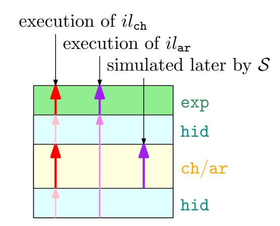

{0}------------------------------------------------

# <span id="page-0-0"></span>Epochal Signatures for Deniable Group Chats

Andreas H¨ulsing<sup>∗</sup> Fiona Johanna Weber†

# Abstract

We introduce formal definitions for deniability in group chats by extending a pre-existing model that did not have this property. We then introduce "epochal signatures" as an almost drop-in replacement for signatures, which can be used to make certain undeniable group-chats deniable by just performing that replacement. Following that we provide a practical epochal signature scheme and prove its security.

# 1. Introduction

In this work we take a formal look at deniability in group chat applications and introduce a new primitive that allows to turn many secure group chat protocols into deniable ones.

Deniability is a property of social conversation: As long as nobody is recording a conversation it is generally not possible to prove to someone not part of the conversation what was said (or even if the conversation happened at all). Recording a conversation without the consent of the other person (or a judge) is considered immoral in most societies and even illegal in many jurisdictions.

Nowadays, we are moving large parts of our social conversations online. In this setting we are facing a dilemma. Communication tools that provide the traditional security properties of confidentiality, integrity, and authentication, often also provide a transferable proof of authenticity for messages or metadata that proves participation in the conversation. For example, modern tools for messaging in large groups, like MLS (in its current internet draft version 05 [\[OBR](#page-16-0)+20]), sign every message to provide authentication in the presence of malicious insiders. This renders communication undeniable and changes things in a social setting: Suddenly, it is not one word against the other, but there is undeniable proof. Even more, it is now sufficient to leak a transcript which allows everyone to verify what was being said without the leaking party coming forward. In group communication this might even allow to make somewhat anonymous accusations. While this might be intended in some settings, it is obviously not intended in many others as we do not record most of our real life conversations and would be suspicious if someone else would do this. There is a long debate that one can have about the settings in which deniability might be useful and the degree of usefulness; see for example the discussion about deniability in MLS [\[tMp\]](#page-16-1). Instead of discussing this question, our work focuses on the technical aspects of deniability and its technical feasibility. Hence, in the following deniability is to be understood as technical deniability if not explicitly stated otherwise.

Probably the first work on deniability is "Undeniable Signatures" [\[CvA90\]](#page-16-2) by Chaum and van Antwerpen where they introduce signatures that can only be verified by a chosen recipient. This idea was further developed as chameleon signatures [\[KR98\]](#page-16-3). More explicitly, deniability of secure messaging appeared in the work on "deniable encryption" [\[CDNO97\]](#page-15-0) which considered the deniability of encrypted messages even if the random coins, and possibly the secret key get corrupted.

The notion of deniability gained new relevance in the context of secure chat protocols. It first reappeared as plausible deniability in the proposal of the "Off-the-Record" protocol [\[BGB04\]](#page-15-1) and was kept as an important privacy property of secure chat ever since [\[UDB](#page-16-4)+15, [tOt\]](#page-16-5). Consequently, the Signal-protocol [\[Mar13\]](#page-16-6) that is now widely deployed in chat-software such as Signal and WhatsApp provides (some form of) deniability. The generic approach for two-party chat protocols to achieve deniability is to use a deniable key-exchange to setup a shared secret key. That shared secret key is then used to encrypt messages with an authenticated encryption scheme. Since everyone who can verify the authenticity of the ciphertext has the key necessary to create it, a ciphertext cannot serve as proof. While it is still not known how to achieve extremely strong notions of deniability efficiently [\[DKSW09\]](#page-16-7), the above approach provides a practical solution for deniability of two-party chats.

A similar solution does not exist for group-chats: Using authenticated encryption with a shared group secret for symmetric authentication is insecure for the same reason for which it is deniable in the two-party case: All parties that have the key could have created a message, but since there are multiple parties, it could have come from any of them. In addition to that deniable key-exchanges don't necessarily scale well with more than two parties: Using a pairwise-approach works but requires a quadratic number of key exchanges in the number of parties.

Because of this most protocols either sacrifice deniability over authenticity (for example the current MLSdraft [\[OBR](#page-16-0)<sup>+</sup>20]) or implement groups as essentially pairwise two-party-chats [\[LVH13,](#page-16-8) [SVH18\]](#page-16-9) which is inefficient in terms of communication complexity. Consequently, many protocols share further downsides, such as messagesizes linear in the group-size [\[SH19,](#page-16-10) [Mar14\]](#page-16-11) or the require-

<sup>∗</sup>TU Eindhoven, E-mail: andreas@huelsing.net

<sup>†</sup>TU Eindhoven, E-mail: crypto@fionajw.de

Author list in alphabetical order; see [https://www.ams.org/](https://www.ams.org/profession/leaders/culture/CultureStatement04.pdf) [profession/leaders/culture/CultureStatement04.pdf](https://www.ams.org/profession/leaders/culture/CultureStatement04.pdf).

{1}------------------------------------------------

<span id="page-1-0"></span>ment that there is at least one universally trusted user in every group |BST07|. A partial exception is "Multi-Party OTR" (mpOTR) [GUVGC09] which uses a shared secret key for confidentiality but ephemeral signature keys for authenticity. This leads to an efficient protocol for message exchange but the setup phase still has quadratic complexity in the group size. While the setup cost alone might be acceptable, there is a major downside to mpOTR. Any join or leave of a party requires the setup of a new chat. Given that for example MLS has the "aim to scale to groups as large as 50,000 members" [OBR<sup>+</sup>20], considering frequent join and leave operations, this renders mpOTR largely impractical for this scenario. A further issue is that deniability is only guaranteed after a chat ended which also requires to frequently re-initialize chats even without join or leave operations.

Furthermore we note that most of the existing work on deniability in chat protocols does not use formal models with generally agreed upon formal security notions but rather stay on an informal level. A notable exception is the work on online deniability [DKSW09] but the model is limited to two parties. Hence, existing schemes often just argue via the intractability of specific attacks [UG18] in place of a formal security argument.

In summary, there neither exists any satisfying solution for deniability in group chat nor a formal model that describes what deniability in a group chat setting actually means.

Despite its very different goal, "Efficient Post-Compromise Security Beyond One Group" [CHK19] is probably the closest to our work. In it the authors formalize signatures that "heal" after a compromise and note that this also allows some basic deniability. What they are proposing is quite similar to the signature-chains that we present in Appendix E.2, but does not extend beyond that due to the different focus of the works as a whole.

### 1.1. Our Contribution

In this work we solve the above problem. First, we introduce a formal framework for offline deniability in group-chats (to our knowledge the first one). For this, we build on the recent model for chats by Rösler et al. [RMS18] and extend it (see Sections 3 and 5). Our notion is parameterized by a predicate that states at what point in the execution deniability is achieved. Based on different such predicates we introduce three notions of different strength for offline deniability. We show that our notions form a strict hierarchy and argue that the intermediate notion is the best choice for practical applications. We argue that our strongest notion, which asks for immediate deniability of messages, is likely not achievable by practical protocols and discuss attack scenarios not covered by our weakest notion.

Second, we introduce the concept of *epochal signatures* which can be used to easily convert many existing, non-deniable protocols for group chat into deniable ones (Section 4). Our solution scales well to large group sizes and the resulting protocols are almost as efficient as the original ones. The idea is somewhat similar to mpOTR but avoids the requirement of pairwise exchange of temporary

signature keys. Instead, epochal signatures evolve over time and allow for efficient forgeries of old messages after a fixed period of time. Essentially, they are the opposite of forward-secure signatures: Publishing a secret key allows to forge signatures valid in the past but not in the future. We remark here that these resolve a previously brought-up issue [Rob] with just publishing old keys, namely that the owner of said keys might be unable to do so. Readers that are not interested in the formal modelling should be able skip forward to this part without too many issues.

Third, we present an efficient generic construction for epochal signature schemes whose security we prove secure in the standard model (Section 6). Our construction relies only on well established primitives, namely forward secure signatures, pseudorandom functions, and timelock puzzles. Since our proof works in the standard-model and avoids problematic techniques like rewinding, an instantiation with post-quantum schemes would immediately give us post-quantum epochal signatures. While unintended, it seems as if our epochal signature proposal also constitutes an instantiation for a TimeForge Signature, a recently [SPG19] proposed primitive for deniable E-Mail in the presence of DKIM.

In Appendix D we demonstrate that epochal signatures can be used to convert a large class of non-deniable group-chats into deniable group-chats by just using them as a drop-in-replacement. Lastly we outline a few more techniques that we believe to be potentially useful for deniability in group-chats but are too specialized to be usable for a generic drop-in replacement (Appendix E).

# <span id="page-1-1"></span>2. Security Model for Chats

The model we use for group chats is a slight extension of that of Rösler, Mainka and Schwenk [RMS18]. To stay consistent with our own conventions we adjust the names of some variables slightly, but other than that the following subsection is an almost verbatim copy of the original description:

#### 2.1. Base Model

The model assumes a central server, that receives messages from the respective senders, caches them, and forwards them as soon as the receivers are online. Hence the protocols are executed in an asynchronous environment in which only the server has to always be online.

Groups are defined as tuples

$$gr = (ID_{gr}, G_{gr}, G_{gr}^*, info_{gr}), G_{gr}^* \subseteq G_{gr} \subseteq \mathbf{U}$$

where **U** is the set of all users of the protocol,  $G_{gr}$  is the set of all members of the group gr,  $G_{gr}^*$  is the set of administrators of gr. The group is uniquely referenced by  $ID_{gr}$ . Additionally, a title and other usability information can be configured in  $info_{gr}$ .

We denote communicating users with uppercase letters in the calligraphic font  $(\ldots, \mathcal{U}, \mathcal{V}, \cdots \in \mathbf{U})$  and administrators with an asterisk  $(\mathcal{U}^* \in G_{gr}^*)$  where relevant. Every user maintains long-term secrets for initial contact with other users and a session state for each group in which

{2}------------------------------------------------

<span id="page-2-1"></span>she is member. The session state contains housekeeping variables and secrets for the exclusive usage in the group. Messages delivered in a group are not stored in the session state. By distinguishing between delivery and receiving of messages, we want to emphasize that a received message is first processed by algorithms before the result is presented to the user.

In order to provide a precise security model for secure group instant messaging, we define a group instant messaging protocol as the tuple of algorithms

```
Π = ((snd,rcv),
     (SndM, Add, Leave, Rmv, DelivM, ModG, Ack)).
```

The first two algorithms (snd, rcv) provide the application access to the network (network interface). Thereby snd out- puts ciphertexts and rcv takes and processes ciphertexts. The latter seven algorithms process actions of the user or deliver remote actions of other users to the user's graphical interface (user interface). Each protocol specifies these algorithms and the interfaces among them. To denote that one algorithm algA has an interface to another algorithm algB we write algBalgA .

Every algorithm has modifying access to the session state of the calling party U for the communication in group gr.

- snd → ⃗c: Sends a vector of ciphertexts to the central server.
- rcvsnd,DelivM,ModG,Ack(c): Receives ciphertext c from the central server and processes it by invoking one of the delivery algorithms and possibly the snd algorithm.

Actions of user U are processed by the following algorithms, which then invoke the snd algorithm for distributing the actions' results to the members V<sup>i</sup> ∈ Ggr of group gr:

- SndM(gr, m) → id: Processes the sending of content message m to group gr.
- Add(gr, V) → id: Processes adding of user V to gr.
- Leave(gr) Processes leaving of user U from gr.
- Rmv(gr, V) Processes removal of user V from gr.

Every algorithm that processes the calling user's actions outputs a unique reference string id. Actions initiated by other users are first received as ciphertexts by the rcv algorithm and then passed to the following algorithms, which deliver the result to user U:

- DelivM → (id, gr, V, m): Stores m with reference string id from sender V in group gr for displaying it to user U.
- ModG → (id, gr′ ): Updates the description of group gr with IDgr = IDgr′ to gr′ after the remote modification with reference string id.
- Ack → id: Acknowledges that action with id was delivered and processed by all its designated receivers.

# 2.2. Our extensions

We note that all members of a group can perform SndM and Leave, but only administrators can execute Add and Rmv. We refer to [\[RMS18\]](#page-16-15) for security-definitions besides deniability. For deniability we extend the model in the following way. We denote the long-term secrets of a user U as sk <sup>U</sup> (or just sk, if unambiguous), any publicly identifying information tied to sk <sup>U</sup> as pk <sup>U</sup> . We call the tuple (pk <sup>U</sup> , sk <sup>U</sup> ) U's key pair and denote her session state in a group gr as ssU,gr.

We introduce the notion of the state of a protocol. Intuitively a state st is a full snapshot of an execution of a protocol; as such it contains the sets of the existing users U and groups G, as well as all long-term key pairs and session states. We also introduce a partial state that does not contain the key pairs and session-states.

<span id="page-2-0"></span>Definition 1 (State). A state st of our protocol consists of:

- The set U of all users U.
- The set G of all groups gr as defined previously.
- The long-term public keys PK of all users in U.
- The long-term secret keys SK of all users in U.
- The session states ss<sup>U</sup>,gr of all groups gr ∈ G and all users U ∈ gr .

The tuple (U, G) forms the partial state st.ps of a state st. Two states st0, st<sup>1</sup> are equivalent(st<sup>0</sup> ≡ st1) if and only if their partial states are identical (st0.ps = st1.ps).

From here on we use the following convention: If we define that a value x consists of multiple values a, b, c, . . . , then x.a refers to the a-value of x. (E.g., st.U refers to the set U that is part of a particular state st.)

Given a state st, we also introduce the notion of a group-state st gr , which contains all information regarding a particular group gr . Intuitively it contains all session states and long-term key pairs of any party in that group, as well as the group description. We also define the notion of a partial group-state, which only contains the group-description however.

Definition 2 (Group State). Let st be a state and gr be a group, then the group state st gr consists of:

- The group gr .
- The long-term public keys PK of all users in gr .
- The long-term secret keys SK of all users in gr .
- The session state ss<sup>U</sup>,gr of gr of each user U ∈ gr .

A partial group state st gr .ps consists only of gr .

For our formal notions of deniability judges have to decide whether a transcript is real or not. In order to allow them to choose interactions without having to provide them with full oracle-access, we introduce the notion of an instruction: An instruction is a tuple that tells the 

{3}------------------------------------------------

challenger to perform some action in the name of some user with some arguments and is marked with a type that indicates the circumstances under which the challenger shall execute the instruction. An instruction list is simply an ordered list of instructions.

Definition 3 (Instruction List). An instruction i is a tuple that contains:

- A party P,
- a user action act ∈ {SndM, Add, Leave, Rmv,rcv} (with the respective arguments),
- a timepoint time and
- a type ∈ {exp, ch, ar, hid}.

An instruction list il is an ordered list of instructions. For an instruction list il and X ∈ {ch, ar} we use il<sup>X</sup> to refer to the sublist of il that contains all tuples whose type is in {exp, hid, X}. We call these two sublists the executable sublists.

Intuitively the executable sublists represent the possible executions that the judge will have to distinguish as illustrated in Figure [1.](#page-3-0) The type-names exp, ch, ar and hid are shorthands for "exposed", "challenge", "alternate reality" and "hidden".



<span id="page-3-0"></span>Figure 1: Alternative transcripts based on the type of an instruction. The judge receives either an entirely real transcript (bold red arrows) or a partially simulated one (bold purple arrows).

In order to prevent trivial attacks we furthermore introduce the following notion of consistency for instruction lists:

Definition 4 (Consistency). An instruction list il is consistent with a starting state st if executing either of il ch and il ar with st as starting state

- is compliant with the protocol and
- all intermediate states that directly precede an exp action are equivalent between the executable sublists with regards to the target-group of that action.

We define the predicate is consistent, which receives an instruction list il and a starting state st, to return 1 if and only if il and st are consistent.

Executing an instruction inst will (usually) cause messages to be sent over the network. The list of all these messages, each together with their sender and receiver(s), as well as the resulting session state form an instruction transcript. Note in this context that a single user action, such as sndM may cause multiple executions of snd and rcv among different parties.

With this we define the transcript of an execution of an executable sublist of an instruction list as the concatenation of the instruction transcripts of all its actions. We include the session-states in the transcript to model corruption. While this may seem excessively powerful, we note that we mostly deal with unbounded judges in this work, who would usually be able to extract most of this information from the sent messages anyways; furthermore we will present more specific rationales where appropriate.

Definition 5 (Transcript). Let instts be the instruction transcript of executing an instruction inst =: (P,(act, args), time, type) in a state st. Then instts contains:

- For each snd-operation that is performed as part of executing inst:
  - The party P that performed snd.
  - The output ⃗c of snd.
- For each rcv-operation that is performed as part of executing inst:
  - The party P that performed rcv.
  - The ciphertext c that rcv receives.
- the group-state stgr that results from executing inst.

The transcript ts of an execution of an executable sublist il<sup>X</sup> of an instruction list il is the concatenation of the instruction transcripts of all instructions in ilX.

For the actual execution we define the algorithm exec that takes an executable sublist il<sup>X</sup> of an instruction list il and a starting state st and then executes the sequence of instructions given by ilX, returning the resulting transcript and state.

Definition 6 (exec). The algorithm exec takes a starting state st, and an executable sublist il<sup>X</sup> of an instruction list il and executes all actions listed in il with state as starting state. It returns the complete transcript of the execution as well as the updated state of all involved parties. In the event that il orders an action that is not compliant with the protocol, an abort is raised.

We also define a version that only considers partial states, and does not return a transcript but only the resulting partial state:

Definition 7 (partial exec). The algorithm partial exec takes a partial starting state ps and an executable sublist il<sup>X</sup> of an instruction list il. It returns the partial state ps′ that would result from executing il<sup>X</sup> with any starting state whose partial state is ps. In the event that il<sup>X</sup> orders an action that is not compliant with the protocol, an abort is raised.

{4}------------------------------------------------

<span id="page-4-2"></span>Intuitively deniability means that every transcript could have been generated by everybody. We model this using a simulation-based definition, introducing a simulator S that has the goal to produce a simulated transcript that is indistinguishable from the real transcript of a group communication.

In order for S to be able to do its work, it needs to know what it has to simulate, so it has to receive some information about the instruction list il and the state st. Giving it the entire instruction list appears quite unrealistic to us however, which is why we introduce the notion of the simulation instruction simil,<sup>s</sup> that contains only the information that S needs: Which instructions it has to simulate as well as the members of the group in which that instruction occurs:

Definition 8 (Simulation Instruction). Let il be an instruction list and st be a state so that is consistent(il, st) = 1. Then the simulation instruction simil,s for il and st is an ordered list that contains:

- All entries il[i] of il ch for which il[i].type = ch and
- if there is no ch-entry for the group gr in which il[i] is performed in il ch that directly precedes il[i] in gr : simil,<sup>s</sup> also contains the partial group state of gr before instruction il[i]. (That is partial exec (il ch[0 . . . , i − 1], st) gr ).

Where il[i] refers to the i'th entry of il.

We note that our definitions also introduce notation: While deriving an executable sublist il ch from an instruction list il would for example strictly speaking require an explicit algorithm, we will for the remainder of the work just assume that if there is an instruction list il, then deriving il ch is possible and use it without introducing it as a variable first. The same holds for other notation that we used in this section, such as stgr for group-states or simulation instructions simil,state.

# <span id="page-4-0"></span>3. Security Goals

There are many aspects to the security of group chats and our model "inherits" most of the more common aspects from the original model [\[RMS18\]](#page-16-15). Here we only outline authenticity (as it is directly relevant for our work) and introduce deniability. For all other notions we refer to [\[RMS18\]](#page-16-15).

## 3.1. Authenticity

The most basic definition of authenticity is message authentication [\[RMS18\]](#page-16-15):

If a message m is delivered to V ∈ Ggr by DelivM → (id, gr, U, m), then it was indeed sent by user U by calling SndM(gr, m).

## <span id="page-4-1"></span>3.2. Deniability

Deniability is the ability of a party Alice (A) to plausibly deny towards a judge Judy (J ) that she sent a certain message or participated in a certain channel, even if she did do so. We model deniability as J not being able to distinguish between the transcript of a real interaction and a simulated transcript that was created by a simulator Simon (S). If J is incapable of distinguishing between the two cases then A can plausibly claim that a transcript is not real. In our definitions we focus on the technical aspects of deniability and ignore real life factors like trust in the entity providing a transcript.

Of course deniability can trivially be achieved by sacrificing authenticity: If no party has any identifying longterm secrets then every transcript could have been generated by everyone. However, authenticity is critical in practice: If A thinks that she is talking to a certain party B but is really talking to J the outcomes may be very unfortunate to say the least. Hence, the challenge is not to achieve "deniability" but "deniability despite authenticity". This dichotomy is what makes designing deniable chat-protocols hard in the first place.

Deniability is a very generic term which allows for different definitions depending on the treatment of certain aspects. First of all one can consider judges with different capabilities. The most basic distinction here is the amount of work that the judge can perform. The typical options here are unbounded judges and asymptotically efficient judges, that is judges that are limited to a runtime that is polynomial in a security-parameter with either classical (J ∈ PPT) or quantum computers (J ∈ QPT).

More specific to deniability is then the question of whether the judges are online: The traditional notion here are so-called offline-judges who receive the transcript after the completion of the protocol execution. However, one may also consider online-judges who exchange messages with group-members while the communication is happening [\[DKSW09\]](#page-16-7).

Next one has to decide whether parties should only be capable of denying that they sent specific messages or whether they can also deny that the interaction happened in the first place [\[UDB](#page-16-4)+15]. We call these messagedeniability and participation-deniability, the later of which is strictly stronger.

Then there is the power of the simulator. Traditionally deniability means that everyone is capable of simulating transcripts but more restricted settings in which for example only supposed participants are capable of simulating interactions are thinkable as well. We are however not aware of any previous work that treats this aspect explicitly instead of just targeting the former (stronger) notion, which we will henceforth call universal deniability as opposed to non-universal deniability as a catch-all term for everything that is weaker.

Lastly there is the question of corruption. That is how much secret information the judge receives, there are two major aspects to this, the first one being whether the judge receives (or even chooses) the long-term secrets of the involved parties. Given that unbounded judges can compute matching secret keys for every public key themselves, this distinction is a lot less relevant to them, compared to bounded judges.

The other aspect concerns state-reveals: Seized devices

{5}------------------------------------------------

<span id="page-5-1"></span>may contain session-states that a realistic judge would most likely accept as evidence and a strong deniability notion should ensure that this evidence is useless. Considering our model of chats, the strongest notion in this regard is to give the resulting session-states of all exp and ch actions to the judge; this may seem very strong, but reliably prevents most vulnerabilities with regards to session state reveals. Giving the session-states of the ch actions to the judge models the case where one or more traitors try to betray an user  $\mathcal{U}$  and hand their devices to the Judge. We call the case where the judge chooses the keypairs of all parties and receives all intermediate session-states of exp and ch-actions full corruption. In this context we would also like to mention the current draft of OTRv4 |tOt| that even considers partial corruption of a party, meaning that  $\mathcal{J}$  only learns parts of the traitors secret. This is something that we don't consider here. In summary we consider the following dimensions:

- adversarial model: Whether the judge is unbounded or not and whether she has a quantum computer.
- online judges vs. offline judges: Whether the judge receives the transcript as it is generated or at some (to be defined) later point in time.
- message-deniability vs. participation-deniability: Whether only the messages of a communication or even the occurrence of the communication can be denied.
- universal vs non-universal deniability: Whether everyone is capable to simulate a transcript or just participants.
- **corruption:** The degree to which the judge learns the secrets of the involved parties. In the case of *full corruption* the judge learns all long-term secrets of all parties (for an unbounded judge this will rarely be an advantage however), as well as the session-states that succeed exp and ch actions.

We note that that spectrum is likely incomplete when looking at online-judges. It is for example possible to distinguish between adaptive and non-adaptive online-judges, the former of which are capable of changing parties behaviours on the fly, while the later are not. We only consider offline-deniability in this work however but note that formalizing online-deniability in a way that unifies the existing notions would certainly be desirable.

In general we note that online judges seem to be mostly interesting with corruption. While the notion also works without, it essentially limits the judge to traffic-analysis; while that may be very dangerous, it does not give the judge a real advantage over offline-judges who receive a transcript of the network (given that the network-transcript will usually be from an independent party, there is little reason to believe that the judge would not trust it over testimonies). Online-judges with corruption are in turn essentially shoulder-surfing a member of the chat. Depending on the degree of the corruption this may even mean that that corrupted party is running the chat

on a device that is fully controlled by the judge, at which point it seems very doubtful to us that a real-world judge would not consider any claim that the interaction was simulated a reasonable doubt, even if it were theoretically possible. We also note that very few protocols target online-deniability [UDB+15].

### 3.3. Naive Deniability

We can define a first notion of offline-deniability that attempts to match the common intuition of what deniability is that we call naive offline deniability. In this case we allow the judge  $\mathcal{J}$  to choose the instructions covered in the challenge protocol execution, with the exception of actions of type  $\exp$  and hid. This models a case where a judge is given a transcript of a conversation and has to decide if this transcript is real or was prepared by a third party. In our model the judge is allowed to choose the key-pairs and the contents of the interaction in order to model the worst case. An equivalent but harder to work with definition would quantify over all possible key-pairs and transcripts. We point out that in this work we treat all adversaries in one game as using shared states.

**Definition 9** (Naive Offline Deniability). A protocol  $\Pi$  offers naive offline deniability or N-OfD if there is an efficient simulator  $S \in \operatorname{PPT}$  so that no judge  $\mathcal{J}$  has a chance of winning  $\operatorname{Exp}_{S,\mathcal{J}}^{\text{N-OfD}}$ , defined in Experiment 1 with a probability greater than  $\frac{1}{2}$ :

```
\exists \mathcal{S} \in \text{PPT} : \forall \mathcal{J} : \Pr[\mathsf{Exp}_{\Pi,\mathcal{S},\mathcal{J}}^{\mathsf{N-OfD}}\left(1^{\lambda}\right) = 1] \leq \frac{1}{2}
```

**Experiment 1:**  $\mathsf{Exp}_{\Pi,\mathcal{S},\mathcal{J}}^{\mathsf{N-OfD}}$ . Naive offline deniability for chats.

```
1 b \leftarrow_{\$} \{0,1\}

2 \mathbf{P}, il, PK, SK := \mathcal{J}()

3 st := (\mathbf{P}, \emptyset, PK, SK, \emptyset)

4 \mathsf{abort\_if}(\neg \mathsf{is\_consistent}(il, st))

5 \mathsf{abort\_if}(\exists inst \in il : inst.type \in \{\mathsf{hid}, \mathsf{exp}\})

6 \mathsf{if}\ b = 0:

7 \mid \neg, ts := \mathsf{exec}\ (il_{\mathsf{ch}}, st)

8 \mathsf{else}:

9 \mid ts := \mathcal{S}(PK, sim_{il, st})

10 b' := \mathcal{J}(ts)

11 \mathsf{return}\ b = b'
```

<span id="page-5-0"></span>(Many definitions require that the probability of a guessing game is 1/2 or negligibly close to it. In our protocols we model aborts to cause whatever experiment is running to stop execution and return 0. This makes defining the adversarial advantage easier, but usually makes it trivial to create adversaries with a success-probability of zero by intentionally causing an abort, which is significantly different from 1/2. We deal with this by requiring that the success-probability is less than or equal to the targeted 1/2, which treats these adversaries as unsuccessful.)

We call this notion "naive" because  $\mathcal{J}$  does not receive access to *any* real transcript, even ones that are completely independent of the interaction in question. In par-

{6}------------------------------------------------

<span id="page-6-1"></span>ticular this means that she won't even learn about public parameters of the server. Consider a protocol in which the server will sample a random bitstring once and attach it to any packet it sends from then on and where all honest parties simply ignore this bitstring. The naive deniability notion now allows S to sample this bitstring from the same distribution and use that sampled value in his simulation. Since  $\mathcal{J}$  has no way to learn what bitstring is used in this model, S is able to get away with this technique. In the real world it would however be exceedingly unlikely, that  $\mathcal{J}$  could not learn that bitstring by setting up an account herself and checking whether they match, implying that this notion would be too weak in practice for most purposes. The problem here is that this notion does not yet consider transcripts that are partially trusted by  $\mathcal{J}$ . Formally this manifests itself in the limitation of the challenges to those that only contain chand ar-actions (the later of which are never used, but are required for is\_consistent).

A further issue, that is however relatively minor as  $\mathcal{J}$  is unbounded, is that she does not receive any session-states as there are no exp actions, meaning that this model also only considers corruptions of keys instead of full corruption.

### 3.4. Strong Deniability

To protect against these kinds of attacks we consider the entire system as a whole. The straightforward demand here would be that the judge receives the real transcript of everything that happens, except for the interactions in question, which are either real as well or generated by a simulator. (We refrain from formalizing this here, as it will be a special case of our final notion.) While extremely powerful, this notion causes its own problems. Specifically, we conjecture that it is incompatible with all efficient protocols, unless other desirable features are sacrificed:

<span id="page-6-0"></span>Conjecture 1. There is no chat-protocol that offers post-compromise secrecy (also known as backward secrecy [UDB+15]), and strong offline deniability without requiring a trusted party or an interaction with all members of a group after performing any non-rcv action in that group.

We introduce this conjecture mostly to justify why we consider weaker notions desirable. Our rationale for it is as follows: At first consider any protocol that encrypts consecutive messages of a user with keys that are in a non-trivial relation to each other. Let now  $m_0$  and  $m_1$  be consecutive messages by the same user, so that they are encrypted with the keys  $k_0$  and  $k_1$  and let  $m_1$  be part of the challenge that the judge  $\mathcal{J}$  receives, but not  $m_0$ . This allows the following attack: If  $\mathcal{J}$  is unbounded, she can extract  $k_0$  and  $k_1$  with at least high probability and check whether they are related. If the transcript is entirely real then they will be related with probability 1. In contrast, if  $m_1$  was encrypted by the simulator, this will likely not be the case, as the relation is by assumption non-trivial and the simulator does not know  $k_0$ .

This attack works in particular for schemes that derive their keys from states that are derived from each other. Getting rid of this property is not without downsides: The first option would be to design a protocol that avoids ephemeral secret states entirely by only using long-term secrets. Such a protocol is trivially incapable of offering post-compromise secrecy. The second option would be to remove the possibility of linking consecutive states. This could be done by distributing ephemeral public keys amongst all possible senders and have them use each key only once. This leads to the same problem as before just with a shorter attack-window, as well as the possibility to run out of fresh keys. We also are not aware of other methods that do this without interacting with all parties in the group – performing essentially a fresh handshake.

Note that this rationale does intentionally not make use of the session-states that are part of the transcript. We do this to show that the problem is not caused by our strong notion of corruption and cannot be circumvented by weakening that notion.

#### 3.5. State Disassociation

Attacks like the one outlined in the previous section are a consequence of correlations between successive groupstates. As such they become impossible, once two groupstates become fully disassociated with each other. The precise condition of when and if that happens in a given group will be the main parameter to our generic model.

A formal definition of a state disassociation is strictly speaking not necessary for the definition of our model but we expect that most proofs would end up defining some form of this notion as a stepping-stone anyways. Because of this we provide it here, with the hope that it will not only help with understanding the intentions behind the following sections, but also to reduce redundant work in proofs and the risk of multiple incompatible definitions.

Intuitively a state disassociation in a group gr is any sequence of actions that transforms a group-state  $st_0$  into a group-state  $st_1$  in such a way that it ensures that  $st_1^{gr}$  contains no information about  $st_0^{gr}$ .

A state disassociation predicate  $sd\_pred$  intuitively states if an instruction list achieves state disassociation for a given starting state. More precisely, it takes an instruction-list il, a partial starting-state ps and a group gr and returns true if the group state in gr that results from executing il on ps is uncorrelated to ps, and false otherwise. We formalize this, requiring that there is no judge  $\mathcal{J}$  that can output two consistent pairs of starting states and instruction-lists which cause state-disassociations and result in equivalent (Definition 1) states, such that  $\mathcal{J}$  can distinguish those states.

**Definition 10** (State Disassociation Predicate). A predicate  $\mathsf{sd\_pred}$  is a state disassociation predicate if there is no adversary  $\mathcal{J}$  that can win Experiment 2 with probability  $> \frac{1}{2}$ :

$$\forall \mathcal{J}: \Pr[\mathsf{Exp}^{\mathsf{State-Disassoc}}_{\mathsf{sd\_pred},\mathcal{J}}\left(1^{\lambda}\right)] = 1] \leq \tfrac{1}{2}$$

{7}------------------------------------------------

# **Experiment 2:** $\mathsf{Exp}^{\mathsf{State-Disassoc}}_{\mathsf{sd\_pred},\mathcal{J}}$ . State Disassociation Predicate

```
1 st_0, il_0, st_1, il_1, gr, SK := \mathcal{J}(\mathsf{sd\_pred})
2 for b \in \{0, 1\}:
3 | abort_if(¬is_consistent(il_b, st_b))
4 | abort_if(¬sd_pred(il_b, st_b.ps, gr))
5 | ___, st_b' := \mathsf{exec}(st_b, il_{b_{ch}})
6 abort_if(st_0'^{gr} \not\equiv st_1'^{gr})
7 b \leftarrow_{\$} \{0, 1\}
8 b' := \mathcal{J}(st_b'^{gr}, st_{1-b}'^{gr})
9 return b = b'
```

### <span id="page-7-0"></span>3.6. Disjoined Instruction Lists

To prevent the aforementioned attacks, it is not merely sufficient to define what a state disassociation is, but also the circumstances under which it has to occur. The goal in this regard is to cause a disassociation between all pairs of longest consecutive sequences of actions in a group whose type is either only exp or only ch and all such sequences whose type is ch and the final resulting state.

For this we introduce the notion of disjoined instruction lists to our framework. It has a parameter  $sd\_pred$  that has to be filled with a state-disassociation-predicate. With this we can now define that an instruction list il and a partial starting state ps are disjoined under a given state disassociation predicate  $sd\_pred$  if:

For every group gr and every sublist il' of il that contains an action a in gr, where actions a', a'' in gr that directly precede/follow il have a different type from a and their types are in  $\{ch, exp\}$ , then il' satisfies the state-disassociation predicate for gr.

We remark that this bans partial changes to the states between ch and exp actions. If that ban was dropped, the simulator would require precise information about which states have to be updated in what way. While possible, this would vastly complicate the security notion, while likely not resulting in a stronger notion (if enough information is given to the simulator it can simply simulate the hid-actions and remove them from the output). To give a more formal definition:

**Definition 11** (Disjoined). We say that an instruction list *il* and a partial starting state *st* are *disjoined* under a predicate sd\_pred if the predicate disjoined, as defined in Algorithm 1, returns 1 when called with them.

#### 3.7. Full Interaction

In order to provide a predicate that may work as a state disassociation predicate in many protocols while also being a plausible option for use in real-world protocols, we introduce the notion of a hidden full interaction. Intuitively a full interaction occurs if every member of a group performs an active action or is removed from the group. If a full interaction occurs in hid actions with no other types of actions in between, we call it a hidden full interaction. For a more formal definition we refer to Definition 21 in Appendix B.2.

**Algorithm 1:** Definition of disjoined for a state disassociation predicate sd\_pred.

```
1 fun c_index(il, n):
           \mathbf{return} \ n - \left| \left\{ x \in il[0, \dots, n] \ \middle| x.type \neq \mathbf{ar} \right\} \right|
 \mathbf{2}
 {\bf 3}~{\bf fun}~{\bf disjoined_{sd\_pred}}~(il,~ps){\bf :}
            for i, j, k \in \mathbb{N}^3, i < j < k < |il|:
 4
                  t_i := il[i].type; t_j := il[j].type; t_k := il[k].type
 \mathbf{5}
                  g := il[i].group
 6
                  i' := c_{index}(il, i); k' := c_{index}(il, k)
 7
                  ps' := \mathsf{partial\_exec}\left(il_{\mathsf{ch}}[0, \dots, i'], \ ps\right)
 8
                  if \neg sd\_pred(il_{ch}[i',\ldots,k'], ps', g)
 9
                    \land t_i, t_k \in \{\mathtt{ch}, \mathtt{exp}\} \land t_j \notin \{t_i, t_k\}:
                         return \theta
10
            return 1
11
```

Our suggestion for the state disassociation predicate is therefore that the predicate that returns true if and only if a hidden full interaction occurs. We note that this mirrors the usual requirements for establishing post-compromisesecrecy, if we view pure key-updates as sending empty messages. We note that whether HFI is a secure state disassociation predicate remains a property of the protocol in question and has to be proven on a case-by-case basis.

#### 3.8. Our Deniability Framework

In order to define the security notions that we actually recommend, we will use the framework depicted in Experiment 3. It follows the typical structure of a distinguishing game in which a judge  $\mathcal{J}$  has to guess a randomly sampled bit b. The only ways for her to do this better than just random guessing are to extract information about the execution-history from the state and to distinguish whether the transcript of an interaction of her choice is either real (b=0) or whether it was (partially) simulated by a simulator  $\mathcal{S}$  (b=1).

The experiment starts with an empty state. This does not really limit the power of  $\mathcal{J}$ , since she can always start il with hid actions that create a state whose partial state is whatever she likes. It would alternatively have been possible to let  $\mathcal{J}$  output the starting state, but since she would then know it, all groups would have to perform a state-disassociation before executing ch or ar actions.

We allow  $\mathcal{J}$  to pick the long-term key pairs of the involved parties, as we would give that information to her anyways in the end to deal with corruption and don't think that we should allow the existence of weak keys. The only requirements that we enforce for the operating instruction il that  $\mathcal{J}$  outputs are that it is consistent with the empty starting state and properly disjoined under a state disassociation predicate  $\operatorname{sd\_pred}$  that is left as model-parameter. Only giving the public keys and  $\operatorname{sim}_{il,st}$  to  $\mathcal{S}$  means that all notions defined from this experiment provide universal deniability. This could be weakened to different forms of non-universal deniability by giving further information such as secret keys to  $\mathcal{S}$ , but as these notions are rarely if ever targeted in the literature and by no means standard we refrain from doing so here.

We note that the transcript that  $\mathcal{J}$  receives contains

{8}------------------------------------------------

Experiment 3: ExpOfD <sup>Π</sup>,S,<sup>J</sup> ,sd pred. The Experiment used to define our notions of offline deniability for protocols Π. The specific notion depends on the parameter sd pred which specifies the way in which the operating instructions has to be disjoined.

```
1 b ←$ {0, 1}
 2 P,PK, SK, il := J ()
 3 st := (P, ∅,PK, SK, ∅)
 4 abort if
           ¬is consistent(il, st) ∨ ¬disjoinedsd pred (il, st)
 5 if b = 0:
 6 full transcript, st := exec (st, il ch)
 7 judged transcript :=
        (msg ∈ full transcript|msg.type ∈ {exp, ch})
 8 else:
 9 full transcript, st := exec (st, il ar)
10 simulated transcript := S(PK, simil,st)
11 judged transcript :=
        merge((msg ∈ full transcript|msg.type = exp),
        simulated transcript)
12 b
    ′
     := J (judged transcript)
13 return b = b
                ′
```

<span id="page-8-0"></span>all session states that precede an exposed action in the respective group, which together with the adversarially chosen key pairs means that all notions defined in this model consider full corruption. We choose this notion not because we believe that it models anything particularly realistic, but because security against it implies security against many weaker forms of corruption and because it does not seem to cause any significant problems for protocol design compared to those weaker notions.

This entire experiment defines a family of securitynotions that differ on the used state-disassociation predicate sd pred. That predicate essentially defines at what point the communication in a group becomes deniable. As such the members of that family will vary substantially with the extreme cases being a predicate that always returns 1, requiring deniability after every instruction, and a predicate that always returns 0, meaning that no group provides deniability if there is ever an exp action in it. Any other predicate will provide something in between these two notions. As such sd pred is a customization point that has a major effect on the practical deniability that a scheme provides and saying that a protocol provides offline-deniability in the sense that no judge can win the above game better than by random guessing is a statement of very limited use without specifying sd pred.

We remark that a state disassociation predicate p that outputs 1 strictly more often than another predicate p ′ , does not necessarily imply a stronger security notion: Consider the case where both predicates accept the same consistent instruction lists, but p also accepts all inconsistent ones, which are rejected by p ′ . The difference between p and p ′ has no effect on the provided securitynotion because the security-game performs a consistencycheck anyways and aborts if it fails.

Because of the large effect that sd pred has on our no-

tion of OfD-security, we will provide three concrete instantiations of it, namely the extreme cases of strong and weak offline-deniability, as well as a notion between the two, that is efficiently instantiable under reasonable requirements (compare Conjecture [1\)](#page-6-0) while guaranteeing a much stronger form of deniability than the weak notion.

With this we will now define our notion of strong offline deniability:

Definition 12 (Strong Offline Deniability). A protocol Π offers strong offline deniability or S-OfD if there is an efficient simulator S ∈ PPT so that no judge J has a chance of winning the OfD-game (Experiment [3\)](#page-8-0), with sd pred = (x 7→ 1) with a probability greater than <sup>1</sup> 2 :

$$\exists \mathcal{S} \in \mathrm{PPT} : \forall \mathcal{J} :$$

$$\Pr[\mathsf{Exp}_{\Pi,\mathcal{S},\mathcal{J},(x\mapsto 1)}^{\mathsf{OfD}} \left(1^{\lambda}\right) = 1] \leq \frac{1}{2}$$

This notion guarantees universal participation deniability under full corruption for offline-judges and is the strongest notion for offline deniability in chats that we consider in this work, as it fully covers all the security goals that we outlined for offline-deniability in subsection [3.2.](#page-4-1) We doubt however that it is efficiently achievable (Conjecture [1\)](#page-6-0).

Because of this we also introduce a weaker notion, that we believe to be efficiently achievable in practice. Specifically we suggest to use the predicate HFI as defined in Definition [21.](#page-17-0) The reasoning behind this is that this notion still eventually achieves deniability in corrupted groups, but does not require an update of the entire group state after every operation. Instead the state can be updated as a side-effect of regular messages, allowing for more practical protocols. Additionally this notion has the advantage that it can be defined generically and therefore does not rely on any specifics of the protocol.

Definition 13 (HFI Offline Deniability). A protocol Π offers HFI offline deniability or HFI-OfD if there is an efficient simulator S ∈ PPT so that no judge J has a chance of winning the OfD-game (Experiment [3\)](#page-8-0), with sd pred = HFI with a probability greater than <sup>1</sup> 2 :

$$\exists \mathcal{S} \in \mathrm{PPT} : \forall \mathcal{J} :$$

$$\Pr[\mathsf{Exp}^{\mathsf{OfD}}_{\Pi,\mathcal{S},\mathcal{J},\mathsf{HFI}} \left( 1^{\lambda} \right) = 1] \leq \frac{1}{2}$$

<span id="page-8-1"></span>Theorem 1. S-OfD is strictly stronger than HFI-OfD.

Proof. (Sketch, for the full proof see Appendix [C.1.](#page-18-0)) "S-OfD ⇒ HFI-OfD": This follows directly from the fact that the only difference between the two notions is that the judge has strictly more freedom in choosing il in S-OfD.

"HFI-OfD ̸⇒ S-OfD": A HFI-OfD-secure chat-protocol can be modified so that every user U appends a random bitstring bs to successive messages in a group that does not change as long as only she sends messages (no change to group or messages by other users). The resulting scheme is still HFI-OfD-secure, but not S-OfD-secure.

Next we define an even weaker notion for protocols that have trouble achieving HFI-OfD:

{9}------------------------------------------------

<span id="page-9-3"></span>Definition 14 (Weak Offline Deniability). A protocol Π offers weak offline deniability or W-OfD if there is an efficient simulator S ∈ PPT so that no judge J has a chance of winning the OfD-game (Experiment [3\)](#page-8-0), with sd pred = (x 7→ 0) with a probability greater than <sup>1</sup> 2 :

$$\exists \mathcal{S} \in PPT : \forall \mathcal{J} :$$

$$\Pr[\mathsf{Exp}_{\Pi,\mathcal{S},\mathcal{J},(x\mapsto 0)}^{\mathsf{OfD}}\left(1^{\lambda}\right) = 1] \leq \frac{1}{2}$$

Intuitively W-OfD forces the judge to only create three kinds of groups: Fully corrupted ones in which all actions are exp, fully hidden ones in which all actions are hid and "target"-groups that contain only ch- and ar. This is because the definition of disjoined requires a statedisassociation between any pair of actions that don't fit into any of the above groups, but the definition of W-OfDsecurity means that there is no sequence of interaction that causes one.

We also note that the fully exposed groups will be of very little help for the judge in protocols in which sessions states are independent from each other except for the shared secret key (as long as that key is constant): Due to the independence exp groups are not affected by the challenge-bit b in any way and thus don't contain any useful information about it. As such the judge has to judge the ch-groups only on the provided transcripts, which is why we consider the term "weak" justified, despite the seemingly strong form of corruption.

<span id="page-9-1"></span>Theorem 2. HFI-OfD is strictly stronger than W-OfD.

Proof. (Sketch, for the full proof see Appendix [C.2.](#page-18-1)) Analogous to the proof of Theorem [1,](#page-8-1) except that the bitstring bs is constant within a group, not within consecutive messages of the same user in a group.

Corollary 2.1. S-OfD is strictly stronger than W-OfD.

Proof. This follows directly from the combination of Theorem [1](#page-8-1) and Theorem [2.](#page-9-1)

<span id="page-9-4"></span>Theorem 3. W-OfD is strictly stronger than naive offline deniability.

Proof. (Sketch, for the full proof see Appendix [C.3.](#page-19-0)) The main difference between the two notions is that W-OfDsecurity allows exp groups. The proof is thus mostly analogous to that of Theorem [1,](#page-8-1) except that bs is the same for all groups and never changed.

Given all of the above we conclude that while S-OfD is clearly the strongest notion, it will usually be too expensive to target in practical protocols. Because of this we recommend HFI-OfD as the target-notion that will usually be desirable, as it is still quite strong but also efficiently achievable. W-OfD is a notion that is still weaker and that we consider to be the minimum that a protocol aiming at deniability should target outside of special circumstances.

We recommend against the use of N-OfD, despite the initial appeal it may have because of its simplicity: The assumptions it makes about judges are too optimistic for practical use outside of special circumstances.

# <span id="page-9-0"></span>4. Epochal Signatures

We now introduce signatures that become deniable after a certain amount of time but provide an unforgeability notion that is essentially equivalent to the standard notion of existential unforgeability under chosen message attacks (EUF-CMA) before that. These allow adding deniability to many efficient multi-party chats that use signatures for their authentication, such as MLS [\[OBR](#page-16-0)+20]) by simply replacing the used signature scheme:

<span id="page-9-2"></span>Theorem 4. Let Π be a chat-protocol for which the following requirements hold:

- <span id="page-9-5"></span>1. A hidden full interaction (HFI) causes a perfect state disassociation.
- <span id="page-9-6"></span>2. Π only uses the secret key of a simple (EUF-CMAsecure) signature-scheme as long-term secret.
- <span id="page-9-7"></span>3. Π works with every EUF-CMA-secure signature scheme.
- <span id="page-9-8"></span>4. Π only uses the long-term secret key to create signatures with the regular signing algorithm.
- <span id="page-9-9"></span>5. There exists a time period t<sup>Π</sup> such that Π never verifies a signature more than t<sup>Π</sup> after its creation.
- <span id="page-9-10"></span>6. Π does not use any oracles that cannot be efficiently simulated.

Then the protocol Π<sup>∗</sup> that only differs from Π in that the conventional signature-scheme is replaced with an epochal signature-scheme Σ with parameters so that (V −1)·∆t ≥ t<sup>Π</sup> is HFI-OfD-secure.

The theorem essentially states that if the protocol uses generic EUF-CMA signatures and is HFI-OfD-secure when these signatures are removed then the protocol obtained by replacing the signatures with epochal signatures is HFI-OfD-secure. The proof can be found in Appendix [D.](#page-21-0)

## 4.1. Syntactic Definition

The main differences from a standard signature-scheme are the use of epochs and addition of a per-epoch public information pinfo<sup>e</sup> . Knowing pinfo<sup>e</sup> should be enough to create arbitrary expired signatures; it must be made public in such a way that everyone has easy access to it. The reason for why we separate pinfo<sup>e</sup> from the signatures is simply so that parties don't have to have seen a real signature in order to create an expired one.

Definition 15. An epochal signature scheme Σ is a tuple of four algorithms: Σ.gen, Σ.evolve, Σ.sign and Σ.verify.

- Σ.gen: Takes a security-parameter 1<sup>λ</sup> , an epochlength ∆t, the maximum number of epochs E ∈ poly(λ) and the number of epochs V < E ∈ N for which signatures are valid and returns a long-term key pair (pk, sk).
- Σ.evolve: Takes the secret key sk and returns public epoch information pinfo<sup>e</sup> and an updated secret key sk′ or ⊥ if sk has already been evolved E times.

{10}------------------------------------------------

- Σ.sign: Takes the secret-key and a message m ∈ M and returns a signature σ.
- Σ.verify: Takes a public key pk, an epoch e, a signature σ and a message m and returns a boolean value b that tells whether the signature is valid in epoch e.

We leave the message-space M as a parameter, define the public/secret key space as the set of all possible values that Σ.gen can generate as first/second output, the signature space as the output-space of Σ.sign and the space of all public epoch information pinfo<sup>e</sup> as the output-space of Σ.evolve.

An epochal signature scheme is complete if all honestly generated, unexpired signatures are accepted by the verification algorithm. For a formal definition see Appendix [B.3.](#page-18-2)

# 4.2. Unforgeability

Intuitively our notion of unforgeability is the epoch-based equivalent of the standard notion of "Existential UnForgeability under Chosen Message Attacks" (EUF-CMA), the only difference being that signatures expire and are no longer accepted by the challenger afterwards. More Formally:

<span id="page-10-1"></span>Definition 16 (Unforgability of Epochal Signatures (EEUF-CMA)). An epochal signature scheme Σ is unforgeable in the sense of Epochal Existential UnForgeability under Chosen Message Attacks or EEUF-CMA if there is no efficient forger F that has a non-negligible chance of winning Experiment [4:](#page-10-0)

```
∀F ∈ QPT, λ ∈ N, E ∈ poly(λ), V ∈ {1, . . . , E − 1} :
Pr[ExpEEUF-CMA
       Σ,F

                  1
                   λ
                     , ∆t,E, V

                                ] = 1]
=: AdvEEUF-CMA
        Σ,E,V , F

                  1
                    λ
                     , ∆t

                           ≤ negl (λ)
```

The restrictions on the points in time at which the adversary may perform which actions may appear unnecessary, as it is would easily be possible to define schemes that just consider the epoch-counter. We add them anyways, as they allow among others the release of information encapsulated in time-lock puzzles to strengthen deniability, which would lead to trivial vulnerabilities without these restrictions. We note that while the requirement to check whether the signature in question is expired is not explicit in the game, it is implied by the way signatures are checked for freshness: Since only signatures created in the last V epochs are considered in the freshnesscheck, Σ.verify accepting any signature older than that could trivially be used to win the game, implying that the scheme in question does not provide EEUF-CMA-security.

We note that by prepending the epoch to the message and checking that it during verification, every EUF-CMA secure scheme can be turned into a EEUF-CMA secure one. On the other hand every EEUF-CMA secure scheme can be turned into an EUF-CMA secure by setting ∆t to a very high value and only using the first epoch.

Experiment 4: ExpEEUF-CMA Σ,F 1 λ , ∆t,E, V . The unforgeability game for epochal signatures.

```
1 pk, sk := Σ.gen 
                    1
                     λ
                      , ∆t, E, V

 2 t0 := now()
 3 e := 0
 4 queries := [∅, . . . , ∅]
 5 fun Σ.evolve'():
 6 abort if(t = E)
 7 abort if(now() < t0 + e · ∆t)
 8 e + =1
 9 pinfoe
             , sk := Σ.evolve (sk)
10 return pinfoe
11 fun Σ.sign'(m):
12 abort if(now() ≥ t0 + e · ∆t)
13 σ := Σ.sign (sk, m)
14 queries[e] ∪ ={m}
15 return σ
16 σ, m := F
             Σ.evolve′
                    ,Σ.sign′
                          (pk)
17 ret := Σ.verify (pk, e, σ, m)
18 for e
        ′ ∈ {max (0, e − V ), . . . , e}:
19 abort if((m, e′
                    ) ∈ queries[e
                                 ′
                                  ])
20 return ret
```

# <span id="page-10-0"></span>4.3. Deniability

We say that an epochal signature-scheme is deniable if there is a simulator S that can create arbitrary expired signatures that are indistinguishable from real ones. In order to do so S receives the public epoch information pinfo<sup>e</sup> of an epoch in which the simulated signature was already expired.

<span id="page-10-2"></span>Definition 17 (Deniability of Epochal Signatures). An epochal signature Σ scheme is deniable if there is an efficient simulator S ∈ PPT, so that no judge J can win Experiment [5](#page-11-1) with a probability > 1 2 :

$$\begin{split} \forall \lambda \in \mathbb{N}, \ E \in \mathsf{poly}(\lambda), \ V \in \{1, \dots, E-1\} : \exists \mathcal{S} \in \mathsf{PPT} : \\ \forall \mathcal{J} \in \mathsf{TM} : \Pr[\mathsf{Exp}^\mathsf{Deniability}_{\Sigma, \mathcal{S}, \mathcal{J}} \left(1^{\lambda}, \Delta t, E, V\right)] = 1] \leq \frac{1}{2} \end{split}$$

We give the secret key to J because we consider unbounded judges in the first place and it should not help her in distinguishing signatures. This essentially prevents the inclusion of information about previously generated signatures in the secret key, which we consider desirable.

An anonymous reviewer pointed out an out-of-model attack against this definition: If a party forwards an epochal signature before its expiration to a time-stamping server and receives a regular signature on it and the current time, then it is not possible to simulate that signature. In this case the time-stamping server acts as a witness that the signature was real. This is an outof-model attack in both the signature-(as there are no time-stamping-oracles in the deniability game) and the chat-setting (Requirement 6 of Theorem [4\)](#page-9-2) that cannot be prevented with any scheme whose deniability is based on delayed information-releases. Developing schemes that 

{11}------------------------------------------------

<span id="page-11-2"></span>**Experiment** 5:  $\mathsf{Exp}_{\Sigma,\mathcal{S},\mathcal{J}}^{\mathsf{Deniability}} (1^{\lambda}, \Delta t, E, V).$  The deniability game for epochal signatures.

```
1 pk, sk := \Sigma. \mathsf{gen}\left(1^{\lambda}, \, \Delta t, \, E, \, V\right)
  2 b \leftarrow_{\$} \{0,1\}
 3 m, e_0, e_1 := \mathcal{J}(pk, sk)
  4 \sigma := \bot
 5 abort_if(\forall e_0 + e_1 \ge E \lor e_0 < 0 \lor e_1 < V)
 6 for e \in \{1, \dots, e_0\}:
 7 pinfo_e, sk := \Sigma.evolve(sk)
 8 if b = 0:
 \sigma \mid \sigma := \Sigma.sign(sk, m)
10 for e \in \{e_0 + 1, \dots, e_0 + e_1\}:
      pinfo_e, sk := \Sigma.evolve(sk)
11
12 if b = 1:
    \sigma := \mathcal{S}(m, e, pinfo_{e_0 + e_1})
13
14 b' := \mathcal{J}(\sigma, sk)
15 return b = b'
```

<span id="page-11-1"></span>resist such attacks is an important challenge for future work.

# <span id="page-11-0"></span>5. Proposed Techniques

In this section we describe how we build an efficient epochal signature scheme that satisfies the security notions that we defined in the previous section. We do this by starting with a naive and inefficient scheme that we then modify.

This starting point is the scheme that simply layers two signatures on top of each other, where the lower "dynamic" one is replaced with each epoch updates, while the public key of the upper "static" one serves as long-term identity. Once the signatures created within an epoch expire, the secret key of the dynamic level is published and can be used to create expired signatures. We remark that this is similar to how CAs work, with the main difference that we publish expired secret keys intentionally. The resulting scheme works as follows:

Key-Generation is identical to the key-generation of the scheme used for the static layer, giving  $(\widehat{pk}, \widehat{sk})$ . At the start of an epoch e the signer generates a new dynamic key-pair  $(\overline{pk}_e, \overline{sk}_e)$ , signs  $\overline{pk}_e$  and e with  $\widehat{sk}$ , giving  $\widehat{\sigma}_e$  and publishes  $(e, \overline{pk}_e, \widehat{\sigma}, [(\overline{sk}_0, \widehat{\sigma}_0) \dots, (\overline{sk}_{e-V}, \widehat{\sigma}_{e-V}])$  as  $pinfo_e$ .

Signing is done by signing the message m with sk, giving  $\overline{\sigma}$  and outputting  $(\overline{\sigma}, pinfo_e)$  as signature. Verification works by checking that  $pinfo_e.e$  is less than V epochs in the past and verifying  $\overline{\sigma}$  and  $pinfo_e.\widehat{\sigma}$ . The simulation of expired signatures works by using the expired dynamic secret key and the signature on it's public-key from  $pinfo_e$  to recreate the signature in question.

#### 5.1. Deterministic Bottom-Layer

The main problem with the above solution is the size of the public epoch information  $pinfo_e$  which is caused by

the need to include the dynamic secret-keys and signatures under the static key for all expired epochs. A simple method to remove the former is to deterministically generate them based on a seed that can be derived from the seeds of later epochs.

Assume that we want to use E epochs. Then during key-generation we sample a random bitstring  $r_E$  and apply a Pseudo Random Function (PRF) H on it E times, storing all intermediate values in the secret key. More precisely, we use  $r_e$  as the key to a pseudorandom function H that we call with an independent fixed value mas message  $(H(r_e, m))$  and use the resulting value as  $r_{e-1}$ . Whenever we use a probabilistic algorithm during the e'th key-evolution (most notably  $\Sigma$ .gen  $(1^{\lambda})$ ), we use  $H(r_e, m')$ instead of the randomness, where  $m' \neq m$  is a different message from the one used for computing  $r_{e-1}$ . This way all dynamic secret keys can be removed from  $\mathit{pinfo}_e$  by adding  $r_{e-V}$  to it, which drastically decreases its size. The main disadvantage of this method is that the size of the secret key becomes linear in E, which we will deal with further below by using a pebbling algorithm.

### 5.2. Reversed Forward-Secure Signatures

While the previous subsection goes a long way in reducing the size of pinfo<sub>e</sub>, that size is still linear in the number of expired epochs, due to the signatures under the static key for all past epochs. To solve this we again use pebbling but this time with forward secure signatures. Forward secure signatures were introduced as an answer to the problem that if an attacker receives the key of a signature-scheme, he can forge arbitrary signatures and were first formalised by Bellare and Miner |BM99| in 1999. They add epochs and key-updates to regular signatures: Every signature is marked as having been created in a certain epoch; epoch-updates are performed by the signer by updating the secret key so that it can no longer be used to sign messages for previous epochs. In the case of a key-compromise the adversary can then only create valid signatures for the current and later epochs, but the signatures for previous epochs stay secure. The previously mentioned paper doesn't give an explicit name for its unforgeability notion, but it is colloquially known as "Forward Secure Existential UnForgeability under adaptive Chosen Message Attacks" or FS-EUF-CMA, which is what we will use henceforth.

Forward-secure signatures provide the guarantees that we want, except backwards in time: Instead of all signatures in the past remaining secure in the event of a compromise, we want all future ones to remain secure. We resolve this in the same way as in the previous subsection: Assume that we want to use E epochs. Then during key-generation we evolve the initial secret key of the forward-secure scheme E times and store all derived keys as secret keys of our epochal signature scheme. To sign a message for the i'th epoch with the epochal scheme, we then use the secret key of the forward-secure scheme that resulted from (E-i) evolutions. Since we store the secret keys of all epochs of the forward-secure signature scheme, this works with constant time-complexity. With this we can then modify  $pinfo_e$  to only

{12}------------------------------------------------

<span id="page-12-1"></span>include the (E − (e − V ))'th secret key of the forward secure scheme, as the secret keys of all previous epochs can be derived from it via the key-evolution function of the forward secure scheme. Given that there are efficient, hash-based forward-secure-signatures with reasonably small state, such as XMSS [\[BDH11\]](#page-15-4) we can even get efficient post-quantum-security.

## 5.3. Pebbling

The main-problem with the previous two solutions is that they require either a very large secret key or a very high amount of computations per epoch-update (both linear in the number of remaining epochs). We solve this problem by using pebbling schemes which allow us to compute the same values in logarithmic time and space. For a detailed description of how they work we refer to the work of Schoenmakers [\[Sch17\]](#page-16-18) and only note that they reduce the size of the secret key to be logarithmic in E at a low computational overhead.

Formally we will treat them as a pair of Algorithms PebblePrep and Pebble of which the former takes an initial value x0, a function f and an integer n and returns a state sn−1. The later takes a state s<sup>i</sup> and returns an updated state si−<sup>1</sup> and f i (x0) for i ∈ {0, . . . , n − 1}.

# 5.4. Undeniable Deniability

One of the issues with publishing the secret-keys once they are no longer needed is that doing so requires the ability to publish; if Alice loses internet-access before doing so and there are witnesses that this happened, she loses some deniability. As a countermeasure we target "undeniable deniability" which means that every transcript already contains enough information to be fully deniable. The way we achieve this is through the use of time-lockpuzzles.

Time-lock puzzles (introduced by Rivest, Shamir and Wagner [\[RSW96\]](#page-16-19)) allow the encryption of a value such that it can be recovered by anyone after performing a certain amount of sequential computation. Before the computation finishes the puzzle only reveals trivial information. For reasons of space we only give an intuitive overview here and refer to Appendix [B.1](#page-17-2) for more formal definitions.

Definition 18 (Time Lock Puzzle). A time-lock puzzle TL is a tuple of two PPT-algorithms TL.lock and TL.unlock.

- TL.lock takes three parameters: The securityparameter 1<sup>λ</sup> , a duration ∆t and a message m and returns a ciphertext c.
- TL.unlock takes the ciphertext c as only parameter and returns a message m.

We require that TL.unlock returns the encapsulated value:

Definition 19 (Correctness for Time Lock Puzzles). A time-lock puzzle is correct if:

$$\Pr\left[\mathrm{TL.unlock}\left(\mathrm{TL.lock}\left(1^{\lambda},\,\Delta t,\,m\right)\right)=m\right]=1$$

Furthermore we require that no adversary can distinguish encapsulated values without performing sequential work for at least ∆t. We call this notion INDistinguishability under No-Message-Attacks or IND-NMA for short. For a formal definition we refer to Definition [20](#page-17-3) in Appendix [B.1.](#page-17-2) The important part here is that parallelism cannot be used to extract the information faster. This means that a consumer PC with a high-end CPU may even be able to overtake super computers. As such the largest thread would be adversaries with very high sequential speed, which could for example be achieved by dedicated implementations in hardware and extreme overclocking. Compared to a simple increase in parallelism, these approaches are much more limited in what they can achieve and how they scale with their cost.

In order to protect our protocol from the attack that we outlined at the start of this subsection, we add time-lock puzzles to it as follows: Instead of just signing pk and its expiration-date with sk<sup>b</sup> , we encapsulate sk in a timelock puzzle and only sign pk and the expiration-date in combination with that puzzle. This way signatures cannot be verified without knowledge that is sufficient to simulate them after expiration, making them unconvincing to every judge. We note that we don't intend for the puzzle to replace the publication of the key, but to supplement it.

We emphasize that we avoid the most common criticism of time-lock-puzzles, namely that they pointlessly waste huge amounts of energy: No honest party in our protocol will attempt to break any puzzle, we only need to ensure that they are capable of doing so in principle; the creation of the puzzles on the other hand is usually efficient enough to not be a major concern in that regard.

# <span id="page-12-0"></span>6. Proposal

We propose the scheme depicted in Algorithms [2](#page-7-0)[–5](#page-11-1) which, as we will prove, satisfies the security notions that we defined in Section [4.](#page-9-0) In addition to that it actually exceeds our deniability-notion in that a public epoch information pinfo<sup>e</sup> can be used to simulate signatures of even the epoch it was released in, as long as enough time has passed.

The core-idea uses the techniques described in the previous section:

- A forward-secure signature scheme Σ that is reversed <sup>b</sup> via pebbling as the static layer.
- A regular signature scheme Σ that is used for the dynamic layer and is replaced with each epoch.
- A pseudorandom value r<sup>e</sup> for each epoch that is used to derandomize all non-deterministic algorithms in Σ.evolve (.)
- A timelock-puzzle as part of pinfo<sup>e</sup> that is used to ensure the reveal of the secret keys after they expire.

We note that all entities that are part of the static scheme will be marked with a "hat"-symbol (such as Σ), <sup>b</sup> whereas all parts of the dynamic layer will be marked with an overbar (such as Σ).

{13}------------------------------------------------

We use  $\mathsf{H}(r,\widehat{pk}||e||n)$  with  $n\in\{0,1,2\}$  as seeds for the generation of the timelock-puzzles, and the dynamic keys, respectively. We assume that these algorithms take a constant-length seed and stretch it themselves if necessary. We add  $\widehat{pk}$  and the epoch e to the message to prevent multi-target attacks.

Our public key pk consists only of the public key pk of the static signature-scheme  $\widehat{\Sigma}$ . The secret key sk on the other hand is a six-tuple that contains the public key pk, the pebbling-states for both the pseudorandom-seed  $sk_r$  and the secret key for the static scheme  $\widehat{sk}$ , the number e of evolutions that have been performed (initially 0), the current secret key  $\overline{sk}$  of the dynamic signature scheme  $\overline{\Sigma}$  and the public epoch-information  $pinfo_e$  of the current epoch. The last two values are initially set to  $\bot$  until  $\Sigma$ .evolve is executed for the first time. For a rough performance-estimate of this scheme, we refer to Appendix A.

Including the full description of pebbling in our algorithm obscures the more conceptual parts. Hence, we provide two versions: One that uses pebbling as we intend and a simplified (space-inefficient) one that keeps all needed values in a long list. Operations that are only executed in the simplified version are highlighted green, whereas operations that only occur in the complete description are highlighted orange.

We also note that we hash and evolve E+V times instead of just E times, leading to secrets that are never used; This is just to simplify the definition of  $\Sigma$ .evolve which would otherwise have to treat the first V epochs differently; a real implementation might instead want to add these special-cases. Similarly most pebbling-algorithms would allow to share most of the work between the calls to PebblePrep.

Our  $\Sigma$ .evolve-algorithm (Algorithm 3) is completely deterministic since all required randomness is derived from the pseudorandom value  $r_{\text{new}}$ .

Signing messages (Algorithm 4) works by signing the message and the public epoch information  $pinfo_e$  with the  $\overline{sk}$ . We sign  $pinfo_e$  to ensure that verification only works for parties who know it, which aims at increasing the deniability.

Our verification algorithm (Algorithm 5) checks whether the signature is not yet expired and whether it was valid in the epoch in which it was generated. If and only if both of these requirements are fulfilled, the signature is accepted. The reason for why we prepend  $\widehat{pk}||t$  to the arguments of all calls to H is simply to prevent multi-target attacks. While our proof does not make use of this and as such there is no effect on our final security-statement, we consider it good practice to do so anyways.

<span id="page-13-0"></span>**Theorem 5.**  $\Sigma$  is complete in the sense of Definition 22.

For a proof we refer to Appendix C.4.

<span id="page-13-1"></span>**Theorem 6.**  $\Sigma$  is unforgeable in the sense of Defini-

Algorithm 2:  $\Sigma$ .gen. The green operations are only part of the simplified version, the orange ones only of the space-efficient complete one.

```
1 fun \Sigma.gen (1^{\lambda}, \Delta t, E, V):
                \widehat{pk},\widehat{sk}_E:=\widehat{\Sigma}.\mathsf{gen}\left(1^{\lambda}\right)
    2
                r_E \leftarrow_{\$} \{0,1\}^{\lambda}
   3
                for e \in \{E + V, \dots, 0\}:
  4s
                  \widehat{sk}_e := \widehat{\Sigma}.\mathsf{update}\left(\widehat{sk}_{e+1}\right)
r_e := \mathsf{H}(r_{e+1},\widehat{pk}||e+1||0)
  5s
  6s
                sk_r := [r_{-V}, \ldots, r_0, \ldots, r_E]
  7s
                \widehat{SK} := [\widehat{sk}_{-V}, \dots, \widehat{sk}_0, \dots, \widehat{sk}_E]
  8s
                \widehat{SK}_{\mathrm{new}} := \mathsf{PebblePrep}\left(E,\,\widehat{sk}_E,\,\widehat{\Sigma}.\mathsf{update}\right)
  4c
               \widehat{SK}_{\text{exp}} := \mathsf{PebblePrep}\left(E + V,\, \widehat{sk}_E,\, \widehat{\Sigma}.\mathsf{update}\right)
  5c
               sk_{r,\text{new}} := \mathsf{PebblePrep} \Big( E, \, (r_E, E), \,
  6c
                (r,e) \to (\mathsf{H}(r_{e+1},\widehat{pk}||e+1||0),e-1))
              sk_{r,\exp} := \mathsf{PebblePrep} \Big( E + V, (r_E, E), 
  7c
                 (r,e) \to (\mathsf{H}(r_{e+1},\widehat{pk}||e+1||0),e-1)
                t_0 := \mathsf{now}()
   9
                pk := (\widehat{pk}, t_0, \Delta t, E, V)
 10
                sk := (pk, sk_r, \widehat{sk}, 0, \perp, \perp)
11s
                sk := (pk, (sk_{r,\text{new}}, sk_{r,\text{exp}}), (\widehat{SK}_{\text{new}}, \widehat{SK}_{\text{exp}}),
11c
                0, \perp, \perp
                return pk, sk
 12
```

tion 16 with:

$$\begin{split} & \mathsf{Adv}^{\mathit{EEUF-CMA}}_{\Sigma,E,V,\mathcal{F}} \left( 1^{\lambda},\, \Delta t \right) \\ & \leq & E \cdot \left( \begin{array}{c} E \cdot \mathsf{Adv}^{\mathit{PRF}}_{\mathsf{H},\,\mathcal{A}_{\mathit{PRF}}} \left( 1^{\lambda} \right) \\ & + \, V \cdot \mathsf{Adv}^{\mathit{IND-NMA}}_{\mathit{TL},\,\mathcal{A}_{\mathit{IND-NMA}}} \left( 1^{\lambda},\, \, V \cdot \Delta t \right) \\ & + \, \mathsf{Adv}^{\mathit{FS-EUF-CMA}}_{\widehat{\Sigma},E,\,\mathcal{A}_{4}} \left( 1^{\lambda} \right) \\ & + \, \mathsf{Adv}^{\mathit{EUF-CMA}}_{\overline{\Sigma},\,\mathcal{A}_{5}} \left( 1^{\lambda} \right) \\ \end{split} \right) \end{split}$$

*Proof.* (Sketch, for the full proof see Appendix C.5.)

We use game-hopping, with the regular EEUF-CMA-game as starting-point.

In the first hop we guess the epoch e for which  $\mathcal{F}$  will present a forgery and abort the execution after e+V-1 epochs (loss-factor of  $\frac{1}{E}$ ).

In the next hop we replace the random seeds  $r_e$  as well as the pseudorandom random-tapes used for TL.lock and  $\overline{\Sigma}$ .gen of all epochs including and after e with random values, which works because of the PRF-security of H (loss  $\leq E \cdot \mathsf{Adv}_{\mathsf{H}, \mathcal{A}}^{\mathsf{PRF}}(1^{\lambda})$ ).

In the next hop we encapsulate random values in all timelock-puzzles that are generated in and after epoch e. This works because of their hiding-property and because the game enforces that  $\mathcal{F}$  doesn't have enough time to unlock them (loss  $\leq V \cdot \mathsf{Adv}_{TL,\mathcal{A}}^{\mathsf{IND-NMA}} \left( 1^{\lambda}, \ V \cdot \Delta t \right)$ ).

In the next hop we check whether the forged signature contains a fresh signature under  $\widehat{pk}$ , present it to an FS-EUF-CMA-challenger and abort the game if it is (loss  $\leq \operatorname{Adv}_{\widehat{\Sigma},E,\mathcal{A}}^{\mathsf{FS-EUF-CMA}}(1^{\lambda})$ ).

In the last hop we note that the forged signature must contain a fresh signature under  $\overline{pk}$  and we present it to an EUF-CMA-challenger (loss  $\leq \operatorname{Adv}_{\overline{\Sigma}}^{\mathsf{EUF-CMA}}(1^{\lambda})$ ).

{14}------------------------------------------------

Algorithm 3:  $\Sigma$ .evolve. The green operations are only part of the simplified version, the orange ones only of the space-efficient complete one.

```
1 fun \Sigma.evolve (sk):
                       pk, sk_r, \hat{sk}, e, \_, \_ := sk
   2s
                       pk, (sk_{r,\text{new}}, sk_{r,\text{exp}}), (\widehat{SK}_{\text{new}}, \widehat{SK}_{\text{exp}}), e, \_, \_ := sk
   2c
                       pk, t_0, \Delta t, E, V := pk
     3
                       e_{\text{new}} := e + 1; e_{\text{exp}} := e - V
     4
                       sleep_until(t_0 + e_{\text{new}} \cdot \Delta t)
     \mathbf{5}
                      r_{\text{new}} := sk_r[e_{\text{new}}]; r_{\text{exp}} := sk_r[e_{\text{exp}}]
   6s
                       \widehat{sk}_{\text{new}} := \widehat{sk}[e_{\text{new}}]; \ \widehat{sk}_{\text{exp}} := \widehat{sk}[e_{\text{exp}}]
   7s
                       sk'_{r,\text{new}}, r_{\text{new}} := \mathsf{Pebble}\left(sk_{r,\text{new}}\right)
   6c
                       sk'_{r,\text{exp}}, r_{\text{exp}} := \mathsf{Pebble}\left(sk_{r,\text{exp}}\right)
   7c
                       \widehat{SK}'_{\mathrm{new}}, \widehat{sk}_{\mathrm{new}}, := \mathsf{Pebble}\left(\widehat{SK}_{\mathrm{new}}\right)
  8c
                      \widehat{SK}'_{\mathrm{exp}}, \widehat{sk}_{\mathrm{exp}}, := \mathsf{Pebble}\left(\widehat{SK}_{\mathrm{exp}}\right)
  9c
                      \begin{split} \frac{r_{\overline{pk}} := \mathsf{H}(r_{\mathrm{new}}, \widehat{pk} || e_{\mathrm{new}} || 1)}{pk_{\mathrm{new}}, \overline{sk}_{\mathrm{new}} := \overline{\Sigma}.\mathsf{gen}\left(1^{\lambda}; \, r_{\overline{pk}}\right)} \end{split}
  10
  11
                      r_{tl} := \mathsf{H}(r_{\mathrm{new}}, \widehat{pk}||e_{\mathrm{new}}||2)
  12
                      tl := \text{TL.lock}\left(1^{\lambda}, \ V \cdot \Delta t, \ r_{\text{new}} || \widehat{sk}_{\text{new}}; \ r_{tl}\right)
  13
                      \widehat{sk}', \widehat{\sigma} := \widehat{\Sigma}. \mathsf{sign}\left(\widehat{sk}, \, \overline{pk} || e_{\mathrm{new}} || r_{\mathrm{exp}} || \widehat{sk}_{\mathrm{exp}} || tl \right)
  14
                      \mathit{pinfo}_{e_{\text{new}}} := (\overline{\mathit{pk}}_{\text{new}}, e_{\text{new}}, r_{\text{exp}}, \widehat{\mathit{sk}}_{\text{exp}}, \mathit{tl}, \widehat{\sigma})
 15
                       sk' := (sk_r, \widehat{pk}, \widehat{sk}', e_{\text{new}}, \overline{sk}, pinfo_{e_{\text{new}}})
16s
                      sk' := (pk, (sk'_{r,\text{new}}, sk'_{r,\text{exp}}), (\widehat{SK}'_{\text{new}}, \widehat{SK}'_{\text{exp}}),
16c
                      e_{\text{new}}, \, \overline{\mathit{sk}}, \, \mathit{pinfo}_{e_{\text{new}}})
                      return pinfo_{e_{\text{new}}}, sk'
  17
```

#### Algorithm 4: $\Sigma$ .sign

```
\begin{array}{ll} \mathbf{1} \;\; \mathbf{fun} \;\; \Sigma.\mathsf{sign} \, (\underline{sk}, \, m) \mathbf{:} \\ \mathbf{2} \;\; \middle| \;\; \underline{-, \, -, \, -, \, \overline{sk}}, \, pinfo_e := \underline{sk} \\ \mathbf{3} \;\; \middle| \;\; \overline{\sigma} := \overline{\Sigma}.\mathsf{sign} \, \big( \overline{sk}, \, pinfo_e | | m \big) \\ \mathbf{4} \;\; \middle| \;\; \sigma := (\overline{\sigma}, pinfo_e) \\ \mathbf{5} \;\; \middle| \;\; \mathbf{return} \;\; \sigma \end{array}
```

#### <span id="page-14-1"></span>**Theorem 7.** $\Sigma$ is deniable in the sense of Definition 17.

*Proof.* Our simulator  $\mathcal{S}$  uses the information in  $pinfo_e$  to create a secret key that is equivalent to the real one for all expired epochs and then simply executes the signing algorithm as an honest party would. We first introduce Algorithm 6 which extracts a suitable secret key from the public epoch information  $pinfo_e$ .

With this the actual simulation (Algorithm 7) essentially just executes  $\Sigma$ .sign. If the sk that is computed by the simulator is indeed equivalent to the real secret key, the deniability of our scheme follows immediately from the remaining definition of the simulator and the fact that  $\Sigma$ .evolve is deterministic. To see that sk is in fact equivalent it is enough to see that the only difference between it and the real key is that the pebbling data structure doesn't go back as many key/randomness evolutions, preventing the use in future epochs. By the structure of the game, this information is however not needed at the point at which S runs. Therefore the only difference is one that does not make a difference for the generated signatures because sign does not use that information.

#### **Algorithm 5:** $\Sigma$ .verify

```
1 fun \Sigma.verify (pk, e, \sigma, m):
            pk, t_0, \Delta t, E, V := pk
\mathbf{2}
            \overline{\sigma}, pinfo_{e'} := \sigma
3
4
            pk_{e'}, e', r_{e'-V}, sk_{e'-V}, tl_{e'}, \widehat{\sigma} := pinfo_{e'}
            if e \le 0 \lor e' \le 0 \lor e' + V \le e \lor e' > e \lor e > E:
\mathbf{5}
6
                   return \theta
            b_0 :=
7
              \widehat{\Sigma}.\mathsf{verify}\left(\widehat{pk},\,\widehat{\sigma},\,\overline{pk}_{e'}||e'||r_{e'-V}||\widehat{sk}_{e'-V}||tl_{e'}\right)
            b_1 := \overline{\Sigma}.\mathsf{verify}\left(\overline{pk},\,\sigma,\,\mathit{pinfo}_{e'}||m\right)
8
            return b_0 \wedge b_1
9
```

#### **Algorithm 6:** The key-extractor

```
1 fun extract_sk(pk, pinfo_e):
             pk := pk
2
            \stackrel{\cdot}{}, e, r_{e-V}, \widehat{sk}_{e-V}, \stackrel{\cdot}{}, \stackrel{\cdot}{}:= pinfo_e
3
            for i \in \{e - 1, \dots, 0\}:
4
                     \widehat{sk}_i := \widehat{\Sigma}.\mathsf{update}\left(\widehat{sk}_{i+1}\right)
\mathbf{5}
                  r_i := \mathsf{H}(r_{i+1}, \widehat{pk}||i+1||0)
6
            \widehat{sk}^* := [\widehat{sk}_0, \dots, \widehat{sk}_e]
7
             sk_r^* := [r_0, \dots, r_e]
8
            return (sk_r^*, \widehat{pk}, \widehat{sk}^*, 0, \perp, \perp)
9
```

<span id="page-14-0"></span>Therefore the keys are equivalent for all past epochs and the simulated signatures are distributed exactly as they would be if they were honestly generated. Since  $pinfo_e$  and the relevant parts of  $sk_e$  are identical to the ones an honest party would have used and since  $\overline{\Sigma}$  is assumed to be stateless, this means that the resulting signature is clearly information-theoretically indistinguishable from a real one. Because this perfect indistinguishability holds even if  $\mathcal{S}$  is called more than once there is no way for  $\mathcal{J}$  to learn b, limiting her to guessing a random bit, which has a success-probability of  $\frac{1}{2}$ .

Therefore  $\Sigma$  is perfectly offline deniable.  $\square$ 

Corollary 7.1. If  $\overline{\Sigma}$  is a deterministic signature-scheme, the simulated signatures are identical and not just indistinguishable from real ones.

We would like to add the following strengthening to Theorem 7: Even if the simulator only receives  $pinfo_e$  when it should also create a signature for epoch e, it is still possible to create a perfectly indistinguishable signature. To do so, S starts by opening the time-lock puzzle  $tl_e$  (part of  $pinfo_e$ ) and will after performing computations for roughly  $V \cdot \Delta t$  time receive  $r_e$  and  $\widehat{sk}_e$ . With those he can execute Algorithm 7 as before and the resulting signatures will be perfectly indistinguishable for the same reason presented above as well.

{15}------------------------------------------------

#### Algorithm 7: Our simulator S

```
1 fun S(pk, pinfoe
                  , ts):
2 sk ∗
         := extract sk(pk, pinfoe
                                )
3 ts′
         := [ ]
4 e
       ′
        := 0
5 for (e, m) ∈ ts:
6 e − e
              ′
               times : , sk ∗
                             := Σ.evolve (sk ∗
                                             )
7 ts′
            || = Σ.sign (sk ∗
                          , m)
8 return ts′
```

# <span id="page-15-5"></span>7. Considerations

# 7.1. Offline Users

Given that our protocol offers deniability by releasing secrets that can be used to forge transcripts of past communication, achieving message authenticity with offline-users is inherently difficult. Given that part of the motivation for deniability is the desire to have online-chats behave similarly to chats in the real-world, we considered what the equivalent for offline-users might be and did indeed find a sensible counterpart: Imagine that there is supposed to be a group-meeting between Alice, Bob, Carol and Dave; Alice is however held up elsewhere and cannot attend in person.

What would happen in practice is that one of the attending people, say Bob, would tell the actual contents to Alice after the meeting is over. While Bob could in principle lie to Alice, she can confirm Bobs story with Dave and Carol. If all of them agree, their story is not only very likely, but even equivalent to the truth: In principle the three could always meet before the meeting, discuss what they want to happen during the meeting and then act that out during the actual meeting; since Alice is by assumption not in the meeting, she has also no way of detecting their farce by behaving in an unexpected way.

In our digital setting, this already gives us a manual of how to proceed: When Alice comes back online, Bob will send her the transcript of the chat since Alice went offline and Dave and Carol will confirm it by sending her a hash of it. Alice computes the hash of the transcript as well and if they all match, she knows that Bob, Dave and Carol all agree that this is the story that Alice is supposed to learn.

## 7.2. Expiring Authorisation

Our epochal signature scheme has the ability to create secret keys that can be used for a predetermined number of epochs in a way that is entirely transparent for the verifier. (This is done by simply removing all information about the later epochs from the secret key.) For a possible use case consider a user U who plans to enter another country and is worried that her device might be seized. Using an entirely fresh key for this could leak to her communication partners that she is traveling. Using a reduced key on the other hand would prevent that information leakage while still limiting impersonation-attacks in case her device is seized to the epochs in which the reduced key is valid. We remark that this is clearly just a measure to reduce damage instead of preventing it and that the use of a fresh key is preferable if the aforementioned leakage is acceptable. However, in case it is not, the use of a reduced key is better than using the full key. While not fully preventing impersonation, it allows to warn communication partners that the key has been corrupted but will become "uncorrupted" again after the last compromised epoch.

# 8. Acknowledgements

We thank Sof´ıa Celi for her helpful comments. We also thank the S&P reviewers and our shepherd Cas Cremers for their helpful comments and suggestions. We especially thank reviewer C for pointing out the time-stampingattack.

# References

<span id="page-15-4"></span>[BDH11] Johannes Buchmann, Erik Dahmen, and Andreas H¨ulsing. Xmss - a practical forward secure signature scheme based on minimal security assumptions. In Bo-Yin Yang, editor, Post-Quantum Cryptography, pages 117–129. Springer Berlin Heidelberg, Berlin, Heidelberg, 2011. [13](#page-12-1)

<span id="page-15-1"></span>[BGB04] Nikita Borisov, Ian Goldberg, and Eric Brewer. Off-the-record communication, or, why not to use pgp. In 2004 ACM Workshop on Privacy in the Electronic Society, WPES '04, page 77–84, New York, NY, USA, 2004. Association for Computing Machinery. [1](#page-0-0)

<span id="page-15-6"></span>[BGJ+16] Nir Bitansky, Shafi Goldwasser, Abhishek Jain, Omer Paneth, Vinod Vaikuntanathan, and Brent Waters. Time-lock puzzles from randomized encodings. In 2016 ACM Conference on Innovations in Theoretical Computer Science, ITCS '16, page 345–356, New York, NY, USA, 2016. Association for Computing Machinery. [18](#page-17-4)

<span id="page-15-3"></span>[BM99] Mihir Bellare and Sara K. Miner. A forwardsecure digital signature scheme. In Michael Wiener, editor, CRYPTO' 99, pages 431– 448, Berlin, Heidelberg, 1999. Springer Berlin Heidelberg. [12](#page-11-2)

<span id="page-15-2"></span>[BST07] J. Bian, R. Seker, and U. Topaloglu. Off-therecord instant messaging for group conversation. In 2007 IEEE International Conference on Information Reuse and Integration, pages 79–84, 2007. [1](#page-0-0)

<span id="page-15-0"></span>[CDNO97] Rein Canetti, Cynthia Dwork, Moni Naor, and Rafail Ostrovsky. Deniable encryption. In Burton S. Kaliski, editor, CRYPTO '97, pages 90–104, Berlin, Heidelberg, 1997. Springer Berlin Heidelberg. [1](#page-0-0)

{16}------------------------------------------------

- <span id="page-16-14"></span>[CHK19] Cas Cremers, Britta Hale, and Konrad Kohbrok. Efficient post-compromise security beyond one group. Cryptology ePrint Archive, Report 2019/477, 2019. [https:](https://eprint.iacr.org/2019/477) [//eprint.iacr.org/2019/477](https://eprint.iacr.org/2019/477). [2](#page-1-0)
- <span id="page-16-2"></span>[CvA90] David Chaum and Hans van Antwerpen. Undeniable signatures. In Gilles Brassard, editor, CRYPTO' 89, pages 212–216, New York, NY, 1990. Springer New York. [1](#page-0-0)
- <span id="page-16-7"></span>[DKSW09] Yevgeniy Dodis, Jonathan Katz, Adam Smith, and Shabsi Walfish. Composability and on-line deniability of authentication. In Omer Reingold, editor, Theory of Cryptography, pages 146–162, Berlin, Heidelberg, 2009. Springer Berlin Heidelberg. [1,](#page-0-0) [2,](#page-1-0) [5](#page-4-2)
- <span id="page-16-12"></span>[GUVGC09] Ian Goldberg, Berkant Ustao˘glu, Matthew D. Van Gundy, and Hao Chen. Multi-party off-the-record messaging. In 16th ACM Conference on Computer and Communications Security, CCS '09, page 358–368, New York, NY, USA, 2009. Association for Computing Machinery. [2](#page-1-0)
- <span id="page-16-21"></span>[HKS] Andreas H¨ulsing, Matthias Kannwischer, and Peter Schwabe. Forward-secure XMSS based on RFC 8391. [https://github.com/](https://github.com/mkannwischer/xmssfs) [mkannwischer/xmssfs](https://github.com/mkannwischer/xmssfs). [18](#page-17-4)
- <span id="page-16-3"></span>[KR98] Hugo Krawczyk and Tal Rabin. Chameleon hashing and signatures. 1998. [https://](https://eprint.iacr.org/1998/010) [eprint.iacr.org/1998/010](https://eprint.iacr.org/1998/010). [1](#page-0-0)
- <span id="page-16-8"></span>[LVH13] Hong Liu, Eugene Y. Vasserman, and Nicholas Hopper. Improved group off-therecord messaging. In 12th ACM Workshop on Workshop on Privacy in the Electronic Society, WPES '13, page 249–254, New York, NY, USA, 2013. Association for Computing Machinery. [1](#page-0-0)
- <span id="page-16-6"></span>[Mar13] Moxie Marlinspike. Advanced cryptographic ratcheting. 2013. [https://signal.org/](https://signal.org/blog/advanced-ratcheting/) [blog/advanced-ratcheting/](https://signal.org/blog/advanced-ratcheting/). [1](#page-0-0)
- <span id="page-16-11"></span>[Mar14] Moxie Marlinspike. Private group messaging. 2014. [https://signal.org/blog/](https://signal.org/blog/private-groups/) [private-groups/](https://signal.org/blog/private-groups/). [1](#page-0-0)
- <span id="page-16-0"></span>[OBR<sup>+</sup>20] Emad Omara, Benjamin Beurdouche, Eric Rescorla, Srinivas Inguva, Albert Kwon, and Alan Duric. The Messaging Layer Security (MLS) Architecture. Internet-Draft draftietf-mls-architecture-05, Internet Engineering Task Force, July 2020. Work in Progress. [1,](#page-0-0) [2,](#page-1-0) [10](#page-9-3)
- <span id="page-16-15"></span>[RMS18] P. R¨osler, C. Mainka, and J. Schwenk. More is less: On the end-to-end security of group chats in signal, whatsapp, and threema. In 2018 IEEE European Symposium on Security and Privacy (EuroS P), pages 415–429,

- 2018. [https://eprint.iacr.org/2017/](https://eprint.iacr.org/2017/713) [713](https://eprint.iacr.org/2017/713). [2,](#page-1-0) [3,](#page-2-1) [5](#page-4-2)
- <span id="page-16-16"></span>[Rob] Raphael Robert. Re: [mls] deniability without pairwise channels. on the MLS mailinglist. [2](#page-1-0)
- <span id="page-16-19"></span>[RSW96] Ronald L Rivest, Adi Shamir, and David A Wagner. Time-lock puzzles and timedrelease crypto. 1996. [13,](#page-12-1) [18](#page-17-4)
- <span id="page-16-18"></span>[Sch17] Berry Schoenmakers. Explicit optimal binary pebbling for one-way hash chain reversal. In Jens Grossklags and Bart Preneel, editors, Financial Cryptography and Data Security, pages 299–320, Berlin, Heidelberg, 2017. Springer Berlin Heidelberg. [13](#page-12-1)
- <span id="page-16-10"></span>[SH19] Michael Schliep and Nicholas Hopper. Endto-end secure mobile group messaging with conversation integrity and deniability. In 18th ACM Workshop on Privacy in the Electronic Society, WPES'19, page 55–73, New York, NY, USA, 2019. Association for Computing Machinery. [1](#page-0-0)
- <span id="page-16-17"></span>[SPG19] Michael Specter, Sunoo Park, and Matthew Green. Keyforge: Mitigating email breaches with forward-forgeable signatures. Cryptology ePrint Archive, Report 2019/390, 2019. <https://eprint.iacr.org/2019/390>. [2](#page-1-0)
- <span id="page-16-9"></span>[SVH18] Michael Schliep, Eugene Vasserman, and Nicholas Hopper. Consistent synchronous group off-the-record messaging with symgotr. PoPETs, 2018(3):181 – 202, 01 Jun. 2018. [1](#page-0-0)
- <span id="page-16-1"></span>[tMp] the MLS-project. Issue 50: Provide details about deniability. [1](#page-0-0)
- <span id="page-16-5"></span>[tOt] the OTRv4 team. Off-the-record messaging protocol version 4 (draft). available at <https://bugs.otr.im/otrv4/otrv4>, commit 127793d9 from 28. 10. 2019. [1,](#page-0-0) [6](#page-5-1)
- <span id="page-16-4"></span>[UDB+15] N. Unger, S. Dechand, J. Bonneau, S. Fahl, H. Perl, I. Goldberg, and M. Smith. Sok: Secure messaging. In 2015 IEEE Symposium on Security and Privacy, pages 232– 249, 2015. [1,](#page-0-0) [5,](#page-4-2) [6,](#page-5-1) [7](#page-6-1)
- <span id="page-16-13"></span>[UG18] Nik Unger and Ian Goldberg. Improved strongly deniable authenticated key exchanges for secure messaging. Proceedings on Privacy Enhancing Technologies, 2018(1):21 – 66, 01 Jan. 2018. [2](#page-1-0)

# <span id="page-16-20"></span>A. Performance Estimates

The runtime of Σ.gen essentially consists of the time to run <sup>Σ</sup>b.gen and preparing the pebbling-structures. 

{17}------------------------------------------------

<span id="page-17-4"></span> $\Sigma$ .evolve consists of four pebbling operations (two for key-evolution and two for evolving the pseudorandom r values), one generation of a timelock-puzzle, two calls to H, and one call to  $\overline{\Sigma}$ .gen and  $\widehat{\Sigma}$ .sign, each. The computation of the later two is not necessary for fast-forwarding.  $\Sigma$ .sign roughly consists of one call to  $\overline{\Sigma}$ .sign, and  $\Sigma$ .verify of one call to  $\widehat{\Sigma}$ .verify and  $\overline{\Sigma}$ .verify, each.

To give a performance estimate we instantiate these primitives as follows: We use  $2^{20}$  epochs, consisting of 5 minutes each, resulting in a key-validity of 9.97 years. We use a forward-secure implementation [HKS] of XMSS as described in RFC 8391, specifically the XMSS-SHA2\_20\_256 variant, as static signature scheme. We use the classical RSA-based timelock-puzzle [RSW96] with 2048 bit modulus and (to simplify measurements) RSA-2048 bit signatures as dynamic signature scheme. We assume the use of an optimal speed-1 pebbling algorithm as well as the use of SHA256 as H. All of the following measurements were performed on a Ryzen 3600 and (except for the XMSS benchmarks) using openssl 1.1.1h.

For XMSS-SHA2\_20\_256 the average signing time measured is 4.23 ms, which also updates the key and thus doubles as key-evolution-time. Signature verification takes 0.25 ms on average, and key generation takes about 7.7 min, which does however generate all values that are necessary to set up the pebbling structure without additional cost. (Key generation time of XMSS can be brought down to 0.9 s when using the multi-tree version. This comes at the cost of doubled signature size and - more importantly - using a non-generic multiple layer structure for the pebbling.)

For RSA-2048 we measured an average signing-time of  $0.54\,\mathrm{ms}$ , and verification time of  $0.02\,\mathrm{ms}$ . RSA key generation has less consistent performance due to the rejection-sampling in prime number generation. We measured a median time of  $51\,\mathrm{ms}$  with  $31\,\mathrm{ms}$  and  $83\,\mathrm{ms}$  as 0.25 and 0.75 quantiles and an average of  $63\,\mathrm{ms}$ .

Pebbling H and the static key will involve up to  $\frac{20}{2} = 10$  evaluations of H and the key-evolution of the static scheme per step. Individual evaluations of H are completely negligible ( $\ll 0.01 \, \mathrm{ms}$ ) next to all this.

Hence,  $\Sigma$ .sign takes about 0.54 ms, and  $\Sigma$ .verify roughly 0.27 ms. The runtime of  $\Sigma$ .gen is essentially the 7.7 min for XMSS key generation. Hashing a short bitstring  $2^{20}$  times with SHA256 takes 61 ms which is essentially all that is needed to set up the other pebbling-structures and easily falls within the runtime-variation of the former.

For  $\Sigma$  evolve we get  $2 \cdot 63 \, \text{ms} + 4.23 \, \text{ms} + 2 \cdot 10 \cdot 4.23 \, \text{ms} \approx 215 \, \text{ms}$ . More important is the speed with which multiple evolutions can be performed in quick succession (this is e.g. relevant on devices that have not been used in a while). In this case the creation of the dynamic signing-key and the time-lock puzzle can be left out, giving us 88.8 ms per epoch; Notably though the pebbling can be trivially parallelized to up to  $2 \cdot 10 = 20$  threads which on our 6-core CPU gives us  $4.23 \, \text{ms} \cdot \lceil \frac{20}{2 \cdot 6} \rceil + 4.23 \, \text{ms} \approx 12.7 \, \text{ms}$ , which is equivalent  $3.65 \, \text{s}$  of parallel computation per fast-forwarded day.

# B. Definitions

# <span id="page-17-2"></span>B.1. IND-NMA-security

Intuitively a time lock puzzle is IND-NMA-secure if no PPT-adversary can distinguish encapsulated values of its choice faster than  $\Delta t$ :

<span id="page-17-3"></span>**Definition 20** (IND-NMA-Security). A timelock-puzzle is IND-NMA-secure, if no PPT-adversaries  $\mathcal{A}$  has a chance non-negligibly better than 1/2 of winning in Experiment 6:

$$\begin{split} &\forall \mathcal{A} \in \mathrm{PPT}, \lambda \in \mathbb{N}, \Delta t \in T: \\ &\mathrm{Pr}\left[\mathsf{Exp}^{\mathsf{IND-NMA}}_{\mathrm{TL},\mathcal{A}}\left(1^{\lambda},\Delta t\right) = 1\right] - \frac{1}{2} \\ &=: \mathsf{Adv}^{\mathsf{IND-NMA}}_{\mathrm{TL},\mathcal{A}}\left(1^{\lambda},\Delta t\right) \leq \mathrm{negl}\left(\lambda\right) \end{split}$$

```
Experiment 6: \mathsf{Exp}^{\mathsf{IND-NMA}}_{\mathsf{TL},\mathcal{A}}\left(1^{\lambda},\Delta t\right)
```

```
1 m_0, m_1 := \mathcal{A}(1^{\lambda}, \Delta t)

2 abort_if(|m_0| \neq |m_1|)

3 b \leftarrow_{\$} \{0, 1\}

4 c := \text{TL.lock}(1^{\lambda}, \Delta t, m_b)

5 t_0 := \text{now}()

6 b' := \mathcal{A}(m_b)

7 t_1 := \text{now}()

8 abort_if(t_1 - t_0 \geq \Delta t)

9 return b = b'
```

Note also that our definition uses two security parameters:  $\Delta t$  and  $1^{\lambda}$ ; the later is a regular security parameter that limits the total amount of (potentially parallel) work an attacker may perform. This is necessary because most time lock puzzles can be broken in a very short amount of time as long as the total work is unbounded (for example by searching for the message and the randomness via parallel brute force).

We note that this definition is simplified over preexisting ones such as the one from Bitansky et al.[BGJ<sup>+</sup>16], but sufficient for our purposes: Given the complications of the entire security model that the introduction of the circuit-depth of the adversary would mean, and that an instantiation would have to translate that into real-time anyways, a higher-level approach appears to be a better choice for us in our particular use-case.

### <span id="page-17-1"></span>**B.2.** Hidden Full Interaction

<span id="page-17-0"></span>**Definition 21** (Hidden Full Interaction). Let il be a consistent instruction list as defined in section 2 with starting state st. We say that il causes a hidden full interaction in a group  $gr \in st.\mathbf{G}$ , if there is a consecutive sublist il' in il, in which every action concerning gr is hid and for every party  $\mathcal{P} \in gr$  at least one of the following holds:

- $\mathcal{P}$  successfully sends a (valid) message m:
  - 1.  $\mathcal{P}$  executes  $\mathsf{SndM}(gr, m)$  for any valid message m, getting the identifier id

{18}------------------------------------------------

- 2. All parties P ′ ∈ gr,P ′ ̸= P execute rcv(gr)
- 3. P successfully executes Ack(id)
- P successfully leaves the group:
  - 1. P executes Leave(gr), getting the identifier id.
  - 2. All parties P ′ ∈ gr,P ′ ̸= P execute rcv(gr)
  - 3. P successfully executes Ack(id)
- P is successfully removed from the group:
  - 1. An administrator V ∗ executes Rmv(gr,P), getting the identifier id.
  - 2. All parties P ′ ∈ gr,P ′ ∈ {V / ∗ ,P} execute rcv(gr)
  - 3. V ∗ successfully executes Ack(id)

We define the predicate HFI that takes an instruction list il, a starting state st and a group-identifier gr and returns 1 if and only if executing il with starting-state st causes a hidden full interaction in the group identified by gr .

## <span id="page-18-2"></span>B.3. Completeness of Epochal Signatures

<span id="page-18-3"></span>Definition 22 (Completeness of Epochal Signatures). An epochal signature Σ scheme is complete if:

$$\begin{split} &\forall \lambda \in \mathbb{N}, \ E \in \mathsf{poly}(\lambda), \ V \in \{1, \dots, E-1\}, \\ &pk, sk \leftarrow \Sigma.\mathsf{gen}\left(1^{\lambda}, \ \Delta t, \ E, \ V\right), e \in \{1, \dots, E-1\}, \\ &e' \in \{e, \dots, \min\left(e+V, \ E\right)\}: \\ &\Sigma.\mathsf{verify}\left(pk, \ e', \ \Sigma.\mathsf{sign}\left(sk_e, \ e\right)m, \ m\right) = 1 \end{split}$$

Where sk <sup>e</sup> is the secret key returned from the e'th exection of Σ.evolve.

# C. Proofs

# <span id="page-18-0"></span>C.1. Proof of Theorem [1](#page-8-1)

Theorem 1. S-OfD is strictly stronger than HFI-OfD.

Proof. "S-OfD ⇒ HFI-OfD": This follows directly from the fact that the only difference between the two notions is that the judge has strictly more freedom in choosing il in S-OfD. Therefore any successful judge against a protocol Π in the HFI-OfD setting is also successful against Π in the S-OfD setting with exactly the same runtime and successprobability.

"HFI-OfD ̸⇒ S-OfD": Our core idea here is to define a protocol in which every user P appends a random bitstring bs to successive messages in a group that does not change as long as only she sends messages (no change to group or messages by other users). In a fully real transcript all values of bs of her consecutive messages are then equal, but since the simulator does not receive that value, he cannot simulate them in a consistent way.

Let Π be a HFI-OfD-secure chat-protocol. Then we define a protocol Π′ which only differs from Π in that every party P samples a random bitstring bs before performing a SndM-action and appends it to all packages that she sends over the network for messages in the respective group. She resamples bs before her next message if and only if she is either the only member of the group, another party performs any active action or any party is removed from the group. All other parties ignore bs.

Π′ is not S-OfD-secure since the judge J can output an operating instruction that creates this situation and in which a party sends an exp message, directly followed by a ch-message. Upon receiving the transcript, J can simply look at these two messages and check whether the bitstrings match. If b = 0 than the entire transcript is real and given the construction, the bitstrings match. If b = 1 the simulator has no way of knowing which bitstring was used in the real execution and therefore has to guess; this guess will be wrong with a probability that is exponentially close to 1 in the length of the bitstring. Thus any judge that outputs 0 if the bitstrings match and 1 otherwise, will win the distinction game with a probability greater than 1/2.

Π′ is however still HFI-OfD-secure: If P is the only member in a given group, then Π′ is constructed to not repeat bs, which means that S can sample it from the same distribution without problem. Otherwise, given the definitions of disjoined and HFI as well as the OfD game, any pair of messages in the operating instruction that J outputs in which one message is exp and the other is in {ch, ar} must have a hidden action by at least one other party between them; in that case P also samples a fresh and independent bs, meaning that it too can simply be simulated by S sampling it from the same distribution as P. Because Π is HFI-OfD-secure all other parts of Π′ can also be simulated by S, meaning that Π′ is HFI-OfDsecure.

Given this, the existence of a HFI-OfD-secure protocol implies the existence of a HFI-OfD-secure protocol that is not S-OfD-secure, therefore HFI-OfD-security does not imply S-OfD-security.

## <span id="page-18-1"></span>C.2. Proof of Theorem [2](#page-9-1)

Theorem 2. HFI-OfD is strictly stronger than W-OfD.

Proof. "HFI-OfD ⇒ W-OfD": This follows directly from the fact that the only difference between the two notions is that the judge has strictly more freedom in choosing il, therefore any valid W-OfD-attacker is also a valid HFI-OfD-attacker with exactly the same runtime and success-probability.

"W-OfD ̸⇒ HFI-OfD": Our core idea here is to define a protocol in which every user P appends a random bitstring bs to all her messages in the same group. In a fully real transcript all values of bs in the same group are then equal, but since the simulator does not receive that value, he cannot simulate it in a consistent way.

Let Π be a W-OfD-secure chat-protocol. Then we define a protocol Π′ which only differs from Π in that every party P samples a random bitstring bs whenever she joins a group for the first time and appends it to all packages that she sends over the network for messages in that group. All other parties ignore bs.

Π′ is not HFI-OfD-secure since the judge J can output 

{19}------------------------------------------------

an operating instruction in which P has to execute both an exp and a ch SndM-action in the same group, by separating it with a hidden full interaction. Upon receiving the transcript, J can simply look at these two messages and check whether the bitstrings match. If b = 0 than the entire transcript is real and given the construction, the bitstrings match. If b = 1 the simulator has no way of knowing which bitstring was used in the real execution and therefore has to guess; this guess will be wrong with a probability that is exponentially close to 1 in the length of the bitstring. Thus any judge that outputs 0 if the bitstrings match and 1 otherwise, will win the distinction game with a probability greater than 1/2.

Π′ is however still W-OfD-secure: Given the definitions of disjoined and the OfD game, any operating instruction that contains both ch- and exp-actions in the same group causes an abort. Therefore any bs that S has to generate will be in a different group and independent of those that P generates. Because of this S can simply sample his bitstrings from the same distribution. Since S can also simulate the remaining parts of the protocol (since they are identical to Π), Π′ is W-OfD-secure.

Given this, the existence of a W-OfD-secure protocol implies the existence of a W-OfD-secure protocol that is not HFI-OfD-secure, therefore W-OfD-security does not imply HFI-OfD-security.

# <span id="page-19-0"></span>C.3. Proof of Theorem [3](#page-9-4)

Theorem 3. W-OfD is strictly stronger than naive offline deniability.

Proof. "W-OfD ⇒ N-OfD ": We can convert every judge J that attacks N-OfD-security into a judge J ' that attacks W-OfD-security with the same success probability and essentially the same runtime. The judge J ' simply forwards all messages between J and the W-OfD game.

The instruction-list il that J outputs is disjoined because it only contains ch and ar-actions: Given the definition of disjoined, state-disassociations are only ever required if actions of two different types are performed in the same group. With il this is never the case; thus il is properly disjoined and accepted by the W-OfD-challenger.

Following that the challenge-transcripts ts are generated in exactly the same way and J ′ has to output the exact same value as J . As such this translation between the games is perfect, has only a tiny (clearly polynomial) overhead and J ′ wins exactly when J is a successful judge in the weak offline deniability game. Therefore W-OfDsecurity implies N-OfD-security.

"N-OfD ̸⇒ W-OfD ": Our core idea here is to define a protocol in which every user P appends a random bitstring bs to all her messages in all groups. In a fully real transcript all values of bs are then equal, but since the simulator does not receive that value, he cannot simulate the groups with ch actions in a consistent way.

Let Π be an N-OfD-secure chat-protocol.

We define a protocol Π′ which only differs from Π in that every party P samples a random bitstring bs and appends it to the package of each SndM-action she performs. All other parties ignore bs.

Π′ is not W-OfD-secure since the judge J can output an operating instruction in which P has to execute both an exp and a ch SndM-action.

Upon receiving the transcript, J can simply look at any two such messages of the same user and check whether the bitstrings match. If b = 0 than the entire transcript is real and given the construction, the bitstrings match. If b = 1 the simulator has no way of knowing which bitstring was used in the real execution and therefore has to guess; this guess will be wrong with a probability that is exponentially close to 1 in the length of the bitstring. Thus any judge that outputs 0 if the bitstrings match and 1 otherwise, will win the distinction game with a probability greater than 1/2.

Π′ is however still N-OfD-secure: Given the definition of N-OfD-security, the transcript that J receives is either entirely simulated or entirely real. Because of this S can simply sample bs from the same distribution as P. Since S can also simulate the remaining parts of the protocol (since they are identical to Π) Π′ is N-OfD-secure.

Given this, the existence of a W-OfD-secure protocol implies the existence of a N-OfD-secure protocol that is not W-OfD-secure, therefore N-OfD-security does not imply W-OfD-security.

# <span id="page-19-1"></span>C.4. Proof of Theorem [5](#page-13-0)

Theorem 5. Σ is complete in the sense of Definition [22.](#page-18-3)

Proof. Given the structure of the completeness-game and the conditions of its abort-case, the challenge-signature is less than V epochs old and the current epoch e is not past the lifetime of the key (e < E). Furthermore the structure of the game also implies that the epoch of the challenge-signature is not a future one.

Given that the game can only be won if either b<sup>0</sup> or b<sup>1</sup> is set to false.

<sup>b</sup><sup>0</sup> is the result of the verification of <sup>σ</sup><sup>b</sup> under pkc. <sup>σ</sup><sup>b</sup> was honestly generated for the exact message that is now being verified. The completeness of Σ therefore implies <sup>b</sup> that b<sup>0</sup> = 1.

b<sup>1</sup> is the result of the verification of σ under pk. σ was honestly generated for the exact message that is now being verified. The completeness of Σ therefore implies that b<sup>1</sup> = 1.

Combined this means that ¬(b<sup>0</sup> ∧ b1) is always false, therefore there is no adversary with a higher chance than 0 of winning the completeness-game, therefore Σ is complete.

{20}------------------------------------------------

### <span id="page-20-0"></span>C.5. Proof of Theorem 6

**Theorem 6.**  $\Sigma$  is unforgeable in the sense of Definition 16 with:

$$\begin{split} & \mathsf{Adv}^{\textit{\textit{EEUF-CMA}}}_{\Sigma,E,V,\mathcal{F}} \left( 1^{\lambda},\, \Delta t \right) \\ & \leq & E \cdot \left( \begin{array}{c} E \cdot \mathsf{Adv}^{\textit{\textit{PRF}}}_{\mathsf{H},\,\mathcal{A}_{\textit{\textit{PRF}}}} \left( 1^{\lambda} \right) \\ & + V \cdot \mathsf{Adv}^{\textit{\textit{IND-NMA}}}_{TL,\,\mathcal{A}_{\textit{\textit{IND-NMA}}}} \left( 1^{\lambda},\,\, V \cdot \Delta t \right) \\ & + \mathsf{Adv}^{\textit{\textit{FS-EUF-CMA}}}_{\widehat{\Sigma},E,\,\mathcal{A}_{4}} \left( 1^{\lambda} \right) \\ & + \mathsf{Adv}^{\textit{\textit{EUF-CMA}}}_{\overline{\Sigma},\,\mathcal{A}_{5}} \left( 1^{\lambda} \right) \\ \end{split} \right) \end{split}$$

*Proof.* Let E be the total number of epochs. We will show that our scheme is secure using game-hopping:

Let  $Game\ 0$  be the original EEUF-CMA-game and  $\Pr[\operatorname{break}_0]$  be the probability that a forger  $\mathcal F$  succeeds in presenting a forgery.

For  $Game\ 1$  we guess the epoch e for which the forger will be successful in creating a forgery and abort if this is not the case. Since signatures are valid for V epochs, this means that this abort will happen by the end of epoch e+V. Our guess will be correct with probability  $E^{-1}$ , giving us:

$$\Pr[\operatorname{break}_0] \leq E \cdot \Pr[\operatorname{break}_1]$$

In  $Game\ 2$  we replace the results of all evaluations of  $H(r_e,\cdot)$  with random values. In order to do this, we have to replace all later values of r as well in reverse order, using the PRF-assumption for H.

Let  $Game\ 2.E := Game\ 1$ . For all i in  $\{E-1,\ldots,e\}$  perform the following replacement: (Note that the second number in the game labels identifies the epoch that is modified and is thus counting down instead of up.)

In  $Game\ 2.i$  we replace the results of all evaluations of  $H(r_{i+1},\cdot)$  with random values. To show that this replacement is sound we initialize a PRF-challenger and use the oracle it provides instead of computing H directly. This replacement is sound as by  $Game\ 2.i+1\ r_{i+1}$  is a truly random value. If the challengers internal bit is 0 than we are in  $Game\ 2.(i+1)$ , otherwise we are in  $Game\ 2.i$ . We can therefore convert any adversary capable of detecting this change into an adversary  $A_{2.i}$  capable of breaking the PRF-security of H:

$$\Pr\left[\operatorname{break}_{2.i+1}\right] \leq \Pr\left[\operatorname{break}_{2.i}\right] + \mathsf{Adv}_{\mathsf{H}, \mathcal{A}_{2.i}}^{\mathsf{PRF}}\left(1^{\lambda}\right)$$

Since there are at most E hops like this, we conclude that:

$$\Pr\left[\operatorname{break}_{1}\right] \leq \Pr\left[\operatorname{break}_{2}\right] + E \cdot \mathsf{Adv}_{\mathsf{H}, \mathcal{A}_{2}}^{\mathsf{PRF}}\left(1^{\lambda}\right)$$

In  $Game\ 3$  we encapsulate random strings in  $tl_e, \ldots, tl_{e+V-1}$  instead of the secrets in question. To do this we need V almost identical sub-hops. Let  $Game\ 3.\ V := Game\ 2$ . For all i in  $\{V-1, \ldots, 0\}$  perform the following replacement: (Note that the second number in the game labels is again counting down.)

In Game 3.i we replace the value encapsulated in  $tl_{e+i}$  with a random string. This is a sound replacement due to the temporal hiding property of the time lock puzzle: To show this we initialize a hiding-challenger and query it with  $r_t||\widehat{sk}_t$  as  $m_0$  and a random string of the same length as  $m_1$ . This replacement is sound since the randomness

used to generate the time lock puzzle is actually random by  $Game \ 3.(i+1)$  and since the overall security-game ensures that the puzzle is not older than  $V \cdot \Delta t$ . If the challengers internal bit is 0 then we are in  $Game \ 3.(i+1)$ . Otherwise the output is the encapsulation of a random value and we are in  $Game \ 3.i$ . Any adversary capable of distinguishing these two games can therefore be turned into an adversary  $A_{3.i}$  against the hiding property of the time lock puzzle and we have:

$$\Pr\left[\mathrm{break}_{3.(i+1)}\right] \leq \Pr\left[\mathrm{break}_{3.i}\right] + \mathsf{Adv}_{TL,\,\mathcal{A}_{3.i}}^{\mathsf{IND-NMA}}\left(1^{\lambda},\,\,V\cdot\Delta t\right)$$

By defining  $Game \ 3 := Game \ 3.0$  and combining these sub-hops, we get:

$$\Pr[\text{break}_2] \leq \Pr[\text{break}_3] + V \cdot \mathsf{Adv}_{TL, \mathcal{A}_3}^{\mathsf{IND-NMA}} (1^{\lambda}, V \cdot \Delta t)$$

In  $Game\ 4$  we modify the key-generation as follows: After setting up r and  $sk_r$  we compute  $r_{e'}, \overline{pk}_{e'}, \overline{sk}_{e'}, tl_{e'}$  for all epochs  $e' \in \{e-V+1,\ldots,e+V\}$  directly. After that we initialize a FS-EUF-CMA-challenger for the forward-secure signature scheme and receive its public key  $\widehat{pk}$  which we will use instead of generating our own. Then we request the signatures on our dynamic level public keys. For this we first ask the challenger to perform E-e-V+1 key-updates. For each  $i \in \{V-1,\ldots,0\}$  we then

- request a signature  $\widehat{\sigma}_{e+i}$  on  $\overline{pk}_{e+i}$   $||e+i|||r_{e+i-V}$   $||tl_{e+i-V}|$  and then
- request a key-update.

Then we request the updated secret key  $\widehat{sk}_{e-1}$ . Using this key we can set up  $\widehat{sk}$  for the first e-1 epochs and complete the key-generation as normal. For the first e-1 epochs we leave  $\Sigma$ .evolve and  $\Sigma$ .sign unchanged. From the e'th epoch onwards we modify  $\Sigma$  evolve to use the respective  $\widehat{\sigma}_{e'}$  and  $tl_{e'}$  that we prepared during the key-generation instead of computing them honestly and set sk' to  $\perp$  as it is no longer needed: By Game 1 no more evolutions are performed after the e + V'th epoch and  $\Sigma$ .sign does not use that key. All values that are given to the adversary are still sampled from the same distributions as in Game 4, therefore this part of the change is perfectly undetectable. If the adversary presents a valid forgery for epoch e, we check whether the static level signature is equal to  $\widehat{\sigma}_e$ . If it is not, we can forward it to the FS-EUF-CMA-challenger and win the FS-EUF-CMA-game and abort. Otherwise we proceed as before. The difference between the games is therefore perfectly indistinguishable unless  $\mathcal{F}$  manages to forge a static level signature. In other words any adversary capable of detecting this change can be converted into an adversary  $\mathcal{A}_5$  capable of breaking the FS-EUF-CMA-security of  $\widehat{\Sigma}$ :

$$\Pr\left[\mathrm{break}_{3}\right] \leq \Pr\left[\mathrm{break}_{4}\right] + \mathsf{Adv}_{\widehat{\Sigma},E,\mathcal{A}_{4}}^{\mathsf{FS-EUF-CMA}}\left(1^{\lambda}\right)$$

In  $Game\ 5$  we lastly consider the case in which the adversary attacks the dynamic scheme: When it is time to compute  $\overline{pk}_e$  and  $\overline{sk}_e$  we instead initialize an EUF-CMA challenger for the dynamic signature-scheme and use the challenge public key as  $\overline{pk}_e$ . This replacement is sound as the randomness used for the key-generation algorithm

{21}------------------------------------------------

is true randomness by Game~2. Whenever we need to sign a message using  $\overline{sk}_e$  we instead request the signature from the challenger. Once the forger presents us with a valid forgery the static level signature is by Game~4 the one that we created during the key-generation phase and therefore not new. Since the new signature is by assumption fresh this means by the structure of the scheme, that the dynamic level signature is fresh. Therefore it can be forwarded to the EUF-CMA challenger who will accept it. Therefore any adversary capable of winning Game~5 can be converted into an adversary  $A_6$  that has the same probability of breaking the dynamic signature scheme and we find:

$$\Pr\left[\mathrm{break}_{5}\right] = \mathsf{Adv}_{\overline{\Sigma}, \, \mathcal{A}_{5}}^{\mathsf{EUF-CMA}}\left(1^{\lambda}\right)$$

Combining these, we get that for all forgers  $\mathcal{F}$ :

$$\begin{split} & \mathsf{Adv}^{\mathsf{EEUF-CMA}}_{\Sigma,E,V,\mathcal{F}} \left( 1^{\lambda},\, \Delta t \right) \\ & \leq & E \cdot \left( \begin{array}{c} E \cdot \mathsf{Adv}^{\mathsf{PRF}}_{\mathsf{H},\,\mathcal{A}_{\mathsf{PRF}}} \left( 1^{\lambda} \right) \\ & + V \cdot \mathsf{Adv}^{\mathsf{IND-NMA}}_{TL,\,\mathcal{A}_{\mathsf{IND-NMA}}} \left( 1^{\lambda},\,\, V \cdot \Delta t \right) \\ & + \mathsf{Adv}^{\mathsf{FS-EUF-CMA}}_{\widehat{\Sigma},E,\,\mathcal{A}_{4}} \left( 1^{\lambda} \right) \\ & + \mathsf{Adv}^{\mathsf{EUF-CMA}}_{\overline{\Sigma},\,\mathcal{A}_{5}} \left( 1^{\lambda} \right) \\ \end{split} \right) \end{split}$$

Where  $\mathcal{A}_{\mathsf{PRF}}$  is the adversary with the highest advantage among all  $\mathcal{A}_{2.i}$  and  $\mathcal{A}_{\mathsf{IND-NMA}}$  is the adversary with the highest advantage among all  $\mathcal{A}_{3.i}$ . This means that if H, TL,  $\widehat{\Sigma}$  and  $\overline{\Sigma}$  provide the respective security notions, then  $\Sigma$  is unforgeable in the sense of EEUF-CMA.

# <span id="page-21-0"></span>D. Epochal Group Chat

**Theorem 4.** Let  $\Pi$  be a chat-protocol for which the following requirements hold:

- 1. A hidden full interaction (HFI) causes a perfect state disassociation.
- 2.  $\Pi$  only uses the secret key of a simple (EUF-CMA-secure) signature-scheme as long-term secret.
- 3.  $\Pi$  works with every EUF-CMA-secure signature scheme.
- 4.  $\Pi$  only uses the long-term secret key to create signatures with the regular signing algorithm.
- 5. There exists a time period  $t_{\Pi}$  such that  $\Pi$  never verifies a signature more than  $t_{\Pi}$  after its creation.
- 6.  $\Pi$  does not use any oracles that cannot be efficiently simulated.

Then the protocol  $\Pi^*$  that only differs from  $\Pi$  in that the conventional signature-scheme is replaced with an epochal signature-scheme  $\Sigma$  with parameters so that  $(V-1)\cdot \Delta t \geq t_\Pi$  is HFI-OfD-secure.

We need Requirements 1 and 2 to ensure that nothing besides the signatures prevents  $\Pi$  from being deniable.

The purpose of Requirement 3 is to ensure that the signature is not used in a way that requires more structure than is guaranteed by EUF-CMA. A protocol that assumes that the signature has the form of a group element, that is

then used as such in further computations can for example not be generically replaced with any epochal signature scheme and is therefore excluded by this requirement.

This is similar to Requirement 4, which exists to ensure that no entropy of the secret key, that may be unaccessible to the simulator is used to modify behaviour that differs from the simulator who does not know that key.

Requirement 5 is necessary to ensure that the protocol keeps working with epochal signatures, as their expiration would otherwise mean that signatures that should be successfully verified would fail in that verification.

Requirement 6 is necessary to allow the undetected modification of the game during the proof: In some instances it may be necessary to call those oracles at different times than in a real execution which might allow the judge to detect changes. We don't believe that this will cause problems for most protocols, and expect that it might be possible to weaken this requirement, but it is a necessary restriction.

# D.1. Completeness

Since Requirement 5 ensure that all signatures are verified before they are expired and since EEUF-CMA is essentially identical to EUF-CMA before that and since Requirement 3 ensures that replacing the signature scheme will not cause breakage in other parts of the protocol,  $\Pi^*$  retains the completeness of  $\Pi$ .

### D.2. Authenticity

The authenticity of  $\Pi^*$  follows from the authenticity of  $\Pi$  and Requirement 5: Since all epochal signatures are verified within their validity-period during which their unforgeability-notion is essentially identical to EUF-CMA every security-argument for authenticity works completely analogous.

#### D.3. Deniability

Intuitively the deniability of the scheme is primarily a consequence of the deniability of the epochal signature-scheme, Requirement 2 that all other secrets are ephemeral and can thus be sampled by a simulator and Requirement 1 that demands that  $\Pi$  is disjoined under hidden full interactions. Most of the other requirements boil down to "the protocol does nothing weird or unusual" and are therefore less important for a first intuition.

In order to define our simulator  $\mathcal{S}$  we first introduce the utility-algorithm update\_group (Algorithm 8) that  $\mathcal{S}$  will use to separate different ch-segments and disassociate the state. Intuitively it has every party that stays in the group send an empty message  $(\epsilon)$  and adds and removes all other users as needed.

We note that update\_group does not use the secret keys that are provided as part of the state but instead receives them as an explicit argument. This is in order to allow the use of keys that are, for the purposes of the simulation, equivalent to the real ones but not necessarily identical.

We add as Lemma 1 that update\_group causes a sate disassociation in the target-group:

{22}------------------------------------------------

Algorithm 8: update group updates a group to a new partial group state and causes a full interaction.

```
1 fun update group(st, gr′
                        , SK):
 2 gr := st.G[gr′
                   .IDgr]
 3 A ←$ G
             ∗
             gr
 4 il := []
 5 for U ∈ Ggr′ \ Ggr:
 6 il || =(A,(Add, gr, U), time, hid)
 7 for U ∈ Ggr \ Ggr′ :
 8 il || =(U,(Leave, gr), time, hid)
 9 for U ∈ Ggr ∩ Ggr′ :
10 il || =(U,(SndM, gr, ϵ), time, hid)
11 , st′
           := exec (st, il)
12 return st′
```

<span id="page-22-1"></span><span id="page-22-0"></span>Lemma 1. The algorithm update group, as defined in Algorithm [8,](#page-22-0) when called with a starting state st , an updategroup-description gr′ , a list of secret-keys SK and a timepoint time, causes a sate disassociation in the group identified by IDgr′ .

Proof. It follows from the definitions that update group causes a hidden full interaction in that group. With that the statement follows directly from Requirement [1.](#page-9-5)

This leads to our main-theorem of this section:

<span id="page-22-3"></span>Theorem 8. Π<sup>∗</sup> offers HFI-OfD-deniability under the following conditions, where e is the last epoch for which the challenge instruction list contains an action:

- The simulator has access to pinfo<sup>e</sup> for all parties.
- The last ch-action that S has to simulate occurs in epoch e − V or earlier.

Proof. We define S as depicted in Algorithm [9,](#page-22-2) where we summarize the pinfo<sup>e</sup> 's of all parties in the set PI<sup>e</sup> that contains them in tuples with the matching public-keys.

#### Algorithm 9: The simulator S for Π<sup>∗</sup> .

```
1 fun S(PK, simil,st,PIe ):
2 SK∗
          := {extract sk(pk, pinfoe
                               )|(pk, pinfoe
                                          ) ∈
       PIe }
3 U := list of all users mentioned in simil,st
4 st := (U, ∅,PK, SK∗
                        , ∅)
5 ts := ϵ
6 for x ∈ simil,:
 7 if x is instruction:
 8 ts′
               , st := exec (st, [x])
 9 ts || = ts′
10 else:
11 st := update group(st, x, SK,)
12 return ts
```

<span id="page-22-2"></span>The only information that S receives beyond what he is given in the deniability game is PI<sup>e</sup> , which is in line with Condition [8.](#page-22-3) We consider this condition plausible, as we require that all public epoch information is made publicly available. Formally this could be modelled as putting it onto a global bulletin-board with unrestricted read-access.

As exec is the only black-box algorithm that S executes and since we exec is efficiently computable (formally: exec ∈ PPT) S clearly runs in polynomial time with regards to max (λ, |simil,st|) and is thus itself a PPTalgorithm.

With this we now show that the transcript generated by S is information-theoretically indistinguishable from a real one. For this we will use game-hopping: We start by looking at the output-distribution of J at the end of the game, starting with the case where the entire transcript that she receives is real (b = 0). After this we will modify the game that J plays in a way that is undetectable by her, until the transcript she receives is partially generated by S (b = 1). Since J is unaware of any of these changes, her output-distribution is unchanged, which means that it is independent of b. This in turn implies that her chance of answering with the correct value of b cannot be higher than achievable by random guessing and that Π<sup>∗</sup> is therefore HFI-OfD-secure. We remark here that looking at J 's outputs instead of the return-value of the experiment may appear unusual but is intentional.

Let Game 0 be the HFI-OfD-game with b = 0, aka the game in which the entire transcript is real. Let furthermore OutDist<sup>J</sup> ,<sup>0</sup> be the distribution of the judge's guess for b.

Let e be the epoch in which il contains the last chaction. In Game 1 we delay the execution of all actions in the HFI-OfD-game until e'th epoch, then performs them all without delays. This can be done as Requirement [6](#page-9-10) allows the challenger to simulate any oracles that the protocol might use efficiently. As the actual output of the protocol is not affected by this change, we get OutDist<sup>J</sup> ,<sup>1</sup> = OutDist<sup>J</sup> ,0.

In Game 2 we execute il ch twice in parallel. We will henceforth call these the "left" and the "right" execution. Initially only the left execution is used in the actual game, that is both the exp- and the ch-transcript that J gets are taken from its execution. Over the next game hops we will modify these executions so that the left one becomes an honest execution of il ar and that the right one becomes the simulator. So far this is however a perfectly undetectable change from J 's perspective and we get OutDist<sup>J</sup> ,<sup>2</sup> = OutDist<sup>J</sup> ,<sup>1</sup> = OutDist<sup>J</sup> ,0.

In Game 3 we modify the game so that the transcript of the ch actions is taken from the right execution of il, whereas the transcript of the exp actions is still taken from the left. We perform this change on a per-group basis, with one sub-game per group. Let Game 3.0 := Game 2, then for each group gr<sup>i</sup> we define Game 3.i as follows:

Let n be the number of longest segments in il, in which group gr<sup>i</sup> contains only ch actions. We will now call each of these segments a ch-segment. With this we now perform n sub-sub-games to replace the left transcripts of these ch-segments with the right transcripts. Let Game 3.i.n = Game 3.(i − 1).0 and Game 3.1.n = Game 3.0.

In Game 3.i.j we replace the left transcript of the j'th ch-segment with the right transcript. We point out that 

{23}------------------------------------------------

by the definition of the HFI-OfD-game every ch-segment is embraced by hid-segments that contain hidden full interactions. Intuitively we will flip the left and the right thread of execution twice, so that the right one is on the left side during the ch segment and the points of contact are in the hid segments.

We will use two essentially identical sub-sub-sub-hops to show that this change is undetectable: First we use the left thread of execution as the right one (and the other way around) after the completion of the i'th ch segment (this changes there roles from then on). To show that this replacement is sound we initialize a state disassociation challenger  $\mathcal{C}$  and give it the states that result on the left and the right from executing the ch segment as well as the instruction sub list of following hid segment,  $gr_i$  and SK and proceed the execution using C's first output for the left side and the second output for the right side.

This replacement is sound because both states are by the definition of the game equivalent and the instructionlists are identical and consistent. If C samples b = 0then this we are in  $Game \ 3.i.(j-1)$ , otherwise in Game3.i.j.1, getting OutDist<sub>J,3.i.j.1</sub> = OutDist<sub>J,3.i.(j-1)</sub> = OutDist\_7.0.

We repeat the exact some replacement for the hid segment before the ch segment and get OutDist<sub> $\mathcal{J},3.i.j.$ </sub> =  $OutDist_{\mathcal{J},3.i.j.1} = OutDist_{\mathcal{J},0}$  We remark that the first and the last ch segment might not be preceded/succeeded by a hid segment; in that case we simply leave out the respective sub-sub-sub-hop, which does exactly what we want in that case.

Let  $|st.\mathbf{G}| =: m$ , then we define  $Game\ 3 :=$ Game 3.m.0 and get: OutDist<sub>J,3</sub> = OutDist<sub>J,2</sub> = OutDist\_ $\mathcal{J}$ ,0.

In Game 4 we reconnect the ch-segments in the right execution by using update\_group (Algorithm 8) instead of the non-ch-actions. We do this on a per-group basis, with one sub-game per group. Let Game 4.0 := Game 3, then for each group  $gr_i$  we define  $Game \not 4.i$  as follows:

Let n be the number of ch-segments in group  $gr_i$ . We perform n sub-sub-games to connect these directly with each other. Let  $Game\ 4.i.n = Game\ 4.(i-1).0$  and  $Game \ 4.1.n = Game \ 4.0$  and note that we again count the last variable downwards.

Let st be the state that results from executing the last instruction of the j-1'th ch-segment of gr or the empty state if no such state exists. Let st' be the state before the first instruction of the j'th ch-segment. In  $Game\ 4.i.j$  lic epoch information  $PI_e$  using extract\_sk (Algorithm 6). we replace st' with st'' which we define to be the result of executing update\_group( $st, st'^{gr_i}.ps, SK$ )

To show that this replacement is sound, we initialize a state disassociation challenger C and call it with st,  $il_0$ , st,  $il_1$  and  $gr_i$ , where  $il_0$  and  $il_1$  are defined as follows: The instruction list  $il_0$  contains all non-ar instructions between st and st'. The instruction list  $il_1$  is the output of update\_group when called with the arguments stated above. We then replace st' with the first state that  $\mathcal{C}$  outputs. This replacement is sound as  $il_0$  contains a hidden full interaction by the definition of the HFI-OfD game,  $il_1$  contains a hidden full interaction by the definition of update\_group, both are consistent with their starting states and result by construction in equivalent states. If  $\mathcal{C}$ 's bit b is 0, then the resulting first state was generated like the one in  $Game \ 4.i.(j-1)$  and we are in that game. If  $\mathcal{C}$ 's bit b is 1, then the resulting first state was generated like st'' and we are in  $Game\ 4.i.j$ . Since  $\Pi^*$  is by Requirement 1 perfectly separated under hidden full interactions, we get:  $OutDist_{\mathcal{J},4.i.j} = OutDist_{\mathcal{J},4.i.j-1} = OutDist_{\mathcal{J},0}$ .

Let  $|st.\mathbf{G}| =: m$ , then we define  $Game \ 4 :=$ Game 4.m.0 and get: OutDist<sub>J,4</sub> = OutDist<sub>J,3</sub> = OutDist\_7.0.

In Game 5 we modify the left execution to perform the ar-actions instead of the ch-actions. We do this on a per-group basis, with one sub-game per group. Let Game 5.0 := Game 4, then for each group  $gr_i$  we define  $Game \ 5.i \ as \ follows:$ 

Let n be the number of exp-segments in group  $gr_i$ . We perform n sub-sub-games to connect these directly with each other. Let  $Game\ 5.i.n = Game\ 5.(i-1).0$  and  $Game \ 5.1.n = Game \ 5.0$  and note that we again count the last variable downwards.

Let st be the state that results from executing the last instruction of the j-1'th exp-segment of gr or the empty state if no such state exists. Let st' be the state before the first instruction of the j'th exp-segment. Let  $il^*$  be the instruction list between st and st' ( $\rightarrow$ at the moment the game executes  $il_{ch}^*$ ). In Game 5.i.j we replace the st'with st'' which we define to be the result of executing  $il_{ar}^*$ instead of  $il_{ch}^*$ .

To show that this replacement is sound, we initialize a state disassociation challenger C and call it with st,  $il_{ch}^*$ , st,  $il_{ar}^{*\prime}$  and  $gr_i$ , where  $il_{ar}^{*\prime}$  is identical to  $il_{ar}^*$ , except that the types of the ch- and ar-instructions are switched. We then replace st' with the state that  $\mathcal{C}$  outputs. This replacement is sound as both executable instruction lists contain a hidden full interaction by the definition of the HFI-OfD game, both are consistent with their starting states and result by construction in equivalent states. If  $\mathcal{C}$ 's bit b is 0, then the resulting state was generated like the one in  $Game\ 5.i.(j-1)$  and we are in that game. If  $\mathcal{C}$ 's bit b is 1, then the resulting state was generated like st''and we are in  $Game\ 5.i.j.$  Since  $\Pi^*$  is by Requirement 1 perfectly separated under hidden full interactions, we get:  $OutDist_{\mathcal{J},5.i.j} = OutDist_{\mathcal{J},5.i.j-1} = OutDist_{\mathcal{J},0}.$ 

Let  $|st.\mathbf{G}| =: m$ , then we define  $Game\ 5 :=$  $Game \ 5.m.0 \ and \ get: \ OutDist_{\mathcal{J},5} = OutDist_{\mathcal{J},4} =$  $OutDist_{\mathcal{J},0}$ 

In Game 6 we extract secret keys from the final pub-The resulting secret keys are equivalent for the first e-Vepochs, which are by assumption the only epochs in which secret keys are used as a result of ch-statements.

To show that this replacement is sound, we use multiple sub-games: Let Game 6.0 be equal to Game 5.

In Game 6.i we replace the i'th signature  $\sigma$  that the challenger has to generate with for the ch-transcript with a simulated one. To do so we extract a secret key from the public epoch information  $pinfo_e$  of the signer and use extract\_sk (Algorithm 6 to acquire a secret key that is equivalent to the real one for the first e-V epochs.) To show that this replacement is sound, we initialize a deniability-challenger  $\mathcal{C}$  (running at regular time) against  $\Sigma$  and request a key-pair that we will use for the party

{24}------------------------------------------------

P issuing that signature instead of generating a fresh it ourselves. Let m be the message that σ has to sign and e ′ the epoch in which it has to be generated. We give the tuple (m, e′ , V ) to C who will output a challenge-signature just in time for its use in the protocol execution (as that execution is delayed by V epochs). If C's challenge-bit is 0, then the signature is real and we are in Game 6.i − 1, otherwise it is simulated and we are in Game 6.i. Since Σ offers perfect deniability, distinguishing these cases is impossible and we get OutDist<sup>J</sup> ,6.i = OutDist<sup>J</sup> ,6.(i−1) = OutDist<sup>J</sup> ,0.

By defining Game 6 := Game 6.n we therefore get OutDist<sup>J</sup> ,<sup>6</sup> = OutDist<sup>J</sup> ,<sup>5</sup> = OutDist<sup>J</sup> ,0.

In Game 7 we note that the simulation at this point only uses the long-term public-keys PK, the public epochinformations of the last epoch PI <sup>e</sup>, the ch-instructions and the partial groups states that precede them if they are preceded by a non-ch-instruction in the group in question. The later of these are exactly equivalent to the simulation instruction based on the starting state and the overall instruction list. By separating this part from the rest of the HFI-OfD-challenger, we get exactly the simulationalgorithm S that we defined in Algorithm [9.](#page-22-2) This is just a conceptual change, so OutDist<sup>J</sup> ,<sup>7</sup> = OutDist<sup>J</sup> ,<sup>6</sup> = OutDist<sup>J</sup> ,0.

Finally, in Game 8 we note that the final state that is given to J is generated by running il ar. This means that this game is in fact identical to the original HFI-OfD-game when b = 1. Since this is again just a conceptual change we get OutDist<sup>J</sup> ,<sup>8</sup> = OutDist<sup>J</sup> ,<sup>7</sup> = OutDist<sup>J</sup> ,0.

From this we conclude that the distribution of J 's outputs in the HFI-OfD-game is independent of the value of b and that Π<sup>∗</sup> is therefore HFI-OfD-secure.

# <span id="page-24-1"></span>E. Further Techniques

Our epochal signatures are designed to work as drop-in replacement for regular signatures. Aside from the ease of the conversion of the protocol in question, this also has the advantage that they are usable in other settings than just chats, such as explicitly authenticated key-exchanges.

This generic approach comes at the cost of not being able to exploit the properties that many chat-schemes have. In this section we will present further techniques that can be used to improve deniability in specialized settings.

## E.1. Three-Level Signatures

Consider the most basic version of epochal signatures, namely a two-level signature-chain for which the keys of the second, dynamic level get published after expiration. Naturally this scheme can be extended to a three levels by adding a middle layer between the static and the dynamic level. In real-time settings this can allow for extremely short validity-durations of the second level: Once the verifier is convinced the key-pair of the dynamic layer belongs to its owner, there is no more need to verify the its public key anymore and the secret key of the middle layer can be published right away.

# <span id="page-24-0"></span>E.2. Dynamic Signature-Chains

Consider the relatively short validity of the dynamic level signatures and their use in a context in which all intended receivers see all created signatures. The first aspect means that the main disadvantage of stateful signatures is not really meaningful in this scenario. The second aspect means that we can use linear signature chains with one-time signatures where every signature signs the message and the next public-key. Normally this would be too inefficient, but in the specific circumstances that we consider here this is not a problem: Each receiving party just has to maintain a trusted, "current" public key per other party and update it whenever she verifies a message successfully.

The first big advantage of this change is that one-timesignatures can often be much more efficient then regular signatures, especially in a post-quantum setting.

The second one is that old private keys can be published immediately after all intended receivers received and successfully verified the new key. If the publication is performed as an active action and not bound to time, this can even provide some protection against some online-judges: Since only members of a group know whether a dynamic layer key is expired, forwarding messages to people not in the group does not provide proof that the keys are still valid.

# E.3. Signing Commitments

If we use the above solution with signature-chains in combination with few-times signatures, which might be desirable for efficient post-quantum security, there is a small risk that re-authenticating the dynamic level could require more signatures than safely available: If a user U is a very active writer in multiple channels with a high number of users joining within en epoch, all these users need to verify U's latest public key; this means that they either have to verify the entire signature-chain, which would require them to receive all sent messages or to get a fresh signature from the mid-level key.

Given all messages of the current epoch to a user may however be very undesirable for confidentiality; One way to resolve this is with the use of commitments. Instead of signing the messages themselves, U signs a perfectly hiding commitment on the message and publishes the signature together with the opening-information for that commitment. Since the commitment is perfectly hiding it can be given to everyone, including parties who joined late without revealing anything about the content of U's past communication. We point out that the signature still provides unforgeability, as the ability to present a fresh plaintext-opening-information-pair for the commitment would by definition break the binding-property of the commitment-scheme.

In our opinion this technique is probably only useful if the goal is to instantiate epochal signatures with purely hash-based signature-schemes for reliable post-quantumsecurity, which is one of the reasons why we did not look into it further.

{25}------------------------------------------------

# E.4. MAC in the Middle

Consider the actions performed on the middle layer:

- 1. A user <sup>U</sup> signs pk<sup>f</sup> and sends the signatures to the other users.
- 2. Those other parties verify the signatures.
- 3. U publishes the secret key for deniability.

It turns out that there is no reason why the last two steps cannot be swapped: As long as the verifiers receive the signature before the publication of the secret key, it remains convincing even if it is only verified later.

This allows the following change: Instead of signing the public-key of the dynamic layer with a signature-scheme, a user can simply sign it with a MAC-scheme, share the public-key together with the MAC, wait for confirmation of all intended receivers that they received these values and share the MAC-key.

This change has two main advantages: Firstly MACs are usually a much more efficient primitive than signatures, especially in a post-quantum setting. Secondly it improves deniability since everyone who can verify the MAC is also capable of forging it.

While it is in principle possible to use this technique at the dynamic layer, we believe that it is not practical for chats to do so, as it would cause possibly long delays between the time when a message is received and the time when it is verified. Outside of chats the efficiency-gain may however be a valid trade-off.

In summary we consider this a very interesting technique for the middle-layer in chat-protocols, though it is not suitable for a generic drop-in replacement for signatures.