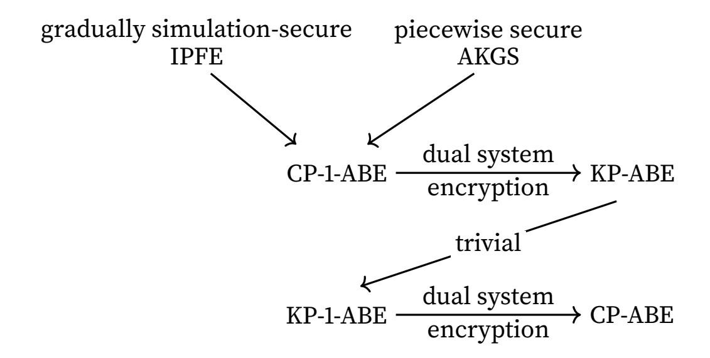

{0}------------------------------------------------

# Succinct and Adaptively Secure ABE for ABP from *k*-Lin

Huijia Lin

Ji Luo 🗅

Paul G. Allen School for Computer Science & Engineering, University of Washington, Seattle, USA {rachel,luoji}@cs.washington.edu

#### March 2022

#### **Abstract**

We present *succinct* and *adaptively secure* attribute-based encryption (ABE) schemes for *arithmetic branching programs*, based on *k*-Lin in pairing groups. Our key-policy ABE scheme has ciphertexts of *constant size*, independent of the length of the attributes, and our ciphertext-policy ABE scheme has secret keys of *constant size*. Our schemes improve upon the recent succinct ABE schemes in [Attrapadung and Tomida, Asiacrypt '20], which only handle Boolean formulae. All other prior succinct ABE schemes either achieve only selective security or rely on *q*-type assumptions.

Our schemes are obtained through a general and modular approach that combines a public-key inner-product functional encryption satisfying a new security notion called gradual simulation security and an information-theoretic randomized encoding scheme called arithmetic key garbling scheme.

<sup>©</sup> IACR 2020. This is the full version of [LL20b] in the proceedings of Asiacrypt 2020 published by Springer-Verlag.

{1}------------------------------------------------

# **Contents**

| 1 | Introduction                          |                                                               |          |  |  |  |  |  |  |
|---|---------------------------------------|---------------------------------------------------------------|----------|--|--|--|--|--|--|
|   | 1.1                                   | Technical Overview                                            | 3        |  |  |  |  |  |  |
|   | 1.2                                   | Related Works                                                 | 10       |  |  |  |  |  |  |
| 2 | Preliminaries                         |                                                               |          |  |  |  |  |  |  |
|   | 2.1                                   | Arithmetic Branching Programs and Arithmetic Key Garbling<br> | 11       |  |  |  |  |  |  |
|   | 2.2                                   | Attribute-Based Encryption<br>                                | 13       |  |  |  |  |  |  |
|   | 2.3                                   | Pairing Groups and Matrix Diffie–Hellman Assumption<br>       | 14       |  |  |  |  |  |  |
| 3 | IPFE with Gradual Simulation Security |                                                               |          |  |  |  |  |  |  |
|   | 3.1                                   | Direct Construction                                           | 18       |  |  |  |  |  |  |
|   | 3.2                                   | One-Time Pad IPFE Scheme<br>                                  | 19       |  |  |  |  |  |  |
|   | 3.3                                   | Gradual Simulation Security of Direct Construction<br>        | 21       |  |  |  |  |  |  |
|   | 3.4                                   | Generic Construction                                          | 25       |  |  |  |  |  |  |
| 4 |                                       | Ciphertext-Policy 1-ABE for ABP                               | 29       |  |  |  |  |  |  |
| 5 |                                       | Key-Policy ABE for ABP                                        | 32       |  |  |  |  |  |  |
| 6 | Ciphertext-Policy ABE for ABP         |                                                               |          |  |  |  |  |  |  |
|   | 6.1                                   | KP-1-ABE                                                      | 37<br>37 |  |  |  |  |  |  |
|   | 6.2                                   | CP-ABE                                                        | 38       |  |  |  |  |  |  |
|   | References                            |                                                               | 41       |  |  |  |  |  |  |

{2}------------------------------------------------

## <span id="page-2-0"></span>1 Introduction

Attribute-based encryption (ABE) [SW05] is an advanced form of public-key encryption for enforcing fine-grained access control. In the key-policy version, an authority generates a pair of master public and secret keys mpk, msk. Given mpk, everyone can encrypt a message m with an attribute x to get a ciphertext  $\operatorname{ct}_x(m)$ . Using the master secret key msk, the authority can issue a secret key sky tied to a policy y. Decrypting a ciphertext  $\operatorname{ct}_x(m)$  using sky recovers the encrypted message m if the attribute x satisfies the policy y. Otherwise, no information about m is revealed. The security requirement of ABE mandates collusion resistance—no information of m should be revealed, even when multiple secret keys are issued, as long as none of them individually decrypts the ciphertext (i.e., the attribute satisfies none of the associated policies).

Over the past decade, a plethora of ABE schemes have been proposed for different expressive classes of policies, achieving different trade-offs between efficiency, security, and assumptions. Meanwhile, ABE has found numerous cryptographic and security applications. A primary desirata of ABE schemes is efficiency, in particular, having fast encryption algorithms and small ciphertexts. It turns out that the size of ABE ciphertexts can be *independent* of the length of the attribute x, and dependent only on the length of the message x and security parameter—we say such ciphertexts are *succinct* or have *constant size* (in attribute length). Proposed first in [EMN+09] as a goal, succinct ciphertexts are possible because ABE does not require hiding the attribute x, and the decryption algorithm can take x as input in the clear. Consequently, ciphertexts only need to contain enough information of x to enforce the *integrity* of computation on x, which does not necessitate encoding the entire x.

Succinct ABE are highly desirable. For practical applications of ABE where long attributes are involved for sophisticated access control, succinct ciphertexts are much more preferable. From a theoretical point of view, succinct ciphertexts have (asymptotically) *optimal* size, as dependency on the message length and security parameter is inevitable. From a technical point of view, succinct ABE provides interesting mechanism for enforcing the integrity of computation without encoding the input. So far, several succinct ABE schemes have been proposed [ALdP11,YAHK14, Tak14,Att16,AHY15,ZGT+16,AT20], but almost all schemes either rely on non-standard assumption or provide only weak security, as summarized in Tables 1 and 2.

**Our Results.** In this work, we first construct a *succinct* key-policy ABE (KP-ABE) simultaneously satisfying the following properties.

- (1) Expressiveness. Support policies expressed as arithmetic branching programs (ABPs).
- (2) <u>Security.</u> Satisfy adaptive security, as opposed to selective or semi-adaptive security.
- (3) <u>Assumption.</u> Based on the standard assumptions as opposed to, e.g., *q*-type assumptions. Specifically, our scheme relies on the matrix decisional Diffie–Hellman (MDDH) assumption over pairing groups.
- (4) Efficiency. Have succinct ciphertext.

Concretely, each ciphertext consists of 5 group elements when assuming SXDH, and (2k + 3) elements for MDDH<sub>k</sub> (implied by k-Lin). Decryption involves the same number of pairing operations. Additionally, our scheme can work with the more efficient asymmetric prime-order pairing groups.

Next, we construct ciphertext-policy ABE (CP-ABE) with the same properties. Here, the secret keys are tied to attributes and ciphertexts to policies, and succinctness refers to having constant-

{3}------------------------------------------------

Table 1: KP-ABE schemes with succinct ciphertext.

<span id="page-3-0"></span>

| reference | policy | assumption                     | adaptive     | mpk         | sk                | ct     | Dec    |
|-----------|--------|--------------------------------|--------------|-------------|-------------------|--------|--------|
| [ALdP11]  | MSP    | <i>q</i> -type                 |              | 2n + 1      | m(n+1)            | 3      | 3      |
| [YAHK14]  | MSP    | <i>q</i> -type                 |              | n + 2       | m(n+1)            | 2      | 2      |
| [Tak14]   | MSP    | 2-Lin ✓                        |              | 18(2n+1)    | 6m(n+1)           | 17     | 17     |
| [Att16]   | MSP    | <i>q</i> -type                 | $\checkmark$ | 6n + 42     | 3m(n+3)+9         | 18     | 18     |
| [ZGT+16]  | MSP    | $k$ -Lin $\checkmark$          |              | $2k^2(n+1)$ | 2km(n+1)          | 4k     | 4k     |
| [AT20]    | $NC^1$ | $\mathrm{MDDH}_k \ \checkmark$ | $\checkmark$ | k(k+1)(n+3) | (k+1)m(n+2)       | 2k + 2 | 2k + 2 |
| Section 5 | ABP    | $\mathrm{MDDH}_k \ \checkmark$ | ✓            | k(k+2)(n+2) | $(k+1)m(n+2)\\+m$ | 2k + 3 | 2k + 3 |

MSP: monotone span programs.  $NC^1$ : Boolean formulae. ABP: arithmetic branching programs. n = attribute length, m = policy size, p = group order.

|mpk|, |sk|, |ct| counts non-generator elements in source groups.

Dec counts the number of pairing operations in decryption.

<span id="page-3-1"></span>Schemes based on k-Lin can be based on  $MDDH_k$  at the cost of a few more elements in mpk. ABE for arithmetic span programs can be obtained by reduction to MSP [AHY15].

Table 2: CP-ABE schemes with succinct secret kev.

| reference | policy | assumption                     | adaptive     | mpk               | sk     | ct                           | Dec    |
|-----------|--------|--------------------------------|--------------|-------------------|--------|------------------------------|--------|
| [Att16]   | MSP    | <i>q</i> -type                 | ✓            | 6n + 54           | 24     | 3m(n+3)+15                   | 24     |
| [AHY15]   | ASP    | q-type                         | $\checkmark$ | $O(n \log p)$     | O(1)   | $O(mn\log p)$                | O(1)   |
| [AT20]    | $NC^1$ | $\mathrm{MDDH}_k \checkmark$   | $\checkmark$ | $O(k^2n)$         | O(k)   | O(kmn)                       | O(k)   |
| Section 6 | ABP    | $\mathrm{MDDH}_k \ \checkmark$ | $\checkmark$ | $k(k+1)(n+4)\\+k$ | 3k + 4 | $(k+1)m(n+2) \\ + m + k + 1$ | 3k + 4 |

size secret keys. Our scheme has keys consisting of 7 group elements based on SXDH and (3k + 4) based on MDDH<sub>k</sub>.

Besides succinctness (4), achieving the strong notion of adaptive security (2) based on standard assumptions (3) is also highly desirable from both a practical and a theoretical point of view. Prior to this work, only the recent construction of (KP and CP) ABE schemes by Attrapadung and Tomida [AT20] simultaneously achieves (2)–(4), and their scheme handles policies expressed as Boolean formulae. Our construction expands the class of policies to *arithmetic* branching programs, which is a more expressive model of computation. Our succinct ABE is also the first scheme natively supporting *arithmetic* computation over large fields, whereas all prior succinct ABE schemes (even ones relying on *q*-type assumptions and/or achieving only selective security) only work natively with Boolean computation. Lastly, we note that even when relaxing the efficiency requirement from having succinct ciphertext to *compact* ciphertext, whose size grows linearly with the length of the attribute, only a few schemes [KW19,GW20,LL20a] simultaneously achieve (2)–(4), and the most expressive class of policies supported is also ABP, due to [LL20a].

**Our Techniques.** The recent work of [LL20a] presented a general framework for constructing *compact* adaptively secure ABE from MDDH. In this work, we improve their general framework to achieve *succinctness*. The framework of [LL20a] yields linear-size ciphertexts because it crucially relies on *function-hiding* inner-product functional encryption (IPFE) [DDM16,LV16]. IPFE allows issuing secret keys and ciphertexts tied to vectors **v**, **u** respectively, and decryption reveals their

<span id="page-3-2"></span><sup>&</sup>lt;sup>1</sup>One can always convert an arithmetic computation into a Boolean one, which we consider non-native.

{4}------------------------------------------------

inner product  $\langle \mathbf{u}, \mathbf{v} \rangle$ . The function-hiding property guarantees that nothing about  $\mathbf{u}, \mathbf{v}$  beyond the inner product is revealed, which entails that ciphertexts and secret keys must have size linear in the length of the vectors.

Towards succinctness, our key idea is relaxing function-hiding to a *new and weaker* guarantee, called *gradual simulation security*, where only the vectors encrypted in the ciphertexts are hidden. Such IPFE can have succinct (constant-size) secret keys and can be public-key. We use new ideas to modify the framework of [LL20a] to work with the weaker gradual simulation security and obtain succinct ciphertexts. Furthermore, we extend the framework to construct ciphertext-policy ABE, which is not handled in [LL20a]. In summary, our techniques give a general and modular approach for constructing succinct and adaptively secure (KP and CP) ABE from MDDH.

## <span id="page-4-0"></span>1.1 Technical Overview

<span id="page-4-1"></span>In this section, we give an overview of our construction of succinct ABE schemes, following the roadmap shown in Figure 1.



Figure 1: The roadmap of our constructions.

**1-ABE.** The core of many ABE schemes is a 1-key 1-ciphertext secure secret-key ABE, or 1-ABE for short. Our construction improves the recent 1-ABE scheme for ABP by Lin and Luo [LL20a], which achieves adaptive security but not succinctness.

Suppose we want decryption to recover the message  $\mu \in \mathbb{Z}_p$  if (and only if)  $f(\mathbf{x}) \neq 0$  for policy function  $f: \mathbb{Z}_p^n \to \mathbb{Z}_p$  and attribute  $\mathbf{x} \in \mathbb{Z}_p^n$ . This is equivalent to computing  $\mu f(\mathbf{x})$  upon decryption. The basic idea of the LL 1-ABE is that when a key (tied to  $f, \mu$ ) and a ciphertext (tied to  $\mathbf{x}$ ) are put together, one can compute a randomized encoding of  $\mu f(\mathbf{x})$ , denoted by  $\mu f(\mathbf{x})$ , which reveals  $\mu f(\mathbf{x})$  and hence  $\mu$  if  $f(\mathbf{x}) \neq 0$ . Since in ABE, we do not try to hide f or  $\mathbf{x}$ , the randomized encoding only needs to hide  $\mu$  beyond the output  $\mu f(\mathbf{x})$ , referred to as the partially hiding property, first introduced by [IW14]. Due to the weak security guarantee, partially hiding randomized encoding can have extremely simple structure. In particular, LL defined a refined version of such randomized encoding, called arithmetic key garbling scheme (AKGS), with the following properties:

Linear Encoding. The encoding is in the form of

$$\widehat{\mu f(\mathbf{x})} = (L_1(\mathbf{x}), \dots, L_m(\mathbf{x})),$$

<span id="page-4-2"></span><sup>&</sup>lt;sup>2</sup>The reason why we put the message  $\mu$  in the key will become clear later in the overview.

{5}------------------------------------------------

where  $L_j$ 's are affine functions of  $\mathbf{x}$  and the coefficients of  $L_j$ 's are linear in the message  $\mu$  and the garbling randomness.  $L_j$ 's are called *label functions* and  $\ell_j = L_j(\mathbf{x})$  are called *labels*.

<u>Linear Evaluation.</u> There is a procedure Eval that can compute  $\mu f(\mathbf{x})$  from  $f, \mathbf{x}$  and the labels:

$$\mathsf{Eval}(f, \mathbf{x}, \ell_1, \dots, \ell_m) = \mu f(\mathbf{x}).$$

Importantly, Eval is linear in the labels.<sup>3</sup>

The basic security of AKGS is simulation security. There needs to be an efficient simulator Sim that can perfectly simulate the labels given f,  $\mathbf{x}$ ,  $\mu f(\mathbf{x})$ :

$$Sim(f, \mathbf{x}, \mu f(\mathbf{x})) \rightarrow (\ell_1, \dots, \ell_m) \equiv (L_1(\mathbf{x}), \dots, L_m(\mathbf{x})).$$

Since the label functions are affine in  $\mathbf{x}$  thus linear in  $(1, \mathbf{x})$ , the labels  $\ell_j = L_j(\mathbf{x})$  can be securely computed using a function-hiding IPFE. In IPFE, keys isk( $\mathbf{v}$ ) and ciphertexts ict( $\mathbf{u}$ ) are generated for vectors  $\mathbf{v}$ ,  $\mathbf{u}$ , and decryption yields their inner product  $\langle \mathbf{u}, \mathbf{v} \rangle$  but nothing else. More precisely, function-hiding says two sets of keys and ciphertexts encoding different vectors are indistinguishable as long as they yield identical inner products:

$$(\{\mathsf{isk}_j(\mathbf{v}_j)\}, \{\mathsf{ict}_i(\mathbf{u}_i)\}) \approx (\{\mathsf{isk}_j(\mathbf{v}_i')\}, \{\mathsf{ict}_i(\mathbf{u}_i')\}) \quad \text{if } \langle \mathbf{u}_i, \mathbf{v}_j \rangle = \langle \mathbf{u}_i', \mathbf{v}_j' \rangle \text{ for all } i, j.$$

That is, all vectors no matter encoded in keys or ciphertexts are protected. Moreover, functionhiding should hold even when these vectors are chosen adaptively by the adversary, depending on previously observed keys and ciphertexts.

In the LL 1-ABE scheme, an ABE key consists of many IPFE keys encoding the coefficients of the label functions (also denoted by  $L_j$ ), and an ABE ciphertext is an IPFE ciphertext encrypting  $(1, \mathbf{x})$ , as illustrated below in Real Algorithms. When they are put together, IPFE decryption recovers exactly the labels  $\ell_j = L_j(\mathbf{x}) = \langle L_j, (1, \mathbf{x}) \rangle$ , from which we can recover  $\mu f(\mathbf{x})$  using the evaluation procedure. A technicality is that known IPFE are built from pairing groups, and decryption only reveals  $\mu f(\mathbf{x})$  in the exponent of the target group. Nevertheless, one can recover  $\mu f(\mathbf{x})$  also in the exponent, thanks to the linearity of AKGS evaluation.

Intuitively, the LL scheme is secure since IPFE only reveals the labels, and AKGS security guarantees only  $\mu f(\mathbf{x})$  is revealed, given the labels. It is simple to formalize this idea in the selective setting, where  $\mathbf{x}$  is chosen before querying the key for f. By the function-hiding property, it is indistinguishable to hardwire the labels in the IPFE keys as follows.

REAL ALGORITHMS HYBRID
$$\begin{cases}
\mathsf{ct}_{\mathbf{x}} : \mathsf{ict} (1, \mathbf{x}) \\
\mathsf{sk}_{f,\mu} : \{\mathsf{isk}_{j} (\mathbf{L}_{j})\}_{j \in [m]}
\end{cases} \approx \begin{cases}
\mathsf{ct}_{\mathbf{x}} : \mathsf{ict} (1, \mathbf{x}) \\
\mathsf{sk}_{f,\mu} : \{\mathsf{isk}_{j} (\mathbf{L}_{j} (\mathbf{x}), \mathbf{0})\}_{j \in [m]}
\end{cases}$$

After labels  $L_j(\mathbf{x})$  are hardwired and label functions removed, AKGS security guarantees that the labels only reveal  $\mu f(\mathbf{x})$ , and  $\mu$  is hidden if  $f(\mathbf{x}) = 0$ . Observe that for selective security, we only need hiding in the keys and not the ciphertext.

The above proof fails for adaptive security, in particular in the case where the secret key is queried before the ciphertext (we will focus on this harder case below). At key generation time,  $\mathbf{x}$  is unknown and consequently the labels  $L_j(\mathbf{x})$  are unknown. We also do not want to hardwire all the labels in the ciphertext as that would make the ciphertext as large as the policy. LL solves this problem by relying on a stronger security notion of AKGS called *piecewise security*:

<span id="page-5-0"></span><sup>&</sup>lt;sup>3</sup>In contrast, linear evaluation is impossible for fully hiding randomized encoding that hides **x** and f.

{6}------------------------------------------------

- The marginal distribution of  $\ell_2, \ldots, \ell_m$  is uniformly random, and  $\ell_1$  can be *reversely computed* from these other labels  $\ell_2, \ldots, \ell_m$  and  $f, \mathbf{x}$ , by finding the unique  $\ell_1$  satisfying the constraint of evaluation correctness.<sup>4</sup>
- The other labels are *marginally random* even given the coefficients of all subsequent label functions, i.e.,

$$(L_j(\mathbf{x}), L_{j+1}, \dots, L_m) \equiv (z, L_{j+1}, \dots, L_m)$$
 for  $z \stackrel{\$}{\leftarrow} \mathbb{Z}_p$ , for all  $j > 1$ .

The first property implies a specific simulation strategy: Simply sample  $\ell_2, \ldots, \ell_m$  as random, then solve for  $\ell_1$  from the correctness constraint. This strategy is particularly suitable for the adaptive setting, as only the simulation of  $\ell_1$  depends on the input  $\mathbf{x}$ . Thus, a conceivable simulation strategy for 1-ABE is to hardwire  $\ell_2, \ldots, \ell_m$  in the secret key and  $\ell_1$  in the ciphertext. This would not hurt the compactness of the ciphertext.

Proving the indistinguishability of the real and the simulated worlds takes two steps. In the first step, the first label  $\ell_1 = L_1(\mathbf{x})$  is hardwired into the IPFE ciphertext ict, and then changed to be reversely computed from the other labels and f,  $\mathbf{x}$ , which is possible since by the time we generate ict, we know both f and  $\mathbf{x}$ . In the second step, each is $k_j$  for j > 1 is, one by one, switched from encoding the label function to encoding a random label. To do so, the  $j^{\text{th}}$  label  $\ell_j = L_j(\mathbf{x})$  is first hardwired into ict, after which it is switched to random relying on piecewise security, and lastly moved back to is $k_j$ . Observe that the proof uses two extra slots in the vectors (one for  $\ell_1$ , the other for each  $\ell_j$  temporarily) and relies on hiding in both the keys and the ciphertext.

**Lightweight Alternative to Function-Hiding.** In a function-hiding IPFE, keys and ciphertexts must be of size at least linear in the vector dimension. This means the resulting ABE scheme can never be succinct. Our first observation is that function-hiding IPFE is an overkill. Since in ABE,  $\mathbf{x}$  is not required to be hidden, it is quite wasteful to protect it inside an IPFE ciphertext. Indeed, selective security of the LL scheme does not rely on hiding in the ciphertext.

Our idea to achieve succinctness is to use a non-function-hiding IPFE scheme instead, e.g., public-key IPFE. Usually the vector in the key is included verbatim as part of the key, and the "essence" of the key (excluding the vector itself) could be significantly shorter than the vector. Indeed, many known public-key IPFE schemes [ABDP15,ALS16] have succinct keys.

Since the coefficients of the label functions (which contains information about  $\mu$  and the garbling randomness) must be hidden for the 1-ABE to be secure, and  $\mathbf{x}$  is public, we should encrypt the coefficients of the label functions in IPFE ciphertexts and use an IPFE key for  $(1,\mathbf{x})$  to compute the garbling. Since the message  $\mu$  is together with f and the generation of IPFE ciphertexts is public-key, the 1-ABE scheme is more like a public-key ciphertext-policy ABE than a secret-key ABE, except we only consider security given a single key for some attribute  $\mathbf{x}$ . Therefore, we redefine 1-ABE as 1-key secure public-key CP-ABE, and the idea is to construct it from a public key IPFE and AKGS as follows:

$$\mathsf{ct}_{f,\mu} \colon \mathsf{isk} \ (1,\mathbf{x} \ ) \\ \mathsf{ct}_{f,\mu} \colon \mathsf{ict}_{j} ( \ L_{j} \ ) \}_{j \in [m]} \xrightarrow{\mathsf{IPFE}} \{ \langle L_{j}, (1,\mathbf{x}) \rangle = L_{j}(\mathbf{x}) = \ell_{j} \}_{j \in [m]} \xrightarrow{\mathsf{AKGS}} \mu f(\mathbf{x}).$$

<span id="page-6-0"></span><sup>&</sup>lt;sup>4</sup>The original definition only requires  $\ell_1$  to be reversely *sampleable*. In [LL20a], it is shown that the two are equivalent for piecewise security, and we stick to the simpler definition in this overview. In the full definition,  $\ell_1$  also depends on the computation result. For the purpose of this overview, the result is always  $\mu f(\mathbf{x}) = 0$  as the adversary is restricted to non-decrypting queries.

<span id="page-6-1"></span><sup>&</sup>lt;sup>5</sup>This definition has the advantage of automatically being multi-ciphertext secure (if secure at all) over the secret-key definition. It is also more convenient to use in reductions for full ABE.

{7}------------------------------------------------

Our CP-1-ABE is  $\mathbf{x}$ -selectively secure if the underlying IPFE is indistinguishability-secure, similar to the selective security of LL scheme.

However, it is not immediate that we can prove adaptive security of this new scheme. The LL adaptive security proof requires hardwiring  $\ell_1$  and one of  $\ell_j$ 's with  $\mathbf{x}$ , which is now encoded in the secret key without hiding property. Taking a step back, hardwiring a label is really about removing its label function and only using the label, which is the inner product yielded by IPFE decryption. Our idea is to use simulation security to achieve this goal. A simulator for a public-key IPFE can simulate the master public key, the secret keys, and one (or a few) ciphertext, using only the inner products, and the simulator can do so adaptively. Let us take simulating one ciphertext as an example.

<span id="page-7-2"></span>
$$\begin{cases} \mathsf{mpk} \\ \{\mathsf{isk}_{j}(\ \mathbf{v}_{j}\ )\}_{j \leq J^{*}} \\ \mathsf{ict}\ (\ \mathbf{u}\ ) \\ \{\mathsf{isk}_{j}(\ \mathbf{v}_{j}\ )\}_{j > J^{*}} \end{cases} \approx \begin{cases} \widetilde{\mathsf{mpk}} \\ \{\widetilde{\mathsf{isk}}_{j}(\ \mathbf{v}_{j}\ |\ \varnothing \ )\}_{j \leq J^{*}} \\ \widetilde{\mathsf{ict}}\ (\ \varnothing\ |\ \{\langle \mathbf{u}, \mathbf{v}_{j} \rangle\}_{j \leq J^{*}}\ ) \\ \{\widetilde{\mathsf{isk}}_{j}(\ \mathbf{v}_{j}\ |\ \langle \mathbf{u}, \mathbf{v}_{j} \rangle \ )\}_{j > J^{*}} \end{cases}$$

 $J^*$  is the number of keys issued before ciphertext generation. On the left are the honestly generated master public key, secret keys, and ciphertext. On the right is their simulation. The vertical bar separates what the real algorithms use and what the simulator (additionally) use. Since public-key IPFE completely reveals the key vectors, they are always provided to the simulator. As for the other values:

- Before ciphertext simulation, there is no additional information supplied.
- When the ciphertext is simulated, the vector **u** is *not* provided, but its inner products with already simulated keys are provided to the simulator.<sup>7</sup>
- After ciphertext simulation, when simulating a key for  $\mathbf{v}_j$ , the inner product  $\langle \mathbf{u}, \mathbf{v}_j \rangle$  is provided with  $\mathbf{v}_j$ .

Observe that the values after the vertical bar are exactly those computable using the functionality of IPFE *at that time*, so in simulation, anything about the encrypted vector *not yet* computable by the functionality of IPFE, simply does not exist (information-theoretically) at all. In the setting of our CP-1-ABE, we will simulate an IPFE ciphertext to remove its corresponding label function and only retain the label. Looking from the perspective of hardwiring, when we issue  $sk_x = isk(1, x)$  after we have created the ciphertext  $ct_{f,\mu}$  (in which  $ict_j$  has been simulated), the inner product  $\ell_j$  is supplied to the simulator when we simulate isk, after the simulation of  $ict_j$ . This means the label  $\ell_j$  is hardwired into isk.

Let us exemplify the proof of adaptive security in the more difficult case where  $sk_x$  is queried after  $ct_{f,\mu}$ . First, we simulate  $ict_1$  so that the first label is hardwired into isk.

<span id="page-7-0"></span><sup>&</sup>lt;sup>6</sup>Anyone can encrypt the standard basis vectors using mpk, and use decryption algorithm to obtain each component of the vector in a secret key.

<span id="page-7-1"></span><sup>&</sup>lt;sup>7</sup>Though the number  $J^*$  of inner products with already simulated keys is unbounded, since the vectors  $\{\mathbf{v}_j\}_{j\leq J^*}$  in the keys are public, these inner products are determined by those with any maximal subset of linearly independent  $\mathbf{v}_j$ 's, the number of which will not exceed the dimension. As such, the simulated ciphertext can still be compact.

{8}------------------------------------------------

$$\begin{cases} \mathsf{ct}_{f,\mu} \colon \mathsf{ict}_1(\ L_1\ ) \\ \{\mathsf{ict}_j(\ L_j\ )\}_{j>1} \end{cases} \approx \begin{cases} \mathsf{ct}_{f,\mu} \colon \mathsf{ict}_1(\ \varnothing \ | \ \varnothing \ ) \\ \{\mathsf{ict}_j(\ L_j\ )\}_{j>1} \end{cases} \\ \mathsf{sk}_{\mathbf{x}} \colon \mathsf{isk}\ (\ 1,\mathbf{x}\ ) \end{cases} \approx \begin{cases} \mathsf{ct}_{f,\mu} \colon \mathsf{ict}_1(\ \varnothing \ | \ \varnothing \ ) \\ \{\mathsf{ict}_j(\ L_j\ \ )\}_{j>1} \end{cases}$$

(We omitted the master public key for brevity.) Note that  $ict_j$ 's for j > 1 do not use *ciphertext* simulation but are created using the master public key (honest or simulated). Once  $\ell_1$  is hardwired, we can instead solve for it from the correctness equation.

The second step is to switch  $\operatorname{ict}_j(L_j)$  to  $\operatorname{ict}_j(\ell_j, \mathbf{0})$  for  $\ell_j \stackrel{\$}{\leftarrow} \mathbb{Z}_p$  one by one, i.e., to simulate  $\ell_j$  as random. To do so, we first simulate  $\operatorname{ict}_j$  (hardwiring  $\ell_j = L_j(\mathbf{x})$  into isk), then switch  $\ell_j$  to random (via piecewise security), and lastly revert  $\operatorname{ict}_j$  back to encryption (not simulated), but encrypting  $(\ell_i, \mathbf{0})$  instead.

$$\begin{cases} \operatorname{ct}_{f,\mu} \colon \operatorname{\widetilde{ict}}_{1} ( \varnothing | \varnothing ) \\ \{\operatorname{ict}_{j'}(\ell_{j'}, \mathbf{0} )\}_{1 < j' < j} \\ \operatorname{ict}_{j} ( L_{j} / (\ell_{j}, \mathbf{0}) ) \\ \{\operatorname{ict}_{j'}( L_{j'} )\}_{j' > j} \\ \operatorname{sk}_{\mathbf{x}} \colon \operatorname{\widetilde{isk}} ( 1, \mathbf{x} | \ell_{1} ) \end{cases} \Rightarrow \begin{cases} \operatorname{ct}_{f,\mu} \colon \operatorname{\widetilde{ict}}_{1} ( \varnothing | \varnothing ) \\ \{\operatorname{ict}_{j'}(\ell_{j'}, \mathbf{0} )\}_{1 < j' < j} \\ \operatorname{\widetilde{ict}}_{j} ( \varnothing | \varnothing ) \\ \{\operatorname{ict}_{j'}( L_{j'} )\}_{j' > j} \\ \operatorname{sk}_{\mathbf{x}} \colon \operatorname{\widetilde{isk}} ( 1, \mathbf{x} | \ell_{1} ) \end{cases}$$

During the proof, there are at most two simulated ciphertexts at any time, so it appears that we can just use a simulation-secure IPFE capable of simulating at most two ciphertexts. This is *not* the case. The tricky part is that the usual definition of simulation security in  $(\star)$  only requires the *real world* to be indistinguishable from *simulation*. However, in the step of simulating  $\ell_j$  as random, we need to switch  $ict_j$  to simulation when  $ict_1$  is already simulated (and symmetrically, reverting  $ict_j$  back to encryption while keeping  $ict_1$  simulated). It is unclear whether this transition is indistinguishable just via simulation security, because the definition says nothing about the indistinguishability of simulating *one more* ciphertext when there is already one simulated ciphertext, i.e.,

$$(\widetilde{\mathsf{mpk}}, \widetilde{\mathsf{ict}}_1, \widetilde{\mathsf{ict}}_2, \{\widetilde{\mathsf{isk}}_i\}_i) \approx (\widetilde{\mathsf{mpk}}, \widetilde{\mathsf{ict}}_1, \widetilde{\mathsf{ict}}_2, \{\widetilde{\mathsf{isk}}_i\}_i)$$
?

Note that when we want to simulate  $\ell_j$ , the computation of  $\ell_1$  has complicated dependency on  $\mathbf{x}$ , and we cannot hope to get around the issue by first reverting  $\widetilde{\mathsf{ict}}_1$  back to normal encryption then simultaneously simulating  $\mathsf{ict}_1$ ,  $\mathsf{ict}_j$ , because we do not know what to encrypt in  $\mathsf{ict}_1$ .

**Gradually Simulation-Secure IPFE.** To solve the problem above, we define a stronger notion of simulation security, called *gradual simulation security*. It bridges the gap by capturing the idea that it is indistinguishable to simulate more ciphertexts even when some ciphertexts (and all the keys) are already simulated, as long as the total number of simulated ciphertexts does not exceed a preselected threshold. We show that the IPFE scheme in [ALS16] can be adapted for gradual simulation security. The length of secret keys grows linearly in the maximum number of simulated ciphertexts, but not in the vector dimension. Plugging it into our CP-1-ABE construction, we obtain a CP-1-ABE with succinct keys.

We remark that another way to get around the issue of simulation security is to notice that there are at most two ciphertexts simulated at any time and one of them is ict<sub>1</sub>. Therefore, we can

<span id="page-8-0"></span><sup>&</sup>lt;sup>8</sup>In fact, the computation is as complex as the computation of  $f(\mathbf{x})$ .

{9}------------------------------------------------

simply prepare two instances of IPFE (with independently generated master public and secret keys), one dedicated to ict<sub>1</sub> and the other to ict<sub>j</sub>'s (for j > 1). During the proof, the instance for ict<sub>1</sub> is always simulated, and the other instance is switched between simulation and normal. This idea appears in a concurrent work [AGW20]. The downside of this method is that using two instances doubles 1-ABE key size. In contrast, the solution using gradually simulation-secure IPFE only needs one more  $\mathbb{Z}_p$  element in CP-1-ABE key.

Comparison with Previous Techniques. Previous works constructing succinct ABE only natively support Boolean computations, whereas our method natively supports arithmetic computations. In [ALdP11,YAHK14,Tak14,Att16,AHY15], succinct ABE schemes are constructed from a special succinct ABE for set-membership policies (keys are tied to a set S and ciphertexts are tied to an element x; decryption succeeds if  $x \in S$ ). Based on ABE for set-membership policies, one can obtain ABE for monotone span programs, or policies admitting linear secret sharing schemes. Those ingredients (the special ABE, MSP, LSS) are inherently only native to Boolean computations. Among them, the work of [AHY15] constructs succinct ABE for arithmetic span programs by reduction to MSP at the cost of a  $\Theta(\log p)$  blow-up in key sizes.

In [ZGT+16,AT20], succinct ABE schemes are implicitly based on IPFE with succinct keys. The IPFE is only used to compute linear secret sharing schemes, and is used in a non-black-box way. In contrast, our 1-ABE can be constructed from any IPFE in a modular and black-box fashion, and we use it for arithmetic branching programs.

<span id="page-9-1"></span>**Dual System Encryption for Full ABE.** To lift our CP-1-ABE to full KP-ABE, we need to flip the position of attributes and policies. Our idea is to use CP-1-ABE as a key encapsulation mechanism. More specifically, a KP-ABE key for policy f is a CP-1-ABE ciphertext  $\operatorname{cpct}(f, \mu)$ , where  $\mu$  is the message in CP-1-ABE and encapsulated key in KP-ABE. A KP-ABE ciphertext for attribute  $\mathbf{x}$  and message m consists of a CP-1-ABE key  $\operatorname{cpsk}(\mathbf{x})$  and the masked message  $(\mu + m)$ . If decryption is authorized, CP-1-ABE decryption will give us  $\mu$ , which can be used to unmask the message. Observe that the security of KP-ABE aligns with the security of CP-1-ABE, namely, in the KP-ABE security game:

- We only need to handle one ciphertext, for which we rely on 1-key security of CP-1-ABE.
- We need to handle multiple keys, which corresponds to multi-ciphertext security of CP-1-ABE. Since our CP-1-ABE is public-key, it indeed satisfies multi-ciphertext security given only one key.

However, we need to resolve the issue that encryption of KP-ABE is now secret-key, since we need to know both the master secret key of CP-1-ABE and  $\mu$  (part of the master secret key of KP-ABE) to generate KP-ABE ciphertext.

We observe that our CP-1-ABE is linear, i.e., the spaces of cpmsk, cpsk, cpct, messages are vector spaces over  $\mathbb{Z}_p$ , and<sup>9</sup>

```
k_1cpsk(cpmsk<sub>1</sub>, \mathbf{x}) + k_2cpsk(cpmsk<sub>2</sub>, \mathbf{x}) = cpsk(k_1cpmsk<sub>1</sub> + k_2cpmsk<sub>2</sub>, \mathbf{x}),

k_1cpct(cpmsk<sub>1</sub>, f, \mu_1) + k_2cpct(cpmsk<sub>1</sub>, f, \mu_2) = cpct(k_1cpmsk<sub>1</sub> + k_2cpmsk<sub>2</sub>, f, k_1\mu_1 + k_2\mu_2).
```

Here,  $\operatorname{cpsk}(\operatorname{cpmsk}, \mathbf{x})$  and  $\operatorname{cpct}(\operatorname{cpmsk}, f, \mu)$  represent that they are generated in the CP-1-ABE instance whose master secret key is cpmsk. We instantiate our CP-1-ABE with an IPFE such that the keys are linear in the master secret key and the ciphertexts are linear in both the master

<span id="page-9-0"></span><sup>&</sup>lt;sup>9</sup>The randomness in key generation/encryption should also take part in the linear homomorphism, but we omit it in this overview for brevity.

{10}------------------------------------------------

secret key and the encrypted vector. CP-1-ABE master secret key and keys are IPFE master secret key and keys, so cpsk's are linear in cpmsk. CP-1-ABE ciphertexts are IPFE ciphertexts for the label functions of AKGS, and AKGS is linear with respect to the message  $\mu$ , so cpct's are linear in msk,  $\mu$ .

Let G be an additive prime-order group generated by P and write [a] = aP. Concretely, cpmsk and cpsk's will be  $\mathbb{Z}_p$  elements. Now if we encode cpmsk in G, by linearity we can compute cpsk in G, and we denote this fact by

$$\llbracket \mathsf{cpsk}(\mathsf{cpmsk}, \mathbf{x}) \rrbracket = \mathsf{cpsk}(\llbracket \mathsf{cpmsk} \rrbracket, \mathbf{x}).$$

Assume for the moment that this can also be done for cpct's and decryption still works. Of iven the linearity, we can employ dual system encryption [Wat09] to make the scheme public-key. In prime-order groups, the classic dual system encryption can be regarded as hash proof systems based on  $MDDH_k$  [CS02,EHK+13].

Take MDDH<sub>1</sub> (DDH assumption) for example. KP-ABE prepares two instances of CP-1-ABE and two messages, and publishes the projection of them along a randomly sampled vector  $(b_1, b_2)$  in the exponent:

```
kpmpk = [b_1, b_2, b_1 \text{cpmsk}_1 + b_2 \text{cpmsk}_2, b_1 \mu_1 + b_2 \mu_2] for b_1, b_2 \stackrel{\$}{\leftarrow} \mathbb{Z}_p,
kpmsk = (\text{cpmpk}_1, \text{cpmpk}_2, \text{cpmsk}_1, \text{cpmsk}_2, \mu_1, \mu_2).
```

Encryption is now public-key. A KP-ABE ciphertext simply uses a random CP-1-ABE master secret key in the projected space (a.k.a. *normal* space in dual system encryption) and use the projected  $\mu$  to mask the message. A KP-ABE key consists of two CP-1-ABE ciphertexts, one in each instance encrypting the corresponding encapsulated key.

```
\mathsf{kpct}(\mathbf{x},m) = \left(s\llbracket b_1,b_2 \rrbracket, \mathsf{cpsk}(s\llbracket b_1\mathsf{cpmsk}_1 + b_2\mathsf{cpmsk}_2 \rrbracket, \mathbf{x}), m + s\llbracket b_1\mu_1 + b_2\mu_2 \rrbracket\right) \quad \text{for } s \overset{\$}{\leftarrow} \mathbb{Z}_p, \\ \mathsf{kpsk}(f) = \left(\mathsf{cpct}(\mathsf{cpmsk}_1,f,\mu_1), \mathsf{cpct}(\mathsf{cpmsk}_2,f,\mu_2)\right).
```

To decrypt, we first use linearity to combine the two CP-1-ABE ciphertexts into

```
\begin{split} &\operatorname{cpct}([\![sb_1\mathsf{cpmsk}_1+sb_2\mathsf{cpmsk}_2]\!],f,[\![sb_1\mu_1+sb_2\mu_2]\!])\\ &=[\![sb_1]\!]\operatorname{cpct}(\mathsf{cpmsk}_1,f,\mu_1) \ + \ [\![sb_2]\!]\operatorname{cpct}(\mathsf{cpmsk}_2,f,\mu_2). \end{split}
```

The master secret key of the combined cpct matches that of the cpsk in the KP-ABE ciphertext, and CP-1-ABE decryption will recover  $[sb_1\mu_1 + sb_2\mu_2]$ , using which we can unmask to obtain the message m.

To argue security, we first replace  $[\![sb_1,sb_2]\!]$  used in the challenge ciphertext by  $[\![a_1,a_2]\!]$  for random  $a_1,a_2 \stackrel{\$}{\leftarrow} \mathbb{Z}_p$  (using DDH), which is not co-linear with  $(b_1,b_2)$  with overwhelming probability. Ciphertexts in this form are said to be *semi-functional* in dual system encryption.

By the linearity, we can look at the ABE scheme from a new basis, namely  $(b_1, b_2)$ ,  $(a_1, a_2)$ . We denote the CP-1-ABE components and  $\mu$ 's in this basis with prime, e.g., cpmsk'<sub>1</sub> =  $b_1$ cpmsk<sub>1</sub> +  $b_2$ cpmsk<sub>2</sub> and cpmsk'<sub>2</sub> =  $a_1$ cpmsk<sub>1</sub> +  $a_2$ cpmsk<sub>2</sub>. The KP-ABE master public key reveals cpmsk'<sub>1</sub> but not cpmsk'<sub>2</sub>. A KP-ABE secret key for policy f is essentially cpct(cpmsk'<sub>1</sub>, f,  $\mu$ '<sub>1</sub>) and cpct(cpmsk'<sub>2</sub>, f,  $\mu$ '<sub>2</sub>).

<span id="page-10-1"></span><span id="page-10-0"></span><sup>&</sup>lt;sup>10</sup>In our case, cpct's are already group-encoded, and this is where pairing comes in.

<sup>&</sup>lt;sup>11</sup>A few examples are [Wee17,ALS16,KW19,GW20]. Wee [Wee14] also notices that certain usage of dual system encryption in composite-order groups is reminiscent of hash proof systems. There are other ways to use dual system encryption that are not captured by hash proof systems.

{11}------------------------------------------------

The challenge ciphertext has  $cpsk(cpmsk'_2, \mathbf{x})$ , and the message is masked by  $\mu'_2$ . By CP-1-ABE security,  $\mu'_2$  (in cpct's) should be hidden, which means the message in the challenge ciphertext is hidden by  $\mu'_2$ .

The proof completes by replacing  $\mu'_2$  in all the KP-ABE keys by random. ABE keys in this form are said to be *semi-functional* in dual system encryption.

Lastly, to base the scheme on  $MDDH_k$ , we use (k + 1) instances of CP-1-ABE, publish a k-dimensional projection (normal space), and reserve the unpublished dimension for the security proof (semi-functional space).

**CP-ABE from KP-1-ABE.** By symmetry, we can apply the transformation to obtain CP-ABE from KP-1-ABE. Moreover, our KP-ABE trivially serves as a KP-1-ABE. Therefore, the scheme is (ignoring group encoding)

```
\begin{aligned} \mathsf{cpmpk} &= (d_1, d_2, d_1 \mathsf{kpmsk}_1 + d_2 \mathsf{kpmsk}_2, d_1 v_1 + d_2 v_2) \quad \text{for } d_1, d_2 \overset{\$}{\leftarrow} \mathbb{Z}_p, \\ \mathsf{cpmsk} &= (\mathsf{kpmpk}_1, \mathsf{kpmpk}_2, \mathsf{kpmsk}_1, \mathsf{kpmsk}_2, v_1, v_2), \\ \mathsf{cpsk} &= \big(\mathsf{kpct}(\mathsf{kpmsk}_1, \mathbf{x}, v_1), \mathsf{kpct}(\mathsf{kpmsk}_2, \mathbf{x}, v_2)\big), \\ \mathsf{cpct} &= \big(td_1, td_2, \mathsf{kpsk}(t(d_1 \mathsf{msk}_1 + d_2 \mathsf{msk}_2), f), m + t(d_1 v_1 + d_2 v_2)\big) \quad \text{for } t \overset{\$}{\leftarrow} \mathbb{Z}_p. \end{aligned}
```

Again, KP-1-ABE is used to encapsulate keys  $v_1$ ,  $v_2$ , whose projection masks the message in CP-ABE. Dual system encryption or hash proof system is used to obtain public-key encryption by publishing a random projection of KP-1-ABE master secret keys (in this case, along  $(d_1, d_2)$ ).

One final observation is that only  $\mu_1$ ,  $\mu_2$  in KP-(1-)ABE need to be duplicated and projected, yielding only a small overhead in CP-ABE compared to KP-ABE. We leave the details to the main content.

We note that once we obtain KP-ABE from CP-1-ABE, going to CP-ABE using the same method is natural and simple.

## <span id="page-11-0"></span>1.2 Related Works

**Succinct ABE.** We compare our scheme with previous KP-ABE schemes with constant-size ciphertexts in Table 1 and CP-ABE schemes with constant-size secret keys in Table 2.

**Compact ABE.** Previous schemes achieving compactness (linear-size keys and ciphertexts, also known as "unbounded multi-use of attributes") and adaptive security based on standard assumptions are [KW19,AT20] for Boolean formulae, [GW20] for Boolean branching programs, and [LL20a] for arithmetic branching programs. Among them, only [AT20] achieves succinctness.

**ABE with Succinct** *f***-Part.** From pairing, we know several ABE schemes with succinct  $\mathbf{x}$ -part (ciphertexts in KP-ABE and keys in CP-ABE) and compact *f*-part (linear in the size of *f*), including ones in this work. One can also investigate succinctness in *f*-part (keys in KP-ABE and ciphertexts in CP-ABE). So far, the only schemes with succinct *f*-part are KP-ABE for polynomial-sized circuits based on LWE [BGG<sup>+</sup>14] and CP-ABE schemes for NC<sup>1</sup> based on LWE and pairing [AY20], in which the size of *f*-part depends on the depth but not the size of the circuit. Yet these schemes have compact but non-succinct  $\mathbf{x}$ -part.

**Unbounded ABE.** Our succinct ABE schemes have master public key of size linear in the attribute length. In general, one can further improve the size of master keys to be a constant, which requires the scheme to be able to handle attributes of any polynomial length. Such schemes are

{12}------------------------------------------------

called unbounded ABE. So far, there are unbounded and compact ABE schemes (e.g., [KW19] for NC<sup>1</sup>). It remains an interesting open problem to construct unbounded succinct schemes.

In summary, to the best of our knowledge, our schemes achieve one of the currently best trade-offs in terms of master key/secret key/ciphertext sizes.

## <span id="page-12-0"></span>2 Preliminaries

Let  $\lambda$  be the security parameter that runs through  $\mathbb{N}$ . Except in the definitions, we suppress the security parameter for convenience. Efficient algorithms are probabilistic polynomial-time (PPT) Turing machines. Efficient adversaries are non-uniform PPT Turing machines, or equivalently families of polynomial-sized circuits. We denote by  $H_0 \approx H_1$  (resp.  $\approx_s$  and  $\equiv$ ) computational indistinguishability (resp. statistical indistinguishability, identity) of two distributions or experiments.

We write [n] for the set  $\{1, 2, ..., n\}$ . Vectors and matrices are written in boldface, and are always indexed using  $[\cdot]$ , i.e.,  $\mathbf{A}[i,j]$  is the (i,j)-entry of  $\mathbf{A}$ . Let  $\mathbf{A}$  be an  $m \times n$  matrix and  $\mathbf{B}$  an  $m' \times n'$  matrix. The tensor product  $\mathbf{A} \otimes \mathbf{B}$  is a block matrix of shape  $mm' \times nn'$ :

$$\begin{pmatrix} \mathbf{A}[1,1]\mathbf{B} & \mathbf{A}[1,2]\mathbf{B} & \cdots & \mathbf{A}[1,n]\mathbf{B} \\ \mathbf{A}[2,1]\mathbf{B} & \mathbf{A}[2,2]\mathbf{B} & \cdots & \mathbf{A}[1,n]\mathbf{B} \\ \vdots & \vdots & \ddots & \vdots \\ \mathbf{A}[m,1]\mathbf{B} & \mathbf{A}[m,2]\mathbf{B} & \cdots & \mathbf{A}[m,n]\mathbf{B} \end{pmatrix}.$$

We note that  $\mathbf{AB} \otimes \mathbf{CD} = (\mathbf{A} \otimes \mathbf{B})(\mathbf{C} \otimes \mathbf{D})$  holds as long as the multiplications are compatible. An affine function  $f : \mathbb{Z}_p^n \to \mathbb{Z}_p$  over prime field  $\mathbb{Z}_p$  is conveniently associated with its coefficient vector  $\mathbf{f} \in \mathbb{Z}_p^{n+1}$  (the same letter in boldface) such that  $f(\mathbf{x}) = \mathbf{f}^{\mathsf{T}} \binom{1}{\mathbf{x}}$ .

## <span id="page-12-1"></span>2.1 Arithmetic Branching Programs and Arithmetic Key Garbling

In this paper, we consider the class of decryption policies defined by arithmetic branching programs [Nis91].

**Definition 1** (ABP). An arithmetic branching program (ABP) f = (V, E, s, t, p, n, w) consists of a directed acyclic graph (V, E), two distinguished vertices  $s, t \in V$ , a prime field order p, an arity n, and a weight function  $w : E \times \mathbb{Z}_p^n \to \mathbb{Z}_p$  that is affine in the second input. It computes the function  $f : \mathbb{Z}_p^n \to \mathbb{Z}_p$  (written as the same letter) defined by

$$f(\mathbf{x}) = \sum_{\substack{s-t \text{ path } i \\ e_1 \cdots e_i}} \prod_{j=1}^i w(e_j, \mathbf{x}).$$

Its size (denoted by |f|) is |V|. It induces two zero-test predicates:

$$f_{\neq 0}(\mathbf{x}) = \begin{cases} 0, & \text{if } f(\mathbf{x}) = 0; \\ 1, & \text{if } f(\mathbf{x}) \neq 0; \end{cases} \qquad f_{=0}(\mathbf{x}) = \neg f_{\neq 0}(\mathbf{x}).$$

Denote by ABP (resp. ABP<sub>p</sub><sup>n</sup>) the class of all ABPs (resp. of field order p and arity n), and by ztABP<sub>p</sub><sup>n</sup> the set of zero-test predicates induced by ABPs in ABP<sub>p</sub><sup>n</sup>.

{13}------------------------------------------------

We rely on an arithmetic key garbling scheme for ABP.

**Definition 2** (AKGS). Let  $\mathcal{F} = \{f\}$  be a class of functions  $f : \mathbb{Z}_p^n \to \mathbb{Z}_p$ . An arithmetic key garbling scheme (AKGS) for  $\mathcal{F}$  consists of two efficient algorithms:

- Garble $(f, \alpha, \beta; \mathbf{r})$  takes a function  $f : \mathbb{Z}_p^n \to \mathbb{Z}_p \in \mathcal{F}$  and two secrets  $\alpha, \beta \in \mathbb{Z}_p$  as input, and uses uniform randomness  $\mathbf{r} \in \mathbb{Z}_p^{m'}$ . It outputs coefficient vectors  $\mathbf{L}_1, \ldots, \mathbf{L}_m \in \mathbb{Z}_p^{n+1}$  of m affine functions  $L_1, \ldots, L_m : \mathbb{Z}_p^n \to \mathbb{Z}_p$  (called label functions). The vectors  $\mathbf{L}_j$  are linear in  $(\alpha, \beta, \mathbf{r})$ . The amount of randomness m' and the number m of label functions are solely determined by f, and m is called the garbling size of f.
- Eval $(f, \mathbf{x}, \ell_1, \dots, \ell_m)$  takes as input a function  $f : \mathbb{Z}_p^n \to \mathbb{Z}_p \in \mathcal{F}$ , an input  $\mathbf{x} \in \mathbb{Z}_p^n$ , and m labels  $\ell_1, \dots, \ell_m \in \mathbb{Z}_p$ . It outputs  $\gamma \in \mathbb{Z}_p$  that is linear in  $\ell_1, \dots, \ell_m$ .

The scheme is required to be correct, i.e., for all  $f: \mathbb{Z}_p^n \to \mathbb{Z}_p \in \mathcal{F}, \alpha, \beta \in \mathbb{Z}_p, \mathbf{x} \in \mathbb{Z}_p^n$ , it holds that

$$\Pr\begin{bmatrix} (\mathbf{L}_1, \dots, \mathbf{L}_m) \xleftarrow{\$} \mathsf{Garble}(f, \alpha, \beta) \\ \forall j \in [m], \ \ell_j \leftarrow L_j(\mathbf{x}) \end{bmatrix} : \mathsf{Eval}(f, \mathbf{x}, \ell_1, \dots, \ell_m) = \alpha f(\mathbf{x}) + \beta \end{bmatrix} = 1.$$

We rely on the strong notion of piecewise security recently introduced in [LL20a].

**Definition 3** (piecewise security). Let (Garble, Eval) be an AKGS for some function class  $\mathcal{F}$ . The scheme is piecewise secure if it satisfies the following two properties:

• The first label is reversely sampleable given the input, the output, and the other labels. That is, there is an efficient algorithm RevSamp such that for all  $f: \mathbb{Z}_p^n \to \mathbb{Z}_p \in \mathcal{F}, \alpha, \beta \in \mathbb{Z}_p, \mathbf{x} \in \mathbb{Z}_p^n$ , the following distributions are identical:

$$\begin{cases} (\mathbf{L}_{1},\ldots,\mathbf{L}_{m}) \xleftarrow{\$} \mathsf{Garble}(f,\alpha,\beta) \\ \ell_{1} \leftarrow L_{1}(\mathbf{x}) \end{cases} : (\ell_{1},\mathbf{L}_{2},\ldots,\mathbf{L}_{m}) \end{cases}$$

$$\equiv \begin{cases} (\mathbf{L}_{1},\ldots,\mathbf{L}_{m}) \xleftarrow{\$} \mathsf{Garble}(f,\alpha,\beta) \\ \ell_{j} \leftarrow L_{j}(\mathbf{x}) \text{ for } j \in [m], j > 1 \\ \ell_{1} \leftarrow \mathsf{RevSamp}(f,\mathbf{x},\alpha f(\mathbf{x}) + \beta,\ell_{2},\ldots,\ell_{m}) \end{cases} : (\ell_{1},\mathbf{L}_{2},\ldots,\mathbf{L}_{m}) \end{cases}$$

• The other labels are marginally random even given all the subsequent label functions. That is, for all  $f: \mathbb{Z}_p^n \to \mathbb{Z}_p \in \mathcal{F}, \alpha, \beta \in \mathbb{Z}_p, \mathbf{x} \in \mathbb{Z}_p^n$ , suppose the garbling size of f is m, then for all  $j \in [m], j > 1$ , the following distributions are identical:

$$\begin{cases} (\mathbf{L}_{1}, \dots, \mathbf{L}_{m}) \stackrel{\$}{\leftarrow} \mathsf{Garble}(f, \alpha, \beta) \\ \ell_{j} \leftarrow L_{j}(\mathbf{X}) \end{cases} : (\ell_{j}, \mathbf{L}_{j+1}, \dots, \mathbf{L}_{m}) \end{cases}$$

$$\equiv \begin{cases} (\mathbf{L}_{1}, \dots, \mathbf{L}_{m}) \stackrel{\$}{\leftarrow} \mathsf{Garble}(f, \alpha, \beta) \\ \ell_{j} \stackrel{\$}{\leftarrow} \mathbb{Z}_{p} \end{cases} : (\ell_{j}, \mathbf{L}_{j+1}, \dots, \mathbf{L}_{m}) \end{cases}.$$

A piecewise secure AKGS is known for ABPs:

**Lemma 4** ([IW14,LL20a]). There exists a piecewise secure AKGS for ABP, for which the garbling size of an ABP is the same as its size.

{14}------------------------------------------------

Throughout the paper, we will use a vectorized version of the garbling algorithm. Let  $\alpha, \beta \in \mathbb{Z}_p^k$ , then  $Garble(f, \alpha, \beta)$  is executed component-wise with independent randomness and the output are concatenated:

for 
$$t \in [k]$$
:  $(\mathbf{L}_1^{(t)}, \dots, \mathbf{L}_m^{(t)}) \overset{\$}{\leftarrow} \mathsf{Garble}(f, \boldsymbol{\alpha}[t], \boldsymbol{\beta}[t]);$ 
for  $j \in [m]$ : 
$$\mathbf{L}_j = \begin{pmatrix} \mathbf{L}_j^{(1)} \\ \vdots \\ \mathbf{L}_j^{(k)} \end{pmatrix} = \sum_{t=1}^k \mathbf{e}_j \otimes \mathbf{L}_j^{(t)};$$
output  $(\mathbf{L}_1, \dots, \mathbf{L}_m)$ .

Here,  $\mathbf{e}_j \in \mathbb{Z}_p^k$  are the standard basis vectors and  $\mathbf{L}_j$ 's are column vectors of length k(n+1). In the vectorized version, the randomness is a matrix and each row of the matrix is used for one invocation of the non-vectorized garbling. This notation is compatible with tensor products:

<span id="page-14-2"></span>**Lemma 5** (mixing and stitching). Suppose  $f : \mathbb{Z}_p^n \to \mathbb{Z}_p$ . Let  $\alpha, \beta \in \mathbb{Z}_p^k, \mathbf{R} \in \mathbb{Z}_p^{k \times m'}, \mathbf{c} \in \mathbb{Z}_p^k$ , and define

$$(\mathbf{L}_1, \dots, \mathbf{L}_m) \leftarrow \mathsf{Garble}(f, \boldsymbol{\alpha}, \boldsymbol{\beta}; \mathbf{R}), \qquad (\mathbf{L}_1', \dots, \mathbf{L}_m') \leftarrow \mathsf{Garble}(f, \mathbf{c}^{\mathsf{T}} \boldsymbol{\alpha}, \mathbf{c}^{\mathsf{T}} \boldsymbol{\beta}; \mathbf{c}^{\mathsf{T}} \mathbf{R}),$$

then  $\mathbf{L}_{j}^{\mathsf{T}}(\mathbf{c} \otimes \mathbf{I}_{n+1}) = (\mathbf{L}_{j}')^{\mathsf{T}}$  for all  $j \in [m]$ .

Now let  $\alpha, \beta \in \mathbb{Z}_p$ ,  $\mathbf{r} \in \mathbb{Z}_p^{m'}$ ,  $\mathbf{d} \in \mathbb{Z}_p^k$ , and define

$$(\mathbf{L}_1',\ldots,\mathbf{L}_j') \leftarrow \mathsf{Garble}(f,\alpha,\beta;\mathbf{r}), \qquad (\mathbf{L}_1,\ldots,\mathbf{L}_j) \leftarrow \mathsf{Garble}(f,\alpha\mathbf{d},\beta\mathbf{d};\mathbf{dr}^{\scriptscriptstyle\mathsf{T}}),$$

then  $\mathbf{d} \otimes \mathbf{L}'_j = \mathbf{L}_j$  for all  $j \in [m]$ .

# <span id="page-14-0"></span>2.2 Attribute-Based Encryption

In the definition below, we explicitly take the description of policy/attribute out of the secret key/ciphertext so that we can characterize succinctness.

<span id="page-14-1"></span>**Definition 6** (ABE). Let  $\mathcal{M} = \{M_{\lambda}\}_{{\lambda} \in \mathbb{N}}$  be a sequence of message sets and  $\mathcal{P} = \{\mathcal{P}_{\lambda}\}_{{\lambda} \in \mathbb{N}}$  a sequence of predicate families with  $\mathcal{P}_{\lambda} = \{P : X_P \times Y_P \to \{0,1\}\}$ . An attribute-based encryption (ABE) scheme for message space  $\mathcal{M}$  and predicate space  $\mathcal{P}$  consists of four efficient algorithms:

- Setup( $1^{\lambda}$ , P) takes as input the security parameter  $1^{\lambda}$  and a predicate  $P \in \mathcal{P}_{\lambda}$ , and outputs a pair of master public/secret keys (mpk, msk).
- KeyGen(msk, y) takes as input a policy  $y \in Y_P$  and outputs a secret key sk.
- Enc(mpk, x, g) takes as input an attribute  $x \in X_P$  and a message  $g \in M_\lambda$ , and outputs a ciphertext ct.
- Dec(sk, y, ct, x) takes as input a secret key, the policy of the key, a ciphertext, and the attribute of the ciphertext, and is supposed to recover the message if P(x, y) = 1.

The scheme is required to be correct, i.e., for all  $\lambda \in \mathbb{N}$ ,  $g \in M_{\lambda}$ ,  $P \in \mathcal{P}_{\lambda}$ ,  $x \in X_P$ ,  $y \in Y_P$  s.t. P(x, y) = 1,

$$\Pr \begin{bmatrix} (\mathsf{mpk}, \mathsf{msk}) \xleftarrow{\$} \mathsf{Setup}(1^\lambda, P) \\ \mathsf{sk} \xleftarrow{\$} \mathsf{KeyGen}(\mathsf{msk}, y) : \mathsf{Dec}(\mathsf{sk}, y, \mathsf{ct}, x) = g \\ \mathsf{ct} \xleftarrow{\$} \mathsf{Enc}(\mathsf{mpk}, x, g) \end{bmatrix} = 1.$$

{15}------------------------------------------------

**Definition 7** (ABE for ABP). Let  $p = p(\lambda)$  be a sequence of prime numbers. A key-policy ABE (KP-ABE) for ABP over  $\mathbb{Z}_{p(\lambda)}$  is defined for the following predicate family:

$$\mathcal{P} = \{\mathcal{P}_{\lambda}\}, \quad \mathcal{P}_{\lambda} = \big\{P_{\lambda,n}: \mathbb{Z}_{p(\lambda)}^n \times \mathsf{ztABP}_{p(\lambda)}^n \to \{0,1\}\big\}, \quad P_{\lambda,n}(\mathbf{x},y) = y(\mathbf{x}).$$

In a ciphertext-policy ABE (CP-ABE) for ABP over  $\mathbb{Z}_{p(\lambda)}$ , the predicates are

$$P_{\lambda,n}: \mathsf{ztABP}^n_{n(\lambda)} \times \mathbb{Z}^n_{n(\lambda)} \to \{0,1\}, \quad (y,\mathbf{x}) \mapsto y(\mathbf{x}).$$

**Definition 8** (succinct ABE). An ABE scheme has succinct ciphertext if the length of ct is a fixed polynomial in security parameter  $\lambda$  (independent of the length of x, y and the choice of P). Similarly, the scheme has succinct secret key if the length of sk is a fixed polynomial in  $\lambda$ .

The above definition does not rule out trivially succinct schemes, e.g., one only supporting x, y of length at most  $\lambda$ . In this work, we construct KP-ABE for ABP with succinct ciphertexts and CP-ABE for ABP with succinct secret keys. These constructions are non-trivial because Setup can be run with any predicate  $P_{\lambda,n}$  for attribute length n, the scheme works with policies of arbitrary size, and the ciphertexts in KP-ABE and the secret keys in CP-ABE have fixed size  $poly(\lambda)$ , independent of n.

**Security.** We consider the standard IND-CPA security of ABE.

**Definition 9** (IND-CPA of ABE [LOS<sup>+</sup>10]). Adopt the notations in Definition 6. The scheme is IND-CPA secure if  $Exp_{CPA}^0 \approx Exp_{CPA}^1$ , where  $Exp_{CPA}^b$  with adversary A proceeds as follows:

- **Setup.** Launch  $\mathcal{A}(1^{\lambda})$  and receive from it a predicate  $P \in \mathcal{P}_{\lambda}$ . Run (mpk, msk)  $\stackrel{\$}{\leftarrow}$  Setup $(1^{\lambda}, P)$  and send mpk to  $\mathcal{A}$ .
- **Query I.** Repeat the following for arbitrarily many rounds determined by  $\mathcal{A}$ : In each round,  $\mathcal{A}$  submits a policy  $y_q \in Y_P$  for a secret key. Upon this query, run  $\mathsf{sk}_q \xleftarrow{\$} \mathsf{KeyGen}(\mathsf{msk}, y)$  and  $\mathsf{send}\ \mathsf{sk}_q$  to  $\mathcal{A}$ .
- **Challenge.** The adversary submits the challenge attribute  $x^* \in X_P$  and two messages  $g_0$ ,  $g_1 \in M_\lambda$ . Run ct  $\stackrel{\$}{\leftarrow}$  Enc(mpk,  $x^*$ ,  $g_b$ ) and return ct to  $\mathcal{A}$ .
- Query II. Same as Query I.
- **Guess.** The adversary outputs a bit b'. The outcome of the experiment is b' if  $P(x^*, y_q) = 0$  for all  $y_q$  queried in Query I/II. Otherwise, the outcome is set to 0.

## <span id="page-15-0"></span>2.3 Pairing Groups and Matrix Diffie-Hellman Assumption

Throughout the paper, we use a sequence of pairing groups

$$\mathcal{G} = \{(G_{\lambda,1}, G_{\lambda,2}, G_{\lambda,T}, g_{\lambda,1}, g_{\lambda,2}, e_{\lambda})\}_{\lambda \in \mathbb{N}},$$

where  $G_{\lambda,1}, G_{\lambda,2}, G_{\lambda,T}$  are groups of prime order  $p = p(\lambda)$ , and  $G_{\lambda,1}$  (resp.  $G_{\lambda,2}$ ) is generated by  $g_{\lambda,1}$  (resp.  $g_{\lambda,2}$ ). The maps  $e_{\lambda}: G_{\lambda,1} \times G_{\lambda,2} \to G_{\lambda,T}$  are

- bilinear:  $e_{\lambda}(g_{\lambda,1}^a, g_{\lambda,2}^b) = (e_{\lambda}(g_{\lambda,1}, g_{\lambda,2}))^{ab}$  for all  $a, b \in \mathbb{Z}_{p(\lambda)}$ ; and
- non-degenerate:  $g_{\lambda,T} \stackrel{\text{def}}{=} e_{\lambda}(g_{\lambda,1},g_{\lambda,2})$  generates  $G_{\lambda,T}$ .

{16}------------------------------------------------

The group operations as well as the pairing  $e_{\lambda}$  must be efficiently computable.

When we talk about one group without thinking about pairing, the subscripts 1, 2, T are dropped.

**Bracket Notation.** Fix a security parameter, for i = 1, 2, T, we write  $[\![\mathbf{A}]\!]_i$  for  $g_{\lambda,i}^{\mathbf{A}}$ , where the exponentiation is element-wise. When bracket notation is used, group operations are written additively and pairing is written multiplicatively, so that  $[\![\mathbf{A}]\!]_i + [\![\mathbf{B}]\!]_i = [\![\mathbf{A} + \mathbf{B}]\!]_i$  and  $[\![\mathbf{A}]\!]_1 [\![\mathbf{B}]\!]_2 = [\![\mathbf{A}]\!]_1 = [\![\mathbf{A}]\!]_1 = [\![\mathbf{A}]\!]_1$ . Furthermore, numbers can always operate with group elements, e.g.,  $\mathbf{A}[\![\mathbf{B}]\!]_1 = [\![\mathbf{A}]\!]_1$ .

Matrix Diffie-Hellman Assumption. In this paper, we rely on the MDDH assumptions.

**Definition 10** (MDDH [EHK<sup>+</sup>13]). Let  $G = \{(G_{\lambda}, g_{\lambda})\}_{{\lambda} \in \mathbb{N}}$  be a sequence of groups of prime order  $p = p(\lambda)$  with their generators, and  $\ell = \ell(\lambda)$ ,  $q = q(\lambda)$  polynomials. The MDDH<sup>q</sup><sub>k, $\ell$ </sub> assumption holds in G if

$$\{ \llbracket \mathbf{A}, \mathbf{S}^{\mathsf{T}} \mathbf{A} \rrbracket \}_{\lambda \in \mathbb{N}} \approx \{ \llbracket \mathbf{A}, \mathbf{C}^{\mathsf{T}} \rrbracket \}_{\lambda \in \mathbb{N}} \quad \text{for} \quad \mathbf{A} \xleftarrow{\$} \mathbb{Z}_{p(\lambda)}^{k \times \ell(\lambda)}, \mathbf{S} \xleftarrow{\$} \mathbb{Z}_{p(\lambda)}^{k \times q(\lambda)}, \mathbf{C} \xleftarrow{\$} \mathbb{Z}_{p(\lambda)}^{\ell(\lambda) \times q(\lambda)}.$$

By default,  $\ell = k+1$  and q=1. It is known [EHK<sup>+</sup>13] that k-Lin implies MDDH<sub>k</sub>, which further implies MDDH<sub>k</sub> for any polynomial  $\ell, q$ .

# <span id="page-16-0"></span>3 IPFE with Gradual Simulation Security

In an inner-product functional encryption scheme, secret keys and ciphertexts are associated with vectors. Decryption reveals the inner product and nothing more about the plaintext vector. We will use a public-key IPFE as our building block for 1-ABE, a precursor to full ABE. In this work, we consider IPFE schemes based on MDDH-hard groups (potentially without pairing), where the ciphertext encodes the encrypted vector in the exponent of the group, and decryption computes the inner product in the exponent. In our definition below, we directly define such group-based IPFE. The definition can be easily modified for IPFE that are not group-based.

<span id="page-16-1"></span>**Definition 11** (IPFE). Let  $G = \{(G_{\lambda}, g_{\lambda})\}_{{\lambda} \in \mathbb{N}}$  be a sequence of groups of prime order  $p = p(\lambda)$  with their generators. A G-encoded public-key inner-product functional encryption (IPFE) scheme consists of four efficient algorithms:

- Setup( $1^{\lambda}$ ,  $1^{n}$ ,  $1^{T}$ ) takes as input the security parameter  $1^{\lambda}$ , the dimension  $1^{n}$  of the vectors, and an additional parameter  $1^{T}$  (see Definition 12). It outputs a pair of master public/secret keys (mpk, msk).
- KeyGen(msk,  $\mathbf{v}$ ) takes the master secret key and a vector as input, and outputs a secret key sk.
- $Enc(mpk, [\![\mathbf{u}]\!])$  takes the master public key and a vector (encoded in G) as input, and outputs a ciphertext ct.
- $Dec(sk, \mathbf{v}, ct)$  takes a secret key, the vector in the secret key, and a ciphertext as input, and is supposed to compute the inner product in the exponent.

The scheme is required to be correct, meaning that for all  $\lambda, n, T \in \mathbb{N}$ ,  $\mathbf{u}, \mathbf{v} \in \mathbb{Z}_{p(\lambda)}^n$ , it holds that

$$\Pr \begin{bmatrix} (\mathsf{mpk}, \mathsf{msk}) \xleftarrow{\$} \mathsf{Setup}(1^\lambda, 1^n, 1^T) \\ \mathsf{sk} \xleftarrow{\$} \mathsf{KeyGen}(\mathsf{msk}, \mathbf{v}) & : \mathsf{Dec}(\mathsf{sk}, \mathbf{v}, \mathsf{ct}) = \llbracket \mathbf{u}^\mathsf{T} \mathbf{v} \rrbracket \end{bmatrix} = 1.$$

$$\mathsf{ct} \xleftarrow{\$} \mathsf{Enc}(\mathsf{msk}, \llbracket \mathbf{u} \rrbracket)$$

{17}------------------------------------------------

The scheme is succinct if the length of sk is independent of n and only depends on  $\lambda$ , T.

Setup algorithm in the above definition takes an additional input  $1^T$  specifying the desired level of simulation security, which we define next.

**Gradual Simulation Security.** When building the 1-ABE scheme, we rely on the notion of gradual simulation security, which is stronger than the usual simulation security (see [ALMT20]). Roughly speaking, on top of the requirement that simulation should be indistinguishable from the real scheme, the notion stipulates that even when some ciphertexts are already simulated, whether another ciphertext is honest or simulated should be indistinguishable. The parameter *T* specifies the maximum number of ciphertexts that can be simulated.

To navigate around the many indices involved in the definition, it is the easiest to keep in mind that i (hence  $I, I^*, I_t$ ) always counts the ciphertexts, and that j (hence  $J, J^*, J_t$ ) always counts the keys.

<span id="page-17-0"></span>**Definition 12** (gradual simulation security). Adopt the notations in Definition 11. A simulator consists of three efficient algorithms:

- SimSetup $(1^{\lambda}, 1^n, 1^T)$  takes the same input as Setup, and outputs a simulated master public key mpk and an internal state st.<sup>12</sup>
- SimKeyGen(st,  $\mathbf{v}, z_1, \ldots, z_I$ ) takes as input the internal state st, a vector  $\mathbf{v}$ , and a list  $z_1, \ldots, z_I$  of inner products in  $\mathbb{Z}_{p(\lambda)}$  (which are the intended inner products between this simulated key and all previously simulated ciphertexts). It outputs a simulated secret key sk and a new state st'.
- SimEnc(st,  $z_1, \ldots, z_J$ ) takes as input the internal state st and a list  $z_1, \ldots, z_J$  of inner products in  $\mathbb{Z}_{p(\lambda)}$  (which are the intended inner products between this simulated ciphertext and all previously simulated keys). It outputs a simulated ciphertext ct and a new state st'.

The simulator gradually T-simulates the scheme if it satisfies both key simulation security and T-ciphertext simulation security defined below.

An IPFE scheme is gradually T-simulation-secure if it can be gradually T-simulated by some simulator. The scheme is gradually simulation-secure if there exists a simulator such that the simulator gradually T-simulates the scheme for all  $T = poly(\lambda)$ .

<u>Key Simulation Security.</u> Roughly speaking, this captures the idea that it is indistinguishable to interact with the real authority (who generates and distributes mpk and sk's) versus the simulator issuing simulated mpk and sk's (without simulating any ciphertext). We require  $Exp_{real} \approx Exp_{sim}$ , which proceed as follows when run with an adversary A:

• **Setup.** Launch  $\mathcal{A}(1^{\lambda})$  and receive from it  $(1^{n}, 1^{T})$ . Run

in 
$$\operatorname{Exp}_{\operatorname{real}}$$
:  $(\operatorname{mpk}, \operatorname{msk}) \xleftarrow{\$} \operatorname{Setup}(1^{\lambda}, 1^{n}, 1^{T})$   
in  $\operatorname{Exp}_{\operatorname{sim}}$ :  $(\operatorname{mpk}, \operatorname{st}) \xleftarrow{\$} \operatorname{SimSetup}(1^{\lambda}, 1^{n}, 1^{T})$ 

and send mpk to A.

<span id="page-17-1"></span><sup>&</sup>lt;sup>12</sup>It is understood that the state is maintained by one instance of simulator, and except in definitions, its creation, persistence, and update are suppressed when there is no danger of ambiguity.

{18}------------------------------------------------

• **Challenge.** Repeat the following for arbitrarily many rounds determined by A: In each round, A submits a vector  $\mathbf{v}_j$ . Upon this challenge, run

in 
$$\mathsf{Exp}_{\mathsf{real}}$$
:  $\mathsf{sk}_j \xleftarrow{\$} \mathsf{KeyGen}(\mathsf{msk}, \mathbf{v}_j)$   
in  $\mathsf{Exp}_{\mathsf{sim}}$ :  $(\mathsf{sk}_j, \mathsf{st}') \xleftarrow{\$} \mathsf{SimKeyGen}(\mathsf{st}, \mathbf{v}_j)$   $\mathsf{st} \leftarrow \mathsf{st}'$ 

and send  $sk_i$  to A.

• **Guess.** The adversary outputs a bit b', the outcome of the experiment.

We emphasize that there is no ciphertext challenge in the experiments. The adversary can generate ciphertexts on its own using mpk.

<u>T-Ciphertext Simulation Security.</u> Roughly speaking, this captures the idea that when interacting with the simulator, it is indistinguishable whether any subset of ciphertexts are normally generated or simulated, as long as at most T ciphertexts are simulated. In the experiments below, we denote by  $z_{i,j} \in \mathbb{Z}_p$  the decryption outcome (inner product) between the  $j^{\text{th}}$  simulated secret key (ordered temporally among all queried secret keys) and the  $i^{\text{th}}$  simulated ciphertext (ordered temporally among all queried ciphertexts, excluding the challenge ciphertext). We also let  $I_t, J_t$  be the number of simulated ciphertexts (excluding the challenge ciphertext) and secret keys at any time t. Exp $_{T-GS}^b$  with adversary  $\mathcal A$  proceeds as follows:

• **Setup.** Launch  $\mathcal{A}(1^{\lambda})$  and receive from it  $(1^n, 1^T)$ . Run

$$(\mathsf{mpk}, \mathsf{st}) \xleftarrow{\$} \mathsf{SimSetup}(1^{\lambda}, 1^n, 1^T)$$

and send mpk to A.

- **Query I.** Repeat the following for arbitrarily many rounds determined by A: In each round, A has 2 options.
  - Key Simulation Query: A can submit a vector  $\mathbf{v}_j$  with a list  $z_{\leq I_t,j}$  of inner products for a secret key  $\mathsf{sk}_j$ . The list  $z_{\leq I_t,j}$  consists of  $z_{1,j},\ldots,z_{I_t,j}$ , all the decryption outcomes between  $\mathsf{sk}_j$  and the simulated ciphertexts queried up to this point. Upon this query, run

$$(\mathsf{sk}_j, \mathsf{st}') \overset{\$}{\leftarrow} \mathsf{SimKeyGen}(\mathsf{st}, \mathbf{v}_j, z_{1,j}, \dots, z_{I_t,j})$$
  $\mathsf{st} \leftarrow \mathsf{st}'$ 

and send  $sk_j$  to A.

- Ciphertext Simulation Query: A can submit a list  $z_{i, \leq J_t}$  of inner products for a simulated ciphertext  $\mathsf{ct}_i$ . The list  $z_{i, \leq J_t}$  consists of  $z_{i, 1}, \ldots, z_{i, J_t}$ , all the decryption outcomes between  $\mathsf{ct}_i$  and the simulated secret keys queried up to this point. Upon this query, run

$$(\mathsf{ct}_i, \mathsf{st}') \overset{\$}{\leftarrow} \mathsf{SimEnc}(\mathsf{st}, z_{i,1}, \dots, z_{i,J_t})$$
  $\mathsf{st} \leftarrow \mathsf{st}'$ 

and send  $ct_i$  to A.

• **Challenge.** The adversary submits a vector  $\mathbf{u}^*$ . Upon the challenge, let the total number of secret key queries in Query I be  $J^*$  and the total number of ciphertext queries in Query I be  $I^*$ , run

$$b = 0$$
:  $\mathsf{ct}^* \xleftarrow{\$} \mathsf{Enc}(\mathsf{mpk}, \llbracket \mathbf{u}^* \rrbracket)$   
 $b = 1$ :  $\mathsf{ct}^* \xleftarrow{\$} \mathsf{SimEnc}(\mathsf{st}, (\mathbf{u}^*)^\mathsf{T} \mathbf{v}_1, \dots, (\mathbf{u}^*)^\mathsf{T} \mathbf{v}_{J^*})$   $\mathsf{st} \leftarrow \mathsf{st}'$ 

and send ct\* to A.

{19}------------------------------------------------

• **Query II.** Same as Query I, except that in  $\text{Exp}_{T\text{-GS}}^1$ , for each secret key query  $\mathbf{v}_j$ , we put  $(\mathbf{u}^*)^\mathsf{T}\mathbf{v}_j$  immediately after  $z_{I^*,j}$  in the argument list of SimKeyGen so that the simulator gets the correct list of inner products:

```
b=0: (\mathsf{sk}_j,\mathsf{st}') \stackrel{\$}{\leftarrow} \mathsf{SimKeyGen}(\mathsf{st},\mathbf{v}_j,z_{1,j},\ldots,z_{I^*,j}, z_{I^*+1,j},\ldots,z_{I_t,j});

b=1: (\mathsf{sk}_j,\mathsf{st}') \stackrel{\$}{\leftarrow} \mathsf{SimKeyGen}(\mathsf{st},\mathbf{v}_j,z_{1,j},\ldots,z_{I^*,j},(\mathbf{u}^*)^\mathsf{T}\mathbf{v}_j,z_{I^*+1,j},\ldots,z_{I_t,j});

\mathsf{st} \leftarrow \mathsf{st}' (in either case).
```

- **Guess.** The adversary outputs a bit b'. The outcome of the experiment is b' if both constraints are satisfied:
  - the total number of ciphertext simulation queries in Query I/II is less than T;
  - the equation  $\{\mathbf{u}_i^{\mathsf{T}}\mathbf{v}_j = z_{i,j} \quad \forall i,j \}$  (about  $\mathbf{u}_i$ 's) has a solution.

Otherwise, the outcome is set to 0.

<u>Remarks.</u> In  $Exp_{T-GS}^1$ , the challenge ciphertext  $ct^*$  is generated in the same way as the other simulated ciphertexts, and in Query II the inner products between  $sk_j$  and  $ct^*$  are appropriately positioned. From the simulator's perspective, there is no indication which ciphertext is the challenge ciphertext. This definition ensures that the simulator *cannot behave differently depending* on whether a particular ciphertext is the challenge or not, and simplifies the application of gradual simulation security in our construction of ABE.

Note that the simulator receives inner products  $z_{i,j}$  in the clear and the adversary submits challenge  $\mathbf{u}^*$  in  $\operatorname{Exp}_{T\text{-GS}}^b$  in the clear, though the input to encryption and the output of decryption are group-encoded. This is necessary as otherwise, the simulator must solve discrete logarithm in G.

We note that when T = 1, gradual simulation security becomes the standard notion of simulation security. On the other hand, simulation security does not imply gradual simulation security. So this definition is a strict generalization of simulation security.

In the rest of this section, we present two constructions of gradually simulation-secure IPFE, one being a direct construction adapted from [ALS16] (used in our ABE for best efficiency) and the other being a generic construction based on any selectively IND-CPA secure IPFE scheme.

#### <span id="page-19-0"></span>3.1 Direct Construction

The IPFE scheme in [ALS16] has been proven simulation-secure [ALMT20]. We show that it can be adapted for gradual simulation security. The scheme has succinct keys, whose length grows linearly in T and polynomially in  $\lambda$ , and is independent of n, which eventually translates into the succinctness of our ABE scheme.

<span id="page-19-1"></span>**Construction 13** ([ALS16]). The construction is described for a fixed value of  $\lambda$ , and  $\lambda$  is suppressed for brevity. Let G be a group (with generator g) of prime order p such that MDDH<sub>k</sub> holds in G. Our G-encoded IPFE works as follows:

- Setup $(1^n, 1^T)$  takes as input the dimension n and the maximum number T of simulated ciphertexts. It samples  $\mathbf{A} \overset{\$}{\leftarrow} \mathbb{Z}_p^{k \times (k+T)}, \mathbf{W} \overset{\$}{\leftarrow} \mathbb{Z}_p^{(k+T) \times n}$  and outputs  $\mathsf{mpk} = [\![\mathbf{A}, \mathbf{AW}]\!], \mathsf{msk} = \mathbf{W}.$
- KeyGen(msk,  $\mathbf{v}$ ) outputs sk =  $\mathbf{W}\mathbf{v}$ .

{20}------------------------------------------------

- Enc(mpk,  $[\![\mathbf{u}]\!]$ ) samples  $\mathbf{s} \stackrel{\$}{\leftarrow} \mathbb{Z}_p^k$  and outputs  $\mathsf{ct} = (\mathbf{s}^{\mathsf{T}}[\![\mathbf{A}]\!], \mathbf{s}^{\mathsf{T}}[\![\mathbf{AW}]\!] + [\![\mathbf{u}^{\mathsf{T}}]\!]).$
- Dec(sk,  $\mathbf{v}$ , ct) parses ct as ( $[\![\mathbf{c}^{\mathsf{T}}]\!]$ ,  $[\![\mathbf{t}^{\mathsf{T}}]\!]$ ) and outputs  $-[\![\mathbf{c}^{\mathsf{T}}]\!]$ sk +  $[\![\mathbf{t}^{\mathsf{T}}]\!]$  $\mathbf{v}$ .

The correctness is readily verified by

$$-\|\mathbf{c}^{\mathsf{T}}\|\mathsf{sk} + \|\mathbf{t}^{\mathsf{T}}\|\mathbf{v} = \|-(\mathbf{s}^{\mathsf{T}}\mathbf{A})(\mathbf{W}\mathbf{v}) + (\mathbf{s}^{\mathsf{T}}\mathbf{A}\mathbf{W} + \mathbf{u}^{\mathsf{T}})\mathbf{v}\| = \|\mathbf{u}^{\mathsf{T}}\mathbf{v}\|.$$

The scheme is succinct as sk consists of (k+T) elements in  $\mathbb{Z}_p$ , independent of n.

<span id="page-20-2"></span>**Theorem 14.** Suppose in Construction 13, the MDDH<sub>k</sub> assumption holds in G, then the constructed scheme is gradually simulation-secure, and the T in the security definition is the T as input of Setup.

To prove this theorem, we first study the simple one-time pad IPFE scheme (OTP-IPFE). The simulator for Construction 13 can be constructed from the simulator of OTP-IPFE modularly.

## <span id="page-20-0"></span>3.2 One-Time Pad IPFE Scheme

OTP-IPFE is a secret-key IPFE scheme, whose syntax and security are defined below.

<span id="page-20-1"></span>**Definition 15** (secret-key IPFE). A secret-key IPFE consists of four efficient algorithms:

- Setup $(p, 1^n)$  takes as input the modulus p and the dimension  $1^n$ . It outputs a master secret key msk.
- KeyGen(msk,  $\mathbf{v}$ ) generates the secret key sk for  $\mathbf{v} \in \mathbb{Z}_p^n$ .
- Enc(msk,  $\mathbf{u}$ ) encrypts  $\mathbf{u} \in \mathbb{Z}_p^n$  into a ciphertext ct.
- $Dec(sk, \mathbf{v}, ct)$  is supposed to compute the inner product.

The scheme is required to be correct, i.e., for all prime p, natural number n, and  $\mathbf{u}, \mathbf{v} \in \mathbb{Z}_p^n$ ,

$$\Pr\begin{bmatrix} \mathsf{msk} \xleftarrow{\$} \mathsf{Setup}(p, 1^n) \\ \mathsf{sk} \xleftarrow{\$} \mathsf{KeyGen}(\mathsf{msk}, \mathbf{v}) : \mathsf{Dec}(\mathsf{sk}, \mathbf{v}, \mathsf{ct}) = \mathbf{u}^\mathsf{T} \mathbf{v} \\ \mathsf{ct} \xleftarrow{\$} \mathsf{Enc}(\mathsf{msk}, \mathbf{u}) \end{bmatrix} = 1.$$

**Definition 16** (simulation security). Adopt the notations in Definition 15. A simulator consists of three efficient algorithms:

- $SimSetup(p, 1^n)$  takes the same input as Setup. It outputs an internal state st.
- SimKeyGen(st,  $\mathbf{v}$ , z) takes as input the state, the vector, and optionally an inner product  $z \in \mathbb{Z}_p$ . It outputs a simulated secret key sk and a new state st'.
- SimEnc(st,  $z_1, \ldots, z_J$ ) takes as input the state and a list of inner products. It outputs a simulated ciphertext ct and a new state st'.

The simulator perfectly simulates the scheme if  $Exp_{real} \equiv Exp_{sim}$ , where the experiments with an (unbounded) adversary A proceed as follows:

• **Setup.** Launch  $\mathcal{A}$  and receive from it  $(p, 1^n)$ . Run

in 
$$\operatorname{Exp}_{\operatorname{real}}$$
:  $\operatorname{msk} \stackrel{\$}{\leftarrow} \operatorname{Setup}(p, 1^n)$ ;  
in  $\operatorname{Exp}_{\operatorname{sim}}$ :  $\operatorname{st} \stackrel{\$}{\leftarrow} \operatorname{SimSetup}(p, 1^n)$ .

{21}------------------------------------------------

• **Query I.** Repeat the following for arbitrarily many rounds determined by A: In each round, A submits a vector  $\mathbf{v}_j$ . Upon this query, run

in 
$$\mathsf{Exp}_{\mathrm{real}}$$
:  $\mathsf{sk}_j \xleftarrow{\$} \mathsf{KeyGen}(\mathsf{msk}, \mathbf{v}_j)$ ;  
in  $\mathsf{Exp}_{\mathrm{sim}}$ :  $(\mathsf{sk}_j, \mathsf{st}') \xleftarrow{\$} \mathsf{SimKeyGen}(\mathsf{st}, \mathbf{v}_j)$   $\mathsf{st} \leftarrow \mathsf{st}'$ ;

and send  $sk_j$  to A.

• Challenge. The adversary submits a vector  $\mathbf{u}^*$ . Upon the challenge, let the total number of secret key queries in Query I be  $J^*$ , run

in 
$$Exp_{real}$$
:  $ct^* \stackrel{\$}{\leftarrow} Enc(msk, \mathbf{u}^*);$   
in  $Exp_{sim}$ :  $(ct^*, st') \stackrel{\$}{\leftarrow} SimEnc(st, (\mathbf{u}^*)^\mathsf{T} \mathbf{v}_1, \dots, (\mathbf{u}^*)^\mathsf{T} \mathbf{v}_{J^*})$   $st \leftarrow st';$ 

and send ct\* to A.

• **Query II.** Same as Query I, except that in Exp<sub>sim</sub>, we supply the inner product to the simulator:

$$(\mathsf{sk}_j, \mathsf{st}') \xleftarrow{\$} \mathsf{SimKeyGen}(\mathsf{st}, \mathbf{v}_j, (\mathbf{u}^*)^\mathsf{T} \mathbf{v}_j)$$
  $\mathsf{st} \leftarrow \mathsf{st}'.$ 

• **Guess.** The adversary outputs a bit b', which is the output of the experiment.

We now describe the one-time pad IPFE scheme.

<span id="page-21-1"></span>**Construction 17** (OTP-IPFE). The one-time pad IPFE works as follows:

- Setup $(p, 1^n)$  takes as input the prime p and the dimension n. It samples  $\mathbf{w} \leftarrow \mathbb{Z}_p^n$  and outputs  $msk = \mathbf{w}$ .
- KeyGen(msk,  $\mathbf{v}$ ) outputs sk =  $\mathbf{w}^T \mathbf{v}$ .
- Enc(msk,  $\mathbf{u}$ ) outputs ct =  $(\mathbf{w} + \mathbf{u})^{\mathsf{T}}$ .
- Dec(sk,  $\mathbf{v}$ , ct) outputs  $-s\mathbf{k} + ct\mathbf{v}$ .

The correctness follows by  $-\mathbf{w}^{\mathsf{T}}\mathbf{v} + (\mathbf{w} + \mathbf{u})^{\mathsf{T}}\mathbf{v} = \mathbf{u}^{\mathsf{T}}\mathbf{v}$ .

Wee [Wee17] implicitly constructed a simulator for OTP-IPFE where the adversary cannot query secret keys before the ciphertext challenge. Abdalla, Catalano, Fiore, Gay, and Ursu [ACF<sup>+</sup>18] explicitly gave that construction. Agrawal, Libert, Maitra, and Titiu [ALMT20] implicitly constructed the adaptive simulator.

<span id="page-21-0"></span>Construction 18 (simulator for OTP-IPFE). The simulator works as follows:

- SimSetup $(p, 1^n)$  samples  $\widetilde{\mathbf{w}} \xleftarrow{\$} \mathbb{Z}_p^n$  and outputs st =  $(\widetilde{\mathbf{w}}, \bot)$ .
- SimKeyGen(st,  $\mathbf{v}$ , z) takes as input the state st, a vector  $\mathbf{v}$ , and optionally an inner product z. It parses st as  $(\widetilde{\mathbf{w}}, \mathsf{ct}^*, \mathbf{v}_1, \ldots, \mathbf{v}_J)$  and outputs

(Query I) if 
$$\widetilde{\mathbf{w}} \neq \bot$$
:  $\mathsf{sk} = \widetilde{\mathbf{w}}^\mathsf{T} \mathbf{v}$ ,  $\mathsf{st}' = (\widetilde{\mathbf{w}}, \bot, \mathbf{v}_1, \ldots, \mathbf{v}_J, \mathbf{v})$ ; (Query II) if  $\widetilde{\mathbf{w}} = \bot$ :  $\mathsf{sk} = \mathsf{ct}^* \mathbf{v} - z$ ,  $\mathsf{st}' = (\bot, \mathsf{ct}^*)$ .

{22}------------------------------------------------

• SimEnc(st,  $z_1, \ldots, z_J$ ) takes as input the state st and a list  $z_1, \ldots, z_J$  of inner products. It parses the state st as  $(\widetilde{\mathbf{w}}, \perp, \mathbf{v}_1, \ldots, \mathbf{v}_{J'})$ . If  $J \neq J'$ , the algorithm outputs  $\perp$  and terminates. Otherwise, it outputs the ciphertext ct\* as a uniformly random solution of

$$-\widetilde{\mathbf{w}}^{\mathsf{T}}\mathbf{v}_j + \mathsf{ct}^*\mathbf{v}_j = z_j \qquad \forall j \in [J],$$

and the updated state as  $st' = (\bot, ct^*)$ .

The following lemma shows that the simulator is perfect:

**Lemma 19.** The simulator in Construction 18 perfectly simulates the one-time pad scheme in Construction 17.

<u>Proof.</u> In the security experiment, the adversary can query arbitrarily many keys and one challenge ciphertext, both with vectors of its choice. The keys and ciphertext are either honestly generated or simulated, and we want to show that the adversary has no advantage in distinguishing the two cases.

We consider the view of the adversary at each phase of the security experiment. Before the ciphertext challenge, the simulator is perfect since the distribution of  $\tilde{\mathbf{w}}$  ( $\mathbf{w}$  in the real scheme) and how the secret keys are generated are the same as in the real scheme.

Once the adversary chooses the challenge vector  $\mathbf{u}^*$ , the distribution of  $\mathbf{w}$  is uniformly random conditioned on  $\mathbf{w}^\mathsf{T}\mathbf{v}_j = \widetilde{\mathbf{w}}^\mathsf{T}\mathbf{v}_j$  for all j. Moreover,  $\mathbf{u}^*$  is a particular solution of  $\mathbf{u}^\mathsf{T}\mathbf{v}_j = z_j$  for all j. This implies  $\mathsf{ct}^* = (\mathbf{w} + \mathbf{u}^*)^\mathsf{T}$  is a uniformly random solution of  $\mathsf{ct}^*\mathbf{v}_j = \widetilde{\mathbf{w}}^\mathsf{T}\mathbf{v}_j + z_j$ , and the simulator does the same thing.

After the ciphertext challenge, the secret key of  $\mathbf{v}$  is

$$\mathbf{w}^{\mathsf{T}}\mathbf{v} = (\mathsf{ct}^* - (\mathbf{u}^*)^{\mathsf{T}})\mathbf{v} = \mathsf{ct}^*\mathbf{v} - \underbrace{(\mathbf{u}^*)^{\mathsf{T}}\mathbf{v}}_{-z},$$

and the simulator computes the same value.

## <span id="page-22-0"></span>3.3 Gradual Simulation Security of Direct Construction

We first discuss the intuition of our simulator. Recall that in the scheme, the public key consists of a random matrix  $\mathbf{A}$  and the projection  $\mathbf{A}\mathbf{W}$  of the master secret key  $\mathbf{W}$ . A ciphertext can be thought as an OTP-IPFE ciphertext using  $\mathbf{s}^{\mathsf{T}}\mathbf{A}\mathbf{W}$  as *its* master secret key, which is a random combination of  $\mathbf{A}\mathbf{W}$ . It also includes the combination coefficients  $\mathbf{s}^{\mathsf{T}}\mathbf{A}$ , with respect to  $\mathbf{W}$ . MDDH<sub>k</sub> assumption tells us that  $\mathbf{s}^{\mathsf{T}}\mathbf{A}\mathbf{W}$  is a pseudorandom combination of  $\mathbf{W}$ , so it is indistinguishable for the ciphertext to use  $\mathbf{c}^{\mathsf{T}}\mathbf{W}$  as *its* OTP-IPFE master secret key for a random  $\mathbf{c}$ , which lies outside the row space of  $\mathbf{A}$  with overwhelming probability. A ciphertext in this form is using an OTP msk independent of mpk, or equivalently, a fresh instance of OTP-IPFE dedicated to this ciphertext.

A recurring technique in dual system encryption is to perform a change of variable for **W** to explicitly separate out *the* instance for the challenge ciphertext. We program  $\mathbf{W} = \widetilde{\mathbf{W}} + \mathbf{a}^{\perp}\mathbf{w}^{\intercal}$ , where **w** is an OTP-IPFE master secret key and  $\mathbf{a}^{\perp}$  is any vector such that  $\mathbf{A}\mathbf{a}^{\perp} = \mathbf{0}$ ,  $\mathbf{c}^{\intercal}\mathbf{a}^{\perp} = 1$ . (This step is known as using the *parameter hiding* property.) Under this change of variable, keys and ciphertext become

$$sk = Wv = \widetilde{W}v + a^{\perp} w^{\mathsf{T}}v, \quad ct = [c^{\mathsf{T}}, c^{\mathsf{T}}W + u^{\mathsf{T}}] = [c^{\mathsf{T}}, c^{\mathsf{T}}\widetilde{W} + (w + u)^{\mathsf{T}}].$$

Note that the terms in the boxes are precisely OTP-IPFE keys and ciphertext, and the terms outside the boxes does not depend on  ${\bf u}$ . Therefore, our simulator prepares an OTP-IPFE simulator

{23}------------------------------------------------

instance, and samples  $\mathbf{A}$ ,  $\mathbf{c}$ ,  $\widetilde{\mathbf{W}}$  and computes  $\mathbf{a}^{\perp}$  on its own. To simulate keys and ciphertext, it invokes the OTP-IPFE simulator and stitches the result. The construction below extends this idea to handle multiple simulated ciphertexts.

<span id="page-23-1"></span>**Construction 20.** Adopt the notations in Construction 13 and let (OTP.SimSetup, OTP.SimKeyGen, OTP.SimEnc) be the simulator in Construction 18. The simulator for Construction 13 works as follows:

• SimSetup $(1^n, 1^T)$  takes as input the dimension n and the maximum number T of simulated ciphertexts. It samples

$$\mathbf{T} \stackrel{\$}{\leftarrow} \mathbb{Z}_p^{k \times k}, \qquad \qquad \widetilde{\mathbf{W}} \stackrel{\$}{\leftarrow} \mathbb{Z}_p^{(k+T) \times n}, \\ \mathbf{P} = (\mathbf{a}_1^{\perp} \cdots \mathbf{a}_T^{\perp} \mathbf{p}_1 \cdots \mathbf{p}_k) \stackrel{\$}{\leftarrow} \mathbb{Z}_p^{(k+T) \times (k+T)}$$

conditioned on **P** being invertible. The algorithm prepares T instance of OTP-IPFE simulator:  $\mathsf{st}_t \overset{\$}{\leftarrow} \mathsf{OTP}.\mathsf{SimSetup}(p,1^n)$  for  $t \in [T]$ . It sets

$$\begin{pmatrix} \mathbf{c}_1 & \cdots & \mathbf{c}_{T-1} & \mathbf{c}_T & \mathbf{A}^{\mathsf{T}} \end{pmatrix} = (\mathbf{P}^{\mathsf{T}})^{-1} \begin{pmatrix} \mathbf{I}_{T-1} \\ 1 \\ \mathbf{T} \end{pmatrix}$$

and outputs mpk =  $[\![\mathbf{A}, \mathbf{A}\widetilde{\mathbf{W}}]\!]$  and st =  $(0, \mathbf{a}_1^{\perp}, [\![\mathbf{c}_1^{\mathsf{T}}]\!], \mathsf{st}_1, \ldots, \mathbf{a}_T^{\perp}, [\![\mathbf{c}_T^{\mathsf{T}}]\!], \mathsf{st}_T)$ .

Note: Conceptually, we program  $\mathbf{W} = \widetilde{\mathbf{W}} + \mathbf{a}_1^{\perp} \mathbf{w}_1^{\intercal} + \cdots + \mathbf{a}_T^{\perp} \mathbf{w}_T^{\intercal}$ , where  $\mathbf{w}_t$  is the OTP-IPFE master secret key for the  $t^{th}$  simulated ciphertext.<sup>13</sup> By definition,  $\mathbf{A}\mathbf{a}_i^{\perp} = \mathbf{0}$ ,  $\mathbf{c}_i^{\intercal}\mathbf{a}_{i'}^{\perp} = 0$  for  $i \neq i'$  and  $\mathbf{c}_i^{\intercal}\mathbf{a}_i^{\perp} = 1$ . The first component of st keeps track of the number of simulated ciphertext at any point.

• SimKeyGen(st,  $\mathbf{v}, z_1, \ldots, z_I$ ) takes as input the state st, a vector  $\mathbf{v}$ , and a list of inner products  $z_1, \ldots, z_I$ . It parses st as  $(I', \mathbf{a}_1^{\perp}, [\![\mathbf{c}_1^{\mathsf{T}}]\!], \operatorname{st}_1, \ldots, \mathbf{a}_T^{\perp}, [\![\mathbf{c}_T^{\mathsf{T}}]\!], \operatorname{st}_T)$ . If  $I \neq I'$ , the algorithm outputs  $\perp$  and terminates. Otherwise, it runs

for 
$$t \leq I$$
: (OTP.sk<sub>t</sub>, st'<sub>t</sub>)  $\stackrel{\$}{\leftarrow}$  OTP.SimKeyGen(st<sub>t</sub>,  $\mathbf{v}$ ,  $z_t$ ); for  $t > I$ : (OTP.sk<sub>t</sub>, st'<sub>t</sub>)  $\stackrel{\$}{\leftarrow}$  OTP.SimKeyGen(st<sub>t</sub>,  $\mathbf{v}$ ).

The algorithm outputs

$$sk = \widetilde{\mathbf{W}}\mathbf{v} + \mathbf{a}_1^{\perp} \mathsf{OTP.sk}_1 + \cdots + \mathbf{a}_T^{\perp} \mathsf{OTP.sk}_T,$$
  
$$st' = (I, \ \mathbf{a}_1^{\perp}, [\![\mathbf{c}_1^{\mathsf{T}}]\!], st'_1, \ \ldots, \ \mathbf{a}_T^{\perp}, [\![\mathbf{c}_T^{\mathsf{T}}]\!], st'_T).$$

• SimEnc(st,  $z_1, \ldots, z_J$ ) takes as input the state st and a list of inner products  $z_1, \ldots, z_J$ . It parses st as  $(I, \mathbf{a}_1^{\perp}, [\![\mathbf{c}_1^{\scriptscriptstyle T}]\!], \operatorname{st}_1, \ldots, \mathbf{a}_T^{\scriptscriptstyle \perp}, [\![\mathbf{c}_T^{\scriptscriptstyle T}]\!], \operatorname{st}_T)$ . If I = T, the algorithm outputs  $\perp$  and terminates. Otherwise, it runs

$$(\mathsf{OTP.ct}, \mathsf{st}'_{I+1}) \xleftarrow{\$} \mathsf{OTP.SimEnc}(\mathsf{st}_{I+1}, z_1, \dots, z_J), \quad \mathsf{st}'_t \leftarrow \mathsf{st}_t \text{ for } t \neq I+1,$$

and outputs

$$ct = (\llbracket \mathbf{c}_{I+1}^{\mathsf{T}} \rrbracket, \llbracket \mathbf{c}_{I+1}^{\mathsf{T}} \rrbracket \widetilde{\mathbf{W}} + \llbracket \mathsf{OTP.ct} \rrbracket),$$
  

$$st' = (I+1, \ \mathbf{a}_{1}^{\perp}, \llbracket \mathbf{c}_{1}^{\mathsf{T}} \rrbracket, \mathsf{st}_{1}', \ \ldots, \ \mathbf{a}_{T}^{\perp}, \llbracket \mathbf{c}_{T}^{\mathsf{T}} \rrbracket, \mathsf{st}_{T}').$$

<span id="page-23-0"></span><sup>&</sup>lt;sup>13</sup>The programming of msk's is only conceptual because they are in fact simulated.

{24}------------------------------------------------

Proving Theorem 14 amounts to proving the following two claims:

<span id="page-24-0"></span>**Claim 21.** The simulator in Construction 20 satisfies key simulation security.

<span id="page-24-1"></span>**Claim 22.** Suppose in Construction 13, MDDH<sub>k</sub> holds in G, then the simulator in Construction 20 satisfies T-ciphertext simulation security for all  $T = \text{poly}(\lambda)$ .

 $\underline{Proof}$  (Claim 21). Recall that in  $Exp_{real}$  and  $Exp_{sim}$ , the adversary only gets the master public key and the secret keys. We show that their distributions are identical via these hybrids:

- $H_1$  proceeds identically as  $Exp_{real}$ , except that **A** is sampled as in  $Exp_{sim}$ .
- H<sub>2</sub> proceeds identically as H<sub>1</sub>, except that we set

$$\mathbf{W} = \widetilde{\mathbf{W}} + \mathbf{a}_1^{\perp} \mathbf{w}_1^{\mathsf{T}} + \dots + \mathbf{a}_T^{\perp} \mathbf{w}_T^{\mathsf{T}}$$

for uniformly random  $\widetilde{\mathbf{W}}, \mathbf{w}_1, \dots, \mathbf{w}_T$ .

In both  $Exp_{real}$  and  $Exp_{sim}$ , the matrix **A** is a uniformly random matrix, so  $Exp_{real} \equiv H_1$ . We also have  $H_1 \equiv H_2$  as the change of variable does not alter the distribution of **W** and  $AW = A\widetilde{W}$ . In  $H_2$ , the secret key for **v** is

$$\mathbf{W}\mathbf{v} = \widetilde{\mathbf{W}}\mathbf{v} + \mathbf{a}_1^{\perp}\mathbf{w}_1^{\mathsf{T}}\mathbf{v} + \cdots + \mathbf{a}_T^{\perp}\mathbf{w}_T^{\mathsf{T}}\mathbf{v}.$$

In  $\mathsf{Exp}_{\mathsf{sim}}$ , the terms  $\mathbf{w}_i^\mathsf{T}\mathbf{v}$  are replaced by their simulation. Since the OTP-IPFE simulator is perfect, we conclude  $\mathsf{H}_2 \equiv \mathsf{Exp}_{\mathsf{sim}}$ .

<u>Proof (Claim 22).</u> Recall that in  $Exp_{T-GS}^b$ , the adversary receives the simulated mpk, can query for arbitrarily many simulated secret keys and at most (T-1) simulated ciphertexts, and submits one challenge vector to obtain either a challenge ciphertext encrypted using the simulated mpk, or a simulated challenge ciphertext. We want to show that the two cases are indistinguishable.

To simulate the challenge ciphertext, we need to first switch it from using  $\mathbf{s}^{\mathsf{T}}\mathbf{A}$  to  $\mathbf{c}^{\mathsf{T}}$ . At first sight, it seems that the reduction cannot know  $\mathbf{a}^{\perp}$ 's (since it receives  $[\![\mathbf{A}]\!]$  as an MDDH<sub>k</sub> challenge) thus cannot simulate *non-challenge* ciphertexts. This is why the simulator samples  $\mathbf{A}$  in a fashion similar to the reduction of MDDH<sub>k,k+T</sub> to MDDH<sub>k</sub>, which originates from a technique in [CGKW18].

We go through these hybrids:

•  $H_1$  proceeds identically to  $Exp_{T-GS}^0$ , except that the  $T^{th}$  instance of OTP-IPFE simulator is replaced by an instance of OTP-IPFE itself and  $\mathbf{c}_T$  is removed. In particular, the state of the simulator is

$$st = (I, \mathbf{a}_{1}^{\perp}, [\![\mathbf{c}_{1}^{\mathsf{T}}]\!], st_{1}, \ldots, \mathbf{a}_{T-1}^{\perp}, [\![\mathbf{c}_{T-1}^{\mathsf{T}}]\!], st_{T-1}, \mathbf{a}_{T}^{\perp}, [\![\mathbf{w}_{T}]\!])$$

and a simulated secret key for v is

$$\mathsf{sk} = \widetilde{\mathbf{W}}\mathbf{v} + \mathbf{a}_1^{\perp}\mathsf{OTP}.\mathsf{sk}_1 + \cdots + \mathbf{a}_{T-1}^{\perp}\mathsf{OTP}.\mathsf{sk}_{T-1} + \mathbf{a}_T^{\perp} \mathbf{w}_T^{\mathsf{T}}\mathbf{v}$$

Since the adversary can query at most (T-1) simulated ciphertexts (excluding the challenge ciphertext), this instance is never used to simulate a ciphertext in  $\text{Exp}_{T\text{-GS}}^0$ , and it does not matter if we remove  $\mathbf{c}_T$ . The transition from  $\text{Exp}_{T\text{-GS}}^0$  to  $\text{H}_1$  is essentially undoing simulation for the last OTP-IPFE instance. Since the OTP-IPFE simulator is perfect,  $\text{Exp}_{T\text{-GS}}^0 \equiv \text{H}_1$ .

{25}------------------------------------------------

•  $H_2$  proceeds identically to  $H_1$ , except that  $\mathbf{a}_T^{\perp}$  and the last OTP-IPFE instance are removed. The state of the simulator and a simulated secret key for  $\mathbf{v}$  are

$$\mathsf{st} = (I, \ \mathbf{a}_1^{\perp}, \llbracket \mathbf{c}_1^{\intercal} \rrbracket, \mathsf{st}_1, \ \dots, \ \mathbf{a}_{T-1}^{\perp}, \llbracket \mathbf{c}_{T-1}^{\intercal} \rrbracket, \mathsf{st}_{T-1}^{\intercal} \rrbracket, \mathsf{st}_{T-1}^{\intercal} \rrbracket),$$

$$\mathsf{sk} = \widetilde{\mathbf{W}}\mathbf{v} + \mathbf{a}_1^{\perp} \mathsf{OTP}.\mathsf{sk}_1 + \dots + \mathbf{a}_{T-1}^{\perp} \mathsf{OTP}.\mathsf{sk}_{T-1}^{\intercal} \llbracket \dot{\mathbf{c}}_{T-1}^{\intercal} \rrbracket.$$

This can be interpreted as a change of variable  $\widetilde{\mathbf{W}} \to \widetilde{\mathbf{W}} - \mathbf{a}_T^{\perp} \mathbf{w}_T^{\intercal}$ , which does not affect the distribution of  $\widetilde{\mathbf{W}}$ , so  $\mathsf{H}_1 \equiv \mathsf{H}_2$ .

• H<sub>3</sub> proceeds identically to H<sub>2</sub>, except that the challenge ciphertext becomes

$$\mathsf{ct}^* = (\llbracket \mathbf{c}^\mathsf{T} \rrbracket, \llbracket \mathbf{c}^\mathsf{T} \widetilde{\mathbf{W}} + (\mathbf{u}^*)^\mathsf{T} \rrbracket) \quad \text{for} \quad \mathbf{c} \xleftarrow{\$} \mathbb{Z}_p^{k+T}.$$

<span id="page-25-0"></span>**Claim 23.**  $H_2 \approx H_3$  reduces to MDDH<sub>k</sub> in G.

- $\mathsf{H}_4$  proceeds identically to  $\mathsf{H}_3$ , except that  $\mathbf{c}$  in the challenge ciphertext becomes  $\mathbf{c}_T$  sampled by SimSetup. Note that we are not using  $\mathbf{a}_T^{\perp}$  and  $\mathbf{c}_T$  is statistically close to  $\mathbf{c}$ . Therefore,  $\mathsf{H}_4 \approx_{\mathsf{s}} \mathsf{H}_3$ .
- $H_5$  proceeds identically to  $H_4$ , except that we perform a change of variable  $\widetilde{\mathbf{W}} \to \widetilde{\mathbf{W}} + \mathbf{a}_T^{\perp} \mathbf{w}_T^{\intercal}$ . Clearly,  $H_4 \equiv H_5$ .
- $H_6$  proceeds identically to  $H_5$ , except that we resurrect the last instance of OTP-IPFE simulator and use it to simulate the challenge ciphertext. In  $H_5$ , the challenge ciphertext and a simulated secret key for  ${\bf v}$  are

$$\mathsf{ct}^* = (\llbracket \mathbf{c}_T^\intercal \rrbracket, \llbracket \mathbf{c}_T^\intercal \widetilde{\mathbf{W}} + \llbracket (\mathbf{w}_T + \mathbf{u}^*)^\intercal \rrbracket),$$
$$\mathsf{sk} = \widetilde{\mathbf{W}} + \mathbf{a}_1^\bot \mathsf{OTP}.\mathsf{sk}_1 + \dots + \mathbf{a}_{T-1}^\bot \mathsf{OTP}.\mathsf{sk}_{T-1} + \mathbf{a}_T^\bot \llbracket \mathbf{w}_T^\intercal \mathbf{v} \end{bmatrix}.$$

The terms in boxes are OTP-IPFE ciphertexts and keys, and in  $H_6$  they are replaced by simulation. Since the OTP-IPFE simulator is perfect, we have  $H_5 \equiv H_6$ .

We argue  $H_6 \equiv \operatorname{Exp}_{T\text{-GS}}^1$ . Note that the only difference between the two is which instance is used to simulate which ciphertext. This amounts to permuting  $(\mathbf{a}_t^{\perp}, [\![\mathbf{c}_t^{\intercal}]\!], \operatorname{st}_t)$ 's. It is easy to verify that the distribution of these tuples is permutation invariant. Once we prove  $H_2 \approx H_3$  (Claim 23), we conclude  $\operatorname{Exp}_{T\text{-GS}}^0 \approx \operatorname{Exp}_{T\text{-GS}}^1$  by hybrid argument.

<u>Proof (Claim 23).</u> Let  $\mathcal{A}$  be an efficient adversary distinguishing  $H_2$  and  $H_3$ . We construct  $\mathcal{B}$  against the MDDH<sub>k</sub> assumption in G. Upon receiving MDDH<sub>k</sub> challenge  $[\![\mathbf{B}, \mathbf{d}^{\mathsf{T}}]\!]$  where  $\mathbf{d}^{\mathsf{T}} = \mathbf{s}^{\mathsf{T}}\mathbf{B}$  or  $\mathbf{d}^{\mathsf{T}}$  is random,  $\mathcal{B}$  launches  $\mathcal{A}$  and receives  $\mathbf{1}^n$ ,  $\mathbf{1}^T$  from it, samples and defines

$$\widetilde{\mathbf{W}} \xleftarrow{\$} \mathbb{Z}_p^{(k+T) \times n}, \quad \mathbf{P} = (\mathbf{a}_1^{\perp} \quad \cdots \quad \mathbf{a}_{T-1}^{\perp} \quad \mathbf{p}_0 \quad \mathbf{p}_1 \quad \cdots \quad \mathbf{p}_k) \xleftarrow{\$} \mathbb{Z}_p^{(k+T) \times (k+T)},$$

$$(\mathbf{c}_1 \quad \cdots \quad \mathbf{c}_{T-1} \quad \mathbf{c} \quad \mathbf{A}^{\mathsf{T}}) = (\mathbf{P}^{\mathsf{T}})^{-1} \begin{pmatrix} \mathbf{I}_{T-1} \\ \mathbf{d} \quad \mathbf{B}^{\mathsf{T}} \end{pmatrix}.$$

Here, (**d**  $\mathbf{B}^{\mathsf{T}}$ ) occupies the position of  $\binom{1}{\mathbf{T}}$ .  $\mathcal{B}$  prepares (T-1) instances of OTP-IPFE simulator: st<sub>t</sub>  $\stackrel{\$}{\leftarrow}$  OTP.SimSetup $(p,1^n)$  for  $t\in[T-1]$ . It sets

$$\mathsf{mpk} = ([\![\mathbf{A}]\!], [\![\mathbf{A}]\!]\widetilde{\mathbf{W}}), \quad \mathsf{st} = (0, \ \mathbf{a}_1^{\perp}, [\![\mathbf{c}_1^{\mathsf{T}}]\!], \mathsf{st}_1, \ \dots, \ \mathbf{a}_{T-1}^{\perp}, [\![\mathbf{c}_{T-1}^{\mathsf{T}}]\!], \mathsf{st}_{T-1}).$$

{26}------------------------------------------------

 $\mathcal{B}$  answers queries from  $\mathcal{A}$  as defined in  $H_2$ ,  $H_3$ . It responds to the ciphertext challenge as

$$\mathsf{ct}^* = (\llbracket \mathbf{c}^\mathsf{T} \rrbracket, \llbracket \mathbf{c}^\mathsf{T} \rrbracket \widetilde{\mathbf{W}} + \llbracket \mathbf{u}^* \rrbracket).$$

Lastly, it outputs whatever A outputs.

Clearly  $\mathcal{B}$  is efficient, produces correct distribution for  $(\mathbf{a}_t^{\perp}, [\![\mathbf{c}_t^{\intercal}]\!], \mathsf{st}_t)$ 's and  $\mathbf{A}, \widetilde{\mathbf{W}}$ , and answers queries (non-challenges) as required. If  $\mathbf{d}^{\intercal} = \mathbf{s}^{\intercal}\mathbf{B}$ , we have  $\mathbf{c}^{\intercal} = \mathbf{s}^{\intercal}\mathbf{A}$  and  $\mathcal{B}$  has simulated  $\mathsf{H}_2$  for  $\mathcal{A}$ . If  $\mathbf{d}^{\intercal}$  is random, so is  $\mathbf{c}^{\intercal}$  and  $\mathcal{B}$  has simulated  $\mathsf{H}_3$  for  $\mathcal{A}$ . Therefore, their advantages are the same. If  $\mathsf{MDDH}_k$  holds in G, we have  $\mathsf{H}_2 \approx \mathsf{H}_3$ .

## <span id="page-26-0"></span>3.4 Generic Construction

We show how to generically lift any IPFE with selective IND-CPA security to a gradually simulationsecure one.

In [ALMT20], Agrawal, Libert, Maitra, and Titiu proposed a transformation that lifts *adaptive* IND-CPA security to adaptive simulation security. Compared to their method, our construction only requires selective IND-CPA security from the underlying scheme, puts no special restriction on the key generation algorithm, is more efficient in that it preserves key-succinctness, and is arguably conceptually simpler. As a remark, although Definition 11 does not allow stateful key generation algorithm, it can be easily modified to take that into account, and our transformation applies to such schemes, in particular, the LWE-based scheme in [ALS16].<sup>14</sup>

We first discuss the high-level ideas of our transformation. In a nutshell, it is a specialized application of hybrid (functional) encryption [ABSV15] and Trojan method (trapdoor circuits) [ABSV15,DIJ+13]. Let SEL (resp. OTP) denote the components in the underlying scheme with selective IND-CPA security (resp. the one-time pad scheme), then keys and ciphertexts in the constructed scheme are spiritually something like

```
sk(\mathbf{v}) = SEL.sk(\mathbf{v}, special information),
ct(\mathbf{u}) = (SEL.ct(OTP.msk, mode=normal), OTP.ct(\mathbf{u})),
or ct(\mathbf{u}) = (SEL.ct(mode=simulation), OTP.ct(\mathbf{u})),
```

where OTP.msk is a fresh OTP master secret key sampled during encryption. To decrypt, we first use SEL.Dec, which has the following functionality:

- if the ciphertext is in *normal* mode, the decryption result is OTP.sk( $\mathbf{v}$ ), which indeed can be computed using SEL since OTP.sk( $\mathbf{v}$ ) = OTP.msk<sup>T</sup> $\mathbf{v}$ .
- if the ciphertext is in *simulation* mode, the decryption result is the *simulation* of OTP. $sk(\mathbf{v})$ , which is embedded in the special information.

The security argument involves two steps: first, we use the selective IND-CPA security of SEL to change the ciphertext from *normal* to *simulation* (this step does not require adaptive security because OTP.msk can be sampled without knowing  $\mathbf{u}$ ); then, we invoke simulation of the one-time pad scheme.

We recall the definition of selective IND-CPA security:

**Definition 24** (selective IND-CPA). Adopt the notations in Definition 11. The scheme is selective IND-CPA secure if  $Exp_{sel}^0 \approx Exp_{sel}^1$ , where  $Exp_{sel}^b$  with adversary A proceeds as follows:

<span id="page-26-1"></span>The group-based nature is also superfluous since it only concerns the input/output encoding of the algorithms. For the LWE-based scheme, we can let the group be  $\mathbb{Z}_p$ .

{27}------------------------------------------------

• Challenge. Launch  $\mathcal{A}(1^{\lambda})$  and receive from it the dimension  $1^n$  and two vectors  $\mathbf{u}^{(0)}$ ,  $\mathbf{u}^{(1)} \in \mathbb{Z}_{p(\lambda)}^n$ . Run<sup>15</sup>

$$(\mathsf{mpk}, \mathsf{msk}) \xleftarrow{\$} \mathsf{Setup}(1^{\lambda}, 1^{n}, \bot), \qquad \mathsf{ct}^{*} \xleftarrow{\$} \mathsf{Enc}(\mathsf{mpk}, \llbracket \mathbf{u}^{(b)} \rrbracket),$$

and send (mpk,  $ct^*$ ) to A.

• **Query.** Repeat the following for arbitrarily many rounds determined by A: In each round, A submits a vector  $\mathbf{v}_j \in \mathbb{Z}_{p(A)}^n$ . Upon this query, run

$$\mathsf{sk}_i \overset{\$}{\leftarrow} \mathsf{KeyGen}(\mathsf{msk}, \mathbf{v}_i)$$

and send  $sk_j$  to A.

• **Guess.**  $\mathcal{A}$  outputs a bit b'. The output of the experiment is b' if  $(\mathbf{u}^{(0)})^{\mathsf{T}}\mathbf{v}_j = (\mathbf{u}^{(1)})^{\mathsf{T}}\mathbf{v}_j$  for all  $\mathbf{v}_j$  queried in Query. Otherwise, the outcome is set to 0.

<span id="page-27-1"></span>**Construction 25.** The construction is described for a fixed value of  $\lambda$ , and  $\lambda$  is suppressed for brevity. Let G be a group (with generator g) of prime order p such that MDDH $_k$  holds in G, and SEL = (SEL.Setup, SEL.KeyGen, SEL.Enc, SEL.Dec) a G-encoded IPFE. Our (new) IPFE works as follows:

• Setup $(1^n, 1^T)$  runs

$$(\mathsf{SEL.mpk}, \mathsf{SEL.msk}) \xleftarrow{\$} \mathsf{SEL.Setup}(1^{n+T}, \bot), \qquad \mathbf{w}_t \xleftarrow{\$} \mathbb{Z}_p^n \quad \text{for } t \in [T],$$
 
$$\mathsf{mpk} = \mathsf{SEL.mpk}, \qquad \mathsf{msk} = (\mathsf{SEL.msk}, \{\mathbf{w}_t\}_{t \in [T]}),$$

and outputs (mpk, msk).

• KeyGen(msk, v) runs

$$\mathsf{SEL}.\mathsf{sk} \xleftarrow{\$} \mathsf{SEL}.\mathsf{KeyGen}(\mathsf{SEL}.\mathsf{msk}, \mathbf{v}, \mathbf{w}_1^\mathsf{T}\mathbf{v}, \dots, \mathbf{w}_T^\mathsf{T}\mathbf{v})$$

and outputs  $sk = (SEL.sk, \mathbf{w}_1^\mathsf{T}\mathbf{v}, \dots, \mathbf{w}_T^\mathsf{T}\mathbf{v}).$ 

• Enc(mpk, **[u]**) runs

$$\widehat{\mathbf{u}} \stackrel{\$}{\leftarrow} \mathbb{Z}_p^n$$
, SEL.ct  $\stackrel{\$}{\leftarrow}$  SEL.Enc(mpk,  $[\![\widehat{\mathbf{u}}, \mathbf{0}]\!]$ ),

and outputs  $ct = (SEL.ct, \llbracket \mathbf{u} \rrbracket + \llbracket \widehat{\mathbf{u}} \rrbracket)$ . Here,  $\mathbf{0}$  is T-dimensional.

• Dec(sk,  $\mathbf{v}$ , ct) parses sk = (SEL.sk,  $v_1', \dots, v_T'$ ) and ct = (SEL.ct,  $[\![\mathbf{u}']\!]$ ). It computes and outputs  $-\mathsf{SEL.Dec}(\mathsf{SEL.sk}, (\mathbf{v}, v_1', \dots, v_T'), \mathsf{SEL.ct}) + [\![\mathbf{u}']\!]^\mathsf{T}\mathbf{v}.$ 

Note: The correctness is readily verified by

$$-(\widehat{\mathbf{u}}^{\mathsf{T}},0,\ldots,0)(\widehat{\mathbf{v}}^{\mathsf{T}},v_1',\ldots,v_T')^{\mathsf{T}}+(\mathbf{u}+\widehat{\mathbf{u}})^{\mathsf{T}}\mathbf{v}=-\widehat{\mathbf{u}}^{\mathsf{T}}\mathbf{v}+\mathbf{u}^{\mathsf{T}}\mathbf{v}+\widehat{\mathbf{u}}^{\mathsf{T}}\mathbf{v}=\mathbf{u}^{\mathsf{T}}\mathbf{v}.$$

Efficiency. The transformation preserves key-succinctness.

<span id="page-27-0"></span> $<sup>151^</sup>T$  is useless for selective IND-CPA, and is set to  $\perp$  here.

{28}------------------------------------------------

<span id="page-28-0"></span>**Theorem 26.** Suppose in Construction 25, SEL is selectively IND-CPA secure, then the constructed scheme is gradually simulation secure, and the T in the security definition is the T as input of Setup.

The mechanism of the simulator is very simple. We demonstrate it for the case of usual simulation. Since  $\widehat{\mathbf{u}}^{\mathsf{T}}\mathbf{v} = (\widehat{\mathbf{u}} - \mathbf{w})^{\mathsf{T}}\mathbf{v} + \mathbf{w}^{\mathsf{T}}\mathbf{v}$  and because  $(\widehat{\mathbf{u}}, 0)$ ,  $(\widehat{\mathbf{u}} - \mathbf{w}, 1)$  do not depend on the adaptive choice of the adversary, the selective IND-CPA security of SEL implies

$$\begin{cases} \mathsf{sk} = (\mathsf{SEL.sk}(\mathbf{v}, \mathbf{w}^\mathsf{T} \mathbf{v}), \mathbf{w}^\mathsf{T} \mathbf{v}) \\ \mathsf{ct} = (\mathsf{SEL.ct}(\widehat{\mathbf{u}}, 0), \mathbf{u} + \widehat{\mathbf{u}}) \end{cases} \approx \begin{cases} \mathsf{sk} = (\mathsf{SEL.sk}(\mathbf{v}, \mathbf{w}^\mathsf{T} \mathbf{v}), \mathbf{w}^\mathsf{T} \mathbf{v}) \\ \mathsf{ct} = (\mathsf{SEL.ct}(\widehat{\mathbf{u}} - \mathbf{w}, 1), \mathbf{u} + \widehat{\mathbf{u}}) \end{cases} \equiv \begin{cases} \mathsf{sk} = (\mathsf{SEL.sk}(\mathbf{v}, \mathbf{w}^\mathsf{T} \mathbf{v}), \mathbf{w}^\mathsf{T} \mathbf{v}) \\ \mathsf{ct} = (\mathsf{SEL.ct}(\widehat{\mathbf{u}}, 1), \mathbf{u} + \widehat{\mathbf{u}}) \end{cases},$$

where the second step is the change of variable  $\tilde{\mathbf{u}} = \hat{\mathbf{u}} - \mathbf{w}$ . The boxed quantities are one-time pad IPFE keys and ciphertexts, whose creation is thus delegated to the OTP-IPFE simulator.

To handle multiple simulated ciphertexts, we simply use more dimensions. Since the position of the challenge ciphertext is adaptive in  $Exp_{T-GS}^b$ , we randomly permute the correspondence between the dimensions and the simulated ciphertexts to reduce the security loss. (The naïve proof for the naïve strategy without the permutation incurs a multiplicative loss of T.)

<span id="page-28-1"></span>**Construction 27.** Adopt the notations in Construction 25 and let (OTP.SimSetup, OTP.SimKeyGen, OTP.SimEnc) be the simulator in Construction 18. The simulator for Construction 25 works as follows:

•  $SimSetup(1^n, 1^T)$  runs

$$\begin{split} (\mathsf{SEL}.\mathsf{mpk}, \mathsf{SEL}.\mathsf{msk}) & \xleftarrow{\$} \mathsf{SEL}.\mathsf{Setup}(1^{n+T}, \bot), \qquad L \leftarrow (), \\ \widetilde{\mathbf{u}}_t & \xleftarrow{\$} \mathbb{Z}_p^n, \quad \mathsf{st}_t & \xleftarrow{\$} \mathsf{OTP}.\mathsf{SimSetup}(p, 1^n) \qquad \text{for } t \in [T], \end{split}$$

and outputs mpk = SEL.mpk and st =  $(L, \widetilde{\mathbf{u}}_1, \operatorname{st}_1, \dots, \widetilde{\mathbf{u}}_T, \operatorname{st}_T)$ . Here, () is the empty list.

• SimKeyGen(st,  $\mathbf{v}, z_1, \ldots, z_I$ ) parses st as  $(L, \widetilde{\mathbf{u}}_1, \operatorname{st}_1, \ldots, \widetilde{\mathbf{u}}_T, \operatorname{st}_T, \mathbf{v}_1, \ldots, \mathbf{v}_{J'})$ . If  $I \neq |L|$ , the algorithm outputs  $\bot$  and terminates. Otherwise, it runs

$$\begin{split} \text{for } i \leq I \colon & (\text{OTP.sk}_{L[i]}, \text{st}'_{L[i]}) \xleftarrow{\$} \text{OTP.SimKeyGen}(\text{st}_{L[i]}, \mathbf{v}, z_i + \widetilde{\mathbf{u}}_{L[i]}^\mathsf{T} \mathbf{v}); \\ \text{for } t \notin L \colon & (\text{OTP.sk}_t, \quad \text{st}'_t \quad) \xleftarrow{\$} \text{OTP.SimKeyGen}(\text{st}_t, \quad \mathbf{v}); \\ \text{SEL.sk} \xleftarrow{\$} \text{SEL.KeyGen}(\text{SEL.msk}, \mathbf{v}, \text{OTP.sk}_1, \dots, \text{OTP.sk}_T). \end{split}$$

The algorithm outputs

$$\mathsf{sk} = (\mathsf{SEL}.\mathsf{sk}, \mathsf{OTP}.\mathsf{sk}_1, \dots, \mathsf{OTP}.\mathsf{sk}_T),$$
  
 $\mathsf{st}' = (L, \widetilde{\mathbf{u}}_1, \mathsf{st}'_1, \dots, \widetilde{\mathbf{u}}_T, \mathsf{st}'_T, \mathbf{v}_1, \dots, \mathbf{v}_{J'}, \mathbf{v}).$ 

• SimEnc(st,  $z_1, \ldots, z_J$ ) parses st as  $(L, \widetilde{\mathbf{u}}_1, \operatorname{st}_1, \ldots, \widetilde{\mathbf{u}}_T, \operatorname{st}_T, \mathbf{v}_1, \ldots, \mathbf{v}_{J'})$ . If |L| = T or  $J \neq J'$ , the algorithm outputs  $\bot$  and terminates. Otherwise, it samples  $t \stackrel{\$}{\leftarrow} [T] \setminus L$ , sets L' = (L, t), and runs

$$(\mathsf{OTP}.\mathsf{ct}_t,\mathsf{st}_t') \overset{\$}{\leftarrow} \mathsf{OTP}.\mathsf{SimEnc}(\mathsf{st}_t,z_1 + \widetilde{\mathbf{u}}_t^\mathsf{T}\mathbf{v}_1,\ldots,z_J + \widetilde{\mathbf{u}}_t^\mathsf{T}\mathbf{v}_J), \\ \mathsf{SEL}.\mathsf{ct} \overset{\$}{\leftarrow} \mathsf{SEL}.\mathsf{Enc}(\mathsf{SEL}.\mathsf{mpk}, \llbracket \widetilde{\mathbf{u}}_t,\mathbf{e}_t \rrbracket), \\ \mathsf{for}\ t' \neq t \colon \mathsf{st}_{t'}' \leftarrow \mathsf{st}_{t'}.$$

Here,  $\mathbf{e}_t \in \mathbb{Z}_p^T$  is a standard basis vector. The algorithm outputs

$$\mathsf{ct} = (\mathsf{SEL}.\mathsf{ct}, \llbracket \mathsf{OTP}.\mathsf{ct}_t \rrbracket), \qquad \mathsf{st}' = (L', \widetilde{\mathbf{u}}_1, \mathsf{st}_1', \dots, \widetilde{\mathbf{u}}_T, \mathsf{st}_T', \mathbf{v}_1, \dots, \mathbf{v}_J).$$

{29}------------------------------------------------

Proving Theorem 26 amounts to proving the following two claims:

<span id="page-29-0"></span>**Claim 28.** The simulator in Construction 27 satisfies key simulation security.

<span id="page-29-1"></span>**Claim 29.** Suppose in Construction 25, SEL is selectively IND-CPA secure, then the simulator in Construction 27 satisfies T-ciphertext simulation security for all  $T = \text{poly}(\lambda)$ .

<u>Proof (Claim 28).</u> Analogously to the proof of Claim 21, it follows from the perfect simulation security of OTP-IPFE.

*Proof (Claim 29).* We consider the following hybrids:

- $\mathsf{H}_1$  proceeds identically to  $\mathsf{Exp}_{T\text{-}\mathsf{GS}}^0$ , except that the values of t's for all the simulated ciphertexts are sampled at the beginning by randomly permuting [T]. Let  $t^*$  be the value of t for the  $T^{\text{th}}$  simulated ciphertext (which is never created). This change is only conceptual, so  $\mathsf{Exp}_{T\text{-}\mathsf{GS}}^0 \equiv \mathsf{H}_1$ .
- $H_2$  proceeds identically to  $H_1$ , except that the  $(t^*)^{th}$  instance of OTP-IPFE simulator is replaced by an instance of OTP-IPFE itself and  $\mathbf{u}_{t^*}$  is removed. The state of the simulator, a simulated secret key for  $\mathbf{v}$ , and the challenge ciphertext for  $\mathbf{u}$  are

$$\begin{split} \mathsf{st} &= (L, \widetilde{\mathbf{u}}_1, \mathsf{st}_1, \dots, \widetilde{\mathbf{u}}_{t^*-1}, \mathsf{st}_{t^*-1}, \boxed{\mathbf{w}}_{t^*}, \widetilde{\mathbf{u}}_{t^*+1}, \mathsf{st}_{t^*+1}, \dots, \widetilde{\mathbf{u}}_T, \mathsf{st}_T, \mathbf{v}_1, \dots, \mathbf{v}_J), \\ \mathsf{sk} &= \big(\mathsf{SEL}.\mathsf{KeyGen}(\mathsf{SEL}.\mathsf{msk}, \mathbf{v}, \mathsf{OTP}.\mathsf{sk}_1, \dots, \mathsf{OTP}.\mathsf{sk}_{t^*-1}, \boxed{\mathbf{w}}_{t^*}^\mathsf{T}\mathbf{v} \right), \mathsf{OTP}.\mathsf{sk}_{t^*+1}, \dots, \mathsf{OTP}.\mathsf{sk}_T), \\ \mathsf{OTP}.\mathsf{sk}_1, \dots, \mathsf{OTP}.\mathsf{sk}_{t^*-1}, \boxed{\mathbf{w}}_{t^*}^\mathsf{T}\mathbf{v} \right), \mathsf{OTP}.\mathsf{sk}_{t^*+1}, \dots, \mathsf{OTP}.\mathsf{sk}_T), \\ \mathsf{ct} &= \big(\mathsf{SEL}.\mathsf{Enc}(\mathsf{SEL}.\mathsf{mpk}, [\![\widehat{\mathbf{u}}, \mathbf{0}]\!]), [\![\mathbf{u} + \widehat{\mathbf{u}}]\!]), \, \mathsf{where} \, \widehat{\mathbf{u}} \xleftarrow{\$} \mathbb{Z}_p^n. \end{split}$$

Since the adversary can query for at most (T-1) simulated ciphertexts (excluding the challenge ciphertext), the replaced instance is never used to simulate a ciphertext and it does not matter if we remove  $\mathbf{u}_{t^*}$ . The transition from  $H_1$  to  $H_2$  is undoing simulation for the  $(t^*)^{\text{th}}$  OTP-IPFE instance, and  $H_1 \equiv H_2$  follows from the perfect simulation security of OTP-IPFE.

• H<sub>3</sub> proceeds identically to H<sub>2</sub>, except that the challenge ciphertext becomes

$$\mathsf{ct} = \big(\mathsf{SEL}.\mathsf{Enc}(\mathsf{SEL}.\mathsf{mpk}, \llbracket \widehat{\mathbf{u}} - \mathbf{w}_{t^*}, \mathbf{e}_{t^*} \rrbracket), \llbracket \mathbf{u} + \widehat{\mathbf{u}} \rrbracket \big), \text{ where } \widehat{\mathbf{u}} \overset{\$}{\leftarrow} \mathbb{Z}_p^n.$$

 $H_2 \approx H_3$  reduces to the selective IND-CPA security of SEL.

• H<sub>4</sub> proceeds identically to H<sub>3</sub>, except that the challenge ciphertext becomes

$$\mathsf{ct} = \big(\mathsf{SEL}.\mathsf{Enc}(\mathsf{SEL}.\mathsf{mpk}, \llbracket \boxed{\widetilde{\mathbf{u}}_{t^*}, \mathbf{e}_{t^*}} \rrbracket), \llbracket \mathbf{u} + \widetilde{\mathbf{u}}_{t^*} + \mathbf{w} \rrbracket \big), \text{ where } \widetilde{\mathbf{u}}_{t^*} \xleftarrow{\$} \mathbb{Z}_p^n.$$

This change is conceptual via the coupling  $\widetilde{\mathbf{u}}_{t^*} = \widehat{\mathbf{u}} - \mathbf{w}_{t^*}$ , so  $H_3 \equiv H_4$ .

•  $H_5$  proceeds identically to  $H_4$ , except that  $\widetilde{\mathbf{u}}_{t^*}$  is sampled at the beginning of the experiment and saved in the state:

$$\mathsf{st} = (L, \widetilde{\mathbf{u}}_1, \mathsf{st}_1, \dots, \widetilde{\mathbf{u}}_{t^*-1}, \mathsf{st}_{t^*-1}, \boxed{\widetilde{\mathbf{u}}_{t^*}}, \mathbf{w}_{t^*}, \widetilde{\mathbf{u}}_{t^*+1}, \mathsf{st}_{t^*+1}, \dots, \widetilde{\mathbf{u}}_T, \mathsf{st}_T, \mathbf{v}_1, \dots, \mathbf{v}_J).$$

This change is only conceptual, so  $H_4 \equiv H_5$ .

{30}------------------------------------------------

•  $H_6$  proceeds identically to  $H_5$ , except that  $\mathbf{w}_{t^*}$  is replaced by an instance of OTP-IPFE simulator. The state of the simulator, a simulated secret key for  $\mathbf{v}$ , and the challenge ciphertext for  $\mathbf{u}$  are

$$\begin{split} \mathsf{st} &= (L, \widetilde{\mathbf{u}}_1, \mathsf{st}_1, \dots, \widetilde{\mathbf{u}}_{t^*-1}, \mathsf{st}_{t^*-1}, \widetilde{\mathbf{u}}_{t^*}, \mathsf{st}_{t^*}', \widetilde{\mathbf{u}}_{t^*+1}, \mathsf{st}_{t^*+1}, \dots, \widetilde{\mathbf{u}}_T, \mathsf{st}_T, \mathbf{v}_1, \dots, \mathbf{v}_J), \\ \mathsf{sk} &= \big(\mathsf{SEL}.\mathsf{KeyGen}(\mathsf{SEL}.\mathsf{msk}, \mathbf{v}, \mathsf{OTP}.\mathsf{sk}_1, \dots, \mathsf{OTP}.\mathsf{sk}_{t^*-1}, \mathsf{OTP}.\mathsf{sk}_{t^*}, \mathsf{OTP}.\mathsf{sk}_{t^*+1}, \dots, \mathsf{OTP}.\mathsf{sk}_T), \\ \mathsf{OTP}.\mathsf{sk}_1, \dots, \mathsf{OTP}.\mathsf{sk}_{t^*-1}, \mathsf{OTP}.\mathsf{sk}_{t^*}, \mathsf{OTP}.\mathsf{sk}_{t^*+1}, \dots, \mathsf{OTP}.\mathsf{sk}_T), \\ \mathsf{ct} &= \big(\mathsf{SEL}.\mathsf{Enc}(\mathsf{SEL}.\mathsf{mpk}, [\![\widetilde{\mathbf{u}}_{t^*}, \mathbf{e}_{t^*}]\!]), [\![\![\mathsf{OTP}.\mathsf{ct}_{t^*}]\!]\big). \end{split}$$

The  $(t^*)^{\text{th}}$  instance of OTP-IPFE simulator simulates for  $(\mathbf{u} + \widetilde{\mathbf{u}}_{t^*})$ , and the desired inner products are computed as

$$(\mathbf{u} + \widetilde{\mathbf{u}}_{t^*})^\mathsf{T} \mathbf{v} = \mathbf{u}^\mathsf{T} \mathbf{v} + \widetilde{\mathbf{u}}_{t^*}^\mathsf{T} \mathbf{v} = z + \widetilde{\mathbf{u}}_{t^*}^\mathsf{T} \mathbf{v}.$$

Since OTP-IPFE simulator is perfect,  $H_5 \equiv H_6$ .

•  $H_7$  proceeds identically to  $H_6$ , except the values of t's are sampled as they become needed by the simulator. This change is only conceptual and  $H_6 \equiv H_7$ .

Moreover, H<sub>7</sub> is identical to  $Exp_{T-GS}^1$ . By hybrid argument,  $Exp_{T-GS}^0 \approx Exp_{T-GS}^1$ .

# <span id="page-30-0"></span>4 Ciphertext-Policy 1-ABE for ABP

In this section, we construct the core component of our adaptively secure ABE, called *1-ABE*, from any gradually 2-simulation-secure IPFE. A 1-ABE has the same syntax as an ABE, except that

- The message space is  $\mathbb{Z}_p$  for some p and decryption only needs to recover the message encoded in (another) group.
- In the security definition, the adversary is allowed to query at most one secret key.
- In the security definition, the adversary only chooses the attribute but not the message. The message is 0 in one experiment ( $Exp_{1-ABE}^0$ ), and is uniformly random in the other experiment ( $Exp_{1-ABE}^1$ ). 17

The relaxation of decryption correctness and the change of messages in the security definition are because 1-ABE will be used to encapsulate keys for full ABE. In full ABE, the group-encoded decryption result of 1-ABE is used to mask the message, and we argue security by replacing the encapsulated key by random.

ABE constructions in some previous works such as [KW19,LL20a] go through an intermediate step of building a *secret-key* 1-ABE that is 1-key *1-ciphertext* secure. In the secret-key setting, keys and ciphertexts are symmetric, and consequently there is no distinction between ciphertext-policy and key-policy 1-ABE. In contrast, our 1-ABE is *public-key* and *1-key* secure. This asymmetry separates CP-1-ABE and KP-1-ABE. We remark that 1-ABE in [KW19,LL20a] can be easily modified to fit our definition as CP-1-ABE. We will see that our definition is easier to use in reductions for full ABE.

<span id="page-30-2"></span><span id="page-30-1"></span><sup>&</sup>lt;sup>16</sup>The transition from  $\operatorname{Exp}_{T\text{-GS}}^0$  to  $\operatorname{H}_1$  and that  $\operatorname{H}_2$  from  $\operatorname{H}_6$  to  $\operatorname{Exp}_{T\text{-GS}}^1$  achieve the effect of repurposing the (unused)  $T^{\text{th}}$  value of t (in  $\operatorname{Exp}_{T\text{-GS}}^0$ ) to that for the challenge ciphertext (in  $\operatorname{Exp}_{T\text{-GS}}^1$ ), at no cost to security. <sup>17</sup>The adversary also does not receive the potential random message.

{31}------------------------------------------------

<span id="page-31-0"></span>**Construction 30** (CP-1-ABE). The construction is described for a fixed value of  $\lambda$ , and  $\lambda$  is suppressed for brevity. Let G be a group (with generator g) of prime order p, (IPFE.Setup, IPFE.KeyGen, IPFE.Enc, IPFE.Dec) a G-encoded IPFE, and (Garble, Eval) be an AKGS for ABP. We construct a 1-ABE for predicate space

$$\mathcal{P} = \{P_n \mid n \in \mathbb{N}\}, \quad P_n(y, \mathbf{x}) = y(\mathbf{x}) \text{ for } y \in \mathsf{ztABP}_p^n, \mathbf{x} \in \mathbb{Z}_p^n.$$

The scheme works as follows:

- Setup(1<sup>n</sup>) takes as input the attribute length (i.e.,  $P_n$  is represented by 1<sup>n</sup>) and outputs (mpk, msk)  $\stackrel{\$}{\leftarrow}$  IPFE.Setup(1<sup>n+1</sup>).
- KeyGen(msk,  $\mathbf{x}$ ) outputs sk  $\stackrel{\$}{\leftarrow}$  IPFE.KeyGen(msk,  $(1, \mathbf{x})$ ).

Note: If the underlying IPFE has succinct secret keys, so does this scheme. For instance, when instantiated with Construction 13 with T=2 under DDH, each secret key consists of just three group elements.

• Enc(mpk, y,  $\mu$ ) garbles y with  $\mu$  and encrypts the label functions in IPFE ciphertexts as follows:

if 
$$y = f_{\neq 0}$$
:  $\alpha \leftarrow \mu$ ,  $\beta \leftarrow 0$ ;  
\nif  $y = f_{=0}$ :  $\alpha \stackrel{\$}{\leftarrow} \mathbb{Z}_p$ ,  $\beta \leftarrow \mu$ ;  
 $(\mathbf{L}_1, \dots, \mathbf{L}_m) \stackrel{\$}{\leftarrow} \mathsf{Garble}(f, \alpha, \beta)$ ,  
for  $j \in [m]$ :  $\mathsf{ict}_i \stackrel{\$}{\leftarrow} \mathsf{IPFE}.\mathsf{Enc}(\mathsf{mpk}, [\![\mathbf{L}_i]\!])$ .

The algorithm outputs  $ct = (ict_1, ..., ict_m)$ .

• Dec(sk,  $\mathbf{x}$ , ct, y) takes as input a secret key sk for  $\mathbf{x}$  and a ciphertext ct for y. If  $y(\mathbf{x}) = 0$ , the algorithm outputs  $\bot$  and stops. Otherwise, it computes

$$\begin{split} \text{for } j \in [m] \colon & \text{ } \llbracket \ell_j \rrbracket \leftarrow \text{IPFE.Dec}(\mathsf{sk}, \mathsf{ict}_j) \\ & \text{ } \llbracket \mu' \rrbracket \leftarrow \begin{cases} \frac{1}{f(\mathbf{x})} \mathsf{Eval}(f, \mathbf{x}, \llbracket \ell_1, \dots, \ell_m \rrbracket), & \text{if } y = f_{\neq 0}; \\ \mathsf{Eval}(f, \mathbf{x}, \llbracket \ell_1, \dots, \ell_m \rrbracket), & \text{if } y = f_{=0}; \end{cases} \end{split}$$

and outputs  $\llbracket \mu' \rrbracket$  as the message.

Note: We show that the scheme is correct. By the correctness of IPFE, we have

$$\ell_j = \mathbf{L}_j^{\scriptscriptstyle \mathsf{T}} \begin{pmatrix} 1 \ \mathbf{x} \end{pmatrix} = L_j(\mathbf{x}),$$

where  $L_j$ 's are the label functions defined by Garble. Since Eval is linear in the labels, it can be performed in the exponent. By the correctness of AKGS,

if 
$$y = f_{\neq 0}$$
,  $f(\mathbf{x}) \neq 0$ :  $\mu' = \frac{1}{f(\mathbf{x})} (\alpha f(\mathbf{x}) + \beta) = \frac{1}{f(\mathbf{x})} (\mu f(\mathbf{x}) + 0) = \mu$ ;  
if  $y = f_{=0}$ ,  $f(\mathbf{x}) = 0$ :  $\mu' = \alpha f(\mathbf{x}) + \beta = \alpha \cdot 0 + \mu = \mu$ .

**Theorem 31.** Suppose in Construction 30, the IPFE is gradually 2-simulation-secure and the AKGS is piecewise secure, then the constructed 1-ABE is secure.

{32}------------------------------------------------

<u>Proof.</u> Recall that in  $\operatorname{Exp}_{1\text{-ABE}}^b$ , the adversary receives mpk and can query one secret key for attribute  $\mathbf{x} \in \mathbb{Z}_p^n$ . In addition, it receives a challenge ciphertext tied to some policy  $y \in \operatorname{ztABP}_p^n$  of its choice, encrypting either 0 (in  $\operatorname{Exp}_{1\text{-ABE}}^0$ ) or  $\delta \stackrel{\$}{\leftarrow} \mathbb{Z}_p$  (in  $\operatorname{Exp}_{1\text{-ABE}}^1$ ). The adversary is free to ask for either the secret key or the ciphertext first. Its goal is to distinguish the two cases, and we want to show  $\operatorname{Exp}_{1\text{-ABE}}^0 \approx \operatorname{Exp}_{1\text{-ABE}}^1$ .

Suppose the garbling size of the underlying ABP of y is m, we go through a series of hybrids  $\operatorname{Exp}_{1\text{-ABE}}^b$ ,  $\operatorname{H}_{1\sim m,1\sim 3}^b$ . In these hybrids, we gradually modify the ciphertext queried by the adversary, which starts out as encrypting label functions  $\mathbf{L}_j$  generated by AKGS Garble and ends up by encrypting simulated labels  $\ell_j \stackrel{\$}{\leftarrow} \mathbb{Z}_p$ . The proof interleaves between using the gradual simulation security of IPFE and the piecewise security of AKGS, in a fashion similar to [LL20a].

The hybrids  $H_{1,1\sim 3}^b$  changes ict<sub>1</sub> from encrypting the label function  $\mathbf{L}_1$  to being simulated using the reversely sampled first label  $\ell_1$ :

- $H_{1,1}^b$  proceeds identically to  $Exp_{1-ABE}^b$ , except that we use the simulator of IPFE to generate mpk and sk for **x**, instead of using the real IPFE algorithms. By gradual 2-simulation security of IPFE ( $Exp_{real} \approx Exp_{sim}$ ), we have  $Exp_{1-ABE}^b \approx H_{1,1}^b$ .
- $\mathsf{H}^b_{1,2}$  proceeds identically to  $\mathsf{H}^b_{1,1}$ , except that  $\mathsf{ict}_1$  (encoding the label function  $L_1$  in the challenge ciphertext) is simulated. By gradual 2-simulation security of IPFE ( $\mathsf{Exp}^0_{2\text{-GS}} \approx \mathsf{Exp}^1_{2\text{-GS}}$ ), we have  $\mathsf{H}^b_{1,1} \approx \mathsf{H}^b_{1,2}$ . Note that in  $\mathsf{H}^b_{1,2}$ , the first label function  $L_1$  is not directly used, and only the first label  $\ell_1 = L_1(\mathbf{x})$  is used.
- $H_{1,3}^b$  proceeds identically to  $H_{1,2}^b$ , except that the  $\ell_1$  used to simulate ict<sub>1</sub> (or isk, whichever comes later) is reversely sampled instead of being computed from  $L_1$ . By the reverse sampleability of AKGS,  $H_{1,2}^b \equiv H_{1,3}^b$ .

Next, the hybrids  $\mathsf{H}^b_{j,1\sim 3}$  (for  $j=2,\ldots,m$ ) change  $\mathsf{ict}_j$  from encrypting the label function  $\mathbf{L}_j$  to encrypting the simulated label  $\ell_j \stackrel{\$}{\leftarrow} \mathbb{Z}_p$ , via a temporary simulated form.

- $\mathsf{H}^b_{j,1}$  proceeds identically to  $\mathsf{H}^b_{1,3}$ , except that  $\mathsf{ict}_{j'}$  for 1 < j' < j encrypts  $(\ell_{j'}, \mathbf{0})$  for  $\ell_{j'} \overset{\$}{\leftarrow} \mathbb{Z}_p$  (here,  $\mathbf{0}$  is of the same length as  $\mathbf{x}$ ), and  $\mathsf{ict}_j$  is simulated using  $\ell_j = L_j(\mathbf{x})$ . By gradual 2-simulation security of IPFE  $(\mathsf{Exp}^0_{2\text{-GS}} \approx \mathsf{Exp}^1_{2\text{-GS}})$ , we have  $\mathsf{H}^b_{1,3} \approx \mathsf{H}^b_{2,1}$ . Similarly,  $\mathsf{H}^b_{j-1,3} \approx \mathsf{H}^b_{j,1}$ , which should be clear once we specify  $\mathsf{H}^b_{j,3}$ .
- $H_{j,2}^b$  proceeds identically to  $H_{j,1}^b$ , except that  $\ell_j$  is sampled uniformly at random instead of being computed as  $L_j(\mathbf{x})$ . Note that both  $H_{j,1}^b$  and  $H_{j,2}^b$  can be generated using just  $\ell_j$  and  $\mathbf{L}_{j+1}, \ldots, \mathbf{L}_m$  from the garbling, so marginal randomness property applies and  $H_{j,1}^b \equiv H_{j,2}^b$ .
- $\mathsf{H}^b_{j,3}$  proceeds identically to  $\mathsf{H}^b_{j,2}$ , except that  $\mathsf{ict}_j$  is reverted to a normal ciphertext, now encrypting  $(\ell_j,\mathbf{0})$ , where  $\ell_j \overset{\$}{\leftarrow} \mathbb{Z}_p$  and  $\mathbf{0}$  is of the same length as  $\mathbf{x}$ . By gradual 2-simulation security of IPFE ( $\mathsf{Exp}^1_{2\text{-GS}} \approx \mathsf{Exp}^0_{2\text{-GS}}$ ), we have  $\mathsf{H}^b_{j,2} \approx \mathsf{H}^b_{j,3}$ .

Note that in  $\mathsf{H}^b_{j+1,1}$ , the next hybrid,  $\mathsf{ict}_{j+1}$  becomes simulated using  $\ell_{j+1} = L_{j+1}(\mathbf{x})$ . We have  $\mathsf{H}^b_{j,3} \approx \mathsf{H}^b_{j+1,1}$  again by gradual 2-simulation security of IPFE.

Lastly, we argue  $\mathsf{H}_{m,3}^0 \equiv \mathsf{H}_{m,3}^1$ . In both hybrids,  $\mathsf{ict}_j$ 's for  $1 < j \le m$  encrypt  $(\ell_j, \mathbf{0})$  for  $\ell_j \overset{\$}{\leftarrow} \mathbb{Z}_p$ , and  $\mathsf{ict}_1$  is simulated using  $\ell_1$ , which is reversely sampled. We have two cases under the constraint  $y(\mathbf{x}) = 0$ :

```
if y = f_{\neq 0}, \ell_1 \leftarrow \mathsf{RevSamp}(f, \mathbf{x}, \delta f(\mathbf{x}) + 0, \ell_2, \dots, \ell_m) = \mathsf{RevSamp}(f, \mathbf{x}, 0, \ell_2, \dots, \ell_m);
```

{33}------------------------------------------------

if 
$$y = f_{=0}$$
,  $\ell_1 \leftarrow \mathsf{RevSamp}(f, \mathbf{x}, \alpha f(\mathbf{x}) + \delta, \ell_2, \dots, \ell_m) \equiv \mathsf{RevSamp}(f, \mathbf{x}, \gamma, \ell_2, \dots, \ell_m)$  for  $\gamma \stackrel{\$}{\leftarrow} \mathbb{Z}_p$ .

Here,  $\delta$  is either 0 (in  $\mathsf{H}^0_{m,3}$ ) or random (in  $\mathsf{H}^1_{m,3}$ ), and when  $y = f_{=0}, f(\mathbf{x}) \neq 0$ , the random  $\alpha$  is not used elsewhere and  $\alpha f(\mathbf{x})$  is a one-time pad that hides  $\delta$ . In both cases,  $\ell_1$  as well as any other value used to generate the response to the adversary contains no information about  $\delta$ . Therefore,  $\mathsf{H}^0_{m,3} \equiv \mathsf{H}^1_{m,3}.^{18}$  By hybrid argument, we have  $\mathsf{Exp}^0_{1\text{-ABE}} \approx \mathsf{Exp}^1_{1\text{-ABE}}$ .

# <span id="page-33-0"></span>5 Key-Policy ABE for ABP

In this section, we apply the classic dual system encryption to obtain full KP-ABE from CP-1-ABE instantiated with the IPFE in Section 3.1.

<span id="page-33-2"></span>**Construction 32** (KP-ABE). The construction is described for a fixed value of  $\lambda$ , and  $\lambda$  is suppressed for brevity. Let  $G_1, G_2, G_T$  be pairing groups of prime order p for which MDDH<sub>k</sub> holds in  $G_1, G_2$ , and let (Garble, Eval) be an AKGS for ABP. We construct an ABE for message space  $G_T$  and predicate space

$$\mathcal{P} = \{P_n \mid n \in \mathbb{N}\}, \quad P_n(\mathbf{x}, y) = y(\mathbf{x}) \text{ for } \mathbf{x} \in \mathbb{Z}_p^n, y \in \mathsf{ztABP}_p^n.$$

The scheme works as follows:

• Setup( $1^n$ ) takes as input the attribute length (i.e.,  $P_n$  is represented by  $1^n$ ). It samples and sets

$$\mathbf{A} \overset{\$}{\leftarrow} \mathbb{Z}_p^{k \times (k+2)}, \mathbf{B} \overset{\$}{\leftarrow} \mathbb{Z}_p^{k \times (k+1)}, \qquad \mathbf{W} \overset{\$}{\leftarrow} \mathbb{Z}_p^{(k+2) \times (k+1)(n+1)}, \boldsymbol{\mu} \overset{\$}{\leftarrow} \mathbb{Z}_p^{k+1},$$
 
$$\mathsf{xpk} = (\llbracket \mathbf{B}^\mathsf{T} \rrbracket_1, \llbracket \mathbf{W} (\mathbf{B}^\mathsf{T} \otimes \mathbf{I}_{n+1}) \rrbracket_1), \qquad \mathsf{fpk} = (\llbracket \mathbf{A} \rrbracket_2, \llbracket \mathbf{A} \mathbf{W} \rrbracket_2),$$
 
$$\mathsf{mpk} = (\llbracket \boldsymbol{\mu}^\mathsf{T} \mathbf{B}^\mathsf{T} \rrbracket_\mathsf{T}, \mathsf{xpk}), \qquad \mathsf{msk} = (\mathsf{fpk}, \boldsymbol{\mu}).$$

Note: We explain the connection with CP-1-ABE and dual system encryption (as demonstrated in Section 1.1). The matrix  $\mathbf{W} = (\mathbf{W}_1 \cdots \mathbf{W}_{k+1})$  consists of (k+1) master secret keys of CP-1-ABE concatenated by columns, each of shape  $(k+2) \times (n+1)$ . Its projection along a vector  $\mathbf{b} = (b_1, \ldots, b_{k+1})^{\mathsf{T}}$  is

$$b_1 \mathbf{W}_1 + \dots + b_{k+1} \mathbf{W}_{k+1} = \mathbf{W}_1 \cdot b_1 \mathbf{I}_{n+1} + \dots + \mathbf{W}_{k+1} \cdot b_{k+1} \mathbf{I}_{n+1}$$

$$= (\mathbf{W}_1 \cdot \dots \cdot \mathbf{W}_{k+1}) \begin{pmatrix} b_1 \mathbf{I}_{n+1} \\ \vdots \\ b_{k+1} \mathbf{I}_{n+1} \end{pmatrix} = \mathbf{W} (\mathbf{b} \otimes \mathbf{I}_{n+1}).$$

The matrix  $\mathbf{B} = (\mathbf{b}_1^{\mathsf{T}} \cdots \mathbf{b}_k^{\mathsf{T}})^{\mathsf{T}}$  consists of all the projection vectors, and  $\mathbf{W}(\mathbf{B}^{\mathsf{T}} \otimes \mathbf{I}_{n+1})$  is the projections of  $\mathbf{W}$  along  $\mathbf{B}$  concatenated by columns.

• KeyGen(msk, y) garbles y with  $\mu$  as follows:

if 
$$y = f_{\neq 0}$$
:  $\alpha \leftarrow \mu$ ,  $\beta \leftarrow 0$ ;  
if  $y = f_{=0}$ :  $\alpha \stackrel{\$}{\leftarrow} \mathbb{Z}_p^{k+1}$ ,  $\beta \leftarrow \mu$ ;  
 $(\mathbf{L}_1, \dots, \mathbf{L}_m) \stackrel{\$}{\leftarrow} \mathsf{Garble}(f, \alpha, \beta)$ .

<span id="page-33-1"></span><sup>&</sup>lt;sup>18</sup>In fact,  $H_{m,2}^0 \equiv H_{m,2}^1$ , but this requires more careful argument.

{34}------------------------------------------------

It samples **<sup>s</sup>** <sup>←</sup>\$ <sup>ℤ</sup> for ∈ [] and sets

$$\mathsf{sk}_{j,1} = \mathbf{s}_j^{\mathsf{T}} [\![ \mathbf{A} ]\!]_2, \quad \mathsf{sk}_{j,2} = \mathbf{s}_j^{\mathsf{T}} [\![ \mathbf{AW} ]\!]_2 + [\![ \mathbf{L}_j^{\mathsf{T}} ]\!]_2.$$

The algorithm outputs sk <sup>=</sup> (sk1,1, sk1,2, . . . , sk,1, sk,2).

Note: Generating a key in KP-ABE means encrypting in each CP-1-ABE instance, which boils down to generating IPFE ciphertexts, as shown above.

• Enc(mpk, **<sup>x</sup>**, ) samples **<sup>r</sup>** <sup>←</sup>\$ <sup>ℤ</sup> and sets

$$\mathsf{ct}_1 = [\![\mathbf{B}^\mathsf{T}]\!]_1 \mathbf{r}, \quad \mathsf{ct}_2 = [\![\mathbf{W}(\mathbf{B}^\mathsf{T} \otimes \mathbf{I}_{n+1})]\!]_1 \left(\mathbf{r} \otimes \begin{pmatrix} 1 \\ \mathbf{x} \end{pmatrix}\right), \quad \mathsf{ct}_3 = [\![\boldsymbol{\mu}^\mathsf{T} \mathbf{B}^\mathsf{T}]\!]_T \mathbf{r} + g.$$

The algorithms outputs ct <sup>=</sup> (ct1, ct2, ct3).

Note: We remark that **r** (resp. **B** T **r**) is the coefficients of random linear combination w.r.t. the projections (resp. the CP-1-ABE instances). Here, ct2 corresponds to a CP-1-ABE key w.r.t. randomly combined master secret key **W**(**B** T **<sup>r</sup>** <sup>⊗</sup> **<sup>I</sup>**+1), which is an IPFE secret key for 1 **x** , i.e.,

$$\mathsf{ct}_2 = \left[\!\!\left[ \mathbf{W} (\mathbf{B}^\mathsf{T} \mathbf{r} \otimes \mathbf{I}_{n+1}) \begin{pmatrix} 1 \\ \mathbf{x} \end{pmatrix} \!\!\right]_1$$

The ciphertext consists of (2 <sup>+</sup> <sup>3</sup>) elements in <sup>1</sup> and one element in T, hence is succinct.

• Dec(sk, , ct, **<sup>x</sup>**) first checks whether (**x**) <sup>=</sup> 1. If not, it outputs <sup>⊥</sup> and terminates. Otherwise, it parses sk, ct as defined in KeyGen, Enc, computes

for 
$$j \in [m]$$
:  $\llbracket \ell_j \rrbracket_T = -\operatorname{sk}_{j,1}\operatorname{ct}_2 + \operatorname{sk}_{j,2}\left(\operatorname{ct}_1 \otimes \begin{pmatrix} 1 \\ \mathbf{x} \end{pmatrix}\right);$ 

$$\llbracket \mu' \rrbracket_T \leftarrow \begin{cases} \frac{1}{f(\mathbf{x})}\operatorname{Eval}(f,\mathbf{x},\llbracket \ell_1,\ldots,\ell_m \rrbracket_T), & \text{if } y = f_{\neq 0}; \\ \operatorname{Eval}(f,\mathbf{x},\llbracket \ell_1,\ldots,\ell_m \rrbracket_T), & \text{if } y = f_{=0}; \end{cases}$$

and outputs ct<sup>3</sup> −  ′<sup>T</sup> as the recovered message.

Note: We show that the scheme is correct. By definition (also cf. Construction [13\)](#page-19-1),

$$\begin{split} \ell_j &= -\mathbf{s}_j^{\mathsf{T}} \mathbf{A} \mathbf{W} (\mathbf{B}^{\mathsf{T}} \otimes \mathbf{I}_{n+1}) \left( \mathbf{r} \otimes \begin{pmatrix} 1 \\ \mathbf{x} \end{pmatrix} \right) + (\mathbf{s}_j^{\mathsf{T}} \mathbf{A} \mathbf{W} + \mathbf{L}_j^{\mathsf{T}}) \left( \mathbf{B}^{\mathsf{T}} \mathbf{r} \otimes \begin{pmatrix} 1 \\ \mathbf{x} \end{pmatrix} \right) \\ &= \mathbf{L}_j^{\mathsf{T}} \left( \mathbf{B}^{\mathsf{T}} \mathbf{r} \otimes \begin{pmatrix} 1 \\ \mathbf{x} \end{pmatrix} \right) = \mathbf{L}_j^{\mathsf{T}} \left( \mathbf{B}^{\mathsf{T}} \mathbf{r} \otimes \mathbf{I}_{n+1} \right) \begin{pmatrix} 1 \\ \mathbf{x} \end{pmatrix}. \end{split}$$

By Lemma [5,](#page-14-2) if we define (**L** ′ 1 , . . . , **<sup>L</sup>** ′ ) ← Garble( , **<sup>r</sup>** <sup>T</sup>**B**, **<sup>r</sup>** <sup>T</sup>**B**; **r** <sup>T</sup>**BR**), where **R** is the randomness used to generate **<sup>L</sup>** 's, then

$$\ell_j = \mathbf{L}_j^{\mathsf{T}} \left( \mathbf{B}^{\mathsf{T}} \mathbf{r} \otimes \mathbf{I}_{n+1} \right) \begin{pmatrix} 1 \\ \mathbf{x} \end{pmatrix} = (\mathbf{L}_j')^{\mathsf{T}} \begin{pmatrix} 1 \\ \mathbf{x} \end{pmatrix} = L_j'(\mathbf{x}).$$

By the correctness of AKGS, we have

Eval
$$(f, \mathbf{x}, \ell_1, \dots, \ell_m) = \mathbf{r}^{\mathsf{T}} \mathbf{B} \boldsymbol{\alpha} f(\mathbf{x}) + \mathbf{r}^{\mathsf{T}} \mathbf{B} \boldsymbol{\beta}.$$

{35}------------------------------------------------

In the two cases where decryption should succeed,

if 
$$y = f_{\neq 0}$$
,  $f(\mathbf{x}) \neq 0$ :  $\mu' = \frac{1}{f(\mathbf{x})} (\mathbf{r}^\mathsf{T} \mathbf{B} \boldsymbol{\mu} f(\mathbf{x}) + \mathbf{r}^\mathsf{T} \mathbf{B} \mathbf{0}) = \mathbf{r}^\mathsf{T} \mathbf{B} \boldsymbol{\mu}$ ;  
if  $y = f_{=0}$ ,  $f(\mathbf{x}) = 0$ :  $\mu' = \mathbf{r}^\mathsf{T} \mathbf{B} \boldsymbol{\alpha} f(\mathbf{x}) + \mathbf{r}^\mathsf{T} \mathbf{B} \boldsymbol{\mu} = \mathbf{r}^\mathsf{T} \mathbf{B} \boldsymbol{\mu}$ .

Therefore, in both cases, we have  $\operatorname{ct}_3 - [\![\mu']\!]_T = [\![\mu^T \mathbf{B}^T \mathbf{r}]\!]_T + g - [\![\mathbf{r}^T \mathbf{B} \mu]\!]_T = g$ .

**Minimizing Pairing Operations.** The number of pairing operations in the decryption algorithm appears to depend on the garbling size of the policy and the attribute length. It can be reduced to (2k+3) as follows. Since Eval is linear in the labels, the decryption algorithm can first find  $\gamma_1, \ldots, \gamma_m \in \mathbb{Z}_p$  such that

$$\mathsf{Eval}(f,\mathbf{x},\ell_1,\ldots,\ell_m) = \sum_{j=1}^m \gamma_j \ell_j.$$

The computation of  $[\![\mu']\!]_T$  can be rewritten as

$$\llbracket \mu' \rrbracket_{\mathrm{T}} = \sum_{j=1}^{m} \gamma_{j} \llbracket \ell_{j} \rrbracket_{\mathrm{T}} = \sum_{j=1}^{m} \gamma_{j} \left( -\mathsf{sk}_{j,1} \mathsf{ct}_{2} + \mathsf{sk}_{j,2} \left( \mathsf{ct}_{1} \otimes \begin{pmatrix} 1 \\ \mathbf{x} \end{pmatrix} \right) \right)$$

$$= - \left( \sum_{j=1}^{m} \gamma_{j} \mathsf{sk}_{j,1} \right) \mathsf{ct}_{2} + \left( \sum_{j=1}^{m} \gamma_{j} \mathsf{sk}_{j,2} \right) \left( \mathbf{I}_{k+1} \otimes \begin{pmatrix} 1 \\ \mathbf{x} \end{pmatrix} \right) \mathsf{ct}_{1}.$$

Note that  $ct_1$ ,  $ct_2$  consist of (k+1), (k+2) group elements and only these elements (in  $G_1$ ) take part in pairing. Therefore, the formula above only uses (2k+3) pairing operations.

There are further optimizations possible, such as appropriately choosing which group of the two source groups to use for the secret key to reduce the cost of exponentiation in decryption. Next, we proceed to the security of our scheme.

<span id="page-35-1"></span>**Theorem 33.** Suppose in Construction 32, MDDH<sub>k</sub> holds in both  $G_1$  and  $G_2$ , and the AKGS is piecewise secure, then the constructed scheme is IND-CPA secure.

<u>Proof (Theorem 33).</u> Recall that in the security experiments, the adversary receives the master public key, many secret keys, and a challenge ciphertext. Suppose the queried keys are for  $y_1, \ldots, y_Q$  and the challenge ciphertext encrypts one of  $g_0, g_1$  with attribute  $\mathbf{x}$ . The constraint is  $y_q(\mathbf{x}) = 0$  for all  $q \in [Q]$ , and we want to show the adversary cannot distinguish which of  $g_0, g_1$  is encrypted.

The proof follows dual system encryption methodology, as discussed in Section 1.1. More formally, we go through hybrids  $Exp_{CPA}^b$  and  $H_1^b$ ,  $H_2^b$ :

•  $H_1^b$  proceeds identically to  $Exp_{CPA}^b$ , except that the challenge ciphertext becomes

$$\mathsf{ct}_1 = \llbracket \mathbf{c} \rrbracket_1, \quad \mathsf{ct}_2 = \llbracket \mathbf{W} \left( \mathbf{c} \otimes \begin{pmatrix} 1 \\ \mathbf{x} \end{pmatrix} \right) \rrbracket_1, \quad \mathsf{ct}_3 = \llbracket \boldsymbol{\mu}^\mathsf{T} \mathbf{c} \rrbracket_T + g_b,$$

where  $\mathbf{c}$  is uniformly random outside the row space of  $\mathbf{B}$ .

<span id="page-35-0"></span><sup>&</sup>lt;sup>19</sup>Syntactically, we use the pairing groups in black box, and there are only (2k + 3) elements in  $G_1$  in a ciphertext and no element in  $G_1$  in a secret key, so the operations can always be regrouped to use at most (2k + 3) pairing operations. The content below provides the concrete regrouping method.

{36}------------------------------------------------

•  $H_2^b$  proceeds identically to  $H_1^b$ , except that each queried key<sup>20</sup> is garbled for  $\mu + \delta_q \mathbf{b}^{\perp}$ :

$$\begin{split} &\text{if } y_q = f_{q, \neq 0} \text{:} \quad \pmb{\alpha}_q \leftarrow \pmb{\mu} + \boxed{\delta_q} \mathbf{b}^{\perp}, \quad \pmb{\beta}_q \leftarrow \mathbf{0}; \\ &\text{if } y_q = f_{q, = 0} \text{:} \quad \pmb{\alpha}_q \xleftarrow{\$} \mathbb{Z}_p^{k+1}, \qquad \pmb{\beta}_q \leftarrow \pmb{\mu} + \boxed{\delta_q} \mathbf{b}^{\perp}; \\ &(\mathbf{L}_{q,1}, \dots, \mathbf{L}_{q,m}) \xleftarrow{\$} \mathsf{Garble}(f_q, \pmb{\alpha}_q, \pmb{\beta}_q). \end{split}$$

Here,  $\mathbf{b}^{\perp}$  is a fixed vector such that  $\mathbf{B}\mathbf{b}^{\perp} = \mathbf{0}$  and  $\mathbf{c}^{\mathsf{T}}\mathbf{b}^{\perp} = 1$ , and  $\delta_q \xleftarrow{\$} \mathbb{Z}_p$  is fresh per key.

The basis of indistinguishability is as follows:

<span id="page-36-1"></span>**Claim 34.**  $\operatorname{Exp}_{\operatorname{CPA}}^b \approx \operatorname{H}_1^b$  reduces to  $\operatorname{MDDH}_k$  in  $G_1$ .

<span id="page-36-2"></span>**Claim 35.**  $H_1^b \approx H_2^b$  reduces to the security of CP-1-ABE (Construction 30 instantiated with gradually 2-simulation-secure Construction 13 in  $G_2$ ).

<span id="page-36-4"></span>**Claim 36.**  $H_2^0 \equiv H_2^1$ .

Once we prove these claims, we have  $Exp_{CPA}^0 \approx Exp_{CPA}^1$  by hybrid argument.

<u>Proof (Claim 34).</u> A uniformly random  $\mathbf{c}$  is outside the row space of  $\mathbf{B}$  with overwhelming probability, so we can instead let  $\mathbf{c}$  be uniformly random in  $\mathsf{H}_1^b$ . Let  $\mathcal{A}$  be an efficient adversary distinguishing  $\mathsf{Exp}_{\mathsf{CPA}}^b$  and  $\mathsf{H}_1^b$ , we construct  $\mathcal{B}$  against  $\mathsf{MDDH}_k$  in  $G_1$ . Upon receiving  $\mathsf{MDDH}_k$  challenge  $[\![\mathbf{B}, \mathbf{c}^{\mathsf{T}}]\!]_1$  where either  $\mathbf{c}^{\mathsf{T}} = \mathbf{r}^{\mathsf{T}}\mathbf{B}$  or  $\mathbf{c}^{\mathsf{T}}$  is random,  $\mathcal{B}$  launches  $\mathcal{A}$ , receives the attribute length  $1^n$  from it, samples  $\mathbf{A}, \mathbf{W}, \boldsymbol{\mu}$ , and sets

$$\mathsf{xpk} = (\llbracket \mathbf{B}^{\mathsf{T}} \rrbracket_1, \mathbf{W}(\llbracket \mathbf{B}^{\mathsf{T}} \rrbracket_1 \otimes \mathbf{I}_{n+1})), \qquad \mathsf{fpk} = (\llbracket \mathbf{A} \rrbracket_2, \llbracket \mathbf{AW} \rrbracket_2),$$
$$\mathsf{mpk} = (\llbracket \boldsymbol{\mu}^{\mathsf{T}} \rrbracket_2 \llbracket \mathbf{B}^{\mathsf{T}} \rrbracket_1, \mathsf{xpk}), \qquad \mathsf{msk} = (\mathsf{fpk}, \boldsymbol{\mu}).$$

It sends mpk to A and responds to the key queries normally. To respond to the ciphertext challenge for one of  $g_0, g_1$  with attribute  $\mathbf{x}$ , our B sets

$$\operatorname{\mathsf{ct}}_1 = [\![\mathbf{c}]\!]_1, \quad \operatorname{\mathsf{ct}}_2 = \mathbf{W}\left([\![\mathbf{c}]\!]_1 \otimes \begin{pmatrix} 1 \\ \mathbf{x} \end{pmatrix}\right), \quad \operatorname{\mathsf{ct}}_3 = [\![\boldsymbol{\mu}^{\mathsf{T}}]\!]_2 [\![\mathbf{c}]\!]_1 + g_b.$$

Lastly, it outputs whatever A outputs.

Clearly  $\mathcal{B}$  is efficient. Note that in  $Exp_{CPA}^b$ , the exponents in  $ct_2$  are

$$\mathbf{W}(\mathbf{B}^{\mathsf{T}} \otimes \mathbf{I}_{n+1}) \left( \mathbf{r} \otimes \begin{pmatrix} 1 \\ \mathbf{x} \end{pmatrix} \right) = \mathbf{W} \left( \mathbf{B}^{\mathsf{T}} \mathbf{r} \otimes \begin{pmatrix} 1 \\ \mathbf{x} \end{pmatrix} \right).$$

If  $\mathbf{c}^{\mathsf{T}} = \mathbf{r}^{\mathsf{T}}\mathbf{B}$ , our  $\mathcal{B}$  has simulated  $\mathsf{Exp}_{\mathsf{CPA}}^b$  for  $\mathcal{A}$ . If  $\mathbf{c}^{\mathsf{T}}$  is random, our  $\mathcal{B}$  has (statistically closely) simulated  $\mathsf{H}_1^b$  for  $\mathcal{A}$ . Therefore, their advantages are negligibly close. If  $\mathsf{MDDH}_k$  holds in  $G_1$ , we have  $\mathsf{Exp}_{\mathsf{CPA}}^b \approx \mathsf{H}_1^b$ .

<u>Proof (Claim 35)</u>. Let  $\mathbf{b}^{\perp}$  be such that  $\mathbf{B}\mathbf{b}^{\perp} = \mathbf{0}$  and  $\mathbf{c}^{\mathsf{T}}\mathbf{b}^{\perp} = 1$  for the **B** used in the master public key and the  $\mathbf{c}^{\mathsf{T}}$  used in the challenge ciphertext. We set<sup>21</sup>

$$\mathbf{W} = \widetilde{\mathbf{W}} + (\mathbf{b}^{\perp})^{\mathsf{T}} \otimes \widehat{\mathbf{W}}, \quad \boldsymbol{\mu}_{q} = \boldsymbol{\mu} + \boldsymbol{\delta}_{q} \mathbf{b}^{\perp},$$

<span id="page-36-0"></span><sup>&</sup>lt;sup>20</sup>In a typical dual system proof, the keys are switched one by one. In our case, we can change them all at once since our 1-ABE is public-key.

<span id="page-36-3"></span><sup>&</sup>lt;sup>21</sup>Components with hat will come from CP-1-ABE, and components with tilde will be sampled by the reduction algorithm.

{37}------------------------------------------------

where  $\widetilde{\mathbf{W}} \stackrel{\$}{\leftarrow} \mathbb{Z}_p^{(k+2)\times(k+1)(n+1)}$ ,  $\widehat{\mathbf{W}} \stackrel{\$}{\leftarrow} \mathbb{Z}_p^{(k+2)\times(n+1)}$ ,  $\boldsymbol{\mu} \stackrel{\$}{\leftarrow} \mathbb{Z}_p^{k+1}$ , and either  $\delta_q = 0$  (in  $H_1^b$ ) or  $\delta_q \stackrel{\$}{\leftarrow} \mathbb{Z}_p$  (in  $H_2^b$ ). Recall that to create a secret key for  $y_q$ , we need to garble  $y_q$  with  $\boldsymbol{\mu}_q$ . For this, we set

$$\begin{split} &\text{if } y_q = f_{q,\neq 0}\text{:} \quad \widetilde{\boldsymbol{\alpha}}_q \leftarrow \boldsymbol{\mu}, \qquad \widehat{\boldsymbol{\alpha}}_q \leftarrow \boldsymbol{\delta}_q, \quad \widetilde{\boldsymbol{\beta}}_q \leftarrow \boldsymbol{0}, \quad \widehat{\boldsymbol{\beta}}_q \leftarrow \boldsymbol{0}; \\ &\text{if } y_q = f_{q,=0}\text{:} \quad \widetilde{\boldsymbol{\alpha}}_q \overset{\$}{\leftarrow} \mathbb{Z}_p^{k+1}, \quad \widehat{\boldsymbol{\alpha}}_q \overset{\$}{\leftarrow} \mathbb{Z}_p, \quad \widetilde{\boldsymbol{\beta}}_q \leftarrow \boldsymbol{\mu}, \quad \widehat{\boldsymbol{\beta}}_q \leftarrow \boldsymbol{\delta}_q; \\ &\boldsymbol{\alpha}_q = \widetilde{\boldsymbol{\alpha}}_q + \widehat{\boldsymbol{\alpha}}_q \mathbf{b}^{\perp}, \qquad \boldsymbol{\beta}_q = \widetilde{\boldsymbol{\beta}}_q + \widehat{\boldsymbol{\beta}}_q \mathbf{b}^{\perp}, \\ &\widetilde{\mathbf{R}}_q \overset{\$}{\leftarrow} \mathbb{Z}_p^{(k+1)\times m'}, \quad \mathbf{r}_q \overset{\$}{\leftarrow} \mathbb{Z}_p^{m'}, \quad \mathbf{R}_q = \widetilde{\mathbf{R}}_q + \mathbf{b}^{\perp} \mathbf{r}^{\mathsf{T}}, \\ &(\widetilde{\mathbf{L}}_{q,1}, \dots, \widetilde{\mathbf{L}}_{q,m}) \leftarrow \mathsf{Garble}(f, \widetilde{\boldsymbol{\alpha}}_q, \widetilde{\boldsymbol{\beta}}_q; \widetilde{\mathbf{R}}_q), \\ &(\widehat{\mathbf{L}}_{q,1}, \dots, \widehat{\mathbf{L}}_{q,m}) \leftarrow \mathsf{Garble}(f, \widehat{\boldsymbol{\alpha}}_q, \widehat{\boldsymbol{\beta}}_q; \mathbf{r}_q), \\ &(\mathbf{L}_{q,1}, \dots, \mathbf{L}_{q,m}) \leftarrow \mathsf{Garble}(f, \boldsymbol{\alpha}_q, \boldsymbol{\beta}_q; \mathbf{r}_q). \end{split}$$

By Lemma 5 and the linearity of Garble, we have  $\mathbf{L}_{q,j} = \widetilde{\mathbf{L}}_{q,j} + \mathbf{b}^{\perp} \otimes \widehat{\mathbf{L}}_{q,j}$ .

With the above preparation, we can describe the reduction. Let  $\mathcal{A}$  be an efficient adversary distinguishing  $\mathsf{H}_1^b$  and  $\mathsf{H}_2^b$ , we construct  $\mathcal{B}$  against the security of CP-1-ABE (Construction 30 instantiated with gradually 2-simulation-secure Construction 13 in  $G_2$ ).  $\mathcal{B}$  launches  $\mathcal{A}$ , receives the attribute length  $1^n$  from it, and forwards  $1^n$  to the security experiment of CP-1-ABE.  $\mathcal{B}$  receives  $\widehat{\mathsf{mpk}} = (\|\mathbf{A}\|_2, \|\mathbf{A}\widehat{\mathbf{W}}\|_2)$ . It samples  $\widetilde{\mathbf{W}}, \mathbf{B}, \mathbf{c}, \boldsymbol{\mu}$  and computes  $\mathbf{b}^{\perp}$  as specified above. Note that

$$\mathbf{W}(\mathbf{B}^{\mathsf{T}} \otimes \mathbf{I}_{n+1}) = (\widetilde{\mathbf{W}} + (\mathbf{b}^{\perp})^{\mathsf{T}} \otimes \widehat{\mathbf{W}})(\mathbf{B}^{\mathsf{T}} \otimes \mathbf{I}_{n+1})$$
$$= \widetilde{\mathbf{W}}(\mathbf{B}^{\mathsf{T}} \otimes \mathbf{I}_{n+1}) + (\mathbf{b}^{\perp})^{\mathsf{T}} \mathbf{B}^{\mathsf{T}} \otimes \widehat{\mathbf{W}} = \widetilde{\mathbf{W}}(\mathbf{B}^{\mathsf{T}} \otimes \mathbf{I}_{n+1}).$$

So  $\mathcal{B}$  sets

$$\mathsf{xpk} = (\llbracket \mathbf{B}^\mathsf{T} \rrbracket_1, \llbracket \widetilde{\mathbf{W}} (\mathbf{B}^\mathsf{T} \otimes \mathbf{I}_{n+1}) \rrbracket_1), \quad \mathsf{mpk} = (\llbracket \boldsymbol{\mu}^\mathsf{T} \mathbf{B}^\mathsf{T} \rrbracket_T, \mathsf{xpk}).$$

It sends mpk to  $\mathcal{A}$  and starts to respond to its queries and challenges. To respond to a secret key query for  $y_q$ , our  $\mathcal{B}$  computes  $\widetilde{\mathbf{L}}_{q,1},\ldots,\widetilde{\mathbf{L}}_{q,m}$  as specified above, and queries the security experiment of CP-1-ABE for a ciphertext for  $y_q$ , which consists of

$$\operatorname{ict}_{q,j} = ([\![\mathbf{s}_{q,j}^{\mathsf{T}}\mathbf{A}]\!]_2, [\![\mathbf{s}_{q,j}^{\mathsf{T}}\mathbf{A}\widehat{\mathbf{W}} + \widehat{\mathbf{L}}_{q,j}^{\mathsf{T}}]\!]_2).$$

 $\mathcal{B}$  stitches the response as  $\mathsf{sk}_{q,j,1} = [\![\mathbf{s}_{q,j}^{\mathsf{T}}\mathbf{A}]\!]_2$  and

$$\mathsf{sk}_{q,j,2} = [\![\mathbf{s}_{q,j}^\mathsf{T} \mathbf{A} \mathbf{W} + \mathbf{L}_{q,j}^\mathsf{T}]\!]_2 = [\![\mathbf{s}_{q,j}^\mathsf{T} \mathbf{A} (\widetilde{\mathbf{W}} + (\mathbf{b}^\perp)^\mathsf{T} \otimes \widehat{\mathbf{W}}) + \widetilde{\mathbf{L}}_{q,j}^\mathsf{T} + (\mathbf{b}^\perp)^\mathsf{T} \otimes \widehat{\mathbf{L}}_{q,j}^\mathsf{T}]\!]_2$$

$$= [\![\mathbf{s}_{q,i}^\mathsf{T} \mathbf{A}]\!]_2 \widetilde{\mathbf{W}} + [\![\widetilde{\mathbf{L}}_{q,i}^\mathsf{T}]\!]_2 + (\mathbf{b}^\perp)^\mathsf{T} \otimes [\![\mathbf{s}_i^\mathsf{T} \mathbf{A} \widehat{\mathbf{W}} + \widehat{\mathbf{L}}_{q,i}^\mathsf{T}]\!]_2.$$

To respond to the ciphertext challenge for one of  $g_0, g_1$  with attribute  $\mathbf{x}$ , our  $\mathcal{B}$  queries the security experiment of CP-1-ABE to obtain a secret key for  $\mathbf{x}$ , which is  $\widehat{\mathbf{W}} \begin{pmatrix} 1 \\ \mathbf{x} \end{pmatrix}$ . It sets  $\mathsf{ct}_1 = [\![\mathbf{c}]\!]_1$ ,  $\mathsf{ct}_3 = [\![\boldsymbol{\mu}^\mathsf{T}\mathbf{c}]\!]_T + g_b$ , and stitches  $\mathsf{ct}_2$  by

$$\mathbf{W}\left(\mathbf{c}\otimes\begin{pmatrix}\mathbf{1}\\\mathbf{x}\end{pmatrix}\right) = (\widetilde{\mathbf{W}} + (\mathbf{b}^{\perp})^{\mathsf{T}}\otimes\widehat{\mathbf{W}})\left(\mathbf{c}\otimes\begin{pmatrix}\mathbf{1}\\\mathbf{x}\end{pmatrix}\right)$$
$$= \widetilde{\mathbf{W}}\left(\mathbf{c}\otimes\begin{pmatrix}\mathbf{1}\\\mathbf{x}\end{pmatrix}\right) + (\mathbf{b}^{\perp})^{\mathsf{T}}\mathbf{c}\otimes\widehat{\mathbf{W}}\begin{pmatrix}\mathbf{1}\\\mathbf{x}\end{pmatrix}$$
$$(\mathbf{c}^{\mathsf{T}}\mathbf{b}^{\perp} = 1) = \widetilde{\mathbf{W}}\left(\mathbf{c}\otimes\begin{pmatrix}\mathbf{1}\\\mathbf{x}\end{pmatrix}\right) + \widehat{\mathbf{W}}\begin{pmatrix}\mathbf{1}\\\mathbf{x}\end{pmatrix}.$$

{38}------------------------------------------------

Lastly,  $\mathcal{B}$  outputs whatever  $\mathcal{A}$  outputs.

Clearly  $\mathcal{B}$  is efficient and only queries one secret key in the security experiments of CP-1-ABE. If  $\mathcal{B}$  is in (the multi-ciphertext version of)  $\operatorname{Exp}_{1-\mathrm{ABE}}^0$  ( $\delta_q = 0$  inside  $\widehat{\mathbf{L}}_{q,j}$ 's),  $\mathcal{A}$  is in  $\mathsf{H}_1^b$ . If  $\mathcal{B}$  is in  $\operatorname{Exp}_{1-\mathrm{ABE}}^1$  ( $\delta_q \stackrel{\$}{\leftarrow} \mathbb{Z}_p$  inside  $\widehat{\mathbf{L}}_{q,j}$ 's),  $\mathcal{A}$  is in  $\mathsf{H}_2^b$ . Therefore, their advantages are the same. Since the CP-1-ABE is secure, we have  $\mathsf{H}_1^b \approx \mathsf{H}_2^b$ .

<u>Proof (Claim 36).</u> Inspecting the appearances of  $\boldsymbol{\mu}$  in  $H_2^0$  and  $H_2^1$ , the master public key leaks  $\boldsymbol{\mu}^\mathsf{T} \mathbf{B}^\mathsf{T}$ , the secret keys leak  $\boldsymbol{\mu} + \delta_q \mathbf{b}^\perp$ , and the challenge ciphertext leaks  $\boldsymbol{\mu}^\mathsf{T} \mathbf{c}$ . Consider the change of variable  $\boldsymbol{\mu} = \widetilde{\boldsymbol{\mu}} + \delta \mathbf{b}^\perp$  for  $\widetilde{\boldsymbol{\mu}} \overset{\$}{\leftarrow} \mathbb{Z}_p^{k+1}$  and  $\delta \overset{\$}{\leftarrow} \mathbb{Z}_p$ , then the master public key leaks  $\widetilde{\boldsymbol{\mu}}^\mathsf{T} \mathbf{B}^\mathsf{T}$ , the secret keys leak  $\widetilde{\boldsymbol{\mu}} + (\delta_q + \delta) \mathbf{b}^\perp$ , and in the challenge ciphertext  $\delta$  appears as

$$\boldsymbol{\mu}^{\mathsf{T}}\mathbf{c} + g_b = \widetilde{\boldsymbol{\mu}}^{\mathsf{T}}\mathbf{c} + \delta + g_b.$$

Since  $\delta$  is perfectly hidden elsewhere, it perfectly hides  $g_b$  (thus b). We conclude that  $H_2^0 \equiv H_2^1$ .  $\Box$ 

# <span id="page-38-0"></span>**6 Ciphertext-Policy ABE for ABP**

In this section, we show how to construct CP-ABE using exactly the same method for building KP-ABE. More specifically, in a first step, we obtain KP-1-ABE, which is simple as our KP-ABE also serves as a KP-1-ABE. In the second step, we convert KP-1-ABE to a CP-ABE using dual system encryption, similar to the transformation from CP-1-ABE to KP-ABE.

#### <span id="page-38-1"></span>**6.1** KP-1-ABE

We modify Construction 32 to obtain our KP-1-ABE,  $^{22}$  based on which we construct our CP-ABE. In Setup( $1^n$ ), we change the master public key:

$$\mathbf{A} \overset{\$}{\leftarrow} \mathbb{Z}_p^{k \times (k+2)}, \mathbf{B} \overset{\$}{\leftarrow} \mathbb{Z}_p^{k \times (k+1)}, \qquad \mathbf{W} \overset{\$}{\leftarrow} \mathbb{Z}_p^{(k+2) \times (k+1)(n+1)}, \boldsymbol{\mu} \overset{\$}{\leftarrow} \mathbb{Z}_p^{k+1},$$
 
$$\mathsf{xpk} = (\llbracket \mathbf{B}^\mathsf{T} \rrbracket_1, \llbracket \mathbf{W} (\mathbf{B}^\mathsf{T} \otimes \mathbf{I}_{n+1}) \rrbracket_1), \qquad \mathsf{fpk} = (\llbracket \mathbf{A} \rrbracket_2, \llbracket \mathbf{A} \mathbf{W} \rrbracket_2),$$
 
$$\mathsf{mpk} = (\llbracket \boldsymbol{\mu}^\mathsf{T} \mathbf{B}^\mathsf{T} \rrbracket_{1}, \mathsf{xpk}, \boxed{\mathsf{fpk}}), \qquad \mathsf{msk} = (\mathsf{fpk}, \boldsymbol{\mu}).$$

KeyGen(msk, y) is the same as in KP-ABE. In Enc(mpk,  $\mathbf{x}, g$ ), the message g is now in  $\mathbb{Z}_p$ , and the ciphertext ct = (ct<sub>1</sub>, ct<sub>2</sub>, ct<sub>3</sub>) is generated with  $\mathbf{r} \leftarrow \mathbb{Z}_p^k$  as

$$\operatorname{\mathsf{ct}}_1 = [\![ \mathbf{B}^{\mathsf{T}} ]\!]_1 \mathbf{r}, \quad \operatorname{\mathsf{ct}}_2 = [\![ \mathbf{W} (\mathbf{B}^{\mathsf{T}} \otimes \mathbf{I}_{n+1}) ]\!]_1 \left( \mathbf{r} \otimes \begin{pmatrix} 1 \\ \mathbf{x} \end{pmatrix} \right), \quad \operatorname{\mathsf{ct}}_3 = [\![ \boldsymbol{\mu}^{\mathsf{T}} \mathbf{B}^{\mathsf{T}} ]\!]_1 \mathbf{r} + [\![ g ]\!]_1.$$

In Dec, the message is recovered as  $[g]_T$ .

We change the encoding of  $\mu^T \mathbf{B}^T$  and the last component of the ciphertext from  $G_T$  to  $G_1$  so that we do not "use up" the pairing at encryption time. We also include fpk in mpk, which will be useful for reductions in CP-ABE. It is straightforward to adapt the security proof of KP-ABE for these changes.

<span id="page-38-2"></span><sup>&</sup>lt;sup>22</sup>The scheme in fact enjoys multi-key security, but we only need its 1-key security.

{39}------------------------------------------------

### <span id="page-39-0"></span>6.2 CP-ABE

We use dual system encryption to lift KP-1-ABE to CP-ABE. Recall that the transformation sets up the system by preparing (k+1) instances of 1-ABE and (k+1) random messages (encrypted under 1-ABE and used to generate encapsulated keys in ABE), and publishing a random projection of them. In the conversion from CP-1-ABE to KP-ABE, this is reflected the fact that **W** is enlarged from  $(k+2) \times (n+1)$  to  $(k+2) \times (k+1)(n+1)$  and a fresh  $\mu$  is sampled. However, the matrix **A** is not enlarged and is shared among all the (k+1) instances. More precisely, it is the master secret key being duplicated.

It turns out that the master secret key of KP-1-ABE is essentially the messages  $\mu$ , not including fpk. This is reflected by the fact that fpk is also included in the master public key. Therefore, in CP-ABE, preparing (k+1) instances of KP-1-ABE just means  $\mu \in \mathbb{Z}_p^{k+1}$  is enlarged to  $\mathbf{U} \stackrel{\$}{\leftarrow} \mathbb{Z}_p^{(k+1)\times (k+1)}$ . Below, we call the set of messages  $\nu$  in CP-ABE.

<span id="page-39-1"></span>**Construction 37.** The construction is described for a fixed value of  $\lambda$ , and  $\lambda$  is suppressed for brevity. Let  $G_1, G_2, G_T$  be pairing groups of prime order p for which MDDH<sub>k</sub> holds in  $G_1, G_2$ , and let (Garble, Eval) be an AKGS for ABP. We construct an ABE for message space  $G_T$  and predicate space

$$\mathcal{P} = \{P_n \mid n \in \mathbb{N}\}, \quad P_n(y, \mathbf{x}) = y(\mathbf{x}) \text{ for } y \in \mathsf{ztABP}_p^n, \mathbf{x} \in \mathbb{Z}_p^n.$$

The scheme works as follows:

• Setup( $1^n$ ) takes as input the attribute length (i.e.,  $P_n$  is represented by  $1^n$ ). It samples and sets

$$\mathbf{A} \xleftarrow{\$} \mathbb{Z}_p^{k \times (k+2)}, \mathbf{B} \xleftarrow{\$} \mathbb{Z}_p^{k \times (k+1)}, \mathbf{D} \xleftarrow{\$} \mathbb{Z}_p^{k \times (k+1)},$$

$$\mathbf{W} \xleftarrow{\$} \mathbb{Z}_p^{(k+2) \times (k+1)(n+1)}, \mathbf{U} \xleftarrow{\$} \mathbb{Z}_p^{(k+1) \times (k+1)}, \boldsymbol{\nu} \xleftarrow{\$} \mathbb{Z}_p^{k+1},$$

$$\mathsf{xpk} = (\llbracket \mathbf{B}^{\mathsf{T}} \rrbracket_1, \llbracket \mathbf{W} (\mathbf{B}^{\mathsf{T}} \otimes \mathbf{I}_{n+1}) \rrbracket_1), \qquad \mathsf{fpk} = (\llbracket \mathbf{A} \rrbracket_2, \llbracket \mathbf{AW} \rrbracket_2),$$

$$\mathsf{mpk} = (\llbracket \mathbf{D} \rrbracket_2, \llbracket \mathbf{D} \mathbf{U} \rrbracket_2, \llbracket \mathbf{D} \boldsymbol{\nu} \rrbracket_T, \mathsf{fpk}), \qquad \mathsf{msk} = (\llbracket \mathbf{U} \mathbf{B}^{\mathsf{T}} \rrbracket_1, \mathsf{xpk}, \boldsymbol{\nu}).$$

• KeyGen(msk,  $\mathbf{x}$ ) samples  $\mathbf{r} \xleftarrow{\$} \mathbb{Z}_p^k$  and sets

$$\mathsf{sk}_1 = [\![\mathbf{B}^\mathsf{T}]\!]_1 \mathbf{r}, \quad \mathsf{sk}_2 = [\![\mathbf{W}(\mathbf{B}^\mathsf{T} \otimes \mathbf{I}_{n+1})]\!]_1 \left(\mathbf{r} \otimes \begin{pmatrix} 1 \\ \mathbf{x} \end{pmatrix}\right), \quad \mathsf{sk}_3 = [\![\boldsymbol{v}]\!]_1 + [\![\mathbf{U}\mathbf{B}^\mathsf{T}]\!]_1 \mathbf{r}.$$

It outputs  $sk = (sk_1, sk_2, sk_3)$ .

• Enc(mpk, y, g) samples  $\mathbf{t} \stackrel{\$}{\leftarrow} \mathbb{Z}_p^k$  and sets

$$[\![\mathbf{u}^{\mathsf{T}}]\!]_2 = \mathbf{t}^{\mathsf{T}}[\![\mathbf{D}\mathbf{U}]\!]_2, \quad \mathsf{ct}_{0,1} = \mathbf{t}^{\mathsf{T}}[\![\mathbf{D}]\!]_2, \quad \mathsf{ct}_{0,2} = \mathbf{t}^{\mathsf{T}}[\![\mathbf{D}\boldsymbol{v}]\!]_T + g.$$

It garbles y with  $[\![\mathbf{u}]\!]_2$  as follows:

if 
$$y = f_{\neq 0}$$
:  $\boldsymbol{\alpha} \leftarrow \mathbf{u}$ ,  $\boldsymbol{\beta} \leftarrow \mathbf{0}$ ;  
\nif  $y = f_{=0}$ :  $\boldsymbol{\alpha} \stackrel{\$}{\leftarrow} \mathbb{Z}_p^{k+1}$ ,  $\boldsymbol{\beta} \leftarrow \mathbf{u}$ ;  
 $[\![\mathbf{L}_1, \dots, \mathbf{L}_m]\!]_2 \stackrel{\$}{\leftarrow} \mathsf{Garble}(f, [\![\boldsymbol{\alpha}]\!]_2, [\![\boldsymbol{\beta}]\!]_2)$ .

The algorithm then samples  $\mathbf{s}_j \stackrel{\$}{\leftarrow} \mathbb{Z}_p^k$  for  $j \in [m]$  and sets

$$\mathsf{ct}_{j,1} = \mathbf{s}_j^{\scriptscriptstyle\mathsf{T}} [\![ \mathbf{A} ]\!]_2, \quad \mathsf{ct}_{j,2} = \mathbf{s}_j^{\scriptscriptstyle\mathsf{T}} [\![ \mathbf{A} \mathbf{W} ]\!]_2 + [\![ \mathbf{L}_j^{\scriptscriptstyle\mathsf{T}} ]\!]_2.$$

It outputs  $ct = (ct_{0,1}, ct_{0,2}, ct_{1,1}, ct_{1,2}, \dots, ct_{m,1}, ct_{m,2})$ .

{40}------------------------------------------------

• Dec(sk,  $\mathbf{x}$ , ct, y) first checks whether  $y(\mathbf{x}) = 1$ . If not, it outputs  $\bot$  and terminates. Otherwise, it parses sk, ct as defined in KeyGen, Enc, computes

for 
$$j \in [m]$$
:  $\llbracket \ell_j \rrbracket_T = -\operatorname{ct}_{j,1} \operatorname{sk}_2 + \operatorname{ct}_{j,2} \left( \operatorname{sk}_1 \otimes \begin{pmatrix} 1 \\ \mathbf{x} \end{pmatrix} \right);$  
$$\llbracket \mu' \rrbracket \leftarrow \begin{cases} \frac{1}{f(\mathbf{x})} \operatorname{Eval}(f, \mathbf{x}, \llbracket \ell_1, \dots, \ell_m \rrbracket), & \text{if } y = f_{\neq 0}; \\ \operatorname{Eval}(f, \mathbf{x}, \llbracket \ell_1, \dots, \ell_m \rrbracket), & \text{if } y = f_{=0}; \end{cases}$$

and outputs  $ct_{0,2} + [\![\mu']\!]_T - ct_{0,1}sk_3$  as the recovered message.

Note: We show that the scheme is correct. Note that  $\mathsf{sk}_1, \mathsf{sk}_2$  of this scheme are  $\mathsf{ct}_1, \mathsf{ct}_2$  in Construction 32 (KP-ABE), and  $\mathsf{ct}_{j,1}, \mathsf{ct}_{j,2}$  correspond to  $\mathsf{sk}_{j,1}, \mathsf{sk}_{j,2}$  for  $j \in [m]$ , except that  $\mathsf{ct}_{j,1}, \mathsf{ct}_{j,2}$  are generated with the master secret  $\mu$  in KP-ABE replaced by  $\mathbf{U}^\mathsf{T}\mathbf{D}^\mathsf{T}\mathbf{t}$ . By the same argument for KP-ABE correctness, we have  $\mu' = \mathbf{r}^\mathsf{T}\mathbf{B}\mathbf{U}^\mathsf{T}\mathbf{D}^\mathsf{T}\mathbf{t}$  if decryption should succeed. Therefore,

$$ct_{0,2} + [\![\mu']\!]_{T} - ct_{0,1}sk_{3} = [\![\mathbf{t}^{\mathsf{T}}\mathbf{D}\boldsymbol{v}]\!]_{T} + g + [\![\mathbf{r}^{\mathsf{T}}\mathbf{B}\mathbf{U}^{\mathsf{T}}\mathbf{D}^{\mathsf{T}}\mathbf{t}]\!]_{T}$$
$$- [\![\mathbf{t}^{\mathsf{T}}\mathbf{D}]\!]_{2}[\![\boldsymbol{v} + \mathbf{U}\mathbf{B}^{\mathsf{T}}\mathbf{r}]\!]_{1} = g.$$

Similar to our KP-ABE, the number of pairing operations in decryption can be reduced to (3k + 4).

<span id="page-40-0"></span>**Theorem 38.** Suppose in Construction 37, MDDH<sub>k</sub> holds in both  $G_1$  and  $G_2$ , and the AKGS is piecewise secure, then the constructed scheme is IND-CPA secure.

Similar to the proof for KP-ABE, we first switch  $\mathbf{t}^{\mathsf{T}}\mathbf{D}$  in the challenge ciphertext to random  $\mathbf{c}^{\mathsf{T}}$ . This corresponds to a fresh  $\mathbf{u}^{\mathsf{T}} = \mathbf{c}^{\mathsf{T}}\mathbf{U}$  used as the  $\boldsymbol{\mu}$  in KP-1-ABE and a fresh encapsulated key  $\mathbf{c}^{\mathsf{T}}\boldsymbol{v}$  encrypted under this KP-1-ABE instance. By KP-1-ABE security,  $\mathbf{c}^{\mathsf{T}}\boldsymbol{v}$  is hidden, which in turn hides the message in CP-ABE.

<u>Proof (Theorem 38).</u> We go through hybrids  $Exp_{CPA}^b$ ,  $H_1^b$ ,  $H_2^b$ :

•  $H_1^b$  proceeds identically to  $Exp_{CPA}^b$ , except that when generating the challenge ciphertext, we set

$$[\![\mathbf{u}^{\mathsf{T}}]\!]_2 = [\![\![\mathbf{c}^{\mathsf{T}}]\!]_2, \quad \mathsf{ct}_{0,1} = [\![\![\mathbf{c}^{\mathsf{T}}]\!]_2, \quad \mathsf{ct}_{0,2} = [\![\![\mathbf{c}^{\mathsf{T}}]\!]_T + g_b,$$

where **c** is uniformly random outside the row space of **D** and the rest of the procedure to generate the ciphertext proceeds normally.

•  $H_2^b$  proceeds identically to  $H_1^b$ , except that in each queried key,

$$\mathbf{sk}_3 = [\![ \boldsymbol{v} + \boldsymbol{\delta}_q \] \mathbf{d}^{\perp} + \mathbf{U} \mathbf{B}^{\mathsf{T}} \mathbf{r} ]\!]_1.$$

Here,  $\mathbf{d}^{\perp}$  is a fixed vector such that  $\mathbf{D}\mathbf{d}^{\perp} = \mathbf{0}$  and  $\mathbf{c}^{\mathsf{T}}\mathbf{d}^{\perp} = 1$ , and  $\delta_q \xleftarrow{\$} \mathbb{Z}_p$  is fresh per key.

The basis of indistinguishability is as follows:

<span id="page-40-1"></span>**Claim 39.**  $\operatorname{Exp}_{\operatorname{CPA}}^b \approx \operatorname{H}_1^b$  reduces to  $\operatorname{MDDH}_k$  in  $G_2$ .

<span id="page-40-2"></span>**Claim 40.**  $H_1^b \approx H_2^b$  reduces to the security of KP-1-ABE (Section 6.1).

<span id="page-40-3"></span>**Claim 41.**  $H_2^0 \equiv H_2^1$ .

Once we prove these claims, we have  $\mathsf{Exp}^0_{CPA} \approx \mathsf{Exp}^1_{CPA}$  by hybrid argument.

{41}------------------------------------------------

<u>Proof (Claim 39).</u> This is analogous to the proof of Claim 34. Let  $\mathcal{A}$  be an efficient adversary distinguishing  $\operatorname{Exp}_{\operatorname{CPA}}^b$  and  $\operatorname{H}_1^b$ , we construct  $\mathcal{B}$  against MDDH<sub>k</sub> in  $G_2$ . Upon receiving MDDH<sub>k</sub> challenge  $[\![\mathbf{D}, \mathbf{c}^{\mathsf{T}}]\!]_2$  where either  $\mathbf{c}^{\mathsf{T}} = \mathbf{t}^{\mathsf{T}}\mathbf{D}$  or  $\mathbf{c}^{\mathsf{T}}$  is random,  $\mathcal{B}$  launches  $\mathcal{A}$ , receives the attribute length  $1^n$  from it, sets up the system using  $[\![\mathbf{D}]\!]_2$  and sampling and computing everything else as required. It sends mpk to  $\mathcal{A}$  and responds to the key queries normally. To respond to the ciphertext challenge for one of  $g_0, g_1$  with policy y, our  $\mathcal{B}$  sets

$$\|\mathbf{u}^{\mathsf{T}}\|_{2} = \|\mathbf{c}^{\mathsf{T}}\|_{2}\mathbf{U}, \quad \mathsf{ct}_{0,1} = \|\mathbf{c}^{\mathsf{T}}\|_{2}, \quad \mathsf{ct}_{0,2} = \|\mathbf{c}^{\mathsf{T}}\|_{2}\|\mathbf{v}\|_{1} + g_{b},$$

and finishes the rest of the encryption procedure from there. Lastly, it outputs whatever A outputs.

Clearly  $\mathcal{B}$  is efficient. If  $\mathbf{c}^{\mathsf{T}} = \mathbf{t}^{\mathsf{T}}\mathbf{D}$ , our  $\mathcal{B}$  has simulated  $\mathsf{Exp}_{\mathsf{CPA}}^b$  for  $\mathcal{A}$ . If  $\mathbf{c}^{\mathsf{T}}$  is random, and  $\mathcal{B}$  has (statistically closely) simulated  $\mathsf{H}_1^b$  for  $\mathcal{A}$ . Their advantages are negligibly close, and if  $\mathsf{MDDH}_k$  holds in  $G_2$ , we have  $\mathsf{Exp}_{\mathsf{CPA}}^b \approx \mathsf{H}_1^b$ .

<u>Proof (Claim 40)</u>. This is analogous to the proof of Claim 35. Let  $\mathbf{d}^{\perp}$  be such that  $\mathbf{D}\mathbf{d}^{\perp} = \mathbf{0}$  and  $\mathbf{c}^{\mathsf{T}}\mathbf{d}^{\perp} = 1$  for  $\mathbf{D}$  in the master public key and  $\mathbf{c}^{\mathsf{T}}$  in the challenge ciphertext. We set

$$\mathbf{U} = \widetilde{\mathbf{U}} + \mathbf{d}^{\perp} \boldsymbol{\mu}^{\mathsf{T}}, \quad \widetilde{\mathbf{U}} \stackrel{\$}{\leftarrow} \mathbb{Z}_{p}^{(k+1)\times(k+1)}, \boldsymbol{\mu} \stackrel{\$}{\leftarrow} \mathbb{Z}_{p}^{k+1}, \quad \boldsymbol{\nu}_{q} = \boldsymbol{\nu} + \boldsymbol{\delta}_{q} \mathbf{d}^{\perp},$$

where  $\mu$  comes from KP-1-ABE, and  $\delta_q = 0$  or  $\delta_q \stackrel{\$}{\leftarrow} \mathbb{Z}_p$  for each key queried.

Let  $\mathcal{A}$  be an efficient adversary distinguishing  $\mathsf{H}_1^b$  and  $\mathsf{H}_2^b$ , we construct  $\mathcal{B}$  against the security of KP-1-ABE (Section 6.1).  $\mathcal{B}$  launches  $\mathcal{A}$ , receives the attribute length  $1^n$  from it, and forwards  $1^n$  to the security experiment of KP-1-ABE. It receives  $\widehat{\mathsf{mpk}} = (\llbracket \boldsymbol{\mu}^\mathsf{T} \mathbf{B}^\mathsf{T} \rrbracket_1, \mathsf{xpk}, \mathsf{fpk})$ , where

$$\mathsf{xpk} = ([\![\mathbf{B}]\!]_1, [\![\mathbf{W}(\mathbf{B}^\mathsf{T} \otimes \mathbf{I}_{n+1})]\!]_1), \quad \mathsf{fpk} = ([\![\mathbf{A}]\!]_2, [\![\mathbf{AW}]\!]_2).$$

 $\mathcal{B}$  samples  $\mathbf{D}, \mathbf{c}, \widetilde{\mathbf{U}}, \boldsymbol{\nu}$  and computes  $\mathbf{d}^{\perp}$ . Since

$$\mathbf{D}\mathbf{U} = \mathbf{D}\widetilde{\mathbf{U}} + \mathbf{D}\mathbf{d}^{\perp}\boldsymbol{\mu} = \mathbf{D}\widetilde{\mathbf{U}},$$

 $\mathcal{B}$  sets mpk = ( $[\![\mathbf{D}]\!]_2$ ,  $[\![\mathbf{D}\mathbf{v}]\!]_1$ , fpk), sends it to  $\mathcal{A}$ , and starts to respond to the queries and the challenge. To respond to a key query for  $\mathbf{x}_q$ , our  $\mathcal{B}$  queries the security experiment of KP-1-ABE for a ciphertext

$$\widehat{\mathsf{ct}}_{q,1} = [\![ \mathbf{B}^\mathsf{T} \mathbf{r} ]\!]_1, \quad \widehat{\mathsf{ct}}_{q,2} = [\![ \mathbf{W} \left( \mathbf{B}^\mathsf{T} \mathbf{r} \otimes \begin{pmatrix} 1 \\ \mathbf{x}_q \end{pmatrix} \right) \!]_1, \quad \widehat{\mathsf{ct}}_{q,3} = [\![ \boldsymbol{\mu}^\mathsf{T} \mathbf{B}^\mathsf{T} \mathbf{r} + \boldsymbol{\delta}_q ]\!]_1.$$

It sets  $sk_{q,1} = \widehat{ct}_{q,1}$ ,  $sk_{q,2} = \widehat{ct}_{q,2}$  and stitches  $sk_{q,3}$  by

$$\begin{aligned} \mathsf{sk}_{q,3} &= [\![\boldsymbol{v}_q + \mathbf{U}\mathbf{B}^\mathsf{T}\mathbf{r}]\!]_1 = [\![\boldsymbol{v} + \boldsymbol{\delta}_q\mathbf{d}^\perp + \widetilde{\mathbf{U}}\mathbf{B}^\mathsf{T}\mathbf{r} + \mathbf{d}^\perp\boldsymbol{\mu}^\mathsf{T}\mathbf{B}^\mathsf{T}\mathbf{r}]\!]_1 \\ &= [\![\boldsymbol{v}]\!]_1 + \widetilde{\mathbf{U}}[\![\mathbf{B}^\mathsf{T}\mathbf{r}]\!]_1 + \mathbf{d}^\perp[\![\boldsymbol{\mu}^\mathsf{T}\mathbf{B}^\mathsf{T}\mathbf{r} + \boldsymbol{\delta}_q]\!]_1. \end{aligned}$$

To respond to the ciphertext challenge for one of  $g_0$ ,  $g_1$  with policy y, our  $\mathcal{B}$  queries the security experiment of KP-1-ABE for a secret key for y, receiving

$$\widehat{\mathsf{sk}}_{j,1} = [\![\mathbf{s}_i^{\mathsf{T}}\mathbf{A}]\!]_2, \quad \widehat{\mathsf{sk}}_{j,2} = [\![\mathbf{s}_i^{\mathsf{T}}\mathbf{A}\mathbf{W} + \widehat{\mathbf{L}}_i^{\mathsf{T}}]\!]_2,$$

where y is garbled with  $\mu$  to get  $\widehat{\mathbf{L}}_1, \ldots, \widehat{\mathbf{L}}_j$ . Note that

$$\mathbf{u}^{\mathsf{T}} = \mathbf{c}^{\mathsf{T}}\mathbf{U} = \mathbf{c}^{\mathsf{T}}\widetilde{\mathbf{U}} + \mathbf{c}^{\mathsf{T}}\mathbf{d}^{\perp}\boldsymbol{\mu} = \mathbf{c}^{\mathsf{T}}\widetilde{\mathbf{U}} + \boldsymbol{\mu},$$

{42}------------------------------------------------

so  $\mathcal{B}$  can garble y with  $\mathbf{c}^{\mathsf{T}}\widetilde{\mathbf{U}}$  to obtain  $\widetilde{\mathbf{L}}_1,\ldots,\widetilde{\mathbf{L}}_m$  and stitch the response as

$$\mathsf{ct}_{0,1} = [\![\mathbf{c}^{\mathsf{T}}]\!]_2, \quad \mathsf{ct}_{0,2} = [\![\mathbf{c}^{\mathsf{T}}\boldsymbol{v}]\!]_{\mathrm{T}} + g_b, \quad \mathsf{ct}_{j,1} = \widehat{\mathsf{sk}}_{j,1}, \quad \mathsf{ct}_{j,2} = \widehat{\mathsf{sk}}_{j,2} + [\![\widetilde{\mathbf{L}}_i^{\mathsf{T}}]\!]_2.$$

The linearity of Garble guarantees the result is well-distributed. Lastly,  $\mathcal{B}$  outputs whatever  $\mathcal{A}$  outputs.

Clearly  $\mathcal{B}$  is efficient and queries at most one secret key in the security experiments of KP-1-ABE. If  $\mathcal{B}$  is in  $\mathsf{Exp}^0_{1\text{-ABE}}$ , it has simulated  $\mathsf{H}^b_1$  for  $\mathcal{A}$ . Otherwise,  $\mathcal{B}$  is in  $\mathsf{Exp}^1_{1\text{-ABE}}$  and has simulated  $\mathsf{H}^b_2$  for  $\mathcal{A}$ . Therefore, the two have the same advantage. By KP-1-ABE security,  $\mathsf{H}^b_1 \approx \mathsf{H}^b_2$ .

<u>Proof (Claim 41)</u>. This is analogous to the proof of Claim 36. Observe that  $\mathbf{v}$  appears in mpk as  $\mathbf{D}\mathbf{v}$ , in sk's as  $\mathbf{v} + \delta_q \mathbf{d}^{\perp}$ , and in the challenge ciphertext as  $\mathbf{c}^{\scriptscriptstyle \mathsf{T}}\mathbf{v}$ . Consider the change of variable  $\mathbf{v} = \widetilde{\mathbf{v}} + \delta \mathbf{d}^{\perp}$ , then in mpk we only use  $\mathbf{D}\widetilde{\mathbf{v}}$ , in sk's we only use  $\widetilde{\mathbf{v}} + (\delta_q + \delta)\mathbf{d}^{\perp}$ , and in the challenge ciphertext the message appears as

$$\mathbf{c}^{\mathsf{T}}\boldsymbol{v}+\boldsymbol{g}_{b}=\mathbf{c}^{\mathsf{T}}\widetilde{\boldsymbol{v}}+\boldsymbol{\delta}+\boldsymbol{g}_{b},$$

which means  $g_b$  (thus b) is perfectly hidden. We conclude that  $H_2^0 \equiv H_2^1$ .

**Acknowledgments.** The authors were supported<sup>23</sup> by NSF grants CNS-1528178, CNS-1929901, CNS-1936825 (CAREER), CNS-2026774, a Hellman Fellowship, a JP Morgan AI Research Award, the Defense Advanced Research Projects Agency (DARPA) and Army Research Office (ARO) under Contract No. W911NF-15-C-0236, and a subcontract No. 2017-002 through Galois. The authors thank the anonymous reviewers of Asiacrypt 2020 for their valuable comments.

# <span id="page-42-0"></span>References

- <span id="page-42-1"></span>[ABDP15] Michel Abdalla, Florian Bourse, Angelo De Caro, and David Pointcheval. Simple functional encryption schemes for inner products. In Jonathan Katz, editor, *PKC 2015*, volume 9020 of *LNCS*, pages 733–751. Springer, Heidelberg, March / April 2015.
- <span id="page-42-4"></span>[ABSV15] Prabhanjan Ananth, Zvika Brakerski, Gil Segev, and Vinod Vaikuntanathan. From selective to adaptive security in functional encryption. In Rosario Gennaro and Matthew J. B. Robshaw, editors, *CRYPTO 2015, Part II*, volume 9216 of *LNCS*, pages 657–677. Springer, Heidelberg, August 2015.
- <span id="page-42-3"></span>[ACF<sup>+</sup>18] Michel Abdalla, Dario Catalano, Dario Fiore, Romain Gay, and Bogdan Ursu. Multiinput functional encryption for inner products: Function-hiding realizations and constructions without pairings. In Hovav Shacham and Alexandra Boldyreva, editors, *CRYPTO 2018, Part I*, volume 10991 of *LNCS*, pages 597–627. Springer, Heidelberg, August 2018.
- <span id="page-42-2"></span>[AGW20] Michel Abdalla, Junqing Gong, and Hoeteck Wee. Functional encryption for attribute-weighted sums from *k*-Lin. In Daniele Micciancio and Thomas Ristenpart, editors, *CRYPTO 2020, Part I*, volume 12170 of *LNCS*, pages 685–716. Springer, Heidelberg, August 2020.

<span id="page-42-5"></span><sup>&</sup>lt;sup>23</sup>The views expressed are those of the authors and do not reflect the official policy or position of the Department of Defense, the National Science Foundation, or the U.S. Government.

{43}------------------------------------------------

- <span id="page-43-2"></span>[AHY15] Nuttapong Attrapadung, Goichiro Hanaoka, and Shota Yamada. Conversions among several classes of predicate encryption and applications to ABE with various compactness tradeoffs. In Tetsu Iwata and Jung Hee Cheon, editors, *ASIACRYPT 2015, Part I*, volume 9452 of *LNCS*, pages 575–601. Springer, Heidelberg, November / December 2015.
- <span id="page-43-0"></span>[ALdP11] Nuttapong Attrapadung, Benoît Libert, and Elie de Panafieu. Expressive key-policy attribute-based encryption with constant-size ciphertexts. In Dario Catalano, Nelly Fazio, Rosario Gennaro, and Antonio Nicolosi, editors, *PKC 2011*, volume 6571 of *LNCS*, pages 90–108. Springer, Heidelberg, March 2011.
- <span id="page-43-8"></span>[ALMT20] Shweta Agrawal, Benoît Libert, Monosij Maitra, and Radu Titiu. Adaptive simulation security for inner product functional encryption. In Aggelos Kiayias, Markulf Kohlweiss, Petros Wallden, and Vassilis Zikas, editors, *PKC 2020, Part I*, volume 12110 of *LNCS*, pages 34–64. Springer, Heidelberg, May 2020.
- <span id="page-43-4"></span>[ALS16] Shweta Agrawal, Benoît Libert, and Damien Stehlé. Fully secure functional encryption for inner products, from standard assumptions. In Matthew Robshaw and Jonathan Katz, editors, *CRYPTO 2016, Part III*, volume 9816 of *LNCS*, pages 333–362. Springer, Heidelberg, August 2016.
- <span id="page-43-3"></span>[AT20] Nuttapong Attrapadung and Junichi Tomida. Unbounded dynamic predicate compositions in ABE from standard assumptions. In Shiho Moriai and Huaxiong Wang, editors, *ASIACRYPT 2020, Part III*, volume 12493 of *LNCS*, pages 405–436. Springer, Heidelberg, December 2020.
- <span id="page-43-1"></span>[Att16] Nuttapong Attrapadung. Dual system encryption framework in prime-order groups via computational pair encodings. In Jung Hee Cheon and Tsuyoshi Takagi, editors, *ASIACRYPT 2016, Part II*, volume 10032 of *LNCS*, pages 591–623. Springer, Heidelberg, December 2016.
- <span id="page-43-7"></span>[AY20] Shweta Agrawal and Shota Yamada. Optimal broadcast encryption from pairings and LWE. In Anne Canteaut and Yuval Ishai, editors, *EUROCRYPT 2020, Part I*, volume 12105 of *LNCS*, pages 13–43. Springer, Heidelberg, May 2020.
- <span id="page-43-6"></span>[BGG<sup>+</sup>14] Dan Boneh, Craig Gentry, Sergey Gorbunov, Shai Halevi, Valeria Nikolaenko, Gil Segev, Vinod Vaikuntanathan, and Dhinakaran Vinayagamurthy. Fully keyhomomorphic encryption, arithmetic circuit ABE and compact garbled circuits. In Phong Q. Nguyen and Elisabeth Oswald, editors, *EUROCRYPT 2014*, volume 8441 of *LNCS*, pages 533–556. Springer, Heidelberg, May 2014.
- <span id="page-43-9"></span>[CGKW18] Jie Chen, Junqing Gong, Lucas Kowalczyk, and Hoeteck Wee. Unbounded ABE via bilinear entropy expansion, revisited. In Jesper Buus Nielsen and Vincent Rijmen, editors, *EUROCRYPT 2018, Part I*, volume 10820 of *LNCS*, pages 503–534. Springer, Heidelberg, April / May 2018.
- <span id="page-43-5"></span>[CS02] Ronald Cramer and Victor Shoup. Universal hash proofs and a paradigm for adaptive chosen ciphertext secure public-key encryption. In Lars R. Knudsen, editor, *EURO-CRYPT 2002*, volume 2332 of *LNCS*, pages 45–64. Springer, Heidelberg, April / May 2002.

{44}------------------------------------------------

- <span id="page-44-5"></span>[DDM16] Pratish Datta, Ratna Dutta, and Sourav Mukhopadhyay. Functional encryption for inner product with full function privacy. In Chen-Mou Cheng, Kai-Min Chung, Giuseppe Persiano, and Bo-Yin Yang, editors, *PKC 2016, Part I*, volume 9614 of *LNCS*, pages 164–195. Springer, Heidelberg, March 2016.
- <span id="page-44-11"></span>[DIJ<sup>+</sup>13] Angelo De Caro, Vincenzo Iovino, Abhishek Jain, Adam O'Neill, Omer Paneth, and Giuseppe Persiano. On the achievability of simulation-based security for functional encryption. In Ran Canetti and Juan A. Garay, editors, *CRYPTO 2013, Part II*, volume 8043 of *LNCS*, pages 519–535. Springer, Heidelberg, August 2013.
- <span id="page-44-8"></span>[EHK<sup>+</sup>13] Alex Escala, Gottfried Herold, Eike Kiltz, Carla Ràfols, and Jorge Villar. An algebraic framework for Diffie-Hellman assumptions. In Ran Canetti and Juan A. Garay, editors, *CRYPTO 2013, Part II*, volume 8043 of *LNCS*, pages 129–147. Springer, Heidelberg, August 2013.
- <span id="page-44-1"></span>[EMN<sup>+</sup>09] Keita Emura, Atsuko Miyaji, Akito Nomura, Kazumasa Omote, and Masakazu Soshi. A ciphertext-policy attribute-based encryption scheme with constant ciphertext length. In Feng Bao, Hui Li, and Guilin Wang, editors, *Information Security Practice and Experience*, pages 13–23, Berlin, Heidelberg, 2009. Springer Berlin Heidelberg.
- <span id="page-44-3"></span>[GW20] Junqing Gong and Hoeteck Wee. Adaptively secure ABE for DFA from *k*-Lin and more. In Anne Canteaut and Yuval Ishai, editors, *EUROCRYPT 2020, Part III*, volume 12107 of *LNCS*, pages 278–308. Springer, Heidelberg, May 2020.
- <span id="page-44-7"></span>[IW14] Yuval Ishai and Hoeteck Wee. Partial garbling schemes and their applications. In Javier Esparza, Pierre Fraigniaud, Thore Husfeldt, and Elias Koutsoupias, editors, *ICALP 2014, Part I*, volume 8572 of *LNCS*, pages 650–662. Springer, Heidelberg, July 2014.
- <span id="page-44-2"></span>[KW19] Lucas Kowalczyk and Hoeteck Wee. Compact adaptively secure ABE for NC<sup>1</sup> from *k*-Lin. In Yuval Ishai and Vincent Rijmen, editors, *EUROCRYPT 2019, Part I*, volume 11476 of *LNCS*, pages 3–33. Springer, Heidelberg, May 2019.
- <span id="page-44-4"></span>[LL20a] Huijia Lin and Ji Luo. Compact adaptively secure ABE from k-Lin: Beyond NC<sup>1</sup> and towards NL. In Anne Canteaut and Yuval Ishai, editors, *EUROCRYPT 2020, Part III*, volume 12107 of *LNCS*, pages 247–277. Springer, Heidelberg, May 2020.
- <span id="page-44-0"></span>[LL20b] Huijia Lin and Ji Luo. Succinct and adaptively secure ABE for ABP from *k*-lin. In Shiho Moriai and Huaxiong Wang, editors, *ASIACRYPT 2020, Part III*, volume 12493 of *LNCS*, pages 437–466. Springer, Heidelberg, December 2020.
- <span id="page-44-10"></span>[LOS<sup>+</sup>10] Allison B. Lewko, Tatsuaki Okamoto, Amit Sahai, Katsuyuki Takashima, and Brent Waters. Fully secure functional encryption: Attribute-based encryption and (hierarchical) inner product encryption. In Henri Gilbert, editor, *EUROCRYPT 2010*, volume 6110 of *LNCS*, pages 62–91. Springer, Heidelberg, May / June 2010.
- <span id="page-44-6"></span>[LV16] Huijia Lin and Vinod Vaikuntanathan. Indistinguishability obfuscation from DDH-like assumptions on constant-degree graded encodings. In Irit Dinur, editor, *57th FOCS*, pages 11–20. IEEE Computer Society Press, October 2016.
- <span id="page-44-9"></span>[Nis91] Noam Nisan. Lower bounds for non-commutative computation (extended abstract). In 23rd ACM STOC, pages 410–418. ACM Press, May 1991.

{45}------------------------------------------------

- <span id="page-45-0"></span>[SW05] Amit Sahai and Brent R. Waters. Fuzzy identity-based encryption. In Ronald Cramer, editor, EUROCRYPT 2005, volume 3494 of LNCS, pages 457–473. Springer, Heidelberg, May 2005.
- <span id="page-45-2"></span>[Tak14] Katsuyuki Takashima. Expressive attribute-based encryption with constant-size ciphertexts from the decisional linear assumption. In Michel Abdalla and Roberto De Prisco, editors, SCN 14, volume 8642 of LNCS, pages 298–317. Springer, Heidelberg, September 2014.
- <span id="page-45-4"></span>[Wat09] Brent Waters. Dual system encryption: Realizing fully secure IBE and HIBE under simple assumptions. In Shai Halevi, editor, CRYPTO 2009, volume 5677 of LNCS, pages 619–636. Springer, Heidelberg, August 2009.
- <span id="page-45-6"></span>[Wee14] Hoeteck Wee. Dual system encryption via predicate encodings. In Yehuda Lindell, editor, TCC 2014, volume 8349 of LNCS, pages 616–637. Springer, Heidelberg, February 2014.
- <span id="page-45-5"></span>[Wee17] Hoeteck Wee. Attribute-hiding predicate encryption in bilinear groups, revisited. In Yael Kalai and Leonid Reyzin, editors, TCC 2017, Part I, volume 10677 of LNCS, pages 206–233. Springer, Heidelberg, November 2017.
- <span id="page-45-1"></span>[YAHK14] Shota Yamada, Nuttapong Attrapadung, Goichiro Hanaoka, and Noboru Kunihiro. A framework and compact constructions for non-monotonic attribute-based encryption. In Hugo Krawczyk, editor, PKC 2014, volume 8383 of LNCS, pages 275–292. Springer, Heidelberg, March 2014.
- <span id="page-45-3"></span>[ZGT+ 16] Kai Zhang, Junqing Gong, Shaohua Tang, Jie Chen, Xiangxue Li, Haifeng Qian, and Zhenfu Cao. Practical and efficient attribute-based encryption with constant-size ciphertexts in outsourced verifiable computation. In Xiaofeng Chen, XiaoFeng Wang, and Xinyi Huang, editors, ASIACCS 16, pages 269–279. ACM Press, May / June 2016.