# A Security Model and Fully Verified Implementation for the IETF QUIC Record Layer

Antoine Delignat-Lavaud\*, Cédric Fournet\*, Bryan Parno<sup>†</sup>, Jonathan Protzenko\*, Tahina Ramananandro\*, Jay Bosamiya<sup>†</sup>, Joseph Lallemand<sup>‡</sup>, Itsaka Rakotonirina<sup>‡</sup>, Yi Zhou<sup>†</sup>
\*Microsoft Research <sup>†</sup>Carnegie Mellon University <sup>‡</sup>INRIA Nancy Grand-Est, LORIA

Abstract—Drawing on earlier protocol-verification work, we investigate the security of the QUIC record layer, as standardized by the IETF in draft version 30. This version features major differences compared to Google's original protocol and early IETF drafts. It serves as a useful test case for our verification methodology and toolchain, while also, hopefully, drawing attention to a little studied yet crucially important emerging standard.

We model QUIC packet and header encryption, which uses a custom construction for privacy. To capture its goals, we propose a security definition for authenticated encryption with semi-implicit nonces. We show that QUIC uses an instance of a generic construction parameterized by a standard AEAD-secure scheme and a PRF-secure cipher. We formalize and verify the security of this construction in  $F^*$ . The proof uncovers interesting limitations of nonce confidentiality, due to the malleability of short headers and the ability to choose the number of least significant bits included in the packet counter. We propose improvements that simplify the proof and increase robustness against strong attacker models. In addition to the verified security model, we also give a concrete functional specification for the record layer, and prove that it satisfies important functionality properties (such as the correct successful decryption of encrypted packets) after fixing more errors in the draft. We then provide a highperformance implementation of the record layer that we prove to be memory safe, correct with respect to our concrete specification (inheriting its functional correctness properties), and secure with respect to our verified model. To evaluate this component, we develop a provably-safe implementation of the rest of the QUIC protocol. Our record layer achieves nearly 2 GB/s throughput, and our QUIC implementation's performance is within 21% of an unverified baseline.

## I. Introduction

The majority of the Web today relies on the network stack consisting of IP, TCP, TLS and HTTP. This stack is modular but inefficient: TLS starts only when the TCP handshake is complete, and HTTP must wait for completion of the TLS handshake. There have been recent efforts to cut this latency overhead (using, e.g., TCP fast open and TLS 1.3 0-RTT), but further gains require breaking the classic OSI model. QUIC was introduced by Google in 2012 [38] to increase performance by breaking layer abstractions, combining features that are part of TCP (fragmentation, re-transmission, reliable delivery, flow control), TLS (key exchange, encryption and authentication), and application protocols (parallel data streams) into a more integrated protocol, as shown in Figure 1. For example, consider two independent features that require an extra round-trip: source address validation (when a server wants to check that the source IP of an initial packet is not spoofed, currently part of the TCP handshake), and a TLS hello-retry request (when a server asks the client to send its key share over a different Diffie-Hellman group). Using QUIC,

<span id="page-0-0"></span>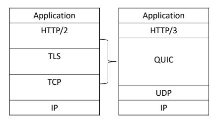

Fig. 1: Modularity of current networking stack vs. QUIC

it is possible to combine both features in a single message, saving a full network round-trip.

From a security standpoint, a fully-integrated secure transport protocol offers the potential for a single, clean security theorem, which avoids the pitfalls that arise when composing adversary models from different layers. Mismatched assumptions have caused several surprising cross-layer attacks against HTTPS. For instance, the CRIME [47] and BREACH [43] attacks illustrate the risk of composing application-layer compression with transport-layer encryption against adversaries that can both control the application plaintext and observe encrypted TLS traffic. Interestingly, transport compression exists in Google's version of QUIC, but was removed entirely by the IETF. Another example is cross-layer truncation attacks, such as the Cookie Cutter attack [15], where applications may perform dangerous side-effects based on incomplete received data due to a TCP error. With QUIC, it becomes possible to consider a single adversarial model for the application's transport and, in principle, to show that an application is secure against the UDP/IP message interface, which is very hard to achieve with TLS or IPSec.

Although QUIC was originally designed and implemented by Google for its own products, it is currently undergoing standardization by the IETF [36]. An explicit goal of the QUIC working group has been to ensure that QUIC inherits all the security properties of TLS 1.3, thus avoiding the lengthy formal protocol analysis effort that stretched out the TLS 1.3 standardization process for 4 years.

Unfortunately, as we highlight in this paper (§II), the working group has failed to achieve that goal; the latest IETF drafts have progressively opened up many internal TLS abstractions, and thus, increasingly diverged from the context under which TLS 1.3 is proved secure. Entire features of TLS (including the record layer [52], version negotiation, the end-of-early-data message, hello retry, re-keying, and some key derivations) have been replaced in QUIC, often under different assumptions; furthermore, new cryptographic constructions, which have received little academic scrutiny, have been added.

<span id="page-1-4"></span>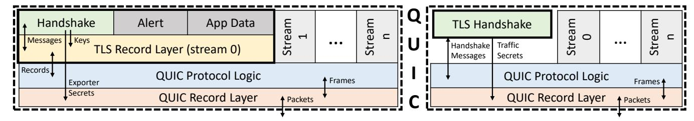

Fig. 2: Internal modularity between TLS 1.3 and QUIC before (left) and after (right) draft 12. In the latter, the QUIC Protocol Logic is responsible for deriving keys from the TLS Handshake's traffic secrets.

The standard has also drifted significantly away from Google's original version of QUIC, to the point that little of the early security analysis work on Google's QUIC ([40], [37], [30]) is relevant to the IETF version. Careful new analysis is required to capture the security properties of QUIC data streams.

Hence, the primary goal of this paper is to analyze and address weaknesses in a protocol that is practically as important as TLS but that has received little academic attention (despite imminent standardization and deployment). We do so by applying and extending methodologies and verification toolchains developed in the context of TLS to this new setting, thereby also validating their applicability to challenging non-TLS constructions.

Concretely, we model and mechanically verify the security of the new features of the IETF's QUIC, focusing on what we refer to as the QUIC "record layer", i.e., the portion that handles packet formatting and encryption. This is an important step towards full end-to-end verification of the soon-to-be-standardized protocol (we discuss remaining steps below). Our contributions consist of:

- <span id="page-1-1"></span>C1 Security Model. We give a new security definition (building on prior work [11], [41]) that captures the record layer's security and privacy goals (§III-B). We found that early drafts of QUIC failed to satisfy this definition; our feedback [42] resulted in updates to the construction (draft 17) and the explicit authentication of connection identifiers [53] (draft 27) despite initial pushback (§III-D).
- <span id="page-1-2"></span>C2 Formal Spec and Functional Properties. We use F\* [50], a functional language with a dependent type system for program verification, to develop a mechanized version of our security definition (C1) as well as a detailed functional specification for QUIC's new record layer construction (§IV-B). We also prove (§IV-C) correctness of the specification, e.g., non-malleability of the encoding of headers and that decryption inverts encryption. These proofs identified two flaws in the IETF reference implementation, and they uncovered interesting limitations of the IETF security goal, as well as brittleness in the construction (e.g., places where easy-to-make implementation mistakes may undermine security). Hence, we propose improvements that simplify the proof and increase robustness against strong attacker models (§III-D).
- C3 **Security Reduction**. We mechanically prove (§IV-E) that the new construction (C2) is cryptographically secure relative to C1, assuming the underlying primitives are.
- <span id="page-1-3"></span>C4 Fast, Correct and Secure Record Layer. We develop a high-performance low-level implementation (§IV-D) of the record layer that offers cryptographic security (w.r.t. C1), functional correctness (w.r.t. C2), and runtime safety.

C5 Fast, Provably Safe QUIC Implementation. Finally, we develop a proof-of-concept implementation (§V) of the QUIC protocol logic verified for memory safety, which we use to evaluate (§VI) our verified implementation of the record layer (C4), leveraging previously verified artifacts for the TLS handshake [17] and cryptographic primitives [44], to produce a verified implementation of the full IETF QUIC protocol.

While our work provides a better understanding of QUIC's goals and the extent to which the current draft protocol meets them, this is not yet an end-to-end verification of the protocol, as the proofs for the protocol logic would have to be significantly expanded and strengthened to connect the guarantees from the TLS handshake with those of the record layer and hence produce a single application-facing theorem for the entire implementation.

While we prove strong correctness and security properties for QUIC, like any verification result, our guarantees rely on the correctness of our formalized cryptographic definitions and of our verification tools. As we show in §VI, while the performance of our record layer implementation is quite strong (2 GB/s), our protocol logic limits the performance of our overall QUIC reference implementation, leaving us 21% slower than our unverified baseline.

All of our specifications, implementations, and proofs are open source and available on GitHub at:

https://github.com/project-everest/everquic-crypto https://github.com/secure-foundations/everquic-dafny

## II. QUIC BACKGROUND

<span id="page-1-0"></span>Because of its integrated nature, it is hard to summarize QUIC. We introduce the aspects relevant to our security analysis, focusing on confidentiality, integrity and authentication goals, but refer to the IETF drafts [36], [52] for details. We also highlight deviations from QUIC's original goal of treating TLS as a black box.

TLS Handshake Interface Early IETF drafts of QUIC (up to draft 12) used TLS 1.3 opaquely: packets contained full TLS records (Figure 2). The TLS record layer [14] has its own header format and supports fragmentation, encryption, padding, and content-type multiplexing. To reduce redundancy between TLS and QUIC (e.g., double encryption and fragmentation of handshake messages), in newer drafts, the QUIC protocol logic directly interacts with the TLS handshake and carries its messages in special frames separate from data streams. The TLS 1.3 handshake negotiates the connection ciphersuite and parameters, authenticates the peer, and establishes fresh traffic secrets (used to derive record keys).

It expects a duplex bytestream for reading and writing its messages, and a control interface for returning secrets and signaling key changes:

- A first, optional early traffic secret is available immediately after handling a client hello message that offers to use a pre-shared key (PSK). This enables the client to send application data in its very first message (no round-trip, "0-RTT"), but at a cost: 0-RTT messages are not forward secure and can be replayed.
- The (client and server) handshake traffic secrets are available after both hello messages are exchanged. A man-in-the-middle may corrupt the handshake traffic secret, so TLS messages are only secret against a passive attacker.
- The application ("1-RTT") traffic secrets are available once the server completes the handshake.

The record layer must be careful not to use traffic secrets until the handshake indicates that it is safe to do so. For instance, the application traffic secret is typically available on the server before the client's finished message is received, but the server must not try to decrypt 1-RTT packets before checking this message.

Connection Establishment QUIC connections exchange sequences of encrypted packets over UDP. There are four main types of packets: initial packets (INIT) carry the plaintext TLS messages: client hello, server hello, and hello-retry request. Like all QUIC packets, they are encrypted, but their traffic secret is derived from public values, so the encryption is mostly for error detection. 0-RTT packets are encrypted using a key derived from the TLS early traffic secret, and similarly, handshake packets (HS) and 1-RTT packets are encrypted using keys derived from handshake traffic secrets and application data traffic secrets, respectively.

Packet Headers QUIC packets consist of a header and a payload. The type of a packet is indicated in the header. Initial, 0-RTT and handshake packets use long headers while 1- RTT packets use short headers, as depicted in Figure [3.](#page-2-0) Long headers include an explicit payload length to allow multiple packets to be grouped into a single UDP datagram. In contrast, the length of packets with short headers must be derived from the encapsulating UDP length. Hence, UDP datagrams contain at most one such packet, at the end.

Connection Identifiers Multiple QUIC connections can share the same IP address and UDP port by using separate connection IDs. This is particularly useful for servers, e.g., to route connections behind a load balancer. Clients may also use this feature to work around port restrictions and NAT congestion. Long headers include both a source and destination connection ID (of variable length). In its initial packet, the client picks its own source ID and the initial ID of the server as destination. Servers are expected to overwrite this initial choice by picking a new source ID in their response. Once the connection is established, the connection IDs are presumed to be authentic and of known length (either fixed, or encoded in the ID itself). Hence, short headers omit the source ID and the length of the destination ID. Connection IDs are a clear risk for privacy, since they correlate individual packets with sessions. QUIC encourages long-lived connections that can be migrated from one network path to another. For instance, if a mobile

<span id="page-2-0"></span>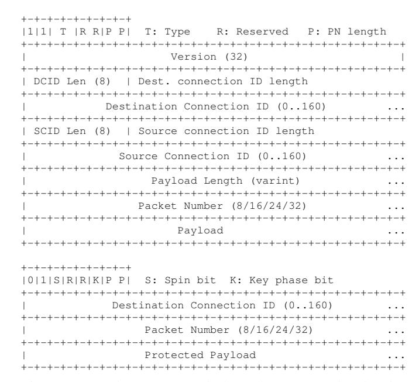

Fig. 3: QUIC long (top) and short (bottom) packet headers. Initial, retry, handshake and 0-RTT packets use long headers, whereas 1-RTT packets use short headers.

device switches from cellular to Wi-Fi, it is possible to migrate the connection on the new network while maintaining the current connection state, thus preventing the overhead of a reestablishing the connection. To manage this privacy risk, peers can declare and retire connection IDs, and privacy-conscious clients may change their ID in every packet.

Packet Numbers and Stream Encryption TLS over TCP relies on the in-order delivery of message fragments, and thus encrypts these fragments using a nonce computed from their implicit fragment sequence number. In contrast, QUIC packets are sent over UDP and may be dropped or delivered out of order. Therefore, encryption nonces cannot be implicit, which causes both communication overhead (full nonces are usually 12 bytes) and privacy concerns: if full nonces are sent on the wire, they can be used to map packets to connections and their users. QUIC connections can be very long-lived, and the most significant bits of the nonce become increasingly precise at identifying users. To address these concerns, QUIC's record layer introduces a new semi-implicit nonce construction that combines two ideas: only the least significant (and least privacy sensitive) bits of the nonce are sent on the wire; and those bits are further encrypted under a special header-protection key. This construction is detailed in [§III-A.](#page-3-0)

In TLS over TCP, traffic secrets protect separate, successive authenticated encryption streams, with explicit termination messages to transition between keys and prevent truncation (end of early data message for 0-RTT, finished messages for the handshake, and the re-keying messages and closure alerts for 1-RTT). In QUIC, multiple keys may be active at the same time, which makes the logic for selecting and discarding keys much more involved. This adds new dangerous pitfalls that must be actively prevented: for instance, servers may receive 1-RTT data before the handshake is complete (this data is not yet safe to process), or clients may reply to 1-RTT messages with 0-RTT ones (the specification forbids this, but it is up to implementations to enforce). Normally, each direction of each traffic secret maintains its own packet counter; however, since only the client may send 0-RTT packets, they are acknowledged in 1-RTT packets, which means packet numbers are shared between 0-RTT and 1-RTT.

Transport Parameter Negotiation QUIC uses a special TLS extension to negotiate an extensible list of transport parameters (set or negotiated by the client and server). TLS guarantees that if the handshake completes, both parties agree on the parameters.

Version Negotiation QUIC defines a mechanism for the server to indicate that it wishes to use a different version than the one proposed by the client. This mechanism uses a special version negotiation packet type, which is specified in a version-independent document [\[51\]](#page-16-4) and contains the list of versions that the server is willing to use. Surprisingly, while previous drafts attempted to authenticate the version negotiation using the transport parameter negotiation through the TLS handshake, this feature has been removed in current drafts. Instead the specification states: *"Version Negotiation packets do not contain any mechanism to prevent version downgrade attacks. Future versions of QUIC that use Version Negotiation packets MUST define a mechanism that is robust against version downgrade attacks"*. It is unclear how future versions of QUIC will prevent version downgrade attacks. Regardless of which version the client supports, an attacker may always inject a version negotiation packet that only indicates version 1 support.

# III. QUIC RECORD LAYER SECURITY

<span id="page-3-2"></span>This section focuses on QUIC's new record layer. We first describe the cryptographic construction used to encrypt both packet payloads and selected parts of packet headers ([§III-A\)](#page-3-0). We then present our cryptographic definition of security for packet encryption with implicit nonces ([§III-B\)](#page-4-0), capturing QUIC's packet-number-privacy goal, and we outline its proof ([§III-C\)](#page-6-1). Finally, we discuss vulnerabilities that we discovered in earlier QUIC drafts, how the construction changed as a result, frailties that persist in the most recent draft, and our suggested improvements ([§III-D\)](#page-6-0).

## <span id="page-3-0"></span>*A. Background: QUIC Packet Encryption (QPE)*

As explained in [§II,](#page-1-0) QUIC packets consist of a header and a payload. The payload is encrypted using a standard algorithm for authenticated encryption with additional data (AEAD, abbreviated AE below), negotiated by TLS as part of its record ciphersuite. AEAD also takes the header (shown in Figure [3\)](#page-2-0) in plaintext as additional authenticated data (AAD) and thus protects its integrity.

QUIC also applies a new and rather convoluted *header protection* scheme before sending the packet on the network. As discussed in [§II,](#page-1-0) because QUIC uses UDP, it must include a packet number in each packet to cope with packet drops and reorderings. These packet numbers, however, pose a privacy risk, as a passive network observer can correlate packets and sessions, facilitating traffic analysis, particularly given QUIC's support for very long-lived, migratable sessions. Employing random nonces would waste too much space (because of the risk of birthday collisions, which cause catastrophic integrity failure, at least 128 bits would be required instead of the 8 to 32 bits of packet number that QUIC advocates). The

<span id="page-3-1"></span>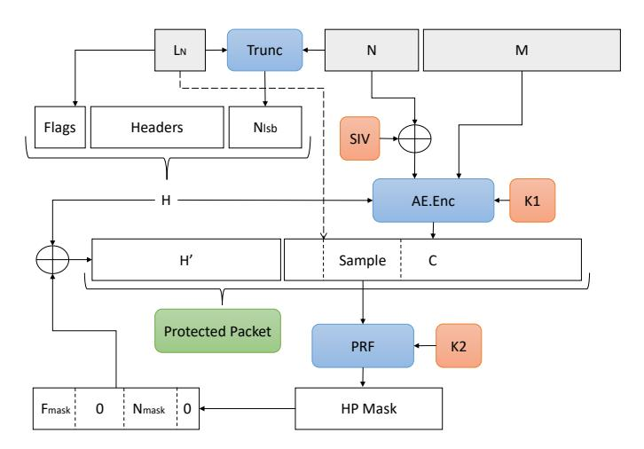

Fig. 4: Overview of the QUIC packet encryption (QPE) construction with header protection (HP), parameterized by the AEAD scheme AE and keyed pseudo-random function PRF

situation is further complicated by QUIC's decision to use variable-length packet numbers, which means the length must also be hidden. Instead, QUIC settled on the more optimized (but somewhat exotic) construction shown in Figure [4](#page-3-1) and detailed in Figure [5.](#page-4-1) In the discussion below, we refer to this construction as QPE[AE, PRF], since it is parameterized by the particular authenticated encryption (A) and pseudo-random function (PRF) algorithms selected during TLS ciphersuite negotiation.

The main inputs to the construction are the packet number N, the plaintext message M, the flags and QUIC-specific headers H, and the number L<sup>N</sup> of least-significant bytes of N to send on the wire (between 1 and 4). The key materials consist of three cryptographic secrets: K<sup>1</sup> for the AEAD scheme, K<sup>2</sup> for the PRF, and SIV , a 12-byte static IV which is combined with the full 62-bit packet number N to form the AEAD nonce. The construction first performs a normal AEAD encryption, using the message M as the plaintext, and the header H as the additional data.

QUIC then computes a header protection (HP) mask which it uses to hide the truncated packet number Nlsb and some bits of the flags—including those encoding the length L<sup>N</sup> . The mask is computed by applying the PRF to a fixed-size fragment (called the *sample*) of the ciphertext C. The mask is split in two parts: the first byte is used to encrypt L<sup>N</sup> , and the next 4 bytes are truncated to L<sup>N</sup> and applied at the offset of the encrypted packet number. Because L<sup>N</sup> is hidden, it is difficult for the packet's recipient to know the boundary between the protected headers H<sup>0</sup> and the ciphertext C (and thus where the sample starts). This could be mitigated by choosing the last bytes of C for the sample, but QUIC solves this problem differently: the position of the sample is computed by *assuming* that L<sup>N</sup> = 4, hence skipping the first 4−L<sup>N</sup> bytes of C. This requires all ciphertexts to be at least 20 bytes long, instead of 16 if the end of C was used. Since most AEAD tags are only 16 bytes, QUIC effectively requires a minimum of 4 bytes of plaintext in every packet (which can be achieved by adding padding frames). Since L<sup>N</sup> is confidential, header decryption is also difficult to implement in constant time (we revisit this issue in [§IV-D\)](#page-10-1).

<span id="page-4-1"></span>

| $\begin{split} & \frac{Keygen()}{N_s \leftarrow \$ \left\{0,1\right\}^{AE.nlen}} \\ & K_1 \leftarrow \$ AE.keygen() \\ & K_2 \leftarrow \$ PNE.keygen() \\ & \mathbf{return} \ \left(N_s, K_1, K_1\right) \end{split}$ | $ \begin{array}{l} \frac{Decode(N_e,N_i,L_N)}{W \leftarrow 2^{8L_N};\ X \leftarrow N_i + 1} \\ N \leftarrow Ne + (X\&(W-1)) \\ \mathbf{if}\ N \leq X - W/2 \\ \land N < 2^{62} - W \\ \mathbf{return}\ N + W \end{array} $ |
|------------------------------------------------------------------------------------------------------------------------------------------------------------------------------------------------------------------------|----------------------------------------------------------------------------------------------------------------------------------------------------------------------------------------------------------------------------|
| $Encode(N, L_N)$                                                                                                                                                                                                       | if $N > X + W/2 \land N \ge W$                                                                                                                                                                                             |
| $\overline{\mathbf{return}\ N\&(2^{8L_N}-1)}$                                                                                                                                                                          | return $N-W$                                                                                                                                                                                                               |
| 1 (0)                                                                                                                                                                                                                  | return $N$                                                                                                                                                                                                                 |
| $\operatorname{csample}(C)$                                                                                                                                                                                            | $DN_{-} = (V - I - M - C)$                                                                                                                                                                                                 |
| return C[420]                                                                                                                                                                                                          | $\frac{PNenc(K_2, L_N, N', S)}{B \leftarrow F.compute(K_2, S)}$                                                                                                                                                            |
| $DNIdeg(K, \mathcal{D})$                                                                                                                                                                                               | $C' \leftarrow N' \oplus B[11 + L_N]$                                                                                                                                                                                      |
| $\frac{PNdec(K_2,P)}{H,C \leftarrow split(P,1+\ell_H(P))}$                                                                                                                                                             | $C'' \leftarrow L_N \oplus B[11 + L_N]$<br>$C'' \leftarrow L_N \oplus (B[0]\&15)$                                                                                                                                          |
| $S \leftarrow csample(C)$                                                                                                                                                                                              | return $C'' \parallel C'$                                                                                                                                                                                                  |
| $B \leftarrow F.compute(K_2, S)$                                                                                                                                                                                       |                                                                                                                                                                                                                            |
| $F \leftarrow C[0] \oplus (B[0]\&15)$                                                                                                                                                                                  | $psample(C, L_N)$                                                                                                                                                                                                          |
| $L_N \leftarrow 1 + F\&3$                                                                                                                                                                                              | return $C[(4-L_N)(20-L_N)]$                                                                                                                                                                                                |
| $C'', C' \leftarrow split(C, L_N)$                                                                                                                                                                                     | 117 ( 117)                                                                                                                                                                                                                 |
| $N_e \leftarrow C'' \oplus B[11 + L_N]$                                                                                                                                                                                | Enc(K,N,H,M)                                                                                                                                                                                                               |
| $H' \leftarrow H \  L_N \  N_e$                                                                                                                                                                                        | $N_s, K_1, K_2 \leftarrow K$                                                                                                                                                                                               |
| return $\tilde{L}_N, \tilde{N}_e, H', C'$                                                                                                                                                                              | $L_N \leftarrow 1 + H[0]\&3$                                                                                                                                                                                               |
|                                                                                                                                                                                                                        | $N_e \leftarrow Encode(N, L_N)$                                                                                                                                                                                            |
| $Dec(K, N_i, P)$                                                                                                                                                                                                       | $N_0 \leftarrow N \oplus N_s$                                                                                                                                                                                              |
| $N_s, K_1, K_2 \leftarrow K$                                                                                                                                                                                           | $H' \leftarrow H \  L_N \  N_e$                                                                                                                                                                                            |
| $L_N, N_e, H', C' \leftarrow PNdec(K_2, P)$                                                                                                                                                                            | $C \leftarrow AE.enc(K_1, N_0, H', M)$                                                                                                                                                                                     |
| $N \leftarrow Decode(N_e, N_i, L_N) \oplus N_s$                                                                                                                                                                        | $S \leftarrow psample(C, L_N)$                                                                                                                                                                                             |
| $M \leftarrow AE.dec(K_1, N, H', C')$                                                                                                                                                                                  | $C' \leftarrow PNenc(K_2, L_N, N_e, S)$                                                                                                                                                                                    |
| $\mathbf{return}\ M$                                                                                                                                                                                                   | return $H  C'  C$                                                                                                                                                                                                          |

Fig. 5: Detailed definition of the QPE[AE,F] construction, with a few simplifications. In the real construction, the encrypted headers (flags and packet number) are interleaved with the plaintext headers; our verified implementation uses this header format for interoperability. In the figure, we move the encrypted flags next to the encrypted packet number.

## <span id="page-4-0"></span>B. QUIC-Packet-Encryption Security

Although QPE[AE, PRF] is a new construction, it is similar to other constructions that have been proposed for noncehiding encryption, that is, constructions where the nonce is not an input of the decryption function but is instead embedded into the ciphertext. For instance, QPE is comparable to the HN1 construction of Bellare et al. [11], which comes with a security definition, AE2, that captures the fact that the embedded nonce is indistinguishable from random, and with a reduction to standard assumptions. (§A recalls their definitions.)

In line with their work, we define a security notion for partially nonce-hiding encryption that aims to capture the security goal of QUIC's approach to packet encryption. For simplicity, however, it does not reflect the fact that header protection also applies to other parts of the header, such as reserved flags and the key-phase bit.

**Notation** Following the well-established approach of Bellare and Rogaway [12], we define the security of a functionality F as the probability (called the *advantage*)  $\epsilon_{G}(A)$  that an adversary A, interacting with a game  $G^b(F)$  (whose oracles are parameterized by a random bit b), guesses the value of b with better than random chance, i.e.  $\epsilon_{G}(A) = |2 \Pr[G^b(A) = b] - 1|$ . By convention, when b = 0, the oracles of G behave exactly like the functions in the functionality F; we also refer to  $G^0$  as the *real functionality*. In contrast, the oracles of  $G^1$  capture the perfect intended behavior, or the *ideal functionality*, which is

typically expressed using shared state. The reason we insist on real-or-ideal indistinguishability games will be more apparent in §IV, as we formalize type-based security verification using idealized interfaces. We refer the reader to Brzuska et al. [21] for a detailed introduction to the methodology.

**Definitions** To illustrate our notation, consider the standard security definition for a keyed pseudo-random functionality F, which offers a single function, namely compute :  $\{0,1\}^{\ell_K} \times \{0,1\}^{\ell} \to \{0,1\}^{\ell}$ . The real functionality (b=0) just evaluates the function. The ideal functionality (b=1) is a random function, implemented using a private table T to memoize randomly sampled values of length  $\ell$ .

$$\begin{array}{ll} \mathbf{\underline{Game}} \ \mathsf{PRF}^b(\mathsf{F}) & \mathbf{\underline{Oracle}} \ \mathsf{Compute}(X) \\ T \leftarrow \varnothing & \mathbf{if} \ b = 1 \ \mathbf{then} \\ k \overset{\$}{\leftarrow} \{0,1\}^{\mathsf{F}.\ell_K} & \mathbf{if} \ T[X] = \bot \ \mathbf{then} \ T[X] \overset{\$}{\leftarrow} \{0,1\}^{\mathsf{F}.\ell} \\ & \mathbf{return} \ T[X] \\ & \mathbf{return} \ \mathsf{F.compute}(k,X) \end{array}$$

Our security definition for packet encryption is a refinement of the standard notion of authenticated encryption security, AE1, shown below, for a symmetric encryption scheme SE1. In the definition, ideal encryption is implemented by sampling a random ciphertext ( $\ell_{tag}$  bits longer than the plaintext), and ideal decryption by a lookup in a global table indexed by the nonce, ciphertext, and header.

$$\begin{array}{ll} & \underline{\mathbf{Game}} \ \mathsf{AE1}^b(\mathsf{SE1}) \\ \hline T \leftarrow \varnothing; \ k \overset{\$}{\leftarrow} \ \mathsf{SE1.gen}() \\ \hline \\ & \underline{\mathbf{Oracle}} \ \mathsf{Decrypt}(N,C,H) \\ & \underline{\mathbf{if}} \ b = 1 \ \mathbf{then} \\ \hline M \leftarrow T[N,C,H] \\ & \underline{\mathbf{else}} \\ M \leftarrow \mathsf{SE1.dec}(k,N,C,H) \\ & \underline{\mathbf{return}} \ M \\ \end{array} \quad \begin{array}{ll} & \underline{\mathbf{Oracle}} \ \mathsf{Encrypt}(N,M,H) \\ & \underline{\mathbf{assert}} \ T[N,-,-] = \bot \\ & \underline{\mathbf{if}} \ b = 1 \ \mathbf{then} \\ \hline C \overset{\$}{\leftarrow} \{0,1\}^{|M|+\mathsf{SE1.\ell_{tag}}} \\ & T[N,C,H] \leftarrow M \\ & \underline{\mathbf{else}} \\ & C \leftarrow \mathsf{SE1.enc}(k,N,M,H) \\ & \underline{\mathbf{return}} \ C \\ \end{array}$$

In AE1, the correct nonce must be known by the recipient of the message in order to decrypt. In TLS, the nonce is obtained by counting the packets that have been received, but this does not work in QUIC where packets are delivered out of order. Instead, the recipient only knows an approximate range (which depends on  $L_N$ ), while the fine-grained position in that range (the encrypted packet number in the packet headers) is embedded in the ciphertext.

To move towards nonce-hiding encryption, we introduce the definition AE5 for encryption with variable-sized, semi-implicit nonces. The idea behind this definition is informally described in an unpublished note by Namprempre, Rogaway and Shrimpton [41] where it is referred to as AE5 in reference to the 5 inputs of the encryption function; however, to our knowledge, the definition has never been formalized, and no construction has been proposed or proved secure with respect to this definition.

$$\begin{array}{ll} \mathbf{Game} \ \mathsf{AE5}^b(\mathsf{E}) & \mathbf{Oracle} \ \mathsf{Encrypt}(N,L_N,M,H) \\ T \leftarrow \varnothing; \ k \overset{\$}{\leftarrow} \mathsf{E.gen}() & \mathbf{assert} \ T[N,\_,\_] = \bot \\ \mathbf{if} \ b = 1 \ \mathbf{then} \\ \mathbf{Oracle} \ \mathsf{Decrypt}(N_i,C,H) & C\overset{\$}{\leftarrow} \{0,1\}^{L_N + \mathsf{E}.\ell_{L_N} + |M| + \mathsf{E}.\ell_{\mathsf{tag}}} \\ T[N,C,H] \leftarrow L_N,M \leftarrow T[N,C,H] & \mathsf{else} \\ \mathbf{for} \ N \ \mathbf{s.t.} \ \mathsf{E.valid}(N,N_i,L_N) & \mathsf{else} \\ C \leftarrow \mathsf{E.enc}(k,N,L_N,M,H) \\ \mathbf{return} \ N,L_N,M \leftarrow \mathsf{E.dec}(k,N_i,C,H) \\ \mathbf{return} \ N,L_N,M \end{array}$$

In its encryption scheme E, the function E.enc takes in the full nonce N and its encoding length  $L_N$ , and produces a random ciphertext whose length accounts for the tag of length  $E.\ell_{\rm tag}$ , the explicit nonce of length  $L_N$ , and  $E.\ell_{L_N}$ , the encoded size of  $L_N$ . E.dec only needs the implicit nonce  $N_i$ , which must contain enough information to reconstruct the full nonce N for the selected  $L_N$ . Hence the definition is parametric over a validity predicate E.valid to ensure the ideal and real versions succeed or fail consistently. If there is no N such that valid  $(N, N_i, L_N)$ , ideal decryption fails. For instance, one could use valid  $(N, N_i, L_N) := \text{msb}(N, |N| - L_N) = N_i$ , but QUIC's exact predicate (in\_window) is formalized in the next section. AE5 generalizes both standard AE1 (when  $L_N = 0$ ) and nonce-hiding encryption (AE2) when  $L_N = |N|$ .

Nonce-Hiding Stream Encryption We now introduce a notion of nonce-hiding stream encryption security, for a stateful encryption scheme SE that encrypts message M and protects header H. The idea is to use a sliding window of packets: the receiver moves the window each time it successfully decrypts a packet. Packets in the window may be decrypted out of order. The same packet may or may not decrypt depending on the receiver state, which is accounted for by the validity predicate.

$$\begin{array}{lll} & \underline{\mathbf{Game}} \ \mathsf{NHSE}^b(\mathsf{SE}) & \underline{\mathbf{Oracle}} \ \mathsf{Encrypt}(L_N,M,H) \\ \hline c_e \leftarrow 0; c_d \leftarrow 0; S \stackrel{\$}{\Leftarrow} \mathsf{SE.gen}() & \mathbf{if} \ b = 1 \ \mathbf{then} \\ & C \stackrel{\$}{\Leftarrow} \mathsf{AE5.Encrypt} \\ \hline \mathbf{Oracle} \ \mathsf{Decrypt}(C,H) & (c_e,L_N,M,H) \\ \hline \mathbf{if} \ b = 1 \ \mathbf{then} & c_e \leftarrow c_e + 1 \\ \hline N, L_N, M \leftarrow \mathsf{AE5.Decrypt}(c_d,C,H) & \mathbf{else} \\ \hline \mathbf{if} \ M \neq \bot \ \mathbf{then} & C,S' \leftarrow \mathsf{SE.enc} \\ \hline c_d \leftarrow max(c_d,N) & (S,L_N,M,H) \\ \hline \mathbf{else} & S \leftarrow S' \\ \hline \mathbf{return} \ L_N, M, S' \leftarrow \mathsf{SE.dec}(S,C,H) & \mathbf{return} \ C \\ \hline \mathbf{return} \ L_N, M \end{array}$$

The actual QUIC stream encryption (QSE) construction is similar to the ideal functionality of NHSE: a counter  $c_e$  is used to send packets with QPE, and a counter  $c_d$  stores the highest decrypted packet number received. In our verified implementation, we prove constructively that, given an adversary  $\mathcal{A}$  for NHSE $^b$ [QSE], we can program an adversary  $\mathcal{A}'$  for AE5 $^b$ [QPE] with the same advantage.

**Security Theorem** Our main security result reduces the security of QUIC's packet encryption construction, QPE[AE,PRF], to the AE1 security of AE and the security of the PRF.

<span id="page-5-0"></span>**Theorem 1** (QPE Security). Given an adversary A against the NHSE<sup>b</sup>(QPE[AE, PRF]) game, we construct adversaries A' against AE1<sup>b</sup>(AE) and A'' against PRF<sup>b</sup>(PRF) such that:

$$\epsilon_{\mathsf{NHSE}}^{\mathsf{QPE}}(\mathcal{A}) \leq \epsilon_{\mathsf{AE1}}^{\mathsf{AE}}(\mathcal{A}') + \epsilon_{\mathsf{PRF}}^{\mathsf{PRF}}(\mathcal{A}'') + \frac{q(q-1)}{2^{\mathsf{PRF}.\ell+1}}$$

where q is the number of encryptions and failed decryptions performed, and where PRF.  $\ell$  is the output length of the PRF.

Except for the initial steps carried out on paper and explained in §III-C, the proof of Theorem 1 is mechanically verified in F\* against the gnarly details of the concrete QUIC construction. Informally, the idea of the proof is to modularize the AE5 definition to separate the encryption of the explicit nonce from the AEAD encryption of the payload. This is done by stealing a part of the AEAD ciphertext called the *sample* 

to use as a fresh random IV for nonce encryption (also called header protection in QUIC). The proof has two main steps, first applying AE1, so that ciphertexts and samples become fresh random bytestrings, then applying PRF. The probability of sample collisions when modelling header encryption with a PRF that produces one-time pads is bounded by a quadratic term, much as in the classic PRP/PRF switching lemma.

For simplicity, this section presents single-instance versions of the AE5 and PRF games. In our mechanization of the proof, which aims at verifying cryptographic libraries, all games are multi-instance, but the state of each instance is independent; hence the bound of Theorem 1 generalizes to the multi-instance setting by multiplying the collision term by the number of honest instances.

Nonce Confidentiality Careful readers will notice that the AE5 definition, as written, does not directly yield confidentiality of the explicit packet number  $N_e$ , because the decryption oracle returns  $L_N$  and N, from which it is possible to derive  $N_e$ . We have two reasons for writing the definition in this way: first, this ensures modularity of the security definitions for header encryption  $(N_e)$  and stream encryption  $(N_i)$  in the stateseparation game-playing framework [21], which also translates to the modularity of the F\* implementation of our model; and second, we observe that many QUIC implementations break nonce confidentiality by performing actions based on the packet number of the decrypted packet, for instance by using a Bloom filter to detect packets that have been already processed. Such operations may lead to concrete implementation attacks (e.g., introducing timing side channels based on whether the Bloom filter rejects the packet). In our implemented model, we deal with this problem by returning N (even in NHSE) at an abstract type that can conditionally be revealed, thus allowing our record implementation to be used both with QUIC implementations that preserve nonce confidentiality and with those that break it. For the paper model, it is possible to avoid the difficulty either by not returning N in Decrypt, or to model nonce confidentiality as a composed IND-CCA2 game on top of NHSE where the adversary must decide which of two nonces is associated with a challenge encrypted packet, but without the ability to ask for its decryption.

Generalizing AE5 and NHSE Because of the constraints of our verification methodology (which aims to apply our game-based definitions to the exact formal specification of the protocols, avoiding gaps between the model and implementation), our security definitions are somewhat tailored for QUIC, and can be generalized to a broader class of encryption schemes.

In parallel to this work, Bellare, Günther and Tackmann [9] have presented (at the QUIC Privacy and Security workshop) a two-tier authenticated encryption scheme, which generalizes AE5 to cover other parts of the header H used as additional authenticated data. Fischlin, Günther and Janson [31] also present a new security definition for channel robustness, which is parametric over a support predicate that specifies, given the sequences of packets that have been sent and accepted, whether a given packet is considered valid to receive. This generalizes our AE5 and NHSE definitions to different sliding window and replay protection schemes (e.g. DTLS 1.3), but only offers pen-and-paper models and proofs.

#### <span id="page-6-1"></span>C. From Theorem 1 to Code Verified in $F^*$

We describe the first steps of the proof of Theorem 1, from its statement above to the code actually verified in  $F^{\star}$ . To simplify our presentation, we count packet numbers from zero (instead of  $N_S$ ) and pretend the flags (F) in the QPE construction consist only of  $L_N$ : the number of explicit least significant bits of the packet number. Our verified implementation, in contrast, makes no such simplifications. Recall that  $L_N$  appears in plain in the additional data of QUIC payload encryption but is part of the indistinguishable-from-random packet ciphertext.

(1) We start by inlining the QPE construction into the AE5 definition, using the auxiliary functions defined in Figure 5 for the real case (b = 0).

```
Game AE5^b(QPE[AE, F])
                                                   Oracle Encrypt(N, L_N, M, H)
                                                   \overline{\mathbf{assert}\ T[N,\_,\_] = \bot}
T, T' \leftarrow \varnothing; k_1, k_2 \stackrel{\$}{\leftarrow} \mathsf{Keygen}()
                                                   if b = 1 then
                                                      C \xleftarrow{\$} \{0,1\}^{L_N + E.\ell_{L_N} + |M| + \mathsf{E}.\ell_{\mathsf{tag}}}
Oracle Decrypt(N_i, C, H)
                                                      T[N,C,H] \leftarrow L_N,M
if b = 1 then
   L_N, M \leftarrow T[N, C, H] for N
                                                   else
           s.t. in\_win(N, N_i, L_N)
                                                      N_e \leftarrow \mathsf{encode}(N, L_N)
                                                      H' \leftarrow H \|L_N\| N_e
else
                                                      C' \leftarrow \mathsf{AE}.\mathsf{enc}(k_1, N, M, H')
   L_N, N_e, H', C'
                                                      S \leftarrow \mathsf{psample}(C', L_N)
       \leftarrow \mathsf{PNdec}(k_2, H || C)
                                                      C'' \leftarrow \mathsf{PNenc}(k_2, L_N || N_e, S)
   N \leftarrow \mathsf{decode}(N_i, N_e, L_N)
                                                   return C'' \parallel C'
   M \leftarrow \mathsf{AE}.\mathsf{dec}(k_1, N, C', H')
return N, L_N, M
```

(2) We separate the encryption of  $L_N$  and  $N_e$  from the encryption of the payload in the ideal case.

```
Game AE5^b(QPE)
                                                          Oracle Encrypt(N, L_N, M, H)
                                                         \overline{\mathbf{assert}\ T[N,\_,\_]} = \bot
T, T' \leftarrow \varnothing; k_1, k_2 \stackrel{\$}{\leftarrow} \mathsf{E.gen}()
                                                          N_e \leftarrow \mathsf{encode}(N, L_N)
                                                         H^{\check{\prime}} \leftarrow H \| L_N \| N_e
Oracle Decrypt(N_i, C, H)
                                                         if b = 1 then
if b = 1 then
                                                             C' \overset{\$}{\leftarrow} \{0,1\}^{|M|+\mathsf{E}.\ell_{\mathsf{tag}}}
    S \leftarrow \mathsf{csample}(C)
                                                             T[N, \overrightarrow{C'}, \overrightarrow{H'}] \leftarrow M
   if T'[S] = \bot then
                                                             S \leftarrow \mathsf{psample}(C')
        T'[S] \stackrel{\$}{\leftarrow} \{0,1\}^{\ell_{max}}
                                                             if T'[S] \neq \bot then throw
    L_N || N_e || C' \leftarrow T'[S] \oplus C

M \leftarrow T[N, C', H] for N
                                                             C_S \stackrel{\$}{\leftarrow} \{0,1\}^{\ell_{max}}
                                                            T'[S] \leftarrow C_S
C'' \leftarrow \mathsf{lsb}_{\ell_{L_N} + L_N}(C_S \oplus L_N || N_e)
             s.t. \mathsf{valid}(N, N_i, L_N)
else
    L_N, N_e, H', C'
                                                         else
        \leftarrow \mathsf{PNdec}(k_2, H || C)
                                                             C' \leftarrow \mathsf{AE.enc}(k_1, N, M, H')
    N \leftarrow \mathsf{decode}(N_i, N_e, L_N)
                                                             S \leftarrow \mathsf{psample}(C')
    M \leftarrow \mathsf{AE.dec}(k_1, N, C, H')
                                                             C'' \leftarrow \mathsf{PNenc}(k_2, L_N \| N_e, S)
return N, L_N, M
                                                         return C'' \parallel C'
```

where we denote by C' the ciphertext from the payload encryption and by C'' the ciphertext for the nonce encryption. We introduce an auxiliary encryption table T' that maps samples S (stolen from C') to one-time pads  $C_S$ .

Note that there is no integrity protection over header encryption, which determines the number of bits to encrypt, so  $C_S$  must be of the maximum size  $\ell_{max}$ . QUIC supports 32 bits of explicit nonce and 8 other bits, of which 2 are used for  $L_N$ , hence  $\ell_{max}=40$ .

(3) We introduce intermediate idealization flags:  $b_1$  for the idealization of payload encryption; and  $b_2$  for header encryption, such that  $b_2 \Rightarrow b_1$ . This yields the following modular game:

```
Game AE5^{b_1,b_2}(QPE)
                                                             Oracle Encrypt(N, L_N, M, H)
                                                             assert AEAD.T[N,\_,\_] = \bot
k_1, k_2 \stackrel{\$}{\leftarrow} \mathsf{E.gen}()
                                                             N_e \leftarrow \mathsf{encode}(N, L_N)
                                                             H' \leftarrow H \| L_N \| N_e
Oracle Decrypt(N_i, C, H)
                                                             if b_1 = 1 then
\overline{\mathbf{if}\ b_2} = 1 \ \mathbf{then}
                                                                 C' \leftarrow \mathsf{AE1}^{b_1}.\mathsf{Enc}(N,M,H')
    S \leftarrow \mathsf{csample}(C)
                                                                 T[N,C',H] \leftarrow M
    C_S \leftarrow \mathsf{PRF}^{b_2}.\mathsf{Compute}(S)
    L_N \| N_e \| C' \leftarrow C_S \oplus C
                                                                 S \leftarrow \mathsf{psample}(C')
                                                                 \begin{aligned} & \text{if } \mathsf{PRF}.T[S] \neq \bot \text{ then throw} \\ & C_S \leftarrow \mathsf{PRF}^{b_2}.\mathsf{Compute}(S) \\ & C'' \leftarrow \mathsf{lsb}_{\ell_L}{}_{+L_N}(C_S \oplus L_N \| N_e) \end{aligned}
    N \leftarrow \mathsf{decode}(N_i, N_e, L_N)
    H' \leftarrow H \| L_N \| N_e
    M \leftarrow \mathsf{AE1}^{b_1}.\mathsf{Dec}(N,C',H')
else
    L_N, N_e, H', C'
                                                                 C' \leftarrow \mathsf{AE}.\mathsf{enc}(k_1, N, M, H')
                                                                 S \leftarrow \mathsf{psample}(C')
        \leftarrow \mathsf{PNdec}(k_2, H || C)
                                                                 C'' \leftarrow \mathsf{PNenc}(k_2, L_N, N_e, S)
    N \leftarrow \mathsf{decode}(N_i, N_e, L_N)
                                                             return C'' \parallel C'
    M \leftarrow \mathsf{AE.dec}(k_1, N, C', H')
return N, L_N, M
```

(4) We rewrite it more simply as

```
Game AE5^{b_1,b_2}(QPE)
                                                         Oracle Encrypt(N, L_N, M, H)
                                                        \overline{N_e \leftarrow \mathsf{encode}(N, L_N)}
k_1 \leftarrow \mathsf{AE1}^{b_1}(AEAD)
k_2 \leftarrow \mathsf{PNE}^{b_2}()
                                                         H' \leftarrow L_N ||N_e||H
                                                        C' \leftarrow \mathsf{AE1}^{b_1}.\mathsf{Enc}(N,M,H')
                                                        S \leftarrow \mathsf{psample}(C')
Oracle Decrypt(N_i, C, H)
                                                        C'' \leftarrow \mathsf{PNE}^{b_2}.\mathsf{Enc}(L_N, N_e, S)
L_N, N_e, C' \leftarrow \mathsf{PNE}^{b_2}.\mathsf{Dec}(H, C)
                                                        return C'' \parallel C'
N \leftarrow \mathsf{decode}(N_i, N_e, L_N)
H' \leftarrow L_N || N_e || H
M \leftarrow \mathsf{AE1}^{b_1}.\mathsf{Dec}(N,C',H')
return N, L_N, M
```

by factoring out the oracles of game AE1 and those of an intermediate PNE game for header encryption, defined below as a wrapper around the PRF functionality.

```
\begin{array}{ll} \operatorname{Game} \mathsf{PNE}^{b_2}(\mathsf{F}) & \operatorname{Oracle} \, \operatorname{Dec}(H,C) \\ \hline k \leftarrow \mathsf{F}.\mathsf{keygen}() & S \leftarrow \operatorname{csample}(C) \\ \hline \operatorname{Oracle} \, \operatorname{Enc}(L_N,N_e,S) & L_N \leftarrow C_S[0] \oplus (C[0]\&15) \\ \text{if} \, \mathsf{PRF}.T[S] \neq \bot \, \text{then throw} \\ C_S \leftarrow \mathsf{PRF}^{b_2}(F).\mathsf{Compute}(S) & L_N \leftarrow C_S[0] \oplus (C[0]\&15) \\ C \leftarrow \operatorname{lsb}_{\ell_{L_N} + L_N}(C_S \oplus L_N \| N_e) & \mathsf{LN} \| N_e \leftarrow C_S[0..\ell_{L_N} + L_N] \oplus H' \\ \text{return} \, C & \end{array}
```

The games  $\mathsf{AE1}^{b_1}$  and  $\mathsf{PNE}^{b_2}$  correspond exactly to the idealized interfaces in our verified implementation:  $\mathsf{Model.AEAD.fsti}$  for  $\mathsf{AE1}$  and  $\mathsf{Model.PNE.fsti}$  for  $\mathsf{PNE}$ . We used these code-based assumptions to implement the  $\mathsf{NHSE}^{b_1,b_2}(QPE)$  interface (inlining  $\mathsf{AE5}$  and adding the management of the stream state).

We require a final step "on paper" to reduce  $PNE^{b_2}$  security to  $PRF^{b_2}$  security. Critically, we must satisfy the freshness condition for PN encryption ( $PRF.T[S] = \bot$ ) for all S extracted from the AEAD ciphertext. We bound these collisions by applying the PRP/PRF switching lemma, and then exclude these collisions in the code (with a proof assumption).

## <span id="page-6-0"></span>D. History and Improvements to QPE

Implicit-Nonce Length Malleability While the table T in AE5 is not indexed by  $L_N$ , the definition still implies that decryption must authenticate the implicit nonce length  $L_N$  chosen by the sender. To illustrate this point, we consider the construction QPE'[AE,PRF] used in draft 16 of IETF's QUIC, where  $L_N$  is encoded in the most-significant 2 bits of the packet number field of the QUIC headers (instead of in the 2 least-significant bits of the flags as done in QPE[AE,PRF] in more recent drafts).

Recall that in short headers, the destination connection ID (CID) is concatenated with the packet number, and that the length of the CID is implicit. Since  $L_N$  is variable, an adversary may try to cause the sender and recipient of a packet to disagree on the position where the CID ends and the packet number begins, as depicted below:

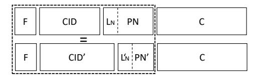

Conveniently for the attacker, the XOR between the mask and the packet number is easily malleable: by flipping the first two encrypted bits, the attacker can force the receiver to interpret the length differently. This yields an easy way to win the AE5 game: the attacker first calls  $\operatorname{Enc}(N,2,M,F||CID)$  then  $\operatorname{Dec}(N',C',F||CID||X)$  for each of the 256 possible values of the byte X, where N'=N[0..11] and C'=C[1..|C|]. One of the values of X will result in the correct AAD; hence A can return 0 if any of the decryptions succeeds (because of the mismatched N' length, the nonce of the decryption can work in the ideal variant).

Although this attack may be hard to exploit in practice, it raises the question of whether QUIC expects the peer connection ID to be authenticated by the TLS handshake. The specification does not state it as an explicit goal; however, some working group members argue that the authenticity of the connection IDs follows from their inclusion in headers authenticated through AAD. This claim is disputable: the CIDs are negotiated in the initial messages, whose keys are derived from public values. In draft 16, an active adversary can inject a retry message to force a client to change its destination CID. If the attacker tampers with one byte of CID, the attack succeeds with  $2^{-8}$  probability, which is practical on every packet.

We submitted these observations to the IETF, and proposed to concatenate the 2 bits of  $L_N$  with the 62-bit packet number when constructing the AEAD nonce. The goal of the change was to ensure that  $L_N$  is authenticated regardless of potential malleability issues in the formatting of the AAD headers. However, in draft 17, the implemented change was to move  $L_N$  to the least significant bits of the flags, which is sufficient to prove the security of the construction but requires the processing of the mask to depend on  $L_N$ .

The other weakness exploited by the attack is the ability for active adversaries to alter connection IDs. We argued [42] that the TLS handshake should guarantee agreement over the peer's connection IDs. In draft 14, a transport parameter was added to authenticate the client's initial destination CID. However, this fails to enforce agreement, as CIDs can change after a retry. After much pushback (related to the ability of network middleboxes to perform a retry on behalf of servers), the IETF eventually agreed [53] to authenticate all CIDs through TLS from draft 27, citing a previous draft of this paper.

**Improving the QUIC Construction** Although Theorem 1 provides useful guarantees, we are still concerned about weaknesses in the QPE construction:

• The authentication of  $L_N$  depends on the AAD security of the payload, which in turns depends on the

<span id="page-7-1"></span>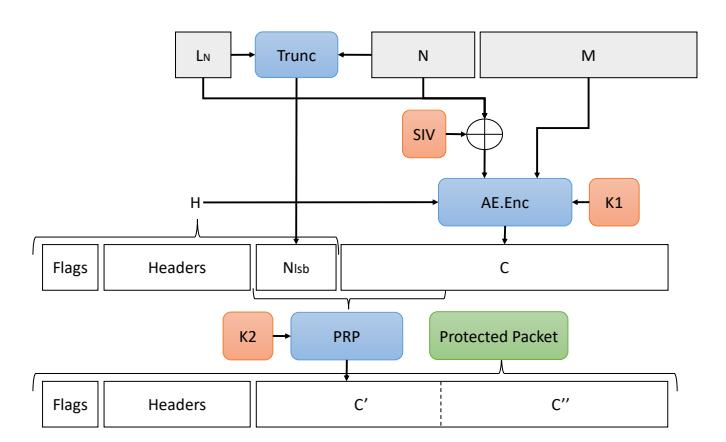

Fig. 6: Our proposed HN2-based construction for QPE

non-malleability of the formatting of QUIC headers. This is brittle in short headers, especially as some implementations may use unsafe representations of their CIDs, such as null-terminated strings.

- The construction collapses if the receiver uses the decrypted packet number before the successful decryption of the whole payload. While the QUIC specification explicitly forbids this behavior, we observe in practice that many implementations do not bother decrypting the payload if they know in advance that the decryption will fail. This shortcut provides a timing oracle to abuse the malleability of the XOR encryption of the packet number—allowing an attacker to do efficient range checks by flipping the last 2 bits of the flags.
- The construction is difficult to implement in constant time. Naive implementations first decrypt  $L_N$ , then truncate the rest of the mask to  $L_N$ .

Interestingly, Bellare et al. [11] propose another construction called HN2 (shown in Figure 13 in §A) that uses a block cipher (or pseudo-random permutation) instead of a PRF and an XOR. The idea of this construction is to encrypt with the block cipher the concatenation of the packet number and AEAD ciphertext.

We propose a variant of QPE based on HN2 in Figure 6. This variant makes it much more difficult for an adversary to selectively flip bits in the packet number. The security proof is also simpler, as the collision term is accounted for by the idealization of the PRP.

#### IV. VERIFIED CORRECTNESS AND SECURITY

<span id="page-7-0"></span>We contribute a reference implementation of the QUIC record layer and support it with machine-checked proofs of its intended functional and security properties, as described in  $\S III$ . Our verified specification, code, and proofs are done within the  $F^{\star}$  proof assistant.

#### <span id="page-7-2"></span>A. $F^*$ (review) and Initial QUIC Definitions

F\* is a language in the tradition of ML, equipped with dependent types and an effect system, which allows programmers to prove properties of their code. A popular flavor is proofs by refinement, wherein a complex *implementation* is shown to be functionally equivalent to a more concise, crisper *specification*. F\* relies on a weakest precondition calculus to construct proof obligations that can then be discharged using

a mixture of automated (via Z3 [26], an SMT solver), semiautomated (via user tactics), and manual proofs.

To execute an F\* program it must be *extracted* to OCaml or F#. If the run-time portions of a program fit within Low\*, a low-level subset of F\*, then the program can also be compiled to portable C code via a dedicated compiler, KreMLin [45]. This allows programmers to rely on the full power of F\* for proofs and specifications, knowing that they are erased at extraction-time: only executable chunks of code need to be in Low\*. The Low\* methodology has been successfully used by the HACL\* cryptographic library [55], the EverCrypt cryptographic provider [44], the EverParse verified parser library [46] and several others. We illustrate below some basic F\* concepts, using truncation and recovery of packet numbers as an example of how to author specifications in F\*. A subsequent section (§IV-D) dwells on Low\* implementations.

Truncated packet numbers occupy 1 to 4 bytes, depending on the user's choice. Packet numbers, once decoded and recovered, are in the range  $[0;2^{62})$ . The truncated-number length is included in the header as a two-bit integer, while packet numbers mandate a 62-bit integer. Both are defined as refinements of natural integers that capture their range:

```
type nat2 = n:nat\{n < 4\} type nat62 = n:nat\{n < pow2 62\}
```

One can define the upper bound on the value of a truncated packet number (named below "npn" for "network packet number") given the length of its encoding in bytes. To this end, we define bound\_npn, a function of a single argument pn\_len, using a let-binding.

```
let bound npn (pn len: nat2) = pow2 (8 * (pn len + 1))
```

Using these definitions, we define truncation as a function of the target length (in bytes) and the full packet number:

```
let truncate_pn (pn_len: nat2) (pn: nat62):
    npn:nat{
```

Undoing the truncation for incoming headers is more involved, since it is clearly not injective. Hence, QUIC uses an expansion operation whose correctness is guaranteed when the packet number to recover is within a window of width bound\_npn pn\_len centered on the maximal packet number received so far. We express it in F\* via the following predicate:

```
let in_window (pn_len:nat2) (max_pn:nat62) (pn:nat62) = let h = bound_npn pn_len in (max_pn+1 < h/2 \wedge pn < h) \vee (max_pn+1 \geq pow2 62 - h/2 \wedge pn \geq pow2 62 - h) \vee (max_pn+1 - h/2 < pn \wedge pn \leq max_pn+1 + h/2)
```

The first and second clauses of the disjunction shift the window when it under- or overflows the interval  $[0,2^{62})$ . Proving the correctness of packet number expansion revealed two errors in the IETF reference implementation [36, Appendix A]: an off-by-one in the third case, and an overflow in the second case. Both are fixed in draft 24 following our report. Below, we give the types of the patched function and its verified inverse property, which ensures it returns the full packet number if it is within the window.

```
val expand_pn : pn_len:nat2 →
max_pn:nat{max_pn+1 < pow2 62} →
npn:nat{npn < bound_npn pn_len} →
pn:nat62{in_window pn_len max_pn pn}
val lemma_parse_pn_correct : pn_len:nat2 →
```

```
\label{eq:max_pn:nat} $\max_{pn+1 < pow2 \ 62} \to pn:nat62 \to Lemma (requires in_window pn_len max_pn pn) $$(ensures expand_pn pn_len max_pn (truncate_pn pn_len pn) = pn)$$
```

As expressed by the precondition of lemma\_parse\_pn\_correct, the sender must choose the value of pn\_len carefully for the predicate in\_window pn\_len max\_pn pn to hold, which in turn ensures npn will expand to the intended packet number. However, the sender cannot predict the exact value of max\_pn, which is the highest packet number received by the receiver. She can only know a range for this number: it must be greater than the last acknowledged packet number last\_min, and lower than the last sent packet number last\_max. To be certain that the chosen pn\_len will always lead to the intended expanded packet number pn, the sender must therefore ensure that for any value max\_pn∈[last\_min,last\_max], in\_window pn\_len max\_pn pn holds. This condition can be checked by the following function:

```
let in_all_windows (pn_len:nat2) (last_min last_max pn:nat62) : bool = let h = bound_npn pn_len in (pow2 62 - h \le pn \parallel last_max + 2 - h/2 \le pn) \&\& (pn \le h - 1 \parallel pn \le last_min + 1 + h/2)
```

We prove that this function has the intended behavior. The sender then simply has to pick the shortest pn\_len that passes this check. Doing so yields a function with the following signature

```
val decide_pn (last_min last_max pn:nat62)) : Pure (option nat2) (requires last_min \leq last_max) (ensures (function None \rightarrow \forall (pn_len:nat2). \neg (in_all_windows pn_len last_min last_max pn) I Some pn_len \rightarrow in_all_windows pn_len last_min last_max pn \land (\forall (pn_len^*:nat2{pn_len^* < pn_len}). \neg (in_all_windows pn_len last_min last_max pn))))
```

whose post-condition expresses that it returns the optimal (i.e. shortest) possible pn\_len. Note that there might not always exist a suitable one, for instance if the range [last\_min, last\_max] is too wide, in which case the function returns None.

# <span id="page-8-0"></span>B. $F^*$ Specification of Packet Encryption

We outline the remainder of our specification in a bottomup fashion, starting with parsers and serializers and leading to a high-level specification of packet encryption and decryption.

**Parsing** For parsing and serializing, we use and extend the EverParse framework [46]. EverParse is an existing combinator library for specifying, generating, and extracting verified parsers and serializers, written in F\*/Low\*. EverParse focuses on binary formats like those of QUIC, and extracts to zerocopy validators and serializers in C.

For this work, we extended EverParse with a notion of bit fields, which it previously lacked. This allowed us to express the variable-length encoding used by the QUIC spec within EverParse. We also expressed packet-number truncation and recovery using EverParse, which yielded a more concise and efficient proof of correctness.

We expressed the rest of packet-header parsing and serializing using EverParse combinators, yielding an automatic proof (i) of parser correctness, i.e., the parser and serializer are inverses of each other, and (ii) of injectivity, ensuring there is at most one possible binary representation of QUIC headers, given the packet number window and the choice of lengths of connection identifiers for short packets. To prove the

uniqueness of the binary representation, we needed to impose a minimum-length restriction on the representation of variablelength integers.

From Wire Formats to Abstract Headers Parsers and serializers operate on sequences of bytes (using the  $F^*$  type bytes), as well as vlbytes  $min\ max$ , an EverParse refinement of bytes of variable length  $\ell$  such that  $min \leq \ell \leq max$ , used below to represent connection IDs. At the boundary of EverParse-based specifications, we abstract over raw bytes and switch to high-level, structured values, using an inductive type with separate cases for long and short headers (reflecting the header format of Figure 3):

```
type header = | MLong: version: U32.t \rightarrow dcid: vlbytes 0 20 \rightarrow scid: vlbytes 0 20 \rightarrow spec: long_header_specifics \rightarrow header | MShort: spin: bool \rightarrow key_phase: bool \rightarrow dcid: vlbytes 0 20 \rightarrow packet_number_length: packet_number_length_t \rightarrow packet_number: uint62_t \rightarrow header
```

The type long\_header\_specifics, elided here, contains the encoded packet-number length, the truncated packet number, and the payload length, with a special case for retry packets. The remainder of our QUIC specifications, including formatting, parsing, as well as the correctness and injectivity lemmas rely on the high-level header type. We discuss our proof of the correctness of conversion between high-level and low-level header representations in §IV-C.

**Side-channel-Resistant Header Protection** Leveraging the header type above, we specify header protection, using a custom-built F\* library of specification helpers for manipulating byte sequences with binary operators. Further specification refinements are needed. For packet-number masking, we refine the initial specification into a more operational one that avoids a common implementation pitfall that results in a side-channel leak. We then verify the low-level implementation against the side-channel-free specification.

More precisely, our low-level implementation hides the packet number and the packet number length under abstract types for secret values, meaning that code cannot branch or access memory based on those values. Instead, for header parsing and protection removal, we first parse the public part of the header, without the packet number, with the protected bits of the first byte uninterpreted, so that parsing does not depend on the packet number or its length. Then, we hide those bits so as to remove their protection through constant-time masks. Then we both unprotect and read the packet number in a constant-time way by masking the first 4 bytes next to the public header (which start with the packet number) with a mask value computed in a constant-time way, proving that we only modify the packet number during protection removal. Finally, we expand the packet number using secret comparisons, constant-size masks and multiplications. Appendix B gives a flavor of such constant-time operations. The obtained expanded packet number is still secret, and we respect data abstraction throughout our implementation to ensure constant-time execution. Our initial specification does not reflect constant-time aspects, which makes the functional correctness proof of our implementation nontrivial.

Agile Cryptography The QUIC specification inherits a large

body of cryptographic primitives mandated by the TLS 1.3 standard: HKDF expansion and derivation, AEAD, and the underlying block ciphers for the packet-number mask.

Rather than rewrite this very substantial amount of specification, we reuse EverCrypt [44], an existing cryptographic library written in F\*/Low\*. EverCrypt specifies and implements all major cipher suites and algorithms, including HKDF for SHA2 and all major variants of AEAD (ChachaPoly, AES128-GCM, AES256-GCM).

Importantly, EverCrypt offers agile, abstract specifications, meaning that our QUIC specification is *by construction* parametric over the algorithms chosen by the TLS negotiation. Lemmas such as lemma\_encrypt\_correct (§IV-C) are parameterized over the encryption algorithm ("ea"), and so is our entire proof. This means our results hold for *any* existing or future AEAD algorithm in EverCrypt.

EverCrypt uses a simple model for side-channel resistance where any data of type bytes is secret; our QUIC spec uses information-flow labels instead to distinguish plain texts and cipher texts. We omit these technicalities.

#### <span id="page-9-0"></span>C. Functional Correctness Properties

We have proven F\* lemmas showing that our specification (and hence, our verified implementation described in §IV-D) of the draft 30 specification has the expected properties, including:

- 1) correctness of packet-number decoding (§IV-A);
- 2) correctness and injectivity of header parsing;
- 3) correctness of header and payload decryption for packets.

We elaborate on the latter two proofs below. In the process of developing these proofs, we uncovered several issues with the current IETF draft. For example, as described in §IV-A, while specifying packet-number recovery, we discovered that the QUIC draft omits an overflow condition on the window size. We also demonstrated that the whole QUIC specification is parameterized over destination connection ID lengths, meaning that non-malleability depends on proper authentication of connection IDs. We have proposed simple fixes, notably embedding the length  $L_N$  of the truncated packet number into the AEAD nonce (§III-D).

**Header Parsing Proofs** First, header parsing is correct, meaning that parse\_header inverts format\_header.

```
val lemma_header_parsing_correct: ... → Lemma (parse_header cid_len last (format_header (append h c)) = Success h c))
```

For safety reasons [46], parsers should also be injective (up to failure). The parse\_header function enjoys this property but only for a given connection-ID length.

```
val lemma_header_parsing_safe: ... → Lemma (requires ... ∧ parse_header cid_len last b1 = parse_header cid_len last b2) (ensures parse header cid_len last b1 = Failure ∨ b1 = b2)
```

**Encryption Correctness** Based on our parsing correctness lemma, we can prove the correctness of packet encryption. Our proof is based on an intermediate lemma about header encryption, and uses the idempotence property of XOR and the functional correctness lemma of EverCrypt's specification of AEAD.

```
val lemma_encrypt_correct:
 a:ea (∗ the AE algorithm negotiated by TLS ∗) →
 k:lbytes (ae_keysize a) (∗ the main key for this AE algorithm ∗) →
 siv: lbytes 12 (∗ a static IV for this AE algorithm ∗) →
 hpk: lbytes (ae_keysize a) (∗ the header key for this AE algorithm ∗) →
 h: header (∗ Note the condition on the CID length below ∗) →
 cid_len: nat {cid_len ≤ 20 ∧ (MShort? h ⇒ cid_len = dcid_len h)} →
 last: nat{last+1 < pow2 62 } →
 p: pbytes' (is_retry h) { has_payload_length h ⇒
   U64.v (payload_length h) == length p + AEAD.tag_length a } →
 Lemma (requires is_retry h ∨ in_window (pn_length h − 1) last (pn h))
(ensures decrypt a k siv hpk last cid_len
  (encrypt a k siv hpk h p) = OK h p)
```

The final lemma is rather verbose due to the number of parameters and conditions, but merely states that decrypt inverts encrypt. It explicitly inherits all limitations of previouslydefined functions: the window condition for packet-number decoding, and the need to provide the correct length of the connection ID.

# <span id="page-10-1"></span>*D. Low-Level Record-Layer Implementation*

We now briefly describe the low-level implementation of our QUIC record layer, leveraging both the EverCrypt and EverParse libraries. We follow the proof by refinement methodology ([§IV-A\)](#page-7-2) and show that our Low? implementation is functionally equivalent to the specification above ([§IV-B\)](#page-8-0). By virtue of being written in Low? , the code is also memory-safe and these guarantees carry over to the extracted C code [\[45\]](#page-15-18). [§VI](#page-13-0) reports code statistics and performance.

Overview Verifying code in Low? differs greatly from authoring specifications ([§IV-B\)](#page-8-0). First, all computations must be performed on machine integers, meaning that computations such as in\_window must be rewritten to avoid overflowing or underflowing intermediary sub-expressions — a common source of pitfalls in unverified code. Second, all sequencemanipulating code must be rewritten to use arrays allocated in memory. This requires reasoning about liveness, disjointness and spatial placement of allocations, to prevent runtime errors (e.g. use-after-free, out-of-bounds access).

Parsers Our specification of message formats is expressed using the EverParse library. Just like for specifications, we have extended EverParse's low-level parsers and serializers with our new features (bounded integers; bitfields), and we have written low-level, zero-copy parsers and serializers for QUIC message formats directly using the EverParse library. We unfortunately were unable to use the front-end language for EverParse, dubbed QuackyDucky [\[46\]](#page-15-19), resulting in substantial manual effort; we hope future versions of the tool will capture the QUIC format.

Internal State Our QUIC library follows an established pattern [\[44\]](#page-15-11) that revolves around an indexed type holding the QUIC state. This state is kept abstract from verified clients and, interestingly, from C clients as well, using an incomplete struct type to enforce C abstraction. Clients do not know the size of the C struct, meaning that they cannot allocate it and are forced to go through the allocation function we provide. We go to great lengths to offer idiomatic C-like APIs where functions modify out-params and return error codes, which requires extra memory reasoning owing to the double indirection of the out parameters.

Encryption and Decryption When called, encrypt outputs the

encrypted data and the freshly-used packet number into two caller-allocated out-params. The decrypt function fails if and only if the spec fails, consumes exactly as much data as the spec, and when it succeeds, fills a caller-allocated struct. To maximize performance, our decryption implementation operates in-place and performs no allocation beyond temporaries on the stack.

# <span id="page-10-0"></span>*E. Type-Based Cryptographic Security Proofs*

In this section, we review the methodology of typebased cryptographic security proofs [\[16\]](#page-15-20), [\[33\]](#page-15-21), [\[14\]](#page-15-12), which underpins our formal F? proof of Theorem 1. Game-based indistinguishability definitions can be captured by *idealized interfaces*, which define the precise signature of each oracle in the game, including all adversarial restrictions (such as forbidding nonce reuse). Such interfaces are parameterized by a Boolean b (called the idealization flag), which corresponds to the secret bit that the adversary must guess in the game. As an example, consider the AE1<sup>b</sup> game: as shown below, we represent instances using an abstract type key, which is implemented as a concrete key k if b is false, or a table T that maps triples of nonce, ciphertext and additional data to plaintexts when b is true. We index instances with an id type, and we let the adversary select which instances are honest and which are corrupt (at creation time) by conditioning idealization on a safety predicate let safe (i:id) = honest i && b.

```
(∗ AE1: Idealized Interface ∗)
abstract type key (i:id)
val ideal: #i:id{safe i} → key i →
 map (nonce × cipher × header) (plain i)
val real: #i:id{¬ (safe i)} → key i → lbytes klen
val keygen: i:id{fresh i} → ST (key i)
 (ensures fun mem0 k mem1 → safe i ⇒ ideal k mem1 = ∅)
val encrypt: #i:id → k:key i →
 n:nonce → h:header → p:plain i → ST cipher
 (reauires fun mem0 → fresh_nonce k mem0 n)
 (ensures fun mem0 c mem1 →
   if safe i then ideal k mem1 == extend (ideal k mem0) (n,c,h) p
   else c == Spec.AEAD.encrypt (real k) n h p)
val decrypt: #i:id → k:key →
 n:nonce → h:header → c:cipher → ST (option plain)
 (ensures fun mem0 r mem1 →
   if safe i then r == lookup (ideal k mem0) (n,c,h)
   else r == Spec.AEAD.decrypt (real k) n h c)
```

The interface declares keys as abstract, hiding both the real key value and the ideal table. Non-ideal instances are specified using a pure functional specification of Spec.AEAD. The security of ideal instances is specified based on the ideal state. For instance, decryption only succeed if an entry was added in the table for the given nonce, ciphertext and additional data, which guarantees plaintext integrity.

To model confidentiality, the idea is to rely on type parametricity of idealized plaintexts. The intuition is to prove that the ideal implementation of encryption and decryption never access the actual representation of the plaintext, by making the type of plaintext abstract (conditionally on safety). This guarantees that ideal plaintexts are perfectly (i.e. information theoretically) secure. In practice, we want to allow the same functionality to be used for different types of plaintexts (for instance, QUIC also uses AEAD to encrypt resumption tokens, which have different contents than packet payloads). Hence, we parameterize instances by a plaintext package, which is a record that defines an abstract type of plaintexts plain i, with

<span id="page-11-1"></span>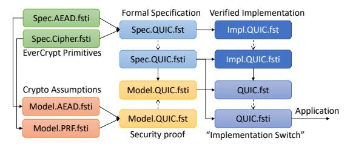

Fig. 7: Integrated security model and verified implementation. In F? , an 'fsti' file is an interface for the corresponding 'fst' file, similar to a '.h' and '.c' files in C.

functions that allow access to their concrete byte representation at the specification level only (as\_bytes, using the ghost effect of F? ), or concretely when ¬ (safe i) (repr for real encryption).

The main class of proofs that can be made in F? is perfect reductions (or perfect indistinguishability steps), which show that given a set of idealized interfaces (code assumptions), it is possible to implement derived idealized functionalities, whose advantage is bounded by the sum of the advantages of the code assumptions. For the proof of Theorem 1, we use AE1 and the PNE functionality below as our code assumptions. Appendix [III-C](#page-6-1) shows the corresponding game and reduction to PRF security.

```
(∗PNE: Idealized Interface ∗)
abstract type key (i:id)
val ideal: #i:id{safe i} → key i →
  map sample (l:pn_len, pn i l, mask)
val real: #i:id{¬ (safe i)} → key i → lbytes klen
val keygen: i:id{fresh i} → ST (key i)
 (ensures fun mem0 k mem1 → safe i ⇒ ideal k mem1 = ∅)
val encrypt: #i:id → k:key i → l:pn_len → n:pn i l → s:sample →
 ST cipher
 (requires fun mem0 → safe i ⇒ fresh_sample s st mem0)
 (ensures fun mem0 c mem1 →
   if safe i then ∃ (c': mask).
    ideal k mem1 == extend (ideal k mem0) s (l,s,c') ∧
    c == truncate (c' xor (format ln n)) l
   else c == pnenc (real k) l (repr pn) s)
val decrypt: #i:id → k:key i → c:cipher → s:sample → ST (pn i)
 (ensures fun mem0 p mem1 →
   if safe i then
    ∃ (l, n, c'). lookup (ideal k) s mem1 = Some (n, c) ∧
    as_bytes p == truncate (c' xor (header c)) l
   else c == 'pndec (real k) c s)
```

## *F. Verified Implementation Correctness and Security*

As shown in Figure [7,](#page-11-1) our implementation of the idealized interface for the QUIC record layer (Model.QUIC) uses our high-level specification (Spec.QUIC) in the real case (when b=0). However, we would like to extend the security guarantees to the low-level implementation (Impl.QUIC). This is accomplished with a technique we call an *implementation switch*, that replaces the call to the high-level security model with the low-level implementation. This idealization step also appears in related verification work [\[2\]](#page-14-0), [\[3\]](#page-14-1). It is justified because we verify (by typing) that both stateful implementations comply with the same full functional specification (Spec.QUIC).

The adversary for this step is much more powerful than in usual cryptographic games, because it can observe timing and memory access patterns in addition to the input/output behavior of the function. We assume that the execution of specification code is not observable, while the timing and memory access patterns of the low-level code are. EverCrypt guarantees by typing that the low-level secret inputs are abstract, which we inherit in our record implementation. Hence, for instance for packet encryption, QUIC.fst implements the switch to our specification-based model by calling lowlevel packet encryption on dummy inputs instead of the secret input parameters. Since (by typing) the low-level side effects do not depend on those secrets, this produces the same effects as calling low-level packet encryption with the real parameters. It then computes the ciphertext by calling the model on the high-level representation of the low-level inputs (i.e., arrays and machine integers are replaced by sequences and mathematical integers), and overwriting the low-level output with the resulting value. Since both the model and low-level implementation share the same full functional specification, and since the observable side-effects are independent of secret inputs, the switch is indistinguishable to the adversary.

We outline below the implementation of encrypt in QUIC.fst. When idealization is off, this code implements the same low-level interface as Impl.encrypt, irrespective of the model flag. When idealization is on, it provides the same security guarantees as the high-level model, since this code can be included in the attacker against QPE in Theorem [1.](#page-5-0) Notice that the private state for packet encryption has a type that depends on model, so that it carries either the the high-level model state or the low-level implementation state. In encrypt, the else branch simply forwards the call to the implementation. The model branch instead first calls the implementation on stack-allocated dummies, then extracts high-level input values from the low-level input buffers, calls the model, and finally stores the resulting cipher in the output buffer.

```
private type state i =
 if model then Model.state i else Impl.state i
let encrypt #i (s:state i) header plain_len plain cipher =
 if model then (
   let dummy_state: Impl.state i = alloca(...) in
   let dummy_plain = Plain.zero plain_len in
   Impl.encrypt #i dummy_state header plain_len dummy_plain cipher
   let header' = parse_header header in
   let plain' = Plain.buffer_to_bytes plain_len plain in
   let cipher' = Model.encrypt s header' plain' in
   Buffer.store_bytes cipher' cipher )
 else
   Impl.encrypt #i s header plain_len plain cipher
```

Summary of implementation security claims After extraction, our code enforces constant time decryption of the packet headers regardless of the packet number encoding size L<sup>N</sup> and whether the decryption succeeds or fails. This prevents an active attacker from inferring the relative position of the packet in the window by successively flipping the least significant bits of the encrypted packet number, a weakness that we observe in other implementations. We also enforce abstraction over the contents of the packets, which guarantees constant time decryption of all packets of a given length. By padding all packets up to the MTU, the QUIC transport can enforce fully constant time processing of all encrypted packets using our record layer implementation.

## V. OUR QUIC REFERENCE IMPLEMENTATION

<span id="page-11-0"></span>To evaluate if our verified record layer ([§IV\)](#page-7-0) satisfies the needs of the QUIC protocol, we have developed a provablysafe reference implementation of QUIC (draft 24) on top of the record layer. We have also developed an example server

<span id="page-12-0"></span>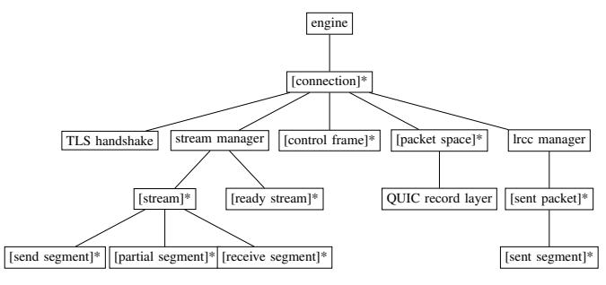

Fig. 8: (Simplified) Hierarchy of Structures in our QUIC protocol logic, which utilizes the TLS handshake and QUIC record layer. [X]\* represents a repetition of structure X, via a doubly-linked list, array, extendable vector, or sequence.

and client that utilize our implementation to perform secure file transfers.

## *A. Implementation Overview*

Our prototype consists of three modules – the TLS handshake, the QUIC record layer, and the QUIC protocol logic. The TLS handshake is based on prior verified TLS work [\[17\]](#page-15-10) but has been updated to perform the TLS 1.3 handshake; it provides symmetric keys for bulk data transfer. These keys are used by our QUIC record layer ([§IV\)](#page-7-0), which handles the encryption and decryption of QUIC traffic, as well as packetlevel parsing/serialization. Using these two modules, the QUIC protocol logic implements the rest of the protocol, including for example, connection and stream management. This module is verified for safety, laying the groundwork for functional correctness in the future.

Our prototype's API is compliant with draft 30 of IETF QUIC. More specifically, it allows an application to interact with connections and streams as follows: open a connection as a client; listen for connection as a server; control and configure various resources such as number of permitted streams; and open/close a stream; write to/read from a stream.

# *B. The QUIC Protocol Logic Module*

The QUIC protocol logic implements stream multiplexing, connection management, frame decoding/encoding, loss recovery, congestion control, and other functionality required by the IETF QUIC standard. Our implementation is centered around the various structures in Figure [8.](#page-12-0) The engine represents a prototype instance that manages connection instances (a client instance contains one connection; a server instance contains zero or more, depending on the number of connected clients). A connection contains multiple stream instances. It manages stream multiplexing, loss recovery, and the interactions with the TLS handshake and QUIC record layer. Finally, the stream maintains the sending/receiving states of a stream. Each structure contains many other supporting structures.

Our QUIC protocol logic is verified for memory safety, type safety, termination, and the absence of integer overflows. This prevents, e.g., buffer overflows, type-safety flaws, useafter-free, and null-pointer accesses. We also prove correctness of some key data structures, e.g., a doubly-linked list and an expandable array.

Although the other modules in our reference implementation are written and verified in F? , we write and verify our QUIC protocol logic in Dafny [\[39\]](#page-15-22), an imperative, objectedoriented verification language. While F? 's higher-order, MLinspired design is convenient for reasoning about cryptographic properties, the QUIC protocol logic primarily manages stateful data structures in a classically imperative fashion, which better matches Dafny's design. Indeed, in an early phase of this project, it required several person-months to implement and verify a generic doubly-linked list library in F? , while it required only three hours to do so in Dafny. Dafny was better able to handle multiple heap updates and the complex invariants needed to prove and maintain correctness.

To support the compilation of our QUIC protocol logic, we have extended Dafny to add a C++ backend. C++ offers multiple benefits. First, it simplifies integration with the C code compiled from the F? code of the other two modules. Second, it enables performance optimizations that are harder to realize in Dafny's higher-level backends for C#, Java, JavaScript, or Go. Finally, C++ (as opposed to C) is a convenient compilation target for Dafny, since it includes a standard collections library, support for reference-counted smart pointers, and platform agnostic threading.

Our development includes ∼500 lines of trusted Dafny code modeling the effects of calls to the other two modules; the pre- and post-conditions are carefully matched with their F? implementations. We model calls to the underlying OS (e.g., for UDP) similarly.

## *C. Proof Challenges and Techniques*

We briefly summarize our overall proof strategy, challenges we encountered, and techniques for coping with those challenges. To prove the safety of our QUIC protocol logic, we establish and maintain validity invariants throughout our codebase. Specifically, for each structure used in the code, we define a valid predicate, which ensures that structure's safety.

Structures lower in the hierarchy (Figure [8\)](#page-12-0) mostly contain only primitive types. Hence, we define validity directly through type refinement. For example, to represent a frame of data in a stream, we use a frame datatype, which stores a byte array, a length, and an offset into the stream. A type refinement on the datatype ensures the array is not null, that the length is accurate, and that the length plus the offset will not cause an integer overflow.

Structures higher in the hierarchy contain nested substructures, which complicates our validity definitions. These now need to ensure: (i) validity of all substructures, (ii) the disjointness of substructures. For example, a stream manages the receive/send buffers through multiple doubly-linked lists, all of which must be valid. Further, these lists should not be aliased, which also means the nodes of the lists must be completely disjoint.

A standard technique used to handle such complex data structure reasoning is to maintain, in parallel to the actual data, a "ghost" representation (i.e., one used only for proof purposes and that will not appear in the compiled code). The ghost representation is typically a set of all substructures. This facilitates a succinct invariant about the disjointness of each member of the set, and it allows the parent data structure

<span id="page-13-1"></span>

| Modules                            | LoC    | Verif. | C/C++ LoC |
|------------------------------------|--------|--------|-----------|
| Verified Record Layer (§IV)        |        |        |           |
| QUIC.Spec.*                        | 5,463  | 5m12s  | -         |
| QUIC.Impl.*                        | 5,509  | 6m32s  | 4,640     |
| QUIC.Model.*                       | 1,751  | 3m12s  | -         |
| LowParse.Bitfields.*               | 2,011  | 1m29s  | _         |
| LowParse.Bitsum.*                  | 2,502  | 2m05s  | -         |
| Total                              | 9,836  | 16m30s | -         |
| QUIC Reference Implementation (§V) |        |        |           |
| Connection mgmt                    | 4,653  | 14m12s | -         |
| Data Structures                    | 651    | 9s     | -         |
| Frame mgmt                         | 1,990  | 1m50s  | -         |
| LR & CC                            | 758    | 11s    | _         |
| Stream mgmt                        | 1,495  | 3m25s  | -         |
| Misc                               | 118    | 2s     | _         |
| FFI                                | 558    | 9s     | 1461      |
| Server & Client                    | -      | -      | 648       |
| Total                              | 10.223 | 19m46s | 2,109     |

Fig. 9: Summary of our verified codebase

to define its ghost representation simply as the union of its children's ghost representations. Unfortunately, we found that data structures containing four or more nested structures (e.g., the connection object) quickly overwhelmed the Dafny verifier. The underlying challenge appears to be the complex set reasoning which arises from needing to repeatedly flatten sets-of-sets-of-objects into sets-of-objects.

Ultimately, we take advantage of Dafny's ability to do type-based separation, i.e., to define types that are known to be incomparable. Rather than homogenizing the distinct sub-structures into a single object-based representation, we maintain ghost representations of each distinct type. This requires additional proof annotations, but it makes the verifier's reasoning about validity much simpler, since non-aliasing of instances of different class is "free".

Even with the aforementioned discipline, any mutation of subcomponents (however deep) requires reproving the validity of all layers above it. Hence we carefully structure our code in multiple layers: the innermost performs the actual mutation, and the outer layers simply expose these changes at higher and higher levels.

A final technique we employ is the careful use of immutability. Immutable data structures simplify proof reasoning, since any immutable value is independent of the state of the heap, and thus will remain valid regardless of how the heap changes. On the other hand, used indiscriminately, immutability imposes a performance cost due to excessive data copies.

To balance these concerns, we typically use immutable structures at lower levels and mutable types elsewhere. This simplifies reasoning at the upper levels (which are already quite complex) without unduly hurting performance, since the upper levels can manipulate, say, linked lists of immutable lower-level structures, avoiding unnecessary copies. Even at the lower levels, we sometimes find it convenient to keep a structure in a mutable form while constructing it (e.g., while reading from a stream), and then "freeze" it in an immutable form to simplify reasoning. Since these data structures are not subsequently mutated, we lose little performance.

<span id="page-13-2"></span>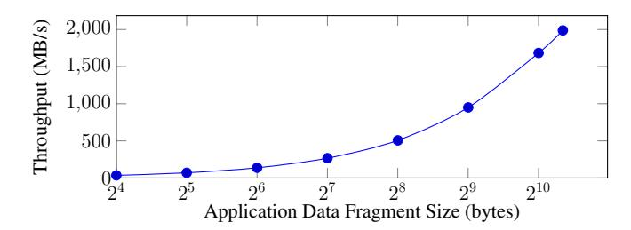

Fig. 10: Record-layer performance: throughput of encryption/decryption of packets with various fragment sizes.

#### VI. EVALUATION

<span id="page-13-0"></span>We first evaluate the effort required to build and verify our QUIC reference implementation. Next, we measure the performance of our record layer, the main focus of our work. Finally, while the main goal of our verified-safe protocol logic is to demonstrate that our record layer suffices to implement QUIC, we also, as a point of comparison, evaluate the overall performance of our QUIC prototype. To ensure a fair comparison with other implementations, we evaluate with QUIC draft version 30, rather than our proposed improvement (Figure 6), which would simplify the implementation and proof. We perform all of these measurements on a Linux desktop with an Intel i9-9900k processor with 128GB memory. When measuring on the network, we connect to a Linux desktop with the same configuration over a 1 Gigabit Ethernet LAN.

## A. Verification Effort

Table 9 summarizes the size and verification time for our verified components. Overall, our record layer consists of about 10K lines of  $F^*$  code, which extract to  $\sim$ 6K lines of C. A significant portion of this total consists of extensions to the EverParse libraries to support the bit-level combinators that describe header formats. Our verifiably-safe implementation of the QUIC protocol logic consists of 10K lines of Dafny code, which compiles to  $\sim$ 13K lines of C++. Additionally, we have  $\sim$ 800 lines of trusted C++ code to connect the record layer and the protocol logic, and another  $\sim$ 700 lines of trusted C++ code to connect the protocol logic to the underlying OS platform (shown collectively as FFI in the table).

Overall, we estimate that about 20 person-months went into this effort, which includes the overhead of training multiple new team members on our tools, methods, and QUIC.

## B. QUIC Record Layer

Our core contribution, the QUIC record layer, performs full stateful encryption/decryption of packets, including header processing and protection. To evaluate its performance, we measure the application data throughput for varying packet-content sizes.

Figure 10 shows our results. At the typical MTU (1300 bytes), our implementation supports 1.98 GB/s of QUIC application data, which is  $\sim$ 2.4 times slower than raw AEAD.

## C. File Transfer Performance

To evaluate the overall performance of our QUIC reference implementation, we use it to transfer files over the network, ranging in size from 512KB to 2GB, and measure throughput,

<span id="page-14-2"></span>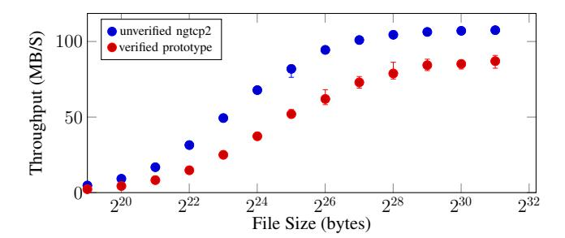

Fig. 11: QUIC prototype performance: comparison of file transfer throughput with ngtcp2 on a 1 Gbps LAN.

comparing against an unverified baseline There are many unverified implementations of QUIC in various languages; we picked ngtcp2[54] as our baseline because it is a popular and fast implementation written in C++. Using a C++ baseline avoids performance differences due to differing runtimes. Figure 11 shows our results. Unsurprisingly, our implementation is slower than the carefully optimized ngtcp2. We confirm that interoperability between our implementation and ngtcp2, which validates the faithfulness of our formal specification. On smaller file sizes, our prototype is about twice as slow, but on large ones, it only lags by  $\sim 21\%$ . Profiling shows this is largely due to our naïve coarse-grained locking strategy, which we plan to refine.

#### VII. RELATED WORK

Some papers attempt to model the security of Google OUIC [30], but the results available for IETF OUIC are more limited [22]. QPE is one of many extensions of nonce-based authenticated encryption with additional data [48]. The use of AEAD to build stateful encryption [19], [49], stream-based channels [32], and concrete applications to protocols such as the TLS record layer [14], [20] or SSH [10] have been extensively studied. However, an important goal of the current OUIC packet encryption construction is nonce confidentiality. which is achieved by keeping some of the nonce implicit (an idea that appeared in the CAESAR competition, and received a proposed security definition [41]) and encrypting the explicit part, for which several related constructions have been proposed with security proofs [11]. Our work combines these results with the modular type-based verification method for cryptographic proofs of Fournet et al. [33] to create an efficient verified implementation, building on the verified EverCrypt [44] crypto library. An important limitation of the methodology is that only perfect indistinguishability steps can be mechanically verified. Other tools, notably EasyCrypt [6], have relational semantics that can reason about advantages in game hops, and have been used to fully prove the security of complex constructions such as RSA-OAEP [1]. However, writing fast implementations is more difficult in EasyCrypt. The preferred approach for implementation security has been to use general-purpose C verification tools and prove the security of an extracted model [28], in contrast to our implementation switching strategy based on a shared specification.

We stress that the scope of our security analysis is limited to the QUIC record layer, which is insufficient to conclude that QUIC is a safe authenticated secure channel protocol. In contrast, considerable work has gone towards proving that TLS 1.3 provides a secure channel. For example, Dowling et al. [27] present a detailed cryptographic model of the handshake; Bhargavan et al. [13] present a computational model verified in CryptoVerif; and Cremers et al. [25] present a symbolic model verified in Tamarin. These are recent instances of the broader field of tool-assisted security proofs for cryptographic protocols and their implementations [29], [23], [5], [8], [34], [35], [7]. Readers can refer to the surveys of Barbosa et al. [4], Blanchet [18] and Cortier et al. [24].

#### VIII. CONCLUSIONS

This paper is the first step towards a provably secure and safe implementation of the IETF standard QUIC protocol. Despite some weaknesses, we have proved the security of QUIC packet encryption construction and built the first high-performance, low-level implementation with proofs of correctness, runtime safety, and security. We have also built a safe implementation of the QUIC transport on top of our verified packet encryption component and the verified miTLS handshake. Our next steps are to write a functional specification of the transport and verify the correctness of our implementation, integrate the TLS handshake security model with the record layer, and expose an idealized interface to the QUIC transport that captures application data stream security [32].

#### ACKNOWLEDGEMENTS

Work at CMU was supported in part by grants from a Google Faculty Fellowship, the Alfred P. Sloan Foundation, the Department of the Navy, Office of Naval Research under Grant No. N00014-17-S-B001, and the National Science Foundation and VMware under Grant No. CNS-1700521. We thank Felix Günther, Markulf Kohlweiss, and the anonymous reviewers for their feedback. We thank Christopher Wood, Martin Thompson, and other members of the IETF QUIC working group for supporting our proposals and helping with the organization of the QUIC Security & Privacy workshop. Barry Bond contributed the inital QUIC F\* prototype. We also thank Nick Banks for integrating and testing earlier versions of this work with MsQuic.

## REFERENCES

- <span id="page-14-4"></span> J. B. Almeida, M. Barbosa, G. Barthe, and F. Dupressoir, "Certified computer-aided cryptography: Efficient provably secure machine code from high-level implementations," in *Computer & Communications* Security, ser. CCS '13. ACM, 2013, p. 1217–1230.
- <span id="page-14-0"></span>[2] —, "Verifiable side-channel security of cryptographic implementations: Constant-time MEE-CBC," in 23rd International Conference on Fast Software Encryption, FSE 2016, 2016, pp. 163–184.
- <span id="page-14-1"></span>[3] J. B. Almeida, C. Baritel-Ruet, M. Barbosa, G. Barthe, F. Dupressoir, B. Grégoire, V. Laporte, T. Oliveira, A. Stoughton, and P.-Y. Strub, "Machine-checked proofs for cryptographic standards: Indifferentiability of sponge and secure high-assurance implementations of sha-3," in *Proceedings of the 2019 ACM SIGSAC Conference on Computer and Communications Security*, ser. CCS '19. New York, NY, USA: Association for Computing Machinery, 2019, p. 1607–1622. [Online]. Available: https://doi.org/10.1145/3319535.3363211
- <span id="page-14-6"></span>[4] M. Barbosa, G. Barthe, K. Bhargavan, B. Blanchet, C. Cremers, K. Liao, and B. Parno, "SoK: Computer-aided cryptography," in 2021 Symposium on Security and Privacy. IEEE (to apprear), 2021.
- <span id="page-14-5"></span>[5] G. Barthe, S. Belaïd, G. Cassiers, P.-A. Fouque, B. Grégoire, and F.-X. Standaert, "Maskverif: Automated verification of higher-order masking in presence of physical defaults," in *European Symposium on Research in Computer Security (ESORICS)*. Springer, 2019, pp. 300–318.
- <span id="page-14-3"></span>[6] G. Barthe, F. Dupressoir, B. Grégoire, C. Kunz, B. Schmidt, and P.-Y. Strub, EasyCrypt: A Tutorial. Springer, 2014, pp. 146–166.

- <span id="page-15-37"></span>[7] G. Barthe, B. Grégoire, and V. Laporte, "Secure compilation of sidechannel countermeasures: the case of cryptographic "constant-time"," in *Computer Security Foundations (CSF)*. IEEE, 2018, pp. 328–343.
- <span id="page-15-34"></span>[8] A. G. Bayrak, F. Regazzoni, D. Novo, and P. Ienne, "Sleuth: Automated verification of software power analysis countermeasures," in *Workshop on Cryptographic Hardware and Embedded Systems*. Springer, 2013, pp. 293–310.
- <span id="page-15-15"></span>[9] M. Bellare, F. Günther, and B. Tackmann, "Two-tier authenticated encryption: nonce hiding in QUIC," [https://felixguenther.info/talks/quips\\_](https://felixguenther.info/talks/quips_ttae2020-02-23.pdf) [ttae2020-02-23.pdf,](https://felixguenther.info/talks/quips_ttae2020-02-23.pdf) 2020.
- <span id="page-15-27"></span>[10] M. Bellare, T. Kohno, and C. Namprempre, "Breaking and provably repairing the SSH authenticated encryption scheme: A case study of the Encode-Then-Encrypt-and-MAC paradigm," *ACM Trans. Inf. Syst. Secur.*, vol. 7, no. 2, p. 206–241, May 2004. [Online]. Available: <https://doi.org/10.1145/996943.996945>
- <span id="page-15-7"></span>[11] M. Bellare, R. Ng, and B. Tackmann, "Nonces are noticed: AEAD revisited," in *Advances in Cryptology – CRYPTO 2019*, A. Boldyreva and D. Micciancio, Eds. Cham: Springer International Publishing, 2019, pp. 235–265.
- <span id="page-15-13"></span>[12] M. Bellare and P. Rogaway, "The security of triple encryption and a framework for code-based game-playing proofs," in *Advances in Cryptology – EUROCRYPT 2006*, 2006, pp. 409–426.
- <span id="page-15-30"></span>[13] K. Bhargavan, B. Blanchet, and N. Kobeissi, "Verified models and reference implementations for the TLS 1.3 standard candidate," in *2017 IEEE Symposium on Security and Privacy (SP)*, May 2017, pp. 483– 502.
- <span id="page-15-12"></span>[14] K. Bhargavan, A. Delignat-Lavaud, C. Fournet, M. Kohlweiss, J. Pan, J. Protzenko, A. Rastogi, N. Swamy, S. Zanella-Béguelin, and J. K. Zinzindohoué, "Implementing and proving the TLS 1.3 record layer," in *2017 Symposium on Security & Privacy*. IEEE, 2017.
- <span id="page-15-2"></span>[15] K. Bhargavan, A. Delignat-Lavaud, C. Fournet, A. Pironti, and P.- Y. Strub, "Triple handshakes and cookie cutters: Breaking and fixing authentication over TLS," in *2014 IEEE Symposium on Security and Privacy*, 2014, pp. 98–113.
- <span id="page-15-20"></span>[16] K. Bhargavan, C. Fournet, R. Corin, and E. Zalinescu, "Cryptographically verified implementations for TLS," in *ACM Computer and Communications Security*, ser. CCS '08. New York, NY, USA: ACM, 2008, pp. 459–468.
- <span id="page-15-10"></span>[17] K. Bhargavan, C. Fournet, M. Kohlweiss, A. Pironti, and P. Strub, "Implementing TLS with verified cryptographic security," in *2013 IEEE Symposium on Security and Privacy*, 2013, pp. 445–459.
- <span id="page-15-38"></span>[18] B. Blanchet, "Security protocol verification: Symbolic and computational models," in *Principles of Security and Trust (POST)*. Springer, 2012, pp. 3–29.
- <span id="page-15-24"></span>[19] A. Boldyreva, J. P. Degabriele, K. G. Paterson, and M. Stam, "Security of symmetric encryption in the presence of ciphertext fragmentation," in *EUROCRYPT 2012*, D. Pointcheval and T. Johansson, Eds. Berlin, Heidelberg: Springer Berlin Heidelberg, 2012, pp. 682–699.
- <span id="page-15-26"></span>[20] C. Boyd, B. Hale, S. F. Mjølsnes, and D. Stebila, "From stateless to stateful: Generic authentication and authenticated encryption constructions with application to tls," in *CT-RSA 2016*, K. Sako, Ed. Cham: Springer International Publishing, 2016, pp. 55–71.
- <span id="page-15-14"></span>[21] C. Brzuska, A. Delignat-Lavaud, C. Fournet, K. Kohbrok, and M. Kohlweiss, "State separation for code-based game-playing proofs," in *ASIACRYPT 2018*, ser. Lecture Notes in Computer Science, vol. 11274. Springer, 2018, pp. 222–249.
- <span id="page-15-23"></span>[22] S. Chen, S. Jero, M. Jagielski, A. Boldyreva, and C. Nita-Rotaru, "Secure communication channel establishment: TLS 1.3 (over TCP fast open) vs. QUIC," in *ESORICS 2019*, K. Sako, S. Schneider, and P. Y. A. Ryan, Eds. Springer International Publishing, 2019, pp. 404–426.
- <span id="page-15-33"></span>[23] A. Chudnov, N. Collins, B. Cook, J. Dodds, B. Huffman, C. Mac-Cárthaigh, S. Magill, E. Mertens, E. Mullen, S. Tasiran *et al.*, "Continuous formal verification of Amazon s2n," in *Computer Aided Verification (CAV)*. Springer, 2018, pp. 430–446.
- <span id="page-15-39"></span>[24] V. Cortier, S. Kremer, and B. Warinschi, "A survey of symbolic methods in computational analysis of cryptographic systems," *Journal of Automated Reasoning*, vol. 46, no. 3-4, pp. 225–259, 2011.
- <span id="page-15-31"></span>[25] C. Cremers, M. Horvat, S. Scott, and T. v. d. Merwe, "Automated analysis and verification of TLS 1.3: 0-RTT, resumption and delayed authentication," in *IEEE Security and Privacy*, May 2016, pp. 470–485.

- <span id="page-15-17"></span>[26] L. de Moura and N. Bjørner, "Z3: An efficient SMT solver," 2008.
- <span id="page-15-29"></span>[27] B. Dowling, M. Fischlin, F. Günther, and D. Stebila, "A cryptographic analysis of the TLS 1.3 handshake protocol candidates," in *Proceedings of the 22nd ACM SIGSAC conference on computer and communications security*. ACM, 2015, pp. 1197–1210.
- <span id="page-15-28"></span>[28] F. Dupressoir, A. D. Gordon, J. Jürjens, and D. A. Naumann, "Guiding a general-purpose C verifier to prove cryptographic protocols," *Journal of Computer Security*, vol. 22, no. 5, pp. 823–866, 2014.
- <span id="page-15-32"></span>[29] H. Eldib, C. Wang, and P. Schaumont, "SMT-based verification of software countermeasures against side-channel attacks," in *Tools and Algorithms for the Construction and Analysis of Systems (TACAS)*. Springer, 2014, pp. 62–77.
- <span id="page-15-6"></span>[30] M. Fischlin and F. Günther, "Multi-stage key exchange and the case of google's QUIC protocol," in *ACM CCS*. ACM, 2014, pp. 1193–1204.
- <span id="page-15-16"></span>[31] M. Fischlin, F. Günther, and C. Janson, "Robust channels: Handling unreliable networks in the record layers of QUIC and DTLS 1.3," Cryptology ePrint Archive, Report 2020/718, 2020, [https://eprint.iacr.](https://eprint.iacr.org/2020/718) [org/2020/718.](https://eprint.iacr.org/2020/718)
- <span id="page-15-25"></span>[32] M. Fischlin, F. Günther, G. A. Marson, and K. G. Paterson, "Data is a stream: Security of stream-based channels," in *CRYPTO 2015*, R. Gennaro and M. Robshaw, Eds. Berlin, Heidelberg: Springer Berlin Heidelberg, 2015, pp. 545–564.
- <span id="page-15-21"></span>[33] C. Fournet, M. Kohlweiss, and P. Strub, "Modular code-based cryptographic verification," in *18th ACM Conference on Computer and Communications Security, CCS 2011*, 2011, pp. 341–350.
- <span id="page-15-35"></span>[34] K. v. Gleissenthall, R. G. Kıcı, D. Stefan, and R. Jhala, "IODINE: Verifying constant-time execution of hardware," in *USENIX Security*, 2019, pp. 1411–1428.
- <span id="page-15-36"></span>[35] C. Hawblitzel, J. Howell, J. R. Lorch, A. Narayan, B. Parno, D. Zhang, and B. Zill, "Ironclad apps: End-to-end security via automated fullsystem verification," in *USENIX Operating Systems Design and Implementation (OSDI)*, 2014, pp. 165–181.
- <span id="page-15-3"></span>[36] J. Iyengar and M. Thomson, "QUIC: A UDP-based multiplexed and secure transport," IETF draft, 2019.
- <span id="page-15-5"></span>[37] T. Jager, J. Schwenk, and J. Somorovsky, "On the security of TLS 1.3 and QUIC against weaknesses in PKCS#1 v1.5 encryption," in *22nd ACM Conference on Computer and Communications Security*, 2015, pp. 1185–1196.
- <span id="page-15-0"></span>[38] A. Langley, A. Riddoch, A. Wilk, A. Vicente, C. Krasic, D. Zhang, F. Yang, F. Kouranov, I. Swett, and J. Iyengar, "The QUIC transport protocol: Design and internet-scale deployment," in *SIG on Data Communication*. ACM, 2017, pp. 183–196.
- <span id="page-15-22"></span>[39] K. R. M. Leino, "Dafny: An automatic program verifier for functional correctness," in *Proceedings of the Conference on Logic for Programming, Artificial Intelligence, and Reasoning (LPAR)*, 2010.
- <span id="page-15-4"></span>[40] R. Lychev, S. Jero, A. Boldyreva, and C. Nita-Rotaru, "How secure and quick is QUIC? provable security and performance analyses," in *2015 Symposium on Security and Privacy*. IEEE, 2015, pp. 214–231.
- <span id="page-15-8"></span>[41] C. Namprempre, P. Rogaway, and T. Shrimpton, "AE5 security notions: Definitions implicit in the CAESAR call," Cryptology ePrint Archive, Report 2013/242, 2013, [https://eprint.iacr.org/2013/242.](https://eprint.iacr.org/2013/242)
- <span id="page-15-9"></span>[42] K. Oku, "Client's initial destination CID is unauthenticated," QUIC WG issue tracker, 2019. [Online]. Available: [https://github.com/quicwg/](https://github.com/quicwg/base-drafts/issues/1486) [base-drafts/issues/1486](https://github.com/quicwg/base-drafts/issues/1486)
- <span id="page-15-1"></span>[43] A. Prado, N. Harris, and Y. Gluck, "SSL, gone in 30 seconds: a BREACH beyond CRIME," *Black Hat USA*, vol. 2013, 2013.
- <span id="page-15-11"></span>[44] J. Protzenko, B. Parno, A. Fromherz, C. Hawblitzel, M. Polubelova, K. y. Bhargavan, B. Beurdouche, J. Choi, A. Delignat-Lavaud, C. Fournet, N. Kulatova, T. Ramananandro, A. Rastogi, N. Swamy, C. Wintersteiger, and S. Zanella-Beguelin, "EverCrypt: A fast, verified, crossplatform cryptographic provider," in *Proceedings of the IEEE Symposium on Security and Privacy (Oakland)*, May 2020.
- <span id="page-15-18"></span>[45] J. Protzenko, J.-K. Zinzindohoué, A. Rastogi, T. Ramananandro, P. Wang, S. Zanella-Béguelin, A. Delignat-Lavaud, C. Hri¸tcu, K. Bhargavan, C. Fournet, and N. Swamy, "Verified low-level programming embedded in F\*," *PACMPL*, vol. 1, no. ICFP, pp. 17:1–17:29, Sep. 2017.
- <span id="page-15-19"></span>[46] T. Ramananandro, A. Delignat-Lavaud, C. Fournet, N. Swamy, T. Chajed, N. Kobeissi, and J. Protzenko, "EverParse: verified secure zero-copy

<span id="page-16-12"></span>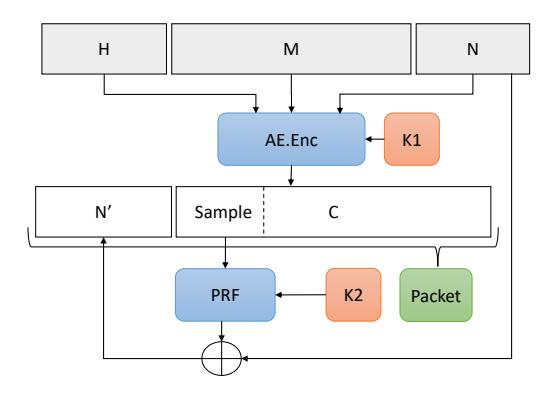

Fig. 12: The HN1[AE,PNE] construction

<span id="page-16-6"></span>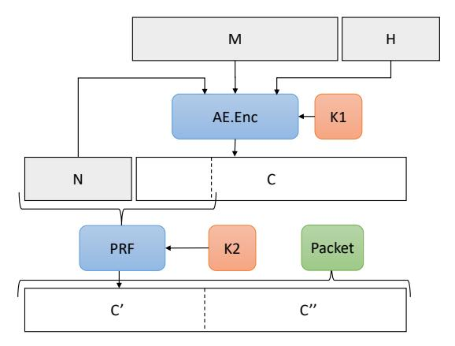

Fig. 13: The HN2[AE, PNE] construction

parsers for authenticated message formats," in 28th USENIX Security Symposium, 2019, pp. 1465–1482.

- <span id="page-16-0"></span>[47] J. Rizzo and T. Duong, "The CRIME Attack," September 2012.
- <span id="page-16-10"></span>[48] P. Rogaway, "Authenticated-encryption with associated-data," in *CCS'02*. ACM, 2002, pp. 98–107.
- <span id="page-16-11"></span>[49] P. Rogaway and Y. Zhang, "Simplifying game-based definitions: Indistinguishability up to correctness and its application to stateful AE," in *CRYPTO 2018*, H. Shacham and A. Boldyreva, Eds., 2018, pp. 3–32.
- <span id="page-16-3"></span>[50] N. Swamy, C. Hritcu, C. Keller, A. Rastogi, A. Delignat-Lavaud, S. Forest, K. Bhargavan, C. Fournet, P.-Y. Strub, M. Kohlweiss, J.-K. Zinzindohoue, and S. Zanella-Béguelin, "Dependent types and multimonadic effects in F\*," in 43nd ACM Symposium on Principles of Programming Languages, POPL 2016, 2016, pp. 256–270.
- <span id="page-16-4"></span>[51] M. Thomson, "Version-independent properties of QUIC," IETF draft,
- <span id="page-16-1"></span>[52] M. Thomson and S. Turner, "Using TLS to secure QUIC," IETF draft, 2019.
- <span id="page-16-2"></span>[53] M. Thomson, "Authenticating connection IDs," QUIC WG issue tracker, 2020. [Online]. Available: https://github.com/quicwg/base-drafts/issues/
- <span id="page-16-9"></span>[54] T. Tsujikawa, "ngtcp2 project is an effort to implement IETF QUIC protocol," GitHub, 2019. [Online]. Available: https://github.com/ ngtcp2/ngtcp2
- <span id="page-16-7"></span>[55] J.-K. Zinzindohoué, K. Bhargavan, J. Protzenko, and B. Beurdouche, "HACL\*: A verified modern cryptographic library," in ACM Conference on Computer and Communications Security. ACM, 2017, pp. 1789– 1806.

## APPENDIX

#### <span id="page-16-5"></span>A. Nonce-hiding encryption (Review)

Figure 12 and 13 show the HN1 and HN2 constructions of Bellare et al. [11], which are proved secure with respect to

AE2, defined below, under the assumptions that AE is AE1-secure and PNE is PRF-secure.

$$\begin{array}{l} \mathbf{\underline{Game}} \ \mathsf{AE2}^b(\mathsf{SE2}) \\ T \leftarrow \varnothing; \ k \overset{\$}{\leftarrow} \mathsf{SE2.gen}() \\ \mathbf{\underline{If}} \ b = 1 \ \mathbf{\underline{then}} \\ \mathbf{\underline{Oracle}} \ \mathsf{\underline{Decrypt}}(C, H) \\ \mathbf{\underline{if}} \ b = 1 \ \mathbf{\underline{then}} \\ M \leftarrow T[\_, C, H] \\ \mathbf{\underline{else}} \\ M \leftarrow \mathsf{SE2.dec}(k, C, H) \\ \mathbf{\underline{return}} \ M \end{array} \quad \begin{array}{l} \mathbf{\underline{Oracle}} \ \mathsf{Encrypt}(N, M, H) \\ \mathbf{\underline{assert}} \ T[N, \_, \_] = \bot \\ \mathbf{\underline{if}} \ b = 1 \ \mathbf{\underline{then}} \\ C \overset{\$}{\leftarrow} \{0, 1\}^{|N| + |M| + SE2.\ell_{\mathrm{tag}}} \\ T[N, C, H] \leftarrow M \\ \mathbf{\underline{else}} \\ C \leftarrow \mathsf{SE2.enc}(k, N, M, H) \\ \mathbf{\underline{return}} \ C \\ \mathbf{\underline{return}} \ C \\ \end{array}$$

#### <span id="page-16-8"></span>B. Constant-time packet number decoding

In our constant-time implementation of packet number decoding, we expand all expressions making use of the packet number length and replace all conditionals with secret comparisons provided by EverCrypt. As an example,  $Secret_{<}(X,Y)$  (resp.  $Secret_{=}, Secret_{<}$ ) is a *secret* integer equal to 1 if  $X \leq Y$  (resp. X = Y, X < Y) and 0 otherwise. Thus, our implementation computes Decode,  $2^{8L_n}$ in constant time as  $Secret_{=}(L_n,1) \times 2^{8\times 1} + Secret_{=}(L_n,2) \times$  $2^{8\times2} + \mathsf{Secret}_{=}(L_n, 3) \times 2^{8\times3} + \mathsf{Secret}_{=}(L_n, 4) \times 2^{8\times4}$ . using multiplications and additions rather than masks. F\* automatically proves the equality of these two expressions, thanks to Z3's support for linear arithmetic theory. It also ensures, by typechecking against the abstract interface of secret integers, that the latter computation does not leak information about  $L_N$ . We similarly rewrite and verify the rest of Decode using, e.g., (1-C) to negate some condition  $C \in \{0,1\}$ , and using multiplication for logical conjunction:

$$\begin{split} & \frac{\mathsf{Decode}(N_e, N_i, L_N)}{W \leftarrow 2^{8L_N}; \ X \leftarrow N_i + 1} \\ & N \leftarrow Ne + (X \& (W-1)) \\ & C_1 \leftarrow \mathsf{Secret}_{\leq}(N, X - W/2) \times \mathsf{Secret}_{\leq}(N, 2^{62} - W) \\ & C_2 \leftarrow (1 - \overline{C_1}) \times \mathsf{Secret}_{\leq}(X + W/2, N) \times \mathsf{Secret}_{\leq}(W, N) \\ & \mathbf{return} \ N + C_1 \times W - C_2 \times W \end{split}$$

After processing the header and its protection, our implementation calls EverCrypt's AEAD to decrypt the payload, at an offset that depends on protected header information. Since EverCrypt does not support secret-offset decryption, this requires us to declassify the offset at that point. Although the resulting memory accesses during payload decryption might be a source of cache-based side channel (in the sense that the memory locations accessed by EverCrypt AEAD depend on the value of the packet number length), such an attack appears unlikely and impractical.