{0}------------------------------------------------

# On the Efficient Estimation of Min-Entropy

Yongjune Kim, Cyril Guyot, and Young-Sik Kim

*Abstract*—The min-entropy is an important metric to quantify randomness of generated random numbers in cryptographic applications; it measures the difficulty of guessing the mostlikely output. One of the important min-entropy estimator is the *compression estimator* of NIST Special Publication (SP) 800- 90B, which relies on Maurer's universal test. In this paper, we propose two kinds of min-entropy estimators to improve computational complexity and estimation accuracy by leveraging two variations of Maurer's test: Coron's test (for Shannon entropy) and Kim's test (for Renyi entropy). First, we propose a min- ´ entropy estimator based on Coron's test which is computationally efficient than the compression estimator while maintaining the estimation accuracy. The secondly proposed estimator relies on Kim's test that computes the Renyi entropy. This proposed ´ estimator improves estimation accuracy as well as computational complexity. We analytically characterize an interesting trade-off relation between theoretical gap of accuracy and variance of min-entropy estimates, which depends on the order of Renyi ´ entropy. By taking into account this trade-off relation, we observe that the order of two is a proper assignment since the proposed estimator based on the collision entropy (i.e., the Renyi entropy ´ of order two) provides the most accurate estimates. Moreover, the proposed estimator based on the collision entropy has a closed-form solution whereas both the compression estimator and the proposed estimator based on Coron's test do not have closed-from solutions. Numerical evaluations demonstrate that the first proposed estimator achieves the same accuracy as the compression estimator with much less computations. Moreover, the second estimator can even improve the accuracy as well as reduce the computational complexity.

## I. INTRODUCTION

Random numbers are essential for generating cryptographic information such as secret keys, nonces, salt values, *etc*. The security of cryptographic systems crucially depends on the randomness of generated random numbers [1]–[5]. Randomness of generated numbers should be quantified and *entropies* are widely used metrics as in AIS 31 [6], NIST SP 800-22 [7], and NIST SP 800-90B [1].

There are several kinds of entropies such as Shannon entropy, Renyi entropy, and min-entropy. The Shannon entropy ´ quantifies the difficulty of guessing a typical output of random sources [2], which was used in AIS 31 [6] and NIST SP 800-22 [7]. The min-entropy corresponds to the difficulty of guessing the most likely output of random sources [1], [3]. The NIST SP 800-90B [1] supports the use of min-entropy to quantify the randomness.

However, it is difficult to estimate the min-entropy of sources that are *not* independent and identically distributed,

Y. Kim is with the Department of Information and Communication Engineering, DGIST, Daegu 42988, South Korea (e-mail: yjk@dgist.ac.kr). C. Guyot are with Western Digital Research, Milpitas, CA 95035 USA (e-mail: cyril.guyot@wdc.com). Y.-S. Kim is with the Department of Information and Communication Engineering, Chosun University, Gwangju 61452, South Korea (e-mail: iamyskim@chosun.ac.kr).

i.e., non-IID sources [6]. Hence, the NIST SP 800-90B adopted ten different algorithms to estimate the min-entropy of non-IID sources [1, Ch 6.3]. Each estimator independently performs its own estimation and then the NIST SP 800-90B conservatively selects the minimum among these ten estimates as a final estimate of min-entropy.

Although this conservative approach is preferred in security applications, it incurs a problem of *detrimental underestimate*. Even if only one estimator provides a significant underestimate, it determines the final estimation no matter how accurate the other estimators are [3], [8], [9]. Hence, it is important to avoid significant underestimates to obtain more accurate minentropy estimates.

In this paper, we focus on improving the compression estimator among ten min-entropy estimators of the NIST SP 800-90B (see Table I) since it often underestimates the minentropy. The compression estimator theoretically relies on Maurer's universal test [10]. Maurer's test quantifies randomness by taking into account the minimum distance between matching patterns. Maurer proposed a computationally efficient algorithm whose output is closely related to the Shannon entropy [10]. Maurer's test is a widely used randomness test; it was included in the NIST SP 800-22 [7]. Hagerty and Draper [2] proposed an algorithm to estimate the lower bound on the min-entropy by leveraging Maurer's test. Afterwards, it became the compression estimator of the NIST SP 800-90B.

Although the compression estimator is theoretically welljustified by Maurer's test, it is prone to underestimate the min-entropy as discussed in [2], [3], [8]. The reasons of underestimates are twofold:

- *Variance of Maurer's test statistic*: To ensure the confidence level of 99 %, the lower bound of the confidence interval for the Maurer's test value is used to estimate the min-entropy. Hence, the larger variance of Maurer's tests leads to the lower underestimate of min-entropy.
- *Theoretical gap*: The compression estimator estimates the lower bound on the min-entropy instead of the actual minentropy [2]. Depending on the distributions of sources, the gap between the lower bound and the actual minentropy can be large [2], [3], [8].

The impact of variance of Maurer's test can be reduced by including more samples. However, the computational complexity of the compression estimator is O(K<sup>2</sup> ) (where K denotes the number of samples), which limits the improvement of estimation by including more samples.

We propose two types of computationally efficient minentropy estimators. First, we propose a min-entropy estimator by using Coron's test [11] instead of Maurer's test. Its computational complexity is O(K) instead of O(K<sup>2</sup> ), so we can effectively include more data samples to reduce the impact of variance. The proposed estimator based on Coron's test

{1}------------------------------------------------

TABLE I CLASSIFICATION OF NIST SP 800-90B ESTIMATORS [1], [9]

| Statistic-based estimator [2] | Prediction-based estimator [3] |
|-------------------------------|--------------------------------|
| Most common value estimator   | MultiMCW prediction estimator  |
| Collision estimator           | Lag prediction estimator       |
| Markov estimator              | MultiMMC prediction estimator  |
| Compression estimator         | LZ78Y prediction estimator     |
| t-Tuple estimator             |                                |
| LRS estimator                 |                                |

is motivated by observing that the compression estimator's approach [2] is essentially similar to the approach in [12]–[14], which relate the lower bound on the probability of error and the Shannon entropy. The proposed estimator based on Coron's test is more efficient than the compression estimator while achieving the same accuracy as the compression estimator. Hence, the proposed estimator based on Coron's test would be an appealing alternative to the compression estimator of the NIST SP 800-90B.

In spite of the computational advantage of the min-entropy estimator based on Coron's test, it does not reduce the theoretical gap. The reason is that the test values by Maurer's test and Coron's test are inherently similar [10], [11]. In order to reduce the theoretical gap, we propose a min-entropy estimator based on the Rényi entropy.

Recently, Kim [15] proposed a variation of Maurer's test to estimate the Rényi entropy. By leveraging Kim's test, we propose a min-entropy estimator which effectively reduces the theoretical gap compared to the compression estimator. We show that the theoretical gap can be decreased by adopting a higher order of the Rényi entropy. However, the higher order increases the variance of min-entropy estimates. Hence, we focus on the min-entropy estimator based on the collision entropy (i.e., Rényi entropy of order two) by taking into account the trade-off relation between the the theoretical gap and the variance of estimates.

The proposed min-entropy estimator based on the collision entropy is computationally efficient than other estimators. Furthermore, it has a closed-form solution for the min-entropy estimate whereas other estimators rely on bisection method or binary search to calculate an approximated estimate. Due to its computational efficiency, the min-entropy estimator based on the collision entropy can effectively suppress the variance by including more samples.

In addition, we propose an *online* estimator that updates the min-entropy estimate as a new sample is received. Note that the compression estimator is inherently an offline (or batch) algorithm that requires the whole samples to output the estimate. Unlike the compression estimator, the proposed online estimator can provide a min-entropy estimate with limited samples, then the accuracy of estimates is improved as obtaining more samples. Moreover, the proposed on-line estimator does not need to store the entire samples, hence, it is proper for applications with stringent resource constraints.

The rest of this paper is organized as follows. Section II provides an overview of entropies, statistical tests, and the compression estimator. Section III presents a proposed minentropy estimator based on Coron's test. Section IV proposes

an min-entropy estimator based on Kim's test and Section V focuses on the estimator based on the collision entropy. Section VI provides numerical results and Section VII concludes.

## II. Preliminary: Entropies, Statistical Tests, and COMPRESSION ESTIMATOR

## A. Entropies

Suppose that N-bit sample  $s = (s_1, \ldots, s_N)$  is generated from a given source. The sample sequence s is partitioned into non-overlapping L-bit blocks as follows:

$$\mathbf{b}(\mathbf{s}) = (b_1, \dots, b_{|N/L|}) \tag{1}$$

where  $b_n = (s_{L(n-1)+1}, \dots, s_{Ln})$  denotes the nth block of s, i.e.,  $b_n \in \{0, \dots, B-1\}$  and  $B = 2^L$ .

The Shannon entropy of L-bit blocks b(s) is defined as

$$H(\mathcal{B}) = -\sum_{b=0}^{B-1} p_b \log_2 p_b$$
 (2)

where  $\mathcal{B}$  denotes a random variable over the alphabet  $\{0,\ldots,B-1\}$  and  $p_b=P(b)$ . The corresponding per-bit entropy is given by

$$H(\mathcal{S}) = \frac{H(\mathcal{B})}{L} \tag{3}$$

where S denotes the random variable of binary sample  $s \in$  $\{0,1\}.$ 

The Rényi entropy of order  $\alpha$  is defined as

$$H^{(\alpha)}(\mathcal{B}) = \frac{1}{1-\alpha} \log_2 \sum_{b=0}^{B-1} p_b^{\alpha} \tag{4}$$

where  $\alpha > 0$  and  $\alpha \neq 1$ . For  $\alpha = 2$ , the Rényi entropy corresponds to the *collision* entropy, which is defined as

$$H^{(2)}(\mathcal{B}) = -\log_2 \sum_{b=0}^{B-1} p_b^2.$$
 (5)

The corresponding per-bit Rényi entropy is given by  $H^{(\alpha)}(\mathcal{S}) = \frac{H^{(\alpha)}(\mathcal{B})}{L}$ 

The min-entropy of b(s) is defined as

$$H^{(\infty)}(\mathcal{B}) = -\log_2\left(\max_{b \in \{0, \dots, B-1\}} p_b\right) = -\log_2\theta$$
 (6)

where  $\theta = \max_{b \in \{0,\dots,B-1\}} p_b$ . The corresponding per-bit min-entropy is given by  $H^{(\infty)}(\mathcal{S}) = \frac{H^{(\infty)}(\mathcal{B})}{L}$ 

Remark 1: The following relations are well known:

$$H(\mathcal{B}) = \lim_{\alpha \to 1} H^{(\alpha)}(\mathcal{B}), \tag{7}$$

$$H(\mathcal{B}) = \lim_{\alpha \to 1} H^{(\alpha)}(\mathcal{B}), \tag{7}$$

$$H^{(\infty)}(\mathcal{B}) = \lim_{\alpha \to \infty} H^{(\alpha)}(\mathcal{B}). \tag{8}$$

*Remark 2:* The Rényi entropy is non-increasing in  $\alpha$  [16]. Hence,  $H^{(\infty)}(\mathcal{B}) \leq H^{(\alpha)}(\mathcal{B})$ . Hence, the min-entropy is the smallest of the Rényi family of entropies.

{2}------------------------------------------------

#### B. Maurer's Test

Maurer's test is a common randomness test, capable of detecting a wide range of statistical defects [10]. Maurer's test detects whether or not the sequence can be significantly compressed without loss of information [7], [10]. The formulation of Maurer's test was motivated by the universal source coding algorithms of Elias [17] and Willems [18]. Maurer's test is also *universal* since Maurer's test is designed without knowing the distribution of the source. Maurer's universal test was adopted by the NIST SP 800-22 for a randomness test and the compression estimator of NIST SP 800-90B relies on Maurer's test.

Maurer's test takes as input three integers  $\{L, Q, K\}$  and an N-bit sample  $\mathbf{s} = (s_1, \ldots, s_N)$  where  $N = (Q+K) \times L$ . The sample sequence  $\mathbf{s}$  is partitioned into non-overlapping L-bit blocks  $\mathbf{b}(\mathbf{s}) = (b_1, \ldots, b_{Q+K})$ . The first Q blocks are used to initialize the test. The remaining K blocks are used to compute the following test function:

$$f_{\mathcal{M}}(\mathbf{s}) = \frac{1}{K} \sum_{n=Q+1}^{Q+K} \log_2 D_n(\mathbf{s})$$
 (9)

where  $D_n(\mathbf{s})$  is given by

$$D_n(\mathbf{s})$$

$$= \begin{cases} n, & \text{if } b_{n-i} \neq b_n, \forall i < n; \\ \min\{i : i \geq 1, b_n = b_{n-i}\}, \text{ otherwise.} \end{cases} (10)$$

Note that  $D_n(s)$  is the *minimum distance* between the current nth block and any preceding block with the same pattern. Maurer's test can be implemented in an efficient manner and the detailed algorithm is described in [10].

The size of initial blocks Q should be chosen to be at least  $10 \times 2^L$  so as to have a high likelihood that each of the  $2^L$  blocks occurs at least once in the first Q blocks. A larger K for test blocks is preferred; usually, it is recommended to use  $K \ge 1000 \times 2^L$  [7], [10].

Maurer's test is closely related to the source's Shannon entropy. In [10] and [19], it was shown that there is a gap between Maurer's test and the Shannon entropy as follows:

$$\lim_{L \to \infty} \left[ \mathbb{E}(f_{\mathcal{M}}(\mathbf{s})) - H(\mathcal{B}) \right] \triangleq \int_0^\infty e^{-\xi} \log_2 \xi d\xi$$

$$\simeq -0.8327. \tag{11}$$

## C. Coron's Test for Shannon Entropy

Coron's test was proposed to estimate the Shannon entropy by modifying Maurer's test [11]. Coron's test  $f_{\mathcal{C}}(\mathbf{s})$  is given by

$$f_{\mathcal{C}}(\mathbf{s}) = \frac{1}{K} \sum_{n=Q+1}^{Q+K} g_{\mathcal{C}}(D_n(\mathbf{s}))$$
 (12)

where the function  $g_{\mathcal{C}}(\cdot)$  should be chosen to satisfy the condition  $\mathbb{E}(f_{\mathcal{C}}(\mathbf{s})) = H(\mathcal{B})$ . Coron showed that the following function  $g_{\mathcal{C}}(\cdot)$  achieves this equality condition:

$$g_{\mathcal{C}}(i) = \begin{cases} 0, & \text{if } i = 1; \\ \frac{1}{\log 2} \sum_{k=1}^{i-1} \frac{1}{k}, & \text{if } i \ge 2. \end{cases}$$
 (13)

The computational complexity of Coron's test is comparable to Maurer's test [11]. To improve the computational efficiency,  $g_{\mathcal{C}}(i)$  can be approximated for large i (e.g.,  $i \geq 23$ ) as follows:

$$\sum_{k=1}^{i-1} \frac{1}{k} \simeq \log(i-1) + \gamma + \frac{1}{2(i-1)} - \frac{1}{12(i-1)^2}$$
 (14)

where  $\gamma$  is Euler's constant, i.e.,  $\gamma = -\int_0^\infty e^{-x} \log x dx \simeq 0.577216$ . The detailed algorithm of Coron's test is described in [11].

#### D. Kim's Test for Rényi Entropy

As Coron modified Maurer's test to obtain the Shannon entropy, Kim [15] proposed a variant of Maurer's test to estimate the Rényi entropy of order  $\alpha$ . Kim's test  $f_{\mathcal{K}}(\mathbf{s}, \alpha)$  is given by

$$f_{\mathcal{K}}(\mathbf{s}, \alpha) = \frac{1}{K} \sum_{n=Q+1}^{Q+K} g_{\mathcal{K}}(D_n(\mathbf{s}), \alpha), \tag{15}$$

where  $g_{\mathcal{K}}(i,\alpha)$  is defined as

$$g_{\mathcal{K}}(i,\alpha) = \begin{cases} 1, & \text{if } i = 1; \\ (-1)^{i-1} \cdot {\binom{\alpha-2}{i}}, & \text{if } i \ge 2. \end{cases}$$
 (16)

Here,  $\binom{\alpha-2}{i}$  denotes the *generalized* binomial coefficient, i.e.,  $\binom{\alpha-2}{i} = \frac{(\alpha-2)_i}{i!}$  where  $(\cdot)_i$  is the Poccharmmer symbol. In [15], it was shown that the function  $g_{\mathcal{K}}(i,\alpha)$  satisfies the following condition:

$$\mathbb{E}(f_{\mathcal{K}}(\mathbf{s},\alpha)) = \sum_{b=0}^{B-1} p_b^{\alpha}.$$
 (17)

Then, the Rényi entropy of order  $\alpha$  can be estimated by

$$H^{(\alpha)}(\mathcal{B}) = \frac{1}{1-\alpha} \log_2 f_{\mathcal{K}}(\mathbf{s}, \alpha). \tag{18}$$

For the *collision* entropy (i.e., Rényi entropy of  $\alpha=2$ ),  $g_{\mathcal{K}}(i,\alpha=2)$  is simplified to

$$g_{\mathcal{K}}(i, \alpha = 2) = \begin{cases} 1, & \text{if } i = 1; \\ 0, & \text{if } i \ge 2. \end{cases}$$
 (19)

Remark 3 (Collision Entropy by Kim's Test): The collision entropy can be estimated by counting only the case of  $D_n(\mathbf{s})=1$  (i.e., the current block  $b_n$  is the same as the previous block  $b_{n-1}$  which can be interpreted as a collision of consecutive samples). Hence, Q=1 is sufficient for the initialization of Kim's test whereas  $Q\geq 10\times 2^L$  are required for the initialization stages of Maurer's test and Coron's test. The computational complexity of Kim's test for the collision entropy is less than those of Maurer's test and Coron's test [15, Table 2].

{3}------------------------------------------------

### **Algorithm 1** The compression estimator of NIST 800-90B [1]

**Input:** L-bit blocks  $\mathbf{b}(\mathbf{s}) = (b_1, \dots, b_{Q+K})$ Output:  $H^{(\infty)}(\mathcal{S})$ 

- 1: Compute  $f_{\mathcal{M}}(\mathbf{s}) := \frac{1}{K} \sum_{n=Q+1}^{Q+K} \log_2 D_n(\mathbf{s})$ 2:  $X := f_{\mathcal{M}}(\mathbf{s})$  and  $\widehat{\sigma} := c \sqrt{\mathsf{Var}(\log_2 D_n(\mathbf{s}))}$ 3:  $X' := X 2.576 \cdot \frac{\widehat{\sigma}}{\sqrt{K}}$ 4: By the bisection method, solve the following equation for the parameter  $\theta \in [\frac{1}{B}, 1]$ :

$$X' = G(\theta) + (B - 1)G(\varphi) \tag{20}$$

where  $G(\cdot)$  is given by (24) and  $\varphi = \frac{1-\theta}{B-1}$ .

5: The estimated per-bit min-entropy is given by

$$H^{(\infty)}(\mathcal{S}) := \begin{cases} -\frac{\log_2 \theta}{L}, & \text{if Step 4 yields a solution;} \\ 1, & \text{otherwise.} \end{cases}$$

#### E. Compression Estimator of NIST 800-90B

The compression estimator of NIST 800-90B first computes Maurer's test and then estimate the lower bound on the minentropy from the statistics of Maurer's test [2]. The compression estimator is described in Algorithm 1. NIST SP 800-90B sets L=6 and c=0.5907. The corrective factor c depends on L and K, which reduces the standard deviation to account for dependencies between  $D_n(\mathbf{s})$  [10]. The corrective factor c = 0.5907 is obtained by setting L = 6 and  $K \to \infty$  [19].

Without loss of generality, we can assume that

$$p_0 \ge p_1 \ge \dots \ge p_{B-1} \tag{21}$$

where  $B=2^L$ . For a given Maurer's test  $f_{\mathcal{M}}(\mathbf{s})$ , the following near-uniform distribution can estimate the maximum value of  $\theta$ , which corresponds to the lower bound on the min-entropy [2]:

$$P_{\theta}(b) = \begin{cases} \theta, & \text{if } b = 0; \\ \frac{1-\theta}{B-1}, & \text{otherwise.} \end{cases}$$
 (22)

Then, the maximum value of  $\theta$  can be obtained from the following equation [2]:

$$f_{\mathcal{M}}(\mathbf{s}) = G(\theta) + (B - 1)G(\varphi) \tag{23}$$

where  $\varphi = \frac{1-\theta}{B-1}$  and

$$G(z) = \frac{1}{K} \sum_{n=Q+1}^{Q+K} \sum_{i=1}^{n} F(z, n, i) \cdot \log_2 i$$
 (24)

$$F(z, n, i) = \begin{cases} z^{2}(1-z)^{i-1}, & \text{if } i < n; \\ z(1-z)^{n-1}, & \text{if } i = n. \end{cases}$$
 (25)

The key equation in Step 4 of Algorithm 1 is formulated from (23) by considering the confidence interval.

Algorithm 1 should solve the non-closed-form equation by the bisection method. The computational complexity is  $\mathcal{O}(MK^2)$  where  $\mathcal{O}(K^2)$  is required to compute G(z) and M corresponds to the number of iterations of the bisection method. Note that M determines numerical accuracy of the bisection method.

The number of samples K should be limited due to the computational complexity of  $\mathcal{O}(K^2)$ . It affects the estimation accuracy because a larger K reduces the variance  $\hat{\sigma}^2$ . We propose a computationally efficient min-entropy estimator so as to include more samples readily and reduce the variance.

#### III. Proposed Estimator Based on Coron's Test

In this section, we propose a min-entropy estimator whose computational complexity is less than that of the compression estimator while maintaining the estimation accuracy of the compression estimator.

#### A. Proposed Estimator Based on Coron's Test

In [12]–[14], the relation between the Shannon entropy and the probability of error was investigated. In the absence of any other knowledge regarding the random variable  $\mathcal{B}$  over the alphabet  $\{0,\ldots,B-1\}$ , the estimator of  $\mathcal{B}$  that minimizes the error probability is the value with the highest probability, i.e.,  $\theta = \max_{b \in \{0,\dots,B-1\}} p_b$ . Then, the minimal error probability  $\pi$  in guessing the value of  $\mathcal{B}$  is

$$\pi = 1 - \theta. \tag{26}$$

The lower bound on the minimal error probability is derived by a special case of Fano's inequality [14]:

$$h(\pi) + \pi \log_2(B - 1) \ge H(\mathcal{B}) \tag{27}$$

where  $h(\pi) = -\pi \log_2 \pi - (1 - \pi) \log_2 (1 - \pi)$ . Also, the bound is achieved with equality by the following distribution:

$$(p_0, p_1, \dots, p_{B-1}) = \left(1 - \pi, \frac{\pi}{B-1}, \dots, \frac{\pi}{B-1}\right), \quad (28)$$

which is equivalent to the near-uniform distribution of (22). Fano's inequality is *sharp* since the equality is actually achieved [14], [20]. Because of  $\pi = 1 - \theta$ , (27) can be modified to

$$h(\theta) + (1 - \theta)\log_2(B - 1) \ge H(\mathcal{B}) \tag{29}$$

where  $h(\pi) = h(\theta)$ .

By using Coron's test and assuming the near-uniform distribution, we can estimate the maximum value of  $\theta$  from the following equation:

$$f_{\mathcal{C}}(\mathbf{s}) = h(\theta) + (1 - \theta)\log_2(B - 1). \tag{30}$$

By solving (30), we can estimate a lower bound on the minentropy.

Theorem 4: For  $\theta \in [\frac{1}{B}, 1]$ , there exists only one solution of (30). The solution  $\theta^*$  minimizes the min-entropy, i.e.,  $H^{(\infty)}(\mathcal{B}) \ge -\log_2 \theta^*.$ 

*Proof:* Suppose that

$$\zeta(\theta) = h(\theta) + (1 - \theta)\log_2(B - 1) \tag{31}$$

For  $\theta \in (\frac{1}{B}, 1]$ ,  $\zeta(\theta)$  is a strictly decreasing function, i.e.,  $\zeta(\theta)' = \log_2\left(\frac{1-\theta}{\theta} \cdot \frac{1}{B-1}\right) < 0.$  Also,  $\zeta(\frac{1}{B}) = \log_2 B$  and  $\zeta(1) = 0$ . Since  $0 \leq H(\mathcal{B}) \leq \log_2 B$ , there exists only one solution  $\theta^*$ , which is the maximum value that achieves (29) with equality. Hence,  $H^{(\infty)}(\mathcal{B}) = -\log_2 \theta \ge -\log_2 \theta^*$ . 

{4}------------------------------------------------

## Algorithm 2 Proposed estimator based on Coron's test

**Input:** L-bit blocks  $\mathbf{b}(\mathbf{s}) = (b_1, \dots, b_{Q+K})$ Output:  $H^{(\infty)}(\mathcal{S})$ 

- 1: Compute  $f_{\mathcal{C}}(\mathbf{s}) := \frac{1}{K} \sum_{n=Q+1}^{Q+K} g_{\mathcal{C}}(D_n(\mathbf{s}))$ 2:  $X := f_{\mathcal{C}}(\mathbf{s})$  and  $\widehat{\sigma} := c' \sqrt{\mathsf{Var}(g_{\mathcal{C}}(D(\mathbf{s})))}$ 3:  $X' := X 2.576 \cdot \frac{\widehat{\sigma}}{\sqrt{K}}$ 4: By the bisection method, solve the following equation for the parameter  $\theta \in [\frac{1}{B}, 1]$ :

$$X' = h(\theta) + (1 - \theta)\log_2(B - 1)$$
 (32)

5: The estimated per-bit min-entropy is given by

$$H^{(\infty)}(\mathcal{S}) := \begin{cases} -\frac{\log_2 \theta}{L}, & \text{if Step 4 yields a solution;} \\ 1, & \text{otherwise} \end{cases}$$

We propose Algorithm 2 by using Coron's test instead of Maurer's test. The key equation of Step 4 of Algorithm 2 is formulated by (30). The corrective factor of Coron's test is c' = 0.6131 [11], which is obtained by setting L = 6 and  $K \to \infty$  as in NIST SP 800-90B. Note that c' is close to c = 0.5907 of the compression estimator.

Remark 5: Unlike the compression estimator, the RHS of (30) (i.e.,  $\zeta(\theta)$  of (31)) does not depend on K. For a given number of iteration of the bisection method M, the complexity of solving (32) is  $\mathcal{O}(M)$  (see Table II). If we store a table for  $(\theta, \zeta(\theta))$ , then we can readily estimate  $\theta^* = \arg\min |\zeta(\theta)|$  $f_{\mathcal{C}}(\mathbf{s})$  for a given B.

Hence, we can estimate the min-entropy efficiently in spite of a large number of samples. Hence, it is very effective to reduce the variance by including more samples.

The estimated values of the compression estimator and the proposed estimator are almost identical for the same K (see Section VI). It is mainly because Maurer's test and Coron's test are closely related and both estimates are obtained by assuming the near-uniform distribution. Since the proposed estimator achieves the identical estimation accuracy with much less computations, the proposed estimator of Algorithm 2 is an appealing alternative to the compression estimator.

## B. Theoretical Gaps of Compression Estimator and Proposed Estimator

Although we propose a computationally efficient estimator based on Coron's test, it would suffer from a large theoretical gap of the compression estimator. As shown in Fig. 1, both the compression estimator and the proposed estimator have similar theoretical gaps between the lower bound and the upper bound.

For a given Maurer's test value  $f_{\mathcal{M}}(\mathbf{s})$ , the compression estimator outputs the lower bounded value, which is achieved by the near-uniform distribution. However, the actual minentropy will be between the lower bound and the upper bound (see Fig. 1(a)). In the worst case, the actual min-entropy can correspond to the upper bounded value, which is achieved by

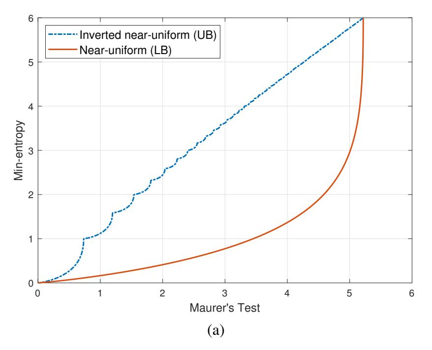

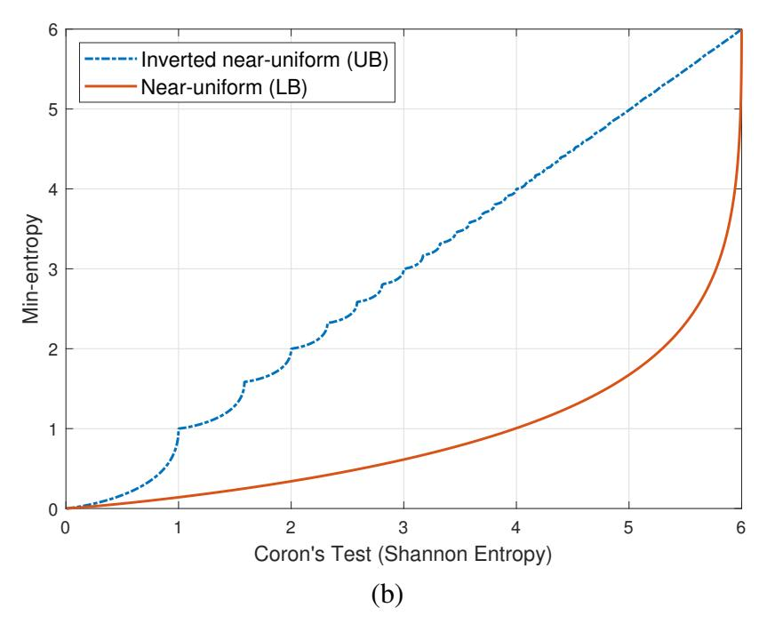

Fig. 1. The theoretical gap for L=6: (a) Compression estimator based on Maurer's test and (b) proposed estimator based on Coron's test. The maximum value of Maurer's test is 5.2177 [10] and the maximum value of Coron's test is L (i.e., the maximum value of Shannon entropy).

the following *inverted* near-uniform distribution [2]:

$$P_{\psi}(b) = \begin{cases} \psi, & \text{if } b \in \left\{0, \dots, \left\lfloor \frac{1}{\psi} \right\rfloor - 1\right\}; \\ 1 - \left\lfloor \frac{1}{\psi} \right\rfloor \psi, & \text{if } b = \left\lfloor \frac{1}{\psi} \right\rfloor; \\ 0, & \text{otherwise.} \end{cases}$$
 (33)

The proposed estimator based on Coron's test also estimates the lower bound on the min-entropy for a given Coron's test value  $f_{\mathcal{C}}(\mathbf{s})$ . As in the compression estimator, the actual minentropy will be between the lower bound and the upper bound (see Fig. 1(b)).

Importantly, these theoretical gaps cannot be tightened for the compression estimator and the proposed estimator based on Coron's test. It is because these bounds are *sharp* (i.e., the near-uniform distribution and the inverted near-uniform distribution achieve the lower and upper bounds with equality, respectively).

Remark 6: The theoretical gap will be zero for only two extreme points, i.e.,  $H^{(\infty)}(\mathcal{B}) = 0$  and  $H^{(\infty)}(\mathcal{B}) = L$  (i.e.,  $H^{(\infty)}(\mathcal{S}) = 1$ ).

Since most sample sequences would not correspond to these two extreme points, both the compression estimator and the proposed estimator might output significant underestimates.

{5}------------------------------------------------

TABLE II
COMPARISON OF COMPRESSION ESTIMATOR AND PROPOSED ESTIMATORS

|                            | Compression Estimator | Estimator (Coron's Test) | Estimator (Kim's Test) |
|----------------------------|-----------------------|--------------------------|------------------------|
| Complexity of Test         | $\mathcal{O}(K)$      | $\mathcal{O}(K)$         | $\mathcal{O}(K)$       |
| Complexity of Key Equation | $\mathcal{O}(MK^2)$   | $\mathcal{O}(M)$         | $\mathcal{O}(1)$       |

#### IV. PROPOSED ESTIMATOR BASED ON KIM'S TEST

In this section, we attempt to address the theoretical gap by using the Rényi entropy. The proposed estimator can effectively reduce the theoretical gap and be computationally efficient.

#### A. Proposed Estimator Based on Kim's Test

In order to reduce the theoretical gap, we take into account the relation between the min-entropy and the Rényi entropy of Remark 1. Fig. 2(a) shows that the theoretical gap between lower bound and upper bound can be suppressed by increasing the order of Rényi entropy.

Since the sharp upper bound by the inverted near-uniform distribution is changed by  $\alpha$ , we consider a common upper bound, which is not affected by  $\alpha$ . This upper bound can be explained by Fig. 2(b) showing the relation between  $\theta$  (the maximum probability of near-uniform distribution) and entropies. For a given near-uniform distribution with  $\theta$ , it is clear that the min-entropy (i.e.,  $-\log_2\theta$ ) will be the minimum among all entropies, which corresponds to the upper bound in Fig. 2(a). Note that the sharp upper bounds are close to this common upper bound for a large L as discussed in [14, Fig. 2].

We estimate the lower bound on the min-entropy by assuming the near-uniform distribution as in the compression estimator and the proposed estimator based on Coron's test.

Lemma 7: Suppose that  $\theta = \max_{b \in \{0,...,B-1\}} p_b$ . Then, the following inequality holds:

$$\frac{1}{1-\alpha}\log_2\left(\theta^{\alpha} + \frac{(1-\theta)^{\alpha}}{(B-1)^{\alpha-1}}\right) \ge H^{(\alpha)}(\mathcal{B}) \tag{34}$$

for  $\alpha > 1$ . The near-uniform distribution of (22) achieves this bound with equality.

*Proof:* Without loss of generality, suppose that  $\theta = p_0$ . For  $\alpha > 1$ , maximization of  $H^{(\alpha)}(\mathcal{B})$  is equivalent to the following optimization problem:

minimize 
$$\sum_{b=1}^{B-1} p_b^{\alpha}$$
 subject to 
$$\sum_{b=1}^{B-1} p_b = 1 - \theta, \quad p_b \ge 0, \quad \forall b$$
 (35)

which is a convex optimization problem because of  $\alpha > 1$  and  $p_b \ge 0$ . From the Karush-Kuhn-Tucker (KKT) conditions, we obtain the optimal solution  $p_1^* = \cdots = p_{B-1}^* = \frac{1-\theta}{1-B}$ , i.e., the near-uniform distribution. The Rényi entropy becomes the LHS of (34) for the near-uniform distribution.

We estimate the lower bound on the min-entropy by leveraging Kim's test. For  $\alpha > 1$ , (34) is equivalent to

$$\theta^{\alpha} + \frac{(1-\theta)^{\alpha}}{(B-1)^{\alpha-1}} \le 2^{(1-\alpha)H^{(\alpha)}(\mathcal{B})}.$$
 (36)

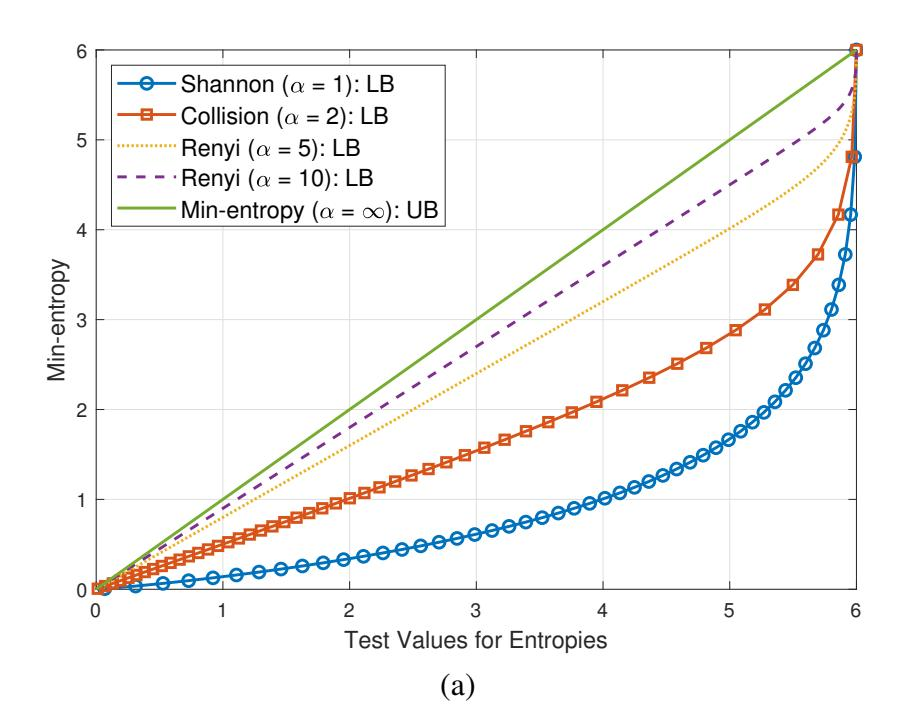

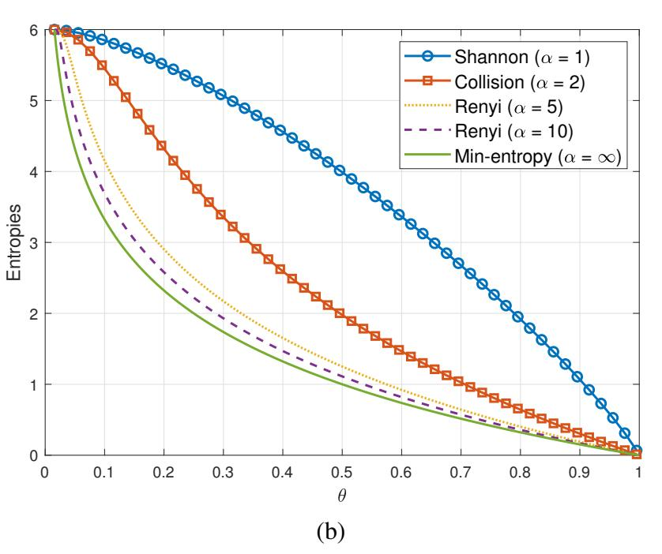

Fig. 2. The theoretical gap between upper bound and lower bounds. (a) Relation between the test values for entropies and the estimated min-entropy; (b) Relation between the test values for entropies and  $\theta = \max p_b$  where  $H^{(\infty)}(\mathcal{B}) = -\log_2 \theta$ .

By assuming the near-uniform distribution as in (30), we can estimate the maximum value of  $\theta$  from the following equation:

$$f_{\mathcal{K}}(\mathbf{s},\alpha) = \theta^{\alpha} + \frac{(1-\theta)^{\alpha}}{(B-1)^{\alpha-1}}$$
 (37)

where  $2^{(1-\alpha)H^{(\alpha)}(\mathcal{B})} = f_{\mathcal{K}}(\mathbf{s}, \alpha)$  because of (18). The following theorem shows that the lower bound on the min-entropy can be estimated by Lemma 7 and Kim's test.

Theorem 8: For  $\theta \in [\frac{1}{B}, 1]$  and  $\alpha > 1$ , there exists only one solution of (37). The solution  $\theta^*$  minimizes the min-entropy, i.e.,  $H^{(\infty)}(\mathcal{B}) \geq -\log_2 \theta^*$ .

*Proof:* Suppose that  $\zeta(\theta) = \theta^{\alpha} + \frac{(1-\theta)^{\alpha}}{(B-1)^{\alpha-1}}$ . For  $\theta \in (\frac{1}{B}, 1]$ ,  $\zeta(\theta)$  is a strictly increasing function, i.e.,  $\zeta(\theta)' > 0$ . Also,  $\zeta(\frac{1}{B}) = B^{1-\alpha}$  and  $\zeta(1) = 1$ . Since  $0 \le H^{(\alpha)}(\mathcal{B}) \le \log_2 B$ , we observe that  $B^{1-\alpha} \le f_{\mathcal{K}}(\mathbf{s}, \alpha) \le 1$ . Hence, there exists only one solution  $\theta^*$ , which is the maximum value that satisfies (34). Hence,  $H^{(\alpha)}(\mathcal{B}) = -\log_2 \theta \ge -\log_2 \theta^*$ .

{6}------------------------------------------------

## **Algorithm 3** Proposed estimator based on Kim's test

**Input:** L-bit blocks  $\mathbf{b}(\mathbf{s}) = (b_1, \dots, b_{O+K})$ Output:  $H^{(\infty)}(\mathcal{S})$ 

- 1: Compute  $f_{\mathcal{K}}(\mathbf{s}, \alpha) := \frac{1}{K} \sum_{n=Q+1}^{Q+K} g_{\mathcal{K}}(D_n(\mathbf{s}), \alpha)$ 2:  $X := f_{\mathcal{K}}(\mathbf{s}, \alpha)$  and  $\widehat{\sigma} := c'' \sqrt{\mathsf{Var}(g_{\mathcal{K}}(D(\mathbf{s}), \alpha))}$ 3:  $X' := X 2.576 \cdot \frac{\widehat{\sigma}}{\sqrt{K}}$ 4: By the bisection method, solve the following equation for the parameter  $\theta \in [\frac{1}{B}, 1]$ :

$$X' = \theta^{\alpha} + \frac{(1-\theta)^{\alpha}}{(B-1)^{\alpha-1}}$$
 (38)

5: The estimated per-bit min-entropy is given by

$$H^{(\infty)}(\mathcal{S}) := \begin{cases} -\frac{\log_2 \theta}{L}, & \text{if Step 4 yields a solution;} \\ 1, & \text{otherwise} \end{cases}$$

Based on Theorem 8, we propose Algorithm 3 to estimate the min-entropy. As in Algorithm 1 and Algorithm 2, the key equation of Step 4 is formulated from (37) by taking into account confidence interval. The corrective factor of Kim's test depends on  $\alpha$  as well as L and K.

#### B. Theoretical Gap and Variance of Estimates

Here, we show that the order  $\alpha$  is a parameter of tradeoff relation between the theoretical gap and the variance of min-entropy estimates.

It is clear that the maximum theoretical gap decreases for a higher order  $\alpha$  as shown in Fig. 2(a). The following Theorem shows how a higher order  $\alpha$  can improve the min-entropy estimates.

Theorem 9: Suppose that  $\theta^{(\alpha)}$  and  $\theta^{(\alpha+1)}$  are estimated values by  $f_{\mathcal{K}}(\mathbf{s},\alpha)$  and  $f_{\mathcal{K}}(\mathbf{s},\alpha+1)$ , respectively. If  $\theta^{(\alpha)} \gg$  $\frac{1}{1+(B-1)^{\frac{\alpha-1}{\alpha}}}$ , then

$$H^{(\infty)} \ge -\frac{\log_2 \theta^{(\alpha+1)}}{L} \ge -\frac{\log_2 \theta^{(\alpha)}}{L},\tag{39}$$

for  $\alpha > 1$ . Hence, the estimated lower bounds on the minentropy improve with the order  $\alpha > 1$  for a large B.

If we consider only the theoretical gap, then a higher order  $\alpha$  would be preferred in Algorithm 3. However, we should take into account the variance of estimates which depends on  $\alpha$ . Fig. 3 shows the relation between Kim's test  $f_{\mathcal{K}}(\mathbf{s}, \alpha)$ and the estimated  $\theta$ . The derivative  $\frac{d\theta}{df_{\mathcal{K}}(\mathbf{s},\alpha)}$  increases with  $\alpha$ especially for the higher entropy regime (i.e.,  $\theta$  is close to  $\frac{1}{R}$ ).

The derivative  $\frac{d\theta}{df_{\mathcal{K}}(\mathbf{s},\alpha)}$  is given by

$$\frac{d\theta}{df_{\mathcal{K}}(\mathbf{s},\alpha)} = z(\theta,\alpha) = \frac{1}{\alpha \left\{ \theta^{\alpha-1} - \left(\frac{1-\theta}{B-1}\right)^{\alpha-1} \right\}}.$$
 (40)

Then,

$$Var(\theta^{(\alpha)}) = z(\theta, \alpha)^2 \cdot Var(f_{\mathcal{K}}(\mathbf{s}, \alpha))$$
 (41)

$$= \frac{z(\theta, \alpha)^2}{K} \cdot \mathsf{Var}(g_{\mathcal{K}}(D, \alpha)) \tag{42}$$

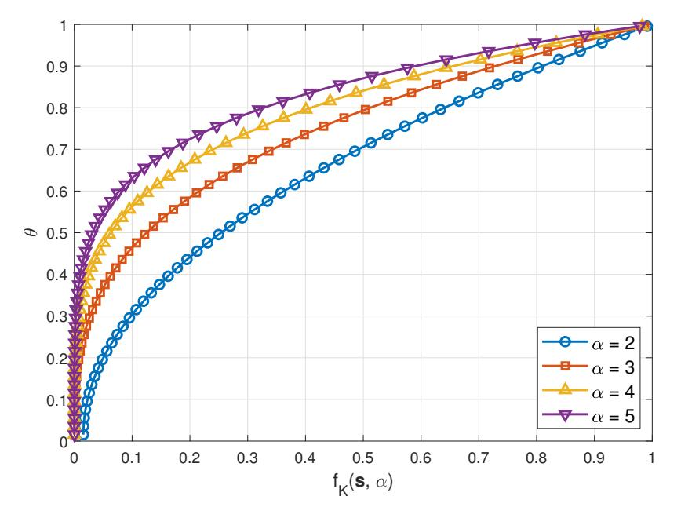

Fig. 3. The relation between Kim's test  $f_{\mathcal{K}}(\mathbf{s}, \alpha)$  and the estimated  $\theta$  of (37) for L=6.

where D denotes the random variable of  $D_n(\mathbf{s})$  in (15) and  $\theta^{(\alpha)}$  denotes the estimated  $\theta$  via  $f_{\mathcal{K}}(\mathbf{s}, \alpha)$ .

It is clear that a larger K (more samples) reduces  $Var(\theta^{(\alpha)})$ . We observe that  $Var(\theta^{(\alpha)}) \to \infty$  as  $\theta \to \frac{1}{B}$ . It is because  $z(\theta,\alpha)\to\infty$  as  $\theta\to\frac{1}{B}$  by (40). Moreover, Fig. 3 shows that  $z(\theta, \alpha) < z(\theta, \alpha + 1)$  for higher min-entropy (i.e., for lower  $\theta$ ), which is characterized in the following theorem.

Theorem 10: For  $\theta = \frac{1}{B} + \delta$  where  $\delta \ll \frac{1}{B}$ ,  $z(\theta, \alpha)$  is approximated to

$$z(\theta, \alpha) \simeq \frac{B^{\alpha - 3}}{\alpha(\alpha - 1)} \cdot \frac{B - 1}{\delta}$$
 (43)

and

$$\xi = \frac{z(\theta, \alpha + 1)}{z(\theta, \alpha)} \simeq \frac{\alpha - 1}{\alpha + 1} \cdot B. \tag{44}$$

For B=64 (i.e., the given parameter of NIST SP 800-90B),  $\xi > 1$  (i.e.,  $z(\theta, \alpha) < z(\theta, \alpha + 1)$ ) if  $\alpha > \frac{65}{63}$ .

The following theorem shows  $Var(\theta^{(2)}) < Var(\theta^{(3)})$  for most sample sources. Note that  $Var(\theta^{(2)}) < Var(\theta^{(3)})$  is equivalent to  $\sigma^{(2)} < \sigma^{(3)}$  where  $\sigma^{(\alpha)}$  denotes the standard deviation of  $H^{(\infty)}(\mathcal{B})$  estimated by  $f_{\mathcal{K}}(\mathbf{s}, \alpha)$ .

Theorem 11: For a sample s with  $\theta$ ,  $\sigma^{(2)} < \sigma^{(3)}$  if

$$\theta < \frac{2}{3} - \frac{1}{3(B-2)}. (45)$$

*Proof:* The proof is given in Appendix C.

Remark 12: For B = 64 (i.e., the given parameter of NIST SP 800-90B), this condition of  $\theta$  corresponds to  $\theta < \frac{123}{186} \simeq 0.6613$  and  $H^{(\infty)}(\mathcal{S}) > 0.0994$ . Hence, we claim that  $\sigma^{(2)} <$  $\sigma^{(3)}$  for the most of random sources.

Remark 13: A higher order  $\alpha$  can reduce the theoretical gap, which improves the accuracy (Theorem 9). On the other hand, a higher order  $\alpha$  increases the variance of min-entropy estimate. The order  $\alpha$  is a parameter of the trade-off relation between the gap and the variance.

By considering the trade-off between the theoretical gap and the variance, we observe that  $\alpha = 2$  is a proper value from numerical evaluations in Section VI. Note that the Rényi entropy with  $\alpha = 2$  corresponds to the collision entropy. In the following section, we propose estimation algorithms based on Kim's test for the collision entropy. Fortunately, the proposed algorithms are very efficient for  $\alpha = 2$ .

{7}------------------------------------------------

## V. PROPOSED ESTIMATOR BASED ON COLLISION ENTROPY

#### A. Proposed Estimator Based on Collision Entropy

For the collision entropy, we show that the proposed estimator of Algorithm 3 has the following advantages:

- 1) The computations are simplified because a closed-form solution of Step 4 in Algorithm 3 can be derived (see Corollary 14);
- 2) Samples for initialization are not required. Note that both the compression estimator and the proposed estimator based on Coron's test require  $Q(>10\times 2^L)$  samples for initialization (see Remark 3).

Corollary 14: For a estimated collision entropy  $H^{(2)}(\mathcal{B}) = f_{\mathcal{K}}(\mathbf{s}, \alpha = 2)$ , the min-entropy is lower bounded as follows:

$$H^{(\infty)}(\mathcal{B}) \ge -\log_2 \theta^{(2)} \tag{46}$$

where

$$\theta^{(2)} = \begin{cases} \frac{1}{B}, & \text{if } 0 \le f_{\mathcal{K}}(\mathbf{s}, 2) \le \frac{1}{B}; \\ \frac{1+\sqrt{(B-1)(B \cdot f_{\mathcal{K}}(\mathbf{s}, 2) - 1)}}{B}, & \text{if } \frac{1}{B} < f_{\mathcal{K}}(\mathbf{s}, 2) \le 1 \end{cases}$$
(47)

where  $f_{\mathcal{K}}(\mathbf{s}, 2) = f_{\mathcal{K}}(\mathbf{s}, \alpha = 2)$ .

*Proof:* First, we note that  $0 \le f_{\mathcal{K}}(\mathbf{s},2) \le 1$  by (15) and (19). If  $f_{\mathcal{K}}(\mathbf{s},2) \le \frac{1}{B}$ , then we set  $f_{\mathcal{K}}(\mathbf{s},2) = \frac{1}{B}$  because  $H^{(2)}(\mathcal{B}) = -\log_2 f_{\mathcal{K}}(\mathbf{s},2) \le L$  by entropy definition. Hence,  $\theta^{(2)} = \frac{1}{B}$ . If  $\frac{1}{B} < f_{\mathcal{K}}(\mathbf{s},2) \le 1$ , then we derive  $\theta^{(2)} = \frac{1 \pm \sqrt{(B-1)(B \cdot f_{\mathcal{K}}(\mathbf{s},2)-1)}}{B}$  from (37). We choose  $\theta^{(2)} = \frac{1 + \sqrt{(B-1)(B \cdot f_{\mathcal{K}}(\mathbf{s},2)-1)}}{B}$  because of the given condition of  $\frac{1}{B} \le \theta^{(2)} \le 1$ .

It is worth mentioning that the proposed estimator based on the collision entropy has advantages over the compression estimator of the NIST 800-90B in terms of accuracy (reduced theoretical gap), computational complexity (closed-form solution), and data efficiency (skipped initialization stage).

#### B. Online Estimator Based on Collision Entropy

We propose *online* estimator by leveraging the advantages of the collision entropy (see Algorithm 4). Since the proposed on-line estimator processes the data samples in a serial manner, it can estimate the min-entropy with limited samples and then improve its estimation accuracy as getting more samples. The proposed on-line estimator does not need to store the entire samples, hence, the proposed online estimator is lightweight and proper for applications with stringent resource constraints.

The proposed online estimator has two parts: 1) Estimation of the collision probability; 2) estimation of the min-entropy from the collision probability. The first part (Steps 3–10) is an online algorithm to estimate the Collision entropy. For the collision entropy,  $g_{\mathcal{K}}(i,2)$  is given by (19). Hence, it counts only an event that a new block is the same as its previous one (Step 6) (i.e., collision counting in consecutive blocks). Then, the collision probability  $\eta$  converges to  $f_{\mathcal{K}}(\mathbf{s},2)$  as getting more blocks.

The second part (Steps 11–16) estimates the min-entropy from the collision probability  $\eta$  in an online manner. This part

Algorithm 4 Proposed *online* min-entropy estimator

Input: L-bit blocks  $\mathbf{b}(\mathbf{s}) = (b_1, \dots, b_K)$ 

```
Output: H_k^{(\infty)}(\mathcal{S}) for k \in \{1, \dots, K\} and the collision
index set C
 1: k := 1, c := 0, v := b_1, C = \emptyset
                                                                           ▶ Initialization
 2: while k < K do
            k := k + 1
  3:
 4:
            u := b_k
  5:
            if u = v then
                  c := c + 1

  6:
                 \mathcal{C} := \mathcal{C} \cup k
  7:
 8:
            end if
 9:
            v := u
           \eta := \frac{c}{k}

10:
           if \eta > \frac{1}{B} then
11:
          \theta := \frac{1+\sqrt{(B-1)(B\cdot\eta-1)}}{B} else if \eta \leq \frac{1}{B} then \theta := \frac{1}{B}
12:
13:
14:
           end if H_k^{(\infty)}(\mathcal{S}) := -\frac{\log_2 \theta}{L}
15:
16:
17: end while
```

relies on the closed-form solution of  $\theta$  in Corollary 14. The proposed online algorithm is computationally simple and can output a new estimate of min-entropy  $H_k^{(\infty)}(\mathcal{S})$  as getting a new block  $b_k$ .

The proposed online estimator is helpful to detect low entropy sources with limited samples. It is because the estimation variance of low entropy sources is not large, so its estimate can be obtained reliably with limited samples (see Fig. 8). Hence, the proposed online estimator can filter out the low entropy sources very effectively.

#### VI. NUMERICAL RESULTS

We evaluate our proposed estimators for simulated and real world data samples. We also compare our results to the compression estimator in NIST SP 800-90B. Among estimators of NIST SP 800-90B, we focus on the compression estimator because the compression estimator and the proposed estimators attempt to estimate the min-entropy based on the minimum distance between the matching blocks  $D_n(\mathbf{s})$  of (10). We note that our proposed estimators can be appealing alternatives to the compression estimator.

Datasets of simulated samples are produced using the following distribution families as in [3]:

- Binary memoryless source (BMS): Samples are generated by Bernoulli distribution with P(S = 1) = p and P(S = 0) = 1 p (IID);
- *Near-uniform distribution:* Samples are generated by near-uniform distribution of (22) (IID);
- *Inverted near-uniform distribution:* Samples are generated by inverted near-uniform distribution of (33) (IID);
- *Normal distribution rounded to integers:* Samples are drawn from a normal distribution and rounded to integer values (IID);

{8}------------------------------------------------

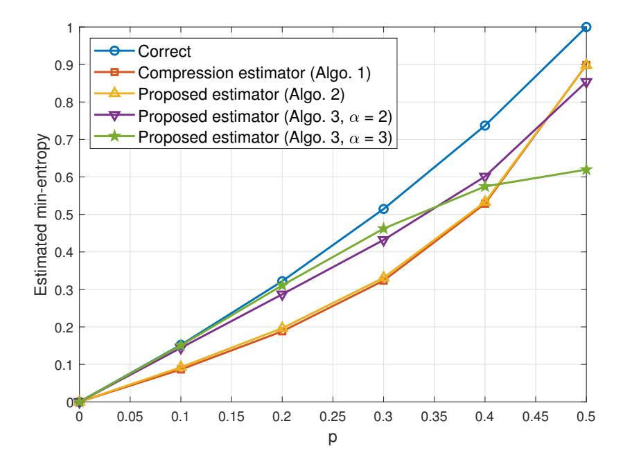

Fig. 4. Comparison of min-entropy estimators for binary memoryless sources with p.

• *Markov model:* Samples are generated using the first order Markov model (non-IID).

One hundred simulated sources were created in each of the above datasets. A sequence of 6,000,000 bits (1,000,000 blocks) was generated from each simulated sources. Note that the compression estimator of NIST SP 800-90B sets L=6. For each source, the correct min-entropy is derived from the given probability distribution as in [3].

Fig. 4 compares the min-entropy estimators for BMS with p. The correct min-entropy is given by  $H^{(\infty)}(\mathcal{S}) = -\log_2 \max\{p, 1-p\}$ . We observe that the compression estimator (Algorithm 1) of NIST SP 800-90B and the proposed estimator based on Coron's test (Algorithm 2) are almost identical. By comparing the computational complexities of estimators (see Table II), the proposed estimator based on Coron's test is an appealing alternative to the compression estimator.

The proposed estimators based on Kim's test (Algorithm 3) with  $\alpha=2$  (i.e., collision entropy) provides better estimates than the compression estimator and the proposed estimator based on Coron's test since the theoretical gap can be reduced. However, for a BMS with p=0.5, Algorithm 3 with  $\alpha=2$  is slightly worse. It is because the theoretical gap is zero for BMS with p=0.5 (see Remark 6) and the variance of estimates increases for the higher  $\alpha$ . Fig. 4 shows that Algorithm 3 with  $\alpha=3$  suffers from large variances for high entropy sources. Hence, we focus on  $\alpha=2$  for Algorithm 3 since the variance is manageable and its computations are very efficient.

Table III shows the mean squared error (MSE) and the mean percentage error (MPE) of all the estimators for the BMS. Suppose that the correct (actual) min-entropy is h and the estimates are  $\hat{h}_n$  for  $n \in \{1, \dots, N\}$ . Then, the MSE and MPE are defined as:

$$MSE = \frac{1}{N} \sum_{n=1}^{N} (h - \hat{h}_n)^2, \tag{48}$$

$$MPE = \frac{100\%}{N} \sum_{n=1}^{N} \frac{h - \widehat{h}_n}{h}.$$
 (49)

The MPEs are used to capture the sign of the error, which is not captured by MSE [3]. We observe that the proposed

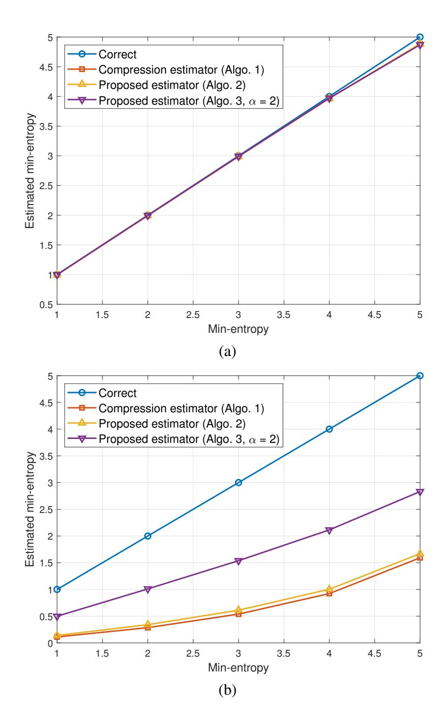

Fig. 5. Comparison of min-entropy estimators for (a) near-uniform distributed sources and (b) inverted near-uniform distributed sources.

estimator based on the collision entropy (Algorithm 3) can improve the estimation accuracy compared to other estimators.

Fig. 5 compares the min-entropy estimators for near-uniform distributed sources and inverted near-uniform distributed sources. As shown in Fig. 5(a), all the estimators are accurate for near-uniform distributed sources since all the estimators perform their estimation tasks by assuming near-uniform distribution, i.e., the lower bound on the min-entropy is the same as the actual min-entropy.

On the other hand, the min-entropy estimates for inverted near-uniform distributed sources are quite underestimated as shown in Fig. 5(b). It is because the inverted near-uniform distribution corresponds to the upper bounds in Fig. 1, which leads to the maximal theoretical gap. The proposed estimator based on the collision entropy effectively reduces the theoretical gap, so it provides much more accurate estimates than the other estimators.

Fig. 6 compares the min-entropy estimators for the normal distributed sources (rounded to integers). For this distribution, it is known that the compression estimator is prone to significant underestimates [3]. The proposed estimator based on Coron's test is slightly better than the compression estimator. More importantly, the proposed estimator based on the collision entropy provides much more accurate estimates.

Fig. 7 compares the min-entropy estimators for the first order Markov sources with p = p(1|0) = p(0|1). The

{9}------------------------------------------------

TABLE III ERROR MEASURES FOR BMS WITH p

|                                 | p = 0.1 | p = 0.2 | p = 0.3 | p = 0.4 | p = 0.5 |
|---------------------------------|---------|---------|---------|---------|---------|
| MSE of Algo. 1                  | 0.0043  | 0.0179  | 0.0365  | 0.0434  | 0.0105  |
| MSE of Algo. 2                  | 0.0036  | 0.0157  | 0.0336  | 0.0416  | 0.0107  |
| MSE of Algo. 3 ( $\alpha = 2$ ) | 0.0001  | 0.0012  | 0.0068  | 0.0184  | 0.0217  |
| MPE of Algo. 1                  | 43.09   | 41.56   | 37.14   | 28.26   | 10.10   |
| MPE of Algo. 2                  | 39.23   | 38.96   | 35.65   | 27.67   | 10.21   |
| MPE of Algo. 3 ( $\alpha = 2$ ) | 5.29    | 10.86   | 16.05   | 18.42   | 14.62   |

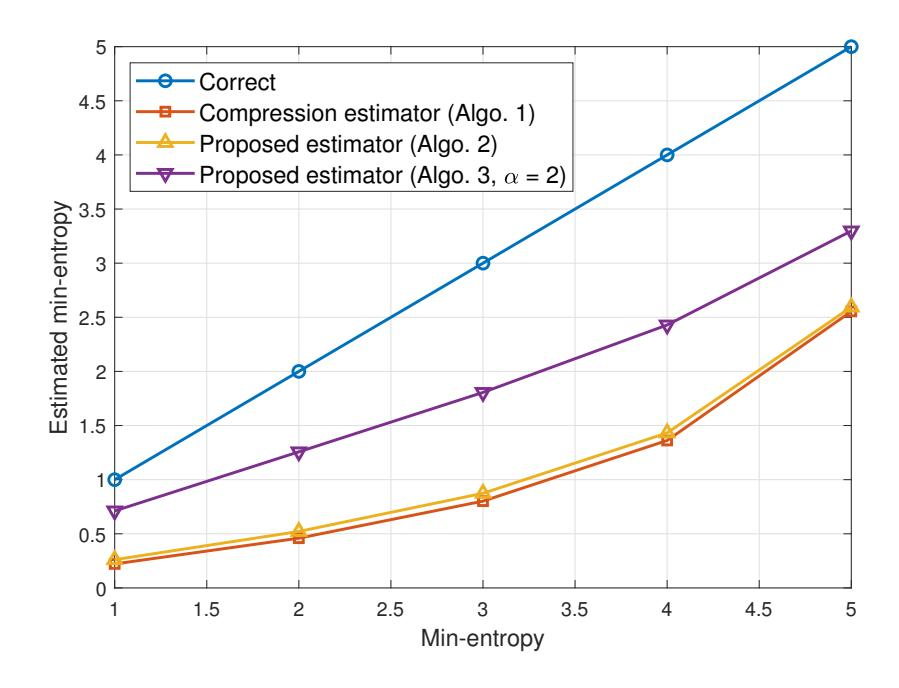

Fig. 6. Comparison of min-entropy estimators for normal distributed sources.

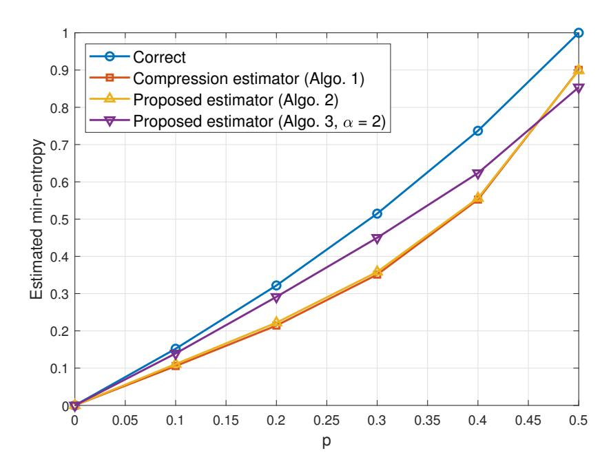

Fig. 7. Comparison of min-entropy estimators for the first order Markov sources with p = p(1|0) = p(0|1).

TABLE IV
PER-BIT MIN-ENTROPY ESTIMATE FOR REAL WORLD SOURCES

|            | Algo. 1 | Algo. 2 | Algo. 3 |
|------------|---------|---------|---------|
| RANDOM.ORG | 0.9110  | 0.9006  | 0.8690  |
| Ubld.it    | 0.8811  | 0.8811  | 0.8175  |
| LKRNG      | 0.9219  | 0.9006  | 0.8690  |

compression estimator and the proposed estimator based on Coron's test are almost identical. The proposed estimator based on the collision entropy is much better than the other estimators except at  $H^{(\infty)}(\mathcal{S})=1$ .

We also evaluate min-entropy estimates using random number generators deployed in the real world as in [3]. The true entropies for these sources are unknown, so the MSE and MPE cannot be calculated. The estimates of the real world sources

are presented in Table IV.

We evaluate RANDOM.ORG, Ubld.it, and Linux kernel random number generator (LKRNG). RANDOM.ORG [21] is a service that provides random numbers based on atmospheric noise and Ubld.it generates random numbers by a TrueRNG device by [22]. As we expected, the compression estimator (Algorithm 1) and the proposed min-entropy estimator based on Coron's test (Algorithm 2) are almost identical. The proposed estimator based on the collision entropy (Algorithm 3) is slightly lower than the others. It is because these real world sources are high entropy sources, which make the variance of estimates by Algorithm 3 larger than the variance of other estimators as observed in Figs. 4 and 7.

Fig. 8 shows the min-entropy estimates by online algorithm (Algorithm 4) for BMS with p. Due to the computational efficiency, Algorithm 4 can output an estimate as getting a new block  $b_k$ . As collecting more samples, the estimate is improved and its variance is reduced. We observe that higher entropy sources result in larger variances as discussed in Section IV-B.

We note that Algorithm 4 is very effective to detect low entropy sources. It is because the proposed online estimator provides estimates as getting new blocks and low entropy sources can be detected reliably with limited samples. For example, Fig. 8 shows that a low entropy source whose minentropy is less than 0.5 can be detected by testing only several hundred blocks, which is comparable to the required samples  $(>10\times2^L)$  for initialization of the compression estimator.

#### VII. CONCLUSION

We proposed computationally efficient min-entropy estimators by leveraging the variations of Maurer's test. The proposed estimator based on Coron's test achieves the identical accuracy with much less computations compared to the compression estimator. Moreover, we propose the min-entropy estimator based on the collision entropy. It has advantages over the compression estimator in terms of estimation accuracy, computational complexity, and data efficiency. We also propose a lightweight estimator which processes data samples in an online manner without having the entire samples.

## APPENDIX A PROOF OF THEOREM 9

We show that  $\theta^{(\alpha)} \geq \theta^{(\alpha+1)}$  for  $\theta^{(\alpha)} \gg \frac{1}{1+(B-1)^{\frac{\alpha-1}{\alpha}}}$ , which is equivalent to (39). For convenience, suppose that  $x = \theta^{(\alpha)}$  and  $y = \theta^{(\alpha+1)}$ .

{10}------------------------------------------------

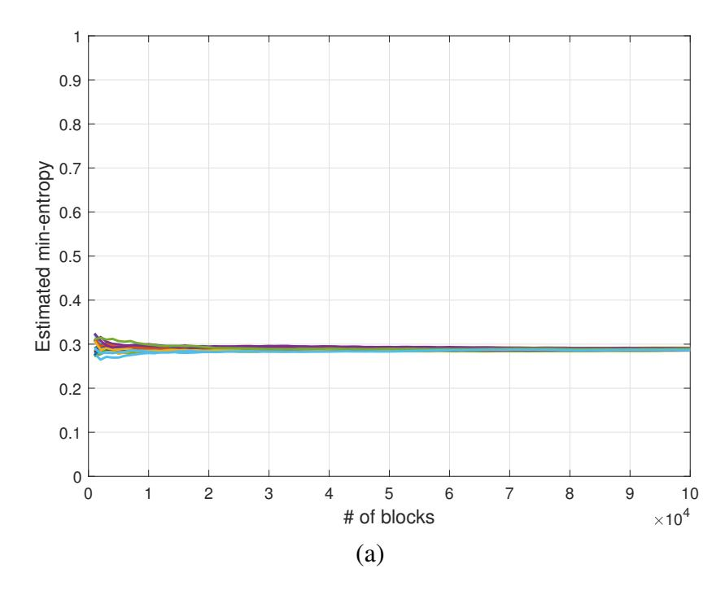

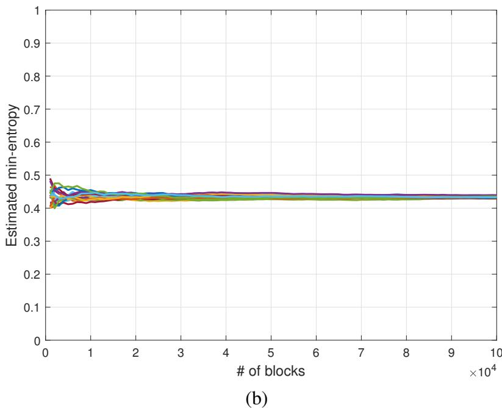

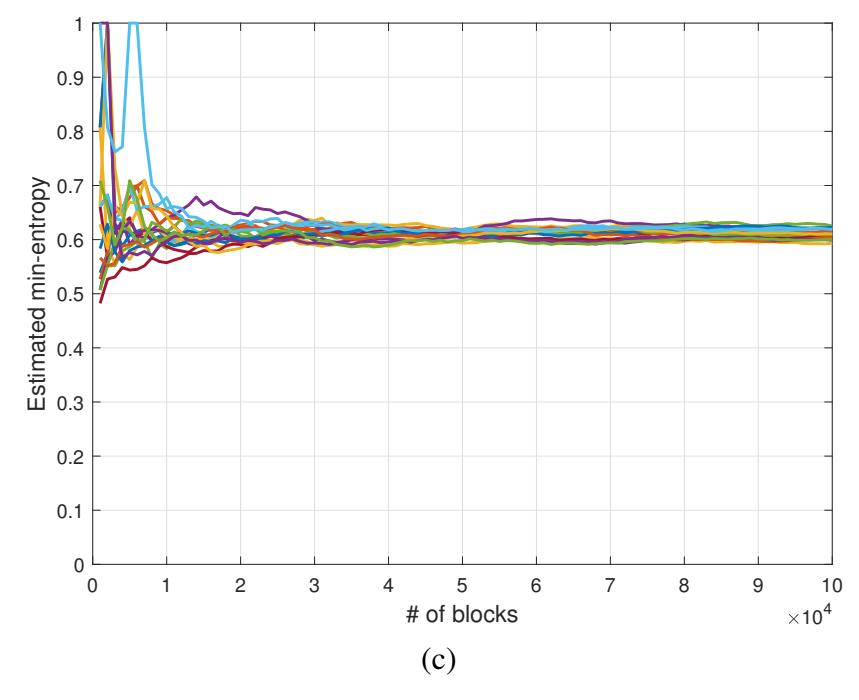

Fig. 8. Online min-entropy estimates by Algorithm 4 for BMS with p (20 sample sources): (a) p = 0.2, (b) p = 0.3, and (c) p = 0.4.

In [23], it was shown that  $\frac{\alpha-1}{\alpha}H^{(\alpha)} \leq \frac{\beta-1}{\beta}H^{(\beta)}$  for  $\beta > \alpha$  and  $\alpha\beta > 0$ . If  $\beta = \alpha + 1$  and  $\alpha > 1$ ,

$$H^{(\alpha)}(\mathcal{B}) \le \frac{\alpha^2}{\alpha^2 - 1} H^{(\alpha + 1)}(\mathcal{B}) \tag{50}$$

Then, we obtain the following inequality for the near-uniform distribution:

$$\frac{1}{1-\alpha} \log_2 \left( x^{\alpha} + \frac{(1-x)^{\alpha}}{(B-1)^{\alpha-1}} \right) 
\leq \frac{\alpha}{1-\alpha^2} \log_2 \left( y^{\alpha+1} + \frac{(1-y)^{\alpha+1}}{(B-1)^{\alpha}} \right), \tag{51}$$

which is equivalent to

$$\left(x^{\alpha} + \frac{(1-x)^{\alpha}}{(B-1)^{\alpha-1}}\right)^{\frac{1}{\alpha}} \ge \left(y^{\alpha+1} + \frac{(1-y)^{\alpha+1}}{(B-1)^{\alpha}}\right)^{\frac{1}{\alpha+1}}.$$
 (52)

If  $x^{\alpha} \gg \frac{(1-x)^{\alpha}}{(B-1)^{\alpha-1}}$  and  $y^{\alpha+1} \gg \frac{(1-y)^{\alpha+1}}{(B-1)^{\alpha}}$ , then (52) becomes  $x \geq y$ . Hence,  $\theta^{(\alpha)} \geq \theta^{(\alpha+1)}$  for  $\theta^{(\alpha)} \gg \frac{1}{1+(B-1)^{\frac{\alpha-1}{\alpha}}}$ .

## APPENDIX B PROOF OF THEOREM 10

Suppose that  $\theta = \frac{1}{B} + \delta$  where  $\delta \ll \frac{1}{B}$ . Then, (40) becomes

$$z(\theta, \alpha) = \frac{1}{\alpha} \cdot \frac{1}{\left(\frac{1}{B} + \delta\right)^{\alpha - 1} - \left(\frac{1 - \frac{1}{B} - \delta}{B - 1}\right)^{\alpha - 1}}$$
(53)

$$= \frac{1}{\alpha} \cdot \frac{B^{\alpha - 1}}{\left(1 + B\delta\right)^{\alpha - 1} - \left(1 - \frac{B}{B - 1}\delta\right)^{\alpha - 1}} \tag{54}$$

$$\simeq \frac{1}{\alpha} \cdot \frac{B^{\alpha - 1}}{\left\{1 + (\alpha - 1)B\delta\right\} - \left\{1 - (\alpha - 1)\frac{B\delta}{B - 1}\right\}} \tag{55}$$

$$= \frac{B^{\alpha - 3}}{\alpha(\alpha - 1)} \cdot \frac{B - 1}{\delta}.\tag{56}$$

where (55) follows from  $(1+B\delta)^{\alpha-1} \simeq 1+(\alpha-1)B\delta$  and  $\left(1-\frac{B}{B-1}\delta\right)^{\alpha-1} \simeq 1-(\alpha-1)\frac{B}{B-1}\delta$  for  $\delta \ll \frac{1}{B}$ . It is straightforward to derive (44) from (56).

## APPENDIX C PROOF OF THEOREM 11

The proof is twofold. First, we show that  $\operatorname{Var}(f_{\mathcal{K}}(\mathbf{s},2)) \leq \operatorname{Var}(f_{\mathcal{K}}(\mathbf{s},3))$ . Afterwards, we show that  $z(\theta,2) < z(\theta,3)$  if  $\theta < \frac{2}{3} - \frac{1}{3(B-2)}$ . Then,  $\operatorname{Var}(\theta^{(2)}) < \operatorname{Var}(\theta^{(3)})$ , i.e.,  $\sigma^{(2)} < \sigma^{(3)}$  if  $\theta < \frac{2}{3} - \frac{1}{3(B-2)}$ .

i) By (15),  $\operatorname{Var}(f_{\mathcal{K}}(\mathbf{s},\alpha)) = \frac{1}{K}\operatorname{Var}(g_{\mathcal{K}}(D,\alpha))$  where D denotes  $D_n(\mathbf{s})$ . For  $\alpha=2$ ,  $g_{\mathcal{K}}(D,2)$  is given by (19). Hence,  $\mathbb{E}(g_{\mathcal{K}}(D,2))=P(D=1)$ . Also,

$$\mathbb{E}\left(g_{\mathcal{K}}(D, \alpha = 2)^{2}\right) = \sum_{k=1}^{K} P(D = k)g_{\mathcal{K}}(D = k, \alpha = 2)^{2}$$

$$= P(D = 1). \tag{57}$$

Then,

$$Var(q_{\mathcal{K}}(\mathbf{s}, \alpha = 2)) = P(D = 1) - P(D = 1)^{2}.$$
 (58)

From (16), we obtain

$$g_{\mathcal{K}}(i,3) = \begin{cases} 1, & \text{if } i = 1; \\ -1, & \text{if } i = 2; \\ 0, & \text{otherwise.} \end{cases}$$
 (59)

{11}------------------------------------------------

Then, we can derive  $\mathbb{E}(g_{\mathcal{K}}(D,3))=P(D=1)-P(D=2)$  and  $\mathbb{E}\left(g_{\mathcal{K}}(D,3)^2\right)=P(D=1)+P(D=2)$ . Hence,

$$Var(g_{\mathcal{K}}(\mathbf{s}, \alpha = 3))$$

$$= P(D = 1) + P(D = 2) - \{P(D = 1) - P(D = 2)\}^{2}$$

$$= Var(g_{\mathcal{K}}(\mathbf{s}, \alpha = 2)) + \{P(D = 2) - P(D = 2)^{2}\}$$

$$+ 2P(D = 1)P(D = 2)$$

$$> Var(g(D, \alpha = 2))$$
(61)

where (60) follows from (58) and (61) follows from  $P(D=2) \geq P(D=2)^2$  and  $P(D) \geq 0$ .

ii) From (40), the inequality  $z(\theta,\alpha) < z(\theta,\alpha+1)$  is equivalent to

$$(\alpha + 1) \left\{ \theta^{\alpha} - \left( \frac{1 - \theta}{B - 1} \right)^{\alpha} \right\}$$

$$< \alpha \left\{ \theta^{\alpha - 1} - \left( \frac{1 - \theta}{B - 1} \right)^{\alpha - 1} \right\}. \tag{62}$$

For  $\alpha = 2$ , (62) becomes

$$\left(\theta - \frac{1}{B}\right)(3(B-2)\theta - 2B + 5) < 0,\tag{63}$$

which is equivalent to  $\frac{1}{B} < \theta < \frac{2B-5}{3(B-2)} = \frac{2}{3} - \frac{1}{3(B-2)}$ . Note that  $\frac{1}{B} < \frac{2}{3} - \frac{1}{3(B-2)}$  for B > 3, which holds  $L \ge 2$ . Since  $\theta > \frac{1}{B}$  by definition, we obtain  $z(\theta,\alpha) < z(\theta,\alpha+1)$  if  $\theta < \frac{2}{3} - \frac{1}{3(B-2)}$ .

## REFERENCES

- [1] M. S. Turan, E. Barker, J. Kelsey, K. A. McKay, M. L. Baish, and M. Boyle, *Recommendation for the entropy sources used for random bit generation*, NIST Special Publication 800-90B Std., Jan. 2018.
- [2] P. Hagerty and T. Draper, "Entropy bounds and statistical tests," in *Proc. NIST Random Bit Generation Workshop*, Dec. 2012, pp. 1–28.
- [3] J. Kelsey, K. A. McKay, and M. S. Turan, "Predictive models for min-entropy estimation," in *Proc. Int. Workshop Cryptograph. Hardw. Embedded Syst. (CHES)*, Berlin, Heidelberg, Sep. 2015, pp. 373–392.
- [4] T. Amaki, M. Hashimoto, Y. Mitsuyama, and T. Onoye, "A worst-case-aware design methodology for noise-tolerant oscillator-based true random number generator with stochastic behavior modeling," *IEEE Trans. Inf. Forensics Security*, vol. 8, no. 8, pp. 1331–1342, Aug. 2013.
- [5] Y. Ma, T. Chen, J. Lin, J. Yang, and J. Jing, "Entropy estimation for ADC sampling-based true random number generators," *IEEE Trans. Inf. Forensics Security*, vol. 14, no. 11, pp. 2887–2900, Nov. 2019.
- [6] W. Killmann and W. Schindler, *A proposal for: Functionality classes for random number generators*, German Federal Office for Information Security (BSI) Std., Rev. 2, Sep. 2011.
- [7] A. Rukhin, J. Soto, J. Nechvatal, M. Smid, E. Barker, S. Leigh, M. Levenson, M. Vangel, D. Banks, A. Heckert, J. Dray, and S. Vo, A statistical test suite for random and pseudorandom number generators for cryptographic applications, NIST Special Publication 800-22 Std., Rev. 1a, Apr. 2010.
- [8] S. Zhu, Y. Ma, T. Chen, J. Lin, and J. Jing, "Analysis and improvement of entropy estimators in NIST SP 800-90B for non-IID entropy sources," *IACR Trans. Symmetric Cryptol.*, vol. 2017, no. 3, pp. 151–168, Sep. 2017.
- [9] S. Zhu, Y. Ma, X. Li, J. Yang, J. Lin, and J. Jing, "On the analysis and improvement of min-entropy estimation on time-varying data," *IEEE Trans. Inf. Forensics Security*, vol. 15, pp. 1696–1708, Oct. 2020.
- [10] U. M. Maurer, "A universal statistical test for random bit generators," *J. Cryptol.*, vol. 5, no. 2, pp. 89–105, Jan. 1992.
- [11] J.-S. Coron, "On the security of random sources," in *Proc. Int. Workshop Public Key Cryptography*, Mar. 1999, pp. 29–42.
- [12] D. Tebbe and S. Dwyer, "Uncertainty and the probability of error," *IEEE Trans. Inf. Theory*, vol. 14, no. 3, pp. 516–518, May 1968.

- [13] J. Golic, "On the relationship between the information measures and the Bayes probability of error," *IEEE Trans. Inf. Theory*, vol. 33, no. 5, pp. 681–693, Sep. 1987.
- [14] M. Feder and N. Merhav, "Relations between entropy and error probability," *IEEE Trans. Inf. Theory*, vol. 40, no. 1, pp. 259–266, Jan. 1994.
- [15] Y.-S. Kim, "Low complexity estimation method of Rényi entropy for ergodic sources," *Entropy*, vol. 20, no. 9, pp. 1–14, Aug. 2018.
- [16] C. Beck and F. Schögl, *Thermodynamics of Chaotic Systems: An Introduction*, ser. Cambridge Nonlinear Science Series. Cambridge University Press, 1993.
- [17] P. Elias, "Interval and recency rank source coding: Two on-line adaptive variable-length schemes," *IEEE Trans. Inf. Theory*, vol. 33, no. 1, pp. 3–10, Jan. 1987.
- [18] F. M. J. Willems, "Universal data compression and repetition times," *IEEE Trans. Inf. Theory*, vol. 35, no. 1, pp. 54–58, Jan. 1989.
- [19] J.-S. Coron and D. Naccache, "An accurate evaluation of Maurer's universal test," in *Proc. Int. Workshop Sel. Areas Cryptography*, Aug. 1999, pp. 57–71.
- [20] T. M. Cover and J. A. Thomas, *Elements of Information Theory*, 2nd ed. Hoboken, NJ: Wiley-Interscience, 2006.
- [21] "RANDOM.ORG." [Online]. Available: https://www.random.org
- [22] "Ubld.it: TrueRNG." [Online]. Available: http://ubld.it/products/truerng-hardware-random-number-generator/
- [23] C. Beck, "Upper and lower bounds on the Renyi dimensions and the uniformity of multifractals," *Physica D*, vol. 41, no. 1, pp. 67–78, Jan.-Feb. 1990.