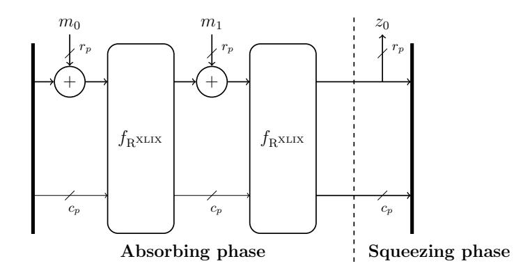
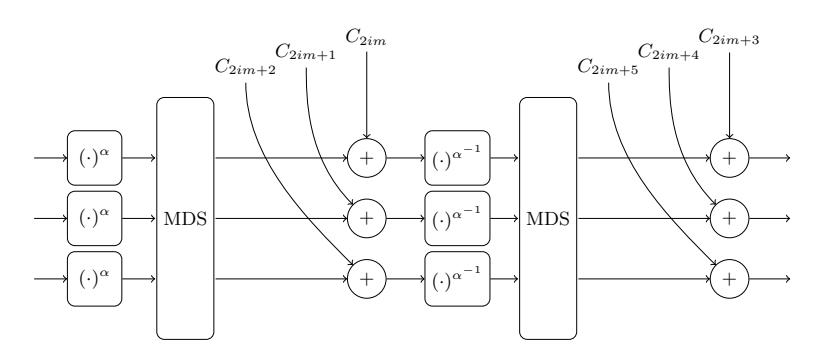

# Rescue-Prime: a Standard Specification (SoK)

Alan Szepieniec<sup>1</sup> , Tomer Ashur2,<sup>3</sup> , and Siemen Dhooghe<sup>2</sup>

<sup>1</sup> Nervos Foundation alan@nervos.org 2 imec-COSIC KU Leuven, Heverlee-Leuven, Belgium {tomer.ashur, siemen.dhooghe}@esat.kuleuven.be <sup>3</sup> TU Eindhoven, Eindhoven, the Netherlands

Abstract. This document provides a simple standard specification for the Rescue-Prime family of arithmetization-oriented hash functions.

Keywords: Arithmetization-Oriented · Hash · Rescue · Standard

### 1 Introduction

A large number of projects are being developed and deployed that rely on the evaluation of a hash function inside of a cryptographic protocol such as a multiparty computation or a zero-knowledge proof system. The common strategy employed by both types of protocols is to represent a computation as a series of native finite field operations, a process called arithmetization. The complexity of the resulting protocol is linked to that of the arithmetic representation. Consequently, there is a high demand for hash functions with an efficient arithmetization — arithmetization-oriented hash functions.

We consider one particular family of arithmetization-oriented hash functions called Rescue, first introduced as part of the Marvellous[4](#page-0-0) universe [\[2\]](#page-13-0). In the time since the publication of the first electronic preprint, the paper's scope has been proven needlessly broad on two counts.

- The advanced cryptographic protocols almost universally prefer prime fields over binary extension fields. As a result, the Rescue family has received much more attention than its binary field (and equally Marvellous) counterpart, Vision.
- The original paper specifies the Vision and Rescue hash functions in multiple steps in order to offer more flexibility with regards to the exact symmetric primitive required. However, the demand for arithmetization-oriented hash functions dwarfs the demand for alternative symmetric constructions with similar properties. In light of this imbalance, the flexibility is unnecessary and the stepwise derivation convoluted.

<span id="page-0-0"></span><sup>4</sup> No idea why it is spelled with two L's.

The complexity arising from this broad focus is compounded by the paper's target audience. It is written primarily for symmetric key cryptanalysts and cipher designers who must be led by the hand and in tiny steps to the understanding that their hard-won knowledge and intuition about traditional cipher design and analysis needs adaptation in order to apply to arithmetization-oriented ciphers. Rather than merely specifying the new proposals, the paper surveys the field in order to identify differences and pitfalls before proceeding to formulate (candidates for) sound design principles. When the ciphers finally are specified, this specification is overshadowed by an elaborate security analysis and performance benchmark justifying the proposals' existence by driving home once again the alternate target for optimization — arithmetic complexity, not hardware or software complexity.

In the mist of this discussion, the instructions for implementers are lost.

### 1.1 This Document

This document specifies the arithmetization-oriented hash function Rescue-Prime, which is based on the original Rescue proposal [\[2\]](#page-13-0). The hash function is presented in an easy-to-digest format. The target audience consists of implementers rather than cryptanalysts. We can therefore omit discussions that distract from the matter at hand.

No scientific novelty is claimed. Rather, the contribution consists in making existing knowledge more accessible to a wider audience. This document should be read through the lens of a standards document or a systematization of knowledge.

That being said, we do make use of the opportunity to apply three simplifications to the construction. The motivation for these changes is segregated from the specification itself.

- We change the derivation of round constants.
- We reduce the security margin from 100% to 50%.
- We flip the order of S-Boxes.

The resulting families of permutations and hash functions are technically dissimilar from their analogues in the original proposal. To draw a clear distinction between all objects, we introduce new names for the primitives specified here. Rescue-XLIX (pronounced Rescue Forty Nine) refers to the permutation that incorporates these changes. Rescue-Prime refers to the hash function obtained by instantiating the sponge construction with this permutation.

### 1.2 Not in This Document

This document targets brevity and clarity. As a result, any discussion on the following questions is omitted.

- The Vision and Rescue block ciphers, as well as the Vision hash function.
- How to arithmetize Rescue-Prime.
- Other symmetric-key primitives derived from Rescue-XLIX.
- Security arguments.

## <span id="page-2-0"></span>2 Specification of Rescue-Prime

#### 2.1 Parameters

A member of the Rescue-Prime family of hash functions is fully determined by a tuple of primary parameters  $(p, m, c_q, s)$ .

- p determines the prime field  $\mathbb{F}_p$  over which the operations are defined. p must be a prime number with a binary expansion of at least 32 bits.
- m determines the state width of the hash function. Phrased differently, in the evaluation of the function, the state is fully determined by m>1 field elements.
- $-c_p$  is the *capacity* of the arithmetic sponge. The complement,  $r_p=m-c_p$  is the *rate* of the arithmetic sponge which determines the number of field elements that are absorbed between invocations of the Rescue-XLIX permutation.
- $-\ 80 \le s \le 512$  is the target security level, measured in bits.

Furthermore, there are parameters that depend entirely on the tuple of primary parameters but are included in the parameter list for convenience.

- $-\alpha$  and  $\alpha^{-1}$  are the exponents in the power maps in the S-boxes. These parameters are set to guarantee that  $(x^{\alpha})^{\alpha^{-1}} = x$  for all  $x \in \mathbb{F}_p$ .
- $-M \in \mathbb{F}_p^{m \times m}$  is an  $m \times m$  MDS matrix.
- $-N \in \mathbb{N}$  is the number of rounds. A single Rescue-XLIX permutation consists of N iterations of a simpler base permutation called a *round*.

Lastly, there are an additional 2mN field elements  $\{C_i\}_{i=0}^{2mN-1}$  called the round constants. These serve to individualize each round of the permutation. We provide a way to derive them pseudorandomly in Section 2.4.

#### 2.2 The Rescue-Prime Hash Function

The Rescue-Prime hash function sends arbitrary-length sequences of field elements to  $r_p$  field elements:

$$f_{\mathbf{R}'}: \mathbb{F}_p^* \to \mathbb{F}_p^{r_p}$$
.

It is obtained by employing the Rescue-XLIX permutation in a sponge construction. The resulting sponge function sends arbitrary-length sequences to infinite-length sequences of field elements:

$$f_{\mathbf{R}'\text{-sponge}}: \mathbb{F}_p^* \to \mathbb{F}_p^*$$
.

Rescue-Prime results from truncating this sponge function. Specifically, the first  $r_p$  elements are retained and the rest is ignored.

The evaluation of the sponge function involves a permutation  $f_{\mathbf{R}^{\mathrm{XLIX}}}: \mathbb{F}_p^m \to \mathbb{F}_p^m$ , a register of m field elements called the state, and two phases. The state is initially set to the all-zero sequence  $\mathbf{0} \in \mathbb{F}_p^m$ .

In the absorbing phase, the following iteration is repeated: the next r<sup>p</sup> elements from the input sequence are added to the r<sup>p</sup> top elements of the state, after which the permutation fRXLIX is applied to the state. This loop runs until all the input elements have been absorbed.

In the squeezing phase, the top r<sup>p</sup> elements of the state are output. In theory, the permutation fRXLIX can be applied to the state iteratively to produce an arbitrarily long sequence of output elements. However, this specification restricts the number of output elements to at most rp.

Fig. [1](#page-3-0) illustrates the computation. Algorithm [1](#page-4-0) captures this procedure with SageMath code.

<span id="page-3-0"></span>

Fig. 1. The Rescue-Prime hash function with two absorbing iterations.

Padding A sponge function operating on arbitrary-length inputs requires a padding rule. To pad the input, append a single 1 ∈ F<sup>p</sup> and as many 0 ∈ F<sup>p</sup> elements as required to make the number of input elements a multiple of rp. A wrapper adding this padding is provided in Alg. [2.](#page-4-1)

Truncation and generic security For some applications only n < r<sup>p</sup> field elements are required. The most straightforward way to obtain them is to truncate the output of Rescue-Prime.

In general, the security proof for sponge constructions assumes that the underlying permutation is uniformly sampled from the set of all permutations on the state space. The discussion in Section [2.3](#page-4-2) is aimed to ensure that the Rescue-XLIX permutation is indistinguishable from a random permutation, thus satisfying the prerequisite for the security proof. When this is the case, a sponge-based hash function whose output is truncated to n ≤ r<sup>p</sup> field elements, generically affords at least log<sup>2</sup> √<sup>p</sup> · min(n, cp) bits of security against finding collisions, preimages, and second-preimages.

Algorithm 1 Obtaining the Rescue-Prime hash function (without padding) from the Rescue-XLIX permutation

```
def rescue_prime_hash ( parameters , input_sequence ) :
 p , m , capacity , security_level , alpha , alphainv , N , MDS ,
     round_constants = parameters
 rate = m - capacity
 Fp = FiniteField ( p )
 assert len( input_sequence ) % rate == 0
 # initialize state to all zeros
 state = matrix ([[ Fp (0) ] for i in range ( m ) ])
 # absorbing
 absorb_index = 0
 while absorb_index < len( input_sequence ) :
      for i in range (0 , rate ) :
          state [i ,0] += input_sequence [ absorb_index ]
          absorb_index += 1
      state = rescue_XLIX_permutation ( parameters , state )
 # squeezing
 output_sequence = []
 for i in range (0 , rate ) :
      output_sequence . append ( state [i ,0])
 return output_sequence
```

### Algorithm 2 The Rescue-Prime hash function, with padding.

```
def rescue_prime_wrapper ( parameters , input_sequence ) :
 p , m , capacity , security_level , alpha , alphainv , N , MDS ,
     round_constants = parameters
 rate = m - capacity
 Fp = FiniteField ( p )
 padded_input = input_sequence + [ Fp (1) ]
 while len( padded_input ) % rate != 0:
      padded_input . append ( Fp (0) )
 return rescue_prime_hash ( parameters , padded_input )
```

### <span id="page-4-2"></span>2.3 The Rescue-XLIX Permutation

The Rescue-XLIX permutation fRXLIX consists of N iterations of the Rescue-XLIX round function. A single round consists of the following components:

- S-box layer: apply the power map  $(\cdot)^{\alpha}$  to each element of the state.
- Linear layer: apply the MDS matrix to the state, through matrix-vector multiplication.
- Constants injection: add the next m constants from the list of round constants  $\{C_i\}_{i=0}^{2mN-1}$  into the state.
- Inverse S-box layer: apply the inverse power map  $(\cdot)^{\alpha^{-1}}$  to each element of the state.
- Linear layer: apply the MDS matrix to the state, through matrix-vector multiplication.
- Constants injection: add the next m constants from the list of round constants  $\{C_i\}_{i=0}^{2mN-1}$  into the state.

A diagram of a single round is provided in Fig. 2. SageMath code for the full permutation (N rounds) is given in Alg. 3.



<span id="page-5-1"></span>**Fig. 2.** Round i of the Rescue-XLIX permutation, with m=3.

#### 2.4 Selecting the Parameters

<span id="page-5-2"></span>Selecting the MDS Matrix. Let g be the smallest primitive element of  $\mathbb{F}_p$ . Typically g=2 is fine, but for some choices of p, g only generates a subgroup of  $\mathbb{F}_p \setminus \{0\}$ ,  $\times$ . To test whether a candidate g is primitive, raise it to all factors of p-1 and verify that the result is not 1.

Build a Vandermonde matrix  $V \in \mathbb{F}_p^{m \times 2m}$  by setting the (i, j)th element to  $\mathbf{g}^{ij}$ , with both indices starting from zero. The rows of V form a basis for a maximum distance separable (MDS) code. To obtain a generator matrix for this code, bring V into reduced row-echelon form. At this point, V has the shape  $(I|M^{\mathsf{T}})$ , where M is the sought-after MDS matrix.

<span id="page-5-0"></span>Selecting the Round Constants Let |p| denote the number of bits in the binary representation of p. Generate a string of  $(\lceil \frac{|p|}{8} \rceil + 1) \times 2mN$  bytes using SHAKE-256 to expand the ASCII string "Rescue-XLIX(%i,%i,%i,%i)" where

#### Algorithm 3 The Rescue-XLIX permutation

```
def rescue_XLIX_permutation ( parameters , state ) :
 p , m , capacity , security_level , alpha , alphainv , N , MDS ,
     round_constants = parameters
 Fp = state [0 ,0]. parent ()
 for i in range ( N ) :
      # S-box
      for j in range ( m ) :
           state [j ,0] = state [j ,0]^ alpha
      # mds
      state = MDS * state
      # constants
      for j in range ( m ) :
           state [j ,0] += round_constants [ i *2* m + j ]
      # inverse S-box
      for j in range ( m ) :
           state [j ,0] = state [j ,0]^ alphainv
      # mds
      state = MDS * state
      # constants
      for j in range ( m ) :
           state [j ,0] += round_constants [ i *2* m + m + j ]
 return state
```

### Algorithm 4 Generating the MDS matrix

```
def get_mds_matrix ( p , m ) :
 # get a primitive element
 Fp = FiniteField ( p )
 g = Fp (2)
 while g . multiplicative_order () != p -1:
      g = g + 1
 # get a systematic generator matrix for the code
 V = matrix ([[ g ^( i * j ) for j in range (0 , 2* m ) ] for i in
     range (0 , m ) ])
 V_ech = V . echelon_form ()
 # the MDS matrix is the transpose of the right half of
     this matrix
 MDS = V_ech [: , m :]. transpose ()
 return MDS
```

the %i wild cards represent the decimal expansions of the primary parameters  $p,m,c_p,s,$  respectively.

Next, build the list of constants one by one. To do this, iterate over all 2mN chunks of  $(\lceil \frac{|p|}{8} \rceil + 1)$  bytes from this string and cast the chunk into an integer using least significant byte first encoding. Reducing this integer modulo p gives the next element of the list of constants.

#### **Algorithm 5** Generating the round constants

```
{\tt def} get_round_constants( p, m, capacity, security_level, N ):
 # generate pseudorandom bytes
 bytes_per_int = ceil(len(bin(p)[2:]) / 8) + 1
 num_bytes = bytes_per_int * 2 * m * N
 seed_string = "Rescue-XLIX(%i,%i,%i,%i)" % (p, m,
    capacity, security_level)
 byte_string = SHAKE256(bytes(seed_string, "ascii"),
    num_bytes)
 # process byte string in chunks
 round_constants = []
 Fp = FiniteField(p)
 for i in range(2*m*N):
     chunk = byte_string[bytes_per_int*i : bytes_per_int*(
     integer = sum(256^j * ZZ(chunk[j]) for j in range(len
         (chunk)))
     round_constants.append(Fp(integer % p))
 return round_constants
```

### 2.5 Computing $\alpha$ and $\alpha^{-1}$

The parameter  $\alpha$  is defined as the smallest integer that is coprime with p-1, and  $\alpha^{-1}$  is defined as its multiplicative inverse in the ring  $\mathbb{Z}/\langle p-1\rangle$ . For fields satisfying  $\gcd(p-1,3)=1$ , we have  $\alpha=3$  and  $\alpha^{-1}=\frac{2p-1}{3}$ . However, for other fields  $\alpha$  must be larger and  $\alpha^{-1}$  must be computed with the extended Euclidean algorithm. Algorithm 6 shows how to compute these parameters.

Choosing the Number of Rounds For  $|p| \geq 32$  and  $80 \leq s \leq 512$ , the Gröbner basis attack performs best and should be used to set the number of rounds. Let  $d_{con} = 0.5(\alpha - 1)m(N - 1) + 2$  and  $v = m(N - 1) + r_p$ . The complexity of a Gröbner basis attack is at least  $\binom{d_{con}+v}{v}^2$  field operations. Set  $\ell_1$

#### Algorithm 6 Computing α and α −1

```
def get_alphas ( p ) :
 for alpha in range (3 , p ) :
      if gcd ( alpha , p -1) == 1:
           break
 g , alphainv , garbage = xgcd ( alpha , p -1)
 return ( alpha , ( alphainv % (p -1) ) )
```

to the smallest positive value for N that makes this binomial expression larger than 2<sup>s</sup> , or formally

$$\ell_1 = \min_N \quad \text{subject to} \, \left( \frac{d_{con} + v}{v} \right)^2 > 2^s \, \, .$$

Additionally, account for a sanity factor of at least 5 rounds and a security margin of 50%. This makes the number of rounds equal to

$$N = \lceil 1.5 \cdot \max(5, \ell_1) \rceil.$$

Algorithm [7](#page-8-1) shows provides SageMath code for determining the number of rounds.

### Algorithm 7 Calculating the number of rounds

```
def get_number_of_rounds ( p , m , capacity , security_level ,
 alpha ) :
 # get number of rounds for Groebner basis attack
 rate = m - capacity
 dcon = lambda N : floor (0.5 * ( alpha -1) * m * (N -1) + 2)
 v = lambda N : m *( N -1) + rate
 target = 2^ security_level
 for l1 in range (1 , 25) :
      if binomial ( v ( l1 ) + dcon ( l1 ) , v ( l1 ) ) ^2 > target :
          break
 # set a minimum value for sanity and add 50%
 return ceil (1.5 * max (5 , l1 ) )
```

### 3 Motivation for Changes from the Original Publication

Rescue-XLIX departs from the original specification of Rescue [\[2\]](#page-13-0) in three ways.

### 3.1 Flipped Order of S-boxes

In Rescue, the first step of each round involves the α <sup>−</sup><sup>1</sup> power map, and the second step uses α. In Rescue-XLIX, this order is reversed. As a result, the arithmetization technique the original publication called folding — representing two steps as a single set of equations without increasing their degree and omitting intermediate state variables — now applies across the entire cipher and does not require special care for the very first and last steps.

Conceptually, the new variant can be thought of as adding a single step to the front and to the back. The number of equations and variables in a Gr¨obner basis attack does not change as a result of this addition, because the same improved arithmetization is available to the attacker. However, the shape of the equations at the very first and last steps are different.

### 3.2 Simplified Specification of Round Constants

The specification of the round constants for the original version of Rescue is rather convoluted. It specifies the round constants for the block cipher's key schedule using an affine relation determined by SHAKE-256. By setting the key to zero, the sub-keys are fixed, and these are the round constants that are used in the hash function.

The specification of the round constants for Rescue-XLIX is much more straightforward. In principle, uniformly random round constants suffice. However, we chose to use SHAKE-256 to expand a seed phrase and derive the constants from the resulting byte stream. This achieves two goals:

- It establishes that the designers did not select these round constants because they hide a secret trapdoor, an approach known as nothing-up-my-sleeve.
- It provides a single standard way to instantiate Rescue-Prime that different projects and implementations can agree on. After all, this paper provides a reference standard.

#### 3.3 Reduced Security Margin

The original specification of Rescue had a 100% security margin. A reasonable amount of time has passed since the publication of the preprint. In the intervening time multiple projects have chosen to use Rescue [\[9,](#page-15-0)[6,](#page-14-0)[10\]](#page-15-1), several studies of the security of arithmetization-oriented hash functions and Rescue in particular have appeared [\[4,](#page-14-1)[3,](#page-13-1)[7](#page-15-2)[,8,](#page-15-3)[5\]](#page-14-2), and even a bountiful competition has run its course [\[1\]](#page-13-2). None of these endeavors have exposed any weaknesses in the construction. We therefore determine that it is timely and fitting to reduce the security margin to 50%.

# 4 Deviations from the Rescue-Prime Standard Specification

Following Section [2](#page-2-0) is the simplest and most straightforward way to generate a safe instance of Rescue-Prime. However, certain special cases may warrant deviation from the standard approach. In this section we outline directions for such deviations and assign a confidence score to the security claim of the resulting variant. We stress that we highly recommend whenever possible to follow the specification in Section [2](#page-2-0) and to seek an expert's help before deciding to deviate.

#### 4.1 Small Fields and High Security

Section [2](#page-2-0) mandated that binary expansion of p is at least 32-bit long and offered a formula for a safe number of rounds when the security level is between 80 bits and 512 bits. This ensures that resistance against Gr¨obner basis attacks is the decisive factor in setting the number of rounds.

However, the original publication allows for fields as small as 4-bit long. In some cases, when both the field size p and the state size m are small compared to the required security, differential cryptanalysis may outperform Gr¨obner basis attacks.

In this case, the number of rounds should take into account the maximal number of rounds that can be attacked by a differential attack:

$$\ell_0 = \frac{2s}{\log_2(p^{m+1}) - \log_2((\alpha-1)^{m+1})} = \frac{2s}{(m+1)(\log_2(p) - \log_2(\alpha-1))} \enspace .$$

The number of rounds is then set to N = d1.5·max(5, `0, `1)e. Algorithm [8](#page-10-0) shows how to derive this number of rounds in this case.

Algorithm 8 Calculating the number of rounds for high-security/small-field instances

```
def get_number_of_rounds1 ( p , m , capacity , security_level ,
 alpha ) :
 # get number of rounds for Groebner basis attack
 rate = m - capacity
 dcon = lambda N : floor (0.5 * ( alpha -1) * m * (N -1) + 2)
 v = lambda N : m *( N -1) + rate
 target = 2^ security_level
 for l1 in range (1 , 25) :
      if binomial ( v ( l1 ) + dcon ( l1 ) , v ( l1 ) ) ^2 > target :
          break
 # get number of rounds for differential attack
 l0 = 2* security_level / ( log (1.0* p ^( m +1) , 2.0) - log
     (1.0*( alpha - 1) ^( m +1) , 2.0) )
 # take minimum of numbers , sanity factor , and add 50%
 return ceil (1.5 * max (5 , l0 , l1 ) )
```

Many of the parameter choices where differential attacks are relevant, are artificial. In order to generate a practical generic security level for the sponge construction, a small field must be paired with a large state size, or vice versa. In other words, at most one of {m, |p|} can be small, practically speaking.

Selection of the MDS Matrix is unaffected by this decision.

Selection the Round Constants is unaffected by this decision.

Confidence Level is medium-high. This variant was explicitly covered in the generic security argument of the original publication. However, most of the focus so far was on more natural settings.

### 4.2 Alternate MDS Matrices

There are cases where better performance is afforded by optimizing the MDS with respect to some design criterion. Section [2.4](#page-5-2) specifies Vandermonde matrices as the standard way to generate the MDS matrix. However the original publication did not limit the choice of MDS to any specific type and argues its security with respect to any MDS matrix. The decision to be more restrictive merely simplifies the standard specification and is not known to have any security implications for algorithms following the Marvellous design strategy.

Choosing the MDS matrix: any MDS matrix can be used.

The number of rounds is unaffected by this decision.

Selection the Round Constants is unaffected by this decision.

Confidence Level is high. This variant was explicitly covered in the generic security argument of the original publication.

### 4.3 Omission of the Padding Rule

A padding rule is required when the sponge function is used to absorb inputs of arbitrary length. If the length of the input is fixed and known in advance (when building a Merkle tree, for instance) the padding can be omitted.

The number of rounds is unaffected by this decision.

Selection of the MDS matrix is unaffected by this decision.

Selection the Round Constants is unaffected by this decision.

Confidence Level is medium-high. This is a well known property of sponge constructions and is independent of Rescue-Prime.

### 4.4 Algebraically Dependent Round Constants

The point in injecting round constants is to ensure that every round is unique, thereby foiling attacks that exploit a repetitive structure of the cipher. In some applications it is cumbersome to specify 2mN unstructured round constants, and it would be convenient to derive some of the round constants from the others. We sketch two ways to do this.

- Select  $C_i$ ,  $i \equiv 0 \mod m$  at random and set  $C_{i+j} = C_i^{j+1}$ , for 0 < j < m. The  $C_i$  should be selected uniformly at random but with rejection sampling to ensure that  $C_i$  generates the entire group  $\mathbb{F}_p \setminus \{0\}, \times$ .
- Select  $(C_0, \ldots, C_{m-1})$  uniformly at random along with an invertible matrix  $A \in \mathbb{F}_p^{m \times m}$  and an offset vector  $\mathbf{b} \in \mathbb{F}_p^m$ . Then derive  $(C_{im}, \ldots, C_{(i+1)m-1})^\mathsf{T} = A(C_{(i-1)m}, \ldots, C_{im-1})^\mathsf{T} + \mathbf{b}$ , for  $1 \le i < 2N$ .

The number of rounds is unaffected by this decision.

Selection of the MDS matrix is unaffected by this decision.

Confidence Level is high. Consult an expert to avoid pitfalls.

### 4.5 Permitting $n > r_p$

Doubly-extendable cryptographic (DEC) functions Such function allow to absorb a sequence of arbitrary length and and output a sequence of arbitrary length (up to the security bound). Hash functions are a private case of DEC functions with a fixed length input.

The Rescue-Prime hash function specified in Section 2 restricts the squeezing phase to a single iteration, and defines the output length as  $n \leq r_p$ . Algorithm 9 (resp., Algorithm 10) modifies Algorithm 2 (resp., Algorithm 1) for the case of a DEC functions.

The number of rounds is unaffected by this decision.

Selection of the MDS matrix is unaffected by this decision.

**Selection the Round Constants** is high. This variant was explicitly covered in the generic security argument of the original publication.

Algorithm 9 Obtaining Rescue-Prime Doubly-extendable cryptographic function from the Rescue-Prime sponge

```
def rescue_prime_DEC ( parameters , input_sequence ,
 output_length ) :
 p , m , capacity , security_level , alpha , alphainv , N , MDS ,
     round_constants = parameters
 rate = m - capacity
 Fp = FiniteField ( p )
 padded_input = input_sequence + [ Fp (1) ]
 while len( padded_input ) % rate != 0:
      padded_input . append ( Fp (0) )
 return rescue_prime_sponge ( parameters , padded_input ,
     output_length )
```

## 5 Conclusion

We close with a note on the utility of conclusions, making use of the opportunity provided by a clear example of when there isn't any. The purpose of a conclusion is not to summarize a body of text (that would be an insult to the reader!) but rather to cast new and more light on the knowledge conveyed therein. It serves to interpret the results, and to suggest improved thought patterns appropriate for the context at hand.

This document does not introduce new results or even new knowledge. Readers looking for a better way to think about arithmetization-oriented ciphers are referred to the original Marvellous paper [\[2\]](#page-13-0). There is nothing left to say in this conclusion; goodbye.

Acknowledgments Alan Szepieniec is supported by the Nervos Foundation. Tomer Ashur is an FWO post-doctoral fellow under Grant Number 12ZH420N. Siemen Dhooghe is supported by a Ph.D. Fellowship from the Research Foundation - Flanders (FWO).

# References

- <span id="page-13-2"></span>1. STARK-friendly hash challenge, [https://starkware.co/developers-community/](https://starkware.co/developers-community/hash-challenge/) [hash-challenge/](https://starkware.co/developers-community/hash-challenge/), accessed: 2020-09-09
- <span id="page-13-0"></span>2. Aly, A., Ashur, T., Ben-Sasson, E., Dhooghe, S., Szepieniec, A.: Design of symmetric-key primitives for advanced cryptographic protocols. IACR Cryptol. ePrint Arch. 2019, 426 (2019), <https://eprint.iacr.org/2019/426>
- <span id="page-13-1"></span>3. Ben-Sasson, E., Goldberg, L., Levit, D.: STARK friendly hash - survey and recommendation. IACR Cryptol. ePrint Arch. 2020, 948 (2020), [https://eprint.](https://eprint.iacr.org/2020/948) [iacr.org/2020/948](https://eprint.iacr.org/2020/948)

Algorithm 10 Obtaining the Rescue-Prime sponge from the Rescue-XLIX permutation

```
def rescue_prime_sponge ( parameters , input_sequence ,
output_length ) :
 p , m , capacity , security_level , alpha , alphainv , N , MDS ,
     round_constants = parameters
 rate = m - capacity
 Fp = FiniteField ( p )
 assert len( input_sequence ) % rate == 0
 # initialize state to all zeros
 state = matrix ([[ Fp (0) ] for i in range ( m ) ])
 # absorbing
 absorb_index = 0
 while absorb_index < len( input_sequence ) :
     for i in range (0 , rate ) :
          state [i ,0] += input_sequence [ absorb_index ]
          absorb_index += 1
     state = rescue_XLIX_permutation ( parameters , state )
 # squeezing
 output_sequence = []
 squeeze_index = 0
 while squeeze_index < output_length :
     for i in range (0 , rate ) :
          output_sequence . append ( state [i ,0])
          squeeze_index += 1
     if squeeze_index < output_length :
          state = rescue_XLIX_permutation ( parameters , state
              )
 return output_sequence [: output_length ]
```

- <span id="page-14-1"></span>4. Beyne, T., Canteaut, A., Dinur, I., Eichlseder, M., Leander, G., Leurent, G., Naya-Plasencia, M., Perrin, L., Sasaki, Y., Todo, Y., Wiemer, F.: Out of oddity - new cryptanalytic techniques against symmetric primitives optimized for integrity proof systems. In: Micciancio, D., Ristenpart, T. (eds.) CRYPTO, Part III. Lecture Notes in Computer Science, vol. 12172, pp. 299–328. Springer (2020), [https://doi.org/](https://doi.org/10.1007/978-3-030-56877-1_11) [10.1007/978-3-030-56877-1\\_11](https://doi.org/10.1007/978-3-030-56877-1_11)
- <span id="page-14-2"></span>5. Beyne, T., Canteaut, A., Leander, G., Naya-Plasencia, M., Perrin, L., Wiemer, F.: Report on the security of the Rescue hash function (2020), [https://starkware.](https://starkware.co/wp-content/uploads/2020/06/report.pdf) [co/wp-content/uploads/2020/06/report.pdf](https://starkware.co/wp-content/uploads/2020/06/report.pdf)
- <span id="page-14-0"></span>6. Bowe, S., Grigg, J., Hopwood, D.: Halo: Recursive proof composition without a trusted setup. IACR Cryptol. ePrint Arch. 2019, 1021 (2019), [https://eprint.](https://eprint.iacr.org/2019/1021) [iacr.org/2019/1021](https://eprint.iacr.org/2019/1021)

- <span id="page-15-2"></span>7. Canteaut, A., Beyne, T., Dinur, I., Eichlseder, M., Leander, G., Leurent, G., Plasencia, M.N., Perrin, L., Sasaki, Y., Todo, Y., Wiemer, F.: Report on the security of STARK-friendly hash functions (version 2.0) (2020), [https://starkware.](https://starkware.co/wp-content/uploads/2020/03/reportv2.pdf) [co/wp-content/uploads/2020/03/reportv2.pdf](https://starkware.co/wp-content/uploads/2020/03/reportv2.pdf)
- <span id="page-15-3"></span>8. Keller, N., Rosemarin, A.: Mind the middle layer: The HADES design strategy revisited. IACR Cryptol. ePrint Arch. 2020, 179 (2020), [https://eprint.iacr.](https://eprint.iacr.org/2020/179) [org/2020/179](https://eprint.iacr.org/2020/179)
- <span id="page-15-0"></span>9. StarkWare: EthSTARK, <https://github.com/starkware-libs/ethSTARK>, accessed: 2020-09-09
- <span id="page-15-1"></span>10. Threadbare, B.: Distaff, <https://github.com/GuildOfWeavers/distaff>