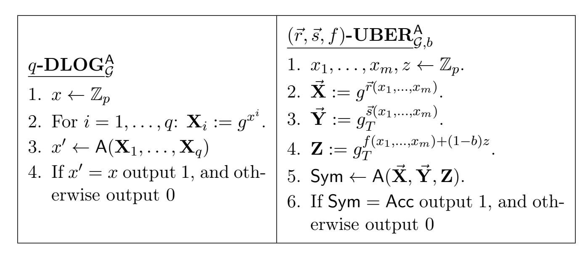

{0}------------------------------------------------

# Algebraic Distinguishers: From Discrete Logarithms to Decisional Uber Assumptions

Lior Rotem∗† Gil Segev<sup>∗</sup>

#### Abstract

The algebraic group model, introduced by Fuchsbauer, Kiltz and Loss (CRYPTO '18), is a substantial relaxation of the generic group model capturing algorithms that may exploit the representation of the underlying group. This idealized yet realistic model was shown useful for reasoning about cryptographic assumptions and security properties defined via computational problems. However, it does not generally capture assumptions and properties defined via decisional problems. As such problems play a key role in the foundations and applications of cryptography, this leaves a significant gap between the restrictive generic group model and the standard model.

We put forward the notion of algebraic distinguishers, strengthening the algebraic group model by enabling it to capture decisional problems. Within our framework we then reveal new insights on the algebraic interplay between a wide variety of decisional assumptions. These include the decisional Diffie-Hellman assumption, the family of Linear assumptions in multilinear groups, and the family of Uber assumptions in bilinear groups.

Our main technical results establish that, from an algebraic perspective, these decisional assumptions are in fact all polynomially equivalent to either the most basic discrete logarithm assumption or to its higher-order variant, the q-discrete logarithm assumption. On the one hand, these results increase the confidence in these strong decisional assumptions, while on the other hand, they enable to direct cryptanalytic efforts towards either extracting discrete logarithms or significantly deviating from standard algebraic techniques.

<sup>∗</sup>School of Computer Science and Engineering, Hebrew University of Jerusalem, Jerusalem 91904, Israel. Email: {lior.rotem,segev}@cs.huji.ac.il. Supported by the European Union's Horizon 2020 Framework Program (H2020) via an ERC Grant (Grant No. 714253).

<sup>†</sup>Supported by the Adams Fellowship Program of the Israel Academy of Sciences and Humanities.

{1}------------------------------------------------

# Contents

| 1 | Introduction                                             |                                                                                   |    |  |
|---|----------------------------------------------------------|-----------------------------------------------------------------------------------|----|--|
|   | 1.1                                                      | Our Contributions<br>                                                             | 2  |  |
|   | 1.2                                                      | Overview of Our Framework and Results<br>                                         | 3  |  |
|   | 1.3                                                      | Additional Related Work<br>                                                       | 6  |  |
|   | 1.4                                                      | Paper Organization<br>                                                            | 6  |  |
| 2 |                                                          | Preliminaries<br>7                                                                |    |  |
| 3 |                                                          | Our Framework: Algebraic Distinguishers                                           | 8  |  |
|   | 3.1                                                      | Decisional Algebraic Games<br>                                                    | 8  |  |
|   | 3.2                                                      | Extending the Notion of Algebraic Algorithms<br>                                  | 9  |  |
|   | 3.3                                                      | Generic Algorithms are Algebraic<br>                                              | 10 |  |
| 4 |                                                          | Warm-Up: The Algebraic Equivalence of DDH and DLog<br>11                          |    |  |
| 5 |                                                          | The Algebraic Hardness of the Uber Family of Decisional Problems                  | 14 |  |
|   | 5.1                                                      | Algebraic Algorithms in Bilinear Groups<br>                                       | 14 |  |
|   | 5.2                                                      | q-DLOG Problems<br>Algebraic Equivalence of the Uber and<br>                      | 15 |  |
| 6 | The Algebraic Hardness of the Decisional Linear Problems |                                                                                   |    |  |
|   | 6.1                                                      | Algebraic Algorithms in Multilinear Groups<br>                                    | 19 |  |
|   | 6.2                                                      | Algebraic Equivalence of the<br>k-Lin and DLOG Problems in<br>k-Linear Groups<br> | 20 |  |
|   | References                                               |                                                                                   | 23 |  |

{2}------------------------------------------------

# <span id="page-2-0"></span>1 Introduction

One of the most successful and influential idealized models in cryptography is the generic group model [\[Nec94,](#page-26-0) [BL96,](#page-25-0) [Sho97,](#page-26-1) [Mau05\]](#page-26-2), most often used to analyze the security of group-based cryptographic assumptions and constructions. The generic group model captures group-based computations that do not exploit any specific property of the representation of the underlying group, by withholding from algorithms the concrete representations of group elements. At a high level, the access of generic algorithms to group elements is mediated by an oracle, and is restricted to the abstract group operation and to checking equalities among group elements throughout the computation. On the one hand, the generic group model captures a wide and natural class of algorithms, and a proof of security in this model means that a successful adversary must step outside this class. This enables, in particular, to direct candidate constructions and cryptanalytic efforts away from generic impossibility or hardness results. On the other hand, however, the assumption that adversaries are completely oblivious to the representation of the group and its elements is often unrealistic to some extent (see for example [\[FKL18,](#page-25-1) [JS13\]](#page-26-3) and the discussion therein).

The algebraic group model. With this gap in mind, Fuchsbauer, Kiltz and Loss [\[FKL18\]](#page-25-1) elegantly introduced the algebraic group model, as an intermediary model between the generic group model and the standard model.[1](#page-2-1) Roughly speaking, an algebraic algorithm may use the representation of group elements in any arbitrary manner, but whenever it outputs a group element, it must supply together with it an "algebraic explanation" for how it came up with this element. Informally, this explanation is a representation of the outputted element, in the basis of all group elements that the algorithm has received so far.

Fuchsbauer et al. showed that though a considerable weakening of the generic group model, the algebraic group model provides a very advantageous framework for proving security reductions which are unknown to hold in the standard model. For example, within the algebraic group model, they reduced the security of very useful cryptographic schemes such as the BLS signature scheme [\[BLS01\]](#page-25-2) and Groth's zero-knowledge SNARK [\[Gro16\]](#page-25-3), to the hardness of very simple variants of the discrete logarithm problem. Follow-up works have continued to exemplify the usefulness of the model, by providing security reductions from the hardness of a large class of computational Diffie-Hellman-like problems to the hardness of the discrete logarithm problem [\[MTT19\]](#page-26-4); and from the unforgeability of blind Schnorr signatures [\[Sch91,](#page-26-5) [Sch01\]](#page-26-6) and variants thereof to the hardness of simple computational problems in cyclic groups [\[FPS20\]](#page-25-4). Moreover, the recent work of Agrikola, Hofheinz and Kastner [\[AHK20\]](#page-25-5) provided a standard-model implementation of (a relaxation of) the algebraic group model.

Computational vs. decisional problems. One commonality which is shared by all of the aforesaid results, is that they all deal with assumptions and security properties that are defined via computational problems (i.e., search problems in which an algorithm is required to output group elements). This should come as no surprise: Algorithms for decisional problems are challenged with outputting a decision bit, and do not, generally speaking, output any group elements. As Fuchsbauer et al. point out, this means that such algorithms (to which we refer as distinguishers) are vacuously algebraic, and that in principal, decisional problems are not captured within the algebraic group model. Fuchsbauer et al. posed the important open problem of whether or not their approach can be extended to capture decisional algebraic problems and algebraic distinguishers, as these play key roles in the foundations and applications of cryptography. Developing such a model will enable to

<span id="page-2-1"></span><sup>1</sup>Previous, extraction-based, definitions may be found in the earlier works of Boneh and Venkatesan [\[BV98\]](#page-25-6) and of Paillier and Vergnaud [\[PV05\]](#page-26-7).

{3}------------------------------------------------

analyze the security of indistinguishability-based cryptographic problems and constructions while enjoying the key advantages of the algebraic group model.

## <span id="page-3-0"></span>1.1 Our Contributions

Algebraic distinguishers. We put forward a generalized framework that captures algebraic distinguishers within the algebraic group model. Following Fuchsbauer et al. [\[FKL18\]](#page-25-1), our framework fits the intuition according to which the algebraic group model "lies in between the standard model and the generic group model". Concretely, our notion of algebraic distinguishers allows such algorithms to rely on the explicit representation of group elements in any arbitrary manner, while still requiring that they "explain" their decision via an "algebraic witness".

In our framework this witness corresponds to a non-trivial equality relation satisfied by a subset of the group elements which the algebraic distinguisher has received or has computed throughout its execution. We carefully formulate an additional requirement regarding this witness in order to guarantee its non-triviality and usefulness: Loosely speaking, we ask that whenever the algebraic distinguisher can tell two distributions apart, then this witness serves as a "good differentiator" between these two distributions. Our requirement is a rather mild one (much stronger requirements hold in the generic group model), and it is sufficient for proving highly non-trivial reductions, as discussed below. Our notion of algebraic distinguishers is formulated in a general manner, allowing for flexibility and versatility in its applications (e.g., it can be used to reason about the indistinguishability of hybrid distributions that are introduced within proofs of security and are not part of the original formulation of the problem under consideration – as we demonstrate, for example, in Section [5\)](#page-15-0). We refer the reader to Section [1.2](#page-4-0) for a high-level description of our framework.

From discrete logarithms to decisional Uber assumptions. Within our framework we reveal new insights on the algebraic interplay between a wide variety of decisional assumptions. These include the seemingly modest decisional Diffie-Hellman assumption and the family of Linear assumptions [\[Sha07\]](#page-26-8), as well as the seemingly substantially stronger family of decisional Uber assumptions [\[BBG05,](#page-25-7) [Boy08\]](#page-25-8).

Our main technical results show that, from an algebraic perspective, these decisional assumptions are in fact all polynomially equivalent to either the most basic discrete logarithm assumption (in the case of the decisional Diffie-Hellman and Linear assumptions) or to its generalized higher-order variant, the q-discrete logarithm assumption (in the case of the entire family of decisional Uber assumptions). We refer the reader to Section [1.2](#page-4-0) for a high-level description of our results and for informal theorem statements.

Interpreting our framework and results. Prior to our work, these decisional assumptions that we consider were simply known to unconditionally hold in the generic group model, without any indication of a non-trivial interplay among them. Moreover, prior to our work, the algebraic group model enabled to reason only about computational problems, whereas our framework enables both to reason about decisional problems and to reduce their algebraic hardness to that of computational problems. In this light, the contributions of our framework and technical results can be interpreted in the following, somewhat equivalent, manners:

• From the perspective of designing cryptographic schemes, our equivalence between the algebraic hardness of extracting discrete logarithms and that of seemingly much stronger assumptions increases the confidence in such stronger assumptions.

{4}------------------------------------------------

• From the perspective of cryptanalytic efforts, the introduction of the family of Uber assumptions [BBG05, Boy08] enabled directing nearly all such efforts towards a specific and well-defined family of decisional assumptions. Our results show that these efforts either can be significantly further directed towards extracting discrete logarithms, or should deviate from all algebraic techniques that are captured within our framework.

## <span id="page-4-0"></span>1.2 Overview of Our Framework and Results

In this section we provide a high-level overview of our framework and technical results. We start by reviewing our definition of algebraic distinguishers, and the intuition behind it, in more detail. For a formal exposition and discussion of the definition, see Section 3.

A first attempt. As a first attempt of defining algebraic distinguishers, consider demanding that whenever an algebraic distinguisher accepts (i.e., outputs 1), it should output a "decision" vector  $\vec{w}$  such that  $\prod_i g_i^{w_i} = 1$ , where  $g_1, g_2, \ldots$  are the group elements that the distinguisher has observed, and 1 is the unity of the group. This is inspired by the approach of Fuchsbauer et al. who adapted from the generic group model the restriction of producing new group elements only as combinations of previously observed elements. The above requirement couples this restriction with another constraint posed on algorithms in the generic group model: The fact that essentially the only useful information on which generic algorithms can base their decisions is the equality pattern among the group elements that they have observed. Put differently, the basic algebraic information which can lead a generic distinguisher to accept (or to reject), is a non-trivial equality relation among the group elements that it has observed. Thus, the vector  $\vec{w}$  captures the zero test induced by this relation.

Of course, such a zero test can always be produced by setting  $\vec{w}$  to be the all-zeros vector, and so we need to add some non-triviality requirement. A possible route is demanding that whenever an algebraic algorithm accepts, the vector  $\vec{w}$  has to be non-zero (i.e.,  $\vec{w} \neq \vec{0}$ ). Such a demand, however, seems unrealistic since a distinguisher can always accept even without "having knowledge" of such a non-zero vector  $\vec{w}$ . Moreover, it is not enough to ask that  $\vec{w} \neq \vec{0}$ . Consider, for example, the decisional Diffie-Hellman problem in which the distinguisher is asked to distinguish between a tuple of the form  $(g, g^x, g^y, g^{x \cdot y})$  and a tuple of the form  $(g, g^x, g^y, g^z)$  for a uniform choice of x, y and z. In this case, a vector  $\vec{w}$  whose any of the last three entries is 0, cannot be used in order to distinguish between the distributions, since when projected onto the support of such a vector  $\vec{w}$ , the two distributions coincide.

Our definition. In light of the above discussion, our definition of algebraic distinguishers is somewhat more subtle. Informally, it asks that if an algebraic distinguisher A runs in time t and distinguishes between two distributions  $D_0$  and  $D_1$  with advantage  $\epsilon$ , then there exists some bit  $b \in \{0, 1\}$  such that the following holds: On input drawn from  $D_b$ , the distinguisher A outputs a "good" vector  $\vec{w}$  with probability at least  $\epsilon/t^2$  (this is in addition to the requirement that  $\prod_i g_i^{w_i} = 1$  with probability 1). We define a "good" vector  $\vec{w}$  to be such that  $D_0$  and  $D_1$  remain distinct even when projected onto the support of  $\vec{w}$ . Informally, by projecting a distribution onto the support of  $\vec{w}$ , we mean "erasing" all group elements whose corresponding entry in  $\vec{w}$  is 0 (See section 3.2 for a formal definition of this operation). This requirement (and even stronger forms thereof) indeed holds in the generic group model (as we discuss in Section 3.3), implying that our definition of the algebraic group model in fact lies between the generic group model and the standard one. We remark that even stronger requirements might be justifiable, and refer the reader to Section 3.2.

In groups which are equipped with a k-linear map, a distinguisher has additional algebraic power: It can infer information from equalities in the target group as well. Whereas in the generic group

{5}------------------------------------------------

model, equalities in the source group induce linear polynomials in the exponent, equalities in the target group induce polynomials of degree up to k. We capture this fact by allowing the distinguisher to output a "degree k zero test" as its algebraic witness, and refer the reader to Section [6.1](#page-20-1) for the formal definition.

The algebraic hardness of the decisional Uber assumption in bilinear groups. In the setting of bilinear groups, Boneh, Boyen and Goh [\[BBG05\]](#page-25-7) and Boyen [\[Boy08\]](#page-25-8) introduced the Uber family of decisional assumptions. Each assumption in the family is parameterized by two tuples of m-variate polynomials ~r = (r1, . . . , rt) and ~s = (s1, . . . , st) and an m-variate polynomial f. Roughly, the assumption states that given a generator g of the source group, and given the group elements g r1(x1,...,xm) , . . . , grt(x1,...,xm) and e(g, g) s1(x1,...,xm) , . . . , e(g, g) st(x1,...,xm) , it is infeasible to distinguish between e(g, g) <sup>f</sup>(x1,...,xm) and a uniformly-random element in the target group for a uniform choice of x1, . . . , xm. Boneh et al. proved that as long as ~r, ~s and f do not admit a trivial solution, the (~r, ~s, f)-Uber problem is hard in the generic group model.

Within our framework, we reduce the hardness of the (~r, ~s, f)-Uber problem to the hardness of the q-discrete logarithm problem in the source group, where in the q-discrete logarithm problem an adversary needs to retrieve a secret exponent x given (g, g<sup>x</sup> , . . . , g<sup>x</sup> q ), and q is polynomial in the number of polynomials in ~r and in ~s and in the their degree.

<span id="page-5-0"></span>Theorem 1.1 (Informal). Let (~r, ~s, f) represent m-variate polynomials which do not admit a trivial solution to the (~r, ~s, f)-Uber problem, and let A be an algebraic algorithm for the (~r, ~s, f)-Uber problem relative to a source group G and a target group G<sup>T</sup> . Then, there exists an algorithm B for the q-Discrete Logarithm problem in G, whose running time and success probability are polynomially-related to those of A.

The proof of Theorem [1.1](#page-5-0) consists of two parts. First, inspired by the work of Ghadafi and Groth [\[GG17\]](#page-25-9), we consider an intermediate variant of the Uber assumption which is univariate, in the sense that it involves only a single secret exponent x (instead of m secret exponents x1, . . . , xm). We observe that the work of Ghadafi and Groth immediately implies that for any triplet (~r, ~s, f), the existence of a successful algebraic distinguisher for the (~r, ~s, f)-Uber assumption implies the existence of a successful algebraic distinguisher for the univariate variant as well.

In the second (and main) part of the proof, we reduce within our framework the hardness of this univariate variant to that of the q-discrete logarithm problem. Technical details omitted, the main idea is to embed the secret exponent x of the q-discrete logarithm challenge as the secret exponent used to generate the input in the univariate Uber assumption. This is where the parameter q comes into play; since the polynomials (~r, ~s, f) may be of high degree, generating the input to the univariate Uber assumption may require knowledge of group elements of the form g x i for different values of i. As discussed above, a successful algebraic distinguisher for univariate Uber assumption returns a zero test as an algebraic witness for its decision. We observe that if (~r, ~s, f) do not admit a trivial solution to the (~r, ~s, f)-Uber problem, this witness induces a non-zero univariate polynomial with one of its roots being x. Consequently, we can retrieve x by finding the roots of this polynomial (for example, by using the Berlekamp-Rabin algorithm [\[Ber70,](#page-25-10) [Rab80\]](#page-26-9)) and searching for the root which is consistent with the input to the q-discrete logarithm problem.

The algebraic hardness of the decisional k-Linear problem in k-linear groups. In the Decisional k-Linear problem introduced by Shacham [\[Sha07\]](#page-26-8), a distinguisher is given an input of the form (g, gα<sup>1</sup> , . . . , gα<sup>k</sup> , g<sup>β</sup> , gα1·r<sup>1</sup> , . . . , gαk·r<sup>k</sup> ) and needs to distinguish between the group element g β· P<sup>k</sup> <sup>i</sup>=1 <sup>r</sup><sup>i</sup> and a uniformly random group element g z . Observe that this family of assumptions 

{6}------------------------------------------------

generalizes the Decisional Diffie-Hellman assumption (which corresponds to k = 1) and the Decisional Linear assumption [\[BBS04\]](#page-25-11) (which corresponds to k = 2). Seemingly, this family forms a hierarchy; for any k, the k-Linear assumption implies the (k+ 1)-Linear assumption. As for the other direction, Shacham proved that in a generic group equipped with a (k + 1)-linear map the (k + 1)-Linear assumption holds, even though it is easy to break the k-Linear assumption. Within our algebraic framework, we prove a more refined relation among the different assumptions in the family: For k-linear groups, we show an equivalence between the k-Linear problem in the source group and the discrete logarithm in the source group.

<span id="page-6-0"></span>Theorem 1.2 (Informal). Let A be an algebraic algorithm for the k-Linear problem relative to a group G equipped with a k-linear map. Then, there exists an algorithm B for Discrete Logarithm assumption in G, whose running time and success probability are polynomially-related to those of A.

An immediate corollary of Theorem [1.2](#page-6-0) is an equivalence (within our framework) between the Decisional Diffie-Hellman assumption and the discrete logarithm assumption in groups without a bilinear map (see Section [3.2](#page-10-0) for our model which captures such groups); and an equivalence between the Decisional Linear assumption and the discrete logarithm assumption in bilinear groups (without a trilinear map – see Section [5.1](#page-15-1) for definition of such groups in our model).

The high-level idea behind the proof of Theorem [1.2](#page-6-0) can be described as follows. Given a discrete logarithm challenge g x , we embed x in the input to the k-Linear problem instead of one member of the set S := {α1, . . . , αk, r1, . . . , rk, β, z} of secret exponents. The choice of which of these exponents is replaced by x is done uniformly at random. Then, given the algebraic witness ~w returned by the distinguisher for the k-Linear problem, we define a collection of 2k + 2 univariate polynomials f1, . . . , f2k+2, one per each member of S. We prove that if the witness ~w is a "good differentiator" (in the sense loosely discussed at the beginning of this section and formally defined in Section [6.1\)](#page-20-1), then at least one of these polynomials is not the zero polynomial, and the corresponding member, denoted by y, of the set S is one of its roots. Hence, if x was embedded instead of y (which happens with probability 1/(2k + 2)), then we can use the corresponding polynomial to find x, by computing all roots of this polynomial and checking which one is consistent with the discrete logarithm challenge.

For concreteness, we now provide a more detailed account of the proof outline for Theorem [1.2](#page-6-0) for the simple case of k = 1.

Warm-up: From Decisional Diffie-Hellman to discrete logarithms. Consider an algebraic distinguisher D which runs in time t and has advantage in breaking the Decisional Diffie-Hellman assumption in a group G. As discussed above, this means that on input of the form (g, g<sup>x</sup> , g<sup>y</sup> , gx·y+b·<sup>z</sup> ) for some b ∈ {0, 1} and a uniform choice of x, y and z, D outputs a vector ~w = (w0, w1, w2, w3) such that:

- 1. g w<sup>0</sup> · g w1·x · g w2·y · g <sup>w</sup>3·(x·y+b·z) = 1; and
- 2. There exists σ ∈ {0, 1} such that if b = σ, then with probability at least /t<sup>2</sup> it holds that w1, w<sup>2</sup> and w<sup>3</sup> are all non-zero.

These facts can be used to construct an algorithm A breaking the discrete logarithm problem in G. For concreteness and brevity, in this overview we focus on the case in which σ = 0. [2](#page-6-1) The adversary A receives as input a group element R := g <sup>r</sup> and embeds it as part of the input to D: With probability 1/2, it embeds r instead of x by sampling y on its own and invoking D on (g, R, g<sup>y</sup> , R<sup>y</sup> );

<span id="page-6-1"></span><sup>2</sup> In the full reduction (Section [4\)](#page-12-0), we consider two attacks, one per each possible value of σ, and the adversary A chooses which one of them to execute uniformly at random.

{7}------------------------------------------------

and with probability 1/2 it embeds r instead of y. Suppose that D returns a vector ~w for which 0 6∈ {w1, w2, w3} (which, according to condition 2 above, happens with probability at least /t<sup>2</sup> ). We can rewrite the first condition in additive notation to deduce the bilinear bivariate equation w<sup>0</sup> + w<sup>1</sup> · x + w<sup>2</sup> · y + w<sup>3</sup> · x · y = 0. If r was embedded to replace x then A, knowing y, can solve the equation for x and output the correct discrete logarithm r. This works as long as the coefficient of x in this equation is non-zero; i.e., as long as w<sup>1</sup> + w<sup>3</sup> · y 6= 0. But whenever 0 6∈ {w1, w2, w3}, this can only happen if y = −w1/w3. Hence, if r was embedded to replace y, A may simply return −w1/w<sup>3</sup> in order to output the correct discrete logarithm r.

## <span id="page-7-0"></span>1.3 Additional Related Work

Beullens and Wee [\[BW19\]](#page-25-12) have put forth the Knowledge of Orthogonality Assumption (KOALA), which is similar in spirit to our extension of the algebraic group model. The assumption deals with the problem of distinguishing between vectors of group elements whose exponents are uniformly drawn from some linear subspace V and vectors of independently (and uniformly) sampled group elements. Roughly speaking, KOALA holds if for any probabilistic polynomial-time algorithm which can distinguish between the two afore-described distributions, there exists an extractor which outputs a vector from the orthogonal complement V <sup>⊥</sup>. Though similar in spirit, our model significantly generalizes KOALA. First, our model supports interactive security games, whereas KOALA considers a non-interactive game. In interactive games, our model also accounts for the entire view of the adversary, which may extend beyond just vectors of group elements. Second, and more importantly, KOALA seems to be tailored to prove the security of concrete obfuscation schemes, and hence only deals with the pseudorandomness of very specific distributions. In contrast, even when restricted to non-interactive games, our model can be used to reason about the ability to distinguish between any two distributions over group elements.

More generally speaking, these aforesaid differences between our model and KOALA precisely exemplify the motivation of the our work. Over the years, various knowledge assumptions in cyclic groups have been introduced in order to reason about the security of different constructions. The algebraic group model provides a unified framework for capturing computational knowledge assumptions. The motivation behind the introduction of our model is to capture in a similar manner decisional knowledge assumptions, such as KOALA, as well.

In a recent and independent work, Bauer, Fuchsbauer and Loss [\[BFL20\]](#page-25-13) have considered (among other things) the computational variant of the Uber problem of Boneh, Boyen and Goh [\[BBG05,](#page-25-7) [Boy08\]](#page-25-8) in bilinear groups. Concretely, Bauer et al. reduced this variant to the q-Discrete Logarithm problem within the algebraic group model of Fuchsbauer et al. [\[FKL18\]](#page-25-1), where q is the maximum (total) degree of the challenge polynomials in the instance of the Uber problem. Our result regarding the Uber problem (Theorem [1.1\)](#page-5-0) differs from theirs in that we consider the decisional variant of the Uber problem within our decisional algebraic group model. Both our work and theirs utilize a similar technique of embedding randomizations of the secret exponent of the q-Discrete Logarithm instance into the secret exponents of the Uber problem instance (the concrete randomizations, however, are different). This is in contrast to our proof of Theorem [1.2,](#page-6-0) which employs a different technique.

# <span id="page-7-1"></span>1.4 Paper Organization

The remainder of this paper is organized as follows. First, in Section [2](#page-8-0) we review the basic notation and definitions underlying the algebraic group model. In Section [3](#page-9-0) we present our generalized framework capturing algebraic distinguishers, and as a warm-up, Section [4](#page-12-0) includes a proof of the equivalence within our framework of the decisional Diffie-Hellman problem and the discrete logarithm 

{8}------------------------------------------------

problem. In Section 5 we extend our framework to bilinear groups, and prove our hardness result for the Uber family of decisional problems in such groups. Finally, In Section 6, we generalize our framework to multilinear groups, and prove our hardness result for the decisional k-Linear problem in k-linear groups.

#### <span id="page-8-0"></span>2 Preliminaries

In this section we briefly review the basic notions and definitions underlying the algebraic-group model [FKL18]. Throughout this work, for a distribution X we denote by  $x \leftarrow X$  the process of sampling a value x from the distribution X. Similarly, for a set  $\mathcal{X}$  we denote by  $x \leftarrow \mathcal{X}$  the process of sampling a value x from the uniform distribution over  $\mathcal{X}$ . For an integer  $n \in \mathbb{N}$ , we use the notation [n] to denote the set  $\{1, \ldots, n\}$ .

Game-based security definitions. Notions of security within the algebraic-group model are formalized using "security games", following the classic framework of Bellare and Rogaway [BR06]. A game G is parameterized by a set par of public parameters, and is comprised of an adversary A interacting with a challenger via oracle access. Such a game is described by a main procedure and possibly additional oracle procedures, which describe the manner in which the challenger replies to oracle queries issued by the adversary. We denote by  $G_{par}$  a game G with public parameters par, and we denote by  $G_{par}^{A}$  the output of  $G_{par}$  when executed with an adversary A (note that  $G_{par}^{A}$  is a random variable defined over the randomness of both A and the challenger). We denote by  $\mathbf{Time}_{A}^{G_{par}}$  the worst-case running time of  $G_{par}$  when executed with an adversary A. An adversary A participating in a game  $G_{par}$  is said to win whenever  $G_{par}^{A} = 1$ , and the advantage of A in  $G_{par}$  is defined as  $\mathbf{Adv}_{A}^{G_{par}} \stackrel{\text{def}}{=} \Pr \left[ \mathbf{G}_{par}^{A} = 1 \right]$ .

All security games in this paper are algebraic, which means that their public parameters consist of a description  $\mathcal{G} = (\mathbb{G}, p, g)$  of a cyclic group  $\mathbb{G}$  of prime order p generated by the generator g (generally speaking, one can consider definitions in which par may include additional parameters, but this will not be necessary for our purposes). In actual instantiation of cryptographic primitives that rely on cyclic groups, such a description  $\mathcal{G}$  is usually generated via a group-generation algorithm  $\mathsf{GroupGen}(1^{\lambda})$ , where  $\lambda \in \mathbb{N}$  is the security parameter that determines the bit-length of the prime p. However, we will abstract this fact away in the paper, since our reductions hold for fixing of the security parameter or of the underlying group.

Similarly to Fuchsbauer et al. we use boldface upper-case letters (e.g.,  $\mathbf{Z}$ ) to denote elements of the group  $\mathbb{G}$  in algebraic games, in order to distinguish them from other variables in the game. Figure 1 exemplifies the notion of an algebraic game by describing the games associated with the Discrete Logarithm problem and the q-Discrete Logarithm problem that we consider in Sections 4 and 5, respectively.

Algebraic algorithms. Fuchsbauer et al. [FKL18] presented the following notion of algebraic algorithms. In order to differentiate their notion from our extension which captures algorithms in decisional security games as well, we will refer to algorithms that satisfy their definition as computationally-algebraic ones. Roughly speaking, an algorithm A is computationally algebraic if whenever it outputs a group element **Z**, it also outputs a representation of this element in the basis comprised of all group elements A has observed so far.

<span id="page-8-1"></span>**Definition 2.1** ([FKL18]). Let  $\mathcal{G} = (\mathbb{G}, p, g)$  be a description of a cyclic group. An algorithm A participating in an algebraic game with parameters  $\mathcal{G}$  is said to be *computationally algebraic* if

{9}------------------------------------------------

<span id="page-9-2"></span>

| $\overline{\text{DLOG}_{\mathcal{G}}^{\text{A}}}$ | $q\text{-}\mathbf{DLOG}_\mathcal{G}^A$                  |
|---------------------------------------------------|---------------------------------------------------------|
| 1. $x \leftarrow \mathbb{Z}_p$                    | 1. $x \leftarrow \mathbb{Z}_p$                          |
| 2. $\mathbf{X} := g^x$                            | 2. $\mathbf{X}_i := g^{x^i}$ for all $i \in [q]$        |
| 3. $x' \leftarrow A(\mathbf{X})$                  | 3. $x' \leftarrow A(\mathbf{X}_1, \dots, \mathbf{X}_q)$ |
| 4. If $x' = x$ output 1, and other-               | 4. If $x' = x$ output 1, and otherwise                  |
| wise output 0                                     | output 0                                                |

**Figure 1:** Examples of algebraic games relative to a cyclic group  $\mathcal{G} = (\mathbb{G}, p, g)$  and an adversary A. The game  $\mathbf{DLOG}_{\mathcal{G}}^{\mathsf{A}}$  (on the left) captures the Discrete Logarithm problem, and the game q- $\mathbf{DLOG}_{\mathcal{G}}^{\mathsf{A}}$  (on the right) captures the q-Discrete Logarithm problem (note that setting q = 1 corresponds to the Discrete Logarithm problem).

whenever A outputs a group element  $\mathbf{Z} \in \mathbb{G}$ , it also outputs a vector  $\vec{z} = (z_0, \dots, z_k) \in \mathbb{Z}_p^{k+1}$  such that  $\mathbf{Z} = \prod_{i=0}^k \mathbf{X}_i^{z_i}$ , where  $\mathbf{X}_1, \dots, \mathbf{X}_k$  are the group elements that A has received so far in the game and  $\mathbf{X}_0 = g$ .

## <span id="page-9-0"></span>3 Our Framework: Algebraic Distinguishers

In this section we present our framework, extending that of Fuchsbauer et al. [FKL18] to consider algebraic distinguishers. We start by defining decisional algebraic games; then move on to present and discuss our notion of (fully-)algebraic algorithms, which covers in particular algebraic distinguishers; and finally, we observe that every generic algorithm is also an algebraic one within our framework.

#### <span id="page-9-1"></span>3.1 Decisional Algebraic Games

The game-based definitions presented in Section 2 are suitable for *computational* games, which are aimed at capturing the hardness of computational problems (e.g., the computational Diffie-Hellman problem) and computational security properties of cryptographic primitives (e.g., unforgeability of signature schemes).

Decisional games on the other hand are aimed at capturing decisional cryptographic problems (e.g., the decisional Diffie-Hellman problem) and indistinguishability-based security properties of cryptographic primitives (e.g., semantic security of an encryption scheme). At the end of a decisional game, the adversary outputs either the acceptance symbol Acc, in which case the output of the game is 1, or the rejection symbol Rej, in which case the output of the game is 0. The advantage of an adversary A in distinguishing between two decisional games  $G_{par}$  and  $G'_{par'}$  is defined as

$$\mathbf{Adv}_{\mathsf{A}}^{\mathbf{G}_{par},\mathbf{G'}_{par'}} \stackrel{\mathsf{def}}{=} \left| \Pr \left[ \mathbf{G}_{par}^{\mathsf{A}} = 1 \right] - \Pr \left[ \mathbf{G'}_{par'}^{\mathsf{A}} = 1 \right] \right|.$$

Typically, a decisional security definition will be obtained by a single decisional game  $\mathbf{G}$  with an additional parameter bit b, where the adversary needs to distinguish between the cases b=0 and b=1. For brevity, we will refer to the advantage of an adversary  $\mathbf{A}$  in distinguishing between  $\mathbf{G}_{par,0}$  and  $\mathbf{G}_{par,1}$  simply as the advantage of  $\mathbf{A}$  in  $\mathbf{G}_{par}$ , and we will use the notation  $\mathbf{Adv}_{\mathbf{A}}^{\mathbf{G}_{par}} \stackrel{\text{def}}{=} \mathbf{Adv}_{\mathbf{A}}^{\mathbf{G}_{par,0},\mathbf{G}_{par,1}}$ . The running time of  $\mathbf{G}_{par}^{\mathbf{A}}$  is defined as the maximum of the running times of  $\mathbf{G}_{par,0}^{\mathbf{A}}$  and of  $\mathbf{G}_{par,1}^{\mathbf{A}}$ .

Figure 2 exemplifies the notion of a decisional algebraic game by presenting the game associated with the Decisional Diffie-Hellman problem that we consider in Section 4. As discussed in Section 2, recall that we use boldface upper-case letters (e.g.,  $\mathbf{Z}$ ) to denote elements of the underlying group  $\mathbb{G}$  in order to distinguish them from other variables in the game.

{10}------------------------------------------------

$$\begin{array}{l} \underline{\mathbf{DDH}}_{\mathcal{G},b}^{\mathsf{A}} \\ 1. \ x,y,z \leftarrow \mathbb{Z}_p \\ 2. \ \mathbf{X} := g^x, \mathbf{Y} := g^y, \mathbf{Z} := g^{xy+(1-b)z} \\ 3. \ \mathsf{Sym} \leftarrow \mathsf{A}(\mathbf{X},\mathbf{Y},\mathbf{Z}) \\ 4. \ \mathsf{If} \ \mathsf{Sym} = \mathsf{Acc} \ \mathsf{then} \ \mathsf{output} \ 1, \ \mathsf{and} \\ \ \mathsf{otherwise} \ \mathsf{output} \ 0 \end{array}$$

<span id="page-10-1"></span>Figure 2: An example of a decisional algebraic game relative to a cyclic group  $\mathcal{G} = (\mathbb{G}, p, g)$  and an adversary A. The game  $\mathbf{DDH}_{\mathcal{G},b}^{\mathsf{A}}$  captures the Decisional Diffie-Hellman problem.

## <span id="page-10-0"></span>3.2 Extending the Notion of Algebraic Algorithms

In order to define (fully-)algebraic algorithms, we first introduce some additional notation. For an algebraic game G, a group description  $\mathcal{G} = (\mathbb{G}, p, g)$  and an algorithm A, we use  $\mathsf{View}_{\mathsf{A}}^{\mathbf{G}_{\mathcal{G}}}$  to denote the random variable which is the view of A in the game  $G_{\mathcal{G}}$ . As is standard, the view of A consists of its randomness, its input, and all incoming messages that it receives throughout the game (if any such messages exist). Moreover, for an additional fixed vector  $\vec{w}$  of elements in  $\mathbb{Z}_p$ , we denote by  $\left[\mathsf{View}_\mathsf{A}^{\mathbf{G}_\mathcal{G}}\right]_{supp(\vec{w})}$ the random variable obtained from  $\mathsf{View}_\mathsf{A}^{\mathbf{G}_\mathcal{G}}$  by omitting all group elements whose corresponding entry in  $\vec{w}$  is 0 (where the ith group element observed by A is naturally associated with the ith entry of  $\vec{w}$ ). That is, for a fixed vector  $\vec{w}$  of k group elements, the distribution associated with  $\left[\mathsf{View}_\mathsf{A}^{\mathbf{G}_{\mathcal{G}}}\right]_{supp(\vec{w})}$  is defined by first sampling a view V according to  $\mathsf{View}_\mathsf{A}^{\mathbf{G}_{\mathcal{G}}}$ ; and then for each  $i \in [\min\{k, m\}]$  for which  $w_i = 0$ , replacing the ith group element in V with the unique erasure symbol  $\perp$ , where m is the number of group elements in V. Hence, fixing  $\vec{w}$ , the random variable  $\left[\mathsf{View}_\mathsf{A}^{\mathbf{G}_\mathcal{G}}\right]_{supp(\vec{w})}$ is defined over the randomness of A and of the challenger in  $\mathbf{G}_{\mathcal{G}}$ . For two random variables  $X_1$  and  $X_2$ , we use the notation  $X_1 \not\equiv X_2$  to indicate that  $X_1$  and  $X_2$  are not identically distributed.

<span id="page-10-2"></span>**Definition 3.1.** Let  $\mathcal{G} = (\mathbb{G}, p, g)$  be a description of a cyclic group. An algorithm A participating in an algebraic game with parameters  $\mathcal{G}$  is said to be *algebraic* if it is computationally-algebraic (per Definition 2.1) and in addition, whenever A outputs either the Acc or the Rej symbols, it also outputs a vector  $\vec{w}$  of elements in  $\mathbb{Z}_p$  such that the following conditions hold:

- 1.  $\prod_{i=0}^k \mathbf{X}_i^{w_i} = 1_{\mathbb{G}}$ , where  $\mathbf{X}_1, \dots, \mathbf{X}_k$  are the group elements that A has received so far in the game,  $\mathbf{X}_0 = g$  and  $1_{\mathbb{G}}$  is the identity element of  $\mathbb{G}$ .
- 2. For any two decisional algebraic games G and G', there exists  $H \in \{G, G'\}$  such that

$$\Pr_{\vec{w}}\left[\left[\mathsf{View}_{\mathsf{A}}^{\mathbf{G}_{\mathcal{G}}}\right]_{supp(\vec{w})} \not\equiv \left[\mathsf{View}_{\mathsf{A}}^{\mathbf{G'}_{\mathcal{G}}}\right]_{supp(\vec{w})}\right] \geq \frac{\epsilon}{t^2},$$

where  $\epsilon = \mathbf{Adv_A^{G_{\mathcal{G}}, G'_{\mathcal{G}}}}$ ,  $t = \mathbf{Time_A^{H_{\mathcal{G}}}}$ , and the probability is taken over the choice of  $\vec{w}$  induced by a random execution of  $\mathbf{H}_{\mathcal{G}}$  with  $\mathsf{A}$ .

We clarify that the probability in the second condition of Definition 3.1 is over the choice of vector  $\vec{w}$  in a random execution of  $\mathbf{H}_{\mathcal{G}}$  with A; meaning, it is taken over the randomness of A and of the challenger in  $\mathbf{H}_{\mathcal{G}}$ . The event inside the probability means that for the chosen  $\vec{w}$ , the random variable  $\left[\mathsf{View}_{\mathsf{A}}^{\mathbf{G}_{\mathcal{G}}}\right]_{supp(\vec{w})}$  is distributed differently than the random variable  $\left[\mathsf{View}_{\mathsf{A}}^{\mathbf{G}_{\mathcal{G}}}\right]_{supp(\vec{w})}$ .

{11}------------------------------------------------

Intuitively, whenever an algebraic algorithm accepts or rejects in an algebraic game, it also produces a zero test, defined by the vector ~w, which is passed by the group elements that the algorithm has observed during the game. Of course, such a zero test can always be produced by simply setting the vector ~w to be the all zeros vector.

One possible way to mend this situation is by requiring that whenever an algebraic algorithm accepts (by outputting the symbol Acc), the vector ~w which it outputs has to be non-zero. Alas, this approach suffers from two caveats. Firstly, this requirement is unrealistic, as an algorithm can always accept even without "having knowledge" of such a non-zero vector ~w. Concretely, following Fuchsbauer et al. [\[FKL18\]](#page-25-1), we aim to have a definition which distills some fundamental algebraic principle from many hardness results in the generic group model; while simultaneously getting rid of the unrealistic assumption that algorithms are oblivious to the concrete representation of group elements. Secondly, the intuition behind Definition [3.1](#page-10-2) is that the vector ~w serves as a "witness" which explains the adversary's decision and differentiates between the two games (just like the vector ~z in the definition of Fuchsbauer et al. – Definition [2.1](#page-8-1) – serves as a witness which explains how the algorithm has come up with the group element Z). Therefore, it is not enough to ask that ~w 6= ~0, since even then it might be that the joint distribution of the group elements in the support of ~w is identical in both games, rendering the zero test associated with ~w useless in distinguishing between them.

The second condition in Definition [3.1](#page-10-2) accommodates these two lines of reasoning. It is descriptive of generic group algorithms (see Section [3.3](#page-11-0) for further details; this also sheds light as to where the term t 2 comes from), and it makes sure that the views of the adversary in both games remain different even when projected onto the support of ~w. Theoretically speaking, it still might be the case that the zero test associated ~w passes with equal probabilities in both games,[3](#page-11-1) but we are not aware of a natural construction or assumption for which this is the case, and in particular for the applications of the model presented in this paper the second condition of Definition [3.1](#page-10-2) is sufficient. Hence, we opted not to strengthen our definition beyond that. We do believe however, that if one finds an application for which it is necessary to require that the zero test associated ~w passes with distinct probabilities in both games, then such a strengthening of the definition is justifiable.

## <span id="page-11-0"></span>3.3 Generic Algorithms are Algebraic

Our definition of algebraic algorithms fits the intuition provided by Fuchsbauer et al. [\[FKL18\]](#page-25-1) according to which the algebraic group model "lies in between the standard model and the generic group model". Informally, the generic group model captures algorithms that do not exploit the representation of the underlying group in any way, and as such, they should perform identically among all groups which are isomorphic to each other.

This intuition is typically formalized by withholding the group description from the generic algorithm and supplying it only with the group order p. The concrete representation of group elements is then replaced with some representation-independent handle (a random label in Shoup's model [\[Sho97\]](#page-26-1) and an opaque "pointer" in Maurer's model [\[Mau05\]](#page-26-2)). Group operations are performed via queries to an oracle which curates the "true values" behind the handles.

Fuchsbauer et al. observed that any generic algorithm for a computational problem is an algebraic algorithm according to their framework (recall Section [2\)](#page-8-0). Here, we show that our framework enables

<span id="page-11-1"></span><sup>3</sup>Consider for example a decisional game G<sup>G</sup>,b in which if b = 0, then the adversary A receives as input the tuple (X, X<sup>a</sup> , Y, Y<sup>a</sup> ) for some distinct fixed X and Y and a randomly chosen a, and if b = 1 then A receives as input the tuple (Y, Y<sup>a</sup> , X, X<sup>a</sup> ). On the one hand, the witness ~w = (a, −1, a, −1) satisfies both of the conditions of Definition [3.1.](#page-10-2) On the other hand, it is always the case that X<sup>w</sup><sup>1</sup> · (X<sup>a</sup> ) w2 · Y<sup>w</sup><sup>3</sup> · (Y<sup>a</sup> ) <sup>w</sup><sup>4</sup> = 1<sup>G</sup> = Y<sup>w</sup><sup>1</sup> · (Y<sup>a</sup> ) w2 · X<sup>w</sup><sup>3</sup> · (X<sup>a</sup> ) w4 , and hence the zero test induced by ~w is not actually helpful in distinguishing G<sup>G</sup>,<sup>0</sup> from G<sup>G</sup>,1.

{12}------------------------------------------------

in addition to capture generic algorithms for decisional problems, thus providing a unified framework for relaxing the somewhat too-strict generic group model. This is captured by the following informal proposition.

<span id="page-12-1"></span>**Proposition 3.2.** Let  $\mathcal{G} = (\mathbb{G}, p, g)$  be a description of cyclic group, and let  $\mathbf{G}_0$  and  $\mathbf{G}_1$  be decisional algebraic games. Let  $\mathsf{A}_{\mathsf{gen}}$  be a generic algorithm that distinguishes between  $\mathbf{G}_0$  and  $\mathbf{G}_1$  with advantage  $\epsilon = \epsilon(p)$  in time t = t(p). Then, there exists an algebraic algorithm  $\mathsf{A}_{\mathsf{alg}}$  such that  $\mathbf{Adv}_{\mathsf{A}_{\mathsf{Alg}}}^{\mathbf{G}_0, \mathcal{G}, \mathbf{G}_1, \mathcal{G}} \approx \epsilon$  and  $\mathsf{A}_{\mathsf{Alg}}$  runs in time  $\approx t$ .

The proof of Proposition 3.2 is based on the fact that the algebraic algorithm  $A_{alg}$  can run the generic algorithm  $A_{gen}$  and return the same output, while simulating the generic group oracle to  $A_{gen}$ . This simulation relies on the following two well-established observations resulting from the fact that  $A_{gen}$  is a generic algorithm:

- 1. For any group element  $\mathbf{Y}$  which  $\mathsf{A}_{\mathsf{gen}}$  computes throughout the game,  $\mathsf{A}_{\mathsf{alg}}$  can produce a representation of  $\mathbf{Y}$  as  $\prod_i \mathbf{X}_i^{v_i}$ , where  $\{\mathbf{X}_i\}_i$  are the group elements which  $\mathsf{A}_{\mathsf{gen}}$  has observed so far and  $\{v_i\}_i$  are values in  $\mathbb{Z}_p$  known to  $\mathsf{A}_{\mathsf{alg}}$ .
- 2. Since the access that  $A_{gen}$  has to the group is representation independent, the only useful information it acquires throughout the game is the equality pattern among the group elements that it receives or produces during the game. Hence, in order to distinguish between  $G_0$  and  $G_1$  with advantage  $\epsilon$ , then with probability at least  $\epsilon$  there must exist an equality relation which occurs in one game with different probability than in the other game.

Once  $A_{gen}$  terminates,  $A_{alg}$  can choose at random one pair of elements out of all pairs of equal elements that arose throughout the computation, allowing repetition (that is,  $A_{alg}$  may chose the same element twice, so there is always at least one pair of equal elements). Let the representation of these two equal elements be  $\prod_i \mathbf{X}_i^{v_i}$  and  $\prod_i \mathbf{X}_i^{v_i'}$ . The vector  $\vec{w}$  which  $A_{alg}$  outputs together with its decision symbol is then defined by  $w_i = v_i - v_i'$  for each i. The fact that the two group elements are equal guarantees that  $\prod_i \mathbf{X}_i^{w_i} = 1_{\mathbb{G}}$  (this guarantees the first requirement of Definition 3.1). Moreover, there exists a bit  $b \in \{0,1\}$ , such that with probability at least  $\epsilon$  the list of elements produced by  $A_{gen}$  in  $G_b$  includes a pair  $\prod_i \mathbf{X}_i^{v_i}$  and  $\prod_i \mathbf{X}_i^{v_i'}$  such that  $\left[ \mathsf{View}_{\mathsf{A_{alg}}}^{\mathsf{G}_0,\mathcal{G}} \right]_{supp(\vec{w})} \not\equiv \left[ \mathsf{View}_{\mathsf{A_{alg}}}^{\mathsf{G}_1,\mathcal{G}} \right]_{supp(\vec{w})}$  (for  $\vec{w} = \vec{v} - \vec{v'}$ ). This is due to the fact that with probability  $\epsilon$ , there exists  $b \in \{0,1\}$  for which some equality arises in  $G_b$  but not in  $G_{1-b}$ . Finally, conditioned on such a pair being present in the list of elements produced by  $A_{gen}$ , the probability that  $A_{alg}$  chooses it is at least  $1/t^2$ , since  $A_{gen}$  produces at most t group elements; meaning there are at most  $t^2$  pairs of elements (this guarantees the second requirement of Definition 3.1).

## <span id="page-12-0"></span>4 Warm-Up: The Algebraic Equivalence of DDH and DLog

As a first example for the usefulness of our new framework, we show that the hardness of the Decisional Diffie-Hellman problem with respect to algebraic distinguishers is implied by that of the Discrete Logarithm problem. Recall that the Discrete Logarithm and Decisional Diffie-Hellman problems are defined via the computational algebraic game  $\mathbf{DLOG}_{\mathcal{G}}$  and the decisional algebraic game  $\mathbf{DDH}_{\mathcal{G}}$  described in Figures 1 and 2, respectively. We prove the following theorem:

<span id="page-12-2"></span>**Theorem 4.1.** Let  $\mathcal{G} = (\mathbb{G}, p, g)$  be a description of a cyclic group. For any algebraic algorithm A there exists an algorithm B such that  $\mathbf{Adv}_{\mathsf{B}}^{\mathbf{DLOG}_{\mathcal{G}}} \geq \epsilon/(4 \cdot t^2)$  and  $\mathbf{Time}_{\mathsf{B}}^{\mathbf{DLOG}_{\mathcal{G}}} \leq t + \mathsf{poly}(\log p)$ , where  $\epsilon = \mathbf{Adv}_{\mathsf{A}}^{\mathbf{DDH}_{\mathcal{G}}}$  and  $t = \mathbf{Time}_{\mathsf{A}}^{\mathbf{DDH}_{\mathcal{G}}}$ .

{13}------------------------------------------------

Note that Theorem 4.1 implies an equivalence between the algebraic hardness of the Decisional Diffie-Hellman problem and the hardness of the Discrete Logarithm problem. Informally, given as input (in addition to  $\mathcal{G}$ ) a triplet of group elements ( $\mathbf{X}, \mathbf{Y}, \mathbf{Z}$ ) and (black-box) access to an algorithm  $\mathsf{A}_{\mathbf{DLOG}}$  breaking the Discrete Log problem, an algebraic distinguisher  $\mathsf{A}_{\mathbf{DDH}}$  can be defined as follows. First, it invokes  $\mathsf{A}_{\mathbf{DLOG}}$  on  $\mathbf{X}$  to retrieve its potential discrete logarithm x, and then checks whether  $\mathbf{Z} = \mathbf{Y}^x$ . If so, it accepts and outputs the vector  $\vec{w} = (x, -1, -x, 1)$ , and if not (or if  $\mathsf{A}_{\mathbf{DLOG}}$  fails), it rejects and outputs  $\vec{w} = \vec{0}$ . This straightforward algorithm satisfies our two requirements specified in Definition 3.1 (note that a similar algorithm that outputs the vector  $\vec{w} = (0, 0, -x, 1)$  instead of the vector  $\vec{w} = (x, -1, -x, 1)$  would satisfy our first requirement but not our second one).

**Proof of Theorem 4.1.** Let A be an algebraic algorithm participating in  $\mathbf{DDH}_{\mathcal{G},b}$  for  $b \in \{0,1\}$ . We construct an algorithm B participating in  $\mathbf{DLOG}_{\mathcal{G}}$ .

## Algorithm B

**Input**: A group element **X** sampled uniformly at random by the challenger.

- 1. Sample  $b \leftarrow \{0,1\}$  and  $y, z \leftarrow \mathbb{Z}_p$ , and set  $\mathbf{Y} := g^y$ .
- 2. If b = 0:
  - (a) Set  $Z := g^z$ .
  - (b) Invoke  $\mathsf{A}(\mathbf{X},\mathbf{Y},\mathbf{Z})$  to obtain a decision symbol  $\mathsf{Sym} \in \{\mathsf{Acc},\mathsf{Rej}\}$  along with a vector  $\vec{w} = (w_0,w_1,w_2,w_3) \in \mathbb{Z}_p^4$  such that  $g^{w_0} \cdot \mathbf{X}^{w_1} \cdot \mathbf{Y}^{w_2} \cdot \mathbf{Z}^{w_3} = 1_{\mathbb{G}}$ .
  - (c) If  $w_1 = 0$  then output  $\perp$ , and otherwise  $x^* := -(w_0 + w_2 \cdot y + w_3 \cdot z)/w_1$ .
- 3. If b = 1:
  - (a) Set  $\mathbf{Z} := \mathbf{X}^y$ .
  - (b) Sample  $c \leftarrow \{0,1\}$  and set  $\widetilde{\mathbf{X}} := \mathbf{X}^{1-c} \cdot \mathbf{Y}^c$  and  $\widetilde{\mathbf{Y}} := \mathbf{X}^c \cdot \mathbf{Y}^{1-c}$ .
  - (c) Invoke  $\mathsf{A}(\widetilde{\mathbf{X}},\widetilde{\mathbf{Y}},\mathbf{Z})$  to obtain a decision symbol  $\mathsf{Sym} \in \{\mathsf{Acc},\mathsf{Rej}\}$  along with a vector  $\vec{w} = (w_0,w_1,w_2,w_3) \in \mathbb{Z}_p^4$  such that  $g^{w_0} \cdot \widetilde{\mathbf{X}}^{w_1} \cdot \widetilde{\mathbf{Y}}^{w_2} \cdot \mathbf{Z}^{w_3} = 1_{\mathbb{G}}$ .
  - (d) If c = 0:
    - If  $w_1 + w_3 \cdot y = 0$  then output  $\perp$ , and otherwise output  $x^* := -(w_0 + w_2 \cdot y)/(w_1 + w_3 \cdot y)$ .
  - (e) If c = 1:
    - If  $w_3 = 0$  then output  $\perp$ , and otherwise output  $x^* := -w_1/w_3$ .

Let  $\epsilon := \mathbf{Adv_A^{DDH_{\mathcal{G}}}}$  and  $t := \mathbf{Time_A^{DDH_{\mathcal{G}}}}$ . By our definition of an algebraic algorithm, there exists a bit  $b^* \in \{0,1\}$  such that

$$\Pr_{\vec{w}} \left[ \left[ \mathsf{View}_{\mathsf{A}}^{\mathbf{DDH}_{\mathcal{G},0}} \right]_{supp(\vec{w})} \not\equiv \left[ \mathsf{View}_{\mathsf{A}}^{\mathbf{DDH}_{\mathcal{G},1}} \right]_{supp(\vec{w})} \right] \geq \frac{\epsilon}{t^2},$$

where the probability is taken over the choice of  $\vec{w}$  induced by a random execution of  $\mathbf{DDH}_{\mathcal{G},b^*}$  with A. Say that the vector  $\vec{w}$  outputted by A is good if  $0 \notin \{w_1, w_2, w_3\}$ , where  $w_1, w_2, w_3$  are the entries of  $\vec{w}$  which correspond to the three group elements that A receives as inputs. The predicate inside the probability is satisfied if and only if  $\vec{w}$  is good; hence,  $\Pr[\vec{w} \text{ is good}] \geq \epsilon/t^2$  over a random execution of  $\mathbf{DDH}_{\mathcal{G},b^*}$  with A.

Denote by Hit the event in which the bit  $b=b^*$ , where b is the bit chosen by B in Step 1. Regardless of the value of  $b^*$ , it holds that  $\Pr[\mathsf{Hit}]=1/2$ , and that  $\Pr[\vec{w} \text{ is good}|\mathsf{Hit}] \geq \epsilon/t^2$  since conditioned on Hit, B perfectly simulates the game  $\mathbf{DDH}_{\mathcal{G},b^*}$  to A. Consider two cases:

{14}------------------------------------------------

1. If  $b^* = 0$ : In this case, when  $\vec{w}$  is good and Hit occurs, the linear equation  $X \cdot w_1 + w_0 + w_2 \cdot y + w_3 \cdot z = 0$  in the indeterminate X has a unique solution  $X = x^*$  and this is the output of B. Moreover, by the requirement  $g^{w_0} \cdot \mathbf{X}^{w_1} \cdot \mathbf{Y}^{w_2} \cdot \mathbf{Z}^{w_3} = 1_{\mathbb{G}}$ , it holds that  $g^{x^*} = \mathbf{X}$ . Therefore,

$$\begin{aligned} \mathbf{Adv}_{\mathsf{B}}^{\mathbf{DLOG}_{\mathcal{G}}} &= \Pr \left[ \mathbf{DLOG}_{\mathcal{G}}^{\mathsf{B}} = 1 \right] \\ &\geq \Pr \left[ \mathbf{DLOG}_{\mathcal{G}}^{\mathsf{B}} = 1 \middle| \vec{w} \text{ is good } \land \mathsf{Hit} \right] \cdot \Pr \left[ \vec{w} \text{ is good } \land \mathsf{Hit} \right] \\ &= \frac{1}{2} \cdot \Pr \left[ \vec{w} \text{ is good} \middle| \mathsf{Hit} \right] \\ &\geq \frac{\epsilon}{2 \cdot t^2}. \end{aligned}$$

2. If  $b^* = 1$ : Let C be the random variable describing the bit c sampled by B in Step 3(b), and let E denote the event in which  $w_1 + w_3 \cdot \widetilde{y} = 0$  in an execution of  $\mathbf{DDH}_{\mathcal{G},1}$  with A, where  $g^{\widetilde{y}}$  is the group element given as the second input to A in the game. On the one hand, when  $\overrightarrow{w}$  is good and  $\overline{E}$  and A has a unique solution  $X \cdot (w_1 + w_3 \cdot \widetilde{y}) + w_0 + w_2 \cdot \widetilde{y} + w_3 \cdot z = 0$  in the indeterminate X has a unique solution  $X = x^*$ . Moreover, conditioned also on C = 0, this is the output of B, and by the requirement  $g^{w_0} \cdot \widetilde{X}^{w_1} \cdot \widetilde{Y}^{w_2} \cdot \mathbf{Z}^{w_3} = 1_{\mathbb{G}}$ , it holds that  $g^{x^*} = \mathbf{X}$ . Hence,

<span id="page-14-0"></span>
$$\Pr\left[\mathbf{DLOG}_{\mathcal{G}}^{\mathsf{B}} = 1 \middle| \vec{w} \text{ is good } \wedge \mathsf{Hit} \wedge \overline{\mathsf{E}} \right]$$

$$\geq \Pr\left[\mathbf{DLOG}_{\mathcal{G}}^{\mathsf{B}} = 1 \wedge C = 0 \middle| \vec{w} \text{ is good } \wedge \mathsf{Hit} \wedge \overline{\mathsf{E}} \right]$$

$$= \Pr\left[\mathbf{DLOG}_{\mathcal{G}}^{\mathsf{B}} = 1 \middle| \vec{w} \text{ is good } \wedge \mathsf{Hit} \wedge \overline{\mathsf{E}} \wedge C = 0 \right] \cdot \Pr\left[C = 0\right] \qquad (4.1)$$

$$= \frac{1}{2}, \qquad (4.2)$$

where (4.1) follows from the fact that the bits b and c that B samples are chosen independently, and since the view of A as invoked by B is independent of the bit c, and hence the events E and  $\vec{w}$  is good are independent of the event C=0.

On the other hand, when  $\vec{w}$  is good, the linear equation  $X \cdot w_3 + w_1 = 0$  in the indeterminate X has a unique solution  $X = x^*$ . Moreover, conditioned on Hit and on C = 1, this  $x^*$  is the output of B, and conditioned on E, it also holds that  $g^{x^*} = \mathbf{X}$ . It follows that,

<span id="page-14-1"></span>
$$\Pr\left[\mathbf{DLOG}_{\mathcal{G}}^{\mathsf{B}} = 1 \middle| \vec{w} \text{ is good } \land \mathsf{Hit} \land \mathsf{E} \right]$$

$$\geq \Pr\left[\mathbf{DLOG}_{\mathcal{G}}^{\mathsf{B}} = 1 \land C = 1 \middle| \vec{w} \text{ is good } \land \mathsf{Hit} \land \mathsf{E} \right]$$

$$= \Pr\left[\mathbf{DLOG}_{\mathcal{G}}^{\mathsf{B}} = 1 \middle| \vec{w} \text{ is good } \land \mathsf{Hit} \land \mathsf{E} \land C = 1 \right] \cdot \Pr\left[C = 1\right] \qquad (4.3)$$

$$= \frac{1}{2}, \qquad (4.4)$$

where (4.3) holds for the same reasons as (4.1).

{15}------------------------------------------------

Putting (4.2) and (4.4) together,

$$\mathbf{Adv_{B}^{DLOG_{\mathcal{G}}}} = \Pr\left[\mathbf{DLOG_{\mathcal{G}}^{B}} = 1\right]$$

$$\geq \Pr\left[\mathbf{DLOG_{\mathcal{G}}^{B}} = 1\middle| \vec{w} \text{ is good } \wedge \mathsf{Hit} \right] \cdot \Pr\left[\vec{w} \text{ is good } \wedge \mathsf{Hit} \right]$$

$$\geq \frac{\epsilon}{2 \cdot t^{2}} \cdot \left(\Pr\left[\mathbf{DLOG_{\mathcal{G}}^{B}} = 1\middle| \vec{w} \text{ is good } \wedge \mathsf{Hit} \wedge \mathsf{E} \right] \cdot \Pr\left[\mathsf{E}\middle| \vec{w} \text{ is good } \wedge \mathsf{Hit} \right]$$

$$+ \Pr\left[\mathbf{DLOG_{\mathcal{G}}^{B}} = 1\middle| \vec{w} \text{ is good } \wedge \mathsf{Hit} \wedge \overline{\mathsf{E}} \right] \cdot \Pr\left[\overline{\mathsf{E}}\middle| \vec{w} \text{ is good } \wedge \mathsf{Hit} \right]$$

$$\geq \frac{\epsilon}{4 \cdot t^{2}}.$$

This concludes the proof of Theorem 4.1.

## <span id="page-15-0"></span>5 The Algebraic Hardness of the Uber Family of Decisional Problems

In this section we prove that the hardness of the Uber family of decisional problems in bilinear groups [BBG05, Boy08] with respect to algebraic distinguishers is equivalent to that of the computational q-discrete logarithm problem, for an appropriate choice of q, in the source group (we formally define these assumptions in Section 5.2).

## <span id="page-15-1"></span>5.1 Algebraic Algorithms in Bilinear Groups

Before presenting our main theorem for this section, we first need to extend our framework to bilinear groups. We focus on *symmetric* bilinear groups for ease of presentation, but the definitions in this section easily generalize to capture asymmetric pairings as well. An algebraic game which is defined with respect to a symmetric bilinear group is parameterized by a group description of the form  $\mathcal{G} = (\mathbb{G}, \mathbb{G}_T, p, g, e)$ , where  $\mathbb{G}$  and  $\mathbb{G}_T$  are both cyclic groups of order p, g is a generator of  $\mathbb{G}$ , and  $e: \mathbb{G} \times \mathbb{G} \to \mathbb{G}_T$  is a non-degenerate bilinear map. We will often use the notation  $g_T := e(g, g)$ .

Mizuide et al. [MTT19] extended the definition of Fuchsbauer et al. [FKL18] of computationally-algebraic algorithms to the setting of symmetric bilinear groups. We start by reviewing their definition (with slight notational modifications).

<span id="page-15-2"></span>**Definition 5.1.** Let  $\mathcal{G} = (\mathbb{G}, \mathbb{G}_T, p, g, e)$  be a description of a symmetric bilinear group. An algorithm A participating in an algebraic game with parameters  $\mathcal{G}$  is said to be *computationally-algebraic* if:

- 1. Whenever A outputs a group element  $\mathbf{Z} \in \mathbb{G}$ , it also outputs a vector  $\vec{z}$  of elements in  $\mathbb{Z}_p$  such that  $\mathbf{Z} = \prod_{i=0}^k \mathbf{X}_i^{z_i}$ , where  $\mathbf{X}_1, \dots, \mathbf{X}_k$  are the elements of  $\mathbb{G}$  that A has received so far in the game and  $\mathbf{X}_0 = g$ .
- 2. Whenever A outputs a group element  $\mathbf{V} \in \mathbb{G}_T$ , it also outputs vectors  $\vec{v}$  and  $\vec{v'}$  of elements in  $\mathbb{Z}_p$  such that  $\mathbf{V} = \prod_{0 \le i \le j \le k} e\left(\mathbf{X}_i, \mathbf{X}_j\right)^{v_{k \cdot i + j}} \cdot \prod_{i=1}^{\ell} \mathbf{Y}_i^{v'_i}$ , where  $\mathbf{X}_1, \dots, \mathbf{X}_k$  are the elements of  $\mathbb{G}$  and  $\mathbf{Y}_1, \dots, \mathbf{Y}_\ell$  are the elements of  $\mathbb{G}_T$  that A has received so far in the game and  $\mathbf{X}_0 = g$ .

Before defining fully-algebraic algorithms in bilinear groups, we introduce some additional notation. The random variable  $\mathsf{View}_\mathsf{A}^{\mathbf{G}_{\mathcal{G}}}$  is defined analogously to its definition in Section 3.2. For vectors  $\vec{v}$  and  $\vec{v'}$ , we denote by  $\left[\mathsf{View}_\mathsf{A}^{\mathbf{G}_{\mathcal{G}}}\right]_{supp(\vec{v},\vec{v'})}$  the random variable obtained from  $\mathsf{View}_\mathsf{A}^{\mathbf{G}_{\mathcal{G}}}$  by:

{16}------------------------------------------------

- 1. Omitting each element of  $\mathbb{G}$  for which all of the corresponding entries in  $\vec{v}$  are 0. That is, we omit the *i*th element of  $\mathbb{G}$  that A observes if for all  $j \geq i$  it holds that  $v_{k \cdot i + j} = 0$  and for all  $0 \leq j < i$  it holds that  $v_{k \cdot j + i} = 0$  (where k is the number of elements of  $\mathbb{G}$  that A observes in the game).
- 2. Omitting all elements of  $\mathbb{G}_T$  whose corresponding entry in  $\vec{v'}$  is 0 (where the *i*th element of  $\mathbb{G}_T$  observed by A is naturally associated with the *i*th entry of  $\vec{v'}$ ).

<span id="page-16-1"></span>**Definition 5.2.** Let  $\mathcal{G} = (\mathbb{G}, \mathbb{G}_T, p, g, e)$  be a description of a symmetric bilinear group. An algorithm A participating in an algebraic game with parameters  $\mathcal{G}$  is said to be *algebraic* if it is computationally-algebraic (per Definition 5.1) and in addition, whenever A outputs either the Acc or the Rej symbols, it also outputs a pair  $(\vec{v}, \vec{v'})$  of vectors of elements in  $\mathbb{Z}_p$  such that the following conditions hold:

- 1.  $\prod_{0 \leq i \leq j \leq k} e(\mathbf{X}_i, \mathbf{X}_j)^{v_{k \cdot i + j}} \cdot \prod_{i=1}^{\ell} \mathbf{Y}_i^{v_i'} = 1_{\mathbb{G}_T}$ , where  $\mathbf{X}_1, \dots, \mathbf{X}_k$  are the elements of  $\mathbb{G}$  and  $\mathbf{Y}_1, \dots, \mathbf{Y}_\ell$  are the elements of  $\mathbb{G}_T$  that A has received so far in the game, and  $1_{\mathbb{G}_T}$  is the identity element in  $\mathbb{G}_T$ .
- 2. For any two decisional algebraic games G and G', there exists  $H \in \{G, G'\}$  such that

$$\Pr_{\left(\vec{v},\vec{v'}\right)}\left[\left[\mathsf{View}_{\mathsf{A}}^{\mathbf{G}_{\mathcal{G}}}\right]_{supp(\vec{v},\vec{v'})} \not\equiv \left[\mathsf{View}_{\mathsf{A}}^{\mathbf{G}'_{\mathcal{G}}}\right]_{supp(\vec{v},\vec{v'})}\right] \geq \frac{\epsilon}{t^2},$$

where  $\epsilon = \mathbf{Adv_A^{G_{\mathcal{G}}, G'_{\mathcal{G}}}}$ ,  $t = \mathbf{Time_A^{H_{\mathcal{G}}}}$ , and the probability is taken over the choice of  $(\vec{v}, \vec{v'})$  induced by a random execution of  $\mathbf{H}_{\mathcal{G}}$  with  $\mathbf{A}$ .

## <span id="page-16-0"></span>5.2 Algebraic Equivalence of the Uber and q-DLOG Problems

Before presenting the main reduction of this section, we first define the q-discrete logarithm problem and the Uber family of decisional problems [BBG05, Boy08]. The q-discrete logarithm problem is a parameterized generalization of the discrete logarithm problem, in which the adversary receives  $\left(g^{x^i}\right)_{i\in\{0,\ldots,q\}}$  and needs to compute x. The "Uber assumption" is a family of decisional assumptions in bilinear maps: It is parameterized by two tuples of m-variate polynomials  $\vec{r}=(r_1,\ldots,r_t)$  and  $\vec{s}=(s_1,\ldots,s_t)$  and an m-variate polynomial f; each choice of  $\vec{r},\vec{s}$  and f yields a specific assumption. Roughly, the assumption states that given  $g^{r_1(x_1,\ldots,x_m)}_T,\ldots,g^{r_t(x_1,\ldots,x_m)}_T$  and  $g^{s_1(x_1,\ldots,x_m)}_T,\ldots,g^{s_t(x_1,\ldots,x_m)}_T$ , it is difficult to distinguish between  $g^{f_1(x_1,\ldots,x_m)}_T$  and a uniformly-random element in  $\mathbb{G}_T$  for a uniform choice of  $x_1,\ldots,x_m$  in  $\mathbb{Z}_p$ . Both assumptions are formally defined via the algebraic games q-DLOG and  $(\vec{r},\vec{s},f)$ -UBER in Figure 3.

Note that there are choices of  $\vec{r}$ ,  $\vec{s}$  and f for which the  $(\vec{r}, \vec{s}, f)$ -**UBER** game can be easily won. If given access to  $g^{\vec{r}(X_1,...,X_m)}$  and to  $g_T^{\vec{s}(X_1,...,X_m)}$ , one can obtain  $g_T^{f(X_1,...,X_m)}$  through a sequence of group operations and bilinear map operations (where  $X_i$  is a indeterminate replacing  $x_i$ ), then one can distinguish between the case where b=0 and the case where b=1 by comparing  $g_T^{f(X_1,...,X_m)}$  to **Z**. To rule out such trivial attacks, Boneh et al. introduced the following definition.

**Definition 5.3.** Let  $p \in \mathbb{N}$  be a prime, let  $t, m \in \mathbb{N}$ , let  $\vec{r}, \vec{s} \in (\mathbb{F}_p[X_1, \dots, X_m])^t$  be t-tuples of polynomials such that  $r_1 = s_1 = 1$ , and let  $f \in \mathbb{F}[X_1, \dots, X_m]$  be a polynomial. We say that f is dependent on  $(\vec{r}, \vec{s})$  if there exist integers  $\{\alpha_{i,j}\}_{0 \le i \le j \le t}$  and  $\{\beta_k\}_{k \in [t]}$  such that

$$f = \sum_{0 \le i \le j \le t} \alpha_{i,j} \cdot r_i \cdot r_j + \sum_{k \in [t]} \beta_k \cdot s_k.$$

If f is not dependent on  $(\vec{r}, \vec{s})$ , we say that it is *independent* of  $(\vec{r}, \vec{s})$ .

{17}------------------------------------------------

<span id="page-17-0"></span>

Figure 3: The game q-DLOG $_{\mathcal{G}}^{\mathsf{A}}$  (on the left) captures the q-Discrete Logarithm assumption; and the game  $(\vec{r}, \vec{s}, f)$ -UBER $_{\mathcal{G},b}^{\mathsf{A}}$  (on the right) defines the Uber assumption of Boneh, Boyen and Goh [BBG05] parametrized by a triplet  $(\vec{r}, \vec{s}, f)$  where  $\vec{r}$  and  $\vec{s}$  are vectors of m-variate polynomials and f is an m-variate polynomial. The notation  $\vec{\mathbf{X}} := g^{\vec{r}(x_1, \dots, x_m)}$  is a shorthand for  $\vec{\mathbf{X}} := (g^{r_1(x_1, \dots, x_m)}, \dots, g^{r_t(x_1, \dots, x_m)})$  and the notation  $\vec{\mathbf{Y}} := g^{\vec{s}(x_1, \dots, x_m)}_T$  is defined similarly. Both games are defined relative to a bilinear group  $\mathcal{G} = (\mathbb{G}, \mathbb{G}_T, p, g, e)$  and an adversary A. The q-DLOG game in bilinear groups is the same as the game defined in Section 2, when considering the discrete logarithm to the source group.

Observe, that we can only hope to reduce  $(\vec{r}, \vec{s}, f)$ -**UBER** to q-**DLOG** for triplets  $(\vec{r}, \vec{s}, f)$  such that f is independent of  $(\vec{r}, \vec{s})$ . The following theorem, which is the main result of this section, states that such a reduction in fact applies to any such triplet  $(\vec{r}, \vec{s}, f)$ .

<span id="page-17-1"></span>Theorem 5.4. Let  $\mathcal{G} = (\mathbb{G}, \mathbb{G}_T, p, g, e)$  be a description of a symmetric bilinear group, let  $t, m \in \mathbb{N}$ , let  $\vec{r}, \vec{s} \in (\mathbb{F}_p[X_1, \dots, X_m])^t$  be t-tuples of polynomials of degree at most d, and let  $f \in \mathbb{F}[X_1, \dots, X_m]$  be a polynomial of degree at most d which is independent of  $(\vec{r}, \vec{s})$ . Then, for any algebraic algorithm A there exists an algebraic algorithm B such that  $\mathbf{Adv}_{\mathsf{B}}^{q\text{-DLOG}_{\mathcal{G}}} \geq \epsilon/(4 \cdot T^2) - d \cdot (t^2 + t + 2)/(8 \cdot p)$  and  $\mathbf{Time}_{\mathsf{B}}^{q\text{-DLOG}_{\mathcal{G}}} \leq T + \mathsf{poly}(m, t, d, \log p)$ , where  $q = d \cdot (t^2 + t + 2)/2$ ,  $\epsilon = \mathbf{Adv}_{\mathsf{A}}^{(\vec{r}, \vec{s}, f)\text{-UBER}_{\mathcal{G}}}$  and  $T = \mathbf{Time}_{\mathsf{A}}^{(\vec{r}, \vec{s}, f)\text{-UBER}_{\mathcal{G}}}$ .

As a first step towards proving Theorem 5.4, we define an intermediate assumption which we call the "Randomized Univariate Uber Assumption". This assumption is obtained from  $(\vec{r}, \vec{s}, f)$ -**UBER** by the following modification: Instead of sampling  $x_1, \ldots, x_m$  uniformly at random from  $\mathbb{Z}_p$ , the challenger samples a single  $x \leftarrow \mathbb{Z}_p$  alongside m random polynomials  $c_1, \ldots, c_m$ , and sets  $x_i := c_i(x)$ . The Randomized Univariate Uber assumption is formalized via the game  $(\vec{r}, \vec{s}, f)$ -**RUU** described in Figure 4.

The following lemma follows from the work of Ghadafi and Groth [GG17], and reduces the security of the Uber assumption to that of the Randomized Univariate Uber assumption.

<span id="page-17-2"></span>**Lemma 5.5** ([GG17]). Let  $\mathcal{G} = (\mathbb{G}, \mathbb{G}_T, p, g, e)$  be a description of a symmetric bilinear group, let  $t, m \in \mathbb{N}$ , let  $\vec{r}, \vec{s} \in (\mathbb{F}_p[X_1, \dots, X_m])^t$  be t-tuples of polynomials of degree at most d, and let  $f \in \mathbb{F}[X_1, \dots, X_m]$  be a polynomial which is independent of  $(\vec{r}, \vec{s})$ . Then, the following holds:

- 1. For any algebraic algorithm A there exists an algebraic algorithm B such that  $\mathbf{Adv}_{\mathsf{B}}^{(\vec{r},\vec{s},f)-\mathbf{RUU}_{\mathcal{G}}} = \mathbf{Adv}_{\mathsf{A}}^{(\vec{r},\vec{s},f)-\mathbf{UBER}_{\mathcal{G}}}$  and  $\mathbf{Time}_{\mathsf{B}}^{(\vec{r},\vec{s},f)-\mathbf{RUU}_{\mathcal{G}}} \leq \mathbf{Time}_{\mathsf{A}}^{(\vec{r},\vec{s},f)-\mathbf{UBER}_{\mathcal{G}}} + \mathsf{poly}(m,t,\log p)$ .
- 2. With probability at least  $1 d \cdot (t^2 + t + 2)/(2 \cdot p)$  over the choice of  $c_1, \ldots, c_m$ , the univariate polynomial  $f(\vec{c}(X))$  is independent of  $(\vec{r'}, \vec{s'})$ , where  $\vec{c}(X) = (c_1(X), \ldots, c_m(X))$ ,  $\vec{r'} = (r_1(\vec{c}(X)), \ldots, r_t(\vec{c}(X)))$  and  $\vec{s'} = (s_1(\vec{c}(X)), \ldots, s_t(\vec{c}(X)))$ .

{18}------------------------------------------------

```
\frac{(\vec{r}, \vec{s}, f)\text{-}\mathbf{R}\mathbf{U}\mathbf{U}_{\mathcal{G}, b}^{\mathsf{A}}}{1. \ x, z \leftarrow \mathbb{Z}_{p}}.
2. \ c_{1}, \ldots, c_{m} \leftarrow \left\{c \in \mathbb{Z}_{p}[X] \middle| \mathsf{deg}(c) = \left(t^{2} + t + 2\right)/2\right\}
3. \ \text{For } i = 1, \ldots, m \text{: } x_{i} := c_{i}(x).
4. \ \vec{\mathbf{X}} := g^{\vec{r}(x_{1}, \ldots, x_{m})}.
5. \ \vec{\mathbf{Y}} := g^{\vec{s}(x_{1}, \ldots, x_{m})}_{T}.
6. \ \mathbf{Z} := g^{f(x_{1}, \ldots, x_{m}) + (1 - b)z}_{T}.
7. \ \text{Sym} \leftarrow \mathsf{A}(\vec{c}, \vec{\mathbf{X}}, \vec{\mathbf{Y}}, \mathbf{Z}), \text{ where } \vec{c} = (c_{1}, \ldots, c_{m}).
8. \ \text{If Sym} = \mathsf{Acc} \text{ output } 1, \text{ and otherwise output } 0
```

**Figure 4:** The game  $(\vec{r}, \vec{s}, f)$ -**RUU**<sup>A</sup><sub> $\mathcal{G}, b$ </sub> which captures our Randomized Univariate Uber assumption. The assumption is parametrized by a triplet  $(\vec{r}, \vec{s}, f)$  where  $\vec{r}$  and  $\vec{s}$  are vectors of m-variate polynomials and f is an m-variate polynomial. The game is defined relative to a bilinear group  $\mathcal{G} = (\mathbb{G}, \mathbb{G}_T, p, g, e)$  and an adversary A.

We note that there are some small technical differences between the theorem proven by Ghadafi and Groth and Lemma 5.5. Ghadafi and Groth deal with a computational variant of the Uber assumption, in which the adversary can choose the polynomial f.<sup>4</sup> Additionally, they do not consider algebraic adversaries. We stress, however, that their reduction readily applies to imply Lemma 5.5.<sup>5</sup>

The main part of the proof of Theorem 5.4 is consists of the following lemma which reduces the security of the randomized univariate Uber assumption (against algebraic adversaries) to the security of the q-DLOG assumption. Together with Lemma 5.5, this immediately implies Theorem 5.4.

**Lemma 5.6.** Let  $\mathcal{G} = (\mathbb{G}, \mathbb{G}_T, p, g, e)$  be a description of a symmetric bilinear group, let  $t, m \in \mathbb{N}$ , let  $\vec{r}, \vec{s} \in (\mathbb{F}_p[X_1, \dots, X_m])^t$  be t-tuples of polynomials of degree at most d, and let  $f \in \mathbb{F}[X_1, \dots, X_m]$  be a polynomial of degree at most d which is independent of  $(\vec{r}, \vec{s})$ . Then, for any algebraic algorithm A there exists an algebraic algorithm B such that  $\mathbf{Adv}_{\mathsf{B}}^{q\text{-DLOG}_{\mathcal{G}}} \geq \epsilon/(4 \cdot T^2) - d \cdot (t^2 + t + 2)/(8 \cdot p)$  and  $\mathbf{Time}_{\mathsf{B}}^{q\text{-DLOG}_{\mathcal{G}}} \leq T + \mathsf{poly}(d, t, \log p)$ , where  $q = d \cdot (t^2 + t + 2)/2$ ,  $\epsilon = \mathbf{Adv}_{\mathsf{B}}^{(\vec{r}, \vec{s}, f)\text{-RUU}_{\mathcal{G}}}$  and  $T = \mathbf{Time}_{\mathsf{B}}^{(\vec{r}, \vec{s}, f)\text{-RUU}_{\mathcal{G}}}$ .

**Proof.** Let A be an algebraic algorithm participating in  $(\vec{r}, \vec{s}, f)$ -**RUU**<sub> $\mathcal{G}, b$ </sub> for  $b \in \{0, 1\}$ . We construct an algorithm B participating in q-**DLOG**<sub> $\mathcal{G}$ </sub>.

#### Algorithm B

**Input**: A sequence of q group elements  $\mathbf{X}_1, \dots, \mathbf{X}_q$ , where  $\mathbf{X}_i := g^{x^i}$  and  $x \in \mathbb{Z}_p$  is uniformly sampled by the challenger.

- 1. Sample  $b \leftarrow \{0,1\}$  and  $y \leftarrow \mathbb{Z}_p$ .
- 2. Sample polynomials  $c_1, \ldots, c_m \leftarrow \{c \in \mathbb{Z}_p[X] | \mathsf{deg}(c) = (t^2 + t + 2)/2\}$ .
- 3. If b = 0:
  - (a) For i = 1, ..., t: Set  $\mathbf{Y}_i := g^{r_i(\vec{c}(y))}$  and  $\mathbf{Y}'_i := g^{s_i(\vec{c}(y))}_T$ . Let  $\vec{\mathbf{Y}} := (\mathbf{Y}_1, ..., \mathbf{Y}_t)$  and  $\vec{\mathbf{Y}}' := (\mathbf{Y}'_1, ..., \mathbf{Y}'_t)$ .
  - (b) Set  $\mathbf{Z} := e(g, \mathbf{X}_1)$ . [note that  $\mathbf{Z} = g_T^x$ ]

<span id="page-18-2"></span><span id="page-18-1"></span><sup>&</sup>lt;sup>4</sup>In fact, in their work the adversary can choose a rational (partial) function instead of a polynomial.

<sup>&</sup>lt;sup>5</sup>Concretely, in their proof the adversary B simply forwards its input to A (without the vector  $\vec{c}$  of sampled polynomials); hence, B can simply output the same vector  $\vec{w}$  that is returned by A.

{19}------------------------------------------------

- (c) Invoke  $\mathsf{A}(\vec{\mathbf{Y}},\vec{\mathbf{Y}'},\mathbf{Z})$  to obtain a decision symbol  $\mathsf{Sym} \in \{\mathsf{Acc},\mathsf{Rej}\}$  along with vectors  $\vec{v},\vec{v'}$  such that  $\mathbf{Z}^{v'_{t+1}} \cdot \prod_{0 \leq i \leq j \leq t} e\left(\mathbf{Y}_i,\mathbf{Y}_j\right)^{v_{t+i+j}} \cdot \prod_{i=1}^t \left(\mathbf{Y}_i'\right)^{v'_i} = 1_{\mathbb{G}_T}$ .
- (d) If  $v'_{t+1} = 0$ , output  $\perp$  and terminate. Otherwise, compute and output

$$x^* := -\frac{\left(\sum_{0 \le i \le j \le t} v_{t \cdot i + j} \cdot r_i(\vec{c}(y)) \cdot r_j(\vec{c}(y)) + \sum_{i \in [t]} v_i' \cdot s_i(\vec{c}(y))\right)}{v_{t+1}'}.$$

4. If b = 1:

- (a) For  $i=1,\ldots,t,$  set  $\mathbf{Y}_i:=g^{r_i(\vec{c}(x))}$  and  $\mathbf{Y'}_i:=g^{s_i(\vec{c}(x))}_T.$  [note that for every  $i\in[t]$ , the polynomials  $r_i(\vec{c}(\cdot))$  and  $s_i(\vec{c}(\cdot))$  are univariate polynomials of degree at most  $d'=d\cdot(t^2+t+2)/2$ . Since B receives as input  $g^{x^j}$  for every  $0\leq j\leq d',$  it can compute  $g^{r_i(\vec{c}(x))}$  and  $g^{s_i(\vec{c}(x))}_T$  solely via group operations and bilinear maps applies to its input elements.]
- (b) Set  $\mathbf{Z} := g_T^{(f(\vec{c}(x)))}$ .
- (c) Invoke  $\mathsf{A}(\vec{\mathbf{Y}}, \vec{\mathbf{Y}'}, \mathbf{Z})$  to obtain a decision symbol  $\mathsf{Sym} \in \{\mathsf{Acc}, \mathsf{Rej}\}$  along with vectors  $\vec{v}, \vec{v'}$  such that  $\mathbf{Z}^{v'_{t+1}} \cdot \prod_{0 \le i \le j \le t} e\left(\mathbf{Y}_i, \mathbf{Y}_j\right)^{v_{t \cdot i+j}} \cdot \prod_{i=1}^t \left(\mathbf{Y}_i'\right)^{v'_i} = 1_{\mathbb{G}_T}$ .
- (d) Find all roots  $x_1^*, \ldots, x_k^* \in \mathbb{Z}_p$  of the polynomial

$$u(X) = \sum_{0 \le i \le j \le t} v_{t \cdot i + j} \cdot r_i(\vec{c}(X)) \cdot r_j(\vec{c}(X)) + \sum_{i \in [t]} v'_i \cdot s_i(\vec{c}(X)) + v'_{t+1} \cdot f(\vec{c}(X)).$$

(e) For i = 1, ..., k, check if  $g^{(x_i^*)^j} = \mathbf{X}_j$  for each  $j \in [q]$ . If so, output  $x_i^*$  and terminate; otherwise, continue. If none of the checks passes, output  $\perp$ .

Let  $\epsilon := \mathbf{Adv}_{\mathsf{A}}^{(\vec{r},\vec{s},f)\text{-}\mathbf{RUU}_{\mathcal{G}}}$  and  $T := \mathbf{Time}_{\mathsf{A}}^{(\vec{r},\vec{s},f)\text{-}\mathbf{RUU}_{\mathcal{G}}}$ . By the definition of an algebraic algorithms, there exists a bit  $b^* \in \{0,1\}$  such that

<span id="page-19-0"></span>
$$\Pr_{\vec{w}} \left[ \left[ \mathsf{View}_{\mathsf{A}}^{(\vec{r}, \vec{s}, f) - \mathbf{RUU}_{\mathcal{G}, 0}} \right]_{supp(\vec{v}, \vec{v'})} \not\equiv \left[ \mathsf{View}_{\mathsf{A}}^{(\vec{r}, \vec{s}, f) - \mathbf{RUU}_{\mathcal{G}, 1}} \right]_{supp(\vec{v}, \vec{v'})} \right] \ge \frac{\epsilon}{T^2}, \tag{5.1}$$

where the probability is taken over the choice of  $(\vec{v}, \vec{v'})$  induced by a random execution of  $(\vec{r}, \vec{s}, f)$ -**RUU**<sub> $\mathcal{G}, b^*$ </sub> with A. Say that the pair  $(\vec{v}, \vec{v'})$  outputted by A is good if it satisfies the predicate inside the probability in (5.1).

Denote by Hit the event in which the bit  $b = b^*$ , where b is the bit chosen by B in Step 1. Regardless of the value of  $b^*$ , it holds that  $\Pr[\mathsf{Hit}] = 1/2$ , and that  $\Pr\left[(\vec{v}, \vec{v'}) \text{ is good} \middle| \mathsf{Hit}\right] \ge \epsilon/T^2$  since conditioned on Hit, B perfectly simulates the game  $(\vec{r}, \vec{s}, f)\text{-}\mathbf{RUU}_{\mathcal{G},b}$  to A. Denote by Ind the event in which  $f(\vec{c}(X))$  is independent of  $(\vec{r'}, \vec{s'})$ , and recall that  $\vec{r'} = (r_1(\vec{c}(X)), \dots, r_t(\vec{c}(X)))$  and  $\vec{s'} = (s_1(\vec{c}(X)), \dots, s_t(\vec{c}(X)))$ . Consider two cases:

1. If  $b^* = 0$ : In this case, when  $(\vec{v}, \vec{v'})$  is good and Hit and Ind occur, the linear equation

$$\sum_{0 \le i \le j \le t} v_{t \cdot i + j} \cdot r_i(\vec{c}(y)) \cdot r_j(\vec{c}(y)) + \sum_{i \in [t]} v_i' \cdot s_i(\vec{c}(y)) + v_{t+1}' \cdot X = 0$$

in the indeterminate X has a unique solution  $X = x^*$ , since  $v'_{t+1} \neq 0$  (due to  $(\vec{v}, \vec{v'})$  being good) and  $f(\vec{c}(X))$  is not the zero polynomial (thanks to Ind). By definition, this  $x^*$  is the

{20}------------------------------------------------

output B. Moreover, by the requirement  $\mathbf{Z}^{v'_{t+1}} \cdot \prod_{0 \leq i \leq j \leq t} e\left(\mathbf{Y}_i, \mathbf{Y}_j\right)^{v_{t \cdot i + j}} \cdot \prod_{i=1}^t \left(\mathbf{Y}_i'\right)^{v'_i} = 1_{\mathbb{G}_T}$ , it holds that  $g_T^{x^*} = \mathbf{Z} = g_T^x$ , and hence  $x^* = x$ . Therefore,

<span id="page-20-2"></span>
$$\mathbf{Adv}_{\mathsf{B}}^{q\text{-}\mathbf{DLOG}_{\mathcal{G}}} = \Pr\left[q\text{-}\mathbf{DLOG}_{\mathcal{G}}^{\mathsf{B}} = 1\right]$$

$$\geq \Pr\left[q\text{-}\mathbf{DLOG}_{\mathcal{G}}^{\mathsf{B}} = 1 \middle| (\vec{v}, \vec{v'}) \text{ is good } \wedge \mathsf{Hit} \wedge \mathsf{Ind}\right] \cdot \Pr\left[(\vec{v}, \vec{v'}) \text{ is good } \wedge \mathsf{Hit} \wedge \mathsf{Ind}\right]$$

$$= \frac{1}{2} \cdot \Pr\left[(\vec{v}, \vec{v'}) \text{ is good } \wedge \mathsf{Ind} \middle| \mathsf{Hit}\right]$$

$$\geq \frac{1}{2} \cdot \left(\Pr\left[(\vec{v}, \vec{v'}) \text{ is good } \middle| \mathsf{Hit}\right] - \Pr\left[\overline{\mathsf{Ind}}\right]\right)$$

$$\geq \frac{\epsilon}{2 \cdot T^{2}} - \frac{d \cdot (t^{2} + t + 2)}{4 \cdot n},$$
(5.3)

where (5.2) follows from union bound and the fact that Hit and Ind are independent events, and (5.3) is by the second item of Lemma 5.5.

2. If  $b^* = 0$ : In this case, when  $(\vec{v}, \vec{v'})$  is good and Hit and Ind occur, the polynomial u(X) defined in Step 4(d) is non-trivial. Moreover, the requirement  $\mathbf{Z}^{v'_{t+1}} \cdot \prod_{0 \leq i \leq j \leq t} e(\mathbf{Y}_i, \mathbf{Y}_j)^{v_{t-i+j}} \cdot \prod_{i=1}^t (\mathbf{Y}_i')^{v'_i} = 1_{\mathbb{G}_T}$  means that x is a root of u(X). The algorithm B can use a randomized algorithm for finding all roots of u(X), including x, with probability 1/2, and runs in time which is polynomial in the degree of u (which is  $O(d \cdot t^2)$ ) and in  $\log p$  (e.g., the Berlekamp-Rabin algorithm [Ber70, Rab80]). In case the root x has been found, B will output the correct exponent  $x^* = x$ . Overall, by a similar analysis to that in the first case, we conclude that

$$\mathbf{Adv}_{\mathsf{B}}^{q\text{-}\mathbf{DLOG}_{\mathcal{G}}} \geq \frac{\epsilon}{4 \cdot T^2} - \frac{d \cdot (t^2 + t + 2)}{8 \cdot p}.$$

#### <span id="page-20-0"></span>6 The Algebraic Hardness of the Decisional Linear Problems

In this section we prove that for any integer  $k \geq 1$  the hardness of the decisional k-Linear problem in k-linear groups [Sha07] with respect to algebraic distinguishers is equivalent to that of the computational discrete logarithm problem in the source group. This establishes a dichotomy theorem within our framework for the family of decisional k-linear problems: The hardness of the decisional k-Linear problem implies the hardness of the decisional (k+1)-Linear problem, and given a (k+1)-linear map it is easy to solve the k-Linear problem.

#### <span id="page-20-1"></span>6.1 Algebraic Algorithms in Multilinear Groups

Similarly to Section 5.2, we first define algebraic algorithms in groups which are equipped with a multilinear map. For an integer k, an algebraic game which is defined with respect to a k-linear group is parameterized by a group description of the form  $\mathcal{G} = (\mathbb{G}, \mathbb{G}_T, p, g, k, e)$ , where  $\mathbb{G}$  and  $\mathbb{G}_T$  are both cyclic group of order p, g is a generator of  $\mathbb{G}$  and  $e: \mathbb{G}^k \to \mathbb{G}_T$  is a non-degenerate k-linear map. We will often use the notation  $g_T := e(g, \ldots, g)$ .

The definition of computationally-algebraic algorithms in k-linear groups is a straightforward generalization of Definition 5.1. Since we will not use this definition in this section, we skip it for the sake of brevity and turn to define fully-algebraic algorithms in k-linear groups. We first define some notation. For a game  $\mathbf{G}$  and a description  $\mathcal{G}$  of a k-linear group, the random variable

{21}------------------------------------------------

 $\mathsf{View}_{\mathsf{A}}^{\mathbf{G}_{\mathcal{G}}}$  is defined analogously to its definition in Section 3.2. For vectors  $\vec{v}$  and  $\vec{v'}$ , we denote by  $\left[\mathsf{View}_{\mathsf{A}}^{\mathbf{G}_{\mathcal{G}}}\right]_{supp(\vec{v},\vec{v'})}$  the random variable obtained from  $\mathsf{View}_{\mathsf{A}}^{\mathbf{G}_{\mathcal{G}}}$  by:

- 1. Omitting each element of  $\mathbb{G}$  for which all of the corresponding entries in  $\vec{v}$  are 0. That is, we parse  $\vec{v}$  as a k-dimensional tensor and; for  $0 \le i_1 \le \cdots \le i_k \le \ell$ , we let  $v_{i_1,\dots,i_k} := v_j$  for  $j = \sum_{h=1}^k \ell^{k-h} \cdot i_h$ , where  $\ell$  is the number of elements of  $\mathbb{G}$  that A observes in the game. Then, we omit the ith element of  $\mathbb{G}$  that A observes if for every  $j \in [k]$ , the (k-1)-dimensional subtensor obtained from  $\vec{v}$  be fixing  $i_j$  to be i is the all-zero tensor. We will use this k-dimensional indices notation in the remainder of the section.
- 2. Omitting all elements of  $\mathbb{G}_T$  whose corresponding entry in  $\vec{v'}$  is 0 (where the *i*th element of  $\mathbb{G}_T$  observed by A is naturally associated with the *i*th entry of  $\vec{v'}$ ).

**Definition 6.1.** Let  $\mathcal{G} = (\mathbb{G}, \mathbb{G}_T, p, g, k, e)$  be a description of a k-linear group. An algorithm A participating in an algebraic game with parameters  $\mathcal{G}$  is said to be *algebraic* if it is computationally-algebraic and in addition, whenever A outputs either the Acc or the Rej symbols, it also outputs a pair  $(\vec{v}, \vec{v'})$  of vectors of elements in  $\mathbb{Z}_p$  such that the following conditions hold:

- 1.  $\prod_{0 \leq i_1 \leq \cdots \leq i_k \leq \ell} e\left(\mathbf{X}_{i_1}, \ldots, \mathbf{X}_{i_k}\right)^{v_{i_1, \ldots, i_k}} \cdot \prod_{i=1}^m \mathbf{Y}_i^{v_i'} = 1_{\mathbb{G}_T}$ , where  $\mathbf{X}_1, \ldots, \mathbf{X}_\ell$  are the elements of  $\mathbb{G}$  and  $\mathbf{Y}_1, \ldots, \mathbf{Y}_m$  are the elements of  $\mathbb{G}_T$  that  $\mathsf{A}$  has received so far in the game, and  $1_{\mathbb{G}_T}$  is the identity element in  $\mathbb{G}_T$ .
- 2. For any two decisional algebraic games G and G', there exists  $H \in \{G, G'\}$  such that

$$\Pr_{\left(\vec{v},\vec{v'}\right)}\left[\left[\mathsf{View}_{\mathsf{A}}^{\mathbf{G}_{\mathcal{G}}}\right]_{supp(\vec{v},\vec{v'})} \not\equiv \left[\mathsf{View}_{\mathsf{A}}^{\mathbf{G'}_{\mathcal{G}}}\right]_{supp(\vec{v},\vec{v'})}\right] \geq \frac{\epsilon}{t^2},$$

where  $\epsilon = \mathbf{Adv_A^{G_{\mathcal{G}}, G'_{\mathcal{G}}}}$ ,  $t = \mathbf{Time_A^{H_{\mathcal{G}}}}$ , and the probability is taken over the choice of  $(\vec{v}, \vec{v'})$  induced by a random execution of  $\mathbf{H}_{\mathcal{G}}$  with  $\mathbf{A}$ .

Note that when an algorithm A observes  $\ell$  elements of the group  $\mathbb{G}$ , the length of  $\vec{v}$  is roughly  $\ell^k$ , which might be super-polynomial for super-constant values of k. We therefore assume that A outputs  $\vec{v}$  using a succinct representation, by listing the indices of all non-zero entries of  $\vec{v}$  along with their value.

#### <span id="page-21-0"></span>6.2 Algebraic Equivalence of the k-Lin and DLOG Problems in k-Linear Groups

For an integer k, the k-linear assumption [Sha07] stipulates that given k+1 random group elements  $g_0, g_1, \ldots, g_k$  along with the values  $g_1^{r_1}, \ldots, g_k^{r_k}$  for uniformly chosen  $r_1, \ldots, r_k$  in  $\mathbb{Z}_p$ , the group element  $g_0^{\sum_i r_i}$  is indistinguishable from a uniformly sampled group element. Following Shacham, we will consider this assumption with respect to a source group which is equipped with a k-linear map to some target group. The assumption is formally defined by the game k-LIN in Figure 5.

<span id="page-21-1"></span>**Theorem 6.2.** Let  $\mathcal{G} = (\mathbb{G}, \mathbb{G}_T, p, g, k, e)$  be a description of a k-linear group. For any algebraic algorithm A there exists an algorithm B such that  $\mathbf{Adv}_{\mathsf{B}}^{\mathbf{DLOG}_{\mathcal{G}}} \geq \epsilon/(4 \cdot t^2 \cdot (2k+2))$  and  $\mathbf{Time}_{\mathsf{B}}^{\mathbf{DLOG}_{\mathcal{G}}} \leq t + \mathsf{poly}(k, \log p)$ , where  $\epsilon = \mathbf{Adv}_{\mathsf{A}}^{k-\mathbf{LIN}_{\mathcal{G}}}$  and  $t = \mathbf{Time}_{\mathsf{A}}^{k-\mathbf{LIN}_{\mathcal{G}}}$ .

In the proof of Theorem 6.2 we use the following notation. When an algebraic adversary A participates in k-LIN<sub> $\mathcal{G},b$ </sub> (for  $b \in \{0,1\}$ ), it outputs vector  $\vec{v}$  such that

$$\prod_{0 \le i_1 \le \dots \le i_k \le 2k+2} e\left(\mathbf{V}_{i_1}, \dots, \mathbf{V}_{i_k}\right)^{v_{i_1}, \dots, i_k} = 1_{\mathbb{G}_T},$$

{22}------------------------------------------------

<span id="page-22-0"></span>
$$\begin{array}{|c|c|}\hline k\text{-LIN}_{\mathcal{G},b}^{\mathsf{A}}\\ 1. & \beta,\alpha_1,\ldots,\alpha_k,r_1,\ldots,r_k,z\leftarrow\mathbb{Z}_p.\\ 2. & \mathbf{R}:=g^{\beta}.\\ 3. & \text{For } i=1,\ldots,k \colon \mathbf{X}_i:=g^{\alpha_i} \text{ and } \mathbf{Y}_i:=\mathbf{X}_i^{r_i}.\\ 4. & \mathbf{Z}:=g^{\beta\cdot(\sum_{i=1}^k r_i)+(1-b)z}.\\ 5. & \text{Sym}\leftarrow\mathsf{A}(\mathbf{X}_1,\ldots,\mathbf{X}_k,\mathbf{Y}_1,\ldots,\mathbf{Y}_k,\mathbf{R},\mathbf{Z}).\\ 6. & \text{If Sym}=\mathsf{Acc}, \text{ output } 1; \text{ otherwise, output } 0 \end{array}$$

**Figure 5:** The game k-LIN $_{\mathcal{G},b}^{\mathsf{A}}$  which defines the k-Linear assumption [Sha07]. The game is defined relative to a k-linear group  $\mathcal{G} = (\mathbb{G}, \mathbb{G}_T, p, g, k, e)$  and an adversary  $\mathsf{A}$ .

where  $\mathbf{V}_0 = g$ ,  $\mathbf{V}_i = \mathbf{X}_i$  for every  $i \in [k]$ ,  $\mathbf{V}_j = \mathbf{Y}_{j-k}$  for every  $j \in \{k+1,\ldots,2k\}$ ,  $\mathbf{V}_{2k+1} = \mathbf{R}$  and  $\mathbf{V}_{2k+2} = \mathbf{Z}$  (note that A does not receive any elements of  $\mathbb{G}_T$ , so it does not output a second vector  $\vec{v'}$ ). Let  $X_1, \ldots, X_{2k+2}$  be indeterminates, which will have the following interpretation:  $X_1, \ldots, X_k$  will correspond to  $\alpha_1, \ldots, \alpha_k$ , respectively;  $X_{k+1}, \ldots, X_{2k}$  to  $r_1, \ldots, r_k$ , respectively;  $X_{2k+1}$  will correspond to  $\beta$ ; and  $X_{2k+2}$  to z. Then, the vector  $\vec{v}$  and the bit  $b \in \{0,1\}$  naturally define a polynomial

$$f_{\vec{v},b}(X_1,\ldots,X_{2k+2}) = \sum_{0 \le i_1 \le \cdots \le i_k \le 2k+2} \left( v_{i_1,\ldots,i_k} \cdot \prod_{j \in [k]} u_{i_j,b}(X_1,\ldots,X_{2k+2}) \right),$$

where

$$u_{j,b}(X_1, \dots, X_{2k+2}) = \begin{cases} 1, & \text{if } j = 0 \\ X_j, & \text{if } 1 \le j \le k \text{ or } j = 2k+1 \\ X_{j-k} \cdot X_j, & \text{if } k < j \le 2k \\ X_{2k+1} \cdot \sum_{i \in [k]} X_{k+i} + (1-b) \cdot X_{2k+2}, & \text{if } j = 2k+2 \end{cases}$$

We will call the polynomial  $f_{\vec{v},b}$  the polynomial associated with  $(\vec{v},b)$ .

**Proof of Theorem 6.2.** Let A be an algebraic algorithm participating in k-LIN<sub> $\mathcal{G},b$ </sub> for  $b \in \{0,1\}$ . We construct an algorithm B participating in **DLOG**<sub> $\mathcal{G}$ </sub>.

#### Algorithm B

**Input**: A group element  $\mathbf{X} = g^x$  sampled uniformly at random by the challenger.

- 1. Sample  $b \leftarrow \{0,1\}$  and  $\alpha_1, \ldots, \alpha_k, r_1, \ldots, r_k, \beta, z \leftarrow \mathbb{Z}_p$ .
- 2. Set  $\mathbf{R} := g^{\beta}$  and  $\mathbf{Z} := g^{\beta \cdot \sum_{i=1}^{k} r_i + (1-b) \cdot z}$ , and for  $i = 1, \dots, k$ , set  $\mathbf{X}_i := g^{\alpha_i}$  and  $\mathbf{Y}_i := g^{\alpha_i \cdot r_i}$ .
- 3. Sample  $i^* \leftarrow [2k+2]$ , and:
  - (a) If  $1 \leq i^* \leq k$ , then set  $\mathbf{X}_{i^*} := \mathbf{X}$  and  $\mathbf{Y}_{i^*} := \mathbf{X}^{r_{i^*}}$ . [meaning, in this case we embed the challenge exponent x instead of  $x_{i^*}$ , by overwriting the value of  $\mathbf{X}_{i^*}$  and the value of  $\mathbf{Y}_{i^*}$ ]
  - (b) If  $k+1 \leq i^* \leq 2k$ , then set  $\mathbf{Y}_{i^*} := \mathbf{X}^{\alpha_{i^*-k}}$  and  $\mathbf{Z} := \mathbf{X}^{\beta} \cdot g^{\beta \cdot \sum_{j \in [k] \setminus \{i^*-k\}} r_j + (1-b) \cdot z}$ . [in this case we embed the challenge exponent x instead of  $r_{i^*-1}$ ]
  - (c) If  $i^* = 2k + 1$ , then set  $R := \mathbf{X}$  and  $\mathbf{Z} := \mathbf{X}^{\sum_{j=1}^k r_j} \cdot g^{(1-b)\cdot z}$ . [in this case we embed the challenge exponent x instead of  $\beta$ ]

{23}------------------------------------------------

- (d) If  $i^* = 2k + 2$ , then set  $\mathbf{Z} := g^{\beta \cdot \sum_{j=1}^k r_j} \cdot \mathbf{X}^{(1-b)}$ . [in this case we embed the challenge exponent x instead of z]
- 4. Invoke  $A(\mathbf{X}_1,\ldots,\mathbf{X}_k,\mathbf{Y}_1,\ldots,\mathbf{Y}_k,\mathbf{R},\mathbf{Z})$  to obtain a decision symbol  $\mathsf{Sym} \in \{\mathsf{Acc},\mathsf{Rej}\}$  along with a vector  $\vec{v}$  such that  $\prod_{0 \leq i_1 \leq \cdots \leq i_k \leq 2k+2} e\left(\mathbf{V}_{i_1},\ldots,\mathbf{V}_{i_k}\right)^{v_{i_1},\ldots,i_k} = 1_{\mathbb{G}_T}$ , where  $\mathbf{V}_0 = g$ ,  $\mathbf{V}_i = \mathbf{X}_i$  for every  $i \in [k]$ ,  $\mathbf{V}_j = \mathbf{Y}_{j-k}$  for every  $j \in \{k+1,\ldots,2k\}$ ,  $\mathbf{V}_{2k+1} = \mathbf{R}$  and  $\mathbf{V}_{2k+2} = \mathbf{Z}$ . Let  $f_{\vec{v},b}(X_1,\ldots,X_{2k+2})$  be the polynomial associated with  $(\vec{v},b)$ .
- 5. Let  $f_1 = f_{\vec{v},b}$ , and for  $i = 0, \ldots, i^* 1$ : [if  $i^* = 1$  then this loop is skipped altogether]
  - (a) Write  $f_i(X_i, ..., X_{2k+2})$  as  $\sum_{j=0}^k g_j(X_{i+1}, ..., X_{2k+2}) \cdot X_i^j$ , and let  $j^*$  be the minimal index for which  $g_{j^*}$  is not the zero polynomial.
  - (b) Set  $f_{i+1}(X_{i+1}, \dots, X_k) := g_{i^*}(X_{i+1}, \dots, X_k)$ .
- 6. Find all roots  $x_1^*, \ldots, x_\ell^*$  of the univariate polynomial  $u(X_{i^*}) = f_{i^*}(X_{i^*}, y_{i^*+1}, \ldots, y_{2k+2})$ , where

$$y_i = \begin{cases} \alpha_i, & \text{if } 1 \le i \le k \\ r_{i-k}, & \text{if } k+1 \le i \le 2k \\ \beta, & \text{if } i = 2k+1 \\ z, & \text{if } j = 2k+2 \end{cases}.$$

- 7. For every  $i = 1, ..., \ell$ , check if  $g^{x_i^*} = \mathbf{X}$ . If so, output  $x_i^*$  and terminate; otherwise, continue.
- 8. If reached, output  $\perp$  and terminate.

Let  $\epsilon := \mathbf{Adv}_{\mathsf{A}}^{k\text{-}\mathbf{LIN}_{\mathcal{G}}}$  and  $t := \mathbf{Time}_{\mathsf{A}}^{k\text{-}\mathbf{LIN}_{\mathcal{G}}}$ . By the definition of an algebraic algorithms, there exists a bit  $b^* \in \{0,1\}$  such that

<span id="page-23-1"></span>
$$\Pr_{\vec{v}}\left[\left[\mathsf{View}_{\mathsf{A}}^{k\text{-}\mathbf{LIN}_{\mathcal{G},0}}\right]_{supp(\vec{v})} \not\equiv \left[\mathsf{View}_{\mathsf{A}}^{k\text{-}\mathbf{LIN}_{\mathcal{G},1}}\right]_{supp(\vec{v})}\right] \geq \frac{\epsilon}{t^2},$$

where the probability is taken over the choice of  $\vec{v}$  induced by a random execution of k-LIN<sub> $\mathcal{G},b^*$ </sub> with A. Say that  $\vec{v}$  outputted by A is good if **Z** is in the support of  $\vec{v}$  (recall that **Z** is the challenge group element which A receives as its last input).

Denote by bHit the event in which the bit  $b = b^*$ , where b is the bit chosen by B in Step 1. Regardless of the value of  $b^*$ , it holds that  $\Pr\left[\mathsf{bHit}\right] = 1/2$ , and that  $\Pr\left[\vec{v} \text{ is good}|\mathsf{bHit}\right] \ge \epsilon/t^2$  seeing that conditioned on bHit, B perfectly simulates the game  $k\text{-LIN}_{\mathcal{G},b^*}$  to A and since the condition  $\left[\mathsf{View}_\mathsf{A}^{k\text{-LIN}_{\mathcal{G},0}}\right]_{supp(\vec{v})} \not\equiv \left[\mathsf{View}_\mathsf{A}^{k\text{-LIN}_{\mathcal{G},1}}\right]_{supp(\vec{v})}$  implies that **Z** is in the support of  $\vec{v}$ .

The remainder of the proof uses the following lemma, whose proof is deferred to the end of this section.

<span id="page-23-0"></span>**Lemma 6.3.** Let  $f \in \mathbb{Z}_p[X_1, \ldots, X_m]$  be a non-zero polynomial such that for every  $j \in [m]$  the degree of  $X_j$  in f is at most d. Let  $f_1 = f$  and for  $i = 2, \ldots, m$  define the polynomial  $f_i \in \mathbb{Z}_p[X_i, \ldots, X_m]$ : Write  $f_{i-1}(X_{i-1}, \ldots, X_m) = \sum_{j=0}^d g_j(X_i, \ldots, X_m) \cdot X_{i-1}^d$ , and let  $f_i = g_{j^*}$  for the minimal index  $j^* \in \{0, \ldots, d\}$  for which  $g_{j^*}$  is not the zero polynomial. If no such index exists, let  $f_i$  be the zero polynomial. Then:

- 1.  $f_1, \ldots, f_m$  are all non-zero polynomials.
- 2. Let  $x_1, \ldots, x_m \in \mathbb{Z}_p$  such that  $f(x_1, \ldots, x_m) = 0$ . There exists an index  $i^*$  such that the univariate polynomial  $u_{i^*}(X_{i^*}) = f_{i^*}(X_{i^*}, x_{i^*+1}, \ldots, x_m)$  is not the zero polynomial and  $u_{i^*}(x_{i^*}) = 0$ .

{24}------------------------------------------------

Shacham ([Sha07], in the proof of Lemma B.2) proved that whenever  $\vec{v}$  is good, the polynomial  $f_{\vec{v},b}$  obtained by B in step 4 is not the zero polynomial.<sup>6</sup> Moreover, the requirement that

$$\prod_{0 \le i_1 \le \dots \le i_k \le 2k+2} e\left(\mathbf{V}_{i_1}, \dots, \mathbf{V}_{i_k}\right)^{v_{i_1, \dots, i_k}} = 1_{\mathbb{G}_T}$$

implies that  $f_{\vec{v},b}(y_1,\ldots,y_{2k+2})=0$ , where  $y_{i^*}=x$  and for every  $i\neq i^*$ ,  $y_i$  is defined as in Step 6 of B (recall that  $i^*$  is the index chosen by B in Step 3 and  $x=\log_g \mathbf{X}$ ). Hence, by Lemma 6.3 below, whenever  $\vec{v}$  is good there exists an index  $I\in[2k+2]$  such that the following holds: If  $i^*=I$ , then the polynomial  $u(X_{i^*})$  from Step 7 of the algorithm B is not the zero polynomial and u(x)=0 (i.e., x is a root of u). Let IndHit denote the event in which  $i^*=I$ . This means that if  $\vec{v}$  is good, IndHit occurs, and B finds all roots of the polynomial u in Step 6, then it successfully finds and outputs x. Assuming again that B uses a randomized algorithm which finds all roots of u(X), including x, with probability at least 1/2 (e.g., the Berlekamp-Rabin algorithm [Ber70, Rab80]), it holds that

$$\begin{aligned} \mathbf{Adv}_{\mathsf{B}}^{\mathbf{DLOG}_{\mathcal{G}}} &= \Pr\left[\mathbf{DLOG}_{\mathcal{G}}^{\mathsf{B}} = 1\right] \\ &\geq \Pr\left[\mathbf{DLOG}_{\mathcal{G}}^{\mathsf{B}} = 1 \middle| \vec{v} \text{ is good } \land \text{ bHit } \land \text{ IndHit}\right] \cdot \Pr\left[\vec{v} \text{ is good } \land \text{ Hit } \land \text{ IndHit}\right] \\ &\geq \frac{1}{2} \cdot \Pr\left[\vec{v} \text{ is good } \land \text{ bHit } \land \text{ IndHit}\right] \\ &\geq \frac{1}{4} \cdot \Pr\left[\vec{v} \text{ is good } \middle| \text{ bHit}\right] \cdot \Pr\left[\text{IndHit}\right] \\ &\geq \frac{\epsilon}{4 \cdot t^2 \cdot (2k+2)}, \end{aligned} \tag{6.2}$$

where (6.1) holds since when  $\vec{v}$  is good and bHit and IndHit occur, x is a root of u and B finds it with probability at least 1/2; and (6.2) follows from the fact that  $i^*$  is chosen independently of the bit b and of the view of A, and hence the event IndHit is independent of the event  $(\vec{v} \text{ is good}) \land \text{bHit}$ . This concludes the proof of Theorem 6.2.

We conclude this section with the deferred proof of Lemma 6.3.

**Proof of Lemma 6.3.** The proof is by induction on the number of variables m. For m = 1 the statement trivially holds. For m > 1, write  $f_1(X_1, \ldots, X_m) = \sum_{j=0}^d g_j(X_2, \ldots, X_m) \cdot X_1^j$ . Since  $f_1$  is not the zero polynomial, there exist at least on index  $j^*$  for which  $g_{j^*}(X_2, \ldots, X_m)$  is not the zero polynomial. Hence  $f_2 = g_{j^*}$  (for the minimal such  $j^*$ ) and  $f_2$  is not the zero polynomial. By the induction hypothesis,  $f_3, \ldots, f_m$  are also all non-zero polynomials. To prove the second item of Lemma 6.3 consider two cases:

- 1. If  $f_2(x_2, ..., x_m) \neq 0$ : then the coefficient of  $X_1^{j^*}$  in the univariate polynomial  $u_1(X_1) = f_1(X_1, x_2, ..., x_m)$  is non-zero. Hence, the polynomial  $u_1(X_1)$  is not the zero polynomial, but it holds that  $u_1(x_1) = f(x_1, x_2, ..., x_m) = 0$ . This means that the statement holds for  $i^* = 1$ .
- <span id="page-24-0"></span>2. If  $f_2(x_2, ..., x_m) = 0$ : then  $f_2$  is an (m-1)-variate non-zero polynomial for which  $f_2(x_2, ..., x_m) = 0$ . Therefore, by the induction hypothesis, there exists an index  $i^* \in \{2, ..., m\}$  for which  $u_{i^*}(X_{i^*})$  is not the zero polynomial and  $u_{i^*}(x_{i^*}) = 0$ .

This concludes the proof of Lemma 6.3.

<span id="page-24-1"></span><sup>&</sup>lt;sup>6</sup>Shacham proved this statement (in different terminology) for the case where b = 0. The case where b = 1 immediately follows from his proof.

{25}------------------------------------------------

# References

- <span id="page-25-5"></span>[AHK20] T. Agrikola, D. Hofheinz, and J. Kastner. On instantiating the algebraic group model from falsifiable assumptions. In Advances in Cryptology – EUROCRYPT '20, pages 96– 126, 2020.
- <span id="page-25-7"></span>[BBG05] D. Boneh, X. Boyen, and E. Goh. Hierarchical identity based encryption with constant size ciphertext. In Advances in Cryptology – EUROCRYPT '05, pages 440–456, 2005.
- <span id="page-25-11"></span>[BBS04] D. Boneh, X. Boyen, and H. Shacham. Short group signatures. In Advances in Cryptology – CRYPTO '04, pages 41–55, 2004.
- <span id="page-25-10"></span>[Ber70] E. R. Berlekamp. Factoring polynomials over large finite fields. Mathematics of Computation, 24(111):713–735, 1970.
- <span id="page-25-13"></span>[BFL20] B. Bauer, G. Fuchsbauer, and J. Loss. A classification of computational assumptions in the algebraic group model. In Advances in Cryptology – CRYPTO '20, pages 121–151, 2020.
- <span id="page-25-0"></span>[BL96] D. Boneh and R. J. Lipton. Algorithms for black-box fields and their application to cryptography. In Advances in Cryptology – CRYPTO '96, pages 283–297, 1996.
- <span id="page-25-2"></span>[BLS01] D. Boneh, B. Lynn, and H. Shacham. Short signatures from the Weil pairing. In Advances in Cryptology – ASIACRYPT '01, pages 514–532, 2001.
- <span id="page-25-8"></span>[Boy08] X. Boyen. The Uber-assumption family – A unified complexity framework for bilinear groups. In Proceedings of the 2nd International Conference on Pairing-based Cryptography, pages 39–56, 2008.
- <span id="page-25-14"></span>[BR06] M. Bellare and P. Rogaway. The security of triple encryption and a framework for codebased game-playing proofs. In Advances in Cryptology – EUROCRYPT '98, pages 409–426, 2006.
- <span id="page-25-6"></span>[BV98] D. Boneh and R. Venkatesan. Breaking RSA may not be equivalent to factoring. In Advances in Cryptology – EUROCRYPT '98, pages 59–71, 1998.
- <span id="page-25-12"></span>[BW19] W. Beullens and H. Wee. Obfuscating simple functionalities from knowledge assumptions. In Public-Key Cryptography âĂŞ- PKC '19, pages 254–283, 2019.
- <span id="page-25-1"></span>[FKL18] G. Fuchsbauer, E. Kiltz, and J. Loss. The algebraic group model and its applications. In Advances in Cryptology – CRYPTO '18, pages 33–62, 2018.
- <span id="page-25-4"></span>[FPS20] G. Fuchsbauer, A. Plouviez, and Y. Seurin. Blind Schnorr signatures and signed ElGamal encryption in the algebraic group model. In Advances in Cryptology – EUROCRYPT '20, pages 63–95, 2020.
- <span id="page-25-9"></span>[GG17] E. Ghadafi and J. Groth. Towards a classification of non-interactive computational assumptions in cyclic groups. In Advances in Cryptology – ASIACRYPT '17, pages 66–96, 2017.
- <span id="page-25-3"></span>[Gro16] J. Groth. On the size of pairing-based non-interactive arguments. In Advances in Cryptology – EUROCRYPT '16, pages 305–326, 2016.

{26}------------------------------------------------

- <span id="page-26-3"></span>[JS13] T. Jager and J. Schwenk. On the analysis of cryptographic assumptions in the generic ring model. Journal of Cryptology, 26(2):225–245, 2013.
- <span id="page-26-2"></span>[Mau05] U. Maurer. Abstract models of computation in cryptography. In Proceedings of the 10th IMA International Conference on Cryptography and Coding, pages 1–12, 2005.
- <span id="page-26-4"></span>[MTT19] T. Mizuide, A. Takayasu, and T. Takagi. Tight reductions for Diffie-Hellman variants in the algebraic group model. In Topics in Cryptology – CT-RSA '19, pages 169–188, 2019.
- <span id="page-26-0"></span>[Nec94] V. I. Nechaev. Complexity of a determinate algorithm for the discrete logarithm. Mathematical Notes, 55(2):91–101, 1994.
- <span id="page-26-7"></span>[PV05] P. Paillier and D. Vergnaud. Discrete-log-based signatures may not be equivalent to discrete log. In Advances in Cryptology – ASIACRYPT '05, pages 1–20, 2005.
- <span id="page-26-9"></span>[Rab80] M. O. Rabin. Probabilistic algorithms in finite fields. SIAM Journal on Computing, 9(2):273–280, 1980.
- <span id="page-26-5"></span>[Sch91] C. Schnorr. Efficient signature generation by smart cards. Journal of Cryptology, 4(3):161– 174, 1991.
- <span id="page-26-6"></span>[Sch01] C. Schnorr. Security of blind discrete log signatures against interactive attacks. In International Conference on Information and Communications Security – ICICS '01, pages 1–12, 2001.
- <span id="page-26-8"></span>[Sha07] H. Shacham. A Cramer-Shoup encryption scheme from the Linear assumption and from progressively weaker Linear variants. Cryptology ePrint Archive, Report 2007/074, 2007.
- <span id="page-26-1"></span>[Sho97] V. Shoup. Lower bounds for discrete logarithms and related problems. In Advances in Cryptology – EUROCRYPT '97, pages 256–266, 1997.