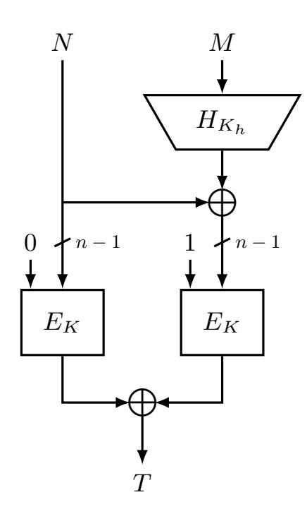
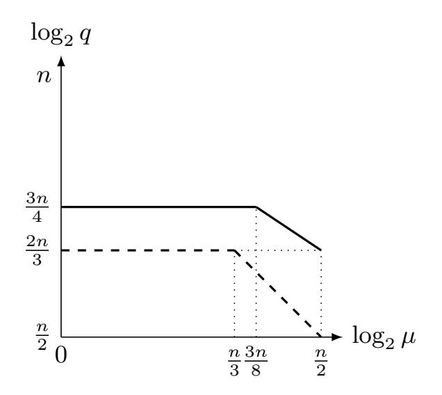
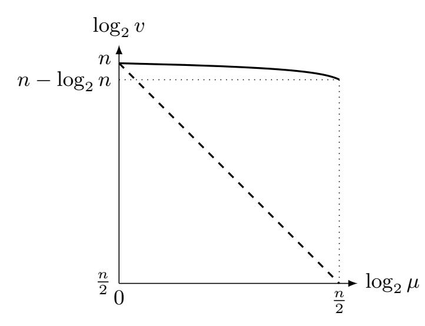

{0}------------------------------------------------

# Improved Security Analysis for Nonce-based Enhanced Hash-then-Mask MACs

Wonseok Choi, Byeonghak Lee, Yeongmin Lee, and Jooyoung Lee\*

KAIST, Daejeon, Korea {krwioh, 1bh0307, dudals4780, hicalf}@kaist.ac.kr

**Abstract.** In this paper, we prove that the nonce-based enhanced hash-then-mask MAC (nEHtM) is secure up to  $2^{\frac{3n}{4}}$  MAC queries and  $2^n$  verification queries (ignoring logarithmic factors) as long as the number of faulty queries  $\mu$  is below  $2^{\frac{3n}{8}}$ , significantly improving the previous bound by Dutta et al. Even when  $\mu$  goes beyond  $2^{\frac{3n}{8}}$ , nEHtM enjoys graceful degradation of security.

The second result is to prove the security of PRF-based nEHtM; when nEHtM is based on an n-to-s bit random function for a fixed size s such that  $1 \leq s \leq n$ , it is proved to be secure up to any number of MAC queries and  $2^s$  verification queries, if (1) s=n and  $\mu < 2^{\frac{n}{2}}$  or (2)  $\frac{n}{2} < s < 2^{n-s}$  and  $\mu < \max\{2^{\frac{s}{2}}, 2^{n-s}\}$ , or (3)  $s \leq \frac{n}{2}$  and  $\mu < 2^{\frac{n}{2}}$ . This result leads to the security proof of truncated nEHtM that returns only s bits of the original tag since a truncated permutation can be seen as a pseudorandom function. In particular, when  $s \leq \frac{2n}{3}$ , the truncated nEHtM is secure up to  $2^{n-\frac{s}{2}}$  MAC queries and  $2^s$  verification queries as long as  $\mu < \min\{2^{\frac{n}{2}}, 2^{n-s}\}$ . For example, when  $s = \frac{n}{2}$  (resp.  $s = \frac{n}{4}$ ), the truncated nEHtM is secure up to  $2^{\frac{3n}{4}}$  (resp.  $2^{\frac{7n}{8}}$ ) MAC queries. So truncation might provide better provable security than the original nEHtM with respect to the number of MAC queries.

**Keywords:** message authentication codes, beyond-birthday-bound security, mirror theory, graceful degradation, truncation

# 1 Introduction

MACs. A message authentication code (MAC) is typically built from a block cipher, e.g., CBC-MAC [4], PMAC [6], OMAC [16], or from a cryptographic hash function, e.g., HMAC [2]. At a high level, many of these constructions follow the well-established *UHF-then-PRF* design paradigm: a message is first mapped onto a short string through a universal hash function (UHF), and then encrypted through a fixed-input-length PRF to obtain a short tag. This method is simple, in

\* Jooyoung Lee was supported by a National Research Foundation of Korea (NRF) grant funded by the Korean government (Ministry of Science and ICT), No. NRF-2017R1E1A1A03070248.

{1}------------------------------------------------

particular, being deterministic and stateless, yet its security caps at the so-called birthday bound; any collision at the output of the UHF, which translates into a tag collision, is usually enough to break the security of the scheme. However, the birthday bound security might not be enough, in particular, when the MAC construction is instantiated with a lightweight block cipher such as PRESENT [7], LED [14] and GIFT [1] operating on small blocks. Better security bounds can be obtained by incorporating in the tag computation a nonce (a value that never repeats), e.g. in Wegman-Carter type MACs [31, 29, 5, 9] or a random value [3, 17, 18, 24, 11]. The focus of this paper is put on nonce-based MACs.

Nonce-Misuse Resistant MACs. The Wegman-Carter MAC (based on a pseudorandom function) guarantees a strong security bound when nonces are never reused. However, only a single nonce repetition can completely break its security [20]. The problem is that it might be challenging to maintain the uniqueness of the nonce in certain environments, for example, when a nonce is chosen randomly from a small set, or when the state of the MAC is reset due to some fault in its implementation. For this reason, there has been a considerable amount of research on the construction of (nonce-based) MACs that provide security under nonce misuse [9, 23, 10, 26, 12].

In this line of research, Cogliati and Seurin [9] proposed EWCDM, and then Datta et al. [10] made a slight modification to it, dubbed DWCDM, in order to reduce the number of block cipher keys. Both constructions provide beyond-birthday-bound security in a nonce respecting settings, and secure up to the birthday bound even in a nonce misuse setting. Mennink and Neves [23] also proved the PRF-security of EWCDM up to  $2^n/(67n)$  queries in a nonce respecting setting (without considering verification queries). However, their security degrades to the birthday bound as soon as only a single nonce is misused.

Recently, Dutta et al. [12] proposed a new construction of MACs, which is called nonce-based Enhanced Hash-then-Mask (nEHtM). They proved that nEHtM is secure up to  $2^{\frac{2n}{3}}$  MAC queries and  $2^n$  verification queries in a nonce respecting setting. Moreover, nEHtM enjoys graceful degradation of security in a nonce misuse setting. More precisely, with respect to the number of faulty nonces  $\mu$ , their bound on the forging advantage includes  $\mu q/2^n$  and  $\mu v/2^n$  terms, where q and v denote the number of MAC queries and the number of verification queries, respectively. So the threshold number of MAC queries and verification queries linearly decreases as the number of faulty queries increases in a logarithmic scale.

Our Results. In this paper, we revisit the nEHtM construction; when nEHtM is based on a universal hash function H and a block cipher E, the tag for an (n-1)-bit nonce N and a message M is defined as

$$\mathsf{nEHtM}[H,E]_{K_h,K}(N,M) = E_K(0||N) \oplus E_K(1||(H_{K_h}(M) \oplus N))$$

using a hash key  $K_h$  and a block cipher key K (see Figure 1).

We prove that nEHtM is secure up to  $2^{\frac{3n}{4}}$  MAC queries and  $2^n$  verification queries (ignoring logarithmic factors) as long as the number of faulty queries  $\mu$  is below  $2^{\frac{3n}{8}}$ , significantly improving the previous bound by Dutta et al. Even

{2}------------------------------------------------

Fig. 1: nEHtM based on a universal hash function H and a block cipher E.

when  $\mu$  goes beyond  $2^{\frac{3n}{8}}$ , nEHtM enjoys graceful degradation of security. It is known that there is a forging attack on nEHtM using  $2^{\frac{n}{2}}$  faulty queries [12], which means that  $\mu$  cannot go beyond  $2^{\frac{n}{2}}$ . Figure 2 compares our new bound to the previous one given in [12].

The second result is to prove the security of PRF-based nEHtM. When the structure of nEHtM was first proposed in [24], it was based on independent pseudorandom functions using random IVs instead of nonces. Its security has been proved up to  $2^{\frac{2n}{3}}$  MAC queries, and later Dutta et al. [11] tightly proved its 3n/4-bit security with a matching attack. In this work, we study its security in a nonce respecting/misuse setting. More precisely, when nEHtM is based on a single n-to-s bit random function (with domain separation) for a fixed size s such that  $1 \le s \le n$ , it is proved to be secure up to any number of MAC queries and  $2^s$  verification queries, if (1) s = n and  $\mu < 2^{\frac{n}{2}}$  or (2)  $\frac{n}{2} < s < 2^{n-s}$  and  $\mu < \max\{2^{\frac{s}{2}}, 2^{n-s}\}$ , or (3)  $s \le \frac{n}{2}$  and  $\mu < 2^{\frac{n}{2}}$ . This result leads to the security proof of truncated nEHtM that returns only s bits of the original tag since a truncated permutation can be seen as a pseudorandom function. In particular, when  $s \le \frac{2n}{3}$ , the truncated nEHtM is secure up to  $2^{n-\frac{s}{2}}$  MAC queries and  $2^s$  verification queries as long as  $\mu < \min\{2^{\frac{n}{2}}, 2^{n-s}\}$ . For example, when  $s = \frac{n}{2}$  (resp.  $s = \frac{n}{4}$ ), the truncated nEHtM is secure up to  $2^{\frac{3n}{4}}$  (resp.  $2^{\frac{7n}{8}}$ ) MAC queries. So truncation might provide better provable security than the original nEHtM with respect to the number of MAC queries.

PROOF TECHNIQUE. The main tool of our security proof is Mirror theory [27, 28] that systematically estimates the number of solutions to a system of equations. However, we cannot directly apply Mirror theory to our problem in a black box manner; the original theory requires that  $\xi_{max}^2 q \leq 2^n$ , where  $\xi_{max}$  and q denote the maximum component size and the number of edges, respectively, when a system of equations is represented by a graph. Unfortunately, this restriction

{3}------------------------------------------------

- (a) The number of MAC queries.
- (b) The number of verification queries.

Fig. 2: Comparison of the security bounds (in terms of the threshold number of MAC queries and verification queries) as functions of  $\mu$ . The solid lines (resp. dashed lines) represent our bounds (resp. the previous bounds in [12]). In (b), we used parameter L satisfying  $\mu^{2L} = L^L \cdot 2^{(L-1)n}$  for each  $\mu$  (see Theorem 2).

does not hold in our graph, possibly containing large components. Furthermore, our system includes non-equations corresponding to verification queries. For this reason, we need to refine and generalize Mirror theory. More precisely, we decompose our graph into four subgraphs - the union of the components containing at least one trail of length three, the union of "stars", the set of isolated edges, and the set of isolated vertices. For a subgraph whose components are small, we sharply estimate the number of solutions to the subgraph, while we probabilistically upper bound the number of larger components.

Recently, deterministic double-block hash-then-sum MACs have been proved to be tightly secure up  $\frac{3n}{4}$  queries [22, 21], while the security proof of noncebased constructions turn out to be even more challenging since (faulty) nonces can be adaptively chosen by an adversary.

Comparison. Table 1 compares nEHtM with existing beyond-birthday-bound MACs based on a block cipher E and a  $\delta$ -AXU-hash function H. "Nonce" indicates that whether it is nonce-based MAC or not. "# Keys" gives the total number of hash and block cipher keys. The number of queries and the maximum message length (in block) are denoted q and  $\ell$ , respectively. Security is evaluated by assuming  $\delta \approx \frac{\ell}{2^n}$  and v=0. We always have the trivial bound  $\mu < q$ . We see that nEHtM is the first (nonce-based) MAC construction based on a block cipher that provides  $\frac{3n}{4}$ -bit provable security.

# 2 Preliminaries

NOTATION. In all of the following, we fix a positive integer n such that  $n \ge 3$ . We denote  $0^n$  (i.e., n-bit string of all zeros) by  $\mathbf{0}$ . The set  $\{0,1\}^n$  is sometimes

{4}------------------------------------------------

Table 1: Comparison of nEHtM with existing beyond-birthday-bound MACs.

| Scheme        | Nonce # Keys |     | Security                                                                                            |                 | References |
|---------------|--------------|-----|-----------------------------------------------------------------------------------------------------|-----------------|------------|
| SUM-ECBC      | X            | 4   | $\ell^{o(1)}q^{\frac{4}{3}}/2^n + \ell^4q^{\frac{4}{3}}/2^{2n}$                                     |                 | [32, 21]   |
| PMAC-Plus     | X            | 3   | $\ell^{\frac{2}{3}}q^{\frac{4}{3}}/2^n + \ell^2q/2^n$                                               |                 | [33, 21]   |
| 3kf9          | Х            | 3   | $\ell^{\frac{4}{3}}q^{\frac{4}{3}}/2^n + \ell^2q^2/2^{2n} + \ell^6q^4/2^{3n}$                       |                 | [34, 21]   |
| LightMAC-Plus | Х            | 3   | $q^{\frac{4}{3}}/2^n$                                                                               |                 | [25, 21]   |
| EWCDM         | ✓            | 3 – | $\ell q/2^n + q^{\frac{3}{2}}/2^n$                                                                  | if $\mu = 0$    | [9]        |
|               |              |     | $\ell q^2/2^n$                                                                                      | if $\mu \geq 1$ |            |
| DWCDM         | ✓            | 1 – | $\ell q/2^n + q/2^{\frac{2n}{3}}$                                                                   | if $\mu = 0$    | [10]       |
|               |              |     | $\ell q^2/2^n$                                                                                      | if $\mu \geq 1$ |            |
| nEHtM         | <b>√</b>     | 2   | $\ell\mu q/2^n + \ell q^3/2^{2n}$                                                                   |                 | [12]       |
| nEHtM         | ✓            | 2   | $\ell\mu^2/2^n + \ell\mu q^{\frac{3}{2}}/2^{\frac{3n}{2}} + \ell^{\frac{1}{2}}q^2/2^{\frac{3n}{2}}$ |                 | This work  |

regarded as a set of integers  $\{0, 1, \dots, 2^n - 1\}$  by converting an *n*-bit string  $a_{n-1} \cdots a_1 a_0 \in \{0, 1\}^n$  to an integer  $a_{n-1} 2^{n-1} + \cdots + a_1 2 + a_0$ . We also identify  $\{0, 1\}^n$  with a finite field  $\mathbf{GF}(2^n)$  with  $2^n$  elements. For a positive integer q, we write  $[q] = \{1, \dots, q\}$ .

Given a non-empty set  $\mathcal{X}$ ,  $x \leftarrow_{\$} \mathcal{X}$  denotes that x is chosen uniformly at random from  $\mathcal{X}$ . The set of all functions from  $\mathcal{X}$  to  $\mathcal{Y}$  is denoted  $\mathsf{Func}(\mathcal{X},\mathcal{Y})$ , and the set of all permutations of  $\mathcal{X}$  is denoted  $\mathsf{Perm}(\mathcal{X})$ . The set of all permutations of  $\{0,1\}^n$  is simply denoted  $\mathsf{Perm}(n)$ . The set of all sequences that consist of b pairwise distinct elements of  $\mathcal{X}$  is denoted  $\mathcal{X}^{*b}$ . For integers  $1 \leq b \leq a$ , we will write  $(a)_b = a(a-1) \cdots (a-b+1)$  and  $(a)_0 = 1$  by convention. If  $|\mathcal{X}| = a$ , then  $(a)_b$  becomes the size of  $\mathcal{X}^{*b}$ .

When two sets  $\mathcal{X}$  and  $\mathcal{Y}$  are disjoint, their (disjoint) union is denoted  $\mathcal{X} \sqcup \mathcal{Y}$ . For a set  $\mathcal{X} \subset \{0,1\}^n$  and  $\lambda \in \{0,1\}^n$ , we will write  $\mathcal{X} \oplus \lambda = \{x \oplus \lambda : x \in \mathcal{X}\}$ . For a graph  $\mathcal{G} = (\mathcal{V}, \mathcal{E})$ , we will interchangeably write  $|\mathcal{V}|$  and  $|\mathcal{G}|$  for the number of vertices of  $\mathcal{G}$ .

ALMOST XOR UNIVERSAL HASH FUNCTIONS. Let  $\delta > 0$ , and let  $H : \mathcal{K}_h \times \mathcal{M} \to \mathcal{X}$  be a keyed function for three non-empty sets  $\mathcal{K}_h$ ,  $\mathcal{M}$ , and  $\mathcal{X}$ . H is said to be  $\delta$ -almost XOR universal (AXU) if for any distinct  $M, M' \in \mathcal{M}$  and  $X \in \mathcal{X}$ ,

$$\Pr\left[K_h \leftarrow_{\$} \mathcal{K}_h : H_{K_h}(M) \oplus H_{K_h}(M') = X\right] \leq \delta.$$

For a positive integer q, fix  $M_1, \ldots, M_q \in \mathcal{M}$ . For a random key  $K_h \in \mathcal{K}_h$ , let  $X_i = H_{K_h}(M_i)$  for  $i = 1, \ldots, q$ . Then we can define an equivalence relation  $\sim$  on [q]: for  $\alpha, \beta \in [q], \alpha \sim \beta$  if and only if  $X_\alpha = X_\beta$ . For some nonnegative integer r, let  $\mathcal{P}_1, \ldots, \mathcal{P}_r$  denote the equivalence classes of [q] with respect to  $\sim$  such that  $p_i = |\mathcal{P}_i| \geq 2$  for  $i = 1, \ldots, r$ . Jha and Nandi [19] proved the following lemma, which is also useful in our security proof.

{5}------------------------------------------------

**Lemma 1.** Let  $p_i$ , i = 1..., r, be the random variables as defined above. Then we have

$$\operatorname{Ex}\left[\sum_{i=1}^r p_i^2\right] \le 2q^2\delta,$$

where the expectation is taken over the uniform distribution of  $K_h \in \mathcal{K}_h$ .

*Proof.* Let c denote the random variable that counts the number of "X-colliding" pairs. More precisely,

$$c \stackrel{\text{def}}{=} |\{(i,j) \in [q]^2 : i < j \text{ and } X_i = X_j\}|.$$

Then it is easy to show that

$$\sum_{i=1}^{r} p_i^2 = 2c + \sum_{i=1}^{r} p_i \le 4c.$$

Furthermore, we have  $\mathsf{Ex}[c] \leq \binom{q}{2}\delta$ , which completes the proof.

PRFs AND PRPs. Let  $F: \mathcal{K} \times \mathcal{X} \to \mathcal{Y}$  be a keyed function with key space  $\mathcal{K}$ , domain  $\mathcal{X}$ , and range  $\mathcal{Y}$ , where  $\mathcal{X}$  is a subset of  $\{0,1\}^*$ . We will denote  $F_K(X)$  for F(K,X). A (q,t,l)-distinguisher against F is an algorithm  $\mathcal{A}$  with oracle access to a function from  $\mathcal{X}$  to  $\mathcal{Y}$ , making at most q oracle queries, each of length at most l in blocks, running in time at most t, and outputting a single bit. The advantage of  $\mathcal{A}$  in breaking the PRF-security of F, i.e., in distinguishing F from a uniformly randomly chosen function  $R \leftarrow_{\$} \mathsf{Func}(\mathcal{X}, \mathcal{Y})$ , is defined as

$$\mathsf{Adv}^{\mathsf{prf}}_F(\mathcal{A}) = \left| \Pr\left[ K \leftarrow_{\$} \mathcal{K} : \mathcal{A}^{F_K} = 1 \right] - \Pr\left[ R \leftarrow_{\$} \mathsf{Func}(\mathcal{X}, \mathcal{Y}) : \mathcal{A}^R = 1 \right] \right|.$$

When  $\mathcal{X} = \mathcal{Y}$  and  $F(K, \cdot)$  is a permutation for each  $K \in \mathcal{K}$ , the PRP-security of F is defined as

$$\mathsf{Adv}_F^{\mathsf{prp}}(\mathcal{A}) = \left| \Pr\left[ K \leftarrow_{\$} \mathcal{K} : \mathcal{A}^{F_K} = 1 \right] - \Pr\left[ R \leftarrow_{\$} \mathsf{Perm}(\mathcal{X}, \mathcal{Y}) : \mathcal{A}^R = 1 \right] \right|.$$

For atk  $\in \{ prf, prp \}$ , we define  $Adv_F^{atk}(q, t, l)$  as the maximum of  $Adv_F^{atk}(\mathcal{A})$  over all (q, t, l)-distinguishers against F. We will consider PRP-security only for a block cipher whose input size is fixed (e.g.,  $\mathcal{X} = \{0, 1\}^n$ ); in this case, we will simply drop the parameter l. On the other hand, when we consider information theoretic security, we will drop the parameter t.

NONCE-BASED MACS. Given four non-empty sets K, K, M, and K, a nonce-based keyed function with key space K, nonce space K, message space K and tag space K is simply a function  $F: K \times K \times K \times K \to K$ . Stated otherwise, it is a keyed function whose domain is a cartesian product  $K \times K \times K \times K \times K \times K \times K \times K \times K \times K$ 

For  $K \in \mathcal{K}$ , let  $\mathsf{Auth}_K$  be the MAC oracle which takes as input a pair  $(N, M) \in \mathcal{N} \times \mathcal{M}$  and returns  $F_K(N, M)$ , and let  $\mathsf{Ver}_K$  be the verification oracle

{6}------------------------------------------------

which takes as input a triple  $(N, M, T) \in \mathcal{N} \times \mathcal{M} \times \mathcal{T}$  and returns 1 ("accept") if  $F_K(N, M) = T$ , and 0 ("reject") otherwise. We assume that an adversary makes queries to the two oracles  $\mathsf{Auth}_K$  and  $\mathsf{Ver}_K$  for a secret key  $K \in \mathcal{K}$ . A MAC query (N, M) made by an adversary is called a faulty query if the adversary has already queried to the MAC oracle with the same nonce but with a different message.

A  $(\mu, q, v, t)$ -adversary against the nonce-based MAC-security of F is an adversary  $\mathcal{A}$  with oracle access to  $\mathsf{Auth}_K$  and  $\mathsf{Ver}_K$ , making at most q MAC queries to its first oracle with at most  $\mu$  faulty queries and at most v verification queries to its second oracle, and running in time at most t. We say that  $\mathcal{A}$  forges if any of its queries to  $\mathsf{Ver}_K$  returns 1. The advantage of  $\mathcal{A}$  against the nonce-based MAC-security of F is defined as

$$\mathsf{Adv}_F^{\mathsf{mac}}(\mathcal{A}) = \Pr\left[K \leftarrow_{\$} \mathcal{K} : \mathcal{A}^{\mathsf{Auth}_K,\mathsf{Ver}_K} \text{forges}\right].$$

where the probability is also taken over the random coins of  $\mathcal{A}$ , if any. The adversary is not allowed to ask a verification query (N, M, T) if a previous query (N, M) to  $\mathsf{Auth}_K$  returned T. When  $\mu = 0$ , we say that  $\mathcal{A}$  is nonce-respecting, otherwise  $\mathcal{A}$  is said nonce-misusing. However, the adversary is allowed to repeat nonces in its verification queries.

We define  $\mathsf{Adv}_F^{\mathsf{mac}}(\mu, q, v, t)$  as the maximum of  $\mathsf{Adv}_F^{\mathsf{mac}}(\mathcal{A})$  over all  $(\mu, q, v, t)$ -adversaries. When we consider information theoretic security, we will drop the parameter t.

NONCE-BASED ENHANCED HASH-THEN-MASK MACS. Let

$$H: \mathcal{K}_h \times \mathcal{M} \longrightarrow \{0,1\}^{n-1}$$
  
 $(K_h, M) \longmapsto H_{K_h}(M)$ 

be a keyed function. Given a block cipher

$$E: \mathcal{K} \times \{0,1\}^n \longrightarrow \{0,1\}^n$$
  
 $(K,X) \longmapsto E_K(X),$ 

one can define the nEHtM MAC with key space  $\mathcal{K}_h \times \mathcal{K}$ , nonce space  $\{0,1\}^{n-1}$ , message space  $\mathcal{M}$  and tag space  $\{0,1\}^n$ : for a key  $(K_h, K) \in \mathcal{K}_h \times \mathcal{K}$ , a nonce  $N \in \{0,1\}^{n-1}$ , a message  $M \in \mathcal{M}$ , the tag is computed as follows:

$$\mathsf{nEHtM}[H, E]_{K_h, K}(N, M) = E_K(0||N) \oplus E_K(1||(H_{K_h}(M) \oplus N)).$$

More generally, the underlying block cipher can be replaced by a compression function  $E: \mathcal{K} \times \{0,1\}^n \longrightarrow \{0,1\}^m$  for some m < n.

EXPECTATION METHOD. Consider the nEHtM construction based on H and E using keys  $(K_h, K)$ . Suppose that a distinguisher  $\mathcal{A}$  adaptively makes q MAC queries and v verification queries to either  $(\mathsf{Auth}_{K_h,K},\mathsf{Ver}_{K_h,K})$  for a random secret key  $(K_h,K) \in \mathcal{K}_h \times \mathcal{K}$  (in the real world) or  $(\mathsf{Rand},\mathsf{Rej})$  (in the ideal world), where  $\mathsf{Rand}$  returns an independent random value (instantiating a truly random

{7}------------------------------------------------

function) and Rej always return 0 for every verification query. Furthermore,  $\mathcal A$  records all the queries in

$$\tau_m \stackrel{\text{def}}{=} ((N_1, M_1, T_1), \dots, (N_q, M_q, T_q)),$$
  
$$\tau_v \stackrel{\text{def}}{=} ((N'_1, M'_1, T'_1, b'_1), \dots, (N'_v, M'_v, T'_v, b'_v)),$$

where either  $\operatorname{Auth}_{K_h,K}(N_i,M_i)=T_i$  or  $\operatorname{Rand}(N_i,M_i)=T_i$  for  $i=1,\ldots,q,$  and either  $\operatorname{Ver}_{K_h,K}(N_i',M_i',T_i')=b_i'$  or  $\operatorname{Rej}(N_i',M_i',T_i')=b_i'(=0)$  for  $i=1,\ldots,v,$  according to the world that  $\mathcal{A}$  interacts with.

At the end of the interaction, we will provide the distinguisher  $\mathcal{A}$  with the hash key  $K_h$  for free. In the ideal world, a dummy key  $K_h$  will be selected uniformly at random from  $\mathcal{K}_h$ , and given to  $\mathcal{A}$ . This will not degrade the adversarial distinguishing advantage since the distinguisher is free to ignore this additional information.

We will call

$$\tau = (K_h, \tau_m, \tau_v)$$

the transcript of the attack; it contains all the information that  $\mathcal{A}$  has obtained at the end of the attack. When we consider an information theoretic distinguisher, we can assume that the distinguisher is deterministic without making any redundant query.

A transcript  $\tau$  is called *attainable* if the probability to obtain this transcript in the ideal world is non-zero. Note that any key  $K_h \in \mathcal{K}_h$  and any sequence of tags  $(T_1, \ldots, T_q) \in (\{0,1\}^n)^q$  uniquely determine an attainable transcript containing them, and each attainable transcript appears in the ideal world with the same probability, namely  $1/N^q$ . We denote  $\Gamma$  the set of attainable transcripts. We also denote  $\mathsf{T}_{\mathsf{re}}$  (resp.  $\mathsf{T}_{\mathsf{id}}$ ) the probability distribution of the transcript  $\tau$  induced by the real world (resp. the ideal world). By extension, we use the same notation to denote a random variable distributed according to each distribution.

In this setting, it is obvious that  $\mathcal{A}$ 's distinguishing advantage upper bounds  $\mathcal{A}$ 's forging probability and when v=0, we can derive PRF-security of the of nEHtM. In order to upper bound the distinguishing advantage, we will use Patarin's coefficient-H technique; we partition the set of attainable transcripts  $\Gamma$  into a set of "good" transcripts  $\Gamma_{\text{good}}$  such that the probabilities to obtain some transcript  $\tau \in \Gamma_{\text{good}}$  are close in the real world and the ideal world, and a set  $\Gamma_{\text{bad}}$  of "bad" transcripts such that the probability to obtain any  $\tau \in \Gamma_{\text{bad}}$  is small in the ideal world. The lower bound in the ratio of the probabilities to obtain a good transcript in both worlds will be given as a function of  $\tau$ , and we will take its expectation. This refinement is called the *expectation method*, first introduced in [15], summarized in the following theorem.

**Lemma 2.** Fix a forging adversary  $\mathcal{A}$ . Let  $\Gamma = \Gamma_{good} \sqcup \Gamma_{bad}$  be a partition of the set of attainable transcripts, where there exists a non-negative function  $\varepsilon_1(\tau)$  such that for any  $\tau \in \Gamma_{good}$ ,

$$\frac{\Pr\left[\mathsf{T}_{\mathrm{re}} = \tau\right]}{\Pr\left[\mathsf{T}_{\mathrm{id}} = \tau\right]} \ge 1 - \varepsilon_1(\tau),$$

{8}------------------------------------------------

and there exists  $\varepsilon_2$  such that  $\Pr[\mathsf{T}_{\mathsf{id}} \in \Gamma_{\mathsf{bad}}] \leq \varepsilon_2$ . Then one has

$$\mathsf{Adv}^{\mathsf{mac}}_{\mathsf{nEHtM}[H,E]}(\mathcal{A}) \leq \mathsf{Ex}[\varepsilon_1(\tau)] + \varepsilon_2,$$

where the expectation is taken over the distribution  $T_{id}$  in the ideal world.

*Proof.* Since the distinguisher's output is a (deterministic) function of the transcript, its distinguishing advantage is upper bounded by the statistical distance between  $T_{\rm id}$  and  $T_{\rm re}$ . So we have

$$\mathsf{Adv}^{\mathsf{mac}}_{\mathsf{nEHtM}[H,E]}(\mathcal{A}) \leq \|\mathsf{T}_{\mathrm{re}} - \mathsf{T}_{\mathrm{id}}\| \stackrel{\mathrm{def}}{=} \frac{1}{2} \sum_{\tau \in \varGamma} \left| \Pr[\mathsf{T}_{\mathrm{re}} = \tau] - \Pr[\mathsf{T}_{\mathrm{id}} = \tau] \right|.$$

Moreover we have:

$$\begin{split} \|\mathsf{T}_{\mathrm{re}} - \mathsf{T}_{\mathrm{id}}\| &= \sum_{\substack{\tau \in \Gamma \\ \Pr[\mathsf{T}_{\mathrm{id}} = \tau] > \Pr[\mathsf{T}_{\mathrm{re}} = \tau]}} (\Pr[\mathsf{T}_{\mathrm{id}} = \tau] - \Pr[\mathsf{T}_{\mathrm{re}} = \tau]) \\ &= \sum_{\substack{\tau \in \Gamma \\ \Pr[\mathsf{T}_{\mathrm{id}} = \tau] > \Pr[\mathsf{T}_{\mathrm{re}} = \tau]}} \Pr[\mathsf{T}_{\mathrm{id}} = \tau] \left(1 - \frac{\Pr[\mathsf{T}_{\mathrm{re}} = \tau]}{\Pr[\mathsf{T}_{\mathrm{id}} = \tau]}\right) \\ &\leq \sum_{\tau \in \Gamma_{\mathsf{good}}} \Pr[\mathsf{T}_{\mathrm{id}} = \tau] \varepsilon_1(\tau) + \sum_{\tau \in \Gamma_{\mathsf{bad}}} \Pr[\mathsf{T}_{\mathrm{id}} = \tau] \\ &\leq \mathsf{Ex}[\varepsilon_1(\tau)] + \varepsilon_2. \end{split}$$

# 3 Extended Mirror Theory

The goal of this section is to lower bound the number of solutions to a certain type of system of equations and non-equations. For simplicity of notation, we will denote  $N = 2^n$  throughout this section.

We will represent a system of equations and non-equations by a graph. Each vertex corresponds to an n-bit distinct unknowns. We will assume that the number of vertices is at most N/4, and by abuse of notation, identify the vertices with the values assigned to them. We distinguish two types of edges, namely, =-labeled edges and  $\neq$ -labeled edges that correspond to equations and non-equations, respectively. Each of the edge is additionally labeled by an element in  $\{0,1\}^n$ . So, if two vertices P and Q are adjacent by an edge with label  $(\lambda, =)$  (resp.  $(\lambda, \neq)$ ) for some  $\lambda \in \{0,1\}^n$ , then it would mean that  $P \oplus Q = \lambda$  (resp.  $P \oplus Q \neq \lambda$ ).

Consider a graph  $\mathcal{G} = (\mathcal{V}, \mathcal{E}^{=} \sqcup \mathcal{E}^{\neq})$ , where  $\mathcal{E}^{=}$  and  $\mathcal{E}^{\neq}$  denote the set of =-labeled edges and the set of  $\neq$ -labeled edges, respectively. Then  $\mathcal{G}$  can be seen as a superposition of two subgraphs  $\mathcal{G}^{=} = ^{\text{def}} (\mathcal{V}, \mathcal{E}^{=})$  and  $\mathcal{G}^{\neq} = ^{\text{def}} (\mathcal{V}, \mathcal{E}^{\neq})$ . Let  $P \stackrel{\lambda}{-} Q$  denote a  $(\lambda, =)$ -labeled edge in  $\mathcal{G}^{=}$ . For  $\ell > 0$  and a trail1

$$\mathcal{L}: P_0 \stackrel{\lambda_1}{-} P_1 \stackrel{\lambda_2}{-} \cdots \stackrel{\lambda_\ell}{-} P_\ell$$

&lt;sup>1 A trail is a walk in which all edges are distinct.

{9}------------------------------------------------

in  $\mathcal{G}^{=}$ , its label is defined as

$$\lambda(\mathcal{L}) \stackrel{\mathrm{def}}{=} \lambda_1 \oplus \lambda_2 \oplus \cdots \oplus \lambda_\ell.$$

In this work, we will focus on a graph  $\mathcal{G} = (\mathcal{V}, \mathcal{E}^= \sqcup \mathcal{E}^{\neq})$  with certain properties, as listed below.

- 1.  $\mathcal{G}^{=}$  contains no cycle.
- 2.  $\lambda(\mathcal{L}) \neq \mathbf{0}$  for any trail  $\mathcal{L}$  in  $\mathcal{G}^=$ .
- 3. If P and Q are connected with a  $(\lambda, \neq)$ -labeled edge, then they are not connected by a  $\lambda$ -labeled trail in  $\mathcal{G}^=$ .

Any graph  $\mathcal{G}$  satisfying the above properties will be called a *nice* graph. Given a nice graph  $\mathcal{G} = (\mathcal{V}, \mathcal{E}^= \sqcup \mathcal{E}^{\neq})$ , an assignment of *distinct* values to the vertices in  $\mathcal{V}$  satisfying all the equations in  $\mathcal{E}^=$  and all the non-equations in  $\mathcal{E}^{\neq}$  is called a *solution* to  $\mathcal{G}$ . We remark that if we assign any value to a vertex P, then =-labeled edges determine the values of all the other vertices in the component containing P in  $\mathcal{G}^=$ , where the assignment is unique since  $\mathcal{G}^=$  contains no cycle, and the values in the same component are all distinct since  $\lambda(\mathcal{L}) \neq \mathbf{0}$  for any trail  $\mathcal{L}$ . Furthermore, any non-equation between two vertices in the same component will be redundant due to the third property above.

The number of possible assignments of distinct values to the vertices in  $\mathcal{V}$  is  $(N)_{|\mathcal{V}|}$ . One might expect that when such an assignment is chosen uniformly at random, it would satisfy all the equations and non-equations in  $\mathcal{G}$  with probability close to  $1/N^q$ , where q denotes the number of =-labeled edges (i.e., equations) in  $\mathcal{G}^=$ . Indeed, we can prove that the number of solutions to  $\mathcal{G}$  is close to  $\frac{(N)_{|\mathcal{V}|}}{N^q}$  up to a certain error (that can be negligible according to the parameters). We begin with a simple bound that holds for any type of graphs.

In the following lemma, we partition the set of vertices  $\mathcal{V}$  into two disjoint sets, denoted  $\mathcal{V}_{kn}$  and  $\mathcal{V}_{uk}$ , respectively, and fix an assignment of distinct values to the vertices in  $\mathcal{V}_{kn}$ . Subject to this assignment, the number of possible assignments of distinct values to the vertices in  $\mathcal{V}_{uk}$  can be lower bounded (in a way that the entire assignment becomes a solution to  $\mathcal{G}$ ).

**Lemma 3.** For a positive integer q and a nonnegative integer v, let  $\mathcal{G} = (\mathcal{V}, \mathcal{E}^{=} \sqcup \mathcal{E}^{\neq})$  be a nice graph such that  $|\mathcal{E}^{=}| = q$  and  $|\mathcal{E}^{\neq}| = v$ . Suppose that

- 1.  $\mathcal V$  is partitioned into two subsets, denoted  $\mathcal V_{kn}$  and  $\mathcal V_{uk}$ ;
- 2. there is no =-labeled edge that is incident to a vertex in  $V_{kn}$ ;
- 3. there is no  $\neq$ -labeled edge connecting two vertices in  $\mathcal{V}_{kn}$ .

Suppose that  $\mathcal{G}_{uk}^{=} = (\mathcal{V}_{uk}, \mathcal{E}^{=})$  is decomposed into k components  $\mathcal{C}_{1}, \ldots, \mathcal{C}_{k}$  for some k. Given a fixed assignment of distinct values to the vertices in  $\mathcal{V}_{kn}$ , the number of solutions to  $\mathcal{G}$ , denoted  $h(\mathcal{G})$ , satisfies

$$\frac{h(\mathcal{G})N^q}{(N-|\mathcal{V}_{\mathsf{kn}}|)_{|\mathcal{V}_{\mathsf{uk}}|}} \ge 1 - \frac{|\mathcal{V}|^2}{N^2} \sum_{i=1}^k |\mathcal{C}_i|^2 - \frac{2v}{N}.$$

{10}------------------------------------------------

*Proof.* For  $i = 1, \ldots, k$ ,

- let  $c_i = |\mathcal{C}_i|$ ;
- let  $\sigma_i = |\mathcal{V}_{\mathsf{kn}}| + \sum_{i=1}^i c_i;$
- let  $\mathcal{G}_i = (\mathcal{V}_i, \mathcal{E}_i)$  be the graph obtained from  $\mathcal{C}_1 \sqcup \mathcal{C}_2 \sqcup \cdots \sqcup \mathcal{C}_i$  by adding all the  $\neq$ -labeled edges connecting the vertices in  $\mathcal{V}_{\mathsf{kn}} \sqcup \mathcal{C}_1 \sqcup \mathcal{C}_2 \sqcup \cdots \sqcup \mathcal{C}_i$ ;
- let  $v_i$  be the number of  $\neq$ -labeled edges that connect a vertex in  $C_i$  and one in  $G_{i-1}$ ;
- let h(i) be the number of solutions to  $\mathcal{G}_i$ .

Let h(0) = 1 and let  $\sigma_0 = |\mathcal{V}_{\mathsf{kn}}|$ . Then we have  $\mathcal{G}_k = \mathcal{G}$ , and hence  $h(k) = h(\mathcal{G})$ . If there exists i such that  $\sigma_i c_{i+1} \geq N$ , we get

$$\left( |\mathcal{V}_{\mathsf{kn}}| + \sum_{j=1}^{k} |\mathcal{C}_j| \right)^2 c_{i+1}^2 \ge \sigma_i^2 c_{i+1}^2 \ge N^2$$

so the lemma trivially holds. Therefore, let us assume that for i = 0, ..., k - 1,  $\sigma_i c_{i+1} \leq N$ . In order to find a relation between h(i) and h(i+1), we fix a solution to  $\mathcal{G}_i$ . If we fix a vertex  $V^* \in \mathcal{V}_{i+1}$  and assign any value to  $V^*$ , then the other unknowns in  $\mathcal{V}_{i+1}$  are uniquely determined, since there is a unique trail from  $V^*$  to any other vertices in  $\mathcal{V}_{i+1}$ . In order to make all assigned values distinct, it is sufficient that

$$V^* \notin \bigcup_{V \in \mathcal{V}_{i+1}} \left( \left( \mathcal{V}_{\mathsf{kn}} \sqcup \mathcal{V}_1 \sqcup \cdots \sqcup \mathcal{V}_i \right) \oplus \lambda_V \right),$$

where  $\lambda_X$  denotes the label of the unique trail from  $V^*$  to X if  $X \neq V^*$  and  $\lambda_{V^*} = \mathbf{0}$ . Moreover,  $V^*$  should satisfy  $v_{i+1}$  non-equations. The number of choices satisfying these conditions is at least  $N - \sigma_i c_{i+1} - v_{i+1}$ , which means

$$h(i+1) \ge (N - \sigma_i c_{i+1} - v_{i+1})h(i).$$

Then for  $0 \le i \le q - 1$ , we have

$$\frac{h(i+1)N^{c_{i+1}-1}}{h(i)(N-\sigma_i)_{c_{i+1}}} \ge \frac{h(i+1)}{h(i)} \cdot \frac{1}{N} \left(\frac{N}{N-\sigma_i}\right)^{c_{i+1}}$$

$$\ge \frac{h(i+1)}{h(i)} \cdot \frac{1}{N} \left(1 + \frac{\sigma_i}{N}\right)^{c_{i+1}}$$

$$\ge \left(1 - \frac{\sigma_i c_{i+1}}{N} - \frac{v_{i+1}}{N}\right) \left(1 + \frac{\sigma_i c_{i+1}}{N}\right)$$

$$\ge 1 - \frac{\sigma_i^2 c_{i+1}^2}{N^2} - \frac{2v_{i+1}}{N}$$

{11}------------------------------------------------

since  $\sigma_i c_{i+1} \leq N$ . From  $\sum_{i=1}^k v_i = v$ , we get

$$\begin{split} \frac{h(\mathcal{G})N^q}{(N-|\mathcal{V}_{\mathsf{kn}}|)_{|\mathcal{V}_{\mathsf{uk}}|}} &= \prod_{i=0}^{k-1} \frac{h(i+1)N^{c_{i+1}-1}}{h(i)(N-\sigma_i)_{c_{i+1}}} \\ &\geq \prod_{i=0}^{k-1} \left(1 - \frac{\sigma_i^2 c_{i+1}^2}{N^2} - \frac{2v_{i+1}}{N}\right) \\ &\geq 1 - \sum_{i=0}^{k-1} \left(\frac{\sigma_i^2 c_{i+1}^2}{N^2} + \frac{2v_{i+1}}{N}\right) \\ &\geq 1 - \frac{(|\mathcal{V}_{\mathsf{kn}}| + \sum_{i=1}^k |\mathcal{C}_i|)^2}{N^2} \sum_{i=1}^k |\mathcal{C}_i|^2 - \frac{2v}{N}. \end{split}$$

If every component of the graph contains exactly two vertices, then we can improve the bound as follows.

**Lemma 4.** For a positive integer q and a nonnegative integer v, let  $\mathcal{G} = (\mathcal{V}, \mathcal{E}^= \sqcup \mathcal{E}^{\neq})$  be a nice graph such that  $|\mathcal{E}^=| = q$  and  $|\mathcal{E}^{\neq}| = v$ . Suppose that

- 1. V is partitioned into two subsets, denoted  $V_{kn}$  and  $V_{uk}$ ;
- 2. there is no =-labeled edge that is incident to a vertex in  $\mathcal{V}_{kn}$ ;
- 3. there is no  $\neq$ -labeled edge connecting two vertices in  $\mathcal{V}_{kn}$ .

Suppose that  $\mathcal{G}_{uk}^{=} = (\mathcal{V}_{uk}, \mathcal{E}^{=})$  is decomposed into q components of size two. Given a fixed assignment of distinct values to the vertices in  $\mathcal{V}_{kn}$ , the number of solutions to  $\mathcal{G}$ , denoted  $h(\mathcal{G})$ , satisfies

$$\frac{h(\mathcal{G})N^q}{(N-|\mathcal{V}_{\mathsf{kn}}|)_{|\mathcal{V}_{\mathsf{uk}}|}} \geq 1 - \frac{4|\mathcal{V}_{\mathsf{kn}}|^2q}{N^2} - \frac{4|\mathcal{V}_{\mathsf{kn}}|q^2}{N^2} - \frac{18q^2}{N^2} - \frac{32|\mathcal{V}_{\mathsf{kn}}|q^3}{3N^3} - \frac{16q^4}{N^3} - \frac{2v}{N} - \frac{16qv}{N^2}.$$

*Proof.* We will write the connected components of  $\mathcal{G}_{uk}^{=}$  as follows:

$$C_i: P_{2i-1} \stackrel{\lambda_i}{-} P_{2i},$$

for i = 1, ..., q, where  $P_{2i-1}, P_{2i} \in \mathcal{V}$  and  $\lambda_i \in \{0, 1\}^n$ . We will also write  $\mathcal{C}_{(j)}$  and  $\lambda_{(j)}$  to denote the component containing  $P_j$  and its label, respectively. For  $x \in \{0, 1\}^n$  and i = 1, ..., q, let

$$G_i^x = \left| \left\{ 1 \le j \le 2i : \lambda_{(j)} = x \right\} \right|,$$

$$G_i^* = \max_{x \in \{0,1\}^n} \{G_i^x\}.$$

By reordering the components (and their labels), we can assume that

$$G_i^* \le G_i^{\lambda_{i+1}} + 2,\tag{1}$$

for  $1 \le i \le q - 1$ . More precisely, given a mulitset of labels, one can list all the labels that appear at least once, remove them from the multiset, and do

{12}------------------------------------------------

the same job for the remaining labels. For example, given a multiset of labels {*a, a, a, a, b, b, c, d*} (with *q* = 8), it can be listed as (*a, b, c, d, a, b, a, a*). For *i* = 1*, . . . , k*,

- **–** let *σi* = |Vkn| + 2*i*;
- **–** let G*i* = (V*i ,* E*i*) be the graph obtained from Vkn t C1 t C2 t · · · t C*i* by adding all the 6=-labeled edges connecting the vertices in Vkn t C1 t C2 t · · · t C*i* ;
- **–** let *vi* be the number of 6=-labeled edges that connect a vertex in C*i* and one in G*i*−1;
- **–** let *h*(*i*) be the number of solutions to G*i* .

Let *h*(0) = 1 and let *σ*0 = |Vkn|. Then we have G*k* = G, and hence *h*(*k*) = *h*(G). In order to find a relation between *h*(*i*) and *h*(*i* + 1), we fix a solution to G*i* . Then we can choose *P*2*i*+1 from {0*,* 1} *n* \ (X*i* ∪ Y*i*), where

$$\mathcal{X}_i \stackrel{\text{def}}{=} \mathcal{V}_{\mathsf{kn}} \sqcup \{P_1, P_2, \dots, P_{2i}\},\$$

$$\mathcal{Y}_i \stackrel{\text{def}}{=} \mathcal{X}_i \oplus \lambda_{i+1}.$$

We note that *P*2*i*+1 should also satisfy *vi*+1 non-equations in N*i*+1. Since |X*i* | = |Y*i* | = *σi* , we have

$$h(i+1) \ge \sum_{\text{solutions to } \mathcal{G}_i} (N - |\mathcal{X}_i \cup \mathcal{Y}_i| - v_{i+1})$$

$$= \sum_{\text{solutions to } \mathcal{G}_i} (N - 2\sigma_i - v_{i+1} + |\mathcal{X}_i \cap \mathcal{Y}_i|)$$

$$= (N - 2\sigma_i - v_{i+1})h(i) + \sum_{\text{solutions to } \mathcal{G}_i} |\mathcal{X}_i \cap \mathcal{Y}_i|.$$
(2)

For *X, Y* ∈ X*i* , let *h* 0 (*X, Y* ) denote the number of solutions to G*i* such that *X* ⊕ *Y* = *λi*+1. Then we have

$$\sum_{\text{solutions to } \mathcal{G}_i} |\mathcal{X}_i \cap \mathcal{Y}_i| = \sum_{X,Y \in \mathcal{X}_i} h'(X,Y) \ge \sum_{X,Y \in \{P_1,\dots,P_{2i}\}} h'(X,Y). \tag{3}$$

We observe that

- 1. if *X* and *Y* are connected with a (*λi*+1*,* =)-labeled edge, then the additional equation *X* ⊕ *Y* = *λi*+1 is redundant, and hence *h* 0 (*X, Y* ) = *h*(*i*);
- 2. if *X* and *Y* are connected with either a (*λ,* =)-labeled edge such that *λ* 6= *λi*+1 or a (*λi*+1*,* 6=)-labeled edge, then the system of equations and non-equations (with the additional equation) has no solution.

Let *i* ≥ 2. If *X* ∈ C(*j*) and *Y* ∈ C(*j* 0) for different components C(*j*) and C(*j* 0) , *X* and *Y* are not connected with any 6=-labeled edge, and *λi*+1 ∈*/ λ*(*j*) *, λ*(*j* 0) *, λ*(*j*) ⊕ *λ*(*j* 0) , then we have

$$h'(X,Y) \ge \frac{h(i)}{N} \left( 1 - \frac{4\sigma_i}{N} \right) \tag{4}$$

{13}------------------------------------------------

since

$$h'(X,Y) \ge (N - 4\sigma_{i-2}) h(i-2) \ge (N - 4\sigma_i) h(i-2),$$
  
 $h(i-2)N^2 > h(i-2) (N - 2\sigma_{i-2}) (N - 2\sigma_{i-1}) > h(i).$ 

Let

$$S_1 = \{(j, j') \in [2i]^2 : \mathcal{C}_{(j)} = \mathcal{C}_{(j')}\},$$

$$S_2 = \{(j, j') \in [2i]^2 : \text{there is a } \neq \text{-labeled edge between } \mathcal{C}_{(j)} \text{ and } \mathcal{C}_{(j')}\},$$

$$S_3 = \{(j, j') \in [2i]^2 : \lambda_{(j)} = \lambda_{i+1} \vee \lambda_{(j')} = \lambda_{i+1} \vee \lambda_{(j)} \oplus \lambda_{(j')} = \lambda_{i+1}\},$$

and let

$$H = |[2i]^2 \setminus (\mathcal{S}_1 \cup \mathcal{S}_2 \cup \mathcal{S}_3)|.$$

Since  $|\mathcal{S}_1| \leq 4i$ ,  $|\mathcal{S}_2| \leq 8v$  and  $|\mathcal{S}_3| \leq 6iG_i^* \leq 6i(G_i^{\lambda_{i+1}} + 2)$  by (1), we have

$$H \ge 4i^2 - 4i - 8v - 6i(G_i^{\lambda_{i+1}} + 2). \tag{5}$$

By (3), (4), (5), and since  $6i \le 6q \le N$ , we have

$$\sum_{\text{solutions to } \mathcal{G}_i} |\mathcal{X}_i \cap \mathcal{Y}_i| \ge \left( G_i^{\lambda_{i+1}} + \frac{4i^2 - 16i - 8v - 6iG_i^{\lambda_{i+1}}}{N} \left( 1 - \frac{4\sigma_i}{N} \right) \right) h(i)$$

$$\ge \frac{4i^2 - 16i - 8v}{N} \left( 1 - \frac{4\sigma_i}{N} \right) h(i),$$

and by (2),

$$h(i+1) \ge (N - 2\sigma_i - v_{i+1})h(i) + \frac{4i^2 - 16i - 8v}{N} \left(1 - \frac{4\sigma_i}{N}\right)h(i).$$

Since  $2\sigma_i + 1 \le 2(|\mathcal{V}_{\mathsf{kn}}| + |\mathcal{V}_{\mathsf{uk}}|) \le N/2$ , we have

$$\begin{split} \frac{h(i+1)N}{h(i)(N-\sigma_i)_2} &\geq \frac{N^2 - 2\sigma_i N - v_{i+1}N + (4i^2 - 16i - 8v) \left(1 - \frac{4\sigma_i}{N}\right)}{N^2 - (2\sigma_i + 1)N + \sigma_i(\sigma_i + 1)} \\ &\geq 1 - \frac{v_{i+1}N + \sigma_i(\sigma_i + 1) - (4i^2 - 16i - 8v) \left(1 - \frac{4\sigma_i}{N}\right)}{N^2 - (2\sigma_i + 1)N + \sigma_i(\sigma_i + 1)} \\ &\geq 1 - \frac{v_{i+1}N + (\sigma_0 + 2i)(\sigma_0 + 2i + 1) - (4i^2 - 16i - 8v) \left(1 - \frac{4\sigma_i}{N}\right)}{N^2/2} \\ &\geq 1 - \frac{v_{i+1}N + (\sigma_0 + 1)\sigma_0 + 4\sigma_0i + 18i + 8v + \frac{16\sigma_0i^2}{N} + \frac{32i^3}{N}}{N^2/2} \\ &\geq 1 - \frac{4\sigma_0^2}{N^2} - \frac{8\sigma_0i}{N^2} - \frac{36i}{N^2} - \frac{32\sigma_0i^2}{N^3} - \frac{64i^3}{N^3} - \frac{2v_{i+1}}{N} - \frac{16v}{N^2}. \end{split}$$

{14}------------------------------------------------

Finally, we have

$$\begin{split} \frac{h(\mathcal{G})N^q}{(N-|\mathcal{V}_{\mathsf{kn}}|)_{|\mathcal{V}_{\mathsf{uk}}|}} &= \prod_{i=0}^{q-1} \frac{h(i+1)N}{h(i)(N-2\sigma_i)_2} \\ &\geq \prod_{i=0}^{q-1} \left(1 - \frac{4\sigma_0^2}{N^2} - \frac{8\sigma_0 i}{N^2} - \frac{36i}{N^2} - \frac{32\sigma_0 i^2}{N^3} - \frac{64i^3}{N^3} - \frac{2v_{i+1}}{N} - \frac{16v}{N^2}\right) \\ &\geq 1 - \sum_{i=0}^{q-1} \left(\frac{4\sigma_0^2}{N^2} + \frac{8\sigma_0 i}{N^2} + \frac{36i}{N^2} + \frac{32\sigma_0 i^2}{N^3} + \frac{64i^3}{N^3} + \frac{2v_{i+1}}{N} + \frac{16v}{N^2}\right) \\ &\geq 1 - \frac{4|\mathcal{V}_{\mathsf{kn}}|^2 q}{N^2} - \frac{4|\mathcal{V}_{\mathsf{kn}}|q^2}{N^2} - \frac{18q^2}{N^2} - \frac{32|\mathcal{V}_{\mathsf{kn}}|q^3}{3N^3} - \frac{16q^4}{N^3} - \frac{2v}{N} - \frac{16qv}{N^2}. \end{split}$$

Finally, we consider a graph containing no =-labeled edges. So G = consists only of isolated vertices.

**Lemma 5.** *For a nonnegative integer v, let* G = (V*,* E 6=) *be a nice graph such that* |E6=| = *v. Suppose that*

- *1.* V *is partitioned into two subsets, denoted* Vkn *and* Vuk*;*
- *2. there is no* 6=*-labeled edge connecting two vertices in* Vkn*.*

*Given a fixed assignment of distinct values to the vertices in* Vkn*, the number of solutions to* G*, denoted h*(G)*, satisfies*

$$\frac{h(\mathcal{G})}{(N - |\mathcal{V}_{\mathsf{kn}}|)_{|\mathcal{V}_{\mathsf{uk}}|}} \ge 1 - \frac{2v}{N}.$$

*Proof.* The number of possible assignments of distinct values outside Vkn to the vertices in Vuk is (*N* − |Vkn|)|Vuk| . Among these assignments, at most (*N* − |Vkn|)|Vuk|−1 assignments violate any fixed 6=-labeled edge. Therefore, we have

$$h(\mathcal{G}) \geq (N - |\mathcal{V}_{\mathsf{kn}}|)_{|\mathcal{V}_{\mathsf{uk}}|} - v(N - |\mathcal{V}_{\mathsf{kn}}|)_{|\mathcal{V}_{\mathsf{uk}}| - 1},$$

which means

$$\frac{h(\mathcal{G})}{(N - |\mathcal{V}_{kn}|)_{|\mathcal{V}_{uk}|}} \ge 1 - \frac{2v}{N}.$$

Given an arbitrary nice graph G, we will decompose G = into four subgraphs, denoted G = 3 , G = 2 , G = 1 and G = 0 , respectively, where

- **–** G = 3 = (V3*,* E = 3 ) is the union of components containing at least one trail of length three;
- **–** G = 2 = (V2*,* E = 2 ) is the union of components containing at least one trail of length two (i.e., stars), but not a trail of length three;
- **–** G = 1 = (V1*,* E = 1 ) is the union of components of size two (i.e., trails of length one);

{15}------------------------------------------------

 $-\mathcal{G}_0^{=}=(\mathcal{V}_0,\mathcal{E}_0^{=})$  is the set of isolated vertices.

For i = 0, 1, 2, 3, let  $\mathcal{E}_i^{\neq}$  denote the set of  $\neq$ -labeled edges connecting a vertex in  $\mathcal{V}_i$  and one in  $\bigsqcup_{j=i}^3 \mathcal{V}_j$ , and let

$$\mathcal{G}_i = \left(\bigsqcup_{j=i}^3 \mathcal{V}_j, \bigsqcup_{j=i}^3 \mathcal{E}_j^= \sqcup \bigsqcup_{j=i}^3 \mathcal{E}_j^{\neq}\right).$$

In order to lower bound the number of solutions to  $\mathcal{G}$ , we will first lower bound the number of solutions to  $\mathcal{G}_3$  and  $\mathcal{G}_2$  using Lemma 3, and then  $\mathcal{G}_1$  and  $\mathcal{G}_0$  (=  $\mathcal{G}$ ) using Lemma 4 and Lemma 5, respectively. In the following theorem,  $\mathcal{G}_3$  and  $\mathcal{G}_2$ can be any partition of the components containing trails of length two, but the current partition will be used later in our security proof.

**Theorem 1.** For positive integers q and v, let  $\mathcal{G} = (\mathcal{V}, \mathcal{E}^= \sqcup \mathcal{E}^{\neq})$  be a nice graph such that  $|\mathcal{E}^=| = q$  and  $|\mathcal{E}^{\neq}| = v$ . With the notations defined as above, assume that  $\mathcal{G}_2^=$  is decomposed into k components  $\mathcal{C}_1, \ldots, \mathcal{C}_k$  for some k. Then the number of solutions to  $\mathcal{G}$ , denoted  $h^*(\mathcal{G})$ , satisfies

$$\frac{h^*(\mathcal{G})2^{nq}}{(2^n)_{|\mathcal{V}|}} \ge 1 - \frac{|\mathcal{G}_3^{=}|^4}{2^{2n}} - \frac{(|\mathcal{G}_3^{=}| + |\mathcal{G}_2^{=}|)^2}{2^{2n}} \sum_{i=1}^k |\mathcal{C}_i|^2 - \frac{8(|\mathcal{G}_3^{=}| + |\mathcal{G}_2^{=}|)q^2}{2^{2n}} - \frac{18q^2}{2^{2n}} - \frac{16q^4}{2^{3n}} - \frac{2v}{2^n} - \frac{16qv}{2^{2n}}$$

provided that  $q \leq 2^{n-3}$ .

*Proof.* For i=1,2,3, let  $q_i=|\mathcal{E}_i^=|$  and let  $v_i=|\mathcal{E}_i^{\neq}|$ . Then we have  $q=q_1+q_2+q_3$  (with  $q_0=0$ ) and  $v=v_0+v_1+v_2+v_3$ . Note that we interchangeably write  $|\mathcal{G}_i|$ ,  $|\mathcal{G}_i^=|$  and  $|\mathcal{V}_i|$  for i=1,2,3.

Suppose that  $\mathcal{G}_3^=$  is decomposed into k' components  $\mathcal{C}_1', \ldots, \mathcal{C}_{k'}'$  for some k'. Then by Lemma 3, the number of solutions to  $\mathcal{G}_3$ , denoted  $h(\mathcal{G}_3)$ , satisfies

$$\frac{h(\mathcal{G}_3)N^{q_3}}{(N)_{|\mathcal{V}_3|}} \ge 1 - \frac{|\mathcal{V}_3|^2}{N^2} \sum_{i=1}^{k'} |\mathcal{C}_i'|^2 - \frac{2v_3}{N} \ge 1 - \frac{|\mathcal{V}_3|^4}{N^2} - \frac{2v_3}{N}. \tag{6}$$

Again, by Lemma 3, for a fixed solution to  $\mathcal{G}_3$ , the number of solutions to  $\mathcal{G}_2$ , denoted  $h(\mathcal{G}_2)$ , satisfies

$$\frac{h(\mathcal{G}_2)N^{q_2}}{(N-|\mathcal{V}_3|)_{|\mathcal{V}_2|}} \ge 1 - \frac{(|\mathcal{V}_3|+|\mathcal{V}_2|)^2}{N^2} \sum_{i=1}^k |\mathcal{C}_i|^2 - \frac{2v_2}{N}. \tag{7}$$

{16}------------------------------------------------

By Lemma [4,](#page-11-1) for a fixed solution to G2, the number of solutions to G1, denoted *h*(G1), satisfies

$$\frac{h(\mathcal{G}_{1})N^{q_{1}}}{(N-|\mathcal{V}_{3}|-|\mathcal{V}_{2}|)_{|\mathcal{V}_{1}|}} \ge 1 - \frac{4(|\mathcal{V}_{3}|+|\mathcal{V}_{2}|)^{2}q_{1}}{N^{2}} - \frac{4(|\mathcal{V}_{3}|+|\mathcal{V}_{2}|)q_{1}^{2}}{N^{2}} 
- \frac{18q_{1}^{2}}{N^{2}} - \frac{32(|\mathcal{V}_{3}|+|\mathcal{V}_{2}|)q_{1}^{3}}{3N^{3}} - \frac{16q_{1}^{4}}{N^{3}} - \frac{2v_{1}}{N} - \frac{16q_{1}v_{1}}{N^{2}} 
\ge 1 - \frac{8(|\mathcal{V}_{3}|+|\mathcal{V}_{2}|)q^{2}}{N^{2}} - \frac{18q^{2}}{N^{2}} - \frac{64q^{4}}{3N^{3}} - \frac{2v_{1}}{N} - \frac{16qv}{N^{2}}$$
(8)

since |V3| + |V2| + 2*q*1 ≤ 2*q* ≤ *N/*4. By Lemma [5,](#page-14-0) for a fixed solution to G1, the number of solutions to G0, denoted *h*(G0), satisfies

$$\frac{h(\mathcal{G}_0)}{(N - |\mathcal{V}_3| - |\mathcal{V}_2| - |\mathcal{V}_1|)_{|\mathcal{V}_0|}} \ge 1 - \frac{2v_0}{N}.$$
 (9)

By [\(6\)](#page-15-0), [\(7\)](#page-15-1), [\(8\)](#page-16-1), [\(9\)](#page-16-2), we have

$$\begin{split} \frac{h^*(\mathcal{G})N^q}{(N)_{|\mathcal{V}|}} &= \frac{h(\mathcal{G}_3)N^{q_3}}{(N)_{|\mathcal{V}_3|}} \cdot \frac{h(\mathcal{G}_2)N^{q_2}}{(N-|\mathcal{V}_3|)_{|\mathcal{V}_2|}} \\ &\times \frac{h(\mathcal{G}_1)N^{q_1}}{(N-|\mathcal{V}_3|-|\mathcal{V}_2|)_{|\mathcal{V}_1|}} \cdot \frac{h(\mathcal{G}_0)}{(N-|\mathcal{V}_3|-|\mathcal{V}_2|-|\mathcal{V}_1|)_{|\mathcal{V}_0|}} \\ &\geq 1 - \frac{|\mathcal{V}_3|^4}{N^2} - \frac{(|\mathcal{V}_3|+|\mathcal{V}_2|)^2}{N^2} \sum_{i=1}^k |\mathcal{C}_i|^2 - \frac{8(|\mathcal{V}_3|+|\mathcal{V}_2|)q^2}{N^2} \\ &- \frac{18q^2}{N^2} - \frac{64q^4}{3N^3} - \frac{2v_3}{N} - \frac{2v_2}{N} - \frac{2v_1}{N} - \frac{2v_0}{N} - \frac{16qv}{N^2} \\ &\geq 1 - \frac{|\mathcal{V}_3|^4}{N^2} - \frac{(|\mathcal{V}_3|+|\mathcal{V}_2|)^2}{N^2} \sum_{i=1}^k |\mathcal{C}_i|^2 - \frac{8(|\mathcal{V}_3|+|\mathcal{V}_2|)q^2}{N^2} \\ &- \frac{18q^2}{N^2} - \frac{64q^4}{3N^3} - \frac{2v}{N} - \frac{16qv}{N^2}. \end{split}$$

# **4 Security of nEHtM Based on a Block Cipher**

In this section, we consider nEHtM[*H, E*] based on an (*n* − 1)-bit *δ*-AXU hash function *H* and an *n*-bit block cipher *E*. A message *M* with an (*n*−1)-bit nonce *N* is encrypted as

$$E_K(0 \parallel N) \oplus E_K(1 \parallel (H_{K_h}(M) \oplus N))$$

by a hash key *Kh* and a block cipher key *K* (see Section [2\)](#page-3-1).

Up to the PRP-security of *E*, the keyed permutation *EK* can be replaced by a truly random permutation *π*. The goal of this section is to prove the security of nEHtM[*H, π*] using Theorem [1.](#page-15-2) As a result, we have the following theorem.

{17}------------------------------------------------

**Theorem 2.** Let  $\delta > 0$ , and let  $H : \mathcal{K} \times \mathcal{M} \to \{0,1\}^n$  be a  $\delta$ -almost universal hash function. For positive integers  $\mu$ , q, v, and L such that  $q + v \leq 2^{n-3}$ , we have

$$\begin{aligned} \mathsf{Adv}^{\mathsf{mac}}_{\mathsf{nEHtM}[H,\pi]}(\mu,q,v) &\leq \frac{10q^2\delta^{\frac{1}{2}}}{2^n} + \frac{16q^4}{2^{3n}} + 5\mu^2\delta + \frac{\mu^2}{2^n} + \frac{3\mu q^{\frac{3}{2}}\delta}{2^{\frac{n}{2}}} + \frac{6\mu^3\delta^{\frac{1}{2}}}{2^n} \\ &\quad + \frac{24\mu q^2}{2^{2n}} + \frac{25\mu^4}{2^{2n}} + (2L+1)v\delta + \frac{2v}{2^n} + 2^n\left(\frac{e\mu^2}{L2^n}\right)^L + \varepsilon \end{aligned}$$

where

$$\varepsilon = 6q\delta + \frac{q}{2^n} + 6q^2\delta^2 + \frac{q^2\delta}{2^n} + \frac{18q^2}{2^{2n}} + 4\mu\delta + \frac{24\mu^2\delta^{\frac{1}{2}}}{2^n} + \frac{4\mu^2q\delta}{2^n} + \frac{36\mu^3}{2^{2n}} + \frac{36\mu q^2\delta^{\frac{3}{2}}}{2^n} + \frac{54\mu^2q^2\delta}{2^{2n}} + \frac{16qv}{2^{2n}}.$$

Note that  $\varepsilon$  contains all the negligible terms, not dominating the entire bound. Interpretation. Setting  $\delta \leq \frac{\ell}{2^n}$  for a constant  $\ell$  and L = n, we have

$$\mathsf{Adv}^{\mathsf{mac}}_{\mathsf{nEHtM}[H,\pi]}(\mu,q,v) = \mathcal{O}\left(\frac{\ell^{\frac{1}{2}}q^2}{2^{\frac{3n}{2}}} + \frac{\ell\mu q^{\frac{3n}{2}}}{2^{\frac{3n}{2}}} + \frac{\ell\mu^2}{2^n} + \frac{\ell nv}{2^n}\right).$$

#### 4.1 Graph Representation of Transcripts

Suppose that an adversary  $\mathcal{A}$  makes q MAC queries using at most  $\mu$  faulty nonces, and makes v verification queries. Throughout the security proof, we will assume that

$$q + v \le 2^{n-3}.$$

Let

$$\tau_m = (N_i, M_i, T_i)_{1 \le i \le q},$$
  

$$\tau_v = (N'_j, M'_j, T'_j, b'_j)_{1 \le j \le v}$$

denote the list of MAC queries and the list of verification queries, respectively. Note that  $\mathcal{A}$  is given  $K_h$  for free at the end of the attack. Then, from the transcript

$$\tau = (K_h, \tau_m, \tau_v),$$

one can fix  $X_i = ^{\operatorname{def}} H_{K_h}(M_i) \oplus N_i$  for  $i = 1, \ldots, q$ , and  $X'_j = ^{\operatorname{def}} H_{K_h}(M'_j) \oplus N'_j$  for  $j = 1, \ldots, v$ .

The core of the security proof is to estimate the number of possible ways of fixing evaluations of  $\pi$  in a way that  $\pi(0 \parallel N_i) \oplus \pi(1 \parallel X_i) = T_i$  for  $i = 1, \ldots, q$ , and  $\pi(0 \parallel N_j') \oplus \pi(1 \parallel X_j') \neq T_j'$  for  $j = 1, \ldots, v$ . We will identify  $\{\pi(0 \parallel N_i)\} \cup \{\pi(0 \parallel N_j')\}$  with a set of unknowns

$$\mathcal{P} = \{P_1, \dots, P_{q_1}\}$$

{18}------------------------------------------------

where  $q_1 \leq q$ , since there might be collisions between nonces. Similarly, we identify  $\{\pi(1 \parallel X_i)\} \cup \{\pi(1 \parallel X_j')\}$  with a set of unknowns

$$\mathcal{Q} = \{Q_1, \dots, Q_{q_2}\}$$

for some  $q_2 \leq q$ .

For i = 1, ..., q, let  $\pi(0 \parallel N_i) = P_j \in \mathcal{P}$  and let  $\pi(1 \parallel X_i) = Q_k \in \mathcal{Q}$ . Then  $P_j$  and  $Q_k$  are connected with a  $(T_i, =)$ -labeled edge. Similarly, for i = 1, ..., v,  $P_j$  and  $Q_k$  are connected with a  $(T_i', \neq)$ -labeled edge if  $\pi(0 \parallel N_i') = P_j$  and  $\pi(1 \parallel X_i') = Q_k$ . In this way, we obtain a graph on  $\mathcal{V} = ^{\text{def}} \mathcal{P} \sqcup \mathcal{Q}$ , called the transcript graph of  $\tau$  and denoted  $\mathcal{G}_{\tau}$ . By definition,  $\mathcal{G}_{\tau}$  has no isolated vertices. Furthermore,  $\mathcal{G}_{\tau}$  is a bipartite graph with independent sets  $\mathcal{P}$  and  $\mathcal{Q}$ .

#### 4.2 Bad Transcripts

For fixed positive numbers  $L_1$  and  $L_2$ , a transcript  $\tau = (K_h, \tau_m, \tau_v)$  is defined as bad if one of the following conditions holds.

- $\mathsf{bad}_1 \Leftrightarrow \mathsf{there} \ \mathsf{exists} \ (i,j) \in [q]^{*2} \ \mathsf{such} \ \mathsf{that} \ N_i = N_k \ \mathsf{for} \ \mathsf{some} \ k(\neq i), N_j = N_l \ \mathsf{for} \ \mathsf{some} \ l(\neq j) \ \mathsf{and} \ X_i = X_j.$
- $-\mathsf{bad}_2 \Leftrightarrow \mathsf{bad}_{2a} \vee \mathsf{bad}_{2b} \vee \mathsf{bad}_{2c} \vee \mathsf{bad}_{2d} \vee \mathsf{bad}_{2e}$ , where
  - $\mathsf{bad}_{2a} \Leftrightarrow \mathsf{there} \ \mathsf{exists} \ i \in [q] \ \mathsf{such} \ \mathsf{that} \ T_i = \mathbf{0};$
  - $\mathsf{bad}_{2b} \Leftrightarrow \mathsf{there} \ \mathsf{exists} \ (i,j) \in [q]^{*2} \ \mathsf{such} \ \mathsf{that} \ N_i = N_j \ \mathsf{and} \ T_i = T_j;$
  - $\mathsf{bad}_{2c} \Leftrightarrow \mathsf{there} \ \mathsf{exists} \ (i,j) \in [q]^{*2} \ \mathsf{such} \ \mathsf{that} \ X_i = X_j \ \mathsf{and} \ T_i = T_j;$
  - bad2d  $\Leftrightarrow$  there exists  $(i, j, k) \in [q]^{*3}$  such that  $X_i = X_j$ ,  $N_j = N_k$  and  $T_i \oplus T_j \oplus T_k = \mathbf{0}$ ;
  - $\mathsf{bad}_{2e} \Leftrightarrow \mathsf{there} \ \mathsf{exists} \ (i,j,k,l) \in [q]^{*4} \ \mathsf{such} \ \mathsf{that} \ X_i = X_j, \ N_j = N_k, \ X_k = X_l \ \mathsf{and} \ T_i \oplus T_k \oplus T_l = \mathbf{0}.$
- $\mathsf{bad}_3 \Leftrightarrow \mathsf{bad}_{3a} \vee \mathsf{bad}_{3b}$ , where
  - $\mathsf{bad}_{3a} \Leftrightarrow \mathsf{there} \ \mathsf{exist} \ i \in [q] \ \mathsf{and} \ j \in [v] \ \mathsf{such} \ \mathsf{that} \ N_i = N_j', \ X_i = X_j' \ \mathsf{and} \ T_i = T_i';$
  - bad3b  $\Leftrightarrow$  there exist  $(i, j, k) \in [q]^{*3}$  and  $l \in [v]$  such that  $X_i = X_j$ ,  $N_i = N_k$ ,  $X_k = X'_l$ ,  $N'_l = N_i$ , and  $T_i \oplus T_j \oplus T_k \oplus T'_l = \mathbf{0}$ .
- $\mathsf{bad}_4 \Leftrightarrow |\{i \in [q] : X_i = X_j, N_j = N_k \text{ for some } j, k \text{ s.t. } j \neq i, k \neq j\}| \geq L_1.$
- $\mathsf{bad}_5 \Leftrightarrow |\{i \in [q] : X_i = X_j \text{ for some } j \text{ such that } j \neq i\}| \geq L_2.$

If a transcript  $\tau$  is not bad, then it will be called a *good* transcript. For a good transcript  $\tau$ , we observe that

- 1.  $\mathcal{G}_{\tau}^{=}$ , being a bipartite graph, contains no cycle without bad1;
- 2.  $\mathcal{G}_{\tau}^{=}$  contains no trail  $\mathcal{L}$  such that  $\lambda(\mathcal{L}) = \mathbf{0}$  without  $\mathsf{bad}_1 \vee \mathsf{bad}_2$ ;
- 3. if two vertices are connected by a  $\lambda$ -labeled trail in  $\mathcal{G}^{=}$ , then they cannot be connected with a  $(\lambda, \neq)$ -labeled edge without  $\mathsf{bad}_1 \vee \mathsf{bad}_3$ .

{19}------------------------------------------------

Furthermore, we see that G = *τ* contains no trail of length 5 without bad1. With this observation, we conclude that for a good transcript *τ* ,

- 1. the transcript graph G*τ* is nice (as defined in Section [3\)](#page-8-1);
- 2. |G| ≤ 2(*q* + *v*) ≤ 2 *n*−2 .

These properties allow us to use Theorem [1](#page-15-2) later. The following lemma upper bounds the probability of bad transcripts in the ideal world.

**Lemma 6.** *With the notations defined as above, it holds that*

$$\Pr[\mathsf{T}_{\mathrm{id}} \in \varGamma_{\mathsf{bad}}] \leq \frac{2\mu q \delta}{L_1} + \frac{q}{2^n} + \frac{q^2 \delta}{L_2} + \frac{q^2 \delta}{2^n} + 4\mu^2 \delta + \frac{\mu^2}{2^n} + \frac{3\mu q^{\frac{3n}{2}} \delta}{2^{\frac{n}{2}}} + \frac{4\mu^2 q \delta}{2^n} + (2L_3 + 1)v\delta + 2^n \left(\frac{e\mu^2}{L_3 2^n}\right)^{L_3}.$$

*Proof.* In order to analyze bad3*b* later, we need to define a certain auxiliary event, which is parameterized by a positive number *L*3; let

$$I_T \stackrel{\text{def}}{=} \{i \in [q] : N_i = N_j \text{ and } T_i \oplus T_j = T \text{ for some } j < i\}$$

for *T* ∈ {0*,* 1} *n*, and let

- **–** aux ⇔ there exists *T* ∗ ∈ {0*,* 1} *n* such that |*IT* ∗ | *> L*3.
- 1. For fixed *T* ∈ {0*,* 1} *n* and *i* ∈ [*q*], suppose that *i* ∈ *IT* . It means that the *i*-th query is faulty, and that *Ti* ⊕*Tj* = *T* for any (previous) *j*-th query such that *Ni* = *Nj* , which happens with probability at most *µ/*2 *n*. Therefore we have

$$\Pr\left[\mathsf{aux}\right] \leq 2^n \binom{\mu}{L_3} \left(\frac{\mu}{2^n}\right)^{L_3} \leq 2^n \left(\frac{e\mu^2}{L_3 2^n}\right)^{L_3}$$

*.*

2. The number of queries using any repeated nonce is at most 2*µ*. So the number of pairs (*i, j*) ∈ [*q*] ∗2 such that *Ni* = *Nk* for some *k*(6= *i*) and *Nj* = *Nk*0 for some *k* 0 (6= *j*) is at most 4*µ* 2 . For each of such pairs, say (*i, j*), the probability that *Xi* = *Xj* is at most *δ*. Therefore, we have

$$\Pr[\mathsf{bad}_1] \le 4\mu^2 \delta.$$

3. The probability that *Ti* = **0** for some *i* ∈ [*q*] is *q* 2*n* ; namely,

$$\Pr[\mathsf{bad}_{2a}] \le \frac{q}{2^n}.$$

4. By symmetry, we can assume that *i < j*, which means that *Nj* is a faulty nonce. For each MAC query using a faulty nonce, there are at most *µ* other queries using the same nonce. So the number of pairs (*i, j*) such that *i < j* 

{20}------------------------------------------------

and  $N_i = N_j$  is at most  $\mu^2$ . For each of such pairs (i, j), the probability that  $T_i = T_j$  is  $\frac{1}{2^n}$ . Therefore, we have

$$\Pr\left[\mathsf{bad}_{2b}\right] \le \frac{\mu^2}{2^n}.$$

Similarly, we can show that

$$\Pr\left[\mathsf{bad}_{2c}\right] \le \frac{q^2 \delta}{2^n}.$$

5. Consider the case that  $i > \max\{j, k\}$ . On the *i*-th query, the number of pairs  $(j, k) \in [q]^{*2}$  such that  $N_j = N_k$  is at most  $2\mu^2$ . For each such pair (j, k), the probability that  $T_i \oplus T_j \oplus T_k = \mathbf{0}$  and  $X_i = X_j$  is  $\frac{\delta}{2^n}$ . By similar arguments for the other cases (i.e.,  $j > \max\{i, k\}$  and  $k > \max\{i, j\}$ ), we see

$$\Pr\left[\mathsf{bad}_{2d}\right] \le \frac{4\mu^2 q\delta}{2^n}.$$

6. Consider the case that  $k > \max\{i, j, l\}$  and the k-th query makes  $\mathsf{bad}_{2e}$ . For each  $Z \in \mathcal{K}_h$ , let

$$\mathcal{I}_Z \stackrel{\text{def}}{=} \left\{ (i,j) \in [l-1]^{*2} : H_Z(M_i) \oplus H_Z(M_j) = N_i \oplus N_j \right\},$$

$$\mathcal{J}_Z \stackrel{\text{def}}{=} \left\{ l \in [l-1] : H_Z(M_k) \oplus H_Z(M_l) = N_k \oplus N_l \right\}.$$

Since H is  $\delta$ -almost XOR universal, we have  $\sum_{Z \in \mathcal{K}_h} |\mathcal{I}_Z| \leq q^2 \delta |\mathcal{K}_h|$  and  $\sum_{Z \in \mathcal{K}_h} |\mathcal{J}_Z| \leq q \delta |\mathcal{K}_h|$ . Then the probability that the k-th query completes a trail of length 4 satisfying  $T_i \oplus T_j \oplus T_k \oplus T_l = \mathbf{0}$  is upper bounded by

$$\sum_{Z \in \mathcal{K}_h} \Pr\left[K_h = Z\right] \cdot \min\left\{\frac{|\mathcal{I}_Z| |\mathcal{J}_Z|}{2^n}, 1\right\} \leq \frac{1}{|\mathcal{K}_h|} \sum_{Z \in \mathcal{K}_h} \sqrt{\frac{|\mathcal{I}_Z| |\mathcal{J}_Z|}{2^n}}$$

$$\leq \frac{1}{|\mathcal{K}_h|} \sqrt{\left(\sum_{Z \in \mathcal{K}_h} \frac{|\mathcal{I}_Z|}{2^n}\right) \left(\sum_{Z \in \mathcal{K}_h} |\mathcal{J}_Z|\right)} \leq \sqrt{\frac{q^3 \delta^2}{2^n}},$$

where the last inequality follows from the Cauchy-Schwarz inequality. Since the k-th query makes an inner edge of the trail, it should be a faulty query. Therefore this case happens with probability at most

$$\mu\sqrt{\frac{q^3\delta^2}{2^n}}. (10)$$

Next, consider the case that  $l > \max\{i, j, k\}$  and the l-th query makes  $\mathsf{bad}_{2e}$ . For each  $Z \in \mathcal{K}_h$ , let

$$\mathcal{R} \stackrel{\text{def}}{=} \left\{ i \in [l-1] : N_i = N_j \text{ for some } j \in [l-1] \text{ such that } j \neq i \right\},$$

$$\mathcal{I}'_Z \stackrel{\text{def}}{=} \left\{ (i,j) \in ([l-1] \times \mathcal{R}) : i \neq j \text{ and } H_Z(M_i) \oplus H_Z(M_j) = N_i \oplus N_j \right\},$$

$$\mathcal{J}'_Z \stackrel{\text{def}}{=} \left\{ k \in \mathcal{R} : H_Z(M_k) \oplus H_Z(M_l) = N_k \oplus N_l \right\}.$$

{21}------------------------------------------------

Since  $|\mathcal{R}| \leq 2\mu$  and H is  $\delta$ -almost XOR universal, we have  $\sum_{Z \in \mathcal{K}_h} |\mathcal{I}'_Z| \leq 2\mu q \delta |\mathcal{K}_h|$  and  $\sum_{Z \in \mathcal{K}_h} |\mathcal{J}'_Z| \leq 2\mu \delta |\mathcal{K}_h|$ . Then the probability that the l-th query completes a trail of length 4 satisfying  $T_i \oplus T_j \oplus T_k \oplus T_l = \mathbf{0}$  is upper bounded by

$$\sum_{Z \in \mathcal{K}_h} \Pr\left[K_h = Z\right] \cdot \min\left\{\frac{|\mathcal{I}_Z'| |\mathcal{J}_Z'|}{2^n}, 1\right\} \leq \frac{1}{|\mathcal{K}_h|} \sum_{Z \in \mathcal{K}_h} \sqrt{\frac{|\mathcal{I}_Z'| |\mathcal{J}_Z'|}{2^n}}$$

$$\leq \frac{1}{|\mathcal{K}_h|} \sqrt{\left(\sum_{Z \in \mathcal{K}_h} \frac{|\mathcal{I}_Z'|}{2^n}\right) \left(\sum_{Z \in \mathcal{K}_h} |\mathcal{J}_Z'|\right)} \leq \sqrt{\frac{4\mu^2 q \delta^2}{2^n}}.$$

Therefore this case happens with probability at most

$$q\sqrt{\frac{4\mu^2q\delta^2}{2^n}}. (11)$$

By symmetry, (10) and (11) cover the other cases (i.e.,  $i > \max\{j, k, l\}$  and  $j > \max\{i, k, l\}$ ). Therefore we have

$$\Pr\left[\mathsf{bad}_{2e}\right] \le \mu \sqrt{\frac{q^3 \delta^2}{2^n}} + q \sqrt{\frac{4\mu^2 q \delta^2}{2^n}} = \frac{3\mu q^{\frac{3n}{2}} \delta}{2^{\frac{n}{2}}}.$$

7. When an adversary makes a verification query  $(N'_j, M'_j, T'_j)$ , there is at most one MAC query  $(N_i, M_i, T_i)$  such that  $N_i = N'_j$  and  $T_i = T'_j$  without  $\mathsf{bad}_{2b}$ , since there would not be a pair of MAC queries whose nonces and tags are all the same.  $^2$  For this pair of indices, the probability that  $X_i = X'_j$  is upper bounded by  $v\delta$ . Therefore, we have

$$\Pr[\mathsf{bad}_{3a} \mid \neg \mathsf{bad}_{2b}] \leq v\delta.$$

8. Suppose that an adversary makes a verification query  $(N'_l, M'_l, T'_l)$ , assuming  $\mathsf{bad}_1 \vee \mathsf{aux}$  did not happen. In order for this verification query to complete a cycle of length 4 containing it, there should be only a single MAC query,  $\mathsf{say}\ (N_i, M_i, T_i)$ , such that  $N_i = N'_l$  since otherwise we have  $\mathsf{bad}_1$ . Let  $T = T_i \oplus T'_l$ . Then it should be the case that either  $X_j = X_i$  or  $X_j = X'_l$  for some  $j \in I_T$ , which happens with probability at most  $2L_3\delta$ . Therefore, we have

$$\Pr\left[\mathsf{bad}_{3b} \land \neg \mathsf{bad}_1 \land \neg \mathsf{aux}\right] < 2L_3 v \delta.$$

9. The number of possible choices for j is at most  $2\mu$  since the j-th query uses a repeated nonce. For a fixed  $i \in [q]$ , the probability that  $X_i = X_j$  is at most  $\delta$ . By Markov inequality, we have

$$\Pr\left[\mathsf{bad}_4\right] \le \frac{2\mu q\delta}{L_1}.$$

&lt;sup>2 For simplicity of analysis, one can assume that an adversary begins making verification queries after it makes all the MAC queries.

{22}------------------------------------------------

#### 10. By Markov inequality, we have

$$\Pr\left[\mathsf{bad}_5\right] \le \frac{q^2 \delta}{L_2}.$$

All in all, we have

$$\begin{split} \Pr[\mathsf{T}_{\mathrm{id}} \in \varGamma_{\mathsf{bad}}] & \leq \Pr\left[\mathsf{bad}_1 \vee \mathsf{bad}_2 \vee \mathsf{bad}_3 \vee \mathsf{bad}_4 \vee \mathsf{bad}_5\right] \\ & \leq \Pr\left[\mathsf{aux}\right] + \Pr\left[\mathsf{bad}_1\right] + \sum_{x \in \{a,b,c,d,e\}} \Pr\left[\mathsf{bad}_{2x}\right] \\ & + \Pr\left[\mathsf{bad}_{3a} \mid \neg \mathsf{bad}_{2b}\right] + \Pr\left[\mathsf{bad}_{3b} \wedge \neg \mathsf{bad}_1 \wedge \neg \mathsf{aux}\right] \\ & + \Pr\left[\mathsf{bad}_4\right] + \Pr\left[\mathsf{bad}_5\right] \\ & \leq \frac{2\mu q \delta}{L_1} + \frac{q}{2^n} + \frac{q^2 \delta}{L_2} + \frac{q^2 \delta}{2^n} + 4\mu^2 \delta + \frac{\mu^2}{2^n} + \frac{3\mu q^{\frac{3n}{2}} \delta}{2^{\frac{n}{2}}} \\ & + \frac{4\mu^2 q \delta}{2^n} + (2L_3 + 1)v\delta + 2^n \left(\frac{e\mu^2}{L_2 2^n}\right)^{L_3}. \end{split}$$

### 4.3 Concluding the Proof Using Mirror Theory

For any good transcript  $\tau$ , let  $\mathcal{G}_{\tau}^{=}$  denote the graph obtained by deleting all  $\neq$ -labeled edges from  $\mathcal{G}_{\tau}$ . We can decompose  $\mathcal{G}_{\tau}^{=}$  into four subgraphs in the same way as we did in Section 3, namely,

$$\mathcal{G}_{\tau}^{=} = \mathcal{G}_{3}^{=} \sqcup \mathcal{G}_{2}^{=} \sqcup \mathcal{G}_{1}^{=} \sqcup \mathcal{G}_{0}^{=}$$

where  $\mathcal{G}_3^=$  is the union of the components containing at least one trail of length three,  $\mathcal{G}_2^=$  is the union of "stars",  $\mathcal{G}_1^=$  is the set of isolated edges, and  $\mathcal{G}_0^=$  is the set of isolated vertices. We also decompose  $\mathcal{G}_3^=$  and  $\mathcal{G}_2^=$  into connected components as follows.

$$\mathcal{G}_{3}^{=} = (\mathcal{V}_{3}, \mathcal{E}_{3}^{=}) = \mathcal{C}_{1}' \sqcup \cdots \sqcup \mathcal{C}_{k'}',$$
  
$$\mathcal{G}_{2}^{=} = (\mathcal{V}_{2}, \mathcal{E}_{2}^{=}) = \mathcal{C}_{1} \sqcup \cdots \sqcup \mathcal{C}_{k},$$

for some k and k'. Let  $c_i = |\mathcal{C}_i|$  for i = 1, ..., k. We will also write  $c = |\mathcal{G}_2^=|$  (=  $\sum_{i=1}^k c_i$ ) and  $c' = |\mathcal{G}_3^=|$ .

The probability of obtaining  $\tau$  in the real world is computed over the randomness of  $\pi$ . By Theorem 1, the number of possible ways of evaluating  $\pi$  at the unknowns in  $\mathcal{V}$  (i.e.,  $h^*(\mathcal{G}_{\tau})$ ) is lower bounded by

$$\frac{(2^n)_{|\mathcal{V}|}}{2^{nq}} \left(1 - \varepsilon_1(\tau)\right)$$

where

$$\varepsilon_1(\tau) \stackrel{\text{def}}{=} \frac{c'^4}{2^{2n}} + \frac{(c+c')^2}{2^{2n}} \sum_{i=1}^k c_i^2 + \frac{8(c+c')q^2}{2^{2n}} + \frac{18q^2}{2^{2n}} + \frac{16q^4}{2^{3n}} + \frac{2v}{2^n} + \frac{16qv}{2^{2n}}. \tag{12}$$

{23}------------------------------------------------

Since the probability that  $\pi$  realizes each assignment is exactly  $1/(2^n)_{|\mathcal{V}|}$ , and

$$\Pr\left[\mathsf{T}_{\mathsf{id}} = \tau\right] = \frac{1}{|\mathcal{K}_h| \cdot 2^{nq}},$$

we have

$$\frac{\Pr\left[\mathsf{T}_{\mathsf{re}} = \tau\right]}{\Pr\left[\mathsf{T}_{\mathsf{id}} = \tau\right]} \ge 1 - \varepsilon_1(\tau). \tag{13}$$

UPPER BOUNDING c AND c'. Each component  $C'_i$  has a trail of length 3, so without  $\mathsf{bad}_1, \, \mathcal{V}_3 \cap \mathcal{P}$  should contain at least one vertex of degree one (i.e., a leaf of  $C'_i$ ). We fix such a vertex, denoted  $P^*_i$ , and its unique neighbor, denoted  $Q^*_i$ , for every  $i = 1, \ldots, k'$ . Again, without  $\mathsf{bad}_1$ , every vertex of  $C'_i$  except  $P^*_i$  and  $Q^*_i$  should be connected with  $Q^*_i$  by a trail of length 1, 2, or 3. Without  $\mathsf{bad}_4$ , the number of vertices in  $\mathcal{V}_3 \cap \mathcal{P}$  that are connected with some  $Q^*_i$  by a trail of length 3 is at most  $L_1$ . The number of vertices in  $\mathcal{V}_3 \cap \mathcal{Q}$  that are connected with some  $Q^*_i$  by a trail of length 2 is at most  $\mu$ . Since  $k' \leq L_1$ , we have

$$c' \le 2k' + L_1 + \mu \le 3L_1 + \mu. \tag{14}$$

On the other hand, we observe that each edge of  $\mathcal{E}_2^{=} \sqcup \mathcal{E}_3^{=}$  corresponds to either a repeated nonce or a collision on X. Therefore, we have

$$c + c' = k + k' + |\mathcal{E}_2^{=} \sqcup \mathcal{E}_3^{=}| \le k + k' + 2\mu + L_2 \le 2L_2 + 3\mu \tag{15}$$

since  $k + k' \le \mu + L_2$ .

TAKING THE EXPECTATION OF  $\varepsilon_1(\tau)$ . Connected components  $C_i$  of  $\mathcal{G}_2^=$  can be classified into two types; a vertex  $P \in \mathcal{P}$  and its adjacent vertices in  $\mathcal{Q}$ , called a P-star, and a vertex  $Q \in \mathcal{Q}$  and its adjacent vertices in  $\mathcal{P}$ , called a Q-star. By renaming the components, let  $\mathcal{D}_1, \ldots, \mathcal{D}_r$  denote the Q-stars in  $\mathcal{G}_2^=$ , and let  $\mathcal{D}'_1, \ldots, \mathcal{D}'_s$  denote the P-stars in  $\mathcal{G}_2^=$  for some r and s. Let  $d_i = |\mathcal{D}_i|$  for  $i = 1, \ldots, r$  and let  $d'_i = |\mathcal{D}'_i|$  for  $i = 1, \ldots, s$ . When a single nonce is repeatedly used d+1 times for any  $d \geq 1$ , the d faulty nonces will make a P-star containing d+2 vertices. Therefore we have

$$\sum_{i=1}^{s} (d_i'-2) \leq \mu$$

and

$$\sum_{i=1}^{s} {d_i'}^2 \le \sum_{i=1}^{s} (d_i' - 2)^2 + 4 \sum_{i=1}^{s} (d_i' - 1) \le \mu^2 + 4\mu.$$

{24}------------------------------------------------

Each Q-star  $\mathcal{D}_i$  corresponds to an equivalent class of size  $d_i - 1$  (defined in Lemma 1). Therefore we have

$$\frac{(c+c')^2}{2^{2n}} \sum_{i=1}^k c_i^2 \le \frac{(2L_2+3\mu)^2}{2^{2n}} \sum_{i=1}^k c_i^2$$

$$= \frac{(2L_2+3\mu)^2}{2^{2n}} \left(\sum_{i=1}^r d_i^2 + \sum_{i=1}^s d_i'^2\right)$$

$$\le \frac{(2L_2+3\mu)^2}{2^{2n}} \left(\sum_{i=1}^r d_i^2 + \mu^2 + 4\mu\right) \tag{16}$$

Furthermore, by using Lemma 1 with  $p_i = d_i - 1$  and a  $\delta$ -AXU hash function  $(N, M) \mapsto N \oplus H_{K_h}(M)$ , and since  $d_i \geq 3$  for every  $i = 1, \ldots, r$ , we have

$$\operatorname{Ex}\left[\sum_{i=1}^{r} {d_i}^2\right] \le \operatorname{Ex}\left[\sum_{i=1}^{r} (d_i - 1)^2 + \sum_{i=1}^{r} 2d_i\right] \le \operatorname{Ex}\left[\sum_{i=1}^{r} 3(d_i - 1)^2\right] \le 6q^2\delta. \tag{17}$$

By (12), (14), (15), (16) and (17), we have

$$\operatorname{Ex}\left[\varepsilon_{1}(\tau)\right] \leq \frac{(3L_{1} + \mu)^{4}}{2^{2n}} + \frac{(2L_{2} + 3\mu)^{2}(6q^{2}\delta + \mu^{2} + 4\mu)}{2^{2n}} + \frac{8(2L_{2} + 3\mu)q^{2}}{2^{2n}} + \frac{18q^{2}}{2^{2n}} + \frac{16q^{4}}{2^{3n}} + \frac{2v}{2^{n}} + \frac{16qv}{2^{2n}}.$$
 (18)

By (13), (18), Lemma 2 and Lemma 6, and by setting  $L_1 = \frac{\mu}{3}$  and  $L_2 = 2^{n-1}\delta^{\frac{1}{2}}$ , we obtain Theorem 2.

# 5 Security of nEHtM Based on a Pseudorandom Function

In this section, we consider  $\mathsf{nEHtM}[H, F]$  based on an (n-1)-bit  $\delta$ -AXU hash function H and an n-to-s bit keyed function F, where  $1 \le s \le n$ . Up to the PRF-security of F, we will replace F by a truly random function  $\rho$ , and prove the security of  $\mathsf{nEHtM}[H, \rho]$ .

Graph Representation of Transcripts. Suppose that an adversary  $\mathcal{A}$  makes q MAC queries using at most  $\mu$  faulty nonces, and makes v verification queries, obtaining

$$\tau_m = (N_i, M_i, T_i)_{1 \le i \le q},$$
  
$$\tau_v = (N'_j, M'_j, T'_j, b'_j)_{1 < j < v}.$$

as well as  $K_h$  for free at the end of the attack. Once  $K_h$  is fixed, we can also fix  $X_i = H_{K_h}(M_i) \oplus N_i$  for  $i = 1, \ldots, q$ , and  $X'_j = H_{K_h}(M'_j) \oplus N'_j$  for  $j = 1, \ldots, v$ . Then, exactly in the same way as we did in Section 4, we can define the transcript graph of  $\tau$ , denoted  $\mathcal{G}_{\tau}$ , and the graph obtained by deleting all  $\neq$ -labeled edges from  $\mathcal{G}_{\tau}$ , denoted  $\mathcal{G}_{\tau}^{=}$ .

{25}------------------------------------------------

BAD TRANSCRIPTS. A transcript  $\tau = (K_h, \tau_m, \tau_v)$  is defined as bad if one of the following conditions holds.

- bad1  $\Leftrightarrow$  there exists  $(i,j) \in [q]^{*2}$  such that  $N_i = N_k$  for some  $k \neq i$ ,  $N_j = N_{k'}$  for some  $k' \neq j$ , and  $X_i = X_j$ .
- $\mathsf{bad}_2 \Leftrightarrow \mathsf{there} \ \mathsf{exist} \ i \in [q] \ \mathsf{and} \ j \in [v] \ \mathsf{such} \ \mathsf{that} \ N_i = N_j', \ X_i = X_j', \ \mathsf{and} \ T_i = T_j'.$
- bad3  $\Leftrightarrow$  there exist  $(i, j, k) \in [q]^{*3}$  and  $l \in [v]$  such that  $X_i = X_j$ ,  $N_j = N_k$ ,  $X_k = X'_l$ ,  $N'_l = N_i$ , and  $T_i \oplus T_j \oplus T_k \oplus T'_l = \mathbf{0}$ .

If a transcript  $\tau$  is not bad, then it will be called a *good* transcript. For a good transcript  $\tau$ , we observe that

- 1.  $\mathcal{G}_{\tau}^{=}$ , being a bipartite graph, contains no cycle without bad1;
- 2. if two vertices are connected by a  $\lambda$ -labeled trail in  $\mathcal{G}^{=}$ , then they cannot be connected with a  $(\lambda, \neq)$ -labeled edge without  $\mathsf{bad}_1 \vee \mathsf{bad}_2 \vee \mathsf{bad}_3$ .

For a good transcript  $\tau$ , the transcript graph  $\mathcal{G}_{\tau}^{=}$  is decomposed into trees. Due to the second property above, any  $\neq$ -labeled edge connects two different trees.

UPPER BOUNDING THE PROBABILITY OF BAD EVENTS. In order to upper bound the probability of each bad event (in the ideal world), we fix a positive number L, let

$$I_T \stackrel{\text{def}}{=} \{i \in [q] : N_i = N_j \text{ and } T_i \oplus T_j = T \text{ for some } j \text{ such that } j < i\}$$

for  $T \in \{0,1\}^s$ , and then define the following two auxiliary events.

- $\mathsf{aux}_1 \Leftrightarrow \mathsf{there} \ \mathsf{exists} \ (i,j) \in [q]^{*2} \ \mathsf{such} \ \mathsf{that} \ N_i = N_j \ \mathsf{and} \ T_i = T_j.$
- $\operatorname{\mathsf{aux}}_2 \Leftrightarrow \operatorname{\mathsf{there}} \operatorname{\mathsf{exists}} T^* \in \{0,1\}^s \text{ such that } |I_{T^*}| > L.$

Events  $\mathsf{aux}_1$ ,  $\mathsf{aux}_2$ ,  $\mathsf{bad}_1$ ,  $\mathsf{bad}_2$  and  $\mathsf{bad}_3$  are similar to  $\mathsf{bad}_{2b}$ ,  $\mathsf{aux}$ ,  $\mathsf{bad}_1$ ,  $\mathsf{bad}_{3a}$  and  $\mathsf{bad}_{3b}$  defined in Section 4, respectively (except that the tag size is s bits). So we have

$$\Pr[\mathsf{aux}_1] \leq \frac{\mu^2}{2^s}, \qquad \Pr[\mathsf{aux}_2] \leq 2^s \left(\frac{e\mu^2}{L2^s}\right)^L, \qquad \Pr[\mathsf{bad}_1] \leq 4\mu^2 \delta,$$

$$\Pr[\mathsf{bad}_2 \land \neg \mathsf{aux}_1] \le v\delta, \qquad \Pr[\mathsf{bad}_3 \land \neg \mathsf{bad}_1 \land \neg \mathsf{aux}_2] \le 2Lv\delta,$$

and hence,

$$\begin{aligned} \Pr[\mathsf{T}_{\mathsf{id}} \in \varGamma_{\mathsf{bad}}] &\leq \Pr[\mathsf{aux}_1 \vee \mathsf{aux}_2 \vee \mathsf{bad}_1 \vee \mathsf{bad}_2 \vee \mathsf{bad}_3] \\ &\leq \frac{\mu^2}{2^s} + 4\mu^2 \delta + (2L+1)v\delta + 2^s \left(\frac{e\mu^2}{L2^s}\right)^L. \end{aligned} \tag{19}$$

The state of i and i and i and i and i and i and i and i and i and i and i and i and i and i and i and i and i and i and i and i and i and i and i and i and i and i and i and i and i and i and i and i and i and i and i and i and i and i and i and i and i and i and i and i and i and i and i and i and i and i and i and i and i and i and i and i and i and i and i and i and i and i and i and i and i and i and i and i and i and i and i and i and i and i and i and i and i and i and i and i and i and i and i and i and i and i and i and i and i and i and i and i and i and i and i and i and i and i and i and i and i and i and i and i and i and i and i and i and i and i and i and i and i and i and i and i and i and i and i and i and i and i and i and i and i and i and i and i and i and i and i and i and i and i and i and i and i and i and i and i and i and i and i and i and i and i and i and i and i and i and i and i and i and i and i and i and i and i and i and i and i and i and i and i and i and i and i and i and i and i and i and i and i and i and i and i and i and i and i and i and i and i and i and i and i and i and i and i and i and i and i and i and i and i and i and i and i and i and i and i and i and i and i and i and i and i and i and i and i and i and i and i and i and i and i and i and i and i and i and i and i and i and i and i and i and i and i and i and i and i and i and i and i and i and i and i and i and i and i and i and i and i and i and i and i and i and i and i and i and i and i and i and i and i and

{26}------------------------------------------------

CONCLUDING THE PROOF. For any good transcript  $\tau$ , let  $\mathcal{V}$  denote the vertex set of  $\mathcal{G}_{\tau}^{=}$ . Then the number of components of  $\mathcal{G}_{\tau}^{=}$  is  $|\mathcal{V}|-q$ , so the number of solutions to the set of all equations in  $\mathcal{G}_{\tau}^{=}$  is exactly  $2^{s(|\mathcal{V}|-q)}$ . When a single  $\neq$ -labeled edge is replaced by a =-labeled edge, the resulting graph has  $|\mathcal{V}|-q-1$  components. This means that there are exactly  $2^{s(|\mathcal{V}|-q-1)}$  solutions to  $\mathcal{G}_{\tau}^{=}$  that violate a single non-equation. Since there are v non-equations, we conclude that the number of solutions to  $\mathcal{G}_{\tau}$  is at least

$$2^{s(|\mathcal{V}|-q)} - v2^{s(|\mathcal{V}|-q-1)}$$

Since the probability that  $\rho$  realizes each assignment (in the real world) is exactly  $1/2^{s|\mathcal{V}|}$ , we have

$$\Pr\left[\mathsf{T}_{\mathsf{re}} = \tau\right] \ge \frac{1}{|\mathcal{K}_h|} \left(\frac{1}{2^{sq}} - \frac{v}{2^{s(q+1)}}\right).$$

Since

$$\Pr\left[\mathsf{T}_{\mathsf{id}} = \tau\right] = \frac{1}{|\mathcal{K}_h| \cdot 2^{sq}},$$

we have

$$\frac{\Pr\left[\mathsf{T}_{\mathsf{re}} = \tau\right]}{\Pr\left[\mathsf{T}_{\mathsf{id}} = \tau\right]} \ge 1 - \frac{v}{2^{s}}.\tag{20}$$

By (19), (20) and Lemma 2, we obtain following theorem.

**Theorem 3.** Let  $\delta > 0$ , and let  $H : \mathcal{K} \times \mathcal{M} \to \{0,1\}^n$  be a  $\delta$ -almost universal hash function. For positive integers  $\mu$ , q, v, and for any L > 0, we have

$$\mathsf{Adv}^{\mathsf{mac}}_{\mathsf{nEHtM}[H,\rho]}(\mu,q,v) \leq \frac{\mu^2}{2^s} + 4\mu^2\delta + \frac{v}{2^s} + (2L+1)v\delta + 2^s \left(\frac{e\mu^2}{L2^s}\right)^L.$$

When  $L = \mu + 1$ , we have  $\Pr[\mathsf{aux}_2] = 0$  since  $|I_T| \le \mu$ . Then, by Theorem 3, we have

$$\mathsf{Adv}^{\mathsf{mac}}_{\mathsf{nEHtM}[H,\rho]}(\mu,q,v) \le \frac{\mu^2}{2^s} + 4\mu^2\delta + \frac{v}{2^s} + (2\mu + 3)v\delta. \tag{21}$$

When  $1 \le s \le \frac{1}{\delta 2^s}$ , let  $L = \frac{1}{\delta 2^s}$ . Assuming  $2e\mu^2\delta \le 1$ , we have

$$2^{s} \left(e\mu^{2}\delta\right)^{\frac{1}{\delta^{2}s}} \leq 2^{s} \left(e\mu^{2}\delta\right)^{s} \leq 2e\mu^{2}\delta,$$

and hence,

$$\mathsf{Adv}^{\mathsf{mac}}_{\mathsf{nEHtM}[H,\rho]}(\mu,q,v) \le \frac{\mu^2}{2^s} + (2e+4)\mu^2\delta + \frac{3v}{2^s} + v\delta. \tag{22}$$

ALTERNATIVE BOUND. Interestingly, we can obtain an alternative bound by slightly modifying the bad events. A transcript  $\tau$  is defined as bad if it satisfies  $bad_1$  (as defined above),  $bad'_2$  or  $bad'_3$ , where

-  $\mathsf{bad}_2' \Leftrightarrow \mathsf{there} \ \mathsf{exist} \ i \in [q] \ \mathsf{and} \ j \in [v] \ \mathsf{such} \ \mathsf{that} \ N_i = N_j' \ \mathsf{and} \ X_i = X_j'.$ 

{27}------------------------------------------------

-  $\mathsf{bad}_3' \Leftrightarrow \mathsf{there} \ \mathsf{exist} \ i \in [q] \ \mathsf{and} \ j \in [v] \ \mathsf{such} \ \mathsf{that} \ N_i = N_k \ \mathsf{for} \ \mathsf{some} \ k (\neq i)$  and  $X_i = X_j'$ .

If two vertices are connected by a  $\lambda$ -labeled trail in  $\mathcal{G}^=$ , then they cannot be connected with a  $(\lambda, \neq)$ -labeled edge without  $\mathsf{bad}_2' \vee \mathsf{bad}_3'$ .

1. When an adversary makes a verification query  $(N'_j, M'_j, T'_j)$ , there are at most  $\mu + 1$  MAC queries  $(N_i, M_i, T_i)$  such that  $N_i = N'_j$ . For each such pair, the probability that  $X_i = X'_j$  is upper bounded by  $\delta$ . Therefore, we have

$$\Pr[\mathsf{bad}_2'] \le (\mu + 1)v\delta.$$

2. For a verification query  $(N'_j, M'_j, T'_j)$  and a query  $(N_i, M_i, T_i)$  using any repeated nonce, the probability that  $X_i = X'_j$  is at most  $\delta$ . Therefore, we have

$$\Pr[\mathsf{bad}_3'] \le 2\mu v \delta.$$

With this type of bad transcripts, we have the following theorem.

**Theorem 4.** Let  $\delta > 0$ , and let  $H : \mathcal{K} \times \mathcal{M} \to \{0,1\}^n$  be a  $\delta$ -almost universal hash function. For positive integers  $\mu$ , q, v, we have

$$\mathsf{Adv}^{\mathsf{mac}}_{\mathsf{nEHtM}[H,\rho]}(\mu,q,v) \leq 4\mu^2\delta + \frac{v}{2^s} + (3\mu + 1)v\delta.$$

The main difference of Theorem 4 from Theorem 3 is that the tag size s does not affect the number of faulty queries  $\mu$ , while this bound contains the term  $\mu v \delta$  (which is not in Theorem 3), so  $\mu$  possibly limits the number of verification queries v.

INTERPRETATION. Given that  $\mathsf{nEHtM}[H, \rho]$  is secure up to any number of MAC queries and  $2^s$  verification queries, one might wonder how many faulty queries can be allowed. Assuming  $\delta \approx \frac{1}{2^n}$ , we observe the following:

- 1. When  $\frac{n}{2} < s \le \frac{1}{\delta 2^s}$ ,  $\mathsf{nEHtM}[H, \rho]$  is secure as long as  $\mu < \max\{2^{\frac{s}{2}}, 2^{n-s}\}$  by (22) and Theorem 4.
- 2. When  $s \leq \frac{n}{2}$ ,  $\mathsf{nEHtM}[H, \rho]$  is secure as long as  $\mu < 2^{\frac{n}{2}}$  by Theorem 4.

When s = n, we have

$$\mathsf{Adv}^{\mathsf{mac}}_{\mathsf{nEHtM}[H,\rho]}(\mu,q,v) \leq 4\mu^2\delta + \frac{\mu^2}{2^n} + \frac{2e\mu^2}{n2^n} + (2n+1)v\delta + \frac{v}{2^n}$$

by Theorem 3 with L = n(=s), which means that  $\mathsf{nEHtM}[H, \rho]$  is secure when  $\mu < 2^{\frac{n}{2}}$  and  $v < \frac{2^n}{n}$ .

# 6 Security of Truncated nEHtM

In this section, we analyze how tag truncation affects the security of nEHtM when nEHtM is based on a block cipher E (which is modeled as a truly random permutation  $\pi$ ). We can take two different approaches.

{28}------------------------------------------------

First, we can use Theorem 5 in [8]; let  $F: \mathcal{K} \times \mathcal{N} \times \mathcal{M} \to \{0,1\}^n$  be a nonce-based MAC with key space  $\mathcal{K}$ , nonce space  $\mathcal{N}$ , message space  $\mathcal{M}$  and tag space  $\mathcal{T} = \{0,1\}^n$ . For any  $1 \leq s \leq n-1$ , let  $\operatorname{Tr}_s: \{0,1\}^n \to \{0,1\}^s$  be a function that takes s bits of the input in any way (e.g., the leftmost s bits of an n-bit input). Let

$$F_s \stackrel{\text{def}}{=} \mathsf{Tr}_s \circ F$$

denote a truncated variant of F that returns only s bits of the original tag. Cogliati et al. [8] proved that

$$\mathsf{Adv}_{F_s}^{\mathsf{mac}}(\mu, q, v, t) \le \mathsf{Adv}_F^{\mathsf{mac}}(\mu, q, 2^{n-s}v, t). \tag{23}$$

We can combine (23) with Theorem 2. However, the threshold number of MAC queries would not go beyond  $2^{\frac{3n}{4}}$  anyway.

An alternative approach is to use Theorem 3 and 4 by seeing a truncated permutation as a pseudorandom function. In [30, 13], it has been proved that

$$\mathsf{Adv}^{\mathsf{prf}}_{\mathsf{Tr}_s \circ \pi}(q) \leq \frac{q}{2^{n-\frac{s}{2}}}$$

for a random permutation  $\pi$ . Since a  $(\mu, q, v)$ -forging adversary makes at most 2(q+v) calls to the underlying (truncated) block cipher, we have the following theorem.

**Theorem 5.** Let  $\delta > 0$ , and let  $H : \mathcal{K} \times \mathcal{M} \to \{0,1\}^n$  be a  $\delta$ -almost universal hash function. For positive integers  $\mu$ , q, v, and for any L > 0, we have

$$\operatorname{Adv}_{\mathsf{nEHtM}[H,\pi]_s}^{\mathsf{mac}}(\mu,q,v) \leq \min\{A,B\},$$

where

$$A = \frac{\mu^2}{2^s} + 4\mu^2 \delta + \frac{v}{2^s} + (2L+1)v\delta + 2^s \left(\frac{e\mu^2}{L2^s}\right)^L + \frac{q+v}{2^{n-\frac{s}{2}-1}},$$

$$B = 4\mu^2 \delta + \frac{v}{2^s} + (3\mu+1)v\delta + \frac{q+v}{2^{n-\frac{s}{2}-1}}.$$

INTERPRETATION. When  $s \leq \frac{2n}{3}$ ,  $\mathsf{nEHtM}[H,\pi]_s$  is secure up to  $2^{n-\frac{s}{2}}$  MAC queries and  $2^s$  verification queries as long as  $\mu < \min\{2^{\frac{n}{2}}, 2^{n-s}\}$  by Theorem 5 (using B). In particular, we observe that

- 1. when  $s=\frac{n}{2}$ ,  $\mathsf{nEHtM}[H,\pi]_s$  is secure up to  $2^{\frac{3n}{4}}$  MAC queries,  $2^s$  verification queries, and  $2^{\frac{n}{2}}$  faulty queries;
- 2. when  $s=\frac{n}{4}$ ,  $\mathsf{nEHtM}[H,\pi]_s$  is secure up to  $2^{\frac{7n}{8}}$  MAC queries,  $2^s$  verification queries, and  $2^{\frac{n}{2}}$  faulty queries.

{29}------------------------------------------------

# **References**

- [1] Subhadeep Banik, Sumit Kumar Pandey, Thomas Peyrin, Yu Sasaki, Siang Meng Sim, and Yosuke Todo. GIFT: A Small Present. In Wieland Fischer and Naofumi Homma, editors, *Cryptographic Hardware and Embedded Systems - CHES 2017*, volume 10529 of *LNCS*, pages 321–345. Springer, 2017.
- [2] Mihir Bellare, Ran Canetti, and Hugo Krawczyk. Keying Hash Functions for Message Authentication. In Neal Koblitz, editor, *Advances in Cryptology - CRYPTO '96*, volume 1109 of *LNCS*, pages 1–15. Springer, 1996.
- [3] Mihir Bellare, Oded Goldreich, and Hugo Krawczyk. Stateless Evaluation of Pseudorandom Functions: Security beyond the Birthday Barrier. In Michael Wiener, editor, *Advances in Cryptology - CRYPTO '99*, volume 1666 of *LNCS*, pages 270– 287. Springer, 1999.
- [4] Mihir Bellare, Joe Kilian, and Phillip Rogaway. The Security of the Cipher Block Chaining Message Authentication Code. *Journal of Computer and System Sciences*, 61, Issue 3:362–399, 2000.
- [5] Daniel J. Bernstein. Stronger Security Bounds for Wegman-Carter-Shoup Authenticators. In Ronald Cramer, editor, *Advances in Cryptology - EUROCRYPT 2005*, volume 3494 of *LNCS*, pages 164–180. Springer, 2005.
- [6] John Black and Phillip Rogaway. A Block-Cipher Mode of Operation for Parallelizable Message Authentication. In Lars R. Knudsen, editor, *Advances in Cryptology - EUROCRYPT 2002*, volume 2332 of *LNCS*, pages 384–397. Springer, 2002.
- [7] Andrey Bogdanov, Lars R. Knudsen, Gregor Leander, Christof Paar, Axel Poschmann, Matthew J. B. Robshaw, Yannick Seurin, and C. Vikkelsoe. PRESENT: An Ultra-Lightweight Block Cipher. In Pascal Paillier and Ingrid Verbauwhede, editors, *Cryptographic Hardware and Embedded Systems - CHES 2007*, volume 4727 of *LNCS*, pages 450–466. Springer, 2007.
- [8] Benoît Cogliati, Jooyoung Lee, and Yannick Seurin. New Constructions of MACs from (Tweakable) Block Ciphers. *IACR Transactions on Symmetric Cryptology*, Issue 2:27–58, 2017.
- [9] Benoît Cogliati and Yannick Seurin. EWCDM: An Efficient, Beyond-Birthday Secure, Nonce-Misuse Resistant MAC. In Matthew Robshaw and Jonathan Katz, editors, *Advances in Cryptology - CRYPTO 2016 (Proceedings, Part I)*, volume 9814 of *LNCS*, pages 121–149. Springer, 2016.
- [10] Nilanjan Datta, Avijit Dutta, Mridul Nandi, and Kan Yasuda. Encrypt or Decrypt? To Make a Single-Key Beyond Birthday Secure Nonce-Based MAC. In Hovav Shacham and Alexandra Boldyreva, editors, *Advances in Cryptology - CRYPTO 2018 (Proceedings, Part I)*, volume 10991 of *LNCS*, pages 631–661. Springer, 2018.
- [11] Avijit Dutta, Ashwin Jha, and Mridul Nandi. Tight Security Analysis of EHtM MAC. *IACR Transactions on Symmetric Cryptology*, Issue 3:130–150, 2017.
- [12] Avijit Dutta, Mridul Nandi, and Suprita Talnikar. Beyond Birthday Bound Secure MAC in Faulty Nonce Model. In Yuval Ishai and Vincent Rijmen, editors, *Advances in Cryptology - EUROCRYPT 2019 (Proceedings, Part I)*, volume 11476 of *LNCS*, pages 437–466. Springer, 2019.
- [13] Shoni Gilboa, Shay Gueron, and Ben Morris. How Many Queries are Needed to Distinguish a Truncated Random Permutation from a Random Function? *Journal of Cryptology*, 31:162–171, 2018.

{30}------------------------------------------------

- [14] Jian Guo, Thomas Peyrin, Axel Poschmann, and Matthew J. B. Robshaw. The LED Block Cipher. In Bart Preneel and Tsuyoshi Takagi, editors, *Cryptographic Hardware and Embedded Systems - CHES 2011*, volume 6917 of *LNCS*, pages 326–341. Springer, 2011.
- [15] Viet Tung Hoang and Stefano Tessaro. Key-Alternating Ciphers and Key-Length Extension: Exact Bounds and Multi-user Security. In Matthew Robshaw and Jonathan Katz, editors, *Advances in Cryptology - CRYPTO 2016 (Proceedings, Part I)*, volume 9814 of *LNCS*, pages 3–32. Springer, 2016.
- [16] Tetsu Iwata and Kaoru Kurosawa. OMAC: One-Key CBC MAC. In Thomas Johansson, editor, *Fast Software Encryption*, volume 2887 of *LNCS*, pages 129– 153. Springer, 2003.
- [17] Éliane Jaulmes, Antoine Joux, and Frédéric Valette. On the Security of Randomized CBC-MAC Beyond the Birthday Paradox Limit: A New Construction. In Joan Daemen and Vincent Rijmen, editors, *Fast Software Encryption*, volume 2365 of *LNCS*, pages 237–251. Springer, 2002.
- [18] Éliane Jaulmes and Reynald Lercier. FRMAC, a Fast Randomized Message Authentication Code. IACR Cryptology ePrint Archive, Report 2004/166, 2004. Available at <http://eprint.iacr.org/2004/166>.
- [19] Ashwin Jha and Mridul Nandi. Tight Security of Cascaded LRW2. *Journal of Cryptology*, pages 1–46, 2020.
- [20] Antoine Joux. Authentication Failures in NIST Version of GCM. Comments submitted to NIST Modes of Operation Process, 2006. Available at [http://csrc.nist.gov/groups/ST/toolkit/BCM/documents/comments/](http://csrc.nist.gov/groups/ST/toolkit/BCM/documents/comments/800-38_Series-Drafts/GCM/Joux_comments.pdf) [800-38\\_Series-Drafts/GCM/Joux\\_comments.pdf](http://csrc.nist.gov/groups/ST/toolkit/BCM/documents/comments/800-38_Series-Drafts/GCM/Joux_comments.pdf).
- [21] Seongkwang Kim, Byeonghak Lee, and Jooyoung Lee. Tight Security Bounds for Double-block Hash-then-Sum MACs. In Anne Canteaut and Yuval Ishai, editors, *Advances in Cryptology - EUROCRYPT 2020 (Proceedings, Part I)*, volume 12105 of *LNCS*. Springer, 2020.
- [22] Gaëtan Leurent, Mridul Nandi, and Ferdinand Sibleyras. Generic Attacks Against Beyond-Birthday-Bound MACs. In Hovav Shacham and Alexandra Boldyreva, editors, *Advances in Cryptology - CRYPTO 2018 (Proceedings, Part I)*, volume 10991 of *LNCS*, pages 306–336. Springer, 2018.
- [23] Bart Mennink and Samuel Neves. Encrypted Davies-Meyer and Its Dual: Towards Optimal Security Using Mirror Theory. In Jonathan Katz and Hovav Shacham, editors, *Advances in Cryptology - CRYPTO 2017 (Proceedings, Part III)*, volume 10403 of *LNCS*, pages 556–583. Springer, 2017.
- [24] Kazuhiko Minematsu. How to Thwart Birthday Attacks against MACs via Small Randomness. In Seokhie Hong and Tetsu Iwata, editors, *Fast Software Encryption*, volume 6147 of *LNCS*, pages 230–249. Springer, 2010.
- [25] Yusuke Naito. Blockcipher-Based MACs: Beyond the Birthday Bound Without Message Length. In Tsuyoshi Takagi and Thomas Peyrin, editors, *Advances in Cryptology - ASIACRYPT 2017 (Proceedings, Part III)*, volume 10626 of *LNCS*, pages 446–470. Springer, 2017.
- [26] Mridul Nandi. Mind the Composition: Birthday Bound Attacks on EWCDMD and SoKAC21. In Anne Canteaut and Yuval Ishai, editors, *Advances in Cryptology - EUROCRYPT 2020 (Proceedings, Part I)*, volume 12105 of *LNCS*, pages 203–220. Springer, 2020.
- [27] Jacques Patarin. Introduction to Mirror Theory: Analysis of Systems of Linear Equalities and Linear Non Equalities for Cryptography. IACR Cryptology ePrint Archive, Report 2010/287, 2010. Available at [http://eprint.iacr.org/2010/](http://eprint.iacr.org/2010/287) [287](http://eprint.iacr.org/2010/287).

{31}------------------------------------------------

- [28] Jacques Patarin. Mirror Theory and Cryptography. IACR Cryptology ePrint Archive, Report 2016/702, 2016. Available at [http://eprint.iacr.org/2016/](http://eprint.iacr.org/2016/702) [702](http://eprint.iacr.org/2016/702).
- [29] Victor Shoup. On Fast and Provably Secure Message Authentication Based on Universal Hashing. In Neal Koblitz, editor, *Advances in Cryptology - CRYPTO '96*, volume 1109 of *LNCS*, pages 313–328. Springer, 1996.
- [30] Adriaan Johannes Stam. Distance between sampling with and without replacement. *Statistica Neerlandica*, 32(2):81–91, 1978.
- [31] Mark N. Wegman and J. Lawrence Carter. New hash functions and their use in authentication and set equality. *Journal of Computer and System Sciences*, 22, Issue 3:265–279, 1981.
- [32] Kan Yasuda. The Sum of CBC MACs Is a Secure PRF. In Josef Pieprzyk, editor, *Topics in Cryptology - CT-RSA 2010*, volume 5985 of *LNCS*, pages 366–381. Springer, 2010.
- [33] Kan Yasuda. A New Variant of PMAC: Beyond the Birthday Bound. In Phillip Rogaway, editor, *Advances in Cryptology - CRYPTO 2011*, volume 6841 of *LNCS*, page 593. Springer, 2011.
- [34] Liting Zhang, Wenling Wu, Han Sui, and Peng Wang. 3kf9: Enhancing 3GPP-MAC beyond the Birthday Bound. In Xiaoyun Wang and Kazue Sako, editors, *Advances in Cryptology - ASIACRYPT 2012*, volume 7658 of *LNCS*, pages 296– 312. Springer, 2012.