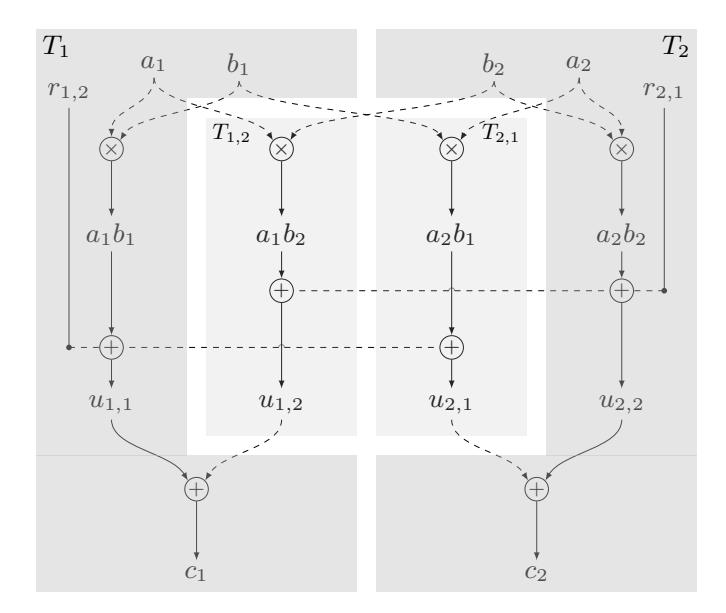
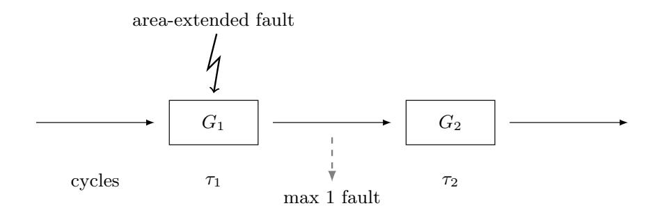
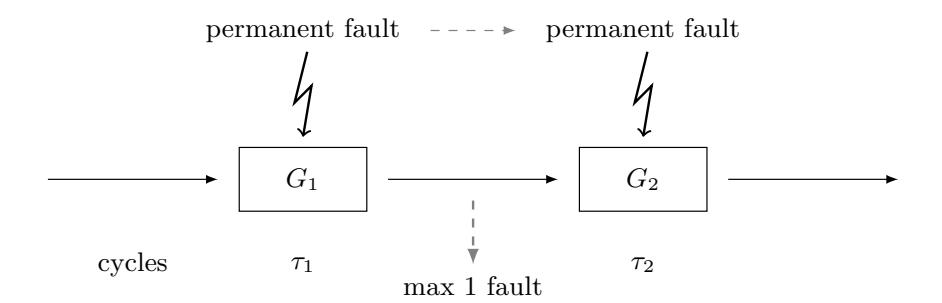
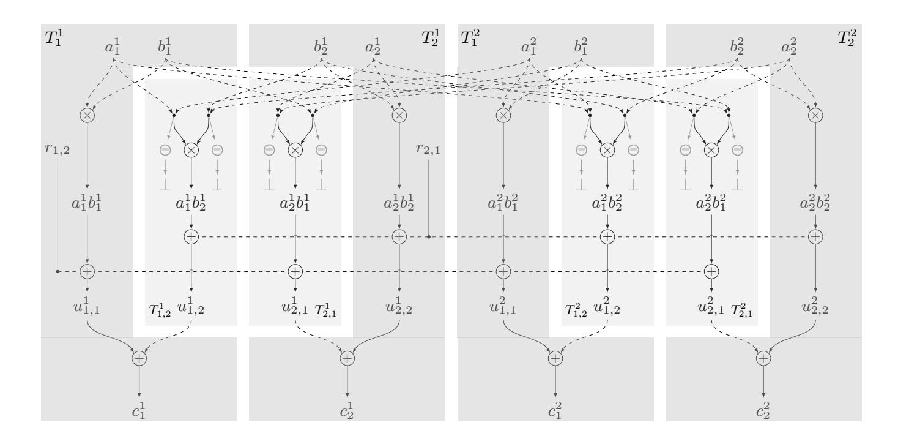

{0}------------------------------------------------

# Let's Tessellate: Tiling for Security Against Advanced Probe and Fault Adversaries

Siemen Dhooghe and Svetla Nikova

imec-COSIC, KU Leuven, Belgium firstname.lastname@esat.kuleuven.be

Abstract The wire probe-and-fault models are currently the most used models to provide arguments for side-channel and fault security. However, several practical attacks are not yet covered by these models. This work extends the wire fault model to include more advanced faults such as area faults and permanent faults. Moreover, we show the tile probeand-fault adversary model from CRYPTO 2018's CAPA envelops the extended wire fault model along with known extensions to the probing model such as glitches, transitions, and couplings. In other words, tiled (tessellated ) designs offer security guarantees even against advanced probe and fault adversaries.

As tiled models use multi-party computation techniques, countermeasures are typically expensive for software/hardware. This work investigates a tiled countermeasure based on the ISW methodology which is shown to perform significantly better than CAPA for practical parameters.

Keywords: Masking · Non-Interference · Probing Security · SIFA

# 1 Introduction

Symmetric primitives such as block ciphers are designed to resist black-box adversaries. These adversaries can view and choose the primitive's input and output. While the black-box model aims on high security guarantees, in practice, the adversary is often capable of more than choosing inputs and outputs. Since the primitive is implemented, either in hardware or in software, the adversary can observe leakage from operations or tamper with its execution. The former capability describes side-channel analysis where a typical side-channel is found in the power consumption of the device. As this consumption is correlated to the processed data, its observation allows for data-extraction as first described by Kocher et al. [\[19\]](#page-14-0). A second attack vector is found with an active adversary which tampers with the device to force incorrect outputs. While such outputs by themselves typically break cryptographic assumptions, they can additionally be used for data-extraction as explained by Biham and Shamir [\[6\]](#page-13-0).

In order to provide cryptographic arguments of security against passive and active attacks, adversary and security models are needed. The most well-known 

{1}------------------------------------------------

model for passive security is the probing model introduced by Ishai, Sahai and Wagner (ISW) [\[18\]](#page-14-1). The described probing adversary is capable of reading the exact values on a number of circuit wires, where the minimal number of observed wires needed to uncover a sensitive variable is defined as the order of probing security. Probing security can be reduced to the noisy leakage model as shown by Duc et al. [\[13\]](#page-14-2) where the assumptions lie in the presence of sufficient noise and independent wire leakage. The probing model is extended by Barthe et al. [\[1\]](#page-13-1) to capture composable security called the non-interference model in which several secure countermeasures have been made, e.g., [\[3–](#page-13-2)[5,](#page-13-3) [8,](#page-13-4) [10,](#page-13-5) [14,](#page-14-3) [16,](#page-14-4) [23\]](#page-14-5). Active adversaries are usually considered as the malicious variant of the probing model where the adversary can choose and fault up to a threshold number of circuit wires. The active (combined) security model is also extended to a composable security model called NINA [\[11\]](#page-13-6). Lately more advanced fault attacks such as Dobraunig et al.'s Statistical Ineffective Fault Attacks (SIFA) [\[12\]](#page-14-6), which combine Clavier's ineffective faults [\[9\]](#page-13-7) and Fuhr et al.'s statistical fault analysis [\[15\]](#page-14-7), have appeared breaking both side-channel as fault resistant implementations. These attacks call for cryptographic arguments to show the security of countermeasures and for the design of new countermeasures.

While the probing and wire fault models are a good step forward to allow for cryptographic arguments of security, the adversaries' capabilities do not always closely resemble practical attacks. Concerning the probing model, there are several effects such as glitches, transition leakage, and couplings which invalidate the probing model's assumption of independent wire leakage. When these effects occur, the adversary can mount side-channel attacks at a lower cost than estimated by the probing security of the implementation, e.g., see the work by Moos et al. [\[20\]](#page-14-8). As a reaction to these effects, Faust et al. [\[14\]](#page-14-3) proposed extensions of the probing model (called the robust probing model) such that hardware effects can be captured. The authors also describe how to protect smaller components in the primitive's circuit against these effects using the non-interference models. In 2011, Prouff and Roche [\[21\]](#page-14-9) proposed to use Multi-Party Computation (MPC) techniques to passively secure implementations against hardware effects. However, both works only properly discussed the effect of glitches. Concerning the wire fault model, no extensions to the model are currently proposed. The work proposed by Reparaz et al. [\[22\]](#page-14-10) (CAPA) considers an MPC model where an implementation is split in parts (tiles). The authors consider a new adversary model dubbed the tile probe-and-fault model where adversaries can read or fault tiles. This adversarial formalisation allows the capture of more topological and temporal effects in the circuit while still allowing for the design of countermeasures. The countermeasures, however, are based on MPC methods which are optimised to reduce communication costs rather than area and randomness costs. Instead there is a need for MPC methods which optimise for software/hardware costs.

# 1.1 Contributions

This paper provides extensions to the wire fault adversary to better capture the effect of realistic fault attacks. More specifically, the work puts forward 

{2}------------------------------------------------

two extensions: area-extended faults, which target an area around a wire; and permanent faults, which target a wire and allows the adversary to control it throughout the entire operation. Both extensions allow to better quantify the security of countermeasures against realistic attacks.

We put forward the stand-alone multi-party security model as one which covers many potential attacks jointly. It is shown that the model captures the effects of area-extended faults as well as faults targeting a specific resource throughout the computation. Moreover, to the best of our knowledge, the model is currently the only one capable of capturing *all* the physical effects described by Faust et al. [14]. Finally, recent introduced attacks such as Statistical Ineffective Fault Attacks (SIFA) and combined attacks, combining both side-channel analysis and fault analysis, are also covered by the model.

To show the feasibility of the tile model, this paper provides a multiplier secured in the stand-alone model. This multiplier is based on the well-known ISW methodology [18] showing that one can create multi-party protocols which are optimised for computational costs as opposed to communication costs. We compare the new multiplier to the one provided by Reparaz *et al.* [22] (CAPA) and we show that it performs significantly better with respect to elementary operations and randomness for practical parameters.

# 2 Preliminaries

This section introduces masking and share-duplication methods together with the known circuit and tile models including their adversaries and composable security models.

### 2.1 Masking and Redundancy

Using masking each variable x in the algorithm is split into shares  $x_i$  such that  $x = \sum_i x_i$  over a finite field  $\mathbb{F}_{2^m}$ . To defend against fault attacks redundancy is added to the shares by duplicating them. Checking whether all duplicates are equal, creates an error detection mechanism checking whether a fault was injected in the computation. Combining duplication with masking gives the following sharing of a secret x:

$$(x_1^1,...,x_1^{k+1},x_2^1,...,x_{d+1}^{k+1}),$$

such that  $\sum_{i=1}^{d+1} x_i^{\ell} = x$  for all  $\ell \in [k+1]$  and  $x_i^1 = \dots = x_i^{k+1}$  for all  $i \in [d+1]$ . The above sharing has a passive threshold d meaning that no d shares give information on the secret x and an active threshold k meaning that any faults on at most k shares could be detected in the vector.

### 2.2 The Circuit Model

This section introduces the circuit model and gadgets as defined by Ishai, Sahai and Wagner [18]. Consider algorithms in an arithmetic circuit form, a directed

{3}------------------------------------------------

acyclic graph whose nodes are operations over  $\mathbb{F}_{2^m}$  and whose edges are wires. Additionally, consider probabilistic circuits which have nodes with no input and uniform random elements over  $\mathbb{F}_{2^m}$  as output, where the random elements are independent and identically distributed, and the correctness of the circuit does not depend on them. In order to resist fault attacks, consider nodes with no output capable of aborting the computation. This abort signal works as a broadcast making all wires in the circuit read  $\bot$  when the signal is sent out. Finally, a gadget is a probabilistic circuit with shared inputs/outputs and, if needed, the capability to abort the computation.

Consider passive, active, or combined adversaries as those which interact with a circuit by placing probes, faults, or both respectively. The adversary's strength is determined by which and how many wires in the circuit it can probe or fault. For example, the capability of an active attacker can vary from faulting a single wire (e.g., using a laser) or targeting several wires at once; attackers can trigger a fault once or multiple times (even in a single cycle). The fault may effect the value on the wire in one cycle or during multiple cycles or even for the total protocol execution.

After the adversary has chosen which wires to probe and fault, the circuit reacts by setting or toggling the values on the faulted wires (as specified by the adversary) and returning the values on the probed wires. The state of the abort signal (true or false) is returned as well. Following the notation by Duc et al. [13], for  $t = 0, ..., \ell$ , a (d, k)-threshold-probe-and-faulting adversary on  $F_{2m}^{\ell}$  is a machine  $\mathcal{A}$  that plays the following game against an oracle  $\mathcal{O}$ :

- 1.  $\mathcal{A}$  specifies a set  $\mathcal{I} = \{i_1, ..., i_{|\mathcal{I}|}\}$  of cardinality at most d and a set of tuples  $\mathcal{J} = \{(j_1, h_1), ..., (j_{|\mathcal{J}|}, h_{|\mathcal{J}|})\}$  of cardinality at most k,
- 2.  $\mathcal{O}$  computes an arbitrary sequence  $(x_1,...,x_\ell) \in \mathbb{F}_{2^m}^\ell$  with  $(x_{j_1},...,x_{j_{|\mathcal{J}|}})$  faulted (bit-flip or stuck-at) according to  $(h_{j_1},...,h_{j_{|\mathcal{I}|}})$ .
- 3.  $\mathcal{A}$  receives  $(x_{i_1}, \ldots, x_{i_{|\mathcal{I}|}})$  with the abort state  $\perp$ .

Security consists of both a privacy and a correctness aspect. The number of probe and faults an adversary needs to place to break the scheme determines the order of security.

**Definition 1 (Order of Combined Security [11]).** A circuit is (d, k)-order combined secure if the following holds against a (d, k)-threshold-probe-and-faulting adversary.

- 1. Privacy: The probed d-tuple with the state of the abort can be simulated from scratch.
- 2. Correctness: The circuit either aborts  $\perp$  or gives a correct output.

Composable security follows simulation based arguments. For specific definitions and examples, we refer the reader to the following works [3,8,11]. In short, a simulation based proof for a particular gadget works as follows. The adversary

<span id="page-3-0"></span>On hardware this functionality is replaced by a specialised mechanism such as a cascading gadget from the work by Ishai *et al.* [17].

{4}------------------------------------------------

(distinguisher) is either interacting with the actual gadget or with a simulator. This simulator is given only a few of the input shares. The distinguisher's goal is to determine whether it is interacting with the simulator or with the actual gadget. A failure to do so implies that the adversary can know at most the shares given to the simulator.

Non-interference. Typically it is impossible to prove the security of a large circuit. Instead, one proves the composable security of several smaller gadgets. The composable notion for probing security has been studied by Barthe et al. [\[1\]](#page-13-1), where the notion of Strong Non-Interference (SNI) is defined.

Definition 2 (d-Strong Non-Interferent (d-SNI) [\[1\]](#page-13-1)). A gadget G is d-SNI if for any set of d<sup>1</sup> probes on its intermediate variables and every set of d<sup>2</sup> probes on its output shares such that d<sup>1</sup> ` d<sup>2</sup> ď d, the totality of the probes can be simulated by only d<sup>1</sup> shares of each input.

When this notion is combined with a sharing scheme of passive threshold d it provides d th-order probing security.

Non-accumulation. The composable security model for active attacks has been considered by Dhooghe and Nikova [\[11\]](#page-13-6). This notions demands that a wire fault affects only one output share of the gadget.

Definition 3 (k-Strong Non-Accumulative (k-SNA) [\[11\]](#page-13-6)). A gadget G is k-SNA if for any set of k<sup>1</sup> errors on each input and every set of k<sup>2</sup> errors on the intermediate variables, with k<sup>1</sup> ` k<sup>2</sup> ď k, the gadget either aborts or gives an output with at most k<sup>2</sup> errors.

The Strong NINA notion, forming the combined SNI and SNA notions, considers composable security against a combined adversary.

# 2.3 The Tile Model

The tile probe-and-fault model, as introduced by Reparaz et al. [\[22\]](#page-14-10), captures implementations which are segmented into several areas called tiles. This tile model is linked to Multi-Party Computation (MPC) where each tile would represent a party. A tile is defined as follows.

Definition 4 (Tile). A tile is a set of hardware resources (wiring, logic, and potential RNGs) dividing the platform where the tiles are interconnected by wires.

The redefinition of the circuit model then captures how to represent algorithms in a tiled construction.

Definition 5 (Tiled Circuit). A tiled circuit is a directed acyclic graph where each node is a resource with a tag indicating which tile it belongs to and which clock cycles activate it.

The tiled methodology also considers a passive adversary as one capable of observing segments of the tiled circuit.

{5}------------------------------------------------

Definition 6 (Transient Tile Probe). A transient tile probe observes all resources of a tile which were used for computation during a single clock cycle.

A transient tile fault on the other hand allows the adversary to fault all computation in a tile.

Definition 7 (Transient Tile Fault). A tile fault faults (bit-flip or stuck-at) all resources of a tile during a single clock cycle.

Finally, pd, kq-order combined security considers the circuits correctness and privacy when up to d tiles are corrupted, at most k of which being faulted.

Stand-alone security. Composable security for the tiled methodology follows standard definitions from the field of multi-party computation. More specifically, in this work it is sufficient to consider stand-alone security with abort in the static model. Since sequential operations represent different samples on a power trace, this security model is sufficient.[2](#page-5-0) It is formally shown by Canetti [\[7\]](#page-13-8) that proving security under the stand-alone definitions for secure multi-party computation suffices for obtaining security under sequential general composition. In Appendix [A,](#page-15-0) an overview of a proof of stand-alone security is given in case of either passive or combined corruptions.

# 3 The Tile Probing Model Against Advanced Probing Attacks

This section considers known physical effects which affect the probing security of an implementation and invalidate the separate wire leakage assumption. These effects were already discussed considering the circuit model in the work by Faust et al. [\[14\]](#page-14-3). However, this section adopts their arguments and discusses the physical effects in the tile probing model instead. In short, the tile model efficiently captures these extensions and the stand-alone security model gives composable security even when faced with the discussed physical effects.

# 3.1 Glitches

Glitches in the platform can cause one wire to contain information which is different from what is described in the algorithm. As a result, glitches can cause a wire to release unwanted information to the adversary and to reduce the order of probing security.

When requiring that the wires interconnecting the tiles are separated by registers, placed in the outgoing tile, glitches are prevented to propagate information from one tile to another. Because of this separation, and since a transient tile probe already views the effect of all possible glitches inside a tile, standalone security is sufficient to prove composability of tiled operations even in the presence of glitches.

<span id="page-5-0"></span><sup>2</sup> A connection between the security of parallel operations and the probing security of sequential operations is discussed in the work by Barthe et al. [\[2\]](#page-13-9).

{6}------------------------------------------------

### 3.2 Transitions

The power consumption of a device based on CMOS technology is correlated to the number of bit flips in the computation. Due to this effect, an attacker can observe the transition from old to new values in memory cells.

To capture transition effects one can adapt a tile probe to observe a tile's resources for two cycles assuming that the tile's state is refreshed each cycle. However, the more natural solution is found by extending the probe to see all computations made over the entire run of the protocol. To that end, the following extended tile probe is defined.

Definition 8 (Permanent Tile Probe). A permanent tile probe observes all resources of a tile during the entire run of the protocol.

As stand-alone security has already been proven to provide composable security in the MPC setting where the adversary views the state of a party throughout the entire operation, this model is sufficient for composable security of tiled operations even in presence of transition leakage.

# 3.3 Coupling effects

Coupling effect cause adjacent wires to have dependent leakage which allows the attacker to view leakage from bundles of wires.

In the tile model, all resources from the same tile are required to be bundled together such that the tiles form a connected set of resources. By assuming that different tiles exhibit separate leakage (as was done by Reparaz et al. [\[22\]](#page-14-10)), coupling effects do not carry information from one tile to another and making a tile probe capture coupling effects. Thus, the coupling security of a circuit is reduced to the assumption that the tiles leak independently. Additionally, the stand-alone model is again sufficient for composable security.

# <span id="page-6-1"></span>4 Passive Tiled Methodology

This section discusses the transformation of the ISW methodology from Ishai et al. into a tiled structure which is proven secure in the stand-alone model. The reader is referred to the work by Ishai et al. [\[18\]](#page-14-1) for the original methodology, the DOM methodology by Groß et al. [\[16\]](#page-14-4) for a hardware variant, and the work by Faust et al. [\[14\]](#page-14-3) for a glitch secure version. This work's adaptation solely induces an overhead in the used randomness compared to the original model. This increase is needed as the pd ` 1q-shared variant of the ISW method is not stand-alone secure and vulnerable against a permanent tile probing adversary, see Appendix [B.](#page-15-1)

The tiled methodology makes use of pd ` 1q 2 tiles consisting of d ` 1 main tiles T<sup>i</sup> for i P rd`1s and dpd`1q auxiliary tiles denoted by Ti,j for i, j P rd`1s and i ‰ j. These d ` 1 main tiles are equipped with RNGs.[3](#page-6-0) This section only

<span id="page-6-0"></span><sup>3</sup> The d`1 RNGs can be replaced by a d th-order tiled secure RNG if this is available.

{7}------------------------------------------------

considers the multiplication operation. In Appendix C the pseudo-code for other basic operations such as addition, refreshing, and error checking are detailed.

The pseudo-code for the shared multiplication is listed in Appendix C and is depicted for d=1 in Figure 1. The operation starts with the main tiles  $T_i$  holding the  $i^{th}$  share of the variables a and b. These variables are sent to the auxiliary tiles  $T_{i,j}$  which calculate the cross products giving a share  $a_ib_j$ . The cross products are then refreshed with d(d+1) extra random values generated by the RNGs of the main tiles. After refreshing the masks on the cross products, the auxiliary tiles send their cross products back to the main tiles. In Appendix C.2 we prove that Algorithm 4 is stand-alone secure.



<span id="page-7-0"></span>**Figure 1.** The passive secure tiled multiplier with d = 1, where dashed lines denote values taken from registers.

This multiplication, and the other basic operations, provide  $d^{th}$ -order passive security in the stand-alone model. As a result, the methodology is secure in case of transition leakage. In order to additionally secure against glitches, registers are required to be placed on the wires interconnecting the tiles. To secure against coupling, the resource placement should also be enforced by the designer and the resources belonging to the same tile should be grouped together.

# 5 Extending the Wire and Tile Fault Models

This section discusses extensions of the wire fault adversary such that the model is closer to realistic fault effects. Additionally, the composable security for the circuit model using non-accumulation is discussed. Finally, this section shows that the tile model easily captures these advanced fault attacks and that the stand-alone security model allows for composable security.

{8}------------------------------------------------

### 5.1 Area Faults

Typically laser or EM pulses are capable of affecting entire areas in an implementation instead of a single wire. For this fault to be useful for a cryptographic attack, this area is assumed to be limited.



<span id="page-8-0"></span>Figure 2. The effect of an area-extended fault on two sequential gadgets G1, G<sup>2</sup> where both gadgets are 1-SNA considering area-extended faults. The first gadget G<sup>1</sup> runs the first τ<sup>1</sup> cycles followed by τ<sup>2</sup> cycles of gadget G2. At most 1 output of G<sup>1</sup> can be faulted.

Wire fault model. To protect against area-wide faults, one considers a topological circuit where each pair of wires has the label of their distance and whether they are coupled or not. Area-extended faults are defined as faults which affect all wires within a certain distance of each other.

Definition 9 (Area-Extended Fault). For any set of adjacent wires W " pw1, ..., wkq, area-extended faults can be modelled with c-extended wire faults so that faulting one wire w<sup>i</sup> allows the adversary to fault c wires adjacent to wi.

The non-accumulation definitions can be adapted to consider area-extended faults as opposed to normal wire faults. Using this extension, noting that area faults affect only parallel running gadgets, k-SNA security is sufficient for composable security against k area-extended faults. A visual representation is given in Figure [2.](#page-8-0)

Tile fault model. Considering the tile model, by requiring that all resources belonging to the same tile are bundled together and assuming that an areaextended fault only affects one tile (which was also assumed in the work by Reparaz et al. [\[22\]](#page-14-10)), area-extended faults are modelled by tile faults. This reduces the area fault security for a complex circuit to the assumption that the fault targets one tile. As a result, the stand-alone model with combined corruptions is sufficient for composable security considering area-extended faults.

### 5.2 Permanent Faults

Consider fault injections which target specific resources in the platform and fault them throughout the entire operation (think of faulting the output of an RNG to zero due to a dedicated laser).

{9}------------------------------------------------



<span id="page-9-0"></span>Figure 3. The effect of a permanent wire fault on two sequential gadgets G1, G<sup>2</sup> where both gadgets are 1-SNA considering permanent wire faults. The first gadget G<sup>1</sup> runs the first τ<sup>1</sup> cycles followed by τ<sup>2</sup> cycles of gadget G2. In case G<sup>1</sup> and G<sup>2</sup> share the same faulted resource, it is possible for G<sup>2</sup> to receive a faulted input while also being affected by the permanent fault.

Wire fault model. Permanent wire faults are defined as those which target a certain hardware resource faulting it for the entire operation. Circuits are now viewed with cycles to model that resources are used more than once in the computation.

Definition 10 (Permanent Wire Fault). For any wire w, faults on all values passing through w can be modelled with r-extended faults so that faulting one wire allows the adversary to fault all r values passing through that wire.

Consider the extension of the non-accumulation model considering permanent wire faults. In this case, however, an overhead on the security is required meaning that that each gadget is required to be 2k-SNA to secure against k permanent wire faults. Requiring that each gadget is 2k-SNA is sufficient since each gadget gives back at most k faulty shares and each gadget is faulted at most k times. A visual representation is given in Figure [3.](#page-9-0)

Tile fault model. To model adversaries controlling resources for a longer period in a tiled structure, tile faults are considered as those which affect a tile during the entire operation. Thus, analogous to the definition of a permanent tile probe, we define a permanent tile fault.

Definition 11 (Permanent Tile Fault). A permanent tile fault faults all resources of a tile during the entire run of the protocol.

It is clear that a permanent tile fault is stronger than a permanent wire fault as the tile fault affects more than one resource in the circuit. Due to the standalone model capturing the security in MPC protocols where adversaries corrupt a party for the entire duration of the computation, this model is sufficient for composable security considering the permanent faults.

# 6 Combined Tiled Methodology

This section details a combined secure transformation of the ISW methodology into a tiled structure. Security with abort is considered where each tile keeps a 

{10}------------------------------------------------

copy of the abort flag. The used sharing is a duplicated Boolean sharing where each value is shared in d+1 masks and each mask is duplicated k+1 times. This countermeasure protects against a combined adversary which corrupts up to d tiles where up to k of them are faulted. There are a total of  $(k+1)(d+1)^2$  tiles where (k+1)(d+1) are main tiles  $T_i^t$  and (k+1)d(d+1) are auxiliary tiles  $T_{i,j}^t$ . The tiles  $T_i^1$  have RNGs, and  $T_{i,j}^t$  hold abort states such that when  $T_{i,j}^t$  aborts the other tiles halt as well. This section only considers the multiplication operation. In Appendix D the pseudo-code for other basic operations such as addition, refreshing, and error checking are given.

The multiplication operation is the combined secure variant of the method given in Section 4. The pseudo-code of the multiplication is listed in Appendix D and a depiction of the algorithm for d, k = 1 is given in Figure 4. The multiplication operates by sending all each duplicate share from the main tiles  $T_i^t$  to the auxiliary tiles  $T_{i,j}^t$  and  $T_{j,i}^t$ . These auxiliary tiles then perform an error check on the received duplicates. Randomness is then sampled in the main tiles and sent to the auxiliary tiles to refresh the cross products. In case no errors are found, the auxiliary tiles  $T_{i,j}^t$  send their cross product back to the main tiles. Last, the main tiles add the received cross products to obtain a share of the multiplication. A proof of stand-alone security considering combined corruptions is given in Appendix D.2.



<span id="page-10-0"></span>**Figure 4.** The combined secure tiled multiplier over  $\mathbb{F}_{2^m}$  with d=1 and k=1, where dashed lines denote values taken from registers. The auxiliary tiles  $T_{i,j}^t$  receive all duplicate shares  $a_i^{\ell}$  and  $b_j^{\ell}$  for  $\ell \in \{1,2\}$  and check their integrity.

This methodology is proven to be stand-alone secure considering combined corruptions. By requiring registers to be present on the wires connecting the tiles and enforcing the placement of the tiles, the methodology provides security in face of transitions, glitches, and coupling effects. Additionally, the methodology also captures security against area-extended and permanent faults including the

{11}------------------------------------------------

effects of combined passive and active attacks, and statistical ineffective faults as introduced by Dobraunig et al. [12].

# 7 A Note on the $\varepsilon$ -Faulting Adversary

The authors of CAPA [22] introduce two types of adversaries: the tile probe-and-fault adversary and the  $\varepsilon$ -faulting adversary. The latter is defined as follows: "We consider an  $\varepsilon$ -faulting adversary which is able to insert a random-value fault in any variable belonging to any party. The  $\varepsilon$ -faulting adversary may inject the random-value fault according to some distribution (for example, flip each bit with certain probability), but he cannot set all intermediates to a chosen fixed value." The attentive reader observes this adversary is not discussed in this work. The reason is that the  $\varepsilon$ -faulting adversary's definition can lead to various interpretations. In addition, the corresponding details from the protection scheme are vaguely described which leads to a possible contest of CAPA's security bound. To recall, CAPA claims that an  $\varepsilon$ -faulting adversary can break its scheme with probability  $|\mathbb{F}|^{-m}$ , where m is the number of used tags.

Since the adversary may inject random-value faults in any variable belonging to any party, consider an adversary which targets d+2 bits in the scheme. The distribution of the fault is taken as a uniform bit-flip, i.e., there is a 50% probability of the fault leaving the bit unaltered otherwise it is flipped. The attack works as follows: first the adversary targets a bit in a variable of its choosing. With high probability this fault will cause the d+1 abort flags to be raised. With the remaining d+1 bit-flips the adversary flips these abort flags. This results in the fault to remain undetected with high probability. The total success probability of this attack is  $(1-\mathbb{F}^{-m})\cdot (1/2)^{d+2}$  which, in case m or  $|\mathbb{F}|$  is large, is higher than  $|\mathbb{F}|^{-m}$ .

Another example is to attack the constants which are duplicated over the different tiles. The  $\varepsilon$ -faulting adversary targets, for example, the first bit of each duplicated constant. The success probability of this attack is  $2^{-d-1}$ , which can be far higher than  $|\mathbb{F}|^{-m}$ .

The problem we highlight here stems from the vaguely defined  $\varepsilon$ -faulting adversary, namely whether it relates to the ability of the attacker to choose which bits to fault, or to the way it modifies the values, or to both.

### 8 Efficiency Measures

This section provides efficiency measures of the introduced countermeasures. The efficiency of the proposed secure multiplications is measured in terms of the number of elementary operations, namely additions and multiplications. Additionally, the number of random elements is counted. For simplicity, the cost of the equality operator "Eq" is overestimated to 3(n-1) field additions, where the operator is given n arguments. The shared multipliers are then compared with the countermeasure by Reparaz et al. [22] (CAPA). The results are depicted in Table 1. To get a better view of these numbers, in Table 2, the comparison is

{12}------------------------------------------------

made using practical parameters. Following the examples given in CAPA, (1,1) and (2,2)-order combined protection is considered. We observe that this work's combined secure multiplication requires significantly fewer elementary operations and randomness.

The implementation of this work's tiled methodology would make for interesting future work, both for its security evaluation as performance measurements.

<span id="page-12-0"></span>**Table 1.** Comparison of the multiplication gadget from CAPA (both offline and online phase) and this work's multipliers in the number of field additions, multiplications, and number of random elements. Denoting d the passive protection order, k the active protection order and m the number of tags for CAPA.

| Alg.                | ×                         | +                          | Rand.            |
|---------------------|---------------------------|----------------------------|------------------|
| Alg. 4 (pass. sec.) | $(d+1)^2$                 | 3d(d+1)                    | d(d+1)           |
| Alg. 6 (comb. sec.) | $(k+1)(d+1)^2$            | 9(k+1)d(d+1)               | d(d+1)           |
| CAPA                | (d+1)((6m+2)(d+1)+5m+3) ( | (d+1)(14dm + 6d + 13m + 6) | (d+1)(d(1+3m)+4) |

<span id="page-12-1"></span>**Table 2.** Comparison of CAPA and this work's multipliers for practical parameters. The scheme of CAPA has a  $|\mathbb{F}|^{-m}$  probability of a fault breaking its security, while Alg. 6 always guarantees security.

|        |    | d, k, m | n = 1 | d, k, m = 2 |     |       |
|--------|----|---------|-------|-------------|-----|-------|
| Alg.   | ×  | +       | Rand. | ×           | +   | Rand. |
| Alg. 6 | 8  | 36      | 2     | 27          | 162 | 6     |
| CAPA   | 48 | 78      | 16    | 165         | 300 | 54    |

# 9 Conclusion

We extended the wire fault model considering faults which affect entire areas of the implementation and faults which target specific resources. We connected the extended probe-and-fault models with the tile model showing that the latter model envelops our extensions. Moreover, while the stand-alone security model achieves protection with the minimal number of shares, the non-interference and non-accumulation models will require an overhead.

This transition from a regular circuit to a tiled circuit, first, allows for the capture of temporal attacks which include passive attacks such as transition leakages, and active attacks such as permanent faults. Second, by bundling all resources from the same tile, the designer can better defend implementations against topological effects such as coupling effects or area-wide faults. This translation to label and bundle resources is thus a general transformation technique to protect implementations against more advanced attacks.

On the practise side, we provided tiled variants of the ISW countermeasure and showed that our tiled multiplication improves over the CAPA multiplication. Developing more efficient algorithms secure against advanced probe-and-fault attacks would develop interesting future work.

{13}------------------------------------------------

Acknowledgements We thank Fran¸cois-Xavier Standaert and Ga¨etan Cassiers for the interesting discussions. Siemen Dhooghe is supported by a PhD Fellowship from the Research Foundation – Flanders (FWO). Svetla Nikova was partially supported by the Bulgarian National Science Fund, Contract No. 12/8

# References

- <span id="page-13-1"></span>1. Barthe, G., Bela¨ıd, S., Dupressoir, F., Fouque, P.A., Gr´egoire, B., Strub, P.Y., Zucchini, R.: Strong non-interference and type-directed higher-order masking. In: Weippl, E.R., Katzenbeisser, S., Kruegel, C., Myers, A.C., Halevi, S. (eds.) ACM CCS 2016. pp. 116–129. ACM Press (Oct 2016). [ht](https://doi.org/10.1145/2976749.2978427)[tps://doi.org/10.1145/2976749.2978427](https://doi.org/10.1145/2976749.2978427)
- <span id="page-13-9"></span>2. Barthe, G., Dupressoir, F., Faust, S., Gr´egoire, B., Standaert, F.X., Strub, P.Y.: Parallel implementations of masking schemes and the bounded moment leakage model. In: Coron, J., Nielsen, J.B. (eds.) EUROCRYPT 2017, Part I. LNCS, vol. 10210, pp. 535–566. Springer, Heidelberg (Apr / May 2017). [https://doi.org/10.1007/978-3-319-56620-7˙19](https://doi.org/10.1007/978-3-319-56620-7_19)
- <span id="page-13-2"></span>3. Bela¨ıd, S., Benhamouda, F., Passel`egue, A., Prouff, E., Thillard, A., Vergnaud, D.: Randomness complexity of private circuits for multiplication. In: Fischlin, M., Coron, J.S. (eds.) EUROCRYPT 2016, Part II. LNCS, vol. 9666, pp. 616–648. Springer, Heidelberg (May 2016). [https://doi.org/10.1007/978-3-662-49896-5˙22](https://doi.org/10.1007/978-3-662-49896-5_22)
- 4. Bela¨ıd, S., Benhamouda, F., Passel`egue, A., Prouff, E., Thillard, A., Vergnaud, D.: Private multiplication over finite fields. In: Katz, J., Shacham, H. (eds.) CRYPTO 2017, Part III. LNCS, vol. 10403, pp. 397–426. Springer, Heidelberg (Aug 2017). [https://doi.org/10.1007/978-3-319-63697-9˙14](https://doi.org/10.1007/978-3-319-63697-9_14)
- <span id="page-13-3"></span>5. Bela¨ıd, S., Goudarzi, D., Rivain, M.: Tight private circuits: Achieving probing security with the least refreshing. In: Peyrin, T., Galbraith, S. (eds.) ASIAC-RYPT 2018, Part II. LNCS, vol. 11273, pp. 343–372. Springer, Heidelberg (Dec 2018). [https://doi.org/10.1007/978-3-030-03329-3˙12](https://doi.org/10.1007/978-3-030-03329-3_12)
- <span id="page-13-0"></span>6. Biham, E., Shamir, A.: Differential fault analysis of secret key cryptosystems. In: Kaliski Jr., B.S. (ed.) CRYPTO'97. LNCS, vol. 1294, pp. 513–525. Springer, Heidelberg (Aug 1997). <https://doi.org/10.1007/BFb0052259>
- <span id="page-13-8"></span>7. Canetti, R.: Security and composition of multiparty cryptographic protocols. Journal of Cryptology 13(1), 143–202 (Jan 2000). [ht](https://doi.org/10.1007/s001459910006)[tps://doi.org/10.1007/s001459910006](https://doi.org/10.1007/s001459910006)
- <span id="page-13-4"></span>8. Cassiers, G., Standaert, F.X.: Towards globally optimized masking: From low randomness to low noise rate. IACR TCHES 2019(2), 162–198 (2019). [https://doi.org/10.13154/tches.v2019.i2.162-198,](https://doi.org/10.13154/tches.v2019.i2.162-198) [https://tches.iacr.](https://tches.iacr.org/index.php/TCHES/article/view/7389) [org/index.php/TCHES/article/view/7389](https://tches.iacr.org/index.php/TCHES/article/view/7389)
- <span id="page-13-7"></span>9. Clavier, C.: Secret external encodings do not prevent transient fault analysis. In: Paillier, P., Verbauwhede, I. (eds.) CHES 2007. LNCS, vol. 4727, pp. 181–194. Springer, Heidelberg (Sep 2007). [https://doi.org/10.1007/978-3-540-74735-2˙13](https://doi.org/10.1007/978-3-540-74735-2_13)
- <span id="page-13-5"></span>10. Coron, J.S.: High-order conversion from Boolean to arithmetic masking. In: Fischer, W., Homma, N. (eds.) CHES 2017. LNCS, vol. 10529, pp. 93–114. Springer, Heidelberg (Sep 2017). [https://doi.org/10.1007/978-3-319-66787-4˙5](https://doi.org/10.1007/978-3-319-66787-4_5)
- <span id="page-13-6"></span>11. Dhooghe, S., Nikova, S.: My gadget just cares for me - how NINA can prove security against combined attacks. In: Jarecki, S. (ed.) CT-RSA 2020. LNCS, vol. 12006, pp. 35–55. Springer, Heidelberg (Feb 2020). [https://doi.org/10.1007/978-3-](https://doi.org/10.1007/978-3-030-40186-3_3) [030-40186-3˙3](https://doi.org/10.1007/978-3-030-40186-3_3)

{14}------------------------------------------------

- <span id="page-14-6"></span>12. Dobraunig, C., Eichlseder, M., Korak, T., Mangard, S., Mendel, F., Primas, R.: SIFA: Exploiting ineffective fault inductions on symmetric cryptography. IACR TCHES 2018(3), 547–572 (2018). [https://doi.org/10.13154/tches.v2018.i3.547-](https://doi.org/10.13154/tches.v2018.i3.547-572) [572,](https://doi.org/10.13154/tches.v2018.i3.547-572) <https://tches.iacr.org/index.php/TCHES/article/view/7286>
- <span id="page-14-2"></span>13. Duc, A., Dziembowski, S., Faust, S.: Unifying leakage models: From probing attacks to noisy leakage. In: Nguyen, P.Q., Oswald, E. (eds.) EURO-CRYPT 2014. LNCS, vol. 8441, pp. 423–440. Springer, Heidelberg (May 2014). [https://doi.org/10.1007/978-3-642-55220-5˙24](https://doi.org/10.1007/978-3-642-55220-5_24)
- <span id="page-14-3"></span>14. Faust, S., Grosso, V., Pozo, S.M.D., Paglialonga, C., Standaert, F.X.: Composable masking schemes in the presence of physical defaults & the robust probing model. IACR TCHES 2018(3), 89–120 (2018). [https://doi.org/10.13154/tches.v2018.i3.89-120,](https://doi.org/10.13154/tches.v2018.i3.89-120) [https://tches.iacr.org/](https://tches.iacr.org/index.php/TCHES/article/view/7270) [index.php/TCHES/article/view/7270](https://tches.iacr.org/index.php/TCHES/article/view/7270)
- <span id="page-14-7"></span>15. Fuhr, T., Jaulmes, E., Lomn´e, V., Thillard, A.: Fault attacks on AES with faulty ´ ciphertexts only. In: 2013 Workshop on Fault Diagnosis and Tolerance in Cryptography, Los Alamitos, CA, USA, August 20, 2013. pp. 108–118 (2013). [ht](https://doi.org/10.1109/FDTC.2013.18)[tps://doi.org/10.1109/FDTC.2013.18,](https://doi.org/10.1109/FDTC.2013.18) <https://doi.org/10.1109/FDTC.2013.18>
- <span id="page-14-4"></span>16. Groß, H., Mangard, S., Korak, T.: Domain-oriented masking: Compact masked hardware implementations with arbitrary protection order. In: Proceedings of the ACM Workshop on Theory of Implementation Security, TIS@CCS 2016 Vienna, Austria, October, 2016. p. 3 (2016). <https://doi.org/10.1145/2996366.2996426>
- <span id="page-14-11"></span>17. Ishai, Y., Prabhakaran, M., Sahai, A., Wagner, D.: Private circuits II: Keeping secrets in tamperable circuits. In: Vaudenay, S. (ed.) EUROCRYPT 2006. LNCS, vol. 4004, pp. 308–327. Springer, Heidelberg (May / Jun 2006). [ht](https://doi.org/10.1007/11761679_19)[tps://doi.org/10.1007/11761679˙19](https://doi.org/10.1007/11761679_19)
- <span id="page-14-1"></span>18. Ishai, Y., Sahai, A., Wagner, D.: Private circuits: Securing hardware against probing attacks. In: Boneh, D. (ed.) CRYPTO 2003. LNCS, vol. 2729, pp. 463–481. Springer, Heidelberg (Aug 2003). [https://doi.org/10.1007/978-3-540-45146-4˙27](https://doi.org/10.1007/978-3-540-45146-4_27)
- <span id="page-14-0"></span>19. Kocher, P.C., Jaffe, J., Jun, B.: Differential power analysis. In: Wiener, M.J. (ed.) CRYPTO'99. LNCS, vol. 1666, pp. 388–397. Springer, Heidelberg (Aug 1999). [https://doi.org/10.1007/3-540-48405-1˙25](https://doi.org/10.1007/3-540-48405-1_25)
- <span id="page-14-8"></span>20. Moos, T., Moradi, A., Schneider, T., Standaert, F.X.: Glitchresistant masking revisited. IACR TCHES 2019(2), 256–292 (2019). [https://doi.org/10.13154/tches.v2019.i2.256-292,](https://doi.org/10.13154/tches.v2019.i2.256-292) [https://tches.iacr.org/](https://tches.iacr.org/index.php/TCHES/article/view/7392) [index.php/TCHES/article/view/7392](https://tches.iacr.org/index.php/TCHES/article/view/7392)
- <span id="page-14-9"></span>21. Prouff, E., Roche, T.: Higher-order glitches free implementation of the AES using secure multi-party computation protocols. In: Preneel, B., Takagi, T. (eds.) CHES 2011. LNCS, vol. 6917, pp. 63–78. Springer, Heidelberg (Sep / Oct 2011). [https://doi.org/10.1007/978-3-642-23951-9˙5](https://doi.org/10.1007/978-3-642-23951-9_5)
- <span id="page-14-10"></span>22. Reparaz, O., De Meyer, L., Bilgin, B., Arribas, V., Nikova, S., Nikov, V., Smart, N.P.: CAPA: The spirit of beaver against physical attacks. In: Shacham, H., Boldyreva, A. (eds.) CRYPTO 2018, Part I. LNCS, vol. 10991, pp. 121–151. Springer, Heidelberg (Aug 2018). [https://doi.org/10.1007/978-3-319-96884-1˙5](https://doi.org/10.1007/978-3-319-96884-1_5)
- <span id="page-14-5"></span>23. Ueno, R., Homma, N., Sugawara, Y., Nogami, Y., Aoki, T.: Highly efficient GFp2 8 q inversion circuit based on redundant GF arithmetic and its application to AES design. In: G¨uneysu, T., Handschuh, H. (eds.) CHES 2015. LNCS, vol. 9293, pp. 63–80. Springer, Heidelberg (Sep 2015). [https://doi.org/10.1007/978-3-662-48324-](https://doi.org/10.1007/978-3-662-48324-4_4) [4˙4](https://doi.org/10.1007/978-3-662-48324-4_4)

{15}------------------------------------------------

# <span id="page-15-0"></span>A An Overview on Proofs of Stand-Alone Security

This appendix gives an overview of how a proof of stand-alone security is made in case of passive and combined corruption respectively. In case the parties are using uniform randomness, the indistinguishability proof is done in a straightforward way.

# Passive corruptions.

- Consider an operation π, we want to prove stand-alone security up to order d.
- Consider an ideal functionality F which describes π with a trusted third party.
- Consider a set of n tiles T<sup>i</sup> and an adversary A which chooses to passively corrupt up to d of them.
- We need to prove that a polynomial time probabilistic simulator S exists which is given only the information of the corrupted tiles and which can simulate the view of A in π such that no probabilistic distinguisher can differentiate the real-world view from the simulated view.[4](#page-15-2)

### Combined corruptions.

- Consider an operation π, we want to prove stand-alone security where k tiles are faulted and d tiles are probed.
- We consider an ideal functionality F which describes π with a trusted third party. Consider that this ideal functionality can abort the operation in case an error is detected.
- Consider a set of n tiles T<sup>i</sup> and an adversary A which chooses to corrupt up to a total of d tiles where up to k are actively faulted.
- We prove the correctness of π considering k active corrupt tiles by showing that at most k outputs are corrupt or the operation aborts.
- We prove the privacy of the scheme by showing that a polynomial time probabilistic simulator S exists, which is given the information of the (both passive and active) corrupted tiles and the injected faults, can simulate the view of A in π such that no probabilistic distinguisher can differentiate the real-world view from the simulated view.

# <span id="page-15-1"></span>B An Issue With the Stand-alone Security of ISW

This appendix considers an attack on a straightforward tiled ISW methodology. This attack is given as justification for an increased randomness cost of this work's tiled methodology. The pseudo-code of the tiled version of the d ` 1 ISW method is listed in Algorithm [1.](#page-16-1)

<span id="page-15-2"></span><sup>4</sup> The probability distributions are taken over the random tapes of the parties and the simulator, and is conditioned on the inputs and outputs.

{16}------------------------------------------------

### Algorithm 1: ISW tiled multiplication **Input:** Independent shares of a and bOutput: Shares $c_i$ of abfor $i \leftarrow 1$ to d + 1 do for $j \neq i$ do $a_i:T_{i,j} \leftarrow a_i:T_i;$ $b_j: T_{i,j} \leftarrow b_j: T_j;$ end end for $i \leftarrow 1$ to d + 1 do for $j \leftarrow i + 1$ to d + 1 do $(u_{i,j} \leftarrow a_i b_j + r_{i,j}) : T_{i,j};$ $(u_{j,i} \leftarrow a_j b_i + r_{i,j}) : T_{j,i};$ $u_{i,j}: T_i \leftarrow u_{i,j}: T_{i,j};$ $u_{j,i}:T_j \leftarrow u_{j,i}:T_{j,i};$ end end for $i \leftarrow 1$ to d + 1 do $(c_i \leftarrow a_i b_i + \sum_{j \neq i} u_{i,j}) : T_i;$ end

<span id="page-16-1"></span>Consider the  $\mathcal{F}_{mult}$  functionality where the simulator is given the shares  $a_i, b_i$  when a main tile  $T_i$  is corrupted and where the simulator is given  $a_i$  and  $b_j$  when the auxiliary tile  $T_{i,j}$  is corrupted. We show a mismatch between the information given to the simulator and what is learned by a tile probing adversary. For d=2, if an adversary probes  $T_1$  and  $T_{2,1}$ , the simulator should be given  $a_1, a_2$ , and  $b_1$ . However, the adversary also receives the share  $u_{1,2} = a_1b_2 + r_{1,2}$  where the adversary already knew  $r_{1,2}$ . Thus, the adversary learns  $b_2$  which is a share the simulator was not given and, as a result, a proof of simulation-based security will fail.

The above operation is not secure against a permanent tile probing adversary for d=2 when it is composed with itself. Consider two instances of Algorithm 1 where the first instance operates on independent shares of a and b, giving shares of c=ab as output and the second instance operating on independent shares c and d giving shares of e=cd as output. Consider an adversary which probes  $T_{2,1}$  and  $T_{2,3}$  during the length of the two operations. In the first operation, the adversary learns  $a_2, b_1$ , and  $b_3$ . In the second instance the adversary also learns  $c_2$  which reveals  $b_2$  as the adversary knows the randomness used to create  $c_2$ . As a result, the adversary learns the secret input b when only using two probes. Thus, not only is Algorithm 1 not stand-alone secure, serial compositions between itself are insecure against a permanent tile probing adversary.

# <span id="page-16-0"></span>C Passive Secure Tiled Operations

### C.1 Pseudo-Code

A variable  $a_i$  in tile  $T_i$  is denoted as  $a_i : T_i$ . Local operations for  $T_i$  are denoted  $(\cdot) : T_i$ . Communication from one tile to another is denoted by an arrow where

{17}------------------------------------------------

there is the indication that the target variable belongs to a different tile than the source variable  $(\cdot: T_j \leftarrow \cdot: T_i)$ . Finally, the sampling of randomness is denoted by the \$ symbol.

```
Algorithm 2: Tiled addition

Input: Shares of a and b

Output: Shares c_i of a + b

for i \leftarrow 1 to d + 1 do

(c_i \leftarrow a_i + b_i) : T_i;\nend
```

# Algorithm 3: Tiled refreshing Input: Shares of aOutput: Refreshed shares $c_i$ of afor $i \leftarrow 1$ to d+1 do for $j \neq i$ do $(r_{i,j} \leftarrow \$) : T_i;$ $r_{i,j} : T_j \leftarrow r_{i,j} : T_i;$ \nend for $i \leftarrow 1$ to d+1 do $(c_i \leftarrow a_i + \sum_{j \neq i} r_{j,i}) : T_i;$ \nend

### Algorithm 4: Tiled multiplication

```
Input: Independent shares of a and b
Output: Shares c_i of ab
      for i \leftarrow 1 to d + 1 do
           for j \neq i do
                a_i:T_{i,j} \leftarrow a_i:T_i;
                b_j: T_{i,j} \leftarrow b_j: T_j;
           end
     end
      for i \leftarrow 1 to d + 1 do
           for j \neq i do
                (r_{i,j} \leftarrow \$) : T_i;

r_{j,i} : T_{j,i} \leftarrow r_{i,j} : T_i;
           end
      end
      for i \leftarrow 1 to d + 1 do
           (u_{i,i} \leftarrow a_i b_i + \sum_{j \neq i} r_{i,j}) : T_i;
           for j \neq i do
               (u_{i,j} \leftarrow a_i b_j + r_{i,j}) : T_{i,j};
u_{i,j} : T_i \leftarrow u_{i,j} : T_{i,j};
           end
      \mathbf{end}
      for i \leftarrow 1 to d+1 do
          (c_i \leftarrow \sum_j u_{i,j}) : T_i;
     end
```

{18}------------------------------------------------

### <span id="page-18-0"></span>C.2 Stand-Alone Security of Algorithm [4](#page-17-0)

This appendix proves the tiled multiplication operation as shown in Algorithm [4](#page-17-0) is d th-order stand-alone secure. Consider the following ideal functionality.

Functionality Fmult - Multiplication

- 1. Fmult receives a<sup>i</sup> and b<sup>i</sup> shares from T<sup>i</sup> with i P rd ` 1s.
- 2. Fmult sends a<sup>i</sup> and b<sup>j</sup> to Ti,j for i ‰ j.
- 3. Fmult calculates random shares of ab and sends the i th share to Ti .

Theorem 1. Algorithm [4](#page-17-0) is a d th-order stand-alone secure operation implementing Fmult.

Proof. Choose d arbitrary corruptions of the tiles of the following categorisation.

- 1. T<sup>i</sup>
- 2. Ti,j

Take the empty sets I and J. Depending on the corruptions, add the following indices to the sets.

- For every corruption in group 1, add i to I and J.
- For every corruption in group 2, add i to I and j to J.

We show that the simulator given paiqiP<sup>I</sup> and pb<sup>j</sup> qjP<sup>J</sup> can simulate the view of the corrupted tiles during the execution of Algorithm [4.](#page-17-0) Clearly the shares given to the simulator correspond to a corrupted party in the ideal functionality. For the proof it is sufficient to simulate the incoming messages. We define the simulation as follows.

- For tiles in group 1, we need to simulate the received ui,j for i ‰ j. Pick an such a ui,j arbitrarily.
  - ' In case Ti,j was probed, the ui,j was already simulated.
  - ' In case T<sup>j</sup> was probed, ri,j was already sampled. Since the simulator is given a<sup>i</sup> , a<sup>j</sup> , b<sup>i</sup> , and b<sup>j</sup> it can perfectly simulate the ui,j .
  - ' Otherwise, we simulate ui,j as uniform random. This simulation is perfect since ri,j is viewed only once by the parties thus it masks the aib<sup>j</sup> .
- For every probe in group 2, we see that the simulator already knows a<sup>i</sup> and b<sup>j</sup> thus those shares can be perfectly simulated. We then simulate the received ri,j .
  - ' In case T<sup>j</sup> was probed this value was already sampled thus the simulator reuses it.
  - ' Otherwise, ri,j is sampled uniformly as no other tile views this random value.

Since I and J correspond to the view of the corrupted parties in the ideal functionality and the probed variables are simulated using only the knowledge of taiu<sup>i</sup>P<sup>I</sup> and tbiu<sup>i</sup>P<sup>J</sup> , Algorithm [4](#page-17-0) is stand-alone secure.

{19}------------------------------------------------

# <span id="page-19-0"></span>D Combined Secure Tiled Operations

### D.1 Pseudo-Code

end

A variable  $a_i$  in tile  $T_i$  is denoted as  $a_i:T_i$ . Local operations for  $T_i$  are denoted  $(\cdot):T_i$ . Communication from one tile to another is denoted by an arrow where there is the indication that the target variable belongs to a different tile than the source variable  $(\cdot:T_j\leftarrow\cdot:T_i)$ . Finally, the sampling of randomness is denoted by the \$ symbol.

```
Algorithm 5: Combined secure tiled addition

Input: Shares of a and b

Output: Shares c_i of a + b

for t \leftarrow 1 to k + 1 do

for i \leftarrow 1 to d + 1 do

(c_i^t \leftarrow a_i^t + b_i^t) : T_i^t;\nend
```

{20}------------------------------------------------

Algorithm 6: Combined secure tiled multiplication

```
Input: Independent shares of a and b
Output: Shares c_i of ab
       for t \leftarrow 1 to k + 1 do
              for i \leftarrow 1 to d + 1 do
                      for j \neq i do
                             for \ell \leftarrow 1 to k+1 do
                                   a_i^t : T_{i,j}^\ell \leftarrow a_i^t : T_i^t; 
b_j^t : T_{i,j}^\ell \leftarrow b_j^t : T_j^t;
                             \mathbf{end}
                      \mathbf{end}
               end
        end
       for i \leftarrow 1 to d + 1 do
              for j \neq i do

(r_{i,j}^1 \leftarrow \$) : T_i^1;

for t \leftarrow 1 to k + 1 do
                            r_{j,i}^t:T_{j,i}^t \leftarrow r_{i,j}^1:T_i^1;
                      end
               \mathbf{end}
       end
       for i \leftarrow 1 to d + 1 do
              for j \neq i do
                     for t \leftarrow 1 to k + 1 do
                             (u_{i,j}^t \leftarrow \mathrm{Eq}_{\ell \in [k+1]}(a_i^\ell)) : T_{i,j}^t;
                             (v_{i,j}^t \leftarrow \text{Eq}_{\ell \in [k+1]}(b_j^t)) : T_{i,j}^t; 
 \mathbf{if} \ u_{i,j}^t = 0 \ \mathbf{or} \ v_{i,j}^t = 0 \ \mathbf{then} \ T_{i,j}^t \ \text{aborts}; 
                      \mathbf{end}
               \quad \text{end} \quad
       end
       for t \leftarrow 1 to k + 1 do
              for i \leftarrow 1 to d + 1 do
                    (u_{i,i}^t \leftarrow a_i^t b_i^t + \sum_{j \neq i} r_{i,j}^t) : T_i^t;
\mathbf{for} \ j \neq i \ \mathbf{do}
(u_{i,j}^t \leftarrow a_i^t b_j^t + r_{i,j}^t) : T_{i,j}^t;
                      \mathbf{end}
               \quad \text{end} \quad
       end
       for t \leftarrow 1 to k + 1 do
              for i \leftarrow 1 to d + 1 do
                      for j \neq i do
                             u_{i,j}^t: T_i^t \leftarrow u_{i,j}^t: T_{i,j}^t;
                      \mathbf{end}
                     (c_i^t \leftarrow \sum_j u_{i,j}^t) : T_i^t;
               \quad \text{end} \quad
       \mathbf{end}
```

{21}------------------------------------------------

# Algorithm 7: Combined secure tiled refreshing

```
Input: Shares of a
Output: Refreshed shares c_i of a

for i \leftarrow 1 to d+1 do
	for j \neq i do
	(r_{i,j}^1 \leftarrow \$) : T_i^1;
	for t \leftarrow 2 to k+1 do
	r_{i,j}^t : T_j^t \leftarrow r_{i,j}^1 : T_i^1;
	end
	end
	for t \leftarrow 1 to k+1 do
	for i \leftarrow 1 to d+1 do
	(c_i^t \leftarrow a_i^t + \sum_{j \neq i} r_{j,i}^t) : T_i^t;
	end
	end
```

### Algorithm 8: Tiled error checking

```
Input: Shares of a

for t \leftarrow 1 to k + 1 do

for \ell \leftarrow 1 to k + 1 do

for i \leftarrow 1 to d + 1 do

a_i^t : T_{i,1}^\ell \leftarrow a_i^t : T_i^t;
\nend
\nend

for t \leftarrow 1 to k + 1 do

for i \leftarrow 1 to k + 1 do

(u_i^t \leftarrow \operatorname{Eq}_{\ell \in [k+1]}(a_i^\ell)) : T_{i,1}^t;
\nif u_i^t = 0 then T_{i,1}^t aborts;
\nend
\nend
```

### **Algorithm 9:** Equality check over $\mathbb{F}_2^m$

```
Input: Inputs a_1, ..., a_n
Output: 1 if the inputs are equal, 0 if not

for i \leftarrow 2 to n do

b_{i-1} \leftarrow a_1 + a_i;\nend
c \leftarrow 0;
for i \leftarrow 1 to n-1 do

for j \leftarrow 1 to m do

c \leftarrow c \lor b_i[j];\nend\nend\nend
c \leftarrow \neg c;
```

# <span id="page-21-0"></span>D.2 Stand-Alone Security of Algorithm 6

This appendix proves that Algorithm 6 is secure against an adversary corrupting up to d tiles where up to k of those have been faulted. Consider the following ideal functionality.

{22}------------------------------------------------

Functionality  $\mathcal{F}_{comb\_mult}$  - Multiplication

- 1.  $\mathcal{F}_{comb\_mult}$  receives  $a_i^t$  and  $b_i^t$  from  $T_i^t$  with  $i \in [d+1]$  and  $t \in$
- 2.  $\mathcal{F}_{comb\_mult}$  sends  $a_i^t$  and  $b_j^t$  to  $T_{i,j}^t$  for  $i \neq j$  and  $t \in [k+1]$ . 3. In case one of the  $a_i^t$  or  $b_i^t$  differ,  $\mathcal{F}_{comb\_mult}$  aborts. Otherwise,  $\mathcal{F}_{comb\_mult}$  calculates random duplicated shares of ab and sends them to  $T_i^{t'}$  for  $t' \in [k+1]$ .

**Theorem 2.** Algorithm 6 is (d,k)-order stand-alone secure with combined corruptions implementing  $\mathcal{F}_{comb\_mult}$ .

*Proof.* Take an arbitrary  $d' \leq d$  tiles to be corrupted where up to  $k' \leq k$  are actively corrupted. The proof of stand-alone security consists of two parts, a proof of correctness and a proof of privacy. The proof of correctness shows that injecting faults in up to k' tiles only harms at most k' output shares of the operation. The proof of privacy shows that there is a simulator which can simulate the view of the corrupted tiles given their input shares and the injected faults.

Correctness. Considering the proof of correctness, we go over which tiles can be faulted and argue that either a tile aborts or at most k' output shares of the operation are harmed.

Faulting an auxiliary tile  $T_{i,j}^t$  alters only one cross product u, thus affecting only one output share. In case an input of a main tile  $T_i^t$  is faulted, only one duplicate of each input can be affected. Since there are k+1 integrity checks on these inputs, there is always a tile which aborts. All other faults in a main tile affect only one output share. Thus, we conclude that Algorithm 6 remains correct for up to k active corruptions.

*Privacy.* Consider the following categorisation of tiles which can be corrupted.

1.  $T_i^t$ 2.  $T_{i,j}^t$ 

We take the empty sets I and J. Depending on the corruptions, add the following indices to the sets.

- For every active or passive corruption in group 1, add i to I and J.
- For every active or passive corruption in group 2, add i to I and j to J.

We show that the simulator given  $(a_i^1)_{i\in I}$  and  $(b_i^1)_{j\in J}$  and the injected faults can simulate the view of the corrupted tiles during the execution of Algorithm 6. Clearly the shares given to the simulator correspond to a corrupted party in the ideal functionality. We first show that a simulator can simulate when a tile aborts the operation when given the injected faults. Consider the following classification of injected faults.

{23}------------------------------------------------

- A non-trivial fault occurs in a tile of group 1. Consider that the fault occurs in a share of b (the case for a is similar). In this case, we define the simulator to abort the operation. As there are k+1 different tiles for each input checking its integrity and the adversary can only fault up to k tiles, the protocol will always abort.
  - In case the shares  $u_{i,i}^t, r_{i,j}^t$ , or  $c_i^t$  are faulted, the simulator does not abort.
- A non-trivial fault occurs in a tile of group 2. Since the simulator is given the inputs to  $T_{i,j}^t$  and the injected faults, the simulator can simulate the state of the abort flag and abort the protocol accordingly.

To finish the proof, we simulate the incoming messages of the corrupted tiles. Define the simulation as follows.

– For tiles in group 1, we first simulate the sent  $a_i^t, b_i^t$ , and  $r_{i,j}^t$  shares. Since the simulator has  $a_i^1$  and  $b_i^1$  this is perfectly simulated even when faults occur as the simulator has the injected faults. The shares  $r_{i,j}^t$  are simulated as uniform random variables unless they were faulted.

We then simulate the received  $u_{i,j}^t$  for  $i \neq j$ . Pick an such a  $u_{i,j}^t$  arbitrarily. First, in case the abort signal is simulated then  $u_{i,j}^t$  is simulated as  $\perp$ . Now assume the abort signal is not triggered.

In case  $T_{i,j}^{\ell}$  for an arbitrary  $\ell$  was probed or faulted, the simulator is given  $a_i^1$  and  $b_j^1$  thus  $u_{i,j}^t$  can be simulated perfectly using the injected faults. Now we assume no  $T_{i,j}^{\ell}$  was corrupted.

- In case a  $T_i^{t'}$  with  $t' \neq t$  was probed or faulted, we already simulated  $u_{i,j}^{t'}$ , and since no  $T_{i,j}^{\ell}$  was corrupted these cross products need to be correct.
- and since no  $T_{i,j}^{\ell}$  was corrupted these cross products need to be correct.

   In case  $T_j^t$  for an arbitrary t was probed,  $r_{i,j}^t$  was already sampled. Since the simulator is given  $a_i^t, b_j^t$ , and the injected faults it can perfectly simulate the  $u_{i,j}^t$ .
- Otherwise, we simulate  $u_{i,j}^t$  as uniform random. This simulation is perfect since  $r_{i,j}^t$  for any t is viewed only once by the parties thus it masks the  $a_i^t b_j^t$ .
- For every probe or fault in group 2, since the simulator already knows  $a_i^t$  and  $b_j^t$ , those shares can be perfectly simulated. We then simulate the received  $r_{i,j}^t$ .
  - In case  $T_{i,j}^{t'}$  was probed,  $r_{i,j}^{t'}$  was already simulated. Since we have the injected errors we can simulate  $u_{i,j}^t$ .
  - In case  $T_j^t$  was probed,  $r_{i,j}^t$  was already sampled, thus the simulator reuses it.
  - Otherwise,  $r_{i,j}^t$  is sampled uniformly as no other tile views this random value.

Since I and J correspond to the shares given by the corrupted parties in the ideal functionality and since the abort signal and the probed variables are simulated using only the knowledge of  $\{a_i^1\}_{i\in I}$  and  $\{b_i^1\}_{i\in J}$ , Algorithm 6 is standalone secure in the presence of combined corruptions.