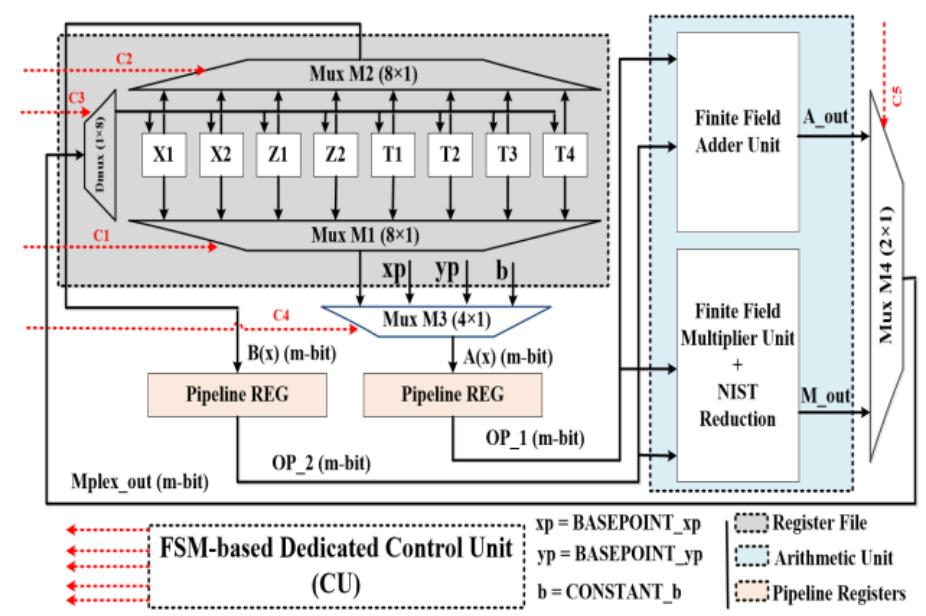
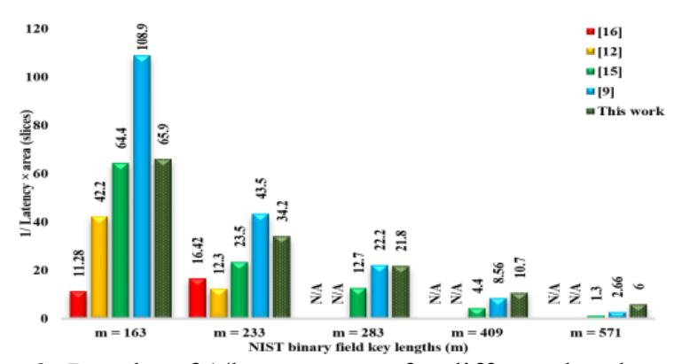

{0}------------------------------------------------

# **IEEE Copyright Notice**

Copyright (c) 2020 IEEE Personal use of this material is permitted. Permission from IEEE must be obtained for all other uses, in any current or future media, including reprinting/republishing this material for advertising or promotional purposes, creating new collective works, for resale or redistribution to servers or lists, or reuse of any copyrighted component of this work in other works.

### **Cite as:**

M. Imran, S. Pagliarini and M. Rashid, "An Area Aware Accelerator for Elliptic Curve Point Multiplication," *2020 27th IEEE International Conference on Electronics, Circuits and Systems (ICECS)*, Glasgow, UK, 2020, pp. 1–4, doi: 10.1109/ICECS49266.2020.9294908.

#### **BibTeX:**

```
@INPROCEEDINGS{9294908,
 author={M. {Imran} and S. {Pagliarini} and M. {Rashid}},
 booktitle={2020 27th IEEE International Conference on Electronics, 
Circuits and Systems (ICECS)}, 
 title={An Area Aware Accelerator for Elliptic Curve Point 
Multiplication}, 
 year={2020},
 volume={},
 number={},
 pages={1-4},
 doi={10.1109/ICECS49266.2020.9294908}}
```

{1}------------------------------------------------

# An Area Aware Accelerator for Elliptic Curve Point Multiplication

Malik Imran *Dept. of Computer Systems Tallinn University of Technology (TalTech)* Tallinn, Estonia malik.imran@taltech.ee

Samuel Pagliarini *Dept. of Computer Systems Tallinn University of Technology (TalTech)* Tallinn, Estonia samuel.pagliarini@taltech.ee

Muhammad Rashid *Dept. of Computer Engineering* Umm Al-Qurah University (UQU) Makkah, Saudi Arabia mfelahi@uqu.edu.sa

*Abstract***—This work presents a hardware accelerator, for the optimization of latency and area at the same time, to improve the performance of point multiplication process in Elliptic Curve Cryptography. In order to reduce the overall computation time in the proposed 2-stage pipelined architecture, a rescheduling of point addition and point doubling instructions is performed along with an efficient use of required memory locations. Furthermore, a 41-bit multiplier is also proposed. Consequently, the FPGA and ASIC implementation results have been provided. The performance comparison with state-of-the-art implementations, in terms of latency and area, proves the significance of the proposed accelerator.**

*Keywords—elliptic curve cryptography, point multiplication, Montgomery algorithm, FPGA, ASIC*

## I. INTRODUCTION

The main advantages of Elliptic Curve Cryptography (ECC), as compared to the commonplace RSA algorithm, are shorter key lengths, lesser power consumption, and lower hardware cost for an equivalent security [1]–[2]. Therefore, the ECC is implemented frequently in software or hardware [3]. While the software implementation is convenient and flexible, hardware-based solutions display higher throughputs and low latency [4]–[16]. However, low-latency hardware solutions typically demand precious hardware resources; architectures providing low latency and small area are challenging to devise.

The most important operation in ECC is the point multiplication (PM) [2]. Two types of fields are generally utilized to implement PM: the prime field, i.e., *GF(p)* and the binary extension field, i.e., *GF(2 <sup>m</sup>)*. For each of the aforementioned fields, the National Institute of Standards and Technology (NIST) provides various key length recommendations [17]. Furthermore, implementations can adopt affine or projective coordinates [5]. Another important issue in ECC is to choose between polynomial and normal basis [10]. The binary field is generally preferred over the primary filed for hardware implementations [4, 5], while projective coordinates are more suitable than the general affine coordinates to attain effective latency/area architectures [3]. Similarly, the normal basis is valuable where recurrent squarings have to be computed, while the polynomial basis is more convenient where frequent multiplications are involved [2]. Consequently, in this paper, we have selected the binary field along with projective coordinates to achieve latency/area goals, whereas the polynomial basis has been selected to execute the finite field (FF) multiplications efficiently.

In order to minimize the latency of ECC, different FF multipliers have been implemented. However, the three most frequently used multipliers are: digit level multipliers [4–8, 12, 15, 16], bit parallel multipliers [3, 9] and parallel Karatsuba multiplier [10, 11, 13, 14]. For each FF multiplication, digit level multipliers require *D=m/n* cycles, where '*D*' determines the total number of digits, '*m*' defines the length of key and '*n*' is the digit size. There are two possibilities to implement the digit level multipliers, either by using the digit serial [4–8], or digit parallel multiplier [12, 16]. Digit serial multipliers require '*D*' clock cycles for one FF multiplication, while digit parallel multipliers utilize one clock cycle for one FF multiplication, albeit with the higher requirements of required resources [12]. For both digit serial and digit parallel multipliers, larger digit sizes reduce the number of clock cycles while smaller digit sizes reduce the critical path [12, 15]. Apart from the FF multipliers, additional techniques related to the latency optimizations are pipelining [4, 5, 10, 12, 16] and instruction level parallelism [7].

Several techniques have been adopted to reduce the hardware resources: the execution of Itoh Tsujii inversion algorithm by sharing the hardware resources of squarer and multiplier components [7, 9, 12, 16], the use of fewer temporary storage elements to keep the intermediate results during the computation of PM [12, 14, 16], the use of a single FF adder, multiplier and squarer components in the arithmetic and logic unit (ALU) of the crypto processor [12] and the use of digit serial multipliers [4–8].

In this paper, we propose an area aware latency optimized hardware accelerator architecture with *m=163, 233, 283, 409 and 571* for the PM computation of ECC. To reduce the latency, we have performed, (a) an exploration for different stages of pipelining, and (b) an efficient rescheduling of PM instructions. Similarly, towards area reduction, we have proposed: (a) an efficient use of required memory locations, 

{2}------------------------------------------------

and (b) a digit parallel least significant digit level (DP-LSD) multiplier, with the digit size of 41 bits.

#### II. POINT MULTIPLICATION ON ECC OVER GF(2<sup>M</sup> )

For *GF(2<sup>m</sup>)*, a Lopez Dahab projective form of elliptic curve is described as a set of points *P(X:Y:Z)* satisfying the following:

E: 
$$Y^2 + XYZ = X^3 Z + aX^2 Z^2 + bZ^4$$
 (1)

In (1), the terms '*X*', '*Y*' and '*Z*' are the Lopez Dahab projective components of initial point *P(X:Y:Z)* where *Z≠0*, '*a*' and '*b*' are the curve constants, with *b≠0*. Then, PM is the addition of '*k*' copies of '*P*' where '*P*' is an initial point with '*x*' and '*y*' coordinates, '*k*' is an integer (equal to the size of field) and '*Q*' is a final point on the elliptic curve. Due to its simplicity, several algorithms are available for the computation of PM. We have selected the Montgomery algorithm [18], which consists of three steps for the computation of PM. A scalar multiplier '*k*' and an initial point '*P*' with its coordinates (*xp*, *yp*) are the inputs. The coordinates (*xq*, *yq*) of the final point '*Q*' are the outputs. Step one in Montgomery algorithm ensures the conversion from affine to Lopez Dahab projective form, whereas step two calculates point addition (PA) and point doubling (PD) considering the inspected value of the scalar multiplier *ki*. At the end, step three (reconversion) reverts the Lopez Dahab projective to affine conversion.

#### III. ARCHITECTURE OF PROPOSED ACCELERATOR

The proposed 2-stage pipelined accelerator architecture is composed of a register file (RF), an arithmetic and logic unit (ALU), pipeline registers and an FSM-based control unit (CU), as presented in Fig. 1. The parameters for the architecture have been chosen from NIST [17].

The register file contains an '8*×m*' array, as illustrated in Fig. 1. In this paper, '*m*' is the ECC key length, i.e., *163, 233, 283, 409 and 571*. The purpose of RF is to keep intermediate results of the Montgomery algorithm. The multiplexers *M1* (8×1) and *M2* (8×1) are used to fetch the operands from RF to the ALU while a single de-multiplexer *Dmux* (1×8) updates the contents of the RF by using the *Mplex\_out* signal.

The ALU of the proposed hardware accelerator contains an adder and a multiplier. Input to both operators are two '*m*' bit polynomials *A(x)* and *B(x)*, where *A(x)* is an output of routing multiplexer *M3* while *B(x)* comes from the *RF*. Each operator produces a single output polynomial, i.e., *A\_out(x)* or *M\_out(x)*. Both outputs go through *M4* for write back on the RF. In order to compute the addition of polynomials *A(x)* and *B(x)*, bitwise exclusive-OR gates have been utilized.

*Proposed multiplier:* A DP-LSD multiplier with a digit size of 41 bits is utilized. The digits with '*d=41*' bits of input polynomial *B(x)* are created (*B1–B14*) by generating simple partial products. Parallel execution of each created digit (*B1– B14*) for the polynomial multiplication is then performed with the input polynomial *A(x)*. For the computation of finite field multiplication over *GF(2<sup>571</sup>)*, a total of 14 digits are required. Out of these 14 digits, (*B1–B13*) are 41 bits wide, whereas the remaining digit (*B14*) is 38 bits wide. The parallel



**Fig. 1:** Proposed hardware accelerator architecture

multiplication of each '*B1–B14*' digit with an '*m*' bit polynomial *A(x)* results '*d+m-1*' bits of polynomials.

We have provided identical inputs to the DP-LSD multiplier for the computation of FF squaring. Both multiplication and squaring produce resultant polynomial of degree almost '*2×m-1*' bits. Consequently, reduction is essential to execute after each FF multiplication and squaring. For this purpose, NIST reduction algorithms over *GF(2<sup>163</sup>) to GF(2<sup>571</sup>)* are implemented as described in [3]. Finally, to perform inversion over *GF(2<sup>m</sup>)*, a square Itoh Tsujii algorithm [19] is implemented by repeatedly squaring along with FF multiplication operation, using only the multiplier unit.

For each PA and PD computation, Montgomery algorithm requires a total of 14 instructions (*inst<sup>1</sup>* to *inst14*), as shown in column 2 of Table I. Out of these 14 instructions, seven instructions are for PA (*inst<sup>1</sup>* to *inst7*) and remaining instructions are for PD. However, in its presented form, the algorithm can present read after write (RAW) hazards (see column 3 of Table I). In order to reduce RAW hazards, we reschedule the instructions by considering the following:

- Parallel execution of PA and PD instructions for PM computation. For example, *inst<sup>3</sup>* cannot be read until the result of *inst<sup>2</sup>* is available, resulting in one cycle delay. We have instead scheduled *inst<sup>11</sup>* when *inst<sup>2</sup>* is in the write back stage. In the next cycle, *inst<sup>3</sup>* is scheduled when *inst<sup>11</sup>* is in the write back stage.
- Efficient replacement of temporary storage elements '*T1*' for PA instructions and '*T2*' for PD instructions. This results in decrease of one clock cycle for one PA and PD computation. Therefore, for '*m*' bit key length, *m* number of clock cycles are reduced.

The rescheduled instructions for non-pipelined case (read – [*R*], execute – [*E*], write back – [*WB*]) are presented in column 4 of Table I, resulting in a single RAW hazard, shown in column 5. The corresponding sequences carried out in 2- and 3-stage pipelining architectures are shown in the right hand side of Table I. For each PA and PD computation, the last instruction for non-pipelined, 2-stage, and 3-stage pipelined cases are written back in 14, 16 and 22 clock cycles, respectively. Moreover, moving from 2- to 3-stage brings only a slight increase in clock frequency that is not beneficial.

{3}------------------------------------------------

TABLE I. PROPOSED INSTRUCTION SCHEDULING USING SINGLE FINITE FIELD ADDER AND MULTIPLIER UNIT

|    | Original instructions<br>for PA and PD | RAW | Proposed rescheduling |     | Status of proposed rescheduled instructions ( insti) in pipelining |                |                         |            |             |  |
|----|----------------------------------------|-----|-----------------------|-----|--------------------------------------------------------------------|----------------|-------------------------|------------|-------------|--|
| CC |                                        |     | (for non-pipelined)   | RAW | (for 2-stage pipelined)                                            |                | (for 3-stage pipelined) |            |             |  |
|    |                                        |     | insti [R, E, WB]      |     | insti [R]                                                          | insti [E, WB]  | insti [R]               | insti [E]  | insti [WB]  |  |
| 1  | inst1 → Z1 = X2 × Z1                   | –   | inst1 → Z1 = X2 × Z1  | –   | inst1 [R]                                                          | –              | inst1 [R]               | –          | –           |  |
| 2  | inst2 → X1 = X1 × Z2                   | –   | inst2 → X1 = X1 × Z2  | –   | inst2 [R]                                                          | inst1 [E, WB]  | inst2 [R]               | inst1 [E]  | –           |  |
| 3  | inst3 → T= X1 + Z1                     | X1  | inst11 → X2 = X2 × X2 | –   | inst11 [R]                                                         | inst2 [E, WB]  | inst11 [R]              | inst2 [E]  | inst1 [WB]  |  |
| 4  | inst4 → X1 = X1 × Z1                   | –   | inst3 → T1 = X1 + Z1  | –   | inst3 [R]                                                          | inst11 [E, WB] | –                       | inst11 [E] | inst2 [WB]  |  |
| 5  | inst5 → Z1 = T × T                     | –   | inst4 → X1 = X1 × Z1  | –   | inst4 [R]                                                          | inst3 [E, WB]  | inst3 [R]               | –          | inst11 [WB] |  |
| 6  | inst6 → T= xp × Z1                     | Z1  | inst5 → Z1 = T1 × T1  | –   | inst5 [R]                                                          | inst4 [E, WB]  | inst4 [R]               | inst3 [E]  | –           |  |
| 7  | inst7 → X1 = X1 + T                    | T   | inst8 → Z2 = Z2 × Z2  | –   | inst8 [R]                                                          | inst5 [E, WB]  | –                       | inst4 [E]  | inst3 [WB]  |  |
| 8  | inst8 → Z2 = Z2 × Z2                   | –   | inst6 → T1 = xp × Z1  | –   | inst6 [R]                                                          | inst8 [E, WB]  | inst5 [R]               | –          | inst4 [WB]  |  |
| 9  | inst9 → T= Z2 × Z2                     | Z2  | inst9 → T2 = Z2 × Z2  | –   | inst9 [R]                                                          | inst6 [E, WB]  | inst8 [R]               | inst5 [E]  | –           |  |
| 10 | inst10 → T= b × T                      | T   | inst7 → X1 = X1 + T1  | –   | inst7 [R]                                                          | inst9 [E, WB]  | –                       | inst8 [E]  | inst5 [WB]  |  |
| 11 | inst11 → X2 = X2 × X2                  | –   | inst10 → T2 = b × T2  | –   | inst10 [R]                                                         | inst7 [E, WB]  | inst6 [R]               | –          | inst8 [WB]  |  |
| 12 | inst12 → Z2 = X2 × Z2                  | X2  | inst12 → Z2 = X2 × Z2 | –   | inst12 [R]                                                         | inst10 [E, WB] | inst9 [R]               | inst6 [E]  | –           |  |
| 13 | inst13 → X2 = X2 × X2                  | –   | inst13 → X2 = X2 × X2 | –   | inst13 [R]                                                         | inst12 [E, WB] | –                       | inst9 [E]  | inst6 [WB]  |  |
| 14 | inst14 → X2 = X2 + T                   | X2  | inst14 → X2 = X2 + T2 | X2  | –                                                                  | inst13 [E, WB] | inst7 [R]               | –          | inst9 [WB]  |  |
| 15 | –                                      | –   | –                     | –   | inst14 [R]                                                         | –              | inst10 [R]              | inst7 [E]  | –           |  |
| 16 | –                                      | –   | –                     | –   | –                                                                  | inst14 [E, WB] | inst12 [R]              | inst10 [E] | inst7 [WB]  |  |
| 17 | –                                      | –   | –                     | –   | –                                                                  | –              | inst13 [R]              | inst12 [E] | inst10 [WB] |  |
| 18 | –                                      | –   | –                     | –   | –                                                                  | –              | –                       | inst13 [E] | inst12 [WB] |  |
| 19 | –                                      | –   | –                     | –   | –                                                                  | –              | –                       | –          | inst13 [WB] |  |
| 20 | –                                      | –   | –                     | –   | –                                                                  | –              | inst14 [R]              | –          | –           |  |
| 21 | –                                      | –   | –                     | –   | –                                                                  | –              | –                       | inst14 [E] | –           |  |
| 22 | –                                      | –   | –                     | –   | –                                                                  | –              | –                       | –          | inst14 [WB] |  |

Consequently, in the remainder of this paper, we discuss only 2-stage pipeline case.

The proposed hardware accelerator also contains an FSMbased control unit. In order to implement Montgomery algorithm, step one requires only 6 clock cycles. The proposed rescheduling of PA and PD requires a total of 33 cycles. Out of these 33 cycles, 32 cycles are required for the computation of PA and PD instructions, while the remaining cycle is required to inspect the key bit. Finally, the reconversion step requires two FF inversions (*Inv*) for an additional 34 cycles. Clock cycles for each *Inv* operation are computed by implementing *m-1* times repeated squares followed with 9 (for *163*), 10 (for *233*), 10 (for *283*), 11 (for *409*) and 12 (for *571*) FF multiplications. The total number of required cycles for the proposed accelerator are 3798, 5402, 6568, 9454 and 12329 when moving from 163 to 571 and these can be calculated by using *6 + 17 × (m-1) + 2 × (Inv) + 34.*

# IV. RESULTS AND COMPARISONS

This section describes the implementation results for the proposed accelerator on ASIC and FPGA platforms. We have created a Verilog HDL model for each field size over *GF(2<sup>163</sup>) to GF(2<sup>571</sup>)*. The HDL models are then synthesized for XC7VX690T FPGA. For ASIC results, the HDL model for *GF(2<sup>571</sup>)* is synthesized targeting a 16nm FinFET technology, using Cadence Genus and a commercial library. Synthesis results on ASIC and FPGA are given in Table II and Table III, respectively. The numerical figures of achieved latency for the proposed hardware accelerator on both FPGA and ASIC are 36.26µs and 5.55µs over *GF(2<sup>571</sup>)* respectively. Consequently, and as expected, the ECC computation in the ASIC implementation takes 6.53 times less time than in the FPGA implementation. The achieved frequency is 2.2GHz

*Figure-of-Merit (FoM):* To evaluate the performance of our accelerator and to perform a fair comparison with recent state-of-the-art solutions, we have defined a FoM that captures both latency and area (slices) characteristics at the same time. Latency is the time required for the computation of one PM (*k.P* in *µs*) and is calculated by ratio of clock cycles to clock frequency. Therefore, the defined FoM is calculated by using ratio of 1 over latency times slices as given in Fig. 2.

*Comparison using the individual latency and area:* As far as only the latency is concerned, the proposed accelerator over *GF(2<sup>163</sup>)* to *GF(2<sup>283</sup>)* is 8%, 10% and 15% faster than [12]. For *GF(2<sup>163</sup>)* to *GF(2<sup>571</sup>)*, this work provides 6%, 11%, 17%, 16% and 38% speedup with respect to [15]. As compared to [16] this work shows 66% improvement in latency for *GF(2<sup>163</sup>)*, while over *GF(2<sup>233</sup>)* the solution described in [16] is 25% faster than the proposed accelerator. Finally, for *GF(2<sup>163</sup>)* to *GF(2<sup>571</sup>)*, the latency achieved in [9] is 75%, 72%, 67%, 66% and 49% better than the proposed one.

On the other hand, when considering only the area for comparison, the work in [12] over *GF(2<sup>163</sup>)* to *GF(2<sup>283</sup>)* utilizes 69%, 40% and 50% more FPGA slices than this work. As compared to [15] over *GF(2<sup>163</sup>)*, the proposed accelerator consumes 4% more hardware slices while for the remaining field sizes, i.e., *GF(2<sup>283</sup>)* to *GF(2<sup>571</sup>)*, the proposed accelerator utilizes 23%, 30%, 52% and 65% less slices. While the work in [9] shows better results in terms of latency for *GF(2<sup>163</sup>)* to *GF(2<sup>571</sup>)*, the proposed accelerator utilizes 59%, 64%, 67%, 73% and 78% lower FPGA slices than [9]. Finally, as compared to [16], the proposed accelerator consumes 51% and 64% lower slices over *GF(2<sup>163</sup>)* and *GF(2<sup>233</sup> )*.

*Comparison using the defined FoM:* As compared to [12], the proposed accelerator achieves 36%, 65% and 57%

{4}------------------------------------------------

TABLE II. RESULTS ON 16NM ASIC OVER  $GF(2^{571})$ 

| TIBEE II: RESCEIS ON TOTAL TISIE OVER GI (2 ) |           |       |               |         |            |          |  |  |
|-----------------------------------------------|-----------|-------|---------------|---------|------------|----------|--|--|
| Clk                                           | Fq. (MHz) | Inst  | Area<br>(μm²) | Latency | Power (nW) |          |  |  |
| Prd. (ps)                                     |           |       |               | (µs)    | Lkg        | Dyn      |  |  |
| 450                                           | 2220      | 34281 | 22441         | 5.55    | 39039      | 30529403 |  |  |

Clk Prd: Clock Period, Inst: Instances, Lkg: leakage, Dyn: Dynamic

TABLE III RESULTS AND COMPARISON ON VIRTEX-7 FPGA

| TAB           | LE III. | RESULTS AND COMPARISON ON VIRTEX-7 FPGA |       |       |           |              |  |  |
|---------------|---------|-----------------------------------------|-------|-------|-----------|--------------|--|--|
| Ref<br>year   | m       | Slices                                  | LUTs  | FFs   | Fq. (MHz) | Latency (μs) |  |  |
| [12]          | 163     | 2207                                    | 9965  | 1981  | 369       | 10.73        |  |  |
| [12]          | 233     | 5120                                    | 18953 | 2764  | 357       | 15.78        |  |  |
| 2019          | 283     | 5207                                    | 20202 | 3210  | 337       | 20.32        |  |  |
|               | 163     | 3670                                    | _     | _     | _         | 2.50         |  |  |
| [0]           | 233     | 5616                                    | _     | _     | _         | 4.09         |  |  |
| [9]           | 283     | 7738                                    | _     | _     | _         | 5.81         |  |  |
| 2018          | 409     | 12290                                   | _     | _     | _         | 9.50         |  |  |
|               | 571     | 20291                                   | _     | _     | _         | 18.51        |  |  |
| [16]          | 163     | 3107                                    | 10955 | 1968  | 351       | 28.53        |  |  |
| 2018          | 233     | 5674                                    | 19753 | 2764  | 343       | 10.73        |  |  |
|               | 163     | 1476                                    | 4721  | 1886  | 397       | 10.51        |  |  |
| F1 <b>F</b> 7 | 233     | 2647                                    | 7895  | 2832  | 370       | 16.01        |  |  |
| [15]          | 283     | 3728                                    | 11593 | 3973  | 345       | 20.96        |  |  |
| 2015          | 409     | 6888                                    | 20881 | 6038  | 316       | 32.72        |  |  |
|               | 571     | 12965                                   | 38547 | 10066 | 250       | 57.61        |  |  |
|               | 163     | 1529                                    | 4162  | 1832  | 383       | 9.91         |  |  |
| This          | 233     | 2048                                    | 6407  | 2524  | 379       | 14.25        |  |  |
| This          | 283     | 2623                                    | 6753  | 3018  | 377       | 17.42        |  |  |
| work          | 409     | 3373                                    | 10083 | 4229  | 342       | 27.64        |  |  |
|               | 571     | 4560                                    | 12691 | 5871  | 340       | 36.26        |  |  |



Fig. 2: Results of 1/latency×area for different key lengths

higher FoM values over  $GF(2^{163})$  to  $GF(2^{283})$ . Similarly, for  $GF(2^{163})$  to  $GF(2^{571})$ , the proposed accelerator provides 3%, 32%, 42%, 59% and 78% higher FoM values as compared to [15]. For  $GF(2^{163})$  to  $GF(2^{233})$ , the proposed accelerator obtains 83% and 52% higher FoM values as compared to [16]. As compared to [9] over  $GF(2^{163})$  to  $GF(2^{283})$ , the proposed accelerator achieves 39%, 21% and 2% lower values while for the remaining field sizes, i.e.,  $GF(2^{409})$  to  $GF(2^{571})$ , it achieves 20% and 56% higher values as compared to [9]. These results strongly suggest that our accelerator is better suited for longer key lengths.

#### V. CONCLUSIONS

This paper has presented an efficient 2-stage pipelined accelerator, in terms of latency and area, over  $GF(2^{163})$  to  $GF(2^{571})$ . The accelerator uses an LSD based multiplier with digit size of 41 bits to execute FF multiplication in one clock cycle. Moreover, the pipeline registers are efficiently placed at the input of ALU to shorten the critical path(s). Furthermore, an efficient rescheduling of PA and PD computations is presented. Finally, the proposed accelerator provides a best-inclass figure-of-merit of 6 (for m=571) as compared to state-of-

the-art FPGA implementations. Our ASIC implementation pushes the performance envelope further, as it displays a speedup of 6.53 as compared to the same FPGA implementation.

#### ACKNOWLEDGEMENTS

This work was supported by the European Regional Development Fund and the European Social Fund in the context of the project "ICT programme".

#### REFERENCES

- [1] N. Koblitz, "Elliptic curve cryptosystems," *Mathematics of Communication*, vol. 48, pp. 203–209,1987.
- [2] M. Rashid, et al., "Flexible architectures for cryptographic algorithms—A Systematic Literature Review, *J. of Circuits, Systems and Computers*, vol. 28, 2019.
- [3] D. Hankerson, A. Menezes, and S. Vanstone, "Guide to elliptic curve cryptography," New York: Springer-Verlag, 2004.
- [4] W. Chelton and M. Benaissa, "Fast elliptic curve cryptography on FPGA," *IEEE Trans. on VLSI System.*, vol. 16, pp. 198–205, 2008.
- [5] Z. Khan and M. Benaissa, "High speed and low latency ECC processor implementation over GF(2<sup>m</sup>) on FPGA," *IEEE Trans. on VLSI Systems*, vol. 25, pp. 165–176, 2017.
- [6] B. Ansari and M. Hasan, "High-performance architecture of elliptic curve scalar multiplication," *IEEE Trans. on Computers.*, vol. 57, pp. 1443–1453, 2008.
- [7] Y. Zhang et al., "A high performance ECC hardware implementation with instruction-level parallelism over GF(2<sup>163</sup>)," *Microprocessor and Microsystems.*, vol. 34, pp. 228–236, 2010.
- [8] G. Sutter, J. Deschamps, and J. Imana, "Efficient elliptic curve point multiplication using digit serial binary field operations," *IEEE Trans on Industrial Electronics.*, vol. 60, pp. 217–225, 2013.
- [9] L. Li and S. Li, "High-performance pipelined architecture of point multiplication on koblitz curves," *IEEE Trans. on Circuits and Systems-II*, vol. 65, pp. 1723–1727, 2018.
- [10] R. Salarifard, S. Bayat-Sarmadi and H. Mosanaei-Boorani, "A low-latency and low-complexity point-multiplication in ECC," *IEEE Trans on Circuits and Systems-I*, vol. 65, pp. 2869–2877, 2018.
- [11] S. Roy, C. Rebeiro, and D. Mukhopadhyay, "Theoretical modeling of elliptic curve scalar multiplier on LUT-based FPGAs for area and speed," *IEEE Trans on VLSI System.*, vol. 21, pp. 901–909, 2013.
- [12] M. Imran et al., "Throughput/area optimised pipelined architecture for elliptic curve crypto processor," *IET Computers and Digital Techniques*, vol. 13, pp. 361–368, 2019.
- [13] G. Sutter, J. Deschamps, and J. Imana, "Efficient elliptic curve point multiplication using digit serial binary field operations," *IEEE Trans. on Industrial Electronics.*, vol. 60, pp. 217–225, 2013.
- [14] M. Imran, M. Kashif and M. Rashid "Hardware design and implementation of scalar multiplication in elliptic curve cryptography (ECC) over GF(2<sup>163</sup>) on FPGA," *IEEE Int. Conf. on Information and Communication Technologies (ICICT)*, 2015, pp. 1–4.
- [15] Z. Khan and M. Benaissa, "Throughput/area-efficient ECC processor using Montgomery point multiplication on FPGA," *IEEE Trans. on Circuits and Systems-II.*, vol. 62, pp. 1078–1082, 2015.
- [16] M. Imran et al., "ACryp-Proc: flexible asymmetric crypto processor for point multiplication," *IEEE Access*, vol. 6, pp. 22778–22793, 2018.
- [17] NIST recommended elliptic curves for federal government use, July 1999. http://csrc.nist.gov/CryptoToolkit/dss/ecdsa/NISTReCur.pdf.
- [18] P. L. Montgomery, "Speeding the pollard and elliptic curve methods of factorization," *Math. of Computation*, vol. 48, pp. 243–264, 1987.
- [19] T. Itoh and S. Tsujii, "A fast algorithm for computing multiplicative inverses in GF(2m) using normal bases," J. of Information and Computation, vol. 78, pp 171–177.