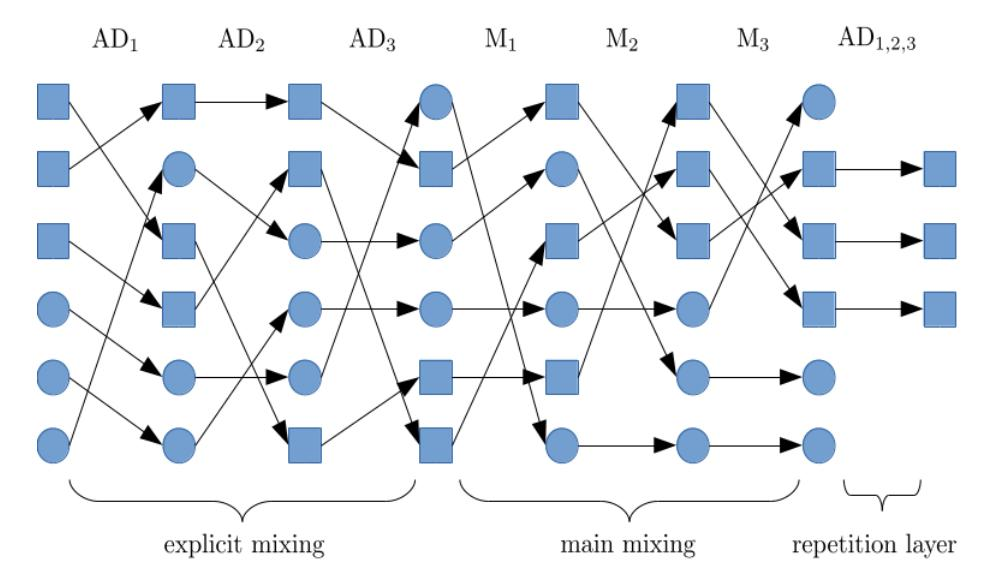

# A Verifiable and Practical Lattice-Based Decryption Mix Net with External Auditing

Xavier Boyen<sup>1</sup> , Thomas Haines<sup>2</sup> , and Johannes M¨uller3[0000−0003−2134−3099]

> <sup>1</sup> Queensland University of Technology, Australia, <sup>2</sup> Norwegian University of Science and Technology, Norway, <sup>3</sup> SnT, University of Luxembourg, Luxembourg

Abstract. Mix nets are often used to provide privacy in modern security protocols, through shuffling. Some of the most important applications, such as secure electronic voting, require mix nets that are verifiable. In the literature, numerous techniques have been proposed to make mix nets verifiable. Some of them have also been employed for securing real political elections.

With the looming possibility of quantum computers and their threat to cryptosystems based on classical hardness assumptions, there is significant pressure to migrate mix nets to post-quantum alternatives. At present, no verifiable and practical post-quantum mix net with external auditing is available as a drop-in replacement of existing constructions. In this paper, we give the first such construction.

We propose a verifiable decryption mix net which solely employs practical lattice-based primitives. We formally prove that our mix net provides a high level of verifiability, and even accountability which guarantees that misbehaving mix servers can also be identified. Verification is executed by a (temporarily trusted) public auditor whose role can easily be distributed. To demonstrate practicality for real-world systems, we provide detailed performance benchmarks on our stand-alone implementation based only on the most conservative lattice hardness assumptions.

Keywords: lattice-based · verifiability · accountability · mix net · evoting

# 1 Introduction

Mix nets are indispensable building blocks of many secure e-voting systems. Essentially, a mix net consists of a sequence of mix servers which take as input the encrypted messages provided by the senders (e.g., the voters' ballots), secretely shuffle them, and eventually output the permutated plain messages (e.g., votes). Unless all mix servers are corrupted, the mixing breaks the individual connections between the senders and their revealed messages in the output. In the context of e-voting, this property guarantees vote privacy.

However, for secure e-voting, it is also important to ensure that the voters' intent be reflected correctly in the election result, even if the mix servers are corrupted and actively try to tamper with the votes. Therefore, the employed mix net must be verifiable to guarantee that manipulating the senders' input, and generally incorrect mixing, can be detected. Moreover, in order to deter parties from misbehaving in the first place, accountability is often also desirable. This stronger form of verifiability provides identification of misbehaving parties and adjudication of possible disputes. In the literature, numerous mix nets [1, 2, 4, 9, 10, 13, 14, 16, 18–20, 23, 27, 28, 31–33, 35–37] have been proposed that aim to achieve verifiability and, in some cases, accountability. Some of them have also been used for securing real political elections (see, e.g., [11, 34]).

With more and more powerful quantum computers on the horizon (see, e.g., [3]), it is important to protect mix nets even when actively targeted by quantum attackers, either contemporary or future. Due to the stark possibility that future quantum attackers could retrospectively break vote privacy, there is significant pressure to employ verifiable post-quantum mix nets already today.

Unfortunately, to the best of our knowledge, only a single verifiable mix net scheme [23], named sElect, has been proposed so far that could employ practical post-quantum, e.g., lattice-based, cryptosystems. The unique characteristic of sElect, in contrast to all other known verifiable mix nets, is to avoid (zeroknowledge) proofs of correct decryption, for which, at present, there exist no practical solutions whose security can be reduced to hardness assumptions over lattices (see Section 2 for more details). Alas, although sElect is provably secure, its security relies on the assumption that the senders/voters themselves verify the correctness of the final outcome. While this assumption is reasonable for some election scenarios, it cannot be justified in general; in particular, recourse and adjudication in case of voter-detected fraud is problematic.

Therefore, it is still an open problem to construct a practical and provably secure mix net with external auditing that can defend against quantum attacks.

Our contributions. In this paper, we present the first highly efficient and practically realizable lattice-based decryption mix net that provides a high level of verifiability and even accountability. Verification is completely executed by a (temporarily trusted) public auditor whose role can easily be distributed. This structure is the same as the one of the prominent randomized partial checking (RPC) technique [19] which was, for instance, used for elections in the Australian state of Victoria [11].

To be more precise, our mix net employs a generalized version of the trip wire technique that was, in a specific variant, originally employed in the mix net by Khazaei et al. [20] as a subroutine. At a high level, in this technique, the input to the mix net consists of the real input messages plus a number of trip wire messages which to a mix server are indistinguishable from the real ones. Now, if a mix server wants to manipulate the outcome, it faces the risk of "touching" at least one trip wire, in which case the mix server would be caught cheating. In contrast to the specific variant in the mix net by Khazaei et al. [20], where each mix server can only inject a single trip wire in order to be able to guarantee correctness of the verification (which furthermore requires a proof of correct decryption), we depart from this as follows. First, we do not assume that the mix servers themselves inject the trip wires to "verify each other", but place that responsibility on a number of public auditors. Just one of these auditors needs to be trusted, and in fact only temporarily, because each auditor opens its inner state once mixing has finished—which incidentally greatly simplifies adjudication in case of dispute, and could not be done to the mixers themselves. Second, each auditor does not inject just a single but many trip wires, so that the probability of being caught cheating can be made very high even for manipulating just a few messages. Trip wires are cost effective, and since we further use only the most basic and black-box cryptographic primitives (namely, public-key encryption and digital signatures), the resulting mix net can be run with extremely efficient (lattice-based) primitives that more than compensate for the trip wires' overhead compared to ZKP-based approaches.

Altogether, our contributions are as follows:

- 1. We first discuss the unique constraints that come into play when building mix nets with quantum resistance, and related works (Section 2).
- 2. We describe how to extend an arbitrary plain (i.e., unverifiable, proof-less) decryption mix net (Section 3) with our general version of the trip wire technique (Section 4).
- 3. We precisely characterize how a decryption mix net with trip wires provides a high level of verifiability and even accountability (Section 6). A formal proof is provided in Appendix D.
- 4. We instantiate the generic trip wire decryption mix net using practical latticebased cryptography from conservative hardness assumptions (plain LWE). We have created a self-contained optimized implementation of the lattice construction, and provide detailed benchmarks that demonstrate its practicality for real-world elections at a high level of security (Section 7).
- 5. We candidly discuss the general properties, benefits and drawbacks of trip wire mix nets (Section 8) and conclude in Section 9.

# 2 Feasibility of Post-Quantum Secure Mixing

Existing mix nets can be divided into two classes: decryption mix nets and reencryption mix nets. In this section, we describe the main ideas of these two different approaches, and explain why the re-encryption approach is currently impractical for defending against quantum attackers.

In a decryption mix net, originally proposed by Chaum [7], an IND-CCA2 secure public-key encryption scheme is employed. Each mix server holds a public/secret key pair. Each sender iteratively encrypts its input message under the mix servers' public keys in reverse order, forming a multi-layered onion. Mixing starts with the first mix server, which "peels off" the outermost encryption layer, shuffles the result, forwards it to the second mix server, and so on. Eventually, all encryption layers have been removed and the plain input messages are published in the resulting random order.

In a re-encryption mix net, originally proposed by Park et al. [29], an IND-CPA secure public-key encryption scheme with re-encryption is employed. There is one public key whose secret key shares are distributed among a number of trustees. Each sender encrypts its input message under this public key. Mixing starts with the first mix server which re-encrypts its input ciphertexts, shuffles the result, forwards it to the second mix server, and so on. Eventually, all reencrypted input ciphertexts are published in random order. Depending on the application, the output ciphertexts are either decrypted by the trustees or not.

In their plain unverifiable modes, re-encryption mix nets are more lightweight than decryption mix nets because input messages are not encrypted iteratively but only once under a single public key. However, when verifiability in the presence of quantum attackers is required, the trade-offs get more complicated. In general, there are two different approaches for making re-encryption mix nets verifiable, namely, by using randomized partial checking (RPC) [19] or by a proof of correct shuffle [1, 2, 4, 9, 10, 13, 14, 16, 18, 27, 28, 32, 33, 36]. On the positive side, RPC could potentially be used for making a lattice-based reencryption mix net verifiable, for instance using one of three recently proposed lattice-based proofs of correct shuffle [9, 10, 32], although it is unclear whether or not these are practical. On the negative side, both proof-based approaches merely guarantee that the output ciphertexts are in fact shuffled re-encryptions of the input ciphertexts. In order to be useful for our motivating application, i.e., secure e-voting, we also have to decrypt the output ciphertexts verifiably. Unfortunately, to the best of our knowledge, no practical zero-knowledge proofs of correct decryption for lattice-based encryption have been proposed so far, whose security can itself be reduced to lattice-based hardness assumptions. Even with recent developments on sublinear arguments from lattices [6], ZK proofs tend to be, and will likely remain, much heavier and more cumbersome than simple primitives such as public-key encryption based on comparable assumptions.

As the main purpose of our mix nets would be for quantum-secure e-voting where integrity, performance and simplicity of implementation are paramount, our best bet is to devise a lattice-based decryption mix net that provides external auditability using only the simplest fastest primitives as building blocks.

# 3 Plain Decryption Mix Net

In this section, we first recall the main idea of a plain unverifiable decryption mix net [7] and then precisely describe its protocol. In Section 4, we describe the generic trip wire technique to endow a plain decryption mix net with correctness verification (and external/third-party adjudication) of its outcome.

### 3.1 Idea

At a high level, a decryption mix net works as follows. It consists of a number of mix servers M1, . . . , M<sup>n</sup>MS each of which holds a public/private (encryption/decryption) key pair (pk<sup>k</sup> ,skk). Each sender iteratively encrypts its plain input message m under the public keys pk<sup>1</sup> , . . . , pk<sup>n</sup>MS of the mix servers in reverse order, and submits the resulting "nested" ciphertext c to the first mix server M1. The first mix server uses its secret key sk<sup>1</sup> to "peel off" the outermost encryption layer of all input ciphertexts, then shuffles the decrypted messages, and forwards the permutated list to the second mix server  $M_2$ . The second mix server uses its secret key  $\mathsf{sk}_2$  to "peel off" the second encryption layer, then shuffles the result, and so on. Eventually, the last mix server  $M_{n_{\mathsf{MS}}}$  outputs all the plain messages initially chosen by the senders in random order.

#### 3.2 Protocol

We now precisely describe the protocol of a plain decryption mix net.

Protocol participants. A plain decryption mix net protocol is run among senders,  $S_1, \ldots, S_{n_S}$ , and mix servers,  $M_1, \ldots, M_{n_{MS}}$ , using a public, append-only bulletin board B.

Channels. For each sender  $S_i$ , we assume that there is an authenticated channel from  $S_i$  to the bulletin board B. These channels ensure that only eligible senders are able to submit their inputs.<sup>4</sup>

Cryptographic primitives. We use the following cryptographic primitives:

- An IND-CCA2-secure public-key encryption scheme  $\mathcal{E}^{.5}$
- An EUF-CMA-secure signature scheme S.

*Protocol overview.* A protocol run consists of the following consecutive phases. In the *setup* phase, parameters are generated. In the *submission* phase, the senders generate and submit their input. In the *mixing* phase, the mix servers collaboratively mix the input.

We now describe each of the protocol phases in more detail.

Setup phase. Each mix server  $M_k$  runs the key generation algorithm of the digital signature scheme S to generate its public/private (verification/signing) keys. The verification keys are published on the bulletin board B.

Each mix server  $M_k$  runs the key generation algorithm KeyGen of the publickey encryption scheme  $\mathcal{E}$  to generate its public/private (encryption/decryption) key pair  $(pk_k, sk_k)$ , and posts its public key  $pk_k$  on the bulletin board B.

Submission phase. Each sender  $S_i$  iteratively encrypts its secret input  $m_i$  under the mix servers' public keys in reverse order, i.e., starting with the public key  $\mathsf{pk}_{n_{\mathsf{MS}}}$  of the last mix server  $\mathsf{M}_{n_{\mathsf{MS}}}$  to the public key  $\mathsf{pk}_1$  of the first mix server  $\mathsf{M}_1$ :

$$c_i = \mathsf{Enc}(\mathsf{pk}_1, (\dots, \mathsf{Enc}(\mathsf{pk}_{n_{\mathsf{MC}}}, m_i))).$$

Mixing phase. The list of ciphertexts  $C_0 \leftarrow (\mathsf{c}_i)_{i=1}^{n_{\mathsf{S}}}$  posted by the senders on the bulletin board B is the input to the mixing phase. Starting with the first mix

<sup>&</sup>lt;sup>4</sup> By assuming such authenticated channels, we abstract away from the exact method the senders use to authenticate to the bulletin board; in practice, several methods can be used, such as one-time codes, passwords, or external authentication services.

 $<sup>^5</sup>$  We also require that  $\mathcal{E}$ , for every public-key and any two plaintexts of the same length, always yields ciphertexts of the same length. This seems to be satisfied by all practical schemes in existence, unless implemented with entropic compression.

server  $M_1$ , each mix server  $M_k$  takes  $C_{k-1}$  as input and performs the following tasks:

1.  $M_k$  decrypts all ciphertexts in  $C_{k-1}$  under its private key  $\mathsf{sk}_k$ :

$$\forall i \in \{1, \dots, n_{\mathsf{S}}\} \colon C'_{k}[i] \leftarrow \mathsf{Dec}(\mathsf{sk}_{k}, C_{k-1}[i])$$

2.  $M_k$  chooses a permutation  $\pi_k$  over  $\{1,\ldots,n_S\}$  uniformly at random, and sets

$$\forall i \in \{1,\ldots,n_{\mathsf{S}}\} \colon C_k[\pi_k(i)] \leftarrow C'_k[i].$$

3.  $M_k$  posts  $C_k$  on the bulletin board B.

The output  $C_{n_{MS}}$  of the last mix server  $M_{n_{MS}}$  is the output of the mixing phase. It equals  $(m_{\pi(i)})_{i=1}^{n_{S}}$ , where  $\pi = \pi_{n_{MS}} \circ \ldots \circ \pi_{1}$  is the overall permutation of the mix net.

## 4 Trip Wire Technique

We describe how to extend a plain decryption mix net (Section 3) with trip wires. We will show in Section 6 that the resulting mix net provides a high level of verifiability and accountability in the presence of fully malicious mix servers.



Fig. 1: Examplified run of a decryption mix net with trip wires, where  $n_{\mathsf{AD}} = 3$ ,  $n_{\mathsf{MS}} = 3$ ,  $n_{\mathsf{S}} = 3$ , and  $n_{\mathsf{tw}} = 1$ . Rectangles and circles symbolize senders' and auditors' message traces, respectively.

#### 4.1 Idea

At a high level, the trip wire technique works as follows. The plain decryption mix net is extended with a number of auditors AD1, . . . , ADnAD each of which executes the submission program of the senders ntw times. For this purpose, AD<sup>j</sup> chooses dummy input messages (e.g., 0<sup>l</sup> ) and encrypts them in layers as a normal user would. The resulting ciphertexts are called AD<sup>j</sup> 's trip wires. Furthermore, AD<sup>j</sup> stores the random coins that it has used to generate its ntw trip wires.

Now, the plain decryption mix net (with only "main mixing" servers for now) is run with this extended set of inputs. Once mixing has finished, each auditor AD<sup>j</sup> reveals its inner states, including its trip wires' random coins. With this, the traces of AD<sup>j</sup> 's trip wires through the mix net can publicly be verified. If a mix server M<sup>k</sup> did manipulate one of these dummy traces, this can be detected, and furthermore M<sup>k</sup> can be held accountable through its digital signature (more on this later).

Even though this high-level description gives some intuition on the "integrity challenge" underlying the trip wires, verifiability is obviously not yet guaranteed:

- 1. At the start of the mix, it is clear which input ciphertexts belong to the senders and which ones to the auditors. Hence, if the first mix server M<sup>1</sup> is malicious, then the adversary can completely manipulate the outcome of the mix net without being detected.
- 2. In general, we cannot assume that the auditors are able to simulate the senders' message distribution. Therefore, realistically, the auditors' and the senders' plaintext distributions are distinguishable. Now, recall that the last mix server MnMS knows the final plaintext output before it publishes it. Hence, if MnMS is malicious, then the adversary can undetectably manipulate the outcome of the mix net.

We propose the following additional mechanisms to address the above problems:

- 1. Prior to the main mixing, the input ciphertexts are "pre-mixed" using the same kind of plain decryption mix net, but now run by the auditors. This phase is called explicit mixing (see below for the reason). Unless all auditors are corrupted, it is no longer possible, for the original main mixing servers, to distinguish between the senders' ciphertexts and the auditors' trip wires.
- 2. An additional layer of encryption (whose private key is secret-shared among the auditors) is added directly to the plain input messages. This is called the repetition layer. Unless all auditors are corrupted, the last mix server gets to know only the still encrypted output.

Since secrecy of the explicit mixing and of the repetition layer is required only during main mixing, these two phases can be verified explicitly once the main mixing has finished. For this purpose, each auditor is supposed to reveal its explicit-mixing secret key as well as its secret key share of the repetition encryption layer after the final mix server has published its output.

#### 4.2 Protocol

In this section, we precisely describe how to extend a plain decryption mix net (Section 3) with the trip wire technique.

To preserve readibility, we make the following implicit assumptions:

- Whenever a party (mix server or auditor) holding a verification/signing key pair publishes information, it signs this data with its secret signing key.
- Whenever a mix server or an auditor deviates from its honest program in an obvious way (e.g., refuses to participate, or publishes an invalid secret key), then the protocol aborts immediately and the misbehaving party is held accountable.
- In order to protect against replay attacks which may affect message privacy of senders (see, e.g., [8]), ciphertext deduplication is always in effect, where only the first instance of a multiply occurring ciphertext is retained.

*Protocol participants*. The set of protocol participants is extended by a number of *auditors*  $AD_1, \ldots, AD_{n_{AD}}$ .

Cryptographic primitives. We additionally use an IND-CCA2-secure  $(n_{AD}, n_{AD})$ -threshold public-key encryption scheme  $\mathcal{E}_{d}$ .

 $Setup\ phase.$  The following additional steps are executed.

Each auditor  $\mathsf{AD}_j$  runs the key generation algorithm of the digital signature scheme  $\mathcal{S}$  to generate its public/private (verification/signing) keys. The verification keys are published on the bulletin board  $\mathsf{B}$ .

Each auditor  $\mathsf{AD}_j$  runs the key generation algorithm  $\mathsf{KeyGen}$  of the public-key encryption scheme  $\mathcal E$  to generate a public/private key pair  $(\mathsf{pk}_j^\mathsf{expl}, \mathsf{sk}_j^\mathsf{expl})$ , and posts the public key  $\mathsf{pk}_j^\mathsf{expl}$  on the bulletin board  $\mathsf{B}$ .

Each auditor  $\mathsf{AD}_j$  runs the key share generation algorithm KeyShareGen of the distributed public-key encryption scheme  $\mathcal{E}_\mathsf{d}$  to generate a public/private key share pair  $(\mathsf{pk}_j^\mathsf{rep}, \mathsf{sk}_j^\mathsf{rep})$ , and posts the public key share  $\mathsf{pk}_j^\mathsf{rep}$  on the bulletin board B. From those, using the deterministic algorithm PublicKeyGen, everyone can then compute the joint public key  $\mathsf{pk}^\mathsf{rep}$ .

Altogether, the public parameters consist of the public keys  $\mathsf{pk}_1^{\mathsf{expl}}, \ldots, \mathsf{pk}_{n_{\mathsf{AD}}}^{\mathsf{expl}}$  for the explicit decryption mix net, the public keys  $\mathsf{pk}_1, \ldots, \mathsf{pk}_{n_{\mathsf{MS}}}$  for the main decryption mix net, and the joint public key  $\mathsf{pk}^{\mathsf{rep}}$  for the repetition encryption layer.

Submission phase (senders). Each sender  $S_i$  first encrypts its message  $m_i$  under the auditors' joint public key  $pk^{rep}$ :

$$c_i^{\text{rep}} = \text{Enc}(pk^{\text{rep}}, m_i).$$

After that,  $S_i$  encrypts  $c_i^{\mathsf{rep}}$  under the mix servers' public keys  $\mathsf{pk}_1, \ldots, \mathsf{pk}_{n_{\mathsf{MS}}}$  of the main decryption mix net in reverse order:

$$\mathbf{c}_i^{\mathrm{main}} = \mathrm{Enc}(\mathsf{pk}_1, (\dots, \mathsf{Enc}(\mathsf{pk}_{n_{\mathrm{MS}}}, \mathbf{c}_i^{\mathrm{rep}}))).$$

<sup>&</sup>lt;sup>6</sup> Note that to jointly decrypt a ciphertext in  $\mathcal{E}_d$ , all secret key shares are required.

Afterwards,  $S_i$  encrypts  $c_i^{\text{main}}$  under the auditors' public keys  $\mathsf{pk}_1^{\mathsf{expl}}, \ldots, \mathsf{pk}_{n_{\mathsf{AD}}}^{\mathsf{expl}}$  of the explicit decryption mix net in reverse order:

$$\mathbf{c}_i^{\mathsf{expl}} = \mathsf{Enc}(\mathsf{pk}_1^{\mathsf{expl}}, (\dots, \mathsf{Enc}(\mathsf{pk}_{n_{\mathsf{AD}}}^{\mathsf{expl}}, \mathbf{c}_i^{\mathsf{main}}))).$$

The resulting ciphertext  $c_i \leftarrow c_i^{\text{expl}}$  is  $S_i$ 's input to the mix net.

Submission phase (auditors). Each auditor  $\mathsf{AD}_j$  executes  $n_\mathsf{tw}$  times the senders' submission steps described above, every time with (dummy) input message  $m = 0^l$  (where l is the bit size of a sender's message). We denote  $\mathsf{AD}_j$ 's trip wire ciphertexts by  $(\mathsf{c}_{n_\mathsf{S}+(j-1)\cdot n_\mathsf{tw}+l})_{l=1}^{n_\mathsf{tw}}$ . Furthermore,  $\mathsf{AD}_j$  stores the random coins that were used to generate its trip wire ciphertexts.

Mixing phase. The input to the mixing phase is  $(c_i)_{i \in I^{\text{expl}}}$  which consists of (a subset of)<sup>7</sup> the  $n_{\text{S}}$  ciphertexts submitted by the senders and the  $n_{\text{AD}} \cdot n_{\text{tw}}$  ciphertexts submitted by the auditors. Then, the overall mixing phase consists of two consecutive parts:

- 1. Explicit mixing: The auditors use their secret decryption keys  $\mathsf{sk}_1^{\mathsf{expl}}, \ldots, \mathsf{sk}_{n_{\mathsf{AD}}}^{\mathsf{expl}}$  to run the plain decryption mix net (Section 3) with input  $(\mathsf{c}_i)_{i \in I^{\mathsf{expl}}}$ . The output of this mix net is  $(\tilde{\mathsf{c}}_i^{\mathsf{main}})_{i \in I^{\mathsf{main}}}$ , where  $I^{\mathsf{main}} \subseteq I^{\mathsf{expl}}$ .
- 2. Main mixing: The mix servers use their secret decryption keys  $\mathsf{sk}_1, \ldots, \mathsf{sk}_{n_{\mathsf{MS}}}$  to run the plain decryption mix net (Section 3) with input  $(\tilde{\mathsf{c}}_i^{\mathsf{main}})_{i \in I^{\mathsf{main}}}$ . The output of this mix net is  $(\tilde{\mathsf{c}}_i^{\mathsf{rep}})_{i \in I^{\mathsf{rep}}}$ , where  $I^{\mathsf{rep}} \subseteq I^{\mathsf{main}}$ .

Auditing phase. Each auditor  $AD_j$  publishes its secret key  $\mathsf{sk}_j^\mathsf{expl}$  associated to the explicit decryption mix net. With this, everyone can verify that the explicit mixing was executed correctly. If verification fails, a misbehaving auditor is identified through its signature and the whole protocol stops.

After that, each auditor  $\mathsf{AD}_j$  publishes the random coins that it used to create its trip wires. With this, everyone can verify the integrity of trip wires' traces through the main decryption mix net. If verification fails, a misbehaving mix server is identified and the whole protocol stops.

Final decryption phase. Each auditor  $\mathsf{AD}_j$  publishes its secret key share  $\mathsf{sk}_j^\mathsf{rep}$  on the bulletin board B. Then, for each ciphertext  $\tilde{\mathsf{c}}_i^\mathsf{rep}$  ( $i \in I^\mathsf{rep}$ ), the decryption key share is publicly computed:  $\mathsf{dec}_{j,i}^\mathsf{rep} \leftarrow \mathsf{DecShare}(\mathsf{sk}_j^\mathsf{rep}, \tilde{\mathsf{c}}_i^\mathsf{rep})$ . After that, the decryption shares are combined to decrypt  $\tilde{\mathsf{c}}_i^\mathsf{rep} \colon \tilde{m}_i \leftarrow \mathsf{Dec}(\mathsf{dec}_{1,i}^\mathsf{rep}, \ldots, \mathsf{dec}_{n_{\mathsf{AD},i}}^\mathsf{rep})$ . Alternatively, and more efficiently if the threshold encryption scheme supports it (it normally would), the joint secret key  $\mathsf{sk}^\mathsf{rep}$  iz explicitly reconstituted from the published secret key shares  $(\mathsf{sk}_j^\mathsf{rep})_{j \in [n_{\mathsf{AD}}]}$  and from there using  $\mathsf{sk}^\mathsf{rep}$  each ciphertext  $\tilde{\mathsf{c}}_i^\mathsf{rep}$  is directly decrypted into  $\tilde{m}_i$ .

The list of decrypted messages  $(\tilde{m}_i)_{i \in I^{\text{rep}}}$  is the final outcome of the mix net.

# 5 Protocol Model

The general computational model that we use follows the one in [25]. This model introduces the notions of processes, protocols, and instances, which we briefly

<sup>&</sup>lt;sup>7</sup> Recall that ciphertext duplicates or invalid ciphertexts are continuously removed.

recall. In this way, we then model the decryption mix net extended with the trip wire technique.

Process. A process is a set of probabilistic polynomial-time (ppt) interactive Turing machines (ITMs, also called programs) which are connected via named tapes (also called channels). We write a process  $\pi$  as  $\pi = p_1 \| \cdots \| p_l$ , where  $p_1, \ldots, p_l$  are programs. If  $\pi_1$  and  $\pi_2$  are processes, then  $\pi_1 \| \pi_2$  is a process, provided that the processes have compatible interfaces. A process  $\pi$  where all programs are given the security parameter  $1^{\ell}$  is denoted by  $\pi^{(\ell)}$ . In the processes we consider, the length of a run is always polynomially bounded in  $\ell$ . Clearly, a run is uniquely determined by the random coins used by the programs in  $\pi$ .

Protocol. A protocol P is defined by a finite set of agents  $\Sigma$  (also called parties or protocol participants), and for each agent  $a \in \Sigma$  its honest program  $\hat{\pi}_a$ , i.e., the program this agent is supposed to run. Agents are pairwise connected by tapes/channels and every agent has a channel to the adversary (see below). If  $\hat{\pi}_{a_1}, \ldots, \hat{\pi}_{a_l}$  are the honest programs of the agents of P, then we denote the process  $\hat{\pi}_{a_1} \| \ldots \| \hat{\pi}_{a_l}$  by  $\hat{\pi}_P$ .

The process  $\hat{\pi}_P$  is always run with an *adversary* A, an arbitrary ppt program with channels to all protocol participants in  $\hat{\pi}_P$ . For any program  $\pi_A$  run by the adversary, we call  $\hat{\pi}_P \| \pi_A$  an *instance* of P. Now, a run r of P with the adversary  $\pi_A$  is a run of the process  $\hat{\pi}_P \| \pi_A$ . We consider  $\hat{\pi}_P \| \pi_A$  to be part of the description of r so that it is always clear to which process, including the adversary, the run r belongs to.

We say that an agent a is honest in a protocol run r if the agent has not been corrupted in this run: an adversary  $\pi_A$  can corrupt an agent by sending a corrupt message; once corrupted, an adversary has full control over an agent. For the mix net protocol studied in this paper, we assume static corruption, i.e., agents can only be corrupted at the beginning of a run. In particular, the corruption status of each party is determined at the beginning of a run and does not change during a run. Also, for some agents we will assume that they cannot be corrupted (see below).

Model of the trip wire mix net. The decryption mix net extended with the trip wire technique can be modeled in a straightforward way as a protocol  $P_{\mathsf{DMN}}^{\mathsf{tw}}(n_{\mathsf{S}}, n_{\mathsf{S}}^{\mathsf{hon}}, n_{\mathsf{MS}}, n_{\mathsf{AD}}, n_{\mathsf{tw}})$ , as described next. The protocol participants consist of  $n_{\mathsf{S}}$  senders (in total),  $n_{\mathsf{S}}^{\mathsf{hon}}$  honest senders,  $n_{\mathsf{MS}}$  mix servers,  $n_{\mathsf{AD}}$  auditors, a scheduler SC, and a public append-only bulletin board B. The scheduler SC plays the role of the mix net authority and schedules all other agents in a run according to the protocol phases. We assume that SC and the bulletin board B are honest, i.e., they are never corrupted. While SC is merely a virtual entity, in reality, B should be implemented in a distributed way (see, e.g., [12, 21]). The parameter  $n_{\mathsf{tw}}$  denotes the number of trip wires per auditor.

#### 6 Verifiability

In this section, we formally analyze verifiability of the decryption mix net with trip wires using the generic verifiability framework by Küsters, Truderung, and Vogt [25]. We briefly recall this framework in Section 6.1, and then state the verifiability result in Section 6.2.

#### 6.1 Verifiability Framework

Intuitively, a mix net is verifiable if an incorrect final outcome is accepted only with small probability  $\delta \in [0, 1]$ .

Judge. To model whether the final outcome of a protocol run should be accepted, the verifiability definition by Küsters et al. assumes an additional protocol participant J, called the judge. The judge can be thought of as a "virtual" entity: in fact, the program of J can be carried out by any party, including external observers and even senders themselves, since its input is solely public information. On a high level, the judge performs certain checks to ensure the correctness of the final outcome (e.g., verifying trip wires). Typically, as for decryption mix net with trip wires, the program of J follows immediately from the protocol description. Formally, to either accept or reject a protocol run, the judge writes accept or reject on a dedicated channel decision.

Goal. To specify which runs are "correct" in some protocol-specific sense, Küsters et al. use the notion of a goal  $\gamma$ . Formally, a goal  $\gamma$  is simply a set of protocol runs. For mix nets,  $\gamma$  would contain those runs where the announced mix net result corresponds to the actual messages of the senders.

In what follows, we describe the goal  $\gamma(k,\varphi)$  that we use to analyze the decryption mix net with trip wires. This goal has already been applied in [17, 23, 24, 26] to analyze further mix nets. The parameter  $\varphi$  is a Boolean formula that describes which protocol participants are assumed to be honest in a run, i.e., not corrupted by the adversary. On a high level, the parameter k denotes the maximum number of choices made by honest senders that the adversary is allowed to manipulate. So, roughly speaking, the goal  $\gamma(k,\varphi)$  contains all those runs of a mix net protocol P where either  $\varphi$  is false, or where  $\varphi$  holds true and the adversary has manipulated at most k messages of honest senders.

Now, we formally define the goal  $\gamma(k,\varphi)$  for an arbitrary result function  $\rho$  that takes as input a vector of input messages (as provided by the senders) and then outputs the overall result (e.g., a vector of plain messages or a vector of encrypted messages).

**Definition 1** (Goal  $\gamma(k,\varphi)$ ). Let  $P(n_{\mathsf{S}},n_{\mathsf{MS}})$  be a mix net protocol, let  $\pi$  be an instance of  $P(n_{\mathsf{S}},n_{\mathsf{MS}})$ , and let r be a run of  $\pi$ . Let  $\mathsf{S}_1,\ldots,\mathsf{S}_{n_{\mathsf{S}}^{\mathsf{hon}}}$  be those senders that are honest in r. Let  $m=m_1,\ldots,m_{n_{\mathsf{S}}^{\mathsf{hon}}}$  be the inputs of the honest senders in r. Then,  $\gamma(k,\varphi)$  is satisfied in r if either (a) the trust assumption  $\varphi$  does not hold true in r, or if (b)  $\varphi$  holds true in r and there exist valid messages  $\tilde{m}_1,\ldots,\tilde{m}_{n_{\mathsf{S}}}$  such that the following conditions are satisfied:

- The multiset  $\{\tilde{m}_1, \ldots, \tilde{m}_{n_{\mathsf{S}}}\}$  contains at least  $n_{\mathsf{S}}^{\mathsf{hon}} k$  elements of the multiset  $\{m_1, \ldots, m_{n_{\mathsf{hon}}}\}$ .
- The mix net outcome as published in r (if any) equals to  $\rho(\{\tilde{m}_1,\ldots,\tilde{m}_{n_s}\})$ .

If  $\varphi$  does not hold true in r and no outcome is published in r, then  $\gamma(k,\varphi)$  is not satisfied in r.

Verifiability. Now, the idea behind the verifiability definition is very simple. The judge J should accept a run only if the goal  $\gamma$  is met: as discussed, if  $\gamma = \gamma(k, \varphi)$ , then this essentially means that the published mix net result corresponds to the actual messages of the senders up to k messages of honest senders. More precisely, the definition requires that the probability (over the set of all protocol runs) that the goal  $\gamma$  is not satisfied but the judge nevertheless accepts the run is  $\delta$ -bounded.<sup>8</sup> Although  $\delta = 0$  is desirable, this is typically only achieved by a proof of correct shuffle for which, to date, there do not exist efficient post-quantum instantiations (much less practical ones). Hence, if we strictly required  $\delta = 0$ , then this would deem reasonable mix nets insecure even though they still provide good (but not perfect) levels of verifiability, e.g., for some  $\delta$  which converge exponentially fast to 0 in the number of manipulated inputs. The parameter  $\delta$  is called the *verifiability tolerance* of the protocol.

By  $\Pr[\pi^{(\ell)} \mapsto \neg \gamma, (J: accept)]$  we denote the probability that a run, produced by  $\pi$  with security parameter  $1^{\ell}$ , is not in  $\gamma$  but nevertheless accepted by J.

**Definition 2 (Verifiability).** Let P be a protocol with the set of agents  $\Sigma$ . Let  $\delta \in [0,1]$  be the tolerance,  $J \in \Sigma$  be the judge, and  $\gamma$  be a goal. Then, we say that the protocol P is  $(\gamma, \delta)$ -verifiable by the judge J if for all adversaries  $\pi_A$  and  $\pi = (\hat{\pi}_P || \pi_A)$ , the probability  $\Pr[\pi^{(\ell)} \mapsto \neg \gamma, (J: \text{accept})]$  is  $\delta$ -bounded as a function of  $\ell$ .

### 6.2 Verifiability Result

We are now able to precisely state the verifiability level offered by the decryption mix net with trip wires according to Definition 2. The level depends on the number of honest senders  $n_{\mathsf{S}}^{\mathsf{hon}}$  and the number of dummy messages per auditor  $n_{\mathsf{tw}}$ , as described in Section 5.

Assumptions. We prove the verifiability result for the goal  $\gamma(k,\varphi)$ , with  $\gamma(k,\varphi)$  as defined in Section 6.1, and under the following assumptions:

- (V1) The public-key encryption scheme  $\mathcal{E}$  is IND-CCA2-secure.
- (V2) The  $(n_{\mathsf{AD}}, n_{\mathsf{AD}})$ -threshold public-key encryption scheme  $\mathcal{E}_\mathsf{d}$  is IND-CCA2-secure
- (V3) The signature scheme S is EUF-CMA-secure.

<sup>&</sup>lt;sup>8</sup> A function f is  $\delta$ -bounded if, for every c > 0, there exists  $\ell_0$  such that  $f(\ell) \leq \delta + \ell^{-c}$  for all  $\ell > \ell_0$ .

<sup>&</sup>lt;sup>9</sup> We note that the original definition in [25] also captures soundness: if the protocol runs with a benign adversary, which, in particular, would not corrupt parties, then the judge accepts all runs. This kind of soundness can be considered to be a sanity check of the protocol, including the judging procedure, and is typically easy to check. For brevity of presentation, we omit this condition here.

- (V4) The scheduler SC, the bulletin board B, the judge J, and at least one auditor are honest, i.e.,  $\varphi = \mathsf{hon}(\mathsf{SC}) \wedge \mathsf{hon}(\mathsf{J}) \wedge \mathsf{hon}(\mathsf{B}) \wedge \left(\bigvee_{j=1}^{n_{\mathsf{AD}}} \mathsf{AD}_{j}\right)$ .
- (V5) For all honest senders and auditors, the length of the message plaintext has the same size in each run of the protocol (given a security parameter).
- (V6) For  $\mathcal{E}$  and  $\mathcal{E}_d$ , we require that for any two plaintexts of the same length, their encryption always yields ciphertexts of the same length.

Result. The judging procedure performed by J essentially involves performing the checks in the auditing phase (Section 4). If one of these checks fails, the judge rejects the protocol run and hence the result.

Intuitively, the following theorem states that the probability that in a run of the decryption mix net with trip wires more than k inputs of honest senders have been manipulated but the judge J nevertheless accepts the run is bounded by  $\delta_k(n_s^{\mathsf{hon}}, n_{\mathsf{tw}})$ .

**Theorem 1 (Verifiability).** Under the assumptions (V1) to (V6) stated above, the decryption mix net protocol with trip wires  $P_{\mathsf{DMN}}^{\mathsf{tw}}(n_{\mathsf{S}}, n_{\mathsf{S}}^{\mathsf{hon}}, n_{\mathsf{MS}}, n_{\mathsf{AD}}, n_{\mathsf{tw}})$  is  $(\gamma(k, \varphi), \delta_k(n_{\mathsf{S}}^{\mathsf{hon}}, n_{\mathsf{tw}}))$ -verifiable by the judge J, where

$$\delta_k(n_{\mathsf{S}}^{\mathsf{hon}}, n_{\mathsf{tw}}) = \frac{\binom{n_{\mathsf{S}}^{\mathsf{hon}}}{k+1}}{\binom{n_{\mathsf{S}}^{\mathsf{hon}} + n_{\mathsf{tw}}}{k+1}}.$$

The main reasoning behind this theorem is as follows. Since the explicit mixing and the shared decryption of the repetition layer are perfectly verifiable, an adversary can only manipulate honest senders' messages in the main mix net without being detected. However, due to the IND-CCA2-security of the underlying public-key encryption schemes, the adversary has to do this manipulation "blindly" as the  $n_{\rm S}^{\rm hon}+n_{\rm tw}$  ciphertexts related to the honest input parties (one ciphertext for each of the  $n_{\rm S}^{\rm hon}$  honest senders plus  $n_{\rm tw}$  ciphertexts by the honest auditor) are indistinguishable. Now, if an adversary wants to manipulate k+1 honest inputs, the probability that he is not caught cheating is captured by the following urn experiment. An urn contains  $n_{\rm S}^{\rm hon}$  white and  $n_{\rm tw}$  black balls, representing honest messages and trip wires respectively. Upon picking k+1 balls from this urn without replacement, the probability that none of the removed balls was black (i.e., no trip wire was touched) is exactly  $\binom{n_{\rm S}^{\rm hon}}{k+1}/\binom{n_{\rm S}^{\rm hon}+n_{\rm tw}}{k+1}$ .

Importantly, for all k, the verifiability tolerance  $\delta_k(n_{\mathsf{S}}^{\mathsf{hon}}, n_{\mathsf{tw}})$  is bounded by  $(n_{\mathsf{S}}^{\mathsf{hon}}/(n_{\mathsf{S}}^{\mathsf{hon}} + n_{\mathsf{tw}}))^{k+1}$  which converges exponentially fast to 0 in the number of manipulated honest inputs k. For example, if we choose  $n_{\mathsf{tw}} = n_{\mathsf{S}}$ , then the adversary's risk is more than 90% for manipulating more than 4 honest messages, and even more than 99% for manipulating more than 7 honest messages.

The correctness of Theorem 1 follows immediately from an even stronger result which we state in Appendix C and formally prove in Appendix D. In fact, the decryption mix net with trip wires even provides *accountability*. This security property not only guarantees that the correctness of the mix net's outcome can be verified but also that misbehaving parties can be identified and held

accountable. Since K¨usters et al. [25] proved that accountability is a stronger form of verifiability, the formal proof of our accountability result (Theorem 2) implies the verifiability result (Theorem 1) stated above.

# 7 Implementation

In terms of efficiency, the core component of the verifiable mix net protocol is the (post-quantum) IND-CCA2-secure public-key encryption scheme: this component must be fast and robust enough to process thousands, possibly millions, of untrusted encrypted ballots, and do so safely and efficiently. Decryption performance is of particular importance since each mix server will be decrypting (one layer of) the entire set of encrypted ballots, while encryption is naturally done piecemeal in a distributed way by the individual voters. Encryption performance will start to matter (for the auditors) if the number of trip wires is large, or (for the voters) if there are many mix servers hence encryption layers.

## 7.1 Design

We implement essentially the textbook Regev scheme (technically its dual), which is provably secure under the now-classic LWE hardness assumption [30]. Our implementation attempts to remain faithful to the theoretical scheme, but rearranges it to optimize its computation. We merely summarize the salient points in Appendix A, while referring the reader to standard texts or surveys on lattice-based cryptography for background. We also elaborate on our implementation rationale in Appendix B, in particular on why we refrained from choosing one of the current NIST proposals.

# 7.2 Technical Details

The concrete IND-CCA2-secure scheme we implement is a hybrid consisting of a lattice-based CCA2-secure KEM, combined with an AES256-based DEM with MAC. The KEM closely follows the original Regev cryptosystem [30]. For efficiency, much of the secret data is obtained from privately or randomly seeded AES256-based PRNG, and likewise much of the public key is generated on the fly from a publicly seeded AES128-based PRNG. The data is aligned and ordered so as to maximize performance of decryption over that of encryption. Standard techniques are used to provide chosen-ciphertext security for each of the KEM and the DEM, albeit only implicitly in the sense of [5], causing malformed ciphertexts to decrypt indistinguishably randomly rather than be explicitly rejected.

Our implementation targets the 240-bit security level, and accordingly uses 240-bit or wider data paths everywhere including the KEM-crypted symmetric session key and the DEM redundancy. As stated, we erred on the side of overshooting our target, and used lattices of dimension n = 1024, modulus q = 2<sup>16</sup> and sampler-mandated LWE discrete Gaussian noise σ ≈ 2, providing sufficient headroom to reliably encode 5-bit payload per 16-bit ciphertext component. These parameters are conservative but not normative, and were selected mainly for the purpose of conducting a realistic performance evaluation.

As stated in the theoretical part of the paper, the final decryption (in the repetition layer) does not need to operate as a true threshold scheme, as long as the private key can be reconstituted from the revealed private-key shares. Regev key generation supports this, by linearity of the public key in the private key. We can thus reuse the same implementation for the final layer, by letting each auditor create its own private-key share and publish the corresponding share of the public key. The "dependent part" of the public key is reconstituted as the modular sum of the public shares. The "independent part" of the public key, namely the large public matrix "A", does not need to be shared and continues to be pseudorandomly expanded from a public random seed that the auditors will have agreed on. The private-key shares eventually revealed by the auditors can be verified for correctness based on the corresponding public-key shares, before the final decryption of the repetition layer takes place.

Our implementation is completely independent and does not borrow any code from anywhere, other than a few lines for the canonical usage of AESNI.

### 7.3 Local-Scale Performance

Our test platform is a 2019 Dell XPS 13 Intel i7-8565U CPU, fully mitigated in microcode and OS (Linux) against all known speculative execution/loading attacks, and running a single core at 4.1GHz measured clock frequency. At the 240-bit target security level, using 1024-dimension lattices, the performance of our IND-CCA2 subsystem (assuming 240-bit canary and 16-bit payload for the DEM plaintext) is as follows:

```
– Public-key size: 93 kB
– Ciphertext overhead incl. canary: 2.3 kB
– Key generation time: 36 µs (0.036 s)
– Encryption time: 201 µs (0.000201 s)
– Decryption time: 133 µs (0.000133 s)
```

For the verifiable mix net application, except when the number of ballots is extremely small, the processing time for each mix layer will be almost entirely dominated by the time it takes to decrypt the incoming ballots. As one would expect, the total decryption time for one layer of the mix net using a single core scales almost perfectly linearly with the number of ballots (see Section 7.4), and we measure (on the same hardware as above):

```
– 7500 ballots in 1.02 s, or
– 1 million ballots in 132.22 s.
```

In practice, the decryption running time for a large number of independent ciphertexts can be divided almost exactly by the number of available CPU cores.

#### 7.4 Whole-System Performance

The random permutation of the ballots in each layer of the mix net does not add any appreciable time to the mixing, as long as it can be assumed that the entire set fits in random-access memory (normally a reasonable assumption). Likewise, while lattice-based signatures are generally much more expensive than latticebased encryption, the overhead of issueing a single signature on the published mix does not make any difference with a large number of ballots.

Therefore, when considering the performance of the entire mix net, the two principal factors are the sequential nature of the encryption and decryption operations (by the voter and the mix servers respectively), and the growth of the multi-layer encrypted ballot with the number of layers. Clearly, the first consideration introduces a linear factor in the total mixing time, since each mix server must finish its mixing task on the entire set of ballots before certifying the result and passing the baton to the next mix server.

The ciphertext growth is also linear in the number of layers (or equivalently, mix servers). In our implementation at 240-bit security level, each layer adds an overhead of 2.3 kB (consisting of 2.1 kB of KEM data plus 0.2 kB of redundancy, to be added to the size of the plaintext, which in every layer except the first one is the total size of the previous layer's ciphertext). In theory, this makes the total mixing time quadratic in the number n of mix servers as n → ∞. In practice, however, the hybrid encryption and decryption running times are dominated by the public-key KEM component, the processing of which at each layer is independent of the size of the DEM hence the number of layers.

Our experiments (Table 1) show the evolution of encryption and decryption running time of one layer of the "onion" or encrypted ballot, in function of the number of layers of encryption beneath it (level 0 indicates direct encryption of the plaintext vote, while level 1,000,000 is clearly impractical and provided only to show asymptotic behavior).

Table 1: Encryption/decryption times and ciphertext size in function of layer height.

| # layers |                         | ctx size (kB) encrypt time decrypt time |         |
|----------|-------------------------|-----------------------------------------|---------|
| 0        | 2,144                   | 201 us                                  | 133 us  |
| 1        | 4,256                   | 201 us                                  | 134 us  |
| 10       | 23,264                  | 209 us                                  | 141 us  |
| 30       | 65,504                  | 214 us                                  | 154 us  |
| 100      | 213,344                 | 254 us                                  | 194 us  |
| 300      | 635,744                 | 368 us                                  | 308 us  |
| 1,000    | 2,114,144               | 792 us                                  | 753 us  |
|          | 1,000,000 2,112,002,144 | 0.641 s                                 | 0.607 s |

In practice, each layer corresponds to a different mixing server, so the total number of layers will likely remain small (less or much less than 100). Nevertheless, the experiments show that encryption and decryption times remain essentially constant (per layer) far beyond the range of practical applications, and that it is the size of the encrypted onions, rather than the time to encrypt or decrypt them, that is likely to be a limiting factor. The asymptotic linearity of encryption and decryption times (for each layer) only starts to show at very high numbers of layers. We also note that only the total number of layers and the total number of ciphertexts will matter, in terms of performance. How these are partitioned between explicit and main mixers, as well as between actual and trip wire ballots, has no significant impact on running time.

On the voter's size, encrypting a complete onion even for an exceedingly large 1000-layer mixnet would still require less than one second on most modern commodity consumer hardware.

#### 8 Discussion

In this section, we discuss the main properties of the decryption mix net with trip wires.

Verifiability and Accountability. We have formally proven that, even if all mix servers are malicious, an adversary's risk of being caught cheating is high.

More precisely, our accountability result implies that, if an adversary wants to manipulate more than k honest inputs, then (at least) one misbehaving mix server is identified with probability at least  $1 - (n_{\mathsf{S}}^{\mathsf{hon}} / (n_{\mathsf{S}}^{\mathsf{hon}} + n_{\mathsf{tw}}))^{k+1}$ , where  $n_{\mathsf{S}}^{\mathsf{hon}}$  is the given number of honest senders and  $n_{\mathsf{tw}}$  is the given number of trip wires per auditor. In particular, an adversary knows upfront that its risk of being caught cheating converges exponentially fast against 1 in the number of manipulated messages k.

Moreover, recall that during the main mixing, both the explicit mixing and the repetition layer are still locked. Hence, even if the race between two candidates A and B was very close, an adversary trying to manipulate the election outcome in favor of A by swapping just a few votes from B to A, has to do this "blindly". In particular, the adversary may accidentally swap a message from A to A. Hence, an adversary's chance of successfully manipulating the outcome is significantly reduced, independently of whether the adversary is caught cheating or not.

Altogether, for applications like secure e-voting where misbehaving parties have to face severe financial or legal penalties, an adversary knows a priori that manipulating the mix net outcome would be completely unreasonable.

External auditing. At a high level, the verification procedure of the trip wire mix net can be regarded as an "integrity experiment" that is run between an adversary (controlling all mix servers) and an external auditor who challenges the adversary by "injecting" trip wires. If the adversary is able to manipulate (a significant number of) honest inputs without touching one of the trip wires, then the adversary wins. Our verifiability/accountability result (see above) provides an upper bound for an adversary's advantage in this experiment.

Obviously, the external auditor needs to be trusted for the integrity experiment but this trust assumption is mitigated by two means. First, the auditor's

role can easily be distributed among several auditors, only one of which needs to be trusted. Second, the auditor opens its complete inner states once the integrity challenge has finished so that the correctness of its internal computation can publicly be verified.

Privacy. The original purpose of employing a mix net is to break the individual links between the senders and their plain input messages. This property is called (message) privacy. Assuming one honest mix server and one honest auditor, the trip wire mix net guarantees privacy. A formal proof of this statement can be based on a sequence of games similar to the one of our accountability proof.

Post-quantum practicality. We experimentally benchmarked our verifiable mix net scheme using an optimized post-quantum IND-CCA2-secure hybrid encryption scheme, consisting of a lattice-based CCA2-secure KEM, combined with an AES256-based DEM/MAC. The benchmarks on our prototype demonstrate that our verifiable mix net with trip wires is highly practical, even for large-scale elections run entirely on commodity hardware.

Example: Practical PQ-secure e-voting. We now demonstrate how to put all these pieces together. For this purpose, we consider two different kinds of elections, one with few and one with many voters. Clearly, for an election with few voters, manipulating just a single message can have a major impact on the election result with significant probability, whereas this is much less likely for an election with many voters. In what follows, we exemplify how the decryption mix net with trip wires can be set up to take this aspect into account.

Assume we have one election with 100 and one with 100,000 voters. We choose  $n_{\sf tw}=100,000$  for both elections. (For the sake of simplicity, we assume that all voters are honest, i.e.,  $n_{\sf S}=n_{\sf S}^{\sf hon}$ .) From the verifiability theorem, it follows that the risk of being caught cheating is  $\geq 99\%$  both in the election with 100 voters for manipulating  $k\geq 1$  votes, and in the election with 100,000 voters for manipulating  $k\geq 7$  votes. Therefore, in both cases, an adversary knows upfront that tampering significantly with the election result is extremely risky.

At the same time, our benchmarks demonstrate that increasing  $n_{\mathsf{tw}}$ , and hence tightening the verifiability tolerance, is practically negligible for applications like secure e-voting where the tallying phase is typically not too time-critical.

### 9 Conclusion

We have presented the first practical and verifiable lattice-based decryption mix net with external auditing which can be dropped into existing e-voting schemes. Our mix net is fully implemented and supports arbitrarily many authorities.

#### Acknowledgements

All authors acknowledge support from the Luxembourg National Research Fund (FNR) and the Research Council of Norway for the joint INTER project SUR-CVS (Number 11747298).

Xavier Boyen thanks the Australian Research Council for support as Future Fellow under ARC grant FT140101145.

# Bibliography

- [1] Ben Adida and Douglas Wikstr¨om. How to Shuffle in Public. In TCC 2007, Proceedings, pages 555–574, 2007.
- [2] Ben Adida and Douglas Wikstr¨om. Offline/Online Mixing. In ICALP 2007, Proceedings, pages 484–495, 2007.
- [3] Frank Arute, Kunal Arya, Ryan Babbush, Dave Bacon, Joseph C. Bardin, Rami Barends, Rupak Biswas, Sergio Boixo, Fernando GSL Brandao, David A. Buell, et al. Quantum Supremacy using a Programmable Superconducting Processor. Nature, 574(7779):505–510, 2019.
- [4] Stephanie Bayer and Jens Groth. Efficient Zero-Knowledge Argument for Correctness of a Shuffle. In EUROCRYPT 2012, volume 7237 of Lecture Notes in Computer Science, pages 263–280. Springer, 2012.
- [5] Xavier Boyen. Miniature CCA2 PK Encryption : Tight Security Without Redundancy. In ASIACRYPT 2007, volume 4833 of Lecture Notes in Computer Science, pages 485–501. Springer, 2007.
- [6] Baum C., Bootle J., Cerulli A., del Pino R., Groth J., and Lyubashevsky V. Sub-linear lattice-based zero-knowledge arguments for arithmetic circuits. In CRYPTO 2018, volume 10992 of Lecture Notes in Computer Science. Springer, 2018.
- [7] David Chaum. Untraceable Electronic Mail, Return Addresses, and Digital Pseudonyms. Communications of the ACM, 24(2):84–88, 1981.
- [8] V´eronique Cortier and Ben Smyth. Attacking and Fixing Helios: An Analysis of Ballot Secrecy. In IEEE CSF, 2011, pages 297–311, 2011.
- [9] N´uria Costa, Ramiro Mart´ınez, and Paz Morillo. Proof of a Shuffle for Lattice-Based Cryptography. In NordSec 2017, Proceedings, pages 280–296, 2017.
- [10] N´uria Costa, Ramiro Mart´ınez, and Paz Morillo. Lattice-Based Proof of a Shuffle. IACR Cryptology ePrint Archive, 2019:357, 2019.
- [11] Chris Culnane, Peter Y. A. Ryan, Steve A. Schneider, and Vanessa Teague. vVote: A Verifiable Voting System. ACM Trans. Inf. Syst. Secur., 18(1):3:1– 3:30, 2015.
- [12] Chris Culnane and Steve A. Schneider. A Peered Bulletin Board for Robust Use in Verifiable Voting Systems. In IEEE CSF 2014, pages 169–183, 2014.
- [13] Prastudy Fauzi, Helger Lipmaa, Janno Siim, and Michal Zajac. An Efficient Pairing-Based Shuffle Argument. In ASIACRYPT 2017, Proceedings, Part II, pages 97–127, 2017.
- [14] Prastudy Fauzi, Helger Lipmaa, and Michal Zajac. A Shuffle Argument Secure in the Generic Model. In ASIACRYPT 2016, Proceedings, Part II, pages 841–872, 2016.
- [15] Eiichiro Fujisaki and Tatsuaki Okamoto. Secure Integration of Asymmetric and Symmetric Encryption Schemes. In CRYPTO '99, Proceedings, pages 537–554, 1999.

- [16] Jun Furukawa and Kazue Sako. An Efficient Scheme for Proving a Shuffle. In CRYPTO 2001, Proceedings, volume 2139 of Lecture Notes in Computer Science, pages 368–387. Springer, 2001.
- [17] Thomas Haines and Johannes M¨uller. SoK: Techniques for Verifiable Mix Nets. In IEEE CSF 2020, to appear, 2020.
- [18] Chlo´e H´ebant, Duong Hieu Phan, and David Pointcheval. Linearly-Homomorphic Signatures and Scalable Mix-Nets. IACR Cryptology ePrint Archive, 2019:547, 2019.
- [19] Markus Jakobsson, Ari Juels, and Ronald L. Rivest. Making Mix Nets Robust for Electronic Voting by Randomized Partial Checking. In USENIX Security Symposium, 2002, pages 339–353, 2002.
- [20] Shahram Khazaei, Tal Moran, and Douglas Wikstr¨om. A Mix-Net from Any CCA2 Secure Cryptosystem. In ASIACRYPT 2012, Proceedings, volume 7658 of Lecture Notes in Computer Science, pages 607–625. Springer, 2012.
- [21] Aggelos Kiayias, Annabell Kuldmaa, Helger Lipmaa, Janno Siim, and Thomas Zacharias. On the Security Properties of e-Voting Bulletin Boards. In SCN 2018, Proceedings, pages 505–523, 2018.
- [22] Paul Kocher, Jann Horn, Anders Fogh, Daniel Genkin, Daniel Gruss, Werner Haas, Mike Hamburg, Moritz Lipp, Stefan Mangard, Thomas Prescher, Michael Schwarz, and Yuval Yarom. Spectre Attacks: Exploiting Speculative Execution. In 2019 IEEE SP 2019, pages 1–19, 2019.
- [23] Ralf K¨usters, Johannes M¨uller, Enrico Scapin, and Tomasz Truderung. sElect: A Lightweight Verifiable Remote Voting System. In IEEE CSF 2016, pages 341–354, 2016.
- [24] Ralf K¨usters and Tomasz Truderung. Security Analysis of Re-Encryption RPC Mix Nets. In IEEE EuroS&P 2016, pages 227–242, 2016.
- [25] Ralf K¨usters, Tomasz Truderung, and Andreas Vogt. Accountability: Definition and Relationship to Verifiability. In ACM CCS 2010, pages 526–535, 2010.
- [26] Ralf K¨usters, Tomasz Truderung, and Andreas Vogt. Formal Analysis of Chaumian Mix Nets with Randomized Partial Checking. In IEEE SP 2014, pages 343–358, 2014.
- [27] Helger Lipmaa and Bingsheng Zhang. A More Efficient Computationally Sound Non-Interactive Zero-Knowledge Shuffle Argument. In SCN 2012. Proceedings, pages 477–502, 2012.
- [28] C. Andrew Neff. A Verifiable Secret Shuffle and its Application to E-Voting. In ACM CCS 2001, pages 116–125. ACM, 2001.
- [29] Choonsik Park, Kazutomo Itoh, and Kaoru Kurosawa. Efficient Anonymous Channel and All/Nothing Election Scheme. In EUROCRYPT '93, Proceedings, volume 765 of Lecture Notes in Computer Science, pages 248–259. Springer, 1993.
- [30] Oded Regev. On Lattices, Learning with Errors, Random Linear Codes, and Cryptography. In Proceedings of the 37th Annual ACM Symposium on Theory of Computing, 2005, pages 84–93, 2005.
- [31] Bruce Schneier. Applied Cryptography Protocols, Algorithms, and Source Code in C, 2nd Edition. Wiley, 1996.

- [32] Martin Strand. A Verifiable Shuffle for the GSW Cryptosystem. In FC 2018 International Workshops, BITCOIN, VOTING, and WTSC, Revised Selected Papers, pages 165–180, 2018.
- [33] Bj¨orn Terelius and Douglas Wikstr¨om. Proofs of Restricted Shuffles. In AFRICACRYPT 2010, volume 6055 of Lecture Notes in Computer Science, pages 100–113. Springer, 2010.
- [34] Verificatum Mix Net (VMN). https://www.verificatum.org/html/ product\_vmn.html.
- [35] Douglas Wikstr¨om. A Sender Verifiable Mix-Net and a New Proof of a Shuffle. In ASIACRYPT 2005, Proceedings, pages 273–292, 2005.
- [36] Douglas Wikstr¨om. A Commitment-Consistent Proof of a Shuffle. In ACISP 2009, Proceedings, pages 407–421, 2009.
- [37] Douglas Wikstr¨om and Jens Groth. An Adaptively Secure Mix-Net Without Erasures. In ICALP 2006, Proceedings, Part II, pages 276–287, 2006.

# A Optimizations

As mentioned in Section 7, our implementation attempts to remain faithful to Regev's theoretical scheme [30], but rearranges it to optimize its computation. In what follows, we summarize the salient points.

Our first optimization, which does deviate from the theoretical scheme, is, rather than to publish the encryption key as a truly random matrix, we publish a random seed from which the key is pseudo-randomly generated it using AES. This is a trick used by several NIST submissions, including the "front runners" still in play, but we have the opportunity to do it much faster without function calls as explained in Appendix B.

We also mentioned the use of a strictly data-independent integer Gaussian sampler for generating the secret LWE noise. Using the Central Limit Theorem, we build a novel circuit-based sampler, which, when paired with hardwareaccelerated AES, is able to produce i.i.d. integer samples of zero mean and small fixed variance (e.g., σ ≈ 2) with provable 64-bit or 128-bit accuracy, suitable as LWE noise, in a few clock cycles. <sup>10</sup> For comparison, we note that FrodoKEM which also implements plain-LWE Regev encryption, samples from a cumulative probability table of about 20-bit effective accuracy, and goes to lengths to show that this is okay. Our equally fast sampler is far more accurate, and closely matches the theoretical Regev scheme which requires high accuracy. It is also data-independent (unlike table lookups whose access patterns could lead to certain cache-based side-channel leakage). The main downside of our sampler is that it is highly inflexible and specifically suited for that particular usage. <sup>11</sup>

<sup>10</sup> Sampling accuracy is here meant in the sense of KL divergence to a true integer Gaussian; clearly the output itself is just a small integer that fits in a few bits.

<sup>11</sup> Describing and analyzing the sampler is very much out of the scope of this paper, but it is one example of a very impactful optimization we could make that does not involve what we compute, only how we do it.

Another extension to the textbook Regev scheme that we make, is the addition of an "all-or-nothing" transform such as [15] to obtain chosen-ciphertext security, as is standard practice. Unlike [15], though, our all-or-nothing transform does not cause invalid ciphertexts to be rejected, but only scrambled (or randomized), as proposed in [5]. We do this to ensure that there truly is no datadependent test anywhere in the crypto code. We still get true CCA2 security, and we can recover the classic explicit rejection behavior simply by adding and testing a known string such as 0<sup>λ</sup> to the plaintext, i.e., outside of the crypto code, to act as a "canary".

Other that those differences, the mathematical functions computed by our implementation are functionally very similar to the NIST submission FrodoKEM, which both implement the Regev scheme. This allows us to borrow from its extensive security analyses and use similar lattice dimension parameters to target similar security levels. In particular, we were pleasantly surprised that the FrodoKEM designers chose a Gaussian noise variance parameter close to that which was forced on us by our optimized but inflexible sampler circuit design making their analysis a good match for our implementation. Nevertheless, to err on the side of caution, we collected lattice hardness estimates from multiple sources and, seeing that they loosely agreed with the FrodoKEM recommendations, we still rounded up the main lattice dimension to the higher power of 2. Minor optimizations included selecting the modulus q = 2<sup>16</sup> "sizeof(short)" for its ability to give us vectorized (SIMD) modular reductions for free. <sup>12</sup>

We reiterate that our optimizations mostly affect not what we compute but how we compute it. Unbound from the NIST rules, our code is not only faster, but also safer, not in a cryptographic sense but against side-channel attacks. None of our code borrows from the NIST contest; we merely frame this discussion in relation with NIST to preempt any preconception than official standardization would necessarily produce an optimal outcome.

# B Implementation Rationale

The NIST post-quantum competition<sup>13</sup> provides many PKE implementations to choose from, some quite elaborate, and others quite elegant; many but not all of the NIST proposals actually propose new schemes with varying levels of novelty, as opposed to merely novel implementations.

For performance and security reasons, we elected to follow the tried-andtrue Regev scheme [30] as closely as possible, but in our own highly optimized independent implementation. There are several reasons for writing our own software. Aside from flexibility, they boil down to the unfortunate rules of the NIST contest, which caused all of the (compliant) submissions to turn up rather inadequate. Let us explain.

<sup>12</sup> FrodoKEM had nearly the same idea, but for reasons unclear chose q = 2<sup>15</sup> not 2<sup>16</sup> , perhaps because they could not use x86 64 vectorization intrinsics.

<sup>13</sup> https://csrc.nist.gov/Projects/Post-Quantum-Cryptography

The NIST post-quantum contest rules (archived on their US government web site) sought optimized submissions for the x86 64 architecture, but forbade the use of any x86 64 "compiler intrinsics" and/or assembly language, except through external calls to third-party libraries. Since assembly and intrinsics are the only ways to unlock the 1-to-2-order-of-magnitude performance gain provided by hardware acceleration such as AESNI, this rule virtually guaranteed that most submissions would make external library calls (and they did). Since making an external call is itself quite costly compared to, say, the one AES block operation that the call might perform, the rule had the further side-effect of favouring submissions that could use hardware acceleration in larger batches rather than point data, in order to amortize the cost. Because of this, it can be argued that NIST sought (and obtained) suboptimal implementations. Furthermore one should not expect that merely replacing library calls with inlined compiler intrinsics, would magically make those implementations optimal.

For our first goal of creating a high-performance implementation, we found the penalty for making library calls to be simply too high. Accordingly, we rearranged the Regev scheme to achieve maximum performance without any library calls at all (besides stdio.h for basic I/O), and wrote it as a concise self-contained C program making heavy use of inlined intrinsics (no assembly though). Free from arbitrary rules, we believe that our optimizations go far beyond what NIST submissions could have been doing while following theirs.

The second reason we wrote our own code, was for security reasons. The absence of library calls allowed us to achieve a completely data-independent "straight-line" re-implementation of the Regev scheme [30]. While we still use loops for conciseness hence cache efficiency, all conditional branches bear on data-independent counters that can be statically unrolled at compile time. Even our LWE integer Gaussian sampler is strictly data-independent, contrarily to many NIST submissions which use data-dependent table lookups (including FrodoKEM, which implements essentially the same Regev scheme as we do). We note that many NIST submissions achieve constant-time execution, which was an explicit requirement of the contest, but weaker than our data-independent execution flow.

Data-independent flow makes our code naturally immune to the class of speculative execution attacks that include Spectre and Meltdown. In a twist of irony, those attacks [22] landed two weeks after the NIST submission close in 2017, and are still with us in 2020. Their main vectors are precisely datadependent memory accesses and tests and function calls. Eliminating those had a long time been absolute best practice for cryptographic code, which we espouse.

Lastly, we could have adopted a ring-LWE rather than plain-LWE construction, as most lattice-based NIST submissions have done (except for FrodoKEM), but since our optimizations already put us within grasp of ring-LWE performance with plain-LWE security, we chose to stick with the conservative construction. (Long-term security is our main reason for using post-quantum cryptography.)

### C Accountability

In this section, we formally analyze accountability of the decryption mix net with trip wires using the generic accountability framework by Küsters, Truderung, and Vogt [25]. We briefly recall this framework in Section 6.1 and then state the accountability result in Section 6.2 which we formally prove in Appendix D using a sequence of games.

### C.1 Accountability Framework

To specify accountability in a fine-grained way, Küsters et al. [25] used the notions of verdicts and accountability properties which we briefly recall here.

Verdicts. A verdict can be output by the judge and it states which parties are to be blamed, i.e., which ones have misbehaved, according to the judging procedure. In the simplest case, a verdict can state that a specific party misbehaved. Such an atomic verdict is denoted by  $\operatorname{dis}(a)$  (or  $\neg \operatorname{hon}(a)$ ). It is also useful to state more expressive or weaker verdicts, such as "a or b misbehaved". Therefore, in the general case, we will consider verdicts which are Boolean combinations of atomic verdicts.

Accountability constraints. Who should be blamed in which situation is expressed by a set of accountability constraints. Intuitively, for each undesired situation, e.g., when the goal  $\gamma(k,\varphi)$  is not met in a run of a mix net protocol, we would like to describe who to blame. The accountability theorem for the decryption mix net with trip wires (see below) states that if the adversary breaks the goal  $\gamma(k,\varphi)$  in a run of  $P_{\text{DMN}}^{\text{tw}}$ , then (at least) one misbehaving auditor or mix server can be blamed individually (with a certain probability). The accountability constraint for this situation is

$$\neg \gamma(k, \varphi) \Rightarrow \operatorname{dis}(\mathsf{AD}_1)| \dots |\operatorname{dis}(\mathsf{AD}_{n_{\mathsf{AD}}})| \operatorname{dis}(\mathsf{M}_1)| \dots |\operatorname{dis}(\mathsf{M}_{n_{\mathsf{MS}}}).$$

A judge J ensures this constraint in a run r if  $r \in \gamma(k, \varphi)$  or the verdict output by J in r implies  $dis(AD_j)$  for some auditor  $AD_j$  or  $dis(M_k)$  for some mix server  $M_k$  mentioned in the constraint.

Accountability property. A set  $\Phi$  of accountability constraints for a protocol P is called an accountability property of P. An accountability property  $\Phi$  should be defined in such a way that it covers all relevant cases in which a desired goal is not met. For  $P_{\mathsf{DMN}}^{\mathsf{tw}}$  and the goal  $\gamma(k,\varphi)$ , we define the accountability property  $\Phi_k$  to consist of the constraint mentioned above. Clearly, this accountability property covers  $\neg \gamma(k,\varphi)$  by construction, i.e., if  $\gamma(k,\varphi)$  is not satisfied, this constraint requires the judge J to blame some party. Note that in the runs covered by the constraint of  $\Phi_k$  all verdicts are atomic. This means that  $\Phi_k$  requires that, whenever the goal  $\gamma(k,\varphi)$  is violated, an individual party is blamed, so-called individual accountability.

*Notation.* Let P be a protocol with the set of agents  $\Sigma$  and an accountability property  $\Phi$  of P. Let  $\pi$  be an instance of P and  $J \in \Sigma$  be an agent of P. We write

 $\Pr[\pi^{(\ell)} \mapsto \neg(\mathsf{J} \colon \varPhi)]$  to denote the probability that  $\pi$ , with security parameter  $1^{\ell}$ , produces a run such that  $\mathsf{J}$  does not ensure  $\Gamma$  in this run for some  $\Gamma \in \varPhi$ .

**Definition 3 (Accountability).** Let P be a protocol with the set of agents  $\Sigma$ . Let  $\delta \in [0,1]$  be the tolerance,  $J \in \Sigma$  be the judge, and  $\Phi$  be an accountability property of P. Then, the protocol P is  $(\Phi, \delta)$ -accountable w.r.t. the judge J if for all adversaries  $\pi_A$  and  $\pi = (\hat{\pi}_P || \pi_A)$ , the probability  $\Pr[\pi^{(\ell)} \mapsto \neg(J : \Phi)]$  is  $\delta$ -bounded as a function of  $\ell$ .<sup>14</sup>

### C.2 Accountability Result

We are now able to precisely state and formally prove the accountability level offered by the decryption mix net with trip wires according to Definition 3 w.r.t. the accountability property  $\Phi_k$  defined in Section C.1. As mentioned above, the accountability level equals to the verifiability level  $\delta_k(n_s^{\text{hon}}, n_{\text{tw}})$  of the mix net, both under the same assumptions (V1) to (V6) made for the verifiability result (Theorem 1).

**Theorem 2 (Accountability).** Under the assumptions (V1) to (V6) (Section 6.2), the protocol  $P_{\mathsf{DMN}}^{\mathsf{tw}}(n_{\mathsf{S}}, n_{\mathsf{S}}^{\mathsf{hon}}, n_{\mathsf{MS}}, n_{\mathsf{AD}}, n_{\mathsf{tw}})$  provides  $(\Phi_k, \delta_k(n_{\mathsf{S}}^{\mathsf{hon}}, n_{\mathsf{tw}}))$ -accountability.

Since, whenever the judge rejects the final result, a misbehaving auditor or mix server is caught cheating, the intuition behind the accountability result is essentially the same as the one behind the verifiability level that we explained in Section 6.2.

We formally prove the accountability theorem in Appendix D using a sequence of games. Following [25], the correctness of the accountability result (Theorem 2) implies the verifiability result (Theorem 1).

### D Accountability Proof

Let  $P_{\mathsf{DMN}}^{\mathsf{tw}} = P_{\mathsf{DMN}}^{\mathsf{tw}}(n_{\mathsf{S}}, n_{\mathsf{S}}^{\mathsf{hon}}, n_{\mathsf{MS}}, n_{\mathsf{AD}}, n_{\mathsf{tw}})$  be the decryption mix net protocol with trip wires, as defined above. Now, let  $\pi = (\hat{\pi}_P \| \pi_{\mathsf{A}})$  be an instance of  $P_{\mathsf{DMN}}^{\mathsf{tw}}$ , where  $\hat{\pi}_P$  is the composition of the (honest) programs of all honest parties in  $\pi$ , and  $\pi_{\mathsf{A}}$  is the composition of all remaining parties controlled by the adversary. Recall that we assume that the judge J, the scheduler SC, the bulletin board B, one auditor  $\mathsf{AD}_j$ , and  $n_{\mathsf{S}}^{\mathsf{hon}}$  senders are honest; hence,  $\hat{\pi}_P$  is the composition of their programs.

In order to prove the accountability theorem, we need to show that for all such instances  $\pi = (\hat{\pi}_P || \pi_A)$  of  $P_{\mathsf{DMN}}^{\mathsf{tw}}$ , the probability of the event

$$X = \neg \gamma(k, \varphi) \wedge \neg \mathsf{IB}$$

 $<sup>\</sup>overline{^{14}}$  Similarly to the verifiability definition, we also require that the judge J is *computationally sound* in P, i.e., for all instances  $\pi$  of P, the judge J states false verdicts only with negligible probability. For brevity of presentation, this is omitted here (see [25] for details). This condition is typically easy to check.

is  $\delta_k(n_{\mathsf{S}}^{\mathsf{hon}}, n_{\mathsf{tw}})$ -bounded as a function of  $\ell$ , where

$$\mathsf{IB} = \mathsf{dis}(\mathsf{AD}_1) \vee \ldots \vee \mathsf{dis}(\mathsf{AD}_{n_{\mathsf{AD}}}) \vee \mathsf{dis}(\mathsf{M}_1) \vee \ldots \vee \mathsf{dis}(\mathsf{M}_{n_{\mathsf{MS}}}).$$

In other words,  $\neg IB$  describes the event that none of the auditors AD and none of the mix servers M are individually blamed by the judge J.

In order to prove the result, we use a sequence of games. We start with Game 0 which is simply the original protocol  $P^0 = P_{\mathsf{DMN}}^{\mathsf{tw}}$ . Step by step, we transform Game 0 into Game 5. For each protocol  $P^i$ , we will show that for all instances  $\pi^i = (\hat{\pi}_P^i \| \pi_A^i)$  of  $P^i$ , there exists an instance  $\pi^{i+1} = (\hat{\pi}_P^{i+1} \| \pi_A^{i+1})$  of  $P^{i+1}$  such that the probability of X in  $\pi^i$  either equals to the probability of X in  $\pi^{i+1}$  or is negligibly close to it (Lemma 1 to Lemma 5). At the same time, it will be straightforward to see that for all instances  $\pi^5$  of  $P^5$ , the probability of X is  $\delta_k(n_5^{\mathsf{con}}, n_{\mathsf{tw}})$ -bounded (Lemma 6).

We start with Game 0.

Game 0. This is the original protocol  $P^0 = P_{\mathsf{DMN}}^{\mathsf{tw}}$ .

In the first step, we modify the original protocol  $P^0$  such that the honest auditor  $\mathsf{AD}_j$  is not supposed to prove that it behaved correctly in the explicit mixing phase. Since an honest auditor does not manipulate any (honest) messages, the probability that more than k honest inputs can be manipulated (i.e.,  $\neg \gamma(k, \varphi)$ ) without anyone being blamed individually (i.e.,  $\neg \mathsf{IB}$ ) is bounded by the same tolerance for both games (Lemma 1).

Game 1. For Game 1, we modify  $P^0$  in the following way to obtain  $P^1$ . Apart from the modifications below,  $P^0$  and  $P^1$  are identical.

Auditing phase (modified): In contrast to  $P^0$ , it is no longer verified whether the honest auditor  $\mathsf{AD}_j$  behaved correctly in the explicit mixing phase, i.e.,  $\mathsf{AD}_j$  is not asked to reveal its secret key related to the explicit mixing phase.  $\triangle$ 

In the second step, we construct Game 2 which exploits the IND-CCA2-security of the public-key encryption scheme  $\mathcal{E}$ . More precisely, at the beginning of the explicit mixing phase, the adversary will only receive fake input ciphertexts from the honest input parties (i.e., honest senders and honest auditor) encrypting random strings. Then, in the explicit mixing phase, the honest auditor replaces these fake messages by ciphertexts encrypting the real messages (by the honest senders and itself).

Before we describe this modification in more details, we make the following observation. Recall that we denote  $S_i$ 's plain input message by  $m_i$  and its input ciphertext to the main mix net by  $c_i^{\text{main}}$ . Then, from assumptions (V5) and (V6), it follows that for each auditor  $AD_i$ , the size of

$$\alpha_j^i := \mathsf{Enc}(\mathsf{pk}_j^{\mathsf{expl}}, (\dots, \mathsf{Enc}(\mathsf{pk}_{n_{\mathsf{AD}}}^{\mathsf{expl}}, \mathsf{c}_i^{\mathsf{main}})))$$

is independent of the specific sender  $S_i$ . Hence, there exists a function  $\eta_j$  in the security parameter such that for every instance  $\pi^{(\ell)}$  of the protocol  $P_{\mathsf{DMN}}^{\mathsf{tw}} = P_{\mathsf{DMN}}^{\mathsf{tw}}(n_{\mathsf{S}}, n_{\mathsf{S}}^{\mathsf{hon}}, n_{\mathsf{MS}}, n_{\mathsf{AD}}, n_{\mathsf{tw}})$  and for every honest sender  $S_i$  in  $\pi^{(\ell)}$  and every run of  $\pi^{(\ell)}$ , the size  $|\alpha_j^i|$  of  $\alpha_j^i$  is  $\eta_j(\ell)$ . In what follows, we simply write  $\eta_j^i = \eta_j^i(\ell)$ . In order to determine  $\eta_j$ , one can take an arbitrary message (of correct size) and

encrypt it under the public keys  $\mathsf{pk}^\mathsf{rep}, \mathsf{pk}_{n_\mathsf{MS}}, \dots, \mathsf{pk}_1, \mathsf{pk}^\mathsf{expl}_{n_\mathsf{AD}}, \dots, \mathsf{pk}_j^\mathsf{expl}$  (in this order).

Game 2. For Game 2, we modify  $P^1$  in the following way to obtain  $P^2$ . Apart from the modifications below,  $P^1$  and  $P^2$  are identical.

Input creation (simulated): Recall that, in order to create its input ciphertext c, an honest input party (sender or auditor) first chooses its message m. After that, the input party encrypts m under the public keys of the mix servers and auditors, starting with the shared public key  $pk^{rep}$  of the auditors, then under the public keys of the main mix net, and eventually under the public keys of the explicit mix net.

To simulate the process of an arbitrary honest input party (sender or auditor) in the submission phase, the simulated process follows the original one until the encryption of m under the public key  $\mathsf{pk}_j^{\mathsf{expl}}$  of the honest auditor  $\mathsf{AD}_j$  in the explicit mixing phase. Now, however, the honest input party does not encrypt its input to the next mix server  $\mathsf{AD}_{j+1}$  further. Instead, the honest input party encrypts a random string (of size  $\eta_j$ , where  $\eta_j$  is defined as above) under the remaining keys of the auditors  $\mathsf{AD}_j, \mathsf{AD}_{j-1}, \ldots, \mathsf{AD}_1$ . The pair of faked and real ciphertexts is logged for replacement later on. After that and before simulating the process of  $\mathsf{AD}_j$  (see below), all honest processes remain the same. This means that the input ciphertext to the explicit mix net encrypting a random bit string of length  $\eta_j$  is supposed to fake the original input ciphertext of the honest input party.

Honest mixing (simulated): The honest process of the honest auditor  $AD_j$  in the explicit mixing phase is simulated in the following way. For all input parties whose associated (fake) ciphertext is in the input to  $AD_j$  (recall that ciphertexts can be dropped or manipulated), the auditor  $AD_j$  adds the (logged) real ciphertext of this input party to its output. Apart from this, the process of  $AD_j$  remains the same. In particular, if the input to  $AD_j$  contains a ciphertext which was not logged (as described above), then this ciphertext is decrypted (using the decryption key of  $AD_j$ ) and, if successful, added to the output of  $AD_j$ .

We modify the honest parties in Game 2 in such a way that the point when the honest input parties are supposed to choose their messages is postponed to the point in the explicit mix net when the honest auditor  $\mathsf{AD}_j$  is triggered to mix its input.

Game 3. For Game 3, we modify  $P^2$  in the following way to obtain  $P^3$ . Apart from the modifications below,  $P^2$  and  $P^3$  are identical.

Input creation (simulated): In contrast to Game 2, each honest input party (sender or auditor) does not choose its message when creating its input ciphertext to the explicit mix net. Instead of logging the pair of fake and real ciphertexts, the pair of fake ciphertext and input party's name is logged.

Honest mixing (simulated): For all (honest) input parties whose associated fake ciphertext is in the input to  $\mathsf{AD}_j$ , the auditor chooses a message m (either according to the underlying message distribution of the honest senders or a dummy message, respectively). Then,  $\mathsf{AD}_j$  encrypts this message under the

remaining public keys, starting with the shared public key of the auditors  $pk_{j+1}^{rep}$  to the public key  $pk_{j+1}^{expl}$  of the next auditor  $AD_{j+1}$ .

In the next step, we completely remove the repetition decryption step. Since each auditor  $\mathsf{AD}_j$  has to reveal its secret key share  $\mathsf{sk}_j^\mathsf{rep}$  in the decryption phase, this step is perfectly verifiable: it is not possible for any corrupted auditor to manipulate/drop any ciphertext during the decryption without being blamed individually. Therefore, the probability that more than k honest inputs can be manipulated (i.e.,  $\neg \gamma(k, \varphi)$ ) without anyone being blamed individually (i.e.,  $\neg \mathsf{IB}$ ) is bounded by the same tolerance for both games (Lemma 4).

Game 4. For Game 4, we modify  $P^3$  in the following way to obtain  $P^4$ . Apart from the modifications below,  $P^3$  and  $P^4$  are identical.

Decryption phase (removed): In contrast to  $P^3$ , the complete decryption phase is removed in  $P^4$ . The final outcome of  $P^4$  (if any) consists of the ciphertexts that would be decrypted in  $P^3$  after the auditing phase.

In the next step, we construct Game 5 which exploits the IND-CCA2-security of the  $(n_{\mathsf{AD}}, n_{\mathsf{AD}})$ -threshold public-key encryption scheme  $\mathcal{E}_{\mathsf{d}}$ . More precisely, in the explicit mixing phase, the honest auditor  $\mathsf{AD}_j$  does not choose the honest inputs according to the original message distribution (or a dummy message) but instead chooses these messages uniformly at random. Hence, at the beginning of the (main) mixing phase, the adversary will only receive fake input ciphertexts from the honest input parties (i.e., honest senders and honest auditor) encrypting random strings.

Game 5. For Game 5, we modify  $P^4$  in the following way to obtain  $P^5$ . Apart from the modifications below,  $P^4$  and  $P^5$  are identical.

Honest mixing (simulated): For all (honest) input parties whose associated fake ciphertext is in the input to  $\mathsf{AD}_j$ , the auditor chooses a random message m. Then,  $\mathsf{AD}_j$  encrypts this random message under the remaining public keys, starting with the shared public key of the auditors  $\mathsf{pk}^\mathsf{rep}$  to the public key of the next auditor  $\mathsf{AD}_{j+1}$ .

Now, we inductively prove that for any adversary  $\pi_A$ , its advantage of breaking  $\gamma(k,\varphi)$  without being blamed individually in the original protocol (Game 0) is bounded by any adversary's advantage of doing so in Game 5 (Lemma 1 to Lemma 5). At the same time, it is straightforward to see that the latter advantage is always bounded by  $\delta_k(n_S^{\mathsf{hon}}, n_{\mathsf{tw}})$  (Lemma 6). (Of course, we have designed Game 5 such that this property is straightforward to see.) This will conclude the proof of Theorem 2.

**Lemma 1.** Under the assumptions (V1) to (V6), for all instances  $\pi^0 = (\hat{\pi}_P^0 || \pi_A^0)$  of  $P^0$ , there exists an instance  $\pi^1 = (\hat{\pi}_P^1 || \pi_A^1)$  of  $P^1$  such that the probability of X in  $\pi^0$  equals to the probability of X in  $\pi^1$ .

*Proof.* An honest auditor does not manipulate (honest) messages.

**Lemma 2.** Under the assumptions (V1) to (V6), for all instances  $\pi^1 = (\hat{\pi}_P^1 || \pi_A^1)$  of  $P^1$ , there exists an instance  $\pi^2 = (\hat{\pi}_P^2 || \pi_A^2)$  of  $P^2$  such that the probability of X in  $\pi^1$  is negligibly close to the probability of X in  $\pi^2$ .

Proof. Assume that there exists an instance  $\pi^1 = (\hat{\pi}_P^1 || \pi_A^1)$  of  $P^1$  such that for all instances  $\pi^2 = (\hat{\pi}_P^2 || \pi_A^2)$  of  $P^2$ , the probability of X in  $\pi^1$  is greater than the probability of X in  $\pi^2$ . Then, there exists an adversary who can distinguish between a vector of encrypted messages secretly chosen according to the message distribution of the honest senders and a vector of encrypted messages secretly chosen uniformly at random (both w.r.t. the public key  $pk_j^{\text{expl}}$  of the honest auditor  $AD_j$ ). This is a contradiction to the IND-CCA2-security of  $\mathcal{E}$ , i.e., assumption (V1).

**Lemma 3.** Under the assumptions (V1) to (V6), for all instances  $\pi^2 = (\hat{\pi}_P^2 \| \pi_A^2)$  of  $P^2$ , there exists an instance  $\pi^3 = (\hat{\pi}_P^3 \| \pi_A^3)$  of  $P^3$  such that the probability of X in  $\pi^2$  equals to the probability of X in  $\pi^3$ .

*Proof.* The differences between  $P^2$  and  $P^3$  are purely syntactical.

**Lemma 4.** Under the assumptions (V1) to (V6), for all instances  $\pi^3 = (\hat{\pi}_P^3 \| \pi_A^3)$  of  $P^3$ , there exists an instance  $\pi^4 = (\hat{\pi}_P^4 \| \pi_A^4)$  of  $P^4$  such that the probability of X in  $\pi^3$  equals to the probability of X in  $\pi^4$ .

*Proof.* The decryption step in  $P^3$  is perfectly verifiable.

**Lemma 5.** Under the assumptions (V1) to (V6), for all instances  $\pi^4 = (\hat{\pi}_P^4 \| \pi_A^4)$  of  $P^4$ , there exists an instance  $\pi^5 = (\hat{\pi}_P^5 \| \pi_A^5)$  of  $P^5$  such that the probability of X in  $\pi^4$  is negligibly close to the probability of X in  $\pi^5$ .

Proof. Assume that there exists an instance  $\pi^4 = (\hat{\pi}_P^4 \| \pi_A^4)$  of  $P^4$  such that for all instances  $\pi^5 = (\hat{\pi}_P^5 \| \pi_A^5)$  of  $P^5$ , the probability of X in  $\pi^4$  is greater than the probability of X in  $\pi^5$ . Then, there exists an adversary who can distinguish between a vector of encrypted messages secretly chosen according to the original message distribution of the honest senders and a vector of encrypted messages secretly chosen uniformly at random (both w.r.t. the  $(n_{AD}, n_{AD})$ -shared public key  $pk^{rep}$  of which the honest auditor  $AD_j$  holds one secret share  $sk_j^{rep}$ ). This is a contradiction to the IND-CCA2-security of  $\mathcal{E}_d$ , i.e., assumption (V2).

**Lemma 6.** Under the assumptions (V1) to (V6), for all instances  $\pi^5$  of  $P^5$ , the probability of X is  $\delta_k(n_S^{\mathsf{hon}}, n_{\mathsf{tw}})$ -bounded.

Proof. Let  $\pi^5$  be an instance of  $P^5$ . The only opportunity for an adversary in  $\pi^5$  to break  $\gamma(k,\varphi)$ , i.e., to manipulate more than k honest messages, without being blamed (individually) is to do so during the main mixing phase. Since the input to the main mixing phase consists of (encrypted) messages chosen uniformly at random, the adversary effectively has to "blindly" pick k+1 messages of honest senders out of  $n_{\mathsf{S}}^{\mathsf{hon}} + n_{\mathsf{tw}}$  honest messages in total. (If the adversary picks one of the  $n_{\mathsf{tw}}$  dummy messages injected by the honest auditor, he will be caught and blamed individually.) The probability of this event is  $\delta_k(n_{\mathsf{S}}^{\mathsf{hon}}, n_{\mathsf{tw}})$ .