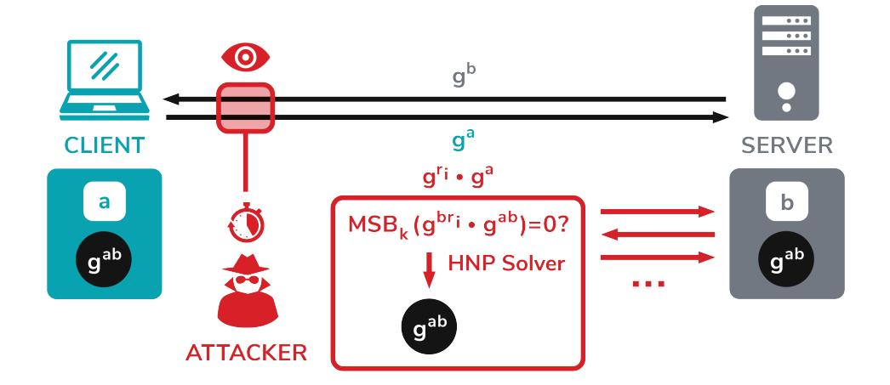
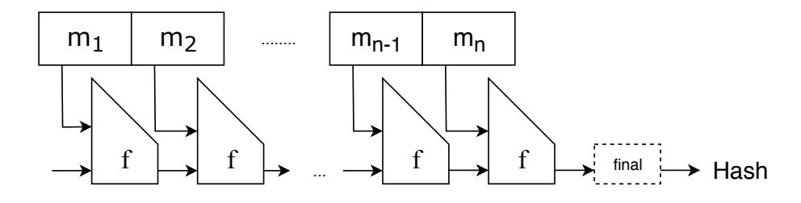
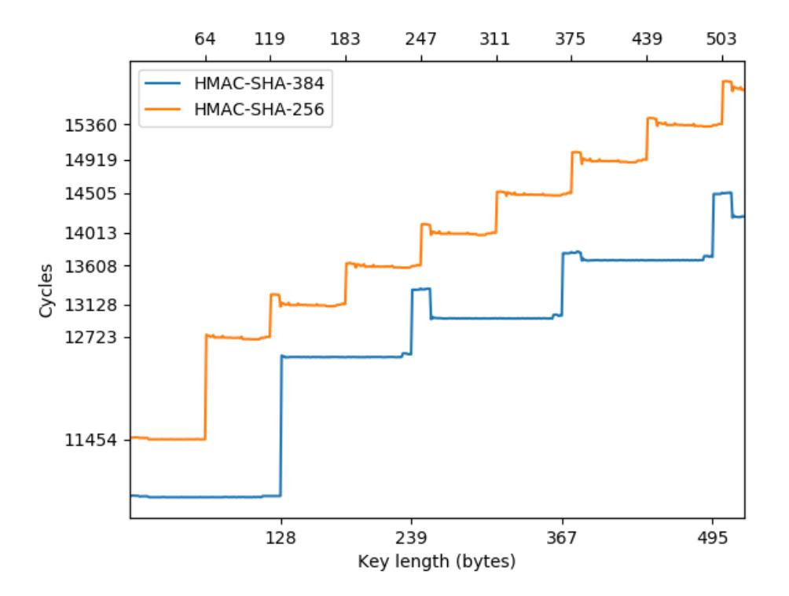
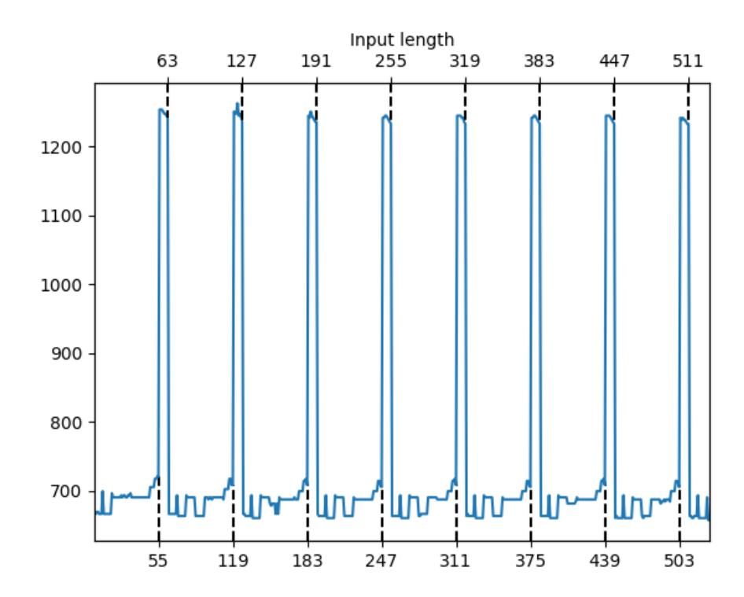
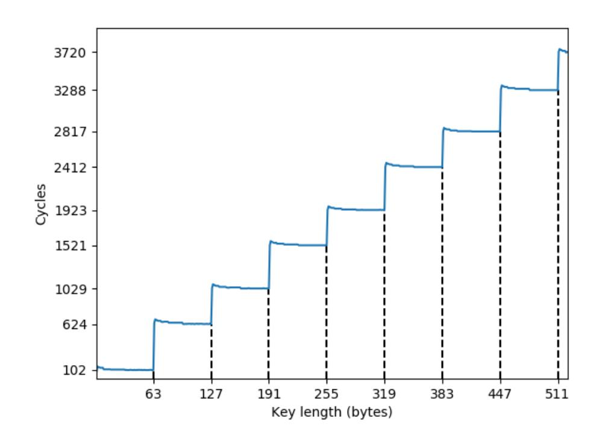

{0}------------------------------------------------

# <span id="page-0-0"></span>Raccoon Attack: Finding and Exploiting Most-Significant-Bit-Oracles in TLS-DH(E)

Robert Merget<sup>1</sup>, Marcus Brinkmann<sup>1</sup>, Nimrod Aviram<sup>2</sup>, Juraj Somorovsky<sup>3</sup>, Johannes Mittmann<sup>4</sup>, and Jörg Schwenk<sup>1</sup>

<sup>1</sup>Ruhr University Bochum

<sup>2</sup>Department of Electrical Engineering, Tel Aviv University

<sup>3</sup>Paderborn University

<sup>4</sup>Bundesamt für Sicherheit in der Informationstechnik (BSI), Germany

#### **Abstract**

Diffie-Hellman key exchange (DHKE) is a widely adopted method for exchanging cryptographic key material in real-world protocols like TLS-DH(E). Past attacks on TLS-DH(E) focused on weak parameter choices or missing parameter validation. The confidentiality of the computed DH share, the *premaster secret*, was never questioned; DHKE is used as a generic method to avoid the security pitfalls of TLS-RSA.

We show that due to a subtle issue in the key derivation of all TLS-DH(E) cipher suites in versions up to TLS 1.2, the premaster secret of a TLS-DH(E) session may, under certain circumstances, be leaked to an adversary. Our main result is a novel side-channel attack, named *Raccoon attack*, which exploits a timing vulnerability in TLS-DH(E), leaking the most significant bits of the shared Diffie-Hellman secret. The root cause for this side channel is that the TLS standard encourages non-constant-time processing of the DH secret. If the server reuses ephemeral keys, this side channel may allow an attacker to recover the premaster secret by solving an instance of the Hidden Number Problem. The Raccoon attack takes advantage of uncommon DH modulus sizes, which depend on the properties of the used hash functions. We describe a fully feasible remote attack against an otherwisesecure TLS configuration: OpenSSL with a 1032-bit DH modulus. Fortunately, such moduli are not commonly used on the Internet.

Furthermore, with our large-scale scans we have identified implementation-level issues in production-grade TLS implementations that allow for executing the same attack by directly observing the contents of server responses, without resorting to timing measurements.

## 1 Introduction

**Diffie-Hellman Key Exchange.** In Diffie-Hellman (DH) Key Exchange, a client A and a server B both use a prime p and a generator  $g \in \mathbb{Z}_p^*$  as public parameters, where g generates a cyclic subgroup  $G \leq \mathbb{Z}_p^*$  of prime order q. B chooses a secret  $b \in \mathbb{Z}_q$  and A chooses a secret  $a \in \mathbb{Z}_q$ . B sends the DH "share"



Figure 1: Raccoon attack overview. The attacker passively observes the public DH shares of a client-server connection and uses an oracle in the TLS key derivation to calculate the shared DH secret using a solver for the Hidden Number Problem.

<span id="page-0-1"></span> $g^b \mod p$  to A, while A sends its share  $g^a \mod p$  to B. Both parties can then compute  $(g^a)^b = (g^b)^a = g^{ab} \mod p$ . If the parameters p and q are chosen in such a way that the *Computational Diffie-Hellman Assumption (CDH)* holds for G, a third party that observes the transmitted values  $g^a, g^b \mod p$  cannot compute this shared secret  $g^{ab}$ .

**TLS-DH(E).** Transport Layer Security (TLS) relies on the DH assumption and adapts the DH key exchange to compute a shared key  $(g^a)^b$  between a client and a server. The shared key is used as a *premaster secret* to derive all necessary cryptographic material for the established connection. In practice, TLS peers can use two DH key exchange types: TLS-DH and TLS-DHE. In a TLS-DH connection, the server uses a static value b. In TLS-DHE, the server uses an ephemeral value b.

Side-channel attacks against TLS. Due to its importance, the TLS protocol has become a subject to many cryptographic analyses, including the security of the TLS handshake structure [13] and TLS-DHE [35]. These analyses confirm the security of the TLS protocol design, which is essential for its implementation and deployment. However, models used in these studies rely on specific assumptions and implementa-

{1}------------------------------------------------

tion correctness. For example, they assume that the secretprocessing functions work in constant time and do not leak any confidential data. Such behavior is not always given in practice and can be practically exploited by an attacker using specific side channels.

A typical example of side-channel attacks are timing attacks. In timing attacks, an attacker measures the response time of an implementation to recover secret information. There are numerous examples of timing side-channel attacks that have been successfully applied to TLS. Brumley and Boneh [\[20\]](#page-15-1) showed how to recover the private key of a TLS-RSA server by measuring timing differences in arithmetic optimizations for different ciphertext lengths. AlFardan and Paterson [\[6\]](#page-14-1) were able to recover plaintext bytes from the TLS Record Layer by observing subtle timing differences in the computation of the HMAC. Meyer et al. [\[46\]](#page-16-0) constructed a Bleichenbacher oracle from timing differences in the handling of valid and invalid PKCS#1 encoded premaster secrets within the [ClientKeyExchange](#page-0-0) message.

The standard strategy for preventing timing attacks is to make implementations *constant time*, i.e., the implementation's processing time should always be the same, regardless of any conditions on the secret. Deploying such a countermeasure can be very challenging, especially if the side channel results from the behavior described in the protocol specification. For example, the Lucky 13 attack by AlFardan and Paterson resulted from the failure in the TLS specification to process ciphertext in constant time [\[6\]](#page-14-1). While the paper describes concrete countermeasure strategies, we could observe several resurrections of this attack in the last years [\[4,](#page-14-2) [8,](#page-14-3) [57\]](#page-16-1).

A timing oracle in the TLS-DH(E) KDF. We start our study with a critical observation that the TLS specification prescribes variable-length secrets as input to the [key derivation](#page-0-0) [function \(KDF\);](#page-0-0) all TLS versions up to version 1.2 mandate that the DH premaster secret must be stripped of leading zero bytes before it is used to derive connection secrets. Since the first step of the KDF is to apply a hash function to the secret, this hash calculation will use less internal iterations if a critical number of leading zeros has been stripped. For example, for SHA-384 (cf. [Table 1\)](#page-3-0), the internal block size is 128 bytes. Due to the structure of the length and padding fields used in SHA-384, the last hash input block can contain up to 111 bytes. Therefore, inputs with up to 239=128+111 bytes will be processed in two blocks. For inputs with 240 bytes and more, at least three hash blocks are necessary.

Processing an additional hash block results in an additional hash compression computation. Therefore, for some DH modulus sizes, the KDF is faster for premaster secrets with leading zero bytes, since these zero bytes will be stripped. If an attacker can learn the number of hash compression computations performed with the premaster secret based on precise timing measurements, the attacker is also able to learn some leading bits of the premaster secret. *This behavior allows the attacker to create a most significant bits (MSB) oracle from*

*a server and to determine the most significant bits of the DH secret.*

The Hidden Number Problem. In 1996, Boneh and Venkatesan presented the Hidden Number Problem (HNP) [\[16\]](#page-14-4), originally to show that using the most significant bits (MSB) of a Diffie-Hellman secret is as secure as using the full secret. Their proof includes an algorithm that, given an oracle for the MSBs of DH shared secrets where one side of the key exchange is fixed, computes the entire secret for another such key exchange. The algorithm presented in that seminal work uses basis reduction in lattices to efficiently solve the Closest Vector Problem.

While initially presented as part of a positive security result, the HNP and algorithms for solving it later found use as components in cryptographic attacks. For example, such algorithms have been used to break DSA, ECDSA, and qDSA with biased or partially known nonces [\[9,](#page-14-5)[11,](#page-14-6)[17,](#page-14-7)[23,](#page-15-2)[48](#page-16-2)[–50,](#page-16-3)[62\]](#page-16-4).

Perhaps surprisingly, the original target of the HNP, Diffie-Hellman key exchange, remained hitherto unattacked. *We close this gap by presenting the first full HNP-based attack on TLS-DH(E).*

Raccoon attack. The *[Raccoon attack](#page-0-0)* can recover TLS-DH(E) premaster secrets from passively-observed TLS-DH(E) sessions by exploiting a [side channel](#page-0-0) in the server and solving the Hidden Number Problem using lattice reduction algorithms. The attack requires that the server reuses the same Diffie-Hellman share across sessions which is provided by a server with static TLS-DH or by a server reusing ephemeral keys in TLS-DHE [\[61\]](#page-16-5).

On a high level, the attack works as follows (cf. [Figure 1\)](#page-0-1):

- 1. The attacker records the TLS handshake, including both the client DH share *g a* and the server share *g b* .
- 2. The attacker initiates new handshakes to the same server (therefore with the same *g b* ), using *g ri* · *g a* for some randomly chosen *r<sup>i</sup>* . The premaster secret for these new sessions is (*g ri* · *g a* ) *<sup>b</sup>* = *g rib* · *g ab*. The attacker can compute the first term, and the second term is the targeted DH secret.
- 3. For each handshake, the attacker measures the response time of the server. For some modulus sizes, DH secrets with leading zeroes will result in a faster server KDF computation, and hence a shorter server response time.
- 4. Assume temporarily that the attacker can perfectly detect the above case. Each such case can be converted to an equation in the Hidden Number Problem. When a sufficient number of equations has been determined, the HNP can be solved to calculate *g ab*, the secret Diffie-Hellman value of the original handshake. The attacker can then decrypt the original TLS traffic to recover its plaintext.

Contributions. We make the following contributions:

• We present a novel [side channel,](#page-0-0) stemming from the

{2}------------------------------------------------

TLS-DH(E) standard that leaks the value of most significant bits of a DH shared secret.

- We demonstrate that this [side channel](#page-0-0) can be exploited in real-world settings, allowing an adversary to decrypt TLS traffic. More broadly, our findings serve as another example of the dangers of non-constant-time computations in cryptography, which are relevant to cryptographic protocols beyond TLS.
- We perform large-scale scans of the most prominent servers on the Internet to estimate the impact of the vulnerability. Interestingly, with our scans, we were able to find servers presenting different behavior based on the first byte of the premaster secret; this allowed us to construct a direct form of our [Raccoon attack.](#page-0-0)
- We report the first attack targeting finite-field Diffie-Hellman using the Hidden Number Problem as a cryptanalytic tool.

Responsible Disclosure. We responsibly disclosed our findings to large server operators, major TLS implementations, the IETF, and our national CERT. F5 assigned the issue CVE-2020-5929. In particular, several F5 products enable a special version of the attack, without the need for precise timing measurements.[1](#page-2-0) OpenSSL assigned the issue CVE-2020-1968 [2](#page-2-1) . OpenSSL does use fresh DH keys per default since version 1.0.2f from 2016. To further mitigate the attack, the developers moved all remaining DH cipher suites into the weak-ssl-ciphers list. In addition, motivated by this research, the developers also activated the fresh generation of EC ephemeral keys in OpenSSL 1.0.2w. Mozilla assigned the issue CVE-2020-12413. It has been solved by disabling DH and DHE cipher suites in Firefox (which was already planned before the Raccoon disclosure). Microsoft assigned the issue CVE-2020-1596.[3](#page-2-2) BearSSL and BoringSSL are not affected because they do not support DH(E) cipher suites. Botan, Mbed TLS and s2n do not support static DH cipher suites. Their DHE cipher suites never reuse ephemeral keys. Artifacts Availability. We will publish the source code used

# 2 Background

Here we provide a description of the [Transport Layer Security](#page-0-0) [\(TLS\)](#page-0-0) handshake protocol and its key derivations.

# 2.1 Transport Layer Security (TLS)

for this paper under an Open Source license.

The TLS protocol (previously known as SSL) provides confidentiality, integrity, and authenticity to many common applications on the Internet. The latest version of the protocol is TLS 1.3 [\[54\]](#page-16-6), while the older versions TLS 1.0, 1.1, and

1.2 [\[26–](#page-15-3)[28\]](#page-15-4) are currently still deployed alongside of it. The older versions SSLv3 and SSLv2 are not considered to be safe to use anymore. SSLv3 and TLS versions 1.0 to 1.2 all share a similar structure. TLS 1.3 overhauled the design of the protocol and is fundamentally different from the previous versions. In this work, we focus on SSLv3 and TLS versions 1.0 to 1.2.

The TLS protocol structure consists of two phases. In the first phase, called the handshake, the client and server negotiate the cryptographic algorithms and establish session keys. In the second phase, the peers can securely send and receive application data using the record protocol, which is encrypted and authenticated using the keys and algorithms established in the previous phase.

The aforementioned choice of cryptographic algorithms is called a TLS cipher suite [\[28\]](#page-15-4). More precisely, a cipher suite is a concrete selection of algorithms for all of the required cryptographic tasks. For example, the cipher suite TLS\_DHE\_RSA\_WITH\_AES\_128\_CBC\_SHA uses ephemeral DH key exchange and RSA signatures over server DH shares in order to establish a shared session key. In order to encrypt and authenticate data, it uses symmetric AES-CBC encryption with a 128-bit key and SHA-1-based HMACs.

In the following, we focus on cipher suites using DH(E) as the key exchange method. To establish a TLS connection, the client starts the TLS handshake by sending a [ClientHello](#page-0-0) message, which contains the supported cipher suites, the supported version(s), and TLS features, as well as a nonce (called ClientRandom). The server answers this with a [ServerHello](#page-0-0), containing a selected cipher suite and version, a nonce (called ServerRandom), as well as other TLS features, which should be used in this session. The server follows this message up with a [Certificate](#page-0-0) message, which contains an X.509 certificate of the server. In static-DH cipher suites, this certificate contains a long-lived Diffie-Hellman public key (*g*, *p*,*g <sup>b</sup>* mod *p*), while in TLS-DHE cipher suites the certificate contains an RSA or DSA public signature key. If a DHE cipher suite is selected, the server sends a server key exchange message, containing the ephemeral public DH key (*g*, *p*,*g <sup>b</sup>* mod *p*), as well as a signature, generated with the private key corresponding to the server's certificate. The server then sends a [ServerHelloDone](#page-0-0) message, which signals to the client that the server has finished sending this flight of messages. The client then sends a [ClientKeyExchange](#page-0-0) message, containing the client public key *g a* . Both parties now have the cryptographic material to compute a shared secret called the premaster secret (PMS) as *g ab* = (*g a* ) *<sup>b</sup>* = (*g b* ) *a* (mod *p*). The PMS is then used to derive the master secret using a key derivation function (which we describe below); the master secret is then used to derive the individual symmetric keys. The client then sends a [ChangeCipherSpec](#page-0-0) message, indicating to the server that the following messages sent from the client to the server will be encrypted. The last message sent by the client within the handshake is a [Finished](#page-0-0) mes-

<span id="page-2-0"></span><sup>1</sup> <https://support.f5.com/csp/article/K91158923>

<span id="page-2-2"></span><span id="page-2-1"></span><sup>2</sup> <https://www.openssl.org/news/secadv/20200909.txt>

<sup>3</sup> [https://portal.msrc.microsoft.com/en-US/security-guidance/](https://portal.msrc.microsoft.com/en-US/security-guidance/advisory/CVE-2020-1596) [advisory/CVE-2020-1596](https://portal.msrc.microsoft.com/en-US/security-guidance/advisory/CVE-2020-1596)

{3}------------------------------------------------

sage, which contains a cryptographic checksum over the transcript of the connection. The server answers this with its own [ChangeCipherSpec](#page-0-0) message, indicating that from now on, all messages are encrypted, followed by the server's [Finished](#page-0-0) message.

# <span id="page-3-3"></span>2.2 Hash Functions

Hash functions are mappings *h* : {0,1} <sup>∗</sup> → {0,1} *<sup>N</sup>* which are one-way, collision-free and do not allow to compute second preimages [\[24\]](#page-15-5). A real-world hash function with close to unbounded input length cannot be evaluated in constant time; rather, for any reasonable implementation, the running time for an input of length *k* is *O*(*k*). This can result in a timing [side](#page-0-0) [channel](#page-0-0) in real-world applications if the hash function is used with secret inputs of varying lengths [\[6\]](#page-14-1). Most common cryptographic hash functions are built using a Merkle-Damgård construction [\[24\]](#page-15-5). In this construction, the input is split into fixed-size blocks, and each block is mixed into a state of the computation using a compression function, until all blocks have been processed. Prior to feeding the blocks to the compression function, the input is extended by a length field, and then padded to a multiple of the block size of the hash function; the extension and padding may necessitate creating an additional input block. In some constructions, the output is fed to a finalization function, which compresses the internal state to the final output.



Figure 2: Merkle-Damgård construction of common hash functions, such as MD5, SHA-1 and SHA-256.

Table [1](#page-3-0) gives an overview of hash functions relevant to this work. The second and third columns indicate the input and output block size, respectively.[4](#page-3-1) The fourth column provides the minimal number of bytes appended to the input. For example, when using SHA-256 (which uses a block size of 64 bytes), at least 9 bytes have to be appended to the input message. Therefore, messages of up to 55 bytes will be processed as one block, using two calls to the compression function (due to the finalization function). Messages of length between 56 and 128−9 = 119 bytes will be processed as two input blocks, using three calls to the compression function. Table [1](#page-3-0) provides further examples for input block boundaries.

| Hash<br>Input<br>function<br>block<br>size |     | Output<br>size | Length<br>and<br>padding | Input block<br>borders |  |
|--------------------------------------------|-----|----------------|--------------------------|------------------------|--|
| MD5                                        | 64  | 16             | 8+1                      | 55, 119, 183,          |  |
| SHA-1                                      | 64  | 20             | 8+1                      | 55, 119, 183,          |  |
| SHA-256                                    | 64  | 32             | 8+1                      | 55, 119, 183,          |  |
| SHA-384                                    | 128 | 48             | 16+1                     | 111, 239, 367,         |  |

<span id="page-3-0"></span>Table 1: Properties of common hash functions. The second and third columns indicate the input and output block sizes. The fourth column indicates the minimum size of the length field and padding in the last block. The last column indicates the maximum input sizes fitting into one, two, and three blocks, respectively. All values are denoted in bytes.

# <span id="page-3-2"></span>2.3 Key Derivation

Modern DHKE based protocols do not use the shared cryptographic secret *K* = *g ab* (or parts of it) directly as the key to symmetric algorithms. Instead, *K* is used as the input to a [KDF](#page-0-0) which uses a fixed-size intermediate value *seed*, from which then arbitrary many pseudorandom bytes are derived. [TLS](#page-0-0) (and other typical cryptographic protocols) use a [KDF](#page-0-0) based on HMAC [\[41\]](#page-15-6).

HMAC is a mechanism to compute message authentication codes based on hash functions. The HMAC construction can be instantiated with any hash function *H* and then inherits the parameters of this function. For example, HMAC-SHA1 has an internal block size of 64 bytes and an output size of 20 bytes.

$$\mathsf{HMAC}_H(K,M) = H\Big((K \oplus opad)||H\big((K \oplus ipad)||M\big)\Big)$$

Here *K* is a secret key, and *opad* and *ipad* are byte arrays of hash input block size *B* filled with bytes 0x36 and 0x5C, respectively. The secret key *K* must also have a fixed length *B*. Therefore, before computing the HMAC, *K* is either padded with zeros (if |*K*| < *B*) or hashed with the hash function *H* (if |*K*| > *B*). *Note that such an additional hash function invocation on the secret key K can result in measurable timing differences.*

HMAC provides a foundational mechanism to design a [pseudorandom function \(PRF\)](#page-0-0) for key derivation and key expansion. TLS uses such a [PRF.](#page-0-0) The PRF in TLS uses a single hash function *H*, a secret *K*, a label, and a seed to expand cryptographic material [\[28\]](#page-15-4):

$$PRF(K, label, seed) = HMAC_H(K, A_1 \mid\mid label \mid\mid seed) \mid\mid HMAC_H(K, A_2 \mid\mid label \mid\mid seed) \mid\mid HMAC_H(K, A_3 \mid\mid label \mid\mid seed) \mid\mid ...$$

where *A*<sup>0</sup> = *label* || *seed* and *A<sup>i</sup>* = HMAC*H*(*K*,*Ai*−1). Here the *label* is a distinguishing ASCII string constant defined in the TLS standard. The number of PRF iterations depends on the desired output length. For example, three iterations can be used to produce up to 96 output bytes if SHA-256 is used.

<span id="page-3-1"></span><sup>4</sup>Technically all presented hash functions operate on bits instead of bytes. However, they are almost universally only used with bit lengths that are a multiple of 8. Therefore our analysis only focuses on these cases.

{4}------------------------------------------------

# <span id="page-4-0"></span>2.4 The Hidden Number Problem

To solve the *Hidden Number Problem* (HNP) [\[16\]](#page-14-4), an adversary must compute a secret integer α (in our case the premaster secret of the TLS-DHE session under attack) modulo a public prime *p* with bit-size *n*, given information about the *k* most significant bits (MSBs) of the *n*-bit representation of random multiples α·*t<sup>i</sup>* mod *p* of this secret value. From these MSBs the adversary can construct integers *y<sup>i</sup>* (e.g., by setting the MSBs of *y<sup>i</sup>* as the known bits, and all other bits to 0) such that for each *i* we have 0 ≤ α·*t<sup>i</sup>* mod *p*−*y<sup>i</sup>* < *p*/2 ` for some ` > 0. Each triple (*t<sup>i</sup>* , *yi* , `) contains ` bits of information on α. The number ` := *k* −*n*+log<sup>2</sup> (*p*) ∈ [*k* −1, *k*] can be considered the effective number of given MSBs. This number can also be written as ` = *k* −ε, where ε = *n*−log<sup>2</sup> (*p*) represents the bias of the modulus (see [Table 3](#page-11-0) for the ε of some well-known DH groups). If ` is not too small and we have a moderate number of equations, the hidden number α can be recovered by solving a Closest Vector Problem (CVP) in a lattice [\[16,](#page-14-4) [34,](#page-15-7) [49\]](#page-16-7). If ` is small and a large number of equations is available, Fourier analysis is considered more promising [\[3,](#page-14-8) [47\]](#page-16-8).

# <span id="page-4-1"></span>3 Raccoon Length Distinguishing Oracles

In this section we describe length distinguishing [side channel](#page-0-0) oracles which may be used in the *[Raccoon attack](#page-0-0)*. All of these oracles exploit the following fact:

*The key derivation function KDF strips leading zeros from the computed DH secret g ab and performs further computations based on this stripped value.*

These computations can result in different timing behaviors based on the number of removed bits or different error behavior. An attacker observing the timing behavior can construct an oracle from the behavior of an application using [Diffie-](#page-0-0)[Hellman \(DH\)](#page-0-0) key exchange and use it to leak some of the most significant bits (MSB) of the shared secret. While such an attack is not critical in practical scenarios, it already invalidates the standard indistinguishability assumption of the cryptographic primitives used (DDH, PRF-ODH, see [Ap](#page-16-9)[pendix A\)](#page-16-9). In [section 4,](#page-5-0) we show how these oracles can be constructed from [TLS](#page-0-0) servers, and in [section 5](#page-8-0) how they can be used to run a full attack and uncover the complete premaster secret.

#### <span id="page-4-3"></span>3.1 *O* <sup>H</sup>: Hash Function Invocation

In HMAC constructions (RFC 2104 [\[41\]](#page-15-6)), the shared secret key *g ab* may either be used directly in the HMAC computation (if |*g ab*| is smaller than the maximal HMAC key size), or it must be hashed to a smaller size.

Consider a server that uses a DH prime modulus *p* with |*p*| = 1025 bits and a PRF based on HMAC-SHA384. For this PRF, the secret key *k* can at most be 128 bytes long, which is the input block size of the hash function SHA-384 [\(Table 1\)](#page-3-0). For this purpose, the KDF first strips leading zero bits and then converts *K* to a byte sequence. Now the KDF program branches:

- 1. If the length of the byte sequence is at most 128 bytes, this byte sequence is used directly as the HMAC key *k*.
- 2. If the length of the byte sequence is bigger than 128 bytes, *the SHA-384 hash function is invoked once on this byte sequence*, and the resulting hash value, padded with 80 zero bytes, is used as the HMAC key: *k* = *h*||0*x*0...0.

Now assume that a [man-in-the-middle \(MitM\)](#page-0-0) attacker observed a DH key exchange. The goal of the attacker is to learn the first bit of *K* = *g ab* mod *p*. As described above, there are two possibilities for a server-side KDF to process the shared secret *K* = *g ab*:

- The most significant bit of *K* is 0. The server *strips the leading zero bit* and converts *K* to a byte array which will consist of 128 bytes. Since the byte array is 128 bytes long, it is directly used in the HMAC computation: HMACSHA−384(*K*, *seed*).
- The most significant bit of *K* is 1. The server converts *K* to a byte array, which will consist of 129 bytes. A 129-byte long shared secret cannot be directly used in the HMAC computation (see also [subsection 2.3\)](#page-3-2); before computing HMAC, the server needs to compute SHA-384 over *K*. It can then use the SHA-384 output as an input for the HMAC computation.

Observe how a shared secret *K* starting with 1 results in an additional SHA-384 *hash function invocation* over *K*. In the previous example, the modulus was exactly one bit bigger than the block size of the hash function and leaked only the most significant bit of the PMS. If the modulus is *k* bits bigger than the block size, the attacker has a chance of 1/2 ` to leak the top *k* bits of the PMS. As we show in [section 6,](#page-8-1) this timing difference is observable by a remote attacker.

#### <span id="page-4-2"></span>3.2 *O* <sup>C</sup>: Compression Function Invocations

This oracle exploits the number of invocations of the internal compression function if the second branch in *O* <sup>H</sup>occurs, i.e., if the shared DH secret *K* = *g ab* is bigger than the input block length of the HMAC hash function.

As mentioned in [subsection 2.2,](#page-3-3) hash functions based on the Merkle-Damgård scheme operate on blocks. The number of blocks a hash function has to process depends on the input length (see [Table 1\)](#page-3-0). If the [DH](#page-0-0) shared secret *K* is used as a key for an HMAC computation, it can have distinct timing profiles depending on its length.

To give an example for HMAC-SHA384, consider a 1913 bit [DH](#page-0-0) modulus *p*, which is encoded in 240 bytes. The serverside KDF implementation now has to invoke the hash function over the shared key *K*, since *K* is much larger than the allowed

{5}------------------------------------------------

128 bytes. We now get a MSB oracle from the number of compression function invocations:

- 1. If the most significant bit of *K* is 0, *K* will be coded into 239 bytes. Even with the 17 bytes added for length and padding (cf. [Table 1\)](#page-3-0), it will fit into two blocks. Thus, the server will execute three hash compressions.
- 2. If the most significant bit of *K* is 1, *K* will be decoded into 240 bytes. Appending padding and the length field will fit into three blocks; the server will execute four hash compressions.

Analogously to the previous oracle, if the modulus is *k* bits bigger than a critical block border, the attacker has a chance of 1/2 ` to leak the top *k* bits of the PMS, where ` = *k* −ε (see [subsection 2.4\)](#page-4-0).

#### 3.3 *O* P : Key Padding

Another [side channel](#page-0-0) arises based on the number of padding bytes used to pad the [DH](#page-0-0) shared key. The HMAC interface [\[41\]](#page-15-6) pads keys to the block size of the hash function. The padding of the shared key can result in a timing [side chan](#page-0-0)[nel](#page-0-0) as different key lengths will lead to different amount of padding applied, and therefore to a different number of calls to the hash compression function. We show a practical attack based on this [side channel](#page-0-0) in Appendix [E.](#page-17-0)

#### <span id="page-5-3"></span>3.4 *O* <sup>D</sup>: Direct Side Channels

Until now, we discussed [side channels](#page-0-0) based on small timing differences in the processing of the shared [DH](#page-0-0) secret. However, it is possible that an implementation provides a direct oracle which does not rely on timing differences but relies on direct differences in behavior, such as error messages, handling of the connection state (like closing the underlying socket), or otherwise. If an implementation behaves differently depending on the shared secret, it provides an attacker with a direct [side channel.](#page-0-0) The reason why these direct oracles might be plausible is that, for example, the zero byte is considered a special character in many programming languages. For example, in C the zero byte is used to terminate strings. This can result in programming errors, which can, in return, lead to observable differences in response to network queries. We show in [section 7](#page-10-0) that a large number of real-world servers indeed present such directly observable behavior differences. In all observed cases, this [side channel](#page-0-0) only leaked the most significant byte of the PMS, which is equivalent to a leak of *k* = *n* mod 8 bits for a prime *p* of bit-size *n*.

# <span id="page-5-1"></span>3.5 Further Oracle Considerations

Big number libraries. Even if a protocol does maintain leading zero bytes of the shared secret, the big number library used might introduce one of the oracles *O* <sup>H</sup>, *O* <sup>C</sup>, *O* P , or *O* D, which leaks the most significant bits. If the big number library does not maintain fixed-size big numbers internally, the

resulting shared secret has to be padded by the application to the modulus size if the shared secret has fewer bytes than the modulus. An example of this [side channel](#page-0-0) in OpenSSL can be found in [Appendix B.](#page-17-1)

Hitting the block boundaries with dangerous modulus sizes. In our examples above, we used unusual modulus sizes of 1025 and 1913 bits to instantiate the length distinguishing oracles. We arrived at these numbers by computing the input lengths for a given hash function that leak the top *x* leading zero bits of the potential input at the *critical block border* of the *n*th block, using the following formula: *cbb*(*x*,*b*, *p*,*n*) = *n* ∗ *b*− *p*+*x*, where *b* is the block size of the hash function in bits, and *p* is the fixed padding part of the hash function, also in bits.

On the reliability of timing side channels. If the attacker uses a timing side channel, likely, the oracle will occasionally give wrong results, as timing measurements are inherently noisy. Thus, any classifier will exhibit some probability of false classification. The distinguishing attack can be made practical if the attacker can send several queries to the target. The attacker can then use a standard statistical test to build an efficient, reliable oracle out of the noisy oracle *O* <sup>H</sup>(Hash Function Invocation Oracle). We give more details in [subsec](#page-9-0)[tion 6.1.](#page-9-0)

# <span id="page-5-0"></span>4 Raccoon Length Distinguishing Oracles in TLS

SSLv3, TLS 1.0, TLS 1.1, and TLS 1.2 prescribe stripping leading zero bytes of the computed [DH](#page-0-0) shared secret. The [DH](#page-0-0) shared secret in TLS is called premaster secret and is directly used as an input into a key derivation function, which makes the protocol vulnerable to the [Raccoon attack](#page-0-0) (if the implementation took no special precautions).

In this section, we first describe the high-level attack scenario. The main contribution of this section is a detailed analysis of the different TLS key derivation functions, which results in different critical block boundaries (cf. [subsection 3.5](#page-5-1) and [Table 2\)](#page-6-0) to trigger the length distinguishing oracles. We concentrate our analysis on *O* <sup>H</sup>and *O* <sup>C</sup>, which are provided by the TLS design combined with the hash function properties (e.g., different timing profiles for inputs of different block lengths). We stress that *O* P and *O* <sup>D</sup>are implementation-dependent and can potentially be found exploitable at any block boundaries.

# <span id="page-5-2"></span>4.1 TLS Attack Scenarios

For both attack scenarios described below, the attacker needs access to a functional oracle from [section 3,](#page-4-1) and a TLS-DHE or a connection with a static TLS key share in a vulnerable TLS version has to be negotiated by the honest client and server.

Raccoon*<sup>e</sup>* : Length distinguishing attack on ephemeral keys. The goal of the Raccoon*<sup>e</sup>* attack is to detect the leading 

{6}------------------------------------------------

bits in the [DH](#page-0-0) shared secret in a [MitM](#page-0-0) attacker model with ephemeral keys. If the attacker wants to perform the attack, it can measure the presented [side channels](#page-0-0) in [section 3](#page-4-1) at two different positions within a TLS connection:

- The attacker can target the server and measure the time the server used to compute the premaster secret. The attacker can do this by measuring the time between the server receiving the [ClientKeyExchange](#page-0-0) message and the server sending its [Finished](#page-0-0) message.
- Or, the attacker can target the client and measure the time the client used to compute the premaster secret. The attacker can do this by measuring the time the client took to read the [ServerKeyExchange](#page-0-0) message up to sending the [Finished](#page-0-0) message by the client.

By repeatedly observing TLS-DHE handshakes between an honest client A and an honest server B the attacker can learn typical timing values. After this, the attacker will be able to detect if leading zero bytes are present in the unknown [pms](#page-0-0) by observing faster response times.

This length distinguishing attack is applicable even if the server does not reuse ephemeral DH values.

Raccoon*<sup>s</sup>* : Length distinguishing attack on a static key. In this scenario, the attacker has recorded a previous TLS-DH(E) session, and the goal is to recover the length of the premaster secret used in this session between two honest peers. In contrast to Raccoon*<sup>e</sup>* , in this scenario, the server uses a static key, or is reusing the same ephemeral DH secret for a certain period of time, covering the recorded TLS-DHE session and the full duration of the attack.

To perform the attack, the attacker selects an appropriate oracle of *O* <sup>H</sup>, *O* <sup>C</sup>, *O* P and *O* <sup>D</sup> from [section 3,](#page-4-1) connects to the server and sends a Diffie-Hellman share in a [ClientKeyExchange](#page-0-0) message. For the length distinguishing attack, this [ClientKeyExchange](#page-0-0) message contains the originally observed key share from the honest client. Note that an attacker can also send related key shares here to retrieve the MSB of related premaster secrets (see [subsection 5.1](#page-8-2) for the details). Note that the attacker cannot construct a valid [Finished](#page-0-0) message since the secret key is unknown to the attacker. The server receiving a message crafted by the attacker will, therefore, terminate the connection by either sending a fatal [Alert](#page-0-0) message or closing the TCP connection. However, the server always needs to compute the premaster secret and derive the master secret using the [PRF.](#page-0-0) Therefore, the server's response will depend on the leading bits of the premaster secret.

If the attacker uses a timing [side channel,](#page-0-0) the reliability of the [side channel](#page-0-0) can be improved as described in [subsec](#page-5-1)[tion 3.5.](#page-5-1)

# 4.2 Analysis of TLS Key Derivations

Since the TLS key derivation is of special interest for this paper, we will analyze it in detail. The starting point for the key derivation is the PMS. For TLS-DH(E), this value is computed as the result of a DHKE in Z ∗ *<sup>p</sup>* with prime modulus *p*, with leading zero bytes stripped. In a two-step key derivation, first a *master secret* is computed from this premaster secret, and then two sets of keys (one for each communication direction) are derived from the master secret.

How exactly the master secret is derived from the premaster secret depends on the negotiated protocol version and cipher suite. Note that an attacker can observe the [ClientKeyExchange](#page-0-0) message on any version or cipher suite and then send it as part of a different protocol version and cipher suite to a server (as long as the server supports it). We now analyze different TLS versions and how they use the premaster secret to derive further keys with their PRFs. Our analysis of critical block borders is summarized in Table [2.](#page-6-0)

| Protocol version /<br>Cipher suites                               | Key derivation                                                  | Critical<br>pms<br>comp.<br>block borders                                                  |
|-------------------------------------------------------------------|-----------------------------------------------------------------|--------------------------------------------------------------------------------------------|
| TLS 1.2 (_SHA384)<br>TLS 1.2 (others)<br>TLS 1.0 and 1.1<br>SSLv3 | SHA-384 PRF<br>SHA-256 PRF<br>MD5/SHA-1 PRF<br>Custom MD5/SHA-1 | 128, 239, 367,<br>64, 119, 183,<br>110, 238, 366,<br>45, 54, 55, 56, 99, 118,<br>119, 120, |

<span id="page-6-0"></span>Table 2: Key derivation properties of non-PSK cipher suites. The first and second column provide the protocol version, cipher suite, and the hash algorithms used in the key derivation function. The last column provides critical block borders for premaster secrets [pms.](#page-0-0) For example, a 239-byte long [pms](#page-0-0) consumes one less SHA-384 hash compression than a 240 bytes long pms. The values are in bytes.

TLS 1.2. In TLS 1.2 the master secret is derived from an HMAC-based [PRF](#page-0-0) construction. The master secret is computed as:

*ms* = PRF(*pms*,*label*,*ClientRandom* || *ServerRandom*).

The premaster secret will be used as a key for HMAC operations within the [PRF.](#page-0-0) The used HMAC depends on the selected cipher suite. Per default, SHA-256 is used, but the cipher suite could also specify the usage of SHA-384 (if the cipher suite name ends with \_SHA384). For TLS 1.2 the [side](#page-0-0) [channel](#page-0-0) analysis of [section 3](#page-4-1) can be directly applied. The premaster secret maximum size is the size of the DH key. In configurations with recommended DH key sizes larger than 2000 bits, the computed premaster secret will with overwhelming probability be larger than the block border (64 bytes for SHA-256 and 128 bytes for SHA-384). If the premaster secret is larger than the block size of the hash function, it must be hashed before using it in the HMAC computation. This potentially enables a [side channel](#page-0-0) based on the number of hash compression function invocations (cf. [subsection 3.2\)](#page-4-2).

Note that in the case of SHA-384-PRFs with DH key sizes slightly bigger than 1024 bits, the hash function invocation

{7}------------------------------------------------

side channel and the resulting oracle *O* <sup>H</sup>can be used (cf. [sub](#page-4-3)[section 3.1\)](#page-4-3).

TLS 1.0 and TLS 1.1. These two protocol versions use the same [PRF,](#page-0-0) which is based on a combination of SHA-1 and MD5. In this [PRF,](#page-0-0) the premaster secret is split into two halves: The first half enters an expansion function based on MD5, while the second half enters a distinct [PRF](#page-0-0) based on SHA-1. The final output of the TLS 1.0 and 1.1 [PRF](#page-0-0) is the XOR of these two expansion functions. If the premaster secret has an odd number of bytes, the byte in the middle of the PMS will be used by both halves.

Since TLS 1.0 and TLS 1.1 split the shared secret into two halves, the computations for inputs that reach the block borders changes in comparison to TLS 1.2, as each hash function adds its own padding and length bytes internally. Note that since two hash functions are used at the same time (with identical input lengths and hash function properties such as input block size, length, and padding, see Table [1\)](#page-3-0), the created [side channel](#page-0-0) is amplified. For TLS 1.0 and TLS 1.1 the size of inputs which leak the top *x* leading zero bytes at the *n*th block border can be computed with the formula

$$cbb_{\text{TLS}1.0/1.1}(x,n) = (64n-9) \cdot 2 + x,$$
 (1)

where *x* is the number of most significant bytes to be leaked. SSLv3. Even though SSLv3 is deprecated, there still exist servers on the web which support it.[5](#page-7-0) SSLv3 key derivation is strictly different from the key derivation used in TLS. While the leading zero bytes from the premaster secret are stripped, the master secret is then computed as

$$ms := MD5(pms || SHA1(pms || "A" || r1 || r2)) ||$$

$$MD5(pms || SHA1(pms || "BB" || r1 || r2)) || \qquad (2)$$

$$MD5(pms || SHA1(pms || "CCC" || r1 || r2)),$$

where *r*1 := *ClientRandom* and *r*2 := *ServerRandom*.

This computation results in more opportunities for an attacker to construct a possible [side channel](#page-0-0) from an additional hash function compression invocation. The outer MD5 functions hash the shared secret in concatenation with the output of the inner SHA-1 function. The outer function adds an offset of 20 bytes to the shared secret. As this operation is done three times, the [side channel](#page-0-0) within the MD5 computation is amplified by a factor of three. The inner SHA-1 computation hashes different inputs each time. The first call hashes a label of length 1, while the second call hashes a label of length 2, and the last call hashes a label of length 3. Each time two (32-byte long) random values of the client and server are hashed as well. This generates a total offset of 65, 66 and 67 bytes, respectively. The resulting inputs (in bytes) which leak the top *x* leading zero bytes at the *n*th block in SSLv3 can

therefore be computed as:

$$cbb_{SSL}(x,n) = 64n - (9+20) + x$$

$$cbb_{SSL-A}(x,n) = 64n - (9+65) + x; n > 1$$

$$cbb_{SSL-BB}(x,n) = 64n - (9+66) + x; n > 1$$

$$cbb_{SSL-CCC}(x,n) = 64n - (9+67) + x; n > 1$$
(3)

TLS DHE-PSK. Although not as widespread, TLS also offers a variety of cipher suites that allow the usage of preshared keys (PSK) [\[31\]](#page-15-8). In DHE-PSK, the client basically performs the same handshake as a normal DHE handshake, resulting in the shared DH value *g ab* mod *p*. Then, both client and server authenticate using a premaster secret which is computed based on the preshared key PSK as

$$pms := \operatorname{len}(g^{ab} \bmod p) \mid\mid g^{ab} \bmod p \mid\mid \operatorname{len}(\operatorname{PSK}) \mid\mid \operatorname{PSK},$$
(4)

where len(*x*) indicates a two-byte length value of *x* (in bytes). Since DHE-PSK changes the way the premaster secret is computed, the block borders for the [Raccoon attack](#page-0-0) change as well. Interestingly, the block borders depend on the length of the preshared key PSK. DHE-PSK shifts the length of the PMS, which enters the PRF by 4 + |*PSK*| bytes. This can bring modulus sizes that are far away in proximity to the critical block border for the attacker. An attacker being able to set a PSK for an arbitrary, attacker-controlled identity could also use precise PSK values resulting in advantageous critical block boundaries. A related [side channel](#page-0-0) exists in SSH and is described in [section 8.](#page-12-0)

If the attacker is not an authenticated user, they could use the DHE-PSK premaster secret processing within the PRF to perform another attack. Since the PSK length also directly influences the PRF computation time, the server response time could be used to determine the length of the preshared key. Note that this attack is possible even if the server does not repeat the DH public keys and strictly uses ephemeral keys in DHE-PSK.

# 4.3 Dangerous TLS Modulus Sizes

Since the server chooses the modulus size and the attacker has no variable-size inputs to the PRF (except for DHE-PSK cipher suites), the attacker cannot influence the block borders of the hash function and thus optimize their usability as a [side channel.](#page-0-0) Usually servers choose moduli whose lengths are of the form 2 *n* , like 2 <sup>10</sup> = 1024, 2 <sup>11</sup> = 2048 or 2 <sup>12</sup> = 4096. The server is free to deviate from these and move to arbitrary sizes. For common bit lengths 2 *n* , the block border will never realistically reach a critical block border as the PMS would require too many leading zero bits. However, if a server deviates from these common modulus sizes, it can become possible for an attacker to hit the critical block borders. For example, LibTomCrypt[6](#page-7-1) used to create 1036 bit

<span id="page-7-0"></span><sup>5</sup>According to the SSL pulse measurements of September 2020, SSLv3 is supported by 4.4% of the servers from the Alexa top 150k list.

<span id="page-7-1"></span><sup>6</sup>https://github.com/libtom/libtomcrypt

{8}------------------------------------------------

moduli, which would make  $O^H$  feasible. A list of dangerous modulus sizes is given in the appendix in Table 5.

## <span id="page-8-0"></span>5 Raccoon Premaster Secret Recovery Attack

Until now, we have discussed a distinguishing attack on TLS, which allows an attacker to determine leading zero bytes of the premaster secret. If the server reuses the DH values for multiple connections (cf. [61]), the distinguishing attack can be turned into a full premaster secret recovery attack. This is the case for TLS-DH and for TLS-DHE if the server disrespects best practices and reuses ephemeral keys. Our attack is based on the well-known Hidden Number Problem described by Boneh and Venkatesan [16].

## <span id="page-8-2"></span>5.1 Attack Scenario

We use the attack scenario **Raccoon**<sup>s</sup> from subsection 4.1 which leaks the top k bits of the PMS. We assume the server reuses the same secret DH exponent b; this reuse does usually not depend on the TLS version or cipher suite (besides not considered export cipher suites), so our **Raccoon**<sup>s</sup> attacker can choose a beneficial TLS version and cipher suite for the attack, as long as it is supported by the server. The attack proceeds in two phases:

**Phase 1: Passive MitM.** In this phase, the attacker records a complete TLS-DH(E) session and extracts  $g^a$  from the ClientKeyExchange message as well as  $g^b$  from the ServerKeyExchange or Certificate message.

**Phase 2: Active web attacker.** In this phase, the attacker interacts as a client with the server. However, instead of choosing a secret ephemeral DH value a' and sending  $g^{a'}$  in the ClientKeyExchange message, the attacker chooses random values  $r_i \in \mathbb{Z}_q$  and includes the value  $x_i = g^a g^{r_i}$  in the ClientKeyExchange message (cf. Figure 3). To finish this part of the TLS handshake, the attacker sends a ChangeCipherSpec and the client's Finished message, where the content of the Finished message is chosen randomly because the attacker lacks the keys (master secret and the symmetric keys) to compute a valid Finished message correctly.

After sending ClientKeyExchange, the attacker starts measuring a chosen length distinguishing oracle  $O^H$ ,  $O^C$ ,  $O^P$ , or  $O^D$ , until some Alert message arrives from the server. The attacker repeats the measurement by sending the same value  $r_i$  to the server until some statistical test (e.g., Mann-Whitney [44]) indicates that a sufficiently high probability level has been reached. If the measurement indicates that the leading k bits have been stripped, we have found another candidate  $r_i$  for an HNP equation. However, this only happens with probability  $1/2^{\ell}$ , where  $\ell$  is the effective number of leaked bits, which depends on the modulus p (see subsection 5.2). The chosen value  $r_i$  is then used to construct another equation for the HNP instance to be solved. If the measured time indicates that less than k bits have been stripped, which happens

with probability  $1 - 1/2^{\ell}$ , a new random value  $r'_i$  is chosen by the attacker.

We describe another attack scenario against the unused static-DH client authentication in Appendix D.

## <span id="page-8-3"></span>**5.2** Constructing an Instance of HNP

For a given DH group G with modulus p of bit-size n and generator g of order q, we define our instance of the Hidden Number Problem (HNP) as follows. Let  $O_{k,b}(x)$  be one of the oracles out of  $O^H$ ,  $O^C$ ,  $O^P$ , and  $O^D$  that reveals if the k most significant bits of the n-bit number  $x^b$  mod p are zero:

$$O_{k,b}(x) = \begin{cases} \text{True} & \text{if MSB}_k(x^b \mod p) = 0, \\ \text{False} & \text{otherwise.} \end{cases}$$

To attack a DH key exchange  $(g^a \mod p, g^b \mod p)$  between Alice and Bob with shared secret  $g^{ab} \mod p$  and key reuse by Bob, the attacker chooses random values  $r_i \in \mathbb{Z}_q$  and initiates key exchanges with Bob by sending  $x_i = g^a g^{r_i} \mod p$ . If the attacker has access to an oracle  $O_{k,b}(x)$  and if  $O_{k,b}(x_i) = \text{True}$ , the attacker learns that  $0 < x_i^b \mod p = g^{ab} g^{br_i} \mod p < 2^{n-k}$ . Subtracting  $2^{n-k-1}$ , we obtain the centered equation

<span id="page-8-4"></span>
$$\left|\alpha \cdot t_i \bmod p - y_i\right| < 2^{n-k-1} = p/2^{\ell+1},$$
 (5)

where  $\alpha := g^{ab} \mod p$  is unknown (the *hidden number*) and  $t_i := (g^b)^{r_i} \mod p$ ,  $y_i := 2^{n-k-1}$  are known to the attacker.

Equation 5 corresponds to the randomized version of HNP as defined by Boneh and Venkatesan [16], except that in our case the oracle does not reveal the MSBs directly, but only whether they are zero or not. Moreover, we center the equation around zero and take the bias of *p* into account, as described by [49].

# **5.3** Computing the Premaster Secret

Once the attacker has constructed an instance of the HNP, the attacker can solve the equation system to retrieve the hidden number  $g^{ab}$ , which is the premaster secret of the connection the attacker observed in phase 1 of the attack. We will show in subsection 6.2 that this is indeed possible. With the premaster secret the attacker can then derive the master secret; with the master secret the attacker can proceed to compute the symmetric keys and decrypt the connection.

#### <span id="page-8-1"></span>6 Evaluation

In this section, we will analyze if the requirements of the Raccoon attack can actually be fulfilled by a real-world attacker, namely, measuring the timing difference by the created side channel and solving the HNP for real modulus sizes with realistic leak lengths.

{9}------------------------------------------------



<span id="page-9-1"></span>Figure 3: Processing time to compute HMAC-SHA-256 and HMAC-SHA-384 with keys of varying lengths for inputs 1KB in length, measured in CPU cycles. Reported values are medians across 10,000 experiments per key length, performed with OpenSSL version 1.1.1.

# <span id="page-9-0"></span>6.1 Timing Measurements

As demonstrated by the Lucky Thirteen attack [\[6\]](#page-14-1), applying a hash function to inputs of varying lengths results in a measurable difference in processing times. We now shortly revisit this finding by evaluating the OpenSSL library (version 1.1.1), before putting it in the context of our attack.

Figure [3](#page-9-1) plots the processing time, measured in cycles, to compute HMAC with SHA-256 and SHA-384 for keys of varying lengths, on 1024-byte messages. To simplify the presentation, we report the median processing time across 10,000 experiments per input length. The step-like increase in processing time as the key size increases can clearly be seen. The first step in the increase of processing time is due to oracle *O* <sup>H</sup>, the hash function invocation oracle. The subsequent, slightly smaller steps are due to oracle *O* <sup>C</sup>, the compression function invocation oracle. The smallest visible steps (for SHA-256, when the input length is 128 · *k* −*i*,1 ≤ *i* ≤ 8, and similarly for SHA-384) are due to oracle *O* P ; we analyze the cost of exploiting this [side channel](#page-0-0) in Appendix [E.](#page-17-0)

Is the difference in processing times measurable in a remote setting? To measure if the side channel is big enough for a remote attacker, we created a test setup consisting of two (non-virtual) machines, one simulating the attacker machine and one simulating a victim server. The machines are directly connected with a 1 Gbit/s connection. The attacker machine used an Exablaze ExaNIC HPT network adapter. This network card is specifically built to generate high precision hardware timestamps.

For the evaluation, a tool on the attacker machine repeatedly handshaked with the victim TLS server. The tool generated a DH private value and computed the resulting DH shared secret, alternating between handshakes where the DH secret starts with a single leading zero byte or no leading zero bytes. For each handshake, the tool recorded if the MSB of the DH secret is zero, and the server's response time. To analyze whether the [side channel](#page-0-0) is measurable we used a modulus size of 1032 bits, as this creates the hash function invocation [side channel](#page-0-0) *O* <sup>H</sup> (see [subsection 3.1\)](#page-4-3). We collected 100,000 measurements each for premaster secrets with a leading zero byte and without a leading zero byte.

In broad terms, the attacker would use a classifier to approximate the oracle's response. That is, the attacker collects server response times when handshaking with client DH share *g a* , and attempts to deduce from these measurements the oracle response *O* <sup>H</sup>(*g a* ). Any classifier will exhibit some probability of false classification. False negatives occur when the classifier concludes that *O* <sup>H</sup>(*x*) = False when *O* <sup>H</sup>(*x*) = True. Similarly, false positives occur when the classifier wrongly concludes *O* <sup>H</sup>(*x*) = True when *O* <sup>H</sup>(*x*) = False.

In our experiments, the Mann-Whitney test [\[44\]](#page-15-9) performed very well for distinguishing between the two cases. This test can be configured with a desired false positive probability, which then determines the (empirical) false negative probability. With 100 samples per case, and a 10% false positive rate, the false negative rate is 10.4% (we have also empirically confirmed that the false positive rate is 10%). To estimate these false-reporting rates, we conduct 200,000 experiments, where in each experiment the samples for each set are randomly selected from the pool of 100,000 collected samples. Increasing the number of samples to 1,000 allows achieving a false positive rate of 0.009200% and a false negative rate of 0.000795%.[7](#page-9-2)

An attacker would have to account for the false reporting rates when performing the attack. In order to deal with false positives, the attacker re-measures timings for any reported positive. That is, the attacker first performs 100 measurements for each *x* value. For values where the classifier outputs *O* <sup>H</sup>(*x*) = True, the attacker re-measures the processing time for *x*, obtaining 1,000 more samples, and re-runs the classifier.

Iterating over a total of *m* DH values, in expectation at most *m* · 255/256 values are true negatives,[8](#page-9-3) of which *m* · 255/256 · 10% · 0.009200% = *m* · 9.1 · 10−<sup>6</sup> will be falsely labeled as positives in both classification rounds. Similarly, *m*/256 are true positives, of which *m*/256·(1−10.4%)·(1− 0.000795%) = *m*·0.35% will be correctly labeled as positives in both classification rounds.

The attacker needs to collect roughly 180 true positive values to solve the HNP problem for a 1024 bit modulus (see Section [6.2\)](#page-10-1). Choosing *m* = 55,000 results in 192 correctly

<span id="page-9-2"></span><sup>7</sup>To estimate these lower rates, we ran our classifier on 20 million sets of randomly-sampled 1,000 measurements.

<span id="page-9-3"></span><sup>8</sup> If we denote the most significant byte of the modulus as *v*, then *v*−1/256 shared secrets are true negatives. It is common for *v* to be smaller than 256, slightly lowering the attack cost, but we prefer to give a worst-case analysis.

{10}------------------------------------------------

identified positives in expectation, and 0.5 false positives. The overall required number of timing samples is therefore 22.34 million. These numbers are not necessarily optimal.

Other classification methods and scenarios. Estimating the cost of performing the attack over the public Internet is an interesting challenge, but outside the scope of this work. Crosby et al. have examined the feasibility of performing such timing attacks and found significant variability that depends on the attacker and victim hosts and the distance between them [22]. They have also suggested a different classifier than the one we use, the "Box Test". We have in fact, initially used this test as our classifier, but it significantly underperformed the Mann-Whitney test. Surprisingly, Crosby et al. have also considered the Mann-Whitney test, but reported that it underperformed their Box Test [22] (their test setup includes measurements on the same LAN, similarly to ours, as well as measurements over the Internet). The reason for this discrepancy is unclear to us. At any rate, providing a comprehensive comparison of classifiers is again an interesting task, but also out of scope for this work.

## <span id="page-10-1"></span>6.2 Solving the HNP

We simulated and solved the HNP problem for DH groups G with 1024, 1036, and 2048 bits and varying oracle sizes k = 8, 12, 16, 20, 24.

To reduce the number of exponentiations and impact on climate change we do not simulate querying the oracle, because the oracle for varying bit lengths only has a very low success probability. In order to avoid a large number of false guesses, we *choose* values  $0 < y_i' < 2^{n-k}$ , which we interpret as a value  $y_i' = g^{ab}g^{br_i}$  with  $\mathrm{MSB}_k(g^{ab}g^{br_i} \bmod p) = 0$  for some unknown  $r_i$ . We then calculate  $t_i := (g^{ab})^{-1}y_i' = g^{br_i} \bmod p$ ,  $1 \le i \le d$ , and assume that we could have guessed a corresponding  $r_i$  with probability  $1/2^\ell$  in the first place. We take  $y_1 = y_2 = \ldots = y_d = 2^{n-k-1}$  and get d equations  $|g^{ab}t_i \bmod p - y_i| < p/2^{\ell+1}$ , where  $\ell = k - \varepsilon$  is the effective number of bits leaked (see subsection 5.2). To solve this instance of the HNP, we consider the lattice  $\mathcal{L}(B)$  in  $\mathbb{Z}^{d+2}$  generated by the column vectors of

$$B = \begin{pmatrix} 1 & & & & \\ & \lceil p/2 \rceil & & & \\ \lceil 2^{\ell} \rceil t_1 & \lceil 2^{\ell} \rceil y_1 & \lceil 2^{\ell} \rceil p & & \\ \lceil 2^{\ell} \rceil t_2 & \lceil 2^{\ell} \rceil y_2 & & \lceil 2^{\ell} \rceil p & \\ \vdots & \vdots & & \ddots & \\ \lceil 2^{\ell} \rceil t_d & \lceil 2^{\ell} \rceil y_d & & \lceil 2^{\ell} \rceil p \end{pmatrix}$$

This lattice contains the vector  $v_1 = (p, 0, ..., 0)^{\top}$ , which is usually a shortest non-zero vector. More importantly, the lattice contains the *hidden vector*  $v_2 = (\alpha, *, ..., *)^{\top}$ , where  $\alpha = \min\{g^{ab} \mod p, p - g^{ab} \mod p\}$ . The first component of that vector reveals the secret  $g^{ab}$ .

The expected length of the hidden vector  $v_2$  is approximately  $\sqrt{(d+2)/12} \cdot p$ . On the other hand, by the Gaus-

sian heuristic, the length of a typical vector in  $\mathcal{L}(B)$  is approximately  $\sqrt{(d+2)/(2\pi e)}(\det B)^{1/(d+2)}$ , where  $\det B \approx 2^{\ell d-1}p^{d+1}$ . If the number d of equations is sufficiently large and  $\ell$  is not too small,  $v_2$  is expected to be smaller than typical vectors in  $\mathcal{L}(B)$  and we may hope to recover  $\pm v_2$  as the second vector (after  $\pm v_1$ ) in a reduced basis of  $\mathcal{L}(B)$ .

For our experiments we used the BKZ 2.0 [21] version of the Block-Korkine-Zolotareff [58] lattice basis reduction algorithm with two different block sizes  $\beta=40,60$ . We used the implementation of the fplll/fpylll library [25] provided by the SageMath [63] computer algebra system. The results are shown in Table 3.

## **6.3** Putting It All Together

As we have shown in subsection 6.1, it generally is possible to measure the timing difference from the presented side channel. Depending on the modulus size, the supported version and cipher suites, an attacker might be able to measure the timing difference in a remote setup. An attacker can then use the measurements to solve an instance of the HNP, as described in subsection 6.2. We showed that for real modulus sizes (around 1024 bits), we could solve the equations with an 8-bit leak. This demonstrates that it is generally possible to perform the Raccoon secret recovery attack against TLS, therefore, compute the PMS and decrypt the session. Currently deployed TLS servers also commonly use 2048-bit moduli. Solving the HNP for those sizes and an 8-bit leak is yet unsolved, and it is still an open question how hard it actually is. Nevertheless, note that an attacker can potentially leak more than 8 bits, making the attack feasible against bigger moduli. As of now, we did not yet perform the full attack with all the components combined.

## <span id="page-10-0"></span>7 Alexa Top 100k Scan

To estimate the impact of the vulnerability on currently deployed servers, we conducted a scan among the Alexa Top-100k on port 443. We evaluated how common static-DH cipher suites are by trying to negotiate them. Additionally, we evaluated how prevalent key reuse is in TLS-DHE. We also tried to find servers that are vulnerable to a direct oracle by sending ClientKeyExchange messages, which either resulted in a PMS with a leading zero byte or not and by observing the server's behavior. For this purpose, we used techniques from [15,45] and carefully observed the TCP connection state and tried omitting messages.

**DH & DHE support.** The results of our scan are shown in Table 4. In total, 86607 servers of the scanned servers supported SSL/TLS. 32% of the scanned servers supported DHE cipher suites. Only a single server advertised support for static-DH cipher suites.

**Key reuse.** Note that in order to validate if a server reuses ephemeral keys, it is not enough to monitor the ephemeral

{11}------------------------------------------------

| DH group    | n    | ε     | k                              |                                 |                                 |                                |                                   |
|-------------|------|-------|--------------------------------|---------------------------------|---------------------------------|--------------------------------|-----------------------------------|
|             |      |       | 24                             | 20                              | 16                              | 12                             | 8                                 |
| RFC 5114    | 1024 | 0.532 | β = 40, d = 50<br>T = 6s±0s    | β = 40, d = 60<br>T = 10s±1s    | β = 40, d = 80<br>T = 26s±4s    | β = 40, d = 100<br>T = 111s±4s | β = 60, d = 200<br>T = 9295s±467s |
| LibTomCrypt | 1036 | 0.000 | β = 40, d = 50<br>T = 6s±0s    | β = 40, d = 60<br>T = 10s±1s    | β = 40, d = 80<br>T = 28s±1s    | β = 40, d = 100<br>T = 52s±5s  | β = 60, d = 180<br>T = 5613s±205s |
| SKIP        | 2048 | 0.056 | β = 40, d = 100<br>T = 112s±5s | β = 40, d = 120<br>T = 207s±18s | β = 60, d = 160<br>T = 977s±46s |                                |                                   |

<span id="page-11-0"></span>Table 3: Our parameter choices and calculation costs to recover *g ab* in a Raccoon attack for three common DH groups, using BKZ 2.0 with block size β, number of equations *d* and average calculation time *T*. We aborted the BKZ reductions as soon as the hidden number was found (up to BKZ loop completion). Each simulation was repeated 8 times with random secrets on a vCPU with 2 GHz clock speed. The bit-size *n* of the modulus and its bias ε = *n*−log<sup>2</sup> (*p*) are also given. Note that for *k* = 8, we had to use more equations for the RFC 5114 group than for the LibTomCrypt group, mainly due to the larger bias (` = 7.468 8).

key in two consecutive handshakes as many servers are using load balancing setups in which multiple different TLS servers are handling incoming connections. Usually, each server manages its own ephemeral keys, and these keys are not shared across servers. Since we do not know how many potential servers are within a load balancing setup, we do not know how many handshakes we have to perform to make sure that we can detect key reuse. To overcome this issue, we observed all public keys which were transmitted to us during the whole scanning process. If we observed at least one reuse, we considered the server as a server reusing ephemeral keys. Our scans showed that a total of 3.33% of the scanned servers reused their ephemeral DH keys. This is considerably lower than the 7.4% reported by Springall et al. in 2016 [\[61\]](#page-16-5). A potential explanation for the decrease of servers reusing keys could be the removal of ephemeral key reuse in OpenSSL at the beginning of 2016. It is, therefore, likely that the observed difference follows the changes in the default behavior of OpenSSL.

Perfect direct oracles. A total of 87 servers were exhibiting a perfect direct oracle as described in [subsection 3.4,](#page-5-3) meaning that they were reliably showing different behavior based on the leading zero byte of the PMS. Almost all of these servers were reusing their ephemeral keys. We fingerprinted this vulnerability and were able to attribute most of the discovered oracles to F5. F5 confirmed the vulnerability and released a patch on the 9th of September 2020 in Security Advisory K91158923 (CVE-2020-5929).

|                         | Total | With key reuse |
|-------------------------|-------|----------------|
| DH                      | 1     | -              |
| DHE                     | 32071 | 3333           |
| Perfect direct oracle   | 87    | 84             |
| Imperfect direct oracle | 815   | 0              |

<span id="page-11-1"></span>Table 4: The results of our scan of the Alexa-Top100k servers.

Imperfect direct oracles. We found 815 servers which did not show a perfect oracle, meaning that they did not allow for a distinction with every executed handshake, but only occasionally showed a distinguishing behavior. We assume that we observe this behavior because of another factor that we did not control (or cannot control), which influences the behavior difference. These factors may include CDN setups, where only parts of the CDN are vulnerable, internal memory allocations, or network issues, and resource shortages. We did not exclude those hosts from our study but investigated if the behavior difference correlates with a leading zero byte in the PMS or not. Any behavior difference unrelated to a leading zero byte is expected to happen with roughly the same probability on all executed handshakes. If the difference is somehow related to a leading zero byte, we should see a non-uniform distribution of the responses, which can be used by an attacker to distinguish if the PMS for a given [ClientKeyExchange](#page-0-0) message will start with a zero byte or not. To check if the behavior difference is sufficiently correlating, we used Fisher's Exact test [\[32\]](#page-15-14) in the cases where we observed only two different responses, while we used the Chi-square [\[33\]](#page-15-15) test if we had more than two different responses from a server. These tests compute a p-value, which indicates whether a null hypothesis is correct. In our case, the null hypothesis was that the observed behavior difference was appearing by chance, and is unrelated to a leading zero byte. For each host, we tested each cipher suite in each protocol version individually and accepted all hosts as vulnerable for which the p-value on one of the executed tests was smaller than 10−<sup>9</sup> . Given these tests, we discovered that a total of 815 servers (excluding perfect oracles) showed an observable difference based on a leading zero byte in the PMS, however, none of these servers was reusing ephemeral public keys. As of the time of writing, we do not know which implementation is responsible for this behavior.

{12}------------------------------------------------

# <span id="page-12-0"></span>8 Impact on Other Cipher Suites and Cryptographic Standards

Attacking ECDH and ECDHE Cipher Suites. ECDH(E) cipher suites are generally not affected by the [Raccoon attack,](#page-0-0) as TLS mandates that leading zero bytes to be preserved. However, we identified some implementations which strip leading zero bytes from the coordinates, and then add those bytes back. This may result in a small timing [side channel](#page-0-0) that leaks the MSB of the x-coordinate of the shared point. The EC-HNP [\[37\]](#page-15-16) is related to the HNP and could potentially be applied here. However, a full analysis of this potential vulnerability is outside the scope of this work.

Downgrading TLS Sessions to DHE. Typical TLS connections are established with TLS ECDHE cipher suites. If an attacker can perform the attack in full within the handshake timeout, the attacker could perform a downgrade attack, and target TLS sessions that would otherwise not use Diffie-Hellman. The attacker acts as a [MitM,](#page-0-0) and removes any non-DHE cipher suites from the cipher suite list in the [ClientHello](#page-0-0) message. Assuming both the client and server support at least one common DHE cipher suite, they will then attempt to handshake with it. The primary defense mechanism in TLS against such attacks is the Finished Message, which includes a hash over the entire session transcript, but if the attacker learns the shared secret within the handshake timeout, the attacker can forge a valid Finished Message, leading to a full break in security.

However, performing the attack fast enough is likely infeasible. The typical handshake timeout is 30 seconds or similar durations. The attacker needs to handshake with the victim server millions of times within this short period while performing accurate timing measurements for each server response. Furthermore, the attacker then needs to solve an instance of the HNP problem, which we were only able to accomplish with hours of computation time.

One caveat is that some TLS libraries exhibit behavior that allows an attacker to stall TLS handshakes indefinitely [\[2\]](#page-14-10). Such behavior would make the online downgrade plausible.

Moreover, TLS False Start [\[43\]](#page-15-17) allows the client to send encrypted application-layer data before receiving the server's [Finished](#page-0-0) message. In principle, if the client is willing to use DHE with False Start, the attacker does not need to learn the shared secret within the handshake timeout, but rather at any point in the future. The data sent under False Start is typically particularly sensitive, such as authentication cookies; compromise of this data at any point in the (short) future typically leads to a full break in security. The False Start standard explicitly allows DHE cipher suites, but only with well-known groups with moduli of length at least 3072 bits; however, typical TLS client implementations disallow DHE use with False Start altogether. As none of the well-known groups use dangerous modulus sizes, this concern is mostly

theoretical.

TLS 1.3. In TLS 1.3 the leading zero bytes are preserved for DHE cipher suites (as well as for ECDHE ones). However, there exists a variant of TLS 1.3, which explicitly allows key reuse (or even encourages it), called ETS or eTLS [\[59\]](#page-16-12). If ephemeral keys get reused in either variant, they could lead to micro-architectural [side channels](#page-0-0).

DTLS. The DTLS KDF is analogous to that of TLS, and has the same properties. However, an attacker may not be able to measure the timing difference, as DTLS does not necessarily send an error message when sessions are ungracefully terminated: DTLS is UDP-based, so it does not send TCP RST or FIN packets, and some implementations do not send alert messages at all. This may prevent an attacker from beeing able to measure the [side channel.](#page-0-0) An attacker may be able to overcome these difficulties using techniques similar to [\[7\]](#page-14-11), but we consider this outside the scope of this work.

SSH. In SSH, ephemeral key reuse is far less common than in TLS (as shown by [\[64\]](#page-16-13) in 2017). This is probably due to the more homogeneous deployment of SSH, and the raised security requirements as a break in SSH could lead to remote code execution. In SSH, the shared secrets are encoded as mpint, which explicitly removes leading zero bytes. This can be exploited with the presented attack to guarantee that the difference of a stripped zero byte always results in less processed blocks within the hash function. The reason for this is that the entire transcript is hashed together with the shared secret to generate the 'exchange hash'. Since attackercontrolled messages with non-fixed length are included in the computation, the attacker can anticipate the length of the other inputs to the computation, and choose the length of his own messages accordingly.

Interestingly, SSH also strips the leading zero bytes of the shared secret for X25519. RFC 8731 [\[1\]](#page-14-12) explicitly mentions that this is a potential problem as it leaks the leading zero byte of the shared secret but decided not to address the issue for backwards compatibility reasons:

*The way the derived binary secret string is encoded into a mpint before it is hashed (i.e., adding or removing zero-bytes for encoding) raises the potential for a [side channel](#page-0-0) attack which could determine the length of what is hashed. This would leak the most significant bit of the derived secret, and/or allow detection of when the most significant bytes are zero. For backwards compatibility reasons it was decided not to address this potential problem.*

Other protocols. XML Encryption [\[30\]](#page-15-18) and IPsec [\[39,](#page-15-19) Section 2.14] preserve leading zero bytes.

JSON Web Encryption [\[38\]](#page-15-20) only offers ECDH key agreement. The established shared secret should be processed as described in the NIST Special Publication 800-56A [\[52\]](#page-16-14). This

{13}------------------------------------------------

document recommends to preserve leading zero bytes, see Appendix C.1 and C.2.

# 9 Related Work

Timing side-channels caused by hash functions. In 2013, AlFardan and Paterson showed that tiny timing differences by processing inputs of different lengths can be used for the Lucky13 attack [\[6\]](#page-14-1). Albrecht et al. showed that years later, the same vulnerability was still affecting real-world implementations and common (but not recommended) mitigation techniques are ineffective [\[5\]](#page-14-13). Some developers have changed the interface of HMAC functions to mitigate flaws like Lucky13 [\[53\]](#page-16-15). These interfaces now also take the maximum amount of data that could have been passed to the HMAC function as an input.

Attacking the TLS premaster secret. Daniel Bleichenbacher was the first to describe a real-world attack on TLS recovering the premaster secret [\[14\]](#page-14-14). His attack relied on a direct oracle where the server revealed if the decrypted plaintext was PKCS#1 compliant or not. Klíma et al. then discovered a second-level oracle which revealed the same information, but on checking a different value, namely the TLS version number embedded in the PMS [\[40\]](#page-15-21). ROBOT showed that years later, many modern TLS servers are still vulnerable to variations of the attack from Daniel Bleichenbacher [\[15\]](#page-14-9). Recent work by Ronen et al. [\[55\]](#page-16-16) showed that the original attack still works if the attacker can measure leakages through a micro-architectural [side channel.](#page-0-0) They also provide a technique based on lattices and the HNP to perform the attack in parallel. Countermeasures to Bleichenbacher's attack are addressed in the TLS specification [\[28\]](#page-15-4). Another line of attacks exploited the usage of export-grade cryptography and obsolete protocols to break TLS. DROWN recovered premaster secrets from secure TLS-RSA connections, by exploiting public-key reuse and instances of the (deprecated) protocol SSL 2.0 [\[10\]](#page-14-15). Logjam [\[2\]](#page-14-10) and FREAK [\[12\]](#page-14-16) targeted 512-bit key sizes used in DHE-EXPORT and RSA-EXPORT cipher suites to recover the PMS based on weak export keys. [Raccoon attack](#page-0-0) does not rely on the presence of outdated cryptographic mechanisms.

Timing attacks against the TLS handshake. Brumley and Boneh measured the timing differences in TLS-RSA decryption on different ciphertexts [\[20\]](#page-15-1). From these timing differences, they were able to compute the private key of the server. Meyer et al. constructed a Bleichenbacher oracle from timing differences in the handling of valid and invalid PKCS#1 messages, which they used to compute the PMS of a previously recorded TLS-RSA session [\[46\]](#page-16-0).

Attacks using HNP solvers. The HNP has been applied in many attacks against DSA, ECDSA with partially known nonces and signatures in zero-knowledge proofs, using a variety of side channels [\[11,](#page-14-6) [23,](#page-15-2) [34,](#page-15-7) [49,](#page-16-7) [51\]](#page-16-17). Breitner and Heninger used a lattice-based HNP solver to compute private ECDSA signing keys generated by cryptocurrency code [\[17\]](#page-14-7).

Some previous attacks on the TLS protocols also have made use of lattice techniques and HNP solvers. Brumley and Tuveri exploited a timing side channel in the ECDSA signature generation during the TLS handshake [\[19\]](#page-14-17). Ronen et al. [\[56\]](#page-16-18) apply HNP as an intermediate step in a variaton of the Manger attack on PKCS#1.

Attacks against TLS Diffie-Hellman. In addition to the above-mentioned Logjam attack [\[2\]](#page-14-10), there exist several studies on the security of TLS Diffie-Hellman. The impact of small-subgroup attacks was analyzed in [\[64\]](#page-16-13). Dorey et al. analyzed how plausibly deniable backdoored parameters could be generated [\[29\]](#page-15-22). Additionally, they performed a study to analyze the prevalence of such parameters.

Proofs on TLS-DH(E). TLS-DHE and TLS-DH have been proven secure under the PRF-ODH assumption by [\[36\]](#page-15-23) and [\[42\]](#page-15-24), respectively. As this work has shown, this assumption is not met by current real-world TLS implementations.

Crypto shortcuts. [\[61\]](#page-16-5) analyzed the implications of cryptographic shortcuts, like TLS session resumption, session tickets, and key reuse on forward secrecy in the real world.

# 10 Conclusions

Beyond the specifics of the attack, we argue that its existence can also teach us broader lessons for cryptographic protocols.

Forgoing forward secrecy is dangerous. Forward secrecy is a well-known security goal for cryptographic protocols and was intensively analyzed in the context of TLS in [\[61\]](#page-16-5). Our attack exploits the fact that servers may reuse the secret DH exponent for many sessions, thus forgoing forward secrecy. In this context, Raccoon teaches a lesson for protocol security: For protocols where some cryptographic secrets can be continuously queried by one of the parties, the attack surface is made broader. The [Raccoon attack](#page-0-0) showed that we should be careful when giving attackers access to such queries.

Secrets should be constant-size. The dangers of nonconstant-time implementations are well-known. For example, they have been repeatedly demonstrated to break ECDSA as used in TLS. One of the reasons for these breaks is that the processing of variable-length secret values within the implementation usually results in non-constant execution time. We argue that future protocol designs should make sure that all their secrets (including intermediate values and their internal number representation) are of fixed size.

Countermeasures. The most straightforward mitigation for the [Raccoon attack](#page-0-0) against TLS is to remove support for TLS-DH(E) entirely. Besides that, server operators can disable DHE key reuse. Then the attacker cannot compute the shared secret even with perfect measurements, as one equation does not give enough information to recover the shared secret. To prevent timing-based [side channels](#page-0-0) in legacy applications with length-varying secrets, the implementation must ensure

{14}------------------------------------------------

that the execution of the function is still constant time. This can be done as in the Lucky13 mitigation or by computing the values for different fake parameters and discarding the fake ones afterwards. However, one has to be very careful when implementing such mitigations; previous research has shown that this kind of mitigations adds code complexity and may still leave the [side channel](#page-0-0) open [\[5\]](#page-14-13) or introduce even more severe vulnerabilities [\[60\]](#page-16-19).

# References

- <span id="page-14-12"></span>[1] A. Adamantiadis, S. Josefsson, and M. Baushke. Secure Shell (SSH) Key Exchange Method Using Curve25519 and Curve448. RFC 8731 (Proposed Standard), February 2020.
- <span id="page-14-10"></span>[2] David Adrian, Karthikeyan Bhargavan, Zakir Durumeric, Pierrick Gaudry, Matthew Green, J. Alex Halderman, Nadia Heninger, Drew Springall, Emmanuel Thomé, Luke Valenta, Benjamin VanderSloot, Eric Wustrow, Santiago Zanella-Béguelin, and Paul Zimmermann. Imperfect forward secrecy: How Diffie-Hellman fails in practice. In Indrajit Ray, Ninghui Li, and Christopher Kruegel, editors, *ACM CCS 2015: 22nd Conference on Computer and Communications Security*, pages 5–17, Denver, CO, USA, October 12–16, 2015. ACM Press.
- <span id="page-14-8"></span>[3] Adi Akavia. Solving hidden number problem with one bit oracle and advice. In Shai Halevi, editor, *Advances in Cryptology – CRYPTO 2009*, volume 5677 of *Lecture Notes in Computer Science*, pages 337–354, Santa Barbara, CA, USA, August 16–20, 2009. Springer, Heidelberg, Germany.
- <span id="page-14-2"></span>[4] Martin R. Albrecht and Kenneth G. Paterson. Lucky microseconds: A timing attack on amazon's s2n implementation of TLS. In Marc Fischlin and Jean-Sébastien Coron, editors, *Advances in Cryptology – EUROCRYPT 2016, Part I*, volume 9665 of *Lecture Notes in Computer Science*, pages 622–643, Vienna, Austria, May 8–12, 2016. Springer, Heidelberg, Germany.
- <span id="page-14-13"></span>[5] Martin R. Albrecht and Kenneth G. Paterson. Lucky microseconds: A timing attack on Amazon's s2n implementation of TLS. In *Advances in Cryptology - EUROCRYPT 2016 - 35th Annual International Conference on the Theory and Applications of Cryptographic Techniques, Vienna, Austria, May 8-12, 2016, Proceedings, Part I*, pages 622–643, 2016.
- <span id="page-14-1"></span>[6] Nadhem J. AlFardan and Kenneth G. Paterson. Lucky thirteen: Breaking the TLS and DTLS record protocols. In *2013 IEEE Symposium on Security and Privacy*, pages 526–540, Berkeley, CA, USA, May 19–22, 2013. IEEE Computer Society Press.
- <span id="page-14-11"></span>[7] N.J. AlFardan and K.G. Paterson. Plaintext-Recovery Attacks Against Datagram TLS. In *Network and Distributed System Security Symposium (NDSS 2012)*, February 2012.
- <span id="page-14-3"></span>[8] Gorka Irazoqui Apecechea, Mehmet Sinan Inci, Thomas Eisenbarth, and Berk Sunar. Lucky 13 strikes back. In Feng Bao, Steven Miller, Jianying Zhou, and Gail-Joon Ahn, editors, *ASIACCS 15: 10th ACM Symposium on Information, Computer and Communications Security*, pages 85–96, Singapore, April 14–17, 2015. ACM Press.
- <span id="page-14-5"></span>[9] Diego F. Aranha, Pierre-Alain Fouque, Benoît Gérard, Jean-Gabriel Kammerer, Mehdi Tibouchi, and Jean-Christophe Zapalowicz. GLV/GLS decomposition, power analysis, and

- attacks on ECDSA signatures with single-bit nonce bias. In *Lecture Notes in Computer Science*, pages 262–281. Springer Berlin Heidelberg, 2014.
- <span id="page-14-15"></span>[10] Nimrod Aviram, Sebastian Schinzel, Juraj Somorovsky, Nadia Heninger, Maik Dankel, Jens Steube, Luke Valenta, David Adrian, J. Alex Halderman, Viktor Dukhovni, Emilia Käsper, Shaanan Cohney, Susanne Engels, Christof Paar, and Yuval Shavitt. DROWN: Breaking TLS using SSLv2. In Thorsten Holz and Stefan Savage, editors, *USENIX Security 2016: 25th USENIX Security Symposium*, pages 689–706, Austin, TX, USA, August 10–12, 2016. USENIX Association.
- <span id="page-14-6"></span>[11] Naomi Benger, Joop van de Pol, Nigel P. Smart, and Yuval Yarom. "ooh aah... just a little bit" : A small amount of side channel can go a long way. In *Advanced Information Systems Engineering*, pages 75–92. Springer Berlin Heidelberg, 2014.
- <span id="page-14-16"></span>[12] Benjamin Beurdouche, Karthikeyan Bhargavan, Antoine Delignat-Lavaud, Cédric Fournet, Markulf Kohlweiss, Alfredo Pironti, Pierre-Yves Strub, and Jean Karim Zinzindohoue. A messy state of the union: taming the composite state machines of TLS. In *IEEE Symposium on Security & Privacy 2015 (Oakland'15)*. IEEE, 2015.
- <span id="page-14-0"></span>[13] Karthikeyan Bhargavan, Cédric Fournet, Markulf Kohlweiss, Alfredo Pironti, Pierre-Yves Strub, and Santiago Zanella Béguelin. Proving the TLS handshake secure (as it is). In Juan A. Garay and Rosario Gennaro, editors, *Advances in Cryptology – CRYPTO 2014, Part II*, volume 8617 of *Lecture Notes in Computer Science*, pages 235–255, Santa Barbara, CA, USA, August 17–21, 2014. Springer, Heidelberg, Germany.
- <span id="page-14-14"></span>[14] Daniel Bleichenbacher. Chosen ciphertext attacks against protocols based on the RSA encryption standard PKCS #1. In Hugo Krawczyk, editor, *Advances in Cryptology – CRYPTO'98*, volume 1462 of *Lecture Notes in Computer Science*, pages 1–12, Santa Barbara, CA, USA, August 23–27, 1998. Springer, Heidelberg, Germany.
- <span id="page-14-9"></span>[15] Hanno Böck, Juraj Somorovsky, and Craig Young. Return of bleichenbacher's oracle threat (ROBOT). In *27th USENIX Security Symposium (USENIX Security 18)*, pages 817–849, Baltimore, MD, 2018. USENIX Association.
- <span id="page-14-4"></span>[16] Dan Boneh and Ramarathnam Venkatesan. Hardness of computing the most significant bits of secret keys in diffie-hellman and related schemes. In *Advances in Cryptology — CRYPTO '96*, pages 129–142. Springer Berlin Heidelberg, 1996.
- <span id="page-14-7"></span>[17] Joachim Breitner and Nadia Heninger. Biased nonce sense: Lattice attacks against weak ECDSA signatures in cryptocurrencies. In *Financial Cryptography and Data Security*, pages 3–20. Springer International Publishing, 2019.
- <span id="page-14-18"></span>[18] Jacqueline Brendel, Marc Fischlin, Felix Günther, and Christian Janson. Prf-odh: Relations, instantiations, and impossibility results. In Jonathan Katz and Hovav Shacham, editors, *CRYPTO 2017 - 37th International Cryptology Conference*, pages 651–681. Springer, August 2017.
- <span id="page-14-17"></span>[19] Billy Bob Brumley and Nicola Tuveri. Remote timing attacks are still practical. In Vijay Atluri and Claudia Díaz, editors, *Computer Security - ESORICS 2011 - 16th European Symposium on Research in Computer Security, Leuven, Belgium,*

{15}------------------------------------------------

- *September 12-14, 2011. Proceedings*, volume 6879 of *Lecture Notes in Computer Science*, pages 355–371. Springer, 2011.
- <span id="page-15-1"></span>[20] David Brumley and Dan Boneh. Remote timing attacks are practical. In *USENIX Security 2003: 12th USENIX Security Symposium*, Washington, DC, USA, August 4–8, 2003. USENIX Association.
- <span id="page-15-11"></span>[21] Yuanmi Chen and Phong Q. Nguyen. BKZ 2.0: Better lattice security estimates. In Dong Hoon Lee and Xiaoyun Wang, editors, *Advances in Cryptology - ASIACRYPT 2011 - 17th International Conference on the Theory and Application of Cryptology and Information Security, Seoul, South Korea, December 4-8, 2011. Proceedings*, volume 7073 of *Lecture Notes in Computer Science*, pages 1–20. Springer, 2011.
- <span id="page-15-10"></span>[22] Scott A. Crosby, Dan S. Wallach, and Rudolf H. Riedi. Opportunities and limits of remote timing attacks. *ACM Trans. Inf. Syst. Secur.*, 12(3):17:1–17:29, January 2009.
- <span id="page-15-2"></span>[23] Fergus Dall, Gabrielle De Micheli, Thomas Eisenbarth, Daniel Genkin, Nadia Heninger, Ahmad Moghimi, and Yuval Yarom. Cachequote: Efficiently recovering long-term secrets of sgx epid via cache attacks. *IACR Transactions on Cryptographic Hardware and Embedded Systems*, Volume 2018:Issue 2–, 2018.
- <span id="page-15-5"></span>[24] Ivan Damgård. A design principle for hash functions. In Gilles Brassard, editor, *Advances in Cryptology – CRYPTO'89*, volume 435 of *Lecture Notes in Computer Science*, pages 416– 427, Santa Barbara, CA, USA, August 20–24, 1990. Springer, Heidelberg, Germany.
- <span id="page-15-12"></span>[25] The FPLLL development team. fplll, a lattice reduction library. Available at <https://github.com/fplll/fplll>, 2016.
- <span id="page-15-3"></span>[26] T. Dierks and C. Allen. The TLS Protocol Version 1.0. RFC 2246 (Proposed Standard), January 1999. Obsoleted by RFC 4346, updated by RFCs 3546, 5746, 6176, 7465, 7507, 7919.
- [27] T. Dierks and E. Rescorla. The Transport Layer Security (TLS) Protocol Version 1.1. RFC 4346 (Proposed Standard), April 2006. Obsoleted by RFC 5246, updated by RFCs 4366, 4680, 4681, 5746, 6176, 7465, 7507, 7919.
- <span id="page-15-4"></span>[28] T. Dierks and E. Rescorla. The Transport Layer Security (TLS) Protocol Version 1.2. RFC 5246 (Proposed Standard), August 2008. Obsoleted by RFC 8446, updated by RFCs 5746, 5878, 6176, 7465, 7507, 7568, 7627, 7685, 7905, 7919, 8447.
- <span id="page-15-22"></span>[29] Kristen Dorey, Nicholas Chang-Fong, and Aleksander Essex. Indiscreet logs: Diffie-hellman backdoors in TLS. In *24th Annual Network and Distributed System Security Symposium, NDSS 2017, San Diego, California, USA, February 26 - March 1, 2017*. The Internet Society, 2017.
- <span id="page-15-18"></span>[30] Donald Eastlake, Joseph Reagle, Frederick Hirsch, Thomas Roessler, Takeshi Imamura, Blair Dillaway, Ed Simon, Kelvin Yiu, and Magnus Nyström. XML Encryption Syntax and Processing 1.1. *W3C Candidate Recommendation*, 2012. <http://www.w3.org/TR/2012/WD-xmlenc-core1-20121018>.
- <span id="page-15-8"></span>[31] P. Eronen (Ed.) and H. Tschofenig (Ed.). Pre-Shared Key Ciphersuites for Transport Layer Security (TLS). RFC 4279 (Proposed Standard), December 2005.
- <span id="page-15-14"></span>[32] Ronald A Fisher. On the interpretation of χ 2 from contingency tables, and the calculation of p. *Journal of the Royal Statistical Society*, 85(1):87–94, 1922.

- <span id="page-15-15"></span>[33] Karl Pearson F.R.S. X. on the criterion that a given system of deviations from the probable in the case of a correlated system of variables is such that it can be reasonably supposed to have arisen from random sampling. *The London, Edinburgh, and Dublin Philosophical Magazine and Journal of Science*, 50(302):157–175, 1900.
- <span id="page-15-7"></span>[34] Nick Howgrave-Graham and Nigel P. Smart. Lattice attacks on digital signature schemes. *Des. Codes Cryptogr.*, 23(3):283– 290, 2001.
- <span id="page-15-0"></span>[35] Tibor Jager, Florian Kohlar, Sven Schäge, and Jörg Schwenk. On the security of TLS-DHE in the standard model. Cryptology ePrint Archive, Report 2011/219, 2011. [http://eprint.](http://eprint.iacr.org/2011/219) [iacr.org/2011/219](http://eprint.iacr.org/2011/219).
- <span id="page-15-23"></span>[36] Tibor Jager, Florian Kohlar, Sven Schäge, and Jörg Schwenk. On the security of TLS-DHE in the standard model. In Reihaneh Safavi-Naini and Ran Canetti, editors, *Advances in Cryptology – CRYPTO 2012*, volume 7417 of *Lecture Notes in Computer Science*, pages 273–293, Santa Barbara, CA, USA, August 19–23, 2012. Springer, Heidelberg, Germany.
- <span id="page-15-16"></span>[37] David Jao, Dimitar Jetchev, and Ramarathnam Venkatesan. On the bits of elliptic curve Diffie-Hellman keys. In K. Srinathan, C. Pandu Rangan, and Moti Yung, editors, *Progress in Cryptology - INDOCRYPT 2007: 8th International Conference in Cryptology in India*, volume 4859 of *Lecture Notes in Computer Science*, pages 33–47, Chennai, India, December 9–13, 2007. Springer, Heidelberg, Germany.
- <span id="page-15-20"></span>[38] M. Jones and J. Hildebrand. JSON Web Encryption (JWE). RFC 7516 (Proposed Standard), May 2015.
- <span id="page-15-19"></span>[39] C. Kaufman, P. Hoffman, Y. Nir, and P. Eronen. Internet Key Exchange Protocol Version 2 (IKEv2). RFC 5996 (Proposed Standard), September 2010. Obsoleted by RFC 7296, updated by RFCs 5998, 6989.
- <span id="page-15-21"></span>[40] Vlastimil Klíma, Ondrej Pokorný, and Tomás Rosa. Attacking RSA-based sessions in SSL/TLS. In Colin D. Walter, Çetin Kaya Koç, and Christof Paar, editors, *Cryptographic Hardware and Embedded Systems – CHES 2003*, volume 2779 of *Lecture Notes in Computer Science*, pages 426–440, Cologne, Germany, September 8–10, 2003. Springer, Heidelberg, Germany.
- <span id="page-15-6"></span>[41] H. Krawczyk, M. Bellare, and R. Canetti. HMAC: Keyed-Hashing for Message Authentication. RFC 2104 (Informational), February 1997. Updated by RFC 6151.
- <span id="page-15-24"></span>[42] Hugo Krawczyk, Kenneth G. Paterson, and Hoeteck Wee. On the security of the TLS protocol: A systematic analysis. In Ran Canetti and Juan A. Garay, editors, *Advances in Cryptology – CRYPTO 2013, Part I*, volume 8042 of *Lecture Notes in Computer Science*, pages 429–448, Santa Barbara, CA, USA, August 18–22, 2013. Springer, Heidelberg, Germany.
- <span id="page-15-17"></span>[43] A. Langley, N. Modadugu, and B. Moeller. Transport Layer Security (TLS) False Start. RFC 7918 (Informational), August 2016.
- <span id="page-15-9"></span>[44] H. B. Mann and D. R. Whitney. On a test of whether one of two random variables is stochastically larger than the other. *Ann. Math. Statist.*, 18(1):50–60, 03 1947.
- <span id="page-15-13"></span>[45] Robert Merget, Juraj Somorovsky, Nimrod Aviram, Craig Young, Janis Fliegenschmidt, Jörg Schwenk, and Yuval Shavitt.

{16}------------------------------------------------

- Scalable scanning and automatic classification of TLS padding oracle vulnerabilities. In Nadia Heninger and Patrick Traynor, editors, *USENIX Security 2019: 28th USENIX Security Symposium*, pages 1029–1046, Santa Clara, CA, USA, August 14–16, 2019. USENIX Association.
- <span id="page-16-0"></span>[46] Christopher Meyer, Juraj Somorovsky, Eugen Weiss, Jörg Schwenk, Sebastian Schinzel, and Erik Tews. Revisiting SS-L/TLS implementations: New Bleichenbacher side channels and attacks. In Kevin Fu and Jaeyeon Jung, editors, *USENIX Security 2014: 23rd USENIX Security Symposium*, pages 733–748, San Diego, CA, USA, August 20–22, 2014. USENIX Association.
- <span id="page-16-8"></span>[47] Elke De Mulder, Michael Hutter, Mark E. Marson, and Peter Pearson. Using Bleichenbacher's solution to the hidden number problem to attack nonce leaks in 384-bit ECDSA. In Guido Bertoni and Jean-Sébastien Coron, editors, *Cryptographic Hardware and Embedded Systems – CHES 2013*, volume 8086 of *Lecture Notes in Computer Science*, pages 435–452, Santa Barbara, CA, USA, August 20–23, 2013. Springer, Heidelberg, Germany.
- <span id="page-16-2"></span>[48] Elke De Mulder, Michael Hutter, Mark E. Marson, and Peter Pearson. Using bleichenbacher's solution to the hidden number problem to attack nonce leaks in 384-bit ECDSA: extended version. *Journal of Cryptographic Engineering*, 4(1):33–45, feb 2014.
- <span id="page-16-7"></span>[49] Nguyen and Shparlinski. The insecurity of the digital signature algorithm with partially known nonces. *Journal of Cryptology*, 15(3):151–176, jun 2002.
- <span id="page-16-3"></span>[50] Phong Q. Nguyen. The dark side of the hidden number problem: Lattice attacks on DSA. In *Cryptography and Computational Number Theory*, pages 321–330. Birkhäuser Basel, 2001.
- <span id="page-16-17"></span>[51] Phong Q. Nguyen and Igor E. Shparlinski. The insecurity of the elliptic curve digital signature algorithm with partially known nonces. *Des. Codes Cryptogr.*, 30(2):201–217, 2003.
- <span id="page-16-14"></span>[52] NIST. Recommendation for Pair-Wise Key-Establishment Schemes Using Discrete Logarithm Cryptography. Special Publication 800-56A Rev. 3, April 2018.
- <span id="page-16-15"></span>[53] Thomas Pornin. BearlSSL, a small SSL/TLS library. https://bearssl.org.
- <span id="page-16-6"></span>[54] Eric Rescorla. The Transport Layer Security (TLS) Protocol Version 1.3. RFC 8446, 2018.
- <span id="page-16-16"></span>[55] Eyal Ronen, Robert Gillham, Daniel Genkin, Adi Shamir, David Wong, and Yuval Yarom. The 9 lives of bleichenbacher's CAT: New cache ATtacks on TLS implementations. In 2019 IEEE Symposium on Security and Privacy, pages 435–452, San Francisco, CA, USA, May 19–23, 2019. IEEE Computer Society Press.
- <span id="page-16-18"></span>[56] Eyal Ronen, Robert Gillham, Daniel Genkin, Adi Shamir, David Wong, and Yuval Yarom. The 9 Lives of Bleichenbacher's CAT: New Cache ATtacks on TLS Implementations. In 2019 IEEE Symposium on Security and Privacy (SP). IEEE, may 2019.
- <span id="page-16-1"></span>[57] Eyal Ronen, Kenneth G. Paterson, and Adi Shamir. Pseudo constant time implementations of TLS are only pseudo secure.

- In David Lie, Mohammad Mannan, Michael Backes, and XiaoFeng Wang, editors, *ACM CCS 2018: 25th Conference on Computer and Communications Security*, pages 1397–1414, Toronto, ON, Canada, October 15–19, 2018. ACM Press.
- <span id="page-16-10"></span>[58] C. P. Schnorr. A hierarchy of polynomial time lattice basis reduction algorithms. *Theoretical Computer Science*, 53(2-3):201–224, 1987.
- <span id="page-16-12"></span>[59] ETSI Technical Committee Cyber Security. ETSI TS 103 523-3 V1.2.1. https://www.etsi.org/deliver/etsi\_ts/103500\_103599/10352303/01.02.01\_60/ts\_10352303v010201p.pdf.
- <span id="page-16-19"></span>[60] Juraj Somorovsky. Systematic fuzzing and testing of tls libraries. In *Proceedings of the 2016 ACM SIGSAC Conference on Computer and Communications Security*, pages 1492–1504. ACM, 2016.
- <span id="page-16-5"></span>[61] Drew Springall, Zakir Durumeric, and J. Alex Halderman. Measuring the security harm of tls crypto shortcuts. In *Proceedings of the 2016 Internet Measurement Conference*, IMC '16, page 33–47, New York, NY, USA, 2016. Association for Computing Machinery.
- <span id="page-16-4"></span>[62] Akira Takahashi, Mehdi Tibouchi, and Masayuki Abe. New bleichenbacher records: Fault attacks on qdsa signatures. *IACR Transactions on Cryptographic Hardware and Embedded Systems*, Volume 2018:Issue 3–, 2018.
- <span id="page-16-11"></span>[63] The Sage Developers. SageMath, the Sage Mathematics Software System (Version 9.1), 2020. https://www.sagemath.org.
- <span id="page-16-13"></span>[64] Luke Valenta, David Adrian, Antonio Sanso, Shaanan Cohney, Joshua Fried, Marcella Hastings, J. Alex Halderman, and Nadia Heninger. Measuring small subgroup attacks against Diffie-Hellman. In *ISOC Network and Distributed System Security Symposium – NDSS 2017*, San Diego, CA, USA, February 26 – March 1, 2017. The Internet Society.

#### <span id="page-16-9"></span>A PRF-Oracle-Diffie-Hellman

Both TLS-DHE [36] and TLS-DH [42] have been shown to be secure under the PRF-Oracle-Diffie-Hellman (PRF-ODH) assumption. PRF-ODH requires that no adversary can distinguish  $PRF(g^{ab})$  from a randomly chosen value from the same distribution. Formally, the PRF-ODH problem is defined as follows:

Let G be a group with generator g. Let PRF be a deterministic function z = PRF(X, m), taking as input a key  $X \in G$  and some bit string m, and returning a string  $z \in \{0, 1\}^a$ . Consider the following security experiment played between a challenger C and an adversary A.

- 1. The adversary  $\mathcal{A}$  outputs a value m.
- 2. The challenger samples  $u, v \stackrel{\$}{\leftarrow} [q], z_1 \stackrel{\$}{\leftarrow} \{0,1\}^{\mu}$  uniformly random and sets  $z_0 := \text{PRF}(g^{uv}, m)$ . Then it tosses a coin  $b \in 0, 1$  and returns  $z_b, g^u$  and  $g^v$  to the adversary.
- 3. The adversary may query a pair (X, m') with  $X \neq g^u$  to the challenger. The challenger replies with  $s = PRF(X^v, m')$ .
- 4. Finally the adversary outputs a guess  $b' \in \{0, 1\}$ .

The PRF-ODH problem is considered hard in respect to G and PRF, if for all adversaries  $\mathcal{A}$  that run in time t it holds that:

$$\left| \Pr\left[ b = b' \right] - 1/2 \right| \le \varepsilon_{prfodh}$$
 (6)

{17}------------------------------------------------

The original definition of PRF-ODH [\[36\]](#page-15-23) was introduced to model the security of TLS-DHE. Therefore, it only allowed for a single query to the oracle, as this would model the ephemeral keys used by the server. [\[42\]](#page-15-24) required a definition of PRF-ODH, which allowed multiple queries to the oracles. This allowed them to model TLS-DH and also models TLS-DHE if the server decides to reuse the ephemeral key for more than one connection. The different variants of PRF-ODH mentioned in the literature were systematized in [\[18\]](#page-14-18). In the notation of [\[18\]](#page-14-18), TLS-DH uses mnPRF-ODH while TLS-DHE uses snPRF-ODH.

# <span id="page-17-1"></span>B Example of a Side Channel in OpenSSL

An example for a micro-architectural [side channel](#page-0-0) which also affects protocols which do not strip leading zero bytes can be found in OpenSSL. OpenSSL has two functions to compute the shared secret of a Diffie-Hellman operation: DH\_compute\_key\_padded() and DH\_compute\_key(). The big number library of OpenSSL does not preserve leading zero bytes, therefore DH\_compute\_key\_padded() internally calls DH\_compute\_key() and then pads the leading zero bytes afterwards, creating a [side channel](#page-0-0) (see [Figure 4\)](#page-17-3).

```
int DH_compute_key_padded(unsigned char *key,
   const BIGNUM *pub_key, DH *dh)
{
   int rv, pad;
#ifdef FIPS_MODULE
   rv = compute_key(key, pub_key, dh);
#else
   rv = dh->meth->compute_key(key, pub_key, dh);
#endif
   if (rv <= 0)
      return rv;
   pad = BN_num_bytes(dh->params.p) - rv;
   if (pad > 0) {
      memmove(key + pad, key, rv);
      memset(key, 0, pad);
   }
   return rv + pad;
}
```

<span id="page-17-3"></span>Figure 4: DH shared key computation in OpenSSL 1.1.1g.

# C Dangerous Modulus Sizes

Lists of dangerous modulus sizes can be found in [Table 5.](#page-18-0)

# <span id="page-17-2"></span>D Attacking Static-DH Client Authentication

Although not used in practice, TLS also offers the possibility of client authentication with static-DH certificates. If the server requests client authentication and the client has a static-DH client certificate that matches the parameters the server has chosen, the client will not send a fresh public key in the [ClientKeyExchange](#page-0-0) message. Instead, the long-term public key from the certificate will be used for the PMS generation. This enables a variation of the presented attack that could be executed by an attacker if the client is using the same certificate with an attacker-controlled server. In this attack



<span id="page-17-4"></span>Figure 5: Running time of the SHA-256 finalize function for inputs of varying lengths, measured in CPU cycles. Reported values are medians across 10,000 experiments per key length, performed with OpenSSL version 1.1.1.

scenario, the attacker observes a static-DH client authentication he wants to decrypt. In the second stage, he forces the client to repeatedly connect to his own server and negotiate static-DH with client authentication. Similar to the original [Raccoon attack,](#page-0-0) the attacker now chooses this server's static-DH public key to be *g b* · *g <sup>r</sup>* mod *p*. This time, the client computes *g ba* · *g br* mod *p* and sends his Finished message. The attacker measures the time the client took to compute the PMS. He can then use one of the MSB-oracles to retrieve the MSB of the shared secret and create and solve an instance of the HNP.

#### <span id="page-17-0"></span>E Exploiting *O* P

Following [subsection 6.1](#page-9-0) (see [Figure 3\)](#page-9-1), we now discuss mounting the attack using *O* P , the Key Padding Oracle. To recap: The computation time of HMAC-SHA256 exhibits small "steps" when the input key length is 128 · *k* − *i*,1 ≤ *i* ≤ 8. In particular, when using a 1024-bit (128 bytes) DH modulus, there is a measurable timing difference when the MSB is zero. Unlike previous oracles discussed in this work, this oracle allows attacking commonly-used modulus sizes, albeit at a much larger cost due to the smaller timing difference.

This timing difference stems from the "finalize" function of the hash implementation. [Figure 5](#page-17-4) presents the (median) running time of this function, for each input length. In broad terms, for inputs which are slightly shorter than a full block, the call to "finalize" must execute an additional internal call to the hash compression function. Contrast with [Figure 6](#page-18-1) which shows the running time of the "update" function; [Figure 3](#page-9-1) shows the total running time for computing HMAC-SHA-256, which includes both functions as internal calls, and therefore shows both step-like behaviors.

We now repeat the calculation from [subsection 6.1](#page-9-0) for this smaller [side channel.](#page-0-0) With 1,000 samples per case, and a 20% false positive

{18}------------------------------------------------

| TLS 1.2<br>(SHA-384) | TLS 1.2<br>(others) | TLS 1.0/1.1<br>(MD5/SHA1) | SSLv3<br>(outer) | SSLv3<br>(A) | SSLv3<br>(BB) | SSLv3<br>(CCC) |
|----------------------|---------------------|---------------------------|------------------|--------------|---------------|----------------|
| 1025 - 1056          | 513 - 544           | 1025 - 1056               | 281 - 312        | 433 - 464    | 425 - 456     | 417 - 448      |
| 1913 - 1944          | 953 - 984           | 1905 - 1936               | 793 - 824        | 945 - 976    | 937 - 968     | 929 - 960      |
| 2937 - 2968          | 1465 - 1496         | 2929 - 2960               | 1305 - 1336      | 1457 - 1488  | 1449 - 1480   | 1441 - 1472    |
| 3961 - 3992          | 1977 - 2008         | 3953 - 3984               | 1817 - 1848      | 1969 - 2000  | 1961 - 1992   | 1953 - 1984    |
| 4985 - 5016          | 2489 - 2520         | 4977 - 5008               | 2329 - 2360      | 2481 - 2512  | 2473 - 2504   | 2465 - 2496    |
| 6009 - 6040          | 3001 - 3032         | 6001 - 6032               | 2841 - 2872      | 2993 - 3024  | 2985 - 3016   | 2977 - 3008    |
| 7033 - 7064          | 3513 - 3544         | 7025 - 7056               | 3353 - 3384      | 3505 - 3536  | 3497 - 3528   | 3489 - 3520    |
| 8057 - 8088          | 4025 - 4056         | 8049 - 8080               | 3865 - 3896      | 4017 - 4048  | 4009 - 4040   | 4001 - 4032    |
|                      | 4537 - 4568         |                           | 4377 - 4408      | 4529 - 4560  | 4521 - 4552   | 4513 - 4544    |
|                      | 5049 - 5080         |                           | 4889 - 4920      | 5041 - 5072  | 5033 - 5064   | 5025 - 5056    |
|                      | 5561 - 5592         |                           | 5401 - 5432      | 5553 - 5584  | 5545 - 5576   | 5537 - 5568    |
|                      | 6073 - 6104         |                           | 5913 - 5944      | 6065 - 6096  | 6057 - 6088   | 6049 - 6080    |
|                      | 6585 - 6616         |                           | 6425 - 6456      | 6577 - 6608  | 6569 - 6600   | 6561 - 6592    |
|                      | 7097 - 7128         |                           | 6937 - 6968      | 7089 - 7120  | 7081 - 7112   | 7073 - 7104    |
|                      | 7609 - 7640         |                           | 7449 - 7480      | 7601 - 7632  | 7593 - 7624   | 7585 - 7616    |
|                      | 8121 - 8152         |                           | 7961 - 7992      | 8113 - 8144  | 8105 - 8136   | 8097 - 8128    |
|                      |                     |                           |                  |              |               |                |

<span id="page-18-0"></span>Table 5: A list of dangerous TLS modulus sizes (in bits). A modulus has to be considered as dangerous if the mentioned parameter combination is supported by the server. It is not important which parameter combination was negotiated by the attacked connection. The list considers an attacker who wants to leak 1-32 bits at a block border.



<span id="page-18-1"></span>Figure 6: Running time of the SHA-256 update function for inputs of varying lengths, measured in CPU cycles. Reported values are medians across 10,000 experiments per key length, performed with OpenSSL version 1.1.1.

rate, the false negative rate is 7.72%.[9](#page-18-2) Increasing the number of samples to 10,000 achieves a false positive rate of 0.004170% and a false negative rate of 0.012530% [10](#page-18-3). Repeating the same calculation from [subsection 6.1,](#page-9-0) the attack therefore requires roughly 302 million handshakes with the target server in total (compared to 22 million handshakes when exploiting the easier case of exploiting *O* H, as described in [subsection 6.1\)](#page-9-0). These numbers are not necessarily optimal and can be improved, for example, when using more precise side channels.

<span id="page-18-3"></span><span id="page-18-2"></span><sup>9</sup>As before, we estimate these rates using 200,000 experiments.

<sup>10</sup>We estimate these rates using 10 million sets of randomly-sampled 10,000 measurements. We further note that we configured the test with a false positive rate of 0.01%, but obtain a lower false positive rate. This could be an artifact of the approximations the test uses internally.