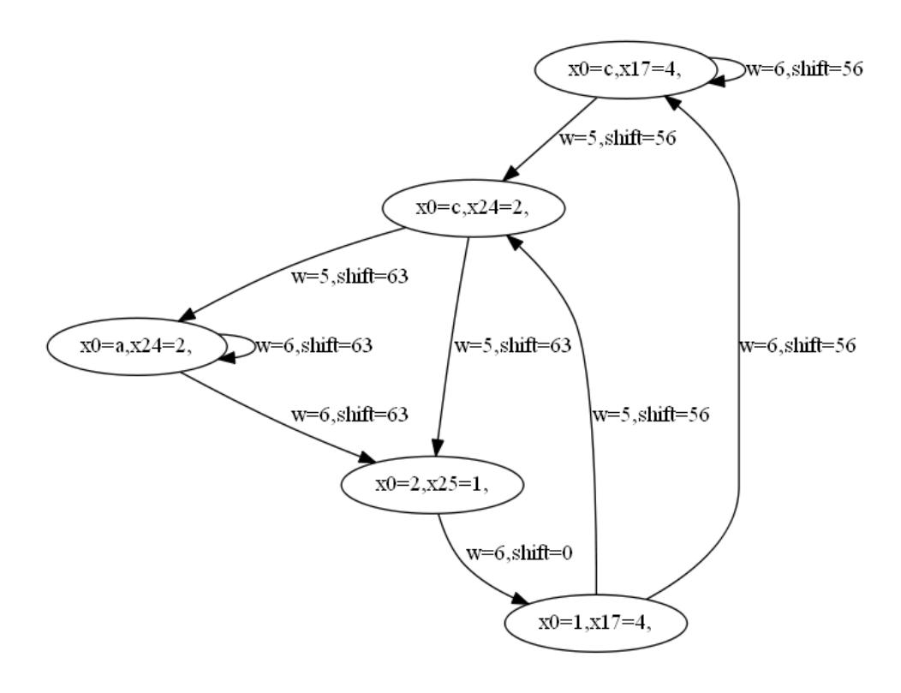
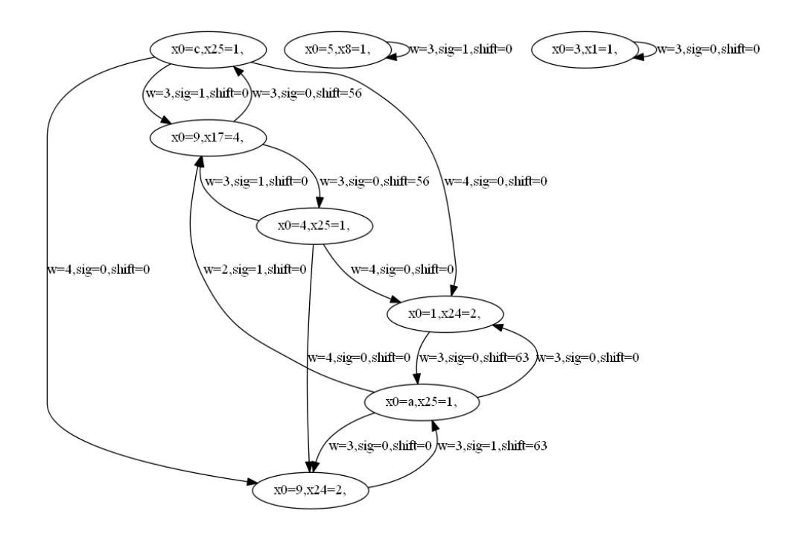
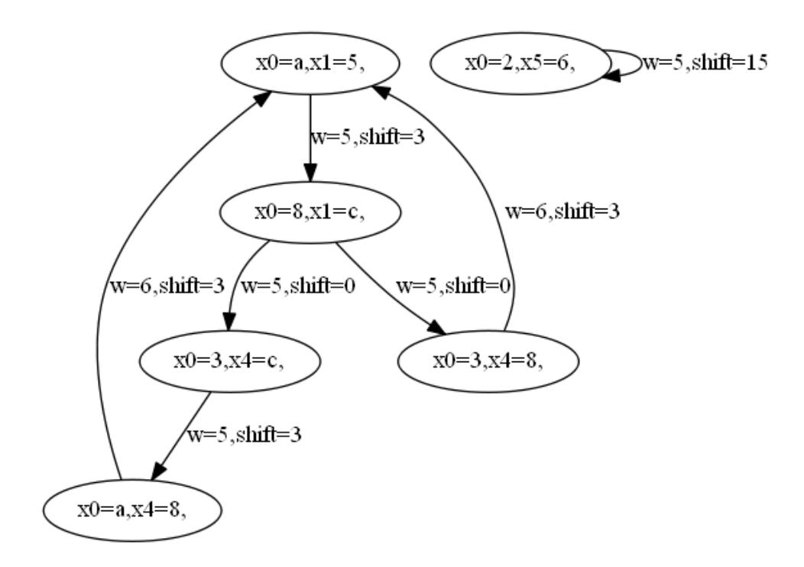
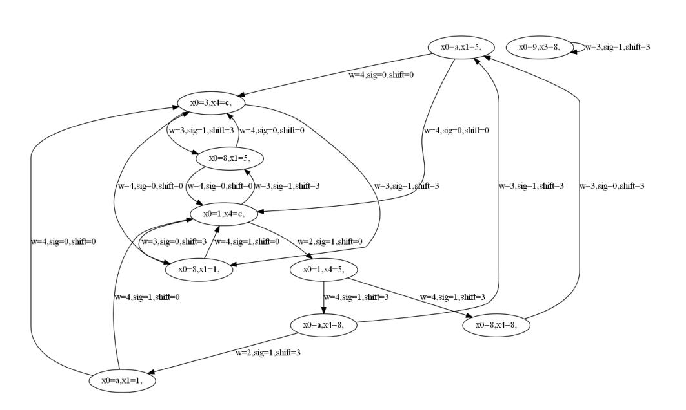
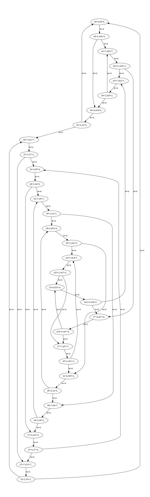
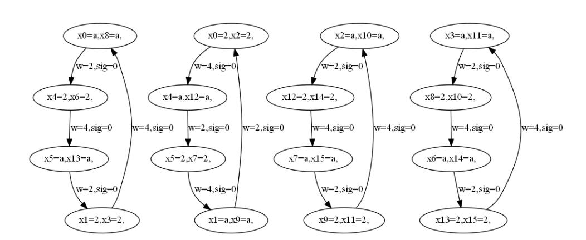

{0}------------------------------------------------

# **An Automatic Search Tool for Iterative Trails and its Application to estimation of differentials and linear hulls**

Tianyou Ding1*,*<sup>2</sup> , Wentao Zhang1*,*<sup>2</sup> , Chunning Zhou1*,*<sup>2</sup> , and Fulei Ji1*,*<sup>2</sup>

<sup>1</sup> State Key Laboratory of Information Security, Institute of Information Engineering, Chinese Academy of Sciences, Beijing, China {dingtianyou, zhangwentao, zhouchunning, jifulei}@iie.ac.cn <sup>2</sup> School of Cyber Security, University of Chinese Academy of Sciences, Beijing, China

**Abstract.** The design and cryptanalysis are the both sides from which we look at symmetric-key primitives. If a symmetric-key primitive is broken by a kind of cryptanalysis, it's definitely insecure. If a designer claims a symmetric-key primitive to be secure, one should demonstrate that the primitive resists against all known attacks. Differential and linear cryptanalysis are two of the most important kinds of cryptanalysis. To conduct a successful differential (linear) cryptanalysis, a differential (linear) distinguisher with significant differential probability (linear correlation) is needed.

We observe that, for some lightweight symmetric-key primitives, their significant trails usually contain iterative trails. In this work, We propose an automatic tool for searching iterative trails. We model the problem of searching itrative trails as a problem of finding elementry ciucuits in a graph. Based on the iterative trails found, we further propose a method to estimate the probability (correlation) of a differential (linear hull). We apply our methods to the 256-bit KNOT permutation, PRESENT, GIFT-64 and RECTANGLE. Iterative trails are found and visualized. If iterative trails are found, we show our method can efficiently find good differentials and linear hulls. What's more, the results imply that for the primitives we test with bit permutations as their linear layers, the good differentials and linear hulls are dominated by iterative trails.

**Keywords:** Differential Cryptanalysis · Linear Cryptanalysis · Automatic Search Tools · Iterative Trails · Lightweight Cryptography

# **1 Introduction**

Differential cryptanalysis (DC) [6, 7] and linear cryptanalysis (LC) [17, 18] are two of the most powerful attacks against modern block ciphers. In 1990, Biham and Shamir introduced differential cryptanalysis and successfully attacked the full-round DES[7]. In 1991, they improved the attack with 2 <sup>47</sup> chosen plaintexts[7]. In 1993, Matsui introduced linear cryptanalysis and succeeded in breaking DES with 2 <sup>47</sup> known plaintexts[17]. In 1994, Matsui improved the data complexity to 2 <sup>43</sup>[18]. Cryptanalysis also drives the design of ciphers in return. In 

{1}------------------------------------------------

2001, Rijmen and Daemon proposed the wide trail design strategy[12], providing provable security against DC and LC for AES winner Rijndael[11]. With increasing number of symmetric cryptographic primitives emerging, every well-designed block cipher must resist against DC and LC in the first place. To conduct the differential or linear attack, an adversary expects to find exploitable differential or linear distinguishers. Usually, the probability of the best differential trail and the correlation (or bias) of the best linear trail are respectively used as the indices to the resistance against DC and LC. The two main kinds of the automatic search tools for the best differential and linear trails are dedicated tree search algorithms [19, 21, 1, 8] and mathematical-solver-based methods [20, 23, 24, 29]. In this article, we focus on the dedicated search algorithms.

In 1994, Matsui proposed a branch-and-bound depth-first tree search algorithm for searching the best differential or linear trail of DES[19]. In 1995, Moriai et al. introduced the concept of search pattern to reduce unnecessary search candidates, which improves the performance of searching the best trail of FEAL[21]. In 1997, Aoki et al. further improved the performance by using a pre-search for impossible search patterns[1]. In 2014, Bao et al. proposed new strategies including starting from the narrowest point, concretizing and grouping search patterns and trailing in minimal changes order, achieving significant efficiency improvement on NOEKEON and Spongent[8]. Dobraunig et al. [9] proposed a stack-based depth-first search algorithm characterizing in guessing sbox by sbox or bit by bit instead of round by round in Matsui's algorithm. Hall-Andersen et al. [14] modeled the trail search problem as a graph problem and managed to obtain results on clustering effect for many ciphers.

Besides automatically searching the best differential or linear trail, iterative trails are used to construct long-round significant trails in order to efficiently obtain exploitable trails for cryptanalysis. Iterative trails refer to trails that have the same input and output difference (or mask) and thus they can concatenate to themselves. Biham and Shamir used iterative differential characteristics to cryptanalyze DES with an arbitrary number of rounds[6, 7]. Knudsen examined the 2 iterative characteristics found in [6, 7] and found additional 3 iterative characteristics for DES[16]. Wang et al. found a 4-round iterative differential characteristic for PRESENT by which a 14-round significant differential characteristic is constructed[26].

### **Our Contribution**

1. We propose a new automatic search tool for iterative trails applying to permutations or block ciphers based on S-boxes. By restricting the number of active S-boxes of a difference or mask value, we model 1-round differentials or linear hulls as a graph. Using an algorithm finding all elementary circuits [15], we find all iterative trails. The found iterative trails can be described and visualized through a subgraph. Further using the subgraph, we propose an algorithm to estimate the probabilities of differentials and correlations of linear hulls.

{2}------------------------------------------------

- 2. For PRESENT, GIFT-64 and RECTANGLE, the results of EDP and ELP are not better but close to the results in [14]. However our method costs much less time. What's more, the results implies that the good differentials and linear hulls are dominated by iterative trails for these ciphers.
- 3. The inner permutations of KNOT, which is an NIST LWC round 2 candidate, are inheritors of RECTANGLE. For 256-bit KNOT permutation, we can find good differentials up to 52 rounds and good linear hulls up to 51 rounds, the number of rounds increasing by 4 rounds and 6 rounds respectively compared to the result obtained by only considering single trails.

**Organization** The paper is organized as follows. Section 2 introduces concepts and notations. Section 3 gives the method modelling the problem of searching for iterative trails to a graph problem and the algorithm estimating the probability (correlation) of differentials (linear hulls). Section 4 shows experimental results. In Section 5, we conlude our work.

# **2 Preliminary**

### **2.1 Differential Trails, Differentials and Truncated Differentials**

Let *β* be an iterative Boolean transformation from F *n* 2 to F *n* 2 :

$$\beta = \rho^{(r)} \circ \rho^{(r-1)} \circ \cdots \circ \rho^{(2)} \circ \rho^{(1)}.$$

A *diffrential trail Q* over *β* consists of a sequence of *r* + 1 differences:

$$Q = (q^{(0)}, q^{(1)}, q^{(2)}, \cdots, q^{(r-1)}, q^{(r)}).$$

The probability of a differential step (*q* (*i−*1)*, q*(*i*) ) is defined as:

$$\operatorname{Prob}^{\rho^{(i)}}(q^{(i-1)}, q^{(i)}) = \operatorname{Prob}_{x}[\rho^{(i)}(x) \oplus \rho^{(i)}(x \oplus q^{(i-1)}) = q^{(i)}] 
= 2^{-n} \times \#\{x \in \mathbb{F}_{2}^{n} | \rho^{(i)}(x) \oplus \rho^{(i)}(x \oplus q^{(i-1)}) = q^{(i)}\}$$

Assuming the independence of the differential steps, the probability of *Q* is:

$$\operatorname{Prob}^{\beta}(Q) = \prod_{i} \operatorname{Prob}^{\rho^{(i)}}(q^{(i-1)}, q^{(i)}).$$

A *differential* of *β* is composed of *r*-round differential trails with the same initial and final differences. The probability of a differential (*a, b*) is the sum of the probabilities of all these differential trails:

$$\operatorname{Prob}^{\beta}(a,b) = \sum_{q^{(0)} = a, q^{(r)} = b} \operatorname{Prob}^{\beta}(Q).$$

Let *λ* be a linear function corresponding to an *n × l* binary matrix *M*. The probabilities of *truncated* differentials of *λ ◦ β* are given by:

$$\operatorname{Prob}^{\lambda \circ \beta}(a, b) = \sum_{\omega \mid b = M\omega} \operatorname{Prob}^{\lambda \circ \beta}(a, \omega).$$

{3}------------------------------------------------

#### 2.2 Linear Trails and Linear Hulls

A linear trail U over  $\beta$  consists of a sequence of r+1 masks:

$$U = (u^{(0)}, u^{(1)}, u^{(2)}, \cdots, u^{(r-1)}, u^{(r)}).$$

The correlation of a linear step  $(u^{(i-1)}, u^{(i)})$  is defined as:

$$\operatorname{Cor}^{\rho^{(i)}}(u^{(i-1)}, u^{(i)}) = 2 \times (\operatorname{Prob}_x[u^{(i-1)} \cdot x = u^{(i)} \cdot \rho^{(i)}(x)] - \frac{1}{2})$$
$$= 2^{-n+1} \times \#\{x \in \mathbb{F}_2^n | u^{(i-1)} \cdot x = u^{(i)} \cdot \rho^{(i)}(x)\} - 1.$$

The correlation of U is:

$$\operatorname{Cor}^{\beta}(U) = \prod_{i} \operatorname{Cor}(u^{(i-1)}, u^{(i)}).$$

A linear hull of  $\beta$  is composed of r-round linear trails with the same initial and final masks. The correlation of a linear hull (a,b) is the sum of the correlations of all these linear trails:

$$\operatorname{Cor}^{\beta}(a,b) = \sum_{u^{(0)} = a, u^{(r)} = b} \operatorname{Cor}(U).$$

A key-alternating cipher  $\beta'$  consists of key-independent round transformations  $\rho^{(i)}$  and simple key addition by means of XOR denoted as  $\sigma[k]$ :

$$\beta' = \sigma[k^{(r)}] \circ \rho^{(r)} \circ \sigma[k^{(r-1)}] \circ \cdots \circ \sigma[k^{(1)}] \circ \rho^{(1)} \circ \sigma[k^{(0)}].$$

For a key-alternating cipher, The amplitude of the correlation of a linear trail is independent of the round keys:

$$\operatorname{Cor}^{\beta'}(U) = (-1)^{u^{(0)} \cdot k^{(0)}} \prod_{i} (-1)^{u^{(i)} \cdot k^{(i)}} \operatorname{Cor}^{\rho^{(i)}}(u^{(i-1)}, u^{(i)}).$$

$$= (-1)^{U \cdot K} \cdot (-1)^{d_U} \left| \prod_{i} \operatorname{Cor}^{\rho^{(i)}}(u^{(i-1)}, u^{(i)}) \right|$$

$$= (-1)^{d_U \oplus U \cdot K} \left| \operatorname{Cor}^{\beta'}(U) \right|,$$

where  $K = (k^{(0)}, k^{(1)}, k^{(2)}, \dots, k^{(r-1)}, k^{(r)}), d_U = 1$  if  $\prod_i \operatorname{Cor}^{\rho^{(i)}}(u^{(i-1)}, u^{(i)}) < 0$  and  $d_U = 0$  otherwise. The correlation of a linear hull (a, b) for a key-alternating cipher is:

$$\operatorname{Cor}^{\beta'}(a,b) = \sum_{u^{(0)}=a, u^{(r)}=b} (-1)^{d_U \oplus U \cdot K} |\operatorname{Cor}^{\beta'}(U)|.$$

We denote the square of a correlation by correlation potential. The average correlation potential between an input and an output mask is the sum of the correlation potentials of all linear trails between the input and output masks:

$$\operatorname{Exp}_{K}[(\operatorname{Cor}^{\beta'}(a,b))^{2}] = \sum_{u^{(0)}=a,u^{(r)}=b} (\operatorname{Cor}^{\beta'}(U))^{2}.$$

{4}------------------------------------------------

#### 2.3 EDP and ELP

The differential probabilities and linear correlations of a cipher  $\mathcal{E}_K$  both depend on the specific key used K. In the case of differential cryptanalysis, EDP (expected differential probability) is defined as:

$$EDP(a, b) = Exp_K[Prob^{\mathcal{E}_K}(a, b)].$$

It is often assumed that

$$\operatorname{Prob}^{\mathcal{E}_K}(a,b) \approx \operatorname{EDP}(a,b)$$

for most keys. In the case of linear cryptanalysis, ELP (expected linear potential) is defined as:

$$\begin{split} \mathrm{ELP}(a,b) &= \mathrm{Exp}_K[(\mathrm{Cor}^{\mathcal{E}_K}(a,b))^2] \\ &= \sum_{u^{(0)}=a,u^{(r)}=b} (\mathrm{Cor}^{\mathcal{E}_K}(U))^2. \end{split}$$

If the cipher is a key-alternating one,  $\mathcal{E}_K = \sigma[k^{(r)}] \circ \rho^{(r)} \circ \sigma[k^{(r-1)}] \circ \cdots \circ \sigma[k^{(1)}] \circ \rho^{(1)} \circ \sigma[k^{(0)}]$ . Let  $\mathcal{E}$  be  $\rho^{(r)} \circ \cdots \circ \rho^{(1)}$  without key addition, then we define:

$$ELP(a,b) = \Big(\sum_{u^{(0)}=a, u^{(r)}=b} Cor^{\mathcal{E}}(U)\Big)^{2}.$$

#### 2.4 Concepts in Graph Theory

A directed graph G(V, E) consists of a nonempty and finite set of vertices V and a set E of ordered pairs of distinct vertices called edges. We denote a directed edge from a vertex  $u \in V$  to a vertex  $v \in V$  by  $u \to v$ . For a weighted graph, each edge  $u \to v$  has a length, denoted as  $l(u \to v)$ . A path  $p_{u,v}$  is a sequence of vertices  $(u = v_1, v_2, \dots, v_{k-1}, v = v_k)$  such that  $v_i \to v_{i+1} \in E$ . The length of the path is

$$l(p_{u,v}) = k - 1,$$

the weight of the path is

$$w(p_{u,v}) = \prod_{i=1}^{k-1} l(v_i \to v_{i+1}).$$

The set of all paths  $p_{u,v}$  is called the *hull* of (u,v). The hull is denoted as  $h_{u,v}$  and its weight is defined as:

$$w(h_{u,v}) = \sum w(p_{u,v}),$$

i.e. the sum of the lengths of all the path contained in the hull. A *circuit* is a path in which the first and last vertices are identical. A circuit is *elementary* if no vertex but the first and last appears twice. Two elementary circuits are distinct if one is not a cyclic permutation of the other.

{5}------------------------------------------------

# 3 Searching for Iterative Trails and Estimation of Differentials and Linear Hulls

#### 3.1 Definition of Iterative Trails

**Definition 1 (Iterative Trails).** A differential or linear trail  $(v^{(0)}, \dots, v^{(r)})$  is iterative if  $v^{(0)} = v^{(r)}$ .

**Definition 2 (Elementry Iterative Trails).** An iterative differential or linear trail  $(v^{(0)}, \dots, v^{(r)} = v^{(0)})$  is elementry if  $v^{(i)} \neq v^{(j)}, \forall i, j \in [0, r-1]$ .

### 3.2 Modelling 1-round Differentials and Linear Hulls Using Graph

In a directed graph, each vertex can be associated with a difference or mask value. Given the round transformation F of an iterative block cipher or permutation  $\mathcal{E}$ , a weighted directed graph  $G_F = (V_F, E_F)$  can be generated to describe the 1-round differentials or linear hulls of F.  $G_F$  has  $2^n$  vertices representing the elements of  $\mathbb{F}_2^n$ .  $G_F$  contains all edges  $u \to v$  for  $u, v \in \mathbb{F}_2^n$  of which weight is not zero. In the case of differential cryptanalysis, the weight of an edge is defined as:

$$w(u \to v) = \operatorname{Prob}^F(u, v).$$

In the case of linear cryptanalysis, if  $\mathcal{E}$  is a block cipher, the weight of an edge is defined as:

$$w(u \to v) = (\operatorname{Cor}^F(u, v))^2;$$

else if  $\mathcal{E}$  is a permutation, the weight is defined as:

$$w(u \to v) = \operatorname{Cor}^F(u, v).$$

#### 3.3 Searching for Iterative Trails

According to the definition of circuits and iterative trails, the elementry iterative trails of  $\mathcal{E}$  can be viewed as elementry circuits in  $G_F$ . Applying Johnson's algorithm in [15], we can list all the elementry circuits in  $G_F$ . However, if  $V_F = \mathbb{F}_2^n$ , the size of  $V_F$  is  $2^n$  which is too large. In order to limit the size of  $V_F$ , we set a parameter  $max\_asn$  which is defined as the maximum active S-boxes that a vertex can has. That is, given an SPN round transformation F and the parameter  $max\_asn$ ,  $G_{F,max\_asn} = (V_{F,max\_asn}, E_{F,max\_asn})$  is a subgraph of  $G_F$ . The set of vertices is given by

$$V_{F,max\_asn} = \{u | \operatorname{Asn}(u) \le max\_asn \text{ and } u \in V_F\}$$

where  $Asn(\cdot)$  is a function returns the number of active S-boxes of its input. The set  $E_{F,max\_asn}$  of weighted edges between any two vertices in  $V_{F,max\_asn}$  is given according to the method in the last subsection.

{6}------------------------------------------------

Applying Johnson's algorithm to  $G_{F,max\_asn}$ , we can obtain a set of elementry circuits

$${p_{uv}|u=v \text{ and } v^{(i)} \neq v^{(j)}, \forall i, j \in [0, r-1]},$$

in which each element represent an elementry iterative trails for F.

We extract every vertex that lies in at least one elementry circuit and denote the set of vertices as  $V_{F,max\_asn}^{IT}$ .  $V_{F,max\_asn}^{IT}$  is a subset of  $V_{F,max\_asn}$  and it forms a subgraph  $G_{F,max\_asn}^{IT} = (V_{F,max\_asn}^{IT}, E_{F,max\_asn}^{IT})$  of  $G_{F,max\_asn}$ .

### 3.4 Finding Differential Trails and Linear Trails

For any trail based on iterative trails, it can be treated as three parts: the extension backward, the iterative trail and the extension forward. The 14-round differential trail of PRESENT found in [26] is shown in Table 1. It is constructed by concatenating a 4-round iterative trail to itself two times and extending both forward and backward by 1 round. Thus the subtrail from round 0 to round 1 is the extension backward part, the one from round 1 to round 13 is the iterative trail part and the one from round 13 to round 14 is the extension forward part. In the following, we try to compute the largest probability a trail of such type can has based on  $G_{F,max\_asn}^{IT}$ .

| Table 1. A | 14-round | differential | trail | of PRESENT |
|------------|----------|--------------|-------|------------|
|------------|----------|--------------|-------|------------|

| Round | Diffference             | Prob.    |
|-------|-------------------------|----------|
| 0     | $x_2 = 7, x_{14} = 7$   |          |
| 1     | $x_0 = 4, x_3 = 4$      | $2^{-4}$ |
| 2     | $x_0 = 9, x_8 = 9$      | $2^{-4}$ |
| 3     | $ x_8 = 1, x_{10} = 1 $ | $2^{-4}$ |
| 4     | $x_2 = 5, x_{14} = 5$   | $2^{-4}$ |
| 5     | $x_0 = 4, x_3 = 4$      | $2^{-6}$ |
| 6     | $x_0 = 9, x_8 = 9$      | $2^{-4}$ |
| 7     | $ x_8 = 1, x_{10} = 1 $ | $2^{-4}$ |
| 8     | $x_2 = 5, x_{14} = 5$   | $2^{-4}$ |
| 9     | $x_0 = 4, x_3 = 4$      | $2^{-6}$ |
| 10    | $x_0 = 9, x_8 = 9$      | $2^{-4}$ |
| 11    | $x_8 = 1, x_{10} = 1$   | $2^{-4}$ |
| 12    | $x_2 = 5, x_{14} = 5$   | $2^{-4}$ |
| 13    | $x_0 = 4, x_3 = 4$      | $2^{-6}$ |
| 14    | $x_0 = 9, x_8 = 9$      | $2^{-4}$ |

Let  $B_{u,i}^F$  be the largest probability (correlation) that an i-round differential (linear) trail starting from u can has,  $u \in V_{F,max\_asn}^{IT}$ . Let  $B_{u,i}^{F^{-1}}$  be the largest probability (correlation) that an i-round differential (linear) trail ending with u can has,  $u \in V_{F,max\_asn}^{IT}$ . Given parameters  $r^F$  and  $r^{F^{-1}}$  which represent the number of rounds to be extended forward and backward, we can obtain  $B_{u,i}^F$ ,  $i \in [0, r^F]$  and  $B_{u,j}^{F^{-1}}$ ,  $j \in [0, r^{F^{-1}}]$  for each  $u \in V_{F,max\_asn}^{IT}$  using Matsui's

{7}------------------------------------------------

branch-and-bound depth-first search algorithm. Based on iterative trails, the largest probability (correlation)  $B_r$  that a single r-round trail can has is

$$B_r = \max_{\substack{p_{u,v} \in E_{F,max\_asn}^{IT} \\ r_1 + l(p_{u,v}) + r_2 = r \\ 0 \le r_1 \le r^{F-1}, 0 \le r_2 \le r^F}} B_{u,r_1}^{F^{-1}} \times w(p_{u,v}) \times B_{v,r_2}^F.$$

To obtain  $B_r$ , instead of traversing all  $p_{u,v}$ , we use dynamic programming. See Algorithm 1.

#### 3.5 Finding Differentials and Linear Hulls

Let  $w_{u,v,i}^F$  be the probability (correlation) of the *i*-round differential (linear hull) (u,v) where  $u \in V_{F,max\_asn}^{IT}$ . Let  $w_{u,v,i}^{F^{-1}}$  be the probability (correlation) of the *i*-round differential (linear hull) (v,u) where  $u \in V_{F,max\_asn}^{IT}$ . Given parameters  $r^F, r^{F^{-1}}$  which represent the maximum number of rounds to be extended forward and backward and parameters  $w^F, w^{F^{-1}}$  which heuristically bounds the probability (correlation) of the extension subtrails. To compute  $w_{u,v,i}^F$  and  $w_{u,v,i}^{F^{-1}}$ , We collect as many extension subtrails as possible using Matsui's branch-and-bound depth-first algorithm. Note that during traversing extension subtrails, we abandon any subtrail that contains any value in  $V_{F,max\_asn}^{IT}$  to avoid duplicate trails in the next step.

In a graph, a hull  $h_{u,v}$  is the set of all paths from u to v. Here, we define a hull  $h_{u,v,r}$  as the set of all paths  $p_{u,v}$  with  $l(p_{u,v}) = r$ . Then its weight is

$$w(h_{u,v,r}) = \sum_{l(p_{u,v})=r} w(p_{u,v}).$$

 $w(h_{u,v,r})$  can be computed using dynamic programming.

Based on iterative trails, the largest probability (correlation)  $BC_r$  that a r-round differential (linear hull) can has is

$$BC_{r} = \max_{\substack{x,y \in \mathbb{F}_{2}^{n} \\ u,v \in V_{F,max\_asn}^{IT} \\ r_{1}+r_{2}+r_{3}=r}} w_{x,u,r_{1}}^{F^{-1}} \times w(h_{u,v,r_{2}}) \times w_{v,y,r_{3}}^{F}.$$

See Algorithm 2.

#### 4 Experiments

#### 4.1 Experiments on Searching for Iterative Trails

We apply our method in Section 3.3 to PRESENT, GIFT-64, RECTANGLE, 256-bit KNOT permutation and ASCON permutation. The results on iterative

{8}------------------------------------------------

### **Algorithm 1** Compute $B_r$

```
Require: r, parameters r^F \leq r, r^{F^{-1}} \leq r, the round function F, G_{F,max\_asn}^{IT}
Ensure: B_r
 1: procedure ComputeB
          /*Phase 1: Compute B^F and B^{F^{-1}}*/
 2:
          for each u \in V_{F,max\_asn}^{IT} do B_{u,0}^F \leftarrow 1, B_{u,0}^{F^{-1}} \leftarrow 1
 3:
 4:
          end for
 5:
          for each u \in V_{F,max\_asn}^{IT} and i \leftarrow 1 : r^F do
BW \leftarrow B_{u,i-1}^F \times \max_{a,b} \operatorname{Prob}^F(a,b)
 6:
 7:
               while not Search(u, i, 0, F, BW) do BW \leftarrow BW \times 2^{-1}
 8:
 9:
               end while
10:
          B_{u,i}^f \leftarrow BW end for
11:
12:
          for each u \in V_{F,max\_asn}^{IT} and i \leftarrow 1 : r^{F^{-1}} do
BW \leftarrow B_{u,i-1}^{F^{-1}} \times \max_{a,b} \operatorname{Prob}^{F^{-1}}(a,b)
13:
14:
               while not Search(u, i, 0, F^{-1}, BW) do BW \leftarrow BW \times 2^{-1}
15:
16:
                end while
17:
               B_{u,i}^{F^{-1}} \leftarrow BW
18:
19:
           end for
           /*Phase 2: Computation using dynamic programming*/
20:
          for each u \in V_{F,max\_asn}^{IT} and i \in [0, r^F] do
21:
               \overline{B^F_{u,i}} \leftarrow B^f_{u,i}
22:
           end for
23:
          24:
25:
           end for
26:
          /*Phase 3: Compute B_r^*/B_r \leftarrow \max_{\substack{i+j=r\\u\in V_{F,max\_asn}^{IT}}} B_{u,i}^{F^{-1}} \times \overline{B_{u,j}^F}
27:
28:
29: end procedure
30: function Search(u, j, w, rf, BW)
           found \leftarrow \text{false}
31:
          for each v such that \operatorname{Prob}^{rf}(u,v) \geq BW \div w \div j \times \max_{a,b} \operatorname{Prob}^{rf}(a,b) do
32:
               w' \leftarrow w \times \operatorname{Prob}^{rf}(u, v)
33:
               if j = 0 then
34:
                     if w' >= BW then
35:
36:
                          BW \leftarrow w', found \leftarrow true
37:
                     end if
38:
                else
                     found \leftarrow found \text{ or Search}(v, j-1, w', rf, BW)
39:
40:
                end if
           end for
41:
           return found
42:
43: end function
```

{9}------------------------------------------------

### **Algorithm 2** Compute $BC_r$

```
Require: r, parameters r^F \leq r, r^{F^{-1}} \leq r, parameters wb^F, wb^{F^{-1}}, the round function
     F, G_{F,max\_asn}^{IT}
Ensure: BC_r
 1: procedure ComputeBC
         /*Phase 1: Compute w^F and w^{F^{-1}}*/
for each u \in V_{F,max\_asn}^{IT} do
w_{u,u,0}^F \leftarrow 1, w_{u,u,0}^b \leftarrow 1
 2:
 3:
 4:
          end for
 5:
         for each u \in V_{F,max\_asn}^{IT} and i \leftarrow 1: r^F do Collect(u, u, r^F, 1, F)
 6:
 7:
 8:
          end for
         for each u \in V_{F,max\_asn}^{IT} and i \leftarrow 1 : r^{F^{-1}} do
 9:
               COLLECT(u, u, r^{F^{-1}}, 1, F^{-1})
10:
          end for
11:
          /*Phase 1: Compute w(h_{u,v,i}) using dynamic programming*/
12:
          for each u, v \in V_{F,max\_asn}^{IT} do
13:
               w(h_{u,v,0}) \leftarrow 1
14:
          end for
15:
          for i \leftarrow 1 : r \text{ do}
16:
               for each u,v \in V_{F,max\_asn}^{IT} do
17:
                   w(h_{u,v,i}) \leftarrow \sum_{x} w(h_{u,x,i-1}) \times w(x \to v)
18:
               end for
19:
          end for
20:
          /*Phase 1: Compute BC_r^*/
21:
          for each possible first subscript index x of w^{F^{-1}} do
22:
               for each possible second subscript index y of w^F do
23:
                   BC_{y,r} \leftarrow \sum_{\substack{r_1+r_2+r_3=r\\u,v\in V_{F,max\_asn}^{IT}}} w_{x,u,r_1}^{F^{-1}} \times w(h_{u,v,r_2}) \times w_{v,y,r_3}^{F}
24:
                   if BC_{y,r} > BC_r then
25:
                        BC_r \leftarrow BC_{y,r}
26:
27:
                    end if
28:
               end for
29:
          end for
30: end procedure
31: procedure Collect(s, x, j, w, rf)
          for each y such that \operatorname{Prob}^{rf}(x,y) \geq wb^{rf} \div w \div (j \times \max_{a,b} \operatorname{Prob}^{rf}(a,b)) do
32:
              w' \leftarrow w + \operatorname{Prob}^{rf}(x, y)
33:
              if w_{s,y,r_f-j}^{rf} exists then
34:
                    w_{s,y,r_{rf}-j}^{rf} \leftarrow w_{s,y,r^{r43}-j}^{rf} \times w'
35:
36:
               else
                    w_{s,y,r_{rf}-j}^{r_J} \leftarrow w'
37:
38:
               end if
39:
               if j \neq 0 then
                   Collect(s, y, j - 1, w', rf)
40:
               end if
41:
          end for
42:
43: end procedure
```

{10}------------------------------------------------

cryptanalysis cipher (*<sup>F</sup>* ) rs. *max*\_*asn <sup>|</sup>VF,max*\_*asn<sup>|</sup> <sup>≤</sup> <sup>n</sup> <sup>|</sup><sup>V</sup> IT F,max*\_*asn |* #ecs. best w/l. time differential (Prob.) KNOT-perm-256 yes 2 8214 - 5 6 5.3 0.3s PRESENT no 2 17256 10 225 463 4.5 2.1s GIFT-64 no 2 19344 - 32 66 5 1.8s RECTANGLE yes 2 1450 - 6 3 5 0.1s ASCON-perm yes 3 3939 - 0 0 - 2.7h linear (Cor.) KNOT-perm-256 yes 2 8229 - 8 10 3 0.4s PRESENT no 1 208 - 27 114223 2 3.6s GIFT-64 no 2 21696 - 16 4 3 2.3s RECTANGLE yes 2 1465 - 10 16 3 0.1s ASCON-perm yes 3 336 - 0 0 - 4.0h

**Table 2.** Results on iterative trails

trails are shown in Table 2. The visualizations of *GIT F,max*\_*asn* are shown in Appendix A.

We consider the smallest weight per length an elementary iterative trail can has (best w/l. in Table 2) as an index describing the growth of iterative differential and linear propagations. We can see that PRESENT has both the weakest growth of iterative differential and linear propagations. The weakest differential iterative trail is exactly the one found by Wang et al.[26].

### **4.2 Experiments on Finding Differential Trails and Linear Trails**

We apply our method in Section 3.4 and 3.5 to PRESENT, GIFT-64, RECT-ANGLE and 256-bit KNOT permutation. The algorithm is run on an Intel Core i7-6700 CPU at 3.40GHz with 16GB RAM. The results for differential cryptanalysis are shown in Table 3. The results for linear cryptanalysis are shown in Table 4. Results for PRESENT, RECTANGLE and GIFT-64 are not better than but close to results in [14], which implies that iterative trails dominate the good differentials and linear hulls of these ciphers. However our method costs much less time. The 256-bit KNOT permutation is used in NIST LWC round 2 candidate KNOT [28], which is a inheritor of RECTANGLE having a larger number of rounds and a larger block size. For the 256-bit KNOT permutation, we are able to find good differentials up to 52 rounds and good linear hulls up to 51 rounds.

| cipher        | rounds r | , rF −1<br>F |     | Prob Time r | , rF −1<br>, wF −1<br>F<br>, wF | EDP    | Time             |
|---------------|----------|--------------|-----|-------------|---------------------------------|--------|------------------|
| PRESENT       | 14       | 3,3          | 62  | <1s         | 3,13,3,13                       |        | 54.9879 425.15s  |
| PRESENT       | 17       | -            | -   | -           | 3,13,3,13                       |        | 62.6897 498.513s |
| RECTANGLE     | 13       | 6,6          | 56  | 1.2s        | 6,25,6,25                       |        | 55.6601 12007.5s |
| GIFT-64       | 13       | 3,3          | 62  | <1s         | 3,13,3,13                       | 60.415 | 32.365s          |
| KNOT-perm-256 | 48       | 3,3          | 252 | <1s         | 3,13,3,13                       |        | 232.591 19.536s  |
| KNOT-perm-256 | 52       | 3,3          | 274 | <1s         | 3,13,3,13                       |        | 251.831 20.407s  |

**Table 3.** Results for differential cryptanalysis

rs.: whether the cipher has the property of rotational symmetry

*<sup>≤</sup> n*: the length of any elementary circuit is restricted to no more than *n* #ecs.: number of elementary circuits

best w/l.: the smallest weight/length that an elementary circuit can has

{11}------------------------------------------------

| cipher        | rounds r | , rF −1<br>F |     | Cor2 Time | , rF −1<br>, wF −1<br>F<br>, wF<br>r | ELP     | Time             |
|---------------|----------|--------------|-----|-----------|--------------------------------------|---------|------------------|
| PRESENT       | 17       | 3,3          | 64  | <1s       | 3,8,3,8                              | 45.6582 | <1s              |
| PRESENT       | 23       | 3,3          | 92  | <1s       | 3,8,3,8                              | 61.1404 | <1s              |
| PRESENT       | 24       | 3,3          | 96  | <1s       | 3,8,3,8                              | 63.7519 | <1s              |
| RECTANGLE     | 13       | 5,5          | 62  | <1s       | 5,20,5,20                            |         | 59.6377 337.195s |
| GIFT-64       | 12       | 3,3          | 64  | <1s       | 3,13,3,13                            | 64      | <1s              |
| KNOT-perm-256 | 45       | 3,3          | 256 | <1s       | 3,7,3,7                              | 222     | 100.892s         |
| KNOT-perm-256 | 51       | 3,3          | 292 | <1s       | 3,7,3,7                              | 252     | 111.763s         |

**Table 4.** Results for linear cryptanalysis

# **5 Conclusion**

In this work, we propose a new automatic tool to search for iterative trails for symmetric-key primitives based on S-boxes. We visualize the graph representation of iterative trails hoping to provide additional insignts. Based on the iterative trails, we efficiently estimate the probabilities of differentials and correlations of linear hulls. The results show that for ciphers with bit permutations we conduct experiments on, the good differentials and linear hulls are dominated by iterative trails.

We have conducted an initial study on ASCON permutation. For its comparatively strong diffusion layer, iterative trails are difficult to be found.

A question raised for designers is that, whether a cipher with bit permutation as its linear layer can have no iterative trails.

In the extension phase of Algorithm 2, the bounds *w <sup>F</sup> , w<sup>F</sup> −*1 set in the collection procedure is heuristic. One can loose the bounds to obtain more accurate results but costing more time and memory. One can also heuristically alter the way how the bounds restrict trails. What's more, Our methods are also expected to be appliable for lightweight Feistel ciphers by regarding two Feistel rounds as one round. We leave these for future work.

# **References**

- 1. Aoki, K., Kobayashi, K., Moriai, S. (1997, January). Best differential characteristic search of FEAL. In International Workshop on Fast Software Encryption (pp. 41- 53). Springer, Berlin, Heidelberg.
- 2. Bertoni, G., Daemen, J., Peeters, M., Van Assche, G. (2012). Permutation-based encryption, authentication and authenticated encryption. Directions in Authenticated Ciphers, 159-170.
- 3. Bertoni, G., Daemen, J., Peeters, M., Van Assche, G., Van Keer, R. (2014). CAESAR submission: Ketje v2. CAESAR First Round Submission, March.
- 4. Bogdanov, A., Knudsen, L. R., Leander, G., Paar, C., Poschmann, A., Robshaw, M. J., ... Vikkelsoe, C. (2007, September). PRESENT: An ultra-lightweight block cipher. In International workshop on cryptographic hardware and embedded systems (pp. 450-466). Springer, Berlin, Heidelberg.

{12}------------------------------------------------

- 5. Banik S, Pandey SK, Peyrin T, Sasaki Y, Sim SM, Todo Y. GIFT: a small present. InInternational Conference on Cryptographic Hardware and Embedded Systems 2017 Sep 25 (pp. 321-345). Springer, Cham.
- 6. Biham E, Shamir A. Differential cryptanalysis of DES-like cryptosystems. Journal of CRYPTOLOGY. 1991 Jan 1;4(1):3-72.
- 7. Biham E, Shamir A. Differential cryptanalysis of the full 16-round DES. InAnnual International Cryptology Conference 1992 Aug 16 (pp. 487-496). Springer, Berlin, Heidelberg.
- 8. Bao Z, Zhang W, Lin D. Speeding up the search algorithm for the best differential and best linear trails. In International Conference on Information Security and Cryptology 2014 Dec 13 (pp. 259-285). Springer, Cham.
- 9. Dobraunig C, Eichlseder M, Mendel F. Heuristic tool for linear cryptanalysis with applications to CAESAR candidates[C]//International Conference on the Theory and Application of Cryptology and Information Security. Springer, Berlin, Heidelberg, 2015: 490-509.
- 10. Dobraunig C, Eichlseder M, Mendel F, Schläffer M. Ascon v1.2. Submission to the CAESAR Competition. 2016 Sep 15.
- 11. Daemen J, Rijmen V. The block cipher Rijndael. InInternational Conference on Smart Card Research and Advanced Applications 1998 Sep 14 (pp. 277-284). Springer, Berlin, Heidelberg.
- 12. Daemen J, Rijmen V. The wide trail design strategy[C]//IMA International Conference on Cryptography and Coding. Springer, Berlin, Heidelberg, 2001: 222-238.
- 13. Daemen J, Rijmen V. The design of Rijndael[M]. New York: Springer-verlag, 2002.
- 14. Hall-Andersen, M., & Vejre, P. S. (2018). Generating Graphs Packed with Paths Estimation of Linear Approximations and Differentials. IACR Transactions on Symmetric Cryptology, 2018(3), 265-289.
- 15. Johnson DB. Finding all the elementary circuits of a directed graph. SIAM Journal on Computing. 1975 Mar;4(1):77-84.
- 16. Knudsen LR. Iterative Characteristics of DES and s 2-DES. InAnnual International Cryptology Conference 1992 Aug 16 (pp. 497-511). Springer, Berlin, Heidelberg.
- 17. Matsui M. Linear cryptanalysis method for DES cipher. InWorkshop on the Theory and Application of of Cryptographic Techniques 1993 May 23 (pp. 386-397). Springer, Berlin, Heidelberg.
- 18. Matsui M. The first experimental cryptanalysis of the Data Encryption Standard. InAnnual International Cryptology Conference 1994 Aug 21 (pp. 1-11). Springer, Berlin, Heidelberg.
- 19. Matsui M. On correlation between the order of S-boxes and the strength of DES. InWorkshop on the Theory and Application of of Cryptographic Techniques 1994 May 9 (pp. 366-375). Springer, Berlin, Heidelberg.
- 20. Mouha N, Wang Q, Gu D, Preneel B. Differential and linear cryptanalysis using mixed-integer linear programming. InInternational Conference on Information Security and Cryptology 2011 Nov 30 (pp. 57-76). Springer, Berlin, Heidelberg.
- 21. Ohta K, Moriai S, Aoki K. Improving the search algorithm for the best linear expression. InAnnual International Cryptology Conference 1995 Aug 27 (pp. 157- 170). Springer, Berlin, Heidelberg.
- 22. Rogaway P. Nonce-based symmetric encryption. InInternational Workshop on Fast Software Encryption 2004 Feb 5 (pp. 348-358). Springer, Berlin, Heidelberg.
- 23. Sun S, Hu L, Wang P, Qiao K, Ma X, Song L. Automatic security evaluation and (related-key) differential characteristic search: application to SIMON, PRESENT, LBlock, DES (L) and other bit-oriented block ciphers. InInternational Conference

{13}------------------------------------------------

- on the Theory and Application of Cryptology and Information Security 2014 Dec 7 (pp. 158-178). Springer, Berlin, Heidelberg.
- 24. Sun S, Hu L, Wang M, Wang P, Qiao K, Ma X, Shi D, Song L, Fu K. Towards finding the best characteristics of some bit-oriented block ciphers and automatic enumeration of (related-key) differential and linear characteristics with predefined properties. IACRCryptology ePrint Archive. 2014;747:2014.
- 25. Vajnovszki V. A loopless algorithm for generating the permutations of a multiset. Theoretical Computer Science. 2003 Oct 7;307(2):415-31.
- 26. Wang M. Differential cryptanalysis of reduced-round PRESENT. InInternational Conference on Cryptology in Africa 2008 Jun 11 (pp. 40-49). Springer, Berlin, Heidelberg.
- 27. Zhang W, Bao Z, Lin D, Rijmen V, Yang B, Verbauwhede I. RECTANGLE: a bit-slice lightweight block cipher suitable for multiple platforms. Science China Information Sciences. 2015 Dec 1;58(12):1-5.
- 28. Wentao Zhang, Tianyou Ding, Bohan Yang, Zhenzhen Bao, Zejun Xiang, Fulei Ji, Xuefeng Zhao. KNOT: Algorithm Specifications and Supporting Document. https://csrc.nist.gov/CSRC/media/Projects/lightweightcryptography/documents/round-2/spec-doc-rnd2/knot-spec-round.pdf
- 29. Zhou C, Zhang W, Ding T, Xiang Z. Improving the MILP-based Security Evaluation Algorithms against Differential Cryptanalysis Using Divide-and-Conquer Approach. IACR Cryptology ePrint Archive. 2019;2019:19.

#### **A Visualization of** *GIT F,max***\_***asn*



**Fig. 1.** the differential iterative structure of KNOT-permutation-256

{14}------------------------------------------------



**Fig. 2.** the linear iterative structure of KNOT-permutation-256



**Fig. 3.** the differential iterative structure of RECTANGLE

{15}------------------------------------------------



**Fig. 4.** the linear iterative structure of RECTANGLE

{16}------------------------------------------------



**Fig. 5.** the differential iterative structure of GIFT

{17}------------------------------------------------



**Fig. 6.** the linear iterative structure of GIFT