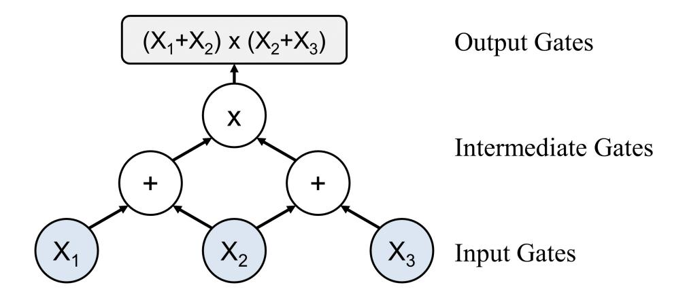
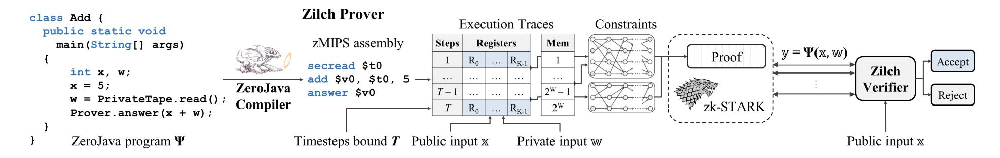
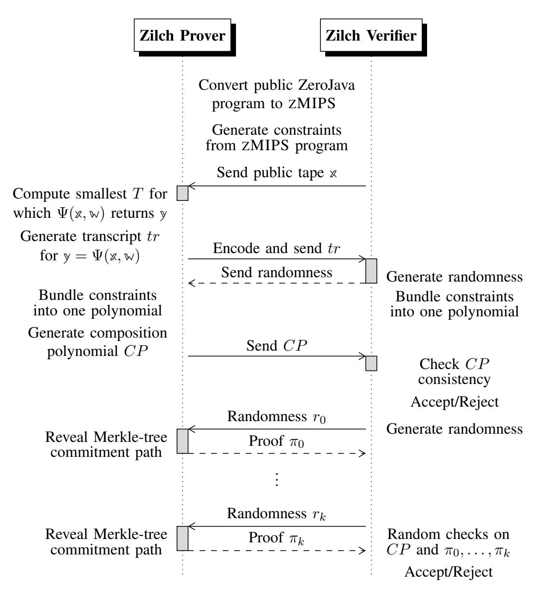
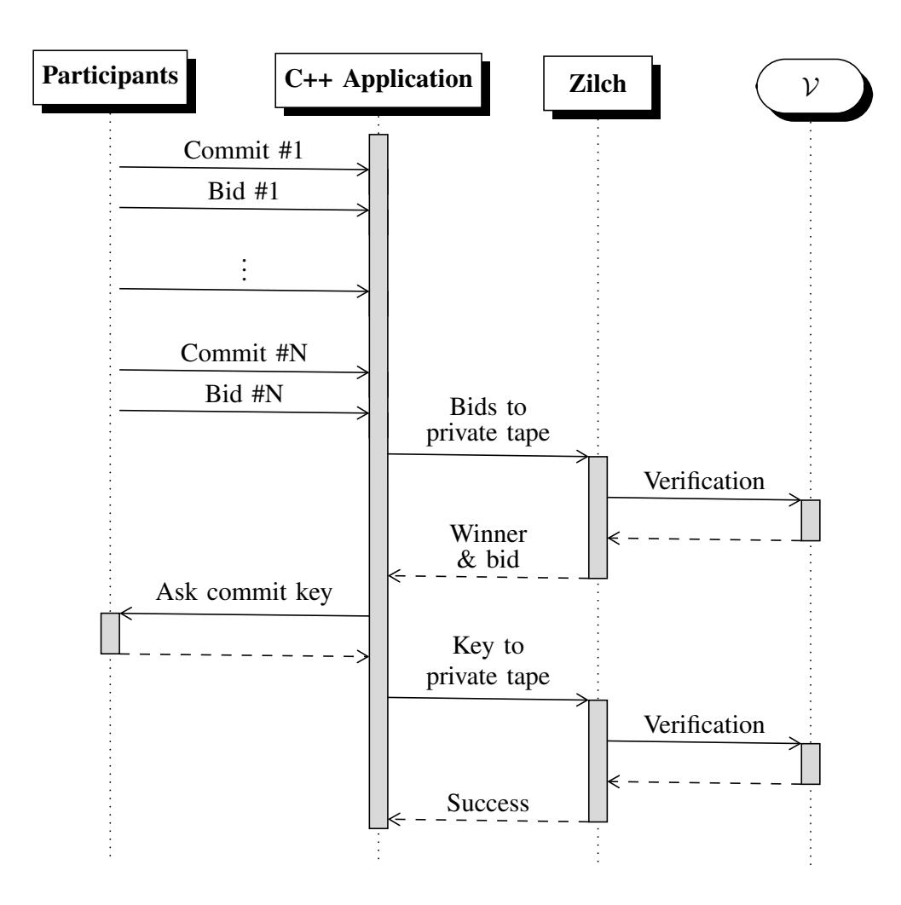
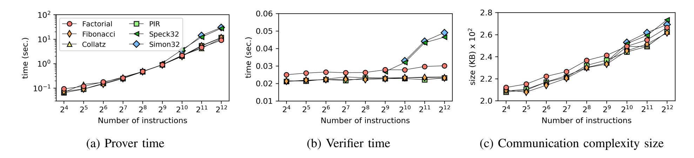
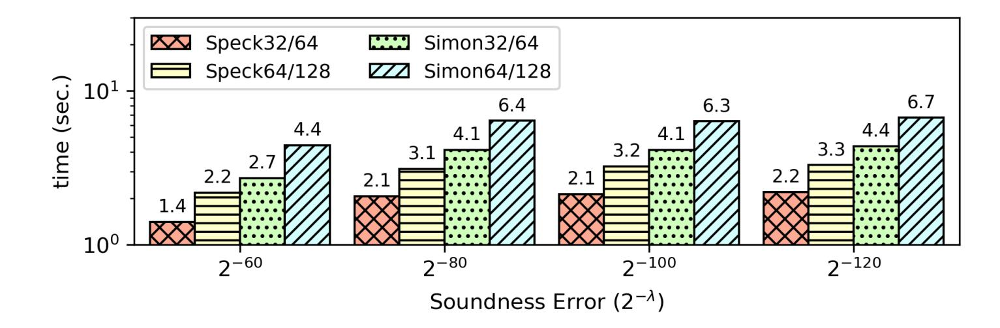
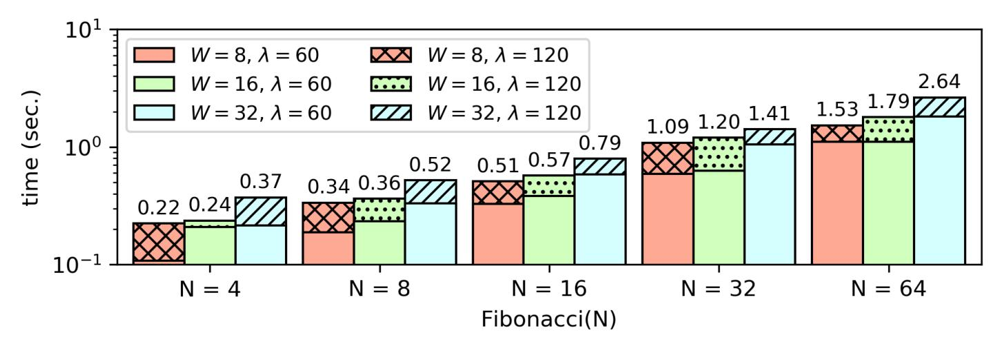
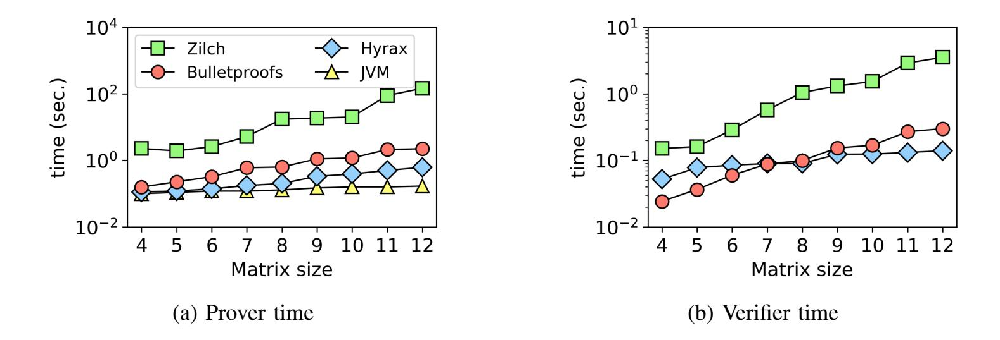

{0}------------------------------------------------

# <span id="page-0-0"></span>Zilch: A Framework for Deploying Transparent Zero-Knowledge Proofs

Dimitris Mouris and Nektarios Georgios Tsoutsos

#### Abstract

As cloud computing becomes more popular, research has focused on usable solutions to the problem of verifiable computation (VC), where a computationally weak device (Verifier) outsources a program execution to a powerful server (Prover) and receives guarantees that the execution was performed faithfully. A Prover can further demonstrate knowledge of a secret input that causes the Verifier's program to satisfy certain assertions, without ever revealing which input was used. State-of-the-art *Zero-Knowledge Proofs of Knowledge* (ZKPK) methods encode a computation using arithmetic circuits and preserve the privacy of Prover's inputs while attesting the integrity of program execution. Nevertheless, developing, debugging and optimizing programs as circuits remains a daunting task, as most users are unfamiliar with this programming paradigm.

In this work we present Zilch, a framework that accelerates and simplifies the deployment of VC and ZKPK for any application *transparently*, i.e., without the need of trusted setup. Zilch uses traditional instruction sequences rather than static arithmetic circuits that would need to be regenerated for each different computation. Towards that end we have implemented ZMIPS: a MIPS-like processor model that allows verifying each instruction independently and compose a proof for the execution of the target application. To foster usability, Zilch incorporates a novel cross-compiler from an object-oriented Javalike language tailored to ZKPK and optimized our ZMIPS model, as well as a powerful API that enables integration of ZKPK within existing C/C++ programs. In our experiments, we demonstrate the flexibility of Zilch using two real-life applications, and evaluate Prover and Verifier performance on a variety of benchmarks.

#### I. INTRODUCTION

Cloud computing offers on-demand computational power, emerging as an ideal solution for outsourcing computation from relatively weak devices (phones, laptops, IoT). However, delegating computation to

D. Mouris and N. G. Tsoutsos are with the Department of Electrical and Computer Engineering, University of Delaware, Newark, DE. E-mail: {jimouris, tsoutsos}@udel.edu

{1}------------------------------------------------

an untrusted third-party running unreliable software, and potentially untested – or malicious [\[1\]](#page-31-0), [\[2\]](#page-32-0) – hardware, comes with many risks [\[3\]](#page-32-1). Data may even be corrupted while at rest [\[4\]](#page-32-2), or in transit. Moreover, cloud service providers may have monetary incentives to either skip computation steps (e.g., skip computing all decimal points on a big number) or completely counterfeit a result. *How can we trust the results computed by the cloud and be assured that the computation was carried out faithfully?*

Verifiable Computation (VC) leverages mathematical and cryptographic primitives, such as probabilistically checkable proofs (PCPs) [\[5\]](#page-32-3), [\[6\]](#page-32-4), interactive proofs [\[7\]](#page-32-5)–[\[11\]](#page-32-6) and commitment-based argument schemes [\[12\]](#page-32-7)–[\[17\]](#page-32-8), to provide strong guarantees to a client on the correct evaluation of a statement in NP. In these schemes, one party P (the prover) generates and commits to a proof that the computation was executed faithfully and another party V (the verifier) performs unpredictable tests to efficiently check the integrity of the execution. Given an honest P, these tests can convince V. Conversely, a faulty execution would be noticed by the verifier with very high probability. Intuitively, in such protocols the overhead for the prover and the complexity of performing the tests for V should be less than the whole execution on the computationally-weak device; i.e., the verifiable outsourcing is practical. Numerous systems [\[18\]](#page-32-9)–[\[20\]](#page-32-10) strive to bring verifiable outsourcing one step closer to practicality.

A notable extension to verifiable computation is to enable the prover to apply the computation on a set of secret inputs – also called *witness* – which are never revealed to V. This approach, known as a *zero-knowledge proof* (ZKP), allows the prover to convince the verifier that she knows a secret without actually disclosing it [\[21\]](#page-32-11)–[\[24\]](#page-32-12). For instance, ZKPs can be leveraged to log-in to a website without typing a password by simply sending a proof that you "know the valid password". ZKP-based authentication eliminates the need for maintaining server-side password databases, sending passwords via unsafe channels, having to digitally sign challenge messages that could later be misused, or even having to disclose an intellectual property for functional verification [\[25\]](#page-32-13).

Although ZKPs and VC have numerous applications, many state-of-the-art solutions (e.g., [\[19\]](#page-32-14), [\[21\]](#page-32-11)– [\[23\]](#page-32-15), [\[26\]](#page-32-16)) suffer from a severe limitation: they require a trusted authority to generate the public parameters for the system and then eliminate any knowledge of the randomness used to generate them (referred to as *toxic waste*). A malicious third-party that obtains access to that toxic waste can forge false proofs and trick an honest verifier. Having a single point of failure in VC and ZKP systems that rely on cryptographic primitives seems contradictory. As a result, systems that use public randomness and thus have a *transparent setup* have been proposed [\[27\]](#page-32-17)–[\[33\]](#page-33-0). Likewise, the works in [\[34\]](#page-33-1), [\[35\]](#page-33-2) provide constructions leveraging updatable common reference strings (CRS).

Another observation about the computational model followed by most VC and ZKP systems is the need to express computer programs as arithmetic circuits, or equivalently as a set of arithmetic constraints over 

{2}------------------------------------------------

a finite field **F**. Works such as [\[18\]](#page-32-9), [\[21\]](#page-32-11), [\[24\]](#page-32-12) provide a compiler from a high-level language (typically a subset of C) to arithmetic circuits, however, they require the circuit to be fixed offline during the trusted setup phase. Notably, this conversion is laborious as it is hard to express arbitrary algorithms using arithmetic circuits and even harder to edit, debug, or optimize these VC circuits without deep knowledge of cryptography and circuit design. Furthermore, these circuits are program-specific and cannot be reused to verify other programs, which renders them non-universal. An alternative is to employ a Random Access Machine model that provides a low-level language, such as TinyRAM [\[23\]](#page-32-15), that can define a universal circuit. However, program development using such esoteric machine models without high-level toolchain support still requires significant effort from a programmer's perspective.

Unfortunately, neither of these models of computation is natural for most non-crypto savvy programmers. Thus, an important objective in this work is to develop a methodology for verifiable computation and zero-knowledge proofs of knowledge using a convenient programming model that does not rely on any trusted third party. Our approach is to leverage a programming model that is based on a *sequence of instructions* instead of a circuit netlist. At the same, an additional goal is to optimize performance while ensuring programming convenience.

The main contribution of this work is the development of Zilch[1](#page-0-0) , a specialized framework to facilitate the development of interactive zero-knowledge proofs for any application. Zilch enables the development of algorithms used for VC and ZKPs using our high-level language called ZeroJava, which is compiled into an intermediate representation (IR) that is ultimately transformed into a set of mathematical constraints. ZeroJava is an intricately chosen subset of Java specifically tailored for deploying zero-knowledge arguments, while the IR statements are evaluated in our custom abstract machine (called ZMIPS) that is adopted from a MIPS processor. To generate and verify proofs, Zilch leverages the state of the art zk-STARK library [\[29\]](#page-32-18) that does not rely on any trusted third party setup (i.e., contrary to other libraries [\[22\]](#page-32-19), [\[23\]](#page-32-15), [\[26\]](#page-32-16)). Moreover, zk-STARK is resilient against attacks by large-scale quantum computers[2](#page-0-0) and its security relies on collision-resistant hash functions [\[13\]](#page-32-20) and the random oracle model [\[36\]](#page-33-3). In addition to newly developed applications that can be developed in ZeroJava, our Zilch framework offers a powerful API that is compatible with C/C++ programs to facilitate embedding VC and ZKPs into existing code. In all cases, Zilch enables a prover to interact with a verifier automatically over a network.

#### Our contributions are summarized as follows:

<sup>1</sup>Zilch / zIltS / : zero; nothing. *The search came up with zilch.*

<sup>2</sup>We refer to a system's property of being resilient to known attacks by large-scale quantum computers as *plausible postquantum secure*.

{3}------------------------------------------------

- Design of ZMIPS, an abstract machine that is adopted from the MIPS processor with judiciously selected instructions that create arithmetic circuits and enable zero-knowledge proofs for any target application,
- Design and implementation of the ZeroJava high-level language, with a cross-compiler from ZeroJava to ZMIPS and an assembly optimizer,
- Development of the Zilch framework and API to facilitate the construction of ZKPs for existing C/C++ applications.

Roadmap: The rest of the paper is organized as follows: In Section [II](#page-3-0) we discuss background notions, while in Section [III](#page-8-0) we elaborate on our ZeroJava language and cross-compiler, as well as the ZMIPS instruction set architecture (ISA) and the C/C++ API. We demonstrate our framework's capabilities using two real-world applications and evaluate its performance on a variety of benchmarks in Sections [IV](#page-20-0) and [V.](#page-23-0) In Section [VI](#page-27-0) we discuss related works, while our concluding remarks are summarized in Section [VII.](#page-31-1)

## II. PRELIMINARIES

## <span id="page-3-0"></span>*A. Models of Computation*

There exist many different models of computation, some less powerful yet simpler, while others are more sophisticated. In the context of this article, we delve into two models that enable the execution of arbitrary computer programs: Turing machines (TMs) and arithmetic circuits (ACs).

A Turing Machine is a model of computation that consists of an infinite tape, a tape head, and a finite table of rules. At each step, the tape head reads a symbol from the tape and determines which action to perform from the finite table and then either moves one cell to the left or right or halts the computation. This abstract machine, despite its simplicity, is capable of executing any algorithm given as a set of rules for an input provided in the tape [\[37\]](#page-33-4). A universal Turing machine (UTM) is a TM whose algorithm (table of rules) implements *a simulator* for any arbitrary TM with arbitrary input tape. A fundamental difference between a TM and a UTM is that the former is programmed with a rules table to evaluate a specific problem, while the latter works with the description of any TM and thus can evaluate any program.

An Arithmetic Circuit over a field **F** consists of input and output gates that are connected with intermediate gates through wires. The input values proceed through a sequence of gates performing either addition (+) or multiplication (×); a simple example is illustrated in Fig. [1.](#page-4-0) Transforming certain classes of programs into ACs can be straightforward if they only involve addition and multiplication of elements of the finite field. Notably, this approach is equivalent to the evaluation of polynomials over a

{4}------------------------------------------------

<span id="page-4-0"></span>

Fig. 1: Example of a computation using arithmetic circuits. The output can be expressed using a polynomial expression.

field **F**, so the outputs of the arithmetic circuit can be expressed as a set of polynomials over the input variables.

Turing machines and ACs are equivalent models of computation, i.e., given a program and an input, both models can compute the same output. In fact, any Turing machine can be unrolled into a circuit somewhat larger than the number of steps in the computation [\[38\]](#page-33-5). Our abstract machine in Zilch offers a more flexible model of computation since it is the equivalent of a UTM: its input is a program defined as a sequence of instructions that can consume any given input.

#### *B. Principles of ZKPs and VC*

Verifiable Computation: The typical scenario in VC is that the verifier (V) sends a program description Ψ and an input **x** for that program to the prover (P). Then, P computes and returns the output **y** = Ψ(**x**) of the execution of that program on input **x** to V along with a short proof which can be efficiently verified by V. In this case, both parties express the computation Ψ as a set of constraints involving **x** and **y**. Those constraints are essentially equations over a finite field **F** modulo a large prime. Consecutively, P solves the constraints (i.e., finds a satisfying assignment), where a solution exists if and only if **y** = Ψ(**x**). These constraints are equivalent to ACs [\[21\]](#page-32-11), [\[23\]](#page-32-15), where the gates are operations in **F** and the wires are elements in **F**.

Zero-Knowledge Proofs: To also make the aforementioned short proofs privacy-preserving, P can provide her own private input **w** to the computation, referred to a *witness*. Thus, Ψ now becomes a function of two inputs such as **y** = Ψ(**x**, **w**). If V can be convinced that the statement **y** = Ψ(**x**, **w**) is True without learning anything about **w**, then the scheme is a ZKP protocol; such protocols become more powerful when the witness is a solution to an NP-hard problem. Most existing works leverage ACs where the algorithm is transformed to constraints and the proof convinces V that there exists a witness

{5}------------------------------------------------

satisfying these constraints. Nevertheless, an important limitation of earlier works (e.g., [\[18\]](#page-32-9)) is the need to know the target NP-hard algorithm beforehand, rendering them non-universal.

## *C. Properties of Proof Systems*

Every proof system should satisfy two basic properties:

- Completeness: If the statement **y** = Ψ(**x**) is True, an honest P should be able to convince an honest V. In other words, given the same set of inputs, V should yield the same result **y** through the protocol as P.
- Soundness: If the statement **y** = Ψ(**x**) is False, a malicious P cannot convince an honest V that it is True (except with negligible probability).

If the proof system also preserves the privacy of the prover's inputs, then it would satisfy the zeroknowledge property:

• Privacy: If the statement **y** = Ψ(**x**, **w**) is true, P can convince V without leaking any information about **w**.

In ZKP systems, we have two additional desired properties:

- Transparency: The proof system does not require any trusted setup (e.g., [\[28\]](#page-32-21)–[\[30\]](#page-33-6), [\[32\]](#page-33-7)); any randomness used by transparent frameworks is public coins.
- Scalability: The proof system can gracefully handle programs and inputs of larger sizes, which makes it more practical. This property is applicable to both the prover and the verifier: The scalability of P corresponds to the overhead of generating the proof and convincing V, and it should be somewhat similar to the time it would take to re-execute the target program. Likewise, the scalability of V entails that verification times are exponentially smaller than the cost of re-executing the target program (scalable verifiers are referred to as *succinct*).

A proof system that satisfies all the above properties is a *Zero-Knowledge Scalable Transparent ARgument of Knowledge (zk-STARK)* [\[28\]](#page-32-21), [\[29\]](#page-32-18).

# <span id="page-5-0"></span>*D. A Primer on zk-STARKs*

Overview: Typically, a ZKPK involves (1) a *witness* input **w** (i.e. the piece of data we want to prove knowledge for), and (2) verifiable execution of a public algorithm that tests an assertion about **w**. For example, the latter can be an algorithm **A** that "multiplies two integers and compares the result with a composite N," whereas the witness can be a set of primes p, q. In ZKPK, we can prove knowledge of correct p and q if we can prove that **A** was executed faithfully on the witness input. Likewise, **A** can be a *modular Fibonacci loop* instantiated with integers a0, a<sup>1</sup> so that each loop computes a<sup>i</sup> =

{6}------------------------------------------------

ai−<sup>1</sup> +ai−<sup>2</sup> mod p, where p is a large prime that defines a finite field. In this case, if a<sup>0</sup> = 1 and a<sup>1</sup> = **w** is our witness, we can prove knowledge of a suitable a<sup>1</sup> the returns the anticipated output **y** 0 after a large number of loops (i.e., a<sup>T</sup> = **y** 0 at step T).

The zk-STARK methodology enables proving the integrity of the computation of algorithm **A** after T steps on input **w** that yields an output **y**; this is possible using *arithmetization* and *low-degree testing* operations on polynomials over finite fields [\[29\]](#page-32-18). Specifically, arithmetization is the reduction of a computational problem (i.e., verifying a computation) into an algebraic problem, such as checking that a certain polynomial is of low degree. In zk-STARKs, arithmetization comprises three steps: (a) generating the execution trace of algorithm **A** for T steps, (b) generating a set of polynomials that express constraints for each execution step (e.g., if two values are multiplied, the result equals their product), and (c) combining the execution trace and polynomial constraints into a single polynomial **Q**. Finally, the zk-STARK approach shows that it is possible to generate a ZKPK by employing error-correction methods (specifically Reed-Solomon proximity testing [\[29\]](#page-32-18)) and show that the generated polynomial **Q** is actually low-degree. In this case, V is convinced that a polynomial is of low-degree (and thus the integrity of the computation of **A**) with only a small number of queries to P [\[29\]](#page-32-18).

Low-Degree Extension and Commitment: In the first step in a zk-STARK proof, P encodes the execution trace of algorithm **A** into a sequence of states. In our earlier modular Fibonacci loop example, this would be the set {a0, a1, a2, . . . , a<sup>T</sup> } (note, P knows the correct witness a1). P then generates a sequence {b0, b1, . . . } and pairs each state in the trace with the corresponding b<sup>i</sup> (e.g., create (b<sup>i</sup> , ai) pairs). These pairs are interpreted as (x, y) points and are used to efficiently compute the *interpolating trace polynomial* F(B) across them with the Lagrange interpolation method. Knowing the coefficients of the trace polynomial, P fixes an R so that R T computes its *low-degree extension (LDE)*, i.e., the values of F(B) for B = {b<sup>T</sup> +1, b<sup>T</sup> +2, . . . , bR}. Finally, P computes a Merkle-tree over the sequence {F(b0), F(b1), . . . , F(bR)} and commits to the tree root.

Arithmetization: zk-STARK employs a formal algebraic intermediate representation (AIR) of the target algorithm **A** as a set of low-degree polynomials {P1, . . . , PK} that encode K constraints about the execution trace of the computation [\[29\]](#page-32-18). In this case, the transition from step T to step T + 1 in the computation is valid if and only if all constraints are satisfied (i.e., P<sup>1</sup> = · · · = P<sup>K</sup> = 0). In our Fibonacci example (with interpolated trace polynomial F), our constraints are F(x+ 2)−F(x+ 1)−F(x) = 0 for x ∈ {b0, b1, . . . , b<sup>T</sup> <sup>−</sup>2}, F(x) − 1 = 0 for x = b0, and F(x) − **y** <sup>0</sup> = 0 for x = b<sup>T</sup> , where all operations are mod p.

By the *polynomial remainder theorem*, if b is a root of a polynomial Q(x), then Q(x) = (x − b)P(x), i.e., P(x) = Q(x)/(x − b) is a polynomial. Therefore, we can can compute the AIR polynomials by 

{7}------------------------------------------------

factorizing the constraints of the computation. In our Fibonacci example we have P1(x) = (F(x) − 1)/(x−b0), P2(x) = (F(x)−1)/(x−b<sup>T</sup> ), and P3(x) = (F(x+ 2)−F(x+ 1)−F(x))/[ Q<sup>T</sup> <sup>−</sup><sup>2</sup> <sup>i</sup>=0 (x−bi)]. Moreover, zk-STARK computes the *Composition Polynomial (CP)* as the linear combination of all Pis and applies a LDE up to R points.

Low-degree testing: The goal of this step is to convince V that the *distance* between the computed CP and a low degree polynomial is relatively small, where the distance between any function and a polynomial of degree d is defined as the number of x inputs where their values are different. In zk-STARK, this is possible using the *FRI operation* (Fast Reed-Solomon Interactive Oracle Proofs of Proximity), which reduces the problem of proving that a function of domain size R is close to polynomial of degree bounded by d into a new smaller problem where the function domain size is R/2 and the polynomial degree is d/2 [\[29\]](#page-32-18). FRI is applied iteratively to CP (treated as a function of domain size R after LDE) until d = 1; each iteration replaces every polynomial power x <sup>i</sup> with x bi/2c and the coefficients of same powers are added. Also, after each FRI iteration, P computes a Merkle-tree of the values of CP over its entire domain and the tree root is committed.

Decommitment Step: In this step, V is convinced that the original execution trace for algorithm **A** was computed faithfully by sending queries to P. Specifically, the verifier selects a small set of b<sup>i</sup> values for i ∈ {0, 1, . . . , R} and for each one the prover reveals the Merkle-tree path for her commitments for each FRI step and the LDE of the trace polynomial F. V uses the values of F and reconstructs the corresponding CP values (for each FRI step). If all commitments are correct, V is convinced the proof is sound with very high probability [\[29\]](#page-32-18).

#### *E. Our Threat Model*

Cheating Prover: To mitigate the risks applicable to our approach for computational integrity, our threat model assumes an adversary given access to the prover's capabilities. The adversary succeeds if she produces a false statement that will convince V to accept it. In the VC scenario, the cheating P has incentives to skip some steps or completely forge the result, while in the ZKPK case the adversary tries to convince V that she knows the witness without actually knowing it. Zilch features a configurable security parameter λ, which determines the probability (≤ 2 −λ ) that an adversary can successfully deceive an honest verifier in the above experiments. Thus, λ defines the soundness property of the proof system. Cheating Verifier: On the other hand, a *malicious* verifier is assumed to behave without restrictions and not necessarily follow the protocol specification in order to extract any information about the secret input **w**. If P follows the protocol correctly and the statement is true, V will never learn any (private) witness data from the interaction with the prover except the fact that the statement is true, (i.e., zero-knowledge

{8}------------------------------------------------

<span id="page-8-1"></span>

Fig. 2: Zilch Framework Overview: Using our ZeroJava compiler, P provides the assembly code to Zilch along with the private and public inputs. Zilch first determines the steps bound T automatically and then computes the result **y**. Finally, P and V interact over a limited number of rounds and the verifier either accepts the proof (i.e., she is convinced) or rejects it.

property). Moreover, we don't consider trivial cases where V completely withdraws from the protocol of the two parties.

Post-quantum resilience: Many different VC and ZKP frameworks rely on elliptic curves and pairings [\[15\]](#page-32-22), [\[21\]](#page-32-11)–[\[23\]](#page-32-15), [\[26\]](#page-32-16), [\[39\]](#page-33-8)–[\[42\]](#page-33-9), as well as the discrete logarithm problem [\[30\]](#page-33-6), [\[43\]](#page-33-10); this makes them susceptible to attacks using quantum computers [\[44\]](#page-33-11)–[\[47\]](#page-33-12). Aurora [\[28\]](#page-32-21), Ligero [\[27\]](#page-32-17), and zk-STARKs [\[29\]](#page-32-18) rely on collision-resistant hash functions, which renders them resilient to known attacks from quantum computers. Likewise, since Zilch utilizes zk-STARK as its back-end proof system, it inherits the same post-quantum resilience property.

Transparency: Previous VC and ZKP solutions (e.g., [\[18\]](#page-32-9), [\[21\]](#page-32-11)–[\[23\]](#page-32-15), [\[26\]](#page-32-16), [\[41\]](#page-33-13)) require a third party to set-up the system with non-public randomness. If that party is not trustworthy, this secret randomness could be misused to generate false proofs and compromise the system's security. Zilch, like other stateof-the-art PCP-based systems (e.g., [\[27\]](#page-32-17), [\[29\]](#page-32-18), [\[32\]](#page-33-7)) is transparent as it relies *only on public randomness* and does not need any trusted third party during its set-up phase.

# III. THE ZILCH FRAMEWORK

#### <span id="page-8-0"></span>*A. Key Observations in our Methodology*

Zilch aims to facilitate proving computational integrity statements; in particular, our goal is to convince a verifier that a computer program implemented as a sequence of well-defined instructions returns an expected output for a set of inputs. For our methodology, we observe that in order to verify the execution integrity of an algorithm, it is sufficient to *divide it into two parts, verify both individually and finally verify a correct transition from the first part to the second.* This observation can be applied in a divideand-conquer manner to recursively decompose any algorithm into sub-algorithms until each becomes simple enough to be verified individually. Each individual proof is then combined into a composable proof for the execution of the original algorithm.

{9}------------------------------------------------

A second important observation about computational integrity in our case is that it is sufficient to decompose the target algorithm up to *the granularity of individual assembly instructions* and prove the integrity of each instruction directly using its corresponding arithmetic circuit (AC). This offers great flexibility, as a predetermined set of assembly instructions (each mapped to a small AC) can be combined to define any arbitrary algorithm. Conversely, trying to verify any large program directly using a large static AC would require generating a unique AC for each different program, which is exactly the daunting task that we are trying to avoid in the first place. Notably, our proposed method of verifying programs at the granularity of an assembly instruction is beneficial, as it is relatively easy to translate any program written in a high-level language into a set of assembly instructions using a compiler. To prove the integrity of execution, we first verify the AC of each individual assembly instruction and finally verify each state transition between consecutive instructions.

#### *B. Overview of our Framework*

To instantiate our methodology, we have developed Zilch: a transparent and post-quantum resilient programming framework for creating ZKPK for any application. Zilch is universal since it takes as input *a description of a Turing Machine (TM)* (i.e., a computer program) and *two input tapes*, one private and one public. More formally, Zilch implements a time-bounded Universal TM and can be used for any arbitrary computation that is expressed as a sequence of instructions. Internally, Zilch adopts a MIPS-like processor model (i.e., an abstract machine with memory, program counter, registers, and fetch-decodeexecution pipeline stages) called ZMIPS; our machine supports a judiciously selected instruction set that can implement and verify any computation in zero-knowledge.

Zilch consists of a front-end and a back-end. The front-end defines our customized subset of Java specifically tailored to zero-knowledge arguments, called ZeroJava, and includes our compiler for translating the ZeroJava high-level code into ZMIPS assembly instructions. From a programmer's perspective, ZeroJava is *object-oriented and strongly-typed* like Java, while excluding Java features that complicate the run-time system, such as exceptions and multi-threading. Our compiler comprises four phases: (a) transforming the high-level code into an intermediate representation (IR), (b) performing static analysis on the IR to optimize it, (c) performing register allocation to minimize the number of required registers, and (d) generating the ZMIPS assembly. We elaborate more on the design choices of the Zilch front-end (i.e., the ZeroJava language and the compiler) in Section [III-C.](#page-12-0)

The Zilch back-end defines the ZMIPS abstract machine that consumes ZMIPS instructions to transition from one state to another; *each state comprises the program counter,* K *registers, and memory.* A computation is expressed as a sequence of instructions or equivalently as a sequence of abstract machine

{10}------------------------------------------------

states. Furthermore, each assembly instruction generates individual constraints that must hold between each two consecutive abstract machine states, and having a finite set of instructions renders verification feasible. The sequence of states {S1, S2, ..., S<sup>T</sup> } forms an execution trace of a program (also called a *transcript*) that is T steps long; in each step, an instruction is fetched, decoded and executed by our abstract machine. The transcript can be represented as a two-dimensional table with T rows and K columns (Fig. [2\)](#page-8-1), where each row represents a single execution step and each column tracks one ZMIPS register through time. Two states S<sup>i</sup> and Si+1 are valid if the machine in state S<sup>i</sup> can transition with some instruction to state Si+1 in the next step. Depending on the instruction that operates on S<sup>i</sup> , the new Si+1 state is different, since each instruction performs a unique transition from S<sup>i</sup> to Si+1. Given a time bound T, an execution trace tr of a specific program Ψ is valid if there exist public and private inputs **x**, **w**, such that the generated trace of Ψ on inputs **x** and **w** is tr. Likewise, the integrity of the memory state is ensured using a memory trace as will be discussed in Section [III-D.](#page-15-0) For each ZMIPS instruction, our Zilch back-end invokes the corresponding AIR constraints employing the zk-STARK library [\[29\]](#page-32-18) (described in Section [II-D\)](#page-5-0); using this library, Zilch consumes the transcript and the constraints, generates a low-degree polynomial, and then P is able to convince V that all polynomial constraints are satisfied in the execution trace for a secret witness **w**.

Benefits of Zilch: Expressing a computation as a transcript of state transitions enables our abstract machine to generate universal ACs that do not require a different set up each time a new program is executed since each instruction implements its own AC. The only requirement is to provide an upper bound for the time steps of the target program in order to generate an AC that simulates the entire execution. Zilch can automatically determine the minimum number of execution time steps required for a specific program Ψ to generate a result by first simulating the computation quickly (without generating any constraints or proofs), and then checking if the output matches the expected result **y**. If not, Zilch doubles the time steps bound T and repeats the same check with the new bound. If the computation returns **y** using the new time steps bound, Zilch generates the AIR constraints for the identified bound T and interacts with the verifier.

The zk-STARK library enables the development of interactive proofs where the prover and the verifier communicate over several rounds until the latter is convinced of the correctness of a proof. As we illustrate in Fig. [3,](#page-11-0) P and V initially agree on the polynomial constraints for the computation and then the prover generates the transcript and sends its encoding to the verifier. As soon as the verifier confirms the consistency of the encoding, the two parties interact over several rounds; in each round V first sends a message to P comprising *public random coin-flips*, and then P replies with *an oracle* (i.e., a long message comprising a proof) that the verifier can query probabilistically at any index of her choice.

{11}------------------------------------------------

<span id="page-11-0"></span>

Fig. 3: **Prover and Verifier Interaction.** Starting from a public computation expressed in ZeroJava and a public tape,  $\mathcal{P}$  and  $\mathcal{V}$  agree on the polynomial constraints. Next,  $\mathcal{P}$  generates and encodes the transcript tr, and combines it with the polynomial constraints into a single composition polynomial CP that is shared with  $\mathcal{V}$ . Finally, the two parties engage in the FRI protocol and  $\mathcal{V}$  either accepts or rejects  $\mathcal{P}$ 's statement.

As Zilch employs the zk-STARK protocol for verification, we realize this oracle using Merkle tree commitments, and the corresponding cost for  $\mathcal{V}$  is poly-logarithmic in the time steps required to execute  $\Psi$ , which renders our framework *succinct*.<sup>3</sup> Another important benefit of Zilch is its ability to serialize all the rounds of interaction between  $\mathcal{P}$  and  $\mathcal{V}$  that are shown in Fig. 3, which enables zero-knowledge proof verification over a network. In Section V, we present how the communication cost scales with an increasing number of ZMIPS instructions.

An overview of the Zilch framework is presented in Fig. 2, where a simple ZeroJava program for addition is translated into ZMIPS assembly instructions using our compiler. Zilch then produces an execution trace that is ultimately transformed into AIR constraints for the zk-STARK library, and  $\mathcal{P}$  can interact with  $\mathcal{V}$ . For an honest prover, the verifier is convinced (i.e., accepts the proof) that the program

<sup>&</sup>lt;sup>3</sup>Succinctness denotes short proofs and scalable verification time.

{12}------------------------------------------------

was executed faithfully and that **y** = Ψ(**x**, **w**) after at most T steps. Conversely, if the prover is malicious, the verifier will reject the proof with very high probability.

#### <span id="page-12-0"></span>*C. Zilch Front-End Design*

*1) ZeroJava Language:* To facilitate the development of ZKPK for any application, we introduce a self-contained high-level language called *ZeroJava*, which enables implementing arbitrary NP statements and is specifically tailored to VC and ZKPK. Contrary to previous approaches on high-level languages for verifiable computation (e.g., [\[18\]](#page-32-9), [\[21\]](#page-32-11), [\[24\]](#page-32-12)), ZeroJava supports dynamic loop conditions without the need for unrolling (i.e., mutable state and iteration, dynamic termination, and infinite loops are supported). Moreover, ZeroJava supports ZKP-specific built-in functions that invoke specific ZMIPS assembly instructions (we elaborate on these methods in Section [III-D](#page-15-0) that discusses the ZMIPS ISA). The following paragraphs present our design choices for ZeroJava.

ZeroJava is object-oriented and strongly-typed, like Java. The basic types of ZeroJava are int for configurable W-bit signed integers (e.g., 32 bits), boolean for logical values, and int[] for arrays of integers. Integers are represented using two's complement, and overflows wrap around as in standard Java. Classes contain attributes and methods with arguments and return type of basic or class types. ZeroJava supports single inheritance without interfaces and function overloading (i.e., each method name must be unique). In addition, all methods are inherently polymorphic so that a method can be defined in a subclass if it has the same return type and arguments as in the parent. Fields in the base and derived class are allowed to have the same names and are essentially different fields. All ZeroJava methods are public and all fields are protected so that a class method cannot access fields of another class, with the exception of its parent; a class's own methods can be called via this. Local variables can be defined at the beginning of a method and can shadow the fields of the surrounding class with the same name.

In ZeroJava, the new operator calls a default void constructor. In addition, there are no inner classes and there are no static methods or fields. A ZeroJava program begins with a special main class that does not have fields and methods and contains the main method (i.e., public static void main(String[] args)). After the main class, other classes may be defined that can have fields and methods. In Table [I](#page-13-0) we summarize all the ZeroJava supported operators.

Tapes: ZeroJava supports both public and private inputs via two read-only input files called *tapes*. Each tape can be read sequentially using the READ built-in method (the next word is consumed), or with the random access SEEK function (the word at a given offset is read). These built-in methods have one-to-one correspondence with ZMIPS instructions. In the case of ZKPK, the secret input (witness **w**) should be provided in the private tape; for VC, only the public tape is required.

{13}------------------------------------------------

TABLE I: ZeroJava Language Operators

<span id="page-13-0"></span>

| Assignment | Increment<br>& Decrement | Arithmetic<br>& Bitwise | Logical<br>& Relational |  |
|------------|--------------------------|-------------------------|-------------------------|--|
| a = b      | a++                      | a + b                   | !a                      |  |
| a += b     | a                        | a - b                   | a && b                  |  |
| a -= b     | Arrays                   | a *<br>b                | a    b                  |  |
| a *= b     | a[b]                     | a / b                   | a == b                  |  |
| a /= b     | a.length                 | a % b                   | a != b                  |  |
| a %= b     | new int[a]               | a ˆ b                   | a < b                   |  |
| a ˆ= b     | Ternary                  | a & b                   | a > b                   |  |
| a &= b     | (a) ? b : c              | a   b                   | a <= b                  |  |
| a  = b     |                          | ∼a                      | a >= b                  |  |
| a <<= b    |                          | a << b                  |                         |  |
| a >>= b    |                          | a >> b                  |                         |  |

ZeroJava Example: In Fig. [4,](#page-14-0) we provide a ZeroJava program that implements Wegner's efficient algorithm [\[48\]](#page-33-14) to compute the Hamming weight of a secret number and then compare it with a public threshold. This example highlights various features of ZeroJava, such as reading from the public and the private tape, performing loops, as well as applying arithmetic, logical, and bitwise operations. Besides, a potential application of this algorithm could be to compute the Hamming weight of a private RSA exponent in zero-knowledge and convince a verifier that it is greater than a threshold; this could offer additional assurance against certain attacks (e.g., the authors of [\[49\]](#page-33-15) demonstrate a birthday attack on RSA private exponents with low Hamming weight).

*2) ZeroJava Compiler:* Using our ZeroJava compiler, programmers can translate NP statements expressed in ZeroJava high-level code into optimized ZMIPS machine code. Since ZeroJava is a stronglytyped language, the first step performed by our compiler is to statically analyze the program and verify its type safety, i.e., ensure that the types of expressions are consistent. For instance, a variable declared as an integer cannot be assigned with a different data or class type on the same scope. To detect syntax errors, our compiler performs multiple visits on the ZeroJava code to first extract the classes information, then generate a symbol table, and finally check the static type-safety of all the expressions in the high-level code. Our compiler also throws an error if an answer function is missing, as this is required to halt the abstract machine. Consecutively, the ZeroJava compiler parses the high-level code, generates an IR that is in turn consumed by the code optimizer. In particular, our code optimizer reduces the IR code based on the results of static analysis, employing data-flow analyses and optimization techniques including live-

{14}------------------------------------------------

```
1 class HammingWeightThreshold {
2 public static void main(String[] a) {
3 int threshold = PublicTape.read();
4 int num = PrivateTape.read();
5 int count = 0;
6 while (num > 0) {
7 num &= num - 1;
8 count++;
9 }
10 Prover.answer(count > threshold);
11 }
12 }
```

Fig. 4: ZeroJava program to prove that a secret number has a Hamming weight that is greater than a public threshold.

range, dead-code, constant- and copy-propagation [\[50\]](#page-33-16). Finally, our compiler performs register allocation on the IR to further reduce the number of registers and generates ZMIPS assembly. Our optimizations based on IR static-analysis can be summarized as follows:

- Live range analysis: The *liveness* analysis determines which variables hold a value that may be needed in the future (i.e., are live) for each instruction. This is used for the dead code elimination optimization (discussed next).
- Dead code analysis: An assignment to a non-live variable is *dead code*; such assignments can be removed, reducing the total size of the program.
- Constant propagation: For each program instruction, this analysis determines which variables hold a *constant value*. In this case, the constant value is forwarded to all subsequent uses of the variable.
- Copy propagation: Likewise, this analysis determines which program variables are guaranteed to hold identical values. Both constant and copy propagation analyses enable further dead code elimination optimizations.

These optimizations are executed until a fixed-point is reached (i.e., a steady state where two consecutive iterations result in the same code sequence); then, no further optimizations can be detected by static analyses. In this work, we employ the Datalog declarative logic programming language from within the IRIS framework [\[51\]](#page-33-17). Since Datalog naturally supports recursive relations, it is suitable for fixed-point algorithms [\[52\]](#page-33-18). In our case, after the ZeroJava compiler has generated the IR, our code optimizer parses the code and generates relation tables (e.g., simple-instruction, jump-instruction, next-instruction, etc.) 

{15}------------------------------------------------

that are used for static analysis in Datalog.

Naturally, the object-oriented paradigm comes with a performance trade-off when it is applied to zeroknowledge statements since instantiating new objects requires creating virtual tables and accessing the memory. Therefore, our ZeroJava compiler minimizes any unnecessary memory operations when objects are not used and the statements are only in the main class. Furthermore, the combination of the static analysis optimizations and register allocation techniques of the ZeroJava compiler are crucial since they minimize the number of registers that are *spilled* (i.e., having to move their values to and from memory). Moreover, as the number of instructions affects the time steps bound, minimizing the total number of ZMIPS instructions results in faster proving time.

Debugging: ZeroJava also features a System.exit(int) method that can be used to terminate the execution of a ZeroJava program and at the same time return a status code for debugging purposes. Notably, the System.exit(int) method is intended to be used solely for debugging and does not replace the answer method. Additionally, to enable the advanced debugging techniques of Java, such as breakpoints and the Java debugger (jdb), Zilch provides a preprocessor that automatically transforms any ZeroJava program to pure Java code by converting any Zilch-specific statements to the equivalent ones in Java. Specifically, our debugging preprocessor converts the answer function to a System.out.println invocation followed by a return statement, whereas the methods that read from the tapes are replaced with standard Java methods that read from files.

#### <span id="page-15-0"></span>*D. Zilch Back-End Description*

Instruction Execution: Each instruction can modify one or more registers, the program counter, and the memory, populating a new row in the transcript, while its corresponding AC defines constraints and assertions for these transitions (both the prover and the verifier agree on these in advance). To ensure correct instruction execution (i.e., *code-consistency*), for each step i the transition between consecutive machine states (S<sup>i</sup> , Si+1) is verified by the AC corresponding to instruction i based on the following assertion: Executing instruction i on state S<sup>i</sup> results in a new Si+1 state, where the destination register in instruction i, as well as the program counter, are updated according to the instruction operation code and all the values on the other registers are propagated to the next state. Each instruction increments the program counter by one after it is executed, except for jump instructions that modify the program counter based on the branch target.

Considering pairs of adjacent states in a time-sorted transcript, code consistency can be checked by inspecting one pair at a time. For instance, after a move dst, src instruction is executed, the value in the destination register (dst) should be equal to the value of source register (src) before executing the

{16}------------------------------------------------

instruction, and all other registers should remain the same. Such constraints should be satisfied between two consecutive states at the execution trace for each move instruction. In a jump instruction, the consistency of the program counter is asserted while all other registers should remain the same. In a similar manner, we handle the constraints for all instructions that do not involve memory. Initially, the program counter (PC) is set to 0 and the first instruction is fetched; subsequently, each instruction i that is fetched is always pointed by the PC.

Memory Accesses: The back-end of Zilch employs the zk-STARK library to transform the execution trace and the polynomial constraints into a single low-degree polynomial and convince the verifier of their satisfiability over the specific execution trace, which guarantees computational integrity. Similar to code consistency, memory consistency is ensured using constraints on pairs of adjacent states; these states are encoded in a memory transcript sorted by ascending memory locations and then by time. If i is a load instruction at a specific address, the value read by i should equal the last value written to that address by the most recent store instruction.

By analyzing both the code and memory transcripts, it is possible to verify the consistency of all instructions and memory locations respectively during execution. Specifically, zk-STARK enables P to convince V that both transcripts correspond to the same program execution (i.e., they encode the same computation) using a *permutation between the two traces* [\[23\]](#page-32-15), [\[53\]](#page-33-19). This permutation is unknown to V and is verified by zk-STARK via a back-to-back De Bruijn graph, as discussed in [\[29\]](#page-32-18). In general, if a program does not use memory-type instructions, the proof comprises fewer constraints, and its execution overhead can be reduced. Conversely, if the program accesses memory, additional constraints are necessary to verify memory integrity, which can impact performance; in fact, as the time bound T increases, the execution time of a program with memory accesses is dominated by the cost of verifying the aforementioned permutation constraints. If all constraints hold during execution and the program finishes within T steps, V would accept the proof.

*1)* ZMIPS *Assembly Language:* In this work, our goal is to define an instruction set architecture (ISA) for the abstract machine of Zilch that is specifically tailored to VC and ZKPK. This means that our candidate instruction set should (a) be sufficiently simple so that the arithmetic circuit corresponding to each instruction would be easy to evaluate, and (b) have a reduced number of instructions so that the number of unique ACs is also minimized. Some modern instruction set architectures, however, such as the x86, implement a large number of instructions that define low-level or compounded operations (e.g., load a value from memory, then multiply it by 2 and finally store it back to memory), or even operate at multiple elements at once. Such complex ISAs are not suitable candidates for our abstract machine; instead, our goal is to define a reduced instruction set computer (RISC) architecture that is compatible

{17}------------------------------------------------

<span id="page-17-0"></span>TABLE II: zMIPS instructions: R<sup>D</sup> denotes the destination register, R<sup>S</sup> and R<sup>T</sup> denote the source registers, A can be either a source register or an immediate value, while L can be either an instruction number or a label.

| Arithmetic Operations |                                 |                                         |  |  |  |
|-----------------------|---------------------------------|-----------------------------------------|--|--|--|
| ADD                   | RD, RS, A                       | RD<br>= RS<br>+ A                       |  |  |  |
| SUB                   | RD, RS, A                       | RD<br>= RS<br>− A                       |  |  |  |
| MULT                  | RD, RS, A                       | × A<br>RD<br>= RS                       |  |  |  |
| DIV                   | RD, RS, A                       | ÷ A<br>RD<br>= RS                       |  |  |  |
| MOD                   | RD, RS, A                       | RD<br>= RS<br>mod A                     |  |  |  |
| MOVE                  | RD, A                           | RD<br>= A                               |  |  |  |
| LA                    | RD, L                           | RD<br>= L                               |  |  |  |
|                       | Bitwise Operations              |                                         |  |  |  |
| AND                   | RD, RS, A                       | RD<br>= RS<br>& A                       |  |  |  |
| OR                    | RD, RS, A                       | RD<br>= RS<br>  A                       |  |  |  |
| XOR                   | RD, RS, A                       | RD<br>= RS<br>⊕ A                       |  |  |  |
| NOT                   | RD, RS, A                       | = ∼A<br>RD                              |  |  |  |
| SLL                   | RD, RS, A                       | = RS< <a<br>RD</a<br>                   |  |  |  |
| SRL                   | RD, RS, A                       | = RS>>A<br>RD                           |  |  |  |
|                       | Jumps, Branches and Comparisons |                                         |  |  |  |
| BEQ                   | RS, RT<br>, L                   | if RS<br>= RT<br>then goto L            |  |  |  |
| BNE                   | RS, RT<br>, L                   | if RS<br>6= RT<br>then goto L           |  |  |  |
| BLT                   | RS, RT<br>, L                   | if RS<br>< RT<br>then goto L            |  |  |  |
| BLE                   | RS, RT<br>, L                   | if RS<br>≤ RT<br>then goto L            |  |  |  |
| SEQ                   | RD, RS, A                       | ←True if RS<br>RD<br>= A                |  |  |  |
| SNE                   | RD, RS, A                       | ←True if RS<br>6= A<br>RD               |  |  |  |
| SLT                   | RD, RS, A                       | RD<br>←True if RS<br>< A                |  |  |  |
| SLE                   | RD, RS, A                       | RD<br>←True if RS<br>≤ A                |  |  |  |
| J                     | L                               | goto instruction L                      |  |  |  |
| JR                    | RS                              | goto instruction denoted by RS          |  |  |  |
|                       | Load and Store Operations       |                                         |  |  |  |
| LW                    | RD, A(RS)                       | RD<br>= MEM[RS<br>+ A]                  |  |  |  |
| SW                    | RS, A(RD)                       | MEM[RD<br>+ A] = RS                     |  |  |  |
| I/O Operations        |                                 |                                         |  |  |  |
| PUBREAD               | RD                              | RD<br>fetch next word from public tape  |  |  |  |
| SECREAD               | RD                              | RD<br>fetch next word from private tape |  |  |  |
| PUBSEEK               | RD, A                           | RD<br>fetch word from public tape[A]    |  |  |  |
| SECSEEK               | RD, A                           | RD<br>fetch word from private tape[A]   |  |  |  |
| PRINT                 | RS                              | print RS                                |  |  |  |
| EXIT                  | RS                              | throw exception and return RS           |  |  |  |
| ANSWER                | RS                              | return RS<br>and halt                   |  |  |  |
|                       |                                 |                                         |  |  |  |

{18}------------------------------------------------

with ACs in VC and ZKPK.

For our ZMIPS ISA, a natural candidate would be to adopt the MIPS ISA that is sufficiently simple yet very expressive, open-source, and widely used [\[54\]](#page-34-0). Moreover, since data memory accesses entail evaluation of additional constraints (as discussed in the previous paragraphs), our ideal ISA should be *register-to-register* and follow the Harvard paradigm with independent memory spaces for instructions and data. Towards that end, we have developed a MIPS-like ISA that includes support for arithmetic, bitwise, comparison, conditional, memory, and I/O operations. In particular, the ZMIPS architecture extends the traditional MIPS ISA with a set of custom I/O instructions for reading public as well as private (witness) data from the input tapes (both sequentially and with random access), as well as instructions to print results and halt.

TABLE III: ZeroJava Built-in Functions

<span id="page-18-0"></span>

| Built-in function         | zMIPS instruction |
|---------------------------|-------------------|
| Prover.answer(int)        | ANSWER RS         |
| System.exit(int)          | EXIT RS           |
| System.out.println(int)   | PRINT RS          |
| int PublicTape.read()     | PUBREAD RD        |
| int PrivateTape.read()    | SECREAD RD        |
| int PublicTape.seek(int)  | PUBSEEK RD, A     |
| int PrivateTape.seek(int) | SECSEEK RD, A     |

Instructions: In Table [II](#page-17-0) we present a subset of the assembly instructions supported by ZMIPS. In our notation, register R<sup>D</sup> denotes the destination register, while R<sup>S</sup> and R<sup>T</sup> denote the source registers. Like in the MIPS architecture, our instructions are divided into three broad categories: *R-type* that involves instructions with up to three registers, *I-type* for instructions involving up to two registers and an immediate value, and *J-type* for instructions involving up to two registers and a jump target. In ZMIPS, we simplified the MIPS ISA by merging the *I* and *R* types, however, we still support the *I-type* instructions (not shown in Table [II\)](#page-17-0) for backward compatibility with MIPS programs. Most instructions operate on parameter A, which can be either a source register or an immediate value; in this case, Zilch can distinguish *R-type* from *I-type* automatically. In *J-type* instructions, L denotes either an instruction number or a label (as discussed in Section [III-D2\)](#page-19-0). Overall, ZMIPS supports arithmetic (i.e., +, -, \*, /, mod), bitwise (&, |, ˆ, ∼, <<, >>), logical (!, &&, ||), relational (=, 6=, >, <, ≥, ≤), branch/jump, memory transfer and I/O instructions. Additionally, the 1-to-1 mapping between the ZeroJava built-in methods and ZMIPS instructions is summarized in Table [III.](#page-18-0)

{19}------------------------------------------------

Registers: Inspired by the MIPS ISA, ZMIPS supports general-purpose ({\$s0, \$s1, . . . } and temporaries {\$t0, \$t1, . . . }) and special-purpose registers (SPRs) such as: the \$zero (or \$0) register that is hardwired to zero, the \$ra register that holds return addresses, the stack \$sp and frame \$fp pointer registers that are used to enable the call stack of our abstract machine, \$a0 – \$a3 that store call arguments, and \$v0 – \$v1 that store return values. We further introduce the heap pointer \$hp SPR that is used to store the next free memory address; we utilize \$hp to perform dynamic memory allocation in our abstract machine instead of the MIPS system calls.[4](#page-0-0) Since ZMIPS is an abstract machine, we can increase its total number of registers to more than the 32 used in MIPS. Thus, the abstract machine state comprises a W-bit program counter and up to K registers of size W bits (all initialized to zero); both the word size W and the total number of registers K can be parameterized.

<span id="page-19-0"></span>*2)* ZMIPS *Assembler:* To enhance the expressiveness of ZMIPS, we further introduce the ability to define custom *Macros*, which are new user-defined instructions that are not part of the original ISA. In this case, the ZMIPS assembler treats a Macro as a sequence of existing instructions. The latter can improve usability and avoid repetition of instructions since functions and more complex constructions can now be defined as Macros.

Likewise, another assembler enhancement is support for custom *labels* in the code. Specifically, even though the abstract machine assembly instructions use *instruction numbers* as branch targets, the use of labels enables a convenient programming paradigm for users. At the assembler level, our labels are alphanumeric tags that begin and end by a double underscore (e.g., *a label* ), while inside Zilch these labels are converted to instruction numbers.

Finally, in our effort to make ZMIPS as compatible as possible with the MIPS ISA, we offer support for several assembler expressions, such as the text section (.text), and the data section (.data). Although these are not used by the Zilch abstract machine, their support renders the ZMIPS code backward compatible with MIPS simulators, save for the custom I/O instructions and absence of system calls.

#### *E. Application Programming Interface (API) for Zilch*

ZeroJava and ZMIPS assembly are powerful tools for developing new VC and ZKPK applications; however, additional attention is necessary for existing applications that rely on various system calls and standard library functions. Since our objective is to improve the usability of VC and ZKPK in a broad range of scenarios, Zilch further offers a convenient API that allows embedding computational

<sup>4</sup>MIPS invokes syscall 9 to allocate heap memory. The number of bytes to allocate is passed to the \$a0 register, while \$v0 contains the address of the allocated memory.

{20}------------------------------------------------

integrity functionality into the code-base of existing C/C++ programs. Using our API, a programmer can independently invoke the prover and verifier of Zilch via C/C++ functions, where each invocation can support arbitrary functionality by passing a ZMIPS code snippet to the parent function. In effect, it is not necessary to convert an existing C/C++ application into ZeroJava/ZMIPS, except for the specific parts that require computational integrity. The next Section elaborates on our Zilch API, demonstrating two real-life case studies.

#### IV. REAL APPLICATIONS IN ZILCH

#### <span id="page-20-0"></span>*A. Vickrey Auction using Zilch API*

To demonstrate the programming interface of Zilch, we implemented a Vickrey auction protocol (also known as *sealed-bid, second-price auction* [\[55\]](#page-34-1)), in which bidders submit their private bids without knowing the bids of others. As in a traditional auction, the highest bidder wins, but the price paid equals the second-highest bid instead. In the Vickrey protocol, the auctioneer collects a bid and its cryptographic commitment from each bidder, and all commitments must satisfy two basic properties:

- Binding: For all non-uniform probabilistic polynomial-time algorithms, the probability of two messages m<sup>1</sup> and m<sup>2</sup> (where m<sup>1</sup> 6= m2) will generate the same commitment c is negligible. Essentially, no bidder can find two different bids with the same commitment.
- Hiding: For all non-uniform probabilistic polynomial-time algorithms, the probability of extracting any information about the bid from its commitment is negligible. Hiding ensures that a bidder does not learn anything about the bids of others based on their commitments.

The binding and hiding requirements can be satisfied using a one-way collision-resistant hash function so that recovering a pre-image from the hash output or finding two pre-images with the same output would be intractable.

In our case study, we use the Davies-Meyer (D-M) one-way compression function and implement a single-block Merkle-Damgard hash construction [\[56\]](#page-34-2) based on a block cipher ˚ Ek; specifically, we employ the SPECK cipher with 128 bits block-size and 128 bits key-size [\[57\]](#page-34-3). To construct a commitment C, each bid value (up to 64 bits, zero extended) is concatenated with the bidder's commitment key (64 bits) and used as SPECK's key input; the bidder's 128-bit random ID (rID) is used as the cipher input to be encrypted and also XORed with the resulting ciphertext, following the D-M construction [\[56\]](#page-34-2):

<span id="page-20-1"></span>
$$C = rID \oplus \mathcal{E}_{key||bid}(rID) \tag{1}$$

For correct execution of the Vickrey scheme, although participants do not have knowledge about the bids of others, at the end of the auction each participant should be able to verify the correctness of the

{21}------------------------------------------------

<span id="page-21-0"></span>

Fig. 5: Vickrey Auction Overview.

winning bid, even if the auctioneer is not entirely trusted (e.g., the auctioneer may be colluding with a bidder to increase the second-highest bid). Thus, a commitment scheme alone would not be sufficient and computational integrity is necessary to verify the correctness of the protocol.

We implement the auctioneer as a C++ application that collects the individual bids and hash commitments (Eq. 1) from all participants, before executing the Vickrey protocol to determine the winner and second-highest bid (Fig. 5). The C++ program employs our Zilch API to prove to each participant that the auctioneer function: (a) sorts all bids correctly to find the rID of the highest bidder, and (b) the highest bidder pays the second-highest bid. The latter requires proving computational integrity when the auctioneer opens the committed bids of the highest and second-highest bidders (i.e., verify Eq. 1 using key||bid as the witness) and compares these bids with the announced second highest bid; the highest bidder should be convinced that the announced price was actually committed by someone, while the second-highest bidder should be convinced the there is someone that committed a higher bid. During this final step, the highest and second-highest bidder would send their commitment keys to the auctioneer. Overall, the auctioneer's code execution is verified and all bids remain private, except for the second-highest corresponding to the final price.

{22}------------------------------------------------

```
1 class RangeQuery {
2 public static void main(String[] args) {
3 int min, max, val;
4 val = PrivateTape.read();
5 min = PublicTape.read();
6 max = PublicTape.read();
7 if ((min <= val) && (val <= max)) {
8 Prover.answer(true);
9 }
10 Prover.answer(false);
11 }
12 }
```

Fig. 6: ZK range query implemented in ZeroJava.

```
1 secread $t0 # read private input (val)
2 pubread $t1 # read min
3 pubread $t2 # read max
4 move $v0, 0 # result = false
5 bgt $t1, $t0, __end__ # if min > val
6 blt $t2, $t0, __end__ # if val < max
7 move $v0, 1 # result = true
8 __end__:
9 answer $v0 # return result
```

Fig. 7: ZK range query implemented in ZMIPS.

#### *B. Zero-Knowledge Range Proofs with ZeroJava*

Determining interest rates (e.g., when applying for a mortgage) may require disclosing the credit score of the applicant. Thus, another real-world application with Zilch would be to determine interest rates or loan eligibility while maintaining the privacy of credit scores. Likewise, Zilch can help proving that an account has enough available balance for a transaction, or that an individual is older than 18 years and younger than 65 years without disclosing the exact age. These examples belong to the broader class of zero-knowledge range proofs [\[58\]](#page-34-4), where Zilch can verify that a secret number is within known bounds without actually disclosing it.

In Fig. [6](#page-22-0) we illustrate the range query code implemented in ZeroJava, while Fig. [7](#page-22-1) shows the compiled and optimized ZMIPS assembly. Line 1 of the assembly reads the private value val (e.g., the age of an individual), while lines 2 and 3 read the lower (min) and the upper bound (max) from the public tape

{23}------------------------------------------------

<span id="page-23-2"></span><span id="page-23-1"></span>

<span id="page-23-3"></span>Fig. 8: P, V timings (seconds) and communication complexity size (KB) for a variety of benchmarks for different input sizes and 2 <sup>−</sup><sup>60</sup> soundness error. The communication overhead corresponds to the interactive protocol between P and V.

(e.g., ages 18 and 65 respectively). Consecutively, the program checks that val is within the given range (i.e., min ≤ val ≤ max) and returns either 0 or 1.

#### <span id="page-23-4"></span>V. EXPERIMENTAL EVALUATION

<span id="page-23-0"></span>Experimental Setup: We implemented the ZeroJava compiler and optimizer in Java, while the rest of the Zilch framework is implemented in C++. We measured the runtime performance of Zilch using a variety of benchmarks described below. All experiments are obtained on a t3.2xlarge AWS EC2 instance running with eight virtual processors up to 2.5 GHz and 32 GB RAM on Ubuntu 20.04.

Multithreaded Prover: The back-end of the Zilch framework is highly parallelizable using OpenMP. It can take advantage of all available threads on the host, and we observe a 2x–4x speedup when using eight virtual cores on AWS.

# *A. Our Benchmarks*

For our measurements, we adopt the TERMinator suite [\[59\]](#page-34-5), which comprises scientific benchmarks designed for abstract machines like ZMIPS. In particular, the TERMinator benchmarks are beneficial as they do not rely on OS features (such system calls) while covering a broad range of applications from kernel benchmarks to complex bit manipulations. For our analysis, we implemented the SPECK and SIMON lightweight block ciphers [\[57\]](#page-34-3), where the former is oriented towards software implementations and the latter for circuit-based implementations: SPECK is based on the Add-Rotate-XOR (ARX) paradigm, while SIMON is a balanced Feistel cipher, and both support variable key and block sizes. Being symmetric encryption algorithms, SPECK and SIMON are very demanding in bitwise operations. Our evaluations also include the Factorial, Fibonacci, and Collatz sequences, as well as the matrix multiplication benchmark,

{24}------------------------------------------------

<span id="page-24-0"></span>

Fig. 9: P's measured execution time for the SPECK & SIMON cipher benchmarks using different security parameter sizes on the 32-bit and the 64-bit block sizes with 64-bit and 128-bit keys respectively.

all of which are addition and multiplication intensive. Moreover, a private information retrieval (PIR) program complements our set of benchmarks.

## *B. Experimental Results*

In our evaluation, we assess the performance of Zilch on a variety of register word sizes (i.e., W = 8, 16, 32), as well as different soundness parameters (i.e., λ = 60, 80, 100, 120). For a soundness parameter λ, the probability that an untrusted prover would violate computational integrity and remain undetected is at most 2 −λ . As expected and also confirmed in our benchmarks, larger values for W and λ increase the execution overhead for both P and V.

In Fig. [8](#page-23-1) we present the prover and verifier timings as well as the communication complexity sizes for the TERMinator benchmarks and how they scale with an increasing number of instructions (note, while ZMIPS is an abstract machine, its instructions are judiciously chosen to map to the MIPS ISA). For each benchmark, we vary the input size accordingly so that the total number of executed instructions matches a power of 2 and show how the prover and verifier timings depend on the number of instructions in the program. Fig. [8a](#page-23-2) shows quasi-linear prover overheads to the number of instructions (T · polylog(T)), while SPECK and SIMON incur higher costs because bitwise operations require more complex constraints. Similarly, these two ciphers require poly-logarithmic (polylog(T)) verification time to the number of instructions, while the other benchmarks show constant overheads (Fig. [8b\)](#page-23-3). Moreover, communication overheads increase linearly to the number of instructions (Fig. [8c\)](#page-23-4).

Fig. [9](#page-24-0) shows the prover's performance on SPECK and SIMON for key sizes 64-128 bits and varying security parameters. As expected, SPECK is faster than SIMON since the former has less instructions and is optimized for software. As λ grows larger, the proving time incurs higher overheads, yet, after 2 <sup>−</sup><sup>80</sup> the impact is minimized: using SPECK32/64 as an example, an increase of λ from 60 to 80 adds

{25}------------------------------------------------

<span id="page-25-0"></span>

Fig. 10: P's measured execution time for the Fibonacci benchmark using different word-sizes (8, 16, 32) and different security parameter sizes for a variety of inputs (2 2 to 2 6 ).

0.7 seconds to the proving time, whereas increasing λ from 80 to 120 adds only 0.1 seconds. Similar behavior is observed for both ciphers across all configuration sizes.

An overview of the runtime performance of our Fibonacci benchmark for different sizes of W and λ is presented in Fig. [10.](#page-25-0) The bars for λ = 60 are shown *in front* of those for λ = 120, and the exact values for the latter are reported. Our experiments show how performance overheads increase with both the input size N (as more instructions are required) and the wordsize W (as more complex constraints are required).

<span id="page-25-2"></span><span id="page-25-1"></span>

Fig. 11: Comparison between Zilch, Hyrax and Bulletproofs P and V timings (seconds) for the matrix multiplication benchmark, as well as the native JVM baseline execution (i.e., without generating a proof).

#### *C. Comparison with Previous Works*

We compare Zilch with 80-bit security with two state-of-the-art transparent zero-knowledge systems: Hyrax [\[32\]](#page-33-7) and Bulletproofs [\[30\]](#page-33-6). Both are based on elliptic curve cryptography and thus their security parameter is not directly comparable with Zilch's. We instantiated them using the M191 elliptic curve [\[60\]](#page-34-6) over a base field modulo 2 <sup>191</sup> − 19 giving approximately 90-bit security, based on their reference implementations [\[61\]](#page-34-7).

{26}------------------------------------------------

For our analysis, we instantiated the standard SHA-256 hash algorithm and compare Zilch with Hyrax for an input block of 512 bits. Our results show that Zilch can prove the correct computation of one SHA-256 block in 73.86 seconds, while Hyrax requires 35.63 seconds; the V execution time was 1.55 and 1.19 seconds for Zilch and Hyrax respectively. Moreover, in Figs. [11a](#page-25-1) and [11b](#page-25-2) we report the P and V timings respectively using the matrix multiplication benchmark and matrix sizes varying from 4x4 to 12x12; as a baseline, Fig [11a](#page-25-1) also shows the native Java matrix multiplication cost (without any proof). Our results show that Hyrax has the fastest performance among the three systems, with Bulletproofs reporting similar timings; in comparison, the P and V cost of Zilch is almost one order of magnitude higher than Bulletproofs in matrix multiplication. Likewise, our comparison to the native Java execution shows the performance cost for proving computational integrity across the three systems.

Discussion: The main reason for the observed performance differences between Hyrax, Bulletproofs, and Zilch, is that the computations for the first two have been expressed directly as arithmetic circuits, whereas, in Zilch the computation was expressed in ZeroJava and then translated to zMIPS using our compiler. While operating directly on arithmetic circuits may achieve faster execution times, using a higher-level abstraction can significantly enhance usability. Notably, the authors' experience working with Hyrax and Bulletproofs showed that it is considerably hard, even for experienced programmers, to develop, debug and analyze any non-trivial program expressed using large monolithic ACs. This limitation informs why our comparisons with these related works focus on the two pre-compiled circuits already provided by these frameworks. As we discuss in Section [VI,](#page-27-0) many related works rely solely on arithmetic circuits. Conversely, Zilch can easily be applied to any computation expressed in our high-level ZeroJava language.

Another important observation is that Zilch inherits from zk-STARK the property of plausible postquantum security, which cannot be argued for either Hyrax and Bulletproofs. From a security perspective, since Zilch does not require any trusted setup and offers a broader threat model, it is not directly comparable with SNARK-based systems (e.g., [\[19\]](#page-32-14), [\[21\]](#page-32-11)–[\[23\]](#page-32-15), [\[26\]](#page-32-16)) that need a trusted setup; in fact, the total cost of having an offline trusted setup is not directly measurable, as it often includes expensive steps to eliminate the *toxic waste* (e.g., by physically destroying hard drives [\[62\]](#page-34-8)). In Zilch, our goal is to move to a universal argument system that does not rely on trusted third parties and offers a usable programming model. In Section [VI,](#page-27-0) we report further comparisons between Zilch's programming model and those of related works.

{27}------------------------------------------------

## *D. Zilch Experiments using our Real-life Case Studies*

In this Section we evaluate the performance and programming complexity for the two real-life applications discussed in Section [IV](#page-20-0) with security parameter λ = 80 and varying register sizes W.

Vickrey Auction: This application was developed in C++ and linked to Zilch using our C++ API; SPECK128/128 was developed in ZeroJava and compiled to ZMIPS instructions using the ZeroJava compiler. The word size used for SPECK128/128 is W = 64 bits, so both the 128-bit key and the 128-bit input block can fit in two registers each. Since this application is interactive across multiple participants, it entails multiple invocations of Zilch using our API (Fig. [5\)](#page-21-0): The first invocation iterates on every bid stored in the private tape and performs comparisons to find the winner (highest bid) as well as the amount of the second-highest bid, while additional invocations are required to convince the first and second highest bidders. In Table [IV](#page-27-1) we show how the P and V times depend on the total number of auction participants; the former is linear to the number of auction participants, while the latter is almost constant. In this case, since we rely on SPECK128/128 for computing each commitment C using in the D-M construction (Eq. [1\)](#page-20-1), P performs a new evaluation of SPECK's key scheduling for each different key||bid value of each participant. Each key scheduling requires about the same number of instruction as the SPECK core.

Zero-Knowledge Range Proofs: In our experiments, the high-level ZeroJava code for range-checking (Fig. [6\)](#page-22-0) is compiled into ZMIPS instructions (Fig. [7\)](#page-22-1) using our compiler. This example demonstrates how our programming paradigm in Zilch abstracts all low-level complications and programming complexity for ZKPs, enabling the programmer to express her intent using logical statements very similar to Java. With respect to performance, in this range-checking example, we measured less than 0.1 seconds of prover overhead and negligible verification time, using 16 and 32 bit register sizes.

<span id="page-27-1"></span>TABLE IV: Vickrey auction: P and V times for increasing number of participants with security parameter λ = 80.

| Participants | Execution Steps | P Time (sec.) | V Time (sec.) |
|--------------|-----------------|---------------|---------------|
| 8            | 71              | 0.37          | 0.025         |
| 16           | 151             | 1.96          | 0.026         |
| 32           | 311             | 4.15          | 0.026         |
| 64           | 631             | 8.67          | 0.027         |

VI. RELATED WORK

<span id="page-27-0"></span>In the past few years, the interest of the academic community in VC and ZKPs was renewed, leveraging sophisticated cryptography, interactive and probabilistic checkable proofs. In this section, we discuss

{28}------------------------------------------------

<span id="page-28-0"></span>TABLE V: Comparison of existing ZKP systems based on their cryptographic assumptions, the need for a trusted setup, their universality, and resilience against known attacks from quantum computers. Regarding *ease of programmability*, each bar indicates support for developing ZKPs using arithmetic circuits, assembly language, procedural and object-oriented programming, respectively. Among frameworks that support high-level programming (i.e., those with three or four bars), only Zilch supports the objectoriented paradigm.

| ZKP System            | Protocol*  | Cryptographic<br>Assumptions¶ | Transparent | Universal | Post-Quantum<br>Resilient | Ease of Programmability<br>ACs < ASM < PP < OOP‡ | Compiler<br>Available |
|-----------------------|------------|-------------------------------|-------------|-----------|---------------------------|--------------------------------------------------|-----------------------|
| Pinocchio [21]        | zk-SNARK   | KoE                           |             |           |                           |                                                  |                       |
| Geppetto [24]         | zk-SNARK   | KoE                           |             |           |                           |                                                  |                       |
| TinyRAM [22]          | zk-SNARK   | KoE                           |             |           |                           |                                                  |                       |
| Buffet†<br>[18]       | zk-SNARK   | KoE                           |             |           |                           |                                                  |                       |
| ZoKrates†<br>[63]     | zk-SNARK   | KoE                           |             |           |                           |                                                  |                       |
| xJsnark†<br>[64]      | zk-SNARK   | KoE                           |             |           |                           |                                                  |                       |
| vRAM [65]             | zk-SNARG   | KoE                           |             |           |                           |                                                  | N/A                   |
| vnTinyRAM [23]        | zk-SNARK   | KoE                           |             |           |                           |                                                  |                       |
| MIRAGE [31]           | zk-SNARK   | GGM                           |             |           |                           |                                                  | N/A                   |
| Sonic [35]            | zk-SNARK   | AGM                           |             |           |                           |                                                  | N/A                   |
| Marlin [66]           | zk-SNARK   | KoE, AGM                      |             |           |                           |                                                  | N/A                   |
| PLONK [67]            | zk-SNARK   | AGM                           |             |           |                           |                                                  | N/A                   |
| SuperSonic [34]       | zk-SNARK   | ARA                           |             |           |                           |                                                  | N/A                   |
| Bulletproofs [30]     | zk-ShNARK§ | DL                            |             |           |                           |                                                  | N/A                   |
| Hyrax [32]            | zk-SNARK   | DL                            |             |           |                           |                                                  | N/A                   |
| Halo [68]             | zk-SNARK   | DL                            |             |           |                           |                                                  | N/A                   |
| Virgo [33]            | zk-VPD     | CRHF                          |             |           |                           |                                                  | N/A                   |
| Ligero [27]           | zk-SNARK   | CRHF                          |             |           |                           |                                                  | N/A                   |
| Aurora [28]           | zk-SNARK   | CRHF                          |             |           |                           |                                                  | N/A                   |
| zk-STARK [29]         | zk-STARK   | CRHF                          |             |           |                           |                                                  | N/A                   |
| Zilch†<br>(this work) | zk-STARK   | CRHF                          |             |           |                           |                                                  |                       |

<sup>†</sup> These zero-knowledge proof systems focus on front-end optimizations and offer comprehensive programming interfaces.

several recent works in the area.

Trusted setup per computation: Gennaro et al. introduced in [\[17\]](#page-32-8) quadratic arithmetic programs (QAP) which inspired many recent works such as Pinocchio [\[21\]](#page-32-11) and other Succinct Non-Interactive Arguments of Knowledge (SNARKs) [\[18\]](#page-32-9), [\[19\]](#page-32-14), [\[24\]](#page-32-12), [\[38\]](#page-33-5), [\[41\]](#page-33-13), [\[42\]](#page-33-9), [\[69\]](#page-34-15)–[\[71\]](#page-34-16). These protocols, in turn, formed the background for real-world systems as ZeroCash [\[72\]](#page-34-17). The proof size is in these constructions is succinct

<sup>\*</sup> SNARK stands for Succinct Non-Interactive ARgument of Knowledge, STARK stands for Scalable Transparent ARguments of Knowledge, SNARG stands for Succinct Non-interactive ARGuments, and VPD stands for Verifiable Polynomial Delegation.

<sup>¶</sup> KoE stands for Knowledge of Exponent, AGM stands for Algebraic Group Model, GGM stands for Generic Group Model, ARA stands for Adaptive Root Assumption, DL stands for Discrete Logarithm, and CRHF stands for Collision-Resistant Hash Functions.

<sup>‡</sup> ACs stands for Arithmetic Circuits, ASM is Assembly language, PP is Procedural Programming, and OOP is Object-Oriented Programming.

<sup>§</sup> Bulletproofs is not considered a zk-SNARK because it is not succinct (i.e., has linear verification time). "Sh" stands for *short* instead of *succinct*.

{29}------------------------------------------------

and verification depends on the size of the argument being proven. However, contrary to Zilch, SNARKs require a trusted and expensive setup phase for every different statement. In many cases, real-world applications that require computational integrity cannot be founded on trusted third parties.

Universal trusted setup: Recent interactive proof-based techniques utilize universal and updatable trusted setups that are based on common – or structured – reference strings. Their advantage compared to the previous category is that they do not require a trusted pre-processing for each circuit, but only a single setup for all circuits. Such constructions include Sonic [\[35\]](#page-33-2) that composes constant size proofs, as well as PLONK and Marlin [\[66\]](#page-34-12), [\[67\]](#page-34-13), which improve upon Sonic by constructing a different polynomial interactive oracle proof (IOP). Although these systems minimize the number of trusted setups to one, the random elements (toxic waste) that are used during this trusted phase may still be used by a malicious prover to forge proofs and break soundness.

Transparent setup: To address the previous limitations, various constructions emerged that are based on different cryptographic assumptions and do not require a trusted setup phase. Bulletproofs [\[30\]](#page-33-6) and Halo [\[68\]](#page-34-14) are based on the discrete logarithm problem, while other works such as Ligero [\[27\]](#page-32-17), zk-STARKs [\[29\]](#page-32-18), Aurora [\[28\]](#page-32-21), and Virgo [\[33\]](#page-33-0) leverage collision-resistant hashes, which can offer additional resilience against known attacks from quantum computers. Likewise, the work in [\[73\]](#page-34-18) provides a construction that is secure in the quantum random oracle model. Other works such as [\[11\]](#page-32-6) and [\[32\]](#page-33-7) are based on interactive proofs. Finally, SuperSonic [\[34\]](#page-33-1) proposes a new polynomial IOP that relies on groups of unknown orders and does not require a trusted setup. However, a notable limitation of the aforementioned systems is the lack of a practical programming model, which renders the development of ZKPs for arbitrary applications a daunting task.

Random Access Machines: The authors of [\[22\]](#page-32-19) introduced a random-access machine targeting SNARKs called TinyRAM, which is based on a Harvard architecture. The work in [\[23\]](#page-32-15) further introduced vnTinyRAM, which is a von Neumann alternative of the original TinyRAM. These TinyRAM variants, as well as vRAM [\[65\]](#page-34-11), required a trusted pre-processing phase to generate parameters for verifying different arguments. Conversely, Zilch supports transparent setups where any required randomness is always public and can verify arbitrary programs for any given bound on the number of execution steps, leveraging the stateof-the-art zk-STARK library in its back-end. Notably, our ZMIPS ISA offers direct compatibility with existing MIPS programs and enables non-crypto-savvy programmers to easily develop *high-level objectoriented applications* for the ZMIPS abstract machine using our ZeroJava compiler and API, whereas this cannot be argued for other random access machines that build their own esoteric models. Lastly, ZMIPS supports special-purpose registers, labels, and user-defined Macros, rendering it a comprehensive ISA to ensure computational integrity in general-purpose computation.

{30}------------------------------------------------

Ease of Programmability: In Table [V,](#page-28-0) we present comparisons between various zero-knowledge proof systems. Our comparisons are based on the requirement for a trusted setup, the universality of the ZKP system, the resilience to known attacks from quantum computers, and the ease of developing zeroknowledge proofs from a programmer's perspective.

Pinocchio [\[21\]](#page-32-11), Geppetto [\[24\]](#page-32-12), and Buffet [\[18\]](#page-32-9) provide compilers for translating subsets of the C programming language to arithmetic circuits. In particular, these front-ends cover only a small subset of C (e.g., they do not support pointers) and also require the programmers to deviate from standard C code since they require defining extra constraints, casting statements, and prover-specific types. For example, loops can only have static termination conditions (i.e., cannot depend on non-constant variables) since they are unrolled by the compiler; in effect, this prevents having loops with early termination conditions and programmers must set a fixed bound for each loop. Moreover, while Buffet supports a somewhat larger subset of C compared to Pinocchio and Geppetto, it still lacks support for function pointers, goto, and loops with dynamic termination. Likewise, TinyRAM [\[22\]](#page-32-19) relies on circuit representations that can be generated from C programs; however, the usability of this approach remains limited, as no compiler has been released, and the underlying ZKP protocol does not support a transparent setup. Similarly, ZoKrates [\[63\]](#page-34-9) and xJsnark [\[64\]](#page-34-10) provide front-ends to libSNARK [\[26\]](#page-32-16) and enable programmers to express a computation using high-level programs that can be translated to arithmetic circuits. Their programming model, however, does not offer support for classes, inheritance, or polymorphism, contrary to the programming paradigm supported by Zilch. More importantly, as summarized in Table [V,](#page-28-0) all aforementioned systems are based on zk-SNARKs and they require a new key generation phase to be invoked by a trusted third party *for each different computation* one wants to prove.

The works of vnTinyRAM [\[23\]](#page-32-15) and vRAM [\[65\]](#page-34-11) extend the random access machine introduced in [\[22\]](#page-32-19) and enable universal circuits that can be used to verify any program up to a given number of machine steps without needing a new setup each time. Similarly, MIRAGE [\[31\]](#page-33-20) proposes a universal circuit that consumes arithmetic circuits of a bounded number of operations as inputs. Nevertheless, while the generated circuits can implement arbitrary programs, all these works still require an initial trusted phase to set up the circuit. From a developer's perspective, vnTinyRAM employs the same C compiler that TinyRAM does; however, since no implementation of this compiler has been released, developers still have to resort to laborious assembly programming to express their algorithm.

Employing an orthogonal approach, recent zero-knowledge proof systems are also based on universal structured reference strings [\[35\]](#page-33-2), [\[66\]](#page-34-12), [\[67\]](#page-34-13). This approach allows a single trusted setup to support all circuits of some bounded size. Contrary to Zilch, these works can only support programming using arithmetic circuits and also require a setup phase by a trusted third party (i.e., they are not transparent).

{31}------------------------------------------------

The bottom section of Table [V](#page-28-0) includes zero-knowledge proof systems that are transparent (like Zilch). Bulletproofs [\[30\]](#page-33-6), Hyrax [\[32\]](#page-33-7), and Halo [\[68\]](#page-34-14) rely on the discrete logarithm problem, while SuperSonic [\[34\]](#page-33-1) relies on groups of unknown order and the adaptive root assumption; as a result, these systems remain susceptible to attacks from quantum computers. Regarding their programming model, these proof systems support computations expressed as arithmetic circuits. Thus, to leverage these systems, a programmer has to manually implement the arithmetic circuit corresponding to their intended algorithm. While the released implementation of Hyrax [\[61\]](#page-34-7) offers a set of custom scripts to automate this procedure for the arithmetic circuits of the matrix multiplication and SHA-256 examples, the development of new scripts remains as laborious as writing the arithmetic circuits directly. Contrary to Zilch, the programming model of Virgo [\[33\]](#page-33-0), Ligero [\[27\]](#page-32-17), Aurora [\[28\]](#page-32-21) and zk-STARK [\[29\]](#page-32-18) also relies on arithmetic circuits. While the reference implementation of zk-STARK offers partial support for TinyRAM instructions, however, critical operations such as reading private and public inputs are not supported [\[74\]](#page-34-19). Besides, zk-STARK does not offer any compiler to translate high-level programs into STARK proofs. Conversely, Zilch enables programmers to express a computation using our object-oriented ZeroJava language.

#### VII. CONCLUDING REMARKS

<span id="page-31-1"></span>In this paper, we present Zilch, a framework to facilitate the deployment of verifiable computation and zero-knowledge proofs of knowledge for any application. Zilch is transparent (it does not rely on any trusted third party setup), post-quantum resilient, and using its easy-to-use programming model allows automated generation of universal circuits that can verify any arbitrary computation for a given time bound. In Zilch, we reduce the problem of proving arguments of knowledge to the granularity of an assembly instruction, so that we can verify instructions independently along with valid transitions between consecutive abstract machine states.

We have designed and implemented the ZMIPS abstract machine, a MIPS-like processor model in which each instruction is intricately chosen and translated to a small arithmetic circuit. We complement our framework with a high-level language called ZeroJava and a compiler for translating ZeroJava code into optimized ZMIPS assembly instructions. To further improve usability, we have defined a convenient programming API that allows integrating Zilch's prover and verifier into any existing C/C++ program. In our experiments, we demonstrate the performance of Zilch for a variety of benchmarks, as well as two real-life case studies.

# REFERENCES

<span id="page-31-0"></span>[1] N. G. Tsoutsos and M. Maniatakos, "Fabrication attacks: Zero-overhead malicious modifications enabling modern microprocessor privilege escalation," *IEEE TETC*, vol. 2, no. 1, pp. 81–93, 2013.

{32}------------------------------------------------

- <span id="page-32-0"></span>[2] N. G. Tsoutsos, C. Konstantinou, and M. Maniatakos, "Advanced techniques for designing stealthy hardware trojans," in *DAC*. ACM, 2014, pp. 1–4.
- <span id="page-32-1"></span>[3] H. Takabi, J. B. Joshi, and G.-J. Ahn, "Security and privacy challenges in cloud computing environments," *IEEE S&P*, vol. 8, no. 6, pp. 24–31, 2010.
- <span id="page-32-3"></span><span id="page-32-2"></span>[4] P. Mahajan *et al.*, "Depot: Cloud storage with minimal trust," *ACM TOCS*, vol. 29, no. 4, p. 12, 2011.
- [5] S. Arora *et al.*, "Proof verification and the hardness of approximation problems," *Journal of the ACM*, vol. 45, no. 3, pp. 501–555, 1998.
- <span id="page-32-4"></span>[6] S. Arora and S. Safra, "Probabilistic checking of proofs: A new characterization of NP," *Journal of the ACM (JACM)*, vol. 45, no. 1, pp. 70–122, 1998.
- <span id="page-32-5"></span>[7] L. Babai, "Trading group theory for randomness," in *Symposium on Theory of computing*. ACM, 1985, pp. 421–429.
- [8] S. Goldwasser, S. Micali, and C. Rackoff, "The knowledge complexity of interactive proof systems," *SIAM Journal on computing*, vol. 18, no. 1, pp. 186–208, 1989.
- [9] C. Lund *et al.*, "Algebraic methods for interactive proof systems," in *FOCS*. IEEE, 1990, pp. 2–10.
- <span id="page-32-6"></span>[10] A. Shamir, "IP = PSPACE (interactive proof = polynomial space)," in *FOCS*. IEEE, 1990, pp. 11–15.
- [11] S. Goldwasser, Y. T. Kalai, and G. N. Rothblum, "Delegating computation: interactive proofs for muggles," *JACM*, vol. 62, no. 4, p. 27, 2015.
- <span id="page-32-7"></span>[12] G. Brassard, D. Chaum, and C. Crepeau, "Minimum disclosure proofs of knowledge," ´ *Journal of Computer and System Sciences*, vol. 37, no. 2, pp. 156–189, 1988.
- <span id="page-32-20"></span>[13] J. Kilian, "A note on efficient zero-knowledge proofs and arguments," in *STOC*. ACM, 1992, pp. 723–732.
- [14] S. Micali, "Computationally sound proofs," *SIAM Journal on Computing*, vol. 30, no. 4, pp. 1253–1298, 2000.
- <span id="page-32-22"></span>[15] R. Gennaro, C. Gentry, and B. Parno, "Non-interactive verifiable computing: Outsourcing computation to untrusted workers," in *CRYPTO*. Springer, 2010, pp. 465–482.
- [16] N. Bitansky *et al.*, "From extractable collision resistance to succinct non-interactive arguments of knowledge, and back again," in *ITCS*. ACM, 2012, pp. 326–349.
- <span id="page-32-8"></span>[17] R. Gennaro *et al.*, "Quadratic span programs and succinct NIZKs without PCPs," in *Eurocrypt*. Springer, 2013, pp. 626–645.
- <span id="page-32-9"></span>[18] R. S. Wahby *et al.*, "Efficient RAM and control flow in verifiable outsourced computation." in *NDSS*, 2015.
- <span id="page-32-14"></span>[19] ——, "Verifiable ASICs," in *S&P*. IEEE, 2016, pp. 759–778.
- <span id="page-32-10"></span>[20] ——, "Full accounting for verifiable outsourcing," in *CCS*. ACM, 2017, pp. 2071–2086.
- <span id="page-32-11"></span>[21] B. Parno *et al.*, "Pinocchio: Nearly practical verifiable computation," in *S&P*. IEEE, 2013, pp. 238–252.
- <span id="page-32-19"></span>[22] E. Ben-Sasson *et al.*, "SNARKs for C: Verifying program executions succinctly and in zero knowledge," in *CRYPTO*. Springer, 2013, pp. 90–108.
- <span id="page-32-15"></span>[23] ——, "Succinct non-interactive zero knowledge for a von Neumann architecture," in *USENIX Security*, 2014, pp. 781–796.
- <span id="page-32-12"></span>[24] C. Costello *et al.*, "Geppetto: Versatile verifiable computation," in *S&P*. IEEE, 2015, pp. 253–270.
- <span id="page-32-13"></span>[25] D. Mouris and N. G. Tsoutsos, "Pythia: Intellectual Property Verification in Zero-Knowledge," in *DAC*. ACM/EDAC/IEEE, 2020, pp. 1–6.
- <span id="page-32-16"></span>[26] Succinct Computational Integrity and Privacy Research (SCIPR Lab), "libsnark," [https://github.com/scipr-lab/libsnark,](https://github.com/scipr-lab/libsnark) 2014, [Online].
- <span id="page-32-17"></span>[27] S. Ames *et al.*, "Ligero: Lightweight sublinear arguments without a trusted setup," in *CCS*. ACM, 2017, pp. 2087–2104.
- <span id="page-32-21"></span>[28] E. Ben-Sasson *et al.*, "Aurora: Transparent succinct arguments for R1CS," in *Eurocrypt*. Springer, 2019, pp. 103–128.
- <span id="page-32-18"></span>[29] ——, "Scalable zero knowledge with no trusted setup," in *CRYPTO*. Springer, 2019, pp. 701–732.

{33}------------------------------------------------

- <span id="page-33-6"></span>[30] B. Bunz ¨ *et al.*, "Bulletproofs: Short proofs for confidential transactions and more," in *S&P*. IEEE, 2018, pp. 315–334.
- <span id="page-33-20"></span>[31] A. Kosba *et al.*, "MIRAGE: Succinct Arguments for Randomized Algorithms with Applications to Universal zk-SNARKs," in *USENIX Security*, 2019.
- <span id="page-33-7"></span>[32] R. S. Wahby *et al.*, "Doubly-efficient zkSNARKs without trusted setup," in *S&P*. IEEE, 2018, pp. 926–943.
- <span id="page-33-0"></span>[33] J. Zhang *et al.*, "Transparent Polynomial Delegation and Its Applications to Zero Knowledge Proof," in *S&P*. IEEE, 2020.
- <span id="page-33-1"></span>[34] B. Bunz, B. Fisch, and A. Szepieniec, "Transparent snarks from dark compilers," in ¨ *Eurocrypt*. Springer, 2020, pp. 677–706.
- <span id="page-33-2"></span>[35] M. Maller *et al.*, "Sonic: Zero-knowledge snarks from linear-size universal and updatable structured reference strings," in *CCS*. ACM, 2019, pp. 2111–2128.
- <span id="page-33-3"></span>[36] A. Fiat and A. Shamir, "How to prove yourself: Practical solutions to identification and signature problems," in *Eurocrypt*. Springer, 1986, pp. 186–194.
- <span id="page-33-4"></span>[37] M. Sipser *et al.*, *Introduction to the Theory of Computation*. Thomson Course Technology Boston, 2006, vol. 2.
- <span id="page-33-5"></span>[38] M. Walfish and A. J. Blumberg, "Verifying computations without reexecuting them," *Communications of the ACM*, vol. 58, no. 2, pp. 74–84, 2015.
- <span id="page-33-8"></span>[39] J. Groth, "Short pairing-based non-interactive zero-knowledge arguments," in *ASIACRYPT*. Springer, 2010, pp. 321–340.
- [40] S. Setty, A. J. Blumberg, and M. Walfish, "Toward practical and unconditional verification of remote computations," in *USENIX HotOS*, vol. 13, 2011, pp. 29–29.
- <span id="page-33-13"></span>[41] J. Groth and M. Maller, "Snarky signatures: Minimal signatures of knowledge from simulation-extractable snarks," in *CRYPTO*. Springer, 2017, pp. 581–612.
- <span id="page-33-9"></span>[42] E. Ben-Sasson *et al.*, "Scalable zero knowledge via cycles of elliptic curves," *Algorithmica*, vol. 79, no. 4, pp. 1102–1160, 2017.
- <span id="page-33-10"></span>[43] J. Bootle *et al.*, "Efficient zero-knowledge arguments for arithmetic circuits in the discrete log setting," in *Eurocrypt*. Springer, 2016, pp. 327–357.
- <span id="page-33-11"></span>[44] P. W. Shor, "Algorithms for quantum computation: Discrete logarithms and factoring," in *FOCS*. Ieee, 1994, pp. 124–134.
- [45] ——, "Polynomial-time algorithms for prime factorization and discrete logarithms on a quantum computer," *SIAM review*, vol. 41, no. 2, pp. 303–332, 1999.
- [46] J. Proos and C. Zalka, "Shor's Discrete Logarithm Quantum Algorithm for Elliptic Curves," *Quantum Info. Comput.*, vol. 3, no. 4, p. 317–344, Jul. 2003.
- <span id="page-33-14"></span><span id="page-33-12"></span>[47] D. J. Bernstein, "Introduction to post-quantum cryptography," in *Post-Quantum Cryptography*. Springer, 2009, pp. 1–14.
- [48] P. Wegner, "A technique for counting ones in a binary computer," *Communications of the ACM*, vol. 3, no. 5, p. 322, 1960.
- <span id="page-33-15"></span>[49] S. D. Galbraith, C. Heneghan, and J. F. McKee, "Tunable balancing of RSA," in *Australasian Conference on Information Security and Privacy*. Springer, 2005, pp. 280–292.
- <span id="page-33-16"></span>[50] A. V. Aho, R. Sethi, and J. D. Ullman, "Compilers, principles, techniques," *Addison wesley*, vol. 7, no. 8, p. 9, 1986.
- <span id="page-33-17"></span>[51] B. Bishop and F. Fischer, "Iris-integrated rule inference system," in *International Workshop on Advancing Reasoning on the Web: Scalability and Commonsense (ARea 2008)*. sn, 2008.
- <span id="page-33-18"></span>[52] Y. Smaragdakis and M. Bravenboer, "Using Datalog for fast and easy program analysis," in *International Datalog 2.0 Workshop*. Springer, 2010, pp. 245–251.
- <span id="page-33-19"></span>[53] E. Ben-Sasson *et al.*, "Computational integrity with a public random string from quasi-linear PCPs," in *Eurocrypt*. Springer, 2017, pp. 551–579.

{34}------------------------------------------------

- <span id="page-34-0"></span>[54] D. A. Patterson and J. L. Hennessy, *Computer Organization and Design MIPS Edition: The Hardware/Software Interface*. Newnes, 2013.
- <span id="page-34-1"></span>[55] W. Vickrey, "Optimal auctions," *The American Economic Review*, vol. 71, no. 3, pp. 381–392, 1981.
- <span id="page-34-2"></span>[56] J.-S. Coron *et al.*, "Merkle-damgard revisited: How to construct a hash function," in ˚ *CRYPTO*. Springer, 2005, pp. 430–448.
- <span id="page-34-3"></span>[57] R. Beaulieu *et al.*, "The SIMON and SPECK lightweight block ciphers," in *DAC*. ACM/EDAC/IEEE, 2015, pp. 1–6.
- <span id="page-34-4"></span>[58] T. Koens, C. Ramaekers, and C. Van Wijk, "Efficient Zero-Knowledge Range Proofs in Ethereum," Technical Report, Tech. Rep., 2018.
- <span id="page-34-5"></span>[59] D. Mouris, N. G. Tsoutsos, and M. Maniatakos, "TERMinator Suite: Benchmarking Privacy-Preserving Architectures," *IEEE Computer Architecture Letters*, vol. 17, no. 2, pp. 122–125, 2018.
- <span id="page-34-6"></span>[60] D. F. Aranha *et al.*, "A note on high-security general-purpose elliptic curves." Cryptology ePrint Archive, Report 2013/647, 2013.
- <span id="page-34-7"></span>[61] R. S. Wahby *et al.*, "Reference implementation of Hyrax and Bulletproofs," [https://github.com/hyraxZK/hyraxZK,](https://github.com/hyraxZK/hyraxZK) 2018, [Online].
- <span id="page-34-8"></span>[62] ZCash, "Parameter Generation Ceremony and Destruction of Toxic Waste," [https://z.cash/technology/paramgen/,](https://z.cash/technology/paramgen/) 2016.
- <span id="page-34-9"></span>[63] J. Eberhardt and S. Tai, "ZoKrates - Scalable Privacy-Preserving Off-Chain Computations," in *iThings/GreenCom/CP-SCom/SmartData*. IEEE, 2018, pp. 1084–1091.
- <span id="page-34-10"></span>[64] A. Kosba, C. Papamanthou, and E. Shi, "xJsnark: a framework for efficient verifiable computation," in *S&P*. IEEE, 2018, pp. 944–961.
- <span id="page-34-11"></span>[65] Y. Zhang *et al.*, "vRAM: Faster verifiable RAM with program-independent preprocessing," in *S&P*. IEEE, 2018, pp. 908–925.
- <span id="page-34-12"></span>[66] A. Chiesa *et al.*, "Marlin: Preprocessing zkSNARKs with Universal and Updatable SRS," in *Eurocrypt*. Springer, 2020, pp. 738–768.
- <span id="page-34-13"></span>[67] A. Gabizon, Z. J. Williamson, and O. Ciobotaru, "PLONK: Permutations over Lagrange-bases for Oecumenical Noninteractive arguments of Knowledge," Cryptology ePrint Archive, Report 2019/953, 2019.
- <span id="page-34-14"></span>[68] S. Bowe, J. Grigg, and D. Hopwood, "Halo: Recursive Proof Composition without a Trusted Setup," Cryptology ePrint Archive, Report 2019/1021, 2019.
- <span id="page-34-15"></span>[69] M. Backes, D. Fiore, and R. M. Reischuk, "Verifiable delegation of computation on outsourced data," in *CCS*. ACM, 2013, pp. 863–874.
- [70] A. E. Kosba *et al.*, "TRUESET: Faster Verifiable Set Computations," in *USENIX Security*, 2014, pp. 765–780.
- <span id="page-34-16"></span>[71] M. Backes *et al.*, "ADSNARK: nearly practical and privacy-preserving proofs on authenticated data," in *S&P*. IEEE, 2015, pp. 271–286.
- <span id="page-34-17"></span>[72] E. B. Sasson *et al.*, "Zerocash: Decentralized anonymous payments from bitcoin," in *S&P*. IEEE, 2014, pp. 459–474.
- <span id="page-34-18"></span>[73] A. Chiesa, P. Manohar, and N. Spooner, "Succinct arguments in the quantum random oracle model," in *TCC*. Springer, 2019, pp. 1–29.
- <span id="page-34-19"></span>[74] E. Ben-Sasson *et al.*, "libSTARK: a C++ library for zk-STARK systems," [https://github.com/elibensasson/libSTARK,](https://github.com/elibensasson/libSTARK) 2018, [Online].