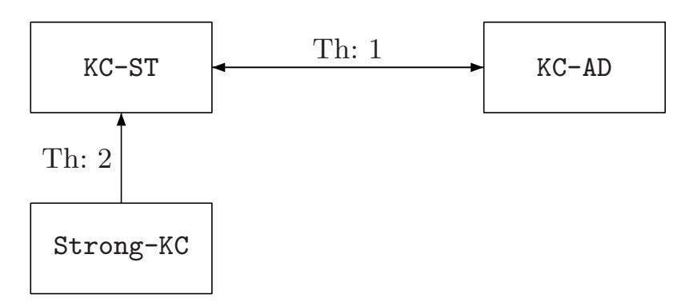
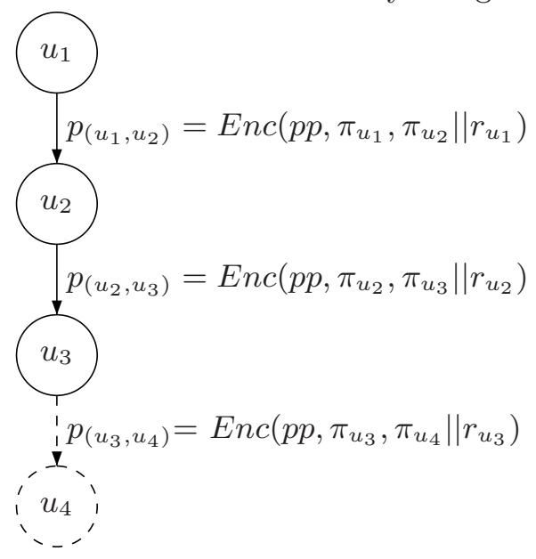

{0}------------------------------------------------

# Verifiable Hierarchical Key Assignment Schemes

Anna Lisa Ferrara and Chiara Ricciardi

Universit`a degli Studi del Molise, Italy

Abstract. A hierarchical key assignment scheme (HKAS) is a method to assign some private information and encryption keys to a set of classes in a partially ordered hierarchy, so that the private information of a higher class together with some public information can be used to derive the keys of all classes lower down in the hierarchy. Historically, HKAS have been introduced to enforce multi-level access control, where it can be safely assumed that the public information is made available in some authenticated form. Subsequently, HKAS have found application in several other contexts where, instead, it would be convenient to certify the trustworthiness of public information. Such application contexts include key management for IoT and for emerging distributed data acquisition systems such as wireless sensor networks. In this paper, motivated by the need of accommodating this additional security requirement, we first introduce a new cryptographic primitive: Verifiable Hierarchical Key Assignment Scheme (VHKAS). A VHKAS is a key assignment scheme with a verification procedure that allows honest users to verify whether public information has been maliciously modified so as to induce an honest user to obtain an incorrect key. Then, we design and analyse verifiable hierarchical key assignment schemes which are provably secure. Our solutions support key update for compromised encryption keys by making a limited number of changes to public and private information.

Keywords: cryptographic key management, access control

### 1 Introduction

Users of a computer system could be organized into a hierarchy consisting of a number of separate classes. These classes, called security classes, are positioned and ordered within the hierarchy according to the fact that some users have more access rights than others. For instance, in a hospital, doctors can access their patients' medical records, while researchers can only consult anonymous clinical information for studies.

A hierarchical key assignment (HKAS) scheme is a method to assign an encryption key and some private information to each class in the hierarchy. The encryption key will be used by each class to protect its data by means of a symmetric cryptosystem, whereas, the private information will be used by each class to compute the keys assigned to all classes lower down in the hierarchy. This assignment is carried out by a central authority, the Trusted Authority (TA), which is active only at the distribution phase. Following the seminal work by 

{1}------------------------------------------------

Akl and Taylor [2], many researchers have proposed different HKASs that either have better performances or allow dynamic updates to the hierarchy (e.g., [3, 5, 9, 13, 11]). Crampton et al. in [14] provided a detailed classification for HKASs, according to several parameters, including memory requirements for public and private information and the complexity of handling dynamic updates. In particular, they identified families of schemes where the public information is used to store encryption keys<sup>1</sup>. The use of HKASs belonging to such families is desirable to prevent or limit the change of private information and its redistribution when handling encryption key updates. Indeed, for these schemes, the key update procedure which is essential to replace compromised encryption keys, often requires changing only the public information. In the remainder of the paper when referring to HKAS we mean a scheme in such families.

Historically, HKASs have been introduced to enforce multi-level access control in scenarios where it can be safely assumed that the public information is made available to everyone via a publicly accessible repository for which only the TA has write permissions. However, key assignment schemes have recently been employed in different application context where the public information may be exposed to changes by malicious users. These application contexts include key management for IoT and distributed data acquisition systems such as wireless sensor networks [4, 9, 20] as well as sensitive data outsourcing within a cloud server [8, 10, 15–17, 19]. For instance, consider sensitive data outsourcing in cloud; the data owner encrypts the data before outsourcing them at the server by means of an HKAS and distributes the encryption and derivation keys to the users according to the access policy. Only the data owner and users who know the appropriate encryption and derivation keys will be able to decrypt the data. However, metadata which includes the public information will also be stored at the server and thus may be modified voluntarily or involuntarily by those who have access to it, including the cloud service provider which is not necessarily trusted. Unfortunately, a change in the public information will lead an honest user to derive a corrupted decryption key. Similarly, in wireless sensor networks, the cluster head nodes are responsible for forwarding any public information that has been changed as a result of encryption key updates. If a cluster head node is corrupted, this information may be maliciously modified before reaching its destination.

The scenarios outlined above introduce the need for an honest user to verify the trustworthiness of the public information. In order to accommodate this additional security requirement, we first introduce a new cryptographic primitive: Verifiable Hierarchical Key Assignment Scheme (VHKAS). A VHKAS is a key assignment scheme with a verification procedure that allows honest users to verify whether public information has been maliciously modified so as to induce him to obtain an incorrect key. Then, we design and analyse verifiable hierarchical key assignment schemes which are provably secure and support key update for compromised encryption keys.

More in detail, our contributions are as follows:

<sup>1</sup> Such families include IKEKAS, DKEKAS, and TKEKAS[14].

{2}------------------------------------------------

- we first give a formal definition for *verifiable hierarchical key assignment scheme*;
- then, in order to capture a notion of security against an adversary who has
  the ability to replace or modify the public information, we propose the security notion of key-consistency and study the relations among static, adaptive
  and strong adversaries;
- subsequently, we design and analyze a VHKAS. Our construction uses as a building block a message locked encryption scheme and is provably-secure with respect to key indistinguishability which corresponds to the requirement that an adversary is not able to learn any information about a key that it should not have access to. Also, our construction achieves the notion of keyconsistency;
- afterwards, we show how to handle key replacement for compromised encryption keys by making a limited number of changes to public and private information;
- finally, we instantiate our MLE-based construction with the deterministic MLE scheme proposed by Abadi et al. [1] and show it to be provably-secure with respect to key-consistency and key indistinguishability.

The paper is organized as follows: in Section 2 we review the definitions of HKAS, and MLE as well as their notions of security. In Section 3 we define VHKAS and introduce the security notion of *key-consistency*. In Section 4 we show our MLE-based construction and show it to be provably-secure with respect to key-consistency and key indistinguishability. Finally, in Section 5 we show how to handle key replacements and instantiate our MLE-based construction with the deterministic MLE scheme proposed by Abadi et al.[1] showing it to be provably-secure with respect to key-consistency and key insistinguishability.

#### 2 Preliminaries

In this section we recall definitions and security notions of hierarchical keyassignment schemes, and message-locked encryption schemes as well as the notions of collision-resistance and pseudorandomness.

**Notation.** We use the standard notation to describe probabilistic algorithm and experiments. If  $A(\cdot, \cdot, \ldots)$  is any probabilistic algorithm then  $a \leftarrow A(x, y, \ldots)$  denotes the experiment of running A on inputs  $x, y, \ldots$  and letting a be the outcome, the probability being over the coins of A. Similarly, if X is a set then  $x \leftarrow X$  denotes the experiment of selecting an element uniformly from X and assigning x this value. If w is neither an algorithm nor a set then  $x \leftarrow w$  is a simple assignment statement. For two bit-strings x and y we denote by x||y their concatenation. A function  $\epsilon: \mathbb{N} \to \mathbb{R}$  is negligible if for every constant c > 0 there exists an integer  $n_c$  such that  $\epsilon(n) < n^{-c}$  for all  $n \ge n_c$ .

{3}------------------------------------------------

#### 4

#### 2.1 Collision-resistance and pseudorandomness

**Definition 1. Collision-resistance.** Let  $\mathcal{H}=h:\{0,1\}^n \to \{0,1\}^m$  be a family of functions, mapping elements from a (large) universe to a (small) range, typically m=n/2. A family  $\mathcal{H}$  is said to be a collision resistant hash family, if for all PPT  $\mathcal{A}$  there exists a negligible function  $\epsilon$  such that for all security parameters  $\tau \in \mathbb{N}$ ,  $Pr[(x_0, x_1) \leftarrow \mathcal{A}(1^{\tau}, h) : x_0 \neq x_1 \land h(x_0) = h(x_1)] \leq \epsilon(\tau)$ .

**Definition 2. Pseudorandom Functions.** Let  $\mathcal{F}: \{0,1\}^n \times \{0,1\}^n \to \{0,1\}^n$  be an efficient keyed function.  $\mathcal{F}$  is a pseudorandom function (PRF) if for all PPT algorithms D, there exists a negligible function  $\epsilon$  such that  $\mathbf{Adv}_{\mathcal{F}}^{\mathbf{prf}}(n) = |Pr[D^{\mathcal{F}(k,\cdot)}(n) = 1] - Pr[D^{f(\cdot)}(n) = 1]| \leq \epsilon(n)$  where key  $k \in_R \{0,1\}^n$  and  $f: \{0,1\}^n \to \{0,1\}^n$  is a randomly chosen function.

#### 2.2 Hierarchical Key Assignment Schemes

Consider a set of users divided into a number of disjoint classes, called security classes. A binary relation  $\leq$  that partially orders the set of classes V is defined in accordance with authority, position, or power of each class in V. The poset  $(V, \leq)$  is called a partially ordered hierarchy. For any two classes u and v, the notation  $u \leq v$  is used to indicate that the users in v can access u's data. The partially ordered hierarchy  $(V, \leq)$  can be represented by the directed graph G = (V, E), where each class corresponds to a vertex and there is a path from class v to class u if and only if  $u \leq v$ . A hierarchical key assignment scheme is a method to assign an encryption key and some private information to each class in the hierarchy. The encryption key will be used by each class to protect its data by means of a symmetric cryptosystem, whereas, the private information will be used by each class to compute the keys assigned to all classes lower down in the hierarchy. This assignment is carried out by a central authority, the Trusted Authority (TA), which is active only at the distribution phase. Formally:

**Definition 3 ([18]).** Let  $\Gamma$  be a family of graphs corresponding to partially ordered hierarchies. A hierarchical key assignment scheme for  $\Gamma$  is a pair (Gen, Der) of algorithms satisfying the following conditions:

- 1. The information generation algorithm Gen is probabilistic polynomial-time. It takes as input the security parameter  $1^{\tau}$  and a graph G = (V, E) in  $\Gamma$ , and produces as outputs
  - a private information  $s_u$ , for any class  $u \in V$ ;
  - $a \text{ key } k_u$ , for any class  $u \in V$ ;
  - a public information pub.

We denote by (s, k, pub) the output of the algorithm Gen, where s and k denote the sequences of private information and of keys, respectively.

2. The key derivation algorithm Der is deterministic polynomial-time. It takes as input the security parameter  $1^{\tau}$ , a graph G = (V, E) in  $\Gamma$ , two classes u, v in V, the private information  $s_u$  assigned to class u and the public

{4}------------------------------------------------

information pub, and produces as output the key  $k_v$  assigned to class v if  $v \leq u$ , or a special rejection symbol  $\perp$  otherwise.

We require that for each class  $u \in V$ , each class  $v \leq u$ , each private information  $s_u$ , each key  $k_v$ , each public information pub which can be computed by Gen on inputs  $1^{\tau}$  and G, it holds that  $Der(1^{\tau}, G, u, v, s_u, pub) = k_v$ .

**Security notions.** Atallah et al. [5] first introduced two different security goals for hierarchical key assignment schemes: security with respect to key indistinguishability and security against key recovery. In this paper, we only consider the stronger notion of key indistinguishability [6, 5].

STAT<sub>u</sub> is a static adversary which wants to attack a class  $u \in V$  and which is able to corrupt *all* users not entitled to compute the key of class u. Algorithm  $Corrupt_u$  which, on input the private information s generated by the algorithm Gen, extracts the secret values  $s_v$  associated to each classe that the adversary is able to corrupt. In the indistinguishability game, the adversary must distinguish the key of class u from a random value.

**Definition 4.** [IND-ST] Let  $\Gamma$  be a family of graphs corresponding to partially ordered hierarchies, let G = (V, E) be a graph in  $\Gamma$ , let (Gen, Der) be a hierarchical key assignment scheme for  $\Gamma$  and let  $STAT_u$  be a static adversary which attacks a class u. Consider the following two experiments:

```
Experiment \mathbf{Exp}^{\mathtt{IND-1}}_{\mathtt{STAT}_u}(1^{\tau},G) | Experiment \mathbf{Exp}^{\mathtt{IND-0}}_{\mathtt{STAT}_u}(1^{\tau},G) | (s,k,pub) \leftarrow Gen(1^{\tau},G) | (s,k,pub) \leftarrow Gen(1^{\tau},G) | (s,k,pub) \leftarrow Gen(1^{\tau},G) | corr \leftarrow Corrupt_u(s) | corr \leftarrow Corrupt_u(s) | \rho \leftarrow \{0,1\}^{length(k_u)} | d \leftarrow \mathtt{STAT}_u(1^{\tau},G,pub,corr,\rho) | experiment \mathbf{Exp}^{\mathtt{IND-0}}_{\mathtt{STAT}_u}(1^{\tau},G) | experiment \mathbf{Exp}^{\mathtt{IND-0}}_{\mathtt{STAT}_u}(1^{\tau},G) | experiment \mathbf{Exp}^{\mathtt{IND-0}}_{\mathtt{STAT}_u}(1^{\tau},G) | experiment \mathbf{Exp}^{\mathtt{IND-0}}_{\mathtt{STAT}_u}(1^{\tau},G) | experiment \mathbf{Exp}^{\mathtt{IND-0}}_{\mathtt{STAT}_u}(1^{\tau},G) | experiment \mathbf{Exp}^{\mathtt{IND-0}}_{\mathtt{STAT}_u}(1^{\tau},G) | experiment \mathbf{Exp}^{\mathtt{IND-0}}_{\mathtt{STAT}_u}(1^{\tau},G) | experiment \mathbf{Exp}^{\mathtt{IND-0}}_{\mathtt{STAT}_u}(1^{\tau},G) | experiment \mathbf{Exp}^{\mathtt{IND-0}}_{\mathtt{STAT}_u}(1^{\tau},G) | experiment \mathbf{Exp}^{\mathtt{IND-0}}_{\mathtt{STAT}_u}(1^{\tau},G) | experiment \mathbf{Exp}^{\mathtt{IND-0}}_{\mathtt{STAT}_u}(1^{\tau},G) | experiment \mathbf{Exp}^{\mathtt{IND-0}}_{\mathtt{STAT}_u}(1^{\tau},G) | experiment \mathbf{Exp}^{\mathtt{IND-0}}_{\mathtt{STAT}_u}(1^{\tau},G) | experiment \mathbf{Exp}^{\mathtt{IND-0}}_{\mathtt{STAT}_u}(1^{\tau},G) | experiment \mathbf{Exp}^{\mathtt{IND-0}}_{\mathtt{STAT}_u}(1^{\tau},G) | experiment \mathbf{Exp}^{\mathtt{IND-0}}_{\mathtt{STAT}_u}(1^{\tau},G) | experiment \mathbf{Exp}^{\mathtt{IND-0}}_{\mathtt{STAT}_u}(1^{\tau},G) | experiment \mathbf{Exp}^{\mathtt{IND-0}}_{\mathtt{STAT}_u}(1^{\tau},G) | experiment \mathbf{Exp}^{\mathtt{IND-0}}_{\mathtt{STAT}_u}(1^{\tau},G) | experiment \mathbf{Exp}^{\mathtt{IND-0}}_{\mathtt{STAT}_u}(1^{\tau},G) | experiment \mathbf{Exp}^{\mathtt{IND-0}}_{\mathtt{STAT}_u}(1^{\tau},G) | experiment \mathbf{Exp}^{\mathtt{IND-0}}_{\mathtt{STAT}_u}(1^{\tau},G) | experiment \mathbf{Exp}^{\mathtt{IND-0}}_{\mathtt{STAT}_u}(1^{\tau},G) | experiment \mathbf{Exp}^{\mathtt{IND-0}}_{\mathtt{STAT}_u}(1^{\tau},G) | experiment \mathbf{Exp}^{\mathtt{IND-0}}_{\mathtt{STAT}_u}(1^{\tau},G) | experiment \mathbf{Exp}^{\mathtt{IND-0}}_{\mathtt{STAT}_u}(1^{\tau},G) | experiment \mathbf{Exp}^{\mathtt{IND-0}}_{\mathtt{STAT}_u}(1^{\tau},G) | experiment \mathbf{Exp}^{\mathtt{IND-0}}_{\mathtt{STAT}_u}(1^{\tau},G) | experiment \mathbf{Exp}^{\mathtt{IND-0}}_{\mathtt{STAT}_u}(1^{\tau},G) | experiment \mathbf{Exp}^{\mathtt{IND-0}}_{\mathtt{STAT}_u}(1^{\tau},G) | experiment \mathbf{Exp}^{\mathtt{IND-0}}_{\mathtt{STAT}_u}(1^{\tau},G) | experiment \mathbf{Exp}^{\mathtt{IND-0}}_{\mathtt{STAT}_u}(1^{\tau},G) | experim
```

The advantage of  $STAT_u$  is defined as  $Adv_{STAT_u}^{IND}(1^{\tau}, G) = |Pr[Exp_{STAT_u}^{IND-1}(1^{\tau}, G) = 1] - Pr[Exp_{STAT_u}^{IND-0}(1^{\tau}, G) = 1]|$ . The scheme is secure in the sense of IND-ST if, for each graph G = (V, E) in  $\Gamma$  and each  $u \in V$ , the function  $Adv_{STAT_u}^{IND}(1^{\tau}, G)$  is negligible, for each adversary  $STAT_u$  with time complexity polynomial in  $\tau^2$ .

#### 2.3 Message-Locked Encryption

An Message-Locked Encryption (MLE) is a symmetric encryption scheme in which the key is itself derived from the message. Provably-secure MLE schemes have been first proposed by Bellare et al. in [7].

**Definition 5** ([1]). An Message-Locked Encryption is a tuple (PPGen, KD, Enc, Dec, Valid)<sup>3</sup> of algorithms satisfying the following conditions:

<sup>&</sup>lt;sup>2</sup> In [6] it has been proven that security against adaptive adversaries is (polynomially) equivalent to security against static adversaries.

<sup>&</sup>lt;sup>3</sup> MLE definition also includes an equality algorithm. We omit it since it is not necessary for our goals.

{5}------------------------------------------------

- 1. The parameter generation algorithm P P Gen on input 1<sup>τ</sup> returns a public parameter pp.
- 2. The key derivation function KD takes as input the message m in the message space M and pp and produces as output message-derived key km.
- 3. The encryption algorithm Enc takes as input pp, the key km, and the message m in M, and produces as output the ciphertext c.
- 4. The decryption algorithm Dec takes as input pp the key k<sup>m</sup> and the ciphertext c and produces as output the message m or ⊥.
- 5. The validity-test V alid takes as input public parameters pp and a ciphertext c and outputs 1 if the ciphertext c is a valid ciphertext, and 0 otherwise.

Security notions. In order to capture a notion of security against an adversary that carries out attacks by choosing messages that may depend on the public parameters, Abadi et al. [1] introduced the notions of polynomial-size X-source adversaries, real-or-random encryption oracle, and PRV-CDA2 security. These definitions make use of some parameters that are functions of the security parameter. Specifically, k = k(τ ) denoting min-entropy requirements over message sources, and T = T(τ ) representing the number of blocks in the message.

Entropy. The min-entropy of a random variable X is defined as H∞(X) =−log (max<sup>x</sup> P r[X = x]). In other words, H∞(X)= k, if maxxP r[X = x]=2<sup>−</sup><sup>k</sup>. A k-source is a random variable X with H∞(X) ≥ k.A(k1,...,k<sup>T</sup> )-source is a random variable X = (X1,...,X<sup>T</sup> ) where each X<sup>i</sup> is a k<sup>i</sup> -source. A (T,k) source is a random variable X = (X1,...,X<sup>T</sup> ) where, for each i = 1,...,T, it holds that X<sup>i</sup> is a k-source. Next, we recall the definitions of real-or-random encryption oracle, polynomial-size X-source adversary, and, for schemes that rely on random oracles, q-query X-source adversary.

Definition 6 ([1]). Real or Random encryption oracle. The real-or-random encryption oracle, RoR, takes as input triplets of the form (mode, pp,M), where mode ∈ {real, rand}, pp denotes public parameters, and M is a polynomial size circuit representing a joint distribution over T messages. If mode = real then the oracle samples (m1,...,m<sup>T</sup> ) ← M, and if mode = rand then the oracle samples uniform and independent messages (m1,...,m<sup>T</sup> ) ← M. Next, for each i = 1,...,T, it samples k<sup>i</sup> ← KD(pp, mi), computes c<sup>i</sup> ← Enc(pp, ki, mi) and outputs the ciphertext vector (c1,...,c<sup>T</sup> ).

Definition 7 ([1]). Poly-sampling complexity adversary. Let A be a probabilistic polynomial-time algorithm that is given as input a pair (1<sup>τ</sup> , pp) and oracle access to (1<sup>τ</sup> , pp) for some mode ∈ {real, rand}. Then, A is a polynomial-size (T,k)-source adversary if for each of A's RoR-queries M it holds that M is an (T,k)-source that is samplable by a circuit of (an arbitrary) polynomial size in the security parameter.

Definition 8 ([1]). q-query adversary. Let A be a probabilistic polynomialtime algorithm that is given as input a pair (1<sup>τ</sup> , pp) and oracle access to (1<sup>τ</sup> , pp) for some mode ∈ {real, rand}. Then, A is a q-query (T,k)-source adversary if 

{6}------------------------------------------------

for each of A's RoR-queries M it holds that M is a (T, k)-source that is samplable by a polynomial size circuit that uses at most q queries to the random oracle.

**Definition 9 ([1]).** PRV-CDA2 security<sup>4</sup>. An MLE scheme  $\Pi = (PPGen, KD, Enc, Dec, EQ, Valid)$  is (T, k)-source PRV-CDA2 secure, if for any probabilistic polynomial-time polynomial-size (T, k)-source adversary A, there exists a negligible function  $\epsilon(\tau)$  such that the advantage of A is defined as

$$\mathbf{Adv}^{\mathtt{PRV-CDA2}}_{\mathcal{A}}(1^{\tau}) = |Pr[\mathbf{Exp}^{\mathtt{real}}_{\mathcal{A}}(1^{\tau}) = 1] - Pr[\mathbf{Exp}^{\mathtt{rand}}_{\mathcal{A}}(1^{\tau}) = 1]| \leq \epsilon(\tau)$$

where for each mode  $\in \{\text{real}, \text{rand}\}\$ the experiment  $\mathbf{Exp}_{\mathcal{A}}^{\text{mode}}(\tau)$  is defined in the following game:

Experiment 
$$\mathbf{Exp}_{\mathcal{A}}^{\mathtt{PRV-CDA2}}$$
  
 $pp \leftarrow PPGen(1^{\tau})$   
 $\mathbf{return} \ \mathcal{A}^{\mathtt{RoR}(\mathtt{mode},\mathtt{pp},\cdot)}(1^{\tau},pp)$ 

### 3 Verifiable Hierarchical Key Assignment Schemes

In this section, we introduce a novel cryptographic primitive that we call *Verifiable Hierarchical Key Assignment Scheme* (VHKAS). A VHKAS is a hierarchical key assignment scheme equipped with a verification procedure that allows honest users to check whether the public information has been maliciously changed.

A verifiable hierarchical key assignment scheme for a family  $\Gamma$  of graphs, corresponding to partially ordered hierarchies, is defined as follows:

**Definition 10.** A verifiable hierarchical key assignment scheme is a triple (Gen, Der, Ver) of algorithms satisfying the following conditions:

- 1. The information generation algorithm Gen is probabilistic polynomial-time. It takes as input  $1^{\tau}$  and a graph G = (V, E) in  $\Gamma$  and produces as output:
  - a private information  $s_u$ , for any class  $u \in V$ ;
  - $a \ key \ k_u$ , for any class  $u \in V$ ;
  - a public information pub.

We denote by (s, k, pub) the output of the algorithm Gen on inputs  $1^{\tau}$  and G, where s and k denote the sequences of private information and of keys, respectively.

2. The key derivation algorithm Der is deterministic polynomial-time. It takes as input the security parameter  $1^{\tau}$ , a graph G = (V, E) in  $\Gamma$ , two classes u, v in V, the private information  $s_u$  assigned to class u and the public information pub, and produces as output the key  $k_v$  assigned to class  $v \leq u$ , or a special rejection symbol  $\perp$  otherwise. We require that for each class  $u \in V$ , each class  $v \leq u$ , each private information  $s_u$ , each key  $k_v$ , each public information pub which can be computed by Gen on inputs  $1^{\tau}$  and G, it holds that

$$Der(1^{\tau}, G, u, v, s_u, pub) = k_v.$$

<sup>&</sup>lt;sup>4</sup> Notice that PRV-CDA2 notion enables adversaries to query the oracle with message distributions that depend on the public parameters *pp*.

{7}------------------------------------------------

3. The verification algorithm V er is deterministic polynomial-time. It takes as input the security parameter 1<sup>τ</sup> , a graph G = (V,E) in Γ, a class u in V , the private information su, a public information pub and it outputs 1 if for each class v ∈ V such that v ≼ u, Der(1<sup>τ</sup> , G, u, v, su, pub) return a valid key for the class v, 0 otherwise.

Security Notions. In order to capture a notion of security against an adversary who has the ability to replace or modify the public information, we introduce a security requirement: key-consistency. Informally, a scheme is said to be keyconsistent if an adversary is unable to mislead an honest user into deriving an incorrect key by replacing or partially modifying the public information. We provide definitions of key-consistency with respect to static and adaptive adversaries. A static adversary first chooses a class u ∈ V ; then it is allowed to access the private information assigned to all classes in V , as well as all public information. On the other hand, an adaptive adversary is first allowed to access all public information as well as all private information of a number of classes of its choice; afterwards, it chooses a class u. Both adversaries' goal is that of providing a public information pub′ different from pub such that the key of some class v derived by a user in class u according to pub differs from that derived according to pub′ while the verification procedure succeeds in both cases. We also define strong key-consistency (Strong-KC) where an adversary SSTAT, having the same goal as the previous adversaries, is able to generate the secret information s, the set of keys k, and two different public value pub and pub′ by itself. Such an adversary models the fact that even the TA is unable to maliciously modify the public information.

Finally, we explore the relationships among static, adaptive and strong key consistent adversaries. Figure 1 summarizes our results.



Fig. 1: Relations among key-consistency definitions.

First, consider the case where a static adversary STAT<sup>u</sup> attacks classes u ∈ V :

Definition 11. [KC-ST] Let Γ be a family of graphs corresponding to partially ordered hierarchies, let G = (V,E) be a graph in Γ, let (Gen, Der, V er) be a verifiable hierarchical key assignment scheme for Γ and let STAT<sup>u</sup> be a static adversary. Consider the following experiment:

{8}------------------------------------------------

```
Experiment \mathbf{Exp}_{\mathtt{STAT}_u}^{\mathtt{KC-ST}}(1^{\tau},G)

(s,k,pub) \leftarrow Gen(1^{\tau},G)

pub' \leftarrow \mathtt{STAT}_u(1^{\tau},G,pub,s)

if (Ver(1^{\tau},G,u,s_u,pub) = 0 \lor Ver(1^{\tau},G,u,s_u,pub') = 0) return 0

for each v \preceq u

if (Der(1^{\tau},G,u,v,s_u,pub) \neq Der(1^{\tau},G,u,v,s_u,pub'))

return 1

return 0
```

The advantage of STAT<sub>u</sub> is defined as  $\mathbf{Adv}_{\mathsf{STAT}_u}^{\mathsf{KC-ST}}(1^{\tau}) = |Pr[\mathbf{Exp}_{\mathsf{STAT}_u}^{\mathsf{KC-ST}}(1^{\tau}) = 1]|$ . The scheme is said to be secure in the sense of KC-ST if, the function  $\mathbf{Adv}_{\mathsf{STAT}_u}^{\mathsf{KC-ST}}(1^{\tau})$  is negligible, for each static adversary  $\mathsf{STAT}_u$  whose time complexity is polynomial in  $\tau$ .

Now, we consider the case of adaptive adversaries:

**Definition 12.** [KC-AD] Let  $\Gamma$  be a family of graphs corresponding to partially ordered hierarchies, let G = (V, E) be a graph in  $\Gamma$ , let (Gen, Der, Ver) be a verifiable hierarchical key assignment scheme for  $\Gamma$  and let ADAPT=(ADAPT<sub>1</sub>, ADAPT<sub>2</sub>) be an adaptive adversary that is given access to the oracle  $O_s(\cdot)$ , during both stages of the attack, where s is the sequence of secret information. Consider the following experiment:

```
Experiment \mathbf{Exp}_{\mathtt{ADAPT}}^{\mathtt{KC-AD}}(1^{\tau},G)

(s,k,pub) \leftarrow Gen(1^{\tau},G)

(u,state) \leftarrow \mathtt{ADAPT}_1^{O_s(\cdot)}(1^{\tau},G,pub)

pub' \leftarrow \mathtt{ADAPT}_2^{O_s(\cdot)}(1^{\tau},G,pub,u,state)

if (Ver(1^{\tau},G,u,s_u,pub) = 0 \lor Ver(1^{\tau},G,u,s_u,pub') = 0) return 0

for each v \preceq u

if (Der(1^{\tau},G,u,v,s_u,pub) \neq Der(1^{\tau},G,u,v,s_u,pub'))

return 1

return 0
```

The advantage of ADAPT is defined as  $\mathbf{Adv}_{\mathtt{ADAPT}}^{\mathtt{KC-AD}}(1^{\tau}) = |Pr[\mathbf{Exp}_{\mathtt{ADAPT}}^{\mathtt{KC-AD}}(1^{\tau}) = 1]|$ . The scheme is said to be secure in the sense of KC-AD if, the function  $\mathbf{Adv}_{\mathtt{ADAPT}}^{\mathtt{KC-AD}}(1^{\tau})$  is negligible, for each adaptive adversary ADAPT whose time complexity is polynomial in  $\tau$ .

We now prove that a verifiable key assignment scheme is secure in the sense of KC-ST if and only if it is also secure in the sense of KC-AD.

**Theorem 1.** [KC-ST $\Leftrightarrow$ KC-AD] Let  $\Gamma$  be a family of graphs corresponding to partially ordered hierarchies. A verifiable hierarchical key assignment scheme for  $\Gamma$  is secure in the sense of KC-ST if and only if it is secure in the sense of KC-AD.

**Proof.** The implication KC-AD  $\Rightarrow$  KC-ST is trivial, thus we only prove that KC-ST  $\Rightarrow$  KC-AD. Let (Gen, Der, Ver) be a verifiable hierarchical key assignment scheme for  $\Gamma$  secure in the sense of KC-AD and assume by contradiction the existence of an adaptive adversary ADAPT = (ADAPT<sub>1</sub>, ADAPT<sub>2</sub>) whose advantage  $\mathbf{Adv}_{ADAPT}^{KC-AD}$  on input a given graph G' = (V', E') in  $\Gamma$  is non negligible. Let u be output by

{9}------------------------------------------------

ADAPT<sub>1</sub> with probability at least  $\frac{1}{|V|}$ , where the probability is taken over the coin flips of Gen and ADAPT<sub>1</sub>. This means that u belongs to the set of the most likely choices made by ADAPT<sub>1</sub>. We show how to construct a static adversary STAT<sub>u</sub>, using ADAPT, such that  $\mathbf{Adv}_{\mathtt{STAT}_u}^{\mathtt{KC-ST}}$  on input G' is non negligible. In particular, we show that  $\mathtt{STAT}_{u,v}$ 's advantage is polynomially related to ADAPT's advantage. The algorithm  $\mathtt{STAT}_u$ , on inputs the graph G', the public information pub output by the algorithm Gen, the private information s assigned by Gen to all users, runs the algorithm ADAPT<sub>1</sub>, on inputs G', and pub. Notice that  $\mathtt{STAT}_u$  is able to simulate the interaction between ADAPT<sub>1</sub> and the oracle  $O_s(\cdot)$ . Indeed, for each query  $O_s(z)$ ,  $\mathtt{STAT}_u$  simply retrieves from s the private information  $s_z$ , and gives it to ADAPT<sub>1</sub>. Let u' be the class output by ADAPT<sub>1</sub>. If u = u', then  $\mathtt{STAT}_u$  outputs the same output as ADAPT<sub>2</sub>, on inputs G', pub, u. On the other hand, if  $u \neq u'$ ,  $\mathtt{STAT}_u$  outputs 0. It is easy to see that whether G = G', it holds that

$$\mathbf{Adv}_{\mathtt{STAT}_{u}}^{\mathtt{KC-ST}}(1^{\tau},G) = Pr[u=u'] \cdot \mathbf{Adv}_{\mathtt{ADAPT}}^{\mathtt{KC-AD}}(1^{\tau})$$

Since u is chosen by  $ADAPT_1$  with probability at least  $\frac{1}{|V|}$  and  $Adv_{ADAPT}^{KC-AD}$  on input G' is non negligible, it follows that also  $Adv_{STAT_u}^{KC-ST}$  on input G' is non negligible. Contradiction.

Now, we define the notion of Strong-KC:

**Definition 13.** [Strong-KC] Let  $\Gamma$  be a family of graphs corresponding to partially ordered hierarchies, let G = (V, E) be a graph in  $\Gamma$ , let (Gen, Der, Ver) be a verifiable hierarchical key assignment scheme for  $\Gamma$  and let SSTAT be an adversary. Consider the following experiment:

```
Experiment \mathbf{Exp}^{\mathsf{Strong-KC}}_{\mathsf{SSTAT}}(1^{\tau}, G)

(s, k, pub, pub', u) \leftarrow \mathsf{SSTAT}(1^{\tau}, G)
\nif (Ver(1^{\tau}, G, u, s_u, pub) = 0 \lor Ver(1^{\tau}, G, u, s_u, pub') = 0) return 0

for each v \preceq u
\nif (Der(1^{\tau}, G, u, v, s_u, pub) \neq Der(1^{\tau}, G, u, v, s_u, pub'))

return 1

return 0
```

The advantage of SSTAT is defined as  $\mathbf{Adv}_{\mathtt{SSTAT}}^{\mathtt{Strong-KC}}(1^{\tau}) = |Pr[\mathbf{Exp}_{\mathtt{SSTAT}}^{\mathtt{Strong-KC}}(1^{\tau}) = 1]|$ . The scheme is  $\mathtt{Strong-KC}$  secure if, the function  $\mathbf{Adv}_{\mathtt{SSTAT}}^{\mathtt{Strong-KC}}(1^{\tau})$  is negligible, for each adversary  $\mathtt{SSTAT}$  whose time complexity is polynomial in  $\tau$ .

**Theorem 2.** [Strong-KC $\Rightarrow$ KC-ST] Let  $\Gamma$  be a family of graphs corresponding to partially ordered hierarchies. A Strong-KC secure verifiable hierarchical key assignment scheme for  $\Gamma$  is also secure in the sense of KC-ST.

**Proof.** The adversary SSTAT, by using the generation algorithm Gen, can construct the private information s as well as the public information pub. The adversary SSTAT can then use STAT<sub>u</sub> as a subroutine to produce pub'. It is easy to see that if STAT<sub>u</sub> wins its game then SSTAT wins its game too.

From Theorems 1 and 2 the following result holds:

{10}------------------------------------------------

Corollary 1. [Strong-KC $\Rightarrow$ KC-AD] Let  $\Gamma$  be a family of graphs corresponding to partially ordered hierarchies. A Strong-KC secure verifiable hierarchical key assignment scheme for  $\Gamma$  is also secure in the sense of KC-AD.

#### 4 An MLE-based Construction

In this section, we present a VHKAS which uses as a building block an MLE scheme. The scheme assumes that the partially ordered hierarchy has been partitioned into chains [12]. Thus, in the following we will only consider a family  $\Gamma$  of graphs corresponding to chains.

Figure 2 shows the MLE-based construction for a chain of t classes  $u_1, \ldots, u_t$ . In order to simplify the exposition, we consider a dummy class  $u_{t+1}$ . This will enable us to consider all public information as values associated to the edges of a chain. The public information, associated to the edges of the chain, is used to store the encryption keys in an encrypted form. Indeed, for each  $i = 1, \ldots, t$ ,  $k_{u_i} \leftarrow \mathcal{F}(\pi_{u_i}, r_{u_i})$  can be obtained by retrieving  $\pi_{u_i}$  and  $r_{u_i}$ , respectively from  $p_{(u_{i-1},u_{i})}$  and  $p_{(u_i,u_{i+1})}$ . Figure 3 illustrates the public information computed by the scheme for a chain of length t = 3. The verification procedure allows to check whether a honest user is able to derive valid keys. Specifically, in the MLE-based construction a honest user in some class  $u_i$  will derive valid keys  $k_{u_j} = Der(1^{\tau}, G, u_i, u_j, s_{u_i}, pub)$ , if for each  $j = i, \ldots, t$ , the public information  $p_{(u_j,u_{j+1})}$  stores a value x such that  $\pi_{u_j} = KD(pp, x)$ .

#### 4.1 Analysis of the Scheme

In this section we show that the security of the MLE-based construction depends upon the security properties of the underlying MLE scheme.

Theorem 3. Let  $\Pi = (PPGen, KD, Enc, Dec, Valid)$  be a  $(T, \mu)$ -source PRV-CDA2 secure MLE scheme where  $\mu = \omega(\log \tau)$  and let  $\mathcal{F} : \{0,1\}^{\tau} \times \{0,1\}^{\tau} \to \{0,1\}^{\tau}$  be a PRF. The MLE-based verifiable key assignment scheme of Figure 2 is secure in the sense of IND-ST.

**Proof.** Let  $STAT_u$  be a static adversary attacking class u. Let  $V = \{u_1, \ldots, u_t\}$  and  $(u_i, u_{i+1}) \in E$ , for  $i = 1, \ldots, t-1$ , and, w.l.o.g., let  $u = u_j$  for some  $1 \le j < t$ . In order to prove the theorem, we need to show that the adversary's views in experiments  $\mathbf{Exp}_{STAT_u}^{IND-1}$  and  $\mathbf{Exp}_{STAT_u}^{IND-0}$  are indistinguishable. Notice that the only difference between  $\mathbf{Exp}_{STAT_u}^{IND-1}$  and  $\mathbf{Exp}_{STAT_u}^{IND-0}$  is the last input of  $STAT_u$ , which corresponds to the key  $k_u$  in the former experiment and to a random value in the latter. Thus, while in  $\mathbf{Exp}_{STAT_u}^{IND-1}$  the public information is related to the last input of  $STAT_u$ , in  $\mathbf{Exp}_{STAT_u}^{IND-0}$  it is completely independent on such a value.

We construct a sequence of 4 experiments  $\mathbf{Exp}_u^1, \dots, \mathbf{Exp}_u^4$ , all defined over the same probability space, where the first and the last experiments of the sequence correspond to  $\mathbf{Exp}_{\mathtt{STAT}_u}^{\mathtt{IND-1}}$  and  $\mathbf{Exp}_{\mathtt{STAT}_u}^{\mathtt{IND-0}}$ , respectively. In each experiment we modify the way the view of  $\mathtt{STAT}_u$  is computed, while maintaining the view's

{11}------------------------------------------------

### Algorithm Gen(1<sup>τ</sup> , G)

- 1. Let u1,...,u<sup>t</sup> be the classes in the chain.
- 2. Let pp ← P P Gen(1<sup>τ</sup> );
- 3. Let π<sup>u</sup>t+1 ← {0, 1}<sup>τ</sup> ;
- 4. For each class ui, for i = t, . . . , 1, let
  - (a) r<sup>u</sup><sup>i</sup> ← {0, 1}<sup>τ</sup> ;
  - (b) π<sup>u</sup><sup>i</sup> ← KD(pp, π<sup>u</sup>i+1 ||r<sup>u</sup><sup>i</sup> );
  - (c) k<sup>u</sup><sup>i</sup> ← F(π<sup>u</sup><sup>i</sup> , r<sup>u</sup><sup>i</sup> );
  - (d) s<sup>u</sup><sup>i</sup> = (pp, r<sup>u</sup><sup>i</sup> , π<sup>u</sup><sup>i</sup> , k<sup>u</sup><sup>i</sup> );
- 5. Let s and k be the sequences of private information s<sup>u</sup><sup>1</sup> , s<sup>u</sup><sup>2</sup> ,...,s<sup>u</sup><sup>t</sup> and keys k<sup>u</sup><sup>1</sup> , k<sup>u</sup><sup>2</sup> ,...,k<sup>u</sup><sup>t</sup> , respectively, computed in the previous steps;
- 6. For each i = 1,...,t, compute the public information

$$p_{(u_i,u_{i+1})} \leftarrow Enc(pp, \pi_{u_i}, \pi_{u_{i+1}} || r_{u_i});$$

- 7. Let pub be the sequence of public information p(u1,u2), p(u2,u3),...,p(ut,ut+1) computed in the previous step;
- 8. Output(s, k, pub).

#### Algorithm Der(1<sup>τ</sup> , G, u, v, su, pub)

- 1. Let u = u<sup>i</sup> and v = u<sup>j</sup> , for some j ≥ i, j = 1. . . . , t.
- 2. Parse s<sup>u</sup> as (pp, r<sup>u</sup><sup>i</sup> , π<sup>u</sup><sup>i</sup> , k<sup>u</sup><sup>i</sup> );
- 3. For any z = i, . . . , j, extract the public value p(uz,uz+1) from pub
  - (a) if V alid(pp, p(uz,uz+1)) = 0, return ⊥;
  - (b) compute

$$(\pi_{u_{z+1}}||r_{u_z}) \leftarrow Dec(pp, \pi_{u_z}, p_{(u_z, u_{z+1})});$$

4. Output k<sup>v</sup> ← F(π<sup>u</sup><sup>j</sup> , r<sup>u</sup><sup>j</sup> ).

#### Algorithm V er(1<sup>τ</sup> , G, u, su, pub)

- 1. Let u = ui, for some i = 1,...,t.
- 2. Parse s<sup>u</sup> as (pp, r<sup>u</sup><sup>i</sup> , π<sup>u</sup><sup>i</sup> , k<sup>u</sup><sup>i</sup> );
- 3. For each j = i, . . . , t,
  - (a) extract the public value p(u<sup>j</sup> ,uj+1) from pub;
  - (b) if V alid(pp, p(u<sup>j</sup> ,uj+1)) = 0, return 0;
  - (c) let α<sup>i</sup> = π<sup>u</sup><sup>i</sup> , compute

$$(\alpha_{j+1}||\beta_j) \leftarrow Dec(pp,\alpha_j,p_{(u_j,u_{j+1})});$$

- (d) if KD(pp, α<sup>j</sup>+1||β<sup>j</sup> ) is different from α<sup>j</sup> , return 0;
- 4. return 1.

Fig. 2: The MLE-based Construction.

{12}------------------------------------------------



Fig. 3: The MLE-based construction for a chain of length t = 3.

distributions indistinguishable among any two consecutive experiments. For any  $q \in \{2,3\}$ , experiment  $\mathbf{Exp}_u^q$  is defined as follows:

```
Experiment \mathbf{Exp}_{u}^{q}(1^{\tau}, G)

(s, k, pub^{q}) \leftarrow Gen^{q}(1^{\tau}, G)

corr \leftarrow Corrupt_{u}(s)

\mathbf{return} \ \mathsf{STAT}_{u}(1^{\tau}, G, pub^{q}, corr, \alpha_{u})
```

The algorithm  $Gen^q$  used in  $\mathbf{Exp}_u^q(1^{\tau}, G)$  differs from Gen for the way part of the public information  $pub^q$  is computed. Indeed, for any i = 1, ..., j, the public values associated to the edge  $(u_i, u_{i+1})$  is computed as the encryption  $Enc(pp, \pi_i, \gamma_{u_{i+1}} || r_{u_i})$  where  $\gamma_{u_{i+1}}$  and  $r_{u_i}$  are random values in  $\{0, 1\}^{\tau}$  and  $\pi_i \leftarrow KD(pp, \gamma_{u_{i+1}} || r_{u_i})$ . Moreover,  $\mathbf{Exp}_u^2(1^{\tau}, G)$  differs from  $\mathbf{Exp}_u^3(1^{\tau}, G)$  for the way  $\alpha_{u_j}$  is constructed. Specifically,  $\alpha_{u_j} \leftarrow \mathcal{F}(\gamma_{u_j}, r_{u_j})$  in  $\mathbf{Exp}_u^2$  while  $\alpha_{u_j} \leftarrow \{0, 1\}^{\tau}$  in  $\mathbf{Exp}_u^3$ .

Now we show that, the adversary's view in  $\mathbf{Exp}_u^1$  is indistinguishable from the adversary's view in  $\mathbf{Exp}_u^2$ . Assume by contradiction that there exists a polynomial-time adversary A which is able to distinguish between the adversary  $\mathsf{STAT}_u$ 's views in experiments  $\mathsf{Exp}_u^1$  and  $\mathsf{Exp}_u^2$  with non-negligible advantage. We show how to construct a polynomial-time distinguisher D which uses A to break the security of the  $(T, \mu)$ -source PRV-CDA2 MLE scheme.

In particular, the distinguisher D constructs the public values associated to the edges  $(u_i, u_{i+1})$ , for i = 1, ..., j, calling the RoR oracle where  $\mathbf{M}$  implements the circuit of Figure 4 with  $\pi = \pi_{u_{j+1}}$  and T = j. Notice that  $\mathbf{M}$  is  $(T, \mu)$ -source. Indeed, since  $r_{u_i}$  is chosen at random by  $\mathbf{M}$ , it is easy to see that the min-entropy of  $m_i$  is at least  $\tau$ , for each i = 1, ..., T. Distinguisher D is defined in Figure 6.

Notice that if mode = real, then  $STAT_u$ 's view is that of  $Exp_u^1(1^{\tau}, G)$  while when mode = rand,  $STAT_u$ 's view is that of  $Exp_u^2(1^{\tau}, G)$ . Therefore, if the algorithm A is able to distinguish between such views with non negligible advantage, it follows that D is able to break the PRV-CDA2 security of the MLE scheme.

{13}------------------------------------------------

```
Let \Pi = (PPGen, KD, Enc, Dec, Valid) be an MLE scheme.

Algorithm for M

On input the public parameter pp output by PPGen, and a \tau-length value \pi, produces T messages m_1, \ldots, m_T as follows:

- choose r_T \in \{0, 1\}^{\tau};

- compute m_T \leftarrow \pi || r_T;

- compute m_T \leftarrow KD(pp, \pi || r_T);

- for i = 1, \ldots, T - 1, choose r_i \in \{0, 1\}^{\tau};

- for i = 1, \ldots, T - 1, compute m_i \leftarrow KD(pp, \pi_{i+1} || r_i);

- for i = 1, \ldots, T - 1, compute m_i \leftarrow \pi_{i+1} || r_i.
```

Fig. 4: Polynomial size circuit M representing a joint distribution over T messages.

Now we show that, the adversary's view in  $\mathbf{Exp}_u^2$  is indistinguishable from the adversary's view in  $\mathbf{Exp}_u^3$ . Assume by contradiction that there exists a polynomial-time algorithm B which is able to distinguish between the adversary  $\mathtt{STAT}_u$ 's views in experiments  $\mathbf{Exp}_u^2$  and  $\mathbf{Exp}_u^3$  with non-negligible advantage. We show how to construct a polynomial-time distinguisher D' which uses B to distinguish whether its oracle  $f(\cdot)$  corresponds to the pseudorandom function  $\mathcal{F}(k,\cdot)$  or to a random function  $\mathcal{F}(k,\cdot)$  on  $r_{u_j}$  then  $\mathtt{STAT}_u$ 's view is that of  $\mathtt{Exp}_u^2(1^\tau,G)$  while when it is the output of a random value,  $\mathtt{STAT}_u$ 's view is that of  $\mathtt{Exp}_u^3(1^\tau,G)$ . Therefore, if the algorithm B is able to distinguish between such views with non negligible advantage, it follows that the distinguisher D' is able to break the pseudorandomness of  $\mathcal{F}$ . Figure 6 defines distinguisher D'.

We finally show that, the adversary's view in  $\mathbf{Exp}_u^4$  is indistinguishable from the adversary's view in  $\mathbf{Exp}_u^3$ . Assume by contradiction that there exists a polynomial-time algorithm C which is able to distinguish between the adversary  $\mathtt{STAT}_u$ 's views in experiments  $\mathbf{Exp}_u^4$  and  $\mathbf{Exp}_u^3$  with non-negligible advantage. Notice that such views differ only for the the public values associated to the edges  $(u_i, u_{i+1})$  for  $i = 1, \ldots, j$ . We show how to construct a polynomial-time distinguisher D'' which uses C to break the PRV-CDA2 security of the MLE scheme. In particular, the algorithm D'', on input  $1^{\tau}$ , constructs the public values associated to the edges  $(u_i, u_{i+1})$ , for  $i = 1, \ldots, j$ , calling the RoR oracle where  $\mathbf{M}$  implements the circuit of Figure 4 with  $\pi = \pi_{u_{j+1}}$  and T = j. Formally, distinguisher D'' is defined in Figure 6. Notice that if  $\mathbf{mode} = \mathbf{real}$ , then  $\mathbf{STAT}_u$ 's view is that of  $\mathbf{Exp}_u^3$ .

Thus, if C distinguishes such views with non negligible advantage, it follows that algorithm D'' breaks the PRV-CDA2 security of the MLE scheme.

The proof of next theorem is along similar lines to that of Theorem 3.

{14}------------------------------------------------

```
Algorithm D^{\mathcal{ROR}(mode,pp,\cdot)}(1^{\tau})
                                                                                             Algorithm D'^{f(\cdot)}(1^{\tau})
                                                                                                   \pi_{u_{t+1}} \leftarrow \{0,1\}^{\tau}
       \pi_{u_{t+1}} \leftarrow \{0,1\}^{\tau}
                                                                                                   for each i = t, \ldots, j+1
       corr \leftarrow \emptyset
                                                                                                       r_{u_i} \leftarrow \{0,1\}^{\tau}
       for each i = t, ..., j + 1
                                                                                                       \pi_{u_i} \leftarrow KD(pp, \pi_{u_{i+1}} || r_{u_i})
          r_{u_i} \leftarrow \{0,1\}^{\tau}
          \pi_{u_i} \leftarrow KD(pp, \pi_{u_{i+1}} || r_{u_i})
                                                                                                       k_{u_i} \leftarrow \mathcal{F}(\pi_{u_i}, r_{u_i})
          k_{u_i} \leftarrow \mathcal{F}(\pi_{u_i}, r_{u_i})
                                                                                                       p_{(u_i, u_{i+1})} \leftarrow Enc(pp, \pi_{u_i}, \pi_{u_{i+1}} || r_{u_i})
          p_{(u_i,u_{i+1})} \leftarrow Enc(pp, \pi_{u_i}, \pi_{u_{i+1}} || r_{u_i})
                                                                                                   corr \leftarrow (\pi_{u_{j+1}}, k_{u_{j+1}}, r_{u_{j+1}})
          corr \leftarrow corr \cup (\pi_{u_i}, k_{u_i}, r_{u_i})
                                                                                                   for each i = j, \ldots, 1
       Let c_i = p_{(u_i, u_{i+1})}, for i = 1, ..., j
                                                                                                       r_{u_i} \leftarrow \{0,1\}^{\tau}
       (c_1,\ldots,c_j) \leftarrow \mathtt{RoR}(\mathtt{mode},\mathtt{pp},\mathtt{M}(\pi_{u_{j+1}},j))
                                                                                                       \pi_{u_i} \leftarrow \{0,1\}^{\tau}
       b \leftarrow A(1^{\tau}, G, pub, corr, k_{u_i})
                                                                                                      p_{(u_i,u_{i+1})} \leftarrow Enc(pp, \pi_{u_i}, \pi_{u_{i+1}} || r_{u_i})
                                                                                                   \begin{array}{l} \alpha_{u_j} \leftarrow f(r_{u_j}) \\ b \leftarrow B(1^{\tau}, G, pub, corr, \alpha_{u_j}) \end{array}
```

Fig. 5: Distinguishers D and D'.

```
Algorithm D''^{\mathcal{ROR}(mode,pp,\cdot)}(1^{\tau})
\pi_{u_{t+1}} \leftarrow \{0,1\}^{\tau}
corr \leftarrow \emptyset
for each i = t, \ldots, j+1
r_{u_i} \leftarrow \{0,1\}^{\tau}
\pi_{u_i} \leftarrow KD(pp, \pi_{u_{i+1}} || r_{u_i})
k_{u_i} \leftarrow \mathcal{F}(\pi_{u_i}, r_{u_i})
p_{(u_i,u_{i+1})} \leftarrow Enc(pp, \pi_{u_i}, \pi_{u_{i+1}} || r_{u_i})
corr \leftarrow corr \cup (\pi_{u_i}, k_{u_i}, r_{u_i})
Let c_i = p_{(u_i,u_{i+1})}, for i = 1, \ldots, j
(c_1, \ldots, c_j) \leftarrow \text{RoR}(\text{mode}, \text{pp}, M(\pi_{u_{j+1}}, j))
\rho \leftarrow \{0, 1\}^{\tau}
b \leftarrow C(1^{\tau}, G, pub, corr, \rho)
```

Fig. 6: Distinguisher D''.

{15}------------------------------------------------

Theorem 4. Let  $\Pi = (PPGen, KD, Enc, Dec, Valid)$  be a t-query  $(T, \mu)$ source PRV-CDA2 secure MLE scheme where  $\mu = \omega(\log \tau)$  and let  $\mathcal{F} : \{0,1\}^{\tau} \times \{0,1\}^{\tau} \to \{0,1\}^{\tau}$  be a PRF. The MLE-based VHKAS of Figure 2 is secure in
the sense of IND-ST, where t is the number of classes in the chain.

**Theorem 5.** Let  $\Pi = (PPGen, KD, Enc, Dec, Valid)$  be an MLE scheme whose key derivation function KD is collision-resistant. The MLE-based VHKAS of Figure 2 is secure in the sense of Strong-KC.

**Proof.** Let  $V = \{u_1, \ldots, u_t\}$  and  $(u_i, u_{i+1}) \in E$ , for  $i = 1, \ldots, t-1$ . We show by contradiction that if there exists a static adversary SSTAT whose advantage  $\mathbf{Adv}_{\mathsf{SSTAT}}^{\mathsf{Strong}-\mathsf{KC}}$  is non-negligible, then there exists a PPT adversary  $\mathcal{A}$  such that  $Pr[(x_0, x_1) \leftarrow \mathcal{A}(1^\tau, KD(pp, \cdot)) : x_0 \neq x_1 \land KD(pp, x_0) = KD(pp, x_1)]$  is non-negligible. The adversary SSTAT first produces two public values pub and pub' along with the private information. Then, it chooses a class  $u \in V$  such that  $Ver(1^\tau, G, u, s_u, pub) = Ver(1^\tau, G, u, s_u, pub') = 1$  while there exists a class  $v \prec u$  where  $Der(1^\tau, G, u, v, s_u, pub) = k_v$ ,  $Der(1^\tau, G, u, v, s_u, pub') = k'_v$  and  $k_v \neq k'_v$ . W.l.o.g., let  $u = u_i$  and  $v = u_j$ , for some  $1 \leq i < j \leq t$  where j is the smallest index such that  $k_{u_j} = \mathcal{F}(\pi_{u_j}, r_{u_j})$  is different from  $k'_{u_j} = \mathcal{F}(\pi'_{u_j}, r'_{u_j})$ . We distinguish the following two cases:

1. 
$$\pi_{u_j} = \pi'_{u_j}$$
 and  $r_{u_j} \neq r'_{u_j}$ ;  
2.  $\pi_{u_j} \neq \pi'_{u_j}$ .

In the following, for each class  $u_s$  we will denote by  $s_{u_z} = (pp, r_{u_s}, \pi_{u_s}, k_{u_s})$  and  $s_{u'_z} = (pp, r'_{u_s}, \pi'_{u_s}, k'_{u_s})$ , the private information computed by using the derivation procedure with respect of respectively pub and pub'. Consider the first case. In order for the verification procedure to succeed on both pub and pub' it must be  $\pi_{u_j} = KD(pp, \pi_{u_{j+1}} || r_{u_j}) = KD(pp, \pi'_{u_{j+1}} || r'_{u_j})$  where  $\pi_{u_{j+1}}$  may or may not be equal to  $\pi'_{u_{j+1}}$ . Thus, the adversary  $\mathcal{A}$  wins his game by exhibiting  $x_0 = \pi_{u_{j+1}} || r_{u_j}$  and  $x_1 = \pi'_{u_{j+1}} || r'_{u_j}$ .

Now, consider the second case. In order for the verification procedure to succeed on both pub and pub' it must be

$$\pi_{u_i} = KD(pp, \pi_{u_{i+1}} || r_{u_i})$$

$$= KD(pp, KD(pp, \pi_{u_{i+2}} || r_{u_{i+1}}) || r_{u_i})$$

$$= KD(pp, KD(\dots (KD(pp, \pi_{u_j} || r_{u_{j-1}}) || r_{u_{j-2}}) \dots) || r_{u_i})$$

and

$$\begin{split} \pi_{u_i} &= KD(pp, \pi'_{u_{i+1}}||r'_{u_i}) \\ &= KD(pp, KD(pp, \pi'_{u_{i+2}}||r'_{u_{i+1}})||r'_{u_i}) \\ &= KD(pp, KD(\dots(KD(pp, \pi'_{u_j}||r'_{u_{j-1}})||r'_{u_{j-2}})\dots)||r'_{u_i}). \end{split}$$

Since  $\pi_{u_j}$  is different from  $\pi'_{u_j}$  and  $\pi_{u_i} = KD(pp, \pi_{u_{i+1}} || r_{u_i}) = KD(pp, \pi'_{u_{i+1}} || r'_{u_i})$  it holds that KD is not collision resistant, thus if SSTAT wins his game with nonnegligible probability also  $\mathcal{A}$  succeeds with overwhelming probability.

{16}------------------------------------------------

### 5 Handling Key Replacement

Cryptographic keys need to be periodically changed. Thus, a key assignment scheme should feature an efficient procedure for the TA to handle key replacements. Specifically, a VHKAS which handles key replacement is a tuple (Gen, Der, V er, KReplace), where (Gen, Der, V er) is defined in Definition 10 and algorithm KReplace satisfies the following conditions:

– The key replacement algorithm KReplace is probabilistic polynomial-time. It takes as input 1<sup>τ</sup> and a graph G = (V,E) in Γ, a class u, the secret information s, the public information pub and produces as output (s, k, pub).

A key replacement procedure may require both public information and private values to be changed. Ideally, such a procedure will only change public information so that private values are not redistributed. In general, it is desirable to design the key replacement algorithm to modify as few private values as possible.

#### 5.1 MLE-based Construction with Key Replacement

In this section we show how the TA can handle the replacement of a key k<sup>u</sup> for a class u in the MLE-based construction of Figure 2. In such a procedure only the classes higher than u in the chain are affected by the change. In particular, for those classes the TA needs to re-compute and re-distribute the private information. Figure 7 shows the key-replacement procedure.

Let (Gen, Der, V er) be the verifiable hierarchical key assignment scheme of Figure 2. The MLE-based verifiable key assignment scheme with key replacement is the tuple (Gen, Der, V er, KReplace) where the algorithm KReplace is as follows:

Algorithm KReplace(1<sup>τ</sup> , G, u, s, pub)

- 1. Let u1,...,u<sup>t</sup> be the classes in the chain.
- 2. Let u = u<sup>j</sup> , for some 1 ≤ j ≤ t;
- 3. For i = j, . . . , 1, let
  - (a) choose a new r<sup>u</sup><sup>i</sup> ← {0, 1}<sup>τ</sup> ;
  - (b) π<sup>u</sup><sup>i</sup> ← KD(pp, π<sup>u</sup>i+1 ||r<sup>u</sup><sup>i</sup> );
  - (c) p(ui,ui+1) ← Enc(pp, π<sup>u</sup><sup>i</sup> , π<sup>u</sup>i+1 ||r<sup>u</sup><sup>i</sup> );
  - (d) k<sup>u</sup><sup>i</sup> ← F(π<sup>u</sup><sup>i</sup> , r<sup>u</sup><sup>i</sup> ).
- 4. Let s, k, and pub be the new sequences of private information, keys and public values, respectively;
- 5. Output(s, k, pub).

Fig. 7: MLE-based construction with key replacement.

{17}------------------------------------------------

We modify Definition 4 as to provide an indistinguishability game for an adversary which is able to look at the public information, the corrupted values, and the old keys generated by a polynomial number of key replacements. In particular, we assume that the adversary  $STAT_{(u,up)}$  holds the class u it wants to attack and a sequence of  $n = poly(\tau)$  classes up, for which the TA performs the key replacement. We also define vectors  $\vec{s}, \vec{k}$ , and pub which respectively store the secret values, the keys and the public information obtained following the initial generation algorithm and the subsequent key replacements. Moreover, algorithm  $Corrupt_u$  on input the vector of private information  $\vec{s}$ , extracts the secret values (including old values) associated to all classes that the adversary is able to corrupt. Similarly, algorithm OldKeys on input the vector of private information  $\vec{s}$ , extracts the old keys of classes in the sequence up.

**Definition 14.** [IND-ST\*]<sup>5</sup> Let  $\Gamma$  be a family of graphs corresponding to partially ordered hierarchies, let G = (V, E) be a graph in  $\Gamma$ , let (Gen, Der, Ver, KReplace) be a verifiable hierarchical key assignment scheme for  $\Gamma$  and let STAT<sub>(u,up)</sub> be a static adversary which attacks a class u after the keys of the classes in the sequence up have been replaced. Consider the following two experiments:

```
Experiment \mathbf{Exp}_{\mathsf{STAT}_{(u,up)}}^{\mathsf{IND}^*-1} (1^{\tau},G) (s,k,pub) \leftarrow Gen(1^{\tau},G) (s,k,pub) \leftarrow Gen(1^{\tau},G) (s,k,pub) \leftarrow Gen(1^{\tau},G) (s,k,pub) \leftarrow Gen(1^{\tau},G) (s,k,pub) \leftarrow Gen(1^{\tau},G) (s,k,pub) \leftarrow Gen(1^{\tau},G) (s,k,pub) \leftarrow Gen(1^{\tau},G) (s,k,pub) \leftarrow Gen(1^{\tau},G) (s,k,pub) \leftarrow Gen(1^{\tau},G) (s,k,pub) \leftarrow Gen(1^{\tau},G) (s,k,pub) \leftarrow Gen(1^{\tau},G) (s,k,pub) \leftarrow Gen(1^{\tau},G) (s,k,pub) \leftarrow Gen(1^{\tau},G) (s,k,pub) \leftarrow Gen(1^{\tau},G) (s,k,pub) \leftarrow Gen(1^{\tau},G) (s,k,pub) \leftarrow Gen(1^{\tau},G) (s,k,pub) \leftarrow Gen(1^{\tau},G) (s,k,pub) \leftarrow Gen(1^{\tau},G) (s,k,pub) \leftarrow Gen(1^{\tau},G) (s,k,pub) \leftarrow Gen(1^{\tau},G) (s,k,pub) \leftarrow Gen(1^{\tau},G) (s,k,pub) \leftarrow Gen(1^{\tau},G) (s,k,pub) \leftarrow Gen(1^{\tau},G) (s,k,pub) \leftarrow Gen(1^{\tau},G) (s,k,pub) \leftarrow Gen(1^{\tau},G) (s,k,pub) \leftarrow Gen(1^{\tau},G) (s,k,pub) \leftarrow Gen(1^{\tau},G) (s,k,pub) \leftarrow Gen(1^{\tau},G) (s,k,pub) \leftarrow Gen(1^{\tau},G) (s,k,pub) \leftarrow Gen(1^{\tau},G) (s,k,pub) \leftarrow Gen(1^{\tau},G) (s,k,pub) \leftarrow Gen(1^{\tau},G) (s,k,pub) \leftarrow Gen(1^{\tau},G) (s,k,pub) \leftarrow Gen(1^{\tau},G) (s,k,pub) \leftarrow Gen(1^{\tau},G) (s,k,pub) \leftarrow Gen(1^{\tau},G) (s,k,pub) \leftarrow Gen(1^{\tau},G) (s,k,pub) \leftarrow Gen(1^{\tau},G) (s,k,pub) \leftarrow Gen(1^{\tau},G) (s,k,pub) \leftarrow Gen(1^{\tau},G) (s,k,pub) \leftarrow Gen(1^{\tau},G) (s,k,pub) \leftarrow Gen(1^{\tau},G) (s,k,pub) \leftarrow Gen(1^{\tau},G) (s,k,pub) \leftarrow Gen(1^{\tau},G) (s,k,pub) \leftarrow Gen(1^{\tau},G) (s,k,pub) \leftarrow Gen(1^{\tau},G) (s,k,pub) \leftarrow Gen(1^{\tau},G) (s,k,pub) \leftarrow Gen(1^{\tau},G) (s,k,pub) \leftarrow Gen(1^{\tau},G) (s,k,pub) \leftarrow Gen(1^{\tau},G) (s,k,pub) \leftarrow Gen(1^{\tau},G) (s,k,pub) \leftarrow Gen(1^{\tau},G) (s,k,pub) \leftarrow Gen(1^{\tau},G) (s,k,pub) \leftarrow Gen(1^{\tau},G) (s,k,pub) \leftarrow Gen(1^{\tau},G) (s,k,pub) \leftarrow Gen(1^{\tau},G) (s,k,pub) \leftarrow Gen(1^{\tau},G) (s,k,pub) \leftarrow Gen(1^{\tau},G) (s,k,pub) \leftarrow Gen(1^{\tau},G) (s,k,pub) \leftarrow Gen(1^{\tau},G) (s,k,pub) \leftarrow Gen(1^{\tau},G) (s,k,pub) \leftarrow Gen(1^{\tau},G) (s,k,pub) \leftarrow Gen(1^{\tau},G) (s,k,pub) \leftarrow Gen(1^{\tau},G) (s,k,pub) \leftarrow Gen(1^{\tau},G) (s,k,pub) \leftarrow Gen(1^{\tau},G) (s,k,pub) \leftarrow Gen(1^{\tau},G) (s,k,pub) \leftarrow Gen(1^{\tau},G) (s,k,pub) \leftarrow Gen(1^{\tau},G) (s,k,pub) \leftarrow Gen(1^{\tau},G) (s,k,pub) \leftarrow Gen(1^{\tau},G) (s,k,pub) \leftarrow Gen(1^{\tau},G) (s,k,pub) \leftarrow Gen(1^{\tau},G) (s,k,pub)
```

The advantage of  $\operatorname{STAT}_{(u,up)}$  is defined as  $\operatorname{Adv}_{\operatorname{STAT}_{(u,up)}}^{\operatorname{IND}^*}(1^{\tau},G) = |Pr[\operatorname{Exp}_{\operatorname{STAT}_{(u,up)}}^{\operatorname{IND}^*-1}(1^{\tau},G) = 1] - Pr[\operatorname{Exp}_{\operatorname{STAT}_{(u,up)}}^{\operatorname{IND}^*-0}(1^{\tau},G) = 1]|$ . The scheme is secure in the sense of IND-ST\* if, for each graph G = (V,E) in  $\Gamma$  and each  $u \in V$ , the function  $\operatorname{Adv}_{\operatorname{STAT}_{(u,up)}}^{\operatorname{IND}^*}$  is negligible, for each static adversary  $\operatorname{STAT}_{(u,up)}$  whose time complexity is polynomial in  $\tau$ .

We modify Definition 13 as to provide a strong-kc game for an adversary which is able to generate by itself vectors of secret information, keys, and pairs of public values simulating the initial generation algorithm and the subsequent key replacements. Moreover, the adversary SSTAT\* generates the sequence of  $n = poly(\tau)$  classes up, for which the TA performs the key replacement and chooses the class u it wants to attack after that the key updates in up have been performed.

<sup>&</sup>lt;sup>5</sup> A similar definition is considered in [9] where a larger set of updates is allowed.

{18}------------------------------------------------

**Definition 15.** [Strong-KC\*] Let  $\Gamma$  be a family of graphs corresponding to partially ordered hierarchies, let G = (V, E) be a graph in  $\Gamma$ , let (Gen, Der, Ver, KReplace) be a verifiable hierarchical key assignment scheme with key replacement for  $\Gamma$  and let SSTAT\* be an adversary. Consider the following experiment:

```
Experiment \mathbf{Exp}^{\mathsf{Strong-KC}^*}_{\mathsf{SSTAT}^*}(1^{\tau}, G)

(\vec{s}, \vec{k}, p\vec{u}b, p\vec{u}b', u, up) \leftarrow \mathsf{SSTAT}^*(1^{\tau}, G)
\nif (Ver(1^{\tau}, G, u, s_u, pub) = 0 \lor Ver(1^{\tau}, G, u, s_u, pub') = 0) return 0

for each v \preceq u
\nif (Der(1^{\tau}, G, u, v, s_u, pub) \neq Der(1^{\tau}, G, u, v, s_u, pub'))

return 1

return 0
```

The advantage of SSTAT\* is defined as  $\mathbf{Adv}_{\mathsf{SSTAT}^*}^{\mathsf{Strong}-\mathsf{KC}^*}(1^{\tau}) = |Pr[\mathbf{Exp}_{\mathsf{SSTAT}^*}^{\mathsf{Strong}-\mathsf{KC}^*}(1^{\tau}) = 1]|$ . The scheme is  $\mathsf{Strong}-\mathsf{KC}^*$  secure if, the function  $\mathbf{Adv}_{\mathsf{SSTAT}^*}^{\mathsf{Strong}-\mathsf{KC}^*}(1^{\tau})$  is negligible, for each adversary  $\mathsf{SSTAT}^*$  whose time complexity is polynomial in  $\tau$ .

**Theorem 6.** If the MLE scheme  $\Pi = (PPGen, KD, Enc, Dec, Valid)$  is  $(T, \mu)$ source PRV-CDA2 secure where  $\mu = \omega(\log \tau)$ , and  $\mathcal{F} : \{0,1\}^{\tau} \times \{0,1\}^{\tau} \to \{0,1\}^{\tau}$ \nis a PRF then the MLE-based verifiable key assignment scheme with key replacement is secure in the sense of IND-ST\*.

**Theorem 7.** If the MLE scheme  $\Pi = (PPGen, KD, Enc, Dec, Valid)$  is t-query  $(T, \mu)$ -source PRV-CDA2 secure where  $\mu = \omega(\log \tau)$  and  $\mathcal{F} : \{0, 1\}^{\tau} \times \{0, 1\}^{\tau} \to \{0, 1\}^{\tau}$  is a PRF then the MLE-based verifiable key assignment scheme with key replacement is secure in the sense of IND-ST\*, where t is the number of classes in the chain.

**Theorem 8.** Let  $\Pi = (PPGen, KD, Enc, Dec, Valid)$  be an MLE scheme whose key derivation function KD is collision-resistant. The MLE-based verifiable key-assignment scheme with key replacement is secure in the sense of Strong-KC\*.

The proofs of Theorems 6 and 7 are along similar lines to that of Theorem 6 while the proof of Theorem 8 is along similar lines to that of Theorem 5.

A concrete instance of VHKAS with key replacement can be obtained by instantiating the scheme of Figure 7 with the q-query (T, k)-source PRV-CDA2-secure deterministic MLE scheme  $\Pi_{det}^{(q)}$  proposed in [1]. Following we show such an instance which is secure with respect to IND-ST\* and in the sense of Strong-KC\*.

We instantiate the scheme of Figure 7 with the deterministic MLE scheme  $\Pi_{det}^{(q)}$  proposed in [1].

 $\Pi_{det}^{(q)}$  uses as a building block a symmetric-key encryption scheme  $\mathcal{SE} = (\mathcal{K}, \mathcal{E}, \mathcal{D})$  and two hash functions  $H_1 : \{0,1\}^* \to \{0,1\}^{\tau}$  and  $H_2 : \{0,1\}^* \to \{0,1\}^{\rho}$  with randomness length  $\rho$ . If  $\mathcal{SE}$  is an IND-CPA secure scheme and  $H_1$  and  $H_2$  are modeled as random oracles, then, for any  $T = poly(\tau)$  and any  $k = \omega(log\tau)$ ,  $\Pi_{det}^{(q)}$  is q-query (T, k)-source PRV-CDA2-secure.

We first recall the deterministic MLE scheme  $\Pi_{det}^{(q)}$  proposed in [1], where  $\mathcal{K}$  and C are respectively the set of keys and the set of chiphertexts:

{19}------------------------------------------------

- Parameter-generation algorithm: On input 1<sup>τ</sup> , the algorithm P P Gen chooses two hash functions H<sup>1</sup> : {0, 1}<sup>∗</sup> → K and H<sup>2</sup> : {0, 1}<sup>∗</sup> → {0, 1}ρ. It outputs the public parameters pp = (H1, H2, q).
- Key-derivation function: The algorithm KD takes as input public parameters pp, the message m and outputs the message-derived key k<sup>m</sup> = H1(m||1) ⊕ H1(m||2) ⊕ ... ⊕ H1(m||q + 1) ∈ K.
- Encryption algorithm: The algorithm Enc takes as input public parameters pp, a message m, and a message-derived key km. It computes w<sup>m</sup> = H2(m||1) ⊕ H2(m||2) ⊕ ... ⊕ H2(m||q + 1) and outputs Ekm(m||wm) ∈ C.
- Validity test: The algorithm V alid outputs 1 on any input c ∈ C.
- Decryption algorithm: Dec takes as input public parameters pp, a ciphertext c, and a message-derived key k<sup>m</sup> and outputs m ← Dkm(c).

The resulting verifiable key assignment scheme with key replacement is shown in Figure 8. From the PRV-CDA2 security of Π(q) det and Theorem 7, it holds:

Theorem 9. The MLE-based verifiable key assignment scheme with key replacement of Figure 8 is secure with respect to IND-ST<sup>∗</sup>.

From Theorem 5 the following result holds:

Theorem 10. The MLE-based verifiable key-assignment scheme with key replacement of Figure 8 is secure in the sense of Strong-KC<sup>∗</sup>.

## 6 Conclusion

In this paper we have introduced verifiable hierarchical key assignment schemes and have designed VHKAS using an MLE scheme as a building block. The security properties of our construction depends on those of the underlying MLE scheme. Our proposal also manages with the replacement of compromised encryption keys by making a limited number of changes to public and private information.

# References

- 1. Abadi, M., Boneh, D., Mironov, I., Raghunathan, A., Segev, G.: Message-locked encryption for lock-dependent messages. In: Advances in Cryptology - CRYPTO 2013 - 33rd Annual Cryptology Conference. Lecture Notes in Computer Science, vol. 8042, pp. 374–391. Springer (2013)
- 2. Akl, S.G., Taylor, P.D.: Cryptographic solution to a multilevel security problem. In: Advances in Cryptology: Proceedings of CRYPTO '82. pp. 237–249. Plenum Press, New York (1982)
- 3. Alderman, J., Farley, N., Crampton, J.: Tree-based cryptographic access control. In: ESORICS 2017 - 22nd European Symposium on Research in Computer Security. Lecture Notes in Computer Science, vol. 10492, pp. 47–64. Springer (2017)
- 4. Altaha, M., Muhajjar, R.: Lightweight key management scheme for hierarchical wireless sensor networks. pp. 139–147 (09 2017). https://doi.org/10.5121/csit.2017.71111

{20}------------------------------------------------

Let Γ be a family of graphs corresponding to chains. Let G = (V,E) ∈ Γ and let (P P Gen, KD, Enc, Dec, V alid) be the Π(q) det scheme and let F : {0, 1}<sup>τ</sup> × {0, 1}<sup>τ</sup> → {0, 1}<sup>τ</sup> be a PRF.

#### Algorithm Gen(1<sup>τ</sup> , G)

- 1. Let u1,...,u<sup>t</sup> be the classes in the chain.
- 2. Let pp = (H1, H2, q) ← P P Gen(1<sup>τ</sup> )
- 3. Let π<sup>u</sup>t+1 ← {0, 1}<sup>τ</sup> ;
- 4. For each class ui, for i = t, . . . , 1, let
  - (a) r<sup>u</sup><sup>i</sup> ← {0, 1}<sup>τ</sup> ;
  - (b) π<sup>u</sup><sup>i</sup> ← KD(pp, π<sup>u</sup>i+1 ||r<sup>u</sup><sup>i</sup> ) = H1(π<sup>u</sup>i+1 ||r<sup>u</sup><sup>i</sup> ||1) ⊕ ... ⊕ H1(π<sup>u</sup>i+1 ||r<sup>u</sup><sup>i</sup> ||t + 1)
  - (c) k<sup>u</sup><sup>i</sup> ← F(π<sup>u</sup><sup>i</sup> , r<sup>u</sup><sup>i</sup> );
  - (d) s<sup>u</sup><sup>i</sup> = (pp, r<sup>u</sup><sup>i</sup> , π<sup>u</sup><sup>i</sup> , k<sup>u</sup><sup>i</sup> );
- 5. Let s and k be the sequences of private information s<sup>u</sup><sup>1</sup> , s<sup>u</sup><sup>1</sup> ,...,s<sup>u</sup><sup>t</sup> and keys k<sup>u</sup><sup>1</sup> , k<sup>u</sup><sup>1</sup> ,...,k<sup>u</sup><sup>t</sup> , respectively, computed in the previous step;
- 6. For each i = 1,...,t, compute the public information

$$p_{(u_i,u_{i+1})} \leftarrow Enc(pp, \pi_{u_i}, \pi_{u_{i+1}} || r_{u_i} || w_{u_{i+1}})$$

where w<sup>u</sup>i+1 = H2(π<sup>u</sup>i+1 ||r<sup>u</sup><sup>i</sup> ||1) ⊕ ... ⊕ H2(π<sup>u</sup>i+1 ||r<sup>u</sup><sup>i</sup> ||t + 1);

#### Algorithm Der(1<sup>τ</sup> , G, u, v, su, pub)

- 1. Let u = u<sup>i</sup> and v = u<sup>j</sup> , for some j ≥ i, j = 1,...,t;
- 2. For any z = i, . . . , j, extract the public value p(uz,uz+1) from pub
  - (a) if V alid(pp, p(uz,uz+1)) = 0, return ⊥;
  - (b) otherwise, compute

$$(\pi_{u_{z+1}}||r_{u_z}||w_{u_{z+1}}) \leftarrow Dec(pp, \pi_{u_z}, p_{(u_z, u_{z+1})})$$

3. Output k<sup>v</sup> ← F(π<sup>u</sup><sup>j</sup> , r<sup>u</sup><sup>j</sup> ).

#### Algorithm V er(1<sup>τ</sup> , G, u, v, su, pub)

- 1. Let u = ui, for i = 1,...,t;
- 2. For any j = i, . . . , t,
  - (a) extract the public value p(u<sup>j</sup> ,uj+1) from pub
  - (b) if V alid(pp, p(u<sup>j</sup> ,uj+1)) = 0, return 0;
  - (c) let α<sup>i</sup> = π<sup>u</sup><sup>i</sup> , compute

$$(\alpha_{j+1}||\beta_j||\gamma_{j+1}) \leftarrow Dec(pp, \alpha_j, p_{(u_j, u_{j+1})});$$

- (d) if KD(pp, α<sup>j</sup>+1||β<sup>j</sup> ) is different from α<sup>j</sup> , return 0;
- 3. return 1.

#### Algorithm KReplace(1<sup>τ</sup> , G, u, s, pub)

- 1. Let u1,...,u<sup>t</sup> be the classes in the chain.
- 2. Let u = u<sup>j</sup> , for some 1 ≤ j ≤ t;
- 3. For i = j, . . . , 1, let
  - (a) choose a new r<sup>u</sup><sup>i</sup> ← {0, 1}<sup>τ</sup> ;
  - (b) π<sup>u</sup><sup>i</sup> ← KD(pp, π<sup>u</sup>i+1 ||r<sup>u</sup><sup>i</sup> );
  - (c) p(ui,ui+1) ← Enc(pp, π<sup>u</sup><sup>i</sup> , π<sup>u</sup>i+1 ||r<sup>u</sup><sup>i</sup> ||w<sup>u</sup>i+1 );
  - (d) k<sup>u</sup><sup>i</sup> ← F(π<sup>u</sup><sup>i</sup> , r<sup>u</sup><sup>i</sup> ).
- 4. Let s, k, and pub be the new sequences of private information, keys and public values, respectively;
- 5. Output(s, k, pub).

Fig. 8: An instance of the MLE-based Construction.

{21}------------------------------------------------

- 5. Atallah, M.J., Blanton, M., Fazio, N., Frikken, K.B.: Dynamic and efficient key management for access hierarchies. ACM Trans. Inf. Syst. Secur. 12(3), 18:1–18:43 (2009)
- 6. Ateniese, G., De Santis, A., Ferrara, A.L., Masucci, B.: Provably-secure time-bound hierarchical key assignment schemes. J. Cryptology 25(2), 243–270 (2012)
- 7. Bellare, M., Keelveedhi, S., Ristenpart, T.: Message-locked encryption and secure deduplication. In: EUROCRYPT 2013,. Lecture Notes in Computer Science, vol. 7881, pp. 296–312. Springer (2013)
- 8. Berlato Stefano, Carbone Roberto, L.A.J., Silvio, R.: Exploring architectures for cryptographic access control enforcement in the cloud for fun and optimization. (ASIA CCS '20) (2020)
- 9. Castiglione, A., De Santis, A., Masucci, B., Palmieri, F., Castiglione, A., Huang, X.: Cryptographic hierarchical access control for dynamic structures. IEEE Trans. Information Forensics and Security 11(10), 2349–2364 (2016)
- 10. Castiglione, A., De Santis, A., Masucci, B., Palmieri, F., Huang, X., Castiglione, A.: Supporting dynamic updates in storage clouds with the akl-taylor scheme. Inf. Sci. 387, 56–74 (2017)
- 11. Chang, C.C., Hwang, R.J., Wu, T.C.: Cryptographic key assignment scheme for access control in a hierarchy. Information Systems 17(3), 243 – 247 (1992)
- 12. Crampton, J., Daud, R., Martin, K.M.: Constructing key assignment schemes from chain partitions. In: Foresti, S., Jajodia, S. (eds.) Data and Applications Security and Privacy XXIV, 24th Annual IFIP WG 11.3 Working Conference, 2010. Lecture Notes in Computer Science, vol. 6166, pp. 130–145. Springer (2010)
- 13. Crampton, J., Farley, N., Gutin, G.Z., Jones, M., Poettering, B.: Cryptographic enforcement of information flow policies without public information. In: ACNS 2015. Lecture Notes in Computer Science, vol. 9092, pp. 389–408. Springer (2015)
- 14. Crampton, J., Martin, K.M., Wild, P.R.: On key assignment for hierarchical access control. In: 19th IEEE Computer Security Foundations Workshop, (CSFW-19 2006). pp. 98–111. IEEE Computer Society (2006)
- 15. De Capitani di Vimercati, S., Foresti, S., Jajodia, S., Livraga, G.: Enforcing subscription-based authorization policies in cloud scenarios. In: DBSec 2012. Lecture Notes in Computer Science, vol. 7371, pp. 314–329. Springer (2012)
- 16. De Capitani di Vimercati, S., Foresti, S., Jajodia, S., Paraboschi, S., Samarati, P.: A data outsourcing architecture combining cryptography and access control. In: CSAW 2007. pp. 63–69. ACM (2007)
- 17. De Capitani di Vimercati, S., Foresti, S., Jajodia, S., Paraboschi, S., Samarati, P.: Encryption policies for regulating access to outsourced data. ACM Trans. Database Syst. 35(2), 12:1–12:46 (2010)
- 18. De Santis, A., Ferrara, A.L., Masucci, B.: Efficient provably-secure hierarchical key assignment schemes. Theor. Comput. Sci. 412(41), 5684–5699 (2011)
- 19. Zarandioon, S., Yao, D.D., Ganapathy, V.: K2C: cryptographic cloud storage with lazy revocation and anonymous access. In: 7th International ICST Conference, SecureComm 2011. g, vol. 96, pp. 59–76 (2011)
- 20. Zhu, W.T., Deng, R.H., Zhou, J., Bao, F.: Applying time-bound hierarchical key assignment in wireless sensor networks. In: 13th International Conference, ICICS 2011. vol. 7043, pp. 306–318 (2011)