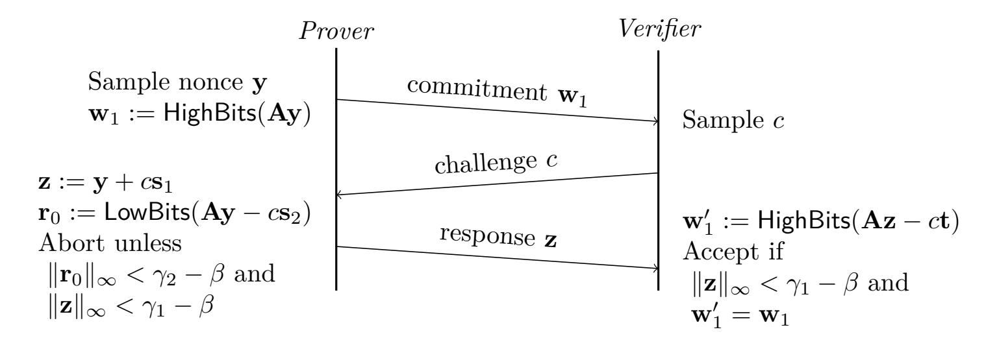
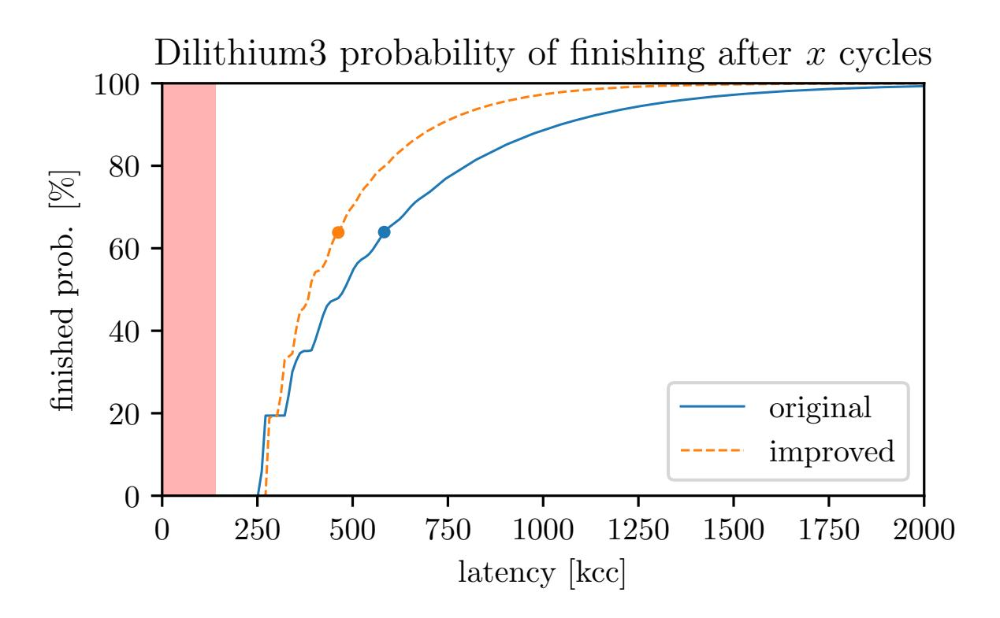

{0}------------------------------------------------

# **Don't throw your nonces out with the bathwater**

**Speeding up Dilithium by reusing the tail of y**

Amber Sprenkels<sup>1</sup> and Bas Westerbaan<sup>1</sup>*,*<sup>2</sup>

<sup>1</sup> Radboud Universiteit Nijmegen, [amber@electricdusk.com](mailto:amber@electricdusk.com), [bas@westerbaan.name](mailto:bas@westerbaan.name)

<sup>2</sup> University College London & [Cloudflare](https://www.cloudflare.com/) & [PQShield](https://pqshield.com/)

**Abstract.** We suggest a small change to the Dilithium signature scheme [\[DKL](#page-10-0)<sup>+</sup>20], that allows one to reuse computations between rejected nonces, for a speed-up in signing time. The modification is based on the idea that, after rejecting on a too large ∥**r**0∥∞, not all elements of the nonce **y** are spent. We swap the order of the checks; and if this **r**0-check fails, we only need to resample *y*1. We provide a proof that shows that the modification does not affect the security of the scheme. We present measurements of the performance of the modified scheme on AVX2, Cortex M4, and Cortex M3, which show a speed-up ranging from 11% for Dilithium2 on M3 to 22% for Dilithium3 on AVX2.

**Keywords:** Dilithium · Fiat-Shamir with aborts · lattice-based cryptography · AVX2 · ARM Cortex-M4 · ARM Cortex-M3

# **1 Introduction**

The signature scheme CRYSTALS-Dilithium [\[DKL](#page-10-1)<sup>+</sup>18, [DKL](#page-10-0)<sup>+</sup>20] is a finalist (round 3) of the NIST post-quantum competition [\[NIS16\]](#page-11-0). At its core, it is not unlike the Schnorr signature algorithm [\[Sch90\]](#page-11-1), i.e., a zero-knowledge identification scheme which is made non-interactive using the Fiat–Shamir heuristic [\[FS87\]](#page-10-2). Such constructions are widely used, for instance in the Ed25519 signature scheme [\[BDL](#page-10-3)<sup>+</sup>11].

In Schnorr, signature generation starts by picking a nonce **y** at random. In Dilithium, however, contrary to traditional Schnorr signatures, not every nonce **y** will result in a valid signature. For correctness and security, the signature is subjected to several checks. When any of these checks fail, a completely new **y** is sampled, and a new candidate signature is generated and scrutinized in turn. Only when a signature passes all the checks, it is output to the user. This construction, where candidate signatures are generated until one of them passes the checks, is called *Fiat–Shamir with Aborts* [\[Lyu09\]](#page-10-4).

In this paper we demonstrate that one does not have to resample **y** completely. Instead, for one of the four checks, we only need to resample parts of **y**. This allows one to reuse computations involving the nonce between attempts and leads to a speed-up in signing time on the order of 11% – 22%. In Appendix [A,](#page-11-2) we present a similar opportunity for another one of the checks, which leads to an additional small, but significant, performance boost.

Touching nonces in Schnorr signatures and ECDSA is considered to be a dangerous affair. That is because many attacks have been published that have broken schemes or implementations that reused nonces, or where nonce bias could be detected [\[bBmCP10,](#page-9-0) [AFG](#page-9-1)<sup>+</sup>14, [BvdPSY14,](#page-10-5) [Bre19,](#page-10-6) [ANT](#page-9-2)<sup>+</sup>20]. We recognize this fact and carefully study the security of our proposal: we show that the updated version of Dilithium is as secure as the original.

{1}------------------------------------------------

We start the paper by giving a brief introduction to Dilithium and the relevant checks on the nonces in particular. Then we introduce our updated version of Dilithium, and examine its security. We continue by looking at the performance impact of the new construction, by first counting the basic operations and then benchmarking optimized AVX2, Cortex M4, and Cortex M3 implementations. We finish with an outlook on further work and applications.

### 2 Brief overview of Dilithium

We will give an overview of the Dilithium signature scheme [DKL<sup>+</sup>20] and will go into more detail about those parts relevant to our optimization. The basic building block of Dilithium are polynomials of degree < n = 256 with integer coefficients modulo  $q = 2^{23} - 2^{13} + 1$  and the rule  $x^{256} = -1$  when computing multiplication. Mathematically, these form the ring  $R := \mathbb{F}_q[x]/_{(x^n+1)}$ .

The 'size' of polynomials plays a crucial role in Dilithium, which is taken to be the size of the largest coefficient, which is its absolute value, so both 1 and q-1=-1 are considered small. To be precise, for any  $x \in \mathbb{F}_q$ , define  $x \mod^{\pm} q$  as the unique  $-\frac{q-1}{2} \leq x' \leq \frac{q-1}{2}$  with  $x = x' \mod q$ . Then for any polynomial  $p \equiv \sum_i p_i x^i \in R$ , define the norm  $||p||_{\infty} = \max_i |p_i \mod^{\pm} q|$ . Similarly, for a vector  $\mathbf{v}$  over R, define  $||\mathbf{v}||_{\infty} = \max_i ||v_i||_{\infty}$ .

The core of the private key are two small vectors over  $R: \mathbf{s}_1 \in R^{\ell}$  and  $\mathbf{s}_2 \in R^k$  sampled uniformly with  $\|\mathbf{s}_1\|_{\infty}, \|\mathbf{s}_2\|_{\infty} \leq \eta$ , where  $\eta$ , k and  $\ell$  depend on the security level. (For NIST level 2, we have  $\eta = 2$ , k = 4,  $\ell = 4$ .) The core of the public key is a random  $k \times \ell$ -matrix  $\mathbf{A}$  over R together with the vector  $\mathbf{t} := \mathbf{A}\mathbf{s}_1 + \mathbf{s}_2$ . It is hard to recover  $\mathbf{s}_1$  and  $\mathbf{s}_2$  from  $\mathbf{t}$  and this is known as the *Module Learning With Errors* (MLWE) problem.

#### 2.1 Underlying identification scheme

Dilithium is based [KLS18] on the following interactive *identification scheme* where a *prover* having access to the private key, demonstrates this fact to a *verifier* that knows the public key, without leaking any information.



The prover generates a random<sup>2</sup> secret nonce<sup>3</sup>  $\mathbf{y} \in \mathbb{R}^{\ell}$  of norm  $\leq \gamma_1$  (with  $\gamma_1 = 2^{17}$  for security level 2.) The prover sends the *commitment*  $\mathbf{w}_1 = \mathsf{HighBits}(\mathbf{A}\mathbf{y})$  to the

<span id="page-1-0"></span><sup>&</sup>lt;sup>1</sup>In fact, for this q, the polynomial  $x^n + 1$  splits and so  $R \cong \mathbb{F}_q^n$  by the generalized Chinese remainder theorem. Because of the particular choice of q and n, this isomorphism can be computed very efficiently in a Fast Fourier Transform (FFT) style and is referred to as the NTT. Using this, multiplications in R are very cheap.

<span id="page-1-1"></span><sup>&</sup>lt;sup>2</sup>Actually, for sampling efficiency, **y** is sampled from those polynomials of norm  $\leq \gamma_1$  without coefficient  $-\gamma_1$  so that there are a power-of-two different possible coefficients.

<span id="page-1-2"></span><sup>&</sup>lt;sup>3</sup>Nonce as in "number only used once" is misleading:  $\mathbf{y}$  is neither a number nor is its single use the only requirement it should satisfy.

{2}------------------------------------------------

verifier, where HighBits and LowBits decompose a vector  $\mathbf{x}$  in the following unique way (with  $\gamma_2 = \frac{q-1}{88}$  for level 2.)

$$\mathsf{HighBits}(\mathbf{x}) \cdot 2\gamma_2 + \mathsf{LowBits}(\mathbf{x}) = \mathbf{x} \quad \text{and} \quad \|\mathsf{LowBits}(\mathbf{x})\|_{\infty} \leq \gamma_2$$

Note that the prover must only send the higher bits of  $\mathbf{w} := \mathbf{A}\mathbf{y}$  for otherwise they would leak  $\mathbf{y}$  as  $\mathbf{A}$  is likely to be invertible. After receiving  $\mathbf{w}_1$ , the verifier returns a random challenge  $c \in R$  with  $\tau$  non-zero coefficients, all either 1 or -1, (with  $\tau = 39$  for security level 2.) Now the prover computes the response  $\mathbf{z} := \mathbf{y} + c\mathbf{s}_1$ . Note that  $\|c\mathbf{s}_1\|_{\infty}$  is not very large, it is at most  $\beta := \eta \tau$ . Before sending the response, it performs the following two checks on the sizes of  $\mathbf{z}$  and  $\mathbf{r}_0 := \mathsf{LowBits}(\mathbf{A}\mathbf{y} - c\mathbf{s}_2)$ , whose importance will become clear later on.

<span id="page-2-1"></span><span id="page-2-0"></span>
$$\|\mathbf{r}_0\|_{\infty} < \gamma_2 - \beta,$$
  $(\mathbf{r}_0\text{-check})$   $\|\mathbf{z}\|_{\infty} < \gamma_1 - \beta$   $(\mathbf{z}\text{-check})$ 

If any of these fail, the prover aborts and restarts from the beginning. When eventually receiving a response (after typically around 3 restarts) the verifier accepts whenever  $\mathbf{w}'_1 := \text{HighBits}(\mathbf{Az} - c\mathbf{t}) = \mathbf{w}_1$  and  $\|\mathbf{z}\|_{\infty} < \gamma_1 - \beta$ .

Without the checks, the scheme wouldn't always work. Indeed, in general

$$\mathbf{w}_1' \equiv \mathsf{HighBits}(\mathbf{Az} - c\mathbf{t}) = \mathsf{HighBits}(\mathbf{Ay} - c\mathbf{s}_2) \neq \mathsf{HighBits}(\mathbf{Ay}) \equiv \mathbf{w}_1$$

as even though  $c\mathbf{s}_2$  has small coefficients (also  $\leq \beta$ ) they might still carry into the higher bits and so the verifier won't trust the prover. This problem is solved by making sure that  $\mathbf{y}$ doesn't overflow, which is the purpose of the ( $\mathbf{r}_0$ -check) [DKL<sup>+</sup>20, Eq. 3]. A different issue is that  $\mathbf{z}$  might leak information on  $\mathbf{y}$  and  $\mathbf{s}_1$  if it has large coefficients — for instance, if  $z_1 = \gamma_1 + \beta - 1$ , then we must have  $y_1 = \gamma_1 - 1$  and  $(c\mathbf{s}_2)_1 = \beta$ . The ( $\mathbf{z}$ -check) prevents this kind of leakage.

Indeed, this scheme is perfectly non-abort zero-knowledge: that means we can replicate the distribution of  $(c, \mathbf{z})$  in successful sessions<sup>4</sup> without having access to the secret key. Not all  $(c, \mathbf{z})$  can occur, but if they do, they occur with equal probability. Now, to simulate a session, pick random  $(c, \mathbf{z})$  with  $\|\mathbf{z}\|_{\infty} < \gamma_1 - \beta$ ,  $\|\text{LowBits}(\mathbf{Az} - c\mathbf{t})\|_{\infty} < \gamma_2 - \beta$ , and c as a verifier would sample it. Every pair  $(c, \mathbf{z})$  that occurs in a real session could be generated as such: the first requirement is the  $(\mathbf{z}\text{-check})$  and the second the  $(\mathbf{r}_0\text{-check})$  because  $\mathbf{Az} - c\mathbf{t} = \mathbf{Ay} - c\mathbf{s}_2$ . Conversely, given such a simulated pair, set  $\mathbf{y} := \mathbf{z} - c\mathbf{s}_1$ . This  $\mathbf{y}$  could have been picked as  $\|\mathbf{y}\|_{\infty} < \gamma_1$  for  $\|c\mathbf{s}_1\| \le \beta$ . With this nonce, the prover will pick the right response  $\mathbf{z}$ . With the first two requirements we also made sure that the prover will pass the  $(\mathbf{z}\text{-check})$  and  $(\mathbf{r}_0\text{-check})$ . And so in the same way as we prove correctness in a regular run, we see that the verifier will accept. Thus we can indeed simulate the sessions perfectly.

As with the Schnorr identification scheme, using the same nonce twice will leak the private key. Indeed, given  $\mathbf{z} = \mathbf{y} + c\mathbf{s}_1$  and  $\mathbf{z}' = \mathbf{y} + c'\mathbf{s}_1$ , we have  $\mathbf{s}_1 = \frac{\mathbf{z} - \mathbf{z}'}{c - c'}$ . As well known, for Schnorr this fragility has the silver lining that it allows us to show that the prover must indeed know the secret key, by imagining (rewinding) it would use the same nonce twice (with a different computation.) For Dilithium a different argument, which we will touch upon later, is used.

#### 2.2 Dilithium

As well known, an identification scheme can be turned into a signature scheme, using the Fiat-Shamir style transform [FS87]. A signature on a message M is given by a pair  $(c, \mathbf{z})$ 

<span id="page-2-2"></span><sup>&</sup>lt;sup>4</sup>The commitment  $\mathbf{w}_1$  is not included as in a successful session it is fixed by the challenge and response.

<span id="page-2-3"></span><sup>&</sup>lt;sup>5</sup>Any  $x \in R$  with  $||x||_{\infty} \le \sqrt{q/2}$  is invertible [LN17, Lemma 2.2].

{3}------------------------------------------------

of a challenge c and a response  $\mathbf{z}$  of a successful interaction of the identification scheme, where the challenge is not picked randomly by a verifier, but rather  $\mathsf{H}(M \parallel \mathbf{w}_1)$  for a hash function  $\mathsf{H}$  that ranges over the challenge space  $B_{\tau}$ . After applying the Fiat–Shamir transform, we get the non-interactive signature generation algorithm as listed in Algorithm 1.

To check a signature, a verifier (like in the identification scheme) first checks  $\|\mathbf{z}\|_{\infty} < \gamma_1 - \beta$  and then computes  $\mathbf{w}'_1 := \mathbf{A}\mathbf{z} - c\mathbf{t}$ , which should be the original commitment. The verifier does not have access to the original commitment (as it was not included in the signature), but can check whether it was correct by recomputing the challenge using the supposed commitment and comparing it against the one included in the signature.

## <span id="page-3-0"></span>Algorithm 1 Simplified vanilla Dilithium

```
\mathsf{Sign}_{\mathsf{vanilla}}(sk = (\mathbf{A}, \mathbf{t}, \mathbf{s}_1, \mathbf{s}_2), M)
  1: \kappa := 0
  2: sign: loop
              for i from 0 up to \ell-1 do
  3:
                     \mathbf{y}_i := \mathsf{ExpandMask}(\kappa); \ \kappa := \kappa + 1
  4:
              \mathbf{w}_1 := \mathsf{HighBits}(\mathbf{A}\mathbf{y})
  5:
              c := \mathsf{H}(M \parallel \mathbf{w}_1)
  6:
              \mathbf{z} := \mathbf{y} + c\mathbf{s_1}
  7:
              if \|\mathbf{z}\|_{\infty} \geq \gamma_1 - \beta then
  8:
                                                                                                                                                            \triangleright (z-check)
                     continue sign
  9:
              if \|\mathsf{LowBits}(\mathbf{Ay} - c\mathbf{s_2}, \gamma_2)\|_{\infty} \geq \gamma_2 - \beta then
                                                                                                                                                          \triangleright (\mathbf{r}_0-check)
10:
                     continue sign
11:
12: return (c, \mathbf{z})
```

The full Dilithium scheme is rather more complex, as it includes tricks to decrease signature and key sizes (such as only publishing the higher bits of  $\mathbf{t}$ ) while increasing performance (by sampling in the NTT domain.) These details, however, do not impact the security of the scheme or our proposal and will direct the curious reader to the specification [DKL<sup>+</sup>20].

# 3 Our proposal

To create a signature, we randomly sample a nonce  $\mathbf{y}$  and then compute in sequence the commitment  $\mathbf{w}_1$ , challenge c, and response  $\mathbf{z}$ . Not every  $\mathbf{y}$  will lead to a valid identification session as the ( $\mathbf{r}_0$ -check) or ( $\mathbf{z}$ -check) might fail. In that case, we completely start over again with a new nonce  $\mathbf{y}$ .

Heuristically, as ( $\mathbf{r}_0$ -check) only looks at the lower bits and  $\mathbf{A}$  (being uniform) mixes all components of  $\mathbf{y}$ , resampling just  $y_1$  gives a new independent chance for ( $\mathbf{r}_0$ -check) to pass. Thus our proposal is to resample only  $y_1$  when the ( $\mathbf{r}_0$ -check) fails and to perform the ( $\mathbf{r}_0$ -check) before the ( $\mathbf{z}$ -check).

Contrary to vanilla Dilithium, the order of the checks is important. If we were to perform the ( $\mathbf{z}$ -check) first, then it is likely that we will have picked a  $\mathbf{y}$  whose tail has passed the ( $\mathbf{z}$ -check)s multiple times, with different challenges c. This will bias  $\mathbf{y}$  to have smaller values in its tail.

After swapping the checks and modifying Algorithm 1, such that only  $y_1$  is resampled when ( $\mathbf{r}_0$ -check) fails, we get Algorithm 2.

Note that signatures are compatible between vanilla and modified Dilithium: a signature generated by one will verify by the other. Indeed, we did not change the verification

{4}------------------------------------------------

#### <span id="page-4-0"></span>**Algorithm 2** Simplified Dilithium modified as we propose

```
Signmod(sk = (A, t, s1, s2), M)
1: κ := 0; ξ := ℓ
2: sign: loop
3: for i from 0 up to ξ − 1 do ▷ Only (re)sample the first ξ elements of y
4: yi
          := ExpandMask(κ); κ := κ + 1
5: w1 := HighBits(Ay)
6: c := H(M ∥ w1)
7: z := y + cs1
8: if ∥LowBits(Ay − cs2, γ2)∥∞ ≥ γ2 − β then ▷ (r0-check)
9: ξ := 1
10: continue sign
11: if ∥z∥∞ ≥ γ1 − β then ▷ (z-check)
12: ξ := ℓ
13: continue sign
14: return (c, z)
```

routine. However, signing the same message using the same secret key will lead to two different signatures on the same message.

## **3.1 Compatibility with streaming implementations**

Some implementations (eg. [\[GKS20,](#page-10-9) Strategy 3]), optimise for memory-constrained environments. To use memory efficiently, they typically compute **w** = **Ay** one element at a time where each component of **A** and **y** is generated on the fly.

With our modifications, we are not resampling exactly *ℓ* elements of **y** during each loop iteration. Some polynomials *y<sup>i</sup>* might have been fixed some loop iterations ago, using an old *κ* that could have been forgotten. To ensure compatibility with the other implementation, the streaming implementation will have to keep track of the *κ* values that were used to generate the elements of **y** that are still in use.

# **4 Security**

The security claim of Dilithium is *strong unforgeability under chosen message attacks* (SUF-CMA.) The complete security proof is given in [\[KLS18\]](#page-10-7) and its references. We will summarize it here.

Dilithium is based on what [\[AFLT12\]](#page-9-3) calls a *lossy identification scheme*. Such a scheme is interactive (and as usual made non-interactive with the Fiat-Shamir heuristic [\[FS87\]](#page-10-2).) The corresponding non-interactive scheme is UF-NMA (unforgeability under no-message attack) secure, i.e., it is secure against an attacker that has no access to any signed messages. As we are not changing key generation or verification, this proof applies to our modified scheme as well.

From this UF-CMA (unforgeability under chosen-message attack) is proven using the additional fact that the signature scheme is *zero-knowledge* and that the min-entropy[6](#page-4-1) of the commitment is large.

Thus, as long as we can prove that our modified version of Dilithium is still zeroknowledge and that the commitments have large min-entropy, we know it is UF-CMA as well.

<span id="page-4-1"></span><sup>6</sup>The min-entropy of a distribution is *H*<sup>∞</sup> = − log<sup>2</sup> *pm*, where *p<sup>m</sup>* is the probability of the most likely outcome of the distribution.

{5}------------------------------------------------

The strong unforgeability follows with the same argument as for vanilla Dilithium [DKL<sup>+</sup>20, §6.2.2].

**Zero-knowledgeness.** Vanilla Dilithium is zero-knowledge — the argument that we gave for the identification scheme can be modified in the usual way for the signature scheme by programming  $H(M||\mathbf{w}_1) := c$ , where we model the hash function as a random oracle. Our modifications do not fit the identification scheme neatly, so we will prove zero-knowledge directly for the modified signature scheme.

Before we start, note that our modification does not change which  $(\mathbf{z}, c)$  can occur, but does change the probability of each. Indeed, effectively  $\mathbf{y}' := (y_2, \dots, y_\ell)$  is picked uniformly at random and then after that  $y_1$  is picked also uniformly at random such that  $(\mathbf{y}, c)$  passes the checks. The non-uniformity stems from the fact that the number of values of  $y_1$  for a given  $\mathbf{y}'$  might vary.

We start the simulation in the same way as vanilla: we randomly pick  $(c, \mathbf{z})$  with  $\|\mathbf{z}\|_{\infty} < \gamma_1 - \beta$  and c as usual. Then the simulator checks  $\|\text{LowBits}(\mathbf{Az} - c\mathbf{t})\|_{\infty} < \gamma_2 - \beta$ . As noted before, this is equivalent to the  $(\mathbf{r}_0\text{-check})$ . If this check succeeds, then the simulator programs  $H(M\|\mathbf{w}_1) := c$  and outputs  $(c, \mathbf{z})$ . Restricting to success in just one 'iteration' vanilla and original Dilithium have exactly the same distribution and both simulators agree as well. If this check fails, then the vanilla simulator resamples  $\mathbf{z}$  and performs all checks again. Our simulator, instead, only resamples  $\|z_1\|_{\infty} < \gamma_1 - \beta$ . This corresponds to resampling  $y_1$  as modified Dilithium does.

If this check fails, the original simulator will resample  $\mathbf{z}$  and perform the checks again. Instead, this simulator will only resample  $z_1$  and check  $\|\mathbf{LowBits}(\mathbf{Az} - c\mathbf{t})\|_{\infty} < \gamma_2 - \beta$  for the new  $\mathbf{z}$ . This corresponds to modified Dilithium resampling  $y_1$  when having picked  $\mathbf{y} := \mathbf{z} - c\mathbf{s}_1$ . When the check succeeds it will again program H accordingly and return  $(\mathbf{z}, c)$ . Up to two 'iterations', the simulator and simulated agree. And so on. This shows the modified scheme is zero-knowledge as well, assuming that there aren't too many conflicts programming H.

**Min-entropy of w<sub>1</sub>.** Indeed, the distribution of  $\mathbf{y}$  with Proposal 2 is different from the distribution of  $\mathbf{y}$  in vanilla Dilithium. Therefore, we have to demonstrate that the min-entropy of  $\mathbf{w}_1$  is still large enough as otherwise the same  $\mathbf{w}_1$  might occur multiple times programming  $\mathsf{H}(M \parallel \mathbf{w}_1)$ .

For vanilla Dilithium it is shown [KLS18, Lemma C.1] that, with overwhelming probability, the min-entropy of  $\mathbf{w}_1$  is larger than 117 bits.<sup>8</sup> We can adapt this proof to our situation.

Recall  $\mathbf{w}_1 = \mathsf{HighBits}(\mathbf{w})$  and  $\mathbf{w} = \mathbf{Ay}$ . For brevity, write  $w_{11} := (\mathbf{w}_1)_1$ . Let W be the set of those w with  $\mathsf{HighBits}(w) = w_{11}$ . By definition of  $\mathsf{HighBits}$ , the size of W is at most  $(2\gamma_2 + 1)^n$ . Note  $w_1 = \sum_j A_{j1}y_j$ . Assume for now that there is an invertible element  $A_{i1}$  in the first column of  $\mathbf{A}$ . Then

$$Y := \left\{ y_1; \sum_{0 \le j \le \ell} A_{j1} y_j = w_1 \right\} = A_{i1}^{-1} \left( W - \sum_{j \ne i} A_{j1} y_j \right). \tag{1}$$

Hence Y has the same number of elements of W. Crucially in our modification of Dilithium, the distribution of  $y_1$  is still uniform, and so the chance we get one that leads to  $w_{11}$  is

$$\Pr_{y_1 \leftarrow \tilde{S}_{\gamma_1}} \left[ y_1 \in Y \right] = \frac{\#Y}{\# \tilde{S}_{\gamma_1}} \le \left( \frac{2\gamma_2 + 1}{2\gamma_1} \right)^n. \tag{2}$$

<span id="page-5-0"></span><sup>&</sup>lt;sup>7</sup>There is some subtlety how to count iterations here. The simulator samples  $\mathbf{z}$  such that it passes the ( $\mathbf{z}$ -check) and so iterations of the simulator never fail because of it. So we're really counting failed ( $\mathbf{r}_0$ -check)s in iterations that would've passed the ( $\mathbf{z}$ -check).

<span id="page-5-1"></span><sup>&</sup>lt;sup>8</sup>For the original version of Dilithium as published in [KLS18] the min-entropy is with a high probability ( $\geq 1-2^{-179}$  for Dilithium2) at least 255 bits. With the updated parameters of Dilithium round 3, the min-entropy is with an overwhelming probability ( $\geq 1-2^{-239}$  for Dilithium2) at least 117 bits.

{6}------------------------------------------------

Thus, if there is an invertible element in the first column of **A**, then the min-entropy of the resulting commitment  $\mathbf{w}_1$  is at least  $-n \log \frac{2\gamma_2+1}{2\gamma_1} \ge 117$ .

The probability that some uniformly sampled polynomial is invertible is  $(1-\frac{1}{q})^n \ge 1-\frac{n}{q}$ . Thus the chance that none of the polynomials in the first column of **A** is invertible is at most  $(\frac{n}{q})^k$ . This is highest for Dilithium2 where k=4 and this probability is approximately  $2^{-60}$ .

Thus, for almost all keypairs the UF-CMA security bound is not reduced. Moreover, in [KLS18] it is noted that the cited 255 bits is probably far from the real min-entropy. As the range of HighBits( $\mathbf{A} \cdot$ ) is very large, upwards of  $2^{17960}$ , and heuristically close to uniform, it is very likely that the min-entropy is much larger. Additionally, there is another result [KLS18, Lemma 4.7] which shows that for smaller  $\gamma_1$  and  $\gamma_2$  the min-entropy (which heuristically should then be smaller) is upwards of a 1000 bits, without needing an invertible element in  $\mathbf{A}$ . Therefore, even if none of the elements in  $\mathbf{A}$  are invertible, it seems unlikely that the min-entropy of  $\mathbf{w}_1$  is ever dangerously small in the modified Dilithium.

## 5 Performance

#### 5.1 Operations saved

By not resampling the complete vector  $\mathbf{y}$  every time a check fails, we save computation time, that was originally spent generating  $\mathbf{y}$  and computing  $\mathbf{w} := \mathbf{A}\mathbf{y}$ .

To get a feel for the potential performance improvement, we have simulated the rejection-sampling loop up until the second check, using a simple Sage script. Note that this does *not* include the computation of  $\mathbf{A}$ .

<span id="page-6-1"></span>**Table 1:** Average number of sampled **y**-components, calls to KeccakF1600\_StatePermute, NTT, and NTT<sup>-1</sup> in the Dilithium rejection-sampling loop; using unmodified Dilithium signing, and using the modification proposed in this paper. Averages were computed over 10 000 runs.

|            |                    | baseline           | updated      |
|------------|--------------------|--------------------|--------------|
| Dilithium2 | $\mathbf{y}$ elems | 17.37 (100%)       | 9.76 (56%)   |
|            | KeccakF            | $95.53 \ (100\%)$  | 64.51  (68%) |
|            | NTT                | 21.71 (100%)       | 14.01  (65%) |
|            | $NTT^{-1}$         | $52.11 \ (100\%)$  | 50.91  (98%) |
| Dilithium3 | $\mathbf{y}$ elems | 25.56 (100%)       | 11.59 (45%)  |
|            | KeccakF            | $158.46\ (100\%)$  | 88.73  (56%) |
|            | NTT                | 30.67 (100%)       | 16.72  (55%) |
|            | $NTT^{-1}$         | 86.90 (100%)       | 87.14 (100%) |
| Dilithium5 | $\mathbf{y}$ elems | 27.22 (100%)       | 13.04 (48%)  |
|            | KeccakF            | $182.77 \ (100\%)$ | 111.97 (61%) |
|            | NTT                | 31.11 (100%)       | 16.94  (54%) |
|            | $NTT^{-1}$         | 89.44 (100%)       | 89.66 (100%) |

The simulations count the amount of y components that have been sampled, and count the amount of calls to KeccakF1600\_StatePermute (the SHA3/SHAKE primitive) and

<span id="page-6-0"></span> $<sup>^9</sup>$ To decrease the size of the public key, Dilithium does not store **A** in the public key, but rather a seed from which **A** can be reconstructed.

{7}------------------------------------------------

NTT. We also include calls to the inverse NTT (NTT-1), even though the number stays almost constant. The results are listed in Table [1.](#page-6-1)

For every mode of Dilithium, we save a considerable amount of **y**-component generations: up to 60% of the total amount of generated polynomials, in the case of Dilithium3. This saving is reflected in the total amount of KeccakF1600\_StatePermute calls (48% less) and the number of computed NTTs (50% less.) There is—as expected—no change in the amount of computed NTT-1s.

Although these theoretical counts are useful, as performance of these primitives (and their subtle interaction) varies per platform, we continue with measurements on actual implementations on various platforms.

### **5.2 Optimized implementation**

We have implementated both proposals in state-of-the-art optimized Dilithium implementations for x64 with AVX2, Cortex M4, and Cortex M3, and benchmarked their performance.

**AVX2.** For AVX2, we base our modified implementation on the round-3 code package from the CRYSTALS team [\[DKL](#page-10-1)<sup>+</sup>18] [10](#page-7-0). Because of the relative abundance of RAM on x64 platforms, we can easily cache all of the accumulated values in **w**. That is, we cache the values *Aijy<sup>j</sup>* for *i* = 1*, . . . k* and *j* = 1*, . . . , ℓ*.

**Cortex M{4,3}.** For the Cortex M4 platform, we use the STM23F407 DISCOVERY board, which is based on the STM32F407VG microcontroller; for Cortex M3, we use the Arduino Due, which features an ATSAM3X8E microcontroller. We have ported the reference implementation to each platform, and then applied the optimizations described in [\[GKS20,](#page-10-9) Sec. 4].

In the context of post-quantum signature schemes, both of these boards have a relatively low amount of SRAM. This makes it impossible to cache all components of **w**, for which we would need another *k* × *ℓ* KiB of SRAM. Instead, on the Cortex M platforms, we cache only the value

$$\mathbf{w}' = \mathbf{A}(0, y_2, y_3, \ldots).$$

Storing this extra **w**′ -vector only needs an extra *k* KiB of SRAM space.

**Benchmarking setup.** We benchmark the AVX2 implementation of Dilithium using the benchmarking tool provided in the NIST submission code package. For the AVX2 implementation, 100 000 iterations were run on an Intel Core i7-4770 (Haswell) processor and its average recorded. On the x64 processor, all measurements were done with Turbo Boost disabled, all Hyper-Threading cores shut down, and with the CPU clocked at the maximum nominal frequency. The ARM Cortex M4 and M3 implementations were benchmarked on an STM32F407VG and an ATSAM3X8E respectively. The STM32F407 chip was clocked at 24 MHz and the flash wait states were set to zero; the algorithm latencies were measured using the SysTick counter. The ATSAM3X8E was clocked at 16 MHz and its wait states were also set to zero; the measurements used the internal CYCCNT cycle counter. On Cortex-M4, the measurements were averaged over 10 000 samples; on Cortex M3, the measurements were averaged over 1 000 samples.

<span id="page-7-0"></span><sup>10</sup>Available for download at

{8}------------------------------------------------

<span id="page-8-0"></span>**Table 2:** Average latencies of Dilithium signature generation on AVX2, Cortex M4, and Cortex M3. Cycle counts are listed in kilocycles and *include* the computation of **A**. Note that these results cannot be compared with [\[GKS20\]](#page-10-9), because the parameters of Dilithium have been updated for round 3 of the NIST competition (and so our baseline is an update of [\[GKS20,](#page-10-9) Strategy 2].)

|            |           | baseline | updated |
|------------|-----------|----------|---------|
|            | AVX2      | 352.5    | 316.5   |
| Dilithium2 | Cortex M4 | 4 386    | 3 785   |
|            | Cortex M3 | 7 547    | 6 794   |
| Dilithium3 | AVX2      | 542.5    | 437.2   |
|            | Cortex M4 | 7 191    | 5 755   |
|            | Cortex M3 | 12 681   | 10 397  |
|            | AVX2      | 649.3    | 553.6   |
| Dilithium5 | Cortex M4 | 9 317    | 7 930   |
|            | Cortex M3 | – a      | a<br>–  |

<sup>a</sup> Not enough SRAM available to store Dilithium5 state.

**Results.** The results of the benchmarks of our improved version of Dilithium are listed in Table [2.](#page-8-0) We see performance speedups ranging from 11% for Dilithium2 on Cortex M3, up to 22% for Dilithium3 on AVX2.

It should be stressed that these measurements include the *setup* stage of Dilithium. This is the conventional method of measuring Dilithium's performance. That is, the measurements include the expansion of the matrix **A** and the initial NTTs of **s**1, **s**<sup>2</sup> and **t**0.

<span id="page-8-1"></span>

**Figure 1:** Probability of Dilithium3 signature generation on AVX2 to complete after a latency of *x* cycles. The *setup* stage is illustated by the red box that runs from 0 to 131 kcc. The average latency is marked with a dot.

However, it has been recently argued by [\[RGCB19\]](#page-11-3) and [\[GKS20\]](#page-10-9) that this *setup stage* often does not need to be computed during signature generation, but that is can be considered as part of the key generation instead. Moreover, because of the rejection sampling, it is difficult to completely imagine the extent of this speedup. Therefore, 

{9}------------------------------------------------

to provide you with an intuition, we have plotted the portion of Dilithium3 signature generations that finishes after *x* cycles in Figure [1.](#page-8-1)

The figure shows that when the setup stage is precomputed, the relative speedup is much better than 22%. That is, without the setup stage the average Dilithium3-on-AVX2 speedup is 34%.

If we do *not* precompute the setup stage, the effect of an improved performance in the rejection-sampling loop is still better for the worse-case runs of the signature-generation algorithm, because the latency of the setup stage is amortized. Indeed, if we look at the 90% percentile, the speedup of our improved algorithm is 47%; at the 99% percentile, the speedup is 52%.

# **6 Conclusion**

We have seen that we can improve the performance of the Dilithium signature scheme by reusing some of the nonce material that is sampled during signature generation. Although this paper focuses entirely on Dilithium, we would like to mention that these proposals could apply elsewhere, such as larger lattice-based zero-knowledge proofs. Other schemes that use rejection-sampling from Gaussian distributions in particular stand to benefit as sampling from those is expensive.

The main proposal can be incorporated into the next version of Dilithium without any worry: there are no extra costs imposed; the security is not affected and the result is a significant (up to 22%) speedup depending on the instance. The other proposal (from appendix [A\)](#page-11-2) boost performance even more, but without a security proof we do not recommend to adopt it.

**Acknowledgements** This work was supported in part by the European Commission through the ERC Starting Grant 805031 (EPOQUE.) acknowledge Peter, Vadim, and other proofreaders

# **References**

- <span id="page-9-1"></span>[AFG<sup>+</sup>14] Diego F. Aranha, Pierre-Alain Fouque, Benoît Gérard, Jean-Gabriel Kammerer, Mehdi Tibouchi, and Jean-Christophe Zapalowicz. GLV/GLS Decomposition, power analysis, and attacks on ECDSA signatures with singlebit nonce bias. In Palash Sarkar and Tetsu Iwata, editors, *ASIACRYPT 2014*, volume 8873 of *LNCS*, pages 262–281. Springer, 2014. [https:](https://link.springer.com/chapter/10.1007/978-3-662-45611-8_14) [//link.springer.com/chapter/10.1007/978-3-662-45611-8\\_14](https://link.springer.com/chapter/10.1007/978-3-662-45611-8_14).
- <span id="page-9-3"></span>[AFLT12] Michel Abdalla, Pierre-Alain Fouque, Vadim Lyubashevsky, and Mehdi Tibouchi. Tightly-secure signatures from lossy identification schemes. In David Pointcheval and Thomas Johansson, editors, *EUROCRYPT 2012*, volume 7237 of *LNCS*, pages 572–590. Springer, 2012. [https://link.springer.](https://link.springer.com/chapter/10.1007/978-3-642-29011-4_34) [com/chapter/10.1007/978-3-642-29011-4\\_34](https://link.springer.com/chapter/10.1007/978-3-642-29011-4_34).
- <span id="page-9-2"></span>[ANT<sup>+</sup>20] Diego F. Aranha, Felipe Rodrigues Novaes, Akira Takahashi, Mehdi Tibouchi, and Yuval Yarom. Ladderleak: Breaking ecdsa with less than one bit of nonce leakage. In *CCS 2020*, pages 225—-242. ACM, 2020. [https:](https://eprint.iacr.org/2020/615) [//eprint.iacr.org/2020/615](https://eprint.iacr.org/2020/615).
- <span id="page-9-0"></span>[bBmCP10] Ben "bushing" Byer, Hector Martin "marcan" Cantero, and Sven Peter. Console Hacking 2010. 27th Chaos Communication Congress – 27C3, [https://fahrplan.events.ccc.de/congress/2010/Fahrplan/](https://fahrplan.events.ccc.de/congress/2010/Fahrplan/events/4087.en.html) [events/4087.en.html](https://fahrplan.events.ccc.de/congress/2010/Fahrplan/events/4087.en.html), 2010.

{10}------------------------------------------------

- <span id="page-10-3"></span>[BDL<sup>+</sup>11] Daniel J. Bernstein, Niels Duif, Tanja Lange, Peter Schwabe, and Bo-Yin Yang. High-speed high-security signatures. In Bart Preneel and Tsuyoshi Takagi, editors, *CHES 2011*, volume 6917 of *LNCS*, pages 124–142. Springer, 2011. [https://link.springer.com/chapter/10.1007/978-3-642-23951-9\\_9](https://link.springer.com/chapter/10.1007/978-3-642-23951-9_9).
- <span id="page-10-6"></span>[Bre19] Nadia Breitner, Joachimand Heninger. Biased nonce sense: Lattice attacks against weak ecdsa signatures in cryptocurrencies. In Tyler Goldberg, Ianand Moore, editor, *FSC 2019*, pages 3–20. Springer, 2019.
- <span id="page-10-5"></span>[BvdPSY14] Naomi Benger, Joop van de Pol, Nigel P. Smart, and Yuval Yarom. "Ooh Aah... Just a Little Bit" : A small amount of side channel can go a long way. In Lejla Batina and Matthew Robshaw, editors, *CHES 2014*, volume 8731 of *LNCS*, pages 75–92. Springer, 2014. <https://eprint.iacr.org/2014/161>.
- <span id="page-10-1"></span>[DKL<sup>+</sup>18] Léo Ducas, Eike Kiltz, Tancrède Lepoint, Vadim Lyubashevsky, Peter Schwabe, Gregor Seiler, and Damien Stehlé. Crystals-dilithium: A latticebased digital signature scheme. *IACR Transactions on Cryptographic Hardware and Embedded Systems*, 2018(1):238–268, 2018. [https://tches.iacr.](https://tches.iacr.org/index.php/TCHES/article/view/839) [org/index.php/TCHES/article/view/839](https://tches.iacr.org/index.php/TCHES/article/view/839).
- <span id="page-10-0"></span>[DKL<sup>+</sup>20] Léo Ducas, Eike Kiltz, Tancrède Lepoint, Vadim Lyubashevsky, Peter Schwabe, Gregor Seiler, and Damien Stehlé. CRYSTALS-Dilithium – submission to round 3 of the NIST post-quantum project., 2020. [https://pq-crystals.org/dilithium/data/](https://pq-crystals.org/dilithium/data/dilithium-specification-round3.pdf) [dilithium-specification-round3.pdf](https://pq-crystals.org/dilithium/data/dilithium-specification-round3.pdf).
- <span id="page-10-10"></span>[DN12] Léo Ducas and Phong Q. Nguyen. Learning a zonotope and more: Cryptanalysis of ntrusign countermeasures. In Xiaoyun Wang and Kazue Sako, editors, *ASIACRYPT 2012*, pages 433–450. Springer, 2012. [https://link.](https://link.springer.com/chapter/10.1007/978-3-642-34961-4_27) [springer.com/chapter/10.1007/978-3-642-34961-4\\_27](https://link.springer.com/chapter/10.1007/978-3-642-34961-4_27).
- <span id="page-10-2"></span>[FS87] Amos Fiat and Adi Shamir. How to prove yourself: Practical solutions to identification and signature problems. In Andrew M. Odlyzko, editor, *CRYPTO 1986*, volume 263 of *LNCS*, pages 186–194. Springer, 1987. [https:](https://link.springer.com/chapter/10.1007%2F3-540-47721-7_12) [//link.springer.com/chapter/10.1007%2F3-540-47721-7\\_12](https://link.springer.com/chapter/10.1007%2F3-540-47721-7_12).
- <span id="page-10-9"></span>[GKS20] Denisa O. C. Greconici, Matthias J. Kannwischer, and Daan Sprenkels. Compact dilithium implementations on cortex-m3 and cortex-m4. *IACR Transactions on Cryptographic Hardware and Embedded Systems*, 2021(1):1–24, 2020. <https://tches.iacr.org/index.php/TCHES/article/view/8725>.
- <span id="page-10-7"></span>[KLS18] Eike Kiltz, Vadim Lyubashevsky, and Christian Schaffner. A concrete treatment of Fiat-Shamir signatures in the quantum random-oracle model. In Jesper Buus Nielsen and Vincent Rijmen, editors, *EUROCRYPT 2018*, volume 10822 of *LNCS*, pages 552–586. Springer, 2018. [https://eprint.iacr.](https://eprint.iacr.org/2017/916) [org/2017/916](https://eprint.iacr.org/2017/916).
- <span id="page-10-8"></span>[LN17] Vadim Lyubashevsky and Gregory Neven. One-shot verifiable encryption from lattices. In *EUROCRYPT 2017*, volume 10210 of *LNCS*, pages 293–323. Springer, 2017. <https://eprint.iacr.org/2017/122>.
- <span id="page-10-4"></span>[Lyu09] Vadim Lyubashevsky. Fiat-shamir with aborts: Applications to lattice and factoring-based signatures. In Mitsuru Matsui, editor, *ASIACRYPT 2009*, volume 5912 of *LNCS*, pages 598–616. Springer, 2009. [https://www.iacr.](https://www.iacr.org/archive/asiacrypt2009/59120596/59120596.pdf) [org/archive/asiacrypt2009/59120596/59120596.pdf](https://www.iacr.org/archive/asiacrypt2009/59120596/59120596.pdf).

{11}------------------------------------------------

- <span id="page-11-0"></span>[NIS16] NIST Computer Security Division. Post-Quantum Cryptography Standardization, 2016. [https://csrc.nist.gov/Projects/](https://csrc.nist.gov/Projects/Post-Quantum-Cryptography) [Post-Quantum-Cryptography](https://csrc.nist.gov/Projects/Post-Quantum-Cryptography).
- <span id="page-11-4"></span>[NR06] Phong Q. Nguyen and Oded Regev. Learning a parallelepiped: Cryptanalysis of ggh and ntru signatures. In Serge Vaudenay, editor, *EUROCRYPT 2006*, volume 4004 of *LNCS*, pages 271–288. Springer, 2006. [https://link.](https://link.springer.com/article/10.1007/s00145-008-9031-0) [springer.com/article/10.1007/s00145-008-9031-0](https://link.springer.com/article/10.1007/s00145-008-9031-0).
- <span id="page-11-3"></span>[RGCB19] Prasanna Ravi, Sourav Sen Gupta, Anupam Chattopadhyay, and Shivam Bhasin. Improving Speed of Dilithium's Signing Procedure. In *CARDIS 2019*, volume 11833 of *LNCS*, pages 57–73. Springer, 2019. [https://eprint.](https://eprint.iacr.org/2019/420) [iacr.org/2019/420](https://eprint.iacr.org/2019/420).
- <span id="page-11-1"></span>[Sch90] C. P. Schnorr. Efficient identification and signatures for smart cards. In Gilles Brassard, editor, *CRYPTO 1989*, volume 435 of *LNCS*, pages 239–252. Springer, 1990. [https://link.springer.com/chapter/10.1007%](https://link.springer.com/chapter/10.1007%2F0-387-34805-0_22) [2F0-387-34805-0\\_22](https://link.springer.com/chapter/10.1007%2F0-387-34805-0_22).

# <span id="page-11-2"></span>**A Another nonce-reusal trick**

In this appendix, we describe an additional modification of the Dilithium scheme, which adds another small speedup to the Dilithium signing algorithm. It is not included in the main body of this paper, because at the time of writing, we have not been able to prove that this modification does not impact the security.

## **A.1 Resample only the prefix of y after failed** (**z**[-check\)](#page-2-1)

Note that by the definition of the norm, the (**z**[-check\)](#page-2-1) involves the following *ℓ* subchecks, one for each component of **y**: ∥*y<sup>i</sup>* + *c*(**s**1)*i*∥<sup>∞</sup> *< γ*<sup>1</sup> − *β*. If the first subcheck fails (without having performed the other checks or subchecks), then instead of aborting completely and resampling all elements of **y**, we propose to resample *y*<sup>1</sup> but keep *y*2*, . . . , yℓ*. This allows one to reuse the computations of *Aijy<sup>j</sup>* for *j* = 1 ̸ , which were required to compute *c* via **Ay**. As **Ay** changes, the commitment **w**<sup>1</sup> changes with high probability (cf. [\[KLS18,](#page-10-7) Lemma C.1]) and the challenge *c* will be different after this partial abort.

If (**z**[-check\)](#page-2-1) fails at *y*<sup>2</sup> (after *y*<sup>1</sup> passed) then we cannot reuse *y*1, because it will have to pass the check for at least one other challenge *c*. This will introduce a bias in *y*1, although it is unclear to us whether this bias could lead to a practical attack. Instead we propose to resample only *y*1*, . . . , y<sup>i</sup>* if the first check fails at *y<sup>i</sup>* (and only having checked *y*1*, . . . , y<sup>i</sup>* .)

After resampling this new **y** is computationally indistinguishable from a freshly generated one — indeed, its only bias is that *yi*+1, . . . , *y<sup>ℓ</sup>* has been used to compute the previous challenge *c*, but that happens via a hash function.

In Algorithm [3,](#page-12-0) the first modified version of the Dilithium signing procedure is listed. The variable *ξ* is introduced to keep track of how many **y**-elements are resampled after (**z**[-check\)](#page-2-1) has failed.

### **A.2 Security**

Heuristically, we can see that this new modification is very likely to be secure. Whenever in the (**z**[-check\)](#page-2-1) we abort on some element *z<sup>i</sup>* , the next iteration will have all polynomials *y*0*, . . . , y<sup>i</sup>* freshly generated. Intuitively, the check introduces no bias in the other elements of **y**.

The reason why we struggle to produce a proof, is because the other elements of **y** might still be biased through *c*. In the Diltihium security argument, *c* is produced by a

{12}------------------------------------------------

#### <span id="page-12-0"></span>**Algorithm 3** Additional trick to speed up Dilithium.

```
Signmod2(sk = (A, t, s1, s2), M)
1: κ := 0; ξ := ℓ
2: sign: loop
3: for i from 0 up to ξ − 1 do ▷ Only (re)sample the first ξ elements of y
4: yi
          := ExpandMask(κ); κ := κ + 1
5: w1 := HighBits(Ay)
6: c ∈ Bτ := H(M ∥ w1)
7: z := y + cs1
8: if ∥LowBits(Ay − cs2, γ2)∥∞ ≥ γ2 − β then ▷ (r0-check)
9: ξ := 1
10: continue sign
11: for i from 0 up to ℓ − 1 do
12: if ∥zi∥∞ ≥ γ1 − β then ▷ (z-check)
13: ξ := i + 1
14: continue sign
15: return (c, z)
```

random oracle. Therefore it seems very unlikely that any non-negligible bias exists in the reused nonces. However, we have not been able to prove this.

As such, we advise against using this trick in implementations. Intuitive security arguments can be unreliable, and we have seen schemes break because of these in the past (e.g. [\[NR06,](#page-11-4) [DN12\]](#page-10-10)).