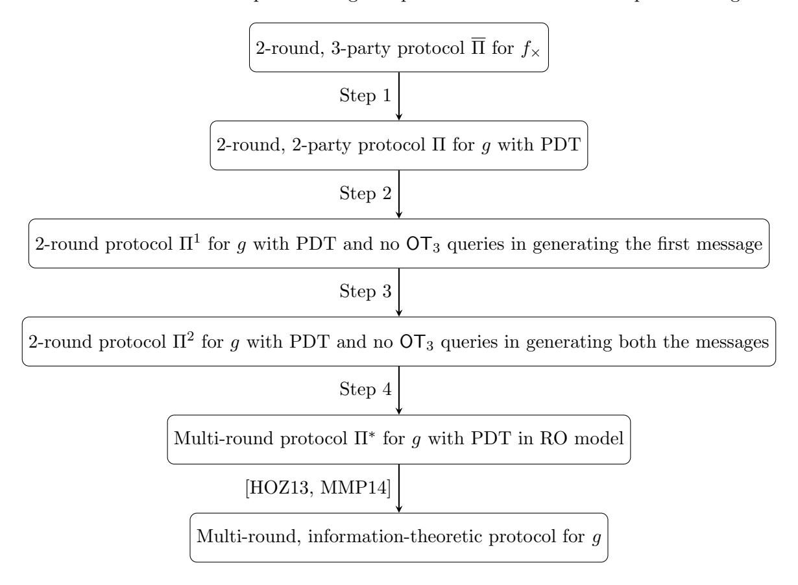

# Separating Two-Round Secure Computation from Oblivious Transfer

Benny Applebaum∗ Tel-Aviv University

Zvika Brakerski† Weizmann Institute of Science

Sanjam Garg‡ University of California, Berkeley Yuval Ishai§ Technion

Akshayaram Srinivasan University of California, Berkeley

#### Abstract

We consider the question of minimizing the round complexity of protocols for secure multiparty computation (MPC) with security against an arbitrary number of semi-honest parties. Very recently, Garg and Srinivasan (Eurocrypt 2018) and Benhamouda and Lin (Eurocrypt 2018) constructed such 2-round MPC protocols from minimal assumptions. This was done by showing a round preserving reduction to the task of secure 2-party computation of the oblivious transfer functionality (OT). These constructions made a novel non-black-box use of the underlying OT protocol. The question remained whether this can be done by only making black-box use of 2-round OT. This is of theoretical and potentially also practical value as black-box use of primitives tends to lead to more efficient constructions.

Our main result proves that such a black-box construction is impossible, namely that nonblack-box use of OT is necessary. As a corollary, a similar separation holds when starting with any 2-party functionality other than OT.

As a secondary contribution, we prove several additional results that further clarify the landscape of black-box MPC with minimal interaction. In particular, we complement the separation from 2-party functionalities by presenting a complete 4-party functionality, give evidence for the difficulty of ruling out a complete 3-party functionality and for the difficulty of ruling out blackbox constructions of 3-round MPC from 2-round OT, and separate a relaxed "non-compact" variant of 2-party homomorphic secret sharing from 2-round OT.

∗Supported by the European Union's Horizon 2020 Programme (ERC-StG-2014-2020) under grant agreement no. 639813 ERC-CLC, and the Check Point Institute for Information Security.

†Supported by the Binational Science Foundation (Grant No. 2016726), and by the European Union Horizon 2020 Research and Innovation Program via ERC Project REACT (Grant 756482) and via Project PROMETHEUS (Grant 780701).

‡Supported in part from AFOSR Award FA9550-19-1-0200, AFOSR YIP Award, NSF CNS Award 1936826, DARPA and SPAWAR under contract N66001-15-C-4065, a Hellman Award and research grants by the Okawa Foundation, Visa Inc., and Center for Long-Term Cybersecurity (CLTC, UC Berkeley). The views expressed are those of the authors and do not reflect the official policy or position of the funding agencies.

§Supported by ERC Project NTSC (742754), NSF-BSF grant 2015782, BSF grant 2018393, and a grant from the Ministry of Science and Technology, Israel and Department of Science and Technology, Government of India.

## 1 Introduction

Secure multiparty computation (MPC) allows mutually distrusting parties to compute a joint function f of their private inputs without revealing anything more than the output to each other.

In this paper we consider the simplest setting for MPC with no honest majority, namely MPC with an arbitrary number of corrupted parties. We focus on the semi-honest (aka passive) security model, where corrupted parties follow the protocol but try to (jointly) learn additional information on inputs of uncorrupted parties from the messages they observe. We assume that corruptions are non-adaptive (i.e., the set of corrupted parties is fixed before the protocol's execution). Finally, we assume by default that the parties can communicate over secure point-to-point channels, also referred to as private channels. All of the above assumptions make negative results stronger. In contrast, when discussing positive results, we assume by default that parties only communicate over public channels. This makes the positive results stronger.

The design and analysis of MPC protocols crucially rely on the notion of secure reductions. In particular, classical completeness results [Yao86, GMW87] have shown that the problem of securely computing a general n-party functionality f efficiently reduces to the problem of securely computing the elementary finite 2-party Oblivious Transfer (OT) functionality [Rab81, EGL85]. (Similar results have been proven for active adversaries as well [Kil88, IPS08].) Perhaps surprisingly, for 2-party secure computation (2PC), Yao's reduction is round preserving. That is, it incurs no overhead in the round complexity. It additionally requires the parties to make a black-box use of any pseudorandom generator (PRG).1

Theorem 1.1 (Black-box 2-round 2PC from OT [Yao86]) Every 2-party functionality g admits an MPC protocol that only makes parallel calls to an OT oracle and a black-box use of a PRG.

In more detail, the OT functionality FOT involves two parties referred to as Receiver and Sender. The functionality takes a bit x from the Receiver and a pair of bits (more generally, strings) (m0, m1) from the Sender, and delivers to the Receiver the message mx. This is done while hiding m1−x from the Receiver and hiding x from the Sender.

Yao's reduction makes a single round of parallel calls to FOT. 2 This can be securely replaced by parallel invocations of any OT protocol, namely a secure 2-party protocol for FOT. The resulting construction of 2-party MPC from a 2-party OT protocol is black-box. 3 This means that the MPC protocol does not depend on the code of the underlying OT protocol, and moreover the security proof is black-box in the sense that any adversary "breaking" the MPC protocol can be used as a black-box to break the OT protocol. Instantiating with one of several natural known 2-round OT protocols (whose existence follows from standard intractability assumptions), we get a 2-round 2-party MPC protocol, which is clearly optimal.

Round Complexity in the Multiparty Setting. In contrast to the 2-party setting, progress on the round complexity of general MPC has been slow and some of the questions still remain

1Here and in the following, if we replace an OT oracle by a black-box use of an OT protocol, the additional use of a PRG is not needed, since a PRG can be constructed in a black-box way from any OT protocol [IL89, HILL99].

2 If both parties should receive an output, the reduction uses parallel OTs in both directions, where each party acts both as a Sender and as a Receiver.

3The notion of a black-box construction used in this paper (also referred to as a black-box reduction) corresponds to the notion of a fully black-box reduction in the taxonomy of [RTV04].

unanswered. As already mentioned, the completeness of OT in the multiparty setting was first established by Goldreich, Micali, and Wigderson (GMW) [GMW87]. However, their reduction suffered from large round complexity (proportional to the circuit depth of the target function). The question of achieving a constant-round protocol has been considered by Beaver, Micali, and Rogaway [BMR90], who extended Yao's garbled circuit technique to the multiparty setting. Combined with the GMW result, this yields a reduction to OT with constant overhead in the round complexity.

Theorem 1.2 (Black-box constant-round MPC from OT [GMW87, BMR90]) Every nparty functionality admits a constant-round protocol, making parallel calls to an OT oracle and a black-box use of a PRG.

In more concrete terms, the most round-efficient current MPC protocol that makes a black-box use of a 2-round OT protocol requires 4 rounds of interaction [ACJ17]. The above results left a gap between the round complexity of 2PC and MPC protocols. In a recent breakthrough, this gap was partially closed.

Theorem 1.3 (Non-black-box 2-round MPC from OT [GS18, BL18]) Suppose a 2-round OT protocol exists. Then every n-party functionality admits a 2-round MPC protocol.

The theorem settles the high-order bit about the minimal assumptions needed for 2-round MPC by showing that a 2-round OT protocol is sufficient. (Being a special case of 2-round MPC, it is clearly necessary.) However, quite surprisingly, the MPC protocol in these works inherently makes use of the code of the underlying OT protocol. This situation is quite rare in the context of MPC protocols and in cryptography in general (see Section 1.2), and it is not clear whether this non-black-box use of OT is inherent. This calls for the following natural question:

Is it possible to reduce general n-party MPC to a 2-party OT protocol in a roundpreserving black-box way? In particular, is there a black-box construction of 2-round MPC from a 2-round OT protocol?

The above question is not only of a theoretical interest, but is also potentially relevant to practice. Indeed, black-box use of cryptographic primitives tends to lead to more efficient constructions. The goal of obtaining efficient 2-round MPC protocols is very well motivated, since such protocols have qualitative advantages over similar protocols with a bigger number of rounds. Indeed, in a 2-round MPC protocol, each party can send its first-round messages and then go offline until all second-round messages are received and the output can be computed. Moreover, the first-round messages can be potentially reused for several computations in which a party's input remains unchanged. This is analogous to the qualitative advantage of public-key encryption over interactive key agreement.

In this paper, we will provide a negative answer to the above question, showing that there is a real gap between the power of round-preserving black-box reductions and round-preserving non-black-box reductions. Our findings also reveal a rich and somewhat unexplored world of cryptographic protocols that use a minimal amount of interaction. We will exhibit some of the black-box and non-black-box connections among these primitives and relate them to standard ones.

## 1.1 Our Results

We now give a more detailed account of our results. It will be convenient to present most of our results in terms of round-preserving black-box reductions (RPBB reductions for short) from an nparty functionality f to a p-party functionality g. The notion of RPBB reduction can have two distinct flavors. Strict RPBB reduction corresponds to the notion known in the MPC literature as a "(non-interactive) construction of f in the g-hybrid model", namely a protocol that securely realizes f using parallel invocations of an oracle computing g (possibly with different sets of parties) and no further interaction. Free RPBB reduction is a relaxed notion that refers to a k-round protocol for f that makes a black-box use of any k-round protocol for g and additional communication over pointto-point channels (private channels by default). In this work we assume k = 2 by default. The latter notion more closely resembles the complexity-theoretic notion of a "black-box reduction" (with the round preserving property on top). Note that a strict RPBB reduction implies a free RPBB reduction for any k (and a free RPBB separation implies a strict RPBB separation). This follows from a parallel composition theorem for MPC in the semi-honest model (see, e.g., [Can00, Gol04]).

To illustrate the distinction between the two notions, note that in a free RPBB reduction, party A can, for example, generate two different "first messages" of the g protocol and send both of them to party B, which in turn decides (say, based on its input) to only respond to one of these two messages. In a strict RPBB there is no notion of "first message" and the parties can only feed their inputs into the g functionality and obtain the output. Similarly, in a free RPBB reduction parties can transfer messages and randomness of the g protocol to other parties.4 As another example, let us consider Theorem 1.1 in the context of RPBB. Viewing a PRG as a functionality, this theorem can be interpreted as a strict RPBB reduction for g = {OT,PRG}. But it also implies a free RPBB reduction for g = OT (without explicitly requiring PRG). The reason is that it is known that OT implies PRG via a black-box construction, which a free RPBB can utilize, but PRGs do not exist unconditionally in the OT-hybrid model and therefore a strict RPBB requires explicit access to the PRG functionality.

In terms of results in this paper, we achieve all of our results with respect to the stronger notion in the specific context. Our positive results are presented via strict RPBB reductions and our negative results apply to free RPBB reductions (in many cases, negative results for strict RPBB are significantly easier to achieve). We therefore often refer simply to "RPBB reduction" without strict/free designation, and work under the convention that in the context of positive results we refer to strict RPBB and in the context of negative results we refer to free RPBB.

#### 1.1.1 Separating 3-Party Functionalities from 2-Party Functionalities

Our first and main result rules out RPBB reductions of general MPC to OT. That is, general 2-round MPC protocols cannot be based on a 2-round OT protocol in a black-box way. In fact, we show that even 3-party computation of fairly simple functionalities cannot be realized via black-box use of a 2-round OT protocol.

Theorem 1.4 (Main Result) There exists a 3-party functionality f that cannot be securely realized by a 2-round protocol making a black-box use of 2-round OT protocol.

4This "transferability" feature is commonly used in applications of commitments and signatures. In the context of OT-based MPC, it can be used to realize "security with identifiable abort" given black-box access to an OT protocol [IOZ14], which is impossible given only access to an OT oracle [IOS12]. Other examples for the distinction between the two types of reductions arise in the contexts of complete functionalities [LOZ18] and OT-combiners [HKN+05].

We stress again that we do not just rule out reductions to the ideal OT functionality, but rather rule out all black-box constructions of 2-round MPC protocols from a 2-round OT protocol. (Indeed, much of the technical work is devoted to coping with the weaker flavor of free RPBB reductions; see Section 2.) Moreover, the theorem holds even for protocols in the private-channel setting (where each pair of parties is connected via a private channel), and even when the parties have an access to a public common reference string (CRS), and to a random oracle.

#### 1.1.2 A Complete 4-Party Functionality

Theorem 1.4 shows that OT is incomplete for MPC under free RPBB reductions. Given this state of affairs, one may try to prove a completeness result for some other finite functionality. We show that this is indeed possible. Specifically, let (3,4) – MULTPlus denote the 4-party functionality that takes a pair of bits  $(x_i, z_i)$  from each of the first three parties (and no input from the fourth party) and delivers the value  $x_1x_2x_3 + z_1 + z_2 + z_3$  to all four parties where addition and multiplication are over the binary field  $\mathbb{F}_2$ . We prove that (3,4) – MULTPlus is MPC-complete under RPBB reductions. (Related results have been proved in other settings [ACJ17, BGI+18, GIS18].) In fact, we prove completeness under strict RPBB reductions, just like Theorem 1.1.

Theorem 1.5 (Black-box 2-round MPC from a 4-party functionality) Every n-party functionality f can be securely realized using parallel calls to a (3,4) – MULTPlus oracle and a black-box use of a PRG, with no additional interaction.

It is worth noting that (3,4) – MULTPlus is related to the standard 2-party OT functionality. In general, for  $d \le p$ , let (d,p) – MULTPlus denote the p-party functionality in which each of the first d parties holds an input  $(x_i, z_i)$  and the product-sum  $\prod_i x_i + \sum_i z_i$  is delivered to all p parties. Then, standard 2-party OT is equivalent (under strict RPBB reductions) to (2,2) – MULTPlus.5

#### 1.1.3 The Land of Three-Party Functionalities

The finite (3,4) – MULTPlus therefore stands at the entry point to the general MPC mainland. Across the ocean, lies the island of 2-party functionalities (including the complete OT) and one cannot cross it in a black-box round-preserving vessel. We move on and explore the mysterious land of 3-party functionalities.

Given the incompleteness of 2-party functionalities and the completeness of 4-party functionalities (under RPBB reductions), it is natural to ask whether 3-party functionalities are complete. We show that the answer to this question is related to a well-known open problem in information-theoretic cryptography.

Question 1.6 ([IK00, AIK04]) Does every finite function admit a degree-2 statistical randomized encoding?

A randomized encoding (RE) of a function f(x) is a randomized function  $\hat{f}(x;r)$  that, in addition to the input x, takes a random input r. For any input x, the random variable  $\hat{f}(x)$ , induced by a

&lt;sup>5A reduction from OT to (2,2) – MULTPlus follows from Theorem 1.1. For the other direction, the receiver's output in OT can be written as  $m_0 + x(m_1 - m_0)$  where addition and multiplication are over  $\mathbb{F}_2$ . Therefore, we can implement OT based on (2,2) – MULTPlus by letting the receiver (resp., sender) play the role of the first party (resp., second party) with inputs  $x_1 = x$  and a random bit  $z_1$  (resp.,  $x_2 = m_1 - m_0$  and  $z_2 = m_0$ ).

random choice of r, should reveal the value of f(x) and hide everything else. The power of REs stems from the fact that even a complicated function f can admit a simple RE  $\hat{f}$ . A useful fact in the context of MPC is that that every finite f admits an RE  $\hat{f}(x;r)$  whose outputs are degree-3 polynomial in the indeterminates (x,r). While some negative results are known for perfectly private degree-2 RE [IK00], the feasibility of statistically private degree-2 RE (that are allowed to have a small non-zero privacy error) has remained open for almost 20 years. (See also the surveys [Ish13, App17].) We relate this longstanding open problem to the completeness of 3-party functionalities under RPBB reductions.

**Proposition 1.7** A positive answer to Question 1.6 would imply that Theorem 1.5 holds with (2,3) – MULTPlus instead of (3,4) – MULTPlus. In particular, it would imply that there is a complete 3-party functionality with respect to strict RPBB reductions.

The proposition implies that we cannot rule out the completeness of 3-party functionalities without ruling out the existence of general degree-2 (statistical) randomized encoding. Similar barriers have been established in the context of degree-2 cryptographic hash functions [AHI $^+$ 17]. We note that the completeness of (2,3) – MULTPlus follows even from the existence of general degree-2 fully-secure multiparty randomized encoding [ABT18] – a seemingly weaker variant of RE whose existence is also open. (See the discussion in [ABT18].)

External output functionalities. The (2,3) – MULTPlus functionality is a special case of an external-output 3-party functionality. Formally, let g(x,y) be a 2-party functionality. The external version of g, is the 3-party functionality  $f_g$  that takes x from Alice, y from Bob and delivers g(x,y) to Alice and Bob, and to Carol who holds no input.6 Two-round protocols for such functionalities turn out to have interesting properties. Specifically, at the core of our main impossibility result (Theorem 1.4) lies the following constructive theorem for external functionalities. (See Theorem 4.2 for a more detailed version.)

**Theorem 1.8 (Conversion Theorem)** Let g(x,y) be a 2-party functionality and let  $f_g$  be its 3-party external version. Suppose  $f_g$  can be securely realized in 2 rounds (over private channels) by making a black-box use of a 2-round OT protocol. Then,  $f_g$  can be securely realized over random inputs (and private channels) given only an access to a Random Oracle. Moreover, in the resulting protocol Carol sends no message, which implies a 2-party protocol for g over random inputs given only a Random Oracle.

Haitner et al. [HOZ13] showed that any 2-party functionality that can be securely realized in the Random Oracle model over random inputs is "trivial" in the sense that it admits a 2-party protocol over random inputs with security against computationally unbounded adversaries. For functionalities whose input domain size is polynomially bounded, security over random inputs implies security on worst-case inputs. (See Proposition 3.2.) For such functionalities, we get the following characterization which strengthens Theorem 1.4. (See Corollary 4.4 for more details.)

&lt;sup>6In fact, for all of our purposes, an even weaker version suffices. In this relaxed version, all parties are allowed to learn the output (for purposes of privacy), but only Carol is *required* to learn it (for purposes of correctness). Since this leads to a cumbersome definition, we stick to the simpler version described above.

Corollary 1.9 Let g be a 2-party symmetric boolean functionality whose domain size is polynomial in the security parameter. Then the external-output 3-party functionality fg can be securely realized by a 2-round protocol (over private channels) that makes a black-box use of 2-round OT if and only if g is trivial in the sense that it can be realized with perfect security in the plain model.

A notable example for a non-trivial 2-party functionality is the AND functionality [CK89, Kus89]. Corollary 1.9 is tight in terms of round complexity. With one additional round (namely, a total of 3 rounds), fg can be black-box reduced to 2-round OT. (Specifically, one can use Theorem 1.1 to pass the value of f(x, y) to Alice and Bob in two rounds, and then exploit the additional round to send this value to Carol.) The 2-party completeness of OT (Theorem 1.1) also implies that Corollary 1.9 holds when the OT functionality is replaced by an arbitrary 2-party functionality h(x, y). Overall, we get a separation between all 2-party functionalities and all external-output functionalities fg whose underlying g is non-trivial.

Relation with homomorphic secret sharing. Two-round MPC for external-output functionalities can be seen as closely related to the problem of homomorphic secret sharing (HSS) [BGI16, BGI+18]. HSS is the secret-sharing analogue of fully homomorphic encryption. A (2-party) HSS scheme allows local computation of a function g(x, y) on independently shared inputs x and y, where the output g(x, y) can be decoded from the pair of output shares. The standard notions of HSS require either additive decoding over a group or, more generally, that the output shares be compact in the sense that their size is comparable to the output size. A natural variant is to replace compactness by the requirement that the pair of output shares give no information except g(x, y), even from the point of view of one of the input holders. Note that in any additive HSS, this security requirement can be easily met via a simple additive refreshing of the output shares. This flavor of non-compact HSS easily implies (in a black-box way) a 2-round external output protocol for g (in the private-channel setting), which by Corollary 1.9 can be separated from 2-round OT. On the other hand, a non-black-box construction of non-compact HSS from 2-round OT follows from [GS18, GIS18].

## 1.2 Discussion

In this section we give some further perspective on our results and some future research directions which they motivate.

#### 1.2.1 Why is the multiparty setting different from the 2-party setting?

It is instructive to reconsider the round complexity of MPC in light of our results. Protocols with low round complexity are based on two types of reductions.

- 1. A degree reduction that takes a general n-party functionality f and reduces it (via RPBB reduction) to a degree-d functionality for a constant d. Specifically, the standard machinery of randomized encoding leads to degree 3. In the special case of two parties, we can trivially reduce the degree down to 2, and so we get a degree reduction to d = min(3, n).
- 2. A player reduction that takes an n-party functionality of degree d and reduces it to the (d, p)– MULTPlus functionality. We show that p can be dropped down to d + 1 and, in any case, it is no larger than n, leading to an expression of the form p = min(d + 1, n).

In the special case of two parties (n = 2) we get an RPBB reduction to (2, 2)–MULTPlus which is equivalent to OT. For large n's, this leads to the completeness of (3, 4)–MULTPlus (Theorem 1.5). In order to prove that OT is complete (under RPBB reductions) one would have to bypass two barriers: A Degree barrier (prove completeness of degree 2 functionalities) and a Player reduction barrier (reducing the 3-party functionality (2,3)–MULTPlus to (2,2)–MULTPlus). While the first barrier is well-known, the second one appears to be new to this work. Clearly, both barriers are bypassed by non-black-box techniques (Theorem 1.3). We show that this is inherent for the second "player reduction" barrier, and leave the possibility of breaking the degree-barrier via RPBB reduction open.

#### 1.2.2 On the Role of Non-Black-Box Constructions in Cryptography

Our main result provides a very natural example of a pair of cryptographic primitives for which a non-black-box construction of one from the other exists but a black-box construction can be ruled out. Thus, our work further demonstrates the essential role of non-black-box techniques in cryptography.

To give some historical perspective, following the seminal result of Impagliazzo and Rudich [IR89] and subsequent works on black-box separations in cryptography [Sim98, GKM+00, RTV04], the question of finding a pair of "natural" cryptographic primitives for which a non-black-box reduction is provably necessary has been put forward as a desirable but elusive goal.7 For some of the conjectured candidate examples, such as constructing "malicious OT" from "semi-honest OT," black-box constructions were subsequently found [HIK+11]. However, in recent years several such provable examples emerged. We survey some of the most notable ones below.

- Non-interactive commitments from OWFs: Mahmoody and Pass [MP12] showed that noninteractive commitments cannot be constructed from so-called "hitting-OWFs" in a blackbox manner, even though a non-black-box construction was previously shown [BOV03]. One nice feature of this example is that a non-interactive commitment is a very basic primitive. However, in comparison hitting-OWFs have found little other applications in cryptography. Furthermore, the separation here is intuitively weak since knowing the circuit size of the OWF enables a black-box construction. This is contrasted with the non-black-box constructions of 2-round MPC from OT [GS18, BL18], which make an essential use of the full code of the OT protocol.
- Two-round OT extension: Beaver gave a construction of two-round OT extension [Bea96] making a non-black-box use of one-way functions. This construction can be cast in the OThybrid model. However, very recently, Garg et al. [GMMM18] showed that a back-box variant of such a constriction is impossible. They showed that such constructions are not possible even when black-box use of a random oracle (and not just a one-way function) is allowed. One limitation of this example is that the separation is only proved for protocols in the OT-hybrid model.
- IBE from CDH (or Generic Groups): In a recent result, D¨ottling and Garg [DG17b] show that Identity-Based Encryption (IBE) can be realized under the Computational Diffie-Hellman

7The question is informal due to the subjective nature of the term "natural primitive." It should not be confused with the question of black-box vs. non-black-box simulation, for which Barak's breakthrough non-black-box simulation technique [Bar01] gave the first such natural examples.

(CDH) assumption, while black-box constructions of the same had been previously ruled out [BPR+08, PRV12]. However, in this case both the positive and the negative result use strong "structured" primitives.

In another very related example, D¨ottling and Garg [DG17a] showed a generic non-black-box construction of hierarchical-IBE from IBE but we can expect a black-box impossibility for the same using techniques from [BPR+08].8

- Constructions of IO: In a very recent work, Garg et al. [GMM17] showed that indistinguishability obfuscation (IO) [GGH+13] cannot be constructed from compact functional encryption (FE) in a black-box manner, even though non-black-constructions achieving this were already known [BV15, AJ15].
- Secret-Key FE vs Public-Key FE: In a recent work, Kitagawa et al. [KNT18] showed that public-key FE can be constructed from secret-key FE in a non-black-box manner, even though black-box positive constructions had been previously ruled out [AS15].

In comparison with the above works, our main result has the advantage that it considers two very natural and simple primitives. Our separation lives entirely in the "passive adversary" world, and does not depend on the input domain being super-polynomial. For instance, our separation is also meaningful for MPC with a uniform input distribution over a constant-size domain. Thus, it is arguably similar in spirit to the Impagliazzo-Rudich separation of key agreement from one-way functions [IR89], except that in the latter case no analogous non-black-box construction is known.

## 1.3 Open Problems

While we settle the main open question concerning black-box round-optimal MPC, our work leaves several interesting directions for future research. We highlight a few below, focusing on our current setting of semi-honest security with no honest majority.

- 3-round MPC from black-box OT. Our main result rules out 2-round MPC protocols making a black-box use of 2-round OT. On the other hand, a previous result of Ananth et al. [ACJ17] shows that such 4-round protocols exist (over public channels). What about 3 round protocols? In Section 6 we show that extending our negative result to 3-round protocols (even over public channels) would require settling Question 1.6 in the negative. This barrier does not seem to apply to 3-round protocols in which the first round messages do not depend on the inputs, or alternatively 2-round protocols with a public-key infrastructure (PKI) setup.
- Black-box use of stronger primitives. Can our negative result be bypassed by replacing OT with stronger or more structured primitives? It is known that 2-round MPC can make black-box use of different flavors of multi-key homomorphic encryption [MW16, DHRW16] or homomorphic secret sharing [BGI17, BGI+18]. However, this is almost immediate from the definitions of such primitives. Using simpler structured primitives, such as a "DDHhard" group or a generic group, we have black-box 2-round protocols that require a PKI setup [GIS18]. Can we get similar group-based constructions in the plain model? Alternatively, can the separation be bypassed by using stronger variants of 2-round OT, such as OT with high information rate [DGI+19] or OT with a stronger notion of receiver privacy [IP07]?

8Even though we expect such an impossibility to hold, we are not aware of a work that gives a full proof of this claim.

- Minimal complete primitive for 2-round MPC. We have shown the existence of a 4-party functionality such that general MPC reduces to parallel calls to this functionality without further interaction. We have also ruled out such a 2-party functionality. This leaves open the 3-party case. As in the case of 3-round MPC from 2-round OT, we can show that proving a negative result would require settling Question 1.6 in the negative.
- Standard MPC vs. client-server MPC. Our main negative result automatically carries over to the stronger client-server model for MPC, where n clients interact with n servers who have no inputs or outputs. It is known that 2-round client-server MPC can be constructed in a non-black-box way from standard 2-round MPC [GIS18]. Whether such a black-box construction exists remains open.

## 2 Technical Overview

In this section, we give a high-level overview of our techniques in proving the main result (Theorem 1.4). To keep the exposition simple, we restrict ourselves to proving the impossibility result for securely computing external-AND.

External-AND Functionality. Let us denote the three parties by (P1, P2, P3). The private input of P1 is a bit x, the private input of P2 is a bit y, and P3 does not have any private input. The functionality f× outputs x · y to all the parties. That is, f×(x, y, ⊥) = x · y.

Main Idea. To prove the impossibility result, we define a set of oracles such that 2-round oblivious transfer exists with respect to these oracles, but there exists no 2-round, semi-honest protocol for securely computing f×. This is sufficient to rule out a black-box transformation from 2-round oblivious transfer to 2-round, 3-party semi-honest protocols for general functionalities. Below, we describe these oracles (throughout this overview, λ denotes the security parameter):

- OT1 is a random length tripling function that takes in the receiver's choice bit b ∈ {0, 1} and its random tape r ∈ {0, 1} λ and outputs the receiver's message otm1.
- OT2 is a random length tripling function that takes in the receiver's message otm1, the sender's inputs m0, m1 ∈ {0, 1}, its random tape s ∈ {0, 1} λ and outputs the sender's message otm2.
- OT3 is a function that takes the transcript (otm1, otm2) along with (b, r) as input and outputs mb if there exists unique (m0, m1, s) for which OT1(b, r) = otm1 and OT2(otm1, m0, m1, s) = otm2. Otherwise, it outputs ⊥.

As observed by [HKN+05], the oracles (OT1, OT2, OT3) naturally give rise to a 2-round oblivious transfer protocol. Specifically, letting b, r denote the input/randomness of the receiver, and letting (m0, m1), s denote the input/randomness of the sender, the protocol proceeds as follows: The receiver sends otm1 = OT1(b, r) to the sender, who responds with otm2 = OT2(otm1, m0, m1, s), allowing the receiver to output the value OT3(otm1, otm2, b, r).

In this work, we prove that the existence of a 2-round protocol for external-AND with respect to the oracles (OT1, OT2, OT3) implies a two-party protocol for computing g(x, y) = x · y in the random oracle model. (Note that we start with a three-party protocol for an external functionality, and show a two-party protocol for a related functionality.) The existence of such two-party protocol is known to be impossible [CK89, Kus89, HOZ13, MMP14] and therefore the original protocol can also not exist. This proves Theorem 1.8 discussed above, and implies Theorem 1.4 as a corollary.

Outline. The above result is proven using a sequence of transformations depicted in Figure 1.

Figure 1: Key Steps in the Proof. Here, PDT denotes publicly decodable transcript, g(x, y) = x·y and f×(x, y, ⊥) = g(x, y).

Step-1: Publicly Decodable Transcript. Let Π be a 2-round protocol for securely computing f× w.r.t. (OT1, OT2, OT3). We first show that this implies a 2-round, 2-party protocol Π for computing the two-party functionality g = g(x, y) = x · y, which has an additional special property – the output is publicly decodable from the transcript. More formally, there exists a deterministic algorithm Dec that computes the output of the functionality given the transcript of the two-party protocol. In particular, if there exists a protocol Π that computes g with publicly decodable transcript, then Dec on input T (which is the transcript of the protocol Π) outputs g(x, y). In terms of security, Π is required to have the standard security properties of a two-party (semihonest) protocol, i.e., the corrupted party does not learn any information about the other party's input except the output.

To transform a 2-round protocol for f× into a 2-round protocol Π for g with publicly decodable transcript, we use a standard player emulation technique. Concretely, we ask P1 to choose a uniform random tape for  $P_3$  and send this random tape in the first round. Using this random tape,  $P_1$  and  $P_2$  can generate the messages  $P_3$  would have sent in the original protocol. Additionally,  $P_1$  and  $P_2$  forwards all its outgoing messages that are sent to each other as well the messages sent to  $P_3$  in the original protocol.

This protocol satisfies public decodability since given the transcript of the protocol (which includes the entire view of  $P_3$  in the original protocol), one can run the output computing algorithm of  $P_3$  to learn g(x, y). Further, the security follows directly from the security of the original protocol when  $(P_1, P_3)$  and  $(P_2, P_3)$  are corrupted.9

Remaining Steps – Removing  $OT_3$  Queries. In the remainder of the proof, we show that use of the oracle  $OT_3$  can be removed. More specifically, we show how to convert any two-round two-party secure computation protocol  $\Pi$  with access to  $(OT_1, OT_2, OT_3)$  and publicly decodable transcript into a two-party protocol that computes the same functionality, but with a few differences. The oracles  $OT_3$  will no longer be used in the new protocol, but this will come at a cost, both in round-complexity and in security:

- The round complexity of the protocol will grow by a polynomial factor (essentially upper bounded by the query complexity of Dec).
- The correctness and security guarantees will only be with respect to random inputs (we call this "security over random inputs"). One instructive way to think about security over random inputs is to think of a protocol between parties that have no input, and at the beginning of the execution they sample a random input using their local random tape (or shared randomness) and proceed to execute the protocol. Note that this makes simulation easier since we no longer need to worry about consistency with an adversarially chosen (or sampled) input.

In other words, the new protocol  $\Pi^*$  only makes queries to  $(\mathsf{OT}_1, \mathsf{OT}_2)$  which are essentially random oracles. Therefore,  $\Pi^*$  securely computes g in the random oracle model. However, it follows from [HOZ13, MMP14] that such a protocol can be used to securely compute g in the information-theoretic setting and this is known to be impossible for the AND functionality [CK89, Kus89] (even with security over random inputs as described above).

The remainder of the overview describes this transformation. We transform  $\Pi$  to  $\Pi^*$  through a sequence of steps. We first transform  $\Pi$  to  $\Pi^1$  in which the first message function of the protocol does not make any  $\mathsf{OT}_3$  queries (Step 2 below). Then, we transform  $\Pi^1$  to  $\Pi^2$  such that the first and second message functions of the protocol do not make any  $\mathsf{OT}_3$  queries (Step 3 below). Finally, we transform  $\Pi^2$  to  $\Pi^*$  such that the decoder  $\mathsf{Dec}$  does not make any  $\mathsf{OT}_3$  queries (Step 4 below). It is the final step that incurs the blow-up in the round complexity. Additional details follow.

Step-2:  $\Pi \Rightarrow \Pi^1$ . The first message function of  $\Pi$  has access to  $(\mathsf{OT}_1, \mathsf{OT}_2, \mathsf{OT}_3)$  oracles and may make multiple queries to all of them. In order to perform this transformation, we devise a mechanism to emulate the  $\mathsf{OT}_3$  oracle without making actual queries to it. Recall that any query to the  $\mathsf{OT}_3$  oracle contains  $((\mathsf{otm}_1, \mathsf{otm}_2), (b, r))$  and it outputs  $m_b$  if and only if there exists  $(m_0, m_1, s)$  for which  $\mathsf{OT}_1(b, r) = \mathsf{otm}_1$  and  $\mathsf{OT}_2(\mathsf{otm}_1, m_0, m_1, s) = \mathsf{otm}_2$ . The first step of the  $\mathsf{OT}_3$  oracle is

&lt;sup>9It is easy to see that the security of the transformed protocol requires security against collusion of  $P_1$ ,  $P_3$  since  $P_1$  has the entire view of  $P_3$ . We also require security against  $(P_2, P_3)$  collusion since  $P_1$  forwards all its messages sent to  $P_3$  in the second-round of the protocol.

easy to emulate; we can query  $\mathsf{OT}_1$  on (b,r) and check if the output is  $\mathsf{otm}_1$ . To emulate the second step, we maintain a list of all the queries/responses made by the first message function to  $\mathsf{OT}_2$ . If we find an entry  $(\mathsf{otm}_1, m_0, m_1, s, \mathsf{otm}_2)$  in this list, we output  $m_b$ ; else, we output  $\bot$ . Note that since  $\mathsf{OT}_2$  is length tripling, it is injective with overwhelming probability. Thus, if we find such an entry then our emulation is correct. On the other hand, if we don't find such an entry, we output  $\bot$  and it can be easily shown that the original oracle also outputs  $\bot$  except with negligible probability. Thus, our emulation is statistically close to the real oracle.

Step-3:  $\Pi^1 \Rightarrow \Pi^2$ . It might be tempting to conclude that a similar strategy as before should work even for  $\mathsf{OT}_3$  queries made in the second round. That is, maintain the list of queries to the  $\mathsf{OT}_2$  oracle and when the second message function makes an  $\mathsf{OT}_3$  query, check if there is entry in this list with the response equal to  $\mathsf{otm}_2$ . If such an entry is found, output the corresponding  $m_b$ ; else, output  $\bot$ . This strategy fails because in the second round it is possible that the relevant  $\mathsf{OT}_2$  query was made by the other party and therefore it is not possible for each party to only consider the list of  $\mathsf{OT}_2$  queries made locally. Note, however, that only one simultaneous round of communication has been made by the parties so far. Therefore, it must be the case that the party that made the  $\mathsf{OT}_2$  query also made the respective  $\mathsf{OT}_1$  query.

To take care of such queries, that we call "correlated queries", we modify the first round of  $\Pi^1$  as follows. The parties will prepare an additional list L that contains all correlated queries that are "likely" to be asked by the other party. (No  $\mathsf{OT}_3$  calls will be made while preparing this list.)

The parties will now send this list L along with the first round message of  $\Pi^1$ . Now, when the second message function of a party in  $\Pi^1$  attempts to make an  $\mathsf{OT}_3$  query on  $(\mathsf{otm}_1, \mathsf{otm}_2, (b, r))$ , we first check if  $\mathsf{otm}_1$  is valid (by querying  $\mathsf{OT}_1$ ) and then answer this query as follows. If  $\mathsf{otm}_2$  is a result of a local query then find the response using the list of local queries/responses. If  $\mathsf{otm}_2$  is a correlated query, use the list L sent by the other party to answer. If we don't find any entry in the local list or the correlated list, we output  $\bot$ . We show that with overwhelming probability, the real oracle also outputs  $\bot$  in this case. We also prove that sending this additional list of "likely" correlated queries does not harm the security of  $\Pi^2$ .

To conclude, we describe how the list L is generated, say by  $P_1$ . Note that the list needs to be generated at a point where  $P_1$  already decided on its first  $\Pi^1$  message; now it just needs to come up with L. To this end,  $P_1$  executes many copies of  $\Pi^1$  executions of  $P_2$ , each time with fresh randomness and random input. Then the list L contains the responses to the list of all correlated  $\mathsf{OT}_2$  queries, i.e., the valid queries made to  $\mathsf{OT}_3$  by "virtual"  $P_2$  such that both  $\mathsf{OT}_1$  and  $\mathsf{OT}_2$  have been generated by  $P_1$ . This will allow to preserve correctness on an average input, and does not violate privacy since given the first  $\Pi^1$  messages, anyone can sample such executions.

Step-4:  $\Pi^2 \Rightarrow \Pi^*$ . At the end of step-3, we have a protocol where the first and the second message functions do not make any queries to the  $\mathsf{OT}_3$  oracle. However, for the parties to learn the output, they must run the decoder  $\mathsf{Dec}$  on the transcript, and this decoder might make queries to  $\mathsf{OT}_3$ . Recall that  $\mathsf{Dec}$  is a deterministic decoding function whose input is the transcript of the interaction. Further recall that  $\Pi^*$  will be a protocol that does not use  $\mathsf{OT}_3$  but will have many communication rounds.

In  $\Pi^*$ , the parties will first execute the two rounds of  $\Pi^2$  to obtain a transcript. Then one of the parties (say  $P_1$ ) starts executing the decoder, where for each  $\mathsf{OT}_3$  query that the decoder needs to make, if  $P_2$  has made the relevant  $\mathsf{OT}_2$  query, then it will "help out"  $P_1$  by sending the decoded

value. This will proceed for as many rounds as the number of queries that Dec needs to make, but eventually it will allow  $P_1$  to complete the execution of Dec locally and compute the output of the functionality. We will then need to show that privacy is not harmed in this process. Details follow.

Let us go back to the point where both parties finished executing the two rounds of  $\Pi^2$  now wish to engage in joint decoding. One of the parties, say  $P_1$ , starts running the decoder on the transcript, and along the way maintain the list of  $\mathsf{OT}_1, \mathsf{OT}_2$  made by  $\mathsf{Dec}$  in this process. When the decoder attempts to make an  $\mathsf{OT}_3$  query on input  $((\mathsf{otm}_1, \mathsf{otm}_2), (b, r))$ ,  $P_1$  checks if  $\mathsf{otm}_1$  is valid (by making a query to  $\mathsf{OT}_1$ ). It then checks if there is an entry  $(\mathsf{otm}_1, m_0, m_1, s, \mathsf{otm}_2)$  in the list of  $\mathsf{OT}_2$  queries made by the decoder and in the case such an entry is found, it answers with  $m_b$ . If such an entry is not found,  $P_1$  checks its local list of queries/responses made to  $\mathsf{OT}_2$  during the generation of the first two messages. If it finds an entry  $(\mathsf{otm}_1, m_0, m_1, s, \mathsf{otm}_2)$  in that list, it answers with  $m_b$ . If this list does not contain a relevant entry, there are 3 possibilities.

- 1.  $otm_2$  is not in the image of  $OT_2$  oracle in which case  $P_1$  has to output  $\perp$ .
- 2.  $otm_2$  is in the image of  $OT_2$  oracle and  $P_2$  has made this query.
- 3.  $otm_2$  is in the image of  $OT_2$  oracle and  $P_2$  has not made this query.

The probability that case-3 happens can be shown to be negligible for similar reasons to ones discussed above: if neither party made the relevant  $OT_2$  query then the value  $otm_2$  is almost surely invalid. Thus,  $P_1$  must decide whether it is in case-1 or case-2 and if it is in case-2, it must give the corresponding  $m_b$ . To accomplish this,  $P_1$  sends a message to  $P_2$  with  $(b, otm_2)$  and asks  $P_2$  to see if there is an entry of the form  $(otm_1, m_0, m_1, s, otm_2)$  in its local list of queries to  $OT_2$  oracle. If yes,  $P_2$  responds with  $m_b$ ; else, it responds with  $\bot$ .  $P_1$  just gives  $P_2$ 's message as the corresponding response to that query. This blows up the number of rounds of the protocol  $\Pi^*$  proportional to the number of queries made by the decoder.

Observe that  $\Pi^*$  does not make any queries to the  $\mathsf{OT}_3$  oracle. At the end,  $P_1$  learns the output g(x,y) and it can send this as the last round message to  $P_2$ . Thus,  $\Pi^*$  also has publicly decodable transcript. The correctness of this transformation directly follows since we prove that case-3 happens with negligible probability and if  $\mathsf{OT}_2$  is injective (which occurs with overwhelming probability), it follows that if an entry is found in either of the lists of the two parties or on the local list of the decoder, the response given by the emulation is correct.

To see why this transformation is secure, notice that the query  $((\mathsf{otm}_1, \mathsf{otm}_2), (b, r))$  is made by the Dec by just looking at the transcript. Hence, there is no harm in  $P_1$  sending  $(b, \mathsf{otm}_2)$  to the other party. Similarly, if  $P_2$  has indeed made a query to  $\mathsf{OT}_2$  such that the response obtained is  $\mathsf{otm}_2$ , it should follow from the security of  $\Pi^2$  that the  $P_2$ 's privacy is not affected if it sends  $m_b$  to  $P_1$ . Indeed, this information is efficiently learnable given the transcript and an access to the  $\mathsf{OT}_3$  oracle. However, there is a subtle issue with this argument which we elaborate next.

**Problem of Intersecting Queries.** A subtle issue arises when we try to formally reduce the security of  $\Pi^*$  to the security of  $\Pi^2$ . To illustrate this, let us assume the case where  $P_2$  is corrupted. To get a reduction to the security of  $\Pi^2$ , we must give an algorithm that takes the view of  $P_2$  in  $\Pi^2$  and efficiently generates the view of  $P_2$  in  $\Pi^*$ . In particular, it must generate the additional messages in  $\Pi^*$  given only the view of  $P_2$  in  $\Pi^2$ . This algorithm is allowed to make  $\mathsf{OT}_3$  queries as we are trying to give a reduction to the security of  $\Pi^2$ . For the sake of illustration, assume that the  $\mathsf{Dec}$  makes a single  $\mathsf{OT}_3$  query. A natural approach for this algorithm is to take the transcript available

in the view of  $P_2$  and start running the decoder on the transcript. When the decoder makes an  $\mathsf{OT}_3$  query, the algorithm uses the real  $\mathsf{OT}_3$  oracle to respond to this query. However, notice that the algorithm must generate the messages that correspond to answering this  $\mathsf{OT}_3$  query in  $\Pi^*$ . Recall that in  $\Pi^*$ ,  $P_1$  first checks in its local list whether there an entry of the form  $(\mathsf{otm}_1, m_0, m_1, s, \mathsf{otm}_2)$ , and only if such an entry is not found,  $P_1$  sends the message  $(b, \mathsf{otm}_2)$  to  $P_2$ . Thus, to generate the transcript of  $\Pi^*$ , the algorithm must somehow decide whether  $P_1$  would find this entry in its local list or not. However, the algorithm is only given the view of  $P_2$  and does not have any information about the queries that  $P_1$  has made to  $\mathsf{OT}_2$ .

We see that the problem arises when there is an  $OT_2$  query that potentially was made by both parties. To handle this issue, we resort to the notion of intersection queries taken from the keyagreement impossibility result [IR89, BM09]. These works show that it is possible, in polynomial time, to recover a superset of all oracle queries made by both parties (with all but small probability). Given this algorithm, we modify the transformation as follows. The parties will first run the two rounds of communication of  $\Pi^2$ . Then they will run the intersection query finder to recover the intersection query superset. We assume for the purpose of this outline this process is deterministic. Now, upon each potential  $OT_3$  query of the decoder,  $P_1$  will look for the preimage query not only in its query history, but also in the superset of intersection queries, and send a message to  $P_2$  only if the preimage is not found in either of these lists. In particular this means that if the preimage is in the intersection query superset, then we are guaranteed that  $P_1$  will not send a message.

The above modified protocol can be efficiently simulated, since the simulator can also run the intersection query finder and recover the same superset as the parties. Now, if  $OT_3$  gives a valid answer, the simulator looks for a preimage in the intersection query superset. If it finds one, then it concludes that  $P_1$  will not send any message to  $P_2$ . If not, then it knows that (except with small probability) exactly one of the parties made the preimage query, and it furthermore knows the internal state of one of the parties, so it knows whether this party made the preimage query. This allows the simulator to always deduce which is the party that made the preimage query and simulate appropriately.

## 3 Preliminaries

Throughout the paper, we let  $\lambda$  denote a security parameter. A function  $\mu(\cdot): \mathbb{N} \to \mathbb{R}^+$  is said to be negligible if for any positive integer c, there exists  $\lambda_0$ , such that for all  $\lambda \geq \lambda_0$ , we have  $\mu(\lambda) < \lambda^{-c}$ . We will use  $negl(\cdot)$  to denote an unspecified negligible function and  $poly(\cdot)$  to denote an unspecified polynomial function. For a string  $x \in \{0,1\}^n$  and an index  $i \in [n]$ , let  $x_i$  denote the symbol at the i-th coordinate of x, and for any  $T \subseteq [n]$ , let  $x_T \in \{0,1\}^{|T|}$  denote the projection of x to the coordinates indexed by T. For a function  $f: X^n \to Y^n$ , we use  $f_i$  to denote the function defined as  $f(\cdot)_i$  i.e., i-th coordinate of the output, and define  $f_T$  analogously.

For a probabilistic algorithm A, we denote by A(x;r) the output of A on input x with the content of the random tape being r. When r is omitted, A(x) denotes a probability distribution. For a finite set S, we denote by  $x \leftarrow S$  the process of sampling x uniformly from the set S. We will use PPT as an abbreviation for Probabilistic Polynomial Time.

#### 3.1 Secure Multiparty Computation

Below we define  $(\delta, \varepsilon, S)$ -secure multiparty computation protocols in the presence of oracles with security against semi-honest adversaries. The parameter  $\delta$  lower-bounds the correctness probability (i.e., the probability that the output is correct), the parameter  $\varepsilon$  upper-bounds the privacy error, and S upper-bounds the number of oracle queries that a distinguisher is allowed to make. All three parameters are functions of the security parameter  $\lambda$ . The default communication model that we consider in this work assumes that every pair of parties is connected by a private point-to-point channel. This makes negative results stronger. Whenever our results apply to the alternative public-channel setting, we state it explicitly. This makes positive results stronger. By default, we allow distinguishers as well as honest parties to be unbounded algorithms with a restriction only on the number of oracle queries made. This only strengthens our lower-bounds. We mention that all the positive results in this paper yield efficient protocols.

**Definition 3.1** Let  $\mathcal{O}$  be a set of oracles,  $\{X_{\lambda}\}, \{Y_{\lambda}\}$  be sequences of finite sets and  $f = \{f_{\lambda} : X_{\lambda}^n \to Y_{\lambda}^n\}$  be an n-party functionality. Let  $\Pi^{\mathcal{O}}$  be a multiparty protocol computing f by making  $\operatorname{poly}(\lambda)$  queries to  $\mathcal{O}$ . We say that  $\Pi^{\mathcal{O}}$  is efficiently computable if it can be implemented by oracleaided Turing machines that run in time  $\operatorname{poly}(\lambda)$ . We denote the view of party  $P_i$  (that includes the input, randomness and message transcript, including the answers of the oracles) in the execution of the protocol  $\Pi^{\mathcal{O}}(1^{\lambda}, x_1, \ldots, x_n)$  (with the input of  $P_i$  being equal to  $x_i$ ) by  $\operatorname{view}_{P_i}(1^{\lambda}, x_1, \ldots, x_n)$  and denote the transcript of the protocol by  $\mathbb{T}[\Pi(1^{\lambda}, x_1, \ldots, x_n)]$ . For any  $\varepsilon(\lambda), \delta(\lambda) : \mathbb{N} \to [0, 1]$  and  $S(\lambda) : \mathbb{N} \to \mathbb{N}$ , we say that the protocol  $\Pi^{\mathcal{O}}(\delta, \varepsilon, S)$ -securely computes f in the presence of  $\mathcal{O} = \{\mathcal{O}_{\lambda}\}$  if:

- Correctness. For every  $\vec{x} = (x_1, \dots, x_n) \in X_{\lambda}^n$  and for every  $i \in [n]$ , the probability that party  $P_i$  at the end of protocol  $\Pi^{\mathcal{O}}(1^{\lambda}, x_1, \dots, x_n)$  outputs the i-th output of  $f_{\lambda}(x_1, \dots, x_n)$  is at least  $\delta(\lambda)$ .
- Security. For every set  $T \subseteq [n]$  and every pair of inputs  $\vec{x} = (x_1, \dots, x_n)$ ,  $\vec{x}' = (x'_1, \dots, x'_n)$  for which  $f(\vec{x}) = f(\vec{x}')$  and  $\vec{x}_T = \vec{x}'_T$ , and every non-uniform distinguisher D making at most  $S(\lambda)$  queries to the oracle  $\mathcal{O}$ ,

$$|\Pr[D^{\mathcal{O}}(\{\mathsf{view}_{P_i}(1^\lambda, \vec{x})\}_{i \in T}) = 1] - \Pr[D^{\mathcal{O}}(\{\mathsf{view}_{P_i}(1^\lambda, \vec{x}')\}_{i \in T}) = 1]| \leq \varepsilon(\lambda).$$

We further consider a relaxation of the above to the case where the inputs are selected uniformly from the domain  $X_{\lambda}^n$ . In this case, the correctness and privacy should hold over a random choice of  $(x_1, \ldots, x_n) \leftarrow X_{\lambda}^n$  and we say that the protocol securely-computes f over random inputs. Specifically, for every set  $T \subseteq [n]$  and for every non-uniform distinguisher D making at most  $S(\lambda)$  queries to the oracle  $\mathcal{O}$ , we require

$$|\Pr[D^{\mathcal{O}}(\vec{x}, \vec{x}', \{\mathsf{view}_{P_i}(1^{\lambda}, \vec{x})\}_{i \in T}) = 1] - \Pr[D^{\mathcal{O}}(\vec{x}, \vec{x}', \{\mathsf{view}_{P_i}(1^{\lambda}, \vec{x}')\}_{i \in T}) = 1]| \le \varepsilon(\lambda)$$
 (3.1)

where  $\vec{x} \leftarrow X_{\lambda}^n$ , and  $\vec{x}'$  is sampled uniformly from  $X_{\lambda}^n$  conditioned on  $(\vec{x}_T = \vec{x}_T')$  and  $f(\vec{x}) = f(\vec{x}')$ .

The latter notion of random-input security relaxes standard security analogously to the standard relaxation of semantic security of a cipher to security for *random* plaintext messages. Here too, it is not hard to show that the two notions are equivalent up to a loss which is polynomial in the domain size.

**Proposition 3.2 (From random-input to standard security)** Let  $\Pi^{\mathcal{O}}$  be a protocol that  $(1 - \alpha, \varepsilon, S)$ -securely computes f over random inputs. Let N be the size of the domain of f. Then the protocol  $\Pi^{\mathcal{O}}$  is also a  $(1 - N\alpha, N^2\varepsilon, S)$ -secure protocol for f (over worst-case inputs).

**Proof** If correctness fails over some (worst-case) input  $\vec{x} = (x_1, \dots, x_n) \in X_{\lambda}^n$  with probability larger than  $N\alpha$ , then it fails over a random input with probability at least  $\alpha$ . Similarly, if a distinguisher D breaks security with advantage  $N^2\varepsilon$  over some (worst-case) inputs  $\vec{x}, \vec{x}'$  for which  $f(\vec{x}) = f(\vec{x}')$  and  $\vec{x}_T = \vec{x}'_T$ , then the there exists a distinguisher D' (with similar complexity) that works over random inputs with advantage at least  $\varepsilon$ . (Specifically, the distinguisher D' applies D when the inputs are  $\vec{x}, \vec{x}'$ , and otherwise outputs the constant 1.)

Remark 3.3 (Simulation-based security) Our security definitions use indistinguishability between inputs rather than a simulator. However, these definitions (both for standard and for randominput security) imply a standard simulation based definition with respect to a simulator that makes polynomially-many queries to the oracle (but is computationally unbounded). Indeed, the simulator can sample  $\vec{x}'$  from  $\mathcal{D}|(\vec{x}_T = \vec{x}_T', f(\vec{x}) = f(\vec{x}'))$  and run the honest execution of the protocol with the input  $\vec{x}'$ . We note that allowing computationally unbounded simulators can only make negative results stronger. However, we will mainly be interested in functions and distributions for which the above inverse-sampling can be done efficiently. In such cases, computationally unbounded simulation implies the standard notion of efficient simulation.

**Remark 3.4 (Notation)** When it is clear from the context, we use  $\delta, \varepsilon, and S$  to denote  $\delta(\lambda), \varepsilon(\lambda), and S(\lambda)$ .

## 3.2 Black-Box Reductions and Separations

We recall the notion of black-box constructions and separations [RTV04]. We refrain from restating the involved definitional framework that underlies these notions, we just recall that a cryptographic primitive is characterized by its *correctness* and *security* properties. The security property is defined as a computational task that is attempted by an adversary, where a construction of the primitive is deemed secure if no adversary of a certain class (usually polynomial time machines) can succeed in this task. We refer to success in the task as "braking security" of the construction.

We define the notion of fully black-box reductions below. We note that one can consider different flavors of black-box separations, but for the purposes of this work we believe that it is sufficient to consider the most basic notion. For the purpose of the definition we assume that the syntax of a cryptographic primitive (and of an adversary) contains only a single algorithm. This does not limit generality (in all cases that are relevant to this work) since we can always replace algorithms  $(A_1, \ldots, A_k)$  with a single algorithm A s.t.  $A(i, x) = A_i(x)$ .

**Definition 3.5** A primitive Q reduces to primitive P in a fully black-box manner, if there exist polynomial time oracle machines R, B s.t. for every construction p of the primitive P it holds that  $q = R^p$  is a construction of the primitive Q with the following properties.

- If p has correctness then so does q.
- For all A, if A breaks the security of q, then  $B^{A,p}$  breaks the security of p.

**Definition 3.6** Let P be a cryptographic primitive and let  $\mathcal{O}$  be some oracle. A computationally unbounded oracle machine M is  $\mathcal{O}$ -query-bounded if  $M^{\mathcal{O}}$  makes at most a polynomial number of queries to its oracle during its execution. We say that  $p = C^{\mathcal{O}}$  is a construction of P in the presence of  $\mathcal{O}$  if P has correctness and security against any  $\mathcal{O}$ -query-bounded adversary.

The definition extends to the setting where  $\mathcal{O}$  is a distribution over oracles. In such a case the construction  $p = C^{\mathcal{O}}$  should be interpreted as a randomized construction, whose first step is to sample the specific oracle from the distribution  $\mathcal{O}$ , and then to apply C. Likewise, an  $\mathcal{O}$ -query-bounded adversary is also a randomized entity where in the first step the oracle is sampled and then the machine makes queries as needed.

The following proposition as an immediate consequence of the definition.

**Proposition 3.7** Let Q, P be cryptographic primitives such that there is a fully black-box reduction from Q to P, and let  $\mathcal{O}$  be an oracle or a distribution over oracles. If there is a construction of P in the presence of  $\mathcal{O}$  then there is a construction of Q in the presence of  $\mathcal{O}$ .

**Proof** Let R, B be the fully black-box reduction and let C be such that  $p = C^{\mathcal{O}}$  is a construction of P in the presence of  $\mathcal{O}$ . Define D as  $R^C$ , i.e.  $q = D^{\mathcal{O}} = R^{C^{\mathcal{O}}}$ . From the properties of the reduction, q has correctness. Assume towards contradiction that there exists  $\mathcal{O}$ -query-bounded A such that  $A^{\mathcal{O}}$  breaks the security of q. From the properties of the reduction  $B^{A^{\mathcal{O}}}$  would break the security of  $p = C^{\mathcal{O}}$ . However,  $B^{A^{\mathcal{O}},C^{\mathcal{O}}}$  is  $\mathcal{O}$ -query-bounded in contradiction to the unconditional security of p against such adversaries.

### 4 Main Result

In this section, we state and prove our main result.

**3-party Functionality.** Let  $\{X_{\lambda}\}_{\lambda}$ ,  $\{Y_{\lambda}\}_{\lambda}$ , and  $\{Z_{\lambda}\}_{\lambda}$  be a sequence of finite sets. Let  $P_1, P_2$ , and  $P_3$  to be the three parties. The private input of  $P_1$  is a string  $x \in X_{\lambda}$  and the private input of  $P_2$  is a string  $y \in Y_{\lambda}$ .  $P_3$  does not have any private inputs. For any  $g_{\lambda}: X_{\lambda} \times Y_{\lambda} \to Z_{\lambda}$ , define a 3-party functionality  $f_{g_{\lambda}}$  that outputs  $g_{\lambda}(x,y)$  to all the parties. In other words,  $f_{g_{\lambda}}(x,y,\perp) = g_{\lambda}(x,y)$ . We sometimes identify g with the two-party symmetric functionality that takes x from  $P_1$ , takes y from  $P_2$  and delivers the output g(x,y) to both parties. For ease of notation, we will drop the subscript  $\lambda$  when denoting f and g.

**Lemma 4.1** There exists a set of oracles  $\mathcal{O}$  such that:

- There exists a 2-round,  $(1 \mathsf{negl}(\lambda), \mathsf{negl}(\lambda), \lambda^{\omega(1)})$ -secure efficiently-computable protocol for computing any two-party functionality  $h: X_{\lambda} \times Y_{\lambda} \to Z_{\lambda}$  in the presence of  $\mathcal{O}$ .
- For any  $g: X_{\lambda} \times Y_{\lambda} \to Z_{\lambda}$ , if there exists a 2-round,  $(1 \mathsf{negl}(\lambda), \mathsf{negl}(\lambda), \lambda^{\omega(1)})$ -protocol that securely computes  $f_g$  over private channels in the presence of  $\mathcal{O}$ , then for every polynomial  $\alpha$ , there exists a multi-round,  $(1 1/\alpha(\lambda), 1/\alpha(\lambda), \lambda^{\omega(1)})$ -secure protocol that computes  $f_g$  on random inputs over private channels in the random oracle model. Moreover, in this protocol, party  $P_3$  does not send any messages and hence, we get a two-party protocol.

The proof of Lemma 4.1 is postponed to the next subsection. We continue by exploring the implications of the lemma. The conversion theorem from the introduction (Theorem 1.8), can now be formally derived.

Theorem 4.2 (Conversion Theorem, Theorem 1.8, restated) Let g(x, y) be a 2-party functionality. The external version of g is the 3-party functionality fg that takes x from Alice, y from Bob and delivers g(x, y) to Alice and Bob, and to Carol who holds no input.

Suppose there is a fully-black-box reduction from 2-round secure computation of fg to 2-round OT over private channels. Then, for every polynomial α, the functionality fg can be (1−1/α(λ), 1/α(λ), λω(1)) securely computed over random inputs given only an access to a Random Oracle over private channels. Moreover, in the resulting protocol Carol sends no message and so it yields a two-party protocol for (1 − 1/α(λ), 1/α(λ), λω(1))-securely computing g with over random inputs given only an access to a Random Oracle.

Proof We apply Proposition 3.7 where the primitive P is set to be 2-round OT and the primitive Q is set to be 2-round secure computation of fg. By the first part of Lemma 4.1, there is a construction of P in the presence of O. Therefore by the proposition, there is also a construction of 2-round secure computation of fg in the presence of O. We now apply the second part of Lemma 4.1, and derive the theorem.

To simplify the following statements, let us say that a functionality f can be weakly-realized at the presence of oracle O over worst-case inputs (resp., random inputs) if for every polynomial α(·) there exists a protocol that (1 − 1/α(λ), 1/α(λ), λω(1))-securely computes f over private channels on worst-case inputs (resp., random inputs) given an access to the oracle O. (That is, it achieves privacy and correctness errors of 1/α(λ) against super-polynomial adversaries.)

The following proposition follows immediately from the transference theorem of Haitner et al. [HOZ13, Theorem 1.1].

Proposition 4.3 (RO removal) If a 2-party functionality g can be weakly-realized over random inputs given an access to a Random Oracle, then it can also be weakly-realized over random inputs in the plain model.

Let us restrict our attention to 2-party (symmetric) Boolean functionalities g whose domain is polynomially bounded in the security parameter. By Proposition 3.2, if g can be weakly-realized over random inputs then it can be weakly-realized over worst-case inputs. We use this to show that fg has a 2-round black-box reduction to a 2-round OT if and only if g is trivial. Here we call a 2-party functionality trivial if it can be weakly-realized over worst-case inputs in the plain model. More precisely, it is trivial if it admits a 2-party information-theoretic semi-honest protocol over worst-case inputs with privacy and correctness errors of 1/α(λ) for an arbitrary, predefined, polynomial α.

Corollary 4.4 (Corollary 1.9 restated) Let fg be an external-output version of a Boolean 2 party functionality g, whose domain is polynomially-bounded. Then fg can be securely realized by a 2-round private-channel protocol that makes a black-box use of 2-round OT if and only if g is trivial. Specifically, the two-party AND functionality that takes in x, y ∈ {0, 1} and outputs x · y is non-trivial and therefore it cannot be computed by a 2-round protocol that makes a black-box use of 2-round OT.

**Proof** Suppose that  $f_g$  can be securely-computed by a 2-round private-channel protocol that makes a black-box use of 2-round OT. Then, by Proposition 4.3 and Theorem 4.2, the functionality g can be weakly-realized in the plain model with information-theoretic security over random inputs. Since the domain of g is polynomially-bounded, Proposition 3.2 further implies that  $f_g$  can be weakly-realized in the plain model with information-theoretic security over worst-case inputs and therefore it is trivial.

For the other direction, the classical impossibility result of Chor and Kushilevitz [CK91] shows that a 2-party Boolean function g is trivial if and only if it can be written as  $g(x,y) = g_1(x) \oplus g_2(y)$ . For such a trivial g, the function  $f_g$  admits a 2-round perfect protocol in the plain model; In the first round,  $P_1$  sends a random pad r to  $P_2$ , and in the second round  $P_1$  (resp.  $P_2$ ) sends to the other two parties the value  $g_1(x) \oplus r$  (resp.,  $g_2(y) \oplus r$ ). Consequently,  $f_g$  can be securely-computed by a 2-round private-channel protocol that makes a black-box use of 2-round OT. Finally, the non-triviality of AND follows from [BGW88, CK91].

#### 4.1 Proof of Lemma 4.1

We start by describing the oracles.

**Oracles**  $\mathcal{O}$ .  $\mathcal{O}$  is a triple  $(\mathsf{OT}_1, \mathsf{OT}_2, \mathsf{OT}_3) = \{(\mathsf{OT}_1^n, \mathsf{OT}_2^n, \mathsf{OT}_3^n)\}_{n \in \mathbb{N}}$  with the following syntax (We will use  $\mathsf{OT}_1$  to denote  $\{\mathsf{OT}_1^n\}_{n \in \mathbb{N}}$  and so on).

- $\mathsf{OT}_1^n$  is a random length tripling function that takes in the receiver's choice bit  $b \in \{0,1\}$  and its random tape  $r \in \{0,1\}^n$  and outputs the receiver's message  $\mathsf{otm}_1$ .
- $\mathsf{OT}_2^n$  is a random length tripling function that takes in the receiver's message  $\mathsf{otm}_1$ , the sender's inputs  $m_0, m_1 \in \{0, 1\}$ , its random tape  $s \in \{0, 1\}^n$  and outputs the sender's message  $\mathsf{otm}_2$ .
- $\mathsf{OT}_3^n$  is a function that takes the transcript  $(\mathsf{otm}_1, \mathsf{otm}_2)$  along with (b, r) as input and outputs  $m_b$  if there exists a unique  $(m_0, m_1, s)$  for which  $\mathsf{OT}_1(b, r) = \mathsf{otm}_1$  and  $\mathsf{OT}_2(\mathsf{otm}_1, m_0, m_1, s) = \mathsf{otm}_2$ . Otherwise, it outputs  $\bot$ .

**Notation.** The response obtained when  $(b,r) \in \{0,1\} \times \{0,1\}^*$  (resp.  $(\mathsf{otm}_1, m_0, m_1, s) \in \{0,1\}^* \times \{0,1\} \times \{0,1\} \times \{0,1\}^*$ ) is queried to  $\mathsf{OT}_1$  (resp.  $\mathsf{OT}_2$ ) is given by  $\mathsf{OT}_1^{|r|}(b,r)$  (resp.  $\mathsf{OT}_2^{|s|}(\mathsf{otm}_1, m_0, m_1, s)$  if  $|\mathsf{otm}_1| = 3|s| + 3$ ; else  $\perp$ .).

We now recall some basic properties of these oracles.

**Fact 4.5** With probability at least  $1-2^{-n}$ , the oracles  $OT_1^n$  and  $OT_2^n$  are injective.

Fact 4.6 Let  $Q = \{(x_i, y_i)\}_{i \in [q]}$  denote a set of query/response pairs where  $x_i \in \{0, 1\}^n$  and  $y_i \in \{0, 1\}^{3n}$  for every  $i \in [q]$ . Let  $H_Q$  denote the random variable that represents a random oracle  $H : \{0, 1\}^n \to \{0, 1\}^{3n}$  conditioned on being consistent with Q, i.e.,  $H(x_i) = y_i$  for every  $i \in [q]$ . Then, for any  $y \in \{0, 1\}^{3n}$ ,  $y \neq y_i$  for all  $i \in [q]$ , the probability that y is in the image of  $H_Q$  is at most  $2^{-2n}$ .

As already mentioned, the oracles  $\mathcal{O}$  naturally give rise to a two-round oblivious transfer protocol [HKN+05], and, by Yao's completeness result (Theorem 1.1), to a general two-round protocol for two-party functionalities.

**Proposition 4.7 ([HKN**+**05, Yao86])** An efficiently computable 2-round oblivious transfer protocol with negligible security and correctness errors exists in the presence of  $\mathcal{O}$ . Consequently, any two party functionality  $h: X_{\lambda} \times Y_{\lambda} \to Z_{\lambda}$  can be efficiently computed by a 2-round,  $(1 - \mathsf{negl}(\lambda), \mathsf{negl}(\lambda), \lambda^{\omega(1)})$ -secure protocol in the presence of  $\mathcal{O}$ .

The following lemma (whose proof is postponed to the next subsection) will complete the proof of Lemma 4.1.

**Lemma 4.8** Suppose there exists a 2-round,  $(1 - \mathsf{negl}(\lambda), \mathsf{negl}(\lambda), \lambda^{\omega(1)})$ -protocol  $\overline{\Pi}$  that securely computes  $f_g$  over private-channels in the presence of  $\mathcal{O}$ . Then, for every polynomial  $\alpha$ , there exists a multi-round,  $(1 - 1/\alpha(\lambda), 1/\alpha(\lambda), \lambda^{\omega(1)})$ -secure protocol  $\Pi^*$  that computes  $f_g$  on random inputs over private-channels in the random oracle model. Furthermore,  $P_3$  sends no messages in this protocol and hence, we get a two-party protocol for computing g.

#### 4.2 Proof of Lemma 4.8

Following the outline sketched in Section 2, we gradually transform (in each of the following subsections) the protocol in the hypothesis of Lemma 4.8 to the protocol in the implication.

#### 4.2.1 Publicly-Decodable Protocol

We switch terminology and move from three-party protocols in which the third party is silent (as in Lemma 4.8) to the, more convenient terminology of two-party protocols with *publicly-decodable* transcripts.

**Definition 4.9** A two-party protocol is publicly decodable if at the final step  $P_1$  and  $P_2$  compute their output by applying a deterministic algorithm Dec on the transcript.

In general any protocol can be transformed into a publicly decodable protocol at the expense of adding an additional message (in which  $P_1$  sends its output). In the following lemma, we show that a three-party protocol for  $f_g$  can be transformed into a two-party publicly-decodable protocol for g without any overhead in the round complexity.

**Lemma 4.10** Suppose there exists a 2-round,  $(\delta, \varepsilon, S)$ -secure protocol  $\overline{\Pi}$  for  $f_g$  in the presence of oracle  $\mathcal{O}$  that makes  $\mathsf{poly}(\lambda)$  queries to  $\mathcal{O}$ . Then there exists a publicly-decodable  $(\delta, \varepsilon, \Omega(S))$ -secure protocol  $\Pi$  for computing g in two rounds in the presence of  $\mathcal{O}$  making  $\mathsf{poly}(\lambda)$  oracle queries.

**Proof** The transformation is via standard player emulation technique. We now describe  $\Pi$ .

- 1. In round-1, party  $P_1$  will choose an uniform random tape  $r_3$  for  $P_3$  and emulate  $P_3$  using this random tape.  $P_1$  generates the first round messages  $\mathsf{msg}^1_{3\to 2}, \mathsf{msg}^1_{3\to 1}$  sent by  $P_3$  in  $\overline{\Pi}$  to  $P_2, P_1$  respectively using  $r_3$ .  $P_1$  also generates its first round messages  $\mathsf{msg}^1_{1\to 2}$  and  $\mathsf{msg}^1_{1\to 3}$  to be sent to  $P_2$  and  $P_3$  respectively in  $\overline{\Pi}$ . It sends  $(\mathsf{msg}^1_{1\to 2}, \mathsf{msg}^1_{3\to 2})$  to  $P_2$  in the first round of  $\Pi$ .  $P_2$  generates  $(\mathsf{msg}^1_{2\to 1}, \mathsf{msg}^1_{2\to 3})$  which are the first round messages to be sent to  $P_1$  and  $P_3$  respectively in  $\overline{\Pi}$  and sends them to  $P_1$ .
- 2. In round-2,  $P_1$  generates  $\mathsf{msg}_{1\to 2}^2$  and  $\mathsf{msg}_{1\to 3}^2$  using its private input, its randomness and the messages it received so far. It also uses  $r_3$  and the messages intended to  $P_3$  to generate  $P_3$ 's round-2 message  $\mathsf{msg}_{3\to 2}^2$  to  $P_2$  in  $\overline{\Pi}$ . It sends  $(r_3, \mathsf{msg}_{1\to 3}^1, \mathsf{msg}_{1\to 3}^2, \mathsf{msg}_{1\to 2}^2, \mathsf{msg}_{3\to 2}^2)$  to  $P_2$ . Similarly, in round-2,  $P_2$  sends  $(\mathsf{msg}_{2\to 1}^2, \mathsf{msg}_{2\to 3}^2)$  to  $P_1$ .

Finally,  $P_1$  and  $P_2$  compute the decoding algorithm Dec executing the output computing algorithm of  $P_3$  to output g(x, y).

For every subset  $T \subseteq [3]$ , let  $\overline{\mathsf{Sim}}_T^{\mathcal{O}}$  be the simulator for  $\overline{\Pi}$  when the subset T gets corrupted. We set  $\mathsf{Sim}_1^{\mathcal{O}} = \overline{\mathsf{Sim}}_{\{1,3\}}^{\mathcal{O}}$ ,  $\mathsf{Sim}_2^{\mathcal{O}} = \overline{\mathsf{Sim}}_{\{2,3\}}^{\mathcal{O}}$  and the properties follow directly from the guarantees of  $\overline{\Pi}$ .

Next steps. By Lemma 4.10, the hypothesis of Lemma 4.8 implies a 2-round  $(\delta, \varepsilon, S)$ -secure publicly-decodable protocol  $\Pi$  for g in the presence of oracle  $\mathcal{O}$  that makes  $\mathsf{poly}(\lambda)$  queries to  $\mathcal{O}$  where  $\delta = 1 - \mathsf{negl}(\lambda)$ ,  $\varepsilon = \mathsf{negl}(\lambda)$  and  $S = \lambda^{\omega(1)}$ ). For a polynomial  $\rho(\lambda)$ , our goal is to construct a new a multi-round,  $(\delta - O(1/\rho(\lambda)), \varepsilon - O(1/\rho(\lambda)), S - \mathsf{poly}(\rho, \lambda))$ -secure two-party protocol  $\Pi^*$  that computes g over random inputs. This will be done via a sequence of transformations. In the first transformation, we remove all the queries made to the  $\mathsf{OT}_3$  oracle in generating the first round message of the protocol. In the second transformation, we remove all the  $\mathsf{OT}_3$  oracle queries during the generation of the second round message of the protocol. In the final transformation, we remove the  $\mathsf{OT}_3$  oracle queries made by  $\mathsf{Dec}$ .

### **4.2.2** Transformation-1: $\Pi \Rightarrow \Pi^1$

We now transform  $\Pi$  to  $\Pi^1$  such that no  $\mathsf{OT}_3$  queries are made during the generation of the first round message in  $\Pi^1$ . We parameterize  $\Pi^1$  with an arbitrary polynomial  $\rho$  (which will determine the correctness and the security error) and denote by  $\Pi^1[\rho]$  the parameterized version. We now give the description of  $\Pi^1$  in Figure 2.

Claim 4.11 Let  $\rho$  be an arbitrary polynomial. Then,  $\Pi^1[\rho]$  is a publicly-decodable protocol that computes g in 2-rounds with  $(\delta - 1/\rho(\lambda), \varepsilon + 1/\rho(\lambda), S)$ -security in the presence of  $(\mathsf{OT}_1, \mathsf{OT}_2, \mathsf{OT}_3)$  making  $\mathsf{poly}(\lambda)$  oracle queries.

**Proof** We now argue that the party's emulation of  $\mathsf{OT}_3$  oracle in the first round is  $1/\rho(\lambda)$ -close to the real oracle. Notice that if  $\mathsf{OT}_1(b,r) \neq \mathsf{otm}_1$  or if  $|r| \leq \log(1/p)$ , then the emulation is perfect. We now show that if  $r > \log(1/p)$ , the emulation is  $1/\rho(\lambda)$ -close to the real oracle. To see this, observe that for any query such that  $\mathsf{otm}_2$  is found in the list  $L_P^2$ , the emulation of the oracle is perfect as long as  $\mathsf{OT}_2$  is injective and this happens with probability at least 1-p (Fact 4.5). If such a response is not found then the probability (over the choice of the random oracle  $\mathsf{OT}_2$ ) that a string  $\mathsf{otm}_2$  is in the image of this oracle is at most p (Fact 4.6). Thus, in this case, both the real oracle and party's emulation will output  $\bot$  except with probability p and hence, by a standard union bound, party's emulation of  $\mathsf{OT}_3$  oracle is  $(q+1)p=1/\rho(\lambda)$ -close to the real oracle.

To argue security, notice that with all but (q+1)p probability over random choice of  $\mathsf{OT}_2$ , party's emulation of the  $\mathsf{OT}_3$  oracle in  $\mathsf{\Pi}^1$  is identical to the real oracle and hence, for every inputs x,y and every fixing of the randomness of the parties, the view of each party in  $\mathsf{\Pi}^1$  will be (q+1)p-close to their view in  $\mathsf{\Pi}$  (where the probability is taken over the choice of  $\mathsf{OT}_2$ ). The security follows directly from the security of  $\mathsf{\Pi}$ .

### 4.2.3 Transformation-2: $\Pi^1 \Rightarrow \Pi^2$

We now transform  $\Pi^1$  to  $\Pi^2$  such that in protocol  $\Pi^2$ , the parties do not make any  $\mathsf{OT}_3$  oracle queries when generating the second round message. As mentioned in Section 2, in this transformation each

## **Transformation** $\Pi \Rightarrow \Pi^1$ :

- Parameters: Let  $q = q(\lambda)$  be the number of oracle queries that each party makes in the first and the second rounds of  $\Pi$ . Let  $\rho = \rho(\lambda)$  be an arbitrary polynomial and set  $p = \frac{1}{q \cdot \rho}$ .
- **Preprocessing Phase:** For every  $\lambda' \leq \log(1/p)$ , each party  $P \in \{P_1, P_2\}$  makes oracle queries to  $\mathsf{OT}_2^{\lambda'}$  on every point in the domain. Party P creates a list  $L_2^P$  with the queries/responses to the  $\mathsf{OT}_2$  oracle respectively.
- Round-1: In round-1 of  $\Pi^1$ , party P starts executing the first round message function of  $\Pi$  (on their private input and randomness) and appends the list  $L_2^P$  with the queries/responses made to the  $\mathsf{OT}_2$  oracle in the generation of the first round message. Whenever the first message function of  $\Pi$  makes an  $\mathsf{OT}_3$  oracle query on  $(\mathsf{otm}_1, \mathsf{otm}_2, (b, r))$ , the P generates the response to this query as follows:
  - It makes an  $\mathsf{OT}_1$  oracle call on (b,r) and checks if the response is  $\mathsf{otm}_1$ . If not, it outputs  $\bot$  as the response to the  $\mathsf{OT}_3$  query.
  - If  $|r| \leq \log(1/p)$ , this query can be answered by an exhaustive search on the list  $L_2^P$  as it contains all the responses to every point in the domain of  $\mathsf{OT}_2$ .
  - Otherwise, P checks if there is an entry  $((\mathsf{otm}_1, m_0, m_1, s), \mathsf{otm}_2)$  in the list  $L_2^P$ . If such an entry is not found, it outputs  $\bot$  as the response to the corresponding  $\mathsf{OT}_3$  query. Else, it outputs  $m_b$ .
- Round-2 and Decoder: Remain as in  $\Pi$ .

Figure 2: Description of  $\Pi^1$ .

party P finds a list,  $L^P$ , of "likely" correlated queries that are made by the other party  $\overline{P}$  with sufficiently large probability when the inputs of  $\overline{P}$  are chosen at random. We give the description in Figure 3.

**Remark 4.12** It is instructive to note that if the input space is large (say larger than n) then the list  $L^{\overline{P}}$  may completely miss a query that happens with high probability on a specific input of  $\overline{P}$ . For this reason, the transformation achieves correctness (and security) only with respect to random inputs.

Claim 4.13 Let  $\rho$  be an arbitrary polynomial. Then  $\Pi^2[\rho]$  is a 2-round publicly-decodable protocol computing g on random inputs with  $(\delta - O(1/\rho(\lambda)), \varepsilon + O(1/\rho(\lambda)), S - \mathsf{poly}(\lambda, \rho))$ -security in the presence of  $(\mathsf{OT}_1, \mathsf{OT}_2, \mathsf{OT}_3)$  making  $\mathsf{poly}(\lambda, \rho)$  oracle queries.

**Proof** Let G (for good) denote the event in which  $\Pi^2$ 's emulation of the  $\mathsf{OT}_3$  oracle to the second message of function of  $\Pi^1$  is identical to the real oracle. To prove correctness, it suffices to show that G happens except with  $O(1/\rho(\lambda))$  where the probability is taken over the inputs (x,y), the random tapes, and the oracles.

#### **Transformation** $\Pi^1 \Rightarrow \Pi^2$ :

- Parameters: Let  $\rho = \rho(\lambda)$  be an arbitrary polynomial. Let  $q_1 = q_1(\lambda)$  be the number of oracle queries that each party makes in the first and the second rounds of  $\Pi^1$ . We define  $t = q_1 \lambda \rho$  and set  $p = \frac{1}{tq_1\rho}$ .
- Preprocessing Phase: For every  $\lambda' \leq \log(1/p)$ , each party  $P \in \{P_1, P_2\}$  makes oracle queries to  $\mathsf{OT}_2^{\lambda'}$  on every point in the domain. Party P creates a list  $L_2^P$  with the queries/responses to the  $\mathsf{OT}_2$  oracle.
- Round-1:  $P_1$  (resp.,  $P_2$ ) has input x (resp., y) and random tape  $R_1$  (resp.,  $R_2$ ) for the protocol  $\Pi^1[\rho]$ . (Additional random bits will be sampled on the fly.) The first round message from party  $P \in \{P_1, P_2\}$  to the other party  $\overline{P}$  is generated as follows:
  - 1. P runs the first round message function of  $\Pi^1[\rho]$ , and whenever she accesses the oracle  $\mathsf{OT}_2$ , she appends the query/response pair to the list  $L_2^P$ . Let  $\pi^1_{1,P\to \overline{P}}$  denote the first-round message (of  $\Pi^1$ ) that is generated in this process. Here, we view the preprocessing part of  $\Pi^1$  as part of the first message function.
  - 2. Next, P initializes an empty list  $L^P$  and runs t "auxiliary" executions of the other party  $\overline{P}$  in  $\Pi^1$  as follows.
  - 3. In every execution i, P samples a random input and a random tape for  $\overline{P}$  and computes its first message. This part of the computation may call the oracles  $\mathsf{OT}_1$  and  $\mathsf{OT}_2$ , and P maintains the corresponding list  $\ell_2^i$  of query/response pairs to the oracle  $\mathsf{OT}_2$ . Next, P calls the second-message function of  $\overline{P}$  in  $\Pi^1$  (on the same input/random tape) and feeds  $\pi^1_{1,P\to\overline{P}}$  as the first message of P in the emulated protocol. During this computation, calls to the oracle  $\mathsf{OT}_2$  are recorded in the list  $\ell_2^i$  as before. In addition, any  $\mathsf{OT}_3$ -query  $(\mathsf{otm}_1, \mathsf{otm}_2, (b, r))$  is emulated as follows:
    - Make an  $\mathsf{OT}_1$  oracle call on (b,r) and checks if the response is  $\mathsf{otm}_1$ . If not, output  $\bot$  as the response to the  $\mathsf{OT}_3$  query.
    - If  $|r| \leq \log(1/p)$ , this query can be answered by an exhaustive search on the list  $L_2^P$  as it contains all the responses to every point in the domain of  $\mathsf{OT}_2$ .
    - Otherwise, check if there is an entry  $((\mathsf{otm}_1, m_0, m_1, s), \mathsf{otm}_2)$  in the list,  $\ell_2^i$ , of queries/responses to the  $\mathsf{OT}_2$  oracle made by the emulated  $\overline{P}$  in that specific execution. If yes, output  $m_b$ .
    - Else, in list  $L_2^P$ , check if there is an entry  $((\mathsf{otm}_1, m_0, m_1, s), \mathsf{otm}_2)$ . If yes, output  $m_b$  and add  $((\mathsf{otm}_1, \mathsf{otm}_2, (b, r)), m_b)$  to the list  $L^P$ . Otherwise, output  $\perp$ .
  - 4. P sends  $\pi^1_{1,P\to \overline{P}}$  and the list  $L^P$  to the other party.
- Round-2: The second round message from party  $P \in \{P_1, P_2\}$  to  $\overline{P}$  is generated as follows:
  - 1. P starts executing the second message function of  $\Pi^1[\rho]$  with the first round message from  $\overline{P}$  set to  $\pi^1_{1,\overline{P}\to P}$  and extends the list  $L_2^P$  with those queries made by the second message function. Now, it emulates the access to the oracle  $\mathsf{OT}_3$  on a query  $(\mathsf{otm}_1, \mathsf{otm}_2, (b, r))$  as follows:
    - (a) It makes an  $\mathsf{OT}_1$  oracle call on (b,r) and checks if the response is  $\mathsf{otm}_1$ . If not, it outputs  $\bot$  as the response to the  $\mathsf{OT}_3$  query.
    - (b) If  $|r| \leq \log(1/p)$ , this query can be answered by an exhaustive search on the list  $L_2^P$  as it contains all the responses to every point in the domain of  $\mathsf{OT}_2$ .
    - (c) Else, it checks if there is an entry  $((\mathsf{otm}_1, m_0, m_1, s), \mathsf{otm}_2)$  in the list  $L_2^P$ . If such an entry is found, it outputs  $m_b$ .
    - (d) Else, it uses the list  $L^{\overline{P}}$  obtained from the other party and checks if there is an entry  $((\mathsf{otm}_1, \mathsf{otm}_2, (b, r)), m_b)$ . If yes, it outputs  $m_b$ . Else, it outputs  $\bot$ .
- **Decoding:** Both parties take the transcript, remove the lists  $(L^1, L^2)$  sent by the parties, and apply the decoder **Dec** of  $\Pi$ .

Figure 3: Description of  $\Pi^2$ .

As before, if  $\mathsf{OT}_1(b,r) \neq \mathsf{otm}_1$  or if  $|r| \leq \log(1/p)$ , the emulation is perfect. From now on we therefore consider only  $\mathsf{OT}_3$  queries whose r part is longer than  $\log(1/p)$ . Let I denote the event that the oracles  $\mathsf{OT}_1$  and  $\mathsf{OT}_2$  are injective, which happens with probability at least 1-p by Fact 4.5. Under I, every query  $(\mathsf{otm}_1, \mathsf{otm}_2, (b, r))$  for which  $\mathsf{otm}_2$  is found in the list of queries/responses to the  $\mathsf{OT}_2$  oracle or in the list L sent by the other party, is being emulated perfectly.

It suffices to deal with the case that the response is not found in any of the lists available to P, and so the emulation outputs  $\bot$  (in Step 1d). Let  $G_1$  (resp.,  $G_2$ ) denote the event in which every such  $\bot$ -query, made by  $P_1$  (resp.,  $P_2$ ), is also evaluated to  $\bot$  by the oracle  $\mathsf{OT}_3$ . We show that  $G_1$  fails to happens with probability at most  $q_1(p+1/(\rho q_1)+e^{-\lambda})$ . (A symmetric argument applies to  $G_2$  as well.)

For every query  $(\mathsf{otm}_1, \mathsf{otm}_2, (b, r))$  for which  $P_1$  reaches to Step 1d, we distinguish between two cases. If  $\mathsf{otm}_2$  was not a response obtained by one of the queries made by one of the parties in  $\Pi^1$ , then the probability (over the choice of the oracles) that the  $OT_3$  oracle does not output  $\perp$  is at most p (by Fact 4.6). Otherwise, we have the following event ( $\star$ ): The  $\mathsf{OT}_3$ -query ( $\mathsf{otm}_1, \mathsf{otm}_2, (b, r)$ ) was issued by  $P_1$  on a string otm2 that was obtained by  $P_2$  and the response to this query does not appear in the list  $L^{P_2}$  that  $P_2$  sent in the first round of  $\Pi^2$ . Call such a query  $(\mathsf{otm}_1, \mathsf{otm}_2, (b, r))$ "light" if it is issued by the second-message function of  $P_1$  in  $\Pi^1[\rho]$  with probability at most  $1/(q_1\rho)$ , and "heavy" otherwise. Here the probability is measured with respect to a random execution of  $P_1$ over random inputs where the first-round incoming message,  $\pi^1_{1,P_2\to P_1}$ , is fixed to its value in the "main" execution. (The latter is a random variable which is induced by the inputs, y and  $R_2$  of  $P_2$ .) For every fixing of  $\pi^1_{1 \overline{P} \to P}$  the following holds: If the query is light, then the probability of the event  $(\star)$  is at most  $1/(q_1\rho)$  (by definition). On the other hand, the probability that the response to a heavy query does not appear in the list  $L^{P_2}$  that was sampled by  $P_2$  (and was sent in  $\Pi^2$ ) is at most  $(1-1/(q_1\rho))^{q_1\rho\lambda} \leq e^{-\lambda}$ . Overall, for any given query the event  $(\star)$  happens with probability at most  $1/(q_1\rho) + e^{-\lambda}$ . Applying union-bound over all  $q_1$  queries, we get that  $G_1$  happens except with probability  $q_1(p+1/(q_1\rho)+e^{-\lambda})$ . Overall, we get that

$$\Pr[G] \ge \Pr[G_1 \land G_2 \land I] \ge 1 - (p + 2q_1(p + 1/(q_1\rho) + e^{-\lambda})) \ge 1 - O(1/\rho).$$

We now argue security. Notice that the only difference in the transcripts between the protocols  $\Pi^1$  and  $\Pi^2$  is in this additional lists  $(L^{P_1}, L^{P_2})$ . We show that there exists an efficient,  $\operatorname{poly}(\lambda)$ -query, algorithm  $\mathcal{A}$  that, given the transcript of  $\Pi^1$  and an oracle access to  $(\mathsf{OT}_1, \mathsf{OT}_2, \mathsf{OT}_3)$ , can generate a pair of lists that are identical to the lists  $(L^{P_1}, L^{P_2})$  sent in the protocol except with probability  $O(1/\rho(\lambda))$  (over the choice of the oracles). Formally, for any fixed inputs x, y and randomness  $R_1, R_2$  of the parties in the original protocol  $\Pi^1$ , with probability of  $1 - O(1/\rho(\lambda))$  over the choice of the oracles  $\mathcal{O} = (\mathsf{OT}_1, \mathsf{OT}_2, \mathsf{OT}_3)$ , it holds that

$$\mathcal{A}(\mathbb{T}^1) = (L^{P_1}, L^{P_2}),$$

where  $\mathbb{T}^1$  is the transcript of  $\Pi^1$  and  $(L^{P_1}, L^{P_2})$  are the lists sent in  $\Pi^2$  where in both executions x, y and  $R_1$  and  $R_2$  are being used and the randomness is induced only by the choice of  $(\mathsf{OT}_1, \mathsf{OT}_2, \mathsf{OT}_3)$ .

Before describing  $\mathcal{A}$ , we claim that its existence implies security over randomly chosen inputs. For concreteness, we focus on security against  $P_1$ . (The argument for  $P_2$  is similar). Let  $\mathsf{view}_{P_1}^{\Pi^1}(x,y)$  (resp.,  $\mathsf{view}_{P_1}^{\Pi^2}(x,y)$ ) denote the view of  $P_1$  when the protocol  $\Pi^1$  (resp.,  $\Pi^2$ ) is invoked over inputs (x,y) and oracles  $\mathcal{O}$ . Consider the mapping  $\mathcal{A}'$  that, given  $v^1$  (presumably  $\mathsf{view}_{P_1}^{\Pi^1}(x,y)$ ), recovers the lists  $(L^{P_1}, L^{P_2})$  by applying  $\mathcal{A}$  on the transcript part of  $v^1$ , and outputs  $v^1$  extended with the

lists  $(L^{P_1}, L^{P_2})$ . Let x and  $y_0$  be random inputs in  $X_{\lambda}$  and  $Y_{\lambda}$ , and let  $y_1$  be a random sibling of  $y_0$ , i.e.,  $y_1$  is uniformly distributed among all strings  $y \in Y_{\lambda}$  for which  $f(x, y) = f(x, y_0)$ . Note that the marginal distribution of  $(x, y_1)$  is also uniform over  $X_{\lambda} \times Y_{\lambda}$ . Next observe that for every  $b \in \{0, 1\}$ , the random variables

$$(x, y_0, y_1, \mathcal{A}'(\mathsf{view}_{P_1}^{\Pi^1}(x, y_b)), \mathcal{O})$$
 and  $(x, y_0, y_1, \mathsf{view}_{P_1}^{\Pi^2}(x, y_b), \mathcal{O})$  (4.1)

are identically distributed whenever (1) the output of  $\mathcal{A}$  is the same as the lists  $(L^{P_1}, L^{P_2})$  sent by the parties on the real transcript; and (2) the transcript  $\mathbb{T}^1$  together with the oracles satisfy the event G (defined above). By union bound, both events happen except with probability  $O(1/\rho(\lambda))$  over a random choice of the inputs and the oracles. Hence, for every  $b \in \{0,1\}$ , the random variables in (4.1) are  $O(1/\rho(\lambda))$ -close in statistical distance. That is, even unbounded adversaries that can make unbounded number of queries to the oracles  $\mathcal{O}$  cannot distinguish between  $(x, y_0, y_1, \mathcal{A}'(\mathsf{view}_{P_1}^{\Pi^1}(x, y_b)))$  and  $(x, y_0, y_1, \mathsf{view}_{P_1}^{\Pi^2}(x, y_b))$  with advantage better than  $O(1/\rho(\lambda))$ . Together with the privacy of  $\Pi^1$  (over worst-case inputs), this implies that  $(x, y_0, y_1, \mathsf{view}_{P_1}^{\Pi^2}(x, y_0))$  cannot be distinguished from  $(x, y_0, y_1, \mathsf{view}_{P_1}^{\Pi^2}(x, y_1))$  with advantage better than  $\varepsilon + O(1/\rho(\lambda))$  by  $(S - \mathsf{poly}(\lambda))$ -query distinguishers. Indeed, a distinguisher  $D^{\mathcal{O}}(x, y_0, y_1, v^2)$  that violates the above gives rise to a distinguisher  $D'^{\mathcal{O}}(x, y_0, y_1, v^1) := D^{\mathcal{O}}(x, y_0, y_1, \mathcal{A}'(v^1))$  that violates the security of  $\Pi^1$ .

We move on to describe the algorithm  $\mathcal{A}$ . Roughly speaking, the algorithm  $\mathcal{A}$  generates the list  $L^P$  just like in protocol  $\Pi^2$ , except that calls to  $\mathsf{OT}_3$  will not be emulated, and instead will be answered directly by querying the oracle  $\mathsf{OT}_3$ . Specifically,  $\mathcal{A}$  extracts from the transcript the first round message,  $\pi^1_{1,P\to\overline{P}}$ , sent by a party  $P\in\{P_1,P_2\}$  in  $\Pi^1$ , and executes  $t=q_1\lambda\rho$  independent executions of the other party  $\overline{P}$  with uniformly chosen input and randomness. It then executes the second message function of  $\overline{P}$  in the protocol  $\Pi^1$  with respect to the incoming message  $\pi^1_{1,P\to\overline{P}}$ . During these executions  $\mathcal{A}$  delivers  $\mathsf{OT}_3$ -queries to the  $\mathsf{OT}_3$  oracle. For every such valid query made to the  $\mathsf{OT}_3$  oracle (i.e., the response is not  $\bot$ ) whose r part has length greater than  $\lambda'$  and for which otm2 is not a response obtained from  $\mathsf{OT}_2$  in this execution, it will add  $((\mathsf{otm}_1, \mathsf{otm}_2, b, r), m_b)$  to the list  $L^P$  of party P where  $m_b$  is the response from  $\mathsf{OT}_3$ .

We analyze  $\mathcal{A}$ . Fix the inputs x, y the randomness  $R_1, R_2$  of the parties in the main execution (of  $\Pi^1$ ) and the randomness that is being used in the auxiliary executions. Let us assume that the oracles are injective. In this case, the simulation deviates from the real interaction only if the simulator (resp. the real execution) adds an entry ( $(\mathsf{otm}_1, \mathsf{otm}_2, (b, r)), m_b$ ) to the list  $L^P$  although this entry is not being added in the real execution (resp. the simulation). This happens only if the corresponding  $\mathsf{OT}_3$ -query does not evaluate to  $\bot$  (by the oracle  $\mathsf{OT}_3$ ) although its  $\mathsf{otm}_2$ -part is not found in the  $\mathsf{OT}_2$ -lists of both parties that were generated by the first round functions during the corresponding random execution of  $\mathsf{II}^1$ . By Fact 4.6, this event happens with probability at most p per  $\mathsf{OT}_3$  query. Applying a union bound over all queries (in all emulations of both parties) and on the event that the oracles fail to be injective, we conclude that, except with probability  $p + 2ptq_1 < O(1/\rho)$ , all the entries in the lists generated by  $\mathcal{A}$  are identical to the entries in the lists generated in the protocol.

### **4.2.4** Transformation-3: $\Pi^2 \Rightarrow \Pi^*$

We now transform  $\Pi^2$  into  $\Pi^*$  that computes g in O(n) rounds in the presence of oracles  $(\mathsf{OT}_1,\mathsf{OT}_2)$  without making  $\mathsf{OT}_3$  queries. We will make use of the following "dependency learner" Eve that was

defined by Barak and Mahmoody [BM09].

Lemma 4.14 ([BM09]) Let O be a set of random oracles. Let ΠO be an interactive protocol between P1 and P2 in which they might use private randomness (but no inputs otherwise) and they each ask at most m queries to O. Then, there is a deterministic eavesdropping algorithm Eve (whose algorithm might depend on P1 and P2) who gets as input a parameter ε ∈ (0, 1) and the transcript T of a random execution of the protocol ΠO (with the views of P1 and P2 being random variables viewP1 and viewP2 ), asks at most poly(m/ε) queries to the random oracles O, such that the probability that P1 and P2 have an "intersection query" outside of the queries asked by Eve to any oracle O ∈ O is at most ε. That is,

$$\forall \mathsf{O} \in \mathcal{O}, \qquad \Pr[Q^{\mathsf{O}}(\mathsf{view}_{P_1}) \cap Q^{\mathsf{O}}(\mathsf{view}_{P_2}) \not\subseteq Q^{\mathsf{O}}(\mathsf{view}_{\mathsf{Eve}})] \leq \varepsilon,$$

where QO(viewP ) denotes the (random variable) that consists of all the oracle queries that were asked by P.

We give the description of Π∗ in Figure 4.

We show that the protocol Π∗ is a (δ −O(1/ρ(λ)), ε−O(1/ρ(λ)), S −poly(ρ, λ))-secure protocol that computes g over random inputs, thus proving Lemma 4.8.

The following claim shows that the emulation of the decoder is typically consistent with OT3, and therefore establishes the correctness of Π∗ .

Claim 4.15 (Correctness) For every fixing of the inputs and local private tapes, except with probability O(1/nρ(λ)) over the choice of the oracles, all the OT3 queries of Dec2 are answered consistently with the answers of the real OT3 oracle. Consequently, for uniformly chosen inputs (x, y) the output of both parties Dec∗ equals to g(x, y) with probability at least δ − O(1/ρ(λ)).

Proof We begin by proving the first part. As before, if OT1(b, r) 6= otm1 or if |r| ≤ log(1/p), then the emulation is perfect. We now show that, except with probability O(1/nρ(λ)), the emulated answers to all the queries for which r > log(1/p) are consistent with the answers of the real oracle. Let us first assume that the oracles OT1, OT2 are injective which, by Fact 4.5, happens except with probability p. Observe that when the output of the emulation is not ⊥, it is consistent with the OT1, OT2 queries and, therefore, by injectivity, must be also consistent with OT3. Hence, the emulation may disagree with the real oracle only when the emulated output is ⊥. Let us therefore consider a query (otm1, otm2,(b, r)) for which the emulation returns ⊥. Recall that this happens only if otm2 does not appear in any of the L2 lists of P1, P2, Eve and the decoder. Therefore, by Fact 4.6, the response from the actual OT3 oracle will also be ⊥ except with probability p over the choice of OT2. Overall, by a union bound, the emulation agrees with the oracle on all queries except with probability p + np ≤ O(1/nρ(λ)).

To prove the "consequently" part, observe that the only difference between Π2 and Π∗ is how the OT3 queries of Dec2 are answered. Hence, conditioned on the event that the emulation is perfect, the output of Π∗ on (x, y) is equal to the output of Π2 over (x, y), and so the claim follows from the average-case correctness of Π2 (as proved in Claim 4.13).

We now show the privacy.

Claim 4.16 (Privacy) For every non-uniform distinguishers D1, D2 making at most S − poly(λ) queries to the oracles O0 = (OT1, OT2) it holds that:

$$|\Pr[D_1^{\mathcal{O}'}((y,y'),\mathsf{view}_{P_1}(x,y)) = 1] - \Pr[D_1^{\mathcal{O}'}((y,y'),\mathsf{view}_{P_1}(x,y')) = 1]| \leq \varepsilon + O(1/\rho(\lambda))$$

### Transformation $\Pi^2 \Rightarrow \Pi^*$ :

- Parameters: Let  $q_2 = q_2(\rho)$  be the number of oracle queries that each party makes in the first and the second rounds of  $\Pi^2$  and let  $n = n(\lambda)$  be the number of oracle queries made by the decoder. Let  $\rho = \rho(\lambda)$  be an arbitrary polynomial and set  $p = \frac{1}{(q_2 + n^2)\rho}$ . Let  $\varepsilon' = 1/(2n\rho)$ .
- Preprocessing Phase: For every  $\lambda' \leq \log(1/p)$ , each party  $P \in \{P_1, P_2\}$  makes oracle queries to  $\mathsf{OT}_2^{\lambda'}$  on every point in the domain. Party P creates a list  $L_2^P$  with the queries/responses to the  $\mathsf{OT}_2$  oracle.
- Executing  $\Pi^2$ : Each party  $P \in \{P_1, P_2\}$  in  $\Pi^*$  executes the first and the second round messages of  $\Pi^2[\rho]$  while updating the list  $L_2^P$  with the queries/responses to the  $\mathsf{OT}_2$  oracle. Let  $\mathbb{T}$  denote the resulting transcript for the first two rounds.
- Calling the dependency learner Eve:  $P_1$  invokes the dependency learner Eve for the protocol  $\Pi^2$  (which is promised by Lemma 4.14) over the transcript  $\mathbb{T}$  with proximity parameter  $\varepsilon'$ . Let  $L_2^E$  be the list of  $\mathsf{OT}_2$  queries made by Eve to the  $\mathsf{OT}_2$  oracle.
- Executing the decoder  $Dec^2$ : Next,  $P_1$  invokes the  $\Pi^2$ -decoder  $Dec^2$  over the transcript  $\mathbb{T}$ . (Recall that the decoder is deterministic.)For every  $OT_1, OT_2$  queries made by  $Dec^2$ ,  $P_1$  maintains a list of the queries/responses obtained. For every  $OT_3$  query on  $(otm_1, otm_2, (b, r))$  made by  $Dec^2$ ,  $P_1$  gives the response as follows:
  - 1. It makes an  $\mathsf{OT}_1$  oracle call on (b,r) and checks if the response is  $\mathsf{otm}_1$ . If not, it outputs  $\bot$  as the response to the  $\mathsf{OT}_3$  query.
  - 2. If  $|r| \leq \log(1/p)$ , this query can be answered by an exhaustive search on the list  $L_2^P$  as it contains all the responses to every point in the domain of  $\mathsf{OT}_2$ .
  - 3. Else,  $P_1$  checks if there is an entry  $((\mathsf{otm}_1, m_0, m_1, s), \mathsf{otm}_2)$  in the list of queries/responses to the  $\mathsf{OT}_2$  oracle made by  $\mathsf{Dec}^2$ . If such an entry is found, it outputs  $m_b$ .
  - 4. Else,  $P_1$  checks if there is an entry  $((\mathsf{otm}_1, m_0, m_1, s), \mathsf{otm}_2)$  in the  $L_2^{P_1}$  or  $L_2^E$  list. If yes, it gives  $m_b$  as the response.
  - 5. Else,  $P_1$  sends  $(\mathsf{otm}_1, \mathsf{otm}_2, (b, r))$  to  $P_2$ . The other party  $P_2$  sends  $m_b$  if an  $(\mathsf{otm}_1, (m_0, m_1, s), \mathsf{otm}_2)$  entry appears in its  $L_2^{P_2}$  list, and otherwise sends  $\bot$ .  $P_1$  responds to decoder's query with this message.
- At the end of the execution, the decoder  $Dec^2$  outputs a value z (supposedly g(x,y)) and  $P_1$  sends it as the last round message. Both parties output z.

Figure 4: Description of  $\Pi^*$ .

$$|\Pr[D_2^{\mathcal{O}'}((x,x'),\mathsf{view}_{P_2}(x,y)) = 1] - \Pr[D_2^{\mathcal{O}'}((x,x'),\mathsf{view}_{P_2}(x',y)) = 1]| \leq \varepsilon + O(1/\rho(\lambda)),$$

where  $(x,y) \leftarrow X_{\lambda} \times Y_{\lambda}$ ,  $y' \in Y_{\lambda}$  is chosen uniformly from the set  $\{y' : g(x,y') = g(x,y)\}$ ,  $x' \in X_{\lambda}$  is chosen uniformly from the set  $\{x' : g(x',y) = g(x,y)\}$ , and  $\mathsf{view}_{P_i}(x,y)$  denotes the view of  $P_i$  in the execution of  $\Pi^*$  on inputs (x,y).

#### 4.2.5 Proof of Claim 4.16

For  $i \in [n]$ , we define a hybrid protocol  $\Pi_i^*$  which differs from  $\Pi^*$  only in the way that the  $\mathsf{OT}_3$ queries of the decoder are being answered. Specifically, the first i queries are answered exactly as in  $\Pi^*$ , and in the last n-i queries we modify Step 5 and instead of sending the query  $(\mathsf{otm}_1, \mathsf{otm}_2, (b, r))$  to  $P_2$ , we send it to the  $\mathsf{OT}_3$  oracle (and deliver the response to the decoder).

Notice that  $\Pi_n^*$  is identical to  $\Pi^*$ . We also show that  $\Pi_0^*$  inherits its security from  $\Pi^2$ . In the following, let  $\mathsf{view}_P^i(x,y)$  be the view of P in an execution of  $\Pi_i^*(x,y)$  and let  $\mathsf{view}_P^{\Pi^2}(x,y)$  be the view of P in an execution of  $\Pi^2(x,y)$ .

Claim 4.17 There exist efficient transformations  $A_1$ ,  $A_2$  that make no calls to the  $\mathcal{O} = (\mathsf{OT}_1, \mathsf{OT}_2, \mathsf{OT}_3)$ oracles such that for any x, y, for any choice of the random tapes for the parties, and for  $i \in \{1, 2\}$ the random variables

$$(\mathcal{A}_i(\mathsf{view}_{P_i}^{\Pi^2}(x,y)), \mathcal{O})$$
 and  $(\mathsf{view}_{P_i}^0(x,y), \mathcal{O})$ 

are  $O(1/n\rho(\lambda))$ -close (over the choice of the oracles).

Note that the above means that indistinguishability holds even with respect to an unbounded distinguisher that makes unbounded number of queries to the oracles  $\mathcal{O}$ .

**Proof** Let us fix the inputs x, y and the random tapes of the parties, and conditioned on the event I that the oracle  $\mathsf{OT}_2$  is injective on inputs whose s part has length greater than  $\log(1/p)$ . By Fact 4.5, this event happens except with probability  $p < O(1/n\rho(\lambda))$ .

The protocol  $\Pi_0^*(x,y)$  is identical to  $\Pi^2(x,y)$  with two minor modifications. Starting with  $P_1$ , the only difference is that in  $\Pi^2$  when  $P_1$  runs the decoder  $\operatorname{Dec}^2$  all the  $\operatorname{OT}_3$  queries are answered by the  $\operatorname{OT}_3$  oracle, whereas in  $\Pi_0^*$  the  $\operatorname{OT}_3$  queries that reach to Steps 1–4 are answered locally. (This means that, syntactically, the view of  $P_1$  in  $\Pi^2$  contains the answers to all these queries whereas the view in  $\Pi_0^*$  does not contain the corresponding responses.) Observe that, under I, the answers obtained in both cases are the same. Therefore the transformation  $\mathcal{A}_1$  that takes  $\operatorname{view}_{P_1}^{\Pi^2}(x,y)$  and removes the responses to the  $\operatorname{OT}_3$  queries that reach Steps 1–4, satisfies the claim with statistical deviation of p.

We move on to  $P_2$ . In  $\Pi_0^*$ , party  $P_2$  gets the output z from  $P_1$  at the end, whereas in  $\Pi^2$ , party  $P_2$  invokes the decoder  $\mathsf{Dec}^2$  locally on the transcript. This means that, syntactically, the view of  $P_2$  in  $\Pi^2$  contains the answers to all the decoder's queries whereas the view in  $\Pi_0^*$  does not contain the corresponding responses but contains the message z. Consider the transformation  $\mathcal{A}_2$  that takes  $\mathsf{view}_{P_2}^{\Pi^2}(x,y)$ , computes the output z' that is induced by the view, appends z to  $\mathsf{view}_{P_1}^{\Pi^2}(x,y)$  and removes all the responses to the queries made by  $\mathsf{Dec}^2$ . Again, whenever I happens, the simulated outcome z' is equal to the actual message z sent in  $\Pi^2$ . Therefore, by Fact 4.5,  $\mathcal{A}_2$  satisfies the claim with statistical deviation of  $p < O(1/n\rho(\lambda))$ .

We show that privacy is approximately preserved when moving between neighboring hybrids.

Claim 4.18 For every  $i \in [n]$  and every  $\varepsilon' > 0$ , there exist two algorithms  $A_1$  and  $A_2$  that make at most  $\operatorname{poly}(\lambda, 1/\delta', 1/\varepsilon')$  queries to  $\mathcal{O} = (\mathsf{OT}_1, \mathsf{OT}_2, \mathsf{OT}_3)$  such that, for uniformly chosen  $(x, y) \leftarrow X_{\lambda} \times Y_{\lambda}$ , the random variables

$$(y, \mathcal{A}_1(\mathsf{view}_{P_1}^{i-1}(x,y)), \mathcal{O})$$
 and  $(y, \mathsf{view}_{P_1}^i(x,y), \mathcal{O})$ 

are  $O(1/n\rho(\lambda))$ -close (in statistical distance) and

$$(x, \mathcal{A}_2(\mathsf{view}_{P_2}^{i-1}(x, y)), \mathcal{O})$$
 and  $(x, \mathsf{view}_{P_2}^i(x, y), \mathcal{O})$ 

are  $O(1/n\rho(\lambda))$ -close.

**Proof** We start with the description of  $\mathcal{A}_1$ . On input  $\mathsf{view}_{P_1}^{i-1}$ , the algorithm  $\mathcal{A}_1$  emulates the execution of  $P_1$  in  $\Pi_i^*$  up to the generation of the *i*-th  $\mathsf{OT}_3$  query  $(\mathsf{otm}_1, \mathsf{otm}_2, (b, r))$  of the decoder. At this point, it checks whether one of the conditions (1-4) holds. If this is the case, then it outputs  $\mathsf{view}_{P_1}^{i-1}$  as is. Otherwise, if the emulation reaches Step 5, the algorithm does the following:

- It queries the  $OT_3$  oracle on  $(otm_1, otm_2, (b, r))$  and gets a response a.
- It adds  $(\mathsf{otm}_1, \mathsf{otm}_2, (b, r))$  as the message from  $P_1$  to  $P_2$  to the transcript  $\mathbb{T}_{i-1}$  (extracted from  $\mathsf{view}_{P_1}^{i-1}$ ) and it also adds the response obtained from  $\mathsf{OT}_3$  oracle as the incoming message sent from  $P_2$  to  $P_1$  in  $\mathbb{T}_{i-1}$ . Let  $\mathbb{T}_{i-1}^*$  be the augmented transcript.

Analysis of  $\mathcal{A}_1$ . Fact 4.5 implies that  $\mathsf{OT}_1$  and  $\mathsf{OT}_2$  are injective on inputs of length  $\geq \log(1/p)$  with probability at least 1-p. We condition on this event and prove that the tuple  $(y, \mathcal{A}_1(\mathsf{view}_{P_1}^{i-1}), \mathcal{O})$  is p-close to the tuple  $(y, \mathsf{view}_{P_1}^{i}, \mathcal{O})$ . Notice that the only difference between  $\mathcal{A}_1(\mathsf{view}_{P_1}^{i-1})$  and  $\mathsf{view}_{P_1}^{i}$  is in answering the i-th oracle query of the decoder and the corresponding messages exchanged. We show that the response of the i-th query to the decoder and the messages exchanged while answering this query are identical in the two distributions except with probability p. Let the i-th oracle query of the decoder be  $(\mathsf{otm}_1, \mathsf{otm}_2, (b, r))$ . Observe that the only case where  $\mathcal{A}_1(\mathsf{view}_{P_1}^{i-1})$  differs from  $\mathsf{view}_{P_1}^i$  is when  $\mathsf{otm}_2$  is in the image of  $\mathsf{OT}_2$  oracle, but it is not in the list of queries made by either parties,  $\mathsf{Eve}$  or  $\mathsf{Dec}^2$ . However, by Fact 4.6, the probability that this event happens (over the choice of the oracles) is at most p. Overall, the deviation is  $2p \leq O(1/n\rho(\lambda))$ .

**Description of**  $\mathcal{A}_2$ . We now give the description of  $\mathcal{A}_2$ . Given an input view  $_{P_2}^{i-1}$ , the algorithm  $\mathcal{A}_2$  parses the view into the input y and random tape r, the transcript  $\mathbb{T}$  corresponding to the first two rounds of  $\Pi_{i-1}^*$ , the transcript  $\mathbb{T}_{i-1}$  of the remaining rounds of  $\Pi_{i-1}^*$ , and the last message z (presumably the output) sent by  $P_1$ . The algorithm  $\mathcal{A}_2$  outputs  $(y, r, \mathbb{T}_i, z)$  where  $\mathbb{T}_i$  is generated as follows.

- 1.  $\mathcal{A}_2$  runs Eve on  $\mathbb{T}$  and let  $L_2^E$  be the list of  $\mathsf{OT}_2$  queries made by Eve. In addition,  $\mathcal{A}_2$  starts running (the deterministic)  $\mathsf{Dec}^2$  on the transcript  $\mathbb{T}$ . The first i-1 queries that  $\mathsf{Dec}^2$  makes to the oracle  $\mathsf{OT}_3$  are being answered directly by using the  $\mathsf{OT}_3$  oracle. Given the i-th  $\mathsf{OT}_3$  query,  $(\mathsf{otm}_1, \mathsf{otm}_2, (b, r))$ , of the decoder  $\mathsf{Dec}^2$ , the algorithm  $\mathcal{A}_2$  proceeds as follows.
- 2. If one of the following conditions hold, set  $\mathbb{T}_i = \mathbb{T}_{i-1}$ :
  - (a) The evaluation of the  $OT_1$  oracle on (b, r) is not equal to  $otm_1$ .

- (b)  $|r| \le \log(1/p)$ .
- (c) There is an entry  $((\mathsf{otm}_1, m_0, m_1, s), \mathsf{otm}_2)$  in the list of queries/responses to the  $\mathsf{OT}_2$  oracle made by  $\mathsf{Dec}^2$ .
- (d) There is an entry  $((\mathsf{otm}_1, m_0, m_1, s), \mathsf{otm}_2)$  in the  $L_2^E$  list.
- 3. Otherwise, if there is an entry  $((\mathsf{otm}_1, m_0, m_1, s), \mathsf{otm}_2)$  in the  $L_2^{P_2}$  list, then  $\mathcal{A}_2$  appends  $(\mathsf{otm}_1, \mathsf{otm}_2, (b, r))$  as message from  $P_1$  to  $P_2$  and  $m_b$  as the response from  $P_2$  to  $P_1$  to the transcript  $\mathbb{T}_{i-1}$  to obtain  $\mathbb{T}_i$ .
- 4. Otherwise (if such an entry is not found in either lists),  $A_2$  queries the  $\mathsf{OT}_3$  oracle on  $(\mathsf{otm}_1, \mathsf{otm}_2, (b, r))$  and obtains the response. If the response was  $\bot$ , it adds  $(\mathsf{otm}_1, \mathsf{otm}_2, (b, r))$  as message from  $P_1$  to  $P_2$  and  $\bot$  as the response from  $P_2$  to  $P_1$  to the transcript  $\mathbb{T}_{i-1}$  to obtain  $\mathbb{T}_{i-1}^*$ . Otherwise, it sets  $\mathbb{T}_i = \mathbb{T}_{i-1}$ .

Analysis of  $\mathcal{A}_2$ . Consider the random experiment in which the inputs x and y are chosen at random, as well as the random tapes of both parties and the oracles  $\mathcal{O}$ . Let us condition on the following events: (1) The oracles  $\mathsf{OT}_1$  and  $\mathsf{OT}_2$  are injective on inputs of length  $\geq \log(1/p)$ ; and (2) The emulation of the decoder up to step i by  $\mathcal{A}_2$  is consistent with its emulation by  $P_1$  in  $\Pi_{i-1}^*$ . By Fact 4.5 and Claim 4.15 both events happen except with probability  $p + O(1/n\rho(\lambda)) \leq O(1/n\rho(\lambda))$ . Let us condition on these events and prove that the tuple  $(x, \mathcal{A}_2(\mathsf{view}_{P_1}^{i-1}), \mathcal{O})$  is  $(\varepsilon' + p)$ -close to the tuple  $(x, \mathsf{view}_{P_1}^{i}, \mathcal{O})$ .

Observe that, under these events, the *i*-th  $\mathsf{OT}_3$  query of the decoder,  $(\mathsf{otm}_1, \mathsf{otm}_2, (b, r))$ , is identical in both the simulation (performed by  $\mathcal{A}_2$ ) and the real protocol  $\Pi_{i-1}^*$ . Hence, deviation may happen only if either (A) the simulation appends the query to the transcript but the real execution does not; or (B) the real-execution appends the query to the transcript but the simulation does not.

We start with Case (A). The simulation appends the query only in Steps 3 and 4. In the latter case (Step 4), the real execution also appends the query. Hence, Case (A) may happen only in Step 3, which means that the query is an intersecting query (it appears both in  $L_2^{P_1}$  and  $L_2^{P_2}$ ) but it was not detected by Eve (does not appear in  $L_2^E$ ). By Lemma 4.14, this event happens with probability at most  $\varepsilon'$ .

Finally, observe that Case (B) may happen only if the simulation reaches to Step 4 and the query is not evaluated to  $\bot$ . This means that  $\mathsf{otm}_2$  is in the image of  $\mathsf{OT}_2$  oracle, but it is not in the list of queries made by any of the parties, which, by Fact 4.6, happens with probability at most p (over the choice of the oracles).

We can now complete the proof of Claim 4.16. First, by iteratively composing Claim 4.18 and applying Claim 4.17, there exists an algorithm  $\mathcal{A}_1$  (resp.  $\mathcal{A}_2$ ) that makes at most  $n\mathsf{poly}(\lambda) = \mathsf{poly}(\lambda)$  queries to the oracles  $\mathcal{O}$  such that for every  $b \in \{1, 2\}$ , the random variables

$$(x, y, \mathcal{A}_b(\mathsf{view}_{P_b}^{\Pi^2}(x, y)), \mathcal{O})$$
 and  $(x, y, \mathsf{view}_{P_b}(x, y), \mathcal{O})$ 

are  $O(1/\rho(\lambda))$ -close where (x,y) are uniformly distributed and view stands for the view under  $\Pi^*$ . (The above notation is somewhat redundant since for b=1 the random variable x appears as part of  $P_1$ 's view and for b=2 the random variable y appears as part of  $P_2$ 's view.)

Next, consider a distinguisher D that attacks the privacy of  $P_1$  in  $\Pi^*$  with respect to random inputs. (The case of  $P_2$  is symmetric.) That is, D makes at most S' queries to  $\mathcal{O}'$  and

$$|\Pr[D^{\mathcal{O}'}((y, y'), \mathsf{view}_{P_1}(x, y)) = 1] - \Pr[D^{\mathcal{O}'}((y, y'), \mathsf{view}_{P_1}(x, y')) = 1]| > \Delta,$$

where  $(x,y) \leftarrow X_{\lambda} \times Y_{\lambda}$ , and  $y' \in Y_{\lambda}$  is chosen uniformly from the set  $\{y': g(x,y') = g(x,y)\}$ . It follows that the adversary  $D'^{\mathsf{OT}_1,\mathsf{OT}_2,\mathsf{OT}_3}(y,y',v)$  that computes  $v' = \mathcal{A}_1^{\mathsf{OT}_1,\mathsf{OT}_2,\mathsf{OT}_3}(v)$  and then outputs  $D^{\mathsf{OT}_1,\mathsf{OT}_2}(y,y',v')$  satisfies

$$|\Pr[D'^{\mathcal{O}}((y,y'),\mathsf{view}_{P_1}^{\Pi^2}(x,y)) = 1] - \Pr[D'^{\mathcal{O}}((y,y'),\mathsf{view}_{P_1}^{\Pi^2}(x,y')) = 1]| > \Delta - O(1/\rho(\lambda)).$$

(Here we use the fact that the marginal distribution of (x, y') is also uniform over  $X_{\lambda} \times Y_{\lambda}$ .) Since D' makes at most  $S' + \mathsf{poly}(\lambda)$  queries to  $\mathcal{O}$ , Claim 4.13 implies that for some constant c, whenever  $S' < S - \lambda^c$  the distinguishing advantage  $\Delta$  is at most  $\varepsilon + O(1/\rho(\lambda))$ . Claim 4.16 follows.

## 5 Separating Non-Compact HSS from 2-Round OT

In this section, we present a simple corollary of our main separation to a natural variant of homomorphic secret sharing (HSS). Concretely, we show a black-box separation between a weak 2-party flavor of "non-compact HSS" and 2-round oblivious transfer. Non-compact (2-party) HSS is similar to the notion of 2-input HSS from  $[BGI^+18]$  in that it allows a local computation of a function g(x,y) on independently generated shares of x and y. However, instead of the usual requirement that the output shares be additive or compact, here we require that they reveal no additional information except the output.

**Definition 5.1 (Non-compact HSS)** A 2-party non-compact homomorphic secret sharing (non-compact HSS) for a function  $g: \{0,1\}^{\lambda} \times \{0,1\}^{\lambda} \to \{0,1\}^{\lambda}$  is a triple of PPT algorithms (Share, Eval, Dec) with the following syntax.

- Share(x) takes an input  $x \in \{0,1\}^{\lambda}$  and outputs two shares  $(x_1,x_2)$ .
- Eval $(j,(x_j,y_j))$  takes in  $j \in \{1,2\}$  and the j-th shares of the inputs and outputs  $z_j$  (an output share).
- $Dec(z_1, z_2)$  is a deterministic algorithm that takes output shares  $z_1, z_2$  and outputs a string z.

We say that (Share, Eval, Dec) is a  $(\delta, \varepsilon)$ -non-compact HSS for computing g if it satisfies the following two properties:

• Correctness. For any  $x, y \in \{0, 1\}^{\lambda}$ , we require

$$\Pr[\mathsf{Dec}(z_1, z_2) = f(x, y)] > \delta(\lambda)$$

where 
$$(x_1, x_2) \leftarrow \mathsf{Share}(x), \ (y_1, y_2) \leftarrow \mathsf{Share}(y) \ and \ z_j \leftarrow \mathsf{Eval}(j, (x_j, y_j)) \ for \ j \in \{1, 2\}.$$

• Security. There exist PPT  $Sim_1$ ,  $Sim_2$ , and Sim such that for every input  $x, y \in \{0, 1\}^{\lambda}$  and every efficient nonuniform distinguishers  $D_1$ ,  $D_2$ , and D making at most S queries to  $\mathcal{O}$  the following holds:

$$|\Pr[D_1(x,(r_1,s_1),y_1,z_2)] - \Pr[D_1(\mathsf{Sim}_1(x,f(x,y)))]| \le \varepsilon(\lambda)$$

$$\begin{split} |\Pr[D_2((y,(r_2,s_2),x_2,z_1))] - \Pr[D_2(\mathsf{Sim}_1(y,f(x,y)))]| &\leq \varepsilon(\lambda) \\ and \\ |\Pr[D(z_1,z_2)] - \Pr[D(\mathsf{Sim}_1(f(x,y)))]| &\leq \varepsilon(\lambda) \\ where \ (x_1,x_2) \leftarrow \mathsf{Share}(x;r_1), \ (y_1,y_2) \leftarrow \mathsf{Share}(y;r_2) \ \ and \ \ z_j \leftarrow \mathsf{Eval}(j,(x_j,y_j);s_j). \end{split}$$

When the error parameters ε, δ are omitted, they are understood to be negligible.

Previous definitions of HSS [BGI16, BGI+18] require that each input share hide the input, and make no security requirements involving the output shares. However, we note that the default syntactic requirement for HSS schemes as defined in [BGI16, BGI+18] is that the output decoder computes addition over a finite Abelian group. This type of additive HSS implies our notion of non-compact HSS by masking the two output shares with a random group element. Thus, the following separation result applies also to additive HSS. Finally, note that the above definition does not explicitly require that each input share hide the input. However, for nontrivial functions g this is implied by the above requirements, and in any case not requiring this makes the negative result stronger.

Towards separating non-compact HSS from 2-round OT, we use the following simple transformation of HSS to a 2-round protocol with publicly decodable transcript.

Claim 5.2 For any δ, ε > 0, (δ, ε)-non-compact HSS for computing g in the can be used as a black box to construct a protocol (Π, Dec) for computing g in 2 rounds with (δ, ε)-publicly decodable transcript.

Proof We start with the description of Π. In the first round, the party P ∈ {P1, P2} runs Share on its input and sends the other party's share. The parties then run Eval on the shares to obtain z1 and z2 respectively. In the second round, the parties exchange z1 and z2. We define Dec to extract (z1, z2) and run the decoder for HSS to learn g(x, y). The security properties directly follow from the properties of non-compact HSS.

Using the black-box separation of Corollary 4.4, we get the following corollary.

Corollary 5.3 There is no black-box construction of non-compact 2-party HSS for g(x1, x2) = x1 ∧ x2 from 2-round OT.

In contrast, a non-black-box construction of non-compact 2-party HSS from 2-round OT easily follows from the positive result for the 2-round client-server model from [GIS18] via a simple syntactic translation. Indeed, consider such a protocol for a function g(x, y) with 2 input clients, two servers, and a single output client. The interaction in such a protocol consists of a message from each input client to each server, followed by a message from each server to the output client. Assume without loss of generality that the two input clients run the same algorithm. Then Share(x) outputs the pair of messages sent by a client on input x, Eval(j,(x1, x2)) the message sent by server j upon receiving messages (xj , yj ) from the client, and Dec(z1, z2) returns the output of the output client upon receiving messages z1, z2.

The above positive (non-black-box) result extends to multi-party non-compact HSS, and actually yields the slightly stronger non-compact HSS primitive with the guarantee that each strict subset of the shares hide the input. As discussed above, this standard HSS requirement is not is not explicitly required by our definition, which always allows the simulator to learn the output.

## 6 Minimal Complete Primitives for 2-round MPC

In this section we study the existence of complete primitives for 2-round MPC. A k-party functionality G is complete in this setting, if any n-party functionality can be securely realized using parallel (ideal) calls to G and no additional interaction. Note that each call to G may involve a different set of k parties, but the sets can overlap in the sense that each of the n parties can be involved in multiple calls.

Our main separation implies in particular that k = 2 is insufficient for completeness. In the following we show that k = 4 is sufficient, and give evidence for the difficulty of obtaining a negative result for k = 3.

The following dMULTPlus function will be used to construct the complete primitive. This function can be defined over any finite ring; by default, we consider the ring to be Z2.

$$\mathsf{dMULTPlus}((x_1, z_1), \dots, (x_d, z_d)) = x_1 \cdot \dots \cdot x_d + \sum_{i=1}^d z_i.$$

We define FdMULTPlus to be the ideal functionality that takes (x1, z1) from a party Pi1 , (x2, z2) from a party Pi2 , and so on and outputs dMULTPlus((x1, z1), . . . ,(xd, zd)) to all n parties. In our default semi-honest setting, this can be implemented via parallel calls to a (d + 1)-party functionality, where the parties include all d input holders and an additional "external" party, and all d + 1 parties receive the output. Alternatively, each instance can deliver the output to only one of the d + 1 parties.

We show that parallel calls to FdMULTPlus are complete for evaluating degree-d polynomials. A similar results is implicit in [BGI+18, GIS18], except that the protocols from these works additionally use two rounds of point-to-point communication. We consider here polynomials over mn input variables, where each party contributes m inputs. We also assume for simplicity that the polynomial is the sum of monomials of degree exactly d. This is without loss of generality, since smaller degree monomials can be handled by setting auxiliary input variables to 1. Finally, while we consider here polynomials over Z2, the following lemma and its proof can be extended to any finite ring.

Lemma 6.1 Let d be a positive integer and g : {0, 1} mn → {0, 1} be a degree-d functionality over Z2. That is, g((x1, . . . , xm), . . . ,(xmn−m+1, . . . , xmn)) = Pai1...id xi1 xi2 . . . xid . There exists a perfectly secure protocol for computing g against a semi-honest adversary (corrupting an arbitrary subset of parties), where the protocol makes parallel calls to the FdMULTPlus functionality and uses no further interaction.

Proof For every d sized subset {i1, . . . , id} ∈ [mn], the parties Pbi1/mc+1, . . . , Pbid/mc+1 do the following:

- Party Pbij/mc+1 chooses a random bit r ij i1,...,id .
- If ai1,...,id = 0, then the parties call the FdMULTPlus function on inputs (0, r i1 i1,...,id ), . . . ,(0, r id i1,...,id ).
- Else, the parties call FdMULTPlus function on inputs (xi1 , r i1 i1,...,id ), . . . ,(xid , r id i1,...,id ).

The parties then sum up their chosen random bits and send them to every other party. We note that this can be achieved via the ideal functionality with two dummy parties who both send (1,0) to the functionality and the specific party sends  $(r^i,0)$  where  $r^i$  is the sum of the chosen random bits. To obtain the output, the parties sum up the outputs from  $\mathcal{F}_{\mathsf{dMULTPlus}}$  with the sum of all the random bits obtained from every party.

The correctness of the above protocol is easy to verify. To show security, consider the corrupted set  $T \subseteq [n]$ . The simulator is given  $(x_{(i-1)m+1}, \ldots, x_{im})$  for every  $i \in T$  and the output of g. For every d sized subset  $\{i_1, \ldots, i_d\}$  such that for each  $j \in [d]$ ,  $\lfloor i_j/m \rfloor + 1 \in T$  and  $a_{i_1, \ldots, i_d} = 1$ , the simulator adds  $x_{i_1} \ldots x_{i_d}$  to g. Let g' be the resulting value. Let  $i^* \notin T$  be an arbitrary element. For every  $i \neq i^*$  and  $i \notin T$ , the simulator sends a random bit as the sum of  $P_i$ 's random bits. For every d sized set  $\{i_1, \ldots, i_d\}$  that contains at least one  $j \in [d]$  such that  $\lfloor i_j/m \rfloor + 1 \notin T$ , the simulator outputs a random bit as the response from  $\mathcal{F}_{\mathsf{dMULTPlus}}$ . For  $i^*$ , the simulator outputs g' plus the sum of the all the random bits chosen as the sum of its random bits. The simulator outputs this transcript along with the input and uniformly chosen random tape for the parties in T. The output of the simulator is identical to the real views of the corrupted parties.

We recall the best known result on the round complexity of semi-honest MPC from black-box 2-round OT. (The protocol also makes a black-box use of a PRG, which can be simulated via black-box call to the OT protocol.)

Claim 6.2 ([ACJ17]) There exists a 4-round protocol (over public channels) for securely realizing an arbitrary functionality f, with security against a semi-honest adversary, making black-box use of 2-round OT.

One can similarly prove a 3-round protocol for degree-2 functions, via a reduction to  $\mathcal{F}_{2MULTPlus}$ , by using the following claim.

Claim 6.3 There exists a 3-round protocol (over public channels) for securely realizing the  $\mathcal{F}_{2MULTPlus}$  functionality, with security against a semi-honest adversary, making black-box use of 2-round OT.

**Proof** Let  $(x_1, z_1)$  be the input of  $P_1$  and  $(x_2, z_2)$  be the input of  $P_2$ . Let the 2-round OT protocol be denoted by a tuple of 3 algorithms  $(\mathsf{OT}_1, \mathsf{OT}_2, \mathsf{OT}_3)$ .  $P_1$  calls  $\mathsf{OT}_1(x_1, r)$  (where r is uniformly chosen) and sends  $\mathsf{otm}_1$  to  $P_2$ .  $P_2$  calls  $\mathsf{OT}_2(\mathsf{otm}_1, (0 \cdot x_2 + z_2, 1 \cdot x_2 + z_2), s)$  (for a randomly chosen s) and sends  $\mathsf{otm}_2$  to  $P_1$ .  $P_1$  calls  $\mathsf{OT}_3(\mathsf{otm}_1, \mathsf{otm}_2, (x_1, r))$  to get  $x_1x_2 + z_2$ . (Note that since  $P_1$  knows  $z_1$ , this does not reveal to  $P_1$  more than output of  $\mathcal{F}_{\mathsf{2MULTPlus}}$ .) In the final round,  $P_1$  sends  $(x_1x_2 + z_1 + z_2)$  to every party. The correctness is easy to see, and security follows directly from the security of a 2-round oblivious transfer protocol.

We note that by using Lemma 6.1, Claim 6.3 can be extended from  $\mathcal{F}_{2MULTPlus}$  to any degree-2 functionality.

#### 6.1 Completeness of a 4-party Primitive

We apply Lemma 6.1 to show that parallel invocations of  $\mathcal{F}_{3\text{MULTPlus}}$  suffice for computing any functionality. We formulate the general version of this theorem that applies to any (polynomial-time) functionality but only offers computational security using a black-box PRG. Alternatively, for functionalities in intermediate complexity classes such as NC1 or LOGSPACE, a similar result holds with perfect security and without a PRG.

**Theorem 6.4** Let f be an n-party functionality. There exists a protocol  $\Pi_f$  for securely computing f against a semi-honest adversary (corrupting an arbitrary subset of parties), where  $\Pi_f$  makes

parallel calls to the  $\mathcal{F}_{3\text{MULTPlus}}$  functionality and uses no further interaction. The protocol  $\Pi_f$  can either be: (1) computationally secure using a black-box PRG, where the complexity of the parties is polynomial in n, the security parameter  $\lambda$  and the circuit size of f, or alternatively (2) perfectly secure, where the complexity of the parties is polynomial in n and the branching program size of f.

**Proof** The proof is adapted from [GIS18] (see Theorem 4.10). We consider here the first case of a computationally secure protocol for circuits. A perfectly secure protocol for branching programs can be obtained similarly, using the randomization technique for branching programs from [IK00, AIK04].

Assume that f is represented by a circuit comprised entirely of NAND gates.

We will now recall the semantics of a BMR garbled gate. The BMR garbling for a NAND gate g that takes wires a and b as input and the output wire is c is a set of values  $\{\widetilde{G}^i_{r_1,r_2}\}_{r_1,r_2\in\{0,1\},i\in[n]}$ , where

$$\widetilde{G}_{r_1,r_2}^j = \left(\bigoplus_{i=1}^n F_{k_{a,r_1}^i}(g,j,r_1,r_2) \oplus F_{k_{b,r_2}^i}(g,j,r_1,r_2)\right) \oplus k_{c,0}^j \oplus (\chi_{r_1,r_2} \wedge (k_{c,1}^j \oplus k_{c,0}^j))$$

where  $\chi_{r_1,r_2} = ((\bigoplus_{i=1}^n \lambda_{i,a} \oplus r_1) \cdot (\bigoplus_{i=1}^n \lambda_{i,b} \oplus r_2) \oplus 1) \oplus (\bigoplus_{i=1}^n \lambda_{i,c})$ . Here, F is a PRF,  $k_{x,r}^i$  where  $x \in \{a,b,c,\}$  and  $r \in \{0,1\}$  is a PRF key,  $\lambda_{i,x}$  for  $x \in \{a,b,c,\}$  are bits.10 The PRF keys  $k_{x,r}^i$  and the bits  $\lambda_{i,x}$  are chosen by each party before the first round of the protocol.

We notice that each output bit of  $\{\widetilde{G}_{r_1,r_2}^i\}_{r_1,r_2\in\{0,1\},i\in[n]}$  is a degree-3 functionality.

**Protocol Description.** We now describe the protocol for securely computing f using parallel calls to  $\mathcal{F}_{3MULTPlus}$ .

- 1. For every wire w, which is the input wire of a party  $P_i$ , the other parties  $P_j$  will set  $\lambda_{j,w} = 0$ . The party  $P_i$  will compute  $\alpha_w = \lambda_{i,w} \oplus x_w$ .
- 2. For every  $\alpha_w$ , the party  $P_i$ , the party P who owns w and a dummy party P' will call  $\mathcal{F}_{\mathsf{dMULTPlus}}$  functionality on  $((k_{w,0}^i \oplus k_{w,1}^i, k_{w,0}^i), (\alpha_w, 0), (1,0))$ . All the parties receive  $k_{w,\alpha_w}^i$ .
- 3. Use Lemma 6.1 to securely compute  $\{\widetilde{G}^i_{r_1,r_2}\}_{r_1,r_2\in\{0,1\},i\in[n]}$  by making parallel calls to  $\mathcal{F}_{3\mathsf{MULTPlus}}$  for every NAND gate g in f. 11
- 4. Evaluate the BMR garbled circuit to obtain the output.

The proof of security follows directly from the fact that the set of all  $\{\widetilde{G}^i_{r_1,r_2}\}_{r_1,r_2\in\{0,1\},i\in[n]}$  together with  $\{k^i_{w,\alpha_w},\alpha_w\}_{w\in\mathsf{inp}}$  constitutes a computationally private randomized encoding [BMR90, AIK06] of the function f and the inputs  $x_1,\ldots,x_n$ .

Recall that  $\mathcal{F}_{3\mathsf{MULTPlus}}$  takes inputs from 3 parties and delivers the output to all parties. As noted above, we can reduce this to n invocations of a 4-party functionality that delivers the output to a single party. Combining this with Theorem 6.4, we conclude that there is a 4-party functionality which is complete for 2-round MPC.

&lt;sup>10For simplicity we use here a PRF. Alternatively, the protocol could make a black-box use of a length-doubling PRG or any one-time symmetric encryption scheme.

&lt;sup>11Here, the parties will compute the PRF outputs locally and give these as inputs to the protocol.

Corollary 6.5 There exists a finite 4-party functionality G such that every n-party functionality f admits a secure protocol making only parallel calls to G with no further interaction. The protocol can either be: (1) computationally secure using a black-box PRG, where the complexity of the parties is polynomial in n, the security parameter λ and the circuit size of f, or alternatively (2) perfectly secure, where the complexity of the parties is polynomial in n and the branching program size of f.

## 6.2 The Degree-2 Barrier

In this section we show that an open question regarding the existence of degree-2 randomized encodings of functions may be a barrier for closing the remaining gap between our positive and negative results. We start by defining the classes PREN[d] and SREN[d].12

Definition 6.6 (Randomized Encoding of Functions [IK00, AIK04]) Let f : {0, 1} n → {0, 1} be a function. We say that a function fb: {0, 1} n × {0, 1} ρ → {0, 1} ` is a perfectly private randomized encoding of f if for every input x ∈ {0, 1} n , the distribution fb(x; r), induced by an uniform choice of r ← {0, 1} ρ , encodes the output f(x) in the following sense:

• Correctness. There exists a decoding algorithm Dec such that for every x ∈ {0, 1} n ,

$$\Pr_{r \leftarrow \{0,1\}^{\rho}}[\mathsf{Dec}(\widehat{f}(x;r)) = f(x)] = 1$$

• Privacy: There exists a randomized algorithm S (called a simulator) such that for every x ∈ {0, 1} n and for a uniformly chosen r ← {0, 1} ρ , the distributions S(f(x)) and fb(x; r) are identical. In the relaxed notion of statistically private randomized encoding, all algorithms are given an additional input σ (a statistical security parameter), their running time should be polynomial in σ, and the statistical distance between the distributions Sσ(f(x)) and fbσ(x; r) should be negligible in σ.

We let PREN[d] (resp. SREN[d]) denote the class of all functions f : {0, 1} n → {0, 1} for which there exists a perfectly (resp., statistically) private randomized encoding fb that is computed by a vector of degree-d polynomials over Z2 in the input variables x and r, where in the statistical case the polynomials may depend on σ.

A longstanding open question in information-theoretic cryptography, first posed in [IK00] (see also Question 5.5 in [AHI+17]), is whether every finite function is in SREN[2]. This is open even if we allow constant simulation error (say, statistical distance of 0.01) and even without any restriction on the running time. (In contrast, the class PREN[2] was shown to contain only very special functions [IK00].) Moreover, the question is open even if Z2 is replaced by a larger field or ring. The following theorem implies that in order to rule out either a complete 3-party primitive or a 3-round general MPC protocol from black-box 2-round OT, one must settle this question in the negative. Alternatively, proving that every finite function is in SREN[2] would settle the above questions in the affirmative.

Theorem 6.7 Suppose the function f0(x1, x2, x3, x4) = x1x2x3 + x4 (over Z2) is in SREN[2]. Then Corollary 6.5 holds for a 3-party functionality G (instead of 4-party), and Claim 6.3 holds for arbitrary n-party functionalities (instead of the F2MULTPlus functionality or degree-2 functionalities).

12Our definitions of PREN and SREN are slightly different (simplified) variants of the corresponding classes from [AIK04].

Proof If the above f0 is in SREN[2], then 3MULTPlus is also in SREN[2] (see, e.g., Lemma 4.12 in [AIK04]). We can then apply Lemma 6.1 to perfectly realize F3MULTPlus using parallel calls to F2MULTPlus with no further interaction. It follows that Theorem 6.4 holds with F2MULTPlus instead of F3MULTPlus, and Corollary 6.5 with the 3-party functionality corresponding to F2MULTPlus. The stronger version of Claim 6.3 would then follow by combining the current Claim 6.3 with the stronger version of Theorem 6.4.

Acknowledgements. We thank Iftach Haitner, Mohammad Mahmoody, and Rotem Tsabary for helpful discussions.

## References

- [ABT18] Benny Applebaum, Zvika Brakerski, and Rotem Tsabary. Perfect secure computation in two rounds. In TCC 2018, Part I, LNCS, pages 152–174. Springer, Heidelberg, March 2018.
- [ACJ17] Prabhanjan Ananth, Arka Rai Choudhuri, and Abhishek Jain. A new approach to round-optimal secure multiparty computation. In Jonathan Katz and Hovav Shacham, editors, CRYPTO 2017, Part I, volume 10401 of LNCS, pages 468–499. Springer, Heidelberg, August 2017.
- [AHI+17] Benny Applebaum, Naama Haramaty, Yuval Ishai, Eyal Kushilevitz, and Vinod Vaikuntanathan. Low-complexity cryptographic hash functions. In Christos H. Papadimitriou, editor, 8th Innovations in Theoretical Computer Science Conference, ITCS 2017, January 9-11, 2017, Berkeley, CA, USA, volume 67 of LIPIcs, pages 7:1–7:31. Schloss Dagstuhl - Leibniz-Zentrum fuer Informatik, 2017.
- [AIK04] Benny Applebaum, Yuval Ishai, and Eyal Kushilevitz. Cryptography in NC0 . In 45th FOCS, pages 166–175. IEEE Computer Society Press, October 2004.
- [AIK06] Benny Applebaum, Yuval Ishai, and Eyal Kushilevitz. Computationally private randomizing polynomials and their applications. Computational Complexity, 15(2):115– 162, 2006.
- [AJ15] Prabhanjan Ananth and Abhishek Jain. Indistinguishability obfuscation from compact functional encryption. In Rosario Gennaro and Matthew J. B. Robshaw, editors, CRYPTO 2015, Part I, volume 9215 of LNCS, pages 308–326. Springer, Heidelberg, August 2015.
- [App17] Benny Applebaum. Garbled circuits as randomized encodings of functions: a primer. In Yehuda Lindell, editor, Tutorials on the Foundations of Cryptography., pages 1–44. Springer International Publishing, 2017.
- [AS15] Gilad Asharov and Gil Segev. Limits on the power of indistinguishability obfuscation and functional encryption. In Venkatesan Guruswami, editor, 56th FOCS, pages 191– 209. IEEE Computer Society Press, October 2015.

- [Bar01] Boaz Barak. How to go beyond the black-box simulation barrier. In 42nd FOCS, pages 106–115. IEEE Computer Society Press, October 2001.
- [Bea96] Donald Beaver. Correlated pseudorandomness and the complexity of private computations. In Proceedings of the Twenty-Eighth Annual ACM Symposium on the Theory of Computing, Philadelphia, Pennsylvania, USA, May 22-24, 1996, pages 479–488, 1996.
- [BGI16] Elette Boyle, Niv Gilboa, and Yuval Ishai. Breaking the circuit size barrier for secure computation under DDH. In Matthew Robshaw and Jonathan Katz, editors, CRYPTO 2016, Part I, volume 9814 of LNCS, pages 509–539. Springer, Heidelberg, August 2016.
- [BGI17] Elette Boyle, Niv Gilboa, and Yuval Ishai. Group-based secure computation: Optimizing rounds, communication, and computation. In Jean-S´ebastien Coron and Jesper Buus Nielsen, editors, EUROCRYPT 2017, Part II, volume 10211 of LNCS, pages 163–193. Springer, Heidelberg, May 2017.
- [BGI+18] Elette Boyle, Niv Gilboa, Yuval Ishai, Huijia Lin, and Stefano Tessaro. Foundations of homomorphic secret sharing. In ITCS 2018, pages 21:1–21:21, January 2018.
- [BGW88] Michael Ben-Or, Shafi Goldwasser, and Avi Wigderson. Completeness theorems for non-cryptographic fault-tolerant distributed computation (extended abstract). In Proceedings of the 20th Annual ACM Symposium on Theory of Computing, May 2-4, 1988, Chicago, Illinois, USA, pages 1–10, 1988.
- [BL18] Fabrice Benhamouda and Huijia Lin. k-round multiparty computation from k-round oblivious transfer via garbled interactive circuits. In Advances in Cryptology - EURO-CRYPT 2018 - 37th Annual International Conference on the Theory and Applications of Cryptographic Techniques, Tel Aviv, Israel, April 29 - May 3, 2018 Proceedings, Part II, pages 500–532, 2018.
- [BM09] Boaz Barak and Mohammad Mahmoody-Ghidary. Merkle puzzles are optimal an O(n 2 )-query attack on any key exchange from a random oracle. In Shai Halevi, editor, CRYPTO 2009, volume 5677 of LNCS, pages 374–390. Springer, Heidelberg, August 2009.
- [BMR90] Donald Beaver, Silvio Micali, and Phillip Rogaway. The round complexity of secure protocols (extended abstract). In 22nd ACM STOC, pages 503–513. ACM Press, May 1990.
- [BOV03] Boaz Barak, Shien Jin Ong, and Salil P. Vadhan. Derandomization in cryptography. In Dan Boneh, editor, CRYPTO 2003, volume 2729 of LNCS, pages 299–315. Springer, Heidelberg, August 2003.
- [BPR+08] Dan Boneh, Periklis A. Papakonstantinou, Charles Rackoff, Yevgeniy Vahlis, and Brent Waters. On the impossibility of basing identity based encryption on trapdoor permutations. In 49th FOCS, pages 283–292. IEEE Computer Society Press, October 2008.

- [BV15] Nir Bitansky and Vinod Vaikuntanathan. Indistinguishability obfuscation from functional encryption. In Venkatesan Guruswami, editor, 56th FOCS, pages 171–190. IEEE Computer Society Press, October 2015.
- [Can00] Ran Canetti. Security and composition of multiparty cryptographic protocols. Journal of Cryptology, 13(1):143–202, January 2000.
- [CK89] Benny Chor and Eyal Kushilevitz. A zero-one law for Boolean privacy (extended abstract). In 21st ACM STOC, pages 62–72. ACM Press, May 1989.
- [CK91] Benny Chor and Eyal Kushilevitz. A zero-one law for boolean privacy. SIAM J. Discrete Math., 4(1):36–47, 1991.
- [DG17a] Nico D¨ottling and Sanjam Garg. From selective IBE to full IBE and selective HIBE. In Yael Kalai and Leonid Reyzin, editors, TCC 2017, Part I, volume 10677 of LNCS, pages 372–408. Springer, Heidelberg, November 2017.
- [DG17b] Nico D¨ottling and Sanjam Garg. Identity-based encryption from the Diffie-Hellman assumption. In Jonathan Katz and Hovav Shacham, editors, CRYPTO 2017, Part I, volume 10401 of LNCS, pages 537–569. Springer, Heidelberg, August 2017.
- [DGI+19] Nico D¨ottling, Sanjam Garg, Yuval Ishai, Giulio Malavolta, Tamer Mour, and Rafail Ostrovsky. Trapdoor hash functions and their applications. In Advances in Cryptology - CRYPTO 2019 - 39th Annual International Cryptology Conference, Santa Barbara, CA, USA, August 18-22, 2019, Proceedings, Part III, pages 3–32, 2019.
- [DHRW16] Yevgeniy Dodis, Shai Halevi, Ron D. Rothblum, and Daniel Wichs. Spooky encryption and its applications. IACR Cryptology ePrint Archive, 2016:272, 2016.
- [EGL85] Shimon Even, Oded Goldreich, and Abraham Lempel. A randomized protocol for signing contracts. Commun. ACM, 28(6):637–647, 1985.
- [GGH+13] Sanjam Garg, Craig Gentry, Shai Halevi, Mariana Raykova, Amit Sahai, and Brent Waters. Candidate indistinguishability obfuscation and functional encryption for all circuits. In 54th FOCS, pages 40–49. IEEE Computer Society Press, October 2013.
- [GIS18] Sanjam Garg, Yuval Ishai, and Akshayaram Srinivasan. Two-round MPC: Information-theoretic and black-box. In TCC 2018, Part I, LNCS, pages 123–151. Springer, Heidelberg, March 2018.
- [GKM+00] Yael Gertner, Sampath Kannan, Tal Malkin, Omer Reingold, and Mahesh Viswanathan. The relationship between public key encryption and oblivious transfer. In FOCS 2000, pages 325–335, 2000.
- [GMM17] Sanjam Garg, Mohammad Mahmoody, and Ameer Mohammed. When does functional encryption imply obfuscation? In Yael Kalai and Leonid Reyzin, editors, TCC 2017, Part I, volume 10677 of LNCS, pages 82–115. Springer, Heidelberg, November 2017.
- [GMMM18] Sanjam Garg, Mohammad Mahmoody, Daniel Masny, and Izaak Meckler. On the round complexity of OT extension. LNCS, pages 545–574. Springer, Heidelberg, 2018.

- [GMW87] Oded Goldreich, Silvio Micali, and Avi Wigderson. How to play any mental game or A completeness theorem for protocols with honest majority. In Alfred Aho, editor, 19th ACM STOC, pages 218–229. ACM Press, May 1987.
- [Gol04] Oded Goldreich. The Foundations of Cryptography Volume 2: Basic Applications. Cambridge University Press, 2004.
- [GS18] Sanjam Garg and Akshayaram Srinivasan. Two-round multiparty secure computation from minimal assumptions. LNCS, pages 468–499. Springer, Heidelberg, 2018.
- [HIK+11] Iftach Haitner, Yuval Ishai, Eyal Kushilevitz, Yehuda Lindell, and Erez Petrank. Blackbox constructions of protocols for secure computation. SIAM J. Comput., 40(2):225– 266, 2011.
- [HILL99] Johan H˚astad, Russell Impagliazzo, Leonid A. Levin, and Michael Luby. A pseudorandom generator from any one-way function. SIAM J. Comput., 28(4):1364–1396, 1999.
- [HKN+05] Danny Harnik, Joe Kilian, Moni Naor, Omer Reingold, and Alon Rosen. On robust combiners for oblivious transfer and other primitives. In Ronald Cramer, editor, EU-ROCRYPT 2005, volume 3494 of LNCS, pages 96–113. Springer, Heidelberg, May 2005.
- [HOZ13] Iftach Haitner, Eran Omri, and Hila Zarosim. Limits on the usefulness of random oracles. In Amit Sahai, editor, TCC 2013, volume 7785 of LNCS, pages 437–456. Springer, Heidelberg, March 2013.
- [IK00] Yuval Ishai and Eyal Kushilevitz. Randomizing polynomials: A new representation with applications to round-efficient secure computation. In 41st FOCS, pages 294–304. IEEE Computer Society Press, November 2000.
- [IL89] Russell Impagliazzo and Michael Luby. One-way functions are essential for complexity based cryptography (extended abstract). In 30th Annual Symposium on Foundations of Computer Science, Research Triangle Park, North Carolina, USA, 30 October - 1 November 1989, pages 230–235, 1989.
- [IOS12] Yuval Ishai, Rafail Ostrovsky, and Hakan Seyalioglu. Identifying cheaters without an honest majority. In Theory of Cryptography - 9th Theory of Cryptography Conference, TCC 2012, Taormina, Sicily, Italy, March 19-21, 2012. Proceedings, pages 21–38, 2012.
- [IOZ14] Yuval Ishai, Rafail Ostrovsky, and Vassilis Zikas. Secure multi-party computation with identifiable abort. In Advances in Cryptology - CRYPTO 2014 - 34th Annual Cryptology Conference, Santa Barbara, CA, USA, August 17-21, 2014, Proceedings, Part II, pages 369–386, 2014.
- [IP07] Yuval Ishai and Anat Paskin. Evaluating branching programs on encrypted data. In Theory of Cryptography, 4th Theory of Cryptography Conference, TCC 2007, Amsterdam, The Netherlands, February 21-24, 2007, Proceedings, pages 575–594, 2007.

- [IPS08] Yuval Ishai, Manoj Prabhakaran, and Amit Sahai. Founding cryptography on oblivious transfer - efficiently. In David Wagner, editor, CRYPTO 2008, volume 5157 of LNCS, pages 572–591. Springer, Heidelberg, August 2008.
- [IR89] Russell Impagliazzo and Steven Rudich. Limits on the provable consequences of oneway permutations. In 21st ACM STOC, pages 44–61. ACM Press, May 1989.
- [Ish13] Yuval Ishai. Randomization techniques for secure computation. In Manoj Prabhakaran and Amit Sahai, editors, Secure Multi-Party Computation, volume 10 of Cryptology and Information Security Series, pages 222–248. IOS Press, 2013.
- [Kil88] Joe Kilian. Founding cryptography on oblivious transfer. In 20th ACM STOC, pages 20–31. ACM Press, May 1988.
- [KNT18] Fuyuki Kitagawa, Ryo Nishimaki, and Keisuke Tanaka. Obfustopia built on secret-key functional encryption. LNCS, pages 603–648. Springer, Heidelberg, 2018.
- [Kus89] Eyal Kushilevitz. Privacy and communication complexity. In 30th FOCS, pages 416– 421. IEEE Computer Society Press, October / November 1989.
- [LOZ18] Yehuda Lindell, Eran Omri, and Hila Zarosim. Completeness for symmetric two-party functionalities: Revisited. J. Cryptology, 31(3):671–697, 2018.
- [MMP14] Mohammad Mahmoody, Hemanta K. Maji, and Manoj Prabhakaran. Limits of random oracles in secure computation. In Moni Naor, editor, ITCS 2014, pages 23–34. ACM, January 2014.
- [MP12] Mohammad Mahmoody and Rafael Pass. The curious case of non-interactive commitments - on the power of black-box vs. non-black-box use of primitives. In Reihaneh Safavi-Naini and Ran Canetti, editors, CRYPTO 2012, volume 7417 of LNCS, pages 701–718. Springer, Heidelberg, August 2012.
- [MW16] Pratyay Mukherjee and Daniel Wichs. Two round multiparty computation via multikey FHE. In Advances in Cryptology - EUROCRYPT 2016 - 35th Annual International Conference on the Theory and Applications of Cryptographic Techniques, Vienna, Austria, May 8-12, 2016, Proceedings, Part II, pages 735–763, 2016.
- [PRV12] Periklis A. Papakonstantinou, Charles W. Rackoff, and Yevgeniy Vahlis. How powerful are the ddh hard groups? Cryptology ePrint Archive, Report 2012/653, 2012. https: //eprint.iacr.org/2012/653.
- [Rab81] M. Rabin. How to exchange secrets by oblivious transfer. Technical Report TR-81, Harvard Aiken Computation Laboratory, 1981.
- [RTV04] Omer Reingold, Luca Trevisan, and Salil P. Vadhan. Notions of reducibility between cryptographic primitives. In Moni Naor, editor, TCC 2004, volume 2951 of LNCS, pages 1–20. Springer, Heidelberg, February 2004.
- [Sim98] Daniel R. Simon. Finding collisions on a one-way street: Can secure hash functions be based on general assumptions? In Kaisa Nyberg, editor, EUROCRYPT'98, volume 1403 of LNCS, pages 334–345. Springer, Heidelberg, May / June 1998.

[Yao86] Andrew Chi-Chih Yao. How to generate and exchange secrets (extended abstract). In 27th FOCS, pages 162–167. IEEE Computer Society Press, October 1986.