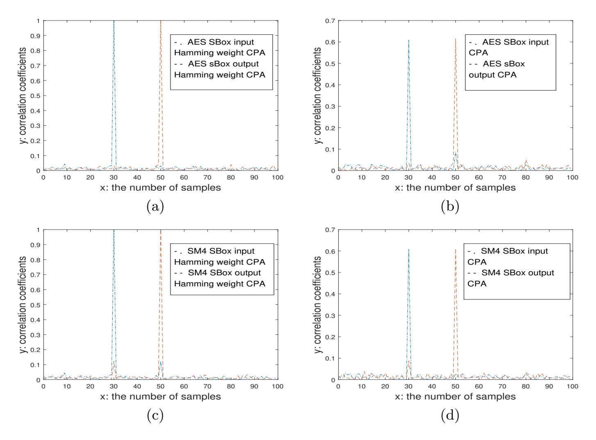
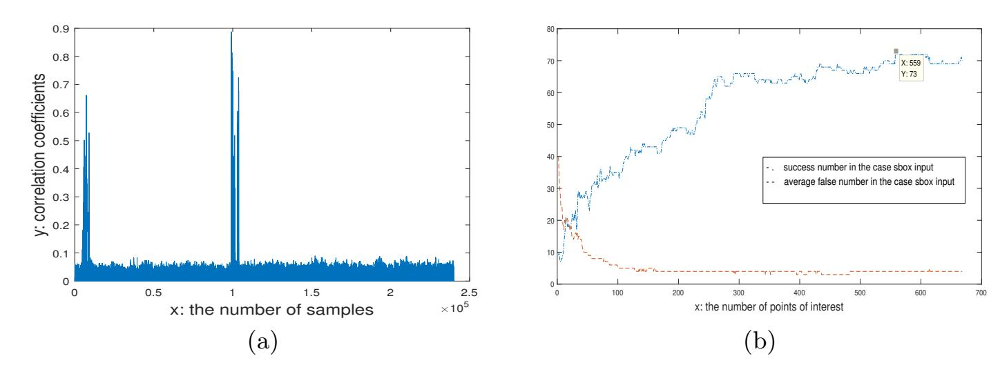
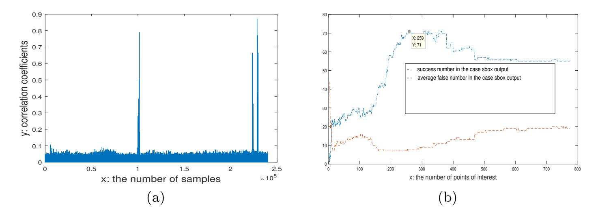
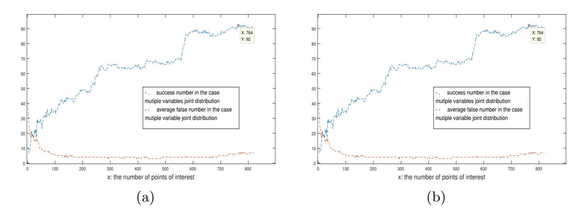
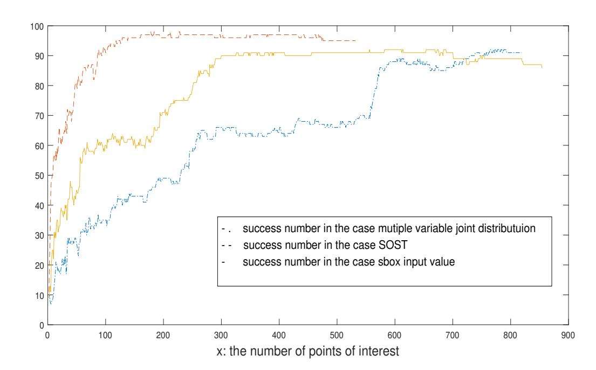
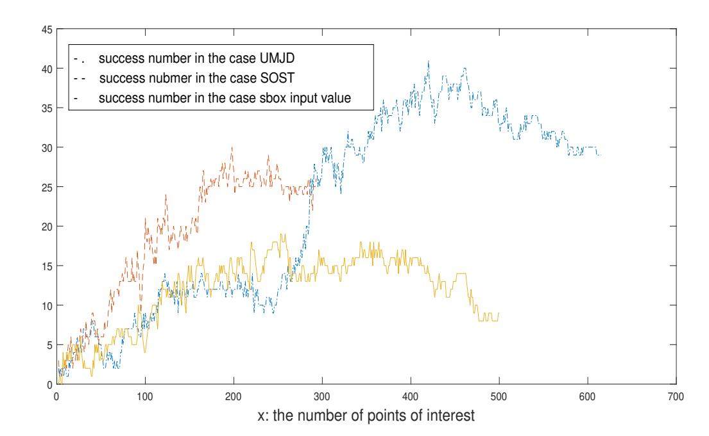
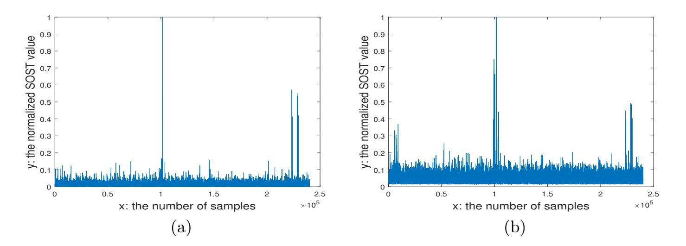
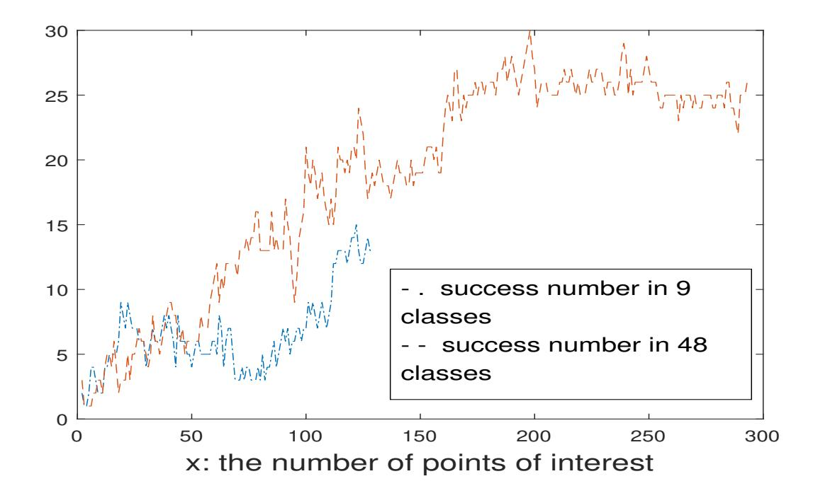

{0}------------------------------------------------

# Template Attacks Based on the Multivariate Joint Distribution?

Min Yang1,<sup>2</sup> , Qingshu Meng<sup>3</sup> , An Wang<sup>4</sup> , and Xin Liu<sup>4</sup>

<sup>1</sup> School of Cyber Science and Engineering, Wuhan University,Wuhan, China <sup>2</sup> Key Laboratory of Aerospacee Information and Trusted Computing, Ministry of Education, Wuhan University, Wuhan, China

yangm@whu.edu.cn

<sup>3</sup> Wuhan Tianyu Information Industry Co., Ltd, Wuhan, China

Abstract. For template attacks, it is ideal if templates can be built for each (data,key) pair. However, it requires a lot of power traces and computation. In this paper, firstly, the properties of the UMJD(unisource multivariate joint distribution) are studied, and then a template attack based on the UMJD is presented. For power traces with much noise, the experiments show that its attack effect is much better than that of the CPA(correlation power analysis) based template attacks and that of the SOST(sum of square wise pair t-differences) based template attacks. Secondly, the problem to build a template for each (data,key) pair can be reduced to build templates for an MMJD (multisource multivariate joint distribution). An MMJD can be divided into several UMJDs. Based on the analysis, we give a template attack that does not require large amounts of computations, and neither a large number of power traces for profiling, but with its attack effect equivalent to that of the template attack which aims to build a template for each (data,key) pair. Third, from the process of the UMJD based template attacks, using the POI (points of interest) of all variables together as the POI of the template attack is an extension to the existing conclusion on the optimal number of POI. Lastly, the UMJD can also be applied in the SOST method to obtain better quality of POI.

Keywords: Side channel attacks · template attack · multivariate joint distribution · CPA · SOST

# 1 Introduction

The traditional cryptanalysis is based on mathematics. Compared with the traditional cryptanalysis, side channel attacks recover keys from the physical information leaked from the device under attack, where the physical information includes power consumption [1], electromagnetic radiation [2] or execution time [3],

<sup>4</sup> School of Computer Science, Beijing Institution of Technology,Beijing, China

<sup>?</sup> Supported by the National Natural Science Foundation of Hubei Province (2016CFB454, 2017CFB663)

{1}------------------------------------------------

etc. The side channel attack mainly is applied on smart cards, IOT (internet of things) devices, where the ownership of devices is often separated from the usage rights and thus they can be accessed by adversaries easily. It is very important to study the side channel attacks and corresponding countermeasures for the security of smart cards and IOT devices.

The template attack was originally proposed by Chari et al in 2002 [4], which assumes that an attacker has the same reference device as the device under attack and thus the power leakage characteristics can be described. From the perspective of information theory, the template attack is considered to be the most powerful side channel attack and has wide applications [5, 6]. The template attack consists of two steps: the first step is the template building or profiling, and the second step is the template matching. In order to make template attacks feasible and effective, it is important to select good quality of POI in the profiling step. POI are the points that contains the most information about the operations that is related to keys. A variety of POI selection methods have been proposed, such as the method based on the DOM (difference of means) [4], on the SOSD (Sum of square differences) [7], on the CPA [8], on the SOST [7], on the SNR (Signal-to-noise ratios) [9], on the MIA (Mutual Information Analysis) [10], and on the KSA (Kolmogorovsmirnov analysis)[11].

In [12, 13] the methods are comprehensively evaluated. When only considering the power trace samples about the operation of SBox output, paper [12] concludes that the CPA based and the SOST based template attacks are best. In [13] it is concluded that the POI chosen by the CPA based method is the most accurate when noise in power traces is high. The SOD (sum of difference) based POI selection method was discussed in [14], which calculates the sum of difference, then chooses the peak points whose value is larger than the base noise value, and takes one point per clock cycle. In [15] the optimal number of POI for a template attack is discussed. The paper concludes that the optimal number of POI is related both to the SNR and the number of traces for profiling. An empirical formula is given and verified with the DPA contest v4.1 data [16]. The PCA (principal component analysis) based method [17] and LDA (Linear discriminant analysis)based method [18] are sample point compression methods, which can be used to solve numerical calculation problems in template attacks.

Chapter 5 of book [9] introduces two kinds of template attack schemes. The first scheme builds templates for each (data,key) pair, and the POI they give are all points related to (data,key) pair, or more exactly related to data, key and (data,key) as a pair. According to our following study, this means at least 65536 templates must be built. As far as we know, no practical implementation scheme was ever documented in the literature for this scheme. We aim to give a practical one. The second scheme builds templates for each value of an intermediate function f(data,key). In theory, the attack effect of the first scheme should be better than that of the second.

The joint distribution of two variables was discussed in [19–21]. Suppose variable a be plaintext inputs and b = SBox(a Lk) be the output of SBox with input plaintext a and key k. The joint distribution (HW(a), HW(b)) of Ham

{2}------------------------------------------------

ming weight of these two variables is discussed to recover keys, where HW(a) and HW(b) are got through template attacks.

Our contribution: This paper proposes a template attack based on the multivariate joint distribution. Our multivariate joint distribution also considers all the variables related to (data,key) pair in a cryptographic algorithm. For example, for AES [22], the variables consist of input plaintext, input key, SBox input, SBox output, sometimes 2 times SBox output and 3 times SBox output in some implementation. However, we divide all these variables into different UMJDs depending on if they originate from one same source variable. For the variables in one UMJD, we differentiate if they are linearly independent. After this, we give a template attack algorithm based on all variables in the UMJD. When the noise in power traces is high, the experiments show that the proposed attack is much better than the template attack based on the CPA or the SOST. This is the first contribution. Secondly, we reduce the task that builds templates for each value of (data,key) pair to the task that builds templates for all variables in the MMJD. A MMJD can be divided into several UMJDs. Based on the analysis, we give a template attack that does not require large amounts of computations, and neither a large number of power traces for profiling, but with the attack effect equivalent to that of the template attack that builds templates for each value of (data,key) pair; Thirdly, from the process of the UMJD based template attacks, the POI generated by each variable constitute the POI for the template attack. This extends the existing conclusion on the optimal number of POI [15], that is, the optimal number of POI for a template attack depends not only on SNR and the number of power trace for profiling, but also on the number of variables in the UMJD. Fourthly, the proposed UMJD can also be used in the SOST method to obtain better POI if the number of power traces for profiling is insufficient such that no variable can be divided into 256 classes. Traditionally, a variable can be divided into 9 classes. Based on the UMJD, the UMJD can be treated as a new variable and divided into more classes. The more classes, the better POI, the better template attacks. Since many symmetric cryptographic algorithms, such as AES and SM4 [23], contain SBoxes, the proposed UMJD template attack has wide applicability. This research is useful not only in the security evaluation of a device, but also in guiding engineering implementations of cryptographic algorithms.

# 2 Related background knowledge

In this section, we briefly review the classical template attack, then introduce two effective POI selection methods, the CPA and the SOST based methods.

## 2.1 The classical template attack

The classical template attack is divided into the following steps [4]:

1. Collects a large number of power traces L on the reference device for each of the k operations (O1, O2, ..., Ok) (usually L = 1, 000 for each operation).

{3}------------------------------------------------

- 2. Calculate the average signal  $M_1, M_2, ..., M_k$  for each of the operations.
- 3. Compute pairwise differences between the average signals  $M_1, M_2, ..., M_k$  to identify and select only points  $p_1, p_2, ..., p_N$ , at which large differences show up.
- 4. For each operation  $O_i$ , the N-dimensional noise vector for power trace T is  $N_i(T) = (T[p_1] M_i[p_1], ..., T[p_N] M_i[p_N])$ . Calculate the noise covariance matrix  $CM_i$  between all pairs of components of the noise vectors for operation  $O_i$  using the noise vectors  $N_i$ s for all the L traces, the entries of the matrix are defined as follows:  $CM_i[u, v] = cov(N_i(p_u), N_i(p_v))$ .
- 5. In this way, the template  $(M_i, CM_i)$ , i = 1, 2, ...k are built.
- 6. In the template matching or attack stage, for the power trace under attack, we compute the noise vector n and  $p_i(n) = \frac{1}{\sqrt{(2\pi)^N |CM_i|}} exp(-\frac{1}{2}n^T C M_i^{-1} n)$ , where  $|CM_i|$  denotes the discriminant of  $CM_i$ ,  $CM_i^{-1}$  is its inverse, and  $p_i(n)$  denotes the probability that the noise vector n conforms to the ith template.

From the formula of  $p_i(n)$ , when the number of POI is large, numerical calculation problems are easy to occur. A simplified method is to let  $CM_i$  be the unit matrix.

#### 2.2 The POI selection method based on the CPA

The CPA [2] calculates Pearson correlation coefficients between the real power consumption sequence R and the theoretical power consumption sequence H, specifically:  $\rho(R,H) = \frac{\sum_{i=1}^n (R_i - \overline{R})(H_i - \overline{H})}{\sqrt{\sum_{i=1}^n (R_i - \overline{R})^2 (H_i - \overline{H})^2}}$ , where  $R_i$  denotes the ith point of the power consumption sequence, and  $\overline{R}$  denotes the mean of all R sequence,  $\overline{H}$  denotes the mean of the all H sequence, and  $H_i$  is the ith point of the sequence H. Take the points whose absolute CPA value is greater than a certain bound as the POI for template attacks.

#### 2.3 The POI selection method based on the SOST

The SOST method is based on the T-test and is a standard statistical tool for distinguishing noise signals. Suppose the signals can be divided into k classes  $(O_1, O_2, ...O_k)$ . Denote by  $G_i$  the group of all traces of the ith classes. Denote by  $M_i$  the average trace of the ith class. For point  $p_t$ , denote by  $\sigma_i^2(t)$  the variance of the point in  $G_i$ , and denote by  $|G_i|$  the number of elements in the group, then the signal intensity of the point is as follows:  $SOST(t) = \sum_{i \neq j} (\frac{M_i(t) - M_j(t)}{\sigma_i^2(t)/|G_i| - \sigma_j^2(t)/|G_j|})^2$ . Take the points whose absolute SOST value is greater than a certain bound as the POI for template attacks.

{4}------------------------------------------------

# 3 The template attack based on multivariate joint distribution

## 3.1 The POI selection

Definition 1. A multivariate joint distribution is the distribution of vectors (v<sup>1</sup> = f1(data, key), v<sup>2</sup> = f2(data, key), ..., v<sup>n</sup> = fn(data, key)), where each variable is used in the cryptographic algorithm, related to ( data,key) pair and linearly independent.

In cryptographic algorithms, these variables tend to have a certain relationship, rather than independent of each other.

Definition 2. If the variables above satisfy the following relationship: v<sup>1</sup> = f1(data, key), v<sup>2</sup> = f2(v1), ..., v<sup>n</sup> = fn(vn−1), the multivariate joint distribution is called a UMJD. If a multivariate joint distribution consists of multiple UMJDs, it is called an MMJD.

Assuming that the power leakage model is H, the power leakage model of a UMJD is (H(v1), H(v2), ..., H(vn)).

Definition 3. Assuming that the power leakage model of a device is H, the power leakage model of a UMJD is (H(v1), H(v2), ..., H(vn)). If a concrete case (H (v1), H (v2),..., H (vn)) can be distinguished from other cases, it is called a distinguishable vector. The number of all distinguishable vectors is called the discriminability of the multivariate joint distribution.

For AES algorithm, let v<sup>1</sup> = f1(data, key) = dataLkey be the SBox input and v<sup>2</sup> = f2(v1) = SBox(v1), then (v1, v2) is a UMJD. Because the variable produced by row shift operation is linearly related to variable v2, it is not considered as a variable in the joint distribution. For some careless implementation, the UMJD can be as (H(v1), H(v2), H(v3), H(v4)), where v<sup>3</sup> = 2×v<sup>2</sup> and v<sup>4</sup> = 3×v2. When the power leakage model is Hamming weight model, the discriminability of the multivariate joint distribution (H(v1), H(v2)) of AES is 48, that is, there are 48 different (H (v1), H (v2)).

Theorem 1. For a UMJD, when all the transformations between variables are bijective, in the profiling stage of template attacks, taking any variable in the UMJD as the target operation for profiling is equivalent.

Proof. Suppose v<sup>i</sup> , v<sup>j</sup> are two variables such that v<sup>j</sup> = f(vi), and f is bijective. As the value x of variable v<sup>i</sup> corresponds to the value f(x) of variable v<sup>j</sup> , the template of value x for variable v<sup>i</sup> is bijectively mapped to the template of value f(x) for variable v<sup>j</sup> . That is, profiling with any variable in the UMJD does not affect the number of templates and the actual classification.

Theorem 2. For a UMJD, when all the transformations between variables are bijective, the POI obtained from each variable constitute the POI of the template attack.

{5}------------------------------------------------

Proof. By Theorem 1, as templates can be built with any variable in the UMJD, the POI obtained from each variable are effective points of interest. Naturally all of them constitute the POI of the template attack.

Remark 1. In [15] a heuristic formula Npoi = Npro 2000×2 <sup>c</sup> (c+ 1) is given to predicate the optimal number of POI, where SNR = 1 2 <sup>c</sup> ,c > 0, and Npro is the number of power trace for profiling in the template building stage. The formula is verified by experiments with the DPA v4.1 data. In the experiments, the output of the first SBox in the first round of AES is taken as the target operation, and the POI is obtained by the CPA method. The experimental results show that the empirical formula fits well with the actual data. Theorem 2 is an extension to the conclusion. That is, the number of POI depends not only on the SNR and the number of traces for profiling, but also on the number of variables in the UMJD.

Usually the CPA and the SOST based POI selection methods are considered to be the most effective for template attacks. Compared to the SOST based method, the CPA based method is more robust when noise increases [13]. The advantage of the SOST based method is that it can obtain all related POI even if the SOST is carried on one variable.

Next, we consider the POI selection method based on the characteristics of the cryptographic algorithm. The characteristics of AES algorithm determine that the SBox input is correlated both with the input Hamming weight of SBox and the output Hamming weight of SBox. Based on this observation, by calculating the CPA between SBox input and power traces, all POI related to both SBox input and SBox output can be obtained. For SM4 algorithm, the Hamming weight of SBox input is correlated with the Hamming weight of SBox output. Based on this observation, by calculating the CPA between SBox input Hamming weight and power traces, we can obtain all POI related to both SBox input and SBox output.

Experiment 1. Using the following pseudocodes PowTraGen to simulate the generation of 3000 power traces, each trace has 100 points. And the SBox is the AES SBox or the SM4 SBox, and HW[x] represents Hamming weight of x.

For AES SBox, we do the CPA between the sequence of Hamming weight of the SBox inputs and the simulated power traces, and do the CPA between the sequence of Hamming weight of the SBox outputs and the simulated power traces. The correlation coefficient sequences are shown in Figure 1(a). We do the CPA between the sequence of the SBox inputs and the simulated traces, and do the CPA between the sequence of the SBox outputs and the simulated power traces respectively. The correlation coefficient sequences are shown in Figure 1(b). For SM4 algorithm, do the CPA between the sequence of Hamming weight of the SBox inputs and the simulated traces, and do the CPA between the sequence f Hamming weight of the SBox outputs and the simulated power traces

{6}------------------------------------------------

#### Algorithm 1 PowTraGen

```
1: cf = 2
2: for (i = 0;i < 3000;i + +) do
3: for (j = 0; j < 100; j + +) do
4: a[i][j] = cf ∗ HW[rand()&0xff]
5: end for
6: end for
7: for (i = 0;i < 3000;i + +) do
8: plaintext=rand()&0xff;
9: key=rand()&0xff;
10: v0=plaintext∧key;
11: a[i][30] = cf ∗ HW[v0];
12: v1 = SBox[v0];
13: a[i][50] = cf ∗ HW[v1];
14: end for
```

respectively. The correlation coefficient sequences are shown in Figure 1(c). We do the CPA between the sequence of the SBox inputs and the simulated power traces, and do the CPA between the sequence of the SBox output sequences and the simulated power traces respectively. The correlation coefficient sequences are shown in Figure 1(d).

Experiment analysis: As can be seen from Figure 1(a) and 1(b), we can obtain all POI related to both the SBox input and output. According to Figure 1(c) and 1(d), there are many ways to obtain the POI related to both the SBox input and output. However, it should be noticed that the correlation coefficient value of some POI is relatively small, only about 0.1. When the noise in power traces is high, its attack effect will be affected.

Although the SOST based method and the algorithm characteristics based method both can obtain all POI corresponding to multiple variables, they are not as robust as CPA based method when noise is high. Further, the computation of the SOST based method is much larger than that of the CPA based method. When the noise in power traces is large, we should adopt the UMJD based method to obtain POI.

### 3.2 The target operation selection for building templates

In the classical template attack, the target operation for profiling is determined first, and then POI is obtained. Contrarily, based on UMJD, we have more choices as the target operation. We consider the following three cases:

Case 1: According to Theorem 1, any variable can be selected and 256 templates can be built for the variable.

Case 2: According to Definition 3, suppose the discriminability of a UMJD under Hamming weight model is m, then m templates can be built for the UMJD as a new variable.

Case 3: According to Theorem 1, any variable can be selected, and 9 templates are built for the variable under Hamming weight leakage model.

{7}------------------------------------------------



**Fig. 1.** (a)AES SBox Hamming CPA; (b)AES SBox Value CPA; (c)SM4 SBox Hamming CPA; (d)SM4 SBox value CPA.

For case 2 and case 3, under the same noise condition, we have the following conclusion:

**Theorem 3.** Under the same condition, that is, the same power traces for profiling and the same traces under attack, the attack effect of case 2 is better than that of case 3.

*Proof.* Under Hamming weight model, if a variable can be divided into 9 classes, according to Definition 3, under the same conditions, the UMJD as a new variable can be divided into more classes. The More classes a variable can be identified, the better the attack is.

According to Theorem 3, we can only consider case 1 and case 2.

#### 3.3 The template attack based on the UMJD

Based on the discussion above, a template attack based on the UMJD is given as follows.

1. According to the operations on the input plaintext and the input key of the cryptographic algorithm, the UMJD  $(v_1 = f_1(data, key), v_2 = f_2(v_1), ..., v_n = f_n(v_{n-1}))$  is formed;

{8}------------------------------------------------

- 2. If all transformations between any two variables are bijective, for each variable v<sup>i</sup> , do the CPA. The POI are selected according to the following rules: according to the distribution of CPA, a basic noise bound is set, and all points with absolute correlation coefficient greater than the bound are selected as POI. If two points' locations are adjacent, then the point with smaller absolute correlation coefficient is removed. Suppose m points as POI are reserved this way. Rearrange the POI with their value from big to small. For (j = 1; j < m+1; j++) do template attack with the first j points and with variable v<sup>i</sup> as the target operation. If the highest success rate is achieved for the first j points, reserved these first j points as POI and denote them by P OI<sup>i</sup> , i = 1, 2, · · · , n;
- 3. Take the whole set {P OI<sup>i</sup> |i = 1, 2, · · · , n} as the POI for the template attack. When the noise in power traces is small, 256 templates are built as in case 1, and when the noise in power traces is large, as in case 2, build m templates for the UMJD as a whole.
- 4. In the template matching stage, let CM matrix be the unit matrix to calculate the matching probability. And the key with the highest matching probability is taken as the device key.

## 3.4 The template attack with (data, key) pair as the target operation

In this subsection, we discuss how to implement a template attack with the attack effect equivalent to that of the template attack that builds templates for (data,key) pair. We begin by analyzing how a cryptographic algorithm processes the input plaintext and the input key. Read the plaintext, read the key, calculate variables that depends on both the plaintext and the key. The multivariate joint distribution should be (v<sup>−</sup><sup>1</sup> = f<sup>−</sup>1(data), v<sup>0</sup> = f0(key), v<sup>1</sup> = f1(data, key), v<sup>2</sup> = f2(data, key), · · · , v<sup>n</sup> = fn(data, key)), where v<sup>−</sup>1, v<sup>0</sup> represent read/write operations on data and key respectively. This is an MMJD. Now if a template for a concrete (data, key) pair can be identified, its corresponding MMJD (v<sup>−</sup><sup>1</sup> = f<sup>−</sup>1(data), v<sup>0</sup> = f0(key), v<sup>1</sup> = f1(data, key), v<sup>2</sup> = f2(data, key), · · · , v<sup>n</sup> = fn(data, key)) can be identified. In the same way, if a vector (v<sup>−</sup><sup>1</sup> = f<sup>−</sup>1(data), v<sup>0</sup> = f0(key), v<sup>1</sup> = f1(data, key), v<sup>2</sup> = f2(data, key), · · · , v<sup>n</sup> = fn(data, key)) can be identified, the template for the corresponding (data,key) pair can be identified.

As variable data is not cared much or known, it can be discarded from the MMJD. Now the MMJD becomes into (v<sup>0</sup> = f0(key), v<sup>1</sup> = f1(data, key), v<sup>2</sup> = f2(data, key), · · · , v<sup>n</sup> = fn(data, key)). For AES, the MMJD is (v<sup>0</sup> = key, v<sup>1</sup> = dataLkey, v<sup>2</sup> = SBox(v1)) with the discriminability 423.

Theorem 1 cannot be applied directly on an MMJD. We divide it into several UMJDs, implement the UMJD based template attacks for each UMJD, and find the correct key from the key candidates obtained by these template attacks. In detail, under the Hamming weight power leakage model, identify the first variable v<sup>0</sup> into one of 9 classes. Then obtain possible keys by implementing the template attack based on the UMJD. Finally sieve the possible keys with regards to the already known class.

{9}------------------------------------------------

Our template attack needs no more power traces than the classical template attack, but needs the computation a few times more.

# 4 Experiments

In this section three kinds of experiments are designed. The first kinds of experiments show that the template attack based on the UMJD is better than the template attack based on the CPA or the SOST. The second kinds of experiments compare the POI quality obtained by the SOST based method, the UMJD based method and the method based on cryptographic algorithms respectively. The final kinds of experiments show how the UMJD helps the SOST to obtain better POI on the occasion that there are insufficient power traces in the template building stage.

The experimental data are based on data from DPA contest v4.1. Currently, only 40,000 traces are available on the official website [16]. Because the implementation of AES adopts RSM mask scheme [24], we pick out 2491 traces with mask value 0. Unless specifically stated, the data used in this section are these 2491 traces, 2391 of which are used for profiling , and the rest 100 of which are used as the template matching traces. The SBox in the following part is the first SBox in the first round.

## 4.1 The POI from a variable and the POI from a UMJD

We use the CPA to select the POI with each variable and use Hamming weight leakage model that fits well for the DPA v4.1 data.

Experiment 2-1. Do the CPA between the sequence of Hamming weight of the SBox inputs and the power traces, as shown in Figure 2(a). Refer to [13], the rule to select the POI is as follows: according to the distribution of CPA, set a base noise bound, and all points with absolute correlation coefficients greater than the bound are selected as POI. If the positions of two POI are adjacent, the point with smaller absolute correlation coefficient is removed, rearrange POI with correlation coefficients from big to small. All subsequent experiments used the same rule to select POI. According to Figure 2(a), the attack result is good when the points with absolute correlation coefficients greater than 0.08 are selected as POI. We build 256 templates for the SBox input. The attack results are shown in Figure 2(b), where the part with '-.' are the number of correct keys we get from the 100 traces, and part with '- -' are the average number of false keys for all traces that fails to provide correct key.

Experiments 2-2. Do the CPA between the sequence of Hamming weight of the SBox outputs and the power traces, as shown in Figure 3(a). The attack result is good when absolute correlation coefficient bound is set 0.06. And the attack results are shown in Figure 3(b).

{10}------------------------------------------------



Fig. 2. (a) CPA for SBox input Hamming weight; (b) Attack results for input Hamming weight CPA.



Fig. 3. (a) CPA for SBox output Hamming weight; (b) Attack results for output Hamming weight CPA.

**Experiment 2-3.** The 559 POI with the highest success rate in experiment 2-1 and the first 259 POI in experiment 2-2 are put together as the effective POI. Figure 4(a) is the attack result with the SBox input as the target to be profiled, while Figure 4(b) is the attack result with the SBox output as the target. The two figures have no difference, which confirms the correctness of Theorem 1.

Experimental analysis: Experiments 2-1, 2-2 and 2-3 show that with Hamming weight leakage model, POI based on UMJD are better than that based on one variable. The corresponding attack success rate is increased from about 70% to about 90%. The process of POI selection also shows that the optimal number of POI depends not only on the SNR, the number of power traces for profiling, but also on the number of variables in the UMJD. Experiments 2-3 also verifies the correctness of Theorem 1.

#### 4.2 Attack effects for the 3 POI selection methods

In subsection 3.1, we discuss three methods to obtain POI: one is the SOST based method, the second is based on the proposed UMJD, and the third is the

{11}------------------------------------------------



Fig. 4. (a)Attack result with SBox input as target; (b)Attack result with SBox output as target.

method depending on cryptographic algorithms. All three methods can obtain POI related to SBox input or SBox output. We discuss the template attack effects for these three methods. In experiment 3-1, the attack results of three methods are discussed when the noise is low. Experiment 3-2 examines the attack results of three methods when the noise is high.

Experiment 3-1. Use the original power traces. First consider the UMJD based method. We redo the Experiment 2-3, and the attack result is shown as '-.' in Figure 5. The highest success rate is 92%; Secondly consider the SOST based method. Because there are only 2391 traces for the SOST method, we cannot divide any variable into 256 classes. Instead we take the UMJD as a new variable and divide it into 48 classes to obtain POI. Still build 256 templates for the SBox output to do template attack. The attack result is shown as '- -' in Figure 5. The highest success rate is 98%. The points with the normalized SOST value greater than 0.04 are used as POI; Thirdly consider the algorithm based POI method. Do the CPA between the sequence of SBox inputs and power traces. Select points with their absolute correlation coefficients greater than 0.065 as POI. Build 256 templates for the SBox output to do the template attack. The attack result is shown as sold '-' in Figure 5. The highest success rate was 92%.

Experimental analysis: From the results of Experiment 3-1, it can be seen that when the noise is small, SOST method is the most effective, and the UMJD based method is similar to the cryptographic algorithm based method.

Next, we examine the effects of the three methods when the noise is high.

Experiment 3-2. Noise with standard deviation of 10 was added to the original power traces. First consider the UMJD based method. Do the CPA between the sequence of Hamming weight of SBox inputs and the power traces, do the CPA between the sequence of Hamming weight of SBox outputs and the power traces. Points with absolute correlation coefficients greater than 0.07 are selected as POI both for the SBox inputs' CPA and the SBox outputs' CPA. Build 256 templates

{12}------------------------------------------------



Fig. 5. Attack results for 3 POI methods when noise is small.

for the SBox output to do template attacks. The attack results are shown as '- .' in Figure 6, with the highest success rate 41%; Secondly consider the SOST based method. Because there are only 2391 traces for the SOST method, we cannot divide a variable into 256 classes. Instead we take the UMJD as a new variable and divide it into 48 classes to obtain POI. Still build 256 templates for the SBox output to do template attacks. The attack result is shown as '–' in Figure 6. The highest success rate is 30%. Select the points with the normalized SOST value greater than 0.14 as POI; Thirdly consider the algorithm based POI method. Do the CPA between the sequence of the SBox inputs and the power traces. Select points with their absolute correlation coefficients greater than 0.065 as POI. Build 256 templates for the SBox output to do template attacks. The attack result is shown as sold '-' in Figure 6. The highest success rate is 19%.

Experimental analysis: When the noise is high, POI based on the UMJD is the best one. POI based on the SOST takes the second place, and POI based on the cryptographic algorithm is the worst. This shows the UMJD based POI selection method is the most robust when the noise in traces is high.

#### 4.3 The UMJD helps the SOST to obtain better POI

When the SOST method is used to select POI and there are insufficient power trace for profiling, we cannot classify any variable into 256 classes. Traditionally we can classify a variable into 9 classes. Now thanks to the UMJD, We can take it as a new variable and divide it into more classes.

Experiment 4. The output of SBox is divided into nine classes, and the normalized SOST is shown in Figure 7(a). Select the points with the normalized SOST value greater than 0.08 as POI, and 256 templates are built for the SBox

{13}------------------------------------------------



Fig. 6. Attack results for 3 POI methods when noise is high.



Fig. 7. (a) SOST with SBox output into 9 classes; (b) SOST with UMJD into 48 classes.

output. The attack result is shown as '-.' in Figure 8; When the UMJD is taken as a new variable, we divide the UMJD into 48 classes. As shown in Figure 7(b), POI are the points whose SOST value is greater than 0.04, and build 256 templates for the SBox output to do template attacks. The attack result is shown as '--' in Figure 8.

Experimental analysis: From Figure 8, it can be seen that the attack result of dividing the UMJD into 48 classes is much better than that of dividing the output of SBox into nine classes. The experiment shows that the UMJD really helps the SOST to obtain better POI when there are insufficient number of traces for profiling.

{14}------------------------------------------------



Fig. 8. The attack results for 9 classes and 48 classes respectively.

# 5 Conclusion

The classical template attack determines the target operation to be profiled first, and then determines the POI. By analyzing the cryptographic algorithm's processing on plaintexts and keys, we propose the concept of the UMJD. The proposed template attack based on the UMJD is better theoretically because of using the POI of multiple variables together for the template attack. The experiments also verify that its attack effect is much better than that of the CPA based method and the SOST based method when the noise in power traces is high. Using the POI of multiple variables together is also an extension to the known result on the optimal number of POI, that is, the number of POI is related not only to the SNR of the power traces and to the number of power traces for profiling, but also to the number of independent variables in the UMJD. To build a template for each (data, key) pair can be reduced to the template attack based on the MMJD. An MMJD can be divided into several UMJDs and then several template attacks based on the UMJDs can be implemented one by one to recover the key for the device under attack. The paper also discusses how the UMJD can help the SOST to obtain better POI when there are insufficient power traces for profiling.

Because most cryptographic algorithms contain SBoxes, this research has a wide applicability. The results can be used not only to evaluate devices against the side channel analysis, but also to guide implementations of cryptographic algorithms.

## References

1. Paul Kocher, Joshua Jaffe, Benjamin Jun.: Differential power analysis. In: Proceedings of the 19th Annual International Cryptology Conference, pp. 388–397. Santa

{15}------------------------------------------------

- Barbara (1999)
- 2. Karine Gandolfi,Christophe Mourtel,Francis Olivier.: Electromagnetic analysis: concrete results. In: Proceedings of the 3rd International Workshop on Cryptographic Hardware and Embedded Systems, pp.251–261. Paris (2001)
- 3. Paul C. Kocher.: Timing attacks on implementations of Diffie-Hellman, RSA, DSS, and other systems. In: Proceedings of the 16th Annual International Cryptology Conference, pp. 104–113. Santa Barbara (1996)
- 4. Suresh Chari,Josyula R. Rao,Pankaj Rohatgi.: Template attacks. In: Proceedings of the 4th International Workshop on Cryptographic Hardware and Embedded Systems, pp.13–28. Redwood Shores (2002)
- 5. Wang A, Zhang Y, Tian W N, et al. : Right or wrong collision rate analysis without profiling: fullautomatic collision fault attack. Sci China Inf Sci 61(3), 032101 (2018). https://doi.org/10.1007/s11432-016-0616-4
- 6. Xu S, Lu X J, Zhang K Y, et al. Similar operation template attack on RSA-CRT as a case study. Sci China Inf Sci61(3), 032111 (2018). https://doi.org/10.1007/s11432- 017-9210-3
- 7. Benedikt Gierlichs,Kerstin Lemke-Rust, Christof Paar.: Templates vs. stochastic methods a performance analysis for side channel cryptanalysis. In: Proceedings of the 8th International Workshop on Cryptographic Hardware and Embedded Systems, pp.15–29. Yokohama (2006)
- 8. Dakshi Agrawal, Josyula R. Rao, Pankaj Rohatgi, et al.: Templates as master keys. In: Proceedings of the 7th International Workshop on Cryptographic Hardware and Embedded Systems, pp.15–29. Edinburgh (2005)
- 9. Stefan Mangard, Elisabeth Oswald, Thomas Popp. Power analysis attacks: revealing the secrets of smart cards. Springer US, 2007.
- 10. Benedikt Gierlichs, Lejla Batina, Pim Tuyls, et al.: Mutual information analysis. In: Proceedings of the 10th International Workshop on Cryptographic Hardware and Embedded Systems, pp.426–442. Washington, DC (2008)
- 11. Carolyn Whitnall, Elisabeth Oswald, Luke Mather.: An exploration of the kolmogorov-smirnov test as a competitor to mutual information analysis. In: Proceedings of the 13th International Workshop on Cryptographic Hardware and Embedded Systems, pp.234–251. Nara (2011)
- 12. Guangjun Fan,Yongbin Zhou,Hailong Zhang, et al.: The cognition is not enough: another look on existing interesting points chosen methods. Chin J of Electron 26(2),416–423. (2017)
- 13. Yingxian Zheng, Yongbin Zhou, Zhenmei Yu, et al.: How to compare selections of POInts of interest for side-channel distinguishers in practice? In: Proceedings of the 16th International Conference on Information and Communications Security, pp.200–214. Hong Kong (2014)
- 14. Christian Rechberger, Elisabeth Oswald.: Practical template attacks. In: Proceedings of the 5th International Workshop on Information Security Application, pp.440– 456. Jeju Island (2004)
- 15. Hailong Zhang, Yongbin Zhou.: How many interesting POInts should be used in a template attack? J Syst Softw 120(oct):105–113. (2016). https://doi.org/10.1016/j.jss.2016.07.028
- 16. DPA contest v4, http://www.dpacontest.org/v4/rsm traces.php Last accessed 4 Oct 2019
- 17. C. Archambeau, E. Peeters, F. -X. Standaert, et al.: Template attacks in principal subspaces. In: Proceedings of the 8th International Workshop on Cryptographic Hardware and Embedded Systems, pp.1–14. Yokohama (2006)

{16}------------------------------------------------

- 18. FrancoisXavier Standaert, Cedric Archambeau.: Using subspace-based template attacks to compare and combine power and electromagnetic information leakages. In: Proceedings of the 10th International Workshop on Cryptographic Hardware and Embedded Systems, pp.411–425. Washington (2008)
- 19. Neil Hanley, Michael Tunstall, William P. Marnane.: Unknown plaintext template attacks. In: Proceedings of The 10th International Workshop on Information Security Applications, pp.148–162. Busan (2009)
- 20. Yanis Linge, Cecile Dumas, Sophie Lambert-Lacroix.: Using the joint distributions of a cryptographic function in side channel analysis. In: Proceedings of the 5th International Workshop on Constructive Side-Channel Analysis and Secure Design, pp.199–213. Paris (2014)
- 21. Christophe Clavier, Leo Reynaud.: Improved blind side-channel analysis by exploitation of joint distributions of leakages. In: Proceedings of the 19th International Conference on Cryptographic Hardware and Embedded Systems, pp.24–44. Taipei (2017)
- 22. J. Daemen, V. Rijmen. AES proposal: Rijndael, 1999. http://www.nist.gov/aes/ Last accessed 1 Oct 2019
- 23. SM4 blockcipher algorithm, China GM/T 0002- 2012.http://sca.hainan.gov.cn/xxgk/bzhgf/201804/W020180409400793061524.pdf Last accessed 10 Sept 2020
- 24. Maxime Nassar, Youssef Souissi, Sylvain Guilley,et al.: RSM: a small and fast countermeasure for AES, secure against first- and second-order zero-offset SCAs. In Proceedings of 2012 Design, Automation & Test in Europe Conference & Exhibition, pp.1173–1178. Dresden (2012)