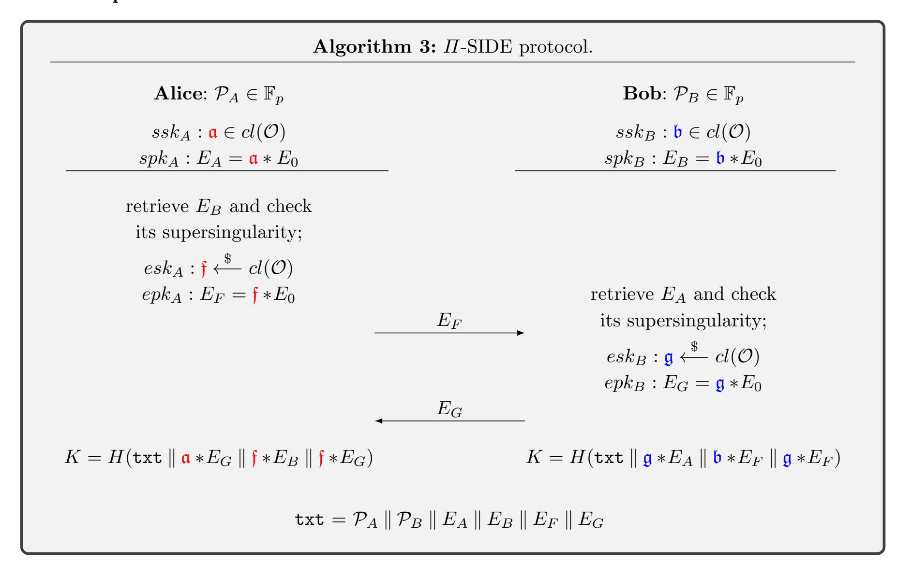
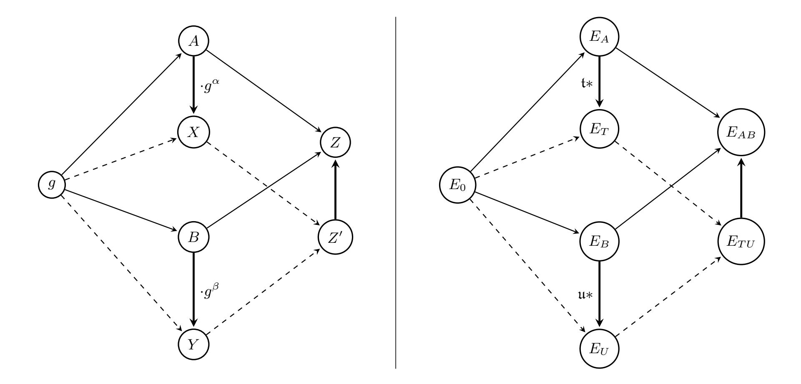

{0}------------------------------------------------

An extended abstract of this paper will appear at SAC2020. Minor modifications will be made before publication. The authors want to thank all reviewers for providing useful comments.

# Practical Isogeny-Based Key-exchange with Optimal Tightness

Bor de Kock, Kristian Gjøsteen, and Mattia Veroni?

NTNU – Norwegian University of Science and Technology, Trondheim, Norway. *{*bor.dekock,kristian.gjosteen,mattia.veroni*}*@ntnu.no

Abstract. We exploit the Die-Hellman-like structure of CSIDH to build a quantum-resistant authenticated key-exchange algorithm. Our security proof has optimal tightness, which means that the protocol is ecient even when instantiated with theoretically-sound security parameters. Compared to previous isogeny-based authenticated key-exchange protocols, our scheme is extremely simple, its security relies only on the underlying CSIDH-problem and it has optimal communication complexity for CSIDH-based protocols. Our security proof relies heavily on the rerandomizability of CSIDH-like problems and carries on in the ROM.

Keywords: Post-quantum, isogenies, key-exchange, provable-security, tightness, rerandomization.

# 1 Introduction

*Authenticated key-exchange protocols* allow two parties to collaborate in order to create a shared secret key, providing each of them with some assurance on the identity of the partner. Authentication can be achieved in two ways: *implicitly*, if the algebraic properties of the scheme imply that the only user who can compute the shared key is the intended one, or *explicitly*, by receiving a confirmation that the interlocutor has actually computed the key. The latter implies the use of a second mechanism which provides authentication, like a signature scheme, a KEM or a MAC. Even if explicit authentication might seem a stronger and preferable feature, in the real world it does not add much to the security of the protocol. First of all, it does not guarantee that the partner holds the shared key for all the time between the key confirmation and the use of the key. Moreover, the generation of signatures or the use of KEMs and MACs produces evidence of participation to a key-exchange, while implicit authentication does not. Finally, the schemes relying on implicit authentication typically require less computations and message exchanges compared to those involving an explicit authentication mechanism, with a significant profit in computational cost and communication eciency.

The security proof limits the advantage of an adversary in breaking the scheme to the probability of solving some mathematical hard problem. Deploying a cryptographic algorithm should always be done in a *theoretically sound* way: the size of the concrete parameters must be large enough to guarantee the required bits of security. If on one hand any security proof asymptotically guarantees the desired security level, on the other hand we want to use the smallest parameters possible, in order to obtain the most ecient implementation under the given security constraints. It is useful to measure the so-called *tightness* of the proof by computing its security loss *L*(): hitting the optimal tightness bound assures a certain security level while instantiating the protocol with the smallest parameters possible. It is therefore extremely relevant to build a protocol with a security proof that is as tight as possible. The parameters on which we focus are, in particular, the number of users running the protocol and the number of sessions per user. Note that, nowadays, security proofs [JKSS12,KPW13,BFK+14] for a widely deployed protocol such as TLS have a quadratic loss in the number of sessions, fact that is not taken into account for the implementation.

In 2019 Cohn-Gordon et al. [CCG+19] developed a key-exchange protocol with a nearly tight security proof. In particular, the security loss is linear in the number of users and constant in the number of sessions per user. The schemes in the latter paper base their security on the Strong-DH assumption and its variants, defined over cyclic groups of prime order. The rerandomization of Die-Hellman problems plays a fundamental role in achieving the optimal tightness of the proofs, and thus it is a desirable

? Author list in alphabetical order; see https://www.ams.org/profession/leaders/culture/ CultureStatement04.pdf

{1}------------------------------------------------

feature that we cannot disregard. The tightness and practicality of these schemes raise an interesting question: is it possible to adapt the protocols (together with their security proofs) in order to make them quantum-safe?

In 1997, Peter Shor [Sho97] published a quantum algorithm for integer factorization and one for computing discrete logarithms, both running in polynomial time. As soon as a large-scale quantum computer will become available, the information security based on primitives like the RSA cryptosystem and the Die-Hellman key-exchange will be breached. In order to address this quantum threat, many researchers have focused their attention on post-quantum cryptography. The goal is to find new cryptographic primitives which can be implemented on classical computers, still guaranteeing security against both classical and quantum adversaries. In 2016, NIST announced a world-wide competition for new post-quantum standards in public-key encryption and digital signature algorithms. 69 submissions were accepted in the first round, 26 of which made it to the second step. The search for new post-quantum cryptographic standards is still ongoing.

Supersingular-Isogeny based Die-Hellman (SIDH) [JD11] is one of the promising candidates in the search for cryptographic protocols that are secure against an adversary equipped with a large-scale quantum computer. Key-exchange protocols based on isogenies are unique in the sense that they provide key-sizes roughly similar to those of pre-quantum alternatives, but they are also known for being more complex (algebraically) compared to some of the post-quantum alternatives. An example of a scheme that is based on SIDH is SIKE [JAC+19], which is one of the 26 candidates in the second round of NIST's 2016 competition for post-quantum cryptographic protocols. Even if SIKE is not among the finalists announced in July 2020, NIST has shown high interest on isogeny-based cryptography, encouraging further research on this field [AASA+].

Although SIDH-based schemes have been around for a few years now, there are still open questions about the security behind them. In particular, random self-reducibility of SIDH problems is very hard to achieve. A di↵erent isogeny-based scheme is CSIDH [CLM+18]: introduced in 2018, it o↵ers a much more flexible and adaptable algebraic structure. In this paper we show that we can obtain an optimally tight security proof for a CSIDH-based key-exchange protocol, making use of random self-reducibility. This kind of rerandomization plays a fundamental role in the tight proofs of, for instance, the classical Die-Hellman key-exchange, but is also used in modern tightly secure key exchanges: Cohn-Gordon et al. [CCG+19] exploit this property to construct a tightly-secure AKE protocol.

The protocol we introduce is, to our knowledge, the best proven-secure result for isogeny-based cryptographic systems. The proofs presented here draw on the proofs from Cohn-Gordon et al. [CCG+19], but with changes to the re-randomisation strategy, since re-randomisation in the isogeny case is di↵erent from the cyclic group case. Both eciency and tightness are a significant improvement over the state of the art, and can lead to the deployment of schemes with more ecient parameter choices obtaining high security at computational costs which are as low as possible.

# 1.1 Our contributions

In section 3.2 we adapt protocol ⇧ by Cohn-Gordon et al. [CCG+19] to the isogeny setting, obtaining the first implicitly authenticated CSIDH-like protocol with weak forward secrecy, under only the Strong-CSIDH assumption. This is the first scheme with a security proof (moreover with optimal tightness) in the same setting as CSIDH. The protocol requires each user to perform 4 ideal-class evaluations, and its security proof shown in section 4.3 has a tightness loss which is linear in the number of sessions performed by a single user.

The adaptation we perform is, however, not straightforward. In the new setting we have only one operation, namely the multiplication of ideal classes, while in the original protocol rerandomization is achieved via two operations (addition and multiplication of exponents). This leads to a di↵erent rerandomization technique which relies one the random self-reducibility of the computational CSIDH problem shown in appendix A.2.

What we obtain is a significant improvement over the state of the art of isogeny-based key-exchange protocols. Compared to the latest scheme in "Strongly secure AKE from SIDH" [XXW+19], we obtain better eciency and tightness. Moreover, unlike this latter scheme, our protocol does not require any authentication mechanism. This allows us to rely on the same class (and a smaller number) of hardness assumptions, and to avoid the use of signatures, which are tricky and expensive [DG19] to produce in the isogeny setting. Compared to the CSIDH protocol, which lacks a security proof and for which authentication seems hard to achieve, our ⇧-SIDE protocol has implicit authentication at the cost of a few more ideal-class evaluations.

{2}------------------------------------------------

As shown in section 5, our  $\Pi$ -SIDE protocol is competitive with other post-quantum candidates, once instantiated with theoretically-sound parameters.

# 1.2 Related work

In the last years, a lot of research has been conducted on SIDH-based schemes. For example, Galbraith [Gal18] has shown how to adapt generic constructions to the SIDH setting, and he introduced two new SIDH-AKE protocols. Similar results were achieved by Longa [Lon18], except for the introduction of the two new schemes. Assuming a straightforward adaptation, a few other protocols have a non-quadratic tightness loss. For example KEA+ [LM06] has a linear loss in the number of participants multiplied by the number of sessions, assuming the hardness of the Gap-DH problem. Although, it does not achieve wPFS and takes  $O(t \log t)$  time only when instantiated on pairing-friendly curves.

In their recent paper, Xu et al. [XXW+19] propose SIAKE2 and SIAKE3, a two-pass and a three-pass AKE respectively. SIAKE2, whose security relies on the decisional SIDH assumption, has a rather convoluted construction: they design a strong One-Way CPA secure PKE scheme, which is then turned into a One-Way CCA KEM through the modified FO-transform and finally used as a building block for the AKE scheme. The three-pass AKE SIAKE3 is obtained by modifying the previously designed KEM, once a new assumption (the 1-Oracle SI-DH, an analogue of the Oracle Diffie-Hellman assumption in which only one query is allowed) is made. Compared to this scheme, our result is simpler and it has a tighter security proof, smaller communication complexity and improved overall efficiency.

# 2 Preliminaries

In this section, we first recall the definition of tightness for security reductions. Then we provide the reader with key-concepts and results which are indispensable to understand the constructions of SIDH and CSIDH. Good references regarding elliptic curves and isogenies are Silverman [HS09], Washington [Was08] and De Feo [Feo17]; the original papers introducing SIDH and CSIDH are Jao-De Feo [JD11] and Castryck et al. [CLM+18], respectively.

### 2.1 Tight reductions

When comparing schemes, one should always consider protocols once they have been instantiated with theoretically-sound parameters, which guarantee the desired level of security. These parameters (such as the bit-length of the prime defining a base field or the key size) strongly depend on the security proof correlated with the protocol. A security proof usually consists of

- a security model, in which we describe an adversary by listing a set of queries that it can make (and therefore specifying what it is allowed to do);
- a sequence of games leading to a *reduction*, in which an adversary  $\mathcal{A}$  against the protocol is turned into a solver  $\mathcal{B}$  for an allegedly hard problem.

The "quality" of a reduction can be measured by computing its security loss: if  $t_{\mathcal{A}}$  and  $\epsilon_{\mathcal{A}}$  are respectively the running time and the success probability of  $\mathcal{A}$ , and  $t_{\mathcal{B}}$  and  $\epsilon_{\mathcal{B}}$  are respectively the running time and the success probability of  $\mathcal{B}$ , then we define the security loss L as

$$\frac{t_{\mathcal{A}}}{\epsilon_{\mathcal{A}}} = L \, \frac{t_{\mathcal{B}}}{\epsilon_{\mathcal{B}}}.\tag{1}$$

If L is constant, then we say that the reduction is tight. Having a tight proof is therefore as relevant as building an efficient protocol, because this leads to deploy the smallest possible parameters when we concretely instantiate a protocol (guessing which keys are "large enough" to guarantee security might not lead to practical sizes).

In some cases, however, it is impossible to obtain a tight reduction. In a *simple scheme* the adversary is run only once, in comparison to other protocols which use the Forking Lemma in order to run multiple copies of the adversary. A linear loss in the number of participants to the protocol is unavoidable for simple schemes, while applying the Forking Lemma leads to a non-tight proof. We therefore focus on *optimal tightness* whenever tightness is unachievable: the L in Equation (1) turns out to be not constant, but one proves that it is impossible to decrease its order. We rely on the same strategies adopted in the

{3}------------------------------------------------

paper by Cohn-Gordon et al. [CCG+19] to prove the lower bound on the tightness loss, applying their variant of the meta-reduction techniques by Bader et al. [BJLS16].

Many available schemes, which are actually taken into account for standardization processes, have quite non-tight security reductions. Let  $\mu$  be the number of users running the protocol and let k be the number of sessions per user. HMQV [Kra05], a classically secure protocol in the random-oracle model under the CDH assumption, has security loss  $O(\mu^2 k^2)$ . If we consider a generic signed KEM approach, we get a  $O(\mu^2 k^2)$  loss in addition to the signature scheme loss. In many cases, parameters are chosen in a non theoretically-sound way, while tightness loss should always be considered when comparing protocols.

# 2.2 Elliptic curves, isogenies and endomorphism rings

Let  $\mathbb{F}_p$  be a finite field for a large prime p and let E be an elliptic curve over  $\mathbb{F}_p$ . We say that E is supersingular if and only if it has order  $\#E(\mathbb{F}_p) = p+1$ . Consider the isomorphisms of elliptic curves, i.e. all the invertible algebraic maps. Any two elliptic curves over the algebraic closure  $\overline{\mathbb{F}}_p$  are isomorphic if and only if they have the same j-invariant. Thus we can use isomorphisms to define an equivalence relation between elliptic curves and identify an equivalence class by the j-invariant of the curves in the class.

Let  $E_1$  and  $E_2$  be two elliptic curves defined over  $\mathbb{F}_p$  and let  $0_{E_1}, 0_{E_2}$  denote the respective points at infinity. An isogeny from  $E_1$  to  $E_2$  is a morphism  $\phi: E_1 \to E_2$  such that  $\phi(0_{E_1}) = 0_{E_2}$ . For any isogeny  $\phi: E_1 \to E_2$  there exists a dual isogeny  $\hat{\phi}: E_2 \to E_1$  such that  $\hat{\phi} \circ \phi = [deg(\phi)]_{E_1}$  and  $\phi \circ \hat{\phi} = [deg(\phi)]_{E_2}$ . An isogeny is essentially determined by its kernel: given a finite subgroup  $G \subset E(\overline{\mathbb{F}}_p)$  there exist a unique (up to isomorphisms) elliptic curve  $E_2 \simeq E_1/G$  and a separable isogeny  $\phi: E_1 \to E_2$  such that  $\ker(\phi) = G$ . The isogeny  $\phi$  has degree  $\ell$  equal to the cardinality of its kernel, and we call it an  $\ell$ -isogeny. Given the kernel of an isogeny we can exploit Vélu's formulae [Vél71] to compute the isogeny  $\phi$  together with the codomain curve  $E_2$  in  $O(\ell \log(p)^2)$  bit operations. This is the best approach when  $\ell$  is small enough and p is shorter than a few thousand bits. Any separable isogeny defined over  $\mathbb{F}_p$  can be written as the composition of isogenies of prime degrees.

An endomorphism is an isogeny from E to itself; the set of endomorphisms of E, together with the zero map and equipped with pointwise addition and composition, forms the endomorphism ring End(E). We denote by  $End_p(E)$  the ring of endomorphisms defined over  $\mathbb{F}_p$ . For ordinary curves  $End_p(E) = End(E)$ , while for supersingular curves  $End_p(E) \subset End(E)$ . In particular, End(E) is an order in a quaternion algebra, whilst  $End_p(E)$  is an order in the imaginary quadratic field  $\mathbb{Q}(\sqrt{p})$ . A classical result by Deuring [Deu41] reveals that End(E) is a maximal order in  $B_{p,\infty}$ , the quaternion algebra ramified at p and at  $\infty$ .

### 2.3 The ideal class group action

In this section, we provide the reader with the basic definitions and known results regarding ideal class group action. In particular, we gravitate around the meaning of a recurring sentence in papers on isogeny-based cryptography:

"The ideal class group of an imaginary quadratic order  $\mathcal{O}$  acts freely via isogenies on the set of elliptic curves with  $End_p(E) \simeq \mathcal{O}$ ."

We will then focus on the computational aspects, essential to understand CSIDH.

Algebraic foundations. An algebra A is a vector space over a field  $\mathbb{K}$  equipped with a bilinear operation. If the bilinear operation is associative, then we say that A is an associative algebra. Given a unitary ring R, a left R-module R consists of an abelian group (M, +) and a scalar multiplication  $R \times_R M \longrightarrow_R M$  which satisfies left/right distributivity, associativity and neutrality of ring's unit. Let R be an integral domain (a commutative unitary ring without zero-divisors) and let  $\mathbb{K}$  be its field of fractions; a left R-module R is a lattice in the vector space R over  $\mathbb{K}$  if R is finitely generated, R-torsion free and an R-submodule of R and R-submodule of R and R-submodule of R and R-submodule of R and R-submodule of R and R-submodule of R and R-submodule of R and R-submodule of R and R-submodule of R and R-submodule of R and R-submodule of R and R-submodule of R and R-submodule of R and R-submodule of R and R-submodule of R and R-submodule of R and R-submodule of R and R-submodule of R and R-submodule of R are R-submodule of R and R-submodule of R and R-submodule of R and R-submodule of R and R-submodule of R and R-submodule of R and R-submodule of R and R-submodule of R and R-submodule of R and R-submodule of R and R-submodule of R and R-submodule of R and R-submodule of R and R-submodule of R and R-submodule of R and R-submodule of R and R-submodule of R and R-submodule of R and R-submodule of R and R-submodule of R and R-submodule of R and R-submodule of R and R-submodule of R and R-submodule of R and R-submodule of R and R-submodule of R and R-submodule of R and R-submodule of R and R-submodule of R and R-submodule of R and R-submodule of R and R-submodule of R and R-submodule of R and R-submodule of R and R-submodule of R and R-submodule of R and R

The ideal class group. Let  $\mathbb{K}$  be a finite extension of  $\mathbb{Q}$  of degree 2, which is called a quadratic number field, and let  $\mathcal{O} \subseteq \mathbb{K}$  be an order. The norm of an  $\mathcal{O}$ -ideal  $\mathfrak{a} \subseteq \mathcal{O}$  is defined as  $N(\mathfrak{a}) = |\mathcal{O}/\mathfrak{a}|$ , which is equal to  $\gcd(\{N(\alpha) \mid \alpha \in \mathfrak{a}\})$ . Norms are multiplicative:  $N(\mathfrak{ab}) = N(\mathfrak{a}) N(\mathfrak{b})$ . A fractional ideal of  $\mathcal{O}$  is an  $\mathcal{O}$ -submodule of  $\mathbb{K}$  of the form  $\alpha\mathfrak{a}$ , where  $\alpha \in \mathbb{K}^*$  and  $\mathfrak{a}$  is an  $\mathcal{O}$ -ideal. Fractional ideals can be

{4}------------------------------------------------

multiplied and conjugated in the obvious way, and the norm extends multiplicatively to fractional ideals. A fractional  $\mathcal{O}$ -ideal is *invertible* if there exists a fractional  $\mathcal{O}$ -ideal  $\mathfrak{b}$  such that  $\mathfrak{ab} = \mathcal{O}$ . If such  $\mathfrak{b}$  exists, we denote  $\mathfrak{a}^{-1} = \mathfrak{b}$ . Note that all the principal fractional ideals  $\alpha \mathcal{O}$  where  $\alpha \in \mathbb{K}^*$  are invertible.

The *ideal class group* of  $\mathcal{O}$ , denoted by  $cl(\mathcal{O})$ , is defined as the quotient of the set of invertible fractional ideals  $I(\mathcal{O})$  by the set of principal invertible fractional ideals  $P(\mathcal{O})$ :

$$cl(\mathcal{O}) = I(\mathcal{O})/P(\mathcal{O}).$$

For any  $M \in \mathbb{Z} \setminus \{0\}$ , every ideal class  $[\mathfrak{a}]$  has an integral representative of norm coprime to M.

There is a unique maximal order of  $\mathbb{K}$  with respect to inclusion, which is called the ring of integers and is denoted by  $\mathcal{O}_{\mathbb{K}}$ . The conductor of  $\mathcal{O}$  in  $\mathcal{O}_{\mathbb{K}}$  is the index  $f = [\mathcal{O}_{\mathbb{K}}/\mathcal{O}]$ . Every  $\mathcal{O}$ -ideal of norm coprime to the conductor is invertible and factors uniquely into prime ideals.

The class group action. Let  $\mathcal{E}\ell\ell_p(\mathcal{O})$  be the set of supersingular elliptic curves over  $\mathbb{F}_p$  with  $End_p(E)$  isomorphic to an order  $\mathcal{O}$  in an imaginary quadratic field and let  $E \in \mathcal{E}\ell\ell_p(\mathcal{O})$ . Given an  $\mathcal{O}$ -ideal  $\mathfrak{a}$ , we define the action of  $\mathfrak{a}$  on E as follows:

- 1. we consider all the endomorphisms  $\alpha$  in  $\mathfrak{a}$ ,
- 2. we compute the  $\mathfrak{a}$ -torsion subgroup  $E[\mathfrak{a}] = \bigcap_{\alpha \in \mathfrak{a}} ker(\alpha) = \{P \in E(\overline{\mathbb{F}}_p) : \alpha P = 0_E \ \forall \alpha \in \mathfrak{a}\},$
- 3. we compute the isogeny  $\phi_{\mathfrak{a}}: E \to E_{\mathfrak{a}} \simeq E/E[\mathfrak{a}]$ .

It is common practice to denote the action of  $\mathfrak{a}$  on E (and thus the curve  $E_{\mathfrak{a}}$ ) as  $\mathfrak{a} * E$ .

A fundamental result in isogeny-based protocols is the *Deuring correspondence* between the set of maximal orders in  $B_{p,\infty}$  and the set of elliptic curves: fixing a supersingular elliptic curve  $E_0$ , every  $\ell$ -isogeny  $\alpha: E_0 \to E$  corresponds to an ideal  $\mathfrak{a}$  of norm  $\ell$ , and vice-versa. Since  $E_{\mathfrak{a}}$  is determined (up to isomorphism) by the ideal class of  $\mathfrak{a}$ , finding different representatives of an ideal class corresponds to finding different isogenies between two fixed curves.

We can rewrite any ideal  $\mathfrak{a}$  of  $\mathcal{O}$  as the product of  $\mathcal{O}$ -ideals  $\mathfrak{a} = (\pi_p \mathcal{O})^r \mathfrak{a}_s$ , where  $\pi_p$  is the p-th Frobenius endomorphism and  $\mathfrak{a}_s \not\subseteq \pi_p \mathcal{O}$ . This defines an elliptic curve  $\mathfrak{a} * E$  and an isogeny

$$\phi_{\mathfrak{a}}: E \longrightarrow \mathfrak{a} * E$$

of degree  $N(\mathfrak{a})$  as follows:

- the separable part of  $\phi_{\mathfrak{a}}$  has kernel  $\cap_{\alpha \in \mathfrak{a}_s} ker(\alpha)$ ;
- the purely inseparable part consists of r iterations of Frobenius.

The isogeny  $\phi_{\mathfrak{a}}$  and the codomain  $\mathfrak{a}*E$  are both defined over  $\mathbb{F}_p$  and are unique up to  $\mathbb{F}_p$ -isomorphism. Directly from this construction it is clear that multiplying ideals and composing isogenies are equivalent operations.

Let  $\mathcal{E}\ell\ell_p(\mathcal{O},\pi)$  be the set of elliptic curves defined over  $\mathbb{F}_p$  whose endomorphism ring is isomorphic to  $\mathcal{O}$  such that the Frobenius endomorphism  $\pi_p$  corresponds to  $\pi$ . As explained by Castryck et al. [CLM+18], we get the following fundamental result:

**Theorem 1.** Let  $\mathcal{O}$  be an order in an imaginary quadratic field and  $\pi \in \mathcal{O}$  such that  $\mathcal{E}\ell\ell_p(\mathcal{O},\pi)$  is non-empty. Then the ideal class group  $cl(\mathcal{O})$  acts freely and transitively on the set  $\mathcal{E}\ell\ell_p(\mathcal{O},\pi)$  via the map

$$cl(\mathcal{O}) \times \mathcal{E}\ell\ell_p(\mathcal{O}, \pi) \longrightarrow \mathcal{E}\ell\ell_p(\mathcal{O}, \pi)$$
  
 $([\mathfrak{a}], E) \longmapsto [\mathfrak{a}] *E.$ 

From now on, we drop the class notation " $[\mathfrak{a}]$ " in favor of a simpler " $\mathfrak{a}$ " by considering any integral representative in the class.

The structure of the class group. The class group  $cl(\mathcal{O})$  is a finite abelian group whose cardinality is asymptotically  $\#cl(\mathcal{O}) \sim \sqrt{|\Delta|}$ . As argued by CSIDH's authors [CLM+18], computing the exact structure of the class group requires a lot of computational effort. The best known algorithm (by Hafner and McCurley [HM89]) for computing the structure of the class group is subexponential in  $\Delta$ , which is typically very large for CSIDH (about the size of p). Therefore, the authors opt for heuristics which allow to find a very good approximation.

We are interested in the primes for which there exist distinct prime ideals l,  $\bar{l}$  of  $\mathcal{O}$  such that  $\ell \mathcal{O} = l\bar{l}$ . If  $\ell$  is such a prime, we say that  $\ell$  splits in  $\mathcal{O}$ : such  $\ell$  are know as *Elkies primes* in the point-counting setting. The ideal l is generated as  $(\ell, \pi - \lambda)$ , where  $\lambda \in \mathbb{Z}/\ell\mathbb{Z}$  is an eigenvalue of  $\pi_p$  on the  $\ell$ -torsion, and its conjugate is  $\bar{l} = (\ell, \pi - \pi/\lambda)$ , where  $p/\lambda$  is any integral representative of that quotient modulo  $\ell$ .

{5}------------------------------------------------

Remark 1.  $\ell$  splits in  $\mathcal{O}$  if and only if  $\Delta$  is a non-zero square modulo  $\ell$ .

The CSIDH protocol is carefully designed such that a long list of primes (74 in the 512-bit implementation) are Elkies primes.

Computing the group action. According to the heuristics which are assumed in CSIDH, any element of the group can be represented as the product of small primes ideals. We can compute l \* E, the action of a prime ideal  $l = (l, \pi - \lambda)$  on E, in three different ways:

- (a) by using the modular polynomials [Sut13]:
  - 1. find  $\mathbb{F}_p$ -rational roots of the modular polynomial  $\Phi_l(X, j(E))$ , which are the *j*-invariants of the two possible codomains;
  - 2. compute the kernel polynomials  $\chi(x) \in \mathbb{F}_p[x]$  for the corresponding isogenies;
  - 3. determine which of the options is the correct one by checking if  $\pi_p(x,y) = [\lambda](x,y)$  modulo  $\chi(x)$  over the curve;
- (b) by using the division polynomials [Was08, XI.3]:
  - 1. factor the  $\ell$ -th division polynomial  $\psi_l(E)$  over  $\mathbb{F}_p$ ;
  - 2. match the irreducible factors with the right Frobenius eigenvalues;
  - 3. use Kohel's formulae to compute the codomain;
- (c) by using Vélu's formulae:
  - 1. find a basis of the  $\ell$ -torsion points and compute the eigenspaces of  $\pi_p$ ;
  - 2. apply Vélu's formulae to a basis point of the correct eigenspace to compute the codomain.

In the CSIDH protocol, the authors opt for the last method, which is the fastest when the necessary extension fields (in which the basis points lie) are small.

When  $\lambda = 1$  the curve has a rational point defined over the base field  $\mathbb{F}_p$ . If we also have that  $p/\lambda = -1$ , the other eigenspace of Frobenius endomorphism modulo  $\ell$  is defined over  $\mathbb{F}_{p^2}$ , so both codomains can be easily computed using Vélu's formulae over the base field, switching from a curve to its quadratic twist if necessary.

The parameters of the implementation are decided such that  $p \equiv -1 \pmod{\ell}$  for many different primes  $\ell$ : in this case,  $\lambda = 1$  automatically implies  $p/\lambda = -1$ .

# 3 Isogeny-based key-exchange protocols

Isogeny-based cryptography is a class of allegedly quantum-resistant schemes resulting from NIST's competition. Two of the most peculiar features that distinguish them from the other candidates are the use of shorter keys and the deployment of more sophisticated algebraic structures. In this section, we first provide an overview of CSIDH (pronounced "seaside") [CLM+18], a key-exchange protocol which does not take part in NIST's competition but is extremely interesting and promising. Then we introduce our new protocol  $\Pi$ -SIDE (pronounced "pie-side"). It is based on the protocol  $\Pi$  [CCG+19], adapted to the supersingular isogenies setting.

### 3.1 CSIDH

What follows is a description in broad terms of the CSIDH protocol, whose underlying algebraic structures are briefly explained in section 2.3. We dwell in particular on the aspects which are relevant to our results.

Parameters. Fix a large prime  $p = 4 \cdot \ell_1 \cdot \ell_2 \cdot \dots \cdot \ell_n - 1$  where  $\ell_i$  are small distinct odd primes. Note that the prime number is designed such that  $p \equiv 3 \pmod{4}$  in order to

- easily write down supersingular elliptic curves over  $\mathbb{F}_p$ ;
- make use of the Montgomery form for representing curves in the implementation.

The starting curve for each execution of the protocol is the supersingular elliptic curve in Montgomery form  $E_0: y^2 = x^3 + x$  over  $\mathbb{F}_p$ . In this case the characteristic equation of the Frobenius endomorphism is  $\pi_p^2 = -p$ , which implies that the  $\mathbb{F}_p$ -rational endomorphism ring  $End_p(E_0)$  is an order in the imaginary quadratic field  $\mathbb{Q}(\sqrt{-p})$ ; in particular,  $End_p(E_0) = \mathbb{Z}[\pi]$ . The resulting  $\ell_i$ -isogeny graph is a disjoint union of cycles. Moreover, since  $\pi^2 - 1 \equiv 0 \pmod{\ell_i}$  for each  $i = 1, \ldots, n$ , the ideals  $\ell_i \mathcal{O}$  split as  $\ell_i \mathcal{O} = \mathfrak{l}_i \overline{\mathfrak{l}_i} = (\ell_i, \pi - 1)(\ell_i, \pi + 1)$  (so all the  $\ell_i$  are Elkies primes). Furthermore, the kernel of  $\phi_{\mathfrak{l}_i}$  is the subgroup generated by a point P of order  $\ell_i$  which lies in the kernel of  $\pi - 1$ . Analogously, the kernel of  $\phi_{\overline{\mathfrak{l}_i}}$  is generated by a point Q of order  $\ell_i$  that is defined over  $\mathbb{F}_{p^2}$  but not in  $\mathbb{F}_p$  and such that  $\pi(Q) = -Q$ .

{6}------------------------------------------------

Sampling ideals and computing their action. Although we want to sample uniformly at random from the ideal class group  $cl(\mathcal{O})$ , it is preferable not to compute its exact structure because of the large size of the discriminant  $\Delta$ . By heuristically assuming that

- the ideals  $l_i$  do not have very small order,
- the ideals  $l_i$  are evenly distributed in the class group,

two ideals  $\mathfrak{l}_1^{e_1}\mathfrak{l}_2^{e_2}\cdots\mathfrak{l}_n^{e_n}$  for small  $e_i$  will rarely lie in the same class. The  $e_i$  are sampled from a short range  $\{-m,\ldots m\}$  for some integer m such that  $2m+1 \geq \sqrt[n]{\#cl(\mathcal{O})}$ . Since the prime ideals  $\mathfrak{l}_i$  are fixed, we represent any ideal  $\prod_i \mathfrak{l}_i^{e_i}$  (which will be the user's secret key) as a vector  $(e_1,e_2,\ldots,e_n) \in [-m,m]^n$ .

Since  $\pi^2 \equiv -p \equiv 1 \pmod{\ell_i}$ , the eigenvalues of all  $\ell_i$ -torsion subgroups are +1 and -1. This allows us to efficiently compute the action of  $\mathfrak{l}_i$  by using method 3. in section 2.3.

Representing and validating  $\mathbb{F}_p$ -isomorphism classes. SIDH misses a key-validation protocol, and countermeasures are expensive. We recall how the authors of CSIDH solve the problem for their protocol.

First of all, they provide a result [ $CLM^+18$ , Proposition 8]) which states that, for the chosen p and supersingular elliptic curve, the Montgomery coefficient uniquely represents the class of elliptic curves resulting from the evaluation of an ideal.

Secondly, to prove that an elliptic curve is supersingular (and thus  $\#E(\mathbb{F}_p) = p+1$ ), it is enough to find a point  $Q \in E$  whose order is a divisor of p+1 greater than  $4\sqrt{p}$  (by Hasse's theorem, we have only one multiple of that divisor in the interval  $[p+1-2\sqrt{p},p+1+2\sqrt{p}]$ , which must be the group order by Lagrange's theorem). They therefore provide an algorithm which takes a point at random and computes its order. With high probability (increasing with  $\ell_i$ ), this will tell in only one step if the curve is supersingular or not. If x-only Montgomery arithmetic is used, a random point P is obtained by randomly picking  $x \in \mathbb{F}_p$ , and there is no need to differentiate points in  $\mathbb{F}_p$  and in  $\mathbb{F}_{p^2}$  (in the second case, the point will correspond to an  $\mathbb{F}_p$ -rational point in the quadratic twist, which is supersingular if and only if the original curve is supersingular).

The CSIDH protocol. What follows is a summary of the non-interactive key-exchange protocol. First we describe how to perform the Setup and the key-generation, then we schematise the simple structure of key-exchange protocol.

**Setup.** In this phase we set up the global parameters of the key-exchange protocol. In particular, we fix:

- n distinct odd primes  $\ell_i$ , corresponding to n isogeny-degrees;
- a large prime  $p = 4 \cdot \ell_1 \cdot \ell_2 \cdots \ell_n 1$ ;

obtained by applying the action of  $\mathfrak{a}$  to the curve  $E_0$ .

- the supersingular elliptic curve  $E_0: y^2 = x^3 + x$  over  $\mathbb{F}_p$  with endomorphism ring  $\mathcal{O} = \mathbb{Z}[\pi]$ .

**Key generation.** The private key is an n-tuple  $(e_1, \ldots, e_n)$  of integers, randomly sampled from a range  $\{-m, \ldots, m\}$  such that  $2m+1 \geq \sqrt[n]{\#cl(\mathcal{O})}$ , representing the ideal class  $\mathfrak{a} = \mathfrak{l}_1^{e_1}\mathfrak{l}_2^{e_2}\ldots\mathfrak{l}_n^{e_n} \in cl(\mathcal{O})$ . The public key is the Montgomery coefficient  $A \in \mathbb{F}_p$  of the elliptic curve  $\mathfrak{a} * E_0 : y^2 = x^3 + Ax^2 + x$ ,

Almonithms 2. CCIDII the new interestive leave exchange must cal

# Alice Bob $ssk_A: \mathfrak{a} \in cl(\mathcal{O})$ $spk_A: E_A = \mathfrak{a} * E_0$ $spk_B: E_B = \mathfrak{b} * E_0$ retrieve $E_B$ and check its supersingularity; $K_A = \mathfrak{a} * E_B$ $rethin E_B$ $rethin E_B$ $rethin E_B$ $rethin E_B$ $rethin E_B$ $rethin E_B$ $rethin E_B$ $rethin E_B$ $rethin E_B$ $rethin E_B$ $rethin E_B$ $rethin E_B$ $rethin E_B$ $rethin E_B$ $rethin E_B$ $rethin E_B$ $rethin E_B$ $rethin E_B$ $rethin E_B$ $rethin E_B$ $rethin E_B$ $rethin E_B$ $rethin E_B$ $rethin E_B$ $rethin E_B$ $rethin E_B$ $rethin E_B$ $rethin E_B$ $rethin E_B$ $rethin E_B$ $rethin E_B$ $rethin E_B$ $rethin E_B$ $rethin E_B$ $rethin E_B$ $rethin E_B$ $rethin E_B$

{7}------------------------------------------------

## 3.2 Our protocol: $\Pi$ -SIDE

Just like in the CSIDH key-exchange algorithm, we fix a large prime  $p = 4 \cdot \ell_1 \cdot \ell_2 \cdots \ell_n - 1$  for odd and distinct primes  $\ell_i$ . Then we consider the supersingular elliptic curve  $E_0 : y^2 = x^3 + x$  defined over  $\mathbb{F}_p$ , with endomorphism ring  $\mathcal{O} = \mathbb{Z}[\pi]$ . We recall that a key-pair  $(\mathfrak{a}, E_A)$  can be correctly (with heuristic assumptions) formed as follows:

- 1. for  $i=1,2,\ldots,n$ , sample the exponent  $a_i \stackrel{\$}{\longleftarrow} \{-m,\ldots m\}$ , where m is the smallest integer such that  $2m+1 \geq \sqrt[n]{\#cl(\mathcal{O})}$ ;
- 2. construct the fractional ideal  $\mathfrak{a} = \mathfrak{l}_1^{a_1} \cdot \mathfrak{l}_2^{a_2} \cdots \mathfrak{l}_n^{a_n}$ . The ideal class  $\mathfrak{a}$  will play the role of secret key;
- 3. evaluate the action of the ideal class  $\mathfrak{a}$  on the elliptic curve  $E_0$ , obtaining the curve  $E_A = \mathfrak{a} * E_0$ ;  $E_A$  is the Montgomery curve defined by the equation  $y^2 = x^3 + Ax^2 + x$  over  $\mathbb{F}_p$  and  $E_A$  will be the public part of the key pair.

The implementation-oriented reader should always remember that each elliptic curve should be represented using its Montgomery coefficient. For the sake of notation we will refer to the curve instead.

Let  $\mathcal{P}$  be the set of participants to the key-exchange protocol. We assume that each party in  $\mathcal{P}$  holds a static secret key ssk and a static public key spk, the latter registered at a certificate authority  $\mathcal{CA}$ . The certificate authority, upon registering a public key, does not require a proof of knowledge on the corresponding secret key. We do not demand that public keys differ from party to party, but we allow each party to register only one public key.

Suppose now that two parties Alice and Bob (uniquely identified as  $\mathcal{P}_A$  and  $\mathcal{P}_B$ ) in the set  $\mathcal{P}$  want to establish a shared key. Here we have to distinguish between the initiator of the protocol (in our example Alice) and the responder. At the beginning of the session, upon retrieving Bob's public key, Alice samples an ephemeral secret key  $esk_A = \mathfrak{f}$ , computes the ephemeral public key  $epk_A = E_F$  and sends the result to  $\mathcal{P}_B$ . Upon receiving  $E_F$ , Bob first checks that it is supersingular and that its Montgomery coefficient is not in  $\{\pm 2\}$ ; if so, he in turn samples an ephemeral secret key  $esk_B = \mathfrak{g}$ , computes the ephemeral public key  $E_G$  and sends it to Alice. Alice herself verifies the validity of  $E_G$ . Each of them can now obtain the session key K: given access to an hash function H, they can locally compute

$$K = H(\mathcal{P}_A \parallel \mathcal{P}_B \parallel E_A \parallel E_B \parallel E_F \parallel E_G \parallel \mathfrak{ag} * E_0 \parallel \mathfrak{bf} * E_0 \parallel \mathfrak{fg} * E_0).$$

{8}------------------------------------------------

# 3.3 The SIDH case

A question naturally arises: if  $\Pi$  can be adapted to the CSIDH setting, why can't we do the same in the SIDH setting?

On one hand, it is surely possible to translate the protocol itself, since SIDH has a Diffie-Hellman-like structure too. The adaptation would require a different parameter choice, allowing two extra sets of basis points, and the exchange of four extra image points (the images of the peer's basis points via the ephemeral isogeny) in order to allow the two parties to compute the common key.

On the other hand, in this case the security proof wouldn't hit the optimality bound in the tightness loss. As it will be clarified in the next section, a property that plays a fundamental role in this sense is the random self-reducibility of the computational problem. In the next section we provide a formal proof of this feature in the CSIDH case. At our knowledge, there exists no evidence that SIDH shares this property, and it is rather unlikely to find a way to prove it.

# 4 Security of $\Pi$ -SIDE

In this section, we construct the optimally tight security proof of our protocol  $\Pi$ -SIDE. First, we define some allegedly hard problems in the CSIDH setting. Then we recall the security model adopted by Cohn-Gordon et at. [CCG+19] for their protocols, which our scheme shares. Finally, we provide the security proof, assuming the hardness of Strong-CSIDH problem. The structure of the proof is similar to the original one, but we have made a number of changes, mostly related to the new rerandomization technique. A straightforward adaption of the original technique would have not been possible by simply substituting the exponentiation with the class group evaluation.

# 4.1 Hard problems

Let us first define some allegedly hard problems in the CSIDH setting. In section A.2 we have seen that the Comp-CSIDH problem consists in finding the Montgomery coefficient  $Z \in \mathbb{F}_p$  of the elliptic curve  $\mathfrak{ab} * E_0$  given the Montgomery coefficients of the curves  $E_A = \mathfrak{a} * E_0$  and  $E_B = \mathfrak{b} * E_0$ .

In order to keep the notation as simple as possible, we will formulate the next hard problems referring to the elliptic curve itself instead of its Montgomery coefficient. The reader should always keep in mind that, when it comes to the implementation, each elliptic curve will be represented by its Montgomery coefficient, which lies in  $\mathbb{F}_p$ .

We start with the Dec-CSIDH, the decisional variant of that problem, as follows:

**Problem 1** (Decisional-CSIDH problem). In the CSIDH setting, let  $\mathfrak{a}, \mathfrak{b}, \mathfrak{r} \xleftarrow{\$} cl(\mathcal{O})$  be three elements randomly sampled from  $cl(\mathcal{O})$  and let  $b \xleftarrow{\$} \{0,1\}$  be the result of a fairly tossed coin. If b=0 set  $E_Z = \mathfrak{r} * E_0$ , otherwise set  $E_Z = \mathfrak{a} \mathfrak{b} * E_0$  and run the adversary on input  $(E_A = \mathfrak{a} * E_0, E_B = \mathfrak{b} * E_0, E_Z)$ . We define the advantage of A in solving the decisional CSIDH problem over  $cl(\mathcal{O})$  as

$$Adv_{cl(\mathcal{O})}^{Dec-CSIDH}(\mathcal{A}) := \left| Prob \left[ \mathcal{A}(E_A, E_B, E_Z) = b \right] - \frac{1}{2} \right|.$$

In other words, the decisional problem is hard if the adversary succeeds with a negligible probability in distinguishing among a properly computed session key and a random key.

Trivially, if we can solve the computational variant of problem then we can also solve its decisional variant. But does the opposite hold?

**Problem 2** (Gap-CSIDH problem). In the CSIDH setting, let  $\mathfrak{a}, \mathfrak{b} \stackrel{\$}{\longleftarrow} cl(\mathcal{O})$  be two elements randomly sampled from  $cl(\mathcal{O})$ , corresponding to the curves  $E_A = \mathfrak{a} * E_0$  and  $E_B = \mathfrak{b} * E_0$ . Suppose that the adversary  $\mathcal{A}$  is given access to a Dec-CSIDH oracle  $\mathcal{D}(\cdot,\cdot,\cdot)$ , which outputs 1 if queried with a valid CSIDH triplet  $(E_A, E_B, E_{AB})$  and 0 otherwise. We define the advantage of  $\mathcal{A}$  in solving the Gap-CSIDH problem over  $cl(\mathcal{O})$  as

$$Adv_{cl(\mathcal{O})}^{Gap-CSIDH}(\mathcal{A}) := Prob[\mathcal{A}(E_A, E_B) = E_{A,B}, given that \mathcal{A} has access to \mathcal{D}(\cdot, \cdot, \cdot)].$$

The security of protocol  $\Pi$  [CCG+19] relies on the Strong-DH problem[ABR01], a variant of the Gap problem in which the adversary is granted access to a more limited decisional oracle.

{9}------------------------------------------------

**Problem 3** (Strong-CSIDH problem). In the CSIDH setting, let  $\mathfrak{a}, \mathfrak{b} \xleftarrow{\$} cl(\mathcal{O})$  be two elements randomly sampled from  $cl(\mathcal{O})$ , corresponding to the curves  $E_A = \mathfrak{a} * E_0$  and  $E_B = \mathfrak{b} * E_0$ . Let  $\mathcal{D}$  be an oracle for the decisional CSIDH problem. Suppose that the adversary  $\mathcal{A}$  is given access to a decisional oracle with fixed first input  $Strong - CSIDH_X(\cdot, \cdot) := \mathcal{D}(E_X, \cdot, \cdot)$ , which outputs 1 if queried with a valid CSIDH triplet  $(E_X, E_Y, E_{XY})$  and 0 otherwise. We define the advantage of  $\mathcal{A}$  in solving the Strong-CSIDH problem over  $cl(\mathcal{O})$  as

$$Adv_{cl(\mathcal{O})}^{Strong-CSIDH}(\mathcal{A}) := Prob[\mathcal{A}(E_A, E_B) = E_{A,B} \mid \exists Strong - CSIDH_X(\cdot, \cdot)].$$

## 4.2 Security model

Suppose that we have a certificate authority  $\mathcal{CA}$ , a set of parties  $\mathcal{P} = \{\mathcal{P}_1, \mathcal{P}_2, \dots, \mathcal{P}_{\mu}\}$  an adversary  $\mathcal{M}$ . The parties can communicate with each other and with the certificate authority by using an unauthenticated network. The *certificate authority* can be seen as a globally trusted party, or register, who holds and distributes the static public keys of the parties in  $\mathcal{P}$ . At any time, a new player can join in  $\mathcal{P}$  by communicating his static public key to the  $\mathcal{CA}$ , and the register can grow indefinitely. As we mentioned before, we do not require different parties to hold different public keys, and neither we demand any proof of knowledge of the related secret key. Our protocol is implicitly authenticated and, as such, no identification or proof of knowledge of any secret information is required. The only constraint we impose is that each member can commit to only one static public key at a time.

Each party  $\mathcal{P}_i$  is represented by a set of oracles  $\{\pi_i^1, \pi_i^2, \dots, \pi_i^k\}$ , one for each of the k sessions the user can participate to. Each oracle  $\pi_i^s = (P_i^s, \psi_i^s, K_i^s, \mathsf{sent}_i^s, \mathsf{recv}_i^s, role_i^s)$  of player  $\mathcal{P}_i$  participating to its s-th session maintains an internal state consisting of:

- the identity of the intended peer  $P_i^s$  which is supposedly taking part to the key-exchange session;
- $-\psi_i^s \in \{\emptyset, accept, reject\},$  which indicates whether the session key has not been computed yet, or if it has been accepted or rejected;
- the session key  $K_i^s$ , which is not empty if and only if  $\psi_i^s = accept$ ;
- $-\operatorname{sent}_{i}^{s}$ , the collection of all the messages sent by the oracle;
- $-\operatorname{recv}_{i}^{s}$ , the collection of all the messages received by the oracle;
- the role  $role_i^s$  of the oracle (init or resp).

 $sent_i^s$  and  $recv_i^s$  together form the view  $view_i^s$  of  $\mathcal{P}_i$  on the session.

We now define the attribute for indicating two oracles that allegedly participated to the same key-exchange session. Two oracles  $\pi_i^s$  and  $\pi_j^t$  are called *partner oracles* if

- 1.  $P_i^s = P_j$  and  $P_j^t = P_i$ , i.e. if they are the intended peer of each other;
- 2.  $\psi_i^s = \psi_i^t = accept$ , i.e. they both accepted the session key;
- 3.  $\mathsf{view}_i^s = \mathsf{view}_j^t$ , i.e. the messages sent and received by  $P_i$  match with the ones respectively received and sent by  $P_j$  during the key-exchange session;
- 4. they have specular roles.

Slightly simplifying the definition, an oracle is *fresh* if and only if its session key has not been revealed, its partner oracle has not been corrupted or tested and the partner's session key has not been revealed. We will later constrain the adversary to test only fresh oracles. A party is *honest* if all its oracles are fresh, i.e. if it has not been corrupted yet.

In this model, the adversary A has full control over the network and interacts with the oracles through queries that allow it to

- activate an oracle  $\pi_i^s$  and assign a role by sending it a message on behalf of a peer  $P_i$ ;
- reveal the long-term secret key of a user  $P_i$ . This query provides the target user with the attribute of corrupted and all its oracles will answer  $\bot$  to each later query;
- register the long-term public key for a new user. No knowledge of the corresponding secret key is required and the public key is distributed to all other users;
- reveal the session key  $k_i^s$  stored in the internal state of any oracle  $\pi_i^s$ . The target oracle is now said to be revealed.
- test an oracle  $\pi_i^s$ , which outputs  $\perp$  if  $\psi_i^s \neq accept$ . If  $\psi_i^s = accept$  it then outputs a key, which is either the session-key or one picked at random, according to a previously defined random bit. The key, may it be real or the random, is consistently issued in case of further tests.

{10}------------------------------------------------

Note that the adversary is not allowed to reveal the ephemeral key of any session.

We work in the Real-or-Random model: when tested, each oracle will output a real session key or a random key, according to a bit sampled at the beginning of the security game. In other words, if b = 0 each oracle tested during the game will output a random key, while if b = 1 each tested oracle will output the real session key.

Once the environment has been set up, we run the following AKE security game  $G_{\Pi}(\mu, k)$ , with  $\mu$  honest parties and at most k sessions per user:

- 1. at first we toss a coin  $b \stackrel{\$}{\longleftarrow} \{0,1\}$ . We also set up  $\mu$  parties, providing each of them with a long-term key pair  $(sk_i, pk_i)$  and with k oracles;
- 2. we then run the adversary A, which knows all the public keys and can make any number of the previously defined queries. The only restriction is that an oracle must be fresh when it is tested;
- 3. at some point,  $\mathcal{A}$  will eventually output b', its guess on the initial bit b. If the tested oracles are fresh and b' = b, then  $\mathcal{A}$  wins the security game.

An adversary can try to break the system in three different ways: it can trick two oracles into computing different session keys (event  $break_{Sound}$ ), break the unicity of the partnership relation between two oracles (event  $break_{Unique}$ ) or successfully guess b' = b (event  $break_{KE}$ ). We formalise these ideas in the following definition.

**Definition 4.** In this security model, a protocol  $\Pi$  fails if at least one of breakSound, breakUnique and breakKE occurs while running game  $G(\mu, k)$ . Given an adversary A, we define its advantage against the AKE security of protocol  $\Pi$  as

$$Adv_{I\!I}^{AKE}(\mathcal{A}) := \max \left\{ Prob[\mathtt{break}_{\mathtt{Sound}}], Prob[\mathtt{break}_{\mathtt{Unique}}], Prob[\mathtt{break}_{\mathtt{KE}}] - \frac{1}{2} \right\}$$

and we say that it  $(t, \epsilon_{\mathcal{A}}, \mu, k)$ -breaks the AKE security of  $\Pi$  if it runs in time t and has advantage  $Adv_{\Pi-SIDE}^{AKE}(\mathcal{A}) \geq \epsilon_{\mathcal{A}}$ .

### 4.3 The security proof

As in the proof by Cohn-Gordon et al. [CCG+19], our goal for this section is to prove the following theorem:

**Theorem 2.** Consider an environment running protocol  $\Pi$ -SIDE together with an adversary A against AKE security of  $\Pi$ -SIDE. Then there exist 3 Strong-CSIDH adversaries  $\mathcal{B}_1, \mathcal{B}_2, \mathcal{B}_3$  such that

$$Adv_{II-SIDE}^{AKE}(\mathcal{A}) \leq \mu \cdot Adv_{cl(\mathcal{O})}^{Strong-CSIDH}(\mathcal{B}_1) + Adv_{cl(\mathcal{O})}^{Strong-CSIDH}(\mathcal{B}_2) + \mu \cdot Adv_{cl(\mathcal{O})}^{Strong-CSIDH}(\mathcal{B}_3) + \frac{\mu k^2}{N}$$

where  $\mu = |\mathcal{P}|$  is the number of parties, k is the maximal number of AKE-sessions per party and N is the order of  $cl(\mathcal{O})$ . The run-time of adversaries  $\mathcal{B}_1, \mathcal{B}_2, \mathcal{B}_3$  is almost the same as  $\mathcal{A}$  and they make at most as many queries to the Strong-CSIDH oracle as  $\mathcal{A}$  does to the hash oracle H.

The proof is analogous to the one of  $\Pi$ , rephrased and adapted to our setting. It consists of six different games: Game 0 is the AKE experiment, while the other five games involve the following oracle types:

- type I: an initiator oracle which has received the response from a responder oracle (honest when the response is received) and with which it agrees on the transcript txt;
- type II: an initiator oracle whose intended peer is honest until the oracle accepts;
- type III: a responder oracle triggered by an honest initiator, with which it agrees on txt and which is still honest when it receives the response;
- type IV: a responder oracle whose intended peer is honest until the oracle accepts;
- type V: an oracle (whether initiator or responder) whose intended peer is corrupted.

At the time of starting an AKE session, an initiator oracle cannot be entirely sure about the intended peer's honesty: we cannot tell if it is of type I or type II. This uncertainty vanishes when it receives the response and it comes the time to compute the session key. This aspect will be taken in account during the definition of the security games.

{11}------------------------------------------------

| Oracle   | Init.    | Resp.    | Honest partner      | Honest partner     | Corrupted | Agreement |
|----------|----------|----------|---------------------|--------------------|-----------|-----------|
|          |          |          | (before acceptance) | (after acceptance) | partner   | on txt    |
| Type I   |          |          | <b>✓</b>            | <b>✓</b>           |           | <b>/</b>  |
| Type II  | <b>/</b> |          | <b>✓</b>            |                    |           |           |
| Type III |          | <b>/</b> | <b>✓</b>            | <b>✓</b>           |           | <b>✓</b>  |
| Type IV  |          | <b>/</b> | <b>✓</b>            |                    |           |           |
| Type V   | <b>/</b> | <b>/</b> |                     |                    | <b>✓</b>  |           |

Table 1: Oracle types, defined by their role, the honesty of the (intended) partner oracle and the possible agreement on txt.

We now define six different security games, which will lead to the definition of the three adversaries  $\mathcal{B}_1, \mathcal{B}_2, \mathcal{B}_3$  in Theorem 2. In each game we will have to look at the input to the hash function; for future references, we indicate the general form of the input to the hash oracle involving a key-exchange session between parties  $\mathcal{P}_A, \mathcal{P}_B$  as

$$\mathcal{P}_{A} \parallel \mathcal{P}_{B} \parallel E_{A} \parallel E_{B} \parallel E_{F} \parallel E_{G} \parallel W_{1} \parallel W_{2} \parallel W_{3} \tag{2}$$

For i = 0, 1, ..., 5 we denote with  $S_j$  the event "Game i outputs 1", which will indicate a success for the adversary in breaking protocol  $\Pi$ -SIDE (i.e. at least one of the events breakSound, breakUnique and breakKE happens during Game i).

<u>Game 0.</u> In this game, we simply run the usual AKE security game: the adversary can corrupt some players, reveal some session keys (but not any ephemeral secret key) and delay/redirect messages. When it will be ready, it will pick a fresh oracle and make a query test on its session key. Game 0 will output 1 whenever the adversary breaks the AKE security of protocol  $\Pi$ -SIDE:

$$Prob[S_0] = Prob[break_{KE}].$$

<u>Game 1.</u> In this game we abort if the same txt is computed by two non-partnered oracles. We can upper-bound the probability of this event with the probability that the following conditions are simultaneously verified:

- 1. two oracles  $\pi_i^s, \pi_i^t$  belong to the same user  $P_i$ ;
- 2. they pick the same ephemeral secret key during their respective sessions;
- 3. they are involved in two key-exchange sessions with the same user  $P_j$  (since the identity of the intended peer is part of the txt).

Recalling that we have  $\mu$  users engaging in at most k sessions, we get the inequality

$$|Prob[S_1] - Prob[S_0]| \le \frac{\mu k^2}{N}$$

and thus, since in this game the unicity of the partner oracle cannot be broken, we can conclude that

$$Prob[\mathtt{break}_{\mathrm{Unique}}] \leq \frac{\mu k^2}{N}.$$

<u>Game 2.</u> In this game we modify how each oracle computes the session key: instead of computing the input to the hash oracle H, it checks if the adversary has queried the oracle on that same input, and behaves consequently: if the answer is yes, then it stores that hash value as the session key (i.e. it properly computes the key), otherwise it picks a key at random and stores that one instead. Note that, when it comes the time for an initiator oracle to compute the session key, the oracle type is fully determined.

A type I oracle (an initiator oracle with a definitely honest partner oracle with which it agrees on the txt) will store the key computed by the corresponding responder oracle.

Each type II and type V initiator oracles of party  $\mathcal{P}_A$  has to check first if the input

$$\mathcal{P}_A \parallel \mathcal{P}_B \parallel E_A \parallel E_B \parallel E_F \parallel E_G \parallel \mathfrak{a} * E_G \parallel \mathfrak{f} * E_B \parallel \mathfrak{f} * E_G$$

{12}------------------------------------------------

has been object of any oracle query. If so, it sets its session key to the corresponding hash value (previously stored by the responder oracle), otherwise it picks a session key at random (answering consistently to any following hash query on that same input).

Each type III, IV and V responder oracle of a party  $\mathcal{P}_B$  in a session with  $\mathcal{P}_A$  will check if any queries have been made on input

$$\mathcal{P}_A \parallel \mathcal{P}_B \parallel E_A \parallel E_B \parallel E_F \parallel E_G \parallel \mathfrak{q} * E_A \parallel \mathfrak{b} * E_F \parallel \mathfrak{q} * E_F.$$

If so, it stores the same result; otherwise it picks a key at random and stores it. In any case, each later hash query is consistently answered with the stored session key.

We cannot observe the exact time in which the key derivation oracle is queried for the first time, thus Game 2 outputs 1 whenever Game 1 outputs 1, and vice versa. We can therefore conclude that

$$Prob[S_2] = Prob[S_1].$$

<u>Game 3.</u> In this game (which is a variant of Game 2) we modify how a type IV oracle (a responder oracle whose intended peer is honest until the oracle accepts) chooses the session key. What it does is 1) to pick a random key; 2) to wait for the adversary to possibly corrupt the intended peer  $\mathcal{P}_A$ ; 3) only then modify the hash oracle with the random key k.

We can now define the following events:

-L (for Long-term key), in which the adversary queries the hash oracle on input

$$\mathcal{P}_A \parallel \mathcal{P}_B \parallel E_A \parallel E_B \parallel E_F \parallel E_G \parallel \mathfrak{g} * E_A \parallel \mathfrak{b} * E_F \parallel \mathfrak{g} * E_F$$

before the long-term secret key of any initiator oracle is revealed;

- $L_A$  is the same event as L, but for a specific intended peer  $\mathcal{P}_A$ . Trivially  $Prob[L] = \sum_i Prob[L_i]$ ;
- $-C_A$  (for Corruption), in which the adversary queries the hash oracle on input

$$\mathcal{P}_A \parallel \mathcal{P}_B \parallel E_A \parallel E_B \parallel E_F \parallel E_G \parallel \mathfrak{g} * E_A \parallel W_2 \parallel W_3$$

before peer  $\mathcal{P}_A$  is corrupted; therefore we have  $Prob[L_A] \leq Prob[C_A]$ .

In order to obtain a bound on  $Prob[C_A]$  (and thus a bound on Prob[L]), we construct an adversary  $\mathcal{B}_1$  against the Strong-CSIDH problem.

**Definition 5.** [Adversary  $\mathcal{B}_1$ ] Consider now an adversary  $\mathcal{B}_1$  which is given a Comp-CSIDH challenge  $(E_S, E_T)$  and is given access to a Strong-CSIDHS $(\cdot, \cdot)$  oracle. First of all, it chooses a user  $\mathcal{P}_A$  uniformly at random and sets its long-term public key to  $E_A = E_S$ . Then it sets the ephemeral public key of a type IV oracle to be  $\mathfrak{r} * E_T$ , for a random  $\mathfrak{r} \stackrel{\$}{\longleftarrow} cl(\mathcal{O})$ . Finally, it runs Game 2. If  $\mathcal{B}_1$  corrupts  $\mathcal{P}_A$ , the experiment aborts.

We need to recognise the hash queries that involve the user  $\mathcal{P}_A$  (happening in Game 2) and those involving the type IV oracle of any party  $\mathcal{P}_B$ . In particular,

1. consider hash queries of the form

$$\mathcal{P}_A \parallel \mathcal{P}_B \parallel E_A \parallel E_B \parallel E_F \parallel E_G \parallel W_1 \parallel \mathfrak{b} * E_F \parallel \mathfrak{f} * E_G$$

involving user  $\mathcal{P}_A$  as initiator. We do not know  $\mathcal{P}_A$ 's secret key  $\mathfrak{a} = \mathfrak{s}$ , so we have to recognise if  $W_1$  is actually  $E_{AG} = \mathfrak{s} * E_G$ . This can be done by checking if Strong-CSIDHS $(E_G, W_1) = 1$ ;

2. consider hash queries of the form

$$\mathcal{P}_B \parallel \mathcal{P}_A \parallel E_B \parallel E_A \parallel E_F \parallel E_G \parallel \mathfrak{b} * E_G \parallel W_2 \parallel \mathfrak{f} * E_G$$

involving user  $\mathcal{P}_A$  as responder. Again, we do not know  $\mathcal{P}_A$ 's secret key  $\mathfrak{a} = \mathfrak{s}$ , but this time it is  $W_2 = \mathfrak{a} * E_F$  that we cannot compute; thus we have to recognise if  $W_2$  is actually  $\mathfrak{s} * E_F$ . This can be done by checking if Strong-CSIDHS $(E_F, W_2) = 1$ ;

3. consider hash queries of the form

$$\mathcal{P}_A \parallel \mathcal{P}_B \parallel E_A \parallel E_B \parallel E_F \parallel E_G \parallel \mathfrak{g} * E_A \parallel W_2 \parallel W_3$$

involving the type IV oracle and user  $P_A$ . We have to recognise if  $W_1$  is actually  $\mathfrak{rt}*E_A = \mathfrak{g}*E_S$ . This can be done by checking if Strong-CSIDHS $(E_G, W_1) = 1$ . Whenever we succeed and we

{13}------------------------------------------------

find that  $W_1 = E_{SG} = \mathfrak{s} * E_G$ , since we computed  $E_G = \mathfrak{r} * E_T$ , we output

$$E_Z = \overline{\mathfrak{r}} * W_1 = \overline{\mathfrak{r}} \mathfrak{s} * E_G = \overline{\mathfrak{r}} \mathfrak{s} \mathfrak{r} * E_T = \overline{\mathfrak{r}} \mathfrak{r} \mathfrak{s} E_T = \mathfrak{s} * E_T = E_{ST}$$

We have just described an adversary  $\mathcal{B}_1$  which succeeds whenever event  $L_A$  occurs in Game 2.  $L_A$  can occur only before  $\mathcal{P}_A$  is corrupt, and thus  $\mathcal{B}_1$ 's game would have gone through.

We can therefore upper bound

$$Adv_{cl(\mathcal{O})}^{Strong-CSIDH}(\mathcal{B}_1) \ge \frac{1}{\mu} \sum_{i=1}^{\mu} Prob[C_I] \ge \frac{1}{\mu} \sum_{i=1}^{\mu} Prob[L_I] = \frac{1}{\mu} Prob[L]$$

from which we get that

$$|Prob[S_3] - Prob[S_2]| \le Prob[L] \le \mu \cdot Adv_{cl(\mathcal{O})}^{Strong-CSIDH}(\mathcal{B}_1)$$

the first element at the right-hand side of the inequality in Theorem 2.

<u>Game 4.</u> In this game a type III oracle (a responder oracle triggered by an honest initiator, with which it agrees on the txt and which is still honest when it receives the response) chooses the session key at random without modifying the key derivation hash oracle. Consider an oracle belonging to user  $\mathcal{P}_B$  with static secret key  $\mathfrak{b}$  and ephemeral secret key  $\mathfrak{g}$  whose intended honest peer  $\mathcal{P}_A$  has static secret key  $\mathfrak{a}$ . The adversary can find out this change only if (call this event L) it makes a query of the form

$$\mathcal{P}_{A} \parallel \mathcal{P}_{B} \parallel E_{A} \parallel E_{B} \parallel E_{F} \parallel E_{G} \parallel W_{1} \parallel W_{2} \parallel \mathfrak{g} * E_{F}.$$

This leads us to the following inequality:

$$|Prob[S_4] - Prob[S_3]| \le Prob[L].$$

Similarly to what we did in the previous game, we want to bound Prob[L] by constructing an adversary  $\mathcal{B}_2$  against the Strong-CSIDH problem.

**Definition 6.** [Adversary  $\mathcal{B}_2$ ] Consider now an adversary  $\mathcal{B}_2$  which is given a Comp-CSIDH challenge  $(E_S, E_T)$  and is given access to a Strong-CSIDHS $(\cdot, \cdot)$  oracle. It runs Game 3., rerandomizing the challenge as follows: 1) it sets the ephemeral public key of type I and II oracles to  $E_F = \mathfrak{r} * E_S$  for a random  $\mathfrak{r} \stackrel{\$}{\longleftarrow} cl(\mathcal{O})$ ; 2) it sets the ephemeral public key of type III oracles to  $E_G = \mathfrak{r}' * E_T$  for a random  $\mathfrak{r}' \stackrel{\$}{\longleftarrow} cl(\mathcal{O})$ .

In this game, since we embed the challenge in two ephemeral keys, all the static secret keys are known to the adversary. We need therefore to recognise two types of hash oracle queries:

1. hash queries for type II oracles of the form

$$\mathcal{P}_A \parallel \mathcal{P}_B \parallel E_A \parallel E_B \parallel E_F \parallel E_G \parallel \mathfrak{a} * E_G \parallel \mathfrak{f} * E_B \parallel \mathfrak{f} * E_G$$

given the knowledge of the static secret keys, the only information to be detected is whether  $W_3 = \mathfrak{f} * E_G = \mathfrak{rs} * E_G$  or not. The answer can be obtained by performing the oracle query Strong-CSIDHS( $E_G, \overline{\mathfrak{r}}W_3$ );

2. hash queries for type III oracles of the form

$$\mathcal{P}_A \parallel \mathcal{P}_B \parallel E_A \parallel E_B \parallel E_F \parallel E_G \parallel W_1 \parallel W_2 \parallel \mathfrak{g} * E_F$$

given the knowledge of the static secret keys, the only information to be detected is whether  $W_3 = \mathfrak{g} * E_F = \mathfrak{r}' \mathfrak{t} * E_F$  or not. The answer can again be obtained by performing the oracle query Strong-CSIDHS( $E_G$ ,  $[\bar{\mathfrak{r}}W_3)$ .

If the Strong-CSIDH oracle outputs 1, then we output

$$E_Z = \mathfrak{r}^{-1}\mathfrak{r'}^{-1}W_3 = \overline{\mathfrak{r}}\overline{\mathfrak{r'}}\mathfrak{fg} * E_0 = \overline{\mathfrak{r}}\overline{\mathfrak{r'}}\mathfrak{rsr'}\mathfrak{t} * E_0 = \overline{\mathfrak{r}}\overline{\mathfrak{r'}}\mathfrak{r'st} * E_0 = E_{ST}.$$

We have just described an adversary  $\mathcal{B}_2$  which succeeds whenever event L occurs in Game 2. From this fact we get that

$$|Prob[S_4] - Prob[S_3]| \le Prob[L] \le Adv_{cl(\mathcal{O})}^{Strong-CSIDH}(\mathcal{B}_2)$$

the second element at the right-hand side of the inequality in Theorem 2.

{14}------------------------------------------------

<u>Game 5.</u> In this game a type II oracle (an initiator oracle whose intended peer is honest until the oracle accepts) chooses a random key  $E_K$  and modifies the key derivation hash oracle only if the intended peer is corrupted. Consider an oracle belonging to user  $\mathcal{P}_A$  with static secret key  $\mathfrak{a}$  and ephemeral secret key  $\mathfrak{f}$ : if the adversary corrupts the intended peer  $\mathcal{P}_B$ , the hash oracle will output E:k whenever it is queried on input

$$\mathcal{P}_A \parallel \mathcal{P}_B \parallel E_A \parallel E_B \parallel E_F \parallel E_G \parallel \mathfrak{a} * E_G \parallel \mathfrak{f} * E_B \parallel \mathfrak{f} * E_G.$$

We now reason analogously to what we did in Game 3. We define the following events:

-L: a query on the above input happens before the long-term secret key of any responder oracle is revealed. It follows that

$$|Prob[S_5] - Prob[S_4]| \le Prob[L];$$

- $L_B$ : same as L, but for a specific intended peer  $\mathcal{P}_B$ . Trivially,  $Prob[L] = \sum_i Prob[L_i]$ ;
- $-C_B$ : a query on input

$$\mathcal{P}_{A} \parallel \mathcal{P}_{B} \parallel E_{A} \parallel E_{B} \parallel E_{F} \parallel E_{G} \parallel W_{1} \parallel W_{2} \parallel W_{3}$$
  $W_{2} = \mathfrak{f} * E_{B} = \mathfrak{b} * E_{F}$ 

happens before user  $\mathcal{P}_B$  is corrupted; therefore we have  $Prob[L_B] \leq Prob[C_B]$ .

As we did in the previous games, we want to bound Prob[L] by constructing an adversary  $\mathcal{B}_3$  against the Strong-CSIDH problem.

**Definition 7.** [Adversary  $\mathcal{B}_3$ ] Consider now an adversary  $\mathcal{B}_3$  which is given a Comp-CSIDH challenge  $(E_S, E_T)$  and is given access to a Strong-CSIDHS $(\cdot, \cdot)$  oracle. It runs Game 4., it embeds the challenge as follows: 1) it sets the static public key of a uniformly-at-random user  $\mathcal{P}_B$  to  $E_B = E_S$ ; 2) it sets the ephemeral public key of type I and II oracles whose intended peer is  $\mathcal{P}_B$  to  $E_F = \mathfrak{r} * E_T$  for a random  $\mathfrak{r} \stackrel{\$}{\longleftarrow} cl(\mathcal{O})$ .

If the adversary corrupts party  $\mathcal{P}_B$ , the game aborts, since the corresponding static secret key is unknown. We need therefore to recognise three types of queries made to the hash oracle:

1. hash queries for which  $\mathcal{P}_B$  acts as responder

$$\mathcal{P}_A \parallel \mathcal{P}_B \parallel E_A \parallel E_B \parallel E_F \parallel E_G \parallel \mathfrak{g} * E_A \parallel \mathfrak{b} * E_F \parallel \mathfrak{g} * E_F.$$

Given that both  $\mathfrak{b} = \mathfrak{s}$  and  $\mathfrak{t}$  are unknown, the only information we cannot compute and that has to be detected is whether  $W_2 = \mathfrak{b} * E_F = \mathfrak{b} * E_S$ . The answer can be obtained by performing the oracle query Strong-CSIDHS( $E_F, W_2$ );

2. hash queries for which  $\mathcal{P}_B$  acts as initiator:

$$\mathcal{P}_B \parallel \mathcal{P}_A \parallel E_B \parallel E_A \parallel E_F \parallel E_G \parallel \mathfrak{b} * E_G \parallel \mathfrak{f} * E_A \parallel \mathfrak{f} * E_G$$

(note that, in this case, the second part of the challenge has not been embedded in  $E_F$ ). The only information to be detected is whether  $W_1 = \mathfrak{b} * E_F = \mathfrak{b} * E_S$ , and the answer can be obtained by performing the oracle query Strong-CSIDHS( $E_G, W_1$ );

3. hash queries defining event  $C_B$ , i.e. made before the user  $\mathcal{P}_B$  is corrupted:

$$\mathcal{P}_A \parallel \mathcal{P}_B \parallel E_A \parallel E_B \parallel E_F \parallel E_G \parallel W_1 \parallel W_2 \parallel W_3 \qquad W_2 = \mathfrak{f} * E_B = \mathfrak{b} * E_F$$

We have to recognise if  $W_2$  is actually  $\mathfrak{f} * E_B = \mathfrak{rt} * E_B$ , and this can be done by checking if Strong-CSIDHS $(E_F, W_2) = 1$ .

If the Strong-CSIDH oracle outputs 1 and realise that  $W_2 = \mathfrak{s} * E_F = \mathfrak{srt} * E_0$ , then we output

$$E_Z = \mathfrak{r}^{-1}W_2 = \overline{\mathfrak{r}}\mathfrak{srt} * E_0 = \overline{\mathfrak{r}}\mathfrak{rst} * E_0 = E_{ST}.$$

We have just described an adversary  $\mathcal{B}_3$  which succeeds whenever event  $L_B$  occurs in Game 5.  $L_B$  can occur only before  $\mathcal{P}_B$  is corrupt, and thus  $\mathcal{B}_3$ 's game would have gone through. We can therefore upper bound

$$Adv_{cl(\mathcal{O})}^{Strong-CSIDH}(\mathcal{B}_3) \ge \frac{1}{\mu} \sum_{i=1}^{\mu} Prob[C_I] \ge \frac{1}{\mu} \sum_{i=1}^{\mu} Prob[L_I] = \frac{1}{\mu} Prob[L]$$

{15}------------------------------------------------

from which we get that

$$|Prob[S_5] - Prob[S_4]| \le Prob[L] \le \mu \cdot Adv_{cl(\mathcal{O})}^{Strong-CSIDH}(\mathcal{B}_3)$$

the third and last element at the right-hand side of the inequality in Theorem 2.

Concluding the proof. Following from how we constructed each game in the proof, whenever the games do not abort because of adversarial corruption, the adversary is provided with a random session key, completely independent of every key and sent message. Therefore

$$Pr[S_5] = \frac{1}{2}.$$

We have seen in Game 1. that

$$Prob[\mathtt{break}_{\mathtt{Unique}}] \leq \frac{\mu k^2}{N}$$

and, due to the perfect correctness of the scheme,

$$Prob[\mathtt{break}_{\mathtt{Sound}}] = 0.$$

We can therefore exploit the bounds on adversarial winning probabilities to prove Theorem 2: given an adversary  $\mathcal{A}$  against protocol  $\Pi$ -SIDE, we have built three adversaries  $\mathcal{B}_1, \mathcal{B}_2, \mathcal{B}_3$  against Strong-CSIDH such that

$$Adv_{II-SIDE}^{AKE}(\mathcal{A}) \leq \mu \cdot Adv_{cl(\mathcal{O})}^{Strong-CSIDH}(\mathcal{B}_1) + Adv_{cl(\mathcal{O})}^{Strong-CSIDH}(\mathcal{B}_2) + \mu \cdot Adv_{cl(\mathcal{O})}^{Strong-CSIDH}(\mathcal{B}_3) + \frac{\mu k^2}{N}$$

where  $\mu$  is the number of participants to the protocol.

The tightness loss  $L = \mathcal{O}(\mu)$  that we achieve in this security proof is optimal for simple protocols such as ours. The arguments adopted by Cohn-Gordon et al. [CCG+19] still hold in our setting and the adaptation is straightforward.

# 5 Comparison

Comparing the efficiency of our scheme with other post-quantum schemes is hard, first of all since many schemes do not have a security proof [Ber19] (and thus the concept of theoretically-sound parameters does not apply), but also because it is highly non-trivial to convert the concrete analysis into security parameters for many schemes.

Castryck et al. [CLM+18] describe an implementation for a 128-bit security level that requires about  $106 \cdot 10^6$  clock cycles to compute the group action. Since our protocol  $\Pi$ -SIDE requires four group action computations, we have a total cost of about  $400 \cdot 10^6$  clock cycles, ignoring hashing and other cheap operations.

The most natural target for comparison is the NIST submission SIKE [JAC+19]. The original  $\Pi$ -protocol can also be generalized to SIKE, but one would probably not attempt to build it on top of the defined KEM. Instead, one would use the underlying isogeny computation. Table 2.1 from SIKE [JAC+19] suggests that an isogeny computation using the optimized implementation (which probably matches the CSIDH implementation best) requires roughly  $50 \cdot 10^6$  clock cycles for the 128 bit security level (SIKEp434), which becomes roughly  $200 \cdot 10^6$  clock cycles for the generalized  $\Pi$ -protocol, significantly faster than the CSIDH-based version.

Now suppose we instantiate the protocol with  $2^{16}$  users and  $2^{16}$  sessions per user. In this case, the apparent security level of our protocol falls to about 110 bits. The SIKE-based protocol with the standard security proof will have a quadratic security loss. This means that in order to get a similar theoretically-sound security level from the SIKE-based protocol, we need to switch to SIKEp610. Again, Table 2.1 from SIKE [JAC+19] suggests that an isogeny computation using the optimized implementation requires roughly  $160 \cdot 10^6$  clock cycles. The generalized  $\Pi$ -protocol then requires roughly  $640 \cdot 10^6$  clock cycles, which is significantly slower than the CSIDH-based version.

According to this approximate analysis, the CSIDH-based version is faster than the corresponding SIKE-based protocol when instantiated with theoretically-sound parameters. However, to properly determine which is faster, comparable optimized implementations would be needed.

Another natural comparison target is the Strongly secure AKE from Supersingular Isogenies by Xu et al. [XXW+19] referred to in section 1.2. For their two-pass protocol SIAKE2 and their three-pass protocol SIAKE3, the numbers of cycles are approximately  $7 \cdot 10^9$  and  $6 \cdot 10^9$ , respectively [XXW+19, Table 6]. Our protocol is significantly faster, by about an order of magnitude.

{16}------------------------------------------------

# 6 Conclusions and open problems

In this paper we have shown that it is possible to construct post-quantum isogeny-based key-exchange protocols with optimal tightness, without compromising eciency and key-size. The protocol is an easy adaptation of protocol ⇧ [CCG+19], where we substitute the exponentiation in cyclic groups with the action of an ideal class on elliptic curves. The adaptation of the proof, which requires random selfreducibility of the computational-CSIDH problem, could not be done trivially. Indeed, we have had to exploit a di↵erent rerandomization technique for the computational challenge, since we only have one group operation on ideal classes against two operations (addition and multiplication) on exponents. We have shown that the resulting scheme is competitive with other isogeny-based protocols, which lack a security proof or have a larger tightness loss.

Our protocol is proven secure in the Random Oracle Model. In a crucial step we use the Strong-CSIDH oracle to detect if the adversary queries the hashing oracle on an input which contains the solution to a given computational-CSIDH challenge. If we allow the adversary to make quantum queries, the target solution might be hidden in the superposition of states. We believe that collapsing the input state after the oracle's answer is not invalidating our security proof, since we do not need to reprogram the oracle. We leave the proof of security in the QROM as future work.

A stronger security notion can be achieved by adding the static-static term in the session-key computation, or by applying the NAXOS trick [LLM07]. But security against state compromise (ephemeral key reveal) increases the tightness loss, since we cannot tightly deal with state reveal queries. How to move to a stronger security model without losing in tightness is still an open problem.

We have seen how the flexible algebraic structure at the basis of CSIDH can be exploited to remodel protocol ⇧ in the isogeny setting. Nevertheless, the simplicity of this scheme might be further exploited. Other quantum-hard problems might be used to translate the scheme in other algebraic contexts. Adaptions in this direction are left for further research.

As a last remark, we would like to clarify that our scheme is not a↵ected by the algorithm recently published by Castryck et al. [CSV20]. This attack, which breaks some instances of the Decisional CSIDH problem, does not work when *p* ⌘ 3 (mod 4), as per our protocol.

# References

- AASA+. Gorjan Alagic, Jacob Alperin-Sheri↵, Daniel Apon, David Cooper, Quynh Dang, John Kelsey, Yi-Kai Liu, Carl Miller, Dustin Moody, Rene Peralta, Ray Perlner, Angela Robinson, and Daniel Smith-Tone. Nistir 8309. https://doi.org/10.6028/NIST.IR.8309.
- ABR01. Michel Abdalla, Mihir Bellare, and Phillip Rogaway. The oracle die-hellman assumptions and an analysis of dhies. volume 2020, pages 143–158, 04 2001.
- Ber19. Daniel J. Bernstein. Comparing proofs of security for lattice-based encryption. *IACR Cryptology ePrint Archive*, 2019:691, 2019.
- BFK+14. Karthikeyan Bhargavan, C´edric Fournet, Markulf Kohlweiss, Alfredo Pironti, Pierre-Yves Strub, and Santiago Zanella B´eguelin. Proving the TLS handshake secure (as it is). In Juan A. Garay and Rosario Gennaro, editors, *CRYPTO 2014, Part II*, volume 8617 of *LNCS*, pages 235–255, Santa Barbara, CA, USA, August 17–21, 2014. Springer, Heidelberg, Germany.
- BJLS16. Christoph Bader, Tibor Jager, Yong Li, and Sven Sch¨age. On the impossibility of tight cryptographic reductions. In Marc Fischlin and Jean-S´ebastien Coron, editors, *EUROCRYPT 2016, Part II*, volume 9666 of *LNCS*, pages 273–304, Vienna, Austria, May 8–12, 2016. Springer, Heidelberg, Germany.
- BM82. Manuel Blum and Silvio Micali. How to generate cryptographically strong sequences of pseudo random bits. In *23rd FOCS*, pages 112–117, Chicago, Illinois, November 3–5, 1982. IEEE Computer Society Press.
- CCG+19. Katriel Cohn-Gordon, Cas Cremers, Kristian Gjøsteen, H˚akon Jacobsen, and Tibor Jager. Highly e cient key exchange protocols with optimal tightness. In Alexandra Boldyreva and Daniele Micciancio, editors, *CRYPTO 2019, Part III*, volume 11694 of *LNCS*, pages 767–797, Santa Barbara, CA, USA, August 18–22, 2019. Springer, Heidelberg, Germany.
- CLM+18. Wouter Castryck, Tanja Lange, Chloe Martindale, Lorenz Panny, and Joost Renes. CSIDH: An ecient post-quantum commutative group action. In Thomas Peyrin and Steven Galbraith, editors, *ASIACRYPT 2018, Part III*, volume 11274 of *LNCS*, pages 395–427, Brisbane, Queensland, Australia, December 2–6, 2018. Springer, Heidelberg, Germany.
- CSV20. Wouter Castryck, Jana Sot´akov´a, and Frederik Vercauteren. Breaking the decisional die-hellman problem for class group actions using genus theory. Cryptology ePrint Archive, Report 2020/151, 2020. https://eprint.iacr.org/2020/151.
- Deu41. Max Deuring. Die Typen der Multiplikatorenringe elliptischer Funktionenk¨orper. *Abhandlungen aus dem Mathematischen Seminar der Universit¨at Hamburg*, 14:197–272, 1941.

{17}------------------------------------------------

- DG19. Luca De Feo and Steven D. Galbraith. SeaSign: Compact isogeny signatures from class group actions. In Yuval Ishai and Vincent Rijmen, editors, *EUROCRYPT 2019, Part III*, volume 11478 of *LNCS*, pages 759–789, Darmstadt, Germany, May 19–23, 2019. Springer, Heidelberg, Germany.
- Feo17. Luca De Feo. Mathematics of isogeny based cryptography. *CoRR*, abs/1711.04062, 2017. http: //arxiv.org/abs/1711.04062.
- Gal18. Steven D. Galbraith. Authenticated key exchange for SIDH. Cryptology ePrint Archive, Report 2018/266, 2018. https://eprint.iacr.org/2018/266.
- GM82. Shafi Goldwasser and Silvio Micali. Probabilistic encryption and how to play mental poker keeping secret all partial information. In *14th ACM STOC*, pages 365–377, San Francisco, CA, USA, May 5–7, 1982. ACM Press.
- HM89. James Lee Hafner and Kevin S. McCurley. A rigorous subexponential algorithm for computation of class groups. *Journal of The American Mathematical Society*, 1989.
- HS09. Joseph H. Silverman. *The Arithmetic of Elliptic Curves*, volume 106. 2009.
- JAC+19. David Jao, Reza Azarderakhsh, Matthew Campagna, Craig Costello, Luca De Feo, Basil Hess, Amir Jalali, Brian Koziel, Brian LaMacchia, Patrick Longa, Michael Naehrig, Joost Renes, Vladimir Soukharev, David Urbanik, and Geovandro Pereira. SIKE. Technical report, National Institute of Standards and Technology, 2019. available at https://csrc.nist.gov/projects/ post-quantum-cryptography/round-2-submissions.
- JD11. David Jao and Luca De Feo. Towards quantum-resistant cryptosystems from supersingular elliptic curve isogenies. In Bo-Yin Yang, editor, *Post-Quantum Cryptography - 4th International Workshop, PQCrypto 2011*, pages 19–34, Tapei, Taiwan, November 29 – December 2 2011. Springer, Heidelberg, Germany.
- JKSS12. Tibor Jager, Florian Kohlar, Sven Sch¨age, and J¨org Schwenk. On the security of TLS-DHE in the standard model. In Reihaneh Safavi-Naini and Ran Canetti, editors, *CRYPTO 2012*, volume 7417 of *LNCS*, pages 273–293, Santa Barbara, CA, USA, August 19–23, 2012. Springer, Heidelberg, Germany.
- KPW13. Hugo Krawczyk, Kenneth G. Paterson, and Hoeteck Wee. On the security of the TLS protocol: A systematic analysis. In Ran Canetti and Juan A. Garay, editors, *CRYPTO 2013, Part I*, volume 8042 of *LNCS*, pages 429–448, Santa Barbara, CA, USA, August 18–22, 2013. Springer, Heidelberg, Germany.
- Kra05. Hugo Krawczyk. HMQV: A high-performance secure Die-Hellman protocol. In Victor Shoup, editor, *CRYPTO 2005*, volume 3621 of *LNCS*, pages 546–566, Santa Barbara, CA, USA, August 14–18, 2005. Springer, Heidelberg, Germany.
- LLM07. Brian A. LaMacchia, Kristin Lauter, and Anton Mityagin. Stronger security of authenticated key exchange. In Willy Susilo, Joseph K. Liu, and Yi Mu, editors, *ProvSec 2007*, volume 4784 of *LNCS*, pages 1–16, Wollongong, Australia, November 1–2, 2007. Springer, Heidelberg, Germany.
- LM06. Kristin Lauter and Anton Mityagin. Security analysis of KEA authenticated key exchange protocol. In Moti Yung, Yevgeniy Dodis, Aggelos Kiayias, and Tal Malkin, editors, *PKC 2006*, volume 3958 of *LNCS*, pages 378–394, New York, NY, USA, April 24–26, 2006. Springer, Heidelberg, Germany.
- Lon18. Patrick Longa. A note on post-quantum authenticated key exchange from supersingular isogenies. Cryptology ePrint Archive, Report 2018/267, 2018. https://eprint.iacr.org/2018/267.
- NR97. Moni Naor and Omer Reingold. Number-theoretic constructions of ecient pseudo-random functions. In *38th FOCS*, pages 458–467, Miami Beach, Florida, October 19–22, 1997. IEEE Computer Society Press.
- Sho97. Peter W. Shor. Polynomial-time algorithms for prime factorization and discrete logarithms on a quantum computer. *SIAM Journal on Computing*, 26(5):1484–1509, Oct 1997.
- Sut13. Andrew V. Sutherland. On the evaluation of modular polynomials. Cryptology ePrint Archive, Report 2013/181, 2013. https://eprint.iacr.org/2013/181.
- V´el71. J. V´elu. Isog´enies entre courbes elliptiques. *Comptes-Rendus de l'Acad´emie des Sciences, S´erie I*, 273:238–241, 1971.
- Was08. Lawrence C. Washington. *Elliptic Curves: Number Theory and Cryptography, Second Edition*. Chapman & Hall/CRC, 2 edition, 2008.
- XXW+19. Xiu Xu, Haiyang Xue, Kunpeng Wang, Man Ho Au, and Song Tian. Strongly secure authenticated key exchange from supersingular isogenies. In Steven D. Galbraith and Shiho Moriai, editors, *ASI-ACRYPT 2019, Part I*, volume 11921 of *LNCS*, pages 278–308, Kobe, Japan, December 8–12, 2019. Springer, Heidelberg, Germany.

# Appendix

# A Random self-reducibility

According to a very general definition by Blum and Micali and rephrased by Naor [NR97], a problem *f* is *random self-reducible* if solving it at any given instance *x* can be reduced in polynomial time to the 

{18}------------------------------------------------

solution of f at one or more random instances  $y_i$ . In order to achieve random self-reducibility, there are two conditions that have to be satisfied:

- the generation of the random instances  $y_1, \ldots y_n$  has to be performed non-adaptively;
- the instances  $y_1, \ldots y_n$  must be uniformly distributed.

Random self-reducible problems are extremely relevant for cryptographic purposes. First of all, they are used in worst-case to average-case reductions. In fact, a worst-case instance of the problem can be used to generate a set of random instances in such a way that solving f at the random instances allows us to solve f at the worst-case instance in polynomial time. We can therefore conclude that f is hard on average case as it is in the worst case. In the early '80s Goldwasser and Micali exploited random self-reducibility of mathematical problems to construct cryptographic algorithms for probabilistic encryption [GM82] and pseudorandom generation [BM82]. Even more, if the group G and its generator g are properly chosen, the random self-reducibility of the discrete logarithm problem guarantees passive security of the plain Diffie-Hellman key-exchange protocol.

As we will show in detail, the computational Diffie-Hellman problem is random self-reducible.

Fig. 1: Rerandomization graphs in the proofs of random self-reducibility of the CDH problem and the Computational-CSIDH problem.

# A.1 Random self-reducibility of CDH

In order to clarify this definition with an example, we recall the well known proof of the random self-reducibility of the *Computational Diffie-Hellman problem* (which is a natural touchstone, due to the similarities of the DH protocol with SIDH and CSIDH):

**Problem 8** (Computational Diffie-Hellman problem). Let  $\mathbb{G}$  be a multiplicative cyclic group of order q and let g be a generator. Given the triplet (g,A,B), where  $A=g^a,B=g^b$  for randomly chosen  $a,b \in \{0,1,\ldots q-1\}$ , a probabilistic polynomial-time adversary has negligible probability of computing  $g^{ab}$ .

Let  $(A = g^a, B = g^b, Z = g^{ab})$  be a valid CDH instance and suppose that we have access to a random oracle which outputs the solution to CDH for some random instance of the problem. We pick two elements  $\alpha, \beta \stackrel{\$}{\longleftarrow} \{0, 1, \dots q-1\}$  (where "\$" indicates a uniformly-at-random choice) and we compute the corresponding elements  $X = A \cdot g^{\alpha} \in \mathbb{G}$  and  $Y = B \cdot g^{\beta} \in \mathbb{G}$ . Suppose that we consult the oracle, submitting the instance (g, X, Y), and that it outputs a valid Diffie-Hellman key Z'. At this point, we

{19}------------------------------------------------

can easily reconstruct the shared secret z as follows:

$$Z' = g^{(a+\alpha)(b+\beta)}$$

$$= g^{ab} \cdot g^{a\beta} \cdot g^{\alpha b} \cdot g^{\alpha \beta}$$

$$= Z \cdot (g^a)^{\beta} \cdot (g^b)^{\alpha} \cdot g^{\alpha \beta}$$

$$= Z \cdot A^{\beta} \cdot B^{\alpha} \cdot g^{\alpha \beta}.$$

The only unknown term is Z, which can be easily retrieved by the last equality as  $Z = Z' \cdot x^{-\beta} \cdot y^{-\alpha} \cdot g^{-\alpha\beta}$ . Note that, if the oracle runs in t-time, the algorithm we have just designed runs in  $(t + \delta)$ -time, where  $\delta$  is the (very short) time which is necessary to perform samplings and multiplications.

It is easy to see that all the conditions on instances generation are respected: uniformly sampling from  $\mathbb{Z}/q\mathbb{Z}$  and computing  $g^{\alpha}$  is equivalent to uniformly sampling from  $\mathbb{G}$ , since g generates all elements of  $\mathbb{G}$  exactly once. On the other hand, for the same reason, for any random  $y_0$  there exists exactly one element  $\alpha_0 \in \mathbb{Z}/q\mathbb{Z}$  such that  $y_0 = g^{\alpha_0}$ . The non-adaptivity condition follows directly from the construction of the algorithm.

## A.2 Random self-reducibility on CSIDH

It is folklore that the key-recovery problem in CSIDH is random self-reducible, while SIDH-based problems are not. De Feo and Galbraith [DG19] provide a short proof of random self-reducibility of CSIDH; hereafter, we prove this property more verbosely, in a fashion that resembles the one for CDH in section A.1. In order to prove random self-reducibility for CSIDH, a fundamental role is played by the commutative action of  $cl(\mathcal{O})$  on the set of elliptic curves with endomorphism ring isomorphic to  $\mathcal{O}$ . The presence of a commutative action is a very strong element of resemblance with the Diffie-Hellman protocol.

Let us start with the definition of the Computational CSIDH problem. Let  $\mathbb{G}$  be the set of elliptic curves defined over  $\mathbb{F}_p$ .

**Problem 9** (Computational-CSIDH problem). Given n distinct odd primes  $\ell_i$  and a large prime  $p = 4 \cdot \ell_1 \cdot \ell_2 \cdots \ell_n - 1$ , let  $E_0 \in \mathbb{G}$  be the supersingular elliptic curve in Montgomery form  $y^2 = x^3 + x$ . Given two valid CSIDH public keys  $A, B \in \mathbb{F}_p$ , where A is the Montgomery coefficient of the elliptic curve  $E_A = \mathfrak{a} * E_0$  and B is the one of  $E_B = \mathfrak{b} * E_0$ , find the Montgomery coefficient  $Z \in \mathbb{F}_p$  of the elliptic curve  $E_{A,B} = \mathfrak{ab} * E_0$ .

**Theorem 3.** The computational-CSIDH problem is random self-reducible. In other words, given any two random elliptic curves  $E_T = \mathfrak{t} * E_0$  and  $E_U = \mathfrak{u} * E_0$ , for any algorithm  $\mathcal{B}$  which solves the computational-CSIDH problem achieving the advantage

$$\operatorname{Adv}_{\mathbb{G}}^{\operatorname{Comp-CSIDH}}(\mathcal{B}) = \operatorname{Prob} \left[ \mathcal{B}(E_T, E_U) = Z' \mid E_T \stackrel{\$}{\longleftarrow} \mathbb{G}, E_U \stackrel{\$}{\longleftarrow} \mathbb{G} \right]$$

there exists an oracle algorithm  $\mathcal{A}^{\mathcal{B}}$  that for any input  $E_A, E_B \in \mathbb{G}$  outputs the correct solution to the corresponding computational-CSIDH problem with advantage  $\mathrm{Adv}_{\mathbb{G}}^{\mathrm{Comp-CSIDH}}(\mathcal{B})$  and has roughly the same running time.

*Proof.* Let  $E_A = \mathfrak{a} * E_0$  and  $E_B = \mathfrak{b} * E_0$  be the two elliptic curves corresponding to the Montgomery coefficients A and B; we can construct the following algorithm:

$$\mathcal{A}^{\mathcal{B}}(E_A, E_B)$$

$$\mathfrak{t}, \mathfrak{u} \stackrel{\$}{\longleftarrow} cl(\mathcal{O})$$

$$E_T \leftarrow \mathfrak{t} * E_A = \mathfrak{t}' * E_0, \ E_U \leftarrow \mathfrak{u} * E_B = \mathfrak{u}' * E_0$$

$$Z' \leftarrow \mathcal{B}(E_T, E_U)$$

$$\mathbf{return} \ Z \text{ of } [\mathfrak{t}^{-1}\mathfrak{u}^{-1}] * E_{Z'}$$

In other words, the algorithm proceeds as follows. First of all, we pick uniformly at random two isogeny classes  $\mathfrak{t}, \mathfrak{u} \in cl(\mathcal{O})$ : they are defined as  $\mathfrak{t} = \mathfrak{l}_1^{t_1} \mathfrak{l}_2^{t_2} \dots \mathfrak{l}_n^{t_n} \in cl(\mathcal{O})$  and  $\mathfrak{u} = \mathfrak{l}_1^{u_1} \mathfrak{l}_2^{u_2} \dots \mathfrak{l}_n^{u_n} \in cl(\mathcal{O})$  where each exponent  $t_i, u_j$  is picked uniformly at random from the set  $\{-m, \dots, m\}$ . Then we evaluate the action of  $\mathfrak{t}$  on  $E_A$  and the action  $\mathfrak{u}$  on  $E_B$ , obtaining two random elliptic curves  $E_T, E_U \in \mathbb{G}$ . Finally,

{20}------------------------------------------------

we submit the new random instance to the algorithm  $\mathcal{B}$ , which outputs the solution Z', the Montgomery coefficient of the elliptic curve  $E_{Z'}$ . Since

$$E_{Z'} = \mathfrak{t}'\mathfrak{u}' * E_0$$

$$= (\mathfrak{t}\mathfrak{a})(\mathfrak{u}\mathfrak{b}) * E_0$$

$$= (\mathfrak{t}\mathfrak{u})(\mathfrak{a}\mathfrak{b}) * E_0$$

$$= (\mathfrak{t}\mathfrak{u}) * E_{A,B},$$

we can easily retrieve the Montgomery coefficient Z of the elliptic curve  $E_{A,B} = \mathfrak{t}^{-1}\mathfrak{u}^{-1} * E_{Z'}$ . The advantage of the algorithm  $\mathcal{A}^{\mathcal{B}}$  can be calculated as follows:

$$\operatorname{Prob}[\mathcal{A}^{\mathcal{B}}(E_A, E_B) = Z] = \operatorname{Prob}\left[\mathfrak{t}, \mathfrak{u} \stackrel{\$}{\longleftarrow} cl(\mathcal{O}) : \mathcal{B}(\mathfrak{t} * E_A, \mathfrak{u} * E_B) = (\mathfrak{ta})(\mathfrak{ub}) * E_0\right].$$

By construction, the ideal classes  $\mathfrak{t}$  and  $\mathfrak{u}$  can be considered as sampled uniformly at random from  $cl(\mathcal{O})$  (for the heuristics assumed in CSIDH), and therefore the elliptic curves  $E_T = \mathfrak{t} * E_A$  and  $E_U = \mathfrak{u} * E_B$  are independent and uniformly distributed on  $\mathbb{G}$ . Therefore, the oracle consulted by  $\mathcal{A}^{\mathcal{B}}$  receives a well formed instance, so we can conclude that

$$\operatorname{Prob}[\mathcal{A}^{\mathcal{B}}(E_A, E_B) = Z] = \operatorname{Prob}\left[\mathcal{B}(E_T, E_U) = \mathfrak{taub} * E_0 \mid \mathfrak{t}, \mathfrak{u} \xleftarrow{\$} cl(\mathcal{O})\right] = \operatorname{Adv}_{\mathbb{G}}^{\operatorname{Comp-CSIDH}}(\mathcal{B}).$$

As pointed out in section 2.3, we can efficiently compute the action of the ideal classes  $\mathfrak{l}$  and  $\mathfrak{l}^{-1}$  by using Vélu-type formulae. Therefore we can conclude that, if  $\mathcal{B}$  runs in t-time, then the algorithm  $\mathcal{A}^{\mathcal{B}}$  runs in  $(t + \delta)$ -time, where  $\delta$  is the small running time required to sample elements and evaluate the action of ideal classes.