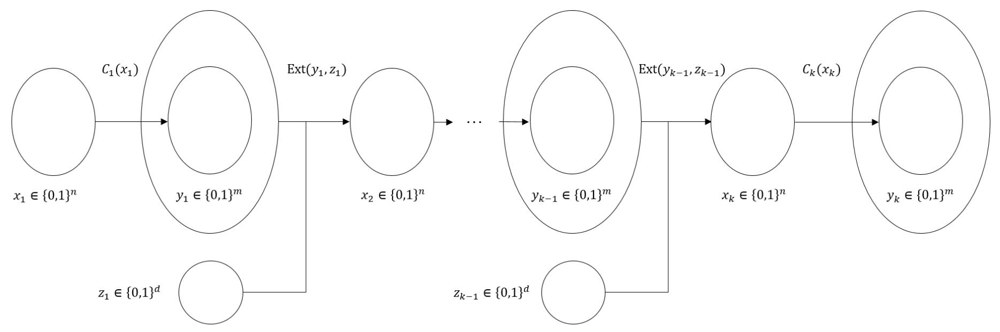

{0}------------------------------------------------

# Batch Verification for Statistical Zero Knowledge Proofs

Inbar Kaslasi\* Guy N. Rothblum Ron D. Rothblum\* Adam Sealfon Prashant Nalini Vasudevan

September 24, 2020

#### Abstract

A statistical zero-knowledge proof (SZK) for a problem Π enables a computationally unbounded prover to convince a polynomial-time verifier that x ∈ Π without revealing any additional information about x to the verifier, in a strong information-theoretic sense.

Suppose, however, that the prover wishes to convince the verifier that k separate inputs x1, . . . , xk all belong to Π (without revealing anything else). A naive way of doing so is to simply run the SZK protocol separately for each input. In this work we ask whether one can do better – that is, is efficient batch verification possible for SZK?

We give a partial positive answer to this question by constructing a batch verification protocol for a natural and important subclass of SZK – all problems Π that have a non-interactive SZK protocol (in the common random string model). More specifically, we show that, for every such problem Π, there exists an honest-verifier SZK protocol for batch verification of k instances, with communication complexity poly(n)+k ·poly(log n, log k), where poly refers to a fixed polynomial that depends only on Π (and not on k). This result should be contrasted with the naive solution, which has communication complexity k · poly(n).

Our proof leverages a new NISZK-complete problem, called Approximate Injectivity, that we find to be of independent interest. The goal in this problem is to distinguish circuits that are nearly injective, from those that are non-injective on almost all inputs.

\*Technion. {inbark,rothblum}@cs.technion.ac.il.

Weizmann Institute. rothblum@alum.mit.edu.

UC Berkeley. {asealfon,prashvas}@berkeley.edu.

{1}------------------------------------------------

# Contents

| 1 | Introduction                                              | 1  |
|---|-----------------------------------------------------------|----|
|   | 1.1 Our Results                                     | 2  |
|   | 1.2 Related Works                                   | 3  |
|   | 1.3 Technical Overview                              | 4  |
|   | 1.4 Discussion and Open Problems                    | 9  |
|   | 1.5 Organization                                    | 10 |
| 2 | Preliminaries                                             | 10 |
|   | 2.1 Probability Theory Notation and Background      | 10 |
|   | 2.2 Zero-Knowledge Proofs                           | 11 |
|   | 2.3 Many-wise Independent Hashing                   | 12 |
|   | 2.4 Seeded Extractors                               | 13 |
| 3 | Batch Verification for NISZK                           | 13 |
| 4 | The NISZK-Completeness of AI                        | 14 |
|   | 4.1 From EA to AI: Proof of Lemma 4.4   | 16 |
|   | 4.2 From AI to EA: Proof of Lemma 4.5   | 20 |
| 5 | Batch Verification for AI                              | 21 |
|   | 5.1 Useful Lemmas                                   | 22 |
|   | 5.2 Completeness                                    | 26 |
|   | 5.3 Honest-Verifier Statistical Zero-Knowledge      | 26 |
|   | 5.4 Soundness                                       | 27 |
|   | 5.5 Communication Complexity and Verifier Run Time  | 28 |
| A | Omitted Proofs                                            | 34 |

{2}------------------------------------------------

# 1 Introduction

Zero-knowledge proofs, introduced in the seminal work of Goldwasser, Micali and Rackoff [\[GMR89\]](#page-32-0), are a remarkable and incredibly influential notion. Loosely speaking, a zero-knowledge proof lets a prover P convince a verifier V of the validity of some statement without revealing any additional information.

In this work we focus on statistical zero-knowledge proofs. These proof-systems simultaneously provide unconditional soundness and zero-knowledge:

- Even a computationally unbounded prover P ∗ cannot convince V to accept a false statement (except with some negligible probability).
- Any efficient, but potentially malicious, verifier V ∗ learns nothing in the interaction (beyond the validity of the statement) in the following strong, statistical, sense: there exists an algorithm, called the simulator, which can efficiently simulate the entire interaction between V ∗ and P based only on the input x, so that the simulation is indistinguishable from the real interaction even to a computationally unbounded distinguisher.

The class of promise problems1 having a statistical zero-knowledge proof is denoted by SZK. This class contains many natural problems, including many of the problems on which modern cryptography is based, such as (relaxations of) integer factoring [\[GMR89\]](#page-32-0), discrete logarithm [\[GK93,](#page-32-1) [CP92\]](#page-32-2) and lattice problems [\[GG00,](#page-32-3) [MV03,](#page-33-0) [PV08,](#page-34-0) [APS18\]](#page-30-0).

Since the study of SZK was initiated in the early 80's many surprising and useful structural properties of this class have been discovered [\[For89,](#page-32-4) [AH91,](#page-30-1) [Oka00,](#page-34-1) [SV03,](#page-35-1) [GSV98,](#page-32-5) [GV99,](#page-33-1) [NV06,](#page-34-2) [OV08\]](#page-34-3), and several applications have been found for hard problems in this (and related) classes [\[Ost91,](#page-34-4) [OW93,](#page-34-5) [BDRV18a,](#page-31-0) [BDRV18b,](#page-31-1) [KY18,](#page-33-2) [BBD](#page-31-2)+20]. It is known to be connected to various cryptographic primitives [\[BL13,](#page-31-3) [KMN](#page-33-3)+14, [LV16,](#page-33-4) [PPS15\]](#page-34-6) and algorithmic and complexity-theoretic concepts [\[Dru15\]](#page-32-6), and has consequently been used to show conditional impossiblility results. In particular, a notable and highly influential development was the discovery of natural complete problems for SZK [\[SV03,](#page-35-1) [GV99\]](#page-33-1).

In this work we are interested in the following natural question. Suppose that a particular problem Π has an SZK protocol. This means that there is a way to efficiently prove that x ∈ Π in zero-knowledge. However, in many scenarios, one wants to be convinced not only that a single instance belongs to Π but rather that k different inputs x1, . . . , xk all belong to Π. One way to do so is to simply run the underlying protocol for Π k times, in sequence, once for each input xi . 2 However, it is natural to ask whether one can do better. In particular, assuming that the SZK protocol for Π has communication complexity m, can one prove (in statistical zero-knowledge) that x1, . . . , xk ∈ Π with communication complexity k · m? We refer to this problem as batch verification for SZK.

We view batch verification of SZK as being of intrinsic interest, and potentially of use in the study of the structure of SZK. Beyond that, batch verification of SZK may be useful to perform various cryptographic tasks, such as batch verification of digital signature schemes [\[NMVR94,](#page-34-7) [BGR98,](#page-31-4) [CHP12\]](#page-32-7) or batch verification of well-formedness of public keys (see, e.g., [\[GMR98\]](#page-32-8)).

1Recall that a promise problem Π consists of two ensembles of sets YES = (YESn)n∈N and (NOn)n∈N, such that the YESn's and NOn's are disjoint. Instances in YES are called YES instances and those in NO are called NO instances.

2The resulting protocol can be shown to be zero-knowledge (analogously to the fact that sequential repetition preserves statistical zero-knowledge).

{3}------------------------------------------------

### 1.1 Our Results

We show that non-trivial batch verification is possible for a large and natural subset of languages in SZK. Specifically, we consider the class of promise problems having non-interactive statistical zero-knowledge proofs. A non-interactive statistical zero-knowledge proof [BFM88] is a variant of SZK in which the verifier and the prover are given access to a uniformly random common random string (CRS). Given this CRS and an input x, the prover generates a proof string  $\pi$  which it sends to the verifier. The verifier, given x, the CRS, and the proof string  $\pi$ , then decides whether to accept or reject. In particular, no additional interaction is allowed other than the proof  $\pi$ . Zero-knowledge means that it is possible to simulate the verifier's view (which consists of the CRS and proof  $\pi$ ) so that the simulation is statistically indistinguishable from the real interaction. The corresponding class of promise problems is abbreviated as NISZK.

Remark 1.1. An NISZK for a problem  $\Pi$  is equivalent to a two-round public-coin honest-verifier SZK protocol. Recall that honest-verifier zero-knowledge, means that the honest verifier learns essentially nothing in the interaction, but a malicious verifier may be able to learn non-trivial information.

The class NISZK contains many natural and basic problems such as: variants of the quadratic residuosity problem [BSMP91, DSCP94], lattice problems [PV08, APS18], etc. It is also known to contain *complete* problems [SCPY98, GSV99], related to the known complete problems for SZK.

Our main result is an honest-verifier statistical zero-knowledge protocol for batch verification of any problem in NISZK. In order to state the result more precisely, we introduce the following definition.

**Definition 1.2.** Let  $\Pi = (\text{YES}, \text{NO})$  be a promise problem, where  $\text{YES} = (\text{YES}_n)_{n \in \mathbb{N}}$  and  $\text{NO} = (\text{NO}_n)_{n \in \mathbb{N}}$ , and let  $k = k(n) \in \mathbb{N}$ . We define the promise problem  $\Pi^{\otimes k} = (\text{YES}^{\otimes k}, \text{NO}^{\otimes k})$ , where  $\text{YES}^{\otimes k} = (\text{YES}_n^{\otimes k})_{n \in \mathbb{N}}$ ,  $\text{NO}^{\otimes k} = (\text{NO}_n^{\otimes k})_{n \in \mathbb{N}}$  and

$$YES_n^{\otimes k} = (YES_n)^k$$

and

$$NO_n^{\otimes k} = (YES_n \cup NO_n)^k \setminus (YES_n)^k$$
.

That is, instances of  $\Pi^{\otimes k}$  are k instances of  $\Pi$ , where the YES instances are all in YES and the NO instances consist of at least one NO instances for  $\Pi$ .3

With the definition of  $\Pi^{\otimes k}$  in hand, we are now ready to formally state our main result:

**Theorem 1.3** (Informally Stated, see Theorem 3.1). Suppose that  $\Pi \in \mathsf{NISZK}$ . Then, for every  $k = k(n) \in \mathbb{N}$ , there exists an (interactive) honest-verifier  $\mathsf{SZK}$  protocol for  $\Pi^{\otimes k}$  with communication complexity  $\mathsf{poly}(n) + k \cdot \mathsf{poly}(\log n, \log k)$ , where n refers to the length of a single instance and  $\mathsf{poly}$  refers to a fixed polynomial independent of k.

The verifier's running time is  $k \cdot \mathsf{poly}(n)$  and the number of rounds is O(k).

We emphasize that our protocol for  $\Pi^{\otimes k}$  is interactive and *honest-verifier* statistical zero-knowledge (HVSZK). Since we start with an NISZK protocol (which as mentioned above is a

&lt;sup>3This notion of composition is to be contrasted with that employed in the closure theorems for SZK under composition with formulas [SV03]. There, a composite problem similar to  $\Pi^{\otimes k}$  is considered that does not require in its NO sets that all k instances satisfy the promise, but instead just that at least one of the instances is a NO instance of  $\Pi$ .

{4}------------------------------------------------

special case of HVSZK), it is somewhat expected that the resulting batch verification protocol is only HVSZK. Still, obtaining a similar result to Theorem [1.3](#page-3-1) that achieves malicious-verifier statistical zero-knowledge is a fascinating open problem (see Section [1.4](#page-10-0) for additional open problems). We mention that while it is known [\[GSV98\]](#page-32-5) how to transform any HVSZK protocol into a full-fledged SZK protocol (i.e., one that is zero-knowledge even wrt a malicious verifier), this transformation incurs a polynomial overhead that we cannot afford.

## 1.2 Related Works

Batch Verification via IP = PSPACE. A domain in which batch computing is particularly easy is bounded space computation - if a language L can be decided in space s then k instances of L can be solved in space s + log(k) (by reusing space). Using this observation, the IP = PSPACE theorem [\[LFKN92,](#page-33-5) [Sha92\]](#page-35-3) yields an efficient interactive proof for batch verification of any problem in PSPACE. However, the resulting protocol has several major drawbacks. In particular, it does not seem to preserve zero-knowledge, which makes it unsuitable for the purposes of our work.

Batch Verification with Efficient Prover. Another caveat of the IP = PSPACE approach is that it does not preserve the efficiency of the prover. That is, even if we started with a problem that has an interactive proof with an efficient prover, the batch verification protocol stemming from the IP = PSPACE theorem has an inefficient prover.

Reingold et al. [\[RRR16,](#page-34-8) [RRR18\]](#page-34-9) considered the question of whether batch verification of NP proofs with an efficiency prover is possible, assuming that the prover is given the NP witnesses as an auxiliary input. These works construct such an interactive batch verification protocol for all problems in UP ⊆ NP (i.e., languages in NP in which YES instances have a unique proof). In particular, the work of [\[RRR18\]](#page-34-9) yields a batch verification protocol for UP with communication complexity k δ · poly(m), where m is the original UP witness length and δ > 0 is any constant.

Note that it seems unlikely that the [\[RRR16,](#page-34-8) [RRR18\]](#page-34-9) protocols preserve zero-knowledge. Indeed, these protocols fundamentally rely on the so-called unambiguity (see [\[RRR16\]](#page-34-8)) of the underlying UP protocol, which, at least intuitively, seems at odds with zero-knowledge.

Batch Verification with Computational Soundness. Focusing on protocols achieving only computational soundness, we remark that interactive batch verification can be obtained directly from Kilian's [\[Kil92\]](#page-33-6) highly efficient protocol for all of NP (assuming collision resistant hash functions). A non-interactive batch verification protocol was given by Brakerski et al. [\[BHK17\]](#page-31-6) assuming the hardness of learning with errors. Non-interactive batch verification protocols also follow from the existence of succinct non-interactive zero-knowledge arguments (zkSNARGs), which are known to exist under certain strong, and non-falsifiable, assumptions (see, e.g. [\[Ish\]](#page-33-7), for a recent survey).

Randomized Iterates. The randomized iterate is a concept introduced by Goldreich, Krawczyk, and Luby [\[GKL93\]](#page-32-12), and further developed by later work [\[HHR11,](#page-33-8) [YGLW15\]](#page-35-4), who used it to construct pseudorandom generators from regular one-way functions. Given a function f, its randomized iterate is computed on an input x and descriptions of hash functions h1, . . . , hm by starting with x0 = f(x) and iteratively computing xi = f(hi(xi−1)). The hardcore bits of these iterates were then used to obtain pseudorandomness. While the randomized iterate was used for a very different purpose, this process of alternating the evaluation of a given function with injection of randomness 

{5}------------------------------------------------

(which is what the hash functions were for) is strongly reminiscent of our techniques. It would be very interesting if there is a deeper connection between our techniques and the usage of these iterates in relation to pseudorandom generators.

#### 1.3 Technical Overview

**Batch Verification for Permutations.** As an initial toy example, we first consider batch verification for a specific problem in NISZK. Let PERM be the promise problem defined as follows. The input to PERM is a description of a Boolean circuit  $C: \{0,1\}^n \to \{0,1\}^n$ . The YES inputs consist of circuits that define permutations over  $\{0,1\}^n$  whereas the NO inputs are circuits so that every element in the image has at least two preimages.4 It is straightforward to see that PERM  $\in$  NISZK.5

Our goal is, given as input k circuits  $C_1, \ldots, C_k$ , to distinguish (via a zero-knowledge proof) the case that all of the circuits are permutations from the case that one or more is 2-to-1. Such a protocol can be constructed as follows: the verifier chooses at random  $x_1 \in \{0,1\}^n$ , computes  $x_{k+1} = C_k(C_{k-1}(\ldots C_1(x_1)\ldots))$  and sends  $x_{k+1}$  to the prover. The prover now responds with  $x'_1 = C_1^{-1}(C_2^{-1}(\ldots C_k^{-1}(x_{k+1})\ldots))$ . The verifier checks that  $x_1 = x'_1$  and if so it accepts, otherwise it rejects.6

Completeness follows from the fact that the circuits define permutations and so  $x_1 = x_1'$ . For soundness, observe that for a NO instance,  $x_{k+1}$  has at least two preimages under the composed circuit  $C_k \circ \cdots \circ C_1$ . Therefore, a cheating prover can guess the correct preimage  $x_0$  with probability at most 1/2 (and the soundness error can be reduced by repetition). Lastly observe that the protocol is (perfect) honest-verifier zero-knowledge: the simulator simply emulates the verifier while setting  $x_1' = x_1$ .

The Approximate Injectivity Problem. Unfortunately, as mentioned above, PERM is presumably not NISZK-complete and so we cannot directly use the above protocol to perform batch verification for arbitrary problems in NISZK. Instead, our approach is to identify a relaxation of PERM that is both NISZK-complete and amenable to batch verification, albeit via a significantly more complicated protocol.

More specifically, we consider the Approximate Injectivity (promise) problem. The goal here is to distinguish circuits that are almost injective, from ones that are highly non-injective. In more detail, let  $\delta \in [0,1]$  be a parameter. We define  $\mathsf{AI}_{\delta}$  to be a promise problem in which the input is again a description of a Boolean circuit C mapping n input bits to  $m \geq n$  output bits. YES instances are those circuits for which all but  $\delta$  fraction of the inputs x have no collisions (i.e.,

&lt;sup>4PERM can be thought of as a variant of the *collision problem* (see [Aar04, Chapter 6]) in which the goal is to distinguish a permutation from a 2-to-1 function.

&lt;sup>5A two round public-coin honest-verifier *perfect* zero-knowledge protocol for PERM can be constructed as follows. The verifier sends a random string  $y \in \{0,1\}^n$  and the prover sends  $x = C^{-1}(y)$ . The verifier needs to check that indeed y = C(x). It is straightforward to check that this protocol is *honest-verifier* perfect zero-knowledge and has soundness 1/2, which can be amplified by parallel repetition (while noting that honest-verifier zero-knowledge is preserved under parallel repetition).

This protocol can be viewed as a NIPZK by viewing the verifier's coins as the common random string. On the other hand, assuming that  $NISZK \neq NIPZK$ , PERM is not NISZK-complete.

&lt;sup>6A related but slightly different protocol, which will be less useful in our eventual construction, can be obtained by observing that (1) the mapping  $(C_1, \ldots, C_k) \mapsto C_k \circ \cdots \circ C_1$  is a Karp-reduction from an instance of PERM $\otimes k$  to an instance of PERM with n input/output bits, and (2) that PERM has an NISZK protocol with communication complexity that depends only on n.

{6}------------------------------------------------

 $\Pr_x[|C^{-1}(C(x))| > 1] < \delta$ ). NO instances are circuits for which all but  $\delta$  fraction of the inputs have at least one colliding input (i.e.,  $\Pr_x[|C^{-1}(C(x))| = 1] < \delta$ ).

Our protocol for batch verification of any problem  $\Pi \in \mathsf{NISZK}$  consists of two main steps:

- First, we show that  $\mathsf{AI}_\delta$  is  $\mathsf{NISZK}$ -hard: i.e., there exists an efficient Karp reduction from  $\Pi$  to  $\mathsf{AI}_\delta$ .
- Our second main step is showing an efficient HVSZK batch verification protocol for  $AI_{\delta}$ . In particular, the communication complexity of the protocol scales (roughly) additively with the number of instances k.

Equipped with the above, an HVSZK protocol follows by having the prover and verifier reduce the instances  $x_1, \ldots, x_k$  for  $\Pi$  to instances  $C_1, \ldots, C_k$  for  $\mathsf{AI}_\delta$ , and then engage in the batch verification protocol for  $\mathsf{AI}_\delta$  on common input  $(C_1, \ldots, C_k)$ .

Before describing these two steps in detail, we remark that we find the identification of  $\mathsf{AI}_\delta$  as being NISZK-hard (in fact, NISZK-complete) to be of independent interest. In particular, while  $\mathsf{AI}_\delta$  bears some resemblance to problems that were already known to be NISZK-complete, the special almost-injective nature of the YES instances of  $\mathsf{AI}_\delta$  seems very useful. Indeed, this additional structure is crucial for our batch verification protocol.

 $\mathsf{Al}_\delta$  is NISZK-hard. We show that  $\mathsf{Al}_\delta$  is NISZK-hard by reducing to it from the Entropy Approximation problem (EA), which is known to be complete for NISZK [GSV99].7 An instance of EA is a circuit C along with a threshold  $k \in \mathbb{R}^+$ , and the problem is to decide whether the Shannon entropy of the output distribution of C when given uniformly random inputs (denoted H(C)) is more than k+10 or less than k-10.8

For simplicity, suppose we had a stronger promise on the output distribution of C — that it is a flat distribution (in other words, it is uniform over some subset of its range). In this case, for any output y of C, the promise of EA tells us something about the number of pre-images of y. To illustrate, suppose C takes n bits of input. Then, in a YES instance of EA, the size of the set  $|C^{-1}(y)|$  is at most  $2^{n-(k+10)}$ , and in the NO case it is at least  $2^{n-(k-10)}$ . Recall that for a reduction to  $Al_{\delta}$ , we need to make the sizes of most inverse sets 1 for YES instances and more than 1 for NO instances. This can now be done by using a hash function to shatter the inverse sets of C.

That is, consider the circuit  $\widehat{C}$  that takes as input an x and also the description of a hash function h from, say, a pairwise-independent hash family H, and outputs (C(x), h, h(x)). If we pick H so that its hash functions have output length (n-k), then out of any set of inputs of size  $2^{n-(k+10)}$ , all but a small constant fraction will be mapped injectively by a random h. On the other hand, out of any set of inputs of size  $2^{n-(k-10)}$ , only a small constant fraction will be mapped injectively by a random h. Thus, in the YES case, it may be argued that all but a small constant fraction of inputs (x,h) are mapped injectively by  $\widehat{C}$ , and in the NO case only a small constant fraction of inputs are. So for some constant  $\delta$ , this is indeed a valid reduction from EA to Al $_{\delta}$ . For smaller functions  $\delta$ , the reduction is performed by first amplifying the gap in the promise of EA and then proceeding as above.

&lt;sup>7In fact, we also show that  $AI_{\delta}$  is in NISZK, and thus is NISZK-complete, by reducing back from it to EA.

&lt;sup>8In the standard definition of EA [GSV99], the promise is that H(C) is either more than k+1 or less than k-1, but this gap can be amplified easily by repetition of C.

{7}------------------------------------------------

Finally, we can relax the simplifying assumption of flatness using the asymptotic equipartition property of distributions. In this case, this property states that, however unstructured C may be, its t-fold repetition  $C^{\otimes t}$  (that takes an input tuple  $(x_1, \ldots, x_t)$  and outputs  $(C(x_1), \ldots, C(x_t))$ ) is "approximately flat" for large enough t. That is, with increasingly high probability over the output distribution of  $C^{\otimes t}$ , a sample from it will have a pre-image set of size close to its expectation, which is  $2^{t \cdot (n-H(C))}$ . Such techniques have been previously used for similar purposes in the SZK literature and elsewhere, for example as the flattening lemma of Goldreich  $et\ al.\ [GSV99]$ . See Section 4 for details and the proof.

Batch Verification for Exact Injectivity. For sake of simplicity, for this overview we focus on batch verification of the *exact* variant of  $\mathsf{AI}_\delta$ , that is, when  $\delta = 0$ . In other words, distinguishing circuits that are truly injective from those in which every image y has at least two preimages (with no exceptions allowed). We refer to this promise problem as INJ. Modulo some technical details, the batch verification protocol for  $\mathsf{INJ}$ , presented next, captures most of the difficulty in our batch verification protocol for  $\mathsf{AI}_\delta$ .

Before proceeding we mention that the key difference between INJ and PERM is that YES instances of the former are merely injective whereas for the latter they are permutations. Interestingly, this seemingly minor difference causes significant complications.

Our new goal is, given as input circuits  $C_1, \ldots, C_k : \{0,1\}^n \to \{0,1\}^m$ , with  $m \geq n$ , to distinguish the case that all of the circuits are injective from the case that at least one is entirely non-injective.

Inspired by the batch verification protocol for PERM, a reasonable approach is to choose  $x_1$  at random but then try to hash the output  $y_i = C_i(x_i) \in \{0,1\}^m$ , of each circuit  $C_i$ , into an input  $x_{i+1} \in \{0,1\}^n$  for  $C_{i+1}$ . If a hash function could be found that was injective on the image of  $C_i$  then we would be done. However, it seems that finding such a hash function is, in general, extremely difficult.

Rather, we will hash each  $y_i$  by choosing a random hash function from a small hash function family. More specifically, for every iteration  $i \in [k]$  we choose a random seed  $z_i$  for a (seeded) randomness extractor  $\mathsf{Ext} : \{0,1\}^m \times \{0,1\}^d \to \{0,1\}^n$  and compute  $x_{i+1} = \mathsf{Ext}(y_i,z_i)$ . See Fig. 1 for a diagram describing this sampling process.

In case all the circuits are injective (i.e., a YES instance), a simple inductive argument can be used to show that each  $y_i$  is (close to) a distribution having min-entropy n, and therefore the output  $x_{i+1} = \text{Ext}(y_i, z_i)$  of the extractor is close to uniform in  $\{0, 1\}^n$ . Note that for this to be true, we need a very good extractor that essentially extracts all of the entropy. Luckily, constructions of such extractors with a merely poly-logarithmic seed length are known [GUV07].

This idea leads us to consider the following strawman protocol. The verifier chooses at random  $x_1 \in \{0,1\}^n$  and k seeds  $z_1, \ldots, z_k$ . The verifier then computes inductively:  $y_i = C_i(x_i)$  and  $x_{i+1} = \operatorname{Ext}(y_i, z_i)$ , for every  $i \in [k]$ . The verifier sends  $(x_{k+1}, z_1, \ldots, z_k)$  to the prover, who in turn needs to guess the value of  $x_1$ .

The major difficulty that arises in this protocol is in completeness: the honest prover's probability of predicting  $x_1$  is very small. To see this, suppose that all of the circuits  $C_1, \ldots, C_k$  are injective. Consider the job of the honest prover: given  $(x_{k+1}, z_1, \ldots, z_k)$  the prover needs to find  $x_1$ . The difficulty is that  $x_{k+1}$  is likely to have many preimages under  $\operatorname{Ext}(\cdot, z_k)$ . While this statement depends on the specific structure of the extractor, note that even in a "dream scenario" in which  $\operatorname{Ext}(\cdot, z_k)$  were a random function, a constant fraction of  $x_{k+1}$ 's would have more than one preimage

{8}------------------------------------------------

Figure 1: The sampling process

(in the image of  $C_k$ ).

A similar type of collision in the extractor is likely to occur in most of the steps  $i \in [k]$ . Therefore, the overall number of preimages  $x'_1$  that are consistent with  $(x_{k+1}, z_1, \ldots, z_k)$  is likely to be  $2^{\Omega(k)}$  and the prover has no way to guess the correct one among them. The natural remedy for this is to give the prover some additional information, such as a hash of  $x_1$ , in order to help pick it correctly among the various possible options. However, doing so also helps a cheating prover find  $x_1$  in the case where one of the circuits is non-injective. And it turns out that the distribution of the number of  $x_1$ 's in the two cases – where all the  $C_i$ 's are injective and where one is non-injective – are similar enough that it is not clear how to make this approach work as is.

Isolating Preimages via Interaction. We circumvent the issue discussed above by employing interaction. The key observation is that, even though the number of pre-images  $x_1$  of the composition of all k circuits is somewhat similar in the case of all YES instance and the case of one NO instance among them, if we look at this composition circuit-by-circuit, the number of pre-images in an injective circuit is clearly different from that in a non-injective circuit. In order to exploit this, we have the verifier gradually reveal the  $y_i$ 's rather than revealing them all at once.

Taking a step back, let us consider the following naive protocol:

- 1. For i = k, ..., 1:
  - (a) The verifier chooses at random  $x_i \in \{0,1\}^n$  and sends  $y_i = C_i(x_i)$  to the prover.
  - (b) The (honest) prover responds with  $x_i' = C_i^{-1}(y_i)$ .
  - (c) The verifier immediately rejects if the prover answered incorrectly (i.e.,  $x_i' \neq x_i$ ).

It is not difficult to argue that this protocol is indeed an HVSZK protocol (with soundness error 1/2, which can be reduced by repetition). Alas, the communication complexity is at least  $k \cdot n$ , which is too large.

However, a key observation is that this protocol still works even if we generate the  $y_i$ 's as in the strawman protocol. Namely,  $x_{i+1} = \mathsf{Ext}(y_i, z_i)$  and  $y_i = C_i(x_i)$ , for every  $i \in [k]$ , where the  $z_i$ 's are fresh uniformly distributed (short) seeds. This lets us significantly reduce the randomness complexity of the above naive protocol. Later we shall use this to also reduce the communication complexity, which is our main goal.

{9}------------------------------------------------

To see that the "derandomized" variant of the naive protocol works, we first observe that completeness and zero-knowledge indeed still hold. Indeed, since in a YES case all the circuits are injective, the honest prover always provides the correct answer - i.e.,  $x'_i = x_i$ . Thus, not only does the verifier always accept (which implies completeness), but it can also easily simulate the messages sent by the prover (which guarantees honest-verifier statistical zero-knowledge).9

Arguing soundness is slightly more tricky. Let  $i^* \in [k]$  be the smallest integer so that  $C_{i^*}$  is a NO instance. Recall that in the  $i^*$ -th iteration of the protocol, the prover is given  $y_{i^*}$  and needs to predict  $x_{i^*}$ . If we can argue that  $x_{i^*}$  is (close to) uniformly distributed then (constant) soundness follows, since  $C_{i^*}$  is a NO instance and therefore non-injective on every input.

We argue that  $x_{i^*}$  is close to uniform by induction. For the base case i = 1 this is obviously true since  $x_1$  is sampled uniformly at random. For the inductive step, assume that  $x_{i-1}$  is close to uniform, with  $i \leq i^*$ . Since  $C_{i-1}$  is injective (since  $i - 1 < i^*$ ), this means that  $y_{i-1} = C_{i-1}(x_{i-1})$  is close to uniform in the image of  $C_1$ , a set of size  $2^n$ . Thus,  $\text{Ext}(y_{i-1}, z_{i-1})$  is applied to a source (that is close to a distribution) with min-entropy n. Since Ext is an extractor, this means that  $x_i$  is close to uniform, concluding the induction.

**Reducing Communication Complexity via Hashing.** Although we have reduced the *randomness complexity* of the protocol, we have not reduced the *communication complexity* (which is still  $k \cdot n$ ). We shall do so by, once more, appealing to hashing.

Let us first consider the verifier to prover communication. Using hashing, we show how the verifier can specify each  $y_i$  to the prover by transmitting only a poly-logarithmic number of bits. Consider, for example, the second iteration of the protocol. In this iteration the verifier is supposed to send  $y_{k-1}$  to the prover but can no longer afford to do so. Notice however that at this point the prover already knows  $x_k$ . We show that with all but negligible probability, the number of candidate pairs  $(y_{k-1}, z_{k-1})$  that are consistent with  $x_k$  (and so that  $y_{k-1}$  is in the image of  $C_{i-1}$ ) is very small. This fact (shown in Proposition 5.4 in Section 5), follows from the fact that Ext is an extractor with small seed length. In more detail, we show that with all but negligible probability, the number of candidates is roughly (quasi-)polynomial. Thus, it suffices for the verifier to send a hash of poly-logarithmic length (e.g., using a pairwise independent hash function) to specify the correct pair  $(y_{k-1}, z_{k-1})$ . This idea extends readily to all subsequent iterations.

Thus, we are only left with the task of reducing the communication from the prover to the verifier (which is currently  $n \cdot k$ ). We yet again employ hashing. The observation is that rather than sending  $x_i$  in its entirety in each iteration, it suffices for the prover to send a short hash of  $x_i$ . The reason is that, in the case of soundness, when we reach iteration  $i^*$ , we know that  $y_i$  has two preimages:  $x_i^{(0)}$  and  $x_i^{(1)}$ . The prover at this point has no idea which of the two is the correct one and so as long as the hashes of  $x_i^{(0)}$  and  $x_i^{(1)}$  differ, the prover will only succeed with probability 1/2. Thus, it suffices to use a pairwise independent hash function.

To summarize, after an initial setup phase in which the verifier specifies  $y_k$  and the different hash functions, the protocol simply consists of a "ping pong" of hash values between the verifier and the prover. In each iteration the verifier first reveals a hash of the pair  $(y_i, z_i)$ , which suffices

 $^9$ Actually the protocol as described achieves perfect completeness and perfect honest-verifier zero-knowledge. However, the more general  $\mathsf{AI}_\delta$  problem will introduce some (negligible) statistical errors.

&lt;sup>10This observation is simple in hindsight but we nevertheless find it somewhat surprising. In particular, it cannot be shown by bounding the expected number of collisions and applying Markov's inequality since the *expected* number of collisions in Ext is very large (see [Vad12, Problem 6.4]).

{10}------------------------------------------------

for the prover to fully recover yi . In response, the prover sends a hash of xi , which suffices to prove that the prover knows the correct preimage of yi . For further details, a formal description of the protocol, and the proof, see Section [5.](#page-22-0)

## 1.4 Discussion and Open Problems

Theorem [1.3](#page-3-1) gives a non-trivial batch verification protocol for any problem in NISZK. However, we believe that it is only the first step in the study of batch verification of SZK. In particular, and in addition to the question of obtaining malicious verifier zero-knowledge that was already mentioned, we point out several natural research directions:

- 1. As already pointed out, Theorem [1.3](#page-3-1) only gives a batch verification protocol for problems in NISZK. Can one obtain a similar result for all of SZK?
  - As a special interesting case, consider the problem of batch verification for the graph nonisomorphism problem: deciding whether or not there exists a pair of isomorphic graphs among k such pairs. Theorem [1.3](#page-3-1) yields an efficient batch verification protocol for this problem under the assumption that the graphs have no non-trivial automorphisms. Handling the general case remains open and seems like a good starting point for a potential generalization of Theorem [1.3](#page-3-1) to all of SZK.
- 2. Even though we started off with an NISZK protocol for Π, the protocol for Π⊗k is highly interactive. As a matter of fact, the number of rounds is O(k). Is there an NISZK batch verification protocol for any Π ∈ NISZK?
- 3. While the communication complexity in the protocol for Π⊗k only depends (roughly) additively on k, this additive dependence is still linear. Is a similar result possible with a sub-linear dependence on k? 11 For example, with poly(n, log k) communication?
- 4. A different line of questioning follows from looking at prover efficiency. While in general one cannot expect provers in interactive proofs to be efficient, it is known that any problem in SZK ∩ NP has an SZK protocol where the honest prover runs in polynomial-time given the NP witness for the statement being proven [\[NV06\]](#page-34-2). Our transformations, however, make the prover quite inefficient. This raises the interesting question of whether there are batch verification protocols for languages in SZK∩NP (or even NISZK∩NP) that are zero-knowledge and also preserve the prover efficiency. This could have interesting applications in, say, cryptographic protocols where the honest prover is the party that generated the instance in the first place and so has a witness for it (e.g., in a signature scheme where the signer wishes to prove the validity of several signatures jointly).

While the above list already raises many concrete directions for future work, one fascinating high-level research agenda that our work motivates is a fine-grained study of SZK. In particular, optimizing and improving our understanding of the concrete polynomial overheads in structural study of SZK.

Remark 1.4 (Using circuits beyond random sampling). To the best of our knowledge, all prior works studying complete problems for SZK and NISZK only make a very restricted usage of the given

11While a linear dependence on k seems potentially avoidable, we note that a polynomial dependence on n seems inherent (even for just a single instance, i.e., when k = 1).

{11}------------------------------------------------

input circuits. Specifically, all that is needed is the ability to generate random samples of the form (r, C(r)), where r is uniformly distributed random string and C is the given circuit (describing a probability distribution).

In contrast, our protocol leverages the ability to feed a (hash of an) output of one circuit as an input to the next circuit. This type of adaptive usage escapes the "random sampling paradigm" described above. In particular, our technique goes beyond the (restrictive) black box model of Holenstein and Renner [HR05], who showed limitations for statistical distance polarization within this model (see also [BDRV19]).

## 1.5 Organization

We start with preliminaries in Section 2. The batch verification result for NISZK is formally stated in Section 3 and proved therein, based on results that are proved in the subsequent sections. In particular, in Section 4 we show that  $\mathsf{AI}_\delta$  is NISZK-complete and in Section 5 we show a batch verification protocol for  $\mathsf{AI}_\delta$ .

Appendix A contains some proofs that were omitted from the body.

## 2 Preliminaries

### 2.1 Probability Theory Notation and Background

Given a random variable X, we write  $x \leftarrow X$  to indicate that x is sampled according to X. Similarly, given a finite set S, we let  $s \leftarrow S$  denote that s is selected according to the uniform distribution on S. We adopt the convention that when the same random variable occurs several times in an expression, all occurrences refer to a single sample. For example,  $\Pr[f(X) = X]$  is defined to be the probability that when  $x \leftarrow X$ , we have f(x) = x. We write  $U_n$  to denote the random variable distributed uniformly over  $\{0,1\}^n$ . The support of a distribution D over a finite set U, denoted  $\sup(D)$ , is defined as  $\{u \in U : D(u) > 0\}$ .

The statistical distance of two distributions P and Q over a finite set U, denoted as  $\Delta(P,Q)$ , is defined as  $\max_{S\subseteq U}(P(S)-Q(S))=\frac{1}{2}\sum_{u\in U}|P(u)-Q(u)|$ .

We recall some standard basic facts about statistical distance.

Fact 2.1 (Data processing inequality for statistical distance). For any two distributions X and Y, and every (possibly randomized) process f:

$$\Delta (f(X), f(Y)) \le \Delta (X, Y)$$

**Fact 2.2.** For any two distributions X and Y, and event E:

$$\Delta(X,Y) \le \Delta(X|_E,Y) + \Pr_{Y}[\neg E],$$

where  $X|_E$  denotes the distribution of X conditioned on E.

Proof. Let 
$$p_u = \Pr[X = u]$$
 and  $q_u = \Pr[Y = u]$ . Also, let  $p_{u|E} = \Pr_X[X = u|E]$  and  $p_{u|\neg E} = \Pr_X[X = u|E]$ 

{12}------------------------------------------------

$$\Pr_X[X = u | \neg E].$$

$$\begin{split} \Delta\left(X,Y\right) &= \frac{1}{2} \sum_{u} \left| p_{u} - q_{u} \right| \\ &= \frac{1}{2} \sum_{u} \left| \Pr_{X}[E] \cdot p_{u|E} + \Pr_{X}[\neg E] \cdot \mathsf{p}_{u|\neg E} - \Pr_{X}[E] \cdot q_{u} - \Pr_{X}[\neg E] \cdot q_{u} \right| \\ &\leq \frac{1}{2} \sum_{u} \left( \left| \Pr_{X}[E] \cdot p_{u|E} - \Pr_{X}[E] \cdot q_{u} \right| + \left| \Pr_{X}[\neg E] \cdot p_{u|\neg E} - \Pr_{X}[\neg E] \cdot q_{u} \right| \right) \\ &= \Pr_{X}[E] \cdot \Delta\left(X|_{E}, Y\right) + \Pr_{X}[\neg E] \cdot \Delta\left(X|_{\neg E}, Y\right) \\ &\leq \Delta\left(X|_{E}, Y\right) + \Pr_{X}[\neg E]. \end{split}$$

We also recall Chebyshev's inequality.

**Lemma 2.3** (Chebyshev's inequality). Let X be a random variable. Then, for every  $\alpha > 0$ :

$$\Pr[|X - E[X]| \ge \alpha] \le \frac{\operatorname{Var}[X]}{\alpha^2}.$$

## 2.2 Zero-Knowledge Proofs

We use (P, V)(x) to refer to the *transcript* of an execution of an interactive protocol with prover P and verifier V on common input x. The transcript includes the input x, all messages sent by P to V in the protocol and the verifier's random coin tosses. We say that the transcript  $\tau = (P, V)(x)$  is accepting if at the end of the corresponding interaction, the verifier accepts.

**Definition 2.4** (HVSZK). Let  $c = c(n) \in [0,1]$ ,  $s = s(n) \in [0,1]$  and  $z = z(n) \in [0,1]$ . An Honest Verifier SZK Proof-System (HVSZK) with completeness error c, soundness error s and zero-knowledge error z for a promise problem  $\Pi = (\Pi_{YES}, \Pi_{NO})$ , consists of a probabilistic polynomial-time verifier V and a computationally unbounded prover P such that following properties hold:

• Completeness: For any  $x \in \Pi_{YES}$ :

$$\Pr[(P, V)(x) \text{ is accepting}] \ge 1 - c(|x|).$$

• Soundness: For any (computationally unbounded) cheating prover  $P^*$  and any  $x \in \Pi_{NO}$ :

$$\Pr[(\mathsf{P}^*,\mathsf{V})(x) \text{ is accepting}] \leq s(|x|).$$

• Honest Verifier Statistical Zero Knowledge: There is a probabilistic polynomial-time algorithm Sim (called the simulator) such that for any  $x \in \Pi_{YES}$ :

$$\Delta\left((\mathsf{P},\mathsf{V})(x),\mathsf{Sim}(x)\right) \leq z(|x|).$$

If the completeness, soundness and zero-knowledge errors are all negligible, we simply say that  $\Pi$  has an HVSZK protocol. We also use HVSZK to denote the class of promise problems having such an HVSZK protocol.

We also define non-interactive zero knowledge proofs as follows.

{13}------------------------------------------------

**Definition 2.5** (NISZK). Let  $c = c(n) \in [0,1]$ ,  $s = s(n) \in [0,1]$  and  $z = z(n) \in [0,1]$ . An non-interactive statistical zero-knowledge proof (NISZK) with completeness error c, soundness error s and zero-knowledge error z for a promise problem  $\Pi = (\Pi_{YES}, \Pi_{NO})$ , consists of a probabilistic polynomial-time verifier V, a computationally unbounded prover P and a polynomial  $\ell = \ell(n)$  such that following properties hold:

• Completeness: For any  $x \in \Pi_{YES}$ :

$$\Pr_{r \in \{0,1\}^{\ell(|x|)}} \left[ \mathsf{V}(x,r,\pi) \ accepts \right] \ge 1 - c(|x|),$$

where  $\pi = P(x, r)$ .

• Soundness: For any  $x \in \Pi_{NO}$ :

$$\Pr_{r \in \{0,1\}^{\ell(|x|)}} \left[ \exists \pi^* \ s.t. \ \mathsf{V}(x,r,\pi^*) \ accepts \right] \le s(|x|).$$

• Honest Verifier Statistical Zero Knowledge: There is a probabilistic polynomial-time algorithm Sim (called the simulator) such that for any  $x \in \Pi_{YES}$ :

$$\Delta\left((U_{\ell}, \mathsf{P}(x, U_{\ell})), \mathsf{Sim}(x)\right) \leq z(|x|).$$

As above, if the errors are negligible, we say that  $\Pi$  has a NISZK protocol and use NISZK to denote the class of all such promise problems.

## 2.3 Many-wise Independent Hashing

Hash functions offering bounded independence are used extensively in the literature. We use a popular variant in which the output of the hash function is *almost* uniformly distributed on the different points. This relaxation allows us to save on the representation length of functions in the family.

**Definition 2.6** ( $\delta$ -almost  $\ell$ -wise Independent Hash Functions). For  $\ell = \ell(n) \in \mathbb{N}$ ,  $m = m(n) \in \mathbb{N}$  and  $\delta = \delta(n) > 0$ , a family of functions  $\mathcal{F} = (\mathcal{F}_n)_n$ , where  $\mathcal{F}_n = \{f : \{0,1\}^m \to \{0,1\}^n\}$  is  $\delta$ -almost  $\ell$ -wise independent if for every  $n \in \mathbb{N}$  and distinct  $x_1, x_2, \ldots, x_\ell \in \{0,1\}^m$  the distributions:

- $(f(x_1), \ldots, f(x_\ell))$ , where  $f \leftarrow \mathcal{F}_n$ ; and
- The uniform distribution over  $(\{0,1\}^n)^{\ell}$ ,

are  $\delta$ -close in statistical distance.

When  $\delta = 0$  we simply say that the hash function family is  $\ell$ -wise independent. Constructions of (efficiently computable) many-wise hash function families with a very succinct representation are well known. In particular, when  $\delta = 0$  we have the following well-known construction:

**Lemma 2.7** (See, e.g., [Vad12, Section 3.5.5]). For every  $\ell = \ell(n) \in \mathbb{N}$  and  $m = m(n) \in \mathbb{N}$  there exists a family of  $\ell$ -wise independent hash functions  $\mathcal{F}_{n,m}^{(\ell)} = \{f : \{0,1\}^m \to \{0,1\}^n\}$  where a random function from  $\mathcal{F}_{n,m}^{(\ell)}$  can be selected using  $O(\ell \cdot \max(n,m))$  bits, and given a description of  $f \in \mathcal{F}_{n,m}^{(\ell)}$  and  $x \in \{0,1\}^m$ , the value f(x) can be computed in time  $poly(n,m,\ell)$ .

{14}------------------------------------------------

For  $\delta > 0$ , the seminal work of Naor and Naor [NN93] yields a highly succinct construction.

**Lemma 2.8** ([NN93, Lemma 4.2]). For every  $\ell = \ell(n) \in \mathbb{N}$ ,  $m = m(n) \in \mathbb{N}$  and  $\delta = \delta(n) > 0$ , there exists a family of  $\delta$ -almost  $\ell$ -wise independent hash functions  $\mathcal{F}_{n,m}^{(\ell)} = \{f : \{0,1\}^m \to \{0,1\}^n\}$  where a random function from  $\mathcal{F}_{n,m}^{(\ell)}$  can be selected using  $O(\ell \cdot n + \log(m) + \log(1/\delta))$  bits, and given a description of  $f \in \mathcal{F}_{n,m}^{(\ell)}$  and  $x \in \{0,1\}^m$ , the value f(x) can be computed in time  $poly(n, m, \ell, \log(1/\delta))$ .

#### 2.4 Seeded Extractors

The min-entropy of a distribution X over a set  $\mathcal{X}$  is defined as  $H_{\infty}(X) = \min_{x \in \mathcal{X}} \log(1/\Pr[X = x])$ . In particular, if  $H_{\infty}(X) = k$  then,  $\Pr[X = x] \leq 2^{-k}$ , for every  $x \in \mathcal{X}$ .

**Definition 2.9** ([NZ96]). Let  $k = k(n) \in \mathbb{N}$ ,  $m = m(n) \in \mathbb{N}$ , d = d(n) and  $\epsilon = \epsilon(n) \in [0,1]$ . We say that the family of functions  $\mathsf{Ext} = (\mathsf{Ext}_n)_{n \in \mathbb{N}}$ , where  $\mathsf{Ext}_n : \{0,1\}^n \times \{0,1\}^d \to \{0,1\}^m$ , is a  $(k,\epsilon)$ -extractor if for every  $n \in \mathbb{N}$  and distribution X supported on  $\{0,1\}^n$  with  $H_\infty(X) \geq k$ , it holds that  $\Delta\left(\mathsf{Ext}(X,U_d),U_m\right) \leq \epsilon$ , where  $U_d$  (resp.,  $U_m$ ) denotes the uniform distribution on d (resp., m) bit strings.

**Lemma 2.10** ([GUV07, Theorem 4.21]). Let  $k = k(n) \in \mathbb{N}$ ,  $m = m(n) \in \mathbb{N}$  and  $\epsilon = \epsilon(n) \in [0, 1]$  such that  $k \le n$ ,  $m \le k + d - 2\log(1/\epsilon) - O(1)$ ,  $d = \log(n) + O(\log(k) \cdot \log(k/\epsilon))$  and the functions k, m and  $\epsilon$  are computable in poly(n) time. Then, there exists a polynomial-time computable  $(k, \epsilon)$ -extractor  $\mathsf{Ext} = (\mathsf{Ext}_n)_{n \in \mathbb{N}}$  such that  $\mathsf{Ext}_n : \{0,1\}^n \times \{0,1\}^d \to \{0,1\}^m$ .

## 3 Batch Verification for NISZK

In this section we formally state and prove our main result.

**Theorem 3.1.** Let  $\Pi \in \mathsf{NISZK}$  and  $k = k(n) \in \mathbb{N}$  such that  $k(n) = 2^{n^{o(1)}}$ . Then,  $\Pi^{\otimes k}$  has an O(k)-round HVSZK protocol with communication complexity  $k \cdot \mathsf{poly}(\log n, \log k) + \mathsf{poly}(n)$  and verifier running time  $k \cdot \mathsf{poly}(n)$ .

The proof of Theorem 3.1 is divided into two main steps:

- 1. As our first main step, we introduce a new NISZK-hard problem, called *approximate injectivity*. The problem is defined formally in Definition 3.2 below and its NISZK hardness is established by Lemma 3.3. The proof of Lemma 3.3 is deferred to Section 4.
- 2. The second step is constructing a batch verification protocol for approximate injectivity, as given in Theorem 3.4. The proof of Theorem 3.4 appears in Section 5.

We proceed to define the approximate injectivity problem and state its NISZK-hardness.

**Definition 3.2.** Let  $\delta = \delta(n) \to [0,1]$  be a function computable in poly(n) time. The Approximate Injectivity problem with approximation  $\delta$ , denoted by  $Al_{\delta}$ , is a promise problem (YES, NO), where YES =  $(YES_n)_{n \in \mathbb{N}}$  and  $NO = (NO_n)_{n \in \mathbb{N}}$  are sets defined as follows:

$$YES_{n} = \left\{ (1^{n}, C) : \Pr_{x \leftarrow \{0,1\}^{n}} \left[ \left| C^{-1}(C(x)) \right| > 1 \right] < \delta(n) \right\}$$

$$NO_{n} = \left\{ (1^{n}, C) : \Pr_{x \leftarrow \{0,1\}^{n}} \left[ \left| C^{-1}(C(x)) \right| > 1 \right] > 1 - \delta(n) \right\}$$

{15}------------------------------------------------

where, in both cases, C is a circuit that takes n bits as input. The size of an instance  $(1^n, C)$  is n.

**Lemma 3.3.** Let  $\delta = \delta(n) \in [0,1]$  be a non-increasing function such that  $\delta(n) > 2^{-o(n^{1/4})}$ . Then,  $\mathsf{Al}_\delta$  is  $\mathsf{NISZK}$ -hard.

As mentioned above, the proof of Lemma 3.3 appears in Section 4. Our main technical result is a batch verification protocol for  $AI_{\delta}$ .

**Theorem 3.4.** For any  $k = k(n) \in \mathbb{N}$ ,  $\delta = \delta(n) \in [0, \frac{1}{100k^2}]$  and security parameter  $\lambda = \lambda(n)$ , the problem  $\mathsf{AI}_{\delta}^{\otimes k}$  has an HVSZK protocol with communication complexity  $O(n) + k \cdot \mathsf{poly}(\lambda, \log N, \log k)$ , where N is an upper bound on the size of each of the given circuits (on n input bits). The completeness and zero-knowledge errors are  $O(k^2 \cdot \delta + 2^{-\lambda})$  and the soundness error is a constant bounded away from 1.

The verifier running time is  $k \cdot \mathsf{poly}(N, \log k, \lambda)$  and the number of rounds is O(k).

The proof of Theorem 3.4 appears in Section 5. With Lemma 3.3 and Theorem 3.4 in hand, the proof of Theorem 3.1 is now routine.

Proof of Theorem 3.1. Let  $\Pi \in \mathsf{NISZK}$ . We construct an HVSZK protocol for  $\Pi^{\otimes k}$  as follows. Given as common input  $(x_1,\ldots,x_k)$ , the prover and verifier each first employ the Karp reduction of Lemma 3.3 to each instance to obtain circuits  $(C_1,\ldots,C_k)$  wrt  $\delta = \frac{1}{2^{\mathsf{poly}(\log n,\log k)}}$ . The size of each circuit, as well as the number of inputs bits, is  $\mathsf{poly}(n)$ .

The parties then emulate a  $\operatorname{poly}(\log n, \log k)$  parallel repetition of the SZK protocol of Theorem 3.4 on input  $(C_1, \ldots, C_k)$  and security parameter  $\lambda = \operatorname{poly}(\log n, \log k)$ . Completeness, soundness and honest-verifier zero-knowledge follow directly from Lemma 3.3 and Theorem 3.4, with error  $O(k \cdot \delta + 2^{-\lambda}) = \operatorname{negl}(n, k)$ , where we also use the fact that parallel repetition of interactive proofs reduces the soundness error at an exponential rate, and that parallel repetition preserves honest verifier zero-knowledge.

To analyze the communication complexity and verifier running time, observe that the instances  $C_i$  that the reduction of Lemma 3.3 generates have size  $\mathsf{poly}(n)$ . The batch verification protocol of Theorem 3.4 therefore has communication complexity  $\mathsf{poly}(n) + k \cdot \mathsf{poly}(\log n, \log k)$  and verifier running time  $k \cdot \mathsf{poly}(n)$ .

# 4 The NISZK-Completeness of Al

In this section, we show that the Approximate Injectivity problem  $\mathsf{AI}_\delta$  (for a certain range of the parameter  $\delta$ ) is complete for NISZK. We start by showing that  $\mathsf{AI}_\delta$  is NISZK-hard. In fact, we prove the following more precisely quantified version of Lemma 3.3 as follows. Note that Lemma 3.3 indeed follows from Lemma 4.1, as the conditions stated therein are satisfied when c, s and  $\sigma$  are negligible.

**Lemma 4.1.** Let  $s, c, \sigma, \delta : \mathbb{N} \to [0, 1]$  and  $r, r_S, r_V : \mathbb{N} \to \mathbb{N}$  be functions such that  $(1 - c(n)) > s(n) + 1/\mathsf{poly}(n)$  and  $\delta$  is non-increasing and  $\delta(n) > 2^{-o(n^{1/4})}$ . Suppose a problem  $\Pi$  has an NISZK protocol where for instances of size n,

- the completeness error is at most c(n),
- the soundness error is at most s(n),
- the simulation error is at most  $\sigma(n)$ ,

{16}------------------------------------------------

- the protocol uses at most r(n) bits of randomness, and,
- the simulator and verifier uses at most  $r_S(n)$  and  $r_V(n)$  bits of randomness.

Further, suppose that  $c(n) + 2\sigma(n) \leq 1/r(n)$ , and that  $s(n) + 2^{-r(n)} \leq 1/r(n)$ . Let  $\rho(n) = r_S(n) + r_V(n)$ . Then, there is a polynomial-time Karp reduction from  $\Pi$  to  $\mathsf{Al}_\delta$  that maps any instance of  $\Pi$  of size n to an instance of  $\mathsf{Al}_\delta$  of size  $\Theta(\rho(n)^3 \cdot \log(1/\delta(\rho(n)^4)))$ .

In proving Lemma 4.1, we use as an intermediate the Entropy Approximation (EA) problem that is known to be complete for NISZK [GSV99]. We prove Lemma 4.1 by presenting a reduction from EA to  $Al_{\delta}$ . In order to define EA, we recall the notion of Shannon entropy of a circuit C, denoted by H(C), which is defined to be the Shannon entropy of the distribution of the output of the circuit when its input is chosen uniformly at random.

**Definition 4.2** ([GSV99]). The Entropy Approximation problem, denoted by EA, is a promise problem (YES, NO), where YES =  $\{YES_n\}_{n\in\mathbb{N}}$  and NO =  $\{NO_n\}_{n\in\mathbb{N}}$  are sets defined as follows:

$$YES_n = \{ (1^n, C, k) \mid H(C) \ge k + 1 \}$$

$$NO_n = \{ (1^n, C, k) \mid H(C) \le k - 1 \}$$

where, in both cases, C is a circuit that takes n bits as input, and k is a positive real number that is at most the output length of C. The size of an instance  $(1^n, C, k)$  is n.

The NISZK-hardness of  $AI_{\delta}$  as stated in Lemma 4.1 follows immediately from the following two lemmas.

**Lemma 4.3** ([GSV99]). Under the hypotheses of Lemma 4.1, there is a reduction from  $\Pi$  to EA that maps any instance of  $\Pi$  of size n to an instance of EA of size  $\rho(n)$ .

Lemma 4.3 was proven by Goldreich *et al.* [GSV99], and we repeat the proof in Appendix A in order to keep closer track of the parameters involved.

**Lemma 4.4.** Let  $\delta : \mathbb{N} \to [0,1]$  be a non-increasing function such that  $\delta(n) > 2^{-o(n^{1/4})}$ . There is a reduction from EA to  $\mathsf{Al}_\delta$  that maps any instance of EA of size n to an instance of  $\mathsf{Al}_\delta$  of size  $\Theta(n^3 \cdot \log(1/\delta(n^4)))$ .

We present the proof of Lemma 4.4 in Section 4.1. Finally, we also show that for sufficiently small  $\delta$ , the problem  $\mathsf{AI}_{\delta}$  reduces back to  $\mathsf{EA}$ , and is hence contained in  $\mathsf{NISZK}$ .

**Lemma 4.5.** Let  $\delta : \mathbb{N} \to [0,1]$  be a function such that  $\delta(n) < 1/(n+1) - 1/\mathsf{poly}(n)$ . There is a reduction from  $\mathsf{Al}_{\delta}$  to  $\mathsf{EA}$  that maps any instance of  $\mathsf{Al}_{\delta}$  of size n to an instance of  $\mathsf{EA}$  of size  $\frac{2n}{1-\delta(n)\cdot(n+1)}$ .

We prove Lemma 4.5 in Section 4.2. Put together, Lemmas 4.1 and 4.5 establish the NISZK-completeness of  $\mathsf{AI}_\delta$ .

Corollary 4.6. Let  $\delta: \mathbb{N} \to [0,1]$  be a non-increasing function such that  $2^{-o(n^{1/4})} < \delta(n) < 1/(n+1) - 1/\mathsf{poly}(n)$ . Then,  $\mathsf{Al}_{\delta}$  is complete for NISZK.

{17}------------------------------------------------

#### Reduction from EA to $AI_{\delta}$

INGREDIENTS:

• Let  $H_{n,m} = \{h : \{0,1\}^n \to \{0,1\}^m\}$  be the explicit family of 3-wise independent hash functions from Lemma 2.7. Abusing notation, we use h to denote both the random bits used to select a function in this family and the thus-selected function itself.

INPUT:  $(1^n, C, k)$  and parameter  $\delta$ 

OUTPUT:  $(1^{\widehat{n}}, \widehat{C})$ 

ALGORITHM:

- 1. Set  $\eta = 0.01$  and  $t = 10 \cdot (n+1)^2 \cdot \log(10/\delta(n^4))/\eta^2$
- 2. Define the circuit  $\widehat{C}$  as follows:
  - $\widehat{C}$  takes as input  $(x_1, \dots, x_t) \in (\{0,1\}^n)^t$  and  $h \in \{0,1\}^{3t \cdot n}$ .
  - It interprets h appropriately as a hash function from the family  $H_{t\cdot n,t\cdot (n-k)}$ .
  - It outputs  $(C(x_1), \ldots, C(x_t), h, h(x_1, \ldots, x_t))$ .
- 3. Output  $(1^{4t \cdot n}, \widehat{C})$ .

Figure 2: Reduction from EA to Al

## 4.1 From EA to Al: Proof of Lemma 4.4

The reduction is described in Fig. 2. It is parametrized by the function  $\delta$ , takes as input an instance  $(1^n, C, k)$  of EA, and outputs an instance  $(1^{\widehat{n}}, \widehat{C})$  of  $\mathsf{AI}_{\delta}$ . We will show that the reduction works for all sufficiently large input sizes n of the EA instance, which is sufficient. Fix a function  $\delta$  for which we wish to reduce to  $\mathsf{AI}_{\delta}$ . We use the symbols  $n, m, k, \eta$ , and t as they are described in Fig. 2. Throughout this section, for a circuit C and any  $t \in \mathbb{N}$ , we use  $C^{\otimes t}$  to denote its t-fold repetition. That is,  $C^{\otimes t}(x_1, \ldots, x_t) = (C(x_1), \ldots, C(x_t))$ .

In order to analyze the behavior of the circuit  $\widehat{C}$  produced by the reduction as an instance of  $\mathsf{Al}_{\delta}$ , we define the following function that counts the number of "neighbors" of each input:

$$\widehat{\nu}(\overline{x}, h) \triangleq \left| \left\{ (\overline{x}', h') : \widehat{C}(\overline{x}', h') = \widehat{C}(\overline{x}, h) \right\} \right|$$

$$= \left| \left\{ \overline{x}' : C^{\otimes t}(\overline{x}') = C^{\otimes t}(\overline{x}) \wedge h(\overline{x}') = h(\overline{x}) \right\} \right|, \tag{1}$$

where the equality follows from the fact that  $\widehat{C}(\overline{x},h) = (C^{\otimes t}(\overline{x}),h,h(\overline{x})).$ 

In order to prove that the reduction works, we will have to show, depending on whether C is a YES or NO instance of EA, that  $\widehat{\nu}(\overline{x},h)$  is either at most 1 or at least 2 with probability  $(1-\delta(\widehat{n}))$  over random  $\overline{x}$  and h. We do this by partitioning the  $\overline{x}$ 's into two categories – typical and atypical – and then arguing that: (i) there are very few atypical  $\overline{x}$ 's, and, (ii) any typical  $\overline{x}$  behaves well under the hashing  $h(\overline{x})$ , thus giving us control over  $\widehat{\nu}(\overline{x},h)$ .

{18}------------------------------------------------

**Typicality.** Towards formalizing this typicality, given a circuit C, we define its neighbourhood function  $\nu : \{0,1\}^n \to \mathbb{N}$  as:

$$\nu(x) = |\{x' : C(x') = C(x)\}|$$

and also establish the following notation for any  $t \in \mathbb{N}$ :

$$\nu^{\times t}(x_1,\ldots,x_t) = \prod_{i\in[t]} \nu(x_i).$$

Given C and t from context and an  $\eta > 0$ , we say that an  $\overline{x} = (x_1, \dots, x_t) \in (\{0, 1\}^n)^t$  is  $\eta$ -typical if:

$$\Pr_{\overline{x}' \leftarrow \{0,1\}^{tn}} \left[ C^{\otimes t}(\overline{x}') = C^{\otimes t}(\overline{x}) \right] = \frac{\nu^{\times t}(\overline{x})}{2^{tn}} \in \left[ 2^{-t \cdot (H(C) + \eta)}, 2^{-t \cdot (H(C) - \eta)} \right], \tag{2}$$

and  $\overline{x}$  is  $\eta$ -atypical if Eq. (2) does not hold.12 The following statement about the asymptotic equipartition property of repetition that follows, for example, from [HR11, Theorem 2], now tells us that most  $\overline{x}$ 's are indeed typical.

**Lemma 4.7.** Let D be a distribution,  $t \in \mathbb{N}$ , and denote by  $D^{\otimes t}$  the distribution of t i.i.d samples from D. Then, for any  $\eta > 0$ ,

$$\Pr_{\overline{y} \leftarrow D^{\otimes t}} \left[ \Pr \left[ D^{\otimes t} = \overline{y} \right] \notin \left[ 2^{-t \cdot (H(D) + \eta)}, 2^{-t \cdot (H(D) - \eta)} \right] \right] \leq 2 \cdot 2^{-\frac{t \cdot \eta^2}{2 \log^2(|\operatorname{Supp}(D)| + 3)}}.$$

In our context, taking D above to be the output distribution of the circuit C, and noting that its range is of size at most  $2^n$ , this immediately implies the following proposition.

**Proposition 4.8.** For any  $\eta > 0$  and  $n \geq 2$ ,

$$\Pr_{\overline{x} \leftarrow \{0,1\}^{tn}} \left[ \ \overline{x} \ is \ not \ \eta\text{-}typical \ \right] \leq 2 \cdot 2^{-t \cdot \eta^2/2(n+1)^2}.$$

**Behavior of typical**  $\overline{x}$ 's. Proposition 4.8 lets us argue that most  $\overline{x}$ 's are typical. Next, we develop tools to argue that typical  $\overline{x}$ 's behave well under hashing. For any  $\overline{x}$ , consider  $\widehat{\nu}(\overline{x}, h)$  as a random variable over the randomness in the choice of h.

**Proposition 4.9.** For any  $\overline{x} \in \{0,1\}^{t \cdot n}$ , the following holds when h is drawn uniformly at random from the family  $H_{t \cdot n, t \cdot (n-k)}$ :

$$\operatorname{E}_{h}[\widehat{\nu}(\overline{x},h)] = 1 + \frac{\nu^{\times t}(\overline{x}) - 1}{2^{t \cdot (n-k)}}$$

and

$$\operatorname{Var}_{h}[\widehat{\nu}(\overline{x},h)] < \frac{\nu^{\times t}(\overline{x})}{2^{t \cdot (n-k)}}.$$

We prove Proposition 4.9 at the end of this subsection, and now proceed to prove Lemma 4.4.

&lt;sup>12The idea that such  $\overline{x}$ 's are "typical" stems from the observation, following from the definition and properties of Shannon entropy, that the expectation  $E_{\overline{x}}\left[\log(1/\Pr_{\overline{x}'}\left[C^{\otimes t}(\overline{x}')=C^{\otimes t}(\overline{x})\right])\right]$  is equal to  $t \cdot H(C)$ . So η-typical  $\overline{x}$ 's are those that have this  $\log(\ldots)$  quantity within an additive  $t \cdot \eta$  of this expectation.

{19}------------------------------------------------

**Error from atypical**  $\overline{x}$ 's. Suppose we start with an instance  $(1^n, C, k)$  of EA. Let  $(1^{\widehat{n}}, \widehat{C})$  be the result of running the reduction from Fig. 2 on the input  $(1^n, C, k)$ . Let t and  $\eta$  be as set in Fig. 2. That  $\widehat{n} = 4t \cdot n = \Theta(n^3 \cdot \log(1/\delta(n^4)))$  may be verified by inspection. Further, following the hypothesis that  $\delta(n) = 2^{-o(n^{1/4})}$ , we have that  $\widehat{n} = o(n^4)$ .

We are ultimately interested in the following probability:

$$\Pr_{\overline{x},h}\left[\widehat{\nu}(\overline{x},h) \text{ is bad}\right] \leq \Pr_{\overline{x},h}\left[\widehat{\nu}(\overline{x},h) \text{ is bad } \mid \overline{x} \text{ is } \eta\text{-typical}\right] + \Pr_{\overline{x},h}\left[\overline{x} \text{ is not } \eta\text{-typical}\right]$$
(3)

where being "bad" is taken to mean being more than 1 if  $(1^n, C, k)$  is a YES instance of EA, and being equal to 1 if it is a NO instance.

In either case, we can bound the second term in the right-hand side of (3) using Proposition 4.8 as follows for all large enough n:

$$\Pr_{\overline{x},h} \left[ \overline{x} \text{ is not } \eta\text{-typical } \right] \leq 2 \cdot 2^{-t\eta^2/2(n+1)^2} \\
= 2 \cdot (\delta(n^4)/10)^5 \\
\leq \delta(\widehat{n})/10, \tag{4}$$

where the equality follows from substituting the values of the quantities from Fig. 2, and the last inequality from the fact that  $\delta$  is non-increasing and  $\hat{n} = o(n^4)$ . Next, we bound the probability of "bad" behavior among typical  $\bar{x}$ 's.

**YES instances.** Suppose  $(1^n, C, k)$  is a YES instance of EA – that is, C takes n bits of input and is such that  $H(C) \ge k + 1$ . In this case, for an  $\eta$ -typical  $\overline{x}$ , we have the following bound that we will rely on:

$$\nu^{\times t}(\overline{x}) \leq 2^{t \cdot n} \cdot 2^{-t \cdot (H(C) - \eta)}$$

$$\leq 2^{t \cdot n} \cdot 2^{-t \cdot ((k+1) - \eta)}$$

$$= 2^{t \cdot (n-k)} \cdot 2^{-t \cdot (1-\eta)},$$
(5)

where the first inequality is from the definition of an  $\eta$ -typical  $\overline{x}$  in Eq. (2), and the second inequality is from the bound on H(C) from the promise of EA. For any  $\eta$ -typical  $\overline{x}$ , from Proposition 4.9 and Eq. (5), we have for large enough n:

and

$$\operatorname{Var}_{h}\left[\widehat{\nu}(\overline{x},h)\right] < \frac{\nu^{\times t}(\overline{x})}{2^{t \cdot (n-k)}} \le 2^{-t \cdot (1-\eta)} \le \delta(\widehat{n})/100. \tag{7}$$

In this case,  $\widehat{\nu}(\overline{x}, h)$  is "bad" if it is more than 1. Fix any  $\eta$ -typical  $\overline{x}$  and note that the above bound on the expectation is less than 2. Thus, we can bound the probability of bad behavior as:

$$\Pr_{h} \left[ \widehat{\nu}(\overline{x}, h) \ge 2 \right] \le \Pr_{h} \left[ \left| \widehat{\nu}(\overline{x}, h) - \operatorname{E} \left[ \widehat{\nu}(\overline{x}, h) \right] \right| \ge \left| 2 - \operatorname{E} \left[ \widehat{\nu}(\overline{x}, h) \right] \right| \right] \\
\le \frac{\operatorname{Var} \left[ \widehat{\nu}(\overline{x}, h) \right]}{(2 - \operatorname{E} \left[ \widehat{\nu}(\overline{x}, h) \right])^{2}} \\
\le \frac{\delta(\widehat{n})}{10}, \tag{8}$$

{20}------------------------------------------------

where the second inequality follows from Chebyshev's inequality (Lemma 2.3), and the third is from Eq. (6) and Eq. (7).

Substituting Eq. (8) and Eq. (4) in Eq. (3), we get that for random  $\overline{x}$  and h, the probability that  $\widehat{\nu}(\overline{x},h)$  is more than 1 is much less than  $\delta(\widehat{n})$ . In other terms,  $(1^{\widehat{n}},\widehat{C})$  is a YES instance of  $\mathsf{AI}_{\delta}$ , as needed.

**NO instances.** Next, suppose  $(1^n, C, k)$  is a NO instance of EA – that is, C takes n bits of input and is such that  $H(C) \leq k - 1$ . In this case, for an  $\eta$ -typical  $\overline{x}$ , we have the following bound that we will rely on:

$$\nu^{\times t}(\overline{x}) \ge 2^{t \cdot n} \cdot 2^{-t \cdot (H(C) + \eta)}$$

$$\ge 2^{t \cdot n} \cdot 2^{-t \cdot ((k-1) + \eta)}$$

$$= 2^{t(n-k)} \cdot 2^{t \cdot (1-\eta)},$$
(9)

where the first inequality is from the definition of an  $\eta$ -typical  $\overline{x}$  in Eq. (2), and the second inequality is from the bound on H(C) from the promise of EA. For any  $\eta$ -typical  $\overline{x}$ , from Proposition 4.9 and Eq. (10), we have for large enough n:

and

$$\operatorname{Var}_{h}\left[\widehat{\nu}(\overline{x},h)\right] < \frac{\nu^{\times t}(\overline{x})}{2^{t \cdot (n-k)}} \le 2^{t \cdot (1-\eta)}. \tag{12}$$

In this case,  $\widehat{\nu}(\overline{x}, h)$  is "bad" if it is equal to 1. Fix any  $\eta$ -typical  $\overline{x}$  and note that the above bound on the expectation is more than 1. Then, we can bound the probability of bad behavior as:

$$\Pr_{h} \left[ \widehat{\nu}(\overline{x}, h) = 1 \right] \leq \Pr_{h} \left[ \left| \widehat{\nu}(\overline{x}, h) - \operatorname{E} \left[ \widehat{\nu}(\overline{x}, h) \right] \right| \geq \left| \operatorname{E} \left[ \widehat{\nu}(\overline{x}, h) \right] - 1 \right| \right] 
\leq \frac{\operatorname{Var} \left[ \widehat{\nu}(\overline{x}, h) \right]}{\left( \operatorname{E} \left[ \widehat{\nu}(\overline{x}, h) \right] - 1 \right)^{2}} 
\leq \frac{2^{t \cdot (1 - \eta)}}{\left( 2^{t \cdot (1 - \eta)} - 1 \right)^{2}} 
\leq \frac{\delta(\widehat{n})}{10}.$$
(13)

where the second inequality follows from Chebyshev's inequality (Lemma 2.3), and the third is from Eq. (11) and Eq. (12).

Substituting Eq. (13) and Eq. (4) in Eq. (3), we get that for random  $\overline{x}$  and h, the probability that  $\widehat{\nu}(\overline{x}, h)$  is 1 is much less than  $\delta(\widehat{n})$ . In other terms,  $(1^{\widehat{n}}, \widehat{C})$  is a NO instance of  $\mathsf{Al}_{\delta}$ , as needed.

Conclusion. Thus, a YES instance of EA is mapped to a YES instance of  $Al_{\delta}$ , and the same for NO instances. This completes the proof of Lemma 4.4, modulo the proof of Proposition 4.9, which we proceed to next.

{21}------------------------------------------------

Proof of Proposition [4.9.](#page-18-2) Fix any x ∈ {0, 1} t·n . For any x 0 ∈ {0, 1} t·n and any hash function h ∈ Ht·n,t·(n−k) , define the indicator variable Ix 0 ,h to be 1 if h(x 0 ) = h(x), and 0 otherwise. Note that Ix,h is always 1. As h is sampled from a family of 3-wise independent hash functions Htn,t(n−k) , even after fixing x, the variables Ix 0 ,h are pairwise-independent and, for x 0 6= x, it holds that Ix 0 ,h is a Bernoulli random variable that is 1 with probability 2−t·(n−k) . This implies the following for any x 0 6= x:

$$\operatorname{E}_{h}\left[I_{\overline{x}',h}\right] = 2^{-t \cdot (n-k)} \quad \text{and} \quad \operatorname{Var}_{h}\left[I_{\overline{x}',h}\right] < 2^{-t \cdot (n-k)}. \tag{14}$$

The expectation is then computed as follows:

$$\begin{split} & \operatorname{E}\left[\widehat{\nu}(\overline{x},h)\right] = \operatorname{E}\left[\left|\left\{\overline{x}' \mid C^{\otimes t}(\overline{x}') = C^{\otimes t}(\overline{x}) \wedge h(\overline{x}') = h(\overline{x})\right\}\right|\right] \\ & = \operatorname{E}\left[\sum_{\overline{x}':C^{\otimes t}(\overline{x}') = C^{\otimes t}(\overline{x})} I_{\overline{x}',h}\right] \\ & = \operatorname{E}\left[I_{\overline{x},h}\right] + \sum_{\overline{x}' \neq \overline{x}:C^{\otimes t}(\overline{x}') = C^{\otimes t}(\overline{x})} \operatorname{E}\left[I_{\overline{x}',h}\right] \\ & = 1 + \left(\left|\left(C^{\otimes t}\right)^{-1}(C^{\otimes t}(\overline{x}))\right| - 1\right) \cdot \frac{1}{2^{t \cdot (n-k)}} \\ & = 1 + \frac{\nu^{\times t}(\overline{x}) - 1}{2^{t \cdot (n-k)}}, \end{split}$$

where the first equality follows from Eq. [\(1\)](#page-17-2) (essentially the definition of νb), the second from the definition of the indicator variables, the third by linearity of expectation, and the fourth from Eq. [\(14\)](#page-21-1).

The variance is bounded as follows:

$$\operatorname{Var}_{h}[\widehat{\nu}(\overline{x},h)] = \operatorname{Var}\left[\sum_{\overline{x}':C^{\otimes t}(\overline{x}')=C^{\otimes t}(\overline{x})} I_{\overline{x}',h}\right] 
= \operatorname{Var}\left[I_{\overline{x},h}\right] + \sum_{\overline{x}'\neq \overline{x}:C^{\otimes t}(\overline{x}')=C^{\otimes t}(\overline{x})} \operatorname{Var}\left[I_{\overline{x}',h}\right] 
= 0 + \sum_{\overline{x}'\neq \overline{x}:C^{\otimes t}(\overline{x}')=C^{\otimes t}(\overline{x})} \operatorname{Var}\left[I_{\overline{x}',h}\right] 
< \left|(C^{\otimes t})^{-1}(C^{\otimes t}(\overline{x}))\right| \cdot \frac{1}{2^{t\cdot(n-k)}} 
= \frac{\nu^{\times t}(\overline{x})}{2^{t\cdot(n-k)}},$$

where the second equality follows from the fact that the Ix 0 ,h's are pairwise-independent, and the third equality from the fact that Ix,h is always 1. The inequality follows from Eq. [\(14\)](#page-21-1).

## 4.2 From AI to EA: Proof of Lemma [4.5](#page-16-1)

Here, we restate and prove Lemma [4.5,](#page-16-1) which implies that AIδ is contained in NISZK for certain functions δ.

{22}------------------------------------------------

**Lemma 4.5.** Let  $\delta : \mathbb{N} \to [0,1]$  be a function such that  $\delta(n) < 1/(n+1) - 1/\mathsf{poly}(n)$ . There is a reduction from  $\mathsf{Al}_{\delta}$  to  $\mathsf{EA}$  that maps any instance of  $\mathsf{Al}_{\delta}$  of size n to an instance of  $\mathsf{EA}$  of size  $\frac{2n}{1-\delta(n)\cdot(n+1)}$ .

Proof of Lemma 4.5. Fix  $\delta$  as in the statement of the lemma. Given an instance  $(1^n, C)$  of  $\mathsf{AI}_{\delta}$ , the reduction is simply to the instance  $(1^{t \cdot n}, C^{\otimes t}, k)$  of  $\mathsf{EA}$ , where  $t = \frac{2}{1 - \delta(n) \cdot (n+1)}$  and  $k = t \cdot n \cdot (1 - \delta(n)/2) - t \cdot (1 - \delta(n))/2$ . Below, for ease of notation, we simply write  $\delta$  for  $\delta(n)$ .

Suppose  $(1^n, C)$  was a YES instance of  $\mathsf{AI}_\delta$ . This implies that at least a  $(1-\delta)$  fraction of inputs are mapped injectively by C. The entropy of C would then be minimized by all the remaining  $\delta$  fraction of inputs being mapped to the same output. This implies that:

$$H(C) \ge (1 - \delta) \cdot \log\left(\frac{1}{2^n}\right) + \delta \cdot \log\left(\frac{1}{\delta}\right) \ge (1 - \delta) \cdot n,$$

which in turn implies that:

$$H(C^{\otimes t}) - k \ge t \cdot n \cdot (1 - \delta) - t \cdot n \cdot (1 - \delta/2) + t \cdot (1 - \delta)/2$$

$$= t \cdot (1 - \delta - \delta n)/2$$

$$= 1.$$

This shows that  $(1^{t \cdot n}, C, k)$  is indeed a YES instance of EA.

Suppose  $(1^n, C)$  was a NO instance of  $\mathsf{Al}_\delta$ . Then, at least a  $(1 - \delta)$  fraction of inputs have at least one collision. The entropy of C is maximized if all of these have exactly one collision and the remaining  $\delta$  fraction of inputs are mapped injectively. This implies that:

$$H(C) \le (1 - \delta) \cdot \log\left(\frac{2}{2^n}\right) + \delta \cdot \log\left(\frac{1}{2^n}\right) = n - (1 - \delta),$$

which in turn implies that:

$$k - H(C^{\otimes t}) \ge t \cdot n \cdot (1 - \delta/2) - t \cdot (1 - \delta)/2 - t \cdot n + t \cdot (1 - \delta)$$
$$= t \cdot (1 - \delta - \delta n)/2$$
$$= 1.$$

This shows that  $(1^{tn}, C^{\otimes t}, k)$  is a NO instance of EA, thereby completing the proof of Lemma 4.5.

## 5 Batch Verification for Al

In this section we prove Theorem 3.4 by constructing an HVSZK protocol for batch verification of the approximate injectivity problem  $AI_{\delta}$  (see Definition 3.2 for the definition of  $AI_{\delta}$ ). For convenience, we restate Theorem 3.4 next.

**Theorem 3.4.** For any  $k = k(n) \in \mathbb{N}$ ,  $\delta = \delta(n) \in [0, \frac{1}{100k^2}]$  and security parameter  $\lambda = \lambda(n)$ , the problem  $\mathsf{AI}_{\delta}^{\otimes k}$  has an HVSZK protocol with communication complexity  $O(n) + k \cdot \mathsf{poly}(\lambda, \log N, \log k)$ , where N is an upper bound on the size of each of the given circuits (on n input bits). The completeness and zero-knowledge errors are  $O(k^2 \cdot \delta + 2^{-\lambda})$  and the soundness error is a constant bounded away from 1.

The verifier running time is  $k \cdot \mathsf{poly}(N, \log k, \lambda)$  and the number of rounds is O(k).

{23}------------------------------------------------

Let k,  $\delta$  and  $\lambda$  be as in the statement of Theorem 3.4. In order to prove the theorem we need to present an HVSZK protocol for  $\mathsf{AI}_{\delta}^{\otimes k}$  with the specified parameters. The protocol is presented in Fig. 3. The rest of this section is devoted to proving that the protocol indeed satisfies the requirements of Theorem 3.4.

**Section Organization.** First, in Section 5.1 we prove several lemmas that will be useful throughout the analysis of the protocol. Using these lemmas, in Sections 5.2 to 5.4, we, respectively, establish the completeness, honest-verifier statistical zero-knowledge and soundness properties of the protocol. Lastly, in Section 5.5 we analyze the communication complexity and verifier runtime.

#### 5.1 Useful Lemmas

Let  $C_1, \ldots, C_k : \{0,1\}^n \to \{0,1\}^m$  be the given input circuits (these can correspond to either a YES or NO instance of  $\mathsf{Al}_\delta$ ). Throughout the proof we use  $i^* \in [k+1]$  to denote the index of the first NO instance circuit, if such a circuit exists, and  $i^* = k+1$  otherwise. That is,  $i^* = \min(\{k+1\} \cup \{i \in [k] : C_i \text{ is a NO instance}\})$ .

For every  $i \in [k]$  we introduce the following notations:

- We denote by  $X_i$  the distribution over the string  $x_i \in \{0,1\}^n$  as sampled in the verifier's setup phase. That is,  $X_1 = U_n$  and for every  $i \in [k]$ , it holds that  $Y_i = C_i(X_i)$  and  $X_{i+1} = \operatorname{Ext}(Y_i, Z_i)$ , where each  $Z_i$  is an iid copy of  $U_d$ .
- We denote the subset of strings in  $\{0,1\}^m$  having a unique preimage under  $C_i$  by  $S_i$  (i.e.,  $S_i = \{y_i : |C_i^{-1}(y_i)| = 1\}$ ). Abusing notation, we also use  $S_i$  to refer to the uniform distribution over the corresponding set.

For a function f, we define  $\nu_f$  as  $\nu_f(x) = |\{x': f(x') = f(x)\}|$ . We say that  $x \in \{0,1\}^n$  has siblings under f, if  $\nu_f(x) > 1$ . When f is clear from the context, we omit it from the notation.

**Lemma 5.1.** For every  $i \leq i^*$  it holds that  $\Delta(X_i, U_n) \leq \frac{1}{k \cdot 2^{\lambda}} + k \cdot \delta$ .

*Proof.* We show by induction on i that  $\Delta(X_i, U_n) \leq (i-1) \cdot (\frac{1}{k^2 \cdot 2^{\lambda}} + \delta)$ . The lemma follows by the fact that  $i \leq k$ .

For the base case (i.e., i = 1), since  $X_1$  is uniform in  $\{0, 1\}^n$  we have that  $\Delta(X_1, U_n) = 0$ . Let  $1 < i \le i^*$  and suppose that the claim holds for i - 1. Note that  $i - 1 < i^*$  and so  $C_{i-1}$  is a YES instance circuit.

Claim 5.1.1. 
$$\Delta\left(\mathsf{Ext}(S_{i-1},U_d),U_n\right) \leq \frac{1}{k^2 \cdot 2^{\lambda}}$$
.

*Proof.* By definition of  $\mathsf{AI}_{\delta}$ , the set  $S_{i-1}$  has cardinality at least  $(1-\delta)\cdot 2^n$ . Since  $\delta < 1/2$ , this means that the min-entropy of (the uniform distribution over)  $S_i$  is at least n-1. The claim follows by the fact that Ext is an extractor for min-entropy n-1 with error  $\epsilon = \frac{1}{k^2 \cdot 2^{\lambda}}$ .

We denote by  $W_i$  the distribution obtained by selecting  $(x_{i-1}, z_{i-1})$  uniformly in  $\{0, 1\}^n \times \{0, 1\}^d$  and outputting  $\operatorname{Ext}(C_{i-1}(x_{i-1}), z_{i-1})$ .

Claim 5.1.2.  $\Delta(W_i, U_n) \leq \frac{1}{k^2 \cdot 2^{\lambda}} + \delta$ .

{24}------------------------------------------------

#### HVSZK Batch Verification Protocol for $AI_{\delta}$

INPUT: Circuits  $C_1, \ldots, C_k : \{0,1\}^n \to \{0,1\}^m$  and security parameter  $\lambda$ , where all circuits have size at most N, input length n, and output length  $m \leq N$ .

• Wlog we assume that all the circuits have the same output length  $m \leq N$ . This can be achieved by padding.

#### INGREDIENTS:

- Let  $\mathsf{Ext} = \mathsf{Ext}_n$  be the explicit extractor from Lemma 2.10, where  $\mathsf{Ext}_n : \{0,1\}^m \times \{0,1\}^d \to \{0,1\}^n$ , so that  $\mathsf{Ext}_n$  supports min-entropy n-1, has error  $\epsilon = \frac{1}{k^2 \cdot 2^{\lambda}}$  and the seed length d is as guaranteed by Lemma 2.10.
- Let  $H_n$  be the explicit family of  $\frac{1}{2^{2\lambda+d+2\log k}}$ -almost pairwise-independent hash functions of Lemma 2.8, where  $H_n: \{0,1\}^m \times \{0,1\}^d \to \{0,1\}^{2\lambda+d+2\log k}$  and d is the seed length of the extractor as specified above.
- Let  $G_n$  be the explicit family of pairwise-independent hash functions of Lemma 2.7, where  $G_n$ :  $\{0,1\}^n \to \{0,1\}^\ell$  and  $\ell = O(1)$  (e.g.,  $\ell = 3$  suffices).

#### THE PROTOCOL:

- 1. Setup for V:
  - (a) Sample  $h \leftarrow H_n$  and  $g \leftarrow G_n$ .
  - (b) Sample  $x_1 \leftarrow \{0, 1\}^n$ .
  - (c) For i = 1, ..., k:
    - i. Compute  $y_i = C_i(x_i)$ .
    - ii. Sample  $z_i \leftarrow \{0,1\}^d$ .
    - iii. Compute  $x_{i+1} = \text{Ext}(y_i, z_i)$ .
- 2. V sends h, g, and  $x_{k+1}$  to P.
- 3. P sets  $x'_{k+1} = x_{k+1}$ .
- 4. For i = k, ..., 1:
  - (a) V sends  $\beta_i = h(y_i, z_i)$  to P.
  - (b) P computes  $y_i'$  by finding the unique pair  $(y_i', z_i')$  s.t.  $\mathsf{Ext}(y_i', z_i') = x_{i+1}'$  and  $h(y_i', z_i') = \beta_i$ . If such a pair  $(y_i', z_i')$  does not exist or is not unique, P sends a special abort symbol to V.
  - (c) P computes  $x'_i$  by inverting  $C_i$  at  $y'_i$  and sends  $\alpha_i = g(x'_i)$  to V. If an inverse of  $y'_i$  does not exist or is not unique, P sends a special abort symbol to V.
  - (d) If V got an abort symbol or if  $\alpha_i \neq g(x_i)$ , then it rejects and aborts.
- 5. If all previous tests passed then V accepts.

Figure 3: A Batch SZK Protocol for Al

{25}------------------------------------------------

*Proof.* Consider the event that  $X_{i-1}$  has a sibling (under  $C_{i-1}$ ). Since  $C_{i-1}$  is a YES instance, this event happens with probability at most  $\delta$ . On the other hand, the distribution of  $C_i(X_{i-1})$ , conditioned on  $X_{i-1}$  not having a sibling, is simply uniform in  $S_i$ . The claim now follows by Claim 5.1.1 and Fact 2.2.

We are now ready to bound  $\Delta(X_i, U_n)$ , as follows:

$$\begin{split} \Delta\left(X_{i}, U_{n}\right) &\leq \Delta\left(X_{i}, W_{i}\right) + \Delta\left(W_{i}, U_{n}\right) \\ &= \Delta\left(\mathsf{Ext}(C_{i-1}(X_{i-1}), U_{d}), \mathsf{Ext}(C_{i-1}(U_{n}), U_{d})\right) + \Delta\left(W_{i}, U_{n}\right) \\ &\leq \Delta\left(X_{i-1}, U_{n}\right) + \frac{1}{k^{2} \cdot 2^{\lambda}} + \delta \\ &\leq (i-1) \cdot \left(\frac{1}{k^{2} \cdot 2^{\lambda}} + \delta\right), \end{split}$$

where the first inequality is by the triangle inequality, the second inequality is by Fact 2.1 and Claim 5.1.2 and the third inequality is by the inductive hypothesis.

**Definition 5.2.** We say that the tuple  $(x_1, h, z_1, ... z_k)$  is good if the following holds, where we recursively define  $y_i = C_i(x_i)$  and  $x_{i+1} = \text{Ext}(y_i, z_i)$ , for every  $i < i^*$ :

- 1. For every  $i < i^*$ , there does not exist  $x_i' \neq x_i$  s.t.  $C_i(x_i) = C_i(x_i')$  (i.e.,  $x_i$  has no siblings).
- 2. For every  $i < i^*$ , there does not exist  $(y_i', z_i') \neq (y_i, z_i)$  such that  $y_i' \in S_i$ ,  $\operatorname{Ext}(y_i', z_i') = \operatorname{Ext}(y_i, z_i)$  and  $h(y_i', z_i') = h(y_i, z_i)$ .

**Lemma 5.3.** The tuple  $(x_1, h, z_1, ... z_k)$  sampled by the verifier V is good with probability at least  $1 - O(k^2 \cdot \delta + 2^{-\lambda})$ .

In order to prove Lemma 5.3, we first establish the following proposition, which bounds the number of preimages of a random output of the extractor.

**Proposition 5.4.** For any  $S \subseteq \{0,1\}^m$  with  $2^{n-1} \le |S| \le 2^n$  and any security parameter  $\lambda > 1$ , it holds that:

$$\Pr_{y \leftarrow S, z \leftarrow U_d} \left[ \nu_{\mathsf{Ext}}(y, z) > 2^{d + \lambda} \right] \le \epsilon + \frac{1}{2^{\lambda}}.$$

*Proof.* Throughout the current proof we use  $\nu$  as a shorthand for  $\nu_{\mathsf{Ext}}$ . Abusing notation, we also use S to refer to the uniform distribution over the set S.

For a given security parameter  $\lambda > 1$ , denote by H (for "heavy") the set of all  $(y, z) \in S \times \{0, 1\}^d$  that have  $\nu(y, z) > |S| \cdot 2^{d-n+\lambda}$ , and by  $\mathsf{Ext}(H)$  the set  $\{\mathsf{Ext}(y, z) : (y, z) \in H\}$ . By definition, for any  $z \in \mathsf{Ext}(H)$ , we have that  $\Pr[\mathsf{Ext}(S, U_d) = z] > 2^{-n+\lambda}$ . This implies that:

$$|\mathsf{Ext}(H)| < 2^{n-\lambda}.$$

Note again that for any  $z \in \text{Ext}(H)$ , the above probability is more than  $2^{-n}$ , which is the probability assigned to z by the uniform distribution  $U_n$ . It then follows from the definition of statistical

{26}------------------------------------------------

distance that:

$$\begin{split} \Delta\left(\mathsf{Ext}(S,U_d),U_n\right) &\geq \sum_{z\in\mathsf{Ext}(H)} \left(\Pr\left[\mathsf{Ext}(S,U_d) = z\right] - 2^{-n}\right) \\ &= \Pr\left[\mathsf{Ext}(S,U_d) \in \mathsf{Ext}(H)\right] - |\mathsf{Ext}(H)| \cdot 2^{-n} \\ &> \Pr\left[\mathsf{Ext}(S,U_d) \in \mathsf{Ext}(H)\right] - 2^{-\lambda}. \end{split}$$

Since  $|S| \ge 2^{n-1}$ , the min entropy of S is at least n-1, and therefore, it holds that  $\Delta (\mathsf{Ext}(S, U_d), U_n) \le \epsilon$ . Together with the fact that  $\Pr[\mathsf{Ext}(S, U_d) \in \mathsf{Ext}(H)] = \Pr[(S, U_d) \in H]$ , we have:

$$\Pr_{y \leftarrow S, z \leftarrow U_d} \left[ \nu(y, z) > |S| \cdot 2^{d - n + \lambda} \right] \le \epsilon + \frac{1}{2^{\lambda}}.$$

And since  $|S| \leq 2^n$  we have

$$\Pr_{y \leftarrow S, z \leftarrow U_d} \left[ \nu(y, z) > 2^{d+\lambda} \right] \le \epsilon + \frac{1}{2^{\lambda}}.$$

Using Proposition 5.4 we are now ready to prove Lemma 5.3.

Proof of Lemma 5.3. For any  $i < i^*$ , let  $E_i$  denote the event that either (1) there exists  $x_i' \neq x_i$  such that  $C_i(x_i) = C_i(x_i')$ , or (2) there exists  $(y_i', z_i') \neq (y_i, z_i)$  such that  $y_i' \in S_i$ ,  $\operatorname{Ext}(y_i', z_i') = \operatorname{Ext}(y_i, z_i)$  and  $h(y_i', z_i') = h(y_i, z_i)$ , where  $(x_1, \ldots, x_{k+1}, y_1, \ldots, y_k, z_1, \ldots, z_k)$  are as sampled by the verifier. Lemma 5.3 follows from the following claim, and a union bound over all  $i \in [k]$ .

Claim 5.4.1.  $\Pr[E_i] \leq (k+1) \cdot \delta + \frac{4}{k \cdot 2^{\lambda}}$ , for every  $i \in [k]$ .

*Proof.* We first analyze the probability for the event  $E_i$  when  $x_i$  is sampled uniformly at random. By definition of  $\mathsf{Al}_\delta$ :

$$\Pr_{x_i \leftarrow U_n}[x_i \text{ has siblings }] \leq \delta.$$

Let us condition on  $x_i$  with no siblings being chosen. Under this conditioning,  $C_i(x_i)$  is uniform in  $S_i$ . We note that  $|S_i| \ge (1 - \delta) \cdot 2^n \ge 2^{n-1}$  and  $|S_i| \le 2^n$ . Thus, by Proposition 5.4 (using security parameter  $\lambda + \log k$ ) it holds that:

$$\Pr_{y_i \leftarrow S_i, z \leftarrow U_d} \left[ \nu_{\mathsf{Ext}}(y, z) > k \cdot 2^{\lambda + d} \right] \le \epsilon + \frac{1}{k \cdot 2^{\lambda}} \le \frac{2}{k \cdot 2^{\lambda}},$$

where the last inequality follows from the fact that  $\epsilon = \frac{1}{k^2 \cdot 2^{\lambda}}$ .

Let us therefore assume that the pair  $(y_i, z_i)$  has at most  $k \cdot 2^{\lambda+d}$  siblings under Ext. We wish to bound the probability that there exists a preimage that collides with  $(y_i, z_i)$  under h. Since h is  $2^{-(2\lambda+d+2\log k)}$ -almost pairwise-independent (into a range of size  $2^{2\lambda+d+2\log k}$ ), for any pair (y', z'), the probability that it collides with  $(y_i, z_i)$  under h is at most  $\frac{2}{2^{2\lambda+d+2\log k}}$ . Since  $y_i$  has at most  $k \cdot 2^{\lambda+d}$  siblings (under Ext), by a union bound, the probability that any of them collide with  $(y_i, z_i)$  (under h) is at most  $k \cdot 2^{\lambda+d} \cdot 2^{-(2\lambda+d+2\log k)} = \frac{1}{k \cdot 2^{\lambda}}$ .

{27}------------------------------------------------

#### Simulator for the $\mathsf{AI}_\delta$ Batch Verification Protocol

Input:  $C_1, \ldots, C_k$ 

THE SIMULATOR:

- 1. Sample  $h \leftarrow H_n$ ,  $g \leftarrow G_n$  and  $x_1 \in \{0,1\}^n$ .
- 2. For i = 1, ..., k:
  - (a) Compute  $y_i = C_i(x_i)$ .
  - (b) Sample  $z_i \leftarrow \{0,1\}^d$ .
  - (c) Compute  $\alpha_i = g(x_i)$ .
  - (d) Compute  $\beta_i = h(y_i, z_i)$ .
  - (e) Compute  $x_{i+1} = \mathsf{Ext}(y_i, z_i)$ .
- 3. Output transcript =  $((C_1, \ldots, C_k), (x_1, z_1, \ldots, z_k, h, g), (\alpha_k, \ldots, \alpha_1))$ .

Figure 4: Simulator for  $AI_{\delta}$  Batch Verification

Thus, when  $x_i$  is sampled uniformly at random, the probability that it has a sibling (under  $C_i$ ) or that there exist (y', z') such that  $\mathsf{Ext}(y', z') = \mathsf{Ext}(y_i, z_i)$ , where  $y_i' \in S_i$  and  $h(y', z') = h(y_i, z_i)$ , is at most:

 $\delta + \frac{2}{k \cdot 2^{\lambda}} + \frac{1}{k \cdot 2^{\lambda}} = \delta + \frac{3}{k \cdot 2^{\lambda}}.$ 

The claim follows by the fact that, by Lemma 5.1, the actual distribution of  $x_i$  is  $(\frac{1}{k \cdot 2^{\lambda}} + k \cdot \delta)$ -close to uniform.

This concludes the proof of Lemma 5.3.

## 5.2 Completeness

Let  $C_1, \ldots, C_k \in \mathsf{AI}_\delta$ . Assume first that V generates a good tuple  $(x_1, h, z_1, \ldots, z_k)$  (as per Definition 5.2). Observe that in such a case, by construction of the protocol, it holds that  $x_i' = x_i$  and  $y_i' = y_i$ , for every  $i \in [k]$ . Therefore, the verifier accepts in such a case (with probability 1).

By Lemma 5.3, the tuple  $(x_1, h, g, z_1, \ldots, z_k)$  is good with all but  $O(k^2 \cdot \delta + 2^{-\lambda})$  probability. Thus, the completeness error is upper bounded by  $O(k^2 \cdot \delta + 2^{-\lambda})$ .

## 5.3 Honest-Verifier Statistical Zero-Knowledge

The simulator is presented in Fig. 4.

The generation of  $(x_1, h, g, z_1, ..., z_k)$  is identical for the verifier and for the simulator. Assuming that the tuple  $(x_1, h, z_1, ..., z_k)$  is good, by construction the prover does not abort in the honest execution (as in the case of completeness). Moreover, in this case, each  $x'_i$  (resp.,  $(y'_i, z'_i)$ ) found by the prover is equal to  $x_i$  (resp.,  $(y_i, z_i)$ ) chosen by the verifier. Therefore, conditioned on the tuple  $(x_1, h, z_1, ..., z_k)$  being good, the distributions of (1) the transcript generated in the honest

{28}------------------------------------------------

execution, and (2) the simulated transcript are identically distributed. The fact that the protocol is honest-verifier statistical zero-knowledge now follows from Lemma 5.3, and by applying Fact 2.2 twice.

#### 5.4 Soundness

Let  $C_1, ..., C_k : \{0,1\}^n \to \{0,1\}^m$  be such that one of them is a NO instance of  $\mathsf{AI}_\delta$ . Recall that  $i^* \in [k]$  denotes the index of the first such NO instance circuit (i.e.,  $C_{i^*}$  is a NO instance of  $\mathsf{AI}_\delta$  but for every  $i < i^*$ , it holds that  $C_i$  is a YES instance).

We first make two simplifying assumptions. First, recall that value of  $y_{i^*}$  is specified by the verifier by having it send  $x_{k+1}, \beta_k, \ldots, \beta_{i^*}$  to the prover. Instead, we will simply assume that the verifier sends  $y_{i^*}$  directly to the prover. Since  $y_{i^*}$  can be used to generate the verifier's distribution consistently, revealing  $y_{i^*}$  only makes the prover's job harder and therefore can only increase the soundness error. Second, we modify the protocol so that the verifier merely checks that  $\alpha_{i^*} = g(x_{i^*})$  – if so it accepts and otherwise it rejects. Once again having removed the verifier's other tests can only increase the soundness error.

Thus, it suffices to bound the soundness error of the following protocol. The verifier samples  $x_{i^*}$  as in the real protocol, sends  $y_{i^*} = C_{i^*}(x_{i^*})$  and the hash function g to the prover and expects to get in response  $g(x_{i^*})$ . We show that the prover's probability of making the verifier accept is bounded by a constant.

In order to bound the prover's success probability in the foregoing experiment, we first give an upper bound assuming that  $x_{i^*}$  is uniform in  $\{0,1\}^n$ , rather than as specified by the protocol (and, as usual,  $y_{i^*} = C_{i^*}(x_{i^*})$ ). Later we shall remove this assumption using Lemma 5.1, which guarantees that  $x_{i^*}$  is actually *close* to uniform.

Let  $\mathsf{P}^*$  be the optimal prover strategy. Namely, given g and  $y_{i^*}$ , the prover  $\mathsf{P}^*$  outputs the hash value  $\alpha_{i^*} \in \{0,1\}^{\ell}$  with the largest probability mass (i.e., that maximizes  $|C_{i^*}^{-1}(y_{i^*}) \cap g^{-1}(\alpha)|$ ).

Let  $\widehat{Y}_{i^*}$  denote the distribution obtained by sampling  $x \in \{0,1\}^n$  uniformly at random, conditioned on x have a sibling under  $C_{i^*}$  and outputting  $C_{i^*}(x)$ . Using elementary probability theory we have that:

$$\Pr_{\substack{g \leftarrow G_n \\ x_{i^*} \leftarrow \{0,1\}^n}} \left[ \mathsf{P}^*(g, y_{i^*}) = g(x_{i^*}) \right] \leq \Pr_{\substack{g \leftarrow G_n \\ x_{i^*} \leftarrow \{0,1\}^n}} \left[ \mathsf{P}^*(g, y_{i^*}) = g(x_{i^*}) \mid x_{i^*} \text{ has siblings} \right] + \Pr[x_{i^*} \text{ has no siblings}]$$

$$\leq \Pr_{\substack{g \leftarrow G_n \\ y_{i^*} \leftarrow \widehat{Y}_{i^*} \\ x_{i^*} \leftarrow C_{i^*}^{-1}(y_{i^*})}} \left[ \mathsf{P}^*(g, y_{i^*}) = g(x_{i^*}) \right] + \delta$$

$$= \mathop{\mathbb{E}}_{y_{i^*} \leftarrow \widehat{Y}_{i^*}} \left[ \mathop{\mathbb{P}}_{g \leftarrow G_n} \left[ \mathsf{P}^*(g, y_{i^*}) = g(x_{i^*}) \right] \right] + \delta, \qquad (15)$$

where the second inequality follows from the fact that  $C_{i^*}$  is a NO instance.

Fix  $y_{i^*}$  in the support of  $\widehat{Y}_{i^*}$  (i.e.,  $|C_{i^*}^{-1}(y_{i^*})| \geq 2$ ) and let  $u = |C_{i^*}^{-1}(y_{i^*})|$ . We show that  $\Pr_{g \in G^n, x_{i^*} \leftarrow C_{i^*}^{-1}(y_{i^*})}[\mathsf{P}^*(g, y_{i^*}) = g(x_{i^*})]$  is upper bounded by a constant.

Let E be the event (defined only over the choice of g) that for every hash value  $\alpha \in \{0,1\}^{\ell}$ , it holds that  $|C_{i^*}^{-1}(y_{i^*}) \cap g^{-1}(\alpha)| \leq \frac{7}{8}u$ . That is, the event E means that no hash value has more

{29}------------------------------------------------

than 7/8 fraction of the probability mass (when sampling  $x_{i^*}$  uniformly in  $C_{i^*}^{-1}(y_{i^*})$  and outputting  $g(x_{i^*})$ ).13

Claim 5.4.2. The event E occurs with probability a least 1/10.

*Proof.* Fix a hash value  $\alpha \in \{0,1\}^{\ell}$ , and let  $X = |C_{i^*}^{-1}(y_{i^*}) \cap g^{-1}(\alpha)|$  be a random variable (over the randomness of g). Observe that X can be expressed as a sum of u pairwise independent Bernoulli random variables, each of which is 1 with probability  $2^{-\ell}$  and 0 otherwise. Thus, the expectation of X is  $u/2^{\ell}$  and the variance is  $u \cdot 2^{-\ell} \cdot (1-2^{-\ell}) \leq u \cdot 2^{-\ell}$ . By Chebyshev's inequality (Lemma 2.3), it holds that

$$\Pr\left[X > \frac{7}{8}u\right] \le \Pr\left[\left|X - \frac{u}{2^{\ell}}\right| > \frac{3}{4}u\right]$$
$$\le \frac{\operatorname{Var}\left[X\right]}{(3/4)^2 \cdot u^2}$$
$$\le \frac{16}{9u} \cdot \frac{1}{2^{\ell}},$$

where the first inequality follows from the fact that  $\ell$  is a sufficiently large constant. Taking a union bound over all  $\alpha$ 's we have that the probability that there exists some  $\alpha$  with more than 7/8 fraction of the preimages in U (under g) is less than  $\frac{16}{9u} < 0.9$ , where we use the fact that  $u \ge 2$ .  $\square$ 

Observe that conditioned on the event E, the probability (over  $x_{i^*} \leftarrow C_{i^*}^{-1}(y_{i^*})$ ) that  $\mathsf{P}^*(g,y_{i^*}) = g(x_{i^*})$  is at most 7/8. Thus, by Claim 5.4.2 we obtain that:

$$\Pr_{g, x_{i^*} \leftarrow C_{i^*}^{-1}(y_{i^*})} \left[ \mathsf{P}^*(g, y_{i^*}) \neq g(x_{i^*}) \right] \ge \Pr[E] \cdot \Pr_{g, x_{i^*} \leftarrow C_{i^*}^{-1}(y_{i^*})} \left[ \mathsf{P}^*(g, y_{i^*}) \neq g(x_{i^*}) | E \right] \ge 1/80.$$

Plugging this into Eq. (15), we have that the prover convinces the verifier to accept with probability at most  $1 - \frac{1}{80} + \delta$ , when  $x_{i^*}$  is sampled uniformly at random in  $\{0, 1\}^n$ .

By Lemma 5.1 it holds that  $\Delta(X_{i^*}, U_n) \leq \frac{1}{k \cdot 2^{\lambda}} + k \cdot \delta$ . Therefore (using Fact 2.2), the probability that the verifier accepts when  $x_{i^*}$  is sampled as in the protocol is at most  $1 - \frac{1}{80} + \frac{1}{k \cdot 2^{\lambda}} + (k+1) \cdot \delta$ , which is bounded away from 1 since  $\delta < \frac{1}{100k^2}$  and  $\lambda$  is sufficiently large.

## 5.5 Communication Complexity and Verifier Run Time

We first bound the amount of bits sent during the interaction:

- Sending  $x_{k+1}$  costs n bits.
- By Lemma 2.10, the seed length of the extractor is  $d = \log(m) + O(\log n \cdot \log(\frac{n}{\epsilon})) = \log(N) + \lambda \cdot \operatorname{polylog}(n, k)$  and therefore, the cost of sending  $z_1, ..., z_k$  is  $k \cdot (\log(N) + \lambda \cdot \operatorname{polylog}(n, k))$ .
- By Lemma 2.8, the description length of  $h: \{0,1\}^m \times \{0,1\}^d \to \{0,1\}^{2\lambda+d+2\log k}$ , a  $\frac{1}{2^{2\lambda+d+2\log k}}$ -almost pairwise-independent hash function, is  $O(\log(N) + \lambda + \operatorname{polylog}(k))$ . The cost of sending the hashes  $\beta_1, ..., \beta_k$  is  $k \cdot O(\lambda + d + \log k) = k \cdot (\log(N) + \lambda \cdot \operatorname{polylog}(n, k))$ .

We remark that the choice of 7/8 is somewhat but not entirely arbitrary. In particular, in case u is very small (e.g., u = 2) there may very well be a hash value that has 50% of the probability mass.

{30}------------------------------------------------

 By Lemma [2.7,](#page-13-1) the description length of g ∈ {0, 1} n → {0, 1} ` , a pairwise independent hash function, is O(n). The cost of sending the hashes α1, ..., αk is O(k).

In total, the communication complexity is O(n) + k · (log(N) + λ · polylog(n, k)). As for the verifier run time, For each iteration i the verifier running time is as follows:

- Evaluating the circuit Ci takes time poly(N).
- By Lemma [2.10,](#page-14-4) evaluating Ext takes time poly(m, d) = poly(N, log k, λ).
- By Lemma [2.8,](#page-14-5) evaluating h on an input of size m + d takes time poly(N, log k, λ).
- By Lemma [2.7,](#page-13-1) evaluating g on an input of size n takes time poly(n).

In total, the verifier running time is k · poly(N, log k, λ).

# Acknowledgments

We thank an anonymous TCC reviewer for pointing that our techniques fall outside the scope of the Holenstein-Renner [\[HR05\]](#page-33-10) blackbox model (see Remark [1.4\)](#page-10-1).

Inbar Kaslasi and Ron Rothblum were supported in part by a Milgrom family grant, by the Israeli Science Foundation (Grants No. 1262/18 and 2137/19), and the Technion Hiroshi Fujiwara cyber security research center and Israel cyber directorate.

Guy Rothblum has received funding from the European Research Council (ERC) under the European Union's Horizon 2020 research and innovation programme (grant agreement No. 819702).

Adam Sealfon was a PhD student at MIT for part of the duration of this project, and was supported in part by NSF CNS-1413920, Sloan/NJIT 996698, MIT/IBM W1771646, and NSF CNS-1804794.

Prashant Vasudevan was supported in part by AFOSR Award FA9550-19-1-0200, AFOSR YIP Award, NSF CNS Award 1936826, DARPA and SPAWAR under contract N66001-15-C-4065, a Hellman Award and research grants by the Okawa Foundation, Visa Inc., and Center for Long-Term Cybersecurity (CLTC, UC Berkeley). The views expressed are those of the authors and do not reflect the official policy or position of the funding agencies.

# References

- [Aar04] Scott Aaronson. Limits on efficient computation in the physical world. CoRR, abs/quant-ph/0412143, 2004.
- [AH91] William Aiello and Johan Hastad. Statistical Zero-knowledge Languages can be recognized in two rounds. Journal of Computer and System Sciences, 42(3):327–345, 1991.
- [APS18] Navid Alamati, Chris Peikert, and Noah Stephens-Davidowitz. New (and old) proof systems for lattice problems. In Michel Abdalla and Ricardo Dahab, editors, Public-Key Cryptography - PKC 2018 - 21st IACR International Conference on Practice and Theory of Public-Key Cryptography, Rio de Janeiro, Brazil, March 25-29, 2018,

{31}------------------------------------------------

- Proceedings, Part II, volume 10770 of Lecture Notes in Computer Science, pages 619– 643. Springer, 2018.
- [BBD+20] Marshall Ball, Elette Boyle, Akshay Degwekar, Apoorvaa Deshpande, Alon Rosen, Vinod Vaikuntanathan, and Prashant Nalini Vasudevan. Cryptography from information loss. In Thomas Vidick, editor, 11th Innovations in Theoretical Computer Science Conference, ITCS 2020, January 12-14, 2020, Seattle, Washington, USA, volume 151 of LIPIcs, pages 81:1–81:27. Schloss Dagstuhl - Leibniz-Zentrum f¨ur Informatik, 2020.
- [BDRV18a] Itay Berman, Akshay Degwekar, Ron D. Rothblum, and Prashant Nalini Vasudevan. From laconic zero-knowledge to public-key cryptography - extended abstract. In Hovav Shacham and Alexandra Boldyreva, editors, Advances in Cryptology - CRYPTO 2018 - 38th Annual International Cryptology Conference, Santa Barbara, CA, USA, August 19-23, 2018, Proceedings, Part III, volume 10993 of Lecture Notes in Computer Science, pages 674–697. Springer, 2018.
- [BDRV18b] Itay Berman, Akshay Degwekar, Ron D. Rothblum, and Prashant Nalini Vasudevan. Multi-collision resistant hash functions and their applications. In Jesper Buus Nielsen and Vincent Rijmen, editors, Advances in Cryptology - EUROCRYPT 2018 - 37th Annual International Conference on the Theory and Applications of Cryptographic Techniques, Tel Aviv, Israel, April 29 - May 3, 2018 Proceedings, Part II, volume 10821 of Lecture Notes in Computer Science, pages 133–161. Springer, 2018.
- [BDRV19] Itay Berman, Akshay Degwekar, Ron D. Rothblum, and Prashant Nalini Vasudevan. Statistical difference beyond the polarizing regime. In Dennis Hofheinz and Alon Rosen, editors, Theory of Cryptography - 17th International Conference, TCC 2019, Nuremberg, Germany, December 1-5, 2019, Proceedings, Part II, volume 11892 of Lecture Notes in Computer Science, pages 311–332. Springer, 2019.
- [BFM88] Manuel Blum, Paul Feldman, and Silvio Micali. Non-interactive zero-knowledge and its applications (extended abstract). In Proceedings of the 20th Annual ACM Symposium on Theory of Computing, May 2-4, 1988, Chicago, Illinois, USA, pages 103–112, 1988.
- [BGR98] Mihir Bellare, Juan A. Garay, and Tal Rabin. Fast batch verification for modular exponentiation and digital signatures. In Kaisa Nyberg, editor, Advances in Cryptology - EUROCRYPT '98, International Conference on the Theory and Application of Cryptographic Techniques, Espoo, Finland, May 31 - June 4, 1998, Proceeding, volume 1403 of Lecture Notes in Computer Science, pages 236–250. Springer, 1998.
- [BHK17] Zvika Brakerski, Justin Holmgren, and Yael Tauman Kalai. Non-interactive delegation and batch NP verification from standard computational assumptions. In Hamed Hatami, Pierre McKenzie, and Valerie King, editors, Proceedings of the 49th Annual ACM SIGACT Symposium on Theory of Computing, STOC 2017, Montreal, QC, Canada, June 19-23, 2017, pages 474–482. ACM, 2017.
- [BL13] Andrej Bogdanov and Chin Ho Lee. Limits of provable security for homomorphic encryption. In Ran Canetti and Juan A. Garay, editors, Advances in Cryptology -

{32}------------------------------------------------

- CRYPTO 2013 33rd Annual Cryptology Conference, Santa Barbara, CA, USA, August 18-22, 2013. Proceedings, Part I, volume 8042 of Lecture Notes in Computer Science, pages 111–128. Springer, 2013.
- [BSMP91] Manuel Blum, Alfredo De Santis, Silvio Micali, and Giuseppe Persiano. Noninteractive zero-knowledge. SIAM J. Comput., 20(6):1084–1118, 1991.
- [CHP12] Jan Camenisch, Susan Hohenberger, and Michael Østergaard Pedersen. Batch verification of short signatures. J. Cryptology, 25(4):723–747, 2012.
- [CP92] David Chaum and Torben P. Pedersen. Wallet databases with observers. In Advances in Cryptology - CRYPTO '92, 12th Annual International Cryptology Conference, Santa Barbara, California, USA, August 16-20, 1992, Proceedings, pages 89–105, 1992.
- [Dru15] Andrew Drucker. New limits to classical and quantum instance compression. SIAM J. Comput., 44(5):1443–1479, 2015.
- [DSCP94] Alfredo De Santis, Giovanni Di Crescenzo, and Giuseppe Persiano. The knowledge complexity of quadratic residuosity languages. Theor. Comput. Sci., 132(2):291–317, 1994.
- [For89] Lance Jeremy Fortnow. Complexity-theoretic aspects of interactive proof systems. PhD thesis, Massachusetts Institute of Technology, 1989.
- [GG00] Oded Goldreich and Shafi Goldwasser. On the limits of nonapproximability of lattice problems. J. Comput. Syst. Sci., 60(3):540–563, 2000.
- [GK93] Oded Goldreich and Eyal Kushilevitz. A perfect zero-knowledge proof system for a problem equivalent to the discrete logarithm. J. Cryptology, 6(2):97–116, 1993.
- [GKL93] Oded Goldreich, Hugo Krawczyk, and Michael Luby. On the existence of pseudorandom generators. SIAM J. Comput., 22(6):1163–1175, 1993.
- [GMR89] Shafi Goldwasser, Silvio Micali, and Charles Rackoff. The knowledge complexity of interactive proof systems. SIAM J. Comput., 18(1):186–208, 1989.
- [GMR98] Rosario Gennaro, Daniele Micciancio, and Tal Rabin. An efficient non-interactive statistical zero-knowledge proof system for quasi-safe prime products. In Li Gong and Michael K. Reiter, editors, CCS '98, Proceedings of the 5th ACM Conference on Computer and Communications Security, San Francisco, CA, USA, November 3-5, 1998, pages 67–72. ACM, 1998.
- [GSV98] Oded Goldreich, Amit Sahai, and Salil Vadhan. Honest-verifier statistical zeroknowledge equals general statistical zero-knowledge. In STOC, 1998.
- [GSV99] Oded Goldreich, Amit Sahai, and Salil P. Vadhan. Can statistical zero knowledge be made non-interactive? or on the relationship of SZK and NISZK. In Michael J. Wiener, editor, CRYPTO, volume 1666 of Lecture Notes in Computer Science, pages 467–484. Springer, 1999.

{33}------------------------------------------------

- [GUV07] Venkatesan Guruswami, Christopher Umans, and Salil P. Vadhan. Unbalanced expanders and randomness extractors from parvaresh-vardy codes. In 22nd Annual IEEE Conference on Computational Complexity (CCC 2007), 13-16 June 2007, San Diego, California, USA, pages 96–108. IEEE Computer Society, 2007.
- [GV99] Oded Goldreich and Salil P. Vadhan. Comparing entropies in statistical zero knowledge with applications to the structure of SZK. In CCC, 1999.
- [HHR11] Iftach Haitner, Danny Harnik, and Omer Reingold. On the power of the randomized iterate. SIAM J. Comput., 40(6):1486–1528, 2011.
- [HR05] Thomas Holenstein and Renato Renner. One-way secret-key agreement and applications to circuit polarization and immunization of public-key encryption. In CRYPTO, pages 478–493, 2005.
- [HR11] Thomas Holenstein and Renato Renner. On the randomness of independent experiments. IEEE Transactions on Information Theory, 57(4):1865–1871, 2011.
- [Ish] Yuval Ishai. Zero-knowledge proofs from information-theoretic proof systems. https://zkproof.org/2020/08/12/information-theoretic-proof-systems/.
- [Kil92] Joe Kilian. A note on efficient zero-knowledge proofs and arguments (extended abstract). In S. Rao Kosaraju, Mike Fellows, Avi Wigderson, and John A. Ellis, editors, Proceedings of the 24th Annual ACM Symposium on Theory of Computing, May 4-6, 1992, Victoria, British Columbia, Canada, pages 723–732. ACM, 1992.
- [KMN+14] Ilan Komargodski, Tal Moran, Moni Naor, Rafael Pass, Alon Rosen, and Eylon Yogev. One-way functions and (im)perfect obfuscation. In 55th IEEE Annual Symposium on Foundations of Computer Science, FOCS 2014, Philadelphia, PA, USA, October 18-21, 2014, pages 374–383. IEEE Computer Society, 2014.
- [KY18] Ilan Komargodski and Eylon Yogev. On distributional collision resistant hashing. In Hovav Shacham and Alexandra Boldyreva, editors, Advances in Cryptology - CRYPTO 2018 - 38th Annual International Cryptology Conference, Santa Barbara, CA, USA, August 19-23, 2018, Proceedings, Part II, volume 10992 of Lecture Notes in Computer Science, pages 303–327. Springer, 2018.
- [LFKN92] Carsten Lund, Lance Fortnow, Howard J. Karloff, and Noam Nisan. Algebraic methods for interactive proof systems. J. ACM, 39(4):859–868, 1992.
- [LV16] Tianren Liu and Vinod Vaikuntanathan. On basing private information retrieval on np-hardness. In Theory of Cryptography - 13th International Conference, TCC 2016-A, Tel Aviv, Israel, January 10-13, 2016, Proceedings, Part I, pages 372–386, 2016.
- [MV03] Daniele Micciancio and Salil P. Vadhan. Statistical zero-knowledge proofs with efficient provers: Lattice problems and more. In Advances in Cryptology - CRYPTO 2003, 23rd Annual International Cryptology Conference, Santa Barbara, California, USA, August 17-21, 2003, Proceedings, pages 282–298, 2003.

{34}------------------------------------------------

- [NMVR94] David Naccache, David M'Ra¨ıhi, Serge Vaudenay, and Dan Raphaeli. Can D.S.A. be improved? complexity trade-offs with the digital signature standard. In Alfredo De Santis, editor, Advances in Cryptology - EUROCRYPT '94, Workshop on the Theory and Application of Cryptographic Techniques, Perugia, Italy, May 9-12, 1994, Proceedings, volume 950 of Lecture Notes in Computer Science, pages 77–85. Springer, 1994.
- [NN93] Joseph Naor and Moni Naor. Small-bias probability spaces: Efficient constructions and applications. SIAM J. Comput., 22(4):838–856, 1993.
- [NV06] Minh-Huyen Nguyen and Salil P. Vadhan. Zero knowledge with efficient provers. In Proceedings of the 38th Annual ACM Symposium on Theory of Computing, Seattle, WA, USA, May 21-23, 2006, pages 287–295, 2006.
- [NZ96] Noam Nisan and David Zuckerman. Randomness is linear in space. J. Comput. Syst. Sci., 52(1):43–52, 1996.
- [Oka00] Tatsuaki Okamoto. On relationships between statistical zero-knowledge proofs. J. Comput. Syst. Sci., 60(1):47–108, 2000.
- [Ost91] Rafail Ostrovsky. One-way functions, hard on average problems, and statistical zeroknowledge proofs. In Structure in Complexity Theory Conference, pages 133–138, 1991.
- [OV08] Shien Jin Ong and Salil P. Vadhan. An equivalence between zero knowledge and commitments. In Theory of Cryptography, Fifth Theory of Cryptography Conference, TCC 2008, New York, USA, March 19-21, 2008, pages 482–500, 2008.
- [OW93] Rafail Ostrovsky and Avi Wigderson. One-way fuctions are essential for non-trivial zero-knowledge. In ISTCS, pages 3–17, 1993.
- [PPS15] Omkant Pandey, Manoj Prabhakaran, and Amit Sahai. Obfuscation-based non-blackbox simulation and four message concurrent zero knowledge for NP. In Yevgeniy Dodis and Jesper Buus Nielsen, editors, Theory of Cryptography - 12th Theory of Cryptography Conference, TCC 2015, Warsaw, Poland, March 23-25, 2015, Proceedings, Part II, volume 9015 of Lecture Notes in Computer Science, pages 638–667. Springer, 2015.
- [PV08] Chris Peikert and Vinod Vaikuntanathan. Noninteractive statistical zero-knowledge proofs for lattice problems. In Advances in Cryptology - CRYPTO 2008, 28th Annual International Cryptology Conference, Santa Barbara, CA, USA, August 17-21, 2008. Proceedings, pages 536–553, 2008.
- [RRR16] Omer Reingold, Guy N. Rothblum, and Ron D. Rothblum. Constant-round interactive proofs for delegating computation. In Proceedings of the 48th Annual ACM SIGACT Symposium on Theory of Computing, STOC 2016, Cambridge, MA, USA, June 18-21, 2016, pages 49–62, 2016.
- [RRR18] Omer Reingold, Guy N. Rothblum, and Ron D. Rothblum. Efficient batch verification for UP. In 33rd Computational Complexity Conference, CCC 2018, June 22-24, 2018, San Diego, CA, USA, pages 22:1–22:23, 2018.

{35}------------------------------------------------

- [SCPY98] Alfredo De Santis, Giovanni Di Crescenzo, Giuseppe Persiano, and Moti Yung. Image density is complete for non-interactive-szk (extended abstract). In Automata, Languages and Programming, 25th International Colloquium, ICALP'98, Aalborg, Denmark, July 13-17, 1998, Proceedings, pages 784–795, 1998.
- [Sha92] Adi Shamir. IP = PSPACE. J. ACM, 39(4):869–877, 1992.
- [SV03] Amit Sahai and Salil Vadhan. A complete problem for statistical zero knowledge. Journal of the ACM (JACM), 50(2):196–249, 2003.
- [Vad12] Salil P. Vadhan. Pseudorandomness. Foundations and Trends in Theoretical Computer Science, 7(1-3):1–336, 2012.
- [YGLW15] Yu Yu, Dawu Gu, Xiangxue Li, and Jian Weng. The randomized iterate, revisited almost linear seed length prgs from a broader class of one-way functions. In Yevgeniy Dodis and Jesper Buus Nielsen, editors, Theory of Cryptography - 12th Theory of Cryptography Conference, TCC 2015, Warsaw, Poland, March 23-25, 2015, Proceedings, Part I, volume 9014 of Lecture Notes in Computer Science, pages 7–35. Springer, 2015.

# A Omitted Proofs

Lemma 4.3 ([\[GSV99\]](#page-32-11)). Under the hypotheses of Lemma [4.1,](#page-15-3) there is a reduction from Π to EA that maps any instance of Π of size n to an instance of EA of size ρ(n).

The following is a combination of the proofs of Lemmas 4.1 and 4.2 in [\[GSV99\]](#page-32-11).

Proof of Lemma [4.3.](#page-16-2) Recall that we start with a problem Π that has an NISZK protocol (P, V ) with simulator S that, on inputs of size n, has completeness error c(n), soundness error s(n), statistical zero-knowledge error σ(n), and where the protocol, simulator and verifier use r(n), rS(n) and rV (n) bits of randomness, respectively. Further, we have that c(n) + 2σ(n) ≤ 1/r(n) and s(n) + 2−r(n) ≤ 1/r(n). Recall that the simulator S when run outputs a pair (w, p) where w ∈ {0, 1} r(n) is the simulated common randomness and p is the simulated proof. As in the statement, let ρ(n) = rS(n) + rV (n). We will assume, without loss of generality, that for all large enough n, we have r(n) > 20.

Given an instance x of Π, the reduction works as follows:

- 1. Define a circuit Cx : {0, 1} rS(n) × {0, 1} rV (n) → {0, 1} r(n) that on input (y, z) acts as follows:
  - Run the simulator S with input x and randomness y to get output (w, p).
  - Run the verifier V (x, w, p) with randomness z.
  - If the verifier accepted, output w.
  - Else, output 0r(n) .
- 2. Output (1ρ(n) , Cx, r(n) − 3).

{36}------------------------------------------------

It may be verified that the output is indeed a valid instance of EA of size ρ(n). Suppose x is a YES instance of Π. In this case the distribution of w output by S(x) is at distance at most σ(n) from uniform. The probability that S(x) outputs rejecting transcripts is at most σ(n) + c(n). Thus, we have:

$$\Delta(C_x; U_{r(n)}) \le \sigma(n) + (\sigma(n) + c(n)) \le 1/r(n)$$
(16)

where the last inequality follows from our hypothesis. Next we use the following inequality.

Fact A.1 ([\[GSV99,](#page-32-11) Fact B.1]). For any two random variables X and Y over domain D such that ∆(X; Y ) = δ,

$$|H(X) - H(Y)| \le \log |D| \cdot \delta + h(\delta)$$

where h is the binary entropy function.

Applying Fact [A.1](#page-36-0) with X as the uniform distribution Ur(n) and Y as Cx and incorporating [\(16\)](#page-36-1), we get:

$$r(n) - H(C_x) \le r(n) \cdot 1/r(n) + h(1/r(n)) \le 2$$

This shows that (1ρ(n) , Cx, r(n)) is a YES instance of EA.

Suppose x is a NO instance of Π. The fraction of possible w's for which an accepting transcript exists is at most s(n). Thus, the output of Cx is supported on at most a (s(n) + 2−r(n) ) ≤ 1/r(n) fraction of {0, 1} r(n) . Thus, its entropy is at most log(2r(n)/r(n)) = r(n) − log(r(n)) ≤ r(n) − 4. Thus, (1ρ(n) , Cx, r(n) − 3) is a NO instance of EA. This completes the proof of the lemma.