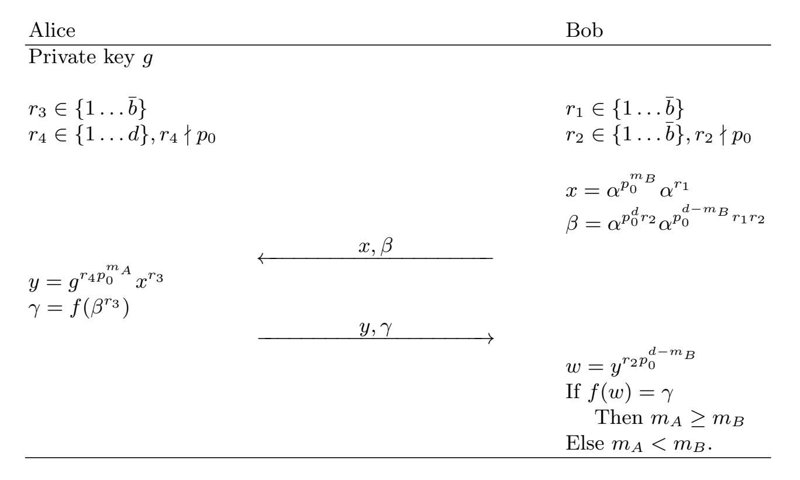

{0}------------------------------------------------

# Privacy-preserving greater-than integer comparison without binary decomposition in the malicious model?

Sigurd Eskeland

Norwegian Computing Center Postboks 114 Blindern 0314 Oslo, Norway sigurd.eskeland@nr.no

Abstract. Common for the overwhelming majority of privacy-preserving greater-than integer comparison schemes is that cryptographic computations are conducted in a bitwise manner. To ensure secrecy, each bit must be encoded in such a way that nothing is revealed to the opposite party. The most noted disadvantage is that the computational and communication cost of bitwise encoding is at best linear to the number of bits. Also, many proposed schemes have complex designs that may be difficult to implement.

Carlton et al. [2] proposed in 2018 an interesting scheme that avoids bitwise decomposition and works on whole integers. A variant was proposed by Bourse et al. [1] in 2019. Despite that the stated adversarial model of these schemes is honest-but-curious users, we show that they are vulnerable to malicious users. Inspired by the two mentioned papers, we propose a novel comparison scheme, which is resistant to malicious users.

# 1 Introduction

The idea of the Millionaires' Problem [6] is to facilitate two millionaires, who do not trust each other and who do not want to reveal their worth to each other, to find out who is the richest. Although such tasks could trivially be solved by a trusted third party who decides which party has the greatest value, the goal is to replace the trusted party with a privacy-preserving protocol. In other words, it is the ability to conduct privacy-preserving greater-than integer comparisons (PPGTC) without a trusted third party.

PPGTC may be used as a subprotocol for conducting privacy-preserving computations on encrypted data sets. Practical applications are auctions with

? This is a preprint of a paper presented at SECRYPT 2020 (DOI: 10.5220/0009822403400348).

{1}------------------------------------------------

private biddings, voting systems, privacy-preserving database retrieval and datamining, privacy-preserving statistical analysis, genetic matching, face recognition, privacy-preserving set intersection computation, etc.

Privacy-preserving integer comparison is an active research field that is based on techniques such as homomorphic encryption, garbled circuits, oblivious transfer, and secret sharing. Authors generally tend to claim some improvement over some other scheme in particular with regard to efficiency, but the actual efficiency may not be readily comparable (for example, due to methods are very different) nor available in many papers. Common for the overwhelming majority of privacy-preserving greater-than integer comparison schemes is that cryptographic computations are conducted in a bitwise manner. To ensure secrecy, each bit of the private inputs must be encoded in such a way that nothing is revealed to the opposite party. Bitwise cryptographic processing results in high computational and communication costs that is proportional to data input sizes. Also, many proposed schemes have complex designs that may be difficult to implement.

Carlton et al. [2] proposed in 2018 a PPGTC scheme that works on whole integers and that does not require bitwise coding or encryption. Inspired by [4, 5], it makes use of a special RSA modulus. Blinding is conducted to protect the input values. At the end of the protocol, a plaintext equality test (PET) subprotocol determines the outcome of the comparison, which imposes an additional performance cost. Bourse et al. [1] proposed a slightly modified two-pass PPGTC protocol that avoids the PET subprotocol, and whose function is simply replaced by a control value that is sent to party A in the last pass. By means of this value, party A determines the outcome of the comparison.

A disadvantage of the Bourse scheme compared to the Carlton scheme is a significantly smaller upper bound of private inputs and a composite modulus, whose size exceeds those recommended for RSA, even at small input bounds.

The stated adversarial model of the Carlton and Bourse schemes is honestbut-curious users, i.e., participants that do not deviate from protocol specification concerning how messages are computed. The overall motivation for using privacy-preserving protocols has to do with lack of trust, where privacypreserving methods allow individuals who do not trust each other to conduct computations without disclosing their private inputs. The assumption of honestbut-curious users is therefore somewhat a contradiction to the assumption that users do not trust each other.

Contribution. In this paper, we show that Carlton and Bourse schemes are insecure with regard to malicious users, i.e., participants whose message computations deviate from the protocol specification. In particular, the attacks presented in this paper are undetectable, which underlines that the honest-but-curious adversarial assumption is arguable insufficient. We propose a novel PPGTC scheme that seeks to mitigate the mentioned schemes' insecurities w.r.t. malicious users. It has only two rounds, and the upper plaintext bounds are favorably comparable with the Carlton scheme.

{2}------------------------------------------------

Outline. Section 2 provides necessary preliminaries and presents the basic idea of the comparison mechanisms used by the mentioned Carlton and Bourse schemes, and the one proposed in this paper. Section 3 outlines the Bourse scheme. Attacks on this scheme is presented in Section 4. The Carlton scheme and an attack are presented in Section 5. In Section 6 our novel PPGTC scheme is presented.

#### **Preliminaries** 2

The main feature of the PPGTC schemes proposed by Carlton et al. |2| and Bourse et al. |1| is the ability to compare entire integers, as opposed to bitwise operation on encrypted bits. This is achieved by special cyclic subgroups realized by making use of the following parameters:

- -a and d, where  $0 < a \le d$  and d/a denotes the upper bound of  $m_A, m_B \le d/a$ . Note that a does not exist in the Carlton scheme, where solely d denotes the upper bound of private inputs.
- Let n = pq, where p and q are primes and

$$p = p_0^d p_s p_t + 1$$
 and  $q = p_0^d q_s q_t + 1$  if  $p_0 = 2$   
 $p = 2p_0^d p_s p_t + 1$  and  $q = 2p_0^d q_s q_t + 1$  if  $p_0$  is a small odd prime

and  $p_s, q_s, p_t, q_t$  are distinct primes. See Section 2.1 for details on how to set the sizes of these primes.

- b denotes an upper public bound of  $p_s q_s$ .
- g is a generator of a cyclic subgroup  $\mathbb{G} \subset \mathbb{Z}_n^*$  of order  $p_0^d$  in both  $\mathbb{Z}_p^*$  and  $\mathbb{Z}_q^*$ .

   h is a generator of a cyclic subgroup  $\mathbb{H} \subset \mathbb{Z}_n^*$  of order  $p_s q_s$ , and of order  $p_s$ in  $\mathbb{Z}_p^*$  and  $q_s$  in  $\mathbb{Z}_q^*$ .
- -c is a long-term private key that is used by party A, where

$$c = p_s q_s \left(\frac{1}{p_s q_s} \bmod p_0^d\right) \tag{1}$$

The public key is  $\{n, a, d, p_0, g, h, \bar{b}\}\$ , and the private key of party A is  $\{p, q, c\}$ . The core idea behind the Carlton scheme [2] is that the element

$$g^{p_0^{d+m_A-m_B}} \bmod n \tag{2}$$

where  $0 \le m_A, m_B \le d$ , can be used to compare two integers  $m_A$  and  $m_B$ , due to whether multiples of the exponential factors  $p_0$  exceed  $p_0^d$  or not, so that

$$g^{p_0^{d+m_A-m_B}}$$
 
$$\begin{cases} \neq 1 & \text{if } m_A < m_B \\ = 1 & \text{if } m_A \ge m_B \end{cases}$$

This construction is almost identical in the Bourse scheme [1], which has an additional public parameter a, where integer comparison is conducted according to

$$g^{p_0^{d+a\cdot(m_A-m_B)}} \bmod n \tag{3}$$

where  $0 \le m_A, m_B \le d/a$ .

{3}------------------------------------------------

#### 2.1 Prime sizes

The upper plaintext bound  $\widehat{m}$  and the chosen security level  $\lambda$  determine prime sizes. Primes  $p_s$  and  $q_s$  have to be greater than 256 bits in order to thwart Coron's attack [3] that factors the RSA modulus.

Let  $\ell$  denote the size of p and q; s denote the size of  $p_s$  and  $q_s$ , which should be  $s \leq 256$ ; and t denote the size of  $p_t$  and  $q_t$ . The upper plaintext bound sets  $d = \widehat{m}$  in the Carlton scheme and  $d = a \cdot \widehat{m}$  in the Bourse scheme. If  $\log_2(p_0^d) + s > \ell$  then let t = 0 and  $p_t = q_t = 1$ . Otherwise, let  $t = \ell - \log_2(p_0^d) - s$ . The latter applies only for the cases where  $\widehat{m}$  is small, and  $p_t$  and  $q_t$  are needed to increase the sizes of p and q so that the security level of n agrees with  $\lambda$ .

# 3 The Bourse scheme

The Bourse scheme [1] is summarized in Figure 1. Parties A and B individually generate the ephemeral random secret integers  $(r_1, r_2, u, v_4)$ , where (u, v) are not divisible by  $p_0$ . In the first pass, party A generates the random  $r_1$  and blinds  $m_A$  by computing

$$C = q^{p_0^{a \cdot m_A}} h^{r_1} \bmod n$$

Subsequently in the second pass, party B randomly generates  $(r_2, u, v)$ , and blinds  $m_B$  in the responding computation:

$$D = C^{u \cdot p_0^{d - a \cdot m_B}} g^v h^{r_2} \bmod n$$

and the control value  $D' = f(g^v)$ , where f is a secure hash function. Finally, party A computes

$$C' = D^{c} = (C^{u \cdot p_{0}^{d-a \cdot m_{B}}} g^{v} h^{r_{2}})^{c}$$

$$= ((g^{p_{0}^{a \cdot m_{A}}} h^{r_{1}})^{u \cdot p_{0}^{d-a \cdot m_{B}}} g^{v} h^{r_{2}})^{c}$$

$$= (g^{p_{0}^{a \cdot m_{A}}})^{u \cdot p_{0}^{d-a \cdot m_{B}}} g^{v}$$

$$= g^{u \cdot p_{0}^{d+a \cdot (m_{A} - m_{B})}} g^{v}$$

$$= g^{v \cdot p_{0}^{d+a \cdot (m_{A} - m_{B})}} g^{v}$$
(4)

Due to the private key c, each factor of base h is eliminated, so that  $C' \in \mathbb{G}$ .

### 3.1 Security assumptions

The security of the first round of both the Carlton and Bourse schemes relies on the  $small\ RSA\ subgroup\ decision\ assumption$ . The following definition is from the Bourse paper [1]:

**Definition 1 (The small RSA subgroup decision assumption)** This assumption holds if given an RSA quintuple  $(u, p_0, d, n, g)^1$ , the distributions x and  $x^{p_0^d p_t q_t}$  are computationally indistinguishable, where  $x = r^2 \mod n$  is a uniformly random quadratic residue.

The generator h is not included in the original security assumption definition, although it is part of the public key.

{4}------------------------------------------------

| Party A                             |                     | Party B                                                                                                   |
|-------------------------------------|---------------------|-----------------------------------------------------------------------------------------------------------|
| Private key $c$                     |                     |                                                                                                           |
| $r_1 \in \{1 \dots \bar{b}\}$       |                     | $r_2 \in \{1 \dots \bar{b}\}\ u \in \{1 \dots p_0^a\}, u \nmid p_0\ v \in \{1 \dots p_0^a\}, v \nmid p_0$ |
| $C = g^{p_0^{a \cdot m_A}} h^{r_1}$ |                     |                                                                                                           |
| _                                   | $C \longrightarrow$ |                                                                                                           |
|                                     |                     | $D = C^{u \cdot p_0^{d-a \cdot m_B}} g^v h^{r_2}$                                                         |
| 4                                   | D, D'               | $D' = f(g^v)$                                                                                             |
| $C' = D^c$                          |                     |                                                                                                           |
| If $D' = f(C')$                     |                     |                                                                                                           |
| Then $m_A \geq m_B$                 |                     |                                                                                                           |
| Else $m_A < m_B$ .                  |                     |                                                                                                           |

Fig. 1. The Bourse et al. comparison scheme

This assumption states that it is hard to distinguish elements in  $\mathbb{H} \subset \mathbb{Z}_n^*$  of order  $p_sq_s$  (generated by h) from a random quadratic residue in  $\mathbb{Z}_n^*$ . In other words, it holds if it is not possible to determine if an integer belongs to  $\mathbb{H}$  or not. It applies solely to C in the first round as a measure for whether the subgroup order of the masking factor  $h^{r_1} \in \mathbb{H}$  achieves necessary security.

The security of the second round relies on statistically indistinguishable uniform distributions in a subgroup of order  $p_0^a$ , which is considerably smaller than that of  $\mathbb{H}$ . In the second round, party B generates three secret random secret integers  $(r_2, u, v)$  and sends (D, D') to party A, who computes C'. Given C', party A can guess either  $g^{u \cdot p_0^{d+a \cdot (m_A - m_B)}}$  or  $g^v$ , where the correctness of each guess is verified w.r.t. D'.

#### 3.2 Security parameter considerations

The integers  $(p_0, a)$  determine the security level  $\lambda$  of D in Round 2 and d:

$$p_0^a = 2^{\lambda} \quad \text{where} \quad a = \lambda \frac{\log 2}{\log p_0}$$
 (5)

and  $d = a \cdot \widehat{m}$ . In agreement with Eq. 3, the input values  $(m_A, m_B)$  define subgroups  $\mathbb{G}' \subseteq \mathbb{G}$  of variable order if  $m_A < m_B$ .

$$|\mathbb{G}'| = p_0^{d - a \cdot (m_A - m_B)} \ge 2^{\lambda}$$

The smallest subgroup  $\mathbb{G}'$  is produced by  $m_A - m_B = -1$ , where  $p_0^{d+a\cdot(m_A-m_B)} = p_0^{d-a}$ . For this case, the effective range of the random integer u is  $0 < u < p_0^a$ ,

{5}------------------------------------------------

cf. Eq. 5. Assuming that  $p_0^a$  is big enough, the Bourse scheme is secure w.r.t. honest-but-curious users. Section 4 discusses how a malicious user can reduce this range to make it searchable.

The private input upper bound  $\widehat{m}$  is confined by the RSA modulus size. Table 1 shows integer sizes as a function of  $\lambda$  and  $\widehat{m}$ , where  $\ell$  denotes the size of p and q. It assumes that  $p_0 = 2$  and s = 256 bits, cf. Section 2.1. NIST recommends that the RSA modulus should be 2048 bits for a  $\lambda = 112$  bits security level, and 3072 bits for  $\lambda = 128$  bits security. The moduli lengths given in the table exceed the RSA recommendations, meaning that  $(p_t, q_t)$  are not needed. The foremost downside is the limitation of low upper bounds on

| $\lambda$ | $\widehat{m}$ | a   | d     | $\ell$ | n     |
|-----------|---------------|-----|-------|--------|-------|
| 112       | 10            | 112 | 1120  | 1376   | 2752  |
| 112       | 50            | 112 | 5600  | 5856   | 11712 |
| 112       | 100           | 112 | 11200 | 11456  | 22912 |
| 128       | 10            | 128 | 1280  | 1536   | 3072  |
| 128       | 50            | 128 | 6400  | 6656   | 13312 |
| 128       | 100           | 128 | 12800 | 13056  | 26112 |

**Table 1.** Parameter sizes for the Bourse scheme, where  $p_0 = 2$ .

private inputs, which, as in the example, causes a very large composite n that significantly exceeds that which is recommended for RSA.

## 4 Malicious user attacks

The Bourse scheme assume honest-but-curious users that do not deviate from the protocol. A user that is motivated to disclose the private input of another user may be inclined to deviate from the protocol for this purpose. In this section we show that the Bourse scheme is insecure with regard to dishonest users, in particular party A. The consequence is that party A may obtain the private input of party B, who will not know that a privacy breach has occurred. Note that the following attacks do not apply to the Carlton scheme, presented in Section 5, due to using a PET subprotocol.

## 4.1 Fixed value attack

This attack pertains to the initial computation conducted by party A. In Round 1, party A selects k = a - 1, and sends  $C = g^{p_0^k} h^{r_1}$  to party B. In Round 2, party B computes and returns (D, D') to party A, who lastly computes

$$C' = g^{u \cdot p_0^k \cdot p_0^{d-a \cdot m_B}} g^v = g^{u \cdot p_0^{a-1+d-a \cdot m_B}} g^v$$

&lt;sup>2 http://www.keylength.com

{6}------------------------------------------------

Consider the following cases:

Case 1. If  $m_B = 0$  then  $C' = g^{u \cdot p_0^{a-1+d}} g^v = g^v$ . Case 2. If  $m_B = 1$  then  $C' = g^{u \cdot p_0^{a-1+d-a}} g^v = g^{u' \cdot p_0^{d-1}} g^v$ , where  $0 < u' < p_0$  is trivial to find.

Case 3. If  $m_B > 1$  then

$$C' = g^{u \cdot p_0^{a-1+d-a \cdot m_B}} g^v = g^{u' \cdot p_0^{d-a \cdot (m_B-1)-1}} g^v$$

where the range  $0 < u' < p_0^{a \cdot (m_B - 1) + 1}$  is too large, thus  $m_B$  is protected.

The two first cases are trivial for party A to identify by checking w.r.t. the hash value D'. For the third case, assuming that  $p_0^a$  is big enough, it would not be possible for party A to recover  $g^v$  and then  $m_B$ .

#### 4.2 Selected value attack

The previous attack can be generalized for any preselected value of  $m_B$ , meaning if party A computes C w.r.t. a specific value  $m'_B$ , it will give him or her assurance whether this is the value submitted by party B in Round 2.

In Round 1, party A selects  $k = a m'_B - 1$ , and sends  $C = g^{p_0^k} h^{r_1}$  to party B. Lastly, party A obtains

$$C' \equiv (g^{p_0^k})^{u \cdot p_0^{d-a \cdot m_B}} g^v \equiv g^{u' \cdot (p_0^{a \cdot m_B'} - 1 + d - a \cdot m_B)} g^v \equiv g^{u' \cdot p_0^{d-a \cdot (m_B - m_B') - 1}} g^v$$

Consider the following cases:

Case 1. If  $m'_B > m_B$  then  $C' = g^v$ .

Case 2. If  $m_B = m_B'$  then  $C' = g^{u \cdot p_0^{d-1}} g^v = g^{u' \cdot p_0^{d-1}} g^v$ , where  $0 < u' < p_0$  is trivial to find.

Case 3. If  $m_B' < m_B$  then  $C' = g^{u'p_0^{d-a\cdot(m_B-m_B')-1}}g^v$ , where the range  $0 < \infty$  $u' < p_0^{a \cdot (m_B - m_B') + 1}$  is too large, thus  $m_B$  is protected.

As was for the *fixed value attack*, the two first cases are trivial for party A to identify. For the third case, assuming that  $p_0^a$  is big enough, it would not be possible for party A to recover  $m_B$ .

#### Public keys with tiny hidden subgroups 4.3

A common assumption in public key cryptography is that users generate their own key pairs and then exchange public keys. In the Bourse scheme, Party A is the holder of the private key, and would provide the key pair. A malicious party A could generate a spurious public key  $(n, g, h, p_0, a, d)$  with a significantly smaller subgroup than specified in order to obtain private inputs by small brute-force searches.

The following describes how public keys with tiny subgroups can be computed for the Bourse scheme:

{7}------------------------------------------------

- $-(p_0, a, d)$  are selected in accordance with Section 2.
- Select a prime p' that is close to d, i.e.,  $p' \gtrsim d$ , so that the small prime  $p_0$  is a generator (i.e., primitive root) to p'.
- Let n = pq be the product of two primes, where  $p = 2p'p_sp_t + 1$  and  $q = 2p'q_sq_t + 1$ , and  $(p_s, p_t, q_s, q_t)$  are generated in accordance with Section 2.
- -g and h are generated in accordance with Section 2.

g will now generate a tiny subgroup  $\mathbb{G}'$  confined by p', so that  $|\mathbb{G}'| = p' - 1$ . Due to the following modular equivalence, it holds that

$$C' = g^{u \cdot p_0^{d+a \cdot (m_A - m_B)}} g^v \equiv g^{u' \cdot p_0^{d+a \cdot (m_A - m_B)}} g^{v'} \pmod{n}$$

where 0 < u', v' < p', cf. Eq. 4. Accordingly,  $D' = f(g^v) = f(g^{v'})$ .

Following the Bourse protocol, the malicious party A interacts with the honest party B. In Round 1, party A sends  $C = gh^{r_1}$  to party B. Party A can then easily find the low-entropy v' w.r.t. checking  $D' = f(g^{v'})$ . Knowing v', party A finds  $0 \le x \le p'$  w.r.t.

$$D' = q^x q^{v'}$$

where  $x = u' \cdot p_0^{d-a \cdot m_B}$ .

This attack is prevented by validating g and n by checking that  $g^{p_0^d} \equiv 1 \pmod{n}$  holds.

# 5 The Carlton scheme

The Carlton scheme is shown in Fig. 2. The public key  $(n, p_0, d, g, h)$  and private key c is generated in agreement with Section 2. It uses a plaintext equality test in the end. Parties A and B individually generate the ephemeral random secret integers  $(r_1, r_2, s)$ , where s is not divisible by  $p_0$ . Note that in their paper [2],  $p_0$  is denoted as b, and c as x.

The correctness of C' is given by

$$C' = D^{c} = \left(C^{p_0^{d-m_B}} g^{s} h^{r_2}\right)^{c} = \left(\left(g^{p_0^{m_A}} h^{r_1}\right)^{p_0^{d-m_B}} g^{s} h^{r_2}\right)^{c}$$
$$= \left(g^{p_0^{m_A}}\right)^{p_0^{d-m_B}} g^{s} = g^{p_0^{d+m_A-m_B}} g^{s}$$

where similar to Eq. 4, the factors of base h are eliminated due to the exponent c. The security of Round 1 is based on the *small RSA subgroup decision assumption*, cf. Definition 1. The security of Round 2 is based on the secrecy of  $g^s$ . Note that the Carlton scheme is more favorable than the Bourse scheme w.r.t. considerably larger upper bounds on private inputs, as seen in Table 2.

## 5.1 Known subgroup attacks

Similar to the Bourse scheme, the Carlton scheme assumes honest-but-curious users. From the perspective of malicious users, the attacks presented in Section 4

{8}------------------------------------------------

| Party A                                    |                                   | Party B                                             |
|--------------------------------------------|-----------------------------------|-----------------------------------------------------|
| Private key c                              |                                   |                                                     |
| ¯b} r1 ∈ {1                          |                                   | ¯b} r2 ∈ {1 0 − 1}, s - s ∈ {1 pd p0 |
| mA p r1 C = g h 0           |                                   |                                                     |
|                                            | C −−−−−−−−−−−−−−−−−−−→         |                                                     |
| w = c g D w) w = logg (g | D ←−−−−−−−−−−−−−−−−−−−         | d−mB p s h r2 D = C g 0           |
|                                            | PET(w, s) ←−−−−−−−−−−−−−−−−−−→ |                                                     |
|                                            |                                   | If w = s                                            |
|                                            |                                   | ≥ mB Then mA                                     |
|                                            |                                   | Else mA < mB.                                    |

Fig. 2. The Carlton et al. comparison scheme

Table 2. Parameter sizes for the Carlton scheme and our scheme, p0 = 2.

| λ   | m b | d    | `    | n     |
|-----|--------|------|------|-------|
| 112 | 100    | 100  | 1024 | 2048  |
| 112 | 1000   | 1000 | 1256 | 2512  |
| 112 | 5000   | 5000 | 5256 | 10512 |
| 128 | 100    | 100  | 1536 | 3072  |
| 128 | 1000   | 1000 | 1536 | 3072  |
| 128 | 5000   | 5000 | 5256 | 10512 |

do not apply to the Carlton scheme due to the way that the final integer comparison is conducted. But as we show next, the Carlton scheme is nevertheless not secure with regard to malicious users.

The computation of the integer D in the Carlton scheme is similar to that of the Bourse scheme, except for that in the Bourse scheme the factor C u·p d−a·mB 0 of D is "randomized" by u over a larger subgroup, whose minimum size is determined by p a 0 . The lack of this feature in the Carlton scheme can be exploited by party A.

Since party A is the holder of the private key, we assume that party A knows the composition of the RSA modulus. Knowing subgroup orders does not make this party malicious as long as he acts in agreement to the protocol. There may be several variant attacks, where a party knows subgroup orders. One variant is as follows:

{9}------------------------------------------------

Let  $p_t, q_t > 1$ , and select a generator k that produces a high order group greater than  $\mathbb{G}$ ,  $\mathbb{H}$ , of order of for example,  $p_s q_s p_s p_0^d$ , in which  $k = \alpha^{q_t}$  and  $\alpha$  is a generator to  $\mathbb{Z}_p$  and  $\mathbb{Z}_q$ .

Party A sends to  $C = k^r$  to party B, where r is a random number — thereby deviating from how the protocol specifies this computation. Party B has no way to determine this, and computes D according to protocol. Finally, Party A computes

$$D^{p_0^d \cdot p_s \cdot q_s} = \left( (\alpha^{q_t \cdot r})^{p_0^{d - m_B}} g^s h^{r_2} \right)^{p_0^d \cdot p_s \cdot q_s} = k^{r \cdot p_0^{2 \cdot d - m_B} \cdot p_s \cdot q_s}$$

eliminating the factors of base g and h. Knowing beforehand  $k^{r cdot p_s cdot q_s}$ , party A then easily recovers  $m_B$ .

# 6 A novel privacy-preserving greater-than comparison scheme

In this section we present a novel privacy-preserving greater-than integer comparison protocol. Inspired by the two previous schemes [2, 1], our scheme uses a cyclic subgroup of a power order  $p_0^d$ . Similar to [2], two integers  $m_1$  and  $m_2$  are compared in a privacy-preserving manner in agreement with Eq. 2, which avoids the restricted bounds on private inputs of the Bourse scheme.

#### 6.1 Construction

The proposed scheme requires the following parameters:

-n = pq, where p and q are large primes, and

$$p = p_0^d p_1 + 1$$
 and  $q = p_0^d q_1 + 1$  if  $p_0 = 2$   
 $p = 2p_0^d p_1 + 1$  and  $q = 2p_0^d q_1 + 1$  if  $p_0$  is a small odd prime

where  $p_s$  and  $q_s$  are distinct primes.

- d denotes the upper bound of the private inputs:  $0 \le m_A, m_B < d$ .
- $-\bar{b}$  denotes an upper public bound of  $p_sq_s$ .
- $-\alpha$  is a generator to  $\mathbb{Z}_p$  and  $\mathbb{Z}_q$ .
- A private key  $g = \alpha^{2p_s q_s} \mod n$  generating elements in  $\mathbb{G}$  of order  $p_0^d$ .

Public parameters are  $\{n, d, p_0, \bar{b}\}$ . The private key g is held by Alice. We therefore assume that Alice issues the public key and knows the construction of n.

The proposed scheme is summarized in Figure 3. In Round 1, Bob shares

$$x = \alpha^{p_0^{m_B}} \alpha^{r_1}$$
 and  $\beta = \alpha^{p_0^d r_2} \alpha^{p_0^{d-m_B} r_1 r_2}$ 

with Alice. In Round 2, Alice should check that  $x\neq 1$  and  $x\neq \alpha$ . Alice computes and sends

$$y = g^{r_4 p_0^{m_A}} x^{r_3} = g^{r_4 p_0^{m_A}} \alpha^{p_0^{m_B} r_3} \alpha^{r_1 r_3}$$

{10}------------------------------------------------

Fig. 3. The proposed secure comparison protocol

and

$$\gamma = f(\beta^{r_3}) = f((\alpha^{p_0^d r_2 + p_0^{d-m_B} r_1 r_2})^{r_3}) = f(\alpha^{p_0^d r_2 r_3 + p_0^{d-m_B} r_1 r_2 r_3})$$
 (6)

to Bob, where f is a secure hash function. Finally, Bob computes

$$w = y^{r_{2}p_{0}^{d-m_{B}}} = (g^{r_{4}p_{0}^{m_{A}}} \alpha^{p_{0}^{m_{B}}r_{3}} \alpha^{r_{1}r_{3}})^{r_{2}p_{0}^{d-m_{B}}}$$

$$= g^{r_{2}r_{4}p_{0}^{d+m_{A}-m_{B}}} \alpha^{p_{0}^{d}r_{2}r_{3}} \alpha^{p_{0}^{d-m_{B}}r_{1}r_{2}r_{3}}$$

$$= g^{r_{2}r_{4}p_{0}^{d+m_{A}-m_{B}}} (\alpha^{p_{0}^{d}r_{2}} \alpha^{p_{0}^{d-m_{B}}r_{1}r_{2}})^{r_{3}}$$

$$= g^{r_{2}r_{4}p_{0}^{d+m_{A}-m_{B}}} \beta^{r_{3}}$$

$$(7)$$

and checks whether

$$f(w) \stackrel{?}{=} \gamma$$

There are two outcomes:

- $-f(w) = \gamma$  because  $w = \beta^{r_3}$  and  $m_A \ge m_B$ .
- $-f(w) \neq \gamma$  because  $w \neq \beta^{r_3}$  and  $m_A < m_B$  with an overwhelming probability.

Note that the secret ephemeral integers  $(r_2, r_4)$  should not be divisible by  $p_0$  to avoid reduction of the order of the elements based on g.

# 6.2 Security parameter considerations

The bounds of private inputs is confined by the RSA modulus size. As mentioned, RSA modulus recommendations are 2048 bits for a  $\lambda=112$  bits security level, and 3072 bits for  $\lambda=128$  bits security. Table 2 shows parameter sizes as a function of security level  $\lambda$  and maximum input bound  $\widehat{m}$ , where  $\ell$  denotes the size of p and q.

{11}------------------------------------------------

# 7 Security analysis

The security relies on indistinguishability of random distributions, except for when it comes to a malicious user, who submits a computation that deviates from the protocol specification. This is a reasonable scenario, as such deviating computations cannot be detected by the opponent, which again underlines that the honest-but-curious adversarial assumption is an insufficient assumption.

Note that the attacks fixed and selected value attacks in Sections 4.1 and 4.2 do not apply to our scheme, since they assume that the generator g is public. The known subgroup attack in Section 5.1 does not apply directly to our scheme, but reduced subgroups are addressed in Section 7.2. The tiny hidden subgroups attack in Section 4.3 is addressed in this analysis.

The following security assumption applies for malicious users, as shown in this section:

**Definition 2 (The private RSA subgroup problem)** Given the RSA modulus n and an integer  $R = \alpha^{p_0^d r_1} g^{r_2}$ , this computational problem is the difficulty of computing  $R^c = g^{r_2}$  under the assumption that g and c (defined in Eq. 1) are not known, and where g generates the subgroup  $\mathbb{G}$ .

This problem hinges on the difficulty of factorizing n. Note that the *small RSA* subgroup decision assumption does not apply to our scheme, as there is no subgroup  $\mathbb{H}$ . In line with the previous discussions, the following security analysis considers the two adversarial models separately.

#### 7.1 Security w.r.t. honest-but-curious users

In this section, we prove that the proposed protocol preserve the confidentiality of private inputs against honest-but-curious adversaries in the standard model.

**Lemma 1 (Privacy of Bob).** The secrecy of  $m_B$  is preserved assuming an honest-but-curious opponent.

*Proof.* In Round 1, Alice receives  $(x, \beta)$ , whose exponents carry the private input  $m_B$ .

- x: Given that  $r_1$  of the blinding factor  $\alpha^{r_1}$  of x is a uniform random value, x is indistinguishable from  $\alpha^z$ , where z is a uniform random value. The secrecy of  $\alpha^{p_0^m}$  is therefore preserved.
- $\beta$ : Given that both factors of  $\beta$ , i.e.,  $\alpha^{p_0^d r_2}$  and  $\alpha^{p_0^{d-m_B} r_1 r_2}$ , have random exponents render them indistinguishable from  $\alpha^z$ , where z is also a uniform random value. The secrecy of  $\alpha^{p_0^{d-m_B} r_1 r_2}$  is therefore preserved.

Since  $(x, \beta)$  are indistinguishable from random integers in  $\mathbb{Z}_n^*$ , the secrecy of  $m_B$  is therefore preserved.

Note that  $(x, \beta)$  have the common exponents  $(r_1, r_2, p_0^{m_B})$ , which may yield a corresponding correlation. This is accounted for in the analysis in Section 7.2.

{12}------------------------------------------------

**Lemma 2** (Privacy of Alice). The secrecy of  $m_A$  is preserved assuming an honest-but-curious opponent.

*Proof.* Let  $m_B = 0$  to potentially extract  $m_A$  for the whole range of  $[1 \dots d]$ . In Round 2, Bob receives  $(y, \gamma)$ . Regarding y, the factor  $g_A = g^{r_4 p_0^{m_A}}$  is blinded by  $x^{r_3}$ .

Honest-but-curious users implies that  $\alpha$  is the actual element used to compute x, according to protocol, so that  $x^{r_3} \in \mathbb{B} \subset \mathbb{Z}_n^*$ , where  $|\mathbb{B}| = \bar{b}$ . The security hinges on the secrecy of  $r_3$ :

- Brute-force attack: Given  $(\beta, \gamma)$ , then  $r_3$  can be found by checking  $f(\beta^{r_3}) \stackrel{?}{=} \gamma$ , cf. Eq. 6. Since  $\bar{b} = |p_s q_s|$  is very large, it is computationally infeasible to brute-force  $r_3$ . The secrecy of  $g_A$  and thus  $m_A$  is preserved.
- Pre-image attack: Bob computes

$$w = y^{r_2 p_0^{d-m_B}} = g^{r_2 r_4 p_0^{d+m_A - m_B}} \beta^{r_3}$$

cf. Eq. 7, where  $g^{r_2r_4p_0^{d+m_A-m_B}}$ , which contains the private input  $m_A$ , is blinded by  $\beta^{r_3}$ . The blinding factor can be disclosed by computing the inverse  $f^{-1}(\gamma) = \beta^{r_3}$ . This is equivalent to breaking the pre-image resistance property of the hash function f. Assuming the one-way function f is secure, this is computationally infeasible.

Given the above, the secrecy of  $m_B$  is preserved against an honest-but-curious adversary.

# 7.2 Security w.r.t. malicious users

Since Alice is the holder of the private key, we can assume that Alice computes the key pair and therefore knows the composition of the RSA modulus. Since Bob is the initiator of the protocol, Alice cannot cheat Bob by sending him spurious protocol messages. This confines the adversarial scenarios to:

- 1. Alice submits a spurious public key  $(\alpha', n')$  to Bob.
- 2. Bob diverges from the protocol at computing  $(x, \beta)$ .

Alice could share a spurious RSA modulus n' with Bob, cf. Section 4.3. Alternatively, the attack in Section 5.1 utilizes the subgroup  $\mathbb{G}$  of order  $p_0^d$  of the genuine RSA modulus. However, this subgroup may be too large for brute-forcing.

By means of the private key g, Alice controls the pertaining small subgroup order  $\mathbb{G}'$ , by which it is computationally feasible to search for the corresponding exponent  $\hat{e}$ , given the modular equivalence  $\hat{g}^{\hat{e}} \equiv \alpha^e \pmod{n'}$ , where  $\hat{e} = e \mod p'$  and  $p' = |\mathbb{G}'|$ .

**Lemma 3 (Privacy of Bob).** The secrecy of  $m_B$  is preserved given a spurious RSA modulus with a tiny hidden subgroup order  $\mathbb{G}'$ .

{13}------------------------------------------------

*Proof.* Let n' be a spurious RSA modulus having a tiny hidden subgroup  $\mathbb{G}'$ . W.r.t.  $(x, \beta)$ , suppose that Alice obtains the exponents (a, b) of the equivalences  $x \equiv g^a \pmod{n'}$  and  $\beta \equiv g^b \pmod{n'}$ . Then (a, b) form the following equation system:

$$a = p_0^{m_B} + r_1' \mod p'$$
  
 $b = p_0^d r_2' + p_0^{d-m_B} r_1' r_2' \mod p'$ 

Since the number of unknowns exceed the number of equations, the equation system is underdefined.  $m_B$  can therefore not be determined. The secrecy of  $m_B$  is preserved given a spurious RSA modulus.

A malicious user Bob may submit any integer to Alice, and use the response  $(y, \gamma)$  and n to figure out her private input. Bob would succeed if he is able to correctly guess the blinding factor  $x^{r_3}$  or  $g^{r_4p_0^{m_A}}$ , although Bob does not know g.

**Lemma 4 (Privacy of Alice).** The secrecy of  $m_A$  is preserved assuming a malicious opponent.

*Proof.* This lemma is invalided by the following attack: A malicious Bob reduces the group order by  $p_0^d$  of x by submitting  $x = \alpha^{p_0^d r_1}$  to Alice, who returns

$$y = g^{r_4 p_0^{m_A}} x^{r_3} = g^{r_4 p_0^{m_A}} \alpha^{p_0^d r_1 r_3}$$

in agreement with the protocol. (Note that Alice must check that  $x \neq 1$ , since otherwise this would expose  $g^{r_4 p_0^{m_A}}$ .)

Bob computes  $y^c = g^{r_4 p_0^{m_A}}$ , where c is defined in Eq. 1, eliminating the blinding factor  $\alpha^{p_0^d r_1 r_3}$ . Bob finds  $m_A$  by checking  $(g^{r_4 p_0^{m_A}})^{p_0^i} \stackrel{?}{=} 1$  for 0 < i < d.

Alternatively, Bob could correctly guess  $r_4, m_A$ , whereof the search space of  $0 < r_4 < p_0^d$  may or may not be feasible, and then compute  $\alpha^{r_4 p_0^{m_A} p_s q_s}$ , whose correctness is verified by means of  $\gamma$ .

Both approaches require solving the private RSA subgroup problem (cf. Def. 2). This is solvable provided that the RSA modulus can be factorized. If the RSA modulus is properly composed, this would be computationally infeasible. The secrecy of  $m_A$  is therefore preserved.

# 8 Conclusion

Common for the overwhelming majority of privacy-preserving greater-than integer comparison schemes is that cryptographic computations are conducted in a bitwise manner. Recently, Carlton et al. [2] and Bourse et al. [1] proposed privacy-preserving integer comparison schemes that work on whole integers in contrast to bitwise decomposition and encoding of the private inputs.

In this paper, we have presented the mentioned comparison schemes, and shown that they are vulnerable to malicious users. Inspired by the two mentioned papers, we have proposed a novel privacy-preserving *greater-than* integer comparison scheme, which is resistant to malicious users.

{14}------------------------------------------------

# References

- 1. Florian Bourse, Olivier Sanders, and Jacques Traor´e. Improved secure integer comparison via homomorphic encryption. Cryptology ePrint Archive, Report 2019/427, 2019. https://eprint.iacr.org/2019/427.
- 2. Rhys Carlton, Aleksander Essex, and Krzysztof Kapulkin. Threshold properties of prime power subgroups with application to secure integer comparisons. Cryptology ePrint Archive, Report 2018/224, 2018. https://eprint.iacr.org/2018/224.
- 3. Jean-Sebastien Coron, Antoine Joux, Avradip Mandal, David Naccache, and Mehdi Tibouchi. Cryptanalysis of the rsa subgroup assumption from tcc 2005. Cryptology ePrint Archive, Report 2010/650, 2010. https://eprint.iacr.org/2010/650.
- 4. Ivan Bjerre Damg˚ard, Martin Geisler, and Mikkel Krøigaard. Homomorphic encryption and secure comparison. International Journal of Applied Cryptography, (1):22–31, 02 2008.
- 5. Ivan Damg˚ard, Martin Geisler, and Mikkel Krøigaard. A correction to "efficient and secure comparison for on-line auctions". IACR Cryptology ePrint Archive, 2008:321, 01 2008.
- 6. Andrew C. Yao. Protocols for secure computations. In Proceedings of the 23rd Annual Symposium on Foundations of Computer Science, SFCS '82, pages 160–164, Washington, DC, USA, 1982. IEEE Computer Society.