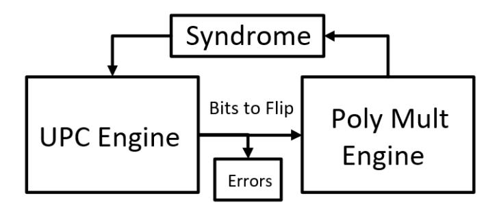

# **Efficient BIKE Hardware Design with Constant-Time Decoder**

Andrew H. Reinders, Rafael Misoczki, Santosh Ghosh and Manoj R. Sastry

Security and Privacy Research, Intel Labs Intel Corporation 2111 NE 25th Ave, Hillsboro, OR 97124

[andrew.h.reinders@intel.com,rafael.misoczki@intel.com,santosh.ghosh@intel.com,](mailto:andrew.h.reinders@intel.com, rafael.misoczki@intel.com, santosh.ghosh@intel.com, manoj.r.sastry@intel.com) [manoj.r.sastry@intel.com](mailto:andrew.h.reinders@intel.com, rafael.misoczki@intel.com, santosh.ghosh@intel.com, manoj.r.sastry@intel.com)

**Abstract.** BIKE (Bit-flipping Key Encapsulation) is a promising candidate running in the NIST Post-Quantum Cryptography Standardization process. It is a code-based cryptosystem that enjoys a simple definition, well-understood underlying security, and interesting performance. The most critical step in this cryptosystem consists of correcting errors in a QC-MDPC linear code. The BIKE team proposed variants of the Bit-Flipping Decoder for this step for Round 1 and 2 of the standardization process. In this paper, we propose an alternative decoder which is more friendly to hardware implementations, leading to a latency-area performance comparable to the literature while introducing power side channel resilience. We also show that our design can accelerate all key generation, encapsulation and decapsulation operations using very few common logic building blocks.

**Keywords:** Post-Quantum Cryptography (PQC) · BIKE · QC-MDPC · Bit-flipping Decoder · Hardware Implementation · NIST PQC Standardization Project

### **1 Introduction**

Methods to exchange cryptographic keys play a central role in many real-world applications. They allow two parties who never met before to agree/share a symmetric key, which can then be used to establish an encrypted tunnel. The most-widely deployed key exchange solutions nowadays are based on RSA [\[RSA78\]](#page-11-0) and ECC [\[Mil85,](#page-10-0)[Kob87\]](#page-10-1) algorithms, which are efficient but expected to be eventually broken by quantum adversaries [\[Sho97\]](#page-11-1). There are alternative constructions believed to be quantum resistant, i.e. whose underlying security problem does not become significantly easier when facing attacks mounted with the help of a quantum computer.

Code-based cryptography (CBC) schemes represent a good quantum-resistant alternative to RSA and ECC. They are based on hard problems from coding-theory, which are only marginally affected by quantum adversaries [\[Gro96,](#page-10-2)[Ber10\]](#page-10-3). The McEliece cryptosystem [\[McE78\]](#page-10-4) was the first CBC schemes, and it was proposed in 1978. It remains essentially unscathed from classical and quantum attacks, and has been considered as one of the most conservative quantum-resistant approaches being mentioned in preliminary recommendations for PQC standardization efforts [\[DL](#page-10-5)<sup>+</sup>15]. The main drawback of McEliece

(which precluded its wide adoption) is its long public key sizes of megabytes that represent disguised generator matrices of Goppa codes.

To address the longstanding public key size issue of the McEliece scheme, a group of researchers designed a new linear code family that offers comparable security and much smaller public keys. These are the Quasi-Cyclic Moderate Density Parity-Check (QC-MDPC) codes used in the so-called QC-MDPC McEliece scheme [\[MTSB13\]](#page-10-6). This approach has gained increasing attention in the recent years given its performance and security features.

In November 2017, NIST started the Post-Quantum Cryptography Standardization Project which intends to select and standardize post-quantum secure cryptosystems. A total of 82 candidates were submitted, shortly later reduced to 64 acceptable submissions, and then further reduced to only 26 candidates for the round 2 of this process. BIKE [\[ABB](#page-10-7)<sup>+</sup>] is a promising candidate that is among the round 2 finalists. This process should take a few more years to complete, and researchers from both academia and industry are scrutinizing all competitors looking for potential flaws and sub-optimalities in general. In this context, an efficient and side-channel protected hardware design plays an important role to show feasibility of adoption for any PQC scheme currently considered by NIST. BIKE is no different.

**Contributions:** This paper presents a design for a BIKE hardware accelerator that substantially accelerates BIKE without compromising the decoding failure rate. It introduces a decoder suitable for decoding BIKE Level 5, as defined by NIST; these parameters offer 128-bit post-quantum security. This is a round-based decoder targeting an acceptable 10−<sup>7</sup> DFR, with constant-time performance. Additionally, our design is equipped with efficient side-channel countermeasures against power-analysis attacks which do not compromise performance. To the best of our knowledge, this is the first hardware targeting the BIKE Level 5 parameters. It uses 51207 ALUTS and computes a single BIKE decode operation in 1.3M cycles, at 110 MHz on an Intel Arria 10 FPGA, in 12 milliseconds. This is comparable to the latency of the BIKE software reference implementation run on a Core i5 6260u. It also accelerates the multiplication used in BIKE encode and key generation, by reusing the polynomial multiplication engine. It achieves an area-time performance comparable to the Area-Time Optimized Niederreiter implementation [\[HC17\]](#page-10-8) after adjusting for parameters.

**Organization:** The paper is organized as follows. Section [2](#page-1-0) recalls the basic concepts required to understand our work. Section [3](#page-4-0) provides a high-level overview of the proposed architecture. Section [4](#page-6-0) discusses a new QC-MDPC decoder used in our design. Section [5](#page-8-0) discusses side-channel countermeasures implemented in our design. Section [6](#page-8-1) presents a comparison between our design and other designs available in the literature. Finally, Section [7](#page-9-0) presents conclusions about this work.

### <span id="page-1-0"></span>**2 Preliminaries**

**Definition 1** (Linear codes)**.** A binary (*n, k*)-linear code C of length *n*, dimension *k* and co-dimension *r* = (*n* − *k*) is a *k*-dimensional vector subspace of F *n* 2 .

**Definition 2** (Generator and Parity-Check Matrices)**.** A matrix *G* ∈ F *k*×*n* 2 is called a *generator matrix* of a binary (*n, k*)-linear code C iff

$$\mathcal{C} = \{ mG \mid m \in \mathbb{F}_2^k \}.$$

A matrix *H* ∈ F (*n*−*k*)×*n* 2 is called a *parity-check matrix* of C iff

$$\mathcal{C} = \{ c \in \mathbb{F}_2^n \mid Hc^T = 0 \}.$$

A *codeword c* ∈ C of a vector *m* ∈ F (*n*−*r*) 2 is computed as *c* = *mG*. A *syndrome s* ∈ F *r* 2 of a vector *e* ∈ F *n* 2 is computed as *s <sup>T</sup>* = *He<sup>T</sup>* .

**Definition 3** (Quasi-Cyclic Codes)**.** A binary quasi-cyclic (QC) code of index *n*<sup>0</sup> and order *r* is a linear code which admits as generator matrix a block-circulant matrix of order *r* and index *n*0. A (*n*0*, k*0)-QC code is a quasi-cyclic code of index *n*0, length *n*0*r* and dimension *k*0*r*.

**Definition 4** (QC-MDPC codes)**.** An (*n*0*, k*0*, r, w*)-QC-MDPC code is an (*n*0*, k*0) quasicyclic code of length *n* = *n*0*r*, dimension *k* = *k*0*r*, order *r* (and thus index *n*0) admitting a parity-check matrix with constant row weight *w* = *O*( √ *n*).

### **2.1 BIKE**

BIKE is a suite of three variants: BIKE-1, BIKE-2 and BIKE-3. Each one has two versions targeting two distinct security notions: CPA and CCA security. To illustrate how a BIKE algorithm works, we will provide the definition of BIKE-1-CPA. For additional variants, we refer the reader to the BIKE spec [\[ABB](#page-10-7)<sup>+</sup>].

#### **KeyGen**

- Input: *λ*, the target quantum security level.
- Output: the sparse private key (*h*0*, h*1) and the dense public key (*f*0*, f*1).
- 0. Given *λ*, set the parameters *r, w* as described above.
- 1. Generate *h*0*, h*<sup>1</sup> \$← R both of (odd) weight |*h*0| = |*h*1| = *w/*2.
- 2. Generate *g* \$← R of odd weight (so |*g*| ≈ *r/*2).
- 3. Compute (*f*0*, f*1) ← (*gh*1*, gh*0).

#### **Encaps**

- Input: the dense public key (*f*0*, f*1).
- Output: the encapsulated key *K* and the cryptogram *c*.
- 1. Sample (*e*0*, e*1) ∈ R<sup>2</sup> such that |*e*0| + |*e*1| = *t*.
- 2. Generate *m* \$← R.
- 3. Compute *c* = (*c*0*, c*1) ← (*mf*<sup>0</sup> + *e*0*, mf*<sup>1</sup> + *e*1).
- 4. Compute *K* ← **K**(*e*0*, e*1).

#### **Decaps**

- Input: the sparse private key  $(h_0, h_1)$  and the cryptogram c.
- Output: the decapsulated key K or a failure symbol  $\perp$ .
- 1. Compute the syndrome  $s \leftarrow c_0 h_0 + c_1 h_1$ .
- 2. Try to decode s (noiseless) to recover an error vector  $(e'_0, e'_1)$ .
- 3. If  $|(e_0', e_1')| \neq t$  or decoding fails, output  $\perp$  and halt.
- 4. Compute  $K \leftarrow \mathbf{K}(e_0', e_1')$ .

#### 2.2 BIKE Decoders

The decoding of MDPC codes can be achieved by various iterative decoders. Among those, the bit flipping algorithm [Gal62] is particularly interesting because of its simplicity, as described in Algorithm 1. There are many variants of the bit flipping algorithm, and all of them follow the same overall principle. At first, the syndrome of the noisy codeword is computed. The positions in the noisy codeword that participate in an "abnormally high number" of unsatisfied parity check equations (this value is called the decoding threshold  $\tau$ ) are considered to be likely in error, and therefore they are flipped. The syndrome is then recomputed. With high probability, this process decreases the total number of unsatisfied parity check equations. This process is repeated until the syndrome becomes zero (decoding success) or a maximum number of iterations is reached (decoding failure). There are several heuristics for computing the threshold  $\tau$ :

- the maximal value of  $|h_i \star s|$  minus some  $\delta$  (typically  $\delta = 5$ ), as in [MTSB13],
- precomputed values depending on the iteration depth, as in [Cho16],
- variable, depending on the weight of the syndrome s', as in [ABB<sup>+</sup>].

#### <span id="page-3-0"></span>Algorithm 1 Bit Flipping Algorithm

```
Require: H \in \mathbb{F}_2^{(n-k) \times n}, s \in \mathbb{F}_2^{n-k}

Ensure: eH^T = s

1: e \leftarrow 0

2: s' \leftarrow s

3: while s' \neq 0 do

4: \tau \leftarrow threshold \in [0, 1], found according to some predefined rule

5: for j = 0, \dots, n-1 do

6: if |h_j \star s'| \geq \tau |h_j| then

7: e_j \leftarrow e_j + 1 \mod 2

8: s' \leftarrow s - eH^T

9: return e
```

 $h_j$  denotes the j-th column of H, as a row vector,  $'\star'$  denotes the componentwise product of vectors, and  $|h_j \star s|$  is the number of unchecked parity equations involving j.

<span id="page-4-1"></span>

Figure 1: Simplified Block Diagram

# <span id="page-4-0"></span>**3 High-Level Architecture**

We use a modified round-based MDPC decoder, with a threshold computed from syndrome weight, and a backflipping section. Round-based MDPC decoders are fairly common and have enjoyed a substantial amount of success. At their core, they select many bits of the error to flip, then recompute the syndrome based on flipping these bits, and iterate this procedure until the errors have all been found. This makes them highly parallelizable and well-suited to hardware implementation; they are also simple to make constant-time. In this architecture, these two steps are accomplished by two computational blocks - the unsatisfied parity check count (UPC) engine and the polynomial multiplication engine, intended to resist power side channel attacks. The UPC engine decides bits to flip, and the polynomial multiplication engine computes updates to the syndrome due to flipping those bits. The top-level diagram, Figure [1,](#page-4-1) shows the dataflow of these modules.

The decoder itself uses a round-based strategy where bits with UPC above a threshold are all flipped, with one difference - the second and fourth rounds have a threshold of exactly half the possible errors, and they only flip bits that are currently marked as errors. The technique of using some rounds to un-set bits that had previously been set was used effectively to improve the DFR.

The efficiency of doing all UPC counts at once and then making decisions based on those values is two-fold - it is highly parallelizable, and flipping multiple bits at once decreases the amount of iterations required. The design proposed here is scalable to the area and parameters available, and the UPC block can be included stand-alone as a special-purpose instruction on a general-purpose processor.

The design has has several key advantages. First, the block-based approach reduces the critical path, because less work is done each cycle on each error bit. Each error bit accumulator only needs to accumulate the value of 128 bits, rather than 32749, at once. Second, the block-based approach improves the side channel resistance. Power side-channel attacks against multipliers which recover the input, such as the QC-BITS attack show that 8-bit multipliers are cheap but 16-bit multipliers are more expensive and the attack becomes infeasible against 64-bit multipliers; attacking 128-bit multipliers is expected to be infeasible for most attackers. The literature does not have similar results for the UPC block, but the UPC block is similar in construction to a multiplier, and the same principle of confusion should apply.

Also as a consequence of having discrete blocks, the polynomial multiplication engine can run independently to multiply the contents of memory and store it in the syndrome; this is used to accelerate the encode step as well as to perform the initial multiplication for

the decode step. The biggest priority of this block-based architecture is that it obfuscates the power trace caused by the influence of a single bit - it is much harder to recover key information from a power trace that confuses 128 simultaneous computations than in an architecture that performs all operations for a single error bit at once. As with any cryptographic hardware, any detailed information about the execution in the hardware could be leveraged to weaken or break the key. And, as a consequence of the one-bit design execution, the power trace is likely to give away which error bits are flipped and when, which almost certainly provides a surface for attack.

#### 3.1 Design Rationale

Given a secret key  $h = (h_0, h_1)$  and an enciphered message  $c = (c_0, c_1)$ , the decoding algorithm relies on the fact that  $c_0h_0 + c_1h_1 = c_0e_0 + c_1e_1 = S$  where S is the syndrome. An important step in bit-flipping algorithms is the computation of the unsatisfied parity-check counter for each position of the noisy codeword. We call the module that performs this step as the UPC counting module. In practice, the UPC module computes the weight of  $S \otimes (h_i <<< j)$ , with <<< denoting bit rotation of  $h_i$  as a bitvector, and  $\otimes$  as bitwise AND.

On some condition of the UPC counts, we flip a corresponding bit  $\hat{e}_{i,j}$ . Flipping the bit  $\hat{e}_{i,j}$  changes the product  $\hat{e}_i * h_i$  as  $[\hat{e}_i \bigoplus (1 <<< j)] * h_i = \hat{e}_i * h_i \bigoplus h_i <<< j$ . If the UPC count for a bit j is at least half the bits in  $h_i$ , then  $S \bigoplus h_i <<< j$  is lower weight than S. We then modify  $\hat{S} = \hat{S} \bigoplus h_i <<< j$ . In general, flipping the bit of  $\hat{e}$  with the greatest UPC count is a greedy algorithm for reducing the weight of S, and therefore for finding the vector  $\hat{e}$  such that  $\hat{e} * c = S$ .

The parallel algorithm is essentially a parallel version of the BIKE round-based decoder. It computes all UPC counts, and flips all bits above some threshold function. Some threshold functions pick the top m bits each time, or vary the number of bits that will pass the threshold; others pick a value without knowledge of the UPC counts, based on the weight  $|\hat{S}|$  of the syndrome at the current time. This is the approach we take, because it makes hardware parallelization simpler with the minimum possible persistent state that needs to be stored.

#### <span id="page-5-0"></span>3.2 Logic Modules

The basis of the block-based decoder is a module which computes UPC counts 128 at a time, over 256 cycles, and decides whether to flip 128 bits of the error according to the decoder rule, and a module which multiplies those bits by  $h_i$  to compute the change to the syndrome. These modules operate in parallel, with the multiplier processing the error bits output by the last pass of the UPC engine.

The polynomial multiplication engine lags the UPC engine by one word of the error, so 257 steps are used, with the polynomial multiplication engine sitting idle at the first step and the UPC engine sitting idle at the last step. In addition, in order to reuse the memories, the polynomial multiplication engine starts one cycle before the UPC engine, leaving a cycle of slack where the UPC engine does nothing, and a cycle of slack where the polynomial multiplication engine does nothing.

#### 3.2.1 UPC engine

The basis of the block-based hardware decoder is a module which computes UPC counts. It has 128 counters which compute the UPC for 128 consecutive candidate error bits. Each cycle, it takes as inputs 128 bits of  $\hat{S}$  and 255 bits of  $h_i$ , and counter j accumulates the Hamming weight of a 128-bit chunk of  $\hat{S} \otimes (h_i <<< j)$ , the syndrome bitwise AND  $h_i$  rotated cyclically by j bits, representing the UPC counts for a single error bit. On the next cycle, both  $\hat{S}$  and  $h_i$  inputs are advanced by 128 bits. At the end of  $\lceil R/128 \rceil$  cycles, the counter contains the value of  $|\hat{S} \otimes (h_i <<< j)|$ , and then a comparator outputs the 128 boolean values  $\Delta \hat{e}_i = \hat{S} \otimes (h_i <<< j)| \geq T(|\hat{S}|)$  for values  $j \in \{128l, 128(l+1)-1\}$ . These values are passed to a multiplier that computes  $\hat{S} \bigoplus \Delta \hat{e}_i * h_i \hat{S}$ .

#### 3.2.2 Polynomial multiplication

The multiplier module has the same inputs at the same time - it takes in the same 128-bit word of  $\hat{S}$  and 255-bit word of  $h_i$  as well as a word of  $\Delta \hat{e}_i$ , and returns a word of  $\hat{S} \bigoplus h_i \cdot \Delta \hat{e}_i$ , which is stored in place of the word of  $\hat{S}$ . One word of  $\Delta \hat{e}_i$  is multiplied by all of  $h_i$  in the same number of cycles as one word of  $\Delta \hat{e}_i$  is produced by the UPC module.

### <span id="page-6-0"></span>4 A New QC-MDPC Decoder

The basis of this decoder is a round-based decoder like those used in the first step of the BIKE spec [ABB<sup>+</sup>] and in decoders like [HvMG13] and [HC17]. These have found success flipping bits according to a threshold function based on the number of unsatisfied parity check equations for each error bit (the UPC count). Round-based decoders are inherently more parallel than single-bit-flipping decoders, making them better-suited to hardware acceleration. They are also simpler to make constant-time and, because they have no data-dependent memory accesses, they are resistant to certain kinds of power analyses.

The BIKE proposal [ABB<sup>+</sup>] makes use of a bit-flipping decoder that found success by adding a round from a round-based decoder, and a round of corrective bit-flipping which only flips bits back. However, the iterative single-bit-flipping is not as suitable to hardware and by its nature it is difficult to implement in a constant-time or memory-oblivious way.

The "additional" optimized decoder by the BIKE team made use of a parameterized round-based decoder, with three distinct rounds iterated in sequence - a round flipping any bits above a threshold, a round of flipping back, and a round flipping "gray errors" if their UPC is sufficiently high. In experiments we found the third round had substantial performance impact without providing significant advantage to the decoder, when aiming for a target DFR of  $10^{-7}$ . We also found that the round of fixing flipped bits did not have much of an effect after the first two times, because at about this point in the decoder, for the vast majority of cases, the UPC counts for bits that need to be flipped and the UPC counts for bits that don't need to be flipped have far less overlap; the optimal threshold also approaches w/4, so bits flipped in error are likely to be flipped back in the less-demanding later stages of regular round-based flipping.

We fitted out the Additional implementation with instrumentation to determine, for each random instance of a BIKE key exchange, what values of the threshold would flip the most error bits correctly, while flipping the fewest non-error bits. By plotting the optimal greedy threshold for each error bit, we found that the linear function that best fit the high-syndrome values was 65.2 + 0.00087 x, where x is the Hamming weight of the syndrome. Lower down, this function also tends to be very good at setting thresholds, but the value of the threshold becomes less critical especially since most instances have been decoded completely by this point. Higher-order polynomials than linear fit the curve better, but they didn't provide substantially improved performance.

We implemented "backflipping" by passing a threshold to the UPC engine and applying a mask to the output. When backflipping, the threshold is *w/*4, and the mask is those bits in the current word of error bits which have been flipped; when forward flipping, the threshold is higher, set according to the weight of the syndrome, but the mask is all 1.

The resulting decoder computes a threshold for UPC counts associated with a candidate error bit, as a function of the Hamming weight of the syndrome. The decoder flips all bits with UPC above this threshold, on rounds 1, 3, and 5 on. On rounds 2 and 4, the decoder flips any bits currently marked as flipped, if their UPC count is greater than *w/*4, or half the weight of one half of the secret key. That is, on rounds 2 and 4, each error bit is unset if setting them back to 0 would reduce the syndrome weight, but no bits are set that were unset so far.

It seems likely that this technique is broadly applicable to other designs, and that "fixing" bits by flipping bits off which were previously flipped on, and doing so more aggressively than they were flipped on, gives decoders an advantage. It's even possible that *w/*4 is not aggressive enough, and a more aggressive backflipping round would be even more successful, because a bit flipped correctly will have an even lower UPC count after other error bits are correctly decoded. Eventually the UPC will be zero, so bits that remain closer to *w/*4 are likely to be bad choices.

### **4.1 Estimated Decoding Failure Rate**

We established the decoding failure rate of the decoder empirically to a high degree of confidence by implementing it in software and running it for a large number of trials. We modified the Additional implementation written by the BIKE team to perform the same rounds in the same order that this decoder does.

Thresholds of 10<sup>−</sup><sup>7</sup> are a common target for MDPC-based crypto, and the design targeted this as a design goal. We picked the Clopper-Pearson estimator for simplicity and to conservatively estimate our confidence in the experimental results. Commonly in the literature, such as in [\[HvMG13\]](#page-10-11) or [\[Cho16\]](#page-10-10), the DFR is established by the rate of decoding failures without considering the confidence of that result; therefore, results with few decoding failures are sometimes overstated. For low decoding failure rate decoders, and for experiments where very few or zero decoding failures are measured, it is important to take the confidence of the result into account, and the DFR for decoders with a single observed failure could easily be twice or three times as high as what is reported. Because we chose parameters such that the probability of seeing a failure is even lower than our target, a test of 53 million trials had zero decoding failures. Using the simplest form of this conservative estimator, this indicates that the one-sided confidence interval with confidence value *p* = 0*.*01 for the decoder probability is bounded above, by a probability *r*, such that (1 − *r*) *<sup>n</sup>* = 0*.*01 when *n* samples are taken. This represents the interval which, if the probability were above this interval, the probability of experiment success is less than 1%. For a confidence interval of [0*,* 10<sup>−</sup><sup>7</sup> ), this yields *n* = log(0*.*01)*/* log(0*.*9999999), yielding 53 million. Indeed, after 53 million trials, the decoder had no failures.

# <span id="page-8-0"></span>**5 Side-Channel Countermeasures**

The decoder runs for a fixed, predefined number of rounds, each of which is constant-time, so it is resistant against timing attacks. This resembles the work in QC-BITS, but permits an even lower DFR, as required by the application, since the threshold is dynamically computed. The block-based design performs computations on 128 bits of the private key, 128 bits of the syndrome, and 128 bits of the error vector simultaneously, so it is hard to isolate the impact of any single one of those bits from a power trace. That is, where other designs may consider only one bit of the error at a time, and decide to flip it or not in a single round, this design takes 256 cycles to make that decision on 128 bits, as described in section [3.2.](#page-5-0)

An attack on QC-BITS on 8-bit microcontrollers [\[RHHM17\]](#page-10-12) highlights the impact of using larger word sizes in this way - here, the cost of an attack against 64-bit processors is much higher than against 32-bit. The same trend suggests attacking 128-bit multipliers is beyond the capabilities of these techniques. This protects the encode step of BIKE, but the same property should confuse attacks against the UPC engine, since it is essentially also a multiplier.

## <span id="page-8-1"></span>**6 Comparison with Existing QC-MDPC Hardware Designs**

This decoder is similar to QC-BITS [\[Cho16\]](#page-10-10) in that it uses a round-based decoder, but it uses backflipping to decrease the number of decoding failures, and uses a dynamic threshold based on the syndrome. Heyse et al [\[HvMG13\]](#page-10-11) have a decoder which uses the max UPC and sets a boundary around it, but this requires taking a second pass through the data, which substantially worsens the performance compared to an approximation which flips on both rounds. Instead, the decoder uses the syndrome weight as a proxy for the number of errors left to decode, and therefore the best threshold.

Some decoders, such as [\[HvMG13\]](#page-10-11), report average performance, which is not the design goal of this decoder; protecting against side channel attacks is more important. Even so, the decoder does usually complete within five rounds. The decoder rarely completes in the first few rounds, though, as a consequence of the backflipping round, which improves DFR at higher numbers of rounds but, by nature, doesn't make forward progress.

The design uses 51207 ALUTS, 1637 registers, and infers one DSP block for computing the threshold, on an Altera Arria 10. This is not too far from the performance of [\[HC17\]](#page-10-8). Recoding this design to implement a round-based decoder, with six rounds, on 9801 bits instead of 65498 bits, would give a design requiring only 20000 cycles for a full 6-round decode. Our work also requires more rounds because the threshold for sufficiently low DFR appears to be longer for 128-bit-secure parameters. Our work does not take advantage of the fact that counting parity check violations (UPC counts) can be approximated by the assumptions made in that work. Not using this strategy costs an estimated 4000 LUTs. Our design also provides other side channel resistance properties, while gaining some efficiency by pipelining and parallelizing the computation.

Considering the greater number of required rounds and constant-time performance of our decoder, this performs quite competitively with Hu et al [\[HC17\]](#page-10-8), especially considering the reported cycles are average-case rather than for a constant-time decoder. The average decoding time, in our work as in theirs, is about half the maximum number of rounds.

<span id="page-9-1"></span>

| Author     | SL  | h bits | Platform | Cycles     | LUTs   | Clock speed | Cost/key2 |
|------------|-----|--------|----------|------------|--------|-------------|-----------|
| This work  | 128 | 65498  | Arria 10 | 1,300,000  | 51,207 | 110MHz      | 15.54     |
| Hu et. al. | 64  | 19714  | Virtex 6 | 99,396 avg | 32,646 | 250MHz      | 8.35      |
| Hu et. al. | 40  | 9602   | Virtex 6 | 35,539 avg | 15,322 | 310 MHz     | 5.90      |

Table 1: Comparison to the literature

The security levels in [\[HC17\]](#page-10-8) are also adjusted to their post-quantum security level. The cost per key squared parameter in [1](#page-9-1) is a key-scaled efficiency measure consisting of LUTs times cycles divided by the square of the code length.

# <span id="page-9-0"></span>**7 Conclusion**

This paper proposes a block-based design with two blocks that resemble 128-bit multiplier blocks. It takes advantage of the side channel resilience of wide word multiplier blocks and the reduced critical path length of this approach to provide a simple and flexible approach to the problem of QC-MDPC decoding. This block-based decoder does not use sparse representations internally, but this allows for much simpler hardware to be replicated two-dimensionally. The technique can be scaled to 64-bit blocks while maintaining some resilience to power side channel attacks, and while this hardware was designed for level 5, the technique can be scaled to any BIKE level or any QC-MDPC code. This design also introduces corrective flipping as a hardware feature - bits that are set should be unset more aggressively than they were initially set.

This design is latency-area competitive with other decoders in the literature. It manages to perform competitively compared to other QC-MDPC hardware, while including other side-channel protection features. It also manages to perform comparably on an FPGA to a modern 64-bit processor running the BIKE reference implementation, with a small area package.

QC-MDPC codes are of great interest to the cryptographic community as a simple, efficient, and secure post-quantum cryptographic scheme. BIKE provides for three security levels against known attacks on QC-MDPC codes, but QC-MDPC decoders are still potentially vulnerable to side channel attacks on multiple attack surfaces. Even with ephemeral secret keys, power side-channel attacks against small multipliers can threaten both the secret key and the generated shared key and may need to be mitigated [\[RHHM17\]](#page-10-12). And, especially for hardware in embedded devices, power-side-channel-resistant hardware is essential to protect these secrets. Therefore, side channel protections, like those in this paper, are essential to protecting keys in embedded devices.

### **7.1 Further work**

Hardware such as this can also perform backflipping at the same time as forward flipping, by passing a mask from the control logic which instead tells the engine to make the threshold half the maximum number of errors, for a subset of the bits. This corresponds to flipping any bit that is set to unset, if doing so would decrease the syndrome at all. By changing the threshold based on whether a bit is set, the fix rounds might be done in parallel with the forward rounds. This decoder does not do so, but the method merits further investigation. This decoder should also be studied for more code lengths, to

consider the impact of changing the code length on the DFR for this decoder.

# **References**

- <span id="page-10-7"></span>[ABB<sup>+</sup>] Nicolas Aragon, Paulo SLM Barreto, Slim Bettaieb, Loïc Bidoux, Olivier Blazy, Jean-Christophe Deneuville, Philippe Gaborit, Shay Gueron, Tim Guneysu, Carlos Aguilar Melchor, et al. Bike: bit flipping key encapsulation, december 2017. *Submission to the NIST post quantum standardization process. Website: http://bikesuite. org*.
- <span id="page-10-3"></span>[Ber10] Daniel J Bernstein. Grover vs. mceliece. In *International Workshop on Post-Quantum Cryptography*, pages 73–80. Springer, 2010.
- <span id="page-10-10"></span>[Cho16] Tung Chou. Qcbits: Constant-time small-key code-based cryptography. In Benedikt Gierlichs and Axel Y. Poschmann, editors, *CHES 2016*, volume 9813 of *LNCS*, pages 280–300. Springer, 2016.
- <span id="page-10-5"></span>[DL<sup>+</sup>15] Augot Daniel, B Lejla, et al. Initial recommendations of long-term secure post-quantum systems. *PQCRYPTO. EU. Horizon*, 2020, 2015.
- <span id="page-10-9"></span>[Gal62] Robert Gallager. Low-density parity-check codes. *IRE Transactions on information theory*, 8(1):21–28, 1962.
- <span id="page-10-2"></span>[Gro96] Lov K. Grover. A fast quantum mechanical algorithm for database search. In *Proceedings of ACM STOC 1996*, pages 212–219, New York, NY, USA, 1996. ACM.
- <span id="page-10-8"></span>[HC17] J. Hu and R. C. C. Cheung. Area-time efficient computation of niederreiter encryption on qc-mdpc codes for embedded hardware. *IEEE Transactions on Computers*, 66(8):1313–1325, Aug 2017.
- <span id="page-10-11"></span>[HvMG13] Stefan Heyse, Ingo von Maurich, and Tim Güneysu. Smaller keys for codebased cryptography: Qc-mdpc mceliece implementations on embedded devices. In Guido Bertoni and Jean-Sébastien Coron, editors, *Cryptographic Hardware and Embedded Systems - CHES 2013*, pages 273–292, Berlin, Heidelberg, 2013. Springer Berlin Heidelberg.
- <span id="page-10-1"></span>[Kob87] Neal Koblitz. Elliptic curve cryptosystems. *Mathematics of computation*, 48(177):203–209, 1987.
- <span id="page-10-4"></span>[McE78] Robert J McEliece. A public-key cryptosystem based on algebraic. *Coding Thv*, 4244:114–116, 1978.
- <span id="page-10-0"></span>[Mil85] Victor S Miller. Use of elliptic curves in cryptography. In *Conference on the theory and application of cryptographic techniques*, pages 417–426. Springer, 1985.
- <span id="page-10-6"></span>[MTSB13] Rafael Misoczki, Jean-Pierre Tillich, Nicolas Sendrier, and Paulo SLM Barreto. Mdpc-mceliece: New mceliece variants from moderate density parity-check codes. In *2013 IEEE international symposium on information theory*, pages 2069–2073. IEEE, 2013.
- <span id="page-10-12"></span>[RHHM17] Melissa Rossi, Mike Hamburg, Michael Hutter, and Mark E. Marson. A sidechannel assisted cryptanalytic attack against qcbits. In Wieland Fischer and Naofumi Homma, editors, *Cryptographic Hardware and Embedded Systems -*

- *CHES 2017 19th International Conference, Taipei, Taiwan, September 25-28, 2017, Proceedings*, volume 10529 of *Lecture Notes in Computer Science*, pages 3–23. Springer, 2017.
- <span id="page-11-0"></span>[RSA78] Ronald L. Rivest, Adi Shamir, and Leonard M. Adleman. A method for obtaining digital signatures and public-key cryptosystems. *Commun. ACM*, 21(2):120–126, 1978.
- <span id="page-11-1"></span>[Sho97] Peter W. Shor. Polynomial-time algorithms for prime factorization and discrete logarithms on a quantum computer. *SIAM J. Comput.*, 26(5):1484–1509, 1997.