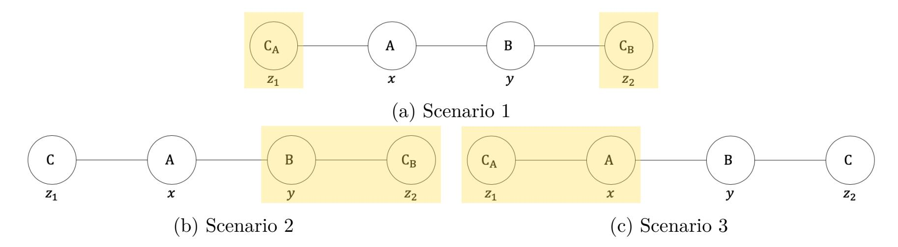
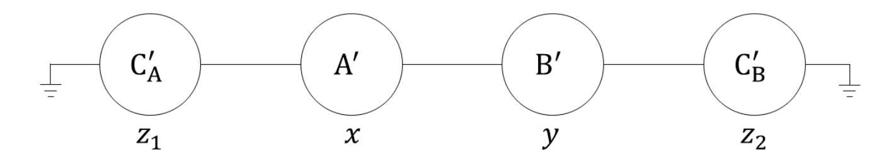
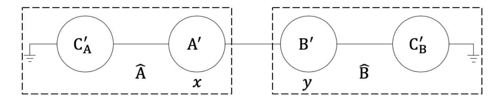

{0}------------------------------------------------

# On the Power of an Honest Majority in Three-Party Computation Without Broadcast∗

Bar Alon† alonbar08@gmail.com

Ran Cohen‡ cohenran@runi.ac.il

Eran Omri† omrier@ariel.ac.il

Tom Suad† tomsuad7@gmail.com

August 2, 2023

#### **Abstract**

Fully secure multiparty computation (MPC) allows a set of parties to compute some function of their inputs, while guaranteeing correctness, privacy, fairness, and output delivery. Understanding the necessary and sufficient assumptions that allow for fully secure MPC is an important goal. [Cleve](#page-32-0) (STOC'86) showed that full security cannot be obtained in general without an honest majority. Conversely, by [Rabin and Ben-Or](#page-33-0) (STOC'89), assuming a broadcast channel and an honest majority enables a fully secure computation of any function.

Our goal is to characterize the set of functionalities that can be computed with full security, assuming an honest majority, but no broadcast. This question was fully answered by [Cohen](#page-32-1) [et al.](#page-32-1) (TCC'16) – for the restricted class of *symmetric* functionalities (where all parties receive the same output). Instructively, their results crucially rely on *agreement* and do not carry over to general *asymmetric* functionalities. In this work, we focus on the case of three-party asymmetric functionalities, providing a variety of necessary and sufficient conditions to enable fully secure computation.

An interesting use-case of our results is *server-aided* computation, where an untrusted server helps two parties to carry out their computation. We show that without a broadcast assumption, the resource of an external non-colluding server provides no additional power. Namely, a functionality can be computed with the help of the server if and only if it can be computed without it. For fair coin tossing, we further show that the optimal bias for three-party (server-aided) *r*-round protocol remains Θ (1*/r*) (as in the two-party setting).

**Keywords: broadcast; point-to-point communication; multiparty computation; coin flipping; impossibility result; honest majority.**

∗A preliminary version of this work appeared in *TCC 2020* [\[3\]](#page-31-0).

†Department of Computer Science, Ariel University. Research supported by ISF grant 152/17, and by the Ariel Cyber Innovation Center in conjunction with the Israel National Cyber directorate in the Prime Minister's Office.

‡Reichman University. Most of this work was done while the author was at Northeastern University, supported by NSF grant 1646671.

{1}------------------------------------------------

# **Contents**

| 1 |                                                                   | Introduction 1                                              |          |  |  |  |
|---|-------------------------------------------------------------------|----------------------------------------------------------------|----------|--|--|--|
|   | 1.1                                                               | Split-Brain Simulatability                                  | 2        |  |  |  |
|   | 1.2                                                               | Our Results                                                 | 3        |  |  |  |
|   | 1.3                                                               | Our Techniques                                              | 6        |  |  |  |
|   | 1.4                                                               | Additional Related Work                                     | 10       |  |  |  |
| 2 | Preliminaries 11                                               |                                                                |          |  |  |  |
|   | 2.1                                                               | Notations                                                   | 11       |  |  |  |
|   | 2.2                                                               | The Model of Computation                                    | 12       |  |  |  |
| 3 | Impossibility Results                                             |                                                                |          |  |  |  |
|   | 3.1                                                               | The Four-Party Protocol                                     | 15       |  |  |  |
|   | 3.2                                                               | Server-Aided Two-Party Computation                          | 19       |  |  |  |
|   | 3.3                                                               | Impossibility Based on Privacy                              | 23       |  |  |  |
| 4 | A Class of Securely Computable Two-Output Functionalities         |                                                                |          |  |  |  |
|   | 4.1                                                               | The Protocol                                                | 24 26 |  |  |  |
|   | 4.2                                                               | Proof of Theorem 4.3                                     | 28       |  |  |  |
|   | 4.3                                                               | Additional Securely Computable Functions                    | 29       |  |  |  |
|   |                                                                   | Bibliography                                                   | 30       |  |  |  |
| A | Generalized Properties of Split-Brain Simulatable Functionalities |                                                                |          |  |  |  |
|   | A.1                                                               | Split-Brain Simulatability as a System of Linear Equations  | 33 33 |  |  |  |

{2}------------------------------------------------

# **1 Introduction**

In the setting of secure multiparty computation [\[39,](#page-34-2) [28,](#page-33-1) [9,](#page-32-2) [16,](#page-32-3) [38\]](#page-33-0), a set of mutually distrustful parties wish to compute a function *f* of their private inputs. The computation should preserve a number of security properties even facing a subset of colluding cheating parties, such as: *correctness* (cheating parties can only affect the output by choosing their inputs), *privacy* (nothing but the specified output is learned), *fairness* (all parties receive an output or none do), and even *guaranteed output delivery* (meaning that all honestly behaving parties always learn an output). Informally speaking, a protocol *π* computes a functionality *f* with *full security* if it provides all of the above security properties.[1](#page-2-1)

In the late 1980's, it was shown that every function can be computed with full security in the presence of malicious adversaries corrupting a strict minority of the parties, assuming the existence of a *broadcast communication channel* (such a channel allows any party to reliably send its message to all other parties, guaranteeing that all parties receive the same message) and pairwise private channels (that can be established over broadcast using standard cryptographic techniques) [\[9,](#page-32-2) [38\]](#page-33-0). On the other hand, a well-known lower bound by Cleve [\[17\]](#page-32-0) shows that if an honest majority is not assumed, then *fairness* cannot be guaranteed in general (even assuming a broadcast channel). More specifically, [Cleve'](#page-32-0)s result showed that given a two-party, *r*-round coin-tossing protocol, there exists an (efficient) adversarial strategy that can bias the output bit by Ω(1*/r*).

Conversely, a second well-known lower bound from the 1980's shows that in the plain model (i.e., without setup/proof-of-work assumptions), no protocol for computing broadcast can tolerate corruptions of one third of the parties [\[37,](#page-33-2) [34,](#page-33-3) [22\]](#page-32-4).

This leads us to the main question studied in this paper:

*What is the power of the honest-majority assumption in a model where parties cannot broadcast?*

Namely, we set to characterize the set of *n*-party functionalities that can be computed with full security over point-to-point channels in the plain model (i.e., without broadcast), in the face of malicious adversaries, corrupting up to *t* parties, where *n/*3 ≤ *t < n/*2.

Cohen et al. [\[19\]](#page-32-1) answered the above question for *symmetric functionalities*, where all parties obtain the same common output from the computation. They showed that, in the plain model over point-to-point channels, a function *f* can be computed with full security if and only if *f* is (*n* − 2*t*)*-dominated*, i.e., there exists a value *y* ∗ such that any *n* − 2*t* of the inputs can determine the output of *f* to be *y* ∗ (for example, Boolean OR is 1-dominated since any input can be set to 1, forcing the output to be 1). They further showed that there is no *n*-party, d*n/*3e-secure, *δ*-bias coin-tossing protocol, for any *δ <* 1*/*2.

The results in [\[19\]](#page-32-1) leave open the setting of *asymmetric functionalities*, where each party computes a different function over the same inputs. Such functionalities include symmetric computations as a special case, but they are more general since the output that each party receives may be considered private and some parties may not even receive any output. Specifically, the lower bound from [\[19\]](#page-32-1) does not translate into the asymmetric setting, as it crucially relies on a *consistency* requirement on the protocol, ensuring that all honest parties output the same value.

Asymmetric computations are very natural in the context of MPC in general, however, the following two use-cases are of particular interest:

1The notion of full security is formally captured via the real vs. ideal paradigm, where the protocol is said to be secure if it emulates some ideal setting, in which the capabilities of the adversary are very limited.

{3}------------------------------------------------

*Server-aided computation:* Augmenting a two-party computation with a (potentially untrusted) server that provides no input and obtains no output has proven to be a very useful paradigm in overcoming lower bounds, even when the server may collude with one of the parties as in the case of optimistic fairness [\[6,](#page-32-5) [14\]](#page-32-6). In the broadcast model, considering a *non-colluding* server is a real game changer, as it enables two parties to compute *any* function with full security. In our setting, where broadcast is not available, we explore to what extent a noncolluding server can boost the security of two-party computation. For the specific task of coin tossing we ask: "can two parties use a non-colluding third party to help them toss a coin?"

*Computation with solitary output:* Halevi et al. [\[32\]](#page-33-4) studied computations in which only a single party obtains the output, e.g., a server that learns a function of the inputs of two clients. The focus of [\[32\]](#page-33-4) was on the broadcast model with a dishonest majority, and they showed a variety of feasibility and infeasibility results. In this work we consider a model without broadcast but with an honest majority, which reopens the feasibility question. Fitzi et al. [\[25\]](#page-33-5) showed that if the three-party solitary-output functionality *convergecast*[2](#page-3-1) can be securely computed facing a single corruption, then so can the broadcast functionality; thus, proving the impossibility of securely computing convergecast in our setting. In this work, we extend the exploration of the set of securely computable solitary-output functionalities.

### **1.1 Split-Brain Simulatability**

In this paper, we focus on general asymmetric three-party functionalities, where party A with input *x*, party B with input *y*, and party C with input *z*, compute a functionality *f* = (*f*1*, f*2*, f*3). The output of A is *f*1(*x, y, z*), the output of B is *f*2(*x, y, z*), and the output of C is *f*3(*x, y, z*). We will also consider the special cases of *two-output functionalities* where only A and B receive output (meaning that *f*3 is degenerate), and of *solitary-output functionalities* where only A receives output (meaning that *f*2 and *f*3 are degenerate).

Our main technical contribution is adapting the so called *split-brain argument*, which was previously used in the context of Byzantine agreement [\[21,](#page-32-7) [12,](#page-32-8) [11\]](#page-32-9) (where privacy is not required, but agreement must be guaranteed) to the setting of MPC. Indeed, aiming at full security, we are able to broaden the collection of infeasible functionalities. In particular, our results apply to the setting where the parties do not necessarily agree on a common output.

In Section [1.3](#page-7-0) we provide a more detailed overview of the split-brain attack, however, the core idea can be explained as follows. Let *f* = (*f*1*, f*2*, f*3) be an asymmetric (possibly randomized) three-party functionality and let *π* be a secure protocol computing *f* over point-to-point channels, tolerating a single corruption. For the sake of simplicity of the presentation, in the remaining of this introduction we only consider perfect security and functionalities with finite domain and range. A formal treatment for general functionalities and computational security is given in Section [3.1.](#page-16-0) Consider the following two scenarios:

• A corrupted (split-brain) party C playing two independent interactions: in the *first* interaction, C interacts with A on input *z*1 acting as if it never received any incoming messages from B, and in the *second* interaction, C interacts with B on input *z*2, acting as if it never received any incoming messages from A.

2Convergecast [\[25\]](#page-33-5) is a three-party functionality where two of the parties start with a non-Boolean input, and the receiver learns exactly one of the input values. The receiver does not learn anything about the other input, and none of the senders learns the receiver's choice as well as the input of the other sender.

{4}------------------------------------------------

• A corrupted party A internally emulating a first interaction of the above split-brain C: A interacts with B, ignoring all incoming messages from the honest C; instead, A emulates in its head the above (first-interaction) C on input *z*1 (This part of the attack relies on the notrusted-setup assumption, and on the fact that emulating C requires no interaction with B).

Clearly, the view of party B is identically distributed in both of these scenarios; hence, its output must be identically distributed as well. Note that by symmetry, an attacker B can be defined analogously to the above A, causing the output of an honest A to distribute as when interacting with the split-brain C.

By the assumed security of the protocol *π*, each of the three attacks described above can be simulated in an ideal world where a trusted party computes *f* for the parties. Since the only power the simulator has in the ideal world is to choose the input for the corrupted party, we can capture the properties that the functionality *f* must satisfy to enable the existence of such simulators via the following definition.

**Definition 1.1** (CSB-simulatability, informal)**.** *A three-party functionality f* = (*f*1*, f*2*, f*3) *is* Csplit-brain (CSB) simulatable *if for every quadruple* (*x, y, z*1*, z*2)*, there exist a distribution Px,z*1 *over the inputs of* A*, a distribution Qy,z*2 *over the inputs of* B*, and a distribution Rz*1*,z*2 *over the inputs of* C*, such that*

$$f_1(x, y^*, z_1) \equiv f_1(x, y, z^*)$$
 and  $f_2(x^*, y, z_2) \equiv f_2(x, y, z^*),$ 

*where x* ∗ ← *Px,z*1 *, y* ∗ ← *Qy,z*2 *, and z* ∗ ← *Rz*1*,z*2 *.*

### **1.2 Our Results**

Using the notion of split-brain simulatability, mentioned in Section [1.1,](#page-3-0) we present several necessary conditions for an asymmetric three-party functionality to be securely computable without broadcast while tolerating a single corruption. We also present a sufficient condition for two-output functionalities (including solitary-output functionalities as a special case); the latter result captures and generalizes previously known feasibility results in this setting, including 1-dominated functionalities [\[18,](#page-32-10) [19\]](#page-32-1) and fair two-party functionalities [\[5\]](#page-31-2). Examples illustrating the implications of these theorems for different functionalities is provided in Table [1.](#page-7-1)

**Impossibility results.** Our first impossibility result asserts that CSB simulatability is a necessary condition for securely computing a three-party functionality in our setting.

**Theorem 1.2** (necessity of split-brain simulatability, informal)**.** *A three-party functionality that can be securely computed over point-to-point channels, tolerating a single corruption, must be CSB simulatable.*

We can define A-split-brain and B-split-brain simulatability analogously, thus providing additional necessary conditions for secure computation. For a formal statement and proof we refer the reader to Section [3.1.](#page-16-0)

To illustrate the usefulness of the theorem, consider the two-output functionality where *f*1 = *f*2 are defined as *f*1 (*x, y, z*) = (*x* ∧ *y*) ⊕ *z*. Note that since *f*3 is degenerate, this functionality is not symmetric and therefore the lower bound from [\[19\]](#page-32-1) does not rule it out. We next show that *f* is *not* CSB simulatable, and hence, cannot be securely computed. Clearly, input 0 for A and C will 

{5}------------------------------------------------

fix the output to be 0, whereas input 0 for B and input 1 for C will fix the output to be 1. Since  $f_1 = f_2$ , the CSB simulatability of f would require that for the quadruple x = 0, y = 0,  $z_1 = 0$ , and  $z_2 = 1$ , there exist distributions for sampling  $x^*$  and  $y^*$  such that

$$0 \equiv f_1(0, y^*, 0) \equiv f_1(x^*, 0, 1) \equiv 1.$$

This leads to a contradiction.

Our second result, is in the *server-aided* model, where only A and B provide input and receive output. We show that in this model, a functionality can be computed with the help of C if and only if it can be computed without C. In the theorem below we denote by  $\lambda$  the empty string.

**Theorem 1.3** (server-aided computation is as strong as two-party computation, informal). Let f be a three-party functionality where C has no input and no output. Then, f can be securely computed over point-to-point channels tolerating a single corruption if and only if the induced two-party functionality  $g(x,y) = f(x,y,\lambda)$  can be computed with full security.

An immediate corollary from Theorem 1.3 is that a non-colluding third party cannot help the two parties to toss a fair coin. In fact, if C cannot attack the protocol (i.e., C cannot bias the output coin), then the attack that is guaranteed by Cleve [17] (on the implied two-party protocol) can be directly translated to an attack on the three-party protocol, corrupting either A or B. Stated differently, either A or B can bias the output by  $\Omega(1/r)$ , where r is the number of rounds in the protocol. However, the above argument does not deal with protocols that allow a corrupt C to slightly bias the output. For example, one might try to construct a protocol where every party (including C) can bias the output by at most  $1/r^2$ . We strengthen the result for coin tossing, showing that this is in fact impossible.

**Theorem 1.4** (implication to coin tossing, informal). Consider a three-party, two-output, r-round coin-tossing protocol. Then, there exists an adversary corrupting a single party that can bias the output by  $\Omega(1/r)$ .

As a result, letting A and B run the protocol of Moran et al. [36] constitutes an optimally fair (up to a constant) coin-tossing protocol.

We note that using a standard player-partitioning argument, the impossibility result extends to n-party r-round coin-tossing protocols, where two parties receive the output. Specifically, there exists an adversary corrupting  $\lceil n/3 \rceil$  parties that can bias the output by  $\Omega(1/r)$ . Further, using [19, Lem. 4.10] we rule out any non-trivial n-party coin-tossing where three parties receive the output.

Another immediate corollary from Theorem 1.3 is that two-output functionalities that imply coin-tossing are not securely computable, even if C has an input. For example, the XOR function  $(x, y, z) \mapsto x \oplus y \oplus z$  is not computable facing one corruption. For a formal treatment of server-aided computation, see Section 3.2.

Our third impossibility result presents two solitary-output functionalities, where only one party gets output, that are not captured by Theorems 1.2 to 1.4. Interestingly, unlike the previous results, here we make use of the *privacy* requirement on the protocol for obtaining the proof. We refer the reader to Section 1.3 below for an intuitive explanation, and Section 3.3 for a formal proof.

**Theorem 1.5** (Informal). Let f be a solitary-output three-party functionality where  $f_1(x, y, z) = (x \wedge y) \oplus z$  (equivalently,  $f_1(x, y, z) = (x \oplus y) \wedge z$ ). Then, f cannot be securely computed over point-to-point channels tolerating a single corruption.

{6}------------------------------------------------

**Feasibility results.** We proceed to state our sufficient condition. We present a class of twooutput functionalities f that can be computed with full security. For the sake of simplifying the presentation of the introduction, we assume that  $f = (f_1, f_2)$  is a two-output functionality with  $f_1 \equiv f_2$ . Interestingly, our result shows that if f is CSB simulatable, then under a simple condition that a related two-party functionality needs to satisfy, the problem is reduced to the two-party case. In the related two-party functionality, the first party holds x and x, while the second party holds x and x, and is defined as x, and is defined as x, where x, where x, where x is sampled as in the requirement of CSB simulatability.

Roughly, we require that there exist two distributions, for  $z_1$  and  $z_2$  respectively, such that the input  $z_1$  can be sampled in a way that fixes the distribution of the output of f' to be independent of  $z_2$ , and similarly, that the input  $z_2$  can be sampled in a way that fixes the distribution of the output of f' to be independent of  $z_1$ . Specifically, we prove the following.

**Theorem 1.6** (Informal). Let f be a CSB-simulatable three-party, two-output functionality, where  $f_1 \equiv f_2$ . Define the two-party functionality f' as  $f'((x, z_1), (y, z_2)) = f(x, y, z^*)$ , where  $z^* \leftarrow R_{z_1, z_2}$ . Assume that there exists a randomized two-party functionality  $g = (g_1, g_2)$  and two distributions  $R_1$  and  $R_2$  over C's inputs such that for every  $x, y, z \in \{0, 1\}^*$  it holds that

$$g(x,y) \equiv f'((x,z_1),(y,z)) \equiv f'((x,z),(y,z_2)),$$

where  $z_1 \leftarrow R_1$  and  $z_2 \leftarrow R_2$ .

If g can be securely computed with full security then f can be securely computed with full security over point-to-point channels tolerating a single corruption.

The idea behind the protocol is as follows. First, by the honest-majority assumption, the parties can compute f with guaranteed output delivery assuming a broadcast channel [38]. By [18] it follows that they can compute f with fairness without using broadcast. If the parties receive an output, they can terminate; otherwise, A and B compute g using their inputs, ignoring C in the process (even if it is honest).

Intuitively, the existence of  $R_1$  and  $R_2$  allows the simulators of a corrupt A or a corrupt B, to "force" a computation of g in the ideal world of f; that is, the output will be independent of the input of C. To see this, consider a corrupt A and let  $z_1 \leftarrow R_1$ . Then, by the CSB simulatability assumption, sending  $x^* \leftarrow P_{x,z_1}$  to the trusted party results in the output being

$$f(x^*, y, z) \equiv f(x, y, z^*) \equiv f'((x, z_1), (y, z)) \equiv g(x, y),$$

where  $z^* \leftarrow R_{z_1,z}$ .

In Section 1.3 below we give a more detailed overview of the proof. In Section 4 we present the formal statement and proof of the theorem, alongside the generalization to case where  $f_1$  and  $f_2$  are not necessarily equal.

We briefly describe a few classes of functions that are captured by Theorem 1.6. First, observe that the class of functionalities satisfying the above conditions contains the class of 1-dominated functionalities [19]. To see this, notice that  $x^*$ ,  $y^*$ , and  $z^*$  can be sampled in a way that always fixes the output of f to be some value  $w^*$ . Then, any choice of  $R_1$  and  $R_2$  will do. Furthermore, observe that the resulting two-party functionality g will always be the constant function, with the output being  $w^*$ .

Another class of functions captured by the theorem is the class of fair two-party functionalities. For such functionalities the distributions  $R_{z_1,z_2}$ ,  $R_1$ , and  $R_2$  can be degenerate, as  $z^*$ ,  $z_1$ , and  $z_2$  play

{7}------------------------------------------------

no role in the computation of f and f'. Additionally, taking  $x^* = x$  and  $y^* = y$  with probability 1 will satisfy the CSB simulatability constraint.

As mentioned earlier, in Section 4 we provide a more general version of Theorem 1.6 which allows for  $f_1$  and  $f_2$  to be different functions; in particular, this captures solitary functions. As an example, we show that the solitary XOR function  $f(x,y,z) = x \oplus y \oplus z$  (which is *not* 1-dominated) can also be computed in this setting. We further show in Section 4.3 that the solitary functions  $x \wedge (y \oplus z)$  and  $x \oplus (y \wedge z)$  can also be securely computed.

Finally, there are even two-output functionalities that are not 1-dominated, yet are still captured by Theorem 1.6. For example, consider the following three-party variant of the GHKL function [29], denoted 3P-GHKL: let  $f = (f_1, f_2)$ , where  $f_1, f_2 : \{0, 1, 2\} \times \{0, 1\} \times \{0, 1\} \mapsto \{0, 1\}$ . The functionality is defined by the following two matrices

$$M_0 = \begin{pmatrix} 0 & 1 \\ 1 & 0 \\ 1 & 1 \end{pmatrix} \qquad M_1 = \begin{pmatrix} 1 & 0 \\ 0 & 1 \\ 1 & 1 \end{pmatrix}$$

where  $f_1(x, y, z) = f_2(x, y, z) = M_z(x, y)$ . That is, A's input determines a row, B's input determines a column, and C's input determines the matrix. For the above functionality, sampling  $y^*$  and  $z^*$  uniformly at random, and taking  $x^* = x$  if x = 2 and a uniform bit otherwise, will always generate an output that is equal to 1 if x = 2 and a uniform bit otherwise. See Section 4.1 for more details.

| functionality                                                         | A outputs                           | A, B output                                                        | A, B, C output                    |
|-----------------------------------------------------------------------|-------------------------------------|--------------------------------------------------------------------|-----------------------------------|
| $x \wedge y \wedge z$                                                 | <b>✓</b> [18]                       | <b>✓</b> [18]                                                      | <b>✓</b> [18]                     |
|                                                                       | <b>X</b> Thm 1.5                    | X Thm 1.2 (also 1.5)                                               | <b>X</b> [19] (also Thm 1.2, 1.5) |
| $x \oplus y \oplus z \ x \wedge (y \oplus z) \ x \oplus (y \wedge z)$ | ✓ Sec 4                             | <b>X</b> Thm 1.3                                                   | <b>X</b> [19] (also Thm 1.3)      |
| 3P-GHKL                                                               | ✓ Sec 4                             | ✓ Thm 1.6                                                          | <b>X</b> [19]                     |
| $\delta$ -bias coin tossing                                           | $\checkmark$ $\delta = 0$ (trivial) | $\delta = \Theta(1/r) \ [36]$ $\delta = o(1/r), \ {\rm Thm} \ 1.4$ | $\delta < 1/2 \ [19]$             |

Table 1: Summarizing the feasibility of interesting three-party functionalities tolerating one corruption. The second column considers the solitary output case where only A receives the output, the third the two-output case where both A and B receive the same output, and the last column the case where all parties receive the same output.

### 1.3 Our Techniques

We now turn to describe our techniques, starting with our impossibility results. The core argument in all of our proofs, is the use of an adaptation of the split-brain argument [21, 12, 11] to the MPC setting.

{8}------------------------------------------------

**The** C**-split-brain argument.** In the following, let *f* be a three-party functionality and let *π* be a protocol computing *f* with full security over point-to-point channels, tolerating a single corrupted party. Consider the following three attack-scenarios with inputs *x, y, z*1*, z*2 depicted in Figure [1.](#page-8-0)

Figure 1: Three adversaries of the C-split-brain attack. The shaded yellow areas in each scenario correspond to the (virtual) parties the adversary controls.

**Scenario 1:** Parties A and B both play honestly on inputs *x* and *y* respectively. The adversary corrupts C and applies the *split-brain attack*, that is, it emulates in its head two virtual copies of C, denoted CA and CB. CA interacts with A as an honest C would on input *z*1 as if it never received messages from B, and CB interacts with B as an honest C would on input *z*2 as if it never received messages from A.

By the assumed security of *π*, there exists a simulator for the corrupted C. This simulator defines a distribution over the input it sends to the trusted party. Thus, the outputs of A and B in this case must equal to *f*1(*x, y, z*∗ ) and *f*2(*x, y, z*∗ ), respectively, where *z* ∗ is sampled according to some distribution that depends only on *z*1 and *z*2.

**Scenario 2:** Party A plays honestly on input *x* and party C plays honestly on input *z*1. The adversary corrupts party B, ignoring all incoming messages from C and not sending it any messages. Instead, the adversary emulates in its head the virtual party CB as in Scenario 1, that plays honestly on input *z*2 as if it never received any message from A. Additionally, the adversary instructs B to play honestly in this setting.

As in Scenario 1, by the assumed security of *π*, the output of A in this case must equal *f*1(*x, y*∗ *, z*1), where *y* ∗ is sampled according to some distribution that depends only on *y* and *z*2.

**Scenario 3:** This is analogous to Scenario 2. Party B plays honestly on input *y* and party C plays honestly on input *z*2. The adversary corrupts party A, ignoring all incoming messages from C and not sending it any messages. Similarly to Scenario 2, the adversary emulates in its head the virtual CA, that plays honestly on input *z*1 as if it never received any message from B, and instructs A to plays honestly in this setting.

As in the previous two scenarios, the output of B must equal *f*2(*x* ∗ *, y, z*2), where *x* ∗ is sampled according to some distribution that depends only on *x* and *z*1.

Observe that the view of the honest A in Scenario 1 is identically distributed as its view in Scenario 2; hence the same holds with respect to its output, i.e., *f*1(*x, y*∗ *, z*1) ≡ *f*1(*x, y, z*∗ ). Similarly, the view of the honest B in Scenario 1 is identically distributed as its view Scenario 3; 

{9}------------------------------------------------

hence,  $f_2(x^*, y, z_2) \equiv f_2(x, y, z^*)$ . This proves the necessity of C-split-brain simulatability (i.e., Theorem 1.2).

The four-party protocol. A nice way to formalize the above argument is by constructing a four-party protocol  $\pi'$  from the three-party protocol  $\pi$ , where two different parties play the role of C (see Figure 2). In more detail, define the four-party protocol  $\pi'$ , with parties A', B', C'A, and C'B, as follows. Party A' follows the code of A, party B' follows the code of B, and parties C'A and C'B follow the code of C.

The parties are connected on a path where (1)  $C'_A$  is the leftmost node, and is connected only to A', (2)  $C'_B$  is the rightmost node, and is connected only to B', and (3) A' and B' are also connected to each other. The second communication line of party  $C'_A$  is "disconnected" in the sense that  $C'_A$  is sending the messages as instructed by the protocol, but the messages arrive at a "sink" that does not send any messages back. Stated differently, the view of  $C'_A$  corresponds to the view of an honest C in  $\pi$  that never received any message from B. Similarly, the second communication line of party  $C'_B$  is "disconnected," and its view corresponds to the view of an honest C in  $\pi$  that never receives any message from A.

Figure 2: The induced four-party protocol

**Server-aided computation.** We now make use of the four-party protocol to sketch the proof of Theorem 1.3. Recall that here we consider the server-aided model, where C (the server) has no input and obtains no output. Observe that under the assumption that  $\pi$  securely computes f, it follows that the four-party protocol  $\pi'$  correctly computes the two-output four-party functionality  $f'(x,y,\lambda,\lambda) := f(x,y,\lambda)$ , where  $\lambda$  is the empty string, as otherwise C could emulate  $C'_A$  and  $C'_B$  in its head and force A and B to output an incorrect value.

Next, consider the following two-party protocol  $\widehat{\pi}$  where each of two pairs  $\{A', C'_A\}$  and  $\{B', C'_B\}$ , is emulated by a single entity,  $\widehat{A}$  and  $\widehat{B}$  respectively, as depicted in Figure 3. Observe that the protocol computes the two-party functionality  $g(x,y) := f'(x,y,\lambda,\lambda) = f(x,y,\lambda)$ . Furthermore, it computes g securely, since any adversary for the two-party protocol directly translates to an adversary for the three-party protocol corrupting either A or B. Moreover, since C does not have an input, the simulators of those adversaries in  $\pi$  can be directly translated to simulators for the adversaries in  $\widehat{\pi}$ . Thus, f can be computed with the help of C if and only if it can be computed without C.

The proof of Theorem 1.4, i.e., that the optimal bias for the server-aided coin-tossing protocol is  $\Theta(1/r)$ , extends the above analysis. We show that for any r-round server-aided coin-tossing protocol  $\pi$  there exists a constant c and an adversary that can bias the output by at least 1/cr. Roughly, assuming that party C cannot bias the output of  $\pi$  by more than 1/cr, the output of A' and B' in the four-party protocol is a common bit that is (1/cr)-close to being uniform. Therefore, the same holds with respect to the outputs of  $\widehat{A}$  and  $\widehat{B}$  in the two-party protocol. Now, we can

{10}------------------------------------------------

Figure 3: The induced two-party protocol

apply the result of Agrawal and Prabhakaran [1], which generalizes Cleve's [17] result to a general two-party sampling functionality. Their result provides an adversary for the two-party functionality that can bias by 1/dr for some constant d. Finally, we can emulate their adversary in the three party protocol as depicted in Scenarios 2 and 3. For sufficiently large c (specifically, c > 2d), the bias resulting from emulating the adversaries for the two-party protocol will be at least 1/cr.

Impossibility based on privacy. We next sketch the proof of Theorem 1.5. That is, the solitary-output functionalities  $f_1(x,y,z) = (x \wedge y) \oplus z$  and  $f_1(x,y,z) = (x \oplus y) \wedge z$  cannot be computed in our setting. We prove it only for the case where the output of A is defined to be  $f_1(x,y,z) = (x \wedge y) \oplus z$ . The other case is proved using a similar analysis. The proof starts from the C-split-brain argument used in the proof of Theorem 1.2. Assume for the sake of contradiction that  $\pi$  computes f with perfect security. First, let us consider the following two scenarios.

- C is corrupted as in Scenario 1, i.e., it applies the split-brain attack with inputs  $z_1$  and  $z_2$ . By the security of  $\pi$ , the output of A in this case is  $(x \wedge y) \oplus z^*$ , for some  $z^*$  that is sampled according some distribution that depends on  $z_1$  and  $z_2$ .
- B is corrupted as in Scenario 2, i.e., it imagines that it interacts with  $C_B$  with input  $z_2$  that does not receive any message from A. In this case, the output of A is  $(x \wedge y^*) \oplus z_1$ , where  $z_1$  is the input of the real C, and  $y^*$  is sampled according some distribution that depends on y and  $z_2$ .

By Theorem 1.2 these two distributions are identically distributed for all  $x \in \{0,1\}$ . Notice that setting x = 0 yields  $z^* = z_1$  and that setting x = 1 yields  $y^* \oplus z_1 = y \oplus z^*$ , hence  $y^* = y$ . Therefore, the output of A in both scenarios is  $(x \wedge y) \oplus z_1$ .

Finally, consider an execution of  $\pi$  over random inputs y for B and z for C, where A is corrupted as in Scenario 2, and it emulates  $C'_A$  on input  $z_1$ . Since its view is exactly the same as in the other two scenarios, it can compute  $(x \wedge y) \oplus z_1$ . However, in this scenario A can choose x = 1 and  $z_1 = 0$  and thus learn y. In the ideal world, however, A cannot guess y with probability better than 1/2, as the output it sees is  $(x \wedge y) \oplus z$  for random y and z. Hence, we have a contradiction to the security of  $\pi$ .

A protocol for computing certain two-output functionalities. Finally, We describe the idea behind the proof of Theorem 1.6. First, by the honest-majority assumption, the protocol of Rabin and Ben-Or [38] computes f assuming a broadcast channel; by [18] it follows that f can be computed with fairness over a point-to-point network. We now describe the protocol. The parties start by computing f with fairness. If they receive outputs, then they can terminate, and output what they received. If the protocol aborts, then A and B compute g with their original inputs using

{11}------------------------------------------------

a protocol that guarantees output delivery (such a protocol exists by assumption), and output whatever outcome is computed. Clearly, a corrupt C cannot attack the protocol. Indeed, it does not gain any information in the fair computation of f; hence, if it aborts in this phase then the output of A on input x and B on input y will be  $g(x,y) = f'(x,z_1), (y,z_1) = f(x,y,z_1)$ , where  $z_1 \leftarrow R_1$  and  $z^* \leftarrow R_{z_1,z}$ .

We next consider a corrupt A (the case of a corrupt B is analogous). The idea is to take the distribution over the inputs used by the two-party simulator, and translate it into an appropriate distribution for the three-party simulator. That is, regardless of the input of C, the output of the parties will be distributed exactly the same as in the ideal world for the two-party computation (recall that for simplicity of the introduction we assume A and B receive the same output). To see how this can be done, consider a sample  $z_1 \leftarrow R_1$  and let x' be the input sent by the two-party simulator to its trusted party. The three-party simulator will send to the trusted party the sample  $x^* \leftarrow P_{x',z_1}$ . Then, by the CSB simulatability constraint, it follows that the output will be  $f(x^*,y,z) \equiv f(x',y,z^*)$ , where  $z^* \leftarrow R_{z_1,z}$ . However, by the requirement from the two-party functionality g, it follows that  $g(x',y) \equiv f(x',y,z^*)$ ; hence, the output in the three-party ideal-world of f is identically distributed to the two-party ideal-world of g.

#### 1.4 Additional Related Work

The split-brain argument has been used in the context of Byzantine agreement (BA) to rule out three-party protocols tolerating one corruption in various settings: over asynchronous networks [12] and partially synchronous networks [21], even with trusted setup assumptions such a public-key infrastructure (PKI), as well as over synchronous networks with weak forms of PKI [11]. The argument was mainly used by considering three parties (A, B, C) where party A starts with 0, party B starts with 1, and party C plays towards A with 0 and towards B with 1. By the *validity* property of BA it is shown that A must output 0 and B must output 1, which contradicts the *agreement* property. Our usage of the split-brain argument is different as it considers (1) *asymmetric* computations where parties do not agree on the output (and so we do not rely on violating agreement) and (2) *privacy-aware* computations that do not reveal anything beyond the prescribed output (as opposed to BA which is a privacy-free computation).

For the case of symmetric functionalities Cohen et al. [19] showed that f(x, y, z) can be securely computed with guaranteed output delivery over point-to-point channels if and only if f is 1-dominated. Their lower bound followed the classical Hexagon argument of Fischer et al. [22] that was used for various consensus problems. Starting with a secure protocol  $\pi$  for f tolerating one corruption, they constructed a sufficiently large ring system where all nodes are guaranteed to output the same value (by reducing to the agreement property of f). Since the ring is sufficiently large (larger than the number of rounds in  $\pi$ ), information from one side could not reach the other side. Combining these two properties yields an attacker that can fix some output value on one side of the ring, and force all nodes to output this value — in particular, when attacking  $\pi$ , the two honest parties participate in the ring (without knowing it) and so their output is fixed by the attacker. We note that this argument completely breaks when considering asymmetric functionalities, since it no longer holds that the nodes on the ring output the same value.

Cohen and Lindell [18] showed that any functionality that can be computed with guaranteed output delivery in the broadcast model can also be computed with *fairness* over point-to-point channels (using detectable broadcast protocols [23, 24]); as a special case, any functionality can be computed with fairness assuming an honest majority. Indeed, our lower bounds do not hold when

{12}------------------------------------------------

the parties are allowed to abort upon detecting cheats, and rely on robustness of the protocol.

Recently, Garay et al. [\[26\]](#page-33-10) showed how to compute every function in the honest-majority setting without broadcast or PKI, by restricting the power of the adversary in a proof-of-work fashion. This result falls outside our model as we consider the standard model without posing any restrictions on the resources of the adversary.

The possibility of obtaining fully secure protocols for non-trivial functions in the two-party setting (i.e., with no honest majority) was first investigated by Gordon et al. [\[29\]](#page-33-7). The showed that, surprisingly, such protocols do exist, even for functionalities with an embedded XOR. The feasibility and infeasibility results of [\[29\]](#page-33-7) were substantially generalized in the works [\[4,](#page-31-4) [35\]](#page-33-11). The set of Boolean functionalities that are computable with full security was characterized in [\[5\]](#page-31-2).

The breakthrough result of Moran et al. [\[36\]](#page-33-6), who gave an optimally fair two-party coin-tossing protocol, paved the way to a long line of research on optimally fair coin-tossing. Positive results for the multiparty setting (with no honest majority) where given [\[7,](#page-32-11) [30,](#page-33-12) [2,](#page-31-5) [13,](#page-32-12) [20\]](#page-32-13) alongside some new lower-bounds [\[8,](#page-32-14) [31\]](#page-33-13).

### **Organization**

In Section [2](#page-12-0) we present the required preliminaries and formally define the model we consider. Then, in Section [3](#page-15-0) we present our impossibility results. Finally, in Section [4](#page-25-0) we prove our positive results.

# **2 Preliminaries**

### **2.1 Notations**

We use calligraphic letters to denote sets, uppercase for random variables and distributions, lowercase for values, and we use bold characters to denote vectors. For *n* ∈ N, let [*n*] = {1*,* 2 *. . . n*}. For a set S we write *s* ← S to indicate that *s* is selected uniformly at random from S. Given a random variable (or a distribution) *X*, we write *x* ← *X* to indicate that *x* is selected according to *X*. A ppt is probabilistic polynomial time, and a pptm is a ppt (interactive) Turing machine. We let *λ* be the empty string.

A function *µ*: N → [0*,* 1] is called negligible, if for every positive polynomial *p*(·) and all sufficiently large *n*, it holds that *µ*(*n*) *<* 1*/p*(*n*). For a randomized function (or an algorithm) *f* we write *f*(*x*) to denote the random variable induced by the function on input *x*, and write *f*(*x*; *r*) to denote the value when the randomness of *f* is fixed to *r*. For a 2-ary function *f* and an input *x*, we denote by *f*(*x,* ·) the function *fx*(*y*) . .= *f*(*x, y*). Similarly, for an input *y* we let *f*(·*, y*) be the function *fy*(*x*) . .= *f*(*x, y*). We extend the notations for *n*-ary functions in a straightforward way.

A *distribution ensemble X* = {*Xa,n*}*a*∈D*n,n*∈N is an infinite sequence of random variables indexed by *a* ∈ D*n* and *n* ∈ N, where D*n* is a domain that might depend on *n*. The statistical distance between two finite distributions is defined as follows.

**Definition 2.1.** *The statistical distance between two finite random variables X and Y is*

$$SD(X,Y) = \frac{1}{2} \sum_{a} |Pr[X = a] - Pr[Y = a]|.$$

*For a function ε* : N 7→ [0*,* 1]*, the two ensembles X* = {*Xa,n*}*a*∈D*n,n*∈N *and Y* = {*Ya,n*}*a*∈D*n,n*∈N *are said to be ε-close, if for all large enough n and a* ∈ D*n, it holds that*

$$SD(X_{a,n}, Y_{a,n}) \le \varepsilon(n),$$

{13}------------------------------------------------

*and are said to be ε-far otherwise. X and Y are said to be* statistically close*, denoted X S* ≡ *Y , if they are ε-close for some negligible function ε. If X and Y are 0-close then they are said to be equivalent, denoted X* ≡ *Y .*

Computational indistinguishability is defined as follows.

**Definition 2.2.** *Let X* = {*Xa,n*}*a*∈D*n,n*∈N *and Y* = {*Ya,n*}*a*∈D*n,n*∈N *be two ensembles. We say that X and Y are computationally indistinguishable, denoted X C* ≡ *Y , if for every non-uniform* ppt *distinguisher* D*, there exists a negligible function µ*(·)*, such that for all n and a* ∈ D*n, it holds that*

$$|\Pr[\mathsf{D}(X_{a,n}) = 1] - \Pr[\mathsf{D}(Y_{a,n}) = 1]| \le \mu(n).$$

### **2.2 The Model of Computation**

We provide the basic definitions for secure multiparty computation according to the real/ideal paradigm, for further details see [\[27\]](#page-33-14). Intuitively, a protocol is considered secure if whatever an adversary can do in the real execution of protocol, can be done also in an ideal computation, in which an uncorrupted trusted party assists the computation. For concreteness, we present the model and the security definition for three-party computation with an adversary corrupting a single party, as this is the main focus of this work. We refer to [\[27\]](#page-33-14) for the general definition.

### **The Real Model**

A three-party protocol *π* is defined by a set of three ppt interactive Turing machines A, B, and C. Each Turing machine (party) holds at the beginning of the execution the common security parameter 1 *κ* , a private input, and random coins. The *adversary* Adv is a *non-uniform* ppt interactive Turing machine, receiving an auxiliary information aux ∈ {0*,* 1} ∗ , describing the behavior of a corrupted party P ∈ {A*,* B*,* C}. It starts the execution with input that contains the identity of the corrupted party, its input, and an additional auxiliary input aux.

The parties execute the protocol over a synchronous network. That is, the execution proceeds in rounds: each round consists of a *send phase* (where parties send their messages for this round) followed by a *receive phase* (where they receive messages from other parties). The adversary is assumed to be *rushing*, which means that it can see the messages the honest parties send in a round before determining the messages that the corrupted parties send in that round.

We consider a fully connected point-to-point network, where every pair of parties is connected by a communication line. We will consider the *secure-channels* model, where the communication lines are assumed to be ideally private (and thus the adversary cannot read or modify messages sent between two honest parties). We assume the parties *do not* have access to a broadcast channel, and no preprocessing phase (such as a public-key infrastructure that can be used to construct a broadcast protocol) is available. We note that our upper bounds (protocols) can also be stated in the *authenticated-channels* model, where the communication lines are assumed to be ideally authenticated but not private (and thus the adversary cannot modify messages sent between two honest parties but can read them) via standard techniques, assuming public-key encryption. On the other hand, stating our lower bounds assuming secure channels will provide stronger results.

Throughout the execution of the protocol, all the honest parties follow the instructions of the prescribed protocol, whereas the corrupted party receive its instructions from the adversary. The adversary is considered to be *malicious*, meaning that it can instruct the corrupted party to deviate 

{14}------------------------------------------------

from the protocol in any arbitrary way. Additionally, the adversary has full-access to the view of the corrupted party, which consists of its input, its random coins, and the messages it sees throughout this execution. At the conclusion of the execution, the honest parties output their prescribed output from the protocol, the corrupted party outputs nothing, and the adversary outputs a function of its view (containing the views of the corrupted party). In some of our proofs we consider *semi-honest* adversaries that always instruct the corrupted parties to honestly execute the protocol, but may try to learn more information than they should.

We denote by REAL*π,*Adv(aux) (*κ,*(*x, y, z*)) the joint output of the adversary Adv (that may corrupt one of the parties) and of the honest parties in a random execution of *π* on security parameter *κ* ∈ N, inputs *x, y, z* ∈ {0*,* 1} ∗ , and an auxiliary input aux ∈ {0*,* 1} ∗ .

### **The Ideal Model**

We consider an ideal computation with *guaranteed output delivery* (also referred to as *full security*), where a trusted party performs the computation on behalf of the parties, and the ideal-world adversary *cannot* abort the computation. An ideal computation of a three-party functionality *f* = (*f*1*, f*2*, f*3), with *f*1*, f*2*, f*3 : ({0*,* 1} ∗ ) 3 → {0*,* 1} ∗ , on inputs *x, y, z* ∈ {0*,* 1} ∗ and security parameter *κ*, with an ideal-world adversary Adv running with an auxiliary input aux and corrupting a single party P proceeds as follows:

**Parties send inputs to the trusted party:** Each honest party sends its input to the trusted party. The adversary Adv sends a value *v* from its domain as the input for the corrupted party. Let (*x* 0 *, y*0 *, z*0 ) denote the inputs received by the trusted party.

**The trusted party performs computation:** The trusted party selects a random string *r*, computes (*w*1*, w*2*, w*3) = *f* (*x* 0 *, y*0 *, z*0 ; *r*), and sends *w*1 to A, sends *w*2 to B, and sends *w*3 to C.

**Outputs:** Each honest party outputs whatever output it received from the trusted party and the corrupted party outputs nothing. The adversary Adv outputs some function of its view (i.e., the input and output of the corrupted party).

We denote by IDEAL*f,*Adv(aux) (*κ,*(*x, y, z*)) the joint output of the adversary Adv (that may corrupt one of the parties) and the honest parties in a random execution of the ideal-world computation of *f* on security parameter *κ* ∈ N, inputs *x, y, z* ∈ {0*,* 1} ∗ , and an auxiliary input aux ∈ {0*,* 1} ∗ .

**Ideal computation with fairness.** Although all our results are stated with respect to guaranteed output delivery, in our proofs in Section [4](#page-25-0) we will consider a weaker security variant, where the adversary may cause the computation to prematurely abort, but only *before* it learns any new information from the protocol. Formally, an ideal computation with *fairness* is defined as above, with the difference that during the Parties send inputs to the trusted party step, the adversary can send a special abort symbol. In this case, the trusted party sets the output *w*1 = *w*2 = *w*3 = ⊥ instead of computing the function.

### **The Security Definition**

Having defined the real and ideal models, we can now define security of protocols according to the real/ideal paradigm. For brevity, we denote security against a single corruption by 1-security.

{15}------------------------------------------------

**Definition 2.3** (security). Let f be a three-party functionality and let  $\pi$  be a three-party protocol. We say that  $\pi$  computes f with 1-security, if for every non-uniform PPT adversary Adv, controlling at most one party in the real world, there exists a non-uniform PPT adversary Sim, controlling the same party (if there is any) in the ideal world such that

$$\left\{\mathrm{IDEAL}_{f,\mathsf{Sim}(\mathsf{aux})}\left(\kappa,(x,y,z)\right)\right\}_{\kappa\in\mathbb{N},x,y,z,\mathsf{aux}\in\{0,1\}^*} \stackrel{C}{\equiv} \left\{\mathrm{REAL}_{\pi,\mathsf{Adv}(\mathsf{aux})}\left(\kappa,(x,y,z)\right)\right\}_{\kappa\in\mathbb{N},x,y,z,\mathsf{aux}\in\{0,1\}^*}.$$

We define statistical 1-security and perfect 1-security similarly, replacing computational indistinguishability with statistical distance and equivalence, respectively.

### The Hybrid Model

The *hybrid model* is a model that extends the real model with a trusted party that provides ideal computation for specific functionalities. The parties communicate with this trusted party in exactly the same way as in the ideal models described above.

Let f be a functionality. Then, an execution of a protocol  $\pi$  computing a functionality g in the f-hybrid model involves the parties sending normal messages to each other (as in the real model) and in addition, having access to a trusted party computing f. It is essential that the invocations of f are done sequentially, meaning that before an invocation of f begins, the preceding invocation of f must finish. In particular, there is at most a single call to f per round, and no other messages are sent during any round in which f is called.

Let type  $\in$  {g.o.d., fair}, where g.o.d. stands for guaranteed output delivery and fair for fairness. Let Adv be a non-uniform PPT machine with auxiliary input aux controlling a single party  $P \in \{A, B, C\}$ . We denote by  $\text{HYBRID}_{\pi, \mathsf{Adv}(\mathsf{aux})}^{f,\mathsf{type}}(\kappa, (x, y, z))$  the random variable consisting of the output of the adversary and the output of the honest parties, following an execution of  $\pi$  with ideal calls to a trusted party computing f according to the ideal model "type," on input vector (x, y, z), auxiliary input aux given to Adv, and security parameter  $\kappa$ . We call this the  $(f, \mathsf{type})$ -hybrid model. Similarly to Definition 2.3, we say that  $\pi$  computes g with 1-security in the  $(f, \mathsf{type})$ -hybrid model if for any adversary Adv there exists a simulator Sim such that  $\mathsf{HYBRID}_{\pi,\mathsf{Adv}(\mathsf{aux})}^{f,\mathsf{type}}(\kappa, (x, y, z))$  and  $\mathsf{IDEAL}_{g,\mathsf{Sim}(\mathsf{aux})}(\kappa, (x, y, z))$  are computationally indistinguishable.

The sequential composition theorem of Canetti [15] states the following. Let  $\rho$  be a protocol that securely computes f in the ideal model "type." Then, if a protocol  $\pi$  computes g in the  $(f, \mathsf{type})$ -hybrid model, then the protocol  $\pi^{\rho}$ , that is obtained from  $\pi$  by replacing all ideal calls to the trusted party computing f with the protocol  $\rho$ , securely computes g in the real model.

**Theorem 2.4** ([15]). Let f be a three-party functionality, let  $\mathsf{type}_1, \mathsf{type}_2 \in \{\mathsf{g.o.d.}, \mathsf{fair}\}$ , let  $\rho$  be a protocol that 1-securely computes f with  $\mathsf{type}_1$ , and let  $\pi$  be a protocol that 1-securely computes g with  $\mathsf{type}_2$  in the  $(f, \mathsf{type}_1)$ -hybrid model. Then, protocol  $\pi^\rho$  1-securely computes g with  $\mathsf{type}_2$  in the real model.

# 3 Impossibility Results

In the following section, we present our impossibility results. The main ingredient used in the proofs of these results, is the analysis of a four-party protocol that is derived from the three-party protocol assumed to exist. In Section 3.1 we present the four-party protocol alongside some of its useful properties. Most notably, we show that if a functionality f can be computed with 1-security,

{16}------------------------------------------------

then f must satisfy a requirement that we refer to as  $split-brain \ simulatability$ . Then, in Section 3.2 we show our second impossibility result, where we characterize the class of securely computable functionalities where one of the parties has no input. Finally, in Section 3.3 we present a class of functionalities where the impossibility of computing them follows from privacy.

### 3.1 The Four-Party Protocol

We start by presenting our first impossibility result that provides necessary conditions for secure computation with respect to the outputs of each *pair* of parties. Therefore, without loss of generality we will state and prove the results with respect to the outputs of A and B.

Fix a three-party protocol  $\pi = (A, B, C)$  that is defined over secure point-to-point channels in the plain model (without a broadcast channel or trusted setup assumptions). Consider the splitbrain attacker controlling C that interacts with A on input  $z_1$  as if never receiving messages from B and interacts with B on input  $z_2$  as if never receiving messages from A. The impact of this attacker can be emulated towards B by a corrupt A and towards A by a corrupt B. A nice way to formalize this argument is by considering a four-party protocol, where two different parties play the role of C. The first interacts only with A, and the second interacts only with B. The four-party protocol is illustrated in Figure 2 in the Introduction.

**Definition 3.1** (the four-party protocol). Given a three-party protocol  $\pi = (A, B, C)$  we denote by  $\pi' = (A', B', C'_A, C'_B)$  the following four-party protocol. Party A' is set with the code of A, party B' with the code of B, and parties  $C'_A$  and  $C'_B$  with the code of C.

The communication network of  $\pi'$  is a path. Party A' is connected to  $C'_A$  and to B', and party B' is connected to A' and to  $C'_B$ . In addition to its edge to A', party  $C'_A$  has a second edge that leads to a sink that only receives messages and does not send any message (this corresponds to the channel to B in the code of  $C'_A$ ). Similarly, in addition to its edge to B', party  $C'_B$  has a second edge that leads to a sink.

We now formalize the above intuition, showing that an honest execution in  $\pi'$  can be emulated in  $\pi$  by any corrupted party. In fact, we can strengthen the above observation. Any adversary in  $\pi'$  corrupting A' and C'A, can be emulated by an adversary in  $\pi$  corrupting A. Similarly, we can emulate any adversary corrupting B' and C'B by an adversary in  $\pi$  corrupting B, and any adversary corrupting C'A and C'B by an adversary in  $\pi$  corrupting C.

**Lemma 3.2** (mapping attackers for  $\pi'$  to attackers for  $\pi$ ). Let  $\pi = (A, B, C)$  and  $\pi' = (A', B', C'_A, C'_B)$  be as in Definition 3.1. Then

1. For every non-uniform PPT adversary  $Adv'_1$  corrupting  $\{A', C'_A\}$  in  $\pi'$ , there exists a non-uniform PPT adversary  $Adv_1$  corrupting A in  $\pi$ , receiving the input  $z_1$  for  $C'_A$  as auxiliary information, that perfectly emulates  $Adv'_1$ , namely

$$\left\{ \operatorname{REAL}_{\pi,\mathsf{Adv}_1(z_1,\mathsf{aux})} \left( \kappa, (x,y,z_2) \right) \right\}_{\kappa,x,y,z_1,z_2,\mathsf{aux}} \equiv \left\{ \operatorname{REAL}_{\pi',\mathsf{Adv}_1'(\mathsf{aux})} \left( \kappa, (x,y,z_1,z_2) \right) \right\}_{\kappa,x,y,z_1,z_2,\mathsf{aux}}.$$

2. For every non-uniform PPT adversary  $Adv_2'$  corrupting  $\{B', C'_B\}$  in  $\pi'$ , there exists a non-uniform PPT adversary  $Adv_2$  corrupting B in  $\pi$ , receiving the input  $z_2$  for  $C'_B$  as auxiliary information, that perfectly emulates  $Adv_2'$ , namely

$$\left\{\mathrm{REAL}_{\pi,\mathsf{Adv}_2(z_2,\mathsf{aux})}\left(\kappa,(x,y,z_1)\right)\right\}_{\kappa,x,y,z_1,z_2,\mathsf{aux}} \equiv \left\{\mathrm{REAL}_{\pi',\mathsf{Adv}_2'(\mathsf{aux})}\left(\kappa,(x,y,z_1,z_2)\right)\right\}_{\kappa,x,y,z_1,z_2,\mathsf{aux}}.$$

{17}------------------------------------------------

3. For every non-uniform PPT adversary  $Adv'_3$  corrupting  $\{C'_A, C'_B\}$  in  $\pi'$ , there exists a non-uniform PPT adversary  $Adv_3$  corrupting C in  $\pi$ , receiving the input  $z_2$  for  $C'_B$  as auxiliary information, that perfectly emulates  $Adv'_3$ , namely

$$\left\{\mathrm{REAL}_{\pi,\mathsf{Adv}_3(z_2,\mathsf{aux})}\left(\kappa,(x,y,z_1)\right)\right\}_{\kappa,x,y,z_1,z_2,\mathsf{aux}} \equiv \left\{\mathrm{REAL}_{\pi',\mathsf{Adv}_3'(\mathsf{aux})}\left(\kappa,(x,y,z_1,z_2)\right)\right\}_{\kappa,x,y,z_1,z_2,\mathsf{aux}}.$$

*Proof.* We first prove Item 1. The proof of Item 2 is done using an analogous argument and is therefore omitted. Fix an adversary  $Adv'_1$  corrupting  $\{A', C'_A\}$ . Consider the following adversary  $Adv_1$  for  $\pi$  that corrupts A. First, it initializes  $Adv'_1$  with input x for A', input  $z_1$  for  $C'_A$  and auxiliary information aux. In each round, it ignores the messages sent by C, passes the messages it received from B to  $Adv'_1$  (recall that  $Adv'_1$  internally runs A' and  $C'_A$ ), and replies to B as  $Adv'_1$  replied. Finally,  $Adv_1$  outputs whatever  $Adv'_1$  outputs.

By the definition of  $Adv_1$ , in each round, the message it receives from B is identically distributed as the message received from B' in  $\pi'$ . Since it ignores the messages sent from the real C and answers as  $Adv_1'$  does, it follows that the messages it will send to B are identically distributed as well. Furthermore, since  $Adv_1$  does not send any message to C, the view of C will be identically distributed as well to that of  $C_B'$  in  $\pi'$ . In particular, the joint outputs of B and C in  $\pi$  are identically distributed as the joint outputs of B' and  $C_B'$  in  $\pi'$ , conditioned on the messages received from  $Adv_1$  and  $Adv_1'$  respectively, hence

$$\left\{\mathrm{REAL}_{\pi,\mathsf{Adv}_1(z_1,\mathsf{aux})}\left(\kappa,(x,y,z_2)\right)\right\}_{\kappa,x,y,z_1,z_2,\mathsf{aux}} \equiv \left\{\mathrm{REAL}_{\pi',\mathsf{Adv}_1'(\mathsf{aux})}\left(\kappa,(x,y,z_1,z_2)\right)\right\}_{\kappa,x,y,z_1,z_2,\mathsf{aux}}$$

We next prove Item 3. Fix an adversary  $Adv_3'$  corrupting  $\{C_A', C_B'\}$ . The adversary  $Adv_3$  corrupts C, initializes  $Adv_3'$  with inputs  $z_1$  and  $z_2$  for  $C_A'$  and  $C_B'$  respectively, and auxiliary information aux. Then, in each round it passes the messages received from A and B to  $Adv_3'$  and answers accordingly. Finally, it outputs whatever  $Adv_3'$  outputs. Clearly, the transcript of  $\pi$  when interacting with  $Adv_3$  is identically distributed as the transcript of  $\pi'$ . The claim follows.

As a corollary, it follows that if  $\pi$  securely computes some functionality f, then any adversary for  $\pi'$  corrupting  $\{A', C'_A\}$ , or  $\{B', C'_B\}$ , or  $\{C'_A, C'_B\}$  can be simulated in the ideal-world of f.

**Corollary 3.3.** Let  $\pi = (A, B, C)$  be a three-party protocol that computes a functionality  $f: (\{0,1\}^*)^3 \mapsto (\{0,1\}^*)^3$  with 1-security and let  $\pi' = (A', B', C'_A, C'_B)$  be as in Definition 3.1. Then

1. For every adversary  $Adv'_1$  for  $\pi'$  corrupting  $\{A', C'_A\}$  there exists a simulator  $Sim_1$  in the ideal world of f corrupting A, such that

$$\left\{ \mathrm{IDEAL}_{f,\mathsf{Sim}_{1}(z_{1},\mathsf{aux})} \left( \kappa, (x,y,z_{2}) \right) \right\}_{\kappa,x,y,z_{1},z_{2},\mathsf{aux}} \stackrel{C}{\equiv} \left\{ \mathrm{REAL}_{\pi',\mathsf{Adv}_{1}'(\mathsf{aux})} \left( \kappa, (x,y,z_{1},z_{2}) \right) \right\}_{\kappa,x,y,z_{1},z_{2},\mathsf{aux}}.$$

2. For every adversary  $Adv_2'$  for  $\pi'$  corrupting  $\{B', C_B'\}$  there exists a simulator  $Sim_2$  in the ideal world of f corrupting B, such that

$$\left\{ \mathrm{IDEAL}_{f,\mathsf{Sim}_{2}(z_{2},\mathsf{aux})} \left( \kappa, (x,y,z_{1}) \right) \right\}_{\kappa,x,y,z_{1},z_{2},\mathsf{aux}} \overset{\mathcal{C}}{\equiv} \left\{ \mathrm{REAL}_{\pi',\mathsf{Adv}_{2}'(\mathsf{aux})} \left( \kappa, (x,y,z_{1},z_{2}) \right) \right\}_{\kappa,x,y,z_{1},z_{2},\mathsf{aux}}.$$

&lt;sup>3The choice of giving  $Adv_3$  the input  $z_2$  as auxiliary is arbitrary.

{18}------------------------------------------------

3. For every adversary  $Adv_3'$  for  $\pi'$  corrupting  $\{C_A', C_B'\}$  there exists a simulator  $Sim_3$  in the ideal world of f corrupting C, such that

$$\left\{ \mathrm{IDEAL}_{f,\mathsf{Sim}_{3}(z_{2},\mathsf{aux})} \left( \kappa, (x,y,z_{1}) \right) \right\}_{\kappa,x,y,z_{1},z_{2},\mathsf{aux}} \stackrel{\mathcal{C}}{=} \left\{ \mathrm{REAL}_{\pi',\mathsf{Adv}_{3}'(\mathsf{aux})} \left( \kappa, (x,y,z_{1},z_{2}) \right) \right\}_{\kappa,x,y,z_{1},z_{2},\mathsf{aux}}.$$

One important use-case of Corollary 3.3 is when the three adversaries for  $\pi'$  are semi-honest. In this case, the views of the honest parties are identically distributed in all three cases, hence the same holds with respect to their outputs. This enables us to consider the distributions over the outputs of A and B in the ideal world of f with respect to each such simulator. Recall that these simulators are for the malicious setting, hence they can send arbitrary inputs to the trusted party. Thus, the distributions over the outputs depend on the distribution over the input sent by each simulator to the trusted party. Notice that when considering semi-honest adversaries for  $\pi'$  that have no auxiliary input, these distributions would depend only on the security parameter and the inputs given to the semi-honest adversary. For example, in the case where  $\{A', C'_A\}$  are corrupted, the simulator samples an input  $x^*$  according to some distribution P that depends only on the security parameter  $\kappa$ , the input x, and the input  $z_1$ , given to the semi-honest adversary corrupting A' and  $C'_A$ . We next give a notation for semi-honest adversaries, their corresponding simulators, and the distributions used by the simulators to sample an input value.

**Definition 3.4.** Let  $\pi = (A, B, C)$  be a three-party protocol that computes a three-party functionality  $f: (\{0,1\}^*)^3 \mapsto (\{0,1\}^*)^3$  with 1-security. We let  $Adv_1^{\mathsf{sh}}$  be the semi-honest adversary for  $\pi'$ , corrupting  $\{A', C'_A\}$ . Similarly, we let  $Adv_2^{\mathsf{sh}}$  and  $Adv_3^{\mathsf{sh}}$  be the semi-honest adversaries corrupting  $\{B', C'_B\}$  and  $\{C'_A, C'_B\}$ , respectively. Let  $\mathsf{Sim}_1$ ,  $\mathsf{Sim}_2$ , and  $\mathsf{Sim}_3$  be the three simulators for the malicious ideal world of f, that simulate  $\mathsf{Adv}_1^{\mathsf{sh}}$ ,  $\mathsf{Adv}_2^{\mathsf{sh}}$ , and  $\mathsf{Adv}_3^{\mathsf{sh}}$ , respectively, guaranteed to exist by Corollary 3.3.

We define the distribution  $P_{\kappa,x,z_1}^{\mathsf{sh}}$  to be the distribution over the inputs sent by  $\mathsf{Sim}_1$  to the trusted party, given the inputs x,  $z_1$  and security parameter  $\kappa$ . Similarly, we define the distributions  $Q_{\kappa,y,z_2}^{\mathsf{sh}}$  and  $R_{\kappa,z_1,z_2}^{\mathsf{sh}}$  to be the distributions over the inputs sent by  $\mathsf{Sim}_2$  and  $\mathsf{Sim}_3$ , respectively, to the trusted party. Additionally, we let  $\mathcal{P}^{\mathsf{sh}} = \{P_{\kappa,x,z_1}^{\mathsf{sh}}\}_{\kappa \in \mathbb{N}, x, z_1 \in \{0,1\}^*}$ ,  $\mathcal{Q}^{\mathsf{sh}} = \{Q_{\kappa,y,z_2}^{\mathsf{sh}}\}_{\kappa \in \mathbb{N}, y, z_2 \in \{0,1\}^*}$ , and  $\mathcal{R}^{\mathsf{sh}} = \{R_{\kappa,z_1,z_2}^{\mathsf{sh}}\}_{\kappa \in \mathbb{N}, z_1, z_2 \in \{0,1\}^*}$  be the corresponding distribution ensembles.

Now, as the simulators simulate the semi-honest adversaries for  $\pi'$ , it follows that all the outputs of the honest parties in  $\{A, B\}$  in the executions of the ideal-world computations are the same. This results in a necessary condition that the functionality f must satisfy for it to be securely computable. We call this condition C-split-brain simulatability. Similarly, we can define A-split-brain and B-split-brain simulatability to get additional necessary conditions. We next formally define the class of functionalities that are C-split-brain simulatable, and show that it is indeed a necessary condition.

**Definition 3.5** (C-split-brain simulatability). Let  $f = (f_1, f_2, f_3)$  be a three-party functionality and let  $\mathcal{P} = \{P_{\kappa, x, z_1}\}_{\kappa \in \mathbb{N}, x, z_1 \in \{0,1\}^*}$ ,  $\mathcal{Q} = \{Q_{\kappa, y, z_2}\}_{\kappa \in \mathbb{N}, y, z_2 \in \{0,1\}^*}$ , and  $\mathcal{R} = \{R_{\kappa, z_1, z_2}\}_{\kappa \in \mathbb{N}, z_1, z_2 \in \{0,1\}^*}$  be three ensembles of efficiently samplable distributions over  $\{0,1\}^*$ . We say that f is computationally  $(\mathcal{P}, \mathcal{Q}, \mathcal{R})$ -C-split-brain (CSB) simulatable if

$$\begin{cases}
f_1(x, y^*, z_1) \\
_{\kappa \in \mathbb{N}, x, y, z_1, z_2 \in \{0, 1\}^*} \stackrel{C}{=} \left\{ f_1(x, y, z^*) \right\}_{\kappa \in \mathbb{N}, x, y, z_1, z_2 \in \{0, 1\}^*}, \text{ and} \\
\left\{ f_2(x^*, y, z_2) \right\}_{\kappa \in \mathbb{N}, x, y, z_1, z_2 \in \{0, 1\}^*} \stackrel{C}{=} \left\{ f_2(x, y, z^*) \right\}_{\kappa \in \mathbb{N}, x, y, z_1, z_2 \in \{0, 1\}^*},$$

{19}------------------------------------------------

where  $x^* \leftarrow P_{\kappa,x,z_1}$ ,  $y^* \leftarrow Q_{\kappa,y,z_2}$ , and  $z^* \leftarrow R_{\kappa,z_1,z_2}$ . We say that f is computationally CSB simulatable, if there exist three ensembles  $\mathcal{P}$ ,  $\mathcal{Q}$ , and  $\mathcal{R}$  such that f is  $(\mathcal{P}, \mathcal{Q}, \mathcal{R})$ -CSB simulatable.

We define *statistically* and *perfectly* CSB simulatable functionalities in a similar way, replacing computational indistinguishability with statistical closeness and equivalence, respectively. In Section 3.1.1 we give several simple examples and properties of CSB simulatable functionalities. Generalizations of these properties appear in Appendix A, as well as a way to write CSB simulatability from a linear-algebraic perspective.

We next prove the main result of this section, asserting that if a functionality is computable with 1-security, then it must be CSB simulatable. We stress that CSB simulatability is *not* a sufficient condition for secure computation. Indeed, the coin-tossing functionality is CSB simulatable, however, as we show in Section 3.2 below, it cannot be computed securely.

**Theorem 3.6** (CSB simulatability – a necessary condition). If a three-party functionality  $f = (f_1, f_2, f_3)$  is computable with 1-security over secure point-to-point channels, then f is computationally CSB simulatable.

*Proof.* Let  $\pi = (A, B, C)$  be a protocol that securely realizes f tolerating one malicious corruption. Consider the four-party protocol  $\pi' = (A', B', C'_A, C'_B)$  from Definition 3.1, and let  $Adv_1^{sh}$ ,  $Adv_2^{sh}$ , and  $Adv_3^{sh}$ , be three *semi-honest* adversaries corrupting  $\{A', C'_A\}$ ,  $\{B', C'_B\}$ , and  $\{C'_A, C'_B\}$ , respectively, with no auxiliary information. We will show that f is  $(\mathcal{P}^{sh}, \mathcal{Q}^{sh}, \mathcal{R}^{sh})$ -C-split-brain simulatable, where  $\mathcal{P}^{sh}$ ,  $\mathcal{Q}^{sh}$ , and  $\mathcal{R}^{sh}$  are as defined in Definition 3.4.

We next analyze the output of the honest party B', once when interacting with  $Adv_1^{sh}$  and once when interacting with  $Adv_3^{sh}$ . The claim would then follow since the view of B', and in particular its output, is identically distributed in both cases. The analysis of the output of an honest A' is similar and therefore is omitted. Let us first focus on the output of B' when interacting with  $Adv_1^{sh}$ . By Corollary 3.3 there exists a simulator  $Sim_1$  for  $Adv_1^{sh}$  in the ideal world of f, that is,

$$\left\{ \mathrm{IDEAL}_{f,\mathsf{Sim}_{1}(z_{1})} \left( \kappa, (x,y,z_{2}) \right) \right\}_{\kappa,x,y,z_{1},z_{2}} \stackrel{\mathrm{C}}{=} \left\{ \mathrm{REAL}_{\pi',\mathsf{Adv}^{\mathsf{sh}}_{1}} \left( \kappa, (x,y,z_{1},z_{2}) \right) \right\}_{\kappa,x,y,z_{1},z_{2}}.$$

In particular, the equivalence holds with respect to the output of the honest party B on the left-hand side, and the output of B' on the right-hand side. Recall that  $P_{\kappa,x,z_1}^{\mathsf{sh}}$  is the probability distribution over the inputs sent by  $\mathsf{Sim}_1$  to the trusted party. Thus, letting  $x^* \leftarrow P_{\kappa,x,z_1}^{\mathsf{sh}}$ , it follows that the output of B in the ideal world is identically distributed to  $f_2(x^*,y,z_2)$ ; hence, the output of B' in the four-party protocol is computationally indistinguishable from  $f_2(x^*,y,z_2)$ . By a similar argument, the output of B' when interacting with  $\mathsf{Adv}_3^{\mathsf{sh}}$  is computationally indistinguishable from  $f_2(x,y,z^*)$ , where  $z^* \leftarrow R_{\kappa,z_1,z_2}^{\mathsf{sh}}$ , and the claim follows.

#### 3.1.1 Properties of Split-Brain Simulatable Functionalities

Having defined C-split-brain simulatability, we proceed to provide several examples and properties of CSB simulatable functionalities. To simplify the presentation, we consider deterministic two-output functionalities  $f = (f_1, f_2)$  over a finite domain with  $f_1 = f_2$ . We denote it as a single functionality  $f : \mathcal{X} \times \mathcal{Y} \times \mathcal{Z} \mapsto \mathcal{W}$ . Furthermore, we only discuss *perfect* CSB simulatability, and where the corresponding ensembles are independent of  $\kappa$ . In Appendix A we provide generalizations of these properties.

{20}------------------------------------------------

In the Introduction (Section [1.2\)](#page-4-0) we showed that the two-output three-party functionality *f* : {0*,* 1} 3 7→ {0*,* 1} defined by *f* (*x, y, z*) = (*x* ∧ *y*) ⊕ *z* is not CSB simulatable. We next state a generalization of this example.

**Proposition 3.7.** *Let f* : X × Y × Z 7→ W *be a perfectly CSB simulatable two-output three-party functionality. Assume there exist inputs x* ∈ X *, y* ∈ Y*, and z*1*, z*2 ∈ Z*, and two outputs w*1*, w*2 ∈ W*, such that f*(*x,* ·*, z*1) = *w*1 *and f*(·*, y, z*2) = *w*2*. Then, w*1 = *w*2*.*

We next show that for C-split-brain simulatable functionalities, if a pair of parties P and C, where P ∈ {A*,* B}, can fix the output to be some *w*, then P can do it by itself. In particular, if C can fix the output to be *w*, then A and B can do it as well, which implies that *f* must be 1-dominated.

**Proposition 3.8.** *Let f* : X × Y × Z 7→ W *be a perfectly* (P*,* Q*,* R)*-CSB simulatable two-output three-party functionality. Assume there exist x* ∈ X *, z* ∈ Z*, and w* ∈ W *such that f*(*x,* ·*, z*) = *w. Then, there exists an input x* ∗ ∈ X *such that f*(*x* ∗ *,* ·*,* ·) = *w. Similarly, assuming there exist y* ∈ Y *and z* ∈ Z *such that f*(·*, y, z*) = *w, then there exists an input y* ∗ ∈ Y *such that f*(·*, y*∗ *,* ·) = *w.*

*Proof.* We prove the first part of the claim. The second part follows by an analogous argument. Fix inputs *x* ∈ X , and *z*1 ∈ Z such that *f*(*x, y, z*1) = *w* for all *y* ∈ Y. Since *f* is perfectly CSB simulatable, it follows that for every *y* ∈ Y and *z*2 ∈ Z

$$f(x^*, y, z_2) \equiv f(x, y^*, z_1) \equiv w,$$

where *x* ∗ ← *Px,z*1 and *y* ∗ ← *Qy,z*2 . Since *x* ∗ is sampled independently of *y* and *z*2, it follows that *f*(*x* ∗ *, y, z*2) = *w* for any *x* ∗ ∈ Supp (*Px,z*1 ) and any *y* ∈ Y and *z*2 ∈ Z, concluding the proof.

### **3.2 Server-Aided Two-Party Computation**

In this section, we consider the server-aided model where two parties – A and B – use the help of an additional *untrusted* yet *non-colluding* server C that has no input in order to securely compute a functionality. The main result of this section is showing that the additional server does not provide any advantage in the secure point-to-point channels model.

**Theorem 3.9.** *Let f* = (*f*1*, f*2*, f*3) *with f*1*, f*2*, f*3 : {0*,* 1} × {0*,* 1} × ∅ 7→ {0*,* 1} *be a three-party functionality computable with 1-security over secure point-to-point channels. Then, the two-party functionality*

$$g(x,y) := \left( \left( f_1(x,y,\lambda), f_3(x,y,\lambda) \right), \left( f_2(x,y,\lambda), f_3(x,y,\lambda) \right) \right)$$

*is computable with 1-security.*

As a corollary of Theorem [3.9,](#page-20-1) a *two-output* server-aided functionality can be computed with C if and only if it can be computed without it. Formally, we have the following.

**Corollary 3.10.** *Let f* = (*f*1*, f*2) *with f*1*, f*2 : {0*,* 1}×{0*,* 1}×∅ 7→ {0*,* 1} *be a two-output three-party functionality and let g*(*x, y*) = (*f*1(*x, y, λ*)*, f*2(*x, y, λ*)) *be its induced two-party variant. Then, f can be computed with 1-security if and only if g can be computed with 1-security.*

{21}------------------------------------------------

Observe that Theorem 3.9 only provides a necessary condition for secure computation, while Corollary 3.10 asserts that for two-output functionalities, the necessary condition is also sufficient. In other words, even when the induced two-party functionality g can be securely computed, if  $f_3$  is non-degenerate, then f might not be computable with 1-security. Indeed, consider the functionality  $(x, \lambda, \lambda) \mapsto (x, x, \lambda)$ . Clearly, it is computable in our setting, however, the functionality where C also receive x is the broadcast functionality, hence it cannot be computed securely.

Towards the proof of the theorem, we show how to construct a secure two-party protocol computing g.

**Definition 3.11** (the two-party protocol). Fix a protocol  $\pi = (A, B, C)$  and let  $\pi' = (A', B', C'_A, C'_B)$  be the related four-party protocol from Definition 3.1. We define the two-party protocol  $\widehat{\pi} = (\widehat{A}, \widehat{B})$  as follows. On input  $x \in \{0,1\}^*$ , party  $\widehat{A}$  will simulate A' holding x and  $C'_A$  in its head. Similarly, on input  $y \in \{0,1\}^*$ , party  $\widehat{B}$  will simulate B' holding y and  $C'_B$ . The messages exchanged between  $\widehat{A}$  and  $\widehat{B}$  will be the same as the messages exchanged between A' and B' in  $\pi'$ , according to their simulated random coins, inputs, and the communication transcript so far. Finally,  $\widehat{A}$  will output whatever A' and A' output, and similarly, A' will output whatever A' and A' output, and similarly, A' will output whatever A' and A' output.

Similarly to the four-party protocol, we can emulate any malicious adversary attacking  $\hat{\pi}$  using the appropriate adversary for the three-party protocol  $\pi$ .

**Lemma 3.12** (mapping attackers for  $\widehat{\pi}$  to attackers for  $\pi$ ). For any non-uniform PPT adversary  $\widehat{\mathsf{Adv}}_1$  corrupting  $\widehat{\mathsf{A}}$  in  $\widehat{\pi}$ , there exists a non-uniform PPT adversary  $\mathsf{Adv}_1$  corrupting  $\widehat{\mathsf{A}}$  in  $\widehat{\pi}$  that perfectly emulates  $\widehat{\mathsf{Adv}}_1$ . That is, the following two random variables are identically distributed:

$$\left\{ \operatorname{REAL}_{\pi,\mathsf{Adv}_1(\mathsf{aux})} \left( \kappa, (x, y) \right) \right\}_{\kappa, x, y, \mathsf{aux}} \equiv \left\{ \operatorname{REAL}_{\hat{\pi}, \widehat{\mathsf{Adv}}_1(\mathsf{aux})} \left( \kappa, (x, y) \right) \right\}_{\kappa, x, y, \mathsf{aux}}. \tag{1}$$

Similarly, for any non-uniform PPT adversary  $\widehat{\mathsf{Adv}}_2$  corrupting  $\widehat{\mathsf{B}}$  in  $\widehat{\pi}$ , there exists a non-uniform PPT adversary  $\mathsf{Adv}_2$  corrupting  $\mathsf{B}$  in  $\pi$ , that perfectly emulates  $\widehat{\mathsf{Adv}}_1$ , namely

$$\left\{ \operatorname{REAL}_{\pi,\mathsf{Adv}_2(\mathsf{aux})} \left( \kappa, (x, y) \right) \right\}_{\kappa, x, y, \mathsf{aux}} \equiv \left\{ \operatorname{REAL}_{\hat{\pi}, \widehat{\mathsf{Adv}}_2(\mathsf{aux})} \left( \kappa, (x, y) \right) \right\}_{\kappa, x, y, \mathsf{aux}}. \tag{2}$$

We now prove Theorem 3.9.

*Proof of Theorem 3.9.* We first show that  $\widehat{\pi}$  is correct. Clearly, the joint outputs of  $\widehat{A}$  and  $\widehat{B}$  in  $\widehat{\pi}$  are identically distributed to the joint output of  $C'_A$ , A', B', and  $C'_B$  in  $\pi'$ . Therefore, it suffices to show that the joint output of the four parties in  $\pi'$  is statistically close to g. Consider the semi-honest adversary  $Adv_3^{sh}$  corrupting  $\{C'_A, C'_B\}$ . By Corollary 3.3, it can be simulated in the ideal-world of f by  $Sim_3$  as defined in Definition 3.4. That is

$$\left\{ \mathrm{IDEAL}_{f,\mathsf{Sim}_3} \left( \kappa, (x,y) \right) \right\}_{\kappa,x,y} \stackrel{\mathrm{C}}{=} \left\{ \mathrm{REAL}_{\pi',\mathsf{Adv}_3^\mathsf{sh}} \left( \kappa, (x,y) \right) \right\}_{\kappa,x,y}.$$

In particular, this holds with respect to the honest parties' output; hence,  $\pi'$  computes g correctly. Next, we show that  $\widehat{\pi}$  is 1-secure. We prove security against an adversary  $\widehat{\mathsf{Adv}}_1$  corrupting  $\widehat{\mathsf{A}}$ , holding auxiliary input  $\mathsf{aux} \in \{0,1\}^*$ . The case of a corrupted  $\widehat{\mathsf{B}}$  follows from an analogous

Formally, the output in the two-party protocol  $\hat{\pi}$  is of the form  $((f_1(x,y,\lambda), f_3(x,y,\lambda)), (f_2(x,y,\lambda), f_3(x,y,\lambda)))$ , while in the four-party protocol  $\pi'$  the output is of the form  $(f_1(x,y,\lambda), f_2(x,y,\lambda), f_3(x,y,\lambda), f_3(x,y,\lambda))$ . For the sake of simplicity we ignore such technicalities.

{22}------------------------------------------------

argument. Combining Lemma 3.12 with Corollary 3.3, it follows that  $\widehat{\mathsf{Adv}}_1$  can be emulated in  $\pi'$  and hence can be simulated in the ideal world of f, that is, there exists a simulator  $\mathsf{Sim}_1$  such that

$$\left\{ \mathrm{IDEAL}_{f,\mathsf{Sim}_{1}(\mathsf{aux})} \left( \kappa, (x,y) \right) \right\}_{\kappa,x,y,\mathsf{aux}} \stackrel{\mathrm{C}}{=} \left\{ \mathrm{REAL}_{\widehat{\pi},\widehat{\mathsf{Adv}}_{1}(\mathsf{aux})} \left( \kappa, (x,y) \right) \right\}_{\kappa,x,y,\mathsf{aux}}.$$

Thus, to construct a simulator  $\widehat{\mathsf{Sim}}_1$  for  $\widehat{\mathsf{Adv}}_1$  it suffices to emulate  $\mathsf{Sim}_1$  in the ideal world of g. This can be easily done by running  $\mathsf{Sim}_1$ , sending  $x^*$  to the trusted party (where  $x^*$  is the same as what  $\mathsf{Sim}_1$  sent) and output whatever  $\mathsf{Sim}_1$  outputs. By the definition of g, it follows that

$$\left\{\mathrm{IDEAL}_{g,\widehat{\mathsf{Sim}}_1(\mathsf{aux})}\left(\kappa,(x,y)\right)\right\}_{\kappa,x,y,\mathsf{aux}} \equiv \left\{\mathrm{IDEAL}_{f,\mathsf{Sim}_1(\mathsf{aux})}\left(\kappa,(x,y)\right)\right\}_{\kappa,x,y,\mathsf{aux}}.$$

This concludes the proof of Theorem 3.9.

#### 3.2.1 Coin-Tossing Protocols

Coin-tossing protocols [10] allow a set of parties to agree on uniform common random bit, such that even if some of the parties are malicious, the honest parties output a common bit close to being uniform. The seminal result of Cleve [17] states that unless an honest majority is assumed, for any r-round protocol computing coin-tossing there is always an adversary that can bias the outcome by at least  $\Omega(1/r)$  (even assuming a broadcast channel). In the honest-majority case without broadcast, the result of [19] rules out non-trivial n-party coin-tossing protocols (with any bias  $\delta < 1/2$ ) that tolerate  $\lceil n/3 \rceil$  corruptions, as long as all parties receive the output.

In this section, we consider three-party two-output coin tossing that tolerates one corruption; the results of [17, 19] do not apply in this case since we assume an honest majority but not all parties learn the output. A direct implication of Corollary 3.10 together with [17] shows that this variation of coin tossing cannot be computed with negligible bias. Looking further into the proof, it follows that if we are given a protocol that is secure against a malicious C (i.e., C cannot bias the output coin), then Cleve's attackers (on the implied two-party protocol) can be directly translated to attackers for the three-party protocol, corrupting either A or B. Thus, either A or B can bias the output by  $\Omega(1/r)$ , where r is the number of rounds in the protocol. However, the above argument does not deal with protocols that allow a corrupt C to slightly bias the output. For example, one might try to construct a protocol where no party (including C) can bias the output by more than  $1/r^2$ .

We next prove a stronger result, showing that this is impossible. In particular, letting A and B execute the protocol of Moran, Naor, and Segev [36] results with an optimally fair protocol (up to a constant factor). We first formalize the security notion of the task at hand.

**Definition 3.13** (coin-tossing protocol). Let  $\gamma, \delta : \mathbb{N} \to \mathbb{N}$  be such that  $\gamma(r) \leq \delta(r)$  for all  $r \in \mathbb{N}$ , and let  $t, \ell, n \in \mathbb{N}$  be such that  $t, \ell \leq n$ . A polynomial-time n-party protocol  $\pi = (\mathsf{P}_1, \ldots, \mathsf{P}_n)$  is a  $(\gamma, \delta, t, \ell)$ -bias coin-tossing protocol, if the following holds.

- 1. In an honest execution, parties  $P_1, \ldots, P_\ell$  output a common bit that is  $\gamma$ -close to a uniform random bit. The rest of the parties do not output any value.
- 2. For any PPT adversary corrupting at most t parties, the honest parties in  $\{P_1, \ldots, P_\ell\}$  output a common bit that is  $\delta$ -close to a uniform bit.

{23}------------------------------------------------

We next state that in the three-party case, for every protocol there exists an adversary corrupting a single party that can bias the output by  $\Omega(1/r)$ .

**Lemma 3.14.** There exists  $c \in \mathbb{R}^+$ , for which there is no r-round three-party (0, 1/cr, 1, 2)-bias coin-tossing protocol.

The proof follows the same lines as in Theorem 3.9. The difference is that the two-party protocol does not necessarily compute coin tossing in an honest execution, but rather the parties output a bit that is (1/cr)-close to a uniform bit, for some  $c \in \mathbb{R}^+$ . Here, we apply the result of Agrawal and Prabhakaran [1], which generalizes the result of Cleve [17] to general two-party sampling functionalities. Specifically, for the case described above, they showed that if c is large enough, then there is an attacker biasing the output by at least 1/dr, where d < c.

**Theorem 3.15** ([1, Theorem 3]). For all sufficiently large c > 0 there exists d < c, for which there is no r-round two-party (1/cr, 1/dr, 1, 2)-bias coin-tossing protocol.

We next provide a sketch of the proof of Lemma 3.14.

Proof sketch of Lemma 3.14. Assume towards contradiction that  $\pi=(A,B,C)$  is an r-round (0,1/cr,1,2)-bias coin-tossing protocol, where c>0 is sufficiently large as required from Theorem 3.15. Consider the two-party protocol  $\widehat{\pi}=(\widehat{A},\widehat{B})$  constructed in Definition 3.11. First, observe that in an honest execution  $\widehat{A}$  and  $\widehat{B}$  output a common bit that is (1/cr)-close to a uniform random bit. Indeed, if this were not the case, then there exists an adversary  $\operatorname{Adv}_3$ , corrupting C in  $\pi$ , that can bias the output of A and B by strictly more than 1/cr, contradicting the security of  $\pi$ . Next, by Theorem 3.15 it follows that there exists d < c, for which  $\widehat{\pi}$  cannot be an r-round (1/cr, 1/dr, 1, 2)-bias coin-tossing protocol. Thus, there exists an adversary corrupting one of the two parties that forces the output of the honest party to be (1/dr)-far from uniform. By Lemma 3.12, any adversary for  $\widehat{\pi}$  directly translates to an adversary for  $\pi$  corrupting either A or B, and has the same affect on the outputs of honest parties. Hence, this results in an attacker that can bias the output in  $\pi$  by at least 1/dr > 1/cr, yielding a contradiction.

Using a standard player-partitioning argument, we can extend the impossibility of coin-tossing to the *n*-party case, assuming at least two parties receive the output. Specifically, we show that there exists an adversary biasing the output by  $\Omega(1/r)$  if at least two parties receive the output, and there exists an adversary biasing the output by  $1/2 - 2^{-\kappa}$  if at least three parties receive the output.

**Corollary 3.16.** Fix  $n \in \mathbb{N}$ . Then, there is no r-round n-party  $(0, 1/cr, \lceil n/3 \rceil, 2)$ -bias coin-tossing protocol, where  $c \in \mathbb{R}^+$  is as in Lemma 3.14. Moreover, there is no n-party  $(0, 1/2 - 2^{-\kappa}, \lceil n/3 \rceil, 3)$ -bias coin-tossing protocol.

*Proof.* Assume towards contradiction that the *n*-party protocol  $\pi_n = (\mathsf{P}_1, \ldots, \mathsf{P}_n)$  is an *r*-round  $(0, 1/cr, \lceil n/3 \rceil, 2)$ -bias coin-tossing protocol, where  $\mathsf{P}_1$  and  $\mathsf{P}_2$  receive the output. Partition the parties into three sets  $\mathcal{A}$ ,  $\mathcal{B}$ , and  $\mathcal{C}$  each of size at most  $\lceil n/3 \rceil$  such that  $\mathsf{P}_1 \in \mathcal{A}$  and  $\mathsf{P}_2 \in \mathcal{B}$ .

Next, consider the following three-party, two-output coin-tossing protocol  $\pi_3 = (Q_1, Q_2, Q_3)$ . In an honest execution the parties emulate the execution of  $\pi_n$ , where  $Q_1$  emulates the parties in  $\mathcal{A}$ , party  $Q_2$  emulates the parties in  $\mathcal{B}$ , and party  $Q_3$  emulates the parties in  $\mathcal{C}$ . Party  $Q_1$  outputs whatever  $P_1$  outputs and, similarly, party  $Q_2$  outputs whatever  $P_2$  outputs. Clearly, in an honest execution  $Q_1$  and  $Q_2$  agree on common uniform random bit.

{24}------------------------------------------------

Any adversary Adv corrupting  $Q_1$ ,  $Q_2$ , or  $Q_3$  in  $\pi_3$  directly translates to an adversary Adv' corrupting either the set  $\mathcal{A}$ , the set  $\mathcal{B}$ , or the set  $\mathcal{C}$ , respectively, in  $\pi_n$ . That is, the view and actions of Adv can be emulated in  $\pi_n$ . Thus,  $\pi_3$  is an r-round three-party (0, 1/cr, 1, 2)-bias cointossing protocol, contradicting Lemma 3.14.

For the "moreover" part, assume that  $P_3$  also receives the output in  $\pi_n$ , and partition the parties such that  $P_3 \in \mathcal{C}$ . Define  $\pi_3$  such that  $Q_3$  outputs whatever  $P_3$  outputs, then it follows that in an honest execution of  $\pi_3$  all three parties agree on a random coin. By [19, Lem. 4.10] any single corrupted party can force a bias of  $1/2 - 2^{-\kappa}$  on the resulting coin.

### 3.3 Impossibility Based on Privacy

In this section we present examples of functionalities that are C-split-brain simulatable yet are not securely computable tolerating one corruption.

**Claim 3.17.** Let  $f = (f_1, f_2, f_3)$  with  $f_1, f_2, f_3 : \{0, 1\}^3 \mapsto \{0, 1\}$  be a functionality where A's output is defined as  $f_1(x, y, z) = (x \land y) \oplus z$ . Then f cannot be computed with 1-security.

*Proof.* Assume towards contradiction that  $\pi = (A, B, C)$  computes f with 1-security. By Theorem 3.6 it must be computationally CSB simulatable. Since f has finite domain and range it follows that it must be statistically CSB simulatable. That is, there exists distribution ensembles  $Q = \{Q_{\kappa,y,z_2}\}_{\kappa \in \{0,1\}^*, y, z_2 \in \{0,1\}}$  and  $\mathcal{R} = \{R_{\kappa,z_1,z_2}\}_{\kappa \in \{0,1\}^*, z_1, z_2 \in \{0,1\}}$  such that

$$\left\{ (x \wedge y^*) \oplus z_1 \right\}_{\kappa, x, y, z_1, z_2} \stackrel{\text{S}}{=} \left\{ (x \wedge y) \oplus z^* \right\}_{\kappa, x, y, z_1, z_2} \tag{3}$$

for every  $x \in \{0,1\}$ , where  $y^* \leftarrow Q_{\kappa,y,z_2}$  and  $z^* \leftarrow R_{\kappa,z_1,z_2}$ . First observe that  $z^* = z_1$  and  $y^* = y$  with overwhelming probability for all  $y, z_1, z_2 \in \{0,1\}$ . Indeed, setting x = 0 yields  $z_1 \stackrel{\text{S}}{=} z^*$ , and setting x = 1 yields  $y^* \oplus z_1 \stackrel{\text{S}}{=} y \oplus z^*$ . Next, recall that the expression in Equation (3) corresponds the output of A' in the four-party protocol  $\pi'$ . Therefore the output of A' will be  $(x \land y) \oplus z_1$  with overwhelming probability, for every  $x, y, z_1$ .

Now, consider an execution of  $\pi'$  with  $x=1, z_1=0$ , and random  $y, z_2 \leftarrow \{0,1\}$ . Let  $\mathsf{Adv}_1^{\mathsf{sh}}$  be the semi-honest adversary for the four-party protocol  $\pi'$  corrupting  $\{\mathsf{A}',\mathsf{C}'_{\mathsf{A}}\}$ . We next show that it is impossible to simulate it in the ideal world of f, contradicting Corollary 3.3. Since  $\mathsf{Adv}_1^{\mathsf{sh}}$  is semi-honest it can compute the output of  $\mathsf{A}'$ , i.e.,  $(x \land y) \oplus z_1 = y$  with overwhelming probability. However, in the ideal world of f, the simulator will either receive  $z_2$  or  $y \oplus z_2$  from the trusted party. Since y and  $z_2$  are uniformly random bits, the simulator can guess y with probability at most 1/2. This contradicts Corollary 3.3.

Using a similar argument, if we take  $f_1(x, y, z) = (x \oplus y) \land z$  then f cannot be computed with 1-security.

Claim 3.18. Let  $f = (f_1, f_2, f_3)$  with  $f_1, f_2, f_3 : \{0, 1\}^3 \mapsto \{0, 1\}$  be a functionality where A's output is defined as  $f_1(x, y, z) = (x \oplus y) \land z$ . Then f cannot be computed with 1-security.

*Proof sketch.* Assuming otherwise, it follows that

$$\left\{ (x \oplus y^*) \land z_1 \right\}_{\kappa, x, y, z_1, z_2} \stackrel{\text{S}}{=} \left\{ (x \oplus y) \land z^* \right\}_{\kappa, x, y, z_1, z_2}$$

{25}------------------------------------------------

for every  $x \in \{0,1\}$ , where  $y^* \leftarrow Q_{\kappa,y,z_2}$  and  $z^* \leftarrow R_{\kappa,z_1,z_2}$ . Similarly to the proof of Claim 3.17, we can show that  $y^* = y$  and  $z^* = z$  with overwhelming probability. This is done by separating into cases based on the values of y and  $z_1$ , and using the fact that  $y^*$  is independent of  $z_1$ , and  $z^*$  is independent of y.

### 4 A Class of Securely Computable Two-Output Functionalities

In this section, we present a class of two-output (and solitary-output) functionalities that can be securely computed over point-to-point channels tolerating a single corruption. This class generalizes previously known feasibility results in this setting, namely, 1-dominated functionalities [18, 19] and fair two-party functionalities [5].

Our result shows that if f is a two-output functionality that admits a stronger CSB simulatability property,5 then under a simple condition that a related two-party functionality needs to satisfy, the problem is reduced to the two-party case. Let us first define  $strong\ CSB\ simulatability$ .

**Definition 4.1** (strong C-split-brain simulatability). Let  $f = (f_1, f_2, f_3)$  be a three-party functionality and let  $\mathcal{P} = \{P_{\kappa, x, z_1}\}_{\kappa \in \mathbb{N}, x, z_1 \in \{0,1\}^*}$ ,  $\mathcal{Q} = \{Q_{\kappa, y, z_2}\}_{\kappa \in \mathbb{N}, y, z_2 \in \{0,1\}^*}$ , and  $\mathcal{R} = \{R_{\kappa, z_1, z_2}\}_{\kappa \in \mathbb{N}, z_1, z_2 \in \{0,1\}^*}$  be three ensembles of efficiently samplable distributions over  $\{0,1\}^*$ . We say that f is computationally strong  $(\mathcal{P}, \mathcal{Q}, \mathcal{R})$ -C-split-brain simulatable if

$$\left\{ (f_1(x, y^*, z_1), f_2(x, y^*, z_1)) \right\}_{\kappa \in \mathbb{N}, x, y, z_1, z_2 \in \{0, 1\}^*} \stackrel{C}{=} \left\{ (f_1(x, y, z^*), f_2(x, y, z^*)) \right\}_{\kappa \in \mathbb{N}, x, y, z_1, z_2 \in \{0, 1\}^*}$$

and

$$\left\{ (f_1(x^*, y, z_2), f_2(x^*, y, z_2)) \right\}_{\kappa \in \mathbb{N}, x, y, z_1, z_2 \in \{0, 1\}^*} \stackrel{C}{=} \left\{ (f_1(x, y, z^*), f_2(x, y, z^*)) \right\}_{\kappa \in \mathbb{N}, x, y, z_1, z_2 \in \{0, 1\}^*}$$

where  $x^* \leftarrow P_{\kappa,x,z_1}$ ,  $y^* \leftarrow Q_{\kappa,y,z_2}$ , and  $z^* \leftarrow R_{\kappa,z_1,z_2}$ .

Observe that unlike the weaker definition, here the condition is over the joint output of A and B. Moreover, note that in case  $f_1 \equiv f_2$  then strong CSB simulatability is equivalent to the weaker CSB simulatability notion given in Definition 3.5.

Next, we define the related two-party functionality. Given a two-output three-party functionality f the definition of the two-party functionality is roughly as follows. In addition to x and y, each of the two parties holds a possible input for C, denoted  $z_1$  and  $z_2$ . The real input of C is then chosen according to some predetermined distribution that depends on  $z_1$  and  $z_2$ , and output will be whatever is computed by f.

**Definition 4.2.** Let  $f: (\{0,1\}^*)^3 \mapsto (\{0,1\}^*)^2$  be a two-output three-party functionality and let  $\mathcal{R} = \{R_{\kappa,z_1,z_2}\}_{z_1,z_2\in\{0,1\}^*}$  be an ensemble of efficiently samplable distributions over  $\{0,1\}^*$ . Define the two-party functionality  $h_{\mathcal{R}}: (\{0,1\}^* \times \{0,1\}^*)^2 \mapsto (\{0,1\}^*)^2$  as  $h_{\mathcal{R}}((x,z_1),(y,z_2)) = f(x,y,z^*)$ , where  $z^* \leftarrow R_{\kappa,z_1,z_2}$ .

We now present a sufficient condition for f to be computable with 1-security. Roughly, we require that there exist two distributions, for  $z_1$  and  $z_2$  respectively, such that the input  $z_1$  can be sampled in a way that fixes the distribution of the output of  $h_{\mathcal{R}}$  to be independent of  $z_2$ , and furthermore, the same holds with respect to  $z_2$ . Specifically, we prove the following.

&lt;sup>5In an earlier version [3] it was inaccurately stated that the weaker requirement of CSB simulatability suffices.

{26}------------------------------------------------

**Theorem 4.3.** Let  $f: (\{0,1\}^*)^3 \mapsto (\{0,1\}^*)^2$  be a computationally strong  $(\mathcal{P}, \mathcal{Q}, \mathcal{R})$ -CSB simulatable two-output three-party functionality, and let  $h_{\mathcal{R}}: (\{0,1\}^* \times \{0,1\}^*)^2 \mapsto (\{0,1\}^*)^2$  be the two-party functionality from Definition 4.2.

Assume there exist a (randomized) two-party functionality  $g: (\{0,1\}^*)^2 \mapsto (\{0,1\}^*)^2$  and two ensembles of efficiently samplable distributions  $\mathcal{R}_1 = \{R_{1,\kappa}\}_{\kappa \in \mathbb{N}}$  and  $\mathcal{R}_2 = \{R_{2,\kappa}\}_{\kappa \in \mathbb{N}}$  over  $\{0,1\}^*$ , such that for every  $x, y, z \in \{0,1\}^*$ , and sufficiently large  $\kappa \in \mathbb{N}$ , it holds that

$$g(x,y) \equiv h_{\mathcal{R}}((x,z_1),(y,z)) \equiv h_{\mathcal{R}}((x,z),(y,z_2)),$$

where  $z_1 \leftarrow R_{1,\kappa}$  and  $z_2 \leftarrow R_{2,\kappa}$ . Then, f can be computed with 1-security over secure point-to-point channels in the  $(g, \mathsf{g.o.d.})$ -hybrid model.

Stated differently, if the two-party functionality g can be computed with 1-security then the three-party f can be computed with 1-security as well.

A few notes are in place. First, the theorem can be stated in the information-theoretic setting. Specifically, if f is assumed to be statistically (resp., perfectly) strong CSB simulatable, then the security that is achieved is statistical (resp., perfect).

Second, even if all conditions in the theorem are met, it is not always the case that the two-party functionality g can be securely computed. Indeed, the coin-tossing functionality satisfies all the constraints; however, the functionality g turns out to be coin tossing as well, and hence cannot be computed [17].

Third, observe that the class of functionalities satisfying the above conditions, contains the class of 1-dominated functionalities [19]. Recall that a functionality is called 1-dominated if there exists  $w^*$  such that every party has an input that fixes the output to be  $w^*$ , e.g., for Boolean AND every party can force the output to be 0 by using input 0. To see why Theorem 4.3 captures 1-dominated functionalities as well, notice that if we take the ensembles  $\mathcal{P}$ ,  $\mathcal{Q}$ , and  $\mathcal{R}$  so that they will always output the value that fixes the output of f, then any choice of  $\mathcal{R}_1$  and  $\mathcal{R}_2$  will do. Furthermore, observe that the resulting two-party functionality g will always be the constant function, with the output being  $w^*$ .

Another class of functions captured by the theorem is the class of fair two-party functionalities. For such functionalities the distributions  $\mathcal{R}$ ,  $\mathcal{R}_1$ , and  $\mathcal{R}_2$  can be degenerate, as z,  $z_1$ , and  $z_2$  play no role in the computation of f and  $h_{\mathcal{R}}$ . Additionally, taking  $P_{\kappa,x,z_1}$  and  $Q_{\kappa,y,z_2}$  to sample x and y with probability 1 will satisfy the strong CSB simulatability constraint.

Finally, the class of functionalities satisfying the conditions of Theorem 4.3 includes functionalities that are not 1-dominated. An example of such functionalities are solitary-output functionalities [32] (where only A receives the output). Observe that for such functionalities, the two-party functionality g can always be securely computed assuming oblivious transfer exists [33]. For example, the XOR function  $(x, y, z) \mapsto x \oplus y \oplus z$  is strong CSB simulatable since we can take the ensembles  $\mathcal{P}$ ,  $\mathcal{Q}$ , and  $\mathcal{R}$  to always output a uniform random bit. In addition, taking  $\mathcal{R}_1$  and  $\mathcal{R}_2$  to output a uniform random bit as well will satisfy the conditions of Theorem 4.3.

Interestingly, there are functionalities that can be securely computed, yet are not captured by Theorem 4.3. In Section 4.3 below we provide two such examples.

In Section 4.1 below, we give another example of a non-solitary functionality where both A and B receive the same output, that can be securely computed.

The rest of the section is organized as follows: First, in Section 4.1 we provide a general construction alongside the necessary and sufficient conditions for security to hold. Then, in Section 4.2

{27}------------------------------------------------

we prove Theorem 4.3. Finally, in Section 4.3 we present two additional solitary-output functions that can be securely computed, yet they are not captured by Theorem 4.3.

### 4.1 The Protocol

We proceed to describe a simple generic protocol  $\pi_{\mathcal{R}^*}$  for computing an arbitrary two-output three-party functionality f. The protocol is parametrized by an ensemble of efficiently samplable distributions  $\mathcal{R}^* = \{R_{\kappa}^*\}_{\kappa \in \mathbb{N}}$ . Lemma 4.5 below describes the properties that f and  $\mathcal{R}^*$  must satisfy in order for the protocol to be 1-secure.

To illustrate the main ideas behind the protocol and its proof of security, we first give a simple example. Consider the two-output functionality  $f = (f_1, f_2)$ , where  $f_1, f_2 : \{0, 1, 2\} \times \{0, 1\} \times \{0, 1\} \mapsto \{0, 1\}^2$  given by the following two matrices

$$M_0^{\mathsf{A}} = M_0^{\mathsf{B}} = \begin{pmatrix} 0 & 1 \\ 1 & 0 \\ 1 & 1 \end{pmatrix} \qquad M_1^{\mathsf{A}} = M_1^{\mathsf{B}} = \begin{pmatrix} 1 & 0 \\ 0 & 1 \\ 1 & 1 \end{pmatrix}$$

Stated differently, we let  $f_1 \equiv f_2$  and let  $M_z^{\mathsf{A}}(x,y) = f_1(x,y,z)$ , where A's input determines a row, B's input determines a column, and C's input determines the matrix. The protocol follows similar lines to that of [19]. First, the parties compute f with fairness (this can be done over point-to-point channels by the honest-majority assumption [18]). If the computation fails, then A and B compute the following symmetric randomized two-party functionality

$$\begin{pmatrix} 1/2 & 1/2 \\ 1/2 & 1/2 \\ 1 & 1 \end{pmatrix}$$

That is, if A's input is 2 the output is 1; otherwise, the output is a uniform bit. Note that this two-party functionality can be computed with guaranteed output delivery [5]. Clearly, as B and C have no affect over the distribution of the output of the two-party functionality, any adversary corrupting either party can be simulated by sending a uniformly random bit to the trusted party. The output of the honest parties will be 1 if A inputs 2 and a uniform bit otherwise, regardless of the other honest party's input – the same distribution is induced by the simulator for the two-party functionality. To simulate a corrupt A in the three-party protocol, the simulator will send input 2 with the same probability p that the two-party simulator sends input 2 to the trusted party; otherwise, the simulator will send a uniform random bit. Observe that regardless of the input of C, the output of B will be 1 with probability  $\frac{1}{2}(1+p)$ . Similarly to the previous cases, this is the same distribution as the one induced by the simulator for the two-party functionality.

We now generalize the above ideas. We next present the protocol in the  $\{(f, \mathsf{fair}), (f_{\mathcal{R}^*}, \mathsf{g.o.d.})\}$ hybrid model, where  $f_{\mathcal{R}^*}$  is the two-party functionality defined as  $f_{\mathcal{R}^*}(x, y) = f(x, y, z^*)$ , where  $z^* \leftarrow R^*$ .

. . . . . . . . . . . . . . . . . . . .

#### Protocol 4.4 $(\pi_{\mathcal{R}^*})$ .

Private input: party A holds  $x \in \{0,1\}^*$ , party B holds  $y \in \{0,1\}^*$ , and party C holds  $z \in \{0,1\}^*$ .

Common input: the parties hold the security parameter  $1^{\kappa}$ .

{28}------------------------------------------------

- *1. Each party invokes* (*f,* fair) *with its input. Let w*1 *be the output of* A *and w*2 *the output of* B*.*
- *2. If w*1*, w*2 6= ⊥ *then* A *outputs w*1 *and* B *outputs w*2*.*
- *3. Otherwise,* A *and* B *invoke* (*f*R∗ *,* g*.*o*.*d*.*) *on their inputs x and y, respectively, and output the result.*

We next intuitively explain the properties that *f* and R∗ must satisfy for *π*R∗ to be secure. Since there are no messages exchanged between the parties, constructing a simulator amounts to defining an appropriate distribution over the inputs of the corrupted parties. In particular, simulating a corrupt C can be easily simulated by either sending the input it used when calling (*f,* fair), or sampling according to *R*∗ *κ* . Next, consider a corrupted A or B. Similarly to the above example, we first take the distribution given by the simulator for the two-party functionality *f*R∗ , and construct a distribution for the three-party functionality *f*, so that the outputs of the honest party in both ideal-worlds are identically distributed, regardless of C's inputs. That is, A and B can each sample an input for the three-party functionality *f* in such a way that the distribution over the output is the same as if C sampled its input according to *R*∗ *κ* .

**Lemma 4.5.** *Let f* : ({0*,* 1} ∗ ) 3 7→ ({0*,* 1} ∗ ) 2 *be a two-output three-party functionality, and let* R∗ *be an ensemble of efficiently samplable distributions over* {0*,* 1} ∗ *. Assume that the following holds.*

*1. There exists an ensemble of efficiently samplable distributions* P ∗ = {*P* ∗ *κ,x*}*κ*∈N*,x*∈{0*,*1} ∗ *over* {0*,* 1} ∗ *such that*

$$\left\{ \left( f_{\mathcal{R}^*,1} \left( x,y \right), f_{\mathcal{R}^*,2} \left( x,y \right) \right) \right\}_{\kappa,x,y,z} \stackrel{C}{=} \left\{ \left( f_1 \left( x^*,y,z \right), f_2 \left( x^*,y,z \right) \right) \right\}_{\kappa,x,y,z},$$

*where x* ∗ ← *P* ∗ *κ,x.*

*2. There exists an ensemble of efficiently samplable distributions* Q∗ = {*Q*∗ *κ,y*}*κ*∈N*,y*∈{0*,*1} ∗ *over* {0*,* 1} ∗ *such that*

$$\left\{ \left( f_{\mathcal{R}^*,1} \left( x,y \right), f_{\mathcal{R}^*,2} \left( x,y \right) \right) \right\}_{\kappa,x,y,z} \stackrel{C}{=} \left\{ \left( f_1 \left( x,y^*,z \right), f_2 \left( x,y^*,z \right) \right) \right\}_{\kappa,x,y,z},$$

*where y* ∗ ← *Q*∗ *κ,y.*

*Then, π*R∗ *computes f with 1-security in the* {(*f,* fair)*,*(*f*R∗ *,* g*.*o*.*d*.*)}*-hybrid model.*

*Proof.* Clearly, *π*R∗ is correct. Next, observe that C only sends its input to (*f,* fair) but does not receive any output from the functionalities and does not send/receive any messages to other parties. Thus, the protocol is secure against any malicious adversary corrupting C.

We next show how to simulate any malicious adversary Adv1 corrupting A. The case of an adversary corrupting B follows from an analogous argument. The simulator Sim1 will first query Adv1 to receive its input *x* 0 to (*f,* fair).

• If *x* 0 6= abort, then Sim1 sends *x* 0 to the trusted party. 

{29}------------------------------------------------

• Otherwise,  $Adv_1$  chooses an input  $x'' \in \{0,1\}^*$  to send to  $f_{\mathcal{R}^*}$ . The simulator samples  $x^*$  according to the distribution  $P_{\kappa,x''}^*$ , that is guaranteed to exist by Item 1 of the lemma (recall that this distribution efficiently samplable) and sends it to the trusted party.

In both cases,  $Sim_1$  forwards the output  $w_1$  received from the trusted party to  $Adv_1$ , outputs whatever  $Adv_1$  outputs, and halts.

We now prove that the simulator  $Sim_1$  correctly simulates  $Adv_1$ , that is

$$\left\{ \mathrm{IDEAL}_{f,\mathsf{Sim}_{1}(\mathsf{aux})} \left( \kappa, (x,y,z) \right) \right\}_{\kappa,x,y,z,\mathsf{aux}} \stackrel{\mathrm{C}}{=} \left\{ \mathrm{REAL}_{\pi,\mathsf{Adv}_{1}(\mathsf{aux})} \left( \kappa, (x,y,z) \right) \right\}_{\kappa,x,y,z,\mathsf{aux}}.$$

Clearly, if the adversary sent  $x' \neq \mathsf{abort}$  to  $(f, \mathsf{fair})$  then the outputs in both worlds are identically distributed. Now, conditioned on  $x' = \mathsf{abort}$  it holds that in an execution of  $\pi$  with  $\mathsf{Adv}_1$  the view of  $\mathsf{Adv}_1$  consists of A's output value  $f_{\mathcal{R}^*,1}(x'',y)$ , and the output of B is  $f_{\mathcal{R}^*,2}(x'',y)$ . On the other hand, in the ideal computation of f with  $\mathsf{Sim}_1$ , the output  $\mathsf{Sim}_1$  receives from the trusted party is  $w_1 = f_1(x^*,y,z)$ , and the output of B is  $f_2(x^*,y,z)$ , with  $x^* \leftarrow P^*_{\kappa,x''}$ ; thus computational indistinguishability follows from Item 1.

### 4.2 Proof of Theorem 4.3

The protocol of Rabin and Ben-Or [38] can compute every functionality with information-theoretic security over secure point-to-point channels and an additional broadcast channel, assuming an honest majority. Combining with [23, 24, 18], it follows that (f, fair) can be computed with information-theoretic security over secure point-to-point channels, tolerating one corruption. Thus, to prove Theorem 4.3 it suffices to show that there exists a distribution ensemble  $\mathcal{R}^*$ , for which  $\pi_{\mathcal{R}^*}$  satisfies Items 1 and 2 of Lemma 4.5. The proof follows from the following observation. If we sample  $x^* \leftarrow P_{\kappa,x,z_1}$  and  $z^* \leftarrow R_{\kappa,z_1,z}$  then by CSB simulatability  $f(x^*,y,z)$  is indistinguishable from  $f(x,y,z^*)$ . Furthermore, if  $z_1 \leftarrow R_{1,\kappa}$ , then by the assumption over  $R_{1,\kappa}$  it follows that  $f(x,y,z^*)$  is equivalent to  $f_{\mathcal{R}^*}(x,y)$ . Therefore taking  $R_{\kappa}^* \equiv R_{\kappa,z_1,z}$  (for some arbitrary  $z \in \{0,1\}^*$ ) and  $P_{\kappa,x}^* \equiv P_{\kappa,x,z_1}$  will satisfy Item 1.

Proof of Theorem 4.3. In the following proof, we let  $Z_1$  be a random variable distributed according to  $R_{1,\kappa}$ . We choose the distribution ensemble  $\mathcal{R}^*$  such that  $f_{\mathcal{R}^*}$  and g are equivalent, i.e.,  $f_{\mathcal{R}^*}(x,y) \equiv g(x,y)$ , for every  $\kappa \in \mathbb{N}$  and  $x,y \in \{0,1\}^*$ . Recall that  $g(x,y) = h_{\mathcal{R}}((x,Z_1),(y,z))$ . Therefore, taking  $R_{\kappa}^* \equiv R_{\kappa,Z_1,z}$  for some arbitrary  $z \in \{0,1\}^*$  implies that for every  $x,y \in \{0,1\}^*$  it holds that

$$f_{\mathcal{R}^*}(x,y) \equiv f(x,y,z^*) \equiv h_{\mathcal{R}}((x,Z_1),(y,z)) \equiv g(x,y),$$

where  $z^* \leftarrow R_{\kappa}^*$ . Thus g is equivalent to  $f_{\mathcal{R}^*}$ , hence  $\pi_{\mathcal{R}^*}$  computes g.

To prove security, we next show that Item 1 holds. Item 2 follows from an analogous argument. We show that there exists an ensemble of efficiently samplable distributions  $\mathcal{P}^* = \{P_{\kappa,x}^*\}_{\kappa \in \mathbb{N}, x \in \{0,1\}^*}$  such that

$$\left\{\left(f_{\mathcal{R}^*,1}\left(x,y\right),f_{\mathcal{R}^*,2}\left(x,y\right)\right)\right\}_{\kappa,x,y,z}\stackrel{\mathrm{C}}{=}\left\{\left(f_1\left(x^*,y,z\right),f_2\left(x^*,y,z\right)\right)\right\}_{\kappa,x,y,z},$$

&lt;sup>6If  $Adv_1$  sends an invalid value or doesn't send any value, the simulator sets x'' to be the default value used by the ideal functionality of  $f_{\mathcal{R}^*}$ .

{30}------------------------------------------------

where  $x^* \leftarrow P_{\kappa,x}^*$ . For every  $x \in \{0,1\}^*$  we define  $P_{\kappa,x}^* \equiv P_{\kappa,x,Z_1}$ . Since f is computationally strong  $(\mathcal{P},\mathcal{Q},\mathcal{R})$ -C-split-brain simulatable, letting  $x^* \leftarrow P_{\kappa,x}^*$  and  $z^* \leftarrow R_{\kappa,Z_1,z}$ , implies that

$$\left\{ \left( f_1\left( x^*, y, z \right), f_2\left( x^*, y, z \right) \right) \right\}_{\kappa, x, y, z} \stackrel{\text{C}}{=} \left\{ \left( f_1\left( x, y, z^* \right), f_2\left( x, y, z^* \right) \right) \right\}_{\kappa, x, y, z}.$$

Since we let  $R_{\kappa}^* \equiv R_{\kappa,Z_1,z}$ , it follows that

$$\left\{ \left( f_{1}\left( x,y,z^{*}\right),f_{2}\left( x,y,z^{*}\right) \right) \right\}_{\kappa,x,y,z} \equiv \left\{ \left( f_{\mathcal{R}^{*},1}\left( x,y\right),f_{\mathcal{R}^{*},2}\left( x,y\right) \right) \right\}_{\kappa,x,y,z},$$

concluding the proof of the theorem.

### 4.3 Additional Securely Computable Functions

Interestingly, for an appropriate choice of  $\mathcal{R}^*$ , Protocol 4.4 securely computes additional functionalities that are *not* strong CSB-simulatable. We next give two examples of such functions. In the following we let  $f, g : \{0, 1\}^3 \mapsto \{0, 1\}$  be two solitary-output functions (where A is the only party that receives an output) defined as  $f(x, y, z) = x \wedge (y \oplus z)$  and  $g(x, y, z) = x \oplus (y \wedge z)$ . We next prove that although f and g are not strong CSB-simulatable, both can be securely computed.

Claim 4.6. Both f and g are not computationally strong CSB-simulatable yet can be computed with 1-security over secure point-to-point channels assuming the existence of oblivious transfer.

*Proof.* We first show that f and g are not strong CSB-simulatable, and thus are not captured by Theorem 4.3. First consider f. Assume towards contradiction that it is strong CSB-simulatable. Then, as f has a finite domain and range, it would be statistically strong CSB simulatable. Therefore there exist two ensembles  $\mathcal{P} = \{P_{\kappa,x,z_1}\}_{\kappa \in \mathbb{N}, x, z_1 \in \{0,1\}}$  and  $\mathcal{R} = \{R_{\kappa,z_1,z_2}\}_{\kappa \in \mathbb{N}, z_1, z_2 \in \{0,1\}}$  such that

$$\{x^* \land (y \oplus z_2)\}_{\kappa \in \mathbb{N}, x, y, z_1, z_2 \in \{0, 1\}} \stackrel{\mathrm{S}}{=} \{x \land (y \oplus z^*)\}_{\kappa \in \mathbb{N}, x, y, z_1, z_2 \in \{0, 1\}},$$

where  $x^* \leftarrow P_{\kappa,x,z_1}$  and  $z^* \leftarrow R_{\kappa,z_1,z_2}$ . However, if  $z_2 = y$  then the left-hand side equals to 0, thus the right-hand side must be 0 with overwhelming probability. Since this holds for any value of x, it follows that  $z^* = y$  with overwhelming probability, which is clearly impossible, as the distribution of  $z^*$  is independent of the choice of y.

Next consider g. A similar argument implies that if g is strong CSB-simulatable, then

$$\{x^* \oplus (y \land z_2)\}_{\kappa \in \mathbb{N}, x, y, z_1, z_2 \in \{0, 1\}} \stackrel{S}{=} \{x \oplus (y \land z^*)\}_{\kappa \in \mathbb{N}, x, y, z_1, z_2 \in \{0, 1\}}, \tag{4}$$

and

$$\{x \oplus (y^* \land z_1)\}_{\kappa \in \mathbb{N}, x, y, z_1, z_2 \in \{0, 1\}} \stackrel{S}{=} \{x \oplus (y \land z^*)\}_{\kappa \in \mathbb{N}, x, y, z_1, z_2 \in \{0, 1\}},$$
(5)

where  $x^* \leftarrow P_{\kappa,x,z_1}$ ,  $y^* \leftarrow Q_{\kappa,y,z_2}$ , and  $z^* \leftarrow R_{\kappa,z_1,z_2}$ . Setting y=0 in Equation (4) implies that  $x^*=x$  with overwhelming probability. As changing to y=1 does not affect the distributions  $P_{\kappa,x,z_1}$  and  $R_{\kappa,z_1,z_2}$ , it follows that  $z^*=z_2$  with overwhelming probability. However, when plugging this into Equation (5), this results in  $y^* \wedge z_1$  and  $y \wedge z_2$  being statistically close, resulting in a contradiction if  $z_1=0$  and  $y=z_2=1$ .

{31}------------------------------------------------

We now prove that both *f* and *g* are securely computable. Let us start with *f*. Define the distribution *R* over {0*,* 1} to be the uniform distribution. Observe that it suffices to show that protocol *πR* computes *f* with 1-security in the {(*f,* fair)*,*(*fR,* g*.*o*.*d*.*)}-hybrid model.[7](#page-31-6) Indeed, as stated before, (*f,* fair) can be computed in the presence of an honest majority [\[38,](#page-33-0) [18\]](#page-32-10), and (*fR,* g*.*o*.*d*.*) is solitary-output and therefore can be securely computed assuming the existence of oblivious transfer [\[33\]](#page-33-15).

We next show that *πR* is secure. As both B and C receive no output from neither (*f,* fair) and (*fR,* g*.*o*.*d*.*), simulating an adversary corrupting either of these parties is done by only sending to the trusted party an input sampled according to an appropriate distribution. In both cases, if the adversary does not send abort to the hybrid (*f,* fair), then the simulator sends a uniform random bit to the trusted party. Clearly, in both the real and the ideal world, conditioned on the adversary not aborting the call to (*f,* fair), the output of A is *x* with probability 1*/*2 and 0 with probability 1*/*2. Next, consider an adversary Adv1 corrupting A. The simulator Sim1 will first query Adv1 to receive its input *x* 0 to (*f,* fair).

- If *x* 0 6= abort, then Sim1 sends *x* 0 to the trusted party, forwards the output to the adversary, outputs whatever Adv1 outputs, and halts.
- Otherwise, Adv1 chooses an input *x* 00 ∈ {0*,* 1} ∗ to send to *fR*. [8](#page-31-7) The simulator sets *w* = *x* 00 with probability 1*/*2 and *w* = 0 with probability 1*/*2, sends *w* to Adv1, outputs whatever Adv1 outputs, and halts (there is no need to send any input to the trusted party).

Observe that Sim1 perfectly simulates the view of Adv1. Indeed, if *x* 0 6= abort then in both worlds Adv1 will receive *x* 0 ∧ (*y* ⊕ *z*), where *y* and *z* are the inputs of B and C respectively. Otherwise, Adv1 will receive *x* 00 with probability 1*/*2 and 0 with probability 1*/*2.

Proving that *g* can be securely computed is done similarly, by having the distribution *R* always output *z* = 0, thus fixing the output of A to be its input *x*.

# **Bibliography**

- [1] S. Agrawal and M. Prabhakaran. On fair exchange, fair coins and fair sampling. In *32nd Annual International Cryptology Conference (CRYPTO), part I*, pages 259–276, 2013.
- [2] B. Alon and E. Omri. Almost-optimally fair multiparty coin-tossing with nearly three-quarters malicious. In *Proceedings of the 14th Theory of Cryptography Conference(TCC 2016-B), part I*, pages 307–335, 2016.
- [3] B. Alon, R. Cohen, E. Omri, and T. Suad. On the power of an honest majority in three-party computation without broadcast. In *Proceedings of the 18th Theory of Cryptography Conference(TCC), part II*, pages 621–651, 2020.
- [4] G. Asharov. Towards characterizing complete fairness in secure two-party computation. In *Proceedings of the 11th Theory of Cryptography Conference(TCC)*, pages 291–316, 2014.
- [5] G. Asharov, A. Beimel, N. Makriyannis, and E. Omri. Complete characterization of fairness in secure two-party computation of Boolean functions. In *Proceedings of the 12th Theory of Cryptography Conference(TCC), part I*, pages 199–228, 2015.

7Here we abuse notations and view *R* as an ensemble consisting of only the uniform distribution.

8 If Adv1 sends an invalid value or does not send any value, the simulator sets *x* 00 to be the default value used by the ideal functionality of *fR*.

{32}------------------------------------------------

- [6] N. Asokan, V. Shoup, and M. Waidner. Optimistic fair exchange of digital signatures (extended abstract). In *17th International Conference on the Theory and Applications of Cryptographic Techniques (EUROCRYPT)*, pages 591–606, 1998.
- [7] A. Beimel, E. Omri, and I. Orlov. Protocols for multiparty coin toss with a dishonest majority. *Journal of Cryptology*, 28(3):551–600, 2015.
- [8] A. Beimel, I. Haitner, N. Makriyannis, and E. Omri. Tighter bounds on multi-party coin flipping via augmented weak martingales and differentially private sampling. In *Proceedings of the 59th Annual Symposium on Foundations of Computer Science (FOCS)*, pages 838–849, 2018.
- [9] M. Ben-Or, S. Goldwasser, and A. Wigderson. Completeness theorems for non-cryptographic faulttolerant distributed computation (extended abstract). In *Proceedings of the 20th Annual ACM Symposium on Theory of Computing (STOC)*, pages 1–10, 1988.
- [10] M. Blum. Coin flipping by telephone. In *1st Annual International Cryptology Conference (CRYPTO)*, pages 11–15, 1981.
- [11] M. Borderding. Levels of authentication in distributed agreement. In *10th International Workshop on Distributed Algorithms WDAG*, pages 40–55, 1996.
- [12] G. Bracha and S. Toueg. Asynchronous consensus and broadcast protocols. *Journal of the ACM*, 32 (4):824–840, 1985.
- [13] N. Buchbinder, I. Haitner, N. Levi, and E. Tsfadia. Fair coin flipping: Tighter analysis and the manyparty case. In *Proceedings of the 28th Annual ACM-SIAM Symposium on Discrete Algorithms (SODA)*, pages 2580–2600, 2017.
- [14] C. Cachin and J. Camenisch. Optimistic fair secure computation. In *19th Annual International Cryptology Conference (CRYPTO)*, pages 93–111, 2000.
- [15] R. Canetti. Security and composition of multiparty cryptographic protocols. *Journal of Cryptology*, 13 (1):143–202, 2000.
- [16] D. Chaum, C. Crépeau, and I. Damgård. Multiparty unconditionally secure protocols (extended abstract). In *Proceedings of the 20th Annual ACM Symposium on Theory of Computing (STOC)*, pages 11–19, 1988.
- [17] R. Cleve. Limits on the security of coin flips when half the processors are faulty (extended abstract). In *Proceedings of the 18th Annual ACM Symposium on Theory of Computing (STOC)*, pages 364–369, 1986.
- [18] R. Cohen and Y. Lindell. Fairness versus guaranteed output delivery in secure multiparty computation. *Journal of Cryptology*, 30(4):1157–1186, 2017.
- [19] R. Cohen, I. Haitner, E. Omri, and L. Rotem. Characterization of secure multiparty computation without broadcast. *Journal of Cryptology*, 31(2):587–609, 2018.
- [20] R. Cohen, I. Haitner, E. Omri, and L. Rotem. From fairness to full security in multiparty computation. *Journal of Cryptology*, 35(1):4, 2022.
- [21] C. Dwork, N. A. Lynch, and L. J. Stockmeyer. Consensus in the presence of partial synchrony. *Journal of the ACM*, 35(2):288–323, 1988.
- [22] M. J. Fischer, N. A. Lynch, and M. Merritt. Easy impossibility proofs for distributed consensus problems. *Distributed Computing*, 1(1):26–39, 1986.

{33}------------------------------------------------

- [23] M. Fitzi, N. Gisin, U. M. Maurer, and O. von Rotz. Unconditional byzantine agreement and multi-party computation secure against dishonest minorities from scratch. In *21st International Conference on the Theory and Applications of Cryptographic Techniques (EUROCRYPT)*, pages 482–501, 2002.
- [24] M. Fitzi, D. Gottesman, M. Hirt, T. Holenstein, and A. D. Smith. Detectable byzantine agreement secure against faulty majorities. In *Proceedings of the 21th Annual ACM Symposium on Principles of Distributed Computing (PODC)*, pages 118–126, 2002.
- [25] M. Fitzi, J. A. Garay, U. M. Maurer, and R. Ostrovsky. Minimal complete primitives for secure multiparty computation. *Journal of Cryptology*, 18(1):37–61, 2005.
- [26] J. A. Garay, A. Kiayias, R. M. Ostrovsky, G. Panagiotakos, and V. Zikas. Resource-restricted cryptography: Revisiting MPC bounds in the proof-of-work era. In *39th Annual International Conference on the Theory and Applications of Cryptographic Techniques (EUROCRYPT), part II*, pages 129–158, 2020.
- [27] O. Goldreich. *Foundations of Cryptography – VOLUME 2: Basic Applications*. Cambridge University Press, 2004.
- [28] O. Goldreich, S. Micali, and A. Wigderson. How to play any mental game or a completeness theorem for protocols with honest majority. In *Proceedings of the 19th Annual ACM Symposium on Theory of Computing (STOC)*, pages 218–229, 1987.
- [29] S. D. Gordon, C. Hazay, J. Katz, and Y. Lindell. Complete fairness in secure two-party computation. In *Proceedings of the 40th Annual ACM Symposium on Theory of Computing (STOC)*, pages 413–422, 2008.
- [30] I. Haitner and E. Tsfadia. An almost-optimally fair three-party coin-flipping protocol. *SIAM Journal on Computing*, 46(2):479–542, 2017.
- [31] I. Haitner, N. Makriyannis, and E. Omri. On the complexity of fair coin flipping. In *Proceedings of the 16th Theory of Cryptography Conference(TCC), part I*, pages 539–562, 2018.
- [32] S. Halevi, Y. Ishai, E. Kushilevitz, N. Makriyannis, and T. Rabin. On fully secure MPC with solitary output. In *Proceedings of the 17th Theory of Cryptography Conference(TCC), part I*, pages 312–340, 2019.
- [33] J. Kilian. Founding cryptography on oblivious transfer. In *Proceedings of the 20th Annual ACM Symposium on Theory of Computing (STOC)*, pages 20–31, 1988.
- [34] L. Lamport, R. E. Shostak, and M. C. Pease. The byzantine generals problem. *ACM Transactions on Programming Languages and Systems (TOPLAS)*, 4(3):382–401, 1982.
- [35] N. Makriyannis. On the classification of finite Boolean functions up to fairness. In *Proceedings of the 9th Conference on Security and Cryptography for Networks (SCN)*, pages 135–154, 2014.
- [36] T. Moran, M. Naor, and G. Segev. An optimally fair coin toss. *Journal of Cryptology*, 29(3):491–513, 2016.
- [37] M. C. Pease, R. E. Shostak, and L. Lamport. Reaching agreement in the presence of faults. *Journal of the ACM*, 27(2):228–234, 1980.
- [38] T. Rabin and M. Ben-Or. Verifiable secret sharing and multiparty protocols with honest majority (extended abstract). In *Proceedings of the 21st Annual ACM Symposium on Theory of Computing (STOC)*, pages 73–85, 1989.

{34}------------------------------------------------

[39] A. C. Yao. Protocols for secure computations (extended abstract). In *Proceedings of the 23rd Annual Symposium on Foundations of Computer Science (FOCS)*, pages 160–164, 1982.

# A Generalized Properties of Split-Brain Simulatable Functionalities

In this section, we provide generalizations of the properties of C-split-brain functionalities from Section 3.1.1.

**Proposition A.1** (Generalization of Proposition 3.7). Let  $f = (f_1, f_2, f_3)$  where  $f_1, f_2, f_3$ :  $(\{0,1\}^*)^3 \mapsto (\{0,1\}^*)^3$ , be a computationally CSB simulatable three-party functionality such that  $f_1 = f_2$ . Assume there exist inputs  $x, y, z_1, z_2 \in \{0,1\}^*$ , and two distribution ensembles  $\mathcal{W}_1 = \{W_{1,\kappa}\}_{\kappa \in \mathbb{N}}$ ,  $\mathcal{W}_2 = \{W_{2,\kappa}\}_{\kappa \in \mathbb{N}}$  over  $\{0,1\}^*$ , such that  $f_1(x,\cdot,z_1) \equiv W_{1,\kappa}$  and  $f_1(\cdot,y,z_2) \equiv W_{2,\kappa}$ , for all sufficiently large  $\kappa \in \mathbb{N}$ . Then  $\mathcal{W}_1 \stackrel{C}{=} \mathcal{W}_2$ .

*Proof.* Let  $\mathcal{P}$ ,  $\mathcal{Q}$ , and  $\mathcal{R}$ , be the three ensembles guaranteed from the CSB simulatability of f. Then

$$\{f_1(x, y^*, z_1)\}_{\kappa \in \mathbb{N}, x, y, z_1, z_2 \in \{0, 1\}^*} \stackrel{\mathcal{C}}{=} \{f_1(x^*, y, z_2)\}_{\kappa \in \mathbb{N}, x, y, z_1, z_2 \in \{0, 1\}^*},$$

where  $x^* \leftarrow P_{\kappa,y,z_2}$  and  $y^* \leftarrow Q_{\kappa,x,z_1}$ . The claim follows from the assumption  $f_1(x,\cdot,z_1) \equiv W_{1,\kappa}$  and  $f_1(\cdot,y,z_2) \equiv W_{2,\kappa}$  for large enough  $\kappa \in \mathbb{N}$ .

**Proposition A.2** (Generalization of Proposition 3.8). Let  $f:(\{0,1\}^*)^3 \mapsto (\{0,1\}^*)^3$  be a computationally  $(\mathcal{P},\mathcal{Q},\mathcal{R})$ -CSB simulatable 2-output 3-party functionality. Assume there exist inputs  $x,z\in\{0,1\}^*$  and a distribution ensemble  $\mathcal{W}=\{W_\kappa\}_{\kappa\in\mathbb{N}}$  over  $\{0,1\}^*$  such that  $f(x,\cdot,z)\equiv W_\kappa$  for all  $\kappa\in\mathbb{N}$ . Then there exists a sequence of inputs  $\{x_\kappa^*\}_{\kappa\in\mathbb{N}}$  such that  $f(x_\kappa^*,\cdot,\cdot)\equiv W_\kappa$  for all  $\kappa\in\mathbb{N}$ . Similarly, assuming there exist inputs  $y,z\in\{0,1\}^*$  such that  $f(\cdot,y,z)\equiv W_\kappa$  for all  $\kappa\in\mathbb{N}$ , then there exists a sequence of inputs  $\{y_\kappa^*\}_{\kappa\in\mathbb{N}}$  such that  $f(\cdot,y_\kappa^*,\cdot)\equiv W_\kappa$  for all  $\kappa\in\mathbb{N}$ . Moreover, if f and W are independent of  $\kappa$  then the sequences are constant.

*Proof.* We prove the first part of the claim. The second part is done using an analogous argument. Fix inputs  $x, z_1 \in \{0, 1\}^*$  such that  $f(x, y, z_1) = W_{\kappa}$  for all  $\kappa \in \mathbb{N}$  and  $y \in \{0, 1\}^*$ . Since f is perfectly CSB simulatable, it follows that for every  $\kappa \in \mathbb{N}$  and  $y, z_2 \in \{0, 1\}^*$ 

$$f(x^*, y, z_2) \equiv f(x, y^*, z_1) \equiv W_{\kappa},$$

where  $x^* \leftarrow P_{\kappa,x,z_1}$  and  $y^* \leftarrow Q_{\kappa,y,z_2}$ . Since  $x^*$  is sampled independently of y and  $z_2$ , it follows that  $f(x^*,y,z_2) \equiv W_{\kappa}$ , for any  $x^* \in \text{Supp}(P_{\kappa,x,z_1})$  and any  $y,z_2 \in \{0,1\}^*$  concluding the proof. To see the "moreover" part, observe that if f is independent of  $\kappa$ , it follows that we can pick  $\mathcal{P}$  to be independent of  $\kappa$  and hence we can choose the same  $x^*$ .

### A.1 Split-Brain Simulatability as a System of Linear Equations

We next present a different way to view C-split-brain simulatability. Specifically, we write the condition for CSB simulatability in terms of a system of linear equations. We start with some notations.

{35}------------------------------------------------

**Notations.** For a vector  $\mathbf{v}$ , we use either  $v_i$  or v(i) for its  $i^{\text{th}}$  coordinate. A vector  $\mathbf{p} \in \mathbb{R}^n$  is called a probability vector, if all of its entries are non-negative and  $\sum_{i=1}^n p_i = 1$ . For a distribution P over a domain  $\mathcal{D} \in \mathbb{N}$  of size n, we write  $\mathbf{p}$  for the probability vector associated with P, that is  $p_i = \Pr_{S \leftarrow P}[S = i]$  for all  $i \in \mathcal{D}$ . The distribution ensemble  $\mathcal{P}$ ,  $\mathcal{Q}$ , and  $\mathcal{R}$  will be replaced with a collection of probability vectors  $\{\mathbf{p}_{x,z_1} \in \mathbb{R}^{|\mathcal{X}|}\}_{x \in \mathcal{X}, z_1 \in \mathcal{Z}}, \{\mathbf{q}_{y,z_2} \in \mathbb{R}^{|\mathcal{Y}|}\}_{y \in \mathcal{Y}, z_2 \in \mathcal{Z}}, \text{ and } \{\mathbf{r}_{z_1,z_2} \in \mathbb{R}^{|\mathcal{Z}|}\}_{z_1,z_2 \in \mathcal{Z}},$  respectively, representing those distributions. We next describe a way to view the functionality f and CSB simulatability in linear algebraic terms. For simplicity, we assume that f has a finite domain and range, and is perfectly CSB simulatable, where the ensembles are independent of  $\kappa$ .

**Symmetric Boolean functionalities.** Let us start with Boolean functionalities  $f = (f_1, f_2, f_3)$ , where  $f_1, f_2, f_3 : \mathcal{X} \times \mathcal{Y} \times \mathcal{Z} \mapsto \{0, 1\}$  and  $f_1 \equiv f_2$ . We denote it as a single function f. We associate with f a collection of  $|\mathcal{Z}|$  matrices  $\{M_z \in \mathbb{R}^{|\mathcal{X}| \times |\mathcal{Y}|}\}_{z \in \mathcal{Z}}$  defined as  $M_z(x, y) = \Pr[f(x, y, z) = 1]$ . That is, we can think of the functionality as if C chooses a matrix, A chooses a row, and B chooses a column, and the entries represent the probability that the output is 1. Perfectly CSB simulatability asserts that for all  $x \in \mathcal{X}$ ,  $y \in \mathcal{Y}$ , and  $z_1, z_2 \in \mathcal{Z}$ , it holds that

$$\Pr_{x^* \leftarrow P_{x,z_1}}[f(x^*, y, z_2) = 1] = \Pr_{y^* \leftarrow Q_{y,z_2}}[f(x, y^*, z_1) = 1] = \Pr_{z^* \leftarrow R_{z_1,z_2}}[f(x, y, z^*) = 1].$$
 (6)

Observe that the left term can be written as  $\mathbf{p}_{x,z_1}^T \cdot M_{z_2}(\cdot,y)$ , the middle term as  $M_{z_1}(x,\cdot) \cdot \mathbf{q}_{y,z_2}$ , and the right term as  $\sum_{z^* \in \mathcal{Z}} r_{z_1,z_2}(z^*) \cdot M_{z^*}(x,y)$ . Next, define the square  $|\mathcal{X}| \times |\mathcal{X}|$  matrix  $P_{z_1}(x,x^*) := \mathbf{p}_{x,z_1}(x^*)$  and the square  $|\mathcal{Y}| \times |\mathcal{Y}|$  matrix  $Q_{z_2}(y,y^*) := \mathbf{q}_{y,z_2}(y^*)$ . Additionally, we define the  $|\mathcal{X}| \times |\mathcal{Y}|$  matrix  $\widetilde{M}_{z_1,z_2}(x,y) := \sum_{z^* \in \mathcal{Z}} r_{z_1,z_2}(z^*) \cdot M_{z^*}(x,y)$ . Then, Equation (6) can be written as

$$P_{z_1} M_{z_2} = M_{z_1} Q_{z_2} = \widetilde{M}_{z_1, z_2},$$

for all  $z_1, z_2 \in \mathcal{Z}$ .

Asymmetric non-Boolean functionalities. We next generalize the above discussion to a broader class of functionalities, namely, asymmetric non-Boolean functionalities. This time, we associate two collection of matrices, one will represent the output of A and the other the output of B (recall that we ignore the output of C). Furthermore, the matrices will be indexed with a possible output w, to represent the probability that w is the output. Formally, we associate the  $2 \cdot |\mathcal{Z}| \cdot |\mathcal{W}|$  matrices  $\{M_{z,w}^{\mathsf{P}} \in \mathbb{R}^{|\mathcal{X}| \times |\mathcal{Y}|}\}_{z \in \mathcal{Z}, w \in \mathcal{W}, \mathsf{P} \in \{\mathsf{A},\mathsf{B}\}}$ , where each is defined as

$$M_{z,w}^{\mathsf{A}}(x,y) = \Pr[f_1(x,y,z) = w]$$
 and  $M_{z,w}^{\mathsf{B}}(x,y) = \Pr[f_2(x,y,z) = w]$ .

Perfectly CSB simulatability asserts that for all  $x \in \mathcal{X}$ ,  $y \in \mathcal{Y}$ ,  $z_1, z_2 \in \mathcal{Z}$ , and  $w_1, w_2 \in \mathcal{W}$ , it holds that

$$\Pr_{y^* \leftarrow Q_{y,z_2}}[f_1(x, y^*, z_1) = w_1] = \Pr_{z^* \leftarrow R_{z_1,z_2}}[f_1(x, y, z^*) = w_1]. \tag{7}$$

and that

$$\Pr_{x^* \leftarrow P_{x,z_1}}[f_2(x^*, y, z_2) = w_2] = \Pr_{z^* \leftarrow R_{z_1,z_2}}[f_2(x, y, z^*) = w_2]. \tag{8}$$

Observe that the left-hand side of Equation (7) is equal to

$$M_{z_1,w_1}^{\mathsf{A}}(x,\cdot)\cdot\mathbf{q}_{y,z_2},$$

{36}------------------------------------------------

and left-hand side of Equation (8) is equal to

$$\mathbf{p}_{x,z_1}^T \cdot M_{z_2,w_2}^\mathsf{B} \left(\cdot,y\right).$$

As for the right-hand side, notice that in Equation (7) it equals to

$$\sum_{z^* \in \mathcal{Z}} r_{z_1, z_2} (z^*) \cdot M_{z^*, w_1}^{\mathsf{A}} (x, y) ,$$

and in Equation (8) it equals to

$$\sum_{z^* \in \mathcal{Z}} r_{z_1, z_2} (z^*) \cdot M_{z^*, w_2}^{\mathsf{B}} (x, y).$$

We define the matrices  $P_{z_1}$  and  $Q_{z_2}$  as before, and for every  $P \in \{A, B\}$  define the  $|\mathcal{X}| \times |\mathcal{Y}|$  matrix  $\widetilde{M}_{z_1, z_2, w}^{P}(x, y) := \sum_{z^* \in \mathcal{Z}} r_{z_1, z_2}(z^*) \cdot M_{z^*, w_1}^{P}(x, y)$ . Then Equation (7) can be written as

$$M_{z_1,w_1}^{\mathsf{A}} Q_{z_2} = \widetilde{M}_{z_1,z_2,w_1}^{\mathsf{A}},$$

and Equation (8) can be written as

$$P_{z_1}M_{z_2,w_2}^{\mathsf{B}} = \widetilde{M}_{z_1,z_2,w_2}^{\mathsf{B}},$$

for all  $z_1, z_2 \in \mathcal{Z}$  and  $w_1, w_2 \in \mathcal{W}$ .