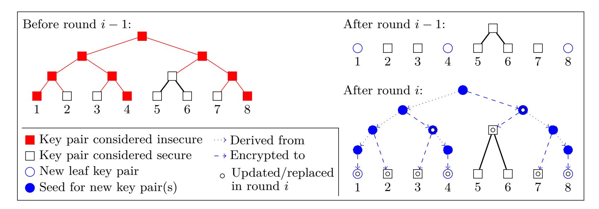
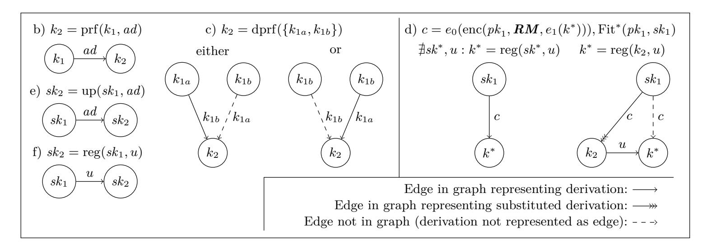

{0}------------------------------------------------

# **On the Price of Concurrency in Group Ratcheting Protocols**

Alexander Bienstock<sup>1</sup> , Yevgeniy Dodis<sup>1</sup> , and Paul Rösler<sup>2</sup>

<sup>1</sup> New York University {abienstock,dodis}@cs.nyu.edu <sup>2</sup> Chair for Network and Data Security, Ruhr University Bochum paul.roesler@rub.de

**Abstract.** *Post-Compromise Security*, or PCS, refers to the ability of a given protocol to recover by means of normal protocol operations—from the exposure of local states of its (otherwise honest) participants. While PCS in the two-party setting has attracted a lot of attention recently, the problem of achieving PCS in the group setting—called *group ratcheting* here—is much less understood. On the one hand, one can achieve excellent security by simply executing, in parallel, a two-party ratcheting protocol (e.g., Signal) for each pair of members in a group. However, this incurs O(*n*) communication overhead for every message sent, where *n* is the group size. On the other hand, several related protocols were recently developed in the context of the IETF Messaging Layer Security (MLS) effort that improve the communication overhead per message to O(log *n*). However, this reduction of communication overhead involves a great restriction: group members are not allowed to send and recover from exposures concurrently such that reaching PCS is delayed up to *n* communication time slots (potentially even more).

In this work we formally study the trade-off between PCS, concurrency, and communication overhead in the context of group ratcheting. Since our main result is a lower bound, we define the cleanest and most restrictive setting where the tension already occurs: *static* groups equipped with a *synchronous* (and authenticated) broadcast channel, where up to *t* arbitrary parties can concurrently send messages in any given round. Already in this setting, we show in a symbolic execution model that PCS requires *Ω*(*t*) communication overhead per message. Our symbolic model permits as building blocks black-box use of (even "dual") PRFs, (even key-updatable) PKE (which in our symbolic definition is at least as strong as HIBE), and broadcast encryption, covering all tools used in previous constructions, but prohibiting the use of exotic primitives.

To complement our result, we also prove an almost matching upper bound of O(*t*·(1+log(*n/t*))), which smoothly increases from O(log *n*) with no concurrency, to O(*n*) with unbounded concurrency, matching the previously known protocols.

Yevgeniy Dodis was partially supported by gifts from VMware Labs, Facebook and Google, and NSF grants 1314568, 1619158, 1815546.

Paul Rösler was supported by the research training group "Human Centered Systems Security" sponsored by the state of North Rhine-Westphalia, Germany.

{1}------------------------------------------------

# **Table of Contents**

| 1 |                                              | Introduction                            | 2  |  |  |  |  |
|---|----------------------------------------------|-----------------------------------------|----|--|--|--|--|
| 2 |                                              | Preliminaries<br>5                      |    |  |  |  |  |
| 3 | Security of Concurrent Group Ratcheting<br>6 |                                         |    |  |  |  |  |
| 4 |                                              | Deficiencies of Existing Protocols      |    |  |  |  |  |
| 5 |                                              | Intuition for Lower Bound               | 10 |  |  |  |  |
|   | 5.1                                          | Symbolic Building Blocks<br>            | 10 |  |  |  |  |
|   | 5.2                                          | Symbolic Group Ratcheting               | 12 |  |  |  |  |
|   | 5.3                                          | Lower Bound                             | 12 |  |  |  |  |
| 6 |                                              | Upper Bound of Communication Complexity | 14 |  |  |  |  |
|   | 6.1                                          | Construction                            | 14 |  |  |  |  |
|   | 6.2                                          | Security of Building Blocks             | 18 |  |  |  |  |
|   | 6.3                                          | Security Proof                          | 18 |  |  |  |  |
|   | 6.4                                          | Discussion                              | 23 |  |  |  |  |
|   | 6.5                                          | Insights for Practice                   | 24 |  |  |  |  |
| 7 | Lower Bound of Communication Complexity      |                                         |    |  |  |  |  |
|   | 7.1                                          | Used Building Blocks                    | 25 |  |  |  |  |
|   | 7.2                                          | Group Ratcheting                        | 27 |  |  |  |  |
|   | 7.3                                          | Lower Bound                             | 29 |  |  |  |  |
|   | 7.4                                          | Proof of Lower Bound                    | 30 |  |  |  |  |
| A |                                              | Proof of Lemma 3                        | 36 |  |  |  |  |
| B | Inverse Derivation Guarantees<br>37          |                                         |    |  |  |  |  |

## <span id="page-1-0"></span>**1 Introduction**

Post-Compromise Security. End-to-end (E2E) encrypted messaging systems including WhatsApp, Signal, and Facebook Messenger have increased in popularity. In these systems, intermediaries including the messaging service provider should not be able to read or modify messages. Moreover, as typical sessions in such E2E systems can last for a very long time, state compromise of some of the participants is becoming a real concern to the deployment of such systems. To address this security concern, modern E2E systems fulfill a novel property called *Post-Compromise Security* [\[16\]](#page-35-2), which refers to the ability of a given protocol to recover—by means of normal protocol operations—from the exposure of local states of its (otherwise honest) participants. For example, the famous two-party Signal [\[28\]](#page-35-3) protocol achieves PCS by having parties continuously run fresh sessions of Diffie-Hellman key agreement "in the background".

Group Messaging. By now, the setting of PCS-secure two-party encrypted messaging systems is relatively well understood [\[15,](#page-35-4)[10,](#page-34-0)[30,](#page-35-5)[23,](#page-35-6)[2](#page-34-1)[,19,](#page-35-7)[24\]](#page-35-8). In contrast, the setting of PCS-secure *group* messaging is much less understood. On the one extreme, several systems, including Signal Messenger itself, achieve PCS in groups by simply executing, in parallel, a two-party PCS-secure protocol (e.g., Signal) for each pair of members in a group. In addition to achieving PCS, this simple technique is also extremely resilient to asynchrony and concurrency: people can send messages concurrently, receive them out-of-order, or be off-line for extended periods of time. However, it comes at a steep communication overhead O(*n*) for every message sent, where *n* is the group size.

On the other hand, several related protocols [\[14,](#page-35-9)[3,](#page-34-2)[4,](#page-34-3)[5\]](#page-34-4) (some of them introduced under the term *continuous group key agreement (CGKA)*[1](#page-1-1) ) were recently developed in the context of the IETF Message Layer Security (MLS) initiative for group messaging [\[7\]](#page-34-5). One of the main goals of this initiative was to achieve PCS with a significantly lower communication overhead. And, indeed, for static groups, these protocols improve this overhead per message to O(log *n*). More precisely, these protocols separate protocol

<span id="page-1-1"></span><sup>1</sup> By distinguishing between "CGKA" and "group ratcheting", these works differentiate between the asymmetric cryptographic parts of the protocols and the entire key establishment procedure, respectively [\[5\]](#page-34-4). In order to avoid this strict distinction, we call it "group ratcheting" here.

{2}------------------------------------------------

messages into two categories: *Payload* messages, used to actually encrypt messages, have no overhead, but also do not help in establishing PCS. In contrast, *update* messages carry no payload, but exclusively establish PCS: intuitively, an update message from user *A* refreshes all cryptographic material held by *A*. These update messages have size proportional to O(log *n*) in MLS-related protocols, which is a significant saving for large groups, compared to the pairwise-Signal protocol.

Concurrency. Unfortunately, this reduction of communication overhead for MLS-related protocols involves a great restriction: *all update messages must be generated and processed one-by-one in the same order by all the group members*. We stress that this does not just mean that update messages can be prepared concurrently, but processed in some fixed order. Instead, fresh update message cannot be *prepared* until all previous update messages are *processed*. In particular, it is critical to somehow implement what these protocols call a "delivery server", whose task is to reject all-but-one of the concurrently prepared update messages, and then to ensure that all group members process the "accepted updates" in the same correct order. Implementing such a delivery server poses a significant burden not only in terms of usability (which is clear), but also for *security* of these protocols, as it delays reaching PCS up to *n* communication time slots (potentially more in asynchronous settings, such as messaging). Indeed, the concurrency restriction of MLS is currently one of the biggest criticisms and hurdles towards its widespread use and adoption (see [\[3\]](#page-34-2) for extensive discussion of this). In contrast, pairwise Signal does not have any such concurrency restriction, albeit with a much higher communication overhead. See Section [4](#page-7-0) and Table [1](#page-7-1) for more detailed comparison of various existing methods for group ratcheting.

Our Main Question. This brings us to the main question we study in this work:

*What is the trade-off between PCS, concurrent sending and low communication complexity in encrypted group messaging protocols?*

For our lower bound, we define the cleanest and most restrictive setting where the tension already occurs: *static* groups equipped with a *synchronous* (and authenticated) broadcast channel, where up to *t* arbitrary users can concurrently send messages in any given round. In particular, *t* = 1 corresponds to the restrictive MLS setting which, we term "no concurrency", and *t* = *n* corresponds to unrestricted setting achieved by pairwise Signal, which we term "full concurrency". Also, without loss of generality, and following the convention already established in MLS-related protocols, we focus on the "key encapsulation" mechanism of group messaging protocols. Namely, our model is the following:

We have a static group of *n* members whose goal is to continuously share a group key *k*. Group members have private states *st*, and communicate in rounds over a public broadcast channel. Each round refreshes the current group key *k* into the next group key *k* <sup>0</sup> as follows: 1. At the beginning of a round, an arbitrary subset of up to *t* group members is selected by the adversary to update the current group key *k*. These groups members are called *senders* (of a given round). 2. During each round, each sender—*unaware of the identities of other senders*—tosses fresh random coins, sends a ciphertext *c* over the broadcast channel, and updates its private state *st*. 3. At the end of each round, all (up to *t*) ciphertexts *c* are received by all *n* users, who use them to update their state *st*, and output a new group key *k* 0 . 4. At the end of each round, the adversary can learn the current group key *k* 0 , and is also allowed to expose an arbitrary number of group member states *st*.

For our lower bound, we will demand the following, rather weak, PCS guarantee. A key *k* after round *i* (not directly revealed to the attacker) is secure if: (a) no user is exposed in round *i* <sup>0</sup> ≥ *i*; (b) all users sent at least one update ciphertext between their latest exposure and round *i* − 1; and (c) after all exposed users sent once without being exposed again, at least one user additionally sent in round *j* ≤ *i*. Condition (a) will only be used in our lower bound (to make it stronger), to ensure that our lower bound is only due to the PCS, but not a complementary property called *forward*-secrecy, which states that past round keys cannot be compromised upon current state exposure. However, our upper bound will achieve forward-secrecy, dropping (a).

Condition (b) is the heart of PCS, demanding that security should be eventually restored once every exposed user updated its state. Condition (c) permits a one-round delay before PCS takes place. While not theoretically needed, avoiding this extra round seems to require some sort of multiparty noninteractive key exchange for *concurrent* state updates, which currently requires exotic cryptographic assumptions, such as multi-linear maps [\[12,](#page-35-10)[13\]](#page-35-11). In contrast, the extra round allows to use traditional public-key cryptography techniques, such as the exposed user sending fresh public-keys, and future senders using these keys in the extra round to send fresh secret(s) to this user. While condition (c) 

{3}------------------------------------------------

strengthens our lower bound, our upper bound construction can be minimally adjusted to achieve PCS for *non-concurrent* state updates even without this "extra round".

For conciseness, we call any protocol in our model a *group ratcheting* scheme, taking inspiration from the "double ratchet" paradigm used in design of the Signal protocol [\[28\]](#page-35-3).

Our Upper Bound. We show nearly matching lower and upper bounds on the efficiency of *t*-concurrent, PCS-secure group ratcheting schemes. With our upper bound we provide a group ratcheting scheme with message overhead O(*t* · (1 + log(*n/t*))), which smoothly increases from O(log *n*) with no concurrency, to O(*n*) with unbounded concurrency, matching the upper bounds of the previously known protocols. Our upper bound is proven in the standard computational model. For the weak notion of PCS alone sketched above (i.e., conditions (a)-(c)), we only need public-key encryption (PKE) and pseudo-random functions (PRFs). Our construction carefully borrows elements from the complete subtree method of [\[27\]](#page-35-12) used in the context of broadcast encryption (BE), and the TreeKEM protocol of the MLS standard [\[7,](#page-34-5)[3\]](#page-34-2) used in the context of non-concurrent group ratcheting. Similarly, one can view our construction as an adapted combination of components from Tainted TreeKEM [\[4\]](#page-34-3) and the most recent MLS draft (verion-09) [\[8\]](#page-34-6) with its propose-then-commit technique. By itself, none of these constructions is enough to do what we want: BE scheme of [\[27\]](#page-35-12) allows to send a fresh secret to all-but-*t* senders from the previous round (this is needed for PCS), but needs centralized distribution of correlated secret keys to various users, while the TreeKEM schemes no longer need a group manager, but do not withstand concurrency of updates in a rather critical way. Finally, the propose-then-commit technique, when naively combined with (Tainted) TreeKEM as in MLS [\[8\]](#page-34-6), in the worst case induces an overhead linear in the group size, and still does not completely achieve our desired concurrency and PCS guarantees. Nevertheless, we show how to combine these structures together—in a very concrete and non-black-box way—to obtain our scheme with overhead O(*t* · (1 + log(*n/t*))).

Moreover, we can easily achieve forward-security in addition to PCS (i.e., drop restriction (a) on the attacker), by using the recent technique of [\[24,](#page-35-8)[3\]](#page-34-2), which basically replaces traditional PKE with so called *updatable* PKE (uPKE). Informally, such PKE is *stateful*, and only works if all the senders are synchronized with the recipient (which can be enforced in our model, even with concurrency). Intuitively, each uPKE ciphertext updates the public and secret keys in a correlated way, so that future ciphertexts (produced with new public key) can be decrypted with the new secret key, but old ciphertexts cannot be decrypted with the new secret key. Hence, uPKE provides an efficient and practical mechanism for forward-secrecy in such a synchronized setting, without the need of heavy, less efficient tools, such as hierarchical identity based encryption (HIBE), directly used as a building block for strongly secure group ratcheting [\[5\]](#page-34-4), or used as an intermediary component to build stronger *key-updatable* PKE (kuPKE)[2](#page-3-0) for secure two-party messaging [\[30](#page-35-5)[,23\]](#page-35-6).

Our Lower Bound. We prove a lower bound *Ω*(*t*) on the efficiency of any group ratcheting protocol which only uses "realistic" tools, such as (possibly key-updatable[2](#page-3-0) ) PKE, (possibly so called "dual") PRFs, and general BE (see Section [2](#page-4-0) for explaining these terms). We define our symbolic notion of keyupdatable PKE so that it even captures functionality and security guarantees at least as strong as one expects from HIBE. To the best of our knowledge, these primitives include all known tools used in all "practical" results on group ratcheting (including our upper bound). Thus, our result nearly matches our upper bound, and shows that the O(*n*) *overheard of pairwise Signal protocol is optimal for unbounded concurrency*, at least within our model.

To motivate our model for the lower bound, group ratcheting would be "easy" if we could use "exotic" tools, such as multiparty non-interactive key agreement (mNIKE), multi-linear maps, or general-purpose obfuscation. For example, using general mNIKE, one can easily achieve PCS and unbounded concurrency, by having each member simply broadcast its new public key, without any knowledge of other senders: at the end of each round, the union of latest keys of all the group members magically (and non-interactively) updates the previous group key to a new, unrelated value. Of course, we currently don't have any even remotely practical mNIKE protocols, so it seems natural that we must define a model which only permits the use of "realistic" tools, such as (ku)PKE, (dual) PRFs, BE, (HIBE,) etc.

<span id="page-3-0"></span><sup>2</sup> While for our upper bound construction weaker and more efficient uPKE (based on DH groups) suffices as in [\[24,](#page-35-8)[3\]](#page-34-2), to strengthen our lower bound we allow constructions to use stronger and less efficient key-updatable PKE (thus far based on HIBE) as in [\[30,](#page-35-5)[23](#page-35-6)[,6\]](#page-34-7).

{4}------------------------------------------------

To formally address this challenge, we use a *symbolic* modeling framework inspired by the elegant work of Micciancio and Panjwani [\[26\]](#page-35-13), who used it to derive a lower bound for the efficiency of multicast encryption. Symbolic models treat all elements as symbols whose algebraic structure is entirely disregarded, and which can be used only as intended. E.g., a symbolic public key can be defined to only encrypt messages, and the only way to decrypt the resulting ciphertext is to have another symbol corresponding to the associated secret key. In particular, one cannot perform any other operations with the symbolic public key, such as verifying a signature, using it for a Diffie-Hellman key exchange, etc.

We use such a symbolic model to precisely define the primitives we allow, including the grammar of symbols and valid derivation rules between them (see Figure [1\)](#page-10-0). We then formalize the intuition for our lower bound in Section [5](#page-9-0) (before doing a formal proof in Section [7\)](#page-24-0). Our bound is actually very strong: it is the *best-case* lower bound, which holds for any execution schedule of group ratcheting protocols within our model, and which is proven against highly restricted adversaries for extremely little security requirements. Specifically, we show that each sender for round *i* must send at least one fresh message over the broadcast channel "specific" to every sender of the previous round *i* − 1. [3](#page-4-1) While intuitively simple, the exact formalization of this result is non-trivial, in part due to the rather advanced nature of the underlying primitives we allow. For example, we must show that no matter what shared infrastructure was established before round (*i* − 1), and no matter what information a sender *A* sent in round *i* − 1, there is no way for *A* to always recover at round *i* from potential exposure at round (*i* − 2), unless every sender *B* in round *i* sends some message "only to *A*".

Perspective. To put our symbolic result in perspective, early use of symbolic models in cryptography date to the Dolev-Yao model [\[18\]](#page-35-14), and were used to prove "upper bounds", meaning security of protocols which were too complex to analyze in the standard "computational model" (with reductions to well established simpler primitives or assumptions). In contrast, Micciancio and Panjwani [\[26\]](#page-35-13) observed that symbolic models can also be used in a different way to prove impossibility results (i.e., *lower* bounds) on the efficiency of building various primitives using a fixed set of (symbolic) building blocks. This is interesting because we do not have many other compelling techniques to prove such lower bounds.

To the best of our knowledge, the only other technique we know is that of "black-box separations" [\[22\]](#page-35-15). While originally used for black-box impossibility results [\[22\]](#page-35-15), Gennaro and Trevisan [\[20\]](#page-35-16) adapted this technique to proving efficiency limitations of black-box reductions, such as building psedorandom generators from one-way permutations. However, black-box separation lower bounds are not only complex (which to some extent is true for symbolic lower bounds as well), but also become exponentially harder, as the primitive in question becomes more complex to define, or more diverse building blocks are allowed. In particular, to the best of our knowledge, the setting of group ratcheting using kuPKE, HIBE, dual PRFs, and BE used in this paper, appears several orders of magnitude more complex than what can be done with the state-of-the-art black-box lower bounds.

Thus, we hope that our paper renews the interests in symbolic lower bounds, and that our techniques would prove useful to study other settings where such lower bounds could be proven.

## <span id="page-4-0"></span>**2 Preliminaries**

We shortly introduce our notation as well as the syntax of the most important cryptographic building blocks. Security of these building blocks, due to being of different nature for the computational and symbolic models, are formally introduced in Sections [6](#page-13-0) and [7,](#page-24-0) respectively.

*Notation* We distinguish between deterministic and probabilistic assignments with symbols ← and ←\$, respectively; the latter denotes sampling of an element *x* from the uniform distribution over a set X (*x* ←\$ X ) and invoking a probabilistic algorithm alg on input *a* with output *x* (*x* ←\$ alg(*a*)). In order to make the used random coins *r* of an invocation explicit (and turning it into a deterministic invocation), we write *x* ← alg(*a*; *r*). We denote the cardinality of a set X or the length of a string *s* with symbols |X | and |*s*|. Concatenations of two bit-strings *s*1*, s*<sup>2</sup> is written as *s*1k*s*2.

Adversaries A in our computational models are probabilistic algorithms invoked in a security experiment denoted by the term **Game**. Therein they can call oracles, denoted by term **Oracle**.

<span id="page-4-1"></span><sup>3</sup> Except for itself, if the sender was active in the prior round. This intuitively explains why our "best-case" lower bound is actually (*t* − 1) and not *t*.

{5}------------------------------------------------

In our symbolic model we describe grammar rules as follows. For three types of symbols  $X, Y, \text{ and } Z, X \mapsto Y|Z$  denotes that symbols of type X can be parsed as symbols of type Y or type Z. A type that cannot be parsed further is called *terminal type*. Using these grammar rules, we define derivation rules that describe how symbols can be derived from sets of (other) symbols. For a symbol m and set of symbols  $M, M \vdash m$  means that m can be derived from the symbols in set M by using the grammar and derivation rules that we specify in our symbolic model.

<span id="page-5-2"></span>(Dual) Pseudo-Random Function A pseudo-random function prf takes a symmetric key and some associated data, and outputs another symmetric key such that for sets  $\mathcal{K}, \mathcal{AD}$ :  $\operatorname{prf}(k, ad) \to k'$  with  $k, k' \in \mathcal{K}$  and  $ad \in \mathcal{AD}$ . A dual pseudo-random function dprf takes two symmetric keys and outputs another symmetric key such that for set  $\mathcal{K}$ :  $\operatorname{dprf}(\{k_1, k_2\}) \to k'$  with  $k_1, k_2, k' \in \mathcal{K}$  with the added property that  $\operatorname{dprf}(k_1, k_2) = \operatorname{dprf}(k_2, k_1) = k'$ . For simplicity (in our proof), we only consider symmetric dual PRFs [9].

A secure PRF outputs a key that is  $secret^4$  if the input key is secret as well. A dual PRF additionally achieves secrecy of the output key in case at most one of the two input keys is known by an attacker.

<span id="page-5-3"></span>Key-Updatable Public Key Encryption Key-updatable public key encryption (kuPKE) is an extension of public key encryption that allows for independent updates of public and secret key with respect to some associated data. This primitive has been used in constructions of two-party ratcheting (e.g., [30,23,29,25]). Furthermore, a work by Balli et al. [6] recently showed that it is actually necessary for building optimally secure two-party ratcheting.

A kuPKE scheme UE is a tuple of algorithms UE = (gen, up, enc, dec) where up takes some associated data together with either a public key or a secret key and produces a new public key or secret key respectively such that for sets  $\mathcal{SK}, \mathcal{PK}, \mathcal{C}, \mathcal{M}, \mathcal{AD}$ : gen $(sk) \to pk$ , up $(sk, ad) \to sk'$ , up $(pk, ad) \to pk'$ , enc $(pk, m) \to_{\$} c$ , and dec $(sk, c) \to m$  with  $sk, sk' \in \mathcal{SK}, pk, pk' \in \mathcal{PK}, ad \in \mathcal{AD}, m \in \mathcal{M}$ , and  $c \in \mathcal{C}$ . A kuPKE scheme UE is correct if for synchronously updated public key and secret key, the latter can decrypt ciphertexts produced with the former:  $\Pr[\forall n \in \mathbb{N} \text{ dec}(sk_n, \text{enc}(pk_n, m)) = m : sk_0 \leftarrow_{\$} \mathcal{SK}, pk_0 = \text{gen}(sk_0), \forall i \in [n] \ ad_i \leftarrow_{\$} \mathcal{AD}, pk_{i+1} = \text{up}(pk_i, ad_i), sk_{i+1} = \text{up}(sk_i, ad_i), m \leftarrow_{\$} \mathcal{M}] = 1.$ 

A secure kuPKE scheme intuitively guarantees that a message, encrypted to public key pk' that was derived from another public key pk via sequential updates under associated-data from vector  $ad \in \mathcal{AD}^*$ , cannot be decrypted by a (computationally bounded, or symbolic) adversary even with access to any secret keys, derived via updates from pk's secret key sk under an associated-data vector  $ad' \in \mathcal{AD}^*$  such that ad' is not a prefix of ad. Note that this intuitive security notion matches security of HIBE when associated data is being parsed as identity strings.

Broadcast Encryption A broadcast encryption (BE) scheme BE is a tuple of four algorithms BE = (gen, reg, enc, dec) where reg takes a (main) secret key and an integer and produces an accordingly registered secret key, enc takes, in addition to public key and message, a set of integers to indicate which registered secret keys must be unable to decrypt the message such that for sets  $\mathcal{MSK}$ ,  $\mathcal{SK}$ ,  $\mathcal{MPK}$ ,  $\mathcal{C}$ ,  $\mathcal{M}$ : gen $(msk) \to mpk$ , reg $(msk, u) \to_{\$} sk$ , enc $(mpk, \mathbf{RM}, m) \to_{\$} c$ , and dec $(sk, c) \to m$  with  $msk \in \mathcal{MSK}$ ,  $mpk \in \mathcal{MPK}$ ,  $u \in \mathbb{N}$ ,  $sk \in \mathcal{SK}$ ,  $\mathbf{RM} \subset \mathbb{N}$ ,  $m \in \mathcal{M}$ , and  $c \in \mathcal{C}$ . A broadcast encryption scheme BE is correct if all registered secret keys that were not excluded when encrypting with the public key can decrypt the corresponding encrypted message:  $\Pr[\text{dec}(sk, \text{enc}(mpk, \mathbf{RM}, m)) = m : msk \leftarrow_{\$} \mathcal{MSK}, mpk = \text{gen}(msk), u \leftarrow_{\$} \mathbb{N}, sk \leftarrow_{\$} \text{reg}(msk, u), \mathbf{RM} \subset \mathbb{N} \setminus \{u\}] = 1$ .

A secure BE scheme intuitively guarantees that a message, encrypted to a (main) public key mpk with a set of removed users RM, cannot be decrypted by a (computationally bounded, or symbolic) adversary even with access to any secret keys, registered under mpk's main secret key msk for numbers  $u \in RM$ .

## <span id="page-5-0"></span>3 Security of Concurrent Group Ratcheting

In this work we consider an abstraction of group ratcheting under significant relaxations and restrictions with respect to the real-world. The purpose of this approach is to disregard irrelevant aspects in order to highlight the immediate effects of concurrent state updates in group ratcheting.

<span id="page-5-1"></span><sup>&</sup>lt;sup>4</sup> Where *secrecy* means indistinguishable from a random key in the computational model and underivable from public symbols in the symbolic execution model.

{6}------------------------------------------------

In the following, we define syntax and (restricted) security of ratcheting in static groups against computationally bounded adversaries. We assume in our model that all group members have access to a round-based reliable and authenticated broadcast. Additionally, since our focus are concurrent operations in an initialized group, we consider an abstract initialization algorithm for deriving initial user states.<sup>5</sup>

Syntax A static group ratcheting protocol is a tuple of three algorithms GR = (init, snd, rcv) such that for sets  $\mathcal{ST}_{GR}$ ,  $\mathcal{C}_{GR}$ ,  $\mathcal{K}_{GR}$ ,  $\mathcal{R}$ :

- $\operatorname{init}(n;r) \to (st_1,\ldots,st_n)$  with  $n \in \mathbb{N}$ ,  $r \in \mathcal{R}$ , and  $st_1,\ldots,st_n \in \mathcal{ST}_{\mathsf{GR}}$ ; creates an initial local state for every participating group member.
- $\operatorname{snd}(st;r) \to (st',c)$  with  $st, st' \in \mathcal{ST}_{\mathsf{GR}}, r \in \mathcal{R}$ , and  $c \in \mathcal{C}_{\mathsf{GR}}$ ; takes the current state of an instance (in addition to freshly sampled random coins) and outputs the updated state and update information within a ciphertext that is to be sent via the broadcast.
- $-\operatorname{rcv}(st, \mathbf{c}) \to (st', k)$  with  $st, st' \in \mathcal{ST}_{\mathsf{GR}}$ ,  $\mathbf{c} \subset \mathcal{C}_{\mathsf{GR}}$ , and  $k \in \mathcal{K}_{\mathsf{GR}}$ ; takes the current state of an instance and a set of update ciphertexts (e.g., all broadcast ciphertexts since this instance's last receiving), and outputs the updated state and the current (joint) group key.

Security Security experiments  $KIND_{GR}^b$ , formally defined in Section 6, in which adversary A attacks scheme GR proceed as follows:

- 1.  $\mathcal{A}$  determines the number of group members n. Afterwards the challenger invokes the init algorithm to generate initial secret states for all members. Then the security experiment continues in rounds. In every round i
  - adversary  $\mathcal{A}$  chooses set  $U_{\mathbf{S}}^{i}$  of senders. For each sender  $u \in U_{\mathbf{S}}^{i}$  algorithm snd is invoked. All resulting ciphertexts are both given to  $\mathcal{A}$  and received by all group members via invocations of algorithm rcv.
  - adversary  $\mathcal{A}$  chooses set  $U_{\mathbf{X}}^{i}$  of exposed users. The local state of each user  $u \in U_{\mathbf{X}}^{i}$  after receiving in round i is given to  $\mathcal{A}$ .
- 2. During the entire security experiment,  $\mathcal{A}$  can challenge group keys established in any round  $i^*$ .  $\mathcal{A}$  either obtains a random key (if b = 0) or the actual group key from round  $i^*$  (if b = 1) in response.
- <span id="page-6-3"></span><span id="page-6-1"></span>3. When terminating, A returns a guess b' such that it wins if b = b' and for all challenged group keys it holds that:
  - (a) no user was exposed after a challenged group key was computed,
  - (b) every user sent at least once after being exposed and before a challenged group key was computed, and
  - (c) after all exposed users sent once without being exposed again, at least one user additionally sent before a challenged group key was computed.

<span id="page-6-2"></span>Group keys for which conditions 3a-3c hold are marked secure.

We restrict the adversary with condition (3a) only because the resulting weaker security definition already suffices to prove our *lower* bound of communication complexity. For our full model in which we prove the construction of our *upper* bound secure (see Section 6 Figure 6), we strengthen adversaries by lifting restriction (3a). This reflects that our upper bound construction achieves immediate forward-secrecy while our lower bound already holds without requiring any form of forward-secrecy.

Condition (3b) models that a user who was exposed must generate fresh secrets and send the respective public values to the group before it can receive confidential information for establishing new secure group keys. After all exposed users recovered by sending subsequently, their sent contribution must be used effectively to establish a new secret group key. Therefore, condition (3c) additionally requires one further response from a user as a reaction to all newly contributed public values.

<span id="page-6-4"></span>For removing condition (3c) either 1. the last users who recovered did so concurrently at most as a pair of two (such that their new public contributions can be merged into a shared group key non-interactively with NIKE mechanisms), or 2. multiparty NIKE schemes exist (for resolving cases of more concurrently recovering users). In order to simplify our security definition by not introducing an according

<span id="page-6-0"></span><sup>&</sup>lt;sup>5</sup> We note that we only consider a single independently established group session. For protocols in which participants use the same secrets simultaneously across multiple (thereby dependent) sessions, we refer the reader to a work by Cremers et al. [17]. Both the problems and the solutions for these two considerations appear to be entirely distinct.

{7}------------------------------------------------

case distinction tracing occurrences of case 1, we generally restrict the adversary with condition (3c). We note that for proving our lower bound, restricting the adversary by this condition strengthens our result.

Intuitively, a group ratcheting scheme is secure if no adversary  $\mathcal{A}$  exists that wins the above defined security experiment with probability non-negligibly higher than 1/2.

Restrictions of the Model With the following abstractions, simplifications, and restrictions, we support clarity and comprehensibility of our results and strengthen the statement of our lower bound. We consider: 1. A round-based communication setting, 2. Static groups, 3. All group members receive in every round, 4. Only passive adversaries 5. Adversaries can expose users only after receiving, and 6. Adversaries cannot attack used randomness. As we do not aim to develop a functional and secure group messenger but to theoretically analyze the foundations of concurrent group ratcheting, we believe this is justified.

## <span id="page-7-0"></span>4 Deficiencies of Existing Protocols

The problem of constructing group ratcheting could be solved trivially if efficient multiparty non-interactive key exchange schemes existed. Especially for the concurrent recovery from state exposures in group ratcheting, the lack of this tool appears to be crucial: Due to not being able to combine independently proposed fresh public key material, existing efficient group ratcheting constructions cannot process concurrent operations as we will explain in this section. In Table 1 we summarize the characteristics of previous group ratcheting schemes in comparison to our construction and the lower bound.

<span id="page-7-1"></span>

|                                      | PCS Concurrency Overhead |            |                           |
|--------------------------------------|--------------------------|------------|---------------------------|
| Sender Key Mechanism [31]            | 0                        | •          | 1                         |
| Parallel Pairwise Signal [31,15,2]   | •                        | •          | n                         |
| Asynchronous Ratcheting Trees [14]   | •                        | $\bigcirc$ | $\log(n)$                 |
| Causal TreeKEM [32]                  | •                        |            | $\log(n)$                 |
| TreeKEM Familiy [3,4]                | •                        | $\bigcirc$ | $\log(n)$                 |
| MLS Draft-09 [8]                     | •                        |            | n                         |
| Optimally Secure Tainted TreeKEM [5] | •                        |            | $\log(n)$                 |
| Our Construction                     | •                        |            | $t \cdot (1 + \log(n/t))$ |
| Our Lower Bound                      | •                        | •          | t-1                       |

**Table 1:** Properties of group ratcheting constructions and our lower bound.  $t = |U_{\mathbf{S}}^{i-1}|$  is the number of members who sent concurrently in the previous round. For the overhead we consider a worst-case scenario in a constant size group. Constructions denoted with ' $\mathbb{O}$ '/' $\mathbb{O}$ ' provide PCS under no concurrency and can handle concurrent state updates without reaching PCS with them.

Sender Key Mechanism WhatsApp uses the so called sender key mechanism for implementing group chats [31]. This mechanism distributes a symmetric sender key for each member in a group. When sending a group message, the sender protects the payload with its own sender key, transmits the resulting (single) ciphertext, and hashes the used sender key to obtain its next sender key. The receivers decrypt the ciphertext with the sender's sender key and also update the sender's sender key by hashing it.

While the deterministic derivation of sender keys induces no communication overhead after the initial distribution of sender keys, it implies the reveal of all future sender keys as soon as a member state is exposed (breaking post-compromise security). However, as each group member's key material is processed and used independently, concurrently initiated group operations can be processed naturally.

Parallel Execution of Pairwise Signal The group ratcheting mechanism implemented in the Signal messenger bases on parallel executions of the two-party Double Ratchet Algorithm [28,15,2] between each pair of members in a group [31]. Due to splitting the group of size n into its  $n^2$  independent pairwise components, this construction can naturally handle concurrency. At the same time, this approach induces a communication overhead of  $\mathcal{O}(n)$  ciphertexts per sent group payload.

Since the Double Ratchet Algorithm reaches post-compromise security (PCS) for each pair of members, also its parallel execution achieves this goal for the group against passive adversaries or if the member set remains static. Rösler et al. [31] describe an active attack against PCS in dynamic groups

{8}------------------------------------------------

that exploits the implemented decentralized membership management. Furthermore, the delayed recovery from state exposures in the Double Ratchet Algorithm due to a strictly alternating update schedule between protocol participants (cf. analysis and fix in [\[2\]](#page-34-1)) lets recoveries from state exposures in the group become effective only after every group member sent once at worst. With stronger two-party ratcheting protocols (e.g., [\[30,](#page-35-5)[29](#page-35-17)[,23,](#page-35-6)[2,](#page-34-1)[24\]](#page-35-8)) this problem can be solved.

*Asynchronous Ratcheting Tree* While the two above described approaches compute and use multiple symmetric keys in parallel for protecting communication in groups, the following constructions do so by deriving a single shared group key at each step of the group's lifetime. Therefore they arrange asymmetric key material on nodes in a tree structure in which each leaf represents a group member and the common root represents the shared group secret. Every group member stores the asymmetric secrets on the path from its leaf to the common root in its local state. For updating the local state, in order to recover from an adversarial exposure, all constructions let the updating member generate new asymmetric secrets for each node on their path to the root.

In the Asynchronous Ratcheting Trees (ART) design [\[14\]](#page-35-9), these asymmetric secrets are exponents in a Diffie–Hellman (DH) group. State updates of a member's path is conducted as follows: the updating member freshly samples a new secret exponent for its own leaf and then deterministically derives every ancestor node's secret exponent as the shared DH key from its two children's public DH shares. All resulting new public DH shares on the path are sent to the group, inducing a communication overhead of O(log(*n*)) per update operation. Other members perform the same derivations for updated nodes on their own paths to the root to obtain the new exponents. Since all secrets in the updating member's local state are renewed based on fresh random coins, this mechanism achieves PCS.

The reason for ART not being able to process concurrent update operations is that simultaneous updates of nodes in the tree with independently computed DH exponents cannot be merged into a joint tree structure while reaching PCS. For *t* concurrent updates, a *t*-party NIKE would be needed to combine the resulting *t* new proposed DH shares into a shared secret exponent for the ancestor node at which all updating members' paths to the root join together. (As mentioned before, if multiparty NIKE existed, group ratcheting can be solved trivially without complex tree structures.)

*Causal TreeKEM* As in the ART design [\[14\]](#page-35-9), Causal TreeKEM [\[32\]](#page-35-21) uses exponents in a DH group as asymmetric secrets on nodes in the tree. Also the update procedure is conceptually the same. However, in case of concurrently proposed path updates, the conflicting new exponents on a node are combined via exponent-addition and the conflicting public DH shares on a node are combined via multiplying these group elements.

Although this merge-mechanism resolves conflicts caused by concurrency, the combination of updated path secrets is not post-compromise secure: the old exponents of two nodes (from which their updating users *A* and *B* aimed to recover), whose common parent was updated via a combination of concurrent path updates, suffice to derive their parent's resulting new exponent. (The new exponent is the old exponent mixed with random values from *A* and *B* that they encrypt to the other's old node key.)

*TreeKEM Family* In the family of TreeKEM constructions [\[3](#page-34-2)[,4\]](#page-34-3), the asymmetric key material of nodes in the tree are key encapsulation mechanism (KEM) key pairs or, in forward-secure TreeKEM, updatable KEM key pairs. For updating its local state, a group member samples a fresh secret from which it deterministically derives seeds for each node on its path to the root, such that all ancestor seeds can be derived from their descendant seeds (but not vice versa). The updating member generates the new key pair for each updated node from its seed deterministically, and encapsulates the node's seed to the public key of the child which is not on the member's path to the root. This mechanism achieves PCS and induces a communication overhead of O(log(*n*)) per update.

The idea of recovery from exposures is undermined in case of concurrency, since updating members send their new seeds for a node on their path to public keys of siblings, simultaneously being updated and replaced by new key material of members who concurrently update: the potentially exposed secrets *from which* one updating member aims to recover can then be used to obtain the new secrets *with which* the other updating user aims to recover (as in the case of Causal TreeKEM). Consequently, concurrent updates in TreeKEM are essentially ineffective with respect to PCS.

Forward-secure TreeKEM [\[3\]](#page-34-2) uses an updatable KEM for enhancing forward-security guarantees of the above described mechanism. Tainted TreeKEM [\[4\]](#page-34-3) enhances PCS guarantees with respect to dynamic membership changes in groups. Neither of these changes affect the trade-offs discussed here.

{9}------------------------------------------------

*MLS Draft-09* Based on TreeKEM, the most recent draft of MLS [\[8\]](#page-34-6) distinguishes between two state update variants: (a) In an *update proposal* a member refreshes only its own leaf key pair, removes all other nodes on the path from this leaf to the root, and makes the root parent of all nodes that thereby became parentless. (b) In a *commit* a member combines previous update proposals and refreshes all key pairs on the path from its own leaf to the root (matching the normal TreeKEM update as described in the last paragraph).

In principle, both update variants achieve PCS for respective the sender. However, for simultaneously sent *commits*, all but one are rejected (e.g., by a central server) meaning that PCS under concurrency is not achieved for rejected updating commits. Furthermore, while *update proposals* can be processed concurrently, they eventually let the tree's depth degrade to 1, inducing a worst-case overhead of O(*n*) for later commits.[6](#page-9-2)

*Optimally Secure Tainted TreeKEM* Recently and concurrent to our work, an optimally secure variant of group ratcheting, based on a combination of Tainted TreeKEM and MLS draft-09, was proposed by Alwen et al. [\[5\]](#page-34-4). In addition to authentication guarantees (which is independent of our focus), their protocol achieves strong security guarantees for group partitions due to concurrency: instead of assuming that a (consensus) mechanism rejects conflicting commits as in MLS, they anticipate that different sub-groups of group members may process different of these commits such that the overall perspective on the group diverges. Their protocol guarantees that, after diverging, exposing states of one sub-group's members does not affect the security of another sub-groups' secrets. Intuitively, this is achieved by using HIBE key pairs on the tree's nodes that are regularly updated via secret-key-delegation based on identity strings that reflect the current perspective on the group. (For details, we refer the interested reader to [\[5\]](#page-34-4).)

While these changes increase security with respect to some form of forward-secrecy under group partitions, they do not entirely solve the issue of conflicting commits as in MLS: committed state updates still only have an effect in a sub-group that processes the commit such that only one user at a time can update secrets on the path from its leave to the root whereas other user's path updates remain ineffective.

Our construction from Section [6](#page-13-0) bypasses the issue of concurrently generated, incompatible path proposals by postponing the update of affected nodes in the tree by one communication round. However, "immediate" PCS can still be reached for non-concurrent updates by composing our construction with one of the above described ones without loss in efficiency. We note that some of the above constructions provide strong security guarantees with respect to active adversaries, dynamic groups, entirely asynchronous communication, or weak randomness, which is out (and partially independent) of our consideration's scope.

## <span id="page-9-0"></span>**5 Intuition for Lower Bound**

Our lower bound proof intuitively says that every group ratcheting scheme with better communication complexity than this bound is either insecure, or not correct, or cannot be built from the building blocks we consider. In the following, we first list these considered building blocks and argue why the selection of those is indeed justified (and not too restrictive). We then abstractly explain the symbolic security definition of group ratcheting, and finally sketch the steps of our proof that is formally given in Section [7.](#page-24-0)

## <span id="page-9-1"></span>**5.1 Symbolic Building Blocks**

The selection of primitives which a group ratcheting construction may use to reach minimal communication complexity in our symbolic model is inspired by the work of Micciancio and Panjwani [\[26\]](#page-35-13). For their lower bound of communication complexity in multi-cast encryption—which can also be understood as group key exchange—, Micciancio and Panjwani allow constructions to use pseudo-random generators, secret sharing, and symmetric encryption. We instead consider 1. *(dual) pseudo-random functions*, 2. *keyupdatable public key encryption* (with functionality and symbolic security guarantees at least as strong as those of *hierarchical identity based encryption*), and 3. *broadcast encryption* and thereby significantly

<span id="page-9-2"></span><sup>6</sup> Consider, for example, a scenario in which the same majority of members always sends update proposals and a fixed disjoint set of few members always commits. In this case, the overhead of commits for these few members converges to O(*n*).

{10}------------------------------------------------

extend the power of available building blocks. As secret sharing appears to be rather irrelevant in our setting—as well as it is irrelevant in their setting—, we neglect it to achieve better clarity in model and proof.

*Bulding Blocks in Related Work* To support the justification of our selection, we note that all previous constructions of group ratcheting base on less powerful building blocks than we consider here: The ART construction [\[14\]](#page-35-9) relies on a combination of dual PRF and Diffie-Hellman (DH) group. The actual properties used from the DH group can also be achieved by using generic public key encryption (PKE)—as demonstrated by its following successors. TreeKEM as proposed in the MLS initiative [\[3,](#page-34-2)[8\]](#page-34-6) relies on a PRG and a PKE scheme. TreeKEM with extended forward-secrecy [\[3\]](#page-34-2) relies on a PRG and an updatable PKE scheme. The syntax of the latter in combination with the respective computational security guarantees can be considered weaker than our according symbolic variant of kuPKE. Tainted TreeKEM [\[4\]](#page-34-3) relies on a PKE scheme in the random oracle model. Optimally secure Tainted TreeKEM [\[5\]](#page-34-4) relies on an HIBE scheme in the random oracle model. As noted before, functionality and security guarantees of HIBE are captured in our symbolic notion of kuPKE. The property of the random oracle that allows for mixing multiple input values of which at least one is confidential to derive a confidential random output can be achieved similarly by using (a cascade of) dual PRF invocations.[7](#page-10-1)

Only the post-compromise *insecure* merge-mechanism of DH shares from Causal TreeKEM [\[32\]](#page-35-21) is not captured in our symbolic model. However, turning this mechanism post-compromise *secure* results in multi-party NIKE, which we intentionally exclude.

*Grammar* The grammar definition of the considered building blocks bases on five types of symbols: messages *M*, secret keys *SK*, symmetric keys *K*, public keys *PK*, and random coins *R* (which is a terminal type). These types and their relation are specified in the lower right corner of Figure [1.](#page-10-0) For simplicity (and in order to strengthen our lower bound result), we consider algorithms gen and enc interoperable for kuPKE and BE.[8](#page-10-2)

```
Derivation of protected values:
a) m ∈ M =⇒ M ` m
b) M ` k =⇒ ∀ad M ` prf(k, ad)
c) M ` k1, k2 =⇒ M ` dprf({k1, k2})
d) M ` enc(pk, RM, m), sk :
     Fit(pk, RM, sk) =⇒ M ` m
Derivation of public values:
g) M ` sk =⇒ M ` gen(sk)
h) M ` pk =⇒ ∀ad M ` up(pk, ad)
 i) M ` pk, m =⇒ ∀RM M ` enc(pk, RM, m)
                                              Derivation of secret keys:
                                               e) M ` sk =⇒ ∀ad M ` up(sk, ad)
                                               f) M ` sk =⇒ ∀u M ` reg(sk, u)
                                              Grammar rules:
                                               1. M 7→ SK|PK|enc(PK, S(N), M)
                                               2. SK 7→ K|up(SK, M)|reg(SK, N)
                                               3. K 7→ R|prf(K, M)|dprf({K, K})
                                               4. PK 7→ gen(SK)|up(PK, M)
```

**Fig. 1:** Grammar and derivation rules of building blocks in the symbolic model.

*Derivation Rules* Symbolic security for the building blocks is defined via derivation rules that describe the conditions under which symbols can be derived from sets of (other) symbols. These rules are defined in Figure [1](#page-10-0) clustered into those with which protected values can be obtained, with which secret keys can be updated or registered, and with which public values can be obtained.

Rules b) and c) describe the security of (dual) PRFs, rules d), e), and g) to i) describe the security and functionality of kuPKE (and HIBE), and rules d), f), g), and i) describe the security and functionality of BE.

Rule d), describing the conditions under which a ciphertext can be decrypted, uses predicate Fit that validates the compatibility of public key and secret key (and set of removed registered users). Intuitively,

<span id="page-10-1"></span><sup>7</sup> If the constructions in [\[4](#page-34-3)[,5\]](#page-34-4) would rely on stronger (security) guarantees of the random oracle model, their practicability might be questionable.

<span id="page-10-2"></span><sup>8</sup> As a simplification we use N to denote the user input symbol of BE, S(·) to denote an unordered compilation of multiple such symbols, and {·*,* ·} to denote an unordered compilation of two key symbols. For kuPKE encryptions the second parameter in our symbolic model can be ignored.

{11}------------------------------------------------

a secret key sk is compatible with a public key pk if all updates for obtaining sk correspond to updates for obtaining pk in the same order and under the same associated data with respect to an initial key pair, or if the former was registered under the main secret key of the latter (see Section 7.1).

#### <span id="page-11-0"></span>5.2Symbolic Group Ratcheting

The syntax of group ratcheting was introduced in Section 3. In the following we map this syntax to the grammar definition above, and shortly give an intuition for the correctness and security of group ratcheting in the symbolic model.

Inputs and outputs of group ratcheting algorithms init, snd, and rev are random coins  $\mathcal{R}$ , local user states  $\mathcal{ST}_{\mathsf{GR}}$ , ciphertexts  $\mathcal{C}_{\mathsf{GR}}$ , and group keys  $\mathcal{K}_{\mathsf{GR}}$ . In our grammar these random coins are sets of type Rsymbols, local states and ciphertexts are sets of type M symbols, and group keys are symbols of type K.

According to this grammar, we require from symbolic constructions of group ratcheting for being correct that 1. all outputs of a group ratcheting algorithm invocation can be derived from its inputs via the derivation rules defined above and 2. in each round the group keys, computed by all users, are equal. The first condition is necessary to allow for symbolic adversaries. We note that this condition furthermore implies "inverse derivation guarantees", meaning that symbols can only be obtained via our derivation rules. For example, for inputs IN and outputs OUT of an algorithm invocation, output  $k' \in \text{OUT}$  with  $\operatorname{prf}(k, ad) = k'$  is either also element of set IN (i.e.,  $k' \in IN$ ), or k' is encrypted in a ciphertext contained in set IN, or IN  $\vdash k$  holds. We make these inverse derivation guarantees explicit in Appendix B.

Security To transfer the computational security experiment from Section 3 to the execution of symbolic attackers against group ratcheting, only few small changes are necessary: 1. a symbolic adversary  $\mathcal{A}$ follows the above defined derivation rules for an unbounded time, 2. the target of  $\mathcal{A}$  is not to distinguish securely marked real group keys from random ones but to derive such securely marked keys from the ciphertexts, sent in each round, and the states, exposed at the end of each round, with these derivation rules.

A group ratcheting scheme is secure in the symbolic model if an unbounded adversary cannot derive any of the securely marked group keys from the combination of all rounds' ciphertexts and exposed states via the above defined rules. The fully formal variant of this definition is in Figure 11.

#### <span id="page-11-1"></span>5.3 Lower Bound

Using this symbolic framework, we formulate a sketched variant of Theorem 2 that expresses the lower bound of communication complexity for secure (and correct) group ratcheting constructions:

Let GR be a secure and correct group ratcheting scheme. For every round i in a symbolic execution of GR with senders  $U_{\mathbf{S}}^{i}$  and exposed users  $U_{\mathbf{X}}^{i}$ , the number of sent symbols is  $|C[i]| \geq$  $|U_{\mathbf{S}}^{i}| \cdot (|U_{\mathbf{S}}^{i-1}| - 1).$ 

For our proof, we consider a symbolic adversary that proceeds as follows:

- 1. In round i-2 a set of members  $U_{\mathbf{X}}^{i-2} \subseteq [n]$  with  $|U_{\mathbf{X}}^{i-2}| > 1$  is exposed. 2. In subsequent round i-1 these exposed users send (i.e.,  $U_{\mathbf{S}}^{i-1} \coloneqq U_{\mathbf{X}}^{i-2}$ ).
- 3. In round i a non-empty set of members  $\emptyset \neq U_{\mathbf{S}}^i \subseteq [n]$  sends.

Assuming no user was exposed in any round before or after i-2, our symbolic security definition requires the group key in round i to be secure (i.e., not derivable from exposed states and sent ciphertexts up to round i). In order to show that each sender in round i must send at least  $|U_{\mathbf{S}}^{i-1}|-1$  ciphertexts to establish this secure group key, we analyze the effects of exposures in round i-2, sending in round i-1, and sending in round i in the following paragraphs.

At the end of round i-2 any symbol derivable by users in set  $U_{\mathbf{X}}^{i-2}$  is also derivable by the adversary. After generating new secret random coins at the beginning of round i-1, users in set  $U_{\mathbf{S}}^{i-1}$  can derive symbols, that the adversary cannot derive, from these new random coins and public symbols from their (exposed) state. We call such derivable symbols of types SK, K, and R that the adversary cannot derive useful secrets. Symbols of these types that are derivable by the adversary are called useless secrets (resulting in two complementary sets). Before sending in round i-1, new useful secrets of a user  $u^* \in$  $U_{\mathbf{S}}^{i-1}$  are only derivable for  $u^*$  itself but not for any other user  $u \in [n] \setminus \{u^*\}$ . This is because the origin

{12}------------------------------------------------

of these new useful secrets are the new secret random coins generated at the beginning of round i-1 and no communication took place after their generation yet. Hence, at sending in round i-1 users in set  $U_{\mathbf{S}}^{i-1}$  share no *compatible* useful secrets with other users. Secrets are called *compatible* if they are equal or if they are registered via rule f) under the same (main) secret key.

We formulate three observations: I) For deriving a public key pk from a set of type R symbols it is necessary according to grammar rule 4. and derivation rules g) and h) (with their inverse derivation guarantees) that its secret key sk (or one of its update-ancestors' secret key sk) is derivable from this set as well. II) For deriving a ciphertext c, encrypted to a public key pk, from a set of type R symbols it is necessary according to grammar rule 1. and derivation rule i) (with its inverse derivation guarantees) that this public key pk is derivable from it as well. III) Unifying all random coins generated by all users up to (including) round i-1 except those generated by user  $u^* \in U_{\mathbf{S}}^{i-1}$  in round i-1 forms a set of type R symbols from which all useful secrets at the beginning of round i-1 can be derived except those that are new to user  $u^*$  at that point. Combining these observations shows that at the beginning of round i-1 no user  $u \neq u^*$  can derive public keys to useful secrets of user  $u^* \in U_{\mathbf{S}}^{i-1}$ . This further implies that user u cannot derive ciphertexts encrypted to such public keys. As a result, the set of symbols sent by one user  $u^* \in U_{\mathbf{S}}^{i-1}$  in round i-1 contains no ciphertexts directed to useful secrets derivable by another user  $u^* \in U_{\mathbf{S}}^{i-1} \setminus \{u\}$  that would transport useful secrets between such users.

We further observe: According to the inverse derivation guarantees of rule c), both inputs to a dual PRF invocation must be derivable for deriving its output. As this requires a shared useful secret on input for deriving a shared useful secret as output, also a dual PRF establishes no shared (compatible) useful secrets in round i-1. All remaining derivation rules either output no secrets, or are unidimensional, meaning that they only immediately derive one (useful) secret from another. As a result, also after receiving in round i-1 users in set  $U_{\mathbf{S}}^{i-1}$  share no compatible useful secrets.

Sampling random coins before sending in round i again produces no shared compatible useful secrets between users that shared none before. Hence, also before receiving in round i, users in set  $U_{\mathbf{S}}^{i-1}$  share no compatible useful secrets. We remark that our symbolic correctness and security definition requires for the given adversary that the shared group key derived in round i (after receiving) is a useful secret.

For quantifying the number of ciphertexts sent in round i, we define two  $key\ graphs\ \mathcal{G}_i^{\text{before}}$  and  $\mathcal{G}_i^{\text{after}}$  that represent useful secrets as nodes and derivations among them as edges. Secret y being derivable from secret x is represented by a directed edge from x to y. Although inspired by the proof technique of Micciancio and Panjwani [26], the use of key (derivation) graphs in our proof is entirely new.

Graph  $\mathcal{G}_i^{\text{before}}$  includes a node for each useful secret that exists after receiving in round i and an edge for each derivation among them except for derivations possible only due to ciphertexts sent in round i. Graph  $\mathcal{G}_i^{\text{after}}$  contains  $\mathcal{G}_i^{\text{before}}$  and additionally includes edges for derivations possible due to ciphertexts sent in round i. Thus, the number of additional edges in  $\mathcal{G}_i^{\text{after}}$  equals the number of sent ciphertexts in round i. Mapping our derivation rules to edges is highly non-trivial (e.g., each sent ciphertext must appear at most once). All details are in Definition 3 and Figure 12 of the proof in Section 7.

The fact that users in set  $U_{\mathbf{S}}^{i-1}$  share no compatible useful secrets before receiving in round i finds expression in graph  $\mathcal{G}_i^{\text{before}}$  as follows: Every such user  $u \in U_{\mathbf{S}}^{i-1}$  is represented by nodes in a set  $\mathcal{V}_u^i$  that stand for its useful secret random coins from rounds i-1 and i (the latter only if u also sent in round i). For every pair of users  $u_1, u_2 \in U_{\mathbf{S}}^{i-1}$  with  $u_1 \neq u_2$  there exists no node in graph  $\mathcal{G}_i^{\text{before}}$  that is reachable via a path from a node in set  $\mathcal{V}_{u_1}^i$  and a path from a node in set  $\mathcal{V}_{u_2}^i$  simultaneously (including trivial paths). In contrast, every set  $\mathcal{V}_u^i$  with  $u \in U_{\mathbf{S}}^{i-1}$  must contain a node from which a path in graph  $\mathcal{G}_i^{\text{after}}$  reaches node  $v^*$  that represents the group key in round i.

In graph  $\mathcal{G}_{i}^{\text{before}}$  node  $v^*$  was reachable via a path from nodes  $\mathcal{V}_{u}^{i}$  of at most one user  $u \in U_{\mathbf{S}}^{i-1}$ . Otherwise  $v^*$  would have been a compatible useful secret for two users in set  $U_{\mathbf{S}}^{i-1}$  before receiving in round i. Consequently, at least one edge per user  $u^* \in U_{\mathbf{S}}^{i-1} \setminus \{u\}$  must be included in  $\mathcal{G}_{i}^{\text{after}}$  in addition to those contained in  $\mathcal{G}_{i}^{\text{before}}$ . Hence,  $\mathcal{G}_{i}^{\text{after}}$  contains at least  $|U_{\mathbf{S}}^{i-1}| - 1$  more edges than  $\mathcal{G}_{i}^{\text{before}}$ , implying that at least  $|U_{\mathbf{S}}^{i-1}| - 1$  ciphertexts were sent in round i.

We now observe that invocations of algorithm snd in every round are independent of sets  $U_{\mathbf{X}}^{j}$  for all j, and invocations of algorithm snd in round i are independent of set  $U_{\mathbf{S}}^{i}$ . As a consequence, every sender  $u \in U_{\mathbf{S}}^{i}$  must send  $|U_{\mathbf{S}}^{i-1}| - 1$  ciphertexts, anticipating the worst case that it is the only sender in that round. Therefore,  $|U_{\mathbf{S}}^{i}| \cdot (|U_{\mathbf{S}}^{i-1}| - 1)$  ciphertexts are sent in (every) round i.

Interpretation This lower bound, formally proved in Section 7, describes the best case of communication complexity both within our model but partially also with respect to the real-world: it holds against very

{13}------------------------------------------------

weak adversaries for significantly reduced functionality requirements of group ratcheting without any form of required forward-secrecy. Lower bounds, induced by forward-secrecy for group key exchange [26], may furthermore apply to practical group ratcheting and therefore increase necessary communication complexity thereof.<sup>9</sup> We note that our result even applies to any two rounds between which no user sent.

Bypassing our lower bound is possible for constructions that exploit the algebraic structure of elements (which is forbidden in symbolic models), base on building blocks that we do not allow here (e.g., multiparty NIKE), or provide weaker security guarantees (e.g., recover from state exposures only with an additional delay in rounds).

For clarity we note that the key graph concept used here is independent of the tree structure of keys within our upper bound construction in Section 6.

## <span id="page-13-0"></span>6 Upper Bound of Communication Complexity

In order to overcome the deficiencies of existing protocols, we postpone the refresh of parts of the key material in the group by one operation. The resulting construction closely (up to a factor of  $\approx \log(n/t)$ ) meets our communication complexity lower bound. Here we describe this construction, formally define computational security of the used building blocks, recapitulate the required computational security of group ratcheting, and prove the communication complexity and security of our construction. For computational security of group ratcheting, games KIND $_{GR}^b$  from Section 3 are slightly adapted to additionally require immediate forward-secrecy. We note that the use of (a weak form of) kuPKE instead of standard PKE in our construction is only due to required forward-secrecy. Furthermore, the weak kuPKE used can be efficiently built from standard assumptions (see e.g., a construction from DDH in [24]).

#### <span id="page-13-1"></span>6.1 Construction

Our construction uses ideas from the complete subtree method of broadcast encryption [27] and resembles concepts from TreeKEM [3,4]. More specifically, the construction bases on a static complete (directed) binary tree structure  $\tau$  with n leaves (i.e., one leaf per group member), on top of which at every node, there is an evolving kuPKE key pair. The secret key at each of the n leaves is known only by the unique user that occupies that leaf. For the remaining nodes we maintain the invariant that the only secret keys in a user's state at a given time are those that are at nodes along the direct path of its corresponding leaf to the root of the tree.

We refer to the children of a node v in a tree as  $v.c_0$  (left child) and  $v.c_1$  (right child), and its parent as v.p. Furthermore we let i, j, i > j be two rounds in which the set of sending group members is non-empty and there is no intermediate round l, i > l > j, with non-empty sending set. For simplicity in the description we define j := i - 1.

Sending. To recover from state exposures, our construction lets senders in round i-1 refresh only their own individual leaf key pair. Senders in round i then refresh all remaining secret keys stored in the local states of round i-1 senders (i.e., for nodes on their direct paths to the root) on their behalf. This is illustrated in Figure 2. Note that (as explained below in paragraph Receiving) all group members collect the senders of round i-1 into a set  $U_{i-1}$  in the rcv algorithm of round i-1. Our construction, formally defined in Figure 3, accordingly lets all senders in a round perform five tasks:

- 1) To refresh their own individual secret key: Generate a fresh secret key for their corresponding leaf and send the respective public key to the group (lines 11-12, 32).
- 2) To refresh and rebuild direct paths of last round's senders: Sample a new seed for the leaf of each sender of the last round and encrypt it to the respective sender's (refreshed) leaf public key (lines 15-18). Then derive a seed for each non-leaf node on the direct paths from these leaves to the root using the new seeds at the leaves (line 19). Each seed will be used to deterministically generate a fresh key pair for its node.

<span id="page-13-2"></span><sup>&</sup>lt;sup>9</sup> We observe that if a group-ratcheting-pendant of the amortized log(n) lower bound for forward-secure group key exchange by Micciancio and Panjwani [26] applies as a factor on our lower bound, then our construction from Section 6 has optimal communication complexity.

{14}------------------------------------------------

- 3) To share refreshed secrets with members who did not send in the last round: Encrypt the new seed of each refreshed non-leaf node to the public key of its child from which it was not derived (lines [21-](#page-15-7)[24,](#page-15-8) [27](#page-15-9)[-30\)](#page-15-10). Update the used public keys via kuPKE algorithm up (lines [25,](#page-15-11) [31\)](#page-15-12).
- 4) To inform the group of changed public keys: Send all changed public keys to the group, including those for which seeds were renewed, and those that were updated via kuPKE (lines [19,](#page-15-6) [25,](#page-15-11) [31,](#page-15-12) [32\)](#page-15-3).
- 5) Sample and encrypt a group key *k* for the round to all other users in the group (lines [13,](#page-15-13) [17,](#page-15-14) [23,](#page-15-15) [32\)](#page-15-3).

<span id="page-14-0"></span>

**Fig. 2:** Example tree for two rounds *i*−1 and *i* with *n* = 8, *Ui*−<sup>1</sup> = {1*,* 4*,* 8}, and *U<sup>i</sup>* 6= ∅. In round *i*−1, senders generate new key pairs for their leaves. In round *i*, senders generate seeds for all nodes considered insecure from round *i* − 1 and replace leaf key pairs for round *i* − 1 senders, as shown in the bottom-right corner.

In step 2), one seed is individually encrypted to each user in set *Ui*−<sup>1</sup> via public key encryption, which will allow them to reconstruct their direct path in the tree. The purpose of this individual encryption is to let the recent senders forget their old (potentially exposed) secrets and use their fresh secret (which they generated during their last sending) to obtain new, secure secrets on their direct path.

We now describe how all remaining group members are able to rebuild the tree in their view. The reader is invited to follow the explanation and focus their attention on the tree in the lower right corner of Figure [2.](#page-14-0) In this tree, directed edges represent the derivation of a seed at a node from one of its children (dotted) or encryption of a seed at a node to one of its children (dashed). We consider the Steiner Tree *ST*(*Ui*−1) induced by the set of leaves of users in *Ui*−1. *ST*(*Ui*−1) is the minimal subtree of the full tree that connects all of the leaves of *Ui*−<sup>1</sup> and the root; in the lower right corner tree of Figure [2,](#page-14-0) *ST*(*Ui*−1) is the subtree of blue filled circles and edges between them. For each *degree-one node v* of *ST*(*Ui*−1) (i.e., nodes with only one child in the Steiner Tree), its seed is encrypted to the public key of its child which is not in *ST*(*Ui*−1). This seed can be used to derive some (possibly all) of the secret keys for the nodes on the direct path of *v*, including *v* itself (lines [20-](#page-15-16)[25\)](#page-15-11). We denote the set of such degree one nodes of the Streiner Tree as *ST*(*Ui*−1)<sup>1</sup> and the child of a node *v* in *ST*(*Ui*−1)<sup>1</sup> that is not in the Steiner Tree as *v.c*<sup>∈</sup>*/ST*(*Ui*−1) . [10](#page-14-1) For each *degree-two node v* of *ST*(*Ui*−1) (i.e., nodes with two children in the Steiner Tree), its seed is encrypted to the public key of its right child (lines [26-](#page-15-17)[31\)](#page-15-12). We denote the set of such degree-two nodes of the Steiner Tree as *ST*(*Ui*−1)2. All of these encrypted seeds are derived from the fresh leaf seeds of users in set *Ui*−<sup>1</sup> via prf computations, as explained below in paragraph *Construction Subroutines*.

Alongside the seeds, some randomly sampled associated data *ad* is also encrypted in the ciphertexts of the above paragraph (lines [21,](#page-15-7) [27\)](#page-15-9). Public keys used for the encryption are afterwards updated with this associated data *ad* (lines [25,](#page-15-11) [31\)](#page-15-12). Upon receipt, this associated data is used correspondingly to update the secret keys as well. Due to this mechanism, immediate forward-secrecy is achieved since secret keys stored in users' local states are updated as soon as they are used for decryption.

We refer to the union of nodes that are in the Steiner Tree with nodes that are children of degree-one nodes in the Steiner Tree as *CST* = {*v* : *v* ∈ *ST*(*Ui*−1) ∨ *v* = *w.c*6∈*ST*(*Ui*−1)∀*w* ∈ *ST*(*Ui*−1)1}. For step 4) above, senders must publish the new public keys corresponding to all nodes of *CST*(*Ui*−1) (lines [19,](#page-15-6) [25,](#page-15-11) [31,](#page-15-12) [32\)](#page-15-3).

<span id="page-14-1"></span><sup>10</sup> We overload the set theoretic symbol ∈*/* here for brevity.

{15}------------------------------------------------

```
\mathbf{Proc} \operatorname{init}(n)
                                                                                            Proc rcv(st, BC)
                                                                                            35 (u, i, PK_{\tau}, SK_{u}, U_{i-1}, sk^{0}, sk^{1}, k_{sav}) \leftarrow st
00 i \leftarrow 1, \boldsymbol{U}_0 \leftarrow \emptyset
01 m \leftarrow \text{CBT}(n)
                                                                                            36 If BC = \emptyset:
02 SK_{\text{init}} \leftarrow_{\$} SK^m
                                                                                                       \boldsymbol{U}_i \leftarrow \boldsymbol{U}_{i-1}
                                                                                            37
                                                                                                      skip to line 56
03 PK_{\tau} \leftarrow \text{genPKTree}(SK_{\text{init}})
                                                                                            38
04 k_{\mathsf{sav}} \leftarrow_{\$} \mathcal{K}
                                                                                            39 U_i \leftarrow \emptyset
05 For u from 1 to n:
                                                                                            40 Let bc^* \in BC be first in some definite
          SK_u \leftarrow \text{getSKPath}(SK_{\text{init}}, u)
06
                                                                                                    order
          sk^0 \leftarrow \bot; sk^1 \leftarrow \bot
                                                                                            41 (v, pk', CT, PK_{ST(U_{i-1})}) \leftarrow bc^*
07
          st_u \leftarrow (u, i, PK_\tau, SK_u, U_0, sk^0, sk^1, k_{sav})
                                                                                            42 If u \in U_{i-1}:
80
                                                                                                      k_{\mathsf{der}}||k \leftarrow \operatorname{dec}(sk^0, CT[u])
09 Return (st_1,\ldots,st_n)
                                                                                            43
                                                                                            44
                                                                                                      v^* \leftarrow u
\mathbf{Proc} \, \operatorname{snd}(st)
                                                                                            45 Else:
10 (u, i, PK_{\tau}, SK_{u}, U_{i-1}, sk^{0}, sk^{1}, k_{sav}) \leftarrow st
                                                                                            46
                                                                                                      v^* \leftarrow \text{getSNode}(u, ST(\boldsymbol{U}_{i-1}))
11 sk' \leftarrow_{\$} \mathcal{SK}
                                                                                                      sk \leftarrow SK_u[v^*.c_{\not\in ST(U_{i-1})}]
                                                                                            47
12 pk' \leftarrow \text{gen}(sk')
                                                                                                      k_{\mathsf{der}}||ad||k \leftarrow \operatorname{dec}(sk, CT[v^*])
                                                                                            48
13 k \leftarrow_{\$} \mathcal{K} \cap \mathcal{M}
                                                                                                      SK_u[v^*.c_{\not\in ST(U_{i-1})}] \leftarrow \operatorname{up}(sk, ad)
                                                                                            49
14 DK[\cdot] \leftarrow \bot
                                                                                            50 (SK'_u, PK'_{\tau}) \leftarrow
15 For each v \in U_{i-1}:
                                                                                                    Rebuild(st, PK_{ST(U_{i-1})}, CT, k_{der}, v^*)
          DK|v| \leftarrow_{\$} \mathcal{K} \cap \mathcal{M}
16
                                                                                            51 For all bc \in BC:
17
          ct \leftarrow_{\$} \operatorname{enc}(PK_{\tau}|v|, DK|v|||k|)
                                                                                                      (v, pk', CT, PK_{ST(U_{i-1})}) \leftarrow bc
                                                                                            52
          CT[v] \leftarrow ct
18
                                                                                                       \boldsymbol{U}_i \leftarrow \boldsymbol{U}_i \cup \{v\}
                                                                                            53
19 (DK_{ST(U_{i-1})}, PK_{ST(U_{i-1})}) \leftarrow
                                                                                                      PK'_{\tau}[v] \leftarrow pk'
                                                                                            54
       genSTree(DK, U_{i-1})
                                                                                            55 k_{\mathsf{sav}} \leftarrow k
20 For each v \in ST(\boldsymbol{U}_{i-1})_1:
                                                                                            56 k_{\mathsf{out}} \leftarrow \mathrm{prf}(k_{\mathsf{sav}}, \mathsf{out})
          ad \leftarrow_{\$} \mathcal{AD} \cap \mathcal{M}
21
                                                                                            57 k_{\mathsf{sav}} \leftarrow \mathrm{prf}(k_{\mathsf{sav}}, \mathsf{sav})
22
          pk \leftarrow PK_{\tau}[v.c_{\not\in ST(U_{i-1})}]
                                                                                            58 sk^0 \leftarrow sk^1
          ct \leftarrow_{\$} \mathrm{enc}(pk, DK_{ST(U_{i-1})}[v]||ad||k)
23
                                                                                            59 i' \leftarrow i + 1
           CT[v] \leftarrow ct
24
                                                                                            60 st \leftarrow (u, i', PK'_{\tau}, SK'_{u}, U_{i}, sk^{0}, sk^{1}, k_{sav})
          PK_{ST(U_{i-1})}[v.c_{\not\in ST(U_{i-1})}] \leftarrow \operatorname{up}(pk,ad)
25
                                                                                            61 Return (st, k_{out})
26 For each v \in ST(U_{i-1})_2:
27
          ad \leftarrow_{\$} \mathcal{AD} \cap \mathcal{M}
          pk \leftarrow PK_{ST(U_{i-1})}[v.c_1]
28
          ct \leftarrow_{\$} \operatorname{enc}(pk, DK_{ST(U_{i-1})}[v]||ad)
29
30
           CT|v| \leftarrow ct
          PK_{ST(U_{i-1})}[v.c_1] \leftarrow \operatorname{up}(pk, ad)
31
32 bc \leftarrow (u, pk', CT, PK_{ST(U_{i-1})})
33 st \leftarrow (u, i, PK_{\tau}, SK_u, \boldsymbol{U}_{i-1}, sk^0, sk', k_{sav})
34 Return (st, bc)
```

<span id="page-15-28"></span><span id="page-15-19"></span><span id="page-15-18"></span><span id="page-15-16"></span><span id="page-15-15"></span><span id="page-15-12"></span><span id="page-15-11"></span><span id="page-15-10"></span><span id="page-15-8"></span><span id="page-15-7"></span><span id="page-15-6"></span><span id="page-15-5"></span><span id="page-15-3"></span>**Fig. 3:** Construction of concurrent group ratcheting in the computational model. CBT(n) calculates the number of nodes in a complete binary tree with n leaves.  $getSNode(u, ST(U_{i-1}))$  finds the first node v on the direct path of u that is in  $ST(U_{i-1})$ .

Receiving. For rounds in which no member sent, the recipients forward-securely derive symmetric keys (one <u>output</u> group key, and one <u>saved</u> key) from last round's secrets (lines 56-57). In addition, they assign  $U_i \leftarrow U_{i-1}$  (line 37), so that senders of subsequent rounds can refresh the secrets of the senders of round i-1.

In case members sent in a round, a receiver determines the first message  $bc^*$  among all sent in this round, via some definite order (e.g., lexicographic). The receiver then retrieves from this message the ciphertext set CT for decrypting the symmetric secret k and the first seed needed to rebuild the tree: If the receiver sent in the last active round (in which anyone sent), it uses its individual (fresh) secret key (lines 43-44). Otherwise, it uses the secret key of the first node on its direct path that is the child of some node in  $ST(U_{i-1})$  (lines 45-48). The decrypted seed, as well as the rest of CT, and the public keys of the Steiner Tree within  $bc^*$  are then used to rebuild the secret path for the receiver, as well as the public key tree, as described below in paragraph  $Construction\ Subroutines$  (line 50). The resulting symmetric secret is then used to derive the output group key and a new saved key (as described above for rounds without ciphertexts).

{16}------------------------------------------------

<span id="page-16-11"></span><span id="page-16-7"></span><span id="page-16-6"></span><span id="page-16-4"></span><span id="page-16-1"></span><span id="page-16-0"></span>Additionally, secret keys used to decrypt ciphertexts (including those as described in the *Construction Subroutines* paragraph below), are updated with the associated data that was also decrypted from the respective ciphertexts (lines 48, 49, 80, 81). Finally, all senders of the round are collected into  $U_i$  and their new public keys are saved (lines 51-54) in order to later achieve post-compromise security.

Construction Subroutines. In the common state initialization algorithm init, a complete binary tree of n leaves with a public key at each node is initialized using a list of corresponding secret keys  $SK_{\text{init}}$  with procedure  $PK_{\tau} \leftarrow \text{genPKTree}(SK_{\text{init}})$  (line 03). Also, the secret keys along the direct path to the root of leaf u for each user are retrieved for that user, using  $SK_u \leftarrow \text{getSKPath}(SK_{\text{init}}, u)$ .

Figure 4 details the subroutines for genSTree and Rebuild (lines 19 and 50). Subroutine genSTree is used in the snd algorithm to compute the seeds and public keys at each node of the Steiner tree  $ST(\boldsymbol{U}_{i-1})$  using the seeds DK[v] sampled for the leaves  $v \in \boldsymbol{U}_{i-1}$  (lines 15-18). For each  $v \in \boldsymbol{U}_{i-1}$ , the receiver uses DK[v] to compute the node's secret key, public key, and (possibly) the seed to be used for its parent (lines 66-69), continuing up the tree until there has already been a seed generated for some node w on the path.

Rebuild is used in the rcv algorithm, by each user u to rebuild its "secret key path" as well as the "public key tree" using the public keys of the Steiner Tree  $PK_{ST(U_{i-1})}$ , the set of ciphertexts CT, and the seed  $k_{der}$  obtained from CT corresponding to a node  $v^*$  in the tree. First, for every  $v \in CST(U_{i-1})$ , the receiver sets its public key to that which is in the dictionary  $PK_{ST(U_{i-1})}$  (lines 73-74). Then, starting from node  $v^*$  using  $k_{der}$ , the receiver derives the secret key for  $v^*$  and a new seed for its parent if the node is the left child of its parent. Otherwise the receiver uses the secret key just derived to decrypt the seed to be used at its parent (lines 76-82). The receiver continues up the tree until the root is reached.

```
Proc Rebuild(st, PK_{ST(U_{i-1})}, CT, k_{der}, v^*)
Proc genSTree(DK, U_{i-1})
62 DK_{ST(U_{i-1})}[\cdot] \leftarrow \perp; PK_{ST(U_{i-1})}[\cdot] \leftarrow \perp
                                                                                   71 (u, i, PK_{\tau}, SK_{u}, U_{i-1}, sk^{0}, sk^{1}, k_{sav}) \leftarrow st
63 For each v \in U_{i-1} from left to right:
                                                                                    72 PK'_{\tau} \leftarrow PK_{\tau}; SK'_{u} \leftarrow SK_{u}
                                                                                    73 For each v \in CST(\boldsymbol{U}_{i-1}):
          k_{\mathsf{der}} \leftarrow DK[v]
64
          While DK_{ST(U_{i-1})}[v] = \bot and v \neq r:
65
                                                                                   74
                                                                                              PK_{\tau}[v]' \leftarrow PK_{ST(U_{i-1})}[v]
              DK_{ST(U_{i-1})}[v] \leftarrow k_{\mathsf{der}}
66
                                                                                    75 v \leftarrow v^*
              k'_{\mathsf{der}}||sk^v \leftarrow \operatorname{prf}(k_{\mathsf{der}}, \mathsf{der})
67
                                                                                   76 While v \neq r:
              PK_{ST(U_{i-1})}[v] \leftarrow \operatorname{gen}(sk^v)
                                                                                              k'_{\mathsf{der}} || sk^v \leftarrow \operatorname{prf}(k_{\mathsf{der}}, \mathsf{der})
68
                                                                                   77
              v \leftarrow v.p, k_{\mathsf{der}} \leftarrow k'_{\mathsf{der}}
69
                                                                                              SK'_u[v] \leftarrow sk^v
                                                                                    78
70 Return (DK_{ST(U_{i-1})}, PK_{ST(U_{i-1})})
                                                                                    79
                                                                                              If deg(v.p) = 2 and v = v.p.c_1:
                                                                                                  k'_{\mathsf{der}}||ad \leftarrow \operatorname{dec}(sk^v, CT[v.p])
                                                                                    80
                                                                                                  SK'_{u}[v] \leftarrow \operatorname{up}(sk^{v}, ad)
                                                                                    81
                                                                                              v \leftarrow v.p, k_{\mathsf{der}} \leftarrow k'_{\mathsf{der}}
                                                                                    82
                                                                                   83 Return (PK'_{\tau}, SK'_{u})
```

**Fig. 4:** Subroutines for construction upper bound. deg(v) refers to the degree of a node v in a tree, i.e. number of children.

Efficiency. We here provide a short and simple proof of our communication complexity upper bound.  $^{11}$ 

**Lemma 1.** For every round  $i \in [q]$ , the communication costs in an execution  $(n, \mathbf{U}_{\mathbf{X}}^0, \mathbf{U}_{\mathbf{S}}^1, \mathbf{U}_{\mathbf{X}}^1, \dots, \mathbf{U}_{\mathbf{S}}^1, \mathbf{U}_{\mathbf{X}}^1, \dots, \mathbf{U}_{\mathbf{S}}^1, \mathbf{U}_{\mathbf{X}}^1, \dots, \mathbf{U}_{\mathbf{S}}^1, \mathbf{U}_{\mathbf{X}}^1, \dots, \mathbf{U}_{\mathbf{S}}^1, \mathbf{U}_{\mathbf{X}}^1, \dots, \mathbf{U}_{\mathbf{S}}^1, \mathbf{U}_{\mathbf{X}}^1, \dots, \mathbf{U}_{\mathbf{S}}^1, \mathbf{U}_{\mathbf{X}}^1, \dots, \mathbf{U}_{\mathbf{S}}^1, \mathbf{U}_{\mathbf{S}}^1, \dots, \mathbf{U}_{\mathbf{S}}^1, \dots, \mathbf{U}_{\mathbf{S}}^1, \dots, \mathbf{U}_{\mathbf{S}}^1, \dots, \mathbf{U}_{\mathbf{S}}^1, \dots, \mathbf{U}_{\mathbf{S}}^1, \dots, \mathbf{U}_{\mathbf{S}}^1, \dots, \mathbf{U}_{\mathbf{S}}^1, \dots, \mathbf{U}_{\mathbf{S}}^1, \dots, \mathbf{U}_{\mathbf{S}}^1, \dots, \mathbf{U}_{\mathbf{S}}^1, \dots, \mathbf{U}_{\mathbf{S}}^1, \dots, \mathbf{U}_{\mathbf{S}}^1, \dots, \mathbf{U}_{\mathbf{S}}^1, \dots, \mathbf{U}_{\mathbf{S}}^1, \dots, \mathbf{U}_{\mathbf{S}}^1, \dots, \mathbf{U}_{\mathbf{S}}^1, \dots, \mathbf{U}_{\mathbf{S}}^1, \dots, \mathbf{U}_{\mathbf{S}}^1, \dots, \mathbf{U}_{\mathbf{S}}^1, \dots, \mathbf{U}_{\mathbf{S}}^1, \dots, \mathbf{U}_{\mathbf{S}}^1, \dots, \mathbf{U}_{\mathbf{S}}^1, \dots, \mathbf{U}_{\mathbf{S}}^1, \dots, \mathbf{U}_{\mathbf{S}}^1, \dots, \mathbf{U}_{\mathbf{S}}^1, \dots, \mathbf{U}_{\mathbf{S}}^1, \dots, \mathbf{U}_{\mathbf{S}}^1, \dots, \mathbf{U}_{\mathbf{S}}^1, \dots, \mathbf{U}_{\mathbf{S}}^1, \dots, \mathbf{U}_{\mathbf{S}}^1, \dots, \mathbf{U}_{\mathbf{S}}^1, \dots, \mathbf{U}_{\mathbf{S}}^1, \dots, \mathbf{U}_{\mathbf{S}}^1, \dots, \mathbf{U}_{\mathbf{S}}^1, \dots, \mathbf{U}_{\mathbf{S}}^1, \dots, \mathbf{U}_{\mathbf{S}}^1, \dots, \mathbf{U}_{\mathbf{S}}^1, \dots, \mathbf{U}_{\mathbf{S}}^1, \dots, \mathbf{U}_{\mathbf{S}}^1, \dots, \mathbf{U}_{\mathbf{S}}^1, \dots, \mathbf{U}_{\mathbf{S}}^1, \dots, \mathbf{U}_{\mathbf{S}}^1, \dots, \mathbf{U}_{\mathbf{S}}^1, \dots, \mathbf{U}_{\mathbf{S}}^1, \dots, \mathbf{U}_{\mathbf{S}}^1, \dots, \mathbf{U}_{\mathbf{S}}^1, \dots, \mathbf{U}_{\mathbf{S}}^1, \dots, \mathbf{U}_{\mathbf{S}}^1, \dots, \mathbf{U}_{\mathbf{S}}^1, \dots, \mathbf{U}_{\mathbf{S}}^1, \dots, \mathbf{U}_{\mathbf{S}}^1, \dots, \mathbf{U}_{\mathbf{S}}^1, \dots, \mathbf{U}_{\mathbf{S}}^1, \dots, \mathbf{U}_{\mathbf{S}}^1, \dots, \mathbf{U}_{\mathbf{S}}^1, \dots, \mathbf{U}_{\mathbf{S}}^1, \dots, \mathbf{U}_{\mathbf{S}}^1, \dots, \mathbf{U}_{\mathbf{S}}^1, \dots, \mathbf{U}_{\mathbf{S}}^1, \dots, \mathbf{U}_{\mathbf{S}}^1, \dots, \mathbf{U}_{\mathbf{S}}^1, \dots, \mathbf{U}_{\mathbf{S}}^1, \dots, \mathbf{U}_{\mathbf{S}}^1, \dots, \mathbf{U}_{\mathbf{S}}^1, \dots, \mathbf{U}_{\mathbf{S}}^1, \dots, \mathbf{U}_{\mathbf{S}}^1, \dots, \mathbf{U}_{\mathbf{S}}^1, \dots, \mathbf{U}_{\mathbf{S}}^1, \dots, \mathbf{U}_{\mathbf{S}}^1, \dots, \mathbf{U}_{\mathbf{S}}^1, \dots, \mathbf{U}_{\mathbf{S}}^1, \dots, \mathbf{U}_{\mathbf{S}}^1, \dots, \mathbf{U}_{\mathbf{S}}^1, \dots, \mathbf{U}_{\mathbf{S}}^1, \dots, \mathbf{U}_{\mathbf{S}}^1, \dots, \mathbf{U}_{\mathbf{S}}^1, \dots, \mathbf{U}_{\mathbf{S}}^1, \dots, \mathbf{U}_{\mathbf{S}}^1, \dots, \mathbf{U}_{\mathbf{S}}^1, \dots, \mathbf{U}_{\mathbf{S}}^1, \dots, \mathbf{U}_{\mathbf{S}}^1, \dots, \mathbf{U}_{\mathbf{S}}^1, \dots, \mathbf{U}_{\mathbf{S}}^1, \dots, \mathbf{U}_{\mathbf{S}}^1, \dots, \mathbf{U}_{\mathbf{S}}^1, \dots, \mathbf{U}_{\mathbf{S}}^1, \dots, \mathbf{U}_{\mathbf{S}}^1, \dots, \mathbf{U}_{\mathbf{S}}^1, \dots, \mathbf{U}_{\mathbf{S}}^1, \dots, \mathbf{U}_{\mathbf{S}}^1, \dots, \mathbf{U}_{\mathbf{S}}^1, \dots, \mathbf{U}_{\mathbf{S}}^1, \dots, \mathbf{U}_{\mathbf{S}}^1, \dots, \mathbf{U}_{\mathbf{S$ 

<span id="page-16-8"></span>
$$|C[i]| = \mathcal{O}\left(|\boldsymbol{U}_{\mathbf{S}}^{i}| \cdot |\boldsymbol{U}_{\mathbf{S}}^{i-1}| \cdot \left(1 + \log\left(\frac{n}{|\boldsymbol{U}_{\mathbf{S}}^{i-1}|}\right)\right)\right).$$

We note that |C[i]| denotes the number of sent items (i.e., ciphertexts and public keys) per round. Their individual length depends on the respectively deployed kuPKE scheme. (In a setting that defines a *security parameter*, the factor with which the communication costs are multiplied is (asymptotically) constant in this security parameter.)

<span id="page-16-9"></span><sup>&</sup>lt;sup>11</sup> One might observe that using ideas from the Layered Subset Difference BE method [21] could lower the communication complexity of our construction, however we failed to do so due to potential security issues.

{17}------------------------------------------------

Proof. We track communication of each user  $u \in U_{\mathbf{S}}^{i}$  that sends in round i. From this, the result follows easily. In round i, user u sends one ciphertext and one public key for each  $v \in ST(U_{\mathbf{S}}^{i-1})$  (plus an additional public key for at most one child  $c_{v}$  of each v). It is shown in [27] that  $|ST(U_{\mathbf{S}}^{i-1})_{1}| = \mathcal{O}\left(|U_{\mathbf{S}}^{i-1}| \cdot \log\left(\frac{n}{|U_{\mathbf{S}}^{i-1}|}\right)\right)$ . Moreover, it follows from the analysis in [27] that  $|ST(U_{\mathbf{S}}^{i-1})_{2}| + |U_{\mathbf{S}}^{i-1}| = \mathcal{O}\left(|U_{\mathbf{S}}^{i-1}|\right)$ . Since  $ST(U_{\mathbf{S}}^{i-1}) = ST(U_{\mathbf{S}}^{i-1})_{1} \cup ST(U_{\mathbf{S}}^{i-1})_{2} \cup U_{\mathbf{S}}^{i-1}$ , we have accounted for each node  $v \in ST(U_{\mathbf{S}}^{i-1})$ .

Therefore, each user  $u \in U_{\mathbf{S}}^{i}$  communicates  $\mathcal{O}\left(|U_{\mathbf{S}}^{i-1}| \cdot \left(1 + \log\left(\frac{n}{|U_{\mathbf{S}}^{i-1}|}\right)\right)\right)$  information.

#### <span id="page-17-0"></span>6.2 Security of Building Blocks

Below we shorty introduce computational security definitions of building blocks used in our construction.

Pseudo-Random Function Syntax of pseudo-random functions PR = prf are defined in Section 2. For security we require a multi-instance variant of indistinguishability of a scheme PR from a random function which we denote by game  $PRFIND_{PR}^b$ . The advantage of an adversary  $\mathcal{A}$  in winning game  $PRFIND_{PR}^b$  is defined as  $Adv_{PR}^{kind}(\mathcal{A}) := Pr[PRFIND_{PR}^0(\mathcal{A}) \to 1] - Pr[PRFIND_{PR}^1(\mathcal{A}) \to 1]$ .

Key-Updatable Public Key Encryption Syntax and correctness of key-updatable public key encryption schemes UE are defined in Section 2. For security we define in Figure 5 a weak variant of multi-instance KIND<sub>UE</sub> security of schemes UE. In contrast to strong key-updatable PKE notions (e.g., as in [6]), the adversary in our definition cannot diverge the public and secret key of a key pair (by instructing updates on different associated data; see lines 103-104). Additionally, "forward-secrecy" of updates (i.e., confidentiality of ciphertexts generated before an update with respect to secret key exposures after the update) is only required to be effective on associated data that the adversary does not know (see lines 98-98,109,114,88). Due to these relaxations, UE schemes secure according to KIND<sub>UE</sub> can be instantiated efficiently from standard assumptions (see e.g., a construction from DDH in [24]). The advantage of an adversary  $\mathcal{A}$  in winning game KIND<sub>PE</sub> is defined as  $Adv_{PE}^{kind}(\mathcal{A}) := Pr[KIND_{PE}^{0}(\mathcal{A}) \to 1] - Pr[KIND_{PE}^{1}(\mathcal{A}) \to 1]$ .

```
Game KIND_{\mathsf{UF}}^{b}(\mathcal{A})
                                                Oracle Up(i, ad)
                                                                                        Oracle Expose(i)
84 n \leftarrow 1
                                                97 Require PSK[i] \neq \bot 108 Require PSK[i] \neq \bot
85 PSK[\cdot] \leftarrow \bot
                                                98 If ad = \epsilon:
                                                                                       109 EX[i] \leftarrow EX[i] \cup
86 CH[\cdot] \leftarrow \emptyset; EX[\cdot] \leftarrow \emptyset
                                                                                                \{u \in \mathbb{N} | u > safe_i\}
                                               99
                                                        safe_i \leftarrow u_i
87 b' \leftarrow_{\$} \mathcal{A}
                                              100
                                                        ad \leftarrow_{\$} \mathcal{AD}
                                                                                       110 Return PSK[i]
88 If \exists i : \mathbf{CH}[i] \cap \mathbf{EX}[i] \neq \emptyset : 101 Require ad \in \mathcal{AD}
                                                                                        Oracle Challenge(i, m^0, m^1)
                                              102 (pk, sk) \leftarrow PSK[i]
        Stop with 0
89
                                                                                       111 Require PSK[i] \neq \bot
90 Stop with b'
                                              103 pk \leftarrow \text{up}(pk, ad)
                                                                                       112 (pk, sk) \leftarrow PSK[i]
                                              104 sk \leftarrow up(sk, ad)
Oracle Gen
                                                                                       113 c \leftarrow_{\$} \operatorname{enc}(pk, m^b)
                                              105 PSK[i] \leftarrow (pk, sk)
91 sk \leftarrow_{\$} \mathcal{SK}
                                                                                       114 CH[i] \leftarrow CH[i] \cup \{u_i\}
                                              106 u_i \leftarrow u_i + 1
92 pk \leftarrow \text{gen}(sk)
                                                                                       115 Return c
                                              107 Return pk
93 PSK[n] \leftarrow (pk, sk)
94 u_n \leftarrow 1; safe_n = 0
95 n \leftarrow n+1
96 Return pk
```

Fig. 5: Security definition of multi-instance key-updatable public key encryption in the computational model.

#### <span id="page-17-1"></span>6.3 Security Proof

Before stating the security theorem for our construction, we remark that for our construction we require immediate forward-secrecy, as expressed in the security game from Figure 6. In this game, the adversary

<span id="page-17-2"></span><sup>&</sup>lt;sup>12</sup> We overload  $U_{\mathbf{S}}^{i-1}$  to also refer to the set of leaves corresponding to the users  $u' \in U_{\mathbf{S}}^{i-1}$ .

{18}------------------------------------------------

is invoked in two phases: first it determines the group size (without being able to query any oracles), and then it can play against the established group by querying oracles Round for letting a subset of members send and all members receive, Expose for exposing a subset of members after a round terminated, and Challenge to obtain a round's real group key or a random key element. Furthermore it can query oracle Reveal to obtain a round's real group key. For a detailed explanation of the game mechanisms, we refer the reader to Section 3. Accordingly, we formally define the advantage of adversaries in the group ratcheting security game as follows:

**Definition 1 (Adversary Advantage).** For the security experiment KIND $_{\mathsf{GR}}^b$  from Figure 6 we define the advantage of adversaries  $\mathcal{A}$  in breaking the security of a group ratcheting scheme  $\mathsf{GR}$  as  $\mathrm{Adv}_{\mathsf{GR}}^{\mathsf{kind}}(\mathcal{A}) \coloneqq |\Pr[\mathsf{KIND}_{\mathsf{GR}}^0(\mathcal{A}) \to 1] - \Pr[\mathsf{KIND}_{\mathsf{GR}}^1(\mathcal{A}) \to 1]|$ .

<span id="page-18-0"></span>Intuitively, a construction is secure if no adversary can break it with non-negligible advantage.

```
Game KIND_{GR}^b(A)
                                                Oracle Round(U)
                                                                                                   Oracle Expose(U)
116 phase \leftarrow 1; i \leftarrow 1
                                              129 Require phase > 1
                                                                                                 142 Require phase > 1
117 K[\cdot] \leftarrow \bot; \mathbf{X}\mathbf{U} \leftarrow \emptyset
                                              130 Require U \subseteq [n]
                                                                                                 143 Require U \subseteq [n]
118 SEC \leftarrow \emptyset; \ CH \leftarrow \emptyset
                                              131 For all u \in U:
                                                                                                 144 XU \leftarrow XU \cup U
                                                                                                145 ST \leftarrow \bigcup_{u \in U} \{st_u\}
146 //SEC \leftarrow SEC \setminus [i-1]
119 (\varsigma, n) \leftarrow_{\$} \mathcal{A}
                                                         (st_u, c_u) \leftarrow_{\$} \operatorname{snd}(st_u)
                                              132
120 (st_1, \ldots, st_n) \leftarrow_\$ \operatorname{init}(n) 133 \mathbf{C} \leftarrow \bigcup_{u \in \mathbf{U}} c_u
121 phase \leftarrow 2
                                              134 For all u \in [n]:
                                                                                                 147 Return ST
122 b' \leftarrow_{\$} \mathcal{A}(\varsigma)
                                                         (st_u, k_u) \leftarrow \operatorname{rcv}(st_u, \mathbf{C})
                                              135
                                                                                                   Oracle Challenge(i^*)
123 If CH \subseteq SEC:
                                              136 If XU = \emptyset \land (U \neq \emptyset)
                                                                                                 148 Require K[i^*] \neq \bot
          Stop with b'
                                                        \forall i-1 \in SEC):
124
                                                                                                 149 CH \leftarrow CH \cup \{i^*\}
125 Stop with 0
                                                         SEC \leftarrow \{i\}
                                              137
                                                                                                150 k^0 \leftarrow_{\$} \mathcal{K}
                                              138 XU \leftarrow XU \setminus U
                                                                                                 151 k^1 \leftarrow K[i^*]
 Oracle Reveal(i^*)
                                              139 K[i] \leftarrow k_1
126 Require K[i^*] \neq \bot
                                                                                                 152 K[i^*] \leftarrow \bot
                                              140 i \leftarrow i + 1
127 k \leftarrow K[i^*]; K[i^*] \leftarrow \bot
                                                                                                 153 Return k^b
                                              141 Return C
128 Return k
```

**Fig. 6:** Security experiment of concurrent group ratcheting in the computational model. Note that the overall game mechanism corresponds to the one in the symbolic setting (see Figure 11) except that we require key indistinguishability here. Line 146 is removed for our construction's security to require immediate forward-secrecy.

**Theorem 1.** The construction from Figure 3 is a secure group ratcheting scheme GR. More specifically, for every adversary  $\mathcal{A}$  against scheme GR from Figure 3 in game KIND $_{\mathsf{GR}}^b$  from Figure 6, there exists an adversary  $\mathcal{B}_{\mathsf{UE}}$  against scheme UE in game KIND $_{\mathsf{UE}}^b$ , according to Figure 5 and an adversary  $\mathcal{B}_{\mathsf{PR}}$  against scheme PR in game PRFIND $_{\mathsf{PR}}^b$  such that  $\mathrm{Adv}_{\mathsf{GR}}^{\mathsf{kind}}(\mathcal{A}) \leq (q_{\mathsf{Round}} + 1) \cdot ((\lceil \log(n) \rceil + 1) \cdot \mathrm{Adv}_{\mathsf{PR}}^{\mathsf{prfind}}(\mathcal{B}_{\mathsf{PR}}) + \lceil \log(n) \rceil \cdot \mathrm{Adv}_{\mathsf{UE}}^{\mathsf{kind}}(\mathcal{B}_{\mathsf{UE}}))$ , where n is the number of group members and  $q_{\mathsf{Round}}$  is the number of queries the adversary  $\mathcal{A}$  makes to oracle Round.

Proof. We consider the evolution of the tree  $\tau$  throughout the execution of the adversary in game KIND $_{\mathsf{GR}}^b$ . For any node  $v \in \tau$ , we consider the depth of v,  $d_v$  to be the number of edges along the path from the root of  $\tau$ , r, to v. We also consider the nodes at a depth j of  $\tau$  to be the set of nodes in  $\tau$  that have depth j, i.e.  $\{v \in \tau | d_v = j\}$ . We denote d as the depth of  $\tau$ , which is the largest depth of any node  $v \in \tau$ , i.e.  $d = \max_{v \in \tau} d_v$ . For nodes v, w, we write  $v \in p(w)$  if v is along the direct path of w. For simplicity, throughout the proof, we will refer to the leaf which a user  $u \in [n]$  occupies as u, too.  $u \in [n]$  Also, for a node v, we let  $\ell_v$  be the set of leaves  $u \in \tau$  that are in the subtree rooted at v, i.e.  $\ell_v := \{u \in [n] | v \in p(u)\}$ .

We consider the hybrid experiments

$$H_{0,c}^0, H_{d,p}^1, H_{d,c}^1, H_{d-1,p}^1, H_{d-1,c}^1, \dots, H_{0,p}^1, H_{0,c}^1, H_{d,p}^2, H_{d,c}^2, \dots, H_{0,p}^2, H_{0,c}^2, \dots, H_{0,p}^{q_{\text{Round}}}, H_{0,c}^{q_{\text{Round}}}, H_{0,c}^{q_{\text{Round}}}, H_{0,c}^{q_{\text{Round}}}, H_{0,c}^{q_{\text{Round}}}, H_{0,c}^{q_{\text{Round}}}, H_{0,c}^{q_{\text{Round}}}, H_{0,c}^{q_{\text{Round}}}, H_{0,c}^{q_{\text{Round}}}, H_{0,c}^{q_{\text{Round}}}, H_{0,c}^{q_{\text{Round}}}, H_{0,c}^{q_{\text{Round}}}, H_{0,c}^{q_{\text{Round}}}, H_{0,c}^{q_{\text{Round}}}, H_{0,c}^{q_{\text{Round}}}, H_{0,c}^{q_{\text{Round}}}, H_{0,c}^{q_{\text{Round}}}, H_{0,c}^{q_{\text{Round}}}, H_{0,c}^{q_{\text{Round}}}, H_{0,c}^{q_{\text{Round}}}, H_{0,c}^{q_{\text{Round}}}, H_{0,c}^{q_{\text{Round}}}, H_{0,c}^{q_{\text{Round}}}, H_{0,c}^{q_{\text{Round}}}, H_{0,c}^{q_{\text{Round}}}, H_{0,c}^{q_{\text{Round}}}, H_{0,c}^{q_{\text{Round}}}, H_{0,c}^{q_{\text{Round}}}, H_{0,c}^{q_{\text{Round}}}, H_{0,c}^{q_{\text{Round}}}, H_{0,c}^{q_{\text{Round}}}, H_{0,c}^{q_{\text{Round}}}, H_{0,c}^{q_{\text{Round}}}, H_{0,c}^{q_{\text{Round}}}, H_{0,c}^{q_{\text{Round}}}, H_{0,c}^{q_{\text{Round}}}, H_{0,c}^{q_{\text{Round}}}, H_{0,c}^{q_{\text{Round}}}, H_{0,c}^{q_{\text{Round}}}, H_{0,c}^{q_{\text{Round}}}, H_{0,c}^{q_{\text{Round}}}, H_{0,c}^{q_{\text{Round}}}, H_{0,c}^{q_{\text{Round}}}, H_{0,c}^{q_{\text{Round}}}, H_{0,c}^{q_{\text{Round}}}, H_{0,c}^{q_{\text{Round}}}, H_{0,c}^{q_{\text{Round}}}, H_{0,c}^{q_{\text{Round}}}, H_{0,c}^{q_{\text{Round}}}, H_{0,c}^{q_{\text{Round}}}, H_{0,c}^{q_{\text{Round}}}, H_{0,c}^{q_{\text{Round}}}, H_{0,c}^{q_{\text{Round}}}, H_{0,c}^{q_{\text{Round}}}, H_{0,c}^{q_{\text{Round}}}, H_{0,c}^{q_{\text{Round}}}, H_{0,c}^{q_{\text{Round}}}, H_{0,c}^{q_{\text{Round}}}, H_{0,c}^{q_{\text{Round}}}, H_{0,c}^{q_{\text{Round}}}, H_{0,c}^{q_{\text{Round}}}, H_{0,c}^{q_{\text{Round}}}, H_{0,c}^{q_{\text{Round}}}, H_{0,c}^{q_{\text{Round}}}, H_{0,c}^{q_{\text{Round}}}, H_{0,c}^{q_{\text{Round}}}, H_{0,c}^{q_{\text{Round}}}, H_{0,c}^{q_{\text{Round}}}, H_{0,c}^{q_{\text{Round}}}, H_{0,c}^{q_{\text{Round}}}, H_{0,c}^{q_{\text{Round}}}, H_{0,c}^{q_{\text{Round}}}, H_{0,c}^{q_{\text{Round}}}, H_{0,c}^{q_{\text{Round}}}, H_{0,c}^{q_{\text{Round}}}, H_{0,c}^{q_{\text{Round}}}, H_{0,c}^{q_{\text{Round}}}, H_{0,c}^{q_{\text{Round}}}, H_{0,c}^{q_{\text{Round}}}, H_{0,c}^{q_{\text{$$

where  $H_{0,c}^0$  is the original game KIND<sub>GR</sub><sup>b</sup>, hybrids of the form  $H_{l,x}^i$ , where  $l \in \{0, 1, ..., d\}, x \in \{c, p\}, i \in [q_{\text{Round}}]$  are defined in Figure 7, and  $H_{0,c}^{q_{\text{Round}}}$  is defined in paragraph Final Security Argument. Note

<span id="page-18-2"></span>The wealth of the leaves in the usual manner, from left to right.

{19}------------------------------------------------

```
Hybrid H_{l,x}^i, l \in [d], x \in \{c, p\}, i \in [q_{\text{Round}}]:
  1. Initialization: Execute init(n). If x = p \wedge l = d, define H := H_{0,c}^{i-1} if i > 1, H := H^0, otherwise. If x = p \wedge l \neq d, define
       H := H_{l+1,c}^i. Otherwise, H := H_{l,p}^i. Set COR[\cdot] \leftarrow \mathsf{False}.
  2. Protocol Execution: Process all oracle calls prior to round i as in H. If i > 0 \land U_S^i = \emptyset, proceed exactly as in H.
      Otherwise, set F[\cdot] \leftarrow \mathsf{False}, DK'[\cdot] \leftarrow \bot, AD[\cdot] \leftarrow \bot, k^* \leftarrow \bot and:
       (a) For any queries to Reveal() or Challenge(), process them as in H.
       (b) (Secret Generation): If l = d \wedge x = p \wedge i = 1, set m_u = d_u, F[u] \leftarrow True for all u \in [n], U_{i-1} = [n] and continue
             to step (ii). Otherwise, for all users u \in U_S^i besides the user u^* whose message bc = bc^* is the first ciphertext
             bc^* \in BC for round i, we proceed as in H. For the user u^*, we compute:
               i. For each u \in U_{i-1}, let m_u be the number of iterations the while loop on line 65 executes before reaching a
                   node v such that d_v \leq l, or \exists u \in \ell_v such that COR[u] = True.
               ii. (PRF to uniform): For round i, consider a modified version of the genSTree algorithm which, for each
                   u \in U_{i-1}, computes:
                      - For the first m_u iterations of the while loop on line 65 for node u, compute the path secrets as follows:
                                                               \$ \to (k_{\mathsf{der}}^1 || sk_u^0), \$ \to \dots, \$ \to (k_{\mathsf{der}}^{m_u} || sk_u^{m_u-1}),
                          and for the corresponding first m_u nodes on the direct path of u, which we denote as u_o, for o \in [m_u],
                          set F[u_o] \leftarrow \mathsf{True}.
                         For the rest of the iterations, compute the path secrets as in H (i.e, with real prf computations).
       (c) (Faking ciphertexts): For every i' > i: We only deviate from H in the parts of bc^* (if it exists) that are encrypted.
             For each u \in U_{i-1}:
               - If i' = i and \neg (l = d \land x = p), replace the encryption on line 17 with CT[v] \leftarrow \text{enc}(pk, 0) and set DK'[v] \leftarrow
                   DK_{ST(U_{i-1})}[v], k^* \leftarrow k.
               - For the first m_u, or m_u - 1, if x = p, nodes u_o on the direct path of u (not including u itself):
                      • If u_o = v.c_{\not\in ST(U_{i'-1})} for some v \in ST(U_{i'-1})_1 and F[u_o] = \mathsf{True}, replace the encryption on line 23
                          with CT[v] \leftarrow \operatorname{enc}(pk, 0) and set DK'[v] \leftarrow DK_{ST(U_{i-1})}[v], AD[v] \leftarrow ad, k^* \leftarrow k.
                      • If u_o = v.c_1 for some v \in ST(U_{i'-1})_2 and F[u_o] = True, replace the encryption on line 29 with
                          CT[v] \leftarrow \operatorname{enc}(pk, 0) and set DK'[v] \leftarrow DK_{ST(U_{i-1})}[v], AD[v] \leftarrow ad.
                      • Otherwise, for i' \neq i, if u_o = v for some v \in ST(U_{i'-1}), set F[w] \leftarrow \mathsf{False}.
               - For i' \neq i, if u \in U_{\mathbf{S}}^{i'}, set F[u] \leftarrow False.
             Compute all other ciphertexts as in H.
       (d) (Receiving): We only deviate from H in processing the parts of the message bc^* (if it exists) that are encrypted
             for rounds i' \geq i:
               – For every user u \in [n], let k \leftarrow k^* if k^* \neq \bot. Otherwise obtain k from bc^* as in H.
               – For each user u \in U_{\mathbf{S}}^{i'-1}:
                      • In the iterations of the loop on line 76, for each node v being processed, on line 77 set k'_{\text{der}}||sk^v| \leftarrow
                          \operatorname{prf}(DK'[v], \operatorname{der}) if DK'[v] \neq \bot; otherwise obtain those secret keys as in H.
                       • When updating the secret key of any right children v.c_1 of degree two nodes w \in ST(U_{\mathbf{S}}^{i'-1})_2 on the
                          direct path of u, set ad \leftarrow AD[w] before line 81 if AD[w] \neq \bot; otherwise obtain the associated data as
                          in H.
               - For each user u \in [n] \setminus U_{\mathbf{S}}^{i'-1}, let v^* \leftarrow \text{getSNode}(u, ST(U_{i-1})),
                      • In the iterations of the loop on line 76, for each node v being processed, on line 77 set k'_{\mathsf{der}}||sk^v| \leftarrow
                          \operatorname{prf}(DK'[v], \operatorname{der}) if DK'[v] \neq \bot; otherwise obtain those secret keys as in H.
                      • When updating the secret key of the child of v^* on the direct path of u and of any right children v.c_1 of degree two nodes w \in ST(U_{\mathbf{S}}^{i-1})_2 on the direct path of u, set ad \leftarrow AD[w] before lines 49 and 81, respectively, if AD[w] \neq \bot; otherwise obtain the associated data as in H.
               - If (\nexists u \in [n]: COR[u] = True) \land i = i' \neq 1 \land l = d \land x = p, replace the prf computations on lines 56-57 with
                   k_{\text{out}} \leftarrow_{\$} \mathcal{K}, k_{\text{sav}} \leftarrow_{\$} \mathcal{K}, \text{ respectively.}
               - For every u \in U_{\mathbf{S}}^{i'}, set COR[u] \leftarrow \mathsf{False}.
- Reset DK'[\cdot] \leftarrow \bot, AD[\cdot] \leftarrow \bot, k^* \leftarrow \bot.
       (e) (Exposures): Process exposures for users in set U_{\mathbf{X}}^i as in H. For each u \in U_{\mathbf{X}}^i, we set COR[u] \leftarrow True. Addi-
             tionally, for each u \in U_{\mathbf{X}}^{i'}, for all i' \geq i, set F[v] \leftarrow \mathsf{False}, for v \in p(u).
  3. (Output): Process the output phase as in H.
```

Fig. 7: Definition of hybrid experiments in the security proof of our upper bound construction.

first that the notation  $\$ \to (x,y)$  in Figure 7 denotes the fact that (x,y) is uniformly random. Also, we refer to the time in which a hybrid processes the *i*-th call to Round() as round *i* (and implicitly, the init() phase as round 0). To recall, we refer to the set of users that the adversary  $\mathcal{A}$  chooses to call the Round() oracle on in round *i* as  $U_{\mathbf{X}}^i$  and the set of users that  $\mathcal{A}$  chooses to call the Expose() oracle on following round *i* as  $U_{\mathbf{X}}^i$  (so if  $\mathcal{A}$  exposes any users before the first round of senders, this set is denoted as  $U_{\mathbf{X}}^0$ ). Now observe that for  $\neg(l = d \land x = p)$ , for all  $i \in [q_{\text{Round}}]$  the difference in the hybrid  $H_{l,x}^i$  of Figure 7 from its previous hybrid comes from either faking one more prf computation in sequences of prf computations, or the encryptions under the kuPKE scheme secure with respect to the KIND $_{\mathsf{UE}}^b$  game in Figure 5 for one more level of derived secret keys in  $\tau$ .

{20}------------------------------------------------

In the following, we will denote by  $nb_l$  the number of nodes at depth l of  $\tau^*$ . Note that  $nb_l \leq 2^l$ .

**Lemma 2.** For all  $i \in \{0, 1, ..., q_{Round}\}, l \in \{0, 1, ...d\}$ , for every adversary  $\mathcal{A}$  against  $H_{l,p}^i$  or  $H_{0,c}^0$  (resp.  $H_{l,c}^i$  for i > 0) in game  $KIND_{\mathsf{GR}}^b$  according to Figure 6, there exists an adversary  $\mathcal{B}_{\mathsf{UE}}$  against scheme  $\mathsf{UE}$  in game  $KIND_{\mathsf{UE}}^b$ , according to Figure 5 (resp. an adversary  $\mathcal{B}_{\mathsf{PR}}$  against scheme  $\mathsf{PR}$  in game  $\mathsf{PRFIND}_{\mathsf{PR}}^b$ ) such that

- 1.  $\operatorname{Adv}_{H_{l,n}^{i}}(\mathcal{A}) \leq \operatorname{Adv}_{H_{l,n}^{i}}(\mathcal{A}) + \operatorname{Adv}_{\mathsf{UE}}^{\mathsf{kind}}(\mathcal{B}_{\mathsf{UE}})$ .
- 2.  $\operatorname{Adv}_{H^i_{l,c}}(\mathcal{A}) \leq \operatorname{Adv}_{H^1_{d,n}}(\mathcal{A}) + \operatorname{Adv}_{\mathsf{UE}}^{\mathsf{kind}}(\mathcal{B}_{\mathsf{UE}}), \ if \ l = 0 \land i = 0.$
- 3.  $\operatorname{Adv}_{H_{l,c}^i}(\mathcal{A}) \leq \operatorname{Adv}_{H_{l-1,p}^i}(\mathcal{A}) + \operatorname{Adv}_{\mathsf{PR}}^{\mathsf{prfind}}(\mathcal{B}_{\mathsf{PR}}), \ if \ l > 0.$
- 4.  $\operatorname{Adv}_{H_{l,c}^i}(\mathcal{A}) \leq \operatorname{Adv}_{H_{d,p}^{i+1}}(\mathcal{A}) + \operatorname{Adv}_{\mathsf{PR}}^{\mathsf{prfind}}(\mathcal{B}_{\mathsf{PR}}), \ if \ l = 0 \land i > 0.$

*Proof.* The proof proceeds by contradiction. Let i be the minimum value in  $[q_{\text{Round}}]$  and, for this i, l be the maximum value in [d] for which any of the above relations does not hold and in the sequence of hybrids  $H_{0,c}^0, H_{d,p}^1, \ldots, H_{0,p}^{q_{\text{Round}}}, H_{0,c}^{q_{\text{Round}}}$ , at least two adjacent hybrids are distinguishable. For all m > l, with i' = i and all  $m \ge 0$  for i' < i, we assume all of the relations hold.

We first note that if for some  $i \in [q_{\text{Round}}]$ ,  $U_{\mathbf{S}}^i = \emptyset$ , relations (1.) and (3.) are trivially true, since  $H_{l,p}^i$  and  $H_{l,c}^i$ ,  $H_{l,c}^i$  and  $H_{l-1,p}^i$ , respectively, are exactly the same. Moreover, if when processing some round  $i \in [q_{\text{Round}}]$ ,  $\exists u \in [n] : COR[u] = \text{True}$ , then relation (4.) is trivially true, since  $H_{l,c}^i$  and  $H_{d,p}^{i+1}$  are exactly the same. We now consider three cases:

Case a) For the first case, assuming relation (2.) does not hold or (1.) does not hold for the indices i, l, we make a reduction to the security of the kuPKE encryption scheme. We refer to the (node, key) pairs for which we generate instances in the KIND<sup>b</sup><sub>UE</sub> game as  $V_{\text{game}}$ . If relation (2.) does not hold, we consider the key pairs generated at all nodes  $v \in \tau$ , i.e.  $V_{\text{game}} \leftarrow \{(v, sk^v)|v \in \tau\}$ . Otherwise, if  $l \in \{d, d-1\}$ , let the number of leaves  $u, u \in [n]$ , such that  $d_u = l$  be  $n_{\text{leaf}}$ , and consider the key pair generated by such u on lines 11-12 in round i-1. We will refer to such leaves as  $u_s, s \in [n_{\text{leaf}}]$  and set  $V_{\text{game}} \leftarrow \{(u_s, sk^{u_s})|s \in [n_{\text{leaf}}]\}$ . If  $l \notin \{d, d-1\}$ ,  $n_{\text{leaf}} = 0$ . Also, consider the key pairs at  $v_{l+1,s'}$ , for  $s' \in [\text{nb}_{l+1}]$  (if any) generated in round i and set  $V_{\text{game}} \leftarrow V_{\text{game}} \cup \{(v_{l+1,s'}, sk^{v_{l+1,s'}}|s' \in [\text{nb}_{l+1}]\}$ .

We define the adversary  $B_l^c$  for the kuPKE game in Figure 8. Note that the parentheses around k in item (2c) represent the differences between the encryptions on lines 23 and 29, in which in one k is present, and in the other it is not.

The view of  $\mathcal{A}$  w.r.t. the hybrids corresponding to relation (1.) or (2.) only differs for the rounds i' corresponding to the z-th encryption to  $(v, sk^v)$  for each  $(v, sk^v) \in V_{game}$ ,  $z \in [q_v]$ . If relation (2.) does not hold, in  $H_{0,c}^0$ , we do not fake anything, while in  $H_{d,p}^1$ , we fake encryptions to kuPKE public keys at all nodes  $v \in \tau$ . Otherwise, in  $H_{l,p}^i$ , we only fake encryptions to  $d_u - m_u - 1$  kuPKE public keys generated in round i or i-1 along the direct paths of each  $u \in ST(U_{i-1})$ , while in  $H_{l,c}^i$ , we fake encryptions to  $d_u - m_u$ , for each such u, kuPKE public keys generated in these rounds. Clearly, when the challenge ciphertexts encrypt the messages  $m_0$ ,  $B_l^c$  simulates  $H_{l,p}^i$  (resp.  $H_{0,c}^0$ ), and when they encrypt the messages  $m_1$ ,  $B_l^c$  simulates  $H_{l,c}^i$  (resp.  $H_{d,p}^1$ ).

Now we argue that the above simulation is correct. For each  $(v, sk^v) \in V_{\mathsf{game}}$ , the initial secret key  $sk^v$  is sampled uniformly at random, and if relation (2.) holds but relation (1.) does not, when the initial key pair is generated for some  $v_{l+1,s}$ ,  $\nexists u \in \ell(v_{l+1,s})$  such that  $COR[u] = \mathsf{True}$ . Moreover, after the generation, the adversary  $\mathcal{A}$  only (possibly) corrupts the state of any user u such that  $u \in \ell(v)$  corresponding to any  $(v, sk^v) \in V_{\mathsf{game}}$ , after the first  $q_v$  encryptions, and in step (d) of Figure 8, we then set SK[v] to the appropriate sk from the kuPKE game. Thus, setting the public key  $pk^v$  of v such that  $(v, sk^v) \in V_{\mathsf{game}}$  without knowing the corresponding secret key until the first corruption is not an issue. In addition, despite the fact that  $B_l^c$  sends encryptions to the nodes v such that  $(v, sk^v) \in V_{\mathsf{game}}$  that contain 0, the correct seed and group key is hardcoded to the private states of the users u such that  $u \in \ell(v)$  when they process the rcv() algorithm. Furthermore, the secret keys at these nodes are updated within the kuPKE game by the oracle calls to Up().

Moreover, even though the adversary may expose users u such that  $u \in \ell(v)$  for  $(v, sk^v) \in V_{\text{game}}$  after the first  $q_v$  encryptions, the security properties of kuPKE ensure that since the initial keys were uniformly random and never exposed and  $B_l^c$  calls the up $(s, \epsilon)$  oracle after each round i' corresponding to the z-th encryption,  $z \in [q_v]$ , all relevant challenge ciphertexts sent to v prior to (and including) i' are considered safe. Additionally, before revealing the state of user v to v to v the v-expose v-expose v-expose v-expose v-expose v-expose v-expose v-expose v-expose v-expose v-expose v-expose v-expose v-expose v-expose v-expose v-expose v-expose v-expose v-expose v-expose v-expose v-expose v-expose v-expose v-expose v-expose v-expose v-expose v-expose v-expose v-expose v-expose v-expose v-expose v-expose v-expose v-expose v-expose v-expose v-expose v-expose v-expose v-expose v-expose v-expose v-expose v-expose v-expose v-expose v-expose v-expose v-expose v-expose v-expose v-expose v-expose v-expose v-expose v-expose v-expose v-expose v-expose v-expose v-expose v-expose v-expose v-expose v-expose v-expose v-expose v-expose v-expose v-expose v-expose v-expose v-expose v-expose v-expose v-expose v-expose v-expose v-expose v-expose v-expose v-expose v-expose v-expose v-expose v-expose v-expose v-expose v-expose v-expose v-expose v-expose v-expose v-expose v-expose v-expose v-expose v-expose v-expose v-expose v-expose v-expose v-expose v-expose v-expose v-expose v-expose v-expose v-expose v-expose v-expose v-expose v-expose v-expose v-expose v-expose v-expose v-expose v-expose v-expose v-expose v-expose v-expose v-expose v-expose v-expose v-expose v-expose v-expose v-expose v-expose v-expose v-expose v-e

{21}------------------------------------------------

#### <span id="page-21-0"></span>Algorithm $B_l^c$ :

- 1. For v such that  $(v, sk^v) \in V_{\mathsf{game}}$ , receive public key  $pk_v$  from the challenger of the kuPKE game for instance v (overloading notation, to refer to the integer ordering of  $v \in \tau$ ).
- 2. Execute  $H_{l,p}^i$  (or  $H_{0,c}^0$ ) with the following differences:
  - (a) For v such that  $(v, sk^v) \in V_{\mathsf{game}}$ , in the init(), or rcv() algorithm of round i-1 or i, set the public key of the node v to  $pk_v$ , and the corresponding secret key to  $\perp$ .
  - (b) For v such that  $(v, sk^v) \in V_{\text{game}}$ , let  $q_v$  be the number of rounds in which v is encrypted to until the first round  $i^* \geq i$  such that  $\exists u \in \ell(v)$  such that  $u \in U_{\mathbf{X}}^{i^*}$  or the first round  $i^{**} > i$  such that  $v \in ST(U_{\mathbf{S}}^{i^{**}})$ , respectively, and thus the secret key of node v is corrupted or replaced.
  - (c) For v such that  $(v, sk^v) \in V_{game}$ , for every  $z \in [q_v]$ , let i' be the round of the z-th encryption and (for the *first* sender of the round of i'):
    - If v was generated by a user in round i-1 to refresh their state (i.e. line 11), set  $m_0 \leftarrow DK[u_s]||k$ , corresponding to line 15 in round  $i, m_1 \leftarrow 0$  and call  $ct \leftarrow \text{Challenge}(v, m_0, m_1)$
    - Otherwise: set  $m_0 \leftarrow DK_{ST(U_{\mathbf{S}}^{i'})}[v_{l+1,s}]||ad||(k), m_1 \leftarrow 0$ , call  $ct \leftarrow \text{Challenge}(v, m_0, m_1)$ , and replace the update of  $pk_s$  on line 25 or 31, with that which is received from an oracle call  $\text{Up}(s, \epsilon)$ .
    - On lines 43, 48 or 80, set  $k_{\text{der}}||k, k_{\text{der}}||ad||k$ , or  $k'_{\text{der}}||ad$ , respectively according to whichever is being used by a given user u who executes one of these lines when processing an encryption to v, to that which was encrypted by the *first* sender of round i'.
    - Additionally, do not perform any updates on lines 49 or 81.
  - (d) For v such that  $(v, sk^v) \in V_{game}$ , if there is a round  $i^*$  such that  $\exists u \in \ell(v)$  such that  $u \in U_{\mathbf{X}}^{i^*}$ , first call  $sk \leftarrow \text{Expose}(v)$ , and set  $SK_u[v] \leftarrow sk$ .
- 3. Output the bit output by A.

**Fig. 8:** Reduction algorithm  $B_l^c$ .

oracle, so the view of the adversary is perfectly simulated from that point on. Hence, if  $Adv_{H_{l,p}^i}(\mathcal{A}) > Adv_{H_{l,c}^i}(\mathcal{A}) + Adv_{\mathsf{UE}}^{\mathsf{kind}}(\mathcal{B}_{\mathsf{UE}})$ ,  $B_l^c$  breaks the security of the multi-instance kuPKE scheme, reaching a contradiction.

Case b) For the second case, we make a reduction to the PR scheme. Let  $v_{l+1,s}, s \in [nb_{l+1}]$  be the nodes at depth l+1 of  $\tau$ . We define  $B_l^p$  in Figure 9.

#### <span id="page-21-1"></span>Algorithm $B_l^p$ :

- 1. Simulate  $H_{l,c}^i$  with the only difference that in round i at depth l+1, use **der**, which is normally input to the prf on lines 67 and 77, as a query to the PR oracle to derive  $k'_{der}||sk^{v_{l+1,s}}|$ .
- 2. For the rest of the execution, simulate  $H_{l+1}^c$  and output the bit output by  $\mathcal{A}$ .

**Fig. 9:** Reduction algorithm  $B_l^p$ .

The difference between  $H_{l,c}^i$  and  $H_{l-1,p}^i$  is that the latter fakes one more level of prf computations for round i at depth l+1. In particular, in  $H_{l,c}^i$  at round i, we fake  $d_u - m_u$  prf computations along the direct paths of leaves  $u \in ST(U_{\mathbf{S}}^i)$ , while in  $H_{l-1,p}^i$ , we fake  $d_u - m_u + 1$  prf computations, i.e. we substitute  $\mathbf{nb}_l$  more prf values with uniformly random and independent values. Clearly, when the challenge of the PR game is the output of the real keyed-prf computations,  $B_l^p$  simulates  $H_{l,c}^i$ , and when it is the output of an uniformly random function,  $B_l^p$  simulates  $H_{l-1,p}^i$ .

Now we argue that the above simulation is correct. We observe that the only way for an adversary to distinguish between the two hybrids is by distinguishing a uniformly random  $k'_{\mathsf{der}}||sk^{v_{l+1,s}}|$  from one that is output by the prf using a uniformly random seed. Since before round i,  $\{u \in \ell(v_{l+1,s})|COR(u) = \mathsf{True}\} = \emptyset$  and  $\mathcal{A}$  can only corrupt a user  $u \in \ell(v_{l+1,s})$  after round i, no key of  $\tau$  is leaked to the adversary that would allow them to derive  $k'_{\mathsf{der}}||sk^{v_{l+1,s}}|$  via a real prf computation. Hence, if

{22}------------------------------------------------

 $\operatorname{Adv}_{H_{l,c}^i}(\mathcal{A}) > \operatorname{Adv}_{H_{l-1,p}^i}(\mathcal{A}) + \operatorname{Adv}_{\mathsf{PR}}^{\mathsf{prfind}}(\mathcal{B}_{\mathsf{PR}}), \ B_l^p$  breaks the security of the multi-instance  $\mathsf{PR}$  game, reaching a contradiction.

Case c) The third case just involves a standard reduction from the security of PR as above to replace the output of lines 56 and 57 with output from a uniformly random function in round i. We omit it for brevity. The same argument for why the simulation of the reduction is correct from case b) can be used for this case, since before round i,  $\nexists u \in [n] : COR[u] = \text{True}$ , and  $\mathcal{A}$  can only corrupt a user u after round i, so no key of  $\tau$  nor any saved key  $k_{\text{sav}}$  is ever leaked to  $\mathcal{A}$  that would allow them to derive  $k_{\text{out}}$ ,  $k_{\text{sav}}$  via the real prf computation. Additionally, any call by  $\mathcal{A}$  to the Reveal() oracle simply returns  $k_{\text{out}}$ , and still no key is ever leaked to  $\mathcal{A}$  that would allow them to derive  $k_{\text{out}}$  via the real prf computation. Hence, if  $Adv_{H_{d,p}^i}(\mathcal{A}) > Adv_{H_{d,p}^{i+1}}(\mathcal{A}) + Adv_{PR}^{\text{prfind}}(\mathcal{B}_{PR})$ ,  $B_l^p$  breaks the security of the multi-instance PR game, reaching a contradiction.

Final Security Argument. In the final hybrid above  $H^{q_{\text{Round}}}$ , we just replace the output of lines 56 and 57 with output from a uniformly random function in round  $q_{\text{Round}}$ . The reduction between  $H_{0,c}^{q_{\text{Round}}}$  and  $H^{q_{\text{Round}}}$  is identical to that of case c) above.

In this final hybrid, for all  $i^* \in CH \cap SEC$ , i.e. rounds  $i^*$  for which  $XU = \emptyset \land (U_S^{i^*} \neq \emptyset \lor i^* - 1 \in SEC)$  and the output secret is challenged, it is the case that  $k_{\text{out}}$  is uniform and independent of all information published in the network, so  $Adv_{H^{q_{\text{Round}}}}(\mathcal{A}) = 0$ . This is the case because whenever a secret key to be derived is not on a direct path of a corrupted user,  $H^{q_{\text{Round}}}$  generates it uniformly at random, all encryptions to such keys are replaced with 0, and all output keys for rounds in which there are no corrupted users are generated uniformly at random.

Total security loss. Since we proceed for  $i \in [q_{Round}], l \in [d]$ , we have that the total security loss resulting from all of the above hybrids is at most

$$\begin{split} &(q_{\mathrm{Round}} + 1) \cdot ((d+1) \cdot \mathrm{Adv}_{\mathsf{PR}}^{\mathrm{prfind}}(\mathcal{B}_{\mathsf{PR}}) + d \cdot \mathrm{Adv}_{\mathsf{UE}}^{\mathrm{kind}}(\mathcal{B}_{\mathsf{UE}})) \\ &\leq (q_{\mathrm{Round}} + 1) \cdot ((\lceil \log(n) \rceil + 1) \cdot \mathrm{Adv}_{\mathsf{PR}}^{\mathrm{prfind}}(\mathcal{B}_{\mathsf{PR}}) + \lceil \log(n) \rceil \cdot \mathrm{Adv}_{\mathsf{UE}}^{\mathrm{kind}}(\mathcal{B}_{\mathsf{UE}})). \end{split}$$

Correctness. It is not hard to see that the protocol correctness holds. The adversary is not allowed to modify messages transmitted over the network and by the correctness of encryption and identical deterministic use of prf, all of the users in each round maintain consistent views of the key pairs in  $\tau$  and output keys  $k_{\text{der}}$ .

Conclusion. From the above final security argument, we obtain

$$\operatorname{Adv}_{\mathsf{GR}}^{\operatorname{kind}}(\mathcal{A}) = \operatorname{Adv}_{H_{0,c}^0}(\mathcal{A}) \leq (q_{\operatorname{Round}} + 1) \cdot ((\lceil \log(n) \rceil + 1) \cdot \operatorname{Adv}_{\mathsf{PR}}^{\mathsf{prfind}}(\mathcal{B}_{\mathsf{PR}}) + \lceil \log(n) \rceil \cdot \operatorname{Adv}_{\mathsf{UE}}^{\mathsf{kind}}(\mathcal{B}_{\mathsf{UE}})).$$

### <span id="page-22-0"></span>6.4 Discussion

We shortly reflect on our construction, compare it to previous works, discuss its limitations with respect to the security model, and propose possible efficiency improvements.

The main purpose of our protocol is to give an upper bound that confirms our lower bound, but not to provide optimal security and maximal functionality under concurrency. Nevertheless, our construction provides the same security as parallel pairwise Signal executions, i.e. FS and PCS one round with non-empty sender set after all exposed users updated their states. In addition, it provides full concurrency for user updates unlike those in [14,32,8,3,4,5].

We were made aware that our protocol can alternatively be viewed as an adapted (non-trivial and more complex) combination of 1. the propose-then-commit approach from the latest MLS draft [8] and 2. Tainted TreeKEM's [4] path update for tainted nodes (that allows users to update other users' paths on their behalf). Indeed, in our protocol, before the senders in  $U_i$  perform the snd algorithm, they implicitly taint all nodes on paths of senders in  $U_{i-1}$ , who we view as just having proposed updates for their leaves in round i-1. (Tainting means that these nodes are requested to be updated by the next

{23}------------------------------------------------

active sender(s).) In contrast to the tainting-mechanism in Tainted TreeKEM, in our protocol the nodes on paths of *Ui*−<sup>1</sup> are immediately *untainted* after round *i*.

When using a variant of our construction for dynamic groups, removed members in such groups may maliciously store secrets that they saw during their membership for breaking confidentiality of group secrets after their membership. Effectively solving this problem—discussed as "double-join" could be achieved by using ideas from protocols constructed for dynamic groups, such as MLS and Tainted TreeKEM. Without these ideas, it would be required that siblings of all removed users that are still in the group issue state updates before any removed user would be unable to derive the output secrets. Yet, as we discuss below, dynamic member changes appear to happen rather seldom in many practical applications such that this restriction might be insignificant.

Our security model is somewhat weak: we require an honest (but curious) mechanism that clocks rounds, we do not allow the adversary access to random coins used by senders in a round that are not saved to their state, and we do not allow the adversary to alter broadcast messages. Clock synchronization could, however, be rather coarse (resulting in long round periods) as our protocol's speedup in reaching PCS, compared to non-concurrent alternatives that require members to update their states one after another, is already significant. Furthermore, we note that all members processing all ciphertexts in a round (as defined in our model) is not mandatory but allows for immediate forward-secrecy due to kuPKE key pair updates. Processing all previous ciphertexts before sending is usually also unproblematic as sending anyways requires a user to come online, such that all cryptographic operations can be executed at that moment. Especially for reaching authentication and handling out-of-order receipts, tools that are independent of our core state update mechanism can be added (maybe even generically) to our construction. The problem of weak random coins is indeed an open problem for concurrent group ratcheting that we leave for future research.

As stated earlier, it is not ultimately clear whether our lower bound or upper bound is loose (or even both of them). One technique to improve our upper bound would be to utilize more sophisticated broadcast encryption methods than the Complete Subtree method [\[27\]](#page-35-12), such as the Layered Subset Difference method [\[21\]](#page-35-22) or techniques from the recently proposed optimal broadcast encryption scheme [\[1\]](#page-34-9), while still preserving security. Additionally, if one allows a slight relaxation in the model by allowing for delayed PCS, i.e. PCS in some *∆ >* 1 rounds, then better communication complexity could be achieved. This is because if users update their state in a given round *i* by publishing a fresh public key, other users could send secrets to these users to help them recover in all rounds *i* <sup>0</sup> ∈ {*i* + 1*, i* + 2*, . . . , i* + *∆*}, spreading out the communication costs across these rounds and allowing for some adaptivity between senders therein.

### <span id="page-23-0"></span>**6.5 Insights for Practice**

We shortly summarize concepts from our construction that could enhance, and insights from our lower bound that could influence real-world protocols (like the MLS initiative's design).

*Almost-immediate PCS* As mentioned many times before, immediate PCS under *t*-concurrency appears to require *t*-party NIKE (which is currently inaccessible). Postponing the update of *shared* secrets to a reaction in the next protocol execution step, as implemented in our construction, bypasses this problem. The major advantages of this bypass are a significant speedup for PCS, compared to sequential state updates, and a maintained balanced tree structure, compared to tree modifications, resulting in a reduced tree depth, or group partitions. An open question remains to analyze our scheme's resilience against weak randomness.

*Static Groups are Practical* Some deficiencies of our protocol are only relevant in dynamic settings. In contrast, constant groups can benefit from this construction significantly as it maintains communication complexity in all cases nearly optimally. We emphasize that many groups in real-world applications indeed seldom or never change the set of members (e.g., family groups, friendship group, smaller working groups, etc).

To resolve issues with respect to membership changes, the mechanism proposed in Tainted TreeKEM [\[4\]](#page-34-3) could be applied on path updates in our protocol. Thereby, the "double-join"-problem could be prevented.

{24}------------------------------------------------

*Better Solutions* In the light of our lower bound, finding better solutions for reaching PCS under concurrency seems very complicated, if not unlikely. The set of permitted building blocks in our symbolic model is very powerful, the functionality required by constructions in this setting is very restricted, and the adversarial power in the lower bound security definition is very limited. Hence, it seems necessary to utilize "more exotic" primitives or relax the required PCS guarantees for obtaining better constructions.

## <span id="page-24-0"></span>**7 Lower Bound of Communication Complexity**

After giving an intuition of the lower bound in Section [5,](#page-9-0) we here provide all details of the symbolic model and the lower bound proof in it. We therefore shortly revisit the considered build blocks' definitions and make the restrictions of their choice more transparent. Subsequently, we introduce the formal definition of correctness and security for group ratcheting in the symbolic model. We then formulate the theorem for our lower bound and finally prove it in our symbolic model.

## <span id="page-24-1"></span>**7.1 Used Building Blocks**

The lower bound proof bases on the formulation of derivation rules that express the power of utilizable building blocks. According to these rules it is shown that every secure and correct group ratcheting construction, using these building blocks, cannot perform better in terms of communication complexity than specified in the lower bound. As a consequence, the selection of considered building blocks plays a crucial role for the strength of the statement behind the lower bound. We allow potential constructions to use *(dual) pseudo-random functions*, *public key encryption*, *key-updatable public key encryption* (capturing guarantees of *hierarchical identity based encryption*), and *broadcast encryption*.

As mentioned in Section [5,](#page-9-0) our overall proof approach as well as the selection of allowed building blocks is inspired by the work of Micciancio and Panjwani [\[26\]](#page-35-13). As their setting is similar to ours, extending the power of selected building blocks in comparison to their selection partially justifies our approach. Another indication that the considered building blocks do not (overly) restrict group ratcheting constructions is that neither of the known previous constructions [\[14,](#page-35-9)[8,](#page-34-6)[3,](#page-34-2)[4,](#page-34-3)[5\]](#page-34-4) bases on stronger primitives than we consider here (symbolically).

We additionally explain why considering these primitives in our proof is reasonable. We permit the use of dual pseudo-random functions as they allow (group ratcheting) constructions to combine multiple input secrets such that only one of them needs to be secure in order to derive a secure output secret. Thereby potentially secure fresh secrets can be mixed with potentially secure old secrets to derive secure new secrets. For explaining the consideration of kuPKE, we refer to a recent result by Balli et al. [\[6\]](#page-34-7) that proves equivalence of key-updatable KEMs (which are related to kuPKE in terms of syntax and security) and optimally secure *two-party ratcheting*. For constructions of (sub-optimal) *group-ratcheting* the use of kuPKE should consequently be allowed. With our strengthened notion of kuPKE that also captures HIBE we are in line with the recently and concurrently proposed optimally secure group ratcheting construction [\[5\]](#page-34-4) that makes use of HIBE. Finally, since our upper bound construction makes use of broadcast encryption concepts, we also allow the use of this primitive for constructions in our symbolic model.

In the following we comprehensibly reintroduce the grammar and derivation rules for all considered building blocks, already provided at once in Section [3,](#page-5-0) one after another.

We first describe the underlying basic rules within our symbolic model that are independent of the building block primitives that we consider. For all following definitions, those defined here always apply.

*Grammar* Of the four basic types of symbols messages can be secret keys, secret keys can be symmetric keys, and symmetric keys can be random coins (the latter being a terminal type). More formally:

- 1. *M* 7→ *SK*
- 2. *SK* 7→ *K*
- 3. *K* 7→ *R*

*Derivation Rules* Our derivation rules can be read as follows: For a set of symbols *M*, *M* ` *m* means that *m* can be derived from the elements in set *M*, which is stated by the following rule:

a) 
$$m \in \mathbf{M} \implies \mathbf{M} \vdash m$$

{25}------------------------------------------------

*Pseudo-Random Functions* From the syntax definition of pseudo-random functions, keys in set K are of type *K* and associated data inputs in set AD are of type *M*. Accordingly, grammar rule 3. is modified to model that symmetric keys can be random coins or the outputs of the (dual) pseudo-random function[14](#page-25-0):

3. 
$$K \mapsto R|\operatorname{prf}(K, M)|\operatorname{dprf}(\{K, K\})$$

For (symbolic) security, we define that the output key of a (dual) PRF can be derived from a set if the respective secret inputs can be derived from it as well:

```
b) M ` k =⇒ ∀ad M ` prf(k, ad)
c) M ` k1, k2 =⇒ M ` dprf({k1, k2})
```

*Public Key Encryption* Before introducing the more complex primitives kuPKE and BE, we begin with normal public key encryption. A public key encryption scheme PE is a tuple of algorithms PE = (gen*,* enc*,* dec) such that:

- **–** gen(*sk*) → *pk* where *sk* is of type *SK* and for public keys *pk* type *PK* is introduced
- **–** enc(*pk, m*) →\$ *c* where *m* and *c* are of type *M*
- **–** dec(*sk, c*) → *m*

In order to include PKE into the symbolic grammar, we provisionally change the first and add a fourth rule to model that 1.' messages can be secret keys, public keys, and ciphertexts (obtained from encryptions of messages), and 4. public keys are outputs of the public key generation of secret keys:

```
1.' M 7→ SK|PK|enc(PK, M)
4. PK 7→ gen(SK)
```

We furthermore provisionally add derivation rule d') to model that, if a secret key and a ciphertext, encrypted to its public key, can be derived from the set of symbols, then also the message, encrypted in this ciphertext, can be derived from it.

d') 
$$\mathbf{M} \vdash \operatorname{enc}(pk, m), sk : pk = \operatorname{gen}(sk) \implies \mathbf{M} \vdash m$$

This rule will be incrementally generalized due to the consideration of the following primitives.

*Key-Updatable Public Key Encryption* In the syntax of kuPKE only update algorithm up is added compared to normal PKE. Accordingly, we change the second and fourth grammar rules to model that updated public keys and secret keys can be parsed as public and secret keys respectively:

```
2. SK 7→ K|up(SK, M)
4. PK 7→ gen(SK)|up(PK, M)
```

For simplicity, our symbolic grammar and derivation rules treat all algorithms of public key encryption, key-updatable public key encryption, and broadcast encryption with analog syntax uniformly (e.g., public keys of key-updatable public key encryption can be used to broadcast encrypt), which strengthens our results.

To model the decryptability of ciphertexts and the update of secret keys, we adapt rule d') to more general rule d") (and simplify its notation with helper function Fit in the next paragraph) and add another rule. A message, encrypted to the public key *pk<sup>s</sup>* of a secret key *sk<sup>s</sup>* in ciphertext *c* can be derived from the set of symbols *M* if both *c* and some secret key *sk<sup>r</sup>* can be derived from *M* and *sk<sup>s</sup>* can be derived from *sk<sup>r</sup>* (e.g., via secret key updates). Furthermore, an updated secret key can be derived from the set of symbols if the respective input secret key can be derived from it:

d") 
$$\exists sk_0, (ad_0, \ldots, ad_{s-1}) \land \mathbf{M} \vdash \operatorname{enc}(pk_s, m), sk_r : pk_0 = \operatorname{gen}(sk_0), s \geq r \geq 0, \forall i \in [s-1] \ pk_{i+1} = \operatorname{up}(pk_i, ad_i), \forall i \in [r-1] \ sk_{i+1} = \operatorname{up}(sk_i, ad_i) \Longrightarrow \mathbf{M} \vdash m$$
  
e)  $\mathbf{M} \vdash sk \Longrightarrow \forall ad \ \mathbf{M} \vdash \operatorname{up}(sk, ad)$ 

We emphasize that the update with respect to associated data resembles HIBE secret key delegation with respect to identity strings. For HIBE encryption, instead of having the identity vector as a parameter, the matching public key can be derived via according updates.

<span id="page-25-0"></span><sup>14</sup> In order to reduce complexity, we neither explicitly introduce a function that maps two keys to a set of these two keys, nor a special type that depicts the set of two keys.

{26}------------------------------------------------

<span id="page-26-1"></span>Broadcast Encryption In addition to the algorithms of PKE and kuPKE, broadcast encryption defines a registration algorithm reg with which secret keys can be registered from a (main) secret key. Furthermore, the encryption algorithm is extended by an input parameter that determines the set of excluded users whose registered secret keys should not be able to decrypt the encrypted payload.

In order to easily and comprehensibly adapt the grammar rules, we finalize provisional rule 1.' by adding a set parameter to the encryption—an empty set symbol  $\mathcal{S}(\mathbb{N}) = \emptyset$  specifically models PKE and kuPKE ciphertexts, and a non-empty set of integer symbols  $\emptyset \neq \mathcal{S}(\mathbb{N})$  models ciphertexts broadcast to the complementary subset of potential recipients. Additionally, rule 2. now includes the registration of secret keys from (main) secret keys:

```
1. M \mapsto SK|PK|\operatorname{enc}(PK, \mathcal{S}(\mathbb{N}), M)
2. SK \mapsto K|\operatorname{up}(SK, M)|\operatorname{reg}(SK, \mathbb{N})
```

In order to simplify notation, we do not introduce another abstract type for describing user identities as input to the encryption or registration algorithm. Instead, we use  $\mathbb{N}$  to denote user identities here, dissociating it from its mathematical (non-symbolic) structure.

For modeling decryption of broadcast ciphertexts, we present provisional rule d"') only to simplify all decryption rules under subsumed rule d): If a ciphertext and a secret key can be derived from a set of symbols, and the ciphertext was encrypted to a public key that is compatible with this derived secret key (which is validated by function Fit), then the encrypted message can be derived from the set of symbols as well. In addition to that, for every (main) secret key derivable from the set of symbols, also all secret keys that can be registered with it are derivable:

```
d"') \exists u \notin \mathbf{R} \mathbf{M} \wedge \mathbf{M} \vdash \operatorname{enc}(mpk, \mathbf{R} \mathbf{M}, m), sk : mpk = \operatorname{gen}(msk), sk = \operatorname{reg}(msk, u) \implies \mathbf{M} \vdash m
d) \mathbf{M} \vdash \operatorname{enc}(pk, \mathbf{R} \mathbf{M}, m), sk : \operatorname{Fit}(pk, \mathbf{R} \mathbf{M}, sk) \implies \mathbf{M} \vdash m
f) \mathbf{M} \vdash sk \implies \forall u \ \mathbf{M} \vdash \operatorname{reg}(sk, u)
```

Since we use this predicate multiple times within our proof, we formulate the compatibility of a secret key and a public key with the following predicate and thereby simplify rules d") and d"') to rule d):

Fit
$$(pk_s, \mathbf{RM}, sk_r) = (\exists sk'_0, (ad_0, \dots, ad_{s-1}), u \notin \mathbf{RM} : pk_0 = \text{gen}(sk'_0), s \ge r \ge 0,$$
  
 $\forall i \in [s-1] \ pk_{i+1} = \text{up}(pk_i, ad_i), \forall i \in [r-1] \ sk'_{i+1} = \text{up}(sk'_i, ad_i),$   
 $(sk_r = sk'_r \lor (sk_r = \text{reg}(sk'_r, u) \land s = r)))$ 

This predicate defines a public key  $pk_s$  with a set of integers RM compatible with a secret key  $sk_r$ , if public key and secret key originate from some initial secret key  $sk'_0$  such that either  $sk_r$  was derived from updates under a prefix of the associated data vector under which  $pk_s$  was derived, or both were updated under the same associated data vector and  $sk_r$  was subsequently registered under an integer that is not in set RM.

Derivation of Public Values In addition to the deriving rules that describe how to recover secret values, we add three additional rules that describe how public values can be derived:

```
g) \mathbf{M} \vdash sk \implies \mathbf{M} \vdash \operatorname{gen}(sk)
h) \mathbf{M} \vdash pk \implies \forall ad \ \mathbf{M} \vdash \operatorname{up}(pk, ad)
i) \mathbf{M} \vdash pk, m \implies \forall \mathbf{R} \mathbf{M} \ \mathbf{M} \vdash \operatorname{enc}(pk, \mathbf{R} \mathbf{M}, m)
```

Overall Definitions We define the set of symbols that can be derived (and recovered) from a set M using  $\vdash$  according to our derivation rules as Der(M).

#### <span id="page-26-0"></span>7.2 Group Ratcheting

Syntax and its mapping to the symbolic model of group ratcheting are already defined in Sections 3 and 5.2, respectively. We remind the reader that inputs and outputs of group ratcheting algorithms init, snd, and rev are random coins in the form of sets of type R symbols, local user states and ciphertexts in the form of sets of type M symbols, and group keys in the form of type K symbols.

The context of each element in the local state and in ciphertexts (e.g., sender of ciphertexts, etc.) is assumed to be implicitly known by the processing algorithms (and thus outside our model).

{27}------------------------------------------------

Correctness We define correctness via Figure 10, for which we require that  $\Pr[\operatorname{CORR}_{\mathsf{GR}}(n, \boldsymbol{U}_{\mathbf{S}}^1, \dots, \boldsymbol{U}_{\mathbf{S}}^q) \to 1] = 0$  for all  $n, q \in \mathbb{N}^2$  and all  $\boldsymbol{U}_{\mathbf{S}}^i \subseteq [n]$  for every  $i \in [q]$ . Intuitively, this means that after every round i in which all users in set  $\boldsymbol{U}_{\mathbf{S}}^i$  are active, the computed keys of all group members in set [n] are equal.

Additionally, we only consider constructions that allow for symbolic adversaries: that is, all outputs of an algorithm invocation must be derivable via Der according to rules a)-i) from its inputs.<sup>15</sup>

By requiring that the outputs OUT of group ratcheting constructions' algorithms are derivable via Der from their inputs IN, also "inverse derivation guarantees" are implied: for each symbol  $x \in \text{OUT}$  it holds that  $x \in \text{IN}$ , or x is encrypted in a ciphertext that can be obtained from IN, or that the symbols from which x is directly derivable are derivable from IN as well (e.g., for x = prf(k, ad) it holds that IN  $\vdash k$ ). For clarity we make these inverse derivation guarantees explicit in Appendix B.

```
Game CORR_{GR}(n, U_S^1, \dots, U_S^q)
                                                             \mathbf{Proc} \ \mathrm{Round}(U)
154 r \leftarrow_{\$} \mathcal{R}; symb \leftarrow 1
                                                           161 Require U \subseteq [n]
155 (st_1,\ldots,st_n) \leftarrow \operatorname{init}(n;r)
                                                           162 For all u \in U:
156 If \exists u \in [n] : st_u \not\subseteq \text{Der}(\{n\} \cup r):163
                                                                      r_u \leftarrow_{\$} \mathcal{R}
          Stop with 1
                                                                      der \leftarrow \operatorname{Der}(st_u \cup r_u)
                                                           164
157
158 For i from 1 to q:
                                                                      (st_u, c_u) \leftarrow \operatorname{snd}(st_u; r_u)
                                                           165
                                                                      If st_u \cup c_u \nsubseteq der: symb \leftarrow 0
          Call Round(U_{\mathbf{S}}^{i})
                                                           166
159
                                                           167 c \leftarrow \bigcup_{u \in U} c_u
160 Stop with 0
                                                           168 For all u \in [n]:
                                                                       der \leftarrow \mathrm{Der}(st_u \cup c)
                                                           169
                                                                       (st_u, k_u) \leftarrow \operatorname{rcv}(st_u, \boldsymbol{c})
                                                           170
                                                           171
                                                                      If st_u \cup \{k_u\} \not\subseteq der: symb \leftarrow 0
                                                           172 If \exists u \in [n] : k_u \neq k_1 \lor symb = 0
                                                           173
                                                                       Stop with 1
                                                           174 Return
```

**Fig. 10:** Correctness definition of concurrent group ratcheting. Gray marked lines force the construction to allow for symbolic attackers. Note that we treat random coins, instances' states, and ciphertexts as sets (and not single elements) of types R and M respectively.

Security In Figure 11 we show the execution of a symbolic adversary, representing the symbolic security definition. It lets an attacker choose the active instances (i.e., those that send in a round) and the set of exposed instances per round. Depending on these choices, a computed group key in round i is marked insecure if previously exposed group members did not yet contribute new information (by sending) until round i, or after they contributed but until and including round i no user integrated these new contributions into the computation of a new common secure group key (by responding) in order to recover from their exposures, or a user was exposed after round i.

Line 201 accordingly declares a key secure 1. if in the current round no instances were exposed (i.e., all exposed instances sent once after their exposure) and 2.a. if either the key in the previous round was already secure or 2.b. if any instance was active in the current round (i.e., after all exposed instances sent at least one instance reacted by sending as well). This reflects that the group recovers from exposures if the exposed instances were active at least once after their exposure (see line 203) and if afterwards anyone was active in the group to integrate the new contribution of the exposed instance for computing a secure group key.<sup>16</sup>

Furthermore, line 210 declares all past keys insecure after an exposure such that no forward-secrecy is required. As mentioned before, we only introduce this restriction to show that our lower bound solely bases on required post-compromise security under concurrent sending in group ratcheting.

<span id="page-27-1"></span>Note that this condition excludes constructions that encode data, necessary for the derivation, inside the algorithm specification.

<span id="page-27-2"></span>We note that this is not optimally secure in case only one instance is exposed: Then this single exposed instance could simultaneously contribute new information and compute a new secure common group key. For the purpose of proving a lower bound on communication complexity, this relaxation strengthens our statement.

{28}------------------------------------------------

```
Game SYM<sub>GR</sub>(n, U_{\mathbf{X}}^{0},
                                                                 \mathbf{Proc} \ \mathrm{Round}(U)
                                                                                                                              Proc Expose(U)
         \boldsymbol{U}_{\mathbf{S}}^1, \boldsymbol{U}_{\mathbf{X}}^1, \ldots, \boldsymbol{U}_{\mathbf{S}}^q, \boldsymbol{U}_{\mathbf{X}}^q)
                                                               192 Require U \subseteq [n]
                                                                                                                            206 Require U \subseteq [n]
175 XU \leftarrow \emptyset; SEC \leftarrow \emptyset
                                                               193 For all u \in U:
                                                                                                                            207 XU \leftarrow XU \cup U
                                                                           r_u \leftarrow_{\$} \mathcal{R}; R[i, u] \leftarrow r_u
176 XST \leftarrow \emptyset; C \leftarrow \emptyset
                                                                                                                           208 XST[i] \leftarrow \bigcup_{u \in U} st_u
                                                               194
177 XST[\cdot] \leftarrow \emptyset; C[\cdot] \leftarrow \emptyset
                                                                           (st_u, c_u) \leftarrow \operatorname{snd}(st_u; r_u)
                                                                                                                           209 XST \leftarrow XST \cup XST[i]
                                                               195
178 K[\cdot] \leftarrow \bot; R[\cdot, \cdot] \leftarrow \emptyset
                                                                                                                            210 SEC \leftarrow SEC \setminus [i-1]
                                                               196
                                                                           ST_{\mathbf{S}}[i,u] \leftarrow st_u
                                                              197 C[i] \leftarrow \bigcup_{u \in U} c_u
179 ST_{\mathbf{S}}[\cdot,\cdot] \leftarrow \emptyset; ST_{\mathbf{R}}[\cdot,\cdot] \leftarrow \emptyset
                                                                                                                            211 Return
                                                               198 For all u \in [n]:
180 r \leftarrow_{\$} \mathcal{R}; R[0,\cdot] \leftarrow r
181 (st_1,\ldots,st_n) \leftarrow \operatorname{init}(n;r)
                                                               199
                                                                            (st_u, k_u) \leftarrow \operatorname{rcv}(st_u, C[i])
182 For all u \in [n]:
                                                                            ST_{\mathbf{R}}[i,u] \leftarrow st_u
                                                               200
183 ST_{\mathbf{R}}[0,u] \leftarrow st_u
                                                               201 If XU = \emptyset \land (U \neq \emptyset)
184 Call Expose(U_{\mathbf{X}}^{0})
                                                                          \forall i-1 \in SEC):
185 For i from 1 to q:
                                                                           SEC \leftarrow \{i\}
                                                               202
186
            Call Round(U_{\mathbf{S}}^{i})
                                                               203 XU \leftarrow XU \setminus U
            Call Expose(\boldsymbol{U}_{\mathbf{X}}^{i})
187
                                                               204 K[i] \leftarrow k_1
188 C \leftarrow \bigcup_{j \in [q]} C[i]
                                                               205 Return
189 If \exists i' \in SEC:
           K[i'] \in \mathrm{Der}(\mathbf{C} \cup \mathbf{XST}):
            Stop with 1
190
191 Stop with 0
```

<span id="page-28-6"></span><span id="page-28-4"></span>Fig. 11: Security definition of concurrent group ratcheting in our symbolic model. Everything marked gray is only depicted for simplifying the proof terminology but is irrelevant for the security definition.

A group ratcheting scheme is considered insecure if any securely marked key can be derived from all sent ciphertexts in combination with all exposed states via function Der in the symbolic setting (see line 189).

All random coins, generated during the game, are of terminal type R, and are generated independently such that neither can be derived from the others:  $\forall r \in \bigcup_{i \in [q], u \in [n]} R[i, u] \ r \notin \mathrm{Der}(\bigcup_{i \in [q], u \in [n]} R[i, u] \setminus \{r\})$ .

<span id="page-28-7"></span>**Definition 2 (Symbolic Security and Correctness).** A group ratcheting scheme GR is symbolically secure and correct if for all  $n, q \in \mathbb{N}$  and all  $\boldsymbol{U}_{\mathbf{S}}^i \subseteq [n]$  for every  $i \in [q]^+$  it holds that  $\Pr[\operatorname{CORR}_{\mathsf{GR}}(n, \boldsymbol{U}_{\mathbf{S}}^1, \ldots, \boldsymbol{U}_{\mathbf{S}}^q) \to 1] = 0$  according to Figure 10, and if for all  $n, q \in \mathbb{N}$  and all  $\boldsymbol{U}_{\mathbf{S}}^i \subseteq [n], \boldsymbol{U}_{\mathbf{X}}^j \subseteq [n]$  for every  $i \in [q]^+, j \in [q]$  it holds that  $\Pr[\operatorname{SYM}_{\mathsf{GR}}(n, \boldsymbol{U}_{\mathbf{X}}^0, \boldsymbol{U}_{\mathbf{S}}^1, \boldsymbol{U}_{\mathbf{X}}^1, \ldots, \boldsymbol{U}_{\mathbf{S}}^q, \boldsymbol{U}_{\mathbf{X}}^q) \to 1] = 0$  according to Figure 11.

Communication Costs The communication costs are measured as follows: Communication costs in round i are |C[i]|, communication costs until round i are  $\sum_{j\in[i]}|C[j]|$ , and amortized communication costs per round until round i are  $\sum_{j\in[i]}|C[j]|/i$ .

Relation to Previous Lower Bound The setting that we are modeling is conceptually very similar to the one considered by Micciancio and Panjwani [26] for their lower bound analysis of group key exchange. One could therefore hope for similar lower bounds of communication complexity (i.e., log(n) ciphertexts per operation) for group ratcheting. The crucial difference is, however, that their lower bound bases on forward-secrecy requirements of group key exchange whereas we require no form of forward-secrecy in our model and prove the lower bound based on post-compromise security requirements. Communication complexity under combined forward-secrecy and post-compromise security requirements may therefore increase both bounds accordingly. We leave the analysis of this to future work.

#### <span id="page-28-0"></span>7.3 Lower Bound

<span id="page-28-2"></span>Within the above defined framework we formulate the lower bound of communication complexity.

**Theorem 2 (Lower Bound).** Let GR be a group ratcheting scheme, secure and correct according to Definition 2. For every round  $i \in [q]$  the communication costs in an execution  $(n, \mathbf{U}_{\mathbf{X}}^{0}, \mathbf{U}_{\mathbf{S}}^{1}, \mathbf{U}_{\mathbf{X}}^{1}, \dots, \mathbf{U}_{\mathbf{S}}^{q}, \mathbf{U}_{\mathbf{X}}^{q})$ , according to Figure 11, are  $|C[i]| \geq |\mathbf{U}_{\mathbf{S}}^{i}| \cdot (|\mathbf{U}_{\mathbf{S}}^{i-1}| - 1)$ .

The proof of Theorem 2 proceeds in four steps:

{29}------------------------------------------------

- 1. We use exposures in round *i* − 2 to show that exposed senders in round *i* − 1 have no common useful secrets until the end of round *i* − 1.
- 2. We then show that, in order to compute a common useful secret in the group (i.e., a secure group key) in round *i*, a *single* sender in round *i* must send as many ciphertexts as the number of exposed users in round *i* − 2 that sent in round *i* − 1.
- 3. In the next step we show that *all* senders in round *i* must do the same and thereby send equally many ciphertexts.
- 4. We finally show that the behavior of senders in rounds *i* − 1 and *i* is independent of exposures in round *i* − 2. This concludes the proof.

**Terminology** Before we formally prove Theorem [2,](#page-28-2) we introduce and define terms to simplify the notation in our lower bound proof:

- **–** *Communication* up to round *i*: *CO<sup>i</sup>* ← Der(S *<sup>j</sup>*∈[*i*] *C*[*j*])
- **–** *Secrets* are elements that are of types *SK*, *K*, or *R*. Via function Sec(*IN*) → *OUT* a set of elements *IN* of arbitrary type is reduced to the set *OUT* of those elements that are of the aforementioned types (i.e., *OUT* ⊆ *IN* such that all elements *x* ∈ *OUT* are of type *SK*, *K*, or *R*).
- **–** *Useless secrets* represent all the knowledge on secrets that an attacker can gain up to a certain point during the protocol execution from sent ciphertexts and exposed user states. *Useful secrets* represent secrets that can be derived from ciphertexts sent and random coins generated up to a certain point during the protocol execution that are not *useless*. Below we specify three types of useless and useful secrets with respect to time slots during the protocol execution within rounds (before and after sending, and after exposures in a round).
- **–** *Useless secrets before sending* in round *i*: *US***S**[*i*] ← Sec(Der(S *<sup>j</sup>*∈[*i*−1] *XST*[*j*] ∪ *COi*−1)).
- **–** *Useless secrets after sending* in round *i*: *US***R**[*i*] ← Sec(Der(S *<sup>j</sup>*∈[*i*−1] *XST*[*j*] ∪ *COi*)).
- **–** *Useless secrets after exposure* in round *i US***X**[*i*] = *US***S**[*i* + 1].
- **–** *Useful secrets before sending* in round *i*: *US***S**[*i*] ← Sec(Der(S *<sup>j</sup>*∈[*i*]*,u*∈[*n*] *R*[*j, u*] ∪ *COi*−1)) \ *US***S**[*i*].
- **–** *Useful secrets after sending* in round *i*: *US***R**[*i*] ← Sec(Der(S *<sup>j</sup>*∈[*i*]*,u*∈[*n*] *R*[*j, u*] ∪ *COi*)) \ *US***R**[*i*].
- **–** *Useful secrets after exposure* in round *i*: *US***X**[*i*] ← *US***R**[*i*] \ *US***X**[*i*].
- **–** *Compatible secrets* are secrets of which one can be derived from the other, or secrets that are registered from the same main secret key. We therefore define the *compatible intersection* operator ∩<sup>×</sup> as follows: *A* ∩<sup>×</sup> *B* := {*x* | *x* ∈ *A* ∩ *B* ∨ ∃*msk, u, v* : (*x* = reg(*msk, u*)*, y* = reg(*msk, v*)*, x* ∈ *A* ∧*y* ∈ *B* ∨*x* ∈ *B* ∧*y* ∈ *A*)}

## <span id="page-29-0"></span>**7.4 Proof of Lower Bound**

For the proof we successively analyze the symbolic derivations ahead of and responsible for obtaining a group key in round *i*, inducing the lower bound of communication complexity. We begin with derivable symbols at the beginning of round *i* − 1.

*Round i*−1 At the beginning of round *i*−1 (before sending) it holds by definition that each user's random coins in round *i* − 1 (all all secrets derivable from them) cannot be derived from any other random coins up to that round (including respectively compatible secrets):

<span id="page-29-1"></span>
$$\forall u^* \in [n] \text{ Der}(\bigcup_{j \in [i-2], u \in [n]} R[j, u] \cup \bigcup_{u \in [n] \setminus \{u^*\}} R[i-1, u]) \cap \text{Der}(R[i-1, u^*]) = \emptyset$$

We now formulate Lemma [3](#page-29-1) that generically expresses which secrets can and, more importantly, cannot be derived by exposed users. Intuitively it says that, after being exposed and sampling new secret random coins, a user *u* ∗ cannot derive useful secrets that are compatible with any other user's useful secrets. More precisely, taking the exposed symbols in a local state of user *u* ∗ (represented by subset *X*<sup>∗</sup> ) that were derived from independent random coins (represented by set *X* with *X*<sup>∗</sup> ⊆ Der(*X*)) and unifying them with *u* ∗ 's newly generated secret random coins (represented by set *Y* ) will not derive useful secrets that are compatible with useful secrets derived from these independent random coins (i.e., (Der(*X*<sup>∗</sup> ∪ *Y* ) ∩ *US*) ∩<sup>×</sup> (Der(*X*) ∩ *US*) = ∅).

{30}------------------------------------------------

**Lemma 3.** *Let sets X, X*<sup>∗</sup> *, Y, US exist with* Der(*X*) ∩<sup>×</sup> Der(*Y* ) = ∅*, X*<sup>∗</sup> ⊆ Der(*X*)*,* Der(*X*<sup>∗</sup> ) ∩ *US* = ∅*,* Der({*x*1*, x*2})∩*US* 6= ∅ *implies* {*x*1*, x*2} ∩*US* 6= ∅*, and all elements in sets X, Y are of terminal type R. Then it holds in our symbolic model that* (Der(*X*) ∩ *US*) ∩<sup>×</sup> (Der(*X*<sup>∗</sup> ∪ *Y* ) ∩ *US*) = ∅*.*

We prove Lemma [3](#page-29-1) in Appendix [A.](#page-35-1)

According to Lemma [3](#page-29-1) the following is implied (where *Y* are the random coins of user *u* ∗ in round *i*−1, *X* is the set of remaining random coins up to that round, and *X*<sup>∗</sup> is the set of useless secrets at the beginning of round *i* − 1):

$$\forall u^* \in [n] \operatorname{Der} \left( \bigcup_{j \in [i-2], u \in [n]} R[j, u] \cup \bigcup_{u \in [n] \setminus \{u^*\}} R[i-1, u] \right) \cap \operatorname{Der} (R[i-1, u^*]) = \emptyset$$

$$\implies \forall u^* \in [n] \operatorname{Der} \left( \bigcup_{j \in [i-2], u \in [n]} R[j, u] \cup \bigcup_{u \in [n] \setminus \{u^*\}} R[i-1, u] \right) \cap \mathbf{US}_{\mathbf{S}}[i-1]$$

$$\cap \operatorname{Der} (R[i-1, u^*] \cup \overline{\mathbf{US}_{\mathbf{S}}}[i-1]) \cap \mathbf{US}_{\mathbf{S}}[i-1] = \emptyset$$

As public keys *pk* are not of a terminal type, for all *pk* ∈ Der(S *<sup>j</sup>*∈[*i*−2]*,u*∈[*n*] *R*[*j, u*]∪ S *<sup>u</sup>*∈[*n*]\{*u*∗} *R*[*i*−1*, u*]) there must exist a *sk* in the same set such that *pk* ∈ Der(*sk*) according to derivation rules g) and h) with their inverse derivation guarantees and grammar rule 4. Since, furthermore, there exist no compatible useful secrets between the random coins of *u* ∗ in round *i* − 1 (together with useless secrets) and the remaining random coins up to round *i* − 1 (as shown above), no *pk* is derivable from these remaining random coins such that the respective *sk* is useful and derivable by *u* <sup>∗</sup> at the beginning of round *i* − 1 (with its current random coins and useless secrets). Otherwise *sk* would be a shared useful secret:

$$\forall u^* \in [n] \not\exists pk \in \operatorname{Der} \left( \bigcup_{j \in [i-2], u \in [n]} R[j, u] \cup \bigcup_{u \in [n] \setminus \{u^*\}} R[i-1, u] \right) :$$

$$\operatorname{Fit}(pk, \mathbf{RM}, sk), sk \in \operatorname{Der}(R[i-1, u^*] \cup \overline{\mathbf{US_S}}[i-1]) \cap \mathbf{US_S}[i-1]$$

In order to derive a ciphertext from a set of terminal symbols, the public key to which this ciphertext is encrypted must be derivable from that set, too (according to rule i) and its inverse derivation guarantee). Hence, neither a ciphertext encrypted to a useful secret key of user *u* ∗ (derivable from its random coins in round *i* − 1 and useless secrets) can be derived by the remaining users (from their random coins up to round *i* − 1). This finally induces that no useful secrets can be transmitted from these remaining users to user *u* <sup>∗</sup> by encrypting them in round *i* − 1:

$$\forall u^* \in [n] \not\exists pk \in \mathrm{Der}(\bigcup_{j \in [i-2], u \in [n]} R[j, u] \cup \bigcup_{u \in [n] \setminus \{u^*\}} R[i-1, u]) :$$

$$\mathrm{Fit}(pk, \mathbf{RM}, sk), sk \in \mathrm{Der}(R[i-1, u^*] \cup \overline{\mathbf{US_S}}[i-1]) \cap \mathbf{US_S}[i-1]$$

$$\Longrightarrow \forall u^* \in [n] \not\exists c \in \mathrm{Der}(\bigcup_{j \in [i-2], u \in [n]} R[j, u] \cup \bigcup_{u \in [n] \setminus \{u^*\}} R[i-1, u]) :$$

$$c = \mathrm{enc}(pk, \mathbf{RM}, m), \mathrm{Fit}(pk, \mathbf{RM}, sk), sk \in \mathrm{Der}(R[i-1, u^*] \cup \overline{\mathbf{US_S}}[i-1]) \cap \mathbf{US_S}[i-1]$$

$$\Longrightarrow \forall u^* \in [n] \not\exists c \in C[i-1] \setminus c_{u^*} : (st_{u^*}, c_{u^*}) \leftarrow \mathrm{snd}(ST_{\mathbf{R}}[i-2, u^*]; R[i-1, u^*]),$$

$$c = \mathrm{enc}(pk, \mathbf{RM}, m), \mathrm{Fit}(pk, \mathbf{RM}, sk), sk \in \mathrm{Der}(R[i-1, u^*] \cup \overline{\mathbf{US_S}}[i-1]) \cap \mathbf{US_S}[i-1]$$

$$\Longrightarrow \forall u^* \in [n] \not\exists k : c = \mathrm{enc}(pk, \mathbf{RM}, k), c \in C[i-1] \setminus c_{u^*},$$

$$(st_{u^*}, c_{u^*}) \leftarrow \mathrm{snd}(ST_{\mathbf{R}}[i-2, u^*]; R[i-1, u^*]), \mathrm{Fit}(pk, \mathbf{RM}, sk),$$

$$sk \in \mathrm{Der}(R[i-1, u^*] \cup \overline{\mathbf{US_S}}[i-1]) \cap \mathbf{US_S}[i-1]$$

Now, since [\(1\)](#page-31-0) users cannot derive compatible useful secrets from their random coins in round *i* − 1 together with useless secrets, and [\(2\)](#page-31-1) the ciphertexts in this round are themselves a subset of useless secrets and [\(3\)](#page-31-2) contain no encrypted useful secrets, these users can neither derive compatible useful

{31}------------------------------------------------

secrets after receiving the ciphertexts in round i-1 (if they only use their current random coins plus useless secrets for derivation; see Equation 4):

$$\forall u_{1}, u_{2} \in [n], u_{1} \neq u_{2} \operatorname{Der}(R[i-1, u_{1}] \cup \overline{US_{\mathbf{S}}}[i-1])$$

 $\bigcap \operatorname{Der}(R[i-1,u_2] \cup \overline{US_{\mathbf{R}}}[i-1]) \cap US_{\mathbf{R}}[i-1] = \emptyset$ 

<span id="page-31-3"></span><span id="page-31-2"></span><span id="page-31-1"></span><span id="page-31-0"></span>(4)

It must be noted that in order to derive a (common) useful secret via a dual PRF invocation, the two inputs must be known to each user and one input must be a useful secret. Since no compatible useful secrets exist under the aforementioned conditions, and a transmission via ciphertexts makes the transmitted value useless (since ciphertext themselves are useless and under the above conditions contain no useful secrets), neither of the inputs of a dual PRF can be both a useful secret and derivable from both users' current random coins and useless secrets.

We thereby conclude that at the end of round i-1 all users, exposed in round i-2, share no compatible useful secrets, independent of who sent in round i-1:  $\forall u_1, u_2 \in \boldsymbol{U}_{\mathbf{X}}^{i-2}, u_1 \neq u_2 \ \mathrm{Der}(ST_{\mathbf{R}}[i-2,u_1] \cup R[i-1,u_1] \cup C[i-1]) \cap \boldsymbol{US}_{\mathbf{R}}[i-1] = \emptyset$ .

Beginning of Round i The state of a user at the end of round i-1 is a subset of what can be derived from the union of its state from the previous round, random coins generated in round i-1, and ciphertexts received in this round. Consequently, at the end of round i-1 the states of two users, exposed in round i-2, neither contain compatible useful secrets. The random coins, generated at the beginning of round i, are independent for all users and consequently neither contribute information for deriving compatible secrets:

$$\forall u_1, u_2 \in \boldsymbol{U}_{\mathbf{X}}^{i-2}, u_1 \neq u_2 \ \operatorname{Der}(ST_{\mathbf{R}}[i-2, u_1] \cup R[i-1, u_1] \cup C[i-1])$$

Graph Interpretation We now represent useful secrets and their derivation in a graph such that each useful secret is a node and the derivation of one useful secret from another is a directed edge between them. By distinguishing between derivation via (dual) PRF invocations, secret key updates, and secret key registrations on the one hand and derivation via decryption on the other hand, we obtain the number of ciphertexts during sending in round i (i.e., the communication complexity). Before formally defining this graph, we give an intuition for its components:

- Key graph in round i is a directed graph in which all useful secrets are represented as nodes. These nodes are connected by either given edges or communication edges, both modeling the ability to derive one secret, represented by the destination node, from (an)other secret(s), represented by the source node.
- Given edges model the derivation of secrets via (dual) PRF invocations  $(k_2 = prf(k_1, ad))$  or  $k_2 = dprf(\{k_{1a}, k_{1b}\})$ , secret key updates  $(sk_2 = up(sk_1, ad))$ , or secret key registration  $(sk_2 = reg(sk_1, u))$  such that the respective output secret  $(k_2 \text{ or } sk_2)$  is represented by the destination node and the input secret(s)  $(k_1, one \text{ of } \{k_{1a}, k_{1b}\}, or sk_1)$  is/are represented by the source node. Neither (dual) PRF invocations nor secret key updates require communication over the broadcast for the derivation of a secret (hence "given" edges).

{32}------------------------------------------------

The derivation via dual PRF is represented by an edge that has as source node only one of the two (useful) input secrets.<sup>17</sup>

- Communication edges model the derivation of secrets due to the ability of decrypting them from the broadcast communication. That means for a ciphertext  $c = e_0(\operatorname{enc}(pk_1, \mathbf{RM}, e_1(k_2)))$  with  $\operatorname{Fit}^*(pk_1, sk_1)$  the useful secret key  $sk_1$  can be used to derive useful secret  $k_2$ . The encrypted secret  $k_2$  is thereby represented by the destination node, the decryption (secret) key  $sk_1$  is represented by the source node, and the respective ciphertext c from the communication up to round i (containing the encrypted secret) is represented by the edge itself. In order to ensure that each ciphertext is represented in the graph at most once (such that the graph can be used to measure communication complexity), only the inner most useful encryption (i.e., decryptable under a useful secret and encrypting a useful secret) within potential nested sequences of encryptions ( $e_0$  and  $e_1$ ) is considered as a communication edge.<sup>18</sup>

In order to simplify the representation of broadcast encryption ciphertexts in a consistent manner, decryption with useful *registered* secret keys is mapped onto decryption with their (useful) *main* secret keys. Therefore, predicate Fit\* ignores registered secret keys in the declaration of compatibility between public and secret keys.<sup>19</sup>

In Figure 12 we illustrate how given edges (left) and communication edges (right) in the key graph relate to the derivation of useful secrets. For communication edges one can see that a ciphertext, containing an encrypted useful registered secret key, is represented (and substituted) by a ciphertext that encrypts this secret key's main secret key instead. Together with the following predicate Fit\*, this consistently maps all derivations on (communication) edges in the tree without changing the number of edges or disrupting the derivation of useful secrets.

<span id="page-32-1"></span>

Fig. 12: Mapping between derivation of useful secrets and their realization in the key graph as given edges (left) and communication edges (right).

The compatibility predicate that neglects registered secret keys is simply defined as follows:

<span id="page-32-0"></span>
$$\operatorname{Fit}^*(pk_s, sk_r) = (\exists sk_0, (ad_0, \dots, ad_{s-1}) : pk_0 = \operatorname{gen}(sk_0), 0 \ge s \ge r, (\forall i \in [s-1] \ pk_{i+1} = \operatorname{up}(pk_i, ad_i), \forall i \in [r-1] \ sk'_{i+1} = \operatorname{up}(sk_i, ad_i))$$

Based on this, we define the key graph:

**Definition 3 (Key Graph).** The key graph up to round i is a graph  $\mathcal{G}_i^{\text{kg}} = (\mathcal{V}_i, \mathcal{E}_i^{\text{giv}} \cup \mathcal{E}_i^{\text{com}})$ , where  $\mathcal{V}_i = US_{\mathbf{R}}[i]$ , the set of given edges  $\mathcal{E}_i^{\text{giv}}$  contains an edge from one useful secret to another useful secret if the latter can be derived from the former via a (dual) PRF invocation (i.e.,  $k_2 = \text{prf}(k_1, ad)$ ) or

<span id="page-32-2"></span><sup>&</sup>lt;sup>17</sup> Since both input secrets must be known by a user to derive the output secret, it is sufficient to pick one of the two input secrets for representation. As the key graph only includes useful secrets, the represented input secret must be useful.

<span id="page-32-3"></span>Note that our graph includes a representation of all ciphertexts up to round i and not only those that are sent during round i.

<span id="page-32-4"></span>We note that this only changes the destination node of edges in the graph. The number of (sent) ciphertexts and the derivation of useful secrets is still modeled consistently.

{33}------------------------------------------------

 $k_2 = \operatorname{dprf}(\{k_{1a}, k_{1b}\})$ ), via a secret key update (i.e.,  $sk_2 = \operatorname{up}(sk_1, ad)$ ), or via a secret key registration (i.e.,  $sk_2 = \operatorname{reg}(sk_1, u)$ ):

$$\mathcal{E}_{i}^{\text{giv}} = \{(k_{1}, k_{2}) \in \mathcal{V}_{i}^{2} \mid \exists ad : k_{2} = \text{prf}(k_{1}, ad)\}$$

$$\cup \{(k_{1a}, k_{2}) \in \mathcal{V}_{i}^{2} \mid k_{2} = \text{dprf}(\{k_{1a}, k_{1b}\}), k_{1b} \in \mathcal{V}_{i} \cup \overline{US_{\mathbf{R}}}[i], (k_{1b}, k_{2}) \notin \mathcal{E}_{i}^{\text{giv}}\}$$

$$\cup \{(sk_{1}, sk_{2}) \in \mathcal{V}_{i}^{2} \mid \exists ad : sk_{2} = \text{up}(sk_{1}, ad) \vee \exists u : sk_{2} = \text{reg}(sk_{1}, u)\},$$

and the set of communication edges  $\mathcal{E}_i^{\text{com}}$  contains an edge from one useful secret to another if the latter is, within nested sequences  $e_0$  and  $e_1$  of encryptions, encrypted under the public key of the former (i.e.,  $c = e_0(\text{enc}(pk_1, \mathbf{RM}, (e_1(k_2))))$  with  $\text{Fit}^*(pk_1, sk_1)$ , unless there exists another encryption to a useful secret within the inner sequence (i.e., there exist  $\text{enc}(pk^*, \mathbf{RM}^*, \cdot)$  with  $\text{Fit}^*(pk^*, sk^*)$  and  $sk^* \in \mathcal{V}_i$  within  $e_1$ ):

```
\mathcal{E}_{i}^{\text{com}} = \{ (sk_{1}, k_{2}) \in \mathcal{V}_{i}^{2} \mid c \in \mathbf{CO}_{i}, c = e_{0}(\text{enc}(pk_{1}, \mathbf{RM}, e_{1}(k^{*}))), \text{Fit}^{*}(pk_{1}, sk_{1}), e_{b} = e_{b}^{1} \circ \cdots \circ e_{b}^{l_{b}}, b \in \{0, 1\}, l_{b} \in \mathbb{N}^{0}, e_{b}^{x} = \text{enc}(pk^{x}, \mathbf{RM}^{x}, \cdot), x \in [l_{b}], \nexists y \in [l_{1}] : e_{1}^{y} = \text{enc}(pk^{y}, \mathbf{RM}^{y}, \cdot), \text{Fit}^{*}(pk^{y}, sk^{y}), sk^{y} \in \mathcal{V}_{i}, (k_{2} = k^{*} \land \nexists sk^{*}, u : k^{*} = \text{reg}(sk^{*}, u) \lor \exists u : k^{*} = \text{reg}(k_{2}, u)) \}.
```

We now let the sets of exposed users in round i-2 and senders in round i-1 equal (i.e.,  $\boldsymbol{U}_{\mathbf{X}}^{i-2} = \boldsymbol{U}_{\mathbf{S}}^{i-1}$ ) such that  $|\boldsymbol{U}_{\mathbf{S}}^{i-1}| > 1$  and  $|\boldsymbol{U}_{\mathbf{S}}^{i}| > 0$ . Furthermore we let no user being exposed in any other round (i.e.,  $\boldsymbol{U}_{\mathbf{X}}^{j} = \emptyset$  for all  $j \neq i-2$ ). (At the end of the proof we show that no conditions for the sets of exposed users must be enforced in order for the lower bound to hold. We note that the remaining two conditions on the sender set cardinality only exclude the case in which the lower bound collapses to 0.)

As a consequence of these (preliminary) conditions there exists a (cycle-free) path  $P_i[u]$  for every user  $u \in U_{\mathbf{S}}^{i-1}$  from a node that represents either R[i-1,u] or R[i,u] (the latter only if also  $u \in U_{\mathbf{S}}^i$ ) to the common group key K[i] in  $\mathcal{G}_i^{\mathrm{kg}}$ . This holds because under the above described conditions K[i] is declared secure (as all exposed users sent once and obtained a response). Consequently K[i] must be a useful secret for all secure constructions, derivable for exposed users only through their random coins from the past two rounds (being the only origin of their useful secrets).

From these paths  $P_i[u] = (\mathcal{V}_i^{\text{path}}[u], \mathcal{E}_i^{\text{path}}[u])$  we build a (poly)tree  $T_i^{\text{path}} = (\bigcup_{u \in U_s^{i-1}} \mathcal{V}_i^{\text{path}}[u], \bigcup_{u \in U_s^{i-1}} \mathcal{E}_i^{\text{path}}[u])$  that models the derivation of the group key (represented as the common leaf) from each exposed user's random coins (represented as individual "roots" respectively). Without loss of generality, we assume that this (poly)tree is free of cycles.

We now remove all edges  $e_i^{\text{com}}$  that represent ciphertexts sent in round i from this graph:  $\mathcal{G}_i^{\text{path-com}} = (\bigcup_{u \in U_{\mathbf{S}}^{i-1}} \mathcal{V}_i^{\text{path}}[u], \bigcup_{u \in U_{\mathbf{S}}^{i-1}} \mathcal{E}_i^{\text{path}}[u] \setminus (\mathcal{E}_i^{\text{com}} \setminus \mathcal{E}_{i-1}^{\text{com}}))$ . In this resulting graph  $\mathcal{G}_i^{\text{path-com}}$ , each exposed user's path is truncated (from the common group key leaf towards each individual root random coins) such that only those useful secrets lay with representatives on their path that were derivable before receiving in round i. In addition to these truncated and thereby disjunct paths, graph  $\mathcal{G}_i^{\text{path-com}}$  may contain nodes representing useful secrets (and potentially edges between them that model their derivability) that were generated by other users (who did not send in round i-1) and are derivable by the exposed users only though the ciphertexts sent in round i.

From graph  $\mathcal{G}_i^{\text{path-com}}$  we extract all weakly connected sub-graphs (i.e., each exposed user's truncated, disjunct path and all remaining weakly connected sub-graphs) and represent each of them as a node in set  $\mathcal{V}_i^{\text{node}}$ . Nodes in set  $\mathcal{V}_i^{\text{node}}$  that represent an exposed user's truncated, disjunct path are called usernodes. These truncated paths, represented by user-nodes, are indeed not connected by a common node since such a common node would otherwise represent a compatible useful secret at the beginning of round i. Consequently, the size of the set of user-nodes  $\mathcal{V}_i^{\text{usen}}$  is  $|\mathcal{V}_i^{\text{usen}}| = |\mathbf{U}_{\mathbf{S}}^{i-1}|$  with  $\mathcal{V}_i^{\text{usen}} \subseteq \mathcal{V}_i^{\text{node}}$ . We furthermore call the node in set  $\mathcal{V}_i^{\text{node}}$  that represents the sub-graph in which the representation of group key K[i] is contained key-node  $v_i^*$ . Since the key-node can also be a user-node, the number of user-nodes that are not the key-node is  $|\mathcal{V}_i^{\text{usen}}| \setminus \{v_i^*\}| \geq |\mathbf{U}_{\mathbf{S}}^{i-1}| - 1$ .

We map the source nodes and destination nodes of communication edges added in round i (i.e., sources and destinations of edges in set  $(\mathcal{E}_i^{\text{com}} \setminus \mathcal{E}_{i-1}^{\text{com}})$ ) to their representatives in the set of nodes  $\mathcal{V}_i^{\text{node}}$  and unify the resulting edges in set  $\mathcal{E}_i^{\text{node}}$ . The resulting (poly)tree  $T_i^{\text{node}} = (\mathcal{V}_i^{\text{node}}, \mathcal{E}_i^{\text{node}})$  precisely models derivations enabled by ciphertexts sent in round i. That means, each edge in tree  $T_i^{\text{node}}$  represents a ciphertext sent in round i.

{34}------------------------------------------------

For every node  $v \in \mathcal{V}_i^{\text{node}}$  we define its parents as pa(v), its ancestors (including itself) as an(v), and the number of all communication edges to it as ce(v). Formally this means that  $an(v) \coloneqq \bigcup_{v' \in pa(v)} an(v') \cup \{v\}$  and  $ce(v) \coloneqq |pa(v)| + \sum_{v' \in pa(v)} ce(v')$ .

We first consider the case in which the set of sending users in round i only contains one user  $U_{\mathbf{S}}^{i} = \{u^{*}\}$ . We then observe that  $T_{i}^{\text{node}}$  is a tree with common leaf  $v_{i}^{*}$  such that there exist paths to  $v_{i}^{*}$  from all nodes in  $\mathcal{V}_{i}^{\text{node}}$ . Consequently it holds that  $\operatorname{an}(v_{i}^{*}) = \mathcal{V}_{i}^{\text{node}}$  implying that  $\operatorname{ce}(v_{i}^{*}) \geq |\mathcal{V}_{i}^{\text{node}}| - 1$ . Since  $\mathcal{V}_{i}^{\text{usen}}$  is a subset of  $\mathcal{V}_{i}^{\text{node}}$  with  $|\mathcal{V}_{i}^{\text{usen}}| = |\boldsymbol{U}_{\mathbf{S}}^{i-1}|$ , the number of ciphertexts user  $u^{*}$  must send in round i for a secure and correct group ratcheting protocol according to Definition 2 is at least  $|\boldsymbol{U}_{\mathbf{S}}^{i-1}| - 1$ .

Now observe that  $u^*$ 's invocation of snd in round i is independent of all sets  $\boldsymbol{U}_{\mathbf{X}}^j$ ,  $j \in [q]$  and set  $\boldsymbol{U}_{\mathbf{S}}^i$ . Firstly, this implies that user  $u^*$  sends as many ciphertexts independent of sets  $\boldsymbol{U}_{\mathbf{X}}^j$  for all  $j \in [q]$ . Secondly, when considering any set of sending users in round i  $\boldsymbol{U}_{\mathbf{S}}^i \subseteq [n]$ , a correct and secure construction according to Definition 2 must let every user  $u \in \boldsymbol{U}_{\mathbf{S}}^i$  independently send as many ciphertexts in round i (as neither of them knows whether also other users send in that round and therefore all of them must anticipate the worst case in which they are the only sender in round i). As a result, the communication complexity in every round i is at least  $|C[i]| \geq |\boldsymbol{U}_{\mathbf{S}}^i| \cdot (|\boldsymbol{U}_{\mathbf{S}}^{i-1}| - 1)$  which proves the lower bound from Theorem 2.

**Extensions** For simplicity and clarity, we only consider here a limited selection of allowed building blocks. The proof, however, shows that the core issue underlying the lower bound is the inability to mix public cryptographic values into a shared secret non-interactively. Consequently, the list of considered building blocks can be extended manifold without affecting our lower bound.

Even an x-party NIKE for a constant x (e.g., DHKE for x = 2) appears to not solve the problem of variable concurrency (entirely): If t > x members concurrently send, subsets of set [t] of size x can compute shared secrets each, but the remaining users cannot derive a corresponding public value for it. Hence, both the remaining senders in the same round and senders in the next round may not be able to utilize this shared secret. We leave the analysis of this as an open question for future work.

## References

- <span id="page-34-9"></span>1. Agrawal, S., Yamada, S.: Optimal broadcast encryption from pairings and LWE. In: Canteaut, A., Ishai, Y. (eds.) EUROCRYPT 2020, Part I. LNCS, vol. 12105, pp. 13–43. Springer, Heidelberg (May 2020)
- <span id="page-34-1"></span>2. Alwen, J., Coretti, S., Dodis, Y.: The double ratchet: Security notions, proofs, and modularization for the Signal protocol. In: Ishai, Y., Rijmen, V. (eds.) EUROCRYPT 2019, Part I. LNCS, vol. 11476, pp. 129–158. Springer, Heidelberg (May 2019)
- <span id="page-34-2"></span>3. Alwen, J., Coretti, S., Dodis, Y., Tselekounis, Y.: Security analysis and improvements for the IETF MLS standard for group messaging. In: Micciancio, D., Ristenpart, T. (eds.) CRYPTO 2020, Part I. LNCS, vol. 12170, pp. 248–277. Springer, Heidelberg (Aug 2020)
- <span id="page-34-3"></span>4. Alwen, J., Capretto, M., Cueto, M., Kamath, C., Klein, K., Pascual-Perez, G., Pietrzak, K., Walter, M.: Keep the dirt: Tainted treekem, an efficient and provably secure continuous group key agreement protocol. Cryptology ePrint Archive, Report 2019/1489 (2019), https://eprint.iacr.org/2019/1489
- <span id="page-34-4"></span>5. Alwen, J., Coretti, S., Jost, D., Mularczyk, M.: Continuous group key agreement with active security. In: Theory of Cryptography - 18th International Conference, TCC 2020, November 15-19, 2020, Proceedings. Lecture Notes in Computer Science, Springer (2020)
- <span id="page-34-7"></span>6. Balli, F., Rösler, P., Vaudenay, S.: Determining the core primitive for optimally secure ratcheting. In: Advances in Cryptology - ASIACRYPT 2020 - 26th International Conference on the Theory and Application of Cryptology and Information Security, Virtual, December 7-11, 2020, Proceedings. Lecture Notes in Computer Science (2020)
- <span id="page-34-5"></span>7. Barnes, R., Beurdouche, B., Millican, J., Omara, E., Cohn-Gordon, K., Robert, R.: The messaging layer security (mls) protocol (2020), https://datatracker.ietf.org/doc/draft-ietf-mls-protocol/
- <span id="page-34-6"></span>8. Barnes, R., Beurdouche, B., Millican, J., Omara, E., Cohn-Gordon, K., Robert, R.: The messaging layer security (MLS) protocol draft-ietf-mls-protocol-09. Internet-draft (September 2020), https://www.ietf.org/archive/id/draft-ietf-mls-protocol-09.txt
- <span id="page-34-8"></span>9. Bellare, M., Lysyanskaya, A.: Symmetric and dual PRFs from standard assumptions: A generic validation of an HMAC assumption. Cryptology ePrint Archive, Report 2015/1198 (2015), http://eprint.iacr.org/2015/1198
- <span id="page-34-0"></span>10. Bellare, M., Singh, A.C., Jaeger, J., Nyayapati, M., Stepanovs, I.: Ratcheted encryption and key exchange: The security of messaging. In: Katz, J., Shacham, H. (eds.) CRYPTO 2017, Part III. LNCS, vol. 10403, pp. 619–650. Springer, Heidelberg (Aug 2017)

{35}------------------------------------------------

- <span id="page-35-0"></span>11. Bienstock, A., Dodis, Y., Rösler, P.: On the price of concurrency in group ratcheting protocols. In: Theory of Cryptography - 18th International Conference, TCC 2020, November 15-19, 2020, Proceedings. Lecture Notes in Computer Science, Springer (2020)
- <span id="page-35-10"></span>12. Boneh, D., Glass, D., Krashen, D., Lauter, K., Sharif, S., Silverberg, A., Tibouchi, M., Zhandry, M.: Multiparty non-interactive key exchange and more from isogenies on elliptic curves. Cryptology ePrint Archive, Report 2018/665 (2018), <https://eprint.iacr.org/2018/665>
- <span id="page-35-11"></span>13. Boneh, D., Silverberg, A.: Applications of multilinear forms to cryptography. Cryptology ePrint Archive, Report 2002/080 (2002), <http://eprint.iacr.org/2002/080>
- <span id="page-35-9"></span>14. Cohn-Gordon, K., Cremers, C., Garratt, L., Millican, J., Milner, K.: On ends-to-ends encryption: Asynchronous group messaging with strong security guarantees. In: Lie, D., Mannan, M., Backes, M., Wang, X. (eds.) ACM CCS 2018. pp. 1802–1819. ACM Press (Oct 2018)
- <span id="page-35-4"></span>15. Cohn-Gordon, K., Cremers, C.J.F., Dowling, B., Garratt, L., Stebila, D.: A formal security analysis of the signal messaging protocol. In: 2017 IEEE European Symposium on Security and Privacy, EuroS&P 2017, Paris, France, April 26-28, 2017. pp. 451–466. IEEE (2017)
- <span id="page-35-2"></span>16. Cohn-Gordon, K., Cremers, C.J.F., Garratt, L.: On post-compromise security. In: IEEE 29th Computer Security Foundations Symposium, CSF 2016, Lisbon, Portugal, June 27 - July 1, 2016. pp. 164–178. IEEE Computer Society (2016)
- <span id="page-35-19"></span>17. Cremers, C., Hale, B., Kohbrok, K.: Efficient post-compromise security beyond one group. Cryptology ePrint Archive, Report 2019/477 (2019), <https://eprint.iacr.org/2019/477>
- <span id="page-35-14"></span>18. Dolev, D., Yao, A.C.C.: On the security of public key protocols (extended abstract). In: 22nd FOCS. pp. 350–357. IEEE Computer Society Press (Oct 1981)
- <span id="page-35-7"></span>19. Durak, F.B., Vaudenay, S.: Bidirectional asynchronous ratcheted key agreement with linear complexity. In: Attrapadung, N., Yagi, T. (eds.) IWSEC 19. LNCS, vol. 11689, pp. 343–362. Springer, Heidelberg (Aug 2019)
- <span id="page-35-16"></span>20. Gennaro, R., Trevisan, L.: Lower bounds on the efficiency of generic cryptographic constructions. In: 41st FOCS. pp. 305–313. IEEE Computer Society Press (Nov 2000)
- <span id="page-35-22"></span>21. Halevy, D., Shamir, A.: The LSD broadcast encryption scheme. In: Yung, M. (ed.) CRYPTO 2002. LNCS, vol. 2442, pp. 47–60. Springer, Heidelberg (Aug 2002)
- <span id="page-35-15"></span>22. Impagliazzo, R., Rudich, S.: Limits on the provable consequences of one-way permutations. In: 21st ACM STOC. pp. 44–61. ACM Press (May 1989)
- <span id="page-35-6"></span>23. Jaeger, J., Stepanovs, I.: Optimal channel security against fine-grained state compromise: The safety of messaging. In: Shacham, H., Boldyreva, A. (eds.) CRYPTO 2018, Part I. LNCS, vol. 10991, pp. 33–62. Springer, Heidelberg (Aug 2018)
- <span id="page-35-8"></span>24. Jost, D., Maurer, U., Mularczyk, M.: Efficient ratcheting: Almost-optimal guarantees for secure messaging. In: Ishai, Y., Rijmen, V. (eds.) EUROCRYPT 2019, Part I. LNCS, vol. 11476, pp. 159–188. Springer, Heidelberg (May 2019)
- <span id="page-35-18"></span>25. Jost, D., Maurer, U., Mularczyk, M.: A unified and composable take on ratcheting. In: Hofheinz, D., Rosen, A. (eds.) TCC 2019, Part II. LNCS, vol. 11892, pp. 180–210. Springer, Heidelberg (Dec 2019)
- <span id="page-35-13"></span>26. Micciancio, D., Panjwani, S.: Optimal communication complexity of generic multicast key distribution. In: Cachin, C., Camenisch, J. (eds.) EUROCRYPT 2004. LNCS, vol. 3027, pp. 153–170. Springer, Heidelberg (May 2004)
- <span id="page-35-12"></span>27. Naor, D., Naor, M., Lotspiech, J.: Revocation and tracing schemes for stateless receivers. In: Kilian, J. (ed.) CRYPTO 2001. LNCS, vol. 2139, pp. 41–62. Springer, Heidelberg (Aug 2001)
- <span id="page-35-3"></span>28. Perrin, T., Marlinspike, M.: The double ratchet algorithm (2016), [https://signal.org/docs/](https://signal.org/docs/specifications/doubleratchet/) [specifications/doubleratchet/](https://signal.org/docs/specifications/doubleratchet/)
- <span id="page-35-17"></span>29. Poettering, B., Rösler, P.: Asynchronous ratcheted key exchange. Cryptology ePrint Archive, Report 2018/296 (2018), <https://eprint.iacr.org/2018/296>
- <span id="page-35-5"></span>30. Poettering, B., Rösler, P.: Towards bidirectional ratcheted key exchange. In: Shacham, H., Boldyreva, A. (eds.) CRYPTO 2018, Part I. LNCS, vol. 10991, pp. 3–32. Springer, Heidelberg (Aug 2018)
- <span id="page-35-20"></span>31. Rösler, P., Mainka, C., Schwenk, J.: More is less: on the end-to-end security of group chats in Signal, WhatsApp, and Threema. In: 2018 IEEE European Symposium on Security and Privacy (EuroS&P). pp. 415–429. IEEE (2018)
- <span id="page-35-21"></span>32. Weidner, M.: Group messaging for secure asynchronous collaboration. Ph.D. thesis, MPhil Dissertation, 2019. Advisors: A. Beresford and M. Kleppmann, 2019 (2019), <https://mattweidner.com/acs-dissertation.pdf>

## <span id="page-35-1"></span>**A Proof of Lemma [3](#page-29-1)**

In order to prove Lemma [3](#page-29-1) we (contrarily) assume that two compatible secrets {*k*1*, k*2} = {*k*1} ∩ { <sup>×</sup> *k*2} (potentially with *k*<sup>1</sup> = *k*2) exist with *k*<sup>1</sup> ∈ Der(*X*) ∩ *US* and *k*<sup>2</sup> ∈ Der(*X*<sup>∗</sup> ∪ *Y* ) ∩ *US*.

For such a tuple (*k*1*, k*2), there must exist at least one secret *k*<sup>0</sup> ∈ Der(*X*) ∩ *US* such that {*k*1*, k*2} ⊆ Der({*k*0}) because either *k*<sup>1</sup> can be derived from *k*<sup>2</sup> (or vice versa and thereby wlog. *k*<sup>0</sup> = *k*<sup>1</sup> = *k*2) or 

{36}------------------------------------------------

 $k_1 = \operatorname{reg}(k_0, u)$  and  $k_2 = \operatorname{reg}(k_0, v)$  for some u, v (and thereby  $k_1 \notin X$  because all elements in X are of type R but  $k_1$  is not, such that  $\{k_1, k_0\} \subset \operatorname{Der}(X)$  which implies that  $k_2 \in \operatorname{Der}(X)$ ). Consequently, it holds that  $\{k_1, k_2\} \subset \operatorname{Der}(X) \cap US$ .

For secret  $k_2 \in \operatorname{Der}(X^* \cup Y) \cap \operatorname{Der}(X) \cap \boldsymbol{US}$  it must hold that  $k_2 \notin \operatorname{Der}(X^*) \cup \operatorname{Der}(Y)$  (since  $k_2 \in \boldsymbol{US} \implies k_2 \notin \operatorname{Der}(X^*)$  and  $k_2 \in \operatorname{Der}(X) \implies k_2 \notin \operatorname{Der}(Y)$ ). Therefore, in order to fulfill  $k_2 \in \operatorname{Der}(X^* \cup Y)$ , there must exist some  $k^* \in \operatorname{Der}(\{x^*,y\})$  with  $k^* \notin \operatorname{Der}(\{x^*\}) \cup \operatorname{Der}(\{y\})$  (and  $k_2 \in \operatorname{Der}(\{k^*\})$ ) for some tuple  $(x^*,y)$  such that  $x^* \in \operatorname{Der}(X^*), y \in \operatorname{Der}(Y), x^* \notin \operatorname{Der}(Y), y \notin \operatorname{Der}(X^*)$  (since  $\operatorname{Der}(X) \cap \operatorname{Der}(Y) = \emptyset$  and  $k_2 \notin \operatorname{Der}(X^*) \cup \operatorname{Der}(Y)$ ). Additionally it must hold that  $k^* \in \operatorname{Der}(X) \cap \boldsymbol{US}$  (since  $k_2 \in \operatorname{Der}(\{k^*\}) \cap \operatorname{Der}(X) \cap \boldsymbol{US}$ , all elements in X are of terminal type R, and according to our symbolic model for two secrets a, b and set c of terminal type elements it holds that  $a \in \operatorname{Der}(\{b\}) \cap \operatorname{Der}(c) \implies b \in \operatorname{Der}(c)$ ). It is important to note that  $x^* \notin \boldsymbol{US}$  (as  $x^* \in \operatorname{Der}(X^*) \implies x^* \notin \boldsymbol{US}$ ) and  $y \notin \operatorname{Der}(X)$  (as  $y \in \operatorname{Der}(Y) \implies y \notin \operatorname{Der}(X)$ ) must hold.

We summarize: if Lemma 3 does not hold, there must exist a tuple  $(x^*, y)$  such that  $x^* \in \operatorname{Der}(X^*)$ ,  $x^* \notin \operatorname{Der}(Y) \cup \boldsymbol{US}$ ,  $y \in \operatorname{Der}(Y)$ ,  $y \notin \operatorname{Der}(X^*) \cup \operatorname{Der}(X)$  from which some secret  $k^*$  can be derived such that  $k^* \in \operatorname{Der}(\{x^*,y\}) \cap \operatorname{Der}(X) \cap \boldsymbol{US}$ ,  $k^* \notin \operatorname{Der}(\{x^*\}) \cup \operatorname{Der}(\{y\})$ . The only two derivation rules that combine two elements  $x^*, y$  from two sets to a secret  $k^*$  are rules c) and d) (note that no rule exist that combines more than two elements and rule i) outputs no secrets).

Rule c) If with respect to rule c) it holds that  $k^* = \operatorname{dpr}(\{x^*,y\})$ , then in order to fulfill  $k^* \in \operatorname{Der}(X)$  (with  $y \notin \operatorname{Der}(X)$ , meaning that  $k^*$  cannot be derived via rule c) from only X) it holds that  $k^* \in X$  or for some  $\{\tilde{x}_1^1, \tilde{x}_2^1\} \subseteq \operatorname{Der}(X \setminus \{k^*\})$  it holds that  $k^* \in \operatorname{Der}^{\operatorname{dec}}(\{\tilde{x}_1^1, \tilde{x}_2^1\})$ , where  $\operatorname{Der}^{\operatorname{dec}}$  is a derivation under only rule d). In order to substantiate this statement we highlight that only with rule d) secrets can be derived that are also derivable with another rule in our symbolic model (note that by definition of this case,  $k^*$  is derivable via rule c) already). If  $k^*$  is, according to rule d), derivable via  $\tilde{x}_1^1 = \operatorname{enc}(pk, RM, k^*)$ ,  $\operatorname{Fit}(pk, RM, \tilde{x}_2^1)$ , then  $\tilde{x}_1^1$  (i.e., the ciphertext) must have been derived via rule i) from set  $\operatorname{Der}(X) \setminus \{\tilde{x}_1^1\}$  since it is not of a terminal type. This requires again that  $k^* \in \operatorname{Der}^{\operatorname{dec}}(\{\tilde{x}_1^2, \tilde{x}_2^2\})$  for some  $\{\tilde{x}_1^2, \tilde{x}_2^2\} \subseteq \operatorname{Der}(X \setminus \{k^*\}) \setminus \{\tilde{x}_1^1\}$ , or  $k^* \in X$  (as the encrypted value  $k^*$  must be known in order to apply rule i). Clearly, when all ciphertexts of the form  $\tilde{x}_1^j = \operatorname{enc}(pk, RM, k^*)$  with  $\operatorname{Fit}(pk, RM, \tilde{x}_2^j)$  are eliminated from set  $\operatorname{Der}(X \setminus \{k^*\})$ , then there exists no  $\{\tilde{x}_1^{l+1}, \tilde{x}_2^{l+1}\} \subseteq \operatorname{Der}(X) \setminus \bigcup_{j \in [l]} \{\tilde{x}_1^j\}$  such that  $k^* \in \operatorname{Der}^{\operatorname{dec}}(\{\tilde{x}_1^{l+1}, \tilde{x}_2^{l+1}\})$ . Nevertheless, in order to derive any such tuple  $(\tilde{x}_1^j, \tilde{x}_2^j)$ —which is necessary as these ciphertexts are not of a terminal type— $k^* \in X$  must hold. However,  $k^* \in X$  cannot hold as all elements in X are of a terminal type, but  $k^*$  can, by the definition of this case, be derived from  $\{x^*, y\}$ . As a result,  $k^*$  is not derivable via rule c).

Rule d) If with respect to rule d) it holds that  $x^* = \operatorname{enc}(pk, \mathbf{RM}, k^*)$ , Fit $(pk, \mathbf{RM}, y)$  (the proof for the inverse use of variables  $y = \operatorname{enc}(pk, \mathbf{RM}, k^*)$ , Fit $(pk, \mathbf{RM}, x^*)$  is analog), then since pk and  $x^*$  are not of terminal types and  $X^* \subseteq \operatorname{Der}(X)$  (implying that  $\operatorname{Der}(X^*) \subseteq \operatorname{Der}(X)$ ) it must hold that  $x^* \in \operatorname{Der}(X)$ . As  $x^*$  must be derivable from set  $\operatorname{Der}(X)$  via rule i), it must accordingly hold that  $pk \in \operatorname{Der}(X)$ . This in turn requires either according to rule h) that for the preceding  $pk^{-1}$  with  $pk = \operatorname{up}(pk^{-1}, ad)$  it holds that  $pk^{-1} \in \operatorname{Der}(X)$ , or according to rule g) that for the respective sk with  $pk = \operatorname{gen}(sk)$  it holds that  $sk \in \operatorname{Der}(X)$ . If the latter is not the case, then for each preceding  $pk^{-j}$  with  $pk^{-j} = \operatorname{up}(pk^{-j-1}, ad^{-j})$  it holds that  $pk^{-j-1} \in \operatorname{Der}(X)$ , or for the respective  $sk^{-j}$  with  $pk^{-j} = \operatorname{gen}(sk^{-j})$  it holds that  $sk^{-j} \in \operatorname{Der}(X)$ . As a result, for some  $sk^{-l}$  with  $\operatorname{Fit}(pk, \mathbf{RM}, sk^{-l})$  and  $pk \in \operatorname{Der}(sk^{-l})$  it holds that  $sk^{-l} \in \operatorname{Der}(X)$ . Now due to  $\operatorname{Fit}(pk, \mathbf{RM}, sk^{-l})$  with  $pk \in \operatorname{Der}(sk^{-l})$  and  $\operatorname{Fit}(pk, \mathbf{RM}, y)$  it holds that either  $sk^{-l} \in \operatorname{Der}(Y)$  or  $y \in \operatorname{Der}(sk^{-l})$  which contradicts  $\operatorname{Der}(X) \cap \operatorname{Der}(Y) = \emptyset$  (because  $sk^{-l} \in \operatorname{Der}(X)$ ,  $y \in \operatorname{Der}(Y)$ ), such that  $k^*$  is neither derivable via rule d).

#### <span id="page-36-0"></span>**B** Inverse Derivation Guarantees

As part of the enforcement of symbolic algorithm executions, we implicitly require that symbols can *only* be derived *if* their origin can be derived as well, or if they are directly included in the set of symbols. For each of our derivation rules that "produces" new symbols, we accordingly define an "inverse" that requires for a derived output that its inputs are derivable, or the output is plain element of the considered set, or that the output is encrypted in a plain element of that set. The latter two alternatives are captured in a separate rule indicated with ' $\vdash_d$ '.

 $\overline{a}$ )  $\mathbf{M} \vdash m : m \notin \{ \operatorname{prf}(k, ad), \operatorname{dprf}(\{k_1, k_2\}), \operatorname{up}(sk, ad), \operatorname{reg}(sk, u), \operatorname{gen}(sk), \operatorname{up}(pk, ad), \operatorname{enc}(pk, \mathbf{RM}, m') \} \implies \mathbf{M} \vdash_{\operatorname{d}} m$ 

{37}------------------------------------------------

- $\overline{\mathbf{b}}) \ \mathbf{M} \vdash \mathrm{prf}(k, ad) \implies \mathbf{M} \vdash k \vee \mathbf{M} \vdash_{\mathrm{d}} \mathrm{prf}(k, ad)$
- $\overline{\mathbf{c}}) \ \mathbf{M} \vdash \mathrm{dprf}(\{k_1, k_2\}) \implies \mathbf{M} \vdash k_1, k_2 \lor \mathbf{M} \vdash_{\mathrm{d}} \mathrm{dprf}(\{k_1, k_2\})$
- $\vec{e}$ )  $\mathbf{M} \vdash \text{up}(sk, ad) \implies \mathbf{M} \vdash sk \vee \mathbf{M} \vdash_{\text{d}} \text{up}(sk, ad)$
- $\bar{f}$ )  $\mathbf{M} \vdash \operatorname{reg}(sk, u) \implies \mathbf{M} \vdash sk \vee \mathbf{M} \vdash_{\operatorname{d}} \operatorname{reg}(sk, u)$
- $\overline{g}$ )  $\mathbf{M} \vdash \operatorname{gen}(sk) \implies \mathbf{M} \vdash sk \vee \mathbf{M} \vdash \operatorname{gen}(sk') : \forall \mathbf{RM} \operatorname{Fit}(\operatorname{gen}(sk), \mathbf{RM}, sk') \vee \mathbf{M} \vdash_{\operatorname{d}} \operatorname{gen}(sk)$
- $\overline{h}$ )  $M \vdash up(pk, ad) \implies M \vdash pk \lor M \vdash sk : \forall RM \operatorname{Fit}(pk, RM, sk) \lor M \vdash_{d} up(pk, ad)$
- $\vec{i}) \ \ \bm{M} \vdash \mathrm{enc}(pk, \bm{RM}, m) \implies \bm{M} \vdash pk, m \lor \bm{M} \vdash_{\mathrm{d}} \mathrm{enc}(pk, \bm{RM}, m)$

$$\bm{M} \vdash_{\mathrm{d}} m \implies m \in \bm{M} \lor (\mathrm{enc}(pk, \bm{RM}, m) \in \bm{M} \land \bm{M} \vdash sk : \mathrm{Fit}(pk, \bm{RM}, sk))$$
  
  $\lor (\bm{M} \vdash_{\mathrm{d}} \mathrm{enc}(pk, \bm{RM}, m) \land \bm{M} \vdash sk : \mathrm{Fit}(pk, \bm{RM}, sk))$