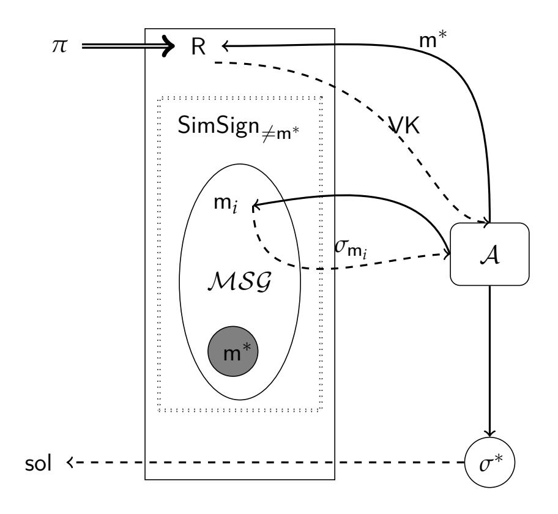
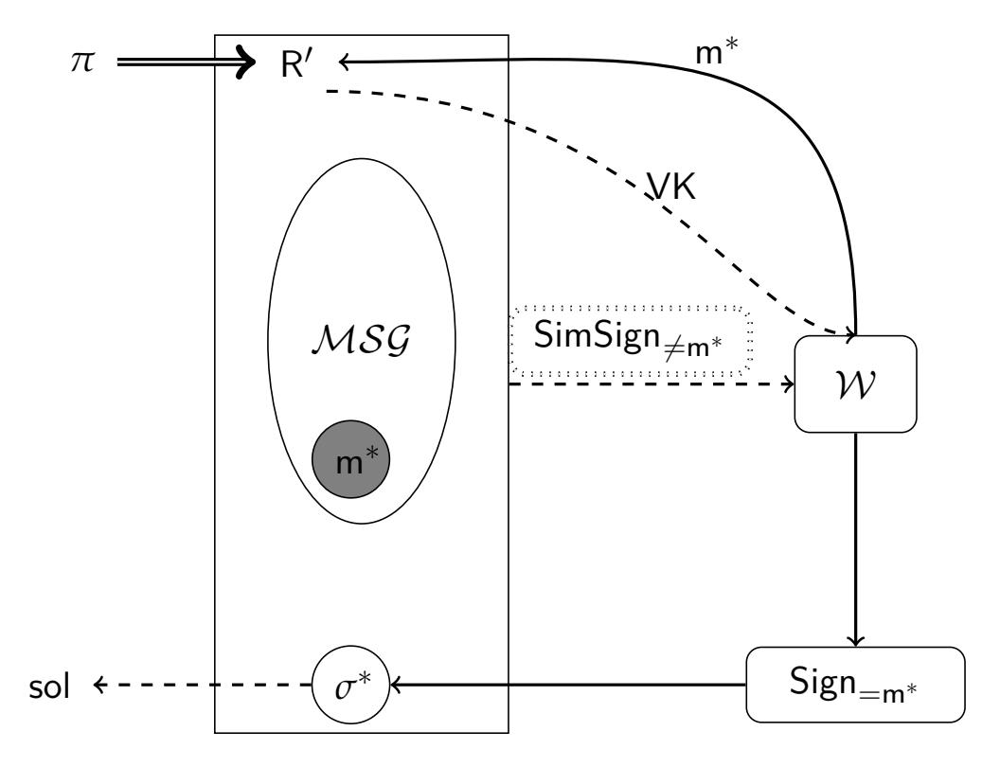

{0}------------------------------------------------

# <span id="page-0-1"></span><span id="page-0-0"></span>**Equipping Public-Key Cryptographic Primitives with Watermarking**

**(or: A Hole Is to Watermark)**

Ryo Nishimaki <sup>1</sup>

<sup>1</sup> NTT Secure Platform Laboratories, Tokyo, Japan ryo.nishimaki.zk@hco.ntt.co.jp

#### **Abstract**

Program watermarking enables users to embed an arbitrary string called a mark into a program while preserving the functionality of the program. Adversaries cannot remove the mark without destroying the functionality. Although there exist generic constructions of watermarking schemes for public-key cryptographic (PKC) primitives, those schemes are constructed from scratch and not efficient.

In this work, we present a general framework to equip a broad class of PKC primitives with an efficient watermarking scheme. The class consists of PKC primitives that have a *canonical all-but-one (ABO) reduction*. Canonical ABO reductions are standard techniques to prove selective security of PKC primitives, where adversaries must commit a target attribute at the beginning of the security game. Thus, we can obtain watermarking schemes for many existing efficient PKC schemes from standard cryptographic assumptions via our framework. Most well-known selectively secure PKC schemes have canonical ABO reductions. Notably, we can achieve watermarking for public-key encryption whose ciphertexts and secret-keys are constant-size, and that is chosen-ciphertext secure.

Our approach accommodates the canonical ABO reduction technique to the puncturable pseudorandom function (PRF) technique, which is used to achieve watermarkable PRFs. We find that canonical ABO reductions are compatible with such puncturable PRF-based watermarking schemes.

**Keywords:** watermarking, public-key cryptography, all-but-one reduction

{1}------------------------------------------------

# **Contents**

| 1 | Introduction                                                            | 1  |  |
|---|-------------------------------------------------------------------------|----|--|
|   | 1.1<br>Background<br>                                                   | 1  |  |
|   | 1.2<br>Our Contribution<br>                                             | 2  |  |
|   | 1.3<br>Technical Overview                                               | 3  |  |
|   | 1.4<br>Comparison and Related Work<br>                                  | 7  |  |
| 2 | Preliminaries                                                           | 10 |  |
| 3 | Definitions of Watermarking for Cryptographic Primitives                | 11 |  |
| 4 | All-But-One Reductions                                                  | 15 |  |
|   | 4.1<br>Assumptions and Security Games<br>                               | 15 |  |
|   | 4.2<br>Abstraction of All-But-One Reductions for Decisional Case        | 16 |  |
|   | 4.3<br>Concrete Examples<br>                                            | 20 |  |
|   | 4.4<br>All-But-N Reductions<br>                                         | 22 |  |
|   | 4.5<br>Concrete Examples of canonical ABN Reductions                    | 24 |  |
| 5 | Message-Less Watermarking via Canonical ABO-reductions                  | 26 |  |
| 6 | Message-Embedding Watermarking via Canonical ABN-reductions             | 28 |  |
|   | 6.1<br>How to Test Circuit Similarity<br>                               | 28 |  |
|   | 6.2<br>Message-Embedding Scheme                                         | 30 |  |
| A | More Preliminaries                                                      | 41 |  |
|   | A.1<br>Known Facts<br>                                                  | 41 |  |
|   | A.2<br>Hard Probmlems and Algebra                                       | 41 |  |
|   | A.3<br>Basic Cryptographic Primitives                                   | 42 |  |
|   | A.4<br>Advanced Cryptographic Primitives<br>                            | 45 |  |
|   | A.5<br>Preliminaries on Lattices<br>                                    | 47 |  |
| B | More Definitions of Watermarking for Cryptographic Primitives           | 49 |  |
|   | B.1<br>TBE Case<br>                                                     | 49 |  |
|   | B.2<br>Signature Case<br>                                               | 50 |  |
| C | All-But-One Reductions for Computational Case                           | 52 |  |
|   | C.1<br>Computational Assumptions and Security Games<br>                 | 52 |  |
|   | C.2<br>Abstraction of All-But-One Reductions for Computational Case<br> | 53 |  |
|   | C.3<br>All-But-N Reductions for Computational Case<br>                  | 55 |  |
| D | More Examples of Canonical ABO and ABN Reductions                       | 57 |  |
|   | D.1<br>More Examples of Canonical ABO Reductions<br>                    | 57 |  |
|   | D.2<br>More Examples of Canonical ABN Reductions<br>                    | 65 |  |

{2}------------------------------------------------

# <span id="page-2-0"></span>**1 Introduction**

## <span id="page-2-1"></span>**1.1 Background**

**Watermarking.** Watermarking enables us to embed an arbitrary string called a "mark" into a digital object such as images, videos, programs. While an embedded mark is extractable, a watermarked object should be almost functionally equivalent to the original one. Watermarking ensures that no one can remove an embedded mark without destroying the original functionality. Watermarking has two main applications. One is identifying ownership of an object. We can verify who is the original creator of objects by extracting an embedded mark that includes a unique identifier. The other is tracing malicious users that illegally copy objects. Therefore, watermarking deters unauthorized distribution.

Barak, Goldreich, Impagliazzo, Rudich, Sahai, Vadhan, and Yang initiated the study of program watermarking and gave rigorous definitions of cryptographic watermarking for programs [\[BGI](#page-38-0)+12]. They proved that program watermarking with perfect functionality-preserving property does not exist if there exists indistinguishability obfuscation (IO) [\[BGI](#page-38-0)+12]. Hopper, Molnar, and Wagner gave more definitions of cryptographic watermarking for perceptual objects and studied the relationships among them [\[HMW07\]](#page-40-0).

Earlier works presented watermarking schemes for specific classes of cryptographic functionalities [\[NSS99,](#page-41-0) [YF11,](#page-42-3) [Nis13,](#page-41-1) [Nis19\]](#page-41-2). However, those schemes are secure in restricted models where we limit adversary's strategies due to the impossibility results by Barak et al. [\[BGI](#page-38-0)+12]. That is, earlier works [\[NSS99,](#page-41-0) [YF11,](#page-42-3) [Nis13,](#page-41-1) [Nis19\]](#page-41-2) do not consider arbitrary removal strategies. Cohen, Holmgren, Nishimaki, Vaikuntanathan, and Wichs presented the first watermarking scheme for pseudorandom functions (PRFs) against arbitrary removal strategies by introducing a relaxed functionality-preserving property [\[CHN](#page-39-0)+18]. In addition, they observed two facts: even if we relax the functionality-preserving property, (1) we need to pick a target circuit from a distribution with high min-entropy to avoid trivial attacks in the security game. (2) learnable circuit families are not watermarkable [\[CHN](#page-39-0)+18]. These two facts are the reasons why most studies on cryptographic watermarking [\[CHN](#page-39-0)+18, [BLW17,](#page-38-1) [KW17,](#page-41-3) [QWZ18,](#page-41-4) [KW19,](#page-41-5) [GKM](#page-39-1)+19, [YAL](#page-42-4)+19] focus on cryptographic primitives rather than arbitrary circuits.

We focus on achieving secure watermarking for *public-key cryptographic primitives* against arbitrary removal strategies in this study since public-key primitives are more versatile than secret-key ones.

**Why watermarking public-key primitives?: An application.** Cohen et al. [\[CHN](#page-39-0)+18] presented an application of watermarked PRFs to electronic locks for cars. A car contains a PRF *F* and can only be opened by running a typical challenge-response identification protocol. A car owner has a software key (e.g., a smart-phone application) that includes a marked PRF. We can embed some identifying information to PRFs. No one can remove the owner's information without losing the ability to unlock the car. Therefore, we can identify the car owner even if the software key is copied and the car is stolen (license plates can be forged). However, an automobile manufacturer can know user keys in this scenario since they are hard-coded in cars.[1](#page-0-0)

If we can independently generate a key pair (public and secret-keys) of a public-key primitive from the watermarking setup, then an automobile manufacturer installs the public key to a car and need not know the secret-key. Therefore, we can run a typical challenge-response protocol by watermarkable public-key encryption (PKE) or signature without revealing secret-keys to manufacturers.[2](#page-0-0)

<sup>1</sup>If a car owner can directly install a PRF key into a car, and a watermarking scheme is public marking type, then watermarkable PRFs work in this scenario. However, this situation is not preferable.

<sup>2</sup>If a watermarking scheme is secret marking type, then we run a secure two-party computation between a user and a manufacturer.

{3}------------------------------------------------

<span id="page-3-1"></span>**Watermarking from scratch or retrofit.** Goyal, Kim, Manohar, Waters, and Wu [\[GKM](#page-39-1)+19] presented the first feasibility result of watermarkable public-key cryptographic primitives from standard assumptions. This is an excellent work on general constructions of watermarkable public-key cryptographic primitives. However, their constructions of cryptographic primitives are built from scratch. Many efficient publickey cryptographic schemes (without watermarking functionalities) have been already proposed. One natural question is whether we can equip *existing* public-key cryptographic schemes with watermarking functionalities. If it is possible, we can obtain many efficient watermarkable cryptographic primitives. Our main question in this study is as follows.

*Is there any general framework to equip public-key cryptographic schemes with watermarking functionalities?*

We affirmatively answer to this question in this paper.

# <span id="page-3-0"></span>**1.2 Our Contribution**

We present a general framework to equip a broad class of public-key primitives with watermarking functionalities. The features of our watermarking schemes are as follows. Our watermarking schemes:

- almost preserve the efficiency of the original public-key primitives.
- apply to various primitives such as signature, PKE, key encapsulation mechanism (KEM), identitybased encryption (IBE), attribute-based encryption (ABE), inner-product encryption (IPE), predicate encryption (PE).
- are secure under the same assumptions as ones used in the original public-key primitives (i.e., CDH, decisional linear (DLIN), DBDH, short integer solution (SIS), LWE assumptions, and more).
- are independent of the original public-key primitives. (We do not need watermarking parameters to setup public-key primitives.)
- use simulation algorithms in security reductions of the original primitives.

More details of our watermarking schemes are explained in Section [1.4.](#page-8-0) We will explain our technique in Section [1.3.](#page-4-0)

Our primary advantages are: (1) semi-general applicability, that is, we can use many existing public-key schemes almost as they are. We do not need to construct watermarkable public-key schemes from scratch. (2) achieving CCA security for PKE. (3) efficiency based on concrete cryptographic assumptions. (See the comparison in Table [1.](#page-9-0)) Those are obtained from our framework using simulation algorithms.

**Using proof techniques as real algorithms.** Our construction technique significantly deviates from those of previous works. The most notable feature of our result is that we present a general method to use simulation algorithms that appear in reduction-based proofs as real cryptographic algorithms. Although our study is not the first study that uses simulation algorithms to achieve new cryptographic functionalities [\[Nis13,](#page-41-1) [Nis19,](#page-41-2) [KNYY19a,](#page-40-1) [KNYY19b\]](#page-40-2),[3](#page-0-0) we present the first systematic approach using simulation algorithms in real schemes. We abstract a commonly used proof technique and show that if a public-key cryptographic scheme is proven to be secure via the proof technique, we can use simulation algorithms in the reduction as watermarked cryptographic functionalities. See Section [1.3](#page-4-0) for the detail. This approach enables us to equip existing schemes with watermarking functionalities.

**Terminology.** Before we give a technical overview, we more formally explain watermarking. A watermarking scheme consists of three algorithms called setup, marking, and extraction algorithms. A setup algorithm Setup generates a marking key wmk and extraction key wxk. A marking algorithm

<sup>3</sup>Katsumata et al. [\[KNYY19a,](#page-40-1) [KNYY19b\]](#page-40-2) use simulation algorithms of ABE schemes to achieve homomorphic signatures.

{4}------------------------------------------------

<span id="page-4-1"></span>Mark takes as input wmk, a circuit *<sup>C</sup>*, and a message *<sup>ω</sup>*, and outputs a marked circuit *<sup>C</sup>*e. Here, *<sup>C</sup>*<sup>e</sup> should output the same output by *C* for most inputs. An extraction algorithm Extract takes as input wxk and circuit *C* 0 , and outputs a string *ω* or special message unmarked. This type of watermarking is called message-embedding. If Mark does not take *ω* as input and Extract outputs marked or unmarked, then we call message-less watermarking. The basic security notion is unremovability, which means no adversary can construct a circuit *C* ∗ such that the functionality of *C* ∗ is almost equivalent to that of *<sup>C</sup>*e, but Extract(wxk, *C* ∗ ) outputs *ω*<sup>∗</sup> 6= *ω*. If we can/not publish wmk and wxk, then we call public/secret marking and public/secret extraction, respectively.

## <span id="page-4-0"></span>**1.3 Technical Overview**

We present how to equip public-key primitives that have *canonical all-but-one reductions*[4](#page-0-0) with watermarking functionalities. All-but-one (ABO) reductions are standard proof techniques to prove selective security of public-key primitives [\[BB11,](#page-38-2) [SW05,](#page-41-6) [GPSW06a,](#page-40-3) [Kil06,](#page-40-4) [ABB10,](#page-37-0) [AFV11,](#page-38-3) [GVW15a,](#page-40-5) [BGG](#page-38-4)+14, [GVW15b\]](#page-40-6). Although our technique is not fully general, that is, we cannot apply our technique to *all* selectively secure public-key primitives, many well-known schemes fall into the class of canonical ABO reductions, where our technique applies. Roughly speaking, our watermarked cryptographic functionalities are simulation algorithms in ABO reductions. This technique is of independent interest because we can use simulators in security reductions as real algorithms for achieving new functionalities.

Our watermarking schemes based on canonical ABO reductions are message-less. To achieve messageembedding watermarking, we need to extend (canonical) ABO reductions to (canonical) all-but-*N* (ABN) reductions. However, ABO reductions are simpler to explain and it is easy to upgrade ABO reductions to ABN reductions for pairing-based schemes.[5](#page-0-0) Thus, we first explain ABO reductions.

**All-but-one reduction.** An ABO reduction is a polynomial-time algorithm that solves a problem instance *π* of a hard problem Π by using an adversary A that breaks *selective security* of a cryptographic primitive Σ. To explain ABO reductions and selective security, we introduce oracles in security games.

Adversaries have access to oracles that receives queries from adversaries and returns answers in some security games. Adversaries also declare a target to attack Σ at some point in the security game of Σ. We prohibit adversaries from sending a special query (or queries) that satisfies some conditions related to the target to prevent trivial attacks. We call such a special query "query on the target". In selective security games, adversaries must declare the target at the very beginning of the game.[6](#page-0-0)

When we prove that if Π is hard, then Σ is selectively secure, we construct the following reduction R. After an adversary declares a target at the beginning of a selective security game, R simulates a public parameter by using a problem instance of Π and the target and sends the public parameter to the adversary. Then, R simulates answers to all queries from the adversary *except the queries on the target* by using the problem instance (and the target). Note that R completes the simulation *without (master) secret-keys* of Σ. This type of reduction is called *all-but-one* reductions due to the simulation manner. In other words, if there exists an ABO reduction, then there exists an oracle simulation algorithm that works for all queries except the target.

We give an example. In the selective security game of signature, an adversary A declares a target message m<sup>∗</sup> at the beginning of the game. Then a challenger sends a public verification-key VK to A. After that, A can send polynomially many queries (i.e., messages) and receives signatures corresponding to the queried messages (except m<sup>∗</sup> ). At some point, A sends a challenge (m<sup>∗</sup> , *σ* ∗ ).

<sup>4</sup>See Section [4.2](#page-17-0) for the formal definition and the meaning of "canonical".

<sup>5</sup>There is no general conversion from ABO to ABN reductions, but upgrading is possible for many concrete schemes by using programmable hash. See Section [4.5](#page-25-0) for more detail.

<sup>6</sup>In adaptive security games, adversaries can select the target at any time.

{5}------------------------------------------------

<span id="page-5-1"></span>A typical example of ABO reductions is the security reduction of the Boneh-Boyen signature scheme [\[BB11\]](#page-38-2). The reduction (or called simulator) R is given a CDH instance *π* = (*G*, *G x* , *G y* ) where *G* is a generator of a group **G**. When the adversary A declares a target m<sup>∗</sup> , R simulates VK by using *π* and m<sup>∗</sup> (embedding *π* and m<sup>∗</sup> into VK). Next, R simulates signatures *σ*<sup>m</sup> for queried message m from A except m<sup>∗</sup> . Here, R *implicitly* embeds *G xy* into the signing key by setting parameters carefully (note that R does *not* have *G xy*). Thus, if we assume A breaks the signature scheme, then R can extract *G xy* from the forged signature *σ* <sup>∗</sup> output by A.

Although R embeds m<sup>∗</sup> in VK, the distribution of VK by R is perfectly the same as the original distribution. In addition, R can perfectly simulate signatures for messages *except for the target message* m<sup>∗</sup> due to the embedding of m<sup>∗</sup> . For notational convention, we separate this signature simulation algorithm part as SimSign6=m<sup>∗</sup> . That is, we can construct an algorithm SimSign6=m<sup>∗</sup> from *π* and m<sup>∗</sup> that outputs *σ*<sup>m</sup> for input m except m<sup>∗</sup> . This is not necessarily possible for all selectively secure schemes since R might use oracle answers for simulation. Thus, we say a reduction is "canonical" if SimSign6=m<sup>∗</sup> does not rely on oracle answers and is described as a stateless randomized algorithm. This proof style is sometimes called *puncturing proof technique* [\[SW14\]](#page-42-5) since m<sup>∗</sup> is like a *hole* in the message space and the reduction has no way to generate *σ*m<sup>∗</sup> for m<sup>∗</sup> . The graphical explanation is described in Figure [1.](#page-5-0)

Although the case of encryption is slightly different from that of signatures, we can consider similar simulation strategies for encryption. In the PKE case, there is no "attribute", but we can use a part of a ciphertext (sometimes called tag) as an attribute (in particular, in the CCA setting).

<span id="page-5-0"></span>

**Figure 1:** Illustration of ABO reduction from the selective security of signature to Π. Solid lines denote outputs by the adversary A of signature. Dashed lines denote simulation by the reduction R. The grayed circle is the hole. Value sol denotes a solution to *π*.

**A hole is to watermark.** We move to explain our unified framework to achieve watermarkable public-key primitives by using canonical ABO reductions. Roughly speaking, *a punctured hole in an ABO reduction works as a watermark because adversaries cannot fill the hole*. More concretely, we can consider the oracle simulation part SimSign6=m<sup>∗</sup> of the canonical reduction R as a watermarked signature generation circuit in the signature case. In addition, no adversary can recover the ability to generate *σ*m<sup>∗</sup> from SimSign6=m<sup>∗</sup> because otherwise, the adversary can break the security of the signature scheme. (The message m<sup>∗</sup> is the target.)

The ABO oracle simulation algorithm SimSign6=m<sup>∗</sup> preserves the functionality of the signature generation circuit except for an input m<sup>∗</sup> . To detect whether a circuit is watermarked or not, we check

{6}------------------------------------------------

<span id="page-6-0"></span>

**Figure 2:** Illustration of reduction from the security of watermarking to  $\pi$ . Solid lines denote outputs by the adversary W of watermarking. Dashed lines denote simulation by reduction R'. The grayed circle is the hole. Value sol denotes a solution to  $\pi$ .

whether the circuit generates a correct output for the punctured input.<sup>7</sup> We can check whether a signature is valid for an message or not by using its verfication algorithm. If a circuit does not generate a valid output for the punctured input (i.e., the hole), then we consider it as watermarked. In almost all ABO reductions, we have efficient algorithms that check the validity of answers from oracles.

The unremovability holds as follows. We construct a reduction R' that solves a problem instance  $\pi$  by using a watermarking adversary  $\mathcal{W}$ . R' can give  $\mathsf{SimSign}_{\neq \mathsf{m}^*}$  to  $\mathcal{W}$  since R' has  $\pi$  and  $\mathsf{m}^*.^8$  Assume that  $\mathcal{W}$  can remove the watermark. That is, we assume  $\mathcal{W}$  is given  $\mathsf{SimSign}_{\neq \mathsf{m}^*}$  and generates a circuit  $\mathsf{Sign}_{=\mathsf{m}^*}$  that can generate a signature for the target  $\mathsf{m}^*$  (i.e., filling *the hole*). Then, R' can break the security of signature. This is because  $\mathsf{Sign}_{=\mathsf{m}^*}$  yields a forgery  $\sigma^*$  for the target  $\mathsf{m}^*$ . We can extract the solution for  $\pi$  from  $\sigma^*$  as the ABO reduction for Boneh-Boyen signature scheme.

Put it differently, the canonical ABO reduction  $R(\pi)$  works as well even if we replace the adversary  $\mathcal A$  of a cryptographic scheme  $\Sigma$  with the adversary  $\mathcal W$  for watermarking, which removes the watermark. The modified reduction  $R'(\pi)$  can solve  $\pi$  because the power of removing the watermark by  $\mathcal W$  leads to breaking the security of  $\Sigma$ . Therefore, the watermarking scheme is secure if the underlying problem is hard. The graphical explanation is described as in Figure 2.

There are a few issues in the overview above. One issue is giving the description of  $\mathsf{SimSign}_{\neq \mathsf{m}^*}$  to the adversary since it has only black-box access to the signature generation oracle in the security game. This issue is the reason why we use "canonical" ABO reductions. If ABO reductions satisfy the canonical property, then  $\mathsf{SimSign}_{\neq \mathsf{m}^*}$  does not need oracle answers from the hard problem  $\Pi$  to simulate the signature generation oracle and can be described as a stateless randomized algorithm.

Another issue is how to prepare a problem instance and randomness for simulating VK in an ABO reduction. To create an ABO reduction in the real world, we need a problem instance  $\pi$ . However, what we have in the real world is not a problem instance but a secret signing-key. It is easy to find that we can perfectly simulate a problem instance and randomness for reductions by using a secret key in the real world for most ABO reductions. In addition, although  $\mathsf{SimSign}_{\neq \mathsf{m}^*}$  includes randomness for simulating VK, this is not an issue thanks to the randomness of the problem instance  $\pi$  (i.e., secret-key in the real

 $<sup>^{7}</sup>$ A useless circuit that outputs  $\perp$  for all inputs is watermarked by this detection. To prevent this, we test the functionalities of circuits. See Section 6 for details.

<sup>&</sup>lt;sup>8</sup>We do not explain how to determine m\* here since it is not essential in this overview.

{7}------------------------------------------------

<span id="page-7-0"></span>world). See Sections 4 to 6 for details.

Although we gave only intuitions in this section, we formalize properties of canonical ABO reductions in Section 4 and prove that we can achieve watermarking from canonical ABO reductions in Sections 5 and 6.

**Extension to all-but-**N **reduction.** The watermarking based on ABO reductions above is message-less watermarking. To embed an arbitrary N-bit string, we need all-but-N reduction, which can simulate oracle answers except queries on N targets. Here, N is an a-priori bounded polynomial in the security parameter. We can easily extend known cryptographic primitives that have ABO reductions to ones that have all-but-N reductions by using the technique of programmable hash functions [HK12] for pairing-based cryptography. We also use the fully key-homomorphic technique [BGG<sup>+</sup>14] in the lattice setting or dynamic q-type assumptions [AHY15] for the Boneh-Boyen IBE. See Section 4.4 for the detail.

First, we explain a reasonable but faulty idea to achieve message-embedding watermarking based on all-but-N reductions since it helps to understand our idea. We prepare N pairs of strings  $\{t_{i,b}^*\}_{i\in[N],b\in\{0,1\}}$  as the public parameter of watermarking. To embed a message  $\omega=(\omega_1,\ldots,\omega_N)\in\{0,1\}^N$ , we consider an oracle simulation algorithm that can generate answers for queries except N points in  $P:=\{t_{1,\omega_1}^*,\ldots,t_{N,\omega_N}^*\}$ . Concretely, in the case of signature, a signature oracle simulation algorithm  $SimSign_{\not\in P}$  outputs a signature  $\sigma_m$  for a message m such that  $m\not\in P$ . To extract an embedded message from a circuit C', we run the answer checking algorithm as in the message-less scheme for each  $i\in[N]$  and  $b\in\{0,1\}$ . If C' outputs a valid  $\sigma_{t_{i,1}^*}$  for input  $t_{i,1}^*$  and does not output a valid  $\sigma_{t_{i,0}^*}$  for input  $t_{i,0}^*$ , then we set the i-th bit of a message to 0 and vice versa.

This construction achieves the functionality of message-embedding watermarking. However, it is not secure because the adversary knows which points should not be punctured. That is, the points in  $\overline{P} := \{t_{1,1-\omega_1}^*, \ldots, t_{N,1-\omega_N}^*\}$  (and P) are publicly available information. We call  $\overline{P}$  the negation of punctured points P in this section. As already observed in some watermarkable PRFs [CHN+18, KW17, QWZ18], public punctured points could hurt watermarking security. In our case, adversary can easily destroy the functionality of cryptographic primitive at any point. More concretely, the adversary can easily modify a watermarked circuit where  $t_{i,\omega_i}^*$  is punctured but  $t_{i,1-\omega_i}^*$  is not punctured into a circuit that does not work for point  $t_{i,1-\omega_i}^*$  too. Then, the extraction algorithm above outputs  $\bot$  for the malformed circuit since the circuit outputs  $\bot$  both for  $t_{i,0}^*$  and  $t_{i,1}^*$ .

To solve the issue, we generate punctured points P and its negation  $\overline{P}$  by using PRFs and hide them instead of using publicly known punctured points and its negation. This technique is commonly used in watermarkable PRFs [CHN<sup>+</sup>18, KW17, QWZ18]. We pseudo-randomly determine punctured points and its negation based on an embedded mark and the public parameter of the target master secret-key to be watermarked. Then, the adversary has no idea about the negation of punctured points  $\overline{P}$  (and P). Therefore, it is hard for the adversary to intentionally modify a watermarked circuit into a circuit that does not work for points in  $\overline{P}$ . In fact, we must prepare many punctured points  $p_i := (t_{i,1-\omega_i}^{(1)}, \ldots, t_{i,\omega_i}^{(T)})$  and its negation  $\overline{p}_i := (t_{i,1-\omega_i}^{(1)}, \ldots, t_{i,1-\omega_i}^{(T)})$  for each bit position i and check all points to extract i-th bit of an embedded message, where T is a polynomial in the security parameter. If a circuit output  $\bot$  for all points in  $p_i$  and a correct value for at least one point in  $\overline{p}_i$ , we extract  $\omega_i$  as the i-th bit. To change the i-th bit of the embedded message without recovering the original functionality, adversaries must destroy the functionality of a circuit for all points in  $\overline{p}_i$ . Advesaries can indiscriminately destroy the functionality without knowing points  $(p_i, \overline{p}_i)$ . However, if the adversary makes a circuit that does not work for a 1/2 plus a non-negligible fraction of inputs, then we can check that the circuit is not functionally similar to the original watermarked circuit. To make a circuit that is functionally similar to the watermarked circuit, but

 $<sup>^9</sup>$ All-but-N reductions should be able to generate N simulated challenge ciphertexts in the encryption case. This simulation is easy to achieve by using random self-reducibility of underlying hard problems for the discrete-logarithm-based case. In the LWE case, polynomially many (so, N) problem instances can be given.

{8}------------------------------------------------

<span id="page-8-1"></span>the extraction algorithm does not output *ω<sup>i</sup>* from, all the adversary can do is recovering the functionality of the watermarked circuit at punctured points *P* (*p<sup>i</sup>* ). This event contradicts to all-but-*N* reductions as the case of the message-less scheme. Thus, we can achieve unremovability.

Although the message-embedding scheme above is secret marking and secret extraction, it is secure even if the adversary has the oracle access to the marking and extraction oracles. See Section [6](#page-29-0) for the detail.

# <span id="page-8-0"></span>**1.4 Comparison and Related Work**

In this section, we review previous works on watermarking.[10](#page-0-0) First, we compare our watermarking schemes with the schemes by Goyal et al. [\[GKM](#page-39-1)+19].

**Efficient direct constructions and generic constructions.** Goyal et al. [\[GKM](#page-39-1)+19] constructed a secret marking and secret extraction watermarking scheme for ABE (GKM+ABE) from mixed functional encryption (FE) and delegatable ABE, which can be instantiated only by the LWE assumption. They also constructed a public marking and public extraction watermarking scheme for PE (GKM+PE) from (bounded collusion-resistant) hierarchical FE, which can be instantiated by any PKE. Although the LWE assumption instantiates the schemes, the constructions are inefficient since they rely on heavy tools like mixed FE and hierarchical FE *even for watermarkable PKE*. In particular, in their watermarkable encryption schemes, not only the public key length but also the ciphertext length depend on the length of embedded massages (and the number of collusions in the GKM+PE case). The ciphertext size of GKM+ABE and GKM+PE is huge (See Table [1\)](#page-9-0). They constructed a public marking and public extraction watermarking scheme for signature (GKM+SIG) from a prefix-constrained signature, which is instantiated with OWFs. GKM+SIG scheme is relatively efficient if it is instantiated with a signature scheme based on the symmetric external Diffie-Hellman (SXDH) assumption [\[CLL](#page-39-2)+14] since the transformation does not incur significant overhead.[11](#page-0-0)

Our watermarking schemes can generally equip public-key primitives with watermarking functionalities if the primitives satisfy some conditions. The equipping procedure incurs only a little overhead. Although we need to modify public-key schemes so that they have *O*(`*λ*)-size master public parameters to achieve message-embedding watermarking where ` is the mark length and *λ* is the security parameter, the size of signatures/secret-keys/ciphertexts does not change. The signatures/secret-keys/ciphertexts consist of only a few group elements if we use group-based schemes. In addition, if we use a *q*-type assumption, we can use the original Boneh-Boyen scheme as it is (even the master public key is constant-size). Thus, our watermarkable public-key primitives are as efficient as known efficient public-key primitives such as Boneh-Boyen IBE scheme [\[BB11\]](#page-38-2). Therefore, in the case of encryption, our schemes are more efficient than those of Goyal et al. in the asymptotic sense. See Table [1](#page-9-0) for the efficiency comparison.

**Functionalities of watermarking.** In GKM+PE, GKM+SIG, and our schemes, the watermarking setup algorithms are completely separated from the key generation algorithm of public-key primitives. However, in GKM+ABE, we need the public parameter of the watermarking scheme to generate keys of public-key primitives.

Although our message-embedding scheme is secret marking and secret extraction, it is secure even if adversaries have access to marking and extraction oracles, which answer a marked circuit and an embedded mark for queried circuits, respectively. GKM+ABE is also secret marking and secret extraction and secure under the marking and extraction oracles, but the number of extraction queries is a-priori bounded. On the other hand, GKM+PE and GKM+SIG are public marking and public extraction.

<sup>10</sup>We do not consider constructions from strong assumptions such as IO in this study.

<sup>11</sup>We focus on constructions in the standard model in this paper. If we instantiate a signature scheme with Schnorr signature scheme [\[Sch91\]](#page-41-7), GKM+SIG would be more efficient.

{9}------------------------------------------------

<span id="page-9-1"></span><span id="page-9-0"></span>**Table 1:** Efficiency Comparison of Message-Embedding Watermarking (Advanced) Public-Key Encryption and Signature. We ignore MPK part in MSK. In "Assumption" column, we put references for concrete instantiations. Parameters  $\lambda$  and  $\ell$  are the security parameter and the length of marks, respectively. In general,  $|\mathbb{G}| = c\lambda$  and  $|\mathbb{G}_T| = c_T \lambda$  for some small constant c and  $c_T$  (depends on pairing groups). We do not put Ours2 in this table since it is message-less type.

|                        | MPK                                  | MSK                                  | $ SK  \text{ or }  \sigma $         | CT                                                     | Assumption                 |
|------------------------|--------------------------------------|--------------------------------------|-------------------------------------|--------------------------------------------------------|----------------------------|
| GKM+ABE                | $poly(\lambda, \ell)$                | $\operatorname{poly}(\lambda)$       | $\operatorname{poly}(\lambda)$      | $\operatorname{poly}(\lambda,\ell)^{\operatorname{c}}$ | LWE [GKW18]                |
| GKM+PE                 | $Q \cdot \text{poly}(\lambda, \ell)$ | $Q \cdot \text{poly}(\lambda, \ell)$ | $\operatorname{poly}(\lambda,\ell)$ | $Q \cdot \text{poly}(\lambda, \ell)^d$                 | PKE                        |
| Ours1 PKE <sup>a</sup> | $(2\ell\lambda + 5) G $              | $(2\ell\lambda+2) \mathbb{Z}_p $     | N/A                                 | 6  <b>G</b>                                            | DLIN [Kil06]               |
| Ours1 KEM <sup>b</sup> | $(\ell\lambda+4) \mathbb{G} + hk $   | $(\ell\lambda+3) \mathbb{Z}_p $      | N/A                                 | 2 G  +  r                                              | DBDH [BMW05]               |
| Ours1 KEM <sup>b</sup> | 4 G + hk                             | $3 \mathbb{Z}_p $                    | N/A                                 | 2 G  +  r                                              | q-type [AHY15]             |
| Ours1 IBE              | $(\ell\lambda + 4) \mathbf{G} $      | $(\ell\lambda + 3) \mathbb{Z}_p $    | $2 \mathbb{G} $                     | $2 G  +  G_T $                                         | DBDH [BB11]                |
| Ours1 IBE              | 4 G                                  | $3 \mathbb{Z}_p $                    | 2 G                                 | $2 \mathbb{G} + \mathbb{G}_T $                         | q-type [AHY15]             |
| Ours1 IBE              | $\ell poly(\lambda)$                 | $\operatorname{poly}(\lambda)$       | $poly(\lambda)$                     | $poly(\lambda)^e$                                      | LWE [BGG <sup>+</sup> 14]  |
| GKM+SIG                | $(\ell+3) \mathbf{G} $               | $ \mathbb{Z}_p $                     | $(\ell+7) \mathbf{G} $              | N/A                                                    | CDH [Wat05]                |
| GKM+SIG                | $8 G + G_T $                         | $8 \mathbb{Z}_p' $                   | $16 \mathbb{G}  +  \mathbb{G}_T $   | N/A                                                    | SXDH [CLL <sup>+</sup> 14] |
| Ours3 SIG              | $(\ell\lambda+4) G $                 | $(\ell\lambda+3) \mathbb{Z}_p $      | 2 G                                 | N/A                                                    | CDH [BB11]                 |
| Ours3 SIG              | 4 G                                  | $3 \mathbb{Z}_p $                    | 2 G                                 | N/A                                                    | q-type [AHY15]             |
| Ours3 SIG              | $\ell \mathrm{poly}(\lambda)$        | $\operatorname{poly}(\lambda)$       | $poly(\lambda)$                     | N/A                                                    | LWE [BGG <sup>+</sup> 14]  |

a Tag-based encryption.

Our schemes for signature/TBE/KEM/IBE and all GKM+ schmes are message-embedding watermarking, but our schemes for ABE/PE are message-less watermarking.

Watermarking user secret-keys v.s. master secret-keys. In GKM+ABE and GKM+PE, we can watermark user secret-keys such as secret-keys for identities (resp. policies) in IBE (resp. ABE). On the other hand, in our schemes, we can watermark master secret-keys of tag-based encryption (TBE), KEM, IBE, ABE, and PE. TBE is a variant of PKE. For signature/KEM/PKE cases, there is no difference since master secret-keys are user secret-keys in these cases.

**Security level.** There are several security measures. (1) Ours for TBE/KEM achieves CCA-security, but GKM+ABE and GKM+PE for PKE do not. (2) GKM+PE and GKM+SIG are adaptively secure, but GKM+ABE and ours are selectively secure in terms of public-key primitives. In terms of embedded messages, GKM+ schemes are adaptively secure, but ours are selectively secure. See Section 3 for selective security of watermarking. (3) All schemes are secure even if the authority of watermarking setup is corrupted. (4) Regarding the parameter on how much adversaries should preserve functionalities to succeed attacks, GKM+ schemes are better than ours. (GKM+ is  $1/\text{poly}(\lambda)$  while ours is  $1/2 + 1/\text{poly}(\lambda)$ .) (5) We can consider three types of collusion-resistance in this study.

Collusion-resistance w.r.t. cryptographic primitives: In security games of cryptographic primitives, adversaries are often allowed to send queries to master secret-key based oracles that gives additional information such as signatures in the signature case and secret-keys for identities in the IBE case. We say collusion-resistant w.r.t. cryptographic primitives if cryptographic schemes are secure even in such a setting. Both GKM+SIG and our watermarking schemes for signatures are collusion-resistant w.r.t. cryptographic primitives. GKM+ABE and our watermarking schemes for encryption (IBE, ABE, and PE) are collusion-resistant w.r.t. cryptographic primitives. On the other hand, GKM+PE is *bounded* collusion-resistant w.r.t. cryptographic primitives, where the number of queries is a-priori bounded.

b Value hk and r are a hash key and randomness of a chameleon hash function.

c At least  $\ell^7 \lambda^7$ .

d At least  $\ell^2 \lambda^2$  if instantiated with FE by Ananth and Vaikuntanathan [AV19].

e At most  $O(\lambda^3 \log^2 \lambda)$ .

{10}------------------------------------------------

<span id="page-10-0"></span>**Collusion-resistance w.r.t. watermarkable cryptographic primitives:** We say that a watermarking scheme is collusion-resistant w.r.t. watermarkable cryptographic primitives if it is unremovable even if adversaries have access to the master secret-key based oracle explained above in security games of watermarking for public-key primitives. Both GKM+SIG and our schemes for signature are collusion-resistant w.r.t. watermarkable cryptographic primitives. Our watermarking schemes for encryption (IBE, ABE, and PE) are collusion-resistant w.r.t. watermarkable cryptographic primitives, but GKM+ABE and GKM+PE schemes are not.

**Collusion-resistance w.r.t. watermarking:** We say that a watermarking scheme is collusion-resistant w.r.t. watermarking (collusion-resistant watermarking) if it is unremovable even if adversaries are given many watermarked keys for the same original key. GKM+ABE, GKM+PE, and GKM+SIG are collusion-resistant watermarking, but ours are not.

We emphasize that even if watermarking schemes do not satisfy collusion-resistance w.r.t. watermarking, they have an application to *ownership identification*. This is because each user can use *different keys* in some settings, as we can see in the application to electronic car-lock in Section [1.1.](#page-2-1) Moreover, collusion-resistant watermarkable encryption is essentially the same as traitor tracing (the definition by Goyal [\[GKM](#page-39-1)+19] for PKE implies traitor tracing).[12](#page-0-0) In some scenarios (ownership identification), traitor tracing (and collusion-resistant watermarking) is over-engineered. Thus, watermarking without collusion-resistance w.r.t. watermarking is meaningful enough. Moreover, if we would like to use collusion-resistant watermarkable PKE, we already have traitor tracing schemes [\[BSW06,](#page-39-5) [GKW19\]](#page-39-6). If we want to trace users in public-key primitives, we can directly consider traceable primitives rather than collusion-resistant watermarkable public-key primitives.

The construction technique by Goyal et al. relies on that of traitor tracing [\[CFN94,](#page-39-7) [NWZ16\]](#page-41-8) to achieve collusion-resistance w.r.t. watermarking.

**Summary of comparison.** We summarize watermarkable public-key primitives by Goyal et al. [\[GKM](#page-39-1)+19] and ours in Tables [1](#page-9-0) and [2.](#page-11-1) PE and ABE include PKE/IBE/IPE as special cases. Notably, ours achieves CCA security for PKE. In addition, our message-embedding scheme (Ours1 in Table [2\)](#page-11-1) is much more efficient than GKM+ABE and GKM+PE as we see in Table [1.](#page-9-0) In particular, the size of secret-keys and ciphertexts in our scheme does not depend on `. If we use *q*-type assumption (Definition [D.16\)](#page-66-1), then even the size of master public key does not depend on `.

The disadvantages of Ours1 and Ours3 are (1) not collusion-resistant (2) secret marking/extraction (3) selective security (4) watermarking for master secret-keys (this is not a disadvantage for PKE and signature) (5) not supporting functionalities beyond IBE. We do not have a useful application of watermarking for master secret-keys in IBE/ABE/PE cases. On the other hand, all GKM+ constructions achieve collusion-resistance, watermarking for user secret keys, and support functionalities beyond IBE. GKM+PE and GKM+SIG achieve adaptive security. Although Ours2 is public marking/extraction and supports functionalities beyond IBE, it is message-less type and watermarking for master secret-keys. Therefore, GKM+ constructions and ours are incomparable.

**More on related work.** Cohen et al. gave the first positive result on program watermarking by introducing the statistical functionality-preserving property [\[CHN](#page-39-0)+18]. They presented public extraction message-embedding watermarkable PRFs based on IO. Subsequently, Kim and Wu [\[KW17,](#page-41-3) [KW19\]](#page-41-5) (KW17 and KW19) and Quach, Wichs, and Zirdelis [\[QWZ18\]](#page-41-4) (QWZ18) presented secret extraction message-embedding watermarkable PRFs based on the LWE assumption. The KW19 and QWZ18 schemes are secure against extraction oracle attacks. In addition, QWZ18 scheme is public marking.

<sup>12</sup>Collusion-resistant watermarkable signatures may have an application to group signatures. However, the application is non-trivial since we should be able to trace users from signatures (not from signing keys) in the group signature setting.

{11}------------------------------------------------

<span id="page-11-2"></span><span id="page-11-1"></span>**Table 2:** Comparison of Watermarking (Advanced) Public-Key Encryption. WM, CR,  $\mathcal{MO}$ , and  $\mathcal{XO}$  stands for watermarking (or watermarkable), collusion-resistance, marking oracle, and extraction oracle, respectively.

|                               | GKM+ABE   | Ours1                 | Ours2        | GKM+PE       | GKM+SIG  | Ours3        |
|-------------------------------|-----------|-----------------------|--------------|--------------|----------|--------------|
| Primitive                     | ABE       | PKE <sup>a</sup> /IBE | ABE/IPE/PE   | PE           | SIG      | SIG          |
| Assumption                    | LWE       | DBDH/I                | DLIN/LWE     | PKE          | OWF      | CDH/SIS      |
| Message-embedding             | <b>√</b>  | $\checkmark$          | ×            | ✓            | <b>√</b> | <b>√</b>     |
| Public mark                   | ×         | ×                     | $\checkmark$ | $\checkmark$ | ✓        | ×            |
| Against $\mathcal{MO}$ attack | ✓         | $\checkmark$          | $\checkmark$ | $\checkmark$ | ✓        | $\checkmark$ |
| Public extraction             | ×         | ×                     | $\checkmark$ | $\checkmark$ | ✓        | ×            |
| Against $\mathcal{XO}$ attack | bounded   | $\checkmark$          | $\checkmark$ | $\checkmark$ | ✓        | $\checkmark$ |
| Separated setup               | ×         | $\checkmark$          | $\checkmark$ | $\checkmark$ | ✓        | $\checkmark$ |
| Marking MSK                   | ×         | $\checkmark$          | $\checkmark$ | ×            | N/A      | N/A          |
| Marking SK                    | ✓         | ×                     | ×            | $\checkmark$ | ✓        | $\checkmark$ |
| CCA-secure PKE                | ×         | √a                    | √a           | ×            | N/A      | N/A          |
| CR w.r.t. primitive           | <b>√</b>  | $\checkmark$          | $\checkmark$ | bounded      | ✓        | $\checkmark$ |
| CR w.r.t. WM primitive        | ×         | $\checkmark$          | $\checkmark$ | ×            | ✓        | $\checkmark$ |
| CR w.r.t. WM                  | <b>√</b>  | ×                     | N/A          | bounded      | ✓        | ×            |
| Selective/Adaptive sec.       | selective | selective             | selective    | adaptive     | adaptive | selective    |
| Sec. against authority        | <u> </u>  | $\checkmark$          | <b>√</b>     | √<br>        | <b>√</b> | ✓            |

a TBE and KEM.

Regarding message-embedding watermarkable PRFs, KW17, KW19, and QWZ18 schemes are relatively efficient since they are based on the LWE assumption.

Baldimtsi, Kiayias, and Samari presented watermarking schemes for public-key primitives in a relaxed model, where a trusted watermarking authority generates not only watermarked keys but also unmarked keys and algorithms are stateful [BKS17]. We do not compare their scheme because this is a weaker model.

Goyal et al. presented not only constructions but also rigorous definitions of watermarkable public-key primitives and a relaxed functionality-preserving property for watermarkable public-key primitives  $[GKM^+19]$ .<sup>13</sup>

**Organization.** In Section 2, we provide preliminaries and basic definitions. Section 3 introduces the syntax and security definitions of watermarking. Section 4 defines canonical ABO reductions and gives examples of them. In Section 5, we present our message-less watermarking scheme and prove its security. In Section 6, we present our message-embedding watermarking scheme and prove its security.

## <span id="page-11-0"></span>2 Preliminaries

We define some notations and introduce cryptographic notions in this section.

**Notations and basic concepts.** In this paper,  $x \leftarrow X$  denotes selecting an element from a finite set X uniformly at random, and  $y \leftarrow A(x)$  denotes assigning to y the output of a probabilistic or deterministic algorithm A on an input x. When we explicitly show that A uses randomness r, we write  $y \leftarrow A(x;r)$ . For strings x and y, x || y denotes the concatenation of x and y. Let  $[\ell]$  denote the set of integers  $\{1, \cdots, \ell\}$ ,  $\lambda$  denote a security parameter, and y := z denote that y is set, defined, or substituted by z. PPT stands for probabilistic polynomial time.

<sup>&</sup>lt;sup>13</sup>Cohen et al. [CHN<sup>+</sup>15] considered watermarkable public-key primitives before Goyal et al., but even if a scheme satisfies their definitions, there exists simple attacks as observed by Goyal et al. [GKM<sup>+</sup>19].

{12}------------------------------------------------

- <span id="page-12-2"></span>• A function  $f: \mathbb{N} \to \mathbb{R}$  is a negligible function if for any constant c, there exists  $\lambda_0 \in \mathbb{N}$  such that for any  $\lambda > \lambda_0$ ,  $f(\lambda) < \lambda^{-c}$ . We write  $f(\lambda) \leq \mathsf{negl}(\lambda)$  to denote  $f(\lambda)$  being a negligible function.
- If  $\mathcal{X}^{(b)} = \{X_{\lambda}^{(b)}\}_{\lambda \in \mathbb{N}}$  for  $b \in \{0,1\}$  are two ensembles of random variables indexed by  $\lambda \in \mathbb{N}$ , we say that  $\mathcal{X}^{(0)}$  and  $\mathcal{X}^{(1)}$  are computationally indistinguishable if for any PPT distinguisher  $\mathcal{D}$ , there exists a negligible function  $\operatorname{negl}(\lambda)$ , such that

$$\Delta \coloneqq |\Pr[\mathcal{D}(X_{\lambda}^{(0)}) = 1] - \Pr[\mathcal{D}(X_{\lambda}^{(1)}) = 1]| \le \mathsf{negl}(\lambda).$$

We write  $\mathcal{X}^{(0)} \stackrel{\mathsf{c}}{\approx} \mathcal{X}^{(1)}$  to denote that the advantage  $\Delta$  is negligible.

• The statistical distance between  $\mathcal{X}^{(0)}$  and  $\mathcal{X}^{(1)}$  over a countable set S is defined as  $\Delta_s(\mathcal{X}^{(0)},\mathcal{X}^{(1)}) \coloneqq \frac{1}{2} \sum_{\alpha \in S} |\Pr[X_{\lambda}^{(0)} = \alpha] - \Pr[X_{\lambda}^{(1)} = \alpha]|$ . We say that  $\mathcal{X}^{(0)}$  and  $\mathcal{X}^{(1)}$  are statistically/perfectly indistinguishable (denoted by  $\mathcal{X}^{(0)} \stackrel{\text{s}}{\approx} \mathcal{X}^{(1)}/\mathcal{X}^{(0)} \stackrel{\text{p}}{\approx} \mathcal{X}^{(1)}$ ) if  $\Delta_s(\mathcal{X}^{(0)},\mathcal{X}^{(1)}) \leq \text{negl}(\lambda)$  and  $\Delta_s(\mathcal{X}^{(0)},\mathcal{X}^{(1)}) = 0$ , respectively. We also say that  $\mathcal{X}^{(0)}$  is  $\epsilon$ -close to  $\mathcal{X}^{(1)}$  if  $\Delta_s(\mathcal{X}^{(0)},\mathcal{X}^{(1)}) = \epsilon$ .

**Definition 2.1 (Circuit similarity).** *Let* C *be a circuit class whose input space is*  $\{0,1\}^{\ell}$ . *For two circuits*  $C, C' \in C$  *and a non-decreasing function*  $\epsilon : \mathbb{N} \to \mathbb{N}$ , *we say that* C *is*  $\epsilon$ -*close to* C' *if it holds that* 

$$\Pr[C(x) \neq C'(x) \mid x \leftarrow \{0,1\}^{\ell}] \leq \epsilon.$$
 (denoted by  $C \cong_{\epsilon} C'$ )

Similarly, we say that C is  $\epsilon$ -far to C' if it holds that

$$\Pr[C(x) \neq C'(x) \mid x \leftarrow \{0,1\}^{\ell}] > \epsilon.$$
 (denoted by  $C \ncong_{\epsilon} C'$ )

# <span id="page-12-0"></span>3 Definitions of Watermarking for Cryptographic Primitives

In this section, we introduce the definitions of watermarking for cryptographic primitives. Although our definitions basically follow those of Goyal et al.  $[GKM^+19]$ , there are several differences.

We focus on cryptographic primitives that have a master parameter generation algorithm PGen and a master secret-key based algorithm MSKAlg in this study. For example, in IBE/ABE/IPE, PGen is a setup algorithm Setup and MSKAlg is a key generation algorithm for identity/attribute/policy KeyGen. In TBE/KEM/signature, PGen is a key generation algorithm Gen and MSKAlg is a decryption/signing algorithm Dec/Sign. See Definition A.9 for TBE. Hereafter, we do not explicitly treat KEM, but it is easy to adapt all definitions to the KEM setting. We formalize the notion of master secret-key based cryptographic schemes as follows.

<span id="page-12-1"></span>**Definition 3.1** (Master secret-key based cryptographic scheme). A master secret-key based cryptographic scheme  $\Sigma$  with spaces  $(\mathcal{T}, \mathcal{Q}, \mathcal{P}, \mathcal{R}_{mka})$  has at least two algorithms PGen and MSKAlg.

**Master parameter generation:**  $PGen(1^{\lambda})$  *takes as input the security parameter and outputs a master public parameter*  $PP \in \mathcal{PP}$  *and a master secret key*  $MSK \in \mathcal{MSK}$ . We often omit spaces PP and MSK from  $\Sigma$ .

**Master secret-key based algorithm:** MSKAlg(MSK, X) *takes* MSK *and an input*  $X \in \mathcal{Q}$  *and outputs*  $Y \in \mathcal{P}$ . The randomness space of MSKAlg is  $\mathcal{R}_{mka}$ .

We assume that MSK includes PP.  $\Sigma = (PGen, MSKAlg, ...)$  has additional algorithm other than PGen and MSKAlg. The space  $\mathcal{T}$  is used in the security game defined later. <sup>14</sup>

 $<sup>^{14}</sup> Jumping$  ahead,  ${\cal T}$  is a space where adversaries select targets at the beginning of security games.

{13}------------------------------------------------

<span id="page-13-1"></span>Remark 3.2. In Definition 3.1, an output by MSKAlg is typically a secret key for an identity/policy X, signature for a message X. In the TBE case, X consists of a tag and ciphertext, and Y is a plaintext. We can consider encryption, decryption, and verification algorithms as additional algorithms. Definition 3.1 captures most popular cryptographic schemes such as PKE, TBE, IBE, ABE, IPE, PE, FE, signature, constrained signature.

**Table 3:** Concrete spaces and algorithms of master secret-key based cryptographic scheme.

|                                                         | tag-based PKE                                                                                                                                                                                                                       | IBE                                                                                                  | SIG                                                                                                |
|---------------------------------------------------------|-------------------------------------------------------------------------------------------------------------------------------------------------------------------------------------------------------------------------------------|------------------------------------------------------------------------------------------------------|----------------------------------------------------------------------------------------------------|
| $\mathcal{T}$ $\mathcal{Q}$ $\mathcal{P}$ MSKAlg(MSK,·) | $ \begin{array}{ c c c } & \text{tag space } \mathcal{TAG} \\ & \text{tag and ciphertext space } \mathcal{TAG} \times \mathcal{CT} \\ & \text{plaintext space } \mathcal{PT} \cup \{\bot\} \\ & \text{Dec(sk,} \cdot) \end{array} $ | identity space $\mathcal{ID}$<br>$\mathcal{ID}$<br>secret key space $\mathcal{SK}$<br>KeyGen(MSK, ·) | message space $\mathcal{MSG}$<br>$\mathcal{MSG}$<br>signature space $\mathcal{SIG}$<br>Sign(sk, ·) |

<span id="page-13-0"></span>**Definition 3.3 (Validity check algorithm for master secret-key based cryptographic scheme).** A master secret-key based cryptographic scheme  $\Sigma$  with spaces  $(\mathcal{T}, \mathcal{Q}, \mathcal{P}, \mathcal{R}_{mka})$  can have an optional algorithm Valid-Out that takes as inputs PP,  $X \in \mathcal{Q}$ , and  $Y \in \mathcal{P}$  and outputs  $\top / \bot$ . For all  $(\mathsf{PP}, \mathsf{MSK}) \leftarrow \mathsf{PGen}(1^\lambda)$  and all  $X \in \mathcal{Q}$ ,  $\mathsf{Valid-Out}(\mathsf{PP}, X, Y)$  outputs  $\top$  if and only if  $Y \leftarrow \mathsf{MSKAlg}(\mathsf{MSK}, X)$ .

*Remark* 3.4. Although we do not explicitly consider validity check algorithms in signature and advanced encryption schemes, we can implement validity check algorithms in most schemes (and all schemes in this paper). See examples in Sections 4.3 and 4.5 and Appendices D.1 and D.2. Note that *Y* is not necessarily unique since MSKAlg might be a randomized algorithm.

**Definition 3.5** (Watermarkable Public-Key Scheme). A watermarking scheme with mark space  $\mathcal{M}_w$  for master secret-key based cryptographic scheme  $\Sigma$  with spaces  $(\mathcal{T}, \mathcal{Q}, \mathcal{P}, \mathcal{R}_{mka})$  is a tuple of algorithms (WMSetup, Mark, Extract) with the following properties:

**Setup:** WMSetup( $1^{\lambda}$ ) *takes as input the security parameter and outputs a watermarking public parameter* wpp, *a marking key* wmk, *and an extraction key* wxk.

**Mark:** Mark(wpp, wmk, MSK,  $\omega$ ) takes as input wpp, wmk, the master secret key MSK  $\in \mathcal{MSK}$  of  $\Sigma$ , and a mark  $\omega \in \mathcal{M}_w$  and outputs a deterministic circuit  $\widetilde{C}: \mathcal{Q} \times \mathcal{R}_{mka} \to \mathcal{P}$ . Note that  $\widetilde{C}$  explicitly takes the randomness of MSKAlg.

**Extract:** Extract(wpp, wxk, PP, C') takes as input wpp, wxk, the public parameter PP  $\in \mathcal{PP}$  of  $\Sigma$ , and a circuit  $C': \mathcal{Q} \times \mathcal{R}_{mka} \to \mathcal{P}$  and outputs a mark  $\omega' \in \mathcal{M}_w$  or a special symbol unmarked.

*Remark* 3.6. We can separately treat watermarking schemes and cryptographic primitives in our definition while in the definition of Goyal et al. [GKM<sup>+</sup>19], key generation algorithms of cryptographic primitives need public parameters of watermarking. The separated definition is preferable and the same definition as that of Cohen et al. [CHN<sup>+</sup>18].

Hereafter, we set wsk := wmk = wxk since we consider only two cases. One is the public marking and extraction case (wmk = wxk =  $\perp$ ) and the other is the secret marking and extraction case (wsk = wmk = wxk) in this paper.

<span id="page-13-2"></span>Hereafter, we focus on advanced encryption (IBE, IPE, ABE, PE) rather than TBE and signature for readability. We present variants for TBE and signature in Appendix B since it is easy to adapt the definition below to the TBE and signature settings.

{14}------------------------------------------------

<span id="page-14-1"></span>**Definition 3.7** (Correctness (Advanced encryption)). Let  $WM_{\Sigma} = (WMSetup, Mark, Extract)$  be a watermarking scheme for advanced encryption scheme  $\Sigma = (Setup, KeyGen, Enc, Dec)$  with spaces  $(\mathcal{T}, \mathcal{Q}, \mathcal{P}, \mathcal{R}_{mka})$ . In this case,  $\mathcal{T} = \mathcal{ATT}$ ,  $\mathcal{Q} = \mathcal{POL}$ ,  $\mathcal{P} = \mathcal{SK}$ , where  $\mathcal{ATT}$  and  $\mathcal{POL}$  is an attribute and policy space, respectively. We say that  $WM_{\Sigma}$  is correct if it satisfies the following.

**Extraction correctness:** For all (wpp, wsk)  $\leftarrow$  WMSetup( $1^{\lambda}$ ), all marks  $\omega \in \mathcal{M}_{w}$ ,

$$\Pr[\mathsf{Extract}(\mathsf{wpp}, \mathsf{wsk}, \mathsf{PP}, \mathsf{Mark}(\mathsf{wpp}, \mathsf{wsk}, \mathsf{MSK}, \omega)) \neq \omega \mid (\mathsf{PP}, \mathsf{MSK}) \leftarrow \mathsf{Setup}(1^{\lambda})] \leq \mathsf{negl}(\lambda).$$

**Meaningfulness:** There are two variants of meaningfulness.

**Strong meaningfulness.** For all fixed circuits  $C : \mathcal{POL} \times \mathcal{R}_{\mathsf{mka}} \to \mathcal{SK}$ ,

$$\Pr\left[\mathsf{Extract}(\mathsf{wpp},\mathsf{wsk},\mathsf{PP},C) = \mathsf{unmarked} \left| \begin{array}{c} (\mathsf{wpp},\mathsf{wsk}) \leftarrow \mathsf{WMSetup}(1^\lambda) \\ (\mathsf{PP},\mathsf{MSK}) \leftarrow \mathsf{Setup}(1^\lambda) \end{array} \right] > 1 - \mathsf{negl}(\lambda).$$

**Weak meaningfulness**. For all (wpp, wsk)  $\leftarrow$  WMSetup( $1^{\lambda}$ ),

$$\Pr[\mathsf{Extract}(\mathsf{wpp},\mathsf{wsk},\mathsf{PP},\mathsf{KeyGen}(\mathsf{MSK},\cdot)) = \mathsf{unmarked} \mid (\mathsf{PP},\mathsf{MSK}) \leftarrow \mathsf{Setup}(1^{\lambda})] > 1 - \mathsf{negl}(\lambda).$$

**Functionality-preserving:** For all (wpp, wsk)  $\leftarrow$  WMSetup( $1^{\lambda}$ ), for all (PP, MSK)  $\leftarrow$  Setup( $1^{\lambda}$ ), all marks  $\omega \in \mathcal{M}_{w}$ , there exists  $\mathcal{PS} \subset \mathcal{ATT}$  such that  $N := |\mathcal{PS}| \leq \text{poly}(\lambda)$ , for all  $\rho_{\mathsf{mka}} \in \mathcal{R}_{\mathsf{mka}}$ , all attributes  $x \in \mathcal{ATT} \setminus \mathcal{PS}$  and all policy  $P \in \mathcal{POL}$  such that P(x) = T, we have that

$$\Pr[\widetilde{C}(\mathsf{P}, \rho_{\mathsf{mka}}) \overset{\mathsf{p}}{\approx} \mathsf{KeyGen}(\mathsf{MSK}, \mathsf{P}) \mid \widetilde{C} \leftarrow \mathsf{Mark}(\mathsf{wpp}, \mathsf{wsk}, \mathsf{MSK}, \omega)] > 1 - \mathsf{negl}(\lambda).$$

Here, PS stands for a "punctured set" since  $\widetilde{C}$  does not work for policy P such that  $x \in PS$  and  $P(x) = \bot$ .

Condition  $P(x) = \bot$  means attribute x is not qualified to policy P.

In the IBE case, 
$$\mathcal{T} = \mathcal{Q} = \mathcal{I}\mathcal{D}$$
 (identity space),  $P = id_i$ ,  $x = id$ , and  $P(x) = \bot$  means  $id_i \neq id$ .

Remark 3.8. Although our definition has a few differences from the standard functionality preserving in the cryptographic watermarking context [CHN $^+$ 18, KW17] on the surface, ours is basically the same as the standard one. We select the definition above to emphasize that there exists a punctured set  $\mathcal{PS}$ , and the set is explicitly used in the security definition.

In addition, this functionality-preserving is stronger than that by Goyal et al. [GKM<sup>+</sup>19] since the output distribution of marked circuits is perfectly the same as that of the original circuit on almost all inputs.

<span id="page-14-0"></span>**Definition 3.9 (Selective-Mark**  $\epsilon$ **-Unremovability for Advanced Encryption).** For every PPT  $\mathcal{A}$ , we have

$$\Pr[\mathsf{Exp}^{\mathsf{urmv-enc}}_{\mathcal{A},\mathsf{WM}_\Sigma}(\lambda,\epsilon) = 1] \leq \mathsf{negl}(\lambda),$$

where  $\epsilon$  is a parameter of the scheme called the approximation factor and  $\mathsf{Exp}_{\mathcal{A},\mathsf{WM}_\Sigma}^{\mathsf{urmv-enc}}(\lambda,\epsilon)$  is the game defined as follows.

- 1. The adversary A declares a target mark  $\omega^* \in \mathcal{M}_w$ .
- 2. The challenger generates (PP, MSK)  $\leftarrow$  Setup( $1^{\lambda}$ ), (wpp, wsk)  $\leftarrow$  WMSetup( $1^{\lambda}$ ), and  $\widetilde{C} \leftarrow$  Mark(wpp, wsk, MSK,  $\omega^*$ ), and gives (PP, wpp,  $\widetilde{C}$ ) to A. At this point, a set  $PS \subset T$  such that  $|PS| = \text{poly}(\lambda)$  is uniquely determined by (wpp, wsk, PP,  $\omega^*$ ).

{15}------------------------------------------------

- <span id="page-15-0"></span>3. A has oracle access to the key generation oracle KO. If KO is queried with a policy  $P \in POL$  such that  $P(t_i^*) = \bot$  for all  $t_i^* \in PS$ , then KO answers with KeyGen(MSK, P). Otherwise, it answers  $\bot$ . Condition  $P(x) = \bot$  means attribute x is not qualified to policy P.
- 4. A has oracle access to the marking oracle MO. If MO is queried with a master secret key  $MSK' \in \mathcal{MSK}$  and a mark  $\omega' \in \mathcal{M}_w$ , then does the following. If the corresponding master public parameter PP' is equal to PP, then outputs  $\bot$ . Otherwise, answers with  $Mark(wpp, wsk, MSK', \omega')$ .
- 5. A has oracle access to the extraction oracle  $\mathcal{XO}$ . If  $\mathcal{XO}$  is queried with a PP' and circuit C', then  $\mathcal{XO}$  answers with Extract(wpp, wsk, PP', C').
- 6. Finally, A outputs a circuit  $C^*$ . If A is admissible (defined below) and  $Extract(wpp, wsk, PP, C^*) \neq \omega^*$  then the experiment outputs 1, otherwise 0.

We say that A is  $\epsilon$ -admissible if  $C^*$  output by A in the experiment above satisfies

$$\Pr\left[\mathsf{Valid\text{-}Out}(\mathsf{PP},\mathsf{P},C^*(\mathsf{P},\rho_\mathsf{mka})) = \top \left| \begin{array}{c} \mathsf{P} \leftarrow \mathcal{POL} \\ \rho_\mathsf{mka} \leftarrow \mathcal{R}_\mathsf{mka} \end{array} \right] \geq \epsilon.$$

See Definition 3.3 for Valid-Out.

The admissibility requires the adversary to output  $C^*$  that agrees on an  $\epsilon$  fraction of inputs with C. This formalizes that  $C^*$  should be similar to the original circuit C.

Remark 3.10. Our definition is the same as that of Goyal et al. [GKM<sup>+</sup>19] except for that

- 1. A must declare the target mark  $\omega$  at the beginning of the game.
- 2.  $\mathcal{A}$  does not receives answers for inputs in  $\mathcal{PS}$  from the key generation oracle.
- 3. we do not consider collusion-resistance w.r.t. watermarking. That is, A is given only one target circuit  $\widetilde{C}$ .
- 4. we consider the oracles  $\mathcal{KO}$  in the unremovability game while Goyal et al. do not.
- 5. we consider watermarking for *master secret-keys*. Thus, the admissible condition for advanced encryption (i.e., beyond PKE or TBE) is in terms of Valid-Out.

**Unforgeability.** We can consider another security notion for watermarking, called unforgeability [CHN<sup>+</sup>18, BLW17, KW17], in the secret marking setting. Unforgeability says that adversaries cannot generate a marked circuit with sufficiently different functionality from that of given marked circuits without a marking key.

We do not formally define unforgeability in this work as Goyal et al. did not. However, we can achieve unforgeability by embedding not only a mark but also a signature for the embedded mark and master public key as Goyal et al. observed [GKM<sup>+</sup>19].<sup>15</sup>

On security against malicious authority. Our watermarkable public-key primitives are trivially secure against authorities of watermarking schemes if the underlying public-key primitives are secure since parameter generation algorithms PGen are independent of watermarking setup algorithms WMSetup. Thus, we omit the definition of security against malicious authority.

 $<sup>^{15}\</sup>mbox{ePrint}$  archive report 2019/628, Section 3.4 and C.4 (version 20190908).

{16}------------------------------------------------

# <span id="page-16-2"></span><span id="page-16-0"></span>4 All-But-One Reductions

In this section, we formalize a class of security reductions, called canonical all-but-one (ABO) reductions. Canonical ABO reductions are often used to prove the hardness of breaking many cryptographic primitives. A typical example is the security reduction of Boneh-Boyen IBE based on the decisional bilinear Diffie-Hellman assumption [BB11].

### <span id="page-16-1"></span>4.1 Assumptions and Security Games

We need to define cryptographic assumptions and security games before we formalize canonical ABO reductions. The types of reductions depend on whether security games and underlying cryptographic assumptions are computational or decisional. Therefore, we consider two types of assumptions and games. However, we focus on the decisional case in the main body for readability. See Appendix C for the computational case.

**Definition 4.1 (Decisional assumption).** A decisional assumption DA for problem  $\Pi$  is formalized by a game between the challenger  $\mathcal E$  and the adversary  $\mathcal A$ . The problem  $\Pi$  consists of an efficient problem sampling algorithm  $\mathsf{PSample}_b$  for  $b \in \{0,1\}$ . The game  $\mathsf{Expt}_{\Pi,\mathcal E\leftrightarrow\mathcal A}^{\mathsf{DA}}(\lambda,b)$  is formalized as follows.

- On input security parameter  $\lambda$ ,  $\mathcal{E}$  samples a problem instance  $\pi_b \leftarrow \mathsf{PSample}_b(1^{\lambda})$ .
- $\mathcal{E}$  sends  $\pi_b$  to  $\mathcal{A}$  and may interact with  $\mathcal{A}(1^{\lambda}, \pi_b)$ .
- At some point, A outputs a guess  $coin^*$  and the game outputs  $coin^*$ .

We say a decisional assumption holds (or problem  $\Pi$  is hard) if it holds

$$\mathsf{Adv}^{\mathsf{DA}}_{\Pi,\mathcal{E}\leftrightarrow\mathcal{A}}(\lambda) \coloneqq |\Pr[\mathsf{Expt}^{\mathsf{DA}}_{\Pi,\mathcal{E}\leftrightarrow\mathcal{A}}(\lambda,0) = 1] - \Pr[\mathsf{Expt}^{\mathsf{DA}}_{\Pi,\mathcal{E}\leftrightarrow\mathcal{A}}(\lambda,1) = 1]| \le \mathsf{negl}(\lambda).$$

This definition captures the well-known DDH, DBDH, k-Lin, matrix-DDH, quadratic residuosity, LWE, decisional q-type assumptions (and more). Note that the assumption above also captures interactive oracle assumptions since  $\mathcal{A}$  may interact with the challenger that plays the role of oracles. An example of interactive oracle assumptions is Definition D.17.

**Definition 4.2 (Selective Security Game (Decisional Case)).** We define selective security games (decisional case) between a challenger C and an adversary A for a master secret-key based scheme  $\Sigma$  with spaces  $(\mathcal{T}, \mathcal{Q}, \mathcal{P}, \mathcal{R}_{mka})$  associated with challenge space  $\mathcal{H}$ , challenge answer space  $\mathcal{I}$ , and admissible condition Adml. (See Table 4 for concrete examples.) The admissible condition Adml outputs  $\top$  or  $\bot$  depending on whether a query is allowed or not.

We define the experiment  $\mathsf{Exp}_{\mathcal{A},\Sigma}^{\mathsf{d-goal-atk}}(\lambda,\mathsf{coin})$  between an adversary  $\mathcal{A}$  and a challenger as follows.

- 1. A submits a target  $t^* \in \mathcal{T}$  to the challenger.
- 2. The challenger runs (PP, MSK)  $\leftarrow$  PGen(1 $^{\lambda}$ ), and gives PP to  $\mathcal{A}$ .
- 3. A sends a query query  $\in \mathcal{Q}$  to the challenger. If  $Adml(t^*, query) = \top$ , the challenger sends an answer answer  $\leftarrow MSKAlg(MSK, query)$  to  $\mathcal{A}$ . On the other hand, if  $Adml(t^*, query) = \bot$ , the challenger outputs  $\bot$ . ( $\mathcal{A}$  can send polynomially many queries.)
- 4. At some point,  $\mathcal{A}$  sends a challenge challenge  $\in \mathcal{H}$  to the challenger. The challenger generates a challenge answer c-ans\*  $\in \mathcal{I}$  by using  $(t^*, \mathsf{PP}, \mathsf{challenge}, \mathsf{coin})$  (denoted by  $\mathcal{C}_\mathsf{a}(t^*, \mathsf{PP}, \mathsf{challenge}, \mathsf{coin})$ ) and sends c-ans\* to  $\mathcal{A}$ .
- 5. Again, A is allowed to query (polynomially many) query  $\in \mathcal{Q}$  such that  $Adml(t^*, query) = \top$ .

{17}------------------------------------------------

6. A outputs a guess  $coin^*$  for coin. The experiment outputs  $coin^*$ .

We say that  $\Sigma$  is secure if for all A, it holds that

$$\mathsf{Adv}^{\mathsf{d\text{-}goal\text{-}atk}}_{\mathcal{A},\Sigma}(\lambda) \coloneqq |\Pr[\mathsf{Exp}^{\mathsf{d\text{-}goal\text{-}atk}}_{\mathcal{A},\Sigma}(\lambda,0) = 1] - \Pr[\mathsf{Exp}^{\mathsf{d\text{-}goal\text{-}atk}}_{\mathcal{A},\Sigma}(\lambda,1) = 1]| \le \mathsf{negl}(\lambda).$$

We say an adversary is successful if the advantage is non-negligible. We can consider the multichallenge case, where the targets are  $\vec{t}^* \in \mathcal{T}^N$  instead of the single  $t^*$ .

A concrete example of  $Adml(t^*, query)$  is  $Adml(t^*, query) = \top$  if and only if  $t^* \neq t$  where query = t in the signature/TBE/IBE cases (t is a message/tag/identity).

Although we can consider a stronger variant, called adaptive security games, we consider only selective security games since ABO reductions are basically applicable in the selective setting.

#### <span id="page-17-0"></span>4.2 Abstraction of All-But-One Reductions for Decisional Case

Now, we are ready to define ABO reductions for the decisional case. We put red underlines on the parts related to "canonical" parts.

First, we present a simplified definition that does not capture the TBE/KEM case for readability.

<span id="page-17-1"></span>**Definition 4.3 (Canonical All-But-One Reduction for Decisional Case (Simplified)).** Let  $\Sigma$  be a master secret-key based scheme with  $(\mathcal{T}, \mathcal{Q}, \mathcal{P}, \mathcal{R}_{mka})$  associated with challenge space  $\mathcal{H}$ , challenge answer space  $\mathcal{I}$ , and admissible condition Adml. (See Table 4 for concrete examples.) A security reduction algorithm  $\mathbb{R}$  from  $\Sigma$  to a hard problem  $\Pi$  is a canonical all-but-one reduction (or  $\Sigma$  has a canonical all-but-one reduction to  $\Pi$ ) if it satisfies the following properties.

**Oracle access:**  $\mathcal{A}$  has oracle access to  $\mathcal{O}_{\mathsf{MSK}}: \mathcal{Q} \to \mathcal{P}$  in the security game  $\mathsf{Exp}_{\mathcal{A},\Sigma}^{\mathsf{d-goal-atk}}$ . This oracle receives a query query  $\in \mathcal{Q}$  and does the following. If  $\mathsf{Adml}(t^*,\mathsf{query}) = \top$ , where  $t^*$  is defined below, it sends an answer answer  $\leftarrow \mathsf{MSKAlg}(\mathsf{MSK},\mathsf{query})$  to  $\mathcal{A}$ . On the other hand, if  $\mathsf{Adml}(t^*,\mathsf{query}) = \bot$ , it outputs  $\bot$ .

**Selective reduction:** R simulates the security game  $\operatorname{Exp}_{\mathcal{A},\Sigma}^{\mathsf{d-goal-atk}}$  of  $\Sigma$  between the challenger  $\mathcal C$  and the adversary  $\mathcal A$  to win the game  $\operatorname{Exp}_{\Pi,\mathcal E\leftrightarrow R}^{\mathsf{DA}}$ . That is, R plays the role of the challenger  $\mathcal C$  in  $\operatorname{Exp}_{\mathcal A,\Sigma}^{\mathsf{d-goal-atk}}$  and that of the adversary in  $\operatorname{Expt}_{\Pi,\mathcal E\leftrightarrow R}^{\mathsf{DA}}$ .

- 1. A declares an arbitrary string  $t^* \in \mathcal{T}$  at the very beginning of the game and send  $t^*$  to R. (We can allow R to determine  $t^*$  in some security games.)
- 2. R is given a problem instance  $\pi$  of the hard problem  $\Pi$ .
- 3. R simulates public parameters PP of  $\Sigma$  by using  $\pi$  and  $t^*$  and sends PP to A.
- 4. R simulates an oracle  $\mathcal{O}_{MSK}$  of the security game of  $\Sigma$  when  $\mathcal{A}$  sends oracle queries. That is, when  $\mathcal{A}$  sends a query query  $\in \mathcal{Q}$ , R simulates the value  $\mathcal{O}_{MSK}(\text{query})$  and returns a simulated value answer  $\in \mathcal{P}$  to  $\mathcal{A}$ . If  $\text{Adml}(t^*, \text{query}) = \bot$ , then R outputs  $\bot$ . At the oracle simulation phase, R never interacts with  $\mathcal{E}$ .
- 5. At some point, A sends a challenge query challenge  $\in \mathcal{H}$  to R.
- 6. R chooses coin  $\leftarrow \{0,1\}$  and simulates a challenge answer c-ans\*  $\in \mathcal{I}$  of  $\mathcal{C}_{\mathsf{a}}(\mathsf{PP},t^*,\mathsf{challenge},b)$  by using  $(\pi,\mathsf{PP},t^*,\mathsf{challenge},\mathsf{coin})$ . It sends c-ans\* to  $\mathcal{A}$ . R is allowed to interact with  $\mathcal{E}$  at this phase.
- 7. We can allow A to send queries to  $\mathcal{O}_{\mathsf{MSK}}$  again. At some point, A outputs  $\mathsf{coin}^*$ .
- 8. Finally, R outputs a bit sol := 0 if coin = coin\*. Otherwise (coin  $\neq$  coin\*), outputs sol := 1.

{18}------------------------------------------------

R consists of three algorithms (PSim, OSim, CSim) introduced below.

**All-but-one oracle simulation:** R can perfectly simulate the public parameter of  $\Sigma$  and the oracle  $\mathcal{O}_{\mathsf{MSK}}$ . That is, there exist parameter and oracle simulation algorithms  $\mathsf{PSim}$  and  $\mathsf{OSim}$  such that for all  $(\mathsf{PP}, \mathsf{MSK}) \leftarrow \mathsf{PGen}(1^{\lambda})$ ,  $b \in \{0,1\}$ ,  $\pi \leftarrow \mathsf{PSample}_b(1^{\lambda})$ ,  $t^* \in \mathcal{T}$ , and  $\mathsf{query} \in \mathcal{Q}$  where  $\mathsf{Adml}(t^*, \mathsf{query}) = \top$ , it holds that

$$\mathsf{PSim}(\pi, t^*; \rho) \stackrel{\mathsf{p}}{\approx} \mathsf{PP},$$
  $\mathsf{OSim}(\pi, \rho, t^*, \mathsf{query}) \stackrel{\mathsf{p}}{\approx} \mathcal{O}_{\mathsf{MSK}}(\mathsf{query}),$ 

where  $\rho$  is the randomness of PSim. Note that a query query such that  $Adml(t^*, query) = \bot$  is not allowed in the selective security game of  $\Sigma$ . In particular, OSim

- is described as a stateless randomized algorithm.
- does not have any oracle access.

**Challenge simulation** Let  $\rho$  be the randomness used by PSim. R does all the steps from (1) to (5) in the selective reduction above and can simulate the challenge answer for the challenge query from  $\mathcal{A}$ . That is, there exists a challenge simulation algorithm CSim such that in the selective game above, if  $\pi_0 \leftarrow \mathsf{PSample}_0(1^\lambda)$ , then R perfectly simulates  $\mathsf{Exp}_{\mathcal{A},\Sigma}^{\mathsf{d-goal-atk}}(\lambda,\mathsf{coin})$  and it holds that

$$\mathsf{CSim}(\pi_0, \rho, t^*, \mathsf{challenge}, \mathsf{coin}) \overset{\mathsf{p}}{\approx} \mathcal{C}_\mathsf{a}(\mathsf{PP}, t^*, \mathsf{challenge}, \mathsf{coin}).$$

In addition, if  $\pi_1 \leftarrow \mathsf{PSample}_1(1^\lambda)$ , then the output of  $\mathsf{CSim}(\pi_1, \rho, t^*, \mathsf{challenge}, \mathsf{coin})$  is a valid challenge answer, but independent of  $\mathsf{coin}$  and

$$\Pr[\mathsf{coin} = \mathsf{coin}^*] = \frac{1}{2}.$$

This property immediately implies

$$\mathsf{Adv}^{\mathsf{DA}}_{\Pi,\mathcal{E}\leftrightarrow\mathsf{R}}(\lambda) \geq \frac{1}{2}\mathsf{Adv}^{\mathsf{d\text{-}goal\text{-}atk}}_{\mathcal{A},\Sigma}(\lambda).$$

See Corollary 4.4 for the proof. (Recall that R outputs sol := 0 if coin = coin\*, otherwise sol := 1.)

**Answer checkability:** There exists an efficient validity check algorithm Valid for Q such that for all  $(PP, MSK) \leftarrow PGen(1^{\lambda})$ , query  $\leftarrow Q$ , answer  $\leftarrow \mathcal{O}_{MSK}(query)$ ,

$$\Pr[\mathsf{Valid}(\mathsf{PP},\mathsf{query},\mathsf{answer}) = \top] = 1 - \mathsf{negl}(\lambda).$$

On the other hand, for all  $b \in \{0,1\}$ ,  $\pi \leftarrow \mathsf{PSample}_b(1^\lambda)$ ,  $t^* \in \mathcal{T}$ ,  $\mathsf{PP} \leftarrow \mathsf{PSim}(\pi, t^*; \rho)$ , query such that  $\mathsf{Adml}(t^*, \mathsf{query}) = \bot$ ,

$$\Pr[\mathsf{Valid}(\mathsf{PP},\mathsf{query},\mathsf{OSim}(\pi,\rho,t^*,\mathsf{query})) = \top] \leq \mathsf{negl}(\lambda).$$

**Attack substitution:** R can solve a problem  $\pi$  if we have a valid answer answer  $\in \mathcal{P}$  for query  $\in \mathcal{Q}$  such that  $\mathsf{Adml}(t^*,\mathsf{query}^*) = \bot$  (i.e., inadmissible query) instead of a successful adversary  $\mathcal{A}$  in the selective reduction. That is, there exists an efficient algorithm  $\mathsf{Solve}$  such that for all  $b \in \{0,1\}$ ,  $\pi \leftarrow \mathsf{PSample}_b(1^\lambda)$ ,  $t^* \in \mathcal{T}$ ,  $\mathsf{query}^* \in \mathcal{Q}$ ,  $\mathsf{answer}^* \in \mathcal{P}$  such that  $\mathsf{Valid}(\mathsf{PP},\mathsf{query}^*,\mathsf{answer}^*) = \bot$  and  $\mathsf{Adml}(t^*,\mathsf{query}^*) = \bot$ , we have that  $\mathsf{Solve}(\pi,\rho,t^*,\mathsf{query}^*,\mathsf{answer}^*)$  outputs  $\mathsf{sol}$  for  $\pi$  and

$$\mathsf{Adv}^{\mathsf{DA}}_{\Pi,\mathcal{E}\leftrightarrow\mathsf{R}}(\lambda) > \mathsf{negl}(\lambda),$$

where  $\rho$  is the randomnesses to sample PP in the selective reduction.

{19}------------------------------------------------

**Problem instance simulation:** We can perfectly simulate a problem instance and randomness used to generate PP in PSim if we have a master secret key of  $\Sigma$ . That is, there exists an efficient algorithm MSKtoP such that for all (PP, MSK)  $\leftarrow$  PGen(1 $^{\lambda}$ ),  $\pi \leftarrow$  PSample<sub>0</sub>(1 $^{\lambda}$ ), all  $\rho \leftarrow \mathcal{R}_{PSim}$ , and all  $t^* \in \mathcal{T}$ ,

$$(\pi', \rho', \mathsf{PP}) \stackrel{\mathsf{p}}{\approx} (\pi, \rho, \mathsf{PP}'),$$

where  $(\pi', \rho') \leftarrow \mathsf{MSKtoP}(1^{\lambda}, \mathsf{MSK}, t^*)$ ,  $\mathsf{PP'} = \mathsf{PSim}(\pi, t^*; \rho)$ ,  $\rho'$  is a randomness to simulate  $\mathsf{PP}$  via  $\mathsf{PSim}$ , and  $\mathcal{R}_{\mathsf{PSim}}$  is the randomness space of  $\mathsf{PSim}$ . We can relax this condition to statistical indistinguishability for uniformly random  $t^*$  (instead of all  $t^* \in \mathcal{T}$ ).

<span id="page-19-0"></span>**Corollary 4.4.** In the selective reduction in Definition 4.5, it holds that

$$\mathsf{Adv}^{\mathsf{DA}}_{\Pi,\mathcal{E}\leftrightarrow\mathsf{R}}(\lambda) \geq \frac{1}{2}\mathsf{Adv}^{\mathsf{d-goal-atk}}_{\mathcal{A},\Sigma}(\lambda).$$

*Proof.* If R is given  $\pi_0 \leftarrow \mathsf{PSample}_0(1^{\lambda})$ , then R perfectly simulates  $\mathsf{Exp}_{\mathcal{A},\Sigma}^{\mathsf{d-goal-atk}}(\lambda,\mathsf{coin})$ . Therefore, it holds

$$\begin{split} \Pr[\mathsf{Expt}^{\mathsf{DA}}_{\Pi,\mathcal{E}\leftrightarrow\mathsf{R}}(\lambda,0) = 0] &= \Pr[\mathsf{coin} = 0] \Pr[\mathsf{Exp}^{\mathsf{d-goal-atk}}_{\mathcal{A},\Sigma}(\lambda,0) = 0 \mid \mathsf{coin} = 0] \\ &\quad + \Pr[\mathsf{coin} = 1] \Pr[\mathsf{Exp}^{\mathsf{d-goal-atk}}_{\mathcal{A},\Sigma}(\lambda,1) = 1 \mid \mathsf{coin} = 1] \\ &= \frac{1}{2} \Pr[\mathsf{Exp}^{\mathsf{d-goal-atk}}_{\mathcal{A},\Sigma}(\lambda,0) = 0] + \frac{1}{2} \Pr[\mathsf{Exp}^{\mathsf{d-goal-atk}}_{\mathcal{A},\Sigma}(\lambda,1) = 1]. \end{split}$$

On the other hands, if R is given  $\pi_1 \leftarrow \mathsf{PSample}_1(1^{\lambda})$ , then all  $\mathcal{A}$  can do is random guessing. Therefore, it holds

$$\Pr[\mathsf{Expt}^\mathsf{DA}_{\Pi,\mathcal{E}\leftrightarrow\mathsf{R}}(\lambda,1)=0]=\frac{1}{2}.$$

We obtain the inequality by simple probability calculation.

On canonical property. As we can see in concrete examples (not only) in Sections 4.3 and 4.5 and Appendices D and D.2 (but also in many works), well-known selectively secure schemes have canonical ABO reductions. If a scheme has a reduction that must interact with the challenger in an assumption to simulate  $\mathcal{O}_{MSK}$ , then the reduction is not canonical. Interestingly, even if a reduction is allowed to interact with the challenger, the reduction could be canonical as long as the reduction does not need the interaction for simulating  $\mathcal{O}_{MSK}$ . More specifically, a canonical reduction is allowed to interact with the challenger in the assumption to simulate a challenge answer. We present such an example in Example D.15.

Next, we give the general definition of canonical ABO reductions that also captures the TBE/KEM case. It is almost the same as Definition 4.3. However, we need to consider fine-grained query spaces and more general validity check algorithms to take honestly generated ciphertexts into account.

<span id="page-19-1"></span>**Definition 4.5** (Canonical All-But-One Reduction for Decisional Case). Let  $\Sigma$  be a master secretkey based scheme with  $(\mathcal{T}, \mathcal{Q}, \mathcal{P}, \mathcal{R}_{mka})$  associated with sub-query space  $\mathcal{Q}_t$ , aux-query space  $\mathcal{Q}_{aux}$ , challenge space  $\mathcal{H}$ , challenge answer space  $\mathcal{I}$ , and admissible condition Adml.

This definition is the same as Definition 4.3 except the following three properties.

**Oracle access:**  $\mathcal{A}$  has oracle access to  $\mathcal{O}_{\mathsf{MSK}}: \mathcal{Q}_{\mathsf{t}} \times \mathcal{Q}_{\mathsf{aux}} \to \mathcal{P}$  in the security game  $\mathsf{Exp}_{\mathcal{A},\Sigma}^{\mathsf{d-goal-atk}}$ . This oracle receives a query  $(\mathsf{str}, \overline{\mathsf{query}}) \in \mathcal{Q}_{\mathsf{t}} \times \mathcal{Q}_{\mathsf{aux}}$  and does the following. If  $\mathsf{Adml}(t^*, (\mathsf{str}, \overline{\mathsf{query}})) = \bot$ , it sends an answer  $\mathsf{answer}$  answer  $\mathsf{mSKAlg}(\mathsf{MSK}, \mathsf{query})$  to  $\mathcal{A}$ . On the other hand, if  $\mathsf{Adml}(t^*, (\mathsf{str}, \overline{\mathsf{query}})) = \bot$ , it outputs  $\bot$ . We also set  $\mathcal{Q} := \mathcal{Q}_{\mathsf{t}} \times \mathcal{Q}_{\mathsf{aux}}$ .

{20}------------------------------------------------

**Answer checkability:** First, there exists an efficient sampling algorithm  $\mathsf{Samp}_{\overline{\mathcal{Q}}_{\mathsf{aux}}}(1^\lambda; \rho_{\mathsf{q}})$  that samples an element in  $\overline{\mathcal{Q}}_{\mathsf{aux}} \subset \mathcal{Q}_{\mathsf{aux}}$ . Next, there exists an efficient validity check algorithm  $\mathsf{Valid}$  for  $\overline{\mathcal{Q}}_{\mathsf{aux}}$  such that for all  $(\mathsf{PP}, \mathsf{MSK}) \leftarrow \mathsf{PGen}(1^\lambda)$ ,  $\mathsf{query} = (\mathsf{str}, \overline{\mathsf{query}})$  where  $\mathsf{str} \leftarrow \mathcal{Q}_{\mathsf{t}}$  and  $\overline{\mathsf{query}} \leftarrow \mathsf{Samp}_{\overline{\mathcal{Q}}_{\mathsf{aux}}}(1^\lambda; \rho_{\mathsf{q}})$ ,  $\mathsf{answer} \leftarrow \mathcal{O}_{\mathsf{MSK}}(\mathsf{query})$ ,

$$\Pr[\mathsf{Valid}(\mathsf{PP},\mathsf{query},\rho_\mathsf{q},\mathsf{answer}) = \top] = 1 - \mathsf{negl}(\lambda).$$

On the other hand, for all  $b \in \{0,1\}$ ,  $\pi \leftarrow \mathsf{PSample}_b(1^\lambda)$ ,  $t^* \in \mathcal{T}$ ,  $\mathsf{PP} \leftarrow \mathsf{PSim}(\pi, t^*; \rho)$ ,  $\mathsf{query} = (\mathsf{str}, \overline{\mathsf{query}})$  such that  $\mathsf{Adml}(t^*, \mathsf{query}) = \bot$  where  $\overline{\mathsf{query}} \leftarrow \mathsf{Samp}_{\overline{\mathcal{Q}}_{\mathsf{aux}}}(1^\lambda; \rho_{\mathsf{q}})$ ,

$$\Pr[\mathsf{Valid}(\mathsf{PP},\mathsf{query},\rho_{\mathsf{q}},\mathsf{OSim}(\pi,\rho,t^*,\mathsf{query})) = \top] \leq \mathsf{negl}(\lambda).$$

**Attack substitution:** R can solve a problem  $\pi$  if we have a valid answer answer  $\in \mathcal{P}$  for query  $= (\operatorname{str}^*, \overline{\operatorname{query}}) \in \mathcal{Q}_{\operatorname{t}} \times \overline{\mathcal{Q}}_{\operatorname{aux}}$  such that  $\operatorname{Adml}(t^*, \operatorname{query}^*) = \bot$  (i.e., inadmissible query) instead of a successful adversary  $\mathcal{A}$  in the selective reduction. That is, there exists an efficient algorithm Solve such that for all  $b \in \{0,1\}$ ,  $\pi \leftarrow \operatorname{PSample}_b(1^\lambda)$ ,  $t^* \in \mathcal{T}$ ,  $\operatorname{query}^* = (\operatorname{str}^*, \overline{\operatorname{query}}) \in \mathcal{Q}_{\operatorname{t}} \times \overline{\mathcal{Q}}_{\operatorname{aux}}$  where  $\overline{\operatorname{query}} \leftarrow \operatorname{Samp}_{\overline{\mathcal{Q}}_{\operatorname{aux}}}(1^\lambda; \rho_{\operatorname{q}})$ , answer  $\in \mathcal{P}$  such that  $\operatorname{Valid}(\operatorname{PP}, \operatorname{query}^*, \rho_{\operatorname{q}}, \operatorname{answer}^*) = \top$  and  $\operatorname{Adml}(t^*, \operatorname{query}^*) = \bot$ , we have that  $\operatorname{Solve}(\pi, \rho, t^*, \operatorname{query}^*, \rho_{\operatorname{q}}, \operatorname{answer}^*)$  outputs  $\operatorname{sol}$  for  $\pi$  and

$$\mathsf{Adv}^{\mathsf{DA}}_{\mathsf{\Pi},\mathcal{E}\leftrightarrow\mathsf{R}}(\lambda) > \mathsf{negl}(\lambda),$$

where  $\rho$  is the randomnesses to sample PP in the selective reduction.

<span id="page-20-0"></span>Table 4 shows concrete example of spaces and oracles for various cryptographic primitives.

**Table 4:** Concrete sets, oracle, and admissible condition of ABO reductions for encryption.

| ABO reduction                                 | tag-based PKE                                | IBE                                     | KP-ABE                           |
|-----------------------------------------------|----------------------------------------------|-----------------------------------------|----------------------------------|
| $\overline{\mathcal{T}}$                      | tag space $\mathcal{T}\mathcal{AG}$          | identity space $\mathcal{I}\mathcal{D}$ | attribute space $\mathcal{ATT}$  |
| $\mathcal{Q}_t$                               | tag space $\mathcal{T}\mathcal{AG}$          | identity space $\mathcal{I}\mathcal{D}$ | policy space $\mathcal{POL}$     |
| $\mathcal{Q}_{aux}$                           | ciphertext space $\mathcal{CT}$              | $\varnothing$                           | $\varnothing$                    |
| $\frac{\mathcal{Q}_{aux}}{\mathcal{Q}_{aux}}$ | valid ciphertext space                       | Ø                                       | Ø                                |
| ${\cal P}$                                    | plaintext space $\mathcal{PT} \cup \{\bot\}$ | secret key space $\mathcal{SK}$         | secret key space $\mathcal{SK}$  |
| ${\cal H}$                                    | plaintext space $\mathcal{PT}^2$             | plaintext space $\mathcal{PT}^2$        | plaintext space $\mathcal{PT}^2$ |
| ${\mathcal I}$                                | $\mathcal{T}\mathcal{AG}\times\mathcal{CT}$  | $\mathcal{CT}$                          | $\mathcal{CT}$                   |
| $\mathcal{O}_{MSK}$                           | dec oracle $Dec(dk, \cdot)$                  | key oracle $KeyGen(MSK, \cdot)$         | key oracle $KeyGen(MSK, \cdot)$  |
| $Adml(\cdot,\cdot) = \top$                    | $t^* \neq t$                                 | $t^* \neq id$                           | $P(t^*) = \bot$                  |

On validity check algorithm. The validity check algorithm in Definition 4.5 verifies that a value in  $\mathcal P$  is a correct value for input query  $=(\mathsf{str},\overline{\mathsf{query}})\in\mathcal Q_\mathsf{t}\times\overline{\mathcal Q}_\mathsf{aux}$ . Let  $\rho_\mathsf{q}=(\mathsf{m},\rho_\mathsf{ct})$  be the randomness to sample  $\overline{\mathsf{query}},\rho_\mathsf{mka}\leftarrow\mathcal R_\mathsf{mka}$ , answer  $=C(\mathsf{query},\rho_\mathsf{mka})$ . Then, Valid is described as follows.

$$\mathsf{Valid}(\mathsf{PP},\mathsf{query},\rho_\mathsf{q},\mathsf{answer}) \coloneqq \begin{cases} \mathsf{Valid}\text{-}\mathsf{Out}(\mathsf{PP},\mathsf{str},C(\mathsf{str},\rho_\mathsf{mka})) & \mathsf{SIG}/\mathsf{IBE}/\mathsf{ABE} \\ C(\mathsf{Enc}(\mathsf{PP},\mathsf{m},\mathsf{str};\rho_\mathsf{ct}),\mathsf{str}) \stackrel{?}{=} \mathsf{m} & \mathsf{TBE} \end{cases}$$

where in the case of SIG/IBE/ABE,  $\overline{\text{query}} = \bot$  and  $\rho_q = \bot$ , and in the case of TBE  $\overline{\text{query}} = \text{Enc}(PP, m, str; \rho_{ct}), \rho_q = (m, \rho_{ct}), m \in \mathcal{PT}$ , and  $\rho_{ct}$  is the randomness for Enc.

{21}------------------------------------------------

### <span id="page-21-3"></span><span id="page-21-0"></span>4.3 Concrete Examples

First, we list the references of well-known schemes that fall into the class of canonical ABO reductions [BMW05, BB11, SW05, Kil06, GPSW06a, BH08, CHKP12, AL10, ABV<sup>+</sup>12, Wat11, AFV11, KP13, GVW15a, BGG<sup>+</sup>14, GVW15b]. Note that this is not the exhaustive list.

Next, we present concrete examples by picking up well-known selectively secure schemes. We often omit parameters if it is clear from the context.

<span id="page-21-2"></span>Example 4.6 (Boneh-Boyen IBE). The Boneh-Boyen IBE scheme BB consists of the following algorithms.

Setup $(1^{\lambda})$ :

- Generate params :=  $(p, \mathbb{G}, \mathbb{G}_T, e, G) \leftarrow \mathcal{G}_{bmp}(1^{\lambda})$ .
- Choose  $x, y \leftarrow \mathbb{Z}_p$  and  $h \leftarrow \mathbb{Z}_p$  and set  $G_1 := G^x, G_2 := G^y, H := G^h$ .
- Output MPK := (params, G, G<sub>1</sub>, G<sub>2</sub>, H) and MSK := (MPK, x, y, h).

KeyGen(MSK,id) :

• For id  $\in \mathbb{Z}_p$ , choose  $r \leftarrow \mathbb{Z}_p$  and output  $\mathsf{SK}_{\mathsf{id}} := (G_2^x (G_1^{\mathsf{id}} \cdot H)^r, G^r)$ .

Enc(MPK, m):

• For  $M \in \mathbb{G}_T$ , choose  $s \leftarrow \mathbb{Z}_p$  and output  $\mathsf{CT} \coloneqq (e(G_1, G_2)^s \cdot M, G^s, (G_1^\mathsf{id} \cdot H)^s)$ .

 $Dec(SK_{id}, CT)$ :

• Parse  $\mathsf{sk}_{\mathsf{id}} = (D_1, D_2)$  and  $\mathsf{CT} = (C_0, C_1, C_2)$ , output  $C_0 \cdot e(C_2, D_2) \cdot e(C_1, D_1)^{-1}$ .

The reduction algorithm R of BB IBE scheme consists of three algorithms (PSim, OSim, CSim). Below, we let  $\pi := (G, G^x, G^y, G^z, T)$ ,  $t^* := \mathrm{id}^*$ , query  $:= \mathrm{id}_i$ ,  $\overline{\mathrm{query}} := \bot$ ,  $\rho_q := \bot$ , challenge  $:= (M_0, M_1)$ , be a DBDH instance, the target identity, a query to the key generation oracle, a sub-query, the randomness to sample  $\overline{\mathrm{query}} \in \overline{\mathcal{Q}}_{\mathrm{aux}}$ , the challenge messages, respectively.

PSim $(\pi, t^*)$ : This algorithm is given a DBDH instance  $\pi$  and a target identity  $t^* = \mathrm{id}^*$  and simulate MPK. It chooses  $\beta \leftarrow \mathbb{Z}_p$ , sets  $G_1 := G^x$ ,  $G_2 := G^y$ , and  $H := G_1^{-\mathrm{id}^*} \cdot G^\beta$ , and outputs MPK :=  $(G, G_1, G_2, H)$ . The randomness  $\rho$  of this algorithm is  $\rho := \beta$ 

OSim $(\pi, \rho, t^*, \text{query})$ : This algorithms simulate secret keys for identity query =  $\text{id}_i \in \mathbb{Z}_p$  such that  $\text{id}_i \neq \text{id}^* = t^*$ . It parses  $\rho = \beta$ , chooses  $r \leftarrow \mathbb{Z}_p$  and outputs  $\mathsf{SK}_{\mathsf{id}_i} = (D_1, D_2)$  where

$$D_1 \coloneqq G_2^{\frac{-\beta}{\operatorname{id}_i - \operatorname{id}^*}} (G_1^{\operatorname{id}_i} H)^r, D_2 \coloneqq G_2^{\frac{-1}{\operatorname{id}_i - \operatorname{id}^*}} G^r.$$

The randomness  $\rho_o$  of this algorithm is  $\rho_o = r$ .

 $\mathsf{CSim}(\pi, \rho, t^*, \mathsf{challenge}, \mathsf{coin})$ : This algorithms simulate a challenge ciphertext for challenge  $= (M_0, M_1)$  under identity  $t^* = \mathsf{id}^*$ . It parses  $\rho = \beta$  and outputs

<span id="page-21-1"></span>
$$\mathsf{CT}^* := (M_{\mathsf{coin}} \cdot T, G^z, (G^z)^\beta).$$

The auxiliary ABO reduction algorithms of BB IBE scheme consists of three algorithms (Valid, Solve, MSKtoP).

Valid(MPK, query,  $\rho_q$ , answer): This algorithm parses MPK =  $(G, G_1, G_2, H)$ , query =  $(id, \bot)$ ,  $\rho_q = \bot$ , and answer =  $(D_1, D_2)$  (this is secret key SK<sub>id</sub> for identity id) and checks

$$e(G, D_1) = e(G_1, G_2) \cdot e(G_1^{\mathsf{id}}H, D_2).$$
 (1)

If it holds, then output  $\top$ . Otherwise, outputs  $\bot$ .

{22}------------------------------------------------

Solve $(\pi, \rho, t^*, \text{query}^*, \rho_q, \text{answer}^*)$ : First, this algorithm parses  $\text{id}^* = t^*, \text{query}^* = (\text{id}^*, \bot), \rho = \beta,$  and  $\rho_q = \bot$ . It chooses  $M_0, M_1$  and  $\text{coin} \leftarrow \{0, 1\}$  and computes

$$\mathsf{CT}^* := (M_{\mathsf{coin}} \cdot T, G^z, (G^z)^\beta).$$

(this is the same as the output of  $\mathsf{CSim}(\pi, \rho, t^*, \mathsf{challenge}, \mathsf{coin})$ ). Then, it parses answer\* =  $(G_2^x(G_1^{\mathsf{id}^*}H)^r, G^r)$  and decrypts  $\mathsf{CT}^*$  by using  $(G_2^x(G_1^{\mathsf{id}^*}H)^r, G^r)$ . If it obtains  $M_{\mathsf{coin}}$ , then outputs 0, otherwise 1.

MSKtoP(1 $^{\lambda}$ , MSK,  $t^{*}$ ): First, this algorithms parses MSK = (MPK, x, y, h), chooses  $z \leftarrow \mathbb{Z}_{p}$ , and computes  $\beta := x \cdot \mathrm{id}^{*} + h$ . Then, it outputs  $\pi := (G, G^{x}, G^{y}, G^{z}, e(G, G)^{xyz})$  and  $\rho' := \beta = x \cdot \mathrm{id}^{*} + h$ .

**Theorem 4.7.** Boneh-Boyen IBE scheme has a canocanil ABO reduction to the DBDH problem.

It is easy to see this theorem holds, but we give a proof for confirmation. We omit proofs for other examples of canonical ABO or ABN reductions.

*Proof.* We prove each properties of canonical ABO reductions.

**Oracle access:** By definition of IBE,  $\mathcal{A}$  is given an oracle access to KeyGen(MSK, ·). The admissible condition is defined as follows: Adml(id\*, id<sub>i</sub>) =  $\top$  if and only if id\*  $\neq$  id<sub>i</sub>.

**Selective reduction:** This immediately follows by definition. It is easy to see that the reduction has the canonical property (adversaries never interact with the challenger of the DBDH problem) since adversaries do not have any oracle access in the DBDH problem.

**All-but-one oracle simulation:** The real distribution of MPK is  $(G, G^x, G^y, G^h)$  where  $x, y, h \leftarrow \mathbb{Z}_p$ . The simulated distribution of MPK is  $(G, G^x, G^y, G^{-\mathsf{id}^*x + \beta})$  where  $x, y, \beta \leftarrow \mathbb{Z}_p$ . For any  $\mathsf{id}^*$ , these distributions are perfectly indistinguishable  $(\mathsf{PSim}(\pi, \mathsf{id}^*; \beta)) \stackrel{\mathsf{p}}{\approx} \mathsf{MPK}$  since  $x, h, \beta$  are uniformly random.

OSim $(\pi, \beta, id^*, id_i)$  outputs  $D_1 = G_2^x (G_1^{id_i} \cdot H)^{r - \frac{y}{id_i - id^*}}$  and  $D_2 = G^{r - \frac{y}{id_i - id^*}}$  by simple calculation. For any  $id_i$ ,  $id^*$ ,  $r - \frac{y}{id_i - id^*}$  is uniformly random since y, r are uniformly random. Thus, OSim $(\pi, \beta, id^*, id_i) \stackrel{p}{\approx} \text{KeyGen}(\text{MSK}, id_i)$ . In particular, OSim is a stateless randomized algorithm and does not have any oracle access.

Challenge simulation:  $\mathsf{CSim}(\pi, \beta, \mathsf{id}^*, (M_0, M_1), \mathsf{coin})$  outputs  $(M_{\mathsf{coin}} \cdot T, G^z, (G_1^{\mathsf{id}^*} \cdot H)^z)$  since  $G_1^{\mathsf{id}^*} \cdot H = G^\beta$ . If  $T = e(G, G)^{xyz}$ ,  $T = e(G_1, G_2)^z$  and  $\mathsf{CSim}(\pi, \beta, \mathsf{id}^*, (M_0, M_1), \mathsf{coin}) \stackrel{\mathsf{p}}{\approx} \mathsf{Enc}(\mathsf{MPK}, \mathsf{id}^*, M_{\mathsf{coin}})$  since z is uniformly random. If  $T \leftarrow \mathbb{G}_T$ , the information about coin is perfectly hidden and what adversaries can do is random guessing.

**Answer checkability:** The algorithm Valid outputs  $\top$  if and only if answer  $\leftarrow$  KeyGen(MSK, id). For any  $G_1, D_2 \in \mathbb{G}$ , there exists  $\alpha, r \in \mathbb{Z}_p$  such that  $G_1 = G^{\alpha}$  and  $D_2 = G^r$ . Then, the RHS of Equation (1) is

$$e(G, G_2^{\alpha}) \cdot e((G_1^{\mathsf{id}}H)^r, G) = e(G, G_2^{\alpha}(G_1^{\mathsf{id}}H)^r).$$

This is equal to the LHS of Equation (1). By the property of  $e(\cdot, \cdot)$ , it holds that  $D_1 = G_2^{\alpha}(G_1^{\mathsf{id}}H)^r$ . Therefore,  $(D_1, D_2)$  is a valid key if Equation (1) holds. The other direction is trivial.

On the other hand,  $OSim(\pi, \beta, id^*, id^*)$  (Adml( $id^*, id^*$ ) =  $\bot$ ) cannot output a valid output since  $\frac{1}{id^*-id^*}$  is not defined.

Attack substitution: If  $T = e(G,G)^{xyz}$ ,  $CT^* = (M_{coin} \cdot e(G_1,G_2)^z, G^z, (G_1^{id^*} \cdot H)^z)$  as we observed in the challenge simulation property. When Solve is given answer\*  $= (G_2^x(G_1^{id^*}H)^r, G^r)$ , it obtains  $M_{coin}$  by computing  $e(G^z, G_2^x(G_1^{id^*}H)^r)/e((G_1^{id^*}H)^z, G^r)$ . On the other hand, if  $T \leftarrow \mathbb{G}_T$ , Solve obtains a random element, which is different from  $M_{coin}$  except negligible probability. Thus, the reduction can solve  $\pi$ .

{23}------------------------------------------------

<span id="page-23-2"></span>**Problem instance simulation:** The distribution by MSKtoP is  $(G, G^x, G^y, G^z, e(G, G)^{xyz}, x \cdot id^* + h)$  where  $x, y, z, h \leftarrow \mathbb{Z}_p$ . On the other hand, when  $\pi \leftarrow \mathsf{PSample}_0(1^\lambda)$ , the real problem instance and randomness for simulating MPK are  $(G, G^x, G^y, G^z, e(G, G)^{xyz}, \beta)$ , where  $x, y, z, \beta \leftarrow \mathbb{Z}_p$ . These two distributions are perfectly indistinguishable even if MPK is given since  $x, h, \beta$  are uniformly random and MPK = (params,  $G, G_1, G_2, H$ ).

We have many examples of canonical ABO reduction, as we list at the beginning of this subsection. See Appendix D.1 for concrete descriptions of Kiltz tag-based encryption [Kil06], Boneh-Boyen signature [BB11], Boyen-Mei-Waters KEM [BMW05], Agrawal-Boneh-Boyen IBE [ABB10], and ABE by Goyal et al. [GPSW06a].

#### <span id="page-23-0"></span>**4.4** All-But-N Reductions

We can extend canonical ABO reductions to canonical all-but-N (ABN) reductions. Here, N is an a-priori bounded/unbounded polynomial of the security parameter. Roughly speaking, a canonical ABN reduction punctures N points  $\vec{t}^* = (t_1^*, \dots, t_N^*) \in \mathcal{T}^N$  in a master secret-key based algorithm MSKAlg instead of a single point  $t^*$ .

<span id="page-23-1"></span>**Definition 4.8 (Canonical All-But-**N **Reduction for Decisional Case).** Let  $\Sigma$  be a master secret-key based scheme for  $(\mathcal{T}, \mathcal{Q}, \mathcal{P}, \mathcal{R}_{mka})$  associated with a sub-query space  $\mathcal{Q}_t$ , aux-query space  $\mathcal{Q}_{aux}$ , challenge space  $\mathcal{H}$ , challenge answer space  $\mathcal{I}$ , and admissible condition Adml. (See Table 4 for concrete examples.) A security reduction algorithm R from  $\Sigma$  to a hard problem  $\Pi$  is a canonical all-but-N reduction (or  $\Sigma$  has a canonical all-but-N reduction to  $\Pi$ ) if it satisfies the following properties.

**Oracle access:**  $\mathcal{A}$  has oracle access to  $\mathcal{O}_{\mathsf{MSK}}: \mathcal{Q}_{\mathsf{t}} \times \mathcal{Q}_{\mathsf{aux}} \to \mathcal{P}$  in the security game  $\mathsf{Exp}_{\mathcal{A},\Sigma}^{\mathsf{d-goal-atk}}$ . We also set  $\mathcal{Q} \coloneqq \mathcal{Q}_{\mathsf{t}} \times \mathcal{Q}_{\mathsf{aux}}$ . In some security games, we possibly set  $\mathcal{Q}_{\mathsf{aux}} \coloneqq \emptyset$  or  $\mathcal{Q}_{\mathsf{t}} \coloneqq \emptyset$ .

**Selective reduction:** R simulates the security game  $\operatorname{Exp}_{\mathcal{A},\Sigma}^{\operatorname{d-goal-atk}}$  of  $\Sigma$  between the challenger  $\mathcal C$  and the adversary  $\mathcal A$  to win the game  $\operatorname{Expt}_{\Pi,\mathcal E\leftrightarrow R}^{\operatorname{DA}}$ . That is, R plays the role of the challenger  $\mathcal C$  in  $\operatorname{Exp}_{\mathcal A,\Sigma}^{\operatorname{d-goal-atk}}$  and that of the adversary in  $\operatorname{Expt}_{\Pi,\mathcal E\leftrightarrow R}^{\operatorname{DA}}$ .

- 1. A declares arbitrary strings  $\vec{t}^* \in \mathcal{T}^N$  at the very beginning of the game and send  $\vec{t}^*$  to R. (We can allow R to determine  $\vec{t}^*$  in some security games.)
- 2. R is given a problem instance  $\pi$  of the hard problem  $\Pi$ .
- 3. R simulates public parameters PP of  $\Sigma$  by using  $\pi$  and  $\vec{t}^*$  and sends PP to A.
- 4. R simulates an oracle  $\mathcal{O}_{\mathsf{MSK}}$  of the security game of  $\Sigma$  when  $\mathcal{A}$  sends oracle queries. That is, when  $\mathcal{A}$  sends a query query  $\in \mathcal{Q}$ , R simulates the value  $\mathcal{O}_{\mathsf{MSK}}(\mathsf{query})$  and returns a simulated value answer  $\in \mathcal{P}$  to  $\mathcal{A}$ . If  $\mathsf{Adml}(t_i^*,\mathsf{query}) = \bot$  for some  $i \in [N]$ , then R outputs  $\bot$ . At the oracle simulation phase, R never interacts with  $\mathcal{E}$ .
- 5. At some point, A sends a challenge query challenge  $\in \mathcal{H}^N$  to R.
- 6. R chooses coin  $\leftarrow \{0,1\}$  and simulates challenge answers c-ans $_i^* \in \mathcal{I}$  of  $\mathcal{C}(\mathsf{PP}, t_i^*, \mathsf{challenge}_i, \mathsf{coin})$  for all  $i \in [N]$  by using  $(\pi, \mathsf{PP}, \vec{t}^*, \mathsf{challenge}, \mathsf{coin})$ . It sends c-ans $^*$  to  $\mathcal{A}$ . R is allowed to interact with  $\mathcal{E}$  at this phase.
- 7. We can allow A to send queries to  $\mathcal{O}_{\mathsf{MSK}}$  again. At some point, A outputs  $\mathsf{coin}^*$ .
- 8. Finally, R outputs a bit sol := 0 if coin = coin\*. Otherwise (coin  $\neq$  coin\*), outputs sol := 1.

R consists of three algorithms (PSim, OSim, CSim) introduced below.

{24}------------------------------------------------

**All-but-**N **oracle simulation:** R can perfectly simulate the public parameter of  $\Sigma$  and the oracle  $\mathcal{O}_{\mathsf{MSK}}$ . That is, there exists parameter and oracle simulation algorithms  $\mathsf{PSim}$  and  $\mathsf{OSim}$  such that for all  $(\mathsf{PP}, \mathsf{MSK}) \leftarrow \mathsf{PGen}(1^{\lambda}), b \in \{0,1\}, \pi \leftarrow \mathsf{PSample}_b(1^{\lambda}), \vec{t}^* \in \mathcal{T}^N$ , and  $\mathsf{query} \in \mathcal{Q}$  where  $\mathsf{Adml}(t_i^*, \mathsf{query}) = \top$  for all  $i \in [N]$ ,

$$\mathsf{PSim}(\pi, \vec{t}^*; \rho) \stackrel{\mathsf{p}}{\approx} \mathsf{PP},$$
  $\mathsf{OSim}(\pi, \rho, \vec{t}^*, \mathsf{query}) \stackrel{\mathsf{p}}{\approx} \mathcal{O}_{\mathsf{MSK}}(\mathsf{query}),$ 

where  $\rho$  is the randomness of PSim. Note that a query query such that  $Adml(t_i^*, query) = \bot$  for some  $i \in [N]$  is not allowed in the selective security game of  $\Sigma$ . In particular, OSim

- is described as a stateless randomized algorithm.
- does not have any oracle access.

**Challenge simulation:** Let  $\rho$  be the randomness used by PSim. R does all the steps from (1) to (5) in the selective reduction above and can simulate the challenge answer for the challenge query from A. That is, there exists a challenge simulation algorithm CSim such that in the selective game above, if  $\pi_0 \leftarrow \mathsf{PSample}_0(1^\lambda)$ , then R perfectly simulates  $\mathsf{Exp}_{A,\Sigma}^{\mathsf{d-goal-atk}}(\lambda,\mathsf{coin})$  and it holds that for all  $i \in [N]$ 

$$\mathsf{CSim}(\pi_0, \rho, t_i^*, \mathsf{challenge}_i, \mathsf{coin}) \stackrel{\mathsf{p}}{\approx} \mathcal{C}_\mathsf{a}(\mathsf{PP}, t_i^*, \mathsf{challenge}_i, \mathsf{coin}).$$

In addition, if  $\pi_1 \leftarrow \mathsf{PSample}_1(1^\lambda)$ , then for all  $i \in [N]$ , the output of  $\mathsf{CSim}(\pi_1, \rho, t_i^*$ , challenge i, coin is a valid challenge answer, but independent of coin and

$$\Pr[\mathsf{coin} = \mathsf{coin}^*] = \frac{1}{2}$$

for all  $i \in |N|$ . This property immediately implies

$$\mathsf{Adv}^{\mathsf{DA}}_{\Pi,\mathcal{E}\leftrightarrow\mathsf{R}}(\lambda) \geq \frac{1}{2}\mathsf{Adv}^{\mathsf{d\text{-}goal\text{-}atk}}_{\mathcal{A},\Sigma}(\lambda).$$

See Corollary 4.4 for the proof. (Recall that R outputs sol := 0 if  $coin = coin^*$ , otherwise sol := 1.)

**Answer checkability:** First, there exists an efficient sampling algorithm  $\mathsf{Samp}_{\overline{\mathcal{Q}}_{\mathsf{aux}}}(1^\lambda; \rho_{\mathsf{q}})$  that samples an element in  $\overline{\mathcal{Q}}_{\mathsf{aux}} \subset \mathcal{Q}_{\mathsf{aux}}$ . Next, there exists an efficient validity check algorithm  $\mathsf{Valid}$  for  $\overline{\mathcal{Q}}_{\mathsf{aux}}$  such that for all  $(\mathsf{PP}, \mathsf{MSK}) \leftarrow \mathsf{PGen}(1^\lambda)$ , query  $= (\mathsf{str}, \overline{\mathsf{query}})$  where  $\mathsf{str} \leftarrow \mathcal{Q}_{\mathsf{t}}$  and  $\overline{\mathsf{query}} \leftarrow \mathsf{Samp}_{\overline{\mathcal{Q}}_{\mathsf{aux}}}(1^\lambda; \rho_{\mathsf{q}})$ , answer  $\leftarrow \mathcal{O}_{\mathsf{MSK}}(\mathsf{query})$ ,

$$\Pr[\mathsf{Valid}(\mathsf{PP},\mathsf{query},\rho_\mathsf{q},\mathsf{answer}) = \top] = 1 - \mathsf{negl}(\lambda).$$

On the other hand, for all  $b \in \{0,1\}$ ,  $\pi \leftarrow \mathsf{PSample}_b(1^\lambda)$ ,  $\vec{t}^* \in \mathcal{T}^N$ ,  $\mathsf{PP} \leftarrow \mathsf{PSim}(\pi, \vec{t}^*; \rho)$ , query  $= (\mathsf{str}, \overline{\mathsf{query}})$  such that  $\mathsf{Adml}(t_i^*, \mathsf{query}) = \bot$  for some  $i \in [N]$  where  $\overline{\mathsf{query}} \leftarrow \mathsf{Samp}_{\overline{\mathcal{Q}}_{\mathsf{aux}}}(1^\lambda; \rho_{\mathsf{q}})$ ,

$$\Pr[\mathsf{Valid}(\mathsf{PP},\mathsf{query},\rho_{\mathsf{q}},\mathsf{OSim}(\pi,\rho,\vec{t}^*,\mathsf{query})) = \top] \leq \mathsf{negl}(\lambda).$$

**Attack substitution:** R can solve a problem  $\pi$  if we have a valid answer answer\*  $\in \mathcal{P}$  for query\* =  $(\operatorname{str}^*, \overline{\operatorname{query}}) \in \mathcal{Q}_{\mathsf{t}} \times \overline{\mathcal{Q}}_{\mathsf{aux}}$  such that  $\operatorname{Adml}(t^*, \operatorname{query}^*) = \bot$  (i.e., inadmissible query) instead of a successful adversary  $\mathcal{A}$  in the selective reduction. That is, there exists an efficient algorithm Solve such that for all  $b \in \{0,1\}$ ,  $\pi \leftarrow \mathsf{PSample}_b(1^\lambda)$ ,  $\vec{t}^* \in \mathcal{T}^N$ ,  $\mathsf{query}^* = (\mathsf{str}^*, \overline{\mathsf{query}}) \in \mathcal{Q}_{\mathsf{t}} \times \overline{\mathcal{Q}}_{\mathsf{aux}}$ 

{25}------------------------------------------------

<span id="page-25-1"></span>where  $\overline{\mathrm{query}} \leftarrow \mathsf{Samp}_{\overline{\mathcal{Q}}_{\mathsf{aux}}}(1^\lambda; \rho_{\mathsf{q}})$ ,  $\mathsf{answer}^* \in \mathcal{P}$  such that  $\mathsf{Valid}(\mathsf{PP}, \mathsf{query}^*, \rho_{\mathsf{q}}, \mathsf{answer}^*) = \top$  and  $\mathsf{Adml}(t_i^*, \mathsf{query}^*) = \bot$  for some  $i \in [N]$ , we have that  $\mathsf{Solve}(\pi, \rho, \vec{t}^*, \mathsf{query}^*, \rho_{\mathsf{q}}, \mathsf{answer}^*)$  outputs  $\mathsf{sol}$  for  $\pi$  and

$$\mathsf{Adv}^{\mathsf{DA}}_{\mathsf{\Pi}.\mathcal{E}\leftrightarrow\mathsf{R}}(\lambda) > \mathsf{negl}(\lambda),$$

where  $\rho$  is the randomnesses to sample PP in the selective reduction.

**Problem instance simulation:** We can perfectly simulate a problem instance and randomness used to generate PP in PSim if we have a master secret key of  $\Sigma$ . That is, there exists an efficient algorithm MSKtoP such that for all (PP, MSK)  $\leftarrow$  PGen(1 $^{\lambda}$ ),  $\pi \leftarrow$  PSample<sub>0</sub>(1 $^{\lambda}$ ), all  $\rho \leftarrow \mathcal{R}_{PSim}$ , and all  $\vec{t}^* \in \mathcal{T}^N$ ,

$$(\pi', \rho', \mathsf{PP}) \stackrel{\mathsf{p}}{\approx} (\pi, \rho, \mathsf{PP}'),$$

where  $(\pi', \rho') \leftarrow \mathsf{MSKtoP}(1^{\lambda}, \mathsf{MSK}, \vec{t}^*)$ ,  $\mathsf{PP}' = \mathsf{PSim}(\pi, \vec{t}^*; \rho)$ ,  $\rho'$  is a randomness to simulate  $\mathsf{PP}$  via  $\mathsf{PSim}$ , and  $\mathcal{R}_{\mathsf{PSim}}$  is the randomness space of  $\mathsf{PSim}$ . We can relax this condition to statistical indistinguishability for uniformly random  $\vec{t}^*$  (instead of all  $\vec{t}^* \in \mathcal{T}^N$ ).

### <span id="page-25-0"></span>4.5 Concrete Examples of canonical ABN Reductions

We present examples of cryptographic schemes that have canonical ABN reductions. We can achieve canonical ABN reductions by using (weak) programmable hash functions [HK12, HJK11]. See Appendix A.4 for the detail of (weak) programmable hash functions (PHF). We can obtain the modified Boneh-Boyen IBE scheme, which has a canonical all-but-N reduction by using a weak programmable hash function.

<span id="page-25-2"></span>*Example* 4.9 (Modified Boneh-Boyen). We use  $H_w(X) := \prod_{i=0}^n H_i^{X^i}$  where the hash key is  $(H_0, H_1, \dots, H_N)$  instead of the Boneh-Boyen hash function  $H_{BB}(X) := G_1^X H$  where the hash key is  $(G_1, H)$ . The hash function  $\prod_{i=0}^n H_i^{X^i}$  is a weak (N, 1, 0, 1)-PHF (See Definition A.19 for the definition of (N, 1, 0, 1)-PHF).

 $\mathsf{Setup}(1^\lambda)$  :

- Generate params :=  $(p, \mathbb{G}, \mathbb{G}_T, e, G) \leftarrow \mathcal{G}_{bmp}(1^{\lambda})$ .
- Choose  $x, y \leftarrow \mathbb{Z}_p$ ,  $(h_0, \dots, h_N) \leftarrow \mathbb{Z}_p^{N+1}$  and set  $H_i := G^{h_i}, G_2 := G^y$ .
- Output MPK := (params, G,  $G^x$ ,  $G_2$ ,  $H_0$ , ...,  $H_N$ ) and MSK := (MPK, x, y,  $h_0$ , ...,  $h_N$ ).

KeyGen(MSK,id) :

• For id  $\in \mathbb{Z}_p$ , choose  $r \leftarrow \mathbb{Z}_p$  and output  $\mathsf{SK}_{\mathsf{id}} \coloneqq (G_2^{\mathsf{x}}(\prod_{i=0}^N H_i^{\mathsf{id}^i})^r, G^r)$ .

Enc(MPK, M):

• For  $M \in \mathbb{G}_T$ , choose  $s \leftarrow \mathbb{Z}_p$  and output  $\mathsf{CT} \coloneqq (e(G^x, G_2)^s \cdot M, G^s, (\prod_{i=0}^N H_i^{\mathsf{id}^i})^s)$ .

 $Dec(SK_{id}, CT)$ :

• Parse  $SK_{id} = (D_1, D_2)$  and  $CT = (C_0, C_1, C_2)$ , output  $C_0 \cdot e(C_2, D_2) \cdot e(C_1, D_1)^{-1}$ .

The reduction algorithm R of BB IBE scheme consists of three algorithms (PSim, OSim, CSim).

PSim $(\pi, \vec{t}^*)$ : This algorithm is given a DBDH instance  $\pi = (G, G^x, G^y, G^z, T)$  and target identities  $\vec{t}^* = i\vec{d}^* = (id_1^*, \ldots, id_N^*)$ , and simulates MPK. It chooses  $id_0^* \leftarrow \mathbb{Z}_p$  and  $(\beta_0, \ldots, \beta_N) \leftarrow \mathbb{Z}_p^{N+1}$ , and computes  $(\alpha_0, \ldots, \alpha_N)$  such that  $\sum_{i=0}^N \alpha_i \cdot t^i = \prod_{i=0}^N (t - id_i^*) \in \mathbb{Z}_p[t]$ . Then, it sets  $G_1 \coloneqq G^x$ ,  $G_2 \coloneqq G^y$ , and  $H_i \coloneqq G_1^{\alpha_i} \cdot G^{\beta_i}$ , and outputs MPK  $\coloneqq (G, G^x, G_2, H_0, \ldots, H_N)$ . The randomness  $\rho$  of this algorithm is  $\rho \coloneqq (\alpha_0, \{\alpha_i\}_{i \in [N]}, \beta_0, \{\beta_i\}_{i \in [N]})$ . It holds that  $\prod_{i=0}^N H_i^{\mathrm{id}^i} = G_1^{\alpha(\mathrm{id})} \cdot G^{\beta(\mathrm{id})}$  where  $\alpha(t) \coloneqq \sum_{i=0}^N \alpha_i t^i$  and  $\beta(t) \coloneqq \sum_{i=0}^N \beta_i t^i$  by the definition.

{26}------------------------------------------------

<span id="page-26-0"></span>OSim $(\pi, \rho, \vec{t}^*, \text{query})$ : This algorithm simulates decryption keys for identity  $\text{id}_i \in \mathbb{Z}_p$  such that  $\text{id}_i \notin \vec{\text{id}}^*$ . It parses query  $= (\text{id}_i, \bot)$  and  $\rho = (\{\alpha_i\}_{i \in [N]}, \{\beta_i\}_{i \in [N]})$ , chooses  $r \leftarrow \mathbb{Z}_p$  and outputs  $\mathsf{SK}_{\mathsf{id}_i} = (D_1, D_2)$  where

$$D_1 \coloneqq G_2^{\frac{-\beta(\mathsf{id}_i)}{\alpha(\mathsf{id}_i)}} (G_1^{\alpha(\mathsf{id}_i)} G^{\beta(\mathsf{id}_i)})^r, D_2 \coloneqq G_2^{\frac{-1}{\alpha(\mathsf{id}_i)}} G^r.$$

The randomness  $\rho_o$  of this algorithm is  $\rho_o = r$ .

CSim $(\pi, \rho, t_i^*$ , challenge $_i$ , coin): This algorithms simulate a challenge ciphertext for identity  $\mathrm{id}_i^* \in \mathrm{id}^* = \overline{t}^*$ . It parses  $t_i^* = \mathrm{id}_i^*$ , challenge $_i = (M_0, M_1)$  and  $\rho = (\{\alpha_i\}_{i \in [N]}, \{\beta_i\}_{i \in [N]})$ , chooses  $\gamma_i, \delta_i \leftarrow \mathbb{Z}_p$  and outputs

$$\mathsf{CT}_i^* \coloneqq (M_{\mathsf{coin}} \cdot T^{\gamma_i} \cdot e(G^x, G^y)^{\delta_i}, (G^z)^{\gamma_i} \cdot G^{\delta_i}, ((G^z)^{\gamma_i} \cdot G^{\delta_i})^{\beta(\mathsf{id}_i^*)})$$

for all  $i \in [N]$ . Note that  $s_i := z\gamma_i + \delta_i$  plays the role of encryption randomness.

The auxiliary ABO reduction algorithms of BB IBE scheme consists of three algorithms (Valid, Solve, MSKtoP).

Valid(MPK, query,  $\rho_q$ , answer): This algorithm parses MPK =  $(G, G^x, G_2, H_0, \ldots, H_N)$ , query =  $(id, \bot)$ ,  $\rho_q = \bot$ , and answer =  $SK_{id} = (D_1, D_2)$  and checks

$$e(G, D_1) = e(G^x, G_2) \cdot e(\prod_{i=0}^N H_i^{id^i}, D_2).$$

If it holds, then the algorithm outputs  $\top$ . Otherwise, it outputs  $\bot$ . The algorithm outputs  $\top$  if and only if answer  $\leftarrow$  KeyGen(MSK,id). The proof is similar to that of Example 4.6, so we omit.

Solve $(\pi, \rho, t_i^*, \text{query}^*, \rho_q, \text{answer}^*)$ : First, this algorithm parses  $t_i^* = \text{id}_i^*, \text{query}^* = (\text{id}^*, \bot), \rho = (\{\alpha_i\}_{i \in [N]}, \{\beta_i\}_{i \in [N]})$ , and  $\rho_q = \bot$ . It chooses  $M_0, M_1, \text{coin} \leftarrow \{0, 1\}$ , and  $\gamma_i, \delta_i \leftarrow \mathbb{Z}_p$  and computes

$$\mathsf{CT}^* \coloneqq (M_{\mathsf{coin}} \cdot T^{\gamma_i} \cdot e(G^x, G^y)^{\delta_i}, (G^z)^{\gamma_i} \cdot G^{\delta_i}, ((G^z)^{\gamma_i} \cdot G^{\delta_i})^{\beta(\mathsf{id}_i^*)})$$

(this is the same as the output of  $\mathsf{CSim}(\pi, \rho, t_i^*, \mathsf{challenge}_i, \mathsf{coin})$  for  $\mathsf{id}_i^*$ ). Then, it decrypts  $\mathsf{CT}^*$  by using  $\mathsf{answer}^* = \mathsf{SK}_{\mathsf{id}_i^*} = (D_1^*, D_2^*)$  (secret key for  $\mathsf{id}_i^*$ ). If it obtains  $M_{\mathsf{coin}}$ , then outputs 0, otherwise 1.

MSKtoP(1 $^{\lambda}$ , MSK,  $\vec{t}^{*}$ ): First, this algorithms parses MSK = (MPK,  $x, y, \{h_i\}_{i \in [N]}$ ) and  $\vec{t}^{*} = i\vec{d}^{*}$ , chooses  $z \leftarrow \mathbb{Z}_p$ , and computes  $\alpha_i$  such that  $\sum_{i=0}^{N} \alpha_i \cdot t^i = \prod_{i=0}^{N} (t - id_i^{*}) \in \mathbb{Z}_p[t]$  and  $\beta_i := h_i - x\alpha_i$ . Then, it outputs  $\pi := (G, G^x, G^y, G^z, e(G, G)^{xyz})$  and  $\rho' := (\{\alpha_i\}_{i \in [N]}, \{\beta_i\}_{i \in [N]})$ .

Using the weak PHF instead of Boneh-Boyen hash, we have a few examples of canonical ABN reduction, such as modified Kiltz tag-based encryption [Kil06]. In addition, we can show that the original Boneh-Boyen IBE has a canonical ABN reduction by using a dynamic *q*-type assumption as Attrapadung, Hanaoka, and Yamada [AHY15] proved. Regarding lattice-based cryptography, we can achieve a canonical ABN reduction by using the fully key-homomorphic technique by Boneh et al. [BGG<sup>+</sup>14]. See Appendix D.2 for more examples.

We do not know how to achieve (canonical) ABN reductions for advanced cryptography beyond IBE, that is, ABE, IPE, and PE. The issue is that associated values in key generation and encryption algorithms are asymmetric in ABE, IPE, and PE. Those values in IBE are symmetric since they are identities, and the predicate is equality.

{27}------------------------------------------------

# <span id="page-27-0"></span>5 Message-Less Watermarking via Canonical ABO-reductions

In this section, we present a message-less watermarking scheme from all-but-one reductions. We focus on using canonical ABO reductions for the decisional case. It is easy to adapt that for the computational case, so we omit it. Note that we use the general definition of canonical ABO reductions (for the decisional case) in Definition 4.5.

First, we present our watermarking scheme  $WM_{\Sigma} = (WMSetup, Mark, Extract)$  for  $\Sigma$ . Let MSK be a master secret-key generated by the setup algorithm of  $\Sigma$ .  $WM_{\Sigma}$  is a public mark and public extraction scheme. Thus, we do not need watermarking secret-key wsk.  $\Sigma$  has the simulation algorithms defined in Definition 4.5.

WMSetup $(1^{\lambda})$ :

• Choose  $t^* \leftarrow \mathcal{T}$  and output wpp :=  $t^*$ .

Mark(wpp, MSK):

- Read MSK and generate  $(\pi', \rho') \leftarrow \mathsf{MSKtoP}(1^{\lambda}, \mathsf{MSK}, t^*)$ .
- Generate a circuit  $\widetilde{f}_{\Sigma}[\pi', \rho', t^*]$  described in Figure 3.

Extract(wpp, PP, C'):

- Choose  $P \leftarrow Q_t$  and  $\overline{query} \leftarrow \mathsf{Samp}_{\overline{Q}_{\mathsf{aux}}}(1^{\lambda}; \rho_{\mathsf{q}})$  such that  $\mathsf{Adml}(t^*, \mathsf{query}) = \top$  where  $\mathsf{query} \coloneqq (\mathsf{P}, \overline{\mathsf{query}})$ .
- Sample  $\rho_o \leftarrow \mathcal{R}_{\mathsf{mka}}$  and compute answer  $\leftarrow C'(\mathsf{query}, \rho_o)$ .
- Check Valid(PP, query,  $\rho_q$ , answer)  $\stackrel{?}{=} \top$ . If the equation holds, then output unmarked. Otherwise, marked.

```
Marked master secret-key \widetilde{f}_{\Sigma}[\pi', \rho', t^*] Hardwired: \pi', \rho', t^*. Input: An input query \in \mathcal{Q} to MSKAlg and randomness \rho_o \in \mathcal{R}_{mka}. Procedure: Compute and output answer \leftarrow \mathsf{OSim}(\pi', \rho', t^*, \mathsf{query}; \rho_o).
```

**Figure 3:** The description of  $\widetilde{f}_{\Sigma}$ 

Remark 5.1. Even a useless circuit that outputs  $\bot$  for all inputs is marked in the watermarking scheme above since Valid(PP, query,  $\rho_q$ ,  $\bot$ ) =  $\bot$  for any PP, query, and  $\rho_q$ . To prevent this trivial watermarking, we need to check whether a circuit is similar to a master secret-key based algorithm whose corresponding master public parameter is PP. Although we omit this checking procedure for simplicity here (our final goal is achieving message-embedding schemes), we present test algorithms for this check in Section 6.

<span id="page-27-2"></span>**Theorem 5.2.** Let  $\Sigma$  be a master secret-key based scheme with  $(\mathcal{T}, \mathcal{Q}, \mathcal{P}, \mathcal{R}_{\mathsf{mka}})$  associated with sub-query space  $\mathcal{Q}_{\mathsf{t}}$ , aux-query space  $\mathcal{Q}_{\mathsf{aux}}$ , challenge space  $\mathcal{H}$ , challenge answer space  $\mathcal{I}$ , and admissible condition Adml. If  $\Sigma$  has a canonical all-but-one reduction to a hard problem  $\Pi$ , then there exists a message-less watermarking scheme  $\mathsf{WM}_\Sigma$  for master secret-keys of  $\Sigma$  and  $\mathsf{WM}_\Sigma$  satisfies Definition 3.9 with parameter  $\epsilon = 1/\mathsf{poly}(\lambda)$  under the assumption that  $\Pi$  is hard.

The intuition of security is that adversaries cannot recover the functionality of  $MSKAlg(MSK, \cdot)$  for input  $t^*$  from the oracle simulation algorithm OSim since OSim is punctured at  $t^*$  as in Definition 4.5 (also explained in Section 1.3).

{28}------------------------------------------------

*Proof of Theorem 5.2.* From Lemmata 5.3 and 5.4, Theorem 5.2 holds. ■

<span id="page-28-0"></span>**Lemma 5.3** (Correctness). If  $\Sigma$  has a canonical all-but-one reduction to  $\Pi$ , then  $\mathsf{WM}_{\Sigma}$  satisfies extraction correctness, weak meaningfulness, and relaxed functionality-preserving properties.

*Proof of Lemma 5.3.* All properties hold due to the properties of canonical ABO reductions.

- By the answer checkability property of the canonical ABO reduction, the extraction correctness holds. This is because a marked circuit described in Figure 3 is implemented by the oracle simulation algorithm OSim of the canonical ABO reduction and OSim does not output a valid answer for the target  $t^*$  (this is the punctured point).
- By the answer checkability property of the canonical ABO reduction, the weak meaningfulness holds since the original MSKAlg(MSK, ·) works for all query = (str,  $\overline{\text{query}}$ )  $\in \mathcal{Q}_t \times \overline{\mathcal{Q}}_{\text{aux}}$  and Valid outputs  $\top$ .
- By the answer checkability property, all-but-one oracle simulation of the ABO reduction, and problem instance simulation properties, the relaxed functionality-preserving property holds.

Thus, the lemma follows. ■

<span id="page-28-1"></span>**Lemma 5.4** (Unremovability). If  $\Pi$  is a hard problem and  $\Sigma$  has a canonical all-but-one reduction to  $\Pi$ , then  $\mathsf{WM}_\Sigma$  satisfies  $\epsilon$ -unremovability for  $\epsilon = 1/\mathsf{poly}(\lambda)$ .

*Proof of Lemma 5.4.* We construct an algorithm  $\mathcal{B}$  that breaks the hardness of problem  $\Pi$  by using the adversary  $\mathcal{W}$  of non-removability for  $\mathsf{WM}_\Sigma$ .  $\mathcal{B}$  can use algorithms  $\mathsf{PSim}$ ,  $\mathsf{OSim}$ ,  $\mathsf{CSim}$ , and  $\mathsf{Valid}$  defined in Section 4 since  $\Sigma$  has a canonical all-but-one reduction to  $\Pi$ . Below, we prove for the decisional case, but it is easy to adapt it to the computational case.  $\mathcal{B}$  proceeds as follows.

- 1.  $\mathcal{B}$  is given a problem instance  $\pi \leftarrow \mathsf{PSample}_b(1^\lambda)$   $(b \in \{0,1\})$ .
- 2.  $\mathcal{B}$  chooses  $t^* \leftarrow \mathcal{T}$  and set  $\mathcal{PS} := \{t^*\}$ .
- 3.  $\mathcal{B}$  computes  $\mathsf{PP} \leftarrow \mathsf{PSim}(\pi, t^*; \rho)$  and  $\widehat{C} := \widetilde{f}_{\Sigma}[\pi, \rho, t^*]$  by using  $\mathsf{OSim}$ , sets  $\mathsf{wpp} := t^*$ , and sends  $(\mathsf{wpp}, \mathsf{PP}, \widehat{C})$  to  $\mathcal{W}$ . We explicitly write the randomness  $\rho$  of  $\mathsf{PSim}$  since we use it below. Although  $\mathcal{B}$  does not have  $\mathsf{MSK}$ , it can compute  $\widetilde{f}_{\Sigma}[\pi, \rho, t^*]$  since  $\mathcal{B}$  has the problem instance  $\pi$  and the randomness  $\rho$ .
- 4.  $\mathcal{B}$  does not need to simulate the marking and extraction oracle since  $\mathsf{WM}_\Sigma$  is a public marking and extraction scheme.
- 5.  $\mathcal{B}$  simulates the master secret-key algorithm oracle  $\mathcal{O}_{\mathsf{MSK}}(\cdot)$  by using the oracle simulation algorithm OSim. When the adversary sends query  $= (\mathsf{P}',\mathsf{query}')$  such that  $\mathsf{Adml}(\mathsf{query},t^*) = \bot$  to  $\mathcal{O}_{\mathsf{MSK}}$ ,  $\mathcal{B}$  outputs  $\bot$  since  $\mathcal{PS} = \{t^*\}$  and it is allowed by the condition of the selective  $\epsilon$ -unremovability game.
- 6. At some point, W outputs a circuit  $C^*$ .
- 7.  $\mathcal{B}$  chooses  $\mathsf{P}^* \leftarrow \mathcal{Q}_\mathsf{t}$ ,  $\overline{\mathsf{query}} \leftarrow \mathsf{Samp}_{\overline{\mathcal{Q}}_\mathsf{aux}}(1^\lambda; \rho_\mathsf{q})$  such that  $\mathsf{Adml}(t^*, \mathsf{query}) = \top$  where  $\mathsf{query}^* = (\mathsf{P}^*, \overline{\mathsf{query}})$ , and  $\rho_\mathsf{o} \leftarrow \mathcal{R}_\mathsf{mka}$ , and computes  $\mathsf{answer}^* \leftarrow C^*((\mathsf{P}^*, \overline{\mathsf{query}}), \rho_\mathsf{o})$ .
- 8. If Valid(PP, query\*,  $\rho_q$ , answer\*) =  $\top$  holds, then  $\mathcal{B}$  computes sol  $\leftarrow$  Solve( $\pi$ ,  $\rho$ ,  $t^*$ , (P\*,  $\overline{\text{query}}$ ),  $\rho_q$ , answer\*) and outputs sol where  $\rho_q$  is the randomness used to sample  $\overline{\text{query}}$ . Otherwise,  $\mathcal{B}$  aborts.

{29}------------------------------------------------

#### 9. $\mathcal{B}$ outputs sol as a solution to $\pi$ .

By the problem instance simulation property, the simulated PP is perfectly (or statistically) indistinguishable from the real one even if  $\rho$  is given to W. Note that  $t^*$  is randomly chosen from  $\mathcal{T}$ .

We define  $\delta := \mathsf{Exp}^{\mathsf{unrmv-pub}}_{\mathcal{W},\mathsf{WM}_\Sigma}(\lambda)$ . By the condition of  $\epsilon$ -unremovability,  $\mathsf{Extract}(\mathsf{wpp},\mathsf{PP},C^*)$  outputs unmarked with probability  $\delta$ . By the definition of the extraction algorithm, all  $\mathcal{W}$  can do is that  $\mathcal{W}$  makes a circuit that outputs a valid output for the input  $(\mathsf{P}^*,\overline{\mathsf{query}},\rho_{\mathsf{o}})$  such that  $\mathsf{P}^*(t^*)=\top$ . It means that with probability  $\delta$ , for answer\*  $\leftarrow C^*(\mathsf{P}^*,\overline{\mathsf{query}},\rho_{\mathsf{o}})$ , it holds  $\mathsf{Valid}(\mathsf{PP},\mathsf{query}^*,\rho_{\mathsf{q}},\mathsf{answer}^*)=\top$ . By the attack substitution property of the canonical ABO reduction, the output sol by Solve is a correct answer and it holds that  $\mathsf{Adv}^{\mathsf{\Pi}}_{\mathcal{C} \leftrightarrow \mathcal{B}}(\lambda) \geq \mathsf{Exp}^{\mathsf{unrmv-pub}}_{\mathcal{W},\mathsf{WM}_\Sigma}(\lambda)$ . Thus, if  $\mathcal{W}$  break  $\epsilon$ -unremovability with probability  $\delta$ , then we can solve the problem  $\pi$  with at least probability  $\delta$ .

Before we complete the proof, we refer to the admissible condition. Even if  $C^*$  does not work for input  $(P', \overline{query}')$  such that  $P'(t^*) = \bot$ , the proof above works. The only requirement is that  $C^*$  should work for  $(P^*, \overline{query})$  such that  $P^*(t^*) = \top$ . Thus, we can say that  $\mathcal{W}$  is  $\delta$ -admissible for  $P^*$  such that  $P^*(t^*) = \top$ . This functionality does not come from  $\epsilon$ -admissible condition but the advantage of unremovability. This completes the proof.

# <span id="page-29-0"></span>6 Message-Embedding Watermarking via Canonical ABN-reductions

In this section, we present a message-embedding watermarking scheme from canonical all-but-N reductions.

# <span id="page-29-1"></span>6.1 How to Test Circuit Similarity

Before we describe our message-embedding watermarking scheme, we present how to test a circuit is similar to the original circuit to be watermarked.

Test circuits by master public parameters. We define test algorithms Test and Test  $[m_0, m_1]$  described in Figure 4 or Figure 5 to verify that a circuit C' is close to a master secret-key based algorithm whose master secret key is MSK that corresponds to a master public parameter PP. We have two versions of Test since there are a few differences between one for signature/IBE/ABE/IPE/PE and one for TBE. We set parameters  $0 < \epsilon_1 < \epsilon_2 < 1/2$  where  $\epsilon_2 - \epsilon_1 > 1/\text{poly}(\lambda)$ . When we explicitly show the parameters, we write Test<sub> $\epsilon_1,\epsilon_2$ </sub>  $[m_0,m_1]$ . If  $m_0=m_1=\bot$  or we do not use  $(m_0,m_1)$ , we omit them.

```
Inputs: A public parameter PP and a circuit C'.
```

**Parameters:** 
$$\delta := (\epsilon_2 - \epsilon_1)/2$$
,  $S := \lambda/\delta^2$ ,  $\epsilon := (\epsilon_1 + \epsilon_2)/2$ .

Set cnt := 0. For  $i = 1, \dots, S$ , do

- 1. Choose  $z_i \leftarrow \mathcal{Q}$  and  $\rho_i \leftarrow \mathcal{R}_{\mathsf{mka}}$ .
- 2. If Valid-Out(PP,  $z_i$ ,  $C'(z_i, \rho_i)$ ) =  $\bot$ , then sets cnt := cnt + 1.

If cnt  $\leq \epsilon S$ , then output  $\top$ . Otherwise  $\bot$ .

Figure 4: Test algorithm Test for IBE or signature

We prove the following.

{30}------------------------------------------------

<span id="page-30-0"></span>**Inputs:** A public parameter PP and a circuit C'.

**Hardwired:** Two plaintexts  $m_0, m_1$ .

**Parameters:**  $\delta := (\epsilon_2 - \epsilon_1)/2$ ,  $S := \lambda/\delta^2$ ,  $\epsilon := (\epsilon_1 + \epsilon_2)/2$ .

Set cnt := 0. For i = 1, ..., S, do

- 1. Choose  $t_i \leftarrow \mathcal{TAG}, b \leftarrow \{0,1\}$
- 2. If  $m_0 = \bot$  or  $m_1 = \bot$ , then choose  $m_0', m_1' \leftarrow \mathcal{PT}$  and set  $m_b := m_b'$  for  $b \in \{0, 1\}$
- 3. Generate  $\operatorname{ct}_i \leftarrow \operatorname{Enc}(\mathsf{PP}, t_i, m_b) \in \overline{\mathcal{Q}}_{\mathsf{aux}}$ .
- 4. If  $C'(\operatorname{ct}_i, t_i) \neq m_b$ , then sets  $\operatorname{cnt} := \operatorname{cnt} + 1$ .

If cnt  $\leq \epsilon S$ , then output  $\top$ . Otherwise  $\bot$ .

**Figure 5:** Test algorithm  $Test[m_0, m_1]$  for PKE

**Theorem 6.1.** Assume that  $0 < \epsilon_1 < \epsilon_2 < 1/2$  where  $\epsilon_2 - \epsilon_1 > 1/\text{poly}(\lambda)$ . For all (PP, MSK)  $\leftarrow$  PGen $(1^{\lambda})$ ,

- For all  $C'(\cdot, \cdot) \cong_{\epsilon_1} \mathsf{MSKAlg}(\mathsf{MSK}, \cdot; \cdot)$ ,  $\Pr[\mathsf{Test}(\mathsf{PP}, C') = \top] \geq 1 \mathsf{negl}(\lambda)$ .
- For all  $C'(\cdot, \cdot) \not\cong_{\epsilon_2} \mathsf{MSKAlg}(\mathsf{MSK}, \cdot; \cdot)$ ,  $\Pr[\mathsf{Test}(\mathsf{PP}, C') = \top] \leq \mathsf{negl}(\lambda)$ .

*Proof.* We prove by considering two cases.

Case of signature/IBE/ABE/IPE/PE. If  $C'(\cdot, \cdot) \cong_{\epsilon_1} \mathsf{MSKAlg}(\mathsf{MSK}, \cdot; \cdot)$ , that is, we have

$$\Pr_{z_i,\rho_i}[\mathsf{Valid}\text{-Out}(\mathsf{PP},z_i,C'(z_i,\rho_i))=\bot]\leq \epsilon_1=\epsilon-\delta,$$

then

$$\Pr[\mathsf{cnt} > \epsilon S] \leq \Pr[|\mathsf{cnt} - (\epsilon - \delta)S| > \delta S] \leq 2^{-\Omega(\delta^2 S)} \leq \mathsf{negl}(\lambda)$$

by Hoeffding's inequality. Therefore,  $\Pr[\mathsf{Test}(\mathsf{PP},C')=\top] \geq 1-\mathsf{negl}(\lambda)$ . If  $C'(\cdot,\cdot) \not\cong_{\epsilon_2} \mathsf{MSKAlg}(\mathsf{MSK},\cdot;\cdot)$ , that is, we have

$$\Pr\left[\mathsf{Valid}\text{-}\mathsf{Out}(\mathsf{PP},z_i,\mathcal{C}'(z_i,\rho_i))=\bot\right]>\epsilon_2=\epsilon+\delta,$$

then

$$\Pr[\mathsf{cnt} \leq \epsilon S] = \Pr[|\mathsf{cnt} - (\epsilon + \delta)S| \geq \delta S] \leq 2^{-\Omega(\delta^2 S)} \leq \mathsf{negl}(\lambda)$$

by Hoeffding's inequality. Therefore,  $\Pr[\mathsf{Test}(\mathsf{PP}, C') = \top] \leq \mathsf{negl}(\lambda)$ .

**Case of TBE.** Note that we use  $C'(\cdot, \cdot) \cong_{\epsilon_1} \mathsf{MSKAlg}(\mathsf{MSK}, \cdot; \cdot)$  to mean that C' correctly decrypt an honestly generated ciphertext under PP and a uniformly random tag in this part. (Not a random element in  $\mathcal{CT}$ .) Then, we just replace  $\Pr_{z_i,\rho_i}[\mathsf{Valid}\text{-Out}(\mathsf{PP},z_i,C'(z_i,\rho_i))=\bot]$  with  $\Pr[C'(\mathsf{ct}_i,t_i)\neq m_b \mid t_i \leftarrow \mathcal{TAG}, b \leftarrow \{0,1\}, \mathsf{ct}_i \leftarrow \mathsf{Enc}(\mathsf{PP},m_b,t_i)]$ . (If  $m_0 = \bot$  or  $m_1 = \bot$ , then we also choose  $m_0, m_1 \leftarrow \mathcal{PT}$ .) We can apply the same analysis as above.

{31}------------------------------------------------

Therefore, we can verify whether  $C'(\cdot, \cdot) \cong_{\epsilon_1} \mathsf{MSKAlg}(\mathsf{MSK}, \cdot; \cdot)$  or not if  $\epsilon_1 = 1/2 - 1/\mathsf{poly}(\lambda)$ . That is, if the adversary  $\mathcal{A}$  in  $\epsilon$ -unremovability game is  $\epsilon$ -admissible where  $\epsilon = 1/2 + 1/\mathsf{poly}(\lambda)$  (or  $\epsilon'$ -good-decoder where  $\epsilon' = 1/\mathsf{poly}(\lambda)$  in the TBE case), then the circuit  $C^*$  output by  $\mathcal{A}$  passes the test. In the case of TBE, we apply  $\mathsf{Test}[m_0, m_1]$  based on  $(m_0, m_1)$  output by the adversary when we run the extraction algorithm for a target public parameter  $\mathsf{PP}$  in the proof of Theorem 6.2. (We do not explicitly write this fact in the proof.)

# <span id="page-31-0"></span>**6.2** Message-Embedding Scheme

We present our message-embedding watermarking scheme msWM $_{\Sigma}$  = (WMSetup, Mark, Extract) for  $\Sigma$ . We consider none of ABE, IPE, and PE for the message-embedding scheme since we do not have (canonical) ABN reductions of them. Thus,  $\mathcal{T}=\mathcal{Q}_t$  in the rest of this section. Note that we implicitly assume that the master secret key MSK of  $\Sigma$  includes the corresponding public parameter PP. We use a PRF (PRF.Gen, PRF.Eval) such that PRF.Eval(K, ·) :  $\{0,1\}^{|PP|} \times [\ell] \times \{0,1\} \to \mathcal{T}^T$ . We show only for the decisional case, but it is easy to adapt to the computational case.  $\Sigma$  has simulation algorithms defined in Definition 4.8.

WMSetup $(1^{\lambda})$ :

- Let  $T := \lambda$ .
- Generate  $K \leftarrow \mathsf{PRF}.\mathsf{Gen}(1^\lambda)$  and set  $\mathsf{wpp} \coloneqq \bot$  and  $\mathsf{wsk} \coloneqq \mathsf{K}$ . We omit  $\mathsf{wpp}$  hereafter since it is  $\bot$ .

 $Mark(wsk, MSK, \omega)$ :

- Compute  $t_i = (t_i^{(1)}, \dots, t_i^{(T)}) \leftarrow \mathsf{PRF.Eval}(\mathsf{K}, (\mathsf{PP}, i, \omega_i))$  for  $i \in [\ell]$  and set  $t_\omega \coloneqq \{t_i\}_{i \in [\ell]}$ .
- Read MSK and generate  $(\pi', \rho') \leftarrow \mathsf{MSKtoP}(1^{\lambda}, \mathsf{MSK}, t_{\omega})$ .
- Generate a circuit  $\widetilde{f}_{\Sigma}[\pi', \rho', t_{\omega}]$  described in Figure 6.

Extract(wsk, PP, C'):

- Compute  $b_{PP} \leftarrow \mathsf{Test}(\mathsf{PP}, C')$ . If  $b_{PP} = \bot$ , then output Invalid-Key and halt. Otherwise, do the following steps.
- Compute  $\widetilde{t}_{i,b} = (\widetilde{t}_{i,b}^{(1)}, \dots, \widetilde{t}_{i,b}^{(T)}) \leftarrow \mathsf{PRF.Eval}(\mathsf{K}, (\mathsf{PP}, i, b)) \text{ for } i \in [\ell] \text{ and } b \in \{0, 1\}.$
- For  $i \in [\ell]$ ,  $b \in \{0,1\}$ , and  $j \in [T]$ , choose  $\rho_{\mathsf{o},j} \leftarrow \mathcal{R}_{\mathsf{mka}}$  and  $\overline{\mathsf{query}}_{i,b}^{(j)} \leftarrow \mathsf{Samp}_{\overline{\mathcal{Q}}_{\mathsf{aux}}}(1^{\lambda}; \rho_{\mathsf{q},i,b}^{(j)})$ , set  $\mathsf{query}_{i,b}^{(j)} \coloneqq (\widetilde{t}_{i,b}^{(j)}, \overline{\mathsf{query}}_{i,b}^{(j)})$ , compute  $\mathsf{answer}_{i,b}^{(j)} \leftarrow C'(\mathsf{query}_{i,b}^{(j)}, \rho_{\mathsf{o},j})$ . Let  $\widehat{N}_{i,b}$  be the number of indices  $j \in [T]$  such that  $\mathsf{Valid}(\mathsf{PP}, \mathsf{query}_{i,b}^{(j)}, \rho_{\mathsf{q},i,b}^{(j)}, \mathsf{answer}_{i,b}^{(j)}) = \bot$ .
  - If there exists an index  $i \in [\ell]$  where  $\widehat{N}_{i,0}$ ,  $\widehat{N}_{i,1} < T$  or  $\widehat{N}_{i,0} = \widehat{N}_{i,1} = T$ , then output  $\bot$ .
  - Otherwise, for each  $i \in [\ell]$ , let  $\omega_i' \in \{0,1\}$  be the unique bit where  $\widehat{N}_{i,\omega_i'} = T \land \widehat{N}_{i,1-\omega_i'} < T$  and output  $\omega' \coloneqq \omega_1' \ldots \omega_\ell'$ .

<span id="page-31-1"></span>**Theorem 6.2.** Let  $\Sigma$  be a master secret-key based scheme with  $(\mathcal{T}, \mathcal{Q}, \mathcal{P}, \mathcal{R}_{mka})$  associated with challenge space  $\mathcal{H}$ , challenge answer space  $\mathcal{I}$ , and admissible condition Adml. If  $\Sigma$  has a canonical all-but-N reduction to a hard problem  $\Pi$  and PRF is a PRF where  $N = \ell \lambda$ , then there exists a message-embedding watermarking scheme  $\text{msWM}_{\Sigma}$  for master secret keys of  $\Sigma$  and  $\text{msWM}_{\Sigma}$  satisfies Definition 3.9 with parameter  $\varepsilon = 1/2 + 1/\text{poly}(\lambda)$  under the assumption that  $\Pi$  is hard.

{32}------------------------------------------------

# Marked master secret-key $\widetilde{f}_{\Sigma}[\pi', \rho', t_{\omega}]$

<span id="page-32-0"></span>**Hardwired:**  $\pi'$ ,  $\rho'$ ,  $t_{\omega}$ .

**Input:** An input query  $\in \mathcal{Q}$  to MSKAlg and randomness  $\rho_o \in \mathcal{R}_{mka}$ . **Procedure:** Compute and output answer  $\leftarrow \mathsf{OSim}(\pi', \rho', t_\omega, \mathsf{query}; \rho_o)$ .

**Figure 6:** The description of  $\widetilde{f}_{\Sigma}$ 

*Proof of Theorem 6.2.* From Lemmata 6.3 and 6.4, Theorem 6.2 holds. ■

<span id="page-32-1"></span>**Lemma 6.3** (Correctness). If  $\Sigma$  has a canonical all-but- $\ell\lambda$  reduction to  $\Pi$ , then  $\mathsf{msWM}_\Sigma$  satisfies extraction correctness, strong meaningfulness, and relaxed functionality-preserving properties.

*Proof of Lemma 6.3.* All properties hold due to the properties of canonical ABN reductions.

• By the answer checkability property of the canonical ABN reduction, it is easy to see that the extraction correctness holds since a marked circuit described in Figure 6 is implemented by the oracle simulation algorithm OSim of the canonical ABN reduction. More precisely, for each  $i \in [\ell]$ , it holds that for all  $j \in [T]$ 

$$\mathsf{Valid}(\mathsf{PP},\mathsf{query}_{i,\omega_i}^{(j)},\rho_{\mathsf{q},i,\omega_i}^{(j)},\mathsf{answer}_{i,\omega_i}^{(j)}) = \bot$$
 
$$\mathsf{Valid}(\mathsf{PP},\mathsf{query}_{i,1-\omega_i}^{(j)},\rho_{\mathsf{q},i,1-\omega_i}^{(j)},\mathsf{answer}_{i,1-\omega_i}^{(j)}) = \top$$

since each  $t_{i,\omega_i}^{(j)} \in t_\omega$  is a punctured point, but  $t_{i,1-\omega_i}^{(j)} \notin t_\omega$  for all  $i \in [\ell]$ ,  $j \in [T]$ .

- By the answer checkability property of the canonical ABN reduction, it is easy to see that the strong meaningfulness (and weak meaningfulness) holds since  $K \leftarrow \mathsf{PRF}.\mathsf{Gen}(1^\lambda)$ , the original  $\mathsf{MSKAlg}(\mathsf{MSK},\cdot)$  works for all query  $=(\mathsf{str},\overline{\mathsf{query}}) \in \mathcal{T} \times \overline{\mathcal{Q}}_{\mathsf{aux}}$ , and  $\mathsf{Valid}$  outputs  $\top$ .
- By the answer checkability property, all-but-N oracle simulation, and problem instance simulation properties of the canonical ABN reduction, it is easy to see that the relaxed functionality-preserving property holds.

Thus, the lemma follows. ■

<span id="page-32-2"></span>**Lemma 6.4** (Unremovability). *If*  $\Pi$  *is a hard problem and*  $\Sigma$  *has a canonical all-but-\ell T reduction to*  $\Pi$  *and* PRF *is a secure PRF, where*  $T = \lambda$ , *then* msWM $_{\Sigma}$  *satisfies*  $\epsilon$ -unremovability for  $\epsilon = 1/2 + 1/\text{poly}(\lambda)$ .

*Proof of Lemma 6.4.* We proceed via a sequence of hybrid games. Recall that  $\mathcal{T} = \mathcal{Q}_t$  in this section.

Hyb<sub>0</sub>: This is the same game as the  $\epsilon$ -unremovability game.

- 1. First, the challenger samples  $K \leftarrow \mathsf{PRF}.\mathsf{Gen}(1^{\lambda})$  and sets wsk := K.
- 2. The adversary declares a target mark  $\widehat{\omega}$ .
- 3. The challenger generates  $(\widehat{\mathsf{PP}},\widehat{\mathsf{MSK}}) \leftarrow \mathsf{PGen}(1^{\lambda}), \widehat{t}_i \coloneqq \mathsf{PRF}.\mathsf{Eval}(\mathsf{K},(\widehat{\mathsf{PP}},i,\widehat{\omega}_i))$  for all  $i \in [\ell], \widehat{t}_{\widehat{\omega}} \coloneqq \{\widehat{t}_i\}_{i \in [\ell]}, (\widehat{\pi},\widehat{\rho}) \leftarrow \mathsf{MSKtoP}(1^{\lambda},\widehat{\mathsf{MSK}},\widehat{t}_{\widehat{\omega}}), \widehat{C} \leftarrow \widetilde{f}_{\Sigma}[\widehat{\pi},\widehat{\rho},\widehat{t}_{\widehat{\omega}}],$  and sends  $(\widehat{\mathsf{PP}},\widehat{C})$  to the adversary. At this point, the challenger sets  $\mathcal{PS} \coloneqq \{\widehat{t}_i\}_{i \in [\ell]}$ .
- 4. The challenger answer to the oracle queries by the adversary as follows:

{33}------------------------------------------------

- Master secret-key based oracle: On input query =  $(str, query') \in \mathcal{Q}$ , if  $str \in \mathcal{PS}$ , then the challenger outputs  $\bot$ . Otherwise, the challenger outputs answer  $\leftarrow$  MSKAlg(MSK, query).
- Marking oracle: On input (MSK, $\omega$ ), the challenger reads its corresponding master public parameter PP from MSK. If PP =  $\widehat{PP}$ , then the challenger outputs  $\bot$ . Otherwise, the challenger generates  $t_i := \mathsf{PRF}.\mathsf{Eval}(\mathsf{K},(\mathsf{PP},i,\omega_i)), t_\omega := \{t_i\}_{i \in [\ell]}, (\pi',\rho') \leftarrow \mathsf{MSKtoP}(1^\lambda,\mathsf{MSK},t_\omega), \text{ and } C' \leftarrow \widetilde{f}_\Sigma[\pi',\rho',t_\omega], \text{ and sends } (\mathsf{PP},C').$
- Extraction oracle: On input (C', PP), the challenger computes  $b_{PP} \leftarrow \text{Test}(PP, C')$ . If  $b_{PP} = \bot$ , then output Invalid-Key and halt. Otherwise, the challenger does the following steps.
  - Compute  $t_{i,b} = (t_{i,b}^{(1)}, \dots, t_{i,b}^{(T)}) \leftarrow \mathsf{PRF.Eval}(\mathsf{K}, (\mathsf{PP}, i, b))$  for  $i \in [\ell]$  and  $b \in \{0,1\}$ .
  - For  $i \in [\ell]$ ,  $b \in \{0,1\}$ , and  $j \in [T]$ , choose  $\rho_{\mathsf{o},j} \leftarrow \mathcal{R}_{\mathsf{mka}}$  and  $\overline{\mathsf{query}}_{i,b}^{(j)} \leftarrow \mathsf{Samp}_{\overline{\mathcal{Q}}_{\mathsf{aux}}}(1^{\lambda}; \rho_{\mathsf{q},i,b}^{(j)})$ , set  $\mathsf{query}_{i,b}^{(j)} \coloneqq (t_{i,b}^{(j)}, \overline{\mathsf{query}}_{i,b}^{(j)})$ , compute  $\mathsf{answer}_{i,b}^{(j)} \leftarrow C'(\mathsf{query}_{i,b}^{(j)}, \rho_{\mathsf{o},j})$ . Let  $\widehat{N}_{i,b}$  be the number of indices  $j \in [T]$  where  $\mathsf{Valid}(\mathsf{PP}, \mathsf{query}_{i,b}^{(j)}, \rho_{\mathsf{q},i,b}^{(j)}, \mathsf{answer}_{i,b}^{(j)}) = \bot$ .
  - If there exists an index  $i \in [\ell]$  such that  $\widehat{N}_{i,0}$ ,  $\widehat{N}_{i,1} < T$  or  $\widehat{N}_{i,0} = \widehat{N}_{i,1} = T$ , then output  $\perp$ .
  - Otherwise, for each  $i \in [\ell]$ , let  $\omega_i' \in \{0,1\}$  be the unique bit where  $\widehat{N}_{i,\omega_i'} = T \wedge \widehat{N}_{i,1-\omega_i'} < T$  and output  $\omega' := \omega_1' \dots \omega_\ell'$ .
- 5. Lastly, the adversary outputs a circuit  $C^*: \mathcal{Q} \times \mathcal{R}_{mka} \to \mathcal{P}$ . The challenger treats it as an extraction query with the master public parameter  $\widehat{PP}$  and proceeds accordingly. The output of this experiment is  $\omega' \leftarrow \mathcal{XO}(C^*, \widehat{PP})$ .
- Hyb<sub>1</sub>: This is the same as Hyb<sub>0</sub> except that the challenger samples a uniformly random function  $f_{\mathcal{R}}: \{0,1\}^{|\mathsf{PP}|} \times [\ell] \times \{0,1\} \to \mathcal{T}^T$  and use  $f_{\mathcal{R}}$  instead of K. More precisely, we sample uniformly random elements in  $\mathcal{T}^T$  for each input (PP, i, b) and store the elements for (PP, i, b) if it is the first time. Else if we already sampled for an input (PP, i, b), we use the stored elements.
- Hyb<sub>2</sub>: This is the same as Hyb<sub>2</sub> except the following difference. The challenger simulates the extraction oracle as follows.
  - Extraction oracle. On input a circuit C', the challenger computes  $b_{\widehat{\mathsf{PP}}} \coloneqq \mathsf{Test}(\widehat{\mathsf{PP}},C')$  and outputs  $\widehat{\omega}$  if  $b_{\widehat{\mathsf{PP}}} = \top$ . Otherwise, the challenger proceeds as in  $\mathsf{Hyb}_1$ .
- Hyb<sub>1</sub><sup>k</sup>: This is the same as Hyb<sub>1</sub> except for the first k extraction queries, the challenger proceeds as in Hyb<sub>2</sub> while for the remaining extraction queries, the challenger proceeds as in Hyb<sub>1</sub>. Let q be the total number of extraction oracle queries.

Apparently,  $\mathsf{Hyb}_1^0 = \mathsf{Hyb}_1$  and  $\mathsf{Hyb}_1^q = \mathsf{Hyb}_2$  hold by the definitions of the games.

We prove that  $\mathsf{Hyb}_0 \overset{\mathsf{c}}{\approx} \mathsf{Hyb}_1$ ,  $\mathsf{Hyb}_1^{k-1} \overset{\mathsf{c}}{\approx} \mathsf{Hyb}_1^k$  for  $k \in [q]$ , and  $\mathsf{Hyb}_2 \leq \mathsf{negl}(\lambda)$  in Lemmata 6.5, 6.6 and 6.8. Thus, if we complete the proofs of them, we complete the proof of Lemma 6.4.

<span id="page-33-0"></span>**Lemma 6.5.** *If* PRF *is a secure PRF, then it holds that*  $\mathsf{Hyb}_0 \overset{\mathsf{c}}{\approx} \mathsf{Hyb}_1$ .

<span id="page-33-1"></span>*Proof of Lemma 6.5.* We can easily construct a distinguisher for PRF if there exists a distinguisher for these two games since the distinguisher for PRF has adaptive oracle access to  $PRF(K, \cdot)$  or  $f_{\mathcal{R}}(\cdot)$ . Thus, the lemma follows.

{34}------------------------------------------------

**Lemma 6.6.** If  $\Pi$  is a hard problem and  $\Sigma$  has a canonical all-but-N reduction to  $\Pi$  where  $N = \ell T$  and  $T = \lambda$ , then it holds that  $\mathsf{Hyb}_1^{k-1} \stackrel{\mathsf{c}}{\approx} \mathsf{Hyb}_1^k$  for all  $k \in [q]$  where q is the number of extraction oracle queries.

*Proof of Lemma 6.6.* By the definition of  $\mathsf{Hyb}_1^{k-1}$  and  $\mathsf{Hyb}_1^k$ , they are identical except that the answer for the k-th extraction oracle query  $(C_k, \mathsf{PP}_k)$ . First, we note the following facts:

- 1. Let  $b_{\widehat{\mathsf{PP}},k} \coloneqq \mathsf{Test}(\widehat{\mathsf{PP}}, C_k)$ . If  $b_{\widehat{\mathsf{PP}},k} = \bot$ , two games  $\mathsf{Hyb}_1^{k-1}$  and  $\mathsf{Hyb}_1^k$  are completely the same. Thus, we consider the case that  $b_{\widehat{\mathsf{PP}},k} = \top$ .
- 2. When the adversary sends a marking oracle query  $\mathsf{MSK}_i$  such that the corresponding master public parameter is  $\widehat{\mathsf{PP}}$ , the challenger outputs  $\bot$  both in  $\mathsf{Hyb}_1^{k-1}$  and  $\mathsf{Hyb}_1^k$  by the condition of the selective  $\epsilon$ -unremovability game.

For the k-th extraction oracle query  $(C_k, PP_k)$ , the challenger behaves as follows in each game.

- In  $\mathsf{Hyb}_1^{k-1}$ , the challenger computes  $\widehat{t}_i = (\widehat{t}_{i,b}^{(1)}, \dots, \widehat{t}_{i,b}^{(T)}) \leftarrow f_{\mathcal{R}}(\widehat{\mathsf{PP}}, i, b)$  for all  $i \in [\ell], b \in \{0, 1\}$  (if there already exists, then it just reads from the memory). Next, the challenger computes the followings for  $i \in [\ell]$ :
  - The number  $\widehat{N}_{i,b}$  of indices  $j \in [T]$  where  $\mathsf{Valid}(\widehat{\mathsf{PP}}, \mathsf{query}_{i,b}^{(j)}, \rho_{\mathsf{q},i,b}^{(j)}, \mathsf{answer}_{i,b}^{(j)}) = \bot$  where  $\mathsf{query}_{i,b}^{(j)} = (\widehat{t}_{i,b}^{(j)}, \overline{\mathsf{query}}_{i,b}^{(j)}), \mathsf{answer}_{i,b}^{(j)} = C_k(\mathsf{query}_{i,b}^{(j)}, \rho_{\mathsf{o},i,b}^{(j)}), \mathsf{and}\,\overline{\mathsf{query}}_{i,b}^{(j)} \leftarrow \mathsf{Samp}_{\overline{\mathcal{Q}}_{\mathsf{aux}}}(1^\lambda; \rho_{\mathsf{q},i,b}^{(j)}).$

We argue that except with negligible probability, it holds that  $\widehat{N}_{i,\widehat{\omega}_i} = T$  and  $\widehat{N}_{i,1-\widehat{\omega}_i} < T$ . The adversary's view up to the point where it makes the k-th extraction query is independent of  $f_{\mathcal{R}}(\widehat{\mathsf{PP}},i,1-\widehat{\omega}_i)$  for all  $i\in[\ell]$ . This is because we can assume that the adversary does not sends a marking oracle query such that the corresponding master public parameter is  $\widehat{\mathsf{PP}}$ . Thus, we can defer the sampling of  $f_{\mathcal{R}}(\widehat{\mathsf{PP}},i,1-\widehat{\omega}_i)$  until after the adversary sends the k-th extraction query  $(C_k,\mathsf{PP}_k)$ . That is, the challenger can sample  $\widehat{t}_{1-\widehat{\omega}}=\{\widehat{t}_{i,\top}\}_{i\in[\ell]}$  where  $\widehat{t}_{i,\top}=(\widehat{t}_{i,1-\widehat{\omega}_i}^{(1)},\ldots,\widehat{t}_{i,1-\widehat{\omega}_i}^{(T)})\leftarrow\mathcal{T}^T$  for all  $i\in[\ell]$  after the adversary sends the k-th extraction oracle query. Since  $b_{\widehat{\mathsf{PP}},k}=\mathrm{Test}(\widehat{\mathsf{PP}},C_k)=\top$ , by  $\epsilon$ -admissibility, it holds that

$$\Pr[\widehat{N}_{i,1-\widehat{\omega}_i} = T \mid \widehat{\boldsymbol{t}}_{i,\top} = (\widehat{\boldsymbol{t}}_{i,1-\widehat{\omega}_i}^{(1)}, \dots, \widehat{\boldsymbol{t}}_{i,1-\widehat{\omega}_i}^{(T)}) \leftarrow \mathcal{T}^T] = (1-\epsilon)^T \leq 2^{-\lambda} \leq \operatorname{negl}(\lambda).$$

Next, if  $\widehat{N}_{i,\widehat{\omega}_i} = T$  does not holds for some  $i \in [\ell]$ , then it contradicts to the hardness of the problem  $\Pi$ . We denote this event  $(\widehat{N}_{i,\widehat{\omega}_i} = T$  does not hold for some  $i \in [\ell]$ ) by  $\mathsf{Recover}_{k-1}$ . This event means that the adversary somehow fixed the functionality of  $\widehat{C} = \widetilde{f}_{\Sigma}[\widehat{\pi},\widehat{\rho},\widehat{t}_{\widehat{\omega}}]$  at a punctured point in  $\widehat{t}_{\widehat{\omega}}$ . In Lemma 6.7, we prove that  $\mathsf{Recover}_{k-1}$  happens with negligible probability.

Using the union bound, it holds with overwhelming probability, for all  $i \in [\ell]$ ,  $\widehat{N}_{i,\widehat{\omega}_i} = T$  and  $\widehat{N}_{i,1-\widehat{\omega}_i} < T$ . Thus, the challenger outputs  $\widehat{\omega}$  in  $\mathsf{Hyb}_1^{k-1}$ .

• In Hyb<sub>1</sub><sup>k</sup>, the challenger outputs  $\widehat{\omega}$ .

We see that the challenger outputs  $\widehat{\omega}$  for the k-th extraction query except negligible probability in both  $\mathsf{Hyb}_1^{k-1}$  and  $\mathsf{Hyb}_1^k$  whenever  $b_{\widehat{\mathsf{PP}}} = \top$ . If we prove Lemma 6.7, then the lemma follows.

<span id="page-34-0"></span>**Lemma 6.7.** If  $\Pi$  is a hard problem and  $\Sigma$  has a canonical all-but-N reduction to  $\Pi$  where  $N = \ell T$  where  $T = \lambda$ , then it holds that  $\Pr[\mathsf{Recover}_k] \leq \mathsf{negl}(\lambda)$  for all  $k \in [0, \ldots, q-1]$  where q is the number of extraction oracle queries.

{35}------------------------------------------------

*Proof of Lemma 6.7.* We construct an algorithm  $\mathcal{B}$  that breaks the hardness of problem  $\Pi$  by using the adversary  $\mathcal{W}$  of unremovability for msWM $_{\Sigma}$ .  $\mathcal{B}$  can use simulation algorithms in Definition 4.8 since  $\Sigma$  has an all-but-N reduction to  $\Pi$ .  $\mathcal{B}$  proceeds as follows.

- 1.  $\mathcal{B}$  is given a problem instance  $\pi \leftarrow \mathsf{PSample}_b(1^\lambda)$   $(b \in \{0,1\})$ .
- 2.  $\mathcal{W}$  declares  $\widehat{\omega} \in \mathcal{M}_{w}$ , and sends it to  $\mathcal{B}$ .
- 3.  $\mathcal{B}$  samples  $\hat{t}_{i,\widehat{\omega}_i}^{(j)} \leftarrow \mathcal{T}$  for  $i \in [\ell], j \in [T]$  and sets  $\hat{t}_{i,\widehat{\omega}_i} := (\hat{t}_{i,\widehat{\omega}_i}^{(1)}, \dots, \hat{t}_{i,\widehat{\omega}_i}^{(T)})$  for all  $i \in [\ell]$ ,  $\hat{t}_{\omega} := \{\hat{t}_{i,\omega_i}\}_{i \in [\ell]}$ .  $\mathcal{B}$  also sets  $\mathcal{PS} := \{\hat{t}_{i,\omega_i}\}_{i \in [\ell]}$
- 4.  $\mathcal{B}$  computes  $\widehat{\mathsf{PP}} \leftarrow \mathsf{PSim}(\pi, t_\omega^*; \rho)$ . Then,  $\mathcal{B}$  computes  $\widehat{\mathcal{C}} \coloneqq \widetilde{f}_\Sigma[\pi, \rho, t_\omega^*]$  by using OSim and sends  $(\widehat{\mathsf{PP}}, \widehat{\mathcal{C}})$  to  $\mathcal{W}$  as the public parameter of  $\Sigma$  and the challenge circuit. Note that  $\mathcal{B}$  does not have  $\widehat{\mathsf{MSK}}$ , but it can compute  $\widetilde{f}_\Sigma[\pi, \rho, t_\omega^*]$  since  $\mathcal{B}$  has the problem instance  $\pi$ .
- 5.  $\mathcal{B}$  simulates the master secret-key algorithm oracle  $\mathcal{O}_{\mathsf{MSK}}(\cdot)$  by using the oracle simulation algorithm OSim. Note that for query  $=(t',\mathsf{query'})$  such that  $t'\in\mathcal{PS}$ , the challenger is allowed to answer  $\bot$  due to the condition of the unremovability game.
- 6.  $\mathcal{B}$  simulates the marking oracle  $\mathcal{MO}$  by MSKtoP( $1^{\lambda}$ ,  $\cdot$ ,  $\cdot$ ) and simulating a random function as in Hyb<sub>1</sub><sup>k</sup>. That is, when we need to compute an output of the random function, we sample a uniformly random element in the range of the random function (if the same input comes, then we output the same value). Note that we do not need any secret values except the random function for this simulation.
- 7.  $\mathcal{B}$  simulates the extraction oracle  $\mathcal{XO}$  by  $\mathsf{Test}(\cdot, \cdot)$  and simulating a random function in the lazy way as in  $\mathsf{Hyb}_1^k$ . Note that we do not need any secret values except the random function for this simulation.
- 8. At some point, W outputs a circuit  $C^*$ .

By the answer checkability and problem instance simulation properties of all-but-N reductions,  $\mathcal{B}$  perfectly simulates  $\widehat{\mathsf{PP}}$ ,  $\rho$ , and  $\mathcal{O}_{\mathsf{MSK}}$ .  $\mathcal{B}$  also perfectly (or statistically) simulates the marking and extraction oracles since we do not need any secret values for them (we can use the random function instead of the PRF). Therefore,  $\mathcal{B}$  perfectly simulates  $\mathsf{Hyb}_1^k$ . Note that  $\widehat{t}_{i,\widehat{\omega}_i}^{(j)} \leftarrow \mathcal{T}$  for  $i \in [\ell]$ ,  $j \in [T]$  are uniformly random.

Now, assume that  $\widehat{N}_{i,\widehat{\omega}_i} = T$  does not holds for some  $i \in [\ell]$  for the k-th extraction query  $(C_k, \mathsf{PP}_k)$  such that  $\mathsf{Test}(\widehat{\mathsf{PP}}, C_k) = \top$ . That is,  $\mathsf{Recover}_k$  happens and there exists  $i \in [\ell]$  and  $j \in [T]$  such that it holds that  $\mathsf{Valid}(\widehat{\mathsf{PP}}, \mathsf{query}_{i,\widehat{\omega}_i}^{(j)}, \rho_{\mathsf{q},i,\widehat{\omega}_i}^{(j)}, \mathsf{answer}_{i,\widehat{\omega}_i}^{(j)}) = \top$  where  $\mathsf{query}_{i,\widehat{\omega}_i}^{(j)} = (\widehat{t}_{i,\widehat{\omega}_i}^{(j)}, \overline{\mathsf{query}}_{i,\widehat{\omega}_i}^{(j)})$ , and  $\overline{\mathsf{query}}_{i,\widehat{\omega}_i}^{(j)} \leftarrow \mathsf{Samp}_{\overline{\mathcal{Q}}_{\mathsf{aux}}}(1^\lambda; \rho_{\mathsf{q},i,b}^{(j)})$ . Therefore,  $\mathcal{B}$  can compute sol  $\leftarrow \mathsf{Solve}(\pi, \rho, \widehat{t}_{i,\widehat{\omega}_i}^{(j)}, \overline{\mathsf{query}}_{i,\widehat{\omega}_i}^{(j)}, \rho_{\mathsf{q},i,\widehat{\omega}_i}^{(j)}, \mathsf{answer}_{i,\widehat{\omega}_i}^{(j)})$ . By the attack substitution property of all-but-N reductions, this solution sol is valid (sol = b) and  $\mathcal{B}$  successfully solves  $\pi$ . This completes the proof.  $\blacksquare$ 

<span id="page-35-0"></span>**Lemma 6.8.** If  $\Pi$  is a hard problem and  $\Sigma$  has a canonical all-but-N reduction to  $\Pi$  where  $N = \ell T$  where  $T = \lambda$ , then it holds that  $\mathsf{Hyb}_2 \leq \mathsf{negl}(\lambda)$ .

*Proof of Lemma 6.8.* We construct an algorithm  $\mathcal{B}$  that breaks the hardness of problem  $\Pi$  by using the adversary  $\mathcal{W}$  of non-removability for msWM $_{\Sigma}$ .  $\mathcal{B}$  can use algorithms PSim, OSim, CSim, and Valid since  $\Sigma$  has an all-but-N reduction to  $\Pi$ .  $\mathcal{B}$  proceeds as follows.

- 1.  $\mathcal{B}$  is given a problem instance  $\pi \leftarrow \mathsf{PSample}_b(1^{\lambda})$   $(b \in \{0,1\})$ .
- 2.  $\mathcal{W}$  declares  $\widehat{\omega} \in \mathcal{M}_{w}$ , and sends it to  $\mathcal{B}$ .

{36}------------------------------------------------

- 3.  $\mathcal{B}$  samples  $\hat{t}_{i,\widehat{\omega}_i}^{(j)} \leftarrow \mathcal{T}$  for  $i \in [\ell], j \in [T]$  and sets  $\hat{t}_{i,\widehat{\omega}_i} \coloneqq (\hat{t}_{i,\widehat{\omega}_i}^{(1)}, \dots, \hat{t}_{i,\widehat{\omega}_i}^{(T)})$  for all  $i \in [\ell]$ ,  $\hat{t}_{\widehat{\omega}} \coloneqq \{\hat{t}_{i,\widehat{\omega}_i}\}_{i \in [\ell]}$ .  $\mathcal{B}$  also sets  $\mathcal{PS} \coloneqq \{\hat{t}_{i,\widehat{\omega}_i}\}_{i \in [\ell]}$
- 4.  $\mathcal{B}$  computes  $\widehat{\mathsf{PP}} \leftarrow \mathsf{PSim}(\pi, \widehat{t}_{\omega}; \rho)$ . Then,  $\mathcal{B}$  computes  $\widehat{C} \coloneqq \widetilde{f}_{\Sigma}[\pi, \rho, \widehat{t}_{\omega}]$  by using OSim and sends  $(\widehat{\mathsf{PP}}, \widehat{C})$  to  $\mathcal{W}$  as the watermarking parameter, public parameter of  $\Sigma$ , and the challenge circuit. Note that  $\mathcal{B}$  does not have  $\widehat{\mathsf{MSK}}$ , but it can compute  $\widetilde{f}_{\Sigma}[\pi, \rho, \widehat{t}_{\widehat{\omega}}]$  since  $\mathcal{B}$  has the problem instance  $\pi$ .
- 5.  $\mathcal{B}$  simulates the master secret key algorithm oracle  $\mathcal{O}_{\mathsf{MSK}}(\cdot)$  by using the oracle simulation algorithm OSim. Note that for query  $=(t',\mathsf{query'})$  such that  $t'\in\mathcal{PS}$ , the challenger is allowed to answer  $\bot$  due to the condition of the unremovability game.
- 6.  $\mathcal{B}$  simulates the marking oracle  $\mathcal{MO}$  by MSKtoP( $1^{\lambda}$ ,  $\cdot$ ,  $\cdot$ ) and simulating a random function as in Hyb<sub>2</sub>. That is, when we need to compute an output of the random function, we sample a uniformly random element in the range of the random function (if the same input comes, then we output the same value). Note that we do not need any secret values except the random function for this simulation.
- 7.  $\mathcal{B}$  simulates the extraction oracle  $\mathcal{XO}$  by  $\mathsf{Test}(\cdot, \cdot)$  and simulating a random function in the lazy way as in  $\mathsf{Hyb}_2$ . Note that we do not need any secret values except the random function for this simulation.
- 8. At some point, W outputs a circuit  $C^*$ .
- 9. Recall that  $T := \lambda/\epsilon$ . For  $i \in [\ell]$ ,  $b \in \{0,1\}$ , and  $j \in [T]$ , choose  $\overline{\mathsf{query}}_{i,b}^{(j)} \leftarrow \mathsf{Samp}_{\overline{\mathcal{Q}}_{\mathsf{aux}}}(1^{\lambda}; \rho_{\mathsf{q},i,b}^{(j)})$  and  $\rho_{\mathsf{o},i,b}^{(j)} \in \mathcal{R}_{\mathsf{mka}}$ , set  $\mathsf{query}_{i,b}^{(j)} := (\widehat{t}_{i,b}^{(j)}, \overline{\mathsf{query}}_{i,b}^{(j)})$ , and compute  $\mathsf{answer}_{i,b}^{(j)} \leftarrow C^*(\mathsf{query}_{i,b}^{(j)}, \rho_{\mathsf{o},i,b}^{(j)})$ .
- 10. If there exists  $i^* \in [\ell]$ ,  $j^* \in [T]$ , and  $b^* \in \{0,1\}$  such that

$$\mathsf{Valid}(\mathsf{PP},\mathsf{query}_{i^*,b^*}^{(j^*)},\rho_{\mathsf{q},i^*,b^*}^{(j^*)},\mathsf{answer}_{i^*,b^*}^{(j^*)}) = \top$$
 
$$\mathsf{Valid}(\mathsf{PP},\mathsf{query}_{i^*,1-b^*}^{(j^*)},\rho_{\mathsf{q},i^*,1-b^*}^{(j^*)},\mathsf{answer}_{i^*,1-b^*}^{(j^*)}) = \bot,$$

then  $\mathcal{B}$  computes sol  $\leftarrow$  Solve $(\pi, \rho, \widehat{t}_{i^*,b^*}, \overline{\mathsf{query}}_{i^*,b^*}^{(j^*)}, \rho_{\mathsf{q},i^*,b^*}^{(j^*)}, \mathsf{answer}_{i^*,b^*}^{(j^*)})$ . If there is no such  $(i^* \in [\ell], j^* \in [T])$ , then  $\mathcal{B}$  aborts.

Assume that  $\operatorname{Extract}(\widehat{PP}, C^*)$  outputs  $\omega^*$  such that  $\omega^* \neq \widehat{\omega}$  with probability  $\delta$ . That is, there exists  $i^* \in [N]$  such that  $\omega_{i^*}^* \neq \widehat{\omega}_{i^*}$ . There are three cases

1. 
$$\omega_{i^*}^* = \bot$$
 and  $\widehat{N}_{i^*,0} = \widehat{N}_{i^*,1} = T$ .

2. 
$$\omega_{i^*}^* = \bot$$
 and  $\widehat{N}_{i^*,0}$ ,  $\widehat{N}_{i^*,1} < T$ .

3. 
$$\omega_{i^*}^* = 1 - \widehat{\omega}_{i^*}$$
.

**The 1st case.** We prove this happens with negligible probability due to the  $\epsilon$ -admissibility. In this case, for all  $b \in \{0,1\}$ ,  $j \in [T]$ , it holds that

$$\mathsf{Valid}(\mathsf{PP},\mathsf{query}_{i^*,b}^{(j)},\rho_{\mathsf{q},i^*,b}^{(j)},\mathsf{answer}_{i^*,b}^{(j)}) = \bot$$

{37}------------------------------------------------

by the definition of  $\widehat{N}_{i,b}$ . However, by the  $\epsilon$ -admissibility, for each  $i \in [\ell]$ ,  $b = 1 - \widehat{\omega}_i$ ,  $j \in [T]$ , it must hold that

<span id="page-37-1"></span>
$$\Pr[\mathsf{Valid}(\mathsf{PP},\mathsf{query}_{i,1-\widehat{\omega}_i}^{(j)},\rho_{\mathsf{q},i,1-\widehat{\omega}_i}^{(j)},\mathsf{answer}_{i,1-\widehat{\omega}_i}^{(j)}) = \top] \ge \epsilon \tag{2}$$

because all  $\widehat{t}_{i,1-\widehat{\omega}_i}^{(j)}$  are uniformly random. Note that these values were not used in  $\widetilde{f}_{\Sigma}[\pi,\rho,\widehat{t}_{\omega}]$ . In addition, the adversary's view up to the point where it has made the q-th extraction query is independent of all  $\widehat{t}_{i,1-\widehat{\omega}_i}^{(j)}$  because  $\mathcal{B}$  outputs  $\widehat{\omega}$  for extraction oracle queries such that  $b_{\widehat{\mathsf{PP}},k} = \mathsf{Test}(\widehat{\mathsf{PP}},C_k) = \top$ . Therefore, Equation (2) holds by the  $\epsilon$ -admissibility. Note that  $\mathsf{answer}_{i,1-\widehat{\omega}_i}^{(j)}$  is the output of  $C^*$  for  $\mathsf{query}_{i,1-\widehat{\omega}_i}^{(j)} = (\widehat{t}_{i,1-\widehat{\omega}_i}^{(j)}, \overline{\mathsf{query}}_{i,1-\widehat{\omega}_i}^{(j)})$ .

Therefore, the probability that it holds that for all  $j \in [T]$ ,

$$\mathsf{Valid}(\mathsf{PP},\mathsf{query}_{i^*,1-\widehat{\omega}_{i^*}}^{(j)},\rho_{\mathsf{q},i^*,1-\widehat{\omega}_{i^*}}^{(j)},\mathsf{answer}_{i^*,1-\widehat{\omega}_{i^*}}^{(j)}) = \bot$$

is bounded by  $(1-\epsilon)^T \leq 2^{-\lambda} \leq \text{negl}(\lambda)$ . Thus, the first case happens with negligible probability.

The 2nd and 3rd case. In the second case, there must exist  $j^*$  such that

$$\mathsf{Valid}(\mathsf{PP},\mathsf{query}_{i^*,\widehat{\omega}_{i^*}}^{(j^*)},\rho_{\mathsf{q},i^*,\widehat{\omega}_{i^*}}^{(j^*)},\mathsf{answer}_{i^*,\widehat{\omega}_{i^*}}^{(j^*)}) = \top.$$

since for both b=0,1, there exists some  $j\in [T]$  such that Valid outputs  $\top$  by the definition of  $\widehat{N}_{i,b}$ . In the third case, there also exists  $j^*$  such that

$$\mathsf{Valid}(\mathsf{PP},\mathsf{query}_{i^*,\widehat{\omega}_{i^*}}^{(j^*)},\rho_{\mathsf{q},i^*,\widehat{\omega}_{i^*}}^{(j^*)},\mathsf{answer}_{i^*,\widehat{\omega}_{i^*}}^{(j^*)}) = \top.$$

since  $\omega_{i^*}^* \in \{0,1\}$  is the unique bit where  $\widehat{N}_{i^*,\omega_{i^*}^*} = T$  and  $\widehat{N}_{i^*,1-\omega_{i^*}^*} = \widehat{N}_{i^*,\widehat{\omega}_{i^*}} < T$ 

Thus, in both cases,  $C^*$  outputs a valid answer for a punctured point  $\widehat{t}_{i^*,\widehat{\omega}_{i^*}}^{(j^*)}$  and the indices  $i^*$  and  $j^*$  at the 10th step of  $\mathcal{B}$  exist. By the attack substitution property of all-but-N reduction, sol generated at the 10th step of  $\mathcal{B}$  is a correct answer for the problem  $\pi$  (i.e., sol = b) and it holds that  $\mathsf{Adv}^{\mathsf{\Pi}}_{\mathcal{C} \leftrightarrow \mathcal{B}}(\lambda) \geq \mathsf{Exp}^{\mathsf{unrmv-pub}}_{\mathcal{W},\mathsf{WM}_{\Sigma}}(\lambda)$ . Thus, if  $\mathcal{W}$  break  $\epsilon$ -unremovability with probability  $\delta$ , then we can solve the problem  $\pi$  with at least probability  $\delta$ . This completes the proof since we assume that the problem  $\pi$  is hard.  $\blacksquare$ 

# Acknowledgments

The author would like to thank Fuyuki Kitagawa for valuable discussion and insightful comments on watermarking. The author also thanks Shuichi Katsumata and Shota Yamada for answering questions about lattices and programmable hash functions, and TCC 2020 reviewers for very constructive comments on the presentation.

# References

<span id="page-37-0"></span>[ABB10] Shweta Agrawal, Dan Boneh, and Xavier Boyen. Efficient lattice (H)IBE in the standard model. In Henri Gilbert, editor, *EUROCRYPT 2010*, volume 6110 of *LNCS*, pages 553–572. Springer, Heidelberg, May / June 2010. (Cited on page 3, 22, 48, 63.)

{38}------------------------------------------------

- <span id="page-38-10"></span>[ABV+12] Shweta Agrawal, Xavier Boyen, Vinod Vaikuntanathan, Panagiotis Voulgaris, and Hoeteck Wee. Functional encryption for threshold functions (or fuzzy ibe) from lattices. In Marc Fischlin, Johannes Buchmann, and Mark Manulis, editors, *PKC 2012*, volume 7293 of *LNCS*, pages 280–297. Springer, Heidelberg, May 2012. (Cited on page [20.](#page-21-3))
- <span id="page-38-3"></span>[AFV11] Shweta Agrawal, David Mandell Freeman, and Vinod Vaikuntanathan. Functional encryption for inner product predicates from learning with errors. In Dong Hoon Lee and Xiaoyun Wang, editors, *ASIACRYPT 2011*, volume 7073 of *LNCS*, pages 21–40. Springer, Heidelberg, December 2011. (Cited on page [3,](#page-4-1) [20,](#page-21-3) [65.](#page-66-4))
- <span id="page-38-5"></span>[AHY15] Nuttapong Attrapadung, Goichiro Hanaoka, and Shota Yamada. New security proof for the Boneh-Boyen IBE: Tight reduction in unbounded multi-challenge security. In Lucas Chi Kwong Hui, S. H. Qing, Elaine Shi, and S. M. Yiu, editors, *ICICS 14*, volume 8958 of *LNCS*, pages 176–190. Springer, Heidelberg, December 2015. (Cited on page [6,](#page-7-0) [8,](#page-9-1) [25,](#page-26-0) [65.](#page-66-4))
- <span id="page-38-9"></span>[AL10] Nuttapong Attrapadung and Benoît Libert. Functional encryption for inner product: Achieving constant-size ciphertexts with adaptive security or support for negation. In Phong Q. Nguyen and David Pointcheval, editors, *PKC 2010*, volume 6056 of *LNCS*, pages 384–402. Springer, Heidelberg, May 2010. (Cited on page [20.](#page-21-3))
- <span id="page-38-6"></span>[AV19] Prabhanjan Ananth and Vinod Vaikuntanathan. Optimal bounded-collusion secure functional encryption. In Dennis Hofheinz and Alon Rosen, editors, *TCC 2019, Part I*, volume 11891 of *LNCS*, pages 174–198. Springer, Heidelberg, December 2019. (Cited on page [8.](#page-9-1))
- <span id="page-38-2"></span>[BB11] Dan Boneh and Xavier Boyen. Efficient selective identity-based encryption without random oracles. *Journal of Cryptology*, 24(4):659–693, October 2011. (Cited on page [3,](#page-4-1) [4,](#page-5-1) [7,](#page-8-1) [8,](#page-9-1) [15,](#page-16-2) [20,](#page-21-3) [22.](#page-23-2))
- <span id="page-38-4"></span>[BGG+14] Dan Boneh, Craig Gentry, Sergey Gorbunov, Shai Halevi, Valeria Nikolaenko, Gil Segev, Vinod Vaikuntanathan, and Dhinakaran Vinayagamurthy. Fully key-homomorphic encryption, arithmetic circuit ABE and compact garbled circuits. In Phong Q. Nguyen and Elisabeth Oswald, editors, *EUROCRYPT 2014*, volume 8441 of *LNCS*, pages 533–556. Springer, Heidelberg, May 2014. (Cited on page [3,](#page-4-1) [6,](#page-7-0) [8,](#page-9-1) [20,](#page-21-3) [25,](#page-26-0) [49,](#page-50-2) [67.](#page-68-0))
- <span id="page-38-0"></span>[BGI+12] Boaz Barak, Oded Goldreich, Russell Impagliazzo, Steven Rudich, Amit Sahai, Salil P. Vadhan, and Ke Yang. On the (im)possibility of obfuscating programs. *Journal of the ACM*, 59(2):6:1–6:48, 2012. (Cited on page [1.](#page-0-1))
- <span id="page-38-8"></span>[BH08] Dan Boneh and Michael Hamburg. Generalized identity based and broadcast encryption schemes. In Josef Pieprzyk, editor, *ASIACRYPT 2008*, volume 5350 of *LNCS*, pages 455–470. Springer, Heidelberg, December 2008. (Cited on page [20,](#page-21-3) [63.](#page-64-0))
- <span id="page-38-11"></span>[BK10] Zvika Brakerski and Yael Tauman Kalai. A framework for efficient signatures, ring signatures and identity based encryption in the standard model. Cryptology ePrint Archive, Report 2010/086, 2010. <http://eprint.iacr.org/2010/086>. (Cited on page [43.](#page-44-1))
- <span id="page-38-7"></span>[BKS17] Foteini Baldimtsi, Aggelos Kiayias, and Katerina Samari. Watermarking public-key cryptographic functionalities and implementations. In Phong Q. Nguyen and Jianying Zhou, editors, *ISC 2017*, volume 10599 of *LNCS*, pages 173–191. Springer, Heidelberg, November 2017. (Cited on page [10.](#page-11-2))
- <span id="page-38-1"></span>[BLW17] Dan Boneh, Kevin Lewi, and David J. Wu. Constraining pseudorandom functions privately. In Serge Fehr, editor, *PKC 2017, Part II*, volume 10175 of *LNCS*, pages 494–524. Springer, Heidelberg, March 2017. (Cited on page [1,](#page-0-1) [14.](#page-15-0))

{39}------------------------------------------------

- <span id="page-39-4"></span>[BMW05] Xavier Boyen, Qixiang Mei, and Brent Waters. Direct chosen ciphertext security from identity-based techniques. In Vijayalakshmi Atluri, Catherine Meadows, and Ari Juels, editors, *ACM CCS 2005*, pages 320–329. ACM Press, November 2005. (Cited on page [8,](#page-9-1) [20,](#page-21-3) [22,](#page-23-2) [58.](#page-59-0))
- <span id="page-39-5"></span>[BSW06] Dan Boneh, Amit Sahai, and Brent Waters. Fully collusion resistant traitor tracing with short ciphertexts and private keys. In Serge Vaudenay, editor, *EUROCRYPT 2006*, volume 4004 of *LNCS*, pages 573–592. Springer, Heidelberg, May / June 2006. (Cited on page [9.](#page-10-0))
- <span id="page-39-12"></span>[BV15] Zvika Brakerski and Vinod Vaikuntanathan. Constrained key-homomorphic PRFs from standard lattice assumptions - or: How to secretly embed a circuit in your PRF. In Yevgeniy Dodis and Jesper Buus Nielsen, editors, *TCC 2015, Part II*, volume 9015 of *LNCS*, pages 1–30. Springer, Heidelberg, March 2015. (Cited on page [49.](#page-50-2))
- <span id="page-39-11"></span>[BV16] Zvika Brakerski and Vinod Vaikuntanathan. Circuit-ABE from LWE: Unbounded attributes and semi-adaptive security. In Matthew Robshaw and Jonathan Katz, editors, *CRYPTO 2016, Part III*, volume 9816 of *LNCS*, pages 363–384. Springer, Heidelberg, August 2016. (Cited on page [48.](#page-49-0))
- <span id="page-39-7"></span>[CFN94] Benny Chor, Amos Fiat, and Moni Naor. Tracing traitors. In Yvo Desmedt, editor, *CRYPTO'94*, volume 839 of *LNCS*, pages 257–270. Springer, Heidelberg, August 1994. (Cited on page [9.](#page-10-0))
- <span id="page-39-9"></span>[CHKP12] David Cash, Dennis Hofheinz, Eike Kiltz, and Chris Peikert. Bonsai trees, or how to delegate a lattice basis. *Journal of Cryptology*, 25(4):601–639, October 2012. (Cited on page [20,](#page-21-3) [48.](#page-49-0))
- <span id="page-39-8"></span>[CHN+15] Aloni Cohen, Justin Holmgren, Ryo Nishimaki, Vinod Vaikuntanathan, and Daniel Wichs. Watermarking cryptographic capabilities. Cryptology ePrint Archive, Report 2015/1096, 2015. <http://eprint.iacr.org/2015/1096>. (Cited on page [10.](#page-11-2))
- <span id="page-39-0"></span>[CHN+18] Aloni Cohen, Justin Holmgren, Ryo Nishimaki, Vinod Vaikuntanathan, and Daniel Wichs. Watermarking cryptographic capabilities. *SIAM Journal on Computing*, 47(6):2157–2202, 2018. (Cited on page [1,](#page-0-1) [6,](#page-7-0) [9,](#page-10-0) [12,](#page-13-1) [13,](#page-14-1) [14.](#page-15-0))
- <span id="page-39-2"></span>[CLL+14] Jie Chen, Hoon Wei Lim, San Ling, Huaxiong Wang, and Hoeteck Wee. Shorter identitybased encryption via asymmetric pairings. *Des. Codes Cryptogr.*, 73(3):911–947, 2014. (Cited on page [7,](#page-8-1) [8.](#page-9-1))
- <span id="page-39-10"></span>[GGM86] Oded Goldreich, Shafi Goldwasser, and Silvio Micali. How to construct random functions. *Journal of the ACM*, 33(4):792–807, 1986. (Cited on page [43.](#page-44-1))
- <span id="page-39-1"></span>[GKM+19] Rishab Goyal, Sam Kim, Nathan Manohar, Brent Waters, and David J. Wu. Watermarking public-key cryptographic primitives. In Alexandra Boldyreva and Daniele Micciancio, editors, *CRYPTO 2019, Part III*, volume 11694 of *LNCS*, pages 367–398. Springer, Heidelberg, August 2019. (Cited on page [1,](#page-0-1) [2,](#page-3-1) [7,](#page-8-1) [9,](#page-10-0) [10,](#page-11-2) [11,](#page-12-2) [12,](#page-13-1) [13,](#page-14-1) [14,](#page-15-0) [50,](#page-51-1) [52.](#page-53-2))
- <span id="page-39-3"></span>[GKW18] Rishab Goyal, Venkata Koppula, and Brent Waters. Collusion resistant traitor tracing from learning with errors. In Ilias Diakonikolas, David Kempe, and Monika Henzinger, editors, *50th ACM STOC*, pages 660–670. ACM Press, June 2018. (Cited on page [8.](#page-9-1))
- <span id="page-39-6"></span>[GKW19] Rishab Goyal, Venkata Koppula, and Brent Waters. New approaches to traitor tracing with embedded identities. In Dennis Hofheinz and Alon Rosen, editors, *TCC 2019, Part II*,

{40}------------------------------------------------

- volume 11892 of *LNCS*, pages 149–179. Springer, Heidelberg, December 2019. (Cited on page [9.](#page-10-0))
- <span id="page-40-3"></span>[GPSW06a] Vipul Goyal, Omkant Pandey, Amit Sahai, and Brent Waters. Attribute-based encryption for fine-grained access control of encrypted data. In Ari Juels, Rebecca N. Wright, and Sabrina De Capitani di Vimercati, editors, *ACM CCS 2006*, pages 89–98. ACM Press, October / November 2006. Available as Cryptology ePrint Archive Report 2006/309. (Cited on page [3,](#page-4-1) [20,](#page-21-3) [22.](#page-23-2))
- <span id="page-40-9"></span>[GPSW06b] Vipul Goyal, Omkant Pandey, Amit Sahai, and Brent Waters. Attribute-based encryption for fine-grained access control of encrypted data. *IACR Cryptology ePrint Archive*, 2006:309, 2006. Version 20061007:061901. (Cited on page [46.](#page-47-0))
- <span id="page-40-10"></span>[GPV08] Craig Gentry, Chris Peikert, and Vinod Vaikuntanathan. Trapdoors for hard lattices and new cryptographic constructions. In Richard E. Ladner and Cynthia Dwork, editors, *40th ACM STOC*, pages 197–206. ACM Press, May 2008. (Cited on page [48.](#page-49-0))
- <span id="page-40-5"></span>[GVW15a] Sergey Gorbunov, Vinod Vaikuntanathan, and Hoeteck Wee. Attribute-based encryption for circuits. *Journal of the ACM*, 62(6):45:1–45:33, 2015. (Cited on page [3,](#page-4-1) [20,](#page-21-3) [65.](#page-66-4))
- <span id="page-40-6"></span>[GVW15b] Sergey Gorbunov, Vinod Vaikuntanathan, and Hoeteck Wee. Predicate encryption for circuits from LWE. In Rosario Gennaro and Matthew J. B. Robshaw, editors, *CRYPTO 2015, Part II*, volume 9216 of *LNCS*, pages 503–523. Springer, Heidelberg, August 2015. (Cited on page [3,](#page-4-1) [20,](#page-21-3) [49.](#page-50-2))
- <span id="page-40-8"></span>[HJK11] Dennis Hofheinz, Tibor Jager, and Eike Kiltz. Short signatures from weaker assumptions. In Dong Hoon Lee and Xiaoyun Wang, editors, *ASIACRYPT 2011*, volume 7073 of *LNCS*, pages 647–666. Springer, Heidelberg, December 2011. (Cited on page [24,](#page-25-1) [47.](#page-48-2))
- <span id="page-40-7"></span>[HK12] Dennis Hofheinz and Eike Kiltz. Programmable hash functions and their applications. *Journal of Cryptology*, 25(3):484–527, July 2012. (Cited on page [6,](#page-7-0) [24,](#page-25-1) [47.](#page-48-2))
- <span id="page-40-0"></span>[HMW07] Nicholas Hopper, David Molnar, and David Wagner. From weak to strong watermarking. In Salil P. Vadhan, editor, *TCC 2007*, volume 4392 of *LNCS*, pages 362–382. Springer, Heidelberg, February 2007. (Cited on page [1.](#page-0-1))
- <span id="page-40-4"></span>[Kil06] Eike Kiltz. Chosen-ciphertext security from tag-based encryption. In Shai Halevi and Tal Rabin, editors, *TCC 2006*, volume 3876 of *LNCS*, pages 581–600. Springer, Heidelberg, March 2006. (Cited on page [3,](#page-4-1) [8,](#page-9-1) [20,](#page-21-3) [22,](#page-23-2) [25,](#page-26-0) [43,](#page-44-1) [44.](#page-45-0))
- <span id="page-40-1"></span>[KNYY19a] Shuichi Katsumata, Ryo Nishimaki, Shota Yamada, and Takashi Yamakawa. Designated verifier/prover and preprocessing NIZKs from Diffie-Hellman assumptions. In Yuval Ishai and Vincent Rijmen, editors, *EUROCRYPT 2019, Part II*, volume 11477 of *LNCS*, pages 622–651. Springer, Heidelberg, May 2019. (Cited on page [2.](#page-3-1))
- <span id="page-40-2"></span>[KNYY19b] Shuichi Katsumata, Ryo Nishimaki, Shota Yamada, and Takashi Yamakawa. Exploring constructions of compact NIZKs from various assumptions. In Alexandra Boldyreva and Daniele Micciancio, editors, *CRYPTO 2019, Part III*, volume 11694 of *LNCS*, pages 639–669. Springer, Heidelberg, August 2019. (Cited on page [2,](#page-3-1) [62.](#page-63-0))
- <span id="page-40-11"></span>[KNYY20] Shuichi Katsumata, Ryo Nishimaki, Shota Yamada, and Takashi Yamakawa. Adaptively secure inner product encryption from lwe. In Shiho Moriai and Huaxiong Wang, editors, *Advances in Cryptology - ASIACRYPT 2020 - 26th Annual International Conference on the*

{41}------------------------------------------------

- *Theory and Applications of Cryptology and Information Security (to appear)*, Lecture Notes in Computer Science. Springer, 2020. (Cited on page [49.](#page-50-2))
- <span id="page-41-9"></span>[KP13] Kaoru Kurosawa and Le Trieu Phong. Leakage resilient IBE and IPE under the DLIN assumption. In Michael J. Jacobson Jr., Michael E. Locasto, Payman Mohassel, and Reihaneh Safavi-Naini, editors, *ACNS 13*, volume 7954 of *LNCS*, pages 487–501. Springer, Heidelberg, June 2013. (Cited on page [20.](#page-21-3))
- <span id="page-41-3"></span>[KW17] Sam Kim and David J. Wu. Watermarking cryptographic functionalities from standard lattice assumptions. In Jonathan Katz and Hovav Shacham, editors, *CRYPTO 2017, Part I*, volume 10401 of *LNCS*, pages 503–536. Springer, Heidelberg, August 2017. (Cited on page [1,](#page-0-1) [6,](#page-7-0) [9,](#page-10-0) [13,](#page-14-1) [14.](#page-15-0))
- <span id="page-41-5"></span>[KW19] Sam Kim and David J. Wu. Watermarking PRFs from lattices: Stronger security via extractable PRFs. In Alexandra Boldyreva and Daniele Micciancio, editors, *CRYPTO 2019, Part III*, volume 11694 of *LNCS*, pages 335–366. Springer, Heidelberg, August 2019. (Cited on page [1,](#page-0-1) [9.](#page-10-0))
- <span id="page-41-11"></span>[MP12] Daniele Micciancio and Chris Peikert. Trapdoors for lattices: Simpler, tighter, faster, smaller. In David Pointcheval and Thomas Johansson, editors, *EUROCRYPT 2012*, volume 7237 of *LNCS*, pages 700–718. Springer, Heidelberg, April 2012. (Cited on page [48.](#page-49-0))
- <span id="page-41-1"></span>[Nis13] Ryo Nishimaki. How to watermark cryptographic functions. In Thomas Johansson and Phong Q. Nguyen, editors, *EUROCRYPT 2013*, volume 7881 of *LNCS*, pages 111–125. Springer, Heidelberg, May 2013. (Cited on page [1,](#page-0-1) [2.](#page-3-1))
- <span id="page-41-2"></span>[Nis19] Ryo Nishimaki. How to watermark cryptographic functions by bilinear maps. *IEICE Transactions*, 102-A(1):99–113, 2019. (Cited on page [1,](#page-0-1) [2.](#page-3-1))
- <span id="page-41-0"></span>[NSS99] David Naccache, Adi Shamir, and Julien P. Stern. How to copyright a function? In Hideki Imai and Yuliang Zheng, editors, *PKC'99*, volume 1560 of *LNCS*, pages 188–196. Springer, Heidelberg, March 1999. (Cited on page [1.](#page-0-1))
- <span id="page-41-8"></span>[NWZ16] Ryo Nishimaki, Daniel Wichs, and Mark Zhandry. Anonymous traitor tracing: How to embed arbitrary information in a key. In Marc Fischlin and Jean-Sébastien Coron, editors, *EUROCRYPT 2016, Part II*, volume 9666 of *LNCS*, pages 388–419. Springer, Heidelberg, May 2016. (Cited on page [9.](#page-10-0))
- <span id="page-41-4"></span>[QWZ18] Willy Quach, Daniel Wichs, and Giorgos Zirdelis. Watermarking PRFs under standard assumptions: Public marking and security with extraction queries. In Amos Beimel and Stefan Dziembowski, editors, *TCC 2018, Part II*, volume 11240 of *LNCS*, pages 669–698. Springer, Heidelberg, November 2018. (Cited on page [1,](#page-0-1) [6,](#page-7-0) [9.](#page-10-0))
- <span id="page-41-10"></span>[Reg09] Oded Regev. On lattices, learning with errors, random linear codes, and cryptography. *Journal of the ACM*, 56(6):34:1–34:40, 2009. (Cited on page [48.](#page-49-0))
- <span id="page-41-7"></span>[Sch91] Claus-Peter Schnorr. Efficient signature generation by smart cards. *Journal of Cryptology*, 4(3):161–174, January 1991. (Cited on page [7.](#page-8-1))
- <span id="page-41-6"></span>[SW05] Amit Sahai and Brent R. Waters. Fuzzy identity-based encryption. In Ronald Cramer, editor, *EUROCRYPT 2005*, volume 3494 of *LNCS*, pages 457–473. Springer, Heidelberg, May 2005. (Cited on page [3,](#page-4-1) [20.](#page-21-3))

{42}------------------------------------------------

- <span id="page-42-5"></span>[SW14] Amit Sahai and Brent Waters. How to use indistinguishability obfuscation: deniable encryption, and more. In David B. Shmoys, editor, *46th ACM STOC*, pages 475–484. ACM Press, May / June 2014. (Cited on page 4.)
- <span id="page-42-9"></span>[Tsa19] Rotem Tsabary. Fully secure attribute-based encryption for t-CNF from LWE. In Alexandra Boldyreva and Daniele Micciancio, editors, *CRYPTO 2019*, *Part I*, volume 11692 of *LNCS*, pages 62–85. Springer, Heidelberg, August 2019. (Cited on page 49.)
- <span id="page-42-6"></span>[Wat05] Brent R. Waters. Efficient identity-based encryption without random oracles. In Ronald Cramer, editor, *EUROCRYPT 2005*, volume 3494 of *LNCS*, pages 114–127. Springer, Heidelberg, May 2005. (Cited on page 8.)
- <span id="page-42-7"></span>[Wat11] Brent Waters. Ciphertext-policy attribute-based encryption: An expressive, efficient, and provably secure realization. In Dario Catalano, Nelly Fazio, Rosario Gennaro, and Antonio Nicolosi, editors, *PKC 2011*, volume 6571 of *LNCS*, pages 53–70. Springer, Heidelberg, March 2011. (Cited on page 20.)
- <span id="page-42-4"></span>[YAL<sup>+</sup>19] Rupeng Yang, Man Ho Au, Junzuo Lai, Qiuliang Xu, and Zuoxia Yu. Collusion resistant watermarking schemes for cryptographic functionalities. In Steven D. Galbraith and Shiho Moriai, editors, *ASIACRYPT 2019*, *Part I*, volume 11921 of *LNCS*, pages 371–398. Springer, Heidelberg, December 2019. (Cited on page 1.)
- <span id="page-42-8"></span>[Yam17] Shota Yamada. Asymptotically compact adaptively secure lattice IBEs and verifiable random functions via generalized partitioning techniques. In Jonathan Katz and Hovav Shacham, editors, *CRYPTO 2017*, *Part III*, volume 10403 of *LNCS*, pages 161–193. Springer, Heidelberg, August 2017. (Cited on page 47, 67, 68.)
- <span id="page-42-3"></span>[YF11] Maki Yoshida and Toru Fujiwara. Toward digital watermarking for cryptographic data. *IEICE Transactions*, 94-A(1):270–272, 2011. (Cited on page 1.)

# <span id="page-42-0"></span>**A** More Preliminaries

### <span id="page-42-1"></span>A.1 Known Facts

We use the following well-known bound.

**Lemma A.1** (Hoeffding's inequality). If  $X_1, \ldots, X_N$  are independent Bernoulli variables with parameter p, then

$$\Pr\left[\sum_{i} X_{i} \geq (p + \epsilon) \cdot N\right] \leq e^{-2\epsilon^{2}N}$$

In particular, if  $N > \frac{\lambda}{\epsilon^2}$ , then this probability is exponentially small in  $\lambda$ .

### <span id="page-42-2"></span>A.2 Hard Probmlems and Algebra

**Bilinear Maps** (a.k.a Pairings). We consider cyclic groups  $\mathbb{G}_1$ ,  $\mathbb{G}_2$ , and  $\mathbb{G}_T$  of prime order p. A bilinear map is an efficient mapping  $e: \mathbb{G}_1 \times \mathbb{G}_2 \to \mathbb{G}_T$  satisfying the following properties.

**Bilinearity:** For every  $G \in \mathbb{G}_1$ ,  $\hat{G} \in \mathbb{G}_2$  and  $a, b \in \mathbb{Z}_p$ ,  $e(G^a, \hat{G}^b) = e(G, \hat{G})^{ab}$ .

**Non-degeneracy:** If G and  $\hat{G}$  generate  $\mathbb{G}_1$  and  $\mathbb{G}_2$  respectively, then  $e(G, \hat{G}) \neq 1$ .

{43}------------------------------------------------

For simplicity, consider symmetric pairings, that is, **G**<sup>1</sup> := **G**<sup>2</sup> := **G**, where **G** is a cyclic group of prime order *p* and *G* is a generator of **G**. Let Gbmp be a standard parameter generation algorithm that takes as input a security parameter *λ* and outputs parameters (*p*, **G**, **G***T*,*e*, *G*).

**Definition A.2 (Computational Diffie-Hellman Assumption).** *The computational Diffie-Hellman (CDH) problem is to compute G ab, given* (Λ, *G a* , *G b* )*. We say that the CDH assumption holds relative to* Gbmp *in groups* **G** *if for all PPT adversaries* A*,*

$$\Pr\left[ \ G^{\alpha\beta} \leftarrow \mathcal{A}(1^{\lambda}, \Lambda, G^{\alpha}, G^{\beta}) \mid \Lambda \coloneqq (p, \mathbb{G}, \mathbb{G}_{T}, e, G) \leftarrow \mathcal{G}_{\mathsf{bmp}}(1^{\lambda}), \ \alpha, \beta \leftarrow \mathbb{Z}_{p} \ \right] \leq \mathsf{negl}(\lambda).$$

**Definition A.3 (DLIN Assumption).** *The DLIN problem is to guess β* ∈ {0, 1}*, given* (Λ, *G a* , *G b* , *G ax* , *G by* , *Qβ*) ← G dlin *β* (1 *λ* )*, where*

$$\begin{aligned} & \frac{\mathcal{G}^{\mathsf{dlin}}_{\beta}(1^{\lambda}):}{\mathit{generates} \; \Lambda \coloneqq (p, \mathbb{G}, \mathbb{G}_T, e, G) \leftarrow \mathcal{G}_{\mathsf{bmp}}(1^{\lambda}),} \ & a, b, x, y \leftarrow \mathbb{Z}_p, \ & Q_0 \coloneqq G^{x+y}, \; Q_1 \leftarrow \mathbb{G}, \ & \mathit{returns} \; \mathcal{I} \coloneqq (\Lambda, G^a, G^b, G^{ax}, G^{by}, Q_{\beta}). \end{aligned}$$

*This advantage* Advdlin <sup>A</sup> (*λ*) *is defined as follows.*

$$\mathsf{Adv}^{\mathsf{dlin}}_{\mathcal{A}}(\lambda) \coloneqq |\Pr\left[\mathcal{A}(\mathcal{I}) = 1 \mid \mathcal{I} \leftarrow \mathcal{G}^{\mathsf{dlin}}_{0}(1^{\lambda})\right] - \Pr\left[\mathcal{A}(\mathcal{I}) = 1 \mid \mathcal{I} \leftarrow \mathcal{G}^{\mathsf{dlin}}_{1}(1^{\lambda})\right]|.$$

*We say that the DLIN assumption holds if for all PPT adversaries* A*,* Advdlin <sup>A</sup> (*λ*) ≤ negl(*λ*)*.*

**Definition A.4 (Decisional Bilinear Diffie-Hellman Assumption).** *The DBDH problem is to guess β* ∈ {0, 1}*, given* (Λ, *G a* , *G b* , *G c* , *Qβ*) ← Gdbdh *β* (1 *λ* )*, where*

$$\begin{aligned} & \frac{\mathcal{G}^{\mathsf{dbdh}}_{\beta}(1^{\lambda}):}{\mathcal{G}^{\mathsf{denerates}} \, \Lambda \coloneqq (p, \mathbb{G}, \mathbb{G}_T, e, G) \leftarrow \mathcal{G}_{\mathsf{bmp}}(1^{\lambda}),} \ & a, b, c \leftarrow \mathbb{Z}_p, \ & Q_0 \coloneqq e(G, G)^{abc}, \, Q_1 \leftarrow \mathbb{G}_T, \ & \mathit{returns} \, \mathcal{I} \coloneqq (\Lambda, G^a, G^b, G^c, Q_{\beta}). \end{aligned}$$

*This advantage* Advdbdh <sup>A</sup> (*λ*) *is defined as follows.*

$$\mathsf{Adv}^{\mathsf{dbdh}}_{\mathcal{A}}(\lambda) \coloneqq |\Pr\left[\mathcal{A}(\mathcal{I}) = 1 \mid \mathcal{I} \leftarrow \mathcal{G}^{\mathsf{dbdh}}_{0}(1^{\lambda})\right] - \Pr\left[\mathcal{A}(\mathcal{I}) = 1 \mid \mathcal{I} \leftarrow \mathcal{G}^{\mathsf{dbdh}}_{1}(1^{\lambda})\right]|.$$

*We say that the DBDH assumption holds if for all PPT adversaries* A*,* Advdbdh <sup>A</sup> (*λ*) ≤ negl(*λ*)*.*

## <span id="page-43-0"></span>**A.3 Basic Cryptographic Primitives**

**Definition A.5 (Pseudo-Random Function).** *Let* {F*<sup>K</sup>* : {0, 1} `<sup>1</sup> → {0, 1} `2 | *K* ∈ {0, 1} *<sup>λ</sup>*} *be a family of polynomially computable functions, where* `<sup>1</sup> *and* `<sup>2</sup> *are some polynomials of λ. We say that* F *is a pseudo-random function (PRF) family if for any PPT distinguisher* A*, it holds that*

$$\mathsf{Adv}^{\mathsf{prf}}_{\mathcal{A}}(\lambda) \coloneqq |\Pr[\mathcal{A}^{\mathsf{F}_K(\cdot)}(1^\lambda) = 1 \mid K \leftarrow \{0,1\}^\lambda] - \Pr[\mathcal{A}^{\mathsf{R}(\cdot)}(1^\lambda) = 1 \mid \mathsf{R} \leftarrow \mathcal{U}]| \leq \mathsf{negl}(\lambda),$$

*where* U *is the set of all functions from* {0, 1} `1 *to* {0, 1} `2 *.* 

{44}------------------------------------------------

<span id="page-44-1"></span>**Theorem A.6 ([GGM86]).** *If one-way functions exist, then for all efficiently computable functions*  $n(\lambda)$  *and*  $m(\lambda)$ , *there exists a pseudorandom function that maps*  $n(\lambda)$  *bits to*  $m(\lambda)$  *bits (i.e.,*  $\mathcal{D} := \{0,1\}^{n(\lambda)}$  *and*  $\mathcal{R} := \{0,1\}^{m(\lambda)}$ ).

<span id="page-44-2"></span>**Definition A.7 (Chameleon Hash with Witness Sampling [BK10]).** A chameleon hash function with witness sampling consists of three algorithms  $CHash = (CHash.Gen, Hash, Hash^{-1}).$ 

- CHash.Gen( $1^{\lambda}$ ) takes as input the security parameter and outputs a hash key hk and a trapdoor td. Key hk defines input, randomness, and output spaces. That is, Hash(hk,  $\cdot$ ;  $\cdot$ ):  $\mathcal{X}_{hk} \times \mathcal{R}_{hk} \to \mathcal{Y}_{hk}$ .
- Hash(hk, X; R) takes as input hk and an input  $X \in \mathcal{X}_{hk}$ , uses randomness  $R \in \mathcal{R}_{hk}$ , and outputs  $Y \in \mathcal{Y}_{hk}$ .
- Hash<sup>-1</sup>(td, X, Y, wit) takes as input td, values X, Y, and a witness wit, which is related to the way that Y was generated, and outputs  $r \in \mathcal{R}_{hk}$ .

**Uniformity:** For all  $X \in \mathcal{X}_{hk}$ ,  $(hk, td) \leftarrow CHash.Gen(1^{\lambda})$ ,  $R \leftarrow \mathcal{R}_{hk}$ , and  $Y \leftarrow \mathcal{Y}_{hk}$ , it holds that  $(hk, Hash(hk, X; R)) \stackrel{s}{\approx} (hk, Y)$ .

**Witness relation:** There exists a relation  $Rela \subseteq \mathcal{Y}_{hk} \times \{0,1\}^*$ , and an efficient algorithm  $WSample(1^{\lambda})$  that samples  $(Y, wit) \in Rela$  such that  $Y \stackrel{s}{\approx} Y'$  where  $Y' \leftarrow \mathcal{Y}_{hk}$ . We say that wit is a valid witness for Y if  $(Y, wit) \in Rela$ .

**Inversion uniformity:** For all  $X' \in \mathcal{X}_{hk}$ ,  $Y \in \mathcal{Y}_{hk}$  and a valid witness wit for Y, it holds that

$$\{\mathsf{Hash}^{-1}(\mathsf{td},X',Y,\mathsf{wit})\} \stackrel{\mathsf{s}}{\approx} \{R' \leftarrow \mathcal{R}_{\mathsf{hk}} \mid Y = \mathsf{Hash}(\mathsf{hk},X';R')\}.$$

**Collision-resistance:** For any PPT adversary  $\mathcal{A}$ , (hk,td)  $\leftarrow$  CHash.Gen $(1^{\lambda})$ , and  $(Y, wit) \leftarrow$  WSample $(1^{\lambda})$ , it holds that

$$\Pr[\mathsf{Hash}(\mathsf{hk},X;R) = Y \mid (X,R) \leftarrow \mathcal{A}(1^{\lambda},\mathsf{hk},Y,\mathsf{wit})] < \mathsf{negl}(\lambda).$$

<span id="page-44-3"></span>**Theorem A.8** ([BK10]). If the discrete logarithm assumption holds, then there exists a chameleon hash function with witness sampling. In addition, if the SIS assumption holds, then there exists a chameleon hash function with witness sampling where we do not need witness wit to run  $Hash^{-1}$  in Definition A.7.

Kiltz proposed the notion of tag-based encryption (TBE) [Kil06].

<span id="page-44-0"></span>**Definition A.9 (Tag-Based Encryption).** *Let*  $\mathcal{PT}$  *and*  $\mathcal{TAG}$  *be a plaintext and tag space. A tag-based encryption scheme for*  $(\mathcal{PT}, \mathcal{TAG})$  *is a tuple of algorithms* (Gen, Enc, Dec) *where:* 

- $Gen(1^{\lambda})$  takes as input the security parameter and outputs a public key PK and decryption key DK.
- Enc(PK, m, t) takes as input PK, a message  $m \in PT$ , and a tag  $t \in TAG$ , and outputs a ciphertext ct.
- Dec(DK, ct, t) takes as input DK, ct, and t, and outputs some  $m' \in \mathcal{PT}$ , or  $\bot$ .

**Correctness:** For any  $m \in \mathcal{PT}$ ,  $t \in \mathcal{TAG}$  and  $(\mathsf{PK}, \mathsf{DK}) \leftarrow \mathsf{Gen}(1^{\lambda})$ , we have that  $\mathsf{Dec}(\mathsf{DK}, \mathsf{Enc}(\mathsf{PK}, m, t), t) = m$ .

**selective-tag weakly CCA security** We define the experiment  $\mathsf{Expt}^\mathsf{tbe}_\mathcal{A}(1^\lambda, \mathsf{coin})$  between an adversary  $\mathcal{A}$  and challenger as follows.

{45}------------------------------------------------

- <span id="page-45-0"></span>1. A submits the target tag  $t^* \in TAG$  to the challenger.
- 2. The challenger runs  $(PK, DK) \leftarrow Gen(1^{\lambda})$ , and gives PK to A.
- 3. A sends a decryption query (t, CT) to the challenger. If  $t \in TAG \land CT \in CT \land t \neq t^*$ , then the challenger decrypts the ciphertext and answers m or  $\bot$ . (A can send polynomially many queries.)
- 4. At some point, A sends two messages  $m_0^*$ ,  $m_1^*$  as the challenge messages to the challenger.
- 5. The challenger generates ciphertext  $CT^* \leftarrow Enc(PK, m_b^*, t^*)$  and sends  $CT^*$  to A.
- 6. Again, A can send decryption queries (t, CT) except queries such that  $t = t^*$ .
- 7. A outputs a guess coin\* for coin. The experiment outputs coin\*.

We say TBE is selective-tag weakly CCA-secure if, for any PPT adversary A, it holds that

$$\mathsf{Adv}^{\mathsf{tbe}}_{\mathcal{A}} \coloneqq |\Pr[\mathsf{Expt}^{\mathsf{tbe}}_{\mathcal{A}}(1^{\lambda}, 0) = 1] - \Pr[\mathsf{Expt}^{\mathsf{tbe}}_{\mathcal{A}}(1^{\lambda}, 1) = 1]| \leq \mathsf{negl}(\lambda).$$

**Theorem A.10 (Kiltz [Kil06]).** *If there exists selective-tag weakly CCA-secure TBE and secure one-time signature, then we can obtain CCA-secure PKE.* 

**Definition A.11 (Signature).** *Let* MSG *be a message space. A signature scheme for* MSG *is a tuple of algorithms* (Gen, Sign, Vrfy) *where:* 

- $Gen(1^{\lambda}) \to (VK, SK)$  takes as input the security parameter  $1^{\lambda}$  and outputs a verification key VK and a signing key SK.
- Sign(SK, m)  $\rightarrow \sigma$  takes as input a signing key SK and a message m  $\in \mathcal{MSG}$  and outputs a signature  $\sigma$ .
- Vrfy(VK, m,  $\sigma$ )  $\to \top$  or  $\bot$  takes as input a verification key VK, a message m and a signature  $\sigma$  and outputs  $\top$  to indicate acceptance of the signature and  $\bot$  otherwise.

**Correctness:** For all  $\lambda \in \mathbb{N}$ ,  $m \in \mathcal{MSG}$ ,  $(VK,SK) \in Gen(1^{\lambda})$ , and  $\sigma \in Sign(SK,m)$ , we have  $Vrfy(VK,m,\sigma) = \top$ .

**Selective Unforgeability:** We define the experiment  $\mathsf{Exp}^{\mathsf{sel-sig}}_{\mathcal{A}}(1^{\lambda})$  between an adversary  $\mathcal{A}$  and challenger as follows.

- 1. A sends a target message  $m^* \in MSG$  to the challenger.
- 2. The challenger runs  $(VK, SK) \leftarrow Gen(1^{\lambda})$ , and gives VK to A.
- 3. A sends a signing query m such that  $m \neq m^*$  to the challenger. Then, the challenger answer  $\sigma \leftarrow \mathsf{Sign}(\mathsf{SK}, \mathsf{m})$ . (A can send polynomially many queries.)
- 4. At some point, A sends a pair of message and signature  $(m^*, \sigma^*)$  as the challenge message-signature pair to the challenger.
- 5. The experiment outputs 1 if  $Vrfy(VK, m^*, \sigma^*) = \top$ .

We say SIG is selectively unforgeable if, for any PPT adversary A, it holds that

$$\mathsf{Adv}^{\mathsf{sel-sig}}_{\mathcal{A}}(\lambda) \coloneqq \Pr[\mathsf{Exp}^{\mathsf{sel-sig}}_{\mathcal{A}}(1^{\lambda}) = 1] \leq \mathsf{negl}(\lambda).$$

If  $\mathcal A$  does not declare  $\mathsf m^*$  at the begging of the game above and queried messages are different from  $\mathsf m^*$  (denoted by  $\mathsf{Expt}^{\mathsf{sig}}_{\mathcal A}(1^\lambda)$  and  $\mathsf{Adv}^{\mathsf{sig}}_{\mathcal A}(\lambda)$ ), then we say SIG is unforgeable.

{46}------------------------------------------------

**Definition A.12** (**Identity-Based Encryption**). Let  $\mathcal{PT}$  be a plaintext space and  $\mathcal{ID}$  be an identity space. An identity-based encryption scheme for  $\mathcal{PT}$  and  $\mathcal{ID}$  is a tuple of algorithms (Setup, KeyGen, Enc, Dec) where:

- Setup( $1^{\lambda}$ ) takes as input the security parameter and outputs a master secret key MSK and master public key MPK.
- KeyGen(MSK, id) *takes as input* MSK *and an identity* id  $\in \mathcal{ID}$ . *It outputs a secret key*  $\mathsf{sk}_{\mathsf{id}}$  *for* id.
- Enc(MPK, id, m) takes as input MPK, id  $\in \mathcal{ID}$ , and a plaintext  $m \in \mathcal{PT}$ , and outputs a ciphertext ct.
- $Dec(sk_{id}, ct)$  takes as input  $sk_{id}$  for  $id \in \mathcal{ID}$  and ct, and outputs some  $m' \in \mathcal{PT}$ , or  $\bot$ .

We require the following properties:

**Correctness:** For any  $m \in \mathcal{PT}$ , any  $\mathrm{id} \in \mathcal{ID}$ ,  $(\mathsf{MSK}, \mathsf{MPK}) \leftarrow \mathsf{Setup}(1^{\lambda})$ , and  $\mathsf{sk}_{\mathsf{id}} \leftarrow \mathsf{KeyGen}(\mathsf{MSK}, \mathsf{id})$ , we have that  $\mathsf{Dec}(\mathsf{sk}_{\mathsf{id}}, \mathsf{Enc}(\mathsf{MPK}, \mathsf{id}, m)) = m$ .

**Definition A.13** (Selectively-Secure Identity-Based Encryption). A tuple of algorithms IBE = (Setup, KeyGen, Enc, Dec) is a selectively-secure identity-based encryption scheme for  $\mathcal{PT}$  and  $\mathcal{ID}$  if it satisfies the following requirement, formalized from the experiment  $\mathsf{Exp}^{\mathsf{sel-ibe}}_{\mathcal{A}}(1^{\lambda},\mathsf{coin})$  between an adversary  $\mathcal{A}$  and a challenger:

- 1. A submits the target identity  $id^* \in \mathcal{ID}$ .
- 2. The challenger generates (MSK, MPK)  $\leftarrow$  Setup(1 $^{\lambda}$ ) and gives MPK to  $\mathcal{A}$ .
- 3. A is allowed to query (polynomially many) identities  $id \in \mathcal{ID}$  such that  $id \neq id^*$ . The challenger gives  $sk_{id} \leftarrow KeyGen(1^{\lambda}, MSK, id)$  to  $\mathcal{A}$ .
- 4. At some point, A sends two messages  $m_0^*$ ,  $m_1^*$  as the challenge messages to the challenger. The challenger generates ciphertext  $ct^* \leftarrow Enc(MPK, id^*, m_h^*)$  and sends  $ct^*$  to A.
- 5. Again, A is allowed to query (polynomially many)  $id \in ID$  such that  $id \neq id^*$ .
- 6. A outputs a guess  $coin^*$  for coin. The experiment outputs  $coin^*$ .

We say the IBE is selectively-secure if, for any PPT A, it holds that

$$\mathsf{Adv}^{\mathsf{sel-ibe}}_{\mathcal{A}}(\lambda) \coloneqq |\Pr[\mathsf{Exp}^{\mathsf{sel-ibe}}_{\mathcal{A}}(1^{\lambda}, 0) = 1] - \Pr[\mathsf{Exp}^{\mathsf{sel-ibe}}_{\mathcal{A}}(1^{\lambda}, 1) = 1]| \leq \mathsf{negl}(\lambda).$$

## <span id="page-46-0"></span>**A.4** Advanced Cryptographic Primitives

<span id="page-46-1"></span>**Definition A.14 (Monotone Span Program).** A (monotone) span program for universe [n] is a pair  $(M, \rho)$ , where M is an  $\ell \times m$  matrix over  $\mathbb{Z}_p$  and  $\rho : [\ell] \to [n]$ . Given  $\mathbf{x} = (x_1, \dots, x_n) \in \{0, 1\}^n$ , we say that

**x** satisfies 
$$(M, \rho)$$
 iff  $1 \in \text{span}\langle M_x \rangle$ .

Here,  $\mathbf{1} = (1, 0, ..., 0) \in \mathbb{Z}_p^{1 \times m}$  is a row vector;  $\mathbf{M}_{\mathbf{x}}$  denotes the matrix obtained by removing the j-th row of  $\mathbf{M}$  for j such that  $x_{\rho(j)} = 0$  and  $\operatorname{span}\langle\rangle$  refers to  $\mathbb{Z}_p$ -linear span of row vectors.

{47}------------------------------------------------

<span id="page-47-0"></span>That is,  $\mathbf{x}$  satisfies  $\mathbf{M}$  iff there exist coefficients  $\{w_j \in \mathbb{Z}_p\}_{j \in [\ell]}$  such that

$$\sum_{j:x_{\rho(j)}=1}w_j\boldsymbol{M}_j=\boldsymbol{1},$$

where  $M_j$  denotes the j-th row vector of M. Observe that the coefficients  $\{w_i \in \mathbb{Z}_p\}_{x_{\rho(j)}=1}$  can be computed in time polynomial in the size of M via Gaussian elimination.

The following lemma is taken from [GPSW06b].

<span id="page-47-1"></span>**Lemma A.15** ([GPSW06b, Proposition 1]). If a vector  $\mathbf{x} \in \{0,1\}^n$  does not satisfy a (monotone) span program  $\mathbf{M} \in \mathbb{Z}_p^{\ell \times m}$ , then there exists an efficiently computable vector  $\mathbf{d} = (d_1, \dots, d_m)^\top \in \mathbb{Z}_p^m$  such that  $\mathbf{M}_{-\mathbf{x}}\mathbf{d} = \mathbf{0}$  and  $d_1 = -1$ , where  $\mathbf{M}_{-\mathbf{x}}$  is the matrix obtained by removing the j-th row of  $\mathbf{M}$  for j such that  $x_{\rho(j)} = 1$ .

**Definition A.16** ((**Key-Policy**) **Attribute-Based Encryption**). We consider key-policy (KP) ABE in this study. Let  $\mathcal{PT}$ ,  $\mathcal{ATT}$ ,  $\mathcal{POL}$  be a plaintext space, attribute space, and policy space. An attribute-based encryption scheme for  $\mathcal{PT}$ ,  $\mathcal{ATT}$ .  $\mathcal{POL}$  is a tuple of algorithms (Setup, KeyGen, Enc, Dec) where:

- Setup( $1^{\lambda}$ ) takes as input the security parameter and outputs a master secret key MSK and master public key MPK.
- KeyGen(MSK, P) takes as input MSK and a policy  $P \in \mathcal{POL}$ . It outputs a secret key  $sk_P$  for P.
- Enc(MPK, a, m) takes as input MPK, an attribute  $a \in ATT$ , and a plaintext  $m \in PT$ , and outputs a ciphertext  $ct_a$ .
- $Dec(sk_P, ct_a)$  takes as input  $sk_P$  for  $P \in \mathcal{POL}$  and  $ct_a$ , and outputs some  $m' \in \mathcal{PT}$ , or  $\bot$ .

We require the following properties:

**Correctness:** For any  $m \in \mathcal{PT}$ ,  $P \in \mathcal{POL}$ ,  $a \in \mathcal{ATT}$  such that P(a) = T,  $(MSK, MPK) \leftarrow Setup(1^{\lambda})$ , and  $sk_P \leftarrow KeyGen(MSK, P)$ , we have that  $Dec(sk_P, Enc(MPK, a, m)) = m$ .

**Definition A.17 (Selectively-Secure Attribute-Based Encryption).** A tuple of algorithms ABE = (Setup, KeyGen, Enc, Dec) is a selectively-secure attribute-based encryption scheme for  $\mathcal{PT}$ ,  $\mathcal{POL}$ ,  $\mathcal{ATT}$  if it satisfies the following requirement, formalized from the experiment  $\mathsf{Exp}^{\mathsf{sel-abe}}_{\mathcal{A}}(1^{\lambda}\mathsf{coin})$  between an adversary  $\mathcal{A}$  and a challenger:

- 1. A submits the target attribute  $a^* \in ATT$ .
- 2. The challenger generates (MSK, MPK)  $\leftarrow$  Setup(1 $^{\lambda}$ ) and gives MPK to  $\mathcal{A}$ .
- 3. A is allowed to query (polynomially many) policies  $P \in \mathcal{POL}$  such that  $P(a^*) = \bot$ . The challenger gives  $sk_P \leftarrow KeyGen(1^{\lambda}, MSK, P)$  to A.
- 4. At some point, A sends two messages  $m_0^*$ ,  $m_1^*$  as the challenge messages to the challenger. The challenger generates ciphertext  $ct^* \leftarrow Enc(MPK, a^*, m_h^*)$  and sends  $ct^*$  to A.
- 5. Again, A is allowed to query (polynomially many)  $P \in \mathcal{POL}$  such that  $P(a^*) = \bot$ .
- 6. A outputs a guess  $coin^*$  for coin. The experiment outputs  $coin^*$ .

We say the ABE is selectively-secure if, for any PPT A, it holds that

$$\mathsf{Adv}^{\mathsf{sel-abe}}_{\mathcal{A}} \coloneqq |\Pr[\mathsf{Exp}^{\mathsf{sel-abe}}_{\mathcal{A}}(1^{\lambda}, 0) = 1] - \Pr[\mathsf{Exp}^{\mathsf{sel-abe}}_{\mathcal{A}}(1^{\lambda}, 1) = 1]| \le \mathsf{negl}(\lambda).$$

{48}------------------------------------------------

<span id="page-48-2"></span>**Definition A.18 (Group Hash Function [HK12]).** A group hash function H over  $\mathbb{G}$  with input length  $n = n(\lambda)$  consists of two algorithms (PHF.Gen, PHF.Eval).

**Key Generation:** PHF.Gen( $1^{\lambda}$ ) takes as input the security parameter  $\lambda$  and outputs a hash key hk.

**Evaluation:** A deterministic algorithm PHF.Eval(hk, X) takes as input hk and an input  $X \in \{0,1\}^n$  and outputs a group element in  $\mathbb{G}$ .

<span id="page-48-1"></span>**Definition A.19 (Weak Programmable Hash Function [HJK11]).** *A group hash function* H = (PHF.Gen, PHF.Eval) *is*  $(q_X, q_Z, \gamma_1, \gamma_2)$ -programmable if there exists two efficient algorithms (PHF.TrapGen, PHF.TrapEval) satisfying the following properties.

**Trapdoor Generation:** PHF.TrapGen $(1^{\lambda}, \widehat{g}, \widehat{h}, X_1, \dots, X_{q_X})$  takes as input the security parameter, two group elements  $\widehat{g}, \widehat{h} \in \mathbb{G}$  and  $X_1, \dots, X_{q_X} \in \{0,1\}^{\ell}$  and generates a hash key hk and a trapdoor tk.

**Key Simulation:** For all generators  $\widehat{g}$ ,  $\widehat{h} \in \mathbb{G}$ , it holds that  $\Delta_s(hk, hk) = \gamma_1$  where  $hk \leftarrow \mathsf{PHF}.\mathsf{Gen}(1^\lambda)$  and  $hk \leftarrow \mathsf{PHF}.\mathsf{TrapGen}(1^\lambda, \widehat{g}, \widehat{h})$ .

**Trapdoor Evaluation:** A deterministic algorithm PHF.TrapEval( $(\widehat{hk}, X)$ ) takes as input  $(\widehat{hk}, X)$  takes as input  $(0,1)^\ell$  and generates  $(a_X, b_X)$  such that for all  $X \in \{0,1\}^\ell$ , PHF.Eval( $(hk, X) = \widehat{g}^{a_X} \widehat{h}^{b_X}$ .

**Programmability:** For all  $\widehat{g}$ ,  $\widehat{h} \in \mathbb{G}$ , all hk  $\leftarrow$  PHF.TrapGen $(1^{\lambda}, \widehat{g}, \widehat{h})$ , and all  $X_1, \ldots, X_{q_X} \in \{0, 1\}^{\ell}$  and  $Z_1, \ldots, Z_{q_Z} \in \{0, 1\}^{\ell}$  such that  $X_i \neq Z_i$  for all i, j, it holds that

$$\Pr_{(\widehat{\mathsf{hk}},\mathsf{tk})\leftarrow\mathsf{PHF}.\mathsf{TrapGen}(1^\lambda,\widehat{g},\widehat{h})}[a_{X_1}=\dots=a_{X_{q_X}}\wedge a_{Z_1},\dots,a_{Z_{q_Z}}\neq 0]\geq \gamma_2,$$

where  $(a_{X_i}, b_{X_i}) = \mathsf{PHF}.\mathsf{TrapEval}(\widehat{\mathsf{hk}}, X_i)$  and  $(a_{Z_i}, b_{Z_i}) = \mathsf{PHF}.\mathsf{TrapEval}(\widehat{\mathsf{hk}}, Z_i)$ .

If  $\gamma_1$  is negligible and  $\gamma_2$  is noticeable, then we simply say H is  $(q_X, q_Z)$ -programmable for short.

Hofheinz, Jager, and Kiltz [HJK11] proposed a weak  $(q_X, 1, 0, 1)$ -programmable hash function  $H_w = (PHF.Gen, PHF.Eval, PHF.TrapGen, PHF.TrapEval)$  explained below.

PHF.Gen $(1^{\lambda})$ : Sample  $(H_0, H_1, \dots, H_{q_X}) \leftarrow \mathbb{G}^{q_X+1}$  and set  $hk := (H_0, H_1, \dots, H_{q_X})$ .

PHF.Eval(hk, X): Output  $\prod_{i=0}^{q_X} H_i^{X^i}$ .

PHF.TrapGen $(1^{\lambda}, \widehat{g}, \widehat{h}, X_1, \dots, X_{q_X})$ :  $\beta_0, \dots, \beta_{q_X} \leftarrow \mathbb{Z}_p$  and  $X_0 \leftarrow \{0, 1\}^{\ell}$ . Then, it computes coefficient  $(\alpha_0, \dots, \alpha_{q_X})$  of the polynomial

$$\alpha(t) := \sum_{i=0}^{q_X} \alpha_i t^i = \prod_{i=0}^{q_X} (t - X_i) \in \mathbb{Z}[t].$$

The algorithm sets  $\mathsf{tk} \coloneqq (\alpha_0, \dots, \alpha_{q_X}, \beta_0, \dots, \beta_{q_X})$  and  $\mathsf{hk} \coloneqq (h_0, \dots, h_{q_X})$ , where  $h_i \coloneqq \widehat{g}^{\alpha_i} \widehat{h}^{\beta_i}$ .

PHF.TrapEval(tk, X): returns  $(a_X, b_X)$ , where  $a_X = \alpha(X) = \sum_{i=0}^{q_X} \alpha_i X^i$  and  $b_X = \beta(X) = \sum_{i=0}^{q_X} \beta_i X^i$ .

#### <span id="page-48-0"></span>**A.5** Preliminaries on Lattices

In this subsection, we present standard tools in lattice-based cryptography. We follow the presentation by Yamada [Yam17].

{49}------------------------------------------------

<span id="page-49-0"></span>**Gaussian Distributions.** For an integer m > 0, let  $D_{\mathbb{Z}^m,\sigma}$  be the discrete Gaussian distribution over  $\mathbb{Z}^m$  with parameter  $\sigma > 0$ .

**Lemma A.20** ([Reg09]). *It holds that*  $\Pr[||e|| > \sigma \sqrt{m} | e \leftarrow D_{\mathbb{Z}^m,\sigma}] \leq 2^{-2m}$ .

**Definition A.21 (SIS problem and assumption).** Let  $n = n(\lambda)$  and  $m = m(\lambda)$  be integers, q = q(n) > 2 be a prime integer. We say the  $SIS_{n,q,B,m}$  assumption holds if for any PPT adversary A, its advantage

$$\mathsf{Adv}_{\mathcal{A}}^{\mathit{SIS}_{n,q,B,m}}(\lambda) = \Pr[\|\boldsymbol{r}\|_{\infty} \leq B \land A\boldsymbol{r} = \boldsymbol{0} \mid \boldsymbol{A} \leftarrow \mathbb{Z}_q^{n \times m}, \boldsymbol{r} \leftarrow \mathcal{A}(1^{\lambda}, \boldsymbol{A})] \leq \mathsf{negl}(\lambda).$$

**Definition A.22 (LWE problem and assumption).** For  $n = n(\lambda)$ ,  $m = m(\lambda)$ , q = q(n) > 2, a real number  $\alpha \in (0,1)$ , a vector  $\mathbf{s} \in \mathbb{Z}_q^n$  and the Gaussian distribution  $D_{\mathbb{Z}^m,\alpha q}$ , let

- $\mathcal{O}(s, D_{\mathbb{Z}^m, \alpha q})$  be a distribution over  $\mathbb{Z}_q^n \times \mathbb{Z}_q$  defined by taking samples  $a \leftarrow \mathbb{Z}_q^n$  and  $e \leftarrow D_{\mathbb{Z}^m, \alpha q}$ , and outputting  $(a, \langle a, s \rangle + e)$ ,
- $\mathcal{O}(s, U(\mathbb{Z}_q)) = U(\mathbb{Z}_q^n \times \mathbb{Z}_q)$  for any  $s \in \mathbb{Z}_q^n$

For an integer q = q(n), and the distribution  $D_{\mathbb{Z}^m,\alpha q}$ , the learning with errors problem,  $LWE_{n,m,q,\alpha}$ , is distinguishing oracle  $\mathcal{O}(s,D_{\mathbb{Z}^m,\alpha q})$  from oracle  $\mathcal{O}(s,U(\mathbb{Z}_q))$ , where  $s \leftarrow \mathbb{Z}_q^n$ . We say the  $LWE(n,m,q,\alpha)$  assumption holds if for any PPT adversary  $\mathcal{A}$ , its advantage

$$\begin{split} \mathsf{Adv}^{\mathit{LWE}_{n,m,q,\alpha}}_{\mathcal{A}}(n) \coloneqq |\Pr\left[\mathcal{A}^{\mathcal{O}(s,D_{\mathbb{Z}^m,\alpha q})}(1^\lambda) = 1 \mid s \leftarrow \mathbb{Z}_q^n\right] \\ - \Pr\left[\mathcal{A}^{\mathcal{O}(s,U(\mathbb{Z}_q))}(1^\lambda) = 1 \mid s \leftarrow \mathbb{Z}_q^n\right] | \leq \mathsf{negl}(\lambda). \end{split}$$

**Gadget Matrix.** Let  $g := (1, 2, 4, ..., 2^{\lceil \log q \rceil - 1}) \in \mathbb{Z}_q^{\lceil \log q \rceil}$  and  $m > n \lceil \log q \rceil$ . The gadget matrix is a fixed full-rank matrix  $G := g \otimes I_n \in \mathbb{Z}_q^{n \times m}$ . There exists a deterministic polynomial-time algorithm  $G^{-1}$  that takes the input  $A \in \mathbb{Z}_q^{n \times m}$  and outputs  $B = G^{-1}(A)$  such that  $B \in \{0,1\}^{m \times m}$  and GB = A. Note that  $G^{-1}$  is not the inverse matrix of G.

**Trapdoors.** For lattice trapdoors, we follow the presentation by Brakerski and Vaikuntanathan [BV16]. For all  $V \in \mathbb{Z}_q^{n \times m'}$ , we let  $A_{\sigma}^{-1}(V)$  be a distribution that is a Gaussian  $(D_{\mathbb{Z}^m,\sigma})^{m'}$  conditioned on  $A \cdot A_{\sigma}^{-1}(V) = V$ . A  $\sigma$ -trapdoor for A enables us to sample from the distribution  $A_{\sigma}^{-1}(V)$  in polynomial-time of  $(n, m, m', \log q)$ , for any  $V \in \mathbb{Z}_q^{m \times m'}$ . We abuse the notation and let  $A_{\sigma}^{-1}$  denote a  $\sigma$ -trapdoor for A.

<span id="page-49-1"></span>Lemma A.23 (Lattice trapdoors and extensions). Lattices trapdoors have the following properties.

- There exists a polynomial-time algorithm L.TrapGen $(1^n, 1^m, q)$  that outputs  $(A, A_{\sigma}^{-1})$  where  $A \in \mathbb{Z}_q^{n \times m}$  for some  $m = O(n \log q)$  and is  $2^n$ -close to uniform, where  $\sigma_0 = \omega(\sqrt{n \log q \log m})$  [GPV08, MP12].
- Given  $A_{\sigma}^{-1}$ , we can obtain  $[A|B]_{\sigma}^{-1}$  for any B [CHKP12, ABB10].
- Given  $B_{\sigma}^{-1}$  and R, we can obtain  $[A||(AR+B)]_{\sigma}^{-1}$  for any A [ABB10].
- For all  $A \in \mathbb{Z}_q^{n \times m}$  and  $R \in \mathbb{Z}^{m \times m}$  where  $m \leq n \lceil \log q \rceil$ , we can obtain  $[A \| AR + G]_{\sigma}^{-1}$  for  $\sigma = m \cdot \|R\|_{\infty} \cdot \omega(\sqrt{\log m})$  [MP12].
- Given  $(A, A_{\sigma}^{-1})$  and  $B \in \mathbb{Z}_q^{n \times m'}$  such that  $A = BS \mod q$  where  $S \in \mathbb{Z}^{m' \times m}$  with largest singular value  $s_1(S)$ , we can sample from  $B_{\sigma'}^{-1}$  for any  $\sigma' \geq \sigma \cdot s_1(S)$  by using  $(A_{\sigma}^{-1}, S)$  [MP12].

{50}------------------------------------------------

<span id="page-50-2"></span>**Homomorphic Evaluation.** The fully key homomorphic technique consists of the evaluation algorithms developed in a series of works [BGG<sup>+</sup>14, BV15, GVW15b].

<span id="page-50-3"></span>**Theorem A.24 (Homomorphic Evaluation [Tsa19, KNYY20]).** There exists efficient deterministic algorithms EvalF and EvalFX that satisfy the following properties: For all  $n, q, \ell \in \mathbb{N}$  and  $m \ge n \lceil \log q \rceil$ , and for any matrices  $\vec{\mathbf{B}} := (\mathbf{B}_0, \mathbf{B}_1, \dots, \mathbf{B}_\ell) \in \mathbb{Z}_q^{n \times m(\ell+1)}$ , for any depth d boolean circuit  $f: \{0,1\}^\ell \to \{0,1\}^k$  and for any  $\mathbf{x} = (x_1, \dots, x_\ell) \in \{0,1\}^\ell$ ,

- $H_f = \text{EvalF}(f, \vec{B})$  and  $H_{f,x} = \text{EvalFX}(f, x, \vec{B})$  are in  $\mathbb{Z}^{m(\ell+1) \times m(k+1)}$ .
- It holds that

$$(\vec{B} - (1, x) \otimes G) \cdot H_{f,x} = \vec{B} \cdot H_f - (1, f(x))G \mod q$$
 and  $||H_f||_{\infty}$ ,  $||H_{f,x}||_{\infty} \leq (2m)^d$ .

*Remark* A.25. The original statment by Tsabary does not incorporate the constant term 1. However, it was found that the modification is necessary to perform an addition or subtraction by a constant term in an evaluation [KNYY20].

# <span id="page-50-0"></span>**B** More Definitions of Watermarking for Cryptographic Primitives

In this section, we present the definitions of watermarking for TBE and signature. They are essentially the same as Definition 3.7 and the differences are syntax and interfaces.

#### <span id="page-50-1"></span>**B.1** TBE Case

**Definition B.1** (Correctness (TBE)). Let  $WM_{\Sigma} = (WMSetup, Mark, Extract)$  be a watermarking scheme for TBE scheme  $\Sigma = (Gen, Enc, Dec)$  with spaces  $(\mathcal{T}, \mathcal{Q}, \mathcal{P}, \mathcal{R}_{mka})$ . In this case,  $\mathcal{T} = \mathcal{T}\mathcal{A}\mathcal{G}$ ,  $\mathcal{Q} = \mathcal{T}\mathcal{A}\mathcal{G} \times \mathcal{C}\mathcal{T}$ ,  $\mathcal{P} = \mathcal{P}\mathcal{T}$ , and  $MSKAlg(MSK, \cdot) = Dec(DK, \cdot)$ . We say that  $WM_{\Sigma}$  is correct if it satisfies the following.

**Extraction correctness:** For all (wpp, wsk)  $\leftarrow$  WMSetup( $1^{\lambda}$ ), all marks  $\omega \in \mathcal{M}_{w}$ ,

$$\Pr[\mathsf{Extract}(\mathsf{wpp},\mathsf{wsk},\mathsf{pk},\mathsf{Mark}(\mathsf{wpp},\mathsf{wsk},\mathsf{DK},\omega)) \neq \omega \mid (\mathsf{PK},\mathsf{DK}) \leftarrow \mathsf{Gen}(1^{\lambda})] \leq \mathsf{negl}(\lambda).$$

**Meaningfulness:** For all fixed circuits  $C: \mathcal{TAG} \times \mathcal{CT} \times \mathcal{R}_{mka} \rightarrow \mathcal{PT}$ ,

$$\Pr\left[\mathsf{Extract}(\mathsf{wpp},\mathsf{wsk},\mathsf{PK},C) \neq \mathsf{unmarked} \, \middle| \, \begin{array}{c} (\mathsf{wpp},\mathsf{wsk}) \leftarrow \mathsf{WMSetup}(1^\lambda) \\ (\mathsf{PK},\mathsf{DK}) \leftarrow \mathsf{Gen}(1^\lambda) \end{array} \right] \leq \mathsf{negl}(\lambda),$$

 $and \ for \ all \ (\mathsf{wpp}, \mathsf{wsk}) \leftarrow \mathsf{WMSetup}(1^\lambda),$ 

$$\Pr[\mathsf{Extract}(\mathsf{wpp},\mathsf{wsk},\mathsf{PK},\mathsf{Dec}(\mathsf{DK},\cdot,\cdot)) \neq \mathsf{unmarked} \mid (\mathsf{PK},\mathsf{DK}) \leftarrow \mathsf{Gen}(1^{\lambda})] \leq \mathsf{negl}(\lambda).$$

We call the latter weak meaningfulness.

**Functionality-preserving:** For all (wpp, wsk)  $\leftarrow$  WMSetup( $1^{\lambda}$ ), for all (PK, DK)  $\leftarrow$  Gen( $1^{\lambda}$ ), all marks  $\omega \in \mathcal{M}_{w}$ , there exists  $\mathcal{PS} \subset \mathcal{TAG}$  such that  $N := |\mathcal{PS}| \leq \text{poly}(\lambda)$ , all  $\rho_{mka} \in \mathcal{R}_{mka}$ , all plaintexts  $m \in \mathcal{PT}$ , all tags  $t \in \mathcal{TAG} \setminus \mathcal{PS}$  and all  $ct \in \mathcal{CT}$ , we have that

$$\Pr[\widetilde{C}(\mathsf{ct},t) = \mathsf{Dec}(\mathsf{DK},\mathsf{ct},t;\rho_{\mathsf{mka}}) \mid \widetilde{C} \leftarrow \mathsf{Mark}(\mathsf{wpp},\mathsf{wsk},\mathsf{DK},\omega)] > 1 - \mathsf{negl}(\lambda).$$

{51}------------------------------------------------

### <span id="page-51-1"></span>**Definition B.2** (Selective-Mark $\epsilon$ -Unremovability for TBE). For every PPT $\mathcal{A}$ , we have

$$\Pr[\mathsf{Exp}^{\mathsf{urmv-tbe}}_{\mathcal{A},\mathsf{WM}_\Sigma}(\lambda,\epsilon) = 1] \leq \mathsf{negl}(\lambda),$$

where  $\epsilon$  is a parameter of the scheme called the approximation factor and  $\mathsf{Exp}_{\mathcal{A},\mathsf{WM}_\Sigma}^{\mathsf{urmv-tbe}}(\lambda,\epsilon)$  is the game defined as follows.

- 1. The adversary A declares a target mark  $\omega^* \in \mathcal{M}_w$ .
- 2. The challenger generates  $(PK, DK) \leftarrow Gen(1^{\lambda})$ ,  $(wpp, wsk) \leftarrow WMSetup(1^{\lambda})$ , and  $\widetilde{C} \leftarrow Mark(wpp, wsk, DK, \omega^*)$ , and gives  $(PK, wpp, \widetilde{C})$  to A. At this point, a set  $PS \subset T$  such that  $|PS| = poly(\lambda)$  is uniquely determined by  $(wpp, wsk, PK, \omega^*)$ .
- 3. A has oracle access to the decryption oracle  $\mathcal{DO}$ . If  $\mathcal{DO}$  is queried with a tag  $t \in \mathcal{TAG} \setminus \mathcal{PS}$  and a ciphertext  $\mathsf{CT} \in \mathcal{CT}$ , then  $\mathcal{DO}$  answers with  $\mathsf{Dec}(\mathsf{DK},(\mathsf{CT},t))$ . Otherwise, it answers  $\bot$ . Note that  $\mathcal{T} = \mathcal{TAG}$  in this case.
- 4. A has oracle access to the marking oracle MO. If MO is queried with a decryption key  $DK' \in \mathcal{MSK}$  and a mark  $\omega' \in \mathcal{M}_w$ , then does the following. If the corresponding public key PK' is equal to PK, then outputs  $\bot$ . Otherwise, answers with  $Mark(wpp, wsk, DK', \omega')$ .
- 5. A has oracle access to the extraction oracle  $\mathcal{XO}$ . If  $\mathcal{XO}$  is queried with a PK' and circuit C', then  $\mathcal{XO}$  answers with Extract(wpp, wsk, PK', C').
- 6. Finally, A outputs a circuit  $\mathcal{D}^*$  and  $(m_0, m_1) \in \mathcal{PT}$ . If  $\mathcal{D}^*$  is an  $\epsilon'$ -good decoder with respect to PK and  $(m_0, m_1)$  (defined below) and  $\mathsf{Extract}(\mathsf{wpp}, \mathsf{wsk}, \mathsf{PK}, \mathcal{D}^*) \neq \omega^*$  then the experiment outputs 1, otherwise 0.

We say that a circuit  $\mathcal{D}^*$  is an  $\epsilon'$ -good decoder with respect to PK and message pair  $(\mathsf{m}_0, \mathsf{m}_1)$  if  $\mathcal{D}^*$  output by  $\mathcal{A}$  in the experiment above satisfies

$$\Pr[\mathcal{D}^*(\mathsf{ct},t) = \mathsf{m}_b \mid b \leftarrow \{0,1\}, t \leftarrow \mathcal{TAG}, \mathsf{ct} \leftarrow \mathsf{Enc}(\mathsf{PK},t,\mathsf{m}_b)] \geq \varepsilon = \frac{1}{2} + \varepsilon'.$$

The  $\epsilon'$ -good decoder requires the adversary to output  $\mathcal{D}^*$  that can decrypt the target ciphertext with higher probability than a random guess. This formalizes that  $\mathcal{D}^*$  should be similar to the original circuit  $\mathsf{Dec}(\mathsf{DK},\cdot)$ .

Remark B.3. Our definition is the same as that of Goyal et al. [GKM<sup>+</sup>19] except for that

- 1. A must declare the target mark  $\omega$  at the beginning of the game.
- 2. we do not consider collusion-resistance w.r.t. watermarking. That is,  $\mathcal{A}$  is given only one target circuit  $\widetilde{C}$ .
- 3. we consider the oracles  $\mathcal{DO}$  in the unremovability game while Goyal et al. do not.

### <span id="page-51-0"></span>**B.2** Signature Case

**Definition B.4 (Correctness (Signature)).** Let  $WM_{\Sigma} = (WMSetup, Mark, Extract)$  be a watermarking scheme for signature scheme  $\Sigma = (Gen, Sign, Vrfy)$  with spaces  $(\mathcal{T}, \mathcal{Q}, \mathcal{P}, \mathcal{R}_{mka})$ . In this case,  $\mathcal{T} = \mathcal{Q} = \mathcal{MSG}$ ,  $\mathcal{P} = \mathcal{SIG}$ , and  $MSKAlg(MSK, \cdot) = Sign(SK, \cdot)$ . We say that  $WM_{\Sigma}$  is correct if it satisfies the following.

{52}------------------------------------------------

**Extraction correctness:** For all (wpp, wsk)  $\leftarrow$  WMSetup(1 $^{\lambda}$ ), all marks  $\omega \in \mathcal{M}_{w}$ ,

$$\Pr[\mathsf{Extract}(\mathsf{wpp},\mathsf{wsk},\mathsf{VK},\mathsf{Mark}(\mathsf{wpp},\mathsf{wsk},\mathsf{SK},\omega)) \neq \omega \mid (\mathsf{VK},\mathsf{SK}) \leftarrow \mathsf{Gen}(1^{\lambda})] \leq \mathsf{negl}(\lambda).$$

**Meaningfulness:** For all fixed circuits  $C: \mathcal{MSG} \times \mathcal{R}_{mka} \to \mathcal{SIG}$ ,

$$\Pr\left[\mathsf{Extract}(\mathsf{wpp},\mathsf{wsk},\mathsf{VK},C) \neq \mathsf{unmarked} \,\middle| \, \begin{array}{c} (\mathsf{wpp},\mathsf{wsk}) \leftarrow \mathsf{WMSetup}(1^\lambda) \\ (\mathsf{VK},\mathsf{SK}) \leftarrow \mathsf{Gen}(1^\lambda) \end{array} \right] \leq \mathsf{negl}(\lambda),$$

and for all (wpp, wsk)  $\leftarrow$  WMSetup( $1^{\lambda}$ ),

$$\Pr[\mathsf{Extract}(\mathsf{wpp},\mathsf{wsk},\mathsf{VK},\mathsf{Sign}(\mathsf{SK},\cdot)) \neq \mathsf{unmarked} \mid (\mathsf{VK},\mathsf{SK}) \leftarrow \mathsf{Gen}(1^{\lambda})] \leq \mathsf{negl}(\lambda).$$

We call the latter weak meaningfulness.

**Functionality-preserving:** For all (wpp, wsk)  $\leftarrow$  WMSetup( $1^{\lambda}$ ), all (VK, SK)  $\leftarrow$  Gen( $1^{\lambda}$ ), all marks  $\omega \in \mathcal{M}_{w}$ , there exists  $\mathcal{PS} \subset \mathcal{MSG}$  such that  $N := |\mathcal{PS}| \leq \text{poly}(\lambda)$ , all  $\rho_{\mathsf{mka}} \in \mathcal{R}_{\mathsf{mka}}$ , all messages  $\mathsf{m} \in \mathcal{MSG} \setminus \mathcal{PS}$ , we have that

$$\Pr[\widetilde{C}(\mathsf{m}, \rho_{\mathsf{mka}}) \overset{\mathsf{p}}{\approx} \mathsf{Sign}(\mathsf{SK}, \mathsf{m}) \mid \widetilde{C} \leftarrow \mathsf{Mark}(\mathsf{wpp}, \mathsf{wsk}, \mathsf{SK}, \omega)] > 1 - \mathsf{negl}(\lambda).$$

Here, PS stands for a "punctured set" since  $\widetilde{C}$  does not work for messages in PS.

**Definition B.5** (Selective-Mark  $\epsilon$ -Unremovability for Signature). For every PPT  $\mathcal{A}$ , we have

$$\Pr[\mathsf{Exp}^{\mathsf{urmv\text{-}sig}}_{\mathcal{A},\mathsf{WM}_\Sigma}(\lambda,\epsilon) = 1] \leq \mathsf{negl}(\lambda),$$

where  $\epsilon$  is a parameter of the scheme called the approximation factor and  $\mathsf{Exp}_{\mathcal{A},\mathsf{WM}_\Sigma}^{\mathsf{urmv-sig}}(\lambda,\epsilon)$  is the game defined as follows.

- 1. The adversary A declares a target mark  $\omega^* \in \mathcal{M}_w$ .
- 2. The challenger generates  $(VK,SK) \leftarrow Gen(1^{\lambda})$ ,  $(wpp,wsk) \leftarrow WMSetup(1^{\lambda})$ , and  $\widetilde{C} \leftarrow Mark(wpp,wsk,SK,\omega^*)$ , and gives  $(VK,wpp,\widetilde{C})$  to A. At this point, a set  $\mathcal{PS} \subset \mathcal{MSG}$  such that  $|\mathcal{PS}| = poly(\lambda)$  is uniquely determined by  $(wpp,wsk,VK,\omega^*)$ .
- 3. A has oracle access to the signing oracle SO. If SO is queried with a message  $m \in \mathcal{MSG} \setminus \mathcal{PS}$ , then SO answers with Sign(SK, m). If  $m \in \mathcal{PS}$ , then SO outputs  $\bot$ .
- 4. A has oracle access to the marking oracle  $\mathcal{MO}$ . If  $\mathcal{MO}$  is queried with a signing key  $\mathsf{SK}' \in \mathcal{MSK}$  and a mark  $\omega' \in \mathcal{M}_{\mathsf{w}}$ , then  $\mathcal{MO}$  does the following. If the corresponding verification key  $\mathsf{VK}'$  is equal to  $\mathsf{VK}$ , then outputs  $\bot$ . Otherwise, answers with  $\mathsf{Mark}(\mathsf{wpp},\mathsf{wsk},\mathsf{SK}',\omega')$ .
- 5. A has oracle access to the extraction oracle  $\mathcal{XO}$ . If  $\mathcal{XO}$  is queried with a VK' and circuit C', then  $\mathcal{XO}$  answers with Extract(wpp, wsk, VK', C').
- 6. Finally, A outputs a circuit  $C^*$ . If A is admissible (defined below) and  $Extract(wpp, wsk, VK, C^*) \neq \omega^*$  then the experiment outputs 1, otherwise 0.

We say that A is  $\epsilon$ -admissible if  $C^*$  output by A in the experiment above satisfies

$$\Pr\left[\mathsf{Valid}\text{-}\mathsf{Out}(\mathsf{VK},\mathsf{m},C^*(\mathsf{m},\rho_{\mathsf{mka}})) = \top \left| \begin{array}{c} \mathsf{m} \leftarrow \mathcal{MSG} \\ \rho_{\mathsf{mka}} \leftarrow \mathcal{R}_{\mathsf{mka}} \end{array} \right] \geq \epsilon.$$

{53}------------------------------------------------

<span id="page-53-2"></span>The admissibility requires the adversary to output  $C^*$  that agrees on an  $\epsilon$  fraction of inputs with C. This notion formalizes that  $C^*$  should be similar to the original circuit C. In the message-less setting, A does not declare a mark (this is also the same for the encryption case below).

Remark B.6. Our definition is the same as that of Goyal et al. [GKM<sup>+</sup>19] except that

- 1. A must declare the target mark  $\omega$  at the beginning of the game.
- 2.  $\mathcal{A}$  does not receives answers for messages in  $\mathcal{PS}$  from the signing oracle.
- 3. we do not consider collusion-resistance w.r.t. watermarking. That is, A is given only one target circuit  $\widetilde{C}$ .

# <span id="page-53-0"></span>**C** All-But-One Reductions for Computational Case

In this section, we formalize a class of security reductions, called canonical all-but-one (ABO) reductions for the computational case.

### <span id="page-53-1"></span>**C.1** Computational Assumptions and Security Games

**Definition C.1** (Computational assumption). A computational assumption CA for problem  $\Pi$  is formalized by a game between the challenger  $\mathcal E$  and the adversary  $\mathcal A$ . The problem  $\Pi$  consists of an efficient problem sampling algorithm PSample and a (possibly inefficient) relation Rela. The game  $\mathsf{Expt}_{\Pi,\mathcal E\leftrightarrow\mathcal A}^{\mathsf{CA}}(\lambda)$  is formalized as follows.

- On input security parameter  $\lambda$ ,  $\mathcal{E}$  samples a problem instance  $\pi \leftarrow \mathsf{PSample}(1^{\lambda})$ .
- $\mathcal{E}$  sends  $\pi$  to  $\mathcal{A}$  and may interact with  $\mathcal{A}(1^{\lambda}, \pi)$ .
- *At some point A outputs* sol.
- If  $Rela(\pi, sol) = 1$ , the game outputs 1. Otherwise, outputs 0.

We say a computational assumption holds (or problem  $\Pi$  is hard) if it holds

$$\mathsf{Adv}^{\mathsf{CA}}_{\Pi,\mathcal{E}\leftrightarrow\mathcal{A}}(\lambda) \coloneqq \Pr[\mathsf{Expt}^{\mathsf{CA}}_{\Pi,\mathcal{E}\leftrightarrow\mathcal{A}}(\lambda) = 1] \leq \mathsf{negl}(\lambda).$$

This captures the well-known discrete logarithm, computational DH, (strong) RSA, factoring, SIS, computational *q*-type assumptions (and more).

**Definition C.2** (Computational Security Game). We define (selective) computational security games between a challenger C and an adversary A for a master secret-key based scheme  $\Sigma$  with spaces  $(\mathcal{T}, \mathcal{Q}, \mathcal{P}, \mathcal{R}_{mka})$  associated with challenge space  $\mathcal{H}$ , challenge answer space  $\mathcal{I}$ , and admissible condition Adml. (See Table 5 for concrete examples.) The admissible condition Adml outputs  $\top$  or  $\bot$  depending on whether a query is allowed or not.

We define the experiment  $\mathsf{Exp}_{\mathcal{A},\Sigma}^{\mathsf{c-goal-atk}}(\lambda)$  between an adversary  $\mathcal{A}$  and challenger as follows.

- 1. A submits a target  $t^* \in \mathcal{T}$  to the challenger.
- 2. The challenger runs (PP, MSK)  $\leftarrow$  PGen(1 $^{\lambda}$ ), and gives PP to  $\mathcal{A}$ .
- 3. A sends a query query =  $(t, query') \in Q$  such that  $Adml(t^*, query) = T$  to the challenger. Then, the challenger sends an answer answer  $\leftarrow MSKAlg(MSK, query)$  to A. If  $Adml(t^*, query) = \bot$ , the challenger outputs  $\bot$ . (A can send polynomially many queries.)

{54}------------------------------------------------

- 4. At some point, A sends a challenge challenge  $\in \mathcal{H}$  to the challenger.
- 5. The experiment outputs 1 if challenge is a valid challenge.

We say that  $\Sigma$  is secure if for all A, it holds that

$$\mathsf{Adv}^{\mathsf{c\text{-}goal\text{-}atk}}_{\mathcal{A},\Sigma}(\lambda) \coloneqq \Pr[\mathsf{Exp}^{\mathsf{c\text{-}goal\text{-}atk}}_{\mathcal{A},\Sigma}(\lambda) = 1] \leq \mathsf{negl}(\lambda).$$

More concretely, a valid challenge means a valid signature for the target  $t^*$  in the case of signature.

We say an adversary is successful if the advantage is non-negligible. We can consider the multichallenge case, that is, the targets are  $\vec{t}^* \in \mathcal{T}^N$  instead of the single  $t^*$ .

A concrete example of  $Adml(t^*, query)$  is  $Adml(t^*, query) = \top$  if and only if  $t^* \neq t$  where  $query = (t, \bot)$  in the signature case.

Although we can consider a stronger variant, called adaptive security games, we consider only selective security games since ABO reductions are basically applicable in the selective setting.

## <span id="page-54-0"></span>C.2 Abstraction of All-But-One Reductions for Computational Case

Now, we are ready to define canonical ABO reductions for the computational case. The main differences from that for the decisional case is that we need the solution extraction property instead of the challenge simulation property in Definition 4.5 and we use computational assumptions and security games.

**Definition C.3** (Canonical All-But-One Reduction for Computational Case). Let  $\Sigma$  be a master secretkey based scheme with  $(\mathcal{T}, \mathcal{Q}, \mathcal{P}, \mathcal{R}_{mka})$  associated with sub-query space  $\mathcal{Q}_t$ , aux-query space  $\mathcal{Q}_{aux}$ , challenge space  $\mathcal{H}$ , challenge answer space  $\mathcal{I}$ , and admissible condition Adml. (See Table 5 for concrete examples.) A security reduction algorithm R from  $\Sigma$  to a hard problem  $\Pi$  is a canonical all-but-one reduction (or  $\Sigma$  has a canonical all-but-one reduction to  $\Pi$ ) if it satisfies the following properties.

**Oracle access:** A has oracle access to  $\mathcal{O}_{\mathsf{MSK}}:\mathcal{Q}_{\mathsf{t}}\times\mathcal{Q}_{\mathsf{aux}}\to\mathcal{P}$  in the security game  $\mathsf{Exp}_{\mathcal{A},\Sigma}^{\mathsf{c-goal-atk}}$ . We also set  $\mathcal{Q}:=\mathcal{Q}_{\mathsf{t}}\times\mathcal{Q}_{\mathsf{aux}}$ . In some security games, we possibly set  $\mathcal{Q}_{\mathsf{aux}}:=\emptyset$  or  $\mathcal{Q}_{\mathsf{t}}:=\emptyset$ .

**Selective reduction:** R simulates the security game  $\operatorname{Exp}_{\mathcal{A},\Sigma}^{\operatorname{c-goal-atk}}$  of  $\Sigma$  between the challenger  $\mathcal C$  and the adversary  $\mathcal A$  to win the game  $\operatorname{Expt}_{\Pi,\mathcal E\leftrightarrow \mathbb R}^{\operatorname{CA}}$ . That is, R plays the role of the challenger  $\mathcal C$  in  $\operatorname{Exp}_{\mathcal A,\Sigma}^{\operatorname{c-goal-atk}}$  and that of the adversary in  $\operatorname{Expt}_{\Pi,\mathcal E\leftrightarrow \mathbb R}^{\operatorname{CA}}$ .

- 1. A declares an arbitrary string  $t^* \in \mathcal{T}$  at the very begging of the game and send  $t^*$  to R.
- 2. R is given a problem instance  $\pi$  of the hard problem  $\Pi$ .
- 3. R simulates public parameters PP of  $\Sigma$  by using  $\pi$  and  $t^*$  and sends PP to A.
- 4. R simulates an oracle  $\mathcal{O}_{MSK}$  of the security game of  $\Sigma$  when  $\mathcal{A}$  sends oracle queries. That is, when  $\mathcal{A}$  sends a query query  $\in \mathcal{Q}$ , R simulates the value  $\mathcal{O}_{MSK}(\text{query})$  and returns a simulated value answer  $\in \mathcal{P}$  to  $\mathcal{A}$ . If  $\text{Adml}(t^*, \text{query}) = \bot$ , then R outputs  $\bot$ . At the oracle simulation phase, R never interact with  $\mathcal{E}$ .
- 5. At some point, A sends a challenge query challenge  $\in \mathcal{H}$  to R.
- 6. Finally, R outputs a solution sol of  $\pi$  by using challenge.

R consists of three algorithms (PSim, OSim, SolExt) introduced below.

**All-but-one oracle simulation:** R can perfectly simulate the public parameter of  $\Sigma$  and the oracle  $\mathcal{O}_{\mathsf{MSK}}$ . That is, there exist parameter and oracle simulation algorithms  $\mathsf{PSim}$  and  $\mathsf{OSim}$  such

{55}------------------------------------------------

that for all (PP, MSK)  $\leftarrow$  PGen $(1^{\lambda})$ ,  $\pi \leftarrow$  PSample $(1^{\lambda})$ ,  $t^* \in \mathcal{T}$ , and query  $\in \mathcal{Q}$  where Adml $(t^*, \text{query}) = \top$ , it holds that

$$\mathsf{PSim}(\pi, t^*; \rho) \stackrel{\mathsf{p}}{\approx} \mathsf{PP},$$
  $\mathsf{OSim}(\pi, \rho, t^*, \mathsf{query}) \stackrel{\mathsf{p}}{\approx} \mathcal{O}_{\mathsf{MSK}}(\mathsf{query}),$ 

where  $\rho$  is the randomness of PSim. Note that a query query = (str, query') such that  $Adml(t^*, query) = \bot$  is not allowed in the selective security game of  $\Sigma$ . In particular, OSim

- is described as a stateless randomized algorithm.
- does not have any oracle access.

**Solution extraction:** R in the selective reduction above and can efficiently extract a solution to  $\pi$  by using the challenge query challenge from A. That is, there exists an efficient algorithm SolExt such that in the selective reduction above, sol  $\leftarrow$  SolExt $(\pi, t^*, \rho, \text{challenge})$  and it holds that

$$\mathsf{Adv}^{\mathsf{CA}}_{\Pi,\mathcal{E}\leftrightarrow\mathsf{R}}(\lambda) \geq \mathsf{Adv}^{\mathsf{c-goal-atk}}_{\mathcal{A},\Sigma}(\lambda).$$

**Answer checkability:** First, there exists an efficient sampling algorithm  $\mathsf{Samp}_{\overline{\mathcal{Q}}_{\mathsf{aux}}}(1^\lambda; \rho_{\mathsf{q}})$  that samples an element in  $\overline{\mathcal{Q}}_{\mathsf{aux}} \subset \mathcal{Q}_{\mathsf{aux}}$ . Next, there exists an efficient validity check algorithm  $\mathsf{Valid}$  for  $\overline{\mathcal{Q}}_{\mathsf{aux}}$  such that for all  $(\mathsf{PP}, \mathsf{MSK}) \leftarrow \mathsf{PGen}(1^\lambda)$ , query  $= (\mathsf{str}, \overline{\mathsf{query}})$  where  $\mathsf{str} \leftarrow \mathcal{Q}_{\mathsf{t}}$  and  $\overline{\mathsf{query}} \leftarrow \mathsf{Samp}_{\overline{\mathcal{Q}}_{\mathsf{aux}}}(1^\lambda; \rho_{\mathsf{q}})$ , answer  $\leftarrow \mathcal{O}_{\mathsf{MSK}}(\mathsf{query})$ ,

$$\Pr[\mathsf{Valid}(\mathsf{PP},\mathsf{query},\rho_\mathsf{q},\mathsf{answer}) = \top] = 1 - \mathsf{negl}(\lambda).$$

On the other hand, for all  $\pi \leftarrow \mathsf{PSample}(1^\lambda)$ ,  $t^* \in \mathcal{T}$ ,  $\mathsf{PP} \leftarrow \mathsf{PSim}(\pi, t^*; \rho)$ , query =  $(\mathsf{str}, \overline{\mathsf{query}})$  such that  $\mathsf{Adml}(t^*, \mathsf{query}) = \bot$  where  $\overline{\mathsf{query}} \leftarrow \mathsf{Samp}_{\overline{\mathcal{Q}_{\mathsf{aux}}}}(1^\lambda; \rho_{\mathsf{q}})$ ,

$$\Pr[\mathsf{Valid}(\mathsf{PP},\mathsf{query},\rho_{\mathsf{q}},\mathsf{OSim}(\pi,\rho,t^*,\mathsf{query})) = \top] \leq \mathsf{negl}(\lambda).$$

**Attack substitution:** R can solve a problem  $\pi$  if we have a valid answer answer\*  $\in \mathcal{P}$  for query\* =  $(\operatorname{str}^*, \overline{\operatorname{query}}) \in \mathcal{Q}_{\operatorname{t}} \times \overline{\mathcal{Q}}_{\operatorname{aux}}$  such that  $\operatorname{Adml}(t^*, \operatorname{query}^*) = \bot$  (i.e., inadmissible query) instead of a successful adversary  $\mathcal{A}$  in the selective reduction. That is, there exists an efficient algorithm Solve such that for all  $\pi \leftarrow \operatorname{PSample}(1^{\lambda})$ ,  $t^* \in \mathcal{T}$ ,  $\operatorname{query}^* = (\operatorname{str}^*, \overline{\operatorname{query}}) \in \mathcal{Q}_{\operatorname{t}} \times \overline{\mathcal{Q}}_{\operatorname{aux}}$  where  $\overline{\operatorname{query}} \leftarrow \operatorname{Samp}_{\overline{\mathcal{Q}}_{\operatorname{aux}}}(1^{\lambda}; \rho_{\operatorname{q}})$ , answer\*  $\in \mathcal{P}$  such that  $\operatorname{Valid}(\operatorname{PP}, \operatorname{query}^*, \rho_{\operatorname{q}}, \operatorname{answer}^*) = \top$  and  $\operatorname{Adml}(t^*, \operatorname{query}^*) = \bot$ , we have that  $\operatorname{Solve}(\pi, \rho, t^*, \operatorname{query}^*, \rho_{\operatorname{q}}, \operatorname{answer}^*)$  outputs  $\operatorname{sol}$  for  $\pi$  and

$$\mathsf{Adv}^{\mathsf{CA}}_{\Pi,\mathcal{E}\leftrightarrow\mathsf{R}}(\lambda) > \mathsf{negl}(\lambda),$$

where  $\rho$  is the randomnesses to sample PP in the selective reduction.

**Problem instance simulation:** We can perfectly simulate a problem instance and randomness used to generate PP in PSim if we have a master secret key of  $\Sigma$ . That is, there exists an efficient algorithm MSKtoP such that for all (PP, MSK)  $\leftarrow$  PGen( $1^{\lambda}$ ),  $\pi \leftarrow$  PSample( $1^{\lambda}$ ), all  $\rho \leftarrow \mathcal{R}_{PSim}$ , and all  $t^* \in \mathcal{T}$ ,

$$(\pi', \rho', \mathsf{PP}) \stackrel{\mathsf{p}}{\approx} (\pi, \rho, \mathsf{PP}'),$$

where  $(\pi', \rho') \leftarrow \mathsf{MSKtoP}(1^{\lambda}, \mathsf{MSK}, t^*)$ ,  $\mathsf{PP'} = \mathsf{PSim}(\pi, t^*; \rho)$ ,  $\rho'$  is a randomness to simulate  $\mathsf{PP}$  via  $\mathsf{PSim}$ , and  $\mathcal{R}_{\mathsf{PSim}}$  is the randomness space of  $\mathsf{PSim}$ . We can relax this condition to statistical indistinguishability for uniformly random  $t^*$  (instead of all  $t^* \in \mathcal{T}$ ).

Table 5 shows concrete example of spaces and oracles for signature.

{56}------------------------------------------------

<span id="page-56-1"></span>**Table 5:** Concrete sets, oracle, and admissible condition of ABO reductions for signature.

| ABO reduction                  | SIG                             |
|--------------------------------|---------------------------------|
| $\overline{\mathcal{T}}$       | message space $\mathcal{MSG}$   |
| $\mathcal{Q}_{t}$              | message space $\mathcal{MSG}$   |
| $\mathcal{Q}_{aux}$            | $  \emptyset  $                 |
| $\overline{\mathcal{Q}}_{aux}$ | Ø                               |
| ${\cal P}$                     | signature space $\mathcal{SIG}$ |
| ${\cal H}$                     | SIG                             |
| ${\cal I}$                     |                                 |
| $\mathcal{O}_{MSK}$            | signing oracle Sign(SK, ·)      |
| $Adml(\cdot,\cdot) = \top$     | $t^* \neq m$                    |

# <span id="page-56-0"></span> ${\bf C.3}$ All-But-N Reductions for Computational Case

We can extend canonical ABO reductions for the computational case to ABN reductions for the computational case. Here, N is an a-priori bounded/unbounded polynomial of the security parameter. Roughly speaking, an ABN reduction punctures N points  $\vec{t}^* = (t_1^*, \dots, t_N^*) \in \mathcal{T}^N$  in a master secret-key based algorithm MSKAlg instead of a single point  $t^*$ .

**Definition C.4 (Canonical All-But-**N **Reduction fro Computational Case).** Let  $\Sigma$  be a master secret-key based scheme for  $(\mathcal{T}, \mathcal{Q}, \mathcal{P}, \mathcal{R}_{mka})$  associated with a sub-query space  $\mathcal{Q}_t$ , aux-query space  $\mathcal{Q}_{aux}$ , challenge space  $\mathcal{H}$ , challenge answer space  $\mathcal{I}$ , and admissible condition Adml. (See Table 5 for concrete examples.) A security reduction algorithm R from  $\Sigma$  to a hard problem  $\Pi$  is a canonical all-but-N reduction (or  $\Sigma$  has a canonical all-but-N reduction to  $\Pi$ ) if it satisfies the following properties.

**Oracle access:**  $\mathcal{A}$  has oracle access to  $\mathcal{O}_{\mathsf{MSK}}: \mathcal{Q}_{\mathsf{t}} \times \mathcal{Q}_{\mathsf{aux}} \to \mathcal{P}$  in the security game  $\mathsf{Exp}_{\mathcal{A},\Sigma}^{\mathsf{c-goal-atk}}$ . We also set  $\mathcal{Q} \coloneqq \mathcal{Q}_{\mathsf{t}} \times \mathcal{Q}_{\mathsf{aux}}$ . In some security games, we possibly set  $\mathcal{Q}_{\mathsf{aux}} \coloneqq \emptyset$  or  $\mathcal{Q}_{\mathsf{t}} \coloneqq \emptyset$ .

**Selective reduction:** R simulates the security game  $\operatorname{Exp}_{\mathcal{A},\Sigma}^{\operatorname{c-goal-atk}}$  of  $\Sigma$  between the challenger  $\mathcal C$  and the adversary  $\mathcal A$  to win the game  $\operatorname{Expt}_{\Pi,\mathcal E\leftrightarrow \mathbb R}^{\operatorname{CA}}$ . That is, R plays the role of the challenger  $\mathcal C$  in  $\operatorname{Exp}_{\mathcal A,\Sigma}^{\operatorname{c-goal-atk}}$  and that of the adversary in  $\operatorname{Expt}_{\Pi,\mathcal E\leftrightarrow \mathbb R}^{\operatorname{CA}}$ .

- 1. A declares arbitrary strings  $\vec{t}^* \in \mathcal{T}^N$  at the very begging of the game and send  $\vec{t}^*$  to R. (We can allow R to determine  $\vec{t}^*$  in some security games.)
- 2. R is given a problem instance  $\pi$  of the hard problem  $\Pi$ .
- 3. R simulates public parameters PP of  $\Sigma$  by using  $\pi$  and  $\vec{t}^*$  and sends PP to A.
- 4. R simulates an oracle  $\mathcal{O}$  of the security game of  $\Sigma$  when  $\mathcal{A}$  sends oracle queries. That is, when  $\mathcal{A}$  sends a query query  $\in \mathcal{Q}$ , R simulates the value  $\mathcal{O}(\text{query})$  and returns a simulated value answer  $\in \mathcal{P}$  to  $\mathcal{A}$ . If  $\text{Adml}(t_i^*, \text{query}) = \bot$  for some  $i \in [N]$ , then R outputs  $\bot$ . At the oracle simulation phase, R never interacts with  $\mathcal{E}$ .
- 5. At some point,  $\mathcal{A}$  sends a challenge query challenge  $\in \mathcal{H}^N$  to R. (In the signature case, N could be 1.)
- 6. Finally, R outputs a solution sol of  $\pi$  by using challenge.

R consists of three algorithms (PSim, OSim, SolExt) introduced below.

**All-but-**N **oracle simulation:** R can perfectly simulate the public parameter of  $\Sigma$  and the oracle  $\mathcal{O}_{\mathsf{MSK}}$ . That is, there exists parameter and oracle simulation algorithms PSim and OSim such

{57}------------------------------------------------

that for all (PP, MSK)  $\leftarrow$  PGen $(1^{\lambda})$ ,  $\pi \leftarrow$  PSample $(1^{\lambda})$ ,  $\vec{t}^* \in \mathcal{T}^N$ , and query  $\in \mathcal{Q}$  where  $\mathsf{Adml}(t_i^*,\mathsf{query}) = \top$  for all  $i \in [N]$ ,

$$\mathsf{PSim}(\pi, \vec{t}^*; \rho) \overset{\mathsf{p}}{\approx} \mathsf{PP},$$
 
$$\mathsf{OSim}(\pi, \rho, \vec{t}^*, \mathsf{query}) \overset{\mathsf{p}}{\approx} \mathcal{O}_{\mathsf{MSK}}(\mathsf{query}),$$

where  $\rho$  is the randomness of PSim. Note that a query query = (str, query') such that  $Adml(t_i^*, query) = \bot$  for some  $i \in [N]$  is not allowed in the selective security game of  $\Sigma$ . In particular, OSim

- is described as a stateless randomized algorithm.
- does not have any oracle access.

**Solution extraction:** R in the selective reduction above and can efficiently extract a solution to  $\pi$  by using the challenge query challenge from A. That is, there exists an efficient algorithm SolExt such that in the selective reduction above, sol  $\leftarrow$  SolExt $(\pi, \vec{t}^*, \rho, \text{challenge})$  and

$$\mathsf{Adv}^{\mathsf{CA}}_{\Pi,\mathcal{E}\leftrightarrow\mathsf{R}}(\lambda) \geq \mathsf{Adv}^{\mathsf{c-goal-atk}}_{\mathcal{A},\Sigma}(\lambda).$$

**Answer checkability:** First, there exists an efficient sampling algorithm  $\mathsf{Samp}_{\overline{\mathcal{Q}}_{\mathsf{aux}}}(1^\lambda; \rho_{\mathsf{q}})$  that samples an element in  $\overline{\mathcal{Q}}_{\mathsf{aux}} \subset \mathcal{Q}_{\mathsf{aux}}$ . Next, there exists an efficient validity check algorithm  $\mathsf{Valid}$  for  $\overline{\mathcal{Q}}_{\mathsf{aux}}$  such that for all  $(\mathsf{PP}, \mathsf{MSK}) \leftarrow \mathsf{PGen}(1^\lambda)$ , query  $= (\mathsf{str}, \overline{\mathsf{query}})$  where  $\mathsf{str} \leftarrow \mathcal{Q}_{\mathsf{t}}$  and  $\overline{\mathsf{query}} \leftarrow \mathsf{Samp}_{\overline{\mathcal{Q}}_{\mathsf{aux}}}(1^\lambda; \rho_{\mathsf{q}})$ , answer  $\leftarrow \mathcal{O}_{\mathsf{MSK}}(\mathsf{query})$ ,

$$\Pr[\mathsf{Valid}(\mathsf{PP},\mathsf{query},\rho_\mathsf{q},\mathsf{answer}) = \top] = 1 - \mathsf{negl}(\lambda).$$

On the other hand, for all  $\pi \leftarrow \mathsf{PSample}(1^\lambda)$ ,  $\vec{t}^* \in \mathcal{T}^N$ ,  $\mathsf{PP} \leftarrow \mathsf{PSim}(\pi, \vec{t}^*; \rho)$ , query =  $(\mathsf{str}, \overline{\mathsf{query}})$  such that  $\mathsf{Adml}(t_i^*, \mathsf{query}) = \bot$  for some  $i \in [N]$  where  $\overline{\mathsf{query}} \leftarrow \mathsf{Samp}_{\overline{\mathcal{Q}}_{\mathsf{aux}}}(1^\lambda; \rho_{\mathsf{q}})$ ,

$$\Pr[\mathsf{Valid}(\mathsf{PP},\mathsf{query},\rho_{\mathsf{q}},\mathsf{OSim}(\pi,\rho,\vec{t}^*,\mathsf{query})) = \top] \leq \mathsf{negl}(\lambda).$$

**Attack substitution:** R can solve a problem  $\pi$  if we have a valid answer answer\*  $\in \mathcal{P}$  for query\* =  $(\operatorname{str}^*, \overline{\operatorname{query}}) \in \mathcal{Q}_{\mathsf{t}} \times \overline{\mathcal{Q}}_{\mathsf{aux}}$  such that  $\operatorname{Adml}(t^*, \operatorname{query}^*) = \bot$  (i.e., inadmissible query) instead of a successful adversary  $\mathcal{A}$  in the selective reduction. That is, there exists an efficient algorithm Solve such that for all  $\pi \leftarrow \operatorname{PSample}(1^\lambda)$ ,  $\vec{t}^* \in \mathcal{T}^N$ ,  $\operatorname{query}^* = (\operatorname{str}^*, \overline{\operatorname{query}}) \in \mathcal{Q}_{\mathsf{t}} \times \overline{\mathcal{Q}}_{\mathsf{aux}}$  where  $\overline{\operatorname{query}} \leftarrow \operatorname{Samp}_{\overline{\mathcal{Q}}_{\mathsf{aux}}}(1^\lambda; \rho_{\mathsf{q}})$ , answer\*  $\in \mathcal{P}$  such that  $\operatorname{Valid}(\operatorname{PP}, \operatorname{query}^*, \rho_{\mathsf{q}}, \operatorname{answer}^*) = \top$  and  $\operatorname{Adml}(t_i^*, \operatorname{query}^*) = \bot$  for some  $i \in [N]$ , we have that  $\operatorname{Solve}(\pi, \rho, \vec{t}^*, \operatorname{query}^*, \rho_{\mathsf{q}}, \operatorname{answer}^*)$  outputs sol for  $\pi$  and

$$\mathsf{Adv}^{\mathsf{CA}}_{\Pi,\mathcal{E}\leftrightarrow\mathsf{R}}(\lambda) > \mathsf{negl}(\lambda),$$

where  $\rho$  is the randomnesses to sample PP in the selective reduction.

**Problem instance simulation:** We can perfectly simulate a problem instance and randomness used to generate PP in PSim if we have a master secret key of  $\Sigma$ . That is, there exists an efficient algorithm MSKtoP such that for all (PP, MSK)  $\leftarrow$  PGen(1 $^{\lambda}$ ),  $\pi \leftarrow$  PSample(1 $^{\lambda}$ ), all  $\rho \leftarrow \mathcal{R}_{PSim}$ , and all  $\vec{t}^* \in \mathcal{T}^N$ ,

$$(\pi', \rho', \mathsf{PP}) \stackrel{\mathsf{p}}{\approx} (\pi, \rho, \mathsf{PP}'),$$

where  $(\pi', \rho') \leftarrow \mathsf{MSKtoP}(1^{\lambda}, \mathsf{MSK}, \vec{t}^*)$ ,  $\mathsf{PP}' = \mathsf{PSim}(\pi, \vec{t}^*; \rho)$ ,  $\rho'$  is a randomness to simulate  $\mathsf{PP}$  via  $\mathsf{PSim}$ , and  $\mathcal{R}_{\mathsf{PSim}}$  is the randomness space of  $\mathsf{PSim}$ . We can relax this condition to statistical indistinguishability for uniformly random  $\vec{t}^*$  (instead of all  $\vec{t}^* \in \mathcal{T}^N$ ).

{58}------------------------------------------------

# <span id="page-58-0"></span>**D** More Examples of Canonical ABO and ABN Reductions

#### <span id="page-58-1"></span>**D.1** More Examples of Canonical ABO Reductions

#### Pairing-based schemes.

*Example* D.1 (Signature from Boneh-Boyen IBE). The signature scheme from Boneh-Boyen IBE consists of the following algorithms.

 $Gen(1^{\lambda})$ :

- Generate params :=  $(p, \mathbb{G}, \mathbb{G}_T, e, G) \leftarrow \mathcal{G}_{bmp}(1^{\lambda})$ .
- Choose  $x, y \leftarrow \mathbb{Z}_p$  and  $h \leftarrow \mathbb{Z}_p$  and set  $G_1 := G^x$ ,  $G_2 := G^y$ ,  $H := G^h$ .
- Output  $VK := (params, G, G_1, G_2, H)$  and SK := (VK, x, y, h).

Sign(SK, m):

• For  $m \in \mathbb{Z}_p$ , choose  $r \leftarrow \mathbb{Z}_p$  and output  $\sigma := (G_2^x(G_1^m \cdot H)^r, G^r)$ .

 $Vrfy(VK, m, \sigma)$ :

• Parse  $\sigma = (S_1, S_2)$ , output  $\top$  if  $e(G, S_1) = e(G_1, G_2) \cdot e(G_1^m H, S_2)$  holds. Otherwise, output  $\bot$ .

The reduction algorithm R of the signature scheme consists of three algorithms (PSim, OSim, CSim). Below, we let  $\pi := (G, G^x, G^y)$ ,  $t^* := m^*$ , query  $:= m_i$ ,  $\overline{\text{query}} := \bot$ ,  $\rho_q := \bot$ , be a CDH instance, the target message, a query to the signing oracle, a sub-query, the randomness to sample  $\overline{\text{query}} \in \overline{\mathcal{Q}}_{\text{aux}}$ , respectively.

PSim $(\pi, t^*)$ : This algorithm is given a CDH instance  $\pi$  and a target identity  $t^* = \mathsf{m}^*$  and simulate VK. It chooses  $\beta \leftarrow \mathbb{Z}_p$ , sets  $G_1 \coloneqq G^x$ ,  $G_2 \coloneqq G^y$ , and  $H \coloneqq G_1^{-\mathsf{m}^*} \cdot G^\beta$ , and outputs VK := (params,  $G, G_1, G_2, H$ ). The randomness  $\rho$  of this algorithm is  $\rho \coloneqq \beta$ 

OSim $(\pi, \rho, t^*, \text{query})$ : This algorithms simulate signatures for message query  $= m_i \in \mathbb{Z}_p$  such that  $m_i \neq m^* = t^*$ . It parses  $\rho = \beta$ , chooses  $r \leftarrow \mathbb{Z}_p$  and outputs  $\sigma_i = (S_1, S_2)$  where

$$S_1 \coloneqq G_2^{\frac{-\beta}{\mathsf{m}_i - \mathsf{m}^*}} (G_1^{\mathsf{m}_i} H)^r, S_2 \coloneqq G_2^{\frac{-1}{\mathsf{m}_i - \mathsf{m}^*}} G^r.$$

The randomness  $\rho_o$  of this algorithm is  $\rho_o = r$ .

SolExt $(\pi, t^*, \rho, \text{challenge})$ : This algorithms extracts a solution for the problem  $\pi$  from the signature  $\sigma^*$  for m\* output by the adversary. It parses  $\rho = \beta$ ,  $t^* = \text{m}^*$ , and challenge  $= \sigma^* = (S_1^*, S_2^*)$  and outputs

sol 
$$:= S_1^* \cdot (S_2^*)^{-\beta}$$
.

Here, sol =  $G^{xy}$  since  $e(G, S_1^*) = e(G_1, G_2) \cdot e(G_1^{m^*}H, S_2^*)$  and  $G_1^{m^*}H = G^{\beta}$ .

The auxiliary ABO reduction algorithms of the signature scheme consists of three algorithms (Valid, Solve, MSKtoP).

Valid(VK, query,  $\rho_q$ , answer): This algorithm is the same as Vrfy. It parses VK = (params, G,  $G_1$ ,  $G_2$ , H), query = (m,  $\perp$ ),  $\rho_q = \perp$ , and answer = ( $S_1$ ,  $S_2$ ) (this is a signature  $\sigma$  for message m) and checks

$$e(G, S_1) = e(G_1, G_2) \cdot e(G_1^{\mathsf{m}} H, S_2).$$
 (3)

If it holds, then output  $\top$ . Otherwise, outputs  $\bot$ . This algorithm outputs  $\top$  if and only if answer  $\leftarrow$  Sign(MSK, m). The proof is the same as in Example 4.6.

{59}------------------------------------------------

<span id="page-59-0"></span>Solve $(\pi, \rho, t^*, \text{query}^*, \rho_q, \text{answer}^*)$ : First, this algorithm parses  $m^* = t^*, \text{query}^* = (m^*, \bot), \rho = \beta,$  $\rho_q = \bot$ , and answer $^* = (S_1^*, S_2^*)$ . It computes computes

$$S_1^*(S_2^*)^{-\beta}$$

(this is the same as the output of SolExt( $\pi$ ,  $t^*$ ,  $\rho$ , challenge)).

MSKtoP(1 $^{\lambda}$ , SK,  $t^{*}$ ): First, this algorithms parses SK = (VK, x, y, h), and computes  $\beta \coloneqq x \cdot m^{*} + h$ . Then, it outputs  $\pi \coloneqq (G, G^{x}, G^{y})$  and  $\rho' \coloneqq \beta = x \cdot m^{*} + h$ .

*Example* D.2 (Boyen-Mei-Waters KEM). Boyen, Mei, and Waters proposed a CCA-secure KEM scheme based on the DBDH assumption [BMW05]. Here, we slightly modify the scheme by using a chameleon hash function with witness sampling CHash =  $(CHash.Gen, Hash, Hash^{-1})$  in Definition A.7 instead of standard collision-resistant hash functions.

Below, we let  $\pi := (G, G^x, G^y, G^z, T)$ , query  $:= \bot, \overline{\text{query}} := \mathsf{CT}_i = (\mathsf{CT}_{i,1}, \mathsf{CT}_{i,2}), \rho_{\mathsf{q}} := s_i \leftarrow \mathbb{Z}_p$ , challenge  $:= (M_0, M_1)$ , be a DBDH instance, a query to the decryption oracle, a sub-query, the randomness to sample  $\overline{\text{query}}$ , the challenge messages respectively. Note that, in the setting of PKE, there is no selective target by the adversary and the simulator (i.e., the challenge of CCA-security game) can set selective value by setting  $w^* := \mathsf{Hash}(\mathsf{hk}, C_1^*; r^*)$  where  $C_1^*$  is the first element of the simulated target ciphertext.

# $Gen(1^{\lambda})$ :

- Generate params :=  $(p, \mathbb{G}, \mathbb{G}_T, e, G) \leftarrow \mathcal{G}_{bmp}(1^{\lambda})$ .
- Generate (hk, td)  $\leftarrow$  CHash.Gen( $1^{\lambda}$ ).
- Choose  $x, y \leftarrow \mathbb{Z}_p$  and  $h \leftarrow \mathbb{Z}_p$  and set  $G_1 := G^x, G_2 := G^y, H := G^h$ .
- Output  $PK := (params, G, G_1, G_2, H, hk)$  and DK := (MPK, x, y, h).

### Enc(PK):

- Choose  $s \leftarrow \mathbb{Z}_p$  and  $r \leftarrow \mathcal{R}_{hk}$ , and compute  $C_1 := G^s$  and  $w := \mathsf{Hash}(\mathsf{hk}, C_1; r)$ .
- Output CT :=  $(C_1, C_2, C_3) := (G^s, (G_1^w \cdot H)^s, r)$  and  $K := e(G_1, G_2)^s$ .

#### Dec(DK,CT):

- Parse DK = (PK, x, y, h) and CT =  $(C_1, C_2, C_3)$ , computes  $w := Hash(hk, C_1; C_3)$ .
- If  $e(C_2, G) = e(C_1, G_1^w \cdot H)$  does not hold, then output  $\perp$ .
- Otherwise, output  $K := e(C_1, G^{xy})$ .

The simulation algorithm Sim of BMW KEM scheme consists of three algorithms (PSim, OSim, CSim).

- PSim $(\pi, t^*)$ : This algorithm is given a DBDH instance and simulate MPK. First, it generates (hk, td)  $\leftarrow$  CHash.Gen $(1^{\lambda})$ , and computes  $r^* \leftarrow \mathsf{Hash}^{-1}(\mathsf{td}, G^z, t^*, \mathsf{wit})$  (See Remark D.3) such that  $t^* = \mathsf{Hash}(\mathsf{hk}, G^z; r^*)$ . Then, it chooses  $\beta \leftarrow \mathbb{Z}_p$ , sets  $G_1 \coloneqq G^x$ ,  $G_2 \coloneqq G^y$ , and  $H \coloneqq G_1^{-w^*} \cdot G^{\beta}$ , and outputs  $\mathsf{PK} \coloneqq (G, G_1, G_2, H, \mathsf{hk})$ . We set  $w^* \coloneqq t^*$ . The randomness  $\rho$  of this algorithm is  $\rho \coloneqq (\beta, r^*)$ .
- OSim $(\pi, \rho, t^*, \text{query})$ : This algorithms simulate the decryption oracle for ciphertext query  $= \mathsf{CT}_i = (C_{i,1}, C_{i,2}, C_{i,3})$  such that  $w^* \neq w_i := \mathsf{Hash}(\mathsf{hk}, C_{i,1}; C_{i,3})$ . If  $w^* = w_i$  or  $e(C_{i,1}, G) \neq e(C_{i,2}, G_1^{w_i} \cdot H)$  holds, then it outputs  $\bot$ . Otherwise, it parses  $\rho = \beta$ , and outputs

$$K_{i} := \frac{e(C_{i,1}, (G^{y})^{\frac{-\beta}{w_{i}-w^{*}}} G_{1}^{w_{i}} \cdot H)}{e(C_{i,2}, (G^{y})^{\frac{-1}{w_{i}-w^{*}}} \cdot G)}.$$

The randomness  $\rho_o$  of this algorithm is  $\rho_o = \emptyset$ .

{60}------------------------------------------------

 $\mathsf{CSim}(\pi, \rho, t^*, \mathsf{challenge}, \mathsf{coin})$ : This algorithms simulate a challenge ciphertext. It computes

$$\mathsf{CT}^* := (G^z, (G^z)^\beta, r^*), K^* := T,$$

and outputs  $(CT^*, K^*)$ .

The auxiliary ABO reduction algorithms of BMW KEM scheme consists of three algorithms (Valid, Solve, MSKtoP).

Valid(PK,  $(G^s, (G_1^w \cdot H)^s, r)$ ,  $\rho_q$ , answer): This algorithm parses PK =  $(G, G_1, G_2, H, hk)$  and  $\rho_q = s$ . It verify whether

$$answer = e(G_1, G_2)^s$$

holds or not. If it holds, then it outputs  $\top$ , otherwise  $\bot$ .

Solve $(\pi, \rho, t^*, \text{query, answer}^*)$ : It parses  $\pi = (G, G^x, G^y, G^z, T)$ , query  $= (C_1^*, C_2^*, C_3^*) = (G^z, (G^z)^\beta, r^*)$ ,  $\rho = (\beta, r^*)$ , and answer\*  $= \text{Dec}(\mathsf{DK}, (C_1^*, C_2^*, C_3^*))$ . Note that we do not need  $\rho_q$  for this algorithm as below. It verifies whether

$$T = \mathsf{answer}^*$$

holds or not. If it holds, then outputs 0, otherwise 1.

MSKtoP(1 $^{\lambda}$ , MSK,  $t^*$ ): First, this algorithms parses MSK = (MPK, x, y, h), chooses  $z \leftarrow \mathbb{Z}_p$  and  $r \leftarrow \mathcal{R}_{hk}$ , and computes  $w^* := \mathsf{Hash}(\mathsf{hk}, G^z; r^*)$  and  $\beta := x \cdot w^* + h$ . Then, it outputs  $\pi := (G, G^x, G^y, G^z, e(G, G)^{xyz})$  and  $\rho' := \beta = x \cdot w^* + h$ .

<span id="page-60-0"></span>Remark D.3. When we use the ABN reduction of Boyen-Mei-Waters (described in Example D.13) in Section 6, the target points  $t^*$  are determined by PRFs. Thus, witness wit for chameleon hash functions might not be available. However, if we use an instantiation by the SIS assumption, we do not need wit to run Hash<sup>-1</sup>, as we see in Theorem A.8. In addition, if we use an instantiation by the discrete logarithm assumption, then  $\mathcal{Y}_{hk} = \mathbb{G}$  and wit for  $Y \in \mathbb{G}$  is log Y. That is, if we use PRFs whose range is  $\mathbb{Z}_p$  and set  $t^* := G^t$  where t is an output of PRFs, then  $t^*$  is still pseudorandom and witness wit of chameleon hash functions is available for the reduction.

<span id="page-60-1"></span>*Example* D.4 (Kiltz TBE). Kiltz presented a selective-tag weakly CCA secure tag-based PKE scheme based on the DLIN assumption.

 $\mathsf{Gen}(1^{\lambda})$ :

- Generate params :=  $(p, \mathbb{G}, \mathbb{G}_T, e, G) \leftarrow \mathcal{G}_{bmp}(1^{\lambda})$ .
- Choose  $G_1 \leftarrow \mathbb{G}$ ,  $x_1, x_2, y_1, y_2 \leftarrow \mathbb{Z}_p$ , and  $G_2, Z \in \mathbb{G}$  such that  $G_1^{x_1} = G_2^{x_2} = Z$ , and set  $U_1 := G_1^{y_1}, U_2 := G_2^{y_2}$ .
- Output  $PK := (params, G, G_1, G_2, Z, U_1, U_2)$  and  $DK := (PK, x_1, x_2, y_1, y_2)$ .

Enc(PK, M, t):

• For  $M \in \mathbb{G}$ , choose  $r_1, r_2 \leftarrow \mathbb{Z}_p$ , set  $C_1 := G_1^{r_1}, C_2 := G_2^{r_2}, D_1 := Z^{tr_1}U_1^{r_1}, D_2 := Z^{tr_2}U_2^{r_2}, K := Z^{r_1+r_2}, E := K \cdot M$ , and output  $\mathsf{CT} := (C_1, C_2, D_1, D_2, K, E) \in \mathbb{G}^6$ .

Dec(DK,CT,t):

- Parse DK =  $(PK, x_1, x_2, y_1, y_2)$  and  $CT = (C_1, C_2, D_1, D_2, K, E)$ .
- If  $C_1^{tx_1+y_1} \neq D_1$  or  $C_2^{tx_2+y_2} \neq D_2$ , then  $K \leftarrow \mathbb{G}$ .
- Else, set  $K := C_1^{x_1} \cdot C_2^{x_2}$ .

{61}------------------------------------------------

• Output  $M := E \cdot K^{-1}$ 

The simulation algorithm Sim of Kiltz TBE scheme consists of three algorithms (PSim, OSim, CSim). Let  $\pi := (G, G_1, G_2, Z, G_1^{r_1}, G_2^{r_2}, T)$ ,  $t^*$ , query  $:= t_i$ ,  $\overline{\text{query}} := \text{Enc}(PK, M_i; (r_{i,1}, r_{i2}))$ ,  $\rho_q := (M_i, r_{i,1}, r_{i,2})$ , challenge  $= (M_0, M_1)$  be a DLIN instance, the target tag, a query to the decryption oracle, a sub-query (honest ciphertext), the randomness to sample an honest ciphertext, the challenge messages, respectively.

- PSim $(\pi, t^*)$ : This algorithm is given a DLIN instance and a target tag and simulate PK. It chooses  $\beta_1, \beta_2 \leftarrow \mathbb{Z}_p$ , sets  $U_1 := Z^{-t^*} \cdot G_1^{\beta_1}, U_2 := Z^{-t^*} \cdot G_2^{\beta_2}$ , and outputs PK :=  $(G, G_1, G_2, Z, U_1, U_2)$ . The randomness  $\rho$  of this algorithm is  $\rho := (\beta_1, \beta_2)$ .
- OSim $(\pi, \rho, t^*, \text{query})$ : This algorithms simulate decryption results for tag  $t_i \in \mathbb{Z}_p$  such that  $t_i \neq t^*$ . It parses query  $= (t_i, (C_1, C_2, D_1, D_2, K, E))$  and  $\rho = (\beta_1, \beta_2)$ , if it holds that  $e(C_b, Z^{t_i}U_b) = e(G_b, D_b)$  for both  $b \in \{1, 2\}$ , then computes

$$K := \left(\frac{D_1 \cdot D_2}{C_1^{\beta_1} \cdot C_2^{\beta_2}}\right)^{1/(t_i - t)}$$

and outputs  $E \cdot K^{-1}$ . If the condition is not satisfied, then outputs a random  $K' \leftarrow \mathbb{G}$ . The randomness  $\rho_o$  of this algorithm is  $\rho_o = K'$ .

 $\mathsf{CSim}(\pi, \rho, t^*, \mathsf{challenge}, \mathsf{coin})$ : This algorithms simulate a challenge ciphertext for challenge  $= (M_0, M_1)$  under tag  $t^*$ . It outputs

$$\mathsf{CT}^* \coloneqq (C_1^* \coloneqq G_1^{r_1}, C_2^* \coloneqq G_2^{r_2}, D_1^* \coloneqq (G_1^{r_1})^{\beta_1}, D_2^* \coloneqq (G_2^{r_2})^{\beta_2}, E^* \coloneqq M_{\mathsf{coin}} \cdot T).$$

The auxiliary ABO reduction algorithms of Kiltz TBE scheme consists of three algorithms (Valid, Solve, MSKtoP).

Valid(PK, query,  $\rho_q$ , answer): This algorithm parses PK = (params, G,  $G_1$ ,  $G_2$ , Z,  $U_1$ ,  $U_2$ ) and  $\overline{\text{query}} = \text{Enc}(\text{pk}, M, t; r_1, r_2) = (C_1, C_2, D_1, D_2, K, E)$ , and for answer  $\leftarrow \mathcal{DO}((C_1, C_2, D_1, D_2, K, E), t)$ , checks

answer 
$$= M$$
.

If it holds, then output  $\top$ . Otherwise, outputs  $\bot$ .

Solve $(\pi, \rho, t^*, \text{query}^*, \rho_q, \text{answer}^*)$ : First, we can assume that this algorithm chooses  $M_0, M_1 \in \mathbb{G}$  and coin  $\leftarrow \{0, 1\}$  and computes

$$\mathsf{CT}^* \coloneqq (C_1^* \coloneqq G_1^{r_1}, C_2^* \coloneqq G_2^{r_2}, D_1^* \coloneqq (G_1^{r_1})^{\beta_1}, D_2^* \coloneqq (G_2^{r_2})^{\beta_2}, E^* \coloneqq M_{\mathsf{coin}} \cdot T)$$

in the selective reduction. This CT\* is the same as the output of CSim $(\pi, \rho, t^*$ , challenge, coin). That is, we can parse query\* =  $(t^*, CT^*)$ ,  $\rho = (\beta_1, \beta_2)$ ,  $\rho_q = (\text{coin}, M_0, M_1)$ . (We do not need encryption randomness here.) Then, it decrypts  $(t^*, CT^*)$  by using the oracle  $\mathcal{DO}(CT^*, t^*)$  and obtains answer\*. If it obtains  $M_{\text{coin}}$ , then outputs 0, otherwise 1.

MSKtoP( $1^{\lambda}$ , DK,  $t^*$ ): First, this algorithms parses DK = (PK,  $x_1$ ,  $x_2$ ,  $y_1$ ,  $y_2$ ) and PK = (params, G,  $G_1$ ,  $G_2$ , Z,  $U_1$ ,  $U_2$ ), and chooses  $r_1$ ,  $r_2 \leftarrow \mathbb{Z}_p$ . Then, it outputs  $\pi := (G, G_1, G_2, Z, U_1, U_2, Z^{r_1+r_2})$  and  $\rho' := (\beta_1 := t^*x_1 + y_1, \beta_2 := t^*x_2 + y_2)$ .

{62}------------------------------------------------

*Example* D.5 (GPSW ABE). For a group element  $g \in \mathbb{G}$  and vectors  $\mathbf{v} = (v_1, \dots, v_m)^{\top}$  and  $\mathbf{w} = (w_1, \dots, w_m)^{\top}$ ,  $[\mathbf{v}]$  denotes a vector of group elements  $(G^{v_1}, \dots, G^{v_m})^{\top}$  and  $\mathbf{v} \odot \mathbf{w}$  denotes a vector  $(v_1 w_1, \dots, v_m w_m)^{\top}$ . Given  $[\mathbf{v}]$  and  $\mathbf{w}$ , one can efficiently compute  $[\mathbf{v} \odot \mathbf{w}]$  and  $[\mathbf{v}^{\top} \mathbf{w}]$ . Similarly, given  $[\mathbf{v}]$  and  $[\mathbf{w}]$ , one can efficiently compute  $[\mathbf{v} \odot \mathbf{w}]_T$  and  $[\mathbf{v} + \mathbf{w}] = [\mathbf{v}] \cdot [\mathbf{w}]$ , where "·" denotes component-wise multiplication in  $\mathbb{G}$ . One can also efficiently compute  $[\mathbf{M}\mathbf{v}]$  given  $[\mathbf{v}]$  and  $\mathbf{M} \in \mathbb{Z}_p^{n \times m}$ .

# $\mathsf{Setup}(1^{\lambda})$ :

- Generate params :=  $(p, \mathbb{G}, \mathbb{G}_T, e, G) \leftarrow \mathcal{G}_{bmp}(1^{\lambda})$ .
- Output MPK :=  $(G, G^u, e(G, G)^{\gamma})$  and MSK :=  $(MPK, \gamma, u)$

# KeyGen(MSK,P):

- Parse MSK =  $(\gamma, u)$  and P =  $(M, \rho)$  where  $(M, \rho)$  is a span program (see Definition A.14).
- Choose  $s \leftarrow \mathbb{Z}_p^{m-1}$  and  $t \leftarrow \mathbb{Z}_p^n$ .
- Set  $\gamma_j := M_j \begin{pmatrix} \gamma \\ s \end{pmatrix}$  for  $j \in [\ell]$ .
- Output

$$\vec{K}\coloneqq \left( \ \vec{K}_1\coloneqq \{G^{\gamma_i+t_iu_{\rho(i)}}\}_{i\in [n]}, \ \vec{K}_2\coloneqq G^{\boldsymbol{t}} \ \right)\in \mathbb{G}^n\times \mathbb{G}^n.$$

# $Enc(MPK, \mathbf{a}, M)$ :

- Parse  $\mathbf{a} = (a_1, \dots, a_n)$ .
- Choose  $r \leftarrow \mathbb{Z}_p$ .
- Output

$$\vec{C} := \left( C_1 := G^r, \vec{C}_2 := \{ (G^{u_i})^r \}_{i:a_i=1}, \ \vec{C}_3 := e(G,G)^{\gamma r} \cdot M \right) \in \mathbb{G}^{1+n'} \times \mathbb{G}_T,$$

where n' is the number of i such that  $x_i = 1$ .

### $Dec(SK_P, CT_a)$ :

- Parse  $SK_P = (\vec{K}_1, \vec{K}_2)$  and  $CT_a = (C_1, \vec{C}_2, C_3)$ .
- If a satisfies  $(M, \rho)$ , computes  $w_1, \ldots, w_\ell \in \mathbb{Z}_p$  such that  $\sum_{j:a_{\rho(j)}=1} w_j M_j = 1$ .
- Output

$$C_3 \prod_{j:x_{\rho(j)}=1} \left( \frac{e(C_{2,\rho(j)},K_{2,j})}{e(C_1,K_{1,j})} \right)^{w_j}.$$

The simulation algorithm Sim of ABE ABE scheme consists of three algorithms (PSim, OSim, CSim). Let  $\pi := (G, G^x, G^y, G^z, T)$ .

 $\mathsf{PSim}(\pi, t^*)$ : This algorithm is given a DBDH instance and a target attribute  $t^* = \mathbf{a}^*$  and simulate MPK. It chooses  $\widetilde{u}_i \leftarrow \mathbb{Z}_p$  for  $i \in [n]$ , sets

$$G^{u_i} := \begin{cases} G^{\widetilde{u}_i} & (a_i^* = 0) \ G^{\widetilde{u}_i}(G^y) & (a_i^* = 1) \end{cases},$$

and outputs MPK :=  $(G, G^u, e(G^y, G^z))$ . The randomness of this algorithm is  $\rho := \{\widetilde{u}_i\}_{i \in [n]}$ .

{63}------------------------------------------------

<span id="page-63-0"></span>OSim $(\pi, \rho, t^*, \text{query})$ : This algorithms parses  $t^* = \mathbf{a}^*$ , query  $= (\mathsf{P}_i, \bot)$ , and  $\rho = \{\widetilde{u}_i\}_{i \in [n]}$ . It simulates decryption keys for policy  $\mathsf{P}_i = (M_i, \rho_i)$  such that  $\mathsf{P}_i(\mathbf{a}^*) = \bot$ . That is, by Lemma A.15, there exists an efficiently computable vector  $\mathbf{d} = (d_1, \ldots, d_m)^\top \in \mathbb{Z}_p^m$  such that  $\mathbf{M}_{-\mathbf{a}}\mathbf{d} = \mathbf{0}$  and  $d_1 = -1$ . It chooses  $\widetilde{r} \leftarrow \mathbb{Z}_p^\ell, \widetilde{s} \leftarrow \mathbb{Z}_p^{\ell'-1}$ , sets  $\widetilde{s}_0 \coloneqq (0, \widetilde{s})$ , implicitly sets  $\gamma \coloneqq yz$  and  $(\gamma, s) \coloneqq \widetilde{s}_0 - \gamma \mathbf{d}$ , and outputs

$$K_{1,i} := \begin{cases} G^{M_i \widetilde{s}_0 + \widetilde{r}_i \widetilde{u}_{\rho(i)}} & (a_{\rho(i)}^* = 0) \\ G^{M_i \widetilde{s}_0 + \widetilde{r}_i \widetilde{u}_{\rho(i)}} \cdot (G^y)^{\widetilde{r}_i} \cdot (G^z)^{\widetilde{u}_{\rho(i)}(M_i d)} & (a_{\rho(i)}^* = 1) \end{cases}$$

$$K_{2,i} := G^{\widetilde{r}_i} (G^z)^{M_i d}.$$

This is the right distribution since

$$G^{\gamma_{i}+r_{i}u_{\rho(i)}} = G^{M_{i}(\widetilde{s}_{0}-\gamma d)+(\widetilde{r}_{i}+(M_{i}d)z)u_{\rho(i)}}$$

$$= \begin{cases} G^{M_{i}\widetilde{s}_{0}+\widetilde{r}_{i}\widetilde{u}_{\rho(i)}} & (a_{\rho(i)}^{*}=0, \text{ i.e., } M_{i}d=0) \\ G^{M_{i}\widetilde{s}_{0}-yz(M_{i}d)+(\widetilde{r}_{i}+(M_{i}d)z)(\widetilde{u}_{\rho(i)}+y)} & (a_{\rho(i)}^{*}=1). \end{cases}$$

The randomness of this algorithm is  $\rho_o := (\widetilde{r}, \widetilde{s})$ .

 $\mathsf{CSim}(\pi, \rho, t^*, \mathsf{challenge}, \mathsf{coin})$ : This algorithms simulate a challenge ciphertext for attribute  $t^* = \mathbf{a}^*$  and the challenge challenge  $= (M_0, M_1)$  by using  $\rho = \{\widetilde{u}_i\}_{i \in [n]}$ . It outputs

$$\mathsf{CT}^* := (G^x, \{(G^x)^{\widetilde{u}_i}\}_{i:a_i^*=1}, M_{\mathsf{coin}} \cdot T)$$

The auxiliary ABO reduction algorithms of GPSW ABE scheme consists of three algorithms (Valid, Solve, MSKtoP). The validity check algorithm was explicitly proposed by Katsumata et al. [KNYY19b]. See the paper cite for the validity of this algorithm.

Valid(MPK, query,  $\rho_q$ , answer): This algorithm parses MPK = (params, G,  $G^u$ ,  $e(G,G)^\gamma$ ), query =  $(P = (M, \rho), \bot)$ ,  $\rho_q = \bot$ , and answer =  $SK_P = (\vec{K}_1 = G^k, \vec{K}_2 = G^t) \in \mathbb{G}^n \times \mathbb{G}^n$  and computes

$$e(G,G)^{\widetilde{k}_i} := e(G,G)^{k_i} \cdot e(G,G)^{-t_i \cdot u_{\rho(i)}} \cdot e(G,G)^{-M_i {\gamma \choose 0}}.$$

Next, let  $M_{-1} \in \mathbb{Z}_p^{\ell \times (m-1)}$  be the matrix obtained by removing the first column of M. If the columns of  $M_{-1}$  spans  $\mathbb{Z}_p^{\ell}$ , it outputs  $\top$ . Otherwise, it computes  $M_{-1}^{\perp} \in \mathbb{Z}_p^{\ell \times n'}$  such that the columns of  $M_{-1}^{\perp}$  span the space  $\{v \in \mathbb{Z}_p^{\ell} : v^{\top}M_{-1} = \mathbf{0}\}$ . It then checks

$$e(G,G)^{(M_{-1}^{\perp})^{\top}\widetilde{k}} = e(G,G)^{0}$$

and outputs  $\top$  if it holds. Otherwise, it outputs  $\bot$ .

Katsumata et al. [KNYY19b] prove that this algorithm outputs  $\top$  if and only if answer  $\leftarrow$  KeyGen(MSK, P). See the reference for the detail.

Solve $(\pi, \rho, t^*, \text{query}^*, \rho_q, \text{answer}^*)$ : First, this algorithm parses  $t^* = \mathbf{a}^*, \text{query}^* = (\mathsf{P}^*, \bot), \rho = \{\widetilde{u}_i\}_{i \in [n]}, \text{ and } \rho_q = \bot$ . It chooses  $M_0, M_1$  and coin  $\leftarrow \{0, 1\}$  and computes

$$\mathsf{CT}^* \coloneqq (G^x, \{(G^x)^{\widetilde{u}_i}\}_{i:a_i^*=1}, M_{\mathsf{coin}} \cdot T)$$

(this is the same as the output of  $\mathsf{CSim}(\pi, \rho, t^*, \mathsf{challenge}, \mathsf{coin})$ ). Then, it parses answer\* =  $(\vec{K}_1^*, \vec{K}_2^*)$  and decrypts  $\mathsf{CT}^*$  by using  $(\vec{K}_1^*, \vec{K}_2^*)$ . If it obtains  $M_{\mathsf{coin}}$ , then outputs 0, otherwise 1.

{64}------------------------------------------------

<span id="page-64-0"></span> $\mathsf{MSKtoP}(1^\lambda, \mathsf{MSK}, t^*)$ : First, this algorithms parses  $\mathsf{MSK} = (\mathsf{MPK}, \gamma, u)$  and  $t^* = \mathbf{a}^*$ , chooses  $x, z \leftarrow \mathbb{Z}_p$ , and computes  $y := \gamma \cdot z^{-1}$  and

$$\widetilde{u}_i \coloneqq \begin{cases} u_i & (a_i^* = 0) \\ u_i - y & (a_i^* = 1) \end{cases}.$$

Then, it outputs  $\pi := (G, G^x, G^y, G^z, e(G, G)^{xyz})$  and  $\rho' := \{\widetilde{u}_i\}_{i \in [n]}$ .

*Example* D.6 (Boneh-Hamburg spatial encryption). Boneh and Hamburg presented a selectively secure spatial encryption scheme based on the BDDHE assumption [BH08]. We can easily observe that the scheme has an ABO reduction to the BDDHE problem. See the reference for the detail.

**Lattice-based schemes.** We give examples of lattice-based scheme. We need care for lattice-based schemes since simulated master public parameters are *statistically* indistinguishable from real ones in ABO reductions of lattice-based schemes in general. We can overcome this issue by slightly modifying setup algorithms in the real world. This change does not affect the security of original schemes. In addition, in the setting of watermarking, target points  $t^*$  (i.e., holes) can be uniformly (or pseudo-) random as we see in the watermarking constructons in Sections 5 and 6.2. Thus, lattice-based canonical ABO/ABN reductions also work for achieving watermarking.

<span id="page-64-1"></span>*Example* D.7 (Agrawal-Boneh-Boyen IBE). Agrawal, Boneh, and Boyen presented a selectively secure IBE scheme based on the LWE assumption [ABB10].

Agrawal et al. introduced an encoding function  $H: \mathbb{Z}_q^n \to \mathbb{Z}_q^{n \times n}$  that satisfies the following.

- For all distinct  $u, v \in \mathbb{Z}_q^n$ ,  $\mathsf{H}(u) \mathsf{H}(v) \in \mathbb{Z}_q^{n \times n}$  is a full rank matrix.
- The function H is a polynomial-time algorithm.

See [ABB10] for the detail of this function. We present a slightly modified version of the IBE scheme.

### $\mathsf{Gen}(1^{\lambda})$ :

- Set parameters  $q, n, m, \sigma, \alpha$  as Agrawal et al. [ABB10].
- Generate  $(A_0, A_{0,\sigma_0}^{-1}) \leftarrow \text{L.TrapGen}(q, n)$
- Choose  $R_0 \leftarrow \{-1,1\}^{m \times m}$ ,  $\mathrm{id}_0 \leftarrow \mathbb{Z}_q^n$ ,  $B \leftarrow \mathbb{Z}_q^{n \times m}$ , and  $u \leftarrow \mathbb{Z}_q^n$  and set  $A_1 \coloneqq AR_0 \mathsf{H}(\mathrm{id}_0)B$ .
- Output MPK :=  $(A_0, A_1, B, u)$  and MSK :=  $(MPK, A_{0,\sigma_0}^{-1} \in \mathbb{Z}^{m \times m})$ .

#### KeyGen(MSK, id):

- For id  $\in \mathbb{Z}_q^n$ , sample  $r \leftarrow [A_0 || A_1 + \mathsf{H}(\mathsf{id}) B]^{-1}(u)$ .
- Output  $SK_{id} := r \in \mathbb{Z}^{2m}$ .

## Enc(MPK, m):

- Set  $F_{\mathsf{id}} \coloneqq [A_0 \| A_1 + \mathsf{H}(\mathsf{id}) \cdot \pmb{B}] \in \mathbb{Z}_q^{n \times 2m}$ .
- Choose  $s \leftarrow \mathbb{Z}_q^n$  and  $R \leftarrow \{-1,1\}^{m \times m}$ .
- Choose  $e_0 \leftarrow \chi$  and  $e_1 \leftarrow \chi^m$ , and set  $e_2 \coloneqq R^\top e_1 \in \mathbb{Z}_q^m$ .
- Set  $c_0 := \boldsymbol{u}^{\top} \boldsymbol{s} + e_0 + \mathsf{m} \left\lfloor \frac{q}{2} \right\rfloor \in \mathbb{Z}_q$  and  $\boldsymbol{c}_1 := \boldsymbol{F}_{\mathsf{id}}^{\top} \boldsymbol{s} + \left( \frac{e_1}{e_2} \right)$ .
- Output  $CT := (c_0, c_1) \in \mathbb{Z}_q \times \mathbb{Z}_q^{2m}$ .

{65}------------------------------------------------

 $Dec(SK_{id}, CT)$ :

- Parse  $SK_{id} = r$ .
- Compute  $w := c_0 \mathbf{r}^\top \mathbf{c}_1 \in \mathbb{Z}_q$ .
- If  $|w \lfloor \frac{q}{2} \rfloor| < \lfloor \frac{q}{4} \rfloor$ , then output 1. Otherwise, output 0.

Remark D.8. In the original scheme, we choose  $A_1 \leftarrow \mathbb{Z}_q^{n \times m}$  instead of setting  $A_1 := AR_0 - \mathsf{H}(\mathsf{id}_0)B$ . This difference is not essential for IBE and does not harm the IBE security, but it is needed for watermarking.

The simulation algorithm Sim of ABB IBE scheme consists of three algorithms (PSim, OSim, CSim). Let  $\pi := ((\boldsymbol{u} \mid A_0), \boldsymbol{v}) \in \mathbb{Z}_q^{n \times (m+1)} \times \mathbb{Z}_q^{m+1}, \ t^* := \mathrm{id}^*, \ \mathrm{query} := \mathrm{id}_i, \ \overline{\mathrm{query}} := \bot, \ \rho_{\mathsf{q}} := \bot, \ \mathrm{challenge} := (\mathsf{m}_0, \mathsf{m}_1), \ \mathrm{be} \ \mathrm{an} \ \mathrm{LWE} \ \mathrm{instance}, \ \mathrm{the} \ \mathrm{target} \ \mathrm{identity}, \ \mathrm{a} \ \mathrm{query} \ \mathrm{to} \ \mathrm{the} \ \mathrm{key} \ \mathrm{generation} \ \mathrm{oracle}, \ \mathrm{a} \ \mathrm{sub-query}, \ \mathrm{the} \ \mathrm{challenge} \ \mathrm{messages}, \ \mathrm{respectively}.$ 

- PSim $(\pi, t^*)$ : This algorithm is given an LWE instance and a target identity and simulate MPK. It generates  $(B, B_{\sigma_B}^{-1}) \leftarrow \text{L.TrapGen}(q, n)$  and chooses  $R^* \leftarrow \{-1, 1\}^{m \times m}$ . It sets  $A_1 \coloneqq A_0 R^* \text{H}(\text{id}^*) B$ . It outputs MPK  $\coloneqq (A_0, A_1, B, u)$ . The randomness of this algorithm is  $\rho \coloneqq (B_{\sigma_B}^{-1}, R^*)$ . Note that if  $\text{id}^* \leftarrow \mathbb{Z}_q^n$ , the MPK is perfectly indistinguishable from the real distribution.
- OSim $(\pi, \rho, t^*, \mathsf{query})$ : This algorithm simulates decryption keys for identity  $\mathsf{id}_i \in \mathbb{Z}_q^n$  such that  $\mathsf{id}_i \neq \mathsf{id}^*$ . It parses  $\rho = (B_{\sigma_B}^{-1}, R^*)$  and samples  $r_i \leftarrow [A_0 \| AR^* + (\mathsf{H}(\mathsf{id}_i) \mathsf{H}(\mathsf{id}^*))B]^{-1}(u)$  by Lemma A.23.  $(\mathsf{H}(\mathsf{id}_i) \neq \mathsf{H}(\mathsf{id}^*)$  since  $\mathsf{id}_i \neq \mathsf{id}^*$ .) It outputs  $\mathsf{SK}_{\mathsf{id}_i} \coloneqq r_i$ . The randomness  $\rho_o$  of this algorithm is the randomness of the sampling algorithm.
- CSim $(\pi, \rho, t^*$ , challenge, coin): This algorithms simulate a challenge ciphertext for coin under identity id\*. It parses  $\mathbf{v} = (v_0, v_1, \dots, v_m)^\top$ , challenge  $= (\mathsf{m}_0, \mathsf{m}_1)$ , and  $\rho = (\mathbf{B}_{\sigma_B}^{-1}, \mathbf{R}^*)$ , and sets  $\mathbf{v}^* \coloneqq (v_1, \dots, v_m)^\top$ ,  $c_0^* \coloneqq v_0 + \mathrm{coin} \left\lfloor \frac{q}{2} \right\rceil \in \mathbb{Z}_q$ , and  $c_1^* \coloneqq (\mathbf{v}^*, (\mathbf{R}^*)^\top \mathbf{v}^*)^\top \in \mathbb{Z}_q^{2m}$ .

The auxiliary ABO reduction algorithms of ABB IBE scheme consists of three algorithms (Valid, Solve, MSKtoP).

- Valid(MPK, query,  $\rho_q$ , answer): This algorithm parses MPK =  $(A_0, A_1, B, u)$ , query =  $(id, \bot)$ ,  $\rho_q = \bot$ , and answer =  $SK_{id} = r$ . If  $F_{id}r = u$  where  $F_{id} = [A_0 || A_1 + H(id)B]$ , then outputs  $\top$ . Otherwise, outputs  $\bot$ .
- Solve $(\pi, \rho, t^*, \text{query}^*, \rho_q, \text{answer}^*)$ : First, this algorithm parses query\* =  $(\text{id}^*, \bot)$ ,  $\rho := (B_{\sigma_B}^{-1}, R^*)$ , and  $\rho_q = \bot$ , chooses coin  $\leftarrow \{0, 1\}$  and computes  $\mathsf{CT}^* \coloneqq (v_0 + \mathsf{coin} \lfloor \frac{q}{2} \rfloor, (v^*, (R^*)^\top v^*)^\top)$  (this is the same as the output of CSim). Then, it decrypts  $\mathsf{CT}^*$  by using answer\* =  $\mathsf{SK}_{\mathsf{id}^*} = r_{\mathsf{id}^*}$ . If it obtains coin, then outputs 0, otherwise 1.
- MSKtoP( $1^{\lambda}$ , MSK,  $t^{*}$ ): This algorithms parses MSK = (MPK,  $A_{0,\sigma_{0}}^{-1}$ ). It samples  $\mathbf{R}^{*} \leftarrow A_{0,\sigma_{0}}^{-1}(A_{1} + \mathrm{H}(\mathrm{id}^{*})\mathbf{\textit{B}})$ . It samples  $\mathbf{s} \leftarrow \mathbb{Z}_{q}^{n}$ ,  $e_{0} \leftarrow \chi$ ,  $e_{1} \leftarrow \chi^{m}$ . It outputs  $\pi \coloneqq ((\mathbf{\textit{u}}, A_{0}), (\mathbf{\textit{u}}^{\top}\mathbf{\textit{s}} + e_{0}, A_{0}^{\top}\mathbf{\textit{s}} + e_{1})$ ). Here, it holds that  $A_{1} = A_{0}\mathbf{\textit{R}}^{*} \mathrm{H}(\mathrm{id}^{*})\mathbf{\textit{B}}$ . If  $\mathrm{id}^{*} \leftarrow \mathbb{Z}_{q}^{n}$ ,  $A_{1}$  is statistically indistinguishable from the real distribution even if  $\mathbf{\textit{R}}^{*}$  is given.

*Example* D.9 (Signature from ABB IBE). We can easily obtain a selectively secure signature scheme from the ABB IBE in Example D.7. Although, we do not give the detail of it, the signature has an ABO reduction to the SIS problem.

We have more examples of lattice-based advanced cryptographic primitives that have ABO reductions. Although we do not give details of them, we list a few schemes below. Note that we need to slightly modify the public parameter generation algorithms of the schemes as we observed in Example D.7.

{66}------------------------------------------------

<span id="page-66-4"></span>*Example* D.10 (Agrawal-Freeman-Vaikuntanathan IPE). Agrawal, Freeman, and Vaikuntanathan presented a selectively secure IPE scheme based on the LWE assumption [AFV11]. We can easily observe that the scheme has an ABO reduction to the LWE problem.

*Example* D.11 (Gorbunov-Vaikuntanathan-Wee ABE for circuits). Gorbunov, Vaikuntanathan and Wee presented a selectively secure ABE scheme for circuits from the LWE assumption [GVW15a]. We can easily observe that the scheme has an ABO reduction to the LWE problem.

*Example* D.12 (Gorbunov-Vaikuntanathan-Wee PE). Gorbunov, Vaikuntanathan and Wee presented a selectively secure (partially-hiding) PE scheme from the LWE assumption [GVW15a]. We can easily observe that the scheme has an ABO reduction to the LWE problem.

#### <span id="page-66-0"></span>**D.2** More Examples of Canonical ABN Reductions

<span id="page-66-5"></span>*Example* D.13 (Modified Boyen-Mei-Waters KEM). We use  $H_w(X) := \prod_{i=0}^n H_i^{X^i}$  where the hash key is  $(H_0, H_1, \ldots, H_N)$  instead of the Boneh-Boyen hash function  $H_{BB}(X) := G_1^X H$  where the hash key is  $(G_1, H)$ . It is easy to see that this works in a similar way as that of modified Boneh-Boyen in Example 4.9. Note that we use random self-reducibility of the DBDH problem for CSim as in Example 4.9.

Example D.14 (Modified Kiltz TBE). We replace the Boneh-Boyen hash with the weak programmable hash. That is, we use  $\prod_{i=0}^{N} (H_i^{t^i})$  and  $\prod_{i=0}^{N} (F_i^{t^i})$  where  $H_i = G^{h_i}$ ,  $F_i = G^{f_i}$  and  $h_i$ ,  $f_i \in \mathbb{Z}_p$  for  $i \in \{0, \ldots, N\}$  instead of  $(Z^t U_1)$  and  $(Z^t U_2)$  in Example D.4. It is easy to see that this works in a similar way as that of modified Boneh-Boyen in Example 4.9. Note that we use random self-reducibility of the DLIN problem for CSim as in Example 4.9.

<span id="page-66-3"></span>*Example* D.15 (Boneh-Boyen from *q*-type assumption). Attrapadung, Hanaoka, and Yamada prove that Boneh-Boyen IBE is tightly secure multi-challenge IBE under a dynamic *q*-type assumption [AHY15]. This is an example of ABN reductions. First, we present assumptions that Attrapadung et al. introduced.

<span id="page-66-1"></span>**Definition D.16 (Truncated** *q***-RW Assumption).** *Let*  $y, b_1, \ldots, b_q \leftarrow \mathbb{Z}_p$  *and*  $G \leftarrow \mathbb{G}^*$  *and* 

$$\Psi' := (G, \{G^{xzb_i}, G^{y/b_i^2}, G^{b_i}\}_{i \in [q]}, \{G^{xyzb_i/b_j^2}, G^{yb_i/b_j^2}\}_{(i,j) \in [q]^2 \land i \neq j}).$$

We say that A  $(t, \widehat{q}, \varepsilon)$ -breaks the truncated q-RW assumption on  $(\mathbb{G}, \mathbb{G}_T)$  if it runs in time t and  $|\Pr[A(\Psi, T = e(G, G)^{xyz}) = 0] - \Pr[A(\Psi, T \leftarrow \mathbb{G}_T) = 0]| \ge 2\varepsilon$ . We say that the truncated q-RW assumption holds if there is no algorithm that  $(t, \varepsilon)$ -breaks the truncated q-RW assumption with t is some polynomial of  $\lambda$  and  $\varepsilon$  is non-negligible.

<span id="page-66-2"></span>**Definition D.17 (Oracle Truncated** *q***-RW Assumption).** *Let*  $y, b_1, \ldots, b_q \leftarrow \mathbb{Z}_p$  *and*  $G \leftarrow \mathbb{G}^*$  *and* 

$$\Psi' := (G, \{G^{y/b_i^2}, G^{b_i}\}_{i \in [q]}, \{G^{yb_i/b_j^2}\}_{(i,j) \in [q]^2 \land i \neq j}).$$

We say that  $\mathcal{A}(t,\widehat{q},\varepsilon)$ -breaks the oracle truncated q-RW assumption on  $(\mathbb{G},\mathbb{G}_T)$  if it runs in time t,  $|\Pr[\mathcal{A}^{\mathcal{O}_0}(\Psi')=0]-\Pr[\mathcal{A}^{\mathcal{O}_1}(\Psi')=0]|\geq 2\varepsilon$ , and  $\mathcal{A}$  queries the oracle at most  $\widehat{q}$  times. The oracle  $\mathcal{O}_b$  for  $b\in\{0,1\}$  takes as input index  $j^*\in[q]$  and returns  $(G^s,\{G^{sy/b_j^2}\}_{j\in[q]\setminus\{j^*\}},T'=R_b')$  to  $\mathcal{A}$ , where  $s\leftarrow\mathbb{Z}_p,R_0'=e(G,G)^{sy/b_{j^*}}$ , and  $R_1'\leftarrow\mathbb{G}_T$ . Note that s and  $R_1'$  are freshly sampled every time  $\mathcal{A}$  sends a query. We say that the oracle truncated q-RW assumption holds if there is no algorithm that  $(t,\widehat{q},\varepsilon)$ -breaks the oracle truncated q-RW assumption with t and  $\widehat{q}$  are some polynomials of  $\lambda$  and  $\varepsilon$  is non-negligible.

**Theorem D.18** ([AHY15]). If there exists A that  $(t, \widehat{q}, \epsilon)$ -breaks the oracle truncated q-RW assumption, then there exists B that  $(t', \epsilon')$ -breaks the truncated q-RW assumption where  $t' = t + O(q\widehat{q}t_{\exp,\mathbb{G}}) + O(\widehat{q}(t_{\exp,\mathbb{G}_T} + t_{\mathsf{pair}}))$  and  $\epsilon' = \epsilon - 1/p$ . Here,  $t_{\exp,\mathbb{G}_T}$ ,  $t_{\exp,\mathbb{G}_T}$ , and  $t_{\mathsf{pair}}$  are the times needed for one exponentiation in G and  $G_T$  and for pairing computation, respectively.

{67}------------------------------------------------

The scheme description is the same as that of Boneh-Boyen presented in Example 4.6. The alternative simulation algorithm  $Sim_q$  of BB IBE scheme under the oracle truncated q-RW assumption consists of three algorithms ( $PSim_q$ ,  $OSim_q$ ,  $CSim_q$ ).

 $\mathsf{PSim}_q(\pi, \vec{t^*})$ : This algorithm is given an oracle truncated q-RW instance  $\pi = \Psi'$  and a target identity vector  $\vec{t^*} = \vec{\mathsf{id}}^*$  and simulate MPK. It chooses  $\widetilde{u}, \widetilde{v}, \widetilde{\alpha} \leftarrow \mathbb{Z}_p$ , sets

$$G_1 \coloneqq G^{\widetilde{u}} \prod_{i \in [q]} G^{y/b_i^2}, \ H \coloneqq G^{\widetilde{v}} \prod_{i \in [q]} (G^{y/b_i^2})^{-\mathrm{id}_i^*}, \ e(G,G)^{\alpha} \coloneqq e(G,G)^{\widetilde{\alpha}} \prod_{i \in [q]} e(G^{b_i},G^{y/b_i^2}),$$

and outputs MPK :=  $(G, G_1, H, e(G, G)^{\alpha})$ . The randomness  $\rho$  of this algorithm is  $\rho := (\widetilde{u}, \widetilde{v}, \widetilde{\alpha})$ .

OSim<sub>q</sub> $(\pi, \rho, \vec{t}^*, \text{query})$ : This algorithm simulates decryption keys for identity id  $\in \mathbb{Z}_p$  such that id  $\neq \text{id}_i^*$  for all  $i \in [q]$  where  $\vec{t}^* = \text{id}^*$ . It parses  $\pi = \Psi'$ , query  $= (\text{id}, \bot)$ , and  $\rho = (\widetilde{u}, \widetilde{v}, \widetilde{\alpha})$ , chooses  $\widetilde{r} \leftarrow \mathbb{Z}_p$  and outputs

$$\begin{aligned} D_1 \coloneqq G^{\widetilde{\alpha}} \cdot D_2^{\widetilde{u} \mathrm{id} + \widetilde{v}} \cdot \prod_{i \in [q]} (G^{y/b_i^2})^{\widetilde{r} (\mathrm{id} - \mathrm{id}_i^*)} \prod_{(i,j) \in [q]^2 \wedge i \neq j} (G^{yb_j/b_I^2})^{-(\mathrm{id} - \mathrm{id}_i^*)/(\mathrm{id} - \mathrm{id}_j^*)}, \ D_2 \coloneqq G^{\widetilde{r}} \cdot \prod_{i \in [q]} (G^{b_i})^{-1/(\mathrm{id} - \mathrm{id}_i^*)}. \end{aligned}$$

The randomness  $\rho_o$  of this algorithm is  $\rho_o = \tilde{r}$ . Note that this algorithm does not need the oracle access to  $\mathcal{O}_b$  of the oracle truncated q-RW assumption.

 $\mathsf{CSim}_q^{\mathcal{O}_\beta}(\pi,\rho,\vec{t^*},\mathsf{challenge},\mathsf{coin})$ : This algorithm parses  $\pi=\Psi',\,\vec{t^*}=\mathsf{id}^*,\,\mathsf{challenge}=(M_0,M_1),$  and  $\rho=(\widetilde{u},\widetilde{v},\widetilde{\alpha})$  and simulates challenge ciphertexts for identity  $\mathsf{id}^*$ . It sends  $j^*$  to its oracle  $\mathcal{O}_\beta$  to receive  $(G^s,\{G^{sy/b_j^2}\}_{j\in[q]\setminus\{j^*\}},T'=R'_\beta)$ . Then, this algorithm outputs  $\mathsf{CT}^*\coloneqq(C_0^*,C_1^*,C_2^*)$  where

$$\begin{split} \mathsf{CT}_1^* &\coloneqq G^s, \\ \mathsf{CT}_2^* &\coloneqq (C_1^*)^{\widetilde{u}\mathsf{id}_{j^*}^* + \widetilde{v}} \cdot \prod_{i \in [q] \setminus \{j^*\}} (G^{sy/b_i^2})^{\mathsf{id}_{j^*}^* - \mathsf{id}_i^*}, \\ \mathsf{CT}_0^* &\coloneqq e(G^s, G)^{\widetilde{\alpha}} \cdot \prod_{i \in [q] \setminus \{j^*\}} e(G^{b_i}, G^{sy/b_i^2}) \cdot T' \cdot M_{\mathsf{coin}}. \end{split}$$

The auxiliary ABN reduction algorithms of BB IBE scheme consists of the three algorithms (Valid, Solve, MSKtoP).

Valid(MPK, query,  $\rho_q$ , answer): This algorithm is completely the same as one in the description of BB IBE Example 4.6.

Solve $(\pi, \rho, \vec{t^*}, \text{query}^*, \rho_q, \text{answer}^*)$ : We parse query $^* = (\text{id}^*, \bot), \rho = (\widetilde{u}, \widetilde{v}, \widetilde{\alpha}), \text{ and } \rho_q = \bot$ . This algorithms chooses coin  $\leftarrow \{0, 1\}$  and  $M_0, M_1, \text{ sends } j^*$  to its oracle  $\mathcal{O}_\beta$  to receive  $(G^s, \{G^{sy/b_j^2}\}_{j \in [q] \setminus \{j^*\}}, \mathcal{O}_\beta)$ 

{68}------------------------------------------------

<span id="page-68-0"></span>
$$T'=R'_{\beta}$$
), and computes  $\mathsf{CT}^*\coloneqq (C_0^*,C_1^*,C_2^*)$  where  $\mathsf{CT}_1^*\coloneqq G^s$ ,  $\mathsf{CT}_2^*\coloneqq (C_1^*)^{\widetilde{u}\mathsf{id}_{j^*}^*+\widetilde{v}}\cdot\prod_{i\in[q]\setminus\{j^*\}}(G^{sy/b_i^2})^{\mathsf{id}_{j^*}^*-\mathsf{id}_i^*}$ ,  $\mathsf{CT}_0^*\coloneqq e(G^s,G)^{\widetilde{\alpha}}\cdot\prod_{i\in[q]\setminus\{j^*\}}e(G^{b_i},G^{sy/b_i^2})\cdot T'\cdot M_{\mathsf{coin}}$ 

in the selective reduction. This CT\* is the same as the output of CSim. Then, it decrypts CT\* by using answer\* =  $(G_2^x(G_1^{id^*}H)^r, G^r)$ . If it obtains  $M_{coin}$ , then outputs 0, otherwise 1.

MSKtoP(1
$$^{\lambda}$$
, MSK,  $\vec{t^*}$ ): First, it parses MSK = (MPK,  $x, y, h$ ) and chooses  $y', b_1, \ldots, b_q \leftarrow \mathbb{Z}_p$ . It sets  $\widetilde{u} := x - \sum_{i=1}^q y'/b_i^2$ ,  $\widetilde{v} := h - \sum_{i=1}^q (-\mathrm{id}_i^*)y'/b_i^2$ , and  $\widetilde{\alpha} := xy - \sum_{i=1}^q y'/b_i$ . Then, it outputs  $\pi := (G, \{G^{y'/b_i^2}, G^{b_i}\}_{i \in [q]}, \{G^{y'b_i/b_j^2}\}_{(i,j) \in [q]^2 \land i \neq j})$  and  $\rho' := (\widetilde{u}, \widetilde{v}, \widetilde{\alpha})$ .

<span id="page-68-1"></span>*Example* D.19 (Modified BGG+14 IBE). We can construct an IBE scheme that has an ABN reduction by using the fully key-homomorphic technique by Boneh et al. [BGG<sup>+</sup>14]. See Theorem A.24 for evaluation algorithms EvalF and EvalFX. We define a special policy function  $P_{id_i}$  associated with an identity  $id_i$  as follows.

$$\mathsf{P}_{\mathsf{id}_i}(\vec{\mathsf{id}}^*) \coloneqq \begin{cases} 1 & (\mathsf{id}_i \not\in \vec{\mathsf{id}}^*) \\ 0 & (\mathsf{id}_i \in \vec{\mathsf{id}}^*) \end{cases}.$$

Therefore, the output length k = 1 in Theorem A.24.

# Setup $(1^{\lambda})$ :

- Set parameters  $q, n, m, \sigma, \alpha, \alpha'$  as Yamada [Yam17], and  $\ell' := \ell \cdot N$ .
- Generate  $(A, A_{\sigma}^{-1}) \leftarrow \text{L.TrapGen}(q, n)$
- Choose  $\mathbf{R}_i \leftarrow \{-1,1\}^m$  for  $i \in \{0\} \cup [\ell']$ ,  $\mathrm{id}' \leftarrow \{0,1\}^{\ell'}$ , and  $\mathbf{u} \leftarrow \mathbb{Z}_q^n$  and set  $\mathrm{id}'[0] \coloneqq 1$ ,  $\mathbf{B}_i \coloneqq \mathbf{A}\mathbf{R}_i + \mathrm{id}'[i] \cdot \mathbf{G}$  for  $i \in \{0\} \cup [\ell']$ , and  $\vec{\mathbf{B}} \coloneqq (\mathbf{B}_0, \mathbf{B}_1, \dots, \mathbf{B}_{\ell'}) \in \mathbb{Z}_q^{n \times m(\ell'+1)}$ .
- Output MPK :=  $(A, \vec{B}, u)$  and MSK :=  $(MPK, A_{\sigma}^{-1} \in \mathbb{Z}^{m \times m})$ .

### KeyGen(MSK,id):

- For id  $\in \{0,1\}^{\ell}$ , compute  $H_{id} := \text{EvalF}(\mathsf{P}_{id},\vec{B})$  and  $[B'||B_{id}] := \vec{B}H_{id} \in \mathbb{Z}_q^{n \times 2m}$ . We do not use B' in the following.
- Compute  $[A \| B_{\mathsf{id}}]^{-1}$  by using  $A_{\sigma}^{-1}$  and sample  $r \leftarrow [A \| B_{\mathsf{id}}]^{-1}(u)$ .
- Output  $\mathsf{SK}_{\mathsf{id}} := r \in \mathbb{Z}^{2m}$ .

### Enc(MPK,id,m):

- Compute  $H_{id} := \text{EvalF}(P_{id}, \vec{B})$  and  $[B' || B_{id}] := \vec{B}H_{id} \in \mathbb{Z}_q^{n \times 2m}$ . We do not use B' in the following.
- Choose  $s \leftarrow \mathbb{Z}_q^n$ ,  $e_0 \leftarrow D_{\mathbb{Z},\alpha q}$ ,  $e_1 \leftarrow D_{\mathbb{Z}^{2m},\alpha'q}$ .
- Compute  $c_0 \coloneqq s^\top u + e_0 + \mathsf{m} \left\lceil \frac{q}{2} \right\rceil \in \mathbb{Z}_q$  and  $c_1 \coloneqq s^\top [A \| B_\mathsf{id}] + e_1 \in \mathbb{Z}_q^{2m}$ .
- Output  $\mathsf{CT} \coloneqq (c_0, c_1) \in \mathbb{Z}_q \times \mathbb{Z}_q^{2m}$ .

### $Dec(SK_{id}, CT)$ :

{69}------------------------------------------------

- <span id="page-69-0"></span>• Parse  $SK_{id} = r$ .
- Compute  $w := c_0 c_1 r \in \mathbb{Z}_q$ .
- If  $|w \lceil \frac{q}{2} \rceil| < \lceil \frac{q}{4} \rceil$ , then output 1. Otherwise, output 0.

*Remark* D.20. In the original scheme, we choose  $B_i \leftarrow \mathbb{Z}_q^{n \times m}$ . This difference is not essential for IBE and does not harm IBE security, but it is needed for watermarking.

The simulation algorithm Sim of the modified BGG+14 IBE scheme consists of three algorithms (PSim, OSim, CSim). Let  $\pi \coloneqq ((\boldsymbol{u} \| A), v_1, \dots, v_N)$  where  $\boldsymbol{u} \in \mathbb{Z}_q^n$ ,  $A \in \mathbb{Z}_q^{n \times m}$  and  $v_i \in \mathbb{Z}_q^{m+1}$  for all  $i \in [N]$ .

- PSim $(\pi, \vec{t^*})$ : This algorithm is given an LWE instance and target identities  $\vec{t^*} = (\mathrm{id}_1^*, \ldots, \mathrm{id}_N^*)$  and simulate MPK. It samples  $R_i \leftarrow \{-1,1\}^m$  for  $i \in \{0\} \cup [\ell']$ . It sets  $B_i \coloneqq AR_i + \mathrm{id}^*[i] \cdot G$  where  $\mathrm{id}^*[i]$  is the i-th bit of  $\mathrm{id}^* \coloneqq \mathrm{id}_1^* \| \mathrm{id}_2^* \| \cdots \| \mathrm{id}_N^* \in \{0,1\}^{\ell N}$  for all  $i \in [\ell']$ ,  $B_0 \coloneqq AR_0 + G$ , and  $\vec{B} \coloneqq A\vec{R}_{\mathrm{id}^*} + \mathrm{id}^* \otimes G$  where  $\vec{R}_{\mathrm{id}^*} \coloneqq R_0 \| R_1 \| \cdots \| R_{\ell'}$ . It outputs MPK  $\coloneqq (A, \vec{B}, u)$ . The randomness of this algorithm is  $\rho \coloneqq (R_0, \{R_i\}_{i \in [\ell']})$ . Note that if  $\mathrm{id}^* \leftarrow \{0,1\}^{\ell N}$ , the MPK is perfectly indistinguishable from the real distribution.
- OSim $(\pi, \rho, \vec{t^*}, \text{query})$ : This algorithm simulates decryption keys for identity  $\text{id}_i \in \{0, 1\}^\ell$  such that  $\text{id}_i \notin \vec{\text{id}}^*$ . It parses  $\vec{t^*} = (\text{id}_1^*, \dots, \text{id}_N^*)$ ,  $\text{query} = (\text{id}_i, \bot)$ , and  $\rho = (R_0, \{R_i\}_{i \in [\ell']})$  and computes  $H_{\mathsf{P}_{\mathsf{id}}, \vec{\text{id}}^*} \coloneqq \mathsf{EvalFX}(\mathsf{P}_{\mathsf{id}_i}, \vec{\text{id}}^*, \vec{\textbf{\textit{B}}})$ . Here, by Theorem A.24, it holds that

$$\begin{split} [A\|([B'\|B_{\mathsf{id}_i}] - (1,\mathsf{P}_{\mathsf{id}_i}(\mathsf{id}^*))\cdot G)] &= [A\|[\vec{B} - (1,\mathsf{id}^*)\otimes G]\cdot H_{\mathsf{P}_{\mathsf{id}_i},\mathsf{id}^*}] \\ &= [A\|A\vec{R}_{\mathsf{id}^*}\cdot H_{\mathsf{P}_{\mathsf{id}_i},\mathsf{id}^*}]. \end{split}$$

Therefore,  $[A\|B_{\mathsf{id}_i} - G] = [A\|A\vec{R}_{\mathsf{id}^*}H_{\mathsf{P}_{\mathsf{id}_i},\mathsf{id}^*}] \cdot \begin{pmatrix} \mathbf{0}_m \\ I_m \end{pmatrix}]$  since  $\mathsf{P}_{\mathsf{id}_i}(\mathsf{id}^*) = 1$ . It samples  $r \leftarrow [A\|B_{\mathsf{id}_i}]^{-1}(u) = [A\|A\vec{R}_{\mathsf{id}^*}H_{\mathsf{P}_{\mathsf{id}_i},\mathsf{id}^*}\begin{pmatrix} \mathbf{0}_m \\ I_m \end{pmatrix} + G]^{-1}(u)$  by using  $(A, \vec{R}_{\mathsf{id}}, H_{\mathsf{P}_{\mathsf{id}_i},\mathsf{id}^*}\begin{pmatrix} \mathbf{0}_m \\ I_m \end{pmatrix})$  (Lemma A.23) and outputs  $\mathsf{SK}_{\mathsf{id}} \coloneqq r$ . The randomness  $\rho_{\mathsf{o}}$  of this algorithm is the randomness of the sampling algorithm.

CSim $(\pi, \rho, t_i^*$ , challenge, b): This algorithms simulate a challenge ciphertext for identity  $t_i^* = \mathrm{id}_i^*$  for all  $i \in [N]$ . It parses challenge  $= (m_0, m_1)$  and  $\rho = (R_0, \{R_i\}_{i \in [\ell']})$ . It sets  $v_{i,0} \coloneqq v_i[0]$  and  $v_{i,\perp} \coloneqq (v_i[1], \ldots, v_i[m])^{\top}$ . It chooses  $b \leftarrow \{0,1\}$  and sets  $c_{i,0}^* \coloneqq v_{i,0} + m_b \left\lfloor \frac{q}{2} \right\rceil \in \mathbb{Z}_q$  and  $c_{i,1}^* \coloneqq \mathrm{reRand}(v_{i,\perp}, v_{i,\perp}^{\top}(I_m || \vec{R}_{\mathrm{id}^*} H_{\mathsf{P}_{\mathrm{id}_i}, \mathrm{id}^*}) \begin{pmatrix} \mathbf{0}_m \\ I_m \end{pmatrix})$  where reRand is a algorithm for re-randomization that is commonly used in lattice-based encryption (also known as noise-flooding/smudging techniques). See the reference for the detail [Yam17].

The auxiliary ABO reduction algorithms of ABB IBE scheme consists of three algorithms (Valid, Solve, MSKtoP).

- Valid(MPK, SK, id): This algorithm parses MPK =  $(A, \vec{B}, u)$  and SK = r. If  $[A||B_{id}]r = u$  where  $[B'||B_{id}] = \vec{B}H_{id}$  and  $H_{id} = \text{EvalF}(\mathsf{P}_{id}, \vec{B})$ , then outputs  $\top$ . Otherwise, outputs  $\bot$ .
- Solve $(\pi, \rho, t_i^*, \text{query}^*, \rho_q, \text{answer}^*)$ : This algorithms compute a challenge ciphertext for identity  $\text{id}_i^*$  for some  $i \in [N]$ . It parses  $t_i^* = \text{id}_i^*, \text{query} = (\text{id}_i^*, \bot), \ \rho = (R_0, \{R_i\}_{i \in [\ell']}), \ \rho_q = \bot, \text{ and answer}^* = \mathsf{SK}_{\text{id}_i^*} = r_i^*$ . It sets  $v_{i,0} \coloneqq v_i[0]$  and  $v_{i,\bot} \coloneqq (v_i[1], \ldots, v_i[m])^\top$ . It chooses  $b \leftarrow \{0,1\}$  and sets  $c_{i,0}^* \coloneqq v_{i,0} + \mathsf{m}_b \left\lfloor \frac{q}{2} \right\rceil \in \mathbb{Z}_q \text{ and } c_{i,1}^* \coloneqq \mathsf{reRand}(v_{i,\bot}, v_{i,\bot}^\top (I_m \| \vec{R}_{\text{id}^*} H_{\mathsf{P}_{\text{id}_i}, \vec{\text{id}}^*} \begin{pmatrix} \mathbf{0}_m \\ I_m \end{pmatrix}))$  (this is the same as the output of CSim). Then, it decrypts  $\mathsf{CT}_i^* = (c_{i,0}^*, c_{i,1}^*)$  by using  $\mathsf{SK}_{\text{id}_i^*} = r_i^*$ . If it obtains  $\mathsf{m}_b$ , then outputs 0, otherwise 1.

{70}------------------------------------------------

MSKtoP( $1^{\lambda}$ , MSK,  $\vec{t^*}$ ): This algorithms parses MSK = (MPK =  $(A, \vec{B}, u)$ ,  $A_{\sigma}^{-1}$ ) and  $\vec{t^*}$  = (id<sub>1</sub>\*, ..., id<sub>N</sub>\*). It samples  $R_i \leftarrow A_{\sigma}^{-1}(B_i - i\vec{d^*}[i]G)$  for  $i \in [\ell']$  and  $R_0 \leftarrow A_{\sigma}^{-1}(B_0 - G)$ . It samples  $s_i \leftarrow \mathbb{Z}_q^n$ ,  $e_{i,0} \leftarrow D_{\mathbb{Z}^m,\alpha q}, e_{i,1} \leftarrow D_{\mathbb{Z}^{2m},\alpha'q}$  for  $i \in [N]$ . It outputs  $\pi \coloneqq ((u,A), \{(s_i^\top u + e_{i,0}, s_i^\top A + e_{i,1})\}_{i \in [N]})$  and  $\rho' \coloneqq (R_0, \{R_i\}_{i \in [\ell']})$ . If  $i\vec{d^*} \leftarrow \{0,1\}^{\ell N}$ ,  $B_i$  is statistically indistinguishable from the real distribution even if  $R_i$  is given.

*Example* D.21 (Modified BGG+14 SIG). We can easily obtain a selectively secure signature scheme from the modified BGG+14 IBE in Example D.19. Although, we do not give the detail of it, the signature has an ABN reduction to the SIS problem.