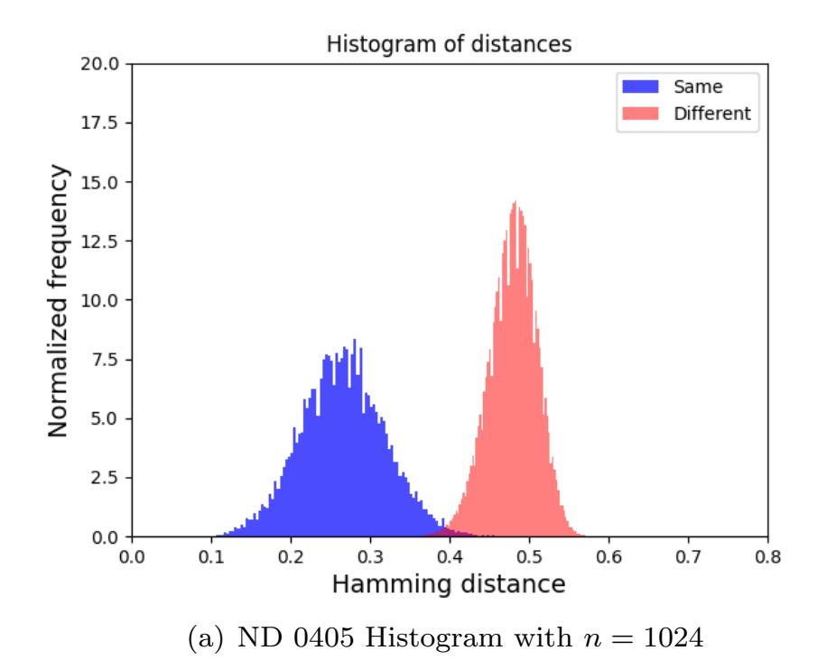
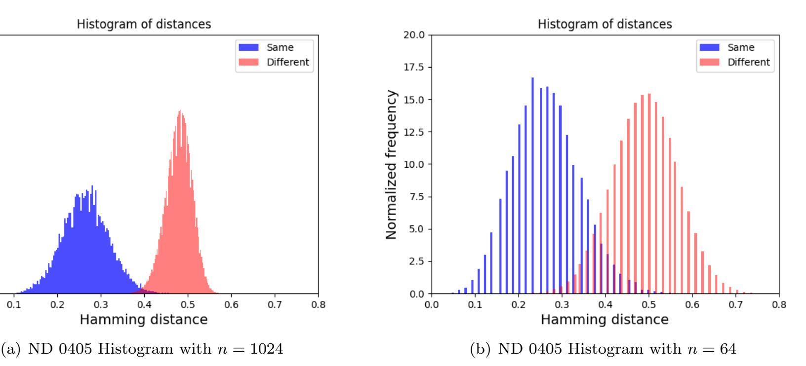
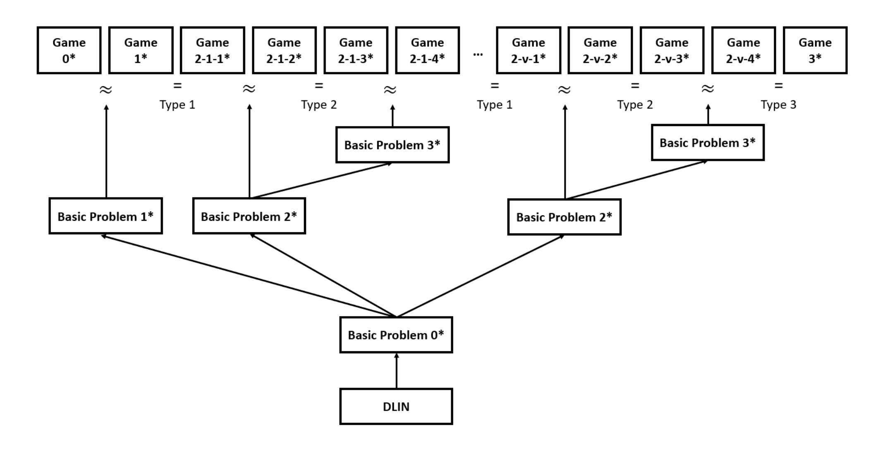

{0}------------------------------------------------

# Multi Random Projection Inner Product Encryption, Applications to Proximity Searchable Encryption for the Iris Biometric \*

Chloe Cachet<sup>1</sup> , Sohaib Ahmad<sup>1</sup> , Luke Demarest<sup>1</sup> , Serena Riback<sup>2</sup> , Ariel Hamlin<sup>3</sup> , and Benjamin Fuller<sup>1</sup>

<sup>1</sup>University of Connecticut. Email {chloe.cachet,sohaib.ahmad,serena.riback,benjamin.fuller}@uconn.edu, luke.h.demarest@gmail.com <sup>2</sup>Publicis Sapient. Email serena.riback@uconn.edu

<sup>3</sup>Khoury College of Computer Sciences, Northeastern University. Email ahamlin@ccs.neu.edu

March 20, 2023

#### Abstract

Biometric databases collect people's information and allow users to perform proximity searches (finding all records within a bounded distance of the query point) with few cryptographic protections. This work studies proximity searchable encryption applied to the iris biometric.

Prior work proposed inner product functional encryption as a technique to build proximity biometric databases (Kim et al., SCN 2018). This is because binary Hamming distance is computable using an inner product. This work identifies and closes two gaps in using inner product encryption for biometric search:

- 1. Biometrics naturally use long vectors often with thousands of bits. Many inner product encryption schemes generate a random matrix whose dimension scales with vector size and have to invert this matrix. As a result, setup is not feasible on commodity hardware unless we reduce the dimension of the vectors. We explore state-of-the-art techniques to reduce the dimension of the iris biometric and show that all known techniques harm the accuracy of the resulting system. That is, for small vector sizes multiple unrelated biometrics are returned in the search. For length 64 vectors, at a 90% probability of the searched biometric being returned, 10% of stored records are erroneously returned on average.
  - Rather than changing the feature extractor, we introduce a new cryptographic technique that allows one to generate several smaller matrices. For vectors of length 1024 this reduces the time to run setup from 23 days to 4 minutes. At this vector length, for the same 90% probability of the searched biometric being returned, .02% of stored records are erroneously returned on average.
- 2. Prior inner product approaches leak distance between the query and all stored records. We refer to these as distance-revealing. We show a natural construction from function hiding, secret-key, predicate, inner product encryption (Shen, Shi, and Waters, TCC 2009). Our construction only leaks access patterns and which returned records are the same distance from the query. We refer to this scheme as distance-hiding.

We implement and benchmark one distance-revealing and one distance-hiding scheme. The distance-revealing scheme can search a small (hundreds) database in 4 minutes while the distance-hiding scheme is not yet practical, requiring 3.5 hours.

As a technical contribution of independent interest, we show that our scheme can be instantiated using symmetric pairing groups reducing the cost of search by roughly a factor of three. We believe this analysis extends to other schemes based on projections to a random linear map and its inverse analyzed in the generic group model.

Keywords: Searchable encryption, biometrics, proximity search, inner product encryption.

<sup>\*</sup>A conference version of this work is published at AsiaCCS 2022 [\[CAD](#page-46-0)+22] under DOI Number: 10.1145/3488932.3497754 and the title "Proximity Searchable Encryption for the Iris Biometric." This version contains substantial material that is not present in the conference version.

{1}------------------------------------------------

## 1 Introduction

Biometrics are measurements of physical phenomena of the human body. We focus on the iris biometric in this work. The iris is an interesting biometric because it has high entropy, stays stable throughout life, is not determined genetically, and is easily accessible [\[PPJ03\]](#page-49-0). Iris data, like all biometric data, is noisy, which means that two readings from the same iris are unlikely to be identical. Feature extractors convert such physical phenomena to a digital representation that is more stable but still noisy. The output of feature extractors is called a template. Biometric databases are used for both security critical applications (such as access control) and privacy critical applications (such as immigration). Let D be some distance metric and t be some distance threshold. Applications building on biometric templates require:

- 1. Low False Reject Rate (FRR) templates from the same biometric are within distance t with high probability, and
- 2. Low False Accept Rate (FAR) templates from two different biometrics are within distance t with low probability.

Learning stored biometric templates enables an attacker to reverse this value into a convincing biometric [\[GRGB](#page-47-0)+12, [MCYJ18,](#page-49-1)[AF20\]](#page-45-0), enabling presentation attacks [\[VS11,](#page-50-0)[HWKL18,](#page-47-1) [SDDN19\]](#page-49-2) that can compromise users' accounts and devices. Since biometrics cannot be updated, such a compromise lasts a lifetime.

Securing biometric data is not straightforward. Using plain encryption or hashes (as for passwords storage) would effectively protect compromised templates but also prevents the server from performing any distance comparison.

Searchable encryption [\[SWP00,](#page-49-3)[CGKO11,](#page-46-1)[BHJP14,](#page-46-2)[FVY](#page-47-2)+17] enables servers to be queried without decrypting the data. For a distance metric D, proximity searchable encryption returns all records that are within distance t. That is, for a dataset x1, ..., x<sup>ℓ</sup> and a query y, one should return all x<sup>i</sup> such that D(x<sup>i</sup> , y) ≤ t. Since biometric data is inherently noisy, proximity searchable encryption is a key tool to secure biometric databases while allowing queries.

Iris feature extractors usually produce binary vectors that are similar in Hamming distance[1](#page-1-0) (fingerprints are usually compared by set difference, faces with L2 norm). Kim et al. proposed to use secret-key, function-hiding inner product encryption or IPEfh,sk for encrypted comparison of binary Hamming biometrics [\[KLM](#page-48-0)+18, [KLM](#page-48-1)+16]. IPEfh,sk allows computation of inner product without revealing underlying values. Inner product of vectors x, y in {−1, 1} <sup>n</sup> encodes Hamming distance:

$$\mathcal{D}(x,y) = (n - \langle x, y \rangle)/2.$$

More formally the functionality of IPEfh,sk is as follows: as in standard encryption, one generates a secret key sk ← Setup(·) and a ciphertext ct<sup>x</sup> ← Encrypt(x,sk) . Then one can generate a token tk<sup>y</sup> ← TokGen(y,sk) , and use this token in Decrypt (without sk) to learn the inner product ⟨x, y⟩. That is,

$$\mathsf{Decrypt}(\mathsf{ct}_x,\mathsf{tk}_y) = \langle x,y \rangle.$$

One can use IPEfh,sk to build proximity search by encrypting ct<sup>i</sup> ← Encrypt(x<sup>i</sup> ,sk) and providing all ct<sup>i</sup> to the database server (additional data can be associated with x<sup>i</sup> using traditional encryption). For queries y the client provides tk<sup>y</sup> ← TokGen(y,sk) to the server. The server can compute the inner product between the query and each stored record and should return all records with the appropriate inner product. The server does work proportional to the database size. This is in contrast to keyword searchable encryption where the desiderata is for the server's work to be proportional to the result set size.

We identify and close two gaps in the use of inner product encryption to build proximity searchable encryption for the iris.

## 1.1 Our Contribution

Multi Random Projection Inner Product Encryption Daugman's seminal iris feature extractor [\[Dau05,](#page-46-3) [Dau09\]](#page-46-4) produces a vector of length n = 1024, the open source OSIRIS [\[ODGS16\]](#page-49-4) system uses n = 32768 by default, and recent neural network feature extractors [\[AF19\]](#page-45-1) use n = 2048.

<span id="page-1-0"></span><sup>1</sup>Note that real-valued vectors for the Euclidean distance can be converted to binary vectors for the Hamming distance using mean or median thresholding, where values above the mean/median are encoded as 1 and values below as 0.

{2}------------------------------------------------

The most efficient  $\mathsf{IPE}_{\mathsf{fh},\mathsf{sk}}$  schemes rely on dual pairing vector spaces [OT15] in bilinear groups. The secret key for such constructions is a random matrix  $\mathbf{A} \in \mathbb{F}_q^{n \times n}$  and its inverse  $\mathbf{A}^{-1}$ ; q is a large prime that is the order of the bilinear pairing. Setup for the scheme must invert a random  $\mathbf{A} \in \mathbb{F}_q^{n \times n}$ .

This operation is prohibitive for n > 1000, as is the case for iris feature extractors. For the most efficient known scheme which we call Random Projection with Check or RProjC [KLM+18], the authors' parallel implementation of key generation in FLINT [Har10] (on a modern 16 core machine), generating keys for n = 240, took 4.6 hours. In our experiments, Setup time grows cubicly as expected.<sup>2</sup> Through interpolation, we estimate the time to generate keys for n = 1024 at 23 days.

While one can train feature extractors with smaller n, we show (in Section 4) that known techniques harm the quality of the biometric features, making the irises of different people appear similar. The false accept vs false reject rate tradeoff degrades, leaving the application with the choice of either not matching readings of the same iris or matching readings of difference individuals' irises. Both choices have consequences for the resulting application.

In Section 4.1 and Table 3, we show that for a small size dataset of 356 individuals using a feature extractor with n=64 and a distance t that enables a 90% true accept rate, searching for an individual in the dataset returns 40 incorrect biometrics with an average query! By comparison when n=1024, queries return .06 incorrect biometrics on average. Datasets with more individuals are not available; we expect this rate to be consistent across dataset sizes.

Section 5 introduces a new transform for inner product encryption that generates multiple matrices  $\mathbf{A}_1, ..., \mathbf{A}_{\sigma}$  and their inverses during key generation where each  $\mathbf{A}_i$  is an  $(N+1) \times (N+1)$  matrix, where  $N = \lceil n/\sigma \rceil$ , instead of a single large pair  $\mathbf{A}, \mathbf{A}^{-1}$ . Recall that the encryption and token generation algorithms take as input vectors x and y respectively. Vectors x and y are then split into  $\sigma$  component vectors of size N. Correctness then relies on the fact that

$$\langle x, y \rangle = \sum_{i=0}^{\sigma-1} \langle x_i, y_i \rangle$$

where  $x_i, y_i$  are component vectors of x and y. To hide partial information, both x and y are augmented when they are split into component vectors:

$$x'_{i} = 1 \mid\mid x_{i*N}, ..., x_{i*N+(N-1)}$$
  
 $y'_{i} = \zeta_{i} \mid\mid y_{i*N}, ..., y_{i*N+(N-1)}$ 

for  $i=0,...,\sigma-1$  and  $\zeta_0,...,\zeta_{\sigma-1}$  is a linear secret sharing of 0 that is chosen in TokGen. The intuition is that any collection of  $\sigma-1$  or fewer components represents a random group element, so one cannot learn information about inner products between vector components. We show security of a prior IPE scheme with multi random projection in Section 5 (we also apply the technique to a scheme of Okamoto and Takashima [OT12, Section 4] in Section 8). This technique is not generic, our construction modifies the internal working of the underlying IPE scheme. The intuition is that to preserve correctness internal randomness needs to be stripped and replaced by a global one. This prevents an attacker from mixing and matching ciphertext components (or token components). Such mixing and matching is allowed for multi-input inner-product encryption. We compare the two notions in Section 3.1.

We implemented two versions of proximity search building on this form of IPE<sub>fh,sk</sub>. The first is a direct application of the RProjC [KLM+18] scheme and the second is our new multi random projection version, called Multi Random Projection with Check or MRProjC. To benchmark, we encrypted a single reading of each individual ( $\ell = 356$ ) from the ND0405 dataset [PSO+09, BF16] which is a superset of the NIST Iris Evaluation Challenge [PBF+08]. Queries are drawn from other readings in the ND0405 dataset. This performance is summarized in Table 1 with search taking approximately 4 minutes. Our multi random projection technique reduces time for Setup by four orders of magnitude with minimal impact on the timings of the rest of the algorithms. This multi random projection technique makes proximity searchable encryption on a 350 biometric dataset feasible.

**Distance Hiding Proximity Search** By design, for any searched value y, proximity search from  $IPE_{fh,sk}$  allows the server to compute the distance  $[KLM^+18]$  between y and all stored records.<sup>3</sup> This establishes a geometry on the space of stored records. If the server has side information on the stored records  $x_i$ , they may be able to reconstruct

<span id="page-2-1"></span><span id="page-2-0"></span><sup>&</sup>lt;sup>2</sup>We have not evaluated sub-cubic matrix inversion in finite fields.

<sup>&</sup>lt;sup>3</sup>Some prior work allows computation of approximate distance [KIK12] using locality sensitive hashes [IM98], allowing the server to see how many hashes match, the number of matches approximates distance.

{3}------------------------------------------------

| Scheme         |               |          | PE T     | ype  | MRProj | Hide          | Operation Time |        |       |        |
|----------------|---------------|----------|----------|------|--------|---------------|----------------|--------|-------|--------|
| Name           | IPE           | fh       | sk       | pred | used   | $\mathcal{D}$ | Setup          | BIndex | Trpdr | Search |
| RProjC         | $[KLM^{+}18]$ | <b>√</b> | <b>√</b> | _    | _      | _             | 2M             | 10.8   | .07   | 235    |
| MRProjC        | $[KLM^+18]$   | <b>√</b> | ✓        | _    | ✓      | _             | 268            | 10.8   | .08   | 241    |
| MRProj (asym.) | [BCSW19]      | <b>√</b> | ✓        | ✓    | ✓      | ✓             | 268            | 10.8   | 22.4  | 12600  |
| MRProj (sym.)  | [BCSW19]      | <b>√</b> | ✓        | ✓    | ✓      | ✓             | 225            | 4.3    | 52    | 3580   |

<span id="page-3-0"></span>Table 1: Time (in seconds) for operations with  $\ell=356$  records stored at n=1024. All algorithms are naturally parallelizable. Timing for the single base scheme RProjC is interpolated from smaller vector lengths. Blndex encrypts the dataset at initialization time, Trpdr generates a search token, and Search finds the resulting indices. fh, sk and pred indicate that the underlying IPE scheme is respectively a function-hiding, secret key and/or predicate only scheme. Hide  $\mathcal{D}$  indicates that the scheme does not reveal the distance between the stored value and the query. The symmetric version of MRProj uses the SS512 curve and the asymmetric version uses the MNT159 curve.

global geometry from the local geometry revealed by pairwise distances [PBDT05, AEG $^+$ 06]. While we are not aware of any leakage abuse attacks directly against proximity search, there are attacks against k-nearest neighbor databases [KPT19, KE19].<sup>4</sup> Distance allows one to easily compute the k-nearest points so attacks that can exploit this leakage apply. Like most leakage abuse attacks, the efficacy of these attacks depends on what the adversary knows about the stored data. We discuss these attacks more in Section 3.

For applications where such leakage is unacceptable (or the adversary has side information on the encrypted data), we show a transform from a predicate version of inner product encryption to proximity search that does not reveal pairwise distance. A predicate IPE scheme produces ciphertexts  $ct_x$  and tokens  $tk_y$  which allow one to effectively check if  $\langle x,y\rangle=0$  (instead of revealing the inner product). Barbosa et al. [BCSW19] recently proposed such a scheme that is a modification of Kim et al.'s construction [KLM+18]. Their construction simply removes the group elements that allow one to check the inner product, so we call this Random Projection or RProj. We call such a scheme an IPE<sub>fh,sk,pred</sub> scheme. Applying our multi random projection technique to this scheme yields a new predicate IPE scheme that we call Multi Random Projection or MRProj. IPE<sub>fh,sk,pred</sub> allows one to test if the inner product is equal to some value i as follows: add an n+1<sup>th</sup> element as -1 to x, denoted x', and create  $y_i=y||i$ . Then,  $\langle x', y_i \rangle = \langle x || -1, y || i \rangle = 0$  if and only if  $\langle x, y \rangle = i$ . One can check all values in a set  $\mathcal{I}$  by generating a token  $tk_{y_i}$  for each  $i \in \mathcal{I}$ . Setting  $\mathcal{I} = \{n-2*0,...,n-2*t\}$ , yields a proximity check (these tokens are permuted before being sent to the server). We show that with such a construction, an adversary cannot distinguish between two sets of encrypted records and queries as long as they have the same leakage discussed below.

The simplicity and generality of this construction is an advantage, it immediately benefits from efficiency improvements in inner product encryption and can be built from multiple computational assumptions.<sup>5</sup> However, the size of  $\mathsf{tk}_y$  and the search time now grow linearly with t. For the iris t is usually around 3n.

Since the server can see if the same  $\mathsf{tk}_{y_i}$  matches different records, when two records are both within distance t, the server learns if they match the same distance (but not the specific distance). Thus, the resulting proximity scheme leaks two pieces of information:

Access Pattern [IKK12, CGPR15] The set of records returned by the query. If  $x_i$  and  $x_j$  are both returned by a query it must be the case that  $\mathcal{D}(x_i, x_j) \leq 2t$ . Preventing attacks that only require access pattern usually requires oblivious RAM [GKL<sup>+</sup>20]. This is the high level approach taken by Boldyreva and Tang [BT21] in parallel work. They proposed a scheme that hides all leakage using oblivious data structures in conjunction with locality-sensitive hashes [IM98]. Their scheme is interactive, requiring several rounds of communication, but only uses symmetric key cryptography and is faster in a network with short round trip times.

**Distance Equality Leakage** For a database  $x_1, ..., x_\ell$  and for a searched value y, if there are multiple records  $x_i, x_j$  such that  $\mathcal{D}(x_i, y) \leq t$  and  $\mathcal{D}(x_j, y) \leq t$  then our scheme additionally reveals if  $\mathcal{D}(x_i, y) = \mathcal{D}(x_j, y)$ .

No information is leaked about data that is not returned (beyond that it was not returned). Biometrics are well

<span id="page-3-1"></span><sup>&</sup>lt;sup>4</sup>Here we focus on attacks that apply to proximity searchable encryption. There is a rich history of *leakage abuse attacks* against different types of searchable encryption [IKK12,CGPR15,KKNO16,WLD<sup>+</sup>17,GSB<sup>+</sup>17,GLMP18,KPT19,MT19,KE19,KPT20,FMC<sup>+</sup>20].

<span id="page-3-2"></span><sup>&</sup>lt;sup>5</sup>Throughout this work, we refer to proximity searchable encryption constructions by the name of the underlying IPE scheme. As an example, MRProj will be used to denote both Barbosa et al's IPE scheme with our multi random projection technique applied to it and the distance-hiding proximity search built using it.

{4}------------------------------------------------

spread<sup>6</sup>, so one does not expect readings of two biometrics to be close to a query. As mentioned, the vector size has a large impact on the number of improper records that will be returned by a query (recall for n = 64, 40 improper records are returned, when n = 1024, .06 improper records are returned). Since MRProj only leaks when multiple records are returned it is critical to ensure an accurate system, underscoring the importance of our multi random projection approach enabling Setup for large n where high correctness is possible.

In RProjC and MRProjC, the server learns the pairwise distance between the query y and all records  $x_i$ . So in that setting, n only affects correctness, not security.

The search complexity of MRProj is roughly a multiplicative of  $t \approx .3n$  slower than for MRProjC. See the difference in concrete timing in Table 1. For n=1024, corresponding to a  $t\approx 307$ , the measured multiplicative overhead is only 52.5. Closing this performance gap is the main open problem resulting from this work; MRProj search is not fast enough.

Our analysis of MRProj is secure and correct with either a symmetric or asymmetric pairing. We implement both options. In our search implementation, the symmetric pairing instantiation is roughly 3 times faster than the asymmetric pairing instantiation. To the best of our knowledge, this is the first time that a function hiding inner product encryption has been analyzed in a symmetric pairing group, this analysis may be of independent interest. In Section 9 we posit additional avenues for improving search efficiency.

#### 1.2 Organization

The rest of this work is organized as follows: Section 2 describes mathematical and cryptographic preliminaries, Section 3 reviews further related work, Section 4 describes the n vs accuracy tradeoff for the iris and its impact on security, Section 5 introduces the multi random projection technique, Section 6 shows that  $IPE_{fh,sk,pred}$  suffices to build proximity search, Section 7 discusses our implementation, Section 8 applies MRProj to the IPE scheme of Okamoto and Takashima, and Section 9 concludes.

## <span id="page-4-1"></span>2 Preliminaries

Let  $\lambda$  be the security parameter throughout the paper. We use  $\operatorname{poly}(\lambda)$  and  $\operatorname{negl}(\lambda)$  to denote unspecified functions that are polynomial and negligible in  $\lambda$ , respectively. For some  $n \in \mathbb{N}$ , [n] denotes the set  $\{1, \dots, n\}$ . Let  $x \stackrel{\$}{\leftarrow} S$  denote sampling x uniformly at random from the finite set S. Let  $q = q(\lambda) \in \mathbb{N}$  be a prime, then  $\mathbb{G}_q$  denotes a cyclic group of order q. Let x denote a vector over  $\mathbb{Z}_q$  such that  $x = (x_1, \dots, x_n) \in \mathbb{Z}_q^n$ , the dimension of vectors should be apparent from context. Consider vectors  $x = (x_1, \dots, x_n)$  and  $y = (y_1, \dots, y_n)$ , their inner-product is denoted by  $\langle x, y \rangle = \sum_{i=1}^n x_i y_i$ . Let X be a matrix, then  $X^T$  denotes its transpose.

Hamming distance is defined as the distance between the bit vectors x and y of length n:  $\mathcal{D}(x,y) = |\{i \mid x_i \neq y_i\}|$ . We note that if a vector over  $\{0,1\}$  is encoded as  $x_{\pm 1,i} = 1$  if  $x_i = 1$  and  $x_{\pm 1,i} = -1$  if  $x_i = 0$  then it is true that  $\langle x_{\pm 1}, y_{\pm 1} \rangle = n - 2\mathcal{D}(x,y)$ .

Our proofs rely on the Schwartz-Zippel lemma [Sch79,Zip79]. We use the version from Kim et al.'s work [KLM<sup>+</sup>16, Lemma 2.9]:

<span id="page-4-2"></span>**Lemma 1** (Schwartz-Zippel Lemma). Fix a prime p and let  $f \in F_p[x_1, \dots, x_n]$  be an n-variate polynomial with degree at most d and which is not identically zero. Then,

$$\Pr[x_1, \cdots, x_n \stackrel{\$}{\leftarrow} \mathbb{F}_p : f(x_1, \cdots, x_n) = 0] \le d/p$$

We define symmetric bilinear groups.

**Definition 1** (Symmetric Bilinear Group). Suppose  $\mathbb{G}_1$  and  $\mathbb{G}_T$  are two groups (respectively) of prime order q with generators  $g_1 \in \mathbb{G}_1$  and  $g_T \in \mathbb{G}_T$  respectively. We denote a value x encoded in  $\mathbb{G}_1$  with either  $g_1^x$  or  $[x]_1$ , we denote values encoded in  $\mathbb{G}_T$  similarly. Let  $e: \mathbb{G}_1 \times \mathbb{G}_1 \to \mathbb{G}_T$  be a non-degenerate (i.e.  $e(g_1, g_1) \neq 1$ ) bilinear pairing operation such that for all  $x, y \in \mathbb{Z}_q$ ,  $e([x]_1, [y]_1) = e(g_1, g_1)^{xy}$ . Assume the group operations in  $\mathbb{G}_1$  and  $\mathbb{G}_T$  and the pairing operation e are efficiently computable, then  $(\mathbb{G}_1, \mathbb{G}_T, q, e)$  defines an symmetric bilinear group.

<span id="page-4-0"></span><sup>&</sup>lt;sup>6</sup>Section 4 goes over the characteristics of the iris biometric in more details.

{5}------------------------------------------------

As we show in Section 5, our scheme is secure in a symmetric bilinear generic group. However, we also present timing results with an asymmetric group that was used to argue the security of previous function-hiding inner product encryption schemes [KLM<sup>+</sup>18, KLM<sup>+</sup>16, BCSW19]. Proofs of security in a symmetric bilinear group extend to an asymmetric bilinear group. Correctness of our scheme follows in either setting.

#### 2.1 Generic Group Model

The constructions presented in Figures 5 is based on a original construction proved secure in the asymmetric generic bilinear group model [BBS04, BBG05]. However, we show security directly in the symmetric generic bilinear group model which is presented below. The particularity of the generic group model is to replace actual group elements by handles. Using these handles, the adversary is able to perform group and pairing operations. We adapt Kim et al.'s generic bilinear group oracle definition to the symmetric setting:

<span id="page-5-0"></span>**Definition 2** (Generic Bilinear Group Oracle). The generic bilinear group oracle is a stateful oracle defined as follows:

- Setup(1 $^{\lambda}$ ): Generate two fresh nonces pp, sp  $\stackrel{\$}{\leftarrow} \{0,1\}^{\lambda}$  and a prime q, and store them. Initialize an empty table Tab =  $\{\}$  and set the internal state to subsequent call of Setup to fail. Finally, return (pp, sp, q).
- Encode(k, x, i):  $Receive \ k \in \{0, 1\}^{\lambda}, x \in \mathbb{Z}_q \ and \ i \in \{1, T\}$ . If  $k \neq sp$  return  $\perp$ . Else, generate a fresh nonce  $h \xleftarrow{\$} \{0, 1\}^{\lambda}$  and add the entry  $h \mapsto (x, 1)$  to table Tab. Return the handle h.
- $Add(k, h_1, h_2)$ : Receive  $k, h_1, h_2 \in \{0, 1\}^{\lambda}$ .
  - 1. If  $k \neq pp$  or one of the handles  $h_1, h_2$  is absent from table Tab or  $h_1, h_2$  do not map to values  $(x_1, i_1)$  and  $(x_1, i_2)$  with  $i_1 = i_2$ , return  $\perp$ .
  - 2. Compute  $x = x_1 + x_2 \in \mathbb{Z}_q$ .
    - (a) If  $h \mapsto (x, i_1)$  in Tab return h.
    - (b) Else, generate a fresh handle  $h \stackrel{\$}{\leftarrow} \{0,1\}^{\lambda}$ , set  $h \mapsto (x,i_1)$  in Tab and return h
- $Pair(k, h_1, h_2)$ :  $Receive k, h_1, h_2 \in \{0, 1\}^{\lambda}$ .
  - 1. If  $k \neq pp$  or one of the handles  $h_1, h_2$  is absent from table Tab or do not map to values  $(x_1, 1)$  and  $(x_2, 1)$  respectively, return  $\perp$ .
  - 2. Else, compute  $x = x_1 x_2 \in \mathbb{Z}_q$ 
    - (a) If  $h \mapsto (x,T)$  in T return h
    - (b) Else, generate a fresh handle  $h \stackrel{\$}{\leftarrow} \{0,1\}^{\lambda}$ , set  $h \mapsto (x,T)$  in Tab and return h
- ZeroTest(k,x): Receive  $k,x \in \{0,1\}^{\lambda}$ . If  $k \neq pp$  or h is absent from table T, return  $\bot$ . Else, return "zero" if  $x \in \mathbb{Z}_q$  is 0 and "non-zero" otherwise.

As in previous works [KLM<sup>+</sup>18, KLM<sup>+</sup>16, BCSW19], we will analyze security by viewing each query as forming a formal polynomial. We re-state Remark 2.8 from Kim et al. [KLM<sup>+</sup>16]:

The generic bilinear group oracle is formally defined in terms of handles, however one can view oracle queries as formal polynomials. Each Encode query specifies a new formal variable for the polynomial. The adversary can then build terms for the polynomial by making Add and Pair oracle queries. The ZeroTest query outputs zero when the previously built polynomial evaluates to zero.

#### 2.2 Inner Product Encryption

Functional encryption allows to compute a function on an encrypted input (the attribute), and retrieve the result without revealing more on the input. Predicate encryption is restricted to *predicates*, functions that output a single bit. While some works try to build schemes for general functionalities, other focus on specific ones. In the latter, one line of work aims to build efficient and secure schemes for inner products. In such schemes, the ciphertext and token encode vectors x and y, respectively, allowing to compute  $\langle x, y \rangle$ , the inner product between x and y, when

{6}------------------------------------------------

running the decryption algorithm on the corresponding ciphertext and token. These schemes are called inner-product functional encryption schemes.

The predicate version of inner product encryption [KSW08, SSW09] works in a similar manner, but instead of the decryption outputting the inner product value, it outputs 1 if  $\langle x,y\rangle=0$ , 0 otherwise. <sup>7</sup> Secret-key predicate encryption with function privacy supporting inner products queries was first proposed by Shen et al. [SSW09]. The scheme they presented is both attribute and function hiding, meaning that an adversary running the decryption algorithm gains no knowledge on either the attribute or the predicate.

We define secret-key inner production functional encryption ( $IPE_{fh,sk}$ ) and secret-key inner product predicate encryption ( $IPE_{fh,sk,pred}$ ) over the message space  $\mathbb{Z}_q^n$ .

<span id="page-6-1"></span>**Definition 3** (Secret key inner product functional encryption). Let  $\lambda \in \mathbb{N}$  be the security parameter. Define  $IPE_{\mathsf{fh},\mathsf{sk}} = (\mathsf{Setup}, \mathsf{Encrypt}, \mathsf{TokGen}, \mathsf{Decrypt}), \ a \ secret-key inner product functional encryption scheme over <math>\mathbb{Z}_q^n$  as

- $(pp, sk) \leftarrow Setup(1^{\lambda})$ : Generate public parameter pp and secret key sk.
- $ct_x \leftarrow \textit{Encrypt}(\textit{sk}, x)$ : Take secret key sk and input vector  $x \in \mathbb{Z}_q^n$  and generate ciphertext  $ct_x$ .
- $tk_y \leftarrow TokGen(sk, y)$ : Take secret key sk and input vector  $y \in \mathbb{Z}_q^n$  and generate token  $tk_y$ .
- $z \leftarrow Decrypt(pp, tk_y, ct_x)$ : Take public parameters pp, ciphertext  $ct_x$  and token  $tk_y$  and outputs value  $z \in \mathbb{Z}_q$ .

Correctness: For any  $x \in \mathbb{Z}_q^n$ ,  $y \in \mathbb{Z}_q^n$ ,

$$\Pr\left[z = \langle x, y \rangle \middle| \begin{array}{c} \mathsf{ct}_x \leftarrow \mathsf{Encrypt}(\mathsf{sk}, x) \\ \mathsf{tk}_y \leftarrow \mathsf{TokGen}(\mathsf{sk}, y) \\ z \leftarrow \mathsf{Decrypt}(\mathsf{pp}, \mathsf{tk}_y, \mathsf{ct}_x) \end{array}\right] \geq 1 - \mathsf{negl}(\lambda).$$

Security of admissible queries: Let  $r = \text{poly}(\lambda)$  and  $s = \text{poly}(\lambda)$ . Any PPT adversary  $\mathcal{A}$  has only  $\text{negl}(\lambda)$  advantage in the  $\text{Exp}_{IND}^{\text{IPE}}$  game (defined in Figure 1). Token and encryption queries must meet the following admissibility requirements,  $\forall i \in [1, r], \forall j \in [1, s]$ ,

$$\langle x_i^{(0)}, y_i^{(0)} \rangle = \langle x_i^{(1)}, y_i^{(1)} \rangle.$$

<span id="page-6-2"></span>**Definition 4** (Secret key inner product predicate encryption). Secret key inner product predicate encryption (IPE<sub>fh,sk,pred</sub>) is defined similarly to secret key inner product functional encryption, with the difference that the output of the decryption algorithm is now  $z \in \{0,1\}$ .

Correctness For any  $x \in \mathbb{Z}_q^n$ ,  $y \in \mathbb{Z}_q^n$ ,

$$\Pr\left[z = \left(\langle x, y \rangle \stackrel{?}{=} 0\right) \left| \begin{array}{c} \mathsf{ct}_x \leftarrow \mathsf{Encrypt}(\mathsf{sk}, x) \\ \mathsf{tk}_y \leftarrow \mathsf{TokGen}(\mathsf{sk}, y) \\ \mathsf{b} \leftarrow \mathsf{Decrypt}(\mathsf{pp}, \mathsf{tk}_y, \mathsf{ct}_x) \end{array} \right] \geq 1 - \mathsf{negl}(\lambda).$$

Security of admissible queries: Let  $r = \text{poly}(\lambda)$  and  $s = \text{poly}(\lambda)$ . Any PPT adversary  $\mathcal{A}$  has only  $\text{negl}(\lambda)$  advantage in the  $\text{Exp}_{IND}^{IPE}$  game (defined in Figure 1). Token and encryption queries must meet one of the two following admissibility requirements,  $\forall i \in [1, r], \forall j \in [1, s]$ ,

$$\langle x_i^{(0)}, y_j^{(0)} \rangle = 0 \wedge \langle x_i^{(1)}, y_j^{(1)} \rangle = 0$$

or

$$\langle x_i^{(0)}, y_j^{(0)} \rangle \neq 0 \land \langle x_i^{(1)}, y_j^{(1)} \rangle \neq 0.$$

The above definition is called *full security* in the language of Shen, Shi, and Waters [SSW09]. Note that this definition is selective (not adaptive), as the adversary specifies two sets of attributes and token values apriori. When discussing privacy it can be interesting to use a simulation-based security definition as it allows to specify exactly which amount of information is leaked.

<span id="page-6-0"></span><sup>&</sup>lt;sup>7</sup>In some works, predicate inner product encryption outputs a message m when  $\langle x,y\rangle=0$  instead of a single bit.

{7}------------------------------------------------

We define the following game between challenger  $\mathcal{C}$  and adversary  $\mathcal{A}$ :

- 1.  $\mathcal{C}$  draws  $\beta \stackrel{\$}{\leftarrow} \{0,1\}$ .
- 2.  $\mathcal{C}$  computes  $(\mathsf{sk}, \mathsf{pp}) \leftarrow \mathsf{Setup}(1^{\lambda})$ , sends  $\mathsf{pp}$  to  $\mathcal{A}$ .
- 3. For  $1 \leq i \leq r$ ,  $\mathcal{A}$  chooses attribute vectors  $x_i^{(0)}, x_i^{(1)} \in \mathbb{Z}_q^n$ .
- 4. For  $1 \leq j \leq s$ ,  $\mathcal{A}$  chooses vectors  $y_j^{(0)}, y_j^{(1)} \in \mathbb{Z}_q^n$ .
- 5. Denote

$$R := \left(x_1^{(0)}, x_1^{(1)}\right), \cdots, \left(x_r^{(0)}, x_r^{(1)}\right),$$
$$S := \left(y_1^{(0)}, y_1^{(1)}\right), \cdots, \left(y_s^{(0)}, y_s^{(1)}\right).$$

- 6.  $\mathcal{A}$  sends R and S to  $\mathcal{C}$ .
- 7.  $\mathcal{A}$  loses the game if R and S are not admissible.
- 8.  $\mathcal{A}$  receives from  $\mathcal{C}$  a list of ciphertexts

$$C^{(\beta)} := \left\{ct_i^{(\beta)} \leftarrow \mathsf{Encrypt}\left(\mathsf{sk}, x_i^{(\beta)}\right)\right\}_{i=1}^r$$

and a list of tokens

$$T^{(\beta)} := \left\{ tk_j^{(\beta)} \leftarrow \mathsf{TokGen}\left(\mathsf{sk}, y_j^{(\beta)}\right) \right\}_{j=1}^s$$

- 9.  $\mathcal{A}$  returns  $\beta' \in \{0, 1\}$ .
- 10.  $\mathcal{A}$ 's advantage is

$$\mathsf{Adv}^{\mathsf{Exp}^{\mathsf{IPE}}_{IND}}_{\mathcal{A}}(\lambda) = \left| \ \Pr[\mathcal{A}(1^{\lambda}, T^{(0)}, C^{(0)}) = 1] - \Pr[\mathcal{A}(1^{\lambda}, T^{(1)}, C^{(1)}) = 1] \right|$$

<span id="page-7-0"></span>Figure 1: Definition of  $\mathsf{Exp}_{IND}^{\mathsf{IPE}}$  for inner product encryption.

<span id="page-7-1"></span>**Definition 5** (Simulation-based security for IPE). Let IPE = (Setup, TokGen, Encrypt, Decrypt) be an inner product encryption scheme over  $\mathbb{Z}_q^n$ . Then IPE is SIM-secure if for all PPT adversaries  $\mathcal{A}$ , there exists a simulator  $\mathcal{S}$  such that for the experiment  $Exp_{SIM}^{IPE}$  described in Figure 2, the advantage of  $\mathcal{A}$  ( $adv_{\mathcal{A}}^{Exp_{SIM}^{IPE}}$ ) is

$$\big| \operatorname{Pr}[1 \leftarrow \mathsf{Real}_{\mathit{IPE},\mathcal{A}}(1^{\lambda})] - \operatorname{Pr}[1 \leftarrow \mathsf{Ideal}_{\mathit{IPE},\mathcal{A}}(1^{\lambda})] \big| \leq \mathit{negl}(\lambda).$$

Kim et. al. [KLM+16, Remark 2.5] show that Definition 5 implies Definition 3.

#### 2.3 Proximity searchable encryption

In this section we define proximity searchable encryption (PSE), a variant of searchable encryption that supports proximity queries.

**Definition 6** (History). Let  $X \in \mathcal{M}$  be a list of keywords drawn from space  $\mathcal{M}$ , let  $\mathcal{F}$  be a class of predicates over  $\mathcal{M}$ . An m-query history over  $\mathcal{W}$  is a tuple History = (X, F), with  $F = (f_1, \dots, f_m)$  a list of m predicates,  $f_i \in \mathcal{F}$ .

**Definition 7** (Access pattern). Let  $X \in \mathcal{M}$  be a list of keywords. The access pattern induced by an m-query history History = (X, F) is the tuple  $History = (f_1(X), \cdots, f_m(X))$ .

**Definition 8** (Distance Equality). Let  $\textit{History}^{(0)}$ ,  $\textit{History}^{(1)}$  be m-query histories for predicates of the type  $f_{y,t}(x) = (\mathcal{D}(x,y) \overset{?}{\leq} t)$ .

{8}------------------------------------------------

<span id="page-8-1"></span>Figure 2: Definition of experiment  $\mathsf{Exp}^{\mathsf{IPE}}_{SIM}$ .  $\Phi$  denotes the information leakage received by the simulator  $\mathcal{S}$  such that  $\Phi(i,j) = \left(\langle x_i,y_j\rangle \stackrel{?}{=} 0\right)$  for all i,j.

Let  $DisEq(History^{(0)}, History^{(1)}) = 1$  if and only if for each j it is true that

$$\left\{ (i,k) \middle| \begin{matrix} (\mathcal{D}(x_i^{(0)},y_j^{(0)}) = \mathcal{D}(x_k^{(0)},y_j^{(0)}) \land \mathcal{D}(x_i^{(1)},y_j^{(1)}) \neq \mathcal{D}(x_k^{(1)},y_j^{(1)}) \\ \lor \\ (\mathcal{D}(x_i^{(0)},y_j^{(0)}) \neq \mathcal{D}(x_k^{(0)},y_j^{(0)}) \land \mathcal{D}(x_i^{(1)},y_j^{(1)}) = \mathcal{D}(x_k^{(1)},y_j^{(1)}) \end{matrix} \right\},$$

is the empty set.

**Definition 9** (Proximity Searchable Encryption). Let

- $\lambda \in \mathbb{N}$  be the security parameter,
- $\mathcal{DB} = (M_1, \cdots, M_\ell)$  be a database of size  $\ell$ ,
- Keywords  $X = (x_1, \dots, x_\ell)$ , such that  $x_i \in \mathbb{Z}_q^n$  relates to  $M_i$ ,
- $\mathcal{F} = \{f_{y,t} \mid y \in \mathbb{Z}_q^n, \ t \in N\}$  be a family of predicates such that, for a keyword  $x \in \mathbb{Z}_q^n$ ,  $f_{y,t}(x) = 1$  if  $\mathcal{D}(x,y) \leq t$ , 0 otherwise.

The algorithms PSE = (PSE.Setup, PSE.BIndex, PSE.Trpdr, PSE.Search) defines a proximity searchable encryption scheme:

- $PSE.Setup(1^{\lambda}) \rightarrow (sk, pp)$ ,
- $PSE.BIndex(sk, X) \rightarrow I_X$ ,
- $PSE.Trpdr(sk, f_{y,t}) \rightarrow tk_{y,t}$ , and
- $PSE.Search(pp, Q_{y,t}, I_X) \rightarrow J_{X,y,t}$ .

We require the scheme to have the following properties:

Correctness Define  $J_{X,y,t} = \{i | f_{y,t}(x_i) = 1, x_i \in X\}$ . PSE is correct if for all X and  $f_{y,t} \in \mathcal{F}$ :

$$\Pr\left[J' = J_{X,y,t} \middle| \substack{I_X \leftarrow \textit{PSE.BIndex}(\textit{sk},X) \\ Q_{y,t} \leftarrow \textit{PSE.Trpdr}(\textit{sk},f_{y,t}) \\ J' \leftarrow \textit{PSE.Search}(\textit{pp},Q_{y,t},I_X)} \right] \geq 1 - \textit{negl}(\lambda).$$

Security for Admissible Queries Any PPT adversary  $\mathcal{A}$  has only  $negl(\lambda)$  advantage in the experiment  $Exp_{IND}^{PSE}$  defined in Figure 3, for  $\ell = poly(\lambda)$  and  $m = poly(\lambda)$ .

## <span id="page-8-0"></span>3 Further Related Work

## 3.1 Functional encryption

We review further related work on functional and predicate encryption.

{9}------------------------------------------------

We define the following game between challenger  $\mathcal{C}$  and adversary  $\mathcal{A}$ :

- 1.  $\mathcal{C}$  draws  $\beta \stackrel{\$}{\leftarrow} \{0,1\}$ .
- 2.  $\mathcal{C}$  computes  $(\mathsf{sk}, \mathsf{pp}) \leftarrow \mathsf{PSE}.\mathsf{Setup}(1^{\lambda})$  and sends  $\mathsf{pp}$  to  $\mathcal{A}$ .
- 3.  $\mathcal{A}$  chooses and sends  $\mathsf{History}^{(0)}$ ,  $\mathsf{History}^{(1)}$  to  $\mathcal{C}$ .
- 4.  $\mathcal{A}$  loses the game if

$$AccPatt(History^{(0)}) \neq AccPatt(History^{(1)}) \vee DisEq(History^{(0)}, History^{(1)}) = 0$$

- 5.  $\mathcal{A}$  receives  $I^{(\beta)}$  and  $Q^{(\beta)}$  from  $\mathcal{C}$ .
- 6.  $\mathcal{A}$  outputs  $\beta' \in \{0, 1\}$ .
- 7. A's advantage in the game is:

$$\mathsf{Adv}^{\mathsf{Exp}^{\mathsf{PSE}}_{IND}}_{\mathcal{A}}(\lambda) = \left| \ \Pr[\mathcal{A}(1^{\lambda}, I^{(0)}, Q^{(0)}) = 1] - \Pr[\mathcal{A}(1^{\lambda}, I^{(1)}, Q^{(1)}) = 1] \right|$$

<span id="page-9-1"></span>Figure 3: Definition of  $Exp_{IND}^{PSE}$ .

**Function privacy for public key schemes** Building distance-hiding proximity searchable encryption from inner product encryption requires the latter to be *function-hiding*. The PSE scheme presented in this work is secret key, but one could want to build a public-key variant. Such a scheme would require *public key* function-hiding IPE.

Achieving function privacy for public key functional encryption is not straightforward. The adversary can encrypts ciphertexts on its own and run the function on the corresponding inputs, allowing them to learn information on the function's behavior.

Boneh et al. [BRS13a] presented a function-hiding identity-based encryption scheme which requires token inputs to be sampled from a distribution with super-logarithmic min-entropy. Their function privacy notion then requires that for y sampled from such a distribution, the corresponding token  $\mathsf{tk}_y$  must be indistinguishable from a token  $\mathsf{tk}_u$  where u was independently and uniformly sampled. In a subsequent work [BRS13b], Boneh et al. consider the notion of function-hiding public key subspace-membership encryption which supports subspace-membership predicates, a generalization of inner products.

<span id="page-9-0"></span>Multi-input functional encryption Readers familiar with *multi-input* functional encryption for the inner product may notice some similarities between this line of work and the multi-random projection technique.

Multi-input functional encryption (MIFE) [GGG<sup>+</sup>14] is a generalization of functional encryption that supports functions with multiple inputs. Token generation works as in standard functional encryption but encryption allows for multiple users to encrypt their inputs independently. Decryption then takes the token  $\mathsf{tk}_f$  and the multiple ciphertexts  $\mathsf{ct}_1, \dots, \mathsf{ct}_n$  and computes  $f(x_1, \dots, x_n)$ . In the case of multi-input IPE [AGRW17, ACF<sup>+</sup>18], the supported function is of the form

$$\sum_{i=0}^{n} \langle x_i, y_i \rangle.$$

The main challenge to building MIFE schemes is to combine ciphertexts generated using independent randomness in a secure manner.

Although multi-input IPE and multi-random projection seem to achieve similar goals they are different concepts. In multi-input IPE, one should be able to decrypt  $ct_1$  with any available value for  $ct_2, ..., ct_n$ . In the multi-random projection all components of a single ciphertext should only work with each other. In other words, multi-input IPE allows for mix-and-matches whereas MRProj must prevent it. Mix-an-matching would indeed allow the adversary to create ciphertexts and tokens that are not admissible, resulting in a break of security. To prevent this, multi-random projection requires global randomness to tie the multiple ciphertexts (respectively tokens) together.

{10}------------------------------------------------

## 3.2 Proximity search

We review further related work on proximity search. Li et al. [\[LWW](#page-49-13)+10], Wang et al. [\[WMT](#page-50-3)+13] and Boldyreva and Chenette [\[BC14\]](#page-46-13) reduced proximity search to keyword equality search. These works propose two complimentary approaches:

- 1. When adding a record x<sup>i</sup> to a database, also insert all close values as keywords, that is {x<sup>j</sup> | D(x<sup>i</sup> , x<sup>j</sup> ) ≤ t} are added as keywords associated to x<sup>i</sup> .
- 2. The second approach requires searchable encryption supporting disjunctive search. Disjunctive search generally allows to perform search using a set of keywords, returning a record when at least one of those keywords is a match. This approach inserts just x<sup>i</sup> , but when searching for y it searches for the disjunction ∨<sup>x</sup>i|D(xi,y)≤<sup>t</sup> x<sup>i</sup> .

Either approach can be instantiated using a searchable encryption scheme that supports disjunction over keyword equality (inheriting any leakage). However, for biometrics, the number of keywords ∨<sup>x</sup>i|D(xi,y)≤t{xi} usually grows exponentially in t. In existing disjunctive schemes, the size of the query grows with the size of the disjunction [\[FVY](#page-47-2)+17], making this approach only viable for constant values of t.

Kuzu et al.'s [\[KIK12\]](#page-48-2) solution relies on locality sensitive hashes [\[IM98\]](#page-48-3). A locality sensitive hash ensures that close values have a higher probability to produce collisions than values that are far apart. Thus, proximity search can be built from any scheme supporting disjunctive keyword equality, inheriting any leakage. The server learns the number of matching locality sensitive hashes for each record (which is expected to be more than 0). The number of matching locality sensitive hashes is a proxy for the distance between the query value and the records. More matching locality sensitive hashes implies smaller distance. This allows the server to establish the approximate distance between each record and the query.

Zhou and Ren [\[ZR18\]](#page-50-4) propose a variant of inner product encryption that reveals if the distance is less than t only. However, their security is based on Ax<sup>i</sup> and yB hiding x<sup>i</sup> and y for secret square matrices A and B. Security is heuristic with no underlying assumption or proof of information theoretic security.

Abuse Attacks Searchable encryption achieves acceptable performance by leaking information to the server. See Kamara, Moataz, and Ohrimenko for an overview of leakage types in structured encryption [\[KMO18\]](#page-48-9). The key to attacks is combining leakage with auxiliary data, such as the frequency of values stored in the data set. Together these sources can prove catastrophic – allowing the attacker to recover either the queries being made or the data stored in the database. We consider attacks that rely on injecting files or queries [\[ZKP16\]](#page-50-5) to be out of scope. Common, attackable, relevant leakage profiles are:

- 1. Response length leakage [\[KKNO16,](#page-48-6) [GLMP18\]](#page-47-7) Often known as volumetric leakage, the attacker is given access to only the number of records returned for each query. Based on this information, attacks cross-correlate with auxiliary information about the dataset, and identify high frequency items in both the encrypted database and the auxiliary dataset.
- 2. Query equality leakage [\[WLD](#page-50-1)+17] the attacker is able to glean which queries are querying the same value, but not necessarily the value itself. Attacks on this profile rely on having information about the query distribution, and much like the response length leakage attacks, match that with auxiliary information based on frequency.
- 3. Access pattern leakage [\[IKK12,](#page-47-4) [CGPR15\]](#page-46-7) here the attacker is given knowledge if the same dataset element is returned for different queries. This allows the attacker to build a co-occurrence matrix, mapping which records are returned for pairs of queries. Based on the frequencies of the co-occurrence matrix for the encrypted dataset, and the co-occurrence matrix for the auxiliary dataset, the attack can identify records.

Recent attacks have targeted the geometry present in range search [\[GSB](#page-47-6)<sup>+</sup>17[,LMP18,](#page-48-10)[GLMP18,](#page-47-7)[KPT20,](#page-48-7)[FMC](#page-47-8)<sup>+</sup>20]. Building on the co-occurrence matrix (available with access pattern leakage) consider the case when records a, b, c are returned by a first query and c, d, e are returned by a second query. One can immediately infer that the comparison relation between a and d is the same as the comparison relation between b and e. As more constraints of this type are collected one can build an ordering of all records (up to reflection).

In two (or three) dimensional Euclidean space, trilateration has been practiced for hundreds of years: one is assumed to know the location of x1, ..., x<sup>k</sup> and the pairwise distances D(x<sup>i</sup> , y) and is trying to find the location of y. Determining the location of y requires k to be one larger than the dimension. The problem is more difficult but well 

{11}------------------------------------------------

studied for approximate distances [\[EA11\]](#page-47-10). Similar ideas can be applied in discrete metrics with each learned distance reducing the set of possible y. In the Hamming metric of dimension n, k = Θ(n) suffices [\[TFL19,](#page-49-14) [LTBL20,](#page-48-11) [Lai20\]](#page-48-12).

## <span id="page-11-0"></span>4 Iris Statistics and Leakage

This section introduces iris feature extractors and shows that reducing the length of the feature extractor harms the uniqueness of the resulting biometric. Reduced uniqueness harms both the correctness (because the wrong set of irises is returned) and security of the MRProj construction (because the server learns information about returned irises). Daugman [\[Dau05,](#page-46-3) [Dau09\]](#page-46-4) introduced the seminal iris processing pipeline. This pipeline assumes a near infrared camera. Iris images in near infrared are believed to be independent from the visible light pattern; the near-infrared iris pattern is epigenetic, irises of identical twins are believed to be independent [\[Dau09,](#page-46-4) [HBF10\]](#page-47-11). Traditional iris recognition consists of three phases:

Segmentation takes the image and identifies which pixels should be included as part of the iris. This produces a {0, 1} matrix of the same size as the input image with 1s corresponding to iris pixels.

Normalization takes the variable size set of iris pixels and maps them to a fixed size rectangular array. This can roughly be thought of as unrolling the iris.

Feature Extraction transforms the rectangular array into a fixed number of features. In Daugman's original work this consisted of convolving small areas of the rectangle with a 2D wavelet. Modern feature extractors are usually convolutional neural networks.

In identification systems the tradeoff is between FRR and FAR. FRR is how frequently readings of the same biometric are regarded as different. FAR is how frequently readings of different biometrics are regarded as the same. As described above, when one wishes to match a biometric y against a database one considers matches as the set {x<sup>i</sup> |D(x<sup>i</sup> , y) ≤ t} for some metric D and distance parameter t. Selecting a small t increases FRR and reduces FAR. Before investigating the dependence on feature vector length and the FRR/FAR tradeoff we introduce the feature extractor and dataset used in this analysis.

Feature Extractor For the feature extractor, we use the recent pipeline called ThirdEye [\[AF18,](#page-45-5) [AF19\]](#page-45-1), which is publicly available [\[Ahm20\]](#page-45-6). The software produces a 1024 dimensional real valued feature vector. We convert this to a binary vector by setting f ′ <sup>i</sup> = 1 if f<sup>i</sup> > Exp[f<sup>i</sup> ] where the Exp[f<sup>i</sup> ] is the expectation of the individual feature, otherwise f ′ <sup>i</sup> = 0. We train the feature extractor as specified in [\[AF19\]](#page-45-1).

Biometric Database There are many iris datasets collected across a variety of conditions. In this work we use the NotreDame 0405 dataset [\[PSO](#page-49-7)+09, [BF16\]](#page-46-5) which is a superset of the NIST Iris Evaluation Challenge [\[PBF](#page-49-8)+08]. This dataset consists of images from 356 biometrics (we consider left and right eyes as separate biometrics) with 64964 images in total. (See Appendix [4.2](#page-14-1) for similar results with the IITD dataset [\[KP10\]](#page-48-13).) Figure [4\(a\)](#page-12-0) shows the histograms for the testing portions of the feature extractor outputs. The blue histogram contains comparisons between different readings of the same biometric while the red histogram contains comparisons between different biometrics. Let t ′ = t/1024 be the fractional Hamming distance, the FRR is the fraction of the blue histogram to the right of t ′ and the FAR is the fraction of the red histogram to the left of t ′ . There is overlap between the red and blue histogram indicating that there is a tradeoff between FRR and FAR.

## <span id="page-11-1"></span>4.1 Performance of Biometric Identification with Small Dimension

The efficiency of IPE based proximity search critically depends on the number of features n (see Table [5\)](#page-25-0). In our experiments we estimate Setup for n = 1024 for the schemes of Kim et al. [\[KLM](#page-48-1)<sup>+</sup>16] and Barbosa et al. [\[BCSW19\]](#page-46-6) to take 23 days on a modern server machine (see details in Section [7\)](#page-24-0). It is tempting to consider statistical methods to produce feature vectors of reduced size. We show this comes at a cost to the quality of the resulting feature vectors. This motivates our approach to reduce the complexity of Setup in Section [5.](#page-15-0) Our analysis consists of two major parts:

- 1. We compare different mechanisms for reducing the size of feature vectors using n = 64 as the target dimension.
- 2. Using the best feature reduction mechanism we compare the FRR/FAR tradeoff for n < 1024, showing direct impacts for the correctness and security of the resulting biometric search.

{12}------------------------------------------------

<span id="page-12-0"></span>

<span id="page-12-2"></span>

<span id="page-12-4"></span>Figure 4: Hamming distance distribution for images from the same iris in blue, and different irises in red. Histograms are produced using ThirdEye [\[AF19\]](#page-45-1). Resulting histograms for the ND 0405 dataset. Figure [4\(a\)](#page-12-0) shows the histogram when n = 1024 with a small overlap between distances comparisons of the same iris and different irises. This overlaps is increased substantially when n = 64 in in Figure 3b). Figure 3b) is produced using the E method.

#### 4.1.1 Dimensionality Reduction Method

We consider four different mechanisms for dimension reduction and consider their impact on FRR/FAR. For all techniques, the most important phenomena is that variance of Different comparisons increases as the sample size decreases.[8](#page-12-1) Compare Figure [4\(a\)](#page-12-0) and Figure [4\(b\).](#page-12-2) This makes the tails of Same and Different wider, leading to worse identification. The four mechanisms we consider are[9](#page-12-3) :

Random Sample Select a random subset of positions of size 64 and use this as the feature extractor. We denote this technique by R-64 (for random).

Error Rate Minimization Hollingsworth et al. [\[HBF08\]](#page-47-12) and Bolle et al. [\[BPCR04\]](#page-46-14) propose the concept of "fragile bits" which are more likely to be susceptible to bit flips. Their work is based on the Gabor based feature extractor (described at the beginning of this section) while ThirdEye [\[AF19\]](#page-45-1) is a convolutional neural network.

We select the 64 bits which have the least probability of flipping. Results for this approach are shown in Table [2](#page-13-0) and denoted by S-64 (for stable).

Surprisingly, this approach is worse than random sampling. We believe this approach to be appropriate for the Gabor based feature extractor since it produces large number of noisy features due to noise in different readings of an iris. This is in contrast to our feature extractor which outputs a succinct feature vector where the CNN tries to make individuals features independent.

Error Delta Maximization This approach uses bits which maximize the difference between the means of the intra and inter class distributions. These are bits where the difference between intra class and inter class error is the highest. That is, we select the bits that maximize the following difference:

$$\max_{i} \left( \Pr_{x, y \leftarrow \text{Different}} [x_i \neq y_i] - \Pr_{x, y \leftarrow \text{Same}} [x_i \neq y_i] \right)$$

Here, "Same" indicates that the readings x, y come from the same iris and"Different" means that they came from distinct irises. The intuition is that bits are the most useful as they maximize the difference in probability of error between the same and different comparisons. The hope is to overcome the weakness of the prior

<span id="page-12-1"></span><sup>8</sup>This is consistent with previous observations that sampling from the iris red histogram behaves similarly to a binomial distribution where the number of trials is proportional the included entropy of the iris [\[SSF19\]](#page-49-15).

<span id="page-12-3"></span><sup>9</sup>For all experiments we computed the mechanism four times and report the average in Table [2.](#page-13-0)

{13}------------------------------------------------

|      |     | False Accept Rate (FAR) |     |     |     |     |     |     |     |     |     |
|------|-----|-------------------------|-----|-----|-----|-----|-----|-----|-----|-----|-----|
| Size | 0   | .01                     | .02 | .03 | .04 | .05 | .06 | .07 | .08 | .09 | .10 |
| 1024 | .50 | .03                     | .02 | .01 | .01 | .01 | .01 | .01 | .01 | 0   | 0   |
| R-64 | .99 | .38                     | .29 | .24 | .22 | .18 | .17 | .16 | .14 | .13 | .12 |
| S-64 | 1   | .61                     | .61 | .51 | .41 | .41 | .41 | .32 | .32 | .32 | .26 |
| E-64 | .97 | .30                     | .24 | .18 | .14 | .14 | .10 | .10 | .10 | .07 | .07 |
| T-64 | .96 | .27                     | .16 | .13 | .13 | .09 | .09 | .06 | .06 | .06 | .04 |

<span id="page-13-0"></span>Table 2: False reject rate (FRR) for the ND0405 datasets, for output size n = 64 and for different dimensionality reduction techniques. Queries are drawn from Same distribution. We vary a threshold t and report the FRR when allowing for the corresponding FAR. The original n = 1024 system is presented for comparison.

approach which did not consider the entropy of bits across different biometrics. The top 64 bits are used. This approach is denoted by E-64 (for error). This approach improves over both R and S techniques.

**Training Network** Lastly, we train the ThirdEye architecture [AF19] from scratch to output a smaller feature vector of size n = 64 for both datasets. Essentially we train a new feature extractor on the same training data to reduce dimensions. The feature extractor remains the same but is now constrained to learn 64 features. This is achieved by changing the number of neurons in the second last layer of our convolutional neural network. We can expect this to perform better than random sampling since the feature extractor is explicitly learning to classify using 64 features. We use T-64 (for train) to denote this technique.

Results are summarized in Table 2. The E and T techniques outperform the R and S techniques. Going forward we use the E dimensionality reduction technique for the rest of this work because it is simpler to compute for different vector sizes.

#### 4.1.2 Impact of reducing n

We now show that decreasing n using the E method hurts the identification quality of the iris biometric. First we note that an FRR of  $\leq$  .10 requires a distance tolerance of  $t \geq$  .3n (see the histograms in Figure 4). However, comparisons between different irises are tightly centered around t = .5n. This means for a dataset  $\{x_i\}_{i=1}^{\ell}$  for most pairs  $x_i, x_j$  there exists some value  $x^*$  such that  $\mathcal{D}(x_i, x^*) \leq t$  and  $\mathcal{D}(x_j, x^*) \leq t$ . This means for most pairs  $x_i, x_j$ , there is some query that will cause them both to be returned.

The goal of this subsection is to understand behavior on actual queries. We consider a distribution over  $x^*$  of different readings of individuals stored in the dataset to see how frequently multiple records are returned. Recall that multiple records being returned impacts the system correctness for both the MRProjC and MRProj constructions. It additionally affects leakage for MRProj. For these analysis we consider the ND-0405 dataset with the E mechanism for reducing the size of a feature vector (see the previous subsection).

We use the value ACount, which represents how frequently a record of a different biometric would be returned by an in use search system, to evaluate the impact of the dimensionality reduction. To achieve both correctness and security, one needs ACount to be as close to 0 as possible, assuming randomly distributed queries.

We consider correctness of the system at different feature vector lengths n. We select a random reading of each biometric to represent the *encrypted dataset*. We first select a t that yields at most  $\leq 10\%$  FRR (for comparisons of the same iris on the training dataset). We then use the following procedure:

- 1. Initialize matrix  $C_{i,j} = 0^{356 \times 356}$
- 2. Pick  $\mathcal{I} \subset \{1, ...., 356\}$  of size 150 randomly.
- 3. For each i in  $\mathcal{I}$ :
  - (a) Select 3 random readings of iris i, denoted  $x_i^*$  (removing reading that is encrypted):<sup>10</sup>
  - (b) For all j if  $\mathcal{D}(x_i^*, x_j) \leq t$  and  $\mathcal{D}(x_i^*, x_i) \leq t$   $C_{i,j} = C_{i,j} + 1$ .
- 4. Compute  $ACount = \sum_{i=0}^{355} \left( \sum_{j=0, j \ge i}^{355} C_{i,j} \right) / (3*150)$ .

<span id="page-13-1"></span><sup>&</sup>lt;sup>10</sup>Every iris in the ND0405 dataset has at least 4 readings so this is the maximum number of queries that will have an equal number of readings from the size 150 subset.

{14}------------------------------------------------

|        | Vector Length |      |      |      |      |      |      |      |  |  |
|--------|---------------|------|------|------|------|------|------|------|--|--|
| ACount | 64            | 96   | 128  | 256  | 384  | 512  | 768  | 1024 |  |  |
| Avg.   | 40.8          | 34.5 | 13.0 | 6.03 | 3.86 | 1.03 | .53  | .06  |  |  |
| 2<br>σ | .75           | .74  | .42  | .23  | .17  | .083 | .076 | .019 |  |  |

<span id="page-14-0"></span>Table 3: Effect of dimensionality reduction on the correctness and security of the resulting biometric search system. ACount is the average number of improperly records when searching for a biometric that is in the dataset. All feature extractors with n < 1024 use the E method to select features.

| FRR  |     | False Accept Rate |     |     |     |     |     |     |     |     |     |  |
|------|-----|-------------------|-----|-----|-----|-----|-----|-----|-----|-----|-----|--|
| Size | 0   | .01               | .02 | .03 | .04 | .05 | .06 | .07 | .08 | .09 | .10 |  |
| 1024 | .70 | 1                 | 1   | 1   | 1   | 1   | 1   | 1   | 1   | 1   | 1   |  |
| 512  | .57 | 1                 | 1   | 1   | 1   | 1   | 1   | 1   | 1   | 1   | 1   |  |
| 256  | .47 | .99               | 1   | 1   | 1   | 1   | 1   | 1   | 1   | 1   | 1   |  |
| 192  | .48 | .99               | 1   | 1   | 1   | 1   | 1   | 1   | 1   | 1   | 1   |  |
| 128  | .54 | .99               | .99 | 1   | 1   | 1   | 1   | 1   | 1   | 1   | 1   |  |
| 96   | .40 | .99               | .99 | .99 | 1   | 1   | 1   | 1   | 1   | 1   | 1   |  |
| 64   | 27  | .97               | .99 | .99 | .99 | .99 | .99 | 1   | 1   | 1   | 1   |  |

<span id="page-14-2"></span>Table 4: TAR for different output sizes and probabilities of leakage for the IITD Dataset. Summary of FAR for queries drawn from Same distribution for noise tolerance parameters. We vary a threshold t, report the FRR when FAR is as listed. All sizes use the R methodology.

We ran this experiment 40 times and report the mean and standard deviation of ACount in Table [3.](#page-14-0) As one can see keeping a vector size of n = 1024 has a three order of magnitude reduction in the average number of improperly returned records, underscoring the importance of inner product encryption to work with large n.

Leakage on readings of the same iris There are two types of biometric databases, those which associate a single reading x<sup>i</sup> of a biometric with each record r<sup>i</sup> and those where multiple readings of a biometric xi,1, ..., xi,k are associated with a single record. Until now, we've implicitly assumed that the database has only one reading of a biometric. We now briefly consider the implications of leakage between readings of the same biometric. That is, xi,1, ..., xi,k are readings from the same biometric and associated with a record r<sup>i</sup> in the biometric database. First note that xi,α and xi,β are likely to be close together (because readings of the same biometric are similar).

One may able to infer information about xi,1, ..., xi,k from access pattern and distance equality leakage. One may be able to learn the relative positioning of the different readings by which values I are return by a query y (if it is not all values). Similarly, we expect the adversary to learn distance equality leakage for the entire set xi,1, ..., xi,k. Both of these leakage profiles allow an adversary to construct geometry of a biometric's different readings. This may allow the adversary to determine the type of noise present in that individual's biometric. It may be possible to use noise rates to draw conclusions about sensitive attributes about the corresponding person. Biometric systems frequently demonstrate systemic bias [\[DRD](#page-47-13)<sup>+</sup>20]. As one example most datasets draw from volunteer undergraduates students. Systems accuracy varies based on sensitive attributes such as gender, race, and age (see [\[DRD](#page-47-13)<sup>+</sup>20, Table 1]). Thus one may be able to infer sensitive attributes based on the relative size of |I|/k.

If one stores multiple readings, it seems important to use cryptographic techniques to hide such leakage. A potential solution is to instead store a single reading that is the average of the multiple readings [\[ZD08\]](#page-50-6) and make other values associated data that are not searchable.

## <span id="page-14-1"></span>4.2 Statistical Analysis for IITD Dataset

The IITD dataset which consists of 224 persons and 2240 images. The IITD dataset is considered "easier" than the ND0405 dataset because images are collected in more controlled environments leading to less noise and variation between images. Table [4](#page-14-2) shows the FAR/FRR tradeoff for IITD dataset akin to Table [2.](#page-13-0) We additionally measured the number of improperly returned records as in Table [3;](#page-14-0) improper records where only observed for length 64. Since IITD is easier than ND0405, this indicates that the needed biometric dimension depends on collection conditions.

{15}------------------------------------------------

## <span id="page-15-0"></span>5 Multi Random Projection IPE

As described in the Introduction, we show a general technique improving Setup efficiency for IPE schemes where ciphertexts and tokens are projected into dual vector spaces by a pair of matrices  $\mathbf{A}, \mathbf{A}^{-1}$ . When applied to a secret-key function hiding predicate IPE (respectively secret-key function hiding IPE), this technique yields an IPE scheme with the same security properties. We call this *multi random projection* technique. The key idea is to create multiple pairs of matrices of smaller dimension for subvectors of the inputs. These independent encodings are then combined with an additive secret sharing of 0 in the encryption so that computation with ciphertexts and tokens is only useful when using all of the components. Without this additional step, an adversary could discard some subvectors of the inputs and still learn the inner products of the remaining ones. In this section we show security of the technique when applied to the RProj scheme of Barbosa et al. [BCSW19, Section 4].<sup>11</sup>

This scheme from Barbosa et al. is built upon an asymmetric bilinear pairing. In the conference version of this work, we applied the multi-random projection technique to this asymmetric scheme. This work will shows the construction is secure with a *symmetric* bilinear pairing. This analysis allows one to choose between a Type 1, 2 or 3 pairing<sup>12</sup>, whichever provides the best performance. In our experiments using the Charm library [AGM<sup>+</sup>13], presented in Section 7, the symmetric pairing is more efficient. Other recent implementations using Charm [CWD<sup>+</sup>18, HCT<sup>+</sup>15, LW21] found superior performance with a symmetric pairing.

Construction The construction is in Figure 5. We first argue correctness and then security. For security, we show the scheme satisfies a stronger simulation-based definition of security, as in the work of Barbosa et al. [BCSW19]. Unlike Kim et al. [KLM<sup>+</sup>18,KLM<sup>+</sup>16] and Barbosa et al. [BCSW19] we work directly with symmetric bilinear groups. They both argued security assuming asymmetric bilinear groups.<sup>13</sup>

**Correctness** First note that  $\langle x, y \rangle = \sum_{\ell=1}^{\sigma} \langle x_{\ell}, y_{\ell} \rangle$ , and thus

$$\begin{split} \Pi_{\ell=1}^{\sigma} \Pi_{i=1}^{N} e(\mathsf{tk}_{\ell}[i], \mathsf{ct}_{\ell}[i]) &= g_{T}^{\sum_{\ell=1}^{\sigma} \beta \cdot (x_{\ell}')^{T} \cdot \mathbf{B}_{\ell}^{*} \cdot \mathbf{B}_{\ell}^{T} \cdot \alpha \cdot (y_{\ell}')} \\ &= g_{T}^{\sum_{\ell=1}^{\sigma} \beta \cdot (x_{\ell}')^{T} \cdot \alpha \cdot (y_{\ell}')} = g_{T}^{\alpha\beta \sum_{\ell=1}^{\sigma} \zeta_{\ell} + \langle x_{\ell}, y_{\ell} \rangle} \\ &= g_{T}^{\alpha\beta \cdot \langle x, y \rangle + \alpha\beta \cdot \sum_{\ell=1}^{\sigma} \zeta_{\ell}} = g_{T}^{\alpha\beta \cdot \langle x, y \rangle} \end{split}$$

If  $\langle x,y\rangle = 0$  then  $\Pi_{\ell=1}^{\sigma}\Pi_{i=1}^{N}e(\mathsf{tk}_{\ell}[i],\mathsf{ct}_{\ell}[i]) = e(g_1,g_2)^0 = 1$ , which is the identity element in  $\mathbb{G}_T$  and is easily detectible and  $\top \leftarrow \mathsf{Decrypt}(\mathsf{pp},\mathsf{tk},\mathsf{ct})$  with probability 1. If  $\langle x,y\rangle \neq 0$ , then the probability that  $\top \leftarrow \mathsf{Decrypt}(\mathsf{pp},\mathsf{tk},\mathsf{ct})$  is  $\Pr[\alpha\beta \cdot \langle x,y\rangle = 0] \leq 2/q$ .

We argue that the scheme in Figure 5 satisfies Definition 5.

<span id="page-15-4"></span>**Theorem 1.** In the Generic Group Model (Definition 2) for symmetric bilinear groups the construction in Figure 5 is a secure IPE<sub>fh,sk,pred</sub> scheme according to Definition 5.

Proof of Theorem 1. Our scheme builds on the scheme of Barbosa et al. [BCSW19] built in turn on the work Kim et al. [KLM<sup>+</sup>16]. Our proof uses similar definitions of formal variables. The scheme works by having a challenger interact with a simulator S and two oracles,  $\mathcal{O}'_{\mathsf{TokGen}}$  and  $\mathcal{O}'_{\mathsf{Encrypt}}$  in the ideal scheme, and a pair of oracles,  $\mathcal{O}_{\mathsf{TokGen}}$  and  $\mathcal{O}_{\mathsf{Encrypt}}$ , in the real scheme. For this proof, we will build the simulator S which can correctly simulate the distribution of tokens and ciphertexts only using the predicate evaluation on whether the inner product of the two vectors is 0. This information is supplied to the simulator by the oracles  $\mathcal{O}'_{\mathsf{TokGen}}$  and  $\mathcal{O}'_{\mathsf{Encrypt}}$  to match the functionality of the encryption scheme. This is the information leakage described in Figure 2.

Inner-product collection Let i, j be shared counters between the token generation and encryption oracles. Let  $x^{(i)} \in \mathbb{Z}_q^n$  and  $y^{(j)} \in \mathbb{Z}_q^n$  denote respectively the adversary's  $i^{\text{th}}$  query to the token generation oracle and  $j^{\text{th}}$  query to the encryption oracle. The collection of mappings  $\mathcal{C}_{\mathsf{ip}}$  is defined as

$$C_{\mathsf{ip}} = \begin{cases} (i,j) \to 0 & \text{if } \langle x^{(i)}, y^{(j)} \rangle = 0\\ (i,j) \to 1 & \text{otherwise.} \end{cases}$$

<span id="page-15-1"></span><sup>&</sup>lt;sup>11</sup>Functional encryption for orthogonality (OFE) as defined by Barbosa et al. is equal to predicate inner product encryption, as defined in this work.

<span id="page-15-2"></span><sup>&</sup>lt;sup>12</sup>Type 1 pairing denotes a symmetric bilinear pairing whereas type 2 and 3 are asymmetric bilinear pairings.

<span id="page-15-3"></span><sup>&</sup>lt;sup>13</sup>Both symmetric and asymmetric pairings work for functionality. For security, a symmetric pairing suffices.

{16}------------------------------------------------

## $\mathsf{Setup}(1^{\lambda}, n, \sigma)$ :

- 1. Sample a symmetric bilinear group  $(G_1, G_T, q, e)$  and choose generator  $g \in G_1$ .
- 2. Output  $pp = (G_1, G_T, q, e, n, \sigma)$  as public parameters and  $sk = (g, \{\mathbf{B}_{\ell}, \mathbf{B}_{\ell}^*\}_{\ell=1}^{\sigma})$ .

## $\mathsf{TokGen}(\mathsf{pp},\mathsf{sk},y)$ :

- 1. Sample  $\alpha \stackrel{\$}{\leftarrow} \mathbb{Z}_q$ .
- 2. Split input  $y \in \mathbb{Z}_q^n$  into  $\sigma$  subvectors  $y_\ell$  of size  $\lceil n/\sigma \rceil$  and pad with zeroes if needed.
- 3. For  $1 \leq \ell \leq \sigma$ , define  $y'_{\ell} = 1 \mid\mid y_{\ell}$  and set  $\mathsf{tk}_{\ell} = [\alpha \cdot (y'_{\ell})^T \cdot \mathbf{B}_{\ell}]_1$ .
- 4. Output  $\mathsf{tk} = (\mathsf{tk}_1, \cdots, \mathsf{tk}_{\sigma})$ .

#### Encrypt(pp, sk, x):

- 1. Sample  $\beta \stackrel{\$}{\leftarrow} \mathbb{Z}_q$ .
- 2. Split input  $x \in \mathbb{Z}_q^n$  into  $\sigma$  subvectors  $x_\ell$  of size  $\lceil n/\sigma \rceil$ , and pad with zeroes if needed.
- 3. For  $1 \le \ell \le \sigma 1$ , sample  $\zeta_{\ell} \stackrel{\$}{\leftarrow} \mathbb{Z}_q$  then set  $\zeta_{\sigma} = -\sum_{\ell=1}^{\sigma-1} \zeta_{\ell}$ .
- 4. For  $1 \leq \ell \leq \sigma$  define  $x'_{\ell} = \zeta_{\ell} \mid \mid x_{\ell}$  and set  $\mathsf{ct}_{\ell} = [\ \beta \cdot (x'_{\ell})^T \cdot \mathbf{B}^*_{\ell}\ ]_1$ .
- 5. Output  $\mathsf{ct} = (\mathsf{ct}_1, \cdots, \mathsf{ct}_\sigma)$ .

#### Decrypt(pp, tk, ct):

- 1. Compute  $z = \left( \prod_{\ell=1}^{\sigma} \prod_{i=1}^{N} e(\mathsf{tk}_{\ell}[i], \mathsf{ct}_{\ell}[i]) \right)$ .
- 2. Return  $\top$  if z is equal to  $1 \in \mathbb{G}_T$ ,  $\bot$  otherwise.

<span id="page-16-0"></span>Figure 5: Construction of MRProj.

**Formal variables** The simulator constructs formal variables for the unknowns of the system in order to respond as correctly as possible. Consider the following notation:

- $\bullet$  Let Q be the maximum number of queries made by an adversary.
- Let  $\sigma$  and N be as in the construction in Figure 5.
- For all  $i \in [Q]$ ,  $\ell \in [\sigma]$  and  $k \in [N]$ , let  $\hat{\alpha}^{(i)}$ ,  $\hat{\beta}^{(i)}$ ,  $\hat{x}_{\ell,k}^{(i)}$ ,  $\hat{y}_{\ell,k}^{(i)}$  represent the hidden variables  $\alpha^{(i)}$ ,  $\beta^{(i)}$ ,  $x_{\ell,k}^{(i)}$ ,  $y_{\ell,k}^{(i)}$ ,
- Let  $\hat{b}_{\ell,k,m}$  and  $\hat{b}_{\ell,k,m}^*$  represent the entry in position (k, m) of the  $\mathbf{B}_{\ell}$  and  $\mathbf{B}_{\ell}^*$  matrices respectively,
- Let  $\hat{\zeta}_{\ell}^{(i)}$  be the formal variables for  $\zeta_{\ell}^{(i)}$  where the simulator tracks the constraints that for each  $i \in [Q]$ ,  $\sum_{\ell=1}^{\sigma} \hat{\zeta}_{\ell}^{(i)} = 0$ , and
- Let  $\hat{s}_{\ell,m}^{(i)}$  and  $\hat{t}_{\ell,m}^{(i)}$  represent formal polynomials as constructed below,

<span id="page-16-1"></span>
$$\hat{s}_{\ell,m}^{(i)} = \sum_{k=1}^{N} \hat{y}_{\ell,k}^{\prime(i)} \cdot \hat{b}_{\ell,k,m} = \hat{b}_{\ell,1,m} + \sum_{k=2}^{N} \hat{y}_{\ell,k-1}^{(i)} \cdot \hat{b}_{\ell,k,m}$$

$$\tag{1}$$

<span id="page-16-2"></span>
$$\hat{t}_{\ell,m}^{(i)} = \sum_{k=1}^{N} \hat{x}_{\ell,k}^{\prime(i)} \cdot \hat{b}_{\ell,k,m}^* = \hat{\zeta}_{\ell}^{(i)} \cdot \hat{b}_{\ell,1,m}^* + \sum_{k=2}^{N} \hat{x}_{\ell,k-1}^{(i)} \cdot \hat{b}_{\ell,k,m}^*$$
(2)

Then the universe of formal variables is  $\mathcal{U} = \mathcal{R} \cup \mathcal{T}$ , where

$$\mathcal{R} = \left\{ \hat{\alpha}^{(i)}, \hat{\beta}^{(i)} \right\}_{i \in [Q]} \cup \left\{ \hat{s}_{\ell,m}^{(i)}, \ \hat{t}_{\ell,m}^{(i)} \right\}_{i \in [Q], \ \ell \in [\sigma], \ m \in [N]}$$

{17}------------------------------------------------

and

$$\mathcal{T} = \left\{ \hat{\alpha}^{(i)}, \hat{\beta}^{(i)} \right\}_{i \in [Q]}$$

$$\cup \left\{ \hat{x}'^{(i)}_{\ell,k}, \hat{y}'^{(i)}_{\ell,k}, \hat{\zeta}^{(i)}_{\ell} \right\}_{i \in [Q], \ell \in [\sigma], k \in [N]}$$

$$\cup \left\{ \hat{b}_{\ell,k,m}, \hat{b}^*_{\ell,k,m} \right\}_{\ell \in [\sigma], m, k \in [N]}$$

### 5.1 Specification of simulator, $\mathcal{S}$

Let  $\mathcal{A}$  be a PPT adversary that makes at most  $Q = \operatorname{poly}(\lambda)$  queries to the oracles. The simulator  $\mathcal{S}$  starts by initializing an empty set of inner products  $\mathcal{C}_{\mathsf{ip}}$  and two empty tables  $T_1, T_T$  which map handles to the polynomials over the variables of  $\mathcal{R}$ . The state of the simulator consists of these three objects,  $(\mathcal{C}_{\mathsf{ip}}, T_1, T_T)$ , which are updated after each query received. The simulator  $\mathcal{S}$  answers the adversary's queries as follows.

**Token generation queries** On input  $x^{(i)} \in \mathbb{Z}_q^n$ ,  $\mathcal{O}'_{\mathsf{TokGen}}$  sends the collection  $\mathcal{C}'_{\mathsf{ip}}$  to the simulator.

- 1.  $\mathcal{S}$  updates  $\mathcal{C}_{\mathsf{ip}} \leftarrow \mathcal{C}'_{\mathsf{ip}}$ .
- 2. For  $1 \leq \ell \leq \sigma$ ,  $1 \leq m \leq N$ , S generates a new handle  $h_{\ell,m} \stackrel{\$}{\leftarrow} \{0,1\}^{\lambda}$  and adds the mapping  $h_{\ell,m} \to \hat{\alpha}^{(i)} \cdot \hat{s}_{\ell,m}^{(i)}$  to  $T_1$ .
- 3.  $\mathcal{S}$  then sets  $\mathsf{tk}_{\ell} = h_{\ell,1}, \cdots, h_{\ell,N}$ .
- 4. Finally, S returns the token  $\mathsf{tk} = (\mathsf{tk}_1, \cdots, \mathsf{tk}_{\sigma})$ .

Encryption queries On input  $y^{(i)} \in \mathbb{Z}_q^n$ ,

- 1.  $\mathcal{O}'_{\mathsf{Encrypt}}$  sends the collection  $\mathcal{C}'_{\mathsf{ip}}$  to the simulator.
- 2.  $\mathcal{S}$  updates  $\mathcal{C}_{\mathsf{ip}} \leftarrow \mathcal{C}'_{\mathsf{ip}}$ .
- 3. For  $1 \le \ell \le \sigma$ ,  $1 \le m \le N$ ,

 $\mathcal{S}$  generates a new handle  $h_{\ell,m} \stackrel{\$}{\leftarrow} \{0,1\}^{\lambda}$  and adds the mapping  $h_{\ell,m} \to \hat{\beta}^{(i)} \cdot \hat{t}_{\ell,m}^{(i)}$  to  $T_1$ .

- 4. S sets  $\mathsf{ct}_{\ell} = h_{\ell,1}, \cdots, h_{\ell,N}$ .
- 5. Finally, S returns the ciphertext  $\mathsf{ct} = (\mathsf{ct}_1, \cdots, \mathsf{ct}_\sigma)$ .

Addition oracle queries Given  $h_1, h_2 \in \{0, 1\}^{\lambda}$ , S

- 1. Verifies that formal polynomials  $p_1, p_2$  exist in table  $T_\tau, \tau \in \{1, T\}$  such that  $h_1 \to p_1$  and  $h_2 \to p_2$ . If it is not the case S returns  $\bot$ .
- 2. If a handle for  $(p_1 + p_2)$  already exists in  $T_{\tau}$   $\mathcal{S}$  returns it.
- 3. Otherwise, S generates a new handle  $h \stackrel{\$}{\leftarrow} \{0,1\}^{\lambda}$ , adds the mapping  $h \to (p_1 + p_2)$  to  $T_{\tau}$  and returns h.

Pairing oracle queries Given  $h_1, h_2 \in \{0, 1\}^{\lambda}, \mathcal{S}$ 

- 1. Verifies that formal polynomials  $p_1, p_2$  exist in table  $T_1$ , such that  $h_1 \to p_1$  and  $h_2 \to p_2$  in  $T_1$ .
- 2. If it is not the case S returns  $\bot$ .
- 3. If a handle for  $(p_1 \cdot p_2)$  already exists in  $T_T$ ,  $\mathcal{S}$  returns it.
- 4. Otherwise, S generates a new handle  $h \stackrel{\$}{\leftarrow} \{0,1\}^{\lambda}$ , adds the mapping  $h \to (p_1 \cdot p_2)$  to  $T_T$  and returns h.

{18}------------------------------------------------

**Zero-testing oracle queries** Given  $h \in \{0,1\}^{\lambda}$ ,  $\mathcal{S}$  verifies that formal polynomials p exists in  $T_{\tau}$ ,  $\tau \in \{1,T\}$ , such that  $h \to p$ . If it is not the case  $\mathcal{S}$  returns  $\perp$ .  $\mathcal{S}$  then works as follows.

- 1. It "canonicalizes" the polynomial p by expressing it as a sum of products of formal variables in  $\mathcal{T}$  with  $poly(\lambda)$  terms.
- 2. If  $\tau = 1$  and p is the zero polynomial, S outputs "zero." Otherwise output "non-zero".
- 3. If  $\tau = T$  the simulator decomposes p into the form

$$p = \sum_{i,j=1}^{Q} \hat{\alpha}^{(i)} \hat{\beta}^{(j)} \cdot \left( p_{i,j} \left( \left\{ \hat{s}_{\ell,m}^{(i)}, \ \hat{t}_{\ell,m}^{(j)} \right\}_{\ell \in [\sigma], m \in [N]} \right) + f_{i,j} \left( \left\{ \hat{s}_{\ell,m}^{(i)}, \ \hat{t}_{\ell,m}^{(j)} \right\}_{\ell \in [\sigma], m \in [N]} \right) \right)$$

$$(3)$$

where for  $1 \leq i, j \leq Q$ ,  $p_{i,j}$  is defined as

<span id="page-18-0"></span>
$$p_{i,j} = c_{i,j} \cdot \left(\sum_{\ell,m=1}^{\sigma,N} \hat{s}_{\ell,m}^{(i)} \ \hat{t}_{\ell,m}^{(j)}\right)$$

where  $c_{i,j} \in \mathbb{Z}_q$  is the coefficient of the term  $\hat{s}_{1,1}^{(i)} \hat{t}_{1,1}^{(j)}$ , and  $f_{i,j}$  consists of the remaining terms.

4. If for all  $1 \leq i, j \leq Q$ , (i, j) = 0 in  $\mathcal{C}_{ip}$  (corresponding to a zero inner product) and  $f_{i,j}$  does not contain any non-zero term,  $\mathcal{S}$  outputs "zero". Otherwise it outputs "non-zero".

## 5.2 Correctness of $\mathcal{S}$

Canonicalization is efficient. We first need to show that the canonicalization process in step 1 of Zero-testing oracle queries is efficient. Since the adversary can only obtain handles to new monomials using token generation and encryption queries, the monomials are all over formal variables in  $\mathcal{R}$ . Also, since the adversary can make Q queries at most, the polynomial p they can build and submit to the zero-testing oracle has at most poly(Q) terms and degree 2.

Then using Equations 1 and 2, the formal polynomial p can be expressed as a polynomial over formal variables in  $\mathcal{T}$ . Since p has degree at most 2 over variables in  $\mathcal{R}$ , it can be expressed as a sum of at most poly(Q, n) monomials over variables in  $\mathcal{T}$  and has degree at most poly(n). Since both the polynomial over  $\mathcal{R}$  and the canonical polynomial over  $\mathcal{T}$  are polynomially-sized, this is efficient.

Correctness of token, encryption, and group queries The simulator's responses to token generation, encryption and group oracle queries are distributed identically as in the real experiment.

Correctness of zero-test queries We now show correctness of the simulator's answers to zero-testing oracle queries. Unlike prior work we use symmetric bilinear groups. This means, we must argue, that the simulator is correct with the additional flexibility provided to the adversary by the ability to take linear combinations of TokGen and Encrypt which are now both in  $\mathbb{G}_1$  and to pair these elements. Concretely, this means that the adversary has the ability to ask to pair elements of tk with other elements of tk and elements of ct with elements of ct which was not possible before. In the asymmetric group setting, the adversary was limited to pairing elements in ct with elements in tk. Equation 3 shows how the simulator splits each query into two parts  $p_{i,j}$  which consists of valid decryptions (scaled by some values) and  $f_{i,j}$  which consist of some other elements. The goal of the proof is to show that for the polynomial  $f_{i,j}$ , the following two points hold:

1. The terms of  $f_{i,j}$  are low degree polynomials of the hidden variables  $\mathbf{B}_{\ell}$  and the values  $\alpha, \beta, \zeta$ . The polynomial  $f_{i,j}$  is either 0 for all values of x, y encrypted by the adversary or non-zero across all values of x, y.

{19}------------------------------------------------

2. That the polynomials are low-degree enough that we can use the Schwartz-Zippel lemma (Lemma 1) to show that the nonzero polynomial  $f_{i,j}$  evaluates to 0 with low probability. The probability space is the hidden randomness of the scheme, specifically the choice of  $\mathbf{B}_{\ell}$  and the values  $\alpha, \beta, \zeta$ .

<span id="page-19-0"></span>**Lemma 2.** For  $\tau = 1$  the simulator's behavior is correct with overwhelming probability.

*Proof of Lemma 2.* Note that the only monomials that the adversary obtains are in response to key generation and ciphertext queries. The canonical polynomial is of the form

$$p = \sum_{i=1}^{Q} \hat{\alpha}^{(i)} \left( \sum_{\ell,m=1}^{\sigma,N} c_{\ell,m,1}^{(i)} \cdot \hat{s}_{\ell,m}^{(i)} \right) + \hat{\beta}^{(i)} \left( \sum_{\ell,m=1}^{\sigma,N} c_{\ell,m,2}^{(i)} \cdot \hat{t}_{\ell,m}^{(i)} \right)$$

$$= \sum_{i=1}^{Q} \hat{\alpha}^{(i)} \left( \sum_{\ell,m=1}^{\sigma,N} c_{\ell,m,1}^{(i)} \sum_{k=1}^{N} \hat{y}_{\ell,k}^{\prime(i)} \cdot \hat{b}_{\ell,k,m} \right)$$

$$+ \hat{\beta}^{(i)} \left( \sum_{\ell,m=1}^{\sigma,N} c_{\ell,m,2}^{(i)} \sum_{k=1}^{N} \hat{x}_{\ell,k}^{\prime(i)} \cdot \hat{b}_{\ell,k,m}^{*} \right)$$

$$= \sum_{i=1}^{Q} \hat{\alpha}^{(i)} \left( \sum_{\ell,m=1}^{\sigma,N} c_{\ell,m,1}^{(i)} \left( \hat{b}_{\ell,1,m} + \sum_{k=2}^{N} \hat{y}_{\ell,k}^{(i)} \cdot \hat{b}_{\ell,k,m} \right) \right)$$

$$+ \hat{\beta}^{(i)} \left( \sum_{\ell,m=1}^{\sigma,N} c_{\ell,m,2}^{(i)} \left( \zeta_{\ell}^{(i)} \cdot \hat{b}_{\ell,1,m}^{*} + \sum_{k=2}^{N} \hat{x}_{\ell,k}^{(i)} \cdot \hat{b}_{\ell,k,m}^{*} \right) \right)$$

where the variables

<span id="page-19-2"></span>
$$\left\{c_{\ell,m,1}^{(i)}, c_{\ell,m,2}^{(i)}\right\}_{1 \le \ell \le \sigma}^{1 \le m \le N} \in \mathbb{Z}_q.$$

Note that the sums

$$\hat{b}_{\ell,1,m} + \sum_{k=2}^{N} \hat{y}_{\ell,k}^{(i)} \cdot \hat{b}_{\ell,k,m}$$

can not be the identically zero polynomial over the formal variables

$$\{\hat{b}_{\ell,k,m}\}_{\ell\in[\sigma],\ k,m\in[N]}.$$

The sums

$$\zeta_{\ell}^{(i)} \cdot \hat{b}_{\ell,1,m}^* + \sum_{k=2}^{N} \hat{x}_{\ell,k}^{(i)} \cdot \hat{b}_{\ell,k,m}^*$$

can only be the identically zero polynomial over the formal variables

$$\{\hat{b}_{\ell,k,m}^*\}_{\ell\in[\sigma],\ k,m\in[N]}$$

if  $\zeta_{\ell}^{(i)} = 0$  which happens with negligible probability. Both of these facts are true regardless of the actual values of the adversary's queries. Recall  $\{\hat{\alpha}^{(i)}\}_{i\in[Q]}$ ,  $\{\hat{\beta}^{(i)}\}_{i\in[Q]}$ , and  $\{\hat{b}_{\ell,k,m}\}_{\ell\in[\sigma],\ k,m\in[N]}$  are sampled uniformly and independently in the real game. Furthermore, the values  $\{\hat{b}_{\ell,k,m}^*\}_{\ell\in[\sigma],\ k,m\in[N]}$  in the real game are products formed by the inverse computation which are the sum of monomials of degree N. Thus, under the assumption that the above sums are nonzero, the entire value of p can be expressed as a nonzero polynomial of degree at most  $N+1=\operatorname{poly}(\lambda)$  in  $\alpha,\beta,\hat{b}$ . By Lemma 1 (Schwartz-Zippel), p evaluates to non-zero with overwhelming probability for random  $\alpha,\beta,\hat{b}$ . This implies that the simulator is correct with overwhelming probability. This completes the proof of Lemma 2.  $\square$ 

<span id="page-19-1"></span>**Lemma 3.** For  $\tau = T$  the simulator's behavior is correct with overwhelming probability.

{20}------------------------------------------------

*Proof of Lemma 3.* We prove Lemma 3 by two claims 1 and 2 that consider whether  $f_{i,j}$  has any non-zero terms.

<span id="page-20-0"></span>Claim 1. If  $f_{i,j}$  does not contain any non-zero term then S outputs the correct value.

*Proof of Claim 1.* If  $f_{i,j}$  does not contain any term, then p is of the form

$$p = \sum_{i,j=1}^{Q} \hat{\alpha}^{(i)} \hat{\beta}^{(j)} \cdot c_{i,j} \cdot \left( \sum_{\ell,m=1}^{\sigma,N} \hat{s}_{\ell,m}^{(i)} \, \hat{t}_{\ell,m}^{(j)} \right)$$

$$= \sum_{i,j=1}^{Q} \hat{\alpha}^{(i)} \hat{\beta}^{(j)} \cdot c_{i,j} \cdot \left( \sum_{\ell,m=1}^{\sigma,N} \left( \sum_{k=1}^{N} \hat{y}_{\ell,k}^{\prime(i)} \cdot \hat{b}_{\ell,k,m} \right) \cdot \left( \sum_{k=1}^{N} \hat{x}_{\ell,k}^{\prime(j)} \cdot \hat{b}_{\ell,k,m}^{*} \right) \right)$$

$$= \sum_{i,j=1}^{Q} \hat{\alpha}^{(i)} \hat{\beta}^{(j)} \cdot c_{i,j} \cdot \left( \sum_{\ell=1}^{\sigma} (\hat{x}_{\ell}^{\prime(j)})^{T} \cdot \mathbb{B}_{\ell}^{*} \cdot \mathbb{B}_{\ell}^{T} \cdot \hat{y}_{\ell}^{\prime(i)} \right)$$

$$= \sum_{i,j=1}^{Q} \hat{\alpha}^{(i)} \hat{\beta}^{(j)} \cdot c_{i,j} \cdot \left( \sum_{\ell=1}^{\sigma} \zeta_{\ell}^{(i)} + \langle \hat{x}_{\ell}^{(j)}, \hat{y}_{\ell}^{(i)} \rangle \right)$$

$$= \sum_{i,j=1}^{Q} \hat{\alpha}^{(i)} \hat{\beta}^{(j)} \cdot c_{i,j} \cdot \langle \hat{x}^{(j)}, \hat{y}^{(i)} \rangle$$

p is the zero polynomial when all (i, j) inner products are zero, which can be known by checking if  $(i, j) \to 0$  in  $\mathcal{C}_{ip}$ . This completes the proof of Claim 1.

<span id="page-20-1"></span>Claim 2. If  $f_{i,j}$  has at least one nonzero term then S's output is correct with overwhelming probability.

Now suppose that for some  $i, j \in [Q]$  the polynomial  $f_{i,j}$  contains at least one term. Then we claim that  $f_{i,j}$  cannot be the identically zero polynomial over the formal variables  $\{\hat{b}_{\ell,k,m}\}_{\ell\in[\sigma],k,m\in[N]}$ , irrespective of the adversary's choice of admissible queries. To show this we first need to describe all the possible types of terms in  $f_{i,j}$ . This is a generalization of [KLM<sup>+</sup>18, Lemma 3.3] to the symmetric pairing setting.

**Proposition 1.** The polynomial  $f_{i,j}$  must contain

**Cross-Terms** A "cross-term" of the form  $c * s_{l_i}^{(i)} t_{l_i}^{(j)}$  where  $c \in \mathbb{Z}_q$  is non-zero and  $l_1 \neq l_2$ .

**Square Terms** A "square-term" of the form  $c * s_{\ell_i}^{(i)} s_{\ell_j}^{(j)}$  or  $c * t_{\ell_i}^{(i)} t_{\ell_j}^{(j)}$  where  $c \in \mathbb{Z}_q$  is non-zero.

**Partial Inner Products** Some "partial inner product" of the form  $c * s_{l,k}^{(i)} t_{l,k}^{(j)}$  where  $c \in \mathbb{Z}_q$  and  $l \in [\sigma], k \in [n]$ .

**Basic Polynomial** No cross-terms, square-terms, or partial inner products and must be a polynomial of only  $s_l^{(i)}$  or  $t_l^{(j)}$ .

We must show that in the 4 cases,  $f_{i,j}$  cannot be identically zero. If the polynomials are nonzero with a degree polynomial in the security parameter, they are unlikely to evaluate to 0.

Note that in all settings we need to consider the fact that the  $f_{i,j}$  can contain terms of the form  $c * s_{\ell_i}^{(i)} s_{\ell_j}^{(j)}$  or  $c * t_{\ell_i}^{(i)} t_{\ell_j}^{(j)}$  where  $c \in \mathbb{Z}_q$  is non-zero. Note in the above that  $\ell_i, \ell_j$  may be the same or different. The goal is to show that  $f_{i,j}$  cannot be identically zero in each of the above cases regardless of the adversary's choice of  $\{x^{(i)}, y^{(j)}\}$ .

The intuition for this part of the proof is that s terms are formal variables in  $\mathbf{B}_{\ell}$  and are thus degree 1 polynomials of those values. However,  $\mathbf{B}_{\ell}^*$  is an inverse of  $\mathbf{B}_{\ell}$  and thus each entry of  $\mathbf{B}_{\ell}^*$  is a degree N polynomial in the entries of  $\mathbf{B}_{\ell}$ . Recall that s terms are formed from  $\mathbf{B}_{\ell}$  and t terms are formed from  $\mathbf{B}_{\ell}^*$ . This means that cross-terms and square terms are distinct polynomials with degree N+1, 2 (for s cross terms) and 2N (for t cross terms). Thus, they never cancel each other.

{21}------------------------------------------------

Cross-Terms and Square Terms In this case there is some cross term  $c \cdot s_{l_i,m_i}^{(i)} \cdot t_{l_j,m_j}^{(j)}$  where  $c \in \mathbb{Z}_q$  is non-zero and  $(l_i, m_i) \neq (l_j, m_j)$ . The value  $c * s_{\ell_i,m_i}^{(i)} t_{\ell_j,m_j}^{(j)}$  cross-terms were constructed by strictly multiplying elements of  $\mathbf{B}_{\ell}$  with  $\mathbf{B}_{\ell}^{-1}$ . Specifically, one can rewrite the above as

$$c \cdot s_{\ell_{i},m_{i}}^{(i)} \cdot t_{\ell_{j},m_{j}}^{(j)} = c\beta^{(i)}\alpha^{(j)} \left(\hat{b}_{\ell_{i},1,m} + \sum_{k=2}^{N} \hat{y}_{\ell_{i},k}^{(i)} \cdot \hat{b}_{\ell_{i},k,m}\right) \left(\hat{\zeta}_{\ell_{j}}^{(j)} \cdot \hat{b}_{\ell_{j},1,m_{j}}^{*} + \sum_{k=2}^{N} \hat{x}_{\ell_{j},k-1}^{(j)} \cdot \hat{b}_{\ell_{j},k,m_{j}}^{*}\right).$$

$$(5)$$

We now recall the form of  $\hat{b}^*$  terms. For a value  $k \in [N]$ , let  $S_{\neg k}$  denote  $[N] \setminus k$  and let  $\pi_{k,\ell}$  denote the set of bijections from  $S_{\neg k} \to S_{\neg \ell}$ , and sgn represent a sign function that maps inputs to  $\{-1,1\}$ . The variable

<span id="page-21-1"></span><span id="page-21-0"></span>
$$\hat{b}_{\ell_i, k, m_i}^* = \frac{\sum_{\pi_{k, m_i}} \operatorname{sgn}(\pi, k, m_i) \prod_{r \in S_{\neg k}} b_{\ell_i, r, \pi(r)}}{\det(\mathbf{B})}.$$
 (6)

Consider the expansion of Equation 5 into monomials of  $\hat{b}$ . Each monomial in the expansion contains the product of exactly two variables in column  $\ell_i$  of **B** but no variables in column  $\ell_j$ . However, we now evaluate whether  $f_{i,j}$  can be identically zero should these cross-terms include polynomials multiples elements from  $\mathbf{B}_{\ell}$  together and/or elements of  $\mathbf{B}_{\ell}^{-1}$  together. First, we must show that these newly formed cross-terms do not contain terms that would cancel with terms from previously constructed cross-terms. This can be shown by evaluating the degrees of the polynomials. All of the monomials in numerator of the definition of Equation 5 have degree exactly N, the new polynomials available to the adversary do not. (We refer the reader to [KLM+18] for why different cross terms cannot cancel one another. Here we focus on why the newly available terms cannot cancel any cross term.) Specifically, all terms of the form  $c * s_{\ell_i}^{(i)} s_{\ell_j}^{(j)}$  consist of monomials of degree exactly 2. All terms of the form  $c * t_{\ell_i}^{(i)} t_{\ell_j}^{(j)}$  consist of monomials of total degree exactly 2N (see Equation 6). Therefore, if you have a combination of all these types of cross terms, the resulting polynomial  $f_{i,j}$  could not be identically zero.

**Square Terms** Lastly, we consider the case where  $f_{i,j}$  consists of nonzero terms that have no products between s and t. Kim et al. [KLM<sup>+</sup>18] showed non-zero terms of the form  $s_{l,m}^{(i)}$  or  $t_{l,m}^{(j)}$  will not cancel out with each other in  $f_{i,j}$ . However, we now need to consider the case in which we have squared terms. Consider the canonical polynomial in Lemma 2 as described in Equation 4 where there are additionally square terms. That is,

<span id="page-21-2"></span>
$$p = \sum_{i=1}^{Q} \hat{\alpha}^{(i)} \left( \sum_{\ell,m=1}^{\sigma,N} c_{\ell,m,1}^{(i)} \cdot \hat{s}_{\ell,m}^{(i)} \right) + (\hat{\alpha}^{(i)})^{2} \left( \sum_{\ell,m=1}^{\sigma,N} c_{\ell,m,3}^{(i)} \cdot (\hat{s}_{\ell,m}^{(i)})^{2} \right)$$

$$+ \hat{\beta}^{(i)} \left( \sum_{\ell,m=1}^{\sigma,N} c_{\ell,m,3}^{(i)} \cdot \hat{t}_{\ell,m}^{(i)} \right) + (\hat{\beta}^{(i)})^{2} \left( \sum_{\ell,m=1}^{\sigma,N} c_{\ell,m,4}^{(i)} \cdot \hat{t}_{\ell,m}^{(i)} \right)$$

$$(7)$$

Recall, that the expansion of  $\hat{t}$  terms are monomials of degree exactly N as described in Equation 6. Thus, note that terms of the type  $\hat{s}$  have degree exactly 1, terms of the type  $\hat{s}^2$  have degree exactly 2, terms of the type  $\hat{t}$  have degree exactly N and terms of the type  $\hat{t}^2$  have degree exactly N. Thus, expanding Equation 7 in terms of  $\hat{b}$  yields a polynomial that is not identically zero and whose monomials are linearly independent. So since there is at least one nonzero coefficient the resulting polynomial  $f_{i,j}$  could not be identically zero.

**Partial Inner Product** In this case there is some partial inner product  $c*s_{l,k}^{(i)}t_{l,k}^{(j)}$  where  $c \in \mathbb{Z}_q$  and  $l \in [\sigma], k \in [n]$ . Kim et al. [KLM<sup>+</sup>18] showed that no form of this term  $s_{l,k}^{(i)}t_{l,k}^{(j)}$  consists of monomials of degree exactly N. As before, these terms will not cancel with the terms available to the adversary which consist of monomials of degree exactly N+1, 2 and 2N. Therefore, if you have a combination of partial inner products, the resulting polynomial  $f_{i,j}$  could not be identically zero.

{22}------------------------------------------------

**Basic Terms** This argument in identical to the case of Kim et al. [KLM<sup>+</sup>18]. In particular, the terms of  $f_{i,j}$  must be linearly independent and not identically zero.

Since we have shown that the polynomial  $f_{i,j}$  can not be identically zero and it has polynomial degree in all cases the simulator's output of "non-zero" is correct overwhelming probability. This completes the proof of Lemma 3.  $\square$ 

This completes the proof of Theorem 1.

#### 5.3 Limitation of the multirandom projection technique

The technique presented in this section requires to modify the internal workings of the underlying IPE scheme. Thus it is not a black-box technique.

To give an intuition on why it cannot be applied in a black-box manner we'll consider Barbosa et al.'s predicate IPE scheme. Ciphertexts and tokens in Barbosa et al.'s scheme are of the form

$$\mathsf{ct}_x = [\gamma \cdot x^T \cdot \mathbf{B}]_1$$

and

$$\mathsf{tk}_y = [\delta \cdot y^T \cdot \mathbf{B}^*]_2$$

where  $\gamma, \delta$  are independently and randomly sampled in  $\mathbb{Z}_q$  for each ciphertext and token. Decryption yields  $[\gamma \delta \cdot x^T \mathbf{B} \cdot \mathbf{B}^{*T} y]_T$ . Since  $\langle x, y \rangle$  is a multiplicative factor there,  $\gamma \delta$  can be ignored when the inner product evaluates to zero.

If we tried to apply our technique in a black box manner, these random values would be preserved. Then each sub-ciphertext and token would have independent randomness from the underlying IPE scheme. During decryption, this would cause an issue as we would not be able to factorize the randomness (since it was sampled independently) and thus the sum of the inner products would not cancel out when needed. We would indeed end up with something of the form:  $\gamma_1 \delta_1 \cdot \langle x_1, y_1 \rangle + \cdots + \gamma_{\sigma} \delta_{\sigma} \cdot \langle x_{\sigma}, y_{\sigma} \rangle$ , which would not evaluate to zero when the partial inner products are not zero (with high probability), even though the overall inner product  $\langle x, y \rangle$  is itself zero. We thus need to remove this internal randomness and replace it by a global one.

## <span id="page-22-0"></span>6 Building distance hiding PSE

As mentioned in Section 2, Hamming distance can be calculated using the inner product between the two biometric vectors. As such, we can use a range of possible inner product values as the distance threshold.

Predicate function-hiding secret key IPE [SSW09], or IPE<sub>fh,sk,pred</sub>, allows one to test if the inner product between two vectors is equal to zero. By appending a value to the first vector and -1 to the second vector, we can support equality testing for non-zero values. Generating several tokens or ciphertexts, one per distance in the range, allows to test if the inner product is below the chosen threshold.

We show that one can use  $\mathsf{IPE}_{\mathsf{fh,sk,pred}}$  to construct PSE for Hamming distance<sup>14</sup>. At a high level, each keyword is encoded as a  $\{-1,1\}$  vector and -1 is appended to it, which in turn is encrypted with  $\mathsf{IPE}_{\mathsf{fh,sk,pred}}$ . Keywords are similarly encoded but this time a distance from the range is appended to them, and tokens generated as part of the underlying  $\mathsf{IPE}_{\mathsf{fh,sk,pred}}$  scheme.

Construction 1 (Proximity Searchable Encryption). Fix the security parameter  $\lambda \in \mathbb{N}$ . Let  $IPE_{fh,sk,pred} = (IPE.Setup, IPE.TokGen, IPE.Encrypt, IPE.Decrypt)$  be a predicate function-hiding secret key IPE scheme over  $\mathbb{Z}_q^{n+1}$ . Let  $x_i \in \mathbb{Z}_q^n$  and  $X = (x_1, \dots, x_\ell)$  be the list of keywords. Let  $\mathcal{F}$  be the set of all predicates such that for any  $x_i \in X$ ,  $f_{y,t}(x_i) = 1$  if the Hamming distance between  $x_i$  and the query vector  $y \in \mathbb{Z}_q^n$  is less or equal to some chosen threshold  $t \in \mathbb{Z}_q$ ,  $f_{y,t}(x_i) = 0$  otherwise. Figure 6 is a proximity searchable encryption scheme for the Hamming distance.

<span id="page-22-2"></span>**Theorem 2** (PSE main theorem). Let  $IPE_{fh,sk,pred} = (IPE.Setup, IPE.TokGen, IPE.Encrypt, IPE.Decrypt)$  be an IND-secure function-hiding inner product predicate encryption scheme over  $\mathbb{Z}_q^{n+1}$ . Then  $\exists PSE = (PSE.Setup, PSE.BIndex, PSE.Trpdr, PSE.Search)$ , a secure proximity searchable encryption scheme for the Hamming distance, such that for

<span id="page-22-1"></span><sup>&</sup>lt;sup>14</sup>Support of addition/deletion of records seems achievable by deleting after search and inserting new ciphertexts in the database. However this would result in additional access pattern leakage since these record would be clearly identifiable by the server.

{23}------------------------------------------------

any PPT adversary  $\mathcal{A}_{PSE}$  for  $\mathsf{Exp}_{IND}^{\mathsf{PSE}}$ , there exists a PPT adversary  $\mathcal{A}_{\mathsf{IPE}}$  for  $\mathsf{Exp}_{IND}^{\mathsf{IPE}}$ , such that for any security parameter  $\lambda \in \mathbb{N}$ ,

$$\mathsf{Adv}_{\mathcal{A}_{PSF}}^{\mathsf{Exp}_{IND}^{\mathsf{PSE}}} = \mathsf{Adv}_{\mathcal{A}_{IPF}}^{\mathsf{Exp}_{IND}^{\mathsf{IPE}}}$$

Proof of Theorem 2. The correctness of the scheme follows from the correctness of the underlying IPE scheme. Assume there exists  $x_i \in X$ ,  $i \in [1, \ell]$ , such that  $f_{y,t}(x_i) = 1$ . That is  $\mathcal{D}(y, x_i) \leq t$  with  $\mathcal{D}(y, x_i)$  the Hamming distance between vectors y and  $x_i$ . Then there exists a unique  $\mathsf{tk}_j \in Q_{y,t}$  such that  $b_j \leftarrow \mathsf{IPE}.\mathsf{Decrypt}(\mathsf{pp}, \mathsf{tk}_j, \mathsf{ct}_i)$  and b = 1 with overwhelming probability by the correctness of the IPE scheme. Now assume that for some  $x_i \in X$ ,  $i \in [1, \ell]$ , we have  $f_{y,t}(x_i) = 0$ . Then for all  $\mathsf{tk}_j \in Q_{y,t}$ ,  $b_j \leftarrow \mathsf{IPE}.\mathsf{Decrypt}(\mathsf{pp}, \mathsf{tk}_j, \mathsf{ct}_i)$  and  $b_j = 1$  with negligible probability. Then considering the worst case where either  $\mathcal{D}(y, x_\ell) = t$  or for all  $x_i \in X$ ,  $f_{y,t}(x_i) = 0$ , we have:

$$\begin{split} &\Pr \big[ \mathsf{PSE.Search}(\mathsf{pp}, Q_{y,t}, I_X) = J_{X,y,t} \big] \\ &\geq 1 - \ell(t+1) \times \Pr \left[ \begin{smallmatrix} \mathsf{IPE.Decrypt}(\mathsf{pp}, \mathsf{tk}_j, \mathsf{ct}_i) \\ &\neq (\mathcal{D}(x_i, y) \stackrel{?}{=} d_j) \end{smallmatrix} \right] \\ &\geq 1 - \ell(t+1) \times \mathsf{negl}(\lambda). \end{split}$$

We now prove the security of the construction. Let  $\mathcal{A}_{\mathsf{PSE}}$  be a PPT adversary for the experiment  $\mathsf{Exp}_{IND}^{\mathsf{PSE}}$  and  $\mathcal{C}_{\mathsf{IPE}}$  be an challenger for  $\mathsf{Exp}_{IND}^{\mathsf{IPE}}$ . We build a PPT adversary  $\mathcal{A}_{\mathsf{IPE}}$  for the experiment  $\mathsf{Exp}_{IND}^{\mathsf{IPE}}$  as follows:

- 1.  $\mathcal{A}_{\mathsf{IPE}}$  receives  $\mathsf{pp}$  from  $\mathcal{C}_{\mathsf{IPE}}$  and forwards it to  $\mathcal{A}_{\mathsf{PSE}}$ .
- 2.  $\mathcal{A}_{\mathsf{IPE}}$  receives two m-query histories  $\mathsf{History}^{(0)}, \mathsf{History}^{(1)}$  from  $\mathcal{A}_{\mathsf{PSE}}$  where  $\mathsf{History}^{(\beta)} = (X^{(\beta)}, F^{(\beta)})$  for  $\beta \in \{0, 1\}$ .
- 3. For each  $x_i^{(\beta)} \in X^{(\beta)}$ ,  $i \in [1, \ell]$ ,  $\mathcal{A}_{\mathsf{IPE}}$  encodes it as  $x_i^{(\beta)*} \in \{-1, 1\}^n$  and creates the query  $S_i = (x_i^{(0)*} || -1, x_i^{(1)*} || -1)$ .
- 4.  $\mathcal{A}_{\mathsf{IPE}}$  sets  $S = S_1, \cdots, S_\ell$ .
- 5. For each  $f_j^{(\beta)} \in F^{(\beta)}, j \in [1, m]$ :
  - (a)  $\mathcal{A}_{\mathsf{IPE}}$  extracts a vector  $y_j^{(\beta)} \in \mathbb{Z}_q^n$  and  $t \in \mathbb{N}$ .
  - (b)  $\mathcal{A}_{\mathsf{IPE}}$  encodes  $y_i^{(\beta)}$  as  $y_i^{(\beta)*} \in \{-1,1\}^n$  and creates  $D_i^{(0)} = (d_0, \cdots, d_t)$  such that  $d_k = n 2k$  with  $0 \le k \le t$ .
  - (c)  $\mathcal{A}_{\mathsf{IPE}}$  creates  $D_j^{(0)*}$  by reordering the elements in  $D_j^{(0)}$  such that for all  $k \in [0,t]$  and  $d_k^{(0)} \in D_j^{(0)*}$ ,  $d_k^{(1)} \in D_j^{(1)}$  we have  $\left(\langle x_i^{(0)}, y_j^{(0)} \rangle \stackrel{?}{=} d_k^{(0)}\right) = \left(\langle x_i^{(1)}, y_j^{(1)} \rangle \stackrel{?}{=} d_k^{(1)}\right)$ . ( $\mathcal{A}_{\mathsf{IPE}}$  can always find a permutation to make this last condition by the admissibility requirement.)
  - (d)  $\mathcal{A}_{\mathsf{IPE}}$  samples a random permutation  $\psi_j:[0,t]\to[0,t]$ .
  - (e) For  $0 \le k \le t$ ,  $\mathcal{A}_{\mathsf{IPE}}$  creates  $y_j^{(\beta)*} || d_k^{(\beta)}$  with  $\beta \in \{0,1\}$ ,  $d_k^{(0)} \in D_j^{(0)*}$  and  $d_k^{(1)} \in D_j^{(1)}$ . Then  $\mathcal{A}_{\mathsf{IPE}}$  computes

$$R_j^{(\beta)} = \psi_j \left( y_j^{(\beta)*} || d_0^{(\beta)}, \cdots, y_j^{(\beta)*} || d_t^{(\beta)} \right)$$

and sets  $R_j = (R_j^{(0)}, R_j^{(1)}).$ 

- (f)  $\mathcal{A}_{\mathsf{IPF}}$  sets  $R = R_1, \cdots, R_m$ .
- 6.  $\mathcal{A}_{\mathsf{IPE}}$  sends the token generation queries R and encryption queries S to  $\mathcal{C}_{\mathsf{IPE}}$  and receives back a set of tokens  $T^{(\beta)} = \mathsf{tk}_{1,0}^{(\beta)}, \cdots, \mathsf{tk}_{m,t}^{(\beta)}$  and a set of encrypted keywords  $C^{(\beta)} = \mathsf{ct}_1^{(\beta)}, \cdots, \mathsf{ct}_\ell^{(\beta)}$  such that

$$\begin{aligned} \mathsf{tk}_{j,k}^{(\beta)} &\leftarrow \mathsf{IPE}.\mathsf{TokGen}(\mathsf{sk},\ y_j^{\ (\beta)*} ||\ d_k^{(\beta)}) \\ \mathsf{ct}_i^{(\beta)} &\leftarrow \mathsf{IPE}.\mathsf{Encrypt}(\mathsf{sk},\ {x_i}^{(\beta)*} ||\ \text{-}1) \end{aligned}$$

for  $i \in [1, \ell]$ ,  $j \in [1, m]$ ,  $k \in [0, t]$  and  $\beta \in \{0, 1\}$ .  $\mathcal{A}_{\mathsf{IPE}}$  forwards  $T^{(\beta)}$  and  $C^{(\beta)}$  to  $\mathcal{A}_{\mathsf{PSE}}$ , respectively as the encrypted index  $I^{(\beta)}$  and the list of queries  $Q^{(\beta)}$ .

7.  $\mathcal{A}_{\mathsf{IPE}}$  receives  $\beta' \in \{0,1\}$  from  $\mathcal{A}_{\mathsf{PSE}}$  and returns it.

{24}------------------------------------------------

```
\mathsf{PSE}.\mathsf{Setup}(1^{\lambda}) \to (\mathsf{sk},\mathsf{pp}):
    1. Run and output (\mathsf{sk}, \mathsf{pp}) \leftarrow \mathsf{IPE}.\mathsf{Setup}(1^{\lambda}).
\mathsf{PSE}.\mathsf{Trpdr}(\mathsf{sk},f_{y,t}) \to Q_{y,t}:
    1. For 0 \le j \le t compute d_j = n - 2j.
    2. Set D = (d_0, ..., d_t).
    3. Sample random permutation \pi:[0,t]\to[0,t].
    4. Compute D^* = \pi(D) = \{d_0^*, \dots, d_t^*\}.
    5. Encode y as y^* \in \{-1, 1\}^n.
    6. For 0 \le j \le t call \mathsf{tk}_j \leftarrow \mathsf{IPE}.\mathsf{TokGen}(\mathsf{sk}, y^* || d_i^*).
    7. Output Q_{y,t} = (\mathsf{tk}_0, \cdots, \mathsf{tk}_t).
\mathsf{PSE}.\mathsf{BIndex}(\mathsf{sk},X) \to I_X :
    1. For each keyword x_i \in X, i \in \{1, \dots, \ell\},
         encode x_i^* \in \{-1, 1\}^n,
         compute \mathsf{ct}_i \leftarrow \mathsf{IPE}.\mathsf{Encrypt}(\mathsf{sk}, x_i^* || -1).
    2. Output I_X = (\mathsf{ct}_1, \cdots, \mathsf{ct}_\ell).
\mathsf{PSE}.\mathsf{Search}(\mathsf{pp},Q_{y,\underline{t}},I_X) \to J_{X,y,t} :
    1. Initialize J_{X.u.t} = \emptyset.
    2. For each \mathsf{ct}_i \in I_X and for each \mathsf{tk}_j \in Q_{y,t},
         call b_j \leftarrow \mathsf{IPE}.\mathsf{Decrypt}(\mathsf{pp},\mathsf{tk}_j,\mathsf{ct}_i).
         If b_j = 1, add i to J_{X,y,t}, continue to \mathsf{ct}_{i+1}.
     3. Output J_{X,y,t}.
```

<span id="page-24-1"></span>Figure 6: Construction of proximity search from IPE<sub>fh,sk,pred</sub>.

Since the number of token generation queries,  $m \times t$ , sent by  $\mathcal{A}_{\mathsf{IPE}}$  remains polynomial in the security parameter, the advantage of  $\mathcal{A}_{\mathsf{PSE}}$  is

 $\mathsf{Adv}_{\mathcal{A}_{\mathsf{PSE}}}^{\mathsf{Exp}_{\mathit{IND}}^{\mathsf{PSE}}} = \mathsf{Adv}_{\mathcal{A}_{\mathsf{IPE}}}^{\mathsf{Exp}_{\mathit{IND}}^{\mathsf{IPE}}}$ 

This completes the proof of Theorem 2.

Table 5 presents the resulting efficiency of distance hiding PSE schemes based on different  $IPE_{fh,sk,pred}$  constructions. This table corresponds to t+1 tokens with all operations on dimension n+1.

## <span id="page-24-0"></span>7 Implementation

This section presents an implementation and an evaluation of the PSE scheme proposed in this paper. We implemented the MRProj construction described in section 5 and the resulting PSE (see section 6) schemes in Python 3. These implementations can be found in a Github repository [ACD+21]. Our IPE implementations uses the Charm [AGM+13] and FLINT [Har10] libraries for the pairing group operations and finite field arithmetic in  $\mathbb{Z}_q$ . For comparison purposes, we used the pairing group over the asymmetric curve MNT159, the same as in Kim et al.'s FHIPE implementation [Lew16]. For testing with a symmetric pairing group we used SS512.

The search, encryption and token generation algorithms were parallelized. Benchmarking tests for each algorithm were implemented and the number of random projections, the distance threshold and the input vector sizes for these tests can vary. This allowed us to compare efficiency for different parameters and pinpoint values that yield a practical and accurate scheme. With a number of random projections equal to 1, we obtain Setup timings and secret key size

{25}------------------------------------------------

|        | Underlying IPE scheme          |                     |                     |                  |                   |  |  |  |  |  |  |
|--------|--------------------------------|---------------------|---------------------|------------------|-------------------|--|--|--|--|--|--|
|        | MRProj                         | [BCSW19, Section 4] | [BCSW19, Section 5] | [KT14]           | [SSW09]           |  |  |  |  |  |  |
| Order  | Prime                          | Prime               | Prime               | Prime            | Composite         |  |  |  |  |  |  |
| Setup  | 3<br>σ((n + 1)/σ)              | (n + 1)3            | (n + 1)3            | (6n + 6)3        | 4n + 8            |  |  |  |  |  |  |
| BIndex | ℓ(n + σ + 1)                   | ℓ(n + 1)            | ℓ(12n + 21)         | 6ℓ(n + 1)        | ℓ(32n + 36)       |  |  |  |  |  |  |
| Trpdr  | (t + 1)(n + σ + 1)             | (t + 1)(n + 1)      | (t + 1)(12n + 21)   | 6(t + 1)(n + 1)  | (t + 1)(24n + 40) |  |  |  |  |  |  |
| Search | ℓ(t + 1)(n + σ + 1)            | ℓ(t + 1)(n + 1)     | ℓ(t + 1)(6n + 12)   | 6ℓ(t + 1)(n + 1) | ℓ(t + 1)(4n + 8)  |  |  |  |  |  |  |
| sk     | 2((n + 1)2<br>/σ + 2n + σ + 3) | 2(n + 1)2 + 2       | 24n + 42            | 60(n + 1)2       | 4n + 8            |  |  |  |  |  |  |
| I      | ℓ(n + σ + 1)                   | ℓ(n + 1)            | ℓ(6n + 12)          | 6ℓ(n + 1)        | ℓ(2n + 4)         |  |  |  |  |  |  |
| tky,t  | (t + 1)(n + σ + 1)             | (t + 1)(n + 1)      | (t + 1)(6n + 12)    | 6(t + 1)(n + 1)  | (t + 1)(2n + 4)   |  |  |  |  |  |  |

<span id="page-25-0"></span>Table 5: PSE scheme efficiency for keywords of size n depending on underlying IPEfh,sk,pred scheme. Upper part of the table shows number of group or pairing operations per function. Lower part of the table shows number of group elements per component. The scheme of Shen, Shi, and Waters [\[SSW09\]](#page-49-12) uses a composite order group whose order is the product of four large primes. The number n is the length of the biometric template, σ is the number of bases in the multi random projection scheme, t is the desired distance tolerance, and ℓ is the total number of records in the database.

|      |    |     | Time            |        |       |        |       |                  |       |        |       |         |           |
|------|----|-----|-----------------|--------|-------|--------|-------|------------------|-------|--------|-------|---------|-----------|
|      |    |     |                 |        |       |        |       |                  |       |        |       |         | [KLM+18]  |
|      |    |     | MRProj w/ SS512 |        |       |        |       | MRProj w/ MNT159 |       |        |       | MRProjC | RProjC    |
| n    | σ  | t   | Setup           | BIndex | Trpdr | Search | Setup | BIndex           | Trpdr | Search | Trpdr | Search  | Setup     |
| 128  | 3  | 38  | 34              | .7     | .8    | 58     | 75    | 1.5              | .36   | 234    | .01   | 31      | 4 × 103   |
| 192  | 5  | 57  | 38              | .9     | 1.8   | 130    | 47    | 2.2              | .8    | 495    | .01   | 46      | 1.3 × 104 |
| 256  | 7  | 76  | 43              | 1.2    | 3.2   | 228    | 57    | 2.9              | 1.4   | 850    | .02   | 62      | 3.2 × 104 |
| 384  | 10 | 115 | 73              | 1.7    | 7.4   | 514    | 94    | 4.4              | 3.1   | 1870   | .03   | 92      | 1.1 × 105 |
| 512  | 13 | 153 | 106             | 2.3    | 13    | 907    | 153   | 5.7              | 5.7   | 3282   | .04   | 140     | 2.6 × 105 |
| 768  | 19 | 230 | 169             | 3.4    | 28    | 2030   | 269   | 8.6              | 13.4  | 7210   | .06   | 185     | 8.6 × 105 |
| 1024 | 25 | 307 | 225             | 4.3    | 52    | 3580   | 268   | 10.8             | 22.4  | 12600  | .08   | 241     | 2.0 × 106 |

<span id="page-25-1"></span>Table 6: Operations timing (in seconds) for different vector sizes. n is the vector length, σ the number of bases used, and t = .30 the distance tolerance. Setup and BIndex procedures for MRProj and MRProjC schemes are the same procedures, MRProjC uses vectors whose length is 1 fewer. Setup and BIndex procedures for MRProj and MRProjC schemes are the same procedures, MRProjC uses vectors whose length is 1 fewer. We only report these algorithms for MRProj. Timing for MRProjC Setup is interpolated. Measured n = 10 to 240 in steps of 10 cubic fit with coefficients y = .003x <sup>3</sup> − .578x <sup>2</sup> + 36x − 557 with R<sup>2</sup> = .996.

for RProjC. Setting the distance threshold to 0 allows us to get timings for MRProjC. We used iris readings from the ND 0405 as input vectors to the benchmarking tests to be as realistic as possible.

## 7.1 Evaluation

We evaluate our implementations on a Linux server with an AMD Ryzen 9 3950X 16-Core processor and 64GB of RAM. Remember that the preferred input vector size for correctness is 1024 (as stated in Section [4\)](#page-11-0).

Timing We evaluate the timing efficiency of our PSE construction with and without the multi random projection technique. When using the multi random projection technique we report on timings for both the asymmetric MNT159 curve and the symmetric SS512 curve. Table [6](#page-25-1) reports the timings for the algorithms in the PSE scheme. RProjC corresponds to Kim et al.'s FHIPE construction. MRProjC corresponds to the same scheme but with the multi random projection technique applied. In the last column of the timing section of the table, we report the timing of the Setup algorithm without this multi random projection construction.

During our tests, we noticed a jump in Setup timings when going from sub-vectors of 40 to 60 group elements, we thus chose σ values that yield sub-vectors lengths of approximately 40. We make four main observations.

1. Setup and BIndex have comparable performance for MRProj and MRProjC (the only difference is adding 1 to underlying dimension). However, Trpdr is substantially slower for MRProj since it prepares t + 1 tokens, but

{26}------------------------------------------------

|      |    |     | Sizes  |        |                 |  |
|------|----|-----|--------|--------|-----------------|--|
|      |    |     | MRProj |        | RProjC [KLM+18] |  |
| n    | σ  | t   | EncDB  | sk     | sk              |  |
| 128  | 3  | 38  | 5.9 MB | 560 KB | 1.6 MB          |  |
| 192  | 5  | 57  | 8.9 MB | 770 KB | 3.6 MB          |  |
| 256  | 7  | 76  | 12 MB  | 980 KB | 6.4 MB          |  |
| 384  | 10 | 115 | 18 MB  | 1.5 MB | 14 MB           |  |
| 512  | 13 | 153 | 24 MB  | 2.1 MB | 26 MB           |  |
| 768  | 19 | 230 | 36 MB  | 3.2 MB | 57 MB           |  |
| 1024 | 25 | 307 | 47 MB  | 4.3 MB | 100 MB          |  |

<span id="page-26-1"></span>Table 7: Sizes (in Megabytes/Kilobytes) for different vector sizes. n is the vector length, σ the number of bases used, and t = .30 the distance tolerance. Storage for the MRProjC Setup is interpolated. Measured n = 10 to 240 in steps of 10 quadratic fit with coefficients y = 96x <sup>2</sup> + 192x + 573 with R<sup>2</sup> = 1.

performance remains reasonable.

- 2. Distance hiding has a large impact on the Search algorithm. MRProjC Search takes 4 minutes, MRProj Search takes 3.5 hours for the MNT159 curve and 1 hour for the SS512 curve. All approaches scan the whole database which is problematic for large datasets. We discuss possible solutions in Section [9.](#page-44-0)
- 3. The use of a symmetric pairing dramatically improves search time by roughly a factor of between 3 and 4 across testing parameters. However, it does increase the time to generate the trapdoor by roughly a factor of 2.
- 4. Finally, this table shows that Setup without multi random projection is completely impractical for large input vector sizes. In particular, for vectors of size 1024, Setup takes approximately 23 days. In comparison, Setup using multi random projection takes less than five minutes for input vectors of size 1024. Our multi random projection construction thus allows to use a large enough input vector size to maintain a high correctness while increasing the efficiency of the setup algorithm. This is explained by the fact that the Setup algorithm's running time is dominated by the matrix inversion. It is then more efficient to perform multiple inversions of small matrices than a single inversion of a bigger one.

Storage Table [7](#page-26-1) reports on the sizes of the encrypted database and secret key. We evaluate the impact of the multi random projection PSE construction on storage efficiency. As can be seen on Table [7,](#page-26-1) the impact is low for small input vectors, however, it makes a big difference for larger ones. Indeed, when the size of the [\[KLM](#page-48-0)+18] grows quadratically with the vector size, the size of the key generated with the multi random projection technique grows with (n/σ) <sup>2</sup> ∗ σ ≈ n <sup>2</sup>/σ. For vectors of size 1024, we consider σ = 25 and the secret key generated with the multi random projection technique is 23.2 times smaller than the single basis key, confirming the asymptotic analysis.

## <span id="page-26-0"></span>8 Multi Random Projection applied to the OT12 IPE scheme [\[OT12,](#page-49-6) Section 4]

To show the generality of our multi random projection technique we apply it to a second IPE scheme of Okamoto and Takashima [\[OT12,](#page-49-6) Section 4]. We note that this scheme is a public key scheme that is adaptively attribute-hiding against chosen plaintext attacks under the (decisional linear) DLIN assumption. This corresponds to three changes to Definition [4](#page-6-2) and Figure [1:](#page-7-0)

- 1. The adversary no longer specifies pairs y (0) j , y (1) j , only a single value y<sup>j</sup> ,
- 2. The adversary can adaptively choose yj+1 after receiving back tk<sup>j</sup> ,
- 3. There is only a single challenge plaintext x (0), x(1) because the adversary can encrypt values on their own.

Since this scheme is public key and is not function hiding it cannot be directly used to instantiate PSE. We use it as a second example of the applicability of the transform.

{27}------------------------------------------------

#### 8.1 Additional notation and definitions

Let  $\mathbb{F}_q$  denote a finite field of order q and  $GL(n, \mathbb{F}_q)$  be the general linear group of degree n over  $\mathbb{F}_q$ . Let the vectors  $e_i$  be defined as  $e_i = (0^{i-1}, 1, 0^{n-i})$  for  $1 \leq i \leq n$ . Let  $\mathbb{V}$  be a vector space, to differentiate its elements from other values we will use bold letters. Let  $\mathbf{b}_i \in \mathbb{V}$ ,  $1 \leq i \leq n$ , then we denote the subspace generated by these vectors as  $\mathsf{span}(\mathbf{b}_1, \dots, \mathbf{b}_n) \subseteq \mathbb{V}$ . Consider the bases  $\mathbf{B} = (\mathbf{b}_1, \dots, \mathbf{b}_n)$  and  $\mathbf{B}^* = (\mathbf{b}_1^*, \dots, \mathbf{b}_n^*)$ , and the vectors x and v then  $(x)_{\mathbf{B}} = \sum_{i=1}^n x_i \mathbf{b}_i$  and  $(v)_{\mathbf{B}^*} = \sum_{i=1}^n v_i \mathbf{b}_i^*$ . Note that we will consider bases over both  $\mathbb{F}_q$  and  $\mathbb{G}_q$ .

<span id="page-27-0"></span>**Definition 10** (Symmetric Bilinear Group). Suppose  $\mathbb{G}$ ,  $\mathbb{G}_T$  are an additive and multiplicative groups (respectively) of prime order q with generators  $g \in \mathbb{G}$ , and  $g_T \in \mathbb{G}_T$  respectively. The group  $\mathbb{G}$  uses additive notation, and the group  $\mathbb{G}_T$  uses multiplicative notation. Let  $e : \mathbb{G} \times \mathbb{G} \to \mathbb{G}_T$  be a non-degenerate (i.e.  $e(g,g) \neq 1$ ) bilinear pairing operation such that for all  $x, y \in \mathbb{Z}_q$ ,  $e(x(g), y(g)) = e(g, g)^{xy}$ . Assume the group operations in  $\mathbb{G}$ ,  $\mathbb{G}_T$  and the pairing operation e are efficiently computable, then  $(\mathbb{G}, \mathbb{G}_T, g, e)$  defines a symmetric bilinear group. Let  $\mathcal{G}_{bpg}$  be an algorithm that takes input  $1^{\lambda}$  and outputs a description of bilinear pairing groups  $(q, \mathbb{G}, \mathbb{G}_T, g, e)$  with security parameter  $\lambda$ .

We use the symmetric version of dual pairing vector spaces [OT15] where the pairing is based on symmetric bilinear groups defined in Definition 10.

<span id="page-27-1"></span>**Definition 11** (Dual Pairing Vector Spaces). Let  $(q, \mathbb{G}, \mathbb{G}_T, g, e_{bg})$  be the symmetric bilinear pairing groups, then

Dual Pairing Vector Spaces (DVPS) is a tuple of prime q, N-dimensional vector space  $\mathbb{V} = \overbrace{\mathbb{G} \times \ldots \times \mathbb{G}}^{r}$  over  $\mathbb{F}_q$ , cyclic group  $\mathbb{G}_T$  of order q, canonical basis  $\mathbf{A}$  defined as:

$$\mathbf{A} := (a_1, \dots, a_n), \quad a_i := (0^{i-1}, g, 0^{N-i})$$

and pairing  $e: \mathbb{G} \times \mathbb{G} \to \mathbb{G}_T$ . The pairing e is defined with respect to  $e_{bg}$  from the symmetric bilinear pairing group  $e(x,y) = \prod_{i=1}^N e_{bg}(g_i,h_i) \in \mathbb{G}_T$  where  $x = (g_1,\ldots,g_N) \in \mathbb{V}$  and  $y = (h_1,\ldots,h_N) \in \mathbb{V}$ . This pairing is nondegenerate bilinear, i.e.  $e(sx,ty) = e(x,y)^{st}$  and if e(x,y) = 1 for all  $y \in \mathbb{V}$  then  $x = 0^N$ . For all i and j,  $e(a_i,a_j) = e(g,g)^{\delta_{i,j}}$  where  $\delta_{i,j} = 1$  if i = j and 0 otherwise, and  $e(g,g) \neq 1 \in \mathbb{G}_T$ .

DPVS also has a linear transformation ("canonical maps")  $\phi_{i,j}$  on  $\mathbb{V}$  such that  $\phi_{i,j}(a_j) = a_i$  and  $\phi_{i,j}(a_k) = 0$  if  $k \neq j$ . We define  $\phi_{i,j}(x) := (0^{i-1}, g_j, 0^{N-i})$  where  $x = (g_1, \ldots, g_N)$ . We then define the dual-pairing vector space generator as  $\mathcal{G}_{dpvs}$  which takes input  $1^{\lambda}$  ( $\lambda \in \mathbb{N}$ ) and  $N \in \mathbb{N}$ :

- 1. Runs  $(q, \mathbb{G}, \mathbb{G}_T, g, e) \leftarrow \mathcal{G}_{bpq}(1^{\lambda})$
- 2. Compute  $\mathbf{A}, \mathbb{V}$ ,
- 3. Returning  $(q, \mathbb{G}, \mathbb{G}_T, g, e, \mathbb{V}, \mathbf{A})$ .

<span id="page-27-2"></span>**Lemma 4.** Let  $(q, \mathbb{G}, \mathbb{G}_T, g, e, \mathbb{V}, \mathbf{A}) \leftarrow \mathcal{G}_{dpvs}$  be a (DPVS) generator as described above. We can efficiently sample a random linear transformation W by sampling random coefficients  $\{r_{i,j}\}_{i,j=1,\dots,n} \stackrel{\$}{\leftarrow} GL(n,\mathbb{F}_q)$  and setting

$$W := \sum_{i,j=1}^{n,n} r_{i,j} \phi_{i,j}.$$

The matrix  $R := (r_{i,j})$  and  $R^* := ((r_{i,j})^{-1})^T$  then defines the adjoint action on  $\mathbb{V}$  and we can define  $(W^{-1})^T$  as

$$(W^{-1})^T := \sum_{i,j=1}^{N,N} r_{i,j}^* \phi_{i,j}$$

such that for any  $x, y \in \mathbb{V}$ , we have

$$e(W(x), (W^{-1})^T(y)) = e(x, y).$$

**Assumption 1** (Decisional Linear Assumption). Let  $\lambda \in N$  and  $\beta \in \{0,1\}$ . We define a generator for the Decisional Linear Assumption (DLIN) problem,  $\mathcal{G}_{\beta}^{DLIN}$ , which on input  $1^{\lambda}$ :

1. Samples  $\mathsf{param}_{\mathbb{G}} = (q, \mathbb{G}, \mathbb{G}_T, g, e) \leftarrow \mathbb{G}_{bpg}(1^{\lambda})$ .

{28}------------------------------------------------

- 2. Samples  $\kappa, \delta, \xi, \sigma \stackrel{\$}{\leftarrow} \mathbb{F}_q$ .
- 3. Sets  $Y^{(0)} = (\delta + \sigma)g$  and  $Y^{(1)} \stackrel{\$}{\leftarrow} \mathbb{G}$ .
- 4. Returns (param<sub> $\mathbb{G}$ </sub>,  $\xi g$ ,  $\kappa g$ ,  $\delta \xi g$ ,  $\sigma \kappa g$ ,  $Y^{(\beta)}$ ).

The DLIN problem then consists in guessing  $\beta$  given (param<sub>\mathbb{G}</sub>,  $\xi g$ ,  $\kappa g$ ,  $\delta \xi g$ ,  $\sigma \kappa g$ ,  $Y^{(\beta)}$ )  $\leftarrow \mathcal{G}^{DLIN}_{\beta}(1^{\lambda})$ . The decisional linear assumption is that for any PPT distinguisher  $\mathcal{D}$  for the DLIN problem the advantage is:

$$\textit{Adv}^{\textit{DLIN}}_{\mathcal{D}}(\lambda) = \left| \ \Pr[\mathcal{D}(1^{\lambda}, X) = 1 \mid X \leftarrow \mathcal{G}^{\textit{DLIN}}_{0}(1^{\lambda})] - \Pr[\mathcal{D}(1^{\lambda}, X) = 1 \mid X \leftarrow \mathcal{G}^{\textit{DLIN}}_{1}(1^{\lambda})] \ \right| = \textit{negl}(\lambda)$$

#### 8.2 Construction

This construction is an adaptation of Okamoto and Takashima's IPE scheme [OT12, Section 4] (setting  $\alpha = 1$  in Figure 7 yields the original scheme). As in the original construction, we first need to describe a random dual orthonormal bases generator,  $\mathcal{G}_{ob}^{IPE^*}$ , which will be called in the main construction's Setup algorithm to generate the master keys. This is different from the previous generator as it generates  $\alpha$  sets of bases.

Construction 2 (Dual Orthonormal Bases Generator). Let  $\mathcal{G}_{dpvs}$  be a symmetric dual-pairing vector space generator as described in Definition 11. Let  $\lambda, N, \alpha \in \mathbb{N}$ , where  $\lambda$  is the security parameter, N is the dimension of the vector space and  $\alpha$  is the number of dual orthonormal bases pairs to generate. Then on inputs  $1^{\lambda}$ , N and  $\alpha$ , the orthonormal bases generator  $\mathcal{G}_{ob}^{IPE^*}$  works as follows:

- 1. Sample  $(q, \mathbb{G}, \mathbb{G}_T, g, e, \mathbb{V}, \mathbf{A}) \leftarrow \mathcal{G}_{dpvs}(1^{\lambda}, N)$
- 2. Sample a non-zero element of the field,  $\psi \stackrel{\$}{\leftarrow} \mathbb{F}_q^{\times}$ .
- 3. Set  $g_T = e(g,g)^{\psi}$  and  $\mathsf{param}_{\mathbb{V}} = (q, \mathbb{V}, \mathbb{G}_T, \mathbf{A}, e, g_T)$ .
- 4. For each basis index  $1 \le \ell \le \alpha$ :
  - (a) Sample a random map, as described in Lemma 4,  $X_{\ell} = (\chi_{\ell,i,j}) \stackrel{\$}{\leftarrow} GL(N, \mathbb{F}_q)$  and set  $(\vartheta_{\ell,i,j}) = \psi \cdot (X_{\ell}^T)^{-1}$ , where  $1 \leq i, j \leq N$ .
  - (b) For  $1 \le i \le N$ , set  $\mathbf{b}_{\ell,i} = \sum_{j=1}^{N} \chi_{\ell,i,j} \cdot \mathbf{a}_{j}$  and  $\mathbf{b}_{\ell,i}^{*} = \sum_{j=1}^{N} \vartheta_{\ell,i,j} \cdot \mathbf{a}_{j}$ , where  $(\mathbf{a}_{1}, \dots, \mathbf{a}_{N}) = \mathbf{A}$ .
  - (c) Set  $\mathbf{B}_{\ell} = (\boldsymbol{b}_{\ell,1}, \cdots, \boldsymbol{b}_{\ell,N})$  and  $\mathbf{B}_{\ell}^* = (\boldsymbol{b}_{\ell,1}^*, \cdots, \boldsymbol{b}_{\ell,N}^*)$ .
- 5. Return (param<sub>V</sub>,  $\{\mathbf{B}_{\ell}, \mathbf{B}_{\ell}^*\}_{\ell=1,\cdots,\alpha}$ ).

In this construction x will always denote the attribute, and v will denote the predicate. As in the original scheme, we assume that the first element of x is nonzero. Furthermore, note above we've used inner product encryption with no associated plaintext, here we include the value m which can be decrypted if the inner product is 0 and is hidden otherwise.

Construction 3. Let  $\lambda \in \mathbb{N}$  be the security parameter and  $n, \alpha \in \mathbb{N}$  such that  $n/\alpha \in \mathbb{N}$  and define  $N = 4n/\alpha + 2$ . Let  $x, v \in \mathbb{F}_q^n \setminus \{\vec{0}\}$  and such that the first element of x is nonzero. Define the algorithms as in Figure 7.

Correctness If the inner product of our attribute vector and our predicate vector is zero (in each basis),  $\langle x, v \rangle = \sum_{\ell=1}^{\alpha} \langle x_{\ell}, v_{\ell} \rangle = 0$ , then by the properties of our group structures we cancel terms,

$$\prod_{\ell=1}^{\alpha} e(\boldsymbol{c}_{\ell}, \boldsymbol{k}_{\ell}) = g_{T}^{\left(\sum_{\ell=1}^{\alpha} \zeta_{\ell} + \omega \sigma \langle x_{\ell}, v_{\ell} \rangle\right)} = g_{T}^{\left(\sum_{\ell=1}^{\alpha} \zeta_{\ell}\right)},$$

and finally conclude m'=m, therefore our construction is correct when the inner product is zero.

{29}------------------------------------------------

## $\mathsf{Setup}(1^{\lambda}, n, \alpha)$ :

- 1. Sample  $(\mathsf{param}_{\mathbb{V}}, \mathbf{B}, \mathbb{B}^*) \leftarrow \mathcal{G}^{\mathsf{IPE}}_{\mathsf{ob}}(1^{\lambda}, N),$
- 2. For  $1 \le \ell \le \alpha$ , set

$$\begin{aligned} \hat{\mathbf{B}}_\ell &= (\boldsymbol{b}_{\ell,0},\cdots,\boldsymbol{b}_{\ell,n/\alpha},\boldsymbol{b}_{\ell,N-1)}^*) \ \hat{\mathbf{B}}_\ell^* &= (\boldsymbol{b}_{\ell,0}^*,\cdots,\boldsymbol{b}_{\ell,n/\alpha}^*, \ \boldsymbol{b}_{\ell,3n/\alpha+1}^*,\cdots,\boldsymbol{b}_{\ell,N-1)}^*). \end{aligned}$$

3.  $\mathsf{pk} = (1^{\lambda}, \mathsf{param}_{\mathbb{V}}, \{\hat{\mathbf{B}}_{\ell}\}_{\ell=1,\cdots,\alpha})$  and  $\mathsf{sk} = \{\hat{\mathbf{B}}_{\ell}^*\}_{\ell=1,\cdots,\alpha}$ .

### TokGen(pk, sk, v):

- 1. Sample  $\sigma \leftarrow \mathbb{F}_q$
- 2. Divide v in  $\alpha$  smaller vectors of length  $n/\alpha$ , such that  $v = (v_1, \dots, v_{\alpha})$ .
- 3. For  $1 \leq \ell \leq \alpha$ , sample  $\eta_{\ell} \stackrel{\$}{\leftarrow} \mathbb{F}_q^{n/\alpha}$  and set

$$\boldsymbol{k}_\ell := (\overbrace{1}^1, \overbrace{\sigma v_\ell}^{n/\alpha}, \overbrace{0, \cdots, 0}^{2n/\alpha}, \overbrace{\eta_\ell}^{n/\alpha}, \overbrace{0}^1)_{\mathbf{B}_\ell^*}$$

4.  $\mathsf{tk}_v := (\boldsymbol{k}_1, \dots, \boldsymbol{k}_\alpha)$ 

## $\mathsf{Encrypt}(\mathsf{pk}, m, x)$ :

- 1. Sample  $\omega \leftarrow \mathbb{F}_q$
- 2. Divide x in  $\alpha$  smaller vectors of length  $n/\alpha$ , such that  $x = (x_1, \dots, x_\alpha)$ .
- 3. For  $1 \leq \ell \leq \alpha$ , sample  $\zeta_{\ell}, \varphi_{\ell} \stackrel{\$}{\leftarrow} \mathbb{F}_q$ ,
- 4. Set

$$\boldsymbol{c}_{\ell} = (\overbrace{\zeta_{\ell}}^{1}, \overbrace{\omega x_{\ell}}^{n/\alpha}, \overbrace{0, \cdots, 0}^{3n/\alpha}, \overbrace{\varphi_{\ell}}^{1})_{\mathbf{B}_{\ell}}$$
 $\boldsymbol{c}_{0} = m \cdot g_{\mathsf{T}}^{\left(\sum\limits_{\ell=1}^{\alpha} \zeta_{\ell}\right)}$ 

5. Return  $\operatorname{ct}_x := (c_0, c_1, \dots, c_{\alpha})$ 

$$\frac{\mathsf{Decrypt}(\mathsf{pk},\mathsf{ct}_x,\mathsf{sk}_v):}{\mathsf{Return}\ m' = \prod_{\ell=1}^{\alpha} e(\boldsymbol{c}_\ell,\boldsymbol{k}_\ell) \ / \ c_0}$$

<span id="page-29-0"></span>

| Component  | Number of Group Elements      |
|------------|-------------------------------|
| Secret Key | $8n^2/\alpha + 8n + 2\alpha$  |
| Public Key | $4n^2/\alpha + 10n + 4\alpha$ |
| Ciphertext | $4n+2\alpha$                  |
| Token      | $4n+2\alpha$                  |

<span id="page-29-1"></span>Table 8: Sizes in Group Elements of Each Component of Revised Scheme. The value  $\alpha$  is how many separate bases are used. Considering  $\alpha = 1$  gives sizes for the original scheme of Okamoto and Takashima. Setting  $\alpha = \Omega(n)$  makes all components a linear number of group elements.

**Key Reduction** The key reduction is summarized in Table 8. In the Okamoto and Takashima scheme the DPVSs are over vectors of dimension 4n + 2 with the public key being n + 2 basis vectors and the secret key being 2n + 1. Ciphertexts and tokens are a single vector. By splitting into  $\alpha$  bases we introduce an  $\alpha$  overhead on each object while reducing the dimension to  $4n/\alpha + 2$  and also reducing the number of basis vectors released in the public and secret key to  $2n/\alpha + 1$  and  $n/\alpha + 2$  respectively.

**Security** The proposed IPE scheme achieves the same security as the original construction [OT12, Theorem 1].

<span id="page-29-2"></span>**Theorem 3.** The IPE construction in Figure 7 with  $\alpha = 1$  is adaptively attribute-hiding against chosen plaintext attacks under the DLIN assumption, such that for any PPT adversary A there exists PPT distinguishers

$$\mathcal{D}_{0-1}, \mathcal{D}_{1-1}, \mathcal{D}_{0-2-h}, \mathcal{D}_{1-2-h-1}, \mathcal{D}_{1-2-h-2}$$

{30}------------------------------------------------

such that for any security parameter  $\lambda \in \mathbb{N}$ 

$$\begin{split} \mathit{Adv}_{\mathcal{A}}^{\mathit{IPE}}(\lambda) & \leq \mathit{Adv}_{\mathcal{D}_{0-1}}^{\mathit{DLIN}}(\lambda) + \mathit{Adv}_{\mathcal{D}_{1-1}}^{\mathit{DLIN}}(\lambda) \\ & + \sum_{h=1}^{\nu} \left( \mathit{Adv}_{\mathcal{D}_{0-2-h}}^{\mathit{DLIN}}(\lambda) + \mathit{Adv}_{\mathcal{D}_{1-2-h-1}}^{\mathit{DLIN}}(\lambda) + \mathit{Adv}_{\mathcal{D}_{1-2-h-2}}^{\mathit{DLIN}}(\lambda) \right) \\ & + \frac{28\nu + 11}{q} \end{split}$$

where  $\nu \in \mathbb{N}$  is the maximum number of key queries  $\mathcal{A}$  can make.<sup>15</sup>

This proof (like the proofs we build from) involve a system of games where each game changes a single element of a vector and is shown to be indistinguishable from the last game. These indistinguishability statements are made from a system of problems that stem from the decision linear assumption. We modify the original problems of Okamoto and Takashima [OT12] to include multiple bases of the DPVS. We can maintain security while spreading material across bases, because the public portions are incomplete and the bases are sampled independently, making it difficult to create meaningful relationships between bases. Using the same structure for our system of games and problems (but now including security with multiple bases) we show that our scheme matches the security of Okamoto and Takashima [OT12].

Proof of Theorem 3. For this theorem's proof we refer the reader to Okamoto and Takashima's proof of Theorem 1 [OT12, Section 4.3.1]. Notice that in this version Games  $0', 1, 2-h-1, \dots, 2-h-4, 3$  are replaced by Games  $0^*, 1^*, 2-h-1^*, \dots, 2-h-4^*, 3^*$  and the dimension of the hidden subspaces is  $2n/\alpha$  instead of 2n.

<span id="page-30-2"></span>**Lemma 5.** For any PPT adversary A there exists PPT distinguishers  $\mathcal{D}_1$ ,  $\mathcal{D}_{2-h-1}$ ,  $\mathcal{D}_{2-h-2}$  such that for any security parameter  $\lambda \in \mathbb{N}$  in Game  $0^*$ ,

$$\Pr[\mathcal{A} \ wins \mid t = 1] - \frac{1}{2} \leq Adv_{\mathcal{D}_{1}}^{DLIN}(\lambda) + \sum_{h=1}^{\nu} \left( Adv_{\mathcal{D}_{2-h-1}}^{DLIN}(\lambda) + Adv_{\mathcal{D}_{2-h-2}}^{DLIN}(\lambda) \right) + \frac{22\nu + 6}{q}$$

where  $\nu \in \mathbb{N}$  is the maximum number of key queries  $\mathcal{A}$  can make.<sup>16</sup>

Proof of Lemma 5. For a detailed high level overview of the proof, we refer the reader to Okamoto and Takashima's work [OT12, Section 4.3.2]. The games and the problems described in their proofs had to be updated to fit our new construction, but as in the original work, the goal is to show that indistinguishably of the games reduces to the DLIN assumption through a hierarchy of Problems. In the rest of this proof, we will describe the updated version of the needed games and problems. The tree of the reductions, from the games to the DLIN assumption, can be found in Figure 8.

We define the following  $4\nu + 3$  updated games. In each game we will only describe the component that changed compared to the previous game (either the keys or the ciphertexts). The boxed parts in keys and ciphertexts indicate parts that have changed compared to the previous game.

Game 0\*: This game is the same as the game described in the original proof [OT12, Definition 5] except that before the setup phase the bit  $t \stackrel{\$}{\leftarrow} \{0,1\}$  is sampled and the game is aborted when  $t \neq s$ , where s = 1 when  $m^{(0)} = m^{(1)}$  and s = 0 otherwise. For this proof we only consider the case where t = 1 thus  $m^{(0)} = m^{(1)}$  and  $c_0$  is independent from  $\beta$ . The keys and ciphertexts are built as in our construction. The answer to a key query for some vector  $v = (v_1, \dots, v_{\alpha})$  is

$$\boldsymbol{k}_{\ell} = (1, \sigma v_{\ell}, 0^{n/\alpha}, 0^{n/\alpha}, \eta_{\ell}, 0)_{\mathbf{B}_{\ell}^{*}}$$

where  $1 \leq \ell \leq \alpha$ ,  $\sigma \leftarrow \mathbb{F}_q$  and  $\eta_{\ell} \leftarrow \mathbb{F}_q^{n/\alpha}$ . The challenge ciphertexts for attribute  $x^{(\beta)} = (x_1^{(\beta)}, \cdots, x_{\alpha}^{(\beta)})$  and message  $m^{(\beta)}$  is

$$\boldsymbol{c}_{\ell} = (\zeta_{\ell}, \omega x_{\ell}^{(\beta)}, 0^{n/\alpha}, 0^{n/\alpha}, 0^{n/\alpha}, \varphi_{\ell})_{\mathbf{B}_{\ell}}$$

<span id="page-30-0"></span><sup>&</sup>lt;sup>15</sup>In the original paper the constant was  $(29\nu + 17)/q$  instead of  $(28\nu + 11)/q$  but the proof still holds despite this small difference.

<span id="page-30-1"></span><sup>&</sup>lt;sup>16</sup>In the original paper the constant was  $(23\nu + 12)/q$  instead of  $(22\nu + 6)/q$  but the proof still holds despite this small difference.

{31}------------------------------------------------



Figure 8: Structure of reductions.

and

<span id="page-31-0"></span>
$$c_0 = m^{(\beta)} g_{\mathsf{T}}^{\left(\sum\limits_{\ell=1}^{\alpha} \zeta_\ell\right)}$$

where 1 ≤ ℓ ≤ α, β \$←− {0, 1} and ω, ζℓ, φ<sup>ℓ</sup> \$ ←− Fq.

Game 1\* : This game is the same as Game 0\* except that the challenge ciphertexts are now

$$\boldsymbol{c}_{\ell} = (\zeta_{\ell}, \omega x_{\ell}^{(\beta)}, z_{\ell,1}^{(\beta)}, 0^{(n/\alpha)-1}, 0^{n/\alpha}, 0^{n/\alpha}, \varphi_{\ell})_{\mathbf{B}_{\ell}}$$

where x (β) ℓ,1 ̸= 0 is the first coordinate of x (β) ℓ , z \$ ←− F<sup>q</sup> and all other values are generated as in Game 0\*.

Game 2-h-1\* : For 1 ≤ h ≤ ν, each game is the same as Game 2-(h-1)-4\* (here Game 2-0-4\* is Game 1\*), except that the challenge ciphertexts are now

$$\boldsymbol{c}_{\ell} = (\zeta_{\ell}, \omega x_{\ell}^{(\beta)}, \boldsymbol{\omega}' x_{\ell}^{(\beta)}), \boldsymbol{\omega}'' x_{\ell}^{(0)} + \omega_{1}'' x_{\ell}^{(1)}, 0^{n/\alpha}, \varphi_{\ell})_{\mathbf{B}_{\ell}}$$

where ω ′ , ω′′ 0 , ω′′ 1 \$ ←− F<sup>q</sup> and all other values are generated as Game 2-(h-1)-4\*.

Game 2-h-2\* : For 1 ≤ h ≤ ν, each game is the same as Game 2-h-1\*, except that the h th key query for v is now

$$\mathbf{k}_{\ell} = (1, \sigma v_{\ell}, \boxed{\sigma' v_{\ell}}, 0^{n/\alpha}, \eta_{\ell}, 0)_{\mathbf{B}_{\ell}^{*}}$$

where σ ′ \$ ←− F<sup>q</sup> and all other values are generated as in Game 2-h-1\*. 

{32}------------------------------------------------

**Game 2-h-3\*:** For  $1 \le h \le \nu$ , each game is the same as Game 2-h-2\*, except that the challenge ciphertexts are now

$$\boldsymbol{c}_{\ell} = (\zeta_{\ell}, \omega x_{\ell}^{(\beta)}, \overline{\omega_{0}' x_{\ell}^{(0)} + \omega_{1}' x_{\ell}^{(1)}}, \omega_{0}'' x_{\ell}^{(0)} + \omega_{1}'' x_{\ell}^{(1)}, 0^{n/\alpha}, \varphi_{\ell})_{\mathbf{B}_{\ell}}$$

where  $\omega_0', \omega_1' \stackrel{\$}{\leftarrow} \mathbb{F}_q$  and all other values are generated as Game 2-h-2\*.

Game 2-h-4\*: For  $1 \le h \le \nu$ , each game is the same as Game 2-h-3\*, except that the  $h^{th}$  key query for v is now

$$\boldsymbol{k}_{\ell} = (1, \sigma v_{\ell}, \boxed{0^{n/\alpha}, \sigma'' v_{\ell}}, \eta_{\ell}, 0)_{\mathbf{B}_{\ell}^*}$$

where  $\sigma'' \stackrel{\$}{\leftarrow} \mathbb{F}_q$  and all other values are generated as in Game 2-h-3\*.

**Game 3\*:** The game is the same as Game  $2-\nu-2$ \*, except that the challenge ciphertexts are now

$$\boldsymbol{c}_{\ell} = \left(\zeta_{\ell}, \boxed{\omega_{0} x_{\ell}^{(0)} + \omega_{1} x_{\ell}^{(1)}}, \omega_{0}' x_{\ell}^{(0)} + \omega_{1}' x_{\ell}^{(1)}, \omega_{0}'' x_{\ell}^{(0)} + \omega_{1}'' x_{\ell}^{(1)}, 0^{n/\alpha}, \varphi_{\ell}\right)_{\mathbf{B}_{\ell}}$$

where  $\omega_0, \omega_1 \stackrel{\$}{\leftarrow} \mathbb{F}_q$  and all other values are generated as Game 2-h-2\*. Notice that with this modification,  $\mathbf{c}_{\ell}$  becomes independent from the bit  $\beta \stackrel{\$}{\leftarrow} \{0,1\}$ .

Let t = 1, we define the advantage of a PPT machine  $\mathcal{A}$  in Game  $g^*$  as  $\mathsf{Adv}_{\mathcal{A}}^{(g^*)}(\lambda)$ , where  $g = 0, 1, 2\text{-}h\text{-}1, \cdots, 2\text{-}h\text{-}4, 3$ . In the following proofs, we will calculate the difference of advantages for each pair of neighboring games. As in the original proof [OT12, Section 4.3.2] we then obtain

$$\begin{split} \big| \; \mathsf{Adv}_{\mathcal{A}}^{(0*)}(\lambda) \; \big| & \leq \big| \; \mathsf{Adv}_{\mathcal{A}}^{(0*)}(\lambda) - \mathsf{Adv}_{\mathcal{A}}^{(1*)}(\lambda) \; \big| + \big| \; \mathsf{Adv}_{\mathcal{A}}^{(2-\nu-4*)}(\lambda) - \mathsf{Adv}_{\mathcal{A}}^{(3*)}(\lambda) \; \big| + \mathsf{Adv}_{\mathcal{A}}^{(3*)}(\lambda) \\ & + \sum_{h=1}^{\nu} \left( \; \big| \; \mathsf{Adv}_{\mathcal{A}}^{(2-h-4*)}(\lambda) - \mathsf{Adv}_{\mathcal{A}}^{(2-h-1*)}(\lambda) \; \big| + \sum_{i=2}^{4} \big| \; \mathcal{A}^{(2-h-(i-1)*)}(\lambda) - \mathcal{A}^{(2-h-i*)}(\lambda) \; \big| \; \right) \\ & \leq \mathsf{Adv}_{\mathcal{D}_{1}}^{\mathsf{bp1*}}(\lambda) + \sum_{h=1}^{\nu} \left( \; \mathsf{Adv}_{\mathcal{D}_{2-h-1}}^{\mathsf{bp2*}}(\lambda) + \mathsf{Adv}_{\mathcal{D}_{2-h-1}}^{\mathsf{bp3*}}(\lambda) \; \right) + \frac{10\nu + 1}{q} \\ & \leq \mathsf{Adv}_{\mathcal{D}_{1}}^{\mathsf{DLIN}}(\lambda) + \sum_{h=1}^{\nu} \left( \; \mathsf{Adv}_{\mathcal{D}_{2-h-1}}^{\mathsf{DLIN}}(\lambda) + \mathsf{Adv}_{\mathcal{D}_{2-h-2}}^{\mathsf{DLIN}}(\lambda) \; \right) + \frac{22\nu + 6}{q} \end{split}$$

In the above, bounds on  $\mathsf{Adv}_{\mathcal{D}_1}^{\mathsf{bp1}^*}(\lambda), \mathsf{Adv}_{\mathcal{D}_{2-h^{-1}}}^{\mathsf{bp2}^*}(\lambda)$  and  $\mathsf{Adv}_{\mathcal{D}_{2-h^{-1}}}^{\mathsf{bp3}^*}(\lambda)$  are described in Lemmas 7, 8 and 9 respectively. This hybrid proof relies on both computational and information theoretical problems. The computational problems are the following:

Basic problem  $0^*$  embeds a DLIN instance in the smallest and simplest dual pairing vector space possible. The resulting orthonormal bases are 3x3 matrices and are built using the random elements  $\xi$  and  $\kappa$  from the DLIN instance. The game is then to distinguish between a vector in which the middle element is zero and a vector in which the middle element is random.

**Basic problem 1\*** consists in distinguishing between two challenge ciphertexts. One where the third slot contains zeros, as in the actual construction, and the second where the third slot contains a randomized copy of the second slot (i.e. the vector x).

**Basic problem 2\*** consists in distinguishing between two challenge keys. One where the third slot contains zeros, as in the actual construction, and the second where the third slot contains a randomized copy of the second slot (i.e. the vector v).

Basic problem 3\* consists in distinguishing between two challenge keys. One where the randomized vector is in the third slot and the other where it is in the fourth slot. The second slot being all zeros in both cases.

{33}------------------------------------------------

The information theoretical problems are the following:

**Type 1** is a linear transformation inside a hidden subspace of a ciphertext. Lemma 7 [OT12] states that the advantage of a PPT adversary  $\mathcal{A}$  in a Type 1 distinguishing game is

$$\left|\operatorname{Adv}_{\mathcal{A}}^{(2\text{-}(h\text{-}1)\text{-}4)*}(\lambda) - \operatorname{Adv}_{\mathcal{A}}^{(2\text{-}h\text{-}1)*}(\lambda)\right| \leq \frac{2}{q}.$$

**Type 2** is a linear transformation inside a hidden subspace of a ciphertext where the corresponding token is preserved. Lemma 9 [OT12] states that the advantage of a PPT adversary  $\mathcal{A}$  in a Type 2 distinguishing game is

$$\left|\operatorname{Adv}_{\mathcal{A}}^{(2-h-2)*}(\lambda)-\operatorname{Adv}_{\mathcal{A}}^{(2-h-3)*}(\lambda)\right|\leq \frac{8}{q}.$$

**Type 3** is a linear transformation across both hidden and partially public subspaces. Lemma 11 [OT12] states that the advantage of a PPT adversary  $\mathcal{A}$  in a Type 3 distinguishing game is

$$\left| \mathsf{Adv}_{\mathcal{A}}^{(2-\nu-4)*}(\lambda) - \mathsf{Adv}_{\mathcal{A}}^{(3)*}(\lambda) \right| \leq \frac{1}{q}.$$

We now give a detailed description of the needed computational problems and their respective proofs.

## 8.3 Basic Problem 0\*

This is a modified version of **Basic Problem 0** [OT10, Definition 18]. Let  $\lambda, \alpha \in \mathbb{N}$  and  $\beta \in \{0, 1\}$ . We define a Basic Problem 0\* generator,  $\mathcal{G}_{\beta}^{\mathsf{bp0}^*}$ , which on inputs  $1^{\lambda}$  and  $\alpha$ :

- 1. Samples  $\kappa, \xi, \rho, \tau \stackrel{\$}{\leftarrow} \mathbb{F}_q^{\times}$  and  $\delta, \sigma, \omega \stackrel{\$}{\leftarrow} \mathbb{F}_q$ .
- 2. Samples  $(q, \mathbb{G}, \mathbb{G}_T, g, e, \mathbb{V}, \mathbf{A}) \leftarrow \mathcal{G}_{\mathsf{dpvs}}$  and sets  $\mathsf{pp} = (q, \mathbb{V}, \mathbb{G}_T, \mathbf{A}, e, g_T)$  where  $g_T = e(g, g)^{\kappa \xi}$ .
- 3. For  $1 \le \ell \le \alpha$ :
  - (a) Samples a random transformation, as described in Lemma 4,  $X_{\ell} = (\chi_{\ell,1}, \chi_{\ell,2}, \chi_{\ell,3}) \stackrel{\$}{\leftarrow} GL(3, \mathbb{F}_q)$  and sets  $(\nu_{\ell,1}, \nu_{\ell,2}, \nu_{\ell,3}) = ((X_{\ell})^T)^{-1}$ .
  - (b) Computes  $\boldsymbol{b}_{\ell,i} = \kappa \sum_{j=1}^{3} \chi_{\ell,i,j} \boldsymbol{a}_j$  and sets  $\hat{\mathbf{B}}_{\ell} = (\boldsymbol{b}_{\ell,1}, \boldsymbol{b}_{\ell,3})$ .
  - (c) Computes  $\boldsymbol{b}_{\ell,i}^* = \xi \sum_{j=1}^3 \nu_{\ell,i,j} \boldsymbol{a}_j$  and sets  $\mathbf{B}_{\ell}^* = (\boldsymbol{b}_{\ell,1}^*, \boldsymbol{b}_{\ell,2}^*, \boldsymbol{b}_{\ell,3}^*)$ .
  - (d) Set  $\mathbf{f}_{\ell} = (\omega, \tau, 0)_{\mathbf{B}_{\ell}}$ .
  - (e) Sets  $\boldsymbol{y}_{\ell}^{(0)} = (\delta, 0, \sigma)_{\mathbf{B}_{\ell}^*}$  and  $\boldsymbol{y}_{\ell}^{(1)} = (\delta, \rho, \sigma)_{\mathbf{B}_{\ell}^*}$ .
- 4. Returns  $(pp, \{\hat{\mathbf{B}}_{\ell}, \mathbf{B}_{\ell}^*, \boldsymbol{y}_{\ell}^{(\beta)}, \boldsymbol{f}_{\ell}\}_{\ell=1,\dots,\alpha}, \kappa g, \xi g, \delta \xi g)$ .

Basic Problem  $0^*$  consists in guessing  $\beta$  given

$$(\mathsf{pp}, \{\hat{\mathbf{B}}_{\ell}, \mathbf{B}_{\ell}^*, \boldsymbol{y}_{\ell}^{(\beta)}, \boldsymbol{f}_{\ell}\}_{\ell=1,\cdots,\alpha}, \kappa g, \xi g, \delta \xi g) \leftarrow \mathcal{G}_{\beta}^{\mathsf{bp0}^*}(1^{\lambda}, \alpha).$$

We define the advantage of a PPT machine  $\mathcal{A}_{bp0^*}$  for Basic Problem 0\* as

$$= \left| \operatorname{Pr}[\mathcal{A}_{\mathsf{bp0}^*}(1^{\lambda}, X) = 1 \mid X \leftarrow \mathcal{G}_0^{\mathsf{bp0}^*}(1^{\lambda}, \alpha)] - \operatorname{Pr}[\mathcal{A}_{\mathsf{bp0}^*}(1^{\lambda}, X) = 1 \mid X \leftarrow \mathcal{G}_1^{\mathsf{bp0}^*}(1^{\lambda}, \alpha)] \right|$$

**Lemma 6.** For any PPT adversary  $\mathcal{A}_{bp0^*}$  for Basic Problem  $0^*$ , there exists a PPT distinguisher  $\mathcal{D}$  for the DLIN problem such that for any security parameter  $\lambda \in \mathbb{N}$ ,

$$\mathit{Adv}^{\mathit{bp0}^*}_{\mathcal{A}_{\mathit{bp0}^*}}(\lambda) \leq \mathit{Adv}^{\mathit{DLIN}}_{\mathcal{D}}(\lambda) + \frac{5}{a}.$$

*Proof.* Let  $\mathcal{A}_{bp0^*}$  be an adversary for Basic Problem 0\*. We can then build  $\mathcal{D}$ , a distinguisher for the DLIN assumption, as follows:

{34}------------------------------------------------

- 1.  $\mathcal{D}$  receives a DLIN instance  $(\mathsf{param}_{\mathbb{G}}, g, \xi g, \kappa g, \delta \xi g, \sigma \kappa g, Y^{(\beta)})$ , where  $\mathsf{param}_{\mathbb{G}} = (q, \mathbb{G}, \mathbb{G}_T, g, e)$  and  $Y^{(\beta)}$  is either  $Y^{(0)} = (\delta + \sigma)g$  or  $Y^{(1)} = \psi g \xleftarrow{\$} \mathbb{G}$ .
- 2.  $\mathcal{D}$  samples  $(q, \mathbb{V}, \mathbb{G}_T, \mathbf{A}, e) \stackrel{\$}{\leftarrow} \mathcal{G}_{\mathsf{dpvs}}(1^{\lambda}, 3, \mathsf{param}_{\mathbb{G}})$ .
- 3.  $\mathcal{D}$  computes  $g_T = e(\kappa g, \xi g) = e(g, g)^{\kappa \xi}$  and sets  $pp = (q, \mathbb{V}, \mathbb{G}_T, \mathbf{A}, e, g_T)$
- 4.  $\mathcal{D}$  considers<sup>17</sup> the following basis vectors

$$u_1 = (\kappa, 0, 0)_A$$
,  $u_2 = (-\kappa, -\xi, \kappa\xi)_A$ ,  $u_3 = (0, \xi, 0)_A$ 

such that  $\mathbf{U} = (\boldsymbol{u}_1, \boldsymbol{u}_2, \boldsymbol{u}_3)$  is a basis of  $\mathbb{V}$ . Notice that from the given DLIN instance,  $\mathcal{D}$  can efficiently compute  $\boldsymbol{u}_1, \boldsymbol{u}_3$ .

5. Similarly  $\mathcal{D}$  considers

$$u_1^* = (\xi, 0, 1)_A, u_2^* = (0, 0, 1)_A, u_3^* = (0, \kappa, 1)_A$$

such that  $\mathbb{U}^* = (\boldsymbol{u}_1^*, \boldsymbol{u}_2^*, \boldsymbol{u}_3^*)$  is a basis of  $\mathbb{V}$ . Notice that from the given DLIN instance,  $\mathcal{D}$  can efficiently compute  $\boldsymbol{u}_1^*, \boldsymbol{u}_2^*, \boldsymbol{u}_3^*$ .

6.  $\mathcal{D}$  samples  $\eta, \varphi \stackrel{\$}{\leftarrow} \mathbb{F}_q$  such that  $\eta \neq 0$  and sets

$${\bm v} = (\varphi g, -\eta g, \eta \kappa g) = (\varphi, -\eta, \eta \kappa)_{\bm A}$$

and

$$\boldsymbol{w}^{(\beta)} = (\delta \xi g, \sigma \kappa g, Y^{(\beta)})$$

- 7.  $\mathcal{D}$  generates  $\alpha$  random linear transformations  $W_1, \dots, W_{\alpha}$  on  $\mathbb{V}$ , as shown in Lemma 4.
- 8. For  $1 \le \ell \le \alpha$ :
  - (a)  $\mathcal{D}$  calculates

$$\mathbf{b}_{\ell,i} = W_{\ell}(\mathbf{u}_i) \text{ for } i = 1, 3,$$
  
 $\mathbf{b}_{\ell,i}^* = (W_{\ell}^{-1})^T (\mathbf{u}_i^*) \text{ for } i = 1, 2, 3$ 

and sets  $\hat{\mathbf{B}}_{\ell} = (\boldsymbol{b}_{\ell,1}, \boldsymbol{b}_{\ell,3})$  and  $\mathbf{B}_{\ell}^* = (\boldsymbol{b}_{\ell,1}^*, \boldsymbol{b}_{\ell,2}^*, \boldsymbol{b}_{\ell,3}^*)$ 

- (b)  $\mathcal{D}$  sets  $\boldsymbol{f}_{\ell} = W_{\ell}(\boldsymbol{v})$  and  $\boldsymbol{y}_{\ell}^{(\beta)} = (W_{\ell}^{-1})^{T}(\boldsymbol{w}^{(\beta)}).$
- 9.  $\mathcal{D}$  sends  $(pp, \{\hat{\mathbf{B}}_{\ell}, \mathbf{B}_{\ell}^*, \boldsymbol{y}_{\ell}^{(\beta)}, \boldsymbol{f}_{\ell}\}_{\ell=1,\dots,\alpha}, \kappa g, \xi g, \delta \xi g)$  to  $\mathcal{A}_{bp0^*}$  and returns whatever  $\mathcal{A}_{bp0^*}$  sends back.

For the moment assume that  $\eta$  and  $\kappa$  are all now zero, we will later account for the probability that each could be 0. Define  $\tau \stackrel{def}{=} \xi^{-1}\eta$ , since  $\eta \neq 0$  it holds that  $\tau \neq 0$ . Similarly, define  $\omega \stackrel{def}{=} \tau + \kappa^{-1}\varphi$ , we have

$$f_{\ell} = W_{\ell}(\mathbf{v}) = W_{\ell}((\varphi, -\eta, \eta \kappa)_{\mathbf{A}}) = W_{\ell}(((\omega - \tau)\kappa, -\tau \xi, \tau \kappa \xi)_{\mathbf{A}})$$
$$= W_{\ell}(\omega \mathbf{u}_{1} + \tau \mathbf{u}_{2}) = W_{\ell}((\omega, \tau, 0)_{\mathbf{U}}) = (\omega, \tau, 0)_{\mathbf{B}_{\ell}}$$

$$\Pi = \begin{pmatrix} \kappa & & \\ -\kappa & -\xi & \kappa \xi \\ & \xi & 1 \end{pmatrix} \Pi^* = \begin{pmatrix} \xi & & 1 \\ & & 1 \\ & \kappa & 1 \end{pmatrix}$$

and observe that  $\Pi(\Pi^*)^T = \kappa \xi I_3$ .  $\mathcal{D}$  cannot efficiently compute  $\Pi$ .

<span id="page-34-0"></span><sup>17</sup>In the next two steps  $\mathcal{D}$  considers basis vectors of the matrices  $\Pi, \Pi^*$ ,

{35}------------------------------------------------

When  $\beta = 0$  and  $Y^{(0)} = (\delta + \sigma)g$  we have

$$\mathbf{y}_{\ell}^{(0)} = (W_{\ell}^{-1})^{T} \left(\delta \xi g, \sigma \kappa g, (\delta + \sigma)g\right)$$

$$= (W_{\ell}^{-1})^{T} \left((\delta \xi, \sigma \kappa, \delta + \sigma)_{\mathbf{A}}\right)$$

$$= (W_{\ell}^{-1})^{T} \left(\delta \mathbf{u}_{1}^{*} + \sigma \mathbf{u}_{3}^{*}\right)$$

$$= (W_{\ell}^{-1})^{T} \left((\delta, 0, \sigma)_{\mathbb{U}^{*}}\right)$$

$$= (\delta, 0, \sigma)_{\mathbf{B}_{\ell}^{*}}$$

When  $\beta = 1$  and  $Y^{(1)} = \psi g$  where  $\psi \stackrel{\$}{\leftarrow} \mathbb{F}_q$ , if we define  $\rho = \psi - \delta - \sigma$ , we have

$$\begin{aligned} \boldsymbol{y}_{\ell}^{(1)} &= (W_{\ell}^{-1})^T \left(\delta \xi g, \sigma \kappa g, \psi g\right) \\ &= (W_{\ell}^{-1})^T \left(\delta \xi g, \sigma \kappa g, (\rho + \delta + \sigma) g\right) \\ &= (W_{\ell}^{-1})^T \left((\delta \xi, \sigma \kappa, \rho + \delta + \sigma)_{\mathbf{A}}\right) \\ &= (W_{\ell}^{-1})^T \left(\delta \boldsymbol{u}_1^* + \rho \boldsymbol{u}_2^* + \sigma \boldsymbol{u}_3^*\right) \\ &= (W_{\ell}^{-1})^T \left((\delta, \rho, \sigma)_{\mathbb{U}^*}\right) \\ &= (\delta, \rho, \sigma)_{\mathbf{B}_{\ell}^*} \end{aligned}$$

Since the k linear maps  $W_{\ell}$  are sampled uniformly and independently, the distribution of the bases  $\mathbf{B}_{\ell}$  and  $\mathbf{B}_{\ell}^*$  is the same as if they had been generated using  $\mathcal{G}_{\beta}^{\mathsf{bp0}^*}$ . Then for the distributions of  $f_{\ell}$ ,  $\mathbf{y}_{\ell}^{(\beta)}$  to match the ones of the inputs expected by  $\mathcal{A}$ , we need  $\kappa, \rho, \xi \neq 0$ . This is true except with probability 2/q when  $\beta = 0$ , and with probability 3/q when  $\beta = 1$ . We then have:

$$\mathsf{Adv}^{\mathsf{bp0}^*}_{\mathcal{A}_{\mathsf{bp0}^*}}(\lambda) \leq \mathsf{Adv}^{\mathsf{DLIN}}_{\mathcal{D}}(\lambda) + \frac{5}{q}.$$

8.4 Basic Problem 1\*

This is a modified version of **Problem 1** [OT12, Definition 8]. Let  $\lambda, \alpha, n \in \mathbb{N}$ ,  $\beta \in \{0, 1\}$ , and set  $N = 4n/\alpha + 2$ . We define a Basic Problem 1\* generator,  $\mathcal{G}_{\beta}^{\mathsf{bp1}^*}$ , which on inputs  $1^{\lambda}$ ,  $\alpha$  and n:

- 1. Samples  $\omega, z \stackrel{\$}{\leftarrow} \mathbb{F}_q$ .
- 2. Samples  $(\mathsf{param}_{\mathbb{V}}, \{\mathbf{B}_{\ell}, \mathbf{B}_{\ell}^*\}_{\ell=1,\cdots,\alpha}) \leftarrow \mathcal{G}^{\mathsf{IPE}^*}_{\mathsf{ob}}(1^{\lambda}, N).$
- 3. For  $1 \le \ell \le \alpha$ :
  - (a) Sets  $\hat{\mathbf{B}}_{\ell}^* = (\boldsymbol{b}_{\ell,0}^*, \cdots, \boldsymbol{b}_{\ell,n/\alpha}^*, \boldsymbol{b}_{\ell,3n/\alpha+1}^* \cdots, \boldsymbol{b}_{\ell,N-1}^*).$
  - (b) Samples  $\gamma_{\ell} \stackrel{\$}{\leftarrow} \mathbb{F}_q$ .
  - (c) Sets  $\boldsymbol{g}_{\ell,1}^{(0)} = (0, \omega e_1, 0^{n/\alpha}, 0^{n/\alpha}, 0^{n/\alpha}, \gamma_\ell)_{\mathbf{B}_\ell}$  and  $\boldsymbol{g}_{\ell,1}^{(1)} = (0, \omega e_1, z e_1, 0^{n/\alpha}, 0^{n/\alpha}, \gamma_\ell)_{\mathbf{B}_\ell}$ .
  - (d) For  $2 \le i \le n/\alpha$ , sets  $\boldsymbol{g}_{\ell,i} = \omega \boldsymbol{b}_{\ell,i}$ .
- 4. Return

$$(\mathsf{param}_{\mathbb{V}}, \{\mathbf{B}_{\ell}, \hat{\mathbf{B}}_{\ell}^*, \boldsymbol{g}_{\ell,1}^{(\beta)}, \{\boldsymbol{g}_{\ell,i}\}_{i=2,\cdots,n/\alpha}\}_{\ell=1,\cdots,\alpha}).$$

Then Basic Problem 1\* consists in guessing  $\beta$  given

$$(\mathsf{param}_{\mathbb{V}}, \{\mathbf{B}_{\ell}, \hat{\mathbf{B}}_{\ell}^*, \boldsymbol{g}_{\ell,1}^{(\beta)}, \{\boldsymbol{g}_{\ell,i}\}_{i=2,\cdots,n/\alpha}\}_{\ell=1,\cdots,\alpha}) \leftarrow \mathcal{G}_{\beta}^{\mathsf{bp1}^*}(1^{\lambda}, n, \alpha).$$

{36}------------------------------------------------

We define the advantage of a PPT machine  $\mathcal{A}_{\mathsf{bp1}^*}$  for Basic Problem 1\* as

$$\mathsf{Adv}^{\mathsf{bp1}^*}_{\mathcal{A}_{\mathsf{bp1}^*}}(\lambda) = \left| \ \Pr[\mathcal{A}_{\mathsf{bp1}^*}(1^{\lambda}, X) = 1 \mid X \leftarrow \mathcal{G}^{\mathsf{bp1}^*}_{0}(1^{\lambda}, n, \alpha)] - \Pr[\mathcal{A}_{\mathsf{bp1}^*}(1^{\lambda}, X) = 1 \mid X \leftarrow \mathcal{G}^{\mathsf{bp1}^*}_{1}(1^{\lambda}, n, \alpha)] \right|$$

<span id="page-36-0"></span>**Lemma 7.** For any PPT adversary  $A_{bp1^*}$  for Basic Problem 1\*, there exists a PPT distinguisher  $\mathcal{D}$  for the DLIN problem such that for any security parameter  $\lambda \in \mathbb{N}$ ,

$$\operatorname{Adv}_{\mathcal{A}_{\mathit{bp1}^*}}^{\mathit{bp1}^*}(\lambda) \leq \operatorname{Adv}_{\mathcal{A}_{\mathit{bp0}^*}}^{\mathit{bp0}^*}(\lambda) \leq \operatorname{Adv}_{\mathcal{D}}^{\mathit{DLIN}}(\lambda) + \frac{5}{q}.$$

Proof of Lemma 7. Let  $\mathcal{A}_{\mathsf{bp1}^*}$  be an arbitrary adversary for Basic Problem 1\*. Then we can build  $\mathcal{A}_{\mathsf{bp0}^*}$ , an adversary for Basic Problem 0\* as follows:

1. Receive a Basic Problem 0\* instance

$$(\mathsf{pp}, \{\hat{\mathbf{B}}_{\ell}, \mathbf{B}_{\ell}^*, \boldsymbol{y}_{\ell}^{(\beta)}, \boldsymbol{f}_{\ell}\}_{\ell=1,\dots,\alpha}, \kappa g, \xi g, \delta \xi g) \leftarrow \mathcal{G}_{\beta}^{\mathsf{bp0}^*}(1^{\lambda}, \alpha).$$

2. Extract  $g_T$  and  $\mathsf{param}_{\mathbb{G}}(q,\mathbb{G},\mathbb{G}_T,g,e)$  from  $\mathsf{pp}$  and run

$$(q, \mathbb{G}, \mathbb{G}_T, q, e, \mathbb{V}, \mathbf{A}) \leftarrow \mathcal{G}_{\mathsf{dpvs}}(1^{\lambda}, N, \mathsf{param}_{\mathbb{G}})$$

Sets param<sub> $\mathbb{V}$ </sub> =  $(q, \mathbb{V}, \mathbb{G}_T, \mathbf{A}, e, g_T)$ .

- 3. For  $1 \le \ell \le \alpha$ :
  - (a) Sample a random linear transformation  $W_{\ell}$  on  $\mathbb{V}$ ,  $W_{\ell} = (w_{\ell,1}, \cdots, w_{\ell,N}) \stackrel{\$}{\leftarrow} GL(N, \mathbb{F}_q).$
  - (b) Compute  $\boldsymbol{g}_{\ell,1}^{(\beta)} = W_{\ell}(0, \boldsymbol{y}^{(\beta)}, 0^{N-4})$ . (Recall that  $\boldsymbol{y}^{(\beta)} \in \mathbb{G}^3$ .)
  - (c) For  $2 \le i \le n$ , compute  $\mathbf{g}_{\ell,i} = W_{\ell}(0^i, \delta \xi g, 0^{N-i-1})$ .
  - (d) Compute:

$$\begin{aligned} \boldsymbol{d}_{\ell,1} &= W_{\ell}(0, \boldsymbol{b}_{\ell,1}^*, 0^{N-4}), \\ \boldsymbol{d}_{\ell,n/\alpha+1} &= W_{\ell}(0, \boldsymbol{b}_{\ell,2}^*, 0^{N-4}), \\ \boldsymbol{d}_{\ell,N} &= W_{\ell}(0, \boldsymbol{b}_{\ell,3}^*, 0^{N-4}), \\ \{\boldsymbol{d}_{\ell,i} &= W_{\ell}(0^{i+1}, \xi g, 0^{N-i-2})\}_{i=0,2 \le i \le n/\alpha} \\ \{\boldsymbol{d}_{\ell,i} &= W_{\ell}(0^i, \xi g, 0^{N-i-1})\}_{n/\alpha+2 \le i \le N-1}. \end{aligned}$$

(e) Consider the following vectors (  $d_{\ell,n/\alpha+1}^*$  is not efficiently computable)

$$\begin{split} \boldsymbol{d}_{\ell,1}^* &= (W_\ell^{-1})^T(0, \boldsymbol{b}_{\ell,1}, 0^{N-4}), \\ \boldsymbol{d}_{\ell,n/\alpha+1}^* &= (W_\ell^{-1})^T(0, \boldsymbol{b}_{\ell,2}, 0^{N-4}), \\ \boldsymbol{d}_{\ell,N}^* &= (W_\ell^{-1})^T(0, \boldsymbol{b}_{\ell,3}, 0^{N-4}), \\ \{\boldsymbol{d}_{\ell,i}^* &= (W_\ell^{-1})^T(0^{i+1}, \kappa g, 0^{N-i-2})\}_{i=0,2 \leq i \leq n/\alpha}, \\ \{\boldsymbol{d}_{\ell,i}^* &= (W_\ell^{-1})^T(0^i, \kappa g, 0^{N-i-1})\}_{n/\alpha+2 \leq i \leq N-1}. \end{split}$$

- (f)  $\mathcal{A}_{\mathsf{bp0}^*}$  sets  $\mathbf{D}_{\ell} = (\boldsymbol{d}_{\ell,0}, \cdots, \boldsymbol{d}_{\ell,N})$  and  $\hat{\mathbf{D}}_{\ell}^* = (\boldsymbol{d}_{\ell,1}^*, \cdots, \boldsymbol{d}_{\ell,n/\alpha}^*, \boldsymbol{d}_{\ell,3n/\alpha+1}^*, \cdots, \boldsymbol{d}_{\ell,N}^*)$ .
- 4. Send  $(\mathsf{param}_{\mathbb{V}}, \{\mathbf{D}_{\ell}, \hat{\mathbf{D}}_{\ell}^*, \boldsymbol{g}_{\ell,1}^{(\beta)}, \{\boldsymbol{g}_{\ell,i}\}_{i=1,\cdots,n}\}_{\ell=1,\cdots,\alpha})$  to  $\mathcal{A}_{\mathsf{bp1}^*}$  and output the response bit.

{37}------------------------------------------------

From  $\hat{\mathbf{B}}_{\ell} = (\boldsymbol{b}_{\ell,1}, \boldsymbol{b}_{\ell,3})$  and  $\xi g$ ,  $\mathcal{A}_{\mathsf{bp0}^*}$  is only able to compute  $\boldsymbol{d}_{\ell,i}^*$  for  $i = 0, \dots, n/\alpha, n/\alpha + 2, \dots, N$ . From  $\mathbf{B}^* = (\boldsymbol{b}_{\ell,1}^*, \boldsymbol{b}_{\ell,2}^*, \boldsymbol{b}_{\ell,3}^*)$  and  $\kappa g$ ,  $\mathcal{A}_{\mathsf{bp0}^*}$  is able to compute  $\boldsymbol{d}_{\ell,i}$  for  $i = 0, \dots, N$ . Then for  $1 \leq \ell \leq \alpha$ ,  $\mathbf{D}_{\ell}$  and  $\mathbf{D}_{\ell}^*$  are dual orthonormal bases. Then when we define

 $\omega \stackrel{def}{=} \delta, \gamma \stackrel{def}{=} \sigma, z \stackrel{def}{=} \rho,$ 

we have

$$\mathbf{g}_{\ell,1}^{(0)} = (0, \omega e_1, 0^{n/\alpha}, 0^{n/\alpha}, \gamma)_{\mathbf{D}_{\ell}}$$
  
 $\mathbf{g}_{\ell,1}^{(1)} = (0, \omega e_1, z e_1, 0^{n/\alpha}, \gamma)_{\mathbf{D}_{\ell}}$ 

and for  $2 \le i \le n, \boldsymbol{g}_{\ell,i} = \omega \boldsymbol{d}_{\ell,i}$ . We then have  $\mathsf{Adv}_{\mathcal{A}_{\mathsf{bp1}^*}}^{\mathsf{bp1}^*}(\lambda) \le \mathsf{Adv}_{\mathcal{A}_{\mathsf{bp0}^*}}^{\mathsf{bp0}^*}(\lambda) \le \mathsf{Adv}_{\mathcal{D}}^{\mathsf{DLIN}}(\lambda) + 5/q$ .

**Linear Algebra** In the below we show that the linear system is properly prepared. Without loss of generality consider  $\alpha = 1$ . Then from BP0\*, we have:

$$\mathbf{u}_{1}^{*} = (\xi, 0, 1)_{\mathbf{A}} = (\xi g, 0, g)$$
 $\mathbf{u}_{2}^{*} = (0, 0, 1)_{\mathbf{A}} = (0, 0, g)$ 
 $\mathbf{u}_{3}^{*} = (0, \kappa, 1)_{\mathbf{A}} = (0, \kappa g, g)$ 

The matrix  $(X^{-1})^T$  (from Basic Problem  $0^*$ ) is a random linear transformation (i.e. a random  $3 \times 3$  matrix):

$$(X^{-1})^T = \begin{pmatrix} x_{1,1} & x_{1,2} & x_{1,3} \\ x_{2,1} & x_{2,2} & x_{2,3} \\ x_{3,1} & x_{3,2} & x_{3,3}. \end{pmatrix}$$

As a result for  $\mathbf{B}^* = (\boldsymbol{b}_1^*, \boldsymbol{b}_2^*, \boldsymbol{b}_3^*)$ :

$$\begin{aligned}
\mathbf{b}_{1}^{*} &= (X^{-1})^{T}(\mathbf{u}_{1}^{*}) = (X^{-1})^{T}(\xi g, 0, g) \\
&= \left( (x_{1,1}\xi + x_{1,3})g, (x_{2,1}\xi + x_{2,3})g, (x_{3,1}\xi + x_{3,3})g \right) \\
\mathbf{b}_{2}^{*} &= (X^{-1})^{T}(\mathbf{u}_{2}^{*}) \\
&= (X^{-1})^{T}(0, 0, g) \\
&= \left( x_{1,3}g, x_{2,3}g, x_{3,3}g \right) \\
\mathbf{b}_{3}^{*} &= (X^{-1})^{T}(\mathbf{u}_{3}^{*}) \\
&= (X^{-1})^{T}(0, \kappa g, g) \\
&= \left( (x_{1,2}\kappa + x_{1,3})g, (x_{2,2}\kappa + x_{2,3})g, (x_{3,2}\kappa + x_{3,3})g \right) \end{aligned}$$

From BP1\* we have the random linear transformation (i.e. random  $N \times N$  matrix) W:

$$W = \begin{pmatrix} w_{1,1} & \cdots & w_{1,N} \\ \vdots & \ddots & \vdots \\ w_{N,1} & \cdots & w_{N,N} \end{pmatrix}$$

{38}------------------------------------------------

and we obtain D = (d0, · · · , dN−1) as follows:

$$\begin{aligned} \boldsymbol{d}_{j} &= W(0^{j+1}, \xi g, 0^{N-j-2}) = \left(w_{1,j+2} \xi g, \cdots, w_{N,j+2} \xi g\right), \text{ for } j \in \{0, 2, 3, ...., n/\alpha\}, \\ \boldsymbol{d}_{1} &= W(0, \boldsymbol{b}_{1}^{*}, 0^{N-4}) = W\left(0, (x_{1,1} \xi + x_{1,3}) g, (x_{2,1} \xi + x_{2,3}) g, (x_{3,1} \xi + x_{3,3}) g, 0^{N-4}\right) \\ &= \left((w_{i,2} x_{1,1} + w_{i,3} x_{2,1} + w_{i,4} x_{3,1}) \xi g + (w_{i,2} x_{1,3} + w_{i,3} x_{2,3} + w_{i,4} x_{3,3}) g\right)_{i=1,\cdots,N} \\ \boldsymbol{d}_{n/\alpha+1} &= W(0, \boldsymbol{b}_{2}^{*}, 0^{N-4}) = W\left(0, x_{1,3} g, x_{2,3} g, x_{3,3} g, 0^{N-4}\right) \\ &= \left((w_{i,2} x_{1,3} + w_{i,3} x_{2,3} + w_{i,4} x_{3,3}) g\right)_{i=1,\cdots,N} \\ \boldsymbol{d}_{j} &= W(0^{j}, \boldsymbol{b}_{2}^{*}, 0^{N-j-1}) = \left(w_{1,j+1} \xi g, \cdots, w_{N,j+1} \xi g\right), \\ &\text{ for } j \in \{n/\alpha+2, \cdots, N-1\} \\ \boldsymbol{d}_{N-1} &= W(0, \boldsymbol{b}_{3}^{*}, 0^{N-4}) = W\left(0, (x_{1,2} \kappa + x_{1,3}) g, (x_{2,2} \kappa + x_{2,3}) g, (x_{3,2} \kappa + x_{3,3}) g, 0^{N-4}\right) \\ &= \left((w_{i,2} x_{1,2} + w_{i,3} x_{2,2} + w_{i,4} x_{3,2}) \kappa g + (w_{i,2} x_{1,3} + w_{i,3} x_{2,3} + w_{i,4} x_{3,3}) g\right)_{i=1,\cdots,N} \end{aligned}$$

Similarly, from BP0\* we have:

$$\mathbf{y}^{(0)} = (\delta, 0, \sigma)_{\mathbf{B}^*} = \left( (x_{i,1}\xi + x_{i,3})\delta g + (x_{i,2}\kappa + x_{i,3})\sigma g \right)_{i=1,2,3},$$

$$\mathbf{y}^{(1)} = (\delta, \rho, \sigma)_{\mathbf{B}^*} = \left( (x_{i,1}\xi + x_{i,3})\delta g + \rho x_{i,3}g + (x_{i,2}\kappa + x_{i,3})\sigma g \right)_{i=1,2,3}$$

From BP1\* we have:

$$\begin{aligned} \boldsymbol{g}_{1}^{(0)} &= W(0, \boldsymbol{y}^{(0)}, 0^{N-4}) \\ &= W\left(0, (x_{1,1}\xi + x_{1,3})\delta G + (x_{1,2}\kappa + x_{1,3})\sigma g, (x_{2,1}\xi + x_{2,3})\delta g + (x_{2,2}\kappa + x_{2,3})\sigma g, (x_{3,1}\xi + x_{3,3})\delta g + (x_{3,2}\kappa + x_{3,3})\sigma g, 0^{N-4}\right) \\ &= \left((w_{i,2}x_{1,1} + w_{i,3}x_{2,1} + w_{i,4}x_{3,1})\delta \xi g + (w_{i,2}x_{1,3} + w_{i,3}x_{2,3} + w_{i,4}x_{3,3})\delta g + (w_{i,2}x_{1,2} + w_{i,3}x_{2,2} + w_{i,4}x_{3,2})\sigma \kappa g + (w_{i,2}x_{1,3} + w_{i,3}x_{2,3} + w_{i,4}x_{3,3})\sigma g\right)_{i=1,\dots,N} \end{aligned}$$

and

$$\begin{aligned} \boldsymbol{g}_{1}^{(1)} &= W(0, \boldsymbol{y}^{(1)}, 0^{N-4}) \\ &= W\Big(0, (x_{1,1}\xi + x_{1,3})\delta g + (x_{1,2}\kappa + x_{1,3})\sigma g, (x_{2,1}\xi + x_{2,3})\delta g + (x_{2,2}\kappa + x_{2,3})\sigma g, \\ &(x_{3,1}\xi + x_{3,3})\delta g + (x_{3,2}\kappa + x_{3,3})\sigma g, 0^{N-4}\Big) \\ &= \Big((w_{i,2}x_{1,1} + w_{i,3}x_{2,1} + w_{i,4}x_{3,1})\delta \xi g + (w_{i,2}x_{1,3} + w_{i,3}x_{2,3} + w_{i,4}x_{3,3})\delta g \\ &\quad + (w_{i,2}x_{1,2} + w_{i,3}x_{2,2} + w_{i,4}x_{3,2})\sigma \kappa g + (w_{i,2}x_{1,3} + w_{i,3}x_{2,3} + w_{i,4}x_{3,3})\sigma g\Big)_{i=1,\dots,N} \end{aligned}$$

{39}------------------------------------------------

Notice that for  $\omega \stackrel{def}{=} \delta$ ,  $z \stackrel{def}{=} \rho$  and  $\gamma \stackrel{def}{=} \sigma$ :

$$(0, \omega e_{1}, 0^{n/\alpha}, 0^{n}, \gamma)_{\mathbf{D}} = (0, \delta, 0^{n/\alpha - 1}, 0^{n/\alpha}, 0^{n}, \sigma)_{\mathbf{D}}$$

$$= \delta \mathbf{d}_{2} + \sigma \mathbf{d}_{N}$$

$$= \left( (w_{i,2}x_{1,1} + w_{i,3}x_{2,1} + w_{i,4}x_{3,1})\delta\xi g + (w_{i,2}x_{1,3} + w_{i,3}x_{2,3} + w_{i,4}x_{3,3})\delta g + (w_{i,2}x_{1,2} + w_{i,3}x_{2,2} + w_{i,4}x_{3,2})\sigma\kappa g + (w_{i,2}x_{1,3} + w_{i,3}x_{2,3} + w_{i,4}x_{3,3})\sigma g \right)_{i=1,\dots,N}$$

$$= \mathbf{g}_{1}^{(0)}$$

$$(0, \omega e_{1}, z e_{1}, 0^{n}, \gamma)_{\mathbf{D}} = (0, \delta, 0^{n/\alpha - 1}, \rho, 0^{n/\alpha - 1}, 0^{n/\alpha}, \sigma)_{\mathbf{D}}$$

$$= \delta \mathbf{d}_{2} + \rho \mathbf{d}_{n/\alpha + 1} + \sigma \mathbf{d}_{N}$$

$$= \left( (w_{i,2} x_{1,1} + w_{i,3} x_{2,1} + w_{i,4} x_{3,1}) \delta \xi g + (w_{i,2} x_{1,3} + w_{i,3} x_{2,3} + w_{i,4} x_{3,3}) \delta g + (w_{i,2} x_{1,2} + w_{i,3} x_{2,2} + w_{i,4} x_{3,2}) \sigma \kappa g + (w_{i,2} x_{1,3} + w_{i,3} x_{2,3} + w_{i,4} x_{3,3}) \sigma g \right)_{i=1,\dots,N}$$

$$= \mathbf{g}_{1}^{(1)}$$

This completes the proof of Lemma 7.

## 8.5 Basic Problem 2\*

This is a modified version of **Problem 2** [OT12, Definition 9]. Let  $\lambda, \alpha, n \in \mathbb{N}$  and  $\beta \in \{0, 1\}$  and set  $N = 4n/\alpha + 2$ . We define a Basic Problem 2\* generator,  $\mathcal{G}_{\beta}^{\mathsf{bp2}^*}(1^{\lambda}, \alpha, n)$ :

- 1. Sample  $\delta, \delta_0, \tau, \omega, \sigma \stackrel{\$}{\leftarrow} \mathbb{F}_q$ .
- 2. Sample  $(\mathsf{param}_{\mathbb{V}}, \{\mathbf{B}_{\ell}, \mathbf{B}_{\ell}^*\}_{\ell=1,\cdots,\alpha}) \leftarrow \mathcal{G}^{\mathsf{IPE}^*}_{\mathsf{ob}}(1^{\lambda}, N).$
- 3. For  $1 \le \ell \le \alpha$  set

$$\hat{\mathbf{B}}_{\ell} = (\boldsymbol{b}_{\ell,0},\cdots,\boldsymbol{b}_{\ell,n/\alpha},\boldsymbol{b}_{\ell,3n/\alpha+1}\cdots,\boldsymbol{b}_{\ell,N}).$$

4. For  $1 \le \ell \le \alpha$ , for  $1 \le i \le n/\alpha$ :

(a) Set 
$$\boldsymbol{h}_{\ell,i}^{(0)} = (0, \delta e_i, 0^{n/\alpha}, 0^{n/\alpha}, \delta_0 e_i, 0)_{\mathbf{B}_{\ell}}$$
 and  $\boldsymbol{h}_{\ell,i}^{(1)} = (0, \delta e_i, \tau e_i, 0^{n/\alpha}, \delta_0 e_i, 0)_{\mathbf{B}_{\ell}}.$ 

- (b) Set  $\mathbf{g}_{\ell,i} = (0, \omega e_i, \sigma e_i, 0^{n/\alpha}, 0^{n/\alpha}, 0)_{\mathbf{B}_{\ell}}$ .
- 5. Return

$$(\mathsf{param}_\mathbb{V}, \{\hat{\mathbf{B}}_\ell, \mathbf{B}_\ell^*, \{\bm{h}_{\ell,i}^{(\beta)}, \bm{g}_{\ell,i}\}_{i=1,\cdots,n/\alpha}\}_{\ell=1,\cdots,\alpha}).$$

Basic Problem  $2^*$  is to guess  $\beta$  given

$$(\mathsf{param}_{\mathbb{V}}, \{\hat{\mathbf{B}}_{\ell}, \mathbf{B}_{\ell}^*, \{h_{\ell,i}^{(\beta)}, g_{\ell,i}\}_{i=1,\cdots,n/\alpha}\}_{\ell=1,\cdots,\alpha}) \leftarrow \mathcal{G}^{\mathsf{bp2}^*}_{\beta}(1^{\lambda}, n, \alpha).$$

We define the advantage of a PPT machine  $\mathcal{A}_{\mathsf{bp2}^*}$  for Basic Problem 2\* as

$$\mathsf{Adv}^{\mathsf{bp2}^*}_{\mathcal{A}_{\mathsf{bp2}^*}}(\lambda) = \left| \ \Pr[\mathcal{A}_{\mathsf{bp2}^*}(1^{\lambda}, X) = 1 \mid X \leftarrow \mathcal{G}^{\mathsf{bp2}^*}_{0}(1^{\lambda}, n, \alpha)] - \Pr[\mathcal{A}_{\mathsf{bp2}^*}(1^{\lambda}, X) = 1 \mid X \leftarrow \mathcal{G}^{\mathsf{bp2}^*}_{1}(1^{\lambda}, n, \alpha)] \right|$$

{40}------------------------------------------------

<span id="page-40-0"></span>**Lemma 8.** Let  $\lambda \in \mathbb{N}$  be a security parameter. For any PPT adversary  $\mathcal{A}_{bp2^*}$  for Basic Problem 2\*, there exists a PPT adversary  $\mathcal{A}_{bp0^*}$  for Basic Problem 0\* and a PPT distinguisher  $\mathcal{D}$  for the DLIN problem such that,

$$\mathit{Adv}_{\mathcal{A}_{\mathit{bp2}^*}}^{\mathit{bp2}^*}(\lambda) = \mathit{Adv}_{\mathcal{A}_{\mathit{bp0}^*}}^{\mathit{bp0}^*}(\lambda) \leq \mathit{Adv}_{\mathcal{D}}^{\mathit{DLIN}}(\lambda) + \frac{5}{q}.$$

Proof of Lemma 8. Let  $\mathcal{A}_{bp2^*}$  be an arbitrary adversary for Basic Problem 2\*. Then we can build  $\mathcal{A}_{bp0^*}$ , an adversary for Basic Problem 0\* as follows:

1. Receive a Basic Problem 0\* instance

$$(\mathsf{pp}, \{\hat{\mathbf{B}}_{\ell}, \mathbf{B}_{\ell}^*, \boldsymbol{y}_{\ell}^{(\beta)}, \boldsymbol{f}_{\ell}\}_{\ell=1,\cdots,\alpha}, \kappa g, \xi g, \delta \xi g) \leftarrow \mathcal{G}_{\beta}^{\mathsf{bp0}^*}(1^{\lambda}, \alpha).$$

- 2. Extract  $g_T$  and  $\mathsf{param}_{\mathbb{G}}(q,\mathbb{G},\mathbb{G}_T,G,e)$  from  $\mathsf{pp}$ , run  $(q,\mathbb{V},\mathbb{G}_T,\mathbf{A},e) \leftarrow \mathcal{G}_{\mathsf{dpvs}}(1^{\lambda},N,\mathsf{param}_{\mathbb{G}})$ . Set  $\mathsf{param}_{\mathbb{V}} = (q,\mathbb{V},\mathbb{G}_T,\mathbf{A},e,g_T)$ .
- 3. For  $1 \le \ell \le \alpha$ :
  - (a) Sample a random linear transformation  $W_{\ell} = (w_{\ell,1}, \cdots, w_{\ell,N}) \stackrel{\$}{\leftarrow} GL(N, \mathbb{F}_q)$ .
  - (b) For  $1 \le i \le n/\alpha$ , compute

$$\mathbf{g}_{\ell,i} = W_{\ell}(0, 0^{3(i-1)}, \mathbf{f}_{\ell}, 0^{3(n-i)}, 0)$$

(c) For  $1 \le i \le n/\alpha$ , compute

$$\boldsymbol{h}_{\ell,i}^{(\beta)} = (W_{\ell}^{-1})^T (0, 0^{3(i-1)}, \boldsymbol{y}_{\ell}^{(\beta)}, 0^{3(N-i)}, 0).$$

- (d) Compute  $\mathbf{d}_{\ell,0} = W_{\ell}(\kappa g, 0^{N-1})$  and  $\mathbf{d}_{\ell,N} = W_{\ell}(0^{N-1}, \kappa g)$ .
- (e) For  $1 \le i \le n/\alpha$  and  $1 \le j \le 3$ , compute

$$d_{\ell,n(j-1)+i} = W_{\ell}(0,0^{3(i-1)}, \boldsymbol{b}_{\ell,j},0^{3(n-i)},0).$$

- (f) Compute  $\boldsymbol{d}_{\ell,0}^* = (W_{\ell}^{-1})^T (\xi g, 0^{N-1})$  and  $\boldsymbol{d}_{\ell,N}^* = (W_{\ell}^{-1})^T (0^{N-1}, \xi g)$ .
- (g) For  $1 \le i \le n/\alpha$  and  $1 \le j \le 3$ , compute

$$\boldsymbol{d}_{\ell,n(j-1)+i}^* = (W_{\ell}^{-1})^T (0, 0^{3(i-1)}, \boldsymbol{b}_{\ell,j}^*, 0^{3(n-i)}, 0).$$

- (h) Sets  $\mathbf{D}_{\ell}^* = (\boldsymbol{d}_{\ell,0}^*, \cdots, \boldsymbol{d}_{\ell,N}^*)$  and  $\hat{\mathbf{D}}_{\ell} = (\boldsymbol{d}_{\ell,0}, \cdots, \boldsymbol{d}_{\ell,n/\alpha}, \boldsymbol{d}_{\ell,2n/\alpha+1}, \cdots, \boldsymbol{d}_{\ell,N})$ .
- 4. Send

$$(\mathsf{param}_{\mathbb{V}}, \{\mathbf{D}_{\ell}^*, \hat{\mathbf{D}}_{\ell}, \{\boldsymbol{h}_{\ell,i}^{(\beta)}, \boldsymbol{g}_{\ell,i}\}_{i=1,\cdots,n/\alpha}\}_{\ell=1,\cdots,\alpha})$$

to  $\mathcal{A}_{\mathsf{bp2}^*}$ .

5. Return  $\beta'$  from  $\mathcal{A}_{bp2^*}$ .

From  $\hat{\mathbf{B}}_{\ell} = (\boldsymbol{b}_{\ell,1}, \boldsymbol{b}_{\ell,3})$  and  $\xi g$ ,  $\mathcal{A}_{\mathsf{bp0}^*}$  is able to compute  $\boldsymbol{d}_{\ell,j}$  for  $j = 0, \dots, n/\alpha, 2n/\alpha + 1, \dots, N$ . Similarly, from  $\mathbf{B}^* = (\boldsymbol{b}_{\ell,1}^*, \boldsymbol{b}_{\ell,2}^*, \boldsymbol{b}_{\ell,3}^*)$  and  $\kappa g$ ,  $\mathcal{A}_{\mathsf{bp0}^*}$  can compute  $\boldsymbol{d}_{\ell,j}$  for  $j = 0, \dots, N$ . Then for  $1 \leq \ell \leq \alpha$ ,  $\mathbf{D}_{\ell}$  and  $\mathbf{D}_{\ell}^*$  are dual orthonormal bases. Then we have for  $1 \leq i \leq n/\alpha$ :

$$\begin{aligned} \boldsymbol{h}_{\ell,i}^{(0)} &= (0, \delta e_i, 0^{n/\alpha}, 0^{n/\alpha}, \sigma e_i, 0)_{\mathbf{D}_{\ell}}^* \\ \boldsymbol{h}_{\ell,i}^{(1)} &= (0, \delta e_i, \rho e_i, 0^{n/\alpha}, \sigma e_i, 0)_{\mathbf{D}_{\ell}}^* \\ \boldsymbol{g}_{\ell,i} &= (0, \omega e_i, \tau e_i, 0^{n/\alpha}, 0^{n/\alpha}, 0)_{\mathbf{D}_{\ell}}. \end{aligned}$$

We then have

$$\mathsf{Adv}^{\mathsf{bp2}^*}_{\mathcal{A}_{\mathsf{bp2}^*}}(\lambda) = \mathsf{Adv}^{\mathsf{bp0}^*}_{\mathcal{A}_{\mathsf{bp0}^*}}(\lambda) \leq \mathsf{Adv}^{\mathsf{DLIN}}_{\mathcal{D}}(\lambda) + \frac{5}{q}.$$

This completes the proof of Lemma 8.

{41}------------------------------------------------

## 8.6 Basic Problem 3\*

This is a modified version of **Problem 3** [OT12, Definition 10]. Let  $\lambda, \alpha, n \in \mathbb{N}$  and  $\beta \in \{0, 1\}$ , and set  $N = 4n/\alpha + 2$ . We define a Basic Problem 3\* generator,  $\mathcal{G}_{\beta}^{\mathsf{bp3}^*}$ , which on inputs  $1^{\lambda}$ ,  $\alpha$  and n:

- 1. Samples  $\tau, \delta_0, \omega', \omega'', \kappa', \kappa'' \stackrel{\$}{\leftarrow} \mathbb{F}_q$ .
- 2. Samples  $(\mathsf{param}_{\mathbb{V}}, \{\mathbf{B}_{\ell}, \mathbf{B}_{\ell}^*\}_{\ell=1,\cdots,\alpha}) \leftarrow \mathcal{G}_{\mathsf{ob}}^{\mathsf{IPE}^*}(1^{\lambda}, N, \alpha).$
- 3. For  $1 \le \ell \le \alpha$ :

(a) Set 
$$\hat{\mathbf{B}}_{\ell} = (\boldsymbol{b}_{\ell,0}, \cdots, \boldsymbol{b}_{\ell,n/\alpha}, \boldsymbol{b}_{\ell,3n/\alpha+1}, \cdots, \boldsymbol{b}_{\ell,N-1}).$$

(b) Sets 
$$\hat{\mathbf{B}}_{\ell}^* = (\boldsymbol{b}_{\ell,0}, \cdots, \boldsymbol{b}_{\ell,n/\alpha}, \boldsymbol{b}_{\ell,2n/\alpha+1}, \cdots, \boldsymbol{b}_{\ell,N-1}).$$

- 4. For  $1 \le \ell \le \alpha$ , for  $1 \le i \le n/\alpha$ :
  - (a) Sets  $\boldsymbol{h}_{\ell,i}^{(0)} = (0, 0^{n/\alpha}, \tau e_i, 0^{n/\alpha}, \delta_0 e_i, 0)_{\mathbf{B}_{\ell}^*}$  and  $\boldsymbol{h}_{\ell,i}^{(1)} = (0, 0^{n/\alpha}, 0^{n/\alpha}, \tau e_i, \delta_0 e_i, 0)_{\mathbf{B}_{\ell}^*}$ .
  - (b) Sets  $\mathbf{g}_{\ell,i} = (0, 0^{n/\alpha}, \omega' e_i, \omega'' e_i, 0^{n/\alpha}, 0)_{\mathbf{B}_{\ell}}$ .
  - (c) Sets  $\mathbf{f}_{\ell,i} = (0, 0^{n/\alpha}, \kappa' e_i, \kappa'' e_i, 0^{n/\alpha}, 0)_{\mathbf{B}_{\ell}}$ .
- 5. Return (param<sub> $\mathbb{V}$ </sub>,

$$\{\hat{\mathbf{B}}_{\ell},\hat{\mathbf{B}}_{\ell}^*,\{\bm{h}_{\ell.i}^{(\beta)},\bm{g}_{\ell.i},\bm{f}_{\ell.i}\}_{i=1,\cdots,n/\alpha}\}_{\ell=1,\cdots,\alpha}.$$

Basic Problem  $3^*$  consists in guessing  $\beta$  given

$$(\mathsf{param}_{\mathbb{V}}, \{\hat{\mathbf{B}}_{\ell}, \hat{\mathbf{B}}_{\ell}^*, \{\boldsymbol{h}_{\ell,i}^{(\beta)}, \boldsymbol{g}_{\ell,i}, \boldsymbol{f}_{\ell,i}\}_{i=1,\cdots,n/\alpha}\}_{\ell=1,\cdots,\alpha}) \leftarrow \mathcal{G}_{\beta}^{\mathsf{bp3}^*}(1^{\lambda}, n, \alpha).$$

We define the advantage of a PPT machine  $\mathcal{A}_{bp3^*}$  for Basic Problem 3\* as

$$\mathsf{Adv}^{\mathsf{bp3}^*}_{\mathcal{A}_{\mathsf{bp3}^*}}(\lambda) = \left| \ \Pr[\mathcal{A}_{\mathsf{bp3}^*}(1^\lambda, X) = 1 \mid X \leftarrow \mathcal{G}^{\mathsf{bp3}^*}_0(1^\lambda, n, \alpha)] - \Pr[\mathcal{A}_{\mathsf{bp3}^*}(1^\lambda, X) = 1 \mid X \leftarrow \mathcal{G}^{\mathsf{bp3}^*}_1(1^\lambda, n, \alpha)] \right|$$

<span id="page-41-0"></span>**Lemma 9.** For any PPT adversary  $A_{bp3^*}$  for Basic Problem 3\*, there exists a PPT distinguisher  $\mathcal{D}$  for the DLIN problem such that for any security parameter  $\lambda \in \mathbb{N}$ ,

$$Adv_{\mathcal{A}_{bp3^*}}^{bp3^*}(\lambda) \leq Adv_{\mathcal{A}_{bp2^*}}^{bp2^*}(\lambda) + \frac{2}{q} \leq Adv_{\mathcal{D}}^{DLIN}(\lambda) + \frac{7}{q}.$$

*Proof of Lemma 9.* Basic Problem 3\* can be decomposed into two experiments, Experiment 3-1 and 3-2 (Definitions 12 and 13 respectively). We will show that these two games are close and then use the triangle inequality. We now define these experiments.

<span id="page-41-1"></span>**Definition 12** (Experiment 3-1). Let  $\eta \in \{0,1\}$ . We define the Experiment 3-1 generator  $\mathcal{G}_{\eta}^{\exp 3-1}(1^{\lambda}, n, \alpha)$ :

- 1. Samples  $(param_{\mathbb{V}}, \{\mathbf{B}_{\ell}, \mathbf{B}_{\ell}^*\}_{1 \leq \ell \leq \alpha}) \leftarrow \mathcal{G}_{ob}^{\mathit{IPE}^*}(1^{\lambda}, N, \alpha).$
- 2. For  $1 \le \ell \le \alpha$ , sets  $\hat{\mathbf{B}}_{\ell} = (\boldsymbol{b}_{\ell,0}, \dots, \boldsymbol{b}_{\ell,n/\alpha}, \boldsymbol{b}_{\ell,3n/\alpha+1}, \dots, \boldsymbol{b}_{\ell,N})$  and  $\hat{\mathbf{B}}_{\ell}^* = (\boldsymbol{b}_{\ell,0}^*, \dots, \boldsymbol{b}_{\ell,n/\alpha}^*, \boldsymbol{b}_{\ell,2n/\alpha+1}^*, \dots, \boldsymbol{b}_{\ell,N}^*)$ .
- 3. Samples  $\tau, \tau', \delta_0, \omega', \omega'', \kappa', \kappa'' \stackrel{\$}{\leftarrow} \mathbb{F}_q$ .
- 4. For  $1 \le \ell \le \alpha$ , for  $1 \le i \le n/\alpha$  set:

$$\mathbf{h}_{\ell,i}^{(0)} = (0, 0^{n/\alpha}, \tau e_i, 0^{n/\alpha}, \delta_0 e_i, 0)_{\mathbf{B}_{\ell}^*}, 
\mathbf{h}_{\ell,i}^{(1)} = (0, 0^{n/\alpha}, \tau e_i, \tau' e_i, \delta_0 e_i, 0)_{\mathbf{B}_{\ell}^*}, 
\mathbf{g}_{\ell,i} = (0, 0^{n/\alpha}, \omega' e_i, \omega'' e_i, 0^{n/\alpha}, 0)_{\mathbf{B}_{\ell}}, 
\mathbf{f}_{\ell,i} = (0, 0^{n/\alpha}, \kappa' e_i, \kappa'' e_i, 0^{n/\alpha}, 0)_{\mathbf{B}_{\ell}}.$$

{42}------------------------------------------------

5. Return (param<sub>V</sub>, { $\hat{\mathbf{B}}_{\ell}$ ,  $\hat{\mathbf{B}}_{\ell}^*$ , { $h_{\ell,i}^{(\eta)}$ ,  $g_{\ell,i}$ ,  $f_{\ell,i}$ }<sub> $i=1,\cdots,n/\alpha$ </sub>}<sub> $\ell=1,\cdots,\alpha$ </sub>).

Experiment 3-1 consists in guessing  $\eta \in \{0,1\}$  given

$$(\textit{param}_{\mathbb{V}}, \{\hat{\mathbf{B}}_{\ell}, \hat{\mathbf{B}}_{\ell}^*, \{\boldsymbol{h}_{\ell,i}^{(\eta)}, \boldsymbol{g}_{\ell,i}, \boldsymbol{f}_{\ell,i}\}_{i=1,\cdots,n/\alpha}\}_{\ell=1,\cdots,\alpha}) \leftarrow \mathcal{G}_{n}^{\exp{3}-1}(1^{\lambda}, n, \alpha).$$

We define the advantage of a PPT machine  $\mathcal{D}$  for Experiment 3-1 as

$$\mathsf{Adv}^{\exp 3-1}_{\mathcal{D}}(\lambda) = \left| \ \Pr[\mathcal{D}(1^{\lambda}, X) = 1 \mid X \leftarrow \mathcal{G}^{\exp 3-1}_{0}(1^{\lambda}, n, \alpha)] - \Pr[\mathcal{D}(1^{\lambda}, X) = 1 \mid X \leftarrow \mathcal{G}^{\exp 3-1}_{1}(1^{\lambda}, n, \alpha)] \right|$$

<span id="page-42-0"></span>**Definition 13** (Experiment 3-2). Let  $\eta \in \{1,2\}$ . We define the Experiment 3-2 generator  $\mathcal{G}_{\eta}^{\exp 3-2}(1^{\lambda}, n, \alpha)$ :

- 1. Samples  $(param_{\mathbb{V}}, \{\mathbf{B}_{\ell}, \mathbf{B}_{\ell}^*\}_{1 \leq \ell \leq \alpha}) \leftarrow \mathcal{G}_{ob}^{IPE^*}(1^{\lambda}, N, \alpha).$
- 2. For  $1 \le \ell \le \alpha$ , sets

$$\begin{aligned} \hat{\mathbf{B}}_\ell &= (\boldsymbol{b}_{\ell,0},\cdots,\boldsymbol{b}_{\ell,n/\alpha},\boldsymbol{b}_{\ell,3n/\alpha+1},\cdots,\boldsymbol{b}_{\ell,N}) \ \hat{\mathbf{B}}^* &= (\boldsymbol{b}_{\ell,0}^*,\cdots,\boldsymbol{b}_{\ell,n/\alpha}^*,\boldsymbol{b}_{\ell,2n/\alpha+1}^*,\cdots,\boldsymbol{b}_{\ell,N}^*). \end{aligned}$$

- 3. Samples  $\tau, \tau', \delta_0, \omega', \omega'', \kappa', \kappa'' \stackrel{\$}{\leftarrow} \mathbb{F}_q$ .
- 4. For  $1 \le \ell \le \alpha$ , for  $1 \le i \le n/\alpha$  set:

$$\mathbf{h}_{\ell,i}^{(1)} = (0, 0^{n/\alpha}, \tau e_i, \tau' e_i, \delta_0 e_i, 0)_{\mathbf{B}_{\ell}^*}, 
\mathbf{h}_{\ell,i}^{(2)} = (0, 0^{n/\alpha}, 0^{n/\alpha}, \tau' e_i, \delta_0 e_i, 0)_{\mathbf{B}_{\ell}^*}, 
\mathbf{g}_{\ell,i} = (0, 0^{n/\alpha}, \omega' e_i, \omega'' e_i, 0^{n/\alpha}, 0)_{\mathbf{B}_{\ell}}, 
\mathbf{f}_{\ell,i} = (0, 0^{n/\alpha}, \kappa' e_i, \kappa'' e_i, 0^{n/\alpha}, 0)_{\mathbf{B}_{\ell}}.$$

5. Return (param<sub> $\mathbb{V}$ </sub>,

$$\{\hat{\mathbf{B}}_{\ell}, \hat{\mathbf{B}}_{\ell}^*, \{\bm{h}_{\ell \ i}^{(\eta)}, \bm{g}_{\ell, i}, \bm{f}_{\ell, i}\}_{i=1, \cdots, n/\alpha}\}_{\ell=1, \cdots, \alpha}\}.$$

Experiment 3-2 consists in guessing  $\eta \in \{1,2\}$  given

$$(\textit{param}_{\mathbb{V}}, \{\hat{\mathbf{B}}_{\ell}, \hat{\mathbf{B}}_{\ell}^*, \{\boldsymbol{h}_{\ell,i}^{(\eta)}, \boldsymbol{g}_{\ell,i}, \boldsymbol{f}_{\ell,i}\}_{i=1,\cdots,n/\alpha}\}_{\ell=1,\cdots,\alpha}) \leftarrow \mathcal{G}_n^{\exp 3\text{--}1}(1^{\lambda}, n, \alpha).$$

We define the advantage of a PPT machine  $\mathcal{D}$  for Experiment 3-2 as

$$Adv_{\mathcal{D}}^{\exp 3\text{-}2}(\lambda) = \left| \text{ Pr}[\mathcal{D}(1^{\lambda}, X) = 1 \mid X \leftarrow \mathcal{G}_{1}^{\exp 3\text{-}2}(1^{\lambda}, n, \alpha)] - \text{Pr}[\mathcal{D}(1^{\lambda}, X) = 1 \mid X \leftarrow \mathcal{G}_{2}^{\exp 3\text{-}2}(1^{\lambda}, n, \alpha)] \right|$$

<span id="page-42-1"></span>**Lemma 10.** For any PPT distinguisher  $\mathcal{D}$  and for any security parameter  $\lambda \in \mathbb{N}$ ,

$$Adv_{\mathcal{D}}^{\exp 3-1}(\lambda) \le \frac{1}{q}$$

*Proof.* Sample  $\theta \stackrel{\$}{\leftarrow} \mathbb{F}_q$ . Then for  $1 \leq i \leq n/\alpha$  set

$$\begin{aligned} \boldsymbol{d}_{\ell,2n/\alpha+i} &= \boldsymbol{b}_{\ell,2n/\alpha+i} - \theta \boldsymbol{b}_{\ell,n/\alpha+i}, \ \boldsymbol{d}_{n/\alpha+i}^* &= \boldsymbol{b}_{\ell,n/\alpha+i}^* - \theta \boldsymbol{b}_{\ell,2n/\alpha+i}^*. \end{aligned}$$

For  $1 \le \ell \le \alpha$ , define

$$\mathbf{D}_{\ell} = (\bm{b}_{\ell,0},\cdots,\bm{b}_{\ell,2n/\alpha},\bm{d}_{\ell,2n/\alpha+1},\cdots,\bm{d}_{\ell,3n/\alpha},\bm{b}_{\ell,3n/\alpha+1},\cdots,\bm{b}_{\ell,N-1}), \ \mathbf{D}_{\ell}^* = (\bm{b}_{\ell,0}^*,\cdots,\bm{b}_{\ell,n/\alpha}^*,\bm{d}_{\ell,n/\alpha+1}^*,\cdots,\bm{d}_{\ell,2n/\alpha}^*,\bm{b}_{\ell,2n/\alpha+1}^*,\cdots,\bm{b}_{\ell,N-1}^*)$$

{43}------------------------------------------------

which form dual orthonormal bases. Then we have

$$\mathbf{h}_{\ell,i}^{(0)} = (0, 0^{n/\alpha}, \tau e_i, 0^{n/\alpha}, \delta_0 e_i, 0)_{\mathbf{B}_{\ell}^*} 
= (0, 0^{n/\alpha}, \tau e_i, \tau' e_i, \delta_0 e_i, 0)_{\mathbf{D}_{\ell}^*} 
\mathbf{g}_{\ell,i} = (0, 0^{n/\alpha}, \omega' e_i, \omega'' e_i, 0^{n/\alpha}, 0)_{\mathbf{B}_{\ell}} 
= (0, 0^{n/\alpha}, \tilde{\omega}' e_i, \omega'' e_i, 0^{n/\alpha}, 0)_{\mathbf{D}_{\ell}} 
\mathbf{f}_{\ell,i} = (0, 0^{n/\alpha}, \kappa' e_i, \kappa'' e_i, 0^{n/\alpha}, 0)_{\mathbf{B}_{\ell}} 
= (0, 0^{n/\alpha}, \tilde{\kappa}' e_i, \kappa'' e_i, 0^{n/\alpha}, 0)_{\mathbf{D}_{\ell}}$$

In the above,  $\tau' = -\theta \tau$ ,  $\tilde{\omega}' = \omega' + \theta \omega''$  and  $\tilde{\kappa}' = \kappa' + \theta \kappa''$ . Notice that since  $\theta$ ,  $\omega'$  and  $\kappa'$  are sampled independently and uniformly, then  $\tau'$ ,  $\tilde{\omega}'$  and  $\tilde{\kappa}'$  are independently and uniformly distributed except when  $\tau = 0$ , which happens with probability 1/q. As a result, the distributions when  $\eta = 0$  and when  $\eta = 1$  are equivalent, except with probability 1/q.

<span id="page-43-0"></span>**Lemma 11.** For any PPT distinguisher  $\mathcal{D}$  for Experiment 3-2, there is a PPT adversary  $\mathcal{A}_{bp2^*}$  for Basic Problem  $2^*$  such that for any security parameter  $\lambda \in \mathbb{N}$ ,

$$Adv_{\mathcal{D}}^{\exp 3\text{-}2}(\lambda) \leq Adv_{\mathcal{A}_{bp2^*}}^{bp2^*}(\lambda) + \frac{1}{q}$$

*Proof.* Suppose we have a PPT distinguisher  $\mathcal{D}$  for Experiment 3-2, then we can build a PPT adversary  $\mathcal{A}_{\mathsf{bp2}^*}$  for Basic Problem 2\*. On receiving a Basic Problem 2\* instance  $(\mathsf{param}_V, \{\hat{\mathbf{B}}_\ell, \mathbf{B}_\ell^*, \{h_{\ell,i}^{(\beta)}, g_{\ell,i}\}_{i=1,\dots,n/\alpha}\}_{\ell=1,\dots,\alpha}), \mathcal{A}_{\mathsf{bp2}^*}$  sets, for  $1 \leq \ell \leq \alpha$ ,

$$\mathbf{D}_{\ell} = (\boldsymbol{b}_{\ell,0}, \boldsymbol{b}_{\ell,2n/\alpha+1}, \cdots, \boldsymbol{b}_{\ell,3n/\alpha}, \boldsymbol{b}_{\ell,n/\alpha+1}, \cdots, \boldsymbol{b}_{\ell,2n/\alpha}, \boldsymbol{b}_{\ell,1}, \cdots, \boldsymbol{b}_{\ell,n/\alpha}, \boldsymbol{b}_{\ell,3n/\alpha+1}, \cdots, \boldsymbol{b}_{\ell,N-1})$$
 $\hat{\mathbf{D}}_{\ell} = (\boldsymbol{b}_{\ell,0}, \boldsymbol{b}_{\ell,2n/\alpha+1}, \cdots, \boldsymbol{b}_{\ell,3n/\alpha}, \boldsymbol{b}_{\ell,3n/\alpha+1}, \cdots, \boldsymbol{b}_{\ell,N-1})$ 

and

$$\mathbf{D}_{\ell}^{*} = (\boldsymbol{b}_{\ell,0}^{*}, \boldsymbol{b}_{\ell,2n/\alpha+1}^{*}, \cdots, \boldsymbol{b}_{\ell,3n/\alpha}^{*}, \boldsymbol{b}_{\ell,n/\alpha+1}^{*}, \cdots, \boldsymbol{b}_{\ell,2n/\alpha}^{*}, \boldsymbol{b}_{\ell,1}^{*}, \cdots, \boldsymbol{b}_{\ell,n/\alpha}^{*}, \boldsymbol{b}_{\ell,3n/\alpha+1}^{*}, \cdots, \boldsymbol{b}_{\ell,N-1}^{*})$$

$$\hat{\mathbf{D}}_{\ell}^{*} = (\boldsymbol{b}_{\ell,0}^{*}, \boldsymbol{b}_{\ell,2n/\alpha+1}^{*}, \cdots, \boldsymbol{b}_{\ell,3n/\alpha}^{*}, \boldsymbol{b}_{\ell,3n/\alpha+1}^{*}, \cdots, \boldsymbol{b}_{\ell,N-1}^{*})$$

Then  $\mathcal{A}_{\mathsf{bp2}^*}$  samples  $\eta_1, \eta_2 \stackrel{\$}{\leftarrow} \mathbb{F}_q$  and sets

$$\mathbf{f}_{\ell i} = \eta_1 \mathbf{b}_{\ell i} + \eta_2 e_i$$
, for  $1 < i < n/\alpha$ 

 $\mathcal{A}_{\mathsf{bp2^*}}$  sends

$$(\mathsf{param}_\mathbb{V}, \{\hat{\mathbf{D}}_\ell, \hat{\mathbf{D}}_\ell^*, \{\bm{h}_{\ell,i}^{(\beta)}, \bm{g}_{\ell,i}, \bm{f}_{\ell,i}\}_{i=1,\cdots,n/\alpha}\}_{\ell=1,\cdots,\alpha})$$

to  $\mathcal{D}$  and receives back  $\beta' \in \{0,1\}$ .  $\mathcal{A}_{bp2^*}$  outputs  $\beta'$ . Thus,

$$\begin{aligned}
\boldsymbol{h}_{\ell,i}^{(0)} &= (0, \delta e_i, 0^{n/\alpha}, 0^{n/\alpha}, \delta_0 e_i, 0)_{\mathbf{B}_{\ell}^*} \\
&= (0, 0^{n/\alpha}, 0^{n/\alpha}, \delta e_i, \delta_0 e_i, 0)_{\mathbf{D}_{\ell}^*} \\
\boldsymbol{h}_{\ell,i}^{(1)} &= (0, \delta e_i, \tau e_i, 0^{n/\alpha}, \delta_0 e_i, 0)_{\mathbf{B}_{\ell}^*} \\
&= (0, 0^{n/\alpha}, \tau e_i, \delta e_i, \delta_0 e_i, 0)_{\mathbf{D}_{\ell}^*} \\
\boldsymbol{g}_{\ell,i} &= (0, \omega e_i, \sigma e_i, 0^{n/\alpha}, 0^{n/\alpha}, 0)_{\mathbf{B}_{\ell}} \\
&= (0, 0^{n/\alpha}, \sigma e_i, \omega e_i, 0^{n/\alpha}, 0)_{\mathbf{D}_{\ell}} \\
\boldsymbol{f}_{\ell,i} &= (0, (\eta_1 + \eta_2 \omega) e_i, \eta_2 \sigma e_i, 0^{n/\alpha}, 0)_{\mathbf{B}_{\ell}} \\
&= (0, 0^{n/\alpha}, \eta_2 \sigma e_i, (\eta_1 + \eta_2 \omega) e_i, 0^{n/\alpha}, 0)_{\mathbf{D}_{\ell}}.\end{aligned}$$

{44}------------------------------------------------

Since  $\delta, \tau, \omega, \sigma, \eta_1$  and  $\eta_2$  are independently and uniformly sampled, then  $\delta, \tau, \omega, \sigma, \eta_1 + \eta_2 \omega$  and  $\eta_2 \sigma$  are independently and uniformly distributed in  $\mathbb{F}_q$  except when  $\sigma = 0$ , which happens with probability 1/q. As a result, the distributions of  $(\operatorname{param}_{\mathbb{V}}, \{\hat{\mathbf{D}}_{\ell}^*, \{\hat{\mathbf{D}}_{\ell,i}^*, g_{\ell,i}, f_{\ell,i}\}_{i=1,\dots,n/\alpha}\}_{\ell=1,\dots,\alpha})$  and of the output of  $\mathcal{G}_{\beta}^{\exp 3-2}$  are equivalent except with probability 1/q.

Then from Lemmas 10, 11 and 8, for any PPT adversary  $\mathcal{A}_{bp3^*}$  there exists PPT adversaries,  $\mathcal{A}_{bp2^*}$  and  $\mathcal{A}_{DLIN^*}$ , such that for any security parameter  $\lambda \in N$  we have

$$\begin{split} \mathsf{Adv}^{\mathsf{bp3}^*}_{\mathcal{A}_{\mathsf{bp3}^*}}(\lambda) &\leq \Big| \Pr[\mathcal{A}_{\mathsf{bp3}^*}(1^{\lambda}, \mathcal{G}^{\exp{3}\text{-}1}_0(1^{\lambda}, n, \alpha)) = 1] - \Pr[\mathcal{A}_{\mathsf{bp3}^*}(1^{\lambda}, \mathcal{G}^{\exp{3}\text{-}2}_2(1^{\lambda}, n, \alpha)) = 1] \Big| \\ &\leq \Big| \Pr[\mathcal{A}_{\mathsf{bp3}^*}(1^{\lambda}, \mathcal{G}^{\exp{3}\text{-}1}_0(1^{\lambda}, n, \alpha)) = 1] - \Pr[\mathcal{A}_{\mathsf{bp3}^*}(1^{\lambda}, \mathcal{G}^{\exp{3}\text{-}1}_1(1^{\lambda}, n, \alpha)) = 1] \Big| \\ &+ \Big| \Pr[\mathcal{A}_{\mathsf{bp3}^*}(1^{\lambda}, \mathcal{G}^{\exp{3}\text{-}2}_1(1^{\lambda}, n, \alpha)) = 1] - \Pr[\mathcal{A}_{\mathsf{bp3}^*}(1^{\lambda}, \mathcal{G}^{\exp{3}\text{-}2}_2(1^{\lambda}, n, \alpha)) = 1] \Big| \\ &\leq \mathsf{Adv}^{\exp{3}\text{-}1}_{\mathcal{A}_{\mathsf{bp3}^*}}(\lambda) + \mathsf{Adv}^{\exp{3}\text{-}2}_{\mathcal{A}_{\mathsf{bp3}^*}}(\lambda) \leq \mathsf{Adv}^{\mathsf{bp2}^*}_{\mathcal{A}_{\mathsf{bp2}^*}(\lambda)} + \frac{2}{q} \leq \mathsf{Adv}^{\mathsf{DLIN}}_{\mathcal{A}_{\mathsf{DLIN}}(\lambda)} + \frac{7}{q} \end{split}$$

This completes the proof of Lemma 9.

This completes the proof of Lemma 5.

## <span id="page-44-0"></span>9 Conclusion

Iris biometric feature extractors produce feature vectors similar in the binary Hamming metric. Inner product encryption was proposed to build encrypted search for the binary Hamming metric. In this work we explored a domain specific solution for secure searchable encryption for iris biometric databases.

We observed in the statistics of the iris biometric data that large vectors are required for both correctness and minimizing leakage. With large vectors, we see that the distance between readings of the same class can be separated from the distance distribution from the readings of other classes (see Figure 4). This means that with a fixed distance threshold, we can ensure that more readings of the same class are approved while readings from other classes are denied (with high probability).

In prior work, Setup was not feasible for large vector lengths due to the cost of inverting large matrices. In the most relevant prior work [KLM<sup>+</sup>18], they skip this step in benchmarking due to the high cost. Our interpolation results show that for n = 1024 would take roughly 23 days. This is estimated on a parallel implementation in C. The length n = 1024 is the length of prior iris feature extractors. We do not consider this time acceptable.

In the RProjC scheme of Kim et al. [KLM<sup>+</sup>18], additionally the distance is leaked between queries and all points in the database. Based on prior work on trilaterilation, with a constant number of queries observed in n, the server can build complete distance information between the stored data points. If the adversary knows auxiliary information about the database, the encryption may not protect the data at all.

In this work we offer solutions to these two problems. We show a multi random projection approach that allows for breaking large vectors into small vectors. This allows us to use smaller matrices greatly reducing the computational time required to invert the matrices. Doing two n/2 inversions takes 1/4 the time of one size n inversion. Careful optimization improves Setup time by four orders of magnitude while only increasing search time by 3%.

We show how to use *predicate* inner product encryption to build a scheme that hides the distance between the query and the stored records. By using a predicate scheme instead of one that gives the value of the inner product, the server only learns if the two vectors are a fixed distance from one another. This greatly reduces the information that is leaked through remotely executing this operation. The server only learns information about data that are close the queried point and learns nothing about data that are outside the distance threshold. We show this scheme leaks only access pattern and distance equality leakage.

The improvement in accuracy for higher n also yields an improvement of leakage profile for our scheme. When two or more classes are returned from a single query, this leaks that the returned items are within distance 2t (through access pattern) and whether they are the same distance from the query (distance equality leakage). Decreasing the statistical overlap between classes minimizes the probability of both leakages which translates to a more private system for sensitive biometric data.

{45}------------------------------------------------

The transformation comes at a cost of making search slower and no longer appropriate for moderately sized databases. We believe that this transformation is required in order to maintain the integrity of sensitive biometric information. Thus, our main open problem is whether or not this significant slow down to search is avoidable. For databases at larger scales, doing a linear search of the entire database for each query is unacceptable. With our distance hiding transformation we have to do a linear scan for each subtoken (that checks a specific distance) and so we see a significant (but linear) slowdown over a single linear database scan. Of particular interest are approaches that use indices that natively support k nearest neighbors but are not vulnerable to recent attacks (such as [\[KPT19,](#page-48-4) [KE19\]](#page-48-5)) and interactive solutions where the client can guide the search.

Acknowledgements The authors thank the reviewers for their helpful comments and suggestions. The authors wish to thank Daniel Wichs for the important preliminary discussion. L.D. is supported by the Harriott Fellowship. C.C. is supported by NSF Awards #1849904 and 2141033 and a fellowship from Synchrony Inc. S.A. is supported by a fellowship from Synchrony Inc. and the State of Connecticut. B.F. is supported by NSF Awards #1849904, 2141033, 2232813 and ONR Grant N00014-19-1-2327. A.H. is supported by NSF Award #1750795.

This research is based upon work supported in part by the Office of the Director of National Intelligence (ODNI), Intelligence Advanced Research Projects Activity (IARPA), via Contract No. 2019-19020700008. This material is based upon work supported by the Defense Advanced Research Projects Agency, DARPA, under Air Force Contract No. FA8702-15-D-0001. Any opinions, findings, conclusions or recommendations expressed in this material are those of the author(s) and do not necessarily reflect the views of DARPA. The views and conclusions contained herein are those of the authors and should not be interpreted as necessarily representing the official policies, either expressed or implied, of ODNI, IARPA, or the U.S. Government.

The U.S. Government is authorized to reproduce and distribute reprints for governmental purposes notwithstanding any copyright annotation therein.

## References

- <span id="page-45-8"></span>[ACD+21] Sohaib Ahmad, Chloe Cachet, Luke Demarest, Benjamin Fuller, and Ariel Hamlin. An implementation of proximity searchable encryption (PSE). <https://github.com/chloecachet/pse>, 2021.
- <span id="page-45-4"></span>[ACF+18] Michel Abdalla, Dario Catalano, Dario Fiore, Romain Gay, and Bogdan Ursu. Multi-input functional encryption for inner products: Function-hiding realizations and constructions without pairings. In Hovav Shacham and Alexandra Boldyreva, editors, Advances in Cryptology – CRYPTO 2018, pages 597–627, Cham, 2018. Springer International Publishing.
- <span id="page-45-2"></span>[AEG+06] James Aspnes, Tolga Eren, David Kiyoshi Goldenberg, A Stephen Morse, Walter Whiteley, Yang Richard Yang, Brian DO Anderson, and Peter N Belhumeur. A theory of network localization. IEEE Transactions on Mobile Computing, 5(12):1663–1678, 2006.
- <span id="page-45-5"></span>[AF18] Sohaib Ahmad and Benjamin Fuller. Unconstrained iris segmentation using convolutional neural networks. In Asian Conference on Computer Vision, pages 450–466. Springer, 2018.
- <span id="page-45-1"></span>[AF19] Sohaib Ahmad and Benjamin Fuller. Thirdeye: Triplet-based iris recognition without normalization. In IEEE International Conference on Biometrics: Theory, Applications and Systems, 2019.
- <span id="page-45-0"></span>[AF20] Sohaib Ahmad and Benjamin Fuller. Resist: Reconstruction of irises from templates. In 2020 IEEE International Joint Conference on Biometrics (IJCB), pages 1–10. IEEE, 2020.
- <span id="page-45-7"></span>[AGM<sup>+</sup>13] Joseph Akinyele, Christina Garman, Ian Miers, Matthew Pagano, Michael Rushanan, Matthew Green, and Aviel Rubin. Charm: A framework for rapidly prototyping cryptosystems. Journal of Cryptographic Engineering, 3, 06 2013.
- <span id="page-45-3"></span>[AGRW17] Michel Abdalla, Romain Gay, Mariana Raykova, and Hoeteck Wee. Multi-input inner-product functional encryption from pairings. In Jean-S´ebastien Coron and Jesper Buus Nielsen, editors, Advances in Cryptology – EUROCRYPT 2017, pages 601–626, Cham, 2017. Springer International Publishing.
- <span id="page-45-6"></span>[Ahm20] Sohaib Ahmad. Sohaib ahmad github, 2020. Accessed: 2020-07-23.

{46}------------------------------------------------

- <span id="page-46-10"></span>[BBG05] Dan Boneh, Xavier Boyen, and Eu-Jin Goh. Hierarchical identity based encryption with constant size ciphertext. In Ronald Cramer, editor, Advances in Cryptology – EUROCRYPT 2005, pages 440–456, Berlin, Heidelberg, 2005. Springer Berlin Heidelberg.
- <span id="page-46-9"></span>[BBS04] Dan Boneh, Xavier Boyen, and Hovav Shacham. Short group signatures. In Matt Franklin, editor, Advances in Cryptology – CRYPTO 2004, pages 41–55, Berlin, Heidelberg, 2004. Springer Berlin Heidelberg.
- <span id="page-46-13"></span>[BC14] Alexandra Boldyreva and Nathan Chenette. Efficient fuzzy search on encrypted data. In International Workshop on Fast Software Encryption, pages 613–633. Springer, 2014.
- <span id="page-46-6"></span>[BCSW19] Manuel Barbosa, Dario Catalano, Azam Soleimanian, and Bogdan Warinschi. Efficient function-hiding functional encryption: From inner-products to orthogonality. In Mitsuru Matsui, editor, Topics in Cryptology – CT-RSA 2019, pages 127–148, 2019.
- <span id="page-46-5"></span>[BF16] Kevin W Bowyer and Patrick J Flynn. The ND-IRIS-0405 iris image dataset. arXiv preprint arXiv:1606.04853, 2016.
- <span id="page-46-2"></span>[BHJP14] Christoph B¨osch, Pieter Hartel, Willem Jonker, and Andreas Peter. A survey of provably secure searchable encryption. ACM Computing Surveys (CSUR), 47(2):1–51, 2014.
- <span id="page-46-14"></span>[BPCR04] Ruud M Bolle, Sharath Pankanti, Jonathan H Connell, and Nalini K Ratha. Iris individuality: A partial iris model. In Proceedings of the 17th International Conference on Pattern Recognition, 2004. ICPR 2004., volume 2, pages 927–930. IEEE, 2004.
- <span id="page-46-11"></span>[BRS13a] Dan Boneh, Ananth Raghunathan, and Gil Segev. Function-private identity-based encryption: Hiding the function in functional encryption. In Ran Canetti and Juan A. Garay, editors, Advances in Cryptology – CRYPTO 2013, pages 461–478, Berlin, Heidelberg, 2013. Springer Berlin Heidelberg.
- <span id="page-46-12"></span>[BRS13b] Dan Boneh, Ananth Raghunathan, and Gil Segev. Function-private subspace-membership encryption and its applications. In Kazue Sako and Palash Sarkar, editors, Advances in Cryptology - ASIACRYPT 2013, pages 255–275, Berlin, Heidelberg, 2013. Springer Berlin Heidelberg.
- <span id="page-46-8"></span>[BT21] Alexandra Boldyreva and Tianxin Tang. Privacy-preserving approximate k-nearest-neighbors search that hides access, query and volume patterns. PoPETS Proceedings on Privacy Enhancing Technologies, 2021.
- <span id="page-46-0"></span>[CAD+22] Chloe Cachet, Sohaib Ahmad, Luke Demarest, Ariel Hamlin, and Benjamin Fuller. Proximity searchable encryption for the iris biometric. In Proceedings of the 2022 ACM on Asia Conference on Computer and Communications Security, ASIA CCS '22, page 1004–1018, New York, NY, USA, 2022. Association for Computing Machinery.
- <span id="page-46-1"></span>[CGKO11] Reza Curtmola, Juan Garay, Seny Kamara, and Rafail Ostrovsky. Searchable symmetric encryption: Improved definitions and efficient constructions. Journal of Computer Security, 19:895–934, 01 2011.
- <span id="page-46-7"></span>[CGPR15] David Cash, Paul Grubbs, Jason Perry, and Thomas Ristenpart. Leakage-abuse attacks against searchable encryption. In Proceedings of the 22nd ACM SIGSAC conference on computer and communications security, pages 668–679, 2015.
- <span id="page-46-15"></span>[CWD<sup>+</sup>18] Hui Cui, Zhiguo Wan, Robert H. Deng, Guilin Wang, and Yingjiu Li. Efficient and expressive keyword search over encrypted data in cloud. IEEE Transactions on Dependable and Secure Computing, 15(3):409–422, 2018.
- <span id="page-46-3"></span>[Dau05] John Daugman. Results from 200 billion iris cross-comparisons. 01 2005.
- <span id="page-46-4"></span>[Dau09] John Daugman. How iris recognition works. In The essential guide to image processing, pages 715–739. Elsevier, 2009.

{47}------------------------------------------------

- <span id="page-47-13"></span>[DRD+20] Pawel Drozdowski, Christian Rathgeb, Antitza Dantcheva, Naser Damer, and Christoph Busch. Demographic bias in biometrics: A survey on an emerging challenge. IEEE Transactions on Technology and Society, 1(2):89–103, 2020.
- <span id="page-47-10"></span>[EA11] Cem Evrendilek and Huseyin Akcan. On the complexity of trilateration with noisy range measurements. IEEE Communications Letters, 15(10):1097–1099, 2011.
- <span id="page-47-8"></span>[FMC+20] Francesca Falzon, Evangelia Anna Markatou, David Cash, Adam Rivkin, Jesse Stern, and Roberto Tamassia. Full database reconstruction in two dimensions. In Proceedings of the 2020 ACM SIGSAC Conference on Computer and Communications Security, pages 443–460, 2020.
- <span id="page-47-2"></span>[FVY+17] Benjamin Fuller, Mayank Varia, Arkady Yerukhimovich, Emily Shen, Ariel Hamlin, Vijay Gadepally, Richard Shay, John Darby Mitchell, and Robert K Cunningham. SoK: Cryptographically protected database search. In 2017 IEEE Symposium on Security and Privacy (SP), pages 172–191. IEEE, 2017.
- <span id="page-47-9"></span>[GGG+14] Shafi Goldwasser, S. Dov Gordon, Vipul Goyal, Abhishek Jain, Jonathan Katz, Feng-Hao Liu, Amit Sahai, Elaine Shi, and Hong-Sheng Zhou. Multi-input functional encryption. In Phong Q. Nguyen and Elisabeth Oswald, editors, Advances in Cryptology – EUROCRYPT 2014, pages 578–602, Berlin, Heidelberg, 2014. Springer Berlin Heidelberg.
- <span id="page-47-5"></span>[GKL+20] Paul Grubbs, Anurag Khandelwal, Marie-Sarah Lacharit´e, Lloyd Brown, Lucy Li, Rachit Agarwal, and Thomas Ristenpart. Pancake: Frequency smoothing for encrypted data stores. In 29th USENIX Security Symposium, pages 2451–2468, 2020.
- <span id="page-47-7"></span>[GLMP18] Paul Grubbs, Marie-Sarah Lacharit´e, Brice Minaud, and Kenneth G Paterson. Pump up the volume: Practical database reconstruction from volume leakage on range queries. In Proceedings of the 2018 ACM SIGSAC Conference on Computer and Communications Security, pages 315–331, 2018.
- <span id="page-47-0"></span>[GRGB+12] Javier Galbally, Arun Ross, Marta Gomez-Barrero, Julian Fierrez, and Javier Ortega-Garcia. From the iriscode to the iris: A new vulnerability of iris recognition systems. Black Hat Briefings USA, 1, 2012.
- <span id="page-47-6"></span>[GSB+17] Paul Grubbs, Kevin Sekniqi, Vincent Bindschaedler, Muhammad Naveed, and Thomas Ristenpart. Leakage-abuse attacks against order-revealing encryption. In Security and Privacy (SP), 2017 IEEE Symposium on, pages 655–672. IEEE, 2017.
- <span id="page-47-3"></span>[Har10] William B. Hart. Fast library for number theory: An introduction. In Komei Fukuda, Joris van der Hoeven, Michael Joswig, and Nobuki Takayama, editors, Mathematical Software – ICMS 2010, pages 88–91, Berlin, Heidelberg, 2010. Springer Berlin Heidelberg.
- <span id="page-47-12"></span>[HBF08] Karen P Hollingsworth, Kevin W Bowyer, and Patrick J Flynn. The best bits in an iris code. IEEE Transactions on Pattern Analysis and Machine Intelligence, 31(6):964–973, 2008.
- <span id="page-47-11"></span>[HBF10] Karen Hollingsworth, Kevin W Bowyer, and Patrick J Flynn. Similarity of iris texture between identical twins. In 2010 IEEE Computer Society Conference on Computer Vision and Pattern Recognition-Workshops, pages 22–29. IEEE, 2010.
- <span id="page-47-14"></span>[HCT<sup>+</sup>15] Chunqiang Hu, Xiuzhen Cheng, Zhi Tian, Jiguo Yu, Kemal Akkaya, and Limin Sun. An attribute-based signcryption scheme to secure attribute-defined multicast communications. In Bhavani Thuraisingham, XiaoFeng Wang, and Vinod Yegneswaran, editors, Security and Privacy in Communication Networks, pages 418–437, Cham, 2015. Springer International Publishing.
- <span id="page-47-1"></span>[HWKL18] Yi Huang, Adams Kong Wai-Kin, and Kwok-Yan Lam. From the perspective of CNN to adversarial iris images. In 2018 IEEE 9th International Conference on Biometrics Theory, Applications and Systems (BTAS), pages 1–10. IEEE, 2018.
- <span id="page-47-4"></span>[IKK12] Mohammad Saiful Islam, Mehmet Kuzu, and Murat Kantarcioglu. Access pattern disclosure on searchable encryption: ramification, attack and mitigation. In NDSS, volume 20, page 12. Citeseer, 2012.

{48}------------------------------------------------

- <span id="page-48-3"></span>[IM98] Piotr Indyk and Rajeev Motwani. Approximate nearest neighbors: towards removing the curse of dimensionality. In Proceedings of the thirtieth annual ACM symposium on Theory of computing, pages 604–613, 1998.
- <span id="page-48-5"></span>[KE19] Evgenios M Kornaropoulos and Petros Efstathopoulos. The case of adversarial inputs for secure similarity approximation protocols. In 2019 IEEE European Symposium on Security and Privacy (EuroS&P), pages 247–262. IEEE, 2019.
- <span id="page-48-2"></span>[KIK12] Mehmet Kuzu, Mohammad Saiful Islam, and Murat Kantarcioglu. Efficient similarity search over encrypted data. In 2012 IEEE 28th International Conference on Data Engineering, pages 1156–1167. IEEE, 2012.
- <span id="page-48-6"></span>[KKNO16] Georgios Kellaris, George Kollios, Kobbi Nissim, and Adam O'Neill. Generic attacks on secure outsourced databases. In Proceedings of the 2016 ACM SIGSAC Conference on Computer and Communications Security, pages 1329–1340, 2016.
- <span id="page-48-1"></span>[KLM+16] Sam Kim, Kevin Lewi, Avradip Mandal, Hart William Montgomery, Arnab Roy, and David J Wu. Function-hiding inner product encryption is practical. IACR Cryptology ePrint Archive, 2016:440, 2016.
- <span id="page-48-0"></span>[KLM+18] Sam Kim, Kevin Lewi, Avradip Mandal, Hart Montgomery, Arnab Roy, and David J Wu. Functionhiding inner product encryption is practical. In International Conference on Security and Cryptography for Networks, pages 544–562. Springer, 2018.
- <span id="page-48-9"></span>[KMO18] Seny Kamara, Tarik Moataz, and Olya Ohrimenko. Structured encryption and leakage suppression. In CRYPTO, pages 339–370. Springer, 2018.
- <span id="page-48-13"></span>[KP10] Ajay Kumar and Arun Passi. Comparison and combination of iris matchers for reliable personal authentication. Pattern recognition, 43(3):1016–1026, 2010.
- <span id="page-48-4"></span>[KPT19] Evgenios M Kornaropoulos, Charalampos Papamanthou, and Roberto Tamassia. Data recovery on encrypted databases with k-nearest neighbor query leakage. In 2019 IEEE Symposium on Security and Privacy (SP), pages 1033–1050. IEEE, 2019.
- <span id="page-48-7"></span>[KPT20] Evgenios M Kornaropoulos, Charalampos Papamanthou, and Roberto Tamassia. The state of the uniform: attacks on encrypted databases beyond the uniform query distribution. In 2020 IEEE Symposium on Security and Privacy (SP), pages 1223–1240. IEEE, 2020.
- <span id="page-48-8"></span>[KSW08] Jonathan Katz, Amit Sahai, and Brent Waters. Predicate encryption supporting disjunctions, polynomial equations, and inner products. In Nigel Smart, editor, Advances in Cryptology – EUROCRYPT 2008, pages 146–162, Berlin, Heidelberg, 2008. Springer Berlin Heidelberg.
- <span id="page-48-16"></span>[KT14] Yutaka Kawai and Katsuyuki Takashima. Predicate- and attribute-hiding inner product encryption in a public key setting. In Zhenfu Cao and Fangguo Zhang, editors, Pairing-Based Cryptography – Pairing 2013, pages 113–130, Cham, 2014. Springer International Publishing.
- <span id="page-48-12"></span>[Lai20] Lucas Laird. Metric dimension of hamming graphs and applications to computational biology. arXiv preprint arXiv:2007.01337, 2020.
- <span id="page-48-15"></span>[Lew16] Kevin Lewi. FHIPE github. <https://github.com/kevinlewi/fhipe>, 2016.
- <span id="page-48-10"></span>[LMP18] M. Lacharit´e, B. Minaud, and K. G. Paterson. Improved reconstruction attacks on encrypted data using range query leakage. In 2018 IEEE Symposium on Security and Privacy (SP), pages 297–314, 2018.
- <span id="page-48-11"></span>[LTBL20] Lucas Laird, Richard C Tillquist, Stephen Becker, and Manuel E Lladser. Resolvability of Hamming graphs. SIAM Journal on Discrete Mathematics, 34(4):2063–2081, 2020.
- <span id="page-48-14"></span>[LW21] Fen Liu and Qi Wang. An identity-based batch verification scheme for vanets based on ring signature with efficient revocation. ArXiv, abs/2103.07653, 2021.

{49}------------------------------------------------

- <span id="page-49-13"></span>[LWW+10] Jin Li, Qian Wang, Cong Wang, Ning Cao, Kui Ren, and Wenjing Lou. Fuzzy keyword search over encrypted data in cloud computing. In INFOCOM, 2010 Proceedings IEEE, pages 1–5. IEEE, 2010.
- <span id="page-49-1"></span>[MCYJ18] Guangcan Mai, Kai Cao, Pong C Yuen, and Anil K Jain. On the reconstruction of face images from deep face templates. IEEE transactions on pattern analysis and machine intelligence, 41(5):1188–1202, 2018.
- <span id="page-49-10"></span>[MT19] Evangelia Anna Markatou and Roberto Tamassia. Full database reconstruction with access and search pattern leakage. In International Conference on Information Security, pages 25–43. Springer, 2019.
- <span id="page-49-4"></span>[ODGS16] Nadia Othman, Bernadette Dorizzi, and Sonia Garcia-Salicetti. Osiris: An open source iris recognition software. Pattern Recognition Letters, 82:124–131, 2016.
- <span id="page-49-16"></span>[OT10] Tatsuaki Okamoto and Katsuyuki Takashima. Fully secure functional encryption with general relations from the decisional linear assumption. In Advances in Cryptology – CRYPTO 2010, pages 191–208, Berlin, Heidelberg, 2010. Springer Berlin Heidelberg.
- <span id="page-49-6"></span>[OT12] Tatsuaki Okamoto and Katsuyuki Takashima. Adaptively attribute-hiding (hierarchical) inner product encryption. In Advances in Cryptology – EUROCRYPT 2012, pages 591–608, Berlin, Heidelberg, 2012. Springer Berlin Heidelberg.
- <span id="page-49-5"></span>[OT15] Tatsuaki Okamoto and Katsuyuki Takashima. Dual pairing vector spaces and their applications. IEICE Transactions on Fundamentals of Electronics, Communications and Computer Sciences, 98(1):3–15, 2015.
- <span id="page-49-9"></span>[PBDT05] Nissanka Bodhi Priyantha, Hari Balakrishnan, Erik D Demaine, and Seth Teller. Mobile-assisted localization in wireless sensor networks. In Proceedings IEEE 24th Annual Joint Conference of the IEEE Computer and Communications Societies., volume 1, pages 172–183. IEEE, 2005.
- <span id="page-49-8"></span>[PBF+08] P Jonathon Phillips, Kevin W Bowyer, Patrick J Flynn, Xiaomei Liu, and W Todd Scruggs. The iris challenge evaluation 2005. In 2008 IEEE Second International Conference on Biometrics: Theory, Applications and Systems, pages 1–8. IEEE, 2008.
- <span id="page-49-0"></span>[PPJ03] S. Prabhakar, S. Pankanti, and A.K. Jain. Biometric recognition: security and privacy concerns. IEEE Security & Privacy, 1(2):33–42, 2003.
- <span id="page-49-7"></span>[PSO+09] P Jonathon Phillips, W Todd Scruggs, Alice J O'Toole, Patrick J Flynn, Kevin W Bowyer, Cathy L Schott, and Matthew Sharpe. FRVT 2006 and ICE 2006 large-scale experimental results. IEEE transactions on pattern analysis and machine intelligence, 32(5):831–846, 2009.
- <span id="page-49-11"></span>[Sch79] Jacob T. Schwartz. Probabilistic algorithms for verification of polynomial identities. In Edward W. Ng, editor, Symbolic and Algebraic Computation, pages 200–215, Berlin, Heidelberg, 1979. Springer Berlin Heidelberg.
- <span id="page-49-2"></span>[SDDN19] Sobhan Soleymani, Ali Dabouei, Jeremy Dawson, and Nasser M Nasrabadi. Adversarial examples to fool iris recognition systems. In 2019 International Conference on Biometrics (ICB), pages 1–8. IEEE, 2019.
- <span id="page-49-15"></span>[SSF19] Sailesh Simhadri, James Steel, and Benjamin Fuller. Cryptographic authentication from the iris. In International Conference on Information Security, pages 465–485. Springer, 2019.
- <span id="page-49-12"></span>[SSW09] Emily Shen, Elaine Shi, and Brent Waters. Predicate privacy in encryption systems. In Theory of Cryptography, pages 457–473, Berlin, Heidelberg, 2009. Springer Berlin Heidelberg.
- <span id="page-49-3"></span>[SWP00] Dawn Xiaoding Song, David Wagner, and Adrian Perrig. Practical techniques for searches on encrypted data. In Proceeding 2000 IEEE Symposium on Security and Privacy. S&P 2000, pages 44–55. IEEE, 2000.
- <span id="page-49-14"></span>[TFL19] Richard C Tillquist, Rafael M Frongillo, and Manuel E Lladser. Metric dimension. arXiv preprint arXiv:1910.04103, 2019.

{50}------------------------------------------------

- <span id="page-50-0"></span>[VS11] Shreyas Venugopalan and Marios Savvides. How to generate spoofed irises from an iris code template. IEEE Transactions on Information Forensics and Security, 6(2):385–395, 2011.
- <span id="page-50-1"></span>[WLD+17] Guofeng Wang, Chuanyi Liu, Yingfei Dong, Hezhong Pan, Peiyi Han, and Binxing Fang. Query recovery attacks on searchable encryption based on partial knowledge. In International Conference on Security and Privacy in Communication Systems, pages 530–549. Springer, 2017.
- <span id="page-50-3"></span>[WMT+13] Jianfeng Wang, Hua Ma, Qiang Tang, Jin Li, Hui Zhu, Siqi Ma, and Xiaofeng Chen. Efficient verifiable fuzzy keyword search over encrypted data in cloud computing. Comput. Sci. Inf. Syst., 10(2):667–684, 2013.
- <span id="page-50-6"></span>[ZD08] Sheikh Ziauddin and Matthew N Dailey. Iris recognition performance enhancement using weighted majority voting. In 2008 15th IEEE International Conference on Image Processing, pages 277–280. IEEE, 2008.
- <span id="page-50-2"></span>[Zip79] Richard Zippel. Probabilistic algorithms for sparse polynomials. In Edward W. Ng, editor, Symbolic and Algebraic Computation, pages 216–226, Berlin, Heidelberg, 1979. Springer Berlin Heidelberg.
- <span id="page-50-5"></span>[ZKP16] Yupeng Zhang, Jonathan Katz, and Charalampos Papamanthou. All your queries are belong to us: The power of file-injection attacks on searchable encryption. In 25th USENIX Security Symposium, pages 707–720, 2016.
- <span id="page-50-4"></span>[ZR18] Kai Zhou and Jian Ren. Passbio: Privacy-preserving user-centric biometric authentication. IEEE Transactions on Information Forensics and Security, 13(12):3050–3063, 2018.