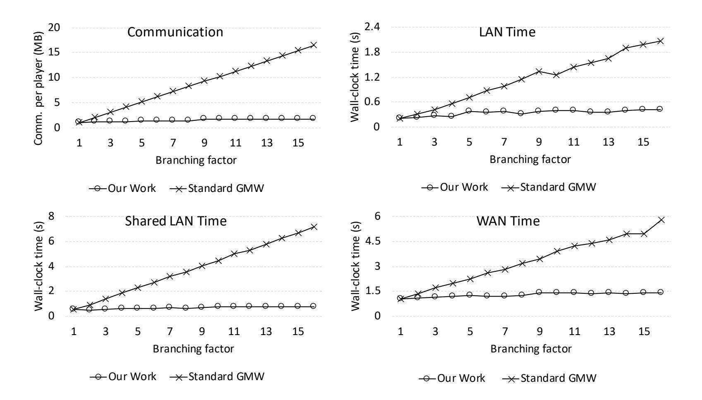
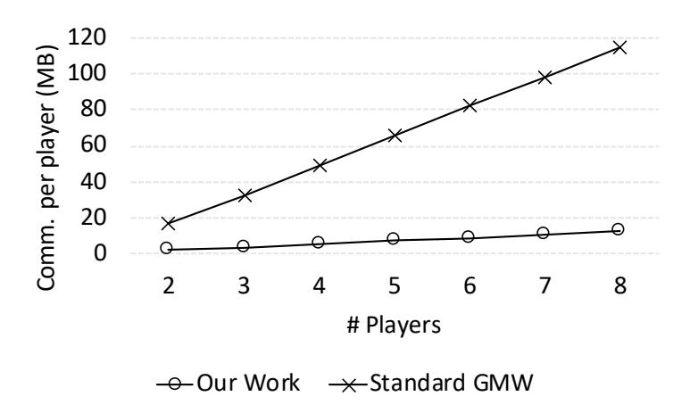

{0}------------------------------------------------

# MOTIF: (Almost) Free Branching in GMW via Vector-Scalar Multiplication

David Heath, Vladimir Kolesnikov, and Stanislav Peceny

Georgia Institute of Technology, Atlanta, GA, USA {heath.davidanthony,kolesnikov,stan.peceny}@gatech.edu

Abstract. MPC functionalities are increasingly specified in high-level languages, where control-flow constructions such as conditional statements are extensively used. Today, concretely efficient MPC protocols are circuit-based and must evaluate all conditional branches at high cost to hide the taken branch.

The Goldreich-Micali-Wigderson, or GMW, protocol is a foundational circuit-based technique that realizes MPC for p players and is secure against up to p − 1 semi-honest corruptions. While GMW requires communication rounds proportional to the computed circuit's depth, it is effective in many natural settings.

Our main contribution is MOTIF (Minimizing OTs for IFs), a novel GMW extension that evaluates conditional branches almost for free by amortizing Oblivious Transfers (OTs) across branches. That is, we simultaneously evaluate multiple independent AND gates, one gate from each mutually exclusive branch, by representing them as a single cheap vector-scalar multiplication (VS) gate.

For 2PC with b branches, we simultaneously evaluate up to b AND gates using only two 1-out-of-2 OTs of b-bit secrets. This is a factor ≈ b improvement over the state-of-the-art 2b 1-out-of-2 OTs of 1-bit secrets. Our factor b improvement generalizes to the multiparty setting as well: b AND gates consume only p(p − 1) 1-out-of-2 OTs of b-bit secrets.

We implemented our approach and report its performance. For 2PC and a circuit with 16 branches, each comparing two length-65000 bitstrings, MOTIF outperforms standard GMW in terms of communication by ≈ 9.4×. Total wall-clock time is improved by 4.1 − 9.2× depending on network settings.

Our work is in the semi-honest model, tolerating all-but-one corruptions.

Keywords: MPC, GMW, conditional branching.

# 1 Introduction

Secure Multiparty Computation (MPC) enables mutually untrusting parties to compute a function of their private inputs while revealing only the function output. The Goldreich-Micali-Wigderson (GMW) protocol is a foundational technique that realizes MPC for p players and that tolerates up to p − 1 semi-honest 

{1}------------------------------------------------

corruptions. In GMW, the players jointly evaluate a circuit C by (1) randomly secret sharing their private input values, (2) privately evaluating C gate-by-gate, ensuring that the random secret shares encode the correct value for each wire, and (3) reconstructing secret shares on the output wires.

While XOR gates are evaluated without interaction, AND gates require communication in the form of oblivious transfer (OT). The bottleneck in GMW performance is communication incurred by OTs, both in terms of bandwidth consumption and latency.

In this work, we improve the bandwidth consumption of the GMW protocol for circuits that include conditional branching. In particular, we improve by up to the branching factor: for a circuit with b branches, we reduce bandwidth consumption by up to b×.

The cost of round complexity and GMW use cases. GMW requires a round of communication for each of the circuit's layers of AND gates<sup>1</sup> . Because in many scenarios the network latency is substantial, constant-round protocols, such as Garbled Circuit (GC) are often preferred.

Nevertheless, there are a number of scenarios where GMW is preferable to GC and other protocols:

- GMW efficiently supports multiparty computation and is resilient against a dishonest majority. While multiparty GC protocols exist, they are expensive: the GC is generated jointly among players such that no small subset of players can decrypt wire labels. Thus, the GC must be generated inside MPC, which is expensive.
- Many useful circuits are low-depth or have low-depth variants. GMW's multiround nature is less impactful for low-depth circuits, and prior work has shown that the protocol can outperform GC in these cases [SZ13].
- It is possible to front-load most of GMW's bandwidth consumption to a pre-computation phase. When pre-computation is allowed, GMW can perform useful work even before the computed function is known. Indeed, given precomputed random OTs, GMW consumes only 6 bits per AND gate in the 2PC setting (1-out-of-2 bit OT can be done by transferring a single one-bit secret and a single two-bit secret as introduced in [Bea95]); this holds for arbitrary C. In contrast, GC protocols cannot perform useful work until the circuit is known<sup>2</sup> .

<sup>1</sup> Circuit depth can be reduced by rebalancing at the cost of increased overall circuit size [BCE91, BB94]. Further, in the 2PC setting, two-input/one-output gates can be aggregated into multi-input/multi-output gates and evaluated in one round at cost exponential in the number of inputs [KKW17, DKS<sup>+</sup>17].

<sup>2</sup> Universal circuits (UCs) can be programmed in an online phase to model any circuit up to a given size n. Hence, UCs technically allow GC protocols to precompute a garbling before the circuit topology is known, but at great cost. A UC of size n is implemented with 3n log n gates [LYZ<sup>+</sup>20]. Further, large numbers of GC labels (of total size greater than the garbling of the underlying circuit) must be transferred in the online phase in order to program the UC.

{2}------------------------------------------------

In sum, GMW is suitable for a number of practical scenarios, and its improvement benefits many applications.

Goal: (Almost) free branching in GMW. GMW is a circuit-based protocol, and as such, all of C's branches must be evaluated by the players. Until the recent work of [HK20] (whose improvement is not for MPC, but for the simpler zero-knowledge setting), it was widely believed that the cost of branching is unavoidable in circuit-based protocols. In this work, we show how to essentially eliminate the cost of branching for GMW. Our technique is wholly different from that of [HK20]; their 'stacking' technique has no obvious analog in GMW due to the interactive nature of the protocol.

Semi-honest GMW requires two bit-OTs per AND gate per each pair of players. The cost of such OT includes the transfer of the secrets (cheap, 3 bits from [Bea95]) and consumes one row of the OT extension matrix (expensive, κ bits). Evaluation of all but one branch is ultimately discarded by the MPC, and our goal is to eliminate this waste.

We work in the semi-honest model, which is useful in many scenarios (e.g. protecting against players who may become corrupted in the future). Furthermore, advances in the semi-honest model often lead to similar advances in the malicious model. We leave exploring such improvements to future work.

### 1.1 Our Contributions

- Efficient VS gate. We extend the GMW protocol with gates that we call 'vector-scalar' gates (VS). VS gates allow p players to multiply a shared vector of b bits by a shared scalar bit for only p · (p − 1) OTs. Standard GMW computes each multiplication separately and thus requires b · p ·(p − 1) OTs. Thus, we reduce bandwidth consumption by b× when evaluating the VS gate.
- (Almost) free conditional branching. We show how to use VS to essentially eliminate the communication cost of inactive branches. Precisely, we amortize random OTs needed to securely compute AND gates across a conditional. The players must still broadcast several bits per AND gate, but this cost is small compared to the expensive κ-bit random OTs which we amortize. For a circuit with b branches, we improve communication by up to b× as compared to state-of-the-art GMW. Our computation costs are also slightly lower than standard GMW because we process fewer OTs.
- Implementation and evaluation. We implemented our approach in C++ and report performance (see Section 9). For 2PC and a circuit with 16 branches, we improve communication by 9.4× and total wall-clock time by 5.1× on a LAN and 9.2× on a LAN with shared traffic (i.e. lower bandwidth).

### 1.2 Presentation Outline

We motivated our work in Section 1 and summarized the contributions in Section 1.1. We present related work in Section 2, review the basic GMW protocol in Section 3, and introduce notation in Section 4.

{3}------------------------------------------------

We present a technical summary of our approach in Section 5. We formally specify our protocols in Section 6 and provide proofs in Section 7. We discuss implementation details and evaluate performance in Sections 8 and 9.

# 2 Related Work

We improve the state-of-the-art Goldreich-Micali-Wigderson (GMW) protocol [GMW87] by adding an efficient vector-scalar multiplication gate (VS) that is notably useful for executing conditional branches. We therefore review related work that improves (1) secure computation of conditional branches and (2) the classic GMW protocol.

Stacked Garbling. A recent line of work improves communication of GC with conditional branching in settings where one player knows the evaluated branch [Kol18, HK20]. [Kol18] is motivated by the use case where the GC generator knows the taken branch, e.g. while evaluating one of several DB queries. [HK20] is motivated by ZK proofs.

Prior to these works, it was generally believed that all circuit branches must be processed and transmitted according to the underlying protocol. [Kol18, HK20] break this assumption by using communication proportional to only the longest branch, given that one of the players knows which branch is taken.

Our research direction was inspired by these prior works: we show that communication reduction via conditional branching efficiently carries to GMW as well. In particular, the OTs used to compute AND gates can be amortized across branches. Unlike [Kol18, HK20], we do not require any player to know which branch is taken.

Universal Circuits. Our work improves conditional branching by adding a new gate primitive that amortizes OTs across branches. Another approach instead recompiles branches into a new form. Universal circuits (UCs) are programmable constructions that can evaluate arbitrary circuits up to a given size n. Thus, a single UC can be programmed to compute any single branch in a conditional, amortizing the gate costs of the individual branches.

Unfortunately, a UC representing circuits of size n incurs significant overhead in the number of gates. Decades after Valiant's original construction [Val76], UC enjoyed a renewed interest due to its use in MPC, and UC size has steadily improved [KS08, LMS16, GKS17, AGKS19, KS16, ZYZL18]. The state-of-theart UC construction has size 3n log n [LYZ<sup>+</sup>20]. Even with these improvements, representing conditional branches with UCs is often impractical. For example, if we consider branches of size n = 2<sup>10</sup> gates, the state-of-the-art UC construction has factor 3 · log(2<sup>10</sup>) = 30× overhead. In addition, programming the UC based on branch conditions known only to the MPC player is a difficult and expensive process. Thus, in use cases arising in evaluation of typical programs, UC-based branch evaluation is slower than na¨ıve circuit evaluation.

[KKW17] observed that UCs are overly general for conditional branching: a UC can represent any circuit up to size n, while a conditional has a fixed and 

{4}------------------------------------------------

often small set of publicly known circuits. Correspondingly, [KKW17] generalized UCs to Set Universal Circuits (S-UCs). An S-UC can be programmed to implement any circuit in a fixed set S, rather than the entire universe of circuits of size n. By constraining the problem to smaller sets, the authors improved UC overhead. [KKW17] used heuristics to exploit common sub-structures in the topologies of the circuits in S by overlaying the circuits with one another. For a specific set of 32 circuits, the authors achieved 6.1× size reduction compared to separately representing each circuit. For 32 circuits, our approach can improve by up to 32×. Additionally, we do not face the expensive problem of programming the conditional based on conditions known only to the MPC player. Finally, [KKW17] is a heuristic whose performance depends on the specific circuits. Our approach is much more general.

Oblivious Transfer (OT) extension and Silent OT. Since OT requires expensive public-key primitives, efficient GMW relies on OT extension [Bea96, IKNP03]. Our implementation uses the highly performant 1-out-of-2 OT extension of [IKNP03] as implemented by the EMP-toolkit [WMK16]. More specifically, we precompute 1-out-of-2 random OTs in a precomputation phase and use the standard trick [Bea95] to cheaply construct 1-out-of-2 OT from random OT.

With [IKNP03], each 1-out-of-2 OT requires transmission of a κ-bit (e.g. 128-bit) OT matrix row, regardless of the length of the sent secrets. Reducing the number of consumed OT matrix rows is the source of our improvement: our VS gate takes advantage of the fact that a single 1-out-of-2 OT of b-bit strings is much cheaper than b 1-out-of-2 OTs of 1-bit strings, since in the former case only one κ-bit OT matrix row is consumed.

Silent OT is an exciting recent primitive that generates large numbers of random OTs from relatively short pseudorandom correlation generators [BCG+19]. It largely removes the communication overhead of random OT when a large batch is executed. Currently, [IKNP03] remains more efficient than Silent OT in many contexts because Silent OT incurs expensive computation and involves operations with high RAM consumption [BCG+19]. We stress that although we emphasize communication improvement via amortizing OTs, Silent OT does not replace our approach. Indeed, our approach yields improvement even if we use Silent OT, because we reduce the number of needed random OTs, thus allowing us to run a smaller Silent OT instance. Therefore, our approach significantly reduces the computation overhead of Silent OT, both in terms of RAM consumption and wall-clock time.

GMW with multi-input/multi-output gates. Prior work [KK13, KKW17, DKS<sup>+</sup>17] noticed that the cost of OTs associated with GMW gate evaluation could be amortized across several gates. [KK13] improved OT for short secrets by extending [IKNP03] 1-out-of-2 OT to a 1-out-of-n OT at only double the cost. [KKW17, DKS<sup>+</sup>17] applied the [KK13] OT to larger gates with more than the standard two inputs/one output, thus amortizing the OT matrix cost across several gates. As a secondary benefit, merging several gates into larger gates reduces the circuit depth and latency overhead.

{5}------------------------------------------------

Unfortunately, the above multi-input gate constructions encounter two significant problems. First, the size of the truth table, and thus bandwidth consumption, grows exponentially in the number of inputs. Therefore, it is unrealistic to construct multi-gates with large numbers of inputs. Second, gates that encode arbitrary functions do not cleanly generalize from the two-party to the multiparty setting. To explain why, we contrast arbitrary gates with AND gates. AND gates generalize to the multi-party setting because logical AND distributes over XOR secret shares. Therefore, the multiple players can construct XOR shares of the AND gate truth table. In contrast, an arbitrary function does not distribute over shares, and thus players cannot construct shares of the table.

Our VS gate can be viewed as a particularly useful multi-input/multi-output gate that ANDs (multiplies) any number of vector elements with a scalar. The advantage of our approach over prior multi-input/multi-output gates is that our approach is based on algebra, not on the brute-force encoding of truth-tables. This algebra scales well both to any number of inputs/outputs and to any number of players. Of course, the most important difference is the key application of our approach – efficient branching – which was not achievable with prior work.

Arithmetic MPC and Vector OLE. A number of works presented arithmetic generalizations of MPC in the GMW style, e.g. [IPS09, ADI+17]. Modern works in this area can efficiently multiply arbitrary field elements using a generalization of 1-out-of-2 string OT called 'vector oblivious linear function evaluation' (vOLE) [ADI+17, BCGI18, DGN+17]. In addition, these works point out that field scalar-vector multiplication can be efficiently achieved with two vOLEs, and emphasize the usefulness of this technique for efficient linear algebra operations (e.g., matrix multiplication). Because we work with Boolean circuits, we do not need generalized vOLEs, and instead more efficiently base our vectorization directly on the efficient OT extension technique [IKNP03]. Importantly, our branching application benefits from multiplication of relatively small vectors (of size equal to the branching factors), while break-even points of prior constructions imply their usefulness with much longer vectors.

Our work applies efficient scalar-vector multiplication to the unobvious and important use case of conditional branching.

Constant-overhead MPC. Ishai et al. [IKOS08] proposed a constant-overhead GMW-based MPC. They observe that once sufficiently many random OTs are available to the players, the remainder of the protocol can be done with constant overhead per Boolean gate. They exhibit a construction of such a pool of OTs with constant cost per OT. For this, [IKOS08] relies on Beaver's non-black-box OT extension [Bea96], decomposable randomized encoding and an NC<sup>0</sup> PRG. While asymptotically [IKOS08]'s cost is optimal, in concrete terms, it is impractically high. Our work does not achieve constant factor overhead, but similarly improves OT utilization and is concretely efficient.

GMW optimizations. [CHK<sup>+</sup>12] showed that GMW is particularly suitable in low-latency network settings and that it outperforms GCs in certain scenarios. 

{6}------------------------------------------------

[CHK+12] further showed an application in a set of online marketplaces such as a mobile social network, where a provider helps its users connect according to mutual interests. Their implementation used multi-threaded programming to take advantage of inherent parallelism available in the execution of OT and the evaluation of AND gates of the same depth.

[SZ13] introduced several low-level computation improvements, such as using SIMD instructions and performing load-balancing, and circuit representation improvements, such as choosing low-depth circuits even at the cost of larger overall circuits. [SZ13] also elaborated on a number of examples where GMW is suitable, including a privacy-preserving face recognition with Eigenfaces [EFG+09, HKS+10, SSW10] or Hamming distance [OPJM10]. We draw our key evaluation benchmark, a log-depth bitstring comparison circuit, from [SZ13].

# 3 GMW Protocol Review

The GMW protocol allows p semi-honest players to securely compute a Boolean function of their private inputs. The key invariant is that on each wire, the p players together hold an XOR secret share of the truth value.

Consider p players P1, ..., P<sup>p</sup> who together evaluate a Boolean circuit C. For a wire a, we denote P<sup>i</sup> 's share of a as a<sup>i</sup> . The players step through C gate-by-gate:

- For each wire a corresponding to an input bit from player P<sup>i</sup> , P<sup>i</sup> uniformly samples a p-bit XOR secret share of a and sends a share to each player.
- To compute an XOR gate c = a ⊕ b, the players locally add their shares:

$$(a_1 \oplus ... \oplus a_p) \oplus (b_1 \oplus ... \oplus b_p) = (a_1 \oplus b_1) \oplus ... \oplus (a_p \oplus b_p)$$

– To compute an AND gate, the players communicate. Consider an AND Gate c = ab and the following equality:

$$c = ab = (a_1 \oplus \dots \oplus a_p)(b_1 \oplus \dots \oplus b_p) = \left(\bigoplus_{i,j \in 1 \dots p} a_i b_j\right)$$

That is, to compute an AND gate it suffices for each pair of players to multiply together their respective shares and then for the players to locally XOR the results. Consider two players P<sup>i</sup> and P<sup>j</sup> . The players compute shares of aib<sup>j</sup> and a<sup>j</sup> b<sup>i</sup> via 1-out-of-2 OT: To compute aib<sup>j</sup> , P<sup>i</sup> first samples a uniform bit xi . Then, the players perform 1-out-of-2 OT where P<sup>j</sup> inputs b<sup>j</sup> as her choice bit and P<sup>i</sup> submits as input x<sup>i</sup> and x<sup>i</sup> ⊕ a<sup>i</sup> . Let x<sup>j</sup> be P<sup>j</sup> 's OT output and note that x<sup>i</sup> ⊕ x<sup>j</sup> = aib<sup>j</sup> . P<sup>i</sup> XORs together her OT outputs with aib<sup>i</sup> (which is computed locally) and outputs the sum.

– For each output wire a, the players reconstruct the cleartext output by broadcasting their share and then locally XORing all shares.

Thus, the GMW protocol securely computes an arbitrary function by consuming p(p − 1) OTs per AND gate. Our construction uses this same protocol, except that we replace AND gates by a generalized VS gate that ANDs an entire vector of bits with a scalar bit for p(p − 1) OTs. As our key use-case, we show that this improves conditional branching.

{7}------------------------------------------------

# 4 Notation

- We use p to denote the number of players.
- We use subscript notation to associate a variable with a player. E.g., a<sup>i</sup> is the share of wire a held by player P<sup>i</sup> .
- t denotes the 'active' branch in a conditional i.e. a branch that is taken during the oblivious execution. t¯ implies an 'inactive' branch.
- In this work, we manipulate strings of bits as vectors:
  - Superscript notation denotes vector indexes. E.g. a i refers to the i-th index of a vector a.
  - We denote a vector of bits by writing parenthesized comma-separated values. E.g., (a, b, c) is a vector of a, b, and c.
  - We use n to denote the length of a vector.
  - When two vectors are known to have the same length, we use ⊕ to denote the bitwise XOR sum:

$$(a^1, ..., a^n) \oplus (b^1, ..., b^n) = (a^1 \oplus b^1, ..., a^n \oplus b^n)$$

• We indicate a vector scalar Boolean product by writing the scalar to the left of the vector:

$$a(b^1, \dots, b^n) = (ab^1, \dots, ab^n)$$

# 5 Technical Overview

Our approach amortizes OTs across conditional branches. Section 6 formalizes this approach in technical detail. In this section, we explain at a high level.

Recall, that GMW computes AND (Boolean multiplication) gates via 1-outof-2 OT. Suppose that we wish to multiply an entire vector of Boolean bits (b 1 , . . . , bn) by the same scalar a. I.e., we wish to compute (ab<sup>1</sup> , . . . , abn). MOTIF amortizes the expensive 1-out-of-2 OTs needed to multiply each shared vector element by a shared scalar (hence the notation VS for vector-scalar). Namely, to evaluate n AND gates of this form, instead of using n · p · (p − 1) OTs of length-1 secrets, we use only p·(p−1) OTs of length-n secrets. This reduces consumption of the OT extension matrix rows, the most expensive resource in the GMW evaluation.

We first show how we achieve this cheap vector scalar multiplication. Then, we show how this tool is used to reduce the cost of conditional branching.

In this section, for simplicity, we focus on the case of b = 2 branches and p = 2 players. Our approach naturally generalizes to arbitrary b and p, and we formally present our constructions in full generality in Section 6.

### 5.1 VS Gates

As we showed in Section 3, a single AND gate computed amongst p players requires p(p−1) 1-out-of-2 OTs. Our VS gate construction consumes the same number of 

{8}------------------------------------------------

OTs, but multiplies an entire vector of bits by a scalar bit. Suppose two players P1, P<sup>2</sup> wish to compute the following vector operation:

$$a(b,c) = (ab,ac)$$

where a = a<sup>1</sup> ⊕ a2, b = b<sup>1</sup> ⊕ b2, and c = c<sup>1</sup> ⊕ c<sup>2</sup> are GMW secret shared between P1, P2. Note the following equality:

$$a(b,c) = (a_1 \oplus a_2)(b_1 \oplus b_2, c_1 \oplus c_2)$$
 XOR shares  
=  $(a_1b_1 \oplus a_1b_2 \oplus a_2b_1 \oplus a_2b_2, a_1c_1 \oplus a_1c_2 \oplus a_2c_1 \oplus a_2c_2)$  distribute  
=  $a_1(b_1, c_1) \oplus a_1(b_2, c_2) \oplus a_2(b_1, c_1) \oplus a_2(b_2, c_2)$  group

The first and fourth summands can be computed locally by the respective players. Thus, we need only show how to compute a1(b2, c2) (the remaining third summand is computed symmetrically). To compute this vector AND, the players perform a single 1-out-of-2 OT of length-2 secrets. Here, P<sup>2</sup> plays the OT sender and P<sup>1</sup> the receiver. P<sup>2</sup> draws two uniform bits x and y and allows P<sup>1</sup> to choose between the following two secrets:

$$(x,y)$$
  $(x \oplus b_2, y \oplus c_2)$ 

P<sup>1</sup> chooses based on a<sup>1</sup> and hence receives (x⊕a1b2, y⊕a1c2). P<sup>2</sup> uses the vector (x, y) as her secret share of this summand. Thus, the players successfully hold shares of a1(b2, c2).

Put together, the full vector multiplication a(b, c) uses only two 1-out-of-2 OTs of length-2 secrets. Our VS gate generalizes to arbitrary numbers of players and vector lengths: a vector scaling of b elements between p players requires p(p − 1) 1-out-of-2 OTs of length b secrets.

### 5.2 MOTIF: (Almost) Free Conditional Branching in GMW

We now show how VS gates allow improved conditional branching. We amortize OTs used by AND gates across conditional branches. Branches may be arbitrary, having different topologies and operating on independent wires.

For simplicity, consider a circuit that has only two branches and that is computed by only two players; our approach generalizes to b branches and n players. Since the two branches are conditionally composed, one branch is 'active' (i.e. taken) and one is 'inactive'.

Our key invariant is that on all wires of the inactive branch the players hold a share of 0, whereas on the active branch they hold valid shares. We begin by showing how AND gates interact with this invariant. In particular, the invariant allows AND gates across different conditional branches to be simultaneously computed by a single VS gate. Then we show how all gates maintain the invariant and how we enter/leave branches.

{9}------------------------------------------------

AND Gates. Our key optimization allows the players to consider simultaneously one AND gate from each branch. For example, suppose the players wish to compute both  $a^1b^1$  and  $a^2b^2$  where  $a^1, b^1$  are wires in branch 1 and  $a^2, b^2$  are wires in branch 2. Despite the fact that the players compute two gates, they need only two 1-out-of-2 OTs. Let t be the taken branch. Hence  $x^t, y^t$  are active wires and  $x^{\bar{t}}, y^{\bar{t}}$  are both 0. Observe the following equalities:

$$(x^t \oplus x^{\bar{t}})y^t = (x^t \oplus 0)y^t = x^t y^t$$
$$(x^t \oplus x^{\bar{t}})y^{\bar{t}} = (x_t \oplus 0)0 = 0$$

Thus if we efficiently compute both  $(x^t \oplus x^{\bar{t}})y^t$  and  $(x^t \oplus x^{\bar{t}})y^{\bar{t}}$ , then we propagate the invariant: the active branch's AND output wire receives the correct value while the inactive branch's wire receives 0. These products reduce to a vector-scalar product computed by our VS gate:

$$(x^t \oplus x^{\bar{t}})(y^t, y^{\bar{t}})$$

Thus, we compute two AND gates for the price of one. This technique generalizes to arbitrary numbers of branches: to compute b AND gates across b branches, our approach consumes two OTs of length b secrets.

Additional Details. Our optimization relies on ensuring all inactive wires hold 0. We now show how we establish this invariant upon entering a branch, how non-AND gates maintain the invariant, and how we leave conditionals.

- **Demultiplexing.** 'Entering' a conditional is controlled by a condition bit, a single bit whose value determines which of the two branches should be taken. To enter a conditional with two branches, we demultiplex the input values based on the condition bit. That is, we AND the branch inputs with the condition bit. More precisely, for the input to branch 1, i.e. the branch taken if the condition bit holds 1, we AND the input bits with the condition bit. Symmetrically, for branch 0, we AND each input bit with the NOT of the condition bit. Thus, we obtain a vector of valid inputs for the active branch and a vector of all 0s for the inactive branch. Because we multiply all inputs by the same two bits, we can use VS gates to efficiently implement the demultiplexer. In order to implement more than two branches, we nest conditionals.
- XOR gates. XOR gates trivially maintain our invariant: an XOR gate with two 0 inputs outputs 0.
- NOT gates. Native NOT gates would break our invariant: a NOT gate with input 0 outputs 1. Thus, we do not *natively* support NOT gates. Fortunately, we can construct NOT gates from XOR gates. To do so, we maintain a distinguished 'true' wire in each branch. We ensure, by demultiplexing, that the 'true' wire holds logical 1 on all active branches and logical 0 on all inactive branches. A NOT gate of a wire can thus be achieved by XORing the wire with 'true'.

{10}------------------------------------------------

– Multiplexing. To 'leave' a conditional, we resolve the output wires of the two branches: we propagate the output values on the active branch and discard the output of the inactive branch. Fortunately, our invariant means that this operation is extremely cheap: to multiplex the output values of wires on the active and inactive branches, we simply XOR corresponding wires together.

Branch layer alignment. As GMW is an interactive scheme, at any time we can only evaluate gates whose input shares have already been computed (ready gates), and thus we cannot include 'future round' AND gates into the current VS computation. In each round of GMW computation, we can only amortize OTs over the ready gates.

That is, in p-party GMW, in each round our technique eliminates all OTs, except for the total of p(p − 1) · max(wi) OTs, where w<sup>i</sup> is the number of AND gates in the current layer of branch i. Clearly, the more aligned (i.e. having a similar number of AND gates in each circuit layer) the circuit branches are, the higher the performance improvement.

In our experiments, we demonstrate the maximum achievable benefit of our construction by evaluating perfectly aligned circuits. While typical circuits will not have perfectly aligned branches, we do not expect them to have a poor alignment either, particularly if the branching factor is high. We leave improving alignment, perhaps via compilation techniques, as future work.

# 6 MOTIF: Formalization and Protocol Construction

We now formalize MOTIF, our GMW extension that supports efficient branching. As in the standard GMW protocol, our approach represents functions as circuits composed from a collection of low-level gates. We presented the core technical ideas of our approach in Section 5; the following discussion assumes a familiarity with Section 5.

Underlying idea. We implement efficient branching by simultaneous evaluation of multiple independent AND gates, one gate from each mutually exclusive branch, by representing them as a single cheap VS gate.

Presentation Roadmap. Our formalization involves intertwined low-level cryptographic, programming language, and circuit technical details.

In Section 6.1 we motivate our compilation sequence, which takes a program with if branches written in a high-level language and outputs a straight-line circuit that uses VS gates. We do not yet explain in detail how it is achieved, absent a necessary formalization of circuits and gates, which we provide in Section 6.2. Armed with the formalization, we explain in Section 6.3 how vectorized VS gates facilitate branching in a straight-line circuit: we provide a formal algorithm (Figure 1) that generates a straight-line circuit with VS gates implementing branching over two circuits C0, C1.

{11}------------------------------------------------

Then, having converted a program/circuit with branching into a VS circuit defined in Section 6.2, we focus on efficient secure evaluation of the latter. In Section 6.4, we complete our formalization by defining cleartext semantics. In Section 6.5, we present a complete protocol, Π - MOTIF, with proofs in Section 7.

### 6.1 Compiling Conditionals to Straight-line VS Circuits

Our approach is concerned primarily with the efficient handling of conditional branching. Therefore, we begin our formalization by discussing how conditional branches can be efficiently represented in terms of only XOR and VS gates.

Assume that the user's MPC functionality is encoded in some high-level language as a program with branching. The user hands this high-level functionality to a compiler which translates the high-level-language program into a low-level collection of gates. To interface with our approach, the compiler should output a circuit that contains XOR and VS gates.

It is thus the job of the compiler to translate conditionals into the VS circuit. Recall (from Section 5.2) that our key branching invariant requires that all inactive branches hold 0 values on all wires. Consider b branches, where each branch i computes the conjunction x iy i , and where x i , y<sup>i</sup> are independent values carried by i-th branch's wires. Due to the key invariant, and as discussed in detail in Section 5.2, the following vector-scalar product simultaneously computes these b ANDs:

$$(x^1 \oplus \ldots \oplus x^b)(y^1, \ldots, y^b)$$

The compiler's job is to output VS gates that simultaneously compute AND gates in this manner. In Section 6.3 we show how a compiler can merge the gates of two branches in order to amortize AND gates as just described. First, we describe the syntax needed for this compiler algorithm and for our protocol.

### 6.2 Circuit Formal Syntax

Because we add a new gate primitive, we cannot use the community-held implicit syntax of Boolean circuits. Thus, we formalize the syntax and semantics of our modified circuits such that we can prove correctness and security.

Gate syntax. Our approach handles two kinds of gates: XOR gates, which can be evaluated locally, and vector-scalar gates (VS), a new type of gate, which multiplies a vector of bits by a scalar for the cost of only p(p − 1) OTs. An XOR gate has two input wires a, b and an output wire c and computes c ← a ⊕ b. We denote an XOR gate by writing XOR(c, a, b). A vector-scalar gate VS takes as input a scalar a and a vector (b 1 , . . . , b<sup>n</sup>) and computes:

$$(c^1,\ldots,c^n) \leftarrow a(b^1,\ldots,b^n)$$

We denote a vector-scalar gate by writing VS((c 1 , . . . , c<sup>n</sup>), a,(b 1 , . . . , b<sup>n</sup>)). We also formalize the input/output wires of the circuit. We denote an input wire a whose 

{12}------------------------------------------------

value is given by player P by writing INPUT(P, a). Finally, we indicate that wire a is an output wire by writing OUTPUT(a). Formally, let variables a, b, c, . . . be arbitrary wires and let P be an arbitrary player. The space of gates is denoted:

$$\mathcal{G} ::= \mathtt{XOR}(c,a,b) \mid \mathtt{VS}((c^1,\ldots,c^n),a,(b^1,\ldots,b^n)) \mid \mathtt{INPUT}(P,a) \mid \mathtt{OUTPUT}(a)$$

NOT gates. Typically, Boolean techniques support gates that perform logical NOT. As discussed in Section 5, we do not natively support NOT gates as they would break the correctness of VS implementation of conditional branches: our invariant requires all inactive wires to hold shares of 0, and NOT gates flip 0 to 1. Accordingly, our formal syntax does not include NOT gates. Instead, we build NOT gates from XOR gates and a per branch auxiliary distinguished wire aux, which is set by the MPC player to aux = 1 in the active branch, and to aux = 0 in all inactive branches. Then ¬a = a ⊕ aux, which implements NOT in the active branch and preserves monotonicity in the inactive branches.

Circuit syntax. A circuit is a list of gates. We do not need to "connect" the gates in the circuit, since gates already refer to specific wire ids. Formally, let g1, . . . , g<sup>k</sup> ∈ G be arbitrary gates. The space of circuits with k gates is denoted:

$$\mathcal{C} ::= (g_1, \ldots, g_k)$$

We consider a circuit to be valid only if the gates are in a topological order : i.e., a wire must appear as a gate output before it is used as a subsequent gate input. In upcoming discussion, we assume circuits are valid.

Circuit layers. In our implementation, our circuit syntax groups collections of gates into layers, such that all VS gates of the same depth can be computed in constant communication rounds. We omit this layering from our formalization to keep notation simple, but emphasize that the required change is straightforward.

### 6.3 Merging Conditional Branches

As discussed in Section 6.1, we view the problem of translating from programs with conditional branches to circuits in our syntax as a problem for a compiler. In this section, we specify an algorithm merge (Figure 1) that demonstrates how a compiler can combine VS gates from each branch into a single VS gate (of course, the standard AND gate is a special case of the VS gate).

For simplicity, assume that the high-level source language contains only binary branching, perhaps through if statements. Even in this simplified model, the programmer can nest if statements to achieve arbitrary branching. We also assume that the compiler can translate low-level program statements into circuits (e.g., assignment statements are converted into circuits).

Consider two branches of an if statement, and suppose that the compiler already recursively compiled the body of both branches into two circuits C<sup>0</sup> and C1. To finish translating the if statement while taking advantage of our

{13}------------------------------------------------

```
def merge(C_0, C_1):
 m \leftarrow |C_0| \; ; \; n \leftarrow |C_1|
  \mathtt{out} \leftarrow \lambda
  ▶ Initialize counters that point into the two respective circuits.
  i \leftarrow 1 \; ; \; j \leftarrow 1
  ▶ Continue to loop until gates from both input circuits are exhausted.
  while (i \leq m \text{ and } j \leq n):
    ▶ Eagerly pull XOR gates from both input circuits.
    while (i \leq m \text{ and } C_0[i] \text{ is an XOR gate}):
      \mathtt{out.push}(C_0[i])
     i \leftarrow i + 1
    while (j \leq n \text{ and } C_1[j] \text{ is an XOR gate}):
      \mathtt{out.push}(C_1[j])
      j \leftarrow j + 1
     ▶ Now, the next gate in both circuits either
    ▷ does not exist (i.e. the branch has no gates left) or is a VS gate.
    if i \leq m and j \leq n :
      ▶ The general case: both branches have a VS gate that can be merged.
      \mathtt{VS}((c_0^1,\ldots,c_0^k),a_0,(b_0^1,\ldots,c_0^k)) \leftarrow C_0[i]
      VS((c_1^1,\ldots,c_1^k),a_1,(b_1^1,\ldots,c_1^k)) \leftarrow C_1[j]
      ▶ The compiler allocates a fresh wire for the XOR output
      a \leftarrow \texttt{freshWire}()
      \triangleright Recall, our invariant ensures that at runtime either a_0 or a_1 holds 0.
      \mathtt{out.push}(\mathtt{XOR}(a, a_0, a_1))
      \mathtt{out.push}(\mathtt{VS}((c_0^1,\dots,c_0^k,c_1^1,\dots,c_1^k),a,(b_0^1,\dots,b_0^k,b_1^1,\dots,b_1^k)
    else if i \leq m:
      \mathtt{out.push}(C_0[i])
      i \leftarrow i + 1
    else if j \leq n:
      \mathtt{out.push}(C_0[j])
      j \leftarrow j + 1
  return out
```

Fig. 1: merge, a compiler algorithm, demonstrates how two branch circuits can be merged into one while joining together VS gates. By using an algorithm like merge, a compiler can use our approach to amortize the cost of OTs across conditional branches.

{14}------------------------------------------------

approach, the compiler should merge together VS gates in C<sup>0</sup> and C1. merge is one technique for performing this combining operation. merge takes C<sup>0</sup> and C<sup>1</sup> as arguments and outputs a single circuit that computes both input circuits, but that uses fewer VS gates than simply concatenating C<sup>0</sup> and C1. At a high level, merge walks the two input circuits gate-by-gate. It eagerly moves XOR gates from the input circuits to the output circuit until the next gate in both circuits is a VS gate. merge combines these two VS gates into one by concatenating the two vectors and by XORing the two scalars. merge assumes that circuits inside of conditionals do not contain INPUT or OUTPUT wires.

By recursively applying merge across many conditional branches, a compiler can achieve up to b× reduction in the number of VS gates.

Merging layers. As discussed in Section 6.2, our formalization does not account for circuit layers (i.e. VS gates that occur at the same multiplicative depth) for simplicity. In order to avoid increasing latency, merging must take care to preserve layers: merging VS gates across layers can increase the overall multiplicative depth and add communication rounds. Thus, the compiler must be careful when merging gates.

One straightforward technique, which we implemented, is to only merge together VS gates of the same depth. That is, our implementation introduces an extra loop which combines all VS gates that are grouped in the same layer instead of handling VS gates one at a time. Even this straightforward strategy is likely to yield large improvements, particularly if the branching factor is high.

More optimal approaches exist, and the problem of maximally amortizing OTs across branches thus becomes a relatively interesting compilers problem. An intelligent compiler could allocate gates to different layers in order to maximally match up VS gates across branches without increasing depth. An even more intelligent compiler could account for network settings in order to decide when it is worth it to increase multiplicative depth in exchange for better layer alignment.

### 6.4 Circuit Cleartext Semantics

Prior discussion showed that a Boolean circuit with branches can be represented as a straight-line VS circuit. We present our MPC protocol for evaluating such circuits in formal detail in Section 6.5.

In order to demonstrate that our protocol is correct, we require a formal semantics. I.e., we require the functionality that the protocol achieves. In this section, we specify the formal semantics of circuits as the algorithm eval listed in Figure 2. eval maintains a circuit wiring: a map from wire indexes to Boolean values. Each gate reads values from the wiring for input wires and/or writes values to the wiring for output wires.

### 6.5 Our Protocol

In this section, we formalize our protocol Π - MOTIF, which securely implements the semantics of eval (Figure 2):

{15}------------------------------------------------

```
def eval(C, inp1
                  , . . . , inpp
                            ) :
  . Initialize an empty wiring map.
 wiring ← λ
  . Initialize an empty output string.
 out ← λ
  . Update the wiring for each gate in the circuit.
 for g ∈ C :
  switch g :
    case XOR(c, a, b) :
      wiring[c] ← wiring[a] ⊕ wiring[b]
    case VS((c
                1
                 , . . . , c
                        n
                         ), a,(b
                               1
                                , . . . , bn
                                        ))
      for i ∈ [1..n] :
        . AND each vector input by a.
        wiring[c
                 i
                  ] ← wiring[a] · wiring[b
                                            i
                                             ]
    case INPUT(i, a) :
       . Read a bit of input from player i.
      wiring[a] ← inpi
                         .pop()
    case OUTPUT(a) :
       . Update the output string with the wire value.
      out.push(wiring[a])
 return out
```

Fig. 2: The cleartext semantics for a circuit C ∈ C run between p players. Each player i's input is modeled as a string of bits inp<sup>i</sup> . The method pop pops the first value from the string. Each gate manipulates a wiring, which is a map from wire indexes to values. The output of evaluation is a string of bits out.

Construction 1. (Protocol Π - MOTIF) Π - MOTIF is defined in Figures 3 and 4.

Theorems in Section 7 imply the following:

Theorem 1. Construction 1 implements the functionality eval (Figure 2) and is secure against up to p − 1 semi-honest corruptions in the OT-hybrid model.

Figure 3 lists our high level protocol Π - MOTIF from the perspective of an arbitrary player P<sup>i</sup> . For the reader familiar with the detail of the classic GMW protocol, the only essential difference between the classic protocol and ours is that we handle VS gates by invoking an instance of our Π - VS protocol.

Π - MOTIF ensures that the p players hold random XOR secret shares of the truth values on the already computed wires. This invariant ensures both correctness and security: the protocol is correct because the output wires' secret shares can

{16}------------------------------------------------

```
Functionality:
 – Players P1, . . . , Pp agree on a circuit C ∈ C.
 – Each player Pi provides as input a bitstring inpi
                                                       .
 – Players output eval(C, inp1
                                  , . . . , inpp
                                            ).
Protocol:
   Π - MOTIFi(C, inpi
                     ) :
     . Each player sets up an empty wiring map and output string.
    wiring ← λ
    out ← λ
     . The protocol proceeds by case analysis of each gate in C.
    for g ∈ C :
      switch g :
       case XOR(c, a, b) :
          . XOR gates are computed locally by each player.
         wiring[c] ← wiring[a] ⊕ wiring[b]
       case VS((c
                   1
                    , . . . , c
                          n
                           ), a,(b
                                  1
                                   , . . . , bn
                                          )) :
          . We delegate VS gates to the protocol Π - VS.
         (ab1
             , · · · , abn
                       ) ← Π - VSi(wiring[a], wiring[b
                                                       1
                                                        ], . . . , wiring[b
                                                                       n
                                                                        ])
          . Each player puts VS gate results into her wiring.
         for j ∈ [1..n]
           wiring[c
                    j
                     ] ← abj
       case INPUT(j, a) :
         if i == j :
           . Player j draws fresh shares that XOR sum to her next input.
           . sendShares outputs Pj 's share, which she adds to her wiring.
           wiring[a] ← sendShares(inpi
                                          .pop())
         else :
           . Other players add random shares sent by j to their wiring.
           wiring[a] ← recvShare(j)
       case OUTPUT(j, a) :
          . Each player broadcasts her output share and locally sums all shares.
          . reconstruct performs the broadcasts and the local XOR.
         out.push(reconstruct(wiring[a]))
    return out
```

Fig. 3: Our protocol Π - MOTIF from the perspective of player i. Π - MOTIF performs the same tasks as the classic GMW protocol except for VS gates, where we delegate to the sub-protocol Π - VS.

{17}------------------------------------------------

be reconstructed to the correct truth value. The protocol is secure because the XOR secret shares are uniformly random, and hence no player's share (or any strict subset's shares) gives any information about the truth value on a particular wire. We argue these facts in detail in our proofs (Section 7).

Like the functionality eval,  $\Pi-MOTIF$  proceeds by case analysis on gates:

- XOR. The players locally XOR their shares. Because XOR is commutative and associative, this local computation correctly implements the functionality.
- VS. We delegate VS gates to a separate protocol  $\Pi$ -VS (Figure 4). Recall, VS simultaneously multiplies an entire n-element Boolean vector  $(x^1, \ldots, x^n)$  by a Boolean scalar a, as follows: Let p be the number of players holding XOR shares of a and  $x^1, \ldots, x^n$ . Consider an arbitrary k-th vector element  $x^k$ .  $\Pi$ -VS is based on the following equivalence:

$$ax^{k} = (a_{1} \oplus \ldots \oplus a_{p})(x_{1}^{k} \oplus \ldots \oplus x_{p}^{k}) = \bigoplus_{i=1}^{p} \left( \bigoplus_{j=1}^{p} a_{i} x_{j}^{k} \right)$$
 (1)

Now, the sums  $\bigoplus_{j=1}^{p} a_i x_j^k$  can be delivered to player  $P_i$  simultaneously for all  $k \in [1, ..., n]$  via only (p-1) n-bit string 1-out-of-2 OTs executed with the p-1 other players. Once this is done for all p players (using a total of p(p-1) OTs of n-bit strings), the result is a secret sharing of the vector  $(ax^1, ..., ax^n)$ . OT senders introduce uniform masks to protect the secrecy of their shares  $x_j^k$ . The VS protocol is formalized in Figure 4.

- INPUT. Each input wire has a designated player who provides the input value.
   In Π-MOTIF, this player distributes a share of a single bit from their input.
   Our formalization assumes two procedures: (1) sendShares constructs a uniform XOR secret share of a given value and sends the shares to all p players and (2) recvShare is the symmetric procedure that receives a single share from the sending player.
- OUTPUT. For output wires, the players simply reconstruct their XOR secret shares. Our formalization assumes a protocol reconstruct which handles these details. reconstruct instructs each player to broadcast their share to all other players. Then, each player locally XORs together all shares.

### 7 Proofs

Now that we have formalized  $\Pi$ -MOTIF, we prove that it is correct and secure.

### 7.1 Proof of Correctness

 $\Pi$ -MOTIF implements the functionality eval (Figure 2):

Theorem 2 ( $\Pi$ -MOTIF Correctness). For all circuits  $C \in \mathcal{C}$  and all input bitstrings  $\operatorname{inp}_1, \ldots, \operatorname{inp}_p$ :

$$\mathtt{eval}(C,\mathtt{inp}_1,\ldots,\mathtt{inp}_p) = \Pi \cdot \mathtt{MOTIF}(C,\mathtt{inp}_1,\ldots,\mathtt{inp}_p)$$

{18}------------------------------------------------

```
Functionality:
 – Players P1, . . . , Pp input XOR secret shares of a, b1
                                                         , . . . , bn
                                                                 .
 – Players output XOR secret shares of ab1
                                              , . . . , abn
                                                       .
Protocol:
Π - VSi(ai, b1
           i
            , . . . , bn
                   i ) :
  . Vector scaling is computed by having each player i interact with every player j.
 for j ∈ [1..p] :
   if i == j :
     . Pi computes the AND of her two shares locally.
    cj ← (aib
               1
               i
                , . . . , aib
                        n
                        i )
   else if i < j :
     . To AND shares with another player, the two players perform two OTs.
     . The order of OT send/receive is chosen based on player IDs.
     . When sending, Pi's share is a uniform mask.
    x ← draw {0, 1}
                      n
    OTsend(x, x ⊕ (b
                      1
                      i
                       , . . . , bn
                             i ))
    y ← OTrecv(ai)
     . The sub-result computed with Pj is the XOR sum of both OT outputs.
    cj ← x ⊕ y
   else if i > j :
     . Symmetric to above: order of send and receive is swapped.
    y ← OTrecv(ai)
    x ← draw {0, 1}
                      n
    OTsend(x, x ⊕ (b
                      1
                      i
                       , . . . , bn
                             i ))
    cj ← x ⊕ y
  . The output vector is the XOR sum of all results computed with all players.
 return M
           j
              cj
```

Fig. 4: Protocol Π - VS from the perspective of player i. Π - VS explains how the players perform a vector-scalar multiplication. draw uniformly draws a random bit-vector of the specified length. OTSend and OTRecv respectively send and receive a 1-out-of-2 OT of n-bit secrets. In practice, we precompute all random OTs at the start of the protocol.

Proof. By induction on C. The invariant is that gate input wires hold XOR secret shares of corresponding cleartext values.

We proceed by case analysis of an individual gate g, showing that the invariant is propagated from input wires to output wires.

{19}------------------------------------------------

- Suppose g is an input INPUT(i, a). Then  $P_i$  secret shares her input bit and distributes it amongst players, trivially establishing the invariant on wire a.
- Suppose g is an XOR gate XOR(c, a, b). By induction, the input wires a and b hold correct shares. In  $\Pi$ -MOTIF, the players locally sum their shares. Thus, the output wire c holds a correct sharing of the XOR of the input shares:

$$(a_1 \oplus \ldots \oplus a_p) \oplus (b_1 \oplus \ldots \oplus b_p) = (a_1 \oplus b_1) \oplus \ldots \oplus (a_p \oplus b_p)$$

- Suppose g is a vector-scalar gate  $VS((c^1, \ldots, c^n), a, (b^1, \ldots, b^n))$ . By induction,  $a, b^1, \ldots, b^n$  hold correct shares. Consider an arbitrary vector element  $b^k$ . The specification eval requires that the corresponding output wire  $c^k$  obtains a secret sharing of  $ab^k$ . Recall the crucial AND equality given by Equation (1):

$$ab^k = (a_1 \oplus \ldots \oplus a_p)(b_1^k \oplus \ldots \oplus b_p^k) = \bigoplus_{i=1}^p \left(\bigoplus_{j=1}^p a_i b_j^k\right)$$

The protocol  $\Pi$ -VS (Figure 4) uses local computation and OTs to simultaneously compute a secret sharing of the above XOR sum for each vector element. In particular, for each element  $b^k$ , each player  $P_i$  computes a share  $\bigoplus_{j=1}^p a_i b_j^k$  (with added random masks). Thus, for each vector element  $b^k$ , the players hold correct XOR secret shares, which they store on the wire  $c^k$ .

- Suppose g is an output OUTPUT(a). By induction, wire a holds correct secret shares. Thus, when the players reconstruct their shares they obtain the correct truth value for wire a.

$$\Pi$$
-MOTIF is correct.

#### 7.2 Proof of Security

We now prove  $\Pi$ -MOTIF secure in the OT-hybrid model.  $\Pi$ -MOTIF uses 1-out-of-2 OT as an oracle functionality.

Our proof is nearly identical to that of classic GMW. The difference between the two proofs is that our protocol uses VS gates whereas classic GMW uses AND gates. Both proofs show that interactions involving AND/VS gates can be simulated by uniform bits.

**Theorem 3** ( $\Pi$ -MOTIF Security).  $\Pi$ -MOTIF is secure against semi-honest corruption of up to p-1 players in the OT-hybrid model.

*Proof.* By construction of a simulator S that simulates the view of a player  $P_1$ , and an argument that S generalizes to arbitrary strict subsets of players.

At a high level, S computes simulated secret shares on all circuit wires and adds simulated messages to  $P_1$ 's simulated view. The crucial property is that all wire values, except outputs and inputs belonging to  $P_1$ , are indistinguishable from uniform bits.

{20}------------------------------------------------

- Consider an input wire. First, suppose that this wire belongs to P1. In this case, P<sup>1</sup> receives no messages. Hence, S need not modify P1's view. Instead, S samples a uniform bit as an XOR secret share of P1's input and adds it to the circuit wiring.
  - Next, suppose that the input wire belongs to some other player Pi6=1. Recall that Pi6=1 uniformly samples an XOR secret share of her input and sends one share to P1. Thus, S simulates an input wire by drawing a uniform bit. S adds this bit to P1's view and to the circuit wiring.
- XOR gates are computed locally. Hence, S need not modify P1's view. Instead, S simply XORs the gate's simulated input shares and adds the output share to the wiring.
- Consider a VS gate. In the real world, P<sup>1</sup> interacts with OT twice per every other player (once as a sender and once as a receiver). On send interactions, P<sup>1</sup> receives no output, so the interaction is trivially simulated. Receiving OTs is more complex. Recall that for a VS gate (see Figure 4), each player Pi6=1 sends via OT either a random string x or x⊕b where b is Pi6=1's shares for all of the scaled wires. Note that in this second message, b is masked by x. Since P<sup>1</sup> obtains only one of these messages from the OT oracle, both are indistinguishable from uniform bits. Thus, S simulates each OT output by drawing uniform bits. Now, S updates the simulated wiring by XORing the simulated input shares with the simulated OT messages (see Figure 4, Equation (1) for the required computation) and places the results on the VS gate output wires.
- Consider an output wire. In the real world, P<sup>1</sup> receives all other players' shares and XOR s them with her own share. S must take care that P1's view is consistent with this XORed output value. In particular, S draws uniform bits to simulate messages for all uncorrupted players except for one. For this last player, S simulates a message by XORing these drawn bits with P1's simulated share (stored in the wiring) and the desired output.

Thus, S simulates P1's view.

Now, we argue that S is generalizable to any strict subset of players. Because of the symmetry of the protocol, S is clearly applicable to any one player. Generalizing to more than one player relies on the fact that players' values are XOR secret shares. Thus, holding k player shares gives no information about the other players' views. S is easily modified to simulate more messages, i.e. to simulate the messages received by all simulated players.

Π - MOTIF is secure against semi-honest corruption of up to p − 1 players.

# 8 Implementation

We implemented MOTIF in C++ using GCC's experimental support for C++20. Our implementation consists of a circuit compiler, which converts code with conditionals into circuits, and a circuit evaluator, which implements our protocol.

{21}------------------------------------------------

Our compiler accepts a C++ program written in a stylized vocabulary. This vocabulary allows programs with overloaded C++ Boolean operations that construct Boolean circuits (from the programmer's perspective, this stylized vocabulary is similar to that of EMP's circuit generation library). We add a special IF/THEN/ELSE branching syntax that constructs circuits with conditionals of two branches. Higher branching factor is achieved by nesting.

The compiler outputs XOR and VS gates listed in order of depth. The compiler also optionally outputs standard GMW circuits (i.e., without our conditional optimization) for benchmarking purposes.

Our implementation of the MPC protocol Π - MOTIF is natural, but we point out some of its more interesting aspects. We use 1-out-of-2 [IKNP03] OT as implemented by EMP [WMK16]. Each pair of players precomputes enough OT matrix rows for the MPC evaluation. Players evaluate circuits layer-by-layer as specified by the compiler output. In the case of standard GMW, players evaluate each AND gate by consuming two OT matrix rows per each pair of players. In Π - MOTIF, players consume the same number of OT matrix rows, but evaluate our more expressive VS gates. The benefit of our approach is that up to b× fewer VS gates (vs AND gates) are needed to implement b branches, thus reducing the number of consumed OT rows. In both the reference protocol and our optimized protocol, we parallelize OTs for AND/VS gates in the same circuit layer. Thus, communication rounds are proportional to the circuit's multiplicative depth.

# 9 Performance Evaluation

We compare Π - MOTIF to the standard GMW protocol [GMW87]. All experiments were run on a commodity laptop running Ubuntu 19.04 with an Intel(R) Core(TM) i5-8350U CPU @ 1.70GHz and 16GB RAM. All players were run on the same machine, and network settings were configured with the tc command. We sampled data points over 200 runs, averaging the middle 100 results.

In our experiments, the computed circuit consists of b branches, each implementing the same log-depth string-comparison circuit, which checks the equality of two length-65000 bitstrings. The active branch is selected based on private variables chosen by the players. In more realistic circuits, each conditional branch would have a different topology. We use the same circuit across branches so that it is easy to understand branching improvement: all branches have the same size.

We emphasize that our compiler does not 'optimize away' conditionals: i.e., even though each branch is the same circuit, all branches are still evaluated by both protocols. We use a string-comparison circuit because it is indicative of the kinds of circuits where GMW excels: the string-comparison circuit has low-depth. This circuit was suggested as a useful application of GMW by [SZ13].

Choice of benchmark circuit and layering. As discussed in Section 5.2, our approach cannot always fully amortize OTs across branches because we must preserve the circuit's multiplicative depth. Thus, in p-party GMW, in each round our technique eliminates all OTs, except for the total of p(p − 1)· max(wi) OTs,

{22}------------------------------------------------



Fig. 5: 2PC comparison of Π - MOTIF against standard GMW. We plot the following metrics as functions of the branching factor (i.e. the number of branches in the overall conditional): the overall per-player communication (top-left), the wall-clock time to complete the protocol on a LAN (top-right), the wall-clock time to complete the protocol on a LAN where other processes share bandwidth (bottom-left), and the wall-clock time on a WAN (bottom-right).

where w<sup>i</sup> is the number of AND gates in the current layer of branch i. The effectiveness of our approach thus varies depending on the relative alignment of branch layers. Branches that are highly aligned (i.e., have similar numbers of AND gates in each layer) enjoy significant improvement.

Because our experiment uses the same circuit in each branch, we achieve perfect alignment. Thus, our experiments show the maximum benefit that our technique can provide. We emphasize that our approach always reduces the number of required OTs, because each circuit layer of each branch must have at least 1 AND gate that can be combined into a VS gate. Additionally, as we discuss in Section 6.3, compiler technologies can be applied to improve the alignment of misaligned circuits, further improving the benefit of our approach.

### 9.1 2PC Improvement over Standard GMW

We first compare the performance of Π - MOTIF to that of standard GMW in the 2PC setting. Specifically, we run the branching string-comparison circuit between two players on 3 different simulated network settings:

{23}------------------------------------------------

| # Branches | Π - MOTIF(MB) | Standard GMW (MB) | Improvement |
|------------|---------------|-------------------|-------------|
| 1          | 1.04          | 1.04              | 1×          |
| 2          | 1.09          | 2.07              | 1.9×        |
| 4          | 1.18          | 4.11              | 3.5×        |
| 8          | 1.37          | 8.21              | 6×          |
| 16         | 1.74          | 16.39             | 9.4×        |

Fig. 6: Per-player communication improvement for our 2PC string comparison experiment as a function of the number of branches.

- 1. LAN: A simulated gigabit ethernet connection with 1Gbps bandwidth and and 2ms round-trip latency.
- 2. Shared LAN: A simulated shared local area network connection where the protocol shares network bandwidth with a number of other processes. The connection features 50Mbps bandwidth and 2ms round-trip latency.
- 3. WAN: A simulated wide area network connection with 100Mbps bandwidth and 20ms round-trip latency.

Figure 5 plots the total protocol wall-clock time in each network setting and the total per-player communication. For further reference, Figure 6 tabulates our communication improvement as a function of branching factor. Note that total communication is independent of the network settings.

Discussion. In all metrics, our approach significantly improves performance:

- Communication. Our approach improves communication by up to 9.4×. There are several reasons we do not achieve the full 16× improvement at branching factor 16. First, both the standard GMW approach and ours must perform the same number of base OTs to set up an OT extension matrix [IKNP03]. This adds a small amount of communication (around 20KB) common to both approaches, which cuts slightly into our advantage. Second, the online communication for the body of each branch is the same in both approaches. That is, although we amortize the κ-bit strings sent for random OTs, we do not amortize the six bits per AND gate needed in the 'online' phase of the protocol. Finally, we pay communication cost for the demultiplexer at the start of each branch. Recall that we AND branch inputs with the branch condition to ensure that all inactive branches have 0 on each wire. Although the demultiplexer is achieved using only one VS gate (and hence two OTs) per branch, the 'online' cost of multiplying 65000 wires by the branch condition is significant. The relative cost of demultiplexers varies with the number of inputs to each branch: circuits with small inputs incur less demultiplexer overhead. The string comparison circuit has a particularly costly demultiplexer because the circuit has a large number of input bits relative to the number of gates in the circuit.
- LAN wall-clock time. On a fast LAN network, our approach's improvement is diminished compared to our communication improvement. Even so,

{24}------------------------------------------------



Fig. 7: MPC per-player communication usage of both Π - MOTIF and of standard GMW as a function of the number of players. Note that, like standard GMW, our approach uses per-player communication linear in the number of players.

we improve by approximately 5.1× over standard GMW at 16 branches. A 1Gbps network is very fast, and our modest hardware struggles to fill the communication pipe. With better hardware and low-level implementation improvements, our wall-clock improvement would approach 9.4×.

- Shared LAN wall-clock time. On the more constrained shared LAN network, our approach excels. We achieve an approximate 9.2× speedup compared to standard GMW at 16 branches. On this slower network, our hardware and implementation easily keep up with the network, and hence we very nearly match the 9.4× communication improvement.
- WAN wall-clock time. On this high-latency network our advantage is less pronounced. Still, we achieve a 4.1× speedup compared to standard GMW at 16 branches. This high-latency network highlights the weakness of GMW's multi-round nature. Because we do not reduce the number of rounds, our approach incurs the same total latency as standard GMW, and hence our improvement is diminished.

### 9.2 Scaling to MPC

For our second experiment, we emphasize our approach's efficient scaling to the multiparty setting. This experiment uses the same branching string-comparison circuit as the first, but fixes the number of branches to 16. We run this 16-branch circuit among varying numbers of MPC players. We plot the results of this experiment in Figure 7.

Discussion. The key takeaway of this second experiment is that MOTIF works well in the multiparty setting. In particular, our approach's branching optimization does not add extra costs compared to standard GMW: both techniques use total communication quadratic in the number of players.

{25}------------------------------------------------

# References

- [ADI<sup>+</sup>17] Benny Applebaum, Ivan Damg˚ard, Yuval Ishai, Michael Nielsen, and Lior Zichron. Secure arithmetic computation with constant computational overhead. Cryptology ePrint Archive, Report 2017/617, 2017. http://eprint. iacr.org/2017/617.
- [AGKS19] Masaud Y. Alhassan, Daniel G¨unther, Agnes Kiss, and Thomas Schneider. ´ Efficient and scalable universal circuits. Cryptology ePrint Archive, Report 2019/348, 2019. https://eprint.iacr.org/2019/348.
- [BB94] Maria Luisa Bonet and Samuel R. Buss. Size-depth tradeoff for boolean formulae. Information Processing Letters, 11(1994):151–155, 1994.
- [BCE91] Nader H. Bshouty, Richard Cleve, and Wayne Eberly. Size-depth tradeoffs for algebraic formulae. In 32nd FOCS, pages 334–341. IEEE Computer Society Press, October 1991.
- [BCG<sup>+</sup>19] Elette Boyle, Geoffroy Couteau, Niv Gilboa, Yuval Ishai, Lisa Kohl, and Peter Scholl. Efficient pseudorandom correlation generators: Silent OT extension and more. In Alexandra Boldyreva and Daniele Micciancio, editors, CRYPTO 2019, Part III, volume 11694 of LNCS, pages 489–518. Springer, Heidelberg, August 2019.
- [BCGI18] Elette Boyle, Geoffroy Couteau, Niv Gilboa, and Yuval Ishai. Compressing vector OLE. In David Lie, Mohammad Mannan, Michael Backes, and XiaoFeng Wang, editors, ACM CCS 2018, pages 896–912. ACM Press, October 2018.
- [Bea95] Donald Beaver. Precomputing oblivious transfer. In Don Coppersmith, editor, CRYPTO'95, volume 963 of LNCS, pages 97–109. Springer, Heidelberg, August 1995.
- [Bea96] Donald Beaver. Correlated pseudorandomness and the complexity of private computations. In 28th ACM STOC, pages 479–488. ACM Press, May 1996.
- [CHK<sup>+</sup>12] Seung Geol Choi, Kyung-Wook Hwang, Jonathan Katz, Tal Malkin, and Dan Rubenstein. Secure multi-party computation of Boolean circuits with applications to privacy in on-line marketplaces. In Orr Dunkelman, editor, CT-RSA 2012, volume 7178 of LNCS, pages 416–432. Springer, Heidelberg, February / March 2012.
- [DGN<sup>+</sup>17] Nico D¨ottling, Satrajit Ghosh, Jesper Buus Nielsen, Tobias Nilges, and Roberto Trifiletti. TinyOLE: Efficient actively secure two-party computation from oblivious linear function evaluation. In Bhavani M. Thuraisingham, David Evans, Tal Malkin, and Dongyan Xu, editors, ACM CCS 2017, pages 2263–2276. ACM Press, October / November 2017.
- [DKS<sup>+</sup>17] Ghada Dessouky, Farinaz Koushanfar, Ahmad-Reza Sadeghi, Thomas Schneider, Shaza Zeitouni, and Michael Zohner. Pushing the communication barrier in secure computation using lookup tables. In NDSS 2017. The Internet Society, February / March 2017.
- [EFG<sup>+</sup>09] Zekeriya Erkin, Martin Franz, Jorge Guajardo, Stefan Katzenbeisser, Inald Lagendijk, and Tomas Toft. Privacy-preserving face recognition. In Ian Goldberg and Mikhail J. Atallah, editors, PETS 2009, volume 5672 of LNCS, pages 235–253. Springer, Heidelberg, August 2009.
- [GKS17] Daniel G¨unther, Agnes Kiss, and Thomas Schneider. More efficient universal ´ circuit constructions. Cryptology ePrint Archive, Report 2017/798, 2017. http://eprint.iacr.org/2017/798.

{26}------------------------------------------------

- [GMW87] Oded Goldreich, Silvio Micali, and Avi Wigderson. How to play any mental game or A completeness theorem for protocols with honest majority. In Alfred Aho, editor, 19th ACM STOC, pages 218–229. ACM Press, May 1987.
- [HK20] David Heath and Vladimir Kolesnikov. Stacked garbling for disjunctive zero-knowledge proofs. In Anne Canteaut and Yuval Ishai, editors, EURO-CRYPT 2020, Part III, volume 12107 of LNCS, pages 569–598. Springer, Heidelberg, May 2020.
- [HKS<sup>+</sup>10] Wilko Henecka, Stefan K¨ogl, Ahmad-Reza Sadeghi, Thomas Schneider, and Immo Wehrenberg. TASTY: Tool for automating secure two-party computations. Cryptology ePrint Archive, Report 2010/365, 2010. http: //eprint.iacr.org/2010/365.
- [IKNP03] Yuval Ishai, Joe Kilian, Kobbi Nissim, and Erez Petrank. Extending oblivious transfers efficiently. In Dan Boneh, editor, CRYPTO 2003, volume 2729 of LNCS, pages 145–161. Springer, Heidelberg, August 2003.
- [IKOS08] Yuval Ishai, Eyal Kushilevitz, Rafail Ostrovsky, and Amit Sahai. Cryptography with constant computational overhead. In Richard E. Ladner and Cynthia Dwork, editors, 40th ACM STOC, pages 433–442. ACM Press, May 2008.
- [IPS09] Yuval Ishai, Manoj Prabhakaran, and Amit Sahai. Secure arithmetic computation with no honest majority. In Omer Reingold, editor, TCC 2009, volume 5444 of LNCS, pages 294–314. Springer, Heidelberg, March 2009.
- [KK13] Vladimir Kolesnikov and Ranjit Kumaresan. Improved OT extension for transferring short secrets. In Ran Canetti and Juan A. Garay, editors, CRYPTO 2013, Part II, volume 8043 of LNCS, pages 54–70. Springer, Heidelberg, August 2013.
- [KKW17] W. Sean Kennedy, Vladimir Kolesnikov, and Gordon T. Wilfong. Overlaying conditional circuit clauses for secure computation. In Tsuyoshi Takagi and Thomas Peyrin, editors, ASIACRYPT 2017, Part II, volume 10625 of LNCS, pages 499–528. Springer, Heidelberg, December 2017.
- [Kol18] Vladimir Kolesnikov. Free IF: How to omit inactive branches and implement S-universal garbled circuit (almost) for free. In Thomas Peyrin and Steven Galbraith, editors, ASIACRYPT 2018, Part III, volume 11274 of LNCS, pages 34–58. Springer, Heidelberg, December 2018.
- [KS08] Vladimir Kolesnikov and Thomas Schneider. A practical universal circuit construction and secure evaluation of private functions. In Gene Tsudik, editor, FC 2008, volume 5143 of LNCS, pages 83–97. Springer, Heidelberg, January 2008.
- [KS16] Agnes Kiss and Thomas Schneider. Valiant's universal circuit is practical. ´ In Marc Fischlin and Jean-S´ebastien Coron, editors, EUROCRYPT 2016, Part I, volume 9665 of LNCS, pages 699–728. Springer, Heidelberg, May 2016.
- [LMS16] Helger Lipmaa, Payman Mohassel, and Saeed Sadeghian. Valiant's universal circuit: Improvements, implementation, and applications. Cryptology ePrint Archive, Report 2016/017, 2016. http://eprint.iacr.org/2016/017.
- [LYZ<sup>+</sup>20] Hanlin Liu, Yu Yu, Shuoyao Zhao, Jiang Zhang, and Wenling Liu. Pushing the limits of valiant's universal circuits: Simpler, tighter and more compact. IACR Cryptology ePrint Archive, 2020:161, 2020.
- [OPJM10] Margarita Osadchy, Benny Pinkas, Ayman Jarrous, and Boaz Moskovich. SCiFI - a system for secure face identification. In 2010 IEEE Symposium on

{27}------------------------------------------------

- Security and Privacy, pages 239–254. IEEE Computer Society Press, May 2010.
- [SSW10] Ahmad-Reza Sadeghi, Thomas Schneider, and Immo Wehrenberg. Efficient privacy-preserving face recognition. In Donghoon Lee and Seokhie Hong, editors, ICISC 09, volume 5984 of LNCS, pages 229–244. Springer, Heidelberg, December 2010.
- [SZ13] Thomas Schneider and Michael Zohner. GMW vs. Yao? Efficient secure twoparty computation with low depth circuits. In Ahmad-Reza Sadeghi, editor, FC 2013, volume 7859 of LNCS, pages 275–292. Springer, Heidelberg, April 2013.
- [Val76] Leslie G. Valiant. Universal circuits (preliminary report). In STOC, pages 196–203, New York, NY, USA, 1976. ACM Press.
- [WMK16] Xiao Wang, Alex J. Malozemoff, and Jonathan Katz. EMP-toolkit: Efficient MultiParty computation toolkit. https://github.com/emp-toolkit, 2016.
- [ZYZL18] Shuoyao Zhao, Yu Yu, Jiang Zhang, and Hanlin Liu. Valiant's universal circuits revisited: an overall improvement and a lower bound. Cryptology ePrint Archive, Report 2018/943, 2018. https://eprint.iacr.org/2018/ 943.