{0}------------------------------------------------

# Differential Attacks on CRAFT Exploiting the Involutory S-boxes and Tweak Additions

Hao Guo<sup>1,4</sup>, Siwei Sun<sup>1,4</sup> ⊠, Danping Shi<sup>1,4</sup>, Ling Sun<sup>2,3</sup>, Yao Sun<sup>1,4</sup>, Lei Hu<sup>1,4</sup> and Meigin Wang<sup>2,3</sup>

<sup>1</sup> State Key Laboratory of Information Security, Institute of Information Engineering, Chinese Academy of Sciences, Beijing, China

{guohao, shidanping, sunyao}@iie.ac.cn, siweisun.isaac@gmail.com
<sup>2</sup> Key Laboratory of Cryptologic Technology and Information Security, Ministry of Education, Shandong University, China
<sup>3</sup> School of Cyber Science and Technology, Shandong University
lingsun@sdu.edu.cn, mqwang@sdu.edu.cn

**Abstract.** CRAFT is a lightweight tweakable block cipher proposed at FSE 2019. which allows countermeasures against Differential Fault Attacks to be integrated into the cipher at the algorithmic level with ease. CRAFT employs a lightweight and involutory S-box and linear layer, such that the encryption function can be turned into decryption at a low cost. Besides, the tweakey schedule algorithm of CRAFT is extremely simple, where four 64-bit round tweakeys are generated and repeatedly used. Due to a combination of these features which makes CRAFT exceedingly lightweight, we find that some input difference at a particular position can be preserved through any number of rounds if the input pair follows certain truncated differential trails. Interestingly, in contrast to traditional differential analysis, the validity of this invariant property is affected by the positions where the constant additions take place. We use this property to construct "weak-tweakey" truncated differential distinguishers of CRAFT in the single-key model. Subsequently, we show how the tweak additions allow us to convert these weak-tweakey distinguishers into ordinary secret-key distinguishers based on which key-recovery attacks can be performed. Moreover, we show how to construct MILP models to search for truncated differential distinguishers exploiting this invariant property. As a result, we find a 15-round truncated differential distinguisher of CRAFT and extend it to a 19-round key-recovery attack with 2<sup>60.99</sup> data, 2<sup>68</sup> memory, 2<sup>94.59</sup> time complexity, and success probability 80.66%. Also, we find a 14-round distinguisher with probability  $2^{-43}$  (experimentally verified), a 16-round distinguisher with probability  $2^{-55}$ , and a 20-round weak-key distinguisher ( $2^{118}$  weak keys) with probability  $2^{-63}$ . Experiments on round-reduced versions of the distinguishers show that the experimental probabilities are sometimes higher than predicted. Finally, we note that our result is far from threatening the security of the full CRAFT.

**Keywords:** Lightweight cryptography  $\cdot$  Tweakable block cipher  $\cdot$  Involutory  $\cdot$  Fault detection  $\cdot$  Differential attack  $\cdot$  MILP

#### 1 Introduction

The spectrum of applications of cryptographic algorithms for securing data and communication is becoming increasingly complex due to our ever-developing information society, where electronic computing devices are pervasive. At one end of the spectrum,

(CC) BY

<sup>&</sup>lt;sup>4</sup> School of Cyber Security, University of Chinese Academy of Sciences, Beijing, China

{1}------------------------------------------------

cryptographic algorithms are implemented as softwares or hardwares and integrated into mainframe computers enjoying substantial resources (memory, power, energy, circuit area, etc.). Typically, these mainframe computers are critical information infrastructures (Web servers, database servers, routers, etc.) processing a large amount of information in real time, and are deployed in highly secure locations such that only entities with permissions are allowed to physically access to them. At the other end, cryptographic algorithms run in resource-constrained devices we use in our daily life.

In the latter case, casual accesses to the devices by adversaries are quite likely, and the truth is that in many application scenarios, legitimate users are also well-motivated attackers. Therefore, applying countermeasures to prevent those powerful physical attacks [\[BS97,](#page-23-0) [Koc96,](#page-24-0) [KJJ99\]](#page-24-1) is essential for the security of such devices. In particular, the so-called fault attack [\[BS97\]](#page-23-0) is one of such threats which tries to undermine the security of the target device by its faulty operations induced by means of clock glitches [\[ADN](#page-23-1)<sup>+</sup>10], laser beams [\[ADM](#page-22-0)<sup>+</sup>10, [CML](#page-23-2)<sup>+</sup>11], EM glitches [\[DDRT12\]](#page-23-3), or under-powering [\[SGD08\]](#page-25-0).

To apply strong countermeasures against fault attacks while keeping the resulting cryptographic implementation lightweight can be challenging. The tweakable block cipher CRAFT [\[BLMR19\]](#page-23-4), designed by Beierle, Leander, Moradi, and Rasoolzadeh, is one of the latest efforts. The main goal of the new tweakable block cipher CRAFT is to ease the integration of code-based fault-detection schemes following the concept presented in [\[AMR](#page-23-5)<sup>+</sup>18] to defend against in particular the Differential Fault Analysis at the algorithmic level, and at the same time to maintain a low area footprint. Considering a round-based architecture, CRAFT outperforms all lightweight block ciphers with the same state and key size. An encryption-only core of CRAFT costs only 949 GE under the IBM 130 nm ASIC library. This remarkable result is achieved by using a lightweight S-box layer and linear layer, and an extremely simple key schedule algorithm similar to MIDORI [\[BBI](#page-23-6)<sup>+</sup>15], PICCOLO [\[SIH](#page-25-1)<sup>+</sup>11], and KTANTAN [\[CDK09\]](#page-23-7), where key bits are alternated to avoid instantiating extra registers for handling round keys in a round-based implementation. Moreover, the fundamental building blocks of CRAFT, including its S-box and linear layer, are involutory. Hence, its encryption function can be turned into decryption without increasing the cost significantly. In this work, we focus on analyzing the security of CRAFT against traditional differential attacks [\[BS93\]](#page-23-8), and we are especially interested in investigating how the above discussed features (mainly due to implementation considerations) affect the overall security of CRAFT.

Besides the self-evaluation provided by the designers [\[BLMR19\]](#page-23-4), there are several papers considering the security of round-reduced CRAFT with respect to single-key or related-key differential attacks [\[MA19,](#page-24-2) [HSN](#page-24-3)<sup>+</sup>19, [EY19\]](#page-24-4), and zero-correlation linear attacks [\[HSN](#page-24-3)<sup>+</sup>19]. However, it seems that these attacks are quite general and do not make full use of the peculiarities of CRAFT (the involutory S-box, the order of the building blocks in the round function, and the addition of round tweakeys). Perhaps the most interesting and best work that exploits the special properties of CRAFT is the recent work published at FSE 2020 [\[HSN](#page-24-3)<sup>+</sup>19], where a 14-round related-tweak zero-correlation distinguisher for CRAFT is identified (see Table [1\)](#page-3-0). This distinguisher is found based on the method presented at FSE 2019 [\[ADG](#page-22-1)<sup>+</sup>19], which relies on the linearity of the tweakey schedule algorithm.

**Our Contribution.** We investigate the security of CRAFT with respect to (related-tweak) single-key truncated differential attacks on CRAFT by exploiting its peculiarities. We start from the observation that due to the involutory property of the S-box and the specialty of the linear layer, some cells of the state after the S-box layer in round *i* can be computed as *S*(*S*(*u*) + *v*), where *u* is some cell of the state before the S-box layer in round *i* − 1, and *v* is some tweakey word. When *v* = 0, the input value or the input difference (if we consider a pair of values) is preserved through this operation. The alternate approach of the key usage and the simplicity of the tweakey schedule further makes it possible to preserve one nibble of the input difference through multiple rounds by imposing an 8-bit condition

{2}------------------------------------------------

on the tweak if the input pair follows some truncated differential. Since the conditions on the tweak are related to one nibble of the key, this property leads to weak tweakey distinguishers, which can be turned into an ordinary secret-key distinguishers by testing the data for all possible values of the involved key bits. It is worth mentioning that the above property may fail if the round constants of CRAFT are added at some other positions rather than that of the original design. This rarely happens in traditional differential attacks.

At this point, we would like to give some discussions about the model of the distinguishers identified in this work. Loosely speaking, our distinguishers can be regarded as related-tweak single-key distinguishers, since in the attacks different tweaks are used to complete the whole distinguishing process. However, our setting is a bit different from the related-tweak single-key model in a strict sense. Firstly, the queries under different tweaks are not combined together to obtain a certain output difference. Instead, the counters counting the occurrences of certain difference are calculated with a set of plaintext-ciphertext pairs obtained with no tweak difference. However, this counting process has to be performed multiple times, and the tweaks are different between each time. Moreover, even if the tweak is fixed, our attacks might succeed but with decreased probabilities according to the likelihood that the required conditions are fulfilled. Here we mention these subtle differences to put the reader into perspective. In what follows, we will regard our distinguishers as related-tweak single-key ones.

Furthermore, we develop an MILP model to search for truncated differential distinguishers exploiting this invariant property. Similar to some recent work on automatic symmetric-key cryptanalysis |SSD<sup>+</sup>18|, the models define two sets of variables describing different properties (truncated differentials and determination relationship) of the cipher. As a result, we find a 15-round distinguisher of CRAFT with probability  $2^{-54}$ , based on which we can construct a 19-round key-recovery attack with  $2^{60.99}$  data,  $2^{68}$  memory,  $2^{94.59}$ time complexity, and success probability 80.66%. Also, we find a 14-round distinguisher with probability  $2^{-44}$ , a 16-round distinguisher with probability  $2^{-55}$ , and a 20-round weak-key distinguisher ( $2^{118}$  weak keys) with probability  $2^{-63}$ . As far as we know, the 14-round distinguisher is the first 14-round related-tweak single-key distinguisher of CRAFT that can be verified practically without investing too much computing power. In the process of verifying the (round-reduced) distinguishers we identified, we observe that the experimental probabilities are sometimes higher than theoretically predicted. Based on this fact, we present a conjectural 16-round distinguisher whose probability is expected to be higher than  $2^{-47}$ . If the conjectural 16-round distinguisher is valid in practice, it can be extended to a 17-round one with the same probability. We tested this conjectural distinguisher with one randomly chosen key with  $2^{48}$  data, and we identify 3 correct pairs. A summary of the results is given in Table 1.

For the distinguishers we found in this paper (listed in Table 1), if we restrict some words (typically one to three 4-bit words) of the secret key to be in  $\{0x0,0xa\}$ , the distinguishers can be used in the single-tweak and single-key model. In this scenario, we regard the distinguishers as weak-key ones, which are also summarized in Table 1. For example, the first row of of the weak-key section of Table 1 records a 6-round weak-key truncated differential distinguisher with probability  $2^{-11}$ , and the size of the weak-key space is  $2^{119}$ , where three nibbles of the key are restricted to  $\{0x0,0xa\}$ . Finally, we make all of our codes for verification publicly available at https://github.com/siweisun/analysis\_craft.

**Remark.** Firstly, some papers [HSN<sup>+</sup>19, EY19] report on related-key differential attacks on full CRAFT (also see the last row of Table 1). However, the designers do not claim any security of CRAFT in the related-key model. They even provide a deterministic related-key differential and extend it to an attack on full CRAFT with time complexity 2<sup>124</sup> [BLMR19]. Secondly, although our attacks exploit some invariant properties of the construction, we

{3}------------------------------------------------

<span id="page-3-0"></span>Table 1: Distinguishers for round-reduced CRAFT, where SK, RK, RT stand for single-key, related-key, and related-tweak, respectively. In the weak-key and non-weak-key scenarios, the # Weak column counts the number of weak keys of the underlying distinguisher, and # R tells the number of rounds covered by the distinguisher. Note that due to the degrees of freedom provided by the tweak in differential attacks, we can collect up to 2 <sup>128</sup> data.

| Scenario      | # Weak   | # R    |             | Probability | Time     | Source     |                 |
|---------------|----------|--------|-------------|-------------|----------|------------|-----------------|
|               |          |        | Theoretic   | Experiment  | Prandom  |            |                 |
|               | –        | 10     | −62.61<br>2 | N/A         | −64<br>2 | 62.61<br>2 | [BLMR19]        |
|               | –        | 10     | −44.89<br>2 | N/A         | −64<br>2 | 44.89<br>2 | [HSN+19]        |
| SK Diff.      | –        | 11     | −49.79<br>2 | N/A         | −64<br>2 | 49.79<br>2 | [HSN+19]        |
|               | –        | 12     | −54.48<br>2 | N/A         | −64<br>2 | 54.48<br>2 | [HSN+19]        |
|               | –        | 13     | −59.13<br>2 | N/A         | −64<br>2 | 59.13<br>2 | [HSN+19]        |
|               | –        | 14     | −63.80<br>2 | N/A         | −64<br>2 | 63.80<br>2 | [HSN+19]        |
|               | –        | 12     | −36<br>2    | N/A         | −40<br>2 | 36<br>2    | [MA19]          |
|               | –        | 6      | −11<br>2    | −10.96<br>2 | −48<br>2 | 11+12<br>2 | Fig. 10, App. A |
|               | –        | 8      | −19<br>2    | −19.19<br>2 | −48<br>2 | 19+12<br>2 | Fig. 11, App. A |
| RT Trunc.     | –        | 10     | −27<br>2    | −27.41<br>2 | −48<br>2 | 27+12<br>2 | Fig. 12, App. A |
|               | –        | 12     | −35<br>2    | −32.60<br>2 | −48<br>2 | 35+12<br>2 | Fig. 13, App. A |
|               | –        | 14     | −43<br>2    | −39.22<br>2 | −48<br>2 | 43+12<br>2 | Fig. 14, App. A |
|               | –        | 15     | −43<br>2    | −39.22<br>2 | −48<br>2 | 43+12<br>2 | Fig. 15, App. A |
|               | –        | 14     | −54<br>2    | N/A         | −56<br>2 | 54+4<br>2  | Fig. 5, Sect. 3 |
|               | –        | 15     | −54<br>2    | N/A         | −56<br>2 | 54+4<br>2  | Fig. 6, Sect. 3 |
| Conjectural   | –        | 16+1   | −52<br>2    | −47<br>≥ 2  | −48<br>2 | –          | Fig. 17, App. B |
|               | 119<br>2 | 6      | −11<br>2    | −10.96<br>2 | −48<br>2 | 11<br>2    | Fig. 10, App. A |
|               | 119<br>2 | 8      | −19<br>2    | −19.19<br>2 | −48<br>2 | 19<br>2    | Fig. 11, App. A |
|               | 119<br>2 | 10     | −27<br>2    | −27.41<br>2 | −48<br>2 | 27<br>2    | Fig. 12, App. A |
|               | 119<br>2 | 12     | −35<br>2    | −32.60<br>2 | −48<br>2 | 35<br>2    | Fig. 13, App. A |
| Weak-key      | 119<br>2 | 14     | −43<br>2    | −39.22<br>2 | −48<br>2 | 43<br>2    | Fig. 14, App. A |
|               | 119<br>2 | 15     | −43<br>2    | −39.22<br>2 | −48<br>2 | 43<br>2    | Fig. 15, App. A |
|               | 125<br>2 | 14     | −54<br>2    | N/A         | −56<br>2 | 54<br>2    | Fig. 5, Sect. 3 |
|               | 125<br>2 | 15     | −54<br>2    | N/A         | −56<br>2 | 54<br>2    | Fig. 6, Sect. 3 |
|               | 118<br>2 | 18 + 2 | 2−63        | N/A         | −64<br>2 | 63<br>2    | Fig. 16, App. A |
| Linear        | –        | 14     | −62.12<br>2 | N/A         | −64<br>2 | N/A        | [BLMR19]        |
|               | –        | 13     | N/A         | N/A         | –        | N/A        | [BLMR19]        |
| RT Zero Corr. | –        | 14     | N/A         | N/A         | –        | N/A        | [HSN+19]        |
| RT0 Diff.     | –        | 15     | −55.14<br>2 | N/A         | −64<br>2 | 55.14<br>2 | [BLMR19]        |
| RT1 Diff.     | –        | 16     | −57.18<br>2 | N/A         | −64<br>2 | 57.18<br>2 | [BLMR19]        |
| RT2 Diff.     | –        | 17     | −60.14<br>2 | N/A         | −64<br>2 | 60.14<br>2 | [BLMR19]        |
| RT3 Diff.     | –        | 16     | −55.14<br>2 | N/A         | −64<br>2 | 55.14<br>2 | [BLMR19]        |
| RK Diff.      | –        | 32     | −32<br>2    | N/A         | −64<br>2 | 32<br>2    | [EY19]          |

are not sure whether this attack can be formulated in the language of those invariant attacks [\[LAAZ11,](#page-24-5) [LMR15,](#page-24-6) [BCLR17,](#page-23-9) [TLS16\]](#page-25-3).

**Outline.** In Section [2,](#page-3-1) we present a brief description of our target CRAFT. In Section [3,](#page-5-0) we show how to exploit the peculiarities of CRAFT to construct truncated differential distinguishers, which can be searched with MILP-based automatic tools. A 19-round key-recovery attack based on a 15-round truncated differential distinguisher is described in Section [4.](#page-18-0) Section [5](#page-21-0) concludes the paper and proposes several open problems.

## <span id="page-3-1"></span>**2 Specification of CRAFT**

CRAFT is a 32-round iterative tweakable block cipher operating on 64-bit blocks of data with a 128-bit key, and 64-bit tweak, whose round function is shown in Figure [1.](#page-4-0) We use *xt*, *yt*, *z<sup>t</sup>* and *w<sup>t</sup>* to denote the states in round *t*. The state *x<sup>t</sup>* is arranged into a 4 × 4 square array of 4-bit words (nibbles) as shown in Figure [1,](#page-4-0) and the cell at row *i* and column *j* is referred as *xt*[*i, j*] or *xt*[4*i* + *j*], where 0 ≤ *i, j <* 4. In addition, we will use ∆*xt*[*i*] ∈ F 4 2 to

{4}------------------------------------------------

<span id="page-4-0"></span>denote the actual difference at  $x_t[i]$ .

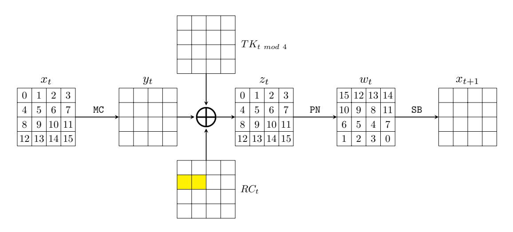

Figure 1: The t-th round of CRAFT

The first 31 rounds  $\mathcal{R}_t$  (0 \le t < 31) of CRAFT are defined as

$$\mathcal{R}_t = \mathtt{SB} \circ \mathtt{PN} \circ \mathtt{ATK}_t \circ \mathtt{ARC}_t \circ \mathtt{MC}$$

and the last round  $\mathcal{R}_{31}^{'} = \mathsf{ATK}_{31} \circ \mathsf{ARC}_{31} \circ \mathsf{MC}$  omits the SB and PN operations. These operations are described as follows and the round function is visualized in Figure 1.

MixColumn (MC): Each Column  $(x_t[0,j],x_t[1,j],x_t[2,j],x_t[3,j])$  with  $(0 \le j < 4)$  is transformed into

<span id="page-4-2"></span>
$$\begin{pmatrix} y_t[0,j] \\ y_t[1,j] \\ y_t[2,j] \\ y_t[3,j] \end{pmatrix} = \begin{pmatrix} 1 & 0 & 1 & 1 \\ 0 & 1 & 0 & 1 \\ 0 & 0 & 1 & 0 \\ 0 & 0 & 0 & 1 \end{pmatrix} \cdot \begin{pmatrix} x_t[0,j] \\ x_t[1,j] \\ x_t[2,j] \\ x_t[3,j] \end{pmatrix} = \begin{pmatrix} x_t[0,j] \oplus x_t[2,j] \oplus x_t[3,j] \\ x_t[1,j] \oplus x_t[3,j] \\ x_t[2,j] \\ x_t[3,j] \end{pmatrix}$$
(1)

by multiplying an involutory matrix.

AddConstants<sub>t</sub> (ARC<sub>t</sub>): An 8-bit round constant  $RC_t = (a_t, b_t) \in \mathbb{F}_2^{4 \times 2}$  is XOR-ed into the state cells indexed by 4 and 5 (marked by  $\square$  in Figure 1). The actual round constants used in CRAFT are listed in Table 2.

Table 2: The round constants of CRAFT

<span id="page-4-1"></span>

| Round t |    |    |    |    |    |    | R  | $2C_t =$ | $(a_t, b$ | $_{t})$ |    |    |    |    |    |    |
|---------|----|----|----|----|----|----|----|----------|-----------|---------|----|----|----|----|----|----|
| 0 - 15  | 11 | 84 | 42 | 25 | 96 | с7 | 63 | b1       | 54        | a2      | d5 | e6 | f7 | 73 | 31 | 14 |
| 16 - 31 | 82 | 45 | 26 | 97 | c3 | 61 | b4 | 52       | a5        | d6      | e7 | f3 | 71 | 34 | 12 | 85 |

AddTweakey<sub>t</sub> (ATK<sub>t</sub>): Let  $K_0||K_1 \in \mathbb{F}_2^{64 \times 2}$  be the master key viewed as two square arrays of 16 nibbles, and T be the 64-bit tweak. In round t ( $0 \le t < 32$ ),  $TK_{t \mod 4}$  is XOR-ed into the state, where

$$TK_0 = K_0 \oplus T$$
,  $TK_1 = K_1 \oplus T$ ,  $TK_2 = K_0 \oplus \mathcal{Q}(T)$ ,  $TK_3 = K_1 \oplus \mathcal{Q}(T)$ ,

and Q = [12, 10, 15, 5, 14, 8, 9, 2, 11, 3, 7, 4, 6, 0, 1, 13] is a permutation of the nibbles of T. For the sake of simplicity, we will omit "mod 4" and write  $TK_t$  directly in the following sections, which should be understood as  $TK_{t \mod 4}$ .

PermuteNibbles (PN): Permute the cells of the state by an involutory permutation  $\mathcal{P}$  such that the *i*th cell of the new state is replaced by the  $\mathcal{P}(i)$ -th cell of the original state, where

{5}------------------------------------------------

 $\mathcal{P} = [15, 12, 13, 14, 10, 9, 8, 11, 6, 5, 4, 7, 1, 2, 3, 0].$ 

<span id="page-5-1"></span>SubBox (SB): A 4-bit involutory S-box given in Table 3 is applied in parallel to each cell of the state. This S-box is the same S-box employed in MIDORI [BBI<sup>+</sup>15], whose differential distribution table is given in Table 4.

| Table 3: The S-box of MIDORI and CRAFT |   |   |   |   |   |   |   |   |   |   |   |   |   |   |   |   |
|----------------------------------------|---|---|---|---|---|---|---|---|---|---|---|---|---|---|---|---|
| $\overline{x}$                         | 0 | 1 | 2 | 3 | 4 | 5 | 6 | 7 | 8 | 9 | a | b | С | d | е | f |
| $\overline{S(x)}$                      | С | a | d | 3 | е | b | f | 7 | 8 | 9 | 1 | 5 | 0 | 2 | 4 | 6 |

<span id="page-5-2"></span>

| $T\epsilon$ | able 4 | 4: T | he d | liffe | rent | ial d | listr | ibut | ion | tabl | le of | the | CR. | AFT | S-bo | XC |
|-------------|--------|------|------|-------|------|-------|-------|------|-----|------|-------|-----|-----|-----|------|----|
|             | 0      | 1    | 2    | 3     | 4    | 5     | 6     | 7    | 8   | 9    | a     | b   | С   | d   | е    | f  |
| 0           | 16     | 0    | 0    | 0     | 0    | 0     | 0     | 0    | 0   | 0    | 0     | 0   | 0   | 0   | 0    | 0  |
| 1           | 0      | 2    | 4    | 0     | 2    | 2     | 2     | 0    | 2   | 0    | 0     | 0   | 0   | 0   | 2    | 0  |
| 2           | 0      | 4    | 0    | 0     | 4    | 0     | 0     | 0    | 0   | 4    | 0     | 0   | 4   | 0   | 0    | 0  |
| 3           | 0      | 0    | 0    | 0     | 2    | 0     | 4     | 2    | 2   | 2    | 0     | 0   | 0   | 2   | 0    | 2  |
| 4           | 0      | 2    | 4    | 2     | 2    | 2     | 0     | 0    | 2   | 0    | 0     | 2   | 0   | 0   | 0    | 0  |
| 5           | 0      | 2    | 0    | 0     | 2    | 0     | 0     | 4    | 0   | 2    | 4     | 0   | 2   | 0   | 0    | 0  |
| 6           | 0      | 2    | 0    | 4     | 0    | 0     | 0     | 2    | 2   | 0    | 0     | 0   | 2   | 2   | 0    | 2  |
| 7           | 0      | 0    | 0    | 2     | 0    | 4     | 2     | 0    | 0   | 0    | 0     | 2   | 0   | 4   | 2    | 0  |
| 8           | 0      | 2    | 0    | 2     | 2    | 0     | 2     | 0    | 0   | 2    | 0     | 2   | 2   | 0   | 2    | 0  |
| 9           | 0      | 0    | 4    | 2     | 0    | 2     | 0     | 0    | 2   | 2    | 0     | 2   | 2   | 0   | 0    | 0  |
| a           | 0      | 0    | 0    | 0     | 0    | 4     | 0     | 0    | 0   | 0    | 4     | 0   | 0   | 4   | 0    | 4  |
| b           | 0      | 0    | 0    | 0     | 2    | 0     | 0     | 2    | 2   | 2    | 0     | 4   | 0   | 2   | 0    | 2  |
| С           | 0      | 0    | 4    | 0     | 0    | 2     | 2     | 0    | 2   | 2    | 0     | 0   | 2   | 0   | 2    | 0  |
| d           | 0      | 0    | 0    | 2     | 0    | 0     | 2     | 4    | 0   | 0    | 4     | 2   | 0   | 0   | 2    | 0  |
| е           | 0      | 2    | 0    | 0     | 0    | 0     | 0     | 2    | 2   | 0    | 0     | 0   | 2   | 2   | 4    | 2  |
| f           | 0      | 0    | 0    | 2     | 0    | 0     | 2     | 0    | 0   | 0    | 4     | 2   | 0   | 0   | 2    | 4  |

<span id="page-5-0"></span>3 Truncated Differentials of CRAFT

We start with a trivial property due to an involutory S-box.

<span id="page-5-4"></span>**Property 1.** Let S be the involutory S-box of CRAFT, and  $\tau_k : \mathbb{F}_2^4 \to \mathbb{F}_2^4$  be a function mapping x to  $S(S(x) \oplus k)$ , where x and  $k \in \mathbb{F}_2^4$ . Then

$$\tau_0(x \oplus \delta) \oplus \tau_0(x) = S(S(x \oplus \delta)) \oplus S(S(x)) = x \oplus \delta \oplus x = \delta,$$

that is,  $\tau_k$  preserves the input difference with probability 1 when k=0.

<span id="page-5-3"></span>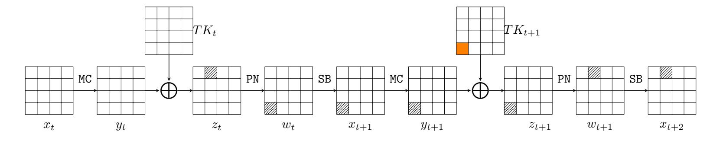

Figure 2:  $x_{t+2}[1] = \tau_{TK_{t+1}[12]}(z_t[1])$ 

Let us consider two consecutive rounds (round t and round t+1) of CRAFT depicted in Figure 2 and focus on the nibble  $x_{t+2}[1]$  (marked by  $\square$ ). Here we emphasize that Figure 2

{6}------------------------------------------------

does not depict any differential trails, and the marker is used to indicate the data flow. Clearly, we have

$$x_{t+2}[1] = S(S(w_t[12]) \oplus TK_{t+1}[12]) = \tau_{TK_{t+1}[12]}(w_t[12]) = \tau_{TK_{t+1}[12]}(z_t[1]).$$

Therefore, according to Property [1,](#page-5-4) ∆*xt*+2[1] = ∆*zt*[1] = ∆*yt*[1] if *TKt*+1[12] = 0. Similarly, we have the following relations:

$$\begin{cases} x_{t+2}[0] &= \tau_{TK_{t+1}[15]}(z_t[0]) \\ x_{t+2}[1] &= \tau_{TK_{t+1}[12]}(z_t[1]) \\ x_{t+2}[2] &= \tau_{TK_{t+1}[13]}(z_t[2]) \\ x_{t+2}[3] &= \tau_{TK_{t+1}[14]}(z_t[3]) \\ x_{t+2}[4] &= \tau_{TK_{t+1}[10]}(z_t[4]) \\ x_{t+2}[5] &= \tau_{TK_{t+1}[9]}(z_t[5]) \\ x_{t+2}[6] &= \tau_{TK_{t+1}[8]}(z_t[6]) \\ x_{t+2}[7] &= \tau_{TK_{t+1}[11]}(z_t[7]) \end{cases}$$

Based on the above analysis, for an input pair following certain truncated differential trails, we can preserve the input difference of a particular cell through multiple rounds by imposing proper conditions on the *TKt*'s involved. Taking the truncated differential trail presented in Figure [3](#page-7-0) for example, if *TK*<sup>1</sup> and *TK*<sup>3</sup> satisfy:

<span id="page-6-0"></span>
$$\begin{cases}
TK_1[12] = K_1[12] \oplus T[12] = 0 \\
TK_3[12] = K_1[12] \oplus \mathcal{Q}(T)[12] = 0
\end{cases} \text{ or } \begin{cases}
T[12] = K_1[12] \\
T[6] = K_1[12]
\end{cases}, (2)$$

we always have:

<span id="page-6-1"></span>
$$\begin{cases}
\Delta x_0[1] = \Delta y_0[1] = \Delta x_2[1] \\
\Delta x_2[1] = \Delta y_2[1] = \Delta x_4[1] \\
\Delta x_4[1] = \Delta y_4[1] = \Delta x_6[1] \\
\Delta x_6[1] = \Delta y_6[1] = \Delta x_8[1]
\end{cases}$$
(3)

Therefore, if we set ∆*x*0[1] = 0xa, Figure [3](#page-7-0) gives a truncated differential distinguisher with input difference (0x0*,* 0xa*,* ∗*,* ∗*,* 0x0*,* 0x0*,* ∗*,* ∗*,* 0x0*,* 0x0*,* 0x0*,* 0x0*,* 0x0*,* 0x0*,* ∗*,* ∗) and output difference (0x0*,* 0xa*,* 0x0*,* 0x0*,* 0x0*,* 0x0*,* ∗*,* 0x0*,* 0x0*,* 0x0*,* ∗*,* 0x0*,* 0x0*,* 0x0*,* ∗*,* 0x0). With the preconditions presented in Equation [\(2\)](#page-6-0), the probability of the distinguisher is computed as 2 −4×*d* , where *d* = 11 is the number of cells canceled out (marked by ) due to the MC operation. If the attacker can control the input difference ∆*x*<sup>0</sup> and set it to

```
(0x0, 0xa, 0xa, 0xa, 0x0, 0x0, 0xa, 0xa, 0x0, 0x0, 0x0, 0x0, 0x0, 0x0, 0xa, 0xa),
```

then the cancellations at state *y*<sup>0</sup> happens deterministically, and the cancellations at state *y*<sup>1</sup> happens with probability 2 −2 , since the possible differences of ∆*x*1[0] and ∆*x*1[12] must be in {0x5*,* 0xa*,* 0xd*,* 0xf} according to Table [4.](#page-5-2) Therefore, the overall probability of the distinguisher becomes 2 <sup>−</sup><sup>2</sup> × 2 <sup>−</sup>4×<sup>6</sup> = 2<sup>−</sup><sup>26</sup>, while for a random permutation, the probability of

$$\Delta x_8 = (\texttt{0x0}, \texttt{0xa}, \texttt{0x0}, \texttt{0x0}, \texttt{0x0}, \texttt{0x0}, \texttt{0x0}, \texttt{0x0}, \texttt{0x0}, \texttt{0x0}, \texttt{0x0}, \texttt{0x0}, \texttt{0x0}, \texttt{0x0}, \texttt{0x0}, \texttt{0x0}, \texttt{0x0})$$
 is  $2^{-4 \times 13} = 2^{-52}$ .

At this point, we would like to emphasize that *the positions where the constant additions* (AddConstants or ARC) *take place do matter in our analysis*. Assuming that four different 4 bit constants *c*1, *c*3, *c*5, and *c*<sup>7</sup> are XOR-ed into *y*1[12], *y*3[12], *y*5[12], and *y*7[12] respectively, then to satisfy the conditions given in Equation [\(3\)](#page-6-1) deterministically, we have to require

$$\begin{cases}
TK_{1}[12] \oplus c_{1} = 0 \\
TK_{3}[12] \oplus c_{3} = 0 \\
TK_{1}[12] \oplus c_{5} = 0 \\
TK_{3}[12] \oplus c_{7} = 0
\end{cases} \text{ or } \begin{cases}
T[12] = K_{1}[12] \oplus c_{1} \\
T[6] = K_{3}[12] \oplus c_{3} \\
T[12] = K_{1}[12] \oplus c_{5} \\
T[6] = K_{3}[12] \oplus c_{7}
\end{cases}$$

{7}------------------------------------------------

<span id="page-7-0"></span>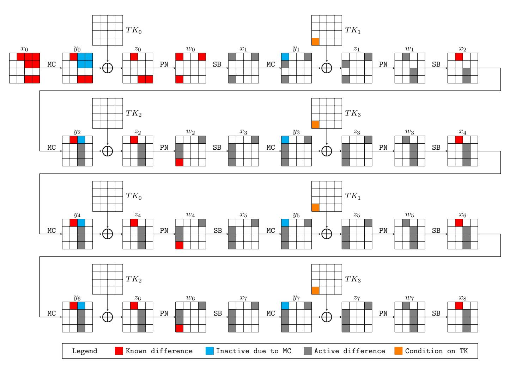

Figure 3: A truncated differential trail of CRAFT

which is impossible due to the internal conflicts of the system of equations.

<span id="page-7-2"></span>**Property 2.** Let S be the involutory S-box of CRAFT, and  $\tau_k : \mathbb{F}_2^4 \to \mathbb{F}_2^4$  be a function mapping x to  $S(S(x) \oplus k)$ , where x and  $k \in \mathbb{F}_2^4$ . Then

$$\tau_{\mathtt{0xa}}(x \oplus \mathtt{0xa}) \oplus \tau_{\mathtt{0xa}}(x) = S(S(x \oplus \mathtt{0xa}) \oplus \mathtt{0xa}) \oplus S(S(x) \oplus \mathtt{0xa}) = \mathtt{0xa},$$

that is,  $\tau_k$  preserves the input difference with probability 1 when both the input difference and k are 0xa. Note that this property does not hold for an arbitrary involutary S-box.

Therefore, when the difference to be preserved is 0xa, the previous analysis also holds if  $TK_1$  and  $TK_3$  satisfy:

$$\begin{cases} TK_1[12] = K_1[12] \oplus T[12] = 0xa \\ TK_3[12] = K_1[12] \oplus \mathcal{Q}(T)[12] = 0xa \end{cases} \text{ or } \begin{cases} T[12] = K_1[12] \oplus 0xa \\ T[6] = K_1[12] \oplus 0xa \end{cases} . \tag{4}$$

Looking at conditions imposed on the distinguisher shown in Figure 3, if we restrict that  $K_1[12] \in \{0x0, 0xa\}$ , then during a distinguishing attack, we can encrypt the data with the predefined input difference using tweaks T with T[12],  $T[6] \in \{0x0, 0xa\}$ , which is a weak-key distinguisher with a weak-key space of size  $2^{125}$ .

## <span id="page-7-1"></span>3.1 How to Search for Truncated Differential Distinguishers Exploiting the Invariant Property Automatically

Following the constraint-based (MILP [MWGP11, SHW<sup>+</sup>14b, ST17], SMT/SAT [KLT15], and CP [GMS16, SGL<sup>+</sup>17]) methodology for automatic symmetric-key cryptanalysis, we extract the essential rules governing the propagation of the input difference with the invariant property taking into account, convert them into constraints expressed in linear inequalities, and build an MILP model to search for distinguishers of CRAFT automatically. We now clarify the variables, constraints, and objective function of a model for the 2*l*-round

{8}------------------------------------------------

CRAFT. We only consider an even number of rounds because the invariant property involves at least two rounds.

**Variables and Constraints**. Firstly, we introduce a system of 0-1 variables  $\delta x_t[i]$ ,  $\delta y_t[i]$ ,  $\delta z_t[i]$ , and  $\delta w_t[i]$  with  $0 \leq i < 16$  for all the states involved to model the single-key truncated differential trails of CRAFT, where a variable is set to 1 if the corresponding cell is differentially active and 0 otherwise. Except for the MC operation, the modeling process for all other components employs the method proposed by Mouha, Wang, Gu, and Preneel in [MWGP11]. The MC operation is modeled as follows.

Let  $(x_t[j], x_t[4+j], x_t[8+j], x_t[12+j])$  and  $(y_t[j], y_t[4+j], y_t[8+j], y_t[12+j])$  be the jth input and output columns of the MC operation  $(0 \le j < 4)$ . According to the specification of MC (see Equation (1)), we have

$$\begin{cases}
\Delta y_t[j] = \Delta x_t[j] \oplus \Delta x_t[8+j] \oplus \Delta x_t[12+j] \\
\Delta y_t[4+j] = \Delta x_t[4+j] \oplus \Delta x_t[12+j] \\
\Delta y_t[8+j] = \Delta x_t[8+j] \\
\Delta y_t[12+j] = \Delta x_t[12+j]
\end{cases} (5)$$
(6)

$$\Delta y_t[4+j] = \Delta x_t[4+j] \oplus \Delta x_t[12+j] \tag{6}$$

$$\Delta y_t[8+j] = \Delta x_t[8+j] \tag{7}$$

$$\Delta y_t[12+j] = \Delta x_t[12+j]$$
 (8)

Equation (7) and Equation (8) can be used directly as  $\delta y_t[8+j] = \delta x_t[8+j]$  and  $\delta y_t[12+j] = \delta x_t[12+j]$  in our MILP model. For Equation (5) and Equation (6), we introduce two additional 0-1 variables  $p_t[j]$  and  $q_t[j]$  respectively to capture the probabilistic event that the input differences are canceled out due to the XOR operations. For example, if  $\delta x_t[4+j]=1$  and  $\delta x_t[12+j]=1$ , then  $\delta y_t[4+j]$  can be 0 (inactive) or 1 (active), and the probability of  $\delta y_t[4+j] = 0$  should be  $2^{-4}$  for random nonzero input differences. In our model,  $p_t[j]$  and  $q_t[j]$  are set to 1 if the probabilistic cancellations happen for active input differences. Therefore, the allowed valuations of  $(\delta x_t[j], \delta x_t[8+j], \delta x_t[12+j], \delta y_t[j], p_t[j])$ and  $(\delta x_t[4+j], \delta x_t[12+j], \delta y_t[4+j], q_t[j])$  can be summarized in Table 5 and Table 6 respectively.

<span id="page-8-0"></span>Table 5: All valid valuations of  $(\delta x_t[j], \delta x_t[4+j], \delta x_t[8+j], \delta x_t[12+j], \delta y_t[j], p_t[j])$ 

|                 |                   | \ L- 1.            |                 |          |              |
|-----------------|-------------------|--------------------|-----------------|----------|--------------|
| $\delta x_t[j]$ | $\delta x_t[8+j]$ | $\delta x_t[12+j]$ | $\delta y_t[j]$ | $p_t[j]$ | Cancellation |
| 0               | 0                 | 0                  | 0               | 0        | Х            |
| 0               | 0                 | 1                  | 1               | 0        | ×            |
| 0               | 1                 | 0                  | 1               | 0        | ×            |
| 0               | 1                 | 1                  | 0               | 1        | ✓            |
| 0               | 1                 | 1                  | 1               | 0        | ×            |
| 1               | 0                 | 0                  | 1               | 0        | ×            |
| 1               | 0                 | 1                  | 0               | 1        | ✓            |
| 1               | 0                 | 1                  | 1               | 0        | ×            |
| 1               | 1                 | 0                  | 0               | 1        | ✓            |
| 1               | 1                 | 0                  | 1               | 0        | ×            |
| 1               | 1                 | 1                  | 0               | 1        | ✓            |
| 1               | 1                 | 1                  | 1               | 0        | ×            |
|                 |                   |                    |                 |          |              |

<span id="page-8-1"></span>Table 6: All valid valuations of  $(\delta x_t[4+j], \delta x_t[12+j], \delta y_t[4+j], q_t[j])$ 

| $\delta x_t[4+j]$ | $\delta x_t[12+j]$ | $\delta y_t[4+j]$ | $q_t[j]$ | Cancellation |
|-------------------|--------------------|-------------------|----------|--------------|
| 0                 | 0                  | 0                 | 0        | ×            |
| 0                 | 1                  | 1                 | 0        | X            |
| 1                 | 0                  | 1                 | 0        | X            |
| 1                 | 1                  | 0                 | 1        | ✓            |
| 1                 | 1                  | 1                 | 0        | X            |

{9}------------------------------------------------

Denoting the sets of all possible valuations listed in Table 5 and Table 6 by  $\mathbb{P}_j$  and  $\mathbb{Q}_j$  respectively, the constraints imposed on  $\delta x_t[j]$ ,  $\delta x_t[4+j]$ ,  $\delta x_t[8+j]$ ,  $\delta x_t[12+j]$ ,  $\delta y_t[j]$ ,  $\delta y_t[4+j]$ ,  $\delta y_t[8+j]$ ,  $\delta y_t[12+j]$ ,  $p_t[j]$  and  $q_t[j]$  are

$$\begin{cases}
(\delta x_{t}[j], \delta x_{t}[4+j], \delta x_{t}[8+j], \Delta x_{t}[12+j], \delta y_{t}[j], p_{t}[j]) \in \mathbb{P}_{j} \\
(\delta x_{t}[4+j], \delta x_{t}[12+j], \delta y_{t}[4+j], q_{t}[j]) \in \mathbb{Q}_{j} \\
\delta y_{t}[8+j] = \delta x_{t}[8+j] \\
\delta y_{t}[12+j] = \delta x_{t}[12+j]
\end{cases} , (9)$$

which can be converted into linear (in)equalities by the method presented in [SHW<sup>+</sup>14b, SHW<sup>+</sup>14a]. Under these constraints, the probability of the truncated differential over the MC layer:  $\mathbb{F}_2^{4\times 16} \to \mathbb{F}_2^{4\times 16}$  can be computed as

<span id="page-9-1"></span>
$$\prod_{j=0}^{3} 2^{-4(p_t[j]+q_t[j])} = 2^{-4 \cdot \sum_{j=0}^{3} (p_t[j]+q_t[j])}.$$
 (10)

Next, we show how to trace the cells whose differences are preserved due to Property 1. To this end, we introduce a set of 0-1 variables  $\partial x_{2t}[i]$  and  $\partial y_{2t}[i]$  for states  $x_{2t}$  and  $y_{2t}$  respectively  $(0 \le t \le l)$ , where  $\partial x_{2t}[i]$  is  $(\text{or } \partial y_{2t}[i])$  set to 1 if the value of the difference  $\Delta x_{2t}[i]$  (or  $\Delta y_{2t}[i]$ ) is nonzero and known. Otherwise, the variable is set to 0. With this predefined semantics, for the starting state  $x_0$  of the distinguisher, we always have the constraints  $\delta x_0[i] = \partial x_0[i]$  ( $0 \le i < 16$ ) since  $x_0$  is regarded as plaintext and its difference is known. Moreover, we have the following Lemma.

<span id="page-9-0"></span>**Lemma 1.**  $\Delta x_{2t}[i]$  is known if and only if  $\delta x_{2t}[i] - \partial x_{2t}[i] = 0$ .

Proof. The difference  $\Delta x_{2t}[i]$  is known if and only if  $\partial x_{2t}[i] = 1$  (the difference is nonzero and known) or  $\delta x_{2t}[i] = 0$  (the difference is zero). In the former case,  $\delta x_{2t}[i] = \partial x_{2t}[i] = 1$ , and in the latter case  $\delta x_{2t}[i] = \partial x_{2t}[i] = 0$ .

Let  $(x_{2t}[j], x_{2t}[4+j], x_{2t}[8+j], x_{2t}[12+j])$  and  $(y_{2t}[j], y_{2t}[4+j], y_{2t}[8+j], y_{2t}[12+j])$  be the *j*th column of the states  $x_{2t}$  and  $y_{2t}$  respectively  $(0 \le j < 4)$ , and thus

$$\begin{cases}
\Delta y_{2t}[j] &= \Delta x_{2t}[j] \oplus \Delta x_{2t}[8+j] \oplus \Delta x_{2t}[12+j] \\
\Delta y_{2t}[4+j] &= \Delta x_{2t}[4+j] \oplus \Delta x_{2t}[12+j] \\
\Delta y_{2t}[8+j] &= \Delta x_{2t}[8+j] \\
\Delta y_{2t}[12+j] &= \Delta x_{2t}[12+j]
\end{cases}$$

Therefore, we have the following constraints according to Lemma 1 and the semantics of the variables:

- $\bullet \ \partial y_{2t}[8+j] = \partial x_{2t}[8+j],$
- $\partial y_{2t}[12+j] = \partial x_{2t}[12+j],$
- $\partial y_{2t}[j] = 1$  if and only if  $\begin{cases} \delta x_{2t}[j] \partial x_{2t}[j] = 0\\ \delta x_{2t}[8+j] \partial x_{2t}[8+j] = 0\\ \delta x_{2t}[12+j] \partial x_{2t}[12+j] = 0 \end{cases}$  and  $\delta y_{2t}[j] = 1$ ,

• 
$$\partial y_{2t}[4+j] = 1$$
 if and only if 
$$\begin{cases} \delta x_{2t}[4+j] - \partial x_{2t}[4+j] = 0\\ \delta x_{2t}[12+j] - \partial x_{2t}[12+j] = 0 \end{cases}$$
 and  $\delta y_{2t}[4+j] = 1$ ,

which can be converted into linear (in)equalities by using the conditional modeling approach given in [SHW<sup>+</sup>14b]. Let us take the third item as an example. The statement that  $\partial y_{2t}[j] = 1$  if and only if

$$\begin{cases} \delta x_{2t}[j] - \partial x_{2t}[j] = 0\\ \delta x_{2t}[8+j] - \partial x_{2t}[8+j] = 0\\ \delta x_{2t}[12+j] - \partial x_{2t}[12+j] = 0 \end{cases} \text{ and } \delta y_{2t}[j] = 1$$

{10}------------------------------------------------

*.*

*,*

is equivalent to the following system of linear (in)equalities:

$$\begin{cases}
 \partial y_{2t}[j] \leq 1 - (\delta x_{2t}[j] - \partial x_{2t}[j]) \\
 \partial y_{2t}[j] \leq 1 - (\delta x_{2t}[8+j] - \partial x_{2t}[8+j]) \\
 \partial y_{2t}[j] \leq 1 - (\delta x_{2t}[12+j] - \partial x_{2t}[12+j]) \\
 (\delta x_{2t}[j] - \partial x_{2t}[j]) + (\delta x_{2t}[8+j] - \partial x_{2t}[8+j]) + (\delta x_{2t}[12+j] - \partial x_{2t}[12+j]) + \partial y_{2t}[j] \geq \delta y_{2t}[j]
\end{cases}$$

Due to Property [1,](#page-5-4) we also have the following constraints for states *y*2*t*−<sup>2</sup> and *x*2*<sup>t</sup>* (*t* ≥ 1). For *t* ≥ 1 and 8 ≤ *i <* 16, the difference ∆*x*2*<sup>t</sup>*[*i*] is always unknown and thus *∂x*2*t*[*i*] = 0. For *t* ≥ 1 and 0 ≤ *i <* 8, we have

$$x_{2t}[i] = S(w_{2t-1}[i]) = S(z_{2t-1}[\mathcal{P}(i)]) = S(y_{2t-1}[\mathcal{P}(i)] \oplus TK_{2t-1}[\mathcal{P}(i)])$$

$$= S(x_{2t-1}[\mathcal{P}(i)] \oplus TK_{2t-1}[\mathcal{P}(i)]) = S(S(w_{2t-2}[\mathcal{P}(i)]) \oplus TK_{2t-1}[\mathcal{P}(i)])$$

$$= S(S(z_{2t-2}[i]) \oplus TK_{2t-2}[\mathcal{P}(i)])$$

$$= S(S(y_{2t-2}[i] \oplus TK_{2t-2}[i]) \oplus TK_{2t-1}[\mathcal{P}(i)])$$

which gives *x*2*<sup>t</sup>*[*i*] = *y*2*t*−2[*i*] ⊕ *TK*2*t*−2[*i*] when *TK*2*t*−1[P(*i*)] = 0. Therefore, ∆*x*2*<sup>t</sup>*[*i*] = ∆*y*2*t*−2[*i*], which leads to *∂x*2*<sup>t</sup>*[*i*] = *∂y*2*t*−2[*i*] under the condition *TK*2*t*−1[P(*i*)] = 0. Note that in our model we do not introduce any variable for the round tweakeys. We just assume all conditions can be satisfied, and these conditions can be retrieved after a distinguisher is identified.

**The Objective Function**. According to Equation [\(10\)](#page-9-1), the probability of the identified distinguisher can be characterized as

$$\prod_{t=0}^{2l-1} 2^{-4 \cdot \sum_{j=0}^{3} (p_t[j] + q_t[j])} = 2^{-4 \cdot \sum_{t=0}^{2l-1} \sum_{j=0}^{3} (p_t[j] + q_t[j])}.$$

Consequently, the objective function can be set to minimize

$$\sum_{t=0}^{2l-1} \sum_{j=0}^{3} (p_t[j] + q_t[j]).$$

Moreover, to make sure that the distinguisher we find has some advantage over the random permutation whose probability is

$$2^{-4\cdot(16-\sum_{i=0}^{15}\delta x_{2l}[i])-4\cdot\sum_{i=0}^{15}\delta x_{2l}[i]},$$

we can include the following constraint:

$$\sum_{t=0}^{2l-1} \sum_{j=0}^{3} (p_t[j] + q_t[j]) \le 16 - \sum_{i=0}^{15} \delta x_{2l}[i] + \sum_{i=0}^{15} \partial x_{2l}[i].$$

Note that for the distinguishers found by the MILP model, we need to recompute its probability since the attacker may control the input difference to increase the probability of the cancellations due to the MC operations appearing in the beginning rounds. Finally, all the models generated according to the above discussion in this work can be solved within 5 minutes on a PC with the Gurobi MILP Solver [\[gur19\]](#page-24-10).

#### **3.2 Truncated Differential Distinguishers of CRAFT**

Before presenting the distinguishers, we describe in a high level how the distinguishers should be used in practice. A detailed algorithmic description of the distinguishing attack for a concrete distinguisher can be found in Algorithm [1.](#page-14-1) For each of our distinguishers, 

{11}------------------------------------------------

we specify some conditions on the tweak. When these conditions are fulfilled, the distinguishers can be regarded as ordinary truncated differential ones. Given a set of data with *N* plaintext. If the conditions involve *e independent* bits of the key information, we need to prepare 2 *e* sets of plaintext-ciphertext pairs from the *N* plaintext. In each of these set, there are *N* plaintext-ciphertext pairs, where the ciphertexts are obtained by encrypting the plaintexts with a tweak hypothetically satisfying the specified conditions associated with a particular guess of the *e*-bit key information. Then each of the 2 *e* sets are independently analyzed with differential cryptanalysis. It should be noted that within each set, a unique tweak is used and thus there is no tweak difference.

Using the MILP-based tool, the longest distinguisher we can find is a 16-round one shown in Figure [4.](#page-12-0) For a random plaintext (*P, P*<sup>0</sup> ) pair with difference

$$\Delta x_0 = (0x0, 0x0, 0xa, 0x0, 0xa, 0x0, 0x0, 0x0,$$

the probability that the corresponding ciphertext pair (*C, C*<sup>0</sup> ) satisfies

<span id="page-11-0"></span>
$$\begin{cases} \Delta C[0,1,3,6,7,8,10,11,14,15] = 0 \\ \Delta C[2] = \Delta C[4] = \mathbf{0xa} \\ \mathrm{MC}(\mathrm{PN}(\mathrm{SB}(C))) \oplus \mathrm{MC}(\mathrm{PN}(\mathrm{SB}(C')))[0,1,2,3,4,5,6,7,8,11,12,14,15] = 0 \end{cases} \tag{11}$$

is 2 <sup>−</sup><sup>55</sup> under the condition

$$\left\{ \begin{array}{l} T[7] \oplus K_1[10] \in \{\texttt{0x0}, \texttt{0xa}\}, T[10] \oplus K_1[10] \in \{\texttt{0x0}, \texttt{0xa}\} \\ T[0] \oplus K_1[13] \in \{\texttt{0x0}, \texttt{0xa}\}, T[13] \oplus K_1[13] \in \{\texttt{0x0}, \texttt{0xa}\} \\ T[3] \oplus K_1[9] \in \{\texttt{0x0}, \texttt{0xa}\}, T[9] \oplus K_1[9] \in \{\texttt{0x0}, \texttt{0xa}\} \end{array} \right.,$$

while for a random permutation, the output pair fulfills Equation [\(11\)](#page-11-0) with probability 2 <sup>−</sup><sup>56</sup>. Note that the probability of each cancellation at states *y*1, and *y*<sup>3</sup> (see Figure [4\)](#page-12-0) is 2 −2 , since the possible values of the summands of the XOR operation are restricted to {0x5*,* 0xa*,* 0xd*,* 0xf} (see the 0xa-th row of Table [4\)](#page-5-2). For the cancellation at state *y*4, we have

$$\begin{cases} y_4[1] = x_4[9] \oplus x_4[13] \\ x_4[9] = S(S(w_2[5]) \oplus S(w_2[13]) \oplus TK_3[5]) \\ x_4[13] = S(S(w_2[2]) \oplus S(w_2[10]) \oplus S(w_2[14]) \oplus TK_3[2]) \end{cases},$$

and thus ∆*y*4[1] = ∆*x*4[9] ⊕ ∆*x*4[13] = *S*(*S*(*w*2[5]) ⊕ *S*(*w*2[13]) ⊕ *TK*3[5]) ⊕ *S*(*S*(*w*2[5]) ⊕ *S*(*w*2[13] ⊕ 0xa) ⊕ *TK*3[5]) ⊕ *S*(*S*(*w*2[2]) ⊕ *S*(*w*2[10]) ⊕ *S*(*w*2[14]) ⊕ *TK*3[2]) ⊕ *S*(*S*(*w*2[2]) ⊕ *S*(*w*2[10] ⊕ 0xa) ⊕ *S*(*w*2[14]) ⊕ *TK*3[2]). If we assume *w*2[2*,* 5*,* 10*,* 13*,* 14] and *TK*3[2*,* 5] are random, the probability of ∆*y*4[1] = 0 is approximately 2 −3 . Note that similar reasoning applies to the evaluation of the probabilities of the other distinguishers presented in this paper.

Although the distinguisher shown in Figure [4](#page-12-0) is the longest in the single-key model, it is not good when used in a key-recovery attack since it activates a relatively higher number of cells at the starting and ending states. By limiting the number of active cells of the starting state and ending state of the distinguisher in our MILP models, we find a 14-round (round 0 to round 13) distinguisher given in Figure [5](#page-13-0) under the condition

<span id="page-11-3"></span>
$$\begin{cases}
TK_1[12] = K_1[12] \oplus T[12] \in \{0x0, 0xa\} \\
TK_3[12] = K_1[12] \oplus \mathcal{Q}(T)[12] \in \{0x0, 0xa\}
\end{cases} \text{ or }
\begin{cases}
T[12] \oplus K_1[12] \in \{0x0, 0xa\} \\
T[6] \oplus K_1[12] \in \{0x0, 0xa\}
\end{cases} .$$
(12)

If we set the input difference ∆*x*<sup>0</sup> to

<span id="page-11-2"></span>
$$\Delta x_0 = (0x0, \frac{0xa}{0}, 0x0, 0x0, 0x0, 0x0, 0x0, 0x0, 0x0, 0$$

the probability of

<span id="page-11-1"></span>
$$\Delta x_{14} = (0x0, 0xa, 0x0, 0x0, 0x0, 0x0, *, 0x0, 0x0, 0x0,$$

{12}------------------------------------------------

<span id="page-12-0"></span>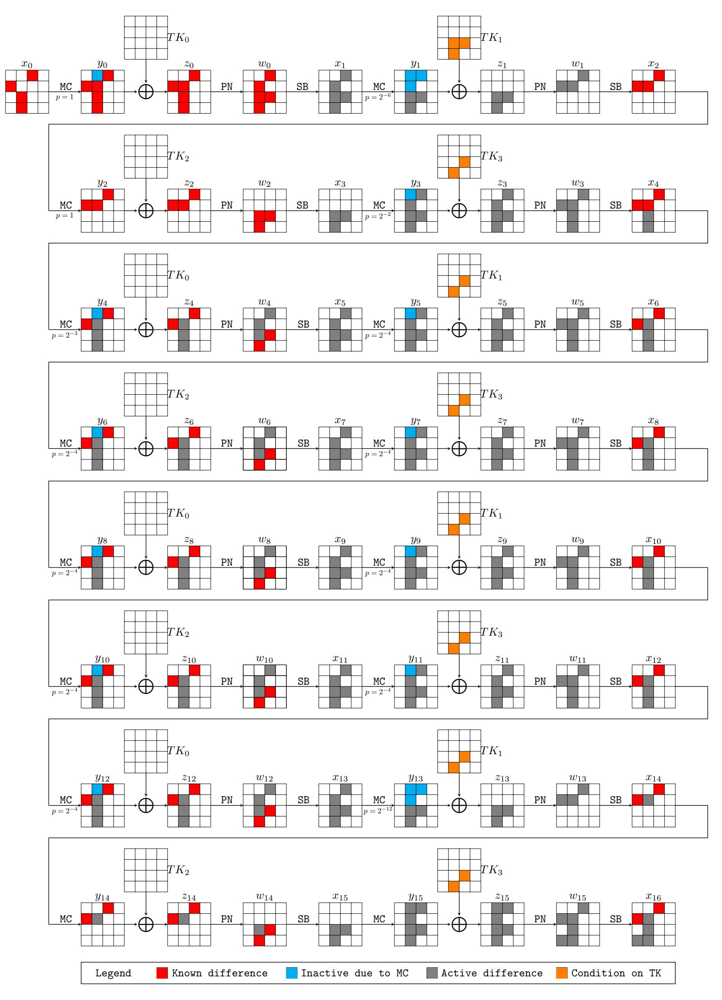

Figure 4: A 16-round truncated differential trail of CRAFT with probability  $2^{-55}$ 

is  $2^{-54}$ , while the probability for the output difference of a random permutation fulfilling condition (14) is  $(2^{-4})^{13} \times 2^{-4} = 2^{-56}$ .

Due to the specialty of the round function of CRAFT, the 14-round weak-key distinguisher can be extended to a 15-round one without decreasing its probability as shown in Figure 6.

{13}------------------------------------------------

<span id="page-13-0"></span>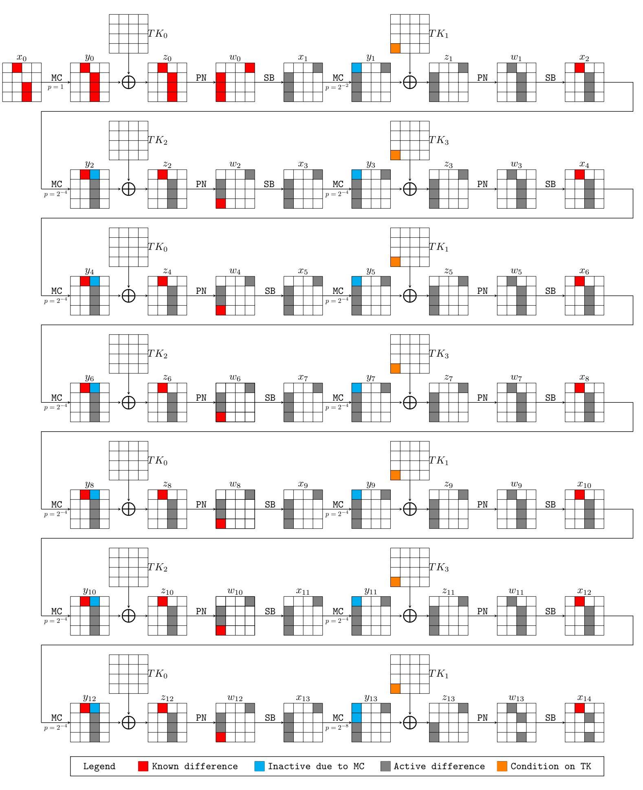

Figure 5: A 14-round truncated differential trail of CRAFT with probability  $2^{-2-4\times13}=2^{-54}$ 

When a random pair of plaintexts (P, P') whose difference is given in Equation (13) is encrypted with a tweak satisfies Equation (12), the probability that the ciphertext pair (C, C') fulfills the following condition:

<span id="page-13-1"></span>
$$\begin{cases} \Delta C[0, 1, 2, 4, 5, 6, 7, 9, 10, 11, 14, 15] = 0\\ S^{-1}(C[3]) \oplus S^{-1}(C'[3]) = S^{-1}(C[13]) \oplus S^{-1}(C'[13])\\ S^{-1}(C[12]) \oplus S^{-1}(C'[12]) = \mathbf{0xa} \end{cases}$$
(15)

is  $2^{-54}$ . For a random permutation, its output difference satisfying condition (15) is  $2^{-56}$ . According to the above discussion, our 15-round distinguisher only works when the tweaks used satisfy condition (12), or equivalently, we need to know  $K_1[12]$  such that proper

{14}------------------------------------------------

<span id="page-14-0"></span>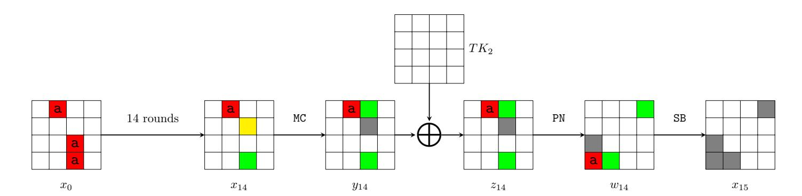

Figure 6: A 15-round truncated differential trail of CRAFT with probability  $2^{-54}$ , where the differences marked by green cells must be of the same value, the difference of the yellow cell can be any value, and  $x_{15} \oplus x'_{15}$  must be of the form given by  $\Delta w_{14}$  presented in the figure.

tweaks can be chosen to force  $TK_1[12] = TK_3[12] = 0$ . However, this precondition can be easily removed by guessing the value of  $K_1[12] \in \mathbb{F}_2^4$  and performing the distinguishing attack for each guess, which allows us to recover the secret value of  $K_1[12]$  simultaneously. The detailed procedure is described in Algorithm 1.

**Algorithm 1:** Recovering  $K_1[12]$  based on the truncated differential shown in Figure 6

```
1 Counter \leftarrow [0, 0, 0, 0, 0, 0, 0, 0, 0, 0, 0, 0, 0, 0
  2 /* g_{K_1\lceil 12 \rceil} is the guessed value of K_1[12] */
  з for g_{K_1[12]} \in \mathbb{F}_2^4 do
             for 0 \le i < 2^{54} do
  4
                    \begin{split} T &\leftarrow \texttt{Random}(\mathbb{F}_2^{4\times 16}) \\ T[6] &\leftarrow g_{K_1[12]}, \quad T[12] \leftarrow g_{K_1[12]} \end{split}
  5
  6
                    P \leftarrow \mathtt{Random}(\mathbb{F}_2^{4 \times 16}), \ P' \leftarrow P \oplus \begin{bmatrix} 0 \text{x0 0xa 0x0 0x0} \\ 0 \text{x0 0x0 0x0 0x0} \\ 0 \text{x0 0x0 0xa 0x0} \\ 0 \text{x0 0x0 0xa 0xa} \\ 0 \text{x0 0x0 0xa 0xa} \end{bmatrix}
  7
                     C \leftarrow \operatorname{Enc}(P, K_0 || K_1, T)
  8
                    C' \leftarrow \operatorname{Enc}(P', K_0 || K_1, T)
  9
                     if (C, C') fulfills condition (15) then
10
                            \mathtt{Counter}[g_{K_1[12]}] \leftarrow \mathtt{Counter}[g_{K_1[12]}] + 1
11
                     end
12
              end
13
14 end
15 return k and k \oplus \texttt{Oxa} such that \texttt{Counter}[j] \leq \texttt{Counter}[k] for any j \in \{0, \dots, 15\}
```

The 14-round distinguisher given in Figure 5 is employed in a 19-round key-recovery attack in Section 4. However, if we do not consider the performance of the subsequent key-recovery attack, more effective 14-round distinguishers can be found. For example, Figure 7 gives a 14-round distinguisher with

```
 \begin{cases} \Delta x_0 = (\texttt{0x0}, \texttt{0x0}, \texttt{0xa}, \texttt{0x0}, \texttt{0xa}, \texttt{0x0}, \texttt{0x0}, \texttt{0x0}, \texttt{0x0}, \texttt{0x0}, \texttt{0xa}, \texttt{0x0}, \texttt{0x0}, \texttt{0x0}, \texttt{0x0}, \texttt{0x0}, \texttt{0x0}, \texttt{0x0}, \texttt{0x0}, \texttt{0x0}, \texttt{0x0}, \texttt{0x0}, \texttt{0x0}, \texttt{0x0}, \texttt{0x0}, \texttt{0x0}, \texttt{0x0}, \texttt{0x0}, \texttt{0x0}, \texttt{0x0}, \texttt{0x0}, \texttt{0x0}, \texttt{0x0}, \texttt{0x0}, \texttt{0x0}, \texttt{0x0}, \texttt{0x0}, \texttt{0x0}, \texttt{0x0}, \texttt{0x0}, \texttt{0x0}, \texttt{0x0}, \texttt{0x0}, \texttt{0x0}, \texttt{0x0}, \texttt{0x0}, \texttt{0x0}, \texttt{0x0}, \texttt{0x0}, \texttt{0x0}, \texttt{0x0}, \texttt{0x0}, \texttt{0x0}, \texttt{0x0}, \texttt{0x0}, \texttt{0x0}, \texttt{0x0}, \texttt{0x0}, \texttt{0x0}, \texttt{0x0}, \texttt{0x0}, \texttt{0x0}, \texttt{0x0}, \texttt{0x0}, \texttt{0x0}, \texttt{0x0}, \texttt{0x0}, \texttt{0x0}, \texttt{0x0}, \texttt{0x0}, \texttt{0x0}, \texttt{0x0}, \texttt{0x0}, \texttt{0x0}, \texttt{0x0}, \texttt{0x0}, \texttt{0x0}, \texttt{0x0}, \texttt{0x0}, \texttt{0x0}, \texttt{0x0}, \texttt{0x0}, \texttt{0x0}, \texttt{0x0}, \texttt{0x0}, \texttt{0x0}, \texttt{0x0}, \texttt{0x0}, \texttt{0x0}, \texttt{0x0}, \texttt{0x0}, \texttt{0x0}, \texttt{0x0}, \texttt{0x0}, \texttt{0x0}, \texttt{0x0}, \texttt{0x0}, \texttt{0x0}, \texttt{0x0}, \texttt{0x0}, \texttt{0x0}, \texttt{0x0}, \texttt{0x0}, \texttt{0x0}, \texttt{0x0}, \texttt{0x0}, \texttt{0x0}, \texttt{0x0}, \texttt{0x0}, \texttt{0x0}, \texttt{0x0}, \texttt{0x0}, \texttt{0x0}, \texttt{0x0}, \texttt{0x0}, \texttt{0x0}, \texttt{0x0}, \texttt{0x0}, \texttt{0x0}, \texttt{0x0}, \texttt{0x0}, \texttt{0x0}, \texttt{0x0}, \texttt{0x0}, \texttt{0x0}, \texttt{0x0}, \texttt{0x0}, \texttt{0x0}, \texttt{0x0}, \texttt{0x0}, \texttt{0x0}, \texttt{0x0}, \texttt{0x0}, \texttt{0x0}, \texttt{0x0}, \texttt{0x0}, \texttt{0x0}, \texttt{0x0}, \texttt{0x0}, \texttt{0x0}, \texttt{0x0}, \texttt{0x0}, \texttt{0x0}, \texttt{0x0}, \texttt{0x0}, \texttt{0x0}, \texttt{0x0}, \texttt{0x0}, \texttt{0x0}, \texttt{0x0}, \texttt{0x0}, \texttt{0x0}, \texttt{0x0}, \texttt{0x0}, \texttt{0x0}, \texttt{0x0}, \texttt{0x0}, \texttt{0x0}, \texttt{0x0}, \texttt{0x0}, \texttt{0x0}, \texttt{0x0}, \texttt{0x0}, \texttt{0x0}, \texttt{0x0}, \texttt{0x0}, \texttt{0x0}, \texttt{0x0}, \texttt{0x0}, \texttt{0x0}, \texttt{0x0}, \texttt{0x0}, \texttt{0x0}, \texttt{0x0}, \texttt{0x0}, \texttt{0x0}, \texttt{0x0}, \texttt{0x0}, \texttt{0x0}, \texttt{0x0}, \texttt{0x0}, \texttt{0x0}, \texttt{0x0}, \texttt{0x0}, \texttt{0x0}, \texttt{0x0}, \texttt{0x0}, \texttt{0x0}, \texttt{0x0}, \texttt{0x0}, \texttt{0x0}, \texttt{0x0}, \texttt{0x0}, \texttt{0x0}, \texttt{0x0}, \texttt{0x0}, \texttt{0x0}, \texttt{0x0}, \texttt{0x0}, \texttt{0x0}, \texttt{0x0}, \texttt{0x0}, \texttt{0x0}, \texttt{0x0}, \texttt{0x0}, \texttt{0x0}, \texttt{0x0}, \texttt{0x0}, \texttt{0x0}, \texttt{0x0}, \texttt{0x0}, \texttt{0x0}, \texttt{0x0}, \texttt{0x0}, \texttt{0x0}, \texttt{0x0}, \texttt{0x0}, \texttt{0x0}, \texttt{0x0}, \texttt{0x0}, \texttt{0x0}, \texttt{0x0}, \texttt{0x0}, \texttt{0x0}, \texttt{0x0}, \texttt{0x0}, \texttt{0x0}, \texttt{0x0}, \texttt{0x0}, \texttt{0x0}, \texttt{0x0}, \texttt{0x0}, \texttt{0x0}, \texttt{0x0}, \texttt{0x0}, \texttt{0x0}, \texttt{0x0}, \texttt{0x0}, \texttt{0x0}, \texttt{0x0}, \texttt{0x0}, \texttt{0x0}, \texttt{0x0}, \texttt{0x0}, \texttt{0x0}, \texttt{0x0}, \texttt{0x0}, \texttt{0x0}, \texttt{0x0}, \texttt{0x0}, \texttt{0x0}, \texttt{0x0}, \texttt{0x0}, \texttt{0x0},
```

{15}------------------------------------------------

whose probability is  $2^{-44}$  under the condition

$$\left\{ \begin{array}{l} T[7] \oplus K_1[10] \in \{\texttt{0x0}, \texttt{0xa}\}, T[10] \oplus K_1[10] \in \{\texttt{0x0}, \texttt{0xa}\} \\ T[0] \oplus K_1[13] \in \{\texttt{0x0}, \texttt{0xa}\}, T[13] \oplus K_1[13] \in \{\texttt{0x0}, \texttt{0xa}\} \\ T[3] \oplus K_1[9] \in \{\texttt{0x0}, \texttt{0xa}\}, T[9] \oplus K_1[9] \in \{\texttt{0x0}, \texttt{0xa}\} \end{array} \right. .$$

As far as we know, this is the first reported 14-round related-tweak single-key truncated differential distinguisher of CRAFT which can be verified practically without investing too much computational power. In fact, our experiments show that the probability of this distinguisher is much higher than the theoretical estimation. Therefore, we further extend this distinguisher to 16 rounds as shown in Figure 17 in Appendix B. The theoretical probability of this distinguisher is  $2^{-52}$ , while the probability for the output difference of a random permutation to satisfy the output difference of the distinguisher is  $2^{-48}$ . Hence, there is no advantage. However, according to the experiments for other round-reduced distinguishers, we conjecture that the probability of this 16-round distinguisher should be higher than  $2^{-47}$ . If this conjecture is valid, the 16-round distinguisher can be extended to a 17-round one with the same probability.

In addition, with the help of the MILP-based tool and some manual work, we come up with a 20-round weak-key truncated differential distinguisher with probability  $2^{-63}$ . This distinguisher is depicted in Figure 16, the method for estimating the probability is similar to [EK18] and is given in the following.

Probability Analysis of the (18 + 2)-round Weak-key Truncated Differential Distinguisher. Here we analyze the probability of an 18-round weak-key truncated differential distinguisher with probability  $2^{-63}$ , which can be extended at both ends to construct a 20-round weak-key distinguisher with the same probability as shown in Figure 16. The size of the weak-key space is  $2^{118}$ , where we require that

<span id="page-15-0"></span>
$$\begin{cases}
K_1[9], K_1[10], K_1[13] \in \{0x0, 0xa\} \\
K_0[9] \in \{0x0, 0x2, 0x5, 0x7, 0x8, 0xa, 0xd, 0xf\}
\end{cases}$$
(16)

<span id="page-15-3"></span>**Lemma 2.** Let S be the involutory S-box of CRAFT, and  $\tau_k : \mathbb{F}_2^4 \to \mathbb{F}_2^4$  be a function mapping x to  $S(S(x) \oplus k)$ , where x and  $k \in \mathbb{F}_2^4$ . Then we have

$$\begin{cases} \Pr[S(x \oplus \mathtt{Oxa}) \oplus S(x) = \mathtt{Oxa} \text{ and } \tau_k(x \oplus \mathtt{Oxa}) \oplus \tau_k(x) = \mathtt{Oxa}] = 2^{-2}, k \in \{\mathtt{Ox0}, \mathtt{Ox7}, \mathtt{Oxa}, \mathtt{Oxd}\} \\ \Pr[S(x \oplus \mathtt{Oxa}) \oplus S(x) = \mathtt{Oxa} \text{ and } \tau_k(x \oplus \mathtt{Oxa}) \oplus \tau_k(x) = \mathtt{Oxf}] = 2^{-2}, k \in \{\mathtt{Ox2}, \mathtt{Ox5}, \mathtt{Ox8}, \mathtt{Oxf}\} \\ \Pr[S(x \oplus \mathtt{Oxf}) \oplus S(x) = \mathtt{Oxa} \text{ and } \tau_k(x \oplus \mathtt{Oxf}) \oplus \tau_k(x) = \mathtt{Oxa}] = 2^{-2}, k \in \{\mathtt{Ox2}, \mathtt{Ox5}, \mathtt{Ox8}, \mathtt{Oxf}\} \end{cases}$$

<span id="page-15-2"></span>**Lemma 3.** Let S be the involutory S-box of CRAFT, and  $\tau_k : \mathbb{F}_2^4 \to \mathbb{F}_2^4$  be a function mapping x to  $S(S(x) \oplus k)$ , where x and  $k \in \mathbb{F}_2^4$ . Then we have:

$$\Pr[S(x) \oplus S(x \oplus \mathtt{Oxa}) = \mathtt{Oxa}] = \frac{\#\{x \in \mathbb{F}_2^4 : S(x) \oplus S(x \oplus \mathtt{Oxa}) = \mathtt{Oxa}\}}{\#\mathbb{F}_2^4} = 2^{-2},$$

$$\Pr[\tau_k(x) \oplus \tau_k(x \oplus \mathtt{0xa}) = \mathtt{0xa}] = \frac{\#\{(x,k) \in \mathbb{F}_2^8 | \tau_k(x) \oplus \tau_k(x \oplus \mathtt{0xa}) = \mathtt{0xa}\}}{\#\mathbb{F}_2^4 \times \#\mathbb{F}_2^4} = 2^{-2}.$$

We assume that the conditions on the key given in Equation (16) hold, and the cells of the tweaks corresponding to the  $\square$  cells in Figure 16 are zero, that is,

<span id="page-15-1"></span>
$$T[9] = T[10] = T[13] = T[3] = T[7] = T[0] = 0x0.$$
(17)

We now analyze the probability of the truncated differential trail shown in Figure 16 segment by segment. Note that the technique for probability evaluation is quite similar to [EK18]. The 18 round truncated differential trail can be written as:

{16}------------------------------------------------

$$\Delta x_0 \xrightarrow{4r} \Delta x_4 \xrightarrow{4r} \Delta x_8 \xrightarrow{4r} \Delta x_{12} \xrightarrow{4r} \Delta x_{16} \xrightarrow{2r} \Delta x_{18}$$
.

The truncated differential trail  $\Delta x_0 \xrightarrow{4r} \Delta x_4$  is the same as  $\Delta x_8 \xrightarrow{4r} \Delta x_{12}$ , and  $\Delta x_4 \xrightarrow{4r} \Delta x_8$  is the same as  $\Delta x_{12} \xrightarrow{4r} \Delta x_{16}$ . So we only need to analyze three truncated differential trails:  $\Delta x_0 \xrightarrow{4r} \Delta x_4$ ,  $\Delta x_4 \xrightarrow{4r} \Delta x_8$  and  $\Delta x_{16} \xrightarrow{2r} \Delta x_{18}$  First, we consider the segment  $\Delta x_4 \xrightarrow{4r} \Delta x_8$  with

$$\Delta x_4 = 0$$
x00a0a50000000000 and  $\Delta x_8 = 0$ x00a0af0000000000.

Before the analysis, we emphasize that all the probabilities are conditioned under certain input difference patterns shown in Figure 16. For the sake of conciseness, we omit the conditions in our equations.

- For  $\Delta w_4 \to \Delta y_5$ ,  $\Pr[\Delta w_4 \to \Delta y_5] = \Pr[\Delta y_5[1] = 0x0] = \Pr[\Delta x_5[13] = \Delta x_5[9] = 0xa] = 2^{-4}$ .
- For  $\Delta x_6$ , under the key condition Equation (16) and tweak condition Equation (17) we know that the value of  $TK_1[9,10,13]$  is zero. In this case we can deduce that  $\Delta x_6[2] = \Delta y_4[2]$ ,  $\Delta x_6[4] = \Delta y_4[4]$  and  $\Delta x_6[5] = \Delta y_4[5]$ . For  $\Delta x_6[13]$ , we have  $\Pr[\Delta x_6[13] = 0xa] = \Pr[\tau_c(w_4[11]) \oplus \tau_c(w_4[11]) \oplus 0xa) = 0xa] = 2^{-2}$  according to Lemma 3, where c is a random constant determined by the values of  $x_5[2], x_5[14]$  and  $TK_1[2]$ . Also, we note that  $\Delta y_5[2] = \Delta x_5[10]$ . And we will analyze  $\Delta x_6[9]$  in the follow.
- For  $\Delta y_7[2]$ ,  $\Pr[\Delta y_7[2] = 0x0] = \Pr[\Delta x_7[2] = \Delta x_7[10]] = 2^{-2}$ , as  $\Delta x_7[2]$ ,  $\Delta x_7[10] \in \{0x5, 0xa, 0xd, 0xf\}$ .
- For  $x_6[9], y_7[1]$  and  $y_7[5]$ , there are two possibilities:
  - ▶ If  $TK_2[9] \in \{0x0, 0x7, 0xa, 0xd\}$ , according to Lemma 2,  $\Pr[\Delta x_7[5] = 0xa, \Delta x_6[9] = 0xa]$  can be computed as

$$\Pr[S(z_5[5] \oplus \mathtt{0xa}) \oplus S(z_5[5]) = \mathtt{0xa} \;, \; \tau_{TK_2[9]}(z_5[5] \oplus \mathtt{0xa}) \oplus \tau_{TK_2[9]}(z_5[5]) = \mathtt{0xa}] = 2^{-2},$$

as we have limit that  $\Delta z_5[5] = 0$ xa in (1). And we can easily deduce that  $\Pr[\Delta x_7[13] = \Delta x_7[9] = 0$ xa] =  $2^{-4}$ . Then we have that  $\Pr[\Delta y_7[1] = \Delta y_7[5] = 0$ x0,  $\Delta x_6[9] = 0$ xa] =  $\Pr[\Delta x_7[5] = \Delta x_7[9] = \Delta x_7[13] = 0$ xa,  $\Delta x_6[9] = 0$ xa] =  $2^{-6}$ . In total, the probability of  $\Delta x_4 \xrightarrow{4r} \Delta x_8$  is  $2^{-14}$  under the key condition  $TK_2[9] \in \{0$ x0, 0x7, 0xa, 0xd $\}$ .

▶ When  $TK_2[9] \in \{0x2, 0x5, 0x8, 0xf\}$ , we can deduce that  $Pr[\Delta x_7[5] = 0xf, \Delta x_6[9] = 0xa] = 2^{-2}$  because:

$$\Pr[S(z_5[5] \oplus \mathtt{Oxa}) \oplus S(z_5[5]) = \mathtt{Oxa} \; , \; \tau_{TK_2[9]}(z_5[5] \oplus \mathtt{Oxa}) \oplus \tau_{TK_2[9]}(z_5[5]) = \mathtt{Oxf}] = 2^{-2},$$

as we have limit that  $\Delta z_5[5] = 0$ xa in (1). And we can easily deduce that  $\Pr[\Delta x_7[13] = \Delta x_7[9] = 0$ xf] =  $2^{-4}$ . Then we have that  $\Pr[\Delta y_7[1] = \Delta y_7[5] = 0$ x0,  $\Delta x_6[9] = 0$ xa] =  $\Pr[\Delta x_7[5] = \Delta x_7[9] = \Delta x_7[13] = 0$ xf,  $\Delta x_6[9] = 0$ xa] =  $2^{-6}$ . In total, the probability of  $\Delta x_4 \xrightarrow{4r} \Delta x_8$  is  $2^{-14}$  under the key condition  $TK_2[9] \in \{0$ x2, 0x5, 0x8, 0xf $\}$ .

• For  $\Delta x_8$ , under the key condition Equation (16) and tweak condition Equation (17) we know that the value of  $TK_3[9,10,13]$  is zero. In this case we can deduce that  $\Delta x_8[2] = \Delta y_6[2]$ ,  $\Delta x_8[4] = \Delta y_6[4]$  and  $\Delta x_8[5] = \Delta y_6[5]$ .

In total, the probability of the truncated differential trail  $\Delta x_4 \xrightarrow{4r} \Delta x_8$  is  $2^{-14}$  under the conditions given by Equation 16 and Equation 17. Similarly we can deduce that the probability of  $\Delta x_4 \xrightarrow{4r} \Delta x_8$  is also  $2^{-14}$  in the same weak-key condition. We now analyze the probability of the segment  $\Delta x_{16} \to \Delta x_{18}$ :

{17}------------------------------------------------

- For  $\Delta y_{17}[1]$ ,  $\Pr[\Delta y_{17}[1] = 0 \times 0] = \Pr[\Delta x_{17}[9] = \Delta x_{17}[13]] = \Pr[\Delta x_{17}[9] = \Delta x_{17}[13] = 0 \times 1] + \Pr[\Delta x_{17}[9] = \Delta x_{17}[13] = 0 \times 1] = 2^{-3}$ .
- For  $\Delta x_{18}[9]$  and  $\Delta x_{18}[13]$ ,  $\Pr[\Delta x_{18}[9] = \Delta x_{18}[13] = 0$ xa] =  $2^{-4}$  from Lemma 3.

Combining all the analysis above, we arrive at an 18-round truncated differential trail  $\Delta x_0 \to \Delta x_{18}$  shown in Figure 16 with probability  $2^{-63}$ . Similar to the analysis of previous sections, we can append one round at the end of the truncated differential trail without decreasing the probability of the distinguisher. In addition, since  $TK_3[9,10,13]$  is known in our model, we can stack one more round at the top of the trail with proper input data without increasing the probability of the distinguisher. Finally, we obtain the 20-round weak-key distinguisher presented in Figure 16. We note that although our 20-round trail depicted in Figure 16 starts with  $TK_3$  as the 17-round related-tweak distinguisher given in [BLMR19], by adjusting the conditions on the tweak, our distinguisher can start with  $TK_i$  for any  $i \in \{0,1,2,3\}$ .

**Experimental Verification.** To confirm the validity of our analysis in practice, we experimentally verify round-reduced versions of the trail given in Figure 7. For example, in the experiment for verifying the r-round trail ( $r \in \{6, 8, 10\}$ ):

```
\begin{cases} \Delta x_0 = (0\text{x0}, 0\text{x0}, \textcolor{red}{0\text{xa}}, 0\text{x0}, \textcolor{red}{0\text{xa}}, 0\text{x0}, 0\text{x0}, 0\text{x0}, 0\text{x0}, \textcolor{red}{0\text{xa}}, 0\text{x0}, 0\text{x0}, 0\text{x0}, \textcolor{red}{0\text{xa}}, 0\text{x0}, 0\text{x0}, \textcolor{red}{0\text{xa}}, 0\text{x0}, 0\text{x0}) \\ \Delta x_r = (0\text{x0}, 0\text{x0}, \textcolor{red}{0\text{xa}}, 0\text{x0}, \textcolor{red}{0\text{xa}}, \text{x}, 0\text{x0}, 0\text{x0}, 0\text{x0}, \text{x}, \text{x}, 0\text{x0}, 0\text{x0}, \text{x}, \text{x}, 0\text{x0}, 0\text{x0}) \end{cases}
```

which are depicted in Figure 10, Figure 11, and Figure 12 in Appendix A. We also attempt to verify the full 14-round distinguisher given in Figure 7 with the help of GPU accelerated computations (four NVIDIA GTX 1080ti GPU cards). In each these experiments, we randomly chose a key, encrypt many pairs under tweaks fulfilling the required conditions of the underlying distinguishers, and count the number of correct pairs. The same procedure is repeated for 10 randomly chosen keys, and the experimental probability is computed as the average number of correct pairs, which are summarized in Table 1.

We also try to experimentally verify the 16-round distinguisher given in Figure 17 with theoretical probability  $2^{-52}$ , which can be extended to a 17-round distinguisher with the same probability (see Appendix B for more details).

For the 18-round weak-key distinguisher with theoretical probability  $2^{-63}$  shown in Figure 16, which can be extended to a 20-round distinguisher with the same probability, we extract two 8-round segments  $\Delta x_0 \to \Delta x_8$  and  $\Delta x_4 \to \Delta x_{12}$ , and one 2-round segment  $\Delta x_{16} \to \Delta x_{18}$  of the full trail whose theoretical probabilities are  $2^{-28}$ ,  $2^{-28}$ , and  $2^{-7}$ , respectively. We then verify them experimentally. We randomly chose a key and a tweak fulfilling the required conditions of the underlying distinguishers, encrypt many pairs of data with the input difference, and count the number of correct pairs. The same procedure is repeated for 16 randomly chosen weak keys, and the experimental probabilities are computed as the average number of correct pairs. The experimental probabilities are  $2^{-28.00}$ ,  $2^{-28.02}$ , and  $2^{-7.00}$ , respectively, fitting with the theoretical analysis very well.

For the sake of completeness, we also verify a 6-round distinguisher derived from the trail given in Figure 5 with a method similar to Algorithm 1, where we distinguish the target and recover  $K_1[12]$  at the same time. We perform the experiments for 20 randomly chosen keys. In every of the 20 experiments, the correct key value always appears in the two largest counters i and j such that  $i \oplus j = 0$ xa, which perfectly match our theoretical analysis due to Property 1 and Property 2. The record of the 20 experiments are provided at https://github.com/siweisun/analysis\_craft/blob/master/trace.txt. The codes for reproducing the results can be found at https://github.com/siweisun/analysis\_craft.

{18}------------------------------------------------

<span id="page-18-1"></span>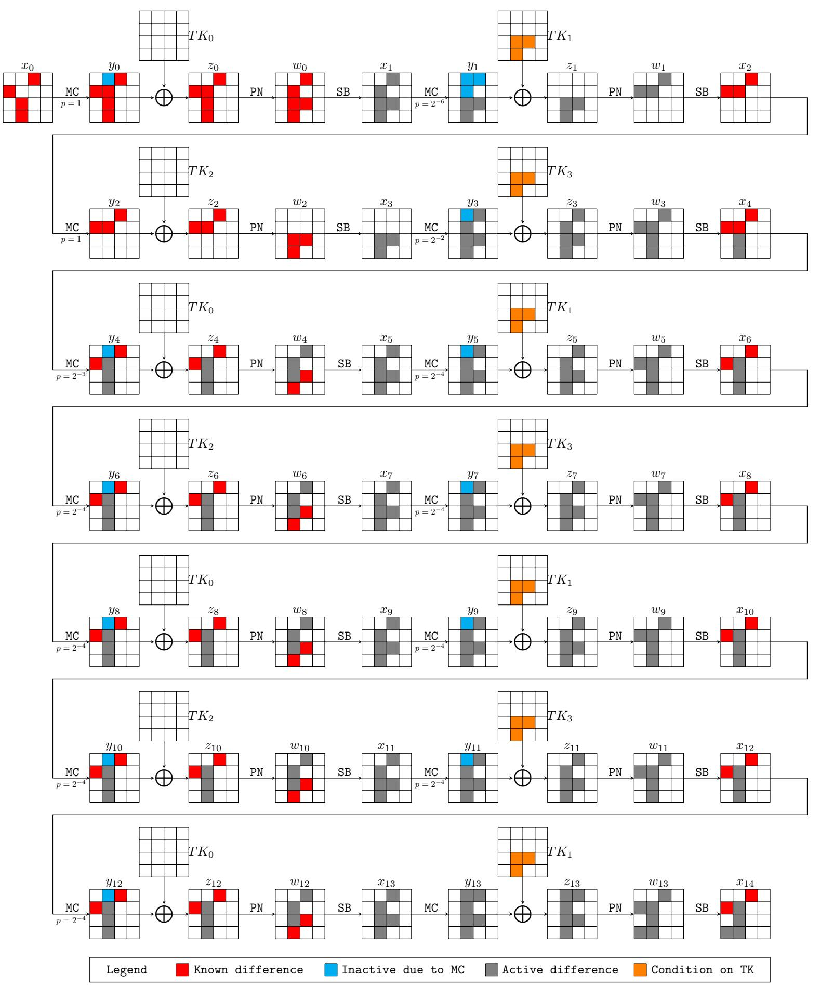

Figure 7: A 14-round truncated differential trail of CRAFT with probability  $2^{-43}$ 

## <span id="page-18-0"></span>4 Key-Recovery Attacks on CRAFT in the Single-key Model

In this section, we provide a key-recovery attack on 19-round CRAFT. It is based on a 15-round truncated differential distinguisher, which is slightly different from the one presented in Figure 6. Instead of using one cluster of characteristics with one fixed input difference, we consider fifteen clusters of differential characteristics, where the known difference  $\blacksquare$  can take any nonzero value  $\delta \in \mathbb{F}_2^4$ . The reason is to ensure that the statistics in the cases of good and wrong keys follow different distributions. The attack procedure can be found in Figure 8 and Algorithm 2. To reduce the complexity, we move the MixColumn operation to the end of the AddTweakey operation and denote  $MC(RC_t \oplus TK_t)$  as  $\overline{TK}_t$ .

{19}------------------------------------------------

<span id="page-19-0"></span>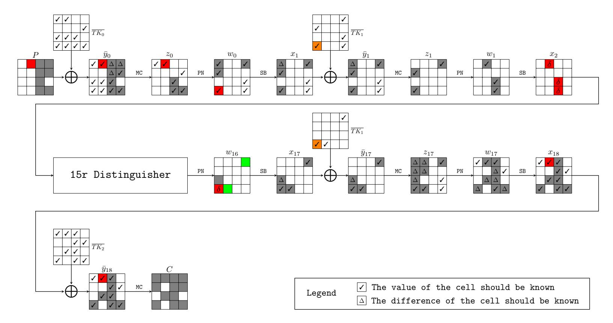

Figure 8: A key-recovery attack on 19-round CRAFT

In the attack, we prepare S structures for each value of T[6]. In each structure  $\mathbb{S}_i$ , there are  $2^{32}$  plaintexts such that the cells of the state P shown in Figure 8 marked by  $\blacksquare$  and  $\blacksquare$  traverse all possible values while the remaining cells are fixed to some random constants. Then, for each structure, we encrypt the plaintexts in it using the encryption oracle with some tweak T validating the equation T[6] = T[12]. We insert every ciphertext (with its corresponding plaintext) (P, C) into a hash table  $\mathbb{H}$  at index MC(C)[0, 3, 4, 5, 7, 8, 11, 13]. Thus, each pair ((P, C), (P', C')) from the same index of  $\mathbb{H}$  satisfies the difference pattern of  $\Delta x_{18}$  shown in Figure 8. For each such pair, we check whether

<span id="page-19-1"></span>
$$MC(P \oplus P') = \begin{bmatrix} 0x0 & * & 0x0 & 0x0 \\ 0x0 & 0x0 & 0x0 & 0x0 \\ 0x0 & 0x0 & * & 0x0 \\ 0x0 & 0x0 & * & * \end{bmatrix}$$
(18)

as  $\Delta z_0$  shown in Figure 8. All pairs violating Equation (18) are discarded without further processing since they have no hope to comply with the input difference  $\Delta x_2$  as shown in Figure 8 required by the distinguisher. To check whether the survived pairs follow the differential propagation in Figure 8, we should guess the values of some tweakey cells so that we can compute the values of the cells marked by  $\square$  and the differences of the cells marked by  $\square$ . In this way, we guess

$$g_K = \overline{TK}_0[0, 1, 2, 6, 7, 8, 9, 10, 12, 13, 14, 15] || \overline{TK}_1[3, 4, 11, 13, 15]|$$

step by step, which enables us to partially encrypt and decrypt the pairs to derive  $\Delta x_2$  and  $\Delta w_{16}$ . Conforming pairs with respect to the distinguisher (see  $\Delta x_2$  and  $\Delta w_{16}$  in Figure 8) will vote for the underlying key guess  $g_K$ . We fix the threshold as  $\Upsilon$ , and the key guess will be accepted if the counter of right pairs satisfies  $Cnt[i] \geqslant \Upsilon$ .

Complexity Analysis. In the attack, we encrypt  $S \times 2^{32}$  plaintexts for each fixed value of T[6], and thus the data complexity is  $S \times 2^{32} \times 2^4$ . Each structure leads to approximately  $(2^{32})^2/2 = 2^{63}$  pairs and the number of pairs used to check the validity of the distinguisher is approximately  $N = S \times 2^{63} \times 2^{-8 \times 4} = S \times 2^{31}$ . Then, the counter of right pairs follows a binomial distribution of parameters  $(N, p_0 = 2^{-52})$  in the case of the good key and  $(N, p = 2^{-56})$  otherwise. Denote  $\alpha$  as the non-detection error probability and  $\beta$  as the

{20}------------------------------------------------

#### Algorithm 2: A 19-round key-recovery attack on CRAFT

```
1 Prepare S structures S_0, \dots, S_{S-1}, each of which contains 2^{32} plaintexts
 2 for each possible 4-bit value T[6] do
         for i \in \{0, \dots, S-1\} do
 3
              T[0,1,2,3,4,5,7,8,9,10,11,12,13,14,15] \leftarrow \mathtt{Random}(\mathbb{F}_{24}^{15})
 4
              T[12] \leftarrow T[6]
 \mathbf{5}
              Initialize an empty hash table \mathbb{H}
 6
              for each plaintext P \in \mathbb{S}_i do
 7
                   C \leftarrow \mathtt{Enc}(P, K, T)
  8
                   Insert (P, C) into \mathbb{H} at index MC(C)[0, 3, 4, 5, 7, 8, 11, 13]
  9
              end
10
         end
11
         Allocate a global counter Cnt[g_K] for each of 2^{68} possible values of g_K
12
         for each pair ((P,C),(P',C')) extracted from the same index of \mathbb{H} do
13
              \mathbf{if} \ \ \mathtt{MC}(P \oplus P') = \begin{bmatrix} \mathtt{0x0} & * & \mathtt{0x0} & \mathtt{0x0} \\ \mathtt{0x0} & \mathtt{0x0} & \mathtt{0x0} & \mathtt{0x0} \\ \mathtt{0x0} & \mathtt{0x0} & * & \mathtt{0x0} \\ \mathtt{0x0} & \mathtt{0x0} & * & * & * \end{bmatrix}
                                                               then
14
                   for each possible 40-bit value \overline{TK}_0[0,1,7,8,9,10,12,13,14,15] do
15
                        Derive \Delta x_1[0] and the pair of values at x_1[3, 4, 11, 12, 15]
16
                         Compute \Delta z_1[0] = \Delta x_1[0] \oplus \Delta x_1[12]
17
                         if \Delta z_1[0] \equiv 0 then
18
                              for each possible 16-bit value \overline{TK}_1[3,4,11,15] do
19
                                   Derive \Delta x_2[1, 10, 14]
20
                                   if \Delta x_2[1] \equiv \Delta x_2[10] \equiv \Delta x_2[14] then
21
                                        for each possible 8-bit value \overline{TK}_2[2,6] do
22
                                             Derive \Delta \overline{y}_{17}[0, 1, 4, 5, 8] and the pair of values at
 23
                                              \overline{y}_{17}[3, 12, 13]
                                             if \Delta \overline{y}_{17}[0, 1, 4, 5] \equiv 0 \times 0000 \text{ then}
 24
                                                  for each possible 4-bit value \overline{TK}_1[13] do
 25
                                                       Derive \Delta w_{16}[3, 12, 13]
 26
                                                       if \Delta w_{16}[3] \equiv \Delta w_{16}[13] and \Delta w_{16}[12] \equiv \Delta x_2[1]
 27
                                                         then
                                                            Increment the counter corresponding to g_K
 28
                                                       end
 29
                                                  end
 30
                                             \mathbf{end}
 31
                                        end
32
                                   end
33
                              end
34
                         end
35
                   \mathbf{end}
36
              end
37
         end
38
         for i \in \{0, 1, \dots 2^{68} - 1\} do
39
              if Cnt[i] \geqslant \Upsilon then
40
                    Set i||K_1||12| as a possible candidate for g_K||K_1||12|
41
                    Exhaustively test all master keys that are compatible with it against at
42
                     most two plaintext-ciphertext pairs
              end
43
         end
44
45 end
```

{21}------------------------------------------------

false alarm error probability. With the method in [BGT11], we have

<span id="page-21-1"></span>
$$\beta \stackrel{N \to \infty}{\sim} \frac{(1-p)\sqrt{\Upsilon/N}}{(\Upsilon/N-p)\sqrt{2\pi N(1-\Upsilon/N)}} \exp\left[-ND\left(\frac{\Upsilon}{N} \middle\| p\right)\right],$$

$$\alpha \stackrel{N \to \infty}{\sim} \frac{p_0\sqrt{1-(\Upsilon-1)/N}}{(p_0-(\Upsilon-1)/N)\sqrt{2\pi(\Upsilon-1)}} \exp\left[-ND\left(\frac{\Upsilon-1}{N} \middle\| p_0\right)\right],$$
(19)

where  $D(p||q) \triangleq p \ln\left(\frac{p}{q}\right) + (1-p) \ln\left(\frac{1-p}{1-q}\right)$  is the Kullback-Leibler divergence between two Bernoulli probability distributions with parameters being p and q, respectively.

Now, we detail the time complexity of Algorithm 2. To begin with, the time complexity to obtain plaintext-ciphertext pairs at line 8 is  $T_{\text{line-8}} = 2^4 \times \mathcal{S} \times 2^{32} = \mathcal{S} \times 2^{36}$  19-round of encryptions. Because the number of pairs extracted from the same index of  $\mathbb H$  is approximately  $\mathcal{S} \times 2^{31}$  for each value of T[6], the time complexity to check the condition on  $MC(P \oplus P')$  at line 14 is bounded by  $T_{\text{line-14}} = 2^4 \times S \times 2^{31} = S \times 2^{35}$  one-round of encryptions. Also, the number of surviving pairs after this sieving phase is approximately  $\mathcal{S} \times 2^{15}$  regarding one fixed value of T[6]. Consequently, the time complexity of the operation at line 16 is at most  $T_{\text{line-16}} = 2^4 \times S \times 2^{15} \times 2^{40} = S \times 2^{59}$  one-round of encryptions. After that, for each value of T[6], there are about  $\mathcal{S} \times 2^{11}$  pairs that satisfy the restriction on the value of  $\Delta z_1[0]$  at line 18. So, the time complexity of the operation at line 20 is at most  $T_{\text{line-20}} = 2^4 \times \mathcal{S} \times 2^{11} \times 2^{56} = \mathcal{S} \times 2^{71}$  one-round of encryptions. Since the number of remaining pairs at line 23 is  $\mathcal{S} \times 2^3$  for one fixed value of T[6], the time complexity of the operation at line 23 is  $T_{\text{line-23}} = 2^4 \times \mathcal{S} \times 2^3 \times 2^{64} = \mathcal{S} \times 2^{71}$  one-round of encryptions. As the probability that a pair fulfils the conditional statement at line 24 is about  $2^{-16}$ , the number of pairs that participate in the operation at line 26 is  $\mathcal{S} \times 2^{-13}$ . Thus, the time complexity of the operation at line 26 is  $T_{\text{line-26}} = 2^4 \times S \times 2^{-13} \times 2^{68} = S \times 2^{59}$ one-round of encryptions. After setting the threshold  $\Upsilon$ , the time complexity  $T_{\text{line-42}}$  of the operation at line 42 is determined by the false alarm error probability  $\beta$ , which is  $2^{128} \times \beta \times (1-2^{-64})$  19-round of encryptions.

Note that the time complexity of the attack is dominated by the operations at line 20, line 23, and line 42 of Algorithm 2. The total time complexity  $T_1 = T_{\text{line-20}} + T_{\text{line-23}}$  of the operations at line 20 and line 23 is about  $\frac{S \times 2^{71} \times 2}{19}$  19-round of encryptions, and the time complexity  $T_2 = T_{\text{line-42}}$  is  $2^{128} \times \beta \times (1 - 2^{-64})$  19-round of encryptions. We set the threshold  $\Upsilon$  as  $N \times p_0 - 2 = S \times 2^{31} \times p_0 - 2$  and try to select the value of N such that the following two conditions are validated simultaneously:

- the success probability  $P_S = 1 \alpha$  is not lower than 80%;
- the overall time complexity of the attack  $T_1 + T_2$  is minimized.

The relation curves of the data complexity, time complexity, and success probability are given in Figure 9. Then, we set N as  $2^{55.99}$  and thus have  $\mathcal{S} = 2^{24.99}$ ,  $P_S = 80.66\%$ ,  $T_1 + T_2 = 2^{94.59}$ .

Therefore, in summary, the data complexity is  $2^{60.99}$  chosen plaintexts, the time complexity is  $2^{94.59}$  19-round of encryptions, and the memory complexity is  $2^{68}$  for the counters of keys.

#### <span id="page-21-0"></span>5 Conclusion

With the aid of MILP-based automatic tools, we identify a 15-round truncated differential distinguisher of CRAFT with probability  $2^{-54}$ , which can be extended to a 19-round key-recovery attack. The proposed attack relies on a property of CRAFT where an input

{22}------------------------------------------------

<span id="page-22-2"></span>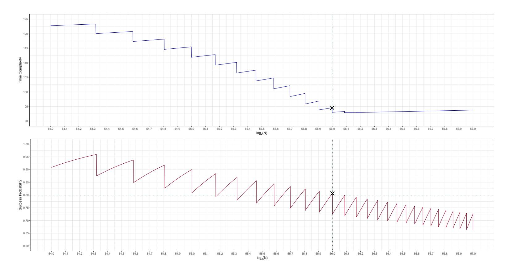

Figure 9: The relation curves of the attack. Since Υ *N* in our setting, we do not use Equation [\(19\)](#page-21-1) and directly exploit the probability density function of the binomial distribution to estimate *α* and *β*.

difference is preserved through an arbitrary number of rounds with proper conditions imposed on the tweak if the input pairs follow certain truncated differential trail. This property is made possible by a combination of the specialties of CRAFT, including the involutory S-box, the involutory linear layer, the order of the components arranged in the round function, and the positions of the round constant additions. Also, we find some 16-round distinguishers and one 20-round weak-key distinguisher. Experimental results on round-reduced versions of these distinguishers are generally better than the theoretical analysis. In the future, it is interesting to investigate whether this property can be employed in other cryptanalytic attacks.

**Acknowledgment.** The authors thank the anonymous reviewers and our shepherd Hadi Soleimany for many helpful comments. The work is supported by the National Key R&D Program of China (Grant No. 2018YFA0704702, 2018YFA0704704), the Chinese Major Program of National Cryptography Development Foundation (Grant No. MMJJ20180102), the National Natural Science Foundation of China (61772519, 61802400, 61877058), the Major Scientific and Technological Innovation Project of Shandong Province, China (Grant No. 2019JZZY010133), the Qingdao Postdoctor Application Research Project (Grant No. 61580070311101), and the Youth Innovation Promotion Association of Chinese Academy of Sciences.

### **References**

<span id="page-22-1"></span>[ADG<sup>+</sup>19] Ralph Ankele, Christoph Dobraunig, Jian Guo, Eran Lambooij, Gregor Leander, and Yosuke Todo. Zero-correlation attacks on tweakable block ciphers with linear tweakey expansion. *IACR Trans. Symmetric Cryptol.*, 2019(1):192–235, 2019.

<span id="page-22-0"></span>[ADM<sup>+</sup>10] Michel Agoyan, Jean-Max Dutertre, Amir-Pasha Mirbaha, David Naccache, Anne-Lise Ribotta, and Assia Tria. How to flip a bit? In *16th IEEE*

{23}------------------------------------------------

- *International On-Line Testing Symposium (IOLTS 2010), 5-7 July, 2010, Corfu, Greece*, pages 235–239, 2010.
- <span id="page-23-1"></span>[ADN<sup>+</sup>10] Michel Agoyan, Jean-Max Dutertre, David Naccache, Bruno Robisson, and Assia Tria. When clocks fail: On critical paths and clock faults. In *Smart Card Research and Advanced Application, 9th IFIP WG 8.8/11.2 International Conference, CARDIS 2010, Passau, Germany, April 14-16, 2010. Proceedings*, pages 182–193, 2010.
- <span id="page-23-5"></span>[AMR<sup>+</sup>18] Anita Aghaie, Amir Moradi, Shahram Rasoolzadeh, Falk Schellenberg, and Tobias Schneider. Impeccable circuits. *IACR Cryptology ePrint Archive*, 2018:203, 2018.
- <span id="page-23-6"></span>[BBI<sup>+</sup>15] Subhadeep Banik, Andrey Bogdanov, Takanori Isobe, Kyoji Shibutani, Harunaga Hiwatari, Toru Akishita, and Francesco Regazzoni. Midori: A block cipher for low energy. In *Advances in Cryptology - ASIACRYPT 2015 - 21st International Conference on the Theory and Application of Cryptology and Information Security, Auckland, New Zealand, November 29 - December 3, 2015, Proceedings, Part II*, pages 411–436, 2015.
- <span id="page-23-9"></span>[BCLR17] Christof Beierle, Anne Canteaut, Gregor Leander, and Yann Rotella. Proving resistance against invariant attacks: How to choose the round constants. In *Advances in Cryptology - CRYPTO 2017 - 37th Annual International Cryptology Conference, Santa Barbara, CA, USA, August 20-24, 2017, Proceedings, Part II*, pages 647–678, 2017.
- <span id="page-23-10"></span>[BGT11] Céline Blondeau, Benoît Gérard, and Jean-Pierre Tillich. Accurate estimates of the data complexity and success probability for various cryptanalyses. *Des. Codes Cryptogr.*, 59(1-3):3–34, 2011.
- <span id="page-23-4"></span>[BLMR19] Christof Beierle, Gregor Leander, Amir Moradi, and Shahram Rasoolzadeh. CRAFT: lightweight tweakable block cipher with efficient protection against DFA attacks. *IACR Trans. Symmetric Cryptol.*, 2019(1):5–45, 2019.
- <span id="page-23-8"></span>[BS93] Eli Biham and Adi Shamir. *Differential Cryptanalysis of the Data Encryption Standard*. Springer, 1993.
- <span id="page-23-0"></span>[BS97] Eli Biham and Adi Shamir. Differential fault analysis of secret key cryptosystems. In *Advances in Cryptology - CRYPTO '97, 17th Annual International Cryptology Conference, Santa Barbara, California, USA, August 17-21, 1997, Proceedings*, pages 513–525, 1997.
- <span id="page-23-7"></span>[CDK09] Christophe De Cannière, Orr Dunkelman, and Miroslav Knezevic. KATAN and KTANTAN - A family of small and efficient hardware-oriented block ciphers. In *Cryptographic Hardware and Embedded Systems - CHES 2009, 11th International Workshop, Lausanne, Switzerland, September 6-9, 2009, Proceedings*, pages 272–288, 2009.
- <span id="page-23-2"></span>[CML<sup>+</sup>11] Gaetan Canivet, Paolo Maistri, Régis Leveugle, Jessy Clédière, Florent Valette, and Marc Renaudin. Glitch and laser fault attacks onto a secure AES implementation on a sram-based FPGA. *J. Cryptology*, 24(2):247–268, 2011.
- <span id="page-23-3"></span>[DDRT12] Amine Dehbaoui, Jean-Max Dutertre, Bruno Robisson, and Assia Tria. Electromagnetic transient faults injection on a hardware and a software implementations of AES. In *2012 Workshop on Fault Diagnosis and Tolerance in Cryptography, Leuven, Belgium, September 9, 2012*, pages 7–15, 2012.

{24}------------------------------------------------

- <span id="page-24-11"></span>[EK18] Maria Eichlseder and Daniel Kales. Clustering related-tweak characteristics: Application to MANTIS-6. *IACR Trans. Symmetric Cryptol.*, 2018(2):111– 132, 2018.
- <span id="page-24-4"></span>[EY19] Muhammad ElSheikh and Amr M. Youssef. Related-key differential cryptanalysis of full round CRAFT. In *Security, Privacy, and Applied Cryptography Engineering - 9th International Conference, SPACE 2019, Gandhinagar, India, December 3-7, 2019, Proceedings*, pages 50–66, 2019.
- <span id="page-24-9"></span>[GMS16] David Gerault, Marine Minier, and Christine Solnon. Constraint programming models for chosen key differential cryptanalysis. In *Principles and Practice of Constraint Programming - 22nd International Conference, CP 2016, Toulouse, France, September 5-9, 2016, Proceedings*, pages 584–601, 2016.
- <span id="page-24-10"></span>[gur19] Gurobi Optimization. Gurobi Optimizer Reference Manual. 2019. [https:](https://www.gurobi.com/) [//www.gurobi.com/](https://www.gurobi.com/).
- <span id="page-24-3"></span>[HSN<sup>+</sup>19] Hosein Hadipour, Sadegh Sadeghi, Majid M. Niknam, Ling Song, and Nasour Bagheri. Comprehensive security analysis of CRAFT. *IACR Trans. Symmetric Cryptol.*, 2019(4):290–317, 2019.
- <span id="page-24-1"></span>[KJJ99] Paul C. Kocher, Joshua Jaffe, and Benjamin Jun. Differential power analysis. In *Advances in Cryptology - CRYPTO '99, 19th Annual International Cryptology Conference, Santa Barbara, California, USA, August 15-19, 1999, Proceedings*, pages 388–397, 1999.
- <span id="page-24-8"></span>[KLT15] Stefan Kölbl, Gregor Leander, and Tyge Tiessen. Observations on the SIMON block cipher family. In *Advances in Cryptology - CRYPTO 2015 - 35th Annual Cryptology Conference, Santa Barbara, CA, USA, August 16-20, 2015, Proceedings, Part I*, pages 161–185, 2015.
- <span id="page-24-0"></span>[Koc96] Paul C. Kocher. Timing attacks on implementations of Diffie-Hellman, RSA, DSS, and other systems. In *Advances in Cryptology - CRYPTO '96, 16th Annual International Cryptology Conference, Santa Barbara, California, USA, August 18-22, 1996, Proceedings*, pages 104–113, 1996.
- <span id="page-24-5"></span>[LAAZ11] Gregor Leander, Mohamed Ahmed Abdelraheem, Hoda AlKhzaimi, and Erik Zenner. A cryptanalysis of PRINTcipher: The invariant subspace attack. In *Advances in Cryptology - CRYPTO 2011 - 31st Annual Cryptology Conference, Santa Barbara, CA, USA, August 14-18, 2011. Proceedings*, pages 206–221, 2011.
- <span id="page-24-6"></span>[LMR15] Gregor Leander, Brice Minaud, and Sondre Rønjom. A generic approach to invariant subspace attacks: Cryptanalysis of Robin, iSCREAM and Zorro. In *Advances in Cryptology - EUROCRYPT 2015 - 34th Annual International Conference on the Theory and Applications of Cryptographic Techniques, Sofia, Bulgaria, April 26-30, 2015, Proceedings, Part I*, pages 254–283, 2015.
- <span id="page-24-2"></span>[MA19] AmirHossein E. Moghaddam and Zahra Ahmadian. New automatic search method for truncated-differential characteristics: Application to Midori, SKINNY and CRAFT. *IACR Cryptology ePrint Archive*, 2019:126, 2019.
- <span id="page-24-7"></span>[MWGP11] Nicky Mouha, Qingju Wang, Dawu Gu, and Bart Preneel. Differential and linear cryptanalysis using mixed-integer linear programming. In *Information Security and Cryptology - 7th International Conference, Inscrypt 2011, Beijing, China, November 30 - December 3, 2011. Revised Selected Papers*, pages 57–76, 2011.

{25}------------------------------------------------

- <span id="page-25-0"></span>[SGD08] Nidhal Selmane, Sylvain Guilley, and Jean-Luc Danger. Practical setup time violation attacks on AES. In *Seventh European Dependable Computing Conference, EDCC-7 2008, Kaunas, Lithuania, 7-9 May 2008*, pages 91–96, 2008.
- <span id="page-25-6"></span>[SGL<sup>+</sup>17] Siwei Sun, David Gerault, Pascal Lafourcade, Qianqian Yang, Yosuke Todo, Kexin Qiao, and Lei Hu. Analysis of AES, SKINNY, and others with constraint programming. *IACR Trans. Symmetric Cryptol.*, 2017(1):281–306, 2017.
- <span id="page-25-7"></span>[SHW<sup>+</sup>14a] Siwei Sun, Lei Hu, Meiqin Wang, Peng Wang, Kexin Qiao, Xiaoshuang Ma, Danping Shi, and Ling Song. Automatic enumeration of (relatedkey) differential and linear characteristics with predefined properties and its applications. *IACR Cryptology ePrint Archive*, 2014:747, 2014. [http:](http://eprint.iacr.org/2014/747) [//eprint.iacr.org/2014/747](http://eprint.iacr.org/2014/747).
- <span id="page-25-4"></span>[SHW<sup>+</sup>14b] Siwei Sun, Lei Hu, Peng Wang, Kexin Qiao, Xiaoshuang Ma, and Ling Song. Automatic security evaluation and (related-key) differential characteristic search: Application to SIMON, PRESENT, LBlock, DES(L) and other bitoriented block ciphers. In *Advances in Cryptology - ASIACRYPT 2014 - 20th International Conference on the Theory and Application of Cryptology and Information Security, Kaoshiung, Taiwan, R.O.C., December 7-11, 2014. Proceedings, Part I*, pages 158–178, 2014.
- <span id="page-25-1"></span>[SIH<sup>+</sup>11] Kyoji Shibutani, Takanori Isobe, Harunaga Hiwatari, Atsushi Mitsuda, Toru Akishita, and Taizo Shirai. Piccolo: An ultra-lightweight blockcipher. In *Cryptographic Hardware and Embedded Systems - CHES 2011 - 13th International Workshop, Nara, Japan, September 28 - October 1, 2011. Proceedings*, pages 342–357, 2011.
- <span id="page-25-2"></span>[SSD<sup>+</sup>18] Danping Shi, Siwei Sun, Patrick Derbez, Yosuke Todo, Bing Sun, and Lei Hu. Programming the Demirci-Selçuk Meet-in-the-Middle Attack with Constraints. In *Advances in Cryptology - ASIACRYPT 2018 - 24th International Conference on the Theory and Application of Cryptology and Information Security, Brisbane, QLD, Australia, December 2-6, 2018, Proceedings, Part II*, pages 3–34, 2018.
- <span id="page-25-5"></span>[ST17] Yu Sasaki and Yosuke Todo. New impossible differential search tool from design and cryptanalysis aspects - revealing structural properties of several ciphers. In *Advances in Cryptology - EUROCRYPT 2017 - 36th Annual International Conference on the Theory and Applications of Cryptographic Techniques, Paris, France, April 30 - May 4, 2017, Proceedings, Part III*, pages 185–215, 2017.
- <span id="page-25-3"></span>[TLS16] Yosuke Todo, Gregor Leander, and Yu Sasaki. Nonlinear invariant attack practical attack on full SCREAM, iSCREAM, and Midori64. In *Advances in Cryptology - ASIACRYPT 2016 - 22nd International Conference on the Theory and Application of Cryptology and Information Security, Hanoi, Vietnam, December 4-8, 2016, Proceedings, Part II*, pages 3–33, 2016.

{26}------------------------------------------------

## <span id="page-26-1"></span>A Additional Differential Trails of CRAFT

<span id="page-26-0"></span>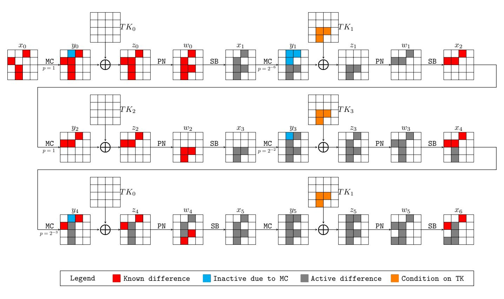

Figure 10: A 6-round truncated differential trail of CRAFT with probability  $2^{-11}$ 

<span id="page-26-2"></span>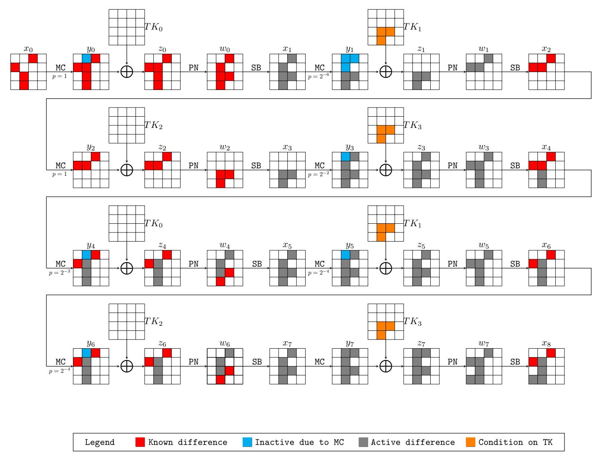

Figure 11: An 8-round truncated differential trail of CRAFT with probability  $2^{-19}$ 

{27}------------------------------------------------

<span id="page-27-0"></span>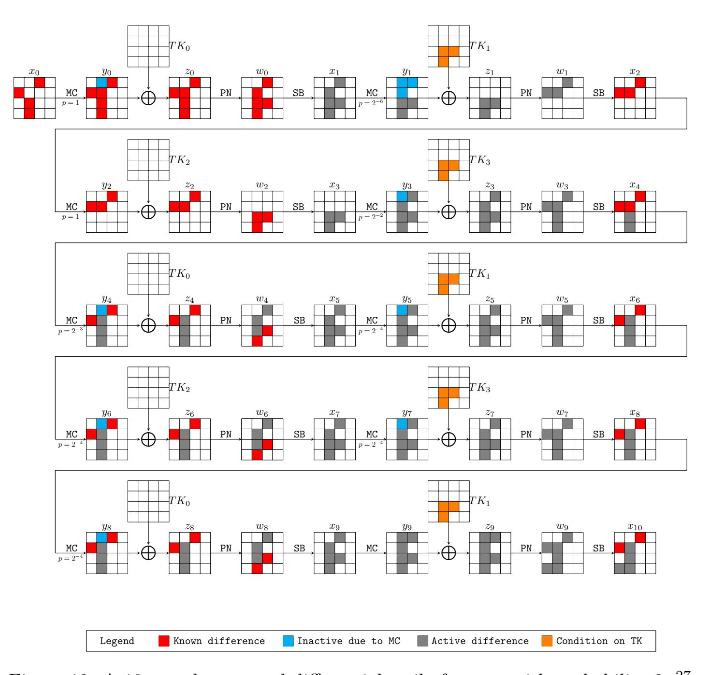

Figure 12: A 10-round truncated differential trail of CRAFT with probability  $2^{-27}$ 

{28}------------------------------------------------

<span id="page-28-0"></span>

Figure 13: A 12-round truncated differential trail of CRAFT with probability  $2^{-35}$ 

{29}------------------------------------------------

<span id="page-29-0"></span>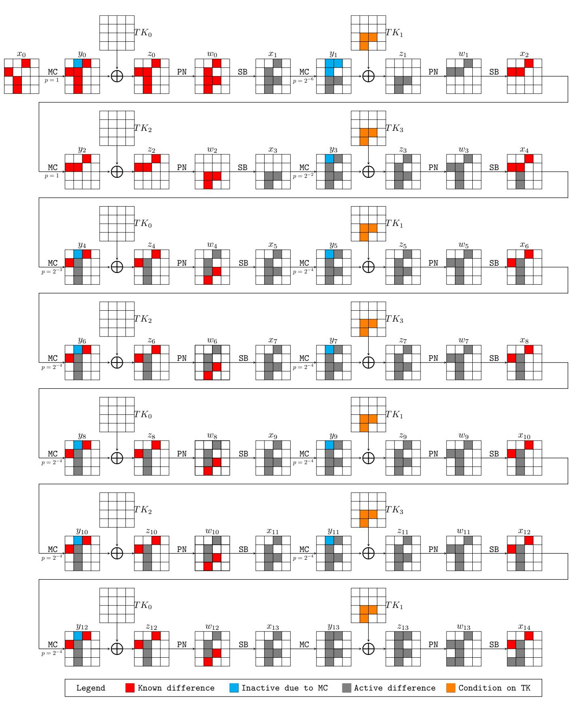

Figure 14: A 14-round truncated differential trail of CRAFT with probability  $2^{-43}$ 

<span id="page-29-1"></span>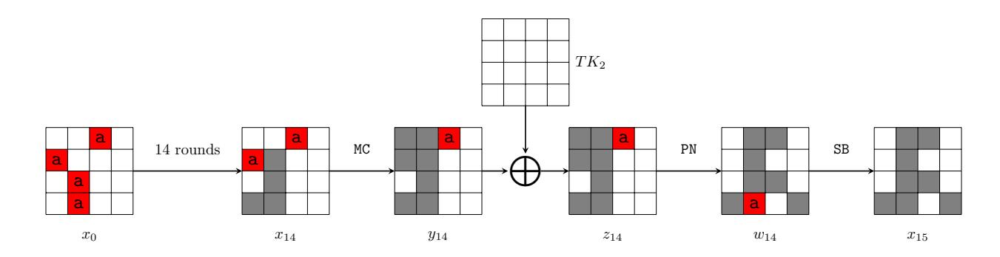

Figure 15: A 15-round truncated differential trail of CRAFT with probability  $2^{-43}$ 

{30}------------------------------------------------

<span id="page-30-0"></span>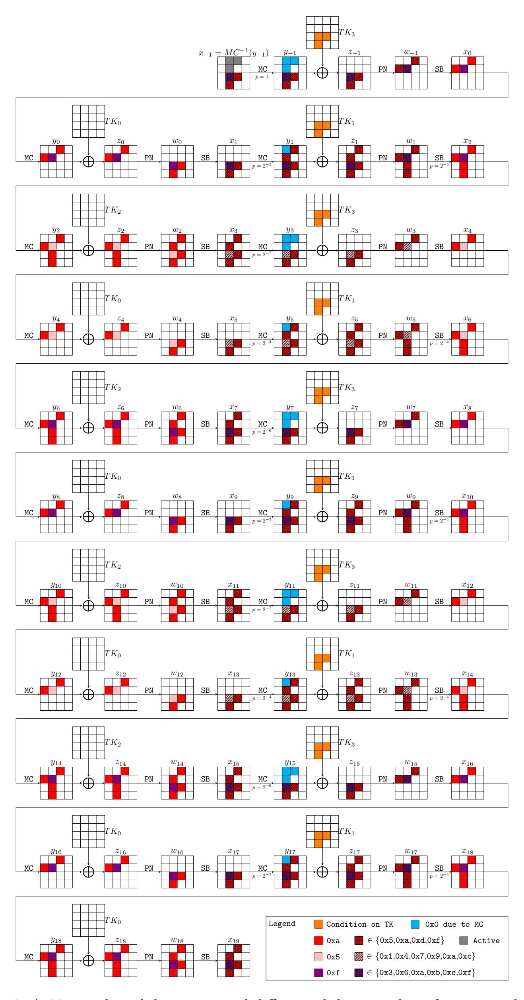

Figure 16: A 20-round weak-key truncated differential distinguisher of CRAFT with probability  $2^{-63}$ 

{31}------------------------------------------------

## <span id="page-31-1"></span>B A 16-round Conjectural Distinguisher of CRAFT

<span id="page-31-0"></span>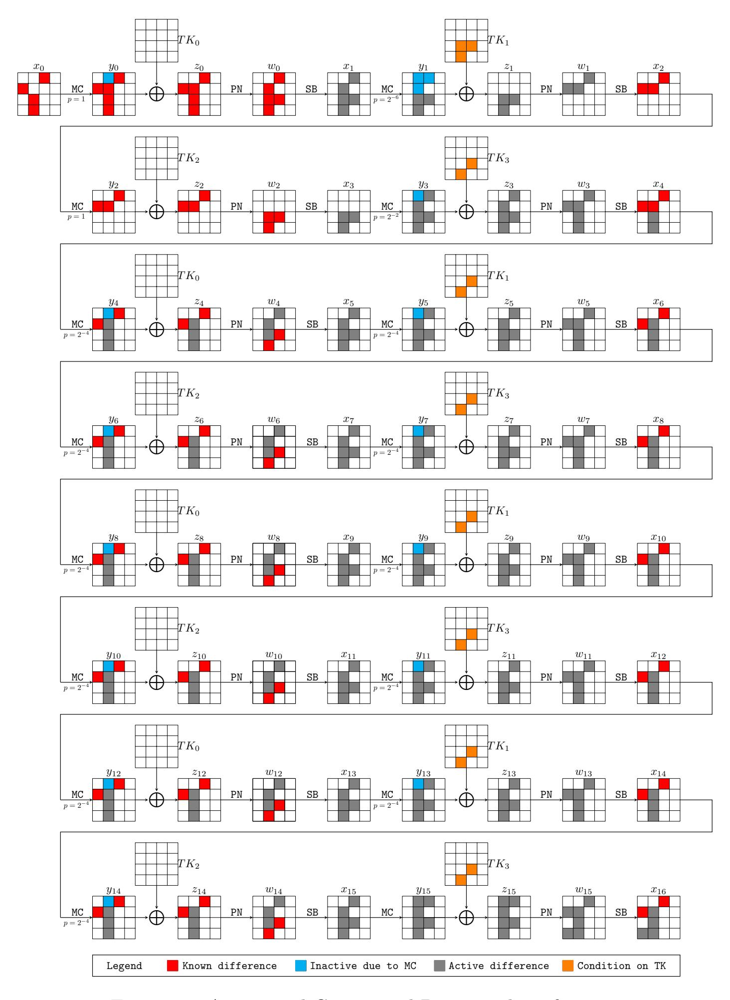

Figure 17: A 16-round Conjectural Distinguisher of CRAFT

According to the experiments for the 6-, 8-, and 10-round distinguishers, we conjecture that the experimental probability of the 16- or 17-round distinguisher should be no less than  $2^{-48}$ . For a randomly chosen key

$$K = K_0 \parallel K_1 = \texttt{0x27a6781a43f364bc} \parallel \texttt{0x916708d5fbb5fefe},$$

we encrypt  $2^{48}$  data with the required conditions on the tweak, and we finally obtain three correct pairs:

{32}------------------------------------------------

```
   T = 0xd8e94bb7bf06b1ee
   P0 = 0xbd3f8b6411e6842c, C0 = 0x4f55f581f01ecc18
   P1 = 0xbd9f8bc411ec8e2c, C1 = 0x4f48f521f0f4c618
                                                    ,

   T = 0x69e96bb2bd80bfee
   P0 = 0xe240c8a39c72c238, C0 = 0xbfdb5f91e3bcad40
   P1 = 0xe2e0c8039c78c838, C1 = 0xbf2a5f01e3e6a740
                                                    ,

   T = 0x27e2fbb0b455bc3e
   P0 = 0xb89121d27556caf2, C0 = 0x8f4ff2ad6321023a
   P1 = 0xb8312172755cc0f2, C1 = 0x8fa9f2ed637b083a
                                                    .
```

Therefore, with this particular key, the probability that the differential holds is about 2 <sup>−</sup>46*.*<sup>42</sup>. However, we do not draw any concrete conclusion since the experiments are too inadequate.