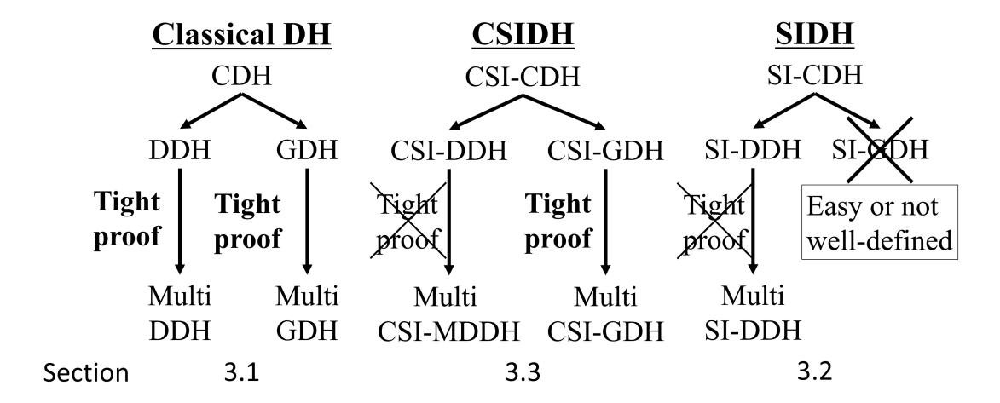
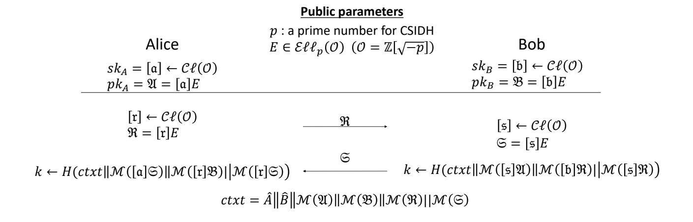

{0}------------------------------------------------

# **An Efficient Authenticated Key Exchange from Random Self-Reducibility on CSIDH**

Tomoki Kawashima1 , Katsuyuki Takashima2 , Yusuke Aikawa2 , and Tsuyoshi Takagi1

1 Department of Mathematical Informatics, The University of Tokyo, Tokyo, Japan *{*tomoki kawashima, takagi*}*@mist.i.u-tokyo.ac.jp 2 Mitsubishi Electric Corporation, Kanagawa, Japan Takashima.Katsuyuki@aj.MitsubishiElectric.co.jp, Aikawa.Yusuke@bc.MitsubishiElectric.co.jp

**Abstract.** SIDH and CSIDH are key exchange protocols based on isogenies and conjectured to be quantum-resistant. Since the protocols are similar to the classical Diffie–Hellman, they are vulnerable to the manin-the-middle attack. A key exchange which is resistant to such an attack is called an authenticated key exchange (AKE), and many isogeny-based AKEs have been proposed. However, the parameter sizes of the existing schemes should be large since they all have relatively large security losses in security proofs. This is partially because the random self-reducibility of isogeny-based decisional problems has not been proved yet.

In this paper, we show that the computational problem and the gap problem of CSIDH are random self-reducible. A gap problem is a computational problem given access to the corresponding decision oracle. Moreover, we propose a CSIDH-based AKE with small security loss, following the construction of Cohn-Gordon et al. in CRYPTO 2019, as an application of the random self-reducibility of the gap problem of CSIDH. Our AKE is proved to be the fastest CSIDH-based AKE when we aim at 110-bit security level.

**Keywords:** post-quantum *·* tight security *·* authenticated key exchange *·* isogeny-based cryptography *·* CSIDH

## **1 Introduction**

### **1.1 Backgrounds**

Most of the public key cryptosystems currently used depend on the difficulty of Discrete Logarithm Problem (DLP) or factorization, so will be broken by Shor's algorithm [22] with quantum computers. To prepare for the appearance of quantum computers, quantum-resistant cryptosystems are needed. Isogenybased cryptosystems, such as SIDH [16] and CSIDH [5], are expected to be quantum-resistant. CSIDH can be considered to be an instantiation of Hard Homogeneous Spaces (HHS) proposed in [8], and its protocol is similar to the 

{1}------------------------------------------------

classical Diffie–Hellman. SIDH also has a very similar protocol to the classical Diffie–Hellman, but we cannot regard it as an instantiation of HHS.

Since SIDH and CSIDH are subject to the man-in-the-middle attack, we cannot use them under insecure channels. Although the classical Diffie–Hellman is also vulnerable to the man-in-the-middle attack, there are many Diffie–Hellmanbased key exchange protocols which are secure under insecure channels, e.g., [18,17]. Such key exchange protocols are called authenticated key exchanges (AKE).

As for isogeny-based cryptosystems, there are several SIDH-based AKEs [14,19,23]. There also exist CSIDH-based AKEs [13], though [13] mainly focuses on a group AKE. However, these existing isogeny-based AKEs are not so efficient in that they all have large security losses. When we have a small security loss, we can use smaller parameters to achieve a specific security level, e.g., 110-bit security, which means the protocol becomes faster.

To achieve an AKE with a small security loss, "random self-reducibility" of the underlying problem is useful. Informally, we say that a problem is random self-reducible when we can produce multiple independent instances from a single instance such that we can restore the original answer from the answer of any one of the generated instances. In other words, a problem is random self-reducible if we can reduce the problem tightly to the corresponding multi-instance problem. It is well-known that the decisional Diffie–Hellman (DDH) problem and the computational Diffie–Hellman (CDH) problem are random self-reducible, see the left part of the Figure 1.

Since the security of an AKE is often defined in the decisional game, it is plausible to use a decisional problem for the security proof. However, even though the (classical) DDH problem is random self-reducible, the decisional problem of SIDH and that of CSIDH (denoted as SI-DDH and CSI-DDH respectively) have not been proved so, see the middle and right part of the Figure 1. Thus it seems difficult to construct an AKE with a small security loss from the decisional isogeny-based problems. Here, the next candidates are isogeny-based computational problems. However, the security proof of an AKE from a computational problem is often difficult, since we have to reduce the computational problem to the decisional game. Thus, other kinds of problems are needed to construct an AKE with a small security loss.

For that reason, we use gap problems introduced by Okamoto and Pointcheval [21]. A gap problem is a problem to solve a computational problem given access to the corresponding decisional oracle, and often used in the security proof of an AKE [18,13]. Though not quantum-resistant, the gap problem of the classical Diffie–Hellman (the GDH problem in short) is also random self-reducible, see the left part of the Figure 1. As for SIDH, no gap problem which is suitable for cryptosystems has been found. Related discussions are in [15,10]. So we put our hope on the gap problem of CSIDH, CSI-GDH problem.

Following the discussion above, a natural question which arises is:

*Can we construct a (almost) tightly secure quantum-resistant key exchange which is secure against man-in-the-middle attack from isogenies?*

{2}------------------------------------------------

### **1.2 Contributions**

**Random Self-Reducibility of the Gap Problem of CSIDH** Our first contribution is that we prove the random self-reducibility of the CSI-GDH problem. Though the classical Diffie–Hellman, CSIDH, and SIDH have very similar structures, the situations about random self-reducibility are different. As for the classical Diffie–Hellman, the decisional problem and the gap problem are both random self-reducible (see the left part of the Figure 1). On the contrary, neither the decisional problem and the gap problem of SIDH has been proved to be random self-reducible (see the right part of the Figure 1). Here, our contribution is that we prove that the gap problem of CSIDH, CSI-GDH problem, is random self-reducible (see the middle part of the Figure 1). So, among the classical Diffie–Hellman, SIDH, and CSIDH, CSIDH is the only quantum-resistant cryptosystem which has random self-reducibility.

**Fig. 1.** The comparison of our result with existing result. We prove that the random self-reducibility of the CSI-GDH problem. As for the gap problems of SIDH, no suitable problems has been proposed, see the section 3.2 for more details.

**Efficient CSIDH-based AKE** Our second contribution is that we construct a quantum-resistant efficient AKE based on CSIDH, following the construction of Cohn-Gordon et al. [7]. Our AKE has a security loss of *O*(*µ*), where *µ* is the number of users and Cohn-Gordon et al. showed that it is optimal among "simple" reductions.3 So, even though the loss of *O*(*µ*) is not tight, i.e., the security loss is not constant, it is *optimally tight*, and our AKE is efficient in this sense. Moreover, since our AKE is based on CSIDH, it is quantum-resistant. As far as we know, our AKE has the smallest security loss among isogeny-based AKEs as shown in Table 1.

We also compare our AKE with other existing CSIDH-based AKEs. As far as we know, [13] is the only study that proposes other CSIDH-based AKEs. [13]

3 Informally, a reduction is simple if the reduction runs the adversary only once.

{3}------------------------------------------------

#### 4 T. Kawashima et al.

proposes two CSIDH-based AKEs and we show that our AKE is faster than these two AKEs if we aim at 110-bit security.

**Table 1.** AKEs proposed in the literature. "Assumption" shows which problem is assumed to be hard and "Model" represents which AKE security model was used. The number of hash queries and RevealSessKey are denoted as *h* and *q*. Also, *l* and *ns* denote the maximum number of sessions per user and the number of sessions activated by the adversary.

| Protocol                           | Assumption | Model      | Loss                     |  |  |
|------------------------------------|------------|------------|--------------------------|--|--|
| the classical Diffie–Hellman-based |            |            |                          |  |  |
| HMQV [17]                          | CDH        | CK         | 2 2 µ l         |  |  |
| NAXOS [18]                         | GDH        | strong AKE | 2 2 µ l         |  |  |
| Protocol Π [7]                     | stDH       | CCGJJ      | µ                        |  |  |
| SIDH-based                         |            |            |                          |  |  |
| SIDH UM [12]                       | SI-DDH     | CK         | µl                       |  |  |
| SIDH-AKE [14]                      | SI-CDH     | CK         | 2 2 µ l         |  |  |
| SIGMA-SIDH [19]                    | SI-DDH     | SK         | µns                      |  |  |
| SIAKE2 [23]                     | SI-DDH     | CK+        | 2 µ lq             |  |  |
| SIAKE3 [23]                     | 1-OSIDH    | CK+        | 2 µ lq             |  |  |
| CSIDH-based                        |            |            |                          |  |  |
| CSIDH UM [13]                      | 2DDH       | G-CK       | 2 µns(h + q)          |  |  |
| CSIDH Biclique [13]                | 2GDH       | G-CK+      | 2 , n2 max(µ s) |  |  |
| Proposed Protocol                  | CSI-stDH   | CCGJJ      | µ                        |  |  |

### **1.3 Key Techniques**

**Relationship between AKE and Random Self-Reducibility** The security of an AKE is defined with the following game between a challenger *C* and an adversary *A*. First, *C* gives public information of the AKE to *A*, such as public keys of users and public parameters. Second, *A* carries out some attacks allowed in the security model. Finally, *A* chooses some sessions to get each person's shared keys or random keys. Such sessions are called test sessions. Here, a session is a single execution of the protocol. If *A* cannot decide whether the given keys are real-or-random with noticeable advantage, we say the AKE is secure. For further details, see Appendix A.

When we want to prove the security of an AKE from the difficulty of a problem, we construct a simulator of the game above. Given an instance of the problem, the simulator embeds the instance to the AKE. For example, the simulator sets a user's public key to the instance. The simulator embeds the problem deliberately so that if the adversary wins the game, then the simulator can answer the problem with high probability. In this case, the security loss is 

{4}------------------------------------------------

often equal to the reciprocal of the probability of the event that the adversary chooses one of the embedded sessions as a test session.

To lower the security loss, embedding the instance of the underlying problem to multiple sessions is helpful. This is because the probability that  $\mathcal{A}$  "hits" the embedded sessions becomes higher and the security loss becomes smaller. In this case, the simulator has to embed instances so that the simulator can solve the underlying problem if the adversary hits the embedded sessions. However, while embedding the instance to AKE-settings, the simulator has to set the embedded keys independently. So, the simulator must generate multiple keys independently while the embedded keys are related to the original (single) instance.

Though it sounds difficult, we can do it easily if the underlying problem is random self-reducible. In the proof of the random self-reducibility, we make multiple and independent instances from one instance, which is analogous to the proof technique in AKE above.

Difference between the Classical Diffie—Hellman and Isogeny-Based Cryptosystems As for the classical Diffie—Hellman, the DDH problem and the CDH problem are both random self-reducible. The random self-reducibility of the GDH problem follows from that of the CDH problem.

Here, we describe the proof technique. Let  $\mathbb{G}$  be a cyclic group of prime order p. Given  $(X = g^x, Y = g^y, Z = g^z)$ , the DDH problem is to decide whether  $Z = g^{xy}$ , where g is a generator of  $\mathbb{G}$ . In the proof of the random self-reducibility of the DDH problem, we take random elements  $u_i, v_i, w_i \in \mathbb{Z}/p\mathbb{Z}$  and generate random instances  $(X_i, Y_i, Z_i) = (X^{w_i}g^{u_i}, Yg^{v_i}, Z^{w_i}X^{v_iw_i}Y^{u_i}g^{u_iv_i})$  for  $i = 1, 2, \cdots$ . Note that in this rerandomization, we use the operations in  $\mathbb{Z}/p\mathbb{Z}$  and  $\mathbb{G}$ . In other words, we use the operations in the set of secret keys and the set of public keys. On the contrary, in CDH case, we only use the operation in  $\mathbb{Z}/p\mathbb{Z}$ , the set of secret keys as discussed in Section 3.1.

As for SIDH, the key exchange is modeled as a random walk in isogeny graphs. Thus, we have poor algebraic structure. For example, the set of secret keys and public keys are the set of torsion points and the set of isomorphism classes of supersingular elliptic curves, respectively. So, we cannot transfer the proof of the classical Diffie–Hellman case to SIDH. This is the main reason why the random self-reducibilities of SIDH-related problems have not been proved yet.

In contrast, as for CSIDH, we have algebraic structure, i.e., we use the action of the ideal class group  $\mathcal{C}\ell(\mathbb{Z}[\sqrt{-p}])$  on the set of isomorphic classes of supersingular elliptic curves  $\mathcal{E}\ell\ell_p(\mathbb{Z}[\sqrt{-p}])$ , where p is a prime such that  $p \equiv 3 \mod 4$ . Since we still have no operations in  $\mathcal{E}\ell\ell_p(\mathbb{Z}[\sqrt{-p}])$ , we cannot transfer the proof of DDH case to CSIDH. However, in CSIDH, the set of secret keys is  $\mathcal{C}\ell(\mathbb{Z}[\sqrt{-p}])$ , the ideal class "group" of an order  $\mathbb{Z}[\sqrt{-p}]$ . So, we have an operation in the set of secret keys and it is homomorphic to the action. This operation enables us to transfer the proof of the CDH-case to CSIDH, which is our main contribution.

{5}------------------------------------------------

**Related Works** In an independent work, de Kock et al. [9] proposed exactly the same optimally-tight CSI-GDH based (thus post-quantum) AKE, while the main focus of their study is not the random self-reducibility itself.

Moreover, Brendel et al. [2] introduced an interesting notion of *split KEM*, and they suggest that the CSI-GDH problem seems to be helpful to construct a post-quantum split KEM.

### 2 Hard Homogeneous Spaces and CSIDH

Commutative Supersingular Isogeny-based Diffie-Hellman, CSIDH, is one of the candidates for post-quantum cryptosystems, proposed by Castryck et al. in 2018 [5]. CSIDH realizes Hard Homogeneous Space (HHS), formulated by Couveignes [8], using elliptic curves and isogenies. We briefly introduce CSIDH here. More detailed description of CSIDH is in Appendix B.

### 2.1 Hard Homogeneous Space

First, we give an informal definition of HHS. See [8] for more details.

**Definition 1 (Homogeneous Space).** Let  $\mathbb{G}$  be a finite abelian group and X be a finite set.  $(\mathbb{G}, X)$  is called homogeneous space if  $\mathbb{G}$  acts on X simply transitively, i.e., for every  $x \in X$ , a map  $\mathbb{G} \to X$  such that  $g \mapsto gx$  is bijective.

Here, we consider two problems in a homogeneous space. The first one is the vectorization, which is to invert the group action, i.e., given  $x_1, x_2 \in X$ , find  $g \in \mathbb{G}$  such that  $x_2 = gx_1$ . The second one is the parallelization, which is, given  $x_1, x_2, x_3$ , compute  $gx_3$ , where  $g \in \mathbb{G}$  is the unique element in  $\mathbb{G}$  which enjoys  $x_2 = gx_1$ . We say  $(\mathbb{G}, X)$  is a hard homogeneous space (HHS) if these two problems are hard.

### 2.2 CSIDH

Let p be a large prime such that  $p \equiv 3 \mod 4$ . It is a well known fact that  $\mathcal{C}\ell(\mathbb{Z}[\sqrt{-p}])$ , the ideal class group of an order  $\mathbb{Z}[\sqrt{-p}]$  acts simply transitively on  $\mathcal{E}\ell\ell(\mathbb{Z}[\sqrt{-p}])$ , the set of  $\mathbb{F}_p$ -isomorphic classes of supersingular elliptic curves whose  $\mathbb{F}_p$ -endomorphism ring is isomorphic to  $\mathbb{Z}[\sqrt{-p}]$ . It is believed that this action is hard to invert even for quantum computers, and thus we can regard  $(\mathcal{C}\ell(\mathbb{Z}[\sqrt{-p}]), \mathcal{E}\ell\ell_p(\mathbb{Z}[\sqrt{-p}]))$  as a quantum-resistant HHS.

Remark 2. A recent study [4] proposes a protocol similar to CSIDH and slightly faster than CSIDH. This protocol is called CSURF, CSIDH on the surface. Since CSURF is also an instantiation of HHS, our result is also applicable to CSURF.

{6}------------------------------------------------

### **2.3 Key Exchanges based on HHS**

We can construct a Diffie–Hellman type key exchange protocol from HHS as shown in [8]. For a HHS (G*, X*), the key exchange between Alice and Bob proceeds as follows:

- 1. Alice and Bob share a public parameter *x*0 *∈ X* beforehand.
- 2. Alice chooses a random element *a ∈* G and sends *ax*0 to Bob as a public key. Bob sends *bx*0 to Alice in the same way.
- 3. On receiving Bob's public key *bx*0, Alice computes *KA* = *a*(*bx*0) = *abx*0. Bob computes *KB* = *b*(*ax*0) = *bax*0 in the same way.

It is easy to see that *KA* = *KB* because G is an abelian group. CSIDH is a Diffie–Hellman-like key exchange of this form. As mentioned above, CSIDH is conjectured to be a quantum-resistant key exchange protocol. For more details, see appendix B and [5].

Note that this kind of key exchange is vulnerable to the man-in-the-middle attack. Let Charlie be an attacker who conducts the man-in-the-middle attack. Charlie intercepts Bob's message *bx*0 and sends *C* = *cx*0 to Alice instead, where *c ∈* G is chosen by Charlie. Then, receiving altered message *C*, Alice computes her shared key *aC* = (*ac*)*x*0. Here, Charlie can compute this key with *cA* = (*ca*)*x*0. So, we cannot use this kind of key exchange in insecure channels.

## **3 Random Self-Reducibility of Isogeny-Based Problems**

In this section, we discuss the random self-reducibility of isogeny-based problems. First, we review the classical Diffie–Hellman-based problems in section 3.1 to see what kinds of techniques are used to prove the random self-reducibility. Then, we move on to isogeny-based problems such as SIDH-based ones (section 3.2) and CSIDH-based ones (section 3.3). Our main contribution, the random selfreducibility of the gap problem of CSIDH, is in section 3.3.

We first define the random self-reducibility:

**Definition 3 (Random Self-Reducibility).** *Let f be a function f* : *X → Y . For a problem P, which is to evaluate f*(*x*) *for randomly chosen x ∈ X, we say P is k-random self-reducible when we can generate x*1*, . . . , xk in polynomial time such that (1) x*1*, . . . , xk independently follow the same distribution which x follows and (2) given any one of* (1*, f*(*x*1))*, . . . ,*(*k, f*(*xk*))*, we can compute f*(*x*) *efficiently with high probability. Moreover, if the solver of P whose instance is x ′ is given the access to the oracle Ox′ , then P is k-random self-reducible if we can simulate Oy perfectly for all generated instances y with or without the help of Ox.*

*If the problem P is k-random self-reducible for arbitrary positive integer k, we say P is random self-reducible.*

### **3.1 The Classical Diffie–Hellman-Related Problems**

Firstly, we will review Diffie–Hellman based problems in this subsection.

{7}------------------------------------------------

Decisional Problems of the Classical Diffie—Hellman Now, we will describe the random self-reducibility of the DDH problem. We start with the definition of the DDH problem.

Problem 4 (Decisional Diffie-Hellman (DDH) Problem). Let p be a large prime,  $\mathbb{G}$  be a cyclic group of prime order p, and g be a generator of  $\mathbb{G}$ . Furthermore, a random bit  $b \in \{0,1\}$  is taken uniformly. For uniformly sampled  $x, y, z \in \mathbb{Z}/p\mathbb{Z}$ ,  $(X,Y,Z) = (g^x, g^y, g^{xy})$  if b = 1 and  $(X,Y,Z) = (g^x, g^y, g^z)$  otherwise. Here, the problem is to guess p, given p,  $\mathbb{G}$ , p, p, p, p, p, p.

Here, for an adversary  $\mathcal{A}$  whose guess is b', the advantage is defined as  $\mathrm{Adv}_{\mathrm{DDH}}^{\mathcal{A}}(\lambda) = \left| \Pr[b' = b] - \frac{1}{2} \right|$ .

Note that even when b=0, Z happens to be equal to  $g^{xy}$ . However, since this event happens only with negligible probability, we can ignore such a case to avoid pathologies. In other words, we assume that  $Z=g^{xy}$  if and only if b=1 throughout this paper.

It is a well-known fact that the DDH problem is random self-reducible.

**Proposition 5.** The DDH problem is random self-reducible.

*Proof.* For an instance (X, Y, Z) of the DDH problem, we generate independent exponents  $u_i, v_i, w_i \in \mathbb{Z}/p\mathbb{Z}$  for all  $i = 1, 2, \ldots$  Then, we generate instances of the DDH problem as

$$(X_i, Y_i, Z_i) = (X^{w_i} g^{u_i}, Y g^{v_i}, Z^{w_i} X^{v_i w_i} Y^{u_i} g^{u_i v_i}).$$
(1)

Finally, given j-th answer  $(j, b_j)$ , we answer  $b_j$  to the original problem.

Here, we check that  $(X_i, Y_i, Z_i)$  are distributed uniformity and independently, and that  $b = b_j$ , where b denotes the correct answer of the original problem. Let  $(X, Y, Z) = (g^x, g^y, g^z)$  and  $(X_i, Y_i, Z_i) = (g^{x_i}, g^{y_i}, g^{z_i})$ . Then, we have  $x_i = w_i x + u_i, y_i = y + v_i, z_i = x_i y_i + w_i (z - xy)$ . Since  $u_i$  and  $v_i$  are independent and uniform, we can easily check that  $X_i$  and  $Y_i$  are uniform and independent. When b = 1, z = xy, thus  $z_j = x_j y_j$ , which means that  $b_j = 1$ . Otherwise,  $z - xy \neq 0$ , so  $u_j, v_j, w_j (z - xy)$  distribute independently and uniformly. 4 Then,  $X_j, Y_j, Z_j$  are uniform and independent, so  $b_j = 0$ .

Note that we use two actions of  $\mathbb{Z}/p\mathbb{Z}$  on  $\mathbb{G}$  in this proof. One is the "additive action", which maps  $(x,h) \in \mathbb{Z}/p\mathbb{Z} \times \mathbb{G}$  to  $h \cdot g^x$ . This action is additive in that we regard  $\mathbb{Z}/p\mathbb{Z}$  as an additive group. The other is the "multiplicative action", which maps  $(x,h) \in \mathbb{Z}/p\mathbb{Z} \times \mathbb{G}$  to  $h^x$ . We regard  $(\mathbb{Z}/p\mathbb{Z})^{\times}$  as a multiplicative group in this case. Both actions are necessary to maintain independency of generated instances. Here, we remark that the additive action cannot be used to construct HHS because we can compute  $h \cdot g^{x+y}$  from  $g, h, h \cdot g^x, h \cdot g^y$  easily, which means that the parallelization is easy. However, the multiplicative action is considered to form HHS, and the classical Diffie-Hellman utilizes this action to achieve a secure key exchange.

4 As mentioned above, we assume that z = xy if and only if b = 1 to avoid pathology.

{8}------------------------------------------------

Computational Problems of the Classical Diffie—Hellman Here, we discuss the random self-reducibility of the CDH problem. As above, we start with the definition of problem.

Problem 6 (Computational Diffie-Hellman (CDH) Problem). Let p be a large prime,  $\mathbb{G}$  be a cyclic group of prime order, and g be a generator of  $\mathbb{G}$ . For uniformly sampled  $x, y \in \mathbb{Z}/p\mathbb{Z}$ , the CDH problem is to compute  $g^{xy}$  given p, g, and  $(g^x, g^y)$ .

Here, for an adversary  $\mathcal{A}$  whose output is Z, the advantage is defined as  $\mathrm{Adv}_{\mathrm{CDH}}^{\mathcal{A}}(\lambda) = \Pr[Z = g^{xy}].$ 

Note that we can prove the random self-reducibility of the CDH problem in the same way as the DDH problem.

**Proposition 7.** The CDH problem is random self-reducible.

Proof. Given a CDH instance  $(X,Y) = (g^x, g^y)$ , we generate instances of the CDH problem  $(X_i, Y_i) = (X^{u_i}, Y^{v_i})$ , where  $u_i$  and  $v_i$  are chosen independently and uniformly. Then, given j-th answer  $Z_j$ , we answer  $Z_j^{(v_j u_j)^{-1}}$  to the original problem. Here, independency and uniformness are checked in a similar way to Proposition 5. As for correctness, let  $(X_i, Y_i) = (g^{x_i}, g^{y_i})$ . Then we have  $x_i y_i = xu_i yv_i$ , so  $Z_j^{(v_j u_j)^{-1}} = (g^{xu_j yv_j})^{(v_j u_j)^{-1}} = g^{xy}$ .

On the contrary to the DDH-case, we use only multiplicative action in this proof. This difference enables us to prove the random self-reducibility of the computational problem of CSIDH as discussed later in 3.3.

Gap Problems of the Classical Diffie—Hellman Now, we see the GDH problem, the gap Diffie—Hellman problem. The GDH problem is defined as follows:

Problem 8 (Gap Diffie-Hellman (GDH) problem). Notation as in Problem 6. The GDH problem is to compute  $g^{xy}$ , given access to the decision oracle DDH, which solves the DDH problem, i.e.,  $DDH(g^a, g^b, g^c)$  = true if and only if c = ab.

Here, for an adversary  $\mathcal{A}$  whose output is Z, the advantage is defined as  $\mathrm{Adv}_{\mathrm{GDH}}^{\mathcal{A}}(\lambda) = \Pr[Z = g^{xy}].$ 

Note that if the DDH problem is solved, we have to consider the CDH problem as the GDH problem. In other words, the GDH problem is the CDH problem where the DDH problem is solved. Note that the GDH problem is also random self-reducible. The proof is almost identical to the proof of Proposition 7. The only difference is that we have to simulate the decision oracles but we have only to pass the query to the original oracle.

{9}------------------------------------------------

### **3.2 SIDH-Related Problems**

Secondly, we discuss the problems related to SIDH, Supersingular Isogeny Diffie– Hellman. SIDH is one of the most major isogeny-based cryptosystems proposed in [16], so we cannot ignore SIDH if we try to construct an isogeny-based AKE. However, our conclusion is that it is difficult to construct a SIDH-based AKE with small security loss since there is no suitable problem assumed to be hard.

**Decisional and Computational Problems of SIDH** SIDH is a key exchange protocol which can be modeled as random walks on the isogeny graphs. Thus, SIDH has a very pour algebraic structure. See [16] for the detailed protocol. Note that neither the decisional nor the computational problem of SIDH has been proved to be random self-reducible. Poor algebraic structure is one of the reason for this. Thus we cannot transfer the proof of the classical Diffie–Hellman case naively.

Since SIDH is subject to the man-in-the-middle attack, a lof of SIDH-based AKEs have been proposed [12,19,23]. Most of them are based on the difficulty of decisional problems, and have relatively large security loss, which indicates that the decisional problem of SIDH is not random self-reducible. To the best of our knowledge, no AKE based on the computational problem of SIDH has been proposed.

As a summary, it seems difficult to construct an AKE with small security loss from the decisional or the computational problem of SIDH.

**Gap Problems of SIDH** Gap problems are very helpful to prove the security of AKE in the random oracle model, because we can capture the hash query of an adversary and check if the query contains the correct answer of the problem with the decision oracle. However, as for SIDH, it is hopeless at present as discussed below.

As pointed out in [14], gap assumptions related to SIDH sometimes do not hold, that is, there are cases that we can solve the gap problems efficiently, see [15]. So, it is risky to use a gap type problem for a security proof of SIDHbased schemes. As a result, the security of almost all existing SIDH-based AKE schemes [14,19,23] are proved without using gap problems contrary to the utility of gap problems in security proofs for the classical Diffie–Hellman setting. This is one of the biggest obstruction to construct SIDH-based AKE schemes.

On the other hand, there is an attempt to overcome this obstruction. The gap problem which proved to be easy has a restriction on the degree of isogenies, which is essential condition for Galbraith-Vercauteren attack [15] work. So, in order to avoid this attack, removing the condition on the degree of isogenies, Fujioka et al. propose a new gap problem, the degree-insensitive SI-GDH problem, see [12] *§*4. They use such a gap problem in the security proof of their AKE protocol. However, in [10], it is conjectured with an evidence that public keys in the degree-insensitive version are uniformly distributed. This conjecture shows that the degree-insensitive SI-GDH problem no longer makes sense. Here, we 

{10}------------------------------------------------

note that this does not mean that the AKE scheme in [12] is broken and only that its security is not supported by the computational assumption used in [12], for more detail, see [10].

**Summary** As discussed above, since the mechanism of SIDH is modeled as random walks in the isogeny graph, formulating a well-defined gap problem in SIDH setting is difficult. So, in order to construct AKE from SIDH, we have to employ decisional problems. However, the random self-reducibility of SIDH-related decisional problems has not been proved yet. In conclusion, constructing tightly secure AKE schemes in SIDH setting is seems to be difficult currently.

### 3.3 CSIDH-Related Problems

Finally, we move on to CSIDH. Though the decisional problem of CSIDH is still likely not to be random self-reducible, we show that the computational and the gap problems are random self-reducible.

**Decisional Problem of CSIDH** The decisional problem of CSIDH, CSI-DDH problem, seems not to be random self-reducible. In this subsection, we will compare the CSI-DDH problem with the DDH problem and discuss what prevents the random self-reducibility of the CSI-DDH problem.

First, we define the CSI-DDH problem.

Problem 9 (Commutative Supersingular Isogeny Decisional Diffie-Hellman (CSI-DDH) Problem). Let p be a large prime such that  $p \equiv 3 \mod 4$  and E be a supersingular elliptic curve in  $\mathcal{E}\ell\ell(\mathbb{Z}[\sqrt{-p}])$ . Then, given  $(E_1, E_2, E') = ([\mathfrak{x}]E, [\mathfrak{y}]E, E')$  for uniformly chosen  $[\mathfrak{x}], [\mathfrak{y}] \in \mathcal{C}l(\mathbb{Z}[\sqrt{-p}])$ , guess whether  $E' \simeq [\mathfrak{x}\mathfrak{y}]E$  or not.

Here, for an adversary  $\mathcal{A}$ , the advantage is defined as  $\operatorname{Adv}_{\text{CSI-DDH}}^{\mathcal{A}}(\lambda) = \left| \Pr[\text{guess is correct}] - \frac{1}{2} \right|$ .

One may imagine that the CSI-DDH problem is also random self-reducible since CSIDH and the classical Diffie–Hellman have very similar structures. However, to the best of our knowledge, we have not succeeded in proving so. For example, a recent study [11] leaves it as an open problem.

Here, we discuss the difference between the classical Diffie–Hellman and CSIDH, i.e., why we cannot prove the random self-reducibility of the CSI-DDH problem in the same way for the DDH problem. As for the classical Diffie–Hellman case, we use both additive action and multiplicative action to prove the random self-reducibility of the decisional problem. In CSIDH case, we have only one action, so it seems difficult to transfer the proof to the CSIDH settings. However, this lack of operation is inevitable to achieve quantum-resistance because of Shor's algorithm [22].

{11}------------------------------------------------

Remark 10. A recent study of the DDH assumption [6] shows that we can solve the DDH problem of HHS from ideal-class group action under certain circumstances. That is, if  $p \equiv 1 \mod 4$ , we can solve the CSI-DDH problem efficiently. This is not the case here because we restrict  $p \equiv 3 \mod 4$  and in this case we cannot use this result directly. However, some modification may be required in the future even when  $p \equiv 3 \mod 4$ .

Computational Problems of CSIDH Now, we will show that the computational problem of CSIDH is random self-reducible.

First, we define the CSI-CDH problem. It is defined in an analogous way to the classical Diffie–Hellman.

Problem 11 (Commutative Supersingular Isogeny-Computational Diffie-Hellman (CSI-CDH) Problem). Let p be a large prime such that  $p \equiv 3 \mod 4$  and E be a supersingular elliptic curve in  $\mathcal{E}\ell\ell(\mathbb{Z}[\sqrt{-p}])$ . Then, given  $(E_1, E_2) = ([\mathfrak{x}]E, [\mathfrak{y}]E)$  for uniformly chosen  $[\mathfrak{x}], [\mathfrak{y}] \in \mathcal{C}l(\mathbb{Z}[\sqrt{-p}])$ , compute  $[\mathfrak{x}\mathfrak{y}]E$ .

Here, for an adversary  $\mathcal{A}$  whose output is E', the advantage is defined as  $\operatorname{Adv}_{\mathrm{CSI-CDH}}^{\mathcal{A}}(\lambda) = \Pr[E' = [\mathfrak{r}\mathfrak{y}]E].$ 

Here, we probe the random self-reducibility of the CSI-CDH problem.

**Theorem 12.** The CSI-CDH problem is random self-reducible.

Proof. For an instance  $(E_A, E_B)$  of the CSI-CDH problem, we generate random ideal classes  $[\rho_i], [\eta_i] \in \mathcal{C}\ell(\mathcal{O})$ . Then, we generate instances as  $([\rho_i]E_A, [\eta_i]E_B)$ . Then, given  $(j, E_j)$  for some j, we answer  $[\eta_j]^{-1}[\rho_j]^{-1}E_j$  to the original problem. Since the action is simply transitive, the independency and uniformity of these generated elliptic curves are assured. Here, since  $E_j = [\rho_i][\eta_i]E, [\eta_j]^{-1}[\rho_j]^{-1}E_j = [\mathfrak{p}_j]E$ , we complete the proof.

In this proof, we use almost the same technique as in Theorem 7, the CDH case, while it is impossible in the decisional case. This is mainly because the proof of the random self-reducibility of the CDH problem uses only one operation, whereas we use two operations in the decisional case. In the CDH problem case, as discussed above, we use only the multiplicative action to prove the random self-reducibility. Since only the multiplicative action forms HHS in the classical DH case, the action in CSIDH corresponds to the multiplicative action of the classical DH, so it is plausible that we can transfer the proof to CSIDH settings in this case.

**Gap Problems of CSIDH** As a corollary of Theorem 12, we can prove that the gap problem of CSIDH, CSI-GDH problem, is also random self-reducible. We start with the definition of the problem:

Problem 13 (Commutative Supersingular Isogeny Gap Diffie-Hellman problem (CSI-GDH problem)). Notation as in Problem 11. The CSI-GDH problem is to compute  $[\mathfrak{x}\mathfrak{y}]E$ , given access to the decision oracle CSI-DDH, which solves the

{12}------------------------------------------------

corresponding CSI-DDH problem, i.e., given ( $[\mathfrak{a}]E, [\mathfrak{b}]E, E'$ ), CSI-DDH returns true if and only if  $E' = [\mathfrak{ab}]E$ .

Here, for an adversary  $\mathcal{A}$  whose output is E', the advantage is defined as  $\operatorname{Adv}_{\mathrm{CSI-GDH}}^{\mathcal{A}}(\lambda) = \Pr[E' = [\mathfrak{p}]E].$ 

Here, we can prove that the CSI-GDH problem is also random self-reducible:

### Corollary 14. The CSI-GDH problem is random self-reducible.

*Proof.* The only difference from the CSI-CDH case (Proposition 7) is that there exists a decision oracle, but we don't need special treatment since we have only to pass every query to the original oracle. □

Moreover, we will consider the CSI-stDH problem, which is a CSIDH-version of strong DH problem used in [7]. This problem is also random self-reducible, and we will construct an AKE which is secure under the difficulty of this problem in the following section. The proof of the random self-reducibility of the CSI-stDH problem is in Appendix C.

Problem 15 (strong Diffie-Hellman (stDH) Problem). Notation as in Problem 6. The stDH problem is to compute  $g^{xy}$ , given access to the stDH oracle  $\mathsf{stDH}_x(\cdot,\cdot)$ , which solves the corresponding decisional problem, i.e.,  $\mathsf{stDH}_x(g^b, g^c) = \mathsf{true}$  if and only if c = xb.

Here, for an adversary  $\mathcal{A}$  whose output is Z, the advantage is defined as  $\operatorname{Adv}_{\operatorname{stDH}}^{\mathcal{A}}(\lambda) = \Pr[Z = g^{xy}].$ 

Problem 16 (Commutative Supersingular Isogeny strong Diffie-Hellman (CSI-stDH) Problem). Let p be a large prime such that  $p \equiv 3 \mod 4$  and E be a supersingular elliptic curve in  $\mathcal{E}\ell\ell(\mathbb{Z}[\sqrt{-p}])$ . Then, given  $(E_1, E_2) = ([\mathfrak{x}]E, [\mathfrak{y}]E)$  for uniformly chosen  $[\mathfrak{x}], [\mathfrak{y}] \in \mathcal{C}l(\mathbb{Z}[\sqrt{-p}])$ , compute  $[\mathfrak{x}\mathfrak{y}]E$ . Here, the solver can query to the CSI-strong DH oracle CSI-stDH $_{\mathfrak{x}}(\cdot, \cdot)$ , such that CSI-stDH $_{\mathfrak{x}}(E', E'') =$  true if and only if  $E'' = [\mathfrak{x}]E'$ .

Here, for an adversary  $\mathcal{A}$  whose output is E', the advantage is defined as  $\mathrm{Adv}_{\mathrm{CSI-stDH}}^{\mathcal{A}}(\lambda) = \Pr[E' = [\mathfrak{p}]E].$ 

**Summary** We have proved that the computational problem and the gap problem of CSIDH are random self-reducible. This is in stark contrast between computational problems and decisional problems. So, our conclusion is: If we hope for (somewhat) tight reduction in quantum-resistant HHS, we should use computational assumptions rather than decisional assumptions.

## 4 Protocol $\Pi_{CSIDH}$

In this section, we propose an isogeny-based AKE  $\Pi_{\text{CSIDH}}$ , which is a variation of the Protocol  $\Pi$  in [7]. The security loss is  $O(\mu)$ , where  $\mu$  stands for the number of users. In the security proof, we use the random self-reducibility of the CSI-stDH problem implicitly. Since  $\Pi_{\text{CSIDH}}$  uses CSIDH instead of the classical Diffie-Hellman, it is expected to be quantum-resistant.

{13}------------------------------------------------

#### 4.1 AKE security model

In this subsection, we discuss the security model briefly.

The security of an AKE is often defined through a game between a challenger  $\mathcal{C}$  and an adversary  $\mathcal{A}$ . First,  $\mathcal{C}$  shows public information of AKE to  $\mathcal{A}$ . Second,  $\mathcal{A}$  executes some attacks defined in the model. The main difference among AKE security models is which attacks are allowed to the attacker. We regard every single execution of a user as an oracle, and every attack is written in the form of a query to an oracle. Finally,  $\mathcal{A}$  chooses some oracles to get real session keys or random session keys. This procedure is often called test-query, and  $\mathcal{A}$  wins the game if  $\mathcal{A}$  can decide correctly whether the given keys are real keys or random keys.

In this paper, we use the same model as [7]. We call this model "CCGJJ model". CCGJJ model does not allow the adversary to reveal the internal state of an oracle, compared to the CK model [3], which is one of the most popular models. In other words, we achieved an optimally tight AKE at the expense of security. The CCGJJ model is described in Appendix A in a formal way. We note here that the adversary in CCGJJ model is allowed to reveal the static key of user i if i is not the intended peer of the tested oracles, where intended peer of an oracle is the user the oracle "wants" to communicate.

#### 4.2 Construction

Protocol  $\Pi_{\text{CSIDH}}$  is defined in Figure 2. In this protocol, we use both static keys (users' key) and ephemeral keys (oracles' key) to establish a shared secret key. Note that we choose an element from  $\mathcal{C}\ell(\mathcal{O})$  in the same way as in CSIDH, see Appendix B for more details.

Fig. 2. Proposed AKE based on CSIDH (Protocol  $\Pi_{CSIDH}$ ).  $\mathcal{M}$  denotes the Montgomery coefficient.

#### 4.3 Security

Here, we state the security theorem of  $\Pi_{\text{CSIDH}}$ . We denote the advantage of an adversary  $\mathcal{A}$  against a problem P whose parameters are param as  $\operatorname{Adv}_{P,\mathsf{param}}^{\mathcal{A}}(\lambda)$ ,

{14}------------------------------------------------

where  $\lambda$  is the security parameter. We often omit some parameters when we don't have much attention to the parameters.

**Theorem 17.** Let  $\mathcal{A}$  be an adversary against Protocol  $\Pi_{\text{CSIDH}}$  in CCGJJ model under the random oracle model and assume we use  $[-m, m]^n$  as a secret key space of CSIDH for positive integers m, n. Then, there are adversaries  $\mathcal{B}_1, \mathcal{B}_2, \mathcal{B}_3$  against the CSI-stDH problem such that

$$\operatorname{Adv}_{\Pi_{\text{CSIDH}}}^{\mathcal{A}}(\lambda) \leq \mu \cdot \operatorname{Adv}_{\text{CSI-stDH}}^{\mathcal{B}_{1}}(\lambda) + \operatorname{Adv}_{\text{CSI-stDH}}^{\mathcal{B}_{2}}(\lambda) + \mu \cdot \operatorname{Adv}_{\text{CSI-stDH}}^{\mathcal{B}_{3}}(\lambda) + \frac{\mu l^{2}}{(2m+1)^{n}},$$

where  $\mu$  and l are the number of users and the maximum number of sessions per user, respectively. Moreover, the adversaries  $\mathcal{B}_1, \mathcal{B}_2, \mathcal{B}_3$  all run in essentially the same time as  $\mathcal{A}$  and make essentially the same number of queries to the hash oracle H.

Here, we explain the proof technique and discuss the relation to the random self-reducibility of the CSI-stDH problem. The detailed proof is in Appendix A.2.

The security proof of Cohn-Gordon et al. In [7], the authors construct a simulator S that reduce the AKE's security to the hardness of the stDH problem. We briefly review the technique they used. S tries to solve the stDH problem, so it gets  $(X = g^x, Y = g^y)$  as an instance of the stDH problem. Then, S chooses one user i uniformly and sets i's static public key to  $X = g^x$ . Moreover, for every oracle whose intended peer is i, S sets its ephemeral public key to  $Y \cdot g^\rho$ . Here,  $\rho$ 's are chosen independently and uniformly for every oracle, so embedded keys are also uniform and independent. Note that S cannot compute the corresponding static secret key or ephemeral secret keys in polynomial time since S has to solve the DLP which contradicts the assumption that stDH problem is hard.

Now, we assume that  $\mathcal{A}$  test-queries to an oracle whose intended peer is i. This assumption prevents  $\mathcal{A}$  from revealing the secret key of the user i. In this case,  $\mathcal{A}$  has to compute  $g^{x(y+\rho)}$  and query it to the hash oracle in order to decide whether the given key is real-or-random correctly with noticeable advantage. Here, in the random oracle model, the simulator can catch the hash-queries made by the adversary, so  $\mathcal{S}$  catches every queries and checks if the query contains  $g^{x(y+\rho)}$  with the decision oracle. Since we can eliminate  $\rho$  by computing  $X^{-\rho} \cdot g^{x(y+\rho)}$ , this enables the simulator to solve the stDH problem correctly whenever  $\mathcal{A}$  wins the game. Since our assumption occurs with probability at least  $1/\mu$ , the security loss is  $O(\mu)$ .

Our proof sketch We apply the technique above to  $\Pi_{\text{CSIDH}}$ . Let  $\mathcal{S}$  be the simulator for an adversary  $\mathcal{A}$ . Given  $(\mathfrak{X} = [\mathfrak{x}]E, \mathfrak{Y} = [\mathfrak{y}]E)$ ,  $\mathcal{S}$  chooses a user i uniformly and sets i's static public key to  $\mathfrak{X}$ . Then, for every oracle whose

{15}------------------------------------------------

intended peer is *i*, *S* chooses independent [*ρ*] *∈ Cℓ*(*O*) uniformly and sets the oracle's ephemeral public key to [*ρ*]Y. We assume that *A* chooses the oracle whose intended peer is *i* as a test oracle as above. In this case, in order for *A* to win the game, *A* has to compute [x*ρ*y]*E* and query it to the random oracle, so *S* can detect it. Since *S* knows *ρ* and can invert it in CSIDH-setting, *S* can compute [xy]*E* in this case, which completes the proof.

In our proof sketch above, we make multiple independent ephemeral keys, [*ρ*]Y. This is a similar rerandomization to the proof of Theorem 7. So we can regard this proof as an application of the random self-reducibility of the CSI-CDH problem or the CSI-stDH problem, which follows from our main contribution. 5

### **4.4 Efficiency Analysis**

In this subsection, we compare our AKE, ΠCSIDH, with other existing CSIDHbased AKEs in terms of efficiency. To the best of our knowledge, [13] is the only study that proposes other CSIDH-based AKEs. In [13], two CSIDH-based AKEs, CSIDH UM and CSIDH Biclique, are proposed.

Assume that we want to construct an AKE of *λ*-bit security, with *µ '* 2 *m* users and each user conducts sessions at most *l '* 2 *n* times. Then, for CSIDH UM, we should use the parameters such that the 2DDH assumption provides at least (2*λ* + 2*m* + 2*n −* 1)-bit security. This evaluation follows from the inequality in the security proof. In the same way, the 2GDH assumption for CSIDH Biclique (resp. the CSI-stDH problem for ΠCSIDH) should provide at least (*λ* + 2 max(*m, n*))-bit (resp. (*λ* + *m*)-bit) security.

As a concrete example, suppose that we want to achieve 110-bit classical security (*λ* = 110), with 216 users (*µ* = 216 and *m* = 16), and every user conducts sessions at most 216 times (*l* = 216 and *n* = 16), as done in [7]. In this case, security levels required for the underlying hard problems of CSIDH UM, CSIDH Biclique, and ΠCSIDH are 283, 143, and 126-bits, respectively. Though these assumptions are different, we assume that the fastest way to solve these problems is to invert the group action, since we have not found any other way to solve these problems yet.

Comparing ΠCSIDH with CSIDH Biclique, ΠCSIDH is the faster because the number of actions and the required security level of the underlying problem are both lower. As for CSIDH UM, the required security level of the underlying problem is about twice as much as that of ΠCSIDH. This is mainly because, in the security proof of CSIDH UM, the square of the advantage of the adversary against CSIDH UM is bounded from above by the advantage of the reduction. As a consequence, we have to use much larger parameters for CSIDH UM. Actually, we can use the parameter set CSIDH-512 [5] for the ΠCSIDH, since CSIDH-512 offers 128-bit classical security. On the other hand, for CSIDH UM, we should use the parameter set CSIDH-1024 (or larger parameters), since CSIDH-1024 offers 256-bit classical security. As [1] shows, the evaluation of the group action

5 Similarly, the proof of Cohn-Gordon et al. can be considered as an application of the random self-reducibility of the stDH problem.

{16}------------------------------------------------

with parameters CSIDH-1024 takes more than 6 times as much as that of the CSIDH-512. So, although CSIDH UM has relatively fewer number of actions than ΠCSIDH, ΠCSIDH is the faster because every evaluation of the group action takes much less time. The comparison above is summarized in Table 2.

As a conclusion, our AKE is the fastest CSIDH-based AKE when we consider concrete security.

**Table 2.** Efficiency analysis when we aim for 110-bit secure AKE. We assume that there exist 216 users and each users executes the session at most 216 times. "Assumption" shows the problems assumed to be hard. We use either CSIDH-512 or CSIDH-1024 [5] for the parameters. "Number of actions" shows how many times every user evaluates the group actions in a session. We estimated the expected clock cycles using the result of Bernstein et al. [1].

| Protocol       | Assumption        | Parameters            |
|----------------|-------------------|-----------------------|
| CSIDH UM       | 2DDH              | CSIDH-1024            |
| CSIDH Biclique | 2GDH              | CSIDH-512             |
| ΠCSIDH         | CSI-stDH          | CSIDH-512             |
|                |                   |                       |
| Protocol       | Number of actions | Expected clock cycles |

| Protocol       | Number of actions | Expected clock cycles                |
|----------------|-------------------|--------------------------------------|
| CSIDH UM       | 3                 | 719, 084, 288 × 3 = 2, 157, 252, 864 |
| CSIDH Biclique | 5                 | 119, 995, 936 × 5 = 599, 979, 680 |
| ΠCSIDH         | 4                 | 119, 995, 936 × 4 = 479, 983, 744 |

## **5 Conclusion**

In this paper, we proved that the computational problem and the gap problem of CSIDH are random self-reducible and concluded that we should use computational or gap problems to construct a CSIDH-based protocol with small security loss. Moreover, we proposed an AKE from CSIDH as an application, following the construction of Cohn-Gordon et al. [7]. This AKE is proved to be the fastest CSIDH-based AKE when we aim for a certain level of security.

Now, we have some future works. First, we have to analyse the difficulty of the CSI-GDH problem. Though the CSI-GDH problem is regarded as hard even for quantum computers at present, since few works have been done on this gap problem, we have to study this problem more. Second, we need to study more about how secure the CCGJJ model is, particularly compared to CK or CK+ model. CCGJJ model is weaker than the CK model in that the states of the oracles are never leaked to the adversary. This difference seems very large, so we have to analyze the security of CCGJJ model more. Finally, if we can construct a CSIDH-based AKE in CK or CK+ model with (optimally) tight proof, it is a very large contribution because one of the solution to the above future works 

{17}------------------------------------------------

is to construct a CSIDH-based AKE in CK model with (optimally) tight proof. Note that it seems impossible to use random self-reducibility since if we embed the instance of a problem to multiple oracles in the CK model, the adversary may try to reveal one of such oracle's secret key.

### **References**

- 1. Daniel J. Bernstein, Luca De Feo, Antonin Leroux, and Benjamin Smith. Faster computation of isogenies of large prime degree. Cryptology ePrint Archive, Report 2020/341, 2020. https://eprint.iacr.org/2020/341.
- 2. Jacqueline Brendel, Marc Fischlin, Felix G¨unther, Christian Janson, and Douglas Stebila. Towards Post-Quantum Security for Signal's X3DH Handshake. In *Selected Areas in Cryptography (SAC) 2020*, 2020. to appear.
- 3. Ran Canetti and Hugo Krawczyk. Analysis of Key-Exchange Protocols and Their Use for Building Secure Channels. In *EUROCRYPT 2001*, pages 453–474, Berlin, Heidelberg, 2001. Springer.
- 4. Wouter Castryck and Thomas Decru. CSIDH on the surface. Cryptology ePrint Archive, Report 2019/1404, 2019. https://eprint.iacr.org/2019/1404.
- 5. Wouter Castryck, Tanja Lange, Chloe Martindale, Lorenz Panny, and Joost Renes. CSIDH: An Efficient Post-Quantum Commutative Group Action. In *ASIACRYPT 2018*, pages 395–427, Cham, 2018. Springer.
- 6. Wouter Castryck, Jana Sot´akov´a, and Frederik Vercauteren. Breaking the decisional Diffie-Hellman problem for class group actions using genus theory. Cryptology ePrint Archive, Report 2020/151, 2020. https://eprint.iacr.org/2020/151.
- 7. Katriel Cohn-Gordon, Cas Cremers, Kristian Gjøsteen, H˚akon Jacobsen, and Tibor Jager. Highly Efficient Key Exchange Protocols with Optimal Tightness. In *CRYPTO 2019*, pages 767–797, Cham, 2019. Springer.
- 8. Jean-Marc Couveignes. Hard Homogeneous Spaces. Cryptology ePrint Archive, Report 2006/291, 2006. https://eprint.iacr.org/2006/291.
- 9. Bor de Kock, Kristian Gjøsteen, and Mattia Veroni. Practical Isogeny-Based Keyexchange with Optimal Tightness. In *Selected Areas in Cryptography (SAC) 2020*, 2020. to appear.
- 10. Samuel Dobson and Steven D. Galbraith. On the Degree-Insensitive SI-GDH problem and assumption. Cryptology ePrint Archive, Report 2019/929, 2019. https://eprint.iacr.org/2019/929.
- 11. Ali El Kaafarani, Shuichi Katsumata, and Federico Pintore. Lossy CSI-FiSh: Efficient Signature Scheme with Tight Reduction to Decisional CSIDH-512. In *Public-Key Cryptography - PKC 2020*, pages 157–186. Springer, 2020.
- 12. Atsushi Fujioka, Katsuyuki Takashima, Shintaro Terada, and Kazuki Yoneyama. Supersingular Isogeny Diffie-Hellman Authenticated Key Exchange. In *ICISC 2018*, pages 177–195, 2018.
- 13. Atsushi Fujioka, Katsuyuki Takashima, and Kazuki Yoneyama. One-Round Authenticated Group Key Exchange from Isogenies. In *ProvSec 2019*, pages 330–338, 2019.
- 14. Steven D. Galbraith. Authenticated key exchange for SIDH. Cryptology ePrint Archive, Report 2018/266, 2018. https://eprint.iacr.org/2018/266.
- 15. Steven D. Galbraith and Frederik Vercauteren. Computational problems in supersingular elliptic curve isogenies. *Quantum Information Processing*, 17(10):265, 2018.

{18}------------------------------------------------

- 16. David Jao and Luca De Feo. Towards Quantum-Resistant Cryptosystems from Supersingular Elliptic Curve Isogenies. In *Post-Quantum Cryptography*, pages 19– 34, Berlin, Heidelberg, 2011. Springer.
- 17. Hugo Krawczyk. HMQV: A High-Performance Secure Diffie-Hellman Protocol. In *CRYPTO 2005*, pages 546–566, Berlin, Heidelberg, 2005. Springer.
- 18. Brian LaMacchia, Kristin Lauter, and Anton Mityagin. Stronger Security of Authenticated Key Exchange. In *Provable Security*, pages 1–16, Berlin, Heidelberg, 2007. Springer.
- 19. Patrick Longa. A Note on Post-Quantum Authenticated Key Exchange from Supersingular Isogenies. Cryptology ePrint Archive, Report 2018/267, 2018. https://eprint.iacr.org/2018/267.
- 20. J¨urgen Neukirch. *Algebraic Number Theory*, volume 322. Springer-Verlag Berlin Heidelberg, 2013.
- 21. Tatsuaki Okamoto and David Pointcheval. The Gap-Problems: A New Class of Problems for the Security of Cryptographic Schemes. In *Public Key Cryptography 2001*, pages 104–118, Berlin, Heidelberg, 2001. Springer.
- 22. Peter W. Shor. Polynomial-Time Algorithms for Prime Factorization and Discrete Logarithms on a Quantum Computer. *SIAM Journal on Computing*, 26(5):1484– 1509, 1997.
- 23. Xiu Xu, Haiyang Xue, Kunpeng Wang, Man Ho Au, and Song Tian. Strongly Secure Authenticated Key Exchange from Supersingular Isogenies. In *ASIACRYPT 2019*, pages 278–308. Springer, 2019.

## **A Authenticated Key Exchange**

In this section, we give a detailed proof of Theorem 17.

### **A.1 CCGJJ Security Model**

First, we will introduce the security model, which we call CCGJJ model in this paper. This model was introduced by [7]. The most important difference between CCGJJ model and CK model [3] is that the adversary cannot reveal an oracle's internal state, including an ephemeral secret key. In both models, we define a game between a challenger and an adversary, and if the advantage of an arbitrary efficient adversary is negligible, the protocol is regarded to be secure.

**Execution Environment** Here, we describe the mathematical model of the execution environment. We assume that there exist *µ* users and each user *i ∈ {*1*, · · · , µ}* has long-term public key *pki* and long-term secret key *ski* . We assume that each user *i* executes the protocol at most *l* times and each execution is regarded as an oracle. User *i*'s *s*-th oracle is denoted as *π s i* . *π s i* uses not only user's static key but also its ephemeral key in the execution. Note that a static key is a user's key, so if two oracles belong to the same user, then these two oracles use the same static key, where the ephemeral keys are different with high probability. Each invocation of the protocol is called a session, and the shared secret is called a session key.

{19}------------------------------------------------

Each oracle  $\pi_i^s$  has an intended peer, denoted as  $\operatorname{Pid}_i^s$ . Also, the session key of  $\pi_i^s$  is denoted as  $k_i^s$ , where  $k_i^s = \emptyset$  if  $\pi_i^s$  has not computed the session key yet. The oracles send messages each other, and  $\operatorname{sent}_i^s/\operatorname{recv}_i^s$  are the messages  $\operatorname{sent/received}$  by  $\pi_i^s$ . Moreover, each oracle  $\pi_i^s$  has a role,  $\operatorname{role}_i^s \in \{\emptyset, \operatorname{init}, \operatorname{resp}\}$ . Here, the role of an oracle is either an initiator (denoted as init) or a responder (denoted as resp). An initiator is an oracle which sends a message first, and the responder oracle follows. In Figure 2, Alice's oracle is the initiator and Bob's one is the responder. Note that a responder oracle computes its session key first in the session, and the initiator follows.

To describe partnering between oracles, we define two notions:

**Definition 18 (Origin oracle).**  $\pi_j^t$  is an origin oracle of  $\pi_i^s$  if both oracles have completed its execution and the messages sent by  $\pi_j^t$  are equal to the messages received by  $\pi_i^s$ , i.e., sentjt = recvis.

**Definition 19 (Partner oracles).**  $\pi_i^s$  and  $\pi_j^t$  are called partners if (1)  $\pi_j^t$  is an origin oracle of  $\pi_i^s$  and vice versa, (2) both oracles believe the other as an intended peer, i.e.,  $\operatorname{Pid}_i^s = j$  and  $\operatorname{Pid}_j^t = i$ , and (3) their roles are distinct, i.e.,  $\operatorname{role}_i^s \neq \operatorname{role}_j^t$ .

**Attacker's model** Since each execution is regarded as an oracle, what attacker can do are described as queries. In CCGJJ model, attacker can issue four queries, Send, RevLTK, RegisterLTK, and RevSessKey.

Send represents the ability of the adversary to control the network, i.e., Send query allows the adversary to send arbitrary message to arbitrary oracle, or even starts an oracle. RevLTK and RevSessKey stand for Reveal Long-Term Key and Reveal Session Key. The adversary can reveal arbitrary oracle's long-term key or session key. Here, the user whose oracle's long-term key is revealed with this query is said to be corrupted. RegisterLTK allows the adversary to add a new user. Any oracle of users added by this query is corrupted by definition.

Moreover, the adversary can issue special queries, Test.

**Definition 20 (Test query).** Assume  $b \in \{0,1\}$  is determined beforehand. If an adversary queries a Test query to  $\pi_i^s$ ,  $\pi_i^s$  returns  $k_b$ , where  $k_0$  is a random key and  $k_1$  is its session key. This query is denoted as  $\mathsf{Test}(i,s)$ .

Here, we note that all oracles use the same bit b. Now, we define a state of an oracle, fresh.

**Definition 21 (Freshness).** We say  $\pi_i^s$  is fresh if following conditions hold: (1) RevSessKey(i, s) has not been queried, (2) when  $\pi_j^t$  is the partner oracle of  $\pi_i^s$ , neither Test(j, t) nor RevSessKey(j, t) has been issued, and (3) Pid $_i^s$  was not corrupted when  $\pi_i^s$  completed its execution if  $\pi_i^s$  has an origin oracle, and not corrupted at all otherwise.

The session key of a fresh oracle is not revealed by queries (it is fresh in this sense). So, if all tested oracles are fresh and the adversary can guess b correctly,

{20}------------------------------------------------

we can conclude that the adversary can break the AKE's security. The following definition of the AKE security game describe this formally. We say that an AKE is secure if all efficient adversary have negligible advantages.

**Definition 22 (AKE security game).** Let C be a challenger and A be an adversary. The security game proceeds as follows:

- 1. C chooses  $\mu$  static keys  $(sk_i, pk_i)$   $(i = 1, 2, \dots, \mu)$  and  $b \in \{0, 1\}$  uniformly at random, and initializes all oracles.
- 2. C runs A with inputs  $pk_1, \dots, pk_{\mu}$ . The model allows A to make some attacks on oracles as queries to an oracle, including Test queries. Here, A must keep tested oracles fresh. Otherwise, the game aborts and b' is set to be a random bit. 6
- 3.  $\mathcal{A}$  outputs b', a guess of b.

The advantage of an adversary is

$$\operatorname{Adv}_{\operatorname{prot}}^{\mathcal{A}}(\lambda) = \left| \Pr[b' = b] - \frac{1}{2} \right|,$$

where  $\lambda$  denotes a security parameter.

### A.2 Detailed Security proof of $\Pi_{CSIDH}$

In this subsection, we give a proof of Theorem 17. First, we classify the oracles into 5 types in the same way as [7].

- **Type I** Initiator oracles whose response message is sent by a responder which has the same ctxt and whose intended peer is honest, i.e., not corrupted when the message is received.
- **Type II** Other initiators whose intended peer is honest until the initiator completes the execution.
- **Type III** Responder oracles whose initial message is sent by a initiator which has the same ctxt up to the responder message and whose intended peer is honest when the message is received.
- **Type IV** Other responders whose intended peer is honest until the responder completes the execution.
- **Type V** Oracles that are not Type I, II, III, or IV. In other words, oracles whose intended peer is corrupted.

Note that Type I, II, III, and IV oracles are fresh, whereas Type V oracles are not fresh. So we have only to consider first four types of oracles when we make a security proof, because we don't need to care the case when non-fresh oracles are tested.

Again, the security theorem is as follows:

&lt;sup>6 In this case, the advantage of the adversary is zero.

{21}------------------------------------------------

**Theorem 17.** Let  $\mathcal{A}$  be an adversary against Protocol  $\Pi_{CSIDH}$  in CCGJJ model under the random oracle model and assume we use  $[-m,m]^n$  as a secret key space of CSIDH for positive integers m, n. Then, there are adversaries  $\mathcal{B}_1, \mathcal{B}_2, \mathcal{B}_3$  against the CSI-stDH problem such that

$$\begin{aligned} \operatorname{Adv}_{\Pi_{\text{CSIDH}}}^{\mathcal{A}}(\lambda) &\leq \mu \cdot \operatorname{Adv}_{\text{CSI-stDH}}^{\mathcal{B}_{1}}(\lambda) + \operatorname{Adv}_{\text{CSI-stDH}}^{\mathcal{B}_{2}}(\lambda) \\ &+ \mu \cdot \operatorname{Adv}_{\text{CSI-stDH}}^{\mathcal{B}_{3}}(\lambda) + \frac{\mu l^{2}}{(2m+1)^{n}}, \end{aligned}$$

where  $\mu$  and l are the number of users and the maximum number of sessions per user, respectively. Moreover, the adversaries  $\mathcal{B}_1, \mathcal{B}_2, \mathcal{B}_3$  all run in essentially the same time as  $\mathcal{A}$  and make essentially the same number of queries to the hash oracle H.

In this Appendix, we give a proof of this theorem.

*Proof.* We prove this theorem by changing the game little by little. This technique is called "game-hopping" technique. Let  $S_j$   $(j = 0, 1, \dots, 5)$  be events that the adversary wins in Game j.

**Game 0** Game 0 is the original security game.

**Game 1** In Game 1, we abort if two initiators or responders have the same ctxt. Since the size of our key space is  $(2m+1)^n$ , we have

$$|\Pr[S_0] - \Pr[S_1]| \le \frac{\mu l^2}{(2m+1)^n}$$
 (2)

**Game 2** In Game 2, the oracles change the way they choose their session keys. Intuitively, they try to choose their session key uniformly at random, not using the hash function.

For example, let  $\pi_j^t$  be a Type IV oracle with  $sk_j = [\mathfrak{b}]$  and  $pk_j = \mathfrak{B}$ . Also, let  $\pi_j^t$ 's ephemeral secret key and ephemeral public key be  $[\mathfrak{s}]$  and  $\mathfrak{S}$ . Moreover, for  $i = \operatorname{Pid}_j^t$ , let i's long-term public key and ephemeral public key be  $\mathfrak{A}$  and  $\mathfrak{R}$ , respectively.

Then,  $\pi_i^t$  has to query

$$x = \hat{i}||\hat{j}||\mathcal{M}(\mathfrak{A})||\mathcal{M}(\mathfrak{B})||\mathcal{M}(\mathfrak{R})||\mathcal{M}(\mathfrak{S})||\mathcal{M}([\mathfrak{s}]\mathfrak{A})||\mathcal{M}([\mathfrak{b}]\mathfrak{R})||\mathcal{M}([\mathfrak{s}]\mathfrak{R})$$

to the hash oracle in Game 1. If x has not been queried or "registered" to the random oracle, then  $\pi_j^t$  takes its session key k uniformly at random, and "register" (x, k). If (x, k') is registered to the random oracle, then  $\pi_j^t$  sets its session key to k'. In the beginning of the game, no queries are registered.

Other type of the oracles choose their session key in similar ways, so we omit the description. For further details, see [7].

Random oracle model assures that no difference is observable by  $\mathcal{A}$ , so we have

$$\Pr[S_1] = \Pr[S_2]. \tag{3}$$

{22}------------------------------------------------

Game 3 In this game, Type IV oracles choose their session keys uniformly at random and do not modify the hash oracle unless whose intended peer is corrupted.

Let  $\pi_j^t$  be a type IV responder and we use the same notation as in **Game 2**. Then,  $\pi_j^t$  must have queried

$$x = \hat{i}||\hat{j}||\mathcal{M}(\mathfrak{A})||\mathcal{M}(\mathfrak{B})||\mathcal{M}(\mathfrak{R})||\mathcal{M}(\mathfrak{S})||\mathcal{M}([\mathfrak{s}]\mathfrak{A})||\mathcal{M}([\mathfrak{b}]\mathfrak{R})||\mathcal{M}([\mathfrak{s}]\mathfrak{R})$$
(4)

in Game 2. If queries of the form (4) do not happen before user i is corrupted, Game 2 and Game 3 are identical. So when we define the event  $F_i$  as the event that such queries are made, we have

$$|\Pr[S_2] - \Pr[S_3]| \le \sum_i \Pr[F_i].$$

In order to make our proof simple, we define event  $G_i$  as the event that queries of the form

$$\hat{i}||\hat{j}||\mathcal{M}(\mathfrak{A})||\mathcal{M}(\mathfrak{B})||\mathcal{M}(\mathfrak{R})||\mathcal{M}(\mathfrak{S})||\mathcal{M}(\mathfrak{W})|| \star || \star , \mathfrak{W} = [\mathfrak{as}]E \tag{5}$$

are made before user i is corrupted. The symbol  $\star$  means an arbitrary element. Since  $\Pr[F_i] \leq \Pr[G_i]$  holds, we have

$$|\Pr[S_2] - \Pr[S_3]| \le \sum_i \Pr[G_i]. \tag{6}$$

We can bound the righthand side by the advantage of a CSI-stDH adversary.

**CSI-stDH adversary**  $\mathcal{B}_1$  The reduction  $\mathcal{B}_1$  is an algorithm whose inputs are two elliptic curves  $(E_1, E_2) = ([\mathfrak{x}]E, [\mathfrak{y}]E) \in \mathcal{E}ll(\mathcal{O})^2$ , and output is an elliptic curve  $E_3$ . The advantage of  $\mathcal{B}_1$  is  $\Pr[E_3 = [\mathfrak{x}\mathfrak{y}]E]$ .

When  $\mathcal{B}_1$  is given a tuple  $(E_1, E_2) \in \mathcal{E}ll(\mathcal{O})^2$ , it chooses a user i uniformly at random, and sets its static public key to  $E_1$ . Then, for every Type IV responder,  $\mathcal{B}_1$  sets its ephemeral public key to  $[\rho]E_2$ , where each  $[\rho] \in \mathcal{C}l(\mathcal{O})$  is sampled in the same way as key generation for every oracle. Here,  $[\rho]$  is chosen independently for every Type IV responders.

Suppose that  $G_i$  happens in Game 2. Then, a query of the form (5) is made to the random oracle before user i is corrupted. The simulator can detect this query by querying CSI-stDH $\mathfrak{p}$ ( $\mathfrak{S},\mathfrak{W}$ ). If the answer is true,  $\mathcal{B}_1$  outputs  $[\rho]^{-1}\mathfrak{W}$ , which means whenever  $G_i$  happens, the simulator can answer the CSI-stDH problem correctly. So we have

$$\Pr[G_i] \le \operatorname{Adv}_{CSI-stDH}^{\mathcal{B}_1}(\lambda).$$
 (7)

From (6),(7), it is obvious that

$$|\Pr[S_2] - \Pr[S_3]| \le \mu \cdot \operatorname{Adv}_{CSI\text{-stDH}}^{\mathcal{B}_1}(\lambda).$$
 (8)

We note here that other hash queries in which the identity i is included can be detected using CSI-stDH oracle.

For Game 4 and 5, the proof is similar to [7], so we just give an intuitive proof.

{23}------------------------------------------------

**Game 4** In Game 4, all type III responders choose their session key at random, and do not modify the hash oracle.

Assume that the adversary  $\mathcal{B}_2$  is given a CSI-stDH instance  $(E_1, E_2)$ . Then, for all type I or II oracles,  $\mathcal{B}_2$  generates random elements  $[\rho_1] \in \mathcal{C}l(\mathcal{O})$  independently, and sets their ephemeral public keys to  $[\rho_1]E_1$ . Similarly, Type III oracles have ephemeral public keys  $[\rho_2]E_2$ . If the adversary against Game 3 does not make any hash query corresponding to Type III oracles, the Game 4 is identical to Game 3, whereas if such query is made,  $\mathcal{B}_2$  can solve the strong CSIDH problem. Here, we have

$$|\Pr[S_3] - \Pr[S_4]| \le \operatorname{Adv}_{CSI\text{-stDH}}^{\mathcal{B}_2}(\lambda).$$
 (9)

Game 5 In Game 5, all type II initiator oracles choose their session key at random and do not modify the hash oracle unless their intended peer is corrupted. The proof is identical to that of Game 3, so we have

$$|\Pr[S_4] - \Pr[S_5]| \le \mu \cdot \operatorname{Adv}_{CSI-stDH}^{\mathcal{B}_3}(\lambda)$$
 (10)

for an adversary  $\mathcal{B}_3$  against strong CSIDH problem.

Since all honest oracles choose their session keys uniformly at random in Game 5, the advantage of an arbitrary adversary against Game 5 is strictly 0. Then, we have

$$\Pr[S_5] = \frac{1}{2}.\tag{11}$$

Combining (2), (3), (8), (9), (10), and (11), we have

$$\operatorname{Adv}_{\Pi_{\text{CSIDH}}}^{\mathcal{A}}(\lambda) = |\operatorname{Pr}[S_0] - 1/2|$$

$$\leq \left(\sum_{i=0}^{4} |\operatorname{Pr}[S_i] - \operatorname{Pr}[S_{i+1}]|\right) + |\operatorname{Pr}[S_5] - 1/2|$$

$$\leq \frac{\mu l^2}{(2m+1)^n} + \mu \cdot \operatorname{Adv}_{\text{CSI-stDH}}^{\mathcal{B}_1}(\lambda)$$

$$+ \operatorname{Adv}_{\text{CSI-stDH}}^{\mathcal{B}_2}(\lambda) + \mu \cdot \operatorname{Adv}_{\text{CSI-stDH}}^{\mathcal{B}_3}(\lambda).$$

Here, we complete the proof.

## B CSIDH

In this section, we introduce the detailed protocol of CSIDH.

### B.1 CSIDH as an Instantiation of HHS

In CSIDH, HHS is realized with the ideal class group of an imaginary quadratic field and supersingular elliptic curves. In this subsection, we see how the ideal class group  $\mathcal{C}\ell(\mathcal{O})$  for an order  $\mathcal{O}$  acts on  $\mathcal{E}\ell\ell_p(\mathcal{O})$ , the set of  $\mathbb{F}_p$ -isomorphic classes of supersingular elliptic curves whose  $\mathbb{F}_p$ -endomorphism ring is isomorphic to  $\mathcal{O}$ .

{24}------------------------------------------------

**Ideal Class Group** Let K be an imaginary quadratic field and  $\mathcal{O} \subset K$  be an order, a subring which is a free  $\mathbb{Z}$ -module of rank 2. Then, a fractional ideal of  $\mathcal{O}$  is an  $\mathcal{O}$ -submodule of K which can be written in the form of  $\alpha \mathfrak{a}$ , where  $\alpha \in K^{\times}$  and  $\mathfrak{a}$  is an ideal of  $\mathcal{O}$ . Note that a multiplication of fractional ideals is induced by the multiplication of ideals naturally. We say a fractional ideal  $\mathfrak{a}$  is invertible when there exists a fractional ideal  $\mathfrak{b}$  such that  $\mathfrak{ab} = \mathcal{O}$ .

The set of all invertible fractional ideals  $I(\mathcal{O})$  forms an abelian group under the above multiplication, and the set of all principle ideals  $P(\mathcal{O})$  is a normal subgroup of  $I(\mathcal{O})$ . So we can define a quotient group  $\mathcal{C}l(\mathcal{O}) = I(\mathcal{O})/P(\mathcal{O})$ , which is called the ideal class group of  $\mathcal{O}$ . We denote the class containing  $\mathfrak{a} \in I(\mathcal{O})$  by  $[\mathfrak{a}]$ . For more details, see [20].

The Action on Supersingular Elliptic Curves For an order  $\mathcal{O}$  in an imaginary quadratic field K, we define  $\mathcal{E}\ell\ell_p(\mathcal{O})$  as a set of isomorphism classes of elliptic curves E over  $\mathbb{F}_p$  such that  $\operatorname{End}_{\mathbb{F}_p}(E) \simeq \mathcal{O}$ . Here,  $\operatorname{End}_{\mathbb{F}_p}(E)$  is the ring of  $\mathbb{F}_p$ -endomorphisms of E.

Now, we define a group action of  $\mathcal{C}l(\mathcal{O})$  on  $\mathcal{E}\ell\ell_p(\mathcal{O})$ . Fix  $[\mathfrak{a}] \in \mathcal{C}l(\mathcal{O})$  and  $E \in \mathcal{E}\ell\ell_p(\mathcal{O})$ , then there uniquely exist nonnegative integer r and  $[\mathfrak{a}_s] \in \mathcal{C}l(\mathcal{O})$  such that  $[\mathfrak{a}] = [(\pi\mathcal{O})]^r[\mathfrak{a}_s]$  and  $\mathfrak{a}_s \not\subseteq \pi\mathcal{O}$ , where  $\pi$  denotes the Frobenius map. For such  $[\mathfrak{a}_s]$ , we take an isogeny  $\psi$  from E with  $\ker \psi = \bigcap_{\alpha \in \mathfrak{a}_s} \ker \alpha$ . Then, for  $[\mathfrak{a}]$ , we take an isogeny  $\pi^r \psi$ , and whose codomain is denoted as  $[\mathfrak{a}]E$ . We can easily show that this correspondence enjoys the conditions to be a group action. A Hard Homogeneous Space can be constructed by this action.

#### B.2 Detailed Description of CSIDH

Let  $\ell_1 \dots \ell_n$  be small distinct odd primes such that  $p = 4\ell_1 \dots \ell_n - 1$  is a prime for some n. We can efficiently compute the class group action of  $\mathfrak{l}_i = (\ell_i, \pi - 1)$  and  $\mathfrak{l}_i^{-1} = (\ell_i, \pi + 1)$ , since we have only to find a  $\ell_i$ -torsion point.

Moreover, it is assumed heuristically that the map which maps  $(e_1, \ldots, e_n) \in [-m, m]^n$  to  $\mathfrak{l}_1^{e_1}\mathfrak{l}_2^{e_2}\cdots\mathfrak{l}_n^{e_n} \in \mathcal{C}\ell(\mathbb{Z}[\sqrt{-p}])$  is almost bijective, when m enjoys  $(2m+1)^n \geq \#\mathcal{C}l(\mathbb{Z}[\sqrt{-p}])$ . So we can choose  $e_1, \ldots, e_n$  instead of  $[\mathfrak{a}]$ , and its action can be computed efficiently. In this case, the size of the key space is approximately  $(2m+1)^n$ .

Here, we describe how the protocol proceeds between Alice and Bob. Fix  $E_0 \in \mathcal{E}ll_p(\mathbb{Z}[\sqrt{-p}])$  as a public parameter. First, Alice chooses  $e_i \in [-m, m]$  for  $i = 1, 2, \ldots, n$  uniformly at random, and computes  $E_A = [\mathfrak{a}]E_0$ , where  $[\mathfrak{a}] = [\mathfrak{l}_1^{e_1}\mathfrak{l}_2^{e_2}\cdots\mathfrak{l}_n^{e_n}]$ . Then, Alice sends  $E_A$  to Bob. Bob also computes  $E_B = [\mathfrak{b}]E_0$ , and sends it to Alice. Finally, Alice computes  $[\mathfrak{a}]E_B$ , and Bob computes  $[\mathfrak{b}]E_A$ . The shared secret is  $\mathcal{M}([\mathfrak{a}]E_B) = \mathcal{M}([\mathfrak{b}]E_A)$ , where  $\mathcal{M}$  denotes the Montgomery coefficient.

{25}------------------------------------------------

### C Random Self-Reducibility of the CSI-stDH Problem

In this section, we prove the random self-reducibility of the CSI-stDH problem. Here, we use another definition of the random self-reducibility. First, we define the CSI-stMDH problem, the multi-instance version of the CSI-stDH problem.

Problem 18 (Commutative Supersingular Isogeny strong Multi Diffie-Hellman (CSI-stMDH) Problem). Assume that a large prime p which enjoys  $p \equiv 3 \mod 4$  and an elliptic  $E \in \mathcal{E}ll_p(\mathcal{O})$  for  $\mathcal{O} = \mathbb{Z}[\sqrt{-p}]$  are given. Then, given  $(\mathfrak{X} = [\mathfrak{x}]E; (\mathfrak{Y}_i = [\mathfrak{y}_i]E)_{i \in [S]})$ , the CSI-stMDH problem with parameter S is to compute  $[\mathfrak{x}\mathfrak{y}_j]E$  for the index j chosen by the solver. Here, the solver is given accesses to the decision oracle CSI-stDH $_{\mathfrak{x}}(\cdot,\cdot)$ .

For an adversary  $\mathcal{A}$  whose output is E', the advantage of  $\mathcal{A}$  is defined as  $\operatorname{Adv}_{\text{CSI-stMDH}}^{\mathcal{A}}(\lambda) = \Pr[E' = [\mathfrak{p}\mathfrak{y}]E].$ 

In this subsection, we say that the CSI-stDH is random self-reducible if we can reduce the CSI-stDH problem to the CSI-stMDH problem tightly. The only difference from the Definition 3 is that we fix the first curve  $\mathfrak{X}$ . Though we can prove the random self-reducibility of the CSI-stDH problem in a similar way following the Definition 3, we use this definition here so that we can see the analogy with the security proof of  $\Pi_{\text{CSIDH}}$  easily. Actually,  $\mathfrak{X}$  corresponds to the user i's long-term public key in the security proof in section A, and  $\mathfrak{Y}_i$ 's correspond to the ephemeral public keys of the oracles whose intended peer is i.

Here, our goal is to prove the random self-reducibility of CSI-stDH problem, i.e., the existence of tight reduction from the CSI-stDH problem to the CSI-stMDH problem:

Corollary 19 (Random Self-Reducibility of the CSI-stDH Problem). For arbitrary adversary  $\mathcal{A}$  against the CSI-stMDH problem with parameter S, there is an adversary  $\mathcal{B}$  against the CSI-stDH problem such that

$$\operatorname{Adv}_{\operatorname{CSI-stMDH}}^{\mathcal{A},S}(\lambda) \leq \operatorname{Adv}_{\operatorname{CSI-stDH}}^{\mathcal{B},S}(\lambda), \text{ and } \operatorname{\mathsf{Time}}(\mathcal{A}) \simeq \operatorname{\mathsf{Time}}(\mathcal{B})$$

hold.

Proof. For an instance  $(\mathfrak{X},\mathfrak{Y}) = ([\mathfrak{x}]E,[\mathfrak{y}]E)$  of the CSI-stDH problem,  $\mathcal{B}$  generates random ideal classes  $[\eta_i] \in C\ell(\mathcal{O})$  for  $i \in [S]$ . Then,  $\mathcal{B}$  generates a CSI-stMDH instance  $(\mathfrak{X}; (\eta_i \mathfrak{Y})_{i \in [S]})$  and inputs this to  $\mathcal{A}$ . If  $\mathcal{A}$  outputs  $\mathfrak{Z}_j$  for  $j \in [S]$ ,  $\mathcal{A}$  outputs  $[\eta_j]^{-1}\mathfrak{Z}_j$ . For CSI-stDH $\mathfrak{x}$  query made by  $\mathcal{A}$ ,  $\mathcal{B}$  queries it to its own CSI-stDH $\mathfrak{x}$  oracle. Here, if  $\mathcal{A}$  succeeds,  $\mathcal{B}$  answers the CSI-stMDH problem correctly, which completes the proof.

Remark 20. If we use the Definition 3 for the definition of the random self-reducibility, we also rerandomize the first curve  $\mathfrak{X}$  as  $\mathfrak{X}_i = [\xi_i]\mathfrak{X}$  for randomly chosen  $[\xi_i] \in \mathcal{C}\ell(\mathcal{O})$ . Here, to prove the random self-reducibility, we should answer to the decision queries  $\mathsf{CSI}\text{-stDH}_{\xi_i\mathfrak{x}}(E_1, E_2)$  for every i. However, since

$$E_2 = [\xi_i \mathfrak{x}] E_1 \Leftrightarrow [\xi_i^{-1}] E_2 = [\mathfrak{x}] E_1,$$

we have  $\mathsf{CSI}\text{-stDH}_{\xi_i\mathfrak{x}}(E_1,E_2) = \mathsf{CSI}\text{-stDH}_{\mathfrak{x}}(E_1,[\xi_i^{-1}]E_2)$ , thus we can simulate the oracles perfectly.