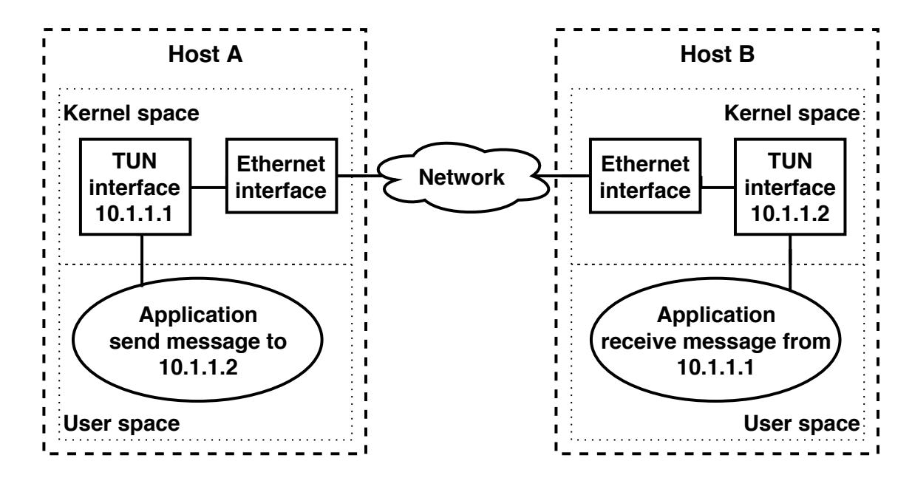
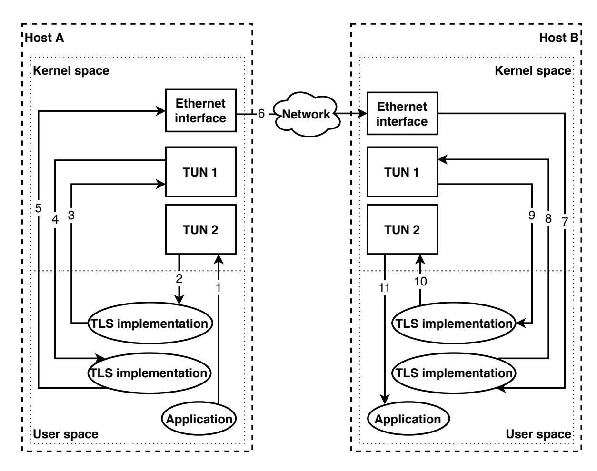
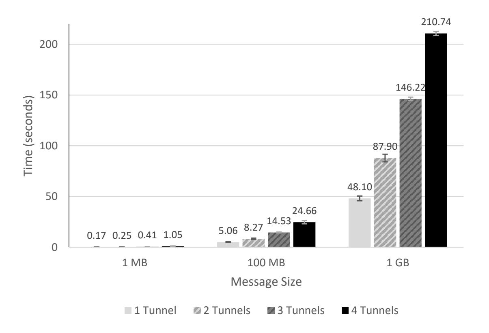
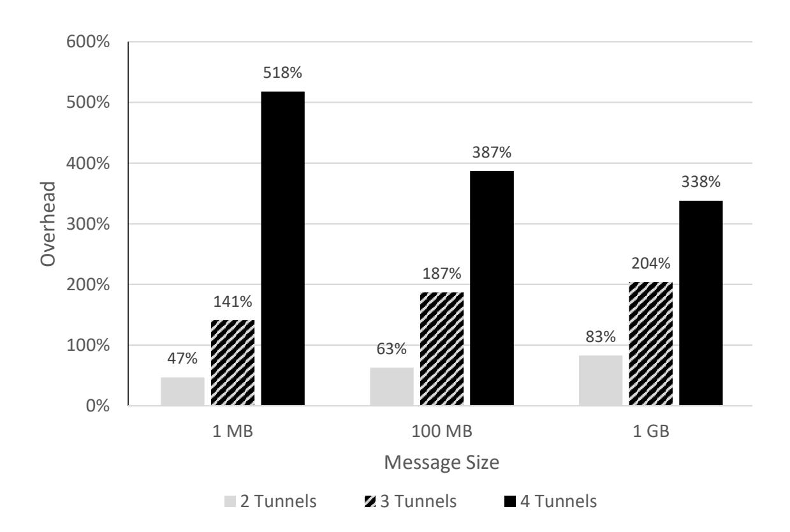
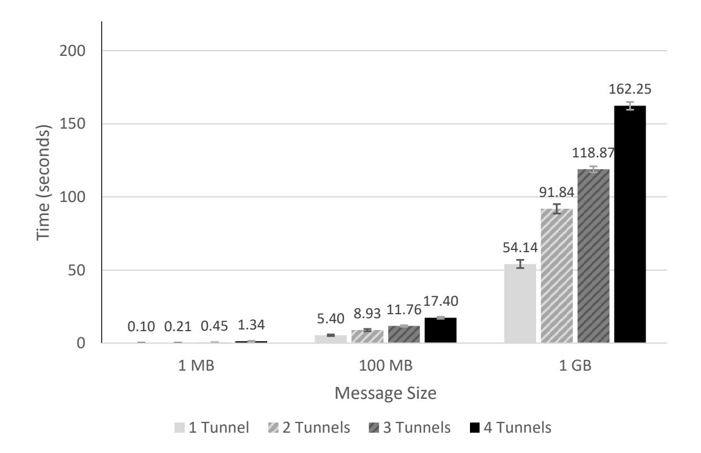
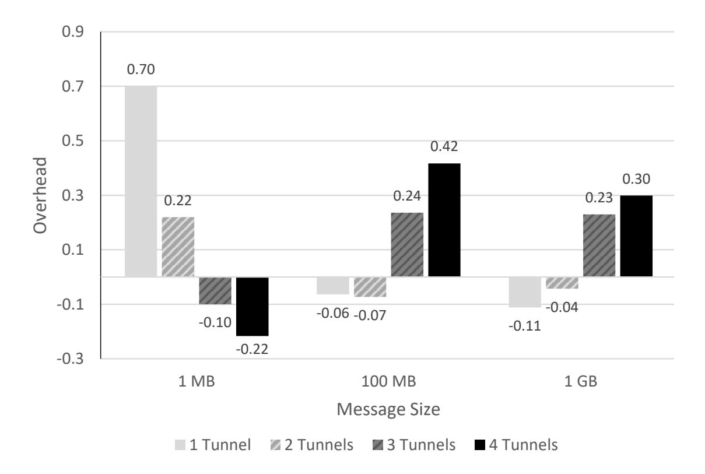
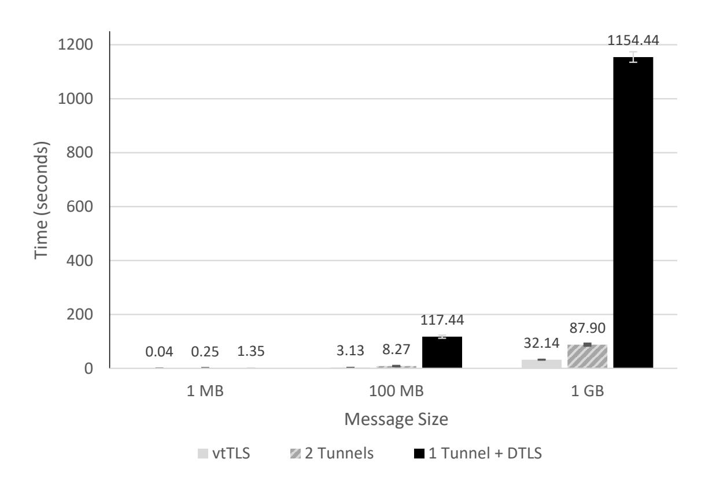
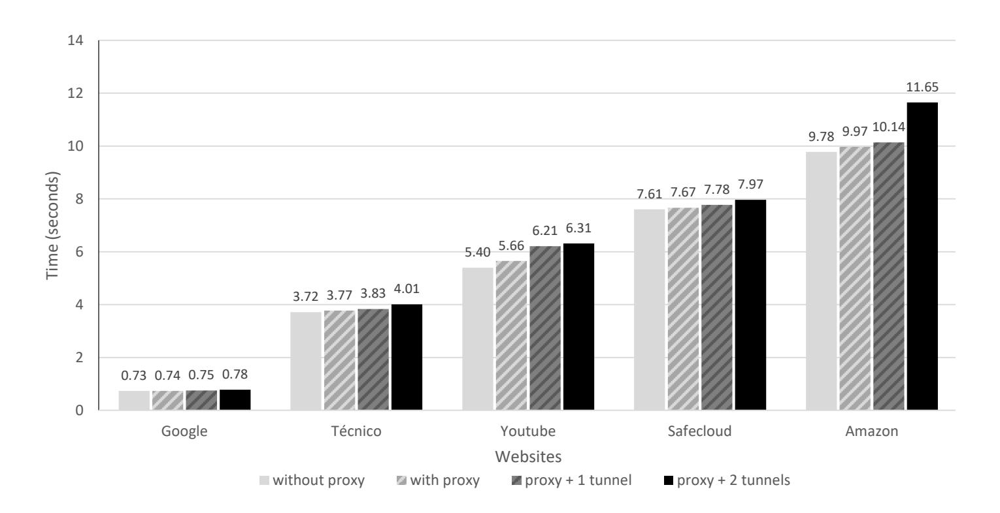

{0}------------------------------------------------

# MultiTLS: Secure communication channels with cipher suite diversity

Ricardo Moura[0000−0003−4306−3477], David R. Matos[0000−0001−6834−705X] , Miguel L. Pardal[0000−0003−2872−7300], and Miguel Correia[0000−0001−7873−5531]

INESC-ID, Instituto Superior T´ecnico, Universidade de Lisboa, Portugal {ricardo.de.moura,david.r.matos,miguel.pardal,miguel.p.correia} @tecnico.ulisboa.pt

Abstract. TLS ensures confidentiality, integrity, and authenticity of communications. However, design, implementation, and cryptographic vulnerabilities can make TLS communication channels insecure. We need mechanisms that allow the channels to be kept secure even when a new vulnerability is discovered.

We present MultiTLS, a middleware based on diversity and tunneling mechanisms that allows keeping communication channels secure even when new vulnerabilities are discovered. MultiTLS creates a secure communication channel through the encapsulation of k TLS channels, where each one uses a different cipher suite. We evaluated the performance of MultiTLS and concluded that it has the advantage of being easy to use and maintain since it does not modify any of its dependencies.

Keywords: Secure communication channels · SSL/TLS · Security · Vulnerability-tolerance · Diversity for security · Tunneling

## 1 Introduction

We are currently living in an increasingly digital age. and there have been many cyberattacks that cause increased losses and damage to businesses and Internet users [\[8\]](#page-13-0). Secure communication protocols are a fundamental component of distributed systems and digital business because they allow entities to exchange messages through a trusted communication channel over the untrusted public Internet. These channels aim to guarantee confidentiality, integrity and authenticity. Transport Layer Security (TLS) is one of the most commonly used protocols to provide secure communications. It allows server/client applications to communicate over a channel that is designed to prevent eavesdropping, tampering, and message forgery. The most recent version is TLS 1.3 [\[9\]](#page-13-1).

Protocols that allow secure communications may contain vulnerabilities that make them insecure. Over the years, many vulnerabilities have been discovered and corrected in SSL/TLS. The vulnerabilities with which we are concerned can be divided into three groups: design vulnerabilities, implementation vulnerabilities and cryptographic mechanisms vulnerabilities. Updating the software is 

{1}------------------------------------------------

advisable in order to fix these vulnerabilities, but sometimes this is not done, e.g., because the update process is inconvenient or time-consuming.

This work explores diversity in communication protocols by using multiple cipher suites. These suites are used for defining a key exchange algorithm, an authentication mechanism, an encryption mechanism, and a message authentication algorithm. Taking into account the existing problems and the objectives defined, the solution found consists in creating several TLS channels, each using a cipher suite different from the other TLS channels, and using tunneling mechanisms to encapsulate each TLS channel within another.

We developed MultiTLS, a middleware that obtains diversity by leveraging tunneling mechanisms. In our implementation, we used socat, a tunneling software, and OpenSSL, a TLS implementation, to create multiple TLS channels and encapsulate each one in another. MultiTLS can be run as a shell command and is configured with a parameter k, the diversity factor (k > 1). This parameter specifies the number of TLS channels to be created and consequently the number of cipher suites to be used. The cipher suites used by these TLS channels are different from each other to mitigate the vulnerabilities that can be found in each cipher suite. Therefore, the communication channel created by MultiTLS has multiple layers of protection, so that if k − 1 of the used cipher suites are vulnerable, communications will remain secure, since there is at least one cipher suite that guarantees the security of communications (confidentiality, integrity, authentication). MultiTLS aims to make progress over vtTLS [\[5\]](#page-13-2), a vulnerability-tolerant communication protocol also based on diversity and redundancy of cryptographic mechanisms to provide a secure communication channel. However, vtTLS modifies a TLS implementation internally, leading to severe software maintenance challenges.

## 2 Background and Related Work

Transport Layer Security (TLS)[\[9\]](#page-13-1) is a security protocol that provides secure communication channels between two entities, server and client. The protocol is structured in two layers: the TLS Record protocol and the TLS Handshake protocol. The TLS Record protocol is used by the TLS Handshake and the application data protocols to provide mechanisms for sending and receiving messages. The TLS Handshake protocol is used to establish or resume a secure session between server and client. A session is established in several steps, each corresponding to a different message and with a specific objective. Following the TLS Handshake protocol, the server and the client can exchange information through the established secure communication channel.

Although the goal of the TLS protocol is to establish a secure communication channel, it may still have unknown vulnerabilities making it insecure and susceptible to attacks.

An example of an attack that exploits a design vulnerability is CRIME (Compression Ratio Info-leak Made Easy) [\[12\]](#page-13-3). This vulnerability was found in TLS

<sup>0</sup> http://www.dest-unreach.org/socat/

{2}------------------------------------------------

compression. Using this method, an attacker can brute-force the cookie value by using the responses sent by the server. The Heartbleed vulnerability [3] is a buffer over-read vulnerability that happens when the sender sends a message that specifies a payload size higher than what the real size of the payload. The receiver, upon receiving the message, returns a block of memory where the sent payload begins plus the specified size of the received message, that is, it returns the received payload and dataset with size equal to the size specified in the received message minus the real size of the message.

There are also vulnerabilities in the underlying cryptographic mechanisms used by the TLS protocol. In 2011, Bogdanov et al. [2] published a biclique attack against AES, though only with slight advantage over brute force. The computational complexity of the attack is  $2^{126.1}$ ,  $2^{189.7}$  and  $2^{254.4}$  for AES128, AES192 and AES256, respectively. Although there is this attack and others, AES is still considered a secure encryption mechanism. MD5 [11] is a hash function, created by Rivest in 1991, that produces a 128 bit hash. In 2005, MD5 was proved not to be collision resistant by Wang and Yu [13], through differential attacks. Differential cryptanalysis, introduced by Biham and Shamir [1], analyzes the differences in input pairs on the differences of the resultant output pairs.

In this work we achieve security through diversity. The term *diversity* describes multi-version software in which redundant versions are purposely made different from between themselves [7]. With diverse versions, one hopes that any faults they contain will be different and show different failure behavior.

VTTLS [5] is a previous work that also uses the diversity approach to solve the limitation of TLS having only one cipher suite negotiated between server and client. It uses the diversity and redundancy of cryptographic mechanisms, keys and certificates. VTTLS was successfully implemented as a fork of OpenSSL version 1.0.2g, but moving to a newer version of OpenSSL requires implementing the diversity features again. Our solution, MULTITLS, is similar to this approach but we do not modify implementations of the tools.

### 3 MultiTLS

Multitle provides secure communication channels with multiple layers through tunneling of TLS channels within each other. The term tunneling describes a process of encapsulating entire data packets as the payload within others packets, which are handled properly by the network on both endpoints [6]. Multitle provides an increase in security since each of these TLS channels uses a different cipher suite than the others. The reason Multitle contributes to increased security is that even when k-1 cipher suites become insecure, that is, even when k-1 TLS channels become vulnerable, the communication channel created by Multitle, which is the combination of the k TLS channels, remains secure since there is still one TLS channel with secure cipher suite. The mechanisms used by Multitle allow creating k TLS channels without changing the implementations of the used tools. This approach is an advantage over VTTLS,

{3}------------------------------------------------

since it does not require changes to the implementation of TLS. In the following sections, we will discuss the design and implementation of MultiTLS.

#### <span id="page-3-1"></span>3.1 Design

To encapsulate a TLS channel in another TLS channel, we use TUN (network TUNnel) interfaces. This mechanism is a feature offered by some operating systems. Unlike common network interfaces, TUN does not have physical hardware components, that is, it is a virtual network interface implemented and managed by the kernel itself. TUN is a virtual point-to-point network device. Its driver was designed with low level kernel support for IP tunneling. It works at the protocol layer of the network stack. TUN interfaces allow user-space applications to interact with them as if they were a real device, remaining invisible to the user. These applications pass packets to a TUN device, in this case, the TUN interface delivers these packets to the operating system's network stack. Conversely, the packets sent by an operating system to a TUN device are delivered to a user-space application that attaches to the device. Figure [1](#page-3-0) shows a practical example in which an application running on two different hosts communicates through TUN interfaces.

<span id="page-3-0"></span>

Fig. 1: Example of using TUN interfaces

We create an encapsulation of several tunnels by creating TUN interfaces through others created previously. For each of these interfaces, we can use different TLS implementations running in user space that allow creating a TLS channel that is encapsulated by the tunnel used by the hosts.

Figure [2](#page-4-0) presents the architecture of MultiTLS for k = 2. This configuration allows an application to communicate over two tunnels, whereas the tunnel between the TUN1 interfaces encapsulates the tunnel between the TUN2 interfaces. In addition, we can see that between the TUN1 interfaces there is a tunnel that crosses two processes that we designate by TLS implementation and whose

{4}------------------------------------------------

<span id="page-4-0"></span>

Fig. 2: Multitle design with k=2 and the flow of sending messages from one application to another on different hosts

function is to establish and manage the TLS channel that is encapsulated by the tunnel. To do this, one of these processes will run in server mode and the other in client mode.

### 3.2 Combining Diverse Cipher Suites

In Multitles, we are interested in having the maximum possible diversity of cryptographic mechanisms, because we want to avoid common vulnerabilities. Evaluating the diversity among cryptographic mechanisms is not trivial. For this purpose, we based our analysis on work by Carvalho [4] regarding heuristics to compare diversity among different cryptographic mechanisms. In our work, we focused on searching for the combination of four cipher suites supported by TLS 1.2 from the OpenSSL 1.1.0g implementation, that guarantees greater diversity.

We began by evaluating the diversity of public key mechanisms. In this case, we observed the various combinations of key exchange and authentication algorithms in cipher suites. The insecure cryptographic mechanisms were discarded as well as the ECDH and DH algorithms since there are the variants of them, ECDHE and DHE, which guarantee perfect forward secrecy. This analysis resulted in the following combinations: ECDHE for key exchange and ECDSA for authentication; RSA for key exchange and authentication; DHE for key exchange and DSS for authentication; ECDHE for key exchange and RSA for authentication; and DHE for key exchange and RSA for authentication. In order to avoid

{5}------------------------------------------------

that the key exchange and authentication algorithms are repeated consecutively, we choose the first four combinations of the above list, keeping the presented order, i.e., the first tunnel will use ECDHE for key exchange and ECDSA as authentication algorithm, the second RSA for key exchange and authentication, the third DHE for key exchange and DSS for authentication and the fourth DHE for key exchange and RSA for authentication.

Considering the combination of key exchange and authentication algorithms, we group the supported cipher suites according to this combination. After this step, we chose in each group the cipher suite that maximizes the diversity of the symmetric key algorithms and the hash function between each of the four groups. In order to measure the diversity of the cryptographic mechanisms, we have taken into account some characteristics such as the origin, i.e., the author or institution that proposed the algorithm, the year in which it was designed, the size of the key in the case of the symmetric key algorithms and the digest size in the case of hash functions and other metrics described in Carvalho's research [4]. We concluded that the combinations of 4 symmetric key algorithms that maximize the diversity itself are:

```
- ChaCha20 + Camellia 256 + AES256-GCM + AES128CBC
```

- ChaCha20 + Camellia 256 + AES256-CBC + AES128GCM
- ChaCha20 + Camellia 256 + Camellia 128 + AES256-GCM

Regarding hash functions, the variety is greatly reduced since there is only SHA-256 and SHA-384. However, some symmetric key algorithms use operation modes, such as CBC-MAC (CCM mode) and Galois/Counter Mode (GCM), that provide authenticated encryption with associated data (AEAD). It is considered an alternative mechanism which can be used redundantly with HMAC to achieve even higher diversity. In addition, the cipher suites with the ChaCHA20 algorithm use the Poly1305 which is a one-time authenticator. Poly1305 takes a 32-byte one-time key and a message and produces a 16-byte message authentication code (MAC).

From these analyses, the cipher suites selected to be used by default in MultiTLS with  $k \leq 4$  are: TLS\_ECDHE\_ECDSA\_WITH\_CHACHA20\_POLY1305 \_SHA256, TLS\_RSA\_WITH\_AES\_128\_CCM\_8, TLS\_DHE\_DSS\_WITH\_CAMELLIA\_256 \_CBC\_SHA256 and TLS\_ECDHE\_RSA\_WITH\_AES\_256\_GCM\_SHA384

If MULTITLS the user wants to use only 2 tunnels, i.e., k = 2, the first cipher suite shown in the above list is used in the first tunnel and the second cipher suite is used in the second tunnel.

#### <span id="page-5-0"></span>3.3 Running MultiTLS

MULTITLS is implemented as a script in Bash language and can be run as a shell command. Before presenting how MULTITLS creates the secure tunnels, we will first introduce the commands that allow us to create them. The commands available through MULTITLS are:

{6}------------------------------------------------

```
multitls -s port nTunnels [cert cafile cipher]multitls -c port nTunnels IPServer [cert cafile cipher]
```

The flags -s and -c mean that MULTITLS will run as a server or client, respectively. The port argument specifies the port used to establish the last tunnel. In the case of the server, MULTITLS will be listening on that port. In the case of the client, MULTITLS will connect to that port of the machine that has the IP specified in the IPServer argument. The nTunnels argument specifies the number of tunnels that MULTITLS will create. In addition, we must specify: the path to the file with its certificate and private key in the cert argument and the path to the file that contains the peer certificate in the cafile argument. The cipher argument lets us specify one or more cipher suites. If cipher suites are not specified, the default ones will be used. The arguments between brackets must be specified as many times as the value of the nTunnels argument because each tunnel will use a set of keys and ciphers.

#### 3.4 Implementing the tunnels

The execution of commands provided by Multitle allows the creation of TUN interfaces and the creation of the tunnel that encapsulates a TLS channel, as explained in Section 3.1. Figure 2 shows the scheme resulting from the execution of the two Multitle commands presented in Section 3.3.

MULTITLS has as dependencies socat version 1.7.3.2 and OpenSSL version 1.1.0g. Socat is a command line utility<sup>1</sup>that establishes two bidirectional byte streams and transfers data between them. A socat command has the following structure: socat [options] address1 address2, where [options] means that there may be zero or more options that modify the behavior of the program. The specification of the address1 and address2 consists of an address type keyword, for example, TCP4, TCP4-LISTEN, OPENSSL, OPENSSL-LISTEN, TUN; zero or more required address parameters separated by ':' from the keyword and each other; and zero or more address options separated by ','.

The Multitle script starts by analyzing the arguments provided by the user. Afterwards, these arguments are used to execute socat commands. Multitle creates k tunnels running k socat command on the server and k commands on the client. For the establishment of a tunnel using the socat commands, Multitle executes the following two commands, the first on the server side and the second on the client side:

```
socat openss1-listen:$port,cert=$cert,cafile=$cafile, \cipher=$cipher TUN:$ipTun/24,tun-name=$nameTun,up
socat openss1-connect:$ipServer:$port,cert=$cert, \cafile=$cafile,cipher=$cipher \TUN:$ipTun/24,tun-name=$nameTun
```

<span id="page-6-0"></span><sup>1</sup> http://www.dest-unreach.org/socat

{7}------------------------------------------------

In the first command, we have the \$port argument that represents the port where the socat will be listening, we have the \$cert, \$cafile and \$cipher arguments that have the same meaning as the Multitle command arguments. The arguments \$ipTun and \$nameTun are, respectively, the IP of the server in the TUN interface and the name of that, which is created through this command.

In the second command, we have the argument \$ipServer that represents the IP of the server, the argument \$port that represents the port of the server where the socat connects to establish the communication. We have the \$cert, \$cafile, and \$cipher arguments that have the same meaning as the cert, cafile, and cipher arguments in the MULTITLS commands. The arguments \$ipTun and \$nameTUN are, respectively, the IP of the client in the TUN interface and its name, which is created through this command.

MULTITLS by default assumes that the IP and names for the TUN interfaces are 10.\$k.1.\$i and TUN\$k, where \$k\$ is the tunnel number,  $1 \le k \le nTunnels$  and \$i has the value 1 if it is the server and 2 if it is the client.

After the establishment of the first tunnel, Multites can create the second tunnel which is encapsulated by the first tunnel, using the previous socat commands in which the value of \$ipServer instead of being the real IP of the server is the IP of the TUN interface created on the server to establish the first tunnel, which as previously mentioned is 10.1.1.1, by default. To create more tunnels, the IP of the last TUN interface created on the server side must be specified in the \$ipServer argument.

#### 4 Evaluation

The experimental evaluation aims to answer questions about the performance and cost of MultiTLS. We have three experiment sets: performance; comparison with other approaches; and MultiTLS applied to a use case.

#### 4.1 Performance

In this section we want to answer the questions: What is the cost of adding more tunnels? What is the cost of encrypting messages? To answer these questions we used two virtual machines running on two different hosts, one playing the role of a server and the other of a client. Both virtual machines used 2 VCPUs, 8GB of RAM and ran Ubuntu 16 (Xenial).

In the first evaluation, we used the iperf3 tool, version 3.0.11. Iperf3 is a tool used to measure network performance. It has server and client functionality and can create data streams to measure the throughput between the two ends. It supports the adjustment of several parameters related to timing and protocols. The iperf3 output presents the bandwidth, transmission time, and other parameters.

To answer the first question, the first experiment consisted of using the iperf3 tool to measure 100 times the transmission time of 1 MB, 100 MB and 1 GB for each k, considering  $k \leq 4$ . The cipher suites used in this evaluation are the same

{8}------------------------------------------------

ones that are defined by default in MULTITLS. The average and the standard deviation of transmission time of 1 MB, 100 MB and 1 GB for each value of k can be seen in Figure 3.

<span id="page-8-0"></span>

Fig. 3: Comparison between the time it takes to send 1 MB, 100 MB and 1 GB messages in relation to the number of tunnels created.

Figure 4 shows for each message size the overhead of the transmission time for k=2, k=3 and k=4 in relation to k=1. Therefore, we can see that for k=2 and k=3 the cost of having added more tunnels increases as the size of the message to be transmitted also increases. For k=4 the cost of having added more channels decreased as the size of the message to be transmitted increased. We can also observe that the transmission time for k tunnels is less than k times the value of k=1 for each message size, except for k=4, where the overhead exceeds 4 times the value of k=1 and for k=3 in the 1GB transmission where the time is 3.04 times greater than for k=1.

We can answer the first question that for k=2 the performance of MULTI-TLS is acceptable, since the time of sending messages with k=2 is less than the double of the time of sending messages with k=1. With 3 tunnels, i.e., k=3, for the transfer of 1 GB, the performance of the MULTITLS is poor because the sending time is more than three times the time of k=1, in contrast, to transfer 1 MB and 100 MB the performance is good since the sending time is less than three times the time of k=1.

The second experiment aims to evaluate the cost of encrypting the communication messages. To do this, using the same virtual machines, we performed the same tests we did in the first experiment, however changing the cipher suites by default from Multitls to tls\_ecdhe\_ecdsa\_with\_null\_sha, tls\_rsa\_with\_

{9}------------------------------------------------

<span id="page-9-0"></span>

Fig. 4: The overhead of adding more tunnels in relation to k = 1.

NULL SHA256, TLS RSA WITH NULL SHA and TLS ECDHE RSA WITH NULL SHA. Therefore, the messages exchanged by the client and the server were not encrypted. This experiment helps us realize the influence of encrypting the data in the total transmission time of messages with different sizes. Figure [5](#page-10-0) shows the average and standard deviation of transmission time of 1 MB, 100 MB, and 1 GB for each value of k.

As with the first experiment, for each message size, the transmission time increases as the number of tunnels increases. However, we verified that the transmission time of 1 MB for all values of k is greater than k times the time of k = 1. In the transfer of 100 MB and 1 GB with k tunnels, the transmission time does not exceed k times the value of k = 1.

Figure [6](#page-11-0) shows the difference between the first and second experiment, for each message size and k. We can see that, for certain message sizes and k, messages sent on the first experiment took less time than messages sent without encryption. However, we can observe that in these cases the average overhead is about −10%, whereas in cases where encrypted communications take longer than unencrypted communications, the average overhead is 35%. Overall, the overhead of encrypting the messages is 13%.

For all this, we can answer the second question: the time to encrypt the messages has a considerable low impact given that it takes 13% more time.

#### 4.2 Comparison with MultiTLS

The purpose of this section is to compare the performance of MultiTLS with other tools and to know which of these approaches performs better.

{10}------------------------------------------------

<span id="page-10-0"></span>

Fig. 5: Comparison between the time it takes to send 1 MB, 100 MB and 1 GB messages in relation to the number of unencrypted tunnels.

For this purpose, using the same virtual machines that we used in previous experiments, we use VTTLS to transfer three files each with the size of 1 MB, 100 MB and 1 GB. We ran 100 times the VTTLS for each of these files. In addition to this experience, we also run a file transfer application using a Datagram Transport Layer Security (DTLS) [10] channel implemented through the GnuTLS library. This channel used the cipher suite TLS\_RSA\_AES\_128\_GCM\_SHA256. This application ran over one tunnel created by MULTITLS. DTLS is a communication protocol that provides security, such as TLS, but for datagram-based applications. The purpose of using DTLS is to measure the performance of a channel that uses UDP over TCP, since with MULTITLS communication we have tunnels of several tunnels, that is, TCP over TCP. We run this application 100 times for each of the files used in the previous experiment. Besides the diversity of cipher suites used, this experience also shows that it is possible to have a diversity of TLS implementations if the application using MULTITLS uses a library other than OpenSSL.

Figure 7 allows us to compare the average of the results obtained from the two previous experiences with the averages of the results obtained in the first experiment with k=2 once the two previous experiments use approaches in which the messages are encrypted twice such as Multitle with two tunnels. In addition, we can also observe the standard deviation in each column. Figure 7 also shows that, of the three approaches, VTTLS is the fastest and the DTLS channel approach is the slowest. The values of the Multitle results are closer to the results of the VTTLS than to the DTLS channel approach. However, the transfer time overhead of 1MB, 100MB and 1GB between VTTLS and Multitles are, respectively, 525%, 164% and 173%. The DTLS channel approach

{11}------------------------------------------------

<span id="page-11-0"></span>

Fig. 6: Difference between first and second evaluation results.

does not have an expected performance because the server only sends the next fragment after receiving the size of the last fragment sent by it.

#### 4.3 Use case

Although the use of Multitle presents a transfer time overhead in relation to VTTLS, we wanted to know what is the performance of Multitle applied in a use case. We use Multitle to establish communication between a browser and a proxy, based on the scheme shown in Figure 2. To do this evaluation, we use two virtual machines, one ran the Squid proxy, version 3.5.12, on a computer with Intel Core i5 and 4 GB RAM and the other ran Google Chrome browser, version 66.0.3359.117, on a computer with Intel Core i7 and 8 GB RAM.

In this evaluation we tested four approaches: no proxy, use only the proxy, use the proxy using one and two MULTITLS tunnels. These four approaches allow us to evaluate the cost of using MULTITLS. The evaluation consisted of using the browser to request 30 times certain URLs from Amazon<sup>1</sup>, Google<sup>2</sup>, Safecloud<sup>3</sup>, Técnico<sup>4</sup> and Youtube<sup>5</sup> websites for each approach and registered the value of the load event that appears on the network tab in the developer tools of the browser. The load event is fired when a resource and its dependent resources have finished loading. In addition to using the browser development tools to see the value of the load event, we also use to disable cache.

<span id="page-11-1"></span><sup>&</sup>lt;sup>1</sup> https://www.amazon.com/

<span id="page-11-2"></span><sup>&</sup>lt;sup>2</sup> https://www.google.com/

<span id="page-11-3"></span><sup>&</sup>lt;sup>3</sup> http://www.safecloud-project.eu/

<span id="page-11-4"></span><sup>&</sup>lt;sup>4</sup> https://tecnico.ulisboa.pt/pt/

<span id="page-11-5"></span><sup>&</sup>lt;sup>5</sup> https://www.youtube.com/watch?v=oToaJE4s4z0

{12}------------------------------------------------

<span id="page-12-1"></span>

Fig. 7: Time for sending messages with 1MB, 100MB and 1GB in size via vtTLS, 2 MultiTLS tunnels and 1 DTLS communication over 1 MultiTLS tunnel.

Figure [8](#page-13-12) presents the average of the results obtained with the different approaches for each requested URL. We can observe that the use of MultiTLS in the communication between the browser and the proxy was insignificant. We can conclude that MultiTLS is a tool with good performance in tasks common to the day-to-day of Internet users.

## 5 Conclusion

We presented MultiTLS, a middleware that allows the creation of a channel of communication through the encapsulation of several secure tunnels in others. It aims to increase security by using the diversity of cipher suites used by the tunnels so that if k−1 cipher suites become insecure, there is a secure tunnel that makes all communication secure. MultiTLS has the advantage of not modifying any TLS implementation or any of its dependencies.

## Acknowledgements

This work was supported by the European Commission through project H2020- 653884 (SafeCloud) and by national funds through Funda¸c˜ao para a Ciˆencia e a Tecnologia (FCT) with reference UIDB/50021/2020 (INESC-ID).

## References

<span id="page-12-0"></span>1. Biham, E., Shamir, A.: Differential cryptanalysis of the data encryption standard (1993)

{13}------------------------------------------------

<span id="page-13-12"></span>

Fig. 8: Time to load sites with: no proxy, with proxy, with proxy using Multi-TLS with 1 tunnel and with 2 tunnels.

- <span id="page-13-5"></span>2. Bogdanov, A., Khovratovich, D., Rechberger, C.: Biclique cryptanalysis of the full AES. In: Lecture Notes in Computer Science. vol. 7073 LNCS (2011)
- <span id="page-13-4"></span>3. Carvalho, M., Demott, J., Ford, R., Wheeler, D.A.: Heartbleed 101. IEEE Security and Privacy 12, 63–67 (July/August 2014)
- <span id="page-13-10"></span>4. Carvalho, R.J.: Authentication Security through Diversity and Redundancy for Cloud Computing. Ph.D. thesis, Instituto Superior T´ecnico, Universidade de Lisboa (2014)
- <span id="page-13-2"></span>5. Joaquim, A., L. Pardal, M., Correia, M.: Vulnerability-Tolerant Transport Layer Security. 21st International Conference on Principles of Distributed Systems (OPODIS) (2017)
- <span id="page-13-9"></span>6. Larson, R., Cockcroft, L.: CCSP : Cisco Certified Security Professional Certification. McGraw-Hill/Osborne (2003)
- <span id="page-13-8"></span>7. Littlewood, B., Strigini, L.: Redundancy and Diversity in Security. Computer Security ESORICS 2004 pp. 227–246 (2004)
- <span id="page-13-0"></span>8. Nadeau, M.: State of Cybercrime 2017: Security events decline, but not the impact (July 2017), [https://www.csoonline.com/article/3211491/security/](https://www.csoonline.com/article/3211491/security/state-of-cybercrime-2017-security-events-decline-but-not-the-impact.html#tk.cso_fsb) [state-of-cybercrime-2017-security-events-decline-but-not-the-impact.](https://www.csoonline.com/article/3211491/security/state-of-cybercrime-2017-security-events-decline-but-not-the-impact.html#tk.cso_fsb) [html#tk.cso\\_fsb](https://www.csoonline.com/article/3211491/security/state-of-cybercrime-2017-security-events-decline-but-not-the-impact.html#tk.cso_fsb)
- <span id="page-13-1"></span>9. Rescorla, E.: The Transport Layer Security (TLS) Protocol Version 1.3. RFC 8446, RFC Editor (August 2018)
- <span id="page-13-11"></span>10. Rescorla, E., Modadugu, N.: Datagram Transport Layer Security Version 1.2. RFC 6347, RFC Editor (January 2012)
- <span id="page-13-6"></span>11. Rivest, R.: The MD5 Message-Digest Algorithm (RFC 1321) (1992)
- <span id="page-13-3"></span>12. Rizzo, J., Duong, T.: Crime: Compression ratio info-leak made easy. In: ekoparty Security Conference (2012)
- <span id="page-13-7"></span>13. Wang, X., Yu, H.: How to Break MD5 and Other Hash Functions. Advances in Cryptology – EUROCRYPT (2005)