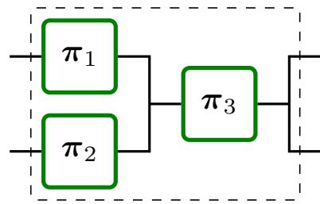
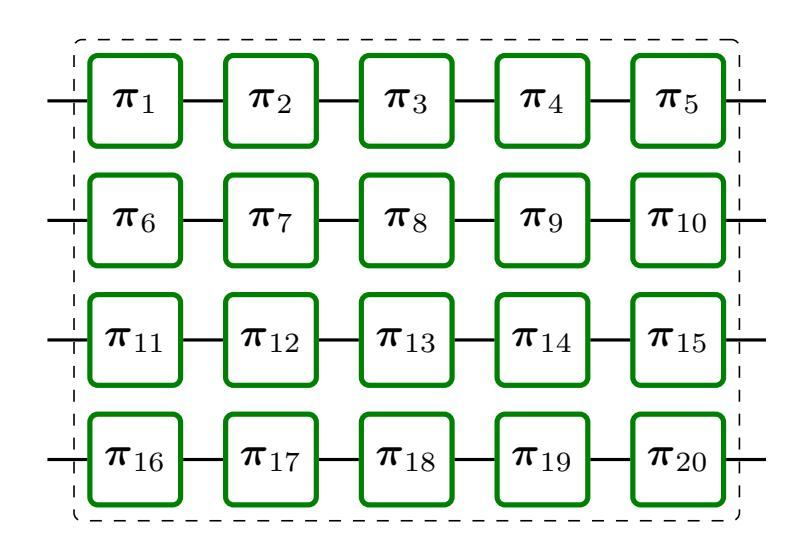
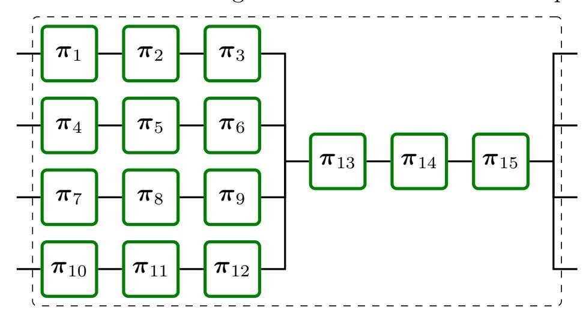
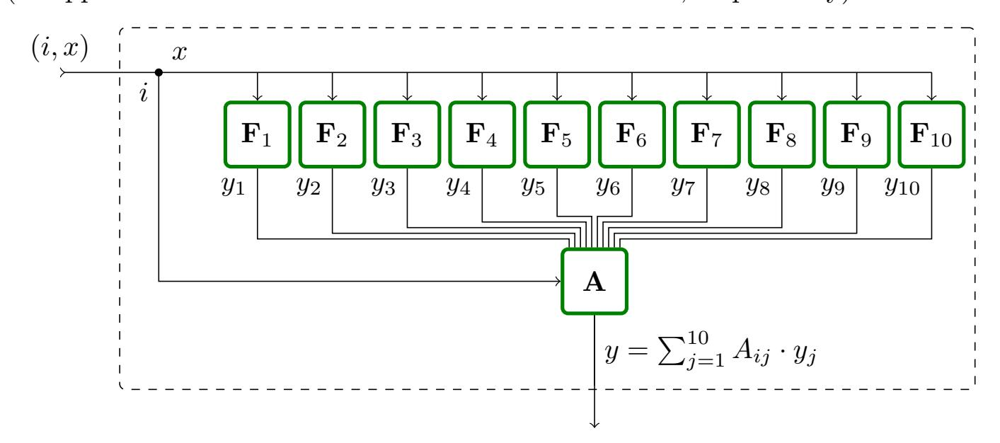
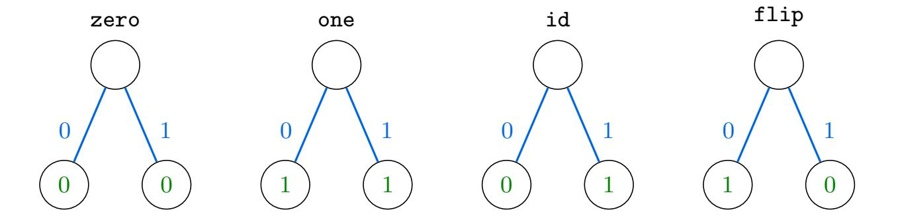
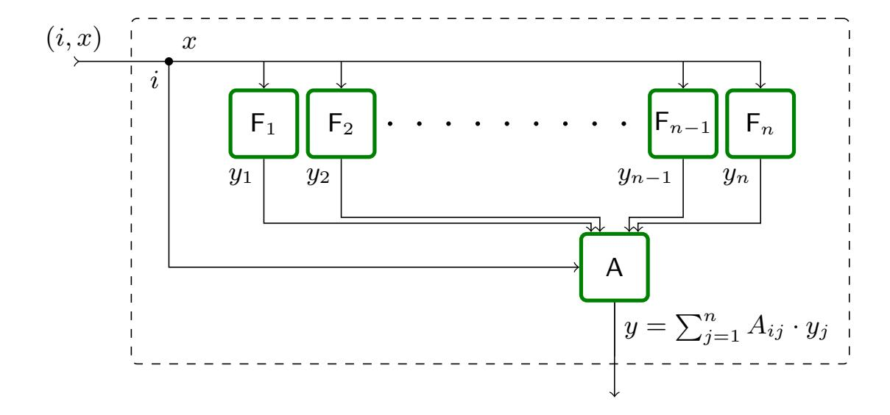

{0}------------------------------------------------

# Coupling of Random Systems\*

David Lanzenberger and Ueli Maurer

Department of Computer Science ETH Zurich 8092 Zurich, Switzerland {landavid,maurer}@inf.ethz.ch

Abstract. This paper makes three contributions. First, we present a simple theory of random systems. The main idea is to think of a probabilistic system as an equivalence class of distributions over deterministic systems. Second, we demonstrate how in this new theory, the optimal information-theoretic distinguishing advantage between two systems can be characterized merely in terms of the statistical distance of probability distributions, providing a more elementary understanding of the distance of systems. In particular, two systems that are  $\epsilon$ -close in terms of the best distinguishing advantage can be understood as being equal with probability  $1-\epsilon$ , a property that holds statically, without even considering a distinguisher, let alone its interaction with the systems. Finally, we exploit this new characterization of the distinguishing advantage to prove that any threshold combiner is an amplifier for indistinguishability in the information-theoretic setting, generalizing and simplifying results from Maurer, Pietrzak, and Renner (CRYPTO 2007).

## 1 Introduction

### 1.1 Random Systems

A random system is an object of general interest in computer science and in particular in cryptography. Informally, a random system is an abstract object which operates in rounds. In the *i*-th round, an input (or query)  $X_i$  is answered with a random output  $Y_i$ , and each round may (probabilistically) depend on the previous rounds. In previous work [Mau02,MPR07], a random system **S** is defined by a sequence of conditional probability distributions  $p_{Y_i|X^iY^{i-1}}^{\mathbf{S}}$  (or  $p_{Y^i|X^i}^{\mathbf{S}}$ ) for  $i \geq 1$ . This captures exactly the input-output behavior of a probabilistic system, as it gives the probability distribution of any output  $Y_i$ , conditioned on the previous inputs  $X^i = (X_1, \ldots, X_i)$  and outputs  $Y^{i-1} = (Y_1, \ldots, Y_{i-1})$ .

For example, a uniform random function (URF) from  $\mathcal{X}$  to  $\mathcal{Y}$  is a random system  $\mathbf{R}$  corresponding to the following behavior: Every new input  $x_i \in \mathcal{X}$  is answered with an independent uniform random value  $y_i \in \mathcal{Y}$  and every input that was given before is answered consistently. Similarly, a uniform random permutation is a random system  $\mathbf{P}$  (different from  $\mathbf{R}$ ).

 $^{\star}$  A preliminary version of this paper appears in the proceedings of TCC 2020. This is the full version.

{1}------------------------------------------------

Many statements appearing in the cryptographic literature are about random systems (even though they are usually expressed in a specific language, for example using pseudo-code). For example, the optimal distinguishing advantage AdvD(S, T) of a distinguisher class D between two systems S and T only depends on the behavior of S and T. In particular, it is independent of how S is implemented (in program code), whether it is a Turing Machine, or how efficient it is. For example, the well-known URP-URF switching lemma [\[BR06,](#page-29-2)[Mau13\]](#page-29-3) is a statement about the optimal information-theoretic distinguishing advantage between the two random systems R and P (see above). Clearly, the switching lemma holds irrespective of the concrete implementations of the systems R or P, e.g., whether they employ eager or lazy sampling.

#### 1.2 Random Systems as Equivalence Classes

An abstract object can (usually) be represented as an equivalence class of objects from a lower abstraction layer. Perhaps surprisingly, this can give new insight about the object and also be technically useful. As an example, assume our (abstract) objects are pairs (X, Y) of probability distributions over the same set. If we let [(X, Y)] denote the equivalence class of all random experiments E with two arbitrarily correlated random variables X and Y distributed according to X and Y, we can express the statistical distance as follows (also known as Coupling Lemma [\[Ald83\]](#page-28-0)):

$$\delta(\mathsf{X},\mathsf{Y}) = \inf_{\mathcal{E} \in [(\mathsf{X},\mathsf{Y})]} \Pr^{\mathcal{E}}(X \neq Y).$$

Note that the statistical distance δ(X,Y) is defined at the level of probability distributions, and thus does not require any joint distribution between X and Y (let alone a random experiment with accordingly distributed random variables). Nevertheless, the coupling interpretation provides a very intuitive and elementary understanding of the statistical distance. Moreover, it is a powerful technique that can be used to show the closeness (in statistical distance) of two probability distributions X and Y: one exhibits any random experiment E with cleverly correlated random variables X and Y (distributed according to X and Y) such that PrE (X = Y ) is close to 1. This coupling technique has been used extensively for example to prove that certain Markov chains are rapidly mixing, i.e., they converge quickly to their stationary distribution (see for example [\[Ald83\]](#page-28-0)).

The gist of such reasoning is to lower the level of abstraction in order to define or interpret a property, or to prove a statement in a more elementary and intuitive manner.

In this paper, we apply the outlined way of thinking to random systems. We explore a lower level of abstraction which we call probabilistic discrete systems. A probabilistic discrete system (PDS) is defined as a (probability) distribution over deterministic discrete systems (DDS). Loosely speaking, this captures the fact that for any implementation of a random system we can fix the randomness (say, the "random tape") to obtain a deterministic system. We then observe that there

{2}------------------------------------------------

exist different PDS that are observationally equivalent, i.e., their input-output behavior is equal, implying that they correspond to the same random system. Thus, we propose to think of a random system S as an equivalence class of PDS and write S ∈ S for a PDS S that behaves like S (i.e., it is an element of the equivalence class S). For example, a uniform random function R can be implemented by a PDS R that initially samples the complete function table and by a PDS R 0 that employs lazy sampling. These are two different PDS (R 6= R 0 ), but they are behaviorally equivalent and thus correspond to the same random system, i.e., R ∈ R and R 0 ∈ R (see also the later [Example 5\)](#page-12-0).

Many interesting properties of random systems depend on what interaction is allowed with the system. Usually, this is formalized based on the notion of environments and, in cryptography, the notion of distinguishers. Such environments are complex objects (similar to random systems) which maintain state and can ask adaptive queries. This can pose a significant challenge for example when proving indistinguishability bounds, and naturally leads to the following question:

Is it possible to express properties which classically involve environments equivalently as natural intrinsic properties of the systems themselves, i.e., without the explicit concept of an environment?

We answer this question in the positive. The key idea is to exploit the equivalence classes: we prove that the optimal information-theoretic distinguishing advantage Adv(S, T) is equal to ∆(S, T), the infimum statistical distance δ(S,T) for PDS S ∈ S and T ∈ T. By combining this result with the above coupling interpretation of the statistical distance, we can think of the distinguishing advantage Adv(R, I) between a real system R and an ideal system I as a failure probability of R, i.e., the probability that R is not equal to I. This is quite surprising since being equal is a purely static property, whereas the traditional distinguishing advantage appears to be inherently dynamic.

The coupling theorem for random systems is not only of conceptual interest. It also represents a novel technique to prove indistinguishability bounds in an elementary fashion: in the core of such a proof, one only needs to bound the statistical distance of probability distributions over deterministic systems (for example by using the Coupling Method mentioned above). Usually, the fact that the distribution is over systems will be irrelevant. In particular, the interaction with the systems and the complexity of (adaptive) environments is completely avoided.

#### 1.3 Security and Indistinguishability Amplification

Security amplification is a central theme of cryptography. Turning weak objects into strong objects is useful as it allows to weaken the required assumptions. Indistinguishability amplification is a special kind of security amplification, where the quantity of interest is the closeness (in terms of adaptive indistinguishability) to some idealized system. Most of the well-known constructions achieving

{3}------------------------------------------------

indistinguishability amplification do this by combining many moderately close systems into a single system that is very close to its ideal form.

In this paper, we take a more general approach to indistinguishability amplification and present results that allow (for example) to combine many moderately close systems into multiple systems that are jointly very close to independent instances of their ideal form. This is useful, since many cryptographic protocols need several independent instantiations of a scheme, for example a (pseudo-)random permutation.

#### 1.4 Motivating Examples for Indistinguishability Amplification

As a first motivating example, consider the following construction C that combines three independent random[1](#page-3-0) permutations[2](#page-3-1) π1, π2, and π3 into two random permutations by cascading (composing) them as follows:

$$\mathbf{C}(\boldsymbol{\pi}_1,\boldsymbol{\pi}_2,\boldsymbol{\pi}_3) = (\boldsymbol{\pi}_1 \circ \boldsymbol{\pi}_3,\boldsymbol{\pi}_2 \circ \boldsymbol{\pi}_3).$$

If, say, the second constructed permutation is (forward-)queried with x, the value x is input to π2 and the output x 0 = π2(x) is forwarded to π3. The output of π3(x 0 ) is the response to the query x.

Clearly, if any two of the three random permutations πi are a (perfect) uniform random permutation P, then (π1 ◦ π3,π2 ◦ π3) behaves exactly as if all three random permutations πi are perfect uniform random permutations (i.e., it behaves as two independent uniform random permutations (P, P0 )). Thus, we call C a (2, 3)-combiner for the pairs (π1, P),(π2, P),(π3, P).

What, however, can we say when the πi are only i-close[3](#page-3-2) to a uniform random permutation? A straightforward hybrid argument shows that

$$\operatorname{Adv}((\boldsymbol{\pi}_1 \circ \boldsymbol{\pi}_3, \boldsymbol{\pi}_2 \circ \boldsymbol{\pi}_3), (\mathbf{P}, \mathbf{P}')) \leq \min(\epsilon_1 + \epsilon_2, \epsilon_1 + \epsilon_3, \epsilon_2 + \epsilon_3),$$

where Adv(·, ·) denotes the optimal distinguishing advantage over all adaptive (computationally unbounded) distinguishers. Intuitively though, one might hope that if all i (as opposed to only two of them) are small, a better bound is

1 Throughout this paper, we use the word random as in random variable, i.e., not implying uniformity of a distribution.

2 We assume the permutations to be stateless and both-sided (though all claims remain true if the permutations are all one-sided). A both-sided permutation is a permutation that allows forward- and backward-queries, i.e., queries to π and π −1 .

3 By -close we mean that any adaptive (computationally unbounded) distinguisher has distinguishing advantage at most .

{4}------------------------------------------------

achievable. Ideally, this bound should be smaller than the individual  $\epsilon_i$ , i.e., we want to obtain indistinguishability amplification. A consequence of one of our results (Theorem 3) is that this is indeed possible. We have

$$\operatorname{Adv}((\boldsymbol{\pi}_1 \circ \boldsymbol{\pi}_3, \boldsymbol{\pi}_2 \circ \boldsymbol{\pi}_3), (\mathbf{P}, \mathbf{P}')) \leq 2(\epsilon_1 \epsilon_2 + \epsilon_1 \epsilon_3 + \epsilon_2 \epsilon_3) - 3\epsilon_1 \epsilon_2 \epsilon_3.$$

More generally, it is natural to ask the following question4:

How many independent random permutations that are  $\epsilon'$ -close to a uniform random permutation need to be combined to obtain m random permutations that are (jointly)  $\epsilon$ -close (for  $\epsilon \ll \epsilon'$ ) to m independent uniform random permutations?

This question has been studied for the special case m=1 (see for example [Vau98, Vau00, MPR07]), and it is known that the cascade of n independent random permutations (each  $\epsilon$ -close to a uniform random permutation) is  $\frac{1}{2}(2\epsilon)^n$ -close to a uniform random permutation. Of course, there is a straightforward way to use such a construction for m=1 multiple times in order to obtain a basic indistinguishability result for m>1: one simply partitions the n independent random permutations  $\pi_1, \ldots, \pi_n$  into sets of equal size and cascades the permutations in each set.

Example 1. We can construct four random permutations from 20 random permutations as follows:

If the  $\pi_i$  are independent and all  $\epsilon$ -close (say,  $2^{-10}$ -close) to a uniform random permutation, Theorem 1 of [MPR07] implies that the construction above yields four random permutations that are jointly  $64\epsilon^5$ -close ( $(2.3\epsilon)^5$ -close,  $2^{-44.0}$ -close) to four independent uniform random permutations.

Naturally, one might ask whether it is possible to construct four random permutations to get stronger amplification (i.e., a larger exponent) without using more random permutations. This is indeed possible, as the following example illustrates.

For the following examples we assume for simplicity some fixed upper bound  $\epsilon'$  on the individual  $\epsilon_i$  (where the *i*-th component system is  $\epsilon_i$ -close to its ideal form).

{5}------------------------------------------------

Example 2. Consider the following construction of four random permutations:

The main advantage of this construction is that it makes use of only 15 (instead of 20) random permutations. Our results imply that if the  $\pi_i$  are independent and  $\epsilon$ -close (say,  $2^{-10}$ -close) to a uniform random permutation, then the constructed four random permutations are jointly  $320\epsilon^6$ -close ( $(2.7\epsilon)^6$ -close,  $2^{-51.6}$ -close) to four independent uniform random permutations.

Instead of random permutations one can just as well combine random functions: the same constructions and bounds as in Example 1 and Example 2 apply if we replace the cascade  $\circ$  with the elementwise XOR  $\oplus$ . However, in this setting, we show that the additional structure of random functions can be exploited to achieve even stronger amplification than in the examples above.

Example 3. Let  $\mathbf{F}_1, \dots, \mathbf{F}_{10}$  be independent random functions over a finite field  $\mathbb{F}$ , and let A be a  $4 \times 10$  MDS5 matrix over  $\mathbb{F}$ . Consider the following construction of four random functions ( $\mathbf{F}'_1, \mathbf{F}'_2, \mathbf{F}'_3, \mathbf{F}'_4$ ), making use of only 10 random functions (as opposed to the above constructions with 20 and 15, respectively):

On input x to the i-th constructed function  $\mathbf{F}'_i$  (for  $i \in \{1, 2, 3, 4\}$ ), all random functions  $\mathbf{F}_1, \ldots, \mathbf{F}_{10}$  are queried with x, and the answers  $y_1, \ldots, y_{10}$  are combined to the result  $y = \sum_{j=1}^{10} A_{ij} \cdot y_j$ .

&lt;sup>5 An MDS (maximum distance separable) matrix [Sin64,MS77] is a matrix over a finite field for which every square submatrix is non-singular.

{6}------------------------------------------------

Our results imply that if the  $\mathbf{F}_i$  are independent and  $\epsilon$ -close (say,  $2^{-10}$ -close) to a uniform random function, the four random functions ( $\mathbf{F}_1', \mathbf{F}_2', \mathbf{F}_3', \mathbf{F}_4'$ ) are jointly  $7680\epsilon^7$ -close ( $(3.6\epsilon)^7$ -close,  $2^{-57.0}$ -close) to four independent uniform random functions.

#### 1.5 Contributions and Outline

We briefly state our main contributions in a simplified manner. In Section 3, we define deterministic discrete systems and probabilistic discrete systems together with an equivalence relation capturing the input-output behavior. Moreover, we argue that we can characterize a random system by an equivalence class of PDS.

In Section 4, we define the distance  $\Delta$  for random systems as

$$\Delta(\mathbf{S}, \mathbf{T}) := \inf_{\substack{\mathsf{S} \in \mathbf{S} \\ \mathsf{T} \in \mathbf{T}}} \delta(\mathsf{S}, \mathsf{T}).$$

We then present Theorem 1, stating that for any two random systems6  $\bf S$  and  $\bf T$  we have

$$\Delta(\mathbf{S}, \mathbf{T}) = \mathrm{Adv}(\mathbf{S}, \mathbf{T}),$$

and there exist PDS  $S \in S$  and  $T \in T$  such that  $\delta(S,T) = \Delta(S,T)$ . By combining this result with the coupling interpretation of the statistical distance (see above), we can think in a mathematically precise sense of the distinguishing advantage  $Adv(\mathbf{R},\mathbf{I})$  between a real system  $\mathbf{R}$  and an ideal system  $\mathbf{I}$  as the probability of a failure event, i.e., the probability of the event that  $\mathbf{R}$  and  $\mathbf{I}$  are not equal. More specifically, we phrase a coupling theorem for random systems (Theorem 2), stating that for any two random systems  $\mathbf{S}$  and  $\mathbf{T}$  there exist PDS  $S \in \mathbf{S}$  and  $T \in \mathbf{T}$  with a joint distribution (or coupling) such that

$$Adv(\mathbf{S}, \mathbf{T}) = Pr(\mathbf{S} \neq \mathbf{T}).$$

The coupling theorem also represents a novel technique to prove indistinguishability bounds in an elementary fashion: in the core of such a proof, one only needs to bound the statistical distance of probability distributions over deterministic systems (for example by using the Coupling Method mentioned above). Often, the fact that the distribution is over systems will be irrelevant. In particular, the interaction with the systems and the complexity of (adaptive) environments is completely avoided, as the potential failure event can be thought of as being triggered *before* the interaction started.

Finally, in Section 5, we demonstrate how our coupling theorem can be used to prove indistinguishability bounds. We present Theorem 3, stating that any (k, n)-combiner is an amplifier for indistinguishability. A simplified variant of the

&lt;sup>6 Recall that a random system is an *equivalence class* of probabilistic discrete systems with the same input-output behavior.

{7}------------------------------------------------

bound can be expressed as follows (see [Corollary 1\)](#page-23-0): If C is a (k, n)-combiner for (F1, I1), . . . ,(Fn, In) and Adv(Fi , Ii) ≤ for all i ∈ [n], then

$$\operatorname{Adv}(\mathsf{C}(\mathsf{F}_1,\ldots,\mathsf{F}_n),\mathsf{C}(\mathsf{I}_1,\ldots,\mathsf{I}_n)) \leq \frac{1}{2} \binom{n}{k-1} \cdot (2\epsilon)^{n-k+1}.$$

The indistinguishability amplification results of [\[MPR07\]](#page-29-1) are a special case of this corollary (for k = 1 and n = 2).

Moreover, we demonstrate how these indistinguishability results can be instantiated by combiners transforming n independent random functions (random permutations) into m < n random functions (random permutations), obtaining indistinguishability amplification.

#### 1.6 Related work

There exists a vast amount of literature on information-theoretic indistinguishability of various constructions, in particular for the analysis of symmetric key cryptography. Prominent examples are constructions transforming uniform random functions into uniform random permutations or vice-versa: the Luby-Rackoff construction [\[LR88\]](#page-29-6) (or Feistel construction), similar constructions by Naor and Reingold [\[NR97\]](#page-29-7), the truncation of a random permutation [\[HWKS98\]](#page-29-8), and the XOR of random permutations [\[BI99](#page-29-9)[,Luc00\]](#page-29-10).

Random Systems. The characterization of random systems by their inputoutput behavior in the form of a sequence of conditional distributions pYi|XiY i−1 (or pY i |Xi ) was first described in [\[Mau02\]](#page-29-0).

Indistinguishability Proof Techniques. There exist various techniques for proving information-theoretic indistinguishability bounds. A prominent approach is to define a failure condition such that two systems are equivalent before said condition is satisfied (see also [\[Mau02\]](#page-29-0)). Maurer, Pietrzak, and Renner proved in [\[MPR07\]](#page-29-1) that there always exists such a failure condition that is optimal, showing that this technique allows to prove perfectly tight indistinguishability bounds. At first glance, the lemma of [\[MPR07\]](#page-29-1) seems to be similar to our coupling theorem. While both statements are tight characterizations of the distinguishing advantage, the crucial advantage of our result is that it allows to remove the complexity of the adaptive interaction when reasoning about indistinguishability of random systems. This enables reasoning at the level of probability distributions: one can think of a failure event occurring or not before the interaction even begins. The interactive hard-core lemma shown by Tessaro [\[Tes11\]](#page-30-2) in the computational setting allows this kind of reasoning as well, though it only holds for so-called "cc-stateless systems".

More involved proof techniques include directly bounding the statistical distance of the transcript distributions, such as Patarin's H-coefficient method [\[Pat09\]](#page-29-11), and most recently, the Chi-squared method [\[DHT17\]](#page-29-12).

{8}------------------------------------------------

Indistinguishability Amplification. Examples of previous indistinguishability amplification results are the various computational XOR lemmas, Vaudenay's product theorem for random permutations [Vau98, Vau00], as well as the more abstract product theorem for (stateful) random systems [MPR07] (and so-called neutralizing constructions). In [MT09], some of the results of [MPR07] have been proved in the computational setting.

A different type of indistinguishability amplification is shown in [MP04,MPR07], where the amplification is with respect to the distinguisher class, lifting non-adaptive indistinguishability to adaptive indistinguishability.

# 2 Preliminaries

Notation. For  $n \in \mathbb{N}$ , we let [n] denote the set  $\{1, \ldots, n\}$  with the convention  $[0] = \emptyset$ . The set of sequences (or strings) of length n over the alphabet  $\mathcal{A}$  is denoted by  $\mathcal{A}^n$ . An element of  $\mathcal{A}^n$  is denoted by  $a^n = (a_1, \ldots, a_n)$  for  $a_i \in \mathcal{A}$ . The empty sequence is denoted by  $\epsilon$ . The set of finite sequences over alphabet  $\mathcal{A}$  is denoted by  $\mathcal{A}^* := \bigcup_{i \in \mathbb{N}} \mathcal{A}^i$  and the set of non-empty finite sequences is denoted by  $\mathcal{A}^+ := \mathcal{A}^* - \{\epsilon\}$ . A set  $A \subseteq \mathcal{A}^*$  is prefix-closed if  $(a_1, a_2, \ldots, a_i) \in A$  implies  $(a_1, a_2, \ldots, a_j) \in A$  for any  $j \leq i$ . For two sequences  $x^i \in \mathcal{X}^i$  and  $\hat{x}^j \in \mathcal{X}^j$ , the concatenation  $x^i | \hat{x}^j$  is the sequence  $(x_1, \ldots, x_i, \hat{x}_1, \ldots, \hat{x}_j) \in \mathcal{X}^{i+j}$ .

A (total) function from X to Y is a binary relation  $f \subseteq X \times Y$  such that for every  $x \in X$  there exists a unique  $y \in Y$  with  $(x, y) \in f$ . A partial function from X to Y is a total function from X' to Y for a subset  $X' \subseteq X$ . The domain of a function f is denoted by dom(f). The support of a function  $f: X \to Y$  with  $0 \in Y$ , for example a distribution, is defined by  $supp(f) := \{x \mid x \in X, f(x) \neq 0\}$ .

A multiset over  $\mathcal{A}$  is a function  $M: \mathcal{A} \to \mathbb{N}$ . We represent multisets in set notation, e.g.,  $M = \{(a,2), (b,7)\}$  denotes the multiset M with domain  $\{a,b\}$ , M(a) = 2, and M(b) = 7. The cardinality |M| of a multiset is  $\sum_{a \in \text{dom}(M)} M(a)$ . The union  $\cup$ , intersection  $\cap$ , sum +, and difference - of two multisets is defined by the pointwise maximum, minimum, sum, and difference, respectively. Finally, the symmetric difference  $M \triangle M'$  of two multisets is defined by  $M \cup M' - M \cap M'$ .

Throughout this paper, we use the following notion of a (finite) distribution.

**Definition 1.** A distribution (or measure) over A is a function  $X : A \to \mathbb{R}_{\geq 0}$  with finite support. The weight of a distribution is defined by

$$|\mathsf{X}| := \sum_{a \in \mathcal{A}} \mathsf{X}(a).$$

A probability distribution is a distribution X with weight 1 (i.e., |X| = 1). Moreover, overloading the notation, we define for a distribution X over A and  $A \subseteq A$ 

$$\mathsf{X}(A) := \sum_{a \in A} \mathsf{X}(a).$$

{9}------------------------------------------------

In the following, we do *not* demand that a distribution has weight 1, i.e., we do not assume probability distributions (unless stated explicitly). This is important, as the proof of one of our main results (Theorem 1) relies on distributions of arbitrary weight.

**Definition 2.** The marginal distribution  $X_i$  of a distribution X over  $A_1 \times \cdots \times A_n$  is defined as

$$\mathsf{X}_{i}(a_{i}) = \sum_{a' \in \mathcal{A}_{1} \times \dots \times \mathcal{A}_{n}, a'_{i} = a_{i}} \mathsf{X}(a').$$

**Lemma 1.** Let  $X_1, \ldots, X_n$  be distributions over  $A_1, \ldots, A_n$ , respectively, such that all  $X_i$  have the same weight  $p \in \mathbb{R}_{\geq 0}$ . Then, there exists a (joint) distribution X over  $A_1 \times \cdots \times A_n$  with weight p and marginals  $X_i$ .

*Proof.* A possible choice is  $X(a_1,\ldots,a_n):=p^{-(n-1)}\prod_{i\in[n]}X_i(a_i)$ .

**Definition 3.** The statistical distance of two distributions  $X : A \to \mathbb{R}_{\geq 0}$  and  $Y : A \to \mathbb{R}_{\geq 0}$  is

$$\delta(\mathsf{X},\mathsf{Y}) := \sum_{a \in \mathcal{A}} \max(0,\mathsf{X}(a) - \mathsf{Y}(a)) = |\mathsf{X}| - \sum_{a \in \mathcal{A}} \min(\mathsf{X}(a),\mathsf{Y}(a)).$$

Note that for distributions X and Y of different weight, i.e.,  $|X| \neq |Y|$ , the statistical distance is not symmetric  $(\delta(X,Y) \neq \delta(Y,X))$ . Moreover, for distributions of the same weight, i.e., |X| = |Y|, we have  $\delta(X,Y) = \frac{1}{2} \sum_{a \in \mathcal{A}} |X(a) - Y(a)|$ .

The following lemma, proved in Appendix A, is an immediate consequence of the definition of the statistical distance.

**Lemma 2.** Let  $\langle A_i \rangle_{i \in [n]}$  be a partition of a set A, and let  $X_1, \ldots, X_n$  as well as  $Y_1, \ldots, Y_n$  be distributions over A such that  $supp(X_i) \subseteq A_i$  and  $supp(Y_i) \subseteq A_i$  for all  $i \in [n]$ . For  $X := \sum_{i \in [n]} X_i$  and  $Y := \sum_{i \in [n]} Y_i$  we have

$$\delta(\mathsf{X},\mathsf{Y}) = \sum_{i \in [n]} \delta(\mathsf{X}_i,\mathsf{Y}_i).$$

**Definition 4.** For a distribution  $X : A \to \mathbb{R}_{\geq 0}$  and a function  $f : A \to \mathcal{B}$ , the f-transformation of X, denoted by f(X), is the distribution over  $\mathcal{B}$  defined by7

$$f(\mathsf{X}) := \mathsf{X} \circ f^{-1}.$$

The following lemma states that the statistical distance of two distributions cannot increase if a function f is applied (to both distributions). This is well-known for the case in which X and Y are probability distributions. We prove the claim in Appendix A.

The expression  $X \circ f^{-1}$ , the function X is such that  $X(A) = \sum_{a \in A} X(a)$  for  $A \subseteq A$ . Moreover,  $f^{-1}$  denotes the preimage of f, i.e.,  $f^{-1}(b) := \{a \mid a \in A, f(a) = b\}$ .

{10}------------------------------------------------

**Lemma 3.** For two distributions X and Y over A and any total function f:  $A \to B$  we have

$$\delta(X, Y) \ge \delta(f(X), f(Y)).$$

Lemma 4 (Coupling Lemma, Lemma 3.6 of [Ald83]). Let X, Y be probability distributions over the same set.

1. For any joint distribution of X and Y we have

$$\delta(X, Y) \leq \Pr(X \neq Y).$$

2. There exists a joint distribution of X and Y such that

$$\delta(\mathsf{X},\mathsf{Y}) = \Pr(\mathsf{X} \neq \mathsf{Y}).$$

## 3 Discrete Random Systems

#### 3.1 Deterministic Discrete Systems

A deterministic discrete  $(\mathcal{X}, \mathcal{Y})$ -system is a system with input alphabet  $\mathcal{X}$  and output alphabet  $\mathcal{Y}$ . The system's first output (or response)  $y_1 \in \mathcal{Y}$  is a function of the first input (or query)  $x_1 \in \mathcal{X}$ . The second output  $y_2$  is a priori a function of the first two inputs  $x_1, x_2$  and the first output  $y_1$ . However, since  $y_1$  is already a function of  $x_1$ , it is more minimal to define  $y_2$  as a function of the first two inputs  $x^2 = (x_1, x_2) \in \mathcal{X}^2$ . In general, the *i*-th output  $y_i \in \mathcal{Y}$  is a function of the first *i* inputs  $x^i \in \mathcal{X}^i$ .

**Definition 5.** A deterministic discrete  $(\mathcal{X}, \mathcal{Y})$ -system (or  $(\mathcal{X}, \mathcal{Y})$ -DDS) is a partial function

$$s: \mathcal{X}^+ \to \mathcal{Y}$$

with prefix-closed domain. An  $(\mathcal{X}, \mathcal{Y})$ -DDS s is finite if  $\mathcal{X}$  is finite and  $\mathsf{dom}(s) \subseteq \bigcup_{i \leq n} \mathcal{X}^i$  for some  $n \in \mathbb{N}$ . Moreover, we let  $\mathsf{dom}_1(s)$  denote the input alphabet for the first query, i.e.,  $\mathsf{dom}_1(s) = \mathsf{dom}(s) \cap \mathcal{X}^1$ .

A DDS is an abstraction capturing exactly the input-output behavior of a deterministic system. Thus, it is independent of any implementation details that describe how the outputs are produced. One can therefore think of a DDS as an equivalence class of more explicit implementations. For example, different programs (or Turing machines) can correspond to the same DDS. Moreover, the fact that there is state is captured canonically by letting each output depend on the previous sequence of inputs, as opposed to introducing an explicit state space.

In this paper, we restrict ourselves to finite systems. We note that the definitions and claims can be generalized to infinite systems. Alternatively, one can often interpret an infinite system as a parametrized family of finite systems.

{11}------------------------------------------------

Fig. 1. The four single-query ({0, 1}, {0, 1})-DDS zero, one, id, flip.

Example 4. [Figure 1](#page-11-0) depicts the four single-query ({0, 1}, {0, 1})-DDS zero, one, id, and flip, i.e., all total functions from {0, 1} to {0, 1}

$$\operatorname{zero}(x) := 0$$
,  $\operatorname{one}(x) := 1$ ,  $\operatorname{id}(x) := x$ ,  $\operatorname{flip}(x) := 1 - x$ .

An environment is an object (similar to a DDS) that interacts with a system s by producing the inputs xi for s and receiving the corresponding outputs yi Environments are adaptive and stateful, i.e., a produced input xi is a function of all the previous outputs y i−1 = (y1, . . . , yi−1). Moreover, we allow an environment to stop at any time.

.

Definition 6. A deterministic discrete environment for an (X , Y)-DDS (or (Y, X )-DDE) is a partial function

$$e:\mathcal{Y}^*\to\mathcal{X}$$

with prefix-closed domain.

Definition 7. The transcript of a system s in environment e, denoted by tr(s, e), is the sequence of pairs (x1, y1),(x2, y2), . . . ,(xl , yl), defined for i ≥ 1 by

$$x_i = e(y_1, \dots, y_{i-1})$$
 and  $y_i = s(x_1, \dots, x_i)$ .

We require the environment e to be compatible with s, i.e., the environment must not query s outside of the system's domain. Formally, this means that yi = s(x1, . . . , xi) is defined whenever xi = e(y1, . . . , yi−1) is defined. If e(y1, . . . , yi−1) is undefined (the environment stops), the transcript ends and has length l = i − 1.

#### 3.2 Probabilistic Discrete Systems

We define probabilistic systems (environments) as distributions over deterministic systems (environments). Note that even though we use the term probabilistic, we do not assume that the corresponding distributions are probability distributions (i.e., they do not need to sum up to 1, unless explicitly stated).

{12}------------------------------------------------

Definition 8. A probabilistic discrete (X , Y)-system S (or (X , Y)-PDS) is a distribution over (X , Y)-DDS such that all DDS in the support of S have the same domain, denoted[8](#page-12-1) by dom(S). We always assume that S is finite, i.e., X is finite and dom(S) ⊆ ∪i≤nX i for some n ∈ N.

Definition 9. A probabilistic discrete environment for an (X , Y)-PDS (or (Y, X )-PDE) is a distribution over (Y, X )-DDE.

Observe that a PDS contains all information for a system that can be executed arbitrarily many times, i.e., a system that can be rewound and then queried again on the same randomness. We consider the standard setting in which a system can only be executed once (see [Definition 7\)](#page-11-1). In this setting, there exist different PDS that behave identically from the perspective of any environment, i.e., they exhibit the same behavior. The following example demonstrates this.

Example 5. Let V be the uniform probability distribution over the set of all single-query ({0, 1}, {0, 1})-DDS {zero, one, id, flip} (see Figure [1\)](#page-11-0), i.e.,

$$V := \{(\mathtt{zero}, 1/4), (\mathtt{one}, 1/4), (\mathtt{id}, 1/4), (\mathtt{flip}, 1/4)\}.$$

For any input x ∈ {0, 1}, the system V outputs a uniform random bit. Formally, the transcript distribution tr(V, ex) for an environment ex that inputs x ∈ {0, 1} (i.e., ex() = x) is

$$tr(V, e_x) = \{((x, 0), 1/2), ((x, 1), 1/2)\}.$$

The PDS V represents a system that samples the answers for both possible inputs x ∈ {0, 1} independently (even though only one query is answered). Clearly, the exact same behavior can be implemented by sampling a uniform bit and using it for whatever query is asked, resulting in the PDS

$$V' := \{(\mathtt{zero}, 1/2), (\mathtt{one}, 1/2), (\mathtt{id}, 0), (\mathtt{flip}, 0)\}.$$

It is easy to verify that for any α ∈ [0, 1/2], the following PDS Vα has the same behavior as V:

$$\mathsf{V}_\alpha := \{(\mathtt{zero}, \alpha), (\mathtt{one}, \alpha), (\mathtt{id}, 1/2 - \alpha), (\mathtt{flip}, 1/2 - \alpha)\}.$$

Actually, it is not difficult to show that every PDS with the behavior of V is of the form Vα. Thus, we can think of the random system V (that responds for every input x ∈ {0, 1} with a uniform random bit) as the equivalence class

$$[V] = \{V_{\alpha} \mid \alpha \in [0, 1/2]\}.$$

More generally, we define two PDS to be equivalent if their transcript distributions are the same in all environments. It is easy to see that considering only deterministic environments results in the same equivalence notion that is obtained when considering probabilistic environments.

8 Note that we are overloading the notation of dom(·), as S is a function from deterministic systems to R≥0.

{13}------------------------------------------------

Definition 10. Two (X , Y)-PDS S and T are equivalent, denoted by S ≡ T, if they have the same domain and[9](#page-13-1)

$$\operatorname{tr}(S, e) = \operatorname{tr}(T, e)$$
 for all compatible  $(\mathcal{Y}, \mathcal{X})$ -DDE  $e$ .

The equivalence class of a PDS S is denoted by [S] := {S 0 | S 0 , S ≡ S 0}.

The following lemma, proved in [Appendix A,](#page-31-0) states that for S and T to be equivalent it suffices that the transcript distribution tr(S, e) is equal to tr(T, e) for all non-adaptive[10](#page-13-2) deterministic environments e.

Lemma 5. For any two (X , Y)-PDS S and T with the same domain we have S ≡ T if and only if

$$\operatorname{tr}(S, e) = \operatorname{tr}(T, e)$$
 for all compatible non-adaptive  $(\mathcal{Y}, \mathcal{X})$ -DDE e.

Stated differently, an equivalence class [S] of PDS can be characterized by the transcript distributions for all non-adaptive deterministic environments. Since a non-adaptive deterministic environment is uniquely described by a sequence x k ∈ X k of inputs and the corresponding transcript distribution tr(S, e) is essentially the distribution of observed outputs under the input sequence x k , it follows immediately that an equivalence class of PDS describes exactly a random system as introduced in [\[Mau02\]](#page-29-0) (where a characterization in the form of a sequence of conditional distributions pYi|XiY i−1 or pY i |Xi was used).

Notation 1. We use bold-face font S to denote a random system, an equivalence class of PDS. Since the transcript distribution tr(S, e) does (by definition) only depend on the random system S and not on the concrete element S ∈ S of the equivalence class, we write

$$tr(\mathbf{S}, e)$$

to denote the transcript distribution of the random system S in environment e.

# 4 Coupling Theorem for Discrete Systems

#### 4.1 Distance of Equivalence Classes and the Coupling Theorem

The optimal distinguishing advantage is widely-used in the (cryptographic) literature to quantify the distance between random systems. It can be defined as the supremum statistical distance of the transcripts under all compatible (Y, X ) -DDE. In the information-theoretic setting, this is equivalent to the classical definition as the supremum difference of the probability that a (probabilistic) distinguisher outputs 1 when interacting with each system.

9 tr(S, e) denotes the tr(·, e)-transformation of the distribution S (see Definition [4\)](#page-9-1).

10 A non-adaptive environment must choose every query xi independently of the previous outputs y1, . . . , yi−1. Formally, e(y i ) only depends on the length i of the sequence y i , i.e., we have e(y i ) = e(ˆy i ) for any i ∈ N and y i , yˆ i ∈ Yi .

{14}------------------------------------------------

**Definition 11.** For two random  $(\mathcal{X}, \mathcal{Y})$ -systems  $\mathbf{S}$  and  $\mathbf{T}$  with the same domain, the optimal distinguishing advantage  $\mathrm{Adv}(\mathbf{S}, \mathbf{T})$  is defined by

$$Adv(\mathbf{S}, \mathbf{T}) := \sup_{e} \delta(tr(\mathbf{S}, e), tr(\mathbf{T}, e)),$$

where the supremum is over all compatible  $(\mathcal{Y}, \mathcal{X})$ -DDE.

Understanding a random system as an equivalence class of probabilistic discrete systems gives rise to the following distance notion  $\Delta$ :

**Definition 12.** For two random  $(\mathcal{X}, \mathcal{Y})$ -systems **S** and **T** with the same domain we define

$$\Delta(\mathbf{S}, \mathbf{T}) := \inf_{\substack{\mathsf{S} \in \mathbf{S} \\ \mathsf{T} \in \mathbf{T}}} \delta(\mathsf{S}, \mathsf{T}).$$

Note that since there exist PDS S and S' that are equivalent  $(S \equiv S')$  even though  $\delta(S, S') = 1$  (for example  $V_0$  and  $V_{1/2}$  from Example 5), taking the infimum seems to be necessary to quantify the distance of random systems in a meaningful way. We can now state the first theorem.

**Theorem 1.** For any two random  $(\mathcal{X}, \mathcal{Y})$ -systems  $\mathbf{S}$  and  $\mathbf{T}$  with the same domain we have

$$\Delta(\mathbf{S}, \mathbf{T}) = \mathrm{Adv}(\mathbf{S}, \mathbf{T}),$$

and there exist PDS  $S \in S$  and  $T \in T$  such that  $\delta(S, T) = \Delta(S, T)$ .

The coupling theorem for random systems is an immediate consequence of Theorem 1 and the classical Coupling Lemma (Lemma 4).

Theorem 2 (Coupling Theorem for Random Systems). For any two random systems S and T there exist  $PDS S \in S$  and  $T \in T$  with a joint distribution (or coupling) such that

$$Adv(\mathbf{S}, \mathbf{T}) = Pr(\mathbf{S} \neq \mathbf{T}).$$

#### 4.2 Proof of Theorem 1

The Single-Query Case. We start by proving Theorem 1 for single-query random systems. Let S and T be two single-query  $(\mathcal{X}, \mathcal{Y})$ -systems, represented by the two  $(\mathcal{X}, \mathcal{Y})$ -PDS  $S \in S$  and  $T \in T$ . Observe that a single-query  $(\mathcal{X}, \mathcal{Y})$ -DDS s is a function from  $\mathcal{X}$  to  $\mathcal{Y}$ , and can thus be represented by a tuple

$$(y_{x_1}, y_{x_2}, \dots, y_{x_n}) \in \mathcal{Y}^n$$
, where  $\mathcal{X} = \{x_1, \dots, x_n\}$  and  $s(x_i) = y_{x_i}$ .

Hence, we can represent S and T as distributions over  $\mathcal{Y}^n$  for  $n = |\mathcal{X}|$ . If  $S_i$  and  $T_i$  are the marginal distributions of the *i*-th index of S and T, respectively, then an environment that inputs the value  $x_i \in \mathcal{X}$  will observe either  $S_i$  or  $T_i$ . From

{15}------------------------------------------------

Definition 11 it follows that an optimal environment chooses i such that  $\delta(S_i, T_i)$  is maximized, so we have

$$Adv(\mathbf{S}, \mathbf{T}) = \max_{i \in [n]} \delta(\mathsf{S}_i, \mathsf{T}_i).$$

The following lemma directly implies that there exist PDS  $S' \in \mathbf{S}$  and  $T' \in \mathbf{T}$  such that  $\delta(S', T') = \mathrm{Adv}(\mathbf{S}, \mathbf{T})$ . This proves Theorem 1 for single-query systems.

**Lemma 6.** For each  $i \in [n]$ , let  $X_i$  and  $Y_i$  be distributions over  $A_i$ , such that all  $X_i$  have the same weight  $p_X \in \mathbb{R}_{\geq 0}$  and all  $Y_i$  have the same weight  $p_Y \in \mathbb{R}_{\geq 0}$ . Then there exist (joint) distributions X and Y over  $A_1 \times \cdots \times A_n$  with marginals  $X_i$  and  $Y_i$ , respectively, such that

$$\delta(\mathsf{X},\mathsf{Y}) = \max_{i \in [n]} \delta(\mathsf{X}_i,\mathsf{Y}_i).$$

*Proof.* As  $\delta(X_i, Y_i) = p_X - \sum_{a \in A_i} \min(X_i(a), Y_i(a))$ , we have

$$\max_{i \in [n]} \delta(\mathsf{X}_i, \mathsf{Y}_i) = p_{\mathsf{X}} - \min_{i \in [n]} \sum_{a \in \mathcal{A}_i} \min(\mathsf{X}_i(a), \mathsf{Y}_i(a)).$$

Let  $\tau := \min_{i \in [n]} \sum_{a \in \mathcal{A}_i} \min(\mathsf{X}_i(a), \mathsf{Y}_i(a))$ . Clearly, for every  $i \in [n]$ , there exist distributions  $\mathsf{E}_i, \mathsf{X}_i'$ , and  $\mathsf{Y}_i'$  such that  $\mathsf{E}_i$  has weight  $\tau$  (i.e.,  $|\mathsf{E}_i| = \tau$ ) and

$$X_i = E_i + X'_i$$
 and  $Y_i = E_i + Y'_i$ .

By invoking Lemma 1 three times, we obtain the joint distributions E, X', and Y' of all  $E_i$ ,  $X'_i$ , and  $Y'_i$ , respectively. We let X := E + X' and Y := E + Y'. It is easy to verify that X has the marginals  $X_i$  and Y has the marginals  $Y_i$ . Moreover,

$$\sum_{v \in \mathcal{A}_1 \times \dots \times \mathcal{A}_n} \min(\mathsf{X}(v), \mathsf{Y}(v)) \geq \sum_{v \in \mathcal{A}_1 \times \dots \times \mathcal{A}_n} \mathsf{E}(v) = |\mathsf{E}| = \tau,$$

which implies  $\delta(X, Y) \leq p_X - \tau = \max_{i \in [n]} \delta(X_i, Y_i)$ .

Finally, we have  $\delta(X, Y) \geq \delta(X_i, Y_i)$  for all  $i \in [n]$  due to Lemma 3 and thus  $\delta(X, Y) \geq \max_{i \in [n]} \delta(X_i, Y_i)$ , concluding the proof.

**The General Case.** Before proving the general case of Theorem 1, we introduce the following notion of a successor system.

Notation 2. For an  $(\mathcal{X}, \mathcal{Y})$ -DDS s and any first query  $x \in \mathsf{dom}_1(s)$ , we let  $s^{\uparrow x}$  denote the  $(\mathcal{X}, \mathcal{Y})$ -DDS that behaves like s after the first query x has been input. That is, if s answers at most q queries,  $s^{\uparrow x}$  answers at most (q-1) queries. Formally,

$$s^{\uparrow x}(\hat{x}^i) := s(x|\hat{x}^i).$$

Analogously, we define for a  $(\mathcal{Y}, \mathcal{X})$ -DDE e the successor  $e^{\uparrow y}(\hat{y}^i) := e(y|\hat{y}^i)$ . Finally, for an  $(\mathcal{X}, \mathcal{Y})$ -PDS S, we let  $S^{\uparrow x \downarrow y}$  denote the transformation of S with the partial function  $s \mapsto s^{\uparrow x \downarrow y}$  (see Definition 4), where  $s^{\uparrow x \downarrow y}$  is equal to  $s^{\uparrow x}$  if s(x) = y and undefined otherwise.

{16}------------------------------------------------

We stress that if S is a probability distribution (i.e., it sums to 1),  $S^{\uparrow x \downarrow y}$  is in general not a probability distribution anymore: the weight  $|S^{\uparrow x \downarrow y}|$  is the probability that S responds with y to the query x.

Proof (of Theorem 1). We prove the theorem using (arbitrary) representatives S and T of the equivalence classes, i.e., S and T correspond to [S] and [T], respectively. First, observe that  $\Delta(S,T) \geq \operatorname{Adv}(S,T)$ , since we have for any environment e and any  $S' \in [S]$  and  $T' \in [T]$ 

$$\delta(\mathsf{S}',\mathsf{T}') \ge \delta(\operatorname{tr}(\mathsf{S}',e),\operatorname{tr}(\mathsf{T}',e)) = \delta(\operatorname{tr}(\mathsf{S},e),\operatorname{tr}(\mathsf{T},e)).$$

The inequality is due to Lemma 3 and the equality is due to Definition 10. Thus, it only remains to prove that for all q-query PDS S and T with the same domain there exist  $S' \in [S]$  and  $T' \in [T]$  such that

$$\delta(S', T') = \sup_{e} \delta(\operatorname{tr}(S, e), \operatorname{tr}(T, e)). \tag{1}$$

The proof of (1) is by induction over the maximal number of answered queries  $q \in \mathbb{N}$ . If q = 0, the claim follows immediately. Otherwise  $(q \ge 1)$ , let  $\mathcal{X}' \subseteq \mathcal{X}$  be the input alphabet for the first query, i.e.,  $\mathcal{X}' = \mathsf{dom}_1(\mathsf{S}) = \mathsf{dom}_1(\mathsf{T})$ . We have

$$\sup_{e} \delta(\operatorname{tr}(\mathsf{S}, e), \operatorname{tr}(\mathsf{T}, e)) = \max_{x \in \mathcal{X}'} \sup_{\substack{e \\ e(\epsilon) = x}} \delta(\operatorname{tr}(\mathsf{S}, e), \operatorname{tr}(\mathsf{T}, e))$$

$$= \max_{x \in \mathcal{X}'} \sup_{\substack{e \\ e(\epsilon) = x}} \sum_{y \in \mathcal{Y}} \delta(\operatorname{tr}(\mathsf{S}^{\uparrow x \downarrow y}, e^{\uparrow y}), \operatorname{tr}(\mathsf{T}^{\uparrow x \downarrow y}, e^{\uparrow y}))$$

$$= \max_{x \in \mathcal{X}'} \sum_{y \in \mathcal{Y}} \sup_{\substack{e' \\ e'}} \delta(\operatorname{tr}(\mathsf{S}^{\uparrow x \downarrow y}, e'), \operatorname{tr}(\mathsf{T}^{\uparrow x \downarrow y}, e')).$$

The second step is due to Lemma 2. In the last step, we used that the environment is adaptive: for each possible value  $y \in \mathcal{Y}$ , the subsequent query strategy may be chosen separately.

As  $S^{\uparrow x \downarrow y}$  and  $T^{\uparrow x \downarrow y}$  are systems answering at most q-1 queries, we can invoke the induction hypothesis to obtain  $S_{xy} \in [S^{\uparrow x \downarrow y}]$  and  $T_{xy} \in [T^{\uparrow x \downarrow y}]$  for each  $(x, y) \in \mathcal{X}' \times \mathcal{Y}$  such that

$$\sup_{e'} \delta(\operatorname{tr}(\mathsf{S}^{\uparrow x \downarrow y}, e'), \operatorname{tr}(\mathsf{T}^{\uparrow x \downarrow y}, e')) = \delta(\mathsf{S}_{xy}, \mathsf{T}_{xy}).$$

For each  $(x, y) \in \mathcal{X}' \times \mathcal{Y}$ , we prepend an initial query to the deterministic systems in the support of  $S_{xy}$  to obtain the q-query PDS  $S'_{xy}$  that answers the first query x (deterministically) with y, that is undefined for all  $x' \neq x$  as first query, and  $S'^{\uparrow x \downarrow y}_{xy} = S_{xy}$ .  $T'_{xy}$  is defined analogously. This does not change the statistical distance: we have for every  $(x, y) \in \mathcal{X}' \times \mathcal{Y}$ 

$$\delta(\mathsf{S}_{xy},\mathsf{T}_{xy}) = \delta(\mathsf{S}'_{xy},\mathsf{T}'_{xy}).$$

{17}------------------------------------------------

Next, we define the PDS  $S'_x := \sum_{y \in \mathcal{Y}} S'_{xy}$  and  $T'_x := \sum_{y \in \mathcal{Y}} T'_{xy}$ . We obtain via Lemma 2 that

$$\sum_{y \in \mathcal{Y}} \delta(\mathsf{S}'_{xy}, \mathsf{T}'_{xy}) = \delta(\mathsf{S}'_x, \mathsf{T}'_x).$$

By Lemma 6, there exists a joint distribution S' of all  $S'_x$  and a joint distribution S' of all  $S'_x$  and a joint distribution S' of all S' such that

$$\max_{x \in \mathcal{X}'} \delta(\mathsf{S}'_x, \mathsf{T}'_x) = \delta(\mathsf{S}', \mathsf{T}').$$

Finally, observe that  $S' \in [S]$  and  $T' \in [T]$ , which concludes the proof.

## 5 Indistinguishability Amplification from Combiners

The goal of indistinguishability amplification is to construct an object which is  $\epsilon$ -close to its ideal from objects which are only  $\epsilon'$ -close to their ideal for  $\epsilon$  much smaller than  $\epsilon'$ . The most basic type of this construction is to XOR two independent bits  $B_1$  and  $B_2$ . It is easy to verify that if  $B_1$  and  $B_2$  are  $\epsilon_1$ - and  $\epsilon_2$ -close (in statistical distance) to the uniform bit U, respectively, then  $B_1 \oplus B_2$  will be  $2\epsilon_1\epsilon_2$ -close to the uniform bit. The crucial property of the XOR construction is the following: if at least *one* of the bits  $B_1$  or  $B_2$  is perfectly uniform, then their XOR is perfectly uniform as well. This property is satisfied not only for single bits, but actually also for bitstrings (with bitwise XOR) and even for any quasigroup. Interestingly, it was shown in [MPR07] that an analogous indistinguishability amplification result to the XOR of two bits holds for constructions based on (stateful) random systems, and it is sufficient to assume only such a combiner property of a construction.

In this section, we prove that indistinguishability amplification is obtained from more general combiners. All of the above examples are special cases of such a combiner. In particular, Theorem 1 of [MPR07] is a simple corollary to our Theorem 3.

## 5.1 Constructions and Combiners

Usually (see for example [MPR07]), an n-ary construction C is defined as a system communicating with component systems  $S_1, \ldots, S_n$  and providing an outer communication interface. This means that  $C(S_1, \ldots, S_n)$  is a system for any (compatible) component systems  $S_1, \ldots, S_n$ . In this paper, we use a more abstract notion of a construction, ignoring the details of the interfaces and messages. The

It is easy to see that a DDS s which is defined for first inputs from the set  $\{x_1, \ldots, x_q\}$  can be represented equivalently as a tuple  $(s_{x_1}, \ldots, s_{x_q})$ , where  $s_{x_i}$  is a DDS which is only defined for  $x_i$  as first input. Analogously, a probabilistic discrete system can be understood as a joint distribution of PDS  $S_{x_i}$ . Clearly, such a representation does not influence the statistical distance.

{18}------------------------------------------------

amplification statements we make are independent of these details, and thereby simpler and stronger. Nevertheless, it may be easier for the reader to simply think of a construction C as a random system.

**Definition 13.** Let  $S_1, \ldots, S_n, S_{n+1}$  be sets of  $(\mathcal{X}, \mathcal{Y})$ -DDS such that for all  $i \in [n+1]$ , the elements of  $S_i$  have the same domain. An n-ary construction C is a probability distribution over functions from  $S_1 \times \cdots \times S_n$  to  $S_{n+1}$  such that for any probability distributions  $S_i$  and  $S'_i$  over  $S_i$  with  $S_i \equiv S'_i$  we have  $S_i$ 

$$C(S_1,\ldots,S_n)\equiv C(S'_1,\ldots,S'_n).$$

In many settings (especially in cryptography), we have a pair of random systems (F, I), where F is the *real* system, and I is the *ideal* system. A *combiner* is a construction that combines component systems  $S_1, \ldots, S_n$  such that only some of the component systems  $S_i$  need to be ideal for the whole resulting system  $C(S_1, \ldots, S_n)$  to behave as if all component systems were ideal. The following definition makes this rigorous.

**Definition 14.** Let  $A \subseteq \{0,1\}^n$  be a monotone13 set. An n-ary construction C is an A-combiner for  $(F_1, I_1), \ldots, (F_n, I_n)$  if for any choice of bits  $b^n \in A$  we have

$$C(\langle \mathsf{F}_1/\mathsf{I}_1,\ldots,\mathsf{F}_n/\mathsf{I}_n\rangle_{b^n}) \equiv C(\mathsf{I}_1,\ldots,\mathsf{I}_n),$$

where  $\langle x_1/y_1, \ldots, x_n/y_n \rangle_{b^n} = (z_1, \ldots, z_n)$  where  $z_i = x_i$  if  $b_i = 0$  and  $z_i = y_i$  otherwise.

A special case of an A-combiner is a threshold construction where the whole system behaves as if all component systems were ideal if only k (arbitrary) component systems are ideal. We call such a construction a (k, n)-combiner.

**Definition 15.** An  $\mathcal{A}$ -combiner  $\mathsf{C}$  is a (k,n)-combiner for  $(\mathsf{F}_1,\mathsf{I}_1),\ldots,(\mathsf{F}_n,\mathsf{I}_n)$  if  $\{b^n\mid b^n\in\{0,1\}^n,\sum_i b_i\geq k\}\subseteq\mathcal{A}$ .

For example, it is easy to see that for any two random functions  $^{14}$  F1 and F2 and the  $uniform^{15}$  random functions R and R' on n-bit strings, we have

$$F_1 \oplus R' \equiv R \oplus F_2 \equiv R \oplus R' \equiv R$$
,

&lt;sup>12 In the following, all distributions are *probability* distributions (i.e., all distributions sum up to 1). Moreover, certain expressions involving multiple distributions make only sense if a joint distribution is defined. For all such expressions, we mean the *independent* joint distribution.

A set  $\mathcal{A} \subseteq \{0,1\}^n$  is monotone if for every  $b^n \in \mathcal{A}$  we have  $\hat{b}^n \in \mathcal{A}$  for every  $\hat{b}^n \in \{0,1\}^n$  with  $\hat{b}_i \geq b_i$ .

A random function from  $\mathcal{X}$  to  $\mathcal{Y}$  is a system that answers queries consistently, i.e., if a query  $x_i \in \mathcal{X}$  is answered with  $y_i \in \mathcal{Y}$ , the system answers any subsequent query  $x_j = x_i$  again with the same value  $y_j = y_i$ .

A uniform random function from  $\mathcal{X}$  to  $\mathcal{Y}$  is a random function that answers every query  $x_i$  that has not been asked before with an independent uniform response  $y_i \in \mathcal{Y}$ .

{19}------------------------------------------------

where  $\oplus$  is the binary construction that forwards every query  $x_i$  to both component systems and returns the bitwise XOR of both answers. Thus,  $\oplus$  is a (deterministic) (1,2)-combiner for (F1,R) and (F2,R'). Note that in [MPR07], a (1,2)-combiner is called "neutralizing construction".

#### 5.2 Proving Indistinguishability Amplification Results

Due to the coupling theorem for random systems, we can think of the distinguishing advantage  $Adv(F_i, I_i)$  as a failure probability of  $F_i$ , i.e., the probability that  $F_i$  is not equal to  $I_i$ . Since an  $\mathcal{A}$ -combiner behaves as if all component systems were ideal if the component systems described by any  $a \in \mathcal{A}$  are ideal, one might (naively) hope that the failure probability of  $C(F_1, \ldots, F_n)$  was at most the probability that certain component systems fail, i.e.,

$$\operatorname{Adv}(\mathsf{C}(\mathsf{F}_1,\ldots,\mathsf{F}_n),\mathsf{C}(\mathsf{I}_1,\ldots,\mathsf{I}_n)) \stackrel{?}{\leq} \Pr(X \notin \mathcal{A}), \tag{2}$$

where  $X = (X_1, ..., X_n)$  for independent Bernoulli random variables  $X_i$  with  $\Pr(X_i = 0) = \operatorname{Adv}(\mathsf{F}_i, \mathsf{I}_i)$ . However, the reasoning behind this is unsound because it assumes the real system  $\mathsf{F}_i$  to behave ideally (as  $\mathsf{I}_i$ ) with probability  $1 - \operatorname{Adv}(\mathsf{F}_i, \mathsf{I}_i)$ . This is too strong (and not true): when we condition on the event (with probability  $1 - \operatorname{Adv}(\mathsf{F}_i, \mathsf{I}_i)$ ) in which the real and ideal systems are equal, we also condition the ideal system, changing its original behavior.

Not only is the above reasoning unsound, the bound (2) simply does not hold, since it would for example imply that

$$\delta(\mathsf{B}_1\oplus\cdots\oplus\mathsf{B}_n,\mathsf{U})\stackrel{?}{\leq}\prod_{i=1}^n\delta(\mathsf{B}_i,\mathsf{U})$$

for independent bits  $B_i$  and the uniform bit U. However, it is easy to verify that  $\delta(B_1 \oplus \cdots \oplus B_n, U) = 2^{n-1} \prod_{i=1}^n \delta(B_i, U)$ , i.e., there is an extra factor  $2^{n-1}$ .

The following technical lemma describes a general proof technique and can be used as a tool to prove indistinguishability amplification results for any  $\mathcal{A}$ -combiner. The key idea is to consider distributions B and B' over  $\mathcal{A} \cup \{0^n\}$ , inducing distributions  $C(\langle F_1/I_1, \ldots, F_n/I_n \rangle_B)$  and  $C(\langle F_1/I_1, \ldots, F_n/I_n \rangle_{B'})$  (recall Definition 14 for the notation). We then use Theorem 1 to exhibit a coupling in which systems  $F_i$  and  $I_i$  are equal with probability  $1 - \operatorname{Adv}(F_i, I_i)$  and argue that the two constructions are equal (in the coupling) unless for one of the indices  $i \in [n]$  where  $F_i \neq I_i$  we have  $B_i \neq B'_i$ . The proof of Theorem 3 shows how to instantiate this lemma, choosing suitable distributions B and B'.

**Lemma 7.** Let C be an A-combiner for  $(F_1, I_1), \ldots, (F_n, I_n)$  and let B, B' be any probability distributions over  $A \cup \{0^n\}$  such that  $B(0^n) > 0$  and  $B'(0^n) = 0$ . Then,

$$\operatorname{Adv}(\mathsf{C}(\mathsf{F}_1,\ldots,\mathsf{F}_n),\,\mathsf{C}(\mathsf{I}_1,\ldots,\mathsf{I}_n))\\ \leq \mathsf{B}(0^n)^{-1}\cdot\sum_{e\in\{0,1\}^n}\delta(\operatorname{blind}(\mathsf{B},e),\operatorname{blind}(\mathsf{B}',e))\cdot\Pr(E=e),$$

{20}------------------------------------------------

where blind(x, m) is the tuple derived from x by removing all elements at the indices at which  $m_i = 0$ , and  $E = (E_1, \ldots, E_n)$  for independent Bernoulli random variables  $E_i$  with  $\Pr(E_i = 1) = \operatorname{Adv}(\mathsf{F}_i, \mathsf{I}_i)$ .

*Proof.* By Lemma 9 (see Appendix A) we have for probability distribution B" over  $\{0,1\}$  with  $B''(0) = B(0^n)$ 

$$\operatorname{Adv}(\mathsf{C}(\mathsf{F}_1,\ldots,\mathsf{F}_n),\mathsf{C}(\mathsf{I}_1,\ldots,\mathsf{I}_n))$$

$$=\mathsf{B}(0^n)^{-1}\cdot\operatorname{Adv}(\langle\mathsf{C}(\mathsf{F}_1,\ldots,\mathsf{F}_n)/\mathsf{C}(\mathsf{I}_1,\ldots,\mathsf{I}_n)\rangle_{\mathsf{B}''},\mathsf{C}(\mathsf{I}_1,\ldots,\mathsf{I}_n)).$$

Observe that we have  $\langle C(F_1,\ldots,F_n)/C(I_1,\ldots,I_n)\rangle_{B''}\equiv C(\langle F_1/I_1,\ldots,F_n/I_n\rangle_B)$  and  $C(I_1,\ldots,I_n)\equiv C(\langle F_1/I_1,\ldots,F_n/I_n\rangle_{B'})$ , since C is an  $\mathcal{A}$ -combiner. Thus,

$$Adv(\langle C(F_1, \dots, F_n)/C(I_1, \dots, I_n) \rangle_{B''}, C(I_1, \dots, I_n))$$

$$= Adv(C(\langle F_1/I_1, \dots, F_n/I_n \rangle_{B}), C(\langle F_1/I_1, \dots, F_n/I_n \rangle_{B'})).$$

According to Theorem 1 there exist  $(\mathsf{F}'_i, \mathsf{I}'_i) \in [\mathsf{F}_i] \times [\mathsf{I}_i]$  for every  $i \in [n]$  such that  $\delta(\mathsf{F}'_i, \mathsf{I}'_i) = \operatorname{Adv}(\mathsf{F}_i, \mathsf{I}_i)$ . Thus,

$$\begin{aligned} &\operatorname{Adv}(\mathsf{C}(\langle\mathsf{F}_{1}/\mathsf{I}_{1},\ldots,\mathsf{F}_{n}/\mathsf{I}_{n}\rangle_{\mathsf{B}}),\mathsf{C}(\langle\mathsf{F}_{1}/\mathsf{I}_{1},\ldots,\mathsf{F}_{n}/\mathsf{I}_{n}\rangle_{\mathsf{B}'})) \\ &= \operatorname{Adv}(\mathsf{C}(\langle\mathsf{F}_{1}'/\mathsf{I}_{1}',\ldots,\mathsf{F}_{n}'/\mathsf{I}_{n}'\rangle_{\mathsf{B}}),\mathsf{C}(\langle\mathsf{F}_{1}'/\mathsf{I}_{1}',\ldots,\mathsf{F}_{n}'/\mathsf{I}_{n}'\rangle_{\mathsf{B}'})) \\ &\leq \delta(\mathsf{C}(\langle\mathsf{F}_{1}'/\mathsf{I}_{1}',\ldots,\mathsf{F}_{n}'/\mathsf{I}_{n}'\rangle_{\mathsf{B}}),\mathsf{C}(\langle\mathsf{F}_{1}'/\mathsf{I}_{1}',\ldots,\mathsf{F}_{n}'/\mathsf{I}_{n}'\rangle_{\mathsf{B}'})) \\ &\leq \delta(\langle\mathsf{F}_{1}'/\mathsf{I}_{1}',\ldots,\mathsf{F}_{n}'/\mathsf{I}_{n}'\rangle_{\mathsf{B}},\langle\mathsf{F}_{1}'/\mathsf{I}_{1}',\ldots,\mathsf{F}_{n}'/\mathsf{I}_{n}'\rangle_{\mathsf{B}'}), \end{aligned}$$

where the last step is due to Lemma 3.

We exhibit a random experiment  $\mathcal{E}$  with random variables16  $F_i' \sim \mathsf{F}_i', I_i' \sim \mathsf{I}_i', B \sim \mathsf{B}$ , and  $B' \sim \mathsf{B}'$ , such that  $L := \langle F_1'/I_1', \ldots, F_n'/I_n' \rangle_B \sim \langle \mathsf{F}_1'/I_1', \ldots, \mathsf{F}_n'/I_n' \rangle_B$  and  $R := \langle F_1'/I_1', \ldots, F_n'/I_n' \rangle_{B'} \sim \langle \mathsf{F}_1'/I_1', \ldots, \mathsf{F}_n'/I_n' \rangle_{B'}$ . Define  $E_i := [F_i' \neq I_i']$  and  $E := (E_1, \ldots, E_n)$ .

Observe that the joint distribution of  $F'_i$  and  $I'_i$  as well as B and B' can be chosen arbitrary (as long as the marginal distributions are respected). Let  $\mathcal{C}_{\delta}(\cdot, \cdot)$  denote the joint distribution described in Lemma 4, and let the joint distribution of  $F'_i$  and  $I'_i$  be  $\mathcal{C}_{\delta}(\mathsf{F}'_i, \mathsf{I}'_i)$ . Moreover, the joint distribution of B and B' is chosen such that17

$$\Pr^{\mathcal{E}}(\text{blind}(B, e) = b, \text{blind}(B', e) = b', E = e)$$
$$= \mathcal{C}_{\delta}(\text{blind}(B, e), \text{blind}(B', e))(b, b') \cdot \Pr^{\mathcal{E}}(E = e).$$

We write  $X \sim X$  to denote that the random variable X is distributed according to the distribution X.

Note that even though the joint distribution of B and B' depends on E, the random variable B is still independent of  $((F'_1, I'_1), \ldots, (F'_n, I'_n))$ .

{21}------------------------------------------------

Thus we have by [Lemma 4](#page-10-1)

$$\begin{split} \delta(\langle \mathsf{F}_1'/\mathsf{I}_1', \dots, \mathsf{F}_n'/\mathsf{I}_n'\rangle_{\mathsf{B}}, &\langle \mathsf{F}_1'/\mathsf{I}_1', \dots, \mathsf{F}_n'/\mathsf{I}_n'\rangle_{\mathsf{B}'}) \\ &\leq \Pr^{\mathcal{E}}(L \neq R) \\ &= \sum_{e \in \{0,1\}^n} \Pr^{\mathcal{E}}(L \neq R, E = e) \\ &= \sum_{e \in \{0,1\}^n} \Pr^{\mathcal{E}}(\mathrm{blind}(B, e) \neq \mathrm{blind}(B', e), E = e) \\ &= \sum_{e \in \{0,1\}^n} \delta(\mathrm{blind}(\mathsf{B}, e), \mathrm{blind}(\mathsf{B}', e)) \cdot \Pr^{\mathcal{E}}(E = e), \end{split}$$

which concludes the proof. ut

Observe that [Lemma 7](#page-19-1) by itself does not imply indistinguishability amplification for any combiner. In particular, one needs to prove the existence of suitable distributions B and B 0 such that the distance δ(blind(B, e), blind(B 0 , e)) is small for many e ∈ {0, 1} n (ideally it is zero for all e /∈ A, where e is the bitwise complement of e). We show the following indistinguishability amplification theorem for all (k, n)-combiners.

Theorem 3. If C is a (k, n)-combiner for (F1, I1), . . . ,(Fn, In), then

$$\operatorname{Adv}(\mathsf{C}(\mathsf{F}_1,\ldots,\mathsf{F}_n),\mathsf{C}(\mathsf{I}_1,\ldots,\mathsf{I}_n)) \leq \sum_{i=n-k+1}^n \xi_{i-(n-k),i} \cdot \operatorname{Pr}\left(\sum_{j \in [n]} E_j = n-k+1\right),$$

where

$$\xi_{l,m} := \frac{1}{2} \cdot \left( 1 + \sum_{j=l}^{m} {m \choose j} \cdot {j-1 \choose l-1} \right),$$

and the Ei are jointly independent Bernoulli random variables with Pr(Ei = 1) = Adv(Fi , Ii).

As discussed before, one might (naively) hope for threshold combiners to achieve the indistinguishability bound

$$\operatorname{Adv}(\mathsf{C}(\mathsf{F}_1,\ldots,\mathsf{F}_n),\mathsf{C}(\mathsf{I}_1,\ldots,\mathsf{I}_n)) \stackrel{?}{\leq} \operatorname{Pr}\left(\sum_{j\in[n]} E_j \geq n-k+1\right).$$

This bound does not hold and thus correction factors as in [Theorem 3](#page-21-0) (i.e., the factors ξi−(n−k),i) are in general unavoidable. As we have ξ1,2 = 2, Theorem 1 of [\[MPR07\]](#page-29-1) is an immediate corollary of [Theorem 3](#page-21-0) (for k = 1 and n = 2). More generally we have ξ1,n = 2n−1 , which is tight due to the above discussed example. 

{22}------------------------------------------------

Proof (of Theorem 3). For  $k \geq 1$  and  $n \geq k$  we represent distributions  $\mathsf{B}_{k,n}, \mathsf{B}'_{k,n}$  using multisets  $A_{k,n}, A'_{k,n}$  over  $\mathcal{A} \cup \{0^n\}$ , with the natural understanding that  $\mathsf{B}_{k,n}$  ( $\mathsf{B}'_{k,n}$ ) is the probability distribution with  $\mathsf{B}_{k,n}(a) = A_{k,n}(a)/|A_{k,n}|$ . Let

$$A'_{k,n} := \bigcup_{j \in \{k, k+2, \dots, n\}} \left\{ \left( b, \binom{j-1}{k-1} \right) \middle| b \in \{0, 1\}^n, \sum_{i \in [n]} b_i = j \right\} \text{ and }$$

$$A_{k,n} := \left\{ (0^n, 1) \right\} \cup \bigcup_{j \in \{k+1, k+3, \dots, n\}} \left\{ \left( b, \binom{j-1}{k-1} \right) \middle| b \in \{0, 1\}^n, \sum_{i \in [n]} b_i = j \right\}.$$

For a multiset M over  $\{0,1\}^n$ , let  $\operatorname{blind}_m(M)$  be the multiset over  $\{0,1\}^{n-m}$  derived from M by removing the bits at m fixed positions, say the first m bits, for every element. We only consider multisets for which  $\operatorname{blind}_m(M)$  is well-defined, i.e., it does not matter at which m positions the bits are removed. We prove below the following statement:

$$\forall k \geq 1, \ \forall n \geq k : \ |A_{k,n}| = |A'_{k,n}| = \xi_{k,n}$$

$$\land \forall j \geq k : \operatorname{blind}_{j}(A_{k,n}) = \operatorname{blind}_{j}(A'_{k,n})$$

$$\land \forall j < k : |\operatorname{blind}_{j}(A_{k,n}) \triangle \operatorname{blind}_{j}(A'_{k,n})| = 2\xi_{k-j,n-j}.$$
(3)

This implies the claim via Lemma 7, since we have

$$\operatorname{Adv}(\mathsf{C}(\mathsf{F}_{1},\ldots,\mathsf{F}_{n}),\mathsf{C}(\mathsf{I}_{1},\ldots,\mathsf{I}_{n}))$$

$$\leq \mathsf{B}_{k,n}(0^{n})^{-1} \cdot \sum_{e \in \{0,1\}^{n}} \delta(\operatorname{blind}(\mathsf{B}_{k,n},e),\operatorname{blind}(\mathsf{B}'_{k,n},e)) \cdot \operatorname{Pr}(E=e)$$

$$= |A_{k,n}| \cdot \sum_{i=0}^{n} \frac{|\operatorname{blind}_{n-i}(A_{k,n}) \triangle \operatorname{blind}_{n-i}(A'_{k,n})|}{2|A_{k,n}|} \cdot \operatorname{Pr}\left(\sum_{j \in [n]} E_{j} = i\right)$$

$$= \sum_{i=n-k+1}^{n} \xi_{i-(n-k),i} \cdot \operatorname{Pr}\left(\sum_{j \in [n]} E_{j} = i\right).$$

In the second step we have used that for any two multisets M, M' representing probability distributions M, M' we have  $\delta(M, M') = |M \triangle M'|/(2|M|)$  if |M| = |M'|.

We prove (3) by induction over n. Observe that

$$blind_{1}(A'_{k,n}) = \bigcup_{j \in \{k, k+2, \dots, n-1\}} \left\{ \left( b, \binom{j-1}{k-1} \right) \middle| b \in \{0, 1\}^{n-1}, \sum_{i \in [n]} b_{i} = j \right\}$$

$$\cup \bigcup_{j \in \{k-1, k+1, \dots, n-1\}} \left\{ \left( b, \binom{j}{k-1} \right) \middle| b \in \{0, 1\}^{n-1}, \sum_{i \in [n]} b_{i} = j \right\}.$$

{23}------------------------------------------------

Similarly, we see that

$$\operatorname{blind}_{1}(A_{k,n}) = \{(0^{n-1}, 1)\} 
\cup \bigcup_{j \in \{k+1, k+3, \dots, n-1\}} \left\{ \left( b, \binom{j-1}{k-1} \right) \middle| b \in \{0, 1\}^{n-1}, \sum_{i \in [n]} b_{i} = j \right\} 
\cup \bigcup_{j \in \{k, k+2, \dots, n-1\}} \left\{ \left( b, \binom{j}{k-1} \right) \middle| b \in \{0, 1\}^{n-1}, \sum_{i \in [n]} b_{i} = j \right\}.$$

If k = 1, it is easy to see that  $|A_{k,n}| = |A'_{k,n}| = \xi_{k,n}$ , as well as  $\operatorname{blind}_1(A'_{k,n}) = \operatorname{blind}_1(A_{k,n})$  and  $|\operatorname{blind}_0(A_{k,n}) \triangle \operatorname{blind}_0(A'_{k,n})| = 2\xi_{k,n}$  (since  $A_{k,n}$  and  $A'_{k,n}$  are disjoint). Otherwise  $(k \ge 2)$ , we use the identity  $\binom{j}{k-1} - \binom{j-1}{k-1} = \binom{j-1}{k-2}$  to obtain

$$\begin{aligned}
&\text{blind}_{1}(A'_{k,n}) - \text{blind}_{1}(A_{k,n}) \cap \text{blind}_{1}(A'_{k,n}) \\
&= \bigcup_{j \in \{k-1, k+1, \dots, n-1\}} \left\{ \left( b, \binom{j-1}{k-2} \right) \middle| b \in \{0, 1\}^{n-1}, \sum_{i \in [n]} b_{i} = j \right\} \\
&= A'_{k-1, n-1}.
\end{aligned}$$

Analogously, we see that

$$blind_1(A_{k,n}) - blind_1(A_{k,n}) \cap blind_1(A'_{k,n})$$

$$= \{(0^{n-1}, 1)\} \cup \bigcup_{j \in \{k, k+2, \dots, n-1\}} \left\{ \left( b, \binom{j-1}{k-2} \right) \mid b \in \{0, 1\}^{n-1}, \sum_{i \in [n]} b_i = j \right\}$$

 $= A_{k-1,n-1}.$ 

As by induction hypothesis  $\operatorname{blind}_{k-1}(A_{k-1,n-1}) = \operatorname{blind}_{k-1}(A'_{k-1,n-1})$ , we have  $\operatorname{blind}_k(A_{k,n}) = \operatorname{blind}_k(A'_{k,n})$ . Since blinding does not change the cardinality of a multiset, it follows  $|A_{k,n}| = |A'_{k,n}| = \xi_{k,n}$ . Moreover, as  $A_{k,n}$  and  $A'_{k,n}$  are disjoint we have  $|\operatorname{blind}_0(A_{k,n}) \triangle \operatorname{blind}_0(A'_{k,n})| = 2\xi_{k,n}$ . Finally, for  $j \ge 1$  and j < k we have

$$|\operatorname{blind}_{j}(A_{k,n}) \triangle \operatorname{blind}_{j}(A'_{k,n})| = |\operatorname{blind}_{j-1}(A_{k-1,n-1}) \triangle \operatorname{blind}_{j-1}(A'_{k-1,n-1})|$$

$$\stackrel{\text{(I.H.)}}{=} 2\xi_{(k-1)-(j-1),(n-1)-(j-1)} = 2\xi_{k-j,n-j},$$

which concludes the proof.

The following corollary to Theorem 3 provides simpler (but worse) bounds.

Corollary 1. If C is a (k, n)-combiner for  $(F_1, I_1), \ldots, (F_n, I_n)$ , then

(i)

$$\operatorname{Adv}(\mathsf{C}(\mathsf{F}_1,\ldots,\mathsf{F}_n),\mathsf{C}(\mathsf{I}_1,\ldots,\mathsf{I}_n)) \le 2^{n-k} \sum_{j=n-k+1}^n \binom{j-1}{n-k} \cdot \Pr\left(\sum_{i \in [n]} E_i = j\right),$$

{24}------------------------------------------------

where the  $E_i$  are jointly independent Bernoulli random variables with  $Pr(E_i = 1) = Adv(F_i, I_i)$ .

(ii) if  $Adv(F_i, I_i) \leq \epsilon$  for all  $i \in [n]$  we have

$$\operatorname{Adv}(\mathsf{C}(\mathsf{F}_1,\ldots,\mathsf{F}_n),\mathsf{C}(\mathsf{I}_1,\ldots,\mathsf{I}_n)) \leq \frac{1}{2} \binom{n}{k-1} \cdot (2\epsilon)^{n-k+1}.$$

(iii) if  $Adv(F_i, I_i) \leq \epsilon$  for all  $i \in [n]$  we have

$$\operatorname{Adv}(\mathsf{C}(\mathsf{F}_1,\ldots,\mathsf{F}_n),\mathsf{C}(\mathsf{I}_1,\ldots,\mathsf{I}_n)) \leq \left(2e\frac{n}{n-k+1}\cdot\epsilon\right)^{n-k+1}.$$

*Proof.* Lemma 10 in Appendix A states that  $\xi_{l,m} \leq 2^{m-l} {m-1 \choose l-1}$ . This immediately implies the bound (i) via Theorem 3.

We use bound (i) to obtain the bound (ii) as follows

$$\operatorname{Adv}(\mathsf{C}(\mathsf{F}_{1},\ldots,\mathsf{F}_{n}),\mathsf{C}(\mathsf{I}_{1},\ldots,\mathsf{I}_{n})) \leq 2^{n-k} \sum_{j=n-k+1}^{n} \binom{j-1}{n-k} \cdot \operatorname{Pr}\left(\sum_{i \in [n]} E_{i} = j\right)$$

$$\leq 2^{n-k} \sum_{j=n-k+1}^{n} \binom{j-1}{n-k} \cdot \binom{n}{j} \epsilon^{j} (1-\epsilon)^{n-j}$$

$$\leq 2^{n-k} \sum_{j=n-k+1}^{n} \binom{j}{n-k+1} \cdot \binom{n}{j} \epsilon^{j} (1-\epsilon)^{n-j}$$

$$= 2^{n-k} \binom{n}{n-k+1} \epsilon^{n-k+1}$$

$$= \frac{1}{2} \binom{n}{k-1} \cdot (2\epsilon)^{n-k+1}.$$

The first equality is due to the identity  $\sum_{j=m}^{n} {j \choose m} {n \choose j} \epsilon^{j} (1-\epsilon)^{n-j} = {n \choose m} \epsilon^{m}$ . An easy proof of the identity is by considering n independent Bernoulli random variables  $X_i$  with  $\Pr(X_i = 1) = \epsilon$  and their sum  $X := X_1 + \cdots + X_n$ . The left-hand expression of the identity is simply the expected value

$$\mathbb{E}\left[\binom{X}{m}\right] = \mathbb{E}\left[\sum_{\substack{I\subseteq[n]\\|I|=m}} \left[\bigwedge_{i\in I} (X_i = 1)\right]\right] = \sum_{\substack{I\subseteq[n]\\|I|=m}} \Pr\left(\bigwedge_{i\in I} (X_i = 1)\right) = \binom{n}{m} \epsilon^m.$$

Finally, bound (iii) is derived from bound (ii) via the well-known inequality  $\binom{n}{k} \leq (2en/k)^k$ .

The bound

$$\operatorname{Adv}(\mathsf{C}(\mathsf{F}_1,\ldots,\mathsf{F}_n),\mathsf{C}(\mathsf{I}_1,\ldots,\mathsf{I}_n)) \le \left(2e\frac{n}{n-k+1}\cdot\epsilon\right)^{n-k+1}$$

from Corollary 1 (iii) is perhaps suited best (even though it is the loosest) in order to intuitively understand the behavior of the obtained indistinguishability amplification.

{25}------------------------------------------------

On the Number of Queries. Many indistinguishability bounds are presented with a dependency on the number of queries q the adversary is allowed to ask. For reasons of simplicity, we understand the number of queries as a property of a discrete system, i.e., the number of queries that a system answers. This is only a conceptual difference, and all of our results can still be used with the former perspective. For example, this means that if the indistinguishability of the component systems is for distinguishers asking up to q queries, our results can be applied to the corresponding systems that answer only q queries. Usually, if the component systems  $F_1, \ldots, F_n$  answer only q queries, then the overall constructed system  $C(F_1, \ldots, F_n)$  will answer only up to q' queries, for some q' depending on q. As a consequence, the resulting indistinguishability bound  $Adv(C(F_1, \ldots, F_n), C(I_1, \ldots, I_n))$  holds for any distinguisher asking up to q' queries.

#### 5.3 A Simple (k, n)-Combiner for Random Functions

We present a simple (k, n)-combiner for arbitrary k and  $n \geq k$ . For a finite field  $\mathbb{F}$ , let  $A \in \mathbb{F}^{k \times n}$  be a  $(k \times n)$ -matrix with  $k \leq n$ , and let  $\mathcal{A} \subseteq \{0, 1\}^n$  be the (monotone) set containing all  $v \in \{0, 1\}^n$  with  $v_{i_1} = \cdots = v_{i_k} = 1$  for k distinct indices, such that the columns  $i_1, \ldots, i_k$  of A are linearly independent. Consider the deterministic n-ary construction  $\mathbb{C} : \mathbb{F}^n \to \mathbb{F}^k$  defined by  $\mathbb{C}^{18}$ 

$$\mathsf{C}(x_1,\ldots,x_n) := A \cdot (x_1,\ldots,x_n)^\mathsf{T}.$$

It is easy to see that C is an A-combiner for  $(X_1, U), \ldots, (X_n, U)$ , where  $X_i$  are arbitrary probability distributions over  $\mathbb{F}$  and U is the uniform distribution over  $\mathbb{F}$ . Moreover, if A is an MDS matrix19, it is straightforward to verify using basic linear algebra that C is a (k, n)-combiner. Assuming the field  $\mathbb{F}$  has sufficiently many elements  $(|\mathbb{F}| \geq k + n)$  such a matrix is easy to construct (for example, one can take a Vandermonde matrix or a Cauchy matrix [MS77]).

The above construction can be generalized to a (k, n)-combiner C' which combines n independent random functions  $F_1, \ldots, F_n$  (from  $\mathcal{X}$  to  $\mathbb{F}$ ) to k random functions  $F'_1, \ldots, F'_k$  as depicted in Figure 2. By the argument above, C' is a (k, n)-combiner for  $(F_1, R), \ldots, (F_n, R)$ , where the  $F_i$  are arbitrary random functions and R is a uniform random function (assuming A is an MDS matrix).

Assuming  $Adv(F_i, R) \leq \epsilon$ , Corollary 1 implies that

$$Adv((\mathsf{F}_1',\ldots,\mathsf{F}_k'),\mathsf{R}^k) \le \frac{1}{2} \binom{n}{k-1} (2\epsilon)^{n-k+1},$$

where  $R^k$  are k independent parallel uniform random functions.

One can think of an element of  $\mathbb{F}^l$  as a single-query DDS with unary input alphabet  $\{\diamond\}$  and output alphabet  $\mathbb{F}^l$ .

&lt;sup>19 Recall that an MDS (maximum distance separable) matrix [Sin64,MS77] is a matrix over a finite field for which every square submatrix is non-singular.

{26}------------------------------------------------

**Fig. 2.** Construction C' transforms the n random functions  $F_1, \ldots, F_n$  to k random functions, where k is the number of rows of the matrix A. For an input  $x \in \mathbb{F}$  to the i-th constructed function  $F'_i$ , the output is the dot product  $\sum_{j=1}^n A_{ij} \cdot y_j$ , where  $y_i = F_i(x)$ .

#### 5.4 Combining Systems Forming a Quasi-Group

We consider the setting of combining random systems forming a quasigroup20 with some construction  $\odot$ . Examples of such systems include one- or both-sided stateless random permutations with the cascade  $\circ$ , or (possibly stateful) random functions with the elementwise XOR  $\oplus$ . Given n independent such systems, the goal is to obtain m < n systems that are (jointly) close to m independent uniform systems. The known results from [MPR07] lead to the following straightforward construction: we partition the n systems into m sets of size n/m, and then use the (1, n/m)-combiner  $\odot$  to combine each set into one system (see Example 1). Assuming that each component system is  $\epsilon$ -close to uniform, this will yield an indistinguishability bound of21

$$\frac{m}{2}(2\epsilon)^{n/m}$$
.

In the following, we show that by sharing a few systems among the m combined sets, much stronger indistinguishability amplification is obtained, roughly squaring the above bound. As a result, only about half as many systems need to be combined in order to obtain the same indistinguishability as with the straightforward construction.

**Lemma 8.** Assume a set of deterministic discrete systems  $\mathcal{Q}$  forming a quasigroup with the construction  $\odot$ . Let  $Q_1, \ldots, Q_n$  be PDS over  $\mathcal{Q}$  with  $Adv(Q_i, U) \leq \epsilon$ , where U is the uniform distribution over  $\mathcal{Q}$ . Let  $\langle S_i \rangle_{i \in [m+1]}$  be a partition of [n]

A quasigroup is a set  $\mathcal{X}$  with a binary operation  $\odot$ :  $\mathcal{X}^2 \to \mathcal{X}$  such that for any  $a, b \in \mathcal{X}$  there exist unique  $x, y \in \mathcal{X}$  such that  $a \odot x = b$  and  $y \odot a = b$ .

The factor m accounts for the *joint* indistinguishability of the m systems.

{27}------------------------------------------------

with |Si | = n m+1 for all[22](#page-27-0) i. Then, the deterministic construction C defined by[23](#page-27-1)

$$C(q_1, \dots, q_n) := \begin{pmatrix} (\bigcirc_{j \in S_1} q_j) \odot \bigcirc_{j \in S_{m+1}} q_j \\ (\bigcirc_{j \in S_2} q_j) \odot \bigcirc_{j \in S_{m+1}} q_j \\ & \dots \\ (\bigcirc_{j \in S_m} q_j) \odot \bigcirc_{j \in S_{m+1}} q_j \end{pmatrix}$$

satisfies

$$Adv(C(Q_1,...,Q_n),U^n) \le \frac{m(m+1)}{4} (2\epsilon)^{2n/(m+1)},$$

where U n are n independent parallel instances of U.

Proof. We rewrite C as the application of multiple combiners

$$C(Q_1, \dots, Q_n) = C'_{m,m+1} \Big( \bigodot_{j \in S_1} Q_j, \dots, \bigodot_{j \in S_{m+1}} Q_j \Big), \tag{4}$$

where C 0 m,m+1 is the (m, m + 1)-combiner defined by

$$C'_{m,m+1}(q_1,\ldots,q_{m+1}):=(q_1\odot q_{m+1},\ldots,q_m\odot q_{m+1}).$$

Since each inner argument (J j∈Si ·) to the construction C 0 m,m+1 in [\(4\)](#page-27-2) is a (1, n/(m + 1))-combiner, we have by [Corollary 1](#page-23-0) for any i ∈ [m + 1]

$$\operatorname{Adv}\left(\bigodot_{j\in S_i} \mathsf{Q}_j,\mathsf{U}\right) \leq \frac{1}{2} (2\epsilon)^{n/(m+1)}.$$

Again invoking [Corollary 1](#page-23-0) for c 0 m,m+1 yields

$$\operatorname{Adv}(\mathsf{C}(\mathsf{Q}_1,\ldots,\mathsf{Q}_n),\mathsf{U}^n) \le 2 \cdot \binom{m+1}{2} \left( \max_{i \in [m+1]} \operatorname{Adv}\left( \bigodot_{j \in S_i} \mathsf{Q}_j,\mathsf{U} \right) \right)^2$$
$$\le \frac{m(m+1)}{4} (2\epsilon)^{2n/(m+1)}.$$

ut

# 6 Conclusions and Open Problems

We presented a simple systems theory of random systems. The key insight was to interpret a random system as probability distribution over deterministic systems, and to consider equivalence classes of probabilistic systems induced by the

22 This requires n to be divisible by m + 1.

23 Since a quasigroup operation may be non-commutative and non-associative, we assume a fixed combination tree to be defined with each set Si.

{28}------------------------------------------------

behavior equivalence relation. We demonstrated how this perspective on random systems provides an elementary characterization of the classical distinguishing advantage and is also a useful tool to prove indistinguishability bounds.

Finally, we have shown a general indistinguishability amplification theorem for any (k, n)-combiner. We demonstrated how the theorem can be instantiated to combine n stateless random permutations (one- or both-sided), which are only moderately close to uniform random permutations, into m < n random permutations that are jointly very close to uniform random permutations. For random functions, we have shown that even stronger indistinguishability amplification can be obtained. Several open questions remain:

- (i) Any A-combiner is also a (k, n)-combiner for sufficiently large k. In this sense, the bound of [Theorem 3](#page-21-0) applies also to any A-combiner. A natural question is whether significantly better indistinguishability amplification is possible for general (non-threshold) A-combiners. In particular, can the presented technique [\(Lemma 7\)](#page-19-1) be used to prove such a bound? It seems that a new idea is necessary to prove such a bound, considering that the current proof strongly relies on the symmetry in the threshold case.
- (ii) It is easy to see that the proved indistinguishability bound for (k, n) combiners is perfectly tight for the case k = 1. Is it also tight for general k? For special cases, such as (k, n) = (2, 3), it is not too difficult to show that the presented bound is very close to tight.
- (iii) We have shown how MDS matrices allow to combine n independent random functions over a field to m random functions. However, the same technique does not immediately apply to random permutations. The bounds shown in [Lemma 8](#page-26-3) are the first non-trivial ones in the more general setting of combining systems forming a quasigroup. It may be possible to improve substantially over said bounds, possibly also by making stronger assumptions (e.g., explicitly assuming permutations). In particular, one might hope to improve the exponent 2n/(m + 1).
- (iv) Our treatment is in the information-theoretic setting. A natural question is whether our results can be extended to the computational setting. Under certain assumptions on the component systems, the special case of a (1, n)-combiner was shown to provide computational indistinguishability amplification in [\[MT09\]](#page-29-13).
- (v) Can the coupling theorem be used to prove amplification results that strengthen the distinguisher class? For example, can we get more general lifting of non-adaptive indistinguishability to adaptive indistinguishability than what is shown in [\[MP04,](#page-29-14)[MPR07\]](#page-29-1)?

# References

Ald83. David Aldous. Random walks on finite groups and rapidly mixing Markov chains. In Jacques Az´ema and Marc Yor, editors, S´eminaire de Probabilit´es XVII 1981/82, pages 243–297, Berlin, Heidelberg, 1983. Springer Berlin Heidelberg.

{29}------------------------------------------------

- BI99. Mihir Bellare and Russell Impagliazzo. A tool for obtaining tighter security analyses of pseudorandom function based constructions, with applications to PRP to PRF conversion. IACR Cryptology ePrint Archive, page 24, 1999.
- BR06. Mihir Bellare and Phillip Rogaway. The security of triple encryption and a framework for code-based game-playing proofs. In Proceedings of the 24th Annual International Conference on The Theory and Applications of Cryptographic Techniques, EUROCRYPT'06, page 409–426, Berlin, Heidelberg, 2006. Springer-Verlag.
- DHT17. Wei Dai, Viet Tung Hoang, and Stefano Tessaro. Information-theoretic indistinguishability via the chi-squared method. In Jonathan Katz and Hovav Shacham, editors, Advances in Cryptology – CRYPTO 2017, pages 497–523, Cham, 2017. Springer International Publishing.
- HWKS98. Chris Hall, David Wagner, John Kelsey, and Bruce Schneier. Building PRFs from PRPs. In Hugo Krawczyk, editor, Advances in Cryptology — CRYPTO '98, pages 370–389, Berlin, Heidelberg, 1998. Springer Berlin Heidelberg.
- LR88. Michael Luby and Charles Rackoff. How to construct pseudorandom permutations from pseudorandom functions. SIAM Journal on Computing, 17(2):373–386, 1988.
- Luc00. Stefan Lucks. The sum of PRPs is a secure PRF. In Bart Preneel, editor, Advances in Cryptology — EUROCRYPT 2000, pages 470–484, Berlin, Heidelberg, 2000. Springer Berlin Heidelberg.
- Mau02. Ueli Maurer. Indistinguishability of random systems. In Lars R. Knudsen, editor, Advances in Cryptology — EUROCRYPT 2002, pages 110–132, Berlin, Heidelberg, 2002. Springer Berlin Heidelberg.
- Mau13. Ueli Maurer. Conditional equivalence of random systems and indistinguishability proofs. In 2013 IEEE International Symposium on Information Theory Proceedings (ISIT), pages 3150–3154, July 2013.
- MP04. Ueli Maurer and Krzysztof Pietrzak. Composition of random systems: When two weak make one strong. In Moni Naor, editor, Theory of Cryptography, pages 410–427, Berlin, Heidelberg, 2004. Springer Berlin Heidelberg.
- MPR07. Ueli Maurer, Krzysztof Pietrzak, and Renato Renner. Indistinguishability amplification. In Alfred Menezes, editor, Advances in Cryptology - CRYPTO 2007, pages 130–149, Berlin, Heidelberg, 2007. Springer Berlin Heidelberg.
- MS77. F. J. MacWilliams and Neil J. A. Sloane. The Theory of Error-Correcting Codes. Number 16 in North-Holland Mathematical Library. North-Holland Pub. Co., 1977.
- MT09. Ueli Maurer and Stefano Tessaro. Computational indistinguishability amplification: Tight product theorems for system composition. In Shai Halevi, editor, Advances in Cryptology — CRYPTO 2009, volume 5677 of Lecture Notes in Computer Science, pages 350–368. Springer-Verlag, August 2009.
- NR97. Moni Naor and Omer Reingold. On the construction of pseudo-random permutations: Luby-rackoff revisited (extended abstract). In Proceedings of the Twenty-Ninth Annual ACM Symposium on Theory of Computing, STOC '97, page 189–199, New York, NY, USA, 1997. Association for Computing Machinery.
- Pat09. Jacques Patarin. The "coefficients h" technique. In Roberto Maria Avanzi, Liam Keliher, and Francesco Sica, editors, Selected Areas in Cryptography, pages 328–345, Berlin, Heidelberg, 2009. Springer Berlin Heidelberg.
- Sin64. R. Singleton. Maximum distance q-nary codes. IEEE Transactions on Information Theory, 10(2):116–118, April 1964.

{30}------------------------------------------------

- Tes11. Stefano Tessaro. Security amplification for the cascade of arbitrarily weak PRPs: Tight bounds via the interactive hardcore lemma. In Yuval Ishai, editor, Theory of Cryptography, pages 37–54, Berlin, Heidelberg, 2011. Springer Berlin Heidelberg.
- Vau98. Serge Vaudenay. Provable security for block ciphers by decorrelation. In Michel Morvan, Christoph Meinel, and Daniel Krob, editors, STACS 98, pages 249–275, Berlin, Heidelberg, 1998. Springer Berlin Heidelberg.
- Vau00. Serge Vaudenay. Adaptive-attack norm for decorrelation and superpseudorandomness. In Proceedings of the 6th Annual International Workshop on Selected Areas in Cryptography, SAC '99, pages 49–61, London, UK, UK, 2000. Springer-Verlag.

{31}------------------------------------------------

# Appendix

## A Proofs of Basic Lemmas

Proof (of Lemma 2). By the definition of the statistical distance we have

$$\delta(\mathsf{X}, \mathsf{Y}) = \sum_{a \in \mathcal{A}} \max(0, \mathsf{X}(a) - \mathsf{Y}(a))$$

$$= \sum_{i \in [k]} \sum_{a \in \mathcal{A}_i} \max(0, \mathsf{X}(a) - \mathsf{Y}(a))$$

$$= \sum_{i \in [k]} \sum_{a \in \mathcal{A}_i} \max(0, \mathsf{X}_i(a) - \mathsf{Y}_i(a))$$

$$= \sum_{i \in [k]} \delta(\mathsf{X}_i, \mathsf{Y}_i).$$

Proof (of Lemma 3). We have

$$\delta(f(\mathsf{X}), f(\mathsf{Y})) = \sum_{b \in \mathcal{B}} \max(0, f(\mathsf{X})(b) - f(\mathsf{Y})(b))$$

$$= \sum_{b \in \mathcal{B}} \max(0, \sum_{a \in f^{-1}(b)} \mathsf{X}(a) - \mathsf{Y}(a))$$

$$\leq \sum_{b \in \mathcal{B}} \sum_{a \in f^{-1}(b)} \max(0, \mathsf{X}(a) - \mathsf{Y}(a))$$

$$= \sum_{a \in \mathcal{A}} \max(0, \mathsf{X}(a) - \mathsf{Y}(a))$$

$$= \delta(\mathsf{X}, \mathsf{Y}).$$

In the fourth step, we used that f is a total function from  $\mathcal{A}$  to  $\mathcal{B}$ .

*Proof* (of Lemma 5). It suffices to show that if we have

$$\operatorname{tr}(\mathsf{S},e) = \operatorname{tr}(\mathsf{T},e)$$
 for all compatible non-adaptive  $(\mathcal{Y},\mathcal{X})$ -DDE  $e$ ,

then the same is true for all compatible  $(\mathcal{Y}, \mathcal{X})$ -DDE e (even adaptive ones). Assume there exists an adaptive  $(\mathcal{Y}, \mathcal{X})$ -DDE e such that

$$\operatorname{tr}(S, e) \neq \operatorname{tr}(T, e),$$

implying that there exists a transcript  $\hat{t} = (\hat{x}_1, \hat{y}_1), (\hat{x}_2, \hat{y}_2), \dots, (\hat{x}_l, \hat{y}_l)$  such that  $^{24}$  tr( $\mathsf{S}, e$ )( $\hat{t}$ )  $\neq$  tr( $\mathsf{T}, e$ )( $\hat{t}$ ). Let e' be the environment which queries the

Recall that tr(S, e) denotes the transcript distribution of the interaction between S and e, so  $tr(S, e)(\hat{t})$  is the probability of transcript  $\hat{t}$  in this interaction.

{32}------------------------------------------------

inputs of  $\hat{t}$ , i.e.,  $(\hat{x}_1, \hat{x}_2, \dots, \hat{x}_l)$ . Clearly, e' is non-adaptive and deterministic. Observe moreover that for any  $(\mathcal{X}, \mathcal{Y})$ -DDS s and any compatible  $(\mathcal{Y}, \mathcal{X})$ -DDE  $\tilde{e}$ , the transcript  $\operatorname{tr}(s, \tilde{e})$  is  $\hat{t}$  if and only if  $s(\hat{x}^i) = \hat{y}_i$  and  $\tilde{e}(\hat{y}^{i-1}) = \hat{x}_i$  for all  $i \in [l]$ . Since we have  $e(\hat{y}^{i-1}) = e'(\hat{y}^{i-1}) = \hat{x}_i$  for all  $i \in [l]$ , we obtain

$$\operatorname{tr}(S, e')(\hat{t}) = S(\{s \mid s \in \operatorname{dom}(S), \forall i \in [l] : s(\hat{x}^i) = \hat{y}_i\}) = \operatorname{tr}(S, e)(\hat{t}) \text{ and } \operatorname{tr}(T, e')(\hat{t}) = T(\{s \mid s \in \operatorname{dom}(T), \forall i \in [l] : s(\hat{x}^i) = \hat{y}_i\}) = \operatorname{tr}(T, e)(\hat{t}).$$

Hence,  $\operatorname{tr}(S, e')(\hat{t}) \neq \operatorname{tr}(T, e')(\hat{t})$  and therefore  $\operatorname{tr}(S, e') \neq \operatorname{tr}(T, e')$ , concluding the proof.

Lemma 9 (cf. Lemma 3 of [MPR07]). For any two compatible PDS S, T and any probability distribution B over  $\{0,1\}$ 

$$Adv(\langle S/T \rangle_B, T) = B(0) \cdot Adv(S, T).$$

*Proof.* Observe that

$$\begin{split} \operatorname{Adv}^{\mathsf{D}}(\langle \mathsf{S}/\mathsf{T}\rangle_{\mathsf{B}},\mathsf{T}) &= \operatorname{Pr}^{\mathsf{DT}}(Z=1) - \operatorname{Pr}^{\mathsf{D}\langle \mathsf{S}/\mathsf{T}\rangle_{\mathsf{B}}}(Z=1) \\ &= \mathsf{B}(0) \cdot \left( \operatorname{Pr}^{\mathsf{DT}}(Z=1) - \operatorname{Pr}^{\mathsf{DS}}(Z=1) \right) \\ &+ \mathsf{B}(1) \cdot \left( \operatorname{Pr}^{\mathsf{DT}}(Z=1) - \operatorname{Pr}^{\mathsf{DT}}(Z=1) \right) \\ &= \mathsf{B}(0) \cdot \left( \operatorname{Pr}^{\mathsf{DT}}(Z=1) - \operatorname{Pr}^{\mathsf{DS}}(Z=1) \right) \\ &= \mathsf{B}(0) \cdot \operatorname{Adv}^{\mathsf{D}}(\mathsf{S},\mathsf{T}). \end{split}$$

**Lemma 10.** Let  $\xi_{l,m}$  for  $l, m \in \mathbb{N} \setminus \{0\}$  be defined by

$$\xi_{l,m} := \frac{1}{2} \cdot \left( 1 + \sum_{j=l}^{m} {m \choose j} \cdot {j-1 \choose l-1} \right).$$

Then,

(i)

$$\xi_{l,m} = 2 \cdot \xi_{l,m-1} + \xi_{l-1,m-1} - 1$$

(ii)

$$2^{m-l} \cdot {m-1 \choose l-1} \in [\xi_{l,m}, 2\xi_{l,m} - 1].$$

*Proof.* Consider the expression  $t_{l,m} := \sum_{j=l}^{m} {m \choose j} {j-1 \choose l-1}$ . Observe that  $t_{l,m}$  is the number of possibilities to select a first subset of [m] with size at least l and then selecting exactly l-1 elements (but never the smallest one) of the first

{33}------------------------------------------------

subset for a second subset. Consider the element m ∈ [m]. There are tl−1,m−1 possibilities for it to be in the second subset (and thus also in the first), and 2tl,m−1 possibilities for it not to be in the second subset (either it is in the first subset or not). Thus, we have tl,m = 2tl,m−1 + tl−1,m−1.

We have ξl,m = 1 2 (1 + tl,m), and therefore

$$2 \cdot \xi_{l,m-1} + \xi_{l-1,m-1} - 1 = (1 + t_{l,m-1}) + \frac{1}{2}(1 + t_{l-1,m-1}) - 1$$

$$= \frac{1}{2}(1 + 2t_{l,m-1} + t_{l-1,m-1})$$

$$= \frac{1}{2}(1 + t_{l,m})$$

$$= \xi_{l,m}.$$

The bound ([ii](#page-32-2)) can be proved by induction over m. For m = 1 or m = l, the claim trivially holds. For m > 1 and l < m we have (using ([i](#page-32-3)))

$$\xi_{l,m} = 2\xi_{l,m-1} + \xi_{l-1,m-1} - 1 
\leq 2 \cdot 2^{m-1-l} {m-2 \choose l-1} + 2^{m-l} {m-2 \choose l-2} 
= 2^{m-l} \cdot \left( {m-2 \choose l-1} + {m-2 \choose l-2} \right) 
= 2^{m-l} {m-1 \choose l-1}.$$

Moreover,

$$2\xi_{l,m} - 1 = 2(2\xi_{l,m-1} + \xi_{l-1,m-1} - 1) - 1$$

$$= 2(2\xi_{l,m-1} - 1) + (2\xi_{l-1,m-1} - 1)$$

$$\geq 2 \cdot 2^{m-1-l} {m-2 \choose l-1} + 2^{m-l} {m-2 \choose l-2}$$

$$= 2^{m-l} \cdot \left( {m-2 \choose l-1} + {m-2 \choose l-2} \right)$$

$$= 2^{m-l} {m-1 \choose l-1}.$$

This concludes the proof. ut