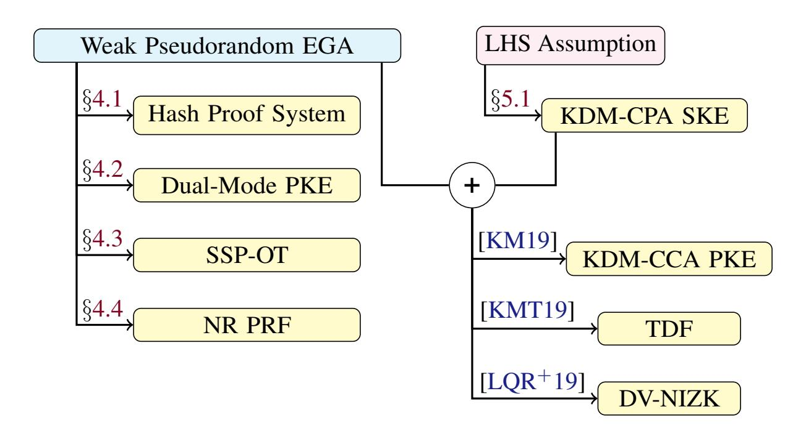

{0}------------------------------------------------

# Cryptographic Group Actions and Applications

Navid Alamati∗ Luca De Feo† Hart Montgomery ‡ Sikhar Patranabis§

#### Abstract

Isogeny-based assumptions have emerged as a viable option for quantum-secure cryptography. Recent works have shown how to build efficient (public-key) primitives from isogeny-based assumptions such as CSIDH and CSI-FiSh. However, in its present form, the landscape of isogenies does not seem very amenable to realizing new cryptographic applications. Isogeny-based assumptions often have unique efficiency and security properties, which makes building new cryptographic applications from them a potentially tedious and time-consuming task.

In this work, we propose a new framework based on group actions that enables the easy usage of a variety of isogeny-based assumptions. Our framework generalizes the works of Brassard and Yung (Crypto'90) and Couveignes (Eprint'06). We provide new definitions for group actions endowed with natural hardness assumptions that model isogeny-based constructions amenable to group actions such as CSIDH and CSI-FiSh.

We demonstrate the utility of our new framework by leveraging it to construct several primitives that were not previously known from isogeny-based assumptions. These include smooth projective hashing, dual-mode PKE, two-message statistically sender-private OT, and Naor-Reingold style PRF. These primitives are useful building blocks for a wide range of cryptographic applications.

We introduce a new assumption over group actions called *Linear Hidden Shift* (LHS) assumption. We then present some discussions on the security of the LHS assumption and we show that it implies symmetric KDM-secure encryption, which in turn enables many other primitives that were not previously known from isogeny-based assumptions.

∗University of Michigan.

† IBM Research Zurich. ¨

‡Fujitsu Laboratories of America.

§ETH Zurich. ¨

{1}------------------------------------------------

# 1 Introduction

The recent advancements in quantum computing [\[Aar13,](#page-25-0) [AAB](#page-25-1)+19] represent one of the most worrisome developments for cryptographers. Practical (and scalable) quantum computers pose a threat to the security of most commonly used cryptosystems today [\[Gro96,](#page-28-0) [Sho97\]](#page-31-0). In response to this threat, there has been a surge of interest in developing post-quantum replacements for existing cryptography standards. Notably, NIST has started a competition to determine new standards for post-quantum cryptosystems [\[CJL](#page-27-0)+16].

Many of the candidate constructions for post-quantum cryptography are based on lattice assumptions [\[Reg05,](#page-30-0) [LPR10\]](#page-30-1), including the key exchange and signature candidates in the NIST competition [\[AASA](#page-25-2)+19]. The lack of diversity in post-quantum cryptosystems could be a potential problem in the future: what if a big advance in lattice cryptanalysis necessitates impractically large parameters for lattice-based cryptosystems, or, in the worst case, a quantum attack invalidates all of lattice-based cryptography? While there are some candidate non-lattice-based constructions, some of which are quite efficient [\[ELPS18,](#page-28-1) [MBD](#page-30-2)+18], the landscape of post-quantum cryptography would change dramatically if lattice-based systems were rendered inefficient by advances in lattice cryptanalysis.

Isogeny-based cryptography. A promising non-lattice-based candidate for post-quantum secure cryptosystems is isogeny-based cryptography. The study of isogeny-based cryptography was initiated by Couveignes [\[Cou06\]](#page-27-1) in 1997, but began in earnest in the late 2000s with several new ideas around collision-resistant hashing [\[CLG09\]](#page-27-2), key exchange [\[RS06,](#page-30-3) [Sto10\]](#page-31-1), signatures [\[Sto09\]](#page-31-2), and key escrow [\[Tes06\]](#page-31-3). Isogeny-based cryptography became much more popular after the introduction of the SIDH key exchange scheme [\[JD11,](#page-29-0) [DJP14\]](#page-27-3), the first practical post-quantum scheme based on isogenies, and a precursor to the NIST competition candidate SIKE [\[AKC](#page-25-3)+17].

One of the most recent additions to the isogeny portfolio is CSIDH [\[CLM](#page-27-4)+18], an efficient variant of the original key-exchange proposal of Couveignes, Rostovtsev, and Stolbunov. CSIDH spurred a fair amount of new research in isogeny-based schemes, notably signatures [\[DG19,](#page-27-5) [BKV19\]](#page-26-0), and will be a key focus of this work. Indeed, among all isogeny-based assumptions, CSIDH, its predecessors, and its derivatives are the only ones amenable to group actions.

Known primitives from isogeny-based assumptions. There exist many primitives from isogeny-based assumptions, which can be broadly categorized into those obtained from an isogeny-based group action, and those which are not related to a group action. Known constructions from isogeny-based group actions include public-key encryption (PKE) and noninteractive key exchange (both static and ephemeral) [\[CLM](#page-27-4)+18], (efficient) interactive zero-knowledge protocols and signatures [\[DG19,](#page-27-5) [BKV19\]](#page-26-0), multi-round UC-secure oblivious transfer against passive corruptions [\[dOPS18\]](#page-28-2), and threshold signatures [\[DM20\]](#page-27-6). Known constructions not related to group actions include primitives such as public-key encryption [\[JD11,](#page-29-0) [AKC](#page-25-3)+17], ephemeral key exchange [\[JD11\]](#page-29-0), (efficient) interactive zero-knowledge protocols and signatures [\[DJP14,](#page-27-3) [YAJ](#page-31-4)+17, [GPS17\]](#page-28-3), collision-resistant hash functions [\[CLG09\]](#page-27-2), multi-round UC-secure oblivious transfer against passive corruptions [\[BOB18,](#page-26-1) [dOPS18,](#page-28-2) [Vit19\]](#page-31-5), and verifiable delay functions [\[DMPS19\]](#page-27-7).

### 1.1 Cryptographic Group Actions

In order to simplify the presentation and understanding of certain isogeny-based constructions, some prior works have chosen to use *group actions* as an abstraction for them, including even the first presentations [\[Cou06\]](#page-27-1).

Informally, a group action is a mapping of the form ? : G × X → X, where G is a group and X is a set, such that for any g1, g2 ∈ G and any x ∈ X, we have

$$g_1 \star (g_2 \star x) = (g_1 g_2) \star x.$$

From a cryptographic point of view, we can endow group actions with various hardness properties. For instance, a *one-way* group action [\[BY91\]](#page-27-8) is endowed with the following property: given randomly chosen set elements x1, x2 ∈ X, it is hard to find a group element g ∈ G such that g ? x1 = x2 (assuming such a g exists). Similarly, one could define a *weak pseudorandom* group action with following property: given a randomly chosen secret group element g ∈ G, an adversary that sees many tuples of the form (xi , g ? xi) cannot distinguish them from tuples of the form (xi , ui) where

{2}------------------------------------------------

each  $x_i$  and  $u_i$  are sampled uniformly from X.1 We refer to group actions endowed with such hardness properties as cryptographic group actions.

As an example, we note that a simple cryptographic group action is implied by the DDH assumption. If we set  $X = \mathbb{H}$  (where  $\mathbb{H}$  is some group of prime order p), and  $G = \mathbb{Z}_p^*$ , then the mapping  $z \star h \mapsto h^z$  where  $\star : \mathbb{Z}_p^* \times \mathbb{H} \to \mathbb{H}$  is a weak pseudorandom group action assuming that the DDH assumption holds over  $\mathbb{H}$ . We note that here the "set"  $\mathbb{H}$  is actually structured. However, there exist candidate quantum-resistant cryptographic group actions where the set may not be a group.

Cryptographic group actions have received substantially less attention compared to traditional group-theoretic assumptions. Nonetheless, there have been a small number of works studying various candidate cryptographic group actions [GS10, JQSY19] and their hardness properties [BY91, GPSV18]. In terms of public-key primitives, these works have demonstrated that cryptographic group actions endowed with some hardness properties imply PKE and noninteractive key exchange (NIKE). However, this leaves open a number of questions about the cryptographic utility of group actions. For instance, what are the capabilities of cryptographic group actions in terms of constructing public-key primitives richer than PKE and NIKE? Can we hope to construct from group actions (endowed with hardness properties such as weak pseudorandomness) all (or most) of the primitives that we can achieve from, say, the DDH assumption [Bon98]? Or are cryptographic group actions barely more powerful than NIKE?

In terms of cryptographic capabilities, group-theoretic assumptions have been studied extensively over the past couple of decades. At present, we have a reasonably comprehensive understanding of what is (and is not) constructible from the most commonly encountered group-theoretic assumptions such as DLOG, CDH, and DDH (barring a few breakthrough results using novel non-black-box techniques, e.g., [DG17]). The cryptographic capabilities of these assumptions have also been explained from the point of view of their underlying algebraic structure [AMPR19]. On the other hand, our understanding of the cryptographic capabilities of group actions is still somewhat limited.

So, in our opinion, an important question is the following: what primitives can we build from cryptographic group actions? We believe that it is important to understand the cryptographic capabilities of group actions given that they capture the algebraic structure underlying some candidate post-quantum cryptographic assumptions, namely isogeny-based cryptography amenable to group actions.

Cryptographic group actions and isogenies. In a nutshell, an isogeny is a morphism of elliptic curves, i.e., a map from a curve to another curve that preserves the group structure. The central objects of study in isogeny-based cryptography are *isogeny graphs*, i.e., graphs whose vertices represent elliptic curves, and whose edges represent isogenies between them. There is a large variety of isogeny graphs, depending on which kinds of curves and isogenies are chosen. One such choice would be *complex multiplication graphs*, which arise from so-called *horizontal* isogenies of complex multiplication elliptic curves; indeed, these graphs are isomorphic to Cayley graphs of *quadratic imaginary class groups*, and thus present a natural group action.

One of the key objects associated with an elliptic curve is its *endomorphism ring*. In the cases that interest us here, this ring is known to be isomorphic to an imaginary quadratic order  $\mathcal{O}$ , i.e., a 2-dimensional  $\mathbb{Z}$ -lattice and a subring of an imaginary quadratic number field  $\mathbb{Q}(\sqrt{D})$ . An elliptic curve with endomorphism ring isomorphic to a given  $\mathcal{O}$  is said to have *complex multiplication (CM) by*  $\mathcal{O}$ .

The celebrated theory of complex multiplication establishes a correspondence between the *ideal classes* of  $\mathcal{O}$  and the isogenies between elliptic curves with CM by  $\mathcal{O}$ . More precisely, it defines a regular abelian group action

$$Cl(\mathcal{O}) \times \mathcal{E}_k(\mathcal{O}) \to \mathcal{E}_k(\mathcal{O})$$

of the class group  $Cl(\mathcal{O})$  on the set  $\mathcal{E}_k(\mathcal{O})$  of elliptic curves, defined over a field k, with CM by  $\mathcal{O}$ . Moreover, each element of  $Cl(\mathcal{O})$  corresponds to a unique class of isogenies, which can be leveraged to evaluate the group action. We refer the reader to [De 17, Sut19] for more details.

Unfortunately, the correspondence between isogenies and the CM group action becomes less than ideal when we start contemplating algorithmic properties. Indeed, a natural requirement for a cryptographic group action is that given any group element  $g \in G$  and a set element  $x \in X$ , computing  $g \star x$  can be done efficiently. However this does not hold for the CM group action, which can be evaluated efficiently only for a small subset of group elements.

 $^{1}$ We note that sampling directly from the uniform distribution over the set X may not be possible in certain cases. We elaborate more on this later.

{3}------------------------------------------------

The usual workaround adopted in isogeny-based cryptography is to represent elements of  $Cl(\mathcal{O})$  as  $\mathbb{Z}$ -linear combinations of a fixed set of "low norm" generators  $\mathfrak{g}_i$  for which evaluating the group action is efficient, i.e., as  $\mathfrak{a} = \prod_{i=1}^{\ell} \mathfrak{g}_i^{a_i}$ . Then, evaluating the action is efficient as long as the exponents  $a_i$  are polynomial in the security parameter. This trick is not devoid of consequences: group elements do not have a unique representation, sampling uniformly in the group may not be possible in general, and even testing equality becomes tricky. We will capture the limitations of this framework in our definition of a *Restricted Effective Group Action (REGA)*.

To illustrate the severe limitations of an REGA, we refer to SeaSign [DG19], which is the Fiat-Shamir transform of an interactive authentication protocol based on CSIDH. To prove the knowledge of a secret  $s \in G$  s.t.  $y = s \star x$ , the basic idea is to first commit to  $r \star x$  for some random r, and then reveal  $s^{-b}r$  depending on a bit b sent by the challenger. While it is straightforward to prove that this protocol is zero-knowledge when the elements of G have unique representation and are sampled uniformly, the proof breaks down for CSIDH. To fix this issue, SeaSign uses a rejection sampling technique [Lyu09], which considerably increases parameters and signing/verification time.

An alternative fix is to compute the group structure of  $Cl(\mathcal{O})$ , in the form of a *relation lattice* of the low norm generators. This restores the ability to represent uniquely and to sample uniformly the elements of the group. This is the approach taken by the isogeny-based signature CSI-FiSh [BKV19], which precomputes the group structure of CSIDH-512. While it is clear that the approach taken by CSI-FiSh to build a full-fledged cryptographic group action greatly extends the capabilities of isogeny-based cryptography, recent results [Pei20, BS20] showed quantum attacks against CSIDH for certain choices of parameters. Unfortunately, computing the group structure of a significantly larger class group seems out of reach today, owing to the subexponential complexity of the classical algorithms available. This limitation will go away once quantum computers become powerful enough to apply Shor's algorithms to this group order computation, but until then we believe that REGAs can be a fundamental tool to construct post-quantum cryptographic protocols based on isogenies.

Bilinear maps gained popularity in cryptography partly because works such as [BF01, GPS08] presented them in a generic, easy-to-use manner that abstracted out the mathematical details underlying the Weil or Tate pairings. Similarly, an easy-to-use abstraction for isogeny-based assumptions might make them more accessible to cryptographers.

#### 1.2 Our Contributions

We improve the state of the art of cryptographic group actions and isogeny-based cryptography in three main ways:

- We formally define many notions of cryptographic group actions endowed with natural hardness properties such as *one-wayness*, *weak unpredictability*, and *weak pseudorandomness*. We then show how certain isogeny-based assumptions can be modeled using our definitions.
- We show several applications of cryptographic group actions (based on our definitions above) which were not previously known from isogeny-based assumptions. These include smooth projective hashing, dual-mode PKE, two-message statistically sender-private OT, and Naor-Reingold style PRF.
- We introduce a new assumption over cryptographic group actions called *linear hidden shift* (LHS) assumption. We then present some discussions on the security of the LHS assumption and we show that it implies symmetric KDM-secure encryption, which in conjunction with PKE implies many powerful primitives that were not previously known from isogeny-based assumptions.

In addition, we also show that a homomorphic primitive with certain properties implies a cryptographic group action. We expand on our contributions in more details below.

**Effective Group Action.** We begin by introducing some new definitions for group actions endowed with hardness properties. Our first new definition is that of an *effective* group action (EGA). This models the standard notion of cryptographic group actions. Section 3 presents the formal definitions for effective group actions and the associated axioms of mathematical structure. While our definitions bear some resemblance to existing works, they are more amenable to cryptographic constructions in the post-quantum setting. Much of the early work on cryptographic group actions [BY91, Cou06] either predates the major advances in quantum cryptanalysis like Shor's algorithm [Sho97] or did not focus on post-quantum applications.

{4}------------------------------------------------

Suppose we consider a set X and a group G, with an associated group action  $\star: G \times X \to X$ . We informally define the following cryptographic effective group actions endowed with natural hardness properties:

- One-way EGA: given a pair of set elements  $(x, g \star x)$  where  $x \leftarrow X$  and  $g \leftarrow G$  are sampled uniformly at random, there is no PPT adversary that can recover g.
- Weak Unpredictable EGA: given polynomially many tuples of the form  $(x_i, g \star x_i)$  where  $g \leftarrow G$  and each  $x_i \leftarrow X$  are sampled uniformly at random, there is no PPT adversary that can compute  $g \star x^*$  for a given challenge  $x^* \leftarrow X$ .
- Weak Pseudorandom EGA: there is no PPT adversary that can distinguish tuples of the form  $(x_i, g \star x_i)$  from  $(x_i, u_i)$  where  $g \leftarrow G$  and each  $x_i, u_i \leftarrow X$  are sampled uniformly at random.

We also note that CSI-FiSh [BKV19] can be modeled as an effective group action defined above (plausibly as a weak pseudorandom effective group action).

**Restricted Effective Group Action.** Our definition of EGA does not capture isogeny-based assumptions such as CSIDH [CLM+18], where we cannot compute the group action operation  $\star$  efficiently for all  $g \in G$ .

To address this, we introduce the notion of a *restricted* effective group action (REGA). The basic idea is the following: in an REGA, as we mentioned before, it is not possible to efficiently compute the group action  $\star$  for all group elements  $g \in G$ : instead, the group action is efficiently computable for some small subset of G. Note that we can still "simulate" the effect of a general group action by computing the group action on a sequence of different elements from this subset. While restricted EGAs are considerably less efficient than EGAs with respect to certain applications, they present an easy-to-use abstraction for CSIDH and related assumptions. This makes REGAs useful for building cryptographic protocols from such assumptions. We note that REGAs can be endowed with the same hardness properties as EGAs (such as one-wayness, weak unpredictability, and weak pseudorandomness).

**New constructions.** One of the main contribution of our paper is new constructions from our definition of (R)EGA, which can then be concretely instantiated from isogeny-based assumptions. We refer to Figure 1 for an overview of our results. Specifically, we show the following constructions from any weak pseudorandom (R)EGA:

- Universal and smooth projective hashing, proposed by Cramer and Shoup [CS02], is a useful primitive with many applications, including CCA-secure PKE in the standard model [CS02], password authenticated key-exchange (PAKE) [GL03], privacy-preserving protocols [BPV12], and many others. We show how to construct a universal and smooth projective hash from any weak pseudorandom (R)EGA. To our knowledge, this is the first smooth projective hash function from isogeny-based assumptions. In particular, this also implies the first standard-model CCA-secure encryption scheme from isogenies. Previously known CCA-secure encryption schemes from group action based on isogenies [CLM+18] required random oracles.
- Dual-mode PKE, which was introduced in [PVW08], has numerous applications such as UC-secure round-optimal OT protocols in the common reference string model against actively corrupt receivers and senders. Such OT protocols are in turn sufficient to construct UC-secure round-optimal multi-party computation (MPC) protocols for general functionalities [GS18] in the same security model. In this work, we show how to build a dual-mode PKE from any weak pseudorandom (R)EGA. In particular, this implies the first round-optimal OT and MPC protocols from isogeny-based assumptions. Previously known constructions of OT from isogenies [BOB18, dOPS18, Vit19] were neither round optimal nor UC secure against active corruptions.
- We next show how to build two-message statistically sender-private OT (SSP-OT) [NP01] in the *plain model* from any weak pseudorandom (R)EGA. For this result, we rely on our construction of smooth projective hashing and techniques from [HK12]. This primitive has many cryptographic applications such as non-malleable commitments [KS17], two-round witness indistinguishable proofs with private-coin verifier [JKKR17, BGI+17, KKS18], and three-message statistical receiver-private OT in the plain model [GJJM20]. To our knowledge, these primitives were not previously known from isogeny-based assumptions.

{5}------------------------------------------------

Figure 1: Overview of our results and implications

• We construct Naor-Reingold style PRFs from any weak pseudorandom (R)EGA. Our construction, when based on EGA (and not REGA), results in a PRF that requires a single group action operation. Our construction in the case of REGA requires a linear number of group action operations. This essentially follows from the efficiency restrictions inherent to our definitions of REGA.

**Linear Hidden Shift assumption.** We introduce a new assumption over cryptographic group actions that we call the *Linear Hidden Shift* (LHS) assumption and we provide some discussions on its security. We describe the assumption informally below.

For a vector of group elements  $\mathbf{g} \in G^n$  and a binary vector  $\mathbf{s} \in \{0,1\}^n$ , let  $\langle \mathbf{g}, \mathbf{s} \rangle$  denote the subset product  $\prod_{i=1}^n g_i^{s_i}$ . Informally, the LHS assumption states that for any m that is polynomial in the security parameter, the following holds:

$$\{(x_i, \mathbf{g}_i, (\langle \mathbf{g}_i, \mathbf{s} \rangle) \star x_i)\}_{i \in [m]} \stackrel{c}{\approx} \{(x_i, \mathbf{g}_i, u_i)\}_{i \in [m]},$$

where  $\mathbf{g}_i \leftarrow G^n$ ,  $\mathbf{s} \leftarrow \{0,1\}^n$ ,  $x_i \leftarrow X$ , and  $u_i \leftarrow X$  (all sampled independently).

The LHS assumption is sufficient to realize symmetric KDM-CPA secure encryption, and enables us to realize many cryptographic applications such as trapdoor functions and designated-verifier NIZK, which were previously not known from isogeny-based assumptions. We believe that the LHS assumption is of independent interest and may have other cryptographic applications.

We present some discussions of the security of the LHS assumption. In particular, we first show a search to decision reduction: namely, that the decision variant of the LHS assumption mentioned above is equivalent to its search variant, which states that no PPT adversary can recover the binary vector  $\mathbf{s}$ . Next, we show that in certain settings an additive variant of the LHS assumption is equivalent to the weak pseudorandom EGA if  $G = \mathbb{Z}_N^*$  and the vectors  $\mathbf{g}_i$  are sampled from a structured distribution. Based on this evidence, it appears likely that the LHS assumption holds with respect to some of the known group-action based isogenies.

**KHwPRF** and cryptographic group actions. A key-homomorphic weak PRF (KHwPRF) [NPR99, BLMR13] is a generic primitive with algebraic structure and is known to imply many cryptosystems that we know how to build from the DDH assumption [AMPR19, AMP19]. We show that any KHwPRF with a *cyclic* output group implies a weak unpredictable group action.

On EGA and homomorphic primitives. Recent works [AMPR19, AMP19] have shown that generic primitives (such as weak PRFs) endowed with group homomorphisms imply a large class of cryptographic applications. A natural question to ask is whether such homomorphic primitives can be built in a generic manner from EGA/REGA? This does

{6}------------------------------------------------

not seem likely in light of the fact that the authors of [AMP19] ruled out the existence of a few post-quantum secure primitives with "exact" homomorphisms over abelian groups.

This observation seems to have implications for the class of primitives that one can hope to build from EGA/REGA. One such primitive is collision-resistant hash function (CRHF). In particular, the main techniques we currently know of constructing CRHF from generic assumptions either rely on group homomorphism [IKO05] or one-way functions with certain properties [HL18]. This makes it difficult to realize CRHF from EGA/REGA by leveraging known techniques. Note that this does not apply to known constructions of CRHF from non-group-action based isogeny assumptions (such as [CLG09]), which are not covered by our framework.

Concurrent works. In a concurrent work, Lai *et al.* [LGdSG20] proposed a construction of maliciously UC-secure OT in the CRS model from a variant of CSIDH. Specifically, their construction relies on the hardness of a special problem called the "computational reciprocal CSIDH" problem, and does not immediately fit into our proposed group action-based framework. However, their construction requires three rounds of communication between the sender and the receiver, and hence is not round optimal. On the other hand, our construction of maliciously UC-secure OT in the CRS model from any weak pseudorandom EGA is round optimal.

In another recent work, Moriya *et al.* [MOT20] constructed a Naor-Reingold style PRF from a variant of CSIDH. They also presented experimental evaluations of the concrete efficiency of their construction. Our construction of Naor-Reingold style PRF from any weak pseudorandom EGA can be viewed as an abstract version of their construction.

## 2 Preliminaries

**Notation.** We use  $\lambda$  to denote the security parameter. For a finite set S, we use  $s \leftarrow S$  to sample uniformly from the set S. For a probability distribution  $\mathcal{D}$  on a finite set S, we use  $s \leftarrow \mathcal{D}$  to sample from  $\mathcal{D}$ . We use the notations  $\stackrel{s}{\approx}$  and  $\stackrel{c}{\approx}$  to denote statistical and computational indistinguishability, respectively.

#### 2.1 Basic Primitives

**One-Way Function.** Let P, X and Y be sets indexed by the parameter  $\lambda$ , and let  $\mathcal{D}_P$  and  $\mathcal{D}_X$  be distributions on P and X respectively. A  $(D_P, D_X)$ -OWF family is a family of efficient computable functions  $\{f_{pp}(\cdot): X \to Y\}_{pp \in P}$  such that for all PPT adversaries  $\mathcal{A}$  we have

$$\Pr[f_{pp}(\mathcal{A}(pp, f_{pp}(x))) = f_{pp}(x)] \le \operatorname{negl}(\lambda),$$

where  $pp \leftarrow \mathcal{D}_P$  and  $x \leftarrow \mathcal{D}_X$ . If  $\mathcal{D}_P$  and  $\mathcal{D}_X$  are uniform distributions, then we simply speak of an OWF family.

Weak Unpredictable Permutation. Let K, X, and Y be sets indexed by  $\lambda$ , and let  $\mathcal{D}_K$  and  $\mathcal{D}_X$  be distributions on K and X respectively. Let  $F_k^{\$}$  be a *randomized* oracle that when queried samples  $x \leftarrow \mathcal{D}_X$  and outputs (x, F(k, x)). A  $(\mathcal{D}_K, \mathcal{D}_X)$ -weak PRP (wPRP) is a family of efficiently computable permutations  $\{F(k, \cdot) : X \to X\}_{k \in K}$  such that for all PPT adversaries  $\mathcal{A}$  we have

$$\Pr[\mathcal{A}^{F_k^{\$}}(x^*) = F(k, x^*)] \le \operatorname{negl}(\lambda),$$

where  $k \leftarrow \mathcal{D}_K$ , and  $x^* \leftarrow \mathcal{D}_X$ . If  $\mathcal{D}_K$  and  $\mathcal{D}_X$  are uniform distributions, then we simply speak of a wUP family.

**Weak Pseudorandom Permutation.** Let K and X be sets indexed by  $\lambda$ , and let  $\mathcal{D}_K$  and  $\mathcal{D}_X$  be distributions on K and X respectively. A  $(\mathcal{D}_K, \mathcal{D}_X)$ -weak PRP (wPRP) is a family of efficiently computable permutations  $\{F(k,\cdot): X \to X\}_{k \in K}$  such that for all PPT adversaries  $\mathcal{A}$  we have

$$\left| \Pr[\mathcal{A}^{F_k^{\$}}(1^{\lambda}) = 1] - \Pr[\mathcal{A}^{\pi^{\$}}(1^{\lambda}) = 1] \right| \le \operatorname{negl}(\lambda),$$

where  $k \leftarrow \mathcal{D}_k$ ,  $\pi \leftarrow S_X$  and  $\pi^{\$}$  is the randomized oracle that samples  $x \leftarrow \mathcal{D}_X$  and outputs  $(x, \pi(x))$ . If  $\mathcal{D}_K$  and  $\mathcal{D}_S$  are uniform distributions, then we simply speak of a wPRP family.

{7}------------------------------------------------

Key-Homomorphic weak PRF. A function family {F(k, ·) : X → Y}k∈K is key-homomorphic if the following conditions hold:

- (K, ⊕) and (Y, ⊗) are efficiently samplable groups, and the group operations and the inverse operation in each group are efficiently computable.
- For any pair of keys k1, k2 ∈ K and any input x ∈ X , we have

$$F(k_1,x)\otimes F(k_2,x)=F(k_1\oplus k_2,x)$$
.

A key-homomorphic weak PRF (KHwPRF) family is a weak PRF family that is also key homomorphic.

# 2.2 Min-entropy and Leftover Hash Lemma

For a discrete random variable Z with sample space Ω, its *min-entropy* is defined as

$$H_{\infty}(Z) = \min_{\omega \in \Omega} \{-\log \Pr[Z = \omega]\}.$$

For two random variables Y and Z, we use H∞(Z|Y ) to denote the min-entropy of Z conditioned on Y . We will use the following lemma, which is a simplified version of the leftover hash lemma.

Lemma 2.1. *Let* {Hs : Z → Y }s∈S *be a family of pairwise independent hash functions, and assume that* Z *and* S *be discrete random variables over* Z *and* S*, respectively. If* H∞(Z) > log |Y | + 2 log(ε −1 ) *we have*

$$\Delta[(S, H_S(Z)), (S, U)] \leq \varepsilon,$$

*where* ∆ *denotes the statistical distance and* U *denotes the uniform distribution over the set* Y *.*

We will also use the following corollary of the leftover hash lemma.

Lemma 2.2. *Let* G *be an (additive) finite abelian group such that* |G| = λ ω(1)*. Let* n *be an integer such that* n > log |G| + ω(log(λ))*. If* g ← Gn *and* s ← {0, 1} n*, we have*

$$(\mathbf{g}, \sum_{i=1}^{n} s_i \cdot g_i) \stackrel{s}{\approx} (\mathbf{g}, u),$$

*where* u ← G *is a uniformly chosen element from* G*.*

# 3 Cryptographic Group Actions

In this section we present our definitions of cryptographic group actions. As we mentioned before, we use the definitions of Brassard and Yung [\[BY91\]](#page-27-8) and Couveignes [\[Cou06\]](#page-27-1) as starting points and aim to provide solid, modern definitions that allow for easy use of isogenies in cryptographic protocols. We begin by recalling the definition of a group action.

Definition 3.1. (Group Action) A group G is said to *act on* a set X if there is a map ? : G × X → X that satisfies the following two properties:

- 1. Identity: If e is the identity element of G, then for any x ∈ X, we have e ? x = x.
- 2. Compatibility: For any g, h ∈ G and any x ∈ X, we have (gh) ? x = g ? (h ? x).

We may use the abbreviated notation (G, X, ?) to denote a group action.

*Remark 3.2.* If (G, X, ?) is a group action, for any g ∈ G the map πg : x 7→ g ? x defines a permutation of X.

{8}------------------------------------------------

Properties of group actions. We consider group actions that satisfy one or more of the following properties:

- 1. Transitive: A group action (G, X, ?) is said to be *transitive* if for every x1, x2 ∈ X, there exists a group element g ∈ G such that x2 = g ? x1. For such a transitive group action, the set X is called a *homogeneous space* for G.
- 2. Faithful: A group action (G, X, ?) is said to be *faithful* if for each group element g ∈ G, either g is the identity element or there exists a set element x ∈ X such that x 6= g ? x.
- 3. Free: A group action (G, X, ?) is said to be *free* if for each group element g ∈ G, g is the identity element if and only if there exists some set element x ∈ X such that x = g ? x.
- 4. Regular: A group action (G, X, ?) is said to be *regular* if it is *both* free *and* transitive. For such a regular group action, the set X is called a *principal homogeneous space* for the group G, or a G*-torsor*.

*Remark 3.3.* Typically group action-based cryptography has focused on regular actions. If a group action is regular, then for any x ∈ X, the map fx : g 7→ g ? x defines a bijection between G and X; in particular, if G (or X) is finite, then we must have |G| = |X|.

## 3.1 Effective Group Action

We define an effective group action (EGA) as follows.

Definition 3.4. (Effective Group Action) A group action (G, X, ?) is *effective* if the following properties are satisfied:

- 1. The group G is finite and there exist efficient (PPT) algorithms for:
  - (a) Membership testing, i.e., to decide if a given bit string represents a valid group element in G.
  - (b) Equality testing, i.e., to decide if two bit strings represent the same group element in G.
  - (c) Sampling, i.e., to sample an element g from a distribution DG on G. In this paper, We consider distributions that are statistically close to uniform.
  - (d) Operation, i.e., to compute gh for any g, h ∈ G.
  - (e) Inversion, i.e., to compute g −1 for any g ∈ G.
- 2. The set X is finite and there exist efficient algorithms for:
  - (a) Membership testing, i.e., to decide if a bit string represents a valid set element.
  - (b) Unique representation, i.e., given any arbitrary set element x ∈ X, compute a string xˆ that canonically represents x.
- 3. There exists a distinguished element x0 ∈ X, called the *origin*, such that its bit-string representation is known.
- 4. There exists an efficient algorithm that given (some bit-string representations of) any g ∈ G and any x ∈ X, outputs g ? x.

Computational assumptions. We define certain computational assumptions pertaining to group actions.

Definition 3.5. (One-Way Group Action) A group action (G, X, ?) is (DX, DG)-one-way if the family of efficiently computable functions {fx : G → X}x∈X is (DX, DG)-one-way, where fx : g 7→ g ? x, and DX, DG are distributions on X, G respectively.

Definition 3.6. (Weak Unpredictable Group Action) A group action (G, X, ?) is (DG, DX)-weakly unpredictable if the family of efficiently computable permutations {πg : X → X}g∈G is (DG, DX)-weakly unpredictable, where πg is defined as πg : x 7→ g ? x and DX, DG are distributions on X, G respectively.

{9}------------------------------------------------

Definition 3.7. (Weak Pseudorandom Group Action) A group action (G, X, ?) is (DG, DX)-weakly pseudorandom if the family of efficiently computable permutations {πg : X → X}g∈G is (DG, DX)-weakly pseudorandom, where πg : x 7→ g ? x, and DX, DG are distributions on X, G respectively.

In each of the definitions above, if DG is a probability distribution on G and DX is the distribution induced on X by taking g ← DG and outputting g ? x0, then we simply write DG-OW group action for (DX, DG)-OW group action, and similarly for weak unpredictable/pseudorandom group actions. If both distributions are uniform (or statistically close to uniform), we omit them.

In what follows, we will focus on group actions where G is abelian and the action is regular. We will characterize them by the computational assumption and their effectivity properties, and we assume that they are abelian and regular unless stated otherwise. Therefore, an OW-EGA/wU-EGA/wPR-EGA will be a one-way/weak unpredictable/weak pseudorandom abelian regular effective group action. Note that Couveignes used the terminology *Hard Homogeneous Space* for wU-EGA, and *Very Hard Homogeneous Space* for wPR-EGA [\[Cou06\]](#page-27-1); subsequent literature on isogeny-based cryptography has mostly followed his conventions [\[DKS18,](#page-27-12) [CLM](#page-27-4)+18].

Generic attacks. All known generic attacks against cryptographic group actions are attacks against the one-wayness. Given a pair (x, g ? x), Stolbunov [\[Sto12\]](#page-31-7) called the problem of finding g the *Group Action Inverse Problem (GAIP)*. The best known classical algorithm for GAIP is a meet-in-the-middle graph walk technique dating back to Pohl [\[Poh69\]](#page-30-11), with a low-memory variant by Galbraith, Hess, and Smart [\[GHS02\]](#page-28-12), both running in time O( p |G|).

Childs, Jao, and Soukharev [\[CJS14\]](#page-27-13) pointed out that GAIP can be formulated as a *hidden shift problem*, and thus it can be solved by Kuperberg's quantum algorithm and its variants [\[Kup05,](#page-29-9) [Reg04,](#page-30-12) [Kup13\]](#page-29-10), provided a quantum oracle to evaluate the group action. All these algorithms have subexponential complexity between exp(√ log N) and LN (1/2).

In the context of isogenies, there is a sizable literature on both classical and quantum attacks [\[Gal99,](#page-28-13) [GS13,](#page-28-14) [BIJ18,](#page-26-9) [BS20,](#page-26-4) [Pei20\]](#page-30-5). Little is known in terms of non-generic attacks: a recent result gives an attack against pseudorandomness which applies to some isogeny-based group actions, but not to CSIDH and related constructions [\[CSV20\]](#page-27-14).

Alternative axioms. In some circumstances, it is useful to strengthen or weaken the definition of EGA by slightly modifying the set of axioms. Here we list the most important variants.

- Uncertified EGA: Brassard and Yung [\[BY91\]](#page-27-8) consider group actions without the *Set Membership Testing* axiom. They call *certified* those group actions that have *Set Membership Testing*, and *uncertified* those that do not. It is easy to construct examples of uncertified actions, see, e.g., [\[BY91,](#page-27-8) §6.2]. Here, unless otherwise stated, all actions will be certified.
- Hashable OW-EGA: In an OW-EGA, one can efficiently sample from X as follows: first sample g ← DG using the *Group Sampling* axiom, then output g ? x0. However in some applications it is useful to sample from X in a way that does not automatically reveal the group action inverse.

In a *Hashable OW-EGA*, the existence of the *origin* x0 is replaced with a *Hashing to the Set* axiom, stating that there exists an efficient sampler H : [N] → X (where the integer N depends on the security parameter) such that for any adversary A

$$\Pr[\mathcal{A}(i,j) \star H(i) = H(j)] \le \operatorname{negl}(\lambda),$$

for i, j ← [N].

### 3.2 Restricted Effective Group Action

An EGA is a useful abstraction, but sometimes it is too powerful in comparison to what is achievable in practice. A *Restricted Effective Group Action* (REGA) is a weakening of EGA, where we can only evaluate the action of a generating set of small cardinality.

Definition 3.8. (Restricted Effective Group Action) Let (G, X, ?) be a group action and let g = (g1, . . . , gn) be a (not necessarily minimal) generating set for G. The action is said to be g*-restricted effective*, if the following properties are satisfied:

{10}------------------------------------------------

- G is finite and  $n = \text{poly}(\log(|G|))$ .
- The set X is finite and there exist efficient algorithms for:
  - 1. Membership testing, i.e., to decide if a bit string represents a valid set element.
  - 2. Unique representation, i.e., to compute a string  $\hat{x}$  that canonically represents any given set element  $x \in X$ .
- There exists a distinguished element  $x_0 \in X$ , called the *origin*, such that its bit-string representation is known.
- There exists an efficient algorithm that given any  $i \in [n]$  and any bit string representation of  $x \in X$ , outputs  $g_i \star x$  and  $g_i^{-1} \star x$ .

Although an REGA is limited to evaluations of the form  $g_i \star x$ , this is actually enough to evaluate the action of many, and potentially all elements of G without even needing axioms on the effectivity of G.

A word on  $(g_1, \ldots, g_n)$  is a finite sequence  $\sigma \in \{g_1, \ldots, g_n, g_1^{-1}, \ldots, g_n^{-1}\}^*$ , to which we canonically associate an element of G by

$$\sigma = \sigma_1 \sigma_2 \cdots \sigma_\ell \mapsto \prod_{i=1}^\ell \sigma_i.$$

By hypothesis, any element of G can be represented by a word on g, however this representation may not be unique, nor equality needs to be efficiently testable. From the definition of a g-REGA, it is clear that the action on  $x \in X$  of any word of polynomial length on g can be computed in polynomial time.

When G is abelian, words on g can be rewritten as vectors in  $\mathbb{Z}^n$ , canonically mapped to G by

$$(a_1,\ldots,a_n)\mapsto\prod_{i=1}^ng_i^{a_i}.$$

It follows from the axioms of REGA that the action of a vector  $\mathbf{a} \in \mathbb{Z}^n$  can be efficiently evaluated on any  $x \in X$  as long as  $\|\mathbf{a}\|$  is polynomial in  $\log(|G|)$ , where  $\|\cdot\|$  is any  $L^p$ -norm.

Protocols built on REGA will need to sample elements from G that are statistically close to uniform and for which the group action is efficiently computable. Prior works suggest sampling from a distribution  $\mathcal{D}_G$  on the words on g in the non-abelian case, or from a distribution on vectors in  $\mathbb{Z}^n$  in the abelian case. Classic choices in the latter case are balls of fixed radius in  $L^{\infty}$ -norm [CLM+18], in  $L^1$ -norm [NOTT20], in weighted infinity norms [Sto12, MR18], or discrete Gaussian distributions [DG19]. The latter is plausibly sufficient for applications that require group elements to be sampled from distributions statistically close to uniform [DG19].

#### 3.3 Known-order Effective Group Action

As a strengthening of EGA, we may assume that the group structure of G is known. By "known order" we mean that a minimal list of generators  $\mathbf{g} = (g_1, \dots, g_n)$  together with their orders  $(m_1, \dots, m_n)$  is known, which in turn is equivalent to a decomposition

$$G \simeq \mathbb{Z}_{m_1} \oplus \cdots \oplus \mathbb{Z}_{m_n}$$

An important special case is when G is cyclic, i.e.,  $G = \langle g \rangle \simeq \mathbb{Z}/m\mathbb{Z}$ .

Denote by  $\mathcal{L}$  the lattice  $m_1\mathbb{Z}\oplus\cdots\oplus m_n\mathbb{Z}$ , the map  $\phi:\mathbb{Z}^n/\mathcal{L}\to G$  defined as

$$(a_1,\ldots,a_n)\mapsto\prod_{i=1}^ng_i^{a_i}$$

is an effective isomorphism, its inverse being a generalized discrete logarithm. If  $(G, X, \star)$  is an EGA, then it is easy to verify that  $(\mathbb{Z}^n/\mathcal{L}, X, \star)$  is an EGA through  $\phi$ . We may just use  $\mathbb{Z}^n/\mathcal{L}$  as the standard representation for G.

**Definition 3.9.** (Known-order Effective Group Action) A known-order effective group action (KEGA) is an EGA  $(\mathbb{Z}^n/\mathcal{L}, X, \star)$  where the lattice  $\mathcal{L}$  is given by the tuple  $(m_1, \ldots, m_n)$ .

{11}------------------------------------------------

It may look like we "lose some cryptography" when we replace the group G by its isomorphic image Z n/L. However, we stress that the main purpose of cryptography based on group actions is to design protocols that do not rely on discrete log assumptions. Thus, as soon as the group structure of G is known, KEGA is a more appropriate tool to design protocols, owing to its simplicity. For examples of protocols that require the KEGA setting, see [\[DM20\]](#page-27-6).

Furthermore, KEGA and abelian EGA are quantumly equivalent. Indeed, given any abelian group G, Shor's algorithm and its generalization [\[Sho97,](#page-31-0) [CM01\]](#page-27-15) precisely compute an isomorphism G ' Zm1 ⊕ · · · ⊕ Zmn (along with a minimal set of generators) in quantum polynomial time.

*Remark 3.10.* An REGA of known order is not automatically a KEGA, indeed the list of generators g of a REGA need not be minimal. As an extreme example, consider the case where G = hg1i is cyclic, and g = (g1, . . . , gn). Any element of G can be uniquely represented as an integer in Zm1 , however this representation does not lead to an efficiently computable group action. What is needed is an efficient algorithm to convert between the "minimal" representation G ' Z/L, and products of small powers of (g1, . . . , gn). In some instances, this conversion is possible via lattice reduction techniques [\[BKV19\]](#page-26-0).

# 4 Cryptographic Primitives from wPR-EGA

Here we describe constructions of different cryptographic primitives from any weak pseudorandom effective group action (wPR-EGA). We refer the reader to Section [3](#page-7-0) for the definitions of generic primitives based on group actions.

### 4.1 Hash Proof System

We demonstrate how to construct universal and smooth projective hashing schemes (also known as hash proof systems or projective hash functions) from any weak pseudorandom effective group action. We begin by recalling the definition of a universal projective hashing scheme as in [\[CS02\]](#page-27-11).

Definition 4.1. Let Λ : K × Σ → Γ be an efficiently computable function, and let L ⊂ Σ. In addition, let α : K → P be a "projection" function. We say that the tuple Π = (Λ, K, P, Σ, Γ, L) is a universal projective hash function if the following properties hold:

- Samplability: There exist efficient algorithms to sample uniformly from Σ and from K. In addition, there exists an efficient algorithm to sample uniformly from L along with a witness w that proves membership in L.
- Subset Membership Problem: If σ0 ← L and σ1 ← Σ then σ0 c ≈ σ1.
- Projective Evaluation: There exists an efficient algorithm ProjEval such that for any hk ∈ K and any σ ∈ L with membership witness w, we have

$$\mathsf{ProjEval}(\alpha(\mathsf{hk}), w) = \Lambda(\mathsf{hk}, \sigma)$$
.

• Universality: Π is said to be ε-universal if for any σ ∈ Σ \ L, if hk ← K it holds that

$$H_{\infty}(\Lambda(\mathsf{hk},\sigma) | (\alpha(\mathsf{hk}),\sigma)) \ge \log(\varepsilon^{-1}).$$

Universality2 and smoothness. We also recall two stronger notions of security for projective hash proof systems, namely universality2 and smoothness, as described in [\[CS02\]](#page-27-11).

• Universality2 : A hash proof system Π = (Λ, K, P, Σ, Γ, L) is said to be ε-universal2 if for any σ, σ∗ ∈ Σ such that σ ∈ Σ \ (L ∪ {σ ∗}), if hk ← K it holds that

$$H_{\infty}(\Lambda(\mathsf{hk},\sigma) | (\alpha(\mathsf{hk}), \sigma, \sigma^*, \Lambda(\mathsf{hk}, \sigma^*))) \ge \log(\varepsilon^{-1}).$$

• Smoothness: A hash proof system Π = (Λ, K, P, Σ, Γ, L) is said to be smooth if for any σ ∈ Σ \ L, if hk ← K and γ ← Γ it holds that

$$\left(\alpha(\mathsf{hk}), \sigma, \Lambda\left(\mathsf{hk}, \sigma\right)\right) \overset{s}{\approx} \left(\alpha(\mathsf{hk}), \sigma, \gamma\right).$$

We now show how to construct a universal hash proof system from any weak pseudorandom EGA.

{12}------------------------------------------------

Construction. Let (G, X, ?) be a weak pseudorandom EGA and let ` = ω(log λ) be an integer. Additionally, let x¯0 ← X and x¯1 ← X be publicly available set elements. We define the input space Σ as

$$\Sigma = \left\{ (x_0, x_1) \in X^2 : \exists (g_0, g_1) \in G^2 \text{ s.t. } x_0 = g_0 \star \bar{x}_0, \ x_1 = g_1 \star \bar{x}_1 \right\}.$$

By the regularity of the group action, this is equivalent to defining Σ = X2 . We also define the subset L ⊂ Σ as

$$L = \{(x_0, x_1) \in X^2 : \exists g \in G \text{ s.t. } x_0 = g \star \bar{x}_0, \ x_1 = g \star \bar{x}_1 \},$$

where the group element g is the witness for membership in L. In addition, we let Γ = X` and K = G` × {0, 1} ` , and we define the hash function Λ : K × Σ → Γ to be

$$\Lambda((\mathbf{h},\mathbf{b}),(x_0,x_1)) = (h_1 \star x_{b_1},\ldots,h_\ell \star x_{b_\ell}),$$

where h = (h1, . . . , h`) and b = (b1, . . . , b`). We set the projection space to be P = X` , and we define the projection function α : K → P as

$$\alpha(\mathbf{h}, \mathbf{b}) = (h_1 \star \bar{x}_{b_1}, \dots, h_\ell \star \bar{x}_{b_\ell}).$$

Subset membership problem. We state and prove the following lemma.

Lemma 4.2. *If* (G, X, ?) *is a weak pseudorandom EGA, we have* σ0 c ≈ σ1 *where* σ0 ← L *and* σ1 ← Σ*.*

*Proof.* By the weak pseudorandomness of group action we have

$$(\bar{x}_0, \bar{x}_1, g \star \bar{x}_0, g \star \bar{x}_1) \stackrel{c}{\approx} (\bar{x}_0, \bar{x}_1, x_0, x_1),$$

where g ← G and x¯1, x0, x1 are all sampled uniformly and independently from X. It is easy to see that the "left" tuple corresponds to a uniformly sampled member σ0 ∈ L and the "right" tuple corresponds to a uniformly sampled element σ1 ∈ Σ (because the action is regular), as required.

Projective evaluation. We define ProjEval as

$$\mathsf{ProjEval}(\mathbf{y},g) = (g \star y_1, \dots, g \star y_\ell),$$

where y = (y1, . . . , y`) and g is the witness. Let (x0, x1) = (g ? x¯0, g ? x¯1) be a member of L with witness g, and let y = α(h, b) for some hash key (h, b) ∈ K. The algorithm ProjEval satisfies the projective evaluation property by observing that

$$\begin{aligned} \mathsf{ProjEval}\big(\alpha(\mathbf{h},\mathbf{b}),g\big) &= (g \star y_1, \dots, g \star y_\ell) \\ &= (g \star (h_1 \star \bar{x}_{b_1}), \dots, g \star (h_\ell \star \bar{x}_{b_\ell})) \\ &= (h_1 \star (g \star \bar{x}_{b_1}), \dots, h_\ell \star (g \star \bar{x}_{b_\ell})) \\ &= (h_1 \star x_{b_1}, \dots, h_\ell \star x_{b_\ell}) \\ &= \Lambda\big((\mathbf{h},\mathbf{b}), (x_0,x_1)\big). \end{aligned}$$

Universality. We prove the universality property as follows.

Lemma 4.3. *If* (G, X, ?) *is a weak pseudorandom EGA, then the projective hash function is* 2 −` *-universal.*

*Proof.* Let (x0, x1) ∈ Σ \ L be an arbitrary non-member, and let (h, b) ← K be a randomly chosen hash key. We need to show that

$$H_{\infty}(\Lambda((\mathbf{h},\mathbf{b}),(x_0,x_1))|(\bar{x}_0,\bar{x}_1,x_0,x_1,\alpha(\mathbf{h},\mathbf{b}))) = \ell.$$

{13}------------------------------------------------

First, observe that there exists g0 6= g1 such that (x0, x1) = (g0 ? x¯0, g1 ? x¯1) because (x0, x1) ∈/ L. In addition, let y = α(h, b), i.e., for each i ∈ [`] we have yi = hi ? x¯bi . By the regularity of the group action, for each i ∈ [`] there exists di,0 ∈ G and di,1 ∈ G such that

$$d_{i,0} \star \bar{x}_0 = d_{i,1} \star \bar{x}_1 = y_i.$$

In other words, given the tuple (¯x0, x¯1, x0, x1, yi), the bit bi in the hash-key component (hi , bi) has full entropy. On the other hand, we have

$$h_i \star x_{b_i} = h_i \star (g_{b_i} \star \bar{x}_{b_i}) = g_{b_i} \star (h_i \star \bar{x}_{b_i}) = g_{b_i} \star y_i.$$

Since g0 6= g1, it follows that given the tuple (¯x0, x¯1, x0, x1, yi), the set element hi ? xbi = gbi ? yi has one bit of entropy (even in the view of a computationally unbounded adversary). By extending the same argument, we get

$$H_{\infty}(\{h_i \star x_{b_i}\}_{i \in [\ell]} | (\bar{x}_0, \bar{x}_1, x_0, x_1, \{y_i\}_{i \in [\ell]})) = \ell,$$

as desired. This completes the proof of Lemma [4.3.](#page-12-0)

The aforementioned lemmas yield the following theorem.

Theorem 4.4. *There exists a construction of a* 2 −` *-universal projective hash function for any* ` > 0 *from any weak pseudorandom EGA.*

*Remark 4.5.* Our construction and proof work in essentially the same way from a restricted EGA provided that we can sample group elements from a distribution that is *statistically* close to uniform over the group G while retaining the ability to efficiently compute the action. We note that this is plausibly the case with respect to the instantiation of restricted EGA from CSIDH and other similar isogeny-based assumptions (see [\[DG19\]](#page-27-5) for more details).

*Remark 4.6.* In the aforementioned description of the HPS scheme, the hardness of the language membership problem crucially relies on the fact that the group element h such that x1 = h ? x0 is computationally hidden from the adversary. Note that most applications of HPS typically assume a trusted setup. For applications that necessarily require an untrusted setup, our proposed HPS can still be used, albeit from a hashable EGA.

Universal2 and smooth projective hashing. Based on known reductions from Section 2.1 of [\[CS02\]](#page-27-11), Theorem [4.4](#page-13-1) implies the following corollary.

Corollary 4.7. *Let* (G, X, ?) *be any weak pseudorandom EGA. Assuming the existence of an injective function* f : X` → {0, 1} m *for some* m = ω(log λ) *and the existence of a pairwise independent hash function* H : X` → {0, 1} *for some* ` = ω(log λ)*, there exists a* 2 −` *-universal*2 *projective hash function and a smooth projective hash function, respectively.*

Further applications. Universal2 and smooth projective hashing imply CCA-secure PKE [\[CS02\]](#page-27-11). In addition, smooth projective hashing additionally implies password authenticated key-exchange [\[GL03\]](#page-28-7), privacy-preserving protocols [\[BPV12\]](#page-26-6), and many other cryptographic primitives. Hence, our construction allows all of these primitives to be constructed from any weak pseudorandom (R)EGA.

### 4.2 Dual-Mode Public-Key Encryption

We recall the definition of dual-mode PKE from [\[PVW08\]](#page-30-6) and then we show our construction of dual-mode PKE from any weak pseudorandom EGA.

Definition 4.8. (Dual-Mode PKE) A dual-mode public-key encryption scheme is a tuple of six PPT algorithms (Setup, Gen, Enc, Dec, FindMessy,TrapKeyGen) that satisfy correctness, mode indistinguishability, messy branch identification, and decryptability on both branches in decryption mode (described below).

• Setup(1λ , mode): Given the parameter λ and mode ∈ {dec, messy}, outputs a public parameter pp and a trapdoor t.

{14}------------------------------------------------

- Gen(pp,  $\sigma \in \{0, 1\}$ ): Given the public parameter pp and a branch  $\sigma \in \{0, 1\}$ , outputs (pk, sk), where pk is a public key and sk is a corresponding secret key for the branch  $\sigma$ .
- $Enc(pk, \beta \in \{0, 1\}, m)$ : Given a public key pk, a branch  $\beta \in \{0, 1\}$ , and a message m, outputs a ciphertext ct.
- Dec(sk, ct): Given a secret key sk and a ciphertext ct, outputs a message m'.
- FindMessy(t, pk): Given a trapdoor t and a (possibly malformed) public key pk, outputs a branch value  $\beta \in \{0,1\}$  corresponding to a messy branch of pk.
- TrapKeyGen(t): Given a trapdoor t, outputs  $(pk, sk_0, sk_1)$ , where pk is a public key and  $sk_0, sk_1$  are the corresponding secret keys for branches 0 and 1.

The following properties should be satisfied:

• Correctness: For any mode  $\in$  {dec, messy}, any  $\beta \in \{0, 1\}$ , and any m, letting (pp, t) = Setup( $1^{\lambda}$ , mode) and (pk, sk) = Gen(pp,  $\mu$ ) we have

$$\Pr[\mathsf{Dec}(\mathsf{sk},\mathsf{Enc}(\mathsf{pk},\mu,\mathsf{m})) = \mathsf{m}] \leq \operatorname{negl}(\lambda).$$

- Mode indistinguishability: If  $pp_{dec}$  and  $pp_{messy}$  be the public parameters obtained by running  $Setup(1^{\lambda}, dec)$  and  $Setup(1^{\lambda}, messy)$  respectively, it holds that  $pp_{dec} \stackrel{c}{\approx} pp_{messy}$ .
- Messy branch identification: For any  $(pp_{messy}, t_{messy}) \leftarrow Setup(1^{\lambda}, messy)$  and any (possibly malformed) public key pk, the algorithm FindMessy outputs a branch  $\beta \in \{0, 1\}$  such that for any two messages  $m_0, m_1$  we have

$$\mathsf{Enc}(\mathsf{pk},\beta,\mathsf{m}_0) \stackrel{s}{\approx} \mathsf{Enc}(\mathsf{pk},\beta,\mathsf{m}_1).$$

• **Decryptability on both branches:** For any  $(pp_{dec}, t_{dec}) \leftarrow Setup(1^{\lambda}, dec)$ , the algorithm TrapKeyGen on the input  $t_{dec}$  outputs pk,  $sk_0$ ,  $sk_1$  such that for any  $\sigma \in \{0, 1\}$  we have

$$(\mathsf{pk}, \mathsf{sk}_{\sigma}) \stackrel{s}{\approx} \mathsf{Gen}(\mathsf{pp}_{\mathsf{dec}}, \sigma).$$

**Construction.** Let  $(G, X, \star)$  be a wPR-EGA and let  $\ell = \omega(\log \lambda)$  be an integer such that  $H: X^{\ell} \to \{0, 1\}$  is a pairwise independent hash function. Our construction of dual-mode PKE is as follows.

• Setup( $1^{\lambda}$ , mode): Proceed as follows depending on mode.

If mode = dec sample  $\bar{x}_0 \leftarrow X$  and  $t \leftarrow G$ , and set  $\bar{x}_1 = t \star \bar{x}_0$ . Sample  $h \leftarrow G$  and output

$$\mathsf{pp}_{\mathsf{dec}} = (\bar{x}_0, \bar{x}_1, h \star \bar{x}_0, h \star \bar{x}_1), \quad \mathsf{t}_{\mathsf{dec}} = t.$$

If mode = messy sample set elements  $\bar{x}_0 \leftarrow X$  and  $\bar{x}_1 \leftarrow X$ . In addition, sample  $t_0 \leftarrow G$  and  $t_1 \leftarrow G$  such that  $t_0 \neq t_1$ , and output

$$pp_{messy} = (\bar{x}_0, \bar{x}_1, t_0 \star \bar{x}_0, t_1 \star \bar{x}_1), \quad t_{messy} = (t_0, t_1).$$

• Gen(pp =  $(\bar{x}_0, \bar{x}_1, x_0, x_1), \sigma \in \{0, 1\}$ ): Sample  $s \leftarrow G$  and output

$$\mathsf{sk} = s, \quad \mathsf{pk} = (s \star \bar{x}_{\sigma}, s \star x_{\sigma}).$$

• Enc(pk =  $(\bar{x}, x), \beta \in \{0, 1\}, m$ ): Let pp =  $(\bar{x}_0, \bar{x}_1, x_0, x_1)$ . Sample two vectors  $\mathbf{r} \leftarrow G^{\ell}$  and  $\mathbf{b} \leftarrow \{0, 1\}^{\ell}$ . Let  $\mathbf{c} \in X^{\ell}$  and  $\mathbf{c}' \in X^{\ell}$  be two vectors such that

$$c_i = \begin{cases} r_i \star \bar{x}_\beta & \text{if } b_i = 0 \\ r_i \star x_\beta & \text{if } b_i = 1 \end{cases}, \quad c_i' = \begin{cases} r_i \star \bar{x} & \text{if } b_i = 0 \\ r_i \star x & \text{if } b_i = 1. \end{cases}$$

Output the ciphertext  $ct = (c, H(c') \oplus m)$ .

{15}------------------------------------------------

• Dec(sk = s, ct): Parse ct = (c ∈ X` , e ∈ {0, 1}) and output the message

$$\mathsf{m}' = H(s \star c_1, \dots, s \star c_\ell) \oplus \mathsf{e}.$$

- FindMessy(tmessy, pk = (¯x, x)): Let pp = (¯x0, x¯1, x0, x1) and tmessy = (t0, t1). If x 6= t0 ? x¯, output 0 as the messy branch. Otherwise, output 1.
- TrapKeyGen(tdec = t): Let pp = (¯x0, x¯1, x0, x1). Sample s ← G and output

$$\mathsf{sk}_0 = ts, \quad \mathsf{sk}_1 = s, \quad \mathsf{pk} = (s \star \bar{x}_1, s \star x_1).$$

It is straightforward to see that the scheme satisfies correctness. Next, we show that our construction satisfies the mode indistinguishability property.

Lemma 4.9. *If* (G, X, ?) *is a weak pseudorandom EGA, the construction above satisfies mode indistinguishability.*

*Proof.* Notice that ppmessy is statistically close to a random tuple, i.e.,

$$(\bar{x}_0, \bar{x}_1, t_0 \star \bar{x}_0, t_1 \star \bar{x}_1) \stackrel{s}{\approx} (\bar{x}_0, \bar{x}_1, u_0, u_1),$$

where u0 ← X and u1 ← X. On the other hand by the weak pseudorandomness of group action we have

$$(\bar{x}_0, \bar{x}_1, h \star \bar{x}_0, h \star \bar{x}_1) \stackrel{c}{\approx} (\bar{x}_0, \bar{x}_1, u_0, u_1).$$

It follows that ppmessy c ≈ ppdec, which completes the proof.

Lemma 4.10. *The construction of dual-mode PKE satisfies messy branch identification property.*

*Proof.* Let (pp,t) = Setup(1λ , messy), and let pk be a (possibly malformed) public key. Let β = FindMessy(t, pk) be the messy branch identified by the FindMessy algorithm. First, observe that by construction there exists group elements t0 6= t1 such that xb = tb ? x¯b for both b = 0 and b = 1. In addition, if pk = (¯x, x) then (by construction of FindMessy algorithm) we have tβ ? x¯ 6= x. Therefore, there exists *distinct* group elements g¯ and g such that

$$\bar{x} = \bar{g} \star \bar{x}_{\beta}, \quad x = g \star x_{\beta}.$$

Now, observe that a ciphertext encrypting a message m ∈ {0, 1} under public key (¯x, x) has the form (c, H(c 0 )⊕m) where

$$c_i = \begin{cases} r_i \star \bar{x}_\beta & \text{if } b_i = 0 \\ r_i \star x_\beta & \text{if } b_i = 1 \end{cases}, \quad c_i' = \begin{cases} r_i \star \bar{x} & \text{if } b_i = 0 \\ r_i \star x & \text{if } b_i = 1, \end{cases}$$

and the vectors r ← G` and b ← {0, 1} ` are the randomness for encryption. The rest of argument is similar to the proof of smoothness property for the construction of hash proof system. Specifically, observe that for each i ∈ [`] there exists ¯di ∈ G and di ∈ G such that

$$\bar{d}_i \star \bar{x}_\beta = d_i \star x_\beta = c_i.$$

This means that given the tuple of set elements (¯xβ, xβ, x, x, c ¯ i) the bit bi in the randomness has full entropy. In addition, since g¯ 6= g it follows that given the tuple (¯xβ, xβ, x, x, c ¯ i), the element c 0 i has one bit of entropy. By extending this argument to all components and using the leftover hash lemma, it follows that

$$(\bar{x}_{\beta}, x_{\beta}, \bar{x}, x, \mathbf{c}, H(\mathbf{c}')) \stackrel{s}{\approx} (\bar{x}_{\beta}, x_{\beta}, \bar{x}, x, \mathbf{c}, u),$$

where u ← {0, 1} is a random bit. Since the last component is statistically close to uniform, it follows that for any two messages m0 and m1 we have

$$\mathsf{Enc}(\mathsf{pk},\beta,\mathsf{m}_0) \stackrel{s}{\approx} \mathsf{Enc}(\mathsf{pk},\beta,\mathsf{m}_1),$$

which completes the proof.

{16}------------------------------------------------

Lemma 4.11. *The construction of dual-mode PKE scheme satisfies the property of decryptability on both branches in the decryption mode.*

*Proof.* Let (pp,t) = Setup(1λ , dec) and let

$$(\mathsf{pk},\mathsf{sk}) \leftarrow \mathsf{Gen}(\mathsf{pp},\sigma), \quad (\overline{\mathsf{pk}},\mathsf{sk}_0,\mathsf{sk}_1) \leftarrow \mathsf{TrapKeyGen}(\mathsf{t}),$$

for some σ ∈ {0, 1}. It is easy to see that if σ = 1 we have (pk, skσ) s ≈ Gen(pp, σ). When σ = 0, the algorithm TrapKeyGen will output the keys

$$\mathsf{sk} = ts, \quad \overline{\mathsf{pk}} = (s \star \bar{x}_1, s \star x_1).$$

Observe that if s and t are uniform, the distribution of ts is also uniform (because G is a group). Therefore, we can write

$$(s, s \star \bar{x}_0, s \star x_0) \stackrel{s}{\approx} (ts, ts \star \bar{x}_0, ts \star x_0).$$

It is easy to see that (ts ? x¯0, ts ? x0) = (s ? x¯1, s ? x1). It follows that (pk, skσ) s ≈ Gen(pp, σ) also holds when σ = 0, and the proof is complete.

The following theorem follows from combining the aforementioned lemmas.

Theorem 4.12. *There exists a construction of dual-mode PKE from any weak pseudorandom effective group action.*

*Remark 4.13.* We note that our construction and proof work in essentially the same way from a restricted EGA provided that we can sample group elements from a distribution that is *statistically* close to uniform over the group G while retaining the ability to efficiently compute the action. We note that this is plausibly the case with respect to the instantiation of restricted EGA from CSIDH and other similar isogeny-based assumptions. We refer the reader to [\[DG19\]](#page-27-5) for more details.

Further applications. Dual-mode public-key encryption implies two-message OT protocols that are *UC secure* in the common reference string model against corrupt receivers and senders [\[PVW08\]](#page-30-6). Such OT protocols are sufficient to construct round-optimal multiparty computation protocols for general functionalities that are *UC secure* in the common reference string model against static, malicious adversaries [\[GS18\]](#page-28-8). Hence, our construction of dual-mode PKE allows all of these primitives to be built from any weak pseudorandom (R)EGA.

### 4.3 Two-Message Statistically Sender-Private OT

In this section, we demonstrate how to construct a two-message *statistically* sender-private oblivious transfer (SSP-OT) protocol without trusted setup based on any weak pseudorandom effective group action. We begin by recalling the definition of SSP-OT (we adopt the notation from [\[HLOV11,](#page-29-11) [BD18\]](#page-26-10)).

Definition 4.14. (Two-message SSP-OT) A two-message SSP-OT is a tuple of three PPT algorithms (OTR, OTS, OTD) that satisfies correctness, receiver privacy, and statistical sender privacy (described below).

- OTR(1λ , β): Given λ and a bit β ∈ {0, 1}, outputs a message ot1 and a (secret) state st.
- OTS(1λ ,(m0, m1), ot1): Given λ, a pair of bits (m0, m1), and a message ot1, outputs a message ot2.
- OTD(1λ , st, β, ot2): Given λ, a secret state st, a bit β ∈ {0, 1}, and a message ot2, it outputs a bit m0 ∈ {0, 1}.

The following properties should be satisfied:

Correctness. For any bit β ∈ {0, 1} and any pair of bits m0, m1, letting

$$(\mathsf{ot}_1,\mathsf{st}) = \mathsf{OTR}(1^\lambda,\beta), \quad \mathsf{ot}_2 = \mathsf{OTS}(1^\lambda,(\mathsf{m}_0,\mathsf{m}_1),\mathsf{ot}_1), \quad \mathsf{m}' = \mathsf{OTD}(1^\lambda,\mathsf{st},\beta,\mathsf{ot}_2),$$

we have m0 = mβ with overwhelming probability.

{17}------------------------------------------------

**Receiver privacy.** If  $(\mathsf{ot}_1, \mathsf{st}) \leftarrow \mathsf{OTR}(1^\lambda, 0)$  and  $(\mathsf{ot}_1', \mathsf{st}') \leftarrow \mathsf{OTR}(1^\lambda, 1)$  be the receiver's output on 0 and 1 respectively, then  $\mathsf{ot}_1 \overset{c}{\approx} \mathsf{ot}_1'$ .

**Statistical sender privacy.** For any bit  $\beta \in \{0,1\}$ , any message  $ot_1$ , and two pairs of bits  $(m_0, m_1)$  and  $(m'_0, m'_1)$  such that  $m_\beta = m'_\beta$ , we have

$$\mathsf{OTS}(1^{\lambda}, (\mathsf{m}_0, \mathsf{m}_1), \mathsf{ot}_1) \overset{s}{\approx} \mathsf{OTS}(1^{\lambda}, (\mathsf{m}'_0, \mathsf{m}'_1), \mathsf{ot}_1).$$

**Construction.** Let  $(G, X, \star)$  be a weak pseudorandom effective group action and let  $\ell = \omega(\log(\lambda))$  be a parameter such that  $H: X^{\ell} \to \{0,1\}$  is a pairwise independent hash function. Our construction of SSP-OT is as follows.

• OTR $(1^{\lambda}, \beta)$ : First, sample  $\bar{x}_0 \leftarrow X$  and  $\bar{x}_1 \leftarrow X$ . Also, sample group elements  $s \leftarrow G$  and  $u \leftarrow G$  such that  $s \neq u$ , and output  $\mathsf{ot}_1 = (\bar{x}_0, \bar{x}_1, y, x_0, x_1)$  and  $\mathsf{st} = s$ , where

$$y = s \star \bar{x}_0, \quad x_\beta = s \star \bar{x}_1, \quad x_{1-\beta} = u \star \bar{x}_1.$$

• OTS( $1^{\lambda}$ , ( $m_0, m_1$ ), ot1): Parse ot1 = ( $\bar{x}_0, \bar{x}_1, y, x_0, x_1$ ). If  $x_0 = x_1$  output  $\perp$ . Otherwise, sample two vectors of group elements and two binary strings as

$$\mathbf{r}^{(0)} \leftarrow G^{\ell}, \quad \mathbf{r}^{(1)} \leftarrow G^{\ell}, \quad \mathbf{b}^{(0)} \leftarrow \{0, 1\}^{\ell}, \quad \mathbf{b}^{(1)} \leftarrow \{0, 1\}^{\ell}.$$

Let  $(\mathbf{c}^{(0)}, \mathbf{c}^{(1)})$  and  $(\mathbf{d}^{(0)}, \mathbf{d}^{(1)})$  be two pairs of vectors of set elements such that for each  $i \in [\ell]$  and each  $\mu \in \{0, 1\}$  we have

$$c_i^{(\mu)} = r_i^{(\mu)} \star \bar{x}_{b_i^{(\mu)}}, \quad d_i^{(\mu)} = \begin{cases} r_i^{(\mu)} \star y & \text{if } b_i^{(\mu)} = 0, \\ r_i^{(\mu)} \star x_\mu & \text{if } b_i^{(\mu)} = 1. \end{cases}$$

Let  $\mathcal{H}$  be the description of a pairwise independent hash function H. Output the message  $ot_2$  as

$$\mathsf{ot}_2 = (\mathcal{H}, \mathbf{c}^{(0)}, \mathbf{c}^{(1)}, \mathsf{e}_0, \mathsf{e}_1),$$

where  $\mathbf{e}_{\mu} = H(\mathbf{d}^{(\mu)}) \oplus \mathbf{m}_{\mu}$  for each  $\mu \in \{0, 1\}$ .

• OTD( $1^{\lambda}$ , st =  $s, \beta$ , ot2): Parse the message ot2 as ( $\mathcal{H}, \mathbf{c}^{(0)}, \mathbf{c}^{(1)}, \mathbf{e}_0, \mathbf{e}_1$ ), and let H be the function whose description is  $\mathcal{H}$ . Output the bit  $\mathbf{m}'$  as

$$\mathsf{m}' = H(s \star c_1^{(\beta)}, \dots, s \star c_\ell^{(\beta)}) \oplus \mathsf{e}_{\beta}.$$

Correctness of the scheme follows by inspection. In the next lemmas, we prove that our construction satisfies receiver privacy and statistical sender privacy.

**Lemma 4.15.** If  $(G, X, \star)$  is a weak pseudorandom EGA, the construction above satisfies receiver privacy.

*Proof.* By the weak pseudorandomness of group action, an immediate reduction implies that the receiver's message to the sender when  $\beta = 0$  is computationally indistinguishable from a random tuple, i.e.,

$$(\bar{x}_0, \bar{x}_1, s \star \bar{x}_0, s \star \bar{x}_1, u \star \bar{x}_1) \stackrel{c}{\approx} (\bar{x}_0, \bar{x}_1, z_0, z_1, u \star \bar{x}_1),$$

where  $z_0 \leftarrow X$  and  $z_1 \leftarrow X$  are uniformly chosen set elements. A similar reduction implies that the receiver's message to sender when  $\beta = 1$  is computationally indistinguishable from a random tuple, i.e., we have

$$(\bar{x}_0, \bar{x}_1, s \star \bar{x}_0, u \star \bar{x}_1, s \star \bar{x}_1) \stackrel{c}{\approx} (\bar{x}_0, \bar{x}_1, z_0, u \star \bar{x}_1, z_1).$$

Since the receiver's message is computationally distinguishable from a random tuple in both of the cases  $\beta = 0$  and  $\beta = 1$ , it follows that the scheme satisfies receiver's privacy, as required.

{18}------------------------------------------------

**Lemma 4.16.** The construction of SSP-OT satisfies statistical sender privacy.

*Proof.* Let  $\operatorname{Ot}_1 = (\bar{x}_0, \bar{x}_1, y, x_0, x_1)$  be an arbitrary message from a (possibly malicious) receiver. Notice that if  $x_0 = x_1$  the sender outputs  $\bot$ , so we can assume that  $x_0 \neq x_1$ . Observe that if  $x_0 \neq x_1$  there is some  $\beta' \in \{0, 1\}$  for which there does *not* exist any  $g \in G$  such that  $y = g \star \bar{x}_0$  and  $x_{\beta'} = g \star \bar{x}_1$ . Without loss of generality we can assume that  $\beta' = 0$ , and we show that in this case  $\mathbf{e}_0$  component of sender's message is statistically indistinguishable from a uniform bit (and hence  $\mathbf{m}_0$  is statistically hidden). We let h and h' be two group elements such that  $h \star \bar{x}_0 = y$  and  $h' \star \bar{x}_1 = x_0$ .

Recall that the sender's output has the form  $(\mathcal{H}, \mathbf{c}^{(0)}, \mathbf{c}^{(1)}, \mathbf{e}_0, \mathbf{e}_1)$  where  $\mathbf{e}_{\mu} = H(\mathbf{d}^{(\mu)}) \oplus \mathbf{m}_{\mu}$  for each  $\mu \in \{0, 1\}$ . First, observe that for each  $i \in [\ell]$ , there exists  $g_{i,0} \in G$  and  $g_{i,1} \in G$  such that for each  $\mu \in \{0, 1\}$  we have

$$g_{i,\mu} \star \bar{x}_{\mu} = c_i^{(0)}.$$

Since  $h \neq h'$  it follows that for each  $i \in [\ell]$  we have  $H_{\infty}(d_i^{(0)} \mid (\mathsf{ot}_1, c_i^{(0)})) = 1$ , which in turn implies that

$$H_{\infty}(\mathbf{d}^{(0)} \mid (\mathsf{ot}_1, \mathbf{c}^{(0)})) = \ell.$$

By the leftover hash lemma and using the fact that H is a pairwise independent hash function, it follows that

$$(\mathcal{H}, \mathbf{c}^{(0)}, \mathbf{c}^{(1)}, \mathbf{e}_0, \mathbf{e}_1) \stackrel{s}{\approx} (\mathcal{H}, \mathbf{c}^{(0)}, \mathbf{c}^{(1)}, \mathbf{e}', \mathbf{e}_1),$$

where e' is a uniform bit. A similar argument implies that if  $\beta' = 1$  then

$$(\mathcal{H}, \mathbf{c}^{(0)}, \mathbf{c}^{(1)}, \mathbf{e}_0, \mathbf{e}_1) \stackrel{s}{\approx} (\mathcal{H}, \mathbf{c}^{(0)}, \mathbf{c}^{(1)}, \mathbf{e}_0, \mathbf{e}').$$

So the construction satisfies statistical sender privacy, as desired.

The aforementioned lemmas yield the following theorem.

**Theorem 4.17.** There exists a construction of two-message SSP-OT in the plain model from any weak pseudorandom effective group action.

Remark 4.18. We note that our construction and proof work in essentially the same way from a restricted EGA provided that we can sample group elements from a distribution that is *statistically* close to uniform over the group G while retaining the ability to efficiently compute the action. We note that this is plausibly the case with respect to the instantiation of restricted EGA from CSIDH and other similar isogeny-based assumptions. We refer the reader to [DG19] for more details.

**Further applications.** Two-message statistically sender-private oblivious transfer in the plain model has many applications such as non-malleable commitment [KS17], two-round witness indistinguishable proofs with private-coin verifier [JKKR17, BGI+17, KKS18], and three-message statistical receiver-private OT in the plain model [GJJM20]. Thus, the SSP-OT construction above enables realization of these primitives from any weak pseudorandom (R)EGA.

#### 4.4 Naor-Reingold Style PRF

In this section, we demonstrate how to construct a Naor-Reingold style PRF (NR PRF) from any weak pseudorandom effective group action.

**Background.** Before presenting our construction, we provide some background on the original NR PRF [NR97]. Let  $\mathbb{G}$  be a group of order p with generator g such that the DDH assumption holds on  $\mathbb{G}$ . Let  $F_{NR}: \mathbb{Z}_p^{(\ell+1)} \times \{0,1\}^{\ell} \to \mathbb{G}$  be the function defined by

$$F_{NR}\left(\{\alpha_j\}_{j\in[0,\ell]}\in\mathbb{Z}_p^{(\ell+1)}, \mathbf{s}\in\{0,1\}^\ell\right) = g^{\alpha_0\prod_{i=1}^\ell\alpha_i^{s_i}},$$

where the values  $\alpha_0, \alpha_1, \ldots, \alpha_\ell$  form the key and s is the input. Typically, evaluating a NR-style PRF involves a constant number of "costly" operations, and a linear number of "low-cost" operations that can be evaluated in parallel. For instance, in the construction of  $F_{NR}$  described above, evaluation requires linearly many multiplication operations in  $\mathbb{Z}_p$  and a *single* exponentiation operation.

{19}------------------------------------------------

**NR-style PRF from wPR-EGA.** We now show a simple construction of NR-style PRF from any weak pseudorandom effective group action. Let  $(G, X, \star)$  be a weak pseudorandom effective group action and let  $x_0 \in X$  be a publicly available initial set element. We define  $F: G^{\ell+1} \times \{0,1\}^{\ell} \to X$  as

$$F((g_0, g_1, \dots, g_\ell), \mathbf{s} = (s_1, \dots, s_\ell)) = \left(g_0 \prod_{i=1}^{\ell} g_i^{s_i}\right) \star x_0,$$

where  $g_0, g_1, \ldots, g_\ell$  are sampled uniformly and independently from the group G.

**Theorem 4.19.** If  $(G, X, \star)$  is a weak pseudorandom EGA, the function  $F: G^{\ell+1} \times \{0, 1\}^{\ell} \to X$  is a PRF.

Before proving this theorem, we state the following useful lemma.

**Lemma 4.20.** Let  $(G, X, \star)$  be a weak pseudorandom EGA, and let  $x_0$  be a publicly available initial set element. In addition, let  $\widetilde{g} \leftarrow G$ ,  $\{g_q, h_q \leftarrow G\}_{q \in [Q]}$ , and

$$x_q = g_q \star x_0, \quad y_{q,0} = (\tilde{g}g_q) \star x_0, \quad y_{q,1} = (h_q g_q) \star x_0,$$

for each  $q \in [Q]$ . For any PPT adversary A and for any  $Q = poly(\lambda)$ , it holds that

$$\left| \Pr \left[ \mathcal{A} \Big( x_0, \{ (x_q, y_{q,0}) \}_{q \in [Q]} \Big) = 1 \right] - \Pr \left[ \mathcal{A} \Big( x_0, \{ (x_q, y_{q,1}) \}_{q \in [Q]} \Big) = 1 \right] \right| \le \operatorname{negl}(\lambda).$$

The lemma follows from a standard hybrid argument, and hence we omit the proof.

We now describe a series of  $(\ell+1)$  hybrid experiments between a challenger and a PRF adversary  $\mathcal{A}$ . The zeroth hybrid corresponds to the real PRF experiment, while the  $\ell^{th}$  hybrid corresponds to an experiment where the adversary  $\mathcal{A}$  sees evaluations of a random function. For any  $j \in [0,\ell]$ , the  $j^{th}$  hybrid  $\mathcal{H}_j$  is defined as follows. The challenger samples  $g_0 \leftarrow G$  and  $g_i \leftarrow G$  for  $i \in [j+1,\ell]$ . The adversary  $\mathcal{A}$  adaptively issues a maximum of  $Q = \operatorname{poly}(\lambda)$  PRF queries of the form  $\mathbf{s}_1, \ldots, \mathbf{s}_Q$ . For ease of representation, we represent each query string as  $\mathbf{s}_q = (\mathbf{s}_q^{(0)}, \mathbf{s}_q^{(1)})$ , where

$$\mathbf{s}_{q}^{(0)} = (s_{1,q}, \dots, s_{j,q}), \quad \mathbf{s}_{q}^{(1)} = (s_{j+1,q}, \dots, s_{\ell,q}).$$

Upon receipt of the  $q^{\text{th}}$  query, the challenger proceeds as follows. If j=0, it sets  $y_q=g_0\star x_0$ . Otherwise, it checks if there exists a q'< q such that  $\mathbf{s}_q^{(0)}=\mathbf{s}_{q'}^{(0)}$ . If yes, it sets  $y_q=y_{q'}$ . Otherwise, it samples  $g_q\leftarrow G$ , sets  $y_q=g_q\star x_0$ , stores  $y_q$  in its internal state, and responds to the  $q^{\text{th}}$  query as

$$f_{j,q} = \left(\prod_{i=j+1}^{\ell} g_i^{s_{i,q}}\right) \star y_q.$$

The proof of Theorem 4.19 now follows from the proof of the following lemma.

**Lemma 4.21.** If  $(G, X, \star)$  is a weak pseudorandom EGA, then  $\mathcal{H}_j \stackrel{c}{\approx} \mathcal{H}_{j+1}$  for each  $j \in [0, \ell-1]$ .

*Proof.* Suppose that there exists an index  $j \in [0, \ell-1]$  and a distinguisher  $\mathcal{D}$  that can distinguish between  $\mathcal{H}_j$  and  $\mathcal{H}_{j+1}$  with non-negligible probability. We show that there is an adversary  $\mathcal{B}$  against the computational indistinguishability statement of Lemma 4.20.  $\mathcal{B}$  receives a tuple of the form  $(x_0, \{(x_q, y_q)\}_{q \in [Q']})$  for some Q' > Q, where each  $y_q$  is either of the form  $\widetilde{g} \star x_q$  or of the form  $h_q \star x_q$ . It then samples  $(\ell - j - 1)$  group elements as  $g_i \leftarrow G$  for  $i \in [j + 2, \ell]$ . It also maintains a counter variable cnt. Initially, cnt = 1.

 $\mathcal{A}$  adaptively issues a maximum of  $Q = \operatorname{poly}(\lambda)$  PRF queries of the form  $\mathbf{s}_1, \ldots, \mathbf{s}_Q$ . Upon receipt of the  $q^{\text{th}}$  query,  $\mathcal{B}$  checks if there exists a q' < q such that  $\mathbf{s}_q^{(0)} = \mathbf{s}_{q'}^{(0)}$ . If yes, it sets  $\widetilde{x}_q = \widetilde{x}_{q'}$  and  $\widetilde{y}_q = \widetilde{y}_{q'}$ . Otherwise, it sets  $\widetilde{x}_q = x_{\text{cnt}}$  and  $\widetilde{y}_q = y_{\text{cnt}}$ , updates cnt = cnt + 1, and responds to the  $q^{\text{th}}$  query as

$$\widetilde{f}_{j,q} = \begin{cases} \left(\prod_{i=j+2}^{\ell} g_i^{s_{i,q}}\right) \star \widetilde{x}_q & \text{if } s_{j+1,q} = 0, \\ \left(\prod_{i=j+2}^{\ell} g_i^{s_{i,q}}\right) \star \widetilde{y}_q & \text{if } s_{j+1,q} = 1. \end{cases}$$

{20}------------------------------------------------

Finally,  $\mathcal{B}$  outputs whatever  $\mathcal{A}$  outputs.

When each  $y_q$  in  $\mathcal{B}$ 's input challenge is of the form  $\tilde{g} \star x_q$  for a uniform  $\tilde{g}$ , then the view of  $\mathcal{A}$  is identical to  $\mathcal{H}_j$ . On the other hand, when each  $y_q$  in  $\mathcal{B}$ 's input challenge is of the form  $h_q \star x_q$  for some uniform  $h_q$ , then the view of the adversary  $\mathcal{A}$  is identical to  $\mathcal{H}_{j+1}$ . It follows that the advantage of  $\mathcal{B}$  is identical to that of the PRF adversary  $\mathcal{A}$ , and the proof is complete.

Instantiations from EGA and REGA. We now focus on the efficiency of our construction when instantiated from an EGA/REGA. Recall that for an EGA, the action  $g \star x_0$  is efficiently computable for any group element g. This allows us to divide the PRF evaluation into two steps. The first step is to evaluate the subset product over the secret group elements, which can be parallelized. The second step is to evaluate the action on  $x_0$  using the resultant group element from the previous step. Note that we require a *single* action computation, which matches the NR style of minimizing the number of "costly" operations.

However, our construction is not as efficient when instantiated using an REGA. Recall that an REGA is restricted with respect to the set of group elements for which the action is efficiently computable. In particular, since there is no efficient classical algorithm to derive the group structure, we cannot evaluate the PRF using a single action computation. Instead, we need a linear number of group action computations.

The above discussion implies that while our construction can be instantiated using both CSI-FiSh and CSIDH, the former yields a significantly more efficient construction that requires a single action computation.

**Complexity.** Finally, we comment on the complexity of the circuit evaluating the group action for CSI-FiSh. The parameters for CSI-FiSh are derived as follows:

- The class group has order N, with  $\log(N) \approx \lambda^2$ ;
- The prime p defining the base field  $\mathbb{F}_p$  for the elliptic curves is such that  $p \approx N^2$ ;
- The rank n of the *relation lattice* is such that  $n \approx \lambda^2/\log(\lambda)$ .

Detailed justifications can be found in [DG19, §6]. Evaluating the group action in CSI-FiSh is done in two steps, as described in [BKV19, §4]:

- 1. The *lattice reduction* phase takes an input in  $\mathbb{Z}_N$  and reduces it modulo the *relation lattice* of the class group, outputting an *exponent vector*  $e \in \mathbb{Z}^n$ . This is typically done by Babai's nearest plane algorithm [Bab86], with a circuit of depth  $O(n \log(N)) = O(\lambda^4)$ . The norm of the output depends on the quality of the lattice basis, however, since the lattice is fixed, the basis can be made arbitrarily good via an exponential-time precomputation. At any rate, since the lattice has volume N and rank n, the  $L_1$ -norm of the largest exponent vector must be at least  $\Omega(\lambda)$ .
- 2. The *isogeny walk* phase takes as input the exponent vector, and outputs an elliptic curve defined over  $\mathbb{F}_p$ . This computation performs exactly  $\ell_1(e)$  sequential isogeny computations, each of them of degree  $O(n \log(n))$ , plus some negligible operations. The best algorithm currently known to evaluate an isogeny of degree d requires  $O(\sqrt{d})$  arithmetic operations over  $\mathbb{F}_p$  [BDLS20]. However, even the less efficient Vélu's formulas [Vél71] can be evaluated by an  $\mathbb{F}_p$ -arithmetic circuit of depth  $O(\log(d))$ , i.e., by a binary circuit of depth  $O(\lambda^2 \log(\lambda))$ .

To summarize, the whole isogeny walk can be computed by a binary circuit of depth  $O(\ell_1(e)\lambda^2 \log(\lambda))$ , which, assuming an optimally reduced lattice basis, is within  $O(\lambda^5)$ .

The above Naor-Reingold style PRF (in particular, the instantiation from CSI-FiSh) is considerably more efficient than the traditional generic PRF constructions. However, the overall circuit depth of computing the group action (and hence the PRF) is rather high compared to known PRFs from standard assumptions [NR97, BPR12, Kim20]. We leave it as an open problem to construct low-depth PRFs from isogeny-based assumptions.

{21}------------------------------------------------

# 5 Linear Hidden Shift (LHS) Assumption

In this section we introduce a hardness assumption called Linear Hidden Shift (LHS) problem and describe its cryptographic applications.

**Notation.** Unless stated otherwise, we use + to denote the group operation, and we assume that e denotes the identity element of the group. For a binary vector  $\mathbf{s} \in \{0,1\}^n$  and a group element  $h \in G$ , we use  $h \cdot \mathbf{s}$  to denote a vector of group elements whose ith component is  $s_i \cdot h$ . For a vector of group elements  $\mathbf{g} \in G^n$  and a binary vector  $\mathbf{s} \in \{0,1\}^n$ , we use  $\langle \mathbf{g}, \mathbf{s} \rangle$  to denote  $s_1 \cdot g_1 + \cdots + s_n \cdot g_n$  where + denotes the group operation (we remark that although the notation resembles an inner product, we do *not* necessarily have an inner product space).

Given a group action  $\star: G \times X \to X$ , the action naturally extends to the direct product group  $G^n$  for any positive integer n. So if  $\mathbf{g} \in G^n$  and  $\mathbf{x} \in X^n$  are two vectors of group elements and set elements respectively, we use  $\mathbf{g} \star \mathbf{x}$  to denote a vector of set element whose ith component is  $g_i \star x_i$ .

Below, we formally state the search and decision versions of the assumption. Later, we show a simple *search to decision* reduction for the LHS assumption.

**Definition 5.1.** (Search Linear Hidden Shift) Let  $\star: G \times X \to X$  be a regular group action, and let  $n = \operatorname{poly}(\lambda)$  be a parameter. We say that (search) LHS problem is hard over  $(G, X, \star)$  if for any  $m = \operatorname{poly}(\lambda)$  and for any PPT attacker  $\mathcal{A}$ , we have

$$\Pr\left[\mathcal{A}\Big(\big\{(x_i,\mathbf{g}_i,(\langle\mathbf{g}_i,\mathbf{s}\rangle)\star x_i)\big\}_{i\in[m]}\right) \text{ outputs } \mathbf{s}\right] \leq \operatorname{negl}(\lambda),$$

where  $\mathbf{g}_i \leftarrow G^n$ ,  $\mathbf{s} \leftarrow \{0,1\}^n$ ,  $x_i \leftarrow X$  (all sampled independently), and the probability is taken over all random coins in the experiment.

**Definition 5.2.** (Decision Linear Hidden Shift) Let  $\star: G \times X \to X$  be a group action, and let  $n = \text{poly}(\lambda)$  be a parameter. We say that LHS assumption holds over  $(G, X, \star)$  if for any  $m = \text{poly}(\lambda)$  we have

$$\{(x_i, \mathbf{g}_i, (\langle \mathbf{g}_i, \mathbf{s} \rangle) \star x_i)\}_{i \in [m]} \stackrel{c}{\approx} \{(x_i, \mathbf{g}_i, u_i)\}_{i \in [m]},$$

where  $\mathbf{g}_i \leftarrow G^n$ ,  $\mathbf{s} \leftarrow \{0,1\}^n$ ,  $x_i \leftarrow X$ , and  $u_i \leftarrow X$  (all sampled independently).

We naturally extend the notation  $\langle \mathbf{g}, \mathbf{s} \rangle$  to matrices, i.e., for a matrix  $\mathbf{M} \in G^{n \times \ell}$  and a binary vector  $\mathbf{s} \in \{0, 1\}^n$ , we use  $\mathbf{s}^t \mathbf{M}$  to denote a vector whose *i*th component is  $\langle \mathbf{m}_i, \mathbf{s} \rangle$  where  $\mathbf{m}_i$  is the *i*th column of  $\mathbf{M}$ .

**Search to decision reduction.** Using the notation described above the search LHS problem can be stated as the problem of recovering s given a tuple of the form  $(\mathbf{x}, \mathbf{M}, \mathbf{Ms} \star \mathbf{x})$  where  $\mathbf{x} \leftarrow X^n$  and  $\mathbf{M} \leftarrow G^{m \times n}$ . Similarly, the decision LHS problem states that

$$(\mathbf{x}, \mathbf{M}, \mathbf{Ms} \star \mathbf{x}) \quad \stackrel{c}{\approx} \quad (\mathbf{x}, \mathbf{M}, \mathbf{u}),$$

where  $\mathbf{u} \leftarrow X^n$  and  $m \gg n$ . Now we show a simple search to decision reduction for LHS problem, which is similar to the reductions in [IN96, MM11] for (generalized) knapsack functions.

**Lemma 5.3.** (Search to Decision) Let  $\mathcal{A}$  be a distinguisher that distinguishes between LHS samples of the form  $(\mathbf{x}, \mathbf{M}, \mathbf{Ms} \star \mathbf{x})$  and all-random tuple with probability  $1 - \text{negl}(\lambda)$ . There exists a PPT attacker  $\mathcal{A}'$  that recovers  $\mathbf{s}$  from an instance of search LHS problem with probability  $1 - \text{negl}(\lambda)$ .

*Proof.* Given an instance of a search problem  $(\mathbf{x}, \mathbf{M}, \mathbf{y})$  where  $\mathbf{y} = \mathbf{M}\mathbf{s} \star \mathbf{x}$  for some (unknown) vector  $\mathbf{s}$ , the attacker  $\mathcal{A}'$  does the following for each  $i \in [n]$ : it samples a column vector  $\mathbf{r} \leftarrow G^m$ , and let  $\mathbf{R}_i$  be a matrix whose *i*th column is  $\mathbf{r}$  while *all other* columns are identical to the corresponding columns of  $\mathbf{M}$  (so  $\mathbf{R}_i$  and  $\mathbf{M}$  only differ in the *i*th column).  $\mathcal{A}'$  runs  $\mathcal{A}$  on the tuple  $(\mathbf{x}, \mathbf{R}_i, \mathbf{y})$ . If  $\mathcal{A}$  outputs "LHS samples,"  $\mathcal{A}'$  sets  $s_i$  to be zero. Otherwise,  $\mathcal{A}'$  sets  $s_i$  to be 1.

Observe that if  $s_i$  were zero, then  $(\mathbf{x}, \mathbf{R}_i, \mathbf{y})$  is distributed as LHS samples because  $\mathbf{R}_i \mathbf{s} = \mathbf{M} \mathbf{s}$ . On the other hand, if  $s_i = 1$  then  $(\mathbf{x}, \mathbf{R}_i, \mathbf{y})$  is a random tuple because the action is regular and hence the distribution of  $\mathbf{R}_i \mathbf{s} \star \mathbf{x}$  is uniform and independent of  $\mathbf{y}$ .

*Remark 5.4.* We note that the reduction above also works if the group action is *restricted* (where we can only evaluate the action of a set of small cardinality), provided that it is possible to sample a group element from a distribution that is statistically close to uniform.

{22}------------------------------------------------

## 5.1 Symmetric KDM-CPA Security from LHS

We describe a *symmetric* encryption scheme that satisfies KDM-CPA security (for projection functions) based on the LHS assumption. Our construction follows the blueprint of [\[BHHO08\]](#page-26-14). Let ? : G × X → X be a group action such that LHS holds. We assume that all parties have access to a *public fixed* non-identity group element h ∈ G. Our construction of symmetric-key bit encryption Π = (Gen, Enc, Dec) scheme is as follows:

- Gen(1λ ): To generate a secret key, sample a binary vector s ← {0, 1} n.
- Enc(s, b ∈ {0, 1}): Sample g ← Gn, x ← X, and output

$$\mathsf{ct} = (x, \mathbf{g}, (b \cdot h + \langle \mathbf{g}, \mathbf{s} \rangle) \star x).$$

• Dec(s, ct = (x, g, y)): Output 0 if y = hg, si ? x, otherwise output 1.

#### Lemma 5.5. *The scheme* Π *above is CPA secure.*

*Proof.* Observe that a tuple of m = poly(λ) ciphertexts encrypting m (arbitrary) bits {bi}i∈[m] in the scheme above has the form {xi , gi ,(bi · h) ? yi}i∈[m] where {xi , gi , yi}i∈[m] are LHS samples. Therefore, by the LHS assumption we have

$$\{x_i, \mathbf{g}_i, (b_i \cdot h) \star y_i\}_{i \in [m]} \stackrel{c}{\approx} \{x_i, \mathbf{g}_i, (b_i \cdot h) \star u_i\}_{i \in [m]},$$

where each ui is a random set element. It follows that encryptions of {bi}i∈[m] are indistinguishable from a (truly) random tuple, as required.

#### Lemma 5.6. *The scheme* Π *is KDM secure with respect to projection functions.*

*Proof.* Observe that encryptions of all bits of the secret key have the form (x,M,(Ms + h · s) ? x), where x ← Xn, M ← Gn×n and the action is applied componentwise. By a simple rearrangement we have

$$(\mathbf{x}, \mathbf{M}, (\mathbf{M}\mathbf{s} + h \cdot \mathbf{s}) \star \mathbf{x}) = (\mathbf{x}, \mathbf{M}, (\mathbf{M} + h \cdot \mathbf{I})\mathbf{s} \star \mathbf{x}).$$

Similarly, it is straightforward to see that encryptions of {1 − si}i∈[n] have the form

$$(\mathbf{x}', \mathbf{M}', (\mathbf{M}'\mathbf{s} + h \cdot (\mathbf{1} - \mathbf{s})) \star \mathbf{x}'),$$

where 1 is the all-one vector. By a simple rearrangement we have

$$(\mathbf{x}', \mathbf{M}', (\mathbf{M}'\mathbf{s} + h \cdot (\mathbf{1} - \mathbf{s})) \star \mathbf{x}') = (\mathbf{x}', \mathbf{M}', [(\mathbf{M}' - h \cdot \mathbf{I})\mathbf{s} + h \cdot \mathbf{1}] \star \mathbf{x}').$$

Clearly, if M (resp., M0 ) is a uniform matrix, then M1 := M + h · I (resp., M2 := M0 − h · I) is also a uniform matrix. Given 2n samples of LHS challenges of the form {(xj ,Mj , yj )}j∈[2] where either {yj = Mj s ? xj}j∈[2] or {yj}j∈[2] are truly random vectors of set elements, the reduction simulates encryptions of projection functions of the secret key by computing (x1,M1 − h · I, y1) and (x2,M2 + h · I,(h · 1) ? y2). By the LHS assumption it follows that

$$(\mathbf{x}, \mathbf{M}, (\mathbf{M} + h \cdot \mathbf{I})\mathbf{s} \star \mathbf{x}) \stackrel{c}{\approx} (\mathbf{x}, \mathbf{M}, \mathbf{u}),$$

$$(\mathbf{x}', \mathbf{M}', (\mathbf{M}'\mathbf{s} + h \cdot (\mathbf{1} - \mathbf{s})) \star \mathbf{x}') \stackrel{c}{\approx} (\mathbf{x}', \mathbf{M}', \mathbf{u}'),$$

where u ← Xn and u 0 ← Xn are uniform vectors of set elements. Therefore, encryptions of all projection functions of secret key are indistinguishable from tuples of truly random elements. On the other hand, by Lemma [5.5](#page-22-0) we know that encryptions of zero are indistinguishable from truly random tuples. It follows that

$$\left(\{\mathsf{Enc}(\mathbf{s},s_i)\}_{i\in[n]},\{\mathsf{Enc}(\mathbf{s},1-s_i)\}_{i\in[n]}\right) \quad \overset{c}{\approx} \quad \{\mathsf{Enc}(\mathbf{s},0)\}_{i\in[2n]},$$

as required. Indistinguishability of multiple encryptions of a projection function of the secret key from random tuples follows from a standard hybrid argument, and the proof is complete.

{23}------------------------------------------------

**Instantiation from Restricted EGA.** Notice that the reduction above does *not* work in case of a *restricted* EGA because the relation lattice (i.e., the group structure) is not known. However, it is possible to show that an alternative version of the scheme described above is KDM-CPA secure in case of a restricted EGA (for which the LHS assumption holds). Therefore, it is possible to realize symmetric KDM-CPA encryption from a *restricted* EGA provided that we can sample group elements from a distribution over the group *G* that is statistically close to uniform while retaining the ability to compute the action efficiently. Note that this is plausibly true for the restricted EGAs implied by CSIDH and other similar isogeny-based assumptions [DG19].

- Gen(1 $^{\lambda}$ ): To generate a secret key, sample a binary vector  $\mathbf{s} \leftarrow \{0,1\}^n$ .
- Enc(s,  $b \in \{0, 1\}$ ): Sample  $\mathbf{g} \leftarrow G^n$ ,  $x \leftarrow X$ , and  $u \leftarrow X$ . If b = 0, output the ciphertext  $\mathsf{ct} = (x, \mathbf{g}, \langle \mathbf{g}, \mathbf{s} \rangle \star x)$ . Otherwise, output  $\mathsf{ct} = (x, \mathbf{g}, u)$ .
- Dec(s, ct = (x, g, y)): Output 0 if  $y = \langle g, s \rangle \star x$ , otherwise output 1.

**Lemma 5.7.** If  $(G, X, \star)$  is a restricted EGA that satisfies the LHS assumption, the construction above is KDM-CPA secure.

*Proof.* Observe that an encryption of 0 corresponds to an LHS sample while an encryption of 1 corresponds to a random tuple, so it is easy to see that the construction above is CPA secure based on the LHS assumption. The argument for KDM security is quite similar to the search to decision reduction for the LHS assumption (Lemma 5.3), and hence we omit the details.

**Implications.** Using the general amplification of [App14], one can transform a symmetric-key KDM-secure scheme (with respect to projection functions) to a symmetric-key KDM-secure scheme with respect to circuits of a priori bounded size. Therefore, one can construct a symmetric-key KDM-secure scheme (with respect to bounded circuits) based on the LHS assumption. In a recent work, Lombardi *et al.* [LQR+19] showed a construction of reusable designated-verifier NIZK (DV-NIZK) argument for NP assuming *any* PKE and a symmetric-key KDM-secure scheme. Hence, any PKE along with the LHS assumption implies reusable DV-NIZK arguments for NP.

In the same vein, Kitagawa and Matsuda [KM19] showed a construction of KDM-CCA PKE assuming PKE, DV-NIZK, and symmetric-key KDM security with respect to projection functions. Therefore, any PKE along with the LHS assumption implies KDM-CCA PKE. Furthermore, Kitagawa *et al.* [KMT19] showed a construction of trapdoor function (with adaptive one-wayness) from a randomness-recovering symmetric-key KDM-secure scheme and a PKE scheme with pseudorandom ciphertexts. By plugging in their result, we obtain trapdoor functions with adaptive one-wayness based the LHS assumption and any wPR-(R)EGA.

Remark 5.8. We note that although our definition of the LHS assumption uses a fresh  $x_i$  per each sample, almost all of the results in this section would still be valid if we use a fixed (but randomly chosen)  $x \in X$  across all LHS samples.

# 5.2 On the Security of LHS Assumption

In what follows we provide some insights on the security of the LHS assumption. We consider an additive variant of the LHS assumption, which we call it LHS(+), where  $G = \mathbb{Z}_N^*$  and the product term Ms is computed by a *subset sum* over the columns of M. We show that in this setting the LHS assumption is equivalent to the weak pseudorandomness for (effective) group actions provided that M is a structured matrix. We describe an attack that breaks the search/decision LHS assumption in certain settings, and explain how such attacks can be avoided.

**LHS(+) assumption.** Let  $(G, X, \star)$  be an EGA such that  $G = \mathbb{Z}_N^*$  and  $\varphi(N)/N \ge 1 - \operatorname{negl}(\lambda)$ . Consider the following *additive* variant of the LHS assumption

$$(\mathbf{x}, \mathbf{M}, \mathbf{Ms} \star \mathbf{x}) \stackrel{c}{\approx} (\mathbf{x}, \mathbf{Ms}, \mathbf{u}),$$

where Ms is computed over  $(\mathbb{Z}_N, +)$ , i.e., subset sum over the columns of M modulo N. We show that if M is a structured "rank" 1 matrix (instead of a uniformly chosen matrix), the additive LHS assumption is equivalent to the weak pseudorandomness of the  $(G, X, \star)$ .

{24}------------------------------------------------

Let  $\overline{\mathbf{M}} = \mathbf{a} \otimes \mathbf{b}$  where  $\mathbf{a} \leftarrow \mathbb{Z}_N^m$  and  $\mathbf{b} \leftarrow \mathbb{Z}_N^n$  are two randomly chosen vectors of group elements and  $\otimes$  denotes the "tensor product" with respect to  $\mathbb{Z}_N^*$ . To put it differently, the  $ij^{th}$  entry of  $\overline{\mathbf{M}}$  is equal to  $a_i \cdot b_j$  where  $\cdot$  denotes the multiplication modulo N. First, observe that  $\overline{\mathbf{M}}\mathbf{s} = \mathbf{a} \otimes b^*$  where  $b^* = \mathbf{b}^t\mathbf{s}$ . In addition, if n is an integer such that  $n > \log(N) + \omega(\log(\lambda))$ , then by the leftover hash lemma  $b^*$  is distributed uniformly and independent of others. Furthermore, given any  $\mathbf{M}$  with the aforementioned structure, one can compute two vectors  $\mathbf{a}$  and  $\mathbf{b}$  such that  $\mathbf{M} = \mathbf{a} \otimes \mathbf{b}$ . Consider the rows of LHS(+) assumption, which have the following form:

$$(x_1, a_1 \otimes \mathbf{b}, (a_1 \cdot b^*) \star x_1),$$

$$(x_2, a_2 \otimes \mathbf{b}, (a_2 \cdot b^*) \star x_2),$$

$$\vdots$$

$$(x_m, a_m \otimes \mathbf{b}, (a_m \cdot b^*) \star x_m).$$

For each  $i \in [m]$ , compute  $y_i = a_i \star x_i$ . So, given an instance of the LHS(+) problem one can compute the following:

$$(y_1, b^* \star y_1), (y_2, b^* \star y_2), \dots, (y_m, b^* \star y_m).$$

Therefore, LHS(+) assumption is equivalent to the weak pseudorandomness for EGA in the aforementioned setting (the proof for the other direction is similar).

Attacks on LHS. To analyze the quantum security of LHS assumption, it is reasonable to assume that discrete logarithms are easy in the group G. Then, the LHS problem becomes essentially a linear algebra one. For example, if G is cyclic of order q, we can rewrite all elements of G as their discrete log to a fixed basis, the subset product  $\langle \mathbf{g}, \mathbf{s} \rangle$  becomes the standard inner product over  $(\mathbb{Z}_q)^n$ , and LHS becomes similar to LWE [Reg05], with the main difference that the algebraic structure is hidden by the group action, rather than by noise.

It is then evident that both decision and search LHS can be solved by breaking the one-wayness of the group action, recovering a list of tuples  $(\mathbf{a}_i, \langle \mathbf{a}_i, \mathbf{s} \rangle)$ , and then using linear algebra over  $\mathbb{Z}_q$ . The same blueprint also applies to non-cyclic groups. To the best of our knowledge, this is the most efficient generic attack on the LHS assumption.

However, some instantiations may offer easier paths to attack LHS: isogenies are an interesting example. The recent work of Castryck, Sotáková, and Vercauteren [CSV20] shows that some instantiations of group actions from isogenies are not pseudorandom EGAs. While it is not evident how breaking pseudorandomness could help solve LHS, their technique is actually more powerful. Indeed, it provides an efficient algorithm to compute some quadratic characters of the group G, directly on its isomorphic representation on X. More precisely, for a fixed quadratic character  $\chi$  of the class group  $\operatorname{Cl}(\mathcal{O})$ , on input a pair  $(x,y) \in X^2$  such that  $y = g \star x$ , their algorithm outputs  $\chi(g) = \pm 1$ .

We can use this algorithm to solve LHS as follows. Define  $f: G \to \{0,1\}$  as  $f = (1-\chi)/2$ . For any tuple  $(x_i, \mathbf{g}_i = (g_i^{(1)}, \dots, g_i^{(n)}), \langle \mathbf{g}_i, \mathbf{s} \rangle \star x_i)$  we compute the following

$$(f(g_i^{(1)}),\ldots,f(g_i^{(n)}),f(\langle \mathbf{g}_i,\mathbf{s}\rangle)).$$

After we collect enough tuples, we obtain a linear system over  $\mathbb{Z}_2$ , which we solve to recover s. This is analogous to the attack on the discrete logarithm equivalent of LHS using Legendre symbols, and applies to any other group action where the group G has low order characters which can be "read" on X.

Castryck *et al.*'s attack does not apply against CSIDH, because the class group associated to it has no quadratic characters. Even for instantiations where class groups do have quadratic characters, e.g., isogeny schemes based on ordinary elliptic curves, it is easy to block the attack by restricting to the subgroup of squares inside  $Cl(\mathcal{O})$ .

# **6 KHwPRF and Cryptographic Group Actions**

In this section, we show that an (exact) key-homomorphic weak PRF with certain property implies a cryptographic group action.

**Lemma 6.1.** If there is a key-homomorphic weak PRF  $F: K \times \overline{Y} \to Y$  such that Y is a cyclic group of (known) order n, there is a weak unpredictable group action.

{25}------------------------------------------------

Before proving the lemma above, we recall the following result from [AMP19].

**Theorem 6.2.** Let  $F: K \times \overline{Y} \to Y$  be a KHwPRF, and let  $m = \text{poly}(\lambda)$  be an (arbitrary) positive integer. Assume that  $d > \log |K| + \omega(\log(\lambda))$  be a positive integer, and let  $\mathbf{Y} \in Y^{m \times d}$  be a matrix of group elements such that each entry  $y_{i,j}$  (for  $i \in [m], j \in [d]$ ) is drawn uniformly and independently from Y. If  $\mathbf{s} \leftarrow \{0,1\}^d$ , then for any PPT adversary we have

$$(\mathbf{Y}, \mathbf{Y}\mathbf{s}) \stackrel{c}{\approx} (\mathbf{Y}, \mathbf{u}),$$

where  $\mathbf{u} \leftarrow Y^m$  is a a vector of m uniformly chosen elements from Y.

Given an exact KHwPRF  $F: K \times \overline{Y} \to Y$  where Y is a cyclic group of order n, we define a group action as follows. First, we fix some integer  $\bar{d}$  such that  $\bar{d} > \log |K| + \omega(\log(\lambda))$ , and let  $d = 2\bar{d}$ . Let  $\mathcal{Z}$  denote the multiplicative group of  $d \times d$  matrices of the form

$$\begin{bmatrix} \mathbf{I} & \mathbf{Z} \ \mathbf{0} & \mathbf{I} \end{bmatrix}$$

where  $\mathbf{Z} \in \mathbb{Z}_n^{\bar{d} \times \bar{d}}$ , and the multiplication is done over  $\mathbb{Z}_n$ . We define the group G as  $G = \mathcal{Z} \times \mathcal{Z}$ . Observe that  $\mathcal{Z}$  (and hence G) is an *abelian* group. We define the set X (parameterized by a randomly chosen matrix  $\mathbf{Y} \leftarrow Y^{d \times d}$ ) to be the set of all matrices  $\mathbf{M} \in Y^{d \times d}$  for which there exists  $\mathbf{Z}_1 \in \mathbb{Z}_n^{\bar{d} \times \bar{d}}$  and  $\mathbf{Z}_2 \in \mathbb{Z}_n^{\bar{d} \times \bar{d}}$  such that

$$\mathbf{M} = \begin{bmatrix} \mathbf{I} & \mathbf{Z}_1 \ \mathbf{0} & \mathbf{I} \end{bmatrix} \mathbf{Y} \begin{bmatrix} \mathbf{I} & \mathbf{Z}_2 \ \mathbf{0} & \mathbf{I} \end{bmatrix}.$$

We define the action  $\star : G \times X \to X$  as  $(\mathbf{M}_1, \mathbf{M}_2) \star \mathbf{X} = \mathbf{M}_1 \mathbf{X} \mathbf{M}_2$ , where  $(\mathbf{M}_1, \mathbf{M}_2) \in G$  and  $\mathbf{X} \in X$ . By inspection, it follows that this action is abelian and transitive.

To prove the weak unpredictability, by a routine calculation it is enough to show that if  $\{\mathbf{X}_i\}_{i\in I}$  be (polynomially many) matrices where  $\mathbf{X}_i \leftarrow X$  and  $(\mathbf{M}_1, \mathbf{M}_2) \leftarrow G$ , then for each  $i \in I$  the upper-left  $\bar{d} \times \bar{d}$  submatrix of  $\mathbf{M}_1 \mathbf{X}_i \mathbf{M}_2$  is indistinguishable from random.

Observe that the mentioned theorem above from [AMP19] also holds if we sample components of s from  $\mathbb{Z}_n$  (the proof of [AMP19] works in the same way by relying on the leftover hash lemma), and hence  $\mathbb{Z}_n$ -linear sums over randomly chosen elements from  $Y^{\bar{d}}$  are indistinguishable from random. It follows that for all  $i \in I$  the upper-left submatrix of  $\mathbf{M}_1 \mathbf{X}_i \mathbf{M}_2$  is indistinguishable from random, and the proof is complete.

## References

- [AAB+19] Frank Arute, Kunal Arya, Ryan Babbush, Dave Bacon, Joseph C Bardin, Rami Barends, Rupak Biswas, Sergio Boixo, Fernando GSL Brandao, David A Buell, et al. Quantum supremacy using a programmable superconducting processor. *Nature*, 574(7779):505–510, 2019.
- [Aar13] Scott Aaronson. Quantum computing since Democritus. Cambridge University Press, 2013.
- [AASA+19] Gorjan Alagic, Jacob Alperin-Sheriff, Daniel Apon, David Cooper, Quynh Dang, Yi-Kai Liu, Carl Miller, Dustin Moody, Rene Peralta, et al. *Status report on the first round of the NIST post-quantum cryptography standardization process*. US Department of Commerce, National Institute of Standards and Technology, 2019.
- [AKC+17] Reza Azarderakhsh, Brian Koziel, Matt Campagna, Brian LaMacchia, Craig Costello, Patrick Longa, Luca De Feo, Michael Naehrig, Basil Hess, Joost Renes, Amir Jalali, Vladimir Soukharev, David Jao, and David Urbanik. Supersingular Isogeny Key Encapsulation, 2017.
- [AMP19] Navid Alamati, Hart Montgomery, and Sikhar Patranabis. Symmetric primitives with structured secrets. In Alexandra Boldyreva and Daniele Micciancio, editors, *CRYPTO 2019*, *Part I*, volume 11692 of *LNCS*, pages 650–679. Springer, Heidelberg, August 2019.

{26}------------------------------------------------

- [AMPR19] Navid Alamati, Hart Montgomery, Sikhar Patranabis, and Arnab Roy. Minicrypt primitives with algebraic structure and applications. In Yuval Ishai and Vincent Rijmen, editors, *EUROCRYPT 2019, Part II*, volume 11477 of *LNCS*, pages 55–82. Springer, Heidelberg, May 2019.
- [App14] Benny Applebaum. Key-dependent message security: Generic amplification and completeness. *Journal of Cryptology*, 27(3):429–451, July 2014.
- [Bab86] Laszl ´ o Babai. On lov ´ asz' lattice reduction and the nearest lattice point problem. ´ *Combinatorica*, 6(1):1–13, 1986.
- [BD18] Zvika Brakerski and Nico Dottling. Two-message statistically sender-private OT from LWE. In Amos ¨ Beimel and Stefan Dziembowski, editors, *TCC 2018, Part II*, volume 11240 of *LNCS*, pages 370–390. Springer, Heidelberg, November 2018.
- [BDLS20] Daniel J. Bernstein, Luca De Feo, Antonin Leroux, and Benjamin Smith. Faster computation of isogenies of large prime degree. Cryptology ePrint Archive, Report 2020/341, 2020.
- [BF01] Dan Boneh and Matthew K. Franklin. Identity-based encryption from the Weil pairing. In Joe Kilian, editor, *CRYPTO 2001*, volume 2139 of *LNCS*, pages 213–229. Springer, Heidelberg, August 2001.
- [BGI+17] Saikrishna Badrinarayanan, Sanjam Garg, Yuval Ishai, Amit Sahai, and Akshay Wadia. Two-message witness indistinguishability and secure computation in the plain model from new assumptions. In Tsuyoshi Takagi and Thomas Peyrin, editors, *ASIACRYPT 2017, Part III*, volume 10626 of *LNCS*, pages 275–303. Springer, Heidelberg, December 2017.
- [BHHO08] Dan Boneh, Shai Halevi, Michael Hamburg, and Rafail Ostrovsky. Circular-secure encryption from decision Diffie-Hellman. In David Wagner, editor, *CRYPTO 2008*, volume 5157 of *LNCS*, pages 108–125. Springer, Heidelberg, August 2008.
- [BIJ18] Jean-Franc¸ois Biasse, Annamaria Iezzi, and Michael J. Jacobson Jr. A note on the security of CSIDH. In Debrup Chakraborty and Tetsu Iwata, editors, *INDOCRYPT 2018*, volume 11356 of *LNCS*, pages 153–168. Springer, Heidelberg, December 2018.
- [BKV19] Ward Beullens, Thorsten Kleinjung, and Frederik Vercauteren. CSI-FiSh: Efficient isogeny based signatures through class group computations. In Steven D. Galbraith and Shiho Moriai, editors, *ASI-ACRYPT 2019, Part I*, volume 11921 of *LNCS*, pages 227–247. Springer, Heidelberg, December 2019.
- [BLMR13] Dan Boneh, Kevin Lewi, Hart William Montgomery, and Ananth Raghunathan. Key homomorphic PRFs and their applications. In Ran Canetti and Juan A. Garay, editors, *CRYPTO 2013, Part I*, volume 8042 of *LNCS*, pages 410–428. Springer, Heidelberg, August 2013.
- [BOB18] Paulo Barreto, Glaucio Oliveira, and Waldyr Benits. Supersingular isogeny oblivious transfer. Cryptology ePrint Archive, Report 2018/459, 2018. <https://eprint.iacr.org/2018/459>.
- [Bon98] Dan Boneh. The decision Diffie-Hellman problem. In *International Algorithmic Number Theory Symposium*, pages 48–63. Springer, 1998.
- [BPR12] Abhishek Banerjee, Chris Peikert, and Alon Rosen. Pseudorandom functions and lattices. In David Pointcheval and Thomas Johansson, editors, *EUROCRYPT 2012*, volume 7237 of *LNCS*, pages 719–737. Springer, Heidelberg, April 2012.
- [BPV12] Olivier Blazy, David Pointcheval, and Damien Vergnaud. Round-optimal privacy-preserving protocols with smooth projective hash functions. In Ronald Cramer, editor, *TCC 2012*, volume 7194 of *LNCS*, pages 94–111. Springer, Heidelberg, March 2012.
- [BS20] Xavier Bonnetain and Andre Schrottenloher. Quantum security analysis of CSIDH. In Vincent Rijmen ´ and Yuval Ishai, editors, *EUROCRYPT 2020, Part II*, LNCS, pages 493–522. Springer, Heidelberg, May 2020.

{27}------------------------------------------------

- [BY91] Gilles Brassard and Moti Yung. One-way group actions. In Alfred J. Menezes and Scott A. Vanstone, editors, *CRYPTO'90*, volume 537 of *LNCS*, pages 94–107. Springer, Heidelberg, August 1991.
- [CJL+16] Lily Chen, Stephen Jordan, Yi-Kai Liu, Dustin Moody, Rene Peralta, Ray Perlner, and Daniel Smith-Tone. *Report on post-quantum cryptography*, volume 12. US Department of Commerce, National Institute of Standards and Technology, 2016.
- [CJS14] Andrew Childs, David Jao, and Vladimir Soukharev. Constructing elliptic curve isogenies in quantum subexponential time. *Journal of Mathematical Cryptology*, 8(1):1–29, 2014.
- [CLG09] Denis Xavier Charles, Kristin E. Lauter, and Eyal Z. Goren. Cryptographic hash functions from expander graphs. *Journal of Cryptology*, 22(1):93–113, January 2009.
- [CLM+18] Wouter Castryck, Tanja Lange, Chloe Martindale, Lorenz Panny, and Joost Renes. CSIDH: An efficient post-quantum commutative group action. In Thomas Peyrin and Steven Galbraith, editors, *ASIACRYPT 2018, Part III*, volume 11274 of *LNCS*, pages 395–427. Springer, Heidelberg, December 2018.
- [CM01] Kevin K. H. Cheung and Michele Mosca. Decomposing finite abelian groups. *Quantum Information & Computation*, 1(3):26–32, 2001.
- [Cou06] Jean-Marc Couveignes. Hard homogeneous spaces. Cryptology ePrint Archive, Report 2006/291, 2006. <http://eprint.iacr.org/2006/291>.
- [CS02] Ronald Cramer and Victor Shoup. Universal hash proofs and a paradigm for adaptive chosen ciphertext secure public-key encryption. In Lars R. Knudsen, editor, *EUROCRYPT 2002*, volume 2332 of *LNCS*, pages 45–64. Springer, Heidelberg, April / May 2002.
- [CSV20] Wouter Castryck, Jana Sotakov ´ a, and Frederik Vercauteren. Breaking the decisional Diffie-Hellman ´ problem for class group actions using genus theory. In Hovav Shacham and Alexandra Boldyreva, editors, *CRYPTO 2020, Part II*, LNCS, pages 92–120. Springer, Heidelberg, August 2020.
- [De 17] Luca De Feo. Mathematics of isogeny based cryptography, 2017. [http://arxiv.org/abs/1711.](http://arxiv.org/abs/1711.04062) [04062](http://arxiv.org/abs/1711.04062).
- [DG17] Nico Dottling and Sanjam Garg. Identity-based encryption from the Diffie-Hellman assumption. In ¨ Jonathan Katz and Hovav Shacham, editors, *CRYPTO 2017, Part I*, volume 10401 of *LNCS*, pages 537–569. Springer, Heidelberg, August 2017.
- [DG19] Luca De Feo and Steven D. Galbraith. SeaSign: Compact isogeny signatures from class group actions. In Yuval Ishai and Vincent Rijmen, editors, *EUROCRYPT 2019, Part III*, volume 11478 of *LNCS*, pages 759–789. Springer, Heidelberg, May 2019.
- [DJP14] Luca De Feo, David Jao, and Jer´ ome Pl ˆ ut. Towards quantum-resistant cryptosystems from supersingular ˆ elliptic curve isogenies. *Journal of Mathematical Cryptology*, 8(3):209–247, 2014.
- [DKS18] Luca De Feo, Jean Kieffer, and Benjamin Smith. Towards practical key exchange from ordinary isogeny graphs. In Thomas Peyrin and Steven Galbraith, editors, *ASIACRYPT 2018, Part III*, volume 11274 of *LNCS*, pages 365–394. Springer, Heidelberg, December 2018.
- [DM20] Luca De Feo and Michael Meyer. Threshold schemes from isogeny assumptions. In *PKC 2020, Part II*, LNCS, pages 187–212. Springer, Heidelberg, 2020.
- [DMPS19] Luca De Feo, Simon Masson, Christophe Petit, and Antonio Sanso. Verifiable delay functions from supersingular isogenies and pairings. In Steven D. Galbraith and Shiho Moriai, editors, *ASIACRYPT 2019, Part I*, volume 11921 of *LNCS*, pages 248–277. Springer, Heidelberg, December 2019.

{28}------------------------------------------------

- [dOPS18] Cyprien Delpech de Saint Guilhem, Emmanuela Orsini, Christophe Petit, and Nigel P. Smart. Secure oblivious transfer from semi-commutative masking. Cryptology ePrint Archive, Report 2018/648, 2018. <https://eprint.iacr.org/2018/648>.
- [ELPS18] Edward Eaton, Matthieu Lequesne, Alex Parent, and Nicolas Sendrier. QC-MDPC: A timing attack and a CCA2 KEM. In Tanja Lange and Rainer Steinwandt, editors, *Post-Quantum Cryptography - 9th International Conference, PQCrypto 2018*, pages 47–76. Springer, Heidelberg, 2018.
- [Gal99] Steven D. Galbraith. Constructing isogenies between elliptic curves over finite fields. *LMS Journal of Computation and Mathematics*, 2:118–138, 1999.
- [GHS02] Steven D. Galbraith, Florian Hess, and Nigel P. Smart. Extending the GHS Weil descent attack. In Lars R. Knudsen, editor, *EUROCRYPT 2002*, volume 2332 of *LNCS*, pages 29–44. Springer, Heidelberg, April / May 2002.
- [GJJM20] Vipul Goyal, Abhishek Jain, Zhengzhong Jin, and Giulio Malavolta. Statistical zaps and new oblivious transfer protocols. In Vincent Rijmen and Yuval Ishai, editors, *EUROCRYPT 2020, Part III*, LNCS, pages 668–699. Springer, Heidelberg, May 2020.
- [GL03] Rosario Gennaro and Yehuda Lindell. A framework for password-based authenticated key exchange. In Eli Biham, editor, *EUROCRYPT 2003*, volume 2656 of *LNCS*, pages 524–543. Springer, Heidelberg, May 2003. <http://eprint.iacr.org/2003/032.ps.gz>.
- [GPS08] Steven D. Galbraith, Kenneth G. Paterson, and Nigel P. Smart. Pairings for cryptographers. *Discrete Applied Mathematics*, 156(16):3113 – 3121, 2008. Applications of Algebra to Cryptography.
- [GPS17] Steven D. Galbraith, Christophe Petit, and Javier Silva. Identification protocols and signature schemes based on supersingular isogeny problems. In Tsuyoshi Takagi and Thomas Peyrin, editors, *ASI-ACRYPT 2017, Part I*, volume 10624 of *LNCS*, pages 3–33. Springer, Heidelberg, December 2017.
- [GPSV18] Steven Galbraith, Lorenz Panny, Benjamin Smith, and Frederik Vercauteren. Quantum equivalence of the DLP and CDHP for group actions. Cryptology ePrint Archive, Report 2018/1199, 2018. [https:](https://eprint.iacr.org/2018/1199) [//eprint.iacr.org/2018/1199](https://eprint.iacr.org/2018/1199).
- [Gro96] Lov K. Grover. A fast quantum mechanical algorithm for database search. In *28th ACM STOC*, pages 212–219. ACM Press, May 1996.
- [GS10] Dima Grigoriev and Vladimir Shpilrain. Authentication schemes from actions on graphs, groups, or rings. *Annals of Pure and Applied Logic*, 162(3):194–200, 2010.
- [GS13] Steven D. Galbraith and Anton Stolbunov. Improved algorithm for the isogeny problem for ordinary elliptic curves. *Applicable Algebra in Engineering, Communication and Computing*, 24(2):107–131, June 2013.
- [GS18] Sanjam Garg and Akshayaram Srinivasan. Two-round multiparty secure computation from minimal assumptions. In Jesper Buus Nielsen and Vincent Rijmen, editors, *EUROCRYPT 2018, Part II*, volume 10821 of *LNCS*, pages 468–499. Springer, Heidelberg, April / May 2018.
- [HK12] Shai Halevi and Yael Tauman Kalai. Smooth projective hashing and two-message oblivious transfer. *Journal of Cryptology*, 25(1):158–193, January 2012.
- [HL18] Justin Holmgren and Alex Lombardi. Cryptographic hashing from strong one-way functions (or: One-way product functions and their applications). In Mikkel Thorup, editor, *59th FOCS*, pages 850–858. IEEE Computer Society Press, October 2018.

{29}------------------------------------------------

- [HLOV11] Brett Hemenway, Benoˆıt Libert, Rafail Ostrovsky, and Damien Vergnaud. Lossy encryption: Constructions from general assumptions and efficient selective opening chosen ciphertext security. In Dong Hoon Lee and Xiaoyun Wang, editors, *ASIACRYPT 2011*, volume 7073 of *LNCS*, pages 70–88. Springer, Heidelberg, December 2011.
- [IKO05] Yuval Ishai, Eyal Kushilevitz, and Rafail Ostrovsky. Sufficient conditions for collision-resistant hashing. In Joe Kilian, editor, *TCC 2005*, volume 3378 of *LNCS*, pages 445–456. Springer, Heidelberg, February 2005.
- [IN96] Russell Impagliazzo and Moni Naor. Efficient cryptographic schemes provably as secure as subset sum. *Journal of Cryptology*, 9(4):199–216, September 1996.
- [JD11] David Jao and Luca De Feo. Towards quantum-resistant cryptosystems from supersingular elliptic curve isogenies. In Bo-Yin Yang, editor, *Post-Quantum Cryptography - 4th International Workshop, PQCrypto 2011*, pages 19–34. Springer, Heidelberg, November / December 2011.
- [JKKR17] Abhishek Jain, Yael Tauman Kalai, Dakshita Khurana, and Ron Rothblum. Distinguisher-dependent simulation in two rounds and its applications. In Jonathan Katz and Hovav Shacham, editors, *CRYPTO 2017, Part II*, volume 10402 of *LNCS*, pages 158–189. Springer, Heidelberg, August 2017.
- [JQSY19] Zhengfeng Ji, Youming Qiao, Fang Song, and Aaram Yun. General linear group action on tensors: A candidate for post-quantum cryptography. In Dennis Hofheinz and Alon Rosen, editors, *TCC 2019, Part I*, volume 11891 of *LNCS*, pages 251–281. Springer, Heidelberg, December 2019.
- [Kim20] Sam Kim. Key-homomorphic pseudorandom functions from LWE with small modulus. In Vincent Rijmen and Yuval Ishai, editors, *EUROCRYPT 2020, Part II*, LNCS, pages 576–607. Springer, Heidelberg, May 2020.
- [KKS18] Yael Tauman Kalai, Dakshita Khurana, and Amit Sahai. Statistical witness indistinguishability (and more) in two messages. In Jesper Buus Nielsen and Vincent Rijmen, editors, *EUROCRYPT 2018, Part III*, volume 10822 of *LNCS*, pages 34–65. Springer, Heidelberg, April / May 2018.
- [KM19] Fuyuki Kitagawa and Takahiro Matsuda. CPA-to-CCA transformation for KDM security. In Dennis Hofheinz and Alon Rosen, editors, *TCC 2019, Part II*, volume 11892 of *LNCS*, pages 118–148. Springer, Heidelberg, December 2019.
- [KMT19] Fuyuki Kitagawa, Takahiro Matsuda, and Keisuke Tanaka. CCA security and trapdoor functions via key-dependent-message security. In Alexandra Boldyreva and Daniele Micciancio, editors, *CRYPTO 2019, Part III*, volume 11694 of *LNCS*, pages 33–64. Springer, Heidelberg, August 2019.
- [KS17] Dakshita Khurana and Amit Sahai. How to achieve non-malleability in one or two rounds. In Chris Umans, editor, *58th FOCS*, pages 564–575. IEEE Computer Society Press, October 2017.
- [Kup05] Greg Kuperberg. A subexponential-time quantum algorithm for the dihedral hidden subgroup problem. *SIAM Journal of Computing*, 35(1):170–188, 2005.
- [Kup13] Greg Kuperberg. Another Subexponential-time Quantum Algorithm for the Dihedral Hidden Subgroup Problem. In Simone Severini and Fernando Brandao, editors, *8th Conference on the Theory of Quantum Computation, Communication and Cryptography (TQC 2013)*, volume 22 of *Leibniz International Proceedings in Informatics (LIPIcs)*, pages 20–34, Dagstuhl, Germany, 2013. Schloss Dagstuhl–Leibniz-Zentrum fuer Informatik.
- [LGdSG20] Yi-Fu Lai, Steven Galbraith, and Cyprien Delpech de Saint Guilhem. Compact, efficient and UCsecure isogeny-based oblivious transfer. Cryptology ePrint Archive, Report 2020/1012, 2020. [https:](https://eprint.iacr.org/2020/1012) [//eprint.iacr.org/2020/1012](https://eprint.iacr.org/2020/1012).

{30}------------------------------------------------

- [LPR10] Vadim Lyubashevsky, Chris Peikert, and Oded Regev. On ideal lattices and learning with errors over rings. In Henri Gilbert, editor, *EUROCRYPT 2010*, volume 6110 of *LNCS*, pages 1–23. Springer, Heidelberg, May / June 2010.
- [LQR+19] Alex Lombardi, Willy Quach, Ron D. Rothblum, Daniel Wichs, and David J. Wu. New constructions of reusable designated-verifier NIZKs. In Alexandra Boldyreva and Daniele Micciancio, editors, *CRYPTO 2019, Part III*, volume 11694 of *LNCS*, pages 670–700. Springer, Heidelberg, August 2019.
- [Lyu09] Vadim Lyubashevsky. Fiat-Shamir with aborts: Applications to lattice and factoring-based signatures. In M. Matsui, editor, *ASIACRYPT 2009*, volume 5912 of *LNCS*, pages 598–616. Springer, 2009.
- [MBD+18] Carlos Aguilar Melchor, Olivier Blazy, Jean-Christophe Deneuville, Philippe Gaborit, and Gilles Zemor. ´ Efficient encryption from random quasi-cyclic codes. *IEEE Trans. Inf. Theory*, 64(5):3927–3943, 2018.
- [MM11] Daniele Micciancio and Petros Mol. Pseudorandom knapsacks and the sample complexity of LWE search-to-decision reductions. In Phillip Rogaway, editor, *CRYPTO 2011*, volume 6841 of *LNCS*, pages 465–484. Springer, Heidelberg, August 2011.
- [MOT20] Tomoki Moriya, Hiroshi Onuki, and Tsuyoshi Takagi. SiGamal: a supersingular isogeny-based PKE and its application to a PRF. Cryptology ePrint Archive, Report 2020/613, 2020. [https://eprint.](https://eprint.iacr.org/2020/613) [iacr.org/2020/613](https://eprint.iacr.org/2020/613).
- [MR18] Michael Meyer and Steffen Reith. A faster way to the CSIDH. In Debrup Chakraborty and Tetsu Iwata, editors, *INDOCRYPT 2018*, volume 11356 of *LNCS*, pages 137–152. Springer, Heidelberg, December 2018.
- [NOTT20] Kohei Nakagawa, Hiroshi Onuki, Atsushi Takayasu, and Tsuyoshi Takagi. l1-norm ball for CSIDH: optimal strategy for choosing the secret key space. Cryptology ePrint Archive, Report 2020/181, 2020.
- [NP01] Moni Naor and Benny Pinkas. Efficient oblivious transfer protocols. In S. Rao Kosaraju, editor, *12th SODA*, pages 448–457. ACM-SIAM, January 2001.
- [NPR99] Moni Naor, Benny Pinkas, and Omer Reingold. Distributed pseudo-random functions and KDCs. In Jacques Stern, editor, *EUROCRYPT'99*, volume 1592 of *LNCS*, pages 327–346. Springer, Heidelberg, May 1999.
- [NR97] Moni Naor and Omer Reingold. Number-theoretic constructions of efficient pseudo-random functions. In *38th FOCS*, pages 458–467. IEEE Computer Society Press, October 1997.
- [Pei20] Chris Peikert. He gives C-sieves on the CSIDH. In Vincent Rijmen and Yuval Ishai, editors, *EURO-CRYPT 2020, Part II*, LNCS, pages 463–492. Springer, Heidelberg, May 2020.
- [Poh69] Ira Pohl. Bidirectional and heuristic search in path problems. Technical Report 104, Stanford LinearAccelerator Center, Stanford, California, 1969.
- [PVW08] Chris Peikert, Vinod Vaikuntanathan, and Brent Waters. A framework for efficient and composable oblivious transfer. In David Wagner, editor, *CRYPTO 2008*, volume 5157 of *LNCS*, pages 554–571. Springer, Heidelberg, August 2008.
- [Reg04] Oded Regev. A subexponential time algorithm for the dihedral hidden subgroup problem with polynomial space. arXiv:quant-ph/0406151, June 2004.
- [Reg05] Oded Regev. On lattices, learning with errors, random linear codes, and cryptography. In Harold N. Gabow and Ronald Fagin, editors, *37th ACM STOC*, pages 84–93. ACM Press, May 2005.
- [RS06] Alexander Rostovtsev and Anton Stolbunov. Public-Key Cryptosystem Based On Isogenies. Cryptology ePrint Archive, Report 2006/145, 2006. <http://eprint.iacr.org/2006/145>.

{31}------------------------------------------------

- [Sho97] Peter W. Shor. Polynomial-time algorithms for prime factorization and discrete logarithms on a quantum computer. *SIAM J. Comput.*, 26(5):1484–1509, 1997.
- [Sto09] Anton Stolbunov. Reductionist security arguments for public-key cryptographic schemes based on group action. In Stig F. Mjølsnes, editor, *Norsk informasjonssikkerhetskonferanse (NISK)*, 2009.
- [Sto10] Anton Stolbunov. Constructing public-key cryptographic schemes based on class group action on a set of isogenous elliptic curves. *Advances in Mathematics of Communications*, 4(2), 2010.
- [Sto12] Anton Stolbunov. Cryptographic schemes based on isogenies, 2012.
- [Sut19] Andrew Sutherland. Elliptic curves. Massachusetts Institute of Technology: MIT OpenCourseWare, 2019. <https://math.mit.edu/classes/18.783/2019/lectures.html>.
- [Tes06] Edlyn Teske. An elliptic curve trapdoor system. *Journal of Cryptology*, 19(1):115–133, January 2006.
- [Vel71] ´ Jacques Velu. Isog ´ enies entre courbes elliptiques. ´ *Comptes Rendus Hebdomadaires des Seances de ´ l'Academie des Sciences, S ´ erie A ´* , 273:238–241, juillet 1971. [https://gallica.bnf.fr/ark:](https://gallica.bnf.fr/ark:/12148/bpt6k56191248/f52.item) [/12148/bpt6k56191248/f52.item](https://gallica.bnf.fr/ark:/12148/bpt6k56191248/f52.item).
- [Vit19] Vanessa Vitse. Simple oblivious transfer protocols compatible with supersingular isogenies. In Johannes Buchmann, Abderrahmane Nitaj, and Tajje eddine Rachidi, editors, *AFRICACRYPT 19*, volume 11627 of *LNCS*, pages 56–78. Springer, Heidelberg, July 2019.
- [YAJ+17] Youngho Yoo, Reza Azarderakhsh, Amir Jalali, David Jao, and Vladimir Soukharev. A post-quantum digital signature scheme based on supersingular isogenies. In Aggelos Kiayias, editor, *FC 2017*, volume 10322 of *LNCS*, pages 163–181. Springer, Heidelberg, April 2017.