{0}------------------------------------------------

# Architecture Correlation Analysis (ACA): Identifying the Source of Side-channel Leakage at Gate-level

Yuan Yao Virginia Tech Blacksburg, VA, USA yuan9@vt.edu

Tarun Kathuria Virginia Tech Blacksburg, VA, USA tarun91@vt.edu

Baris Ege Riscure, B.V. Delft, Netherlands ege@riscure.com

Patrick Schaumont Worcester Polytechnic Institute Worcester, MA, USA pschaumont@wpi.edu

*Abstract*—Power-based side-channel leakage is a known problem in the design of security-centric electronic systems. As the complexity of modern systems rapidly increases through the use of System-on-Chip (SoC) integration, it becomes difficult to determine the precise source of the side-channel leakage. Designers of secure SoC must therefore proactively apply expensive countermeasures to protect entire subsystems such as encryption modules, and this increases the design cost of the chip. We propose a methodology to determine, at design time, the source of side-channel leakage with much greater accuracy, at the granularity of a single cell. Our methodology, Architecture Correlation Analysis, uses a leakage model, well known from differential side-channel analysis techniques, to rank the cells within a netlist according to their contribution to the sidechannel leakage. With this analysis result, the designer can selectively apply countermeasures where they are most effective. We demonstrate Architecture Correlation Analysis (ACA) on an AES coprocessor in an SoC design, and we determine the sources of side-channel leakage at the gate-level within the AES module as well as within the overall SoC. We validate ACA by demonstrating its use in an optimized hiding countermeasure. *Index Terms*—Side-channel Leakage, Netlist Analysis, Side-Channel Leakage Source, Design-time Analysis;

### I. INTRODUCTION

Power-based side-channel leakage occurs when a secure chip performs operations that depend on an internal secret value such as a cryptographic key. An adversary who observes the chip power consumption can derive the internal secret value through differential analysis techniques that correlate a power model of the secret activity with the observed power consumption. Power-based side-channel leakage is prevented using countermeasures such as power-randomization, hiding, or masking. However, these techniques are expensive, and their cost is proportional to the size of the secure chip that must be protected. To reduce the cost of these countermeasures, they could be limited to a small section of the chip, but then the designer must identify the precise gates which contribute to the side-channel leakage. To our knowledge, there are no tools to identify the source of side-channel leakage in a netlist at the granularity of a cell.

ACA is motivated by the following scenario, common in industry, where two teams collaborate to create a leakage-free design. A design team develops the product, while a security verification team independently checks for security problems

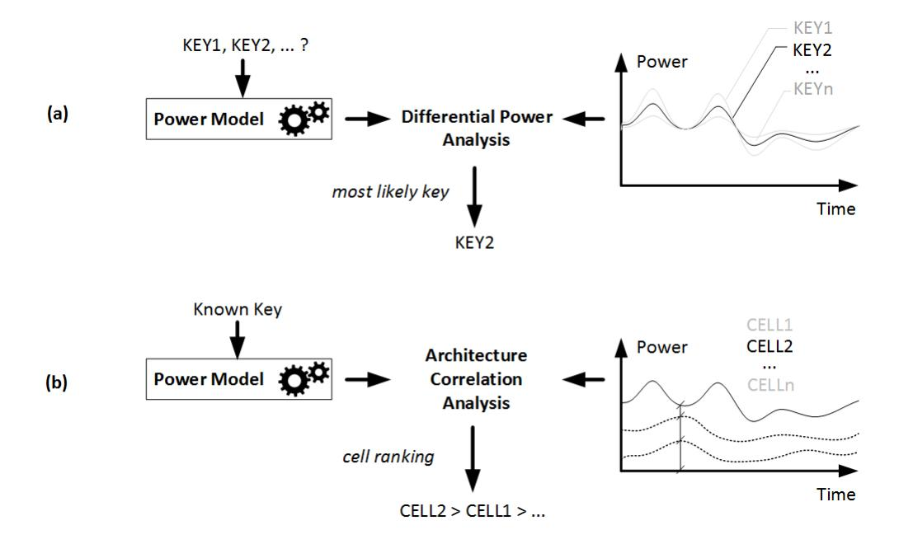

Fig. 1: Difference between Differential Power Analysis and Architecture Correlation Analysis(ACA): (a) DPA reveals an unknown key by matching a power model to a netlist (b) ACA ranks gate in a netlist according to their contribution to sidechannel leakage.

with the design. When the security verification team finds sidechannel leakage, it is up to the design team to fix it. The guidance of the testing team consists of a demonstrate sidechannel leak. However, based on a leakge model alone, it is very hard for the design team to identify the precise source of the leakage, especially in complex hardware designs.

In this work, we describe a methodology that is used to analyze a gate-level netlist for side-channel leakage. The methodology analyzes the netlist using a power model of the secure-sensitive operations in the chip. Power models are commonly used in the traditional differential side-channel analysis, and they are used to predict the power of internal secret-dependent operations in the chip. Hence, secure-SoC designers are familiar with such power models. The outcome of the methodology is a ranking of all the cells in the netlist with respect to their similarity to the power model. A cell's behavior is considered similar to the power model if its output transitions are matched to those predicted by the power model. The rationale is that while the power consumption of the entire chip includes the power contributions of every cell, only those cells that reflect the predictions of the power model will 

{1}------------------------------------------------

contribute to side-channel leakage.

The ranking is numerically expressed using the *Leakage Impact Factor* (LIF), a gate-level metric to express side-channel leakage. The higher the LIF, the more a cell contributes to power-side-channel leakage. With the LIF, the designer can then decide what cells to protect using a countermeasure. While ACA in itself is not a countermeasure, it enables a critical step in applying countermeasures more efficiently. Figure [1](#page-0-0) clarifies the difference between Architecture Correlation Analysis (ACA) and traditional side-channel analysis. Traditional (differential) side-channel analysis (Figure [1a](#page-0-0)) aims to reveal a secret, such as a cryptographic key. A power model, dependent on a secret key, is compared with the measured (or simulated) power trace obtained from a chip. The best-matching power model reveals the most likely key. On the other hand, our proposed ACA (Figure [1b](#page-0-0)) ranks cells in a netlist according to their contribution to side-channel leakage. The ranking is determined by comparing the power consumption from individual gates with a power model that uses a *known* key, and a closer similarity between cell power and power model leads to a higher ranking. The gate-level power consumption is obtained using power simulation. Thus, ACA is not a side-channel analysis technique, but rather a netlist analysis technique.

In this contribution, we introduce the ACA methodology and we apply it to a System-on-Chip Design. We analyze individual modules (such as an AES coprocessor) as well as system-level interconnect. ACA has two different use-modes. First, when a known source of side-channel leakage such as an unprotected hardware cipher is analyzed, ACA will confirm the source of side-channel leakage at the granularity of a single cell. Second, with a known side-channel leakage power model, such as the transfer of a secret value, ACA will identify every cell that contributes to the side-channel leakage predicted by the power model. In both cases, our experiments on practical SoC design show that only a small number of cells are significantly contributing to side-channel leakage. The outline of the paper is as follows. In the next section, we discuss related work. Section III describes the ACA methodology. We demonstrate two practical case studies. Section IV introduces the experimental setup. Section V applies ACA to the analysis of a coprocessor. Section VI applies ACA to the analysis of an SoC bus transfer. Section VII illustrates the effectiveness of ACA by using it to implement an optimized hiding countermeasure. In Section VIII, we provide several discussions about the relevant issues of ACA. By selectively protecting the cells flagged by ACA as sources of side-channel leakage, we show that the side-channel leakage in the overall system can be reduced significantly. We then conclude the paper.

#### II. RELATED WORK

Many authors have investigated the problem of predicting sidechannel leakage using circuit simulation techniques, including simulation of EM-leakage [\[1\]](#page-8-0), transistor (SPICE-level) power consumption [\[2\]](#page-8-1), gate-level (PrimeTime Px-level) power consumption [\[3\]](#page-8-2), or profiled modeling [\[4\]](#page-8-3). These efforts aim at reproducing side-channel leakage at design time, so that a side-channel attack can be simulated and countermeasures can be tested. Simulation-based side-channel leakage assessment methods make a trade-off between simulation speed and accuracy. Such simulations result in noiseless power estimates, thereby significantly reducing the number of traces required for a side-channel attack. Nevertheless, none of these methods investigates the ranking of design components according to side-channel leakage, which is the main contribution of ACA. A second related work topic is on how designers can use design data, at any level of abstraction, to identify the source of side-channel leakage. Information flow tracking techniques automatically identify causal dependencies between the different parts of a design, and therefore these techniques can analyze the dependencies between a sensitive or secret input and an observable design output. At the register-transfer level, SecVerilog [\[5\]](#page-8-4) analyzes hardware information flow to detect timing-based channels. At the gate-level, GLIFT [\[6\]](#page-8-5) similarly detects timing-dependent information leaks. However, information-flow based mechanisms cannot express powerbased side-channel leakage. RTL-PSC [\[7\]](#page-8-6) describes a designtime side-channel leakage assessment methodology at the Register-Transfer level. The authors identify side-channel leakage at the module-level, when a design is still at RTL. However, RTL-PSC ignores low level effects such as glitches, a known source of side-channel leakage [\[8\]](#page-8-7), as well as the effects of physical placement and routing. Other authors have proposed empirical methods for locating side-channel leakage in a prototype implementation. By systematically scanning a chip and establishing a cartography of EM-based side-channel leakage [\[9\]](#page-8-8), the areas of the chip with the most side-channel leakage can be found. However, the accuracy of these methods is very coarse and they are unable to identify side-channel leakage at the cell level.

Karna [\[10\]](#page-8-9) is another approach to design-time side-channel leakage assessment which operates at the layout level. The authors partition a chip spatially in small cells, and determine a TVLA leakage metric for each area. This reveals the leakage specific to local area of the chip. TVLA is a generic leakage metric with known caveats, the most important being that it does not confirm that a side-channel attack exists. Second, the resolution of Karna is limited by the layout area over which TVLA is computed, which typically will still contain many gates. As previous authors have repeatedly shown, sidechannel leaks can often be attributed to a single gate [\[11\]](#page-8-10), which may trigger the use of specific gate-level countermeasures. For this reason, we think it remains imperative to identify the side-channel leakage contributed by a single gate.

# III. ACA METHODOLOGY

In this section, we describe the ACA methodology. We motivate principal design choices, recall preliminaries on sidechannel leakage models, and introduce the ACA method to compute the leakage impact factor of a gate.

We motivate two of our principal design choices. First, to detect leakage, ACA relies on a leakage model, and it is up to the designer to select the right leakage model. However, these models are commonly known. Internal and external security testing labs estimate the strength of an implementation 

{2}------------------------------------------------

using state of the art side-channel attacks either on silicon or through simulations. Such attacks typically use leakage models and therefore the designer can obtain the knowledge of the 'right' leakage model as a result of the testing effort. We acknowledge that statistical detection methods, such as TVLA, can demonstrate the presence of sensitive variables in a power trace and that they avoid the difficulty of choosing a leakage model. However, TVLA comes with its own risks such as false positives [12]. This means that a positive leakage test result for TVLA does not imply that an attack exists. Second, ACA uses gate-level power modeling on post-synthesis or post-layout netlists. Power modeling at the gate-level abstraction level strikes a balance between simulation efficiency and accuracy. It is applicable to the complete chip, while still correctly characterizing sub-cycle-level power effects. In contrast, RTL power modeling or toggle-counting misses many of the important electrical effects in side-channel leakage, and transistor-level power modeling is too complex to achieve at chip-level over extended periods of time.

#### A. Leakage model

The leakage model, in the context of power-based side-channel analysis, is an estimate for the information leakage incurred through power consumption variations. The leakage model L is a function computed over a secret intermediate variable V. The objective of side-channel analysis is to reveal the value of V through many observations of the measured power consumption and correlating those observations with L(V). Popular choices for L(V) are the Hamming Weight or the Hamming Distance on V; the Hamming Weight reflects value-based power leakage in CMOS, while the Hamming Distance reflects distance-based power leakage in CMOS.

The objective of ACA is to identify, within a gate-level netlist, those cells that realize L(V). Naturally, there are many possible choices for the leakage function, and ACA makes the assumption that the designer is able to provide L(V). If the algorithm and implementation are known, such a leakage function can always be found. For example, a common choice for L(V) for AES hardware implementations is the Hamming Distance between the state of different rounds. For AES software implementations, the Hamming Weight of one or a few bytes of the AES state is typically used.

However, V does not have to be related to a cryptographic key, and any sensitive value processed in a design could be analyzed. For example, ACA can be used to study bus transfer operations in an SoC. In that case, V is a sensitive value transferred over the bus, and L(V) is the Hamming weight of the value. The Hamming weight reflects the pre-charged nature of a shared bus [13].

#### B. Computing the Leakage Impact Factor

The purpose of ACA is to define the Leakage Impact Factor (LIF) for every cell in a design. The LIF is a dimensionless number that expresses the contribution of the cell's power consumption to the side-channel leakage of a design, and a higher LIF indicates a higher contribution. We summarize the steps of LIF computation. The input of ACA consists of a netlist to be analyzed, a secure asset V, a leakage model L(V),

TABLE I: Pearson Correlation Threshold Levels as a function Confidence

| <b>Confidence Interval</b> | n=600       | n=1000      | n=2000      |
|----------------------------|-------------|-------------|-------------|
| 99%                        | $\pm 0.105$ | $\pm 0.081$ | $\pm 0.058$ |
| 95%                        | $\pm 0.080$ | $\pm 0.062$ | $\pm 0.044$ |
| 90%                        | $\pm 0.067$ | $\pm 0.052$ | $\pm 0.037$ |

and a set of stimuli that exercise the netlist and the secure asset. We first identify the Leakage Time Interval (LTI), the time interval over which we want to obtain LIF. Next, we compute for every cell i in the design an architecture correlation factor  $C_i$  as well as the average normalized power consumption  $\frac{P_i}{P_T}$ . Finally, we obtain the gate LIF as the product of these two. We discuss each of these steps in detail.

#### a) Selecting the Leakage Time Interval:

The first step of ACA is to narrow down the time window over which the Leakage Impact Factors are computed. The rationale is that we want to determine the LIF over an interval during which the leakage model L(V) is valid and during which side-channel leakage may occur. We therefore narrow the search window to the *Leakage Time Interval* using power correlation. We use simulated system-level power traces P and correlate them with the traces from the leakage model L(V). We then compute the correlation  $\rho$  as

$$\rho_{L(V),t} = \frac{cov(L(V), P(t))}{\sigma_{L(V)}\sigma_P} \tag{1}$$

where:

cov = the covariance

 $\sigma_{L(V)}$  = the standard deviation of L(V)

 $\sigma_P$  = the standard deviation of P

The Leakage Time Interval is defined as the time window(s) for which

$$\rho_{L(V),t} > \rho_{threshold} \tag{2}$$

The threshold level  $\rho_{threshold}$  is based on the designer's definition of a distinguishable correlation peak. We can use the Pearson Correlation Confidence Interval to define bounds for  $\rho_{threshold}$ . Table I illustrates several choices for  $\rho_{threshold}$ . Under the hypothesis that the true  $\rho$  is zero, the table shows confidence intervals in function of the number of traces (n) and the confidence level. Hence, if the observed  $\rho$  falls outside of the confidence interval then we reject the hypothesis and conclude that the design shows leakage.

Because we are computing  $\rho$  in a noiseless, controlled environment with full knowledge of the secure asset, we can find sharp correlation peaks with a limited number of traces.

#### b) Architecture Correlation:

Within the Leakage Time Interval, we next perform the architecture correlation as follows. First, we obtain a toggle trace from a gate-level simulation of the design. A toggle trace  $K_i$  records the activity of each net i (driven by cell i) using the discrete values -1 and +1. If a cell has multiple outputs, then we compute the architecture correlation and leakage impact factor for each output separately. For each time stamp t in the simulation, a toggle trace for net i has the value -1 if the net does not change value, and it has the value +1 if the

{3}------------------------------------------------

TABLE II: Example of Architecture Correlation

| Stimuli                               | S0 | S1 | <b>S2</b> | <b>S3</b> | $C_{ij}$ |
|---------------------------------------|----|----|-----------|-----------|----------|
| Leakage Model Toggle Activity $(H_j)$ | 1  | -1 | -1        | 1         |          |
| $net0 (K_0)$                          | 1  | -1 | -1        | 1         | 4        |
| $net1 (K_1)$                          | 1  | 1  | 1         | 1         | 0        |
| $net2 (K_2)$                          | -1 | 1  | -1        | -1        | -2       |

net does change value. We also obtain a toggle trace H that represents the toggle activities of the leakage model L(V). Next, we perform Architecture Correlation. For each net (or gate driver), we compute the dot product of the toggle trace of the leakage model H with the toggle trace of net i.

$$C_i = K_i \cdot H \tag{3}$$

A high value in  $C_i$  has a different meaning compared to a high value in  $\rho$ . A high value in  $\rho$  reflects a strong dependency between the overall power dissipation and the leakage model. Therefore, a high  $\rho$  indicates side-channel leakage. On the other hand, a high value in  $C_i$  reflects a strong dependency between activity of net i and the leakage model. A high  $C_i$ therefore means that the assumed leakage model is realized by net i. Table II describes an example computation for the architecture correlation factor  $C_i$ . The second row records the toggle activities of the leakage model for different stimuli. The leakage model value toggles for the first stimuli  $S_0$ , it does not toggle for stimuli  $S_1$  and  $S_2$ , and toggles for  $S_3$ . At the same time,  $net_0$  also only toggles on  $S_0$  and  $S_3$  which matches the leakage model in all the four stimuli, therefore, the  $net_0$ 's correlation score is 4. On the other hand,  $net_1$  and  $net_2$  have a weaker correlations as 0 and -2 respectively. Overall, a more positive and larger architecture correlation indicates that a net approximates the leakage model more closely.

#### c) Compute Leakage Impact Factors:

The final step of ACA computes the Leakage Impact Factor  $F_i$  of the driver of each net i, as the Architecture Correlation of net i, weighted with the average power consumption  $P_i$  of the driver of net i normalize by the average power consumption of the whole design  $P_T$ , during the leakage time interval averaged over all stimuli.

$$F_i = C_i \frac{P_i}{P_T} \tag{4}$$

This additional weighing factor  $\frac{P_i}{P_T}$  is needed because the architecture correlation factor by itself ignores the relative contribution of a cell in the side-channel leakage power footprint. Once the LIF  $F_i$  of all cells are determined, they are ranked from highest to lowest. The cells with the highest LIF make the greatest contribution to side-channel leakage. This list can then be used by a designer to efficiently optimize the netlist with countermeasures.

# IV. DEMONSTRATING ARCHITECTURE CORRELATION ANALYSIS

To demonstrate ACA, we apply it to define the leakage impact factors in an SoC built around a LEON3 core, an in-order 32-bit RISC processor. As shown in the Figure 2, the SoC includes a two-level AMBA bus with on-chip memory and several coprocessors. One coprocessor, an AES encryption engine, is a single-round per cycle AES-128 design with on-line key

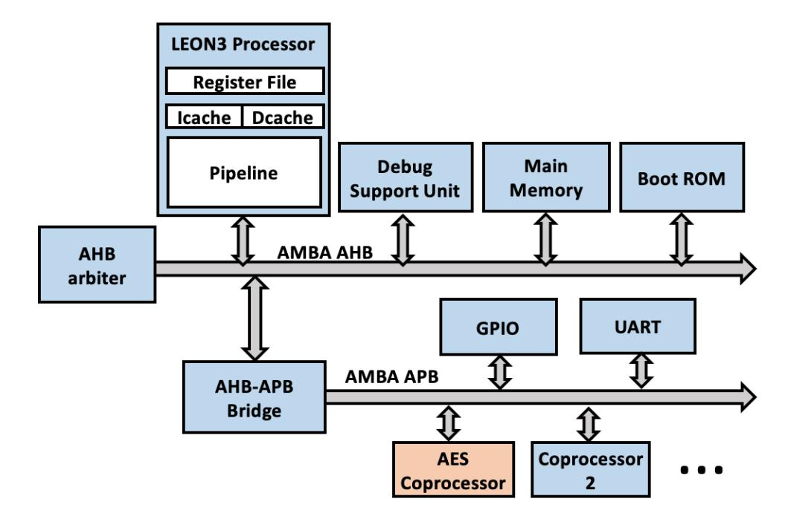

Fig. 2: SoC block diagram

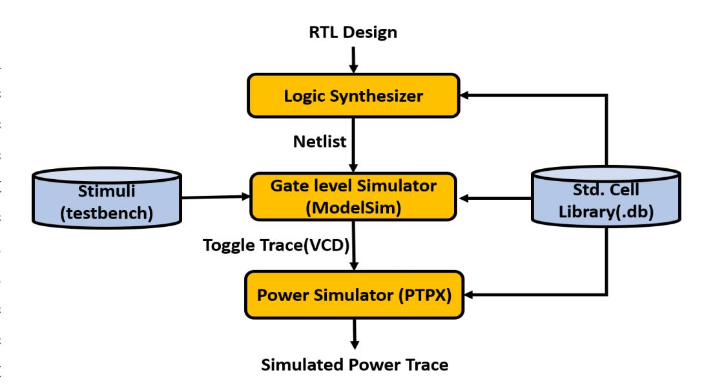

Fig. 3: Simulation Procedure

expansion. A single hardware AES encryption completes in 11 clock cycles. The AES design contains no countermeasures. To perform a hardware-accelerated encryption, the LEON3 writes secure assets (128 bits of plaintext and 128 bits of key material) to the AES coprocessor, triggers the encryption, and waits for a completion flag. The LEON3 then retrieves the ciphertext. We have access to the gate-level netlist of the design, which is implemented in 180nm CMOS technology. Figure 3 illustrates the power simulation procedure. Logic synthesis converts the high-level RTL description into a gatelevel netlist, which is the stimulated in a ModelSim simulation with a set of varying and random plaintext stimuli using a software testbench. For each plaintext input, we perform functional simulation using Modelsim at the logic level to obtain toggle traces (Value Change Dump). These traces are used for Architecture Correlation (III.B.b). Next, we perform gate-level power simulation using Primetime PX to produce a simulated power trace per plaintext input, which is used for the Leakage Time Interval (III.B.a) and to compute the Leakage Impact Factors (III.B.c).

In the following, we demonstrate ACA for two different use cases. First, we use it to identify cells that cause side-channel leakage in the AES hardware engine. Next, we study the transfer of secure assets in the SoC, and we use ACA to mark cells within the LEON3 core as side-channel leakage sources.

{4}------------------------------------------------

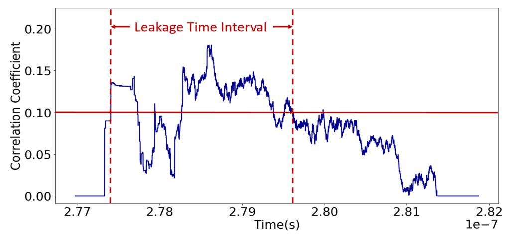

Fig. 4: Leakage Time Interval for the AES Hardware Engine Leakage Model: HD(AES state bit)

#### V. ACA OF AN AES HARDWARE ENGINE

In this case study, we apply ACA to a stripped down version of the AES coprocessor, modified to run as a stand-alone hardware design. The leakage power model used by ACA is the Hamming distance on the previous and current values of the AES state register.

We analyze the output of the first round to find the leakage time interval. Figure [4](#page-4-0) reveals a sharp correlation peak when the SBOX output is computed, and we use these correlation peaks to determine ρthreshold at 99% confidence level with 600 power traces. This gives a leakage time interval of 1.57ns (for an AES running at 41.67ns clock period).

Next, we perform architecture correlation. Since there are 128 bits of state, there are 128 different leakage models to consider using architecture correlation. In the following, we present the results for a single leaking bit. Our conclusions remain valid for the entire AES state by repeating ACA for each state bit. ACA yields a list of cells in the descending order of their Leakage Impact Factor (LIF) value, which signifies the individual contribution of these cells to side channel leakage.

TABLE III: LIF Distribution Data for the AES Hardware Engine using HD(AES state bit) as the leakage model

| LIF Range  | No. of Cells |
|------------|--------------|
| 1.9 ∼ 2.5  | 1            |
| 1.3 ∼ 1.9  | 1            |
| 0.7 ∼ 1.3  | 0            |
| 0.1 ∼ 0.7  | 58           |
| -0.5 ∼ 0.1 | 9525         |

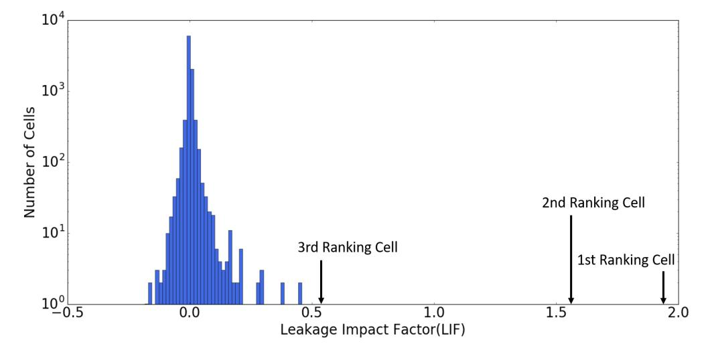

Fig. 5: LIF Distribution for the AES Hardware Engine Leakage Model: HD(AES state bit); Logarithmic Y scale

*Result Analysis:* We analyzed on the cell ranking list from

ACA output, Figure [5](#page-4-1) illustrates the LIF distribution for all the cells in the AES design based on the ACA output and Table [III](#page-4-2) lists the corresponding data. The distribution is highly skewed with only a small amount of cells have high LIF. This indicates that only a small number of cells actively contribute to the side-channel leakage produced following the selected leakage model. The most leaky cell, as identified by the LIF ranking, is a flip-flop of the state-register. As the 128bit state register holds the state of the AES process and is updated after every round, it is reasonable that it is the most leaky cell in the coprocessor. Furthermore, the cells ranked just below this register is a cell in the SBOX that is directly driven by this register. After these cells, there is a sharp drop-off in LIF factors, indicating that the remaining cells only contribute marginally to the leakage.

*Runtime Evaluation:* Table [IV](#page-4-3) shows the runtime overhead of the analysis. We use a 2.3GHz Intel Xeon E5-2699 design server with 128GB of main memory. The complexity of this AES design is 9585 cells. The runtime is broken down into gate-level power simulation (per stimuli), and ACA (per AES state bit). Hence, a full AES design can be analyzed with 600 traces in about 2 hours.

TABLE IV: Runtime Evaluation for AES Hardware Engine (9,585 cells)

| Procedure                                       | Runtime s/stimuli |
|-------------------------------------------------|----------------------|
| Power Simulation                                | 12.28                |
| Architecture Correlation Analysis (per AES bit) | 0.268                |

#### VI. ACA OF AN SOC BUS TRANSFER

ACA applies to any activity for which one can find a leakage model. In this case study, we demonstrate how to analyze the bus interface logic of an SoC for side-channel leakage with ACA.

To initiate an encryption operation, the LEON3 writes a key and a plaintext to the memory-mapped hardware of the AES coprocessor. This affects a large number of components in the SoC, including the caches, the write buffers, the AMBA AHB and APB bus bridges, and finally the memory-mapped interface in the coprocessor. Any of these can potentially contribute to side-channel leakage, and ACA helps to identify which components leak most.

For this case study, we consider the hamming weight of plaintext inputs of encryption as the leakage model for ACA analysis target. The input data (secure asset) is 128-bit wide, and therefore there are 128 different leakage models to consider. The transfer to the AES coprocessor consists of four 32-bit transfers. Using correlation analysis of the leakage model with the simulated power trace over an interval of these four transfers, we obtain a sharp correlation peak shown in Figure [6.](#page-5-0) We use these peaks to fix ρthreshold at 99.0% confidence level for 600 power traces. The leakage time interval is 1.082µs, roughly 26 simulated clock cycles. As before, we present the analysis for a single bit. Since the leakage time interval at the level of SoC covers many different components, we limit the discussion to cells included within

{5}------------------------------------------------

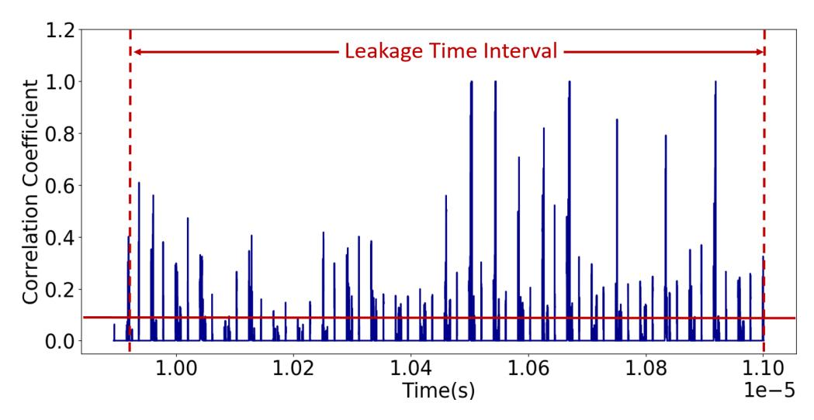

Fig. 6: Leakage Time Interval for the SoC Bus Transfer Leakage Model: HW(transferred bit)

the LEON3 core.

TABLE V: LIF Distribution Data for the SoC Bus Transfer Leakage Model: HW(transferred bit)

| LIF Range  | No. of Cells |
|------------|--------------|
| 1.9 ∼ 2.5  | 1            |
| 1.3 ∼ 1.9  | 0            |
| 0.7 ∼ 1.3  | 8            |
| 0.1 ∼ 0.7  | 332          |
| -0.5 ∼ 0.1 | 99563        |

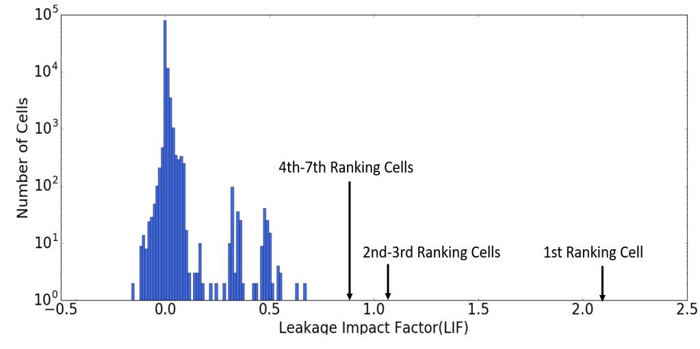

Fig. 7: LIF Distribution for the SoC Bus Transfer Leakage Model: HW(transferred bit); Logarithmic Y scale

*Result Analysis:* From the ACA output, we obtained the cell ranking based on LIF. Figure [7](#page-5-1) illustrates the LIF distribution for all cells in the SoC and Table [V](#page-5-2) shows corresponding distribution data. Investigating the results of ACA reveals both expected and unexpected sources of leakage. Top-LIF cells include the flip-flops from the register file, flip-flops from the pipeline operand register of the execution stage, and flip-flops from the pipeline result register of the memory access stage. We notice that cells in the data cache of LEON3 are pointed out by ACA as sources of side channel leakage. This is unexpected because the data cache is disabled by our testbench during the experiment. With the cache disabled, stores of the secure data asset should be directly passed to the memory controller. However, ACA reveals cell activity in the data cache correlating with the secure data asset. Investigation of the specific cells reveals that the leakage is due to a Write Buffer which is integrated in the data cache. The Write Buffer remains active even if the data cache is disabled and is used by LEON3 to ensure that stores do not impede the progress of the execution pipeline by putting pending stores in the Write Buffer. We concluded that identifying such cells would be extremely hard without the systematic analysis offered by ACA.

The cells inside the Instruction Trace Buffer (ITB), integrated in the LEON3 core, are another unanticipated source of leakage exposed by ACA on this time window. In our case, LEON3 contains 1 KiloByte of memory as ITB for storing executed instructions. The ITB is implemented as a circular buffer and can hold upto 64 executed instructions. The source of side channel leakage revealed here are the memory cells in the ITB. The ITB is a source of side-channel leakage due to our test mechanism where the plaintext data is a part of the operands in a few of the instructions. These retired instructions end up in the ITB after execution. The existence of the ITB further means that the instructions carrying the secure data asset can persist in the LEON3 core for much later than intended.

*Runtime Evaluation:* Table [VI](#page-5-3) shows the runtime overhead of this analysis. The complexity of the SoC is 99,904 cells, 10 times the size of the AES hardware engine. Thus, a full design can be analyzed with 600 traces in about 60 hours.

TABLE VI: Runtime Evaluation for SoC Bus Transfer (99,904 cells)

| Procedure                                       | Runtime   |  |
|-------------------------------------------------|-----------|--|
|                                                 | s/stimuli |  |
| Power Simulation                                | 329.00    |  |
| Architecture Correlation Analysis (per AES bit) | 32.27     |  |

#### VII. ACA VALIDATION

In the previous section, we demonstrate that ACA precisely identifies the cells in the netlist which are responsible for the side-channel leakage and output a ranking list of the cells based on the Leakage Impact Factor(LIF) which quantify each cell's contribution to the side-channel leakage. In this section, we elaborate on the validation of the ACA methodology. We emphasize that here we are not proposing a countermeasure, rather we are verifying the correctness of the proposed ACA methodology insofar as the cells we detected are actually the leakage source.

We demonstrate that the high-LIF cells identified by ACA have a significant impact on side-channel leakage as follows. We emphasis that here we are not proposing a countermeasure, We replace these high-LIF cells with equivalent cells that are protected using a hiding countermeasure. The protected cells are based on Wave Dynamic Differential Logic (WDDL), adapted such that a per-cell replacement can be achieved. WDDL is a well-known dual-rail logic style which was proposed as a circuit-level countermeasure against side-channel leakage [\[14\]](#page-8-13). WDDL logic ensures that each cell makes a single 0 → 1 transition per evaluation, regardless of the computed value. WDDL cells require a dynamic clocking style with a precharge phase and an evaluation phase. Although the feasibility of WDDL has been demonstrated in ASIC, it is expensive. In comparison to unprotected single-rail logic, WDDL occupies 3 times more area and consumes 4 times more power. WDDL

{6}------------------------------------------------

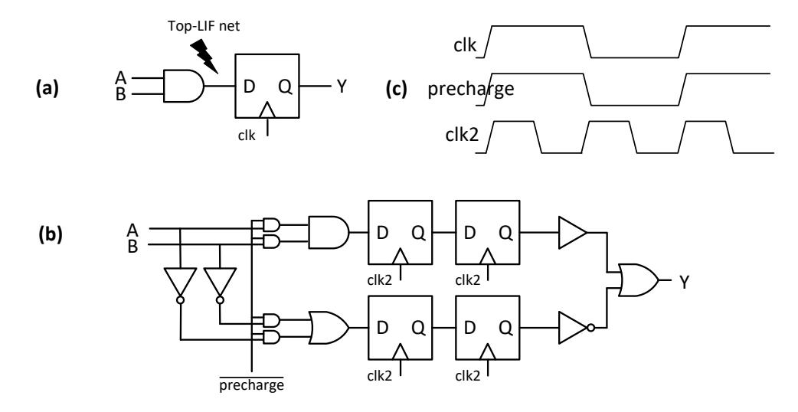

Fig. 8: Selective-replacement WDDL (a) Original Circuit (b) Transformed Circuit (c) Clocking.

is therefore a costly technique to apply chip-wide. When we replace only the high-LIF cells with WDDL versions, the impact on area will be much smaller, while still having a significant impact on the side-channel leakage. We will first explain our countermeasure methodology to implement WDDL on a cell-replacement basis. Next, we evaluate the cost and impact of this countermeasure on the side-channel leakage of the AES hardware.

#### *A. Selective-replacement WDDL*

The WDDL version of a logic cell is created by adding a complementary version of that cell. For example, the AND gate becomes an AND-OR tuple, and a single-rail circuit becomes a dual-rail circuit with complementary outputs. At the start of every WDDL-evaluation, both rails are precharged to logic-0. Then, the WDDL cell evaluates and a single net in every rail pair switches 0 → 1. To integrate a WDDL cell or a cluster of connected WDDL cells in a single-ended netlist, we add single-to-dual and dual-to-single conversions at the inputs and outputs, respectively, of the protected WDDL region. Every internal net in the WDDL region is protected. Figure [8a](#page-6-0) shows a two-gate circuit with one internal net. Figure [8b](#page-6-0) is the protected version of the same two-gate circuit. As shown in the Figure, the conversion of a single-rail flip-flop to WDDL requires special attention since a flip-flop does not support precharge. We use a master-slave dynamic differential logic [\[14\]](#page-8-13), which stores the precharge value in a redundant layer of flip-flops. To insert the precharge value, we convert a flip-flop together with its (data-input) driving cell into WDDL. Figure [8c](#page-6-0) illustrates the timing signals of the original circuit and the transformed circuit. A disadvantage of the master-slave method is that it doubles the clock frequency and quadruples every flip-flop. There are many variations and circuit-level improvements of WDDL but these are out of scope for our experiments, which focus on validating ACA.

## *B. Validation results*

Within our AES experiment, we selected top-ranking LIF cells and converted them to WDDL versions while leaving the bulk of the design unprotected. Then, we reran the power simulation and re-evaluated the Pearson correlation under the same power model to detect the impact on the resulting correlation peak. Since the top-ranking cell gate was a flip-flop, we converted the entire state register (128 bits) as well as an output register

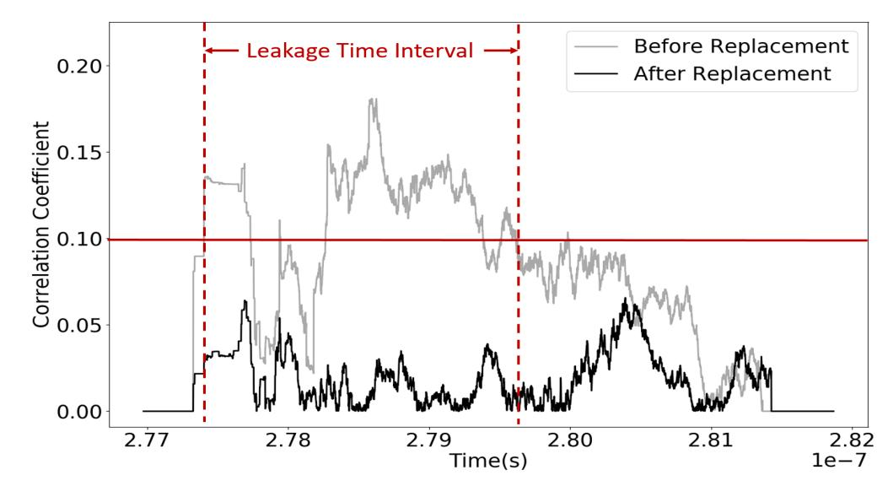

Fig. 9: Impact on the Pearson Correlation Peak before and after replacing the two top-LIF cells by WDDL

TABLE VII: Impact on the Pearson Correlation Peak under various levels of replacement

| Top-LIF cells | ρmax   | Cells Added | +Area (+ %) |
|---------------|--------|----------------|----------------|
| reference     | 0.1789 | 0              | 0              |
| 2             | 0.0847 | 282            | +8.44          |
| 20            | 0.0586 | 422            | +9.43          |
| 40            | 0.0480 | 577            | +10.54         |
| WDDL[14]      | NA     | NA             | +300           |

(128 bits) to a dual master-slave flip-flop, so that we could use a single clock for the entire design. Figure [9](#page-6-1) shows the effect of replacing just 2 top-ranking LIF cells to WDDL. The correlation is now well below the ρthreshold selected for this confidence level. We also evaluated the effect of replacing additional top-LIF cells. Table [VII](#page-6-2) demonstrates the impact of replacing 2, 20 and 40 top-LIF cell in the design on the peak correlation over the leakage time interval. Although the impact is far less dramatic than the first substitution, a consistent drop can be noticed. The table also indicates the area overhead for this ad-hoc countermeasure, as well as the number of cells we added to the overall design (9,985 cells in total). At only 10% area increase, we are able to obtain a drop of almost four times in the correlation peak. We conclude that ACA helps to identify the cells of a design that cause side-channel leakage.

#### VIII. DISCUSSION

In this section, we elaborate on several topics relevant to ACA including leakage model, method for side-channel leakage detection and power simulation vs ASIC measurement.

*Selection of Leakage Model:* The ACA methodology heavily depends on the choice of a leakage model. By targeting different leakage models, ACA will reveal the leakage sources corresponding to the choice of the leakage model. In this paper, we assume that the designer knows a vulnerable leakage model for the design. Applications such as AES have well-known leakage models. For example, the Hamming distance of the adjacent rounds outputs in hardware AES implementation which reveals the side channel leakage during the update of the state register, is a typical leakage model used by attackers to attack AES. Hence, it is a crucial ACA target for the designer. For analyzing the bus transfer procedure of a microprocessor, the Hamming weight model

{7}------------------------------------------------

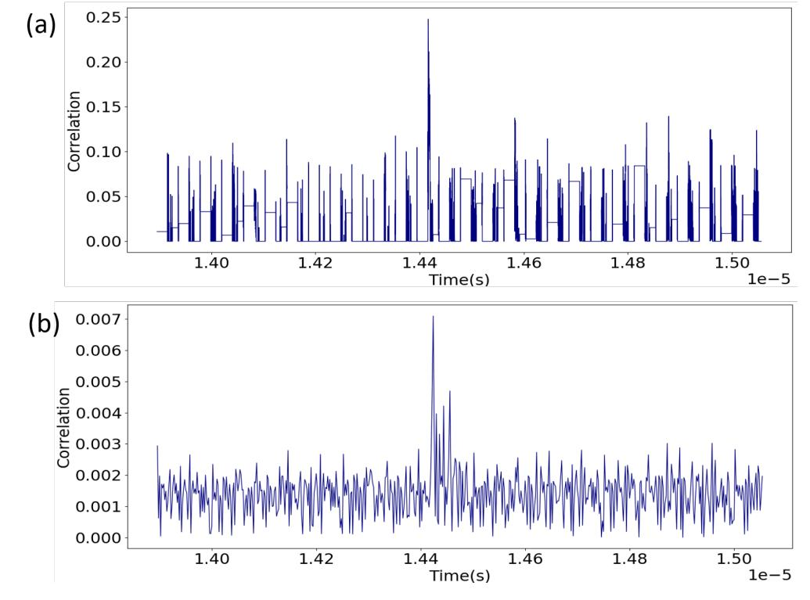

Fig. 10: Overview of Leakage Peaks for the AES Hardware Engine Leakage Model: HD(AES state bit) obtained from (a)Simulated Traces (b)ASIC Measurement Traces

is chosen because during bus transfer the power consumption dependent on the Hamming weight of the secret data [\[13\]](#page-8-12). Even if the designer has no knowledge of what leakage models to use beforehand, exploring vulnerable leakage models for the design is not complex. In our setup, we iterate through all leakage models (all combinations of input data and intermediate values) of the AES application and choose the leakage model which gives us significant correlation peaks which can then be used for analysis using ACA. Moreover, there are methodologies like GLIFT [\[15\]](#page-8-14) which reveal how a secret asset propagates in architecture and can help designers identify an appropriate leakage model.

*Power Correlation vs TVLA:* Statistical based side-channel detection method, such as TVLA, can demonstrate the presence of sensitive variables in a power trace. TVLA avoids the selection of power models. However, TVLA indeed has its own short-commings. The most notorious one being the lack of an obvious relationship between the leakage peaks detected by the TVLA and the exploitability and efficiency of it in attack. Another problem of TVLA is the false negatives/false positives, i.e. TVLA fails to detect the leakage while the leakage exist/detects the leakage while the leakage does not actually exist. Power correlation based on the leakage model is always used as a distinguisher for attack. Therefore, power correlation peaks reflects actual difficulty of key recovery. Furthermore, unlike TVLA, power correlation has a precise interpretation in terms of the gates in the netlist of a design. Therefore, we use power correlation rather than TVLA as the side channel leakage evaluation tool.

*Power simulation vs ASIC measurements:* ACA relies on power simulation. It enables the designers, at early designtime before chip tape-out, to the identify side channel leakage source and efficiently fix the vulnerability. However, questions may arise that how close the simulated traces to practical measurement traces in terms of side-channel leakage? In order to evaluate the accuracy of the design-time power

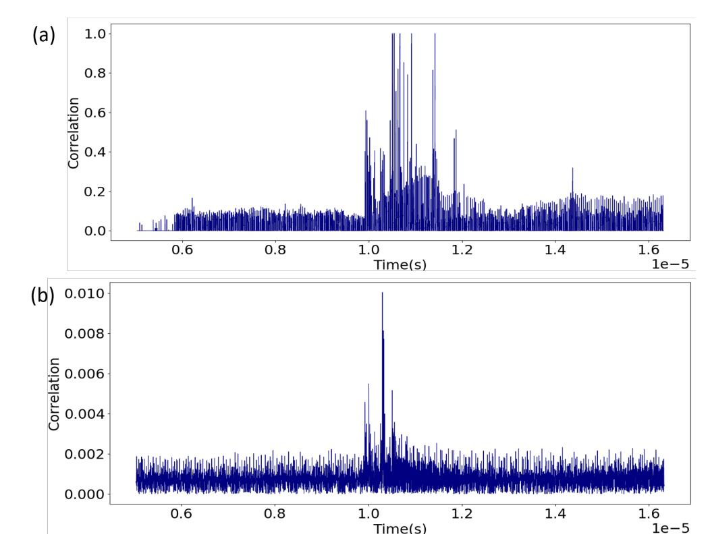

Fig. 11: Overview of Leakage Peaks for the SoC Bus Transfer Leakage Model: HW(transferred bit) obtained from (a)Simulated Traces (b)ASIC Measurement Traces

estimation, we take the measurement of the corresponding ASIC prototype and make comparison with our simulated trace.In ASIC measurement trace, 500k traces are needed until a distinguishable leakage peak can be observed. By comparison in simulations, only 500 traces are needed. The presnet of noise in the ASIC measurement traces makes side channel leakage assessment difficult, while highlighting the advantages of simulated trace.

Figure [10](#page-7-0) shows the overview of leakage peaks for AES hardware engine leakage model mentioned in the first case study. We can observe that both in the ASIC measurement and simulated trace leakage peaks can be detected. The time interval during which correlation peaks appear in the simulated trace is aligned with the time interval in the ASIC prototype measurement. These observations demonstrate the accuracy of the power estimation of the simulated traces.

Similar to the first case study, Figure [11](#page-7-1) shows the leakage peaks for the SoC bus transfer leakage model in the second case study. Correlation peaks of power traces with input data can be observed in both the ASIC measurement traces and the simulated traces starting at the same period of time. However, as compared to the simulated traces, the ASIC traces are noisy which leads to fewer and smaller correlation peaks. An increased number of measured traces might enhance the correlation peaks by cancelling out the effect of noise, which again highlights the advantages of using design-time side channel assessment.

# IX. CONCLUSION

We demonstrated that it is possible, at design time, to rank the cells in a netlist according to their contribution to sidechannel leakage. The proposed ACA methodology supports chip-wide analysis of side-channel leakage. Using ACA, a designer can investigate the sources of side-channel leakage that result from the integration of cryptographic modules in system-on-chip. We have experimentally verified that a sidechannel correlation peak can be directly attributed to only a 

{8}------------------------------------------------

minority of the cells in a netlist. A potential use of ACA is therefore to fix side-channel leakage by selective replacement of cells in the netlist. This can be done iteratively, and it opens up a new perspective for the development of side-channel countermeasures. Indeed, traditional countermeasures work in an all-or-nothing approach, treating a cryptographic module as a black box and protecting all of its cells. This is not only expensive, it also ignores residual side-channel leakage that stems from the integration of the module in a systemon-chip. The ACA methodology fits in a design flow that comprehensively optimizes the security, timing, and area of a design.

#### X. ACKNOWLEDGEMENT

This research was supported in part by National Science Foundation Award 1617203. The authors would like to thank anonymous reviewers for their valuable feedback.

#### REFERENCES

- [1] Amit Kumar, Cody Scarborough, Ali Yilmaz, and Michael Orshansky, "Efficient simulation of EM side-channel attack resilience", in *2017 IEEE/ACM International Conference on Computer-Aided Design, IC-CAD 2017, Irvine, CA, USA, November 13-16, 2017*, 2017, pp. 123– 130.
- [2] Francesco Regazzoni, Stephane Badel, Thomas Eisenbarth, Johann ´ Großschadl, Axel Poschmann, Zeynep Toprak Deniz, Marco Mac- ¨ chetti, Laura Pozzi, Christof Paar, Yusuf Leblebici, and Paolo Ienne, "A simulation-based methodology for evaluating the dpa-resistance of cryptographic functional units with application to CMOS and MCML technologies", in *Proceedings of the 2007 International Conference on Embedded Computer Systems: Architectures, Modeling and Simulation (IC-SAMOS 2007), Samos, Greece, July 16-19, 2007*, 2007, pp. 209– 214.
- [3] Danilo Sijacic, Josep Balasch, Bohan Yang, Santosh Ghosh, and Ingrid Verbauwhede, "Towards efficient and automated side channel evaluations at design time", in *PROOFS 2018, 7th International Workshop on Security Proofs for Embedded Systems, colocated with CHES 2018, Amsterdam, The Netherlands, September 13, 2018*, 2018, pp. 16–31.
- [4] Nicolas Debande, Mael Berthier, Yves Bocktaels, and Thanh-Ha Le, ¨ "Profiled model based power simulator for side channel evaluation", *IACR Cryptology ePrint Archive*, vol. 2012, pp. 703, 2012.
- [5] Danfeng Zhang, Aslan Askarov, and Andrew C. Myers, "Languagebased control and mitigation of timing channels", *SIGPLAN Not.*, vol. 47, no. 6, pp. 99–110, June 2012.
- [6] Jason Oberg, Sarah Meiklejohn, Timothy Sherwood, and Ryan Kastner, "Leveraging gate-level properties to identify hardware timing channels", *IEEE Trans. on CAD of Integrated Circuits and Systems*, vol. 33, no. 9, pp. 1288–1301, 2014.
- [7] Miao Tony He, Jungmin Park, Adib Nahiyan, Apostol Vassilev, Yier Jin, and Mark Tehranipoor, "RTL-PSC: automated power side-channel leakage assessment at register-transfer level", in *37th IEEE VLSI Test Symposium, VTS 2019, Monterey, CA, USA, April 23-25, 2019*, 2019, pp. 1–6.
- [8] Stefan Mangard and Kai Schramm, "Pinpointing the side-channel leakage of masked AES hardware implementations", in *Cryptographic Hardware and Embedded Systems - CHES 2006, 8th International Workshop, Yokohama, Japan, October 10-13, 2006, Proceedings*, 2006, pp. 76–90.
- [9] Laurent Sauvage, Sylvain Guilley, Florent Flament, Jean-Luc Danger, and Yves Mathieu, "Blind cartography for side channel attacks: Cross-correlation cartography", *Int. J. Reconfig. Comp.*, vol. 2012, pp. 360242:1–360242:9, 2012.
- [10] Patanjali SLPSK, Prasanna Karthik Vairam, Chester Rebeiro, and Kamakoti Veezhinathan, "Karna: A gate-sizing based security aware eda flow for improved power side-channel attack protection", in *Proceedings of the International Conference on Computer-Aided Design, ICCAD 2019, Westminster, CO, USA, November 04-07, 2019*.
- [11] Stefan Mangard, Thomas Popp, and Berndt M Gammel, "Side-channel leakage of masked cmos gates", in *Cryptographers' Track at the RSA Conference*. Springer, 2005, pp. 351–365.

- [12] Carolyn Whitnall and Elisabeth Oswald, "A cautionary note regarding the usage of leakage detection tests in security evaluation", *IACR Cryptology ePrint Archive*, vol. 2019, pp. 703, 2019.
- [13] Eric Peeters, Franc¸ois-Xavier Standaert, and Jean-Jacques Quisquater, "Power and electromagnetic analysis: Improved model, consequences and comparisons", *Integration, the VLSI journal*, vol. 40, no. 1, pp. 52–60, 2007.
- [14] Kris Tiri and Ingrid Verbauwhede, "A logic level design methodology for a secure dpa resistant asic or fpga implementation", in *Proceedings Design, Automation and Test in Europe Conference and Exhibition*. IEEE, 2004, vol. 1, pp. 246–251.
- [15] Jason Oberg, Sarah Meiklejohn, Timothy Sherwood, and Ryan Kastner, "Leveraging gate-level properties to identify hardware timing channels", *IEEE Trans. on CAD of Integrated Circuits and Systems*, vol. 33, no. 9, pp. 1288–1301, 2014.