{0}------------------------------------------------

# **Bypassing Isolated Execution on RISC-V with Fault Injection**

Shoei Nashimoto<sup>1</sup> , Daisuke Suzuki<sup>1</sup> , Rei Ueno<sup>2</sup> and Naofumi Homma<sup>2</sup>

<sup>1</sup> Mitsubishi Electric Corporation, Japan, Nashimoto.Shoei@bx.MitsubishiElectric.co.jp <sup>2</sup> Tohoku University, Japan, homma@riec.tohoku.ac.jp

**Abstract.** RISC-V is equipped with physical memory protection (PMP) to prevent malicious software from accessing protected memory regions. One of the main objectives of PMP is to provide a trusted execution environment (TEE) that isolates secure and insecure applications. In this study, we propose a fault injection attack to bypass the isolation based on PMP. The proposed attack scheme involves extracting successful glitch parameters for fault injection under the assumption of a black-box environment. We implement a proof-of-concept TEE compatible with PMP in RISC-V, and we verify the feasibility and effectiveness of the proposed attack through some experiments conducted in the TEE. The results show that an attacker can bypass the isolation of the TEE and read data from the protected memory region.

**Keywords:** Fault Injection · RISC-V · Memory Protection · Trusted Execution Environment

# **1 Introduction**

RISC-V is an open instruction set architecture (ISA) published in 2011 [PW17]. It has attracted considerable attention in both academia and industry owing to its remarkable features of no license fee, expandability with reduced wasteful functions in existing ISAs, and flexibility with m odular e xtensions [ Fou19]. O wing t o i ts fl flexibility, it ca n be used in a wide variety of applications from low-end embedded devices running a bare-metal program to high-end servers running the Linux operating system (OS).

It is important to design RISC-V by considering its security. Privileged instructions and a memory protection unit called physical memory protection (PMP) play an important role in its security. They prevent malicious applications and/or libraries from accessing protected memory regions. Application execution based on memory isolation and the secure area isolated from the insecure area are referred to as isolated execution and the trusted execution environment (TEE), respectively. Furthermore, the TEE sometimes represents the isolation mechanism itself. Intel Software Guard Extensions (SGX) and ARM TrustZone are popular TEEs used for web servers and embedded devices.

Meanwhile, physical attacks, such as side-channel attacks and fault injection attacks, should be considered from the viewpoint of embedded devices such as smartphones, gaming consoles, and electrical appliances [RRR<sup>+</sup>04, Gil15, PT17]. In particular, fault injection attacks induce improper operations and/or data corruption, for example, by momentary distortion of the power supply or by providing an abnormal clock signal to a target device. It has been reported that security mechanisms, such as secure boot and read protections can be bypassed with fault injection [WP17, VTM<sup>+</sup>18]. Although PMP did not originally address resistance to physical attacks as with other TEEs, the security evaluation of RISC-V against fault injection attacks is a significant issue in practice.

{1}------------------------------------------------

In this study, we present a fault injection attack against a security mechanism of RISC-V, i.e., memory isolation by PMP. The basic idea is to bypass isolated execution by skipping the PMP configuration with fault injection. The proposed attack generally targets instructions for realizing memory isolation by PMP, whereas existing attacks, as in [WP17, WP17, VTM<sup>+</sup>18, BFP19], target an implementation-dependent fragment of code such as secure boot and security configuration check. In particular, we focus on three types of instructions for changing the PMP configuration. This feature makes it possible to perform the proposed attack under the assumption of a black-box environment starting with the extraction of successful glitch parameters. To verify the feasibility of the proposed approach, we perform some experiments with a proof-of-concept (PoC) TEE implementation (*PoC TEE*) compatible with PMP in RISC-V owing to its flexibility and analyzability. Through these experiments, we demonstrate that we can read the memory of a victim application protected by PMP under the black-box setting.

**Related work.** Fault injection attacks were first proposed to compromise cryptographic processors [BDL97, BECN<sup>+</sup>06]. Since then, in addition to theoretical studies, various types of injection techniques have been reported. Clock glitch is a technique of inserting a distorted clock signal with a sudden voltage drop over a very short time [BRSK17, TSS17]. The same concept can be applied to a power supply, which is referred to as power glitch (or voltage glitch/Voltage Fault Injection(V-FI)) [BFP19]. Another type of fault injection technique directly irradiates laser or electromagnetic waves [WP17, VTM<sup>+</sup>18]. The effect of fault injection on a target processor is represented by a *fault model* [YSW18]. The *instruction skip* and *data corruption* models are common fault models for fault injection attacks on processors.

Fault injection attacks have recently been adopted to break security mechanisms. In [GA03, BTG10], a type-check operation on a Java virtual machine was subverted with fault injection, which resulted in the execution of arbitrary code. In [NHH<sup>+</sup>16], the size limitation of the user input was broken by skipping the increment of a loop counter to cause buffer overflow. In [VTM<sup>+</sup>18], secure boot was bypassed by inducing bit errors on a security register with laser fault injection. In [TM17], as an attack after booting, privilege escalation was demonstrated with fault injection at system call. Examples of practical attack scenarios include bypassing attacks against secure boot and TrustZone-based TEE by corrupting the program counter register [TSW16]. In [TSS17, QWLQ19a, QWLQ19b, MOG<sup>+</sup>20, KFG<sup>+</sup>20], attacks were performed on ARM TrustZone and IntelSGX, respectively. The authors used dynamic voltage and frequency scaling (DVFS) to inject faults and successfully subverted cryptography. In [WP17], Joint Test Action Group (JTAG) protection was proven to be subverted even in Automotive Safety Integrity Level D (ASIL-D)-certified microcontrollers. In [MTW<sup>+</sup>18, BFP19], memory dump was performed by bypassing authentication or parameter checks with faults.

Meanwhile, how to extract the fault injection parameters and requirements for an attack scenario has not been clarified or limited to a specific case in most studies. In [TSS17, QWLQ19a, QWLQ19b, MOG<sup>+</sup>20, KFG<sup>+</sup>20], the authors presented attacker models and showed how to determine the glitch parameters. Although their techniques to determine the glitch parameters work in attacking against cryptography (i.e., code is known), they cannot be applied to unknown target. In [WP17], the authors identified the glitch timing using differences in power traces obtained from devices with two different settings; however, they did not describe the preparation of such a profiling device.

The attacks on TEEs presented in [TSS17, QWLQ19a, QWLQ19b, MOG<sup>+</sup>20, KFG<sup>+</sup>20] are related to our proposed attack in the sense that their purpose is to break the isolation by TEE. The main differences between our attack and their attacks are the architecture and protection mechanism for isolation. In addition, the proposed attack defeats the isolation itself to induce a fault in the PMP configuration. In [TSS17, QWLQ19a, QWLQ19b, MOG<sup>+</sup>20], the authors used data corruption to apply cryptanalysis techniques to extract

{2}------------------------------------------------

a secret key or to subvert signature verification. In [KFG<sup>+</sup>20], the authors also adopted data corruption to break message authentication code. Thus, their fault model and target function are different from ours.

**Contributions.** The contributions of this study can be summarized as follows.

- 1. We present a fault injection attack targeting isolated execution on RISC-V. In particular, we provide a black-box scenario that enables us to start from the extraction of the fault intensity and glitch timing.
- 2. We verify the feasibility and effectiveness of the proposed attack through actual experiments with PoC TEE, where RISC-V core X300 [Fiv20b] is implemented on the basis of Rocket Chip from University of California, Berkeley (UCB) [AAB<sup>+</sup>16] on a field-programmable gated array (FPGA) board. We show that an attacker can access the memory region of a victim application by bypassing the isolated execution provided by PMP. In addition, we show that the proposed method can obtain the glitch timing in a short time.

**Paper organization.** The remainder of this paper is organized as follows. Section 2 describes the security mechanism of RISC-V and existing TEEs implemented with RISC-V. Section 3 introduces the attacker model used in this study, and explains the proposed attack. Section 4 describes the PoC TEE to which the proposed attack is applied. The PoC TEE is implemented on the basis of the TEEs described in Section 2. Section 5 describes experiments conducted using actual devices to verify the effectiveness of the proposed attack. Section 6 discusses the applicability of the proposed attack to other architectures, limitations of the proposed attack, and countermeasures against the attack. Finally, Section 7 concludes the paper.

# **2 Security on RISC-V**

In this section, we briefly explain the privileged architecture and memory protection mechanism (PMP) based on [PW17, WA19]. Then, we introduce existing TEE examples and their features. Hereafter, we focus on the 32-bit RISC-V architecture (RV32).

### **2.1 Privileged Architecture**

RISC-V defines privilege levels as four modes in descending order of privilege: machine (M-mode), hypervisor (H-mode), supervisor (S-mode), and user (U-mode). A higher privilege mode can access all the functions used in the lower privilege modes. Therefore, M-mode plays an important role in providing security. M-mode, H-mode, S-mode, and U-mode are mainly used for the bootloader (or firmware), hypervisor, OS, and applications, respectively.

An important function of M-mode is to handle exceptions. For this purpose, the privileged architecture provides special registers called control and status registers (CSRs). For example, in the CSRs, the mcause (Machine CAUSE) register memorizes why an exception occurs and mie (Machine Interrupt Enable) register defines the exceptions that should be handled. To realize isolated execution, M-mode handles access fault exceptions caused by invalid memory access and environment call for switching applications given by an ecall instruction.

### **2.2 Physical Memory Protection**

PMP consists of configuration registers (pmpcfgs) and address registers (pmpaddrs) included in the CSRs. pmpcfg and pmpaddr define permission and its applied range, respectively.

{3}------------------------------------------------

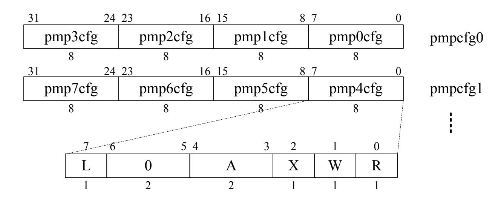

Figure 1: Format of pmpcfg [WA19]. Typically, pmp*i*cfg and pmpaddr*i* consist of a PMP entry.

PMP refers to these registers at every memory access and checks whether it is permitted. If it is not permitted, an access fault exception occurs, which is handled in M-mode.

Figure 1 shows the structure of pmpcfg. An 8-bit pmp*i*cfg defines a PMP configuration (0 ≤ *i* ≤ 15), and four pmp*i*cfgs form a 32-bit pmpcfg*j* (0 ≤ *j* ≤ 3). Each pmp*i*cfg has attributes of L, A, X, W, and R. pmp*i*cfg.X, .W, and .R indicate executable, writable, and readable permission bits, respectively. pmp*i*cfg.L is a lock bit and if it is set, its pmp*i*cfg does not change until the central processing unit (CPU) is reset. pmp*i*cfg.A represents the address-matching mode bit. As the address-matching mode, the naturally aligned power-of-two (NAPOT) region and the top of range (TOR) are generally used. According to pmp*i*cfg, NAPOT encodes pmpaddr*i* into the size and the base address. TOR covers the range between pmpaddr*i-1* and pmpaddr*i* with pmp*i*cfg. Thus, NAPOT provides memory isolation with a pair of pmp*i*cfg and pmpaddr*i* while TOR provides memory isolation with a set of pmp*i*cfg, pmpaddr*i-1*, and pmpaddr*i*. Hereafter, the pair or set is referred to as *PMP entry*.

### **2.3 TEEs on RISC-V**

Figure 2 shows a typical flow of the context switch under isolated execution by the TEE on RISC-V. The TEE is constructed by multiple applications running in U-mode, an OS in S-mode if it exists, and a monitor in M-mode. First, (1) an application calls the monitor by causing an exception or interrupt. Then, (2) the monitor handles the exception or interrupt and changes the PMP configuration by either switching the partial PMP entries or rewriting all the PMP entries. Finally, (3) the monitor calls another application using a privilege instruction.

The remainder of this section introduces two typical constructions of TEEs on RISC-V and shows that the isolated execution can be represented as shown in Figure 2.

### **2.3.1 Keystone (UCB) [LK18, LKS<sup>+</sup>20]**

The concept of Keystone is similar to that of Intel SGX. Keystone assumes a CPU to support M-, S-, and U-modes, and it separates the CPU memory into *untrusted* and *trusted* regions. An application running in U-mode in a trusted region is called an *enclave* application, and it is supported by the *enclave runtime* in S-mode. The host OS and applications are considered to be untrusted. The enclave application is called from a host application. First, the host application calls Keystone *security monitor* (SM) in M-mode via the OS by the supervisor binary interface (SBI) call implemented using ecall. Then, Keystone SM deprives the permissions from the caller application and gives the permissions to the callee application (i.e., the application being called). Finally, Keystone SM calls the

{4}------------------------------------------------

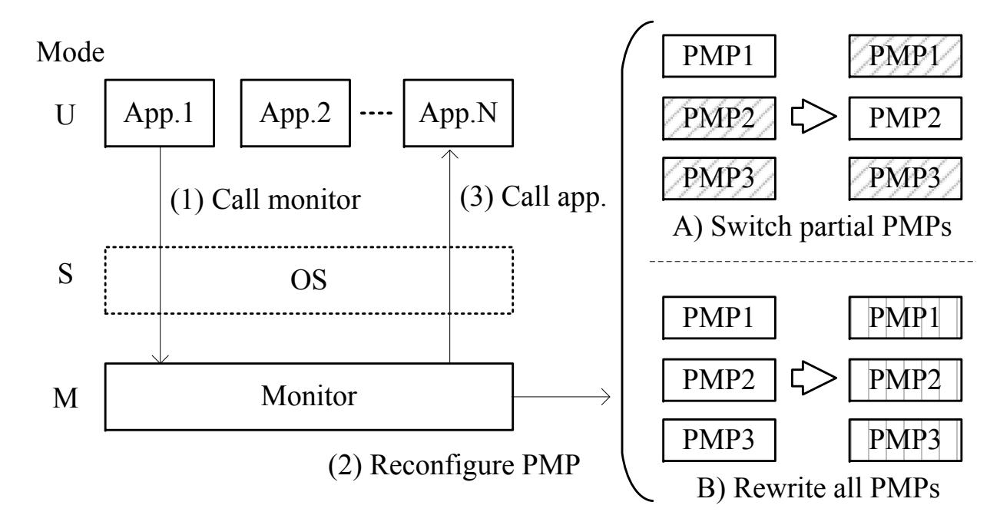

Figure 2: Context switch on TEE. A square box denoted as "PMP*i*" indicates a PMP entry.

enclave application by the SBI call using mret. To exchange data between the host and the enclave applications or among the enclave applications, Keystone constructs a shared memory using OS memory.

### **2.3.2 MultiZone (Hex Five) [Fiv20a, Fiv19]**

Its concept is to isolate all applications and libraries from each other, and each isolated unit running in U-mode is called a *zone*. Isolated execution is controlled by the *nanoKernel*. The context switch is realized as follows. First, a zone calls the nanoKernel by timer interrupt or environmental call exception according to the MultiZone application programming interface (API) function using ecall. Next, the nanoKernel changes the PMP entries for another zone<sup>1</sup> . Finally, the nanoKernel calls another zone using mret. To exchange data between zones, MultiZone recommends that users should not use shared memory but use *InterZone Messenger*.

Hereafter, we refer to an object for isolation, such as a zone or an enclave, as an *application*. Furthermore, we refer to a mechanism that controls the application flow, such as Keystone SM and nanoKernel, as a *monitor*.

# **3 Proposed Attack**

This section describes the proposed attack for bypassing isolated execution provided by PMP. First, we briefly describe a clock glitch injection assumed in the attack. Then, we present the attacker model to organize the information required for the proposed attack. Finally, we describe the attack scheme to obtain the information.

### **3.1 Clock Glitch Injection**

In this study, we consider a clock glitch injection for the proposed attack because of its high repeatability and temporal resolution [YSW18]. Note that it does not matter how an attacker injects a fault as long as it can cause an instruction skip. More specifically, our attack requires the ability to skip an arbitrary assembly instruction.

<sup>1</sup>Although we do not perform operation analysis for the perpose of license agreement, there is no doubt that MultiZone adopts one of the PMP usages as shown in Figure 2.

{5}------------------------------------------------

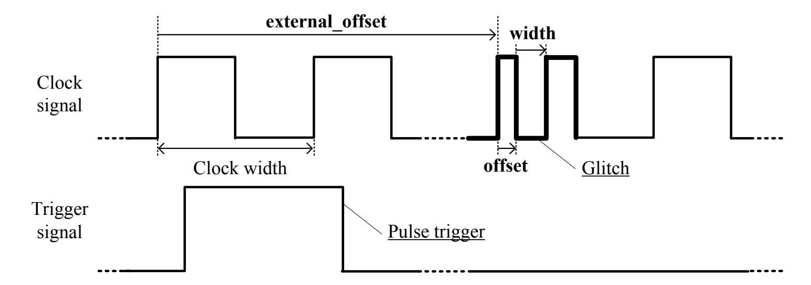

Figure 3: Waveform of clock glitch. A glitch with intensity defined by width and offset is induced external\_offset cycles after reaching the positive edge of the trigger signal.

Figure 3 shows a typical clock glitch waveform with a trigger signal. Clock glitch causes a setup time violation on flip-flops to provide a clock signal with a temporally short signal drop during high-level logic [ADN<sup>+</sup>10, BRSK17]. This means that relatively slow operations such as memory access are subject to such clock glitch. Typically, it affects instruction fetch, which sometimes leads to an instruction skip. To cause an instruction skip on an arbitrary instruction, the attacker must decide the proper fault intensity, defined by the width and offset, and the glitch timing, defined by external\_offset, as shown in Figure 3.

### **3.2 Attacker Model**

Figure 4 shows the attack scenario assumed in the proposed attack. It is based on a typical use case for ARM TrustZone where given a CPU and software provided by hardware (H/W) and software vendors, a user installs his/her application(s) in a blank region of the CPU [Yiu15]. Smart phones are examples that users are allowed to install an application, i.e., an arbitrary code, but they are not allowed to access secret data such as a password file. Here, we assume that a monitor and an attack target application are installed by the software vendor in advance and the attacker then installs his/her application. In general, the purpose of the attacker is to write or read memory region protected by PMP. As a typical example, we assume that the victim application is an encryption application whose secret key is stored in the RAM and the attacker application is a memory dump application.

Based on the above scenario, we summarize the capability of the attacker. The attacker can

- physically access the target device,
- execute arbitrary code in U-mode, and
- call another application from his/her application.

In other words, the attacker can inject faults into the device and collect side-channel information such as power consumption of the device. Moreover, the attacker can generate a trigger signal for fault injection on his/her application. By contrast, the attacker cannot

- access the memory region protected by PMP or
- analyze the program flow and/or extract data by reverse engineering the program running on the target device.

{6}------------------------------------------------

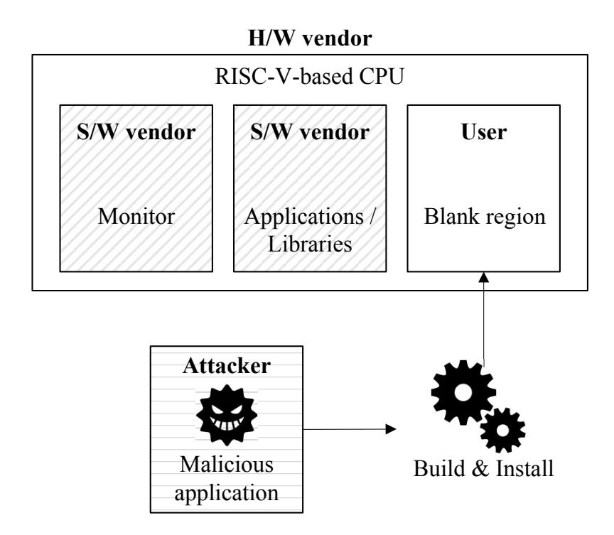

Figure 4: Attack scenario based on a use case for ARM TrustZone [Yiu15].

This means that attacker needs to bypass isolated execution provided by PMP under the black-box environment while the target device is running. Our knowledge of the target device is only that it realizes isolated execution based on the flow shown in Figure 2.

Under the above-mentioned assumptions, the following information is generally required for the attack.

#### • Target instruction:

The attacker must determine which instruction should be skipped to break the memory protection.

#### • Target address:

The attacker must identify the address where the target data is stored. We assume that all specifications of the installed applications are open to users, i.e., the address storing the target data is known. We discuss the feasibility of the assumption in Section 6.2.

### • Fault intensity:

The attacker must determine the proper fault intensity to obtain the desirable fault effects. In particular, our attack employs single-instruction skip. For providing such an instruction skip by clock glitch, we need to determine width and offset as shown in Figure 3.

#### • Trigger signal:

The attacker must obtain a trigger signal as a reference to determine the glitch timing. In general, (1) communication signals such as the universal asynchronous receiver/transmitter (UART) signal, (2) digital signals using a general-purpose input/output (GPIO) port, and (3) power consumption due to distinctive operations such as cryptographic operations are major options [TM17, MTW<sup>+</sup>18, BFP19].

#### • Glitch timing:

The attacker must count the clock cycles from the trigger signal to the target instruction to inject faults with proper timing. As for the clock glitch, we need to determine external\_offset as shown in Figure 3.

This study especially focuses on how to obtain the target instruction, fault intensity, and glitch timing. As for the target address, we follow the above-mentioned assumption. As for the trigger signal, in the following experiment, for simplicity, we employ the monitor to 

{7}------------------------------------------------

generate a trigger signal before calling the attacker's application. However, note that we must still identify a proper glitch timing because the trigger is not generated just before the target instruction.

### **3.3 Attack Scheme**

The basic idea of the proposed attack is to bypass the operation of reconfiguring the PMP setting at the context switch. To this end, the possible target instructions for skipping are limited to only the following three instructions<sup>1</sup> :

```
CSR Write: csrw pmpcfg (pmpaddr), rs
CSR Clear: csrc pmpcfg (pmpaddr), rs
CSR Set: csrs pmpcfg (pmpaddr), rs
```

where the first operand is either pmpcfg*i* or pmpaddr*i*, and rs indicates a source register storing a value written to the first operand. The reason for the limitation is that PMP, composed of CSRs, requires special instructions to change their values. In other words, one or more of these instructions must be executed as long as PMP provides memory protection on RISC-V.

According to the above-mentioned characteristics of PMP, identification of the execution timing of these instructions leads to a proper glitch timing. To this end, side-channel analysis techniques based on power consumption can be used as in [BTG10, SBO<sup>+</sup>15, PXJ<sup>+</sup>18, YUZP19]. It may be easier to identify the timing because the number of target instructions to be identified is much smaller than that of conventional approaches. This technique reduces the time for searching for a successful external\_offset compared to the naive brute-force method.

Based on the above-mentioned observations, the proposed attack scheme is shown in Figure 5. The attack scheme consists of five steps and is divided into two phases, namely the profiling and exploitation phases. In the profiling phase, (1) a proper fault intensity (e.g., successful glitch parameters width and offset) is first extracted with a profiling device implemented on the same CPU as the target device. Then, (2) power consumption for each target instruction is measured and templates are created.

Next, (3) in the exploitation phase, the target device is used. First, a power trace ranging from the trigger signal to the execution of the target instruction is collected. Then, (4) the execution timing of the target instructions is identified using the templates and the power trace. Finally, (5) the exploitation is performed with fault injection using the obtained glitch parameters. Concrete exploitation methods are described in the following sections.

# **4 Implementation of Trusted Execution Environment**

This section describes the PoC TEE targeted for our attack in this study. This PoC implementation is advantageous as it overcomes the following inconveniences of existing TEEs. MultiZone has black-box components protected by the patent and license agreement, which makes it difficult to analyze how our attack succeeds [Fiv18, Fiv20a]. Moreover, the permission of Hex Five is required to publish the results. Keystone has no TEE example that has multiple enclaves running [LK18]. Furthermore, it is difficult to analyze its mechanism because it assumes relatively high-end devices running the Linux OS.

Our PoC TEE is implemented in a bare-metal manner (i.e., no OS) with the *Freedom Metal library* (v201908) developed by SiFive [SiF20]. We present the system structure, flowchart, and PMP usage in the PoC TEE. Note that the detailed implementation and limitation of the PoC TEE are discussed in Appendix A and B.

<sup>1</sup>More precisely, they are pseudo-instructions using csrrw, csrrc, and csrrs, respectively.

{8}------------------------------------------------

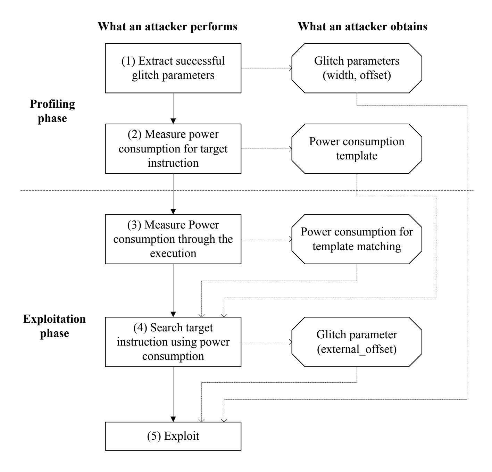

Figure 5: Proposed attack scheme.

### **4.1 System Structure**

Figure 6 shows the system structure of the PoC TEE. It consists of one monitor in M-mode, three applications (apps. 1, 2, and 3) in U-mode, and a shared library and memory that can be used in all the modes. App. 1 plays an OS-like role and runs on the basis of a user command via UART. It executes the command to send data to other apps., call other apps., and send processed results from other apps. to the user. App. 2 is a cryptographic application that executes advanced encryption standard (AES) encryption, and it has its own secret key in its RAM region. App. 3 is the attacker's application dumping RAM. More specifically, it obtains an address with the shared memory, reads data from the address, and stores the data in the shared memory.

The shared library is a subset of the Freedom Metal library. The PoC TEE mainly uses peripheral control functions for UART, GPIO, and PMP controls, and exception handling functions. The shared memory is used for sharing data between isolated applications and those sending data to the monitor to call other applications. For this purpose, the shared memory divides its memory region into multiple sub-regions such as data region, identifier (ID) regions for caller apps. and callee apps., and context regions for stack pointers (sp) and return addresses (ra) (cf. Appendix A.2).

### **4.2 Flowchart**

Figure 7 shows the flowchart of the PoC TEE behavior, which includes eight operations. In (1), the monitor first registers exception handlers and initializes various variables. Next,

{9}------------------------------------------------

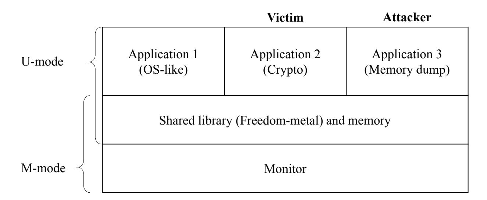

Figure 6: System structure of our PoC TEE. Three applications are controlled by the monitor, and they share data with shared memory.

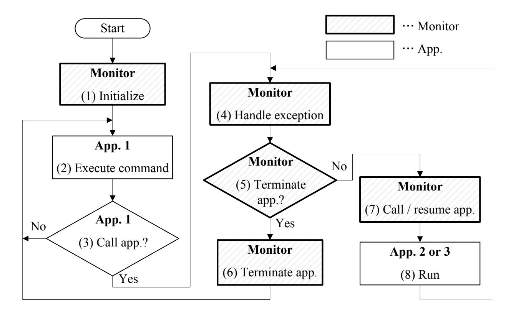

Figure 7: Flowchart of PoC TEE. It mainly describes the context switch handled by the monitor.

it configures the PMP entries and calls app. 1. In (2) and (3), app. 1 receives a user command and executes it. If required, it calls another app. with ecall. In (4), owing to the exception, the monitor runs the exception handler. In the case of environment call exception, the exception handler invokes the ecall handler registered in the first step above. In the case of memory access fault exception, the monitor fills the data region of the shared memory with the value of 0xFF in hexadecimal, stops all the running apps., and passes the control to app. 1. In steps (5)–(7), the apps. call and finalization are executed. At this time, sp and ra are saved or restored while the PMP entries are reconfigured. In (8), each app. runs and then moves back to (4).

### **4.3 PMP Usage**

According to Figure 2, we implemented two types of PMP usage: one rewrites all PMP entries, while the other switches the accessibility of the PMP entries selected. Hereafter, we refer to them as the *rewriting method* and *switching method*, respectively. Tables 1 and 2 summarize the two usages, respectively. The rewriting method shown in Table 1 rewrites all the PMP entries to realize isolated execution. The shared library and memory use two PMP entries. Each app. uses two PMP entries for the isolation of ROM and RAM. If

{10}------------------------------------------------

| PMP  | App.1          | App.2     | App.3     |  |
|------|----------------|-----------|-----------|--|
| PMP0 | Shared library |           |           |  |
| PMP1 | Shared memory  |           |           |  |
| PMP2 | ROM App.1      | ROM App.2 | ROM App.3 |  |
| PMP3 | RAM App.1      | RAM App.2 | RAM App.3 |  |
| PMP4 | UART           | N/A       |           |  |
| PMP5 | N/A            |           |           |  |
| PMP6 | N/A            |           |           |  |
| PMP7 | N/A            |           |           |  |

Table 1: PMP usage for the rewriting method. N/A implies that the PMP entry is disabled. PMP*i* denotes one PMP entry, which is configured by NAPOT for address matching.

Table 2: PMP usage for the switching method. The gray and white cells represent configurations with no accessibility (R=0,W=0,X=0) and all accessibility (R=1,W=1,X=1), respectively. In the case of "all region", PMP6 and PMP7 construct one entry with TOR. Apart from that, all PMPs use NAPOT.

| PMP  | App.1       | App.2          | App.3     |  |  |  |
|------|-------------|----------------|-----------|--|--|--|
| PMP0 | ROM Monitor |                |           |  |  |  |
| PMP1 | RAM Monitor |                |           |  |  |  |
| PMP2 | ROM App.2   | ROM App.2      | ROM App.2 |  |  |  |
| PMP3 | RAM App.2   | RAM App.2      | RAM App.2 |  |  |  |
| PMP4 | ROM App.3   | ROM App.3      | ROM App.3 |  |  |  |
| PMP5 | RAM App.3   | RAM App.3      | RAM App.3 |  |  |  |
| PMP6 | All region  | Shared library |           |  |  |  |
| PMP7 |             | Shared memory  |           |  |  |  |

required, PMP entries for a peripheral are added. The switching method shown in Table 2 switches the permissions of PMP entries, i.e., R, W, and X in pmpcfg, to provide isolation. We refer to [LKS<sup>+</sup>20] and consider app. 1 as untrusted and app. 2 and app. 3 as trusted. The untrusted app. can access all the memory regions as defined by PMP6 and PMP7 unless other PMPs forbid it. Only when the context switch from app. 1 to app. 2 (or app. 3) or vice versa occurs, PMP6 and PMP7 should be rewritten including pmpaddr.

# **5 Experiment**

This section describes experiments conducted using actrual devices to verify the feasibility and effectiveness of the proposed attack. First, we describe the experimental setup. Then, we present two experimental results for extraction of the glitch parameters and exploitation, which are based on the flow shown in Figure 5.

### **5.1 Experimental Setup**

Figures 8a and 8b show the block diagram and overview of the experimental setup, respectively. We implemented a RISC-V core on an Arty A7 equipped with an FPGA, and the PoC TEE described in Section 4 was run on it. We used an X300 RISC-V core (Hex Five) [Fiv20b], which is based on UCB's Rocket Chip [AAB<sup>+</sup>16], and its key features are the support for PMP and relatively high operational frequency (65 MHz). To simplify the setup, we modified the core to make a port for providing an external clock for the clock glitch. Further, we used CW1200 (NewAE Technology) for fault injection. A computer communicated with Arty A7 and CW1200 via the universal serial bus (USB) UART. In

{11}------------------------------------------------

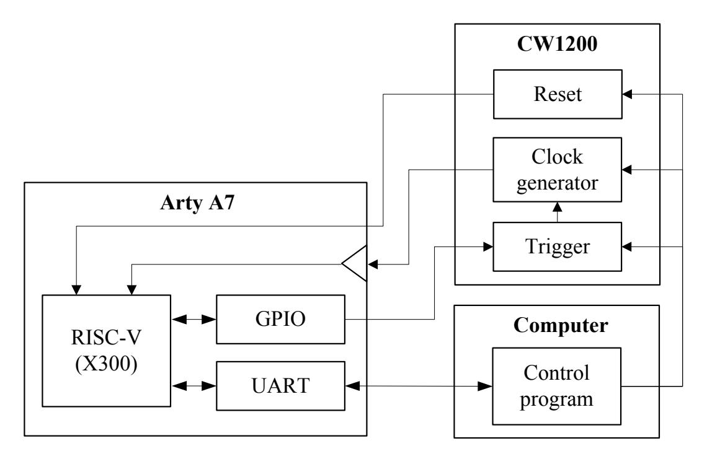

(a) Block diagram.

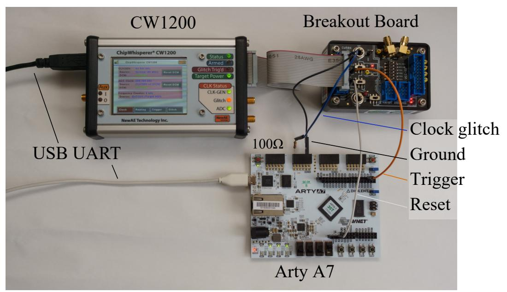

(b) Overview.

Figure 8: Experimental setup of H/W. The computer is connected to Arty A7 and CW1200 with USB. Arty A7 and CW1200 are connected with wire. For impedance matching, a resistor of 100 Ω is inserted in the wire providing clock signal. Clock signal is provided to the RISC-V core via input buffer.

the communication with Arty A7, the computer calls an app. and exchanges data. In the communication with CW1200, the computer changes the glitch parameters and sends a command to reset Arty A7.

### **5.2 Experiment #1: Extracting Glitch Parameters**

This section deals with steps (1)–(4) of the attack scheme shown in Figure 5. The glitch parameters of width and offset, and external\_offset, are extracted experimentally. However, for simplicity, external\_offset is extracted using not the proposed method based on power consumption but a GPIO-based marking signal that indicates the execution timing of the target instructions.

#### **5.2.1 Fault Intensity**

First, we obtained width and offset experimentally to inject a fault into a profiling device executing a test program. The program runs as follows: (1) it initializes GPIO; (2) it

{12}------------------------------------------------

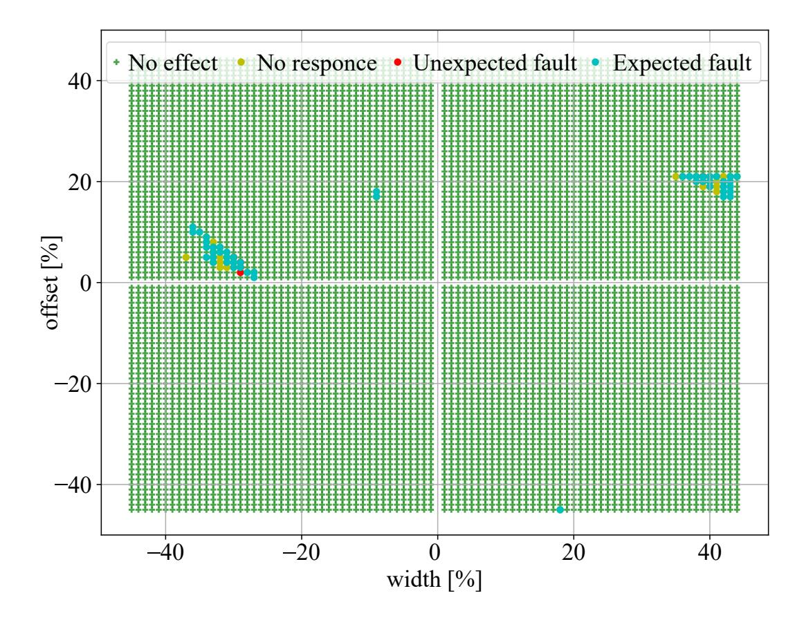

Figure 9: Characterization for searching proper glitch parameters. % represents ratio in percent of each parameter to the original clock width shown in Figure 3

generates a pulse trigger signal; (3) it executes an instruction before and after sufficient nops; and (4) it sends the result of the attack. We assumed that the target instruction was "csrw pmpcfg0, a5", where the register a5 held a value of 0x1b1b1b1d. The attack result is given as the value of pmpcfg0. Thus, we obtain 0x00000000 and 0x1b1b1b1d as the success and failure to skip, respectively.

Figure 9 shows the result of the experiment in which the faults were injected 10 times for each glitch parameter. We changed width and offset from -45 to 45 [%] in steps of 1 [%]. The fault effects are overwritten on the graph in the order of no effect, no response, unexpected fault, and expected fault. Therefore, the parameters plotted in blue indicate that the attack was successful at least once. The following exploitation experiment used all the parameters plotted in blue.

### **5.2.2 Glitch Timing**

We used a GPIO-based marking signal to resemble the identification of the target instruction positions with side-channel analysis techniques [BTG10, SBO<sup>+</sup>15, PXJ<sup>+</sup>18, YUZP19]. We marked all the target instructions that enabled us to bypass isolated execution by skipping. In a real attack, the attacker needs to perform a brute-force search for possible candidates for skipping.

Figures 10b and 10a show the trigger signal and marking signals for the instructions of csrw, csrc, and csrs while PoC TEE with the switching and rewriting methods ran, respectively. The waveforms were measured with an oscilloscope (DPO7104) with a sampling rate of 100MS/s. Figure 10a shows that csrw, csrc, and csrs are executed 7, 1, and 1 time(s) during the trigger signal being high-level logic, respectively. Meanwhile, Figure 10b describes that csrw, csrc, and csrs are executed 2, 12, and 12 times, respectively. As for each target instruction, we can obtain the elapsed time between the trigger signal and the marking signal. Therefore, we can calculate the number of elapsed cycles, which corresponds to external\_offset. The following exploitation experiment used all candidates obtained by the result.

{13}------------------------------------------------

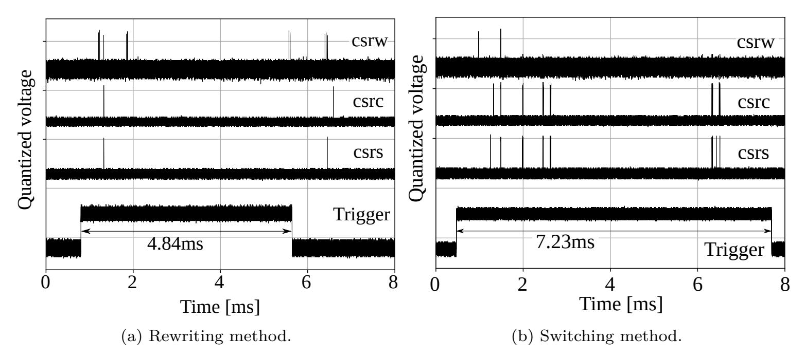

Figure 10: Positional relation between the trigger and the execution timing of the target instructions. The trigger signal becomes high-level logic during the attacker's application running (cf. Section 5.3.1). The marking signal is a pulse signal generated just before the execution of each target instruction.

### **5.3 Experiment #2: Exploitation**

This section deals with step (5) of the attack scheme shown in Figure 5, i.e., accessing the protected memory region by bypassing isolated execution with fault injection using the glitch parameters obtained in Section 5.2. First, we describe the flow of the exploitation. Then, we show the experimental result of applying the exploitation to the PoC TEE with two types of PMP usages.

#### **5.3.1 Operational Flow of Exploitation**

Figure 11 shows a sequence diagram for the exploitation. According to the figure, we explain the exploitation flow as follows. First, the computer initializes CW1200 and sends a command to call app. 3. App. 1 receives the command and calls app. 3 via the monitor. In this PMP reconfiguration, the monitor generates the trigger signal. App. 3 saves the data needed for the RAM dump from its RAM region to the shared memory. This is because app. 3 may lose its original RAM access permission in exchange to obtain the target one. Then, it directly calls the attack target (i.e., app. 2) via the monitor. After encryption in app. 2, the program flow returns to the caller application. In this PMP reconfiguration, CW1200 injects faults at a proper timing with external\_offset. If the faults are induced correctly, app. 3 obtains the target RAM access permission. App. 3 reads the RAM data of app. 2 and then sends it to app. 1 via the shared memory. When app. 3 finishes its operations, the monitor makes the trigger signal low-level logic. Finally, the computer acquires the data to send a command to obtain the contents of the shared memory.

App. 3 succeeds in dumping the target RAM data if the fault injection successfully bypasses the target instruction. The influence of faults for exploitation is classified into the following four classes:

#### 1. No effect:

The CPU runs correctly, and the RAM access from app. 3 to app. 2 is handled as an access fault exception. As a result, we obtain 0xFFFF... because the shared memory is filled with 0xFF by the monitor.

#### 2. No response:

{14}------------------------------------------------

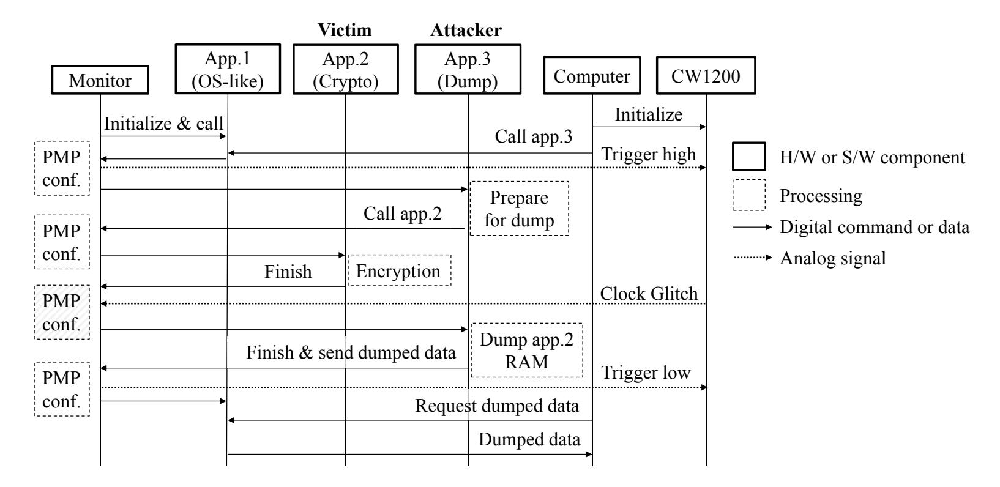

Figure 11: Sequence diagram for the exploitation.

The CPU runs abnormally owing to the excessive fault intensity. As a result, we obtain no result.

### 3. Unexpected fault:

Fault is induced in the CPU but the target instruction is not skipped. As a result, we obtain 0xFFFF... with no effect.

#### 4. Expected fault:

Fault is induced in the CPU and the target instruction is skipped. As a result, we obtain the secret key held by app. 2.

#### **5.3.2 Exploitation of Rewriting Method**

For the rewriting method, we need to skip the reconfiguration of PMP3 as shown in Table 1. If we succeed in skipping it, we obtain the RAM control for app. 2 instead of app. 3. This means that app. 3 cannot use its own stack memory. Hence, app. 3 is written so as to avoid using local variables and function calls after calling app. 2, or injecting the fault. The detailed implementation of app. 3 is shown in Appendix. A.6.

The attack requires the exchange of RAM permissions; therefore, pmpcfg does not change. Thus, the target instruction is only the reconfiguration of pmpaddr. The assembly code to reconfigure pmpaddr is as follows.

```
lw a5,-64(s0) // Load word (lw) on stack into a5
csrw pmpaddr3,a5 // Write addr value (a5) to CSR pmpaddr3
```

The target instruction is only csrw. If the lw instruction is skipped, register a5 becomes undefined, which means that it is unknown whether the attack succeeds. To summarize the above-mentioned observations, the successful glitch should skip csrw in the experiment.

Under the black-box environment, we called app. 3 with fault injection using the glitch parameters extracted in Section 5.2. Here, we provided the margin of ±50 [cycle] to the identified external\_offset considering noise effects such as CPU pipeline and clock jitter. And at 10 cycles after the identified 7th csrw, we obtained the secret key of 0x000102...0f.

#### **5.3.3 Exploitation of Switching Method**

We also performed an experiment for exploitation of the switching method. For the switching method, we need to skip the reconfiguration of PMP3 as shown in Table 2. If

{15}------------------------------------------------

| Fault intensity [%] |        | Success rate [%] |                  |                  |  |
|---------------------|--------|------------------|------------------|------------------|--|
| Width               | Offset | Profiling        | Exploitation     |                  |  |
|                     |        |                  | Rewriting method | Switching method |  |
| -32                 | 6      | 10               | 90               | 20               |  |
| -31                 | 5      | 50               | 90               | 20               |  |
| -31                 | 4      | 40               | 100              | 10               |  |
| 39                  | 20     | 20               | 90               | 0                |  |
| 40                  | 20     | 40               | 90               | 0                |  |
| 40                  | 19     | 40               | 90               | 0                |  |
| 41                  | 21     | 40               | 100              | 0                |  |
| 42                  | 19     | 100              | 0                | 0                |  |
| 42                  | 18     | 90               | 0                | 0                |  |

Table 3: Fault intensity parameters and success rate of using them. Parameters with a success rate of 90 [%] or more are shown for 10 trials for each pair of parameters.

we succeed in skipping it, app. 3 additionally obtains the control of RAM for app. 2. This PMP protection is weaker than that of the rewriting method, and we can use the same code as that in Section 5.3.2.

The switching method does not need to change pmpaddr. The target instruction is only the reconfiguration of pmpcfg. The assembly code to reconfigure pmpcfg is as follows.

```
lw a5,-24(s0) // Load word (lw) on stack into a5
csrc pmpcfg0,a5 // Clear CSR pmpcfg0 with mask bit (a5)
lw a5,-28(s0) // Load word (lw) on stack into a5
csrs pmpcfg0,a5 // Set CSR pmpcfg0 with config bit (a5)
```

One pmpcfg has a configuration for four PMP entries as shown in Figure 1. With the specification of the Freedom Metal library, the corresponding pmp*i*cfg in pmpcfg is cleared (csrc) and a new value is then set into the pmp*i*cfg (csrs). Thus, the target instruction is limited to csrc. To summarize the above-mentioned observations, the successful glitch should skip csrc.

Under the black-box environment, when we injected the fault with the glitch parameters extracted in Section 5.2, we obtained the secret key. The successful external\_offset was greater by 7 cycles than identified 10th csrc.

### **5.4 Evaluation of Glitch Parameters**

This section verifies the effectiveness of the proposed attack by comparing the experimental results of profiling and exploitation. First, we evaluate the fault intensity. Then, we discuss the glitch timing.

#### **5.4.1 Fault Intensity**

We performed the exploitation 10 times for each glitch parameter by fixing the value of external\_offset when the attack was successful in each experiment described in Sects. 5.3.2 and 5.3.3. Table 3 summarizes a set of fault intensity values with a success rate of 90 [%] or more in each experiment including the profiling experiment. From the result, we observe that (1) parameters with a high success rate differ between the profiling and exploitation experiments and (2) parameters with a high success rate differ even in the exploitation experiments using the same device.

Observation (1) comes from individual differences. Even though such differences exist, exploitation would be successful with the fault intensity extracted in the profiling phase. The result of the same profiling experiment using the target device is shown in 

{16}------------------------------------------------

Appendix C.1. The result suggests similar trends as in Figure 9, which indicates that a cross-device profiling would work well.

Observation (2) seems to come from the effect of the CPU pipeline. Typically, the fetch and write-back stages are object to the clock glitches because of their memory accesses, which tend to be critical paths. Furthermore, there is another possibility that other stages would be affected. A detailed investigation of this result will be conducted in the future.

#### **5.4.2 Glitch Timing**

We succeeded in attacking with the glitch timing extracted in Section 5.2. For further investigation, we study how to shorten the time required for exploitation by identifying the position of the target instruction. In the exploitation experiments, we expanded external\_offset by ±50. This means that we performed 100 trials for each candidate, which results in 900 (100 × 9 candidates) and 2,600 (100 × 26 candidates) overall trials for the rewriting and switching methods, respectively. Meanwhile, if we perform a brute-force attack, we need approximately 314,600 (65 MHz × 4.84 ms) and 469,950 (65 MHz × 7.23 ms) overall trials for each PMP usage, respectively. Thus, a reduction of more than 99 [%] of the trials is achieved.

## **6 Discussion**

This section discusses the applicability of the proposed attack to other TEEs as well as its limitations and countermeasures.

### **6.1 Applicability to TrustZone**

ARM TrustZone is a well-known TEE for embedded devices. First, we describe the differences between the isolation mechanisms of TrustZone and RISC-V TEE, and we then show that the proposed attack can be applied to TrustZone. Table 4 summarizes the comparison of TrustZone and RISC-V TEE according to [ARM15, Yiu15, NMB<sup>+</sup>16, Yiu17, PS19, ARM19], where we focus on the state-of-the-art TrustZone based on ARMv8-A (v8-A) and ARMv8-M (v8-M). As a RISC-V TEE, a bare-metal implementation is assumed, such as our PoC TEE. Note that we excluded optional H/Ws for v8-A such as TrustZone protection controller.

TrustZone has the concept of *world*, which divides the CPU resources into secure and normal worlds, and isolates applications running in each world. Hereafter, we refer to world-based isolation and isolation for applications as *world isolation* and *app. isolation*, respectively. RISC-V has no concept of world; therefore, there is no separation in the column of RISC-V in Table 4. The major features of TrustZone are as follows.

### **H/W unit:**

The relation of PMA<sup>2</sup> and PMP in RISC-V corresponds to that of IDAU and SAU in v8-M. MPU in v8-M provides isolation based on the base address, size, and attribute, which is similar to PMP. Meanwhile, MPU is different from PMP in that MPU is defined in each world. MMU in v8-A has a richer function than MPU in v8-M in the sense that MMU can translate a virtual address into physical one.

#### **Privilege:**

Privileges in v8-A are defined as EL3 for secure monitor, EL2 for hypervisor, EL1 for OS, and EL0 for apps., which is the same as in RISC-V. Meanwhile, the privileges in v8-M are defined as handler and thread modes, which is different from RISC-V.

#### **How to configure world/app.:**

TrustZone v8-M and v8-A perform the configuration of world(s) with SAU and MMU, and

<sup>2</sup>PMA is a H/W-defined unit for providing memory protection similarly to PMP.

{17}------------------------------------------------

| Item                                     | RISC-V                                                                                                           | TrustZone v8-M                                                                                                                                                                                                                          | TrustZone v8-A                                                                                                                                                                  |  |  |  |
|------------------------------------------|------------------------------------------------------------------------------------------------------------------|-----------------------------------------------------------------------------------------------------------------------------------------------------------------------------------------------------------------------------------------|---------------------------------------------------------------------------------------------------------------------------------------------------------------------------------|--|--|--|
| How to isolate                           | Check permissions at memory access.                                                                              | Check<br>permissions<br>at<br>address<br>translation<br>by<br>MMU.                                                                                                                                                                      |                                                                                                                                                                                 |  |  |  |
| # of world                               | Any (PMP entries<br>are at most 16                                                                               | 2 (secure and non-secure<br>(S/NS) states)                                                                                                                                                                                              | 2 (secure and normal)                                                                                                                                                           |  |  |  |
| # of app.                                |                                                                                                                  | Any                                                                                                                                                                                                                                     |                                                                                                                                                                                 |  |  |  |
| H/W units                                | PMA, PMP                                                                                                         | IDAU, SAU, MPU                                                                                                                                                                                                                          | MMU                                                                                                                                                                             |  |  |  |
| Privilege                                | Handler<br>Mode<br>(Privi<br>M, H, S, U<br>leged),<br>Thread<br>Mode<br>(Privileged/Unprivi<br>leged)            |                                                                                                                                                                                                                                         | EL3, EL2, EL1, EL0                                                                                                                                                              |  |  |  |
| How to config<br>ure world iso<br>lation | Configure PMP in<br>Configure SAU from code<br>M-mode.<br>in secure region.                                      |                                                                                                                                                                                                                                         | Configure<br>MMU<br>(i.e.,<br>translation tables) in EL3<br>mode                                                                                                                |  |  |  |
| How to config<br>ure app. isola<br>tion  |                                                                                                                  | Configure MPU in Privi<br>leged mode.                                                                                                                                                                                                   | Configure MMU in EL1<br>or EL2 modes                                                                                                                                            |  |  |  |
| World switch                             | Exceptions transfer<br>the control from<br>U/S-mode to<br>M-mode. M-mode<br>reconfigures PMP<br>and then returns | Code in NS calls NSC<br>function and then moves<br>to<br>S.<br>Code<br>in<br>S<br>calls<br>a callback function and<br>then moves to NS.                                                                                                 | instruction,<br>excep<br>SMC<br>tions, or interrupts, such<br>as IRQ and FIQ, transfer<br>the control from normal<br>to secure. Secure returns<br>to normal by ERET.            |  |  |  |
| App. switch                              | the control to<br>U/S-mode by mret.                                                                              | Interrupts,<br>such<br>as<br>IRQ<br>and<br>FIQ,<br>trans<br>fers<br>the<br>control<br>from<br>non-privileged<br>to<br>privi<br>leged modes. Privileged<br>mode reconfigures MPU<br>and<br>then<br>returns<br>to<br>non-privileged mode. | Interrupts, such as IRQ<br>and FIQ, transfers the<br>control from EL0 to EL1<br>or EL2 modes.<br>EL1 or<br>EL2 mode reconfigures<br>MMU and then returns<br>to EL0 mode by ERET |  |  |  |

Table 4: Comparison of RISC-V and TrustZone

Abbreviations

PMA: Physical Memory Attribute, IDAU: Implementation Defined Attribution Unit, MMU: Memory Management Unit, SAU: Software Attribution Unit, MPU: Memory Protection Unit, EL: Exception Level, NSC: Non-Secure Callable, IRQ: Interrupt ReQuest, FIQ: Fast Interrupt reQuest

they then perform the configuration of app(s). with MPU and MMU, respectively. The world configuration in v8-M is not changed after initialization, while the app. configuration can be changed. In v8-A, each world has its own translation tables for MMU and they can be changed. Hence, the same virtual address is translated to other physical addresses in each world.

#### **World/app. switch:**

App. switches resemble each other although world switch is different from App. switch. World switch in v8-M employs a specific function called NSC to move the world from NS to S. Then, it employs a callback function located in the NS world to return from S to NS. World switch in v8-A employs the SMC instruction, exceptions, or interrupts to move the world from normal to secure. Then, it employs the ERET instruction to return from secure to normal. This is similar to the operations of the monitor in RISC-V.

We can summarize the above-mentioned observations as follows.

1. The bypassing attack is applicable to app. isolation in TrustZone because the H/W units, configuration of app. isolation, and app. switch of TrustZone correspond to those of RISC-V. To perform the attack, we just skip the reconfiguration of MPU in the privileged mode and the reconfiguration of MMU in the EL1 or EL2 modes

{18}------------------------------------------------

- in v8-M and v8-A, respectively. Meanwhile, note that a detailed investigation is required to identify a proper glitch timing.
- 2. The bypassing attack is not applicable to world isolation in TrustZone because the world configuration is separated in each world. This means that insecure or normal applications cannot access the secure world directly.

### **6.2 Limitations**

The main limitations of the proposed attack can be summarized as follows.

#### **6.2.1 How to identify target address**

To retrieve the target data from the RAM, an attacker needs to know which region of the RAM is used for a victim application and what address is used for storing the target data. The target RAM region can be obtained from the memory map provided by the data sheet of the target CPU or by guessing it using stack address allocated for the attacker's application. After obtaining the RAM dump, the attacker should find the target data in it. Most of the memory region is initialized to 0 and static data is gathered in one place; therefore, meaningful data can be extracted at a glance.

### **6.2.2 Factors that determine success or failure**

The proposed attack bypasses isolated execution with PMP in RISC-V. Although target instructions that change the PMP configuration can be identified and skipped, the success or failure of the attack depends on the implementation of each TEE. The main factors that determine success or failure are as follows.

1. Address-matching method in pmpcfg:

We mainly used NAPOT for the PoC TEE. In the rewriting method, NAPOT can be replaced with TOR using two PMP entries. In such a case, the order of the PMP entries differs from those shown in Tables 1 and 2. TOR covers the range between two pmpaddrs; therefore, skipping the PMP configuration results in an increase or decrease in the target range. The former result enables the attack to succeed while the latter one causes the attack to fail.

### 2. The order of the PMP configuration:

As mentioned above, the order of the PMP entries affects the applicability of the attack. For example, if the order of PMP2 and PMP3 is reversed in the rewriting method, the access permissions of the ROM and RAM are exchanged. ROM access is necessary to execute instructions for applications; thus, only the exchange of the RAM for app. 3 and the ROM for app. 2 is allowed. Although such an exchange breaks the memory protection by PMP, it prevents the achievement of the original goal, i.e., obtaining the secret key. By contrast, an attack on the switching method would be successful even if the order of the PMP entries is changed. This is because the attacker can obtain the RAM permission for app. 2 in addition to his/her original access permissions.

#### 3. How to call other applications:

MultiZone adopts round-robin scheduling and allows each application (or zone) to run for a short time by controlling them with timer interrupt [Fiv20a]. Thus, any attacker application cannot be allowed to directly call a victim application. Therefore, the attacker can target only the application executed just before his/her application. Meanwhile, Keystone allows untrusted host applications to invoke the enclave application at an arbitrary timing [LKS<sup>+</sup>20]. In such cases, our attack is applicable as it is.

{19}------------------------------------------------

### **6.3 Countermeasures**

In this study, we used clock glitch as an example of fault injection to demonstrate the effectiveness of the proposed attack. Thus, countermeasures against clock glitch or a specific fault method are beyond the scope of this discussion. Instead, we describe effective countermeasures that can be implemented with software. Memory encryption is useful for preventing a malicious application from reading secret data. Keystone provides it as a plugin for additional protection against physical attackers [LKS<sup>+</sup>20]. Executing protected instructions twice prevents single instruction skip [YGS<sup>+</sup>16, WP17, MTW<sup>+</sup>18, BFP19]. It does not work for multiple fault injection, but it raises the bar by requiring the attacker to have an advanced capability. Inserting random delay makes it difficult for the attacker to identify the exact timing to inject faults [TSW16, WP17, MTW<sup>+</sup>18]. It is not an essential treatment, but it decreases the success rate of each trial.

Meanwhile, our attack can evade some major countermeasures. These countermeasures protect data with instruction duplication/triplication [YGS<sup>+</sup>16, MTW<sup>+</sup>18, BFP19], branch instructions or loop structures [NHH<sup>+</sup>16, PHBC17, WSUM19], and control flows with integrity checks [WP17, VTM<sup>+</sup>18, MTW<sup>+</sup>18, WSUM19], which are not effective. This is because our proposed attack neither corrupts data nor transfers the control flow to a malicious flow.

## **7 Conclusion**

We proposed an attack to bypass isolated execution realized by the memory protection mechanism in RISC-V, i.e., PMP. The main feature of the proposed attack is that it can be performed in a black-box environment with minimal knowledge of an attack target. The attack scheme consists of profiling and exploitation phases, and the profiling is executed using a profiling device with the same CPU as the attack target. To verify the effectiveness of the attack, we implemented the PoC TEE with two types of PMP usages by referring to existing RISC-V-based TEEs. Through experiments, we showed that the fault intensity and glitch timing required for fault injection could be obtained according to the attack scheme. Moreover, we demonstrated that we could obtain secret data in the RAM region isolated by PMP using an attacker's application running on the same CPU.

From our experimental results (cf. Section 5.3) and discussion (cf. Section 6.2), we can conclude that the rewriting method is relatively secure in the context of our fault injection attacks. The switching method is easier to attack because the attacker can obtain the permission of the victim RAM in addition to his/her original permissions. As mentioned in Section 6.2, this suggests that the attack should be effective even when the order of the PMP entries is changed.

We did not report the attack result to RISC-V-based TEE developers for two reasons: (1) this is **not** a demonstration using actual products and (2) TEE does **not** focus on invasive physical attacks such as fault injection attacks. This study aimed to show the effectiveness of the proposed attack through experiments targeting the PoC TEE on the basis of public information of Keystone and MultiZone. Note that we do not have detailed knowledge of such TEE implementations, and it is uncertain what is achieved when the attacker is deprived of access permissions granted for other applications. In addition, TEE is generally intended to provide protection against software attacks, and most physical attacks are out of scope. However, note that for a critical application requiring higher security, physical attacks should be considered, such as plugins provided by Keystone.

The following issues remain to be addressed in the future: (1) a demonstration for identifying the execute timing of target instructions on the basis of power consumption (cf. Section 5.2.2) as a part of the proposed method; (2) further investigation of the reason why the fault intensity differs even in the same device with different target instructions

{20}------------------------------------------------

(cf. Section 5.4.1); and (3) an evaluation of the proposed attack on TEEs on the basis of another architecture such as ARM TrustZone (cf. Section 6.1).

# **References**

- [AAB<sup>+</sup>16] Krste Asanovic, Rimas Avizienis, Jonathan Bachrach, Scott Beamer, David Biancolin, Christopher Celio, Henry Cook, Daniel Dabbelt, John Hauser, Adam Izraelevitz, et al. The rocket chip generator. *EECS Department, University of California, Berkeley, Tech. Rep. UCB/EECS-2016-17*, 2016.
- [ADN<sup>+</sup>10] Michel Agoyan, Jean-Max Dutertre, David Naccache, Bruno Robisson, and Assia Tria. When clocks fail: On critical paths and clock faults. In *International Conference on Smart Card Research and Advanced Applications*, pages 182–193. Springer, 2010.
- [ARM15] ARM. ARM Cortex-A Series Programmer's Guide for ARMv8-A. https: //developer.arm.com/documentation/den0024/a/, 2015. Accessed 5-July-2020.
- [ARM19] ARM. Armv8-A Virtualization. https://developer.arm.com/ architectures/learn-the-architecture/armv8-a-virtualization/ single-page, 2019. Accessed 5-July-2020.
- [BDL97] Dan Boneh, Richard A DeMillo, and Richard J Lipton. On the importance of checking cryptographic protocols for faults. In *International conference on the theory and applications of cryptographic techniques*, pages 37–51. Springer, 1997.
- [BECN<sup>+</sup>06] Hagai Bar-El, Hamid Choukri, David Naccache, Michael Tunstall, and Claire Whelan. The sorcerer's apprentice guide to fault attacks. *Proceedings of the IEEE*, 94(2):370–382, 2006.
- [BFP19] Claudio Bozzato, Riccardo Focardi, and Francesco Palmarini. Shaping the glitch: optimizing voltage fault injection attacks. *IACR Transactions on Cryptographic Hardware and Embedded Systems*, pages 199–224, 2019.
- [BRSK17] Swarup Bhunia, Sandip Ray, and Susmita Sur-Kolay. *Fundamentals of IP and SoC security*. Springer, 2017.
- [BTG10] Guillaume Barbu, Hugues Thiebeauld, and Vincent Guerin. Attacks on java card 3.0 combining fault and logical attacks. In *International Conference on Smart Card Research and Advanced Applications*, pages 148–163. Springer, 2010.
- [Fiv18] Hex Five. SOFTWARE EVALUATION AGREEMENT. https://github. com/hex-five/multizone-sdk/blob/master/LICENSE, 2018. Accessed 5- July-2020.
- [Fiv19] HEX Five. MultiZone API. https://github.com/hex-five/ multizone-api, 2019. Accessed 5-July-2020.
- [Fiv20a] HEX Five. MultiZone. https://hex-five.com, 2020. Accessed 5-July-2020.
- [Fiv20b] Hex Five. X300. https://github.com/hex-five/multizone-fpga, 2020. Accessed 5-July-2020.

{21}------------------------------------------------

- [Fou19] RISC-V Foundation. Members at a galnce. https://riscv.org/ members-at-a-glance, 2019. Accessed 5-July-2020.
- [GA03] Sudhakar Govindavajhala and Andrew W Appel. Using memory errors to attack a virtual machine. In *2003 Symposium on Security and Privacy, 2003.*, pages 154–165. IEEE, 2003.
- [Gil15] Brett Giller. Implementing practical electrical glitching attacks. *Black Hat Europe*, 2015.
- [KFG<sup>+</sup>20] Zijo Kenjar, Tommaso Frassetto, David Gens, Michael Franz, and Ahmad-Reza Sadeghi. V0LTpwn: Attacking x86 Processor Integrity from Software. In *29th USENIX Security Symposium (USENIX Security 20)*, pages 1445–1461. USENIX Association, August 2020.
- [LK18] Dayeol Lee and David Kohlbrenner. Welcome to Keystone Enclave's Documentation! http://docs.keystone-enclave.org/en/latest/index.html, 2018. Accessed 5-July-2020.
- [LKS<sup>+</sup>20] Dayeol Lee, David Kohlbrenner, Shweta Shinde, Krste Asanović, and Dawn Song. Keystone: An open framework for architecting trusted execution environments. In *Proceedings of the Fifteenth European Conference on Computer Systems*, pages 1–16, 2020.
- [MOG<sup>+</sup>20] Kit Murdock, David Oswald, Flavio D Garcia, Jo Van Bulck, Daniel Gruss, and Frank Piessens. Plundervolt: Software-based fault injection attacks against Intel SGX. In *2020 IEEE Symposium on Security and Privacy (S&P)*, 2020.
- [MTW<sup>+</sup>18] Alyssa Milburn, Niek Timmers, Nils Wiersma, Ramiro Pareja, and Santiago Cordoba. There Will Be Glitches: Extracting and Analyzing Automotive Firmware Efficiently. *Black Hat USA*, 2018.
- [NHH<sup>+</sup>16] Shoei Nashimoto, Naofumi Homma, Yu-ichi Hayashi, Junko Takahashi, Hitoshi Fuji, and Takafumi Aoki. Buffer overflow attack with multiple fault injection and a proven countermeasure. *Journal of Cryptographic Engineering*, 1(7):35–46, 2016.
- [NMB<sup>+</sup>16] Bernard Ngabonziza, Daniel Martin, Anna Bailey, Haehyun Cho, and Sarah Martin. Trustzone explained: Architectural features and use cases. In *2016 IEEE 2nd International Conference on Collaboration and Internet Computing (CIC)*, pages 445–451. IEEE, 2016.
- [PHBC17] Julien Proy, Karine Heydemann, Alexandre Berzati, and Albert Cohen. Compiler-assisted loop hardening against fault attacks. *ACM Transactions on Architecture and Code Optimization (TACO)*, 14(4):1–25, 2017.
- [PS19] Sandro Pinto and Nuno Santos. Demystifying Arm TrustZone: A Comprehensive Survey. *ACM Computing Surveys (CSUR)*, 51(6):130, 2019.
- [PT17] Jungmin Park and Akhilesh Tyagi. Using Power Clues to Hack IoT Devices: The power side channel provides for instruction-level disassembly. *IEEE Consumer Electronics Magazine*, 6(3):92–102, 2017.
- [PW17] David Patterson and Andrew Waterman. *The RISC-V Reader: An Open Architecture Atlas*. Strawberry Canyon, 2017.

{22}------------------------------------------------

- [PXJ<sup>+</sup>18] Jungmin Park, Xiaolin Xu, Yier Jin, Domenic Forte, and Mark Tehranipoor. Power-based side-channel instruction-level disassembler. In *2018 55th ACM/ESDA/IEEE Design Automation Conference (DAC)*, pages 1–6. IEEE, 2018.
- [QWLQ19a] Pengfei Qiu, Dongsheng Wang, Yongqiang Lyu, and Gang Qu. Voltjockey: Breaching trustzone by software-controlled voltage manipulation over multicore frequencies. In *Proceedings of the 2019 ACM SIGSAC Conference on Computer and Communications Security*, pages 195–209, 2019.
- [QWLQ19b] Pengfei Qiu, Dongsheng Wang, Yongqiang Lyu, and Gang Qu. VoltJockey: Breaking SGX by Software-Controlled Voltage-Induced Hardware Faults. In *2019 Asian Hardware Oriented Security and Trust Symposium (AsianHOST)*, pages 1–6. IEEE, 2019.
- [RRR<sup>+</sup>04] Srivaths Ravi, Srivaths Ravi, Anand Raghunathan, Paul Kocher, and Sunil Hattangady. Security in embedded systems: Design challenges. *ACM Transactions on Embedded Computing Systems (TECS)*, 3(3):461–491, 2004.
- [SBO<sup>+</sup>15] Daehyun Strobel, Florian Bache, David Oswald, Falk Schellenberg, and Christof Paar. Scandalee: a side-channel-based disassembler using local electromagnetic emanations. In *2015 Design, Automation & Test in Europe Conference & Exhibition (DATE)*, pages 139–144. IEEE, 2015.
- [SiF20] SiFive. Freedom Metal Machine Compatibility Library. https://github. com/sifive/freedom-metal, 2020. Accessed 5-July-2020.
- [Sma19] SmarterDM. micro-aes. https://github.com/SmarterDM/micro-aes, 2019. Accessed 5-July-2020.
- [TM17] Niek Timmers and Cristofaro Mune. Escalating privileges in Linux using voltage fault injection. In *2017 Workshop on Fault Diagnosis and Tolerance in Cryptography (FDTC)*, pages 1–8. IEEE, 2017.
- [TSS17] Adrian Tang, Simha Sethumadhavan, and Salvatore Stolfo. CLKSCREW: exposing the perils of security-oblivious energy management. In *26th USENIX Security Symposium (USENIX Security 17)*, pages 1057–1074, 2017.
- [TSW16] Niek Timmers, Albert Spruyt, and Marc Witteman. Controlling PC on ARM using fault injection. In *2016 Workshop on Fault Diagnosis and Tolerance in Cryptography (FDTC)*, pages 25–35. IEEE, 2016.
- [VTM<sup>+</sup>18] Aurélien Vasselle, Hugues Thiebeauld, Quentin Maouhoub, Adele Morisset, and Sebastien Ermeneux. Laser-induced fault injection on smartphone bypassing the secure boot. *IEEE Transactions on Computers*, 2018.
- [WA19] Andrew Waterman and Krste Asanovic. The RISC-V Instruction Set Manual Volume II: Privileged Architecture. https://riscv.org/specifications/ privileged-isa, 2019. Accessed 5-July-2020.
- [WP17] Nils Wiersma and Ramiro Pareja. Safety!= security: On the resilience of ASIL-D certified microcontrollers against fault injection attacks. In *2017 Workshop on Fault Diagnosis and Tolerance in Cryptography (FDTC)*, pages 9–16. IEEE, 2017.

{23}------------------------------------------------

- [WSUM19] Mario Werner, Robert Schilling, Thomas Unterluggauer, and Stefan Mangard. Protecting RISC-V Processors against Physical Attacks. In *2019 Design, Automation & Test in Europe Conference & Exhibition (DATE)*, pages 1136– 1141. IEEE, 2019.
- [YGS<sup>+</sup>16] Bilgiday Yuce, Nahid Farhady Ghalaty, Harika Santapuri, Chinmay Deshpande, Conor Patrick, and Patrick Schaumont. Software fault resistance is futile: Effective single-glitch attacks. In *2016 Workshop on Fault Diagnosis and Tolerance in Cryptography (FDTC)*, pages 47–58. IEEE, 2016.
- [Yiu15] Joseph Yiu. ARMv8-M architecture technical overview. *ARM WHITE PAPER*, 2015.
- [Yiu17] Joseph Yiu. Software Development in ARMv8-M Architecture. *embedded world 2017*, 2017.
- [YSW18] Bilgiday Yuce, Patrick Schaumont, and Marc Witteman. Fault attacks on secure embedded software: threats, design, and evaluation. *Journal of Hardware and Systems Security*, 2(2):111–130, 2018.
- [YUZP19] Baki Berkay Yilamz, Elvan Mert Ugurlu, Alenka Zajic, and Milos Prvulovic. Instruction level program tracking using electromagnetic emanations. In *Cyber Sensing 2019*, volume 11011. International Society for Optics and Photonics, 2019.

{24}------------------------------------------------

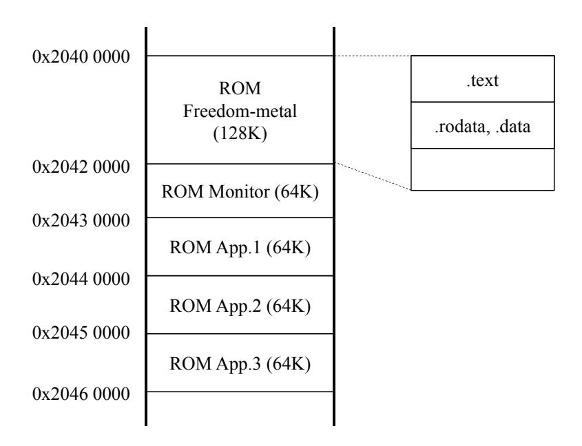

Figure 12: Memory map of ROM. The maximum size for the overall ROM is 512MB.

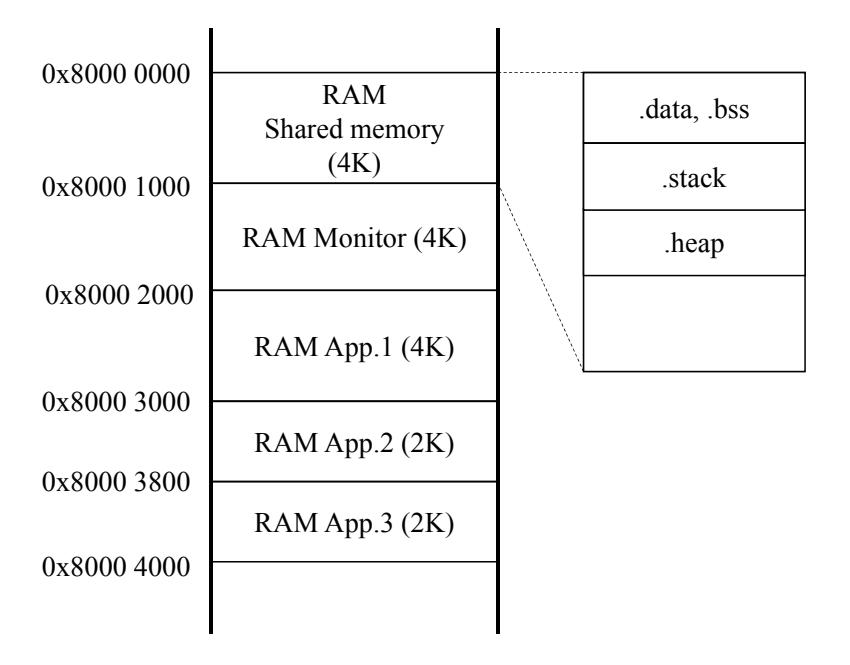

Figure 13: Memory map of RAM. The maximum size for the overall RAM is 16kB.

# A Specification and Implementation of PoC TEE

### A.1 Memory Map

The memory maps indicating the ROM and RAM for the PoC TEE are shown in Figures 12 and 13.

### A.2 Specification of Shared Memory

The shared memory, shown in Figure 14, separates its memory region into two sub-regions: one for application calls (0–11) and one for shared data (12–127). It is declared as a 128-byte array of uint8\_t. SP and RA denote registers for stack pointers and return addresses, respectively. caller ID and callee ID are used for the monitor managing application calls. The monitor saves the context of the application with the caller ID and calls an application with the callee ID. cmd is used for determining what each application does. An example of cmd usage is presented in Section A.6.

## **A.3** Function for Switching Applications

The function for switching applications involves the following three steps: (1) store sp and ra into the shared memory, (2) store caller ID and callee ID into the shared memory, and

{25}------------------------------------------------

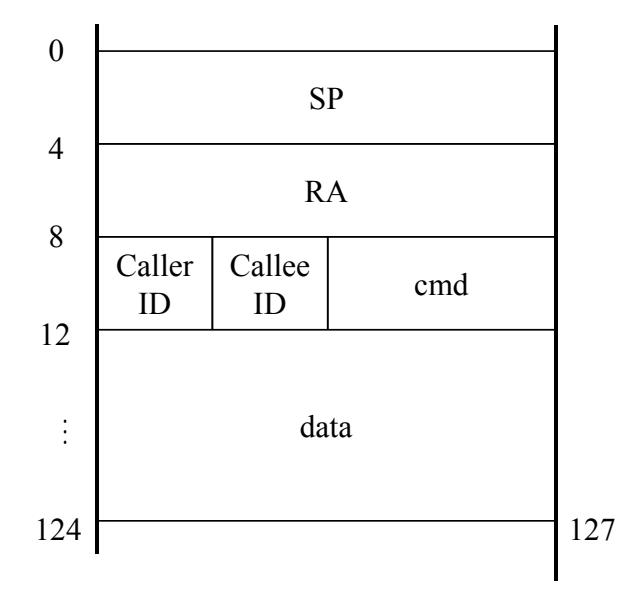

Figure 14: Structure of shared memory.

|   |   | _          | of com |   |  |
|---|---|------------|--------|---|--|
| _ | ~ | l <u>—</u> |        | _ |  |

| Cmd  | Class | Function | Size | Description       |
|------|-------|----------|------|-------------------|
| 0x80 | 0x10  | 0x10     | N/A  | Echo cmd          |
|      |       | 0x20     | N/A  | Get response      |
|      |       | 0x30     | size | Set buffer        |
|      | 0x20  | 0x10     | size | Set shared memory |
|      |       | 0x18     | size | Get shared memory |
|      |       | 0x20     | N/A  | Call app. 2       |
|      |       | 0x30     | N/A  | Call app. 3       |

(3) transfer the control to the monitor in M-mode by environment call exception caused by ecall. The original code of the function is as follows.

```
void call_app(uint8_t caller_id, uint8_t callee_id){
1
2
      uintptr_t sp, ra;
3
      uintptr_t *t;
      \underline{\quad} asm\underline{\quad} volatile ("mv %0, sp" : "=r"(sp));
4
        _asm___ volatile ("mv %0, ra" : "=r"(ra));
5
6
      t = (uintptr_t)&shared_buffer[SHARED_SP];
7
      *t = sp; // [0:3]
8
9
      t = (uintptr_t)&shared_buffer[SHARED_RA];
      *t = ra; // [4:7]
10
11
      shared_buffer[SHARED_CALLER] = caller_id;
12
      shared_buffer[SHARED_CALLEE] = callee_id;
13
        _asm___ volatile ("ecall");
14
```

### A.4 Specification of Commands for App. 1

App. 1 plays an OS-like role and executes commands from users via UART. Table 5 summarizes the specification of the commands. The command is given by a 4-byte array of uint8\_t and each byte is interpreted as Cmd, Class, Function, and Size, respectively.

### A.5 Implementation of app. 2

App. 2 is a victim application executing AES encryption, which is implemented with *micro-aes* [Sma19]. App. 2 receives plaintext by the shared memory and then encrypts it.

{26}------------------------------------------------

Finally, it stores the corresponding ciphertext in the shared memory. A user can obtain the ciphertext via app. 1. A secret key used for the encryption is declared as a static variable, and it is copied to the RAM. The original code of app. 2 is as follows.

```
1 #d e f i n e AES_BLOCK_SIZE 16
2
3 aes_128_context_t c t x ;
4
5 s t a t i c uin t8_ t key [AES_BLOCK_SIZE] = {0 x00 , 0x01 , 0x02 , 0x03 ,
6 0x04 , 0x05 , 0x06 , 0x07 ,
7 0x08 , 0x09 , 0x0a , 0x0b ,
8 0 x0c , 0x0d , 0 x0e , 0 x 0 f } ;
9
10 v oid sep2_main ( ) {
11 i n t i ;
12 uin t8_ t bl o c k [AES_BLOCK_SIZE] = { 0 };
13
14 ae s_ 1 2 8_ini t (&ctx , key ) ;
15 f o r ( i = 0 ; i < AES_BLOCK_SIZE; i++) {
16 bl o c k [ i ] = s h a r e d_ b u f f e r [SHARED_DATA + i ] ;
17 }
18
19 aes_128_encrypt(&ctx , bl o c k ) ;
20
21 f o r ( i = 0 ; i < AES_BLOCK_SIZE; i++) {
22 s h a r e d_ b u f f e r [SHARED_DATA + i ] = bl o c k [ i ] ;
23 }
24
25 c all_ app (CTX_SEP2, CTX_END) ; // f i n i s h
26 }
```

### **A.6 Implementation of App.3**

App. 3 is an attacker application dumping the victim RAM. More specifically, it receives a base address and an offset, and it then reads data from the address of "base adder + offset". The original code of app. 3 is as follows.

```
1 v oid sep3_main ( ) {
 2 // f o r c all_ app ( ) wi th ou t u si n g s t a c k (RAM)
 3 ui n t p t r_ t sp , r a ;
 4 ui n t p t r_ t ∗ t ;
 5
 6 uin t8_ t cmd [ 2 ] ;
 7 uin t16_ t o f f s e t ;
 8 uin t32_ t re g_v al ;
 9 s t a t i c uin t32_ t base_addr = BASE_ADDR;
10
11 ∗ ( ( uin t16_ t ∗)cmd ) = ∗ ( ( uin t16_ t ∗)&s h a r e d_ b u f f e r [SHARED_CMD] ) ;
12
13 swi t c h (cmd [ 0 ] ) {
14 c a s e 0 x33 :
15 swi t c h (cmd [ 1 ] ) {
16 // −−− s e t b a se addr −−−
17 c a s e 0 x10 :
18 base_addr = ∗( uin t32_ t ∗)&s h a r e d_ b u f f e r [SHARED_DATA] ;
19 break ;
20
```

{27}------------------------------------------------

```
21 // −−− s e t o f f s e t & l o a d data ( wi th ou t f a u l t i n j e c t i o n ) −−−
22 c a s e 0 x20 :
23 o f f s e t = ∗( uin t16_ t ∗)&s h a r e d_ b u f f e r [SHARED_DATA] ;
24 re g_v al = ∗ ( ( uin t32_ t ∗) ( base_addr + o f f s e t ) ) ;
25
26 ∗ ( ( uin t32_ t ∗)&s h a r e d_ b u f f e r [SHARED_DATA] ) = re g_v al ;
27 break ;
28
29 // −−− e x p l o i t with f a u l t −−−
30 c a s e 0 x f 1 :
31 // TIP : s a ve o f f s e t v al u e from app . 3 RAM t o sh a red RAM
32 o f f s e t = ∗( uin t16_ t ∗)&s h a r e d_ b u f f e r [SHARED_DATA] ;
33 ∗( uin t16_ t ∗)&s h a r e d_ b u f f e r [SHARED_DATA+STR_ADDR] = o f f s e t ;
34
35 /∗ c all_ app (CTX_SEP3, CTX_SEP2) ; // <− f a u l t h e r e ∗/
36 // TIP : e c a l l wi th ou t c all_ app ( ) t o a v oid u si n g s t a c k
37 __asm__ v o l a t i l e ( "mv %0, sp " : "= r " ( sp ) ) ;
38 __asm__ v o l a t i l e ( "mv %0, r a " : "= r " ( r a ) ) ;
39
40 t = ( ui n t p t r_ t )&s h a r e d_ b u f f e r [SHARED_SP] ;
41 ∗ t = sp ; // [ 0 : 3 ]
42 t = ( ui n t p t r_ t )&s h a r e d_ b u f f e r [SHARED_RA] ;
43 ∗ t = r a ; // [ 4 : 7 ]
44 s h a r e d_ b u f f e r [SHARED_CALLER] = CTX_SEP3;
45 s h a r e d_ b u f f e r [SHARED_CALLEE] = CTX_SEP2;
46 __asm__ v o l a t i l e ( " e c a l l " ) ;
47
48 // TIP : 16−by te memory a c c e s s wi th ou t u si n g s t a c k
49 ∗ ( ( uin t32_ t ∗)&s h a r e d_ b u f f e r [SHARED_DATA+0]) = ∗ ( ( uin t32_ t
                ∗) (BASE_ADDR_TGT + ∗ ( ( uin t16_ t ∗)&s h a r e d_ b u f f e r [
               SHARED_DATA + STR_ADDR] ) +0) ) ;
50 ∗ ( ( uin t32_ t ∗)&s h a r e d_ b u f f e r [SHARED_DATA+4]) = ∗ ( ( uin t32_ t
                ∗) (BASE_ADDR_TGT + ∗ ( ( uin t16_ t ∗)&s h a r e d_ b u f f e r [
               SHARED_DATA + STR_ADDR] ) +4) ) ;
51 ∗ ( ( uin t32_ t ∗)&s h a r e d_ b u f f e r [SHARED_DATA+8]) = ∗ ( ( uin t32_ t
                ∗) (BASE_ADDR_TGT + ∗ ( ( uin t16_ t ∗)&s h a r e d_ b u f f e r [
               SHARED_DATA + STR_ADDR] ) +8) ) ;
52 ∗ ( ( uin t32_ t ∗)&s h a r e d_ b u f f e r [SHARED_DATA+12]) = ∗ ( ( uin t32_ t
                ∗) (BASE_ADDR_TGT + ∗ ( ( uin t16_ t ∗)&s h a r e d_ b u f f e r [
               SHARED_DATA + STR_ADDR] ) +12) ) ;
53 // TIP : r e t u r n wi th ou t sp u se
54 s h a r e d_ b u f f e r [SHARED_CALLER] = CTX_SEP3;
55 s h a r e d_ b u f f e r [SHARED_CALLEE] = CTX_END;
56 __asm__ v o l a t i l e ( " e c a l l " ) ;
57 break ;
58
59 d e f a u l t :
60 break ;
61 }
62 break ;
63
64 d e f a u l t :
65 break ;
66 }
67
68 c all_ app (CTX_SEP3, CTX_END) ; // f i n i s h
69 }
```

{28}------------------------------------------------

# **B Drawbacks of PoC TEE**

Our PoC TEE aims to show the feasibility and effectiveness of our proposed attack in principle. Therefore, some functions of the actual TEE are omitted from our PoC TEE. The drawbacks of the PoC TEE are as follows.

#### • Heap memory:

Heap memory was not implemented in the PoC TEE. Accordingly, memory isolation for heap memory is not performed. The behavior of using a memory allocation function such as malloc() was not investigated.

• Automatic generation for applications running on the PoC TEE: Three applications in the PoC TEE were hard-coded as shown in Figure 6. The memory allocation for each application is defined in a linker script. To provide automatic generation for TEE applications, we need to dynamically generate the script from some types of configuration files.

### • sp usage in exception handler:

The exception handler uses sp as it is, which means that the monitor uses the stack region of the caller application when handling the exception. It should be changed as soon as the handler is called; however, we did not implement it because it required to modification of the function provided by the Freedom Metal library. This implementation may become a vulnerability. Nevertheless, we do not treat it as an attack vector in this study.

## **C Supplement for Experiment**

### **C.1 Profiling #2**

We performed the same profiling experiment using the target device. Figure 15 shows the result for verifying the effectiveness of the method for extracting the fault intensity using a profiling device. It suggests similar trends as in Figure 9.

The successful clock glitches are divided into four types as shown in Figure 15. Figure 16 shows representative waveforms from each type. They indicate that pairs of types #1 and #3, and types #2 and #4 show similar trends each other.

{29}------------------------------------------------

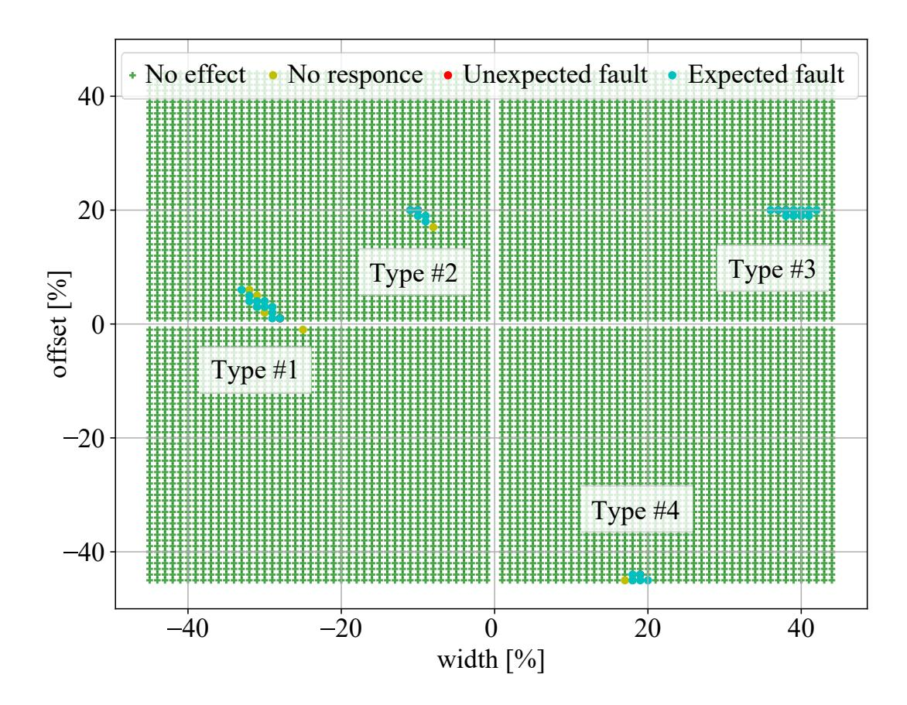

Figure 15: Profiling result for the exploitation device.

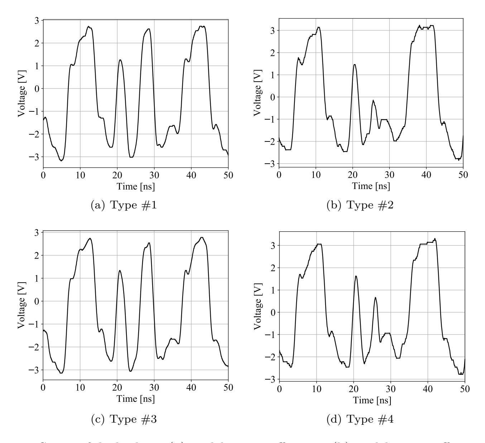

Figure 16: Successful glitches: (a) width=-32, offset=6, (b) width=-10, offset=20, (c) width=41, offset=21, (d) width=19, offset=-45. The clock signal split into two at the central position is a glitch.