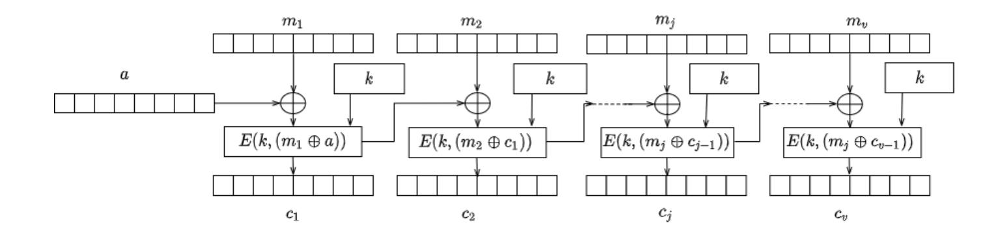
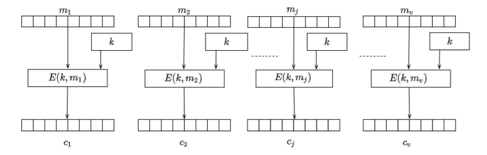
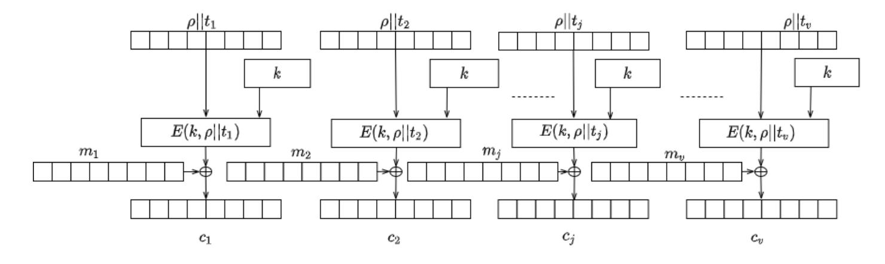
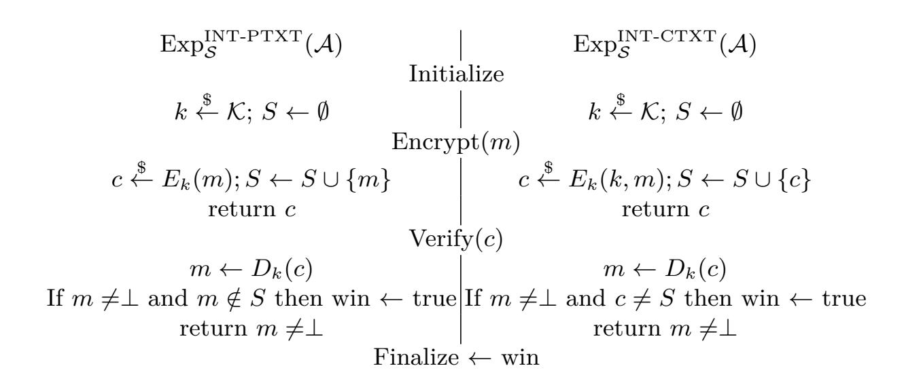

{0}------------------------------------------------

# **TR-31 and AS 2805 (Non)equivalence report***<sup>⋆</sup>*

Arthur Van Der Merwe, David Paul, Jelena Schmalz, and Timothy M. Schaerf School of Science and Technology, University of New England, Armidale NSW, 2351, Australia

**Abstract.** We examine the security of the Australian card payment system by analysing existing cryptographic protocols in this analysis. We compare current Australian cryptographic methods with their international counterparts, such as the ANSI TR-31 methods. Then, finally, we formulate a formal difference between the two schemes using security proofs.

**Keywords:** AS 2805 · authenticated encryption · financial · encryption · TR-31

# **1 Introduction**

The protection of the financial system in every country is the primary directive of payment system regulators. Vulnerable architectures in the financial system, more specifically, card payment systems might cause uncertainty in the operational effectiveness of economic activities. Historically, each country relied on a combination of international and local standards to maintain the effectiveness and security of payment systems. In recent years, card manufacturing organisations started a commercial company with the view to standardise security practices across the globe. The established commercial company, named Payment Card Industry Security Standards Council (PCI-SSC), headed by US-based card companies (Visa, MasterCard, American Express), imposes security requirements and specifications developed by their working groups. The PCI-SSC is not a standards organisation. However, they produce industry specifications adopted widely in several regions [[MR08\]](#page-22-0). The industry standards by PCI-SSC provide a set of security and test requirements, and the use of a set of approved laboratories to test if participants meet the desired specifications based on their function in the payments landscape. Recently, PCI-SSC required the management of all cryptographic keys in structures called "Key Blocks". Key blocks are defined in the ANS X9 TR-31 Technical Report (TR-31) [[Ins18\]](#page-21-0), which was in response to the ANSI X9 24.1 Standard [\[Ins17](#page-21-1)]. The goal of ANSI's X9.24-1-2017 is to specify some minimum requirements for the management of symmetric cryptographic keys used for financial transactions; typically these requirements apply to POS and ATM transactions, in addition to banking messages. In this paper we focus on the notion of key blocks defined in the TR-31 technical report.

*<sup>⋆</sup>* This research is supported by an Australian Government Research Training Program (RTP) Scholarship.

{1}------------------------------------------------

# **2 Our Contribution**

Since the development of the Australian Key Scheme series in the Australian National Standards (the AS 2805 series of standards) there remains an open problem to define security bounds and a definition of security. TR-31 has the same open question, though TR-31 resembles an authenticated encryption scheme. We evaluate the TR-31 and AS 2805 schemes and draw a formal comparison. The goal is to investigate the differences and advantages between the two systems. We analyse key generation, key derivation, and key separation, then motivate changes to the AS 2805 standards for enhancement.

# **3 Preliminaries**

This section provides key definitions. Some aspects are standard, but others are not. We abstract the use of any specific encryption scheme and focus on general constructions. We start by reviewing the necessary tools and definitions that are required for our results. We begin by establishing the notation for block ciphers, data encryption and cipher block chaining (CBC) to secure the encryption of multiple blocks of a block cipher. We look at message authentication (MAC) to provide integrity followed by authenticated encryption to enable both data security and integrity.

### **3.1 Notation**

We use [*n*] to denote the set *{*1*, ..., n}* and ∅ to denote the empty set. A binary string of size *n* is represented as *{*0*,* 1*} <sup>n</sup>* and *{*0*,* 1*} ∗* represents a set of all strings of finite length. For any two binary strings *s*<sup>1</sup> and *s*2, we denote the size of *s*<sup>1</sup> as *|s*1*|* and the concatenation of the string *s*<sup>1</sup> immediately followed by *s*<sup>2</sup> as *s*1*||s*2. For any non-negative integer *k ≤ |s*1*|*, we use *⌊s*1*⌋<sup>k</sup>* to represent the string obtained by the truncation of *s*<sup>1</sup> to the leftmost *k* bits. The process of uniformly sampling a value from a finite set *S* and assigning the result to *x ∈ S* is written as *x* \$*← S*. We use the *⊕* symbol to denote the binary addition modulo two or exclusive OR (XOR) operator and *⊥* indicating an error.

We model security using the code-based game-playing framework by Bellare et.al. [\[BR06](#page-20-0)] where the interaction between the adversary with the game is implicit. Throughout the following text, we refer to a single-use arbitrary number used in cryptographic algorithms as a *nonce*. In practice a nonce is often a random or pseudo-random number to prevent replay attacks, which introduces randomness into an algorithm.

### **3.2 Negligible, super-poly, and poly-bounded functions**

We begin by defining the notions of *negligible*, *super-poly*, and *poly-bounded* functions. A *negligible function f* is one that not only tends to zero as *n → ∞*, but does so faster than the inverse of any reciprocal.

{2}------------------------------------------------

**Definition 1.** f is called negligible if for all  $c \in \mathbb{Z} > 0$  there exists  $n_0 \in \mathbb{Z}_{\geq 1}$  such that for all integers  $n \geq n_0$ , we have  $|f(n)| < 1/n^c$ .

 $\mathbb{Z}_{\geq 1} \to \mathbb{R}$  is negligible if and only if for all c > 0, we have

$$\lim_{n \to \infty} f(n)n^c = 0.$$

The definition of a *negligible function* leads to the definition of a *super-poly* function:

**Definition 2.** A function f is called super-poly if 1/f is negligible.

A poly-bounded function f is one that is bounded in absolute value by some polynomial. Formally:

**Definition 3.** A function f is called poly-bounded, if there exists  $c, d \in \mathbb{Z}_{>0}$  such that for all integers  $n \geq 0$ , we have  $|f(n)| \leq n^c + d$ .

Intuitively, we refer to a *negligible* value as a value so small as to be "zero for all practical purposes", for example  $2^{-100}$ . We also use the following terms:

- A function f(n) is polynomial time computable if there exists a Turing machine M and a polynomial p(n), such that M computes the function f(n) such that M runs in time  $\leq p(n)$  for all inputs of length n.
- If a function f(n) is polynomial time computable, then f(n) is poly-bounded.
- An efficient adversary is one that runs in polynomial-time. The Bachmann–Landau  $\mathcal{O}$  notation [Bac94] [Lan09] captures the notion of an adversary that cannot find any polynomial-time algorithm to determine the key from a given algorithm. Consider the task of finding the correct k-bit key among all  $2^k$  possibilities, using brute-force. Without additional information provided by cryptanalysis, the best way is to check every key. The brute-force task takes  $\mathcal{O}(2^k)$  computations which is not polynomial-time but exponential time. The calculation is therefore asymptotically out of reach for a polynomial-time adversary.
- A value N is called super-poly if 1/N is negligible.
- A poly-bounded value is a "reasonably" sized number. In particular, an *efficient adversary* is one whose running time is *poly-bounded*.

Random Experiments. We refer to a protocol game played by a group of interactive probabilistic algorithms as random experiments. These games are expressed as a list of actions by players, where the result of the actions is an event with a discrete probability, denoted as:

<span id="page-2-0"></span>
$$Pr[action_1; action_2; ...; action_n : event]$$
 (1)

The outcome of the game in (1) is the probability of event after executing  $action_1; ...; action_n$  in sequential order. event is taken over a probability space, of all random variables involved in the actions.

{3}------------------------------------------------

#### 3.3 Block Ciphers

A block cipher is a deterministic cipher  $\mathcal{E} = (E, D)$  with an encrypt (E) and decrypt (D) function defined over a message space  $\mathcal{M}$  and ciphertext space  $\mathcal{C}$ . The message space  $\mathcal{M} \in \mathcal{X}$  and ciphertext space  $\mathcal{C} \in \mathcal{X}$  are the same finite set, where  $\mathcal{X} = \{0,1\}^n$  and  $|\mathcal{X}| = 2^n$ . The key space  $\mathcal{K} \in \{0,1\}^n$ , and we say that  $\mathcal{E}$  is a block cipher defined over  $(\mathcal{K}, \mathcal{X})$ . We call an element  $x \in \mathcal{X}$  a data block, and refer to  $\mathcal{X}$  as the data block space of  $\mathcal{E}$ .

For every fixed key  $k \in \mathcal{K}$ , we can define the function  $f_k := E(k, \cdot)$ ; that is,  $f_k : \mathcal{X} \to \mathcal{X}$  sends  $x \in \mathcal{X}$  to  $E(k, x) \in \mathcal{X}$ . The usual correctness requirement for any cipher implies that, for every fixed key k, the function  $f_k$  is one-to-one and, as  $\mathcal{X}$  is finite,  $f_k$  must be onto as well. Thus,  $f_k$  is a permutation on  $\mathcal{X}$ , and  $D(k, \cdot)$  is the inverse permutation  $f_k^{-1}$ .

**Definition 4.** A block cipher  $\mathcal{E}$  is secure if, for all efficient adversaries  $\mathcal{A}$ ,  $\mathcal{A}$  has a negligible probability in determining the key. We denote this probability as  $\operatorname{Adv}[\mathcal{A}, \mathcal{E}] \leq \epsilon$ , where epsilon is a negligible value.

### 3.4 Block cipher mode of operations

If there are multiple data blocks in the message space of a block cipher,  $|\mathcal{X}| > 1$ , then a method is needed to combine several blocks of encryption together.

<span id="page-3-0"></span>**CBC** mode of operation One such method is to use a block cipher in cipher block chaining (CBC) mode. CBC mode chains ciphertext blocks together where the current block is dependent on the previous encrypted block. Let the key generation algorithm return a random key for the block cipher, and the IV be the initial a also chosen at random,  $a \stackrel{\$}{\leftarrow} \mathcal{X}$ . We denote the size of each block by n, and break the message  $m \leftarrow [m_1, m_2, \ldots, m_j, \ldots, m_v]$  into blocks equal to the block size n. The result of the algorithm is the combination of each ciphertext block  $c \leftarrow [c_1, c_2, \ldots, c_j, \ldots, c_v]$  and the initial value, abbreviated as IV we call a. If the message is not multiples of the block size,  $|m| \mod n \neq 0$ , then we pad the message with the function  $m \leftarrow p(m)$  such that  $|m| \mod n = 0$ . We can then define  $\langle c, a \rangle \leftarrow E(k, m)$ , where c is computed according to the following algorithm:

```
c \leftarrow E(k, m)
If (|m| \mod n \neq 0) then m \leftarrow p(m):
Break m into n-bit blocks m \leftarrow [m_1, m_2, \dots, m_j, \dots, m_v]
c_0 \leftarrow a \stackrel{\$}{\leftarrow} \mathcal{X}
for j \leftarrow 1 to v do
c_j \leftarrow E(k, \ (c_{j-1} \oplus m_j))
c \leftarrow c_1||c_2||\dots||c_j||\dots||c_v
output \langle c, a \rangle;
```

{4}------------------------------------------------

For *k ∈ K* and *c ∈ X* , with *v ← |c|*, we define *m ← D*(*k, c*), where *m* is computed according to the following algorithm:

```
⟨D(k, c), a⟩
       If (|c| mod n ̸= 0) then return ⊥:
       Break c into n-bit blocks c ← [c1, c2, . . . , cj , . . . , cv]
              c0 ← IV ← a
              for j ← 1 to v do
                     mj ← D(k, (cj−1 ⊕ cj ))
              m ← [m1||m2|| . . . , mj || . . . ||mv]
              output m;
```



<span id="page-4-0"></span>**Fig. 3.1.** The CBC mode of encryption

**ECB mode of operation** Similarly to CBC mode, we can define Electronic Code Book (ECB) mode of operation (in Figure [3.2\)](#page-5-0) where each block of data is encrypted independently of the previous encrypted block, using the block cipher. After which each encrypted block is concatenated together to form the ciphertext.

For *k ∈ K* and *m ∈ X* , with *v* = *|m|*, we define *c ← E*(*k, m*), where *c* is computed according to the following algorithm:

```
c ← E(k, m)
       If (|m| mod n ̸= 0) then m ← p(m):
       Break m into n-bit blocks m ← [m1, m2, . . . , mj , . . . , mv]
              for j ← 1 to v do
                     cj ← E(k,(mj )
              c ← c1||c2|| . . . ||cj || . . . ||cv
              output c
```

{5}------------------------------------------------



<span id="page-5-0"></span>**Fig. 3.2.** The ECB mode of operation

**CTR mode of operation** Counter mode of operation uses a mechanism similar to ECB mode, but includes a counter and a nonce for each block. For *k ∈ K* and *m ∈ X* , with *v* = *|m|*. Let *ρ* be a unique nonce for the duration of the algorithm, and *t<sup>j</sup>* be a counter value, increasing with every encrypted block. We define *c ← E*(*k, m*), where *c* is computed according to the following algorithm:

```
c ← E(k, m)
       If (|m| mod n ̸= 0) then m ← p(m):
       Break m into n-bit blocks m ← [m1, m2, . . . , mj , . . . , mv]
              for j ← 1 to v do
                     aj ← E(k, ρ||tj )
                     cj ← aj ⊕ m)j
              c ← c1||c2|| . . . ||cj || . . . ||cv
       output c
```



**Fig. 3.3.** The CTR mode of encryption

{6}------------------------------------------------

### <span id="page-6-1"></span>**3.5 Message Authentication Code (MAC)**

A message integrity system that is based on a shared secret key between the sender and receiver is called a Message Authentication Code or MAC for short.

**Definition 5.** *A MAC system I* = (*T , V*) *is a pair of efficient algorithms, T and V, where T is called a signing algorithm and V is called a verification algorithm. Algorithm T is used to generate tags and algorithm V is used to verify tags.*

- **–** *T* is a probabilistic algorithm that is invoked as *τ* \$*← T* (*k, m*), where *k* is a key, *m* is a message, and the output *τ* is called a tag.
- **–** *V* is a deterministic algorithm that is invoked as *r ← V*(*k, m, τ* ) ,where *k* is a key, *m* is a message, *τ* is a tag, and the output *r* is either "accept" or "reject".
- **–** We require that tags generated by *T* are always accepted by *V*; that is, the MAC must satisfy a correctness property, such that for every valid key *k* and message pair, we have *V*(*k, m, T* (*k, m*)) = accept

*I* = (*T , V*) is defined over (*K, M, T* ). Whenever algorithm *V* outputs "accept" for some message-tag pair (*m, τ* ) , we say that *τ* is a valid tag for *m* under key *k*, or that (*m, τ* ) is a valid pair under *k*. The simplest type of system is one in which the signing algorithm *T* is deterministic, and the verification algorithm is defined as

$$\mathcal{V}(k, \ m, \ \tau) = \begin{cases} \text{accept if } \mathcal{T}(k, \ m) = \tau, \\ \text{reject otherwise.} \end{cases}$$
 (2)

We call such a MAC system a deterministic MAC system. Where a deterministic MAC system has unique tags: for a given key *k*, and a given message *m*, there is a unique valid tag for *m* under *k*.

### <span id="page-6-0"></span>**3.6 CBC malleability**

An encryption algorithm is malleable if it is possible to transform a ciphertext into another ciphertext which decrypts to a related plaintext. Malleability is an undesirable property of a cryptosystem, as this property allows an adversary to modify the underlying encrypted plaintext by modifying the ciphertext. The properties of malleability do not mean that an attacker has any significant advantage to recover the plaintext, even after the ciphertext transformation. The attacker may not know what the related plaintext is unless he has prior knowledge of some parts of the plaintext.

Nevertheless, malleability would have a *non-negligible* advantage in an adaptive chosen ciphertext attack model. Vaudenay presented the first public padding oracle attack in Eurocrypt 2002 [[Vau02\]](#page-23-0), and since then, research in the area has expanded [\[PY04a](#page-22-2)] [\[RD10a](#page-23-1)] [\[BFK](#page-20-2)<sup>+</sup>12]. The padding oracle attack assumes that an adversary can intercept messages encrypted in CBC mode, and has access to a padding oracle. The padding oracle *O* must return some indication to the attacker if the padding on the encrypted message is valid using the following game:

{7}------------------------------------------------

- Adversary submits a CBC encrypted ciphertext C to an oracle  $\mathcal{O}$
- The oracle decrypts the ciphertext under a fixed key K, and checks if the padding is correct.
- The oracle outputs VALID or INVALID according to the correctness of the padding.

The adversary can use the padding oracle attack to determine the message length. An attacker could then extend the attack above to recover the last message block using the commutative properties of the XOR operations. Current literature details several examples of padding attacks [BU02] [YPM05] [PY04b] [RD10b]. We capture this notion of padding attacks based on the CBC algorithm. We can see from the algorithm in Section (3.4) that the CBC decryption is the XOR of each plaintext block with the ciphertext block as:

$$m_j = D(k, c_j) \oplus c_{j-1},$$
  
 $c_0 = IV.$ 

Therefore a single byte change in  $c_1$  will correspond to a change in  $m_2$ . When an adversary has two ciphertext blocks  $c_1$  and  $c_2$  and wants to decrypt  $c_2$  to get  $m_2$ , the adversary can adjust  $c_1' \leftarrow c_1$ , and send  $c_1' || c_2$  and IV to the server. The server then returns showing that the padding on the last block  $m'_2$  is either correct (equal to 0x01) or not. If the padding is correct, the adversary identifies the last byte  $0x01 \leftarrow D(k, c_2) \oplus c'_1$ , therefore  $D(k, c_2) = c'_1 \oplus 0x01$ . If the padding oracle indicates the padding is incorrect, then the adversary can replace the last byte of  $c'_1$  with the next value. To guess every potential value for each byte, the adversary would need to make at least 256 queries to the oracle. The adversary can use the same procedure to find the second last byte of  $m_2$ . Given TDES has a 64-bit block, an attacker would need to make  $256 \cdot (64/8) = 2048$  queries to recover the final block, which is significantly less than a brute force attack. The main reason that CBC, as detailed in figure (3.1), has this vulnerability is due to the lack of integrity on the ciphertext. Several padding methods on ISO and financial standards are shown to be vulnerable to this attack |PY04a|. The main protection mechanism in financial systems to subdue this attack is to decrypt ciphertext within a certified HSM. Stringent software tests on Payments HSMs ensure the functions do not provide an oracle that enables an attacker to execute this attack. General purpose HSMs are, however, vulnerable |PY04a|. Several cryptosystems are malleable [SMK19], most notably stream ciphers, RSA, El Gamal |TY98| |Wik02| and Pallier |DDN03|. A stream cipher produces ciphertext by combining the plaintext and a pseudorandom stream based on a secret key k with the XOR operation  $E_k(m) = m \oplus S(k)$ . An adversary can construct the encryption of the message m and some malicious value t as:  $E_k(m \oplus t) = m \oplus t \oplus S(k)$ . The RSA cryptosystem has a public key (e, n) where the encryption of the plaintext m is  $E(m) = m^e \mod n$ . Given a ciphertext, c an adversary can construct a ciphertext of mt as:  $E(m) = t^e \mod n = (mt)^e$ mod n = E(mt). However padding mechanisms such as RSA-OAEP and PKCS1 have mechanisms which aim to prevent this attack. Unfortunately, the recent attack against PKCSv1 v1.5 [BFK+12] shows that RSA-OAEP might not be as 

{8}------------------------------------------------

strong as was previously thought. In the Paillier, ElGamal, and RSA cryptosystems, it is also possible to combine several ciphertexts in such a way to produce a related ciphertext. In systems like Paillier, an adversary needs the public key and the encryption of two plaintexts, *m*<sup>1</sup> and *m*<sup>2</sup> to compute a valid sum of their encryptions *m*<sup>1</sup> + *m*2. In RSA and El Gamal, in contrast, one can combine encryptions of *m*<sup>1</sup> and *m*<sup>2</sup> to produce valid encryptions of their products.

Changing or replacing any bit(s) in encrypted data is possible in various cryptosystems, not only when encrypting data in CBC mode. However, to have valid ciphertext that decrypts to a related plaintext, the adversary requires access to a padding oracle to exploit the malleability of CBC. Other cryptosystems are partly homomorphic by design. However, CBC-MAC does not have this property as the protocol only retains the tag of the last block.

Interchanging any bits of the encrypted data with bits from another part of the encrypted data would imply that the mode of operation is ECB. This structure of ECB has the advantage of supporting parallel processing. Because the encryption of each block does not depend on any other, an adversary can replace any block with a previously intercepted block without being detected. In mechanisms like CBC, each encrypted block depends on the previous block of data. New diffusion mechanisms proposed recently [[EAAER09\]](#page-20-5) attempt to solve this issue.

# **4 Formal differences between AS 2805 and TR-31**

We start by our formal analysis by comparing AS 2805 and TR-31 in a series of well-known security games, establishing ciphertext and plaintext security in addition to strong integrity.

### **4.1 Attack analysis**

To demonstrate the differences in security between AS 2805 and TR-31, we use adversarial games to demonstrate the insecurity of CBC with the use of a zero initialization vector. We then look at indistinguishable chosen-ciphertext security (IND-CCA), then extend the security games to indistinguishable chosen plaintext security (IND-CPA). We then look at the composition paradigm, where we discuss the composition of privacy and integrity. The strategy of the security games is to illustrate the differences in the security bounds between the AS2805 financial messages and TR-31 Key Blocks. We start by defining financial message operations as a pair of *efficient* algorithms (*E, D*), with a header, additional data and a nonce that will not be encrypted such that:

**–** The deterministic encryption algorithm *E* : *K × N × P × M → C × T × P* takes as input a secret key *K ← K*, associated data *P ← P*, and a message *M ← M* to return a ciphertext *C ← C* a tag *T ← T* and the cleartext associated data *P ← P*

{9}------------------------------------------------

- The deterministic decryption algorithm  $\mathcal{D}: \mathcal{K} \times \mathcal{N} \times \mathcal{P} \times \mathcal{C} \to \mathcal{M} \cup \{\bot\}$  takes as input a secret key K, a nonce N, associated data P, and a ciphertext C to return either a message in  $\mathcal{M}$  or  $\bot$  indicating that the ciphertext is invalid.

The two algorithms above should have both privacy and integrity on the plaintext and ciphertext. However, the security of the construction relies on the composition of the operations. The literature [BN08] explores several compositional paradigms for authenticated encryption constructions ranging from methods that use unique nonces and initial values and methods where weak message authentication is used. We start with the use of CBC mode with a fixed IV and define two separate worlds, left and right denoted as LR. The adversary is given the result of either the left or right world. If the adversary can identify where the result comes from, the scheme is considered insecure. The adversary must have at most a 0.5 probability of guessing the world he operates in. The adversary queries the LR world in a black box manner with no visibility of the inner workings, only observing the input and output. We use the notion of an oracle, which computes and encryption and decryption operations external to the adversary. The LR is either an encryption or decryption operation with a bit b, indicating left or right. We denote the oracle as  $E_k(LR(\cdot,\cdot,b))$  and an adversary  $\mathcal{A}$  accessing the oracle as  $\mathcal{A}^{E_k(LR(\cdot,\cdot,b))}$ .

Our definition of security associates a symmetric encryption scheme S with an adversary A in a security game, capturing each of the worlds above. The adversary's advantage and its success in breaking the scheme is the difference in probabilities of the two experiments returning the bit one.

**Definition 6.** Let  $S = (K, \mathcal{E}, \mathcal{D})$  be a symmetric encryption scheme and the adversary A be an algorithm that has access to an oracle.

We consider the following two experiments in the LR world, where we regard  $\operatorname{Exp}_{\mathcal{S}}^1$  as the left world and  $\operatorname{Exp}_{\mathcal{S}}^0$  as the right world:

$$\begin{array}{c|c} \text{Adversary: } \mathcal{A}^{E_k(LR(\cdot,\cdot,b))} & \text{Adversary: } \mathcal{A}^{E_k(LR(\cdot,\cdot,b))} \\ \text{Experiment 1: Exp}_{\mathcal{S}}^1(\mathcal{A}) & \text{Experiment 2: Exp}_{\mathcal{S}}^0(\mathcal{A}) \\ K \leftarrow \mathcal{K} & K \leftarrow \mathcal{K} \\ d \leftarrow \mathcal{A}^{E_k(LR(\cdot,\cdot,1))} & d \leftarrow \mathcal{A}^{E_k(LR(\cdot,\cdot,0))} \\ \text{return } d & \text{return } d \end{array}$$

We denote the advantage of A in distinguishing between the two worlds as:

$$\operatorname{Adv}_{\mathcal{S}}(\mathcal{A}^{E_k(LR(\cdot,\cdot,b))}) = \Pr[\operatorname{Exp}_{\mathcal{S}}^1(\mathcal{A}^{E_k(LR(\cdot,\cdot,b))}) = 1] - \Pr[\operatorname{Exp}_{\mathcal{S}}^0(\mathcal{A}^{E_k(LR(\cdot,\cdot,b))}) = 1].$$

In the game above, before the adversary interacts with the oracle, either the left or right world is decided to respond to the oracle requests. We denote the left world as world 1 and right world as world 0. In world 0, all the requests from the 

{10}------------------------------------------------

adversary are answered from world 0, similarly in world 1. The requests do not change oracles dynamically. If  $Adv_{\mathcal{S}}(\mathcal{A})$  is negligible, and the adversary cannot tell which world he is operating in, then the scheme is secure. If  $Adv_{\mathcal{S}}(\mathcal{A})$  is close to 1, then the adversary is doing well, and the scheme  $\mathcal{S}$  is not secure. Informally, for a symmetric scheme to be secure against a chosen-plaintext attack, the advantage of the adversary must be small regardless of what strategy the adversary tries. However, we have to be realistic, as the adversary invests more effort in his attack, this advantage may grow. We have to consider the adversary's resources and restrict the resources to a reasonable amount. With this, we consider a scheme to be secure against a chosen-plaintext attack if the adversary is efficient and cannot obtain a non-negligible advantage. We denote this game left-or-right indistinguishably under chosen-plaintext attack or IND-CPA.

### <span id="page-10-0"></span>4.2 Attack on AS 2805 (ECB and CBC with a fixed and counter IV)

In the ECB mode of operation, we show that an adversary has a high IND-CPA advantage, using a small number of resources. We slightly adjust our notation and allow the adversary to input the choice of which world he operates in the form of a bit b. The block size of the ECB scheme is denoted as n, where the adversary submits two messages to the oracle, each message being two blocks. One message consists of all zeros,  $0^{2n}$  and one consists of a zero block concatenated with ones,  $0^n|1^n$ . The goal of  $\mathcal{A}$  is to determine the value of b.

```
Adversary: \mathcal{A}^{E_k(LR(\cdot,\cdot,b))}

Experiment: \exp^b_{ECB}

M_1 \leftarrow 0^{2n}; M_0 \leftarrow 0^n || 1^n

C[1], C[2] \leftarrow E_k(LR(M_1, M_0, b))

If C[1] = C[2], then return 1 else return 0;
```

In the above C[1] and C[2] encryptions are the output blocks of ECB mode decided by the input bit b; we claim that A has a significant IND-CPA advantage, with only one oracle query, such that:

$$\Pr[\operatorname{Exp}^1_{\operatorname{ECB}}(\mathcal{A}^{E_k(LR(\cdot,\cdot,b))}) = 1] = 1$$

and

$$\Pr[\exp_{\mathrm{ECB}}^{0}(\mathcal{A}^{E_k(LR(\cdot,\cdot,b))})=1]=0.$$

In world 1, (where b = 1) the oracle returns  $C[1], C[2] \leftarrow E_k(0^n) || E_k(0^n)$ , therefore C[1] = C[2] and  $\mathcal{A}$  can return 1. In world 0, (where b = 0), the oracle returns  $C[1], C[2] \leftarrow E_k(0^n) || E_k(1^n)$ . Since  $E_k$  is a permutation,  $C[1] \neq C[2]$  so  $\mathcal{A}$  can confidently return 0. This means that the ECB mode of operation is insecure, even if the underlying block cipher is secure.

Similarly, CBC mode is insecure when executed with a fixed IV. Given the oracle is queried twice, and the  $E_k(LR(M_1, M_0, b))$  is implemented with the encryption algorithm or a random permutation, we can devise another game:

In the first game, the oracle submits two messages  $M_0 \leftarrow 0^n$  and an  $IV_0 \leftarrow 0^n$ .

{11}------------------------------------------------

Together with  $M_1 \leftarrow 1^n$  and an  $IV_1 \leftarrow 1^n$ . We denote the security of this scheme in the following two games:

```
Adversary: \mathcal{A}^{E_k(LR(\cdot,\cdot,b))}
Game: \operatorname{Exp}_{\operatorname{CBC}}^{b_1}
M_0 \leftarrow 0^n; IV_0 \leftarrow 0^n
M_1 \leftarrow 1^n; IV_1 \leftarrow 1^n
C[1], C[2] \leftarrow E_k(LR(M_1, M_0, b))
```

We see that regardless of which bit the oracle chooses, C[1] = C[2] and the adversary does not have an advantage to distinguish between the possible worlds. This property is due to the fact that CBC mode produces  $M \oplus IV$  prior to encryption of the first block. This results in either  $0^n \oplus 0^n = 0^n$  or  $1^n \oplus 1^n = 0^n$ . Given two messages  $M_0 \leftarrow 0^n$  and an  $IV_0 \leftarrow 0^n$  together with a message  $M_2 \leftarrow 0^n$  and an  $IV_0 \leftarrow 0^n$  where the message  $M_2$  is a random distribution and  $|M_2| = |M_1|$ , we can devise  $\text{Exp}_{\text{CBC}}^{b_2}$  which follows  $\text{Exp}_{\text{CBC}}^{b_1}$  in the following game:

```
Adversary: \mathcal{A}^{E_k(LR(\cdot,\cdot,b))}
Game: \operatorname{Exp}_{\operatorname{CBC}}^{b_2}
M_0 \leftarrow 0^n; IV_0 \leftarrow 0^n
M_2 \stackrel{\$}{\leftarrow} \mathcal{S}; IV_0 \leftarrow 1^n
C[3], C[4] \leftarrow E_k(LR(M_2, M_0, b))
If C[3] = C[1], then return 1 else return 0;
```

We claim that  $\mathcal{A}$  in CBC mode with a fixed IV has a non-negligible IND-CPA advantage, with two oracle queries, such that:

$$\Pr[\operatorname{Exp}_{\operatorname{CBC}}^{b_1}(\mathcal{A}^{E_k(LR(\cdot,\cdot,b))}) + \operatorname{Exp}_{\operatorname{CBC}}^{b_2}(\mathcal{A}^{E_k(LR(\cdot,\cdot,b))})] = 1$$

Similarly, when the IV is a counter, the adversary can distinguish between the counter values. Given two games where the IV is either  $0^n$  or  $0^{n-1}||1$  we have the following game:

```
Adversary: \mathcal{A}^{E_k(LR(\cdot,\cdot,b))}
Game: \operatorname{Exp}_{\operatorname{CBC}}^b
M_{0,1} \leftarrow 0^n; M_{1,1} \leftarrow 0^n
M_{0,2} \leftarrow 0^n; M_{1,2} \leftarrow 0^{n-1} || 1
IV_1, C_1 \leftarrow E_k(LR(M_{0.1}, M_{1.1}, b))
IV_2, C_2 \leftarrow E_k(LR(M_{0,2}, M_{1,2}, b))
If C_1 = C_2, then return 1 else return 0;
We claim that:
```

$$\Pr[\operatorname{Exp}^1_{\operatorname{CBC}}(\mathcal{A}^{E_k(LR(\cdot,\cdot,b))}) = 1] = 1,$$

and

$$\Pr[\exp^{0}_{CBC}(\mathcal{A}^{E_{k}(LR(\cdot,\cdot,b))}) = 1] = 0.$$

We prove this by considering world 0, where b = 0 meaning  $IV_0 = 0$  and  $IV_1 = 1$ . In this case we have  $C_1 = E_k(0)$  and  $C_2 = E_k(1)$  such that  $C_1 \neq C_2$  and the 

{12}------------------------------------------------

experiment returns 0. When b = 1 and we are in world 1, then  $IV_1 = 0$  and  $IV_2 = 1$ . In this case we have  $C_1 = E_k(0)$  and  $C_2 = E_k(0)$  and the experiment returns 1.

With the reasoning above, we can see that the AS 2805 scheme is insecure. An adversary has a significant advantage in distinguishing between ciphertexts. Next, we consider the scheme with the use of a random IV, while assuming the block cipher is a secure PRP or PRF. We call this randomised CBC mode, denoted as CBC\$. Taken from the work of [GB96]:

**Theorem 1.** The security of CBC\$. Given a block cipher  $S = (K, \mathcal{E}, \mathcal{D})$ , and a CBC\$ encryption scheme  $E : K \times \{0,1\}^n \to \{0,1\}^n$ . Let A be an adversary attacking the IND-CPA security of S, running at most time t and using at most q queries, totalling at most  $\sigma$  n-bit blocks. Then there is an adversary  $\mathcal{B}$  attacking the PRF security of S, such that:

<span id="page-12-0"></span>
$$Adv_{CBC\$}^{ind\text{-}cpa}(\mathcal{A}) \leq Adv_{\mathcal{S}}^{prf}(\mathcal{B}) + \frac{\sigma^2}{2^{n+1}}$$

In Theorem 1, (taken from [GB96])  $\mathcal{B}$  runs in time at most  $t' = t + \mathcal{O}(q + n\sigma)$  and asks  $q' = \sigma$  oracle queries. Bellare et al. [BN08] describe the proof of Theorem 1 elegantly, showing that the bounds are tight, falling off by an amount that is at most quadratic in the number of blocks  $\sigma$ , asked by the adversary.

In the IND-CPA paradigm, traditional block ciphers are not secure as they are deterministic and will never win the IND-CPA game. In the case of TR-31, the MAC is used as input to the block cipher which makes the scheme a probabilistic composition. We conclude that AS 2805 is not IND-CPA secure, while TR-31 is IND-CPA secure and probabilistic in nature. We leave the TR-31 IND-CPA insecurity proof as an open problem.

#### 4.3 IND-CCA Security

If a block cipher is indistinguishable from a random distribution with an adversary having access to a decryption oracle, then the mode provides indistinguishably based on chosen ciphertext attacks. We denote this as IND-CCA. As before, we observe interactions with an adversary and an oracle. The adversary is given black box access to the encryption  $c = E_k(m)$  and decryption  $m = D_k(c)$  oracle, where the adversary cannot send a previous ciphertext obtained by  $c = E_k(m)$  to the decryption oracle  $m = D_k(c)$ . The adversary computes two ciphertexts,  $c_0 = E_k(m_0)$  and  $c_1 = E_k(m_1)$ . The oracle computes  $c' = E_k(m', b)$  for  $b' \stackrel{\$}{\leftarrow} \{0, 1\}$ , which is given to the adversary. The adversary interacts with the oracles, and must output the bit b, indicating in which world he is operating. We capture this notion in the following security game:

Adversary: $\mathcal{A}^{D_k(LR(\cdot,\cdot,b))}$ Game: Exp<sup>b</sup><sub>IND-CCA</sub> 

{13}------------------------------------------------

Adversary interacts with the oracle:

*c*<sup>0</sup> *← Ek*(*LR*(*m*0))

*c*<sup>1</sup> *← Ek*(*LR*(*m*1))

The oracle computes:

*b ′* \$*← {*0*,* 1*}*

*m ← Dk*(*LR*(*c*2*, c*3*, b*))

Adversary interacts with the oracle:

*m ← Dk*(*c ′* ) for any *c ′* except *c*<sup>0</sup> or *c*<sup>1</sup>

Adversary outputs a bit *b ′* , if *b ′* = *b* then the adversary wins the game.

We claim, for a randomised encryption scheme, the advantage is *negligible*:

$$\Pr[\operatorname{Exp}_{\text{IND-CCA}}^{1}(\mathcal{A}^{D_k(LR(\cdot,\cdot,b))}) = 1] - \Pr[\operatorname{Exp}_{\text{IND-CCA}}^{0}(\mathcal{A}^{D_k(LR(\cdot,\cdot,b))}) = 1]$$
$$= |\Pr[b' = b] - 1/2| = \epsilon.$$

We note that the probability above only holds for a randomised scheme, and some modes of operations like ECB, and CBC are not IND-CCA secure. The malleability of both ECB and CBC were described in Section [3.6,](#page-6-0) and we use the following Theorem and proof for clarity:

<span id="page-13-0"></span>**Theorem 2.** *ECB, CTR and CBC are not IND-CCA secure.*

To prove Theorem [2](#page-13-0), we construct an adversary *A* with two messages *m*<sup>0</sup> *←* 0 *p* and *m*<sup>1</sup> *←* 1 *p* for *p >* 1, where *p* is the block size of the symmetric encryption scheme. The adversary then interacts with the oracle to obtain *c*<sup>0</sup> *← Ek*(*LR*(*m*0)) and *c*<sup>1</sup> *← Ek*(*LR*(*m*1)). Let *y*<sup>1</sup> = *⌊c*1*⌋<sup>p</sup>* and *y*<sup>2</sup> = *⌊c*2*⌋p*. The adversary interacts with the decryption oracle, *Dk*(*y*1*, y*2*, b*), and obtains valid plaintext of either *m*<sup>0</sup> or *m*1. The adversary wins the game, as he can distinguish in which world he operates in, based on which plaintext is correctly received. The rule that the CCA adversary cannot submit previously generated ciphertext is not valid in this game, as the length is manipulated and we can view this as a different message. In order to construct a secure IND-CCA scheme, for a given ciphertext *y* and a message *m*, the adversary should not be able to construct a ciphertext *z*, for a related or truncated message. This implies that only nonmalleable schemes can be secure in the IND-CCA game. AS 2805 is malleable, it is not IND-CCA secure, but the TR-31 scheme uses the output of a MAC as the IV input to the CBC encryption. The IV MAC input provides randomisation to the CBC encryption, so the addition of a MAC to the ciphertext protects the scheme against malleability.

*NM-CCA Security* A non-malleable chosen ciphertext adversary, denoted by NM-CCA has an advantage, as we described in Section [4.2](#page-10-0), and given the TR-31 scheme is not malleable we conclude that TR-31 is secure under NM-CCA, while AS 2805 is not. Traditionally the notion on NM-CPA Security is captured using an asymmetric scheme, we adapt the current notions to the symmetric setting.

{14}------------------------------------------------

A cipher is NM-CCA secure if, after interacting with a CPA adversary, the adversary interacts with another oracle and cannot find a non-trivial relation between a plaintext and ciphertext.

<span id="page-14-0"></span>**Theorem 3.** ECB, CTR and CBC are not NM-CCA secure.

To prove theorem (3) we first construct an CCA adversary in the following security game:

Adversary:  $\mathcal{A}^{D_k(\cdot),E_k(\cdot)}$ 

Game:  $\operatorname{Exp}^f_{\operatorname{NM-CCA}}$ 

Adversary interacts with the encryption oracle:

 $c \leftarrow E_k(m)$ 

Adversary modifies the ciphertext with a function f:

 $c' \leftarrow f(c)$ 

Adversary interacts with the oracle:

$$\{m', \bot\} \leftarrow D_k(c')$$

If the oracle returns an invalid plaintext  $(\bot)$ , the adversary modifies the ciphertext and interacts with the decryption oracle again, until:

$$m' \leftarrow D_k(c')$$

The adversary  $\mathcal{A}$  wins the game above if he is able to find a m' that has a relation to the original plaintext m. The adversary  $\mathcal{A}$  for NM-CCA only has c with no knowledge of m, and submissions to the decryption oracle must be modified variations of c, that is c'. The adversary  $\mathcal{A}$  in the NM-CCA case deviates his function  $f(\cdot)$  until a relation is found. If the adversary can find the  $f(\cdot)$  function, then he wins the game.

In the case of CTR it is trivial to find that an adversary can flip bits  $\delta$  in the ciphertext that decrypts to a related plaintext, such that  $c' = c \oplus \delta$  with  $m' \leftarrow m \oplus \delta$  since:

$$c' \leftarrow c \oplus \delta \leftarrow E_k(m) \leftarrow E_k(m \oplus \delta) \leftarrow E_k(m')$$

We used similar reasoning in Section (3.6) to show plaintext relations can be obtained with CBC and ECB. We claim that for an adversary  $\mathcal{A}$  we have the following advantage in the NM-CCA game for ECB, CTR and CBC:

$$\operatorname{Adv}_{\operatorname{CBC}}^{\operatorname{NM-CCA}}(\mathcal{A}^{D_k(\cdot),E_k(\cdot)})) = \Pr[\operatorname{Exp}_{\operatorname{NM-CCA}}^f(\mathcal{A}^{D_k(\cdot),E_k(\cdot)})] = 1$$

$$\operatorname{Adv}_{\operatorname{CTR}}^{\operatorname{NM-CCA}}(\mathcal{A}^{D_k(\cdot),E_k(\cdot)})) = \Pr[\operatorname{Exp}_{\operatorname{NM-CCA}}^f(\mathcal{A}^{D_k(\cdot),E_k(\cdot)})] = 1$$

$$\operatorname{Adv}_{\operatorname{ECB}}^{\operatorname{NM-CCA}}(\mathcal{A}^{D_k(\cdot),E_k(\cdot)})) = \Pr[\operatorname{Exp}_{\operatorname{NM-CCA}}^f(\mathcal{A}^{D_k(\cdot),E_k(\cdot)})] = 1$$

#### 4.4 Plaintext (INT-PTXT) and ciphertext (INT-CTXT) integrity

In our consideration of the integrity for these systems, we look at two notions of integrity. The integrity of plaintext (INT-PTXT) and the integrity of ciphertext (NT-CTXT). If a scheme is NT-PTXT secure, then it is computationally

{15}------------------------------------------------

infeasible to produce a ciphertext, which decrypts to a plaintext that the oracle never encrypted. In a INT-CTXT secure scheme it is infeasible to produce a ciphertext not produced by the oracle. In both cases we allow the adversary to perform a chosen message attack, and a secure scheme should be secure under a unforgeable chosen-message attack (UF-CMA). The notions of authenticity are by themselves quite disjoint from the notions of privacy, as a system might send unencrypted plaintext with a MAC, achieving INT-CTXT, but no privacy. In the comparison between AS 2805 and TR-31 we have to consider the combination of both privacy and integrity. In the AS 2805 scheme, the MAC is computed over the entire payment message, which contains unique information for each payment message, and varies in length. AS 2805 encrypted keys are stored in databases without the MAC. We first only look at the INT-PTXT and INT-CTXT security of financial messages in databases. The TR-31 scheme computes a MAC over the plaintext header and encrypted data of the key block; the plaintext and encrypted data is fixed in size. Therefore we consider the TR-31 scheme INT-PTXT and INT-CTXT secure only if the MAC is unforgeable in the UF-CMA sense. We capture the INT-PTXT and INT-CTXT games as follows:



The two games above an adversary  $\mathcal{A}$  wins the INT-PTXT security game, if he submits to verification phase a ciphertext whose decryption is a message  $m \neq \perp$ , which was not previously sent to  $\operatorname{Encrypt}(m)$ . An adversary  $\mathcal{A}$  wins the INT-CTXT game if he submits a ciphertext to  $\operatorname{Verify}(c)$ , not previously returned by  $\operatorname{Encrypt}(m)$ . For any adversary  $\mathcal{A}$ . The AS 2805 schemes have no ability to produce authenticity as part of the encryption process, because of this we claim:

$$\begin{aligned} &\operatorname{Adv}_{\operatorname{AS}}^{\operatorname{INT-PTXT}}(\mathcal{A}) = \Pr[\operatorname{Exp}_{\operatorname{AS}}^{\operatorname{INT-PTXT}}(\mathcal{A})] = 1. \\ &\operatorname{Adv}_{\operatorname{AS}}^{\operatorname{INT-CTXT}}(\mathcal{A}) = \Pr[\operatorname{Exp}_{\operatorname{AS}}^{\operatorname{INT-CTXT}}(\mathcal{A})] = 1. \end{aligned}$$

This is trivially proven as part of the malleability of the CBC encryption in Section (3.6). Since the scheme is malleable, an adversary can find a related plaintext from modifying the ciphertext without detection. TR-31 uses a CMAC,

{16}------------------------------------------------

where modification to both the plaintext and ciphertext is detectable, we claim:

$$\begin{aligned} &\operatorname{Adv_{TR-31}^{INT-PTXT}}(\mathcal{A}) = \Pr[\operatorname{Exp_{TR-31}^{INT-PTXT}}(\mathcal{A})] > \epsilon. \\ &\operatorname{Adv_{TR-31}^{INT-CTXT}}(\mathcal{A}) = \Pr[\operatorname{Exp_{TR-31}^{INT-CTXT}}(\mathcal{A})] > \epsilon. \end{aligned}$$

In the claim above, we assume that the CMAC is strongly unforgeable, which we will explore by extending the definition of message authentication (as in Definition 5). We do this by creating two security games, specifying two different notions, one for weakly unforgeable message authentication (WUF-CMA) and another for strongly unforgeable message authentication (SUF-CMA):

$$\operatorname{Exp}_{\mathcal{S}}^{\operatorname{WUF-CMA}}(\mathcal{A}) \qquad | \operatorname{Exp}_{\mathcal{S}}^{\operatorname{SUF-CMA}}(\mathcal{A})$$
 Initialize 
$$k \overset{\$}{\leftarrow} \mathcal{K}; \, S \leftarrow \emptyset \qquad | \quad k \overset{\$}{\leftarrow} \mathcal{K}; \, S \leftarrow \emptyset$$
 
$$\tau \overset{\$}{\leftarrow} \mathcal{T}(k,m); \, S \leftarrow S \cup \{M\} \qquad \tau \overset{\$}{\leftarrow} \mathcal{T}(k,m); \, S \leftarrow S \cup \{(M,\tau)\}$$
 return 
$$\tau \qquad \qquad \operatorname{Verify}(m,\tau)$$
 
$$b \leftarrow \mathcal{V}(k,m,\tau)$$
 If  $b=1$  and  $m \notin S$  then win  $\leftarrow$  true return  $b$  Finalize  $\leftarrow$  win

In the two security games above, the left hand side WUF-CMA game captures the notion of unforgeability under chosen-message attacks. An adversary is successful if he can forge a message that was not submitted to the Tag(m) procedure. The SUF-CMA game captures a stronger notion whereby the message tag submitted to the  $Verify(m,\tau)$  oracle needs to be new. We denote the advantage of the adversary in each game as follows:

$$\begin{split} \operatorname{Adv}_{\mathcal{S}}^{\operatorname{WUF-CMA}}(\mathcal{A}) &= \Pr[\operatorname{Exp}_{\mathcal{S}}^{\operatorname{WUF-CMA}}(\mathcal{A})]. \\ \operatorname{Adv}_{\mathcal{S}}^{\operatorname{SUF-CMA}}(\mathcal{A}) &= \Pr[\operatorname{Exp}_{\mathcal{S}}^{\operatorname{SUF-CMA}}(\mathcal{A})]. \end{split}$$

From the games we can easily distinguish that SUF-CMA implies WUF-CMA, that is, if a scheme is SUF-CMA secure then it is also WUF-CMA secure. The CMAC algorithm used in TR-31 is assumed to be SUF-CMA secure, therefore secure in both SUF-CMA and WUF-CMA while the AS 2805 scheme has no integrity and is not secure. We summarise our results in Table (4.1), taking motivation from the work by [BN08].

{17}------------------------------------------------

| Composition Method | Privacy  |          |          | Integrity                                |          |
|--------------------|----------|----------|----------|------------------------------------------|----------|
|                    |          |          |          | IND-CPA IND-CCA NM-CPA INT-PTXT INT-CTXT |          |
| TR-31              | secure   | secure   | secure   | secure                                   | secure   |
| AS 2805            | insecure | insecure | insecure | insecure                                 | insecure |

<span id="page-17-0"></span>**Table 4.1.** Financial encryption composition security

The security notions investigated in this section were discussed individually. We now explore the relationships between these notions in a financial security sense highlighting key differences in the work of [[BN08](#page-20-6)].

### **4.5 Relations among notions**

We now state the implications of satisfying the notions above, and how this may imply other security notions. We do not provide full proofs of theorems, as they are captured in [[BN08](#page-20-6)]. We use the results of the composition for our overall analysis when comparing TR-31 and AS 2805.

**Theorem 4.** (*INT-PTXT → INT-CTXT*) *If a symmetric scheme is NT-CTXT secure, then it is also INT-CTXT secure. We denote the advantage of an chosen plaintext adversary as:*

$$\mathrm{Adv}_{\mathcal{S}}^{\mathrm{INT\text{-}PTXT}}(\mathcal{A}) \leq \mathrm{Adv}_{\mathcal{S}}^{\mathrm{INT\text{-}CTXT}}(\mathcal{A})$$

**Theorem 5.** (*INT-PTXT ∧ IND-CPA → IND-CCA*)*Any scheme that is both INT-PTXT and IND-CPA secure, is also IND-CCA secure. Another way to express this, is that weak privacy combined with strong integrity implies strong privacy. If we let A be an IND-CCA adversary against S, then we can construct an INT-CTXT adversary and an IND-CPA adversary such that:*

$$\operatorname{Adv}_{\mathcal{S}}^{\operatorname{IND-CCA}}(\mathcal{A}) \leq 2 \cdot \operatorname{Adv}_{\mathcal{S}}^{\operatorname{INT-CTXT}}(\mathcal{A}) + \operatorname{Adv}_{\mathcal{S}}^{\operatorname{IND-CPA}}(\mathcal{A})$$

### **4.6 Secure composition**

We turn our attention to the composition of privacy and integrity detailed in [[BN08](#page-20-6)], where we note that the TR-31 scheme conforms to the MAC-then-Encrypt (MtE) as opposed to AS 2805 which conforms to Encrypt-then-MAC (EtM). The work of [[BN08](#page-20-6)] states that EtM works well and is alone secure, when the underlying primitives are sound. That is, when a IND-CCA secure scheme is combined with a SUF-CMA secure MAC, we could have a secure composition. We extend our analysis of AS 2805 to messages in transit, where there is a CBC MAC calculated on the payment message.

*AS 2805 (EtM) analysis* AS 2805 Encrypt-then-MAC (EtM) scheme combines a symmetric encryption scheme *S* = (*ke, E<sup>k</sup><sup>e</sup>* (*m*)*, D<sup>k</sup><sup>e</sup>* (*c*)) and a message authentication algorithm *M* = (*km, T<sup>k</sup>m*(*m*)*, V<sup>k</sup>m*(*m, τ* )) and additional plaintext *P*, that is not encrypted with the following algorithm:

{18}------------------------------------------------

Algorithm: 
$$\mathcal{K}$$
 | Algorithm  $E(k_e, k_m, m, P)$  | Algorithm  $D(k_e||k_m, c)$  |  $c' \stackrel{\$}{\leftarrow} \mathcal{K}$  |  $c' \stackrel{\$}{\leftarrow} E_{k_e}(m, IV)$  |  $c', \tau \leftarrow c$  |  $c', \tau \leftarrow c$  |  $c', \tau \leftarrow c$  |  $c', \tau \leftarrow c$  |  $c', \tau \leftarrow c$  |  $c', \tau \leftarrow c$  |  $c', \tau \leftarrow c$  |  $c', \tau \leftarrow c$  |  $c', \tau \leftarrow c$  |  $c', \tau \leftarrow c$  |  $c', \tau \leftarrow c$  |  $c', \tau \leftarrow c$  |  $c', \tau \leftarrow c$  |  $c', \tau \leftarrow c$  |  $c', \tau \leftarrow c$  |  $c', \tau \leftarrow c$  |  $c', \tau \leftarrow c$  |  $c', \tau \leftarrow c$  |  $c', \tau \leftarrow c$  |  $c', \tau \leftarrow c$  |  $c', \tau \leftarrow c$  |  $c', \tau \leftarrow c$  |  $c', \tau \leftarrow c$  |  $c', \tau \leftarrow c$  |  $c', \tau \leftarrow c$  |  $c', \tau \leftarrow c$  |  $c', \tau \leftarrow c$  |  $c', \tau \leftarrow c$  |  $c', \tau \leftarrow c$  |  $c', \tau \leftarrow c$  |  $c', \tau \leftarrow c$  |  $c', \tau \leftarrow c$  |  $c', \tau \leftarrow c$  |  $c', \tau \leftarrow c$  |  $c', \tau \leftarrow c$  |  $c', \tau \leftarrow c$  |  $c', \tau \leftarrow c$  |  $c', \tau \leftarrow c$  |  $c', \tau \leftarrow c$  |  $c', \tau \leftarrow c$  |  $c', \tau \leftarrow c$  |  $c', \tau \leftarrow c$  |  $c', \tau \leftarrow c$  |  $c', \tau \leftarrow c$  |  $c', \tau \leftarrow c$  |  $c', \tau \leftarrow c$  |  $c', \tau \leftarrow c$  |  $c', \tau \leftarrow c$  |  $c', \tau \leftarrow c$  |  $c', \tau \leftarrow c$  |  $c', \tau \leftarrow c$  |  $c', \tau \leftarrow c$  |  $c', \tau \leftarrow c$  |  $c', \tau \leftarrow c$  |  $c', \tau \leftarrow c$  |  $c', \tau \leftarrow c$  |  $c', \tau \leftarrow c$  |  $c', \tau \leftarrow c$  |  $c', \tau \leftarrow c$  |  $c', \tau \leftarrow c$  |  $c', \tau \leftarrow c$  |  $c', \tau \leftarrow c$  |  $c', \tau \leftarrow c$  |  $c', \tau \leftarrow c$  |  $c', \tau \leftarrow c$  |  $c', \tau \leftarrow c$  |  $c', \tau \leftarrow c$  |  $c', \tau \leftarrow c$  |  $c', \tau \leftarrow c$  |  $c', \tau \leftarrow c$  |  $c', \tau \leftarrow c$  |  $c', \tau \leftarrow c$  |  $c', \tau \leftarrow c$  |  $c', \tau \leftarrow c$  |  $c', \tau \leftarrow c$  |  $c', \tau \leftarrow c$  |  $c', \tau \leftarrow c$  |  $c', \tau \leftarrow c$  |  $c', \tau \leftarrow c$  |  $c', \tau \leftarrow c$  |  $c', \tau \leftarrow c$  |  $c', \tau \leftarrow c$  |  $c', \tau \leftarrow c$  |  $c', \tau \leftarrow c$  |  $c', \tau \leftarrow c$  |  $c', \tau \leftarrow c$  |  $c', \tau \leftarrow c$  |  $c', \tau \leftarrow c$  |  $c', \tau \leftarrow c$  |  $c', \tau \leftarrow c$  |  $c', \tau \leftarrow c$  |  $c', \tau \leftarrow c$  |  $c', \tau \leftarrow c$  |  $c', \tau \leftarrow c$  |  $c', \tau \leftarrow c$  |  $c', \tau \leftarrow c$  |  $c', \tau \leftarrow c$  |  $c', \tau \leftarrow c$  |  $c', \tau \leftarrow c$  |  $c', \tau \leftarrow c$  |  $c', \tau \leftarrow c$  |  $c', \tau \leftarrow c$  |  $c', \tau \leftarrow c$  |  $c', \tau \leftarrow c$  |  $c', \tau \leftarrow c$  |  $c', \tau \leftarrow c$  |  $c', \tau \leftarrow c$  |  $c', \tau \leftarrow c$  |  $c', \tau \leftarrow c$  |  $c', \tau \leftarrow c$  |  $c', \tau \leftarrow c$  |  $c', \tau \leftarrow c$  |  $c', \tau \leftarrow c$  |  $c', \tau \leftarrow c$  |  $c', \tau \leftarrow c$  |  $c', \tau \leftarrow c$  |  $c', \tau \leftarrow c$  |  $c', \tau \leftarrow c$  |  $c', \tau \leftarrow c$  |  $c', \tau \leftarrow c$  |  $c', \tau \leftarrow c$  |  $c', \tau \leftarrow c$  |  $c', \tau \leftarrow c$  |  $c', \tau \leftarrow c$  |  $c', \tau \leftarrow c$  |  $c', \tau \leftarrow c$  |  $c', \tau \leftarrow c$  |  $c', \tau \leftarrow c$  |  $c', \tau \leftarrow c$  |  $c', \tau \leftarrow c$  |  $c', \tau \leftarrow c$  |  $c', \tau \leftarrow c$  |  $c', \tau \leftarrow c$  |  $c', \tau \leftarrow c$  |  $c', \tau \leftarrow c$  |  $c', \tau \leftarrow c$  |  $c', \tau \leftarrow c$ 

AS 2805 uses a fixed IV in CBC encryption, making the encryption scheme deterministic. With our analysis, we can see that AS 2805 is not IND-CPA, IND-CCA or NM-CPA secure. The malleability of CBC mode in the deterministic setting leads us to determine that an adversary is able to find a corresponding ciphertext with a binary relation to the plaintext, violating privacy. According to [BN08] CBC MAC is only secure if you restrict the MAC to strings in the domain  $\{0,1\}^{mn}$  for some constant m. If a CBC MAC is applied to a string varying in length, then an adversary can distinguish the object from a random function. This attack is possible when given a tag on a message  $\tau \leftarrow \mathcal{T}_k(m_1)$ , one can XOR the tag  $\tau$  with a second message  $m_2' \leftarrow m_2 \oplus \tau$  and compute the tag on  $\tau' \leftarrow \mathcal{T}_k(m_2')$ . It turns out that  $\tau'$  is a valid tag for both  $m_1$  and  $m_2$ . We capture this advantage in the following LR security game:

```
Adversary:\mathcal{A}^{\mathcal{T}_k(\cdot,b)}

Game: \operatorname{Exp}^b_{\operatorname{CBC-MAC}}

m_1 \leftarrow 1^n; m_2 \stackrel{\$}{\leftarrow} \mathcal{R}

\tau_1, m_1 \leftarrow \mathcal{T}_k(m_1, b))

\tau_2, m_2 \leftarrow \mathcal{T}_k(m_2, b))

\tau_3 \leftarrow m_2 \oplus \tau_1

m_3 \leftarrow m_1 ||\tau_3||m_2

\tau_3, m_3 \leftarrow \mathcal{T}_k(m_3, b))

If \tau_3 = \tau_2, then return 1 else return 0;

Then we have:
```

$$\operatorname{Adv}_{\mathcal{S}}^{\operatorname{CBC-MAC}}(\mathcal{A}^{\mathcal{T}_k(\cdot,b)}) = \Pr[\operatorname{Exp}_{\operatorname{CBC-MAC}}^b(\mathcal{A}^{\mathcal{T}_k(\cdot,b)})] = 1$$

This problem cannot be solved by adding a message-size block. We recommend the use of CMAC (like in TR-31) for variable length message, to mitigate against this attack.

For a PRF adversary attacking a fixed length CBC MAC in the domain  $\{0,1\}^{mn}$  for some constant m, we can define the following theorem and security bound (taken from [BPR05]):

**Theorem 6.** For a fixed  $n \leq 1$ ,  $m \leq 1$ , and  $q \leq 2$ . Let A be an adversary, asking at most q queries. Each query is of nm bits, then we have:

$$\operatorname{Adv}^{\operatorname{prf}}_{\operatorname{CBC\ MAC}}(\mathcal{A}) \leq \frac{mq^2}{2^n}$$

{19}------------------------------------------------

TR-31 Mac-then-Encrypt (MtE) analysis The TR-31 Mac-then-Encrypt (MtE) scheme combines a symmetric encryption scheme  $\mathcal{S} = (k_e, E_{k_e}(m), D_{k_e}(c))$  and a message authentication algorithm  $\mathcal{M} = (k_m, \mathcal{T}_{k_m}(m), \mathcal{V}_{k_m}(m, \tau))$ , where output of the MAC is the IV of the symmetric scheme and the MAC is computed over additional plaintext P, that is not encrypted with the following algorithm:

Algorithm: 
$$\mathcal{K}$$
 | Algorithm  $E(k_e||k_m, m, P)$  | Algorithm  $D(k_e||k_m, c)$   
 $k_e \overset{\$}{\leftarrow} \mathcal{K}$  |  $\tau \overset{\$}{\leftarrow} \mathcal{T}_{k_m}(P||m)$  |  $c', \tau, P \leftarrow c$   
 $k_m \overset{\$}{\leftarrow} \mathcal{K}$  |  $c' \overset{\$}{\leftarrow} E_{k_e}(m, \tau)$  |  $m \leftarrow D_{k_e}(c', \tau)$  |  $v \leftarrow \mathcal{V}_{k_m}(P||m, \tau)$  | If  $v = 1$  then return  $m$  else return  $\perp$ 

The tag  $\tau$  of the MAC is computed on a fixed size message, outputting randomised data as the IV of the CBC encryption. The CBC\$ encryption is probabilistic in nature, and secure under IND-CPA, IND-CCA, NM-CPA. The relations among the notions hold for TR-31, and the MtE construction is shown to be more secure than the implementation of EtM AS2805 scheme. An adversary attacking the TR-31 CBC\$ encryption scheme is upper bounded by  $\frac{\sigma^2}{2^{n+1}}$  and the integrity by  $\frac{mq^2}{2^n}$ . With the combination of both schemes we can establish the following bounds for an PRF adversary:

$$Adv_{TR-31}^{prf}(\mathcal{A}) \le \frac{mq^2}{2^n} + \frac{\sigma^2}{2^{n+1}}$$

While in the case of AS 2808 the bounds are non-negligible.

$$\operatorname{Adv}^{\operatorname{prf}}_{\operatorname{AS}\ 2805}(\mathcal{A}) > \epsilon$$

### 5 Conclusion

We present the TR-31 encryption mode and draw a formal comparison to the AS 2805 methods. We then discussed some open problems and formed a formal analysis concerning payment system models. In the study of CBC and ECB, we showed that fixed and counter IVs is not secure in the IND-CCA and IND-CPA attack models, and we discussed the non-malleable security of CBC MAC. The CBC mode was compared with CBC\$, showing a clear adversary advantage. Lastly, we showed that the AS 2805 Encrypt-then-MAC scheme is not a secure composition method, while the TR-31 MAC-then-encrypt scheme does not present the same disadvantages in the attack models.

{20}------------------------------------------------

# **References**

- AG91. Ian Abramson and Larry Goldstein. Efficient nonparametric testing by functional estimation. *Journal of Theoretical Probability*, 4(1):137–159, 1991.
- <span id="page-20-1"></span>Bac94. P Bachmann. Die analytische zahlentheorie. zahlentheorie, pt. 2, 1894.
- Bar17. Elaine Barker. Sp 800-67 rev. 2, recommendation for triple data encryption algorithm (tdea) block cipher. *NIST special publication*, 800:67, 2017.
- <span id="page-20-2"></span>BFK<sup>+</sup>12. Romain Bardou, Riccardo Focardi, Yusuke Kawamoto, Lorenzo Simionato, Graham Steel, and Joe-Kai Tsay. Efficient padding oracle attacks on cryptographic hardware. In *Annual Cryptology Conference*, pages 608–625. Springer, 2012.
- BKS12. Elaine Barker, John Kelsey, and John Bryson Secretary. Nist special publication 800-90a recommendation for random number generation using deterministic random bit generators, 2012.
- BL16. Karthikeyan Bhargavan and Gaëtan Leurent. On the practical (in-) security of 64-bit block ciphers: Collision attacks on http over tls and openvpn. In *Proceedings of the 2016 ACM SIGSAC Conference on Computer and Communications Security*, pages 456–467, 2016.
- <span id="page-20-6"></span>BN08. Mihir Bellare and Chanathip Namprempre. Authenticated encryption: Relations among notions and analysis of the generic composition paradigm. *Journal of Cryptology*, 21(4):469–491, 2008.
- <span id="page-20-7"></span>BPR05. Mihir Bellare, Krzysztof Pietrzak, and Phillip Rogaway. Improved security analyses for cbc macs. In *Annual International Cryptology Conference*, pages 527–545. Springer, 2005.
- <span id="page-20-0"></span>BR06. Mihir Bellare and Phillip Rogaway. The security of triple encryption and a framework for code-based game-playing proofs. In *Annual International Conference on the Theory and Applications of Cryptographic Techniques*, pages 409–426. Springer, 2006.
- BR18. Elaine Barker and Allen Roginsky. Transitioning the use of cryptographic algorithms and key lengths. Technical report, National Institute of Standards and Technology, 2018.
- <span id="page-20-3"></span>BU02. John Black and Hector Urtubia. Side-channel attacks on symmetric encryption schemes: The case for authenticated encryption. In *USENIX Security Symposium*, pages 327–338, 2002.
- CKS<sup>+</sup>05. Jaemin Choi, Jongsung Kim, Jaechul Sung, Sangjin Lee, and Jongin Lim. Related-key and meet-in-the-middle attacks on triple-des and des-exe. In *International Conference on Computational Science and Its Applications*, pages 567–576. Springer, 2005.
- Cou16. Payment Card Industry Security Standards Council. *PIN Transaction Security (PTS) Hardware Security Module (HSM) Modular Security Requirements Version 3.0*. Payment Card Industry Security Standards Council, June 2016.
- <span id="page-20-4"></span>DDN03. Danny Dolev, Cynthia Dwork, and Moni Naor. Nonmalleable cryptography. *SIAM review*, 45(4):727–784, 2003.
- <span id="page-20-5"></span>EAAER09. Ibrahim F Elashry, Osama S Farag Allah, Alaa M Abbas, and S El-Rabaie. A new diffusion mechanism for data encryption in the ecb mode. In *2009 International Conference on Computer Engineering & Systems*, pages 288– 293. IEEE, 2009.

{21}------------------------------------------------

- EMV04. EMV EMVCo. Integrated circuit card specifications for payment systemsffbook1 application independent icc to terminal interface requirements, version 4.1, 2004.
- EMV09. EMV EMVCo. Contactless specifications for payment systems. *EMVCo, July*, 2009.
- EMV11. LLC EMVCo. Emv integrated circuit card specifications for payment systems book 2 security and key management version 4.3, 2011.
- FGM<sup>+</sup>18. Houda Ferradi, Rémi Géraud, Diana Maimuţ, David Naccache, and Amaury de Wargny. Regulating the pace of von neumann correctors. *Journal of Cryptographic Engineering*, 8(1):85–91, 2018.
- FL93. Walter Fumy and Peter Landrock. Principles of key management. *IEEE Journal on selected areas in communications*, 11(5):785–793, 1993.
- FM86. George S Fishman and Louis R Moore, III. An exhaustive analysis of multiplicative congruential random number generators with modulus 2^31-1. *SIAM Journal on Scientific and Statistical Computing*, 7(1):24–45, 1986.
- fS16. International Organization for Standardization. *ISO/IEC 9797-1:2011 Information technology — Security techniques — Message Authentication Codes (MACs) — Part 1: Mechanisms using a block cipher*. International Organization for Standardization, 2016.
- fS17. International Organization for Standardization. *ISO 9564-1:2017: Financial services — Personal Identification Number (PIN) management and security — Part 1: Basic principles and requirements for PINs in cardbased systems*. International Organization for Standardization, 2017.
- <span id="page-21-2"></span>GB96. Shafi Goldwasser and Mihir Bellare. Lecture notes on cryptography. *Summer course "Cryptography and computer security" at MIT*, 1999:1999, 1996.
- GDPSM11. Victor R Gonzalez-Diaz, Fabio Pareschi, Gianluca Setti, and Franco Maloberti. A pseudorandom number generator based on time-variant recursion of accumulators. *IEEE Transactions on Circuits and Systems II: Express Briefs*, 58(9):580–584, 2011.
- GRS90. Ronald L Graham, Bruce L Rothschild, and Joel H Spencer. *Ramsey theory*, volume 20. John Wiley & Sons, 1990.
- GWP<sup>+</sup>17. Meredith K Ginley, James P Whelan, Rory A Pfund, Samuel C Peter, and Andrew W Meyers. Warning messages for electronic gambling machines: Evidence for regulatory policies. *Addiction Research & Theory*, 25(6):495– 504, 2017.
- Hir08. Shoichi Hirose. Security analysis of drbg using hmac in nist sp 800-90. In *International Workshop on Information Security Applications*, pages 278–291. Springer, 2008.
- <span id="page-21-1"></span>Ins17. American National Standards Institute. *ANSI X9.24-1-2017: Retail Financial Services Symmetric Key Management Part 1: Using Symmetric Techniques*. ANSI, 2017.
- <span id="page-21-0"></span>Ins18. American National Standards Institute. *ASC X9 TR 31-2018: Interoperable Secure Key Exchange Key Block Specification*. ANSI, 2018.
- IYKP13. Ruth Ng Ii-Yung, Khoongming Khoo, and Raphael C-W Phan. On the security of the xor sandwiching paradigm for multiple keyed block ciphers. In *2013 International Conference on Security and Cryptography (SECRYPT)*, pages 1–8. IEEE, 2013.
- Ken39. Maurice G Kendall. The geographical distribution of crop productivity in england. *Journal of the Royal Statistical Society*, 102(1):21–62, 1939.

{22}------------------------------------------------

Ken76. MG Kendall. Rank auto correlation methods, 4th edn., griffin, 1976.

KR01. Joe Kilian and Phillip Rogaway. How to protect des against exhaustive key search (an analysis of desx). *Journal of Cryptology*, 14(1):17–35, 2001.

KSWH98. John Kelsey, Bruce Schneier, David Wagner, and Chris Hall. Cryptanalytic attacks on pseudorandom number generators. In *International Workshop on Fast Software Encryption*, pages 168–188. Springer, 1998.

<span id="page-22-1"></span>Lan09. Edmund Landau. *Handbuch der Lehre von der Verteilung der Primzahlen: Zweiter Band*. BG Teubner, 1909.

Lia05. Guinan Lian. Testing primitive polynomials for generalized feedback shift register random number generators. 2005.

Luc98. Stefan Lucks. Attacking triple encryption. In *Proceedings of the 5th International Workshop on Fast Software Encryption*, FSE '98, page 239–253, Berlin, Heidelberg, 1998. Springer-Verlag.

Mar. G Marsaglia. Diehard statistical tests.[electronic resource]. *Access mode: http://stat. fsu. edu/~ geo/diehard. html*.

Mau92. Ueli M Maurer. A universal statistical test for random bit generators. *Journal of cryptology*, 5(2):89–105, 1992.

MH81. Ralph C Merkle and Martin E Hellman. On the security of multiple encryption. *Communications of the ACM*, 24(7):465–467, 1981.

<span id="page-22-0"></span>MR08. Edward A Morse and Vasant Raval. Pci dss: Payment card industry data security standards in context. *Computer Law & Security Review*, 24(6):540–554, 2008.

NIS10. NIST. *A Statistical Test Suite for Random and Pseudorandom Number Generators for Cryptographic Applications*. National Institute of Standards and Technology, 2010.

NRS14. Chanathip Namprempre, Phillip Rogaway, and Thomas Shrimpton. Reconsidering generic composition. In *Annual International Conference on the Theory and Applications of Cryptographic Techniques*, pages 257–274. Springer, 2014.

oS17a. International Organization of Standardization. *ISO 11568-2:2012 Financial services — Key management (retail) — Part 2: Symmetric ciphers, their key management and life cycle*. International Organization of Standardization, 2017.

oS17b. International Organization of Standardization. *ISO 13491-1:2007 Banking — Secure cryptographic devices (retail) — Part 1: Concepts, requirements and evaluation methods*. International Organization of Standardization, 2017.

PCI. Official pci security standards council site - verify pci compliance, download data security and credit card security standards.

Pha04. Raphael C-W Phan. Related-key attacks on triple-des and desx variants. In *Cryptographers' Track at the RSA Conference*, pages 15–24. Springer, 2004.

<span id="page-22-2"></span>PY04a. Kenneth G Paterson and Arnold Yau. Padding oracle attacks on the iso cbc mode encryption standard. In *Cryptographers' Track at the RSA Conference*, pages 305–323. Springer, 2004.

<span id="page-22-3"></span>PY04b. Kenneth G Paterson and Arnold Yau. Padding oracle attacks on the iso cbc mode encryption standard. In *Cryptographers' Track at the RSA Conference*, pages 305–323. Springer, 2004.

RD01. Vincent Rijmen and Joan Daemen. Advanced encryption standard. *Proceedings of Federal Information Processing Standards Publications, National Institute of Standards and Technology*, pages 19–22, 2001.

{23}------------------------------------------------

- <span id="page-23-1"></span>RD10a. Juliano Rizzo and Thai Duong. Practical padding oracle attacks. In *WOOT*, 2010.
- <span id="page-23-2"></span>RD10b. Juliano Rizzo and Thai Duong. Practical padding oracle attacks. In *WOOT*, 2010.
- Rog89. Yves Roggeman. Varying feedback shift registers. In *Workshop on the Theory and Application of of Cryptographic Techniques*, pages 670–679. Springer, 1989.
- Rog96. Phillip Rogaway. The security of desx. *RSA Laboratories Cryptobytes*, 2(2), 1996.
- RS06. Phillip Rogaway and Thomas Shrimpton. A provable-security treatment of the key-wrap problem. In *Annual International Conference on the Theory and Applications of Cryptographic Techniques*, pages 373–390. Springer, 2006.
- RS07. Phillip Rogaway and Thomas Shrimpton. The siv mode of operation for deterministic authenticated-encryption (key wrap) and misuse-resistant nonce-based authenticated-encryption. *UC Davis*, 20:3, 2007.
- SC15. Code Set and Acquirers Code. Australian payments clearing association limited. 2015.
- SF07. Dan Shumow and Niels Ferguson. On the possibility of a back door in the nist sp800-90 dual ec prng. In *Proceedings of Crypto 2007*, volume 7, 2007.
- Sha48. Claude E Shannon. A mathematical theory of communication. *Bell system technical journal*, 27(3):379–423, 1948.
- <span id="page-23-3"></span>SMK19. Rashmi R Salavi, Mallikarjun M Math, and UP Kulkarni. A survey of various cryptographic techniques: From traditional cryptography to fully homomorphic. *Innovations in Computer Science and Engineering: Proceedings of the Sixth ICICSE 2018*, 74:295, 2019.
- Sta13a. Australian Standards. *Electronic funds transfer Requirements for interfaces ciphers - Data encipherment algorithm 3 (DEA 3) and related techiniques*. Australian Standards, 2013.
- Sta13b. Australian Standards. *Electronic funds transfer Requirements for interfaces, Part 6.3: Key management—Sessionkeys—Nodeto node*. Australian Standards, 2013.
- Sta17. Australian Standards. *Electronic funds transfer Requirements for interfaces, Part 6.5.3: Key management - TCU initialization - Asymmetric*. Australian Standards, 2017.
- <span id="page-23-4"></span>TY98. Yiannis Tsiounis and Moti Yung. On the security of elgamal based encryption. In *International Workshop on Public Key Cryptography*, pages 117–134. Springer, 1998.
- Upa16. Bancha Upanan. Research on cryptographic backdoors. 2016.
- <span id="page-23-0"></span>Vau02. Serge Vaudenay. Security flaws induced by cbc padding—applications to ssl, ipsec, wtls... In *International Conference on the Theory and Applications of Cryptographic Techniques*, pages 534–545. Springer, 2002.
- vOW91. C. van Oorschot and Michael J. Wiener. A known-plaintext attack on two-key triple encryption. In *Proceedings of the Workshop on the Theory and Application of Cryptographic Techniques on Advances in Cryptology*, page 318–325, Berlin, Heidelberg, 1991. Springer-Verlag.
- VV84. Umesh V Vazirani and Vijay V Vazirani. Efficient and secure pseudorandom number generation. In *Workshop on the Theory and Application of Cryptographic Techniques*, pages 193–202. Springer, 1984.

{24}------------------------------------------------

- Wan14. Yongge Wang. On the design of lil tests for (pseudo) random generators and some experimental results. *Citeseer*, 2014.
- <span id="page-24-1"></span>Wik02. Douglas Wikström. A note on the malleability of the el gamal cryptosystem. In *International Conference on Cryptology in India*, pages 176–184. Springer, 2002.
- YGS<sup>+</sup>17. Katherine Q Ye, Matthew Green, Naphat Sanguansin, Lennart Beringer, Adam Petcher, and Andrew W Appel. Verified correctness and security of mbedtls hmac-drbg. In *Proceedings of the 2017 ACM SIGSAC Conference on Computer and Communications Security*, pages 2007–2020, 2017.
- <span id="page-24-0"></span>YPM05. Arnold KL Yau, Kenneth G Paterson, and Chris J Mitchell. Padding oracle attacks on cbc-mode encryption with secret and random ivs. In *International Workshop on Fast Software Encryption*, pages 299–319. Springer, 2005.
- ZF05. YongBin Zhou and DengGuo Feng. Side-channel attacks: Ten years after its publication and the impacts on cryptographic module security testing. *IACR Cryptology ePrint Archive*, 2005(388), 2005.