{0}------------------------------------------------

# Finding EM leakages at design stage: a simulation methodology

Davide Poggi1,2 , Philippe Maurine1 , Thomas Ordas2 , Alexandre Sarafianos2 , and J´er´emy Raoult3

> 1 LIRMM, UMR 5506 University Montpellier 2 / CNRS 161, rue Ada 34095 Montpellier, France firstname.lastname@lirmm.fr

2 STMicroelectronics 190 Avenue Celestin Coq 13106 Rousset, France firstname.lastname@st.com

3 IES - Institute of Electronics and Systems 860 Rue de St - Priest Bˆatiment 5 34090 Montpellier, France firstname.lastname@ies.univ-montp2.fr

Abstract. For many years EM Side-Channel Attacks, which exploit the statistical link between the magnetic field radiated by secure ICs and the data they process, are a critical threat. Indeed, attackers need to find only one hotspot (position of the EM probe over the IC surface) where there is an exploitable leakage to compromise the security. As a result, designing secure ICs robust against these attacks is incredibly difficult because designers must warrant there is no hotspot over the whole IC surface. This task is all the more difficult as there is no CAD tool to compute the magnetic field radiated by ICs and hence no methodology to detect hotspots at the design stages. Within this context, this paper introduces a flow allowing predicting the EM radiations of ICs and two related methodologies. The first one aims at identifying and quantifying the dangerousness of EM hotspots at the surface of ICs, i.e. positions where to place an EM probe to capture a leakage. The second aims at locating leakage hotspots in ICs, i.e. areas in circuits from where these leakages originate.

Keywords: EM Side-Channel Attacks · EM emissions · Secure IC design

# 1 Introduction

Side-Channel Attacks (SCA) exploit physical leakages of integrated devices such as their power consumption [8] or their EM radiations [5] to unveil secret data they store. To exploit EM radiations, an attacker positions a tiny EM probe at a height h ranging typically between 0 and 1mm above the IC surface to collect EM traces. These traces, representing the evolution in the time domain of the magnetic field radiated by the device under test, are then stored and analyzed using statistical distinguishers or related tests. Among these distinguishers, the most popular is the correlation coefficient (ρ) which is involved in the Bravais-Pearson test. It was first used by E. Brier to set up the well known correlation power analysis (CPA) [1].

{1}------------------------------------------------

### 2 Davide Poggi et al.

CPA works very well and allows identifying with an incredibly ease (without exaggerated means or important skills) the key or exponent manipulated by cryptographic algorithms mapped on silicon without hardware or software countermeasures. In presence of countermeasures, such as masking, higher order CPA can be used [12]. Hence the danger SCA constitute and the need for countermeasures.

Many smart and efficient countermeasures have been proposed in the literature. The most popular [2, 3, 7] randomize the course of algorithms and thus physical leakages such as EM radiations. However, when it comes to integrating them all benefits of such countermeasures can sometimes vanish because of physical effects in devices or some negligence during the design stages. When this occurs, this is the cause of huge loss of time and money. Hence the need for verification tools and methodologies prior fabrication. However, at that day and up to the best of our knowledge there is no industrial CAD tool nor CAD tool based methodology to verify if a design is free of any EM leakage and checks are thus often limited to some analyses of the number of signal switching using systemC or HDL simulators [6, 11] or of the power consumption usually performed with Signoff Power Analysis tools [13, 14].

Within this context, this document aims at introducing, through a concrete example, a complete simulation flow allowing to predict the EM radiations of ICs as well as locating and quantifying the dangerousness of eventual EM hotspots and leakage hotspots. An EM hotspot is a position above the IC surface at which an EM probe must be placed to exploit a leakage while a leakage hotspot is a part of circuit where the root cause of a leakage can be found.

The simulation flow presentation starts with the description, in section 2, of the considered test case and elementary considerations related to EM waves and IC structures. This section ends by the identification of the problems to be solved. Section 3 introduces solutions to the different problems. It ends by the getting of maps revealing where there are EM and leakage hotspots in our testcase and where they are easier to exploit. EM leakage maps being similar to what an attacker can draw, they are confronted with experimental data. Finally, section 4 concludes the document.

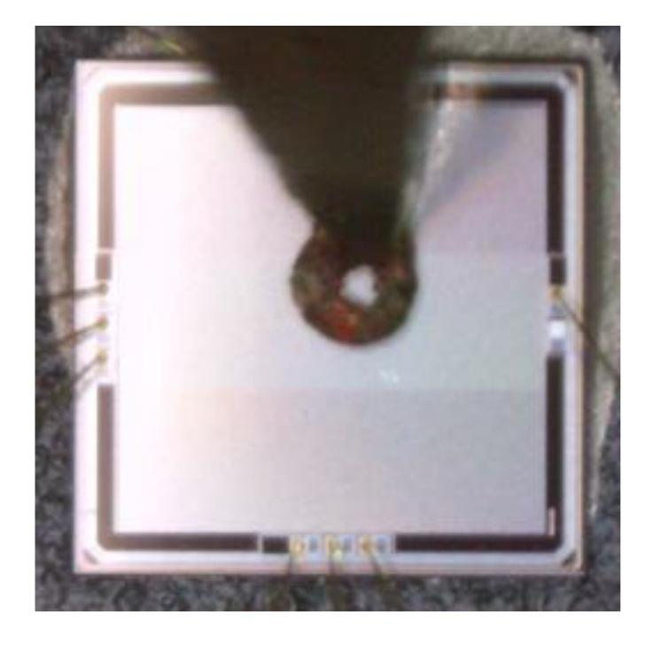

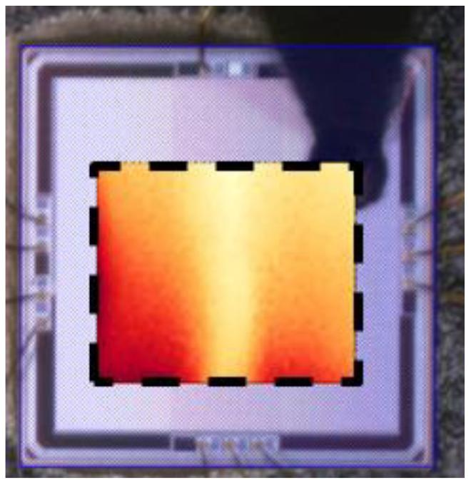

Fig. 1: Magnetic probe above the testchip (left) and mapping of the maximum amplitude (right).

{2}------------------------------------------------

### 2 Test case, elementary considerations and problem statement

#### 2.1 Testcase

The development of the simulation flow described in this document was carried out, step by step, based on a concrete example and more particularly on an experimental map of the EM field radiated by an IC. This example is a circuit designed in a 40nm technology. It integrates different blocks, among which one can find an unprotected AES co-processor. The length and width of the die are both equal to 2mm.

As an experimental reference to develop the herein proposed simulation flow, a map of the vertical magnetic field radiated by a part of the die was acquired with an ICR probe from Langer while the AES was ciphering plaintexts. During the cartography, the EM probe was placed at the close vicinity of the IC surface ( $h \simeq 50 \mu m$ ). At each position, a set of EM traces corresponding to the ciphering of different plaintexts was acquired in order to be able to identify leaking zones by running CPAs. Fig. 1 shows the EM probe above the die and the mapping of the maximal amplitude of acquired signals.

#### 2.2 Magnetic field and IC structure

Any current I flowing in a wire creates a magnetic field in its neighborhood. The amplitude and direction of the magnetic field created by the wire W are given by the Biot-Savart law:

$$\overrightarrow{B}(\overrightarrow{r}) = \frac{\mu_0}{4\pi} \int_W \frac{I \cdot \overrightarrow{dl} \wedge (\overrightarrow{r} - \overrightarrow{r'})}{|\overrightarrow{r} - \overrightarrow{r'}|^3} \tag{1}$$

Considering this law one may wonder where currents are flowing in an IC and where they are the stronger. The observation of various IC layouts provides the answers. First, currents are flowing in the power (Vdd) and ground (Gnd) grids of ICs. Second, because of the 3D structure of these grids, currents consumed by CMOS logic gates add up in the top part of the power and ground grids. As a result, and illustrated in Fig. 2 giving a simple sketch of the supply network, the currents flowing in the upper metal layers of the power and ground grids are stronger than those flowing in the lower metal layers. In addition, they get stronger as we get close to the pads.

According to these observations, it can be assumed that the magnetic field radiated by the circuits is mostly due to the top metal layers of the power supply in which flow the strongest currents (and which is also the closest to EM probe when CPA are performed front side). This assumption, which is also made in [9,10], suggests that one can localize EM hotspots after the place and route design step by performing CPAs on the traces of the current flowing in each wire segment (see Fig. 2 to vizualize a wire segment) of the upper part of the power and ground grids.

#### 2.3 Maps of currents and EM hotspot localization

The traces of the currents flowing in wire segments, which depend on the data processed by the simulated IC, can be obtained with voltage drop analysis tools like RedHawk from ANSYS. Such tools also deliver dynamic maps of currents flowing in ICs.

By following the above idea, RedHawk was used to get the current flowing in the top wire segments of our testchip for different stimuli files (vcd) corresponding to the ciphering of different

{3}------------------------------------------------

### 4 Davide Poggi et al.

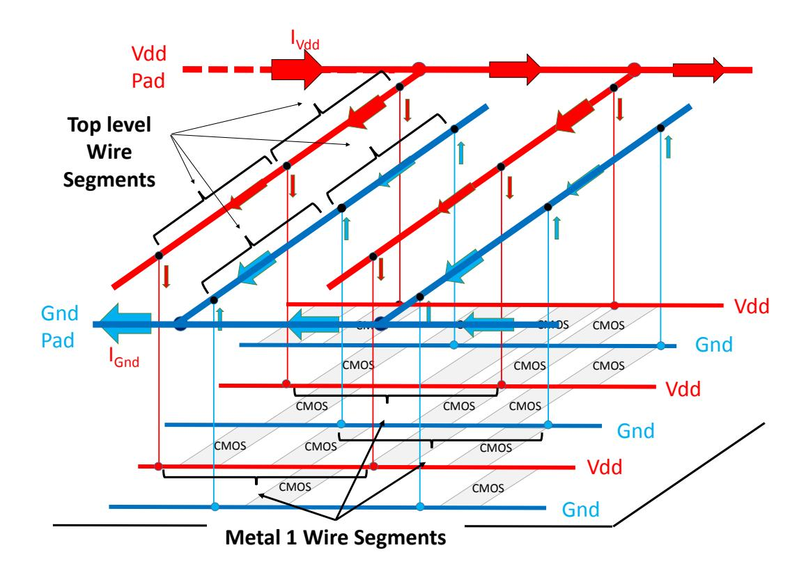

Fig. 2: Sketch of the supply network showing the current flows.

plaintexts by the AES using the same key. The time resolution of these simulations was set so as to obtain the best trade-off between good accuracy and simulation time.

Then a CPA was applied to the resulting sets of traces in order to localize EM hotspots and correlation (one per key byte) maps were drawn. Maps of the maximal signal amplitude were also drawn. Fig. 3a and b give the simulated and experimental maps of the maximal signal amplitude. The simulated and measured correlation maps are also displayed in Fig. 3c and d respectively.

One can observe that maps of the maximal signal amplitude are radically different and even in opposition. Indeed, the currents have a high amplitude in a rectangular vertical area centered above the AES while the measured vertical magnetic field has a high amplitude on the left and right sides of the AES where the currents are weak. There is a main reason explaining this result: the vertical magnetic field at the vertical of a wire in which flows a current is null. Hence, the EM signals collected above the AES with an ICR probe measuring the vertical magnetic field are necessarily weak. Analytical expressions sustaining this statement are given in next section. This raises the problem of what a probe measures; this concern is addressed later in the document. Nevertheless, at that stage one must therefore conclude that maps of current can not be used to localize EM hotspots, i.e. positions at which the EM probe should be placed to capture a leakage.

Conversely, simulated and experimental correlation maps cannot be used to locate where leakages come from in ICs. Indeed, the correlations between the magnetic field or the current and the Hamming Weight (variable H) of processed data are high on the left and right sides of the AES and not where the AES is placed, i.e. where leakages necessarily occur. In addition, the highest correlations between the current and H are obtained at positions where the current is extremely weak (' 1µA) and probably difficult to measure. This is due to the fact that the correlation coefficient ρ is insensitive to the magnitude of data: ρ(1e9 × X, Y ) = ρ(X, Y ). As a result of this insensitiveness and of the absence of measurement noise in simulated traces, CPAs applied to all wire segments in the circuit were all successful in disclosing the right key. This is not the case in practice.

{4}------------------------------------------------

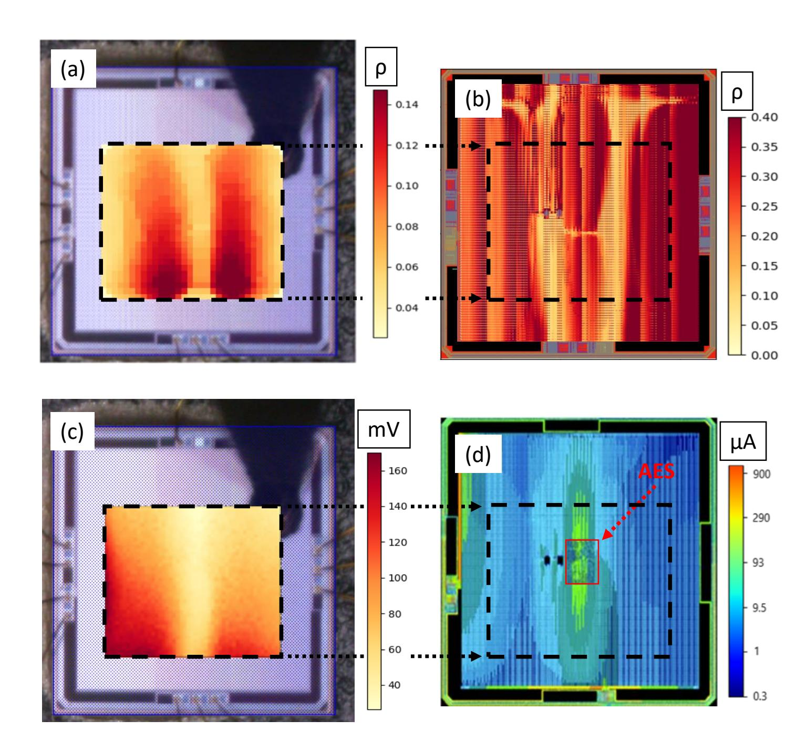

Fig. 3: (a) Experimental correlation map for the third byte (b) Simulated correlation map for the third byte (c) Experimental map of the maximal EM signal amplitude (d) Simulated map of the maximal amplitude of the current.

## 2.4 Problem statement

From all the above, one must conclude that if a designer aims at identifying EM hotspots at design stage, he cannot avoid simulating the magnetic field and the signal measured by the EM probe. The first problem is how to simulate this?

Similarly, if a designer aims at locating in a design where leakages originate, he must use a distinguisher taking into account the magnitude of signals and ideally allowing to classify leakages according to their measurability and thus dangerousness. The second problem is how to define such a distinguisher?

Finally, as a last problem, it would be great to take into account in simulation the unavoidable measurement noise, assumed Gaussian in this paper, as well as the capability of adversaries. Next section introduces solutions to this problem.

{5}------------------------------------------------

# 3 Locating EM hotspots and Leakage hotspots

This section first describes how to locate leakage hotspots in a circuit at the design step and second how to simulate a correlation electromagnetic attack (CEMA) and locate EM hotspots. From the above, it is now clear that EM hotspots and leakage hotspots are different. A leakage hotspot is part of the design where a leakage is produced while an EM hotspot is a position at which an EM probe must be placed to collect a leakage.

### 3.1 Locating Leakage hotspots at design stage

The expression of the correlation coefficient involved in the Bravais-Pearson test, allowing deciding of the significance of a linear link between the Hamming Weight or Distance, H, and the measured or simulated side-channel signal, S, is:

$$\rho(H,S) = \frac{cov(H,S)}{\sqrt{V(H) \cdot V(S)}} \tag{2}$$

with cov(H, S) the covariance between the Hamming Weight and the signal, and V(H), V(S) the variances of these random variables.

To thwart the problem of insensitiveness of the correlation to the magnitude of data, a trivial solution is to neglect the denominator in eq. 2 which plays a normalization role. However, in order to link the simulation results to measurement noise (assumed normal and of zero mean:  $N(0, \sqrt{V(\eta)})$  and to the quality of the adversary's equipment, the solution we propose is different while remaining simple.

It consists in taking advantage that simulated traces are noise free to compute the variance of the Gaussian noise that must be added in the simulated traces to force the correlation to be insignificant, i.e. to fail the Bravais-Pearson test. The null hypothesis (H0) of this test being that  $\rho = 0$ ; the composite one (H1) being  $|\rho| > 0$ .

To that end, let us consider that the measurement noise is independent of the signal. With  $\eta$  a sample of the noise, this leads to write:

$$cov(H, S + \eta) = cov(H, S) \quad V(S + \eta) = V(S) + V(\eta)$$
(3)

and to express the link between the correlation,  $\rho$ , obtained with the noise free simulated traces and the correlation,  $\rho_{\eta}$ , after introduction of the Gaussian noise in traces:

$$\rho_{\eta} = \sqrt{\frac{V(S)}{V(S) + V(\eta)}} \cdot \rho \tag{4}$$

Considering now the significance test of the correlation coefficient which statistic:

$$T = \frac{\rho \cdot \sqrt{n-2}}{\sqrt{1-\rho^2}} \tag{5}$$

follows a Student distribution (with (n-2) degrees of freedom, n being the number of traces) to decide, with a confidence level  $(1-\alpha)$ , if  $\rho_{\eta}$  is null or not, we get the critical value of the correlation,  $\rho_{crit}$ , above which  $\rho_{\eta}$  must be considered significant (H0 rejected):

$$\rho_{crit} = \sqrt{\frac{V(S)}{V(S) + V(\eta)}} \cdot \rho \tag{6}$$

{6}------------------------------------------------

Finally, from eq. 6, the variance  $V(\eta)$  of the noise that must be added to simulated traces to render the correlation insignificant can be deduced:

$$V(\eta) = V(S) \cdot \left[ \frac{\rho^2}{\rho_{crit}^2} - 1 \right] \tag{7}$$

Because  $\rho$  and V(S) are known from simulations and because  $\rho_{crit}^2$  is fixed by the choice of the confidence level  $(1-\alpha)$ ,  $V(\eta)$  can easily be computed in an automated manner. However, as shown by eq. 7,  $V(\eta)$  could be positive (if  $|\rho| > |\rho_{crit}|$ ) or negative (if  $|\rho| < |\rho_{crit}|$ ). A positive value defines the minimal measurement noise required to hide the leakage, a negative value is not acceptable for a variance. In that case, the obtained value means that no measurement noise is required to render the correlation insignificant and thus that there is no leakage:  $V(\eta)$  must be considered equal to zero.

The above approach was applied to the traces of current obtained with RedHawk. Fig. 4 gives the standard deviation of the minimal measurement noise that must be injected into traces of current to hide the leakages (make them pass the significance test) related to the first and third bytes of the key.

In these maps, one can observe a large part of the IC colored in dark blue. These parts correspond to areas with  $\sqrt{V(\eta)} \simeq 0$ , i.e. leakage free areas. One can also observe an area encompassing the AES in which  $\sqrt{V(\eta)} > 0$ . This is the area from where the leakages originate. More precisely, the wire segments enclosed in this area are close to some CMOS gates which are leaking.

One could be surprised that positions outside the area where is placed and routed the AES are characterized by a  $V(\eta)$  value significantly greater than 0. However, one must not. This is just a direct illustration that current flows from leaking CMOS gates toward the supply pads. This explains why these analyses were also performed on the currents flowing in Metal 1 wire segments (see Fig. 2) to better localize leakage hotspots by cross-checking the maps. After doing this, it is obvious that leakages are originating from the AES and not from the same part of the AES depending on which byte is considered.

Finally, looking at these maps one can conclude that the third byte is leaking more than the first byte. This observation should be kept in mind. Indeed, it is confronted with experimental results later in the paper.

Despite the simplicity of the testcase, this demonstrates the soundness of the approach to identify and ranking leakage hotspots in a circuit before its fabrication. In addition, getting an estimate of  $V(\eta)$  provides an estimate of the minimal signal to noise ratio (SNR) required to reveal the secret in practice, and thus of the measurement capabilities an adversary must have to find the key. Indeed, the variance of the signal for each time sample of traces is known. The computation of the  $SNR = \frac{V(S)}{V(n)}$  is therefore straightforward [4].

#### 3.2 Locating EM hotspots at design stage

In the previous section a solution to find out leakage hotspots at design stage has been proposed. However, this solution is far from indicating where an EM probe must be positioned to collect the related leakages. Indeed, this requires computing the magnetic field as well as its flux in the EM probe.

Adversaries usually place their probe measuring the vertical magnetic field as close as possible from the IC surface to get EM traces with the highest possible spatial resolution and the best

{7}------------------------------------------------

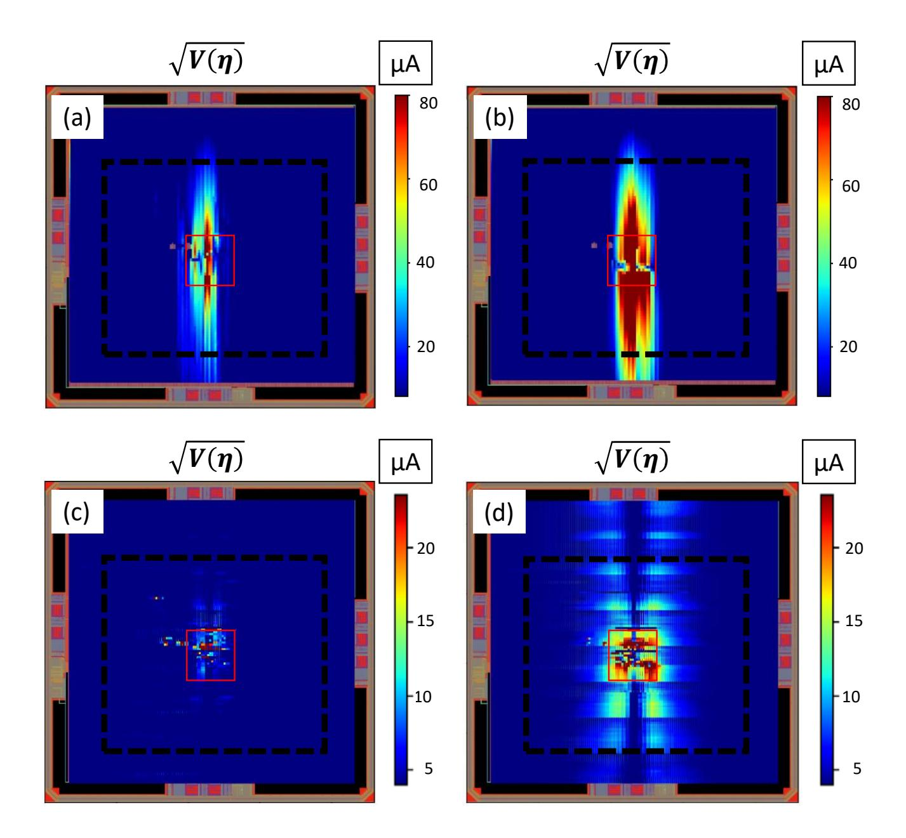

Fig. 4: Standard deviation of the noise to add in traces of current flowing in Metal top wire segments to hide the leakage of the byte 1 (a) and 3 (b). Standard deviation of the noise to add in traces of current flowing in Metal 1 wire segments to hide the leakage of the byte 1 (c) and 3 (d).

possible signal to noise ratio. They therefore measure the variation of the magnetic flux crossing their probe along a plane parallel to the IC surface.

To compute the magnetic field and flux, we thus consider a surface parallel to the IC surface at a height h from it. This surface is split into small squares to get a matrix which coefficients are either the magnetic field at the center of the squares or the magnetic flux crossing them.

The computation of the vertical magnetic field,  $B_z(x, y, h, t)$ , at the coordinate (x, y, h) corresponding at the center of a square is done by summing the contributions,  $B_z^i(x, y, h, t)$ , of the w wire segments denoted [AB] of length  $l_{AB} = \sqrt{(x_A - x_B)^2 + (y_A - y_B)^2}$ :

$$B_z(x, y, h, t) = \sum_{i=0}^{w} B_z^i(x, y, h, t)$$
(8)

These contributions are estimated using the Biot-Savart law and more precisely the expressions below. They give respectively the amplitude of the vertical magnetic field (see Fig. 5a) generated

{8}------------------------------------------------

by a wire segment, parallel to the y axis (eq. 9) and the x axis (eq. 10) at the coordinate (x, y, h), traversed by a current I(t).

$$B_z^i(x,y,h,t) = \frac{\mu_0}{4\pi} \cdot \frac{x}{\sqrt{x^2 + h^2}} \cdot \left(\frac{1}{\sqrt{x^2 + (y - y_A)^2}} + \frac{1}{\sqrt{x^2 + (y - y_B)^2}}\right) \cdot I(t) \tag{9}$$

$$B_z^i(x,y,h,t) = \frac{\mu_0}{4\pi} \cdot \frac{y}{\sqrt{y^2 + h^2}} \cdot \left(\frac{1}{\sqrt{(x - x_A)^2 + y^2}} + \frac{1}{\sqrt{(x - x_B)^2 + y^2}}\right) \cdot I(t)$$
 (10)

Despite these formulas are useful to compute  $B_z(x,y,h,t)$ , they also provide interesting information. First, the vertical magnetic field radiated by a wire segment,  $B_z$ , at the vertical of this segment is null. Second, when measured over a plane, it reaches its maximal value at a distance from the wire segment which directly depends on h. In the example of Fig. 5, this distance is equal to  $26\mu m$  and  $4\mu m$  for h equal to  $100\mu m$  and  $25\mu m$  respectively. Third, the greater h is the more  $B_z$  can be perceived far from the wire segment, relatively to its maximal amplitude. These observations are illustrated in Fig. 5b and c that give maps of  $B_z$  at different heights  $(x_A = x_B = 0)$  and  $y_A = -y_b = 10\mu m$  and the normalized evolution of the  $B_z$  along the bisecting line D. All these observations mean that the near field scan of the vertical magnetic field can not be used directly to reveal with a high accuracy the origin of a leakage in ICs as it has been observed in Fig. 3. However, reducing h significantly reduces the localization errors.

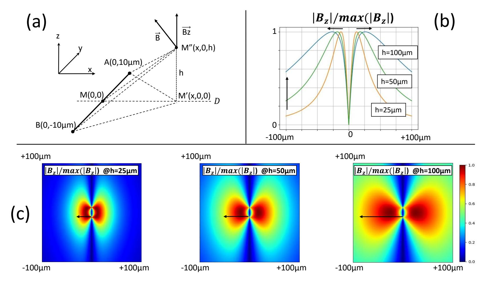

Fig. 5: (a) Illustration associated to eq. 10 and 9 (b) Evolution of the normalized vertical magnetic field along the bisecting line D for different values of h (c) Maps of the normalized magnetic field for different values of h.

{9}------------------------------------------------

The  $B_z$  matrix known, the computation of the flux in the probe is straightforward. It simply consists in integrating the magnetic field over all the squares enclosed in its surface; the flux through a square being given by  $B_z(x, y, h, t) \times S_q$ , assuming it uniform over the surface  $S_q$  of the squares. For the simulation reported below,  $S_q$  was set to a tenth of the ICR probe diameter.

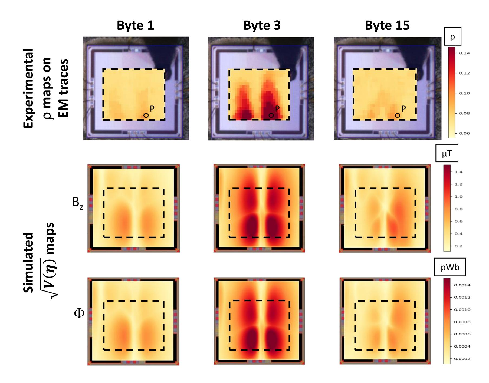

Fig. 6: First line: experimental correlation maps for byte 1, 3 and 15. Second line: simulated standard deviation of the noise to add in  $B_z(t)$  traces to hide the leakage in the magnetic field. Third line: simulated standard deviation of the noise to add in  $\Phi(t)$  traces to hide the leakage in the magnetic flux collected by the EM probe.

This approach was applied to simulate the magnetic flux map an adversary would obtain using an EM probe placed at height  $h=50\mu m$  from the IC surface. Then the magnetic noise required to hide the leakage in the magnetic field and flux was computed following the approach described in the preceding section.

Fig. 6 gives the results for bytes 1, 3 and 15 and allows confronting simulated EM leakage maps with experimental correlation maps. One can observe that the simulated maps are visually

{10}------------------------------------------------

in good agreement with experimental maps. In addition, the simulated maps rank the third byte as the most leaking one. This is also the case in practice as demonstrated by the trends of the experimental partial guessing entropies (pGE) [15] for the bytes 1, 3 and 15 at point P and the pGE maps given in Fig. 7 and 9. These pGE were computed by applying five CPAs on increasing sets of i = 100, 200, ...., m traces randomly selected in a reference set of traces. One can observe that the pGE for the byte 3 quickly reaches 1 while for bytes 1 and 15 the pGE reaches 1 after the processing of many more traces. One can also observe the similarity of pGE and p Vη maps. This demonstrates the soundness of the proposed approach for locating EM hotspots at the design stage. This could be of great help to speed up the experimental characterization of secure ICs but also to warrant their quality.

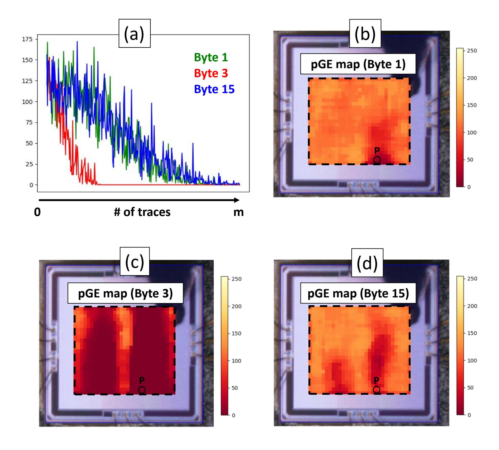

Fig. 7: (a) Experimental partial Guessing Entropies (pGE) vs number of traces at point P for bytes 1, 3 and 15. (b,c,d) Experimental pGE maps for bytes 1, 3 and 15 respectively.

{11}------------------------------------------------

#### 12 Davide Poggi et al.

As an additional validation step, our flow has been used to simulate what an adversary can observe with an ICR probe with a different diameter. New maps of the vertical magnetic field emitted by the die were therefore acquired with an ICR probe having a diameter 1.5 times bigger than the previous one. Then, the corresponding simulated maps were get by calculating the magnetic flux through the squares  $S_q$  having an area 1.5 bigger than before. Fig. 8 compares the experimental and simulated maps get with the new probe size, whereas Fig. 9 gives the result of the pGE. First, one can observe that the maps of  $B_z$  are identical to those obtained before. That is correct, because the  $B_z$  radiated by the IC does not depend on the probe diameter. Second, as expected, the maps of  $\Phi$  are different. The maximal value of  $\Phi$  has increased due to the bigger size of the probe and the greater number of  $B_z$  contributions passing through the surface of this latter. Lastly, the results are again in good agreement and the byte 3 is still the most leaking one.

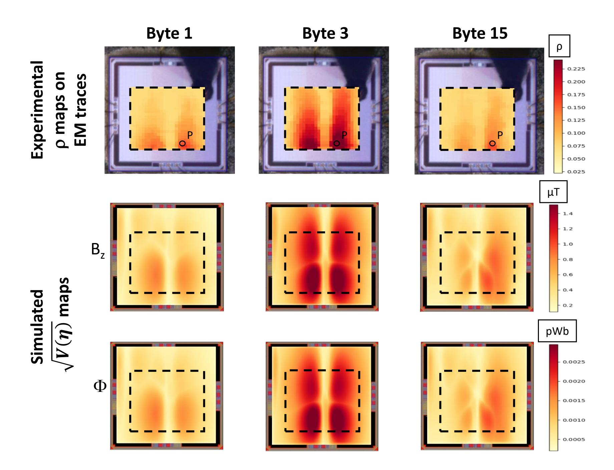

Fig. 8: First line: experimental correlation maps for byte 1, 3 and 15. Second line: simulated standard deviation of the noise to add in  $B_z(t)$  traces to hide the leakage in the magnetic field. Third line: simulated standard deviation of the noise to add in  $\Phi(t)$  traces to hide the leakage in the magnetic flux collected by the EM probe. (Probe diameter 1.5 times bigger).

{12}------------------------------------------------

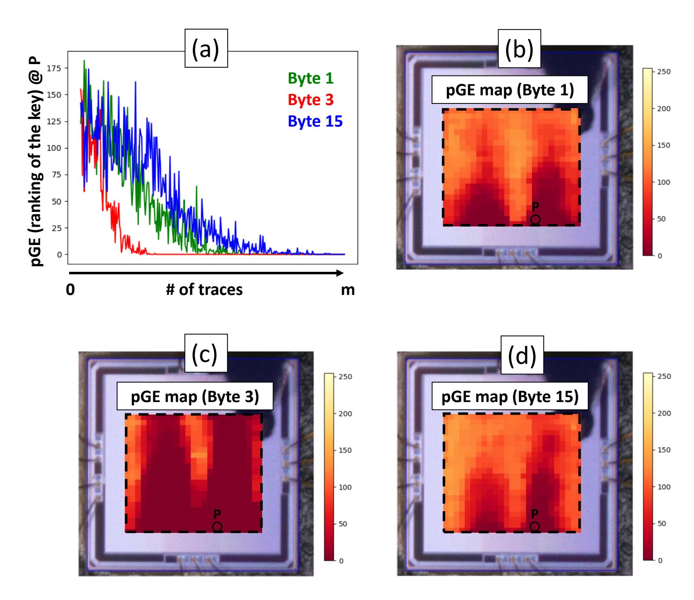

Fig. 9: (a) Experimental partial Guessing Entropies (pGE) vs number of traces at point P for bytes 1, 3 and 15. (b,c,d) Experimental pGE maps for bytes 1, 3 and 15 respectively. (Probe diameter 1.5 times bigger).

The proposed method is thus applicable to different probe sizes and opens the door to the analysis of which probe would be best to use in order to successfully carry out EM side-channel attacks and to find EM hotspots with high accuracy.

At this point, a key lesson of the maps showed in Fig. 4, 6 and 8 is that one of the strength of the EM side-channel lies in the fact that even if there are only few CMOS gates leaking in a circuit they can generate a significant EM leakage on a quite large surface. Indeed, the leaking currents of these gates propagate far from their originating point through the power and ground network and radiate through many antennas (wire segments), each of them contributing to the overall magnetic flux collected by an EM probe. Therefore, attention must be paid to the placement of cryptographic blocks as well as to the routing of the power and ground grids. The final simulation flow resulting from all the above can be used to that aim. Fig. 10 sums up this flow.

{13}------------------------------------------------

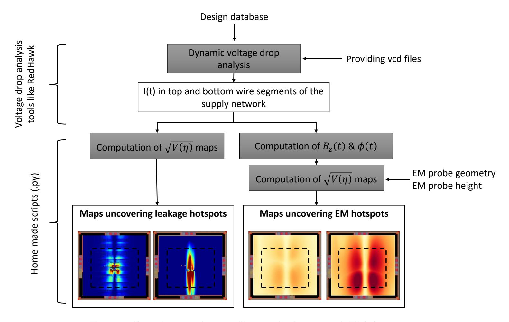

Fig. 10: Simulation flow to locate leakage and EM hotspots.

# 4 Conclusion

A simulation methodology to locate at design stage leaking hotspots in a circuit (part of the IC from where a leakage originates) and EM hotspots (position where a probe must be placed to measure it) has been introduced. It is fully based on commercial voltage drop analysis tools such as RedHawk from ANSYS. Its effectiveness has been demonstrated by confronting simulation results with experimental ones. Comparisons showed the methodology predicts correctly the positions of the hotspots and allows ranking them with respect to their intensity and easiness of measure by exploiting the concept of measurement noise to add for hiding the leakage.

In addition to the localization of hotspots, this simulation methodology could be useful to evaluate different floor-planning and power planing strategies at design stage, but also to verify the effectiveness of countermeasures and, finally, as an EM leakage sign-off methodology to detect design neglects or errors prior to fabrication.

# References

- 1. Eric Brier, Christophe Clavier, and Francis Olivier. Correlation power analysis with a leakage model. In Marc Joye and Jean-Jacques Quisquater, editors, Cryptographic Hardware and Embedded Systems - CHES 2004, pages 16–29, Berlin, Heidelberg, 2004. Springer Berlin Heidelberg.
- 2. David Chaum. Blind signatures for untraceable payments. In David Chaum, Ronald L. Rivest, and Alan T. Sherman, editors, Advances in Cryptology, pages 199–203, Boston, MA, 1983. Springer US.
- 3. Jean-S´ebastien Coron. Resistance against differential power analysis for elliptic curve cryptosystems. In C¸ etin K. Ko¸c and Christof Paar, editors, Cryptographic Hardware and Embedded Systems, pages 292–302, Berlin, Heidelberg, 1999. Springer Berlin Heidelberg.

{14}------------------------------------------------

- 4. Gilles R. Ducharme and Philippe Maurine. Estimating the signal-to-noise ratio under repeated sampling of the same centered signal: Applications to side-channel attacks on a cryptoprocessor. IEEE Trans. Inf. Theory, 64(9):6333–6339, 2018.
- 5. Karine Gandolfi, Christophe Mourtel, and Francis Olivier. Electromagnetic analysis: Concrete results. In C¸ etin K. Ko¸c, David Naccache, and Christof Paar, editors, Cryptographic Hardware and Embedded Systems — CHES 2001, pages 251–261, Berlin, Heidelberg, 2001. Springer Berlin Heidelberg.
- 6. Miao Tony He, Jungmin Park, Adib Nahiyan, Apostol Vassilev, Yier Jin, and Mark Tehranipoor. RTL-PSC: automated power side-channel leakage assessment at register-transfer level. CoRR, abs/1901.05909, 2019.
- 7. Christoph Herbst, Elisabeth Oswald, and Stefan Mangard. An aes smart card implementation resistant to power analysis attacks. In Jianying Zhou, Moti Yung, and Feng Bao, editors, Applied Cryptography and Network Security, pages 239–252, Berlin, Heidelberg, 2006. Springer Berlin Heidelberg.
- 8. Paul Kocher, Joshua Jaffe, and Benjamin Jun. Differential power analysis. In Michael Wiener, editor, Advances in Cryptology — CRYPTO' 99, pages 388–397, Berlin, Heidelberg, 1999. Springer Berlin Heidelberg.
- 9. A. Kumar, C. Scarborough, A. Yilmaz, and M. Orshansky. Efficient simulation of em side-channel attack resilience. In 2017 IEEE/ACM International Conference on Computer-Aided Design (ICCAD), pages 123–130, 2017.
- 10. Victor Lomn´e, Philippe Maurine, Lionel Torres, Thomas Ordas, Mathieu Lisart, and J´erome Toublanc. Modeling time domain magnetic emissions of ics. In Ren´e van Leuken and Gilles Sicard, editors, Integrated Circuit and System Design. Power and Timing Modeling, Optimization, and Simulation, pages 238–249, Berlin, Heidelberg, 2011. Springer Berlin Heidelberg.
- 11. F. Menichelli, R. Menicocci, M. Olivieri, and A. Trifiletti. High-level side-channel attack modeling and simulation for security-critical systems on chips. IEEE Transactions on Dependable and Secure Computing, 5(3):164–176, 2008.
- 12. Thomas S. Messerges. Using second-order power analysis to attack dpa resistant software. In C¸ etin K. Ko¸c and Christof Paar, editors, Cryptographic Hardware and Embedded Systems — CHES 2000, pages 238–251, Berlin, Heidelberg, 2000. Springer Berlin Heidelberg.
- 13. Adib Nahiyan, Jungmin Park, Miao He, Yousef Iskander, Farimah Farahmandi, Domenic Forte, and Mark Tehranipoor. Script: A cad framework for power side-channel vulnerability assessment using information flow tracking and pattern generation. 25(3), 2020.
- 14. Danilo Sijacic, Josep Balasch, Bohan Yang, Santosh Ghosh, and Ingrid Verbauwhede. Towards efficient and automated side channel evaluations at design time. In PROOFS 2018, 7th International Workshop on Security Proofs for Embedded Systems, colocated with CHES 2018, Amsterdam, The Netherlands, September 13, 2018, pages 16–31, 2018.
- 15. Fran¸cois-Xavier Standaert, Tal G. Malkin, and Moti Yung. A unified framework for the analysis of side-channel key recovery attacks. In Antoine Joux, editor, Advances in Cryptology - EUROCRYPT 2009, pages 443–461, Berlin, Heidelberg, 2009. Springer Berlin Heidelberg.