# The randomized slicer for CVPP: sharper, faster, smaller, batchier

L´eo Ducas<sup>1</sup> , Thijs Laarhoven<sup>2</sup> , and Wessel P.J. van Woerden<sup>1</sup>

- <sup>1</sup> CWI, Amsterdam, The Netherlands
- <sup>2</sup> TU/e, Eindhoven, The Netherlands

Abstract. Following the recent line of work on solving the closest vector problem with preprocessing (CVPP) using approximate Voronoi cells, we improve upon previous results in the following ways:

- We derive sharp asymptotic bounds on the success probability of the randomized slicer, by modelling the behaviour of the algorithm as a random walk on the coset of the lattice of the target vector. We thereby solve the open question left by Doulgerakis–Laarhoven–De Weger [PQCrypto 2019] and Laarhoven [MathCrypt 2019].
- We obtain better trade-offs for CVPP and its generalisations (strictly, in certain regimes), both with and without nearest neighbour searching, as a direct result of the above sharp bounds on the success probabilities.
- We show how to reduce the memory requirement of the slicer, and in particular the corresponding nearest neighbour data structures, using ideas similar to those proposed by Becker–Gama–Joux [Cryptology ePrint Archive, 2015]. Using 2<sup>0</sup>.185d+o(d) memory, we can solve a single CVPP instance in 2<sup>0</sup>.264d+o(d) time.
- We further improve on the per-instance time complexities in certain memory regimes, when we are given a sufficiently large batch of CVPP problem instances for the same lattice. Using 2<sup>0</sup>.208d+o(d) memory, we can heuristically solve CVPP instances in 2<sup>0</sup>.234d+o(d) amortized time, for batches of size at least 2<sup>0</sup>.058d+o(d) .

Our random walk model for analysing arbitrary-step transition probabilities in complex step-wise algorithms may be of independent interest, both for deriving analytic bounds through convexity arguments, and for computing optimal paths numerically with a shortest path algorithm. As a side result we apply the same random walk model to graph-based nearest neighbour searching, where we improve upon results of Laarhoven [SOCG 2018] by deriving sharp bounds on the success probability of the corresponding greedy search procedure.

Keywords: lattices · closest vector problem with preprocessing · approximate Voronoi cells · iterative slicer · graph-based nearest neighbours

# 1 Introduction

Lattice problems. Following Shor's breakthrough work on efficient quantum algorithms for problems previously deemed sufficiently hard to base cryptography on [26], researchers have began looking for alternatives to "classical" cryptosystems such as RSA [25] and Diffie-Hellman [10]. Out of these candidates for "post-quantum" cryptography [8], lattice-based cryptography has emerged as a leading candidate, due to its efficiency, versatility, and the conjecture that the underlying lattice problems may be hard to solve quantumly as well [23]. The security of most lattice-based cryptographic schemes can be traced back to either the shortest vector problem (SVP) or variants of the closest vector problem (CVP), which ask to either return the shortest non-zero vector in a lattice, or the closest lattice vector to a given target vector. These variants include approx-CVP, where we need to return a somewhat close lattice vector, and bounded distance decoding (BDD), where we are guaranteed that the target lies close to the lattice. As parameters for cryptographic schemes are commonly based on the estimated complexities of state-of-the-art methods for these problems, it is important to obtain a good understanding of the true hardness of these and other lattice problems. The current fastest approaches for solving these problems are based on lattice sieving [1,2,6] and lattice enumeration [3,4,14,15,17], where the former offers a better asymptotic scaling of the time complexity in terms of the lattice dimension, at the cost of an exponentially large memory consumption.

The closest vector problem with preprocessing (CVPP). The closest vector problem with preprocessing (CVPP) is a variant of CVP, where the solver is allowed to perform some preprocessing on the lattice at no additional cost, before being given the target vector. Closely related to this is batch-CVP, where many CVP instances on the same lattice are to be solved; if an efficient global preprocessing procedure can be performed using only the lattice as input, and that would help reduce the costs of single CVP instances, then this preprocessing cost can be amortized over many problem instances to obtain a faster algorithm for batch-CVP. This problem of batch-CVP most notably appears in the context of lattice enumeration for solving SVP or CVP, as a fast batch-CVP algorithm would potentially imply faster SVP and CVP algorithms based on a hybrid of enumeration and such a CVPP oracle [13,15].

Voronoi cells and the iterative slicer. One method for solving CVPP is the iterative slicer by Sommer–Feder–Shalvi [27]. Preprocessing consists of computing a large list of lattice vectors, and a query is processed by "reducing" the target vector  $\boldsymbol{t}$  with this list, i.e. repeatedly translating the target by some lattice vector until the shortest representative  $\boldsymbol{t}'$  in the coset of the target vector is found. The closest lattice vector to  $\boldsymbol{t}$  is then given by  $\boldsymbol{t}-\boldsymbol{t}'$ , which lies at distance  $\|\boldsymbol{t}'\|$  from  $\boldsymbol{t}$ . For this method to provably succeed, the preprocessed list needs to contain all  $O(2^d)$  so-called Voronoi relevant vectors of the lattice, which together define the boundaries of the Voronoi cell of the lattice. This leads to a  $4^{d+o(d)}$  algorithm by bounding the number of reduction steps by  $2^{d+o(d)}$  [21], which was later improved to an expected time of  $2^{d+o(d)}$  by randomizing the algorithm such that the number of expected steps is polynomially bounded [9].

Approximate Voronoi cells and the randomized slicer. The large number of Voronoi relevant vectors of a lattice, needed for the iterative slicer to be provably successful, makes the straightforward application of this method impractical and does not result in an improvement over the best (heuristic) CVP complexities without preprocessing. Therefore we fall back on heuristics to analyse latticebased algorithms, as they often better represent the practical complexities of the algorithms than the proven worst-case bounds. For solving CVPP more efficiently than CVP, Laarhoven [18] proposed to use a smaller preprocessed list of size  $2^{d/2+o(d)}$  containing all lattice vectors up to some radius, while heuristically retaining a constant success probability of finding the closest vector with the iterative slicer. Doulgerakis-Laarhoven-De Weger [12] formalized this method in terms of approximate Voronoi cells, and proposed an improvement based on rerandomizations; rather than hoping to find the shortest representative in the coset of the target in one run of the iterative slicer, which would require a preprocessed list of size at least  $2^{d/2+o(d)}$ , the algorithm uses a smaller list and runs the same reduction procedure many times starting with randomly sampled members from the coset of the target vector. The success probability of this randomized slicing procedure, which depends on the size of the list, determines how often it has to be restarted, and thus plays an important role in the eventual time complexity of the algorithm. Doulgerakis-Laarhoven-De Weger (DLW) only obtained a heuristic lower bound on the success probability of this randomized slicer, and although Laarhoven [20] later improved upon this lower bound in the low-memory regime, the question remained open what is the actual asymptotic success probability of this randomized slicing procedure, and therefore what is the actual asymptotic time complexity of the current state-of-the-art heuristic method for solving CVPP.

#### 1.1 Contributions

Success probability asymptotics via random walks. Our main contribution is solving the central open problem resulting from the approximate Voronoi cells line of work – finding sharp asymptotics on the success probability of the randomized slicer. To find these sharp bounds, in Section 3 we show how to model the flow of the algorithm as a random walk on the coset of the lattice corresponding to the target vector, and we heuristically characterise transition probabilities between different states in this infinite graph when using a list of the  $\alpha^{d+o(d)}$  shortest lattice vectors. The aforementioned problem of finding the success probability of the slicer then translates to: what is the probability in this graph of starting from a given initial state and ending at any target state of norm at most  $\gamma$ ? From DLW [12] we know that we almost always reach a state of norm at most some  $\beta = f(\alpha) > \gamma$  - reaching this state occurs with probability at least  $1/\operatorname{poly}(d)$ . However, reaching a state  $\beta' < \beta$  occurs only with exponentially small probability  $2^{-\Theta(d)}$ . Now, whereas the analysis of DLW can be interpreted as lower-bounding the success probability by attempting to reach the target norm in a single step after reaching radius  $\beta$ , we are interested

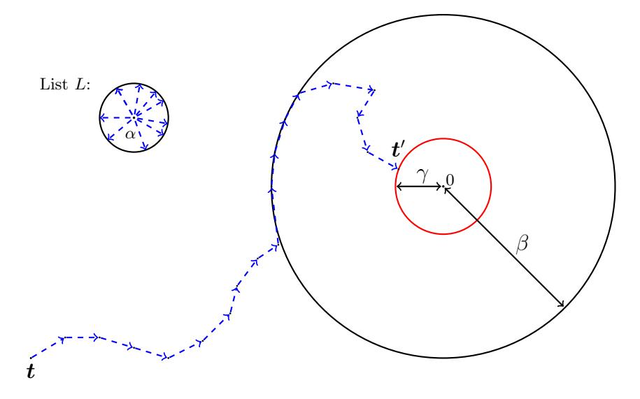

Fig. 1. The iterative slicer as a random walk over the coset t+L using the list of lattice vectors L = L ∩ B(~0, α).

in the arbitrary-step transition probabilities from β to at most γ, so as to obtain sharp bounds.

As every path in our graph from β to γ has an exponentially small probability in d, the total success probability is dominated by that of the highest probable path for large d; which after an appropriate log-transform boils down to a shortest path in a graph. Therefore obtaining the success probability of the randomized slicer is reduced to determining a shortest path in this infinite graph. We show in Section 4 how we can approximately compute this shortest path numerically, using a suitably dense discretization of the search space or using convex optimization. In Section 5 we go a step further by proving an exact analytic expression of the shortest path, which results in sharp asymptotics on the success probability of the randomized slicer for the general case of approx-CVP.

Heuristic claim 1 (Success probability of the randomized slicer). Given a list L of the α d+o(d) shortest lattice vectors as input, the success probability of one iteration of the randomized slicer for γ-CVPP equals:

$$\mathbb{P}_{\alpha^2,\gamma^2} = \prod_{i=1}^n \left( \alpha^2 - \frac{(\alpha^2 + x_{i-1} - x_i)^2}{2x_{i-1}} \right)^{d/2 + o(d)} \tag{1}$$

with n defined by equation (39) and x<sup>i</sup> as in Definition 7 depending only on α and γ.

Running the randomized slicer for O(P −1 <sup>α</sup>2,γ<sup>2</sup> ) iterations, we expect to solve γ-CVPP with constant probability. Together with a (naive) linear search over the

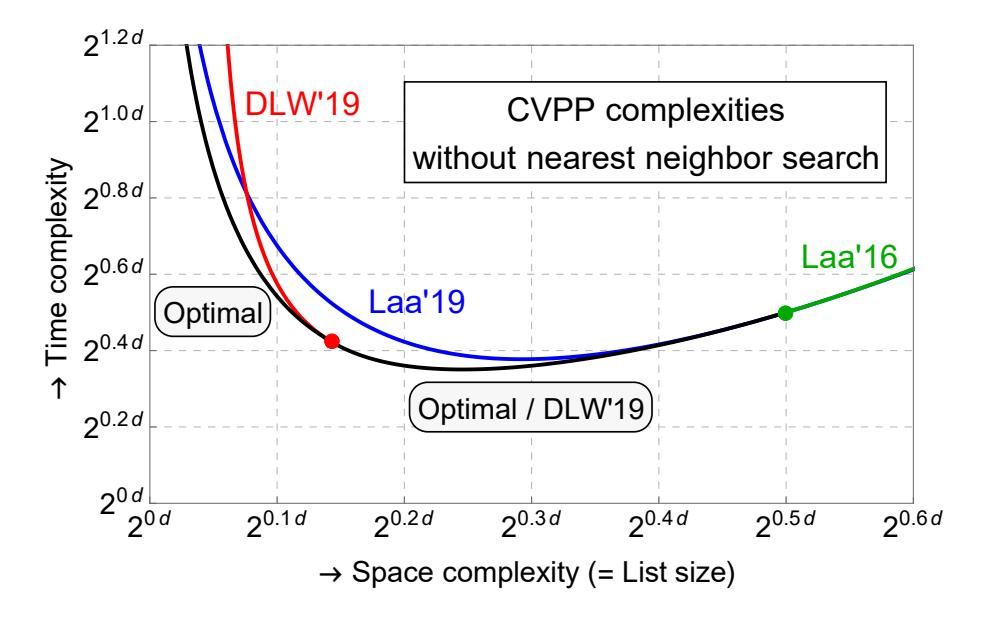

**Fig. 2.** Query complexities for solving CVPP **without** nearest neighbour techniques. The blue curve refers to [20], the red curve to [12], the green curve to [18], and the black curve is the result of our refined analysis. The red point indicates the point where red and black curves merge into one.

preprocessed list, this directly leads to explicit time and space complexities for a plain version of the randomized slicer for solving CVPP, described in Figure 2. When using a large list of size at least  $2^{0.1437d+o(d)}$  from the preprocessing phase of CVPP, we derive that one step is optimal, thus obtaining the same asymptotic complexity as DLW. When using less than  $2^{0.1437d+o(d)}$  memory we gradually see an increase in the optimal number of steps in the shortest path, resulting in ever-increasing improvements in the resulting asymptotic complexities for CVPP as compared to DLW.

Using a similar methodology the asymptotic scaling of our exact analysis when using poly(d) memory matches the  $2^{\frac{1}{2}d\log_2 d + o(d\log d)}$  time complexity lower bound of Laarhoven [20]. We do stress that to make this rigorous one should do a more extensive analysis of the lower order terms.

In Section 7 we further show how to adapt the graph slightly to analyse the success probability of the iterative slicer for the BDD-variant of CVP, where the target lies unusually close to the lattice.

Improved complexities with nearest neighbour searching. The main subroutine of the iterative slicer is to find lattice vectors close to a target in a large list, also known as the nearest-neighbour search problem (NNS). By preprocessing the list and storing more data we could find a close vector much

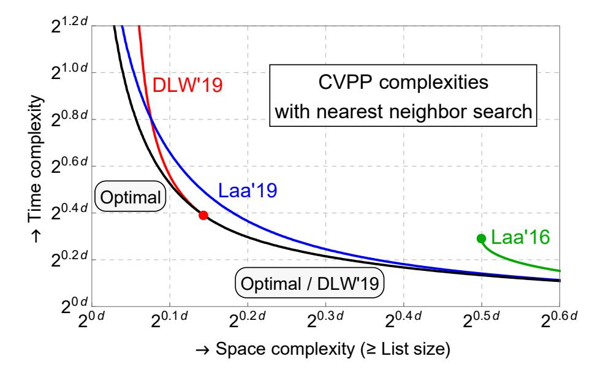

Fig. 3. Query complexities for solving CVPP with nearest neighbour techniques, but without the improved memory management described in Section 6. Similar to Figure 2 the curves meet at a memory complexity of approximately  $2^{0.1436d}$ .

faster than the naive way of trying them all. Here we obtain a trade-off between the size of the NNS data structure and the eventual query complexity.

Heuristic claim 2 (Improved complexities for  $\gamma$ -CVPP). Given a list L of the  $\alpha^{d+o(d)}$  shortest lattice vectors as input and a nearest neighbour parameter  $u \in (\sqrt{(\alpha^2-1)/\alpha^2}, \sqrt{\alpha^2/(\alpha^2-1)})$ , we can solve CVPP in space and time S and T, where:

$$S = \left(\frac{\alpha}{\alpha - (\alpha^2 - 1)(\alpha u^2 - 2u\sqrt{\alpha^2 - 1} + \alpha)}\right)^{d/2 + o(d)},$$
(2)

$$T = \frac{1}{\mathbb{P}_{\alpha^2, \gamma^2}} \cdot \left( \frac{\alpha + u\sqrt{\alpha^2 - 1}}{-\alpha^3 + \alpha^2 u\sqrt{\alpha^2 - 1} + 2\alpha} \right)^{d/2 + o(d)}.$$
 (3)

Figure 3 shows the resulting exact trade-offs for exact CVPP, as well as the previous lower bounds of [12,20].

Improved memory usage for the NNS data structure. When the number of NNS queries matches the list size there is a way to do the NNS preprocessing on the fly; obtaining significantly lower query times while using negligible extra memory [6,7]. Normally this observation is only helpful for batch-CVPP and not for a single CVPP instance, however the randomized slicer naturally reduces to batch-CVPP by considering all target rerandomizations as a batch of targets. In

Section 6 we exploit this to obtain better CVPP complexities when using NNS; improving significantly on the state-of-the-art as shown in Figure 4.

Heuristic claim 3 (Improved memory usage for CVPP with NNS). Given a list L of the α <sup>d</sup>+o(d) <sup>≤</sup> <sup>2</sup> 0.185d shortest lattice vectors as input we can solve a single CVPP instance with the following complexities:

$$S = \alpha^{d+o(d)}, \qquad T = \frac{1}{\mathbb{P}_{\alpha^2, 1}} \cdot \left(\alpha \cdot \sqrt{1 - \frac{2 \cdot (1 - 1/\alpha^2)}{1 + \sqrt{1 - 1/\alpha^2}}}\right)^{-d + o(d)}. \tag{4}$$

Heuristic claim 4 (Improved memory usage for batch-CVPP). Given a list L of the α d+o(d) shortest lattice vectors and a batch of at least B CVPP instances, with

$$B = \max(1, \alpha^d \cdot \mathbb{P}_{\alpha^2, 1}). \tag{5}$$

Then we can solve this entire batch of CVPP instances with the following amortized complexities per CVPP instance:

$$S = \alpha^{d+o(d)}, \qquad T = \frac{1}{\mathbb{P}_{\alpha^2, 1}} \cdot \left(\alpha \cdot \sqrt{1 - \frac{2 \cdot (1 - 1/\alpha^2)}{1 + \sqrt{1 - 1/\alpha^2}}}\right)^{-d + o(d)}. \tag{6}$$

In particular, one can heuristically solve a batch of 2 <sup>0</sup>.058d+o(d) CVP instances in time 2 <sup>0</sup>.292d+o(d) and space 2 0.208d+o(d) .

Note that this is a stronger result than DLW, which claimed it is possible to solve 2 <sup>Θ</sup>(d) CVP instances in time and space 2<sup>0</sup>.292d+o(d) . In contrast, the best complexities for a single instance of CVP are time 2<sup>0</sup>.292d+o(d) and space 2<sup>0</sup>.208d+o(d) , thus the algorithm proposed by DLW significantly increases the memory requirement for the batch of CVP instances. We show that we can also solve an exponentialsized batch of CVP instances without significantly increasing either the time or the memory.

Application to graph-based nearest neighbour searching. Besides deriving sharp asymptotics for the randomized slicer, the random walk model may well be of independent interest in the context of analysing asymptotics of other complex step-wise algorithms, and we illustrate this by applying the same model to solve a problem appearing in the analysis of graph-based nearest neighbour searching in [19]: what is the success probability of performing a greedy walk on the k-nearest neighbour graph, attempting to converge to the actual nearest neighbour of a random query point? We formalize the transition probabilities in this context, and show how this leads to improved complexities for lattice sieving with graph-based nearest neighbour searching for solving SVP.

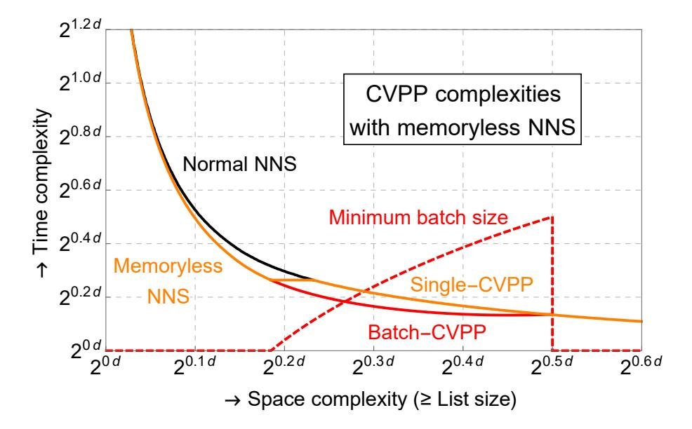

Fig. 4. Query complexities for solving CVPP and batch-CVPP with nearest neighbour techniques, and with the improved memory management outlined in Section 6, making the memory-wise overhead of the nearest neighbour data structure negligible, either for a single target (below space 2<sup>0</sup>.185<sup>d</sup> ) or for batch-CVPP for sufficiently large batches (between space 2<sup>0</sup>.185<sup>d</sup> and 2<sup>0</sup>.5<sup>d</sup> ). The black curve equals the black curve from Figure 3, the orange curve shows optimized complexities for CVPP using memoryless NNS whenever possible, and the red curve shows the optimized per-instance complexities for batch-CVPP for sufficiently large batch sizes; if the batch size exceeds the quantity indicated by the dashed red curve, then the amortized complexity is given by the solid red curve.

# 1.2 Working heuristics

While some of our intermediate results are entirely formal, the eventual conclusion on the behaviour of the iterative slicer also relies on heuristics. We restrict the use of "Theorem", "Lemma", and "Corollary" to the formal claims, and refer to "Heuristic claims" for the rest.

The first heuristic which we use is the commonly used Gaussian heuristic, which predicts the number of lattice vectors and their density within certain regions based on the lattice volume. Its use for analysing sieve-type algorithms is well established [6, 7, 18, 22] and seems consistent with various experiments conducted in the past.

The second heuristic assumption we use is also central in previous work on the randomized iterative slicer [12,20], and consists of assuming that the input target can be randomized, yielding essentially independent experiments each time we randomize the input over the coset of the target vector. Practical experiments from DLW [12] seem to support this assumption.

The third heuristic is specific to this work, and consists of assuming that in our graph, the density over all successful paths taken by the slicing procedure is asymptotically equal to the density given by the most probable successful path. We suspect that this heuristic assumption can be formalized and justified following an analysis similar to the concentration bound result of Herold and Kirshanova [16]. We leave this question open for future work. Note that this heuristic is only needed to justify the sharpness of our analysis; even without it our results give lower bounds on the success probability of the iterative slicer.

### 2 Preliminaries

#### 2.1 Notation

Let us first describe some basic notation. Throughout we will write  $\|\cdot\|$  for Euclidean norms, and  $\langle \cdot, \cdot \rangle$  for the standard dot product. Dimensions of vector spaces are commonly denoted by d. Vectors are written in boldface notation (e.g.  $\boldsymbol{x}$ ). We denote d-dimensional volumes by  $\operatorname{Vol}(\cdot)$ .

## 2.2 Spherical geometry

We write  $\mathcal{B} = \mathcal{B}^d \subset \mathbb{R}^d$  for the unit ball, consisting of all vectors with Euclidean norm at most 1, and we write  $\mathcal{S} = \mathcal{S}^{d-1} \subset \mathbb{R}^d$  for the unit sphere, i.e. the boundary of  $\mathcal{B}^d$ . More generally we denote by  $\mathcal{B}(\boldsymbol{x},\alpha)$  the ball of radius  $\alpha$  around  $\boldsymbol{x}$ . Within the unit ball, we denote spherical caps by  $\mathcal{C}_{\boldsymbol{x},\alpha} = \{\boldsymbol{v} \in \mathcal{B} : \langle \boldsymbol{x}, \boldsymbol{v} \rangle \geq \alpha\}$  for  $\boldsymbol{x} \in \mathcal{S}$  and  $\alpha \in (0,1)$ , and we denote spherical wedges by  $\mathcal{W}_{\boldsymbol{x},\alpha,\boldsymbol{y},\beta} = \mathcal{C}_{\boldsymbol{x},\alpha} \cap \mathcal{C}_{\boldsymbol{y},\beta}$  where  $\boldsymbol{x},\boldsymbol{y} \in \mathcal{S}$  and  $\alpha,\beta \in (0,1)$ . Note that due to spherical symmetry, the volume of  $\mathcal{C}_{\boldsymbol{x},\alpha}$  is independent of the choice of  $\boldsymbol{x}$ , and the volume of  $\mathcal{W}_{\boldsymbol{x},\alpha,\boldsymbol{y},\beta}$  only depends on the angle between  $\boldsymbol{x}$  and  $\boldsymbol{y}$ . To obtain the relevant probability distributions for the treated algorithms we need the following asymptotic volumes.

Lemma 1 (Volume spherical cap). Let  $\alpha \in (0,1)$  and let  $x \in S$ . Then the volume of a spherical cap  $C_{x,\alpha}$  relative to the unit ball  $\mathcal{B}$  is

$$C(\alpha) := (1 - \alpha^2)^{d/2 + o(d)}. \tag{7}$$

Lemma 2 (Volume spherical wedge). Let  $\alpha, \beta \in (0,1)$ , let  $x, y \in \mathcal{S}$ , and let  $\gamma = \langle x, y \rangle$ . Then the volume of the spherical wedge  $\mathcal{W}_{x,\alpha,y,\beta}$  relative to  $\mathcal{B}$  is

$$\mathcal{W}(\alpha, \beta, \gamma) := \begin{cases} \left(\frac{1 - \alpha^2 - \beta^2 - \gamma^2 + 2\alpha\beta\gamma}{1 - \gamma^2}\right)^{d/2 + o(d)}, & \text{if } 0 < \gamma < \min\left(\frac{\alpha}{\beta}, \frac{\beta}{\alpha}\right); \\ (1 - \alpha^2)^{d/2 + o(d)}, & \text{if } \frac{\beta}{\alpha} \le \gamma < 1; \\ (1 - \beta^2)^{d/2 + o(d)}, & \text{if } \frac{\alpha}{\beta} \le \gamma < 1. \end{cases}$$
(8)

#### 2.3 Lattices

Given a set of linearly independent vectors  $\mathbf{B} = \{\mathbf{b}_1, \dots, \mathbf{b}_d\} \subset \mathbb{R}^d$ , we define the lattice generated by the basis  $\mathbf{B}$  as  $\mathcal{L} = \mathcal{L}(\mathbf{B}) := \{\sum_{i=1}^d \lambda_i \mathbf{b}_i : \lambda_i \in \mathbb{Z}\}$ . We denote the volume  $\det(\mathbf{B})$  of the parallelepiped  $\mathbf{B} \cdot [0, 1]^d$  by  $\det(\mathcal{L})$ ; this volume is independent of the choice of basis for a lattice. Given a basis of a lattice, the shortest vector problem (SVP) asks to find a lattice vector of minimum (non-zero) Euclidean norm in this lattice: if we let  $\lambda_1(\mathcal{L}) = \min_{\boldsymbol{x} \in \mathcal{L} \setminus \{\mathbf{0}\}} \|\boldsymbol{x}\|$ , then solving SVP corresponds to finding a vector  $\boldsymbol{x} \in \mathcal{L}$  of norm  $\lambda_1(\mathcal{L})$ .

The analysis of lattice algorithms heavily depends on the Gaussian heuristic, as it better represents the practical complexity of the algorithms than their provable counterparts.

**Heuristic 1 (The Gaussian heuristic (GH)).** Let  $K \subset \mathbb{R}^d$  be a measurable body, then the number  $|K \cap \mathcal{L}|$  of lattice points in K is approximately equal to  $Vol(K)/\det(\mathcal{L})$ .

Assuming this heuristic with K a Euclidean d-ball we obtain that  $\lambda_1(\mathcal{L})$  has expected value  $\sqrt{d/(2\pi e)} \cdot \det(\mathcal{L})^{1/d}$ . For random lattices, which are the main target in the context of cryptanalysis, the Gaussian heuristic is widely verified and the following statement can be observed in practice.

Heuristic 2 (Lattice points in a ball, consequence of GH). Let  $t \in \mathbb{R}^d$  be random. Under the Gaussian heuristic the ball of radius  $\alpha \cdot \lambda_1(\mathcal{L})$  contains  $\alpha^{d+o(d)}$  lattice points that we treat as being uniformly distributed over the ball.

As a direct result a random target  $t \in \mathbb{R}^d$  is expected to lie at distance  $\approx \lambda_1(\mathcal{L})$  from the lattice. This gives the following alternative statements for the common variants of the closest vector problem (CVP).

**Definition 1 (Closest Vector Problem (CVP)).** Given a basis **B** of a lattice  $\mathcal{L}$  and a target vector  $\mathbf{t} \in \mathbb{R}^d$ , find a vector  $\mathbf{v} \in \mathcal{L}$  such that  $\|\mathbf{t} - \mathbf{v}\| \leq \lambda_1(\mathcal{L})$ .

The hardness of most lattice-based cryptographic schemes actually depends on one of the following two easier variants.

Definition 2 (Approximate Closest Vector Problem ( $\gamma$ -CVP)). Given a basis **B** of a lattice  $\mathcal{L}$ , a target vector  $\mathbf{t} \in \mathbb{R}^d$  and an approximation factor  $\gamma \geq 1$ , find a vector  $\mathbf{v} \in \mathcal{L}$  such that  $\|\mathbf{t} - \mathbf{v}\| \leq \gamma \cdot \lambda_1(\mathcal{L})$ .

**Definition 3 (Bounded Distance Decoding (\delta-BDD)).** Given a basis **B** of a lattice  $\mathcal{L}$ , a target vector  $\mathbf{t} \in \mathbb{R}^d$  and a distance guarantee  $\delta \in (0,1)$  such that  $\min_{\mathbf{v} \in \mathcal{L}} \|\mathbf{t} - \mathbf{v}\| \le \delta \cdot \lambda_1(\mathcal{L})$ , find a vector  $\mathbf{v} \in \mathcal{L}$  such that  $\|\mathbf{t} - \mathbf{v}\| \le \delta \cdot \lambda_1(\mathcal{L})$ .

The preprocessing variants CVPP,  $\gamma$ -CVPP and  $\delta$ -BDDP additionally allow to do any kind of preprocessing given only a description of the lattice  $\mathcal{L}$  (and not the target t). The size of the final preprocessing advice is counted in the eventual space complexity of the CVPP algorithm or variants thereof. In the remainder we assume without loss of generality that  $\lambda_1(\mathcal{L}) = 1$ .

# **Algorithm 1:** The iterative slicer of [27]

```
Input: A target vector \boldsymbol{t} \in \mathbb{R}^d, a list L \subset \mathcal{L}.

Output: A close vector \boldsymbol{v} \in \mathcal{L} to \boldsymbol{t}.

1 Function IterativeSlicer(L, \boldsymbol{t}):

2 \boldsymbol{t}_0 \leftarrow \boldsymbol{t};
3 \boldsymbol{for} \ i \leftarrow 0, 1, 2, \dots \boldsymbol{do}
4 \boldsymbol{t}_{i+1} \leftarrow \min_{\boldsymbol{v} \in L \cup \{\boldsymbol{0}\}} \{\boldsymbol{t}_i - \boldsymbol{v}\};
5 \boldsymbol{if} \ \boldsymbol{t}_{i+1} = \boldsymbol{t}_i \ \boldsymbol{then} \ \boldsymbol{return} \ \boldsymbol{t}_0 - \boldsymbol{t}_i;
```

# 2.4 Solving CVPP with the randomized slicer

The (randomized) iterative slicer. The iterative slicer (Algorithm 1) is a simple but effective algorithm that aims to solve the closest vector problem or variants thereof. The preprocessing consists of finding and storing a list  $L \subset \mathcal{L}$  of lattice vectors. Then given a target point  $\mathbf{t} \in \mathbb{R}^d$  the iterative slicer tries to reduce the target  $\mathbf{t}$  by the list L to some smaller representative  $\mathbf{t}' \in \mathbf{t} + \mathcal{L}$  in the same coset of the lattice. This is repeated until the reduction fails or until the algorithm succeeds, i.e. when  $\|\mathbf{t}'\| \leq \gamma$ . We then obtain the lattice point  $\mathbf{t} - \mathbf{t}'$  that lies at distance at most  $\gamma$  to  $\mathbf{t}$ . Observe that  $\mathbf{t}'$  is the shortest vector in  $\mathbf{t} + \mathcal{L}$  if and only if  $\mathbf{v} = \mathbf{t} - \mathbf{t}' \in \mathcal{L}$  is the closest lattice vector to  $\mathbf{t}$ .

To provably guarantee that the closest vector is found we need the preprocessed list L to contain all the Voronoi-relevant vectors; the vectors that define the Voronoi cell of the lattice. However most lattices have  $O(2^d)$  relevant vectors, which is too much to be practically viable. Under the Gaussian heuristic, Laarhoven [18] showed that  $2^{d/2+o(d)}$  short vectors commonly suffice for the iterative slicer to succeed with high probability, but this number of vectors is still too large for any practical algorithm. The randomized slicer (Algorithm 2) of Doulgerakis–Laarhoven–De Weger [12] attempts to overcome this large list requirement by using a smaller preprocessed list together with rerandomizations to obtain a reasonable probability of finding a close vector – the success probability of one run of the iterative slicer might be small, but repeating the algorithm many times using randomized inputs from  $t + \mathcal{L}$ , the algorithm then succeeds with high probability, without requiring a larger preprocessed list.

Because we can only use a list of limited size, one can ask the question which lattice vectors to include in this list L. Later in the analysis it will become clear that short vectors are more useful to reduce a random target, so it is natural to let L consist of all short vectors up to some radius. Let  $\alpha > 1$  be this radius and denote its square by  $a := \alpha^2$ . The preprocessed list then becomes

$$L_a := \{ \boldsymbol{x} \in \mathcal{L} : \|\boldsymbol{x}\|^2 \le a \}. \tag{9}$$

Recall that we normalized to  $\lambda_1(\mathcal{L}) = 1$  and thus under the Gaussian heuristic this list consists of  $|L_a| = \alpha^{d+o(d)}$  lattice points, which determines (ignoring nearest neighbour data structures) the space complexity of the algorithm and

# Algorithm 2: The randomized iterative slicer of [12]

```
Input: A target vector \boldsymbol{t} \in \mathbb{R}^d, a list L \subset \mathcal{L}, a target distance \gamma \in \mathbb{R}.

Output: A close vector \boldsymbol{v} \in \mathcal{L}, s.t. \|\boldsymbol{t} - \boldsymbol{v}\| \leq \gamma.

1 Function RandomizedSlicer(L, \boldsymbol{t}, \gamma):

2 | repeat | \boldsymbol{t}' \leftarrow \text{Sample}(\boldsymbol{t} + \mathcal{L});
  | \boldsymbol{v} \leftarrow \text{IterativeSlicer}(L, \boldsymbol{t}');

5 | until \|\boldsymbol{t}' - \boldsymbol{v}\| \leq \gamma;
  | return \boldsymbol{v} + (\boldsymbol{t} - \boldsymbol{t}');
```

also determines the time complexity of each iteration. Until Section 7 we restrict our attention to the approximate case  $\gamma$ -CVPP where we have  $\gamma \geq 1$ , with  $\gamma = 1$  corresponding to (average-case) exact CVPP. Throughout we will write  $c := \gamma^2$ .

Success probability. The iterative slicer is not guaranteed to succeed as the list does not contain all relevant vectors. However, suppose that the iterative slicer has a success probability of  $\mathbb{P}_{a,c}$  given a random target. It is clear that having a larger preprocessed list increases the success probability, but in general it is hard to concretely analyse the success probability for a certain list. Under the Gaussian heuristic we can actually derive bounds on  $\mathbb{P}_{a,c}$ , as was first done by DLW [12]. They obtained the following two regimes for the success probability as  $d \to \infty$ :

```
 \begin{array}{l} - \text{ For } a \geq 2c - 2\sqrt{c^2 - c} \text{ we have } \mathbb{P}_{a,c} \to 1. \\ - \text{ For } a < 2c - 2\sqrt{c^2 - c} \text{ we have } \mathbb{P}_{a,c} = \exp(-C \cdot d + o(d)) \text{ for } C > 0. \end{array}
```

The second case above illustrates that for a small list size the algorithm needs to be repeated a large number of times with fresh targets to guarantee a high success probability. This gives us the randomized slicer algorithm. To obtain a fresh target the idea is to sample randomly a not too large element from the coset  $t+\mathcal{L}$ , and assume that the reduction of this new target is independent from the initial one. Experiments from DLW suggest that this is a valid assumption to make, and given a success probability  $\mathbb{P}_{a,c} \ll 1$  it is enough to repeat the algorithm  $O(1/\mathbb{P}_{a,c})$  times to find the closest lattice point. However this success probability in the case  $a < 2c - 2\sqrt{c^2 - c}$  is not yet fully understood. Two heuristic lower bounds [12, 20] are known and are shown in Figure 5. None of these lower bounds fully dominates the other, which implies that neither of the bounds is sharp. In the remainder of this work we consider this case where we have a small success probability.

# 3 The random walk model

To interpret the iterative slicer algorithm as a random walk we first look at the probability that a target t is reduced by a random lattice point from the

preprocessed list  $L_a$ . By the Gaussian heuristic this lattice point is distributed uniformly over the ball of radius  $\alpha$ . To reduce  $\|\boldsymbol{t}\|^2$  from x to  $y \in [(\sqrt{x} - \alpha)^2, x]$  by some  $\boldsymbol{v}$  with  $\|\boldsymbol{v}\|^2 = a$ , their inner product must satisfy:

$$\langle \boldsymbol{t}, \boldsymbol{v} \rangle < -(a+x-y)/2.$$

Using the formulas for the volume of a spherical cap we then deduce the following probability:

$$\mathbb{P}_{\boldsymbol{v} \in \alpha \cdot \mathcal{B}^d} \left( \|\boldsymbol{t} + \boldsymbol{v}\|^2 \le y \mid \|\boldsymbol{t}\|^2 = x \right) = \left( 1 - \frac{(a + x - y)^2}{4ax} \right)^{d/2 + o(d)}. \tag{10}$$

Clearly any reduction to  $y < (\sqrt{x} - \alpha)^2$  is unreachable by a vector in  $\alpha \cdot \mathcal{B}^d$ . The probability that the target norm is successfully reduced to some  $y \leq \|t\|^2$  decreases in  $\alpha$  and thus we prefer to have short vectors in our list. As the list  $L_a$  does not contain just one, but  $a^{d/2}$  lattice vectors we obtain the following reduction probability for a single iteration of the iterative slicer:

$$\mathbb{P}\left(\exists \boldsymbol{v} \in L_a : \left\|\boldsymbol{t} + \boldsymbol{v}\right\|^2 \le y \mid \left\|\boldsymbol{t}\right\|^2 = x\right)^{2/d} \to \min\left\{1, a \cdot \left(1 - \frac{(a + x - y)^2}{4ax}\right)\right\}$$

as  $d \to \infty$ . Note that the reduction probability takes the form  $\exp(-Cd + o(d))$  for some constant  $C \ge 0$  that only depends on a, x and y. As we are interested in the limit behaviour as  $d \to \infty$  we focus our attention to this base  $\exp(-C)$ , which we call the base-probability of this reduction and denote it by  $p_a(x,y)$ . Although these transition probabilities represent a reduction to any square norm  $\le y$ , they should asymptotically be interpreted as a reduction to  $\approx y$ , as for any fixed  $\varepsilon > 0$  we have that  $p_a(x,y-\epsilon)^d/p_a(x,y)^d = 2^{-\Theta(d)} \to 0$  as  $d \to \infty$ . If  $\|t\|^2 = x$  is large enough we can almost certainly find a lattice point in  $L_a$  that reduces this norm successfully. In fact a simple computation shows that this is the case for any  $x > b := a^2/(4a-4)$  as  $d \to \infty$ . So in our analysis we can assume that our target is already reduced to square norm b, and the interesting part is how probable the remaining reduction from b to c is.

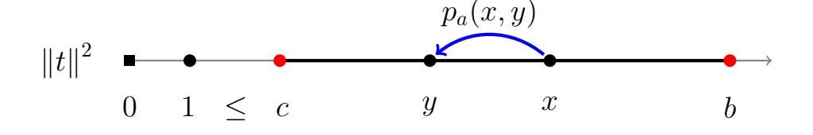

**Definition 4 (Transition probability).** The transition base-probability  $p_a(x, y)$  to reduce  $\|\mathbf{t}\|^2$  from  $x \in [c, b]$  to  $y \in [c, x]$  is given by

$$p_a(x,y): S_a \to (0,1],$$
 (11)

$$(x,y) \mapsto \left(a - \frac{(a+x-y)^2}{4x}\right)^{1/2},$$
 (12)

with  $S_a = \{(x, y) \in [c, b]^2 : b \ge x \ge y \text{ and } \sqrt{x} - \sqrt{y} < \alpha \}$  the allowed transitions.

Using the above reduction probabilities we model the iterative slicer as a random walk over an infinite graph where each node  $x_i \in [c, b]$  is associated with the squared norm  $\|\mathbf{t}_i\|^2$  of the partly reduced target. Note that each possible successful random walk  $b = x_0 \to x_1 \to \cdots \to x_n = c$  has a certain success probability. Assuming the different steps are independent this success probability is just the product of the individual reduction probabilities. For an n-step path we could split our list  $L_a$  in n parts, one for each step, to obtain this independence without changing the asymptotic size of these lists. Again this success probability is of the form  $\exp(-Cd + o(d))$  for some constant  $C \ge 0$  that only depends on  $x_0, \ldots, x_n$  and a.

**Definition 5 (Path).** All decreasing n-step paths  $x_0 \to x_1 \to \cdots \to x_n$  with positive probability from b to c are given by the set:

$$S_a[b \xrightarrow{n} c] := \{ (b = x_0, x_1, \dots, x_n = c) \in \mathbb{R}^{n+1} : \forall i \ (x_{i-1}, x_i) \in S_a \}.$$
 (13)

The transition base-probability of such a path is given by

$$P_a[b \xrightarrow{n} c] : S_a[b \xrightarrow{n} c] \to (0,1], \tag{14}$$

$$\boldsymbol{x} \mapsto \prod_{i=1}^{n} p_a(x_{i-1}, x_i). \tag{15}$$

The success probability of reaching c from b is determined by the total probability of all successful paths. Note that all these paths have some probability of the form  $\exp(-Cd + o(d))$  and thus the probability for the path with the smallest  $C \geq 0$  will dominate all other paths for large d. As a result, almost all successful walks will go via the highest probable path, i.e. the one with the highest base-probability. After applying a log-transform this becomes equivalent to finding the shortest path in a weighted graph.

**Definition 6 (Transition graph).** Let V = [c, b] and  $E = [c, b]^2$  be an infinite graph G = (V, E) with weight function  $w : E \to \mathbb{R}_{\geq 0} \cup \{\infty\}$  given by:

$$w(x,y) = \begin{cases} -\log p_a(x,y), & if (x,y) \in S_a; \\ \infty, & otherwise. \end{cases}$$
 (16)

One can associate n-step paths in this graph from b to c with the space  $S_a[b \xrightarrow{n} c]$ . The length of a path  $\mathbf{x} \in S_a[b \xrightarrow{n} c]$  is denoted by  $\ell_a[b \xrightarrow{n} c](\mathbf{x})$  and the shortest path length by

$$\ell_{a,opt}[b \to c] = \inf_{n \in \mathbb{Z}_{\geq 1}} \inf_{\boldsymbol{x} \in S_a[b \to c]} \ell_a[b \to c](\boldsymbol{x}). \tag{17}$$

Obtaining the success probability in this model therefore becomes equivalent to obtaining the length of the shortest path  $\ell_{a,\text{opt}}[b \to c]$  as we have  $P_a[b \stackrel{n}{\to} c](\boldsymbol{x}) = \exp(-\ell_a[b \stackrel{n}{\to} c](\boldsymbol{x}))$ .

## **Algorithm 3:** A discretized shortest path algorithm [11]

```
Input: Parameters a, b, c describing the graph, a discretization value k.

Output: A shortest path on the discretized graph from b to c.

1 Function DiscretizedDijkstra(a, b, c, k):

2 | Compute V_d = \{c + \frac{i \cdot (b - c)}{k} : i = 0, \dots, k\};

3 | Compute E_d = \{(x, y) \in V_d^2 \cap S_a\} and the weights w_a(x, y);

4 | Compute shortest path on G_d = (V_d, E_d) from b to c.
```

# 4 Numerical approximations

We reduced the problem of obtaining the success probability of the iterative slicer to the search of a shortest path in a specially constructed weighted infinite graph. We might not always be able to find an exact solution in the input variables to the length of the shortest path. However for fixed parameters we can always try to numerically approximate the success probability, by approximating the shortest path in our infinite graph. We present two fairly standard methods for doing so. The first method first discretizes the infinite graph and then determines the shortest path using standard algorithms such as Dijkstra's algorithm [11]. The second method uses the fact that the weight function  $w_a: S_a \to \mathbb{R}_{\geq 0}$  is convex.

#### 4.1 Discretization

A natural way to approximate the shortest path in an infinite graph is to first discretize to a finite subgraph. Then one can determine the shortest path in this subgraph using standard methods to obtain a short path in the infinite graph. The details of this approach are shown in Algorithm 3.

Using any optimized Dijkstra implementation the time and space complexity of Algorithm 3 is  $O(|E_d| + |V_d| \log |V_d|) = O(k^2)$ . In general this method gives a lower bound on the success probability for any fixed a and c. Because the weight function  $w_a: S_a \to \mathbb{R}_{\geq 0}$  is continuous Algorithm 3 converges to the optimal path length as  $k \to \infty$ . The C++ implementation of this method used for the experiments is attached in the complementary material of this work.

For this method to converge to the shortest path in the full graph we only need a continuous weight function. Furthermore the number of steps does not have to be specified a priori. The high memory usage of  $O(k^2)$  could limit the fineness of our discretization. To circumvent this we can generate the edges (and their weight) on the fly when needed, which reduces the memory consumption to O(k).

#### 4.2 Convex optimization

Where the first method only needed  $w_a: S_a \to \mathbb{R}_{\geq 0}$  to be continuous, the second method makes use of the convexity of this function.

**Lemma 3 (Convexity of**  $S_a$  and  $w_a$ ). The set of allowed transitions  $S_a$  is convex and the weight function  $w_a$  is strictly convex on  $S_a$ .

*Proof.* The convexity of  $S_a = \{(x,y) \in [c,b]^2 : b \ge x \ge y \text{ and } \sqrt{x} - \sqrt{y} < \alpha\}$  follows immediately from the fact that  $x \mapsto \sqrt{x}$  is concave on  $[0,\infty)$ . Remember that for  $(x,y) \in S_a$ 

$$w_a(x,y) = -\log p_a(x,y) = -\frac{1}{2}\log\left(a - \frac{(a+x-y)^2}{4x}\right),$$
 (18)

and thus we have

$$\frac{d^2}{dx^2}w_a(x,y) = \frac{8xp_a(x,y)^2 + (4a - 2(a+x-y))^2 - 16p_a(x,y)^4}{32x^2p_a(x,y)^4},$$
 (19)

$$\frac{d}{dy}\frac{d}{dx}w_a(x,y) = \frac{-8xp_a(x,y)^2 + (4a - 2(a+x-y)) \cdot 2(a+x-y)}{32x^2p_a(x,y)^4},$$
 (20)

$$\frac{d^2}{dy^2}w_a(x,y) = \frac{8xp_a(x,y)^2 + 4(a+x-y)^2}{32x^2p_a(x,y)^4}.$$
 (21)

As  $p_a(x,y) > 0$  and  $a+x-y \ge a > 0$  for  $(x,y) \in S_a$  we have  $\frac{d^2}{dy^2}w_a(x,y) > 0$ . We consider the Hessian H of  $w_a$ . Computing the determinant gives:

$$\det(H) = \frac{2(a+x-y)^4 \cdot (4ax - (a+x-y)^2)}{1024x^6 p_a(x,y)^8}$$
 (22)

and we can conclude that  $\det(H) > 0$  from the fact that  $4ax - (a + x - y)^2 > 0$  and  $(a + x - y)^4 > 0$  for  $(x, y) \in S_a$ . So H is positive definite, which makes  $w_a$  strictly convex on  $S_a$ .

Corollary 1 (Convexity of  $S_a[b \xrightarrow{n} c]$  and  $\ell_a[b \xrightarrow{n} c]$ ). The space of n-step paths  $S_a[b \xrightarrow{n} c]$  is convex and the length function  $\ell_a[b \xrightarrow{n} c]$  is strictly convex on  $S_a[b \xrightarrow{n} c]$  for any  $n \ge 1$ .

*Proof.* The convexity of  $S_a[b \xrightarrow{n} c]$  follows immediately from that of  $S_a$ . Note that  $\ell_a[b \xrightarrow{n} c](\boldsymbol{x}) = \sum_{i=1}^n w_a(x_{i-1}, x_i)$  and thus it is convex as a sum of convex functions. Furthermore for each variable at least one of these functions is strictly convex and thus the sum is strictly convex.

So for any fixed  $n \ge 1$  we can use convex optimization to numerically determine the optimal path of n steps. In fact, because of the strict convexity, we know that this optimal path of n steps (if it exists) is unique. However the question remains what the optimal number of steps is, i.e. for which n we should run the convex optimization algorithm. We might miss the optimal path if we do not guess the optimal number of steps correctly. Luckily because  $w_a(b,b)=0$  by definition, we can increase n without being afraid to skip some optimal path.

**Lemma 4 (Longer paths are not worse).** If  $\ell_a[b \xrightarrow{n} c]$  and  $\ell_a[b \xrightarrow{n+k} c]$  for  $n, k \geq 0$  both attain a minimum, then

$$\min_{\boldsymbol{x} \in S_a[b \xrightarrow{n} c]} \ell_a[b \xrightarrow{n} c](\boldsymbol{x}) \ge \min_{\boldsymbol{x} \in S_a[b \xrightarrow{n+k} c]} \ell_a[b \xrightarrow{n+k} c](\boldsymbol{x}). \tag{23}$$

*Proof.* Suppose  $\ell_a[b \xrightarrow{n} c]$  attains its minimum at  $\mathbf{y} = (b = y_0, y_1, \dots, y_n = c) \in S_a[b \xrightarrow{n} c]$ . Using that  $w_a(b, b) = 0$  we get that:

$$\min_{\boldsymbol{x} \in S_a[b \overset{n+k}{\to} c]} \ell_a[b \overset{n+k}{\to} c](\boldsymbol{x}) \le \ell_a[b \overset{n+k}{\to} c](b, \dots, b = y_0, \dots, y_n = c) \tag{24}$$

$$= k \cdot w_a(b,b) + \ell_a[b \xrightarrow{n} c](\boldsymbol{y}) \tag{25}$$

$$= \ell_a[b \xrightarrow{n} c](\mathbf{y}). \tag{26}$$

This completes the proof.

So increasing n can only improve the optimal result. When running a numerical convex optimization algorithm one could start with a somewhat small n and increase it (e.g. double it) until the result does not improve any more.

#### 4.3 Numerical results

We ran both numerical algorithms and got similar results. Running the convex optimization algorithm gave better results for small  $a=1+\varepsilon$  as the fineness of the discretization is not enough to represent the almost shortest paths in this regime. This is easily explained as  $b\approx \frac{1}{4\varepsilon}$  and thus for fixed c the distance between b and c, i.e. the interval to be covered by the discretization quickly grows as  $\varepsilon\to 0$ .

The new lower bound that we obtained numerically for exact CVPP (c=1) is shown in Figure 5. For  $\alpha \leq 1.1047$  we observe that the new lower bound is strictly better than the two previous lower bounds. For  $\alpha > 1.1047$  the new lower bound is identical to the lower bound from [12]. Taking a closer look at the short paths we obtained numerically we see that  $\alpha \approx 1.1047$  is exactly the moment where this path switches from a single step to at least 2 steps. This makes sense as in our model the lower bound from [12] can be interpreted as a 'single step' analysis. This also explains the asymptote for this lower bound as for  $\alpha \leq 1.0340$  it is not possible to walk from b to c=1 in a single step.

When inspecting these short paths  $b=x_0\to x_1\to\cdots\to x_n=c$  further we observed an almost perfect fit with a quadratic formula  $x_i=u\cdot i^2+v\cdot i+b$  for some constants u,v. In the next section we show how we use this to obtain an exact analytic solution for the shortest path.

#### 5 An exact solution for the randomized slicer

In order to determine an exact solution of the shortest path, and thus an exact solution of the success probability of the iterative slicer we use some observations

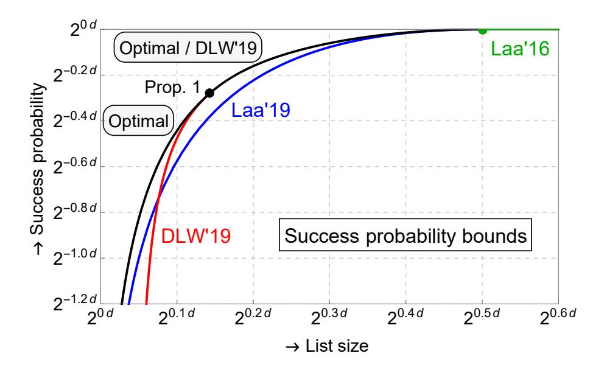

Fig. 5. Lower bounds on success probability of the iterative slicer for CVPP (c=1) computed with a discretization parameter of k=5000.

from the numerical results. Due to Corollary 1 we know that for any fixed  $n \ge 1$  our minimization problem is strictly convex. As a result there can be at most one local minimum which, if it exists, is immediately also the unique global minimum.

In order to find an exact solution we explicitly construct the shortest n-step path using observations from the numerical section. Then showing that this path is a local minimum is enough to prove that it is optimal. We recall from Section 4.3 that the optimal path  $x_0 \to \cdots \to x_n$  seems to take the shape  $x_i = u \cdot i^2 + v \cdot i + b$  with  $x_n = c$ . So for our construction we assume this shape, which reduces the problem to determining the constants u, v. Furthermore, as we are trying to construct a local minimum, we assume that all partial derivatives in the non-constant variables are equal to 0. This gives enough restrictions to obtain an explicit solution.

### Definition 7 (Explicit construction). Let $n \geq 1$ and let

$$x_i = u_a[b \xrightarrow{n} c] \cdot i^2 + v_a[b \xrightarrow{n} c] \cdot i + b, \tag{27}$$

with  $u_a[b \xrightarrow{1} c] := 0$ ,  $v_a[b \xrightarrow{1} c] := c - b$  and for  $n \ge 2$ :

$$u_a[b \xrightarrow{n} c] := \frac{(b+c-a)n - \sqrt{(an^2 - (b+c))^2 + 4bc(n^2 - 1)}}{n^3 - n},$$
 (28)

$$v_a[b \xrightarrow{n} c] := \frac{(a-2b)n^2 + (b-c) + \sqrt{(an^2 - (b+c))^2 + 4bc(n^2 - 1)}n}{n^3 - n}.$$
 (29)

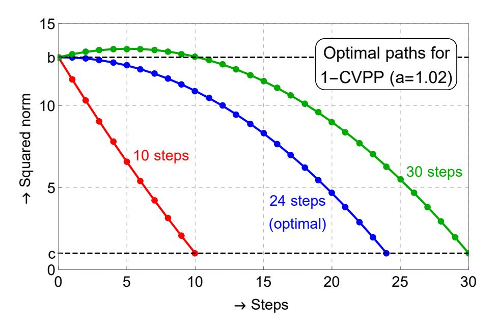

**Fig. 6.** Some examples of the constructed paths in Definition 7 for a = 1.02, c = 1.

**Lemma 5.** By construction we have  $x_n = c$  and

$$\frac{\partial}{\partial x_i} \sum_{j=1}^n -\log p_a(x_{j-1}, x_j) = 0 \tag{30}$$

for all  $i \in \{1, ..., n-1\}$ .

*Proof.* Note that the partial derivative constraints can be reduced to the single constraint  $\frac{\partial}{\partial x_i} \left( -\log p_a(x_{i-1}, x_i) - \log p_a(x_i, x_{i+1}) \right) = 0$  for a symbolic i. Together with the constraint  $x_n = c$  one can solve for u, v in  $x_i = u \cdot i^2 + v \cdot i + b$ . For a symbolic verification see the Sage script in Appendix A.

What remains is to show that the explicit construction indeed gives a valid path, i.e. one that is in the domain  $S_a[b \xrightarrow{n} c]$ . An example of how these constructed paths look are given in Figure 6. We observe that if n becomes too large these constructed paths are invalid as they walk outside the interval [c,b]. This is an artefact of our simplification that  $w_a(x,y) = -\log p_a(x,y)$  which does not hold for  $(x,y) \notin S_a$ . We can still ask the question for which n this construction is actually valid.

Lemma 6 (Valid constructions). Let 
$$\frac{b-c}{a} \le n < \frac{1}{2} + \frac{\sqrt{(4b-a)^2 - 8(2b-a)c}}{2a}$$
 and

$$x_i = u_a[b \xrightarrow{n} c] \cdot i^2 + v_a[b \xrightarrow{n} c] \cdot i + b. \tag{31}$$

Then  $\mathbf{x} = (x_0, \dots, x_n) \in S_a[b \xrightarrow{n} c]$  and  $\mathbf{x}$  is the unique minimum of  $\ell_a[b \xrightarrow{n} c]$ .

*Proof.* We have to check that x satisfies the two conditions

$$x_{i-1} \ge x_i$$
 and  $\sqrt{x_{i-1}} - \sqrt{x_i} < \alpha$ , (32)

for all  $i \in \{1, ..., n\}$ . Note that for n = 0 we must have b = c and the statement becomes trivial. For n = 1 we have  $\boldsymbol{x} = (b, c)$  and the conditions follows from  $0 \le b - c \le na \le a$ . So we can assume that  $n \ge 2$ . First we rewrite  $u_a[b \xrightarrow{n} c]$  to:

$$u_a[b \xrightarrow{n} c] = \frac{(b+c-a)n - \sqrt{((b+c-a)n)^2 + (a^2n^2 - (b-c)^2)(n^2 - 1)}}{n^3 - n}, (33)$$

which makes it clear that  $u_a[b \xrightarrow{n} c] \leq 0$  when  $an \geq b - c$ . As a result the differences

$$x_{i-1} - x_i = (1 - 2i) \cdot u_a[b \xrightarrow{n} c] - v_a[b \xrightarrow{n} c], \tag{34}$$

are increasing in  $i \in \{1, ..., n\}$ . Therefore for the first condition it is enough to check that

$$x_0 - x_1 = \frac{(b-c) + (2b-a)n - \sqrt{(an^2 - (b+c))^2 + 4bc(n^2 - 1)}}{n^2 + n} \ge 0.$$
 (35)

In fact a solution with  $x_0 = x_1 = b$  is not so interesting, so solving for  $x_0 - x_1 > 0$  gives for  $n \ge 2$  the sufficient condition

$$n < \frac{1}{2} + \frac{\sqrt{(4b-a)^2 - 8(2b-a)c}}{2a}.$$
 (36)

For the second condition we first show the stronger property that  $x_{i-1} - x_i \le a$ , and again by the increasing differences it is enough to show that  $x_{n-1} - x_n \le a$ ; rewriting gives the following sufficient statement for  $n \ge 2$ :

$$-an + b - c \le 0. (37)$$

Now we prove that  $\sqrt{x_{i-1}} - \sqrt{x_i} < \alpha$ . If  $x_{i-1} = x_i$  the condition holds trivially, else  $x_{i-1} > x_i$  and we get

$$(\sqrt{x_{i-1}} - \sqrt{x_i})^2 < (\sqrt{x_{i-1}} - \sqrt{x_i})(\sqrt{x_{i-1}} + \sqrt{x_i}) = x_{i-1} - x_i \le a.$$
 (38)

We conclude that  $\mathbf{x} \in S_a[b \xrightarrow{n} c]$ . As  $\ell_a[b \xrightarrow{n} c](\mathbf{x}) = \sum_{i=1}^n -\log p_a(x_{i-1}, x_i)$  on  $S_a[b \xrightarrow{n} c]$ , the claim that this is a global minimum follows from Definition 7 and Lemma 1.

So by Lemma 7 there exists some  $s \in \mathbb{N}$  such that for all  $(b-c)/a \le n \le s$  we have an explicit construction for the optimal n-step path. By Lemma 4 we know that of these paths the one with n=s steps must be the shortest. However for n>s our construction did not work and thus we do not know if any shorter path exists. Inspired by Lemma 4 and numerical results we obtain the following alternative exact solution for n>s.

Theorem 1 (Optimal arbitrary-step paths). Let n satisfy

$$n = \left[ -\frac{1}{2} + \frac{1}{2a} \sqrt{(4b-a)^2 - 8(2b-a)c} \right]. \tag{39}$$

For  $k \geq n$  the unique global minimum of  $\ell_a[b \xrightarrow{k} c]$  is given by

$$\boldsymbol{x} = (b, \dots, b, b = y_0, \dots, y_n = c) \in S_a[b \stackrel{k}{\to} c]$$

$$\tag{40}$$

with  $y_i = u_a[b \xrightarrow{n} c] \cdot i^2 + v_a[b \xrightarrow{n} c] \cdot i + b$  and the length is equal to  $\ell_a[b \xrightarrow{n} c](\boldsymbol{y})$ .

Proof. By Corollary 1 it is enough to show that  $\boldsymbol{x}$  is a local minimum, therefore we check the partial derivatives. For i>k-n we have  $\frac{\partial}{\partial x_i}\ell_a[b\overset{k}{\to}c](\boldsymbol{x})=\frac{\partial}{\partial x_i}\ell_a[b\overset{n}{\to}c](\boldsymbol{y})=0$  by construction. For i< k-n we have  $x_{i-1}=x_i=x_{i+1}=b$ , which results in  $\frac{\partial}{\partial x_i}\ell_a[b\overset{k}{\to}c](\boldsymbol{x})=-\frac{a-1}{2b}<0$ . For the most interesting case i=k-n we need that  $n\geq -\frac{1}{2}+\frac{\sqrt{(4b-a)^2-8(2b-a)c}}{2a}$ . Because as a result we get  $y_0-y_1\leq \frac{a^2}{2b-a}$ , which together with  $y_0-y_1\leq b-c\leq b-1$  is precisely enough to show that  $\frac{\partial}{\partial x_b}\ell_a[b\overset{k}{\to}c](\boldsymbol{x})\leq 0$ .

To conclude let  $z \neq x \in S_a[b \xrightarrow{n} c]$ , then by Corollary 1 and using that  $z_i - x_i = z_i - b \leq 0$  for all  $0 \leq i \leq k - n$  we have:

$$\ell_{a}[b \xrightarrow{k} c](\boldsymbol{z}) > \ell_{a}[b \xrightarrow{k} c](\boldsymbol{x}) + \langle \boldsymbol{y} - \boldsymbol{x}, \nabla \ell_{a}[b \xrightarrow{k} c](\boldsymbol{x}) \rangle$$

$$= \ell_{a}[b \xrightarrow{k} c](\boldsymbol{x}) + \sum_{i \leq k-n} (z_{i} - x_{i}) \cdot \frac{\partial}{\partial x_{i}} \ell_{a}[b \xrightarrow{k} c](\boldsymbol{x}) \geq \ell_{a}[b \xrightarrow{k} c](\boldsymbol{x}).$$

$$(42)$$

and thus x is the unique global minimum of  $\ell_a[b \xrightarrow{k} c]$ .

**Corollary 2 (Optimal minimum-step paths).** The optimal path from b to c consists of n steps, with n defined by equation (39). The optimal path is of the form  $b = x_0 \to x_1 \to \cdots \to x_n = c$  with  $x_i = u_a[b \xrightarrow{n} c] \cdot i^2 + v_a[b \xrightarrow{n} c] \cdot i + b$ .

**Heuristic claim 5.** Given the optimal path  $b = x_0 \rightarrow \cdots \rightarrow x_n = c$  from Corollary 2, the success probability of the iterative slice algorithm for  $\gamma$ -CVPP is given by

$$\exp\left(\sum_{i=1}^{n} w_a(x_{i-1}, x_i)d + o(d)\right). \tag{43}$$

As we have an exact formula for the optimal number of steps, and the lower bound from DLW [12] uses a 'single-step' analysis we know exactly in which regime Corollary 2 improves on theirs. Namely for those a>1 and  $c\geq 1$  such that for n defined by equation (39) we have n>1. For exact CVPP we

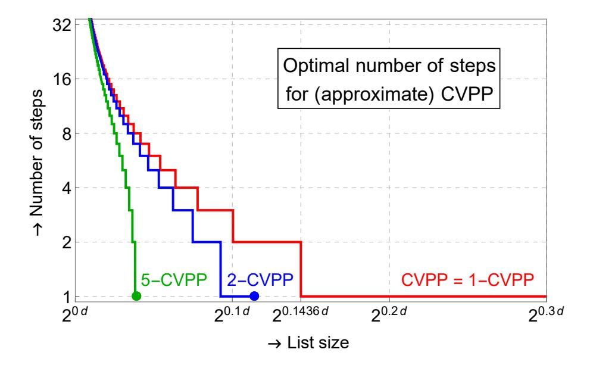

**Fig. 7.** Optimal number of steps n against the list size  $|L| = \alpha^{d+o(d)} = a^{d/2+o(d)}$ . We improve upon DLW whenever n > 1. For large list sizes the optimal number of steps of cost  $\exp(-Cd + o(d))$  drops to 0, as then the success probability of the iterative slicer equals  $2^{-o(d)}$ .

obtain improvements for a < 1.22033. This improvement can also be visualized through Figure 7, which plots the optimal number of steps against the size of the preprocessed list. Whenever the optimal strategy involves taking more than one step, we improve upon DLW. For the crossover points where the number of optimal steps changes we have a more succinct formula for the shortest path and the success probability.

Lemma 7 (Success probability for integral n). If n defined similar to equation (39), but without rounding up, is integral, then the optimal path from b to c has probability

$$\left(\left(\frac{a}{2-a}\right)^n \cdot \left(1 - \frac{2n(a-1)}{2-a}\right)\right)^{d/2 + o(d)}.\tag{44}$$

*Proof.* For such n we obtain the expression  $x_i = b - (i+1) \cdot i \cdot \frac{a^2 - a}{2 - a}$ . The result follows from simplifying the remaining expression.

Using this special case we can easily analyse the success probability in the low-memory regime.

Corollary 3 (Low-memory asymptotics). For a fixed  $\epsilon > 0$  and  $a = 1 + \varepsilon$ , the success probability of the optimal path from b to c equals  $(2e\varepsilon + o(\varepsilon))^{d/2 + o(d)}$ .

The above improves upon the lower bound of (4ε + o(ε))d/2+o(d) of Laarhoven [20]. Using a similar methodology to [20], to obtain a polynomial space complexity a d/2+o(d) = d <sup>Θ</sup>(1) we set ε = Θ( 1 d log d), resulting in a success probability of e − <sup>1</sup> d ln d+o(d ln d) .

We nevertheless stress that drawing conclusions on the iterative slicer efficiency for = o(1) is far from rigorous: first the analysis assumes a space complexity of a d/2+o(d) for a constant a > 1; second, the optimal path now requires an non-constant number of steps, and the o(d) terms in the exponent may accumulate to linear or super-linear terms. To make this more rigorous one would require do a more extensive analysis of the lower order terms.

# 6 Memoryless nearest neighbour searching

Nearest neighbour searching techniques. The main subroutine of the iterative slicer is to find lattice vectors close to a target t in a large list L, also known as the nearest neighbour search problem (NNS). By preprocessing the list and storing them in certain query-friendly data structures, we can find a close vector much faster than through the naive way of going through all vectors in the list. Generally we obtain a trade-off between the size of the NNS data structure (and the time to generate and populate this data structure) and the eventual query complexity of finding a nearest neighbour given a target vector.

A well known technique for finding near neighbours is locality-sensitive hashing (LSH). The idea is that a hash function partitions the space into buckets, such that two vectors that are near neighbours are more likely to fall in the same bucket than a general pair of vectors. Preprocessing then consists of indexing the list L in these buckets, for each of several hash functions. Using a hash table we then perform a quick lookup of all list vectors that lie in the same bucket as our query vector, to find candidate near neighbours. A query t is then answered by searching for a close vector in these buckets, one for each hash function, that corresponds to t. Given the correct parameters this leads to a query time of |L| <sup>ρ</sup>+o(1) for some ρ < 1. More hash functions giving finer partitions can reduce the query time at the cost of extra storage for the required number of hash tables.

Locality-sensitive filters (LSF) were later proposed as a generalization of LSH, where the space is not necessarily partitioned into buckets, but where regions can overlap – some vectors may end up in multiple buckets for one hash function, and some may end up in none of them. Currently the best nearest neighbour complexities for large lists are achieved by using spherical localitysensitive filters [6].

Nearest neighbour search in batches. The drawback of NNS data structures is that it can increase the memory usage significantly. As for the iterative slicer this memory could also be used for a larger list L, and thus giving a higher success probability, the current optimal time-memory trade-offs only spend a small amount of memory on the NNS data structure.

However as already introduced in [7] and later applied in [18], [12] and [6], we can reduce the query time significantly without any extra memory in case we process multiple queries at the same time. Suppose we have |L| targets, then to process all these queries we need as many hash computations as one would need for the precomputation of the list. As a result we could just process each hash function one by one on our list L and our list of targets. We immediately process the list and target vectors that fall in the same bucket. In the end this is equivalent to first preprocessing the list L and then running all queries one by one, however without using more than  $\tilde{O}(|L|)$  memory. So we can achieve low amortized query times for large batches, without using any extra memory.

**Lemma 8 (Batch NNS [6]).** Given a list of size  $|L| = \alpha^{d+o(d)}$  uniformly distributed over  $S^{d-1}$  and a batch of targets of size  $|B| \ge |L|$ , with target dot product  $\langle \mathbf{v}, \mathbf{t} \rangle \ge \sqrt{1-1/a}$ . Then we can solve the nearest neighbour problem with an amortized cost per target of

$$T = \left(a - \frac{2 \cdot (a-1)}{1 + \sqrt{1 - 1/a}}\right)^{-d/2} \tag{45}$$

using only  $\alpha^{d+o(d)}$  space.

Batches from rerandomization. Note that for the randomized slicer we naturally obtain a batch of rerandomized targets of size  $|B| = O(1/\mathbb{P}_{a,c})$ . In the case that the number of rerandomized targets is larger than the list size |L| we could generate and process these targets in batches of |L| at a time, therefore making use of optimal NNS parameters without any extra memory. This idea significantly improves the time-memory trade-off compared to the current state-of-the-art as shown in Figure 4. Also note that in the higher memory regimes where we do not have enough rerandomized targets to do this, we still lower the necessary batch sizes for this technique to work by a factor one over the success probability.

Heuristic claim 6 (Improved memory usage for batch-CVPP with NNS). Suppose we have a list of size  $|L| = \alpha^{d+o(d)}$ , and suppose we are given a batch of at least  $B \gamma$ -CVPP instances, with

$$B = \max(1, \alpha^{d+o(d)} \cdot \mathbb{P}_{a,c}) \tag{46}$$

Then we can heuristically solve this entire batch of  $\gamma$ -CVPP instances with the following amortized complexities per CVPP instance:

$$S = \alpha^{d+o(d)}, \qquad T = \frac{1}{\mathbb{P}_{a,c}} \cdot \left( a - \frac{2 \cdot (a-1)}{1 + \sqrt{1 - 1/a}} \right)^{-d/2 + o(d)}. \tag{47}$$

### 7 Bounded distance decoding with preprocessing

We consider the success probability of the iterative slicer for bounded distance decoding. Instead of assuming that our target lies at distance  $\lambda_1(\mathcal{L})$  of the lattice

we get the guarantee that our target lies at distance  $\delta \cdot \lambda_1(\mathcal{L})$  of the lattice. To incorporate this into our model we start with the same graph G = (V, E) with V = [1, b] and weight function  $w_a$  from Definition 6. However we add a single extra node  $V' = V \cup \{\delta^2\}$  to the graph that represents our goal, i.e. the reduced target t' with norm  $\delta$ .

We have to determine the base-probability of transitioning from a target t of squared norm x to our goal t' of norm at most  $\delta$  using a lattice vector  $v \in L_a$ . Because the reduction vector v = t - t' can assumed to be uniformly distributed over  $\mathcal{B}(t,\delta)$  we obtain the following base-probability of the reduction:

$$\mathbb{P}_{\boldsymbol{v} \in \mathcal{B}(t,\delta)}(\boldsymbol{v} \in L_a)^{2/d} \to \begin{cases} 1, & \text{if } x \leq a - \delta^2, \\ \frac{-x^2 + 2x(\delta^2 + a) - (a - \delta^2)^2}{4x\delta^2}, & \text{if } a - \delta^2 < x < (\alpha + \delta)^2, \\ 0, & \text{otherwise.} \end{cases}$$

as  $d \to \infty$ .

Given the base-probability that we can transition from a target t to our goal t' we extend the weight function on the edges  $(x, \delta^2)$  in the natural way. As before we can now run the numerical approximation algorithm from Section 4.1 to obtain a lower bound on the success probability. The results are shown in Figure 8 and improve on those from [12] in the low-memory regime. We do not see any restrictions for doing an exact analysis for BDDP similar to that of Section 5, but it is out of the scope of this paper. Also we expect these numerical results to be sharp, just as shown in the approximate CVPP case.

In Figure 9 we show the resulting  $\delta$ -BDDP time-memory trade-off with memory-intensive NNS, similar to Figure 3. The memoryless NNS technique from Section 6 could also directly be applied for (batch-)BDDP, to obtain even better amortized complexities. We also note from Figure 9 that, our bound for the time complexity  $\delta$ -BDDP is always smaller than  $\delta'$ -BDDP for  $\delta < \delta'$ , as one would naturally expect. This resolves another mystery left by the analysis of [12], for which this wasn't the case.

We observe that the BDD guarantee does not improve the success probabilities that much, certainly not in the low-memory regime. The iterative slicer algorithm does not seem to fully exploit the BDD guarantee. An explanation for this in the low-memory regime is that only the 'last' step can improve by the BDD guarantee. For all other steps, of which there are many in the low-memory regime, the BDD guarantee does not improve the transition probabilities. Therefore we cannot expect that the algorithm performs significantly better in the low-memory regime with that BDD guarantee than without. An open problem would be to adapt the iterative slicer to make better use of this guarantee.

# 8 Application to graph-based NNS

Besides nearest-neighbour search data structures based on locality-sensitive hashing or filters, as seen in Section 6, there also exists a graph based variant. Although graph based nearest-neighbour data structures have proven to be very

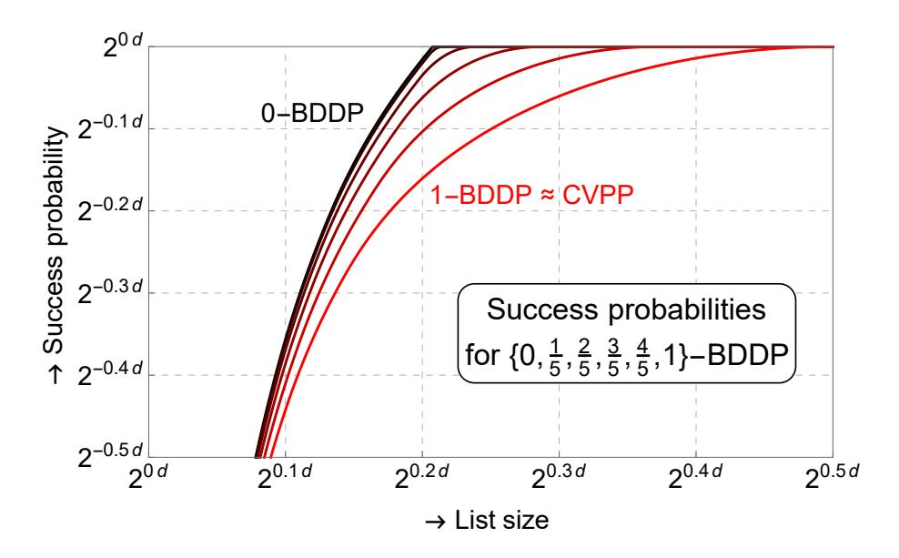

Fig. 8. Success probability of the iterative slicer for δ-BDDP with δ ∈ {0, 0.2, 0.4, 0.6, 0.8, 1}, computed with a discretization parameter of k = 5000.

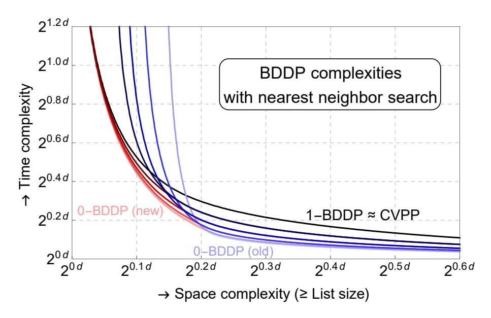

Fig. 9. Time complexities for δ-BDDP with memory-intensive nearest neighbour searching.

efficient in practice [5], the theoretical analysis has only been considered very recently [19, 24]. Preprocessing consists out of constructing a nearest-neighbour graph of the list L and the query phase consists out of a greedy walk on this graph that hopefully ends at the closest vector to the given target.

**Definition 8** ( $\alpha$ -near neighbour graph). Let  $L \subset \mathcal{S}^{d-1}$  and  $\alpha \in (0,1)$ , we define the  $\alpha$ -near neighbour graph G = (V, E) with V = L and  $(\boldsymbol{x}, \boldsymbol{y}) \in E$  if and only if  $\langle x, y \rangle \geq \alpha$ .

Given a target t, the query phase starts at some random node  $x \in L$  of the  $\alpha$ -near neighbour graph. Then it tries to find a neighbour y of x in the graph that lies closer to t. This is repeated until such a closer neighbour does not exist any more or if a close enough neighbour is found. Note that for  $\alpha \approx 0$  this is equivalent to a brute-force algorithm with time O(N), however for larger  $\alpha$  the number of neighbours can be much lower than N, possibly resulting in lower query times.

Just as for the iterative slicer there is no guarantee that the nearest neighbour of t is found. This success probability decreases as the graph becomes sparser, and just as for the iterative slicer we achieve a good probability of answering the query successfully by repeating the algorithm. The rerandomization in this case is achieved by starting the greedy walk at a different node of the graph.

In the context of lattice problems we are mainly interested in NNS in the setting that  $|L| = (4/3)^{d/2}$ , and thus we will focus on that, but our model is certainly not limited by this. In this setting the points in our list are uniformly distributed over the sphere. Laarhoven [19] was the first to formalize the success probability and this resulted in a lower bound using similar techniques as those used for DLW [12]. We show that this lower bound on the success probability is not sharp for all parameters  $\alpha$  and our analysis gives the real asymptotic success probability, again using the random walk model.

In this case the distance measure is taken as the cosine of the angle  $\langle v, t \rangle$  between the vector and the target. Note that in this setting the goal is to find a  $v \in L$  such that  $\langle v, t \rangle \geq \frac{1}{2}$  by greedily walking over the graph, decreasing this angle in each step if possible. Again given  $\alpha$  we have some  $\beta \leq \frac{1}{2}$  such that with high probability we end up at the some  $v \in L$  with  $\langle v, t \rangle \approx \beta$ . So just as in Section 3 the success probability is determined by the highest probable path from  $\beta$  to  $\frac{1}{2}$ . The transition probability from x to y is equal to  $(4/3)^{d/2} \cdot \mathcal{W}(\alpha, y, x)$  [19].

Heuristic claim 7 (Success probability of graph-NNS). Let  $L \subset \mathcal{S}^{d-1}$  be a uniformly distributed list of size  $(4/3)^{d+o(d)}$ . Let  $\alpha \in (0, \frac{1}{2})$  and  $\beta = \max\left(\frac{1}{2}, \sqrt{(1-4\alpha^2)/(5-8\alpha)}\right)$ . Let G = (V, E) be an infinite graph with  $V = [\beta, \frac{1}{2}]$  and weight function

$$w_{\alpha,nns}(x,y) = \min\left(0, -\frac{1}{2}\log\left(\frac{4}{3} - \frac{4}{3} \cdot \frac{\alpha^2 + y^2 - 2\alpha xy}{1 - x^2}\right)\right). \tag{48}$$

Let  $x_0 \to \cdots \to x_n$  be the shortest path in G from  $\beta$  to  $\frac{1}{2}$ , then success probability of a single greedy walk in the  $\alpha$ -near neighbour graph of L is given by

$$\exp\left(-\sum_{i=1}^{n} w_{\alpha,nns}(x_{i-1},x_i)d + o(d)\right). \tag{49}$$

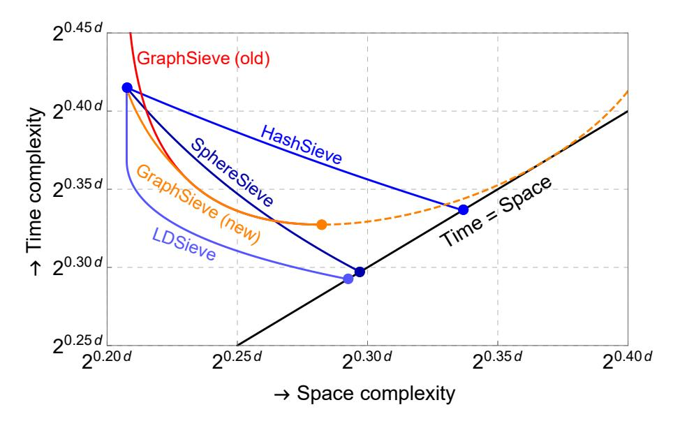

Fig. 10. Asymptotic exponents for heuristic lattice sieving methods for solving SVP in dimension d, using near neighbour techniques.

We do not see major problems in finding an exact solution for the shortest path, but this is out of the scope of this paper. The results from a numerical approximation using the techniques from Section 4 are shown in Figure 10.

# Acknowledgments

The authors thank Elena Kirshanova for pointing out an imprecision in the statement of Lemma 8. Leo Ducas was supported by the European Union H2020 Research and Innovation Program Grant 780701 (PROMETHEUS) and the Veni Innovational Research Grant from NWO under project number 639.021.645. Thijs Laarhoven was supported by a Veni Innovational Research Grant from NWO under project number 016. Veni.192.005. Wessel van Woerden was supported by the ERC Advanced Grant 740972 (ALGSTRONGCRYPTO).

### References

- 1. Miklós Ajtai, Ravi Kumar, and Dandapani Sivakumar. A sieve algorithm for the shortest lattice vector problem. In STOC, pages 601–610, 2001.
- 2. Martin R. Albrecht, Léo Ducas, Gottfried Herold, Elena Kirshanova, Eamonn Postlethwaite, and Marc Stevens. The general sieve kernel and new records in lattice reduction. In *EUROCRYPT*, pages 717–746, 2019.
- 3. Yoshinori Aono and Phong Q. Nguyên. Random sampling revisited: lattice enumeration with discrete pruning. In *EUROCRYPT*, pages 65–102, 2017.

- 4. Yoshinori Aono, Phong Q. Nguyen, and Yixin Shen. Quantum lattice enumeration and tweaking discrete pruning. In ASIACRYPT, pages 405–434, 2018.
- 5. Martin Aum¨uller, Erik Bernhardsson, and Alexander Faithfull. Ann-benchmarks: A benchmarking tool for approximate nearest neighbor algorithms. Information Systems, 2019.
- 6. Anja Becker, L´eo Ducas, Nicolas Gama, and Thijs Laarhoven. New directions in nearest neighbor searching with applications to lattice sieving. In SODA, pages 10–24, 2016.
- 7. Anja Becker, Nicolas Gama, and Antoine Joux. Speeding-up lattice sieving without increasing the memory, using sub-quadratic nearest neighbor search. IACR Cryptology ePrint Archive, 2015:522, 2015.
- 8. Daniel J. Bernstein, Johannes Buchmann, and Erik Dahmen, editors. Postquantum cryptography. Springer, 2009.
- 9. Daniel Dadush and Nicolas Bonifas. Short paths on the voronoi graph and closest vector problem with preprocessing. In Proceedings of the twenty-sixth annual ACM-SIAM symposium on Discrete algorithms, pages 295–314. Society for Industrial and Applied Mathematics, 2015.
- 10. Whitfield Diffie and Martin E. Hellman. New directions in cryptography. IEEE Transactions on Information Theory, 22(6):644–654, 1976.
- 11. Edsger W. Dijkstra. A note on two problems in connexion with graphs. Numerische Mathematik, 1(1):269–271, 1959.
- 12. Emmanouil Doulgerakis, Thijs Laarhoven, and Benne de Weger. Finding closest lattice vectors using approximate Voronoi cells. In PQCrypto, 2019.
- 13. Emmanouil Doulgerakis, Thijs Laarhoven, and Benne de Weger. A lattice enumeration–sieving hybrid for SVP based on batch-CVP. Draft, 2019.
- 14. Ulrich Fincke and Michael Pohst. Improved methods for calculating vectors of short length in a lattice. Mathematics of Computation, 44(170):463–471, 1985.
- 15. Nicolas Gama, Phong Q. Nguyˆen, and Oded Regev. Lattice enumeration using extreme pruning. In EUROCRYPT, pages 257–278, 2010.
- 16. Gottfried Herold and Elena Kirshanova. Improved algorithms for the approximate k-list problem in Euclidean norm. In PKC, pages 16–40, 2017.
- 17. Ravi Kannan. Improved algorithms for integer programming and related lattice problems. In STOC, pages 193–206, 1983.
- 18. Thijs Laarhoven. Sieving for closest lattice vectors (with preprocessing). In SAC, pages 523–542, 2016.
- 19. Thijs Laarhoven. Graph-based time-space trade-offs for approximate near neighbors. In SOCG, 2018.
- 20. Thijs Laarhoven. Approximate Voronoi cells for lattices, revisited. In MathCrypt, 2019.
- 21. Daniele Micciancio and Panagiotis Voulgaris. A deterministic single exponential time algorithm for most lattice problems based on voronoi cell computations. SIAM Journal on Computing, 42(3):1364–1391, 2013.
- 22. Phong Q Nguyen and Thomas Vidick. Sieve algorithms for the shortest vector problem are practical. Journal of Mathematical Cryptology, 2(2):181–207, 2008.
- 23. Chris Peikert. A decade of lattice cryptography. Monograph, 2016.
- 24. Liudmila Prokhorenkova. Graph-based nearest neighbor search: From practice to theory. arXiv:1907.00845 [cs.DS], 2019.
- 25. Ronald L. Rivest, Adi Shamir, and Leonard Adleman. A method for obtaining digital signatures and public-key cryptosystems. Communications of the ACM, 21(2):120–126, 1978.

- 26. Peter W. Shor. Algorithms for quantum computation: discrete logarithms and factoring. In FOCS, pages 124–134, 1994.
- 27. Naftali Sommer, Meir Feder, and Ofir Shalvi. Finding the closest lattice point by iterative slicing. SIAM Journal on Discrete Mathematics, 23(2):715–731, 2009.

# A Sage code for symbolic verification

Sage code for the symbolic verification of the statements in this paper.

```
[1]: var('k','a', 'b', 'c', 'd', 'u', 'v', 'm', 'n', 'x', 'y', 'z')
      p(x,y) = a - (a+x-y)^2/(4*x)
      logp(x,y) = -log(p(x,y))/2
```

# A.1 Lemma (Strict convexity)

We check that the given partial derivatives in the Lemma are correct.

```
[2]: d2x2 = (8*x*p(x,y) + (4*a-2*(a+x-y))^2 - 16*p(x,y)^2)/(2*(4*x*p(x,y))^2)
      dydx = (-8*x*p(x,y)+(4*a-2*(a+x-y))*2*(a+x-y))/(2*(4*x*p(x,y))^2)
      d2y2 = (8*x*p(x,y) + 4*(a+x-y)^2)/(2*(4*x*p(x,y))^2)
      detH = (2*(a+x-y)^4*(4*a*x-(a+x-y)^2))/(1024*x^6*p(x,y)^4)
      print'd2x2 logp correct: ', (d2x2-logp.derivative(x).derivative(x)).is_zero()
      print 'd2y2 logp correct: ', (d2y2-logp.derivative(y).derivative(y)).is_zero()
      print 'dydx logp correct: ', (dydx-logp.derivative(x).derivative(y)).is_zero()
      print 'detH logp correct: ', (detH-d2x2*d2y2+dydx^2).is_zero()
     d2x2 logp correct: True
     d2y2 logp correct: True
     dydx logp correct: True
     detH logp correct: True
```

# A.2 Definition (Explicit Constructions)

We check that the explicit construction indeed satisfies the mentioned properties.

```
[3]: xx(k) = u*k^2 + v*k + b
      ly(x,y,z) = (logp(x,y) + logp(y,z))
      dlydy(x,y,z) = ly(x,y,z).derivative(y)
      sols = solve([dlydy(x=xx(k-1), y=xx(k), z=xx(k+1)) == 0, xx(m) == c], u,v)[0]
      uu = ((b+c-a)*m - sqrt((a*m^2-(b+c))^2+4*b*c*(m^2-1)))/(m^3-m)
      vv = ((a-2*b)*m^2+(b-c)+sqrt((a*m^2-(b+c))^2+4*b*c*(m^2-1))*m)/(m^3-m)
      print 'u correct: ', (sols[0].right()-uu).is_zero()
      print 'v correct: ', (sols[1].right()-vv).is_zero()
      print 'xx(m)==c: ', (xx(m)(u=uu,v=vv)-c).is_zero()
      print 'd/dy (logp(x,y)+logp(y,z)) (x=xx(k-1),y=xx(k),z=xx(k+1))(u=uu,v=vv)==0:
       ,→ ', dlydy(x=xx(k-1),y=xx(k),z=xx(k+1))(u=uu,v=vv).is_zero()
```

```
u correct: True v correct: True xx(m)==c: True d/dy (logp(x,y)+logp(y,z)) (x=xx(k-1),y=xx(k),z=xx(k+1)) (u=uu,v=vv)==0: True
```

#### A.3 Lemma (Valid Construction)

We check that the explicit construction is valid for

$$\frac{b-c}{a} \le n < \frac{1}{2} + \frac{\sqrt{(4b-a)^2 - 8(2b-a)c}}{2a}$$

We first need to verify that  $x_0 - x_1 > 0$ . We do this by rewriting the problem to that of showing that a degree 3 polynomial in n with positive leading coefficient is negative. Our n is between the second and third root and thus we can conclude.

```
[4]: uu_rewritten = ((b+c-a)*m-sqrt(((b+c-a)*m)^2+(a^2*m^2-(b-c)^2)*(m^2-1)))/

              C = (b-c) + (2*b-a)*m
              D = (a*m^2-(b+c))^2+4*b*c*(m^2-1)
              print 'We define C = ', C(m=n), ', and D = ', D(m=n)
              x0subx1 = ((b-c)+(2*b-a)*m - sqrt((a*m^2-(b+c))^2+4*b*c*(m^2-1)))/(m^2+m)
              print 'u == u_rewritten', (uu-uu_rewritten).is_zero()
              print 'x_0 - x_1 = (C-sqrt(D))/(n^2+n)', (xx(0)-xx(1)-(C-sqrt(D))/
                \hookrightarrow (m<sup>2</sup>+m)) (u=uu, v=vv).is_zero()
              DC = ((D-C^2)/m).simplify_full()
              print 'x_0 - x_1 > 0 is equivalent to (D-C^2)/n < 0', '(D-C^2)/n = ', DC(m=n)
              E = sqrt((4*b-a)^2-8*(2*b-a)*c)/(2*a)
              print 'Let E=', E
              print '(D-C^2)/n has zeros n=1/2-E, n=-1, n=1/2+E', (DC(m=1/2-E).is_zero(),...
              \rightarrowDC(m=-1).is_zero(), DC(m=1/2+E).is_zero())
              print 'Because 1/2+E > n >= 2 we have n >= 2 > 1/2-E, so n is between the
               \rightarrowsecond and third root of (D-C^2)/n'
              print 'We conclude that x_0 - x_1 > 0 for all 2 <= n < 1/2+E'
            We define C = -(a - 2*b)*n + b - c, and D = 4*(n^2 - 1)*b*c + (a*n^2 - b - b)*b*c + (a*n^2 - b)*b*c + (a*n^2 - b)*b*c + (a*n^2 - b)*b*c + (a*n^2 - b)*b*c + (a*n^2 - b)*b*c + (a*n^2 - b)*b*c + (a*n^2 - b)*b*c + (a*n^2 - b)*b*c + (a*n^2 - b)*b*c + (a*n^2 - b)*b*c + (a*n^2 - b)*b*c + (a*n^2 - b)*b*c + (a*n^2 - b)*b*c + (a*n^2 - b)*b*c + (a*n^2 - b)*b*c + (a*n^2 - b)*b*c + (a*n^2 - b)*b*c + (a*n^2 - b)*b*c + (a*n^2 - b)*b*c + (a*n^2 - b)*b*c + (a*n^2 - b)*b*c + (a*n^2 - b)*b*c + (a*n^2 - b)*b*c + (a*n^2 - b)*b*c + (a*n^2 - b)*b*c + (a*n^2 - b)*b*c + (a*n^2 - b)*b*c + (a*n^2 - b)*b*c + (a*n^2 - b)*b*c + (a*n^2 - b)*b*c + (a*n^2 - b)*b*c + (a*n^2 - b)*b*c + (a*n^2 - b)*b*c + (a*n^2 - b)*b*c + (a*n^2 - b)*b*c + (a*n^2 - b)*b*c + (a*n^2 - b)*b*c + (a*n^2 - b)*b*c + (a*n^2 - b)*b*c + (a*n^2 - b)*b*c + (a*n^2 - b)*b*c + (a*n^2 - b)*b*c + (a*n^2 - b)*b*c + (a*n^2 - b)*b*c + (a*n^2 - b)*b*c + (a*n^2 - b)*b*c + (a*n^2 - b)*b*c + (a*n^2 - b)*b*c + (a*n^2 - b)*b*c + (a*n^2 - b)*b*c + (a*n^2 - b)*b*c + (a*n^2 - b)*b*c + (a*n^2 - b)*b*c + (a*n^2 - b)*b*c + (a*n^2 - b)*b*c + (a*n^2 - b)*b*c + (a*n^2 - b)*b*c + (a*n^2 - b)*b*c + (a*n^2 - b)*b*c + (a*n^2 - b)*b*c + (a*n^2 - b)*b*c + (a*n^2 - b)*b*c + (a*n^2 - b)*b*c + (a*n^2 - b)*b*c + (a*n^2 - b)*b*c + (a*n^2 - b)*b*c + (a*n^2 - b)*b*c + (a*n^2 - b)*b*c + (a*n^2 - b)*b*c + (a*n^2 - b)*b*c + (a*n^2 - b)*b*c + (a*n^2 - b)*b*c + (a*n^2 - b)*b*c + (a*n^2 - b)*b*c + (a*n^2 - b)*b*c + (a*n^2 - b)*b*c + (a*n^2 - b)*b*c + (a*n^2 - b)*b*c + (a*n^2 - b)*b*c + (a*n^2 - b)*b*c + (a*n^2 - b)*b*c + (a*n^2 - b)*b*c + (a*n^2 - b)*b*c + (a*n^2 - b)*b*c + (a*n^2 - b)*b*c + (a*n^2 - b)*b*c + (a*n^2 - b)*b*c + (a*n^2 - b)*b*c + (a*n^2 - b)*b*c + (a*n^2 - b)*b*c + (a*n^2 - b)*b*c + (a*n^2 - b)*b*c + (a*n^2 - b)*b*c + (a*n^2 - b)*b*c + (a*n^2 - b)*b*c + (a*n^2 - b)*b*c + (a*n^2 - b)*b*c + (a*n^2 - b)*b*c + (a*n^2 - b)*b*c + (a*n^2 - b)*b*c + (a*n^2 - b)*b*c + (a*n^2 - b)*b*c + (a*n^2 - b)*b*c + (a*n^2 - b)*b*c + (a*n^2 - b)*b*c + (a*n^2 - b)*b*c + (a*n^2 - b)*b*c + (a*n^2 - b)*b*c + (a*n^2 - b)*b*
            c)^2
            u == u_rewritten True
            x_0 - x_1 == (C-sqrt(D))/(n^2+n) True
            x_0 - x_1 > 0 is equivalent to (D-C^2)/n < 0 (D-C^2)/n = a^2*n^3 + 2*a*b - 4*b^2
             -2*(a - 2*b)*c - (a^2 - 2*a*b + 4*b^2 + 2*(a - 2*b)*c)*n
            Let E= \frac{1}{2} * sqrt((a - 4*b)^2 + 8*(a - 2*b)*c)/a
            (D-C^2)/n has zeros n=1/2-E, n=-1, n=1/2+E (True, True)
            Because 1/2+E > n >= 2 we have n >= 2 > 1/2-E, so n is between the second and
            third root of (D-C^2)/n
            We conclude that x_0 - x_1 > 0 for all 2 <= n < 1/2+E
```

Next we check that  $x_n - 1 - x_n <= a$  for  $n >= \max(2, (b - c)/a)$ , again by rewriting the equations.

```
[5]: xmsub = ((a - 2*c)*m + b - c + sqrt(a^2*m^4 - 2*(a*b + (a - 2*b)*c)*m^2 +
       ,→b^2 - 2*b*c + c^2))/(m^2 + m)
      eq = (xmsub <= a)
      eq2 = (eq * (m^2+m) - ((a-2*c)*m+b-c))
      print 'x_n-1 - x_n <= a is for n > 1 equivalent to', eq2.left().
       ,→simplify_full()(m=n), '<=', eq2.right().simplify_full()(m=n)
      print 'Using that n<=(b-c)/a and b+c >= 2 >= a the right hand side is
       ,→non-negative, so we can square both sides. Further rewriting gives us'
      eq3 = ((eq2)^2 - ((m^2 + m)*a - (a - 2*c)*m - b + c)^2)/(m*(m+1)*4*c)
      print 'the equivalent statement', eq3.left().simplify_full()(m=n), '<=', eq3.
       ,→right(), 'and we can conclude.'
```

x\_n-1 - x\_n <= a is for n > 1 equivalent to sqrt(aˆ2\*nˆ4 - 2\*(a\*b + (a - 2\*b)\*c)\*nˆ2 + bˆ2 - 2\*b\*c + cˆ2) <= a\*nˆ2 + 2\*c\*n - b + c Using that n<=(b-c)/a and b+c >= 2 >= a the right hand side is non-negative, so we can square both sides. Further rewriting gives us the equivalent statement -a\*n + b - c <= 0 and we can conclude.

# A.4 Theorem (Optimal arbitrary-length paths)

The case *i* < *k* − *n* is easily verified

```
[6]: print 'd/dy (logp(x,y)+logp(y,z))(x=b,y=b,z=b) == -(a-1)/
       ,→(2*b)',(dlydy(x=b,y=b,z=b) - (-(a-1)/(2*b)))(b=a^2/(4*a-4)).is_zero()
```

d/dy (logp(x,y)+logp(y,z))(x=b,y=b,z=b) == -(a-1)/(2\*b) True

For the case i = k-n we first show that *y*<sup>0</sup> − *y*<sup>1</sup> <= *a* <sup>2</sup>/(2*<sup>b</sup>* <sup>−</sup> *<sup>a</sup>*).

```
[7]: Y=m^2+m
      X=a^2/(2*b-a)
      print 'We define X = ', X, ', and Y = ', Y
      print 'y_0-y_1 = (C-sqrt(D))/Y <= X is equivalent to (C-XY)^2 <= D'
      df = ((C-X*Y)^2-D).simplify_full()
      print '(C-XY)^2-D =', df
      print '(C-XY)^2-D is of degree 4 and has roots -1/2-E, -1,0, -1/2+E', df(m=-1/
       ,→2-E).is_zero(), df(m=-1).is_zero(), df(m=0).is_zero(), df(m=-1/2+E).
       ,→is_zero()
      print 'If n>=2 and n>=-1/2+E, than n is larger than all roots, so
       ,→(C-XY)^2-D<=0 because the leading coeff is negative and we can conclude.'
```

We define X = -aˆ2/(a - 2\*b) , and Y = mˆ2 + m y\_0-y\_1 = (C-sqrt(D))/Y <= X is equivalent to (C-XY)ˆ2 <= D (C-XY)ˆ2-D = 4\*((aˆ3\*b - aˆ2\*bˆ2)\*mˆ4 + 2\*(aˆ3\*b - aˆ2\*bˆ2)\*mˆ3 + (aˆ3\*b + aˆ2\*bˆ2 - 6\*a\*bˆ3 + 4\*bˆ4 - 2\*(aˆ2\*b - 3\*a\*bˆ2 + 2\*bˆ3)\*c)\*mˆ2 + 2\*(aˆ2\*bˆ2 - 3\*a\*bˆ3 + 2\*bˆ4 - (aˆ2\*b - 3\*a\*bˆ2 + 2\*bˆ3)\*c)\*m)/(aˆ2 - 4\*a\*b + 4\*bˆ2) (C-XY)ˆ2-D is of degree 4 and has roots -1/2-E, -1,0, -1/2+E True True True ,→True

```
If n>=2 and n>=-1/2+E, than n is larger than all roots, so (C-XY)^2-D<=0 \rightarrow because the leading coeff is negative and we can conclude.
```

[8]: print('We want to show that d/dy (logp(x,y)+logp(y,z))(x=b,y=b,z=b-d) <= 0

Now we show that  $d := y_0 - y_1 \le \min(a^2/(2b-a), b-1)$  is sufficient to show that the partial derivative at i = n - k is non-positive.

```
\hookrightarrow for d <= min(X, b-1)')
F = -(2*a^4 - 4*a^3 - (a^3 - 4*a^2 + 5*a - 2)*d^2 + 2*a^2 - (2*a^4 - 7*a^3 + ...)
 \rightarrow 9*a^2 - 4*a)*d
G = (a^4 - (a^3 - a^2)*d^2 - 2*(a^4 - a^3)*d)
print 'We have d/dy (logp(x,y)+logp(y,z))(x=b,y=b,z=b-d) = F/G with'
print 'F=', F
print 'G=', G
print 'We first show that G > 0. Note that G is decreasing in d>0.'
print 'If a < 4/3, then b>a and thus d <= a^2/(2*b-a) < a^2/(2*a-a) = a.'
print 'We get G \ge G(d=a) > 0 in the interval', solve([G(d=a) > 0], a)[1]
print 'If a >= 4/3, then b<=4/3 and thus d <= b-1 <= 1/3.
print 'We get G \ge G(d=1/3) > 0 in the interval', solve([G(d=1/3) > 0], a)[2]
print 'Note that F is of degree 2 with roots X and a/(a-1)', F(d=X) (b=a^2/a)
 \hookrightarrow (4*a-4)).is_zero(), F(d=a/(a-1)).is_zero()
print 'F has leading coefficient (a^3 - 4*a^2 + 5*a - 2) which is negative.
 \rightarrowin the interval', solve([(a^3 - 4*a^2 + 5*a - 2)<0],a)[1]
print 'As d <= \min(X, b-1) <= \min(X, a/(a-1)) is smaller than both roots in.
 \rightarrowthe interval', solve([a^2/(4*a-4)-1 < a/(a-1)], a)[1], we have F(d) <= 0
 ⇒and we can conclude.'
We want to show that d/dy (logp(x,y)+logp(y,z))(x=b,y=b,z=b-d) <= 0 for d <=
min(X, b-1)
We have d/dy (logp(x,y)+logp(y,z))(x=b,y=b,z=b-d) = F/G with
F = -2*a^4 + 4*a^3 + (a^3 - 4*a^2 + 5*a - 2)*d^2 - 2*a^2 + (2*a^4 - 7*a^3 + ...
9*a^2
- 4*a)*d
G = a^4 - (a^3 - a^2) * d^2 - 2 * (a^4 - a^3) * d
True
We first show that G > 0. Note that G is decreasing in d>0.
If a < 4/3, then b>a and thus d <= a^2/(2*b-a) < a^2/(2*a-a) = a.
We get G >= G(d=a) > 0 in the interval [a > 0, a < (4/3)]
If a >= 4/3, then b<=4/3 and thus d <= b-1 <= 1/3.
We get G >= G(d=1/3) > 0 in the interval [a > 0]
Note that F is of degree 2 with roots X and a/(a-1) True True
F has leading coefficient (a^3 - 4*a^2 + 5*a - 2) which is negative in the
interval [a > 1, a < 2]
As d \le \min(X, b-1) \le \min(X, a/(a-1)) is smaller than both roots in the
interval [a > 1, a < 2*sqrt(3) + 4] we have F(d) <= 0 and we can conclude.
```

# A.5 Proposition (Low-memory asymptotics)

```
[9]: A.<z> = AsymptoticRing(growth_group='z^QQ', coefficient_ring=ZZ);
      a = 1+1/z
      b = a^2/(4*a-4)
      n = -1/2 + sqrt((4*b-a)^2-8*(2*b-a))/(2*a)
      print'asymptotic cost with c=1 as a=1+eps for eps = 1/z -> 0.'
      print'n - 1/(2*eps) + O(1) = ', n - 1/2*z + O(z^0)
      print'So (a/(2-a))^n = ((1+eps)/(1-eps))^(1/(2*eps)) = e + O(eps)'
      print'1-(2*n*(a-1))/(2-a) - 2*eps + O(eps^2) = ', (1-(2*n*(a-1))/(2-a)) - 2/
       ,→z + O(1/z^2)
      print'So success probability ~(2*e*eps)^(d/2)'
     asymptotic cost with c=1 as a=1+eps for eps = 1/z -> 0.
     n - 1/(2*eps) + O(1) = O(1)
     So (a/(2-a))ˆn = ((1+eps)/(1-eps))ˆ(1/(2*eps)) = e + O(eps)
     1-(2*n*(a-1))/(2-a) - 2*eps + O(epsˆ2) = O(zˆ(-2))
     So success probability ~(2*e*eps)ˆ(d/2)
```