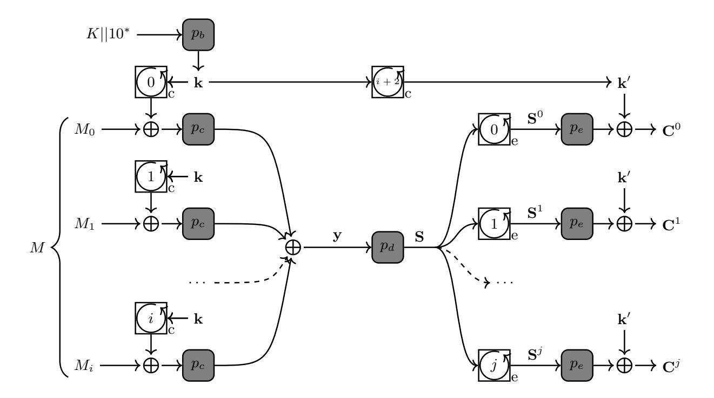
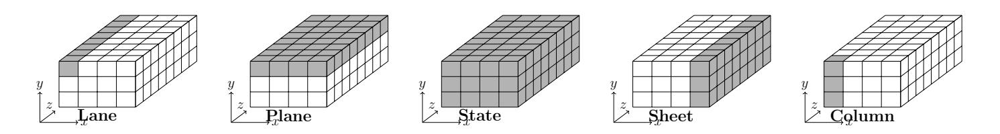

{0}------------------------------------------------

## Algebraic Key-Recovery Attacks on Reduced-Round Xoofff

Tingting Cui1,<sup>2</sup> , Lorenzo Grassi<sup>2</sup>

<sup>1</sup> Hangzhou Dianzi University, Hangzhou, 310018, China <sup>2</sup> Digital Security Group, Radboud University, Nijmegen, The Netherlands Tingting.Cui@ru.nl, l.grassi@science.ru.nl

Abstract. Farfalle, a permutation-based construction for building a pseudorandom function (PRF), is really versatile. It can be used for message authentication code, stream cipher, key derivation function, authenticated encryption and so on. Farfalle construction relies on a set of permutations and on so-called rolling functions: it can be split into a compression layer followed by a two-step expansion layer.

As one instance of Farfalle, Xoofff is very efficient on a wide range of platforms from low-end devices to high-end processors by combining the narrow permutation Xoodoo and the inherent parallelism of Farfalle. In this paper, we present key-recovery attacks on reduced-round Xoofff. After identifying a weakness in the expanding rolling function, we first propose practical attacks on Xoofff instantiated with 1-/2-round Xoodoo in the expansion layer. We next extend such attack on Xoofff instantiated with 3-/4-round Xoodoo in the expansion layer by making use of Meet-in-the-Middle algebraic attacks and the linearization technique. All attacks proposed here – which are independent of the details of the compression and/or middle layer – have been practically verified (either on the "real" Xoofff or on a toy-version Xoofff with block-size of 96 bits). As a countermeasure, we discuss how to slightly modified the rolling function for free to reduce the number of attackable rounds.

Keywords: Farfalle, Xoofff, Xoodoo, Key-Recovery Attacks

## 1 Introduction

Farfalle is an efficiently parallelizable permutation-based construction of a variable input and output length pseudorandom function (PRF) proposed by Bertoni et al. in [2]. It can be seen as the parallelizable counterpart for sponge-based cryptography [4, 6] and duplex constructions [5], which are inherently serial. Similar to sponges, Farfalle is built upon a (composite) primitive and modes on top of it. This primitive is a pseudorandom function (PRF) that takes as input a key and a string (or a sequence of strings), and produces an arbitrary-length output. Its construction involves two basic ingredients: a set of permutations of a b-bit state, and a family of so-called rolling functions used to derive distinct b-bit mask values from a b-bit secret key. The Farfalle construction consists of a compression layer followed by an expansion layer. The compression layer produces a 

{1}------------------------------------------------

single b-bit accumulator value from a tuple of b-bit blocks representing the input data. The expansion layer first (non-linearly) transforms the accumulator value into a b-bit rolling state. Then, it (non-linearly) transforms a tuple of variants of this rolling state – produced by iterating the rolling function – into a tuple of (truncated) b-bit output blocks. Both the compression and expansion layers involve b-bit mask values derived from the key by the key derivation part of the construction.

A first efficient instantiation of the Farfalle construction named Kravatte is specified in [2, 3]. The underlying components are a set of 6-round Keccak-p permutations of a b = 1600-bit state. In general, Kravatte is very fast on a wide range of platforms, but there are some exceptions due to the large width of the permutation. For this reason, in [9, 8] the authors considered instantiating Farfalle with a narrow permutation, yet larger than 256 bits. In there, they propose Xoodoo, a 384-bit permutation with the same width and objectives as Gimli [1].

In this paper, we focus on the deck function Xoofff [9, 8], an instance of Farfalle instantiated with Xoodoo. Here we present key-recovery attacks on Xoofff when it is instantiated with round-reduced Xoodoo in the expansion layer (almost all attacks that we are going to present are independent of the details of the compression/middle layer). Roughly speaking, several strategies can be exploited to set up an attack on a Farfalle scheme:

- working both on the inputs and outputs, one strategy aims to recover the key (input and output mask) by exploiting the relation between them (as in every classical cipher);
- working only on the inputs, one strategy aims to find a pair of inputs which "collide" (that is, that have the same value) before the middle compression function with a probability greater than the birthday-bound one;
- finally, working only on the outputs, one strategy aims to exploit the fact that several outputs are generated from the same unknown input (namely, the output of the middle part) to find the output mask (related to the key), and hence break the scheme.

In this paper, we focus on the last attack strategy. Our results are summarized in Table 1.

#### 1.1 State of the Art

To the best of our knowledge, there is only one key-recovery attack [7] on a Farfalle construction published in the literature. It is an attack on the first version of Kravatte, which differs from the current one for the following facts: (1) the expansion rolling function (namely, the function that maps the output of the middle part to the inputs of the expansion part) was linear and (2) the number of rounds in both of the compression and of the expansion part were only 4 instead of 6.

Two out of the three attacks presented in [7] focus only on the expansion part (they are independent of the compression and of the middle phase), and

{2}------------------------------------------------

Table 1. Key-recovery attacks against Xoofff instantiations for several (nc, nd, ne) values. All attacks are independent of the initial rolling function. We recall that this is a known "output-blocks" attack (namely, the attacker only knows the outputs: she cannot choose them – it is not required to know the input). The computational complexity is measured in number of "elementary operations".

| Type                                   | Rounds:       | Data                             | Time       | Memory    | Ref.      |
|----------------------------------------|---------------|----------------------------------|------------|-----------|-----------|
|                                        | (nc, nd, ne)  | (known outputs) (elementary op.) |            | (bits)    |           |
| MitM                                   | (any, any, 1) | 15                               | 213.5      | –         | Sect. 3   |
| MitM                                   | (any, any, 2) | 73                               | 218.5      | 12<br>2   | Sect. 4   |
| Linearization + MitM (any, any, 2)     |               | 12                               | 228.75     | 19.2<br>2 | Sect. 5.2 |
| Linearization + MitM (any, any, 3)     |               | 11.7<br>2                        | 54.6<br>2  | 36.4<br>2 | Sect. 5.3 |
| Linearization + MitM (any, any, 4)     |               | 28.9<br>2                        | 106.2<br>2 | 70.8<br>2 | Sect. 5.3 |
| Higher-order + Interp.                 | (any, 4, 4)   | 75.2<br>2                        | 90.4<br>2  | 69<br>2   | [14]      |
| Higher-order + Interp.                 | (any, 6, 2)   | 74.2<br>2                        | 90.4<br>2  | 68<br>2   | [14]      |
| Higher-order + Interp. (any, r, 9 − r) |               | 100.4<br>2                       | 106.3<br>2 | 70.8<br>2 | App. E    |

they heavily exploit both the facts that the rolling function is linear and the degree is not high (due to the small number of rounds). Such attacks are the Meet-in-the-Middle (MitM) algebraic attack and the linearization attack:

- in the first case, the idea is to construct a set of equations that describes the final expansion phase. The rolling state and the output masking key are the unknowns of an algebraic system built by forming expressions of the same intermediate state, either by a forward computation from the rolling state, or by a backward computation from the output. The expansion linear mechanism makes it possible to collect enough equations to solve the system by linearization;
- in the second case, the attack exploits the fact that the sequence generated by the linear rolling function (assimilated to a short LFSR state) satisfies a linear recurrence of order far smaller than what is expected from the size of the state.

The third (and last) attack presented in [7] targets both the middle and the expansion part: by exploiting the property of the compression layer, an adversary can construct simple structures of 2<sup>n</sup> n-block input values whose images after the compression layer form an affine subspace of dimension n of {0, 1} b . This fact can be exploited to set up a higher-order differential attack [11]: since a single round of Kravatte has algebraic degree 2, the algebraic degree after r rounds is upper bounded by 2<sup>r</sup> . Hence, given a subspace of dimension n, it is possible to cover (with a zero-sum) at most r rounds of the middle/expansion part if 2<sup>r</sup> < n. The final masking key is derived by inverting the last rounds of the expansion layer, exploiting the fact that each round is a permutation.

After these attacks, the designers of Kravatte updated their designs (1) by increasing the number of rounds of the compression and expansion phases and (2) by replacing the rolling function for the expansion phase with a non-linear one. 

{3}------------------------------------------------

In this way, both the two attacks just recalled can be prevented: e.g., in the first case, the output states of the expanding rolling functions are not related anymore by simple linear relations. This fact has an impact on the complexity of the attacks (and on the number of attackable rounds), since both the degree grows faster and since the attacker cannot collect for free enough algebraic equations that describe the system.

For completeness, we finally mention that a zero-sum distinguisher on the full Xoodoo permutation has been recently presented in [13]. Moreover, the higher-order attack presented in [7] has been re-considered in [14], where the authors apply the same strategy to several schemes including Xoofff.

#### 1.2 Our Contribution

In this paper, we re-consider the Meet-in-the-Middle algebraic attacks presented on the first version of Kravatte to break Xoofff (instantiated with round-reduced Xoodoo in the expansion part).

To prevent the attacks presented in the first version of Kravatte, the designers of Xoofff defined the expanding rolling function via a non-linear function (namely, a NLFSR). Informally, such rolling function has been chosen to guarantee that

- 1. the degree and number of monomials in this ANF grows sufficiently with the number of iterations;
- 2. it must have the fewest number of fixed points (namely, cycles of length one) and more generally short cycles.

In principle, this should prevent possible weaknesses as the ones exploited in the first version of Kravatte. As shown below, this is not completely the case.

Symmetry Property of the State Rolling Function. As our first contribution, we show that a weakness is actually present in the chosen expanding rolling function. Each internal state of Xoofff in  $\mathbb{F}_2^{32\times 4\times 3}$  can be represented as a cube with 32 layers, where each layer is composed of 4 columns and 3 rows. We denote by  $S^3$  the state obtained by applying three times the (expanding) rolling function on a state S: we found that part of the state  $S^3$  is equal to part of the state S. In other words, for each layer, three columns of S have the same values of three columns in  $S^3$  (hence the existence of a linear relation between part of the state S and part of the state  $S^3$ ). Since several operations in the Xoodoo round function works at the column level, such property partially survives after one round for "free".

Key-Recovery Attacks on Xoofff. As our second contribution, we show how to exploit such fact to set up Meet-in-the-Middle algebraic attacks similar to the one presented in Kravatte [7]. In particular, the idea is to set up algebraic equations that cover the final expansion part of Xoofff, where both the rolling state and the output masking key are the unknowns of such algebraic system. By making

{4}------------------------------------------------

use of the linear relations at the inputs of the expansion part (equivalently, at the outputs of the rolling function), we show how to cancel the variables that describe the unknown rolling state S for "free" (similar to what done in the case of a linear rolling function). In order to cover the highest possible number of rounds, we also exploit the low-degree of the  $\chi^{-1}$  function (namely, the non-linear function) of Xoodoo: w.r.t. the Keccak  $\chi$  function used in Kravatte (whose inverse has degree 3), the degree of  $\chi^{-1}$  function used in Xoodoo is only 2. The system of equations is then solved via the linearization approach. As a result, we present an attack on Xoofff in the case in which the final expansion part is composed of 4 out of 6 rounds. All our attacks has been practically verified<sup>3</sup>.

Countermeasures. Finally, we show a possible way to modify the rolling function so as to prevent the weakness previously described: we emphasize that the proposed modification does not influence the number of operations required to compute Xoofff (namely, the number of XORs and ANDs are unchanged).

Outline. In Sect. 2, the specification of Farfalle construction and Xoofff is briefly introduced. Then in Sect. 3 - 4, we propose the practical key-recovery attacks on Xoofff with reduced 1-/2-round Xoodoo respectively, while in Sect. 5 we propose MitM algebraic key-recover attacks on Xoofff with reduce 3-/4-round Xoodoo. At last, we discuss a possible way to fix the weakness in the expanding rolling function (for "free") in Sect. 6.

### 2 Preliminaries

In this section, we briefly recall the description of the permutation-based mode Farfalle and its instantiation Xoofff (based on the permutation Xoodoo). Next, we recall the basic idea of the linearization attack, which we exploit to break Xoofff instantiated with 3-/4-round Xoodoo in the expansion part.

#### 2.1 Farfalle Construction

Farfalle [2] is composed of four permutations  $p_b$ ,  $p_c$ ,  $p_d$ ,  $p_e$  of a n-bit block and two rolling functions  $roll_c$  and  $roll_e$ , depicted as in Figure 1.

We denote the secret key and the message as K and M, respectively. The (j+1)-block output  $C=(C^0,C^1,\ldots,C^j)$  is produced via the following three steps:

- **Mask derivation:** The secret key K is padded into a n-bit string  $K||10^*$ , which is handled by the permutation  $p_b$  as input to yield the masks k for the compression layer and  $k' = roll_c^{i+2}(k)$  for the expansion layer.

The source codes are public available at https://github.com/Tammy-Cui/AttackXoofff

{5}------------------------------------------------



Fig. 1. Farfalle Construction

- Compression layer: The message M is divided into a sequence of i+1 n-bit blocks (where the last block is padded by  $10^*$ ): in the following, we use the notation  $M = (M_0, M_1, \ldots, M_i)$  as well. By first applying the permutation  $p_c$  on each block  $M_i \oplus roll_c^i(k)$ , and then by XORing all results together, the message is compressed into an n-bit value y. This step can be summarized as  $y = \bigoplus_i (p_c(M_i \oplus roll_c^i(k)))$ .
- **Middle layer:** A permutation  $p_d$  is then applied to the unknown y: we denote the output by  $S = p_d(y)$ .
- **Expansion layer:** Finally, a sequence of n-bit data stream  $C^j$ , j = 0, 1, 2, ... is obtained by consecutively applying the rolling function  $roll_e$ , the permutation  $p_d$  and by XORing the corresponding outputs with the mask k'. These two last steps can be summarized as  $C^j = p_e(roll_e^j(S)) \oplus k'$ .

#### 2.2 Specification of Xoofff

Before presenting Xoofff, we first recall some useful notations in Table 2 – the concepts of Lane, Plane, State, Sheet and Column are recalled in Figure 2.



Fig. 2. Toy version of the Xoodoo state (lanes reduced to 8 bits).

{6}------------------------------------------------

Table 2. Notations to describe Xoofff

| $\overline{A[x,y,z]}$ | Bit at coordinate $(x, y, z)$ of intermediate state $A$ ;                   |
|-----------------------|-----------------------------------------------------------------------------|
| $A[x,y]$ or $A_{x,y}$ | Lane $(x, y)$ of intermediate state $A$ ;                                   |
| $A_y$                 | Plane $y$ of intermediate state $A$ ;                                       |
| $A_y \ll (t, v)$      | Cyclic shift of $A_y$ moving bit in $(x, z)$ to position $(x + t, z + v)$ ; |
| $A_{x,y} \ll v$       | Cyclic shift of lane $A_{x,y}$ moving bit from $x$ to position $x + v$ ;    |
| $A_{x,y} \ll v$       | Shift of lane $A_{x,y}$ moving bit from $x$ to position $x + v$ ;           |
| $A_y + A_{y'}$        | Bitwise sum (XOR) of planes $A_y$ and $A_{y'}$ ;                            |
| $A_y \cdot A_{y'}$    | Bitwise product (AND) of planes $A_y$ and $A_{y'}$ ;                        |

### **Algorithm 1:** Round function of Xoodoo $(A \leftarrow R_i(A))$

```
1 \theta: for 0 \le i < 3 do

2 P \leftarrow A_0 \oplus A_1 \oplus A_2;

3 E \leftarrow P \ll (1,5) \oplus P \ll (1,14);

4 A_i \leftarrow A_i \oplus E;

5 \rho_{west}: A_1 \leftarrow A_1 \ll (1,0) \text{ and } A_2 \leftarrow A_2 \ll (0,11);

6 \iota: A_{0,0} \leftarrow A_{0,0} \oplus C_i; // C_i is a 32-bit constant.

7 \chi: for 0 \le i < 3 do

8 A_y \leftarrow A_y \oplus (A_{y+1} \oplus 1) \cdot A_{y+2};

9 \rho_{east}: A_1 \leftarrow A_1 \ll (0,1) \text{ and } A_2 \leftarrow A_2 \ll (2,8);
```

Xoofff [9,8] is a doubly-extendable cryptographic keyed function by applying the Farfalle construction on two rolling functions  $roll_{X_c}$  and  $roll_{X_e}$  and permutation Xoodoo as follows:

```
-p_b = p_c = p_d = p_e = Xoodoo;

-roll_c = roll_{X_c} and roll_e = roll_{X_e}.
```

The rolling function  $roll_{X_e}$  is a Non-linear Feedback Shift Register (NLFSR), and updates a state A in the following way:

$$A_{0,0} \leftarrow A_{0,1} \cdot A_{0,2} \oplus (A_{0,0} \ll 5) \oplus (A_{0,1} \ll 13) + 0 \times 000000007, \ B \leftarrow A_0 \ll (3,0),$$
  
 $A_0 \leftarrow A_1, \qquad A_1 \leftarrow A_2, \qquad A_2 \leftarrow B.$ 

The permutation Xoodoo has totally 6 rounds. Each round is composed of 5 steps: mixing layer  $\theta$ , a west shifting  $\rho_{west}$ , the addition of round constants  $\iota$ , non-linear layer  $\chi$  (where  $\chi(\cdot) = \chi^{-1}(\cdot)$ ) and an east shifting  $\rho_{east}$ . The round function  $R_i$  is specified in Algorithm 1.

#### 2.3 Linearization Attack

Linearization [10] is a well-known technique to solve multivariate polynomial systems of equations. Given a system of polynomial equations, the idea is to turn it into a system of linear equations by adding new variables that replace all the monomials of the system whose degree is strictly greater than 1. This

{7}------------------------------------------------

linear system of equations can be solved using linear algebra if there are enough equations to make the linearized system overdetermined, typically at least on the same order as the number of variables after linearization.

The most straightforward way to linearize algebraic expressions in n unknowns of degree limited by d is just by introducing a new variable for every monomial. By a simple computation, the set of monomials considered has cardinality

$$S(n,d) := \sum_{i=1}^{d} \binom{n}{i}.$$
 (1)

Given x ≤ S(n, d) monomials, the costs of the attack are approximately given by:<sup>4</sup>

- computational cost of O(x <sup>ω</sup>) operations (for 2 < ω ≤ 3);
- memory cost of O(x 2 ) to store x linear equations each one in x variables.

## 3 Distinguisher and Attack on Xoofff (1-Round Xoodoo)

In the following, we use the notation S i to denote the state at the output of the i-th expanding rolling function (where S 0 corresponds to S, which is the state after the middle layer). Moreover, we use the notation S i θ and S i <sup>χ</sup> to denote the state S <sup>i</sup> after θ and χ respectively.

#### 3.1 Symmetry Property of the State Rolling Function

The state rolling function is defined via the following NLFSR: for all i ≥ 0

$$S^{i}[z] = \begin{bmatrix} S^{i}[0, 2, z] & S^{i}[1, 2, z] & S^{i}[2, 2, z] & S^{i}[3, 2, z] \\ S^{i}[0, 1, z] & S^{i}[1, 1, z] & S^{i}[2, 1, z] & S^{i}[3, 1, z] \\ S^{i}[0, 0, z] & S^{i}[1, 0, z] & S^{i}[2, 0, z] & S^{i}[3, 0, z] \end{bmatrix}$$

then

$$S^{i+1}[z] = \begin{bmatrix} S^{i}[1,0,z] & S^{i}[2,0,z] & S^{i}[3,0,z] & S^{i+1}[3,2,z] \\ S^{i}[0,2,z] & S^{i}[1,2,z] & S^{i}[2,2,z] & S^{i}[3,2,z] \\ S^{i}[0,1,z] & S^{i}[1,1,z] & S^{i}[2,1,z] & S^{i}[3,1,z] \end{bmatrix}$$

for a particular S <sup>i</sup>+1[3, 2, z] (see "Specification" for more details).

This particular NLFSR produces a strong connection between S <sup>i</sup> and S i+3 , namely three sheets of S <sup>i</sup> are equal to three sheets of S <sup>i</sup>+3. In particular, the x-th sheet of S <sup>i</sup>+3 is equal to the (x + 1)-th sheet of S <sup>i</sup>+3 for x ∈ {0, 1, 2}.

$$S^{i+3}[z] = \begin{bmatrix} S^{i}[1,2,z] \ S^{i}[2,2,z] \ S^{i}[3,2,z] \ S^{i+3}[3,2,z] \\ S^{i}[1,1,z] \ S^{i}[2,1,z] \ S^{i}[3,1,z] \ S^{i+3}[3,1,z] \\ S^{i}[1,0,z] \ S^{i}[2,0,z] \ S^{i}[3,0,z] \ S^{i+3}[3,0,z] \end{bmatrix}$$

<sup>4</sup> Note that solving a system of x ≥ 1 linear equations in x variables corresponds to compute the inverse of a x × x matrix. Hence, inverting such matrix costs O(x ω ) operations for 2 < ω ≤ 3 (e.g., using the fast Gaussian Elimination algorithm [12] which costs O(x 3 ), while the memory cost to store such matrix is proportional to O(x 2 ).

{8}------------------------------------------------

Since the steps  $\chi$  and  $\theta$  work at the column level, this relation can be used to set up a distinguisher, which will be later exploited for key-recovery attacks. In the following, we will usually omit the variable z so as to simplify the equations/text.

#### 3.2 Secret-Key Distinguisher (1-round Xoodoo)

By a simple computation, it is possible to observe that – for each z – the property just presented partially survives after the linear part of the round:<sup>5</sup>

$$\rho_{west} \circ \theta(S^{i}) = \begin{bmatrix} \star & \star S_{\theta}^{i}[2, 2] S_{\theta}^{i}[3, 2] \\ S_{\theta}^{i}[3, 1] \star & \star S_{\theta}^{i}[2, 1] \\ \star & \star S_{\theta}^{i}[2, 0] S_{\theta}^{i}[3, 0] \end{bmatrix}$$

if and only if

$$\rho_{west} \circ \theta(S^{i+3}) = \begin{bmatrix} \star S_{\theta}^{i}[2,2] & S_{\theta}^{i}[3,2] & \star \\ \star & \star & S_{\theta}^{i}[2,1] & S_{\theta}^{i}[3,1] \\ \star S_{\theta}^{i}[2,0] & S_{\theta}^{i}[3,0] & \star \end{bmatrix}.$$

Note that the last column of  $\rho_{west} \circ \theta(S^i)$  is equal to the third column of  $\rho_{west} \circ \theta(S^{i+3})$ . In the case of  $\iota[2,\cdot] = \iota[3,\cdot]$ , this fact can be exploited to set up a longer distinguisher (indeed,  $\chi$  maps the same input columns to the same output columns). Since  $\iota[x,y,z] = 0$  for each  $(x,y) \neq (0,0)$  and since an entire sheet at the input of  $\chi$  is given, it follows that:

$$S_{\chi}^{i}[3,2] = S_{\chi}^{i+3}[2,2] \text{ and } S_{\chi}^{i}[3,1] = S_{\chi}^{i+3}[2,1] \text{ and } S_{\chi}^{i}[3,0] = S_{\chi}^{i+3}[2,0];$$
 (2)

and

$$S_{\theta}^{i}[2,2] = S_{\theta}^{i+3}[1,2] \text{ and } S_{\theta}^{i}[2,0] = S_{\theta}^{i+3}[1,0] \text{ and } S_{\theta}^{i}[0,1] = S_{\theta}^{i+3}[3,1].$$
 (3)

These equalities will be the starting point for our key-recovery attacks.

## 3.3 Attack on Xoofff Instantiated with 1-round Xoodoo in the Expansion Part

As shown in Sect. 2, one round of Xoodoo is defined as:  $R_K(\cdot) = k \oplus \rho_{east} \circ \chi \circ \iota \circ \rho_{west} \circ \theta(\cdot)$ . Since  $\rho_{east}$  is linear, we swap it with the final mask-addition and we remove it: in the following, the final round will be defined as  $R'_k(\cdot) = k' \oplus \chi \circ \iota \circ \rho_{west} \circ \theta(\cdot)$ .

The idea of the attack is to partially guess the mask k' and exploit the relations among the bits of  $\rho_{west} \circ \theta(S^i)$  and of  $\rho_{west} \circ \theta(S^{i+3})$  to filter wrongly guessed key bits:

$$(S^i, S^{i+3}) \xrightarrow{\iota \circ \rho_{west} \circ \theta(\cdot)} \text{distinguisher} \xleftarrow{\chi(\cdot) = \chi^{-1}(\cdot)}{\text{mask-guessing}} (C^i, C^{i+3}).$$

<sup>&</sup>lt;sup>5</sup> Here we emphasize the relation between  $\rho_{west} \circ \theta(S^i)$  and  $\rho_{west} \circ \theta(S^{i+3})$  by high-lighting the components of  $\rho_{west} \circ \theta(S^i)$  that are also in  $\rho_{west} \circ \theta(S^{i+3})$ . We use the symbol " $\star$ " to denote all other components.

{9}------------------------------------------------

#### **Algorithm 2:** Key-Recovery Attack on Xoofff (1-round Xoodoo)

```
Data: 6 consecutive known output blocks C^0, C^1, ..., C^5
    Result: final mask k' (assuming final \rho_{east} is omitted)
    // In the following, we omit the variable z to simplify the
         equations.
 1 for each z = 0, ..., 31 do
          for each k'[x,y] \in \{0,1\} where x \in \{1,2\} and y \in \{0,1,2\} (2<sup>6</sup>)
 \mathbf{2}
           possibilities) do
               for each i = 0, 1, 2 do
 3
                   if (\chi^{-1}(C^i \oplus k')) [2, 2] \neq (\chi^{-1}(C^{i+3} \oplus k')) [1, 2] then 
 break; (test the next – partially – guessed mask)
 4
  5
                   if (\chi^{-1}(C^i \oplus k')) [2,0] \neq (\chi^{-1}(C^{i+3} \oplus k')) [1,0] then 
 break; (test the next – partially – guessed mask)
 6
 7
          Once k'[x, y] for x \in \{1, 2\} and y \in \{0, 1, 2\} are found:
 8
         k'[3,0] = C^{0}[3,0] \oplus C^{3}[2,0] \oplus k'[2,0];
 9
         k'[3,1] = C^{0}[3,1] \oplus C^{3}[2,1] \oplus k'[2,1];
10
         k'[3,2] = C^{0}[3,2] \oplus C^{3}[2,2] \oplus k'[2,2];
11
         for each k'[0, y] \in \{0, 1\} where y \in \{0, 1, 2\} (2<sup>3</sup> possibilities) do
12
              for each i = 0, 1, 2 do
13
                    if (\chi^{-1}(C^i \oplus k'))[0,1] \neq (\chi^{-1}(C^{i+3} \oplus k'))[3,1] then
14
                      break; (test the next – partially – guessed mask)
15
16 return k'
```

In a similar way, the attack can be mounted by exploiting the relations among the bits of  $\chi \circ \iota \circ \rho_{west} \circ \theta(S^i)$  and the ones of  $\chi \circ \iota \circ \rho_{west} \circ \theta(S^{i+3})$ .

In more detail, for each z, it is possible to set up 32 (independent) systems of 12 equations in 12 variables (namely, the bits of the mask k') of the form

$$\left(\chi^{-1}(C^i \oplus k')\right)[2,2] = \left(\chi^{-1}(C^{i+3} \oplus k')\right)[1,2] \tag{4}$$

$$\left(\chi^{-1}(C^i \oplus k')\right)[2,0] = \left(\chi^{-1}(C^{i+3} \oplus k')\right)[1,0] \tag{5}$$

$$\left(\chi^{-1}(C^i \oplus k')\right)[0,1] = \left(\chi^{-1}(C^{i+3} \oplus k')\right)[3,1] \tag{6}$$

by exploiting the distinguisher presented in Eq. (3), and of the form:

$$\forall j \in \{0, 1, 2\}: \qquad C^{i}[3, j] \oplus k'[3, j] = C^{i+3}[2, j] \oplus k'[2, j] \tag{7}$$

by exploiting the distinguisher presented in Eq. (2).

In order to speed up the attack, we propose to work as follows

- 1. exploiting Eq. (4) (5) (equivalently, working on the columns involving  $S_{\theta}^{i}[2,0], S_{\theta}^{i}[2,2]$ ), find 6 bits of the mask (namely,  $k'(1,\cdot), k'(2,\cdot)$ );
- 2. given  $k'(2,\cdot)$ , note that  $k'(3,\cdot)$  is also given by Eq. (7);
- 3. exploiting Eq. (6), find the last 3 bits of the mask  $k'(0,\cdot)$ .

{10}------------------------------------------------

**Table 3.** Practical results for Xoofff instantiated by 1-round Xoodoo in the expansion part: relation between the number of blocks used for the attack and the success rate of recovering 12 bits of the mask k' for a single fixed z.

| #blocks | success rate | #blocks | success rate |
|---------|--------------|---------|--------------|
| 6       | 13.4%        | 11      | 94.8%        |
| 7       | 44.1%        | 12      | 97.4%        |
| 8       | 70.0%        | 13      | 99%          |
| 9       | 80.7%        | 14      | 99.3%        |
| 10      | 91.5%        | 15      | 99.6%        |

The computational cost is so approximated by

$$32 \cdot \left[\underbrace{2^6 \cdot (1 + 1/2 + 1/4 + 1/8 + 1/16 + 1/32)}_{\text{find } k'(\cdot, 1), k'(\cdot, 2)} + \underbrace{2^3 \cdot ((1 + 1/2 + 1/4))}_{\text{find } k'(\cdot, 0)}\right] \approx 2^{12.2}$$

elementary operations, where note that (1) we work independently on each z (32 in total), (2) in order to filter n bits of the mask, we need to check them against (at least) n equations and (3) when testing one candidate of the mask, the probability that it passes the test is 0.5. The required data of the attack is given by 6 output blocks (in order to set up the necessary equations).

#### 3.4 Experimental Results

We practically implemented Algorithm 2 with 1000 repeated experiments. The results between the number of blocks and success rates to recover 12-bit mask k'[x,y,z], x=0,1,2,3, y=0,1,2 for each z are in Table 3 (note that if we use N output blocks, then we can build N-3 text pairs  $(S^i, S^{i+3})$ ). To recover all 384-bit mask, we need to repeat the same recover-mask process on all 32 possible z. In practice, by 1000 repeated experiments, the success rates to recover the whole mask are 61.8%, 76.6% and 87.3% with 13, 14 and 15 blocks respectively. Hence, more output blocks (than what we predicted before) are actually necessary to find the full mask with a high probability.

Gap between Theoretical and Practical Results. To explain the previous result, note that the following: Checking if  $(\chi^{-1}(C^i \oplus k'))$  [2, 2] is equal or not to  $(\chi^{-1}(C^{i+3} \oplus k'))$  [1, 2] is equivalently to check if

$$(C^{i}[0,2] \oplus k'[0,2]) \oplus (C^{i}[2,2] \oplus k'[2,2]) \oplus (C^{i}[1,2] \oplus k'[1,2]) \cdot (C^{i}[0,2] \oplus k'[0,2]) \neq (C^{i+3}[0,1] \oplus k'[0,1]) \oplus (C^{i+3}[2,1] \oplus k'[2,1]) \oplus (C^{i+3}[1,1] \oplus k'[1,1]) \cdot (C^{i+3}[0,1] \oplus k'[0,1]).$$

It is not hard to check that the bits k'[2,2] and k'[2,1] appear only via their difference (that is,  $k'[2,2] \oplus k'[2,1]$ ): as a result, it is only possible to identify their sum, but not the exact value of k'[2,2] and of k'[2,1]. In a similar way, when checking  $(\chi^{-1}(C^i \oplus k'))[2,0] \neq (\chi^{-1}(C^{i+3} \oplus k'))[1,0]$ , it is only possible

{11}------------------------------------------------

to identify the difference  $k'[0,2] \oplus k'[0,1]$ . At the same time, one can identify k'[0,2] and k'[0,1] using the first condition and k'[2,2] and k'[2,1] using the second one. As shown below, this allows to recover the full mask, but a bigger number of output blocks is necessary.

About the Success Probability. In order to explain the success probabilities of the attack found before, we first present some practical observations.

Note that according to the  $\chi$  operation (remember  $\chi = \chi^{-1}$ ), there are  $2^4$  cases of  $(x_0, x_1, x_2, x'_0, x'_1, x'_2)$  s.t.  $\chi(x_0, x_1, x_2) = (y_0, y_1, y_2)$  and  $\chi(x'_0, x'_1, x'_2) = (y'_0, y'_1, y'_2)$  where  $y_0 = y'_0$  and  $y_2 = y'_2$ . We therefore introduce the sets  $\mathcal{X}_0$  and  $\mathcal{X}_1$ :

$$\mathcal{X}_0 = \{(x_0, x_1, x_2, x_0', x_1', x_2') \in \mathbb{F}_2^6 \mid [\chi(x_0, x_1, x_2)](0) = [\chi(x_0', x_1', x_2')](0) \& \\ \& [\chi(x_0, x_1, x_2)](2) = [\chi(x_0', x_1', x_2')](2) \}.$$

$$\mathcal{X}_1 = \{(x_0, x_1, x_2, x_0', x_1', x_2') \in \mathbb{F}_2^6 \mid [\chi(x_0, x_1, x_2)](1) = [\chi(x_0', x_1', x_2')](1)\}.$$

where [x](i) denotes the *i*-th bit of  $x \in \mathbb{F}_2^3$  and where (only for our goal) the pairs  $((x_0, x_1, x_2), (x'_0, x'_1, x'_2))$  and  $((x'_0, x'_1, x'_2), (x_0, x_1, x_2))$  are not considered to be equivalent.

By practical tests, we found the following:

- The sets A and B are defined as follows:  $A = \{(a_0, a_1, a_2) \in (\mathbb{F}_2^6)^3 \mid \forall i = 0, 1, 2 : a_i \in \mathcal{X}_0\}$  and set  $B = \{(a_0, a_1, a_2) \in (\mathbb{F}_2^6)^3 \mid \exists \ c = (c_0, c_1, c_2, c_3, c_4, c_5) \in \mathbb{F}_2^6 \setminus \{0\} \text{ s.t. } \forall i = 0, 1, 2 : a_i \in \mathcal{X}_0 \text{ and } a_i \oplus c \in \mathcal{X}_0\}.$  The cardinalities of A and B are

$$|A| = 4096$$
 and  $|B| = 2656$   $\rightarrow \frac{|B|}{|A|} \approx 0.648$ . (8)

- The sets A' and B' are defined as follows:  $A' = \{(a_0, a_1, a_2) \in (\mathbb{F}_2^6)^3 \mid \forall i = 0, 1, 2 : a_i \in \mathcal{X}_1\}$  and set  $B' = \{(a_0, a_1, a_2) \in (\mathbb{F}_2^6)^3 \mid \exists \ c = (0, 0, 0, c_0, c_1, c_2) \in \mathbb{F}_2^6 \setminus \{0\} \text{ s.t. } \forall i = 0, 1, 2 : a_i \in \mathcal{X}_1 \text{ and } a_i \oplus c \in \mathcal{X}_1\}.$  The cardinalities of A' and B' are

$$|A'| = 32^3$$
 and  $|B'| = 22016$   $\rightarrow \frac{|B'|}{|A'|} \approx 0.672.$  (9)

These two results allow us to explain what happens in practice. In the first step of the attack, the goal is to recover the 6-bit mask k'[x,y] (where x=1,2 and y=0,1,2) for each z. Note that all  $x^i=(x_0^i,x_1^i,x_2^i,x_0^{ii},x_1^{ii},x_2^{ii})$  must belong to A under right mask, where  $x_y^i=C^i[2,y]\oplus k'[2,y]$  and where  $x_y^{ii}=C^{i+3}[1,y]\oplus k'[1,y]$  for  $i\in\{0,1,2\}$ . If there still exists a wrong mask such that  $x^i\in\mathcal{X}_0$  for each  $i\in\{0,1,2\}$  holds under the same blocks, then  $\{x^0,x^1,x^2\}\in B$ . Hence, according to Eq. (8), the success rate to recover the right 6-bit mask is 1-64.8%=35.2% (in theory). In practice, the success rate is about 35.8% with 1000 experiments.

In the third step, the goal is to recover the last 3-bit mask k'[0, y], y = 0, 1, 2 for each z. Until now, the 3-bit mask k'[3, y] is known. Similar to what happens

{12}------------------------------------------------

in the first step and according to Eq. (9), all wrong masks are filtered with probability 1-67.2%=32.8% (in theory). In practice, the success rate is about 37.5% with 1000 experiments.

It follows that the success probabilities for each step of the attack are:

- for each z: using 6+m output blocks, the probability of success is  $1-(1-0.352)^{m+1}$  in the first step; once the 6 bits of the key are found in step 1 (hence, also the 3 bits of the key are found in step 2 as well with prob. 1), the probability of success of the last step is equal to  $1-(1-0.328)^{m+1}$ . This means that the overall probability to find the full key for each z fixed is  $[1-(1-0.352)^{m+1}] \cdot [1-(1-0.328)^{m+1}] \approx 1-0.648^{m+1}-0.672^{m+1}+0.435^{2m+2} \approx 1-2 \cdot 0.66^{m+1}$ ;
- since all layers z are independent, the overall probability of the attack using 6+m output blocks is  $[1-2\cdot 0.66^{m+1}]^{32}$ .

Thus, using m+6 outputs blocks, the probability of success is greater than prob if  $m \ge \log_{0.66}\left(\frac{1-prob^{1/32}}{2}\right) - 1$  output blocks. E.g., for a theoretical probability of success of 85%, then 19 output blocks are necessary. By practical tests, it turned out that less data (namely, 15 output blocks) is sufficient since – as we saw before – the practical probabilities are a bit greater than the corresponding theoretical values.

Assuming 15 output blocks are sufficient (that is,  $\approx 2.5$ x more data that the theoretical value given in the previous section), it follows that also the computational cost is greater than what we expected by a factor of 2.5.

## 4 Distinguisher and Attack on Xoofff Instantiated with 2-round Xoodoo in the Expansion Part

#### 4.1 First Secret-key Distinguisher

As we have seen in Eq. (2), both due to the weakness in the NLFSR and due to the choice of the round constants, after one complete round (that is, including  $\rho_{east}$ ), the following relation between  $R(S^i)$  and  $R(S^{i+3})$  occurs

$$R(S^{i}) = \begin{bmatrix} \star S_{\chi}^{i}[3,2] \star & \star \\ \star & \star & \star S_{\chi}^{i}[3,1] \\ \star & \star & \star S_{\chi}^{i}[3,0] \end{bmatrix} \quad \Leftrightarrow \quad R(S^{i+3}) = \begin{bmatrix} S_{\chi}^{i}[3,2] \star & \star & \star \\ \star & \star S_{\chi}^{i}[3,1] \star \\ \star & \star S_{\chi}^{i}[3,0] \star \end{bmatrix}.$$

After applying  $\theta$ , we get the following situation:

$$\theta \circ R(S^{i}) = \begin{bmatrix} \star \star \star \star & \star \\ \star \star \star S_{\chi}^{i}[3,1] \oplus \Delta \\ \star \star \star S_{\chi}^{i}[3,0] \oplus \Delta \end{bmatrix} \quad \Leftrightarrow \quad \theta \circ R(S^{i+3}) = \begin{bmatrix} \star \star & \star & \star \\ \star \star S_{\chi}^{i}[3,1] \oplus \Delta' \star \\ \star \star S_{\chi}^{i}[3,0] \oplus \Delta' \star \end{bmatrix}$$

for certain unknowns  $\Delta, \Delta' \in \mathbb{F}_2^{32}$ . Indeed,  $\theta$  adds to each bit on the x-th sheet a given value that depends only on bits in the (x-1)-th sheet. Based on this, a distinguisher can be easily set up:

$$\theta \circ R(S^i)[3,1] \oplus \theta \circ R(S^i)[3,0] = \theta \circ R(S^{i+3})[2,1] \oplus \theta \circ R(S^{i+3})[2,0],$$

{13}------------------------------------------------

which modifies as follows when applying the rotation over the west:

$$\rho_{west} \circ \theta \circ R(S^{i})[0,1] \oplus \rho_{west} \circ \theta \circ R(S^{i})[3,0]$$

$$=\rho_{west} \circ \theta \circ R(S^{i+3})[3,1] \oplus \rho_{west} \circ \theta \circ R(S^{i+3})[2,0].$$
(10)

#### 4.2 Second Secret-Key Distinguisher

Our second distinguisher is based on the "parity". Hence, we first introduce the notion of "parity" and then analyze how it passes through the several operations.

**Definition 1 (Parity).** Let  $X \in \mathbb{F}^{4 \times 3 \times 32}$  be a state of Xoodoo. For each  $0 \le x \le 3$  and for each  $0 \le y \le 2$ , we define the parity of X – denoted by  $\mathfrak{p}(X[x,y])$  or simply  $\mathfrak{p}[x,y]$  – as

$$\mathfrak{p}[x,y] = \bigoplus_{z} X[x,y,z].$$

**Lemma 1.** Given  $t = \theta(s)$ :

$$\begin{bmatrix} t[0,2,z] \ t[1,2,z] \ t[2,2,z] \ t[3,2,z] \\ t[0,1,z] \ t[1,1,z] \ t[2,1,z] \ t[3,1,z] \\ t[0,0,z] \ t[1,0,z] \ t[2,0,z] \ t[3,0,z] \end{bmatrix} = \theta \left( \begin{bmatrix} s[0,2,z] \ s[1,2,z] \ s[2,2,z] \ s[3,2,z] \\ s[0,1,z] \ s[1,1,z] \ s[2,1,z] \ s[3,1,z] \\ s[0,0,z] \ s[1,0,z] \ s[2,0,z] \ s[3,0,z] \end{bmatrix} \right),$$

for each z, then the parity of t[x, y] is equal to the parity of s[x, y]:

$$\forall x \in \{0, 1, 2, 3\}, y \in \{0, 1, 2\}: \quad \mathfrak{p}(s[x, y]) = \mathfrak{p}(t[x, y]).$$

*Proof.* Let  $ss[x, z] := s[x - 1, 2, z] \oplus s[x - 1, 1, z] \oplus s[x - 1, 0, z]$ , then

$$t[x, y, z] = s[x, y, z] \oplus ss[x, z - 5] \oplus ss[x, z - 14].$$

Since  $\bigoplus_z ss[x,z-5] = \bigoplus_z ss[x,z-14]$ , then the parity of t[x,y] is equal to the parity of s[x,y]:  $\mathfrak{p}(s[x,y]) = \mathfrak{p}(t[x,y])$ .

In the following, we analyse how it evolves through a round of Xoodoo.

**Lemma 2.** Given  $z = \chi(s)$  and  $z' = \chi(s')$  where  $s, s' \in \mathbb{F}^{3 \times 32}$  s.t.

- there exist  $i, j \in \{0, 1, 2\}$  where  $i \neq j$  s.t. for each z: s[i, z] = s'[i, z] and s[j, z] = s'[j, z] (that is, the bits in two sheets of s and s' are equal);
- parity is equal:  $\mathfrak{p}(s[x]) = \mathfrak{p}(s'[x])$  for each x;

then 
$$\mathfrak{p}(z[l]) = \mathfrak{p}(z'[l])$$
 where  $l \in \{0, 1, 2\} \setminus \{i, j\}$ .

*Proof.* Since for each z, the i-th and the j-th bits are equal for s and s', then the  $\chi$  function is "linear" in the l-th bit. The result follows immediately.

{14}------------------------------------------------

Distinguisher. Given these properties, we can set up another distinguisher, by re-considering the output of the first round. By applying  $\theta$  and  $\rho_{west}$ , for each z we get:

$$\rho_{west} \circ \theta \circ R(S^i) = \begin{bmatrix} \star & \mathfrak{p}^i[1,2] \star & \star \\ \mathfrak{p}^i[0,1] & \star & \star & \mathfrak{p}^i[3,1] \\ \star & \star & \star & \mathfrak{p}^i[3,0] \end{bmatrix}$$

if and only if

$$\rho_{west} \circ \theta \circ R(S^{i+3}) = \begin{bmatrix} \mathfrak{p}^{i}[1,2] \star \star \star \star \star \\ \star \star \mathfrak{p}^{i}[3,1] \mathfrak{p}^{i}[0,1] \\ \star \star \mathfrak{p}^{i}[3,0] \star \end{bmatrix}.$$

Hence, the following distinguisher holds:

$$\bigoplus_{z=0}^{31} \rho_{west} \circ \theta \circ R(S^i)[1, 2, z] = \bigoplus_{z=0}^{31} \rho_{west} \circ \theta \circ R(S^{i+3})[0, 2, z]. \tag{11}$$

## 4.3 Attack on Xoofff Instantiated with 2-round Xoodoo in the Expansion Part

As before, we use the distinguisher as the starting point for a mask-recovery attack:

$$(S^i, S^{i+3}) \xrightarrow{\iota \circ \rho_{west} \theta \circ R(\cdot)} \text{distinguisher} \xleftarrow{\chi(\cdot) = \chi^{-1}(\cdot)}{\text{mask-guessing}} (C^i, C^{i+3})$$

In order to minimize the overall cost of the attack, we propose to set up it in the way described in detail as follows:

Step 1. In the first step, the attacker finds  $9 \cdot 32 = 288$  bits of the mask (that is, k'[x, y, z] for each z, y and for x = 0, 2, 3) by exploiting the distinguisher presented in Eq. (10). This corresponds to set up a system of equations of the form

$$(\chi^{-1}(C^{i} \oplus k')) [0,1] \oplus (\chi^{-1}(C^{i} \oplus k')) [3,0]$$

$$= (\chi^{-1}(C^{i+3} \oplus k')) [3,1] \oplus (\chi^{-1}(C^{i+3} \oplus k')) [2,0].$$

Hence, for each z, it is sufficient to guess 9 bits of the mask, and filter all wrongly guessed mask using the previous equality. The cost of this step is approximated by  $32 \cdot 2^9 \cdot (1 + 1/2 + ... + 2^{-8}) \approx 2^{15}$  elementary operations, and 18 known output blocks.

{15}------------------------------------------------

#### Algorithm 3: Key-Recovery Attack on Xoofff (2-round Xoodoo)

Data: 73 consecutive known output blocks C 0 , C<sup>1</sup> , ..., C<sup>72</sup> Result: final mask k 0 (assuming final ρeast is omitted) 1 STEP 1: find 288 bits of k 0 [x, y, z]: 2 for each z = 0, 1, ..., 31 do 3 for each k 0 [x, y, z] for each y = 0, 2 and x = 0, 2, 3 (2 <sup>12</sup> possibilities for each z) do 4 for each i = 0, 1, ..., 17 do 5 if χ −1 (C <sup>i</sup> ⊕ k 0 ) [0, 1] ⊕ χ −1 (C <sup>i</sup> ⊕ k 0 ) [3, 0] 6= χ −1 (C <sup>i</sup>+3 ⊕ k 0 ) [3, 1] ⊕ χ −1 (C <sup>i</sup>+3 ⊕ k 0 ) [2, 0] then 6 break; (test the next – partially – guessed mask)

- 7 STEP 2: once k 0 [x, y, z] for each z, y and x = 0, 2, 3 are found, find 64 bits of the mask k 0 [1, y, z] for each z = 0, ..., 31 and for y = 0, 1:
- 8 for each i = 0, 1, . . . , 68 do
- 9 Set up the following system of linear equations:

$$\bigoplus_{z=0}^{31} \left[ \left( \chi^{-1}(C^{i} \oplus k') \right) [1, 2, z] \oplus \left( \chi^{-1}(C^{i+1} \oplus k') \right) [1, 2, z] \right] = \\
\bigoplus_{z=0}^{31} \left[ \left( \chi^{-1}(C^{i+3} \oplus k') \right) [0, 2, z] \oplus \left( \chi^{-1}(C^{i+4} \oplus k') \right) [0, 2, z] \right]$$
(12)

and solve it (via e.g. Gaussian Elimination);

10 STEP 3: to find the last 32 bits of the mask k 0 [2, 1, z] where z = 0, ..., 31, decrypt a complete round and set up a system of linear equations of the form R −1 (C <sup>i</sup> ⊕ k 0 )[1, 2, z] = R −1 (C <sup>i</sup>+3 ⊕ k 0 )[0, 2, z] (remember that χ is linear given ≥ 2 bits of the mask for each column).

11 return k 0

Step 2. In order to find 64 more bits of the mask (namely, k 0 [1, y, z] for each z and for each y = 0, 2), one possibility is to exploit the distinguisher presented in Eq. (11). This allows to set up a system of equations of the form

$$\bigoplus_{z} \left[ (C^{i}[1,0,z] \oplus k'[1,0,z]) \oplus (C^{i}[1,1,z] \oplus k'[1,1,z]) \cdot (C^{i}[1,0,z] \oplus k'[1,0,z]) \oplus \right] \\
\oplus \left( C^{i}[1,2,z] \oplus k'[1,2,z] \right) = \bigoplus_{z} \left[ (C^{i+3}[0,2,z] \oplus k'[0,2,z]) \oplus (C^{i+3}[0,0,z] \oplus k'[0,0,z]) \oplus \right] \\
\oplus \left( C^{i+3}[0,1,z] \oplus k'[0,1,z] \right) \cdot \left( C^{i+3}[0,0,z] \oplus k'[0,0,z] \right) \right]$$

where the r.h.s. is given.

Each one of these quadratic equations involves 96 bits of the mask. Instead of brute forcing all 2<sup>96</sup> possible combinations of k 0 , the idea is to set up a system of linear equations starting from these quadratic equations. To achieve this, note that the coefficients of all quadratic monomials (in the masks) are always equal to 1. Hence, it is sufficient to sum over two different output blocks to eliminate 

{16}------------------------------------------------

all quadratic monomials, getting equations of degree 1 of the form in Eq. (12). This means that n + 4 output (consecutive) blocks are necessary to construct n equations.

Since the coefficients of the monomials that define the linear equations are not independent, it is possible that more than a single solution exists (equivalently, that the matrix corresponding to the linear system of equations is not invertible). As we show in detail in Appendix A, the probability that such 64 equations (which corresponds to 68 output blocks) are linearly independent is approximately 0.29, and at least 61 of them are linearly independent with probability (greater than) 0.89. Hence, by slightly increasing the number of output blocks, it seems possible to find 3 more linearly independent equations with a high probability. By practical tests we found that using 68, 70, 73 output (consecutive) blocks, the probability of success (to find 64 linearly independent equations) is resp. 29.7%, 75.9% and 96.6%.

Step 3. The final step consists of finding the 32 bits of the mask k[1, 1, z]. In order to do this, the idea to set up a system of linear equations is based on the fact that

$$R^{-1}(C^i \oplus k')[1,2,z] = R^{-1}(C^{i+3} \oplus k')[0,2,z]$$

which corresponds to the distinguisher given in Eq. (3).

Note that, since the attacker knows at least two bits of each column of the mask, χ −1 reduces to a linear operation. The cost of this step would be approximately O(32<sup>3</sup> ) = O(215) elementary operations.

Summary. The attack requires ≈ 73 known output blocks, and the cost is approximately given by 2<sup>15</sup> + 2<sup>18</sup> + 2<sup>15</sup> = 5 · 2 <sup>16</sup> ≈ 2 18.3 elementary operations.

#### 4.4 Experimental Results

We practically implement our 2-round attack. Totally, 73 output blocks are needed to get a success probability of finding the correct key greater than 85%. The practical verification works as expected, with the only exception of the first step.

Step 1 (in Theory). As for the case of the attack on 1-round, note that checking if χ −1 (C <sup>i</sup> ⊕ k 0 ) [0, 1]⊕ χ −1 (C <sup>i</sup> ⊕ k 0 ) [3, 0] is equal or not to χ −1 (C <sup>i</sup>+3 ⊕ k 0 ) [3, 1]⊕ χ −1 (C <sup>i</sup>+3 ⊕ k 0 ) [2, 0] corresponds of checking

```
(C
   i
    [0, 2] ⊕ k
                0
                [0, 2]) ⊕ (C
                               i
                                [0, 1] ⊕ k
                                           0
                                            [0, 1]) ⊕ (C
                                                           i
                                                            [0, 2] ⊕ k
                                                                       0
                                                                        [0, 2]) · (C
                                                                                     i
                                                                                      [0, 0] ⊕ k
                                                                                                 0
                                                                                                  [0, 0])⊕
⊕ (C
       i
        [3, 0] ⊕ k
                   0
                    [3, 0]) ⊕ C
                                 i
                                  [3, 1] ⊕ (C
                                                i
                                                 [3, 2] ⊕ k
                                                            0
                                                             [3, 2]) · (C
                                                                          i
                                                                           [3, 1] ⊕ k
                                                                                      0
                                                                                       [3, 1])⊕
⊕ (C
       i+3[3, 2] ⊕ k
                      0
                       [3, 2]) ⊕ C
                                    i+3[3, 1] ⊕ (C
                                                      i+3[3, 2] ⊕ k
                                                                     0
                                                                      [0, 2]) · (C
                                                                                   i+3[3, 0] ⊕ k
                                                                                                   0
                                                                                                    [3, 0])⊕
⊕ (C
       i+3[2, 0] ⊕ k
                      0
                       [2, 0]) ⊕ (C
                                      i+3[2, 1] ⊕ k
                                                     0
                                                      [2, 1]) ⊕ (C
                                                                    i+3[2, 2] ⊕ k
                                                                                    0
                                                                                     [0, 2]) · (C
                                                                                                  i+3[2, 1] ⊕ k
                                                                                                                 0
                                                                                                                  [2, 1]).
```

As before, it is possible to note that the bits k 0 [0, 1] and k 0 [2, 0] appear only via their difference: k 0 [0, 1] ⊕ k 0 [2, 0]. Hence, it is never possible to find all the 288 

{17}------------------------------------------------

bits as expected, but only 288 - 32 = 256. The probability of finding such 256 bits is obviously related to the number of output blocks: by practical tests, such probability is approximately 81% given 17 output blocks, which becomes resp. 94% and 98% using 18 and 19 output blocks.

Step 1 (in Practice): Parity. How to find the last 32 bits before moving to the next step? The idea is to use the parity, that is the fact that

$$\bigoplus_{z=0}^{31} \rho_{west} \circ \theta \circ R(S^i)[3,1,z] = \bigoplus_{z=0}^{31} \rho_{west} \circ \theta \circ R(S^{i+3})[2,1,z].$$

Due to the argument presented before, we expect that 40 output blocks are largely sufficient to find the 32 remaining bits of the key. This is what we also found in practice, where the probabilities of success is 28%, 96% and 100% using 35, 40 and 45 output blocks, respectively. As a result, the computational cost (including this step) increases to  $2^{18.3} + 32^3 = 2^{18.5}$  operations.

# 5 Linearization MitM Attack on Xoofff (Instantiated with 3-/4-round Xoodoo in the Expansion Part)

As the final main result, we present a competitive linearization attack on Xoofff when Xoodoo is reduced to 3-/4-round in the expansion part. This attack is similar to the one already proposed on Kravatte in [7]. Roughly speaking, the goal of the attack is to set up a system of linear equations that describe the analyzed scheme (by adding new variables that replace all the monomials of the system whose degree is strictly greater than 1): by solving such system of equations, the attacker is able to recover the mask k'. The cost of the attack is obviously related to the number of equations and the number of monomials/variables that composed such equations. For more details, we refer to the detailed description of the attack presented in Sect. 2.3.

Our linearization attack exploits both the low-degree of  $\chi^{-1}$  and the symmetry of the rolling function presented before. Compared to the linearization attack on Kravatte presented in [7], we point out some important differences:

- since the rolling function of Xoodoo is non-linear, it is *not* possible to set up a linearization attack from the output of the middle part in the forward direction as in the first version Kravatte: at the same time, we can cover one round for free by exploiting the weakness in the NLFSR;
- one more round in the decryption direction can be covered exploiting the lower degree of  $\chi^{-1}$  of Xoodoo w.r.t. the one of Keccak.

#### 5.1 Idea of the MitM Linearization Attack

The attack proceeds as the ones already presented:

$$(S^i, S^{i+3}) \xrightarrow{R(\cdot)} \text{distinguisher} \xleftarrow{k' \oplus R^{-r}(\cdot)} (C^i, C^{i+3})$$

{18}------------------------------------------------

for  $r \geq 1$ , where:

- the exploited distinguisher is the one given in Eq. (2) which provides 96 bits of information for each pair of known output blocks  $(C^i, C^{i+3})$  (1 more bit of information can be derived by exploiting the parity);
- the mask-recovery part is performed via linearization.

Hence, in the following we limit ourselves to estimate the cost of the attacks by estimating the number of variables.

## 5.2 Attacks on Xoofff Instantiated with 2-round Xoodoo in the Expansion Part

For simplicity, we start with the case in which the expansion part is instantiated by 2-round Xoodoo. In this case, the key-recovery part covers only 1 round. Since one backward round has degree 2 and using Eq. (1), it follows that the number of mask-bits monomials (hence, variables) of degree at most 2 is at most  $\mathcal{S}(384,2) = \sum_{i=1}^{2} {384 \choose i} \approx 2^{16.2}$ . This number is actually only an upper bound of the actual number of variables. Indeed, it would assume that all combinations of degree 2 of the mask-bits are possible. However, this is actually not the case due to the definition of the  $\chi$  function. Indeed, through the backward computation, new monomials are only created in  $\chi^{-1}$  layers through the multiplicative combination of input sum of monomials. Since  $\chi^{-1}$  operates on three input bits only (i.e., one column), the actual number of monomials that one has to face is given by

$$\underbrace{384}_{\text{monomials of degree 1}} + \underbrace{128 \cdot \binom{3}{2}}_{\text{monomials of degree 2}} = 768.$$

Since N known output blocks provides  $96 \cdot (N-3) = 96N-288$  bits of information (namely, equations), it follows that one needs approximately  $\left\lceil \frac{768+288}{96} \right\rceil = 11$  known output blocks, a computational cost of approximately  $\mathcal{O}(768^3) = 2^{28.75}$  elementary operations and a memory cost of  $\mathcal{O}(768^2) = 2^{19.2}$  bits.

## 5.3 Attacks on Xoofff Instantiated with 3-/4-round Xoodoo in the Expansion Part

Considering attacks on more rounds Xoodoo, note that the trick just exploited in the attack on 2-round Xoodoo does not apply anymore, since the input bits of the internal  $\chi^{-1}$  layers have undergone linear diffusion. As a result, the number of monomials cannot be restricted in the same manner. At the same time, the degree limitation still applies: if  $\mathfrak{N}$  monomials can be used to describe the polynomial expressions of all bits before the  $\chi^{-1}$  layer, the number of monomials that appear in the output bits of this layer is upper-bounded by  $\mathcal{S}(\mathfrak{N}, r)$  for r-1 rounds.

{19}------------------------------------------------

3-round. By using the previous considerations, it follows that the number of mask-bits monomials (hence, variables) is given by

$$S(768,2) = \sum_{i=1}^{2} {768 \choose i} \approx 2^{18.2}.$$

Using the previous argumentation, it follows that

- the data cost is approximately of  $\left\lceil \frac{2^{18.2}+288}{96} \right\rceil = 2^{11.7}$  known output blocks;
- the computational cost is approximately given by  $\mathcal{O}\left((2^{18.2})^3\right)\approx 2^{54.6}$  elementary operations;
- the memory cost is approximately given by  $\mathcal{O}\left((2^{18.2})^2\right) \approx 2^{36.4}$  bits.

4-round. By using the previous considerations, it follows that the number of mask-bits monomials (hence, variables) is given by

$$S(2^{18.2}, 2) = \sum_{i=1}^{2} {2^{18.2} \choose i} \approx 2^{35.4}.$$

Using the previous argumentation, it follows that

- the data cost is approximately of  $\left\lceil \frac{2^{35.4}+288}{96} \right\rceil = 2^{28.9}$  known output blocks;
- the computational cost is approximately given by  $\mathcal{O}\left((2^{35.4})^3\right) \approx 2^{106.2}$  elementary operations;
- the memory cost is approximately given by  $\mathcal{O}\left((2^{35.4})^2\right) \approx 2^{70.8}$  bits.

#### 5.4 Experiment Results

We implemented the practical attack on 2-/3-round toy-version Xoofff, in which the state lane is reduced to 8 bits (instead of 32 bits) and the rolling function is slight modified accordingly. The full specification is given in Appendix B.

Practical Attack – 2-round Xoodoo. According to Eq. (1), there are 96+96=192 different monomials in the attack so that N=11 output blocks  $(8\times3\times(N-3)=192)$  are needed in theory. The theoretical number of monomials matches with the practical one, while we found that 12 (instead of 11) output blocks are necessary to recover the right mask. Hence, the theoretical and practical results are almost consistent.

Practical Attack – 3-round Xoodoo. In theory, according to Eq. (1), there are  $S(192,2) = \sum_{i=1}^{2} {192 \choose i} = 18\,080 \approx 2^{14.2}$  mask-bits monomials (variables) so that  $N \approx 757$  output blocks are needed (since  $8 \times 3 \times (N-3) \ge 18\,080$ ). As for the case of 2-round, this theoretical result matches the practical one, where we used 757 output blocks (resulting in  $(757-3) \times 3 \times 8 = 18\,096$  equations and 17 952 different monomials) to successfully recover the right mask.

{20}------------------------------------------------

## 6 Summary and Possible Countermeasures

In this paper, we presented new key-recovery attacks on Xoofff instantiated with a round-reduced Xoodoo permutation in the expansion part (up to 4 rounds). The Meet-in-the-Middle and the linearization attacks that we presented are independent of the details of the compression and middle layers.

As we have seen, the starting point of our attacks is a new symmetry property of the rolling function presented in Sect. 3. In this final section we discuss possible countermeasures to reduce the number of attackable rounds.

Countermeasures. Several ways may be (in principle) possible to achieve the goal of reducing the number of attackable rounds for the attacks presented in this paper, including e.g. changing the layout of the expanding rolling function, changing the round constants, adding a final mask-schedule and so on.

As we show in App. D, the second strategy is useless (for completeness, in App. C we present an attack on Xoofff instantiated by a Xoodoo permutation in the expansion part in which no round constant is added: such attack is independent of the number of rounds of Xoodoo). The third one can be based either on a permutation of the key bits (this would increase the number of variables in the first step of the linearization attack) or it could involve a more complex linear/non-linear function. Since the goal is to set up an efficient scheme, we do not take in consideration this option.

Modification of the State Rolling Function. Probably, the simplest way to "prevent" the attack is by changing the state Rolling function. Among several possibilities, we propose the following: given S <sup>i</sup> as in Eq. (3.1), then S <sup>i</sup>+1 is defined as:

$$S^{i+1}[z] = \begin{bmatrix} S^{i}[1,2,z] & S^{i}[2,2,z] & S^{i}[3,2,z] & S^{i+1}[3,2,z] \\ S^{i}[0,2,z] & S^{i}[0,1,z] & S^{i}[1,1,z] & S^{i}[2,1,z] \\ S^{i}[1,0,z] & S^{i}[2,0,z] & S^{i}[3,0,z] & S^{i}[3,1,z] \end{bmatrix}$$

where S <sup>i</sup>+1[3, 2, z] = S i [1, 0, z] · S i [2, 0, z] ⊕ (S i [0, 0, z] ≪ 5) ⊕ (S i [1, 0, z] ≪ 13) ⊕ 0x00000007 is defined as before.

The crucial point is that the elements are shifted inside the plane in two different directions (left for the first and the third planes, right for the second one). This prevents the fact that certain columns in S i [z] appears with prob. 1 in S i+j [z] for any j ≥ 1. As a result, the attacks presented here work on 1 round less.

Acknowledgment. The symmetry property of the state rolling function presented in Sect. 3.1 has been found by Joan Daemen. Authors thank him for his suggestion to exploit such symmetry property as a possible starting point for key-recovery attacks on the expansion part of Xoofff. Authors also thank Reviewers for their valuable comments, and Kalikinkar Mandal for shepherding this final version of the paper. Lorenzo Grassi and Tingting Cui are supported by the European Research Council under the ERC advanced grant agreement 

{21}------------------------------------------------

under grant ERC-2017-ADG Nr. 788980 ESCADA. Besides that, Tingting Cui is also supported by NSFC Projects (No. 61902100).

## References

- 1. Bernstein, D.J., K¨olbl, S., Lucks, S., Massolino, P.M.C., Mendel, F., Nawaz, K., Schneider, T., Schwabe, P., Standaert, F., Todo, Y., Viguier, B.: Gimli : A Cross-Platform Permutation. In: Cryptographic Hardware and Embedded Systems - CHES 2017. LNCS, vol. 10529, pp. 299–320 (2017)
- 2. Bertoni, G., Daemen, J., Hoffert, S., Peeters, M., Assche, G.V., Keer, R.V.: Farfalle: parallel permutation-based cryptography. IACR Trans. Symmetric Cryptol. 2017(4), 1–38 (2017)
- 3. Bertoni, G., Daemen, J., Hoffert, S., Peeters, M., Assche, G.V., Keer, R.V.: The authenticated encryption schemes Kravatte-SANE and Kravatte-SANSE. Cryptology ePrint Archive, Report 2018/1012 (2018), https://eprint.iacr.org/2018/1012
- 4. Bertoni, G., Daemen, J., Peeters, M., Assche, G.V.: On the Indifferentiability of the Sponge Construction. In: Advances in Cryptology - EUROCRYPT 2008. LNCS, vol. 4965, pp. 181–197 (2008)
- 5. Bertoni, G., Daemen, J., Peeters, M., Assche, G.V.: Duplexing the Sponge: Single-Pass Authenticated Encryption and Other Applications. In: Selected Areas in Cryptography - SAC 2011. LNCS, vol. 7118, pp. 320–337. Springer (2011)
- 6. Bertoni, G., Daemen, J., Peeters, M., Assche, G.V.: Keccak. In: Advances in Cryptology - EUROCRYPT 2013. LNCS, vol. 7881, pp. 313–314 (2013)
- 7. Chaigneau, C., Fuhr, T., Gilbert, H., Guo, J., Jean, J., Reinhard, J.R., Song, L.: Key-Recovery Attacks on Full Kravatte. IACR Transactions on Symmetric Cryptology 2018(1), 5–28 (2018)
- 8. Daemen, J., Hoffert, S., Assche, G.V., Keer, R.V.: The design of Xoodoo and Xoofff. IACR Trans. Symmetric Cryptol. 2018(4), 1–38 (2018)
- 9. Daemen, J., Hoffert, S., Peeters, M., Assche, G.V., Keer, R.V.: Xoodoo cookbook. Cryptology ePrint Archive, Report 2018/767
- 10. Kipnis, A., Shamir, A.: Cryptanalysis of the HFE Public Key Cryptosystem by Relinearization. In: Wiener, M.J. (ed.) Advances in Cryptology - CRYPTO 1999. LNCS, vol. 1666, pp. 19–30. Springer (1999)
- 11. Knudsen, L.R.: Truncated and Higher Order Differentials. In: Preneel, B. (ed.) Fast Software Encryption: Second International Workshop. Leuven, Belgium, 14- 16 December 1994, Proceedings. LNCS, vol. 1008, pp. 196–211. Springer (1994)
- 12. Ko¸c, C¸ .K., Arachchige, S.N.: A Fast Algorithm for Gaussian Elimination over GF(2) and Its Implementation on the GAPP. J. Parallel Distributed Comput. 13(1), 118–122 (1991)
- 13. Liu, F., Isobe, T., Meier, W., Yang, Z.: Algebraic Attacks on Round-Reduced Keccak/Xoodoo. Cryptology ePrint Archive, Report 2020/346 (2020), https://eprint.iacr.org/2020/346
- 14. Zhou, H., Zong, R., Dong, X., Jia, K., Meier, W.: Interpolation Attacks on Round-Reduced Elephant, Kravatte and Xoofff. Cryptology ePrint Archive, Report 2020/781 (2020), https://eprint.iacr.org/2020/781

{22}------------------------------------------------

### A Attack on Xoofff (2-round Xoodoo): Details for Step 2

Here we provide more details regarding the second step of the attack presented in Sect. 4.3.

In such a step, the attacker sets up a system of linear equations in 64 variables. Since the coefficients of the corresponding matrix are (in general) not independent, it is possible that the matrix is not invertible. Hence, more equations are in general necessary so as to have a good probability to find 64 independent linear equations. By practical tests we found that using 68, 70 and 73 output (consecutive) blocks, the probability of success (to find 64 linearly independent equations) is resp. 29.7%, 75.9% and 96.6%.

Here we analyze these probabilities from a theoretical point of view.

**Lemma 3.** If n-bit vectors  $\mathbf{a}_0, \mathbf{a}_1, \dots, \mathbf{a}_{s-1}$  are linearly independent (s < n), then the probability that another random n-bit vector  $\mathbf{a}_s$  is linearly independent with such s vectors is  $\frac{2^n-2^s+1}{2^n} \approx 1-2^{s-n}$ .

*Proof.* The space S spanned by  $\mathbf{a}_0, \mathbf{a}_1, \dots, \mathbf{a}_{s-1}$  involves  $2^s - 1$  (non-null) vectors. As long as  $\mathbf{a}_s$  does not belong to S,  $\mathbf{a}_0, \mathbf{a}_1, \dots, \mathbf{a}_s$  are linear independent. Thus,  $\mathbf{a}_s$  has  $2^n - 2^s + 1$  possible values, which means the probability is  $\frac{2^n - 2^s + 1}{2^n}$ .  $\square$ 

In order to compute  $Prob(\mathbf{a}_0, \mathbf{a}_1, \dots, \mathbf{a}_{63} \text{ linearly independent})$ , we can use the law of total probability. Let  $\{B_n\}_n$  be a finite or countably infinite partition of a sample space. By the law of total probability:  $Prob(A) = \sum_{B_n} Prob(A \mid B_n) \cdot Prob(B_n)$ . For each  $x \geq 1$ , it follows that:

 $Prob(\mathbf{a}_0, \mathbf{a}_1, \dots, \mathbf{a}_x \text{ linearly independent}) =$ = $Prob(\mathbf{a}_0, \mathbf{a}_1, \dots, \mathbf{a}_x \text{ linearly independent} | \mathbf{a}_0, \mathbf{a}_1, \dots, \mathbf{a}_{x-1} \text{ linearly independent}) \times$  $\times Prob(\mathbf{a}_0, \mathbf{a}_1, \dots, \mathbf{a}_{x-1} \text{ linearly independent})$ 

where note that

 $Prob(\mathbf{a}_0, \mathbf{a}_1, \dots, \mathbf{a}_x \text{ linearly independent } | \mathbf{a}_0, \mathbf{a}_1, \dots, \mathbf{a}_{x-1} \text{ linearly dependent}) = 0.$ 

Working iteratively, it follows that  $Prob(\mathbf{a}_0, \mathbf{a}_1, \dots, \mathbf{a}_{63} \text{ linearly independent})$  is equal to

$$\frac{2^{64}-1}{2^{64}}\cdot\frac{2^{64}-3}{2^{64}}\cdot\ldots\cdot\frac{2^{63}+1}{2^{64}}\approx\frac{1}{2}\cdot\frac{3}{4}\cdot\frac{7}{8}\cdot\frac{15}{16}\cdot\ldots\cdot\frac{2^{64}-1}{2^{64}}\approx0.29.$$

This result matches the practical probability we found in our experiments.

It follows that, given 64 equations (which corresponds to 68 output blocks), at least 61 of them are linearly independent with probability (greater than)  $\frac{15}{16} \cdot \ldots \cdot \frac{2^{64}-1}{2^{64}} \approx 88.5\%$ . Also this theoretical result matches the one found in our practical tests.

{23}------------------------------------------------

## B Specification of Toy-Version Xoofff

In this section, we specify the toy-version Xoofff, which is used to verify the linearization MitM attacks on Xoofff with reduced 3-/4-round Xoodoo. The round function of such toy-version Xoodoo is given in Algorithm 4, while the rolling function rollX<sup>e</sup> of the toy-version Xoofff updates a state A in the following way:

$$A_{0,0} \leftarrow A_{0,1} \cdot A_{0,2} \oplus (A_{0,0} \lll 3) \oplus (A_{0,1} \lll 5) \oplus 0 \times 000000007, \ B \leftarrow A_0 \lll (3,0),$$
  
 $A_0 \leftarrow A_1, \qquad A_1 \leftarrow A_2, \qquad A_2 \leftarrow B.$ 

## Algorithm 4: Round function of toy-version Xoodoo (A ← Ri(A))

```
1 θ : for 0 ≤ i < 3 do
```

- <sup>2</sup> A<sup>i</sup> ← A<sup>i</sup> ⊕ [(A<sup>0</sup> ⊕ A<sup>1</sup> ⊕ A2) ≪ (1, 3)] ⊕ [(A<sup>0</sup> ⊕ A<sup>1</sup> ⊕ A2) ≪ (1, 6)];
- <sup>3</sup> ρwest : A<sup>1</sup> ← A<sup>1</sup> ≪ (1, 0) and A<sup>2</sup> ← A<sup>2</sup> ≪ (0, 5);
- 4 ι : A0,<sup>0</sup> ← A0,<sup>0</sup> ⊕ Ci; // C<sup>i</sup> is an 8-bit constant as same as the lsb 8-bit constant used in original Xoodoo.
- 5 χ : for 0 ≤ i < 3 do
- 6 A<sup>y</sup> ← A<sup>y</sup> ⊕ (Ay+1 ⊕ 1) · Ay+2 ;
- <sup>7</sup> ρeast : A<sup>1</sup> ← A<sup>1</sup> ≪ (0, 1) and A<sup>2</sup> ← A<sup>2</sup> ≪ (2, 4);

## C Attack on Full-Round Xoofff without Constants

In this section, we propose an attack on the expansion part of Xoofff where no round constant is present in the round function. Such attack – that can potentially cover any number of rounds – is based on the following property:

Lemma 4. Consider two states S <sup>1</sup> and S 2 that satisfy the property S 1 [x, y, z] = S 2 [x − 1, y, z] for all 0 ≤ x < 4, 0 ≤ y < 3 and 0 ≤ z < 32. After oneround Xoodoo without ι operation, the output C <sup>1</sup> and C 2 still satisfy the property C 1 [x, y, z] = C 2 [x − 1, y, z].

Proof. By working as in the previous sections, note that:

$$\begin{bmatrix} C^1[0,2] \ C[1,2] \ C[2,2] \ C[3,2] \\ C^1[0,1] \ C[1,1] \ C[2,1] \ C[3,1] \\ C^1[0,0] \ C[1,0] \ C[2,0] \ C[3,0] \end{bmatrix} = \rho_{east} \circ \chi \circ \rho_{west} \circ \theta \left( \begin{bmatrix} S^1[0,2] \ S[1,2] \ S[2,2] \ S[3,2] \\ S^1[0,1] \ S[1,1] \ S[2,1] \ S[3,1] \\ S^1[0,0] \ S[1,0] \ S[2,0] \ S[3,0] \end{bmatrix} \right)$$

$$\begin{bmatrix} C[1,2] \ C[2,2] \ C[3,2] \ C^2[3,2] \\ C[1,1] \ C[2,1] \ C[3,1] \ C^2[3,1] \\ C[1,0] \ C[2,0] \ C[3,0] \ C^2[3,0] \end{bmatrix} = \rho_{east} \circ \chi \circ \rho_{west} \circ \theta \left( \begin{bmatrix} S[1,2] \ S[2,2] \ S[3,2] \ S[3,1] \ S[3,1] \ S^2[3,1] \\ S[1,1] \ S[2,1] \ S[3,1] \ S^2[3,1] \\ S[1,0] \ S[2,0] \ S[3,0] \ S^2[3,0] \end{bmatrix} \right).$$

The result follows immediately. ut

{24}------------------------------------------------

Due to the relation between the output of the rolling functions  $S^i$  and  $S^{i+3}$ :

$$S^{i+3} = \begin{bmatrix} S^{i}[1,2] \ S^{i}[2,2] \ S^{i}[3,2] \ S^{i+3}[3,2] \\ S^{i}[1,1] \ S^{i}[2,1] \ S^{i}[3,1] \ S^{i+3}[3,1] \\ S^{i}[1,0] \ S^{i}[2,0] \ S^{i}[3,0] \ S^{i+3}[3,0] \end{bmatrix}.$$

the probability of the event  $S^{i+3}[3,y,z] = S^i[0,y,z]$  for y = 0,1,2 and for each z is equal to  $2^{-96}$ . Hence, given approximately  $3 \cdot 2^{96}$  output blocks, the probability that there exists  $S^i$  and  $S^{i+3}$  that satisfy the previous property is  $1 - (1 - 2^{-96})^{3 \cdot 2^{96}} \approx 1 - e^{-3} \approx 95\%$ : as a result, it is possible to break the scheme.

# D Different Constant Addition (equivalently, $\iota$ ) Operation

One of the weakness exploited to set up the attack is the fact that for each z

$$\rho_{west} \circ \theta(S^{i}) = \begin{bmatrix} \star \star \star S^{i}_{\rho_{west}}[3,2] \\ \star \star \star S^{i}_{\rho_{west}}[2,1] \\ \star \star \star S^{i}_{\rho_{west}}[3,0] \end{bmatrix} \text{ iff } \rho_{west} \circ \theta(S^{i+3}) = \begin{bmatrix} \star \star S^{i}_{\rho_{west}}[3,2] \star \\ \star \star S^{i}_{\rho_{west}}[2,1] \star \\ \star \star S^{i}_{\rho_{west}}[3,0] \star \end{bmatrix}$$

implies

$$\chi \circ \iota \circ \rho_{west} \circ \theta(S^i) = \begin{bmatrix} \star \star \star S_{\chi}^i[3,2] \\ \star \star \star S_{\chi}^i[3,1] \\ \star \star \star S_{\chi}^i[3,0] \end{bmatrix} \text{ iff } \chi \circ \iota \circ \rho_{west} \circ \theta(S^{i+3}) = \begin{bmatrix} \star \star S_{\chi}^i[3,2] \star \\ \star \star S_{\chi}^i[3,1] \star \\ \star \star S_{\chi}^i[3,0] \star \end{bmatrix}$$

since  $\iota[x,y,z] = 0$  for each  $(x,y) \neq (0,0)$ .

What happens if  $\iota[x,y,z] \neq 0$ ? Could this change (by itself) prevent the attack? As shown below, this is not the case.

Indeed, note that

$$\chi \circ \iota \circ \rho_{west} \circ \theta(S^{i})[3,2] = \left(S^{i}_{\rho_{west}}[3,2] \oplus S^{i}_{\rho_{west}}[3,0] \oplus S^{i}_{\rho_{west}}[3,1] \cdot S^{i}_{\rho_{west}}[3,0]\right) \oplus \left(\iota[3,2] \oplus \iota[3,0] \oplus \iota[3,1] \cdot \iota[3,0]\right) \oplus \left(S^{i}_{\rho_{west}}[3,0] \cdot \iota[3,1] \oplus S^{i}_{\rho_{west}}[3,1] \cdot \iota[3,0]\right) \oplus \left(\iota[3,2] \oplus \iota[3,1] \oplus S^{i}_{\rho_{west}}[3,1] \oplus S^{i}_{\rho_{west}}[3,2] \oplus S^{i}_{\rho_{west}}[3,2] \cdot S^{i}_{\rho_{west}}[3,0]\right) \oplus \left(\iota[3,1] \oplus \iota[3,2] \oplus \iota[3,2] \cdot \iota[3,0]\right) \oplus \left(S^{i}_{\rho_{west}}[3,2] \cdot \iota[3,0] \oplus S^{i}_{\rho_{west}}[3,0] \cdot \iota[3,2]\right) \oplus \left(\iota[3,1] \oplus \iota[3,0] \oplus \iota[3,2] \cdot \iota[3,1] \oplus S^{i}_{\rho_{west}}[3,2] \cdot \iota[3,1] \oplus S^{i}_{\rho_{west}}[3,2] \cdot \iota[3,2]\right) \oplus \left(\iota[3,1] \oplus \iota[3,0] \oplus \iota[3,2] \cdot \iota[3,2]\right) \oplus \left(S^{i}_{\rho_{west}}[3,2] \cdot \iota[3,1] \oplus S^{i}_{\rho_{west}}[3,1] \cdot \iota[3,2]\right) \oplus \left(\iota[3,1] \oplus \iota[3,0] \oplus \iota[3,2] \cdot \iota[3,2]\right) \oplus \left(S^{i}_{\rho_{west}}[3,2] \cdot \iota[3,1] \oplus S^{i}_{\rho_{west}}[3,1] \cdot \iota[3,2]\right) \oplus \left(\iota[3,1] \oplus \iota[3,0] \oplus \iota[3,2] \cdot \iota[3,2]\right) \oplus \left(S^{i}_{\rho_{west}}[3,2] \cdot \iota[3,1] \oplus S^{i}_{\rho_{west}}[3,1] \cdot \iota[3,2]\right) \oplus \left(\iota[3,1] \oplus \iota[3,0] \oplus \iota[3,2] \cdot \iota[3,2]\right) \oplus \left(S^{i}_{\rho_{west}}[3,2] \cdot \iota[3,1] \oplus S^{i}_{\rho_{west}}[3,1] \cdot \iota[3,2]\right) \oplus \left(\iota[3,1] \oplus \iota[3,0] \oplus \iota[3,2] \cdot \iota[3,2]\right) \oplus \left(S^{i}_{\rho_{west}}[3,2] \cdot \iota[3,1] \oplus S^{i}_{\rho_{west}}[3,1] \cdot \iota[3,2]\right) \oplus \left(\iota[3,1] \oplus \iota[3,0] \oplus \iota[3,2] \cdot \iota[3,2]\right) \oplus \left(S^{i}_{\rho_{west}}[3,2] \cdot \iota[3,2] \oplus \iota[3,2]\right) \oplus \left(S^{i}_{\rho_{west}}[3,2] \cdot \iota[3,2] \oplus \iota[3,2]\right) \oplus \left(S^{i}_{\rho_{west}}[3,2] \cdot \iota[3,2]\right) \oplus \left(S^{i}_{\rho_{west}}[3,2] \cdot \iota[3,2]\right) \oplus \left(S^{i}_{\rho_{west}}[3,2] \cdot \iota[3,2]\right) \oplus \left(S^{i}_{\rho_{west}}[3,2] \cdot \iota[3,2]\right) \oplus \left(S^{i}_{\rho_{west}}[3,2] \cdot \iota[3,2]\right) \oplus \left(S^{i}_{\rho_{west}}[3,2] \cdot \iota[3,2]\right) \oplus \left(S^{i}_{\rho_{west}}[3,2] \cdot \iota[3,2]\right) \oplus \left(S^{i}_{\rho_{west}}[3,2] \cdot \iota[3,2]\right) \oplus \left(S^{i}_{\rho_{west}}[3,2] \cdot \iota[3,2]\right) \oplus \left(S^{i}_{\rho_{west}}[3,2] \cdot \iota[3,2]\right) \oplus \left(S^{i}_{\rho_{west}}[3,2] \cdot \iota[3,2]\right) \oplus \left(S^{i}_{\rho_{west}}[3,2] \cdot \iota[3,2]\right) \oplus \left(S^{i}_{\rho_{west}}[3,2] \cdot \iota[3,2]\right) \oplus \left(S^{i}_{\rho_{west}}[3,2] \cdot \iota[3,2]\right) \oplus \left(S^{i}_{\rho_{west}}[3,2] \cdot \iota[3,2]\right) \oplus \left(S^{i}_{\rho_{west}}[3,2] \cdot \iota[3,2]\right) \oplus \left(S^{i}_{\rho_{west}}[3,2] \cdot \iota[3,2]\right) \oplus \left(S^{i}_{\rho_{west}}[3,2] \cdot \iota[3,2]\right) \oplus \left(S^{i}_{\rho_{west}}[3,2] \cdot \iota[3,2]\right) \oplus \left(S^{i}_{\rho_{west}}[3,2] \cdot \iota[3,2]\right) \oplus \left(S^{i}_{\rho_{west}}[3,2] \cdot \iota[3,2]\right) \oplus \left(S^{i$$

{25}------------------------------------------------

if and only if

$$\chi \circ \iota \circ \rho_{west} \circ \theta(S^{i+3})[2,2] = \left(S^{i}_{\rho_{west}}[3,2] \oplus S^{i}_{\rho_{west}}[3,0] \oplus S^{i}_{\rho_{west}}[3,1] \cdot S^{i}_{\rho_{west}}[3,0]\right) \oplus \left(\iota[2,2] \oplus \iota[2,0] \oplus \iota[2,1] \cdot \iota[2,0]\right) \oplus \left(S^{i}_{\rho_{west}}[3,0] \cdot \iota[2,1] \oplus S^{i}_{\rho_{west}}[3,1] \cdot \iota[2,0]\right) \\ \chi \circ \iota \circ \rho_{west} \circ \theta(S^{i+3})[2,1] = \left(S^{i}_{\rho_{west}}[3,1] \oplus S^{i}_{\rho_{west}}[3,2] \oplus S^{i}_{\rho_{west}}[3,2] \cdot S^{i}_{\rho_{west}}[3,0]\right) \oplus \left(\iota[2,1] \oplus \iota[2,2] \oplus \iota[2,2] \cdot \iota[2,0]\right) \oplus \left(S^{i}_{\rho_{west}}[3,2] \cdot \iota[2,0] \oplus S^{i}_{\rho_{west}}[3,0] \cdot \iota[2,2]\right) \\ \chi \circ \iota \circ \rho_{west} \circ \theta(S^{i+3})[2,0] = \left(S^{i}_{\rho_{west}}[3,1] \oplus S^{i}_{\rho_{west}}[3,0] \oplus S^{i}_{\rho_{west}}[3,2] \cdot S^{i}_{\rho_{west}}[3,1]\right) \oplus \left(\iota[2,1] \oplus \iota[2,0] \oplus \iota[2,2] \cdot \iota[2,2]\right) \oplus \left(S^{i}_{\rho_{west}}[3,2] \cdot \iota[2,1] \oplus S^{i}_{\rho_{west}}[3,1] \cdot \iota[2,2]\right)$$

Hence, since  $\iota$  is public and known, these 6 output bits depend only on 3 bits. It follows that a distinguisher can still be set up. E.g., by considering

$$\chi \circ \iota \circ \rho_{west} \circ \theta(S^{i})[3,2] \oplus \chi \circ \iota \circ \rho_{west} \circ \theta(S^{i+3})[2,2]$$
$$\chi \circ \iota \circ \rho_{west} \circ \theta(S^{i})[3,1] \oplus \chi \circ \iota \circ \rho_{west} \circ \theta(S^{i+3})[2,1]$$
$$\chi \circ \iota \circ \rho_{west} \circ \theta(S^{i})[3,0] \oplus \chi \circ \iota \circ \rho_{west} \circ \theta(S^{i+3})[2,0]$$

one can get a system of three linear equations in  $S^i_{\rho_{west}}[3,2], S^i_{\rho_{west}}[3,1], S^i_{\rho_{west}}[3,0]$ . Once these 3 values are given, it is sufficient to check them against e.g. the 3 equalities that define  $\chi \circ \iota \circ \rho_{west} \circ \theta(S^i)[3,2], \chi \circ \iota \circ \rho_{west} \circ \theta(S^i)[3,1], \chi \circ \iota \circ \rho_{west} \circ \theta(S^i)[3,0]$ .

In conclusion, changing the round constants cannot prevent the attacks described before.

#### E Higher-Order Differential on Xoofff

Given a function  $f: \mathbb{F}_2^n \to \mathbb{F}_2^n$  of algebraic degree d, consider a subspace  $\mathcal{V} \subseteq \mathbb{F}_2^n$  of dimension greater than d (that is,  $\dim(\mathcal{V}) \geq d+1$ ). For each affine subspace  $\mathcal{V} \oplus v$ , it is possible to show that

$$\bigoplus_{x \in \mathcal{V} \oplus v} f(x) = 0.$$

This is the property used in a higher-order differential attack [11].

The attack that we are going to present resembles the one already presented in [7]. Since  $deg(\chi) = 2$ , the degree after r rounds of Xoodoo is upper bounded by  $2^r$ : since the complexity of the attack cannot be greater than  $2^{128}$ , we can cover at most 6 rounds using the zero-sum property. Hence:

- we construct a subspace of dimension  $2^6 + 1 = 65$ ;
- we exploit the zero-sum to find the key.

{26}------------------------------------------------

#### E.1 Idea of the Attack

Constructing the Subspace  $\mathcal{V}$ . In order to construct the subspace  $\mathcal{V}$ , we just re-use the same strategy proposed in [7, Sect. 4.1]. Given an n-block padded message  $M = (m_0, ..., m_{n-1})$ , let Acc(M) be the associated accumulator value  $\bigoplus_i p_c(m_i \oplus k_i^{in})$ . Let  $M^0 = (m_0^0, ..., m_{n-1}^0)$  and  $M^j = (m_0^1, ..., m_{n-1}^1)$  denote an arbitrary pair of padded messages such that  $m_l^0 \neq m_l^1$  for all l. We define the following structure of  $2^n$  n-block messages:

$$\mathcal{V} \oplus v = Acc(M^0) \oplus \langle \delta_0, ..., \delta_n \rangle$$

where for each i:

$$\delta_i = p_c(m_i^0 \oplus k_i^{in}) \oplus p_c(m_i^1 \oplus k_i^{in}).$$

As showed in [7, Sect. 4.1],  $\delta_i$  are linearly independent with overwhelming probability if  $n \ll b = 384$  (independently of  $p_c(\cdot)$ ).

Finding the Key. Given V, the strategy of the attack is to construct a system of equations that describe the last r rounds (where the final mask k' is the variable) and solve it:

$$\mathcal{V} \oplus v \xrightarrow{R^6(\cdot)} \text{zero-sum} \xleftarrow{k' \oplus R^{-r}(\cdot)} \text{corresponding output blocks } \{C^i\}_i$$

Note that the same output mask k' is used in each output block: hence, the number of variables is independent of the number of considered output blocks. In order to solve the system, the idea is to use the linearization technique described before.

#### E.2 Cost of the Attack

In order to set up the attack, we just re-use the results presented in Sect. 5. In a linearization attack on 3-round Xoodoo, the number of variables in the system is upper bounded by  $2^{35.4}$ . Hence:

- at least,  $2^{35.4} \cdot 2^{65}$  pairs of input/output blocks are necessary to construct the system of equations to solve, for a total cost of  $2^{35.4} \cdot 2^{65} \cdot 2 = 2^{100.4}$  input/output blocks;
- the cost to construct the system of equations is given by  $2^{100.4}$  XORs;
- the cost to solve the system of equations is given by  $\mathcal{O}\left((2^{35.4})^3\right) = 2^{106.2}$  operations and a memory cost of  $\mathcal{O}\left((2^{35.4})^2\right) = 2^{70.8}$  bits.

Hence, the overall cost of the attack is approximately given by  $2^{100.4} + 2^{106.2} \approx 2^{106.3}$  operations.